JOURNAL OF LAT X CLASS FILES, VOL. 11, NO. 11, 1111 1111

# Dynamic Grouping of Heterogeneous UAVs under Complex Sequential Tasks: A Joint Switch Coalition Formation Game Approach

Zhongkun Li, Weiguo Xia, Shaoqing Zhang

Abstract—In this paper, we propose a joint switch coalition formation game (JSCFG) model, which optimizes the communication topology of a heterogeneous unmanned aerial vehicle (UAV) swarm via dynamic grouping. This approach effectively overcomes the limitations inherent in existing coalition formation game (CFG) models with basic task requirement constraints and eliminates inefficient communication links. Specifically, we propose a joint switch common improvement (JSCI) preference order by accounting for the dynamic attributes of UAVs, iteratively update the coalition structure to the near-optimal solution through successive joint switch operations. Furthermore, we prove the existence of Nash equilibrium solutions under the proposed preference order using the exact potential game (EPG). We also develop a basic coalition structure formation algorithm (BCSFA), which preprocesses the heterogeneous UAV swarm through a sequential greedy selection strategy, effectively reducing the computational complexity in initial iteration. Finally, a joint switch coalition formation algorithm (JSCFA) is proposed to generate the final Nash-stable coalition structure based on established joint switch rules. Numerical results underscore the effectiveness of dynamic grouping and further illustrate that the JSCFA has greater efficiency in coalition formation compared to the state-of-the-art algorithms.

Index Terms—unmanned aerial vehicles, topology optimization, dynamic grouping, coalition formation game.

## I. INTRODUCTION

W ITH the increasing complexity of tasks, the collabora- tive efforts of heterogeneous unmanned aerial vehicle (UAV) swarms can significantly enhance the reliability of task execution in unknown information environments [1]-[2]. In this process, multiple heterogeneous UAVs are deployed to a designated task area based on prior environmental data. Each UAV is assigned a path aligned with its functional characteristics, enabling timely and efficient responses to task demands. This strategy is particularly evident in operations such as search-attack missions [3]-[4] and search-rescue missions in nature zones [5]-[6]. However, as the number of UAVs in a swarm increases, the communication quality tends to deteriorate significantly. To address this, current approaches primarily focus on improving the communication efficiency of largescale heterogeneous UAV swarms through task assignment [7]- [8], bandwidth and channel communication resource allocation [9]-[10], congestion control [11]-[12] and power control [13]- [14]. Despite these efforts, frequent information exchanges during sensitive missions pose significant security risks to UAVs, which cannot be fully mitigated by the aforementioned optimization strategies. Therefore, this paper proposes a dynamic grouping approach to optimize communication topology while eliminating inefficient communication links through secure communication rules, ensuring both basic task requirements and security constraints for each UAVs group.

The core concept of dynamic grouping is to divide the heterogeneous UAV swarm into multiple communication groups under initial topological constraints, which meet basic task requirements without re-planning the predetermined navigation paths. Specifically, the basic task execution requirement defines the minimum number of each aircraft type needed to perform a given task. Each group is evaluated according to specific performance indicators, and through member switch between different communication groups iteratively to get a stable group structure. Similarly, this process parallels the coalition formation game (CFG) with player transition rules, and the coalition structure of CFG is adjusted through switch operations of players to enhance either individual or collective benefits [15]-[16]. However, the limitation of the CFG is that a single player only switches between two different groups at a time, which can lead to low efficiency when the number of players increases and and the constraints become more complex. Based on this, we propose a multi-UAV joint switch coalition formation game (JSCFG) model to broaden the applicability of the CFG, and successfully optimize dynamic grouping communication topology under task requirements and the resource constraints.

## A. Related Work

Recently, the CFG has been extensively utilized for task assignment within large-scale heterogeneous UAV swarms to enhance the communication performance [17]-[25]. Due to the diversity in UAV capabilities, heterogeneous UAV swarms can be formally categorized into single-performance UAV collaboration and multi-performance UAV collaboration.

JOURNAL OF LATEX CLASS FILES, VOL. 11, NO. 11, 1111 1111

Among them, multi-performance UAV are more commonly employed, while single-performance UAVs are particularly valuable in enhancing fault tolerance in high-risk operations. In [17], a sequential overlapping coalition formation game algorithm is introduced, leveraging the complementary relationship between UAV functionalities and task execution sequences in networks of UAVs equipped with varied resources. Additionally, the energy consumption of UAVs is also integrated into the task scheduling [18]. For hazardous search missions, a task-driven cooperative reconnaissance scheme for heterogeneous UAV networks is proposed in [19] based on the CFG, and demonstrating the feasibility of forming stable reconnaissance coalitions. To ensure reliable task execution after locking targets, a reputation-based leader-follower single performance heterogeneous coalition formation framework is proposed in [20], which can monitor the cooperative behavior of UAVs to eliminate potential untrustworthy UAVs. Meanwhile, UAV networks are also pivotal in data collection tasks, especially under conditions of incomplete information. In [21], a Bayesian coalition game simulates interactions between uncertain tasks and UAVs during coalition formation, incorporating a belief-updating mechanism to estimate the probability distribution of tasks within potential coalition ranges across diverse environments. Furthermore, the aggregate transmission rate in UAV networks serves as a quantitative metric to evaluate task coalition efficacy under information uncertainty [22]. Notably, communication relay constitutes a pressing challenge in large-scale UAV networks. In [23], a joint auction coalition formation framework is proposed to address relay node task assignment within UAV clusters. Concurrently, the authors in [24] formulate the channel competition among relay UAVs as a congestion game and model task-driven relay selection as an irreplaceable many-to-many matching market, achieving global transmission enhancement through localized optimization. For adversarial jamming scenarios, a dynamic task assignment algorithm based on the CFG is developed in [25] for jamming UAVs, achieving both long-range communi cation relay and core node security preservation.

In addition, the CFG framework demonstrates superior performance in optimizing communication network resources, particularly in resolving critical allocation challenges involving spectrum, bandwidth, and channel dimensions [26]-[34]. For spectrum allocation, an overlapping coalition formation game model is established in [27] to coordinate spectrum resource distribution and relay selection. This approach generates coalition structures with high transmission rates through a distributed algorithm exhibiting low computational complexity. In [28], a distributed game optimization framework is proposed to solve the task driven spectrum allocation problem. The bandwidth allocation challenge in UAV-assisted IoT networks is systematically addressed in [29], where a Stackelberg game framework is formulated to optimize bandwidth partitioning between UAVs and the base stations. [30]- [31] ensure maximal energy efficiency in bandwidth allocation through Nash equilibrium solutions, and [32] innovatively proposes a coalition formation strategy for channel allocation achieving system throughput maximization. Furthermore, the joint optimization of subchannel allocation and power control is theoretically guaranteed in [33]-[34]. These coordinated strategies collectively highlight the inherent advantages of CFG-based approaches in addressing optimization challenges in complex communication networks.

When executing high-risk tasks such as search-attack in uncertain information environments, excessive information exchange may escalate exposure risks and compromise task reliability. Consequently, recent research efforts [24],[35] have focused on communication network optimization through topological transformations under such operational constraints. A more pragmatic approach involves segmenting the UAV swarm into multiple groups for distributed task execution via clustering [36]-[37], followed by dynamic communication topology updates based on mission-specific characteristics. However, the intrinsic agile dynamics of UAVs pose fundamental challenges to swarm grouping stability and mission efficacy. It is worth emphasizing that when applying the CFG to optimize the communication network of heterogeneous UAV swarms, conventional Pareto order and Selfish order exhibit excessive extremism and susceptibility to local optima convergence. To facilitate appropriate switch operations, a bilateral mutual benefit transfer order is proposed in [17], and a coalition expected altruistic order is proposed in [19]. Nevertheless, these conventional orders demonstrate limited applicability in dynamic scenarios with fundamental mission constraints and resource limitations, and switching operations between two groups by a single player will not guarantee global stability. Therefore, a reasonable preference order for different problems can significantly improve the effectiveness and flexibility of switch operations in the CFG.

## B. Contributions and Organization

This paper is dedicated to updating communication topology of heterogeneous UAV swarms through a CFG-based dynamic grouping mechanism, while systematically investigating the joint synchronous switching operations of multiple players across multiple coalitions under basic task constraint condi tions. Specifically, we model the dynamic grouping problem as a JSCFG and develop dual evaluation metrics: dynamic performance indicators for quantifying coalition structure utility and static performance indicators for characterizing coalition member properties. Furthermore, we introduce an efficient joint switch order to guide multiple UAVs within multiple coalitions to perform synchronous switch operations. Finally, we propose a basic coalition formation algorithm and a joint switch coalition formation algorithm to quickly establish a high-utility coalition structure. The main contributions of this paper are summarized as follows:

We formulate a joint switch coalition formation game (JSCFG) model to address the dynamic grouping problem in heterogeneous UAV swarms. The utility function is strategically designed by integrating four critical metrics: the group cohesion indicator, the structural stability indicator, the member cardinality indicator, and the coalition overlapping indicator, thereby ensuring the structural effectiveness of coalitions.

• To achieve near-optimal coalition structures in scenarios involving multi-coalition switching behaviors of UAV players, a joint switch common improvement (JSCI) preference order is proposed. The existence of Nash equilibrium solutions is proven through the exact potential game (EPG).

• For rapid initialization of coalition structures upon grouping signal reception, a basic coalition structure formation algorithm (BCSFA) is developed. This algorithm systematically reduces computational complexity by employing a hierarchical greedy selection strategy that sequentially aggregates UAVs across task layers based on sub-task priorities.

• An efficient joint switch coalition formation algorithm (JSCFA) is proposed to generate Nash-stable coalition structures for dynamic grouping. Extensive numerical simulations validate the superiority of the proposed algorithms in terms of convergence speed, stability, and grouping efficiency.

The rest of this paper is organized as follows: the characteristics of heterogeneous UAVs and complex sequential tasks and problem formulation are described in Section 2. Section 3 provides a detailed description of the JSCFG model. The proposed BCSFA and JSCFA are introduced in Section 4. Then, the numerical simulations are presented in Section 5. Section 6 concludes the paper.

## II. PROBLEM FORMULATION

In this section, we first describe the characteristics of heterogeneous UAV swarms and complex sequential tasks. Subsequently, we introduce the proposed dynamic indicators of group stability and static indicators of group scale, which are employed to evaluate the overall performance of the grouping. Finally, a basic optimal model for dynamic grouping is proposed to ensure operational consistency under complex mission constraints.

## A. System Model

In the task area, there are $Z$ types of UAVs for collaborative execution of complex tasks, and the number of each type UAV $U _ { z }$ is $N _ { z }$ and $\textstyle \sum _ { z = 1 } ^ { Z } N _ { z } = N$ . To simplify the analysis, the set of heterogeneous UAVs is defined by $\mathcal { U } = \{ U _ { 1 , 1 } , \cdot \cdot \cdot , U _ { 1 , N _ { 1 } } , \cdot \cdot \cdot , U _ { Z , 1 } , \cdot \cdot \cdot , U _ { Z , N _ { Z } } \}$ . The communication network topology among UAVs is characterized by a graph $G = ( \nu , \mathcal { E } )$ , where V denotes the set of N UAV nodes and E represents the set of communication edges between the UAVs. The information characteristics of each UAV at time l are defined by the following triplets:

$$
\begin{array} { r l } & { \eta _ { U _ { z , i } } = ( P _ { U _ { z , i } } , V _ { U _ { z , i } } , C _ { U _ { z , i } } ) , } \\ & { \qquad z \in { 1 , 2 , \cdot \cdot \cdot , Z , i } \in { 1 , 2 , \cdot \cdot \cdot , N _ { z } } , } \end{array}\tag{1}
$$

where $U _ { z , i }$ is the label for heterogeneous UAVs; $P _ { U _ { z , i } } =$ $[ x , y , \psi ] ^ { T }$ represents the position coordinates and heading angle of $U _ { z , i }$ in the fixed coordinate system, and all UAVs are assumed to navigate approximately at the same altitude; $V _ { U _ { z , i } } = [ u , \nu , r ] ^ { T }$ represents the linear velocity and angular velocity of $U _ { z , i }$ in the body-fitted coordinate system; $C _ { U _ { z } }$ z,i represents the inherent performance of $U _ { z , i } .$ Then, for the convenience of problem description, we define that each UAV can navigate steadily and accurately along their planned path $\Gamma _ { U _ { z , i } }$ , and each UAV of the same type is a single functional platform with the same inherent performance, that is, ${ C } _ { U _ { z , i } } =$ $C _ { U _ { z , j } } ~ = ~ C _ { { \mathcal U } _ { z } }$ , where $\mathcal { U } _ { z }$ represents the set of all type $U _ { z }$ aircraft; ${ C } _ { { \mathcal { U } } _ { a } } \ \ne { C } _ { { \mathcal { U } } _ { b } }$ , where $a , b \in { 1 , 2 , \cdots , Z }$ . Meanwhile, the information transmission capability of the same type of UAVs is the same, and the maximum communication radius of the UAV as R. Considering the practical situation under the set path $\Gamma _ { U _ { z , i } }$ , the distance between any two UAVs does not exceed R.

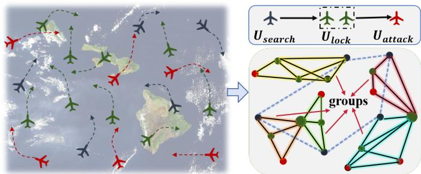  
Fig. 1. Typical complex sequential task cooperative scenario: Divide the heterogeneous UAV swarm into multiple search-attack teams. (The basic task execution requirements: one $U _ { s e a r c h }$ , two $U _ { l o c k }$ ,s and one $U _ { a t t a c k } )$

Currently, the immaturity of unmanned system technology leads to low efficiency in executing complex tasks. To overcome this limitation, a systematic decomposition methodology that breaks down complex tasks into simpler sub-tasks has demonstrated significant improvements in task completion reliability. These complex sequential tasks can be formally characterized by the following key attributes:

1) Decomposability: The complex sequential task $\tau$ can be divided into multiple simple sub-tasks $\{ T _ { 1 } , T _ { 2 } , \cdots , T _ { M } \}$ where M is the number of sub-tasks.

2) Sequential: There is a task execution sequence constraint between sub-tasks, and the sub-task $T _ { m + 1 }$ must be executed after the $T _ { m }$ . To simplify the problem description, we define the sequence of sub-task execution as $T _ { 1 } \mapsto T _ { 2 } \mapsto \cdot \cdot \cdot \mapsto T _ { M }$ where 7→ represents the progressive symbol for sub-tasks.

3) Cooperativity: A sub-task may require collaborative execution by multiple UAVs. We describe the basic heterogeneous UAVs group Φ that meets the requirements of executing the entire complex task T as follows:

$$
\begin{array} { r } { \mathcal { T } _ { \Phi } = \{ n _ { 1 } U _ { 1 } , n _ { 2 } U _ { 2 } , \cdot \cdot \cdot , n _ { Z } U _ { Z } \} , ~ 1 \leq n _ { Z } \leq N _ { Z } , } \end{array}\tag{2}
$$

where $n _ { z }$ represents the minimum number of $U _ { z }$ required by the execution group to meet complex task requirements.

Fig. 1 shows a typical scenario of a heterogeneous swarm performing complex sequential tasks. The task framework is defined as a heterogeneous UAV swarm comprising agents with diverse functional capabilities that cooperatively enable rapid response to integrated search-attack missions targeting unknown objectives within designated operational zones. Specifically, the basic requirements of the unknown target search-attack integrated mission contains three sequential subtasks namely, the first step is to obtain rough target information by one $U _ { s e a r c h }$ , the second step is to coordinate two $U _ { l o c k } { ' s }$ to accurately locate the rough target through coordinated sensor fusion, and the last step is to strick the target by one $U _ { a t t a c k }$ . In this scenario, the purpose of the dynamic grouping mechanism is to divide the overall heterogeneous swarm into multiple information exchange groups that meet the requirements of the search-attack integrated mission mentioned above, thereby achieving rapid response to unknown targets and eliminating inefficient links.

## B. Dynamic Grouping Model and Communication Rules

To effectively respond to complex tasks at the appropriate execution times, heterogeneous UAVs can form multiple information exchange teams that fulfill task requirements while minimizing redundant communication. This strategy not only enhances task execution efficiency but also effectively ensures system-level communication security. Considering the distributed nature of complex tasks, we assume that the initial sub-task can be completed by one UAV, that is $n _ { 1 } ~ = ~ 1$ For instance, an UAV equipped with detection sensors could gather coarse information about the task target through active or passive detection techniques. We further define that the number of the groups K partitioned within a heterogeneous UAV swarm is determined by the number of UAVs assigned to execute the initial sub-task, that is $K = N _ { 1 }$ . The interaction characteristics between groups within different scenarios are described as follows:

1) : As shown in Fig. 2(a), there are surplus nodes in the task area after the number of UAV N meets the basic grouping requirements, that is $\begin{array} { r } { N > N _ { 1 } \sum _ { z = 1 } ^ { Z } n _ { z } } \end{array}$ . Another description is that there is a group $\Phi _ { k }$ in the task area where the number of UAV of type z exceeds the minimum task execution requirement, that is $n _ { \Phi _ { k , z } } ~ > ~ n _ { z }$ , where $k \in { 1 , \ldots , N _ { 1 } }$ . In this case, switch operations may occur between two groups to balance the surplus nodes as much as possible.

2) : As shown in Fig. 2(b), the number of UAVs in the task area just meets the basic grouping requirements, that is $N =$ $N _ { 1 } \sum _ { z = 1 } ^ { Z } n _ { z }$ and all types of nodes satisfy $n _ { \Phi _ { k , z } } ~ = ~ n _ { z }$ . At this point, the node switch operation involves multiple groups to ensure maximum group benefits while maintaining a stable number of UAVs.

3) : As shown in Fig. 2(c), in the case of limited UAV resources, the number of UAVs in the task area cannot satisfy the basic grouping requirements, that is $\begin{array} { r } { N < N _ { 1 } \sum _ { z = 1 } ^ { Z } { \bar { n _ { z } } } } \end{array}$ after eliminating cross group nodes, and partial types of nodes satisfy $n _ { \Phi _ { k , z } } < n _ { z }$ . At this point, there will be cross group nodes to form overlapping groups, and node switch operations exist between multiple groups to ensure maximum group benefits while minimizing the number of cross group nodes.

At the same time, considering the characteristics of complex sequential tasks and the objectives of dynamic grouping, we impose the following rules for optimizing the communication topology. As shown in Fig.1, within the same group, communication links are established between UAVs executing the same sub-task to enhance collaborative performance, and the communication links are also established between UAVs executing consecutive sub-tasks to facilitate rapid response;

Within different groups, global information is collected by interacting with UAVs performing the initial sequence sub-task in each group, ensuring a comprehensive and efficient information flow throughout the communication network. It is worth noting that the communication protocol we have established effectively mitigates inter-channel interference among devices. Specifically, members within the same group employ timedivision multiplexing (TDMA) for coordinated interaction, while different groups utilize frequency-division multiplexing (FDMA) for cross-group communication, thereby circumventing signal interference between distinct frequency channels.

## C. Utility Function of Dynamic Grouping

The most common perspective for evaluating the effectiveness of a task execution group is communication performance, such as the communication energy consumption [18], [30]- [31], signal to noise ratio (SNR) [19]-[22], [37], and the average communication delay [23]-[24]. Essentially, under the same hardware conditions and communication parameter settings, the number of UAVs within the group and the distance between members are the main factors affecting the group communication performance. Therefore, we design a cohesion indicator to evaluate the strength of interpersonal connections among group members and mitigate the potential adverse effects of large group diameters on communication efficacy. Firstly, the coordinates of virtual centroid $\mu _ { \Phi _ { k } }$ of the group $\Phi _ { k }$ is calculated as follows:

$$
P _ { \mu _ { \Phi _ { k } } } = { \textstyle { \frac { 1 } { N _ { \Phi _ { k } } } } } \sum _ { U _ { z , i } \in \Phi _ { k } } P _ { U _ { z , i } } ,\tag{3}
$$

where $N _ { \Phi _ { k } }$ represents the number of UAVs in the group $\Phi _ { k }$ Then, the cohesion indicator of the group is calculated as follows:

$$
\begin{array} { r } { D _ { \Phi _ { k } } = - \frac { 1 } { N _ { \Phi _ { k } } } \displaystyle \sum _ { U _ { z , i } \in \Phi _ { k } } \left\| P _ { U _ { z , i } } - P _ { \mu _ { \Phi _ { k } } } \right\| _ { 2 } . } \end{array}\tag{4}
$$

It is noteworthy that this work does not regulate the preplanned navigation path $\Gamma _ { U _ { z , i } }$ and the flight speed of each UAV. Therefore, we need to ensure the kinematic state of all aircrafts within the same group is similar to avoid unstable untilities during the time interval of the coalition structure reconfiguration, such as similar flight speed and direction. To quantitatively assess communication sustainability in dynamic operational environments, a mobility prediction link subsistence probability indicator was proposed in [37]. Building upon this, we formulate the communication link persistence duration between cooperative UAVs within the same group as follows:

• If two UAVs perform consecutive sub-tasks:

$$
\begin{array} { r l } { S _ { U _ { z , i }  U _ { z + 1 , i ^ { \prime } } } = } & { \sqrt { \frac { R ^ { 2 } - \| P _ { U _ { z + 1 , i ^ { \prime } } } - \frac { 1 } { N _ { \Phi _ { k , z } } } \displaystyle \sum _ { U _ { z , i } \in \Phi _ { k } } P _ { U _ { z , i } } \| _ { 2 } ^ { 2 } } { \| V _ { U _ { z + 1 , i ^ { \prime } } } - \frac { 1 } { N _ { \Phi _ { k , z } } } \displaystyle \sum _ { U _ { z , i } \in \Phi _ { k } } V _ { U _ { z , i } } \| _ { 2 } ^ { 2 } } } , } \end{array}\tag{5}
$$

• If two UAVs perform the same sub-task:

$$
\begin{array} { r } { S _ { U _ { z , i }  U _ { z , i ^ { \prime \prime } } } = \sqrt { \frac { R ^ { 2 } - \| P _ { U _ { z , i ^ { \prime \prime } } } - P _ { U _ { z , i } } \| _ { 2 } ^ { 2 } } { \| V _ { U _ { z , i ^ { \prime \prime } } } - V _ { U _ { z , i } } \| _ { 2 } ^ { 2 } } } , } \end{array}\tag{6}
$$

JOURNAL OF LATEX CLASS FILES, VOL. 11, NO. 11, 1111 1111

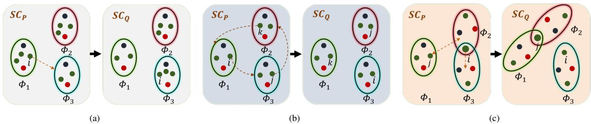  
Fig. 2. (a): Nodes interaction between groups in the presence of abundant number of UAVs; (b): Nodes interaction between groups in the presence of balanced number of UAVs; (c): Nodes interaction between groups in the presence of insufficient number of UAVs.

where $U _ { z , i } , U _ { z , i ^ { \prime \prime } } \in \mathit { m e m } \{ \mathcal { U } _ { \Phi _ { k , z } } \} , U _ { z , i ^ { \prime } } \in \mathit { m e m } \{ \mathcal { U } _ { \Phi _ { k , z + 1 } } \}$ and $\mathcal { U } _ { \Phi _ { k , z } } , \mathcal { U } _ { \Phi _ { k , z + 1 } }$ represents the set of type z aircrafts and type z + 1 aircrafts in group $\Phi _ { k }$ . The stability performance of a group is defined as the shortest retention time of communication links among group members as follows:

$$
S _ { \Phi _ { k } } = \operatorname* { m i n } \left\{ S _ { U _ { z , i } \to U _ { z , i ^ { \prime \prime } } } , S _ { U _ { z , i } \to U _ { z + 1 , i ^ { \prime } } } \right\} .\tag{7}
$$

From $( 7 ) .$ , it can be seen that the stability performance indicator $S _ { \Phi _ { k } }$ is positively correlated with the group performance. Hence, the larger the stability performance indicator $S _ { \Phi _ { k } }$ , the better the grouping performance.

Furthermore, in order to drive the UAVs to join the group when the number of UAVs in the group does not meet the task requirements, and reduce the inclination for the UAVs to join the group that fulfills the basic task requirements, a sigmoid function $E _ { \Phi _ { k } }$ is proposed to evaluate the impact of the number of the UAVs within the group as follows:

$$
E _ { \Phi _ { k , z } } = \left\{ \begin{array} { c c } { \frac { 1 } { 1 + e ^ { - \alpha _ { 1 } ( \frac { 2 \delta } { n _ { z } } N _ { \Phi _ { k , z } } - \delta + \alpha _ { 2 } ) } } , } & { N _ { \Phi _ { k , z } } \geq 1 } \\ { 0 } & { N _ { \Phi _ { k , z } } = 0 } \end{array} \right. ,\tag{8}
$$

where $\alpha _ { 1 }$ and $\alpha _ { 2 }$ represent the designed parameters to determine the slope of the number return curve and the maximum effective return value, and δ is defined as the reference value. Specifically, we define the return before meeting the demand for the number of UAVs as the effective return, and the return after that as an excessive return. From Fig. 3, it can be seen that the effective return increases rapidly with the increase of the number of UAVs, while the excessive return grows slowly with the increase of the number of UAVs. Then, $E _ { \Phi _ { k } }$ is calculated as follows:

$$
E _ { \Phi _ { k } } = \sum _ { z = 1 } ^ { Z } E _ { \Phi _ { k , z } } .\tag{9}
$$

Another advantage of the designed performance indicator $E _ { \Phi _ { k } }$ is that it can drive the balanced distribution of surplus nodes in each group when there are abundant UAVs.

In addition, during the grouping process, the greedy benefits of individual UAV should be balanced to avoid communication congestion caused by the same UAV being assigned to too many groups. Then, the punitive indicator for group members cross groups is designed as follows:

$$
F _ { \Phi _ { k } } = - \sum _ { r = 2 } ^ { N _ { 1 } } \beta ^ { r } n _ { r } ,\tag{10}
$$

where $\beta > 1$ represents the cross group penalty coefficient of the UAV, r represents the number of other groups where the current cross group UAV is in, and $n _ { r }$ represents the number of UAVs across r groups in group $\Phi _ { k }$ . From (10), it can be seen that the more cross group UAVs and the more single UAVs cross groups, and the bigger the penalty value. Therefore, the total utility function of a group is defined as follows:

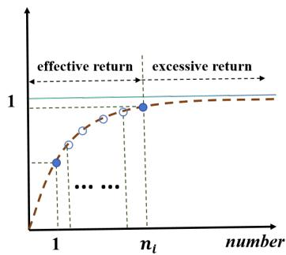  
Fig. 3. Curve of the number return of UAVs within the group.

$$
G P ( \Phi _ { k } ) = \xi _ { 1 } S _ { \Phi _ { k } } + \xi _ { 2 } E _ { \Phi _ { k } } + \xi _ { 3 } D _ { \Phi _ { k } } + \xi _ { 4 } F _ { \Phi _ { k } } ,\tag{11}
$$

where $\xi _ { 1 } , \xi _ { 2 } , \xi _ { 3 } , \xi _ { 4 }$ represent the weights of different indicators, and $\xi _ { 1 } + \xi _ { 2 } + \xi _ { 3 } + \xi _ { 4 } = 1$ . Then, the total utility GP (Θ) of all groups can be calculated as follows:

$$
G P ( \Theta ) = \sum _ { k = 1 } ^ { N _ { 1 } } G P ( \Phi _ { k } ) ,\tag{12}
$$

where the coalition structure $\boldsymbol { \Theta } = \left\{ \Phi _ { 1 } , \Phi _ { 2 } , \ldots , \Phi _ { N _ { 1 } } \right\}$ represents the set of all groups.

## D. Problem Formulation

The main objective of this paper is to divide the heterogeneous UAV set U into multiple information exchange groups $\boldsymbol { \Theta } = \{ \Phi _ { 1 } , \Phi _ { 2 } , \cdot \cdot \cdot , \Phi _ { N _ { 1 } } \}$ to maximize the total utility $G P ( \Theta )$ of the coalition structure under the constraints of complex sequential task execution requirements. Therefore, we model the dynamic grouping as the following optimization problem:

$$
\begin{array} { l } { \displaystyle \operatorname* { m a x } _ { \tau } G P ( \Theta ) } \\ { \displaystyle s . t . \sum _ { k = 1 } ^ { N _ { 1 } } N _ { \Phi _ { k } } = N , \forall \Phi _ { k } \in m e m \{ \Theta \} , } \\ { \displaystyle N _ { \Phi _ { k , z } } \geq n _ { z } , \forall \Phi _ { k , z } \in m e m \{ \Phi _ { k } \} , } \end{array}\tag{13}
$$

where τ represents the joint decision command of the UAVs executing the switch operations. The first constraint divides all UAVs into $N _ { 1 }$ groups based on the number of UAVs executing the initial sub-task to avoid isolated UAV nodes; The second constraint ensures that the number of each type of UAVs in each group meets the basic task execution requirements. Due to the combination constraint characteristics of the dynamic grouping problem mentioned above, obtaining the optimal grouping structure solution is NP-hard. As the number of the UAVs in the swarm or the number of groups increases, the computational cost for a suboptimal solution will also increase significantly. Therefore, designing a low complexity algorithm to get a near-optimal solution is crucial.

The dynamic grouping of the heterogeneous UAV swarm considered in this paper can be described as a distributed multi-agent decision problem, in which UAVs interact with each other based on the communication network and decide whether to perform communication link switch operations based on the potential decision benefits. It is worth noting that the CFG is similar to dynamic grouping, that is, in the CFG, agents form coalitions with other agents or join other coalitions to increase the individual or the overall coalitions benefits. Moreover, the successful validation of the CFG in task allocation and resource allocation further demonstrates its inherent potential for addressing dynamic grouping challenges. Therefore, we propose a applicable JSCFG model to handle dynamic grouping under three scenarios as shown in Fig. 2.

## III. JOINT SWITCH COALITION FORMATION GAMEMODEL

In this section, the dynamic grouping problem of the heterogeneous UAV swarm is modeled as a CFG, where UAVs improve their own and group utilities through switch operations. Meanwhile, due to the constraints of basic task requirements, the switch operation of a single UAV may result in a group dissatisfying the basic task requirements. Therefore, we propose a multi-UAV joint switch coalition formation game (JSCFG) approach, covering both non-overlapping coalition structure and overlapping coalition structure, and prove that the proposed JSCFG model admits a dynamic grouping nearoptimal solution.

## A. Game Model

The game model with a transferable utility (TU) of the dynamic grouping problem is modeled as $\begin{array} { r l } { \mathcal { G } } & { { } = } \end{array}$ $\{ \mathcal { N } _ { n o l } , \mathcal { N } _ { o l } , G P ( \Phi _ { k } ) , \bar { \mathcal { M } } , \bar { \Theta } \}$ , where $\mathcal { N } _ { n o l }$ is the set of normal UAV players and $\mathcal { N } _ { o l }$ is the set of cross group UAV players; $G P ( \Phi _ { k } )$ is the total utility function of communication group $\Phi _ { k } .$ , calculated in (11). If any of the constraints are not satisfied, the utility $\begin{array} { l l l } { { G P ( \Phi _ { k } ) } } & { { = } } & { { 0 ; } } \end{array}$ $\mathcal { M } = \{ \tau _ { U _ { 1 , 1 } } , \cdot \cdot \cdot , \tau _ { U _ { 1 , N _ { 1 } } } , \cdot \cdot \cdot , \tau _ { U _ { Z , 1 } } , \cdot \cdot \cdot , \tau _ { U _ { Z , N _ { Z } } } \}$ represents the grouping decision vector for each UAV player in the swarm; $\Theta$ represents the coalition structure. It should be noted that the coalition is a term in CFG used here to equivalently describe group. To better describe the proposed JSCFG model, we introduce the following definitions.

Definition 1. (Non-overlapping coalition structure) The coalition structure in which all players in CFG only exist in one coalition is called a non-overlapping coalition structure.

This coalition structure is defined as $\boldsymbol { \Theta } = \{ \Phi _ { 1 } , \Phi _ { 2 } , \cdot \cdot \cdot , \Phi _ { N _ { 1 } } \}$ if $\Phi _ { k _ { 1 } } \cap \Phi _ { k _ { 2 } } \ = \ \varnothing , \forall k _ { 1 } , k _ { 2 } \ \in \ \{ 1 , \cdot \cdot \cdot , N _ { 1 } \} , k _ { 1 } \ \neq \ k _ { 2 }$ and $\sum _ { k = 1 } ^ { N _ { 1 } } { n } _ { \Phi _ { k } } = N .$

As shown in Fig. 2(a) and 2(b), no aircraft concurrently belongs to multiple coalitions within the coalition structure.

Definition 2. (Overlapping coalition structure) The coalition structure in which some players in CFG exist in multiple coalitions is called a overlapping coalition structure. This coalition structure is defined as $\Theta \ = \ \{ \Phi _ { 1 } , \Phi _ { 2 } , \cdot \cdot \cdot , \Phi _ { N _ { 1 } } \}$ if $\Phi _ { k _ { 1 } } \cap \Phi _ { k _ { 2 } } \ \neq \ \emptyset , \exists k _ { 1 } , k _ { 2 } \ \in \ \{ 1 , \cdot \cdot \cdot , N _ { 1 } \} , k _ { 1 } \ \neq \ k _ { 2 }$ and $\sum ^ { N _ { 1 } } { } _ { n \Phi _ { k } } \ \leq \ { \bar { N } }$ after eliminating cross group players, that is $\overline { { \exists } } \overline { { U } } _ { z , i } \in \{ \Phi _ { k _ { 1 } } , \Phi _ { k _ { 2 } } \}$

As shown in Fig. 2(c), there are aircraft belong to multiple coalitions within the coalition structure.

Definition 3. (Superadditive [26]) For a game model $\mathcal { G }$ with a TU, if any two coalitions satisfy $\Phi _ { k _ { 1 } } , \Phi _ { k _ { 2 } } \in \mathit { m e m } \{ \Theta \}$ $\Phi _ { k _ { 1 } } \cup \Phi _ { k _ { 2 } } \in$ mem $\{ \Theta ^ { \prime } \} , G P ( \Phi _ { k _ { 1 } } \cup \Phi _ { k _ { 2 } } , \dot { \Theta } ^ { \prime } ) \stackrel { - } { \geq } G P ( \Phi _ { k _ { 1 } } , \dot { \Theta } ) +$ $G P ( \Phi _ { k _ { 2 } } , \Theta )$ , then this game mode is called superadditivity.

The above definition applies to the underlying assumption in canonical game (CG) that it is always beneficial for any two coalitions to form a major coalition [26]. However, an important feature of the CFG is that the formation of a coalition or individual participation incurs costs leading to a decrease in the utility of new alliances.

Theorem 1. The JSCFG model proposed in this paper is nonsuperadditive.

Proof: For $\Phi _ { k _ { 1 } } , \Phi _ { k _ { 2 } } \in \mathrm { ~ \it { m e m } \{ \Theta \} ~ }$ and $\Phi _ { k _ { 1 } } \cup \Phi _ { k _ { 2 } } \in$ mem $\{ \Theta ^ { \prime } \}$ , the new coalition structure Θ0 includes all players of $\Phi _ { k _ { 1 } }$ and $\Phi _ { k _ { 2 } }$ . Therefore, the new coalition will inevitably meet the minimum task requirement constraint, but it cannot guarantee that the actual distance between the two players does not exceed the maximum communication distance R. Then, we can get $G P ( \Phi _ { k _ { 1 } } \cup \Phi _ { k _ { 2 } } , \Theta ^ { \prime } ) = 0 < G P ( \Phi _ { k _ { 1 } } , \Theta ) +$ $G P ( \Phi _ { k _ { 2 } } , \Theta )$ , if there are nodes in the new coalition that do not meet the maximum communication distance constraint. In addition, if the distance between any two UAVs does not exceed $R ,$ due to the constraints of the sigmoid function shown in (8), a significant increase in the number of members in the new coalition lead to a slight increase in $E _ { \Phi _ { k _ { 1 } } }$ , that is $E _ { \Phi _ { k _ { 1 } } \cup \Phi _ { k _ { 2 } } } >$ max $\{ E _ { \Phi _ { k _ { 1 } } } , E _ { \Phi _ { k _ { 2 } } } \}$ , but rather to a significant decrease in $D _ { \Phi _ { k } }$ and $S _ { \Phi _ { k } } ,$ that is $D _ { \Phi _ { k _ { 1 } } \cup \Phi _ { k _ { 2 } } } \quad > \quad m a x \{ D _ { \Phi _ { k _ { 1 } } } , D _ { \Phi _ { k _ { 2 } } } \}$ and $S _ { \Phi _ { k _ { 1 } } \cup \Phi _ { k _ { 2 } } } < m i n \{ S _ { \Phi _ { k _ { 1 } } } , \stackrel { . } { S } _ { \Phi _ { k _ { 2 } } } \}$ . Therefore, ignoring the influence of cross group players and combining with (11), we can once again get $G P ( \Phi _ { k _ { 1 } } \cup \Phi _ { k _ { 2 } } , \Theta ^ { \prime } ) < G P ( \Phi _ { k _ { 1 } } , \Theta ) +$ $G P ( \Phi _ { k _ { 2 } } , \Theta )$ . Theorem 1 is proved. 

In dynamic grouping, the UAV player across multiple groups can reduce the overall utility of the relevant groups. Therefore, when there are sufficient UAVs, we should avoid cross group operations as much as possible. In addition, the JSCFG designed in this paper is with TU and in the characteristic form, that is, the total utility of the coalition $\Phi _ { k }$ is related to the coalition players, and the total utility can be divided among coalition members in any form. In this paper, we use the Shapley value principle of proportional fairness to divide individual utility within the same group [17]. The specific utility of UAV $U _ { z , i }$ in $\Phi _ { k }$ is calculated as follows:

$$
g p _ { U _ { z , i } } = \sum _ { \Phi _ { k } \in m e m \{ \Theta _ { U _ { z , i } } \} } \frac { G P ( \Phi _ { k } ) } { N _ { \Phi _ { k } } } ,\tag{14}
$$

where $\Theta _ { U _ { z } }$ ,i is the set of groups crossed by UAV $U _ { z , i } .$ From the above equation, it can be seen that under the same conditions, the individual utilities of cross group UAVs are greater than those of normal UAVs. However, cross group players will decrease $F _ { \Phi _ { k } }$ , thereby reducing the total utilities of the two groups crossed and the utilities of members within the two groups. Therefore, designing appropriate indicator weights can reduce the greedy selection of individual members while satisfying all constraints. In order to improve the overall coalition utility, multiple UAV players perform switch operations to leave an old coalition and join a new coalition, and the specific definition is as follows.

Definition 4. (Switch operation and switch gain [19]) For a game model, one player $N _ { s o }$ leaving the old coalition $\Phi _ { k _ { 1 } }$ or joining a new coalition $\Phi _ { k _ { 2 } }$ is called a switch operation $\tau _ { k _ { 1 } , k _ { 2 } } ( N _ { s o } )$ , where $\Phi _ { k _ { 1 } } \in \Theta , \mathbf { \bar { \Phi } } \mathbf { \Phi } \mathbf { \Phi } \in \Theta \cup \varnothing$ and $\Phi _ { k _ { 1 } } \neq \Phi _ { k _ { 2 } } ,$ that is $\tau _ { k _ { 1 } , k _ { 2 } } ( N _ { s o } ) : \Phi _ { k _ { 1 } ^ { \prime } } \mapsto \Phi _ { k _ { 1 } } \backslash N _ { s o }$ and $\Phi _ { k _ { 2 } ^ { \prime } } \mapsto \Phi _ { k _ { 2 } } \cup N _ { s o } ,$ $\Phi _ { k _ { 1 } ^ { \prime } } , \Phi _ { k _ { 2 } ^ { \prime } }$ are the initial coalitions after the switch operation. Then, the switch gain is calculated as $\varpi ( \tau _ { k _ { 1 } , k _ { 2 } } ( N _ { s o } ) ) ~ =$ $G P ( \Phi _ { k _ { 1 } } ) + G P ( \Phi _ { k _ { 2 } } ) - G P ( \Phi _ { k _ { 1 } ^ { \prime } } ) - G P ( \Phi _ { k _ { 2 } ^ { \prime } } )$

However, the above switch operation only occurs between two coalitions and has limitations. Specifically, when the number of players just meet or does not meet the basic task requirements, the switch operation by players will result in the number of players in the old coalition being unable to meet the basic task requirements. Therefore, to maintain the stability of multiple coalitions, we define the joint switch operation and switch gain between multiple coalitions as follows.

Definition 5. (Joint switch operation and switch gain) For a JSCFG model, the joint switch operation $\tau _ { \Theta _ { s o } } ( \mathcal { N } _ { s o } )$ is defined as $N _ { s o }$ players set $\mathcal { N } _ { s o }$ leaving their old coalition to join a new coalition or changing the cross group state, resulting in $K _ { s o }$ coalitions $\Theta _ { s o }$ members changing, thereby increasing coalition utilities and meet the constraint of the number of players, where $\Theta _ { s o } = \{ \hat { \Phi } _ { 1 } , \hat { \Phi } _ { 2 } , \cdot \cdot \cdot , \hat { \Phi } _ { K _ { s o } } \}$ and $N _ { s o } \in { m e m } \{ { \hat { \Phi } _ { k _ { s o } } } \}$ That is $\begin{array} { r } { \tau _ { \Theta _ { s o } } ( \mathcal { N } _ { s o } ) \ : \ \hat { \Phi } _ { k _ { s o } } ^ { \prime } \ = \ \hat { \Phi } _ { k _ { s o } } \backslash \mathcal { N } _ { \hat { \Phi } _ { k _ { s o } } } ^ { o u t } \cup \mathcal { N } _ { \hat { \Phi } _ { k _ { s o } } } ^ { i n } , \ \hat { \Phi } _ { k _ { s o } } ^ { \prime } } \end{array}$ are the initial coalitions after the joint switch operation and $\hat { \Phi } _ { k _ { s o } } ^ { \prime } \in \Theta _ { s o } ^ { ' } , \mathcal { N } _ { \hat { \Phi } _ { k _ { s o } } } ^ { o u t }$ and $\mathcal { N } _ { \hat { \Phi } _ { k _ { s c } } } ^ { i n }$ respectively represent members who have left the coalition $\Phi _ { k _ { s o } }$ and members who have joined the coalition $\hat { \Phi } _ { k _ { s o } } .$ Then, the joint switch gain is calculated as $\varpi ( \tau _ { \Theta _ { s o } } ( \mathcal { N } _ { s o } ) ) = \sum _ { k _ { s o } = 1 } ^ { K _ { s o } } ( G P ( \hat { \Phi } _ { k _ { s o } } ^ { \prime } ) - G P ( \hat { \Phi } _ { k _ { s o } } ) ) .$

It is worth mentioning that players may perform different switch operations. Therefore, in order to compare them, a single player preference relation is defined as follows.

Definition 6. (Preference relation [17]) For a game model, the preference relation or preference order $\succ _ { U _ { z , i } }$ is described as a complete, reflexive, and transitive binary relation among the set of coalitions that any player $U _ { z , i }$ can form through the switch operation. For any two different coalition structure $\Theta _ { P } , \Theta _ { Q }$ formed by player $U _ { z , i } ,$ we use $\Theta _ { Q } \ \succ _ { U _ { z , i } } \ \Theta _ { P }$ to indicate that compared to $\Theta _ { P }$ , the player $U _ { z , i }$ prefers $\Theta _ { Q }$ to obtain a greater coalition utility.

Another explanation for the above definition is that the switch gain generated by coalition structure $\Theta _ { Q }$ formed by $U _ { z , i }$ switching from the initial coalition is greater than that of coalition structure $\Theta _ { P } .$ , that is, $\Theta _ { Q }  U _ { z , i } \Theta _ { P } \Leftrightarrow$ $\varpi ( \tau _ { \Theta _ { Q } } ( U _ { z , i } ) ) > \varpi ( \tau _ { \Theta _ { P } } ( U _ { z , i } ) )$ . On this basis, we propose a multi-player preference relation to respond the joint switch operations.

Definition 7. (Multi-player preference relation) For a JSCFG model, the preference relation or preference order $\succ _ { \mathcal { N } _ { s o } }$ is described as a complete, reflexive, and transitive binary relation among the set of the coalitions that multiple players $\mathcal { N } _ { s o }$ can form through the switch operation. For any two different coalition structures $\Theta _ { P ^ { \prime } } , \Theta _ { Q ^ { \prime } }$ formed by multiple players $\mathcal { N } _ { s o } ,$ we use $\Theta _ { Q ^ { \prime } } \succ _ { N _ { s o } } \Theta _ { P ^ { \prime } }$ to indicate that compared to $\Theta _ { P ^ { \prime } }$ , multi-player $\mathcal { N } _ { s o }$ prefer $\Theta _ { Q ^ { \prime } }$ to obtain greater coalition utilities. Another explanation is that $\Theta _ { Q ^ { \prime } }  \ l _ { { \mathcal N } _ { s o } } \Theta _ { P ^ { \prime } } \Leftrightarrow$ $\smash { \sigma ( \tau _ { \Theta _ { Q ^ { \prime } } } (  { N _ { s o } } ) ) > \varpi ( \tau _ { \Theta _ { P ^ { \prime } } } (  { N _ { s o } } ) ) }$

According to the above definition, a set of UAV players need to choose appropriate switch operations based on the preference order, that is, to achieve a more efficient coalition structure while satisfying all constraints. However, different preference orders will result in different convergence characteristics of the coalition structure as shown in the Pareto order and Selfish order below.

Definition 8. (Pareto order [17]) For any two different coalition structure $\Theta _ { P } , \Theta _ { Q }$ generated by the switch operation of player $U _ { z , i }$ , the following preference order is the Pareto order.

$$
\begin{array} { r } { \Theta _ { Q } \succ _ { U _ { z } , i } \Theta _ { P } \Leftrightarrow \left\{ \begin{array} { l l } { G P _ { U _ { z } , i } ( \Theta _ { Q } ) > G P _ { U _ { z } , i } ( \Theta _ { P } ) , } \\ { G P _ { U _ { z ^ { \prime } , i ^ { \prime } } } ( \Theta _ { Q } ) > G P _ { U _ { z ^ { \prime } , i ^ { \prime } } } ( \Theta _ { Q } \backslash U _ { z , i } ) } \\ { \qquad \forall U _ { z ^ { \prime } , i ^ { \prime } } \in \Theta _ { Q } \backslash U _ { z , i } , } \\ { G P _ { U _ { z ^ { \prime } , i ^ { \prime } } } ( \Theta _ { P } ) < G P _ { U _ { z ^ { \prime } , i ^ { \prime } } } ( \Theta _ { P } \backslash U _ { z , i } ) } \\ { \qquad \forall U _ { z ^ { \prime } , i ^ { \prime } } \in \Theta _ { P } \backslash U _ { z , i } . } \end{array} \right. } \end{array}\tag{15}
$$

Definition 9. (Selfish order [17]) For any two different coalition structure $\Theta _ { P } , \Theta _ { Q }$ generated by the switch operation of player $U _ { z , i }$ , the following preference order is the Selfish order.

$$
\begin{array} { r } { \Theta _ { Q } \succ _ { U _ { z , i } } \Theta _ { P } \Leftrightarrow \left\{ \begin{array} { l l } { G P _ { U _ { z , i } } ( \Theta _ { Q } ) > G P _ { U _ { z , i } } ( \Theta _ { P } ) , } \\ { G P ( \Theta _ { Q } ) > G P ( \Theta _ { P } ) . } \end{array} \right. } \end{array}\tag{16}
$$

The above typical preference orders belong to two extreme preferences. Specifically, the Pareto order considers all players in both the initial and new coalitions. In the Pareto order, the player who perform the switch operation increase its own utility without compromising the utility of other players in the initial and new coalitions. Therefore, Pareto orders can always increase the overall utility of the coalition, but due to their strong limitations, it is difficult to make switch operation decisions. By comparison, the Selfish order only

$$
\begin{array} { r l } { \Theta _ { 4 } \underbrace { \Theta _ { 2 ^ { \nu } \omega } \pm \langle U _ { 3 ^ { \nu } } U _ { 3 ^ { \nu } } U _ { 0 ^ { \nu } } \varphi \rangle } } _ { \displaystyle \underbrace { g p y _ { U _ { 1 } } ( \Theta _ { Q } ) + } } + \sum _ { U _ { i 2 } \in m e n t } \underbrace { g p y _ { U _ { 2 } , 2 } ( \Theta _ { Q } ) } _ { \displaystyle \underbrace { U _ { 1 } \odot m e n t } U _ { 0 ^ { \nu } , 2 } } + \sum _ { \underbrace { U _ { 1 } \odot m e n t } U _ { 2 , i } \ge \nu } + \sum _ { \underbrace { U _ { 2 } \ge i \in m e n t } \{ U _ { o , 4 } \nu \} } + \sum _ { \substack { U _ { 2 } \ge i \in m e n t } \{ U _ { o , 4 } \nu \} } g p y _ { U _ { 2 } , ( \Theta _ { Q } ) }  \\ { \underbrace { U _ { 1 } \odot e n e n e m \cdot \omega t i n \mathrm { e n i n t h e n s i s i n t h m o d e c h i n a n c e ~ i n e a m e n t e r g r a m e a r e n e s ~ s r o n e p r o p } } _ { \displaystyle \underbrace { U _ { 1 } \odot e n e n t } } , ~ \underbrace { \underbrace { U _ { 1 } \odot n e n e n t \mathrm { e n p i n g i n g ~ s e i n i c h i n a b s i n t i n a b e ~ i n e a s i s s ~ i n e a s s i z e n a t e r a c t i n c e s s a m a n e n t e r ~ g r o u p } } _ { \displaystyle \underbrace { \sum _ { 1 } \sim } } } \\ { + \underbrace { \sum _ { \substack { \texttt { q } _ { 4 } , m _ { i } } \in \sum _ { m _ { i } } \in \sum _ { m _ { i } } \in \mathbb { N } \{ U _ { i , n } } } \{ U _ { k } \in \texttt { \texttt { d } _ { 4 } , m _ { i } \le \times n } \{ U _ { i } \} } } _ { \displaystyle \texttt { S t a r a i n d e s i n t e a n d e q t h e a r a m e n t i n g u a s e d m a n c e m i n t o c o m i a n c o m i a n c o m i a n c o m i a n c o m i a n c o m i a n c o m i a n c o m i a n c o m i a n c o m i a n c o m i a s } } \\ { \ge } &  \underbrace  \sum _  \substack  \end{array}\tag{17}
$$

considers itself, that is, it only relates to the utility of the switching player from the initial coalition to the new coalition without considering the utility of other coalitions, which may ultimately lead to an increase in the utility of the switching player and a decrease in the utility of the overall coalition. In order to eliminate the limitations of the preference order mentioned above, the bilateral mutual benefit transfer order [17] and the coalition expected altruistic order [19] have balanced selfishness and global situation to avoid falling into local optima as much as possible. However, they are limited to a single switching player and two related coalitions. Therefore, we propose a joint switch common improvement (JSCI) order to obtain a near-optimal solution for the scenario of multiple UAV players switching between multiple coalitions, balancing the utilities between players and coalitions.

Definition 10. (joint switch common improvement order) For any two different coalition structures $\Theta _ { P } , \Theta _ { Q }$ generated by the switch operation of players $U _ { n o l } ' \mathbf { s }$ and $U _ { o l } { } ^ { \prime } \mathbf { s } ,$ the designed JSCI order is defined in (17), where ${ { U } _ { n o l } } \mathrm { { } } , \mathrm { { } } \in$ $\mathcal { N } _ { n o l }$ and $U _ { o l }  ' s \in \mathcal { N } _ { o l }$ respectively represent non-overlapping nodes and overlapping nodes that perform switch operations, $U _ { i 1 } , U _ { i 2 } \ \in \ U _ { i }$ respectively represent non-overlapping nodes that perform switch operations joining another coalition or becoming overlapping nodes, $U _ { j 1 } , U _ { j 2 } \in U _ { j }$ respectively represent overlapping nodes that perform switch operations canceling cross coalition or cross another coalition, $\Phi _ { a , m } , \Phi _ { a , n } \in$ $\Phi _ { a }$ respectively represent coalitions that include overlapping nodes performing switch operations and coalitions that do not include overlapping nodes performing switch operations, and $U _ { k }$ represents the nodes affected by switch operations from other nodes.

From Equation (17), it can be seen that the proposed JSCI order is designed based on the changing attributes of nodes, and joint switch operations between multiple coalitions require the participation of multiple nodes. Therefore, we divide the associated nodes into three types: non-overlapping nodes that perform switch operations (nodes i, j, k in Fig. 2(b)), overlapping nodes that perform switching operations (node i in Fig. 2(c)), and affected nodes in coalitions where members change. Specifically, the difference between ① and ④ in Equation (17) represents the untility of non-overlapping nodes after performing the switch operation, the difference between ② and ⑤ in equation (17) represents the utility of overlapping nodes after performing the switch operation, and the difference between ③ and ⑥ in equation (17) represents the utility of affected nodes after performing the switch operation. It can be clearly seen that the proposed JSCI order can increase the total utility of UAV nodes performing switch operations and affected UAV nodes, and drive different attribute switch nodes to consider the utility changes of affected nodes when performing switch operations.

## B. Analysis of the Stable Coalition Structure

After giving the JSCFG model, we prove the stability of the final coalition structure under the proposed JSCI order. Firstly, we define the stable coalition structure as follows:

Definition 11. (Stable coalition structure under joint switch) For a JSCFG model, if no player improves their own or overall coalition utility through joint switch operations, the coalition structure is called a stable coalition structure, that is,

$$
\sum _ { k _ { s o } = 1 } ^ { K _ { s o } } ( G P ( \hat { \Phi } _ { k _ { s o } } ) ) \geq \sum _ { k _ { s o } = 1 } ^ { K _ { s o } } ( G P ( \hat { \Phi } _ { k _ { s o } } ^ { ' } ) ) ,\tag{18}
$$

where $\hat { \Phi } _ { k _ { s o } } ^ { \prime } ~ = ~ \hat { \Phi } _ { k _ { s o } } \backslash \mathcal { N } _ { \hat { \Phi } _ { k _ { s o } } } ^ { o u t } \cup \mathcal { N } _ { \hat { \Phi } _ { k _ { s o } } } ^ { i n } , ~ \hat { \Phi } _ { k _ { s o } } ^ { \prime }$ are the initial coalitions after the joint switch operation and $\hat { \Phi } _ { k _ { s o } } ^ { \prime } \in \Theta _ { s o } ^ { ' } ,$ $\mathcal { N } _ { \hat { \Phi } _ { k _ { s o } } } ^ { o u t }$ and $\mathcal { N } _ { \hat { \Phi } _ { k _ { s o } } } ^ { i n }$ respectively represent members who have left the coalition $\hat { \Phi } _ { k _ { s o } }$ and members who have joined the coalition $\hat { \Phi } _ { k _ { s o } }$

According to Definition 5, the stable coalition structure can also be described as the joint switch gain $\varpi ( \tau _ { \Theta _ { s o } } ( \mathcal { N } _ { s o } ) ) \leq 0$

For typical single non-overlapping node and overlapping node switch game scenarios, it has been proven that the Pareto order and Selfish order ensure that the coalition iterates to at least one stable structure in [24]-[25]. However, the proposed JSCI order involves multiple nodes performing joint switch operations and multiple member changing coalitions, which forms a stable coalition structure by comprehensively considering the utilities of the nodes performing switch operations and the affected nodes.

Next, we prove the existence of a Nash Equilibrium (NE) solution for a single node switch and the existence of a stable coalition structure solution for a multi-player switch using the exact potential game (EPG) under the JSCI order .

1) Analysis of Nash Equilibrium (abundant UAVs): When the number of UAVs is abundant, the designed coalition utility function will encourage the UAVs to be evenly distributed among different coalitions and avoid overlapping nodes. Therefore, the switch operation of a single node can improve the total coalition utility without causing any coalition to fail to meet the task requirement as shown in Fig. 2(a).

Definition 12. (Nash equilibrium under JSCI order) For a JSCFG model, if there is no player can improve its utility by a switch operation without other players changing their states, the grouping decision vector for each UAV player $\mathcal { M } ^ { * } = \{ \tau _ { U _ { 1 , 1 } } ^ { * } , \cdot \cdot \cdot , \tau _ { U _ { 1 , N _ { 1 } } } ^ { * } , \cdot \cdot \cdot , \tau _ { U _ { Z , 1 } } ^ { * } , \cdot \cdot \cdot , \tau _ { U _ { Z , N _ { Z } } } ^ { * } \}$ is a pure strategy Nash equilibrium, that is,

$$
\begin{array} { r l } & { G P _ { U _ { z , i } } ( \tau _ { U _ { z , i } } ^ { * } , \tau _ { - U _ { z , i } } ^ { * } ) \geq G P _ { U _ { z , i } } ( \tau _ { U _ { z , i } } , \tau _ { - U _ { z , i } } ^ { * } ) } \\ & { \qquad \forall U _ { z , i } \in { \cal N } , \tau _ { U _ { z , i } } ^ { * } \neq \tau _ { U _ { z , i } } . } \end{array}\tag{19}
$$

Definition 13. (EPG [25]) If a UAV node changes its grouping decision through switch operations, and the difference between the utility function $G P _ { U _ { z , i } }$ and the potential function $\phi$ is the same, then this game type is called an EPG, that is,

$$
\begin{array} { r l } & { G P _ { U _ { z , i } } ( \hat { \tau } _ { U _ { z , i } } , \tau _ { - U _ { z , i } } ) - G P _ { U _ { z , i } } ( \tau _ { U _ { z , i } } , \tau _ { - U _ { z , i } } ) } \\ & { = \phi _ { U _ { z , i } } ( \hat { \tau } _ { U _ { z , i } } , \tau _ { - U _ { z , i } } ) - \phi _ { U _ { z , i } } ( \tau _ { U _ { z , i } } , \tau _ { - U _ { z , i } } ) , } \end{array}\tag{20}
$$

where $\tau _ { - U _ { z . } } ^ { * }$ and $\tau _ { - U _ { z , i } }$ are the grouping decisions for UAVs other than $\ddot { U } _ { z , i }$

It is worth mentioning that EPG has been proven to have at least one pure strategy Nash Equilibrium.

Theorem 2. When a single node performs the switch operation, the proposed JSCFG is an EPG, and there exists at least one stable coalition structure is a NE under the JSCI order.

Proof: Combining (17), simplify the utility function $G P _ { U _ { i , j } }$ as follows:

$$
\begin{array} { l } { { G P _ { U _ { i , j } } ( \tau _ { U _ { i , j } } , \tau _ { - U _ { i , j } } ) = g p _ { U _ { i , j } } ( \Theta _ { Q } ) + } } \\ { { \displaystyle \sum _ { U _ { k } \in \Phi _ { a , n e w } \backslash \{ U _ { i , j } \} } g p _ { U _ { k } } ( \Theta _ { Q } ) + \sum _ { U _ { k } \in \Phi _ { a , o l d } \backslash \{ U _ { i , j } \} } g p _ { U _ { k } } ( \Theta _ { Q } ) } , }  \end{array}\tag{21}
$$

where $\Phi _ { a , n e w }$ and $\Phi _ { a , o l d }$ respectively represent the old coalition and the newly joined coalition of $U _ { z , i }$ . Then, the potential function is designed as follows:

$$
\phi _ { U _ { z , i } } ( \tau _ { U _ { z , i } } , \tau _ { - U _ { z , i } } ) = \sum _ { U _ { k } \in \mathcal { N } } g p _ { U _ { k } } ( \Theta _ { Q } ) ,\tag{22}
$$

where $U _ { k }$ represents the player in the heterogeneous UAV swarm and $g p _ { U _ { k } } ( \Theta _ { Q } )$ represents the utility function of $U _ { k }$ after the $U _ { z , i }$ performs a switch operation.

We assume that $U _ { z , i }$ performs a switch operation from $\Theta _ { P }$ to $\Theta _ { Q }$ , and the difference in the utility function before and after the switch operation is calculated as follows:

$$
\begin{array} { r l } & { G P _ { U _ { z , i } } ( \hat { \tau } _ { U _ { z , i } } , \tau _ { - U _ { z , i } } ) - G P _ { U _ { z , i } } ( \tau _ { U _ { z , i } } , \tau _ { - U _ { z , i } } ) } \\ & { = g p _ { U _ { z , i } } ( \Theta _ { Q } ) - g p _ { U _ { z , i } } ( \Theta _ { P } ) } \\ & { + \displaystyle \sum _ { U _ { k } \in \Phi _ { a , n e w } \backslash \{ U _ { z , i } \} } ( g p _ { U _ { k } } ( \Theta _ { Q } ) - g p _ { U _ { k } } ( \Theta _ { P } ) ) } \\ & { + \displaystyle \sum _ { U _ { k } \in \Phi _ { a , o l d } \backslash \{ U _ { z , i } \} } ( g p _ { U _ { k } } ( \Theta _ { Q } ) - g p _ { U _ { k } } ( \Theta _ { P } ) ) . } \end{array}\tag{23}
$$

Next, the difference in the potential function before and after the switch operation is calculated as follows:

$$
\begin{array} { r l } & { \phi _ { U _ { z , i } } ( \hat { \tau } _ { U _ { z , i } } , \tau _ { - U _ { z , i } } ) - \phi _ { U _ { z , i } } ( \tau _ { U _ { z , i } } , \tau _ { - U _ { z , i } } ) } \\ & { = \displaystyle \sum _ { U \in \mathcal { N } } \left( g p _ { U _ { k } } ( \Theta _ { Q } ) - g p _ { U _ { k } } ( \Theta _ { Q } ) \right) } \\ & { \quad U _ { k \in \mathcal { N } } } \\ & { = g p _ { U _ { z , i } } ( \Theta _ { Q } ) - g p _ { U _ { z , i } } ( \Theta _ { P } ) } \\ & { + \displaystyle \sum _ { U _ { k } \in \Phi _ { a , n e w } \backslash \{ U _ { z , i } \} } \left( g p _ { U _ { k } } ( \Theta _ { Q } ) - g p _ { U _ { k } } ( \Theta _ { P } ) \right) } \\ & { + \displaystyle \sum _ { U _ { k } \in \Phi _ { a , o l d } \backslash \{ U _ { z , i } \} } ( g p _ { U _ { k } } ( \Theta _ { Q } ) - g p _ { U _ { k } } ( \Theta _ { P } ) ) } \\ & { \quad + \displaystyle \sum _ { U _ { k } \in \Phi _ { a , o l d } \backslash \{ U _ { z , i } \} } \left( g p _ { U _ { k } } ( \Theta _ { Q } ) - g p _ { U _ { k } } ( \Theta _ { P } ) \right) } \\ & { \quad + \displaystyle \sum _ { U _ { k } \in \Phi _ { a , o l t e r } \backslash \{ U _ { z , i } \} } \left( g p _ { U _ { k } } ( \Theta _ { Q } ) - g p _ { U _ { k } } ( \Theta _ { P } ) \right) , } \end{array}\tag{24}
$$

where $\Phi _ { o t h e r } \ \in \ m e m \{ \Theta \} \backslash \{ \Phi _ { a , o l d } , \Phi _ { a , n e w } \}$ represents the coalition whose members have not changed. It should be noted that although the UAVs are constantly moving, the switch operation time is instantaneous, and so the changes in $D _ { \Phi _ { o t h e r } }$ and $S _ { \Phi _ { o t h e r } }$ can be ignored. Therefore, according to the designed dynamic grouping untility function (11), if there is no member change of the coalition, the untility of the coalition remains unchanged before and after $U _ { z , i }$ performs a switch operation, that is,

$$
\sum _ { U _ { k } \in \Phi _ { o t h e r } \backslash \{ U _ { z , i } \} } ( g p _ { U _ { k } } ( \Theta _ { Q } ) - g p _ { U _ { k } } ( \Theta _ { P } ) ) = 0 .\tag{25}
$$

Hence, combining (23), (24) and (25), we obtain that,

$$
\begin{array} { r l } & { G P _ { U _ { z , i } } ( \hat { \tau } _ { U _ { z , i } } , \tau _ { - U _ { z , i } } ) - G P _ { U _ { z , i } } ( \tau _ { U _ { z , i } } , \tau _ { - U _ { z , i } } ) } \\ & { = \phi _ { U _ { z , i } } ( \hat { \tau } _ { U _ { z , i } } , \tau _ { - U _ { z , i } } ) - \phi _ { U _ { z , i } } ( \tau _ { U _ { z , i } } , \tau _ { - U _ { z , i } } ) . } \end{array}\tag{26}
$$

According to Definition 13, when a single node performs the switch operation, the proposed JSCFG is an EPG under the JSCI order and there exists at least one pure strategy NE, which is a stable coalition structure solution. This completes the proof. 

2) Analysis of Stable Coalition Structure (balanced number or insufficient number of UAVs): When the number of UAVs is balanced or insufficient, a single-node switch operation may result in the old coalition not meeting the basic task requirement. Under the designed coalition utility function, some UAV nodes will cross groups to ensure that each coalition meets the basic task requirement. Therefore, in the above scenario, it is necessary to perform joint switch operations involving multiple UAV players in multiple coalitions simultaneously during the decision-making moment, as shown in Fig. 2(b) and 2(c). To simplify the analysis, we have rewritten Definition 12 by combining the switch gain proposed in Definition 5, that is,

Definition 14. (Nash-stable Coalition Structure) For a game model, if $\forall k \in K , \forall \mathcal { N } _ { s o } \in \Phi _ { k } ^ { * } , \varpi ( \tau _ { \Theta _ { s o } ^ { * } } ( \mathcal { N } _ { s o } ) ) \leq 0$ , for all $\Phi _ { i } ^ { * } \in \Theta ^ { * } \cup \varnothing .$ , then $\Theta ^ { * } = \{ \Phi _ { 1 } ^ { * } , \bar { \Phi } _ { 2 } ^ { * } , \cdot \cdot \cdot , \bar { \Phi } _ { N _ { 1 } } ^ { * } \}$ is a Nash-stable coalition structure.

Theorem 3. When multiple UAV nodes perform the switch operation in multiple coalitions, the dynamic grouping will eventually iterate to a Nash-stable coalition structure based on the JSCI order.

Proof: We divide the proof into three steps: the existence of the final coalition structure, the existence of the Nash-stable coalition structure and the final coalition structure is Nashstable.

Step 1: Let the initial coalition structure be $\Theta _ { 0 }$ and the final coalition structure be $\Theta ^ { * }$ , and after the k-th joint switch operation, let the coalition structure be $\Theta _ { k }$ . For a JSCFG model, dynamic grouping is composed of multiple sequential joint switch operations, that is, $\Theta _ { 0 } \mapsto \Theta _ { 1 } \mapsto \Theta _ { 2 }$ 7→ $\dotsb \mapsto \Theta _ { k } \mapsto \Theta _ { k + 1 } \mapsto \dotsb \mapsto \Theta ^ { * }$ . Moreover, performing a joint switch operation requires two conditions to be met, namely, the new coalition structure satisfies the constraints and the switch gain $\varpi ( \tau _ { \Theta _ { s o } } ( \mathcal { N } _ { s o } ) ) > 0$ . Therefore, since the initial coalition structure satisfies the task constraints, the new coalition structures obtained by switch operations all meet the task constraints. At the same time, the number of coalitions is equal to the number $N _ { 1 }$ of the UAVs executing the first sequence sub-task, which means that the number of the UAV players is finite and the number of coalitions is also finite. Therefore, through a finite number of switch operations, $\Theta _ { 0 }$ will converge to $\Theta ^ { * }$

Step 2: Combining Definition $5 , \mathcal { N } _ { s o } ^ { * } \in \mathcal { N }$ represent the players that perform the switch operation and $\mathcal { N } _ { - s o } ^ { * } \in \mathcal { N }$ represent the normal players except $\mathcal { N } _ { s o } ^ { * }$ . According to the structure of proposed the JSCI order in (17), we simplify the utility function $G P _ { \mathcal { N } _ { s o } ^ { * } }$ as follows:

$$
\begin{array} { l } { { G P _ { N _ { s o } ^ { * } } ( \tau _ { \sqrt { s _ { o } } } , \tau _ { \sqrt { - s o } } ) = \displaystyle \sum _ { U _ { i } \in m e m \{ N _ { s o } ^ { * } \} } g p _ { U _ { i } } ( \Theta _ { Q } ) } } \\ { { + \displaystyle \sum _ { U _ { j } \in m e m \{ N _ { s o } ^ { * } \} } g p _ { U _ { j } } ( \Theta _ { Q } ) + \sum _ { U _ { k } \in m e m \{ \Phi _ { a } \} } g p _ { U _ { k } } ( \Theta _ { Q } ) , } } \end{array}\tag{27}
$$

where $U _ { i }$ represents the non-overlapping nodes that perform the switch operation, $U _ { j }$ represents the overlapping nodes that perform the switch operation and $U _ { k }$ represents the affected nodes. Then the potential function is designed as follows:

$$
\phi _ { \mathcal { N } _ { s o } ^ { * } } ( \tau _ { \mathcal { N } _ { s o } ^ { * } } , \tau _ { \mathcal { N } _ { - s o } ^ { * } } ) = \sum _ { U _ { k } \in \mathcal { N } } g p _ { U _ { k } } ( \Theta _ { Q } ) .\tag{28}
$$

Through a proof similar to Theorem 2, we obtain:

$$
\begin{array} { r l } & { G P _ { \Lambda _ { s o } ^ { * } } ( \hat { \tau } _ { \mathcal { N } _ { s o } ^ { * } } , \tau _ { \mathcal { N } _ { - s o } ^ { * } } ) - G P _ { \mathcal { N } _ { s o } ^ { * } } ( \tau _ { \mathcal { N } _ { s o } ^ { * } } , \tau _ { \mathcal { N } _ { - s o } ^ { * } } ) } \\ & { = \phi _ { \mathcal { N } _ { s o } ^ { * } } ( \hat { \tau } _ { \mathcal { N } _ { s o } ^ { * } } , \tau _ { \mathcal { N } _ { - s o } ^ { * } } ) - \phi _ { \mathcal { N } _ { s o } ^ { * } } ( \tau _ { \mathcal { N } _ { s o } ^ { * } } , \tau _ { \mathcal { N } _ { - s o } ^ { * } } ) . } \end{array}\tag{29}
$$

Therefore, when multiple UAV nodes perform the switch operations in multiple coalitions, the proposed JSCFG is an EPG under the JSCI order and there exists at least one pure strategy NE, which is a stable coalition structure solution.

Step 3: After iterating from the initial coalition structure $\Theta _ { 0 }$ to the final coalition structure $\Theta ^ { * }$ , the players will no longer perform joint switch operations. Then assume that the final coalition structure $\Theta ^ { * }$ is not Nash-stable and there is at least one joint switch operation that leads to \$ $\tau ( \tau _ { \Theta _ { s o } ^ { * } } ( \mathcal { N } _ { s o } ) ) > 0$ To put it another way, the players in $\Theta ^ { * }$ can perform joint switch operations to generate a new coalition structure, which conflicts the characteristics of the final coalition structure. Then, we can prove that the final coalition structure $\Theta ^ { * }$ is Nash-stable. This completes the proof. 

## IV. JOINT SWITCH COALITION FORMATION APPROACH

In this section, we propose a distributed method for the heterogeneous UAV swarm to perform complex sequential tasks in a dynamic environment. This mainly includes two parts: (i) Formation process of a basic coalition structure; (ii) Formation process of the final coalition structure, and the specific dynamic grouping process is shown in Fig. 4.

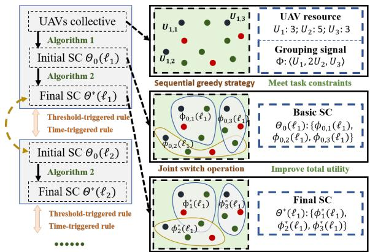  
Fig. 4. The dynamic grouping process of a simple example.

It is worth noting that we do not perform secondary path planning to change the preassigned navigation route of each UAV. Therefore, continuous dynamic grouping will lead to frequent switching of communication links, thereby increasing energy loss and security risks. Before introducing the proposed algorithms in detail, we set the following two timing rules for the coalition structure transformation.

• Threshold-triggered rule: When the total utility $G P ( \Phi )$ of dynamic grouping is lower than the preset threshold $\hat { G P } ( \Phi )$ , the coalition structure reconfiguration is executed;

• Time-triggered rule: When the total utility $G P ( \Phi )$ is above the preset threshold $\hat { G P } ( \Phi )$ , the coalition structure reconfiguration is executed after the time interval $\Delta .$

## A. Algorithm 1: Fast Basic Coalition Structure Formation

It is noted that if we directly perform dynamic grouping when we receive a grouping signal for the first time, the computational complexity will increase significantly due to the constraints of the number of aircraft and basic task requirement. Therefore, we design a sequential greedy selection strategy to preprocess the heterogeneous UAV swarm, thereby quickly dividing them into multiple groups that meet the basic task requirements. Firstly, based on the number of different types of UAVs and the received grouping signal, we divide them into three types: $\mathcal { L } _ { 1 }$ : There are insufficient UAV nodes in the layer, resulting in overlapping nodes; $\mathcal { L } _ { 2 } \colon$ There are balanced UAV nodes in the layer; $\mathcal { L } _ { 3 } \mathrm { { : } }$ There are abundant UAV nodes in the layer, resulting in redundant nodes. Next, the fast basic coalition structure formation algorithm (BCSFA) aggregates players layer by layer based on the execution order of sub-tasks. Specifically, fast means to reduce the computational complexity, and basic means that the generated initial coalition structure meets the basic task execution requirement. Within the same sub-task layer, we set the priority I based on the number of $N _ { 1 }$ type UAVs as follows: $\Phi _ { 1 } > \Phi _ { 2 } > \cdots > \Phi _ { N _ { 1 } }$ According to the closest distance greedy selection strategy, a single UAV is selected based on the group priority and looped until the grouping requirements are met. Specifically, we set the greedy strategies for aggregating players layer by layer as follows:

Algorithm 1: Basic Coalition Structure Formation Algorithm 2: Joint Switch Coalition Formation   
Algorithm (BCSFA) Algorithm (JSCFA)   
Input: UAVs list U , sub-task layers list $\mathcal { L } _ { s t } ,$ groups list Φ, Input: UAVs list U , sub-task layers list $\mathcal { L } _ { s t }$ , information of   
information of each UAV $\eta _ { U _ { z , i } } ,$ , group priority I, each UAV $\eta _ { U _ { z , i } } ,$ grouping signal $\Phi _ { T } ,$ the initial coalition   
grouping signal (basic task requirement) $\Phi _ { T }$ players set: $\Phi _ { k } ,$ the initial coalition structure: $\Theta _ { 0 } ( l _ { 1 } )$   
Output: The basic coalition structure $\Theta _ { 0 } ( l _ { 1 } )$ Output: The final coalition structure $\Theta ^ { * } ( l _ { 1 } )$   
1: Step 1: Sub-task layers classify 1: for $z = 2$ to $Z$ do   
for $z \in \mathcal { L } _ { s t }$ do repeat   
Calculate the difference: $e _ { z } = n _ { z } \times N _ { 1 } - N _ { z }$ a). Establish the joint switch operations set ${ \mathcal { M } } _ { j s } .$   
if $e _ { z } > 0$ then $L _ { z } \in \mathcal { L } _ { 1 }$ if $L _ { z } \in \mathcal { L } _ { 1 }$ then   
else if $e _ { z } = 0$ then $L _ { z } \in \mathcal { L } _ { 2 }$ Establish the set $\mathcal { M } _ { j s }$ according to (rule-1).   
else: $L _ { z } \in \mathcal { L } _ { 3 }$ else if $L _ { z } \in \mathcal { L } _ { 2 }$ then   
end if Establish the set $\mathcal { M } _ { j s }$ according to (rule-2).   
end for else: Establish the set $\mathcal { M } _ { j s }$ according to (rule-3).   
2: Step 2: Sequential greedy selection end if   
for $z = 2$ to $Z$ do b). Calculate the utility $G P ( \Theta )$ after operation $\tau$ in   
for $k = 1$ to $N _ { 1 }$ do $\mathcal { M } _ { j s }$ is executed according to (11), and eliminate   
if $L _ { z } \in \mathcal { L } _ { 1 }$ then operations that do not meet JSCI order accroding to (17).   
$\Phi _ { k , z } = \mathcal { U } _ { k , z }$ according to (gt-1) c). Update $\mathcal { M } _ { j s }$ and compare the gain $\varpi ( \tau )$ of   
else $L _ { z } \in \mathcal { L } _ { 2 }$ or $L _ { z } \in { \mathcal { L } } _ { 3 }$ then each joint switch operation according to Definition $5 .$   
$\Phi _ { k , z } = \mathcal { U } _ { k , z }$ according to $( \mathrm { g t } - 2 )$ d). Perform $\tau _ { m a x }$ with the maximum gain.   
end if e). Update $\Phi _ { k } , \Theta _ { i } ( l _ { 1 } )$   
end for until ${ \mathcal { M } } _ { j s } = \emptyset .$   
end for end for   
3: Update the coalition players set: $\Phi _ { k } = \{ \mathcal { U } _ { k , 1 } , \cdot \cdot \cdot , \mathcal { U } _ { k , Z } \}$ 2: Update the coalition players set: $\Phi _ { k } ^ { * } = \{ \mathcal { U } _ { k , 1 } , \cdot \cdot \cdot , \mathcal { U } _ { k , Z } \} ,$   
4: Update the coalition structure: $\Theta _ { 0 } ( l _ { 1 } ) = \{ \Phi _ { 1 } , \cdot \cdot \cdot , \Phi _ { N _ { 1 } } \}$ 3: Update the coalition structure: $\Theta ^ { * } ( l _ { 1 } ) = \{ \Phi _ { 1 } , \cdot \cdot \cdot , \Phi _ { N _ { 1 } } \}$

1) gt-1: If the sub-task layer $L _ { z } ~ \in ~ \mathcal { L } _ { 1 }$ , we iteratively aggregate the closest $U _ { z }$ type UAVs to each group based on the group priority order. Due to the insufficient number of the $U _ { z }$ type UAVs, we first aggregate available individuals. After all free individuals are aggregated, overlapping UAV nodes are generated until all groups meet the basic task requirements.

2) $g t { - } 2 { : }$ If the sub-task layer $L _ { z } ~ \in ~ \mathcal { L } _ { 2 }$ or $\mathcal { L } _ { 3 }$ , due to the balanced or abundant number of the $U _ { z }$ type UAVs, we iteratively aggregate the closest $U _ { z }$ type UAVs to each group based on the group priority order until all $U _ { z }$ type UAVs are aggregated.

Remark 1. The closest distance greedy selection strategy refers to selecting the closest $U _ { z }$ type UAVs to the UAVs in the sub-task layer $L _ { z - 1 }$ of each group when aggregating UAVs in the sub-task layer $L _ { z }$ . If there are multiple UAVs in the sub-task Layer $L _ { z - 1 } ,$ , select the closest $U _ { z }$ type UAVs to the virtual centroid of multiple UAVs in the sub-task layer $L _ { z - 1 }$

The specific process is shown in Algorithm 1, where the UAV list $\mathcal { U } = \{ U _ { 1 , 1 } , \cdots , U _ { 1 , N _ { 1 } } , \cdots , U _ { Z , 1 } , \cdots , U _ { Z , N _ { Z } } \}$ the sub-task layer list $\mathcal { L } _ { s t } ~ = ~ \{ 2 , \cdots , Z \}$ , the group list $\begin{array} { l l l } { { \Phi } } & { { = } } & { { \left\{ \Phi _ { 1 } , \cdots , \Phi _ { N _ { 1 } } \right\} } } \end{array}$ and the grouping signal $\begin{array} { r l } { \Phi _ { \mathcal { T } } } & { { } = } \end{array}$ $\{ n _ { 1 } U _ { 1 } , n _ { 2 } U _ { 2 } , \cdot \cdot \cdot , n _ { Z } U _ { Z } \}$ . The basic coalition structure generated through Algorithm 1 ensures that each group meets basic task requirements while also balancing the distribution of UAV nodes at different layers, thereby ensuring a reasonable initial $E _ { \Phi _ { k } }$ and $F _ { \Phi _ { k } }$ . Moreover, the greedy selection strategy based on the nearest distance also gives rise to relatively advantageous initial $D _ { \Phi _ { k } }$ and $G _ { \Phi _ { k } }$ . Ultimately, it significantly reduces the number of joint switch operations between the initial UAV swarm and the final coalition structure.

## B. Algorithm 2: Joint Switch Coalition Formation for Dynamic Grouping

After receiving the grouping signal at $l _ { 1 }$ , we obtain a preprocessed initial coalition structure $\Theta _ { 0 } ( l _ { 1 } )$ through Algorithm 1. Based on this, we design an efficient joint switch coalition formation algorithm (JSCFA) for dynamic grouping to generate the final Nash-stable coalition structure at the current moment $l _ { 1 } .$ . In the initial coalition structure $\Theta _ { 0 } ( l _ { 1 } )$ , UAVs interact with each other according to the communication rules introduced in Section II, that is, the $U _ { 1 }$ type UAV in each group act as a leader to gather information from group members and communicate with leaders from other groups. When the joint switch operation decision can enhance the total utility of the coalition structure, it will be executed until no decision can lead to a more suitable grouping result. Specifically, we perform joint switch operations layer by layer according to the sequence of sub-task execution, and UAVs share their group information through communication rules. Then, each UAV in each sub-task layer constructs a set of joint switch UAV nodes that meet the basic task requirements of each group, and calculates the total utility of the coalition structure after executing the joint switch operation. The specific rules for establishing a joint switch operations set are as follows:

1) rule-1 for the case when the sub-task layer $L _ { z }$ of the $U _ { z , i }$ satisfies $L _ { z } ~ \in ~ \mathcal { L } _ { 1 }$ : If $U _ { z , i } ~ \in ~ \Phi _ { k _ { 1 } } , \Phi _ { k _ { 2 } }$ and $U _ { z , i } \in$ $\mathcal { N } _ { o l }$ , the joint switch operation can occur between three groups. Then, the set of joint switch operations as $\mathcal { M } _ { j s } ~ =$ $\{ \mathcal { M } _ { 3 } ( \Phi _ { k _ { j } } \to \Phi _ { k _ { 1 } } \xrightarrow { U _ { z _ { j } } i } \Phi _ { k _ { 2 } } ) , \mathcal { M } _ { 3 } ( \Phi _ { k _ { j } } \to \Phi _ { k _ { 2 } } \xrightarrow { U _ { z , i } } \Phi _ { k _ { 1 } } ) \}$ where $\Phi _ { k _ { j } } ~ \in ~ \{ \Phi _ { k } \} \backslash \Phi _ { k _ { 1 } } , \Phi _ { k _ { 2 } }$ . The number $N U _ { z }$ of joint switch operation under the sub-task layer $L _ { z }$ is calculated as $2 ( n _ { z } N _ { 1 } - N _ { z } ) ( N _ { z } - N _ { \Phi _ { k _ { 1 } , z } \cup \Phi _ { k _ { 2 } , z } } ) ,$ , where $N _ { \Phi _ { k _ { 1 } , z } \cup \Phi _ { k _ { 2 } , z } }$ represents the number of $U _ { z }$ in $\Phi _ { k _ { 1 } }$ and $\Phi _ { k _ { 2 } }$

2) rule-2 for the case when the sub-task layer $L _ { z }$ of the $U _ { z , i }$ satisfies $L _ { z } \in \mathcal { L } _ { 2 } \colon$ If $U _ { z , i } \in \Phi _ { k _ { 1 } }$ , the joint switch operation can occur between multiple groups. Then, the set of joint switch operations as ${ \mathcal { M } } _ { j s } = \{ { \mathcal { M } } _ { 2 } ( \Phi _ { k _ { 1 } }  \Phi _ { k _ { 2 } } ) , { \mathcal { M } } _ { 3 } ( \Phi _ { k _ { 1 } } $ $\Phi _ { k _ { 2 } } \ \to \ \Phi _ { k _ { 3 } } \ \to \ \Phi _ { k _ { 1 } } ) , \cdot \cdot \cdot , \mathcal { M } _ { N _ { 1 } } ( \Phi _ { k _ { 1 } } \ \to \ \Phi _ { k _ { 2 } } \ \to \ \cdots \ \to$ $\Phi _ { k _ { N _ { 1 } } }  \Phi _ { k _ { 1 } } ) \}$ , where $\Phi _ { k _ { i } }$ represents a group containing joint switch nodes and $j = 1 , \dot { 2 } , \cdots , N _ { 1 }$ . The number $N U _ { z }$ of the joint switch operation under the sub-task layer $L _ { z }$ is calculated as $\sum _ { \alpha = 2 } ^ { N _ { 1 } } { n _ { z } } ^ { a } C _ { N _ { 1 } } ^ { a }$ , where a represents the number of joint switch nodes and $n _ { z }$ is the number of basic task requirements of the $U _ { z }$ type UAVs in each group from the grouping signal $\Phi _ { T }$

3) rule-3 for the case when the sub-task layer $L _ { z }$ of the $U _ { z , i }$ satisfies $L _ { z } \in \mathcal { L } _ { 3 : } \mathrm { ~ I f ~ } U _ { z , i } \in \Phi _ { k _ { 1 } }$ and $N _ { \Phi _ { k _ { 1 } , z } } > n _ { z } ,$ the joint switch operation can occur between two groups. Then, the set of joint switch operations as $\mathcal { M } _ { j s } = \{ \mathcal { M } _ { 2 } ( \Phi _ { k _ { 1 } } \ $ $\Phi _ { k _ { j } } ) \}$ , where $\Phi _ { k _ { j } } \in \{ \Phi _ { k } \} \backslash \Phi _ { k _ { 1 } }$ . The number $N U _ { z }$ of joint switch operation under the sub-task layer $L _ { z }$ is calculated as $( N _ { z } - n _ { z } N _ { 1 } ) ( N _ { 1 } - 1 )$

The specific process is shown in Algorithm 2, we perform joint switch operations layer by layer under the sequence of sub-task execution. When the joint switch operations set for each sub-task layer is empty, a Nash-stable coalition structure is achieved. Meanwhile, since the number of UAVs and groups are finite, the initial coalition structure that satisfies the constraints will converge to the final coalition structure after a finite number of iterations.

Remark 2. As shown in Fig. 4, when the two timing rules for coalition structure transformation is triggered, the final coalition structure $\Theta ^ { * } ( l _ { i - 1 } )$ of the previous moment $l _ { i - 1 }$ is considered as the initial coalition structure $\Theta _ { 0 } ( l _ { i } )$ of the moment $l _ { i } .$ Then, through Algorithm 2, the final Nash-stable coalition structure $\Theta ^ { * } ( l _ { i } )$ at $l _ { i }$ can be obtained.

## C. Analysis of Overhead and Complexity

In the proposed JSCFA, the cost mainly includes communication overhead and joint switch overhead. In the dynamic grouping process, the leader $U _ { 1 }$ type UAVs in each group gather information from members within the group and are responsible for information exchange between groups through broadcasting, and there is no pairwise communication, so the communication cost can be ignored. Meanwhile, we use passive communication topology switching for dynamic grouping, which is different from actively changing the state of UAVs through secondary path planning to optimize the communication network, so the energy loss of joint switch operations can be ignored.

Furthermore, we analyz the time complexity of the proposed algorithm, which includes the following four parts: (1) The leader $U _ { 1 }$ type UAVs gather information from group members and communicate with other groups. The time complexity of this part is related to the time interval between the start of aggregating member information and the feedback from all members, which is denoted by $\mathcal { O } ( \Lambda _ { 1 } )$ , where $\Lambda _ { 1 }$ represents the time constant; (2) The leader calculates the potential utility generated by joint switch operations. The time complexity of this part is related to the number of joint switch operations that satisfy the constraints, which is denoted by $\mathcal { O } ( \Lambda _ { 2 } )$ , where $\Lambda _ { 2 }$ represents a constant that depends on the size of the grouping; (3) The potential utilities of all feasible joint switch operations are compared and determine the optimal joint switch operation decision. The time complexity of this part is related to the decision time, which is denoted by $\mathcal { O } ( \Lambda _ { 3 } )$ , where $\Lambda _ { 3 }$ represents a constant that depends on the decision time; (4) The leader sends decision instructions to the UAVs performing the optimal joint switch operation. The time complexity of this part is related to the information transmission time, which is denoted by $\mathcal { O } ( \Lambda _ { 4 } )$ , where $\Lambda _ { 4 }$ represents a constant that depends on the communication capacity.

It is worth mentioning that the number of UAVs is finite and the number of groups is controllable, resulting in a finite number of joint switch operations. Moreover, the proposed BCSFA can further reduce the computational complexity by rapidly forming the initial basic coalition structure. Therefore, the complexity of the proposed algorithm is acceptable.

## V. NUMERICAL SIMULATIONS

Consider a heterogeneous UAV swarm navigating along their planned flight paths within a 50km×50km rectangular task area. Meanwhile, in order to clearly reflect the advantages of the proposed algorithms without losing generality, we adopt the typical scenario of a heterogeneous UAV swarm performing complex sequential tasks as shown in Fig. 1, that is, $\Phi _ { T } = \{ U _ { 1 } , 2 U _ { 2 } , U _ { 3 } \}$ and $T _ { 1 } \mapsto T _ { 2 } \mapsto T _ { 3 }$ . Assume that grouping communication instructions are received from the command center at l, and accordingly, three different scenarios with different numbers of UAVs are considered as shown in Figs. 5(a), 6(a) and 7(a). In each scenario, each UAV will randomly generate flight directions and speeds within 80km/h-100km/h.

## A. Analysis of Convergence Characteristics

The first step is to demonstrate the effectiveness of the BCSFA proposed in this paper. Based on the three simulation scenarios, Figs. 5(b), 6(b) and 7(b) show that BCSFA can quickly divide the entire UAV swarm into multiple groups that meet the basic task execution requirements based on $\Phi _ { T }$ and the number of $U _ { 1 }$ . Specifically, when the number of UAVs is insufficient as shown in Fig. 5(b), overlapping UAVs will be generated to meet the task requirements of each group, while ensuring that the UAV does not overlap effectively, such as one UAV exists in more than two groups; When the number of UAVs is balanced as shown in Fig. 6(b), each type of UAVs will be evenly divided into each group according to task requirements to avoid independent and overlapping UAVs. When the number of UAVs is abundant as shown in Fig. 7(b), the excess UAVs will be evenly distributed among different groups. The above simulation further illustrates the applicability of the proposed BCSFA, and ensures that each group satisfies the basic task execution constraints through a greedy selection strategy, significantly reducing the number of iterations from group instructions to the initial coalition structure $\Theta _ { 0 } ( l _ { 1 } )$

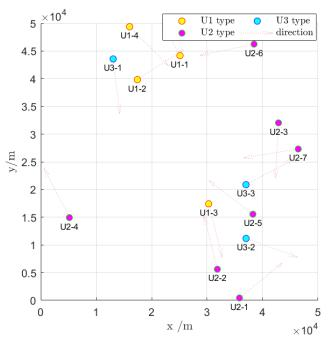  
(a)

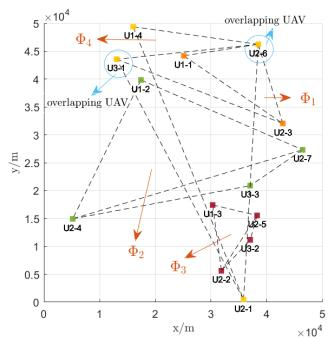  
(b)

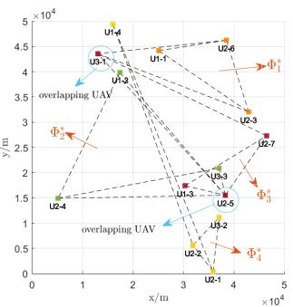  
(c)

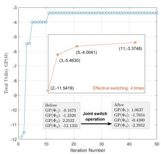  
(d)

Fig. 5. The insufficient number scenario: four U1 type UAV, seven U2 type UAV and three U3 type UAV. ((a): The initial distribution of heterogeneous UAVs; (b): The basic coalition structure; (c): The final coalition structure after joint switch operations; (d): The converge behavior of proposed algorithms.)  
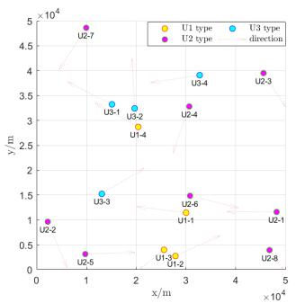  
(a)

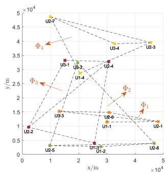  
(b)

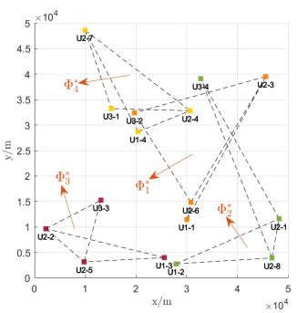  
(c)

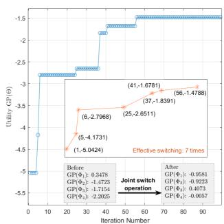  
(d)

Fig. 6. The balanced number scenario: four U1 type UAV, eight U2 type UAV and four U3 type UAV. ((a): The initial distribution of heterogeneous UAVs; (b): The basic coalition structure; (c): The final coalition structure after joint switch operations; (d): The converge behavior of proposed algorithms.)  
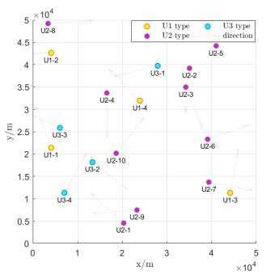  
(a)

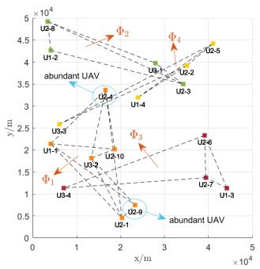  
(b)

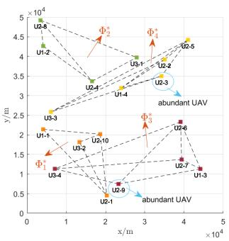  
(c)

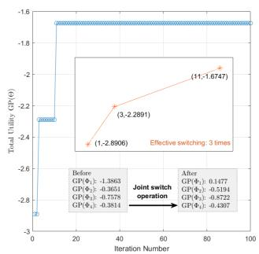  
(d)  
Fig. 7. The abundant number scenario: four U1 type UAV, ten U2 type UAV and four U3 type UAV. ((a): The initial distribution of heterogeneous UAVs; (b): The basic coalition structure; (c): The final coalition structure after joint switch operations; (d): The converge behavior of proposed algorithms.)

Then, the initial coalition structure in the three scenarios is iterated to derive the final coalition structure $\Theta ^ { * } ( l _ { 1 } )$ through joint switch operations based on the proposed JSCFA as shown in Figs. 5(c), 6(c) and 7(c). Furthermore, it can be clearly seen from Figs 5(d), 6(d) and 7(d) that the designed grouping performance indicators and JSCI order will ensure an increase in the total utility of the final alliance structure $\Theta ^ { * } ( l _ { 1 } )$ , even if the utility of some groups will decrease, thus avoiding falling into local optima. It is worth noting that in all three scenarios, the initial coalition structure will converge to the final stable coalition structure within a finite number of iterations. At the same time, due to the characteristics of the three joint switching operation rules set for different scenarios, the number of iterations significantly increases in the balanced number scenario as shown in Figs. 6(d). The above simulation further verifies the effectiveness of the proposed JSCFA. Next, we conduct detailed comparative simulation verifications for different scenarios.

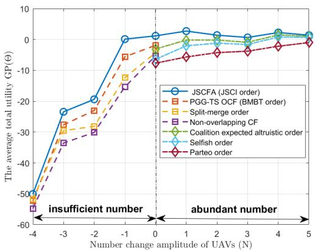  
Fig. 8. The curve of average total utility changing with the number of UAVs under constant group number. (The balanced number scenario: four U1 type UAV, eight U2 type UAV and four U3 type UAV)

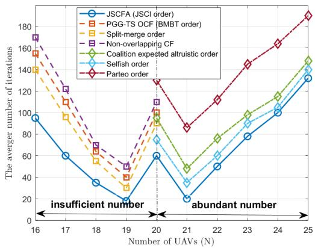  
Fig. 9. The curve of average number of iterations with the number of UAVs under constant group number. (The balanced number scenario: four U1 type UAV, eight U2 type UAV and four U3 type UAV)

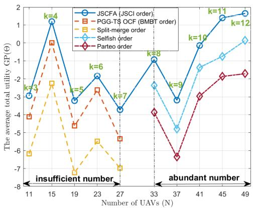  
Fig. 10. The curve of average total utility changing with the number of UAVs under different group number.

## B. Comparative Analysis of Grouping Reliability Performance

In Fig. 8, we validate the effectiveness of the proposed algorithms when the number of UAVs changes with the number of groups fixed at 5. When the number of UAVs N = 20, it corresponds to the balanced scenario. When the number of UAVs decreases, overlapping nodes will be generated. Therefore, we compare the proposed JSCFA with the PGG-TS overlapping coalition formation algorithm [17] and the split-merge order algorithm [38] for overlapping coalition formation and the non-overlapping coalition formation algorithm [19]. It can be seen that the proposed JSCFA has a significant advantage in average total utility compared to the above algorithms when the number of groups remains unchanged and the number of UAVs decreases. As the insufficient number of UAVs decreases, the difference between the compared algorithms decreases. This is because the increase in the insufficient number of UAVs leads to a significant increase in the number of iterations, which dilutes the advantages of JSCFA, as shown in Fig. 9. When the number of USVs increases, we compare the proposed JSCFA with the coalition expected altruistic order algorithm [19], the traditional Selfish order [25] and the traditional Parteo order [25]. The simulation results show that when the number of groups remains unchanged and the number of USVs increases, the JSCFA can also achieve average total utility. Meanwhile, according to the average total utility change amplitude shown in Fig. 8, it can be seen that when the number of USVs is less than 20, the utility changes dramatically with the change of the number of UAVs. When the number of UAVs is greater than 20, the utility changes very few with the change of the number of UAVs. This is because the cross group punitive indicator will greatly constrain the number of cross group UAVs, and the stability performance indicator can effectively balance the number of UAVs in each group. It is worth mentioning that the number of iterations significantly increases in the balanced number scenario, which shown in Fig. 6(d), is also validated in Fig. 9. Finally, we supplement two sets of comparative simulations to verify the reliability of the proposed algorithm when the number of groups changed, as shown in Figs. 10 and 11, further demonstrating the applicability and scalability of the proposed JSCFA with JSCI order.

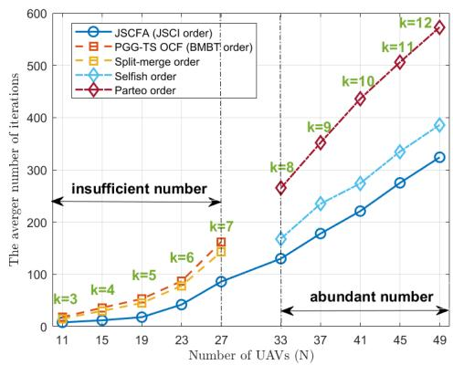  
Fig. 11. The curve of average number of iterations with the number of UAVs under different group number.

## VI. CONCLUSION

In this paper, we formulated a JSCFG model for dynamic grouping to achieve communication topology optimization

JOURNAL OF LATEX CLASS FILES, VOL. 11, NO. 11, 1111 1111

under the basic task requirements constraint, and balancing the dynamic characteristics and scale of the coalition to maximize grouping utility. Additionally, we proposed a JSCI order to facilitate joint switch operations among multiple UAVs players and proved the existence of Nash Equilibrium solutions under this preference order by EPG. Furthermore, a sequential greedy selection strategy-based BCSFA was proposed to aggregate players layer by layer based on the execution order of sub-tasks, which can significantly reduce the computational complexity during initial grouping phases. Subsequently, we introduced a JSCFA to generate the final Nash-stable coalition structure based on three joint switch rules. The simulation results demonstrated that the proposed algorithms effectively achieve rapid dynamic grouping and significantly enhance the reliability of the coalition structure when receiving switching instructions. In our future work, we will explore the potential of optimizing communication resource allocation and motion trajectory optimization based on the JSCFG.

## REFERENCES

[1] H. Wang, H. Zhao, J. Zhang, D. Ma, J. Li and J. Wei, “Survey on unmanned aerial vehicle networks: A cyber physical system perspective,” IEEE Commun. Surveys Tuts., vol. 22, no. 2, pp. 1027-1070, 2019.

[2] P. Shi and B. Yan, “A survey on intelligent control for multiagent systems,” IEEE Trans. Syst. Man. Cybern. Syst., vol. 51, no. 1, pp. 161- 175, 2020.

[3] S. Yang, Z. Hou and H. Chen, “Cooperative search-attack mission planning for multi-UAV based on intelligent self-organized algorithm,” Aerosp Sci Technol., vol. 76, pp. 402-411, 2018.

[4] H. Duan, J. Zhao, Y. Deng, Y. Shi and X. Ding, “Dynamic discrete pigeoninspired optimization for multi-UAV cooperative search-attack mission planning,” IEEE Trans. Aerosp. Electron. Syst., vol. 35, p. 100469, 2022.

[5] M Lyu, Y Zhao, C Huang and H Huang, “Unmanned aerial vehicles for search and rescue: A survey,” Remote Sensing., vol. 15, no. 13, p. 3026, 2023.

[6] I. Martinez-Alpiste, G. Golcarenarenji, Q. Wang and J. M. Alcaraz-Calero, “Search and rescue operation using UAVs: A case study,” Expert. Syst. Appl., vol. 178, no. 15, p. 114937, 2021.

[7] X. Bai, W. Ya and S. Ge, “Distributed task assignment for multiple robots under limited communication range,” IEEE Trans. Syst. Man. Cybern. Syst., vol. 52, no. 7, pp. 4259-4271, 2021.

[8] H. Ren and K. Chin, “Novel tasks assignment methods for wirelesspowered IoT networks,” ” IEEE Internet Things J., vol. 9, no. 13, 10563- 10575, 2021.

[9] W. Xia, T. Q. S. Quek, J. Zhang, S. Jin and H. Zhu, “Programmable hierarchical C-RAN: From task scheduling to resource allocation,” IEEE Trans. Wirel. Commun., vol. 18, no. 3, pp. 2003-2016, 2019.

[10] Y. Xu, Z. Liu, C. Huang and C. Yuen, “Robust resource allocation algorithm for energy-harvesting-based D2D communication underlaying UAV-assisted networks,” IEEE Internet Things J., vol. 8, no. 23, pp. 17161-17171, 2021.

[11] P. Sewalkar, J. Seitz, “Mc-coco4v2p: Multi-channel clustering-based congestion control for vehicle-to-pedestrian communication,” IEEE Trans. Veh. Technol., vol. 6, no. 3, pp. 523-532, 2020.

[12] Y. Fang, X. Liu, Z. Li, L. Cui, K. Wei and Q. Deng, “Efficient congestion control with information loss minimization for vehicular Ad Hoc networks,” IEEE Trans. Veh. Technol., vol. 72, no. 3, pp. 3879-3888, 2022.

[13] X. Huang, M. Peng and J. Song, “Heterogeneous network for internanoSat communication with novel modulation schemes and power control,” IEEE Commun. Lett., vol. 28, no. 4, pp. 897-901, 2024.

[14] H. Xiang, Y. Yang, G. He, J. Huang and D. He, “Multi-agent deep reinforcement learning-based power control and resource allocation for D2D communications,” IEEE Wireless Commun. Lett., vol. 11, no. 8, pp. 1659-1663, 2022.

[15] H. A. Mahdiraji, E. Razghandi and A. Hatami-Marbini, “Overlapping coalition formation in game theory: A state-of-the-art review,” Expert. Syst. Appl., vol. 174, no. 15, p. 114752, 2021.

[16] W. Saad, Z. Han, A. Hjørungnes, D. Niyato and E. Hossain, “Coalition formation games for distributed cooperation among roadside units in vehicular networks,” IEEE J. Sel. Areas Commun., vol. 29, no. 1, pp. 48-60, 2011.

[17] N. Qi, Z. Huang, F. Zhou, Q. Shi, Q. Wu and M. Xiao, “A task-driven sequential overlapping coalition formation game for resource allocation in heterogeneous UAVs networks,” IEEE Trans. Mobile Comput., vol. 22, no. 8, pp. 4439-4455, 2023.

[18] H. Luan, Y. Xu, D. Liu, Z. Du, H. Qian, X. Liu and X. Tong, “Energy efficient task cooperation for multi-UAV networks: A coalition formation game approach,” IEEE Access., vol. 22, no. 4, pp. 2326–2344, 2021.

[19] J. Chen, Q. Wu, Y. Xu, N. Qi, X. Guan, Y. Zhang and Z. Xue, “Joint task assignment and spectrum allocation in heterogeneous UAVs communication networks: A coalition formation game-theoretic approach,” IEEE Trans. Wirel. Commun., vol. 8, pp. 149 372-149 384, 2020.

[20] F. Afghah, M. Zaeri-Amirani, A. Razi, J. Chakareski and E. Bentley, “A coalition formation approach to coordinated task allocation in heterogeneous UAVs networks,” in Proc. Annu. Amer. Control Conf., pp. 5968-5975, 2018.

[21] X. Fu, J. Zhang, L. Zhang, and S. Changf, “Coalition formation among unmanned aerial vehicles for uncertain task allocation,” Wireless Netw., vol. 25, no. 5, pp. 367-577, 2019.

[22] V. Mittal, S. Maghsudi and E. Hossain, “Distributed cooperation under uncertainty in drone-based wireless networks: A Bayesian coalitional game,” IEEE Trans. Mobile Comput., vol. 22, no. 1, pp. 206-221, 2023.

[23] J. S. Ng, W. Y. B. Lim, H-N. Dai, Z. Xiong, J. Huang, D. Niyato, X-S. Hua, C. Leung and C. Miao, “Joint auction-coalition formation framework for communication-efficient federated learning in UAV-enabled internet of vehicles,” IEEE Trans. Intell. Transp. Syst., vol. 22, pp. 2326-2344, 2021.

[24] D. Liu, J. Wang, K. Xu, Y. Xu, Y. Yang, Y. Xu, Q. Wu, and A. Anpalagan, “Task-driven relay assignment in distributed UAV communication networks,” IEEE Trans. Veh. Technol., vol. 68, no. 11, pp. 11003-11017, 2019.

[25] T. Zhang, Y. Wang, Z. Ma and L. Kong, “Task assignment in UAVenabled front jammer swarm: A coalition formation game approach,” IEEE Trans. Aerosp. Electron. Syst., vol. 59, no. 6, pp. 9562-9575, 2023.

[26] J. Chen, P. Chen, Q. Wu, Y. Xu, N. Qi and T. Fang, “A game-theoretic perspective on resource management for large-scale UAV communication networks,” China Commun., vol. 18, no. 1, pp. 70-87, 2021.

[27] Y. Zhao, Y. Li, D. Wu and N Ge, “Overlapping coalition formation game for resource allocation in network coding aided D2D communications,” IEEE Trans. Mobile Comput., vol. 16, no. 12, pp. 3459-3472, 2017.

[28] J. Chen, Q. Wu, Y. Xu, N. Qi, T. Fang and D. Liu, “Spectrum allocation for task-driven UAV communication networks exploiting game theory,” IEEE Wireless Commun., vol. 28, no. 4, pp. 174-181, 2021.

[29] S. Yan, M. Peng and X. Cao, “A game theory approach for joint access selection and resource allocation in UAV assisted IoT communication networks,” IEEE Wireless Commun., vol. 6, no. 2, pp. 1663-1674, 2019.

[30] M. Peng, K. Zhang, J. Jiang, J. Wang, and W. Wang, “Energy-efficient resource assignment and power allocation in heterogeneous cloud radio access networks,” IEEE Trans Veh. Technol., vol. 64, no. 11, pp. 5275- 5287, 2015.

[31] S. Li, Q. Ni, Y. Sun, G. Min, and S. Al-Rubaye, “Energy-efficient resource allocation for industrial cyber-physical IoT systems in 5G era,” IEEE Trans. Ind. Informat., vol. 14, no. 6, pp. 2618-2628, 2018.

[32] Y. Chen, B. Ai, Y. Niu, Z. Han, R. He, Z. Zhong and G. Shi, “Sub-channel allocation for full-duplex access and device-to-device links underlaying heterogeneous cellular networks using coalition formation games,” IEEE Trans Veh. Technol., vol. 69, no. 9, pp. 9736-9749, 2020.

[33] S. Li, Q. Ni, Y. Sun, G. Min, and S. Al-Rubaye, “D2D communication channel allocation and resource optimization in 5G network based on game theory,” Comput. Commun., vol. 169, no. 1, pp. 26-32, 2021.

[34] A. S. Matar and X. Shen, “Joint subchannel allocation and power control in licensed and unlicensed spectrum for multi-cell UAV-cellular network,” IEEE Trans. Ind. Informat., vol. 39, no. 11, pp. 3542-3554, 2021.

[35] W. Saad, Z. Han, T. Basar, M. Debbah, and A. Hjorungnes, “Hedonic coalition formation for distributed task allocation among wireless agents,” IEEE Trans. Mobile Comput., vol. 10, no. 9, pp. 1327-1344, 2011.

[36] N. Xing, Q. Wang and L. Teng, “A game approach for distributed channel selection in uav communication networks,” In 2019 IEEE 90th Vehicular Technology Conference., pp. 1-5, 2019.

[37] N. Xing, Q. Zong, L. Dou, B. Tian and Q. Wang, “A game theoretic approach for mobility prediction clustering in unmanned aerial vehicle networks,” IEEE Trans Veh. Technol., vol. 68, pp. 9963-9973, 2019.

[38] W. Chen, S. Zhao, R. Zhang, and L. Yang, “Generalized user grouping in NOMA based on overlapping coalition formation game,” IEEE J. Sel. Areas Commun., vol. 39, no. 4, pp. 969-981, 2021.