# Dynamic Human Digital Twin Deployment at the Edge for Task Execution: A Two-Timescale Accuracy-Aware Online Optimization

Yuye Yang , You Shi , Changyan Yi , Member, IEEE, Jun Cai , Senior Member, IEEE, Jiawen Kang , Senior Member, IEEE, Dusit Niyato , Fellow, IEEE, and Xuemin Shen , Fellow, IEEE

Abstract—Human digital twin (HDT) is an emerging paradigm that bridges physical twins (PTs) with powerful virtual twins (VTs) for assisting complex task executions in human-centric services. In this paper, we study a two-timescale online optimization for building HDT under an end-edge-cloud collaborative framework. As a unique feature of HDT, we consider that PTs’ corresponding VTs are deployed on edge servers, consisting of not only generic models placed by downloading experiential knowledge from the cloud but also customized models updated by collecting personalized data from end devices. To maximize task execution accuracy with stringent energy and delay constraints, and by taking into account HDT’s inherent mobility and status variation uncertainties, we jointly and dynamically optimize VTs’ construction and PTs’ task offloading, along with communication and computation resource allocations. Observing that decision variables are asynchronous with different triggers, we propose a novel two-timescale accuracyaware online optimization approach (TACO). Specifically, TACO utilizes an improved Lyapunov method to decompose the problem into multiple instant ones, and then leverages piecewise Mc-Cormick envelopes and block coordinate descent based algorithms, addressing two timescales alternately. Theoretical analyses and

Manuscript received 26 January 2024; revised 12 April 2024; accepted 24 May 2024. Date of publication 28 May 2024; date of current version 5 November 2024. This work was supported in part by the State Key Laboratory of Massive Personalized Customization System and Technology under Grant H&C-MPC-2023-04-01, in part by Postgraduate Research & Practice Innovation Program of NUAA under Grant xcxjh20231601, in part by National Research Foundation, Singapore, and Infocomm Media Development Authority under its Future Communications Research & Development Programme, Defence Science Organisation (DSO) National Laboratories under the AI Singapore Programme (AISG) under Grant AISG2-RP-2020-019 and Grant FCP-ASTAR-TG-2022-003, in part by Singapore Ministry of Education (MOE) Tier 1 under Grant RG87/22, and in part by the National Natural Science Foundation of China (NSFC) under Grant 62102099 and Grant U22A2054. Recommended for acceptance by H. Yao. (Corresponding author: Changyan Yi.)

Yuye Yang, You Shi, and Changyan Yi are with the College of Computer Science and Technology, Nanjing University of Aeronautics and Astronautics, Nanjing 211106, China (e-mail: mryyy@nuaa.edu.cn; shyou@nuaa.edu.cn; changyan.yi@nuaa.edu.cn).

Jun Cai is with the Department of Electrical and Computer Engineering, Concordia University, Montréal, QC H3G 1M8, Canada (e-mail: jun.cai@concordia.ca).

Jiawen Kang is with the School of Automation, Guangdong University of Technology, Guangzhou 510062, China (e-mail: kavinkang@gdut.edu.cn).

Dusit Niyato is with the School of Computer Science and Engineering, Nanyang Technological University, Singapore 639798 (e-mail: dniyato@ntu.edu.sg).

Xuemin Shen is with the Department of Electrical and Computer Engineering, University of Waterloo, Waterloo, ON N2L 3G1, Canada (e-mail: sshen@uwaterloo.ca).

This article has supplementary downloadable material available at https://doi.org/10.1109/TMC.2024.3406607, provided by the authors.

Digital Object Identifier 10.1109/TMC.2024.3406607

simulations show that the proposed approach can reach asymptotic optimum within a polynomial-time complexity, and demonstrate its superiority over counterparts.

Index Terms—HDT, end-edge-cloud collaboration, placement and update, accuracy awareness, two-timescale online optimization.

# I. INTRODUCTION

H UMAN digital twin (HDT) is defined as a paradigm thatcan vividly characterize the replication of each individual human in the virtual space while real-time reflecting its actual physical and mental status in the physical space [1], [2]. With the personalized status information maintained in a high-fidelity virtual environment, HDT can be regarded as a “sandbox”, where complex tasks for human-centric services (e.g., activity recognition [3] and vital signal measurement [4]) are able to be repeatedly simulated and tested, guiding the practical implementation. For example, NVIDIA and Evozyne are collaborating to build an artificial intelligence-generated content empowered HDT system for predicting the interactions of drugs [5]. Because of the large potential in assisting complex task execution with human-centric concerns, HDT has been envisioned as a key enabler for Metaverse, Healthcare 5.0, Society 5.0, etc., attracting significant attentions recently [6].

Essentially, the HDT system consists of a number of physical twin (PT) and virtual twin (VT) pairs, where PT stands for the physical entity (i.e., human) and VT represents the corresponding virtual model [7]. Obviously, the successful realization of HDT largely depends on the well construction and management of VT, so as to provide fast-responsive interactions and highaccurate task execution for its paired PT. These requirements prompt the adoption of end-edge-cloud collaborative framework [8], by which HDT can be built and operated at the network edge (while supported by both end devices and the cloud center), guaranteeing pervasive connectivities, customized services and low-delay feedbacks. Although some preliminary efforts have been dedicated on studying similar problems, such as industrial digital twin construction at the edge [9], [10], [11] and service application deployment across edges [12], [13], [14], establishing HDT at the edge for assisting task execution particularly involves some fundamentally different and unique issues that remain unexplored but are of great importance. On one hand, different from position-fixed industrial plants, PTs in the HDT system are highly mobile with unpredictable mobility patterns (including positional and postural variations), leading to potential instability of PT-VT connectivities [1]. Therefore, to guarantee seamless PT-VT interactions, it is necessary to dynamically place the associated VT of each PT on the edge server (ES) that this PT may switch its access to (caused by the random mobility). On the other hand, unlike generalized applications requesting encapsulated services, PTs in the HDT system are extremely personalized and their status may vary frequently by uncertain external factors or physiological state changes, resulting in the potential inconsistency between each PT and its associated VT [15]. Hence, to keep up-to-date highfidelity VTs, it is necessary to keep the associated VT on the ES updated in a real-time manner (especially for the customized part).

Nevertheless, meeting all aforementioned requirements are very challenging because of the following reasons.

1) To enhance the accuracy of complex task execution assisted by HDT, it is required to construct fine-grained VTs on ESs (by both dynamically place generic models via the cloud and update customized toppings via sensors worn on PTs). However, the data brought by VT constructions can be massive [16], inherently increasing the service delay and energy consumption, and thus the data size of generic model placement and customized model update should be carefully optimized for striking a balance between accuracy and cost. On top of this, considering that the ultimate goal is to assist the task execution, how to timely and efficiently offloading tasks from PTs to ESs (containing associated VTs) should also be jointly considered with VT constructions, because both of them share the same communication and computation resources.

2) Since HDT is time-varying evolutionalized with uncertain PT-VT mobility and status variations, the system optimization has to be conducted online while the statistics of future information (related to human activities) may be hard to obtain, if not impossible [17]. Moreover, the dynamic placement of generic VT models is triggered by PTs’ mobility and access handover among different ESs, which usually happens over a long time period. In contrast, the dynamic update of customized VT models and the complex task offloading are triggered by PTs’ status variations, which may need to be adapted in a much higher frequency. These indicate that such actions for system optimization should be performed asynchronously in different timescales.

To tackle the aforementioned difficulties, in this paper, we propose a novel two-timescale accuracy-aware online optimization approach for building HDT in assisting complex task execution under an end-edge-cloud collaborative framework. Specifically, we consider that each PT’s associated VT (deployed on the ES) consists of a generic model placed by downloading experiential knowledge (e.g., feature parameters and weights) from the cloud center and a customized model updated by uploading personalized data (e.g., behavior characteristics) from sensors worn on the PT. With the objective of maximizing the average accuracy of complex task execution assisted by HDT under stringent energy and delay constraints, and by taking into account the system uncertainties (e.g., random mobility and status variations), we formulate a two-timescale online optimization problem. Particularly, we aim to dynamically optimize i) large-timescale decisions, including the granularity of each PT’s experiential knowledge for placing its generic VT model and the ES access selection of each PT, and ii) small-timescale decisions, including the amount of each PT’s personalized data for updating its customized VT model, task offloading decision (i.e., local computing or edge computing) for each task, and communication and computation resource allocations of each ES. To this end, we develop a novel two-timescale accuracy-aware online optimization approach (TACO) based on the improved Lyapunov optimization. Specifically, the long-term problem is first decomposed into a series of short-term deterministic subproblems with different timescales, and then an alternating algorithm is proposed, integrating piecewise McCormick envelopes (PME) and block coordinate descent (BCD) based methods, for iteratively solving these subproblems. Theoretical analyses show that the proposed approach can produce an asymptotically optimal outcome with a polynomial-time complexity.

The main contributions of this paper are summarized in the following.

\- To the best of our knowledge, we are the first to study the HDT deployment at the network edge for assisting human-centric task execution by formulating a twotimescale accuracy-aware online optimization problem, which jointly optimizes VTs’ construction (including dynamic generic model placement and customized model update) and PTs’ task offloading together with the management of PT-ES access selection and corresponding communication and computation resource allocations. . We propose a novel approach, called TACO, which first decomposes the long-term optimization problem into multiple instant ones. Then, we leverage PME and BCD based algorithms for alternately solving the decoupled subproblems in the large-timescale and small-timescale, respectively. . We theoretically analyze performance of the proposed TACO approach by rigorously deriving the gap to optimum and the computational complexity in the closed-form. Furthermore, extensive simulations show that the proposed TACO approach can outperform counterparts in terms of improving the HDT-assisted task execution accuracy, and reducing the service response delay and overall system energy consumption.

The rest of this paper is organized as follows. Section II reviews the recent related work and highlights the novelties of this paper. Section III describes the considered system model and the problem formulation. In Section IV, the two-timescale accuracy-aware online optimization approach, i.e., TACO, is proposed and analyzed theoretically. Simulation results are presented in Section V, followed by the conclusion in Section VI.

# II. RELATED WORK

As one of the key enabler for emerging applications, HDT has recently drawn a lot of research attentions from both academia and industry. For example, Lee et al. in [18] proposed a large-scale HDT construction framework on the cloud server integrated with a synchronization mechanism to reduce system overall data transmission cost. Zhong et al. in [19] introduced a bidirectional long short-term memory based algorithm in designing high-fidelity HDT model with multimodel data on the cloud platform. In [20], Liu et al. developed a cloud HDT based healthcare system by optimizing a patient-data processing workflow to improve the quality of personal health management. However, these papers were mainly restricted to constructing HDT sorely on the cloud server, ignoring the potential of utilizing network edge resources for empowering HDT with the capability of providing pervasive, customized and low-delay services.

While deploying HDT at the network edge has rarely been investigated, some researchers have dedicated in studying the general DT construction at the edge. Dong et al. in [10] proposed a deep learning algorithm for constructing DTs of the mobile edge network, aiming to minimize the normalized energy consumption through the optimization of user associations, resource allocations and offloading probabilities. Zhang et al. in [11] formulated a DT adaptive placement and transfer problem to minimize the DT synchronization delay, which were then solved by the double auction based optimization. Nevertheless, these papers considered that DTs were constructed on fixed locations or placed following pre-known mobility patterns, making them unsuitable for HDT with human-centric features, where PTs are highly mobile with unpredictability. Another stream of related works have been conducted on general mobile service application deployment across edges. For instance, Wang et al. in [12] developed a user-centric learning-driven method for deploying and migrating delay-aware service applications to minimize the total service delay of mobile users. Ouyang et al. [13] formulated a dynamic service deployment problem with the objective of minimizing the user-perceived delay under the uncertain user mobility. However, in these papers, service applications were assumed to have limited and encapsulated types, meaning that they are not customized and do not need to be updated, which largely differ from those of HDT (where on-demand evolution is essential).

To guarantee the long-term performance in online problems, Lyapunov optimization method has been widely recognized as an efficient approach [21], [22], [23], yet most of existing solutions were restricted to problems with decisions in the single timescale only. Recently, some preliminary studies [24], [25] have delved into designing two-timescale Lyapunov methods, by which the original problem was decomposed and further decoupled into subproblems in two different timescales independently and then optimized separately. Besides these, in [17], [26], alternating algorithms were developed in addition to the Lyapunov framework to tackle subproblems in two timescales with coupled relationships but are both convex (or can be easily converted into convex forms). However, these solutions cannot be directly applied in this paper because the considered subproblems (after the decomposition) are not only tightly coupled but also highly non-convex.

In summary, different from all the existing works, this paper proposes a novel two-timescale accuracy-aware online optimization approach to jointly optimize the HDT deployment (i.e., generic placement and customized update of VT model) and task offloading under an end-edge-cloud collaborative framework, where the novelty lies in not only the system model but also the solution.

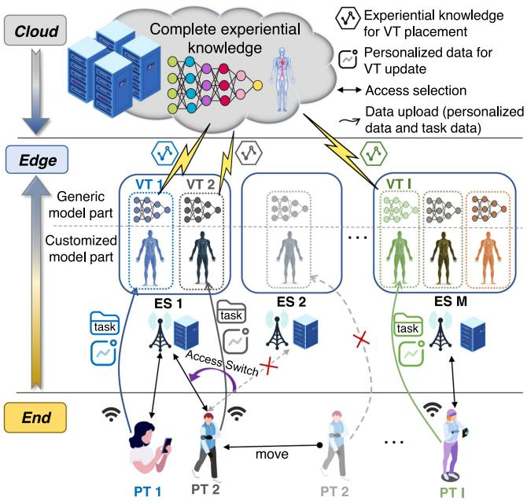

<details>
<summary>flowchart</summary>

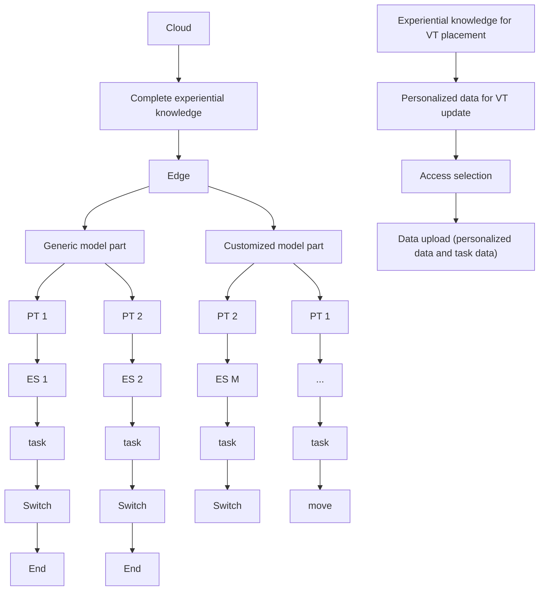
</details>

Fig. 1. The end-edge-cloud collaborative HDT system.

# III. SYSTEM MODEL AND PROBLEM FORMULATION

In this section, we first provide a system overview on how HDT is deployed and functioned on ESs. Then, to be more specific, the generic VT model placement in the large-timescale and the customized VT model update together with the task offloading in the small-timescale are described. After that, aiming to enhance the accuracy of complex task execution assisted by HDT, a two-timescale online optimization problem is formulated.

# A. System Overview

Consider an HDT system building upon an end-edge-cloud collaborative framework, as illustrated in Fig. 1, consisting of a set of end users (regarded as PTs) I with cardinality of $\mid { \mathcal { T } } \mid = I ,$ , multiple geographically distributed ESs denoted as =M with $\mathcal { M } \mathrel { \mathop { = } } M$ , and a cloud center (acting as the central =controller). PTs (roaming around) generate streams of complex tasks which require the construction of exclusive VT models (forming one-to-one PT-VT pairs) at the edge to assist their task executions. Each VT should be deployed on the ES to which its associated PT may access for offering high-quality and lowdelay services. Note that one ES can host multiple VT models for different PTs, and the corresponding communication and computation resources are shared among them. Furthermore, the construction of a high-fidelity VT on the ES consists of two main procedures, i.e., generic model placement and customized model update [27]. For each VT, the generic part of the model is obtained by downloading the experiential knowledge with a selected granularity1 from the cloud center, and the target ES for its placement is determined following the access selection of the associated PT. By contrast, the customized part of each VT model is updated by uploading the personalized data with an optimized data size2 obtained from sensors worn on the associated PT. After VT establishment, PTs’ tasks can be either transmitted (offloaded) to VTs deployed on the ES or processed locally, depending on the demands of task execution accuracy versus the requirements of service delay and energy consumptions. It is worth noting that although VT models are not able to be built locally, PTs’ tasks can be executed by running offline service applications pre-installed on PTs, which are much less powerful but do not require to be real-time updated.

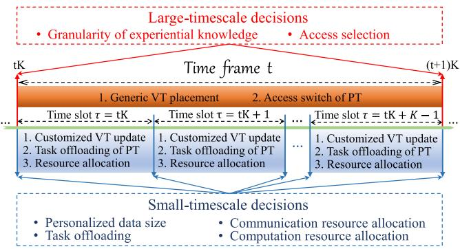

<details>
<summary>flowchart</summary>

```mermaid
graph TD
    A["Large-timescale decisions"] --> B["• Granularity of experiential knowledge"]
    A --> C["• Access selection"]
    D["Small-timescale decisions"] --> E["• Personalized data size"]
    D --> F["• Task offloading"]
    D --> G["• Communication resource allocation"]
    D --> H["• Computation resource allocation"]
    I["Time frame t"] --> J["tK"]
    I --> K["(t+1)K"]
    L["Time slot τ = tK"] --> M["1. Customized VT update"]
    L --> N["2. Task offloading of PT"]
    L --> O["3. Resource allocation"]
    P["Time slot τ = tK + 1"] --> Q["1. Customized VT update"]
    P --> R["2. Task offloading of PT"]
    P --> S["3. Resource allocation"]
    T["Time slot τ = tK + K - 1"] --> U["1. Customized VT update"]
    T --> V["2. Task offloading of PT"]
    T --> W["3. Resource allocation"]
```
</details>

Fig. 2. Two-timescale online optimization framework.

In practice, the dynamic placement of generic VT model and ES access handover of each PT commonly happen in a low frequency (i.e., over a large-timescale),3 while the update of customized VT models and task offloading together with corresponding communication and computation resource allocations require immediate and frequent adaptation to accommodate the status variation of PT and its task generations [2]. To this end, we define that in the considered online optimization framework, the access selection of each PT and the granularity of experiential knowledge for its generic VT model placement are decided in the large-timescale, while the amount of personalized data for its customized VT model update, task offloading, communication and computation resource allocations are decided in the small-timescale, as shown in Fig. 2. Specifically, the timeline is segmented into $T \in \mathbb { N } ^ { + }$ coarse-grained time frames, and each frame can be further divided into a combination of $K \in \mathbb { N } ^ { + }$ fine-grained time slots. Let $t \in \mathcal { T } = \{ 0 , 1 , \dotsc , T - 1 \}$ be the = 0index of the t-th time frame, and define $\tau \in \mathcal { T } _ { t } = \{ t K , t K +$ $1 , \ldots , t K + K - 1 \}$ = +as the index of the τ -th time slot in the t-th 1 +time frame.

1Selecting a large (small) granularity of experiential knowledge for generic model placement may increase (decrease) the fidelity of the VT model, while also introducing a large (small) amount of data to be transferred, resulting in high (low) service delay and energy consumption.   
2The required size of personalized data for customized model update affects not only the fidelity of the VT model, but also the uplink communication and computation resource allocations among different PT-VT pairs and between their data transmission and task offloading.   
3Particularly, frequently downloading experiential knowledge and switching access points can lead to large configuration costs, including the dramatic increase of delays and energy consumptions [6].

TABLE I IMPORTANT NOTATIONS IN THIS PAPER 

<table><tr><td>Symbol</td><td>Meaning</td></tr><tr><td> $A_i(\tau)$ </td><td>task execution accuracy for PT i in time slot  $\tau$ </td></tr><tr><td> $a_{i,m}(t)$ </td><td>access selection of PT i in time frame t</td></tr><tr><td> $B_m$ </td><td>total bandwidth resource for accessing ES m</td></tr><tr><td> $b_i(\tau)$ </td><td>bandwidth resource allocation of PT i in time slot  $\tau$ </td></tr><tr><td> $D_i(t)$ </td><td>total experiential knowledge of PT i in time frame t</td></tr><tr><td> $E_i^{dl}(t)$ </td><td>energy consumption of downloading the experiential knowledge of PT i in time frame t</td></tr><tr><td> $E_{i,m}^{pl}(t)$ </td><td>energy consumption of placing generic VT model i in ES m in time frame t</td></tr><tr><td> $E_{i,m}^{ul}(\tau)$ </td><td>energy consumption of uploading the personalized data from PT i to ES m in time slot  $\tau$ </td></tr><tr><td> $E_{i,m}^{ud}(\tau)$ </td><td>energy consumption of updating the customized VT model i on the ES m in time slot  $\tau$ </td></tr><tr><td> $E_{i,m}^{ofld}(\tau)$ </td><td>energy consumption of transmitting task data of PT i to ES m in time slot  $\tau$ </td></tr><tr><td> $E_i^{exec}(\tau)$ </td><td>energy consumption of executing PT i&#x27;s task</td></tr><tr><td> $F_i$ </td><td>total computation resource of PT i&#x27;s local device</td></tr><tr><td> $F_m$ </td><td>total computation resource of ES m for all VTs</td></tr><tr><td> $f_i(\tau)$ </td><td>computation resource allocation of PT i in time slot  $\tau$ </td></tr><tr><td> $\mathcal{I}$ </td><td>set of end users (PTs) / corresponding VTs</td></tr><tr><td> $\mathcal{M}$ </td><td>set of ESs</td></tr><tr><td> $r_{i,m}(\tau)$ </td><td>transmission rate between PT i and ES m in time slot  $\tau$ </td></tr><tr><td> $S_i(\tau)$ </td><td>total personalized data generated by PT i in time slot  $\tau$ </td></tr><tr><td> $T_i^{dl}(t)$ </td><td>delay of downloading the experiential knowledge of PT i in time frame t</td></tr><tr><td> $T_{i,m}^{pl}(t)$ </td><td>delay of placing generic VT model i on ES m</td></tr><tr><td> $T_{i,m}^{ul}(\tau)$ </td><td>delay of uploading the personalized data from PT i to ES m in time slot  $\tau$ </td></tr><tr><td> $T_{i,m}^{ud}(\tau)$ </td><td>delay of updating customized VT model i on the ES m</td></tr><tr><td> $T_{i,m}^{ofld}(\tau)$ </td><td>delay of transmitting task data of PT i to ES m</td></tr><tr><td> $T_i^{exec}(\tau)$ </td><td>delay of task execution of PT i in time slot  $\tau$ </td></tr><tr><td>V</td><td>Lyapunov control parameter</td></tr><tr><td> $x_i(t)$ </td><td>experiential knowledge granularity for generic model placement of PT i in time frame t</td></tr><tr><td> $y_i(\tau)$ </td><td>personalized data size for customized model update of PT i in time slot  $\tau$ </td></tr><tr><td> $z_i(\tau)$ </td><td>task offloading of PT i in time slot  $\tau$ </td></tr></table>

Overall speaking, we target to optimize the long-term system performance (i.e., the average accuracy of complex task execution assisted by HDT under stringent delay and energy consumption constraints) by determining i) which ES should be selected to access for each PT and what level of granularity of the experiential knowledge should be chosen for placing its generic VT model on the ES in each time frame, and ii) how large the personalized data is required for updating the customized part of each VT model and whether the task of each PT should be processed locally or on the ES (deployed with its associated VT) together with communication and computation resource allocations in each time slot, in an online manner. For convenience, all important notations in this paper are listed in Table I.

# B. Generic VT Model Placement

Since PTs are mobile, to construct VT for each of them at the network edge so as to enable seamless PT-VT interactions, the generic VT model should be re-displaced on the ES that its associated PT switches its access to in each time frame $t \in \mathcal T$ . Denote $a _ { i , m } ( t ) \in \{ 0 , 1 \}$ as the access selection decision in the large-timescale indicating whether $\mathrm { P T } i \in \mathcal { I }$ selects to access ES $m \in \mathcal { M }$ or not in time frame $t \in { \mathcal { T } } , \operatorname { i . e . } , a _ { i , m } ( t ) = 1 \operatorname { i f } \operatorname { P T } i \in { \mathcal { I } }$ connects to $\mathrm { E S } m \in \mathcal { M }$ , and $a _ { i , m } ( t ) = 0$ ( ) = 1otherwise. Obviously, we should have $\textstyle \sum _ { m \in { \mathcal { M } } } a _ { i , m } ( t ) \leq 1$ = 0, meaning that PT i cannot ( ) 1access multiple ESs simultaneously [17]. For each $\mathrm { P T } i \in \mathcal { I }$ , its generic VT model is placed on the accessed ES by downloading a certain granularity of experiential knowledge from the cloud center. We define that the full experiential knowledge of each PT $i \in \mathcal { T }$ for its generic VT model placement has a total size of $D _ { i } ( t )$ , and denote $x _ { i } ( t ) \in [ 0 , 1 ]$ as its decision of granularity in ( )time frame $t \in \mathcal T$ ( ) [0 1]. Then, the data size of downloading the experiential knowledge for placing PT i’s VT model in time frame $t \in \mathcal T$ can be represented as $x _ { i } ( t ) D _ { i } ( t )$ . Based on these, the ( ) ( )corresponding delay and energy consumption of downloading such experiential knowledge can be respectively expressed $\mathrm { { a s ^ { 4 } } }$

$$
T _ {i} ^ {d l} (t) = \sum_ {m \in \mathcal {M}} a _ {i, m} (t) \frac {x _ {i} (t) D _ {i} (t)}{r ^ {c}}, \forall i \in \mathcal {I}, \forall t \in \mathcal {T}, \tag {1}
$$

$$
E _ {i} ^ {d l} (t) = T _ {i} ^ {d l} (t) p ^ {c}, \forall i \in \mathcal {I}, \forall t \in \mathcal {T}, \tag {2}
$$

where $r ^ { c }$ and ${ } \cdot p ^ { c }$ stand for the downlink transmission rate and unit transmission power via a fiber link channel from the cloud center to each ES, respectively. Note that fiber link is a wired connection with abundant bandwidth resource and stable communication environment, and $r ^ { c }$ and $p ^ { c }$ are thereby both considered as constants [26], [29].

To exploit this experiential knowledge, each ES has to allocate a proportion of its computation resource for completing the generic VT model placement at the beginning of each time frame. The delay of doing this for PT $i \in \mathcal { T }$ on ES $m \in \mathcal { M }$ in time frame $t \in \mathcal T$ can be calculated as

$$
T _ {i, m} ^ {p l} (t) = \frac {a _ {i , m} (t) x _ {i} (t) D _ {i} (t) C _ {m}}{f _ {i} (t K) F _ {m}}, \tag {3}
$$

where $C _ { m }$ is the number of CPU cycles required for ES m to process a unit of data, $F _ { m }$ is the CPU speed (measured by cycles/s) of ES m, and $f _ { i } ( t K ) \in ( 0 , 1 ]$ represents the ratio of ( ) (0 1]computation resource allocated to PT i for its VT construction at the beginning of time frame t (i.e., the first time slot of the frame with $\tau = t K )$ . Referring to the energy model widely used =in CMOS circuits [30], the energy consumption of constructing the generic VT model of the associated PT $i \in \mathcal { T }$ on the ES $m \in \mathcal { M }$ in each time frame $t \in \tau$ can be calculated as

$$
E _ {i, m} ^ {p l} (t) = \rho_ {m} f _ {i} (t K) (F _ {m}) ^ {3} T _ {i, m} ^ {p l} (t), \tag {4}
$$

where $\rho _ { m }$ is the effective switched capacitance of ES m depending on its chip architecture.

# C. Customized VT Model Update

Since PTs are personalized and their status may vary frequently due to uncertain external or internal factors, to guarantee the timeliness and high-fidelity of VTs on ESs, the customized

4Note that even for a special case that PT i’s access selection remains unchanged, it is still necessary to periodically replace its generic VT model on the same ES, because the experiential knowledge may experience “data drift” over the time [28].

VT model of each PT should be updated in each time slot $\tau \in \mathcal T _ { t }$ . Let $S _ { i } ( \tau )$ be the total amount of personalized data generated by $\operatorname { P T } \ i \in \mathcal { I }$ , and define $y _ { i } ( \tau ) \in [ 0 , 1 ]$ as the percentage of ( ) [0 1]personalized data chosen to be uploaded in time slot $\tau \in \mathcal T _ { t }$ . Then, the size of personalized data uploaded for updating PT i’s customized VT model in time slot $\tau \in \mathcal T _ { t }$ can be expressed as $y _ { i } ( \tau ) S _ { i } ( \tau )$ .

( ) ( )Within each time slot $\tau \in \mathcal { T } _ { t } .$ we denote the location of PT $i \in \mathcal { T }$ as $( \varphi _ { i } ( \tau ) , \psi _ { i } ( \tau ) )$ , which is a state information fol-( ( ) ( ))lowing its random mobility pattern, and let $( \varphi _ { m } , \psi _ { m } )$ be the fixed location of each ES $m \in { \mathcal { M } } .$ ( ) The distance between any PT $i \in \mathcal { T }$ and ES $m \in \mathcal { M }$ can then be calculated as $Q _ { i , m } ( \tau ) = \sqrt { ( \varphi _ { i } ( \tau ) - \varphi _ { m } ) ^ { 2 } + ( \psi _ { i } ( \tau ) - \psi _ { m } ) ^ { 2 } }$ , and accord-( ) = ( ( ) ) + ( ( ) )ing to Shannon-Hartley formula, the transmission rate from PT $i \in \mathcal { T }$ to its accessed ES $m \in \mathcal { M }$ is written as

$$
\begin{array}{l} r _ {i, m} (\tau) = a _ {i, m} (t) b _ {i} (\tau) B _ {m} \\ \times \log \left(1 + \frac {(Q _ {i , m} (\tau)) ^ {- \theta} p _ {i} | h _ {i , m} (\tau) | ^ {2}}{N _ {0} b _ {i} (\tau) B _ {m}}\right), \\ \end{array}
$$

where $b _ { i } ( \tau ) \in ( 0 , 1 ]$ is the proportion of communication re-( ) (0source allocated to $\mathrm { P T } i \in \mathcal { I }$ in time slot $\tau \in \mathcal { T } _ { t } , h _ { i , m } ( \tau )$ captures the Rayleigh fading effect between $\mathrm { P T } ~ i \in \mathcal { I }$ ( )and ES $m \in \mathcal { M }$ in time slot $\tau \in \mathcal T _ { t }$ (modeled as a circularly symmetric complex Gaussian random variable [31]), $B _ { m }$ is the communication bandwidth of ES $m \in \mathcal { M } , N _ { 0 }$ is the spectral density of the channel noise power, $p _ { i }$ is the pre-determined transmission power of PT $i \in \mathcal { Z } ,$ , and $\theta \geq 2$ is the path loss exponent [32]. Correspondingly, the delay and energy consumption of $\mathrm { P T } i \in \mathcal { I }$ in uploading the personalized data with size $y _ { i } ( \tau ) S _ { i } ( \tau )$ for updating its VT on ES $m \in \mathcal { M }$ in each time slot $\tau \in \mathcal T _ { t }$ ( )can be respectively expressed as

$$
T _ {i, m} ^ {u l} (\tau) = \frac {y _ {i} (\tau) S _ {i} (\tau)}{r _ {i , m} (\tau)}, \forall i \in \mathcal {I}, \forall m \in \mathcal {M}, \forall \tau \in \mathcal {T} _ {t}, \tag {5}
$$

$$
E _ {i, m} ^ {u l} (\tau) = T _ {i, m} ^ {u l} p _ {i}, \forall i \in \mathcal {I}, \forall m \in \mathcal {M}, \forall \tau \in \mathcal {T} _ {t}. \tag {6}
$$

To utilize this personalized data, each ES has to allocate a proportion of its computation resource for completing the customized VT model update in each time slot. The delay of doing this for PT $i \in \mathcal { T }$ on ES $m \in \mathcal { M }$ in time slot $\tau \in \mathcal T _ { t }$ can be calculated as

$$
T _ {i, m} ^ {u d} (\tau) = \frac {a _ {i , m} (t) y _ {i} (\tau) S _ {i} (\tau) C _ {m}}{f _ {i} (\tau) F _ {m}}, \tag {7}
$$

where $f _ { i } ( \tau ) \in ( 0 , 1 ]$ indicates the proportion of computation ( ) (0 1]resource allocated to $\mathrm { P T } \ i$ for its VT update in each time slot $\tau \in [ t K , t K + K - 1 ]$ . Besides, the corresponding energy [ + 1]consumption can be calculated as

$$
E _ {i, m} ^ {u d} (\tau) = \rho_ {m} f _ {i} (\tau) (F _ {m}) ^ {3} T _ {i} ^ {u d} (\tau). \tag {8}
$$

# D. HDT-Assisted Task Execution

Let $\lambda _ { i } ( \tau )$ be the data size of the complex task produced by PT $i \in \mathcal { Z }$ ( )in each time slot $\tau \in \mathcal { T } _ { t }$ , which is allowed to follow a general random distribution. Denote the task offloading decision of PT $i \in \mathcal { T }$ in time slot $\tau \in { \mathcal { T } } _ { t } \operatorname { a s } z _ { i } ( \tau ) \in \{ 0 , 1 \} , \operatorname { i . e . , } z _ { i } ( \tau ) = 1$ ( ) 0 1 ( ) = 1if PT i offloads the task to its VT on the ES for assistance, and $z _ { i } ( \tau ) = 0$ if PT i processes it locally.5 The delay and energy ( ) = 0consumption of offloading/transmitting such task from $\mathrm { P T } i \in \mathcal { T }$ to its associated VT deployed on the ES $m \in \mathcal { M }$ in time slot $\tau \in \mathcal T _ { t }$ can be respectively expressed as

$$
T _ {i, m} ^ {\text {   of   } l d} (\tau) = \frac {\lambda_ {i} (\tau)}{r _ {i , m} (\tau)}, \tag {9}
$$

$$
E _ {i, m} ^ {\text { ofld }} (\tau) = T _ {i, m} ^ {\text { ofld }} p _ {i}. \tag {10}
$$

Considering the possibility of both edge and local processing, the delay of HDT-assisted task execution of $\mathrm { P T } i \in \mathcal { I }$ in time slot $\tau \in \mathcal T _ { t }$ can be calculated as

$$
T _ {i} ^ {e x e c} (\tau) = \sum_ {m \in \mathcal {M}} a _ {i, m} (t) z _ {i} (\tau) \frac {\lambda_ {i} (\tau) C _ {m}}{f _ {i} (\tau) F _ {m}}
$$

$$
+ (1 - z _ {i} (\tau)) \frac {\lambda_ {i} (\tau) C _ {i}}{F _ {i}}, \tag {11}
$$

where $C _ { i }$ is the number of CPU cycles required for PT i to locally process a unit of data, and $F _ { i }$ denotes its CPU speed (measured by cycles/s). Besides, the corresponding energy consumption can be calculated as

$$
E _ {i} ^ {e x e c} (\tau) = \sum_ {m \in \mathcal {M}} a _ {i, m} (t) z _ {i} (\tau) \rho_ {m} (F _ {m}) ^ {2} \lambda_ {i} (\tau) C _ {m}
$$

$$
+ (1 - z _ {i} (\tau)) \rho_ {i} (F _ {i}) ^ {2} \lambda_ {i} (\tau) C _ {i}. \tag {12}
$$

With the help of HDT at the edge, the accuracy of executing each task from $\mathrm { P T } i \in \mathcal { I }$ in each time slot $\tau \in \mathcal T _ { t }$ can be defined as

$$
A _ {i} (\tau) = z _ {i} (\tau) g _ {i} ^ {\text { edge }} (d _ {i} (\tau)) + (1 - z _ {i} (\tau)) g _ {i} ^ {\text { local }}, \tag {13}
$$

wher e glocali r $g _ { i } ^ { l o c a l }$ epresents the task execution accuracy of local processing on PT i itself, and $g _ { i } ^ { e d g e } ( d _ { i } ( \tau ) )$ stands for the task execution accuracy of edge computing for PT i depending on the total size of data used for its VT construction, i.e., $d _ { i } ( \tau ) = x _ { i } ( t ) D _ { i } ( t ) + y _ { i } ( \tau ) S _ { i } ( \tau ) , \forall \tau \in \mathcal { T } _ { t } , \forall t \in \mathcal { T } _ { }$ , consisting ( ) = ( ) ( ) + ( ) ( )of both experiential knowledge for generic VT model placement in the large-timescale and personalized data for customized VT model update in the small-timescale. Note that $g _ { i } ^ { e d g e } ( d _ { i } ( \tau ) )$ gedgei di τ  is a mapping function that can be obtained via empirical studies or experiments6 [33].

Similar to [30], [34], we ignore overheads induced by computing outcomes feedback and system control signals. This is because the size of computing outcomes and control signals are much smaller than that of the input data. Technically, these overheads can be seen as small constants [35], which will not affect our analyses.

5Note that local processing can be done by running offline service applications pre-installed on $\mathrm { \bar { P T s } , }$ which are less powerful and more importantly do not require to be real-time updated.

6Note that, although the task execution accuracy is defined by an abstract mapping with respect to the data size, our proposed solution does not rely on the specific form of the task execution accuracy model (except that it has to be convex, which is intuitive as also illustrated in [33]).

# E. Problem Formulation

In summary, the total response delay for all tasks of PT $i \in \mathcal { T }$ in each time frame $t \in \mathcal T$ can be derived as

$$
T _ {i} ^ {t o l} (t) = T _ {i} ^ {d l} (t) + \sum_ {m \in \mathcal {M}} T _ {i, m} ^ {p l} (t) + \sum_ {\tau \in \mathcal {T} _ {t}} \left[ z _ {i} (\tau) \sum_ {m \in \mathcal {M}} \right.
$$

$$
\left. \left(T _ {i, m} ^ {u l} (\tau) + T _ {i, m} ^ {u d} (\tau) + T _ {i, m} ^ {o f l d} (\tau)\right) + T _ {i} ^ {e x e c} (\tau) \right], \tag {14}
$$

and the system overall energy consumption in each time frame $t \in \mathcal T$ can be derived as

$$
E ^ {t o l} (t) = \sum_ {i \in \mathcal {I}} (E _ {i} ^ {d l} (t) + \sum_ {m \in \mathcal {M}} E _ {i, m} ^ {p l} (t)) + \sum_ {i \in \mathcal {I}} \sum_ {\tau \in \mathcal {T} _ {t}} \left[ z _ {i} (\tau) \right.
$$

$$
\left. \sum_ {m \in \mathcal {M}} (E _ {i, m} ^ {u l} (\tau) + E _ {i, m} ^ {u d} (\tau) + E _ {i, m} ^ {o f l d} (\tau)) + E _ {i} ^ {e x e c} (\tau) \right]. \tag {15}
$$

To evaluate the core value of building HDT at the network edge, we take the long-term average accuracy of complex task execution assisted by the considered end-edge-cloud collaborative HDT system over all time frames as the performance measurement, which can be expressed as

$$
\mathcal {A} = \frac {1}{T K} \sum_ {t \in \mathcal {T}} \sum_ {\tau \in \mathcal {T} _ {t}} \sum_ {i \in \mathcal {I}} A _ {i} (\tau). \tag {16}
$$

With the objective of maximizing A while ensuring that the response delay for all tasks of each PT $i \in \mathcal { T }$ and the overall system energy consumption do not exceed certain thresholds, we formulate a two-timescale online optimization problem by jointly optimizing $a _ { i , m } ( t )$ and $x _ { i } ( t )$ , denoted in short by a set ( ) ( )of large-timescale decision variables $\mathcal { I } _ { i } ^ { A } ( t ) = \{ a _ { i , m } ( t ) , x _ { i } ( t ) \}$ , for each PT i in any time frame $t \in \mathcal T$ ( ), and $y _ { i } ( \tau ) , b _ { i } ( \tau ) , f _ { i } ( \tau )$ and $z _ { i } ( \tau )$ ( ) ( ) ( ), denoted in short by a set of small-timescale decision ( )variables $\mathcal { T } _ { i } ^ { B } ( \tau ) = \{ b _ { i } ( \tau ) , \dot { y _ { i } } ( \tau ) , f _ { i } ( \tau ) , z _ { i } ( \tau ) \}$ , for each PT i (in any time slot $\tau \in \mathcal T _ { t } .$ .

Mathematically, such a two-timescale online optimization problem can be formulated as

$$
\mathcal {P} _ {1}: \max _ {\mathcal {J} _ {i} ^ {A} (t), \mathcal {J} _ {i} ^ {B} (\tau)} \lim _ {t \to \infty} \mathcal {A}
$$

$$
\text { s.t. } \sum_ {m \in \mathcal {M}} a _ {i, m} (t) \leq 1, \forall i \in \mathcal {I}, \forall t \in \mathcal {T}, \tag {17a}
$$

$$
\sum_ {i \in \mathcal {I}} a _ {i, m} (t) b _ {i} (\tau) \leq 1, \forall m \in \mathcal {M}, \forall t \in \mathcal {T}, \tau \in \mathcal {T} _ {t}, \tag {17b}
$$

$$
\sum_ {i \in \mathcal {I}} a _ {i, m} (t) f _ {i} (\tau) \leq 1, \forall m \in \mathcal {M}, \forall t \in \mathcal {T}, \tau \in \mathcal {T} _ {t}, \tag {17c}
$$

$$
\lim _ {T \to \infty} \frac {1}{T} \sum_ {t \in \mathcal {T}} T _ {i} ^ {t o l} (t) \leq T _ {i} ^ {\max}, \forall i \in \mathcal {I}, \tag {17d}
$$

$$
\lim _ {T \to \infty} \frac {1}{T} \sum_ {t \in \mathcal {T}} E ^ {t o l} (t) \leq E ^ {\max}, \tag {17e}
$$

where constraint (17a) guarantees that one PT can connect to at most one ES in each time frame $t \in \mathcal T$ ; constraints (17b) and (17c) restrict that the communication and computation resource allocation should be less than the total capacities of each ES in any time slot $\tau \in \mathcal T _ { t }$ ; constraints (17d) and (17e) are the long-term average task response delay and system overall energy consumption constraints (in which $T _ { i } ^ { \mathrm { m a x } }$ and $E ^ { \mathrm { m a x } }$ represent the pre-determined response delay threshold of each PT $i \in \mathcal { T }$ and the overall system energy consumption threshold, respectively).

Obviously, solving problem $\mathcal { P } _ { 1 }$ directly is very challenging because i) $\mathrm { P T s } ^ { \prime }$ mobilities and status variations, due to humanrelated characteristics, are highly unpredictable, meaning that it is extremely hard, if not impossible, to obtain system statistics in advance, which necessitates the design of an online optimization algorithm; ii) although Lyapunov optimization [36] is well-known as an effective method to solve such an online problem in general, decision variables in different timescales $\operatorname { ( i . e . , } \ J _ { i } ^ { A } ( t )$ and $\mathcal { I } _ { i } ^ { B } ( \tau ) )$ are tightly coupled in not only the ( ) ( )objective function but also constraints (17d) and (17e); and iii) all constraints include discrete decision variables $( \mathrm { i } . \mathrm { e } . , a _ { i , m } ( t )$ or $z _ { i } ( \tau ) )$ ( ), and constraints (17d) and (17e) are both non-convex. ( )These indicate that $\mathcal { P } _ { 1 }$ is a two-timescale online non-convex mixed integer programming problem, which must be NP-hard.

# IV. A TWO-TIMESCALE ONLINE OPTIMIZATION APPROACH (TACO)

In this section, we propose a novel approach, namely TACO, for jointly optimizing VT construction and task offloading in the considered end-edge-cloud collaborative HDT system. Specifically, we first reformulate the two-timescale problem by distributing the task response delay and system overall energy consumption of each time frame $t \in \mathcal T$ into each of its contained time slot $\tau \in \mathcal T _ { t }$ . Then, we decompose the problem into multiple short-term deterministic subproblems of different timescales with the help of Lyapunov optimization method but with a two-timescale extension. After that, we introduce an alternating algorithm integrating PME and BCD methods to solve subproblems in the large-timescale and small-timescale, respectively.

# A. Problem Reformulation

Observed from problem $\mathcal { P } _ { 1 }$ that the delay and energy consumptions caused by the generic VT model placement are on the large-timescale, while those caused by customized VT model update and task execution are on the small-timescale. To facilitate the solution, we evenly distribute the task response delay and system overall energy consumption in each time frame $t \in \mathcal T$ into all $\mid \mathcal { T } _ { t } \mid = K$ time slots within this frame, which yields

$$
T _ {i} ^ {t o l} (\tau) = \left(T _ {i} ^ {d l} (t) + \sum_ {m \in \mathcal {M}} T _ {i, m} ^ {p l} (t)\right) / K + \sum_ {\tau \in \mathcal {T} _ {t}} \left[ z _ {i} (\tau) \right.
$$

$$
\left. \sum_ {m \in \mathcal {M}} (T _ {i, m} ^ {u l} (\tau) + T _ {i, m} ^ {u d} (\tau) + T _ {i, m} ^ {o f l d} (\tau)) + T _ {i} ^ {e x e c} (\tau) \right], \tag {18}
$$

$$
E ^ {t o l} (\tau) = \sum_ {i \in \mathcal {I}} \left(E _ {i} ^ {d l} (t) + \sum_ {m \in \mathcal {M}} E _ {i, m} ^ {p l} (t)\right) / K
$$

$$
+ \sum_ {i \in \mathcal {I}} \sum_ {\tau \in \mathcal {T} _ {t}} \left[ z _ {i} (\tau) \sum_ {m \in \mathcal {M}} (E _ {i, m} ^ {u l} (\tau) \right.
$$

$$
\left. + E _ {i, m} ^ {u d} (\tau) + E _ {i, m} ^ {o f l d} (\tau)) + E _ {i} ^ {e x e c} (\tau) \right]. \tag {19}
$$

Substituting (18) and (19) into (17d) and (17e) of problem $\mathcal { P } _ { 1 }$ , we have

$$
\mathcal {P} _ {2}: \max _ {\mathcal {J} _ {i} ^ {A} (t), \mathcal {J} _ {i} ^ {B} (\tau)} \lim _ {t \to \infty} \mathcal {A}
$$

s.t. (17a), (17b), (17c),

$$
\lim _ {T \to \infty} \frac {1}{T K} \sum_ {t \in \mathcal {T}} \sum_ {\tau \in \mathcal {T} _ {t}} T _ {i} ^ {t o l} (\tau) \leq T _ {i} ^ {\max} / K, \forall i \in \mathcal {I}, \tag {20a}
$$

$$
\lim _ {T \to \infty} \frac {1}{T K} \sum_ {t \in \mathcal {T}} \sum_ {\tau \in \mathcal {T} _ {t}} E ^ {t o l} (\tau) \leq E ^ {\max} / K. \tag {20b}
$$

Note that the reformulated problem $\mathcal { P } _ { 2 }$ is equivalent to the original problem $\mathcal { P } _ { 1 }$ with exactly the same decision variables remaining in two different timescales, while all long-term constraints have been unified into a single timescale (i.e., in terms of the time slot only) but will not affect the optimization performance.

Obviously, $\mathcal { P } _ { 2 }$ is still a long-term optimization problem, and the major difficulties for solving it are i) how to address the long-term average delay and energy consumption constraints; and ii) how to optimize two-timescale decision variables simultaneously. To this end, in the next subsection, we employ the Lyapunov method [36], and reformulate $\mathcal { P } _ { 2 }$ to accommodate the two-timescale features.

# B. Problem Decomposition

We first define a delay overflow queue and an energy deficit queue to respectively describe how task response delay $T _ { i } ^ { t o l } ( \tau )$ of each $\mathrm { P T } ~ i \in \mathcal { I }$ ( )and the overall system energy consumption $E ^ { t o l } ( \tau )$ in time slot $\tau \in \mathcal T _ { t }$ may deviate from the long-term (budget $T _ { i } ^ { \mathrm { m a x } } / K$ and $E ^ { \mathrm { m a x } } / K$ . The dynamic evolution of these two queues can be expressed as

$$
H _ {i} (\tau + 1) = \max [ H _ {i} (\tau) + T _ {i} ^ {t o l} (\tau) - T _ {i} ^ {\max} / K, 0 ], \tag {21}
$$

$$
E (\tau + 1) = \max [ E (\tau) + E ^ {t o l} (\tau) - E ^ {\max} / K, 0 ]. \tag {22}
$$

After that, we combine the delay overflow queue $H _ { i } ( \tau )$ for all tasks of PTs and energy deficit queue $E ^ { t o { \bar { l } } } ( \tau )$ ( )by a vector as $\Theta ( \tau ) = [ H ( \tau ) , E ( \tau ) ]$ ( ), and introduce a quadratic Lyapunov ( ) = [ (function as [36]:

$$
L (\boldsymbol {\Theta} (\tau)) \triangleq \frac {1}{2} \left[ \sum_ {i \in \mathcal {I}} H _ {i} (\tau) ^ {2} + E (\tau) ^ {2} \right], \tag {23}
$$

which quantitatively reflects the congestion of all queues, and should be persistently pushed towards a minimum value to keep queue stabilities. Referring to [37], the conditional Lyapunov drift is given by

$$
\Delta (\boldsymbol {\Theta} (\tau)) = \mathbb {E} [ L (\boldsymbol {\Theta} (\tau + K)) - L (\boldsymbol {\Theta} (\tau)) | \boldsymbol {\Theta} (\tau) ], \tag {24}
$$

where $\mathbb { E } [ \cdot ]$ denotes the expectation, and $\Delta ( \Theta ( \tau ) )$ measures the [ ] Δ( ( ))difference of the Lyapunov function between K consecutive time slots. Intuitively, by minimizing the Lyapunov drift in (24), we can prevent queue backlogs from the unbounded growth, and thus guarantee that the desired delay and energy consumption constraints can be met.

Accordingly, the Lyapunov drift-plus-penalty function becomes

$$
\Delta (\boldsymbol {\Theta} (\tau)) - V \mathbb {E} \left[ \sum_ {i \in \mathcal {I}} A _ {i} (\tau) \mid \boldsymbol {\Theta} (\tau) \right], \tag {25}
$$

where a control parameter $V > 0$ is introduced, representing 0the weight of significance on maximizing the HDT-assisted task execution accuracy versus that of strictly satisfying the delay and energy consumption constraints.

Theorem 1: Let $V > 0$ , and the drift-plus-penalty is bounded 0by any possible decisions in any time slot $\tau \in \mathcal T _ { t }$ , i.e.,

$$
\begin{array}{l} \Delta (\boldsymbol {\Theta} (\tau)) - V \mathbb {E} \left[ \sum_ {i \in \mathcal {I}} A _ {i} (\tau) \mid \boldsymbol {\Theta} (\tau) \right] \\ \leq G + \sum_ {i \in \mathcal {I}} \mathbb {E} [ H _ {i} (\tau) (T _ {i} ^ {t o l} (\tau) - T _ {i} ^ {\max} / K) \mid \boldsymbol {\Theta} (\tau) ] \\ + \mathbb {E} [ E (\tau) (E ^ {t o l} (\tau) - E ^ {\max} / K) \mid \Theta (\tau) ] \\ - V \mathbb {E} \left[ \sum_ {i \in \mathcal {I}} A _ {i} (\tau) \mid \boldsymbol {\Theta} (\tau) \right], \tag {26} \\ \end{array}
$$

where

$$
G = \frac {1}{2} \sum_ {i \in \mathcal {I}} [ T _ {i} ^ {t o l} (\max) - T _ {i} ^ {\max} ] ^ {2} + \frac {1}{2} [ E ^ {t o l} (\max) - E ^ {\max} ] ^ {2}
$$

is a positive constant that adjusts the tradeoff between the HDTassisted task execution accuracy and the satisfaction degree of the delay and energy consumption constraints.

Proof: Please see Appendix A, available online.


Theorem 1 shows that the drift-plus-penalty is deterministically upper bounded in each time slot $\tau \in \mathcal T _ { t }$ . Then, taking the sum over all time slots within time frame t for both sides of (26), we have

$$
\begin{array}{l} \sum_ {\tau \in \mathcal {T} _ {t}} \Delta (\boldsymbol {\Theta} (\tau)) - V \sum_ {\tau \in \mathcal {T} _ {t}} \mathbb {E} \left[ \sum_ {i \in \mathcal {I}} A _ {i} (\tau) \mid \boldsymbol {\Theta} (\tau) \right] \\ \leq G K + \sum_ {\tau \in \mathcal {T} _ {t}} \sum_ {i \in \mathcal {I}} \mathbb {E} [ H _ {i} (\tau) (T _ {i} ^ {t o l} (\tau) - T _ {i} ^ {\max} / K) \mid \boldsymbol {\Theta} (\tau) ] \\ + \sum_ {\tau \in \mathcal {T} _ {t}} \mathbb {E} [ E (\tau) (E ^ {t o l} (\tau) - E ^ {\max} / K) \mid \Theta (\tau) ] \\ - V \sum_ {\tau \in \mathcal {T} _ {t}} \mathbb {E} \left[ \sum_ {i \in \mathcal {I}} A _ {i} (\tau) \mid \boldsymbol {\Theta} (\tau) \right]. \tag {27} \\ \end{array}
$$

Then, $\mathcal { P } _ { 2 }$ can be decomposed into multiple subproblems, each of which opportunistically minimize the right-hand-side of (27) in one time frame $t \in \mathcal T$ , i.e.,

$$
\mathcal {P} _ {3}: \min _ {\mathcal {J} _ {i} ^ {A} (t), \mathcal {J} _ {i} ^ {B} (\tau)} \sum_ {\tau \in \mathcal {T} _ {t}} \sum_ {i \in \mathcal {I}} \mathbb {E} [ H _ {i} (\tau) (T _ {i} ^ {t o l} (\tau)
$$

$$
\begin{array}{l} \left. - T _ {i} ^ {\max} / K\right) \mid \Theta (\tau) ] + \sum_ {\tau \in \mathcal {T} _ {t}} \mathbb {E} [ E (\tau) (E ^ {t o l} (\tau) \\ \left. - E ^ {\max} / K\right) \mid \Theta (\tau) ] - V \sum_ {\tau \in \mathcal {T} _ {t}} \mathbb {E} \left[ \sum_ {i \in \mathcal {I}} A _ {i} (\tau) \mid \Theta (\tau) \right] \\ \end{array}
$$

s.t. (17a), (17b), (17c).

Note that, in problem $\mathcal { P } _ { 3 }$ , decisions $\mathcal { I } _ { i } ^ { A } ( t ) = \{ a _ { i , m } ( t ) , x _ { i } ( t ) \}$ and $\mathcal { T } _ { i } ^ { B } ( \tau ) = \{ b _ { i } ( \tau ) , y _ { i } ( \tau ) , f _ { i } ( \tau ) , z _ { i } ( \bar { \tau } ) \}$ ( ) = ( ) ( )remain unchanged as those in $\mathcal { P } _ { 3 }$ = ( ) ( ) ( ) (. This means that, although $\mathcal { P } _ { 3 }$ focuses on the optimization in a single time frame, it still includes two-timescale variables.

# C. Alternating Algorithm Between Two Timescales

1) Two-Timescale Decoupling and Alternation: To solve problem $\mathcal { P } _ { 3 }$ , we can decouple it into two subproblems (one for the large-timescale, and the other for the small-timescale), and then solve them alternately till the convergence.

Large-Timescale Problem: Given the small-timescale decision $\bar { \mathcal { I } } _ { i } ^ { B } ( \tau )$ together with the current backlogs of delay overflow queues $H _ { i } ( \tau )$ of all PTs and the system energy consumption ( )deficit queue $E ( \tau )$ , the large-timescale subproblem aims to ( )jointly optimize the granularity of experiential knowledge $x _ { i } ( t )$ and access selection $a _ { i , m } ( t )$ ( )at the beginning of each time frame $t \in \mathcal T$ ( ), which can be formulated as

$$
\begin{array}{l} \mathcal {P} _ {4}: \min _ {\mathcal {J} _ {i} ^ {A} (t)} \sum_ {i \in \mathcal {I}} H _ {i} (\tau) \left[ \left(T _ {i} ^ {d l} (t) + \sum_ {m \in \mathcal {M}} T _ {i, m} ^ {p l} (t)\right) / K \right. \\ + z _ {i} (\tau) \sum_ {m \in \mathcal {M}} (T _ {i, m} ^ {u l} (\tau) + T _ {i, m} ^ {u d} (\tau) + T _ {i, m} ^ {o f l d} (\tau)) \\ \left. + T _ {i} ^ {\text { exec }} (\tau) \right] + E (\tau) \sum_ {i \in \mathcal {I}} \left[ \left(E _ {i} ^ {d l} (t) + \sum_ {m \in \mathcal {M}} E _ {i, m} ^ {p l} (t)\right) / K \right. \\ + z _ {i} (\tau) \sum_ {m \in \mathcal {M}} (E _ {i, m} ^ {u l} (\tau) + E _ {i, m} ^ {u d} (\tau) + E _ {i, m} ^ {o f l d} (\tau)) \\ \left. + E _ {i} ^ {\text { exec }} (\tau) \right] - V \sum_ {i \in \mathcal {I}} A _ {i} (\tau) \\ \end{array}
$$

s.t. (17a), (17b), (17c).

Small-Timescale Problem: Given the large-timescale decision $\mathcal { J } _ { i } ^ { A } ( t )$ , the small-timescale subproblem targets to jointly ( )optimize the personalized data size $y _ { i } ( \tau )$ , bandwidth resource allocation $b _ { i } ( \tau )$ ( ), computation resource allocation $f _ { i } ( \tau )$ and ( )task offloading $z _ { i } ( \tau )$ in each time slot $\tau \in \mathcal T _ { t }$ ( ), which can be formulated as

$$
\mathcal {P} _ {5}: \min _ {\mathcal {J} _ {i} ^ {B} (\tau)} \sum_ {i \in \mathcal {I}} H _ {i} (\tau) \left[ \sum_ {m \in \mathcal {M}} T _ {i, m} ^ {p l} (t) / K + z _ {i} (\tau) \sum_ {m \in \mathcal {M}} \right.
$$

$$
\left. (T _ {i, m} ^ {u l} (\tau) + T _ {i, m} ^ {u d} (\tau) + T _ {i, m} ^ {o f l d} (\tau)) + T _ {i} ^ {e x e c} (\tau) \right]
$$

$$
+ E (\tau) \sum_ {i \in \mathcal {I}} \left[ \sum_ {m \in \mathcal {M}} E _ {i, m} ^ {p l} (t) / K + \sum_ {m \in \mathcal {M}} z _ {i} (\tau) \left(E _ {i, m} ^ {u l} (\tau) \right. \right.
$$

$$
\left. \right.\left. + E _ {i, m} ^ {u d} (\tau) + E _ {i, m} ^ {o f l d} (\tau)) + E _ {i} ^ {e x e c} (\tau) \right] - V \sum_ {i \in \mathcal {I}} A _ {i} (\tau)
$$

s.t. (17b), (17c).

Alternating Process: It is worth noting that although problem $\mathcal { P } _ { 3 }$ is divided into subproblem $\mathcal { P } _ { 4 }$ and ${ \mathcal { P } } _ { 5 }$ of different timescales, decision variables in two timescales are still coupled $( \mathrm { e . g . }$ , $a _ { i , m } ( t )$ and $z _ { i } ( \tau ) )$ in the objective functions of two subprob-( ) ( )lems. To tackle the coupled decisions variables between two timescales, we design an alternating algorithm between two timescales. Specifically, for $\tau = t K \mathrm { ( i . e }$ ., the beginning of each =time frame), we iteratively optimize subproblems $\mathcal { P } _ { 4 }$ and ${ \mathcal { P } } _ { 5 }$ until the objective of $\mathcal { P } _ { 3 }$ converges. First, by fixing small-timescale decisions as $\mathcal { I } _ { i } ^ { B } ( t K ) = J _ { i } ^ { B } ( t K - 1 )$ (inherited from the last time slot $\tau = t K - 1$ of the previous time frame $\mathcal { T } _ { t - 1 } )$ , largetimescale subproblem $\mathcal { P } _ { 4 }$ is first solved to optimize $\mathcal { I } _ { i } ^ { A } ( t K )$ . Then, given large-timescale decisions $\mathcal { I } _ { i } ^ { A } ( t K )$ ( ), small-timescale subproblem ${ \mathcal { P } } _ { 5 }$ is solved to update $\mathcal { I } _ { i } ^ { B } ( t K )$ ), which is returned back to $\mathcal { P } _ { 4 } .$ . For each $\tau \in [ t K + 1 , t K + K - 1 ]$ (i.e., the rest of [ + 1 + 1]each time frame), with the optimized large-timescale decisions $\mathcal { I } _ { i } ^ { A } ( t K )$ after the convergence, we repeatedly solve ${ \mathcal { P } } _ { 5 }$ to obtain $\mathcal { J } _ { i } ^ { B } ( \tau )$ )in each time slot.

( )2) Solution for Large-Timescale Decisions: Large-timescale subproblem $\mathcal { P } _ { 4 }$ is non-convex in general, but can be regarded as a bilinear optimization problem (i.e., the problem is linear if we fix one decision variable and optimize the other one within $\mathcal { J } _ { i } ^ { A } ( t ) )$ ). ( )This motivates us to design a PME-based algorithm [38], which first constructs convex envelops for bilinear terms, transforming the problem to a piecewise linear form, and then solves it by partitioning and pruning.

Let $u _ { i , m } ( t ) = a _ { i , m } ( t ) x _ { i } ( t )$ be an auxiliary variable of bivariate $a _ { i , m } ( t ) x _ { i } ( t )$ ( ) (. Then, $\mathcal { P } _ { 4 }$ can be relaxed into a convex ( ) ( )optimization problem as

$$
\begin{array}{l} \mathcal {P} _ {4 - 1}: \min _ {\mathcal {J} _ {i} ^ {A} (t), u _ {i, m} (t)} \sum_ {i \in \mathcal {I}} H _ {i} (\tau) \left[ \left(T _ {i} ^ {d l} (t) + \sum_ {m \in \mathcal {M}} u _ {i, m} (t) \right. \right. \\ \left. \frac {D _ {i} (t) C _ {m}}{f _ {i} (t K) F _ {m}}\right) / K + z _ {i} (\tau) \sum_ {m \in \mathcal {M}} \left(T _ {i, m} ^ {u l} (\tau) + T _ {i, m} ^ {u d} (\tau) \right. \\ \left. + T _ {i, m} ^ {\text {   of   } l d} (\tau)) + T _ {i, m} ^ {\text {   exec }} (\tau) \right] \\ + E (\tau) \sum_ {i \in \mathcal {I}} \left[ (E _ {i} ^ {d l} (t) + \sum_ {m \in \mathcal {M}} u _ {i, m} (t) \right. \\ \end{array}
$$

$$
\rho_ {m} (F _ {m}) ^ {2} D _ {i} (t) C _ {m}) / K + z _ {i} (\tau) \sum_ {m \in \mathcal {M}} (E _ {i, m} ^ {u l} (\tau)
$$

$$
\left. \left. + E _ {i, m} ^ {u d} (\tau) + E _ {i, m} ^ {o f l d} (\tau)\right) + E _ {i} ^ {e x e c} (\tau) \right] - V \sum_ {i \in \mathcal {I}} A _ {i} (\tau)
$$

s.t. (17a), (17b), (17c),

$$
u _ {i, m} (t) \geq 0, \forall i \in \mathcal {I}, \forall m \in \mathcal {M}, \forall t \in \mathcal {T}, \tag {28a}
$$

$$
u _ {i, m} (t) \geq x _ {i} (t) + a _ {i, m} (t) - 1, \forall i \in \mathcal {I}, \forall m \in \mathcal {M}, \forall t \in \mathcal {T}, \tag {28b}
$$

$$
u _ {i, m} (t) \leq a _ {i, m} (t), \forall i \in \mathcal {I}, \forall m \in \mathcal {M}, \forall t \in \mathcal {T}, \tag {28c}
$$

$$
u _ {i, m} (t) \leq x _ {i} (t), \forall i \in \mathcal {I}, \forall m \in \mathcal {M}, \forall t \in \mathcal {T}, \tag {28d}
$$

where constraints (28a)–(28d) are the corresponding relaxed ones on bivariate $a _ { i , m } ( t ) x _ { i } ( t )$ .

( ) ( )Next, to improve the solution quality, we divide $\pmb { x } = \{ x _ { i } ( t ) , \forall i \in \mathbb { Z } , \forall t \in \mathcal { T } \}$ and $\pmb { a } = \{ a _ { i , m } ( t ) , \forall i \in \mathbb { Z } , \forall i \in$ $\mathcal { T } , \forall t \in \mathcal { T } \}$ into $\mid { \mathcal { N } } \mid = N$ = ( )partitions. Specifically, let $x _ { i , n } ( t ) \in [ x _ { i , n } ^ { L } ( t ) , x _ { i , n } ^ { U } ( t ) ]$ =be the range of $x _ { i , n } ( t )$ in partition $n \in \mathcal N .$ [ (, where $x _ { i , n } ^ { L } ( t )$ ( )]and $x _ { i , n } ^ { U } ( t )$ ( )are its lower and upper ( ) ( )bounds, respectively. Besides, a new auxiliary variable $y _ { i , n } ( t ) \in \{ 0 , 1 \}$ is introduced, where $y _ { i , n } ( t ) = 1$ if the value of $x _ { i } ( t )$ 0 1belongs to partition n, and $y _ { i , n } ( t ) = 0$ otherwise. ( )Similarly, the binary variable $a _ { i , m } ( t )$ ( ) = 0is first relaxed into a continuous variable $\tilde { a } _ { i , m } ( t ) \in [ 0 , 1 ]$ ( )and then divided into ˜ ( ) [0 1]N piecewise areas, where the range of partition $n \in \mathcal N$ is $\tilde { a } _ { i , m , n } ( t ) \in [ \tilde { a } _ { i , m , n } ^ { L } ( t ) , \tilde { a } _ { i , m , n } ^ { U } ( t ) ]$ . Based on these, $\mathcal { P } _ { 4 - 1 }$ can be ˜ ( ) [˜ ( ) ˜ ( )]converted into a generalized disjunctive programming problem as

$$
\begin{array}{l} \mathcal {P} _ {4 - 2}: \min _ {\mathcal {J} _ {i} ^ {A} (t), u _ {i, m} (t)} \sum_ {i \in \mathcal {I}} H _ {i} (\tau) \left[ \left(T _ {i} ^ {d l} (t) + \sum_ {m \in M} u _ {i, m} (t) \right. \right. \\ \left. \frac {D _ {i} (t) C _ {m}}{f _ {i} (t K) F _ {m}}\right) / K + z _ {i} (\tau) \sum_ {m \in \mathcal {M}} (T _ {i, m} ^ {u l} (\tau) + T _ {i, m} ^ {u d} (\tau) + T _ {i, m} ^ {o f l d} (\tau)) \\ \left. + T _ {i, m} ^ {\text { exec }} (\tau) \right] + E (\tau) \sum_ {i \in \mathcal {I}} [ (E _ {i} ^ {d l} (t) + \sum_ {m \in \mathcal {M}} u _ {i, m} (t) \\ \end{array}
$$

$$
\rho_ {m} (F _ {m}) ^ {2} D _ {i} (t) C _ {m}) / K + z _ {i} (\tau) \sum_ {m \in \mathcal {M}} \left(E _ {i, m} ^ {u l} (\tau) + E _ {i, m} ^ {u d} (\tau) \right.
$$

$$
\left. + \left. E _ {i, m} ^ {\text {   of   } l d} (\tau)\right) + E _ {i} ^ {\text {   exec }} (\tau) \right] - V \sum_ {i \in \mathcal {I}} A _ {i} (\tau)
$$

s.t. (17a), (17b), (17c),

$$
x _ {i, n} ^ {L} (t) = x _ {i} ^ {L} (t) + \frac {(x _ {i} ^ {U} (t) - x _ {i} ^ {L} (t)) \cdot (n - 1)}{N}, \forall i, \forall n, \forall t,
$$

$$
x _ {i, n} ^ {U} (t) = x _ {i} ^ {L} (t) + \frac {(x _ {i} ^ {U} (t) - x _ {i} ^ {L} (t)) \cdot n}{N}, \forall i, \forall n, \forall t,
$$

$$
y _ {i, n} (t) \in \{0, 1 \}, \forall n, \forall t,
$$

$$
\bigvee_ {n \in \mathcal {N}} \left[ \begin{array}{c} u _ {i, m} (t) \geqslant \tilde {a} _ {i, m} (t) \cdot x _ {i, n} ^ {L} (t) + \tilde {a} _ {i, m, n} ^ {L} (t) \cdot x _ {i} (t) \\ - \tilde {a} _ {i, m, n} ^ {L} (t) \cdot x _ {i, n} ^ {L} (t) \\ u _ {i, m} (t) \geqslant \tilde {a} _ {i, m} (t) \cdot x _ {i, n} ^ {U} (t) + \tilde {a} _ {i, m, n} ^ {U} (t) \cdot x _ {i} (t) \\ - \tilde {a} _ {i, m, n} ^ {U} (t) \cdot x _ {i, n} ^ {U} (t) \\ u _ {i, m} (t) \leqslant \tilde {a} _ {i, m} (t) \cdot x _ {i, n} ^ {L} (t) + \tilde {a} _ {i, m, n} ^ {U} (t) \cdot x _ {i} (t) \\ - \tilde {a} _ {i, m, n} ^ {U} (t) \cdot x _ {i, n} ^ {L} (t) \\ u _ {i, m} (t) \leqslant \tilde {a} _ {i, m} (t) \cdot x _ {i, n} ^ {U} (t) + \tilde {a} _ {i, m, n} ^ {L} (t) \cdot x _ {i} (t) \\ - \tilde {a} _ {i, m, n} ^ {L} (t) \cdot x _ {i, n} ^ {U} (t) \\ \tilde {a} _ {i, m, n} ^ {L} (t) \leqslant \tilde {a} _ {i, m} (t) \leqslant \tilde {a} _ {i, m, n} ^ {U} (t) \\ x _ {i, n} ^ {L} (t) \leqslant x _ {i} (t) \leqslant x _ {i, n} ^ {U} (t) \\ y _ {i, n} (t) \end{array} \right]
$$

Then, by applying the convex hull relaxation [39], [40], we can further transform problem $\mathcal { P } _ { 4 - 2 }$ into a piecewise linear form as

$$
\mathcal {P} _ {4 - 3}: \min _ {\mathcal {J} _ {i} ^ {A} (t), u _ {i, m} (t)} \sum_ {i \in \mathcal {I}} H _ {i} (\tau) \left[ \left(T _ {i} ^ {d l} (t) + \sum_ {m \in M} u _ {i, m} (t) \right. \right.
$$

$$
\begin{array}{l} \left. \frac {D _ {i} (t) C _ {m}}{f _ {i} (t K) F _ {m}}\right) / K + z _ {i} (\tau) \sum_ {m \in \mathcal {M}} \left(T _ {i, m} ^ {u l} (\tau) + T _ {i, m} ^ {u d} (\tau) + T _ {i, m} ^ {o f l d} (\tau)\right) \\ \left. + T _ {i, m} ^ {e x e c} (\tau) \right] + E (\tau) \sum_ {i \in \mathcal {I}} \left[ \left(E _ {i} ^ {d l} (t) + \sum_ {m \in \mathcal {M}} u _ {i, m} (t) \right. \right. \\ \end{array}
$$

$$
\rho_ {m} (F _ {m}) ^ {2} D _ {i} (t) C _ {m} \bigg) / K + z _ {i} (\tau) \sum_ {m \in \mathcal {M}} (E _ {i, m} ^ {u l} (\tau) + E _ {i, m} ^ {u d} (\tau)
$$

$$
\left. + \left. E _ {i, m} ^ {\text {   of   } l d} (\tau)\right) + E _ {i} ^ {\text {   exec }} (\tau) \right] - V \sum_ {i \in \mathcal {I}} A _ {i} (\tau)
$$

s.t. (17a), (17b), (17c),

$$
\begin{array}{l} u _ {i, m} (t) \geqslant \hat {a} _ {i, m, n} (t) \cdot x _ {i, n} ^ {L} (t) + \tilde {a} _ {i, m, n} ^ {L} (t) \cdot \hat {x} _ {i, n} (t) \\ - \tilde {a} _ {i, m, n} ^ {L} (t) \cdot x _ {i, n} ^ {L} (t) \cdot y _ {i, n} (t), \forall i, \forall m, \forall n, \forall t, \\ \end{array}
$$

$$
u _ {i, m} (t) \geqslant \hat {a} _ {i, m, n} (t) \cdot x _ {i, n} ^ {u} (t) + \tilde {a} _ {i, m, n} ^ {U} (t) \cdot \hat {x} _ {i, n} (t)
$$

$$
- \tilde {a} _ {i, m, n} ^ {U} (t) \cdot x _ {i, n} ^ {u} (t) \cdot y _ {i, n} (t), \forall i, \forall m, \forall n, \forall t,
$$

$$
\begin{array}{l} u _ {i, m} (t) \leqslant \hat {a} _ {i, m, n} (t) \cdot x _ {i, n} ^ {L} (t) + \tilde {a} _ {i, m, n} ^ {U} (t) \cdot \hat {x} _ {i, n} (t) \\ - \tilde {a} _ {i, m, n} ^ {U} (t) \cdot x _ {i, n} ^ {L} (t) \cdot y _ {i, n} (t), \forall i, \forall m, \forall n, \forall t, \\ \end{array}
$$

$$
u _ {i, m} (t) \leqslant \hat {a} _ {i, m, n} (t) \cdot x _ {i, n} ^ {u} (t) + \tilde {a} _ {i, m, n} ^ {L} (t) \cdot \hat {x} _ {i, n} (t)
$$

$$
- \tilde {a} _ {i, m, n} ^ {L} (t) \cdot x _ {i, n} ^ {u} (t) \cdot y _ {i, n} (t), \forall i, \forall m, \forall n, \forall t,
$$

$$
\tilde {a} _ {i, m} (t) = \sum_ {n \in \mathcal {N}} \hat {a} _ {i, m, n} (t), \forall i, \forall m, \forall t,
$$

$$
x _ {i} (t) = \sum_ {n \in \mathcal {N}} \hat {x} _ {i, n} (t), \forall i, \forall t,
$$

$$
\sum_ {n \in \mathcal {N}} y _ {i, n} (t) = 1, \forall t,
$$

$$
x _ {i, n} ^ {L} (t) = x _ {i} ^ {L} (t) + \frac {(x _ {i} ^ {U} (t) - x _ {i} ^ {L} (t)) \cdot n (n - 1)}{N}, \forall i, \forall n, \forall t,
$$

$$
x _ {i, n} ^ {U} (t) = x _ {i} ^ {L} (t) + \frac {(x _ {i} ^ {U} (t) - x _ {i} ^ {L} (t)) \cdot n n}{N}, \forall i, \forall n, \forall t,
$$

$$
x _ {i, n} ^ {L} (t) y _ {i, n} (t) \leqslant \hat {x} _ {i, n} (t) \leqslant x _ {i, n} ^ {U} (t) y _ {i, n} (t), \forall i, \forall n, \forall t,
$$

$$
\tilde {a} _ {i, m, n} ^ {L} (t) y _ {i, n} (t) \leqslant \hat {a} _ {i, m, n} (t) \leqslant \tilde {a} _ {i, m, n} ^ {U} (t) y _ {i, n} (t), \forall i, \forall m, \forall n, \forall t,
$$

$$
y _ {i, n} (t) \in \{0, 1 \}, \forall n, \forall t.
$$

To this end, we prune xi t and $\widetilde { a } _ { i , m } ( t )$ to tighten their relaxed ( ) ˜bounds. By traversing each partition $n \in N$ of $x _ { i } ( t )$ , we first determine the lower bound $\tilde { a } _ { i , m , n } ^ { L } ( t )$ ( )and upper bound $\tilde { a } _ { i , m , n } ^ { U } ( t )$ of $\widetilde { a } _ { i , m } ( t )$ ˜ ( ) ˜ ( )by solving the following linear programming problem:

$$
\tilde {a} _ {i, m, n} ^ {L} (t) = \min \tilde {a} _ {i, m} (t) \text {   or   } \tilde {a} _ {i, m, n} ^ {U} (t) = \max \tilde {a} _ {i, m} (t)
$$

Algorithm 1: PME-Based Algorithm.   
Input: N partitions, and initial feasible solution $z'$ 1 Linear relaxation: $a_{i,m}(t) \in \{0,1\} \to \tilde{a}_{i,m}(t) \in [0,1]$ ;

2 for $x_i(t) \in x$ do

3    for $\tilde{a}_{i,m}(t) \in \tilde{a}$ do

4    for $n \in N$ do

5 $x_i^L(t) = x_{i,n}^L(t); x_i^U(t) = x_{i,n}^U(t)$ 6    if (29) is feasible then

7    Tighten bound $[\tilde{a}_{i,m,n}^L(t), \tilde{a}_{i,m,n}^U(t)]$ from (29);

8    else

9    Remove partition $[x_{i,n}^L(t), x_{i,n}^U(t)]$ ;

10    Update lower bound as $\tilde{a}_{i,m}^L(t) = \min_n \tilde{a}_{i,m,n}^L(t)$ ;

11    Update upper bound as $\tilde{a}_{i,m}^U(t) = \max_n \tilde{a}_{i,m,n}^U(t)$ ;

12    Update lower bound as $x_i^L(t) = \min_n x_{i,n}^L(t)$ ;

13    Update upper bound as $x_i^U(t) = \max_n x_{i,n}^U(t)$ ;

14 Solve $\mathcal { P } _ { 4 - 3 }$ in the pruned partition to get solution $( { \pmb x } ^ { R } , \tilde { { \pmb a } } ^ { R } ) ;$   
15 Round $a _ { i , m ^ { * } } ( t ) = \mathrm { \tilde { m a x } } _ { m ^ { * } } \mathrm { \tilde { \boldsymbol { a } } } _ { i , m } ( t ) ,$ Am EM to1and set the others to 0;   
16 Get solution $( \pmb { x } ^ { R } , \pmb { a } ^ { R } )$ of $\mathcal { P } _ { 4 } ;$

$$
\text {Output:} (\pmb {x} ^ {R}, \pmb {a} ^ {R})
$$

s.t. (17a), (17b), (17c), (28a)−(28d),

$$
o b j (\mathcal {P} _ {4 - 3}) \leqslant z ^ {\prime},
$$

$$
x _ {i} ^ {L} (t) = x _ {i, n} ^ {L} (t) \leqslant x _ {i} (t) \leqslant x _ {i, n} ^ {U} (t) = x _ {i} ^ {U} (t). \tag {29}
$$

Besides, the range of $x _ { i } ( t )$ is updated as $\begin{array} { r } { x _ { i } ^ { L } ( t ) = \operatorname* { m i n } _ { n } x _ { i , n } ^ { L } ( t ) } \end{array}$ and $x _ { i } ^ { U } ( t ) = \operatorname* { m a x } _ { n } x _ { i , n } ^ { U } ( t )$ ( ) = min ( )after traversing all the partitions of $x _ { i } ( t )$ ( ) = max ( ). Then, after pruning all $x _ { i } ( t )$ and $\widetilde { a } _ { i , m } ( t )$ , we can ( )solve problem $\mathcal { P } _ { 4 - 3 }$ ( ) ˜ ( )in the pruned partition with software-based optimization solvers (e.g., CVX [41]), and obtain its solution $( \dot { \boldsymbol { x } } ^ { R } , \tilde { \boldsymbol { a } } ^ { R } )$ . Lastly, we round continuous variables $\tilde { \mathbf { \ b { a } } } ^ { R }$ to binary ( )forms for obtaining integer solutions. Note that all constraints are automatically satisfied under $( \pmb { x } ^ { R } , \pmb { a } ^ { R } )$ because they have ( )been taken into account in the pruning process of (29). The detailed steps of the designed PME-based algorithm for solving the large-timescale problem is presented in Algorithm 1.

3) Solution for Small-Timescale Decisions: Small-timescale subproblem ${ \mathcal { P } } _ { 5 }$ is also non-convex in general, but by relaxing the integer decision $z _ { i } ( \tau ) ( \mathrm { i . e . , } z _ { i } ( \tau ) \in \{ 0 , 1 \}  z _ { i } ( \tau ) \in [ 0 , 1 ] )$ , it ( ) ( ) 0 1 ( ) [0 1]becomes a block multi-convex problem (i.e., the problem is convex if we solve one block of decision variable while fixing the others). This motivates us to design a BCD-based algorithm by further dividing problem ${ \mathcal { P } } _ { 5 }$ into four subproblems and solving them alternately until the objective function of ${ \mathcal { P } } _ { 5 }$ converges.

Personalized Data Size Determination: Given $b _ { i } ( \tau ) , f _ { i } ( \tau )$ and $z _ { i } ( \tau )$ , we have

$$
\begin{array}{l} \mathcal {P} _ {5 - 1}: \min _ {y _ {i} (\tau)} \sum_ {i \in \mathcal {I}} H _ {i} (\tau) z _ {i} (\tau) \sum_ {m \in \mathcal {M}} (T _ {i, m} ^ {u l} (\tau) + T _ {i, m} ^ {u d} (\tau)) \\ + E (\tau) \sum_ {i \in \mathcal {I}} \sum_ {m \in \mathcal {M}} z _ {i} (\tau) (E _ {i, m} ^ {u l} (\tau) + E _ {i, m} ^ {u d} (\tau)) - V \sum_ {i \in \mathcal {I}} A _ {i} (\tau) \\ \end{array}
$$

$$
\mathrm{s.t.} y _ {i} (\tau) \in [ 0, 1 ].
$$

Bandwidth Resource Allocation: Given $y _ { i } ( \tau ) , \ f _ { i } ( \tau )$ and $z _ { i } ( \tau )$ , we have

$$
\mathcal {P} _ {5 - 2}: \min _ {b _ {i} (\tau)} \sum_ {i \in \mathcal {I}} H _ {i} (\tau) z _ {i} (\tau) \sum_ {m \in \mathcal {M}} (T _ {i, m} ^ {u l} (\tau) + T _ {i, m} ^ {o f l d} (\tau))
$$

$$
+ E (\tau) \sum_ {i \in \mathcal {I}} \sum_ {m \in \mathcal {M}} z _ {i} (\tau) (E _ {i, m} ^ {u l} (\tau) + E _ {i, m} ^ {o f l d} (\tau))
$$

$$
\text { s.t. } (1 7 \mathrm{b}), b _ {i} (\tau) \in (0, 1 ].
$$

Computation Resource Allocation: Given $y _ { i } ( \tau ) , b _ { i } ( \tau )$ and $z _ { i } ( \tau )$ , we have

$$
\mathcal {P} _ {5 - 3}: \min _ {f _ {i} (\tau)} \sum_ {i \in \mathcal {I}} H _ {i} (\tau) \left(\sum_ {m \in \mathcal {M}} T _ {i, m} ^ {p l} (t) / K + z _ {i} (\tau) \sum_ {m \in \mathcal {M}} \right.
$$

$$
\left. T _ {i, m} ^ {u d} (\tau) + T _ {i} ^ {e x e c} (\tau)\right) + E (\tau) \sum_ {i \in \mathcal {I}} \left(\sum_ {m \in \mathcal {M}} E _ {i, m} ^ {p l} (t) / K \right.
$$

$$
\left. + \sum_ {m \in \mathcal {M}} z _ {i} (\tau) E _ {i, m} ^ {u d} (\tau) + E _ {i} ^ {e x e c} (\tau)\right)
$$

$$
\text { s.t. } (1 7 \mathrm{c}), f _ {i} (\tau) \in (0, 1 ].
$$

Task Offloading Decision: Given $y _ { i } ( \tau ) , b _ { i } ( \tau )$ and $f _ { i } ( \tau )$ , we have

$$
\begin{array}{l} \mathcal {P} _ {5 - 4}: \min _ {z _ {i} (\tau)} \sum_ {i \in \mathcal {I}} H _ {i} (\tau) \left[ z _ {i} (\tau) \sum_ {m \in \mathcal {M}} \left(T _ {i, m} ^ {u l} (\tau) + T _ {i, m} ^ {u d} (\tau) \right. \right. \\ \left. + \left. T _ {i, m} ^ {\text {   of   } l d} (\tau)\right) + T _ {i} ^ {\text {   exec }} (\tau) \right] + E (\tau) \sum_ {i \in \mathcal {I}} \left[ \sum_ {m \in \mathcal {M}} z _ {i} (\tau) (E _ {i, m} ^ {u l} (\tau) \right. \\ \left. \right.\left. + E _ {i, m} ^ {u d} (\tau) + E _ {i, m} ^ {o f l d} (\tau)) + E _ {i} ^ {e x e c} (\tau) \right] - V \sum_ {i \in \mathcal {I}} A _ {i} (\tau) \\ \end{array}
$$

$$
\text { s.t. } z _ {i} (\tau) \in [ 0, 1 ].
$$

Theorem 2: Problems $\mathcal { P } _ { 5 - 1 } , \mathcal { P } _ { 5 - 2 } , \mathcal { P } _ { 5 - 3 }$ and $\mathcal { P } _ { 5 - 4 }$ are all convex.

Proof: Please see Appendix B, available online.

Thanks to Theorem 2, we can easily solve problems $\mathcal { P } _ { 5 - 1 }$ $\mathcal { P } _ { 5 - 2 } , \mathcal { P } _ { 5 - 3 }$ and $\mathcal { P } _ { 5 - 4 }$ by leveraging existing software-based optimization solvers (e.g., CVX [41]). Note that all these problems have to be solved iteratively, and the iteration terminates whenever the objective of problem ${ \mathcal { P } } _ { 5 }$ can no longer be enhanced. The detailed steps of the designed BCD-based algorithm for solving the small-timescale problem is illustrated in Algorithm 2.

# D. Analysis of Proposed TACO Approach

In our proposed two-timescale Lyapunov method based algorithm, we first reformulate the two-timescale problem by distributing $T _ { i } ^ { t o l } ( t )$ and $E ^ { t o l } ( t )$ of each time frame $t \in \tau$ into each time slot $\tau \in \mathcal T _ { t }$ ( )in Section IV-A. Then, the problem $\mathcal { P } _ { 2 }$ is decomposed into multiple instant problems $\mathcal { P } _ { 3 }$ containing decision variables of different timescales with the help of twotimescale Lyapunov optimization method in Section IV-B. After that, in Section IV-C1, we divide the problem $\mathcal { P } _ { 3 }$ into two subproblems (i.e., large-timescale subproblem $\mathcal { P } _ { 4 }$ and smalltimescale subproblem $\mathcal { P } _ { 5 } )$ , and design an alternating process to solve $\mathcal { P } _ { 4 }$ and ${ \mathcal { P } } _ { 5 }$ iteratively. In the alternating process, PMEbased and BCD-based methods are proposed to solve these two subproblems in Sections IV-C2 and IV-C3, respectively.

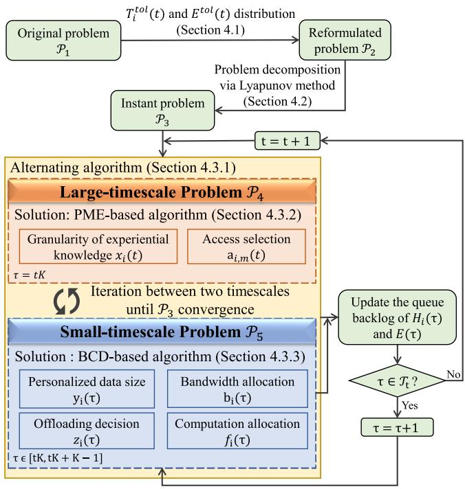

<details>
<summary>flowchart</summary>

```mermaid
graph TD
    A["Original problem P1"] --> B["Ti^tol(t) and E^tol(t) distribution (Section 4.1)"]
    B --> C["Reformulated problem P2"]
    C --> D["Problem decomposition via Lyapunov method (Section 4.2)"]
    D --> E["Instant problem P3"]
    E --> F["t = t + 1"]
    F --> G["Alternating algorithm (Section 4.3.1)"]
    G --> H["Large-timescale Problem P4"]
    H --> I["Solution: PME-based algorithm (Section 4.3.2)"]
    I --> J["Granularity of experiential knowledge xi(t)"]
    I --> K["Access selection ai,m(t)"]
    J --> L["τ = tK"]
    K --> M["Iteration between two timescales until P3 convergence"]
    M --> N["Small-timescale Problem P5"]
    N --> O["Solution: BCD-based algorithm (Section 4.3.3)"]
    O --> P["Personalized data size yi(τ)"]
    O --> Q["Offloading decision zi(τ)"]
    O --> R["Computation allocation fi(τ)"]
    P --> S["τ ∈ [tK, tK + K - 1"]]
    Q --> S
    R --> S
    S --> T["Update the queue backlog of Hi(τ) and E(τ)"]
    T --> U{τ ∈ Tt?}
    U -->|No| T
    U -->|Yes| V["τ = τ+1"]
    V --> G
```
</details>

Fig. 3. Flowchart of the proposed TACO approach.

Algorithm 2: BCD-Based Algorithm.   
Input: Iteration index $l = 0$ , iterative convergence threshold $\epsilon$ , and initial feasible solutions $(\boldsymbol{y}^{(0)}, \boldsymbol{b}^{(0)}, \boldsymbol{f}^{(0)}, \boldsymbol{z}^{(0)})$ with greedy algorithm.

1 Linear relaxation: $z_i(\tau) \in \{0,1\} \to z_i(\tau) \in [0,1]$ ;

2 repeat

3 Solve $\boldsymbol{y}^{(l)}$ from $\mathcal{P}_{5-1}$ with given $\boldsymbol{b}^{(l-1)}, \boldsymbol{f}^{(l-1)}, \boldsymbol{z}^{(l-1)}$ ;

4 Solve $\boldsymbol{b}^{(l)}$ from $\mathcal{P}_{5-2}$ with given $\boldsymbol{y}^{(l-1)}, \boldsymbol{f}^{(l-1)}, \boldsymbol{z}^{(l-1)}$ ;

5 Solve $\boldsymbol{f}^{(l)}$ from $\mathcal{P}_{5-3}$ with given $\boldsymbol{y}^{(l-1)}, \boldsymbol{b}^{(l-1)}, \boldsymbol{z}^{(l-1)}$ ;

6 Solve $\boldsymbol{z}^{(l)}$ from $\mathcal{P}_{5-4}$ with given $\boldsymbol{y}^{(l-1)}, \boldsymbol{b}^{(l-1)}, \boldsymbol{f}^{(l-1)}$ ;

7 $l = l + 1$ ;

8 until | $obj^{(l)}(\mathcal{P}_5) - obj^{(l-1)}(\mathcal{P}_5)$ | ≤ $\epsilon$ ;

9 Round $z_i(\tau)$ to 1 with probability $z_i(\tau)$ ;

Output: solution of $\mathcal{P}_5: (\boldsymbol{y}^{(l)}, \boldsymbol{b}^{(l)}, \boldsymbol{f}^{(l)}, \boldsymbol{z}^{(l)})$ .

In summary, the proposed two-timescale accuracy-aware online optimization approach (TACO) consists of problem reformulation, decomposition and alternation between two timescales. The flowchart of TACO is shown in Fig. 3.

Theorem 3: The proposed TACO approach can converge with limited alternations and iterations.

Proof: For problem ${ \mathcal { P } } _ { 5 } ,$ the convergence of TACO depends on that of the designed BCD-based algorithm and that of the employed alternating algorithm for problem $\mathcal { P } _ { 3 }$ .

First, to prove the convergence of the BCD-based algorithm, we derive the partial derivatives of the objective function of

problem ${ \mathcal { P } } _ { 5 }$ as follows:

$$
\begin{array}{l} \nabla_ {\boldsymbol {y}} o b j (\mathcal {P} _ {5}) = \sum_ {i \in \mathcal {I}} H _ {i} (\tau) z _ {i} (\tau) \sum_ {m \in \mathcal {M}} \left(\frac {S _ {i} (\tau)}{r _ {i , m} (\tau)} \right. \\ \left. + \frac {a _ {i , m} (t) S _ {i} (\tau) C _ {m}}{f _ {i} (\tau) F _ {m}}\right) + E (\tau) \sum_ {i \in \mathcal {I}} z _ {i} (\tau) \sum_ {m \in \mathcal {M}} \left(\frac {S _ {i} (\tau) p _ {i}}{r _ {i , m} (\tau)} \right. \\ \left. + a _ {i, m} (t) \rho_ {m} \left(F _ {m}\right) ^ {2} S _ {i} (\tau) C _ {m}\right) - 2 V \sum_ {i \in \mathcal {I}} \frac {z _ {i} (\tau) S _ {i} (\tau)}{D _ {i} (t) + S _ {i} (\tau)}, \tag {30} \\ \end{array}
$$

$$
\nabla_ {\boldsymbol {b}} \operatorname{obj} \left(\mathcal {P} _ {5}\right) = \left[ \sum_ {i \in \mathcal {I}} H _ {i} (\tau) z _ {i} (\tau) \left(y _ {i} (\tau) S _ {i} (\tau) \right. \right.
$$

$$
\left. + \lambda_ {i} (\tau)) + E (\tau) \sum_ {i \in \mathcal {I}} z _ {i} (\tau) p _ {i} (y _ {i} (\tau) S _ {i} (\tau) + \lambda_ {i} (\tau)) \right]
$$

$$
\left[ \frac {p _ {i} | h _ {i , m} (\tau) | ^ {2}}{a _ {i , m} (t) (S _ {i , m} (\tau)) ^ {\theta} N _ {0} (\tau) (B _ {m}) ^ {2} \ln 2} \right.
$$

$$
\cdot \frac {(S _ {i , m} (\tau)) ^ {\theta} N _ {0} (\tau) B _ {m}}{((b _ {i} (\tau)) ^ {3} + (b _ {i} (\tau)) ^ {2} p _ {i} | h _ {i , m} (\tau) | ^ {2})}
$$

$$
\cdot \frac {1}{\log_ {2} ^ {2} (1 + \frac {p _ {i} | h _ {i , m} (\tau) | ^ {2}}{(S _ {i , m} (\tau)) ^ {\theta} N _ {0} b _ {i} (\tau) B _ {m}})}
$$

$$
\left. - \frac {1}{a _ {i , m} (t) \left(b _ {i} (\tau)\right) ^ {2} B _ {m} \log_ {2} \left(1 + \frac {p _ {i} \left| h _ {i , m} (\tau) \right| ^ {2}}{\left(S _ {i , m} (\tau)\right) ^ {\theta} N _ {0} b _ {i} (\tau) B _ {m}}\right)} \right], \tag {31}
$$

$$
\begin{array}{l} \nabla_ {\boldsymbol {f}} o b j (\mathcal {P} _ {5}) = - \sum_ {i \in \mathcal {I}} H _ {i} (\tau) \left[ \sum_ {m \in \mathcal {M}} \frac {a _ {i , m} (t) x _ {i} (t) D _ {i} (t) C _ {m}}{(f _ {i} (t K)) ^ {2} F _ {m} K} \right. \\ + z _ {i} (\tau) \sum_ {m \in \mathcal {M}} \frac {a _ {i , m} (t) y _ {i} (\tau) S _ {i} (\tau) C _ {m}}{(f _ {i} (\tau)) ^ {2} F _ {m}} \\ \left. + \sum_ {m \in \mathcal {M}} a _ {i, m} (t) z _ {i} (\tau) \frac {\lambda_ {i} (\tau) C _ {m}}{\left(f _ {i} (\tau)\right) ^ {2} F _ {m}} \right], \tag {32} \\ \end{array}
$$

$$
\nabla_ {\boldsymbol {z}} o b j (\mathcal {P} _ {5}) = \sum_ {i \in \mathcal {I}} H _ {i} (\tau) \left[ \sum_ {m \in M} (T _ {i, m} ^ {u l} (\tau) + T _ {i, m} ^ {u d} (\tau) \right.
$$

$$
\left. + T _ {i, m} ^ {\text {   of   } l d} (\tau)) + \sum_ {m \in \mathcal {M}} a _ {i, m} (t) \frac {\lambda_ {i} (\tau) C _ {m}}{f _ {i} (\tau) F _ {m}} - \frac {\lambda_ {i} (\tau) C _ {i}}{F _ {i}} \right]
$$

$$
+ E (\tau) \sum_ {i \in \mathcal {I}} \left[ \sum_ {m \in \mathcal {M}} (E _ {i, m} ^ {u l} (\tau) + E _ {i, m} ^ {u d} (\tau) + E _ {i, m} ^ {o f l d} (\tau)) \right.
$$

$$
\left. + \sum_ {m \in \mathcal {M}} a _ {i, m} (t) \rho_ {m} (F _ {m}) ^ {2} \lambda_ {i} (\tau) C _ {m} - \rho_ {i} (F _ {i}) ^ {2} \lambda_ {i} (\tau) C _ {i} \right]
$$

$$
- V \sum_ {i \in \mathcal {I}} \left[ 1 - \left(1 - \frac {x _ {i} (t) D _ {i} (t) + y _ {i} (\tau) S _ {i} (\tau)}{D _ {i} (t) + S _ {i} (\tau)}\right) ^ {2} - g _ {i} ^ {\text {local}} \right]. \tag {33}
$$

Evidently, (30) and (33) are constants, and (31) and (32) are linear, meaning that all derived partial derivatives are L-lipschitz continuous according to [42], and hence the BCD-based algorithm can converge with limited iterations.

Then, to prove the convergence of the alternating algorithm, we scale the objective function of $\mathcal { P } _ { 3 }$ as

$$
\begin{array}{l} o b j ^ {l - 1} (\mathcal {P} _ {3}) = o b j (\mathcal {P} _ {3}) \left(\boldsymbol {a} ^ {l - 1}, \boldsymbol {x} ^ {l - 1}, \boldsymbol {y} ^ {l - 1}, \boldsymbol {b} ^ {l - 1}, \boldsymbol {f} ^ {l - 1}, \boldsymbol {z} ^ {l - 1}\right) \\ \geq o b j (\mathcal {P} _ {3}) \left(\boldsymbol {a} ^ {l}, \boldsymbol {x} ^ {l}, \boldsymbol {y} ^ {l - 1}, \boldsymbol {b} ^ {l - 1}, \boldsymbol {f} ^ {l - 1}, \boldsymbol {z} ^ {l - 1}\right) \\ \geq \operatorname{obj} \left(\mathcal {P} _ {3}\right) \left(\boldsymbol {a} ^ {l}, \boldsymbol {x} ^ {l}, \boldsymbol {y} ^ {l}, \boldsymbol {b} ^ {l}, \boldsymbol {f} ^ {l}, \boldsymbol {z} ^ {l}\right) = \operatorname{obj} ^ {l} \left(\mathcal {P} _ {3}\right), \tag {34} \\ \end{array}
$$

where l is the number of alternations. The first inequality holds due to the sub-optimality of $\{ y ^ { l } , b ^ { l } , f ^ { l } , z ^ { l } \}$ by BCD-based algorithm, and the second inequality holds because of the suboptimality of $\{ a ^ { l } , x ^ { l } \}$ by PME-based algorithm. This indicates that the objective function of $\mathcal { P } _ { 3 }$ is monotonically decreasing along with the alternating process, and will be lower-bounded $\mathrm { b y } - V K I \left( \mathrm { i . e . } \right.$ , by setting two queue backlogs to 0 and all $A _ { i } ( \tau )$ to 1) in finite alternations. ( )

Theorem 4: The computational complexity of the proposed TACO approach is $O ( T R ^ { \operatorname * { m a x } } ( ( I + M ) l o g _ { 2 } ( I + M ) +$ $\dot { I } ^ { 3 } M ^ { 3 } N ^ { 3 } + \dot { I } \dot { M } ^ { 2 . 0 5 5 } + 4 \dot { W } ^ { \mathrm { m a x } } I ^ { 3 } + 2 ^ { 2 . 0 5 5 } \dot { I } )$ ( + ) +, where I is the + + 4 + 2 ))number of PTs, M is the number of ESs, N is the number of partitions in the PME-based algorithm, T is the number of time frames, $R ^ { \mathrm { m a x } }$ is the number of iterations in the alternating algorithm between two timescales, and $W ^ { \mathrm { m a x } }$ is the number of iterations in the BCD-based algorithm.

Proof: The complexity of TACO mainly depends on the alternating algorithm integrating PME-based algorithm and BCDbased algorithm.

For the PME-based algorithm, as stated in [43], the computational complexity for obtaining an initial feasible solution is $O ( ( I + M ) l o g _ { 2 } ( I + M ) )$ , and that of solving (29) is $O ( I ^ { 3 } M ^ { 3 } { \dot { N } } ^ { 3 } )$ + ) ( + ))with the interior point method [44] in the CVX ( )solver. Besides, the linear relaxation and linear programming for solving $a _ { i , m } ( t )$ has an asymptotic computational complexity of $O ( I M ^ { 2 . 0 5 5 } )$ [45]. For the BCD-based algorithm, the total ( )computational complexity for solving all subproblems is $O ( 4 I ^ { 3 } )$ (4 )with the interior point method [44] in CVX solver, and that of the linear relaxation and linear programming solver for solving $z _ { i } ( \tau )$ is $O ( 2 ^ { 2 . 0 5 5 } I )$ .

( ) (2 )To sum up, the computational complexity of TACO can be expressed as $O ( T R ^ { \mathrm { { m a x } } } ( ( I + M ) l o g _ { 2 } \dot { ( I + M ) } + I ^ { 3 } M ^ { 3 } N ^ { 3 } +$ $I M ^ { 2 . 0 5 5 } + 4 W ^ { \mathrm { m a x } } I ^ { 3 } + 2 ^ { 2 . 0 5 5 } I ) )$ . 

\+ 4 + 2 ))Theorem 5: Given Lyapunov control parameter V , the optimality gap between the solution obtained by the proposed TACO approach and the theoretically optimal solution to problem $\mathcal { P } _ { 1 }$ can be expressed as

$$
\begin{array}{l} \sum_ {t \in \mathcal {T}} \sum_ {\tau \in \mathcal {T} _ {t}} \mathbb {E} \left[ \sum_ {i \in \mathcal {I}} A _ {i} (\tau) \mid \boldsymbol {\Theta} (\tau) \right] / K T - \mathcal {O} \\ \leq G / V + (\Lambda + \Gamma) / V T, \tag {35} \\ \end{array}
$$

where O stands for the theoretically optimal solution,  is the Λoptimality gap of the PME-based algorithm,  represents the optimality gap of the BCD-based algorithm, and G is defined in (26).

Proof: First, inequality (27) can be intuitively expanded and rewritten as

$$
\begin{array}{l} \sum_ {\tau \in \mathcal {T} _ {t}} \Delta (\boldsymbol {\Theta} (\tau)) - V \cdot \sum_ {\tau \in \mathcal {T} _ {t}} \mathbb {E} \left[ \sum_ {i \in \mathcal {I}} A _ {i} (\tau) \mid \boldsymbol {\Theta} (\tau) \right] \\ \leq G K + \sum_ {\tau \in \mathcal {T} _ {t}} \left\{\sum_ {i \in \mathcal {I}} \mathbb {E} [ H _ {i} (\tau) [ T _ {i} ^ {t o l} (\tau) - T _ {i} ^ {\max} ] \mid \boldsymbol {\Theta} (\tau) ] \right. \\ + \mathbb {E} \{E (\tau) \cdot [ E ^ {t o l} (\tau) - E ^ {\mathrm{max}} ] \mid \Theta (\tau) \} \\ \left. - V \cdot \mathbb {E} \left[ \sum_ {i \in \mathcal {I}} A _ {i} (\tau) \mid \boldsymbol {\Theta} (\tau) \right] \right\} \\ \leq G K + V \cdot K \mathcal {O} + \Lambda + \Gamma . \tag {36} \\ \end{array}
$$

Then, by summing up (36) over T time frames, we have

$$
\begin{array}{l} \left(G + V \cdot \mathcal {O} + \frac {1}{K} (\Lambda + \Gamma)\right) \cdot K T \\ \geq \sum_ {t \in T} \left\{\sum_ {\tau \in \mathcal {T} _ {t}} \Delta (\boldsymbol {\Theta} (\tau)) - V \cdot \sum_ {\tau \in \mathcal {T} _ {t}} \mathbb {E} \left[ \sum_ {i \in \mathcal {I}} A _ {i} (\tau) \mid \boldsymbol {\Theta} (\tau) \right] \right\} \\ = \mathbb {E} [ L (\boldsymbol {\Theta} (K T)) - L (\boldsymbol {\Theta} (0)) ] \\ + V \cdot \sum_ {t \in T} \sum_ {\tau \in \mathcal {T} _ {t}} \mathbb {E} \left[ \sum_ {i \in \mathcal {I}} A _ {i} (\tau) \mid \boldsymbol {\Theta} (\tau) \right] \\ = \mathbb {E} [ L (\boldsymbol {\Theta} (K T)) ] - \mathbb {E} [ L (\boldsymbol {\Theta} (0)) ] \\ + V \cdot \sum_ {t \in T} \sum_ {\tau \in \mathcal {T} _ {t}} \mathbb {E} \left[ \sum_ {i \in \mathcal {I}} A _ {i} (\tau) \mid \boldsymbol {\Theta} (\tau) \right] \tag {37} \\ \end{array}
$$

Afterwards, by moving $\mathbb { E } [ L ( \Theta ( 0 ) ) ]$ to the left-hand-side of (37), [ ( (0))]and then dividing both sides by T V , inequality (35) can be obtained.

Next, we further analyze the optimality gaps  and  as follows. For $\Lambda ,$ Λ Γ according to [38], its value is theoretically Λbounded in the range of $\Lambda \in [ 0 , 0 . 1 2 ]$ . For , by letting ${ \tilde { \mathcal { P } } } _ { 5 }$ and ${ \mathcal { P } } _ { 5 } ^ { * }$ Λ [0 0 12] Γbe the solutions given by the BCD-based algorithm and the optimal one, respectively, and taking the subtraction between them, we have

$$
\begin{array}{l} \tilde {\mathcal {P}} _ {5} - \mathcal {P} _ {5} ^ {*} \\ \leq \Gamma \\ = \sum_ {i \in \mathcal {I}} H _ {i} (\tau) \left\{\tilde {z} _ {i} (\tau) \sum_ {m \in \mathcal {M}} (S _ {i} (\tau) + \lambda_ {i} (\tau) + a _ {i, m} (t) S _ {i} (\tau) C _ {m}) \right. \\ + z _ {i} ^ {*} (\tau) a _ {i, m} (t) S _ {i} (\tau) C _ {m} \} + E (\tau) \sum_ {i \in \mathcal {I}} \sum_ {m \in \mathcal {M}} [ \tilde {z} _ {i} (\tau) \\ \end{array}
$$

$$
[ a _ {i, m} (t) \rho_ {m} (F _ {m}) ^ {2} S _ {i} (\tau) C _ {m} + S _ {i} (\tau) p _ {i} + z _ {i} ^ {*} (\tau) S _ {i} (\tau) p _ {i} ]
$$

$$
+ V \sum_ {i \in \mathcal {I}} (A _ {i} ^ {*} (\tau) \tilde {A} _ {i} (\tau)) = \sum_ {i \in \mathcal {I}} H _ {i} (\tau) (\tilde {z} _ {i} (\tau) \omega_ {i} (\tau) + z _ {i} ^ {*} (\tau) \phi_ {i} (\tau))
$$

TABLE II SIMULATION PARAMETERS 

<table><tr><td>Parameter</td><td>Value</td><td>Parameter</td><td>Value</td></tr><tr><td> $p_i$ </td><td>500 mW</td><td> $B_m$ </td><td>5 MHz</td></tr><tr><td> $p^c$ </td><td>5 W</td><td> $F_m$ </td><td>20 GHz</td></tr><tr><td> $\theta$ </td><td>4</td><td> $C_m, C_i$ </td><td>300 cycles/bit</td></tr><tr><td> $N_0$ </td><td>-174 dBm/Hz</td><td> $ρ_m, ρ_i$ </td><td> $10^{-27}$ </td></tr><tr><td> $S_i(\tau)$ </td><td>[6.1, 12.2] Mbits</td><td> $r^c$ </td><td>50 Mbps</td></tr><tr><td> $D_i(t)$ </td><td>[73.2, 97.6] Mbits</td><td>K</td><td>10</td></tr><tr><td> $λ_i(\tau)$ </td><td>[10, 20] Mbits</td><td>M</td><td>10</td></tr><tr><td> $F_i$ </td><td>1 GHz</td><td>I</td><td>40</td></tr></table>

$$
+ E (\tau) \sum_ {i \in \mathcal {I}} \sum_ {m \in \mathcal {M}} \left[ \tilde {z} _ {i} (\tau) \omega_ {i} ^ {\prime} (\tau) + z _ {i} ^ {*} (\tau) \phi_ {i} ^ {\prime} (\tau) \right]
$$

$$
+ V \sum_ {i \in \mathcal {I}} (A _ {i} ^ {*} (\tau) + \tilde {A} _ {i} (\tau)), \tag {38}
$$

where $\begin{array} { r } { \omega _ { i } ( \tau ) = \sum _ { m \in \mathcal { M } } ( S _ { i } ( \tau ) + \lambda _ { i } ( \tau ) + a _ { i , m } ( t ) S _ { i } ( \tau ) C _ { m } ) } \end{array}$ , $\phi _ { i } ( \tau ) = a _ { i , m } ( t ) S _ { i } ( \tau ) \dot { C } _ { m } , \omega _ { i } ^ { \prime } ( \tau ) = a _ { i , m } ( t ) \rho _ { m } ( F _ { m } ) ^ { 2 } S _ { i } ( \tau ) C _ { m }$ (and $\phi _ { i } ^ { \prime } ( \tau ) = S _ { i } ( \tau ) p _ { i }$ ) ( ) = ( ) ( ) ( ), which are both constant in each time slot $\tau \in \mathcal T _ { t }$ (. □

# V. SIMULATION RESULTS

In this section, simulations are conducted to evaluate the performance of the proposed TACO approach for jointly optimizing the HDT deployment (i.e., generic placement and customized update of the VT model) and task offloading in an end-edge-cloud collaborative framework. All simulation results are obtained based on real-world datasets (including a human activity dataset [46] and an ES distribution dataset [47]), by taking averages over 1000 runs under various parameter settings.

# A. Simulation Settings

Consider an HDT system in a 1 km × 1 km square area with M   ESs and I   PTs (following a Random-Waypoint = 10 = 40(RWP) mobility model under the same settings as those in [48]). According to [33], for the HDT-assisted complex task execution, the average accuracy of edge execution and local execution for any PT i’ s tasks are approximated as $g _ { i } ^ { e d g e } ( d _ { i } ( \tau ) ) = 1 - [ 1 -$ edge $d _ { i } \dot { ( \tau ) } / ( D _ { i } ( t ) + S _ { i } ( \tau ) \dot { ) } ] ^ { 2 }$ ( ( )) = 1 [1(which is a function of the total data ( ) ( ( ) + ( ))]size for PT i’s corresponding VT construction at the edge, i.e., $d _ { i } ( \tau ) )$ and $g _ { i } ^ { l o c a l } = 0 . 5$ , respectively. Table II lists the values of ( ) = 0 5main simulation parameters, while most of them have also been widely employed in the literature [12], [13], [21]. Furthermore, to show the superiority of the proposed TACO approach, the following schemes are simulated as benchmarks. Note that, since the original objectives of these benchmark schemes are different from ours, for the fairness of comparison, we have modified them to adapt to the considered settings and particularly changed their optimization objectives to align with ours.

\- LOT [21]: Generic VT model placement from the cloud and PTs’ task offloading are jointly determined by adopting a contract theory-based incentive mechanism. However, this scheme ignores the customized VT update by collecting personalized data from end devices, and it optimizes all decisions synchronously in a single-timescale only.

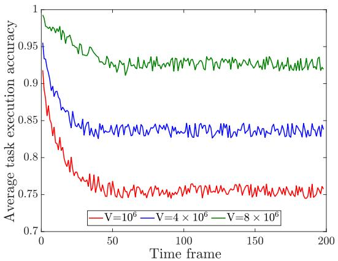

<details>
<summary>line</summary>

| Time frame | V=10^6 | V=4 × 10^6 | V=8 × 10^6 |
| ---------- | ------ | ---------- | ---------- |
| 0          | 0.95   | 0.95       | 0.98       |
| 50         | 0.78   | 0.85       | 0.93       |
| 100        | 0.76   | 0.84       | 0.92       |
| 150        | 0.76   | 0.84       | 0.92       |
| 200        | 0.76   | 0.84       | 0.92       |
</details>

Fig. 4. Convergence of the proposed TACO approach.

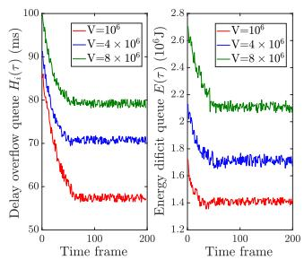

<details>
<summary>line</summary>

| Time frame | Delay overflow queue H_t (ms) for V=10^6 | Delay overflow queue H_t (ms) for V=4 × 10^6 | Delay overflow queue H_t (ms) for V=8 × 10^6 | Energy deficit queue E_τ (10^6 J) for V=10^6 | Energy deficit queue E_τ (10^6 J) for V=4 × 10^6 | Energy deficit queue E_τ (10^6 J) for V=8 × 10^6 |
| ---------- | ------------------------------------------ | --------------------------------------------- | --------------------------------------------- | ----------------------------------------------- | ------------------------------------------------- | ------------------------------------------------- |
| 0          | 100                                        | 100                                           | 100                                           | 2.8                                             | 2.8                                               | 2.8                                               |
| 50         | ~60                                        | ~75                                           | ~85                                           | ~2.2                                            | ~2.2                                              | ~2.2                                              |
| 100        | ~55                                        | ~70                                           | ~80                                           | ~2.0                                            | ~2.0                                              | ~2.0                                              |
| 150        | ~55                                        | ~70                                           | ~80                                           | ~1.9                                            | ~1.9                                              | ~1.9                                              |
| 200        | ~55                                        | ~70                                           | ~80                                           | ~1.8                                            | ~1.8                                              | ~1.8                                              |
</details>

(a) Queue backlogs w.r.t V.

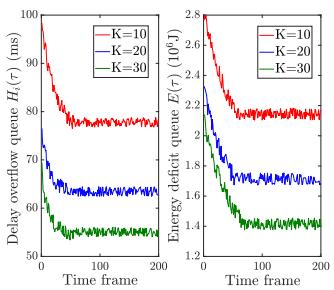

<details>
<summary>line</summary>

| Time frame | Delay overflow quenee H(τ) (ms) K=10 | Delay overflow quenee H(τ) (ms) K=20 | Delay overflow quenee H(τ) (ms) K=30 | Energy deficit queue E(τ) (10^5J) K=10 | Energy deficit queue E(τ) (10^5J) K=20 | Energy deficit queue E(τ) (10^5J) K=30 |
| ---------- | ------------------------------------ | ------------------------------------ | ------------------------------------ | -------------------------------------- | -------------------------------------- | -------------------------------------- |
| 0          | 100                                  | 75                                   | 60                                   | 2.8                                    | 2.2                                    | 1.4                                    |
| 100        | 80                                   | 65                                   | 55                                   | 2.2                                    | 1.8                                    | 1.2                                    |
| 200        | 75                                   | 60                                   | 50                                   | 2.0                                    | 1.6                                    | 1.1                                    |
</details>

(b) Queue backlogs w.r.t K.   
Fig. 5. Stability of two queue backlogs by varying V and $K .$

CRO [11]: Both generic VT model placement from the cloud and customized VT update from end devices along with PTs’ task offloading are jointly determined by adopting a double auction based optimization, while all decisions are optimized in a single-timescale for simplicity.

# B. Performance Evaluations

Fig. 4 examines the convergence of the proposed TACO approach in solving problem $\mathcal { P } _ { 1 }$ by showing the average HDTassisted task execution accuracy under different values of parameter V ranging from $1 0 ^ { 6 } \mathrm { t o } 8 \times 1 0 ^ { 6 }$ . The timeline is divided into $T = 2 0 0$ 10 8 10time frames, and each frame has $K = 1 0$ time slots. = 200 = 10It is shown that, for all three cases, within 50 time frames, the task execution accuracy decreases at the beginning but quickly converges over the time, which verifies the convergence property of TACO in solving problem $\mathcal { P } _ { 1 }$ . Besides, from this figure, it can also be observed that the average task execution accuracy increases with V . The reason is that, Lyapunov parameter $V$ is introduced to control the weight of significance on maximizing the HDT-assisted task execution accuracy versus that of enforcing the delay and energy consumption constraints, and a larger $V$ indicates more emphasis on the task execution accuracy.

Fig. 5 demonstrates the stability of the proposed TACO approach by showing the performance of delay overflow queue backlog $H _ { i } ( \tau )$ and energy consumption deficit queue backlog $E ( \tau )$ ( )brought by the Lyapunov decomposition by varying V and K. From this figure, we can see that two queue backlogs decrease and quickly stabilize over the time, because TACO focuses on controlling system costs $( \mathrm { i . e . } ,$ , service response delay and system energy consumption) to minimize the objective function of $\mathcal { P } _ { 3 }$ , thereby shrinking two queue backlogs, and can eventually achieve a well balance between the task execution accuracy and system costs, leading to a stable outcome. Besides, in Fig. 5(a), it is intuitive that both queue backlogs stabilize on higher values with the increase of $V$ as more emphasis is on maximizing the task execution accuracy, resulting in the growth of delay and energy consumption. Meanwhile, Fig. 5(b) shows that both queue backlogs stabilize on lower values with the raise of K. This is because a larger value of K means that generic VT models are placed with a lower frequency, andgeneric VT model placement delay $( \mathrm { i . e . , ~ } \bar { T _ { i , m } ^ { d l } } ( \tau ) + T _ { i , m } ^ { p l } ( \tau ) )$ and energy consumption (i.e., $E _ { i , m } ^ { d l } ( \tau ) + E _ { i , m } ^ { p l } ( \tau ) )$ .

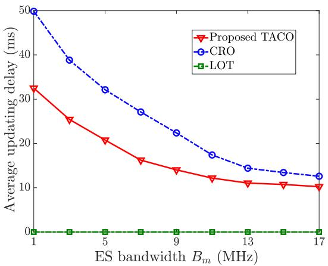

<details>
<summary>line</summary>

| ES bandwidth Bm (MHz) | Proposed TACO | CRO  | LOT |
| --------------------- | ------------- | ---- | --- |
| 1                     | 32            | 50   | 0   |
| 5                     | 25            | 38   | 0   |
| 9                     | 16            | 27   | 0   |
| 13                    | 12            | 15   | 0   |
| 17                    | 10            | 12   | 0   |
</details>

Fig. 6. Comparison on updating delay of customized VT models with different bandwidth resources of ESs $B _ { m } ^ { \phantom { \dagger } }$ .

( ) + ( )Fig. 6 illustrates the average updating delay of customized VT models (i.e., $\begin{array} { r } { \sum _ { t \in \mathcal { T } } { \sum _ { \tau \in \mathcal { T } _ { t } } \sum _ { i \in \mathcal { I } } ( T _ { i , m } ^ { \bar { u } l } ( \tau ) + T _ { i , m } ^ { u d } ( \tau ) ) / T K I ) } } \end{array}$ with different ES bandwidth $B _ { m }$ ( ( ) + ( ))under LOT, CRO and the proposed TACO approach. Since LOT ignores customized VT model update, meaning that personalized data of PTs does not need to be uploaded and processed, the average updating delay maintains as zero regardless of the ES’s bandwidth $B _ { m }$ . In contrast, the average updating delay decreases with the increase of $B _ { m }$ for both CRO and the proposed TACO approach due to the reduction in uploading delay $T _ { i , m } ^ { u l } ( \tau )$ , as more uplink ( )bandwidth resource is provided. Besides, we can also see that TACO outperforms CRO because, with the help of generic VT model placement, TACO needs to upload much less personalized data than that of CRO.

Fig. 7 shows the average placement delay of generic VT models (i.e., $\textstyle \sum _ { t \in { \mathcal { T } } } \sum _ { \tau \in { \mathcal { T } } _ { t } } \bar { \sum _ { i \in { \mathcal { I } } } } ( T _ { i , m } ^ { d l } ( t ) + \bar { T } _ { i , m } ^ { p l } ( t ) ) / T K I )$ n(t)+Tm T pli,m t /T KI ) with (different cloud-ES transmission rate $r ^ { c }$ + ( ))under LOT, CRO and the proposed TACO approach. It is obvious that the placement delay decreases logarithmically with the raise of $r ^ { c }$ for all schemes. Furthermore, from this figure, we can see that LOT has the worst performance because it ignores customized model update and can only download as much experiential knowledge as possible to improve the average task execution accuracy, resulting in the highest average placement delay. In contrast, both CRO and TACO outperform LOT due to the introduction of customized VT update, alleviating the burden on generic VT model placement. Moreover, the proposed TACO approach achieves the best performance (with the placement delay reduced by 14.3% and 25.5% on average compared to CRO and LOT, respectively). This is because TACO builds VTs in two timescales (with large-timescale generic model placement and small-timescale customized model update) which only requires to download experiential knowledge at the beginning of each time frame significantly reducing the total data size in the process of model placement.

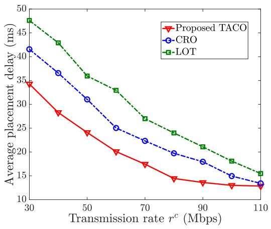

<details>
<summary>line</summary>

| Transmission rate r^c (Mbps) | Proposed TACO | CRO  | LOT  |
| ----------------------------- | ------------- | ---- | ---- |
| 30                            | 34.5          | 41.5 | 47.5 |
| 40                            | 28.0          | 36.5 | 42.5 |
| 50                            | 24.0          | 31.0 | 36.0 |
| 60                            | 20.5          | 25.0 | 32.0 |
| 70                            | 17.5          | 22.0 | 27.0 |
| 80                            | 15.0          | 19.5 | 23.5 |
| 90                            | 13.5          | 17.5 | 21.0 |
| 100                           | 12.5          | 15.5 | 18.5 |
| 110                           | 12.0          | 13.5 | 15.5 |
</details>

Fig. 7. Comparison on placement delay of generic VT models with different transmission rate $r ^ { c }$ .

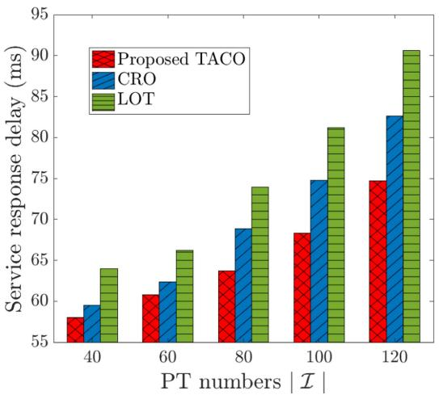

<details>
<summary>bar</summary>

| PT numbers | Proposed TACO | CRO | LOT |
|---|---|---|---|
| 40 | 58 | 59.5 | 64 |
| 60 | 60.5 | 62.5 | 66.5 |
| 80 | 63.5 | 68.5 | 74 |
| 100 | 68.5 | 74.5 | 81 |
| 120 | 74.5 | 82.5 | 90.5 |
</details>

Fig. 8. Comparison on the service response delay with different numbers of PT I .

Figs. 8 and 9 investigate the service response delay and system energy consumption, achieved by LOT, CRO and the proposed TACO approach with different numbers of PTs I. Both figures show that the service response delay and system energy consumption increase exponentially with I for all schemes, because a larger I implies more demands for VT construction with potentially larger amount of data in competing limited communication and computation resources. Besides, LOT has the worst performances in these two metrics because its task execution accuracy only relies on the experiential knowledge downloaded in VT construction, and thus it has to download much larger amounts of experiential knowledge for guaranteeing a desired task execution accuracy. Meanwhile, CRO and TACO outperform LOT, especially when I becomes larger, which reveals the necessity of customized VT model update in addition to generic VT model placement. Moreover, the proposed TACO approach achieves the best performance, and the reason follows the same as that in explaining Fig. 7.

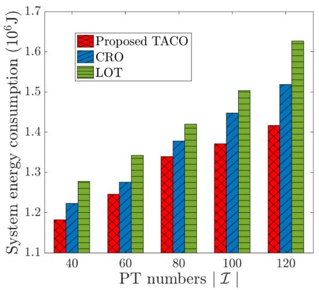

<details>
<summary>bar</summary>

| PT numbers | Proposed TACO | CRO | LOT |
|---|---|---|---|
| 40 | 1.18 | 1.22 | 1.28 |
| 60 | 1.24 | 1.27 | 1.34 |
| 80 | 1.34 | 1.38 | 1.42 |
| 100 | 1.37 | 1.45 | 1.50 |
| 120 | 1.42 | 1.52 | 1.63 |
</details>

Fig. 9. Comparison on the system energy consumption with different numbers of PT I.

Fig. 10 compares the average task execution accuracy achieved by LOT, CRO and the proposed TACO approach by varying ES’s bandwidth $B _ { m } ,$ , transmission rate $r ^ { c }$ and number of PTs I. It is shown that, i) in Fig. 10(a), the average task execution accuracy increases with $B _ { m }$ for all schemes, except for LOT; ii) in Fig. 10(b), the average task execution accuracy increases with $r ^ { c }$ for all three schemes; and iii) in Fig. 10(c), the average task execution accuracy decreases with I for all three schemes. The main reason is that, when more resource is supplied (i.e., $B _ { m }$ and $r ^ { c }$ are large) or total resource demand is less competitive (i.e., I is small), more experiential knowledge and personalized data can be transmitted for dynamic VT construction and more tasks can be offloaded for HDT-assisted edge execution, all contributing to the enhancement of task execution accuracy. Furthermore, from this figure, we can see that LOT has the worst performance because it only considers generic VT model placement, and CRO is better than LOT thanks to the joint consideration of both generic VT model placement and customized VT model update. Moreover, TACO achieves the best performance because it further strikes the balance of generic VT model placement and customized VT model update by conducting these two processes asynchronously in two different timescales.

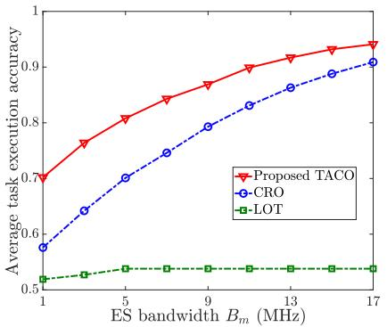

<details>
<summary>line</summary>

| ES bandwidth Bm (MHz) | Proposed TACO | CRO   | LOT   |
| --------------------- | ------------- | ----- | ----- |
| 1                     | 0.7           | 0.58  | 0.52  |
| 5                     | 0.8           | 0.65  | 0.53  |
| 9                     | 0.85          | 0.75  | 0.54  |
| 13                    | 0.9           | 0.85  | 0.54  |
| 17                    | 0.95          | 0.9   | 0.54  |
</details>

(a) Accuracy w.r.t $B _ { m }$

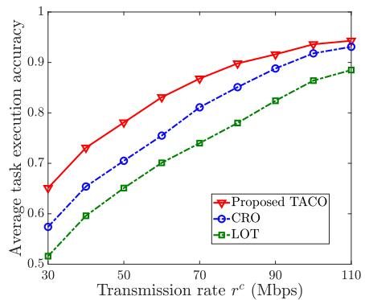

<details>
<summary>line</summary>

| Transmission rate r^c (Mbps) | Proposed TACO | CRO   | LOT   |
| ----------------------------- | ------------- | ----- | ----- |
| 30                            | 0.65          | 0.58  | 0.52  |
| 40                            | 0.72          | 0.65  | 0.58  |
| 50                            | 0.78          | 0.70  | 0.63  |
| 60                            | 0.82          | 0.75  | 0.68  |
| 70                            | 0.85          | 0.80  | 0.72  |
| 80                            | 0.88          | 0.83  | 0.76  |
| 90                            | 0.90          | 0.86  | 0.80  |
| 100                           | 0.92          | 0.88  | 0.83  |
| 110                           | 0.93          | 0.90  | 0.85  |
</details>

(b) Accuracy w.r.t $r ^ { c } .$

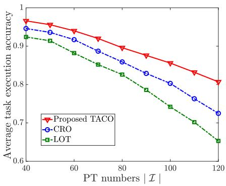

<details>
<summary>line</summary>

| PT numbers | Proposed TACO | CRO   | LOT   |
| ---------- | ------------- | ----- | ----- |
| 40         | 0.98          | 0.97  | 0.93  |
| 60         | 0.96          | 0.95  | 0.90  |
| 80         | 0.93          | 0.91  | 0.85  |
| 100        | 0.88          | 0.85  | 0.78  |
| 120        | 0.81          | 0.73  | 0.65  |
</details>

(c) Accuracy w.r.t I.   
Fig. 10. Comparison on the average task execution accuracy by varying bandwidth resources of ESs $B _ { m }$ , transmission rate $r ^ { c }$ and numbers of PTs I.

# VI. CONCLUSION

In this paper, the optimization of HDT deployment at the network edge has been studied. Particularly, aiming to maximize the accuracy of complex task execution assisted by HDT under various system uncertainties (e.g., random mobility and status variations), a two-timescale online optimization problem is formulated for jointly determining VTs’ construction (including dynamic generic model placement and customized model update) and PTs’ task offloading together with the management of access selection and corresponding communication and computation resource allocations. A novel solution approach, called TACO, is proposed, which decomposes the online problem into a series of deterministic ones and then leverages PME-based and BCD-based algorithms for solving different subproblems in different timescales alternately. Theoretical analyses and simulations show that TACO is superior compared to counterparts in the optimization of HDT deployment at the edge for not only improving the HDT-assisted task execution accuracy, but also reducing the service response delay and overall system energy consumption.

In the future work, we will further explore impacts brought by the various quality of personalized data and the migration of VT models. Data is the bedrock for constructing VT models, but the personalized data with potentially low-quality has become the major bottleneck in building HDT framework. This indicate the urgent requirement to develop a unified data management framework to improve the data quality, or to employ artificial intelligence-generated content to produce high-quality personalized datasets. Furthermore, to guarantee pervasive connectivity between each PT and the associated VT under the uncertain mobility, VT migration from one ES to another may be essential for guaranteeing seamless services. However, this may introduce more factors to be taken into account in the optimization, such as mobility prediction, migration delay and model privacy.

# REFERENCES

[1] S. D. Okegbile, J. Cai, C. Yi, and D. Niyato, “Human digital twin for personalized healthcare: Vision, architecture and future directions,” IEEE Netw., vol. 37, no. 2, pp. 262–269, Mar./Apr. 2023.   
[2] Y. Lin et al., “Human digital twin: A survey,” 2022, arXiv:2212.05937.

[3] P. Thamotharan et al., “Human digital twin for personalized elderly type 2 diabetes management,” J. Clin. Med., vol. 12, no. 6, 2023, Art. no. 2094.   
[4] B. Bj örnsson et al., “Digital twins to personalize medicine,” Genome Med., vol. 12, pp. 1–4, 2020.   
[5] J. Chen et al., “A revolution of personalized healthcare: Enabling human digital twin with mobile AIGC,” IEEE Netw., early access, Feb. 16, 2024, doi: 10.1109/MNET.2024.3366560.   
[6] J. Chen et al., “Networking architecture and key supporting technologies for human digital twin in personalized healthcare: A comprehensive survey,” IEEE Commun. Surveys Tuts., vol. 26, no. 1, pp. 706–746, First Quarter 2024.   
[7] S. D. Okegbile and J. Cai, “Edge-assisted human-to-virtual twin connectivity scheme for human digital twin frameworks,” in Proc. IEEE 95th Veh. Technol. Conf., 2022, pp. 1–6.   
[8] J. Ren et al., “A survey on end-edge-cloud orchestrated network computing paradigms: Transparent computing, mobile edge computing, fog computing, and cloudlet,” ACM Comput. Surv., vol. 52, no. 6, pp. 1–36, 2019.   
[9] P. Jia, X. Wang, and X. Shen, “Accurate and efficient digital twin construction using concurrent end-to-end synchronization and multi-attribute data resampling,” IEEE Internet Things J., vol. 10, no. 6, pp. 4857–4870, Mar. 2023.   
[10] R. Dong et al., “Deep learning for hybrid 5G services in mobile edge computing systems: Learn from a digital twin,” IEEE Trans. Wireless Commun., vol. 18, no. 10, pp. 4692–4707, Oct. 2019.   
[11] Y. Zhang et al., “Adaptive digital twin placement and transfer in wireless computing power network,” IEEE Internet Things J., vol. 11, no. 6, pp. 10924–10936, Mar. 2024.   
[12] J. Wang, J. Hu, G. Min, Q. Ni, and T. El-Ghazawi, “Online service migration in mobile edge with incomplete system information: A deep recurrent actor-critic learning approach,” IEEE Trans. Mobile Comput., vol. 22, no. 11, pp. 6663–6675, Nov. 2023.   
[13] T. Ouyang, Z. Zhou, and X. Chen, “Follow me at the edge: Mobility-aware dynamic service placement for mobile edge computing,” IEEE J. Sel. Areas Commun., vol. 36, no. 10, pp. 2333–2345, Oct. 2018.   
[14] D. Harutyunyan, N. Shahriar, R. Boutaba, and R. Riggio, “Latency and mobility–aware service function chain placement in 5G networks,” IEEE Trans. Mobile Comput., vol. 21, no. 5, pp. 1697–1709, May 2022.   
[15] B. Wang et al., “Human digital twin in the context of Industry 5.0,” Robot Comput. Integr. Manuf., vol. 85, 2024, Art. no. 102626.   
[16] M. Lauer-Schmaltz et al., “Designing human digital twins for behaviourchanging therapy and rehabilitation: A systematic review,” Proc. Des. Soc., vol. 2, pp. 1303–1312, 2022.   
[17] Y. Shi, C. Yi, R. Wang, Q. Wu, B. Chen, and J. Cai, “Service migration or task rerouting: A two-timescale online resource optimization for MEC,” IEEE Trans. Wireless Commun., vol. 23, no. 2, pp. 1503–1519, Feb. 2024.   
[18] D. Lee, J. Cho, and J. Kim, “Meta-human synchronization framework for large-scale digital twin,” in Proc. IEEE Int. Conf. Metaverse Comput. Netw. Appl., 2023, pp. 738–741.   
[19] R. Zhong et al., “Construction of human digital twin model based on multimodal data and its application in locomotion mode identification,” Chin. J. Mech. Eng., vol. 36, no. 1, 2023, Art. no. 126.   
[20] Y. Liu et al., “A novel cloud-based framework for the elderly healthcare services using digital twin,” IEEE Access, vol. 7, pp. 49 088–49 101, 2019.

[21] X. Lin, J. Wu, J. Li, W. Yang, and M. Guizani, “Stochastic digital-twin service demand with edge response: An incentive-based congestion control approach,” IEEE Trans. Mobile Comput., vol. 22, no. 4, pp. 2402–2416, Apr. 2023.   
[22] Y. Ding, K. Li, C. Liu, and K. Li, “A potential game theoretic approach to computation offloading strategy optimization in end-edge-cloud computing,” IEEE Trans. Parallel Distrib. Syst., vol. 33, no. 6, pp. 1503–1519, Jun. 2022.   
[23] Y. Shi, C. Yi, B. Chen, C. Yang, K. Zhu, and J. Cai, “Joint online optimization of data sampling rate and preprocessing mode for edge–cloud collaboration-enabled industrial IoT,” IEEE Internet Things J., vol. 9, no. 17, pp. 16 402–16 417, Sep. 2022.   
[24] Y. He et al., “Two-timescale resource allocation for automated networks in IIoT,” IEEE Trans. Wireless Commun., vol. 21, no. 10, pp. 7881–7896, Oct. 2022.   
[25] H. Ma, Z. Zhou, and X. Chen, “Leveraging the power of prediction: Predictive service placement for latency-sensitive mobile edge computing,” IEEE Trans. Wireless Commun., vol. 19, no. 10, pp. 6454–6468, Oct. 2020.   
[26] R. Zhou, X. Wu, H. Tan, and R. Zhang, “Two time-scale joint service caching and task offloading for UAV-assisted mobile edge computing,” in Proc. IEEE Conf. Comput. Commun., 2022, pp. 1189–1198.   
[27] W. Shengli, “Is human digital twin possible?,” Comput. Methods Programs Biomed. Update, vol. 1, 2021, Art. no. 100014.   
[28] J. Xie et al., “Dual digital twin: Cloud–edge collaboration with Lyapunovbased incremental learning in EV batteries,” Appl. Energy, vol. 355, 2024, Art. no. 122237.   
[29] M. Mohammadi, H. A. Suraweera, and C. Tellambura, “Uplink/downlink rate analysis and impact of power allocation for full-duplex cloud-RANs,” IEEE Trans. Wireless Commun., vol. 17, no. 9, pp. 5774–5788, Sep. 2018.   
[30] C. Yi et al., “A queueing game based management framework for fog computing with strategic computing speed control,” IEEE Trans. Mobile Comput., vol. 21, no. 5, pp. 1537–1551, May 2022.   
[31] Y. Wang, M. Sheng, X. Wang, L. Wang, and J. Li, “Mobile-edge computing: Partial computation offloading using dynamic voltage scaling,” IEEE Trans. Commun., vol. 64, no. 10, pp. 4268–4282, Oct. 2016.   
[32] A. Goldsmith, Wireless Communications. Cambridge, U.K.: Cambridge Univ. Press, 2005.   
[33] W. Wu et al., “Accuracy-guaranteed collaborative DNN inference in industrial IoT via deep reinforcement learning,” IEEE Trans. Ind. Informat., vol. 17, no. 7, pp. 4988–4998, Jul. 2021.   
[34] K.-C. Wu, W.-Y. Liu, and S.-Y. Wu, “Dynamic deployment and costsensitive provisioning for elastic mobile cloud services,” IEEE Trans. Mobile Comput., vol. 17, no. 6, pp. 1326–1338, Jun. 2018.   
[35] C. Yi et al., “Workload re-allocation for edge computing with server collaboration: A cooperative queueing game approach,” IEEE Trans. Mobile Comput., vol. 22, no. 5, pp. 3095–3111, May 2023.   
[36] M. Neely, Stochastic Network Optimization With Application to Communication and Queueing Systems. Berlin, Germany: Springer, 2022.   
[37] L. Georgiadis et al., “Resource allocation and cross-layer control in wireless networks,” Found. Trends Netw., vol. 1, no. 1, pp. 1–144, 2006.   
[38] P. M. Castro, “Tightening piecewise McCormick relaxations for bilinear problems,” Comput. Chem. Eng., vol. 72, pp. 300–311, 2015.   
[39] R. Karuppiah and I. E. Grossmann, “Global optimization for the synthesis of integrated water systems in chemical processes,” Comput. Chem. Eng., vol. 30, no. 4, pp. 650–673, 2006.   
[40] C. A. Meyer and C. A. Floudas, “Global optimization of a combinatorially complex generalized pooling problem,” AIChE J., vol. 52, no. 3, pp. 1027–1037, 2006.   
[41] C. Bliek 1ú, P. Bonami, and A. Lodi, “Solving mixed-integer quadratic programming problems with IBM-CPLEX: A progress report,” in Proc. 26th RAMP Symp., 2014, pp. 16–17.   
[42] J. Bolte, S. Sabach, and M. Teboulle, “Proximal alternating linearized minimization for nonconvex and nonsmooth problems,” Math. Program., vol. 146, no. 1/2, pp. 459–494, 2014.   
[43] T. P. Peixoto, “Efficient Monte Carlo and greedy heuristic for the inference of stochastic block models,” Phys. Rev. E, vol. 89, no. 1, 2014, Art. no. 012804.   
[44] S. P. Boyd and L. Vandenberghe, Convex Optimization. Cambridge, U.K.: Cambridge Univ. Press, 2004.   
[45] A. Srinivasan, “Approximation algorithms via randomized rounding: A survey,” Adv. Top. Math. PWN, pp. 9–71, 1999.   
[46] M. Zhang and A. A. Sawchuk, “USC-HAD: A daily activity dataset for ubiquitous activity recognition using wearable sensors,” in Proc. ACM Conf. Ubiquitous Comput., Pittsburgh, PA, USA, 2012, pp. 1036–1043.   
[47] Shanghai Telecom, “The distribution of 3233 base stations,” 2019.

[48] D. B. Johnson and D. A. Maltz, “Dynamic source routing in ad hoc wireless networks,” in Mobile Computing. Boston, MA, USA: Springer, 1996, pp. 153–181.


<details>
<summary>natural_image</summary>

Portrait of a young man in formal attire against a blue background (no text or symbols visible)
</details>

Yuye Yang received the BS degree in computer science and technology from the School of Nanjing University of Aeronautics and Astronautics (NUAA), Nanjing, China, in 2022. He is currently working toward the MS degree with the College of Computer Science and Technology, Nanjing University of Aeronautics and Astronautics (NUAA), Nanjing, China. His main research interests include mobile edge computing, digital twin, stochastic optimization, resource management, online learning.


<details>
<summary>natural_image</summary>

Portrait of a man in formal attire with glasses against a blue background (no text or symbols visible)
</details>

You Shi received the MS degree in computer science and communication engineering from the School of Computer Science and Communication Engineering, Jiangsu University, Zhenjiang, China, in 2020. He is currently working toward the PhD degree with the College of Computer Science and Technology, Nanjing University of Aeronautics and Astronautics (NUAA), Nanjing, China. His main research interests include mobile edge computing, online optimization, service deployment, resource management, Internet of Things, 5G, and beyond.


<details>
<summary>natural_image</summary>

Portrait photo of a man wearing glasses and a suit (no text or symbols visible)
</details>

Changyan Yi (Member, IEEE) received the PhD degree in electrical and computer engineering from the Department of Electrical and Computer Engineering, University of Manitoba, MB, Canada, in 2018. He is currently a professor with the College of Computer Science and Technology, Nanjing University of Aeronautics and Astronautics (NUAA), Nanjing, China. His research interests include stochastic optimization, game theory, incentive mechanism, queueing scheduling and machine learning with applications in resource management and decision making for

various comunication and networking systems. Recently, he is mostly interested in “digital twin at the network edge for human-centric services,” from the view of commnication, computation, and system control.


<details>
<summary>natural_image</summary>

Portrait of a man wearing glasses and a light-colored shirt (no visible text or symbols)
</details>

Jun Cai (Senior Member, IEEE) received the PhD degree in electrical engineering from the University of Waterloo, ON, Canada, in 2004. From 2004 to 2006, he was a postdoctoral fellow with the Natural Sciences and Engineering Research Council of Canada (NSERC), McMaster University, Canada. From 2006 to 2018, he was with the Department of Electrical and Computer Engineering, University of Manitoba, Canada, where he was a full professor and the NSERC industrial research chair. In 2019, he joined the Department of Electrical and Computer Engineering,

Concordia University, Canada, as a full professor and the PERFORM Centre research chair. His current research interests include edge/fog computing, eHealth, radio resource management in wireless communications networks, and performance analysis. He served as the registration chair for QShine 2005, the Track/Symposium Technical Program Committee (TPC) co-chair for the IWCMC 2008, the IEEE Globecom 2010, the IEEE VTC 2012, the IEEE CCECE 2017, and the IEEE VTC 2019, and the publicity co-chair for the IWCMC 2010, 2011, 2013, 2014, 2015, 2017, and 2020, the TPC co-chair for the IEEE GreenCom 2018 and the general chair for the 2023 Biennial Symposium on Communications. He also served on the editorial board of the IEEE Internet of Things Journal, IET Communications, and Wireless Communications and Mobile Computing. He received the Best Paper Award from Chinacom in 2013, the Rh Award for outstanding contributions to research in applied sciences in 2012 from the University of Manitoba, and the Outstanding Service Award from the IEEE Globecom 2010.


<details>
<summary>natural_image</summary>

Portrait of a young man wearing glasses and a black polo shirt against a blue background (no text or symbols visible)
</details>

Jiawen Kang (Senior Member, IEEE) received the PhD degree in control science and engineering from the Guangdong University of Technology, Gua ngzhou, China, in 2018. He is currently a full professor with the Guangdong University of Technology. He has been a postdoc with Nanyang Technological University from 2018 to 2021, Singapore. His research interests mainly focus on blockchain, Metaverse, and AIGC in wireless communications and networking.


<details>
<summary>natural_image</summary>

Portrait of a middle-aged man in a light blue shirt (no text or symbols visible)
</details>

Xuemin (Sherman) Shen (Fellow, IEEE) received the PhD degree in electrical engineering from Rutgers University, New Brunswick, NJ, USA, in 1990. He is currently a University professor with the Department of Electrical and Computer Engineering, University of Waterloo, Canada. His research interests include network resource management, wireless network security, the Internet of Things, 5G and beyond, and vehicular ad hoc and sensor networks. He is a fellow of the Engineering Institute of Canada, a fellow of the Canadian Academy of Engineering, a fellow of

the Royal Society of Canada, and a foreign member of the Chinese Academy of Engineering. He is a member of the IEEE fellow Selection Committee of the ComSoc. He was a recipient of Canadian Award for Telecommunications Research from the Canadian Society of Information Theory (CSIT) in 2021, the R. A. Fessenden Award in 2019 from IEEE, Canada, the Award of Merit from the Federation of Chinese Canadian Professionals (Ontario) in 2019, the James Evans Avant Garde Award in 2018 from the IEEE Vehicular Technology Society, the Joseph LoCicero Award in 2015 and Education Award in 2017 from the IEEE Communications Society, and the Technical Recognition Award from Wireless Communications Technical Committee in 2019 and AHSN Technical Committee in 2013. He was also a recipient of the Excellent Graduate Supervision Award in 2006 from the University of Waterloo and the Premier’s Research Excellence Award (PREA) in 2003 from the Province of Ontario, Canada. He was the Technical Program Committee chair/co-chair of IEEE GLOBECOM 2016, IEEE Infocom 2014, IEEE VTC 2010 Fall, and IEEE GLOBECOM 2007, and the chair of the IEEE Communications Society Technical Committee on Wireless Communications. He was the editor-in-chief of the IEEE Internet of Things Journal, IEEE Network, and IET Communications. He is the president of the IEEE Communications Society. He was the vice president of Technical and Educational Activities, the vice president for Publications, a member-atlarge on the Board of Governors, and the chair of the Distinguished Lecturer Selection Committee. He is a registered professional engineer of ON, Canada. He is a distinguished lecturer of the IEEE Vehicular Technology Society and Communications Society.


<details>
<summary>natural_image</summary>

Portrait of a person wearing glasses and a dark jacket (no visible text or symbols)
</details>

Dusit Niyato (Fellow, IEEE) received the BEng degree in computer engineering from the King Mongkuts Institute of Technology Ladkrabang (KMITL), Thailand, in 1999, and the PhD degree in electrical and computer engineering from the University of Manitoba, Canada, in 2008. He is a professor with the College of Computing and Data Science, Nanyang Technological University, Singapore. His research interests include the areas of sustainability, edge intelligence, decentralized machine learning, and incentive mechanism design.