# Dynamic Multi-Modal UAV Control for Optimized Coverage and Backhaul Connectivity in Spatially Unstructured and Dispersed User Environments

Yuhui Wang , Graduate Student Member, IEEE, Junaid Farooq , Senior Member, IEEE, and Juntao Chen , Member, IEEE

Abstract—Unmanned aerial vehicles (UAVs) have emerged as a promising solution for establishing wireless communications in regions lacking terrestrial network infrastructure, such as remote or emergency areas. Deploying UAV networks effectively in these scenarios poses significant challenges due to the unknown and potentially complex locations of users. In scenarios where users are dispersed in intricate spatial patterns, achieving high coverage and resilient network connectivity among the UAV networks is challenging. The irregular and arbitrary distribution of users can lead to gaps in coverage, as traditional UAV placement optimization approaches are often unable to adapt to such dynamic environments. This complexity necessitates advanced strategies to ensure reliable and continuous network service to users. In this paper, we propose a distributed approach that leverages flocking dynamics and distributed consensus algorithms for dynamic UAV positioning. By enabling a multi-modal UAV operation policy, we develop a framework that enables the network to dynamically respond to complex user locations and establish backhaul connectivity between dispersed user clusters. Simulation results demonstrate that our approach successfully establishes a robust and adaptable UAV network capable of providing seamless coverage for complex user configurations and also ensuring comprehensive inter-cluster connectivity among dispersed user clusters. Additionally, the network exhibits strong resilience against random failures, swiftly recovering from disruptions to ensure stable and reliable communication even when UAVs are compromised.

Index Terms—Unmanned aerial vehicles, backhaul connectivity, resilience, distributed algorithm.

## I. INTRODUCTION

utility significantly across a variety of sectors, emerging as versatile tools in applications such as smart city surveillance [2], [3], 5G and beyond networks [4], [5], and aiding in disaster monitoring and emergency rescue efforts [6], [7]. During events like earthquakes or floods, traditional cellular networks often fail due to impaired or entirely damaged terrestrial infrastructure, coupled with the geographical dispersal and inaccessibility of affected populations [8]. In these critical situations, the capability of UAVs to swiftly deploy and restore wireless communication provides an invaluable solution [9]. Equipped with base stations (BSs), UAVs can function as dynamic aerial service nodes that provide both user coverage and backhaul connectivity, adapting to network demands in real-time [10], [11]. Fig. 1 shows the deployment of UAV networks in response to emergency situations where terrestrial base stations have been affected due to disasters. Mobile operators such as AT&T, Verizon, and T-Mobile have explored the use of UAV-enabled mobile networks in crisis scenarios [12]. Notably, during the Hurricane Ian in 2022, Verizon utilized drones as temporary cell sites to restore network services in Florida, offering emergency aerial coverage and network connectivity [13].

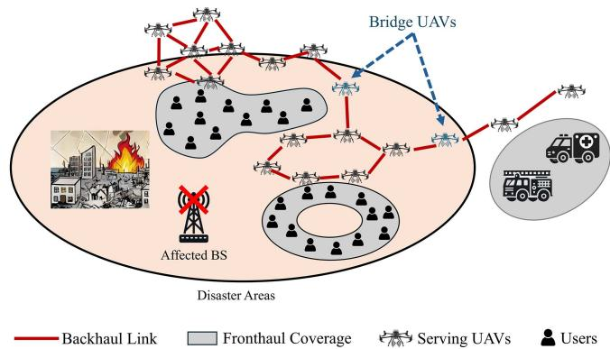  
Fig. 1. Illustration of UAV network deployment for emergency response after a disaster. UAVs are utilized as temporary aerial BSs to restore communication and connectivity.

The problem of configuring a UAV formation that not only covers a broad range of users but also maintains the backhaul connectivity of the UAV networks is an NP-hard problem [14]. Several studies have targeted the joint optimization of fronthaul and backhaul links in UAV-assisted wireless networks for maximal coverage and throughput [15], [16]. However, these approaches are based on assumptions of simple and uniform user distributions. In real-world applications, the challenge intensifies when users served by the UAV networks are situated in multiple geographically dispersed clusters. In many respects, this situation is similar to the facility location problem in operations research and supply chain management [17], where the objective is to strategically position facility centers to optimally serve the demands of consumers spread over various locations. However, the UAV formation problem introduces an additional layer of complexity. Unlike traditional facility location issues, the UAV network must ensure that these aerial facilities are not only well-positioned relative to user clusters but also close enough to each other to form cohesive fronthaul and backhaul connectivity. The difficulty of this problem is compounded by the need for the network to dynamically adapt to changing user distributions and react in real-time to environmental or operational constraints [18]. As such, traditional static optimization approaches are insufficient, and more adaptive, responsive strategies are required [19]. Recent advances in distributed learning have introduced scalable and adaptive designs for UAV coordination. In particular, the work in [20] explores distributed foundation models for multi-modal learning in 6G wireless networks, highlighting the importance of decentralized intelligence and localized decision-making for real-time adaptation in complex environments. This inspires us to find a multi-modal and distributed UAV control strategy that considers both the immediate data connectivity needs of individual users and the backhaul networks.

A preliminary version of the framework has been presented in [1] where a flocking based control algorithm creates a formation that can provide both coverage to the users while keeping the UAVs connected. The limitation of the previous work lies in that it requires the precise information about all user locations and is only applicable to scenarios where the ground users are in close proximity to each other. However, in the deployment of UAV-enabled communication networks, the dynamic and often unknown nature of user locations poses significant challenges for effective UAV formation and network stability [21], [22]. Without global information about user locations, UAVs must rely on local observations to determine optimal positioning. This situation is further complicated when users are spread across multiple spatially irregular and complex shaped clusters, making it difficult to achieve comprehensive coverage and inter-cluster connectivity. These challenges require more strategic and cooperative solutions where some UAVs serve users within individual clusters to ensure coverage. Meanwhile, other UAVs act as backhaul bridge nodes to interconnect the clusters, facilitating seamless end-to-end connectivity.

In this paper, we present a significantly enhanced and generalized framework for resilient UAV network formation, building upon the foundational ideas introduced in our earlier work. Unlike the preliminary version, which was limited to handling user clusters located in close proximity and relied on a simple flocking-based control strategy, this manuscript introduces a multi-modal UAV control architecture integrated with a potential field-based coordination mechanism to autonomously guide UAVs in complex, spatially unstructured environments. UAVs operate in three dynamically switchable modes—goal navigation, inter-cluster bridge formation, and static servicing— allowing them to collaboratively balance user coverage and inter-UAV connectivity even in geographically dispersed clusters. Moreover, we introduce a distributed consensus-based goal estimation algorithm, where each UAV computes and refines the target cluster center using only local information shared among neighbors. This mechanism enables UAVs to collectively converge toward optimal positions for serving user clusters without centralized coordination, making the system robust to partial failures and scalable to larger deployments. We also incorporate a distributed minimum spanning tree (MST)-driven connectivity mechanism, which guides UAVs in establishing bridge links between clusters to ensure backhaul connectivity in the absence of fixed infrastructure. In contrast to the earlier flocking-only control, this work provides a mathematically grounded, adaptive control framework that accounts for both transient local demand and global network formation goals through potential fields and consensus feedback. Extensive simulations show that our framework maintains high coverage and resilient network connectivity under mobility and node failures.

The rest of the paper is organized as follows: Section II provides an overview of the related works in literature. Section III introduces the communication models and network coverage and connectivity models. Section IV proposes the detailed methodology for the potential fields, UAV dynamics, distributed consensus goal formation and coverage control. Section V provides the simulation results, and Section VI concludes the paper.

## II. RELATED WORK

In recent years, UAV communications and networking has been an active area of research [23], [24], [25], focusing on various aspects such as expansion of BS coverage in 5G networks using UAVs as mobile relay nodes [26], [27], optimization of UAV flight trajectories for mission oriented tasks [28], [29], and UAV placement optimization addressing various goals, including enhancing energy efficiency in communications [30], maximizing access link quality of service (QoS) for users [31], securing UAV relay communications [32] and increasing coverage for ground users [33]. While there is extensive research on UAV communications and the strategic placement of UAVs, there remains a noticeable gap in studies concerning the design, analysis, and optimization of joint fronthaul and backhaul connectivity within multi-UAV networks, particularly in resilient UAV network formation for optimal coverage and connectivity under complex user spatial distributions.

## A. UAV Placement Optimization

One critical issue in the deployment of UAV networks is the optimization of UAV placement, tasked with maximizing coverage and ensuring robust connectivity in diverse environments [34], [35]. Challenges in this field include the dynamic environmental factors and mobility of users. To address these problems, [36] has studied the joint optimization of the number and placement of UAVs with dynamic user configurations and proposed a solution based on integer linear programming solvers. Their approach ensures coverage and backhaul connectivity with minimum number of UAVs. Another key challenge lies in the inherent limitations of UAV operational capacities such as battery and payload restrictions [37]. Researchers have used alternating optimization techniques to optimize UAV placement in cellular networks by balancing between energy consumption of UAVs against the QoS delivered to ground users [38], employing a multi-objective optimization approach to ensure equitable service distribution across all users. In another study [39], the authors have decoupled the joint optimization of 3D UAV placement and radio resource allocation into two sub-problems of UAV-user association and radio resource allocation for maximum per-UAV sum rates, and developed a framework based on iterative convex optimization to provide on-demand services.

However, the aforementioned studies primarily focus on the access link aspects of UAV-enabled networks, lacking attention to the backhaul link between UAVs, which is vital for the overall effectiveness and scalability of UAV networks.

## B. Joint Fronthaul and Backhaul Design

There has also been significant efforts towards developing methodologies for the joint optimization of fronthaul and backhaul links within UAV networks, particularly in the field of UAV-assisted 5G networks [40], [41]. Several studies have investigated the construction of multi-hop wireless networks and the delivery of seamless end-to-end connectivity for ground users [42], [43]. They utilize deep reinforcement learning models to optimize the UAV deployment for reliable fronthaul and backhaul connections and maximum coverage in remote or rural areas. However, the design of joint fronthaul and backhaul configurations presents significant challenges [44]. One of the primary difficulties lies in balancing the optimization of fronthaul coverage without compromising the integrity and connectivity of backhaul links. Researchers have addressed these challenges by optimizing the deployment and fronthaul and backhauling topology using tethered UAVs, which reduces the complexity of the joint optimization problems [45]. This approach involves a strategic evaluation of the trade-offs between fronthaul and backhaul capacities, and employs a deep reinforcement learning framework that aims to minimize deployment costs, ensure high coverage while simultaneously maintaining robust backhaul connectivity. Most existing works in this direction primarily consider scenarios where user locations are well-known and in simplified spatial distributions, significantly reducing the complexity in the optimization of UAV deployments and the management of network resources. In real-world applications, user locations are often unknown prior to deployment, and the distribution of users can vary significantly, often forming multiple irregular clusters.

## C. Contribution

In this study, we present a comprehensive and fully distributed UAV control framework that integrates a multi-modal control system with a consensus-based goal formation strategy. This design enables UAVs not only to autonomously cover spatially dispersed user clusters but also to form and maintain robust intercluster connectivity without relying on centralized coordination. Moreover, our proposed dynamic approach is designed to switch roles of UAVs in real time based on environmental feedback, local user density, and global coverage status. By incorporating decentralized decision-making, our method maintains high responsiveness and operational flexibility in the face of user mobility, varying service demands, and potential UAV failures. Through extensive simulation experiments, our approach maintains high user coverage, ensures UAV network connectivity, and recovers from random node failures in challenging scenarios involving scattered user distributions and network disruptions. The main contributions of this paper are as follows:

\- We propose a completely distributed and dynamic approach inspired from swarming or flocking dynamics to tackle the problem of UAV formation for coverage and connectivity of spatially dispersed users.

\- We develop a novel multi-modal UAV control policy, allowing UAVs to switch among exploration, coverage, and backhaul-bridging modes based on real-time observations of user density and network-wide coverage metrics.

\- We design a decentralized consensus-based goal estimation algorithm that allows UAVs to estimate and converge on the centers of local user clusters using only neighborhood-level communication, enabling coordinated movement without global knowledge.

\- We construct a unified potential field framework that synthesizes different spatial objectives—user attraction, obstacle avoidance, and inter-UAV cohesion—via smooth minimum functions, resulting in stable and continuous control inputs.

\- We integrate a lightweight distributed MST formation process into the framework to establish a cycle-free and resilient UAV backhaul network that adapts to mobility and topology changes.

\- We conduct comprehensive simulations under various environment conditions to validate the proposed system’s effectiveness in maximizing coverage, maintaining connectivity, and preserving robustness under UAV failures.

## III. SYSTEM MODEL

In this system model, we consider two primary sets of entities: ground users, referred to as mobile smart devices (MSDs) denoted by $\mathcal { M } = \{ 1 , \dots , M \}$ , and UAVs, termed mobile access points (MAPs) represented as $\mathcal { L } = \{ 1 , \ldots , L \}$ , as = 1illustrated in Fig. 2. The MSDs are arbitrarily positioned in a two-dimensional plane. The positions of the MSDs at any given time t are captured by their Cartesian coordinates, $p ( t ) =$ $[ p _ { 1 } ( t ) , p _ { 2 } ( t ) , \ldots , p _ { M } ( t ) ] ^ { T }$ , where each $p _ { i } ( t ) = [ x ( t ) , y ( t ) , 0 ] \in$ $\mathbb { R } ^ { 3 } , \forall i \in { \mathcal { M } }$ and $t \geq 0 .$ )] i( ) = [ ( ) ( ) 0]. Likewise, the positions of the MAPs at time t are specified by their Cartesian coordinates $\mathbf { } q ( t ) =$ $[ q _ { 1 } ( t ) , q _ { 2 } ( t ) , . . . , q _ { L } ( t ) ] ^ { T }$ , with $q _ { i } ( t ) \in \mathbb { R } ^ { 3 } , \forall i \in \mathcal { L }$ and $t \geq 0$ Additionally, the velocities of these MAPs are denoted by ${ \pmb v } ( t ) =$ $[ v _ { 1 } ( t ) , v _ { 2 } ( t ) , . . . , v _ { L } ( t ) ] ^ { T }$ , where $v _ { i } ( t ) \in \mathbb { R } ^ { 3 } , \forall i \in \mathcal { L }$ and $t \geq 0$ The MSDs are further organized into geographically distinct clusters $\mathcal { S } = \{ 1 , 2 , \dots , S \}$ . The centroid of each cluster $s \in S$ is denoted by $C _ { s }$ . We assume that each MAP is equipped with an omnidirectional antenna, providing uniform sensing and signal coverage in all directions. Each MAP is assumed to have access only to the positions of nearby MSDs within its communication or sensing range $r \in \mathbb { R } ^ { + }$ . These locally observed MSD sets for MAP i at time t are denoted as $U _ { i } ( t ) = \{ j \in \mathcal { M } , : | q _ { i } - p _ { j } | \leq$ $r \} , \forall i \in { \mathcal { L } } .$ i( ) =, and the number of MSDs in the set $U _ { i }$ i jis denoted as $N _ { u } ^ { i } ( t )$ i. The goal estimation and control decisions are made ubased on these local observations and periodic exchanges with neighboring MAPs.

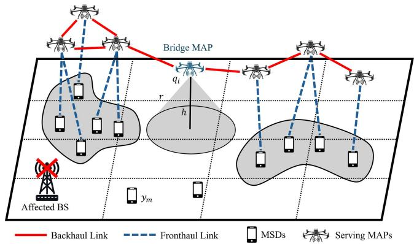  
Fig. 2. Illustration of system model. MAPs are deployed to serve and connect multiple MSD clusters when ground BSs are unavailable.

## A. Air-to-Air Communication Model

In the context of UAV networks, the effective communication range is crucial for maintaining robust inter-MAP connectivity. Each MAP is limited to a maximum inter-MAP communication radius r, where only MAPs within this euclidean distance from one another are capable of direct communication. The set of communication neighbors for each MAP $i ,$ denoted as $\mathcal { L } _ { N } ^ { i }$ comprises all other MAPs j within this radius, i.e., $\mathcal { L } _ { N } ^ { i } = \{ j \in$ $\mathcal { L } , j \neq i : | q _ { i } - q _ { j } | \leq r \} , \forall i \in \mathcal { L }$ N. We assume that MAPs communicate using shared frequency resources, leading to potential interference between neighboring MAPs. The communication range is determined by the signal-to-interference-plus-noise ratio (SINR), which is computed by considering both the desired signal power and the interference from other UAVs. Let i and $j$ represent UAVs, with $D _ { i , j }$ as the euclidean distance between them. The received power $P _ { r } ^ { i , j }$ at UAV j from UAV i is given by the modified free-space path loss (FSPL) model with multipath fading and interference [46]:

$$
P _ { r } ^ { i , j } = \frac { P _ { t } G _ { t } G _ { r } } { \left( 4 \pi f _ { c } \right) ^ { 2 } } \cdot \frac { h _ { i , j } } { D _ { i , j } ^ { \gamma } } ,\tag{1}
$$

where $P _ { t }$ is the transmission power, $G _ { t }$ and $G _ { r }$ are the antenna gains for UAV i and UAV $j , f _ { c }$ is the carrier frequency, and $h _ { i , j }$ represents the small-scale fading factor. The path loss exponent γ depends on the environment and typically ranges from 2 to 4. The small-scale fading component $h _ { i , j }$ is modeled as a Nakagami-m fading channel, where the probability density function (PDF) is given by:

$$
f _ { h } ( x ) = \frac { 2 m ^ { m } x ^ { 2 m - 1 } } { \Gamma ( m ) \Omega ^ { m } } \exp \left( - \frac { m x ^ { 2 } } { \Omega } \right) , ~ x \geq 0 ,\tag{2}
$$

where m is the fading parameter, $\Gamma ( \cdot )$ is the Gamma function, and is the average power gain.

Thus, the SINR at UAV j from UAV i is calculated considering interference from all other UAVs in the network, denoted as $\mathcal { T } _ { j } \colon$

$$
\widetilde { \mathrm { S I N R } } _ { i , j } = \frac { P _ { r } ^ { i , j } } { \sigma ^ { 2 } + \sum _ { k \in \mathcal { T } _ { j } } P _ { r } ^ { k } } ,\tag{3}
$$

where $\sigma ^ { 2 }$ is the thermal noise power, and $P _ { r } ^ { k }$ is the received signal power from UAV k to $\mathrm { U A V } ~ j .$ rInterference occurs when multiple UAVs share the same frequency resources, leading to a degradation in SINR.

For effective A2A communication, it is imperative that the SINR for any A2A link does not drop below a predefined thresh-- old $\beta .$ This requirement places a fundamental constraint on the maximum allowable distance r between any two communicating MAPs, leading to the constraint $\widetilde { \mathrm { S I N R } } _ { i , j } \ge \beta _ { \mathrm { \ell } }$ , which results in the following upper limit for the maximum communication range, i.e., $\begin{array} { r } { r \leq \bar { \frac { c } { 4 \pi f _ { c } } } \big ( \frac { P _ { t } } { \sigma ^ { 2 } \beta } \big ) ^ { 1 / \gamma } } \end{array}$

## B. Air-to-Ground Communication Model

The air-to-ground (A2G) links between MAPs and MSDs exhibit highly variable propagation characteristics due to the influence of terrain, obstacles, and elevation. These links can experience either line-of-sight (LoS) or non-line-of-sight (NLoS) conditions, with NLoS connections generally suffering from higher attenuation due to shadowing and blockage. To capture this variability in path loss accurately, we adopt a widely used probabilistic model that considers both LoS and NLoS conditions [47]. The probability of a LoS connection, denoted as $\mathrm { \mathit { P } _ { L o S } }$ , is influenced by several factors including the elevation angle and surrounding environmental characteristics, which is mathematically characterized as:

$$
p _ { \mathrm { L o S } } = \frac { 1 } { 1 + \vartheta \exp \left( - \xi \frac { 1 8 0 } { \pi } \phi - \vartheta \right) } ,\tag{4}
$$

where $\vartheta$ and $\xi$ are environmental constants, $\phi$ is the elevation angle, and $p _ { \mathrm { N L o S } } = 1 - p _ { \mathrm { L o S } }$ is the complementary NLoS probability.

For a given $\mathbf { M A P } i \in \mathcal { L }$ and MSD $m \in { \mathcal { M } }$ , the average path loss, $\mathrm { P L } _ { i , m }$ , is calculated as a weighted sum of the LoS and NLoS conditions as follows:

$$
\mathrm { P L } _ { i , m } = 1 0 \log _ { 1 0 } \left( \frac { 4 \pi f _ { c } d _ { i , m } } { c } \right) ^ { \delta } + p _ { \mathrm { L o S } } \eta _ { \mathrm { L o S } } + p _ { \mathrm { N L o S } } \eta _ { \mathrm { N L o S } } ,\tag{5}
$$

where $d _ { i , m }$ is the 3D distance between the MAP and MSD, c stands for the speed of light, $f _ { c }$ is the frequency of the carrier, and δ is the path-loss exponent. The first term in (5) quantifies the free-space attenuation, while $\eta _ { \mathrm { L o S } }$ and $\eta _ { \mathrm { N L o S } }$ account for the additional average losses for LoS and NLoS paths, respectively.

To manage access among MSDs served by the same MAP, we assume non-overlapping channel access is maintained within each MAP’s coverage. However, due to spectrum reuse across different MAPs, inter-MAP interference may still occur when neighboring MAPs serve overlapping areas. To capture this, we redefine the SINR at MSD m associated with MAP i as:

$$
\mathrm { S I N R } _ { i , m } = \frac { P _ { r } ^ { i , m } } { \sigma ^ { 2 } + \sum _ { j \in \mathbb { Z } _ { m } } P _ { I } ^ { j } } ,\tag{6}
$$

where $P _ { r } ^ { i , m } = P _ { t } / 1 0 ^ { \mathrm { P L } _ { i , m / 1 0 } }$ represents the power of the signal rreceived by the MSD, P is the $\mathbf { M A P } \mathbf { \vec { s } }$ transmission power, $\bar { \sigma } ^ { 2 }$ is the thermal noise power, $\mathcal { I } _ { m }$ denotes the set of interfering MSDs using overlapping channels, and $P _ { I } ^ { j }$ denotes the interfering signal power.

We assume an MSD m always connects with the MAP offering best quality of service within the communication range $r _ { \ast }$ $\mathrm { i . e . , } j = \underset { i \in \mathcal { L } : \| p _ { m } - q _ { i } \| \leq r } { \arg \operatorname* { m a x } } \quad \mathrm { S I N R } _ { i , m } .$

## C. Coverage and Connectivity Models

The effectiveness of a UAV-enabled communication network is primarily evaluated through its coverage and connectivity. The network coverage ratio, denoted by $R _ { c }$ , is quantified by the cproportion of MSDs within the cluster that successfully establish a connection to an MAP[38]. This metric is calculated as follows:

$$
R _ { c } = \frac { 1 } { M } \sum _ { i = 1 } ^ { L } N _ { u } ^ { i } ,\tag{7}
$$

where M is the total number of MSDs and $N _ { u } ^ { i }$ is the number uof MSDs connected to MAP i. This ratio not only indicates the extent of coverage provided by the MAPs but also serves as a critical criterion for deciding when to switch operational modes within the network, enhancing overall service delivery.

Connectivity within the MAP network, on the other hand, can be assessed by analyzing the network’s structural properties through graph theoretical approaches. A key measure used is the Fiedler value, also known as the algebraic connectivity of the network. This value is derived from the second-smallest eigenvalue of the network’s Laplacian matrix $L ,$ , which is constructed based on the adjacency matrix A defined as:

$$
a _ { i , j } = { \left\{ \begin{array} { l l } { 1 , } & { { \mathrm { i f ~ } } \| q _ { i } - q _ { j } \| \leq r , } \\ { 0 , } & { { \mathrm { o t h e r w i s e } } , } \end{array} \right. }\tag{8}
$$

where $i , j \in { \mathcal { L } }$ and $\pmb { L } = \pmb { D } - \pmb { A }$ , with D representing the degree matrix. The Fiedler value provides a quantitative measure of the network’s connectivity; a non-zero Fiedler value indicates that the network is fully connected, meaning every MAP is reachable from any other MAP in the system. Moreover, a higher Fiedler value signifies greater robustness and resilience of the network’s connectivity, essential for maintaining reliable communication in dynamic environments or during network reconfigurations.

## IV. METHODOLOGY

This section presents the methodology used to develop the coverage formation and the connectivity establishment for MAPs. We create a resilient and autonomous configuration of MAP network through a multi-modal potential-based coverage control algorithm. The overarching goal of our system model is to establish robust coverage and connectivity across complex user locations, which often vary in their spatial configuration. This goal addresses the need for flexible network solutions that can dynamically adapt to varied and unpredictable user distributions. We assume that the UAVs possess knowledge of the global centers or areas where users are concentrated but the exact locations of individual user are unavailable, facilitating a targeted approach to deploying network resources. To illustrate, consider a scenario where users are dispersed across a geographic area impacted by a natural disaster as shown in Fig. 3(a). In this case, the users’ locations form irregular patterns with varying densities. We could visualize this scenario with a diagram showing user locations as points scattered across a map. The centers of high user density would be marked with crosses, indicating the focal points for deploying MAPs. Given this premise, several strategies are proposed to achieve optimal network deployment and performance.

## A. MAP Multi-Modal Control

In order to create tailored formations of MAPs to provide seamless coverage for the MSDs in the network, we have designed a multi-modal operation strategy for the MAPs. Assume the centroids $\mathcal { C } = \{ C _ { 1 } , C _ { 2 } , . . . , C _ { s } \}$ of all MSD clusters S are known and the MAPs keep a minimum-weight spanning tree (MST) of MSD clusters that are already explored $\mathcal { T } _ { c } =$ $\{ S _ { c } ^ { 1 } , S _ { c } ^ { 2 } , . . . , S _ { c } ^ { s } \}$ . This strategy is designed based the consensus c c cgoal of MAPs to actively explore user locations, establish robust backhaul connectivity, and effectively serve users. It combines several modes of operation, each optimized for different aspects of the network’s function, to ensure flexibility and adaptability in response to changing conditions on the ground. At any given time, each MAP can be in one of the following operation modes:

$M _ { 0 } { \mathrm { : } }$ : When in Dynamic mode, the MAP sets its goal to the nearest cluster center $C _ { i }$ that is not covered, travels to the cluster and explored potential users.

$M _ { 1 }$ : When in Connectivity mode, the MAP determines the next cluster to connect and establish connectivity based on distributed MST algorithm[48].

$M _ { 2 } ;$ : When in Static mode, the MAP sets its goal to the local consensus goal and serves MSDs in its goal cluster.

The initial modes of all MAPs are set to $M _ { i } ( 0 ) = M _ { 0 }$ . In each operational iteration, each MSDs establish connection with the nearest MAP, and MAPs engage in information sharing with their neighboring MAPs, exchanging critical data such as relative positions, velocities, and the number of connected MSDs. This collaborative data exchange is pivotal for synchronizing the network’s response to dynamic environmental and operational conditions. Following this, the network-wide coverage ratio is calculated and used in the decision-making process for mode switching among the MAPs as shown in Algorithm 1, allowing the network to adapt its configuration to optimize coverage and connectivity dynamically. If the local coverage ratio $R _ { s } ( t )$ for local cluster does not exceed the predefined s(threshold $r _ { 0 } .$ the MAP retains its current mode $M _ { 0 } ,$ avoiding unnecessary mode switching that could destabilize network formation during low coverage phases. However, to account for localized service bottlenecks, the algorithm further evaluates the number of MSDs associated with each MAP, $N _ { u } ^ { i } ( t )$ . If the local coverage ratio $R _ { s } ( t ) \leq r _ { 0 }$ u, the UAV remains in its current mode. This conservative behavior reflects the prioritization of local network conditions over global goals during early coverage phases. When $R _ { s } ( t ) > r _ { 0 }$ , mode transitions are permitted, and each MAP dynamically selects its operational mode based on local load and proximity to other MAPs as shown in Algorithm 2. Specifically, we set two thresholds $n _ { 0 }$ and $n _ { 1 }$ , with $n _ { 0 } < n _ { 1 }$ , for MAP mode selection. MAPs experiencing high service loads $N _ { u } ^ { i } ( t ) > n _ { 1 }$ switch to $M _ { 2 }$ to serve local connected MSDs. uIf an MAP has $n _ { 0 } < N _ { u } ^ { i } ( t ) < n _ { 1 }$ , it switches to $M _ { 1 }$ to form uconnectivity bridge between current cluster and next unserved cluster based on distributed MST Algorithm 3. To improve global coverage and resource utilization, MAPs with very low service load $N _ { u } ^ { i } ( t ) < n _ { 0 }$ may switch to $M _ { 0 }$ to explore uncovered regions and improve global coverage. This adaptive mode selection mechanism ensures that MAPs collectively respond to both transient and large-scale changes in the user distribution, maintaining coverage efficiency while preserving stability.

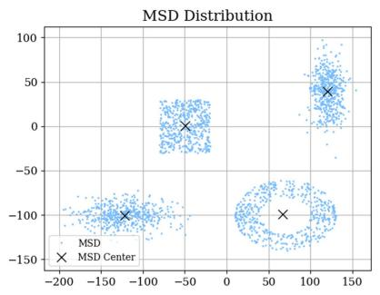  
(a)

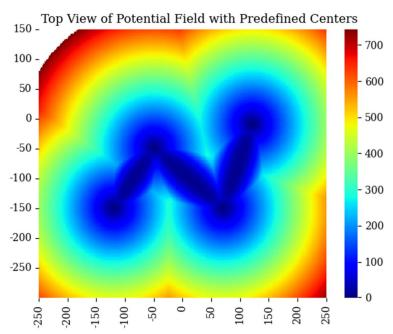  
(b)

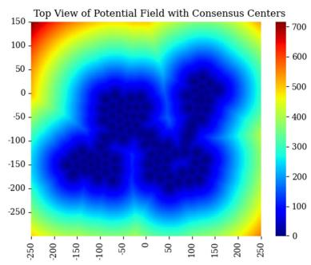  
(c)  
Fig. 3. Visualization of MSD distribution and potential field heatmaps: (3a) top view of MSD distributions, (3b) potential field using cluster centers, and (3c) potential field using consensus goals.

To handle MSD mobility, each MAP continuously monitors the real-time association status of nearby MSDs. When an MSD moves to a new position or from one cluster to another, it automatically reselects the closest MAP with a stable signal, and the corresponding MAPs adjust their roles accordingly in the next iteration. This distributed reassignment ensures seamless service continuity without requiring centralized handover coordination. The computational complexity of Algorithm 1 is primarily determined by local sensing, neighbor communication, consensus updates, and potential field evaluations. For each MAP, the local sensing of nearby MSDs has a cost of $\mathcal { O } ( N _ { u } ^ { i } )$ . The exchange of ustate information with neighboring MAPs incurs a communication cost of $\mathcal { O } ( \mathcal { L } _ { N } ^ { i } )$ , where $d _ { i }$ is the number of neighboring ( N ) iMAPs. The consensus goal update involves simple averaging and gradient descent steps, with complexity $\mathcal { O } ( N _ { u } ^ { i } + \mathcal { L } _ { N } ^ { i } )$ . The Npotential field computation, which aggregates repulsion, attraction, and alignment forces, also scales linearly with $d _ { i }$ and $n _ { u }$ Therefore, the overall per-iteration complexity for each MAP is $\mathcal { O } ( N _ { u } ^ { i } + \mathcal { L } _ { N } ^ { i } )$ , making the algorithm efficient and well-suited u Nfor distributed, large-scale UAV networks.

## B. Consensus Based Goal Formation

To optimize the formation of MAPs for maximized coverage of MSDs within the network, it is crucial for MAPs to accurately determine the positions of MSDs. However, each

Algorithm 1: MAP Multi-Modal Control.   
Require: Initialize position, velocity and mode for each   
MAP $q _ { i } ( 0 ) , v _ { i } ( 0 ) , M _ { i } ( 0 ) \gets M _ { 0 } .$   
1: while not converged do   
2: Determine the number of connected MSDs, $N _ { u } ^ { i } ( t )$ , for   
each MAPs.   
3: Each MAPs share the position, velocity, number of   
connected MSDs, operational mode with its   
neighboring MAPs.   
4: Update network-wide coverage ratio $R _ { c } .$   
5: Each MAP updates mode $M ( t )$ using Algorithm 2.   
6: Compute control input $u _ { i } ( t )$ for each MAP using (20).   
7: Update the velocity and position of each MAPs.   
8: end while

MAP’s ability to detect MSDs is fundamentally constrained by its communication range, which restricts its awareness to MSDs directly connected to it and preventing it from accessing broader network configurations. To overcome this limitation, we have developed a distributed consensus-based formation algorithm that utilizes the local position information of MSDs to generate real-time estimation of MSD configurations in broader range, and determine optimal goals for MAP deployment. Specifically, each MAP i is assumed to know the locations of all MSDs within its connectivity set $U _ { i } ,$ enabling it to calculate the local centroid $C _ { l o c } ^ { i }$ of these MSDs. The local centroid represents the geometric loccenter of the MSDs connected to the MAP and is computed as follows:

$$
C _ { l o c } ^ { i } = \frac { \sum _ { j \in U _ { i } } p _ { j } } { N _ { u } ^ { i } } .\tag{9}
$$

Initially, the consensus center $C _ { c o n } ^ { i }$ for each MAP at step $T = 0$ is set to $C _ { l o c } ^ { i } ( 0 )$ con = 0. Subsequently, each MAP shares its local centroid $C _ { l o c } ^ { i }$ cwith neighboring MAPs within its communication locneighborhood ${ \mathcal { N } } _ { i }$ . This shared information facilitates a collective update of the consensus center $C _ { c o n } ^ { i }$ across the network through iterative processes as follows:

$$
\begin{array} { r } { C _ { c o n } ^ { i } ( t + 1 ) = C _ { l o c } ^ { i } ( t ) - \mu ( C _ { l o c } ^ { i } ( t ) - q _ { i } ) } \\ { - \mu \displaystyle \sum _ { j \in U _ { i } } ( C _ { l o c } ^ { i } ( t ) - p _ { j } ) , } \end{array}\tag{10}
$$

Algorithm 2: Mode Selection. Algorithm 3: Distributed MST Construction.   
Require: Current mode $M _ { i } ( t )$ , Number of served MSDs 1: Initialization: Each MAP i initializes its local MSD   
$N _ { u } ^ { i } ( t )$ , local coverage ratio $R _ { s } ( t )$ for current goal cluster cluster center $C _ { i }$ and local MST set $\mathbb { T } _ { i }  \emptyset .$   
$g _ { c } ^ { i } ( t )$ , coverage thresholds $r _ { 0 } .$ serving capacity thresholds i2: while MST not converged do   
$n _ { 0 }$ ( )and $n _ { 1 } .$ 3: for $\mathbf { M A P } i \in \mathcal { L }$ do   
1: if $R _ { c } ( t ) > r _ { 0 }$ then 4: Broadcast $C _ { i }$ and current edge weights to   
c( )2: Update MST of achieved goals $\mathcal { T } _ { c }  \mathcal { T } _ { c } + g _ { c } ^ { i }$ neighboring $\mathrm { U A V s } \ j \in \mathcal N _ { i }$   
3: if $M _ { i } ( t ) = M _ { 0 }$ then 5: Receive $C _ { j }$ and edge weights from all $j \in \mathcal N _ { i }$   
4: if $0 < N _ { u } ^ { i } ( t ) < n _ { 0 }$ then 6: Identify candidate edges: $\mathsf { \bar { E } } _ { i } ^ { \mathrm { o u t } } = \{ ( i , j ) \mid C _ { j } \neq C _ { i } \}$   
5: 0 u( )Determine the nearest cluster center $g _ { u } ^ { i }$ that 7: if $\mathcal { E } _ { i } ^ { \mathrm { { o u t } } } \neq \emptyset$ then   
$g _ { u } ^ { i } \notin \mathcal { T } _ { c } .$ 8: i Select minimum-weight edge $( i , k ) \in \mathcal { E } _ { i } ^ { \mathrm { o u t } }$   
6: u cUpdate current goal $g _ { c } ^ { i } \gets g _ { u } ^ { i } .$ 9: Send MERGE\_REQUEST to UAV k   
7: else if $n _ { 0 } \le N _ { u } ^ { i } ( t ) < n _ { 1 }$ then 10: end if   
8: u( )Update current mode $M _ { i } ( t ) \gets M _ { 1 }$ 11: end for   
9: Determine the clusters to connect using distributed 12: for UAV k receiving MERGE\_REQUEST from UAV i   
MST Algorithm 3 and build connectivity using do   
(20). 13: if i, k is also the minimum-weight outgoing edge   
10: else ( )of k then   
11: Update current mode $M _ { i } ( t + 1 )  M _ { 2 }$ 14: Approve merge: $C _ { i } \gets \operatorname* { m i n } ( C _ { i } , C _ { k } ) .$   
12: end if $C _ { k } \gets \operatorname* { m i n } ( C _ { i } , C _ { k } )$   
13: else 15: Update MST sets: ${ \mathcal { T } } _ { i } \gets { \mathcal { T } } _ { i } \cup \{ ( i , k ) \}$   
14: $M _ { i } ( t + 1 )  M _ { 0 }$ ${ \mathcal { T } } _ { k } \gets { \mathcal { T } } _ { k } \cup \{ ( i , k ) \}$   
i(15: end if 16: kend if   
16: else 17: end for   
17: $M _ { i } ( t + 1 )  M _ { i } ( t )$ 18: Synchronize newly merged nodes   
i(18: end if 19: end while

where the term $C _ { l o c } ^ { i } ( t )$ represents the current estimate of the loclocal centroid of MAP i at step $t , \mu$ is a small positive step size governing the update rate, and the two subtracted terms guide the estimate toward more accurate values. The first adjustment term $\mu ( C _ { l o c } ^ { i } ( t ) - q _ { i } )$ penalizes deviation from the MAP’s own locposition and draws the estimate toward the UAV’s own position $q _ { i } ,$ , anchoring the update to the UAV’s local state for stability. The second term $\begin{array} { r } { \mu \sum _ { j \in U _ { i } } ( C _ { l o c } ^ { i } ( t ) - p _ { j } ) } \end{array}$ incorporates the influence j Uof all observed users $p _ { j }$ locin the sensing range $U _ { i } ,$ steering the goal estimate toward the local user centroid. This update rule acts as a distributed averaging mechanism, gradually refining each UAV’s estimate based on local observations and shared context. Over successive iterations and under appropriate network connectivity conditions, this formulation ensures that the UAVs converge to a consistent estimate of the user cluster center, enabling coordinated and stable network formation.

Details of the distributed consensus goal formation algorithm are defined in Algorithm 4. This algorithm leverages the local information available to each MAP to achieve a unified consensus objective across the network. It is featured by not requiring complete information about the precise locations of all users. Instead, it is designed to dynamically discover and adapt to user locations as they change, enhancing its ability to respond to real-time network demands. Fig. 3 demonstrates the efficacy of the consensus-based goal formation method by comparing the potential field in heatmaps. This approach is capable of handling arbitrary user configurations, making it exceptionally effective in complex and unpredictable environments.

Algorithm 4: Consensus Goal Formation.   
Require: The set of all connected MSDs $\overline { { U _ { i } } } ,$ number of   
connected MSDs $N _ { u } ^ { i } ( t )$ i, positions of all connected MSDs   
$\{ p _ { j } | j \in U _ { i } \}$   
1: Calculate and initialize the local centroid $C _ { l o c } ^ { i } ( 0 )$ and   
the consensus center $C _ { c o n } ^ { i } ( 0 ) = C _ { l o c } ^ { i } ( 0 )$   
con(0) = loc(0)2: while MAP network has not converged do   
3: Compute $C _ { l o c } ^ { i } ( t )$ using (9).   
loc( )4: Update the consensus center $C _ { c o n } ^ { i } ( t )$ for each MAP   
using (10).   
5: Assign deployment goal for MAP i to be $C _ { c o n } ^ { i } ( t )$   
6: end while

## C. Potential Field Construction

With the consensus goal formation, we construct the potential field by considering the relative positions of the MAPs and the consensus goal. To facilitate a smooth transition in goal potential, we employ the σ-norm to create continuous goal potential functions. The σ-norm is defined as:

$$
\| z \| _ { \sigma } = \frac { 1 } { \epsilon } \left( \sqrt { 1 + \epsilon \| z \| ^ { 2 } } - 1 \right) ,\tag{11}
$$

where $\epsilon > 0$ is a positive constant. The gradient of the function is given by:

$$
\nabla \| z \| _ { \sigma } = \frac { z } { \sqrt { 1 + \epsilon \| z \| ^ { 2 } } } = \frac { z } { 1 + \epsilon \| z \| _ { \sigma } } .\tag{12}
$$

The advantage of $\| z \| _ { \sigma }$ is that it is differentiable everywhere while traditional norms may fail to be differentiable at $z = 0$ Additionally, the gradient function $\nabla \| z \| _ { \sigma }$ is bounded by $1 / \sqrt \epsilon$ even as z increases to infinity, ensuring stability and preventing extreme values in the potential field.

1) Goal Potential: To enhance the QoS of received signal by optimizing the proximity of MAPs to MSDs, we have introduced a mechanism within the goal potential framework that actively encourages MAPs to move closer to MSDs. This is achieved through the formulation of the goal potential function, which is specifically designed to dynamically align the movements of the MAPs with the aggregated position of their consensus goal. The goal potential function is defined as:

$$
E _ { g } ^ { i } = k \| C _ { c o n } ^ { i } - q _ { i } \| _ { \sigma } ,\tag{13}
$$

where $E _ { g } ^ { i }$ represents the goal potential energy of MAP i, $C _ { c o n } ^ { i }$ g conis the coordinate of the consensus goal and k is a positive constant scalar which adjusts the sensitivity of the MAP to the distance from the consensus goal. By continuously adjusting the positions of MAPs towards the consensus goal, the MAPs can maintain optimal service quality, even in dynamically changing environments where the distribution of MSDs varies over time.

2) Connectivity Potential: In scenarios where MSDs are distributed across dispersed clusters, establishing a network link among these clusters becomes crucial. To address this challenge, we develop a network connectivity framework by implementing MAPs as bridge nodes that facilitate connectivity between clusters. This is achieved through a potential function that is specifically designed around the positions of cluster centroids. Assume MAP i is strategically positioned to act as a bridge between two clusters, $S _ { 1 } ^ { i }$ and $S _ { 2 } ^ { i }$ , which have their centroids at $C _ { 1 } ^ { i }$ and $C _ { 2 } ^ { i }$ respectively. The locations of these centroids can be accurately identified using advanced aerial survey techniques that monitor ground population and user distribution. Several techniques such as simultaneous localization and mapping (SLAM) and other imaging technologies are now available that can automate the process to provide information about the key centers of network users. The connectivity potential function for MAP i is mathematically defined as:

$$
E _ { c } ^ { i } = k ( | C _ { 1 } ^ { i } - q _ { i } | _ { \sigma } + | C _ { 2 } ^ { i } - q _ { i } | _ { \sigma } - | C _ { 1 } ^ { i } - C _ { 2 } ^ { i } | _ { \sigma } ) .\tag{14}
$$

Here, k is a positive constant scalar that modulates the strength of the potential, enhancing the $\mathbf { M A P } \mathbf { \vec { s } }$ effectiveness in bridging the clusters. This function is designed to minimize the distance between the MAP and each cluster’s centroid while also considering the distance between the centroids themselves.

An illustrative example of how MAPs can form such a connectivity bridge between two MSD clusters is shown in Fig. 4. This setup not only ensures efficient data transmission across dispersed user groups but also strengthens the overall network structure, making it resilient against potential disruptions in any single cluster. Such strategic deployment of MAPs supports continuous and reliable network service across widely distributed user bases.

3) Potential Field Aggregation: We leverage the log-sumexp (LSE) function which takes the soft minimum of the potential functions to produce a smooth combined potential field that is differentiable everywhere. Given the potentials $E _ { 1 } , E _ { 2 } , \ldots , E _ { n }$ the potential functions are combined as follows:

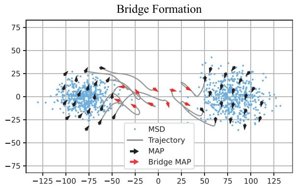  
Fig. 4. Illustration of MAPs connecting two clusters of MSDs.

$$
E _ { L S E } ( E _ { 1 } , E _ { 2 } , \dots , E _ { n } ) = ( 1 / \alpha ) \ln \left( \sum _ { i \in 1 \dots n } \exp ( \alpha E _ { i } ) \right) .\tag{15}
$$

where $\alpha < 0$ is a constant parameter. The gradient of the combined potential field is given by:

$$
\begin{array} { l } { \displaystyle \nabla E _ { L S E } ( E _ { 1 } , E _ { 2 } , \ldots , E _ { n } ) } \\ { \displaystyle = \frac { 1 } { \sum _ { i \in 1 \ldots n } \exp ( \alpha E _ { i } ) } \sum _ { i \in 1 \ldots n } \exp ( \alpha E _ { i } ) \nabla E _ { i } } \end{array}\tag{16}
$$

4) Convergence Analysis: To analyze the convergence of the proposed multi-modal UAV control framework, we adopt a Lyapunov-based analysis grounded in artificial potential field theory. We assume that each UAV follows a gradient-based control law of the form:

$$
\begin{array} { r } { \dot { \bf p } _ { i } = - \nabla _ { \bf q } _ { i } E _ { L S E } ( E _ { 1 } , E _ { 2 } , \dots , E _ { n } ) , } \end{array}\tag{17}
$$

which directs each UAV i to descend along the gradient of the total potential field. Under this control policy, the potential function $E _ { L S E }$ acts as a Lyapunov function candidate, as supported by prior stability analyses in distributed flocking control literature [49]. Differentiating $E _ { L S E }$ with respect to time yields:

$$
\begin{array} { r l r } {  { \frac { d E _ { L S E } } { d t } = \sum _ { i \in \mathcal { L } } \nabla _ { \mathbf { p } _ { i } } E _ { L S E } ^ { \top } \dot { \mathbf { p } } _ { i } } } \\ & { } & \\ & { } & { = - \sum _ { i \in \mathcal { L } } \| \nabla _ { \mathbf { p } _ { i } } E _ { L S E } \| ^ { 2 } \leq 0 . } \end{array}\tag{18}
$$

This implies that $E _ { L S E }$ is non-increasing along the UAV trajectories and is bounded below, as each component potential is lower bounded by design. Therefore, the UAV system asymptotically converges to a stable configuration where $\nabla _ { v _ { i } } \Phi _ { i } = 0 , \forall i \in$ ${ \mathcal { L } } .$ v Φi = 0At convergence, UAVs settle into a locally optimal configuration where attractive forces toward high-density user clusters are balanced by repulsive forces and connectivity constraints. This results in a formation that maximizes coverage while preserving network connectivity. Moreover, due to the multi-modal nature of the potential field, the equilibrium configuration is not unique; instead, the system converges to a locally optimal stable configuration dependent on the initial UAV distribution. Since the potential functions are smooth and continuously differentiable, convergence to equilibria of $E _ { L S E }$ is guaranteed for any initial UAV configuration. While the convergence guarantees hold in the continuous-time domain, in practice, the algorithm is discretized for numerical implementation. Nonetheless, the discrete-time behavior closely approximates the continuoustime dynamics under sufficiently small time steps.

## D. Mode Selection Algorithm for Backhaul Connectivity

We leverage the widely accepted kinematic model in robotics and control literature to describe the dynamics of the MAPs as follows:

$$
\begin{array} { r } { \dot { q } _ { i } = v _ { i } , } \\ { \dot { v _ { i } } = u _ { i } , } \end{array}\tag{19}
$$

where $q _ { i } , v _ { i } , u _ { i } \in \mathbb { R } ^ { 3 }$ and $i \in { \mathcal { L } } .$ . The control input can be designed as combination of the following three terms:

$$
u _ { i } = f _ { i } ( q , A , N _ { u } ) + g _ { i } ( p , A ) + h _ { i } ( q , p , M ) ,\tag{20}
$$

where $f _ { i } ( q , A , N _ { u } )$ is an inter-MAP attractive/repulsive term, $g _ { i } ( p , A )$ i( u)defines the velocity consensus term, $h _ { i } ( q , p )$ is a term based on the potential field and MAP mode.

In order to generate a smooth mapping of the MAP dynamics, we use a smooth mapping function $\alpha _ { \{ z _ { 0 } , z _ { 1 } \} } ( z )$ with finite cutoffs $[ z _ { 0 } , z _ { 1 } ]$ , expressed as follows [50]:

$$
\alpha _ { \{ z _ { 0 } , z _ { 1 } \} } ( z ) = \left\{ \begin{array} { l l } { 1 , } & { \mathrm { i f ~ } 0 \leq z < z _ { 0 } , } \\ { \frac { 1 } { 2 } \left( 1 + \cos ( \pi \frac { z - z _ { 0 } } { z _ { 1 } - z _ { 0 } } ) \right) , } & { \mathrm { i f ~ } z _ { 0 } \leq z < z _ { 1 } , } \\ { 0 , } & { \mathrm { i f ~ } z \geq z _ { 1 } . } \end{array} \right.\tag{21}
$$

The inter-MAP attractive and repulsive term is designed to avoid collision between MAPs and also prevent disconnections. This function is defined by:

$$
\begin{array} { l } { \displaystyle f _ { i } ( \boldsymbol { q } , A , N _ { u } ) = \sum _ { j \in N _ { i } } \left[ \Phi ( \| \boldsymbol { q } _ { j } - \boldsymbol { q } _ { i } \| _ { \sigma } ) \right. } \\ { \displaystyle ~ + ~ \left. a \left( 1 - \alpha _ { \{ 0 , 1 \} } \left( \frac { \| \left( N _ { u } ^ { j } - N ^ { \operatorname* { m a x } } \right) ^ { + } \| _ { \sigma } } { \| N ^ { \operatorname* { m a x } } \| _ { \sigma } } \right) \right) \right] \mathbf { v } _ { i , j } , } \end{array}\tag{22}
$$

where $\mathbf { v } _ { i , j } = \nabla \| q _ { j } - q _ { i } \| _ { \sigma }$ is the vector from $q _ { i }$ to $q _ { j }$ . The function $\Phi ( z )$ is expressed as:

$$
\Phi ( z ) = \alpha _ { \{ \gamma , 1 \} } \left( \frac { z } { \| r \| _ { \sigma } } \right) \phi ( z - \| d \| _ { \sigma } ) ,\tag{23}
$$

where $\begin{array} { r } { \phi ( z ) = \frac { 1 } { 2 } [ ( a + b ) \frac { ( z + c ) } { \sqrt { 1 + ( z + c ) ^ { 2 } } } + ( a - b ) ] } \end{array}$ and $c = | a -$ $b | / { \sqrt { 4 a b } }$ to ensure that $\phi ( 0 ) = 0$ . Here r is the maximum communication range and d is the minimum distance between MAPs.

The velocity consensus function works as a damping force that facilitates coordinated movement among neighboring MAPs and load balancing. This function is defined by:

TABLE I PARAMETER VALUES USED IN SIMULATIONS
<table><tr><td rowspan=1 colspan=1>Parameter</td><td rowspan=1 colspan=1>Value</td></tr><tr><td rowspan=1 colspan=1>Number of MSDs, M</td><td rowspan=1 colspan=1>500</td></tr><tr><td rowspan=1 colspan=1>MAP maximum communication range, r</td><td rowspan=1 colspan=1>24 m</td></tr><tr><td rowspan=1 colspan=1>Minimum inter-MAP distance, d</td><td rowspan=1 colspan=1>20 m</td></tr><tr><td rowspan=1 colspan=1>Transmit power, ρ</td><td rowspan=1 colspan=1>10 W</td></tr><tr><td rowspan=1 colspan=1>MAP serving capacity, Nmax</td><td rowspan=1 colspan=1>80</td></tr><tr><td rowspan=1 colspan=1>Environmental path-loss parameters, $\overline { { \vartheta , \xi } }$ </td><td rowspan=1 colspan=1>4.88, 0.43</td></tr><tr><td rowspan=1 colspan=1>Air-to-air path-loss exponent, η</td><td rowspan=1 colspan=1>3.5</td></tr><tr><td rowspan=1 colspan=1>Air-to-ground path-loss exponent, δ</td><td rowspan=1 colspan=1>2.0</td></tr><tr><td rowspan=1 colspan=1>Additional average LoS path-loss, $\underline { { \eta _ { L o s } } }$ </td><td rowspan=1 colspan=1>0.1 dB</td></tr><tr><td rowspan=1 colspan=1>Additional average NLoS path-loss, $\underline { { \eta _ { N L o s } } }$ </td><td rowspan=1 colspan=1>21.0 dB</td></tr></table>

$$
\begin{array} { r l } { ~ } & { g _ { i } ( p , A ) = \displaystyle \sum _ { j \in N _ { i } \backslash i } a _ { i j } ( v _ { j } - v _ { i } ) } \\ & { \quad \quad \quad \left( 1 - \alpha _ { \{ 0 , 1 \} } \left( \frac { \| \left( N ^ { \operatorname* { m a x } } - N _ { u } ^ { i } \right) ^ { + } \| _ { \sigma } } { \| N ^ { \operatorname* { m a x } } \| _ { \sigma } } \right) \right) . } \end{array}\tag{24}
$$

We define a goal function based on the MAP mode $M _ { i } ( t )$ . It shows a tendency to approach the goal position.

$$
\begin{array} { r l } & { h _ { i } ( \boldsymbol { q } , \boldsymbol { p } , M ) = } \\ & { \left\{ \begin{array} { l l } { \nabla E _ { g } ^ { i } ( \boldsymbol { q } ) + \lambda ( v _ { i } ^ { r } - v _ { i } ) , \mathrm { ~ i f ~ } M _ { i } = M _ { 0 } \mathrm { ~ o r ~ } M _ { 2 } , } \\ { \nabla E _ { c } ^ { i } ( \boldsymbol { q } ) + \frac { 1 } { 2 } \lambda ( v _ { 1 } ^ { r } - v _ { i } ) + \frac { 1 } { 2 } \lambda ( v _ { 2 } ^ { r } - v _ { i } ) , \mathrm { ~ i f ~ } M _ { i } = M _ { 1 } . } \end{array} \right. } \end{array}\tag{25}
$$

We create a backhaul connectivity algorithm based on MAP modes $M _ { i } ( t )$ . Suppose the centroids $C _ { i }$ of all MSD clusters are known. All MAPs are initialized with random position $q _ { i } ( 0 )$ velocity $v _ { i } ( 0 )$ and mode $M _ { i } ( 0 ) = M _ { 0 }$ i(0). Then each MAP switches mode from $M _ { i } ( k )$ to $M _ { i } ( k + 1 )$ based on current mode $M _ { i } ( k )$ number of MSDs it serves $N _ { u } ^ { i } ( k )$ and the coverage ratio for current goal $R _ { c } ( k )$ u( ). When the MAPs switch to $M _ { 1 }$ , they will establish connectivity between clusters using the connectivity functions defined in (20). The detailed mode selection algorithm is defined in Algorithm 2.

## V. SIMULATION RESULTS

In this section, we demonstrate the effectiveness of our proposed solution with numerical simulations. MAPs are released from a uniformly distributed area centered at (-150,50) with fixed height $h _ { i } = 2 0 ~ \mathrm { m }$ . The initial velocity of MAPs are randomly selected from $[ - 1 , 1 ] ^ { 2 }$ . The MSDs are divided into four clusters using 2D Gaussian distribution and each cluster has 500 MSDs for all simulations. The following parameters persist throughout the experiments: minimum separation between MAPs $d = 2 0$ m, communication range of MAPs r . d,  . for $\| z \| _ { \sigma } ,$ transmit power $\rho = 1 0$ W, path-loss exponent between MAPs and MSDs $\eta = 3 . 5$ $a = b = 5$ for φ z , $N _ { \mathrm { m a x } } = 8 0$ $\lambda =$ $0 . 6 , \ k = 1 0$ for goal functions, $r _ { 0 } = 0 . 9 5 , \ n _ { 0 } = 3 , \ n _ { 1 } = 1 0$ for mode switching, simulation time step $\Delta t = 0 . 1 s$ = 10. The list of parameter settings are shown in Table I.

In Fig. 5, we show an example of the experiment results for our proposed method using 90 MAPs. Fig. 5(a) shows the initialization of the MAPs and MSDs. The MAPs traverse the four clusters, build connectivity between clusters and serve MSDs in their individual goal clusters. Finally at $t = 3 0 . 0$ s as shown in Fig. 5(d), the algorithm converges and develops a connected network covering all four clusters. Fig. 6 illustrates the network formation after convergence in a more complex scenario with 90 MAPs deployed to serve 100 MSDs per cluster across four spatially dispersed clusters. The MAPs have selforganized into a structure that provides dense local coverage within each cluster while maintaining inter-cluster connectivity through bridge UAVs. The resulting topology demonstrates both high spatial efficiency and connectivity, capable of maintaining coverage even in scenarios with nonuniform user distributions.

Network Configuration (t=0.0 s)  
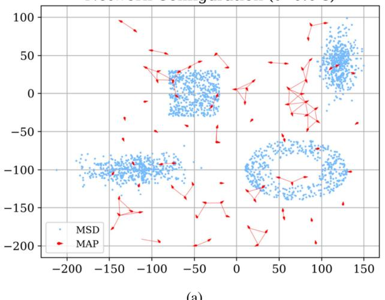  
(a)

Network Configuration (t=10.0 s)  
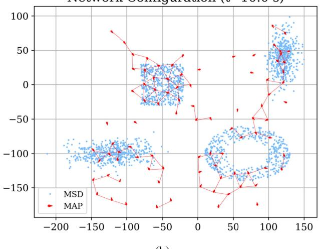  
(b)

Network Configuration (t=20.0 s)  
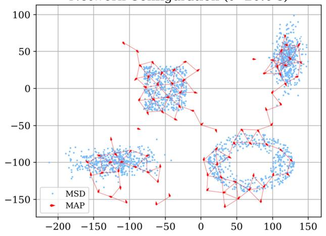  
(c)

Network Configuration (t=40.0 s)  
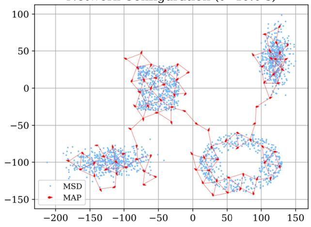  
(d)  
Fig. 5. Experiment results for network formation and connectivity. Figure (a) shows the initial positions of MAPs and MSDs. Figures (b), (c) and (d) show the process of MAPs covering all four MSD clusters and creating connectivity between them.

In Figs. 7 and 8, we conduct a comprehensive performance comparison among the proposed method, a baseline model inspired by mode-based flocking behavior [1], and a distributed learning approach [33]. The evaluation is performed under varying numbers of MAPs ranging from 50 to 100, focusing on two key metrics: coverage ratio and Fiedler value (reflecting network connectivity). As shown in Fig. 7, the proposed model consistently achieves superior coverage across all settings, reaching a peak of 98.5% with 90 MAPs. In contrast, the distributed learning scheme, although leveraging communication-efficient training across agents, tends to converge to suboptimal formations under limited MAP availability due to local policy conflicts and convergence delays. The baseline model, while maintaining tight UAV formations, struggles to cover dispersed user clusters, resulting in the lowest coverage across all scenarios. In Fig. 8, we further assess network connectivity using the Fiedler value. Although the proposed method achieves better spatial coverage, it produces lower Fiedler values compared to the baseline when MAP density is high (e.g., 90–100 MAPs). This trade-off arises because our method prioritizes coverage efficiency and intercluster exploration, which leads to less redundant inter-UAV links. The baseline model maintains stronger connectivity at the expense of redundant clustering and limited reach, hence its higher Fiedler values. The distributed learning method exhibits moderate performance in both metrics but lacks the responsiveness and structure enforcement required in highly dynamic and large-scale environments. These comparisons clearly demonstrate the advantage of our approach in achieving high coverage with acceptable connectivity, and highlight its robustness and scalability for real-world UAV network deployments.

Network Configuration  
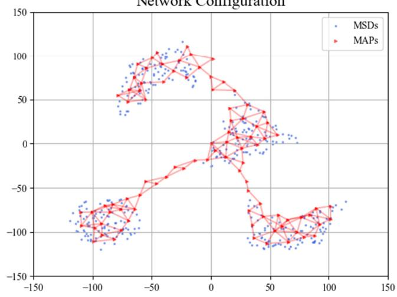  
Fig. 6. Network formation after convergence using 100 MSDs per cluster and 90 MAPs.

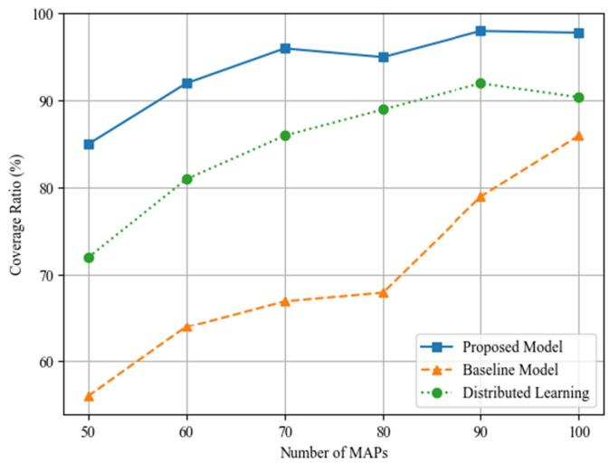

Fig. 7. Coverage ratios with time in experiments using different numbers of MAPs. The highest coverage ratio using 90 MAPs reaches 98.5% after convergence.  
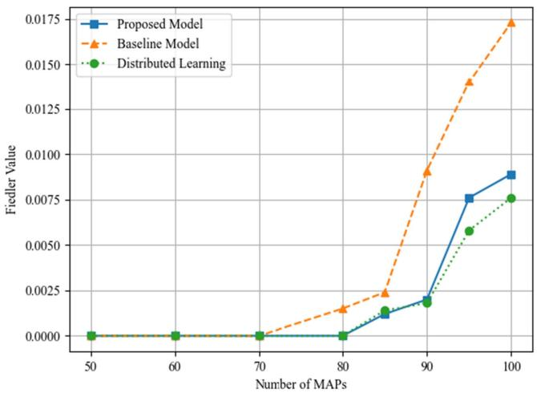  
Fig. 8. Fiedler values with time in experiments using different numbers of MAPs. The highest Fiedler value using 100 MAPs reaches 0.021 after convergence.

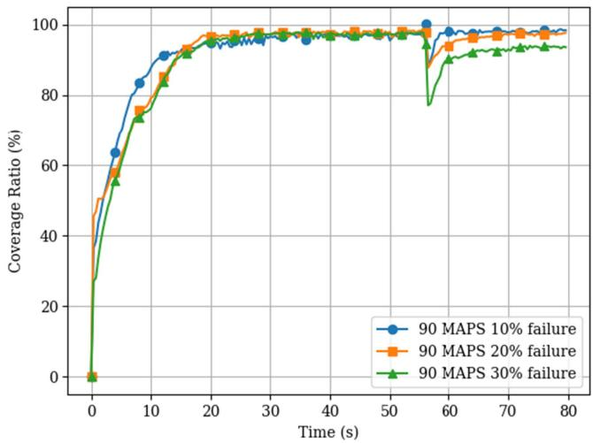

(a)  
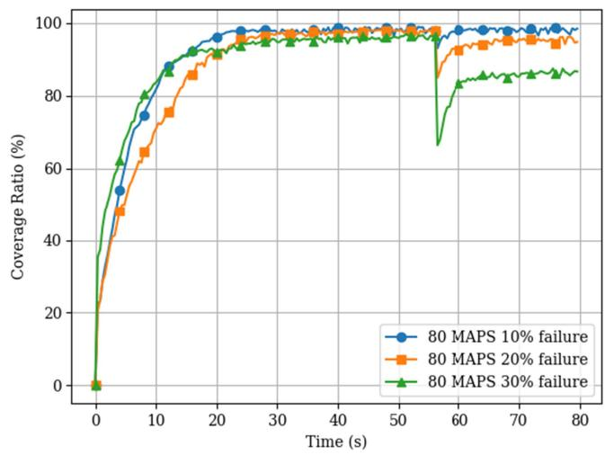  
(b)  
Fig. 9. Coverage ratios with time when random failure happens at $t = 5 5 s$ using (a) 90 and (b) 80 MAPs respectively.

In Fig. 9, we evaluate the resilience and recovery capabilities of the proposed multi-modal UAV control framework under random UAV failures. At $t = 5 5$ seconds, a subset of MAPs is randomly disabled to simulate failure events with failure rates ranging from 10% to 30%. In the absence of failures, the coverage ratio steadily increases and reaches a peak of approximately 98%, indicating that the system successfully achieves full coverage of the dispersed user clusters. Once failures are triggered, the remaining MAPs detect the degradation in coverage and local service loads and autonomously reconfigure their roles in response. Specifically, lightly loaded UAVs switch to exploration mode $M _ { 0 }$ to identify newly uncovered areas, while UAVs near the boundary of failed zones transition to bridge mode $M _ { 1 }$ to restore inter-cluster backhaul connectivity. This distributed role reassignment is triggered by local observations of drop in network-wide coverage ratio $R _ { c } ( t )$ . In addition, the c( )distributed MST is recalculated after failure to reestablish a loop-free and connected communication backbone based on the updated UAV topology. Even under 30% failure, the system maintains a relatively high coverage ratio of approximately 85%, demonstrating strong resilience in user service. However, the figure also reveals that at high failure rates, particularly above 30%, the system’s ability to preserve cluster-to-cluster connectivity diminishes due to the lack of sufficient bridge nodes. In Fig. 10, we compare the percentage of successful recovery across different network sizes and failure rates. The results show that network resilience is highly dependent on node density. When only 50 MAPs are deployed, failure rates exceeding 40% cause the network to breakdown, and full connectivity cannot be restored. This highlights the importance of sufficient UAV redundancy in maintaining robustness under disruptive conditions.

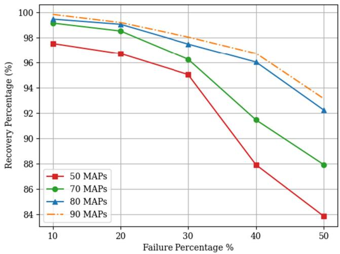  
Fig. 10. Comparison of network resilience from random failures. The recovery percentage of user coverage is compared using different failure rates and number of MAPs.

In Fig. 11, we compare the performance of the proposed control framework with a baseline mode-based flocking algorithm 1 under varying numbers of MAPs (50, 70, and 90). The baseline model exhibits oscillation with respect to time due to its sequential cluster traversal strategy, where UAVs are temporarily drawn away from one region to explore another, leading to transient coverage gaps. In contrast, the proposed method demonstrates smoother convergence curves and significantly higher final coverage ratios. This improvement is attributed to the unified potential field, which blends multiple cluster goals and their connectivity priorities into a single cohesive control force. This design enables UAVs to reduce unnecessary oscillations and promote coordinated dispersion. Fig. 12 further investigates the role of goal formation by comparing the use of consensus-based dynamic goals versus static predefined cluster centers. Across all MAP densities, the consensus-goal approach consistently outperforms the predefined goal setup. This is because consensus goals adapt in real-time based on local user observations and UAV interactions, allowing more precise alignment with actual user distributions, especially in irregular or mobile settings. Predefined goals, by contrast, lack flexibility and often cause UAVs to cluster inefficiently or miss user regions entirely. The results highlight the value of decentralized consensus in driving both faster convergence and more accurate spatial coverage.

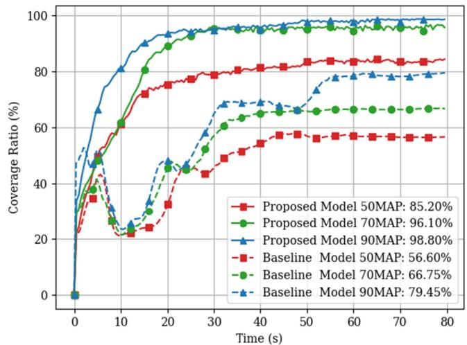  
Fig. 11. Comparisons of coverage ratio of our proposed model with the baseline model.

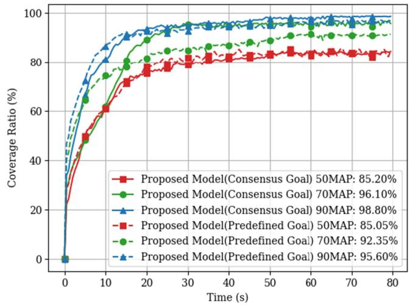  
Fig. 12. Comparisons of coverage ratio of our proposed model using consensus goal and predefined goal.

In Fig. 13, we investigate how varying the minimum inter-MAP distance $d \in { 1 5 , 2 0 , 2 5 , 3 0 }$ , meters influences the overall coverage ratio of MSDs. This parameter plays a critical role in shaping the formation behavior of UAVs, as it directly influences their spatial dispersion and coordination. Our results reveal that a moderate inter-MAP spacing of d meters yields the highest coverage ratio of approximately 95%, indicating an optimal balance between distribution and cooperation. When the minimum distance is too small, e.g., $d = 1 5$ m, MAPs tend to cluster closely, resulting in overlapping coverage zones. This leads to over-provisioning in some areas and coverage gaps in others, as UAVs are constrained from spreading out effectively due to local repulsion forces. Consequently, the coverage ratio converges at a suboptimal level below 90%. On the opposite, increasing d to 35 meters causes UAVs to spread too far apart, weakening inter-MAP communication and fragmenting the sensing coverage. As a result, some MSDs fall outside the collective coverage range, causing the coverage ratio to degrade to nearly 80%.

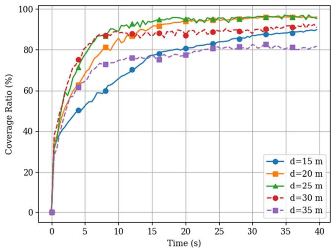  
Fig. 13. Comparisons of coverage ratio of our proposed model using different minimum distance d between MAPs.

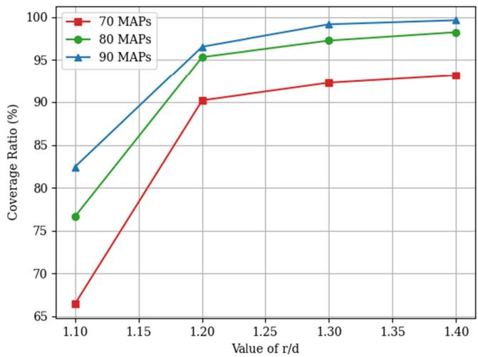  
Fig. 14. Comparisons of coverage ratio of our proposed model using different r/d ratios.

In Fig. 14, we analyze how the network’s coverage ratio evolves in relation to changes in both the number of MAPs and the ratio of $r / d$ (the communication range to minimum distance ratio). It is evident that increasing the number of MAPs generally leads to an improvement in the coverage ratio, albeit with diminishing returns as more MAPs are added. Additionally, as the ratio of $r / d$ is increased from 1.10 to 1.40, there is a corresponding rise in the coverage ratio, although the rate of increase slows down. The coverage ratio peaks and stabilizes once the $r / d$ ratio exceeds 1.3, suggesting an optimal $r / d$ ratio that maximizes coverage under the given network parameters.

In Fig. 15, we compare connectivity of the network (measured from Fiedler values after convergence) using different number of MAPs. When the number of MAPs is less than 65, the MAPs are unable to provide connectivity among all four clusters. So the Fiedler value in this case is zero. When the number of MAPs is between (65,80), the Fiedler value increases drastically as the number of MAPs increases. When the number of MAPs is in the interval of (80,120), the Fiedler value keeps increasing, however, the rate of increase reduces gradually.

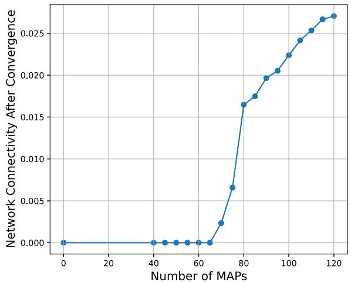  
Fig. 15. Fiedler values after network convergence using different number of MAPs.

## VI. CONCLUSION

In this paper, we present a distributed and resilient UAV network formation algorithm to construct a mobile aerial network that provides both local coverage and backhaul connectivity in regions with complex and dispersed user distributions. The proposed multi-modal operation policy and the use of a consensus-based potential field method allows UAVs to adapt their positioning dynamically in response to real-time changes in user distribution, significantly improving coverage and connectivity. The distributed consensus algorithm enables UAVs to effectively manage and optimize their placement based on the local observations of user clusters. The introduction of a potential function-based connectivity model further facilitates the UAVs’ ability to function as bridge nodes between dispersed user clusters, ensuring network integrity even across geographically separated areas. The experimental results show that the solution has been successful in maintaining a stable and high coverage ratio after the network converges. Additionally, the network demonstrates high resilience to random failures and a strong capacity for self-recovery. In the event of failures, the operational UAVs are capable of autonomously reconfiguring the network to restore both coverage and connectivity. Even in scenarios where failure rates are extremely high, while the network may lose overall connectivity, our proposed framework is still able to ensure high coverage around cluster centers.

In the current design, threshold values governing transitions between UAV operational modes are predefined and static, which may limit adaptability in dynamic environments characterized by evolving user densities, mobility patterns, and environmental uncertainties. As part of future work, we aim to explore the integration of adaptive machine learning strategies, particularly reinforcement learning, to enable UAVs to autonomously adjust mode-switching thresholds based on local observations, historical network states, and real-time feedback. Such learning-based approaches can enhance responsiveness to emerging user clusters, reduce convergence time, and improve network efficiency across diverse mission scenarios. Additionally, we plan to validate the proposed communication model under more practical and challenging conditions, such as urban and mountainous terrains with increased interference, multipath effects, and physical obstacles. Finally, we will investigate alternative theoretical tools to refine the algorithm’s guarantees, including control-theoretic methods and formal verification, further strengthening the framework’s robustness for real-world applications.

## ACKNOWLEDGMENT

Preliminary results from this work have appeared in Proceedings of the IEEE International Conference on Communications (ICC 2022), Seoul, South Korea, May 2022 [1].

## REFERENCES

[1] Y. Wang and J. Farooq, “Resilient UAV formation for coverage and connectivity of spatially dispersed users,” in Proc. IEEE Int. Conf. Commun., 2022, pp. 225–230.

[2] W. J. Yun et al., “Cooperative multiagent deep reinforcement learning for reliable surveillance via autonomous multi-UAV control,” IEEE Trans. Ind. Informat., vol. 18, no. 10, pp. 7086–7096, Oct. 2022.

[3] K. Rezaee et al., “IoMT-assisted medical vehicle routing based on UAVborne human crowd sensing and deep learning in smart cities,” IEEE Internet Things J., vol. 10, no. 21, pp. 18529–18536, Nov. 2023.

[4] Y. Wang and J. Farooq, “Proactive and resilient UAV orchestration for QoS driven connectivity and coverage of ground users,” in Proc. IEEE Conf. Commun. Netw. Secur., 2022, pp. 371–376.

[5] L. Yu, X. Sun, S. Shao, Y. Chen, and R. Albelaihi, “Backhaul-aware drone base station placement and resource management for FSO-based droneassisted mobile networks,” IEEE Trans. Netw. Sci. Eng., vol. 10, no. 3, pp. 1659–1668, May/Jun. 2023.

[6] K. T. Pauu, J. Wu, Y. Fan, Q. Pan, and M. Maka, “Differential privacy and blockchain-empowered decentralized graph federated learning enabled UAVs for disaster response,” IEEE Internet Things J., vol. 11, no. 12, pp. 20930–20947, Jun. 2024.

[7] M. Dai, T. H. Luan, Z. Su, N. Zhang, Q. Xu, and R. Li, “Joint channel allocation and data delivery for UAV-assisted cooperative transportation communications in post-disaster networks,” IEEE Trans. Intell. Transp. Syst., vol. 23, no. 9, pp. 16676–16689, Sep. 2022.

[8] M. Matracia, M. A. Kishk, and M.-S. Alouini, “UAV-aided post-disaster cellular networks: A novel stochastic geometry approach,” IEEE Trans. Veh. Technol, vol. 72, no. 7, pp. 9406–9418, Jul. 2023.

[9] Y. Wang et al., “Task offloading for post-disaster rescue in unmanned aerial vehicles networks,” IEEE/ACM Trans. Netw., vol. 30, no. 4, pp. 1525–1539, Aug. 2022.

[10] M. Asim, M. ELAffendi, and A. A. A. El-Latif, “Multi-IRS and multi-UAV-assisted MEC system for 5G/6G networks: Efficient joint trajectory optimization and passive beamforming framework,” IEEE Trans. Intell. Transp. Syst., vol. 24, no. 4, pp. 4553–4564, Apr. 2023.

[11] Y. Wang and J. Farooq, “Optimal 3D placement for integrated access backhauling in UAV-assisted wireless networks using reinforcement learning,” in Proc. IEEE 20th Int. Conf. Mobile Ad Hoc Smart Syst., 2023, pp. 640–645.

[12] M. Elamassie and M. Uysal, “FSO-based multi-layer airborne backhaul networks,” IEEE Trans. Veh. Technol, vol. 73, no. 10, pp. 15004–15019, Oct. 2024.

[13] A. Testa, “Verizon responds to hurricane Ian,” Dec. 2022. Accessed: Jul. 04, 2024. [Online]. Available: https://www.verizon.com/about/news/ verizon-responds-hurricane-ian

[14] X. Wu and J. Farooq, “Attack resilient wireless backhaul connectivity with optimized fronthaul coverage in UAV networks,” in Proc. IEEE Conf. Commun. Netw. Secur. Cyber Resilience Workshop, 2023, pp. 1–6.

[15] M. Sheng, Y. Zhang, J. Liu, Z. Xie, T. Q. S. Quek, and J. Li, “Enabling integrated access and backhaul in dynamic aerial-terrestrial networks for coverage enhancement,” IEEE Trans. Wireless Commun., vol. 23, no. 8, pp. 9072–9084, Aug. 2024.

[16] Y. Wang, G. He, B. Yang, Z. Hao, Q. Guo, and Z. Ma, “End-to-end throughput maximization oriented resource allocation in RIS-assisted mmWave IABN using nonorthogonal multiple access,” IEEE Internet Things J., vol. 11, no. 13, pp. 23282–23296, Jul. 2024.

[17] Y. Park, S. Lee, I. Sung, P. Nielsen, and I. Moon, “Facility locationallocation problem for emergency medical service with unmanned aerial vehicle,” IEEE Trans. Intell. Transp. Syst., vol. 24, no. 2, pp. 1465–1479, Feb. 2023.

[18] Z. Wang et al., “Learning to routing in UAV swarm network: A multi-agent reinforcement learning approach,” IEEE Trans. Veh. Technol, vol. 72, no. 5, pp. 6611–6624, May 2023.

[19] A. Gaydamaka, A. Samuylov, D. Moltchanov, M. Ashraf, B. Tan, and Y. Koucheryavy, “Dynamic topology organization and maintenance algorithms for autonomous UAV swarms,” IEEE Trans. Mobile Comput., vol. 23, no. 5, pp. 4423–4439, May 2024.

[20] J. Du, T. Lin, C. Jiang, Q. Yang, C. F. Bader, and Z. Han, “Distributed foundation models for multi-modal learning in 6G wireless networks,” IEEE Wireless Commun., vol. 31, no. 3, pp. 20–30, Jun. 2024.

[21] J. Shi, P. Cong, L. Zhao, X. Wang, S. Wan, and M. Guizani, “A two-stage strategy for UAV-enabled wireless power transfer in unknown environments,” IEEE Trans. Mobile Comput., vol. 23, no. 2, pp. 1785–1802, Feb. 2024.

[22] W. Zhang and W. Zhang, “An efficient UAV localization technique based on particle swarm optimization,” IEEE Trans. Veh. Technol, vol. 71, no. 9, pp. 9544–9557, Sep. 2022.

[23] B. Chang, W. Tang, X. Yan, X. Tong, and Z. Chen, “Integrated scheduling of sensing, communication, and control for mmWave/THz communications in cellular connected UAV networks,” IEEE J. Sel. Areas Commun., vol. 40, no. 7, pp. 2103–2113, Jul. 2022.

[24] X. Song, Y. Zhao, Z. Wu, Z. Yang, and J. Tang, “Joint trajectory and communication design for IRS-assisted UAV networks,” IEEE Wireless Commun. Lett., vol. 11, no. 7, pp. 1538–1542, Jul. 2022.

[25] K. Meng et al., “UAV-enabled integrated sensing and communication: Opportunities and challenges,” IEEE Wireless Commun., vol. 31, no. 2, pp. 97–104, Apr. 2024.

[26] H. Guo, Y. Wang, J. Liu, and C. Liu, “Multi-UAV cooperative task offloading and resource allocation in 5G advanced and beyond,” IEEE Trans. Wireless Commun., vol. 23, no. 1, pp. 347–359, Jan. 2024.

[27] M. T. Mamaghani and Y. Hong, “Aerial intelligent reflecting surfaceenabled terahertz covert communications in beyond-5G Internet of Things,” IEEE Internet Things J., vol. 9, no. 19, pp. 19012–19033, Oct. 2022.

[28] L. A. Binti Burhanuddin, X. Liu, Y. Deng, U. Challita, and A. Zahemszky, “QoE optimization for live video streaming in UAV-to-UAV communications via deep reinforcement learning,” IEEE Trans. Veh. Technol, vol. 71, no. 5, pp. 5358–5370, May 2022.

[29] X. Zhang, H. Zhang, W. Du, K. Long, and A. Nallanathan, “IRS empowered UAV wireless communication with resource allocation, reflecting design and trajectory optimization,” IEEE Trans. Wireless Commun., vol. 21, no. 10, pp. 7867–7880, Oct. 2022.

[30] W. Qi, Q. Song, L. Guo, and A. Jamalipour, “Energy-efficient resource allocation for UAV-assisted vehicular networks with spectrum sharing,” IEEE Trans. Veh. Technol, vol. 71, no. 7, pp. 7691–7702, Jul. 2022.

[31] L. Yuan, N. Yang, F. Fang, and Z. Ding, “Performance analysis of UAVassisted short-packet cooperative communications,” IEEE Trans. Veh. Technol, vol. 71, no. 4, pp. 4471–4476, Apr. 2022.

[32] G. Sun, J. Li, A. Wang, Q. Wu, Z. Sun, and Y. Liu, “Secure and energy-efficient UAV relay communications exploiting collaborative beamforming,” IEEE Trans. Commun., vol. 70, no. 8, pp. 5401–5416, Aug. 2022.

[33] N. Gao, L. Liang, D. Cai, X. Li, and S. Jin, “Coverage control for UAV swarm communication networks: A distributed learning approach,” IEEE Internet Things J., vol. 9, no. 20, pp. 19854–19867, Oct. 2022.

[34] H. Li, P. Li, J. Xu, J. Chen, and Y. Zeng, “Derivative-free placement optimization for multi-UAV wireless networks with channel knowledge map,” in Proc. IEEE Int. Conf. Commun. Workshops, 2022, pp. 1029–1034.

[35] R. Chen, W. Cheng, Y. Ding, and B. Wang, “QoS-guaranteed multi-UAV coverage scheme for IoT communications with interference management,” IEEE Internet Things J., vol. 11, no. 3, pp. 4116–4126, Feb. 2024.

[36] J. Sabzehali, V. K. Shah, Q. Fan, B. Choudhury, L. Liu, and J. H. Reed, “Optimizing number, placement, and backhaul connectivity of multi-UAV networks,” IEEE Internet Things J., vol. 9, no. 21, pp. 21548–21560, Nov. 2022.

[37] M. Nikooroo, O. Esrafilian, Z. Becvar, and D. Gesbert, “Optimization of placement and resource allocation in UAV-aided multihop wireless networks,” IEEE Internet Things J., vol. 11, no. 11, pp. 20051–20071, Jun. 2024.

[38] Y. Liu, W. Huangfu, H. Zhou, H. Zhang, J. Liu, and K. Long, “Fair and energy-efficient coverage optimization for UAV placement problem in the cellular network,” IEEE Trans. Commun., vol. 70, no. 6, pp. 4222–4235, Jun. 2022.

[39] A. Mahmood, T. X. Vu, S. Chatzinotas, and B. Ottersten, “Joint optimization of 3D placement and radio resource allocation for per-UAV sum rate maximization,” IEEE Trans. Veh. Technol, vol. 72, no. 10, pp. 13094–13105, Oct. 2023.

[40] E. Catté, M. Sana, and M. Maman, “Federated multi-agent deep reinforcement learning for dynamic and flexible 3D operation of 5G multi-MAP networks,” in Proc. IEEE 34th Annu. Int. Symp. Pers. Indoor Mobile Radio Commun., 2023, pp. 1–6.

[41] S. Chen and X. Wang, “PtrTasking: Pointer network based task scheduling for multi-connectivity enabled MEC services,” IEEE Trans. Mobile Comput., vol. 23, no. 10, pp. 9398–9409, Oct. 2024.

[42] M. Shokrnezhad, S. Khorsandi, and T. Taleb, “A scalable communication model to realize integrated access and backhaul (IAB) in 5G,” in Proc. IEEE Int. Conf. Commun., 2023, pp. 1350–1356.

[43] Y. Wang and J. Farooq, “Deep-reinforcement-learning-based placement for integrated access backhauling in UAV-assisted wireless networks,” IEEE Internet Things J., vol. 11, no. 8, pp. 14727–14738, Apr. 2024.

[44] P. Karmakar, V. K. Shah, S. Roy, K. Hazra, S. Saha, and S. Nandi, “Reliable backhauling in aerial communication networks against UAV failures: A deep reinforcement learning approach,” IEEE Trans. Netw. Service Manag., vol. 19, no. 3, pp. 2798–2811, Sep. 2022.

[45] Y. Zhang, M. A. Kishk, and M.-S. Alouini, “Deployment optimization of tethered drone-assisted integrated access and backhaul networks,” IEEE Trans. Wireless Commun., vol. 23, no. 4, pp. 2668–2680, Apr. 2024.

[46] C. Dong, Y. Liao, Z. Jia, Q. Wu, and L. Zhang, “Joint ADS-B in B5G for hierarchical UAV networks: Performance analysis and MEC based optimization,” IEEE Internet Things J., vol. 12, no. 12, pp. 22211–22223, Jun. 2025.

[47] X. Fan et al., “UAV-enabled federated learning in dynamic environments: Efficiency and security trade-off,” IEEE Trans. Veh. Technol, vol. 73, no. 5, pp. 6993–7006, May 2024.

[48] Z. Liang, X. Lyu, C. Ren, N. Li, and K. Li, “Communication-efficient topology orchestration for distributed learning in UAV networks,” in Proc. 2024 Int. Wireless Commun. Mobile Comput., 2024, pp. 662–667.

[49] R. Olfati-Saber, “Flocking for multi-agent dynamic systems: Algorithms and theory,” IEEE Trans. Autom. Control, vol. 51, no. 3, pp. 401–420, Mar. 2006.

[50] R. Saber and R. Murray, “Flocking with obstacle avoidance: Cooperation with limited communication in mobile networks,” in Proc. 42nd IEEE Int. Conf. Decis. Control, 2003, pp. 2022–2028.

Yuhui Wang (Graduate Student Member, IEEE) received the BEng degree in computer science from the Hong Kong University of Science and Technology (HKUST), Hong Kong, China, in 2019, and the MS degree in computer science from New York University (NYU), Brooklyn, NY, in 2021. He is currently working toward the PhD degree with the Department of Electrical and Computer Engineering, University of Michigan-Dearborn. His research interests include mobile edge computing, machine learning, UAV networks, and Internet of Things.

Junaid Farooq (Senior Member, IEEE) received the BS degree in electrical engineering from the School of Electrical Engineering and Computer Science (SEECS), National University of Sciences and Technology (NUST), Islamabad, Pakistan, in 2013, the MS degree in electrical engineering from the King Abdullah University of Science and Technology (KAUST), Thuwal, Saudi Arabia, in 2015, and the PhD degree in electrical engineering from the Tandon School of Engineering, New York University, Brooklyn, NY, in 2020. He was the recipient of the NYU

University wide Outstanding Dissertation Award in 2021. Currently, he is an assistant professor with the Department of Electrical and Computer Engineering, University of Michigan-Dearborn. His research interests include optimization, security, and resilience of communication networks, cyber-physical systems, and the Internet of things.

Juntao Chen (Member, IEEE) received the BEng (honor) degree in electrical engineering and automation from Central South University, Changsha, China, in 2014, and the PhD degree in electrical engineering from New York University (NYU), Brooklyn, NY, in 2020. He is currently an assistant professor with the Department of Computer and Information Sciences and an affiliated faculty member with the Fordham Center of Cybersecurity, Fordham University, New York, USA. His research interests include cyberphysical security and resilience, game and decision theory, network optimization and learning, artificial intelligence, and equitable smart cities. He was a recipient of the Ernst Weber Fellowship, the Dante Youla Award, and the Alexander Hessel Award for the Best PhD Dissertation in electrical engineering from NYU.