# Dynamic Trajectory Design for Multi-UAV-Assisted Mobile Edge Computing

Zhuwei Wang , Member, IEEE, Haowei Wang , Lihan Liu , Enchang Sun , Senior Member, IEEE, Haijun Zhang , Fellow, IEEE, Zhidu Li , Senior Member, IEEE, Chao Fang , Senior Member, IEEE, and Meng Li , Senior Member, IEEE

Abstract—The trajectory design for unpiloted aerial vehicle (UAV)-assisted mobile edge computing (MEC) networks has become a hot research topic. In the UAV-assisted MEC scenario, the UAV is required to frequently adjust its flight trajectory due to dynamic factors such as time-varying task offloading requirements, user mobility, and transmission environment variation. In this paper, with consideration of the constraint induced by the UAV flight dynamics, the dynamic trajectory design challenge within the blockchain-based multi-UAV-assisted MEC framework is investigated. An intelligent algorithm that integrates multi-agent deep deterministic policy gradient (MADDPG), linear quadratic regulator (LQR), and CVXPY solver, named MADDPG-LC, is proposed to achieve real-time joint optimization of dynamic trajectory control and resource allocation with respect to minimizing weighted energy consumption and delays. Numerical simulation results demonstrate the efficacy of the proposed MADDPG-LC algorithm in addressing the UAV flight dynamics constraint, which has generally overlooked in existing works.

Index Terms—Dynamic trajectory, flight dynamics, intelligent design, unpiloted aerial vehicle (UAV)-assisted MEC.

# I. INTRODUCTION

URRENTLY, various applications of Internet of Things (IoT) have arisen, such as online games, virtual reality, autonomous driving, smart city, etc. The majority of these applications have strict requirements for low latency and security [1].

Received 28 June 2024; revised 5 October 2024; accepted 15 October 2024. Date of publication 5 November 2024; date of current version 5 March 2025. This work was supported in part by the National Natural Science Foundation of China under Grant 62371014, Grant 62101031 and Grant 62371012, in part by Beijing Natural Science Foundation under Grant 4222002 and Grant L212004, in part by the Science and Technology Research Program of Chongqing Municipal Education Commission under Grant KJQN202300646, in part by the Fundamental Research Funds for the Central Universities under Grant FRF-TP-22-002C2. The review of this article was coordinated by Dr. Zehui Xiong. (Corresponding author: Lihan Liu.)

Zhuwei Wang, Haowei Wang, Enchang Sun, Chao Fang, and Meng Li are with the School of Information Science and Technology, Beijing University of Technology, Beijing 100124, China (e-mail: wangzhuwei@bjut.edu.cn; wanghaowei@emails.bjut.edu.cn; ecsun@bjut.edu.cn; fangchao@bjut.edu.cn; limeng720@bjut.edu.cn).

Lihan Liu is with the School of Statistics and Data Science, Beijing Wuzi University, Beijing 101149, China (e-mail: liulihan@bwu.edu.cn).

Haijun Zhang is with the Beijing Engineering and Technology Research Center for Convergence Networks and Ubiquitous Services, University of Science and Technology Beijing, Beijing 100083, China (e-mail: haijunzhang@ieee.org).

Zhidu Li is with the School of Communications and Information Engineering, Chongqing University of Posts and Telecommunications, Chongqing 400065, China (e-mail: lizd@cqupt.edu.cn).

Digital Object Identifier 10.1109/TVT.2024.3485182

In an effort to enhance the quality of service (QoS) for users, a significant amount of computing tasks need to be executed in wireless devices under exacting real-time requirements. Nevertheless, since the energy and computing frequency limitations of the user devices, it becomes challenging to handle all tasks locally. Migrating computing tasks to the cloud is capable of effectively alleviating the computing burden on user devices. However, due to the inherent challenge lies in the typical remoteness of cloud servers, data transmission and processing can result in large latency, rendering the cloud server inappropriate for real-time operations with low-latency requirements [2].

Mobile edge computing (MEC), as an emerging distributed computing paradigm rooted in mobile communication networks, extends the capabilities of cloud computing by aggregating a large amount of idle computing power and storage resources distributed at the network edge. Compared to traditional cloud computing, MEC significantly reduces latency, improves energy efficiency, and enhances privacy and security by bringing computing and storage resources closer to users [3]. The distributed architecture of MEC allows data processing at the network edge, thereby avoiding the latency and bandwidth consumption associated with data transmission to the remote data center. Thanks to MEC technology, user devices can offload computing tasks to edge nodes via the wireless network, which not only reduces the computational burden on terminal devices, but also improves response speed and service quality, especially in real-time processing scenarios such as unpiloted aerial vehicles (UAVs), intelligent transportation, and industrial automation.

The traditional MEC server is typically immovable, which limits its coverage and flexibility, and may lead to problems such as non-line-of-sight (NLoS) transmission and obstacles blocking, thereby negatively affecting transmission quality and data rate. Additionally, in remote regions where natural disasters occur or where traditional immovable base stations are difficult to deploy, terrestrial MEC networks have challenges in delivering computing services. The integration of UAV into MEC network can effectively address the these problems [4], [5]. The UAV has controllable mobility and can be easily deployed to substantially enhance the coverage and capacity of wireless networks. Incorporating MEC technology into UAV network enables them to provide aerial computing services to ground users for the tasks offloading. In contrast to the traditional MEC network, the LoS channel provided by UAV can be used to establish the high-speed transmission between the MEC server and user. Additionally, the high mobility of the UAV allows it to carry the MEC server close to ground users, thereby significantly reducing power consumption and latency.

Although the UAV-assisted MEC offers advantages to communication networks, it also brings new challenges. On the one hand, the attacker can extract sensitive task information and bring a threat to network privacy and security. In UAV-assisted MEC systems, the insecure communication link between the ground user and UAV is vulnerable to malicious attacks. The information sharing and exchange among edge nodes have the potential to reduce their security and privacy [6]. Blockchain is a decentralized digital ledger technology that allows data sharing across multiple nodes without relying on the verification by a central authority. Owing to its completely transparent and fault-tolerant data processing capabilities, blockchain is widely regarded as a promising solution for building secure platforms. It further enhances its value by ensuring anonymity, strengthening security, and eliminating the need for third-party intermediaries [7], [8]. However, once the blockchain technology is applied to UAV-assisted MEC systems, the induced delay and energy consumption are challenges that require further investigation.

On the other hand, due to UAV flight and user mobility, the transmission environment between the UAV and users dynamically changes. Meanwhile, users have different task offloading requirements that vary over time, resulting in diverse resource optimization purposes. These dynamic issues require timely and frequent adjustments to the flight trajectory of the UAV [9], [10]. However, the dynamic trajectory optimization and control is an extremely challenging problem, involving a large number of continuous variables, such as flight speed, direction, and acceleration, while requiring joint optimization of system resources, including computing frequency resource, offloading ratio, and user associations. At present, the research on real-time control of dynamic UAV trajectory design in multi-UAV-assisted MEC scenarios is still insufficient. Existing works always derive the desired UAV trajectory based on the initial conditions, while ignoring the UAV flight dynamics constraint and the influence of time-varying dynamic factors [11], [12], [13].

In this paper, the dynamic trajectory optimization issue for multi-UAV-assisted MEC is investigated. The system dynamics constraint of the UAV and time-varying factors such as user mobility, dynamic task offloading requirements, and transmission environment variation are considered. By integrating multiagent deep deterministic policy gradient (MADDPG), linear quadratic regulator (LQR), and the CVXPY solver, a novel MADDPG-LC algorithm is proposed to achieve the real-time dynamic trajectory control. The main contributions are as follows.

Given the constraint of UAV flight dynamics, a blockchainbased multi-UAV-assisted MEC framework is explored. The communication model, computing model, blockchain model, and UAV dynamics model are analyzed in detail. Then, the dynamic trajectory design problem, enabling multiple UAVs to adapt their flight trajectories dynamically according to time-varying task requirements,

dynamic transmission environments, and user mobility, is formulated.

\- To tackle the dynamic trajectory design challenge, it is feasible to decompose the optimization problem into three distinct subproblems: the desired UAV trajectory design, the actual UAV trajectory tracking control, and the user association and computing frequency assignment. Specifically, by integrating the desired trajectory design with the trajectory tracking control problem, it can successfully realizes the dynamic UAV trajectory control that adjusts to the time-varying UAV-assisted MEC environment, while adhering to the constraint induced by UAV flight dynamics.

\- A MADDPG-LC algorithm is proposed to achieve realtime joint optimization of resource allocation and dynamic trajectory control. In particular, the desired optimal UAV trajectories are derived through the employment of a MADDPG-based trajectory design. Subsequently, the actual flight trajectories are successfully acquired by using the LQR-based tracking control algorithm. Finally, the CVXPY solver is utilized to address the resource allocation problem regarding the user association and computing frequency assignments.

\- Numerical simulations illustrate the effectiveness of proposed MADDPG-LC algorithm with respect to the reward convergence, loss function, temporal difference (TD) error, and existing benchmark strategies. Additionally, the performance comparisons between actual and desired trajectories are also analyzed to reveal the influence of UAV system dynamics on the dynamic trajectory design.

The remainder of this paper is organized as follows. Section II reviews related works. Section III outlines the system model and the optimization problem formulation. In the Section IV, the MADDPG-LC algorithm to address the dynamic trajectory challenge is proposed. The simulation results and conclusions are given in Sections V and VI, respectively.

# II. RELATED WORKS

This section briefly reviews the work on UAV-assisted MEC trajectory design and UAV trajectory tracking control. In addition, the existing challenges are also discussed.

# A. UAV-Assisted MEC Trajectory Design

Compared with the traditional MEC system, the UAV-assisted MEC system exhibits benefits of high cost efficiency, fast deployment and flexible reconfiguration. Zhou et al. [14] investigated the maximization problems of computation rate in a UAV-enabled MEC wireless powered system, subject to the energy-harvesting causal constraint and the speed limitations of UAV. Both the two-stage and three-stage alternative algorithms were presented to derive the optimal transmit power, offloading time, and processing frequency. Wu et al. [15] delved into the latency issue in UAV-assisted MEC, and proposed a UAV flight control solution enabled by cellular network edges. This solution mitigates the impact of link latency by leveraging multi-access edge computing and end-to-end control delay prediction. With regard to the time-varying features of user task relevance and requirements, Xu et al. [16] investigated their influence on task offloading, trajectory planning, and edge computing resource allocation. They further introduced an iterative strategy based on the block coordinate descent method, which decomposes the original optimization problem into two convex optimization subproblems for solution.

In UAV-assisted MEC systems, the joint optimization of trajectory design and resource allocation is crucial to achieve high energy efficiency and low latency. In [17], a multi-UAVassisted self-organizing MEC network was investigated, and both the resource allocation and UAV trajectory were optimized to minimize the total energy consumption. In [18], with the aim of achieving fair performance among users, the problem of maximizing the minimum throughput was tackled by jointly optimizing the multiuser communication scheduling and association along with the UAV’s trajectory and power control. In [19], the joint optimization involving CPU frequency, transmission power, and UAV trajectory for a UAV-assisted MEC network was explored. In [20], the authors investigated the computational efficiency issue in MEC systems, and a two-stage alternative computational efficiency approach was proposed to jointly optimize UAV trajectory, CPU frequency, transmission bandwidth, time slots, and task allocation. In [21], a dual-structure online resource allocation and trajectory optimization algorithm with the multi-UAV MEC architecture was proposed. In [22], the authors also studied the problem of energy efficiency optimization, and proposed an online joint optimization method based on edge network resource scheduling and UAV trajectory planning, which achieved the objective of minimizing the average weighted energy consumption of users under the constraints of UAV average energy consumption and data queue stability.

However, most of existing works focus on the deployment of UAV hovering points or the UAV trajectory planning in relatively low-dynamic scenarios. The application of these researches to complex dynamic scenarios would give rise to system instability and even significantly degrade system performance. At the same time, the collaboration of multiple UAVs can boost MEC, but it brings the challenge for multiple UAV trajectory planning. Therefore, how to optimize the flight trajectory control of multiple UAVs in dynamic scenarios has become as an urgent problem that requires to be addressed.

# B. UAV Trajectory Tracking Control

In the early research on UAV trajectory control, the primary focus is on the tracking control of UAVs, rather than the communication performance optimization and applicability to IoT. For example, in [23], a UAV trajectory planning approach was implemented utilizing a closed-loop model predictive method. Then, a trajectory mapping network based on deep learning was introduced to achieve the closed-loop control of the UAV, thereby improving the efficiency of trajectory planning. In [24], the multi-objective UAV trajectory planning problem was formulated, and a forward dynamic programming method considering the kinematics model of UAVs was proposed. In [25], the LoS path optimization technique was utilized to optimize collision-free paths based on 3D digital terrain. A feasible flight trajectory including UAV position and flight angle according to the pre-determined speed distribution was derived. In [26], a trajectory planner was designed to minimize the latency, where the trajectory continuity, waypoint constraints, and UAV dynamics constraints were considered.

Owing to the high mobility of the UAV, its flight states will change over time, and the dynamic issues such as time-varying task requirements, user mobility, and transmission environment variations should be investigated. In the user mobility scenario, Xu et al. [27] proposed a multi-time scale intelligent optimization algorithm based on a two-layer cyclic structure. The algorithm decomposed the optimization problem into two subproblems: long-term scale UAV trajectory planning and short-term scale resource allocation. Hu et al. [28] studied the real-time flight control problem of UAV in complex application environments, and a DRL-based strategy based on a combination of curriculum learning and asynchronous curriculum experience replay method was proposed. In [29], the authors analyzed the effect of communication delay and time-varying UAV speed on real-time control in high dynamic leader-follower scenarios, and an extended delayed informative DDPG algorithm was proposed to address the UAV formation tracking problem. Bekkouche et al. [30] investigated the impact of network-induced latency and transmission unreliability on the flight control of UAVs, and found that when the network-induced latency and transmission packet loss rate exceeded the certain threshold, the actual flight trajectory of the UAV will significantly deviated from the desired trajectory.

Unfortunately, most existing works typically focus on the whole UAV trajectory planning, which makes them inappropriate for applications in complex and highly dynamic scenarios. Due to the challenges introduced by high dynamics, the current research lacks joint resource optimization together with UAVs and users. Therefore, in the UAV-assisted MEC scenario, based on the dynamic UAV trajectory control to achieve the joint optimization of UAV trajectory design and resource management is a challenge that urgently needs to be addressed.

# III. SYSTEM MODEL AND OPTIMIZATION PROBLEM FORMULATION

In this section, a multi-UAV-assisted security MEC model is firstly described. Subsequently, the user mobility model, communication model, computation model, blockchain model, and UAV dynamics model are individually constructed. Finally, the joint optimization problem concerning the flight trajectories, user association, and computing frequency is formulated.

# A. System Model

Fig. 1 depicts a blockchain-based multi-UAV-assisted MEC framework with M UAVs and K mobile users. The locations of UAV m and mobile user k are respectively represented as $\boldsymbol { q _ { m } } = \{ x _ { m } , y _ { m } , H \}$ and $q _ { k } = \{ x _ { k } , y _ { k } , 0 \}$ , and H is the UAV flight m = m m k = k kaltitude. Since each UAV is equipped with a MEC server, it can serve as either a compute node or a blockchain node, enabling it to handle both computing and blockchain tasks. Similar to existing works [14], [18], ground users are power constrained, thus all tasks generated by users are stored in the user’s cache, and when the user is associated with a UAV, the tasks will be offloaded to the UAV for processing. After the completion of task processing on UAV, the blockchain node collects the offloading record as a “transaction”, verifies it, and generates a new block to record the transaction. Once the consensus is reached across the entire blockchain, the block is added to the chain.

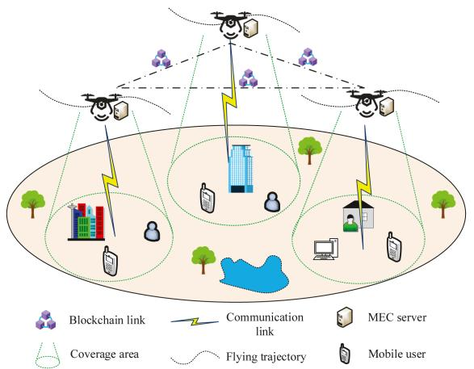

<details>
<summary>flowchart</summary>

```mermaid
graph TD
    A["Drone"] --> B["Blockchain link"]
    A --> C["Communication link"]
    A --> D["MEC server"]
    A --> E["Flying trajectory"]
    A --> F["Mobile user"]
    G["City Area"] --> H["Mobile User"]
    I["Urban Area"] --> J["Mobile User"]
    K["Mobile User"] --> L["Mobile User"]
    M["Mobile User"] --> N["Mobile User"]
    O["Mobile User"] --> P["Mobile User"]
    Q["Mobile User"] --> R["Mobile User"]
    S["Mobile User"] --> T["Mobile User"]
    U["Mobile User"] --> V["Mobile User"]
    W["Mobile User"] --> X["Mobile User"]
    Y["Mobile User"] --> Z["Mobile User"]
    AA["Mobile User"] --> AB["Mobile User"]
    AC["Mobile User"] --> AD["Mobile User"]
    AE["Mobile User"] --> AF["Mobile User"]
    AG["Mobile User"] --> AH["Mobile User"]
    AI["Mobile User"] --> AJ["Mobile User"]
    AK["Mobile User"] --> AL["Mobile User"]
    AM["Mobile User"] --> AN["Mobile User"]
    AO["Mobile User"] --> AP["Mobile User"]
    AQ["Mobile User"] --> AR["Mobile User"]
    AS["Mobile User"] --> AT["Mobile User"]
    AU["Mobile User"] --> AV["Mobile User"]
    AW["Mobile User"] --> AX["Mobile User"]
    AY["Cloud Area"] --> AZ["Smartphone Array"]
    BA["Smartphone Array"] --> BB["Battery Array"]
    BC["Battery Array"] --> BD["Battery Array"]
    BE["Battery Array"] --> BF["Battery Array"]
    BG["Battery Array"] --> BH["Battery Array"]
    BI["Battery Array"] --> BJ["Battery Array"]
    BK["Battery Array"] --> BL["Battery Array"]
    BM["Battery Array"] --> BN["Battery Array"]
    BO["Battery Array"] --> BP["Battery Array"]
    BZ["Battery Array"] --> CA["Battery Array"]
    CB["Battery Array"] --> CC["Battery Array"]
    DD["Battery Array"] --> DE["Battery Array"]
    DF["Battery Array"] --> DG["Battery Array"]
    DH["Battery Array"] --> DI["Battery Array"]
    DJ["Battery Array"] --> DK["Battery Array"]
    DL["Battery Array"] --> DM["Battery Array"]
    DN["Battery Array"] --> DOB["Battery Array"]
    DOB --> DP["Battery Array"]
    DP --> DPB["Battery Array"]
    DPB --> DPN["Battery Array"]
    DPN --> DPQ["Battery Array"]
    DPQ --> DPR["Battery Array"]
    DPR --> DPS["Battery Array"]
    DPS --> DPT["Battery Array"]
    DPT --> DPU["Battery Array"]
    DPU --> DPV["Battery Array"]
    DPV --> DPW["Battery Array"]
    DPW --> DPX["Battery Array"]
```
</details>

Fig. 1. The UAV-assisted MEC framework.

# B. User Mobility Model

In the UAV-assisted MEC, ground users usually have high mobility that the user’s location is always time-varying. The movement process of the user can be regarded as a typical Gauss-Markov mobility model, that is, the speed change of a mobile user in each time slot follows a Gaussian distribution. Therefore, the user motion speed $v _ { k }$ at (n 1)-th time slot is related to its kspeed at the n-th moment as

$$
v _ {k} [ n + 1 ] = \eta v _ {k} [ n ] + (1 - \eta) \bar {v} + \varsigma \sqrt {1 - \eta^ {2}} o _ {k} [ n ], \tag {1}
$$

where $o _ { k } [ n ] \sim N ( 0 , 1 )$ represents a standard normal distribution, and $\varsigma , \bar { v } ,$ , and η denote the asymptotic standard deviation, ¯asymptotic mean, and memory level of speed, respectively.

Then, the mobile user location can be updated by

$$
q _ {k} [ n + 1 ] = q _ {k} [ n ] + v _ {k} [ n ] T _ {s}, \tag {2}
$$

where $T _ { s }$ is the time slot duration.

# C. Communication Model

Generally, the communication between the user and the UAV is regarded as a LoS transmission. Therefore, the channel gain between UAV m and user k is given by

$$
g _ {k, m} [ n ] = \frac {g _ {0}}{\left(H ^ {2} + \| q _ {m} [ n ] - q _ {k} [ n ] \| ^ {2}\right)}, \tag {3}
$$

where $g _ { 0 }$ denotes the reference channel gain of distance 1m.

In our work, the OFDM technique is used for each user to offload the task. Therefore, the data transmission rate is

$$
R _ {k, m} [ n ] = B \log_ {2} \left(1 + \frac {p _ {k} g _ {k , m} [ n ]}{\sigma^ {2}}\right), \tag {4}
$$

where $B , \sigma ^ { 2 }$ , and $p _ { k }$ denote the assigned channel bandwidth, noise power, and user’s transmission power, respectively.

Define the user association indicator $\lambda _ { k , m } [ n ] \in \{ 0 , 1 \}$ . Specifically, $\lambda _ { k , m } [ n ] = 1$ k,m[ ] signifies that user k is associated with UAV m. Generally, it can be assumed that each user is exclusively associated with a single UAV in each time slot, that is

$$
\sum_ {m \in M} \lambda_ {k, m} [ n ] \leq 1, \forall k. \tag {5}
$$

Let $A _ { k } [ n ]$ denote the quantity of task data offloaded by user k. k[ ]The transmission delay can be derived as

$$
D _ {k, m} ^ {\text { trans }} [ n ] = \frac {\lambda_ {k , m} A _ {k} [ n ]}{R _ {k , m} [ n ]}. \tag {6}
$$

Then, the relevant transmission energy consumption is

$$
E _ {k, m} ^ {\text { trans }} [ n ] = p _ {k} D _ {k, m} ^ {\text { trans }} [ n ] = \frac {p _ {k} \lambda_ {k , m} A _ {k} [ n ]}{R _ {k , m} [ n ]}. \tag {7}
$$

# D. Computation Model

The user tasks are offloaded to UAV for processing, thereby causing computing delay and energy consumption. The computing delay is given by

$$
D _ {k, m} ^ {\text { comp }} [ n ] = \frac {\lambda_ {k , m} C _ {k , m} [ n ]}{f _ {k , m} [ n ]}, \tag {8}
$$

where $C _ { k , m } [ n ]$ and $f _ { k , m } [ n ]$ respectively represent the required k,m[ ] k,m[ ]CPU frequency and the allocated computation capability for processing the offloading tasks.

Then, the relevant computing energy can be derived as

$$
\begin{array}{l} E _ {k, m} ^ {\text { comp }} [ n ] = p _ {k, m} ^ {\text { comp }} [ n ] D _ {k, m} ^ {\text { comp }} [ n ] \\ = \lambda_ {k, m} k _ {\text { comp }, m} f _ {k, m} ^ {2} [ n ] C _ {k, m} [ n ], \tag {9} \\ \end{array}
$$

where $p _ { k , m } ^ { c o m p } [ n ] = k _ { c o m p , m } f _ { k , m } ^ { 3 } [ n ]$ pcomp n k f 3 n denotes the power compuk,m [ ] = ctation of CPU, and $k _ { c o m p , m }$ m[ ]represents the effective energy coefficient.

Consequently, the total energy consumption and delay for the task offloading and processing are respectively given by

$$
E _ {k, m} [ n ] = E _ {k, m} ^ {\text { trans }} [ n ] + E _ {k, m} ^ {\text { comp }} [ n ], \tag {10a}
$$

$$
D _ {k, m} [ n ] = D _ {k, m} ^ {\text { trans }} [ n ] + D _ {k, m} ^ {\text { comp }} [ n ]. \tag {10b}
$$

It is worth noting that the transmission of feedback data is always ignored because the data size is extremely small [14].

# E. Blockchain Model

As a promising security solution, blockchain can establish a reliable trading platform for sharing users’ computing tasks with UAVs. When achieving an assignment, the UAV registers the work and results as transactions on the blockchain. Then, the blockchain members authenticate the transactions, indicating that the UAV has completed the processing. Due to the trusted encryption and traceability, the blockchain can adequately safeguard the privacy and safety of users when sharing tasks. Fig. 2 illustrates the blockchain process with eight steps. Generally, the last four steps (5)-(8) can be categorized into the block generation and consensus mechanism, which are the main issues causing the energy consumption and latency.

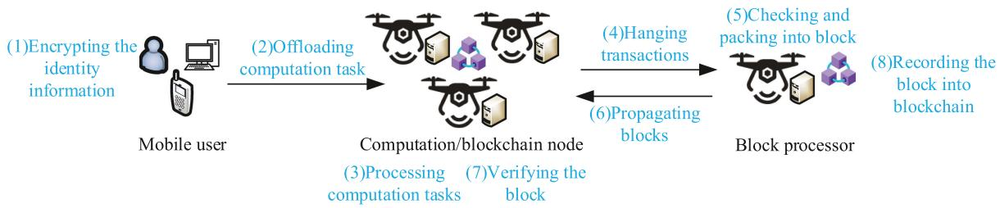

<details>
<summary>flowchart</summary>

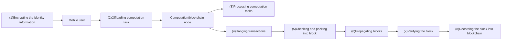
</details>

Fig. 2. The blockchain process.

1) Block Generation: Let $I _ { b } [ n ]$ represent the transaction size, b[ ]including the computing task data and encrypted data, which is given by

$$
I _ {b} [ n ] = \operatorname{Hash} \left(\sum_ {k \in K} \left(A _ {k, r} [ n ] + A _ {k} [ n ]\right)\right) + A _ {t} [ n ], \tag {11}
$$

where $A _ { t } [ n ]$ and $A _ { k , r } [ n ]$ respectively represent the relevant t[ ] k,r[ ]encrypted file and computation result, and · denotes the hash function.

Then, the delay for new block generation is

$$
D _ {m} ^ {g} [ n ] = \frac {I _ {b} [ n ] L _ {m} [ n ]}{f _ {b , m} [ n ]}, \tag {12}
$$

where $f _ { b , m } [ n ]$ represents the computational capability of block b,m[ ]producer on UAV, and $L _ { m } [ n ]$ is the required CPU cycles for a msingle data bit processing.

Similar to (9), the relevant energy consumption can be derived as

$$
E _ {m} ^ {g} [ n ] = k _ {\text { comp }, m} f _ {b, m} ^ {2} [ n ] I _ {b} [ n ] L _ {m} [ n ]. \tag {13}
$$

2) Consensus Process: The block propagation and verification are required to reach a consensus. Therefore, the time delay caused by block propagation is

$$
D _ {m} ^ {t} [ n ] = \frac {S _ {b} [ n ]}{\min _ {m ^ {\prime} \in M , m ^ {\prime} \neq m} R _ {m , m ^ {\prime}} [ n ]}, \tag {14}
$$

where $S _ { b } [ n ]$ is the block size, and $R _ { m , m ^ { \prime } } [ n ]$ denotes the transb[ ] m,m [ ]mission rate between the block processors m and $m ^ { \prime } .$ .

The energy consumption of block propagation is given by

$$
E _ {m} ^ {t} [ n ] = p _ {u} D _ {m} ^ {t} [ n ], \tag {15}
$$

where $p _ { u }$ is the UAV transmission power.

uThen, the verification time can be derived as

$$
D ^ {v} [ n ] = \max _ {m ^ {\prime} \in M, m ^ {\prime} \neq m} \frac {\alpha [ n ]}{f _ {v , m ^ {\prime}} [ n ]}, \tag {16}
$$

where $\alpha [ n ]$ and $f _ { v , m ^ { \prime } } [ n ]$ represent the required CPU cycles for [ ] v,m [ ]block verification and the computation capability of processor $m ^ { \prime }$ , respectively.

While the energy consumption is

$$
E ^ {v} [ n ] = p _ {v} D ^ {v} [ n ], \tag {17}
$$

where $p _ { v }$ is the CPU power consumption.

Consequently, the total delay and energy consumption introduced by the block generation and consensus process are

$$
D _ {m} [ n ] = D _ {m} ^ {g} [ n ] + D _ {m} ^ {t} [ n ] + D ^ {v} [ n ], \tag {18a}
$$

$$
E _ {m} [ n ] = E _ {m} ^ {g} [ n ] + E _ {m} ^ {t} [ n ] + E ^ {v} [ n ]. \tag {18b}
$$

# F. UAV Dynamics Model

In UAV-assisted MEC scenarios, the UAV must frequently adjust its flight trajectory due to dynamic factors including the time-varying user’s task requirements, dynamic UAV flight states, and transmission environment variation. In addition, issues such as the sudden change of flight speed and the threshold constraints of UAV acceleration will cause deviations between ideal desired trajectory and actual flight trajectory, thereby compromising the UAV control stability and potentially causing significant system performance degradation. Therefore, it is crucial to dynamically control the UAV flight in real time to reduce the deviations between the actual and desired trajectories, ultimately mitigating performance degradation.

In general, the dynamics of UAV m can be modeled as [29]

$$
\dot {v} _ {m} (t) = u _ {m} (t - \tau), \tag {19a}
$$

$$
\dot {q} _ {m} (t) = v _ {m} (t), \tag {19b}
$$

where $u _ { m } ( t ) , v _ { m } ( t )$ and $q _ { m } ( t )$ respectively denote the UAV m( ) m( ) m( )acceleration, speed, and position, and τ is the delay caused by issues such as signal processing, transmission, reception, and actuation, which serves as a stochastic item due to the user and UAV mobility.

Define a state vector

$$
p _ {m} (t) = [ q _ {m} (t), v _ {m} (t) ] ^ {T}. \tag {20}
$$

Based on (19) and (20), the system dynamics of the UAV is given by

$$
\dot {p} _ {m} (t) = \bar {G} p _ {m} (t) + G u _ {m} (t - \tau), \tag {21}
$$

where

$$
\bar {G} = \left[ \begin{array}{l l} 0 _ {3 \times 3} & I _ {3 \times 3} \\ 0 _ {3 \times 3} & 0 _ {3 \times 3} \end{array} \right], G = \left[ \begin{array}{l} 0 _ {3 \times 3} \\ I _ {3 \times 3} \end{array} \right], \tag {22}
$$

and here $I _ { j \times j }$ and $0 _ { j \times j }$ respectively denote the identity and zero matrices.

Then, considering the typical delay of smaller than one time slot, the corresponding discrete-time dynamics can be derived as

$$
p _ {m} [ n + 1 ] = G _ {0} p _ {m} [ n ] + G _ {1, n} u _ {m} [ n ] + G _ {2, n} u _ {m} [ n - 1 ], \tag {23}
$$

where

$$
p _ {m} [ n ] = p _ {m} (n T _ {s}), G _ {0} = e ^ {\bar {G} T _ {s}},
$$

$$
G _ {1, n} = \int_ {0} ^ {T _ {s} - \tau_ {n}} e ^ {\bar {G} T _ {s}} d t G, G _ {2, n} = \int_ {T _ {s} - \tau_ {n}} ^ {T _ {s}} e ^ {\bar {G} T _ {s}} d t G, (2 4)
$$

and $\tau _ { n }$ and $u _ { m } [ n ]$ represent the time delay and UAV acceleration n m[ ]in the n-th time slot, respectively.

Additionally, the energy consumption of UAV propulsion cannot be ignored, which is determined by instantaneous acceleration and speed as [8]

$$
\begin{array}{l} E _ {f, m} [ n ] = \left(c _ {1} \| v _ {m} [ n ] \| ^ {3} + \frac {c _ {2}}{\| v _ {m} [ n ] \|} \left(1 + \frac {\| u _ {m} [ n ] \| ^ {2}}{g _ {m} ^ {2}}\right)\right) \\ + \frac {m _ {c} (\| v _ {m} [ n ] \| ^ {2} - \| v _ {m} [ n - 1 ] \| ^ {2})}{2 T _ {s}}, \tag {25} \\ \end{array}
$$

where $c _ { 1 }$ and $c _ { 2 }$ represent factors associated with the UAV, $m _ { c }$ is the UAV mass, and $g _ { m }$ cdenotes the gravitational acceleration.

# G. Optimization Problem Formulation

Based on (10), (18) and (25), the total energy consumption is given by

$$
E = \sum_ {m \in M} \sum_ {n \in N} \left(\sum_ {k \in K} E _ {k, m} [ n ] + E _ {m} [ n ] + \xi E _ {f, m} [ n ]\right), \tag {26}
$$

where ξ is a scaling factor.

Similarly, the total time delay is

$$
D = \sum_ {m \in M} \sum_ {n \in N} \left(\sum_ {k \in K} D _ {k, m} [ n ] + D _ {m} [ n ]\right). \tag {27}
$$

Therefore, through jointly taking into account the UAV trajectory control, user association, and computing frequency assignment, the optimization problem regarding the dynamic trajectory design of UAV-assisted MEC can be formulated as

$$
(P 1): \min _ {Q, f _ {k}, f _ {b}, \lambda} \varpi E + (1 - \varpi) D
$$

$$
s. t. p _ {m} [ n + 1 ] = G _ {0} p _ {m} [ n ] + G _ {1, n} u _ {m} [ n ] + G _ {2, n} u _ {m} [ n - 1 ], \tag {28a}
$$

$$
\left\| q _ {m} [ n ] - q _ {\tilde {m}} [ n ] \right\| ^ {2} \geq d _ {\min} ^ {2}, m \neq \tilde {m}, \tag {28b}
$$

$$
\sum_ {k \in K} \lambda_ {k, m} [ n ] \leq N _ {\max}, \forall m, \tag {28c}
$$

$$
\sum_ {m \in M} \lambda_ {k, m} [ n ] \leq 1, \forall k, \tag {28d}
$$

$$
\lambda_ {k, m} [ n ] \in \{0, 1 \}, \tag {28e}
$$

$$
\sum_ {k \in K} \lambda_ {k, m} f _ {k, m} [ n ] + f _ {b, m} [ n ] \leq F, \tag {28f}
$$

$$
f _ {k, m} [ n ] \geq 0, f _ {b, m} [ n ] \geq 0. \tag {28g}
$$

In the above problem P 1, $\lambda = \{ \lambda _ { k , m } [ n ] \} , \ f _ { k } = \{ f _ { k , m } [ n ] \}$ , $f _ { b } = \{ f _ { b , m } [ n ] \}$ , and $Q = \{ q _ { m } [ n ] , v _ { m } [ n ] , u _ { m } [ n ] \}$ = k,m[ ]respectively represent the sets of user association, UAV trajectory, and computing frequency assignment. The objective function aims to minimize the weighted sum of time delays and energy consumption induced by the task offloading, computing, and blockchain processing, and here $0 \leq \varpi \leq 1$ . In the joint optimization problem, constraint (28a) describes the UAV flight dynamics model, detailing how the UAV position $p _ { m } [ n + 1 ]$ at time $n + 1$ i s updated based on the previous state and acceleration control input. This constraint ensures the trajectory adheres to the UAV’s flight dynamics. Constraint (28b) specifies the minimum safety distance between UAVs. Constraints (28c) and (28d) define the associations between mobile users and UAVs that each user can only connect to one UAV each time slot and each UAV can serve a maximum of $N _ { \mathrm { m a x } }$ users. Constraint (28f) ensures that the total computing resources allocated by each UAV, including the resources allocated to users $f _ { k , m } [ n ]$ and blockchain tasks $f _ { b , m } [ n ]$ k,m[ ], do not exceed the UAV’s maximum computational b,m[ ]capacity F .

# IV. MADDPG-LC ALGORITHM DESIGN

Obviously, the solution to problem P 1 has a significant challenge due to its inherent non-convex nature, along with the UAV dynamics restrict (28 a), which is commonly overlooked in existing works. In reality, the acceleration and speed of UAVs, subject to the system dynamics constraint, cannot be changed arbitrarily. To tackle this complexity, a practical approach involves decomposing the optimization problem P 1 into distinct subproblems. Once the flight trajectory of the UAV is determined, the original optimization problem can be reduced to a resource allocation issue. Conversely, when the user association and computation frequency assignment are specified, the optimization problem P 1 transforms into a dynamic trajectory design problem. However, the dynamics constraints of the UAV still render the direct resolution of the dynamic trajectory design exceedingly challenging. Assuming perfect flight capabilities of the UAV, the dynamic trajectory design problem can be further simplified into a desired trajectory design problem. Consequently, the dynamic trajectory design can be further decomposed into two components: desired trajectory design and trajectory tracking control. In summary, a feasible approach to solving the optimization problem P 1 involves dividing it into three individual subproblems: the design of the desired UAV trajectory, the tracking control of the actual UAV trajectory, and the allocation of user association and computing frequency.

# A. Desired UAV Trajectory Design

Given the user association and computation frequency assignment, along with the assumption of the UAV’s perfect flying ability, the optimization problem P 1 can be simplified to a desired UAV trajectory design problem as

$$
(P 2. 1): \min _ {Q} \varpi E + (1 - \varpi) D
$$

$$
s. t. \left\| q _ {m} [ n ] - q _ {\tilde {m}} [ n ] \right\| ^ {2} \geq d _ {\min} ^ {2}, m \neq \tilde {m}. \tag {29}
$$

Typically, traditional algorithms usually address the issue of UAV trajectory design through iteration methods. However, these methods have high computational complexity and low adaptability, rendering them unsuitable for dynamic scenarios with stringent real-time requirements. In contrast, RL algorithms demonstrate superior adaptability to complex and unpredictable environments, and can continuously enhance their performance through learning, thereby exhibiting significant advantages in numerous practical applications. Specifically, DRL algorithms integrate the merits of deep learning and RL to approximate both value and policy functions through neural networks, with the aim of more effectively achieving decision objectives. Within the realm of DRL, the DDPG algorithm, as an algorithm capable of handling continuous action spaces, can learn deterministic policies to improve the algorithm stability and convergence.

The MADDPG algorithm is an extension of the DDPG framework specifically designed for environments where multiple agents intelligently collaborate [13], [31], [32]. It typically follows a “centralized training with decentralized execution” paradigm, allowing each agent to have its own local state. During the training phase, global information is used to optimize the policy network, with all agents participating simultaneously to collect experience and update their own policy networks. In the execution phase, each agent independently generates action decisions based on its individualized policy network. Given the necessity of continuous actions, such as speed and yaw angle, the MADDPG algorithm, owing to its proficiency in handling continuous action spaces, emerges as a potential feasible algorithm to solve the ideal desired UAV trajectory design challenge.

In accordance with the problem P 2.1, as presented in (29), it can be reformulated as a decentralized partially observable Markov decision process (POMDP). In this framework, each UAV is equipped with an dedicated agent, denoted as m, and has its local observation $o _ { m }$ . The aggregate of all local observations mfrom UAVs forms the global environmental state. During the action execution phase, each UAV derives its action $a _ { m }$ based on the local observation, and then receives a reward $r _ { m }$ m. Therefore, mthe MADDPG algorithm serves as a feasible approach to tackle the challenge of desired UAV trajectory design, and the relevant POMDP definition is further analyzed as follows.

1) Observation: The local information observable by each agent m includes the position of the UAV, along with the locations and task-related information of all ground users, which is given by

$$
o _ {m, n} = \{q _ {m} [ n ], q _ {1} [ n ], \dots , q _ {K} [ n ],
$$

$$
A _ {1} [ n ], \dots , A _ {K} [ n ], C _ {1} [ n ], \dots , C _ {K} [ n ] \}. \tag {30}
$$

2) State: Then, the environment state consists the observations of all UAVs as

$$
s _ {n} = \left\{o _ {1, n}, o _ {2, n}, \dots , o _ {M, n} \right\}. \tag {31}
$$

3) Action: The action of UAV can be described as a discrete-time control strategies determined by UAV flight acceleration that

$$
a _ {m, n} = u _ {m} [ n ]. \tag {32}
$$

The action set consists of all actions of UAVs that $a _ { n } =$ $\{ a _ { 1 , n } , a _ { 2 , n } , . . . , a _ { M , n } \}$ .

4) Reward: The reward offers a feedback mechanism, allowing the agent to refine its action policy over time. Through an iterative process aimed at maximizing the accumulative longterm rewards, the agent is able to gradually develop an optimal flight strategy. According to desired trajectory design problem P 2.1, the time delay and energy consumption can be regraded as key components in reward function, that is

$$
r _ {m, n} = - (\varpi E _ {m} [ n ] + (1 - \varpi) D _ {m} [ n ]) - P _ {m} [ n ], \tag {33}
$$

where $E _ { m } [ n ]$ and $D _ { m } [ n ]$ respectively denote the total energy consumption and time delay of UAV m in n-th time slot, and $P _ { m } [ n ]$ denotes the penalty incurred by the UAV, encompassm[ ]ing scenarios where the UAV violates the restricted airspace boundary or when two UAVs approach within the minimum safe distance.

Then, the desired UAV flight trajectory $Q ^ { * }$ can be derived based on the above POMDP definition by using the MADDPG approach. Please refer to Section IV-D for the details of MAD-DPG algorithm design.

# B. Actual UAV Trajectory Tracking Control

In actual application scenarios, the UAV is required to frequently adjust its trajectory in response to dynamic nature of the transmission environment, task requirements, user mobility, and interference noise. Additionally, the speed and acceleration of the UAV are inherently restricted, rendering the UAV unable to arbitrarily change its state to match a desired trajectory. As a result, the desired UAV flight trajectory derived from Section IV-A, compared to the actual trajectory, is bound to exhibit deviations, which will cause significant performance degradation. Therefore, it is essential to implement effective trajectory tracking control mechanisms to make the UAV’s flight trajectory closer to the desired one, thus improving control stability and overall system efficiency.

Once the UAV’s desired trajectory is determined through subproblem P 2.1, in order to decrease the deviation between the desired and actual trajectories, the dynamic trajectory design can equivalent be regarded as a UAV trajectory tracking control problem, which is given by

$$
(P 2. 2): Q \to Q ^ {*}
$$

$$
s. t. p _ {m} [ n + 1 ] = G _ {0} p _ {m} [ n ] + G _ {1, n} u _ {m} [ n ] + G _ {2, n} u _ {m} [ n - 1 ], \tag {34}
$$

where $Q ^ { * }$ is the desired trajectory that $Q ^ { * } = \{ q _ { m } ^ { * } [ n ] , v _ { m } ^ { * } [ n ] \}$ }, and $v ^ { * }$ and $q ^ { * }$ = m[ ] m[ ]represent the desired speed and position information, respectively.

Then, the speed and position deviations are respectively expressed as $\Delta v ( t ) = v ( t ) - v ^ { * } ( t )$ and $\Delta q ( t ) = q ( t ) - q ^ { * } ( t )$ , and Δ ( ) = ( ) ( )the state deviation vector is given by $\Delta p _ { m } ( t ) = [ \Delta q ( t ) , \Delta v ( t ) ]$ . Δ m( ) = [Δ ( ) Δ ( )]Based on (21) to (23), the UAV deviation dynamics model can be formulated as

$$
\Delta p _ {m} [ n + 1 ] = G _ {0} \Delta p _ {m} [ n ] + G _ {1, n} u _ {m} [ n ] + G _ {2, n} u _ {m} [ n - 1 ]. \tag {35}
$$

Defined a new state vector $z _ { m } [ n ] = [ \Delta p _ { m } [ n ] , u _ { m } [ n - 1 ] ] ^ { T }$ , m[ ] = [Δ m[ ] m[ ]]which incorporates both the current UAV state deviation of the

Algorithm 1: User Association and Computing Frequency Assignment.   
1 Input location information of UAV and user.
2 for UAV m=1,2,...,M do
3    for User k=1,2,...,K do
4    if User k is within the service range then
5    if The task of user k exceeds threshold then
6    | $\lambda_{k,m}[n]=1$ .
7    else
8    | Calculate channel gain $g_{k,m}[n]$ .
9    end
10    end
11    end
12    Update $\lambda_{k,m}[n]$ based on $g_{k,m}[n]$ .
13 end
14 Calculate $f_{k}$ and $f_{b}$ by CVXPY solver according to $\lambda_{k,m}[n]$ and (39).
15 Return $f_{k}$ , $f_{b}$ , and $\lambda$ .

UAV and previous control signals accounting for the effects of delay. Then, the deviation dynamics model in (35) can be rewritten as

$$
z _ {m} [ n + 1 ] = H [ n ] z _ {m} [ n ] + F [ n ] u _ {m} [ n ], \tag {36}
$$

where

$$
H \left[ n \right] = \left[ \begin{array}{c c} G _ {0} & G _ {2, n} \\ 0 & 0 \end{array} \right], F \left[ n \right] = \left[ \begin{array}{c} G _ {1, n} \\ 0 \end{array} \right].
$$

By using the typical quadratic cont function, based on the deviation dynamics (36), the optimal trajectory tracking control problem (34) can be equivalent to be

$$
\begin{array}{l} \min _ {\{u \}} z _ {m} [ N ] ^ {T} W z _ {m} [ N ] + \sum_ {n = 0} ^ {N - 1} \\ (z _ {m} [ n ] ^ {T} W z _ {m} [ n ] + u _ {m} [ n ] ^ {T} Z u _ {m} [ n ]) \\ s. t. z _ {m} [ n + 1 ] = H [ n ] z _ {m} [ n ] + F [ n ] u _ {m} [ n ]. \tag {37} \\ \end{array}
$$

where W and Z are determined system parameters, and $N$ denotes the length of control period.

The optimization problem in (37) can be addressed as a typical LQR problem, and the optimal UAV flight acceleration is given by [33]

$$
u _ {m} [ n ] = - l [ n ] z _ {m} [ n ], \tag {38}
$$

where the coefficient l n can be iteratively obtained by

$$
l [ n ] = \left[ H [ n ] ^ {T} S [ n + 1 ] H [ n ] + Z \right] ^ {- 1} H [ n ] ^ {T} S [ n + 1 ] F [ n ],
$$

$$
S [ n ] = F [ n ] ^ {T} S [ n + 1 ] F [ n ] + W - l [ n ] ^ {T} H [ n ] ^ {T} S [ n + 1 ] F [ n ],
$$

$$
S [ N ] = W.
$$

Drawing upon the optimally designed UAV flight acceleration $u _ { m } [ n ]$ in (38), the actual flight speed and trajectory can be m[ ]subsequently determined as $v _ { m } [ n ] = v _ { m } [ n - 1 ] + u _ { m } [ n ] T _ { s }$ and $q _ { m } [ n ] { = } q _ { m } [ n - 1 ] { + } v _ { m } [ n - 1 ] \dot { T } _ { s } { + } 0 . 5 \dot { u _ { m } } [ n ] \dot { T } _ { s } ^ { 2 }$ + m[ ] s, respectively.

# C. User Association and Computing Frequency Assignment

Once the flying trajectory is definitively determined, the user association problem can be addressed using the principle of channel optimality. The UAV will make a decision on whether to be associated with the user based on the channel gain and the user’s task offloading requirement. Specifically, in the case that the capacity of the task storage of users within the service range does not exceed the predefined priority connection threshold, the UAV will give precedence to associating with users having the best channel gains. Conversely, if the task in the storage of a user within the service range exceeds the threshold, that user will be prioritized for association, while the remaining users will be connected in accordance with their channel gains.

Subsequently, upon the determination of UAV flight trajectory and user association, the problem of resource allocation can be equivalent to a computing frequency assignment issue as

$$
(P 2. 3): \min _ {f _ {k}, f _ {b}} \varpi E + (1 - \varpi) D
$$

$$
s. t. \sum_ {k \in K} \lambda_ {k, m} f _ {k, m} [ n ] + f _ {b, m} [ n ] \leq F, \tag {39a}
$$

$$
f _ {k, m} [ n ] \geq 0, f _ {b, m} [ n ] \geq 0. \tag {39b}
$$

Obviously, the above computing frequency assignment problem is convex, and the optimal solutions can be easily obtained by utilizing the CVXPY solver [8]. Algorithm 1 presents the details regarding user association and computing frequency assignment.

# D. MADDPG-Based UAV Trajectory Design

Based on the POMDP definition in Section IV-A, the desired UAV flight trajectory can be derived by using the MADDPG approach.

The agent m interacts with environment. Then, an action is generated by online actor network with Gaussian noise added to enhance the exploration efficiency, which is given by

$$
a _ {m, n} = \mu (o _ {m, n} | \phi^ {\mu_ {m}}) + \varepsilon , \tag {40}
$$

where $\mu ( o _ { m , n } | \phi ^ { \mu _ { m } } )$ represents the online actor network, and ε ( m,n )is the additional Gaussian noise.

The expected reward value can be defined as:

$$
x _ {m, n} = r _ {m, n} + \gamma * Q _ {m} ^ {\prime} (o _ {m, n + 1}, \mu^ {\prime} (o _ {m, n + 1} | \phi^ {\mu_ {m} ^ {\prime}}) | \phi^ {Q _ {m} ^ {\prime}}), \tag {41}
$$

where $Q _ { m } ^ { \prime } ( o _ { m , n + 1 } , \mu ^ { \prime } ( o _ { m , n + 1 } | \phi ^ { \mu _ { m } ^ { \prime } } ) | \phi ^ { Q _ { m } ^ { \prime } } )$ denotes the next Q m( m,n ( m,n ) )value obtained from target critic network, $\mu ^ { \prime } ( o _ { m , n + 1 } | \phi ^ { \mu _ { m } ^ { \prime } } )$ ( m,n )refers to the next action policy from target actor network, and γ is the discount factor. Additionally, the experience replay technique is employed to mitigate the training sample correlation.

Then, the critic is updated by minimizing the following loss function

$$
L (\phi_ {m}) = \frac {1}{\Gamma} \sum_ {n = 0} ^ {\Gamma - 1} (x _ {m, n} - Q _ {m} (o _ {n}, a _ {m, n} | \phi^ {Q _ {m}})) ^ {2}, \tag {42}
$$

where  is the mini-batch size.

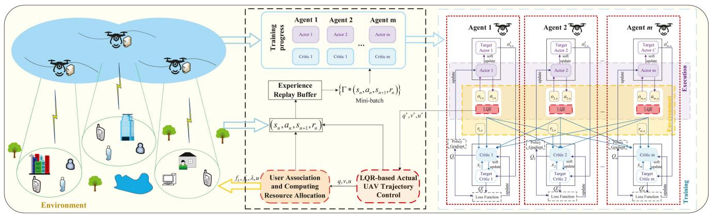

<details>
<summary>flowchart</summary>

```mermaid
graph TD
    subgraph Environment
        A["Drone Environment"] --> B["Training progress"]
        B --> C["Agent 1: Actor 1, Agent 2, Agent m"]
        C --> D{Γ * (s_n, a_n, s_{n+1}, r_n)}
        D --> E["Experience Replay Buffer"]
        E --> F["(s_n, a_n, s_{n+1}, r_n)"]
        F --> G["User Association and Computing Resource Allocation"]
        G --> H["LQR-based Actual UAV Trajectory Control"]
        H --> I["q', v', u'"]
    end

    subgraph Training
        J["Agent 1"] --> K["Target Actor 1, Actor 2, Actor m"]
        K --> L["Action 1, Action 2, Action 3, LQR"]
        L --> M["Update"]
        M --> N["Feedback to LQR"]
        N --> O["Policy Gradient"]
        O --> P["Q"]
        P --> Q["Critic 1, Target Critic 1, Loss Function"]
        Q --> R["Update"]
        R --> S["Feedback to LQR"]
        S --> T["Policy Gradient"]
        T --> U["Q"]
        U --> V["Critic 2, Target Critic 2, Loss Function"]
        V --> W["Update"]
        W --> X["Feedback to LQR"]
        X --> Y["Policy Gradient"]
        Y --> Z["Q"]
        Z --> AA["Critic m, Target Critic m, Loss Function"]
        AA --> AB["Update"]
        AB --> AC["Feedback to LQR"]
    end

    subgraph Execution
        AD["Agent 2"] --> AE["Target Actor 2, Actor 3, Actor m"]
        AE --> AF["Action 2, Action 3, Action 4, LQR"]
        AF --> AG["Update"]
        AG --> AH["Feedback to LQR"]
        AH --> AI["Policy Gradient"]
        AI --> AJ["Q"]
        AJ --> AK["Critic 2, Target Critic 2, Loss Function"]
        AK --> AL["Update"]
        AL --> AM["Feedback to LQR"]
        AM --> AN["Policy Gradient"]
        AN --> AO["Q"]
        AO --> AP["Critic m, Target Critic m, Loss Function"]
        AP --> AQ["Update"]
        AQ --> AR["Feedback to LQR"]
    end

    subgraph Training
        AS["Agent m"] --> AT["Target Actor C, Actor m, LQR"]
        AT --> AU["Action 1, Action 2, Action 3, Action 4, LQR"]
        AU --> AV["Update"]
        AV --> AW["Feedback to LQR"]
        AW --> AX["Policy Gradient"]
        AX --> AY["Q"]
        AY --> AZ["Critic 1, Target Critic 1, Loss Function"]
        AZ --> BA["Update"]
        BA --> BB["Feedback to LQR"]
        BB --> BC["Policy Gradient"]
        BC --> BD["Q"]
        BD --> BE["Critic m, Target Critic m, Loss Function"]
        BE --> BF["Update"]
        BF --> BG["Feedback to LQR"]
    end
```
</details>

Fig. 3. Schematic of the MADDPG-LC algorithm.

The online actor network parameter $\phi ^ { \mu _ { m } }$ is updated by using the policy gradient algorithm as

$$
\nabla_ {\phi} J \approx \frac {1}{\Gamma} \sum_ {n = 0} ^ {\Gamma - 1} [ \nabla_ {a} Q _ {m} (o, a | \phi^ {Q _ {m}})
$$

$$
\left. \left| _ {o = o _ {n}, a = \mu (o _ {n})} \nabla_ {\phi} \mu \left(o \mid \phi^ {\mu_ {m}}\right) \right| _ {o _ {n}} \right]. \tag {43}
$$

where $\nabla$ represents the gradient operator.

Then, the parameters of target networks can be updated through the soft update method:

$$
\phi^ {Q _ {m} ^ {\prime}} \leftarrow \iota \phi^ {Q _ {m}} + (1 - \iota) \phi^ {Q _ {m} ^ {\prime}}, \tag {44a}
$$

$$
\phi^ {\mu_ {m} ^ {\prime}} \leftarrow \iota \phi^ {\mu_ {m}} + (1 - \iota) \phi^ {\mu_ {m} ^ {\prime}}, \tag {44b}
$$

where ι is a constant that $\iota \ll 1$ .

Upon the completion of training process, the optimized actor network parameter, represented as $\phi ^ { \mu _ { m } ^ { * } }$ , is acquired. Then, the desired flight acceleration can be derived as

$$
u _ {m} ^ {*} [ n ] = \mu (o _ {m, n} | \phi^ {\mu_ {m} ^ {*}}). \tag {45}
$$

Finally, the desired flight trajectory information, including the UAV position $q _ { m } ^ { * } [ n ]$ and the flight speed $v _ { m } ^ { * } [ n ]$ , can be further m[ ]derived based on flight acceleration $u _ { m } ^ { * } [ n ]$ .

m[ ]In conclusion, based on the thorough analysis presented from Sections IV.A to IV.D, the schematic of proposed MADDPG-LC-based dynamic trajectory algorithm for multi-UAV-assisted MEC system can be depicted as Fig. 3. Specifically, due to the dynamic nature of UAVs and users, the UAV flight trajectory needs to be frequently adjusted. The DRL algorithm is capable of effectively addressing the dynamic trajectory control problem. In the proposed MADDPG-LC scheme, the integration of the MADDPG-based desired trajectory design and the LQR-based trajectory tracking control successfully realizes the dynamic UAV trajectory control that adjusts to the dynamic UAV-assisted MEC environment, while adhering to the constraint induced by UAV flight dynamics. Furthermore, in conjunction with user association and computing frequency assignment, the MADDPG-LC framework has the ability to achieve real-time dynamic trajectory control to jointly optimize the UAV trajectory design and resource allocation each time slot.

TABLE I SIMULATION PARAMETERS 

<table><tr><td>Parameter</td><td>value</td><td>Parameter</td><td>value</td></tr><tr><td> $B$ </td><td>1MHz</td><td> $\sigma^{2}$ </td><td>-90dBm</td></tr><tr><td> $d_{min}$ </td><td>5m</td><td> $F$ </td><td>2.5 Gcycles/s</td></tr><tr><td> $A_{k}$ </td><td>10 M</td><td> $C_{k}$ </td><td>20 Mcycles</td></tr><tr><td> $c1$ </td><td> $9.26 \times 10^{-4}$ </td><td> $c2$ </td><td>2250</td></tr></table>

# V. SIMULATION RESULTS

This section evaluates the proposed MADDPG-LC dynamic trajectory control scheme through extensive simulations, including the algorithm convergence and performance, and the analysis of delay and energy consumption.

# A. Simulation Parameter Setting

In our simulations, we consider the movement of users and UAVs within a $1 0 0 \mathrm { ~ m ~ } \times \mathrm { ~ } 1 0 0$ m area, with three UAVs flying at an altitude of 10 meters above ground level in a designated area. The starting positions of UAVs are randomly initialized, while their initial speed and acceleration are both set to 0. Each user can move at a speed ranging from 0 to 2 m/s. The transmit power is set to 40 dBm for the UAV and 20 dBm for the user. User information is updated every 0.1 seconds. The transaction and block sizes are set to 2KB and 3MB, respectively. Other system parameters can be found in the Table I.

The simulation is carried out using Python 3.7.16 and Tensor-Flow 2.0.0. The parameter settings for the MADDPG algorithm are as follows: the learning rate of the actor-critic network is set to 0.001 if undefined, the reward discount factor $\gamma = 0 . 9$ , the =soft update coefficient is 0.01, and the batch size for randomly sampled data is 256. The actor-critic network consists of two fully connected layers, each containing 300 neurons. The input dimension for the actor network is set to $3 K + 2$ , where $\cdot _ { 3 } \cdot$ +represents the position and task dimensions of a single user, K is the number of users, and ‘2’ is the position dimension of a single agent. The input dimension for the critic network is $M ( 3 K + 2 ) + 2 M$ , where M represents the number of agents ( + ) +(i.e., UAVs). The inputs include the observations and actions of all agents.

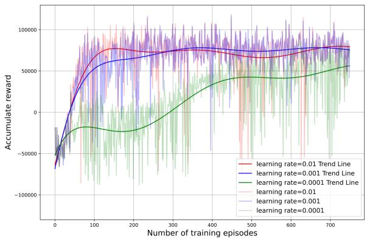

<details>
<summary>line</summary>

| Number of training episodes | learning rate=0.01 Trend Line | learning rate=0.001 Trend Line | learning rate=0.0001 Trend Line | learning rate=0.01 | learning rate=0.001 | learning rate=0.0001 |
| --------------------------- | ----------------------------- | ------------------------------ | ------------------------------- | ------------------ | ------------------- | -------------------- |
| 0                           | -50000                        | -50000                         | -50000                          | -50000             | -50000              | -50000               |
| 100                         | 75000                         | 60000                          | -25000                          | 75000              | 65000               | -25000               |
| 200                         | 80000                         | 65000                          | 25000                           | 80000              | 75000               | 25000                |
| 300                         | 85000                         | 70000                          | 45000                           | 85000              | 85000               | 45000                |
| 400                         | 90000                         | 75000                          | 65000                           | 90000              | 95000               | 65000                |
| 500                         | 95000                         | 80000                          | 85000                           | 95000              | 115000              | 85000                |
| 600                         | 100000                        | 85000                          | 115000                          | 115000             | 135000              | 115000               |
| 700                         | 115000                        | 95625                          | 162562                          | 135625             | 162562              | 162562               |
| 750                         | 125625                        | 115437                         | 218333                          | 162562             | 183333              | 218333               |
</details>

Fig. 4. Accumulated reward.

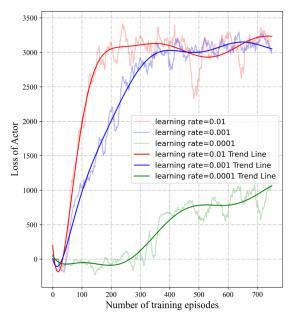

<details>
<summary>line</summary>

| Number of training episodes | Learning Rate=0.01 | Learning Rate=0.001 | Learning Rate=0.0001 | Trend Line |
| --------------------------- | ------------------ | ------------------- | -------------------- | ---------- |
| 0                           | 0                  | 0                   | 0                    | 0          |
| 100                         | ~2500              | ~2000               | ~1500                | ~150       |
| 200                         | ~3000              | ~2500               | ~2000                | ~200       |
| 300                         | ~3200              | ~2800               | ~2500                | ~250       |
| 400                         | ~3100              | ~2900               | ~2800                | ~280       |
| 500                         | ~3150              | ~2950               | ~2900                | ~290       |
| 600                         | ~3200              | ~3000               | ~3000                | ~300       |
| 700                         | ~3250              | ~3050               | ~3100                | ~310       |
</details>

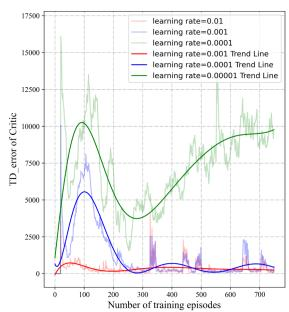

<details>
<summary>line</summary>

| Number of training episodes | learning rate=0.01 | learning rate=0.001 | learning rate=0.0001 | learning rate=0.0001 Trend Line | learning rate=0.0001 Trend Line | learning rate=0.00001 Trend Line |
| --------------------------- | ------------------ | ------------------- | -------------------- | ------------------------------- | ------------------------------- | ------------------------------- |
| 0                           | 0                  | 0                   | 0                    | 0                               | 0                               | 0                               |
| 100                         | ~2500              | ~7500               | ~1500                | ~1500                           | ~1500                           | ~1500                           |
| 200                         | ~2500              | ~5000               | ~2500                | ~2500                           | ~2500                           | ~2500                           |
| 300                         | ~2500              | ~2500               | ~2500                | ~2500                           | ~2500                           | ~2500                           |
| 400                         | ~2500              | ~2500               | ~2500                | ~2500                           | ~2500                           | ~2500                           |
| 500                         | ~2500              | ~2500               | ~2500                | ~2500                           | ~2500                           | ~2500                           |
| 600                         | ~2500              | ~2500               | ~2500                | ~2500                           | ~2500                           | ~2500                           |
| 700                         | ~2500              | ~2500               | ~2500                | ~2500                           | ~2500                           | ~2500                           |
</details>

Fig. 5. The loss and TD-error.

# B. Convergence Performance

In Fig. 4, the training cumulative reward curve for MADDPG-LC algorithm at learning rates of 0.01, 0.001 and 0.0001 are presented. As can be seen, the learning speed of the agent decreases as the learning rate decreases. When the learning rate is 0.01, the agent is capable of learning quickly and get a high expected total reward, but the converged cumulative reward is not sufficiently stable. When the learning rate is 0.0001, the agent learning speed is extremely slow, and it can only obtain the relatively higher expected total reward after training 700 episodes. When the learning rate is 0.001, the agent can quickly learn to acquire a higher expected total reward, and the accumulated reward can converge at a more stable level.

Fig. 5 presents the trend curve of loss function of actor network and TD error of critic network for MADDPG-LC algorithm. Integrated with the accumulated reward change curve, it can be seen that around the first 30 cycles, the critic network loss is zero, and all objectives are not optimized. The accumulated rewards also fluctuate at an extremely low level. This is because the UAV is in sample collection stage for experience buffer at the beginning. If there is no enough experience to draw upon, actions will be randomly selected. It can also be seen from Fig. 6 that, when the replay memory has enough samples, the agent begins to sample the stored experience tuples for the network training. There is a significant exploration and learning phase before 50 rounds. In this phase, the loss of critic network drops rapidly, and the average task execution significantly increases, while the average energy consumption and delay decrease. The loss and TD-error curves tend to converge as the number of training rounds increases, indicating that the agent performance is gradually improved with the network training.

# C. UAV Trajectory Evaluation

To examine the efficacy of the MADDPG-LC algorithm in the actual design of dynamic UAV trajectories, the performance comparisons are presented in Figs. 7, 8, and 9, respectively, focusing on the UAV’s trajectory, speed, and acceleration. It can be observed that the actual and desired trajectories basically coincide with each other at the beginning. Then, the trajectory gradually deviates, and the deviation between the two trajectories is mainly affected by flight control dynamics constraints, environmental uncertainty, and system time delays. Under ideal conditions, the UAV flight is not constrained by flight dynamics, allowing it to arbitrarily change its direction and speed upon the received acceleration control signals, resulting in a deviation between the desired trajectory and the actual trajectory, and this deviation will gradually become larger. In addition, other factors such as delays mean that the UAV cannot respond immediately based on the acceleration control signal, and there is a delay in control, which will further bring the trajectory deviation. On the other hand, the user task requirements are dynamically updated according to the UAV task offloading. Due to the deviation between the desired and actual trajectories, the deviation between the desired and actual task offloading requirements will also increase. In fact, the desired UAV trajectory is formulated based on the user’s initial task offloading requirements, while the actual UAV trajectory is dynamically re-planned based on the current flight status and updated user task offloading requirements. Therefore, the proposed MADDPG-LC algorithm has the capability to adjust the flight trajectory in real-time according to the updated user’s task offloading requirements and UAV flight state, thereby improving the overall system performance. Since the actual UAV accelerations are not intuitively visible in Figs. 9, 10 presents the detailed actual UAV acceleration from the Fig. 9.

# D. Performance Comparisons

Finally, the performance comparisons between the proposed algorithm with other benchmark strategies are presented.

Actual UAV trajectory: In this setup, the UAV flight according to the MADDPG-LC strategy, and the UAV receives real-time control to fly within the designated service area, providing services to users.

Desired UAV trajectory: In this setup, the speed and acceleration of the UAV can change ideally, generating an ideal desired trajectory, flying within the designated service area to provide services for the users.

Around flight: In this setup, users are grouped according to their coordinates, and the UAV service area is defined based on this, and each UAV flight around the service area with a specified radius.

Firstly, the flight trajectories of multi-UAV collaboration are depicted in Fig. 11, where the green dots represent the locations of users and the different colored lines are the trajectories of UAVs. The proposed MADDPG-LC algorithm can effectively achieve collaboration among multiple UAVs to assist the task offloading of ground users. In Fig. 12, we analyze the system energy consumption of different algorithms. It can be seen that the MADDPG-LC strategy has the lowest energy consumption, followed by the desired UAV trajectory strategy. UAVs using the hovering cruise strategy consume much more energy than other two strategies. In Fig. 13, the average system delay is analyzed. Similar to energy consumption, the MADDPG-LC strategy has

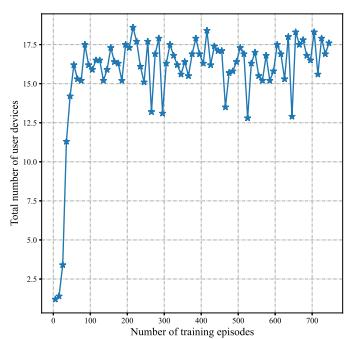

<details>
<summary>line</summary>

| Number of training episodes | Total number of user devices |
| --------------------------- | ---------------------------- |
| 0                           | 1.0                          |
| 50                          | 3.0                          |
| 100                         | 14.0                         |
| 150                         | 16.0                         |
| 200                         | 17.0                         |
| 250                         | 15.0                         |
| 300                         | 13.0                         |
| 350                         | 17.0                         |
| 400                         | 16.0                         |
| 450                         | 17.0                         |
| 500                         | 13.0                         |
| 550                         | 16.0                         |
| 600                         | 17.0                         |
| 650                         | 13.0                         |
| 700                         | 17.0                         |
</details>

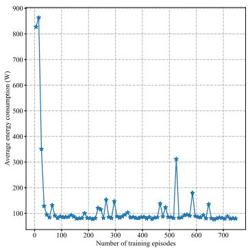

<details>
<summary>line</summary>

| Number of training episodes | Average energy consumption (W) |
| --------------------------- | ------------------------------ |
| 0                           | 850                            |
| 50                          | 350                            |
| 100                         | 100                            |
| 150                         | 120                            |
| 200                         | 110                            |
| 250                         | 130                            |
| 300                         | 140                            |
| 350                         | 120                            |
| 400                         | 110                            |
| 450                         | 130                            |
| 500                         | 320                            |
| 550                         | 190                            |
| 600                         | 120                            |
| 650                         | 140                            |
| 700                         | 100                            |
</details>

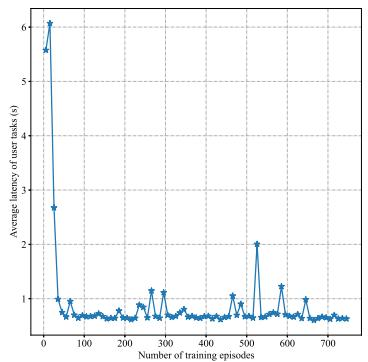

<details>
<summary>line</summary>

| Number of training episodes | Average latency of user tasks (s) |
| --------------------------- | --------------------------------- |
| 0                           | 6.0                               |
| 50                          | 2.8                               |
| 100                         | 1.0                               |
| 150                         | 1.0                               |
| 200                         | 1.0                               |
| 250                         | 1.0                               |
| 300                         | 1.0                               |
| 350                         | 1.0                               |
| 400                         | 1.0                               |
| 450                         | 1.0                               |
| 500                         | 2.0                               |
| 550                         | 1.0                               |
| 600                         | 1.0                               |
| 650                         | 1.0                               |
| 700                         | 1.0                               |
</details>

Fig. 6. Training curves.   
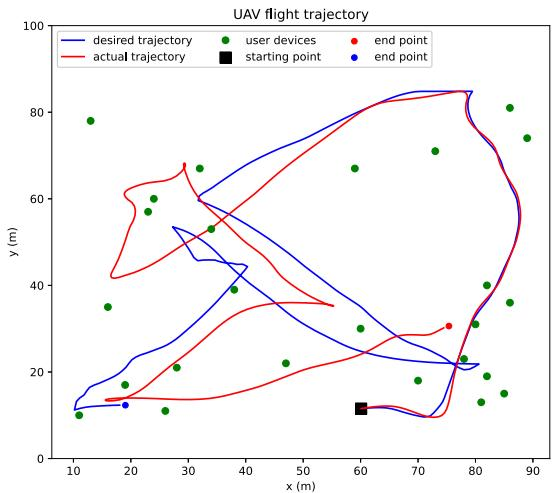

<details>
<summary>line</summary>

| x (m) | desired trajectory y (m) | actual trajectory y (m) | user devices y (m) |
|-------|--------------------------|-------------------------|--------------------|
| 10    | 10                       | 10                      | 78                 |
| 20    | 15                       | 15                      | 60                 |
| 30    | 40                       | 40                      | 55                 |
| 40    | 60                       | 60                      | 50                 |
| 50    | 70                       | 70                      | 45                 |
| 60    | 80                       | 80                      | 30                 |
| 70    | 85                       | 85                      | 25                 |
| 80    | 80                       | 80                      | 20                 |
| 90    | 75                       | 75                      | 15                 |
</details>

Fig. 7. The comparison between the desired and actual UAV trajectories.

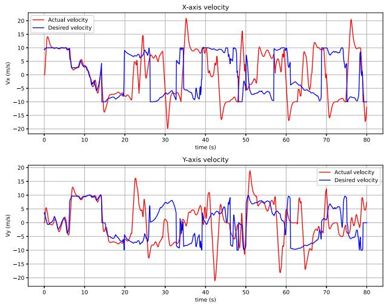

<details>
<summary>line</summary>

| time (s) | Actual velocity (m/s) | Desired velocity (m/s) |
| -------- | --------------------- | ---------------------- |
| 0        | ~14                   | ~10                    |
| 10       | ~-5                   | ~-5                    |
| 20       | ~-10                  | ~-10                   |
| 30       | ~-20                  | ~-10                   |
| 40       | ~10                   | ~10                    |
| 50       | ~-10                  | ~-10                   |
| 60       | ~-15                  | ~-5                    |
| 70       | ~-10                  | ~-5                    |
| 80       | ~-20                  | ~-10                   |
</details>

Fig. 8. Speed comparison.

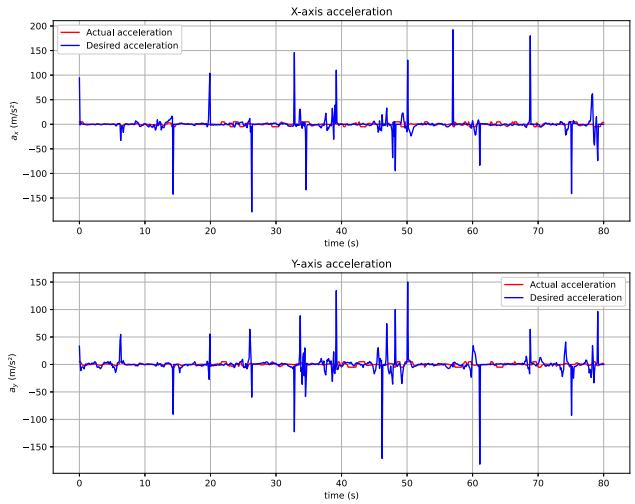

<details>
<summary>line</summary>

| time (s) | Actual acceleration (X-axis) | Desired acceleration (X-axis) | Actual acceleration (Y-axis) | Desired acceleration (Y-axis) |
| -------- | ---------------------------- | ----------------------------- | ---------------------------- | ----------------------------- |
| 0        | 0                            | 0                             | 0                            | 0                             |
| 10       | 0                            | 0                             | 0                            | 0                             |
| 20       | 0                            | 0                             | 0                            | 0                             |
| 30       | 0                            | 0                             | 0                            | 0                             |
| 40       | 0                            | 0                             | 0                            | 0                             |
| 50       | 0                            | 0                             | 0                            | 0                             |
| 60       | 0                            | 0                             | 0                            | 0                             |
| 70       | 0                            | 0                             | 0                            | 0                             |
| 80       | 0                            | 0                             | 0                            | 0                             |
</details>

Fig. 9. Acceleration comparison.

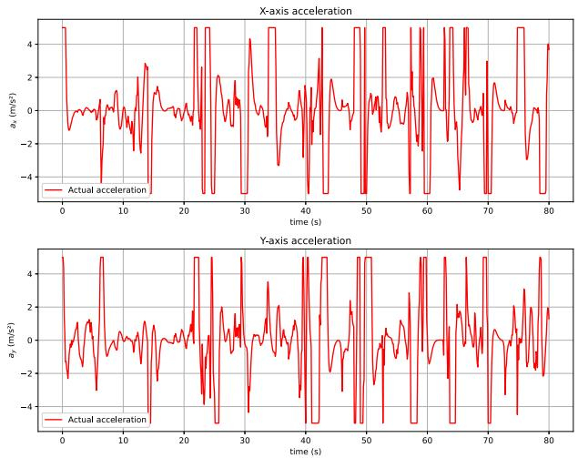

<details>
<summary>line</summary>

| time (s) | Actual acceleration (m/s²) | Actual acceleration (m/s²) |
| -------- | -------------------------- | -------------------------- |
| 0        | ~4.5                       | ~4.5                       |
| 5        | ~-1.5                      | ~-2.0                      |
| 10       | ~0.5                       | ~0.0                       |
| 15       | ~2.5                       | ~2.0                       |
| 20       | ~-1.0                      | ~-1.5                      |
| 25       | ~4.5                       | ~4.5                       |
| 30       | ~-3.0                      | ~-3.5                      |
| 35       | ~4.5                       | ~4.5                       |
| 40       | ~-1.0                      | ~-1.5                      |
| 45       | ~4.5                       | ~4.5                       |
| 50       | ~-1.0                      | ~-1.5                      |
| 55       | ~4.5                       | ~4.5                       |
| 60       | ~-1.0                      | ~-1.5                      |
| 65       | ~4.5                       | ~4.5                       |
| 70       | ~-1.0                      | ~-1.5                      |
| 75       | ~4.5                       | ~4.5                       |
| 80       | ~-1.0                      | ~-1.5                      |
</details>

Fig. 10. Actual acceleration.

the lowest latency. This is because the MADPG-LC algorithm can dynamically adjust the UAV flight in real-time based on the time-varying task offloading requirement, user mobility, and UAV flight states, in order to provide best service for ground users, resulting in better system performance than the benchmark strategies.

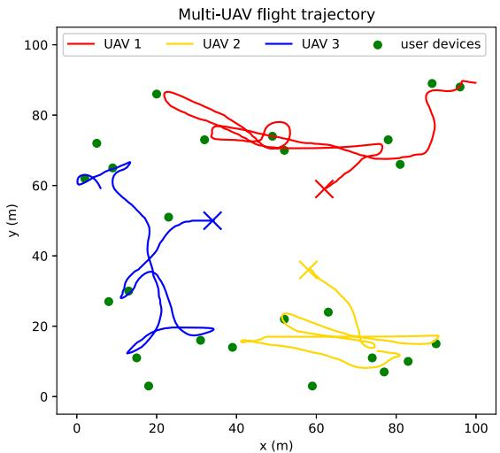

Fig. 11. Multi-UAV trajectory design.   
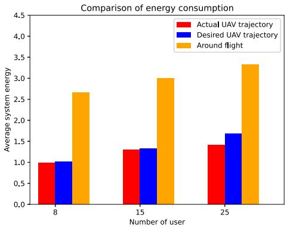

<details>
<summary>bar</summary>

| Number of user | Actual UAV trajectory | Desired UAV trajectory | Around flight |
| -------------- | ---------------------- | ----------------------- | ------------- |
| 8              | 1.0                    | 1.0                     | 2.7           |
| 15             | 1.3                    | 1.3                     | 3.0           |
| 25             | 1.4                    | 1.7                     | 3.4           |
</details>

Fig. 12. Average energy consumption comparison.

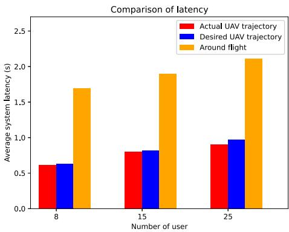

<details>
<summary>bar</summary>

| Number of user | Actual UAV trajectory | Desired UAV trajectory | Around flight |
| -------------- | ---------------------- | ----------------------- | ------------- |
| 8              | 0.6                    | 0.6                     | 1.7           |
| 15             | 0.8                    | 0.8                     | 1.9           |
| 25             | 0.9                    | 1.0                     | 2.1           |
</details>

Fig. 13. Average latency comparison.

# VI. CONCLUSION

In this work, a multi-UAV dynamic trajectory control algorithm is proposed for blockchain-based multi-UAV-assisted MEC systems, aiming to optimize the weighted energy consumption and latency. To address the constraint introduced by the UAV flight dynamics, the optimization problem is decomposed into three subproblems. In particular, the integration of desired trajectory design and trajectory tracking control successfully realizes the dynamic trajectory control. On this basis, in conjunction with user association and computing frequency assignment, the proposed MADDPG-LC framework has the ability to achieve real-time joint optimization of resource allocation and dynamic trajectory control. Numerical simulation results validate the effectiveness of proposed MADDPG-LC algorithm for the dynamic UAV-assisted MEC system. It is worth noting that our research exists potential future works. For example, the communication model in this study is primarily based on LoS channels. Future research can explore more realistic NLoS environments and incorporate advanced channel models to further improve the application performance of UAVs in various environments. In addition, future work can explore the integration of emerging technologies such as 6G networks into the MEC framework to further improve computational efficiency and communication reliability. Furthermore, by integrating energy harvesting technology with the development of energy-saving algorithms for UAVs, the processing duration of multi-UAV systems can be significantly extended, making them more suitable for long-term missions.

# REFERENCES

[1] F. Spinelli and V. Mancuso, “Toward enabled industrial verticals in 5G: A survey on MEC-based approaches to provisioning and flexibility,” IEEE Commun. Surveys Tuts., vol. 23, no. 1, pp. 596–630, First Quarter 2021.   
[2] M. Dai, N. Huang, Y. Wu, J. Gao, and Z. Su, “Unmanned-aerial-vehicleassisted wireless networks: Advancements, challenges, and solutions,” IEEE Internet Things J., vol. 10, no. 5, pp. 4117–4147, Mar. 2023.   
[3] Y. Mao, C. You, J. Zhang, K. Huang, and K. B. Letaief, “A survey on mobile edge computing: The communication perspective,” IEEE Commun. Surveys Tuts., vol. 19, no. 4, pp. 2322–2358, Fourth Quarter 2017.   
[4] C. Zhan, H. Hu, X. Sui, Z. Liu, and D. Niyato, “Completion time and energy optimization in the UAV-enabled mobile-edge computing system,” IEEE Internet Things J., vol. 7, no. 8, pp. 7808–7822, Aug. 2020.   
[5] X. Hu, K.-K. Wong, K. Yang, and Z. Zheng, “UAV-assisted relaying and edge computing: Scheduling and trajectory optimization,” IEEE Trans. Wireless Commun., vol. 18, no. 10, pp. 4738–4752, Oct. 2019.   
[6] B. Li, Z. Fei, Y. Zhang, and M. Guizani, “Secure UAV communication networks over 5G,” IEEE Wireless Commun., vol. 26, no. 5, pp. 114–120, Oct. 2019.   
[7] T. Alladi, V. Chamola, N. Sahu, and M. Guizani, “Applications of blockchain in unmanned aerial vehicles: A review,” Veh. Commun., vol. 23, 2020, Art. no. 100249.   
[8] Q. Tang, Z. Fei, J. Zheng, B. Li, L. Guo, and J. Wang, “Secure aerial computing: Convergence of mobile edge computing and blockchain for uav networks,” IEEE Trans. Veh. Technol., vol. 71, no. 11, pp. 12073–12087, Nov. 2022.   
[9] N. Cheng et al., “Ai for UAV-assisted IoT applications: A comprehensive review,” IEEE Internet Things J., vol. 10, no. 16, pp. 14438–14461, Aug. 2023.   
[10] C. Deng, X. Fang, and X. Wang, “UAV-enabled mobile-edge computing for AI applications: Joint model decision, resource allocation, and trajectory optimization,” IEEE Internet Things J., vol. 10, no. 7, pp. 5662–5675, Apr. 2023.   
[11] J. Xia, P. Wang, B. Li, and Z. Fei, “Intelligent task offloading and collaborative computation in multi-UAV-enabled mobile edge computing,” China Commun., vol. 19, no. 4, pp. 244–256, 2022.   
[12] B. Zhu, E. Bedeer, H. H. Nguyen, R. Barton, and Z. Gao, “UAV trajectory planning for AoI-minimal data collection in UAV-aided IoT networks by transformer,” IEEE Trans. Wireless Commun., vol. 22, no. 2, pp. 1343–1358, Feb. 2023.   
[13] L. Wang, K. Wang, C. Pan, W. Xu, N. Aslam, and L. Hanzo, “Multi-agent deep reinforcement learning-based trajectory planning for multi-UAV assisted mobile edge computing,” IEEE Trans. Cogn. Commun. Netw., vol. 7, no. 1, pp. 73–84, Mar. 2021.   
[14] F. Zhou, Y. Wu, R. Q. Hu, and Y. Qian, “Computation rate maximization in UAV-enabled wireless-powered mobile-edge computing systems,” IEEE J. Sel. Areas Commun., vol. 36, no. 9, pp. 1927–1941, Sep. 2018.   
[15] Y.-H. Wu, C.-Y. Li, Y.-B. Lin, K. Wang, and M.-S. Wu, “Modeling control delays for edge-enabled UAVs in cellular networks,” IEEE Internet Things J., vol. 9, no. 17, pp. 16222–16233, Sep. 2022.   
[16] B. Xu, Z. Kuang, J. Gao, L. Zhao, and C. Wu, “Joint offloading decision and trajectory design for UAV-enabled edge computing with task dependency,” IEEE Trans. Wireless Commun., vol. 22, no. 8, pp. 5043–5055, Aug. 2023.

[17] W. You, C. Dong, Q. Wu, Y. Qu, Y. Wu, and R. He, “Joint task scheduling, resource allocation, and UAV trajectory under clustering for fanets,” China Commun., vol. 19, no. 1, pp. 104–118, 2022.   
[18] Q. Wu, Y. Zeng, and R. Zhang, “Joint trajectory and communication design for multi-UAV enabled wireless networks,” IEEE Trans. Wireless Commun., vol. 17, no. 3, pp. 2109–2121, Mar. 2018.   
[19] B. Liu, Y. Wan, F. Zhou, Q. Wu, and R. Q. Hu, “Resource allocation and trajectory design for MISO UAV-assisted MEC networks,” IEEE Trans. Veh. Technol., vol. 71, no. 5, pp. 4933–4948, May 2022.   
[20] Y. Xu, T. Zhang, Y. Liu, D. Yang, L. Xiao, and M. Tao, “UAV-assisted MEC networks with aerial and ground cooperation,” IEEE Trans. Wireless Commun., vol. 20, no. 12, pp. 7712–7727, Dec. 2021.   
[21] Y. Xu, T. Zhang, Y. Liu, D. Yang, L. Xiao, and M. Tao, “Cellular-connected multi-UAV MEC networks: An online stochastic optimization approach,” IEEE Trans. Commun., vol. 70, no. 10, pp. 6630–6647, Oct. 2022.   
[22] Z. Yang, S. Bi, and Y.-J. A. Zhang, “Online trajectory and resource optimization for stochastic UAV-enabled MEC systems,” IEEE Trans. Wireless Commun., vol. 21, no. 7, pp. 5629–5643, Jul. 2022.   
[23] Y. Liu, H. Wang, J. Fan, J. Wu, and T. Wu, “Control-oriented UAV highly feasible trajectory planning: A deep learning method,” Aerosp. Sci. Technol., vol. 110, 2021, Art. no. 106435.   
[24] H. Huang, A. V. Savkin, and W. Ni, “Online UAV trajectory planning for covert video surveillance of mobile targets,” IEEE Trans. Automat. Sci. Eng., vol. 19, no. 2, pp. 735–746, Apr. 2022.   
[25] J. W. Woo, J.-Y. An, M. G. Cho, and C.-J. Kim, “Integration of path planning, trajectory generation and trajectory tracking control for aircraft mission autonomy,” Aerosp. Sci. Technol., vol. 118, 2021, Art. no. 107014.   
[26] J. L. Sanchez-Lopez, M. Castillo-Lopez, M. A. Olivares-Mendez, and H. Voos, “Trajectory tracking for aerial robots: An optimization-based planning and control approach,” J. Intell. Robotic Syst., vol. 100, no. 2, pp. 531–574, 2020.   
[27] W. Xu, T. Zhang, X. Mu, Y. Liu, and Y. Wang, “Trajectory planning and resource allocation for multi-UAV cooperative computation,” IEEE Trans. Commun., vol. 72, no. 7, pp. 4305–4318, Jul. 2024.   
[28] Z. Hu, X. Gao, K. Wan, Q. Wang, and Y. Zhai, “Asynchronous curriculum experience replay: A deep reinforcement learning approach for UAV autonomous motion control in unknown dynamic environments,” IEEE Trans. Veh. Technol., vol. 72, no. 11, pp. 13985–14001, Nov. 2023.   
[29] L. Liu et al., “Delay-informed intelligent formation control for UAVassisted IoT application,” Sensors, vol. 23, no. 13, 2023, Art. no. 6190.   
[30] O. Bekkouche, T. Taleb, and M. Bagaa, “UAVs traffic control based on multi-access edge computing,” in Proc. IEEE Glob. Commun. Conf., 2018, pp. 1–6.   
[31] Z. Wang, Y. Xue, L. Liu, H. Zhang, C. Qu, and C. Fang, “Multi-agent DRL-controlled connected and automated vehicles in mixed traffic with time delays,” IEEE Trans. Intell. Transp. Syst., early access, Sep. 18, 2024, doi: 10.1109/TITS.2024.3435036.   
[32] Y. He, Y. Gan, H. Cui, and M. Guizani, “Fairness-based 3-D multi-UAV trajectory optimization in multi-UAV-assisted mec system,” IEEE Internet Things J., vol. 10, no. 13, pp. 11383–11395, Jul. 2023.   
[33] Z. Wang, Y. Gao, C. Fang, L. Liu, H. Zhou, and H. Zhang, “Optimal control design for connected cruise control with stochastic communication delays,” IEEE Trans. Veh. Technol., vol. 69, no. 12, pp. 15357–15369, Dec. 2020.

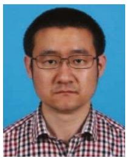

<details>
<summary>natural_image</summary>

Portrait of a man wearing glasses and a checkered shirt against a blue background (no text or symbols visible)
</details>

Zhuwei Wang (Member, IEEE) received the B.S. and Ph.D. degrees from Beijing University of Posts and Telecommunications, Beijing, China, in 2005 and 2011, respectively. From 2008 to 2010, he was a Visiting Scholar with the Department of Electronic and Computer Engineering, University of California at San Diego, La Jolla, CA, USA. From 2012 to 2014, he was a Postdoctoral Research Fellow with the Department of Electrical Engineering, Columbia University, New York, NY, USA. He is currently an Associate Professor with Beijing University of

Technology, Beijing. His research interests include edge AI, intelligent network control, intelligent resource allocation, and real-time applications, such as UAV and CCC. He was the recipient of the Best Paper Award from IEEE ICCC 2021 and ICFEICT 2024. He was the Workshop Chair for ICFEICT 2023 and 2024, and the Technical Program Committee of several international conferences, including IEEE ICC, and IEEE ICCC. He was the Leading Editor of Sensors and Electronics Special Issues.

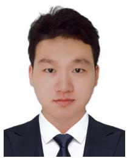

<details>
<summary>natural_image</summary>

Portrait of a man in formal attire (no text or symbols visible)
</details>

Haowei Wang received the B.S. degree in electronic information engineering from the Faculty of Information, North University of Technology, Beijing, China, in 2022, He is currently toward the M.S. degree if information and communication engineering, Beijing University of Technology, Beijing. His research interests include networking AI, UAV communications, optimal control design, and deep reinforcement learning.

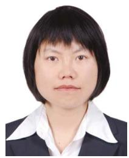

<details>
<summary>natural_image</summary>

Portrait photo of a woman with short black hair wearing a white collared shirt and dark jacket (no text or symbols visible)
</details>

Lihan Liu received the M.S. degree from New York University, New York, NY, USA, in 2014, and the Ph.D. degree from the Beijing University of Posts and Telecommunications, Beijing, China, in 2019. She is currently an Assistant Professor with Beijing Wuzi University, Beijing. Her research interests include Big Data, artificial intelligence, optimization theory, and game theory.


<details>
<summary>natural_image</summary>

Portrait of a man in business attire (no text or symbols visible)
</details>

Enchang Sun (Senior Member, IEEE) received the Ph.D. degree in information and telecommunications engineering from Xidian University, Xi’an, China, in 2008. Since 2008, he has been with the School of Information Science and Technology, Beijing University of Technology, Beijing, China, where he is currently an Associate Professor. He visited the University of Warwick, Coventry, U.K., Carleton University, Ottawa, ON, Canada, and the University of Houston, Houston, TX, USA, in 2012, 2015, and 2019, respectively. He has authored or coauthored more than

60 papers, and hold about 20 Chinese patents. His research interests include communication and information theory with special emphasis on cognitive and collaborative communications, distributed machine learning, and blockchain. He is also a Senior Member with the Chinese Institute of Electronics (CIE) and China Institute of Communications (CIC), and the MIET Member with the Institution of Engineering and Technology (IET).


<details>
<summary>natural_image</summary>

Portrait photo of a man in business attire (no text or symbols visible)
</details>

Haijun Zhang (Fellow, IEEE) was a Postdoctoral Research Fellow with the Department of Electrical and Computer Engineering, The University of British Columbia (UBC), Vancouver, BC, Canada. He is currently a Full Professor with the University of Science and Technology Beijing, Beijing, China. He is/was the Track Co-Chair for VTC Fall 2022 and WCNC 2020/2021, Symposium Chair for GLOBE-COM 2019, TPC Co-Chair for INFOCOM 2018 Workshop on Integrating Edge Computing, Caching, and Offloading in Next Generation Networks, and

General Co-Chair for GameNets 2016. He is also an Editor of IEEE TRANS-ACTIONS ON WIRELESS COMMUNICATIONS, IEEE TRANSACTIONS ON INFOR-MATION FORENSICS AND SECURITY, and IEEE TRANSACTIONS ON COMMUNI-CATIONS. He is also a Distinguished Lecturer of IEEE. He was the recipient of the IEEE CSIM Technical Committee Best Journal Paper Award in 2018, IEEE ComSoc Young Author Best Paper Award in 2017, and IEEE ComSoc Asia-Pacific Best Young Researcher Award in 2019.


<details>
<summary>natural_image</summary>

Portrait photo of a man in a white shirt against a blue background (no text or symbols visible)
</details>

Zhidu Li (Senior Member, IEEE) received the Ph.D. degree in information and communications engineering from the Beijing University of Posts and Telecommunications, Beijing, China, in 2018. In 2017, he was with the Norwegian University of Science and Technology, as a Visiting Scholar. He is currently a Professor with the Chongqing University of Posts and Telecommunications. He has authored or coauthored more than 60 papers in his research interests include network optimization and edge intelligence, and most of them appeared in prestigious IEEE journals and conferences, such as IEEE JOURNAL ON SELECTED AREAS IN COMMUNICA-TIONS, IEEE TRANSACTIONS ON MULTIMEDIA, IEEE GLOBECOM, and IEEE ICC. He was the recipient of three Best Paper awards from conferences such as the IEEE WCSP, IEEE BLOCKCHAIN and EAI MOBIMEDIA.


<details>
<summary>natural_image</summary>

Portrait of a man wearing glasses and a suit (no text or symbols visible)
</details>

Meng Li (Senior Member, IEEE) received the Ph.D. degree in electronic science and technology from the Beijing University of Technology, Beijing, China, in 2018. He is currently an Associate Professor with the School of Information Science and Technology, Beijing University of Technology. From September 2015 to September 2016, he visited Carleton University, Ottawa, ON, Canada, as a visiting Ph.D. Student funded by China Scholarship Council (CSC). His research interests include industrial IoT, M2M communications, computing power network, and intelligent resource allocation. Dr. Li was the recipient of the Excellent Doctoral Dissertation Award from China Education Society of Electronics in 2019 and the Best Paper Award at ICCC 2021. He was the Technical Program Committee (TPC) Member of several international conferences, including IEEE INFOCOM, IEEE GLOBECOM, and IEEE ICC.


<details>
<summary>natural_image</summary>

Portrait photo of a man in formal attire against a blue background (no text or symbols visible)
</details>

Chao Fang (Senior Member, IEEE) received the Ph.D. degree from the State Key Laboratory of Networking and Switching Technology in Information and Communication Engineering, Beijing University of Posts and Telecommunications, Beijing, China, in 2015. From 2013 to 2014, he had been funded by China Scholarship Council to visit Carleton University, Ottawa, ON, Canada, as a Joint Ph.D. Student. In 2016, he joined the Beijing University of Technology, where he is currently an Associate Professor. He is also a Visiting Scholar with the University of

Technology Sydney, Ultimo, NSW, Australia, the Commonwealth Scientific and Industrial Research Organization, The Hong Kong Polytechnic University, Hong Kong, Kyoto University, Kyoto, Japan, Muroran Institute of Technology, Muroran, Japan, and the Queen Mary University of London, London, U.K. His research interests include future networks, intelligent cloud-edge-terminal cooperation computing, and intelligent network control. He was the recipient of the Best Paper Award from IEEE ICFEICT 2022 and 2024. From 2022 to 2023, he was the Vice Chair of the Technical Affairs Committee in the IEEE ComSoc Asia/Pacific Region. He was the Session Chair for ICC 2015, ICCC 2023, and WCNC 2024, the Workshop Chair for ICFEICT from 2022 to 2024 and ICNCIC from 2023 to 2024, Technical Program Committee Chair for SPCNC 2024, and the Poster Co-Chair for HotICN 2018. He is also the leading Editor of Sensors, Electronics, and Symmetry Special Issues.