# Dynamic UAV Deployment for Differentiated Services: A Multi-Agent Imitation Learning Based Approach

Xiaojie Wang , Member, IEEE, Zhaolong Ning , Senior Member, IEEE, Song Guo , Fellow, IEEE, Miaowen Wen , Senior Member, IEEE, Lei Guo , and H. Vincent Poor , Life Fellow, IEEE

Abstract—Unmanned Aerial Vehicles (UAVs) have been utilized to serve on-ground users with various services, e.g., computing, communication and caching, due to their mobility and flexibility. The main focus of many recent studies on UAVs is to deploy a set of homogeneous UAVs with identical capabilities controlled by one UAV owner/company to provide services. However, little attention has been paid to the issue of how to enable different UAV owners to provide services with differentiated service capabilities in a shared area. To address this issue, we propose a multi-agent imitation learning enabled UAV deploymen approach to maximize both profits of UAV owners and utilities of on-ground users. Specially, a Markov game is formulated among UAV owners and we prove that a Nash equilibrium exists based on the full knowledge of the system. For online scheduling with incomplete information, we design agent policies by imitating the behaviors of corresponding experts. A nove neural network model, integrating convolutional neural networks, generative adversarial networks and a gradient-based policy, can be trained and executed in a fully decentralized manner with a guaranteed -Nash equilibrium. Performance results show that our algorithm has significant superiority in terms of average profits, utilities and execution time compared with other representative algorithms.

Index Terms—UAV deployment, differentiated services, imitation learning, decentralized training, Nash equilibrium

## 1 INTRODUCTION

HE upcoming network era initiated by the Fifth Genera-Ttion of Mobile Communications (5G) is expected to connect massive numbers of devices ubiquitously and seamlessly. According to the report in [1], mobile traffic worldwide will reach 1 ZB/month in 2028, equivalent to 200 GB/month for 5 billion global users. This poses significant challenges to the current network infrastructure with urgent demands on computing abilities and capacities.

However, for network operators, it is infeasible to deploy infrastructure everywhere due to installation and maintenance costs. With the advantages of flexibility and mobility, Unmanned Aerial Vehicles (UAVs) have evolved into a promising vehicular paradigm, and can be utilized to extend wireless networks by providing services for on-ground users, such as data collection, rapid network access, edge computing and content caching. According to the report in [2], the global revenue of UAV-based hardware and services will be up to 12.6 billion US dollars by 2025 from merely 792 million US dollars in 2017.

To achieve the promise of UAV-based services, a fundamental issue is how to deploy UAVs in an efficient way to satisfy the requirements of on-ground users, including maximizing the on-demand coverage area as well as the covered number of users, and satisfying different quality-of-service requirements. Although coexisting UAVs can provide large service coverage for on-ground users by making efficient utilization of idle UAV resources, it is difficult to handle differentiated services provided by various UAV owners in the network. That is, UAV owners provide similar services but with different capabilities. For example, company A provides UAV-based edge computing services with computing capability of 1.5 GHz per UAV, while company B provides 2.5 GHz per UAV. Higher service capability always requires stronger hardware, which also has a higher cost. Thus, company B is able to ask a higher service price than that of company A. This brings up the questions: can the two companies coexist in the network to jointly provide services for users? If so, how can they offer proper service prices and UAV quantities to maximize their own profits?

## 1.1 Motivation

UAVs have been developed as an orchestration framework for a wide range of industrial and commercial scenarios. Many countries have established rules for the usage of UAVs with commercial purposes. For example, in 2015, rules for UAV operations were developed by the European safety aviation authority. The federal aviation administration of USA also announced guidelines for commercial UAV operations in 2015 [3]. Many countries and companies have registered for allowance certificates to fly commercial UAVs. For instance, Google Wing has pushed a study of on UAV delivery system in the United States [4]. In Estonia, UAVs have been utilized to monitor overhead power lines for powersupply companies [5]. Since more and more companies have invested in UAV-based applications, the scenario that different kinds of UAVs controlled by different companies with distinct service capabilities becomes common.

One typical application example is when different network operators can provide heterogeneous network services by UAVs for on-ground users, such as 4G and 5G network services [6]. Just like in a live basketball game, audiences with different network requirements can purchase different value-added services from those network operators [7]. Another example is when the network operators can utilize UAVs to support differentiated services, since merely of <sup>20%</sup>the land area is covered by existing mobile communications infrastructure [8]. To both minimize the deployment cost and provide ubiquitous connections, UAVs are promising to provide flexible network coverage and differentiated services for urban hotspots and rural areas in shortage of network access.

Consequently, because of such practical application scenarios, the potential solutions for differentiated services provided by UAVs with various service providers are important and necessary, motivating us to investigate this topic.

## 1.2 Challenges

Although many studies have investigated differentiated services provided by Internet service providers [9], [10], they are not suitable for UAV-based networks due to their unique service providers. To the best of our knowledge, we are the first to investigate differentiated services with various service providers in the UAV-based network. It is rather challenging to resolve such an issue due to the following reasons:

First, it is difficult to maximize profits of UAV owners and utilities of users simultaneously. Differentiated services provided by distinct UAV owners make users have different preferences, and they may even pursue other services instead of their original preferences when resource quantities and prices are updated. Thus, it is hard to model user utilities with differentiated services, and also difficult to establish the relationship between the total provided resources of UAV owners and user utilities.

Second, for UAV owners, they cannot observe the policies of others beforehand, resulting in their partial observations. Thus, it is difficult to determine optimal provided UAV quantities and service prices to reach an equilibrium and guarantee the fairness among multiple UAV owners with incomplete system information.

Third, dynamic user requirements make the UAV deployment issue complex, and call for online scheduling algorithms. The authors in [11] propose a trajectory control algorithm for UAVs flying over a target area and providing computing resources for on-ground users based on multiagent Deep Reinforcement Learning (DRL). Compared with traditional algorithms, it exhibits superior performance in terms of consumed energy of user devices, fairness among user devices and that among loads of UAVs. However, on one hand, it does not consider differentiated services and profits of UAV owners. On the other hand, although DRL has been widely utilized for online scheduling, it typically has poor performance at the initial thousands of iterations. Thus, novel algorithms with both fast convergence speeds and good performance need to be designed.

## 1.3 Contributions

To address the above challenges, this paper proposes a multiagent imitation learning enabled UAV deployment algorithm, named MILU, to maximize both profits of UAV owners and utilities of on-ground users. Specifically, imitation learning is an efficient machine learning method to deal with online scheduling, since it has a faster convergence speed and is more sample efficient. It allows the agent to imitate the behaviors of experts (formed by their state-action trajectories) that are effective to solve the original problem. However, the expert policies cannot be directly applied in an online manner due to their high time complexity. Thus, a high-efficiency learning model should be trained to realize imitation from experts. Our contributions can be summarized as follows:

We establish a system model based on the analysis and formulation of user utilities as well as UAV owner profits. In addition, we formulate the UAV deployment issue as an optimization problem with the purpose of maximizing profits of UAV owners and utilities of on-ground users simultaneously.

To solve the formulated problem, we first analyze the interactions of UAV owners based on full system observations, and derive a Nash equilibrium condition. With that condition, expert policies and demonstrations in our imitation learning based UAV deployment scheme can be formed.

For online scheduling with partial observations of UAV owners, we train agent policies through a novel neural network model, integrating Convolutional Neural Networks (CNNs), Generative Adversarial Networks (GANs) and the gradient-based policy, to approach the expert performance from the beginning of the algorithm iteration. Specifically, our designed model can be both trained and executed in a fullydecentralized manner without obtaining actual policies of opponents.

We demonstrate the effectiveness of our proposed algorithm from both theoretical and experimental perspectives. An -Nash equilibrium can be guaranteed, and real-word datasets are utilized for the evaluation of differentiated services provided by UAVs. Performance results show that our algorithm has superiority in terms of average utilities of users, average profits and fairness among UAV owners, with significant improvements compared with other representative solutions.

The rest of this paper is structured as follows: in Section 2, we review the related work and introduce imitation learning briefly; we present the system model and formulate the studied problem in Section 3; in Section 4, we design an imitation learning enabled UAV deployment algorithm, followed by performance evaluation in Section 5; finally, we conclude our work in Section 6.

## 2 RELATED WORK AND BACKGROUND

In this section, we review the state-of-the-art research on UAV deployment and provide some background on imitation learning.

## 2.1 UAV Deployment

Existing studies of UAV deployment can be classified into two categories based on the number of utilized UAVs, i.e., one UAV deployment and multiple UAV deployment to provide various services, including edge computing, caching and feasible network access. For example, a moving UAV endowed with computing resources is utilized to provide services for mobile applications, aiming at satisfying the quality-of-service requirements of users based on successive convex approximation [12]. A UAV data collection scheme is proposed in [13], where UAV trajectories are optimized based on the simulated annealing algorithm, to reduce redundant collected data with the minimum energy consumption. Generally, optimization algorithms for one UAV deployment are always centralized due to the unique server, and hardly extend to the scenario with multiple UAVs because of the complexity brought by node dimensions.

For multiple UAVs, authors in [14] study the deployment of UAV-based services by designing an approximation algorithm based on game theory, to minimize the social service cost. A UAV clustering method is designed in [15] to enable multi-task offloading. The communication, caching and computing resources are jointly optimized by a model-free learning algorithm, which has a low convergence speed. Cachingenabled UAVs are investigated in [16], where the quality-ofexperience of users is optimized by a designed machine learning framework of conceptor-based echo state networks. However, all UAVs belong to one UAV owner, and they are assumed to be in full cooperation. The authors in [17] consider safe and fast configurations of UAV backhaul in a dynamic environment. Specifically, a convex optimization algorithm is proposed to optimize UAV locations and traffic routing. Nevertheless, these algorithms are all centralized, requiring full system knowledge. They are not suitable for our considered scenario, since there are competitions among multiple service providers with partial observations of system states.

A distributed control framework for realizing mobile crowdsensing by UAVs is proposed in [18], where DRL is utilized to select real-time actions for UAVs. Similar to our work, interactions among multi-agents are modeled and explored. However, it has poor system performance in the initial stage of algorithm execution. Mobile edge computing networks, consisting of Base Stations (BSs) as well as UAVs operated by multiple service providers, are considered in [19]. A game theoretic and reinforcement learning framework is proposed to maximize the long-term payoff of BSs and reach a Nash equilibrium among different BSs in a distributed manner. Different from our work, a quasi-stationary environment is considered. A software-defined control framework is designed in [20], where the UAV network can be controlled in a distributed manner and scalable fashion. Control decomposition theories are applied to generate sub-control problems that can be solved by each UAV.

Although different kinds of distributed algorithms are proposed for UAV management, they cannot be applied in our system. On one hand, the traditional distributed convex optimization cannot guarantee a good performance from the long-term perspective, since it merely concentrates on the performance optimization in each time slot. On the other hand, to overcome the drawbacks of poor performance at the initial stage of DRL, imitation learning is more suitable for online scheduling applications with a fast convergence speed and good performance by imitating expert behaviors. In addition, multi-agent imitation learning can learn to achieve a Nash equilibrium for involved agents without tedious bargaining processes in traditional game theories. To the best of our knowledge, we are the first to investigate the UAV deployment issue by multi-agent imitation learning, with the purpose of maximizing both utilities of on-ground users and profits of different UAV owners.

## 2.2 Background of Imitation Learning

As an efficient machine learning technique, imitation learning allows the learning agent to imitate the behaviors from expert demonstrations with the purpose of achieving good performance. It has been widely utilized in robotic motion planning and automatic driving. Two kinds of roles are involved in imitation learning, i.e., experts and learning agents. The expert can provide demonstration D, including expert policy <sub>E</sub> formed by I sampled trajectories. State-<sup>p</sup>action pairs in the ith trajectory can be represented by ${ \left. { \left( s _ { i } ^ { 0 } , a _ { i } ^ { 0 } \right) } , { \left( s _ { i } ^ { 1 } , a _ { i } ^ { 1 } \right) } , \ldots , { \left( s _ { i } ^ { \mathbb { H } } , a _ { i } ^ { \mathbb { H } } \right) } \right. }$ . For simplicity and without loss of generality, all trajectories are assumed to have same length H. The agent can train its own policies according to the expert demonstration, and then gradually improve its policies by interacting with the surrounding environment. Generally, traditional imitation learning is always regarded as one kind of supervision learning. In this case, the agent cannot always make the right decision when it encounters situations never met before. This is because the expert demonstration can only be provided with fixed iterations, and cannot contain all states that the agent may encounter [21], [22].

Generative Adversarial Imitation Learning (GAIL) is proposed in [23], which can overcome the compound error caused by limited expert demonstrations. It makes the distributions of state-action pairs visited by the agent close to those of expert trajectories. To shape the distribution of stateaction pairs generated by the agent policy, GANs are harnessed to train the learning model. Generally, GAN involves two participants, i.e., generator G and discriminator D. Generator G is utilized to generate data, the distribution of which is analogous to true data distribution Z. Discriminator D tries to distinguish whether a sample is from the data generated by generator G or true data distribution Z. Consequently, GAN tries to achieve the following objective: min $\begin{array} { r } { _ { G } \mathrm { m a x } _ { D } V ( G , D ) = E _ { x } [ \mathrm { l o g } D ( x ) ] + E _ { Z } [ \mathrm { l o g } ( 1 - D ( G ( Z ) ) ) ] , } \end{array}$ <sup>min max log log 1</sup>with the purpose of optimizing both generator G and discriminator D.

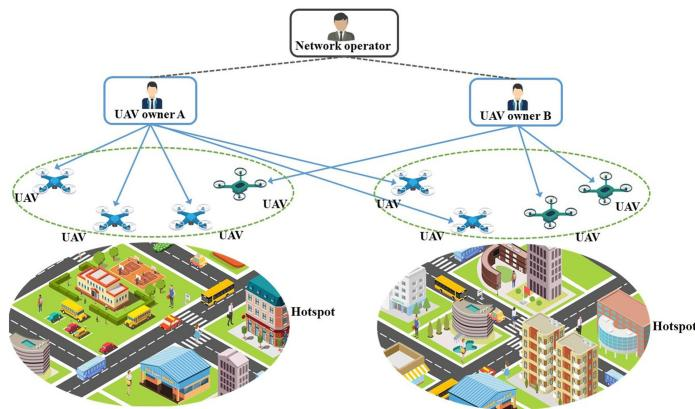  
Fig. 1. An illustrative system model of UAV deployment.

In GAIL, the learning agent can be regarded as generator $G ,$ attempting to generate state-action distributions through imitating those of the expert. Discriminator D learns to distinguish actions generated by the agent and the expert. Based on the competition between the above two players, the performance of the learning agent in GAIL can be largely improved. Overall, GAIL aims to learn efficient policies through adversarial generated training by mimicking expert demonstrations, $\mathrm { i . e . }$

$$
\begin{array} { r l } & { \hat { \pi } = \arg \underset { \theta } { \operatorname* { m i n } } \underset { \omega } { \operatorname* { m a x } } \big [ E _ { \pi _ { \theta } } \big [ \log \big ( D _ { \omega } \big ( s ^ { t } , a ^ { t } \big ) \big ) \big ] } \\ & { \quad \quad + E _ { \pi _ { E } } \big [ \log \big ( 1 - D _ { \omega } \big ( s ^ { t } , a ^ { t } \big ) \big ) \big ] \big ] - \lambda H ( \pi ) , } \end{array}\tag{}
$$

where  is a control parameter, and variable $H ( \pi )$ is the <sup>p</sup>-discounted causal entropy of policy . Symbols and are the training parameters for the policy and GAN, respectively. Equation $\dot { \boldsymbol { H } } ( \pi ) = \boldsymbol { E } _ { \pi } [$ $\log \pi ( \boldsymbol { a } ^ { t } | \boldsymbol { s } ^ { t } ) ]$ is founded, which <sup>p p log p</sup>enhances the exploration operation during the learning process.

## 3 SYSTEM MODEL AND PROBLEM FORMULATION

In this section, we first present the system model, and then formulate the optimization problem.

## 3.1 System Model

As shown in Fig. 1, we consider a scenario that UAVs as flying servers provide mobile services (such as communication, caching and edge computing) to on-ground users. The system contains on-ground user terminals, UAV owners, UAVs, BSs and the network operator. UAVs are controlled by the corresponding UAV owner and provide differentiated services for users to relieve the burdens of the traditional wireless networks. Herein, differentiated services refer to the same kind of service with different service abilities and prices, as exampled in Section 1. Users with higher requirements of service abilities may be content to pay for the higher-quality services with higher prices, and vice versa. UAV owners control their UAVs as well as schedule them by efficient strategies, and can connect to the network operator as in [24]. BSs can sense the number of arrival users nearby. We assume that the network operator can obtain the information of the whole system status, and can send user demands to UAV owners. Then, they can schedule the managed UAVs correspondingly.

## 3.1.1 Wireless Network Model

There are H hotspots in the considered system, denoted by $h \in \{ 1 , \ldots , H \}$ . Those hotspots can be regarded as user den-<sup>1 . . .</sup>sity areas that a quantity of users requiring network services, such as shopping mall, sports ground, and downtown. UAVs are deployed over there to relieve the burdens of traditional cellular networks. As shown in Fig. 1, we set hotspots by the circled areas as examples, and they can be regarded as no overlap between any two hotspots due to their geographic regions [24]. For each hotspot, multiple users exist and a set of UAVs can be deployed to serve them. The number of deployed UAVs for each hotspot depends on the users’ service requirements.

The time horizon is divided into multiple time slots with the same interval, denoted by $t \in \{ 0 , 1 , \ldots \}$ . In each time slot, <sup>0 1 . . .</sup>user demands of each hotspot keep stable, while can evolve into another value when the next time slot comes. The consideration is reasonable since the time duration of each time slot can be small enough. UAV owners can offer differentiated services with different service abilities, represented by $L =$ $\{ l _ { 1 } , \dots , l _ { k } , \dots l _ { K } \}$ , where K is the total number of UAV own-<sup>1 . . . . . .</sup>ers. The capability of each UAV owned by UAV owner k is equal to $b _ { k }$ . Each UAV owner has a sufficient number of $\mathrm { U A V s } ,$ and places a reasonable number of UAVs in the sky of those hotspots. We consider that UAVs can be charged to guarantee their service time. At the beginning of each time slot, after service providers decide the number of deployed UAVs for each hotspot, the UAVs without enough energy are replaced by candidate UAVs with sufficient energy, and those UAVs in shortage of energy are charged by the charging station in case of future usage. The main notations are illustrated in Table 1.

In time slot $t ,$ on-ground users randomly arrive in hotspot h with number $m _ { h } ( t )$ . User i in hotspot h generates service task ${ { \Lambda } _ { h i } } ( t ) = \{ { { d } _ { h i } } ( t ) , \{ { { \iota } _ { h i k } } ( t ) \} _ { k = 1 } ^ { K } \}$ with possibility $\varrho _ { h i } ,$ where $d _ { h i } ( t )$ <sup>i 1</sup>is the required service capacity, and $\iota _ { h i k } ( t ) \in$ <sup>i</sup>½ ; is the preference of user j for service k in hotspot h and <sup>0 1</sup>time slot t. To satisfy users’ service requirements, UAVs belonging to one UAV owner hover in the sky of hotspot h and form a mesh network, acting as a cloudlet. Those UAVs can communicate with each other and transmit tasks to each other for load balancing<sup>1</sup>. The UAVs belonging to different UAV owners do not communicate with each other. When user i has a service request, he/she can first broadcast it to UAVs directly. The nearest UAV of his/her preferred service accepts it, and then user i can send the task to that UAV. Specifically, the communication between UAVs and users (their terminals) is based on Orthogonal Frequency Division Multiplexing (OFDM).

## 3.1.2 Utilities of Users

For user i, we consider its budget for pursuing services in hotspot h as $e _ { h i }$ . Based on that, we have the following definition:

Definition 1 (The total budget of hotspot h). The total budget of hotspot h in time slot t can be computed by the sum of user budgets in time slot $t ,$ i.e., $\begin{array} { r } { e _ { h } ( t ) = \dot { \sum } _ { i = 1 } ^ { m _ { h } ( t ) } \dot { e } _ { h i } } \end{array}$ , which can be simplified by $e _ { h }$

TABLE 1 Main Notations
<table><tr><td>Notation</td><td>Description</td></tr><tr><td> $l _ { k }$ </td><td>The identification of service k;</td></tr><tr><td> $f _ { h k } ( t )$ </td><td>The PDF of users&#x27; preferences for service k in hotspot h of time slot t;</td></tr><tr><td> $q _ { h k } ( t )$ </td><td>The provided quantity of service resources of UAV owner k in hotspot h and time slot t;</td></tr><tr><td> $u _ { h } ( t )$ </td><td>The total user utilities of hotspot h in time slot t;</td></tr><tr><td> $\alpha$ </td><td>The degree of differentiation/substitutability</td></tr><tr><td> $m _ { h } ( t )$ </td><td>among those provided services; The number of arrival users in hotspot h and</td></tr><tr><td> $\varrho _ { h i }$ </td><td>time slot t; The possibility for user i to generate a task in</td></tr><tr><td> $g _ { 0 }$ </td><td>hotspot h; The cost of deploying one UAV in one hotspot;</td></tr><tr><td> $g _ { s }$ </td><td>The hovering energy consumption for one UAV</td></tr><tr><td> $g _ { c }$ </td><td>in one time slot; The service energy consumption for one UAV in</td></tr><tr><td> $b _ { k }$ </td><td>one time slot; The capability of each UAV owned by UAV</td></tr><tr><td> $p _ { k } ( t )$ </td><td>owner k; The price of service  $l _ { k } \in S$  for all hotspots</td></tr><tr><td> $\Gamma _ { h k } ( t )$ </td><td>provided by UAV owner k; The profit of UAV owner k in hotspot h and time</td></tr><tr><td> $c _ { h k } ( t )$ </td><td>slot t; The total cost for UAV owner k in hotspot h and</td></tr><tr><td> $u ( t )$ </td><td>time slot  $t ;$  The total utility for on-ground users in the</td></tr><tr><td> $e _ { h }$ </td><td>covered area in time slot t; The maximum value of the payment for</td></tr><tr><td></td><td>on-ground users in hotspot  ${ \bf \bar { \Phi } } _  h ; \}$ </td></tr><tr><td> $s ^ { t }$ </td><td>The network state in time slot t;</td></tr><tr><td> $o _ { k } ^ { t }$   $a _ { k } ^ { t }$ </td><td>The observation of UAV owner k in time slot t; The action taken by UAV owner k in time slot t;</td></tr><tr><td> $r _ { k } ^ { t }$ </td><td>The received reward of UAV owner k after</td></tr><tr><td> $\Omega _ { k } ^ { E }$ </td><td>taking action  $a _ { k } ^ { t }$  at state  $s ^ { t } ;$  The dataset formed by trajectories of expert</td></tr><tr><td></td><td>policy k;</td></tr><tr><td> $\pi _ { k }$   $\rho _ { \pi _ { k } , \pi _ { - k } }$ </td><td>The policy of UAV owner k; The occupancy measure from the perspective of</td></tr><tr><td></td><td>agent k;</td></tr><tr><td> $\nabla J _ { \pi } ( \theta _ { k } )$ </td><td>The gradient of the policy network of agent k;</td></tr><tr><td> $A _ { k } ( o _ { k } , a _ { k } , \hat { a } _ { - k } )$   $V _ { k } ( o _ { k } ^ { t } , a _ { k } , \hat { a } _ { - k } )$ </td><td>The advantage function of agent  $k ;$  The state value in time slot t based on</td></tr><tr><td></td><td>observation  $o _ { k } ^ { t }$  and estimated opponent action  $\hat { a } _ { - k } ;$ </td></tr><tr><td> $\nabla J _ { D } ( \omega _ { k } )$ </td><td>The gradient for the discriminator network with parameter  $\omega _ { k } ;$ </td></tr><tr><td> $L _ { \varepsilon _ { k } }$ </td><td>The loss function for the opponent network with parameter  $\varepsilon _ { k } .$ </td></tr></table>

For service ${ l } _ { k } ,$ the UAV owner provides price $p _ { k } ( t )$ for all hotspots (this is common for market products in realworld scenarios), and offers service resources with quantity $q _ { h k } ( t )$ for hotspot h in time slot t. We consider that each user has preference $\iota _ { h j k } ( t )$ toward service $l _ { k }$ based on its own budget $e _ { h i } ,$ <sup>i</sup>and provide the following definition similar to [2]:

Definition 2 (Aggregated user preference). The aggregated user preference for service $l _ { k } \in S$ in hotspot h and time slot t can be denoted by $f _ { h k } ( t )$ , which can be computed based on the personal user preference, i.e.,

$$
f _ { h k } ( t ) = \frac { \sum _ { i = 1 } ^ { m _ { h } ( t ) } \iota _ { h i k } ( t ) } { m _ { h } ( t ) } .\tag{}
$$

Then, the total service requirement for service $l _ { k }$ in hotspot h and time slot t can be computed by

$$
d _ { h } ( t ) = \sum _ { i = 1 } ^ { m _ { h } ( t ) } d _ { h i } ( t ) \times \varrho _ { h i } .\tag{}
$$

Instead of modeling each user’s utility, we form the aggregated user utility in hotspot $h$ and time slot $t ,$ since it can reflect the relationship of total user demands with service quantities in an efficient way. As a result, when there are more choices and available service quantities, the aggregated user utility can be increased. As a result, we define the aggregated user utility function based on the Constant Elasticity of Substitution (CES) function [27], which can reflect the relationship between the supply and the demand in the real-word market

$$
u _ { h } ( t ) = \sum _ { k = 1 } ^ { K } f _ { h k } ( t ) \bigg [ \frac { q _ { h k } ( t ) } { d _ { h } ( t ) } \bigg ] ^ { \alpha } ,\tag{}
$$

where represents the degree of differentiation/substitut-<sup>a</sup>ability among those provided services in the system, satisfying $0 \textless \alpha \textless 1$ . From equation (4), we can observe that <sup>0 a 1</sup>when the ratio of $q _ { h k } ( t ) / \bar { d _ { h } } ( t )$ becomes large, more resources can be served for users. In addition, the following theorem is founded:

Theorem 1 [Concavity of the aggregated user utility]. The aggregated user utility in hotpot h defined in equation (4) is concave with service quantity $q _ { h k } ( t )$ provided by UAV owner k in hotspot h.

The above theorem can be proved by verifying the second order derivative of equation (4), and a maximum value can be found in its feasible region $[ 0 , q _ { h k } ^ { m a x } ]$

## 3.1.3 Profits of UAV Owners

For UAV owners, they intend to maximize their profits by providing services for on-ground users. Thus, the obtained profit from users and the cost for providing such services should be considered. For the cost of each UAV owner, it contains two parts: installation and energy costs. For the former, the unit cost can be represented by ${ \mathit { g } } _ { 0 } ,$ which refers to <sup>0</sup>the cost of deploying one UAV in one hotspot and can be spread among time slots. The latter includes the cost for hovering and service energy consumption [2]. When a UAV hovers over one hotspot, the unit hovering energy consumption can be represented by $g _ { s }$ in each time slot. If the UAV provides services, its unit cost for service energy consumption can be denoted by $g _ { c }$ in each service unit. Then, the total cost for UAV owner k in hotspot h and time slot t can be computed by

$$
c _ { h k } ( t ) = ( g _ { 0 } + g _ { s } ) \bigg \lvert \frac { q _ { h k } ( t ) } { b _ { k } } \bigg \rvert + g _ { c } q _ { h k } ( t ) ,\tag{}
$$

where expression $\lceil q _ { h k } ( t ) / b _ { k } \rceil$ calculates the required number of UAVs for service k in hotspot $h .$ Thus, the first part of Equation (5) denotes the installation cost and the hovering energy cost in time slot $t ,$ and the second part is the energy cost for providing services in time slot t.

Then, the profit of UAV owner k in hotspot h and time slot t can be obtained by

$$
\Gamma _ { h k } ( t ) = p _ { k } ( t ) q _ { h k } ( t ) - c _ { h k } ( t ) ,\tag{}
$$

where the first part is the service profit of UAV owners obtained from on-ground users, and the second part is the total cost of UAV owners in time slot t.

## 3.2 Use Cases

Generally, computation-offloading and caching-based applications are the major focus in mobile edge computing networks. Herein, we provide two use cases to illustrate the utility settings for both UAV owners and users.

1) For computation-offloading applications: the required capacity for user i can be the required CPU cycle related to the computation task, i.e., $\mathop { d _ { h i } } ( t ) = \mathrm { \hat { c } } _ { h i } ( t )$ . To complete a task, the computing delay is the dominated factor to impact the system performance in our considered UAV-based network, when the distance between UAVs and on-ground users is close<sup>2</sup>. Thus, we mainly consider the allocations of computing resources, and the total required CPU cycles for computing offloading tasks in time slot t is $\begin{array} { r } { d _ { h } ( t ) \dot { = } \sum _ { i = 1 } ^ { m _ { h } ( t ) } \mathfrak { c } _ { h i } ( t ) \dot { \times } \varrho _ { h i } . } \end{array}$ The provided service quantity $q _ { h k } ( t )$ <sup>1</sup>is the aggregated CPU cycles for all UAVs by UAV owner k in time slot t. For the energy cost of $\mathrm { U A V s , ~ } g _ { c }$ can be regarded as the unit energy consumption cost for each CPU cycle, and $b _ { k }$ is the maximum CPU cycle for one UAV of service provider k. According to the defined energy consumption equation in [28], unit energy cost $g _ { c }$ can be computed by $g _ { c } = \mathsf { \bar { g } } _ { u } \kappa _ { k } ( b _ { k } ) ^ { 2 } .$ , where $\kappa _ { k }$ is the <sup>k k</sup>coefficient related to energy efficiency of UAVs owned by service provider $k ,$ and $g _ { u }$ is the charge fee for unit energy.

2) For caching-based applications: the required capacity can be set by the required transmission rate, i.e., $\bar { d _ { h i } } ( t ) \dot { = }$ ${ \mathfrak { s } } _ { h i } ( t )$ . It is the main factor to affect the quality-of-experience of users who prepare to cache their contents in servers or download contents from cached servers. Then, the total required transmission rate for transmitting contents in time slot t is $\begin{array} { r } { d _ { h } ( t ) = \sum _ { i = 1 } ^ { m _ { h } ( t ) } \mathfrak { s } _ { h i } ( t ) \times \varrho _ { h i } } \end{array}$ . The provided service quantity $q _ { h k } ( t )$ <sup>1</sup>is the aggregated transmission rate for all UAVs by UAV owner k in time slot t. For the energy cost of UAVs, $g _ { c }$ can be the unit energy cost related to the wireless transmission rate. The wireless transmission rate is related to channel bandwidth $\mathbb { B } ,$ wireless channel gain $h _ { j i } ^ { t }$ between UAV $j$ and user $i ,$ noise power $\sigma _ { j }$ at $\mathrm { U A V } ~ j$ and transmission power $\mathbb { P } _ { j i }$ from $\mathrm { U A V } ~ j$ to user i according to the Shannon formula. In addition, the consumed transmission energy has a positive relationship with transmission power $\mathbb { P } _ { j i } ,$ thus $g _ { c }$ can be formed by $g _ { c } = g _ { u } \varphi ( \mathbb { B } , \sigma _ { j } , h _ { j i } ^ { t } , \mathbb { P } _ { j i } )$ , where $\varphi ( \cdot )$ is a function related to its input.

## 3.3 Problem Formulation

We intend to maximize both the total profits of UAV owners and the utilities of on-ground users by properly deploying UAVs with differentiated services. For on-ground users, their total utility in the covered area can be computed by

$$
u ( t ) = \sum _ { h = 1 } ^ { H } u _ { h } ( t ) = \sum _ { h = 1 } ^ { H } \sum _ { k = 1 } ^ { K } f _ { h k } ( t ) q _ { h k } ( t ) ^ { \alpha } .\tag{}
$$

Then, we formulate the utility-maximization problem for onground users as follows

$$
\mathrm { P 1 : } \quad \operatorname* { m a x } _ { q _ { h k } } u ( t ) , k \in \{ 1 , . . , K \} , h \in \{ 1 , . . . , H \} ,\tag{}
$$

$$
\mathrm { s . t . } \sum _ { k = 1 } ^ { K } p _ { k } ( t ) q _ { h k } ( t ) \leq e _ { h } , h \in \{ 1 , \ldots , H \} ,\tag{}
$$

where constraint (8a) guarantees that the payment of onground users in hotspot h cannot exceed maximum value $e _ { h } ,$ , and also ensures that the prices offered by UAV owners cannot be arbitrarily high.

For UAV owners, they intend to maximize their own profits. Then, we formulate the long-term profit-maximization problem for UAV owners as follows

$$
\mathrm { P 2 : } \quad \operatorname* { m a x } _ { q _ { h k } , p _ { k } } \Gamma _ { k } = \sum _ { t = 0 } ^ { \infty } \sum _ { h = 1 } ^ { H } \Gamma _ { h k } ( t ) , k \in \{ 1 , . . , K \} .\tag{}
$$

We need to solve Problems P1 and P2 simultaneously. However, it is rather challenging, because: a) price $p _ { k }$ and quantity $q _ { h k }$ of services in the two problems are coupled and affect each other, making them cannot be handled independently; b) though the arrival user flow in each hotspot follows the Poisson process, the user preference and total service requirements for each service are not known beforehand, making Problem P1 incomputable; on one hand, the nonlinear character and the unknown parameters of the optimization function make the traditional optimization method disabled; on the other hand, the traditional gametheory based algorithm assign prices for players by selecting the best approaches based on the profits they can obtain. In our system, UAV owners’ profits are dependent on unknown user preferences, thus repeated iterations with the environment should be conducted for UAV owners to learn their best strategies, making traditional game-theoretic approaches inefficient; c) for online learning, UAV owners should make their own decisions independently without knowing others’ policies, which complicates the solving process of the two problems.

Generally, multi-agent inverse reinforcement learning algorithms are leveraged for the online training with unknown rewards, where a learned reward function can be obtained based on experts’ training samples. However, it is only suitable for the situation that the reward function can be decoupled from the environment. In our system, UAV owners’ rewards are heavily dependent on users’ preferences and budget, thus multi-agent inverse reinforcement learning algorithms are not suitable for our system.

Correspondingly, we propose an imitation learningenabled UAV deployment algorithm to resolve the above two problems comprehensively as described in the following section, and its advantages are: a) agents can imitate the behaviors of corresponding experts to improve their learning speed; b) agents can interact with the environment to train their policies and further improve their performance; c) even partial system states are known, agent policies can still coverage; and d) the actual policies of opponents are July 05,2026 at 12:38:43 UTC from IEEE Xplore. Restrictions apply.

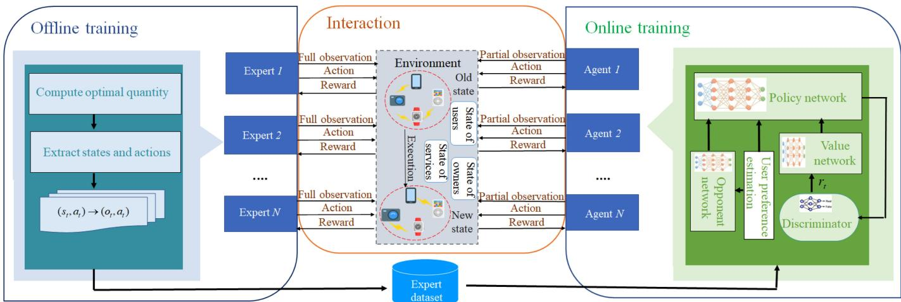  
Fig. 2. The structure of the designed algorithm.

not necessarily known, which can largely reduce the complexity of the training algorithm.

## 4 IMITATION LEARNING ENABLED UAV DEPLOYMENT

## 4.1 Algorithm Overview

The formulated problems in Subsection 3.3 are coupled and interdependent. To settle them, we first analyze the interactions among UAV owners to derive the Nash equilibrium condition based on full system states in Subsection 4.2. For online scheduling, we specify the Markov game by defining states, observations, actions, transition possibilities and rewards related to our considered system interactions in Subsection 4.3. Then, we design expert policies offline based on full observations of system states in Subsection 4.4. In Subsection 4.5, we present the designed agent policies, which can be trained online merely with partial observations through a designed neural network model based on expert demonstrations. To enable fully-decentralized training, we design an opponent model for each agent to predict the possible actions taken by its opponents instead of obtaining their actual actions. At last, we prove that an -Nash equilibrium can be reached among those UAV owners in an online manner. The structure of the designed algorithm is shown in Fig. 2.

## 4.2 UAV Owner Interaction Analysis

We first analyze interactions among UAV owners and derive the Nash equilibrium condition based on the full observation of system states. From Problems P1 and P2, we can observe that two variables should be derived, i.e., quantity $q _ { h k } ( t )$ and price $p _ { k } ( t )$ . Then, we try to find whether the two variables can be established by a direct relationship, so that the computation complexity of the formulated problems can be further reduced. Since $u _ { h } ( t )$ in Problem P1 is a strictly concave function, objective function (8) should have a maximum value based on constraint (8a). Thus, we can obtain the following theorem by processing Problem P1:

Theorem 2 [Relationship between service prices and quantities]. The prices of differentiated services offered by UAVs can be formed by a function of the provided resource quantities as follows

$$
p _ { k } ( t ) = \frac { e _ { h } f _ { h k } ( t ) \left[ q _ { h k } ( t ) \right] ^ { \alpha - 1 } } { \sum _ { k ^ { ' } = 1 } ^ { K } f _ { h k ^ { ' } } ( t ) \left[ q _ { h k ^ { ' } } ( t ) \right] ^ { \alpha } } .\tag{}
$$

The proof can be found in Appendix A of Supplemental File, which can be found on the Computer Society Digital Library at http://doi.ieeecomputersociety.org/ 10.1109/TMC.2021.3116236.

From Theorem 1, we can observe that the service price not only depends on the quantities of service resources provided by UAV owner $k ,$ but also relies on those of other UAV owners. Then, Equation (6) can be transformed into

$$
\Gamma _ { h k } ( t ) = \frac { e _ { h } f _ { h k } ( t ) [ q _ { h k } ( t ) ] ^ { \alpha } } { \sum _ { k ^ { \prime } = 1 } ^ { K } f _ { h k ^ { \prime } } ( t ) \left[ q _ { h k ^ { \prime } } ( t ) \right] ^ { \alpha } } - c _ { h k } ( t ) .\tag{}
$$

Problem P2 can be solved by reaching a Nash equilibrium among different UAV owners. Since variable $p _ { k } ( t )$ in P2 can be represented by $q _ { h k } ( t )$ based on Theorem 1, we merely need to compute the value of $q _ { h k } ( t )$ for the Nash equilibrium. If optimal quantity $q _ { h k } ^ { * } ( t )$ satisfies the following theorem, the Nash equilibrium can be reached.

Theorem 3 [Nash equilibrium condition]. The Nash equilibrium can be reached, if the offered resources of UAV owners in time slot t satisfy the following condition

$$
\begin{array} { r l } & { \biggl ( \frac { \alpha e _ { h } } { q _ { h k } ( t ) } Q _ { k } - 2 A _ { k } Q _ { k } \biggr ) \Psi _ { 1 } \bigl ( q _ { h , - k } ( t ) \bigr ) - A _ { k } Q _ { k } ^ { 2 } } \\ & { = \Psi _ { 2 } \bigl ( q _ { h , - k } ( t ) \bigr ) , } \end{array}\tag{}
$$

where symbols $A _ { k } = ( g _ { 0 } + g _ { s } + g _ { c } b _ { k } ) / b _ { k } , Q _ { k } = f _ { h k } ( t ) [ q _ { h k } ( t ) ] ^ { \alpha } ,$ $1 \leq k \leq K$ , functions

$$
\Psi _ { 1 } \big ( q _ { h , - k } ( t ) \big ) = \sum _ { k ^ { \prime } = 1 , k ^ { \prime } \ne k } ^ { K } Q _ { k ^ { \prime } } ,\tag{}
$$

and

$$
\Psi _ { 2 } \big ( q _ { h , - k } ( t ) \big ) = A _ { k } \left[ \sum _ { k ^ { \prime } = 1 , \atop { k ^ { \prime } \not = k } } ^ { K } Q _ { k ^ { \prime } } ^ { 2 } + 2 \sum _ { k ^ { \prime \prime } = 1 , \atop { k ^ { \prime \prime } \not = k } } ^ { K - 1 } Q _ { k ^ { \prime \prime } } \sum _ { j = k ^ { \prime \prime } + 1 , \atop { j \not = k } } ^ { K } Q _ { j } \right] .\tag{}
$$

The proof can be found in Appendix B of Supplemental File, available in the online supplemental material.

From Theorem 2, we can obtain the implicit condition to reach a Nash equilibrium. This is because when total number K of UAV owners is large, it is impossible to obtain an explicit condition related to optimal resource quantity $q _ { h k } ^ { * }$ with so many coupled variables. However, we can obtain the uniqueness of the Nash equilibrium as follows:

Theorem 4 [Uniqueness of the Nash equilibrium]. When Equation (12) is satisfied, there is a unique Nash equilibrium for the profit competition among different UAV owners.

The proof can be found in Appendix C of Supplemental File, available in the online supplemental material.

We can also deduce the range of $q _ { h k } ^ { * }$ based on Theorem 3 by the following theorem:

Theorem 5. When the Nash equilibrium is satisfied, optimal resource quantity $q _ { h k } ^ { * }$ satisfies $0 \leq q _ { h k } ^ { * } < \alpha e _ { h } / 2 A _ { k }$

The proof can be found in Appendix D of Supplemental File, available in the online supplemental material.

Although there is no explicit form of the Nash equilibrium condition when K is large, we can find the explicit form when $K = 2$ . In the following theorem, we provide that case.

Theorem 6. When there are two UAV owners in the system, $i . e . ,$ $K = 2 ,$ the Nash equilibrium is unique, and can be reached <sup>2</sup>with the offered resources of each UAV owner in time slot t as follows:

$$
q _ { h k } ^ { * } ( t ) = \frac { \alpha e _ { h } f _ { h , K + 1 - k } ( t ) [ A _ { k } ] ^ { \alpha - 1 } f _ { h k } ( t ) [ A _ { K + 1 - k } ] ^ { \alpha } } { \left\{ f _ { h , K + 1 - k } ( t ) [ A _ { k } ] ^ { \alpha } + f _ { h k } ( t ) [ A _ { K + 1 - k } ] ^ { \alpha } \right\} ^ { 2 } } ,\tag{}
$$

where $1 \leq k \leq K$

The proof can be found in Appendix E of Supplemental File, available in the online supplemental material.

Based on the above theorem, we can obtain the maximum provided service resources as follows:

Theorem 7. The maximum value of provided service resources of hotspot h can be computed by $q _ { h k } ^ { m a x } = \alpha e _ { h } / 4 A _ { k }$ , when K ¼ .

The proof can be found in Appendix F of Supplemental File, available in the online supplemental material.

The above theorems derive the relationship between service quantity $q _ { h k } ( t )$ and price $p _ { k } ( t )$ , and analyze the Nash equilibrium condition for Problem P . Then, we can obtain <sup>2</sup>the optimal value for Problem P based on the following theorem:

Theorem 8. Optimal service quantity $q _ { h k } ^ { * }$ for Problem P is also the optimal value for Problem P .

The proof can be found in Appendix G of Supplemental File, available in the online supplemental material.

From Theorems 2, 3, and $^ { 4 , }$ we can obtain the Nash equilibrium point and maximum provided service quantities in each time slot. However, the above analyses are based on complete system information. That is, each UAV owner knows the user demands in each time slot and the policies of others beforehand, and can make the optimal deployment decision. However, UAV owners are almost impossible to obtain others’ policies when they make decisions. To enable online UAV deployment based on partial observations and make the system performance approach that based on complete system information, we present the designed imitation learning based UAV deployment approach in the following subsections. In addition, we merely need to solve Problem P2 by finding the optimal service quantities for UAV owners, which is reflected in Theorem 8.

## 4.3 Markov Game Formulation

Imitation learning is an efficient learning method allowing experts to pass on experiences for agents and has a fast convergence speed from the beginning of algorithm iterations, thus it is suitable for our online UAV deployment problem. We first transfer the profit-maximization issue defined in Subsection 3.3 into a Markov game.

The profit-maximization issue for different UAV owners can be modeled as a Markov game, regarded as an extension of Markov decision process. The UAV owners can be regarded as $K$ different learning agents, and the game is represented by tuple $\langle K , S , O , \bar { A } , P , \mathbb { R } , \gamma \rangle$ , the elements of which are explained as follows:

a) State: $S$ is the state set of the modeled Markov game, where $S \triangleq \{ s ^ { t } = ( S _ { 1 } , S _ { 2 } , S _ { 3 } ) \} , t \in \{ 0 , 1 , . . . \}$ . Three ele-<sup>1</sup>ments are included: $S _ { 1 }$ <sup>3 0 1 . . .</sup>represents the state of users, <sup>1</sup>containing service task $\Lambda _ { h i } ( t )$ of user $i ,$ task generation possibility $\varrho _ { h i } ,$ aggregated user preference $f _ { h k } ( t )$ and maximum payment $e _ { h }$ of on-ground users; $S _ { 2 }$ denotes the state of UAV owners, where unit cost $A _ { k }$ of UAV owners, sustainability degree and service capability $b _ { k }$ of UAVs are included.

b) Observation: For each UAV owner, full network state $s ^ { t }$ cannot be observed while merely partial network state is available, denoted by $O \triangleq \{ \hat { o ^ { t } } = \{ o _ { k } ^ { t } \} \} _ { 1 \leq k \leq K } ,$ where $o _ { k } ^ { t }$ <sup>1</sup>is the observation of UAV owner k. In our considered system, aggregated user preference $f _ { h k } ( t ) .$ and the policies of other UAV owners are not known to each UAV owner.

b) Action: Set $A \triangleq \{ a ^ { t } = \left\{ a _ { k } ^ { t } = \Delta q _ { h k } ( t ) \right\} _ { 1 \leq k \leq K , 1 \leq h \leq H } \}$ <sup>1 1</sup>denotes the actions taken by UAV owners, where $\Delta q _ { h k } ( t )$ is the additional service quantity that UAV owner k should deploy over hotspot h in time slot t. Then, the service quantity that owner k should provide can be computed by $q _ { h k } ( t ) = q _ { h k } ( t - 1 ) + \Delta q _ { h k } ( t )$ The value of $\Delta q _ { h k } ( t )$ <sup>1</sup>can be either below or above $0 ,$ representing the UAV owner can either improve or reduce the provided services. According to Theorem $^ { 3 , }$ the maximum value of $q _ { h k } ( t )$ is $\alpha e _ { h } / 4 A _ { k } ,$ thus $- \alpha e _ { h } / 4 A _ { k } \le \Delta q _ { h k } ( t ) \le \alpha e _ { h } / 4 A _ { k } .$

<sup>a 4 a 4</sup>State transition probability: $P : S \times A \times S \to [ 0 , 1 ]$ <sup>: 0 1</sup>denotes the state transition probability distribution, and $\rho _ { 0 } : S  [ 0 , 1 ]$ is the distribution of initial state $s ^ { 0 }$ <sup>r0 : 0 1</sup>. Based on probability $P ( s ^ { t + 1 } | s ^ { t } , a ^ { t } )$ , the state is transferred into $s ^ { t + 1 }$ from $s ^ { t }$ by taking action $a ^ { t }$

Reward: $r _ { k } ^ { t } : S \times A \longrightarrow \mathbb { R }$ represents the immediate <sup>:</sup>received reward of UAV owner k after taking action $a _ { k } ^ { t }$ at state $s ^ { t }$ . We define $r _ { k } ^ { t } = \Gamma _ { h k } ( t )$ , and utilize k to denote the set of UAV owners except k. The objective of UAV owner k becomes to maximize its own total expected profits $\begin{array} { r } { R _ { k } ^ { t } \triangleq E \big [ \sum _ { \tau = 0 } ^ { t } \gamma ^ { \tau } r _ { k } ^ { \tau } \big ] } \end{array}$ by solving the <sup>t 0 g</sup>formulated Markov game, where variable $\gamma \in [ 0 , 1 ]$ is the discounted factor.

## 4.4 Expert Policies

We assume that there are K experts in the network, and they can observe the full network state and know the policies of others, acting as oracles in the system. This is a general assumption in imitation learning algorithms, and the expert policies in our considered system can be obtained by offline computation based on history network requirements and costs of UAV owners. Thus, the expert demonstration can be collected as follows:

First, for the state in each time slot, experts compute the optimal quantities of provided services according to Theorem 2 in the sight of oracles. Thus, for expert $k ,$ its full observation $s _ { k } ^ { t }$ and partial observation $o _ { k } ^ { t }$ in the view of its corresponding agent, its action $a _ { k } ^ { t }$ and the actions of its opponents $a _ { - k } ^ { t }$ can be obtained. Second, the considered time slots can be divided into U batches, and each batch contains B observation-action pairs. For each observation-action pair $( o _ { k } ^ { t } , a _ { k } ^ { t } , a _ { - k } ^ { t } )$ , its value is recorded. Then, expert policy trajectories can be collected by dataset $\Omega _ { k } ^ { E } = \{ \dot { \Omega } _ { k i } \stackrel { \bullet } { = } \{ \big ( \stackrel { \bullet } { o _ { k } ^ { t } } , a _ { k } ^ { t } , a _ { - k } ^ { t } \big ) \} _ { t = 1 } ^ { B } \} _ { i = 1 } ^ { U }$

## 4.5 Agent Policies

Since UAV owners in the network cannot observe the full network state and the policies of others beforehand, it is difficult to conduct online scheduling for UAV deployment. To conquer the above difficulties, the UAV owners in the imitation learning act as agents and adopt policies by imitating expert demonstrations to make their performance approach that of the experts. Thus, multi-agent imitation learning can be applied, where agent k imitates the behaviors of corresponding expert k. To improve the performance of imitation learning in our system, we first analyze how to estimate opponents’ policies, and then present the whole training process in detail.

## 4.5.1 Opponent Policy Estimation

According to Theorem 3 in [29], multi-agent imitation learning can be regarded as an occupancy measure matching problem with reward regularizer $\psi ,$ and the optimal policy can be expressed as

$$
\pi _ { k } ^ { * } = \arg \operatorname* { m i n } _ { \pi _ { k } } - \lambda H ( \pi _ { k } ) + \psi ^ { * } \Big ( \rho _ { \pi _ { k } , \pi _ { - k } } - \rho _ { \pi _ { k } ^ { E } } \Big ) .\tag{}
$$

The occupancy measure represents the unnormalized distribution of observation-action pairs corresponding to the interactions of agents caused by joint policy . From the perspective of agent $k ,$ <sup>p</sup>the occupancy measure is written as

$$
\rho _ { \pi _ { k } , \pi _ { - k } } = \pi _ { k } ( a _ { k } | s ) \pi _ { - k } ( a _ { - k } | s ) \sum _ { t = 0 } ^ { \infty } \gamma ^ { t } P ( s ^ { t } = s | \pi ) ,\tag{}
$$

where $\pi _ { k } ( a _ { k } | s ) \pi _ { - k } ( a _ { - k } | s )$ is the equivalent deformation of $\pi ( \boldsymbol { a } _ { k } , \boldsymbol { a } _ { - k } | \boldsymbol { s } )$ <sup>p</sup>. Equation (16) implies that agents try to mini-<sup>p</sup>mize the gaps between the distributions of state-action pairs navigated by their own policies and those triggered by expert policies. Nevertheless, on one hand, the decisions on the provided quantities of one agent deeply depend on those of others in our considered system; on the other hand, the agents cannot observe full system state $s ,$ and only partial observation o is known. Similar to [30], we define the occupancy measure related to agent k based on its observation $o _ { k }$ and the policies of opponents by

$$
\begin{array} { l } { \rho _ { \pi _ { k } , \pi _ { - k } } = \pi ( a _ { k } , a _ { - k } | o ) } \\ { = \pi _ { k } ( a _ { k } | o , a _ { - k } ) \pi _ { - k } ( a _ { - k } | o ) \displaystyle \sum _ { t = 0 } ^ { \infty } \gamma ^ { t } P ( o _ { k } ^ { t } = o | \pi ) . } \end{array}\tag{}
$$

From Equation (18), we notice that the agents not only need to train their own policies, but also should predict the actions based on current observations. To improve the imitation accuracy of agents, we employ GANs to train the learning model, ensuring the distributions of observationaction pairs triggered by agents approach those triggered by experts. Thus, according to [30], the trained policy can be computed by finding saddle point $( \pi _ { k } , D _ { k } )$ of the following optimization objective

$$
\begin{array} { r } { \mathrm { P 3 } : \operatorname* { m i n } _ { \pi _ { k } } \operatorname* { m a x } _ { { D } _ { k } } - \lambda H ( \pi _ { k } ) + E _ { \pi _ { E } } [ \log { D _ { k } ( o _ { k } , a _ { k } , a _ { - k } ) } ] } \\ { + E _ { \pi _ { k } , \pi _ { - k } } [ \log { ( 1 - D _ { k } ( o _ { k } , a _ { k } , a _ { - k } ) ) } ] . } \end{array}\tag{}
$$

## 4.5.2 Training Process

To solve the above problem, the training process of agent k can be found in Algorithm 1, and the detailed process can be specified as follows:

a) Neural network initialization: UAV owners need to train their own policies by minimizing the distributions of their observation-action pairs with those of experts. To realize decentralized training, the prediction of opponents’ policies is necessary for the action selection of the agent. We establish four neural networks for each UAV owner, i.e., discriminator network with optimization parameter $\omega _ { k } ,$ opponent network with $\varepsilon _ { k } ,$ policy network with $\theta _ { k } ,$ and value network with $\phi _ { k }$ <sup>u</sup>. The discriminator network is uti-<sup>f</sup>lized to distinguish whether an observation-action pair is generated by the corresponding expert or agent policies. The opponent network can predict the actions of opponents based on the observations of the current agent. The policy network trains the corresponding agent policy, while the value network is utilized to score the agent policy.

Action execution: In time slot t, agent k selects action $a _ { k } ^ { t }$ based on current policy $\pi k .$ . First, agent k records its observation $o _ { k } ^ { t } ,$ <sup>p</sup>, and inputs it into the opponent network while outputting the estimation of opponent actions $\hat { a } _ { - k } ^ { t }$ . Then, observation $o _ { k } ^ { t }$ and opponent actions $\hat { a } _ { - k } ^ { t }$ are input into the policy network, and the <sup>^</sup>output is $a _ { k } ^ { t } = \pi _ { k } ( a _ { k } | o _ { k } , \hat { a } _ { - k } )$ . We compute reward $\boldsymbol { r } _ { k } ^ { t } ,$ <sup>p</sup>i.e., current profit $\Gamma _ { h k } ( t )$ <sup>^</sup>, based on the decisions of all agents.

Batch data collection: To train the policy network, we collect agent trajectories in mini-batch. For each record in the mini-batch of agent $k ,$ it contains the observation, the action, the predicted opponent actions, and the output of the discriminator network. Similar to the expert dataset, the batch size is set to B. The collected batch data can be utilized to train the neural networks by minimizing their losses.

d) Network training: We apply the actor-critic algorithm [31] to train the policy network, which is widely utilized in reinforcement learning algorithms, such as Deep Deterministic Policy Gradient (DDPG) [32]. The actor selects actions based on the output of the neural network, and the critic scores the actions generated by the actor. Then, the actor can improve its policies based on the evaluation of the critic. In our designed system, the policy network plays the role of the actor, while the value network acts as the critic.

Algorithm 1. Pseudo-Code of Training Processes for   
Agents   
Input: Expert trajectories $\overline { { \left\{ \Omega _ { k } ^ { E } \right\} _ { k = 1 } ^ { K } } } ,$ batch size $B ;$ initial policies   
with policy parameters $\{ \theta _ { k } \} _ { k = 1 } ^ { K } ,$ discriminator parameters   
$\{ \omega _ { k } \} _ { k = 1 } ^ { \tilde { K } } ,$ value parameters $\{ \phi _ { k } \} _ { k = 1 } ^ { K }$ and opponent parame  
ters $\{ \varepsilon _ { k } \} _ { k = 1 } ^ { K } .$   
<sup>1</sup>Output: Learned policy $\left\{ \pi _ { \theta _ { k } } \right\} _ { k = 1 } ^ { K } .$   
1: for round $i = 1 , 2 , \dots \dot { { \bf d } }$ o   
<sup>1 2</sup>2: for UAV owner $k = 1 , 2 , \ldots , K$ do   
3: <sup>1 2 . . .</sup> Get observation-action pair $\Omega _ { k i }$ from $\Omega _ { k } ^ { E } .$   
4: Sample the interactions among UAV owners with size   
B of $\chi _ { k }$ based on policy $\pi _ { k }$ and the opponent model   
<sup>x</sup>with parameter $\varepsilon _ { k } .$   
5: Solve Problem P3 by the following steps:   
6: Update $\varepsilon _ { k }$ by minimizing the loss in Equation (23)   
based on observation-action pairs $( o _ { k } , a _ { - k } ) \in \chi _ { k }$   
7: <sup>x</sup>Update by gradient (22) based on observation-action   
$( o _ { k } , a _ { k } , \hat { a } _ { - k } ) .$ , and $\hat { a } _ { - k }$ is sampled from opponent model.   
8: <sup>^ ^</sup>Compute estimated reward: $\hat { r } _ { k } ( o _ { k } , a _ { k } , \hat { a } _ { - k } )$   
log $( \bar { D } _ { \omega _ { k } } ( o _ { k } , a _ { k } , \hat { a } _ { - k } ) ) - \log \left( D _ { 1 - \omega _ { k } } ( o _ { k } , a _ { k } , \hat { a } _ { - k } ) \right)$   
9: <sup>log v</sup> <sup>^ log 1 v</sup> <sup>^</sup>Compute the advantage function of UAV owner   
k based on Equation (21).   
10: Update $\phi _ { k }$ by minimizing the following loss:   
$\dot { L _ { \phi _ { k } } } = E \big [ \ddot { \parallel \hat { R _ { k } } } - V _ { k } ( o _ { k } ^ { t } , a _ { k } , \hat { a } _ { - k } ) \ \lVert ^ { 2 } \big ]$   
11: <sup>f</sup>Update $\theta _ { k }$ <sup>^</sup>by computing the policy gradient based on   
<sup>u</sup>Equation (20).   
12: end for   
13: end for

Since the agent does not know the policies of its opponents, it utilizes the estimated action to train its policy based on the policy gradient approach. The gradient can be computed by

$$
\begin{array} { r l } & { \bigtriangledown J _ { \pi } ( \theta _ { k } ) = E _ { o _ { k } , a _ { k } \sim \pi _ { \theta _ { k } } , \hat { a } _ { - k } \sim \hat { \pi } _ { \varepsilon _ { k } } } \left[ \bigtriangledown \theta _ { k } \mathrm { l o g } \pi _ { \theta _ { k } } ( a _ { k } | o _ { k } , \hat { a } _ { - k } ) \right. } \\ & { \left. \qquad A _ { k } ( o _ { k } , a _ { k } , \hat { a } _ { - k } ) \right] - \lambda \bigtriangledown \theta _ { k } \ H ( \pi _ { \theta _ { k } } ) , } \end{array}\tag{}
$$

where $\hat { a } _ { - k }$ is the estimated opponent actions generated by policy $\hat { \pi } _ { \varepsilon _ { k } }$ from the opponent network. Expression $A _ { k } ( o _ { k } , a _ { k } , \hat { a } _ { - k } )$ <sup>p^</sup>is the advantage function of agent $k ,$ <sup>^</sup>and can be computed by:

$$
\begin{array} { l } { { \displaystyle { \cal A } _ { k } ( o _ { k } , a _ { k } , \hat { a } _ { - k } ) = \sum _ { j = 1 } ^ { B } ( \gamma ^ { j } \hat { r } _ { k } ( o _ { k } ^ { t + j - 1 } , a _ { k } ^ { t + j - 1 } , \hat { a } _ { - k } ^ { t + j - 1 } ) } } \\ { { ~ + \gamma ^ { k } V _ { k } ( o _ { k } ^ { t + B } , a _ { k } ^ { t + B } , \hat { a } _ { - k } ^ { t + B } ) ) } } \\ { { ~ - V _ { k } ( o _ { k } ^ { t } , a _ { k } ^ { t } , \hat { a } _ { - k } ^ { t } ) , } } \end{array}\tag{}
$$

where $V _ { k } ( o _ { k } ^ { t } , a _ { k } ^ { t } , \hat { a } _ { - k } ^ { t } )$ is the state value in time slot t based on observation $o _ { k } ^ { t }$ and estimated opponent action $\hat { a } _ { - k } ^ { t } ,$ i.e., $V _ { k } ( o _ { k } ^ { t } , a _ { k } ^ { t } , \hat { a } _ { - k } ^ { t } ) \sp { \dagger } = E _ { o _ { \iota = o } ^ { 0 } \left[ \hat { R } _ { k } ^ { t } \right] }$ <sup>^</sup>. Since we employ GAN to <sup>^ k</sup>improve our policies, the cumulative output of the discriminator can be utilized as predicted reward $\mathbf { \hat { \cal R } } _ { k } ^ { t }$ to help the critic to score the policies generated by the actor. For the discriminator, its gradient can be obtained by

$$
\begin{array} { r l } & { \nabla J _ { D } ( \omega _ { k } ) = E _ { o _ { k } , a _ { k } \sim \pi _ { \theta _ { k } } , \hat { a } _ { - k } \sim \hat { \pi } _ { \varepsilon _ { k } } } \left[ \nabla \omega _ { k } \mathrm { l o g } \left( 1 - D _ { \omega _ { k } } ( o _ { k } , a _ { k } , \hat { a } _ { - k } ) \right) \right] } \\ & { ~ + E _ { o _ { k } , a _ { k } , \hat { a } _ { - k } \sim \Omega _ { k } ^ { E } } \left[ \nabla \omega _ { k } \mathrm { l o g } D _ { \omega _ { k } } ( o _ { k } , a _ { k } , \hat { a } _ { - k } ) \right] . } \end{array}\tag{}
$$

Thus, we can update the discriminator network based on the above gradient. The opponent network can estimate the current actions based on the local observation of agent $k ,$ and it tries to minimize the following loss to train its policies

$$
L _ { \varepsilon _ { k } } = E \big [ \| \pi _ { \varepsilon _ { k } } ( \hat { a } _ { - k } | o _ { k } ) - \pi _ { - k } ( a _ { - k } | o _ { k } ) \| ^ { 2 } \big ] .\tag{}
$$

Based on the above modeling of the opponent network, the agent policies can be trained in a fully decentralized manner without online interactions of opponents.

```perl
Algorithm 2. Pseudo-Code of the MILU Algorithm
Input: State of users $S _ { 1 } ,$ state of UAV owners $S _ { 2 }$ and state of
<sup>1</sup>provided services $S _ { 3 }$
Output: Profits of UAV owners $\Gamma _ { h k } ( t ) .$ , and utilities of users
$u ( t )$
1: for time slot $t = 0 , 1 , 2 ,$ :: do
<sup>0 1 2</sup>2: Estimate the density of users’ preferences by network
operators.
3: for UAV owner $k = 1 , 2 , \ldots , K$ do
4: Get observation $o _ { k } ^ { t } .$
5: for hotspot $h = 1 , 2 , \dots , H$ do
6: Get action $a _ { h k } ^ { t }$ <sup>1 2 . . .</sup>by the learning model based on
Algorithm 1.
7: Compute the quantities of service resources
provided for hotspot $h .$
8: Compute profits of UAV owners $\Gamma _ { h k } ( t )$
9: Compute utilities of users uðtÞ.
10: end for
11: end for
12: end for
```

The presented training process can enable agents to learn efficient policies for deploying proper quantities of UAVs above hotspots. Though the agent policies are trained based on the estimation of opponent actions without knowing the actual decisions, they can still reach an -Nash equilibrium, which can be regarded as a sub-optimal Nash equilibrium, and the value function of agent k should satisfy

$$
V _ { k } ( o _ { k } , a _ { k } ^ { * } , a _ { - k } ^ { * } ) \geq V _ { k } ( o _ { k } , a _ { k } , a _ { - k } ^ { * } ) - \epsilon .\tag{}
$$

For our designed imitation learning based UAV deployment algorithm, the pseudo-code is shown in Algorithm 2 and the following theorem is derived:

profits can reach an -Nash equilibrium from a long-period perspective.

The proof can be found in Appendix H of Supplemental File, available in the online supplemental material.

The overall complexity of the designed MILU algorithm for each agent can be computed by Theorem 10:

Theorem 10. The overall complexity of the designed MILU algorithm for each learning agent in the execution process is ${ \mathcal { O } } ( ( \sum _ { z = 1 } ^ { Z ^ { \cdot } } n _ { z } \cdot n _ { z - 1 } ) H T )$ .

The proof can be found in Appendix I of Supplemental File, available in the online supplemental material.

## 5 PERFORMANCE EVALUATION

## 5.1 Experimental Settings

Our experiments are conducted based on Python 3.6 and Tensorflow 2.1. As shown in Fig. 3, we utilize the real-world map of Hangzhou, China, and select 50 locations as hotspot centers, where users can enjoy the services provided by those UAVs. We analyze traffic flows with a radius of 200m within each selected location. UAVs are uniformly distributed over those hotspots to provide services for on-ground users, and can provide videos to on-ground users. A real dataset in [33] is employed to characterize the quality of videos, including 19 kinds of videos with 5 qualities, i.e., f g; ; ; ; MB. Due to the limited storage capaci-<sup>483 247 130 72 46</sup>ties of UAVs, they cannot storage all qualities of videos like edge servers. We consider that one UAV caches all videos with merely one quality, and provides one transmission rate for users. Then, the on-ground users can purchase services from one UAV owner. In each time slot, UAV owners learn to decide service quantities and prices for all hotspots.

To simulate a realistic scenario, we set the wireless channel parameters according to [24], where the wireless channel noise is  dBm, and the bandwidth of wireless <sup>110</sup>channel is 10 MHz. According to the investigation of UAVs in [34], [35], [36], the unit price of energy consumption for video transmission can be set by $5 . 5 5 \times 1 0 ^ { - 8 }$ Euro/minute, <sup>5 55 10</sup>and the required loiter power for each UAV is Watt; the <sup>200</sup>UAV production cost is f g: ; : ; : Euro/minute, <sup>0 0075 0 005 0 004</sup>and the maintenance cost is f g: ; : ; : Euro/ <sup>0 0114 0 0075 0 0054</sup>minute; the transmission rate of wireless channel can be set by f g; ; MB/minute according to [35]. As <sup>4911 4563 4011</sup>demonstrated by [37], the real-world traffic topology has no significant change in 10 minutes, thus we set the duration of each time slot by 10 minutes.

We utilize multi-layer perceptions for imitation learning, with four fully connected layers for policy and value networks, respectively. We utilize Kronecker-Factored Approximate Curvature (KFAC) optimizer [38] and Asynchronous Advantage Actor Critic (A3C) technology [39] to train the learning model. For expert policies, we collect observationaction pairs from 100 to 400 episodes [29].

For the designed MILU algorithm, we consider two situations, i.e., two and three existing UAV owners as examples, since they are two typical cases that the Nash equilibrium condition can be expressed in explicit and implicit forms, respectively. In addition, three representative algorithms are compared with the designed MILU algorithm:

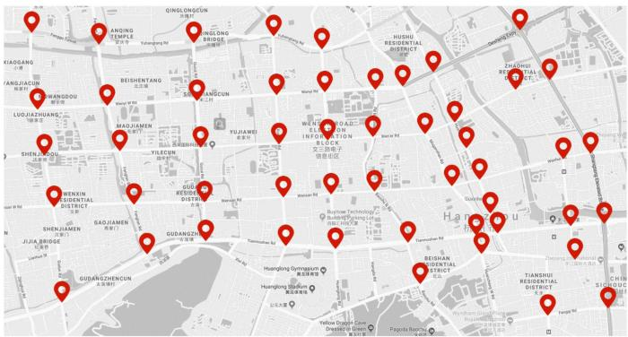  
Fig. 3. The illustration of hotspots in Hangzhou, China.

Expert policy: Experts try to solve Problem P4 by the analyzed result in subsection 4.2 based on centralized management. The whole instantaneous system state can be observed by each expert. When two experts exist, they can obtain their Nash equilibrium based on Theorem 6. When three experts exist, they can solve the formulated problem based on the interior-reflective Newton method [40].

OMD-based solution [41]: A gradient-based policy, which is widely utilized for the Markov game. Agents update their actions by taking steps towards the gradients of their profit functions. We utilize it in our UAV placement issue to maximize the profits of UAV owners.

Multi-agent Deep Deterministic Policy Gradient (MDDPG)-based solution: Similar to [32], we utilize MDDPG in our considered system, where each UAV owner trains its policy based on the actor-critic algorithm with its local observations directly.

## 5.2 Performance Results

## 5.2.1 Impacts of User Budgets

Fig. 4 shows different performance of expert policies, MILU MDDPG-based solution, and OMD-based solution with various values of user budgets. Figs. 4a, 4b, and 4c show the system performance with two UAV owners, and Figs. 4d, 4e, and 4f are that with three UAV owners. The average profits illustrated in Fig. 4a refer to the long-term average profits that UAV owners win. It is obvious that the performance of expert policy is the best, and the designed MILU algorithm merely has a small gap with that of expert policy. However, the performance of MDDPG-based solution and OMD-based solution is much worse than that of the other two algorithms.

This is because the designed MILU algorithm allows learning agents to mimic the behaviors of experts by minimizing their observation-action distributions and those of experts. Although the MDDPG-based solution also allows each UAV owner to learn for determining its action, it can merely learn based on partial observations without the guideline of experts, resulting in poor performance. The OMD-based solution tries to obtain an estimated gradient in each iteration to help UAV owners make decisions. The gradient is largely dependent on an arbitrary convex function, which has a heavy impact on the algorithm performance. When the user budget increases, the trend of average profits also rises. The reason is that users can pursue more services when their budgets increase, and user utilities as well as profits of UAV owners are positive with user budgets.

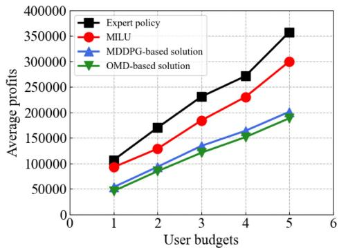  
(a) Average profits of UAV owners

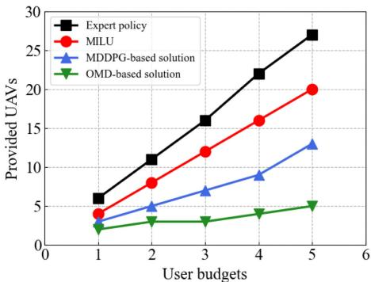  
(b) Provided UAVs

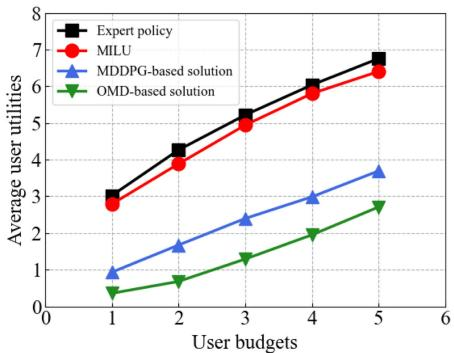  
(c) Average user utilities

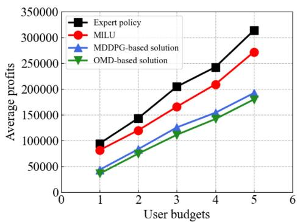  
(d) Average profits of UAV owners

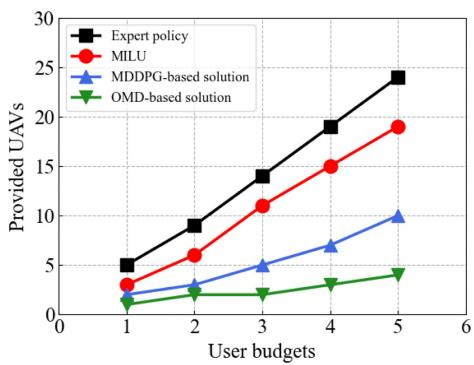  
(e) Provided UAVs

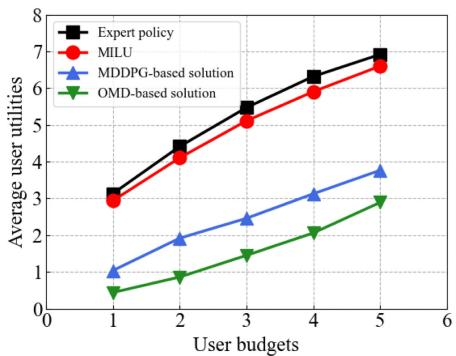  
(f) Average user utilities

Fig. 4. Performance with different user budgets: a), b) and c) with two UAV owners; c), d) and e) when three UAV owners.  
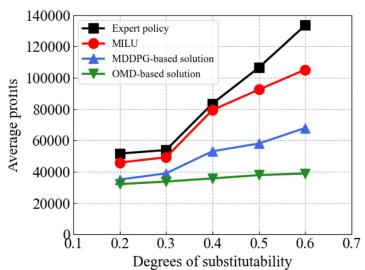  
(a) Average profits of UAV owners

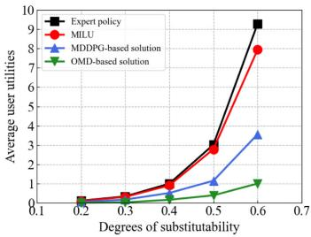  
(b) Average user utilities

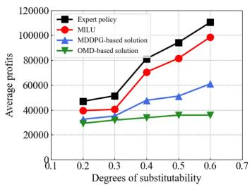  
(c) Average profits of UAV owners

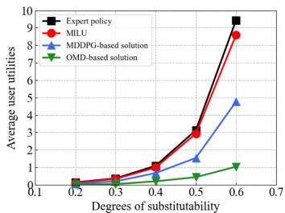  
(d) Average user utilities  
Fig. 5. Performance with different degrees of substitutability: a) and b) with two UAV owners; c) and d) with three UAV owners.

Fig. 4b shows the average number of provided UAVs in each hotspot, where similar trends with Fig. 4a can be found. For instance, when the user budget is 2, the average numbers of provided UAVs of expert policy, MILU, the MDDPG-based solution and the OMD-based solution are 11, 8, 5 and 3, respectively. When the user budget increases to 4, those of the four algorithms are 22, 16, 9 and 4, respectively. This is because expert policy can find the optimal solution based on centralized information, while the designed MILU algorithm obtains a sub-optimal solution caused by the insufficient number of UAVs. The MDDPGbased solution is inefficient in our considered system model since it can be merely trained based on partial observations of learning agents without any global information. The OMD-based solution performs much worse and cannot find the suitable quantities of provided UAVs based on its updated gradient. The performance of average user utilities is illustrated in Fig. 4c. Expert policy can also guarantee the user utilities based on its optimal choices, while the performance of MILU has a small gap with that of the corresponding expert policy.

Figs. 4d, 4e, and 4f have similar trends with Figs. 4a, 4b, and 4c, while the performance of average profits shown in former figures is better than that in latter ones. This is because when there are more UAV owners competing in the game, on-ground users have more choices to meet their demands, and profits of UAV owners become less. In addition, average user utility and provided number of UAVs of MILU with two UAV owners are worse than those of MILU with three UAV owners. This is because users have more choices to be served when the number of UAV owners is large in the system.

## 5.2.2 Impacts of Substitutability Degree

The performance of expert policy, MILU, the MDDPGbased solution and the OMD-based solution with different degrees of substitutability is illustrated in Fig. 5. Figs. 5a and 5b show the performance with two UAV owners, and Figs. 5c and 5d are that with three UAV owners. If the degree of substitutability is high, one service can be replaced by other services with high ratios, i.e., users can accept other similar services provided by UAV owners even with high prices, and verse visa. From Fig. 5a, we can observe that the performance of MILU is much better than that of the MDDPG-based solution and OMD-based solution, and close to that of expert policy. This is because expert policy can find the best policy to reach the Nash equilibrium based on the full information of the system. However, MILU schedules available resources based on partial observations of the system. In addition, more UAV owners result in more fierce competition, and less profits can be gained by each UAV owner. When the degree of substitutability increases, the performance trends of the four algorithms also rise. The reason is that the profit function of UAVs has a positive correlation with the degree of substitutability. UAV owners can increase their prices to a certain extent with the purpose of reaching the Nash equilibrium.

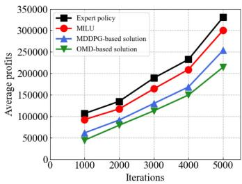  
(a) Average profits of two UAV owners

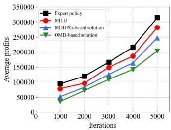  
(b) Average profits of three UAV owners  
Fig. 6. Performance with different iterations.

The average user profits are illustrated in Fig. 5b. We notice that when the degree of substitutability becomes large, the average user utilities increase. For example, when the degree is 0.3, average user utilities achieved by expert policy, MILU, MDDPG-based solution and OMD-based solutions are 0.344, 0.318, 0.174 and 0.037, respectively. When the degree increases to 0.6, the corresponding values are 9.27, 7.93, 3.561 and 1.01, respectively. This is because the fierce competition among different UAV owners affects their costs and prices. When users have more choices, they prefer to purchase services that can maximize their own utilities. Meanwhile, the designed MILU algorithm not only minimizes the gaps between observation-action distributions of agents and those of experts, but also estimates the resource quantities provided by other UAV owners to improve their performance. However, the OMD-based solution merely utilizes an estimated gradient shaped by an arbitrary update function to help UAV owners improve their performance, which has a heavy dependence on the initial input values. Although the learning agents in the MDDPG-based solution train their own learning models based on actor-critic mechanism similar with ours, their actions are not optimal based on their independent training processes without the global information. In addition, Figs. 5c and 5d have similar trends with Figs. 5a and 5b, which have the same reasons with Figs. 4d, 4e, and 4f.

## 5.2.3 Impacts of Iterations

numbers of iterations. Fig. 6a is the trend of average profits of the four algorithms with two UAV owners. It is obvious that the performance of MILU algorithm is very close to that of expert policy, $\mathrm { e . g . }$ , the performance gap between expert policy and MILU is merely around . This is <sup>10%</sup>because learning agents in MILU mimic the behaviors of experts, and can train their learning models offline based on the observation-action pairs of experts. Meanwhile, the average profit increases when the number of iterations becomes large. For example, when the number of iterations is 2000, average profits of the four algorithms are 134876, 117226, 91321 and 79154. When the number of iterations increases to 4000, those of the four algorithms are 232521, 209246, 168455 and 149542. This is because with time goes by, the accumulated profits increase for all the four algorithms. Fig. 6b is average profits of the involved three UAV owners with different iterations, the trend of which is similar with Fig. 6a, while the overall performance is slightly worse than that of Fig. 6a.

## 5.2.4 Fairness

Similar to [11], the fairness of profits among different UAV owners can be obtained by:

$$
F ( t ) = \frac { \left( \sum _ { k = 1 } ^ { K } \sum _ { t ^ { ' } = 0 } ^ { t } \sum _ { h = 1 } ^ { H } \Gamma _ { h k } ( t ^ { ' } ) \right) ^ { 2 } } { K \sum _ { k = 1 } ^ { K } \left( \sum _ { t ^ { ' } = 0 } ^ { t } \sum _ { h = 1 } ^ { H } \Gamma _ { h k } ( t ^ { ' } ) \right) ^ { 2 } } ,\tag{}
$$

where $F ( t )$ reflects the fairness level of UAV owners’ profits. When the profits are balanced among UAV owners, the value of $F ( t )$ is close to 1. We evaluate the performance of fairness in Fig. 7, where Fig. 7a shows the fairness of profits between two UAV owners, and Fig. 7b is that among three UAV owners. From Fig. $^ { 7 } \mathrm { a } ,$ we can observe that the fairness achieved by expert policy is the best, since it can obtain the global information and the optimal service quantities for UAV owners. The performance of MILU algorithm is the second, since learning agents can train their models by sampling observation-action pairs from expert demonstration. The performance of MDDPG-based and OMD-based solutions is far from that of expert policy and MILU algorithm. This is because the MDDPG-based solution lets learning agents to learn their own policies without the interaction of each other, leading to poor fairness with their local observations. The OMD-based solution allows UAV owners to improve their performance based on a shaped gradient. Similar with the MDDPG-based solution, the global information is missed and the gradient may deviate from the optimal direction.

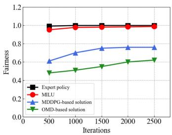

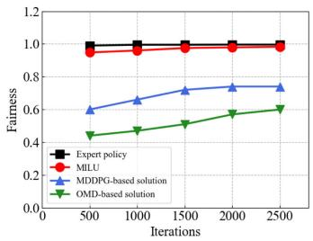  
(a) Faireness with two UAV own- (b) Faireness with three UAV owners ers

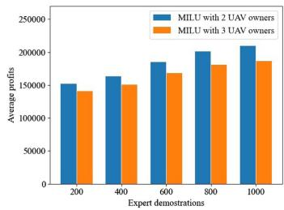  
(a) Average profits of UAV owners

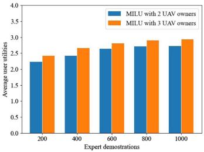  
(b) Average user utilities  
Fig. 8. Performance with different number of expert demonstrations.

Similar with Figs. 7a, 7b shows the fairness of profits among three UAV owners. We can observe that the fairness of the four algorithms improves with the increasing number of iterations. For example, when the number of iterations is 1000, the fairness of expert policy, MILU, MDDPG-based and OMD-based solutions is 0.995, 0.96, 0.66 and 0.47, respectively. When the number of iterations increases to 2000, the fairness of the four algorithms is 0.996, 0.979, 0.74 and 0.57, respectively. This is because learning agents have more knowledge of the system based on the iteration with the environment.

## 5.2.5 Impacts of Expert Demonstrations

As shown in Fig. 8, the impact of expert demonstrations on the system performance is illustrated with MILU in two cases, i.e., with two and three UAV owners, since they are based on imitation learning and utilize expert demonstrations for policy training. The horizontal axis refers to the number of samples contained in the expert demonstration. Fig. 8a is the performance trend of average profits of UAV owners. We notice that when the number of samples in the expert demonstration becomes big, the average profits of UAV owners also become large. This is because agents can have more sampled observation-action pairs to mimic the behaviors of experts. When the number of samples in the expert demonstration increases to 800, the performance trend tends to be gentle. The reason is the number of samples is enough for the agent to minimize the distribution of their observation-action pairs and that of experts.

The average user utilities based on different numbers of samples in the expert demonstration are shown in Fig. 8b. The user utilities increase when the number of samples in the expert demonstration becomes large. The reason is similar with that of Fig. 8a. When the number of samples in the expert demonstration reaches to 800, the agent is capable to reach the minimum performance gap with that of experts based on the integration of GAN and the policy gradient method.

## 5.2.6 Convergence

Fig. 9 shows the convergence iterations of MILU, MDDPGbased and OMD-based solutions with two and three UAV owners, respectively. We can observe that MILU has the fast convergence speed, while the speeds of MDDPG-based and OMD-based solutions are lower. For example, when two UAV owners exist, the convergence iterations of MILU, MDDPG-based and OMD-based solutions are 700, 1200 and 1900, respectively. This is because MILU algorithm learns efficient policies not only by interacting with the environment, but also follows experts’ demonstrations, relieving the drawbacks of partial observations. As a result, MILU algorithm can converge fast. However, MDDPGbased and OMD-based solutions do not have efficient mechanisms to improve their performance by obtaining more knowledge of the system, thus they can merely learn based on their local observations, leading to lower convergence speeds.

Fig. 9. Convergence iterations.  
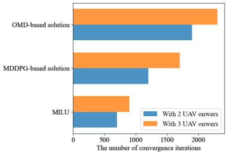

When there are three UAV owners, the number of convergence iterations is larger than that with two UAV owners. For example, the convergence iteration of MILU is 700 with two UAV owners, and becomes 900 with three UAV owners. This is because when there are more UAV owners in the system, more calculation and competitions are required, taking more iterations for convergence.

## 6 CONCLUSION

We have established a UAV-based system model to enable differentiated services provided by different UAV operators. With the purpose of both maximizing the utilities of users and the profits of UAV owners, we proposed an imitation learning enabled UAV deployment algorithm. Initially, we analyzed the Nash equilibrium condition with full knowledge of the system state, based on which we derived expert policies utilized in our imitation learning enabled algorithm. Then, agent policies were designed by minimizing the gaps between their distributions of observationaction pairs and those of experts, which can be trained and executed in a fully decentralized manner even with partial observations. Performance results showed that our algorithm has significant advantages on various metrics, such as average profits, average user utilities and execution time, compared with other representative algorithms.

In future work, we plan to extend our system model to a 3D environment, where not only differentiated services but also spatial impacts, such as shadowing and blockage [42], are considered. As a result, the trajectory design for UAVs as well as the optimal provided services for different service providers need to be jointly optimized.

## REFERENCES

[1] F. Khan, “Multi-comm-core architecture for terabit-per-second wireless,” IEEE Commun. Mag., vol. 54, no. 4, pp. 124–129, Apr. 2016.

[2] X. Wang and L. Duan, “Dynamic pricing and capacity allocation of UAV-provided mobile services,” in Proc. IEEE INFOCOM, 2019, pp. 1855–1863.

[3] Uavs.org, “Unmanned aerial vehicle systems association commercial applications,” 2016. [Online]. Available: https://www.uavs. org/commercial.

[4] A. Hanscom and M. Bedford, "Unmanned aircraft system (UAS) service demand 2015–2035, literature review & projections of future usage,” Res. Innov. Technol. Admin., US Dept. Transp., Washington, DC, USA, Tech. Rep. DOT-VNTSC-DoD-13–01, 2013.

[5] N. Liba and J. Berg-J urgens, “Accuracy of orthomosaic generated <sup>€</sup>by different methods in example of UAV platform MUST Q,” in Proc. IOP Conf. Ser. Mater. Sci. Eng., 2015, Art. no. 8.

[6] Z. Ning et al., “Partial computation offloading and adaptive task scheduling for 5G-enabled vehicular networks,” IEEE Trans. Mobile Comput., early access, Sep. 18, 2020, doi: 10.1109/TMC.2020.3025116.

[7] C. Xu, Y.-F. Zhang, G. Zhu, Y. Rui, H. Lu, and Q. Huang, “Using webcast text for semantic event detection in broadcast sports video,” IEEE Trans. Multimedia, vol. 10, no. 7, pp. 1342–1355, Nov. 2008.

[8] J. Clement, “Internet usage worldwide-statistics & facts,” 2020. [Online]. Available: https://www.statista.com/topics/1145/internetusage-worldwide/

[9] X. Zhou, K. Wang, W. Jia, and M. Guo, “Reinforcement learningbased adaptive resource management of differentiated services in geo-distributed data centers,” in Proc. IEEE/ACM 25th Int. Symp. Qual. Service, 2017, pp. 1–6.

[10] C. Dovrolis, D. Stiliadis, and P. Ramanathan, “Proportional differentiated services: Delay differentiation and packet scheduling,” IEEE/ACM Trans. Netw., vol. 10, no. 1, pp. 12–26, Feb. 2002.

[11] L. Wang, K. Wang, C. Pan, W. Xu, N. Aslam, and L. Hanzo, “Multi-agent deep reinforcement learning based trajectory planning for multi-UAV assisted mobile edge computing,” IEEE Trans. Cogn. Commun. Netw., vol. 7, no. 1, pp. 73–84, Mar. 2021.

[12] S. Jeong, O. Simeone, and J. Kang, “Mobile edge computing via a UAV-mounted cloudlet: Optimization of bit allocation and path planning,” IEEE Trans. Veh. Technol., vol. 67, no. 3, pp. 2049–2063, Mar. 2018.

[13] X. Liu, Y. Liu, N. Zhang, W. Wu, and A. Liu, “Optimizing trajectory of unmanned aerial vehicles for efficient data acquisition: A matrix completion approach,” IEEE Internet of Things J., vol. 6, no. 2, pp. 1829–1840, Apr. 2019.

[14] X. Xu, L. Duan, and M. Li, “Strategic learning approach for deploying UAV-provided wireless services,” IEEE Trans. Mobile Comput., vol. 20, no. 3, pp. 1230–1241, Mar. 2021.

[15] L. Hu, Y. Tian, J. Yang, T. Taleb, L. Xiang, and Y. Hao, “Ready player one: UAV-clustering-based multi-task offloading for vehicular VR/AR gaming,” IEEE Netw., vol. 33, no. 3, pp. 42–48, May/Jun. 2019.

[16] M. Chen, M. Mozaffari, W. Saad, C. Yin, M. Debbah, and C. S. Hong, “Caching in the sky: Proactive deployment of cache-enabled unmanned aerial vehicles for optimized quality-of-experience,” IEEE J. Sel. Areas Commun., vol. 35, no. 5, pp. 1046–1061, May 2017.

[17] R. K. Sheshadri, E. Chai, K. Sundaresan, and S. Rangarajan, “SkyHaul: An autonomous gigabit network fabric in the sky,” 2020. [Online]. Available: https://arxiv.org/abs/2006.11307

[18] C. H. Liu, Z. Dai, Y. Zhao, J. Crowcroft, D. O. Wu, and K. Leung, “Distributed and energy-efficient mobile crowdsensing with charging stations by deep reinforcement learning,” IEEE Trans. Mobile Comput., vol. 20, no. 1, pp. 130–146, Jan. 2021.

[19] A. Asheralieva and D. Niyato, “Hierarchical game-theoretic and reinforcement learning framework for computational offloading in UAV-enabled mobile edge computing networks with multiple service providers,” IEEE Internet of Things J., vol. 6, no. 5, pp. 8753–8769, Oct. 2019.

[20] L. Bertizzolo et al., “SwarmControl: An automated distributed control framework for self-optimizing drone networks,” in Proc. IEEE Conf. Comput. Commun., 2020, pp. 1768–1777.

[21] X. Wang, Z. Ning, S. Guo, and L. Wang, “Imitation learning enabled task scheduling for online vehicular edge computing,” IEEE Trans. Mobile Comput., early access, Jul. 28, 2020, doi: 10.1109/TMC.2020.3012509.

[22] X. Wang, Z. Ning, and S. Guo, “Multi-agent imitation learning for pervasive edge computing: A decentralized computation offloading algorithm,” IEEE Trans. Parallel Distrib. Syst., vol. 32, no. 2, pp. 411–425, Feb. 2021.

[23] J. Ho and S. Ermon, “Generative adversarial imitation learning,” in Proc. Advances Neural Inf. Process. Syst., 2016, pp. 4565–4573.

[24] T. Kimura and M. Ogura, “Distributed collaborative 3D-deployment of UAV base stations for on-demand coverage,” in Proc. IEEE Conf. Comput. Commun., 2020, pp. 1748–1757.

[25] L. Yang, H. Yao, J. Wang, C. Jiang, A. Benslimane, and Y. Liu, “Multi-UAV-enabled load-balance mobile-edge computing for IoT networks,” IEEE Internet of Things J., vol. 7, no. 8, pp. 6898–6908, Aug. 2020.

[26] P. Wu, F. Xiao, H. Huang, and R. Wang, “Load balance and trajectory design in multi-UAV aided large-scale wireless rechargeable networks,” IEEE Trans. Veh. Technol., vol. 69, no. 11, pp. 13756–13767, Nov. 2020.

[27] A. Agliari, A. K. Naimzada, and N. Pecora, “Nonlinear dynamics of a Cournot duopoly game with differentiated products,” Appl. Math. Comput., vol. 281, pp. 1–15, 2016.

[28] T. Zhu, J. Li, Z. Cai, Y. Li, and H. Gao, “Computation scheduling for wireless powered mobile edge computing networks,” in Proc. IEEE Conf. Comput. Commun., 2020, pp. 596–605.

[29] J. Song, H. Ren, D. Sadigh, and S. Ermon, “Multi-agent generative adversarial imitation learning,” in Proc. Advances Neural Inf. Process. Syst., 2018, pp. 7461–7472.

[30] M. Liu et al., “Multi-agent interactions modeling with correlated policies,” in Proc. Int. Conf. Learn. Representations, 2020, pp. 1–20.

[31] V. R. Konda and J. N. Tsitsiklis, “Actor-critic algorithms,” in Proc. Advances Neural Inf. Process. Syst., 2000, pp. 1008–1014.

[32] C. H. Liu, Z. Chen, and Y. Zhan, “Energy-efficient distributed mobile crowd sensing: A deep learning approach,” IEEE J. Sel. Areas Commun., vol. 37, no. 6, pp. 1262–1276, Jun. 2019.

[33] Video trace library, 2010. [Online]. Available: http://trace.eas.asu. edu/

[34] K. Kavvadias, “Energy price spread as a driving force for combined generation investments: A view on Europe,” Energy, vol. 115, pp. 1632–1639, 2016.

[35] W. J. Fredericks, M. D. Moore, and R. C. Busan, “Benefits of hybrid-electric propulsion to achieve 4x cruise efficiency for a VTOL UAV,” in Proc. Int. Powered Lift Conf., 2013, Art. no. 4324.

[36] E. B. Mondino and M. Gajetti, “Preliminary considerations about costs and potential market of remote sensing from UAV in the italian viticulture context,” Eur. J. Remote Sens., vol. 50, no. 1, pp. 310–319, 2017.

[37] X. Hou, Y. Li, M. Chen, D. Wu, D. Jin, and S. Chen, “Vehicular fog computing: A viewpoint of vehicles as the infrastructures,” IEEE Trans. Veh. Technol., vol. 65, no. 6, pp. 3860–3873, Jun. 2016.

[38] J. Martens and R. Grosse, “Optimizing neural networks with Kronecker-factored approximate curvature,” in Proc. Int. Conf. Mach. Learn., 2015, pp. 2408–2417.

[39] V. Mnih et al., “Asynchronous methods for deep reinforcement learning,” in Proc. Int. Conf. Mach. Learn., 2016, pp. 1928–1937.

[40] T. F. Coleman and Y. Li, “On the convergence of interior-reflective Newton methods for nonlinear minimization subject to bounds,” Math. Program., vol. 67, no. 1/3, pp. 189–224, 1994.

[41] Z. Zhou, P. Mertikopoulos, A. L. Moustakas, N. Bambos, and P. Glynn, “Mirror descent learning in continuous games,” in Proc. IEEE 56th Annu. Conf. Decis. Control, 2017, pp. 5776–5783.

[42] L. Wang, K. Wang, C. Pan, W. Xu, N. Aslam, and A. Nallanathan, “Deep reinforcement learning based dynamic trajectory control for UAV-assisted mobile edge computing,” IEEE Trans. Mobile Comput., early access, Feb. 16, 2021, doi: 10.1109/TMC.2021.3059691.


Xiaojie Wang (Member, IEEE) received the PhD degree from the Dalian University of Technology, Dalian, China, in 2019. After that, she was a postdoctor with the Hong Kong Polytechnic University. Currently, she is a distinguished professor with the College of Communication and Information Engineering, Chongqing University of Posts and Telecommunications, Chongqing, China. Her research interests include wireless networks, mobile edge computing, and machine learning. She has published more than 40 scientific papers in interna-

tional journals and conferences, such as IEEE Journal on Selected Areas in Communications, IEEE Transactions on Mobile Computing, IEEE Transactions on Parallel and Distributed Systems, and IEEE Communications Surveys and Tutorials.


Zhaolong Ning (Senior Member, IEEE) received the PhD degree from Northeastern University, Shenyang, China, in 2014. He was a research fellow with Kyushu University from 2013 to 2014, Japan. Currently, he is a full professor with the College of Communication and Information Engineering, Chongqing University of Posts and Telecommunications, Chongqing, China. His research interests include Internet of Things, mobile edge computing, deep learning, and resource management. He has published more than 120 scientific papers in international journals and conferences. He serves as an associate editor or guest editor of several journals, such as the IEEE Transactions on Industrial Informatics, IEEE Transactions on Social Computational Systems, The Computer Journal and so on.


Song Guo (Fellow, IEEE) is a full professor with the Department of Computing, Hong Kong Polytechnic University. He also holds a Changjiang chair professorship awarded by the Ministry of Education of China. His research interests include mainly in the areas of big data, edge AI, mobile computing, and distributed systems. He co-authored four books, co-edited seven books, and published more than 500 papers in major journals and conferences. He is the recipient of more than 12 best paper awards from IEEE/ACM conferences, journals, and technical committees. His work was also recognized by the 2016 Annual Best of Computing: Notable Books and Articles in computing in ACM Computing Reviews. His research has been sponsored by RGC, NSFC, MOST, industry, etc. He is the editor-in-chief of IEEE Open Journal of the Computer Society and the chair of IEEE Communications Society (ComSoc) Space and Satellite Communications Technical Committee. He was an IEEE ComSoc distinguished lecturer and a member of IEEE ComSoc Board of Governors. He has also served for IEEE Computer Society on Fellow Evaluation Committee, Transactions Operations Committee, editor-in-chief Search Committee, etc. He has been named on editorial board of a number of prestigious international journals like IEEE Transactions on Parallel and Distributed Systems, IEEE Transactions on Cloud Computing, IEEE Internet of Things Journal, etc. He has also served as chairs of organizing and technical committees of many international conferences. He is a highly cited researcher (Web of Science), and an ACM distinguished member.


Miaowen Wen (Senior Member, IEEE) received the PhD degree from Peking University, Beijing, China, in 2014. From 2019 to 2021, he was with the Department of Electrical and Electronic Engineering, University of Hong Kong, Hong Kong, as a post-doctoral research fellow. He is currently an associate professor with the South China University of Technology, Guangzhou, China. He has published two books and more than 130 journal papers. His research interests include a variety of topics in the areas of wireless and molecular

communications. He was a recipient of the IEEE ComSoc Asia-Pacific Outstanding Young Researcher Award in 2020, and four Best Paper Awards from the IEEE ITST’12, the IEEE ITSC’14, the IEEE ICNC’16, and the IEEE ICCT’19. He was the winner in data bakeoff competition (Molecular MIMO) at IEEE Communication Theory Workshop (CTW) 2019, Selfoss, Iceland. He served as a guest editor of the IEEE Journal on Selected Areas in Communications and of the IEEE Journal of Selected Topics in Signal Processing. Currently, he is serving as an editor of the IEEE Transactions on Communications, IEEE Transactions on Molecular, Biological, and Multi-Scale Communications, and IEEE Communications Letters.

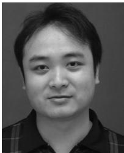

Lei Guo received the PhD degree from the University of Electronic Science and Technology of China, Chengdu, China, in 2006. He is currently a full professor with the Chongqing University of Posts and Telecommunications, Chongqing, China. He has authored or coauthored more than 200 technical papers in international journals and conferences. He is an editor for several international journals. His current research interests include communication networks, optical communications, and wireless communications.


H. Vincent Poor (Life Fellow, IEEE) received the PhD degree in electrical engineering and computer sciences from Princeton University, Princeton, New Jersey, in 1977. From 1977 until 1990, he was on the faculty with the University of Illinois at Urbana-Champaign. Since 1990, he has been on the faculty at Princeton, where he is currently the Michael Henry Strater University professor. During 2006 to 2016, he served as the dean of Princeton’s School of Engineering and Applied Science. He has also held visiting appointments at several other universities, including most recently at Berkeley and Cambridge. His research interests include the areas of information theory, machine learning and network science, and their applications in wireless networks, energy systems, and related fields. Among his publications in these areas is the forthcoming book Machnie Learning and Wireless Communications (Cambridge University Press). He is a member of the National Academy of Engineering and the National Academy of Sciences and is a foreign member of the Chinese Academy of Sciences, the Royal Society, and other national and international academies. He received the IEEE Alexander Graham Bell Medal, in 2017.

" For more information on this or any other computing topic, please visit our Digital Library at www.computer.org/csdl.