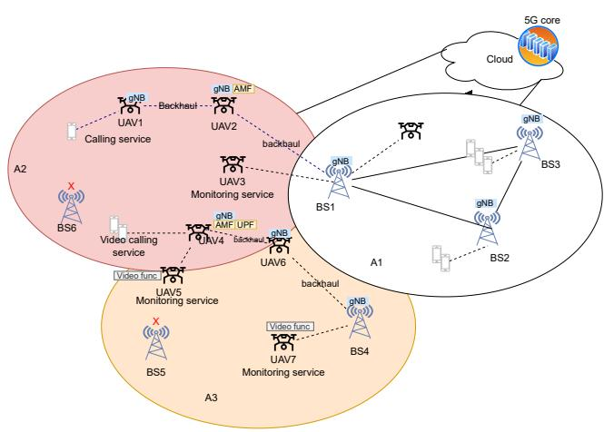
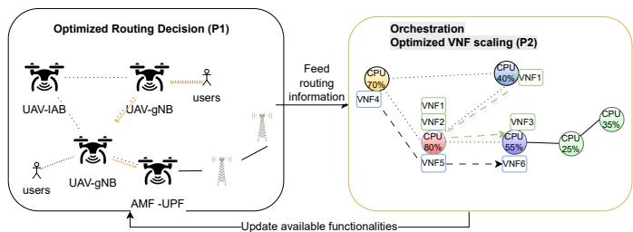
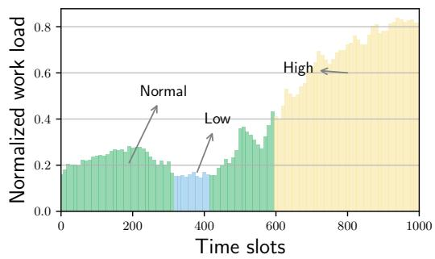
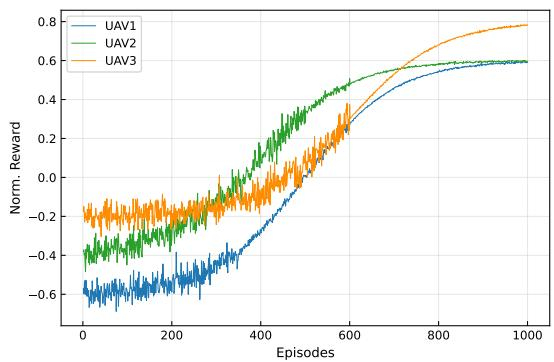
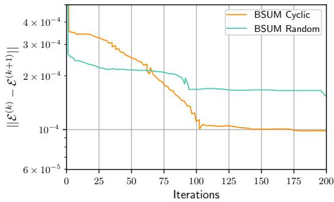
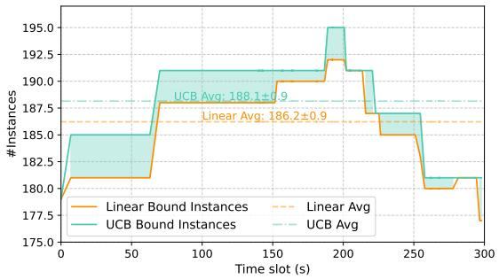
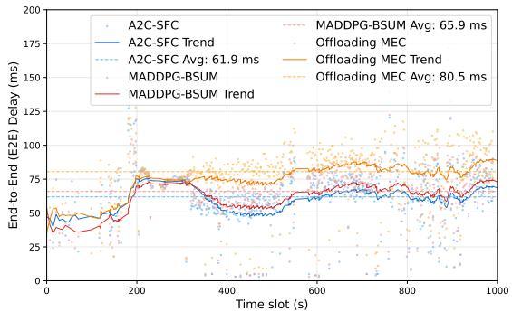
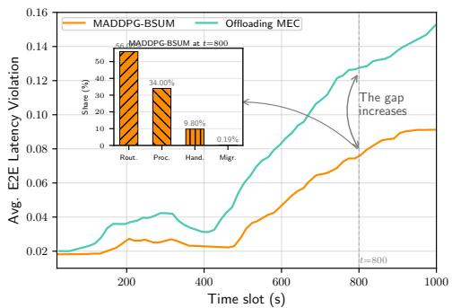
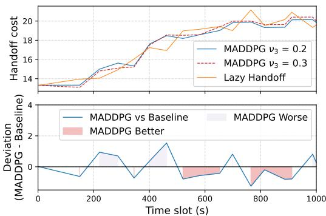
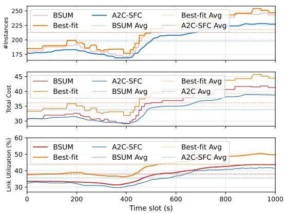

# Dynamic VNF Orchestration for UAV-Aided Emergency Networks: A Learning and Optimization Control Loop Framework

Chuan Pham∗ †, Kim Khoa Nguyen∗,

∗ Department of Electrical Engineering, Ecole de Technologie Sup ´ erieure (ETS),´ Universite du Qu´ ebec, H3C1K3, Canada,´

† Department of Information Technology, Hoa Sen University, HCMC, Vietnam.

Abstract—Today, the integration of Unmanned Aerial Vehicles (UAVs) and open-source 5G frameworks (e.g., OpenAirInterface, Open5GS) has become an emerging solution to address many communication challenges in various emergency scenarios. While UAVs can provide a rapid and flexible deployment that traditional base stations cannot achieve, open-source 5G frameworks remove the need for proprietary hardware and automate operations by virtualization in telecom deployments. This research focuses on emergency scenarios where the terrestrial infrastructure fails to satisfy coverage, such as in forests or maritime environment. We investigate the impact of optimized routing strategies in the split O-RAN architecture, aiming to optimize the quality of service (QoS) in uncertain and dynamic coverage environments. To address these challenges, we propose an optimization control loop for Service Function Chain (SFC)-enabled services, with a strong emphasis on deploying 5G functionalities within the split O-RAN architecture. This framework decomposes the problem into two subproblems: (1) a routing optimization across terrestrial and non-terrestrial networks, addressed using a Multi-Agent Deep Deterministic Policy Gradient (MADDPG)-based method, and (2) a dynamic VNF scaling problem for SFC deployment, solved with a Block-Successive-Upper-Bound-Minimization (BSUM)- based algorithm. Leveraging the flexibility of the 5G split O-RAN architecture, we implement and evaluate our solutions in a UAVassisted emergency setting. Extensive simulations demonstrate that our approach outperforms existing benchmarks in resource efficiency, service reliability, and cost-effectiveness.

Index Terms—Virtual network function (VNF), service function chain (SFC), (Open Radio Access Network) O-RAN, Block Successive Upper Bound Minimization (BSUM), Reinforcement Learning, Multi-agent Deep Deterministic Policy Gradient (MADDPG).

## I. INTRODUCTION

5G and beyond mobile communication networks are projected to enable flexible deployment while delivering significantly faster speeds, higher bandwidth, lower latency, and greater reliability compared to traditional networks [1]. These advancements offer numerous applications such as ultralow-latency services, real-time surveillance, virtual/augmented reality (AR/VR), autonomous vehicles, and mission-critical services. Such technologies can facilitate many potential solutions for emergency scenarios, such as disasters, and rescue operations [1]. However, in such emergency cases (e.g., forests or regions with damaged infrastructure-based terrestrial networks), the system often fails to operate emergency services. To address this problem, unmanned aerial vehicles (UAVs) equipped with 5G functions have been considered as an emerging solution due to their rapid and flexible deployment, adaptive coverage and cost-effectiveness.

Leveraging the split O-RAN architecture [2] in which 5G RAN and 5G core functions can be virtualized and flexibly deployed on computing resources as virtual network functions (VNFs) [2]–[4], UAVs can host containerized network services. This enables plug-and-play 5G networks in areas that lack traditional infrastructure. Nevertheless, achieving end-toend (E2E) latency and data rate constraints poses significant challenges in resource-constrained environments (e.g., battery, payload, and computing resources).

Recent research has primarily focused on optimizing computing resources and network bandwidth for deploying service function chains (SFCs), but it has not focused on specific scenarios of emergency environments. For instance, prior works have explored resource allocation to minimize latency [3]–[5] and VNF placement to reduce queuing delays, but the impact of multipath routing strategies and multi-instance VNF scaling on E2E latency in dynamic environments (e.g., varying node locations, link quality or traffic load) remains underexplored. The interplay between routing strategies and VNF scaling in UAV-assisted networks, particularly under unpredictable traffic in emergencies, is also unaddressed.

With regard to rapid network deployment for emergency scenarios, [6]–[8] focus on implementation testbeds without addressing the network service chain optimization as explored in [3], [4]. In traditional networks, the infrastructure relies on a fixed 5G/6G RAN and core functions while focusing on balancing latency and cost with predefined plans. In contrast, in emergency scenarios with UAV-assisted systems, the network topology becomes dynamic because of UAVs’ timevarying positions. Although the UAV-based architecture may not match the performance of tower-based systems, they prioritize reliability and meeting rescue operation requirements, in which the RAN and core functions are considered scalable to handle bursty, mission-critical traffic with limited battery and resource constraints. For example, in Fig. 1, the system has condition, while in areas A2 and A3, UAV base stations (UAV-BSs) have to be deployed to support emergency services, such as voice call, video calls, and monitoring. Due to the lack of terrestrial towers, some UAVs have to enable backhaul and gNB functions, while others host 5G core functions (e.g., AMF, UPF) to satisfy user requests. Scaling decisions must account for dynamic topology and resource constraints (e.g., computing resources, link quality and battery) and optimize routing between VNFs in SFCs to adapt to unpredictable demand.

  
Fig. 1: The system model of VNF-enabled services.

Therefore, in this work, we study the joint end-to-end (E2E) latency and VNF scaling problem in UAV-assisted emergency networks, focusing on a system spanning access from RAN to the core, operated by hybrid base stations (e.g., UAV-mounted flying base stations and terrestrial base stations). We consider dynamic service function chains (SFCs) that adapt to emergency service demands. We propose a control loop to adjust routing decisions for SFCs based on scaling decisions, while prior routing configurations influence subsequent scaling. Our work incorporates considerations of bandwidth degradation, dynamic path loss, and energy consumption into our problem formulation, though we assume stable channel conditions in a specific time slot, sufficient battery capacity and transparent UAV swapping to focus on routing and scaling optimization. These assumptions simplify the model, and may not fully capture real-world complexities, which we acknowledge as limitations to be addressed in future work.

To address this joint optimization problem, we formulate a latency-aware optimization problem to minimize the E2E latency through data rate allocation, followed by a dynamic VNF scaling problem to minimize operational costs based on traffic information. These problems are solved sequentially within the control loop to optimize system performance. Although interdependent, they operate on different time scales: VNF scaling occurs less frequently than routing updates. We employ machine learning and approximation-based optimization methods to solve these problems, including: i) a Multi-Agent Deep Deterministic Policy Gradient (MADDPG)

each UAV-BS acts as an agent making routing decisions; ii) a Block Successive Upper-Bound Minimization (BSUM) algorithm [11], [12] to decompose the VNF scaling problem into solvable subproblems.

In summary, our main contributions are:

• Optimized Control Loop for E2E Latency and VNF Scaling: We propose a framework to jointly optimize traffic routing and VNF scaling for SFCs from access networks to core networks. The framework addresses two interdependent subproblems:

1) Latency-aware minimization: Optimizes flow routing based on SFC placement to minimize end-to-end (E2E) latency.

2) Dynamic VNF scaling: Minimizes operational costs while adapting to non-stationary traffic demands.

• MADDPG-BSUM control loop: We design a control loop that combines: i) a MADDPG method for real-time optimization of routing paths and rate allocations; and ii) a BSUM algorithm for resource-efficient VNF scaling decisions.

• Performance evaluation: Our extensive simulations demonstrate outstanding performance compared to baseline methods in terms of SFC acceptance rate, E2E latency, and computational efficiency.

The rest of this study is organized as follows. In Section II, we discuss selected prior works that relate to our study. In Section III, we present two problem formulations of VNFenabled service chain deployment for UAV-assisted system including the latency-aware minimization problem P1 and the dynamic VNF scaling problem P2. Section IV discusses the solutions to solve the proposed problems. We then present the simulation result in Section V. Finally, we conclude our work in Section VI.

## II. RELATED WORK

In this section, we review selected prior works on this topic.

## A. Open-source solutions for UAV-assisted networks

Recently, OpenAirInterface (OAI) [16] has been regarded as one of the leading 5G open-source implementations, following 3GPP standards to provide a comprehensive software stack for 4G and 5G network. As demonstrated in [17], the authors have showcased the flexibility of the OAI framework in supporting both LTE and 5G, making it applicable to various emergency use-cases with terrestrial and non terrestrial networks. Similarly, [18], another open-source LTE/5G framework, has a highly active developer community that continuously updates and improve the functionalities and features. However, unlike OAI, which focuses on both 4G/5G RAN and core functions, srsRAN primarily emphasizes RAN implementation to ensure high performance and stability. These RAN open-source frameworks offer potential solutions for UAV-based architectures, enabling the extension of 5G capabilities with dynamic service provisioning in specific geographic areas [19], [20]. Beyond the RAN domain, Open5GS [21] is another open-

Release 15. It is lightweight and resource-efficient, making it well-suited for enabling flying 5G cores [22]. While these frameworks hold significant potential for various emergency use cases, they require specific architectures and algorithms for effective management and operation.

B. Comparative analysis of VNF scaling and latency strate-$g i e _ { \mathrm { f h e } }$ integration of Unmanned Aerial Vehicles (UAVs) into LTE/5G emergency systems has witnessed significant advancements. Recent studies, including [4], [5], [13]–[15] emphasize the deployment of UAV-based systems utilizing ad-hoc modes to address the unavailability of terrestrial infrastructure during disasters. Specifically, [5] proposes a 5G-UAV resource allocation framework using MILP, improving user throughput but overlooking dynamic scaling costs. [13] explores UAVenabled 5G emergency architectures, increasing coverage in trials but noting a latency overhead due to static routing and limitation of the adhoc mode. [14] provides a comprehensive overview of emergency communication networks, highlighting UAVs’ role in extending coverage, though it lacks VNFspecific optimization for scalable services. [15] presented a solution for VNF deployment and UAV trajectory using online DRL. However, they formulate a different UAV-based model compared to our work and did not focus on optimizing the SFC scaling problem. The recent study [4] introduces a joint optimization of VNF deployment and UAV trajectory planning, focusing on minimizing energy consumption and request acceptance costs in multi-UAV edge networks, validated through simulations with UAVs serving ground users (GUs). However, they consider a static placement without regarding the routing and VNF scaling interdependence. Furthermore, their deployment model did not explore the potentials of opensource 5G frameworks and O-RAN split architecture where UAV nodes can host not only 5G RAN functions but also 5G core functions. Such an advance makes the network system more flexible and cost-effectiveness but more complicated than relying on the traditional MEC architecture. To summarize, we present the comparative analysis in Table I.

## III. SYSTEM MODEL AND PROBLEM STATEMENT

## A. System model

We begin by describing the system to define the scope of our work. We consider an emergency network comprising multi-cell sites covered by existing tower base stations, UAV base stations, along with a set of network functions (e.g., LTE/5G core functions, firewall, router, etc., to operate given network services). VNF-based network services are placed at multiple nodes (e.g., UAV, edge/cloud nodes). A node has computational resources to deploy different 5G network functions, such as gNB, gateway, 5G core (e.g., AMF, UPF, SMF). The network system is denoted by $G = \{ \nu , \varepsilon \}$ , which consists of $| \nu |$ nodes, including all the network nodes from the access to the core including UAV-based nodes, base stations, edge nodes, routers and cloud nodes. And, a set of physical links connects these network nodes as a graph. Adopting the extend the coverage area to another UAV by enabling donor and mobile terminal (MT) functions.

All the notations of the system model and problem statement are summarized in Table II.

## B. Problem 1: Latency-aware optimization

As shown in Fig. 1, we demonstrate a toy example of an emergency communication network. There is a set of users associated with SFCs, such as calling, video calling, and monitoring services. These users can be UAVs deployed for emergency operations, victims requiring assistance, or emergency response workers. The system environment is visualized by different colors, in which the red and yellow (corresponding to areas A1 and A2, respectively) represent the zones with insufficient network coverage. Suppose that each user requests one session. Hence, we assume that there are client sessions, each requires a minimum flow rate w to run its service. We assume that users, who belong to the same service, might have the same minimum rate requirement. A user can connect to different BSs, but at one time slot, we assume that there is only one BS that can serve the UE. Due to the dynamic connectivity between nodes in this system, the network environment (e.g., bandwidth, latency, availability) varies over time. We denote the possible paths of flow i as $\mathcal { P } _ { i } = \{ P _ { i 1 } , . . . P _ { i k _ { i } } \}$ and corresponding to each path $P _ { i j }$ , we use $L _ { j } , j = 1 , . . . , k _ { i }$ to represent the total latency of path j. For example, the call service can be served by UAV1, UAV2, BS1 and Cloud. Meanwhile the video calling service can be served by UAV4, UAV5, BS4 and Cloud. Note that the UAV is able to operate 5G Core, they can serve UE requests locally without routing to 5G Core in the Cloud. Then, we define the rate allocation variable $w _ { i j } ( t )$ at time t to allocate for each flow i on each path j.

1) Capacity constraint: To operate user flows in this system, the total allocated flow data rate should be lower than the bandwidth capacity of each link $e \in { \mathcal { E } }$ . The network includes both wireless links (e.g., UAV-to-UAV and UAV-to-ground, subject to dynamic degradation from mobility, path loss, and fading) and wired links (e.g., fiber backhaul between terrestrial BSs and cloud/edge nodes, with stable high capacity). To formulate this constraint, we denote $a _ { e , j }$ as a binary parameter to indicate that link e belongs to path j or not, and $\varnothing _ { e } \in \{ 0 , 1 \}$ as an indicator $( \rho _ { e } = 1$ for wireless, 0 for wired). Hence, we formulate the following constraint:

$$
\sum _ { i \in \mathbb { Z } , j \in \mathcal { P } i } w i j ( t ) a _ { e , j } \le B _ { e } ( t ) , \quad \forall e \in \mathcal { E } , \forall t ,\tag{1}
$$

where the dynamic link capacity is:

$$
B _ { e } ( t ) = ( 1 - \phi _ { e } ) C _ { e } + \phi _ { e } B _ { \mathrm { m a x } } \log _ { 2 } \left( 1 + \mathrm { S N R } _ { e } ( t ) \operatorname* { P r } _ { L o S } ( e , t ) \right) ,
$$

with $C _ { e }$ the fixed wired capacity (e.g., 100 Gbps for fiber), and for wireless $( \rho _ { e } = 1 )$ . The Signal-to-Noise ratio is calculated by SNRe $\begin{array} { r } { \mathbf { \rho } ( t ) = \frac { P _ { t x } } { N _ { 0 } + P L \left( d _ { e } \right) } , P L \left( d _ { e } \right) = 1 0 ^ { 3 . 3 \log _ { 1 0 } \left( d _ { e } \right) } } \end{array}$ $P _ { t x } ~ = ~ 2 7 . 0$ dBm, $N _ { 0 } \stackrel { \cdot } { = } - 1 7 . 1$ dBm/Hz, path loss factor 3.3, distance $d _ { e }$ , and $\begin{array} { r } { \operatorname* { P r } _ { L o S } ( e , t ) = \frac { 1 } { 1 + a e ^ { - b ( \theta _ { e } ( t ) - a ) } } } \end{array}$ (elevation $\theta _ { e } ( t ) \ = \ \tan ^ { - 1 } ( h _ { v } / d _ { h } )$ , parameters $\dot { a } = 9 . 6 , b = 0 . 2 8$ for suburban emergencies. Wired links neglect SNR/path lossnloaded on July 05,2026 at 09:22:19 UTC from IEEE Xplore. Restrictions apply. g and training of artificial intelligence and similar technologies. Personal use is permitted,

<table><tr><td rowspan=1 colspan=1>Ref.</td><td rowspan=1 colspan=1>Optimization Fo-cus</td><td rowspan=1 colspan=1>Techniques</td><td rowspan=1 colspan=1>UAV Integration</td><td rowspan=1 colspan=1>EmergencyHandling</td><td rowspan=1 colspan=1>Limitations</td></tr><tr><td rowspan=1 colspan=1>[5]</td><td rowspan=1 colspan=1>5G-UAV resourceallocation</td><td rowspan=1 colspan=1>MILP</td><td rowspan=1 colspan=1>Single UAV 5G</td><td rowspan=1 colspan=1>Disaster recovery</td><td rowspan=1 colspan=1>Improves throughput but ignoresdynamic scaling costs.</td></tr><tr><td rowspan=1 colspan=1>[13]</td><td rowspan=1 colspan=1>UAV-enabled5G    emergencyarchitecture</td><td rowspan=1 colspan=1>System-leveldesign</td><td rowspan=1 colspan=1>Multi-UAV   ad-hocmode</td><td rowspan=1 colspan=1>Disaster    coverage(trial deployments)</td><td rowspan=1 colspan=1>Latency overhead due to staticrouting; limited by ad-hoc mode.</td></tr><tr><td rowspan=1 colspan=1>[14]</td><td rowspan=1 colspan=1>Emergencycommunicationoverview</td><td rowspan=1 colspan=1>Survey/analytical</td><td rowspan=1 colspan=1>UAVs as coverage ex-tenders</td><td rowspan=1 colspan=1>General disaster sce-narios</td><td rowspan=1 colspan=1>Lacks VNF-specific optimiza-tion for scalable services.</td></tr><tr><td rowspan=1 colspan=1>[15]</td><td rowspan=1 colspan=1>VNF  deployment&amp; UAV trajectory</td><td rowspan=1 colspan=1>Online DRL</td><td rowspan=1 colspan=1>Multi-UAV edge</td><td rowspan=1 colspan=1>Partial/no  coveragezones</td><td rowspan=1 colspan=1>Different  UAV-based  model;does not address SFC scalingoptimization.</td></tr><tr><td rowspan=1 colspan=1>[4]</td><td rowspan=1 colspan=1>VNF  deployment&amp; UAV trajectory</td><td rowspan=1 colspan=1>MILP + heuristics</td><td rowspan=1 colspan=1>Multi-UAV MEC</td><td rowspan=1 colspan=1>Disaster areas withground users</td><td rowspan=1 colspan=1>Static placement; ignores rout-ing and VNF scaling interdepen-dence; does not leverage open-source 5G or O-RAN split.</td></tr><tr><td rowspan=1 colspan=1>OurWork</td><td rowspan=1 colspan=1>Joint E2E latency&amp; VNF scaling</td><td rowspan=1 colspan=1>MADDPG(routing) + BSUM(scaling)</td><td rowspan=1 colspan=1>Multi-UAV hybrid O-RAN</td><td rowspan=1 colspan=1>Dynamic emergencytraffic</td><td rowspan=1 colspan=1>Addresses   interdependencies,dynamic UAVs, and O-RANsplit; optimize latency and totalcost.</td></tr></table>

TABLE I: Comparative analysis of UAV-assisted VNF optimization approaches in emergency scenarios.

(negligible attenuation 0.2 dB/km. We assume that during a short operation period (e.g., 30 minutes to 1 hour depending on the UAV life time), we could obtain a static environment condition for the path loss calculation.

2) Minimum data rate constraint: We also secure emergency flow i (e.g., users in coverage areas require a baseline rate for connectivity), by setting the constraint for the data rate allocation as follows:

$$
\sum _ { j \in \mathcal { P } i } w _ { i j } ( t ) \geq \bar { w } _ { i } , \forall i \in \mathcal { I } , \forall t .\tag{2}
$$

3) Queuing constraint: Furthermore, to serve user requests, a node has a processing capacity to queue and process requests. The traffic forwarded to a node could not exceed its capacity. Hence, we model as a backlog queue based on a queuing model and processing capacity of each node v. We denote $b _ { v , j }$ as a binary parameter to indicate that node $v \in \mathcal V$ belongs to path $j$ or not. Hence, the backlog model constraint is modeled as follows

$$
g _ { v } ( t ) = \sum _ { i \in \mathcal { I } , j \in \mathcal { P } _ { i } } w _ { i j } ( t ) b _ { v , j } ( t ) + g _ { v } ( t - 1 ) - \mu _ { v } ( t ) \leq \epsilon _ { v } ( t ) ,\tag{3}
$$

where $g _ { v } ( t )$ represents the backlog of node v in path $j$ at time $t , \mu _ { v }$ is the processing capacity of node v, and $\epsilon _ { v }$ is the buffer size of node v. Note that a UAV v can host multiple network function instances depending on its capacity. The larger the processing capacity required, the higher the energy consumption.

4) Energy constraint: In detail, we account for the remaining energy of node v, updated based on the flight power and computing capacity over time t as follows

$$
P _ { v } ^ { \mathrm { o p e r a t e } } ( t ) + \kappa _ { v } \mu _ { v } ( t ) \leq E _ { v } ( t - 1 ) , \forall v \in \mathcal { V } , \forall t ,\tag{4}
$$

where $P _ { v } ^ { \mathrm { o p e r a t e } } ( t )$ denotes the operating power of UAV v at for executing a batch workload, $\kappa _ { u }$ is the coefficient energy parameter of node $v , E _ { v } ( t - 1 )$ is the remaining battery at previous time step where given an initial $E _ { v } ( 0 )$ . At each time t, we have an updating equation

$$
E _ { v } ( t ) = E _ { v } ( t - 1 ) - \left( P _ { v } ^ { \mathrm { o p e r a t e } } ( t ) + \kappa _ { v } \mu _ { v } ( t ) \right) .
$$

We also enforce a minimum battery threshold by

$$
E _ { v } ( t ) \geq E _ { \operatorname* { m i n } } , \quad \forall v , t ,\tag{5}
$$

to prevent battery depletion. This work assumes UAVs have fixed battery capacities, limiting flight time without recharging—as is typical in real-world deployments. Limitations include potential delays from system failure under extreme weather, and challenges in real-time scenarios (e.g., dynamic user mobility), where replacement UAVs may be needed every operation period. In our future work, we could integrate advanced energy harvesting to mitigate these limitations.

5) Mission-critical latency constraint: We formulate a latency constraint for mission-critical services (e.g., UAV-based monitoring service requires a minimum latency). The latency threshold of each service is predefined to guarantee the performance of that service. Therefore, the constraint is:

$$
\operatorname* { m a x } _ { j \in P _ { i } } \{ L _ { j } ( t ) \phi ( w _ { i j } ( t ) ) \} \le \bar { L } _ { i } , \forall i \in \mathcal { T } ,\tag{6}
$$

where $\bar { L } _ { i }$ is the given E2E latency requirement. In addition, we use the binary function $\phi ( u ) = 1 \mathrm { i f } u \ge 0$ , otherwise $\phi ( u ) = 0$

6) Objective function: The following objective function minimizes the total latency of all critical SFCs by taking into account the worst-case path of session i among all the chosen paths and the penalty term:

$$
\mathbb { L } ( t ) = \sum _ { i \in \mathbb { Z } } \alpha _ { i } \operatorname* { m a x } _ { j \in P _ { i } } \{ L _ { j } ( t ) \phi ( w _ { i j } ( t ) ) \} + \beta _ { 1 } L _ { \mathrm { h a n d o f f } } ( t )
$$

$$
+ \beta _ { 2 } \quad \sum \quad \phi ( w _ { i j } ( t ) )\tag{7}
$$

where $\begin{array} { r } { L _ { \mathrm { h a n d o f f } } ( t ) = \psi \sum _ { i \in \mathcal { T } } \sum _ { j \in \mathcal { P } i } ( \tau + \frac { | w _ { i j } ( t ) - w _ { i j } ( t - 1 ) | } { B _ { i } } ) } \end{array}$ is a latency reflecting path rerouting overhead, τ is the base switching delay, and $B _ { j }$ is the minimum capacity of the path $j$ inferred by the minimum SNR across links in path $j , \psi$ is the coefficient of session latency. The model considers both traffic load and network conditions where high-traffic session change incurs more latency during rerouting and path quality (e.g., SNR) will affect handoff efficiency.

We use $\alpha _ { i } , \beta _ { 1 }$ and $\beta _ { 2 }$ to denote the weighted parameters belonging to (0, 1]. Since this formulation allows multi-path decision, we add the penalty term to mitigate the splitting flow which proportionally increases the packet loss in (8). Therefore, the latency-aware minimization problem for $\mathrm { d y } .$ namic disaster environments is formulated as follows:

$$
\mathbf { P 1 } : \operatorname* { m i n } _ { \mathbf { w } , \mathbf { x } } \qquad et { } { ' } \sum _ { t = 1 } ^ { T } \mathbb { L } ( t )\tag{8}
$$

$$
\mathrm { s . t . } \qquad \mathrm { ( 1 ) } - \mathrm { ( 6 ) }\tag{9}
$$

Due to the dynamic mobility and battery-based operation of UAVs, the processing and network latency of SFCs are affected. Specifically, a UAV might be overloaded when receiving too many requests. As a result, several user sessions will be dropped and the flying time of UAVs is shortened. To address this, a zero-touch orchestration is required to automatically scale the number network functions instances. It needs an entire network observation to have efficient manner. Hence, we next model the dynamic network function scaling problem in the emergency environment to minimize the operational cost incurred in the system.

## C. Problem 2: Dynamic VNF scaling optimization problem

We consider a set of emergency service chains that are active over time T . To satisfy user demand under UAV energy constraints, we propose to dynamically scale the number of 5G instances and adjust their placement across UAVs. Specifically, we increase the number of network instances to enhance the network performance and reduce the latency and scale them down when the demand drops. We also adjust the location of these instances to minimize network latency and reduce the operational costs incurred by the system. For example, when video call occurs between emergency response workers, the UAV-based system can enable gNB and 5G core functions to process the service locally without routing them to the Cloud 5G Core. However, it will require more energy consumption on UAVs to operate these functions. Therefore, we design a scaling optimization problem for emergency service chain with two primary allocation variables as follows:

i) $x _ { n v } ^ { c } ( t )$ , an integer variable, to indicate the number of instances of the $n ^ { \mathrm { t h } }$ VNF of the service chain c placed on node v at time t.

ii) $r _ { n  ( v v ^ { \prime } ) } ^ { c } ( t )$ , a real variable, to indicate the traffic rate allocation of the $n ^ { \mathrm { t h } }$ virtual link of the service chain c over the physical link $( v v ^ { \prime } ) \in \mathcal { E }$

By controlling these variables, we can make a horizontal and vertical scaling on the UAV-based emergency system. Next,

1) Service chain constraints: UAV-based nodes have limited computing resources due to payload and battery constraints. We formulate the resource capacity constraint of node v as follows:

$$
\begin{array} { r } { \displaystyle \sum _ { c \in \mathcal { C } } \sum _ { n \in \mathcal { N } ^ { c } } x _ { n v } ^ { c } ( t ) p _ { n } \le \kappa _ { v } p _ { v } , \forall v \in \mathcal { V } , } \end{array}\tag{10}
$$

where $\begin{array} { r } { \kappa _ { v } = \operatorname* { m i n } \left( 1 , \frac { \varepsilon _ { v } ( t ) \mathbf { t } _ { v } } { \overline { { \varepsilon _ { v } } } \mathbf { \overline { { t } } } _ { v } } \right) } \end{array}$ is the battery-dependent decay factor of each node $v , \ \varepsilon _ { v } ( { \dot { t } } )$ is the current battery level of UAV v at time $t , \overline { { \varepsilon _ { v } } }$ is the battery capacity, $\mathbf { t } _ { v }$ is the estimated remaining operation time [24], calculated based on the amount of resource usage as $\begin{array} { r } { \mathbf { t } _ { v } ~ = ~ { \frac { \varepsilon _ { v } ( t ) } { d _ { v } + \sum _ { n \in \mathcal { N } ^ { c } } x _ { n v } ^ { c } ( t ) p _ { n } } } , ~ d _ { v } } \end{array}$ is the baseline energy drain rate, $\bar { \mathbf { t } } _ { v }$ is a minimum operation time threshold of UAV v, and $p _ { n }$ is the required resources of an instance of the $n ^ { \mathrm { t h } }$ VNF. The constraint accounts the battery level as a dynamic function to ensure that resource allocation aligns with the UAV’s ability without risking service drops due to battery depletion.

2) Minimum VNF instance constraint: To guarantee the resiliency of some critical emergency services, VNF n in the service chain c requires a minimum $I _ { n } ( t )$ instances calculated based on urgency.

$$
\begin{array} { r } { \sum _ { v \in \mathcal { V } } x _ { n v } ^ { c } ( t ) \geq I _ { n } ^ { c } ( t ) , \forall n \in \mathcal { N } ^ { c } , \forall c \in \mathcal { C } . } \end{array}\tag{11}
$$

The minimum number of VNF instance $I _ { n } ^ { c } ( t )$ can be given by the network operator or calculated based on the data size $d _ { i }$ and the amount of CPU cycle required to process 1-bit of data input at VNF n.

3) Traffic demand constraint for critical SFCs: Given the routing decision in P1, at time t the cumulative data rate at the first VNF of SFC c is calculated by

$$
\sum _ { i \in \mathcal { T } } \sum _ { j \in \mathcal { P } _ { i } } w _ { i j } ^ { c } ( t ) = \lambda ^ { c } ( t ) ,\tag{12}
$$

where $w _ { i j } ^ { c } ( t )$ is the allocation data rate of SFC c of user i on path $j$ given by P1. Thus, to meet minimum throughput for mission-critical data, we formulate the following constraint

$$
\begin{array} { r } { \sum _ { ( v , v ^ { \prime } ) \in \mathcal { E } } \alpha _ { n } r _ { n  ( v v ^ { \prime } ) } ^ { c } ( t ) \geq \varrho ^ { c } \lambda ^ { c } ( t ) , \forall n , \forall c , } \end{array}\tag{13}
$$

where $\varrho ^ { c } ~ \in ~ ( 0 , 1 ]$ is considered as survival threshold for critical SFC. For example, some rescue UAVs can set $\varrho ^ { c } = 0 . 9$ for a monitoring SFC, which means 90% of their data must be satisfied.

4) Link capacity constraint: In addition, the total traffic rate allocated for SFCs should be lower or equal the link capacity. Hence, we have

$$
\sum _ { c \in \mathcal { C } , n \in \mathcal { N } ^ { c } } r _ { n \to ( v v ^ { \prime } ) } ^ { c } ( t ) \leq B _ { ( v v ^ { \prime } ) } ( t ) , \forall v , v ^ { \prime } , \forall t .\tag{14}
$$

Note that in case of a wireless link between two UAVs v and $v ^ { \prime } { . }$ , the link capacity can be obtained based on path loss calculation as presented in P1.

5) Latency constraint for emergency services: To account for strict threshold of emergency SFCs, we model the processing queuing latency at nodes and the propagation latency on physical links. Specifically, we consider the processor sharing cessing queuing delay. This queue happens because of sharing computing resource between multiple VNF instances in the same node with the available processing rate $\mu _ { v }$ (depending on UAV payload and battery capacity). Thus, we have the first processing delay constraint at node v as follows:

$$
L _ { v } ^ { \mathrm { p r o , c } } ( t ) = \frac { 1 } { \mu _ { v } - \sum _ { c \in \mathcal { C } , n \in \mathcal { N } ^ { c } } \mu _ { n } x _ { n v } ^ { c } ( t ) } , \forall v \in \mathcal { V }\tag{15}
$$

We obtain the processing latency of the $n ^ { \mathrm { t h } }$ VNF by considering the maximum processing latency of its instances as follows:

$$
L _ { n } ^ { \mathrm { p r o , c } } ( t ) = \operatorname* { m a x } _ { v \in \mathcal { V } } \{ L _ { v } ^ { \mathrm { p r o , c } } ( t ) | x _ { n v } ^ { c } ( t ) > 0 \} , \forall c , \forall n .\tag{16}
$$

Furthermore, we consider a migration latency that is requested to migrate VNFs in service c from node v to $v ^ { \prime }$ as follows: $\begin{array} { r } { L _ { \mathrm { m i g r a t e } } ^ { c } ( t ) = \sum _ { n \in \mathcal { N } ^ { c } } \sum _ { v \in \mathcal { V } } \eta _ { n } | x _ { n v } ^ { c } ( t ) - x _ { n v } ^ { c } ( t - 1 ) | } \end{array}$ , where $\eta _ { n }$ is migration latency parameter of VNF n.

Given the latency ${ \cal L } _ { v , v ^ { \prime } }$ between physical nodes v and $v ^ { \prime }$ in the network topology,the end-to-end (E2E) latency constraint of the service chain c is calculated

$$
\begin{array} { r l } & { \displaystyle \sum _ { n \in \mathcal { N } ^ { c } } L _ { n } ^ { \mathrm { p r o , c } } ( t ) + \displaystyle \sum _ { n \in \mathcal { N } ^ { c } , ( v , v ^ { \prime } ) \in \mathcal { E } } L _ { ( v , v ^ { \prime } ) } \phi ( r _ { n  ( v v ^ { \prime } ) } ^ { c } ( t ) ) } \\ & { \displaystyle + L _ { \mathrm { m i g r a t e } } ^ { c } ( t ) \leq \overline { { L } } _ { c } , } \end{array}\tag{17}
$$

where $\begin{array} { r } { \sum _ { n \in \mathcal { N } ^ { c } , ( v , v ^ { \prime } ) \in \mathcal { E } } L _ { ( v , v ^ { \prime } ) } \phi ( r _ { n  ( v v ^ { \prime } ) } ^ { c } ( t ) ) } \end{array}$ is the aggregated propagation latency in SFC c and $\overline { { L } } _ { c }$ is the given E2E latency threshold.

6) Energy constraint: Similar to P1, we model the remaining energy of UAV v when scaling VNFs on UAV v over time t as follows

$$
\sum _ { c \in { \mathcal C } } \sum _ { n \in { \mathcal N } ^ { c } } x _ { n v } ^ { c } ( t ) P _ { n } + P _ { v } ^ { \mathrm { o p e r a t e } } ( t ) \le E _ { v } ( t - 1 ) , \quad \forall v \in { \mathcal V } , \forall t ,\tag{18}
$$

where $P _ { v } ^ { \mathrm { o p e r a t e } } ( t )$ is the operating power for UAV v at time $t , \ P _ { n }$ is the energy consumption to run VNF $n , E _ { v } ( t - 1 )$ is the remaining battery at previous time step where given an initial $E _ { v } ( 0 )$ . At each time t, we ensure a minimum battery threshold by

$$
E _ { v } ( t ) \geq E _ { \operatorname* { m i n } } , \quad \forall v , t .\tag{19}
$$

7) Cost optimization for emergency $S F C s { : }$ The cost model of SFCs can be defined based on the number of instances deployed in physical nodes over time T . Additionally, scaling VNFs often involves costly operations such as VNF placement and configuration. Therefore, we aim to minimize the number of scaling or migration events by introducing a penalty function in the objective function. Thus, we model the objective function as follows:

$$
\zeta ( t ) = \sum _ { c \in \mathcal { C } , n \in \mathcal { N } ^ { c } , v \in \mathcal { V } } \big ( \delta _ { n v } x _ { n v } ^ { c } ( t ) + \sigma _ { n } [ x _ { n v } ^ { c } ( t ) - x _ { n v } ^ { c } ( t - 1 ) ] ^ { + } \big ) ,\tag{20}
$$

where $\delta _ { n v }$ is cost of an instance of the $n ^ { \mathrm { t h } }$ VNF at node v (e.g., weighted by energy consumption on UAVs), and $\sigma _ { n }$ is

  
Fig. 2: Control loop diagram for zero-touch emergency SFC management and scaling framework.

(penalty for scaling events).

Based on the formulated constraints and objective function, we formulate the dynamic VNF scaling problem for emergency SFCs as follows:

$$
\begin{array} { r l } { \mathbf { P 2 } : \underset { \boldsymbol { \alpha } , \boldsymbol { r } } { \mathrm { m i n } } } & { \underset { t = 1 } { \overset { \boldsymbol { T } } { \sum } } \zeta ( t ) } \\ { \mathrm { s . t . } } & { ( 1 0 ) - ( 1 7 ) , } \\ & { ( x _ { n v } ^ { c } ( t ) ) [ 1 - M \sum _ { v ^ { \prime } \in \mathcal { V } } r _ { n  ( v , v ^ { \prime } ) } ^ { c } ( t ) ] \leq 0 , } \\ & { \forall n , \forall c , \forall v , t = 1 , . . . , T , } \\ & { r _ { n  ( v v ^ { \prime } ) } ^ { c } ( t ) \geq 0 , t = 1 , . . . , T , \forall n , \forall c , \forall v , v ^ { \prime } . } \end{array}\tag{21}
$$

(22)

We add constraint (21) to ensure that if an instance of the $n ^ { \mathrm { t h } }$ VNF is placed on node v, the total traffic at node v should not be negative. We use a large constant M to linearize this constraint as presented in (21).

In general, P2 is formulated as a Mixed Integer Non Linear Programming (MINLP), which is not trivial to solve P2 due to the high combination of nodes and links mapping. Furthermore, the coupling constraints (17) and (21) pose significant challenges for state-of-the-art solvers. As presented in P1 and P2, although these problems are independent, they have strong interdependencies, which increase the complexity to solve.

## IV. PROPOSED ZERO-TOUCH EMERGENCY SFC MANAGEMENT AND SCALING FRAMEWORK

To implement a solution for the proposed optimization model, we design a zero-touch emergency SFC management system. As illustrated in Fig. 2, our framework adopts a hybrid-distributed centralized architecture.

1) Distributed routing decision module: Each UAV-BS or edge node is equipped with an optimized routing decision module capable of making routing decisions independently. This module automatically operates an algorithm to solve the sub-problem P1.

2) Centralized orchestration module: Additionally, there is a centralized module that observes and orchestrates the system. It can monitor the arrival traffic to trigger a VNF scaling event, ensuring that demand traffic is satisfied and resource utilization is optimized during time T . For example, if the number of incoming requests violates the routing constraints of P1, the orchestration module will trigger a scaling procedure. Since this module requires

<table><tr><td></td><td>Parameters of Network Topology</td></tr><tr><td>V  $\mathcal { E }$ </td><td>The set of network nodes (UAVs, BSs, edge nodes).</td></tr><tr><td></td><td>The set of physical links.</td></tr><tr><td> $\mathcal { T }$ </td><td>The set of users (client sessions).</td></tr><tr><td>C</td><td>The set of emergency SFCs.</td></tr><tr><td> $\mathcal { N }$ </td><td>The set of VNFs.</td></tr><tr><td></td><td>Parameters and variables of P1</td></tr><tr><td> $\overline { { P _ { i j } } }$ </td><td>The path j to route request i.</td></tr><tr><td> $\tilde { B _ { e } } \ \mathrm { o r } \ B _ { ( v , v ^ { \prime } ) } )$ </td><td>The bandwidth capacity of link e or link  $( v , v ^ { \prime } ) .$ </td></tr><tr><td> $B _ { j }$ </td><td>The minimum capacity of the path j.</td></tr><tr><td> $\operatorname { s N R } _ { e }$ </td><td>The SNR of link e</td></tr><tr><td> $\epsilon _ { v }$ </td><td>The buffer size of VNF v.</td></tr><tr><td> $\bar { w } _ { i }$   $g _ { v }$ </td><td>The minimum rate requirement for the service of user ¿.</td></tr><tr><td> $\mu _ { v }$ </td><td>The backlog of node v.</td></tr><tr><td> $P _ { v } ^ { \mathrm { { V N F } } } , P _ { v } ^ { \mathrm { { f l i g h t } } } ( t )$ </td><td>The processing capacity of node v</td></tr><tr><td></td><td>The VNF-computing and flight power consumption,</td></tr><tr><td> $L _ { j }$ </td><td>correspondingly.</td></tr><tr><td> $\bar { L } _ { i }$ </td><td>The total latency on path j.</td></tr><tr><td></td><td>The latency threshold of request i.</td></tr><tr><td> $L _ { \mathrm { { h a n d o f f } } }$ </td><td>The rerouting overhead.</td></tr><tr><td> $P _ { v } ^ { \mathrm { o p e r a t e } }$ </td><td>The operating power for UAV v.</td></tr><tr><td> $E _ { v } ( t )$ </td><td>The remaining battery level at time t.</td></tr><tr><td> $E _ { \mathrm { m i n } }$ </td><td></td></tr><tr><td> $\alpha , \beta$ </td><td>The minimum battery threshold.</td></tr><tr><td> $\psi$ </td><td>The weighted parameters.</td></tr><tr><td>T</td><td>The coefficient of session latency.</td></tr><tr><td></td><td>The base switch delay.</td></tr><tr><td> $b _ { v , j } , a _ { e , j }$   $w _ { i j }$ </td><td>The binary parameters</td></tr><tr><td></td><td>The rate allocation of request i on path j.</td></tr><tr><td colspan="2">Parameters and variables of P2</td></tr><tr><td> $p _ { n }$ </td><td>The requirement resources of VNF n.</td></tr><tr><td> $p _ { v }$ </td><td>The resource capacity of node v.</td></tr><tr><td> $\kappa _ { v }$ </td><td>The battery-dependent decay factor of node v.</td></tr><tr><td> $\varepsilon _ { v }$ </td><td>The battery level of node v.</td></tr><tr><td> $d _ { v }$ </td><td></td></tr><tr><td> $\mathbf { t } _ { v }$ </td><td>The baseline energy drain rate.</td></tr><tr><td> $\bar { \mathbf { t } _ { v } }$ </td><td>The estimated remaining operation time.</td></tr><tr><td> $I _ { n } ^ { c }$ </td><td>The minimum operation time of UAV v.</td></tr><tr><td></td><td>The number of required instances for VNF n in SFC c.</td></tr><tr><td> $\varrho ^ { c }$ </td><td>The fractional parameter of requests.</td></tr><tr><td> $\mu _ { n }$ </td><td>The processing capacity of VNF n.</td></tr><tr><td> $\bar { L _ { c } }$ </td><td>The E2E latency requirement of SFC c.</td></tr><tr><td> $L _ { n } ^ { \mathrm { p r o , c } } , L _ { v } ^ { \mathrm { p r o , c } }$ </td><td>The processing latency of function n and node v,</td></tr><tr><td> $L _ { \mathrm { m i g r a t e } } ^ { c }$ </td><td>correspondingly.</td></tr><tr><td> $\bar { L } _ { c }$ </td><td>The migration latency.</td></tr><tr><td></td><td>The E2E latency threshold of SFC c.</td></tr><tr><td> $\delta _ { n , v }$ </td><td>The cost of VNF n at node v.</td></tr><tr><td> $\sigma _ { n }$ </td><td>The operation unit cost of VNF  $n .$ </td></tr><tr><td> $x _ { n v } ^ { c } ( t )$ </td><td></td></tr><tr><td></td><td>The number of instances of the  $n ^ { \mathrm { t h } }$  VNF of the service</td></tr><tr><td></td><td>chain c placed on node v at time t.</td></tr><tr><td> $r _ { n  ( v v ^ { \prime } ) } ^ { c } ( t )$ </td><td>The allocation rate of virtual link n of SFC c on link  $( \boldsymbol { v } , \boldsymbol { v } ^ { \prime } )$  at time t.</td></tr></table>

## TABLE II: Notations.

time to execute, it should be in the control center or the Cloud.

The system operates as a control loop, shown in Fig. 2. It consists of two main algorithms. In the first phase (routing), the algorithm solves P1 to route emergency SFC traffic through optimal paths. In the second phase (scaling), if the traffic violates capacity threshold, the centralized module is triggered to optimize resource allocation by solving P2. These two phases are interdependent. The scaling results obtained from P2 will impact the routing decisions made in P1, while traffic patterns resulting from P1 inform future scaling needs.

In the next subsection, to implement this control loop, we propose algorithms based on MADDPG and BSUM frame-

## A. MADDPG-based algorithm for P1

1) Markov game model: To solve P1 in an online fashion, we advocate a multi-agent reinforcement learning framework in this section. We first model the system as a Markov decision process (MDP).

The multi-agent RL problem is defined as a Markov game [9], in which multiple agents interact with the environment via a Markov decision process, similar to the basic RL model. We transform problem P1 into a partially observable Markov game for U agents corresponding to U base stations in the system, where each agent decides how to route its user requests. A tuple $( U , S , \mathcal { O } , \mathcal { A } , R , P )$ is used to model an MDP.

$\mathcal { U } = \{ 1 , 2 , \dots , U \}$ is the set of agents.

• is a set of states. $s \in S$ consists of the global information of the network, such as link conditions and traffic distributions. Then, according to P1, the environment state at time t is written by

$$
\begin{array} { r } { s ( t ) = \Bigg \{ \{ w _ { i j } ( t ) , L _ { j } ( t ) \} _ { i \in \mathbb { Z } , j \in \mathcal { I } } , \{ B _ { e } ( t ) \} _ { e \in \mathcal { E } } , } \\ { \{ g _ { v } ( t ) \} _ { v \in \mathcal { P } _ { i } , \forall i \in \mathcal { I } } \Bigg \} , } \end{array}\tag{23}
$$

where the state $s ( t )$ is comprised of the data rate routing of flows on each path $j ,$ current latency $L _ { j } ( t )$ , available bandwidth $B _ { e } ( t )$ and the backlog $g _ { v } ( t )$ of node v.

$\mathcal { O } = \{ \mathcal { O } _ { u } \} _ { u \in \mathcal { U } }$ is a joint observation space of all agent, where $o _ { u } \in \mathcal { O } _ { u }$ is the private observation of agent u in its observation space $\mathcal { O } _ { u }$ . We describe the observation as follows

$$
\begin{array} { r } { o _ { u } ( t ) = \Bigg \{ \{ w _ { i j } ( t ) , L _ { j } ( t ) \} _ { i \in \mathcal { T } _ { u } , j \in \mathcal { T } _ { u } } , \{ B _ { e } ( t ) \} _ { e \in \mathcal { T } _ { u } } , } \\ { \{ Q _ { n } ( t ) \} _ { n \in \mathcal { N } } \Bigg \} , } \end{array}\tag{24}
$$

where $\mathcal { T } ^ { u }$ is the subset of users connected to UAV-BS u and $\mathcal { I } _ { u }$ is the subset of paths going from UAV-BS u. Unlike the standard RL model, the state s may not be fully observable by an agent. Instead, a base station has a local observation $o _ { u }$ to make decisions at each time slot.

• is a set of joint actions of the agents. Hence, an action is represented as $a = ( a _ { 1 } , a _ { 2 } , \dotsc , a _ { U } )$ . In our work, each action $a _ { u }$ corresponds to a routing decision, given by $a _ { u } ( t ) = \{ w _ { i j } ( t ) \} _ { i \in \mathcal { T } _ { u } , j \in \mathcal { T } _ { u } }$

$R = \{ r _ { u } \} _ { u } u$ , where $r _ { u } ( s , a , s ^ { \prime } ) _ { s , s ^ { \prime } \in S , a \in \mathcal { A } _ { u } }$ is the reward function associated with state s and action a, measuring the effect of the action taken by agent u at a given state s. To optimize the system based on problem P1, the reward function is calculated as follows

$$
\begin{array} { r l r } & { r _ { u } ( t ) = \displaystyle \sum _ { i \in \mathbb { Z } _ { u } } ( \nu _ { 1 } \frac { \bar { L } _ { i } - L _ { i j } ( t ) } { \bar { L } _ { i } } - \nu _ { 2 } \frac { g _ { u } ( t ) } { \epsilon _ { u } } } & \\ & { - \nu _ { 3 } L _ { \mathrm { h a n d o f f } } ( t ) - \nu _ { 4 } \delta _ { i } ^ { \mathrm { d r o p } } ( t ) ) + \nu _ { 5 } \frac { 1 } { \sum _ { i \in \mathbb { Z } } \sum _ { j \in \mathcal { P } _ { i } } L _ { i j } ( t ) } } & \\ & { - \nu _ { 6 } \operatorname* { m a x } ( 0 , \vartheta _ { u } ( t ) ) , } & { ( 2 5 } \end{array}
$$

straints of P1 as follows:

$\begin{array} { r l } { - } & { { } \frac { \bar { L } _ { i } - L _ { i j } ( t ) } { \bar { L } _ { i } } } \end{array}$ : Latency term aims to reward paths with lower latency relative to the threshold $\bar { L } _ { i }$ and includes all the transmission, queuing and handoff latencies in (6).

$- \ \frac { g _ { u } ( t ) } { \epsilon _ { u _ { - } } }$ : Backlog penalizes aims to prevent constraint violations and excessive energy use.

$L _ { \mathrm { h a n d o f f } } ( t )$ : It penalizes the number of handoffs for session i on path $j ,$ reducing session drops due to topology changes.

$$
- \ \delta _ { i } ^ { \mathrm { { d r o p } } } ( t ) = { \left\{ \begin{array} { l l } { 1 } & { { \mathrm { i f ~ } } \mathrm { s e s s i o n ~ } i \ \mathrm { d r o p s ~ ( e . g . , ~ c o n s t r a i n t s ~ i n ~ } } \\ { } & { { \mathrm { ~ } } { \mathrm { ~ } } { \mathrm { ~ } } { \mathrm { ~ P 1 ~ a r e ~ v i o l a t e d . } } } \\ { 0 } & { { \mathrm { o t h e r w i s e } } } \end{array} \right. }
$$

Minimizes session drops due to backlog overflow or latency violations.

$\begin{array} { r l } & { \frac { 1 } { \sum _ { i \in \mathcal { T } } \sum _ { j \in \mathcal { P } _ { i } } L _ { i j } ( t ) } : } \\ & { \mathrm { t i o n ~ o f ~ } \mathbf { P } \mathbf { 1 } . } \end{array}$ It is related to the objective func-

$\vartheta _ { u } ( t )$ : Violation penalty function is calculated to penalize violations of queuing, latency and data rate constraints as follows $\vartheta _ { u } ( t ) = \operatorname* { m a x } ( 0 , g _ { u } ( t ) - \epsilon _ { u } ) +$ max $\begin{array} { r } { \because ( 0 , L _ { i j } ( t ) - \bar { L } _ { i } ) + \operatorname* { m a x } ( 0 , w _ { i } - \sum _ { j \in \mathcal { P } _ { i } } w _ { i j } ( t ) ) } \end{array}$ $\{ \nu _ { 1 } , \nu _ { 2 } , \nu _ { 3 } , \nu _ { 4 } , \nu _ { 5 } , \nu _ { 6 } \} \colon$ : is a set of weighted parameters corresponding to each term in the reward function (25).

• $P$ is the state transition from s to $s ^ { \prime }$ with probability $P ( s ^ { \prime } | s , a )$

State s may not be completely visible to agent u in a multiagent context. As a result, the Q function is based on the private observation $o _ { u }$ as $Q _ { u } ( o _ { u } , o _ { - u } , a _ { u } , a _ { - u } )$ , where $o _ { - u }$ and $a _ { - u }$ are the joint observation and action of all agents except for agent u, respectively. The standard Q-learning update calculation is typically simplified to its stateless version as follows

$$
\begin{array} { r l r } & { } & { Q _ { u } { \left( o _ { u } , o _ { - u } , a _ { u } , a _ { - u } \right) } = Q _ { u } { \left( o _ { u } , o _ { - u } , a _ { u } , a _ { - u } \right) } } \\ & { } & { + \gamma { \left[ r ( t ) - Q _ { u } { \left( o _ { u } , o _ { - u } , a _ { u } , a _ { - u } \right) } \right] } } \end{array}\tag{26}
$$

2) MADDPG-based algorithm: Basically, MADDPG is an extended version of the DDPG method [9], [10]. The DDPG algorithm combines the advantages of the gradient policy method and DQN. In MADDPG, each UAV-BS operates as an autonomous agent comprising two components including an actor, which selects actions based on local observations, and a critic, which evaluates the quality of these actions using a centralized action-value function. Each agent u uses its actor to map local observation $o _ { u }$ to actions $a _ { u }$ according to a deterministic policy $\mu _ { u } ( o _ { u } | \theta _ { u } )$ represents the actor’s neural network parameters. Then, the critic evaluates these actions using a centralized action-value function $Q _ { u } ^ { \mu } ( s , a _ { 1 } , \ldots , a _ { U } | \theta _ { q } )$ which considers the global network state $\boldsymbol { s } ~ = ~ \left( o _ { 1 } , \ldots , o _ { U } \right)$ and the joint actions of all agents $( a _ { 1 } , \dotsc , a _ { U } )$ . This hybrid approach integrates centralized training with decentralized execution, enabling agents to use global network knowledge while making real-time routing decisions. The pseudo-code for this process is detailed in Algorithm 1.

other hand, the critic component evaluates the action selected by the actor based on the function $Q _ { u } ( s , a )$ . Consider $U \ { \mathrm { U A V - } }$ based agents with policies parameterized by $\boldsymbol { \theta } = \{ \theta _ { 1 } , \ldots , \theta _ { U } \}$ and the set of policies corresponding to each agent, $\pi =$ $\{ \pi _ { 1 } , . . . \pi _ { U } \}$ , based on [10] the expected return gradient of each agent u (lines 17-18 in Algorithm 1) is calculated as follows:

$$
\begin{array} { r l } & { \nabla _ { \theta _ { u } } J ( \theta _ { u } ) = } \\ & { \mathbb { E } _ { s \sim \rho ^ { \mu } } \left[ \nabla _ { \theta _ { u } } \mu _ { u } ( o _ { u } | \theta _ { u } ) \nabla _ { a _ { u } } Q _ { u } ^ { \mu } ( s , a _ { 1 } \dots a _ { U } | \theta _ { q } ) \Bigg | _ { a _ { u } = \mu _ { u } ( o _ { u } | \theta _ { u } ) } \right] , } \end{array}\tag{27}
$$

where $\rho ^ { \mu }$ is the state distribution under the joint policy $\mu ~ = ~ \{ \mu _ { 1 } , . . . , \mu _ { U } \} , ~ Q _ { u } ^ { \pi } ( . )$ is the centralized action-value function with the actions of all agents $( a _ { 1 } , . . . , a _ { U } )$ and the global state $s = ( o _ { 1 } , \dotsc , o _ { U } )$ . To approximate this gradient, following [10], we sample a minibatch of S transitions from a replay buffer D, as shown in:

$$
\begin{array} { l } { { \nabla _ { \theta _ { u } } J ( \mu _ { u } ) \approx } } \\  { { \displaystyle \frac { 1 } { S } \sum _ { j = 1 } ^ { S } \nabla _ { a _ { u } } Q ^ { \mu } u ( s ^ { j } , a _ { 1 \dots U } ^ { j } | \theta _ { q } ) \quad \Big \vert _ { a _ { u } = \mu _ { u } ( o _ { u } ^ { j } | \theta _ { u } ) \nabla _ { \theta _ { u } } \mu _ { u } ( o _ { u } ^ { j } | \theta _ { u } ) } , } } \end{array}\tag{28}
$$

This step is in Algorithm 1 (line 10-12), where the actor’s policy is updated based on the critic’s evaluation of the action gradient. The centralized $Q _ { u } ^ { \mu }$ is updated by minimizing the temporal difference loss (line 16 in Algorithm 1):

$$
L ( \theta _ { q } ) = \mathbb { E } _ { ( s , a , r , s ^ { \prime } ) \sim \mathcal { D } } \left[ \left( Q _ { u } ^ { \mu } ( s , a _ { 1 } , \ldots , a _ { U } | \theta _ { q } ) - y \right) ^ { 2 } \right] ,\tag{29}
$$

with the target that is calculated by (lines 14-15 in Algorithm 1):

$$
y = r _ { u } + \gamma Q _ { u } ^ { \mu ^ { \prime } } ( s ^ { \prime } , a _ { 1 } ^ { \prime } , \ldots , a _ { U } ^ { \prime } | \theta _ { q } ^ { \prime } ) \Bigg | _ { a _ { u } ^ { \prime } = \mu _ { u } ^ { \prime } ( o _ { u } ^ { \prime } | \theta _ { u } ^ { \prime } ) } ,
$$

where $\mu ^ { \prime } = \{ \mu _ { \theta _ { \ast } } ^ { \prime } \} _ { u = 1 , \cdots , U }$ is the set of target policies, $\gamma ~ \in ~ [ 0 , 1 )$ is the discount factor, and the expectation is approximated via minibatch sampling from D. The squared difference in (29) represents the temporal difference (TD) error, which measures the discrepancy between the predicted action-value and the bootstrapped target, enabling stable value estimation in the multi-agent setting.

We follow [9] to implement the experimental setup, in which all agents’ transition data is randomly sampled in a mini-batch from the experience replay D to train the policy, and the target network is introduced as a copy of the Qfunction to increase learning stability. In our formulation, the action for each BS u is computed as $a _ { u } = \mu \theta _ { u } ( o _ { u } ) + N _ { t } .$ where $\theta _ { u } ( o _ { u } )$ is the output of the actor network, $\mu > 0$ is a scaling factor to ensure actions remain within admissible ranges, and $N _ { t } \sim \mathcal { N } ( 0 , \sigma ^ { 2 } )$ is Gaussian exploration noise with annealed variance $\sigma ^ { 2 }$ to balance exploration and exploitation during training. The target networks are softly updated as $\theta _ { q } ^ { \prime }  \tau \theta _ { q } + ( 1 - \tau ) \theta _ { q } ^ { \prime }$ and similarly for $\theta _ { u } ^ { \prime } ,$ , with $\tau \ll 1$ for Similar to the actor-critic model [9], the actor component stability (lines 19-20 in Algorithm 1). The MADDPG-based stability (lines 19-20 in Algorithm 1). The MADDPG-based makes action decisions according to each observation. On the algorithm for P1 is presented in Algorithm 1.Authorized licensed use limited to: LNM Institute of Information Technology. Downloaded on July 05,2026 at 09:22:19 UTC from IEEE Xplore. Restrictions apply. © 2026 IEEE. All rights reserved, including rights for text and data mining and training of artificial intelligence and similar technologies. Personal use is permitted,

## B. Dynamic VNF scaling algorithm

In this sub-section, we continue with the second problem in our system, P2, where the traffic information of the entire network is monitored to trigger a scaling decision for SFC c. However, this problem is not straightforward to solve due to the vast number of possible combinations [26].

To address this problem, we first relax the time index t by considering the window time $T = 2$ where the decision at time t that only depends on the previous placement at time t  1. Nevertheless, P2 remains challenging to solve because the number of decision variables grows with the number of combinations of SFCs, VNFs, nodes, and links in the system. To tackle this complexity, we advocate the Block Successive Upper Bound Minimization (BSUM) algorithm, which can decompose the original complex problem into multiple sub-blocks. BSUM is well-suited for non-convex and non-smooth optimization problems by leveraging an iterative parallel algorithm.

1) Background of the BSUM framework: Literally, BSUM is a variant of the well-known technique, block coordinate descent (BCD) [27], in which a single block of variables is solved at each iteration while the remaining blocks are left unchanged. Unfortunately, BCD has significant drawbacks when applied to non-convex problems as it may struggle to guarantee convergence. To address these concerns, the authors in [11] introduced BSUM method, offering a more robust and efficient algorithm, which has the following standard form.

$$
\operatorname* { m i n } _ { \pmb { x } } f ( x _ { i } ) _ { i \in \mathcal { I } } , \ \mathrm { s . t . } x _ { i } \in \mathcal { Z } _ { i } , \mathcal { Z } = \mathcal { Z } _ { 1 } \times \ldots \mathcal { Z } _ { I } ,\tag{30}
$$

where $f ( . )$ is the continuous function and $I = | \mathcal { I } |$ . For $\forall i \in \mathcal { T }$ and the closed convex set $\mathcal { Z } _ { i }$ , we consider $x _ { i }$ as the block of variables. Following the steps of the BCD algorithm, at each iteration k, we solve the following problem to find a solution of a block of variables:

$$
x _ { i } ^ { k } \in \arg \operatorname* { m i n } f ( x _ { i } , { \pmb x _ { - i } ^ { ( k - 1 ) } } ) ,\tag{31}
$$

where

$$
\pmb { x } _ { - i } ^ { ( k - 1 ) } = ( x ^ { ( t - 1 ) _ { 1 } , \dots , x _ { i - 1 } ^ { ( t - 1 ) } } , x _ { i + 1 } ^ { ( t - 1 ) } , \dots , x _ { I } ^ { ( t - 1 ) } ) .
$$

Nevertheless, the above sub-problem is still difficult to solve and obtain the convergence in case of non-convex functions. Therefore, the BSUM framework introduces the following proximal upper-bound, constructed by adding quadratic penalization to the objective function:

$$
\widetilde { f } ( x _ { i } , \widetilde { x } ) = f ( x _ { i } , \widetilde { x } _ { - i } ) + \varphi / 2 ( x _ { i } - \widetilde { x } _ { i } ) ,\tag{32}
$$

where $\varphi$ is a positive penalty parameter. Hence, instead solving (31), at each iteration $k ,$ we solve the proximal upper-bound function by

$$
\left. \begin{array} { l } { x _ { i } ^ { ( k ) } \in \arg \operatorname* { m i n } _ { x _ { i } \in \mathcal { Z } _ { i } } \widetilde { f } ( x _ { i } ) , \forall i \in \mathbb { Z } , } \\ { \quad x _ { j } ^ { ( k ) } : = x _ { j } ^ { ( k - 1 ) } , j \neq i . } \end{array} \right.\tag{33}
$$

In the state of the art, there are some extensions of the BSUM method that focus on analyzing how to select coordinate $j ,$ which has some impacts on the convergence performance [11], to indicate the index of variables.

2) BSUM-based algorithm for P2: To solve the non-convex optimization problem P2, we first relax the binary allocation variables x to continuous variables in [0, 1], transforming P2 into a continuous optimization problem. This relaxation allows us to apply continuous optimization techniques while later rounding the solution to obtain integer values. The relaxed problem is formulated as:

$$
\operatorname* { m i n } _ { \pmb { x } \in \mathcal { X } , \pmb { r } \in \mathcal { R } } \mathcal { E } ( \pmb { x } , \pmb { r } )\tag{34}
$$

where the objective function is

$$
\mathcal { E } _ { x \in \mathcal { X } , r \in \mathcal { R } } = \sum _ { \substack { c \in \mathcal { C } , n \in \mathcal { N } ^ { c } , v \in \mathcal { V } } } ( \delta _ { n } x _ { n v } ^ { c } ( t ) + \sigma _ { n } [ x _ { n v } ^ { c } ( t ) - x _ { n v } ^ { c } ( t - 1 ) ] ^ { + } ) ,\tag{35}
$$

and the feasible set of $x , r$ given by

$$
\begin{array} { r } { \mathcal { X } \triangleq \big \{ x : \displaystyle \sum _ { c \in \mathcal { C } } \sum _ { n \in \mathcal { N } ^ { c } } x _ { n v } ^ { c } ( t ) p _ { n } \leq \kappa _ { v } p _ { v } , \forall v \in \mathcal { V } , } \\ { \sum _ { v \in \mathcal { C } } \boldsymbol { x } _ { v v } ^ { c } ( t ) \geq I _ { n } ^ { c } ( t ) , \forall n \in \mathcal { N } ^ { c } , \forall c \in \mathcal { C } , } \\ { ( x _ { n v } ^ { c } ( t ) ) [ 1 - M \sum _ { v \in \mathcal { V } } r _ { n  ( v , v ^ { \prime } ) } ^ { c } ( t ) ] \leq 0 , \forall n , \forall v , v ^ { \prime } \} } \\ { \mathrm { a n d ~ } } \\ { \mathcal { R } \triangleq \{ \sum _ { ( v , v ^ { \prime } ) \in \mathcal { E } } \alpha _ { n } r _ { n  ( v { v } ^ { \prime } ) } ^ { c } ( t ) \geq \varrho \mathcal { X } ^ { c } ( t ) , \forall n , \forall c , \forall v , v ^ { \prime } , } \\ { \displaystyle \sum _ { n \in \mathcal { N } ^ { c } } L _ { n } ^ { p r o , c } ( t ) + \sum _ { n \in \mathcal { N } ^ { c } , ( u , v ) \in \mathcal { E } } L _ { ( u , v ) } \phi ( r _ { n  ( v { v } ^ { \prime } ) } ^ { c } ( t ) ) \leq \overline { { L } } _ { c } , \} } \end{array}
$$

The problem P2 is non-convex due to the presence of the non-differentiable max operator $[ \cdot ] ^ { + }$ in the objective function and potentially non-convex terms in the constraints, such as the function $\phi ( \cdot )$ in $\mathcal { R } _ { : }$ , which introduce a non-convex problem. To address this, we employ the Block Successive Upperbound Minimization (BSUM) framework, which is particularly suitable for non-convex problems by iteratively minimizing tight upper bounds (surrogates) of the objective over blocks of variables. In BSUM, we decompose the variables into blocks, here corresponding to subsets of x and $\pmb { r }$ (e.g., per chain $c ,$ per node $n ,$ or per VNF instance). At each iteration $k ,$ for a selected block i, we construct a surrogate function $\widetilde { \mathcal { E } } _ { i } ( z _ { i } ; z ^ { ( k ) } )$ that upper-bounds the original objective $\mathcal { E } ( z )$ in the block variable $\pmb { z } _ { i } \in \pmb { x } _ { i } , \pmb { r } _ { i }$ , while fixing the other blocks at their current values $z ^ { ( k ) } \backslash z _ { i }$ . The surrogate must satisfy: $\begin{array} { r c l } { \widetilde { \mathcal { E } } _ { i } ( z _ { i } ; z ^ { ( k ) } ) } & { \ge } & { \mathcal { E } ( z _ { i } , z ^ { ( k ) } \ \backslash \ z _ { i } ) } \end{array}$ for all feasible $z _ { i } ,$ $\widetilde { \mathcal { E } } _ { i } ( z _ { i } ^ { ( k ) } ; z ^ { ( k ) } ) = \mathcal { E } ( z ^ { ( k ) } )$ , The directional derivative condition for tightness at the current point.

To ensure stability and convergence in the non-convex setting, we incorporate a proximal quadratic penalty term into the surrogate:

$$
\widetilde { \mathcal { E } } _ { i } ( z _ { i } ; z ^ { ( k ) } ) = \mathcal { E } _ { i } ( z _ { i } ; z ^ { ( k ) } ) + \frac { \varphi } { 2 } | z _ { i } - z _ { i } ^ { ( k ) } | ^ { 2 } ,\tag{36}
$$

where $\mathcal { E } _ { i } ( z _ { i } ; z ^ { ( k ) } )$ is the partial objective involving $z _ { i } , ~ \varphi ~ >$ 0 is a regularization parameter $( \mathrm { e . g . , ~ } \varphi \ = \ 1$ for balancing exploration and convergence), and the quadratic term penalizes large deviations from the previous iterate, promoting smooth updates [11]. Starting from a feasible initial point $( \mathbf { \boldsymbol { x } } ^ { ( 0 ) } , \mathbf { \boldsymbol { r } } ^ { ( 0 ) } )$ the BSUM algorithm proceeds as follows:

as recommended in [11], where we cycle through the indices $i \ = \ 1 , 2 , \ldots , I , 1 , 2 , \ldots$ . with I blocks. This deterministic selection ensures fairness and simplicity without requiring complex scheduling.

Update instance allocation block (xi): For the selected block i corresponding to $\mathbf { \Delta } _ { \mathbf { \mathcal { X } } _ { i } }$ , solve the sub-problem

$$
\pmb { x } _ { i } ^ { ( k + 1 ) } = \arg \operatorname* { m i n } \pmb { x } _ { i } \in \pmb { \chi } _ { i } \widetilde { \mathcal { E } } _ { i } ( \pmb { x } _ { i } ; \pmb { x } ^ { ( k ) } , \pmb { r } ^ { ( k ) } ) ,\tag{37}
$$

where $\mathcal { X } _ { i }$ is the projection of X onto the block $\mathbf { \Delta } _ { \mathbf { \mathcal { X } } _ { i } }$ (i.e., constraints involving ${ \bf { x } } _ { i } .$ , with others fixed). Since the surrogate is quadratic in $\mathbf { \Delta } _ { \mathbf { \mathcal { X } } _ { i } }$ and the objective terms are linear plus a convex max operator, this sub-problem is typically a convex quadratic program (QP) or linear program (LP) if the max is handled via auxiliary variables. For non-convex constraints, if they remain non-convex in the block, we approximate them with convex upper bounds or use solvers capable of handling mixed-integer aspects post-relaxation [12]. The solution can be obtained using standard optimization tools (e.g., CVXPY or interior-point methods).

Update rate allocation block $( r _ { i } ) \mathrm { : }$ : Similarly, for the block corresponding to $\mathbf { \nabla } r _ { i } ,$ we can obtain the rate $r _ { i }$ by

$$
\boldsymbol { r } _ { i } ^ { ( k + 1 ) } = \arg \operatorname* { m i n } \boldsymbol { r } _ { i } \in \mathcal { R } _ { i } \widetilde { \mathcal { E } } _ { i } ( \boldsymbol { r } _ { i } ; \boldsymbol { x } ^ { ( k + 1 ) } , \boldsymbol { r } ^ { ( k ) } ) .\tag{38}
$$

Here, $\mathcal { R } _ { i }$ is the block-specific feasible set. Since $\phi ( \cdot )$ is nonconvex, we construct a convex surrogate for it, using first-order Taylor expansion to make the sub-problem tractable as follows $\begin{array} { r } { \tilde { \phi } ( \mathbf { \dot { v } } _ { i } ) = \hat { \phi } ( \mathbf { v } _ { i } ^ { k } ) + \nabla _ { \mathbf { v } _ { i } } \phi ( \mathbf { v } _ { i } ^ { k } ) ^ { T } ( \mathbf { v } _ { i } - \mathbf { v } _ { i } ^ { k } ) + \frac { \varphi } { 2 } \| \mathbf { v } _ { i } - \mathbf { v } _ { i } ^ { k } \| ^ { 2 } } \end{array}$ , where $\varphi > 0$ is chosen large enough to ensure convexity [28].

Iteration and stopping: The algorithm repeats until convergence, e.g., $| \mathcal { E } ^ { ( k + \bar { 1 } ) } - \bar { \mathcal { E } } ^ { ( k ) } | < \bar { \epsilon }$ or a maximum number of iterations is reached. After convergence, apply rounding to the relaxed $\mathbf { \boldsymbol { x } } ^ { ( k ) }$ to obtain integer values, e.g., using threshold rounding or heuristic adjustments to ensure feasibility.

The complete procedure is summarized in Algorithm 2. The BSUM framework with proximal updates guarantees convergence to a stationary point of the non-convex problem under the following conditions. The surrogates are continuous, strongly convex in each block (ensured by $\varphi > 0 )$ , and the subproblems are solved exactly [11], [12]. For non-convex objectives, BSUM converges to a coordinate-wise stationary point, where no single-block update can improve the objective. The convergence speed is sublinear, typically requiring $O ( 1 / \epsilon )$ iterations to achieve an ϵ-stationary solution (measured by the norm of the block gradients or objective decrease) [11]. If the objective were strongly convex (which it is not in P2 due to the $[ \cdot ] ^ { + }$ and constraints), linear convergence ${ \cal O } ( \log ( 1 / \epsilon ) )$ would be achieved [11]. Regarding computational complexity, each iteration involves solving small-scale subproblems per block. Assuming blocks are of size O(1) (e.g., per VNF), and subproblems are QPs solvable in $\dot { O } ( \mathbf { D } ^ { O ( 1 ) } )$ time using interior-point methods, with I blocks and $K ~ = ~ { \cal O } ( 1 / \epsilon )$ iterations, the total complexity is $O ( I \cdot D ^ { O ( \frac { 1 } { \epsilon } ) } )$ , where $D$ is the sub-problem dimension (number of VNFs, chains, etc.). This is efficient for large-scale network setting compared to

Algorithm 1: MADDPG-based Algorithm for P1.   
1 Initialization:   
2 - Actor network parameters $\theta _ { u }$ and critic network   
parameters $\theta _ { q } ;$   
3 - Target networks $\theta _ { u } ^ { \prime }  \theta _ { u } , \theta _ { q } ^ { \prime }  \theta _ { q } ;$   
4 - Initialize the replay buffer $\bar { D ; }$   
5 for $e p i s o d e = 1 , \ldots , M a x \_ E p i s o d e$ do   
6 $s $ Reset network environment;   
7 for $i = 1 , \ldots , D$ do   
8 Each BS u selects routing action based on the   
current policy and exploration:   
9 $a _ { u } = \mu \theta _ { u } ( o _ { u } ) + N _ { t } ;$ #Action with scaling   
and noise   
10 BS executes action $a _ { u }$ , observes reward $r _ { u } .$ , and   
next observation $o _ { u } ^ { \prime } ;$   
11 Store transition $( s , a _ { 1 } , \dotsc , a _ { U } , r _ { u } , s ^ { \prime } )$ in buffer   
D;   
12 for $u = 1 , \ldots , | U |$ do   
13 Sample a minibatch of S samples   
$( s ^ { j } , a _ { 1 } ^ { j } , \dots , a _ { U } ^ { j } , r _ { u } ^ { j } , s ^ { j ^ { \prime } } )$ from $\mathcal { D } ;$   
14 Calculate $r _ { u } ^ { i }$ and set target value:   
15 $y ^ { j } = r _ { u } ^ { j } + \gamma Q _ { u } ^ { \mu } ( s ^ { j ^ { \prime } } , a _ { 1 } ^ { \prime } , \ldots , a _ { U } ^ { \prime } | \theta _ { q } ^ { \prime } ) \big | _ { a _ { u } ^ { \prime } = \mu \theta _ { u } ^ { \prime } ( o _ { u } ^ { j ^ { \prime } } ) } ;$   
16 Update critic by minimizing temporal difference error:   
$\begin{array} { r } { L ( \theta _ { q } ) = \frac { 1 } { S } \sum _ { j } \Big ( y ^ { j } - Q _ { u } ^ { \mu } \big ( s ^ { j } , a _ { 1 } ^ { j } , \dots , a _ { U } ^ { j } | \theta _ { q } \big ) \Big ) ^ { 2 } ; } \end{array}$   
17 Update actor by policy gradient:   
18 $\overset { \star } { \nabla } _ { \theta _ { u } } J :$ ≈   
$\frac { 1 } { S } \sum _ { j = 1 } ^ { S } \nabla _ { a _ { u } } Q _ { u } ^ { \mu } \big ( s ^ { j } , a _ { 1 } ^ { j } , \dots \big | \theta _ { q } \big ) \Big | _ { a _ { u } = \mu \theta _ { u } ( o _ { u } ^ { j } ) \nabla _ { \theta _ { u } } \theta _ { u } ( o _ { u } ^ { j } ) } ;$   
19 Update target network parameters:   
20 $\begin{array} { c } { { ^ { \mathrm { : } } \theta _ { q } ^ { \prime }  \acute { \tau } \theta _ { q } + ( 1 - \acute { \tau } ) \theta _ { q } ^ { \prime } , \quad \theta _ { u } ^ { \prime }  \tau \theta _ { u } + ( 1 - \tau ) \theta _ { u } ^ { \prime } ; } } \end{array}$   
21 end   
22 end   
23 end

## V. NUMERICAL RESULTS

In this section, we evaluate the proposed framework using Python-based simulations for dynamic emergency communication scenarios to assess the performance based on numerical results.

## A. Network settings

We adopt the network topology [29] but modify with hybrid link setting including wire and wireless links to connect 72 nodes. Of these, we select 44 nodes designed as UAV/terrestrial BSs, while the rest are VNF-enabled nodes (e.g., edge nodes, portable edge servers or UAV-based nodes) that can have computing resources ranging from 32 to 128 cores running each core at 1 GHz to place multiple VNFs of SFCs. Link capacity between physical nodes is created in a range of [1, 10] Gpbs and link latency is set from 5 to 20 ms.

To simulate the real emergency traffic, we randomly generate user requests during 1000 time slots, as shown in Fig. 3, with a normalized workload of 50 SFCs. We categorize them into three types of periods in the system - low, normal, and high workload - highlighted using different colors. Each emergency SFC is chained by 3 to 10 VNFs generated.

Algorithm 2: BSUM-based optimization algorithm for   
dynamic VNF scaling problem   
Input: Traffic: λc, Instances: I, Available resource   
settings: ${ \mathbf { } } p , B , { \mu }$   
Output: Instance vector $\mathbf { \boldsymbol { x } } ^ { * }$ , Rate allocation $r ^ { * }$   
1 Initialize: $k = 0 ;$   
2 Find a feasible starting point $( \mathbf { \boldsymbol { x } } ^ { ( 0 ) } , \mathbf { \boldsymbol { r } } ^ { ( 0 ) } )$   
3 repeat   
4 Select index set $\mathcal { T } ^ { k } \colon$   
5 Solve for instance allocation:   
$x ^ { ( k + 1 ) } \in \operatorname* { m i n } _ { { \bf \alpha } ^ { \ast } } \mathcal { E } _ { i } ( x _ { i } , { \bf \Delta } x ^ { ( k ) } , r ^ { ( k ) } )$   
xi   
Set $\boldsymbol { x } _ { j } ^ { ( k + 1 ) } = \boldsymbol { x } _ { j } ^ { ( k ) } , \forall j \notin \mathcal { T } ^ { k } ;$   
6 Solve (38) to update rate allocation $\boldsymbol { r } ^ { ( k + 1 ) }$   
7 Increment $k : = k + 1 ;$   
8 until $| | \mathcal { E } ^ { ( k ) } - \mathcal { E } ^ { ( k + 1 ) } | | < \epsilon ;$   
9 Apply rounding on x $( k { + } 1 )$ to ensure integer values;   
10 Return $( \mathbf { { x } ^ { ( k + 1 ) } } , \mathbf { { r } ^ { ( k + 1 ) } } ) ;$

the control plan SFC in includes a chain of 5 functions $g N B  A M F  S M F  P C F  U D M$ , while the user plane SFC is comprised of $g N B  U P F  D N$ . The computing requirement of a VNF is set in the range of [1, 8] cores.

We assume that each user has one request belonging to only one SFC. Users are randomly assigned to UAV-BSs at each time slot. A connection between base stations and users is implemented by setting a constant for the path loss factor of 3.3, and additive Gaussian noise power of 174 dBm/Hz, transmission power of 27.0 dBm, and channel bandwidth of 30 MHz [30]. The lifetime of a user request is simulated in a range of [0.5, 10]s, and E2E latency is set between [10, 200]ms for mission critical services. The user request data size and the required CPU cycle of each request are generated between [0.05, 0.1] MB and [5, 20] cycles, respectively. The backlog buffer size is set in a range of [16, 32] MB. The simulation settings are also summarized in Table III.

During the simulations, channel conditions, link capacities, buffer states, and energy levels are updated at every time slot. Traffic arrivals follow the workload trace shown in Fig. 3, whereas VNF scaling decisions are evaluated only when the accumulated demand exceeds predefined feasibility thresholds. Meanwhile, routing actions, queue processes, and wireless link states are updated at a high frequency. This control loop update cycle reflects realistic operation in UAV-assisted emergency networks, where routing decisions are immediate and localized, while scaling requires orchestration delays and may affect the entire network. Although the simulation uses static average path-loss conditions, the framework is designed to remain robust under stochastic link degradation. MADDPG adapts to sudden SNR drops through online reward feedback, enabling fast rerouting when link quality changes abruptly. Conversely, BSUM-based scaling reacts only to long-term patterns and is therefore insensitive to short-term highly volatile emergency environments, where UAV mobility, weather conditions, and intermittent obstructions frequently cause unpredictable channel variations.

<table><tr><td>Description</td><td>Values</td></tr><tr><td>Network settings Number of VNF-enabled nodes</td><td>38</td></tr><tr><td>Number of BSs Computing resources of nodes Bandwidth of physical links Latency of physical links CPU frequency</td><td>44 [32, 128] cores [1, 10]Gbps [5, 20]ms 1GHz</td></tr><tr><td>Channel bandwidth Power transmission Path loss factor</td><td>30MHz 27.0 dBm 3.3</td></tr><tr><td>SFC settings Number VNFs of an SFC</td><td>[3, 10]</td></tr><tr><td>Number of SFCs</td><td>50</td></tr><tr><td>Computing request of a VNF Backlog buffer User request settings</td><td>[1, 8]cores [16, 32] MB</td></tr><tr><td></td><td>[10, 30] s</td></tr><tr><td>Life time Data size E2E latency VNF instance price</td><td>[0.5, 10] MB [10, 200] ms</td></tr></table>

TABLE III: Network settings

  
Fig. 3: Request arrivals.

## B. Results

1) Convergence evaluation and hyper-parameter analysis: MADDPG convergence for P1. The training performance of MADDPG-based algorithm for P1 is evaluated through the average rewards for three BSs as depicted in Fig. 4. All the parameters of UAV-BS agents are initialized using TensorFlow. During the first 500 episodes, the rewards exhibit fluctuations due to exploration. As the actors and critics adjust, the reward becomes gradually stable to reach the convergence policies.

BSUM convergence for P2. For P2, we evaluate the convergence of Alg. 2 by measuring the gap between consecutive iterations, $\vert \vert \mathcal { E } ^ { ( k ) } - \mathcal { E } ^ { ( k + 1 ) } \vert \vert$ . Using the cyclic strategy in BSUM results in a better convergence compared to the random strategy. While the random approach reaches the than that observed with the cyclic method, as shown in Fig. 5, indicating that the cyclic strategy yields a more stable solution.

  
Fig. 4: Convergence of MADDPG-based algorithm for P1.

  
Fig. 5: Convergence of BSUM algorithm for P2.

Impact of the bound parameter on P2. We assess the impact of the bound parameter $I _ { n } ^ { c }$ on VNF scaling performance, comparing a linear function-based approach [31] with Upper Confidence Bound (UBC) method. As shown in Fig. 6, the linear approach results in more frequent scaling operations due to under-allocation and over-allocation, reflecting workload variations over the first 300s period. In contrast, the UCB-based method dynamically adjusts VNF instances, reducing scaling frequency and improving stability. However, it demonstrates a trade-off in this allocation strategy where the number of instances using UCB is often set higher than the linear-based method. Due to the limitation of this study, we do not investigate deeply this issue and assume that the network operators can flexibly choose their settings based on their specific requirements to deploy the emergency communication systems.

2) Performance analysis and comparison with baselines: To benchmark the effectiveness of our framework (MADDPG-BSUM), we compare it against recent baseline methods, including A2C-SFC [3] and Offloading MEC [3], across key metrics such as battery efficiency, acceptance rate, and latency reduction. Since we do not have the same system model and simulation setting, we assume an ideal setting where the centralized system has all network information and apply the algorithm in [3] to allocate resources and routing decisions. For DRL-VNF, we consider this baseline to compare with BSUM-based algorithm since the method is used to optimize simple method in which all the 5G core functions are placed at edge or cloud nodes without UAV-nodes. A shortest path algorithm is implemented for Offloading MEC baseline to route traffic from a BS to a core network.

  
Fig. 6: Impact of the bound parameter on VNF scaling.

  
Fig. 7: E2E latency evaluation.

E2E latency evaluation. In order to evaluate user satisfaction, we analyzed 534 user sessions during 1000 time slots, comparing the average session delay among three methods including MADDPG-BSUM, A2C-SFC and Offline MEC, as shown in Fig. 7. In an ideal setting, A2C-SFC leads to the lowest average latency with 62.5 ms. Conversely, Offloading MEC exhibits the highest average delay of 79.2 ms primarily due to the reliance of all BSs on the ground nodes, which leads to increased latency, particularly after 400 time slots when the network conditions and traffic load change significantly. At this point, the utilization of the shortest paths reach capacity, which worsens the delay. Especially, the delay increases more significantly after that, as most of the shortest paths are fully utilized. The gap becomes clearer after 400 time slots where the network system is changed as well as traffic load. Comparatively, MADDPG-BSUM (with an average delay of 65.9 ms on average) performs close to A2C but slightly worse in the varying setting.

Furthermore, Fig. 8 shows additionally the performance gap between dynamic VNF placement of MADDPG-BSUM and MEC solution by considering the E2E latency violation. In the baseline, user requests from a base station are forwarded equally to SFCs based on the given possible paths from a base station to the first VNF of an SFC, without considering path latency. In this simulation, we gradually increase the workload to evaluate the performance of our proposed method. On than 4% compared to the baseline. As the workload increases, the gap between MADDPG-BSUM and the baseline becomes more significant, further demonstrating the effectiveness of the MADDPG algorithm, especially after 600 time slots.

  
Fig. 8: E2E latency violation.

TABLE IV: Performance metrics comparison across algorithms.
<table><tr><td>Algorithm</td><td>Battery Efficiency</td><td>Acceptance Rate</td></tr><tr><td>MADDPG-BSUM</td><td>8.5</td><td>9.0</td></tr><tr><td>A2C-SFC</td><td>8.4</td><td>9.4</td></tr><tr><td>Offloading MEC</td><td>8.0</td><td>7.5</td></tr></table>

The inclusion of processing delay, handoff latency, and migration latency has a measurable, though moderate impact on the empirical delay results. Under normal traffic load, these components contribute only a small fraction of the total E2E delay, as propagation delays dominate. However, during highload periods (e.g., after 600 time slots), processing queues grow and handoff frequencies increase, causing these latency terms to account for most of the observed delay spikes. Specifically, at a peak workload period, $t = 8 0 0$ , we take a snapshot of E2E latency, which shows in Fig. 8 a low proportion of handoff and migration (e.g., 56% for propagation, 34% for processing, 9.8% for handoff, 0.19% for migration). This behavior confirms that the latency model captures realistic congestion effects and explains the divergence under dynamic emergency conditions.

Handoff evaluation. To evaluate the performance of UAV-BSs, we compare the handoff cost of our solution with that of a lazy handoff baseline [32]. As depicted in Fig. 9, our MADDPG approach maintains a stable and consistently lower handoff cost over 1000 time slots. In contrast, the lazy handoff baseline has the lowest initial cost; however, its tendency to delay handoffs results in frequent spikes, with the highest costs compare to others (e.g., time 765). We also illustrate the impact of the controlling parameter $\nu _ { 3 }$ in MADDPG where a higher setting value can reduce the handoff cost (e.g, befor 300 time slots). However, this setting reduces the flexibility, leading to overloading thereafter, which causes the handoff cost to rise higher than that observed with $\nu _ { 3 } = 0 . 2$

Evaluation of resource allocation. In Fig. 10, we compare resource allocation and system cost for BSUM, Best-fit, and A2C-SFC baselines in solving the VNF scaling problemAuthorized licensed use limited to: LNM Institute of Information Technology. Do (P2). For the Best-fit baseline, the number of instances at time t is randomly selected within the range defined by the minimum required instances $I _ { n } ^ { c } ( t )$ (constraint (11)) and the maximum instances used previously $( \operatorname* { m a x } _ { i = 0 , \dots , t - 1 } I _ { n } ^ { c } ( i ) )$ preventing over-provisioning and reducing frequent scaling. At low request volumes (fewer than 500 time slots), BSUM and Best-fit show similar total costs. However, BSUM outperforms Best-fit at higher volumes (beyond 500 time slots), achieving lower costs, as shown in Fig. 10. Over 1000 time slots, BSUM, with an average of 212.5 instances, reduces instance usage by 2.6% compared to Best-fit’s 218.1 instances, resulting in lower total costs for P2. While A2C-SFC achieves the lowest average cost (with 33.78), BSUM (with 36.12) significantly outperforms Best-fit (with 39.25), closely approaching A2C-SFC’s performance.

  
Fig. 9: Handoff comparison.

  
Fig. 10: Evaluation of the resource allocation and system cost.

In addition, Fig. 10 presents the resource utilization, measured as the average utilization of active links based on constraint (14). Unlike the instance comparison, BSUM and Best-fit demonstrates significant differences in link utilization Best-fit does not account for the latency and greedily places VNF instances at the best available nodes. Such a greedy placement leads to higher utilization of active links. During the simulation, BSUM-based scaling utilized 37.9% of active link bandwidth on average, compared to 43.6% for Best-fit.

Routing vs. scaling timescales. In our simulation, over 1000 time slots, the system executes a control loop that optimizes both routing and scaling requests. However, the routing modupdating its decisions at every time slot as network conditions evolve. On the other hand, VNF scaling and migration decisions occur much less frequently. As observed in our simulation, the ratio between scaling and routing requests is 32 scaling events out of a total of 717 routing decisions (i.e., roughly one scaling event for every 22 routing decisions). Because the BSUM-based scaling procedure is triggered only when persistent constraint violations are detected, this separation ensures that routing remains responsive while scaling remains stable, thereby avoiding oscillations caused by frequent instance reconfigurations.

Evaluation of link degradation. To evaluate dynamic emergency conditions, sudden link degradation is generated randomly at each time slot. The MADDPG agent adapts well to SNR drops through reward-driven rerouting where the reward function (Equation 25) includes terms penalizing latency spikes from degraded links, enabling agents to collaboratively select alternative paths. Simulations at a peak period (t = 800) with 20% random link drops show approximately 10% latency increase due to handoff and migration, confirming the framework’s ability to manage such issues. By satisfying the latency constraint (17) (e.g., latency $L _ { \left( v , v ^ { \prime } \right) } )$ in the assignment step, where a service chain c may have multiple options that meet the constraint, the agent can select alternative paths when a neighbor link fails suddenly. However, this is limited to our simulation settings, which could be extended in future work to hardware-in-the-loop testing.

Battery and acceptance rate evaluation. Finally, we evaluate the performance based on two conflict performance metrics, such as battery efficiency, and acceptance rate, as shown in Table IV with normalized values scaled in range [0, 10]. Battery efficiency (related to constrains (18) and (19)) is expressed as the estimated serving time (in minutes) based on a maximum capacity of 30 minutes for a UAV-BS. we assume that to operate the system with a longer period, a UAV-replacement is operated in advance to replace the outage UAV. A2C-SFC, the centralized ideal baseline, achieves the highest score of 8.4 and 9.7 for battery efficiency (e.g., a UAV-BS can have a maximum serving time 25.2 minutes with its capacity of 30 minutes), and acceptance rate, respectively. MADDPG-BSUM follows with a battery efficiency of 8.5 (25.5 minutes) and an acceptance rate of 9.0, showing strong performance in user request handling while balancing energy and acceptance considerations. Offloading MEC records the lowest acceptance rate (e.g., 7.5) but the highest battery efficiency (e.g., 8.0, or 24.0 minutes serving per UAV), as UAV nodes operate with lightweight functions, prioritizing energy conservation over request acceptance. These results highlight an application-specific trade-off between these aspects, which will be further investigated in our future work to optimize UAV-BS deployments for diverse scenarios.

## VI. CONCLUSION

This research investigates the challenges of joint optimization of end-to-end (E2E) latency and VNF scaling in UAV-aided emergency networks using a hybrid O-RAN architecture. We highlight three core contributions, includingAuthorized licensed use limited to: LNM Institute of Information Technology. Do an optimized control loop, a MADDPG-based algorithm for routing optimization, and a BSUM-based algorithm for VNF scaling. Specifically, we propose a framework for joint E2E latency minimization and dynamic VNF scaling, formulated as problems P1 (e.g., latency-aware routing) and P2 (e.g., VNF scaling). We integrate MADDPG for real-time routing (P1) and BSUM for efficient VNF scaling (P2), as core algorithms in our control loop. Simulation results in Section V confirm the computational efficiency of these methods and their ability to adapt well to dynamic environments. Extensive simulations demonstrate higher performance compared to static placement and static routing baselines in resource efficiency, service reliability, and cost-effectiveness.

Although our model is based on ideal network channel conditions (with static average path-loss conditions) and linear UAV-battery life, our framework enables reliable, low-latency 5G services with a low E2E latency violation rate. Future extensions will incorporate stochastic channel models, empirical UAV battery profiles, and hardware-in-the-loop experiments to further validate stability in real emergency environments.

## REFERENCES

[1] R. De Gaudenzi, “An integrated leo communication and pnt system for beyond 5g ntn,” International Journal of Satellite Communications and Networking, 2025.

[2] [Online]. Available: https://www.o-ran.org/o-ran-resources

[3] Y. Xiao, Z. He, and Q. Peng, “Cost-efficient and reliable sfc orchestration in mobile edge computing,” in Proceedings of the 9th Asia-Pacific Workshop on Networking, ser. APNET ’25. New York, NY, USA: Association for Computing Machinery, 2025, p. 192–199. [Online]. Available: https://doi.org/10.1145/3735358.3735386

[4] J. Liang and Q. He, “Joint optimization of vnf deployment and uav trajectory planning in multi-uav-enabled mobile edge networks,” Computer Networks, vol. 262, p. 111163, 2025. [Online]. Available: https://www.sciencedirect.com/science/article/pii/S1389128625001318

[5] Z. Yao, W. Cheng, W. Zhang, and H. Zhang, “Resource allocation for 5g-uav-based emergency wireless communications,” IEEE Journal on Selected Areas in Communications, vol. 39, no. 11, pp. 3395–3410, 2021.

[6] O. Bushnaq, D. Mishra, E. Natalizio, and I. Akyildiz, Unmanned aerial vehicles (UAVs) for disaster management, 01 2022, pp. 159–188.

[7] F. Dolente, R. G. Garroppo, and M. Pagano, “A vulnerability assessment of open-source implementations of fifth-generation core network functions,” Future Internet, vol. 16, no. 1, 2024. [Online]. Available: https://www.mdpi.com/1999-5903/16/1/1

[8] L. Bertizzolo, T. Tran, J. Buczek, B. Balasubramanian, R. Jana, Y. Zhou, and T. Melodia, “Streaming from the air : Enabling drone-sourced video streaming applications on 5g open-ran architectures,” IEEE Transactions on Mobile Computing, vol. PP, pp. 1–1, 11 2021.

[9] M. L. Littman, “Markov games as a framework for multi-agent reinforcement learning,” in Proceedings of the Eleventh International Conference on International Conference on Machine Learning, ser. ICML’94. San Francisco, CA, USA: Morgan Kaufmann Publishers Inc., 1994, p. 157–163.

[10] R. Lowe, Y. Wu, A. Tamar, J. Harb, P. Abbeel, and I. Mordatch, “Multi-agent actor-critic for mixed cooperative-competitive environments,” 2020.

[11] M. Hong, T.-H. Chang, X. Wang, M. Razaviyayn, S. Ma, and Z.-Q. Luo, “A block successive upper bound minimization method of multipliers for linearly constrained convex optimization,” Mathematics of Operations Research, vol. 45, 01 2014.

[12] M. Hong, M. Razaviyayn, Z.-Q. Luo, and J.-S. Pang, “A unified algorithmic framework for block-structured optimization involving big data: With applications in machine learning and signal processing,” IEEE Signal Processing Magazine, vol. 33, no. 1, pp. 57–77, 2016.

[13] A. S. Shah, “Architecture of emergency communication systems in disasters through uavs in 5g and beyond,” Drones, vol. 7, no. 1, p. 25,

PLACEPHOTOHERE

[14] Q. Wang, W. Li, Z. Yu, Q. Abbasi, M. Imran, S. Ansari, Y. Sambo, L. Wu, Q. Li, and T. Zhu, “An overview of emergency communication networks,” Remote Sensing, vol. 15, no. 6, p. 1595, 2023.

[15] Q. He and J. Liang, “Online joint optimization of virtual network function deployment and trajectory planning for virtualized service provision in multiple-unmanned-aerial-vehicle mobile-edge networks,” Electronics, vol. 13, no. 5, 2024. [Online]. Available: https: //www.mdpi.com/2079-9292/13/5/938

[16] [Online]. Available: https://openairinterface.org/projects/

[17] P. Thakkar, S. Sanadhya, P. Gandotra, and B. Lall, “A 5g openairinterface (oai) testbed with mec: Deployment, application testing and slicing support,” in 2023 15th International Conference on COMmunication Systems & NETworkS (COMSNETS). IEEE, 2023, pp. 757–762.

[18] [Online]. Available: https://www.srslte.com/

[19] J. Ortiz Cordoba, A. Molina Zarca, and A. Skarmeta, “Unmanned aerial´ vehicle multi-access edge computing as security enabler for next-gen 5g security frameworks.” Intelligent Automation & Soft Computing, vol. 37, no. 2, 2023.

[20] P. Yang, K. Guo, X. Xi, T. Q. Quek, X. Cao, and C. Liu, “Fresh, fair and energy-efficient content provision in a private and cache-enabled uav network,” IEEE Journal of Selected Topics in Signal Processing, vol. 16, no. 1, pp. 97–112, 2021.

[21] [Online]. Available: https://open5gs.org/open5gs/docs/

[22] D. Cruz, T. Cruz, V. Pereira, and P. Simoes, “Designing a high-fidelity˜ testbed for 5g-based industrial iot,” in Proceedings of the 22nd European Conference on Cyber Warfare and Security (ECCWS 2023), Athens, Greece (June 2023). DOI, vol. 10, 2023.

[23] C.-K. Wen, Tsai et al., “Shaping a smarter electromagnetic landscape: Iab, ncr, and ris in 5g standard and future 6g,” IEEE Communications Standards Magazine, vol. 8, no. 1, pp. 72–78, 2024.

[24] A. Forghani, K.-W. Chin, and M. Ros, “Optimizing virtual functions deployment in multi-uav iot networks,” IEEE Internet of Things Journal, vol. 11, no. 11, pp. 20 367–20 378, 2024.

[25] D. P. Bertsekas and R. G. Gallager, Data networks, vol. 2.

[26] C. Pham, K. K. Nguyen, M. Cheriet, and A. Shabah, “Joint horizontal and vertical backup for highly reliable telemedicine services,” in ICC 2023 - IEEE International Conference on Communications, 2023, pp. 4428–4434.

[27] H. Lyu, “Convergence and complexity of block coordinate descent with diminishing radius for nonconvex optimization,” 2021.

[28] S. Boyd et al., “Distributed optimization and statistical learning via the alternating direction method of multipliers,” Foundations and Trends® in Machine learning, vol. 3, no. 1, pp. 1–122, 2011.

[29] Coronet: Testbeds, demonstration, and lessons learned. [Online]. Available: https://opg.optica.org/jocn/abstract.cfm?uri=jocn-7-3-A447

[30] N. Nomikos, E. T. Michailidis, P. Trakadas, D. Vouyioukas, H. Karl, J. Martrat, T. Zahariadis, K. Papadopoulos, and S. Voliotis, “A uav-based moving 5g ran for massive connectivity of mobile users and iot devices,” Vehicular Communications, vol. 25, p. 100250, 2020. [Online]. Available: https://www.sciencedirect.com/science/article/pii/ S2214209620300218

[31] S. Draxler and H. Karl, “Spring: Scaling, placement, and routing of het-¨ erogeneous services with flexible structures,” in 2019 IEEE Conference on Network Softwarization (NetSoft), 2019, pp. 115–123.

[32] Y. Bejerano, I. Cidon, and J. Naor, “Efficient handoff rerouting algorithms: a competitive on-line algorithmic approach,” in Proceedings IEEE INFOCOM 2000. Conference on Computer Communications. Nineteenth Annual Joint Conference of the IEEE Computer and Communications Societies (Cat. No.00CH37064), vol. 1, 2000, pp. 198–207 vol.1.

Chuan Pham He received the BS degree from Hochiminh City University of Transport, master degree from HoChiMinh City University of Sciences and Ph.D degree from Kyung Hee University, in electrical and computer engineering, in 2004, 2008 and 2017, respectively. He was a postdoc fellow in Department of Computer Science and Engineering, Kyung Hee University from August, 2017. Since 2018, he has been a postdoc fellow in Synchromedia - Ecole de Technologie Sup ´ erieure, Universit ´ e du´ Quebec.´

Kim. Nguyen is Associate Professor in the Department of Electrical Engineering at the University of Quebec’s Ecole de technologie superieure, Montreal,´ Canada. He has a Ph.D. from Concordia University in Electrical and Computer Engineering. In the past, he served as CTO of Inocybe Technologies (now is Kontron Canada), a leading company in softwaredefined networking (SDN) solutions. He was the architect of the Canarie’s GreenStar Network and also involved in establishing CSA/IEEE standards for green ICT. He has led R&D in large-scale

projects with Ericsson, Ciena, Telus, and InterDigital.