# Dynamically Segmented IRS-Assisted UAV Computing Power Networks: Towards System Delay and Energy Consumption Optimization

Hao Hu, Yan Zhang, Fellow, IEEE, Zhaolong Ning, Chau Yuen Fellow, IEEE

Abstract—In this paper, we propose a dynamically segmented Intelligent Reflecting Surface (IRS)-assisted Unmanned Aerial Vehicle (UAV) Computing Power Networks (CPNs) with tightly integrated communication and computing power resources. The IRS can be dynamically segmented and allocated to users, with computing resources allocated accordingly to satisfy their delay constraints. Considering the energy limitations of UAVs, we formulate a multi-objective optimization problem to minimize user delay and UAV energy consumption. To solve the problem, we propose a new scheme jointly considering UAV trajectory, computing power allocation, reflecting element allocation, phase shift, and UAV-user association (TCPA) scheme. The phase alignment theory is utilized to determine the IRS phase shift control and decompose the problem into three subproblems based on the coupling of variables. Specifically, we use channel optimal matching to solve the first subproblem to obtain user association decisions. Then, we formulate a computing power communication matching subproblem, and propose a successive convex approximation scheme to solve it. The trajectory subproblem is optimized by a multi-agent deep reinforcement learning-based method. The evaluation results demonstrate that our proposed TCPA achieves high performance in terms of reward and system delay. Additionally, it demonstrates that integrating IRS and CPNs can effectively reduce the total system delay with only a marginal increase in energy consumption.

Index Terms—Intelligent reflecting surface, unmanned aerial vehicle, computing power networks, computing power communication matching, multi-agent deep reinforcement learning.

## I. INTRODUCTION

provide ubiquitous computing services. It aims to efficiently utilize computing power resources and address the limitations of traditional Mobile Edge Computing (MEC) systems, such as overload and limited coverage [1]. Unlike traditional MEC systems, CPNs requires servers with broad coverage, but extensive deployment of edge servers will waste resources. As flexible and convenient devices with excellent scalability, Unmanned Aerial Vehicles (UAVs) can be equipped with various sensors and computing devices to provide computing offloading services for users [2], [3]. The convergence of UAVs and CPNs enables extensive coverage and flexible allocation of computing resources. Despite the aforementioned advantages of UAV computing power networks, they are constrained by UAVs’ energy and spectrum. Considering that delay significantly impacts the quality of service, it is essential to reduce system delay further. Since UAVs have hardware limitations, it is not convenient to increase computing power. In addition, dynamic environments and time-varying user demands are challenging. Intelligent Reflecting Surfaces (IRSs) can reduce the delay of UAV computing power networks. Specifically, the IRSs can enhance channel capacity by modifying the phase of the signal through reflecting elements [4], [5]. Their low energy consumption and easy deployment make them an ideal solution for providing a cost-effective transmission delay reduction scheme in UAV computing power networks. In addition, IRSs can dynamically adjust the direction of the signal beam based on the time-varying UAV position to enhance the channel conditions in the user-UAV link.

Specifically, the integration of IRS and UAV computing power networks offers three main advantages. First, the IRS provides low-cost communication resources by enhancing signal propagation and coverage. Second, the integration of IRS and UAV computing power networks significantly reduces transmission delay. Third, it enables more flexible joint management of communication and computing power resources, improving system efficiency. Although IRS-assisted UAV computing power networks bring the aforementioned advantages, several key challenges need to be addressed to fully exploit the potential of IRSs and computing resources. First of all, the IRS introduces new resources to UAV computing power networks, which brings challenges in the allocation of heterogeneous resources. Specifically, the total delay of users involves both transmission delay and computation delay, which are typically treated as independent in traditional MEC systems. In IRS-assisted UAV computing power networks, the computing power with reflecting elements is allocated to multiple users simultaneously to meet their varying delay requirements. Therefore, the allocation of reflecting elements and the computing power are tightly coupled and need to be jointly optimized. Moreover, the traditional IRS allocation strategy is not effective in UAV computing power networks. It is usually assumed that IRSs are assigned to users as a whole, which makes it difficult to satisfy the needs of multiple users simultaneously. In addition, the fixed allocation of reflecting elements fails to satisfy the diverse user demands efficiently. Therefore, an efficient allocation strategy of the IRS is essential. Finally, the time-varying user demands and dynamic environments affect the association between users and UAVs, making IRS and computing power resource allocation more complex. The user demands are time-varying in UAV computing power networks, which require UAVs to move to the appropriate locations to provide computing services at each time slot. Therefore, sequential decision-making optimization is required to improve the system performance.

In this paper, we propose a dynamically segmented IRSassisted UAV computing power network. The dynamically segmented IRS facilitates simultaneous task transmission from multiple users and effectively accommodates the mobility characteristics of UAV computing power networks. The proposed network enables fine-grained joint scheduling of reflecting elements and computing power, achieving computation and communication coordination to reduce transmission delay in a cost-efficient manner under heterogeneous user demands. Through the coordination, the network can improve the task delay with a similar amount of allocated computing power, thereby significantly improving overall resource utilization efficiency. Moreover, the fine-grained joint allocation of reflecting elements and computational resources allows the system to flexibly adapt to dynamic variations in user demands and UAV mobility. As a result, the proposed UAV computing power network is highly applicable to complex environments, such as scenarios involving dynamic obstacles, irregular flight areas, and diverse operational requirements. Considering the energy constraints of UAVs, we formulate an optimization problem for minimizing the UAV energy consumption and total system delay and propose a joint UAV trajectory, computing power allocation, reflecting element allocation, phase shift control, and UAV-user association (TCPA) scheme. Specifically, the main contributions of this paper are as follows:

• We propose a dynamically segmented IRS-assisted UAV computing power network to reduce the total system delay cost-effectively. In this architecture, a fine-grained heterogeneous resource management is applied to enable real-time and on-demand allocation of reflecting elements and computing power.

• We formulate a multi-objective optimization problem to minimize the total system delay and UAV energy consumption, which jointly optimizes the UAV trajectory, computing power communication matching, phase shift control, and UAV-user association. Then, we transform the problem into a single-objective optimization problem using a linear weighted sum method.

• We decompose the optimization problem into three subproblems based on the coupling of variables. First, the IRS phase alignment is employed to obtain optimal phase shift control and a channel optimal matching method is proposed to solve the UAV-user association subproblem. Second, for the computing power communication matching subproblem, we utilize a Successive Convex Approximation (SCA)-based method to solve it. Finally, a Multi-Agent Proximal Policy Optimization (MAPPO)- based method is utilized to optimize the UAV trajectory.

Furthermore, simulation results show the effectiveness of our proposed scheme.

The rest of this paper is organized as follows. Section II reviews the related work. Section III introduces the system model and problem formulation. In Section IV, we present the TCPA. The simulation results are given in Section V. Finally, we summarize the paper in Section VI.

## II. RELATED WORK

## A. MEC enabled by a single UAV

The integration of UAVs with MEC has been extensively investigated because of their high mobility and ease of deployment, which is promising in constructing an intelligent and flexible computing architecture. A UAV-assisted CPN is proposed by [6] to provide ubiquitous computing power coverage, and a Multi-Agent Deep Deterministic Policy Gradient (MADDPG)-based scheme is proposed to optimize UAV trajectory and task offloading to minimize the total system delay and the total energy consumption of the UAV. Authors in [7] propose a single UAV-assisted MEC system and use terahertz to increase system capacity. They formulate an optimization problem for joint UAV placement design, offloading decision, and computing power allocation, and propose a double deep Q-network and Deep Deterministic Policy Gradient (DDPG)- based scheme to minimize the system’s total delay. However, the service capacity of a single UAV’s computing architecture is limited, and the task processing delay is severely affected by the increasing number of users.

## B. MEC enabled by multiple UAVs

To explore the potential of multi-UAV computing architectures, a multi-UAV-assisted offloading system is proposed by [8], and a joint optimization problem of UAV trajectory design, task partitioning, computation offloading, and computing power and transmit power allocation is formulated to minimize the system delay. They employ a whale optimization method and Markov approximation to solve the problem. Authors in [9] employ SCA and Block Coordinate Descent (BCD) to optimize transmit power, UAV trajectory, sub-band assignment and offloading decision, aiming to maximize the minimum secure calculation capacity. Furthermore, authors in [10] propose an iterative scheme based on game theory and SCA to optimize the offloading decision, transmission power, and computing power allocation to minimize energy consumption and delay.

To cope with the dynamic environments, authors in [11]– [13] use Deep Reinforcement Learning (DRL)-based algorithms. For example, authors in [11] propose an enhanced version of the Twin Delayed Deep Deterministic Policy Gradient (TD3) scheme, which integrates a conditional variational auto-encoder and an embedding table to address the challenges posed by hybrid continuous and discrete action spaces. This scheme optimizes UAV trajectories, task offloading, resource allocation, and power allocation to minimize both energy consumption and system delay. To minimize the system energy consumption and delay, authors in [12] propose a scheme based on soft actor-critic to obtain the offloading decision and computational resource allocation. Authors in [13] propose a Multi-Agent DRL (MADRL)-based scheme for trajectory control to minimize system energy consumption and use expert demonstrations to accelerate convergence. However, the inherent limitations of UAVs in energy and computational capacity make it difficult to further reduce user delay.

## C. MEC enabled by UAVs and IRSs

Researchers employ IRS to improve the performance of MEC systems. In [14], authors apply IRS to UAV-assisted MEC to reduce the task transmission delay. They propose a Multi-Agent TD3 (MATD3)-based scheme to jointly optimize the offloading decision and the UAV trajectory, aiming to minimize the system delay while ensuring user fairness. Authors in [15] formulate an optimization problem aimed at minimizing the system energy consumption. They propose a deep learning framework to jointly optimize offloading decisions and phase shift control. Additionally, an effective exploration strategy is introduced to accelerate the convergence of the offloading decisions. Authors in [16] focus on a UAV carrying an IRS as a relay to offload tasks to MEC servers, and formulate an optimization problem aiming at minimizing energy consumption and delay. To solve the problem, they propose a DDPG-based scheme to jointly optimize the UAV trajectory, task offloading, and the phase shift of the IRS. In addition, authors in [17] utilize the IRS to increase the system’s secure transmission rate.

Existing work has explored the potential of IRS-assisted UAV computing architectures. Inspired by them, we consider a fine-grained integration of IRS and UAV computing power networks to improve the system’s resource utilization. Traditional phase shift optimization treats the IRS as an entity, which limits its adaptability to UAV computing architectures with dynamic user requirements. Specifically, the traditional IRS scheduling either serves only one user at a time slot or fails to fully exploit beamforming gains, which leads to a sharp degradation in system service capacity as the number of users increases and imposes higher hardware requirements. Furthermore, the coordinated scheduling of heterogeneous resources is crucial in complex offloading scenarios with dynamically changing locations and service demands. To address the inefficiency of the IRS, we propose a dynamically segmented IRS-assisted UAV computing power network, in which the IRS can dynamically assign reflecting elements to users. Moreover, a computing power communication matching model is developed to jointly schedule heterogeneous resources and satisfy diverse service demands.

## III. SYSTEM MODEL AND PROBLEM FORMULATION

Fig.1 shows the model of the dynamically segmented IRSassisted UAV computing power network, where K UAVs act as aerial computing servers to provide computing services for N users. The sets of UAVs and users are defined by $\kappa =$ $\{ 1 , 2 , . . . , k , . . . , K \}$ and $\mathcal { N } = \{ 1 , 2 , . . . , n , . . . , N \}$ , respectively. Since users lack adequate computing power, they offload computing tasks to UAVs for processing [18]. We employ an IRS to enhance the channel environment between users and UAVs and accelerate the transfer of computing tasks. The IRS comprises $a \times b$ reflecting elements capable of adjusting the phase of the reflected signal to form a beam in a specific direction, thereby enhancing transmission efficiency, where a and b denote the numbers of rows and columns, respectively. The locations of the IRS and user n are $\mathbf { L } ^ { \mathrm { I R S } } \ \stackrel { \bullet } { = } \ [ x ^ { \mathrm { I R S } } , y ^ { \mathrm { I R S } } , z ^ { \mathrm { I R S } } ] ^ { T }$ and $\mathbf { L } _ { n } ~ = ~ [ x _ { n } , y _ { n } , z _ { n } ] ^ { T }$ , respectively. The total service time $\tau$ consists of $T$ time slots with equal length τ and the location of UAV k at time slot t is $\mathbf { L } _ { k } [ \dot { t } ] = [ \dot { x _ { k } } [ t ] , y _ { k } [ t ] , z _ { k } [ t ] ] ^ { T }$ . The distances between user n and UAV k, UAV k and IRS, and user n and IRS at time slot t are given by $d _ { n , k } [ t ] = \Vert \mathbf { L } _ { n } - \mathbf { L } _ { k } [ t ] \Vert$ $d _ { k } ^ { \mathrm { R A } } [ t ] = \| { \bf L } ^ { \mathrm { I R S } } - { \bf L } _ { k } [ t ] \|$ , and $d _ { n } ^ { \mathrm { U R } } = \| { \bf L } _ { n } - { \bf \bar { L } } ^ { \mathrm { I R S } } \|$ , respectively. The vertical and horizontal angles of arrival from user n to IRS are defined by $\theta _ { n } ^ { \mathrm { U R } }$ and $\mathbf { \bar { \boldsymbol { \vartheta } } } _ { n } ^ { \mathrm { U R } }$ , respectively, as well as the vertical and horizontal angles of departure are defined by $\theta _ { k } ^ { \mathrm { R A } } [ t ]$ and $\vartheta _ { k } ^ { \mathrm { R A } } [ t ]$ . Since the spacing among the IRS reflecting elements is negligible relative to the distance from the IRS to the UAVs and the users, similar to [19], [20], we use the coordinates of the IRS rather than those of the individual reflecting elements. For ease of subsequent computation and processing, the number of rows of reflecting elements assigned by the IRS to user n at time slot t is denoted by $I _ { n } [ t ]$ . Table I lists the main symbols.

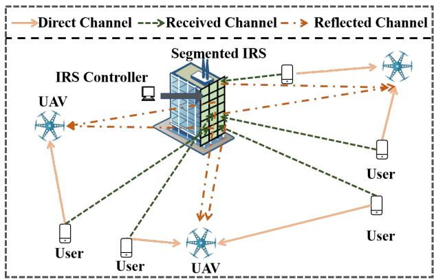  
Fig. 1. The illustrative system model of dynamically segmented IRSassisted UAV computing power network.

TABLE I  
SUMMARY OF MAIN NOTATIONS.
<table><tr><td>Notation</td><td>Definition</td></tr><tr><td> $a , b$ </td><td>The number of rows and columns of reflecting ele- ments</td></tr><tr><td> $k , n , t$   ${ \bf L } ^ { \mathrm { I R S } } , { \bf L } _ { n } , { \bf L } _ { k } [ t ]$ </td><td>The index of  $\mathrm { U A V s } ,$  users and time slots The coordinates of IRS, user n and UAV k</td></tr><tr><td> $O _ { n } [ t ] , C _ { n } [ t ] , D _ { n } [ t ]$ </td><td>The number of offloaded bits, required CPU cycles and maximum acceptable delay of user n&#x27;s task at</td></tr><tr><td> $\beta _ { n , k } [ t ]$ </td><td>time slot t The user association variable of user n and UAV k</td></tr><tr><td> $c _ { n , k } [ t ]$ </td><td>at time slot t The computational resource of UAV k allocated to</td></tr><tr><td> $\xi , \zeta$ </td><td>user n at time slot t The path loss exponent and Rician factor</td></tr><tr><td> $B , P , \sigma ^ { 2 }$ </td><td>The bandwidth, transmit power and noise power</td></tr><tr><td> $\gamma$ </td><td>The discount factor of amplitude</td></tr><tr><td> $_ \alpha$ </td><td>The channel gain at a reference distance of 1 meter</td></tr><tr><td> $d _ { a } , d _ { b }$ </td><td>The row and column spacing of reflecting elements</td></tr></table>

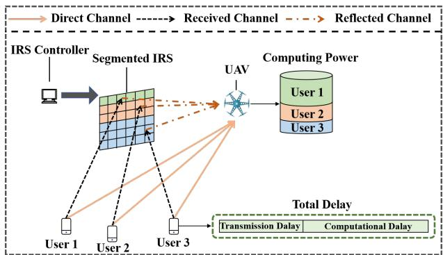  
Fig. 2. The illustration of dynamically segmented IRS.

## A. Computing Power Communication Matching Model

The mobility of UAVs introduces channel variations between users and UAVs, while the allocation of IRS reflecting elements influences the transmission delay of computation tasks. Fig. 2 shows the main principle of dynamically segmented IRS, where the IRS can adaptively allocate its reflecting elements to different users at each time slot, considering their channel conditions and computing power allocations. At each time slot, user n generates a computation task denoted by $U _ { n } [ t ] = \{ O _ { n } [ t ] , \bar { C } _ { n } [ t ] , \mathcal { D } _ { n } [ t ] \}$ , where $O _ { n } [ t ]$ and $C _ { n } [ t ]$ represent the number of offloaded bits and the CPU cycles required to process the task, respectively. Considering the delay requirements for task execution, the symbol $\mathcal { D } _ { n } [ t ]$ represents the maximum acceptable delay for task $U _ { n } [ t ]$ . Let $\begin{array} { r } { \dot { D _ { n } } [ t ] = D _ { n } ^ { \mathrm { c o m p } } [ t ] + D _ { n } ^ { \mathrm { t r a n s } } [ t ] } \end{array}$ denote the total delay of task $U _ { n } [ t ]$ . It consists of two parts, i.e., the computational delay $D _ { n } ^ { \mathrm { c o m p } } [ t ]$ and transmission delay $D _ { n } ^ { \mathrm { t r a n s } } [ t ]$ . The computational delay corresponds to the allocated computing power, while the transmission delay is related to the number of assigned reflecting elements. Therefore, a fine-grained computing power communication matching is needed to satisfy the delay requirements of users. In the following, we define $D _ { n } ^ { \mathrm { c o m p } } [ t ]$ and $D _ { n } ^ { \mathrm { t r a n s } } [ t ]$ separately.

Since UAVs are constantly in motion during service, offloading decisions need to dynamically adapt to their movements. Define the binary variable $\beta _ { n , k } [ t ] \in \{ 0 , 1 \}$ to indicate the association between user n and UAV k at time slot t, i.e., $\beta _ { n , k } [ t ] = 1$ represents that user n is served by UAV k at time slot t. Then, the computational resource of UAV k allocated to user n at time slot t is defined by variable $c _ { n , k } [ t ]$ . It is noted that the total computing resources allocated by UAV k to users at time slot t cannot exceed its maximum computation capacity Cmax, i.e., $\sum _ { n = 1 } ^ { N } c _ { n , k } [ t ] \leq C ^ { \operatorname* { m a x } }$ . Similar to [11], we consider that the tasks generated by users are indivisible and entirely offloaded to UAVs. The computational delay of the task $U _ { n } [ t ]$ can be expressed as:

$$
D _ { n } ^ { \mathrm { c o m p } } [ t ] = \left\{ \begin{array} { l l } { \frac { C _ { n } [ t ] } { c _ { n , k } [ t ] } , } & { \mathrm { i f } \ \beta _ { n , k } [ t ] = 1 , } \\ { 0 , } & { \mathrm { o t h e r w i s e } . } \end{array} \right.\tag{1}
$$

We model the channels among the UAV, users, and IRS, and define the transmission delay. Since the received channel between user n and IRS consists of both LoS and NLoS com-

ponents, it can be modeled by the Rician fading model [21], which is expressed by:

$$
\begin{array} { r l } & { \mathbf { H } _ { n } ^ { \mathrm { U R } } [ t ] = \sqrt { \alpha ( d _ { n } ^ { \mathrm { U R } } ) - \xi ^ { \mathrm { U R } } } ( \sqrt { \zeta ^ { \mathrm { U R } } ( \zeta ^ { \mathrm { U R } } + 1 ) ^ { - 1 } } \mathbf { h } _ { n } ^ { \mathrm { U R } } [ t ] } \\ & { \qquad + \sqrt { \left( \zeta ^ { \mathrm { U R } } + 1 \right) ^ { - 1 } } \tilde { \mathbf { h } } _ { n } ^ { \mathrm { U R } } [ t ] ) , } \end{array}\tag{2}
$$

where the symbol α denotes the channel gain at a reference distance of 1 meter. Symbols $\xi ^ { \mathrm { U R } }$ and $\zeta ^ { \mathrm { U R } }$ denote the path loss exponent and Rician factor. Symbol $\widetilde { \mathbf { h } } _ { n } ^ { \mathrm { U R } } [ t ]$ denotes the Non-Line-of-Sight (NLoS) component, which follows a circularly symmetric complex Gaussian distribution. It is noted that the Line of Sight (LoS) component dominates in UAV communication scenarios, so the NLoS component is not considered subsequently. The LoS component $\mathbf { h } _ { n } ^ { \mathrm { U R } } [ t ]$ can be expressed as:

$$
\begin{array} { r l r } & { } & { { \bf h } _ { n } ^ { \mathrm { U R } } [ t ] = [ 1 , e ^ { - 2 \pi j \frac { f _ { c } } { \mathbb { C } } d _ { b } \sin \theta _ { n } ^ { \mathrm { U R } } \cos \vartheta _ { n } ^ { \mathrm { U R } } } , . . . , } \\ & { } & { e ^ { - 2 \pi j \frac { f _ { c } } { \mathbb { C } } ( b - 1 ) d _ { b } \sin \theta _ { n } ^ { \mathrm { U R } } \cos \vartheta _ { n } ^ { \mathrm { U R } } } ] ^ { T } \qquad } \\ & { } & { \otimes [ 1 , e ^ { - 2 \pi j \frac { f _ { c } } { \mathbb { C } } d _ { a } \sin \theta _ { n } ^ { \mathrm { U R } } \sin \vartheta _ { n } ^ { \mathrm { U R } } } , . . . , } \\ & { } & { e ^ { - 2 \pi j \frac { f _ { c } } { \mathbb { C } } ( I _ { n } [ t ] - 1 ) d _ { a } \sin \theta _ { n } ^ { \mathrm { U R } } \sin \vartheta _ { n } ^ { \mathrm { U R } } } ] ^ { T } , } \end{array}\tag{3}
$$

where the symbol $f _ { c }$ denotes the carrier frequency and light speed is denoted by C. Symbols $d _ { b }$ and $d _ { a }$ denote the column and row spacing of the IRS reflecting elements, respectively. The expressions are given by sin $\theta _ { n } ^ { \mathrm { U R } } = - z ^ { \mathrm { I R S } } / \bar { d } _ { n } ^ { \mathrm { U R } }$ sin ${ \dot { \vartheta } } _ { n } ^ { \mathrm { U R } } ~ = ~ ( x ^ { \mathrm { { i R S } } } - x _ { n } ) / { \sqrt { ( x _ { n } - x ^ { \mathrm { { I R S } } } ) ^ { 2 } + ( y _ { n } - y ^ { \mathrm { { I R S } } } ) ^ { 2 } } }$ and cos $\vartheta _ { n } ^ { \mathrm { U R } } \ = \ ( y ^ { \mathrm { I R S } } - y _ { n } ) / \sqrt { ( x _ { n } - x ^ { \mathrm { I R S } } ) ^ { 2 } + ( y _ { n } - y ^ { \mathrm { I R S } } ) ^ { 2 } }$ . The IRS is typically installed in elevated locations to ensure a favorable communication environment. We adopt the direct channel model due to the open propagation environment between the IRS and UAV $k ,$ where a dominant LoS link exists, and the corresponding channel can be expressed as [21]:

$$
\mathbf { H } _ { k } ^ { \mathrm { R A } } [ t ] = \sqrt { \alpha ( d _ { k } ^ { \mathrm { R A } } [ t ] ) ^ { - \xi ^ { \mathrm { R A } } } } \mathbf { h } _ { k } ^ { \mathrm { R A } } [ t ] ,\tag{4}
$$

where the LoS component $\mathbf { h } _ { k } ^ { \mathrm { R A } } [ t ]$ can be expressed as:

$$
\begin{array} { r l } & { \mathbf { h } _ { k } ^ { \mathrm { R A } } [ t ] = [ 1 , e ^ { - 2 \pi j \frac { f _ { \mathrm { c } } } { \mathbb { C } } d _ { b } \sin \theta _ { k } ^ { \mathrm { R A } } [ t ] \cos \vartheta _ { k } ^ { \mathrm { R A } } [ t ] } , . . . , } \\ & { \quad \quad \quad e ^ { - 2 \pi j \frac { f _ { \mathrm { c } } } { \mathbb { C } } ( b - 1 ) d _ { b } \sin \theta _ { k } ^ { \mathrm { R A } } [ t ] \cos \vartheta _ { k } ^ { \mathrm { R A } } [ t ] } ] ^ { T } } \\ & { \quad \quad \quad \otimes [ 1 , e ^ { - 2 \pi j \frac { f _ { \mathrm { c } } } { \mathbb { C } } d _ { a } \sin \theta _ { k } ^ { \mathrm { R A } } [ t ] \sin \vartheta _ { k } ^ { \mathrm { R A } } [ t ] } , . . . , } \\ & { \quad \quad \quad e ^ { - 2 \pi j \frac { f _ { \mathrm { c } } } { \mathbb { C } } ( I _ { n } [ t ] - 1 ) d _ { a } \sin \theta _ { k } ^ { \mathrm { R A } } [ t ] \sin \vartheta _ { k } ^ { \mathrm { R A } } [ t ] } ] ^ { T } , } \end{array}\tag{5}
$$

where the expressions related to the angles of departure are denoted by sin $\theta _ { k } ^ { \mathrm { R A } } [ t ]$ $\begin{array} { r l r } { ( z _ { k } [ t ] } & { { } - } & { z ^ { \mathrm { I R S } } ) / d _ { k } ^ { \mathrm { R A } } [ t ] . } \end{array}$ sin $\begin{array} { r l r } { \mathcal { V } _ { k } ^ { \mathrm { R A } } [ t ] } & { { } \quad = } & { \dot { ( } x _ { k } [ t ] \quad - } \end{array}$ $x ^ { \mathrm { I R S } } ) / \sqrt { ( x _ { k } [ t ] - x ^ { \mathrm { I R S } } ) ^ { 2 } + ( y _ { k } [ t ] - y ^ { \mathrm { I R S } } ) ^ { 2 } }$ and cos $\vartheta _ { k } ^ { \mathrm { R A } } [ t ] ~ =$ $( y _ { k } [ t ] \mathrm { ~  ~ \xi ~ } - \mathrm { ~  ~ \xi ~ } y ^ { \mathrm { I R S } } ) / \sqrt { ( x _ { k } [ t ] - x ^ { \mathrm { I R S } } ) ^ { 2 } + ( y _ { k } [ t ] - y ^ { \mathrm { I R S } } ) ^ { 2 } } .$ Let variable $\begin{array} { r l r l r l } { \Phi _ { n , k } [ t ] } & { { } = } & { \mathrm { d i a g } ( \phi _ { n , k } [ t ] ) } & { } & { { } \in } & { \mathbb { C } ^ { b I _ { n } [ t ] \times b I _ { n } [ t ] } } \end{array}$ denote the phase shift matrix of the allocated reflecting elements of user n, wherein the variable $\phi _ { n , k } [ t ] \stackrel { \sim } { = } [ e ^ { j \phi _ { 1 , 1 } [ t ] } , \dotsc , e ^ { j \phi _ { r , q } [ t ] } , \dotsc , e ^ { j \phi _ { I _ { n } , b } [ t ] } ] ^ { T } \in \mathbb { C } ^ { b I _ { n } [ t ] \times 1 }$ $\{ ( r , q ) , r \in \{ 1 , . . . , I _ { n } [ t ] \} , q \in \{ 1 , . . . , b \} \}$ denote the index set of reflecting elements. Then, the whole virtual LoS channel between user n and UAV k can be expressed as:

$$
\mathcal { H } _ { n , k } [ t ] = \gamma ( \mathbf { H } _ { k } ^ { \mathrm { R A } } [ t ] ) ^ { H } \Phi _ { n , k } [ t ] \mathbf { H } _ { n } ^ { \mathrm { U R } } [ t ] .\tag{6}
$$

where the symbol γ denotes the discount factor of amplitude.

In addition, similar to the channels between the UAVs and the IRS, the channel between user n and UAV k can be expressed as [21]:

$$
H _ { n , k } [ t ] = \sqrt { \alpha ( d _ { n , k } [ t ] ) ^ { - \xi ^ { \mathrm { U A } } } } ,\tag{7}
$$

We can obtain the composite channel of user n by integrating the direct channel and the virtual LoS channel between user n and UAV k, which can be expressed as:

$$
M _ { n , k } [ t ] = \mathcal { H } _ { n , k } [ t ] + H _ { n , k } [ t ] .\tag{8}
$$

The orthogonal frequency division multiple access technology is adopted to reduce the interference among users and the total bandwidth B is divided into N parts. Thus, the data transmission rate of user n at time slot t is expressed as:

$$
R _ { n } [ t ] = { \cal B } \log _ { 2 } \left( 1 + \sum _ { k = 1 } ^ { K } \beta _ { n , k } [ t ] \frac { P \left| M _ { n , k } [ t ] \right| ^ { 2 } } { \sigma ^ { 2 } } \right) ,\tag{9}
$$

where the symbol $B = B / N$ denotes the bandwidth allocated to user n. $P$ and $\sigma ^ { 2 }$ denote the transmit power and noise power, respectively. Then, the transmission delay can be calculated as:

$$
D _ { n } ^ { \mathrm { t r a n s } } [ t ] = { \frac { O _ { n } [ t ] } { R _ { n } [ t ] } } .\tag{10}
$$

## B. Energy Consumption Model

Since the UAVs act as the computing power servers in the proposed system, it is crucial to account for their energy consumption to ensure system sustainability. The main energy consumption of UAV k at time slot t can be divided into computational energy consumption and flight energy consumption. The computational energy consumption can be calculated by:

$$
E _ { k } ^ { \mathrm { c o m p } } [ t ] = \sum _ { n = 1 } ^ { N } D _ { n } ^ { \mathrm { c o m p } } [ t ] \mu ( c _ { n , k } [ t ] ) ^ { \varsigma } ,\tag{11}
$$

where $\mu$ and $\varsigma$ denote the capacitance factor and related parameter of energy consumption. Let symbol $P ^ { \mathrm { { f l y } } }$ denote the flight power of UAV and the flight energy consumption can be calculated by $E _ { k } ^ { \mathrm { f l y } } [ t ] = \tau P ^ { \mathrm { f l y } }$ . Then, the total energy consumption of UAV k is given by $\begin{array} { r } { E _ { k } [ t ] = E _ { k } ^ { \mathrm { f l y } } [ t ] + E _ { k } ^ { \mathrm { c o m p } } [ t ] } \end{array}$

## C. Problem Formulation

To satisfy the user’s delay requirements while accounting for the UAV’s energy consumption, we formulate a multiobjective optimization problem to minimize the total delay of users and the energy consumption of UAVs. Specifically, we address the problem by jointly optimizing UAV trajectories $\mathbf { L } \ = \ \{ \mathbf { L } _ { k } [ t ] , \forall k \in \mathcal { K } , t \in \mathcal { T } \}$ , association decisions $\beta = \{ \beta _ { n , k } [ t ] , \forall n \in N , k \in \mathcal { K } , t \in \mathcal { T } \}$ , computing power allocation $c = \{ c _ { n , k } [ t ] , \forall n \in \mathcal { N } , k \in \mathcal { K } , t \in \mathcal { T } \}$ , reflecting element assignment $\bar { I } ^ { \cdot } = \{ I _ { n } [ t ] , \forall n \in \mathcal { N } , t \in \bar { T } \}$ and IRS phase shifts $\phi = \{ \phi _ { n , k } [ t ] , \forall n \in \mathcal { N } , k \in \mathcal { K } , t \in \mathcal { T } \}$ , and the multi-objective optimization problem is formulated as follows:

$$
P 0 : \underset { \mathbf { L } , \beta , c , I , \phi } { \mathrm { m i n i m i z e } } \{ \sum _ { t = 1 } ^ { T } \sum _ { n = 1 } ^ { N } D _ { n } [ t ] , \sum _ { t = 1 } ^ { T } \sum _ { k = 1 } ^ { K } E _ { k } [ t ] \} ,\tag{12}
$$

$$
\mathrm { s . t . } ~ \mathrm { C 1 } : \| \mathbf { L } _ { k } [ t + 1 ] - \mathbf { L } _ { k } [ t ] \| = \tau V , \forall k \in \mathcal { K } , t \in \mathcal { T } ,
$$

$$
\begin{array} { r } { \mathbf {  { C 2 } } : \| \mathbf { L } _ { k } [ t ] - \mathbf { L } _ { j } [ t ] \| \geq \mathbf { L } _ { \operatorname* { m i n } } , \forall k \neq j \in \mathcal { K } , t \in \mathcal { T } , } \end{array}
$$

$$
\begin{array} { r l } & { \begin{array} { r l } & { \mathrm { C 3 : ~ } \displaystyle \beta _ { n , k } [ t ] \in \{ 0 , 1 \} , \forall n \in \mathcal { N } , k \in \mathcal { K } , t \in \mathcal { T } , } \\ & { \mathrm { } } \\ & { \mathrm { C 4 : ~ } \displaystyle \sum _ { k = 1 } ^ { N } \beta _ { n , k } [ t ] = 1 , \forall n \in \mathcal { N } , t \in \mathcal { T } , } \\ & { \mathrm { } } \\ & { \displaystyle \mathrm { C 5 : ~ } \displaystyle \sum _ { n = 1 } ^ { N } c _ { n , k } [ t ] \leq C ^ { \mathrm { m a x } } , \forall k \in \mathcal { K } , t \in \mathcal { T } , } \\ & { \mathrm { } } \\ & { \mathrm { C 6 : ~ } \displaystyle \mathscr { D } _ { n , [ ] } [ \leq \mathcal { D } _ { n } [ t ] , \forall n \in \mathcal { N } , t \in \mathcal { T } , } \\ & { \mathrm { } } \\ & { \mathrm { C 7 : ~ } \displaystyle \sum _ { n = 1 } ^ { N } D _ { n } [ t ] = 0 , \forall t \in \mathcal { T } , } \\ & { \mathrm { } } \\ & { \mathrm { C 8 : ~ } T _ { n } [ t ] \in \{ 1 , 2 , . . . , a + 1 - N \} , \forall n \in \mathcal { N } , t \in \mathcal { T } , } \\ & { \mathrm { } } \\ & { \mathrm { C 9 : ~ } \displaystyle ( 0 \leq \phi _ { n , [ t ] } [ < 2 \pi , \forall n \in \mathcal { N } , t \in \mathcal { T } , \tau \in \{ 1 , . . . , I _ { n } [ t ] \} ) , } \\ & { \mathrm { ~ } \displaystyle q \in \{ 1 , . . . , b \} , } \end{array} } \end{array}
$$

where constraint C1 restricts the movement distance of UAVs at each time slot, with the symbol V denoting the velocity of each UAV. Constraint C2 ensures the safety distance among UAVs. Constraint C3 defines the values of the association decision variables, while constraint C4 ensures that each user is assigned to one UAV. Constraint C5 represents the computing power allocation limit for each UAV, with the symbol Cmax indicating its maximum computing power capacity. Constraint C6 imposes a total delay constraint on the computing tasks. Constraints C7 and C8 specify the limits on the number of reflecting elements allocated by the IRS to user n. Constraint C9 defines the values of the phase shift variable.

Problem P 0 is a multi-objective optimization problem balancing conflicting objectives: minimizing delay and energy consumption. Specifically, the goal of the optimization problem is to minimize the total delay experienced by users to meet the demands of delay-sensitive users while minimizing the total energy consumption of the UAVs to ensure the system’s long-term sustainability. However, with other variables fixed, according to (1), the computational resource is inversely proportional to the user’s delay. This implies that reducing the total user delay may increase the energy consumption of UAVs. Therefore, straightforwardly solving Problem P 0 is challenging. To address these challenges, we employ a linear weighted sum method to transform the problem into a single-objective optimization problem [22]. This approach yields effective solutions promptly and facilitates the effective balancing of multiple optimization objectives by adjusting the weights $\omega _ { 1 }$ and $\omega _ { 2 }$ . Then, Problem P 0 can be reformulated as:

$$
P 1 : \operatorname* { m i n i m i z e } _ { \mathbf { L } , \beta , c , I , \phi } \omega _ { 1 } \sum _ { t = 1 } ^ { T } \sum _ { n = 1 } ^ { N } D _ { n } [ t ] + \omega _ { 2 } \sum _ { t = 1 } ^ { T } \sum _ { k = 1 } ^ { K } E _ { k } [ t ] ,\tag{13}
$$

s.t. C1-C9 in P 0.

## Proposition 1. Problem P 1 is NP-hard.

## Proof. The detailed proof is given in Appendix A.

According to Proposition 1, Problem P 1 is a MINLP, and it is challenging to tackle this problem due to the integer variables $\beta$ and I, as well as the non-convex constraints C3 and C7.

Algorithm 1 Low Complexity Channel-based User Associa  
tion Method   
Input: The set of UAV positions $\{ \mathbf { L } _ { k } [ t ] \} _ { k \in \mathcal { K } }$ at the time slot   
t and the set of user positions $\{ \mathbf { L } _ { n } \} _ { n \in \mathcal { N } } .$   
Output: User association $\beta .$   
1: Set of users to be assigned $\tilde { N } = \{ n , n \in \mathcal { N } \}$   
2: Calculate $H = \{ H _ { n , k } [ \bar { t } ] , \forall n \in \mathcal { N } , k \in \mathcal { K } \}$   
3: for $1 , 2 , . . . , N$ do   
4: for $1 , 2 , . . . , K$ do   
5: Assign user n with maximum $H _ { n , k } [ t ]$ to UAV k   
and remove user n from set $\tilde { N }$   
6: end for   
7: end for   
8: Return: User association $\beta .$

## IV. THE PROPOSED TCPA

Since the variables are coupled in Problem P 1, we decompose this problem into three subproblems based on the coupling of variables, i.e., the user association subproblem, the computing power communication matching subproblem and the UAV trajectory optimization subproblem. Specifically, we first apply phase alignment theory to obtain the phase shift of the IRS and use optimal channel matching to optimize user association. Next, an SCA-based method is utilized to solve the computing power communication matching subproblem. Finally, we employ MAPPO to address the UAV trajectory optimization subproblem.

## A. Phase Shift Control and User Association

To facilitate the subsequent solution, we derive the closedform solution for phase control. The objective function indicates that transmission delay is inversely proportional to the transmission rate. The total data transmission rate needs to be maximized to minimize the objective function for given UAV coordinates, user association, and computing power communication matching. From (8) and (9), we can observe that the data transmission rate of user n at time slot t is positively correlated with the virtual LoS channel. Therefore, the optimal phase control strategy needs to maximize the modulus of (6), which can be obtained according to Theorem 1.

Theorem 1. The optimal phase control from user n to UAV k at time slot t can be expressed as:

$$
\begin{array} { l } { { \phi _ { r , q } [ t ] = - 2 \pi { \frac { f _ { c } } { \mathbb { C } } } ( r - 1 ) d _ { b } \sin \theta _ { k } ^ { R A } [ t ] \cos \vartheta _ { k } ^ { R A } [ t ] } } \\ { { \mathrm { ~ \ ~ } - 2 \pi { \frac { f _ { c } } { \mathbb { C } } } ( q - 1 ) d _ { a } \sin \theta _ { k } ^ { R A } [ t ] \sin \vartheta _ { k } ^ { R A } [ t ] } } \\ { { \mathrm { ~ \ ~ \ } + 2 \pi { \frac { f _ { c } } { \mathbb { C } } } ( r - 1 ) d _ { b } \sin \theta _ { n } ^ { U R } \cos \vartheta _ { n } ^ { U R } \ ~ } } \\ { { \mathrm { ~ \ ~ \ } + 2 \pi { \frac { f _ { c } } { \mathbb { C } } } ( q - 1 ) d _ { a } \sin \theta _ { n } ^ { U R } \sin \vartheta _ { n } ^ { U R } . } } \end{array}\tag{14}
$$

Proof. The detailed proof is given in Appendix B.

□

Next, we focus on the design of the user-UAV association strategy. The user association variables are binary and there are $2 ^ { N }$ possible association options for each UAV. Thus, treating user association variables as actions of the UAV causes a huge action space. Furthermore, the user association decisions of different UAVs are coupled to satisfy constraint C4. To obtain better task transmission conditions and simplify the problem, we employ channel optimal matching to obtain the user association [18], [23], i.e., each user selects a UAV with the best channel condition at each time slot t. Algorithm 1 shows the pseudo-code of the user association method. Its computational complexity is $\mathcal { O } ( N K )$ , which is polynomial with respect to N and K.

## B. Computing Power Communication Matching

To satisfy the time-varying computation demands of different users in UAV computing power networks, joint optimization of computing power and communication is necessary. This is because the total delay of users is composed of transmission delay and computational delay, and each user has a maximum acceptable delay requirement. Thus, separately optimizing them while accounting for UAV energy consumption may lead to inefficient resource utilization. For example, when increasing the number of reflecting elements allocated to a user to reduce its transmission delay, the computing power assigned to the user can be appropriately increased to ensure the maximum acceptable delay requirement. Therefore, we propose a computing power communication matching problem, aiming to realize flexible heterogeneous resource allocation in UAV computing power networks.

Since the balance between the total delay of users and the total energy consumption of the UAVs needs to be considered, computing power and communication matching are not simply sufficient to satisfy the maximum acceptable delay requirement of users. Specifically, for given UAV coordinates $\{ \mathbf { L } _ { k } [ t ] \} _ { k \in \mathcal { K } , t \in \mathcal { T } }$ , UAV-user association $\{ \beta _ { n , k } [ t ] \} _ { n \in \mathcal { N } , k \in \mathcal { K } , t \in \mathcal { T } }$ and phase shift control strategy $\{ \phi _ { n , k } [ t ] \} _ { n \in \mathcal { N } , k \in \mathcal { K } , t \in \mathcal { T } }$ at time slot t, the computing power communication matching problem can be expressed as:

$$
\begin{array} { l } { { \displaystyle P 2 : \mathrm { \ m i n i m i z e } \omega _ { 1 } \sum _ { n = 1 } ^ { N } D _ { n } [ t ] + \omega _ { 2 } \sum _ { k = 1 } ^ { K } E _ { k } [ t ] , } } \\ { { \mathrm { s . t . } \mathrm { \ C 5 - C 8 \ i n \ } P 1 . } } \end{array}\tag{15}
$$

Problem P2 is a mixed-integer nonconvex optimization problem involving integer variables $\{ I _ { n } [ t ] \} _ { n \in \mathcal { N } }$ , and the computing power allocation variables and reflecting element assignment variables are coupled in constraint C6.

Theorem 2. The relaxed Problem $P 2 ^ { \prime }$ can provide a lower bound for Problem P 2.

Proof. The detailed proof is given in Appendix C.

It is difficult to solve Problem P 2 straightforwardly. According to Theorem 2, a lower bound for Problem P 2 is obtained by relaxing the integer variable $\{ I _ { n } [ t ] \} _ { n \in \mathcal { N } }$ into a continuous variable $\{ \hat { I } _ { n } [ t ] \} _ { n \in \mathcal { N } }$ and the relaxed problem is denoted as:

$$
P 2 ^ { \prime } : \operatorname * { m i n i m i z e } _ { c , \hat { I } } \omega _ { 1 } \sum _ { n = 1 } ^ { N } D _ { n } [ t ] + \omega _ { 2 } \sum _ { k = 1 } ^ { K } E _ { k } [ t ] ,
$$

s.t. C5-C7 in P 1,

$$
\mathbf { C } 1 0 : 1 \leq \hat { I } _ { n } [ t ] \leq a + 1 - N , \forall n \in \mathcal { N } , t \in \mathcal { T } .\tag{16}
$$

where constraint C10 is a relaxation of the original constraint C8.

Problem $P 2 ^ { \prime }$ remains non-convex since the objective function is inherently nonconvex with respect to the variable $\{ \hat { I } _ { n } [ t ] \} _ { n \in \mathcal { N } } .$ . It is noteworthy that the objective function is convex for the variable $\{ c _ { n , k } [ t ] \} _ { n \in \mathcal { N } , k \in \mathcal { K } }$ . Therefore, we decompose Problem $P 2 ^ { \prime }$ into two blocks and iteratively optimize them, which can be expressed as:

$$
P 2 . 1 ^ { \prime } : \mathrm { ~ m i n i m i z e } \omega _ { 1 } \sum _ { n = 1 } ^ { N } D _ { n } [ t ] + \omega _ { 2 } \sum _ { k = 1 } ^ { K } E _ { k } [ t ] ,
$$

s.t. C5, C6 in P 1.

$$
P 2 . 2 ^ { \prime } : \underset { \hat { I } } { \mathrm { m i n i m i z e } } \omega _ { 1 } \sum _ { n = 1 } ^ { N } D _ { n } [ t ] + \omega _ { 2 } \sum _ { k = 1 } ^ { K } E _ { k } [ t ] ,\tag{17}
$$

$$
P 2 ^ { \prime } .\tag{18}
$$

Proposition 2. Problem P 2.1′ is convex with respect to the variable c.

## Proof. The detailed proof is given in Appendix D.

Problem $P 2 . 1 ^ { \prime }$ is convex according to Proposition 2 and can be solved by CVX.

The SCA method is employed to address the nonconvexity of the objective function in Problem $P 2 . 2 ^ { \prime }$ . We introduce an upper bound for the first term of Problem $P 2 . 2 ^ { \prime }$ , which can be expressed as:

$$
\hat { D } _ { n } [ t ] \geq D _ { n } [ t ] , \forall n \in \mathcal { N } , t \in \mathcal { T } .\tag{19}
$$

To facilitate the subsequent formulation, let $\begin{array} { r l } { \tilde { A } } & { { } = } \end{array}$ $\sqrt { \alpha ( d _ { n } ^ { \mathrm { U R } } ) ^ { - \xi ^ { \mathrm { U R } } } } \sqrt { \zeta ^ { \mathrm { U R } } ( \zeta ^ { \mathrm { U R } } + 1 ) ^ { - 1 } } , ~ \tilde { B } = \sqrt { \alpha ( d _ { k } ^ { \mathrm { R A } } [ t ] ) ^ { - \xi ^ { \mathrm { R A } } } }$ and $\tilde { C } ~ = ~ \sqrt { \alpha ( d _ { n , k } [ t ] ) ^ { - \xi ^ { \mathrm { U A } } } }$ . Then, the channel power gain following the application of the optimal phase control can be expressed as:

$$
\begin{array} { r l } & { \left| M _ { n , k } [ t ] \right| ^ { 2 } = \tilde { C } ^ { 2 } + 2 \tilde { A } \tilde { B } \tilde { C } a I _ { n } [ t ] } \\ & { \qquad + ( \tilde { A } \tilde { B } a I _ { n } [ t ] ) ^ { 2 } , \forall n \in \mathcal { N } , k \in \mathcal { K } , t \in \mathcal { T } . } \end{array}\tag{20}
$$

Then, given a local point $\hat { I } _ { n } ^ { g } [ t ]$ , the (19) can be approximated by its first-order Taylor expansion [24], and the upper bound of Problem $P 2 . 2 ^ { \prime }$ can be expressed as:

$$
\begin{array} { l } { { \displaystyle P 2 . 2 ^ { \prime \prime } : \mathrm { ~ m i n i m i z e } \omega _ { 1 } \sum _ { n = 1 } ^ { N } \hat { D } _ { n } [ t ] + \omega _ { 2 } \sum _ { k = 1 } ^ { K } E _ { k } [ t ] , } } \\ { { \mathrm { s . t . ~ C6 . ~ C T ~ i n ~ } P 1 , \mathrm { C l o ~ i n ~ } P 2 ^ { \prime } , } } \\ { { \mathrm { C l 1 : ~ } \hat { D } _ { n } [ t ] \geq \frac { O _ { n } [ t ] } { B \log _ { 2 } ( \tilde { P } + \hat { Q } \hat { T } _ { n } ^ { g } [ t ] + \tilde { K } ( \hat { I } _ { n } ^ { g } [ t ] ) ^ { 2 } ) } } } \\ { { - \frac { \log _ { 2 } ( e ) O _ { n } [ t ] ( \hat { Q } + 2 \tilde { K } \hat { T } _ { n } [ t ] ) ( \hat { I } _ { n } [ t ] - \hat { I } _ { n } ^ { g } [ t ] ) } { B ( \log _ { 2 } ( \tilde { P } + \hat { Q } \hat { T } _ { n } ^ { g } [ t ] + \tilde { K } ( \hat { I } _ { n } ^ { g } [ t ] ) ) ) ^ { 2 } ( \tilde { P } + \hat { Q } \hat { T } _ { n } ^ { g } [ t ] + \tilde { K } ( \hat { I } _ { n } ^ { g } [ t ] ) ^ { 2 } ) } } } \\ { { + D _ { n } ^ { \mathrm { c o m p } } [ t ] , \forall n \in \mathcal { N } , t \in \mathcal { T } , } } \end{array}\tag{21)(21}
$$

where $\tilde { P } = \tilde { C } ^ { 2 } \tilde { D } + 1 , \tilde { Q } = 2 a \tilde { A } \tilde { B } \tilde { C } \tilde { D } , \tilde { K } = a ^ { 2 } \tilde { A } ^ { 2 } \tilde { B } ^ { 2 } \tilde { D }$ and $\tilde { D } = P / \delta ^ { 2 }$ . The continuous solution for the reflecting element allocation is obtained by solving Problem $P 2 . 2 ^ { \prime \prime }$ using CVX.

To obtain an integer solution for the reflecting element assignment, we employ a search method based on optimal channel gain. Specifically, we first round down the continuous solution to obtain an approximate integer solution and the number of remaining reflecting elements $I ^ { \mathrm { r e m } }$ . Then, an additional row of reflecting elements is assigned to each user individually, and the corresponding variation in channel power gain is evaluated. Finally, the remaining reflecting elements are assigned to the $I ^ { \mathrm { r e m } }$ users with the highest channel power gain variation to obtain an approximate integer solution. Algorithm 2 shows the pseudo-code of the computing power communication matching method, where $\rho ( \cdot ) = \omega _ { 1 } \sum _ { n = 1 } ^ { N } D _ { n } [ t ] + \omega _ { 2 } \sum _ { k = 1 } ^ { K } E _ { k } [ t ]$ . Its computational complexity is $\tilde { \mathcal { O } } ( g ^ { \mathrm { M A X } } ( N ^ { 3 . 5 } \log ( \epsilon _ { 1 } ^ { - 1 } ) + l ^ { \mathrm { M A X } } ( 2 N ) ^ { 3 . 5 } \log ( \epsilon _ { 1 } ^ { - 1 } ) ) )$ which is within polynomial time complexity.

Algorithm 2 Low Complexity Computing Power Communi  
cation Matching Method   
Input: UAV positions $\{ \mathbf { L } _ { k } [ t ] \} _ { k \in \mathcal { K } } .$ , user positions $\{ \mathbf { L } _ { n } \} _ { n \in \mathcal { N } } .$   
user association $\beta ,$ tolerances $\epsilon _ { 1 } , \epsilon _ { 2 }  0 \quad$ max iterations   
$g ^ { \mathrm { M A X } } , l ^ { \mathrm { M A X } } .$   
Output: Computing power communication matching $G \ =$   
$\{ I ^ { * } , c ^ { * } \}$   
1: Initialize $g = 0 , \{ \hat { I } _ { n } ^ { 0 } [ t ] \}$ , solving Problem $P 2 . 1 ^ { \prime }$ to get   
$\{ c _ { n } ^ { 0 } [ t ] \}$ and compute $\bar { \rho ( I _ { n } ^ { 0 } [ t ] , c _ { n } ^ { 0 } [ t ] ) }$   
2: for $g = 1 , 2 , . . . , \bar { g } ^ { \mathrm { M A X } }$ do   
3: for $l = 1 , 2 , . . . , l ^ { \mathrm { M A X } }$ do   
4: Solve Problem $P 2 . 2 ^ { \prime \prime }$ to update $\{ \hat { I } _ { n } ^ { l } [ t ] \}$   
5: if $\rho ( \hat { I } _ { n } ^ { l } [ t ] , c _ { n _ { \cdot } } ^ { g - 1 } [ t ] ) - \rho ( \hat { I } _ { n } ^ { l - \bar { 1 } } [ t ] , c _ { n } ^ { g - \bar { 1 } } [ t ] ) \leq \epsilon _ { 1 }$ then   
6: $\hat { I } _ { n } ^ { g } [ t ] \longleftarrow { \hat { I } _ { n } ^ { l } [ t ] }$ , break   
7: else   
8: $\hat { I } _ { n } ^ { l - 1 } [ t ] \gets \hat { I } _ { n } ^ { l } [ t ]$   
9: end if   
10: end for   
11: Solve Problem $P 2 . 1 ^ { \prime }$ to update $\left\{ c _ { n } ^ { g } [ t ] \right\}$ and compute   
$\rho ( \hat { I } _ { n } ^ { g } [ t ] , c _ { \hat { \ } } ^ { g } [ t ] ) , \hat { I } _ { n } ^ { 0 } [ t ] \gets \hat { I } _ { n } ^ { g } [ t ] .$   
12: i $\bar { \textbf { f } } \rho ( \hat { I } ^ { g } , c ^ { g } ) - \rho ( \hat { I } ^ { g - 1 } , c ^ { g - 1 } ) \leq \epsilon _ { 2 }$ then   
13: $\{ \hat { I } _ { n } ^ { * } [ t ] \} _ { n \in \cal N }  \hat { I } _ { n } ^ { g } [ t ] ,$ break   
14: end if   
15: end for   
16: Round down $\hat { I } _ { n } ^ { * } [ t ]$ to integer $\tilde { I } _ { n } [ t ]$ and compute remaining   
elements $I ^ { \mathrm { r e m } }$   
17: for $n = 1 , 2 , . . . , N$ do   
18: Calculate $D _ { n } ^ { \mathrm { t r a n s } } [ t ]$ using $\tilde { I } _ { n } [ t ] + 1$ allocated rows of   
reflecting elements.   
19: end for   
20: Allocate remaining elements to top- $. I ^ { \mathrm { r e m } }$ users with highest   
delay variations.   
21: Return: Computing power communication matching $G =$   
$\{ I ^ { * } , c ^ { * } \}$

## C. UAV Trajectory Optimization

Given the UAV-user association, phase control strategy and computing power communication matching decision, the UAV

trajectory subproblem can be expressed as:

$$
\begin{array} { r l } & { P \mathrm { 3 : \ m i n i m i z e } \omega _ { 1 } \displaystyle \sum _ { n = 1 } ^ { N } D _ { n } [ t ] + \omega _ { 2 } \sum _ { k = 1 } ^ { K } E _ { k } [ t ] , } \\ & { \mathrm { s . t . } \mathrm { C l - C 2 } \mathrm { i n } P \mathrm { 1 . } } \end{array}\tag{22}
$$

The system state depends on the state of the previous time slot and the UAV flight decisions. Therefore, to realize long-term system energy efficiency optimization, we model the UAV trajectory optimization problem as a Decentralized Partially Observable Markov Decision Process (Dec-POMDP). Consider the UAVs as agents, which observe the environment and take actions at each time slot. Then, a step reward is obtained by Algorithms 1 and 2 to reflect the actions. Specifically, the Dec-POMDP tuple can be defined as $\{ S , o , A , R , p , \lambda \}$

1) State: The state space $s$ consist of UAV coordinate positions $\{ \mathbf { L } _ { k } [ t ] \} _ { \forall k \in \mathcal { K } , t \in \mathcal { T } }$ and computing tasks $\{ U _ { n } [ t ] \} _ { \forall n \in \mathcal { N } , t \in \mathcal { T } } .$ Time-invariant variables, such as user coordinates, can be straightforwardly utilized in the computation of the reward function. Consequently, they are excluded from the state space to reduce redundancy.

2) Observation: The observation of agent k at time slot t includes its coordinates, the coordinates of other ${ \mathrm { U A V s } } ,$ , and the tasks of associated users, which are denoted as $o _ { k } [ t ] =$ $\left\{ \mathbf { L } _ { k } [ t ] , \{ \mathbf { L } _ { j } [ t ] \mid j \in { \cal K } , j \neq k \} , \{ U _ { n } [ t ] \mid \beta _ { n , k } [ t ] = 1 \} \right\}$

3) Action: The joint action consists of the actions of all agents, i.e., it consists of the movements of all UAVs and can be denoted as $A [ t ] = \{ A _ { k } [ t ] | \forall k \in \mathcal { K } \}$

4) Reward: The goal of Problem $P 3$ is to minimize the total energy consumption and system delay. Thus, the step reward obtained by executing the joint action $A [ t ]$ at time slot t can be expressed as $R ( S [ t ] , A [ t ] )$ . To satisfy the flight safety constraint C2, a negative penalty term is introduced to the reward function if the current action violates it. Since MAPPO is trained to maximize the cumulative reward, the reward function is negated accordingly. Let the nonnegative term δ denote the penalty, and the reward function is denoted as:

$$
R [ t ] = \left\{ \begin{array} { l l } { - \omega _ { 1 } \displaystyle \sum _ { n = 1 } ^ { N } D _ { n } [ t ] - \omega _ { 2 } \displaystyle \sum _ { k = 1 } ^ { K } E _ { k } [ t ] , } & { \mathrm { i f ~ s a t i s f y ~ C 2 , } } \\ { - \omega _ { 1 } \displaystyle \sum _ { n = 1 } ^ { N } D _ { n } [ t ] - \omega _ { 2 } \displaystyle \sum _ { k = 1 } ^ { K } E _ { k } [ t ] - \delta , } & { \mathrm { o t h e r w i s e . } } \end{array} \right.\tag{23}
$$

Additionally, the symbol $p$ and λ denote the state transfer probability and discount factor, respectively.

The interactions among agents introduce inherent nonstationarity into the multi-agent environment. Therefore, the Centralized Training with Decentralized Execution (CTDE) framework is adopted for training [25]. Specifically, during the training phase, each critic of agents is trained using a global observation, which consists of observations from all agents, compensating for the limited information available when deploying a single agent in a multi-agent environment [26]. During the execution phase, each agent selects an action based on its local observation, reducing communication overhead. Since the agents are homogeneous, sharing parameters among them can improve the efficiency of the learning process [27].

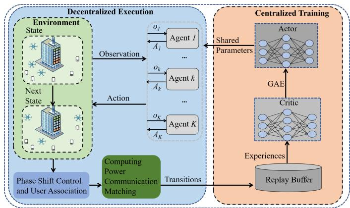  
Fig. 3. The framework diagram of the proposed TCPA.

Let symbols π and $\varphi$ denote the parameters of the actor and critic networks, respectively. The actor network takes the local observation as input and outputs the selected action $A _ { k } [ t ]$ In contrast, the critic network takes the global observation as input and outputs the estimated state value. To facilitate stable convergence of both actor and critic networks, two loss functions are introduced for each network to guide parameter updates. The actor loss function is denoted as:

$$
\begin{array} { r l } & { \boldsymbol { J } _ { \pi } = \mathbb { E } [ \operatorname* { m i n } ( \frac { \pi ^ { \mathrm { n e w } } ( A _ { k } [ t ] \vert o _ { k } [ t ] ) } { \pi ^ { \mathrm { o l d } } ( A _ { k } [ t ] \vert o _ { k } [ t ] ) } \boldsymbol { A } _ { \pi ^ { \mathrm { o l d } } ( A [ t ] \vert \boldsymbol { S } [ t ] ) } , } \\ & { \mathrm { c l i p } ( \frac { \pi ^ { \mathrm { n e w } } ( A _ { k } [ t ] \vert o _ { k } [ t ] ) } { \pi ^ { \mathrm { o l d } } ( A _ { k } [ t ] \vert o _ { k } [ t ] ) } , 1 - \eta , 1 + \eta ) \boldsymbol { A } _ { \pi ^ { \mathrm { o l d } } ( A [ t ] \vert \boldsymbol { S } [ t ] ) } ) ] , } \end{array}\tag{24}
$$

where symbols $\pi ^ { \mathrm { n e w } }$ and $\pi ^ { \mathrm { o l d } }$ denote the new policy and old policy, respectively. The functions $\boldsymbol { \mathcal { A } } ( \cdot )$ and $\mathrm { c l i p } ( \cdot )$ represent the advantage function and clip function, respectively, and $\eta$ denotes the clip fraction.

The critic loss function is based on the TD-error method and is given by:

$$
\mathcal { I } _ { \varphi } = \operatorname* { m i n } _ { \varphi } \frac { 1 } { T } \sum _ { G } \sum _ { t = 1 } ^ { T } ( \mathcal { V } _ { \varphi } ( S [ t ] ) - \hat { R } [ t ] ) ^ { 2 } \ ,\tag{25}
$$

where function $\mathcal { V } _ { \varphi } ( S [ t ] )$ is the evaluation of the state $S [ t ]$ based on the critic network $\varphi .$ Symbol G denotes the sampling experience, and ${ \hat { R } } [ t ]$ is the discounted reward. Algorithm 3 shows the pseudo-code of the training process of TCPA and its computational complexity is primarily determined by the number of layers and units in the actor and critic networks, denoted as $\mathcal { O } ( \sum _ { q = 1 } ^ { Q } w _ { q } w _ { q + 1 } + \sum _ { q = 1 } ^ { Q } v _ { q } v _ { q + 1 } )$ , where the symbols $w _ { q }$ and $v _ { q }$ denote the number of neurons in the q-th layer of the actor and critic network. The computational complexity of Algorithm 3 is within polynomial time complexity.

## D. Convergence, Computational Complexity and Generaliza tion Analysis

Fig. 3 shows the framework diagram of the proposed TCPA scheme. During the execution phase, the UAV locations are updated according to the learned policy. Then, based on the updated UAV position, user associations and phase shifts are obtained using Algorithm 1 and phase alignment. Next, Algorithm 2 is utilized to get the computing power communication matching decision.

Algorithm 3 Training Process for TCPA   
Input: UAV initial positions $\{ \mathbf { L } _ { k } [ 0 ] \} _ { k \in \mathcal { K } }$ , learning rate $\chi$ and   
batch size B.   
Output: UAV flight policy.   
1: Initialize actor network π and critic network $\varphi .$   
2: for Episode $= 1 , 2 , \ldots$ do   
3: Empty the replay buffer and initialize state.   
4: for $t = 1 , 2 , . . . , T$ do   
5: for $k = 1 , 2 , . . . , K$ do   
6: Select action $A _ { k } [ t ]$ according to the observa  
tion $o _ { k } [ t ]$ and current policy π.   
7: end for   
8: Execute actions to obtain the next state $S [ t + 1 ]$   
and calculate the step reward.   
9: Store transition $\{ S [ t ] , S [ t + 1 ] , o [ t ] , o [ t + 1 ] , A [ t ]$   
$R [ t ] \}$ to replay buffer.   
10: end for   
11: for Training $\mathrm { S t e p } = 1 , 2 , . . . , \mathcal { G }$ do   
12: Sample batch of episode transitions with size B.   
13: Update the actor and critic network by minimizing   
the (24) and (25), respectively.   
14: end for   
15: end for

1) Convergence: The global convergence of the TCPA scheme is guaranteed by the MAPPO. According to [28], [29], MAPPO ensures effective convergence by iteratively updating the policy parameters using the policy gradient method. Next, we analyze the local convergence of the scheme at each iteration. The local convergence of TCPA relies on Algorithm 2, and the inner loop of Algorithm 2 is based on the SCA method, which guarantees convergence provided that the initial solution is feasible [30]. Thus, local convergence is guaranteed.

Theorem 3. The computational complexity of TCPA is   
$\mathcal { O } ( T ( N K + g ^ { M A X } ( N ^ { 3 . 5 } \mathrm { \bar { l o g } } ( \epsilon _ { 1 } ^ { - 1 } ) + l ^ { M A \hat { X } } ( 2 N ) ^ { 3 . 5 } \mathrm { \bar { l o g } } ( \epsilon _ { 1 } ^ { - 1 } ) ) +$   
$\sum _ { q = 1 } ^ { Q } w _ { q } w _ { q + 1 } + \sum _ { q = 1 } ^ { Q } v _ { q } v _ { q + 1 } ) \big ) .$

## Proof. The detailed proof is given in Appendix E.

2) Computational Complexity: According to Theorem 3, the computational complexity of TCPA is polynomial, which is a low computational complexity.

3) Generalization: In this section, we discuss the generalization capability of the proposed TCPA scheme from two perspectives: algorithmic scalability and scenario adaptability.

Since the proposed TCPA scheme is based on MAPPO, similar convergence characteristics can be expected under dynamic scenarios. We analyze the impact of dynamic changes in scenario settings on the convergence performance of MAPPO. First, we consider the impact of user mobility on algorithm convergence. In fact, user mobility introduces stochastic state transitions in the underlying MDP, transforming originally deterministic transitions under a given action into probabilistic ones. Nevertheless, as long as user movement follows a stationary probability distribution, the MDP remains stationary and the convergence of MAPPO can still be guaranteed. Second, variations in the number of active users can be regarded as a special case of time-varying user demands, where the computational requirement of a user drops to zero in a given time slot. This does not affect the convergence properties of MAPPO, and it can be handled by filtering out users with zero demand during the computing power communication matching process. Moreover, in the subsequent simulation settings, user demands are configured to vary across time slots, which further validates the robustness of the proposed scheme to demand fluctuations. Finally, variations in the number of UAVs have a strong impact on MAPPO convergence. This is because, in the considered scenario, changes in the UAV number alter the number of agents in the system. During training, a dynamically changing agent number introduces severe non-stationarity into the environment, which prevents MADRL algorithms from converging. Therefore, how to effectively handle dynamically varying agent numbers during training remains an open and challenging problem.

Regarding the adaptability of the proposed scheme to different scenarios, we mainly focus on scenarios involving varying communication environments and unknown user computational power requirements. Although this paper considers LoS scenarios, the adopted composite channel gain model, which incorporates both direct and virtual LoS components, can be extended to NLoS environments. Specifically, by modifying the composition of the composite channel gain, the proposed scheme can be effectively applied to NLoS scenarios. Additionally, the proposed scheme is extendable to scenarios with bounded uncertainty in computing task requirements of users, where the exact demands are unknown but confined within known upper and lower bounds, since the proposed scheme explicitly models time-varying user demands and can naturally accommodate bounded variations in task requirements. In such cases, the uncertainty in task information significantly complicates problem modeling and optimization. To address this issue, the proposed scheme can incorporate worst-case robust optimization, as adopted in [31], to enhance the stability of the system.

## V. NUMERICAL RESULTS

In this section, a variety of simulations are presented to validate the effectiveness of TCPA.

## A. Simulation Setup

The simulations are built using Python 3.8, PyTorch 2.2.0, and CVXPY 1.5.2. For scenarios, we consider an IRS-assisted UAV computing power network system to offer computing services in a $2 0 0 \times 2 0 0 ~ \mathrm { m } ^ { 2 }$ rectangular area with users randomly distributed. The IRS is fixed at (100 m, 200 m, 30 m) and three UAVs are deployed at (50 m, 50 m, 60 m), (150 m, 150 m, 60 m) and (150 m, 50 m, 60 m), respectively. In addition, the total service time $\tau = 5 0 \mathrm { s }$ is divided into $T = 5 0$ time slots where each user generates a compute-intensive task for execution. The path loss exponents are set to 2.2, 2.2, and 2 for the UAV-user, IRS-user, and UAV-IRS links, respectively. The remaining simulation parameter settings are summarized in Table II [11], [22], [32].

TABLE II SIMULATION PARAMETERS
<table><tr><td>Parameter Description</td><td>Value</td></tr><tr><td>Transmit power</td><td>30 dBm</td></tr><tr><td>Flight power of UAVs</td><td>110 W</td></tr><tr><td>The number of UAVs</td><td>{2,3,4,5,6}</td></tr><tr><td>The number of rows and columns of reflect- ing elements</td><td>{50,100,300,500,700}</td></tr><tr><td>The number of users</td><td>{5,10,15,20,25}</td></tr><tr><td>Amplitude loss</td><td>0.9</td></tr><tr><td>Gaussian channel noise</td><td>-100 dBm</td></tr><tr><td>Path loss at one meter</td><td>-30 dB</td></tr><tr><td>Flight speed of UAVs</td><td>20 m/s</td></tr><tr><td>Bandwidth of users</td><td>1.5 MHz</td></tr><tr><td>Maximum computational resource of UAVs</td><td>40 GHz</td></tr><tr><td>Required computation resources of tasks</td><td>[300,500] Megacycles</td></tr><tr><td>Data size of tasks</td><td>[1, 3] MB</td></tr><tr><td>Delay tolerance of tasks</td><td>[300, 1000] ms</td></tr><tr><td>Minimum safe distance among UAVs</td><td>10 m</td></tr><tr><td>Rician factor between UAVs and IRS</td><td>10 dB</td></tr></table>

For the proposed scheme, TCPA, a three-layer fully connected neural network structure is considered, with the hidden layer containing 128 neurons. During the training process, the parameters of the actor and critic networks are updated by the Adam optimizer with a learning rate of 0.0005. The training epoch and episode length are set as 10 and 50, respectively. To evaluate the effectiveness of the proposed TCPA scheme, five benchmark schemes are implemented for comparison, which are described as follows:

• SOO: This scheme aims to reduce the total system delay [8], without considering the optimization of UAV energy consumption. The remaining settings are consistent with those of TCPA.

• FREA: This scheme maintains a static allocation of reflecting elements, which does not adapt to changes in the UAVs position. The optimizations for UAV trajectories, user associations, and computing power allocation are the same as those of TCPA.

• NIS: In this scheme, the IRS is not considered in the system, and only direct communication links between the UAV and the users exist. The optimization of UAV trajectories and user associations follows the same procedure as in TCPA. Meanwhile, the computing power communication matching problem is simplified into a computing power allocation problem, which is solved using CVX.

• MATD3: The UAV trajectory optimization is implemented by the MATD3 method, while user association and computing power communication matching are decided based on the proposed TCPA.

• MATD3-Greedy: In this scheme, the IRS is not segmented and the UAV trajectory is optimized using the MATD3 method [33]. The IRS greedily allocates to the user in each time slot to maximize the received channel power gain, while the remaining variables are optimized in the same manner as in TCPA.

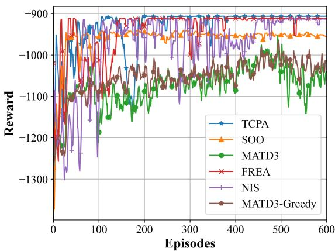  
Fig. 4. Convergence of the proposed TCPA scheme.

## B. Evaluation Results

In this subsection, we first present a convergence comparison among the proposed TCPA scheme and several benchmark schemes. Next, we evaluate the performance of TCPA under diverse environmental settings. Finally, we investigate the impact of the weighting parameters w1 and w2 in the objective function on various performance metrics.

1) Convergence performance: Fig. 4 shows the convergence of the proposed TCPA scheme compared with different schemes. It can be seen that TCPA outperforms the other schemes in terms of both convergence speed and reward. As expected, TCPA exhibits faster and more stable convergence compared to the MATD3-based schemes. This is because homogeneous agents share parameters in TCPA, thus speeding up the convergence. Additionally, the MATD3-based scheme demonstrates a significantly lower convergence reward compared to TCPA. This is because the MATD3 scheme is designed for continuous action spaces and performs poorly in discrete action spaces. The SOO scheme exhibits the lowest convergence reward, which can be attributed to the reward design. Specifically, its reward function only considers the total system delay. In addition, the convergence performance of FREA demonstrates that a fixed user association strategy cannot be effectively adapted to dynamic environments in UAV computing power networks. The comparison of the convergence performance of TCPA and NIS shows that the IRS is effective in improving the performance of the UAV computing power network.

Fig. 5 shows the convergence performance comparison of the proposed TCPA scheme under different learning rates. It can be observed that the proposed TCPA scheme converges under learning rates of 0.001, 0.0005 and 0.0001. This indicates that the proposed scheme exhibits strong robustness with respect to the learning rate hyperparameter. However, the proposed scheme fails to converge stably when the learning rate is set to 0.005 or 0.00005, demonstrating that excessively large or excessively small learning rates adversely affect the learning performance of agents. Among the tested values, the best convergence behavior is achieved at a learning rate of 0.0005. Therefore, the learning rate is set to 0.0005 in subsequent experiments.

Fig. 6 illustrates the convergence performance of the proposed TCPA scheme under different numbers of time slots. The results show that the proposed scheme converges stably regardless of the time-slot configuration. This is because varying the time slot number does not change the Markov property of the optimization problem. Therefore, it does not affect the convergence behavior of MAPPO. In addition, the reward value gradually decreases as the number of time slots increases. This phenomenon arises because a larger number of time slots introduces more computation tasks, which increases the total system delay and energy consumption.

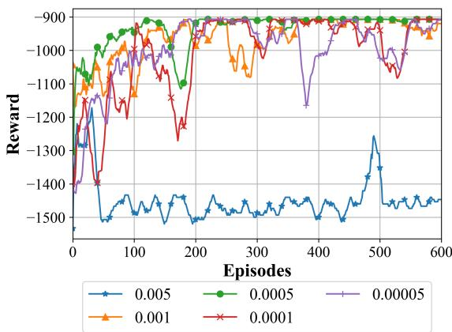

Fig. 5. Convergence of the proposed TCPA scheme under different learning rates.  
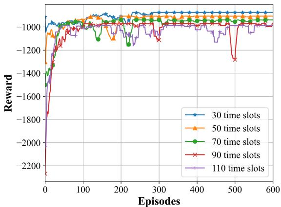  
Fig. 6. Convergence of the proposed TCPA scheme under different time slots.

2) Impact of the number of mobile users: To validate the effectiveness of the proposed scheme in complex scenarios, we introduce random user mobility, where each user moves randomly in one of the four cardinal directions at each time slot. Fig. 7 demonstrates that the proposed TCPA scheme converges stably under varying numbers of mobile users, while the convergence values decrease as the number of mobile users increases. Moreover, it can be observed that convergence is more challenging in scenarios with mobile users than with static users. This is because user mobility not only enlarges the state space but also complicates the exploration of effective policies.

Fig. 8 shows that as the number of mobile users increases, the computational energy consumption and delay both increase except for SOO scheme. This is because the increasing number of mobile users decreases the resources allocated to each user from the UAVs and IRS, thereby increasing the computational delay and computational energy consumption of UAVs. Fig. 8(a) shows that the reward value of the proposed TCPA scheme decreases smoothly as the number of mobile users increases, while consistently outperforming the other schemes. In contrast, the reward values of MATD3 and MATD3-Greedy exhibit significant fluctuations with varying numbers of users. These results indicate that the proposed scheme achieves substantially higher stability in complex scenarios compared with MATD3-based schemes. This improved stability can be attributed to the ability of the proposed TCPA scheme to dynamically allocate computing power and communication resources to balance different metrics.

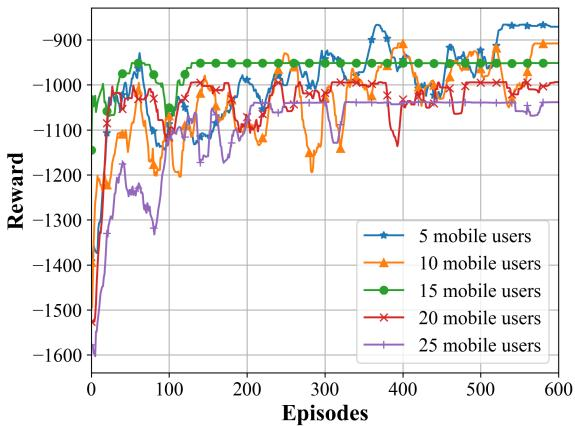  
Fig. 7. Convergence of the proposed TCPA scheme under different numbers of mobile users.

Figs. 8(b) and 8(c) demonstrate that TCPA outperforms other multi-objective optimization algorithms in terms of delay. In Fig. 8(c), when increasing the number of mobile users from 5 to 25, the gap in total system delay between TCPA and FREA, as well as TCPA and NIS, increases from 2.84 s and 4.12 s to 8.52 s and 39.21 s, respectively. This is because the dynamically segmented IRS can efficiently match user demands in scenarios with limited computing power and communication resources. The TCPA exhibits higher computational energy consumption than NIS and MATD3-Greedy when the number of mobile users exceeds 10. This is because TCPA aims to strike a balance between total system delay and computational energy consumption. It is noteworthy that the delay reduction achieved by TCPA significantly outweighs the slight increase in computational energy consumption. Additionally, in Fig. 8(b), the computational energy consumption of SOO decreases as the number of mobile users increases. This can be attributed to the fact that the amount of computing power allocated to each user is significantly reduced with the increasing number of mobile users, which in turn contributes to a substantial decrease in computational energy consumption per task.

3) Impact of the number of reflecting elements: To validate the performance of the TCPA scheme under different communication environments, we evaluate the proposed scheme in the NLoS communication environment described in [34], namely TCPA-NLoS. Fig. 9 shows the effect of increasing the number of reflecting elements from 100×100 to 900×900 on the reward, computational energy consumption, and total system delay. From Fig. 9(a), it can be observed that the reward value obtained by TCPA is highest for various numbers of reflecting elements. In addition, the total system delay decreases as the number of reflecting elements increases. This is because the increasing number of reflecting elements enhances the virtual LoS channel between the UAVs and the users, which reduces the transmission delay.

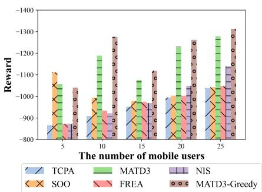  
(a) Reward

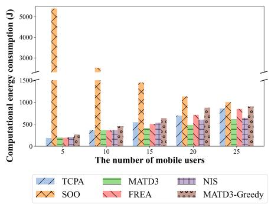  
(b) Computational energy consumption

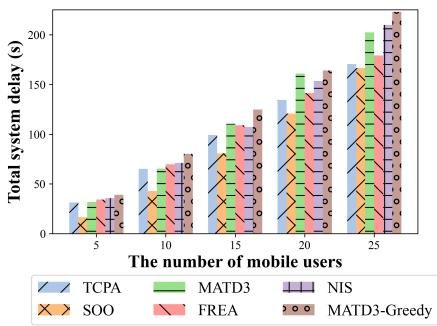  
(c) Total system delay

Fig. 8. Performance with different numbers of mobile users.  
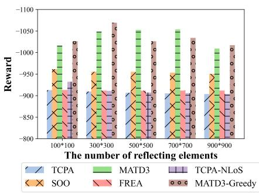  
(a) Reward

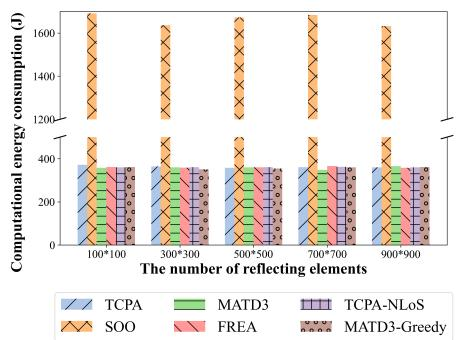  
(b) Computational energy consumption

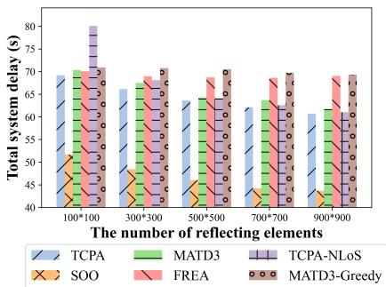  
(c) Total system delay

Fig. 9. Performance with different numbers of reflecting elements.  
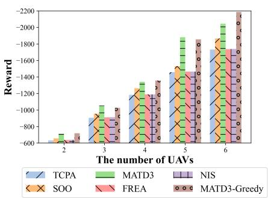  
(a) Reward

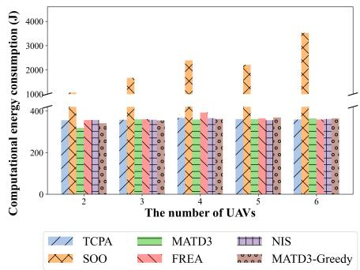  
(b) Computational energy consumption

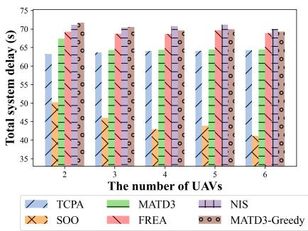  
(c) Total system delay  
Fig. 10. Performance with different numbers of UAVs.

From Fig. 9(b) and Fig. 9(c), it can be observed that the total system delay of all schemes decreases significantly as the number of reflecting elements increases, while the computational energy consumption remains comparable. This indicates that the employment of IRS can achieve low-cost delay reduction. In Fig. 9(c), the increase in reflecting elements from 100×100 to 900×900 reduces the total system delay of the SOO scheme by 15.61%, while TCPA reduces only 12.27%. The reason is that the delay consists of both transmission delay and computation delay, while the total computation delay of the SOO scheme is lower. With the same increase in the number of reflecting elements, the TCPA-NLoS scheme reduces total system delay by 23.79%. This indicates that, in scenarios with poor communication environments, the employment of IRS has a more significant impact on system delay performance. Besides, our proposed TCPA scheme outperforms MATD3- greedy and FREA for different numbers of reflecting elements in terms of reward and total system delay, demonstrating the advantages of dynamically segmented IRS in UAV computing power networks.

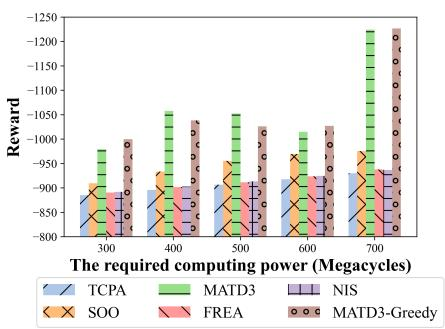  
(a) Reward

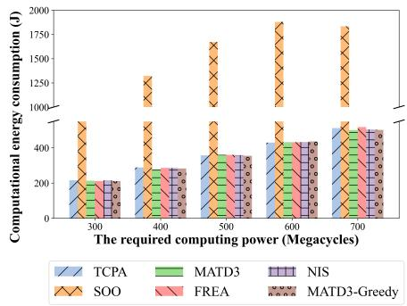  
(b) Computational energy consumption

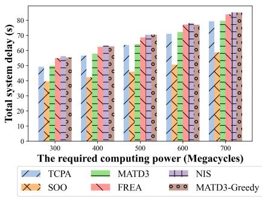  
(c) Total system delay  
Fig. 11. Performance with different required computing power (Megacycles).

4) Impact of the number of UAVs: Fig. 10 shows the performance comparison with different numbers of UAVs. In Fig. 10(a), it can be found that the SOO, MATD3 and MATD3-Greedy schemes exhibit a significantly greater reward degradation than TCPA as the number of UAVs increases. The main reasons can be summarized into two aspects. Firstly, all UAVs in the SOO scheme operate in a fully loaded state. Although this significantly reduces total system delay, it also leads to a sharp increase in computational energy consumption. Moreover, an increase in the number of UAVs leads to a more complex allocation of resources and design of trajectories, which causes the MATD3 and MATD3-Greedy schemes to be more susceptible to penalty rewards. In contrast, our proposed TCPA scheme achieves the highest total reward under varying numbers of UAVs, suggesting that it can effectively optimize the UAV trajectories.

Figs. 10(b) and 10(c) show that the computational energy consumption and the total system delay of all the schemes except SOO fluctuate slightly. This is because in the multiobjective optimization schemes, the limitation of energy consumption leads to idle computing power resources in UAVs, and the system prefers to provide services that satisfy the user’s delay requirements rather than minimizing the task execution delay.

5) Impact of the required computing power: Fig. 11 shows the performance comparison under varying required computing power. It can be observed that the computational energy consumption and total system delay of all schemes increase as the required computing power increases. From Fig. 11(a), it can be seen that the proposed TCPA scheme achieves the highest performance regarding the total reward, demonstrating its capability to maintain stable performance in UAV computing power networks with different loads.

From Fig. 11(b), it can be observed that the computational energy consumption of the SOO scheme increases significantly faster than that of the other schemes. This is because the SOO scheme only optimizes system delay, resulting in the highest computational energy consumption as expected. In addition, Fig. 11(b) shows that the computational energy consumption of TCPA surpasses that of NIS when the required computing power exceeds 600 Megacycles. This is attributed to the multiobjective optimization strategy, which balances computational energy consumption and total system delay. As expected, TCPA achieves lower total system delay than NIS. Specifically, TCPA achieves a 12.49% improvement in total system delay compared with NIS, while incurring similar computational energy consumption. Moreover, in Fig. 11(c), the performance gap in terms of total system delay among TCPA, MATD3, FREA, and MATD3-greedy narrows as the required computing power increases. The reason is that the increase in required computing power raises the UAV load, making it difficult to reduce computational delay by allocating more computing resources. The NIS scheme exhibits the highest total system delay, which further deteriorates as the required computing power increases.

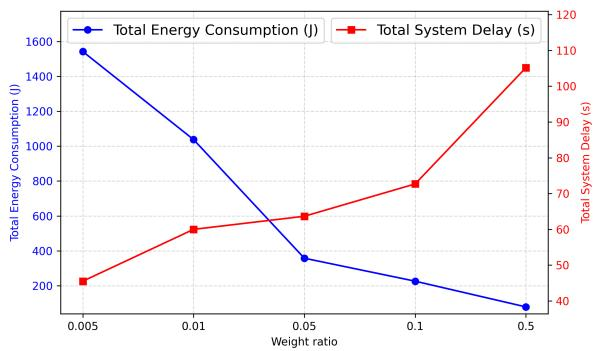  
Fig. 12. Impact of the weight rate.

6) Impact of the weight rate: Fig. 12 illustrates the impact of different weight ratios on various performance metrics, where the weighting ratio is denoted as $w _ { 2 } / w _ { 1 }$ . Since the objective function in the proposed optimization problem adopts a linear weighting scheme, the weights influence the focus of TCPA on different metrics during optimization. When the offloading ratio is low, TCPA tends to minimize total system delay and vice versa. In the simulation environment, the weighting ratio is set to 0.05 to achieve low-delay computing services while maintaining the stability of UAV computing power networks. It is noteworthy that the weighting ratio can be tuned according to practical system demands.

## VI. CONCLUSION

In this paper, we proposed a dynamically segmented IRSassisted UAV computing power network to reduce system delay and energy consumption. Considering the energy constraints of UAVs, we formulated a multi-objective optimization problem aiming to minimize both total energy consumption and system delay by jointly optimizing UAV trajectory, phase shift, computing power communication matching, and user association. To tackle the problem, we designed the TCPA scheme, which decomposed the problem into three subproblems and solved them iteratively. Simulation results demonstrated that the proposed TCPA scheme outperformed other multi-objective optimization approaches in terms of total system delay. Furthermore, the proposed dynamically segmented IRS showed superior performance compared to conventional IRS across various scenarios.

In future work, we will explore the impact of dynamic computing power capacity on system performance. Although this paper improves the utilization efficiency of computing power and communication resources in UAV computing power networks, realizing sequential decision-making optimization remains challenging in complex scenarios where both the number of UAVs and users vary.

## REFERENCES

[1] J. Liu, Y. Lu, H. Wu, B. Ai, A. Jamalipour, and Y. Zhang, “Joint Task Coding and Transfer Optimization for Edge Computing Power Networks,” IEEE Transactions on Network Science and Engineering, vol. 12, no. 4, pp. 2783–2796, 2025.

[2] Z. Ning, H. Hu, X. Wang, L. Guo, S. Guo, G. Wang, and X. Gao, “Mobile Edge Computing and Machine Learning in The Internet of Unmanned Aerial Vehicles: A Survey,” ACM Computing Surveys, vol. 56, no. 1, pp. 1–31, 2023.

[3] M. Hevesli, A. Mohammed Seid, A. Erbad, and M. Abdallah, “Multi-Agent DRL for Queue-Aware Task Offloading in Hierarchical MEC-Enabled Air-Ground Networks,” IEEE Transactions on Cognitive Communications and Networking, vol. 12, pp. 217–236, 2026.

[4] Z. Ning, H. Hu, X. Wang, Q. Wu, C. Yuen, F. R. Yu, and Y. Zhang, “Joint User Association, Interference Cancellation, and Power Control for Multi-IRS Assisted UAV Communications,” IEEE Transactions on Wireless Communications, vol. 23, no. 10, pp. 13408–13423, 2024.

[5] M. Chemingui, A. Elzanaty, and R. Tafazolli, “EMF-Efficient MU-MIMO Networks: Harnessing Aerial RIS Technology,” IEEE Transactions on Green Communications and Networking, vol. 9, no. 4, pp. 2014– 2027, 2025.

[6] B. Ma, Y. Pan, Y. Xu, Z. Gao, Z. Zhang, C. Chen, and C. Li, “AAV-Assisted Computing Power Network Task Allocation and 3-D Urban Trajectory Optimization,” IEEE Internet of Things Journal, vol. 12, no. 12, pp. 19294–19307, 2025.

[7] H. Wang, H. Zhang, X. Liu, K. Long, and A. Nallanathan, “Joint UAV Placement Optimization, Resource Allocation, and Computation Offloading for THz Band: A DRL Approach,” IEEE Transactions on Wireless Communications, vol. 22, no. 7, pp. 4890–4900, 2023.

[8] Y. Liu, X. Fang, M. Xiao, F. Song, Y. Cui, Q. Xue, and C. Tang, “Latency Optimization for Multi-UAV-Assisted Task Offloading in Air-Ground Integrated Millimeter-Wave Networks,” IEEE Transactions on Wireless Communications, vol. 23, no. 10, pp. 13359–13376, 2024.

[9] Y. K. Tun, G. Dn, Y. M. Park, and C. S. Hong, “Joint UAV Deployment and Resource Allocation in THz-Assisted MEC-Enabled Integrated Space-Air-Ground Networks,” IEEE Transactions on Mobile Computing, vol. 24, no. 5, pp. 3794–3808, 2025.

[10] F. Pervez, A. Sultana, C. Yang, and L. Zhao, “Energy and Latency Efficient Joint Communication and Computation Optimization in a Multi-UAV-Assisted MEC Network,” IEEE Transactions on Wireless Communications, vol. 23, no. 3, pp. 1728–1741, 2024.

[11] H. Hao, C. Xu, W. Zhang, S. Yang, and G.-M. Muntean, “Joint Task Offloading, Resource Allocation, and Trajectory Design for Multi-UAV Cooperative Edge Computing With Task Priority,” IEEE Transactions on Mobile Computing, vol. 23, no. 9, pp. 8649–8663, 2024.

[12] A. Nabi and S. Moh, “Joint Offloading Decision, User Association, and Resource Allocation in Hierarchical Aerial Computing: Collaboration of UAVs and HAP,” IEEE Transactions on Mobile Computing, vol. 24, no. 8, pp. 7267–7282, 2025.

[13] J. Yin, Z. Tang, J. Lou, J. Guo, H. Cai, X. Wu, T. Wang, and W. Jia, “QoS-Aware Energy-Efficient Multi-UAV Offloading Ratio and Trajectory Control Algorithm in Mobile-Edge Computing,” IEEE Internet of Things Journal, vol. 11, no. 24, pp. 40588–40602, 2024.

[14] S. Wang, X. Song, T. Song, and Y. Yang, “Fairness-Aware Computation Offloading With Trajectory Optimization and Phase-Shift Design in RIS-Assisted Multi-UAV MEC Network,” IEEE Internet of Things Journal, vol. 11, no. 11, pp. 20547–20561, 2024.

[15] J. Wu, Z. Yu, J. Guo, Z. Tang, T. Wang, and W. Jia, “Two-Stage Deep Energy Optimization in IRS-Assisted UAV-Based Edge Computing Systems,” IEEE Transactions on Mobile Computing, vol. 24, no. 1, pp. 449–465, 2025.

[16] L. Li, W. Guan, C. Zhao, Y. Su, and J. Huo, “Trajectory Planning, Phase Shift Design, and IoT Devices Association in Flying-RIS-Assisted Mobile Edge Computing,” IEEE Internet of Things Journal, vol. 11, no. 1, pp. 147–157, 2024.

[17] E. T. Michailidis, M.-G. Volakaki, N. I. Miridakis, and D. Vouyioukas, “Optimization of Secure Computation Efficiency in UAV-Enabled RIS-Assisted MEC-IoT Networks With Aerial and Ground Eavesdroppers,” IEEE Transactions on Communications, vol. 72, no. 7, pp. 3994–4009, 2024.

[18] W. Xu, T. Zhang, X. Mu, Y. Liu, and Y. Wang, “Trajectory Planning and Resource Allocation for Multi-UAV Cooperative Computation,” IEEE Transactions on Communications, vol. 72, no. 7, pp. 4305–4318, 2024.

[19] D. Wang, M. Wu, Z. Wei, K. Yu, L. Min, and S. Mumtaz, “Uplink Secrecy Performance of RIS-Based RF/FSO Three-Dimension Heterogeneous Networks,” IEEE Transactions on Wireless Communications, vol. 23, no. 3, pp. 1798–1809, 2024.

[20] X. Yu, J. Xu, N. Zhao, X. Wang, and D. Niyato, “Security Enhancement of ISAC via IRS-UAV,” IEEE Transactions on Wireless Communications, vol. 23, no. 10, pp. 15601–15612, 2024.

[21] J. Li, L. Yang, Q. Wu, X. Lei, F. Zhou, F. Shu, X. Mu, Y. Liu, and P. Fan, “Active RIS-Aided NOMA-Enabled Space-Air-Ground Integrated Networks With Cognitive Radio,” IEEE Journal on Selected Areas in Communications, vol. 43, no. 1, pp. 314–333, 2025.

[22] G. Sun, Y. Wang, Z. Sun, Q. Wu, J. Kang, D. Niyato, and V. C. M. Leung, “Multi-Objective Optimization for Multi-UAV-Assisted Mobile Edge Computing,” IEEE Transactions on Mobile Computing, vol. 23, no. 12, pp. 14803–14820, 2024.

[23] J. Chen, X. Cao, P. Yang, M. Xiao, S. Ren, Z. Zhao, and D. O. Wu, “Deep Reinforcement Learning Based Resource Allocation in Multi-UAV-Aided MEC Networks,” IEEE Transactions on Communications, vol. 71, no. 1, pp. 296–309, 2023.

[24] M. A. Ali and A. Jamalipour, “UAV Placement and Power Allocation in Uplink and Downlink Operations of Cellular Network,” IEEE Transactions on Communications, vol. 68, no. 7, pp. 4383–4393, 2020.

[25] A. Lotfolahi and H.-W. Ferng, “A Multi-Agent Proximal Policy Optimized Joint Mechanism in mmWave HetNets With CoMP Toward Energy Efficiency Maximization,” IEEE Transactions on Green Communications and Networking, vol. 8, no. 1, pp. 265–278, 2024.

[26] H. Li, K. Xiong, Y. Lu, W. Chen, P. Fan, and K. B. Letaief, “Collaborative Task Offloading and Resource Allocation in Small-Cell MEC: A Multi-Agent PPO-Based Scheme,” IEEE Transactions on Mobile Computing, vol. 24, no. 3, pp. 2346–2359, 2025.

[27] C. Yu, A. Velu, E. Vinitsky, J. Gao, Y. Wang, A. Bayen, and Y. Wu, “The Surprising effectiveness of PPO in Cooperative Multi-Agent Games,” Advances in Neural Information Processing Systems, vol. 35, pp. 24611– 24624, 2022.

[28] Q. Wang, S. Zou, Y. Sun, M. Liwang, X. Wang, and W. Ni, “Toward Intelligent and Adaptive Task Scheduling for 6G: An Intent-Driven Framework,” IEEE Transactions on Cognitive Communications and Networking, vol. 10, no. 5, pp. 1975–1988, 2024.

[29] Y. Lin, L. Xiao, Y. Tao, Y. Zhang, F. Shu, and J. Li, “Multi-Agent Computing-Energy-Efficiency Optimization in Vehicular Edge Comput-

ing: Non-Cooperative Versus Cooperative Solutions,” IEEE Transactions on Wireless Communications, vol. 24, no. 7, pp. 5461–5476, 2025.

[30] S. Han, J. Wang, L. Xiao, and C. Li, “Broadcast Secrecy Rate Maximization in UAV-Empowered IRS Backscatter Communications,” IEEE Transactions on Wireless Communications, vol. 22, no. 10, pp. 6445– 6458, 2023.

[31] Z. Nan, Y. Han, J. Yan, S. Zhou, and Z. Niu, “Robust Task Offloading and Resource Allocation Under Imperfect Computing Capacity Information in Edge Intelligence Systems,” IEEE Transactions on Mobile Computing, vol. 24, no. 7, pp. 6154–6167, 2025.

[32] Z. Kuang, H. Wang, J. Li, and F. Hou, “Utility-Aware UAV Deployment and Task Offloading in Multi-UAV Edge Computing Networks,” IEEE Internet of Things Journal, vol. 11, no. 8, pp. 14755–14770, 2024.

[33] S. Wang, X. Song, T. Song, and Y. Yang, “Fairness-Aware Computation Offloading With Trajectory Optimization and Phase-Shift Design in RIS-Assisted Multi-UAV MEC Network,” IEEE Internet of Things Journal, vol. 11, no. 11, pp. 20547–20561, 2024.

[34] S. Lin, Y. Zou, and D. W. K. Ng, “Ergodic Throughput Maximization for RIS-Equipped-UAV-Enabled Wireless Powered Communications With Outdated CSI,” IEEE Transactions on Communications, vol. 72, no. 6, pp. 3634–3650, 2024.