# Edge Intelligence in Intelligent Transportation Systems: A Survey

Taiyuan Gong , Li Zhu , F. Richard Yu , Fellow, IEEE, and Tao Tang , Senior Member, IEEE

Abstract— Edge intelligence (EI) is becoming one of the research hotspots among researchers, which is believed to help empower intelligent transportation systems (ITS). ITS generates a large amount of data at the network edge by millions of devices and sensors. Data-driven artificial intelligence (AI) is at the core of ITS development. By pushing the AI frontier to the network edge, EI enables ITS AI applications to have lower latency, higher security, less pressure on the backbone network and better use edge big data. This paper surveys Edge Intelligence in Intelligent Transportation Systems. We first introduce the challenges ITS faces and explain the motivation of using EI in ITS. We then explore the framework of using EI in ITS, including the EI-based ITS architecture, the data gathering and communication methods, the data processing and service delivery, and the performance indexes. The enabling technologies, such as AI models, the Internet of Things, and Edge Computing technologies used in EI-based ITS, are reviewed intensively. We discuss the edge intelligence applications and research fields in ITS in depth. Typical application scenarios, such as autonomous driving, vehicular edge computing, intelligent vehicular transportation system, unmanned aerial vehicle (UAV) in ITS environment, and rail transportation control and management, are explored. The general platforms of EI, the EI training and inference in ITS, as well as the benchmark datasets, are introduced. Finally, we discuss some of the challenges and future directions of using EI in ITS.

Index Terms— Edge intelligence (EI), intelligent transportation systems (ITS), artificial intelligence (AI), transportation.

## I. INTRODUCTION

N RECENT years, edge intelligence (EI) has received I tremendous interest among researchers. EI represents pushing the artificial intelligence (AI) frontiers to the network edge [1]. EI uses edge computing (EC) [2] as a key technology that enables the deployment of AI applications at edge servers and end devices where data is generated. AI benefits from a boom in big data analytics, deep learning, and growing computing power, and is already playing an increasingly irreplaceable role in areas such as telemedicine, smart homes, intelligent personal assistants, and manufacturing [3], [4], [5], [6], etc. It is believed that people will benefit greatly from these AI applications in boosting the quality of life, production efficiency, and social efficiency. In AI applications, big data is considered one of the core driving forces, and it needs to be processed by AI applications to fully unlock its potential [7]. Nowadays, billions of mobile devices and Internet of Things (IoT) devices are being deployed at the network edge, generating tons of data that needs AI applications to process [8]. However, with cloud computing centers facing network bandwidth pressures and inevitable transmission delays, and end devices with weak computing power, traditional computing models have gradually made it difficult to fully unlock the potential of big data at the edge. Thus, by combining end devices, edge servers, and cloud computing centers, EI is considered to play a critical role in the further improvement of edge-side AI applications. AI applications powered through EI technology have the advantages of low latency, privacy protection, energy saving, bandwidth pressure release, and so on [1], [9], [10]. The potential of EI is receiving attention from a wide range of industries [1]. EI’s efficient and safe properties have also attracted the attention of intelligent transportation systems (ITS) researchers.

ITS has been one of the research hotspots since the 1970s [11]. ITS is regarded as the development direction of the future transportation system. It integrates sensor technology, information technology, computer science, communication technology, etc., into the transportation system [12]. The purpose of ITS is to provide better services for every participant in the transportation system [13], [14]. In ITS, AI applications can be deployed in many areas, such as automated driving, rail transportation control systems, autonomous flight, traffic management [15], [16], [17], [18], etc.

While AI applications are driving further intelligentialize in ITS, they also face the same challenges, such as realtime requirements, security, and network bandwidth pressure. AI applications in ITS show the characteristics of high real-time requirements and big data volume [19]. In ITS, data collection has undergone tremendous changes in data sources in the past few decades, moving from giant cloud data centers to ever-expanding end devices. As more devices and sensors are connected to the Internet, the amount of data generated in ITS increases from a Trillionbyte level to a Petabyte level that needs procession. Zhu et al. [19] have already proved that edge big data in ITS has a considerable potential. Cisco estimated that in the global Internet, data close to 850 ZB would be generated by humans, machines, and all devices connected to the Internet in 2021 [20]. In comparison, the global data center traffic will only reach 20 ZB at the end of 2021 [21]. The huge contrast in the quantity of data and Internet bandwidth will lead to Internet traffic congestion. As a result, it takes substantial delay to transmit the huge amount of data to a centralized data center to process, severely negatively impacting real-time applications demanding AI technologies. The inevitable data transmission latency and bandwidth pressure on traditional cloud computing centers serving edge AI applications have resulted in real-time performance that cannot meet the increasing requirements of AI applications in ITS (e.g., real-time autonomous driving, etc.). At the same time, end devices have limited computing power and energy resources to deploy large-scale AI applications. In order to cope with such a large amount of data, a new approach to AI deployment is essential. With the continuous development of ITS, similar resource mismatch problems will inevitably appear soon, resulting in the inability to realize the full potential of edge data. It is now quite desirable to find a new method of AI deployment. Therefore, as one promising solution to this problem, EI is highly valued by more and more researchers.

Using EI in ITS has been a rising research area in recent years. By pushing the AI frontiers to the edge ecosystem [1], EI is believed to be a promising solution for booming big data-enabled AI applications, especially in modern ITS [19]. With the continuous innovation of EI technology, using EI in ITS has become a development direction of ITS in the future. In recent years, more and more researchers have begun to study the application scenarios of EI in ITS, such as autonomous driving cars [29], [30], vehicular edge computing [15], intelligent vehicular transportation systems [18], [31], unmanned aerial vehicle (UAV) [32], rail transit [33], etc. EI can meet the requirements of low latency, high privacy sensitivity, and edge big data characteristics of ITS applications.

Meanwhile, using EI in ITS is still in an inchoate stage. Table I shows seven survey articles published in recent years that are relevant to this paper. These articles’ main contributions and limitations are described, and the contributions and limitations of this paper are further analyzed to provide a dialectical perspective for readers. As shown in Table I, there are a few articles about EI related research in transportation systems, most of them are confined to a specific point of EI or a specific part of transportation. In [22], using EI on the Internet of Vehicles is surveyed. In [24], authors studied the security issues and challenges of using EC in ITS. Using EC in ITS sensing is surveyed in detail in [25]. In [23], the framework of using EI in road transportation is discussed. In [26], authors studied edge-cloud computing in connected vehicles. In [27], authors surveyed task offloading strategies in vehicular networks based on reinforcement learning (RL) and deep reinforcement learning (DRL). In [28], task offloading algorithms in vehicular communication network is discussed. As described in Table I, these articles mainly focus on EC-enabled connected vehicles, while other important aspects in ITS, such as rail transit, UAV etc., are slightly missing. In addition, there is little discussion of the introduction of EI architectures into ITS. However, the EI architecture includes the combination of end devices, edge servers, and cloud computing centers to fully integrate resources [1], which we believe will further drive the development of ITS. There is a lack of articles dedicated to the application of EI in ITS to summarise, discuss and disseminate its latest advances to provide a comprehensive knowledge and outlook on the use of EI in ITS.

Considering the limitations of the previous articles, to fill the gap, we conducted a comprehensive and systematic survey of research work related to the introduction of EI into ITS. The main contributions of this survey are: firstly, introducing the new concept of EI into ITS and proposing architecture for the application of EI in ITS. Subsequently, we systematically discuss the background, necessity, enabling technologies, application areas, existing platforms, and future challenges of using EI in ITS. In particular, we start with the foundation and motivation of using EI in ITS, analyze the challenges facing ITS, and explain the need to use EI in ITS. The architecture of EI-based ITS and performance indexes in EI-based ITS are then introduced. Enabling technologies in EI-based ITS are summarized thereafter. Notably, we focus on EI applications and research fields in ITS, including autonomous driving, vehicular edge computing, intelligent vehicular transportation system, unmanned aerial vehicle, and rail transportation. We also summarize EI’s existing training & inference methods, platforms, frameworks, and benchmark datasets. Finally, challenges and future directions of EI in ITS are discussed. All this is with the hope of building a bridge between EI and ITS for researchers.

Fig. 1 illustrates the organization of this paper. The subsequent paragraphs can be divided into two main sections, motivation and basic information of EI-based ITS and survey of EI-based ITS. Section II summarizes the foundation and motivation for using EI in ITS. The architecture and performance indexes of EI-based ITS are discussed in Section III. Section IV presents the enabling technologies in EI-based ITS. The EI applications and research fields in ITS are introduced in detail in Section V. Section VI reviews the platforms and frameworks of EI in ITS. Some open challenges and future directions for using EI in ITS are discussed in Section VII. Finally, we conclude the paper in Section VIII. In addition, the list of acronyms and abbreviations used in this paper is summarized in Table II.

## II. FOUNDATION AND MOTIVATION OF USING EI IN ITS

This section begins with a review of ITS and EI to provide a comprehensive background. Then the key challenges that ITS is facing are discussed in detail. The motivations for using EI in ITS are presented subsequently. This section explains the reasons for introducing EI into ITS.

## A. ITS Review

Intelligent transportation systems (ITS) is a comprehensive transportation system that combines information technology, communication technology, sensor technology, computer science, etc., with the existing transportation infrastructure [12]. ITS aims to provide safe, environmentally friendly and energy efficient transportation services. Since transportation is a system that almost everyone will come into contact with, ITS development has received widespread attention from academics to the general public. The concept of ITS has evolved into many research directions, such as intelligent driving of automobiles, safety assurance, and traffic management.

TABLE I  
COMPARISON OF RELATED ARTICLES AND OUR ARTICLE
<table><tr><td rowspan=1 colspan=1>Paper</td><td rowspan=1 colspan=1>Contributions</td><td rowspan=1 colspan=1>Limitations</td></tr><tr><td rowspan=1 colspan=1>Mobile Edge Intelligence and Com-puting for the Internet of Vehicles(2019) [22]</td><td rowspan=1 colspan=1>EI on Internet of Vehicles (IoV), including key designissues, methodologies and hardware platforms, edge-assisted perception, mapping, and localization wereintroduced.</td><td rowspan=1 colspan=1>Studied in detail no other fields than IoV, othertypical application scenarios in ITS (e.g., UAV, railtransit) had not been studied.</td></tr><tr><td rowspan=1 colspan=1>Deep Learning for Reliable MobileEdge Analytics in Intelligent Trans-portation Systems (2019) [23]</td><td rowspan=1 colspan=1>A framework for combining edge computing &amp; deeplearning in ITS was studied.</td><td rowspan=1 colspan=1>Only a simple architecture for road transport isdiscussed, no other typical ITS scenarios (e.g. UAV,rail transit) are discussed, and no comprehensivediscussion of the application of EI in ITS was held.</td></tr><tr><td rowspan=1 colspan=1>Edge Computing in Transportation:Security Issues and Challenges(2020) [24]</td><td rowspan=1 colspan=1>The current status and safety and challenges of ECin IoV were studied, including the existing researchof vehicular attacks and their dealing methods.</td><td rowspan=1 colspan=1>The study mainly investigated the safety issues ofroad traffic. The architecture of EI in transportationsystems and the application of other ITS typicalscenarios (e.g. UAV, rail transit) were not studied.</td></tr><tr><td rowspan=1 colspan=1>When Intelligent Transportation Sys-tems Sensing Meets Edge Comput-ing: Vision and Challenges (2021)[25]</td><td rowspan=1 colspan=1>Mainly focused on the application of EC in the sens-ing of ITS in detail. The authors discussed existingITS sensing technologies and the opportunities andchallenges of applying EC to ITS sensing.</td><td rowspan=1 colspan=1>Only the sensing of road transportation in ITSwas discussed, other aspects of ITS (e.g., signalplanning, vehicle control, etc.) had not been studied.</td></tr><tr><td rowspan=1 colspan=1>A Taxonomy and Survey of EdgeCloud Computing for IntelligentTransportation Systems and Con-nected Vehicles (2021) [26]</td><td rowspan=1 colspan=1>Surveyed the literature for cloud computing usagewith iTS and connected vehicles and provides tax-onomies and use cases for that.</td><td rowspan=1 colspan=1>Mainly focused on connected vehicles, the applica-tion of edge cloud computing in overall ITS (e.g.,UAV, rail transit) had not been studied.</td></tr><tr><td rowspan=1 colspan=1>RL/DRL Meets Vehicular Task Of-floading Using Edge and VehicularCloudlet: A Survey (2022) [27]</td><td rowspan=1 colspan=1>A research in reinforcement learning (RL) or deepreinforcement learning (DRL)-based solutions in ve-hicular edge computing, particularly focused on thevehicular task offloading strategies.</td><td rowspan=1 colspan=1>Restricted to a discussion of the RL/DRL approach,the additional potential offered by EI is not dis-cussed.</td></tr><tr><td rowspan=1 colspan=1>A Survey on Vehicular Task Offload-ing: Classification, Issues, and Chal-lenges (2022) [28]</td><td rowspan=1 colspan=1>A detailed survey of task offloading in connectedvehicles, which discusses in detail the research re-lated to task offloading for vehicle to vehicle (V2V),vehicle to roadside infrastructure (V2I), and vehicleto everything (V2X)</td><td rowspan=1 colspan=1>The main focus is on task offloading, without pro-viding a comprehensive knowledge and outlook onthe application of EI in ITS.</td></tr><tr><td rowspan=1 colspan=1>Our paper</td><td rowspan=1 colspan=1>Introducing the new concept of EI into ITS andproposes an architecture for the application of EIin ITS. Systematically presenting the background,necessity, enabling technologies, application areas,existing platforms, future challenges of using EI inITS.</td><td rowspan=1 colspan=1>More attention has been paid to possible directionsand technologies for the development of EI in ITS,and fewer technologies are currently being used inpractice.</td></tr></table>

In recent years, ITS have gradually turned into data-driven AI application-enabled systems [14]. With the development of big data analytics [19], data from various sources of ITS will significantly boost the possibilities of ITS applications. Especially in recent years, with the large-scale deployment of deep learning applications and the Internet of Things (IoT) applications in ITS, more and more devices and sensors are connected to the Internet, which generates a large amount of data that needs to be processed at the edge of the network. The traditional centralized cloud computing center processing way will not be as effective as expected in meeting future ITS requirements for privacy, real-time performance, and energy consumption. Therefore, ITS is facing huge challenges.

Researchers have focused more on the road traffic part of ITS in recent years. Although road traffic dominates the transportation system, we believe that train, underground, and aerial parts are also important parts of future ITS. Therefore, in this survey, we will conduct research on the directions, including road transportation, rail transit and UAV.

## B. Overview of Edge Intelligence

Edge intelligence (EI) runs artificial intelligence (AI) Applications with the technology of edge computing (EC), which makes full use of edge resources. A typical End-Edge-Cloud structure of the network is shown in Fig. 2, where the edge nodes can widely cover the Wi-Fi Access Points (APs), access points, micro data centers or routers. End devices such as cars, traffic lights and surveillance probes are connected to each other via edge nodes or device-to-device (D2D) connections and interact with the cloud computing centers via the internet for data interaction.

Microsoft made the primeval attempt of EI in 2009 [34], and they tried to build a prototype based on edge servers to support mobile voice recognition. While the traditional thoughts are that EI represents running AI applications locally on an end device where data was created [35], Zhou et al. rated EI into six levels [1]. They consider EI runs AI models not only alone at the end devices but also with end-edgecloud computation. The traditional way of EI faces a critical problem: running computation-intensive tasks locally, like deep neural networks (DNN), requires powerful processors at end devices. The resource-intensive character is fatal for deployment in some energy-sensitive and cost-sensitive scenarios. Many researchers have proved that running artificial neural networks (ANN) models based on end-edge-cloud synergy can improve both response time and energy consumption [36], [37], [38]. Thus, the synergy of edge-cloud should be considered in the design of the EI rating. According to [39], to make full usage of all the available resources, edge nodes, end devices, and cloud data centers are designed into the seven-level framework of EI. Fig. 3 is the seven-level framework of EI, whereas the level goes up, fewer data will be uploaded over the web for better data privacy security, the definition of levels is shown in the following:

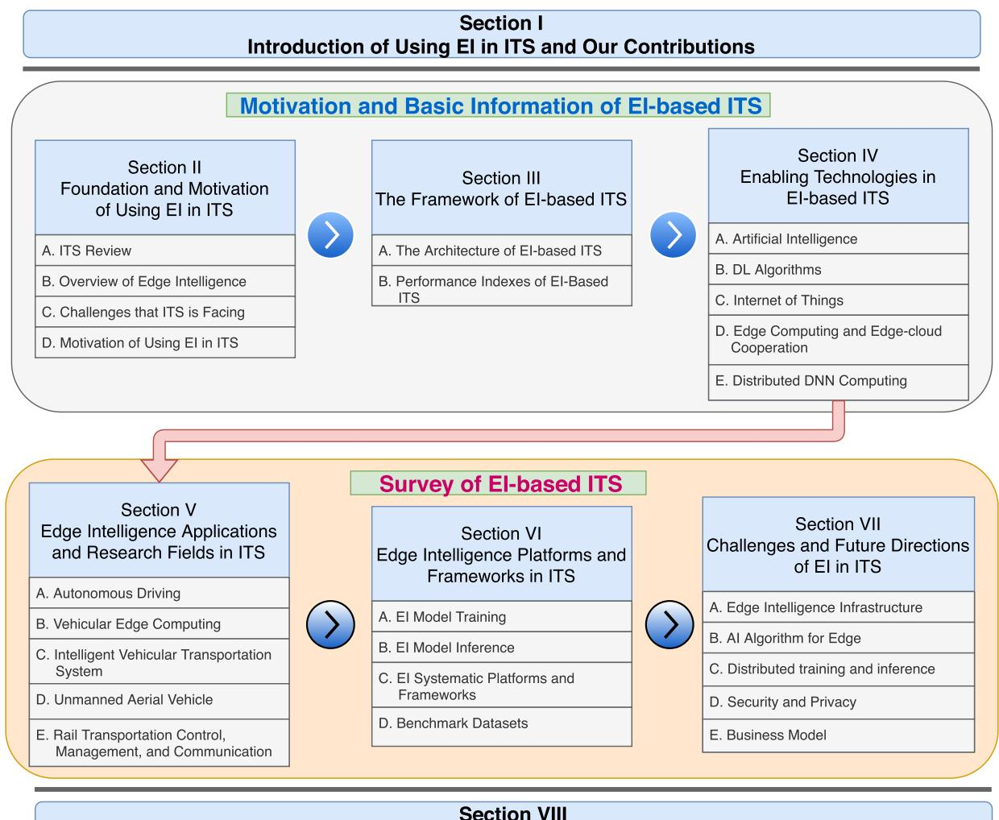  
Conclusion of Using Edge Intelligence in Intelligent Transportation Systems

Fig. 1. The organization of the survey.  
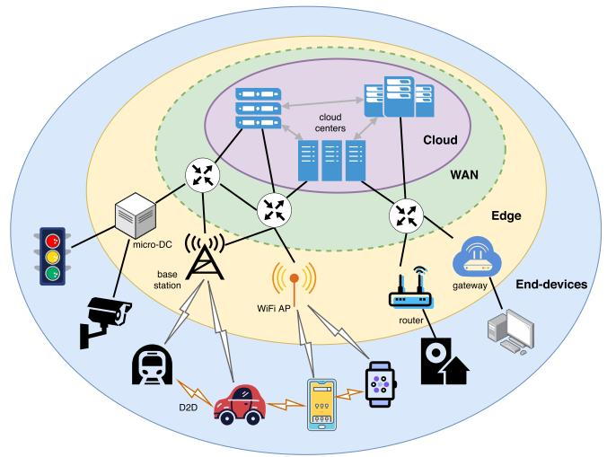  
Fig. 2. The End-Edge-Cloud structure.

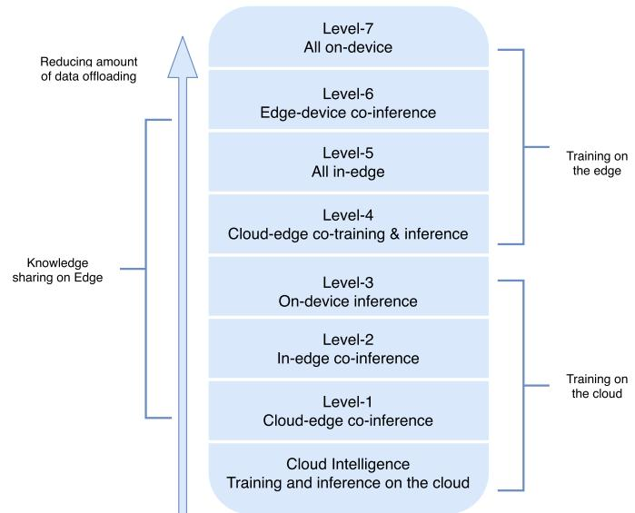  
Fig. 3. The seven-level framework of EI.

1) Cloud Intelligence: Both training and inferring the ANN models fully in the cloud.

TABLE II  
ACRONYMS/ABBREVIATIONS
<table><tr><td rowspan=1 colspan=1>5G</td><td rowspan=1 colspan=1>fifth-generation</td></tr><tr><td rowspan=1 colspan=1>6G</td><td rowspan=1 colspan=1>sixth-generation</td></tr><tr><td rowspan=1 colspan=1>ADAS</td><td rowspan=1 colspan=1>Advanced driver-assistance system</td></tr><tr><td rowspan=1 colspan=1>ADS</td><td rowspan=1 colspan=1>Automated Driving System</td></tr><tr><td rowspan=1 colspan=1>AE</td><td rowspan=1 colspan=1>AutoEncoder</td></tr><tr><td rowspan=1 colspan=1>AI</td><td rowspan=1 colspan=1>Artificial Intelligence</td></tr><tr><td rowspan=1 colspan=1>AM</td><td rowspan=1 colspan=1>Attention Model</td></tr><tr><td rowspan=1 colspan=1>ANN</td><td rowspan=1 colspan=1>Artificial Neural Network</td></tr><tr><td rowspan=1 colspan=1>AP</td><td rowspan=1 colspan=1>Access Point</td></tr><tr><td rowspan=1 colspan=1>ATO</td><td rowspan=1 colspan=1>Automatic Train Operation</td></tr><tr><td rowspan=1 colspan=1>BDL</td><td rowspan=1 colspan=1>Bayesian Deep Learning</td></tr><tr><td rowspan=1 colspan=1>BS</td><td rowspan=1 colspan=1>Base Station</td></tr><tr><td rowspan=1 colspan=1>CC</td><td rowspan=1 colspan=1>Cloudlet Computing</td></tr><tr><td rowspan=1 colspan=1>CPU</td><td rowspan=1 colspan=1>Central Processing Unit</td></tr><tr><td rowspan=1 colspan=1>CTC</td><td rowspan=1 colspan=1>Centralized Traffic Control</td></tr><tr><td rowspan=1 colspan=1>D2D</td><td rowspan=1 colspan=1>device-to-device</td></tr><tr><td rowspan=1 colspan=1>DL</td><td rowspan=1 colspan=1>Deep Learning</td></tr><tr><td rowspan=1 colspan=1>DNN</td><td rowspan=1 colspan=1>Deep Neural Network</td></tr><tr><td rowspan=1 colspan=1>EC</td><td rowspan=1 colspan=1>Edge Computing</td></tr><tr><td rowspan=1 colspan=1>EI</td><td rowspan=1 colspan=1>Edge Intelligence</td></tr><tr><td rowspan=1 colspan=1>EMU</td><td rowspan=1 colspan=1>Electric Multiple Units</td></tr><tr><td rowspan=1 colspan=1>FC</td><td rowspan=1 colspan=1>Fog Computing</td></tr><tr><td rowspan=1 colspan=1>FNN</td><td rowspan=1 colspan=1>Feedforward Neural Network</td></tr><tr><td rowspan=1 colspan=1>GCNN</td><td rowspan=1 colspan=1>Graph Convolutional Neural Network</td></tr><tr><td rowspan=1 colspan=1>GPU</td><td rowspan=1 colspan=1>Graphics Processing Unit</td></tr><tr><td rowspan=1 colspan=1>ID</td><td rowspan=1 colspan=1>Identify Document</td></tr><tr><td rowspan=1 colspan=1>IIoT</td><td rowspan=1 colspan=1>Industrial Internet of Things</td></tr><tr><td rowspan=1 colspan=1>IONN</td><td rowspan=1 colspan=1>Incremental Ofloading of Neural Network</td></tr><tr><td rowspan=1 colspan=1>IoT</td><td rowspan=1 colspan=1>Internet of Things</td></tr><tr><td rowspan=1 colspan=1>ITS</td><td rowspan=1 colspan=1>Intelligent Transportation Systems</td></tr><tr><td rowspan=1 colspan=1>IVTS</td><td rowspan=1 colspan=1>Intelligent Vehicular Transportation System</td></tr><tr><td rowspan=1 colspan=1>LoPECS</td><td rowspan=1 colspan=1>Low-Power Edge Computing System</td></tr><tr><td rowspan=1 colspan=1>LSTM</td><td rowspan=1 colspan=1>Long short-term memory</td></tr><tr><td rowspan=1 colspan=1>MB</td><td rowspan=1 colspan=1>Megabyte</td></tr><tr><td rowspan=1 colspan=1>MEC</td><td rowspan=1 colspan=1>Mobile Edge Computing</td></tr><tr><td rowspan=1 colspan=1>ML</td><td rowspan=1 colspan=1>Machine Learning</td></tr><tr><td rowspan=1 colspan=1>NOMA</td><td rowspan=1 colspan=1>Non-orthogonal multiple access</td></tr><tr><td rowspan=1 colspan=1>PG</td><td rowspan=1 colspan=1>Personal Gateway</td></tr><tr><td rowspan=1 colspan=1>PVS</td><td rowspan=1 colspan=1>Public Vehicles System</td></tr><tr><td rowspan=1 colspan=1>QoE</td><td rowspan=1 colspan=1>Quality-of-Experience</td></tr><tr><td rowspan=1 colspan=1>QoS</td><td rowspan=1 colspan=1>Quality-of-Service</td></tr><tr><td rowspan=1 colspan=1>RAM</td><td rowspan=1 colspan=1>Random Access Memory</td></tr><tr><td rowspan=1 colspan=1>RL</td><td rowspan=1 colspan=1>Reinforcement Learning</td></tr><tr><td rowspan=1 colspan=1>RNN</td><td rowspan=1 colspan=1>Recurrent Neural Network</td></tr><tr><td rowspan=1 colspan=1>RSU</td><td rowspan=1 colspan=1>Road Side Unit</td></tr><tr><td rowspan=1 colspan=1>RTS</td><td rowspan=1 colspan=1>Rail Transportation System</td></tr><tr><td rowspan=1 colspan=1>SGD</td><td rowspan=1 colspan=1>Stochastic Gradient Descent</td></tr><tr><td rowspan=1 colspan=1>TEDS</td><td rowspan=1 colspan=1>Trouble of moving EMU Detection System</td></tr><tr><td rowspan=1 colspan=1>UAV</td><td rowspan=1 colspan=1>Unmanned Aerial Vehicle</td></tr><tr><td rowspan=1 colspan=1>V2X</td><td rowspan=1 colspan=1>Vehicle-to-Everything</td></tr><tr><td rowspan=1 colspan=1>V2I</td><td rowspan=1 colspan=1>Vehicle-to-Infrastructure</td></tr><tr><td rowspan=1 colspan=1>V2N</td><td rowspan=1 colspan=1>Vehicle-to-Network</td></tr><tr><td rowspan=1 colspan=1>V2P</td><td rowspan=1 colspan=1>Vehicle-to-Pedestrians</td></tr><tr><td rowspan=1 colspan=1>V2R</td><td rowspan=1 colspan=1>Vehicle-to-RSU</td></tr><tr><td rowspan=1 colspan=1>V2S</td><td rowspan=1 colspan=1>Vehicle-to-Sensors</td></tr><tr><td rowspan=1 colspan=1>V2V</td><td rowspan=1 colspan=1>Vehicle-to-Vehicle</td></tr><tr><td rowspan=1 colspan=1>VANET</td><td rowspan=1 colspan=1>Vehicular Ad hoc NETwork</td></tr><tr><td rowspan=1 colspan=1>VEC</td><td rowspan=1 colspan=1>Vehicular Edge Computing</td></tr><tr><td rowspan=1 colspan=1>VFC</td><td rowspan=1 colspan=1>Vehicular Fog Computing</td></tr><tr><td rowspan=1 colspan=1>WSN</td><td rowspan=1 colspan=1>Wireless Sensor Network</td></tr></table>

2) Level-1 – Cloud-Edge Co-Inference, Cloud Training: Training the ANN models in the cloud and infer Cloud-Edge synergy model by partly offloading data to the cloud.

3) Level-2 – In-Edge Co-Inference, Cloud Training: Training the ANN models in the cloud, infer ANN models fully in an in-edge way. In-edge means fully or part of the data will be offloaded to the edge nodes or nearby devices in the network, and the inference task is only conducted on the edge side.

4) Level-3 – On-Device Inference and Cloud Training: Training the ANN models in the cloud, infer the ANN models fully on devices. On-device means data will be processed locally on where the data is generated. No data offloading during the inference.

5) Level-4 – Cloud-Edge Co-Training and Inference: The training and inference process will be carried out in a cloud-edge synergy manner.

6) Level-5 – All In-Edge: The training and inference process are both in an in-edge manner.

7) Level-6 – Edge-device Co-Training and Inference: The training and inference process both in the edge-device cooperation manner.

8) Level-7 – All On-Device: The training and inference process are both in an on-device manner.

Besides the traditional all-on-device manner, the seven-level rating of EI provides a framework mechanism for integrating the cloud, edge, and end devices resources. As the EI level gets higher, the data will be less transmitted and offloaded, the privacy and latency will be better while the processors are needed stronger at end devices. However, it is not concluded that the higher the level is, the better for an AI application in ITS. In an intelligent transportation system, the data exchange between vehicles, road infrastructures, and pedestrians may also be essential for providing better service. Therefore, it is essential to choose the appropriate EI level according to the different applications’ characteristics.

## C. Challenges That ITS Is Facing

As mentioned in the first paragraph of this section, EI is facing many enormous challenges. Among them, there are many challenges or bottlenecks in ITS development.

According to the systematic review from Zhu et al. [19], who outlined the big data characteristics within ITS, data can be collected from various sources. Sources like smart cards, GPS, video detectors, sensors, roadside units, cars, social media, etc., could generate a Petabyte level of data. Undoubtedly, ITS has embarked on a stage with big data attributes. At the same time, the vast amount of data makes the existing network infrastructures unable to support low latency cloud computing, and local computing on the end devices will face insufficient computing power, especially in AI applications with high real-time requirements and high computational complexity.

Data generated at the network edge in ITS requires AI to bring its potential into full play. With the booming of devices deployed in ITS, a vast amount of complex data (e.g., audio, video, picture, and so forth) will be generated from sensors, cameras, and vehicles at the edge side. Under this situation, the ability of AI to process that amount of data and get critical information from them to make high-quality decisions will be highly expected [1]. One of the widely-used AI techniques, deep learning, has taken an important role in self-driving cars, video surveillance of traffic conditions, route planning, and so forth, due to its ability to acquire knowledge from massive amounts of information [40], [41], [42].

At the same time, the large-scale deployment of AI in ITS will place enormous demands on computing power. Since many AI algorithms, especially deep learning algorithms, need to calculate millions of parameters, it is difficult for the existing infrastructure to meet such a high demand for computing power. The traditional cloud-computing-based data processing way also faces the response time problem. The response time consists of the delay in the data transmission and data processing time. One of the most critical parameters that observably impacts systems’ performance is the response time in many ITS areas. Take autonomous driving cars as an example, due to their inevitable high requirements for realtime, the cloud computing-based methods will be inefficient because of their high transmission latency. Most of the transmission latency is caused by the physical distance between the information source and the computing unit, which is too long to fully benefit from the advantages of the computation efficiency of the giant computing centers.

Moreover, the adoption of the cloud computing center model may also lead to the possibility of high pressure on the backbone network. In some AI application scenarios like real-time video target detection, the amount of raw data to be processed is enormous. A 1920 × 1080 pixel 30 fps video will create 20-30 MB of data per minute. If all of the real-time target detection tasks are pushed to the centralized computing center, massive data will cause congestion in the backbone network.

Last but not least, the data generated by end devices could be privacy sensitive because it may contain personal identify document (ID) information, location, and health records. The information mentioned above might be intercepted during transmission in the backbone network and be used for activities such as fraud, which will seriously harm the interests of information owners. Furthermore, once the privacy-sensitive information of the central server is leaked, it will cause a massive crisis.

## D. Motivation of Using EI in ITS

EI has shined in the academic world in recent years. EI has proven its value in the industry, medicine, and other fields by combining EC, AI, IoT, and other technologies. We believe that the introduction of EI into ITS will solve the existing problems of ITS in the following aspects:

1) Data Generated in ITS Needs EI to Fully Unlock Its Potential: The introduction of EI into ITS implies the systematic construction of IoT, EC, AI and other technologies as parts of ITS. The big-data-driven AI has played an increasingly critical role in ITS in recent years. As the amount of data increases, AI algorithms are more likely to learn more knowledge, so as to provide support in important aspects of ITS such as intelligent control, intelligent scheduling, and obstacle detection. However, the cloud center server-based data computing architecture greatly prevents offloading all the edge data to process, causing potential wastage of edge big data.

EI will provide ITS with a data computing architecture different from the traditional cloud center server-based data computing architecture. As an extension of the cloud computing center, EI can process data at the network edge, especially by using edge computing to process edge data. Meanwhile, deploying EI in ITS does not mean completely abandoning cloud computing centers. On the contrary, cloud centers as the supplement to data processing will give full play to its advantages in computing power to help lower-level EI model training, and its large-capacity storage features to cope with long-term ITS data storage. EI’s seven-level structure provides a rich paradigm for various AI applications in ITS. When deploying applications, companies can use any combination of cloud-edge-devices to achieve ideal running status.

2) EI Will Reduce the Response Time: Cloud computing centers are generally not close to the devices where data is generated. Although the cloud computing center has strong computing power, which can reduce the calculation delay and alleviate the total transmission delay to a certain extent, the physical distance between them causes the inevitable response time delay. Moreover, when a large amount of data from ITS end devices floods into the cloud computing center and occupies its computing resources, it will be difficult to ensure that its computing delay meets the needs of delay-sensitive applications in ITS, such as autonomous vehicles and real-time video analytics. By moving the computing units to the edge side, the physical distance will shrink to an acceptable level [9]. Therefore, by pushing data processing to the edge, EI ensures that data can be processed in a low-latency manner by reducing the physical transmission distance.

3) EI Will Relieve the Stress of the Backbone Network: Compared with the traditional cloud computing pattern that transmits all data to the computing center for calculation and then returns the result, the data generated by the ITS end device in the EI architecture will not be wholly transmitted to cloud computing centers but only selectively uploaded. For example, real-time video analysis is widely used in ITS(e.g., automatic driving of vehicles, road condition monitoring, and passenger flow analysis). These applications based on real-time video analysis will generate a large amount of data. Deploying EI in ITS will reduce the dependency of data processing on the data center. Only partly data requiring significant computing power or long-term storage will be offloaded to the cloud via the backbone network. More data will be processed on the edge side and end devices to avoid network congestion caused by uploading a large amount of raw data to the data center. Therefore, deploying EI in ITS can reduce the pressure on the backbone network.

4) EI Will Improve Privacy Security: In ITS, a lot of data may come from data sources that are highly sensitive to privacy, such as surveillance cameras and vehicle driving data. These data owners usually do not want their data to be uploaded to a central server for storage, but it is best to store it locally. Therefore, methods like the federated learning used in EI can be a feasible solution to this problem, by keeping the original data in their generated devices/nodes and only sharing AI model parameters [1]. At the same time, with the rise of the EI level, the training and inference of the model are getting closer to the end devices, and the offload data is getting less. As the data transmitted in the network is reduced, the possibility of data being attacked and leaking privacy is reduced.

## III. THE FRAMEWORK OF EI-BASED ITS

EI’s seven-level framework offers a wealth of possibilities for EI-based ITS. In this section, we will introduce the framework of EI-based ITS. The overall architecture of EI-based

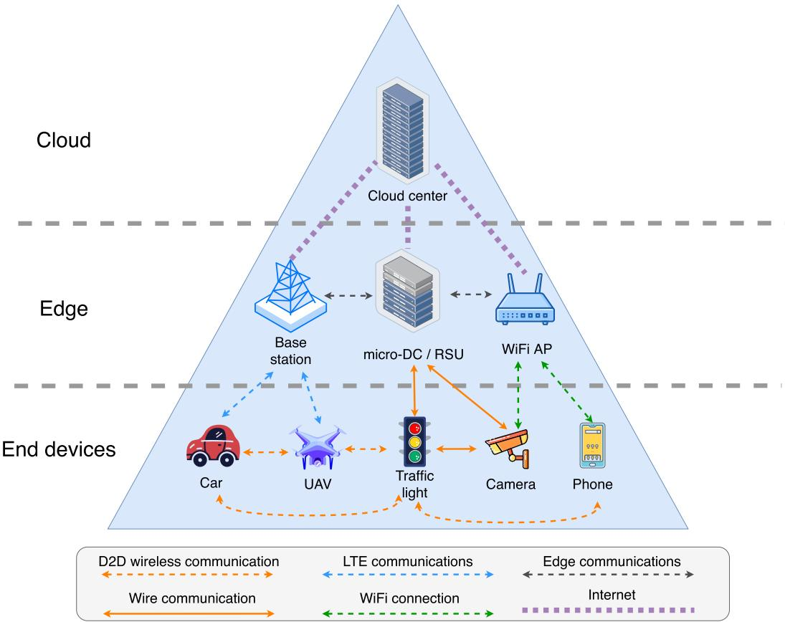  
Fig. 4. The architecture of EI-based ITS.

ITS is firstly introduced. Subsequently, the importance of data gathering and communication, data processing, and service delivery are emphasized. Finally, we introduced the key performance indexes in EI-based ITS.

## A. The Architecture of EI-Based ITS

1) The Overall Architecture of EI-Based ITS: Fig. 4 shows the architecture of EI-based, which can be divided into three layers: end devices, edge, and cloud. Data is exchanged between them through various communication methods. The wide range of data will empower the AI applications running in these devices to build intelligent ITS together. The next paragraphs describe the various parts of the architecture in more detail.

In ITS, end devices include cars, traffic lights, cameras, personal phones, UAVs, sensors, etc. For ease of presentation, the end devices described in the article will include the above devices and sensors. AI applications have been widely deployed on these end devices. Following the trend of IoT, a large number of end devices will have connections with edge nodes, and they may also be connected between themselves through device-to-device (D2D) wireless communication. Their connections allow direct data exchange for real-time information obtaining and cooperative data processing. End devices will generate raw data and then choose whether to process data locally, cooperate with other end devices, or transit to edge nodes.

Edge nodes as servers and connection repeaters will process the data sent from end devices or to cloud centers. Each edge node can be seen as a small computing center deployed at base stations, road side units (RSUs), Wi-Fi APs, etc. Between the edge nodes, connections are established for cooperative computing and information exchange. Data that the edge nodes cannot process will be sent to cloud computing centers. AI applications can also be deployed at the edge side. For example, the traffic management system based on cloud centers may need data from traffic lights, cameras, and cars for big data analytics. AI applications deployed at the edge could help handle the raw data to acquire critical information for traffic management. Thus the stress of the backbone network would be reduced.

As a part of EI architecture, the cloud computing center will also play an irreplaceable role in deploying EI-based ITS. Due to the vast amount of data generated by end devices, edge nodes’ computing resources and storage resources can hardly support the edge-device computing pattern alone. Meanwhile, uploading data to the cloud for computing also faces the limitations of transmission delay, bandwidth pressure, etc. Therefore, selectively uploading some data to the cloud computing centers dramatically relieves the pressure on edge nodes. At the same time, the computing center’s mighty computing power can also help solve problems of high complexity.

As the intelligence of end devices in ITS continues to improve, the AI applications deployed at the edge have escalating requirements for computing power, real-time requirements, and privacy. Through the EI 7-layer structure, the end devices in ITS can choose the EI data processing method according to their actual needs. Level 4-7 EI applications can be deployed on devices with extremely high requirements for real-time and security, and Level-1 to Level-3 EI applications can be deployed in application scenarios of high model complexity, like deep reinforcement learning.

2) Data Gathering and Communication: The data gathering process from end devices to edge nodes needs infrastructures. For road traffic, RSU is an essential facility for collecting vehicle and pedestrian information. RSUs themselves could be the cloudlets. Each RSU will be responsible for a specific area of data gathering, and through the layout of the RSU, all roads will be covered by the RSUs. At the same time, to improve robustness, it is necessary to ensure that there will be no separate areas when a small number of RSUs fail with backup RSUs. RSUs also connect to other RSUs. When the computational pressure in a region increases suddenly, the pressure on the edge nodes can be relieved by offloading tasks to neighboring nodes while ensuring the timeliness of the tasks to a certain extent. Brennand [43] et al. called this kind of cooperation between edge nodes Area of Knowledge. Area of Knowledge allows edge nodes to get information from other edge nodes for tasks like route planning.

End devices have specific local information processing capabilities and network connection capabilities. They will communicate with edge nodes to complete data exchange. A network connection can also be established between end devices. This network connection directly connects two devices without going through a base station. Such a connection can further reduce network latency. At the same time, the direct data exchange between end devices can also implement tasks such as accident early warning and collaborative computing.

The cloud computing center will connect the edge nodes through the Internet. The cloud computing center will be responsible for handling complex computing tasks that are offloaded by edge nodes. At the same time, some data that needs long-term analysis (e.g., annual traffic data) will also be stored in the cloud computing center. The cloud centers will also be responsible for storing important information on the edge nodes to release the storage pressure on the edge nodes. Due to the large number of edge nodes that generate tons of data that needs to be uploaded, in order to relieve the pressure on the backbone network, edge nodes will selectively upload data according to the network pressure and computing busyness, such as uploading data during the periods when the overall network traffic is low.

3) Data Processing and Service Delivery: In actual deployment, data processing and service delivery are critical. For example, some tasks, such as dynamic path planning and real-time operation for vehicles, are sensitive to delay, and end devices expect that edge nodes can prioritize these tasks. Also, when a task has high computational complexity and high memory requirements, if the computing resources of the edge node are tight, it may not be able to meet the task requirements. At this time, the edge node must decide whether to offload tasks to other edge nodes or upload them to the cloud server computation. For those tasks susceptible to privacy, the EI system needs to be extra cautious when uploading data to edge nodes to prevent privacy leakage or information from being hijacked. For some end devices with poor network connection, whether it is worth uploading tasks to edge nodes or processing them locally also requires consideration in the data processing. These factors will directly affect the quality of service of edge nodes. Therefore, the processing flow of data and the service delivery of the EI system are two aspects that need attention.

In order to achieve a better actual deployment effect of EI for tasks with different needs, edge nodes will be able to allocate computing and memory resources dynamically. The deployment of EI in ITS needs to consider which calculation method (or which Level of EI is used) is the most optimal in the current situation to ensure intelligent transportation systems’ safe and efficient operation.

## B. Performance Indexes of EI-Based ITS

By using performance indexes, we can evaluate the performance of EI-based applications. In an EI-based application, the AI model training process is usually finished before deployment and practical operation. Indexes that affect AI applications’ performance hugely are those during inference. In this subsection, we focus on the indexes that affect inference performance.

1) Latency: Latency is one of the most fundamental indexes of EI performance. Latency refers to the time from raw data being generated to the time it is being processed. The latency includes the data transmission time, data pre-processing time, and model infer time. Take autonomous driving as an example, the data exchanging and processing course should be less than 100 milliseconds [44]. For many areas like that, latency is the primary factor to be considered during the deployment. The latency can be influenced by several factors, such as network bandwidth, computing power, workload intensity, the amount of data to transmit and process, the computing priority, and model inference complexity. Nevertheless, how models are processed and inferred will also influence the latency.

2) Resource Consumption: Resource consumption can be divided into computation resources, energy resources, network bandwidth, and data storage. Computation resources include the central processing unit (CPU), graphics processing unit (GPU), and random access memory (RAM). The computation resource consumption mainly comes from data collection, data pre-processing, model inference, and data post-processing. The model inference can be computationally resource-intensive because the millions of parameters of AI applications need to be processed. Typically higher computational volumes imply more energy consumption as well. In applications like realtime video-based detection, the demands for CPU, GPU, and RAM resources are relatively high. In scenarios with limited computing resources or energy shortages, computation resource consumption could be the bottleneck for AI applications.

The joint operation between the cloud, edge nodes, and end devices requires the network to transmit data, and network bandwidth resources will affect the effect of data transmission. For large-scale collaborative tasks, good management of the allocation of computation resources and network bandwidth resources is essential.

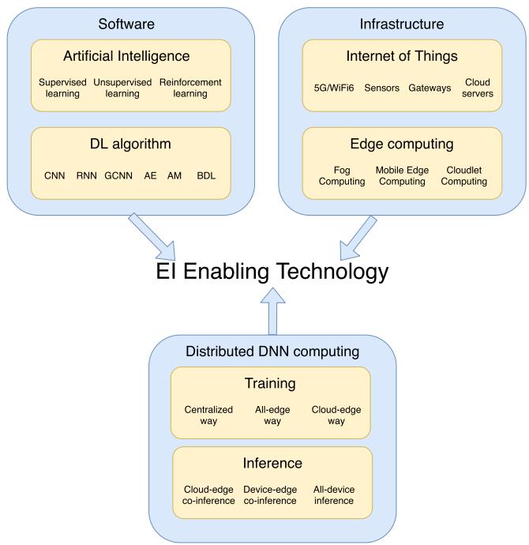  
Fig. 5. Overview of EI enabling technologies.

Data storage is another aspect. On the one hand, data collected from devices and sensors will take up storage space. On the other hand, parameters from ANN models are squeezing the flash memory footprint. Also, the complex models themselves can be hundreds of megabytes or even reach the gigabytes level.

3) Communication Quality: In EI systems, cloud centers, edge nodes, and end devices may communicate frequently. Raw data, network layer parameters, and inference results put forward higher requirements for network bandwidth. Meanwhile, they may cause traffic congestion in the network. The communication quality will significantly affect the performance of the EI model.

4) Privacy Issue: Privacy issues can be severe in EI systems. Phones, cars, ID cards, face recognition cameras, etc., generate tons of data, which can be highly privacy sensitive. It is crucial to protect data in the whole process from storage to transmission. Privacy issues should be well considered.

## IV. ENABLING TECHNOLOGIES IN EI-BASED ITS

EI is a novel technology that combines AI with EC. The related enabling technologies are essential for researchers to conduct research in EI-based ITS. This section focuses on enabling technologies in EI-based ITS, from artificial intelligence and DL algorithms to the Internet of Things, edge computing, and distributed computing methods. The EI enabling technologies are shown in Fig. 5, which can be divided into three parts: software, infrastructure, and Distributed DNN computing. These three aspects will be discussed in detail next.

## A. Artificial Intelligence

Artificial Intelligence has been one of the hottest research fields in the past few decades. AI aims to build intelligent machines that are able to process tasks like the human brain. Machine learning (ML) [45] and deep learning (DL) [46] have helped Artificial Neural Network (ANN) implement many algorithm variants, such as feedforward neural network (FNN) [47], convolutional neural network (CNN) [48], [49], and recurrent neural network (RNN) [50]. Fig. 6 shows the structure of these three typical DL models, including FCC, CNN, and RNN. AI applications have already been employed in many professional areas like ionospheric detection, financial management, manufacturing systems, and so on [51], [52], [53], and have received gratifying results.

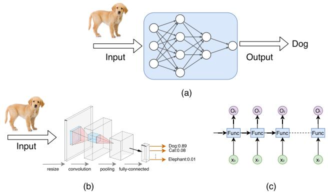  
Fig. 6. Structures of Typical DL models, (a)FNNs. (b) CNNs. (c) RNNs.

Modern ML-based algorithms can be divided into three categories: supervised learning, unsupervised learning, and reinforcement learning. Supervised learning uses labelled data to train a model [54]. Some typical algorithms, like linear regression [55], support vector machines [56], decision trees [57], neural networks [58], have already shown their strong ability in ITS. Unsupervised learning trains model with unlabeled multidimensional data [54]. The most well-known algorithm, K-means, has been already used in transportation planning [59], and travel time prediction [60]. Reinforcement learning (RL) learns models through the process of exploring different actions in the environment to achieve the highest reward [61]. RL has a wide range of applications in the transportation field [19]. Using RL can obtain a good model in ITS with a large amount of data without requiring much manual annotation. In recent years, DRL has shown its great potential in ITS through the potential unleashed by the close integration of DL and RL [62].

The wide variety of algorithms and methods provide the possibility for various applications of AI in ITS. In an intelligent transportation system, AI application is the most crucial method that helps to achieve the “intelligence goal”. The big data characteristic of ITS is essential to AI. The data collected by ITS is complex and with the big data feature [19]. With the AI methods mentioned, various potential ITS information will be revealed through big data. Driven by these data, AI plays an irreplaceable role in all aspects of ITS [63].

## B. DL Algorithms

AI applications have already taken on an essential role in ITS. DL algorithms have undergone rapid iterative development as the core driving force of AI applications. DL algorithms try to extract higher-level features using a hierarchy of multiple layers [64]. DL can overcome the drawbacks of manually designed features and become more flexible and universal. From traditional ML methods to DL methods, the computation requirement is growing at an incredible rate with the development of model complexity. Compared with other methods such as decision trees, linear regression, and support vector machines, the parameters in DL methods show rapid growth as the deeper network is organized. The booming computing power demand squeezed the devices from computation and energy costs. Thus, EI was proposed and mainly focused on the DL algorithms and their characteristics. In order to understand DL and its applications in EI, some popular DL models of ITS are introduced.

1) Convolutional Neural Network: The Convolutional neural network (CNN) is often used in computer vision. In 2012, AlexNet won the ImageNet challenge and performed well in the image classification [65]. AlexNet has made a great contribution with its deep and enormous structure. AlexNet is structured with 60 million parameters and 65 thousand neurons to achieve the classification of 227 × 227-pixel size images. VGGNet won second place in ILSVRC’14, which uses nearly 140 million parameters and costs much more memory than GoogLeNet [66]. However, it successfully demonstrated the significance of network depth in network performance and started a discussion and innovation on the depth of the network. Beside the exploration of the network depth, WideResNet [67], Xception [68],and ResNeXt [69] also tried another dimension of networks – the width, which also showed great potential.

It can be concluded that the size of these popular CNN algorithms is almost tens to hundreds of megabytes. CNN can be deployed in many application scenarios by giving images or videos to finish tasks like image classification, object detection and segmentation, and face recognition. However, computational complexity is essential for deploying these algorithms on the edge side.

2) Recurrent Neural Network: The Recurrent neural network (RNN) is a type of deep neural network that can pass information across sequence data [70]. Thus RNN can deal with the sequence data that consists of dependency and model time sequentiality on multiple scales. A typical characteristic of RNN is the neuron that owns the memory of its previous steps. RNN networks are often designed to be fairly deep, which makes the training process difficult because of the exploding and the vanishing of gradients [71]. Long short-term memory (LSTM) is a classical RNN algorithm that successfully overcomes the notorious vanishing gradient problem [71]. LSTM introduced the memory cell to RNN, and each memory cell contains several gates: Input Gate, Output Gate, and Forget Gate. These gates will consider whether the input is important enough to be memorized and outputted. LSTM was easy to use and had been widely used in natural language processing (NLP). Beside the LSTM, bidirectional recurrent neural (BRN) [72], neural turing machine (NTM) [73], and gated recurrent unit (GRU) [74] are also popularly used algorithms. Tasks like speech recognition, natural language processing, and machine translation usually use complex RNN-based networks, making the parameters enormous.

3) Graph Convolutional Neural Networks: Graph structured data is common in ITS. In transportation networks, nodes can be sensors, cars, and crossroads, and edges represent the spatial connectivity of sensors. Graph convolutional neural network (GCNN) focuses on the semi-supervised node classification task on graphs [75]. The non-Euclidean characteristic of graphs makes it difficult for traditional CNNs to achieve great success in the field of computer vision [76]. GCNN encodes the graph structure by a neural network model and trains on a supervised target for all nodes with labels. GCNN showed the possibility of using neural networks in graph-structure data for fast and scalable semi-supervised classification of nodes in a graph. However, due to the memory cost for large-scale graphs, the training process of GCNN can be rather hard. To solve this problem, FastGCN [77], and some further works [78], were carried out.

4) Autoencoders: An AutoEncoder (AE) is an unsupervised learning ANN method that learns efficient data codings [79]. AE learns the representation of data, which is usually used for dimensionality reduction. AE-based algorithms are showing remarkable performance in areas like traffic flowrelated works, especially for learning latent traffic flow feature representations like nonlinear spatio-temporal correlation [80], [81], [82].

5) Attention Model: The attention model (AM) was first published by Bahdanau et al. for machine translation and has now become an important concept of ANN [83]. The basic idea of AM is to enhance the important parts of input data and weaken the rest, which makes the ANN model focus more on the small but important parts. Some AM-based algorithms are used in ITS, such as signal detection [84], route recommendation [85], and travel time forecast [86].

6) Bayesian Deep Learning: Bayesian deep learning (BDL) is a new deep learning paradigm that combines probabilistic graphical models and DL [87]. BDL focuses on better integration of perception and inference for tasks with uncertainty, which is often difficult to do with DL or PGM alone [88]. Kendall and Gal combined aleatoric and epistemic uncertainty into BDL and performed well in semantic segmentation and depth regression on real road image data [89]. Some BDL-based algorithms are used in ITS, such as probabilistic time-series forecasting [90], vehicle collision prediction [91], probabilistic vehicle trajectory prediction [92].

## C. Internet of Things

Since the Internet of Things (IoT) was proposed, it has witnessed an ever-expanding development. The core concept of IoT is to combine almost all physical devices, including smartphones, sensors, actuators, and other embedded devices, that will connect to exchange data and cooperate to reach common goals [93]. In 2020, there were more than 8.74 billion IoT devices worldwide, and this number is expected to reach more than 25 billion by 2030 [8]. Meanwhile, the broad deployment of the “5G” mobile network and “Wi-Fi 6” helps to significantly enhance network performance [94], making the

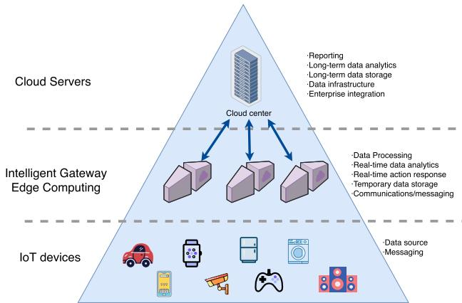  
Fig. 7. Three tiers of IoT.

IoT even more popular. IoT has already undergone tremendous changes, from smart cities, smart grids to smart health care and smart transportation.

Fig. 7 illustrates the typical IoT architecture, which consists of three tiers: devices, gateways, and clouds. Sensors are the core elements of IoT, tons of sensors are deployed “everywhere”. They are connected to the network and are responsible for collecting data from the environment. End devices are also the main generators of data. End devices can also perform as the interface of humans and computers. IoT gateways are connected to backbone networks as well as IoT sensors and end devices. IoT gateways will gather the data generated from sensors and devices and send them to computing servers for processing and storage. However, data generated from sensors and devices need to be pre-processed. Thus gateways usually carry out pre-processing to reduce the backbone network consumption. Cloud servers, as the third tier, handle all the data and requirements from all the rest of the layers [95].

The IoT in ITS connects all aspects of ITS, including vehicles, drivers, pedestrians, and road infrastructures [96]. By using the information from all aspects, applications like intelligent traffic control, road safety assistance, vehicle control, etc., can be realized with the help of AI algorithms [97].

Non-orthogonal multiple access (NOMA) is a promising technology aiming to support 5G networks for network connectivity with numerous IoT devices [98]. After introducing IoT into ITS, a considerable number of devices will be connected to the network. Researchers have been solving NOMA’s network resource allocation problem in recent years. In [99], the authors proposed a three stages method to solve the resource allocation problem for NOMA-enabled Vehicle-to-Everything (V2X) communications. Further works, like energy-efficient alternating optimization methods under different situations, are carried on to meet the combination of NOMA, and ITS [100], [101]. In addition, how to better allocate resources in IoT-enabled ITS has received much attention from researchers [102], [103], [104].

## D. Edge Computing and Edge-Cloud Cooperation

Edge computing (EC) means pushing the completion of data computing and storage to the network “edge” which is closer to users [105]. There are three major types of EC: fog computing (FC), mobile edge computing (MEC), and cloudlet computing (CC). Similar to traditional cloud servers, the edge nodes can deal with data processing, real-time data analytics, real-time decision, data storage, communications, etc. Fig. 8 shows a typical architecture of EC. MEC servers directly exchange data and support services with end users, while cloud servers are connected to MEC servers through core networks and provide long-term data storage and complex task computing services.

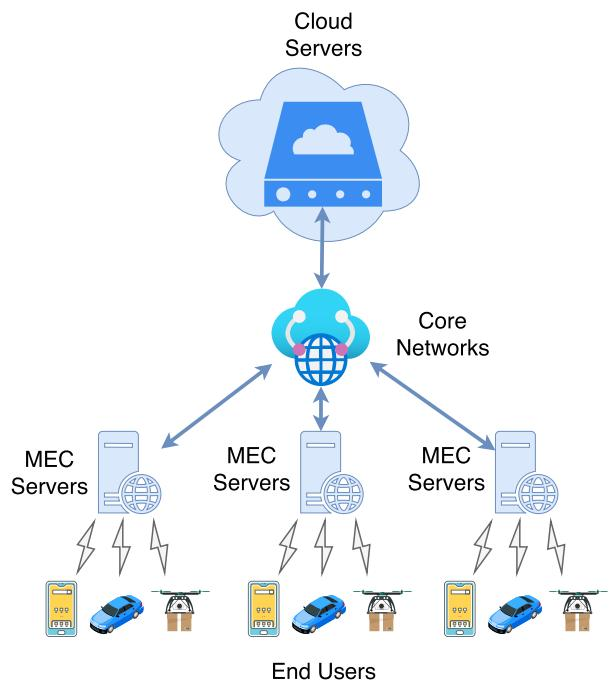  
Fig. 8. The architecture of EC.

Fog computing extends the cloud computing paradigm from the core to the edge of the network [106]. Fog computing will provide data storage and networking services in between cloud-centers and devices [107]. In [108], researchers studied the FC use-cases including smart traffic light systems. They believe the low latency attribute of FC will perform well in accident prevention. In [109], the authors gave the outline of the architecture of FC. FC can be deployed in many node devices like routers, access points, gateways, and everything between end devices and cloud centers. MEC is usually based on mobile networks, where servers run at base stations. Thus the edge nodes of MEC could be base stations [110]. Cloudlet can be defined as a trusted computer cluster that is well connected to the Internet and has resources available for nearby mobile devices [34]. As shown in Fig. 9, Dolui et al. [111] proposed a method for making choices between FC, MEC, and CC based on different requirements.

Since the physical distance between the server and the user in the EC is much lower than that of the cloud computing center model, the data transmission delay will be significantly reduced. However, because the computing power of edge nodes cannot compete with traditional centralized cloud data centers, it is not cost-effective for some applications that require massive computing power to perform calculations at edge nodes. It has been proved that edge-cloud cooperation can make up for the deficiencies of edge computing in big data analysis, storage, and aggregation [112].

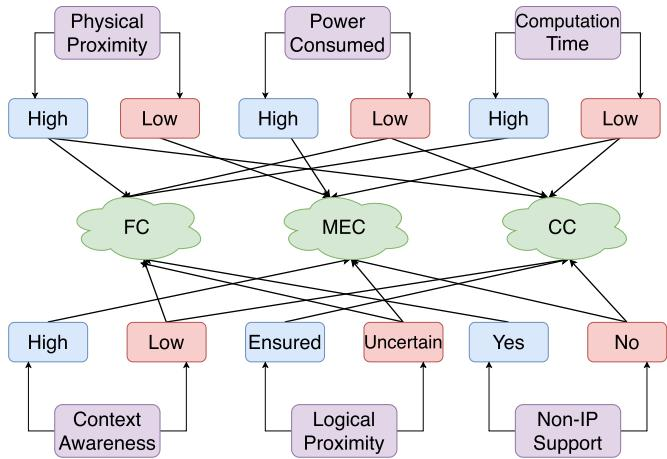  
Fig. 9. EC implementation strategy.

## E. Distributed DNN Computing

Distributed computing is a key enabling technology in EI. The EI applications need the distributed training and inference methods to achieve cooperation between devices and edge nodes. DNNs are extremely hungry for computing resources. Thus, this section will focus on some of the prevalent distributed DNN computing methods, including model training and inference.

1) Distributed DNN Training: A crucial point related to EI is the model training, especially for RL-based AI applications [113]. Different inference methods could have a massive disparity in inference efficiency and precision. The models of EI applications in ITS should be upgradeable to suit rapidly changing ITS.

Rich data generated by sensors and devices can help with training a better model, such as language models continuously optimized according to user habits. However, the privacy issue of these data constrains the data transmission via networks. McMahan et al. [114] proposed a federated learning-based method to deal with this issue. Compared with the traditional training method, where raw data is collected to a centralized computing center to train the models, federated learning leaves the data distributed on the devices and trains a shared model by aggregating locally computed updates [115], [116]. Stochastic gradient descent (SGD) is introduced for the model optimization problems. Full model or model update is shared from clients to servers in a typical round. Wang et al. [117] proposed the control algorithm between global parameter aggregation and local update in limited resources. Nishio and Yonetani [118] proposed the device selection method with limited computational resources or poor connection.

Another research field of distributed training is DNN splitting. The main idea of DNN splitting is privacy protection. By sharing the neural network processed data rather than raw data in the networks, there is a smaller chance that users will leak their privacy under a cyber attack. Mao et al. [119] proposed a DNN splitting method where part of the VGG-Face network is deployed on the device and the rest of the layers on a server. Wang et al. [120] then proved that DNN splitting would protect the privacy and speed up the training process.

Transfer learning aims at training new models from related tasks in which models have already been trained [121]. Since transfer learning was proposed, it has become one of the hottest research fields in ML. One of the typical usages of transfer learning is the pre-trained learning model, which has become a paradigm of DL [122]. Transfer learning seems a promising method for resource-constrained distributed learning scenes by moving the heavy pre-training process to computing servers.

The training process in EI-based ITS can be separated into three ways by the model training and sharing form. The definition of the three ways is shown below.

a) Centralized way: The centralized training means putting the ANN model’s training process at cloud centers. ANN models’ training process is costly compared to the inference process. When the computing resources are insufficient or energy resources are sensitive at the edge, it is better to train models at cloud computing centers rather than on the edge side. The data collected from distributed end devices are uploaded to centralized computing units for model training. After finishing training, the complete model will be downloaded to end devices. Thus, the centralized way could have specific requirements of bandwidth. Level-1, Level-2, and Level-3 in Fig. 3 could use this as a training method depending on the deployed ANN models.

b) All-edge way: The all-edge training way means the training process entirely proceeds at edge nodes. The data generated at separated end devices are used for training locally at edge nodes. Only the model improvements will be transmitted between nodes and devices instead of local data. It is suitable for high data privacy sensitivity scenarios. In this way, the training process will be away from the data center as Level-5 in Fig. 3.

c) Cloud-edge way: The Cloud-edge way is a mixture of the centralized and All-edge ways. The ANN models may be trained at edge nodes or cloud centers. All kinds of data can be exchanged between edge, cloud, and end devices. Thus, Level-3 and Level-4 in Fig. 3 are accomplished in this way.

2) Distributed DNN Inference: The inference process is a crucial performance influencing factor of AI applications. End devices like low-power sensors and energy-sensitive endusers may face the pressure of DNN computing. One of the handiest solutions is model partition. By moving the computational-intensive part of DNNs to servers or nearby devices, the stress on end devices will be much less. Kang et al. [123] proposed Neurosurgeon, which gives a device-server DNN partitioning strategy. Neurosurgeons have been proven to achieve excellent latency performance and mobile energy efficiency. Later, Jeong et al. [124] proposed Incremental Offloading of Neural Network (IONN), a DNN partition method that focuses on decentralized edge computing infrastructures. IONN divides DNNs into several partitions and uploads them to edge servers. Servers will build the DNN model incrementally when the DNN partition arrives, so servers can process the model before the entire DNN model is uploaded.

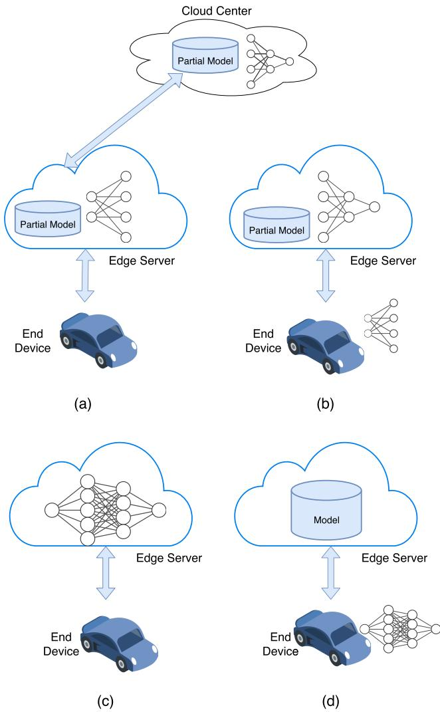  
Fig. 10. Four ways of model inference. (a) Cloud-edge Co-inference. (b) Edge-device Co-inference (c) All-edge Inference (d) All-device Inference.

Edgent [9] will adaptively partition DNN between device and edge, also the size of DNN will be adjusted to accelerate DNN inference. More works of DNN partition proved that it is a promising way in the future of DNN inference, which will significantly accelerate the inference process [125], [126], [127], [128].

Fig. 10 shows four typical methods of model inference [1]: cloud-edge co-inference, edge-device co-inference, all-edge inference, and all-device inference. These four methods will be explained in detail next.

a) Cloud-edge co-inference: Fig. 10 (a) is the schematic of the co-inference method. The cloud-edge co-inference method means that the model inference will take part in both the cloud and the edge side. The devices are in charge of collecting data and uploading it to the edge nodes. Then the edge nodes will decide the specific layers of the model that will be computed at the edge nodes, and the rest of the layers will be processed in the cloud. This decision depends on the situation of communication bandwidth, transmission delay, computation power and workload, and real-time requirements. After the inference is finished in the cloud, the result will be returned to edge nodes and sent to end devices. The cloud-edge co-inference method suits models with huge computation power demand and low latency sensitivity. The communication quality will significantly influence the inference performance.

b) Edge-device co-inference: Fig. 10 (b) is the edgedevice co-inference method. Similar to the cloud-edge way, the model inference is also divided into two parts. The devices will process the DNN models up to a specific layer and upload them to edge nodes to finish the rest. After the process, edge nodes send the model inference results directly to the devices. The critical factor of this method is the resources of devices. This method will take advantage of its flexible configuration model inference in the case of limited device computing resources. Also, due to the data collected at devices being locally processed, only the parameters of layers are transmitted in the network, and the privacy of edge-device co-inference is better than the cloud-edge way.

c) All-edge inference: Fig. 10 (c) shows the all-edge inference method. In this way, the model inference process is completed at edge nodes. Devices collect data and send it to edge servers. After data is processed, the model inference results will be sent back to devices by edge servers. When the computation resources of end devices are minimal, this method will work well. However, the network bandwidth will influence the inference quality.

d) All-device inference: Fig. 10 (d) is the all-device inference method. Devices download the models from edge nodes and infer the model using the data generated locally at end devices. In this case, the communication between devices and edge nodes will only be the model downloading. Besides the high demand for computation and electric resources at devices, privacy security and inference reliability will be exceptional.

## V. EDGE INTELLIGENCE APPLICATIONS AND RESEARCH FIELDS IN ITS

EI, as a basic technology, supports the deployment of AI applications in ITS. EI enables the potential of the edge data in ITS, reduces the response time to support real-time applications, reduces the stress of the backbone network, and improves the privacy of AI applications. As using EI in ITS is still in the exploratory stage, we will summarize the application and research directions of EI in ITS. In this section, applications and research fields of autonomous driving, vehicular edge computing, intelligent vehicular transportation system, unmanned aerial vehicle, and rail transportation are introduced.

## A. Autonomous Driving

As one of the most numerous participators of the modern traffic system, vehicles are the major components of ITS because of the vast number of them. The Society of Automotive Engineers defined the levels of driving automation [129], where L-1 (driver assistance) and L-2 (partial driving automation) have already been widely used. However, huge challenges occur for levels of autonomous driving from L-3 to L-5: conditional driving automation, high driving automation, and fully autonomous driving. For ease of reading, a comparison table of EI applications and research fields in autonomous driving are shown in Table III, including the main contributions and limitations. In Table III, EI applications and research fields are listed, including their employed technology, EI level, main contributions and limitations are discussed. We will discuss these studies in further detail.

In the past few decades, a good deal of projects has been carried out to accomplish autonomous driving. One of the earliest automated driving projects was the PROMETHEUS program [137] organized in Europe. As part of the PROMETHEUS program, the VITA II [130] project achieved elementary auto-driving on highways. Automated driving systems (ADSs) are developed to reduce human element accidents, traffic congestion, and carbon emission [138]. These applications are at the primitive stage of intelligent vehicles, where there is no communication between vehicles, and all related processes are at end devices. End-to-end driving is another field of exploration in intelligent vehicles. End-to-end driving means the system will generate ego-motion directly from the sensors’ inputs. Although the end-to-end algorithms are mainly processed at end devices (or Level 3 in Fig. 3), they provide an overall design framework and guidelines for intelligent vehicles. ALVINN was the first try of an end-to-end system [131], where the authors used a 3-layer fully connected network to train the system. Later on, Muller et al. introduced an off-road end-to-end driving system [132], and Chen et al. introduced a way of mapping the input image to a small number of crucial perception indicators to train a convolutional method [133]. Bojarski et al. published an algorithm using CNN to get an image for inputting and obtaining the steering for output [134]. These methods can be trained offline and are typically deployed offline on onboard computers.

A DRL-based framework for autonomous driving was introduced in [135], and the DRL-based application in real cars was tested in [136]. This kind of system can also be trained on the actual driving situation using a pre-trained model. Tesla’s advanced driver-assistance system (ADAS) is one of the most widely promoted Level-2 applications. However, the system still has many security problems and hidden dangers [139]. The attempts mentioned above tried to achieve lower levels (i.e., Level-1 to Level-3) of driving automation. However, to reach the higher levels (Level-4 to Level-7) of autonomous driving, the all-device computing pattern shows its drawback of computational resource and information shortage.

Edge computing-based autonomous driving systems are considered the solution to the problem. Tang et al. proposed the Low-Power Edge Computing System (LoPECS) [29], which is the first complete system-level, affordable, and low-power edge computing-based platform for real-time autonomous driving. LoPECS consists of a Heterogeneity-Aware runtime layer for utilizing the resources of edge computing servers and a cooperative strategy of edge and end devices resources. In this system, using an edge coordinator, tasks will be dynamically offloaded to edge servers for better energy consumption. The performance of LoPECS is impressive, which successfully achieved vehicle localization, obstacle detection, and voice recognition with considerably low energy consumption when being tested in the Nvidia Jetson TX1 test platform. This platform can be deployed in low-speed scenarios like industrial parks and limited traffic areas, which can also deliver the computing power for L3/L4 or even L5 autonomous driving with powerful edge computing units.

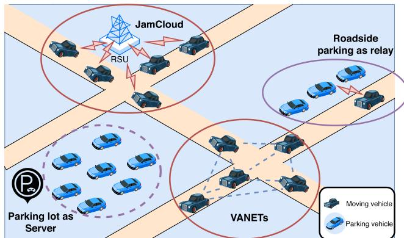  
Fig. 11. VFC structure of four specific research fields: moving vehicles’ communication and computation, parking vehicle’s communication and computation.

## B. Vehicular Edge Computing

In order to make full usage of the advantages of big data-based AI applications, connected vehicles and Vehicular edge computing are showing their great potential. MEC technologies were introduced to connected vehicles and were called vehicular edge computing (VEC) [15]. A comparison table of EI applications and research fields in VEC is shown in Table IV, including employed technology, EI level, main contributions and limitations. Since research in this direction is still in its infancy, these studies are mainly oriented toward theoretical research. We will discuss these studies in further detail.

Hou et al. [140] introduced vehicular fog computing (VFC) to use edge resources fully. Fig. 11 shows the VFC structure. There are four main research fields in VFC. For moving vehicles, VANETs deal with the communication between vehicles, JamCloud tries to use the resource of vehicles in congestion as a computing center. For parking vehicles, roadside parking vehicles can serve as communication infrastructures, and vehicles in parking lots could be abundant computation infrastructures.

For the edge server-enabled inference pattern (i.e., Fig. 10 (b)), Carspeak is one of the inchoate works of connected vehicles [141], which proved the feasibility of a content-centric approach to reach the sensors’ information sharing between vehicles. Al-Sultan et al. [142] used the VANET system to send warning information to the traffic participants. In this way, vehicles can obtain information from their own sensors and warning information provided by the surrounding infrastructure in a real-time way. The resources of parking vehicles are also being used in [143] to form edge server networks, and [144] studied the reward strategy of resource sharing among parking vehicles.

For the VEC net optimizing pattern, Qiao et al. [145] proposed a multi-user task offloading method, and Du et al. [146] focused on the strategy of vehicle-edge dual-side optimization to minimize the costs. Both of them focused on a single-edge server. Zhang et al. [147] proposed a method of the optimal multilevel offloading scheme, which fully uses the computing power of both vehicles and multi-edge servers. Dai et al. [148] integrated load balancing into offloading and studied the allocation of resources of the multi-user and multi-server VEC system.

TABLE III  
A COMPARISON TABLE OF EI APPLICATIONS AND RESEARCH FIELDS IN AUTONOMOUS DRIVING
<table><tr><td rowspan=1 colspan=1>Name</td><td rowspan=1 colspan=1>Employed Technol-ogy</td><td rowspan=1 colspan=1>(Potential) EI Level</td><td rowspan=1 colspan=1>Main contributions</td><td rowspan=1 colspan=1>Limitations</td></tr><tr><td rowspan=1 colspan=1>VITA II [130]</td><td rowspan=1 colspan=1>Computer vision</td><td rowspan=1 colspan=1>Level-3</td><td rowspan=1 colspan=1>Image-based collision avoidance.</td><td rowspan=1 colspan=1>Just a simple attempt at autonomousdriving</td></tr><tr><td rowspan=1 colspan=1>ALVINN [131]</td><td rowspan=1 colspan=1>Neural network</td><td rowspan=1 colspan=1>Level-3</td><td rowspan=1 colspan=1>First attempt at autonomous drivingusing neural networks.</td><td rowspan=1 colspan=1>The neural network is simple</td></tr><tr><td rowspan=1 colspan=1>Muller et al. [132]</td><td rowspan=1 colspan=1>Stereo cameras &amp;CNN</td><td rowspan=1 colspan=1>Level-3</td><td rowspan=1 colspan=1>End-to-end off-roaddriving withCNN.</td><td rowspan=1 colspan=1>Only the avoidance of obstacles wasachieved.</td></tr><tr><td rowspan=1 colspan=1>Deepdriving[133]</td><td rowspan=1 colspan=1>DNN</td><td rowspan=1 colspan=1>Level-3</td><td rowspan=1 colspan=1>Direct perception approach to estimatethe affordance for driving.</td><td rowspan=1 colspan=1>Can not cope with uneven road sur-face.</td></tr><tr><td rowspan=1 colspan=1>Bojarski etal.[134]</td><td rowspan=1 colspan=1>CNN</td><td rowspan=1 colspan=1>Level-3</td><td rowspan=1 colspan=1>Map raw pixels from the front-facingcamera directly to steering commands.</td><td rowspan=1 colspan=1>Simple system only, mainly used toverify the potential of end-to-end au-tonomous driving using CNN.</td></tr><tr><td rowspan=1 colspan=1>Sallab et al. [135]</td><td rowspan=1 colspan=1>DRL</td><td rowspan=1 colspan=1>Level-3/Level-7</td><td rowspan=1 colspan=1>A DRL framework for autonomousdriving. The system has the ability tocontinuously learn.</td><td rowspan=1 colspan=1>Only tested in simulation.</td></tr><tr><td rowspan=1 colspan=1>Kendall et al.[136]</td><td rowspan=1 colspan=1>DRL</td><td rowspan=1 colspan=1>Level-7</td><td rowspan=1 colspan=1>The first test of the end-to-end DRLautonomous driving method on realroads.</td><td rowspan=1 colspan=1>The reward function and the systemobjective setting are relatively simpleand still need further study in futurework.</td></tr><tr><td rowspan=1 colspan=1>LoPECS [29]</td><td rowspan=1 colspan=1>Edge intelligence</td><td rowspan=1 colspan=1>Level-2 / Level-5 toLevel-7</td><td rowspan=1 colspan=1>First EI platform for autonomous driv-ing service with low power consump-tion.</td><td rowspan=1 colspan=1>The EI platform only supports of-floading for low-speed driving andlimited autonomous driving tasks.</td></tr></table>

TABLE IV

A COMPARISON TABLE OF EI APPLICATIONS AND RESEARCH FIELDS IN VEHICULAR EDGE COMPUTING
<table><tr><td rowspan=1 colspan=1>Name</td><td rowspan=1 colspan=1>Employed Tech-nology</td><td rowspan=1 colspan=1>(Potential) EI Level</td><td rowspan=1 colspan=1>Main contributions</td><td rowspan=1 colspan=1>Limitations</td></tr><tr><td rowspan=1 colspan=1>VFC [140]</td><td rowspan=1 colspan=1>FC</td><td rowspan=1 colspan=1>Level-5 to Level-7</td><td rowspan=1 colspan=1>Both moving vehicles and parked ve-hicles are considered edge computinginfrastructures.</td><td rowspan=1 colspan=1>Lack of practice.</td></tr><tr><td rowspan=1 colspan=1>Carspeak [141]</td><td rowspan=1 colspan=1>Content-centricnetwork</td><td rowspan=1 colspan=1>Level-3/Level-6</td><td rowspan=1 colspan=1>Sensor information sharingbetweenvehicles.</td><td rowspan=1 colspan=1>Only vehicle sensor information isshared.</td></tr><tr><td rowspan=1 colspan=1>Al-Sultan et al.[142]</td><td rowspan=1 colspan=1>D2Dcommuni-cation</td><td rowspan=1 colspan=1>Level-6</td><td rowspan=1 colspan=1>Collects information fromcars andRSUs,shares warning  messagesthrough the D2D network.</td><td rowspan=1 colspan=1>The main computing power is stillconcentrated in the car.</td></tr><tr><td rowspan=1 colspan=1>PVEC [143]</td><td rowspan=1 colspan=1>EC</td><td rowspan=1 colspan=1>Level-1 to Level-6</td><td rowspan=1 colspan=1>Parked vehicles as VECservers arestudied.</td><td rowspan=1 colspan=1>As an infrastructure study only, com-mercial considerations are lacking.</td></tr><tr><td rowspan=1 colspan=1>PVEC [144]</td><td rowspan=1 colspan=1>EC</td><td rowspan=1 colspan=1>Level-1 to Level-6</td><td rowspan=1 colspan=1>Incentive mechanism for PVECisstudied.</td><td rowspan=1 colspan=1>A theoretical study only.</td></tr><tr><td rowspan=1 colspan=1>VE-MAN [145]</td><td rowspan=1 colspan=1>MEC</td><td rowspan=1 colspan=1>Level-1 to Level-6</td><td rowspan=1 colspan=1>Multi-access network &amp; task offload-ing strategies for VEC network arestudied.</td><td rowspan=1 colspan=1>A theoretical study only.</td></tr><tr><td rowspan=1 colspan=1>Du et al. [146]</td><td rowspan=1 colspan=1>MEC</td><td rowspan=1 colspan=1>Level-6</td><td rowspan=1 colspan=1>A strategy for dual-side cost minimiza-tion between end devices and edgeservers is proposed.</td><td rowspan=1 colspan=1>A theoretical study only.</td></tr><tr><td rowspan=1 colspan=1>Zhang et al. [147]</td><td rowspan=1 colspan=1>MEC</td><td rowspan=1 colspan=1>Level-6</td><td rowspan=1 colspan=1>A multi-MEC resource sharing andoptimization strategy is proposed.</td><td rowspan=1 colspan=1>A theoretical study only.</td></tr><tr><td rowspan=1 colspan=1>Dai et al. [148]</td><td rowspan=1 colspan=1>MEC</td><td rowspan=1 colspan=1>Level-6</td><td rowspan=1 colspan=1>Load balancing and resource alloca-tion for multi-edge servers and multi-vehicles.</td><td rowspan=1 colspan=1>A theoretical study only.</td></tr><tr><td rowspan=1 colspan=1>F-cooper [149]</td><td rowspan=1 colspan=1>MEC</td><td rowspan=1 colspan=1>Level-6</td><td rowspan=1 colspan=1>A framework and real-world practiceof edge-device collaborative object de-tection using feature fusion is studied.</td><td rowspan=1 colspan=1>The lack of real-time is an unresolvedissue.</td></tr><tr><td rowspan=1 colspan=1>Ning et al. [150]</td><td rowspan=1 colspan=1>MEC &amp; DRL</td><td rowspan=1 colspan=1>Level-6</td><td rowspan=1 colspan=1>A VEC tasks offload system using theDRL algorithm is proposed.</td><td rowspan=1 colspan=1>A theoretical study only.</td></tr></table>

F-Cooper [149] used features’ intrinsically small size to achieve real-time edge computing and proposed a point cloud feature-based cooperative perception framework, which is the first try on the feature-level data fusion with connected autonomous vehicles. Ning et al. [150] proposed a VEC tasks offload system using DRL algorithms. In this system, the

Quality of Experience (QoE) of users is the prioritized goal by formulating resource allocation and computing scheduling. DRL was also introduced to VFC to maximize the profits of mobile network operators [158].

## C. Intelligent Vehicular Transportation System

The EI-based modern Intelligent Vehicular Transportation System (IVTS) is facing the challenges of efficiency and safety issues as well as the Quality-of-Service (QoS) and Quality-of-Experience (QoE) with the ever-increasing number of vehicles and traffic jams. Traffic congestion is causing enormous pollution and financial loss. This subsection mainly introduces the research on the theory and architecture of IVTS. A comparison table of EI applications and research fields in IVTS is shown in Table V, including employed technology, EI level, main contributions and limitations. These studies try to combine the popular EI technology with IVTS to further promote the intelligence of IVTS. We will discuss these studies in further detail.

TABLE V  
A COMPARISON TABLE OF EI APPLICATIONS AND RESEARCH FIELDS IN INTELLIGENT VEHICULAR TRANSPORTATION SYSTEM
<table><tr><td rowspan=1 colspan=1>Name</td><td rowspan=1 colspan=1>Employed Technology</td><td rowspan=1 colspan=1>(Potential) EI Level</td><td rowspan=1 colspan=1>Main contribution</td><td rowspan=1 colspan=1>Limitations</td></tr><tr><td rowspan=1 colspan=1>Wang et al. [151]</td><td rowspan=1 colspan=1>FC</td><td rowspan=1 colspan=1>Level-5/Level-6</td><td rowspan=1 colspan=1>Fog computing-enabled traffic man-agement based on RSUs.</td><td rowspan=1 colspan=1>A theoretical study only.</td></tr><tr><td rowspan=1 colspan=1>Barthélemyet al.[18]</td><td rowspan=1 colspan=1>EC</td><td rowspan=1 colspan=1>Level-2/Level-5</td><td rowspan=1 colspan=1>Edge computing-based traffic mon-itoring platform, which helped tolower network cost while respectingprivacy.</td><td rowspan=1 colspan=1>The performance and accuracy of thedetection and tracking algorithms stillneed to be improved.</td></tr><tr><td rowspan=1 colspan=1>Liu et al. [152]</td><td rowspan=1 colspan=1>MEC &amp; 5G</td><td rowspan=1 colspan=1>All EI levels</td><td rowspan=1 colspan=1>A 5G &amp; MEC enabled traffic man-agement structure, performed well inroad accident rescue.</td><td rowspan=1 colspan=1>More detailed applications in this sys-tem need to be further studied.</td></tr><tr><td rowspan=1 colspan=1>Ning et al. [153]</td><td rowspan=1 colspan=1>FC</td><td rowspan=1 colspan=1>Level-1</td><td rowspan=1 colspan=1>A three-layer structure which makesfully usage of cloud and edge re-sources for traffic management.</td><td rowspan=1 colspan=1>More detailed applications in this sys-tem need to be further studied.</td></tr><tr><td rowspan=1 colspan=1>Zhu et al. [154]</td><td rowspan=1 colspan=1>Cloud computing</td><td rowspan=1 colspan=1>Cloud intelligence</td><td rowspan=1 colspan=1>A public vehicles system (PVS) andits path planning algorithm are stud-ied.</td><td rowspan=1 colspan=1>Based mainly on the cloud intelli-gence, latency cannot be guaranteed.</td></tr><tr><td rowspan=1 colspan=1>FPVS [155]</td><td rowspan=1 colspan=1>FC</td><td rowspan=1 colspan=1>Level-4</td><td rowspan=1 colspan=1>A fog-based public vehicle system,using cloud-edge collaboration. Sys-tem performed well in real-worlddatasets.</td><td rowspan=1 colspan=1>Mainly focused on rider demand re-sponse only.</td></tr><tr><td rowspan=1 colspan=1>ECPV [156]</td><td rowspan=1 colspan=1>EC</td><td rowspan=1 colspan=1>Level-4</td><td rowspan=1 colspan=1>An edge computing based public ve-hicle system is proposed.</td><td rowspan=1 colspan=1>Ride-sharing with consideration forvehicle transferring on trips still to bestudied.</td></tr><tr><td rowspan=1 colspan=1>Liu et al. [157]</td><td rowspan=1 colspan=1>CC</td><td rowspan=1 colspan=1>Level-1</td><td rowspan=1 colspan=1>A cloudlet computing-based trafficmonitoring system is proposed. Sys-tem validated in different weathercondition.</td><td rowspan=1 colspan=1>Only congestion and speed detectionhave been studied, other IVTS appli-cations are still to be explored.</td></tr></table>

With the extensive usage of Vehicular Ad hoc NETworks (VANETs) [159], it is believed that to reach higher-level driving automation and more efficient road traffic, deploying vehicle-to-everything(V2X) communication systems seems the promising solution [160], [161]. Fig. 12 (on page 17) shows the V2X structure in the urban city. Inspired by the idea of IoT, in V2X systems, vehicles will not only exchange data with other vehicles, i.e., Vehicle-to-Vehicle (V2V), infrastructures, i.e., Vehicle-to-Infrastructure (V2I), but also the pedestrians, i.e., Vehicle-to-Pedestrians (V2P), roadside units, i.e., Vehicleto-RSU (V2R), networks, i.e., Vehicle-to-Network (V2N), and sensors, i.e., Vehicle-to-Sensors (V2S). In this case, vehicles will be able to perceive the information from the surroundings and obtain data such as collision warnings and emergency information [162].

The EI-based traffic management system is designed to deal with QoS and QoE. The traffic management tasks could be rather latency-sensitive, thus they could be deployed on the road side unit (RSU) [151]. An RSU is a type of infrastructure deployed at the roadside. RSUs are responsible for data exchange between edge nodes and end devices with dedicated short-range communications. In EI-based ITS, RSUs containing computing units are considered edge servers for computing services. For traffic monitoring, Barthélemy et al. [18] tried using edge servers for image processing, which helped to lower network costs while respecting privacy. Liu et al. [152] proposed a high-efficient architecture of traffic management. They designed a four-layer architecture of the traffic management system, including a sensor layer, communication layer, MEC server layer, and remote core cloud server layer. The MEC server layer is critical, offering a real-time response to emergencies. The system mainly focused on road accident rescue events by optimizing accident rescue response from the system level to obtain efficient accident rescues and strive for golden rescue time. Ning et al. [153] constructed a three-layer VFC model, including a cloud layer, cloudlet layer, and fog layer, for city-wide traffic management. The fog layer of VFC includes the parked and moving vehicles as well as RSUs, which will take the form of edge nodes and process parts of the offloaded tasks. The cloudlet layer will process the data uploaded by vehicles in the area under its jurisdiction, and the cloud layer will provide city-wide management of IVTS. The three-layer structure uses cloud and edge resources to handle latency-sensitive and complex computational tasks. Liu et al. [157] introduced an edge-cloud cooperation traffic monitoring system for congestion and speed detection. They tested the traffic monitoring system under different weather conditions and showed that the edge-cloud structure outperformed the baseline performance of the single edge or cloud.

Public vehicles system (PVS) is also considered a promising solution for future IVTS [154]. PVS focuses on the inefficiency of existing vehicular transportation, in which private cars and taxis only provide non-shared rides, and buses have the route non-adjustability issue. Public vehicles are of high occupancy, which might be run by governments or companies, and mainly refer to as autonomous electric cars. The PVS is designed to replace buses, taxis, and cars to provide ride-sharing trip services [163], [164]. Lai et al. [155] proposed a fog computing-based PVS system for better QoS, and an edge computing-based PVS was introduced by

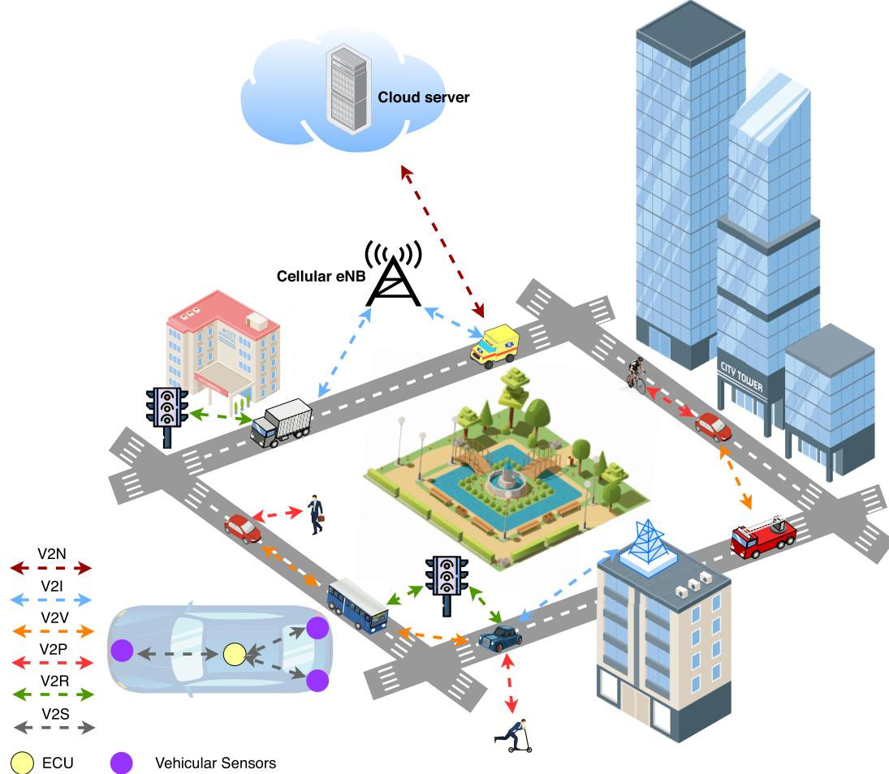  
Fig. 12. The structure of Vehicle-to-Everything (V2X). Connections including Vehicle-to-Network (V2N), Vehicle-to-Infrastructure (V2I), Vehicle-to-Vehicl (V2V), Vehicle-to-Pedestrian (V2P), Vehicle-to-RSU (V2R), and Vehicle-to-Sensors (V2S).

Lin et al. [156] to deal with the QoE. Both systems aim to make up for the weaknesses of the original highly centralized PVS. With the EI-enabled PVS, it is believed that PVS will provide an efficient, economic, and high-QoE transportation system. However, PVS still needs further research on such aspects as security, privacy, pricing, parking, and charging, although some research has been conducted on it [165], [166].

## D. Unmanned Aerial Vehicle

Due to UAV’s high mobility, easy deployment, and strong interconnection characteristics, UAVs can collect data from wireless sensors in RSUs. Sensors in ITS will generate tons of data every day. In situations where the data generated by sensors do not need immediate processing but long-term big data analytics, the wireless sensor network (WSN) is usually not connected to the backbone network to reduce the pressure on the backbone network. Many researchers have proved that by flying over the RSUs, UAVs can collect the data by WSN [171], [172]. Based on these researches, a flight strategy using UAVs as RUS data collection and calculation nodes is proposed [173]. Using UAVs for ground traffic monitoring also has substantial advantages, especially when monitoring needs to be increased to prevent emergencies. Applications like accident reports, flying police eyes, and flying RSUs can be achieved by EI-enabled UAVs [174]. Elloumi et al. [175] proposed a multi-edge cooperative UAV- based road traffic monitoring and data collection system. They then focused on the adaptive UAV trajectories for target tracking and used multiple cooperative UAVs to handle the targets’ speeds and positions.

As the role of EI-based UAVs in road infrastructure becomes increasingly promising, we believe that UAVs may become an essential part of EI-enabled ITS soon.

## E. Rail Transportation Control, Management, and Communication

The rail transportation system (RTS) has been boosted by AI technology. From automatic train operation (ATO) to centralized traffic control (CTC), ML and DL methods are taking a more important role in intelligent rail transportation [176]. With the increase in the number of end devices (e.g., trains, sensors, and cameras), the lack of computing resources and network communication delays caused by data centralization and system centralization have greatly limited the development of RTSs. In building a smart and connected RTS, EI is of great importance. Table VI shows the EI applications and research fields in rail transportation, including the railway control, management and communication. The employed technology, potential EI level, main contributions and limitations of theses researches are listed. Due to using EI in rail transportation still lacking practice, these researches mainly focus on theoretical study.

TABLE VI  
A COMPARISON TABLE OF EI APPLICATIONS AND RESEARCH FIELDS IN RAIL TRANSPORTATION CONTROL, MANAGEMENT, AND COMMUNICATION
<table><tr><td rowspan=1 colspan=1>Name</td><td rowspan=1 colspan=1>Employed Tech-nology</td><td rowspan=1 colspan=1>(Potential) EI Level</td><td rowspan=1 colspan=1>Main contribution</td><td rowspan=1 colspan=1>Limitations</td></tr><tr><td rowspan=1 colspan=1>Wang et al. [167]</td><td rowspan=1 colspan=1>FC</td><td rowspan=1 colspan=1>Level-2/Level-5</td><td rowspan=1 colspan=1>A FC-based wireless service structureunder fast-moving conditions is pro-posed.</td><td rowspan=1 colspan=1>It is only a theoretical study, andremains to be tested in practical sce-narios.</td></tr><tr><td rowspan=1 colspan=1>Hua et al. [33]</td><td rowspan=1 colspan=1>Federated learn-ing</td><td rowspan=1 colspan=1>Level-2/Level-5</td><td rowspan=1 colspan=1>A blockchain-based federated learningframework for intelligent train controlis proposed.</td><td rowspan=1 colspan=1>The perception part of intelligent con-trol is missing.</td></tr><tr><td rowspan=1 colspan=1>Zhou [168]</td><td rowspan=1 colspan=1>EC</td><td rowspan=1 colspan=1>Level-1/Level-4</td><td rowspan=1 colspan=1>A cloud-edge cooperation frameworkfor computer vision-based train safetymonitoring.</td><td rowspan=1 colspan=1>Methods to improve the real-time per-formance of edge computing, suchas model compression, are yet to beadded.</td></tr><tr><td rowspan=1 colspan=1>Liu et al. [169]</td><td rowspan=1 colspan=1>EC</td><td rowspan=1 colspan=1>Level-1 to Level-7</td><td rowspan=1 colspan=1>A cloud-edge-end architecture for in-telligent train monitoring is studied.</td><td rowspan=1 colspan=1>System architecture study only.</td></tr><tr><td rowspan=1 colspan=1>Zhao et al. [170]</td><td rowspan=1 colspan=1>EC</td><td rowspan=1 colspan=1>Level-1</td><td rowspan=1 colspan=1>A cloud-edge collaborative rail trafficsmart control system for train opera-tion, supervision, and adjustment.</td><td rowspan=1 colspan=1>System architecture study only.</td></tr></table>

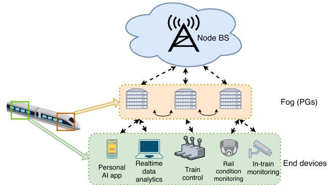  
Fig. 13. The “fog structure” edge service structure of railway service.

One major challenge that RTS faces when EI-enabled applications are deployed is the network connection, especially the method for achieving high-speed railways. As shown in Fig. 13, Wang et al. [167] proposed a fog structure-based reliable wireless connection method. Several personal gateways (PGs) deployed on the train as edge nodes will provide the connection between end devices and ground BSs. Moving part of the data processing and network connection to the edge nodes solves the problem of poor network connection stability under high-speed movement, and the network delay is also reduced. Moreover, PGs can also provide data storage capacity. Thus PGs also can offload tasks to BSs, providing the possibility to extend mobile applications and services. This will significantly help end devices to offload their AI tasks.

Blockchain-based systems have implemented functions such as smart ticket sales, invoices, smart freight consignment, and joint train control [177], [178]. Hua et al. [33] proposed a method for intelligent railway control, a blockchain-based federated learning algorithm for trusted private-sensitive data sharing mechanisms. Another typical application of EI in RTS is to carry out monitoring. The Trouble EMU (electric multiple units) Detection System (TEDS) will detect train failure by analyzing camera images. To reduce the heavy computing and storage loads of traditional cloud-only architecture, Zhou [168] proposed a cloud-edge cooperation method where the edge computing nodes will handle the image procession and cloud servers will be responsible for data sharing and big data analysis. Resnet-101 is used for image-based rail fault judgment deployed at edge nodes. Liu et al. [169] built a “cloud-edge-end” architecture for Faster-RCNN-based monitoring application. Zhao et al. [170] proposed the cloud-edge collaborative rail traffic smart control system. This system fully uses the computing power of edge nodes to obtain safe and real-time operation, supervision, and adjustment.

In addition, the network security challenges faced in EI-based RTS have also been extensively studied by scholars in recent years. Zhu and Li [179], [180] focused on the cross-layer defense scheme on cyber-attacks of Communication-based Train Control (CBTC) systems. This joint cross-layer defense approach uses the EI architecture to improve overall system performance and rationalizes resource allocation to improve defense performance through the reinforcement learning methods deployed on the servers.

## VI. EDGE INTELLIGENCE PLATFORMS AND FRAMEWORKS IN ITS

In ITS, the deployment of EI considers cost and universality. A more versatile platform and architecture will help EI be deployed faster in ITS and will reduce the cost of EI-based ITS. Since the generic EI-based ITS platform is still in its infancy, this section will mainly introduce the EI platform and architecture to provide a reference for researchers to study the platform for EI-based ITS. This section introduces the platforms and algorithms for EI model training and inference, as well as the EI systematic platforms and frameworks.

## A. EI Model Training

In this subsection, we will make an overview of EI model training. Several EI model training platforms and algorithms are shown in Table VII, including the name, employed technology, EI level and high lights of these platforms and algorithms, and we will discuss them in further detail in this subsection.

In ITS, the various applications will cause the AI models to be multitudinous, which has become a key challenge of EI deployment. To achieve better performance of AI applications, models like DNN are trained to face a more specific question, leading to the decrease in the generalization performance of AI models. However, more advanced training means the need for data that is more likely to expose user privacy. Users and companies would be concerned about privacy issues during the data collection as the data often originates in many sources like personal devices and video recorders. Thus, platforms like FedAvg [114], BlockFL [185], and SSGD [181] are considering privacy issues. By using privacy-friendly methods like model partition and decentralized architecture, it is expected to make users more trustworthy at the technical level, thereby promoting big data-driven model training and better reinforcement learning effects. Compared to the results obtained in a centralized way, this method shows a reduction in the risk of data privacy leakage. Meanwhile, compared to training the model at the cloud centers, training DNN models at the edge could be slower due to the computational gap. Thus, methods like INCEPTIONN [183] and PipeDream [184] are focusing more on training efficiency. Methods like eSGD [182] and INCEPTIONN also aim to reduce the backbone network’s stress.

TABLE VII  
EI MODEL TRAINING PLATFORMS AND ALGORITHMS
<table><tr><td rowspan=1 colspan=1>Name</td><td rowspan=1 colspan=1>Employed Technology</td><td rowspan=1 colspan=1>EI level</td><td rowspan=1 colspan=1>High Lights</td></tr><tr><td rowspan=1 colspan=1>FedAvg [114]</td><td rowspan=1 colspan=1>·Federated Learning·Iterative model averaging</td><td rowspan=1 colspan=1>Level-4</td><td rowspan=1 colspan=1>·Performs robust to the unbalanced and non-IID optimization·Reduces Communication rounds by 10-100x than stochasticgradient descent</td></tr><tr><td rowspan=1 colspan=1>SSGD [181]</td><td rowspan=1 colspan=1>·Federated Learning·Selective SGD</td><td rowspan=1 colspan=1>Level-4</td><td rowspan=1 colspan=1>·Privacy preservation while joint DNN training</td></tr><tr><td rowspan=1 colspan=1>eSGD [182]</td><td rowspan=1 colspan=1>·Selectively transmit important gradient coordi-nates· Momentum residual accumulation</td><td rowspan=1 colspan=1>Level-4</td><td rowspan=1 colspan=1>·Reduces communication cost of synchronizing gradients andparameters between end devices and cloud</td></tr><tr><td rowspan=1 colspan=1>INCEPTIONN[183]</td><td rowspan=1 colspan=1>·Lossy gradient compression NIC-integrated com-pression accelerator·Gradient-centric aggregator-free training</td><td rowspan=1 colspan=1>Level-5</td><td rowspan=1 colspan=1>·Reduces communication time by 70.9-80.7%·Speedup over 2.2-3.1x than conventional training system</td></tr><tr><td rowspan=1 colspan=1>PipeDream [184]</td><td rowspan=1 colspan=1>·DNN splitting·Pipeline parallelism</td><td rowspan=1 colspan=1>Level-6</td><td rowspan=1 colspan=1>·Better overlap computation with communication and reducesthe amount of communication.5.3x faster than intra-batch parallelism techniques</td></tr><tr><td rowspan=1 colspan=1>BlockFL [185]</td><td rowspan=1 colspan=1>·Federated Learning·Blockchain</td><td rowspan=1 colspan=1>Level-7</td><td rowspan=1 colspan=1>·Decentralized model training without central coordination</td></tr><tr><td rowspan=1 colspan=1>Gossiping  SGD[186]</td><td rowspan=1 colspan=1>·Gossip Training·Model partition</td><td rowspan=1 colspan=1>Level-7</td><td rowspan=1 colspan=1>·Replaces the all-reduce collective operation of synchronoustraining with a gossip aggregation algorithmWork faster at the initial step size</td></tr></table>

## B. EI Model Inference

This subsection reviews EI model inference platforms and algorithms. Table VIII (on page 20) shows several EI model inference platforms and algorithms, including the employed technology, architecture, EI level, application, and their high lights.

The model inference at the edge would directly influence the performance of AI applications. Due to the resource limitation at the edge, energy saving is a problem that needs to be solved. Platforms in Table VIII, like DeepX [187], Foggy-Chache [188], and Minerva [189], focus on energy saving and efficiency improvement. The Level-1 platforms optimize the model inference with cloud resources and edge advantages, which would help deploy in areas with scarce computational resources. Application scenarios such as the Industrial Internet of Things (IIoT) can also inspire EI in ITS. Platforms such as DeepIns [190] and FoggyCache [188] deployed in IIoT provide the theoretical and technical foundations for model reasoning in ITS.

## C. EI Systematic Platforms and Frameworks

The systematic platforms and frameworks of EI provide the sight of EI-based ITS deployment.

Azure IoT Edge provided by Microsoft [195] is a fully managed service that moves part of workloads to the edge of the network for a quicker reaction. Azure IoT Edge deploys IoT edge modules to end devices, executes locally on themselves, and manages end devices on a cloud-based interface. Meanwhile, Google provides Cloud IoT Edge as the software to extend AI applications like TensorFlow-Lite to the edge side and the Edge TPU as the high-performance hardware [196]. AWS IoT Greengrass provided by Amazon [197] helps build intelligent device software. AWS IoT Greengrass adopts local data procession and transmits necessary data to the cloud for remote management and software updates.

Al-Rakhami et al. [198] proposed a cost-efficient EI framework that realized a low-cost, lightweight and efficient container platform. Later on, Zhang et al. [199] combined blockchain with EI to accomplish flexible and secure edge service management. SimEdgeIntel [200] is an edge simulator for researchers to deploy EI applications more quickly.

Zhang et al. [201] introduced an Open Framework for Edge Intelligence (OpenEI), a lightweight software platform for EI applications. OpenEI aims at deploying platforms on any hardware, overcoming the challenges including computational resource stress, data sharing and collaborating, and matching the AI algorithms and edge platforms. The OpenEI includes three major parts: Package Manager, Model Selector, and libei. Package Manager is a lightweight DL package designed for an edge platform with low power consumption and memory footprint. Model Selector contains several AI models optimized for edge environments and a model selection algorithm that considers accuracy, latency, energy, and memory footprint. libei provides a RESTful API for developers to manage data, algorithms, and computing resources.

EdgeAI is a joint framework for edge computing and AI algorithms proposed by Lovén et al. [202]. EdgeAI divides the AI and edge side into AI in Edge and Edge for AI, including how the edge computing platforms impact AI algorithms and how AI methods can help with edge deployment. EdgeAI emphasizes the horizontal connectivity and interoperability of end devices. Authors believed that with edge-native AI,

TABLE VIII  
EI MODEL INFERENCE PLATFORMS AND ALGORITHMS
<table><tr><td rowspan=1 colspan=1>Name</td><td rowspan=1 colspan=1>Employed Technology</td><td rowspan=1 colspan=1>Architecture</td><td rowspan=1 colspan=1>EI level</td><td rowspan=1 colspan=1>Application</td><td rowspan=1 colspan=1>High Lights</td></tr><tr><td rowspan=1 colspan=1>VideoEdge[191]</td><td rowspan=1 colspan=1>Frame rate and resolu-tion adaptation·Service placement</td><td rowspan=1 colspan=1>Cloud-Edge-Device</td><td rowspan=1 colspan=1>Level-1</td><td rowspan=1 colspan=1>Video Analytics</td><td rowspan=1 colspan=1>·Improves accuracy by 25.4x and 5.4xcompared to fair allocation of resourcesand VideoStorm</td></tr><tr><td rowspan=1 colspan=1>Chameleon[192]</td><td rowspan=1 colspan=1>·Frame rate and resolu-tion adaptation·Model selection</td><td rowspan=1 colspan=1>Device-Cloud</td><td rowspan=1 colspan=1>Level-1</td><td rowspan=1 colspan=1>Video Analytics</td><td rowspan=1 colspan=1>·20-50% accuracy improvement or 2-3xspeedup</td></tr><tr><td rowspan=1 colspan=1>DeepIns [190]</td><td rowspan=1 colspan=1>·Fog computing·Early-exit</td><td rowspan=1 colspan=1>Edge-Cloud</td><td rowspan=1 colspan=1>Level-1</td><td rowspan=1 colspan=1>IIoT</td><td rowspan=1 colspan=1>·Efficiency improvement and model ro-busty·Latency reduction: 0.98-1.21x</td></tr><tr><td rowspan=1 colspan=1>DeepDecision[193]</td><td rowspan=1 colspan=1>·Application-level opti-mization·Model selection</td><td rowspan=1 colspan=1>Cloud-Edge</td><td rowspan=1 colspan=1>Level-1</td><td rowspan=1 colspan=1>Video Analytics</td><td rowspan=1 colspan=1>·Considers all aspects to determine anoptimal offloading strategy·Latency reduction 2-10x</td></tr><tr><td rowspan=1 colspan=1>DeepX [187]</td><td rowspan=1 colspan=1>·Model compression·Model partition</td><td rowspan=1 colspan=1>On Device</td><td rowspan=1 colspan=1>Level-2</td><td rowspan=1 colspan=1>Mobile sensing apps</td><td rowspan=1 colspan=1>·More efficiently executed by heteroge-neous local device processors·Energy reduction: 7.12-26.7x</td></tr><tr><td rowspan=1 colspan=1>FoggyCache[188]</td><td rowspan=1 colspan=1>·Fog Computing·Edge Caching</td><td rowspan=1 colspan=1>Device-Edge</td><td rowspan=1 colspan=1>Level-2</td><td rowspan=1 colspan=1>IIoT</td><td rowspan=1 colspan=1>·Efficiency improve: 3-10x</td></tr><tr><td rowspan=1 colspan=1>AdaDeep[194]</td><td rowspan=1 colspan=1>·Deep Reinforcement·Model Compression</td><td rowspan=1 colspan=1>On Device</td><td rowspan=1 colspan=1>Level-3</td><td rowspan=1 colspan=1>Mobile DNN infer-ence</td><td rowspan=1 colspan=1>·System-level viewpoint optimization.9.8x latency reduction, 4.3x energy effi-ciency improvement, 38x storage reduc-tion</td></tr><tr><td rowspan=1 colspan=1>Minerva [189]</td><td rowspan=1 colspan=1>·Hardware accelerator·Model Compression</td><td rowspan=1 colspan=1>On-Device</td><td rowspan=1 colspan=1>Level-3</td><td rowspan=1 colspan=1>Power-constrainedDNN deployment</td><td rowspan=1 colspan=1>·High accurate, ultra-low power DNNaccelerators (in tens of milliwatts)·Average of 8.1x power reduction</td></tr></table>

EdgeAI solutions would enable innovations in smart cities in the future.

In [39], authors gave a roadmap for 6G network-enabled EI. They divided the system framework AI for Edge and AI on Edge. AI for edge includes wireless networking, mmWave xhaul systems, communication service implementation, dynamic task allocation, liquid computing handover, location-based optimization, the predictive quality of service, and energy management. AI on edge includes novel application areas, data intelligence, collective intelligence, realtime requirements, computing as a service, and advanced IoT models. These two aspects give the future EI platforms a paradigm that platforms should guarantee their coexistence.

## D. Benchmark Datasets

In EI-enabled ITS, the benchmark datasets will help researchers conduct algorithm research more easily and compare the performance of different algorithms on the same dataset. In autonomous driving, nuScenes [203] is the first dataset that contains a fully autonomous vehicle sensor suite with a full 360-degree field of view: 6 cameras, 5 radars, and 1 lidar. Compared with some other popular datasets (i.e. ApolloScape [204], Waymo [205], A2D2 [206], KITTI [207]), the amount of data and complexity of nuScenes has increased significantly, which can help researchers study various autonomous driving environments more comprehensively.

In traffic management and vehicular communication research, road traffic simulator SUMO [208] is often used to generate customized traffic data. SUMO supports modeling road vehicles, public transport, and pedestrians. SUMO supports various tool plug-ins for creating, executing, and evaluating traffic simulations. The Bologna dataset [209] uses SUMO to generate raw data and validate it with real-world data. In SHL dataset [210], the authors provide an accurately annotated large-scale smartphone sensor dataset for traffic analysis. SHL contains over 2800 hours of annotated data with 15 smartphone sensor data.

RailSem19 [211] is the first and, to the best of our knowledge, only one public railway computer vision dataset. RailSem19 contains 8500 annotated sequences of video from the locomotive perspective. The annotations include rails, switches, traffic signs/signals, crossings, trains, and platforms.

## VII. CHALLENGES AND FUTURE DIRECTIONS OF EI IN ITS

Many unresolved challenges have accompanied the introduction of EI into ITS. These challenges are also one of the future research directions of EI in ITS. In this section, we will discuss EI’s challenges and future directions in ITS. The EI infrastructure, AI algorithms for the edge, distributed training and inference, security and privacy, and business model are discussed.

## A. Edge Intelligence Infrastructure Is the Foundation for EI Deployment in ITS

Because of the high-speed mobility and load imbalance of terminal devices in ITS systems, infrastructure designed explicitly for ITS is essential. Although there are some studies on the EI-optimized edge infrastructure research, ITSoriented research on EI infrastructure is still scarce. During the large-scale deployment of EI applications in ITS, the importance of wireless networking, distributed computation, and data storage will have to be highlighted. These aspects are usually closely related to the EI infrastructure itself. In addition, infrastructure optimized explicitly for applications in ITS will also help the deployment of EI in ITS, such as infrastructure specifically optimized for autonomous vehicle driving and vehicular fog computing.

The heterogeneous compatibility of EI infrastructure must also be paid attention to. In the future, different service providers and government agencies may be involved in providing infrastructure services, and they will face heterogeneous data service requests from different endpoints.

## B. AI Models for Edge in ITS

Since most existing AI models are not specifically designed for edge environments, most of them are highly resourceintensive. For example, DNN-based AI models may perform well in video analysis, natural language processing, and planning schemes, but they are too large and bloated in under-resourced edge environments. Therefore, AI models specifically designed for edge environments in ITS will be a future research direction. By improving AI models with model compression techniques such as AMC [212], AI models could be more resource-friendly and adaptable to edge environments.

In the future-oriented EI-enabled ITS environment, the features of real-time all-round environment awareness and collaborative decision making at the edge side pose new challenges to the efficiency, robustness, and generalization ability of AI models. Many factors, such as memory usage, computational requirements, data characteristics, and real-time requirements, should be carefully considered in the process of building edge AI models.

## C. Distributed Training and Inference of EI-Enabled ITS

Although some EI applications in ITS could train their model in a centralized way and download the trained model to end devices, plenty of applications still need to be trained at the edge, e.g. DRL-based traffic management applications [213]. While the poor training ability of many end devices still poses a serious problem, distributed training would be a promising solution. Previous sections have discussed the existing distributed training methods, which have already shown the ability in energy saving, privacy protection, and training acceleration. In order to fully tap the potential of edge big data in ITS, much work needs to be done, and distributed training algorithms might be one of the research hotspots. The future distributed training methods should be formulated for energy efficiency, complexity, capability, and data privacy.

The distributed inference would also be a key factor of future EI performance in ITS. As DNNs are designed deeper and deeper in pursuit of better model performance, the computational requirements of DNNs are also expanding. As many end devices will not be able to handle DNN inference, moving the models to edge nodes for distributed inference would be effective in saving energy and computational resources at end devices. The fact is that there are already many researchers focusing on this question, and we believe that distributed inference will be a future direction for EI in ITS.

## D. Security and Privacy of EI-Enabled ITS

The privacy issue is also a challenging problem, especially in big data-driven AI applications [19]. In an EI structure, data processing may require end devices to transmit data to the edge/cloud. Although the decentralized structure of EI could stay away from the safety loophole computing centers, privacy might be leaked during data transmission, processing, and storage. With the number of connected devices increasing, personal data generated from end devices, including location data, health and activity information, is highly privacysensitive. Once the data is transmitted in-network, it faces attacks and vulnerabilities that might lead to data leakage or even service crashes. Making sure the data transmission is secure and reliable will be a challenge in future.

In recent years, many countries have issued relevant privacy protection regulations, a quintessential example should be cited that the EU’s General Data Protection Regulation (GDPR) [214]. Increasingly strict privacy regulations will prompt researchers to implement schemes, such as differential privacy, homomorphic encryption and secure multi-party computation, for better privacy protection.

## E. Business Model of EI-Enabled ITS

Although EI can partially rely on the existing infrastructure in the ITS deployment process, more infrastructures are needed to realize comprehensive EI-based ITS coverage in the future. The cost of infrastructure construction will become a key factor affecting the deployment of EI in ITS. According to [1], the wide deployment of EI requires the close cooperation of AI software providers, EI platform providers, network operators, edge equipment providers, data providers, and service consumers during deployment. Therefore, a sound business model can enable the above participants to deploy EI-based ITS to the greatest extent actively. At the same time, a good business model can also make operators and government departments more interested in EI infrastructure construction, thus further promoting the process of EI-enabled ITS. The current research in this field is still scarce, and establishing a good business model will be a core issue in the near future.

## F. Translating From Research to Deployment

While the EI-enabled applications discussed before are promising in research phase, in practice there are many challenges associated with integrating research techniques into real ITS services. For example, the ground infrastructure is usually built by government and communication operators, while the vehicles come from many different manufacturers of cars, each having their own ADSs. Sharing information and computing power in V2X requires the collaboration of all participants, which is often difficult to achieve in a free market. One possible option is to standardize constraints on car manufacturers and service providers through uniform standards, which usually requires government promotion.

## VIII. CONCLUSION

By pushing AI to the network edge, EI in ITS has attracted much research attention. In this paper, we conducted a comprehensive survey of using EI in ITS. We first reviewed the foundation and motivation for using EI in ITS. Then, we introduced the architecture of EI-based ITS and the performance indexes in EI-based ITS. Subsequently, the enabling technologies of EI-based ITS were provided. Then the EI applications and research fields in ITS were introduced in detail, including vehicles, UAVs, and rail transportation. We then provided the EI platforms and frameworks in ITS. Finally, we discussed the challenges and future directions of EI in ITS.

## REFERENCES

[1] Z. Zhou, X. Chen, E. Li, L. Zeng, K. Luo, and J. Zhang, “Edge intelligence: Paving the last mile of artificial intelligence with edge computing,” Proc. IEEE, vol. 107, no. 8, pp. 1738–1762, Aug. 2019.

[2] W. Z. Khan, E. Ahmed, S. Hakak, I. Yaqoob, and A. Ahmed, “Edge computing: A survey,” Future Gener. Comput. Syst., vol. 97, pp. 219–235, Aug. 2019.

[3] D. M. M. Pacis, E. D. C. Subido, and N. T. Bugtai, “Trends in telemedicine utilizing artificial intelligence,” Proc. AIP Conf., vol. 1933, no. 1, 2018, Art. no. 040009.

[4] D. Bregman, “Smart home intelligence—The eHome that learns,” Int. J. Smart Home, vol. 4, no. 4, pp. 35–46, 2010.

[5] A. de Barcelos Silva et al., “Intelligent personal assistants: A systematic literature review,” Expert Syst. Appl., vol. 147, Jun. 2020, Art. no. 113193.

[6] B.-H. Li, B.-C. Hou, W.-T. Yu, X.-B. Lu, and C.-W. Yang, “Applications of artificial intelligence in intelligent manufacturing: A review,” Frontiers Inf. Technol. Electron. Eng., vol. 18, no. 1, pp. 86–96, 2017.

[7] E. Ntoutsi et al., “Bias in data-driven artificial intelligence systemsan introductory survey,” Wiley Interdiscipl. Rev., Data Mining Knowl. Discovery, vol. 10, no. 3, p. e1356, 2020.

[8] A. Holst. (2020). Number of Internet of Things (IoT) Connected Devices Worldwide From 2019 to 2030. [Online]. Available: https://www.statista.com/statistics/1183457/iot-connected-devicesworldwide/

[9] E. Li, Z. Zhou, and X. Chen, “Edge intelligence: On-demand deep learning model co-inference with device-edge synergy,” in Proc. Workshop Mobile Edge Commun., Aug. 2018, pp. 31–36.

[10] S. Deng, H. Zhao, W. Fang, J. Yin, S. Dustdar, and A. Y. Zomaya, “Edge intelligence: The confluence of edge computing and artificial intelligence,” IEEE Internet Things J., vol. 7, no. 8, pp. 7457–7469, Aug. 2020.

[11] L. Qi, “Research on intelligent transportation system technologies and applications,” in Proc. Workshop Power Electron. Intell. Transp. Syst., Aug. 2008, pp. 529–531.

[12] S.-H. An, B.-H. Lee, and D.-R. Shin, “A survey of intelligent transportation systems,” in Proc. 3rd Int. Conf. Comput. Intell., Commun. Syst. Netw., 2011, pp. 332–337.

[13] K. N. Qureshi and A. H. Abdullah, “A survey on intelligent transportation systems,” Middle-East J. Sci. Res., vol. 15, no. 5, pp. 629–642, 2013.

[14] J. Zhang, F.-Y. Wang, K. Wang, W.-H. Lin, X. Xu, and C. Chen, “Datadriven intelligent transportation systems: A survey,” IEEE Trans. Intell. Transp. Syst., vol. 12, no. 4, pp. 1624–1639, Dec. 2011.

[15] L. Liu, C. Chen, Q. Pei, S. Maharjan, and Y. Zhang, “Vehicular edge computing and networking: A survey,” Mobile Netw. Appl., vol. 26, pp. 1–24, Jul. 2020.

[16] G. Vernazza and R. Zunino, “A distributed intelligence methodology for railway traffic control,” IEEE Trans. Veh. Technol., vol. 39, no. 3, pp. 263–270, Aug. 1990.

[17] O. Bekkouche, T. Taleb, M. Bagaa, and K. Samdanis, “Edge cloud resource-aware flight planning for unmanned aerial vehicles,” in Proc. IEEE Wireless Commun. Netw. Conf. (WCNC), Apr. 2019, pp. 1–7.

[18] J. Barthélemy, N. Verstaevel, H. Forehead, and P. Perez, “Edgecomputing video analytics for real-time traffic monitoring in a smart city,” Sensors, vol. 19, no. 9, p. 2048, May 2019.

[19] L. Zhu, F. R. Yu, Y. Wang, B. Ning, and T. Tang, “Big data analytics in intelligent transportation systems: A survey,” IEEE Trans. Intell. Transp. Syst., vol. 20, no. 1, pp. 383–398, Jan. 2019.

[20] C. Cisco, Cisco Global Cloud Index: Forecast and Methodology, 2016–2021. San Jose, CA, USA: Cisco, 2018.

[21] Cisco. (2021). Global Data Center Security Market (2021 to 2026)— Featuring McAfee, Cisco Systems and Dell Among Others. [Online]. Available: https://www.prnewswire.com/news-releases/global-datacenter-security-market-2021-to-2026—featuring-mcafee-ciscosystems-and-dell-among-others-301315531.html

[22] J. Zhang and K. B. Letaief, “Mobile edge intelligence and computing for the Internet of Vehicles,” Proc. IEEE, vol. 108, no. 2, pp. 246–261, Feb. 2020.

[23] A. Ferdowsi, U. Challita, and W. Saad, “Deep learning for reliable mobile edge analytics in intelligent transportation systems: An overview,” IEEE Veh. Technol. Mag., vol. 14, no. 1, pp. 62–70, Mar. 2019.

[24] N. Soni, R. Malekian, and A. Thakur, “Edge computing in transportation: Security issues and challenges,” 2020, arXiv:2012.11206.

[25] X. Zhou, R. Ke, H. Yang, and C. Liu, “When intelligent transportation systems sensing meets edge computing: Vision and challenges,” Appl. Sci., vol. 11, no. 20, p. 9680, Oct. 2021.

[26] P. Arthurs, L. Gillam, P. Krause, N. Wang, K. Halder, and A. Mouzakitis, “A taxonomy and survey of edge cloud computing for intelligent transportation systems and connected vehicles,” IEEE Trans. Intell. Transp. Syst., vol. 23, no. 7, pp. 6206–6221, Jul. 2022.

[27] J. Liu et al., “RL/DRL meets vehicular task offloading using edge and vehicular cloudlet: A survey,” IEEE Internet Things J., vol. 9, no. 11, pp. 8315–8338, Jun. 2022.

[28] M. Ahmed et al., “A survey on vehicular task offloading: Classification, issues, and challenges,” J. King Saud Univ.-Comput. Inf. Sci., vol. 34, no. 7, pp. 4135–4162, Jul. 2022.

[29] J. Tang, S. Liu, L. Liu, B. Yu, and W. Shi, “LoPECS: A low-power edge computing system for real-time autonomous driving services,” IEEE Access, vol. 8, pp. 30467–30479, 2020.

[30] G. Mehr and A. Eskandarian, “Development and calibration of a lowcost machine vision pipeline for connected and autonomous vehicle (CAV) research,” in Proc. ASME Int. Mech. Eng. Congr. Expo., vol. 85628. New York, NY, USA: American Society of Mechanical Engineers, 2021, Art. no. V07BT07A024.

[31] A. Eskandarian, C. Wu, and C. Sun, “Research advances and challenges of autonomous and connected ground vehicles,” IEEE Trans. Intell. Transp. Syst., vol. 22, no. 2, pp. 683–711, Feb. 2021.

[32] M. C. Lucic, H. Ghazzai, and Y. Massoud, “A generalized dynamic planning framework for green UAV-assisted intelligent transportation system infrastructure,” IEEE Syst. J., vol. 14, no. 4, pp. 4786–4797, Dec. 2020.

[33] G. Hua, L. Zhu, J. Wu, C. Shen, L. Zhou, and Q. Lin, “Blockchainbased federated learning for intelligent control in heavy haul railway,” IEEE Access, vol. 8, pp. 176830–176839, 2020.

[34] M. Satyanarayanan, P. Bahl, R. Caceres, and N. Davies, “The case for VM-based cloudlets in mobile computing,” IEEE Pervasive Comput., vol. 8, no. 4, pp. 14–23, Oct. 2009.

[35] IEC. Edge Intelligence, [EB/OL]. Accessed: Mar. 30, 2021. [Online]. Available: https://www.iec.ch/basecamp/edge-intelligence/

[36] Y. Miao, G. Wu, M. Li, A. Ghoneim, M. Al-Rakhami, and M. S. Hossain, “Intelligent task prediction and computation offloading based on mobile-edge cloud computing,” Future Gener. Comput. Syst., vol. 102, pp. 925–931, Jan. 2020.

[37] Y. Zhang, X. Lan, J. Ren, and L. Cai, “Efficient computing resource sharing for mobile edge-cloud computing networks,” IEEE/ACM Trans. Netw., vol. 28, no. 3, pp. 1227–1240, Jun. 2020.

[38] M. Khayyat, I. A. Elgendy, A. Muthanna, A. S. Alshahrani, S. Alharbi, and A. Koucheryavy, “Advanced deep learning-based computational offloading for multilevel vehicular edge-cloud computing networks,” IEEE Access, vol. 8, pp. 137052–137062, 2020.

[39] E. Peltonen et al., “6G white paper on edge intelligence,” 2020, arXiv:2004.14850.

[40] A. I. Maqueda, A. Loquercio, G. Gallego, N. García, and D. Scaramuzza, “Event-based vision meets deep learning on steering prediction for self-driving cars,” in Proc. IEEE/CVF Conf. Comput. Vis. Pattern Recognit., Jun. 2018, pp. 5419–5427.

[41] C. Tsai, C. Tseng, H. Tang, and J. Guo, “Vehicle detection and classification based on deep neural network for intelligent transportation applications,” in Proc. Asia–Pacific Signal Inf. Process. Assoc. Annu. Summit Conf. (APSIPA ASC), Nov. 2018, pp. 1605–1608.

[42] T. Zhou, “Deep learning models for route planning in road networks,” KTH Roy. Inst. Technol., Stockholm, Sweden, Tech. Rep. 1, 2018.

[43] C. A. R. L. Brennand, G. P. R. Filho, G. Maia, F. Cunha, D. L. Guidoni, and L. A. Villas, “Towards a fog-enabled intelligent transportation system to reduce traffic jam,” Sensors, vol. 19, no. 18, p. 3916, Sep. 2019.

[44] C. Campolo, A. Molinaro, G. Araniti, and A. O. Berthet, “Better platooning control toward autonomous driving: An LTE device-to-device communications strategy that meets ultralow latency requirements,” IEEE Veh. Technol. Mag., vol. 12, no. 1, pp. 30–38, Mar. 2017.

[45] M. I. Jordan and T. M. Mitchell, “Machine learning: Trends, perspectives, and prospects,” Science, vol. 349, no. 6245, pp. 255–260, Jul. 2015.

[46] Y. LeCun, Y. Bengio, and G. Hinton, “Deep learning,” Nature, vol. 521, no. 7553, pp. 436–444, 2015.

[47] T. L. Fine, Feedforward Neural Network Methodology. New York, NY, USA: Springer, 2006.

[48] T. N. Sainath, A.-R. Mohamed, B. Kingsbury, and B. Ramabhadran, “Deep convolutional neural networks for LVCSR,” in Proc. IEEE Int. Conf. Acoust., Speech Signal Process., May 2013, pp. 8614–8618.

[49] N. Kalchbrenner, E. Grefenstette, and P. Blunsom, “A convolutional neural network for modelling sentences,” 2014, arXiv:1404.2188.

[50] W. Zaremba, I. Sutskever, and O. Vinyals, “Recurrent neural network regularization,” 2014, arXiv:1409.2329.

[51] T.-Y. Gong, F. Sang, T.-Y. Yang, and Z.-W. Chen, “Automatic trace recognition of ionogram with YOLOv3,” in Proc. IEEE Int. Conf. Consum. Electron.-Taiwan (ICCE-Taiwan), Sep. 2020, pp. 1–2.

[52] A. Bahrammirzaee, “A comparative survey of artificial intelligence applications in finance: Artificial neural networks, expert system and hybrid intelligent systems,” Neural Comput. Appl., vol. 19, no. 8, pp. 1165–1195, Nov. 2010.

[53] J. Lee, H. Davari, J. Singh, and V. Pandhare, “Industrial artificial intelligence for industry 4.0-based manufacturing systems,” Manuf. Lett., vol. 18, pp. 20–23, Oct. 2018.

[54] J. R. Anderson, Machine Learning: An Artificial Intelligence Approach, vol. 3. San Mateo, CA, USA: Morgan Kaufmann, 1990.

[55] B. Li, Q. Yao, and K. Wang, “A review on vision-based pedestrian detection in intelligent transportation systems,” in Proc. 9th IEEE Int. Conf. Netw., Sens. Control, Apr. 2012, pp. 393–398.

[56] L. Hao, L. Leixiao, and W. Hui, “Survey on research and application of support vector machines in intelligent transportation system,” J. Frontiers Comput. Sci. Technol., vol. 14, no. 6, p. 901, 2020.

[57] Y. Hou, P. Edara, and C. Sun, “Modeling mandatory lane changing using Bayes classifier and decision trees,” IEEE Trans. Intell. Transp. Syst., vol. 15, no. 2, pp. 647–655, Apr. 2014.

[58] I. V. Pustokhina et al., “Automatic vehicle license plate recognition using optimal K-means with convolutional neural network for intelligent transportation systems,” IEEE Access, vol. 8, pp. 92907–92917, 2020.

[59] Y. Meng and X. Liu, “Application of K-means algorithm based on ant clustering algorithm in macroscopic planning of highway transportation hub,” in Proc. 1st IEEE Int. Symp. Inf. Technol. Appl. Educ., Nov. 2007, pp. 483–488.

[60] R. P. D. Nath, H.-J. Lee, N. K. Chowdhury, and J.-W. Chang, “Modified K-means clustering for travel time prediction based on historical traffic data,” in Proc. Int. Conf. Knowl.-Based Intell. Inf. Eng. Syst. Berlin, Germany: Springer, 2010, pp. 511–521.

[61] K. Arulkumaran, M. P. Deisenroth, M. Brundage, and A. A. Bharath, “Deep reinforcement learning: A brief survey,” IEEE Signal Process. Mag., vol. 34, no. 6, pp. 26–38, Nov. 2017.

[62] A. Haydari and Y. Yilmaz, “Deep reinforcement learning for intelligent transportation systems: A survey,” IEEE Trans. Intell. Transp. Syst., vol. 23, no. 1, pp. 11–32, Jan. 2022.

[63] R. Abduljabbar, H. Dia, S. Liyanage, and S. A. Bagloee, “Applications of artificial intelligence in transport: An overview,” Sustainability, vol. 11, no. 1, p. 189, Jan. 2019.

[64] L. Deng and D. Yu, “Deep learning: Methods and applications,” Found. Trends Signal Process., vol. 7, nos. 3–4, pp. 197–387, Jun. 2014.

[65] A. Krizhevsky, I. Sutskever, and G. E. Hinton, “ImageNet classification with deep convolutional neural networks,” in Proc. Adv. Neural Inf. Process. Syst., vol. 25, 2012, pp. 1097–1105.

[66] K. Simonyan and A. Zisserman, “Very deep convolutional networks for large-scale image recognition,” 2014, arXiv:1409.1556.

[67] S. Zagoruyko and N. Komodakis, “Wide residual networks,” 2016, arXiv:1605.07146.

[68] F. Chollet, “Xception: Deep learning with depthwise separable convolutions,” in Proc. IEEE Conf. Comput. Vis. Pattern Recognit. (CVPR), Jul. 2017, pp. 1251–1258.

[69] S. Xie, R. Girshick, P. Dollár, Z. Tu, and K. He, “Aggregated residual transformations for deep neural networks,” in Proc. IEEE Conf. Comput. Vis. Pattern Recognit. (CVPR), Jul. 2017, pp. 1492–1500.

[70] Z. C. Lipton, J. Berkowitz, and C. Elkan, “A critical review of recurrent neural networks for sequence learning,” 2015, arXiv:1506.00019.

[71] S. Hochreiter and J. Schmidhuber, “Long short-term memory,” Neural Comput., vol. 9, no. 8, pp. 1735–1780, 1997.

[72] M. Schuster and K. K. Paliwal, “Bidirectional recurrent neural networks,” IEEE Trans. Signal Process., vol. 45, no. 11, pp. 2673–2681, 1997.

[73] A. Graves, G. Wayne, and I. Danihelka, “Neural Turing machines,” 2014, arXiv:1410.5401.

[74] K. Cho, B. van Merriënboer, D. Bahdanau, and Y. Bengio, “On the properties of neural machine translation: Encoder-decoder approaches,” 2014, arXiv:1409.1259.

[75] T. N. Kipf and M. Welling, “Semi-supervised classification with graph convolutional networks,” 2016, arXiv:1609.02907.

[76] S. Zhang, H. Tong, J. Xu, and R. Maciejewski, “Graph convolutional networks: A comprehensive review,” Comput. Social Netw., vol. 6, no. 1, pp. 1–23, Dec. 2019.

[77] J. Chen, T. Ma, and C. Xiao, “FastGCN: Fast learning with graph convolutional networks via importance sampling,” 2018, arXiv:1801.10247.

[78] W. Huang, T. Zhang, Y. Rong, and J. Huang, “Adaptive sampling towards fast graph representation learning,” 2018, arXiv:1809.05343.

[79] M. A. Kramer, “Nonlinear principal component analysis using autoassociative neural networks,” AIChE J., vol. 37, no. 2, pp. 233–243, Feb. 1991.

[80] Y. Lv, Y. Duan, W. Kang, Z. Li, and F. Y. Wang, “Traffic flow prediction with big data: A deep learning approach,” IEEE Trans. Intell. Transp. Syst., vol. 16, no. 2, pp. 865–873, Dec. 2015.

[81] J. Höchst, L. Baumgärtner, M. Hollick, and B. Freisleben, “Unsupervised traffic flow classification using a neural autoencoder,” in Proc IEEE 42nd Conf. Local Comput. Netw. (LCN), Oct. 2017, pp. 523–526.

[82] W. Wei, H. Wu, and H. Ma, “An AutoEncoder and LSTM-based traffic flow prediction method,” Sensors, vol. 19, no. 13, p. 2946, Jul. 2019.

[83] D. Bahdanau, K. Cho, and Y. Bengio, “Neural machine translation by jointly learning to align and translate,” 2014, arXiv:1409.0473.

[84] Y. Lu, J. Lu, S. Zhang, and P. Hall, “Traffic signal detection and classification in street views using an attention model,” Comput. Vis. Media, vol. 4, no. 3, pp. 253–266, Sep. 2018.

[85] J. Wang, N. Wu, W. X. Zhao, F. Peng, and X. Lin, “Empowering A∗ search algorithms with neural networks for personalized route recommendation,” in Proc. 25th ACM SIGKDD Int. Conf. Knowl. Discovery Data Mining, Jul. 2019, pp. 539–547.

[86] D. Wang, J. Zhang, W. Cao, J. Li, and Y. Zheng, “When will you arrive? Estimating travel time based on deep neural networks,” in Proc. AAAI Conf. Artif. Intell., vol. 32, no. 1, 2018, pp. 2500–2507.

[87] H. Wang and D.-Y. Yeung, “Towards Bayesian deep learning: A framework and some existing methods,” IEEE Trans. Knowl. Data Eng., vol. 28, no. 12, pp. 3395–3408, Dec. 2016.

[88] H. Wang and D.-Y. Yeung, “A survey on Bayesian deep learning,” ACM Comput. Surv., vol. 53, no. 5, pp. 1–37, Sep. 2021.

[89] A. Kendall and Y. Gal, “What uncertainties do we need in Bayesian deep learning for computer vision?” in Proc. Adv. Neural Inf. Process. Syst., vol. 30, 2017, pp. 5574–5584.

[90] L. Zhu and N. Laptev, “Deep and confident prediction for time series at uber,” in Proc. IEEE Int. Conf. Data Mining Workshops (ICDMW), Nov. 2017, pp. 103–110.

[91] Y. Xie, D. Lord, and Y. Zhang, “Predicting motor vehicle collisions using Bayesian neural network models: An empirical analysis,” Accident Anal. Prevention, vol. 39, no. 5, pp. 922–933, Sep. 2007.

[92] C. Tang, J. Chen, and M. Tomizuka, “Adaptive probabilistic vehicle trajectory prediction through physically feasible Bayesian recurrent neural network,” in Proc. Int. Conf. Robot. Autom. (ICRA), May 2019, pp. 3846–3852.

[93] L. Atzori, I. A. Iera, and M. Giacomo, “The Internet of Things: A survey,” Comput. Netw., vol. 54, no. 15, pp. 2787–2805, 2010.

[94] E. J. Oughton, W. Lehr, K. Katsaros, I. Selinis, D. Bubley, and J. Kusuma, “Revisiting wireless Internet connectivity: 5G vs Wi-Fi 6,” Telecommun. Policy, vol. 45, no. 5, Jun. 2021, Art. no. 102127.

[95] Q. F. Hassan and S. A. Madani, Internet of Things: Challenges, Advances, and Applications. Boca Raton, FL, USA: CRC Press, 2017.

[96] M. Ersue, D. Romascanu, J. Schoenwaelder, and A. Sehgal, “Management of networks with constrained devices: Use cases,” IETF Internet, Fremont, CA, USA, Tech. Rep. 1, 2014.

[97] X.-F. Xie, “Key applications of the smart IoT to transform transportation,” WIOMAX, Tech. Rep. WIO-TR-18-001, 2016. [Online]. Available: https://www.wiomax.com

[98] L. Dai, B. Wang, Y. Yuan, S. Han, I. Chih-Lin, and Z. Wang, “Nonorthogonal multiple access for 5G: Solutions, challenges, opportunities, and future research trends,” IEEE Commun. Mag., vol. 53, no. 9, pp. 74–81, Sep. 2015.

[99] H. Zheng, H. Li, S. Hou, and Z. Song, “Joint resource allocation with weighted max-min fairness for NOMA-enabled V2X communications,” IEEE Access, vol. 6, pp. 65449–65462, 2018.

[100] A. Ihsan, W. Chen, W. U. Khan, Q. Wu, and K. Wang, “Energyefficient backscatter aided uplink NOMA roadside sensor communications under channel estimation errors,” 2021, arXiv:2109.05341.

[101] W. U. Khan, X. Li, A. Ihsan, M. A. Khan, V. G. Menon, and M. Ahmed, “NOMA-enabled optimization framework for nextgeneration small-cell IoV networks under imperfect SIC decoding,” IEEE Trans. Intell. Transp. Syst., vol. 23, no. 11, pp. 22442–22451, Nov. 2022.

[102] S. Raza, S. Wang, M. Ahmed, M. R. Anwar, M. A. Mirza, and W. U. Khan, “Task offloading and resource allocation for IoV using 5G NR-V2X communication,” IEEE Internet Things J., vol. 9, no. 13, pp. 10397–10410, Jul. 2022.

[103] W. U. Khan et al., “Learning-based resource allocation for backscatteraided vehicular networks,” IEEE Trans. Intell. Transp. Syst., vol. 23, no. 10, pp. 19676–19690, Oct. 2022.

[104] W. U. Khan, M. A. Javed, T. N. Nguyen, S. Khan, and B. M. Elhalawany, “Energy-efficient resource allocation for 6G backscatter-enabled NOMA IoV networks,” IEEE Trans. Intell. Transp. Syst., vol. 23, no. 7, pp. 9775–9785, Jul. 2022.

[105] D. Evans, “The Internet of Things. How the next evolution of the Internet is changing everything, whitepaper,” Cisco Internet Bus. Solutions Group (IBSG), Tech. Rep. 1, 2011. [Online]. Available: https:// www.cisco.com/c/dam/en\_us/about/ac79/docs/innov/IoT\_IBSG\_0411 FINAL.pdf

[106] S. Yi, C. Li, and Q. Li, “A survey of fog computing: Concepts, applications and issues,” in Proc. Workshop Mobile Big Data, 2015, pp. 37–42.

[107] F. Bonomi, R. Milito, J. Zhu, and S. Addepalli, “Fog computing and its role in the Internet of Things,” in Proc. 1st, Ed., MCC workshop Mobile cloud Comput., Aug. 2012, pp. 13–16.

[108] F. Bonomi, R. Milito, P. Natarajan, and J. Zhu, “Fog computing: A platform for Internet of Things and analytics,” in Big Data and Internet of Things: A Roadmap for Smart Environments. Cham, Switzerland: Springer, 2014, pp. 169–186.

[109] L. M. Vaquero and L. Rodero-Merino, “Finding your way in the fog: Towards a comprehensive definition of fog computing,” ACM SIG-COMM Comput. Commun. Rev., vol. 44, no. 5, pp. 27–32, Oct. 2014.

[110] M. T. Beck, M. Werner, S. Feld, and S. Schimper, “Mobile edge computing: A taxonomy,” in Proc. 6th Int. Conf. Adv. Future Internet, 2014, pp. 48–55.

[111] K. Dolui and S. K. Datta, “Comparison of edge computing implementations: Fog computing, cloudlet and mobile edge computing,” in Proc. Global Internet Things Summit (GIoTS), Jun. 2017, pp. 1–6.

[112] X. Chen, L. Jiao, W. Li, and X. Fu, “Efficient multi-user computation offloading for mobile-edge cloud computing,” IEEE/ACM Trans. Netw., vol. 24, no. 5, pp. 2795–2808, Oct. 2016.

[113] R. Gu et al., “From server-based to client-based machine learning: A comprehensive survey,” ACM Comput. Surv., vol. 54, no. 1, pp. 1–36, Jan. 2022.

[114] B. McMahan, E. Moore, D. Ramage, S. Hampson, and B. A. Y. Arcas, “Communication-efficient learning of deep networks from decentralized data,” in Proc. Artif. Intell. Statist., 2017, pp. 1273–1282.

[115] D. Shome, O. Waqar, and W. U. Khan, “Federated learning and next generation wireless communications: A survey on bidirectional relationship,” Trans. Emerg. Telecommun. Technol., vol. 33, no. 7, p. e4458, Jul. 2022.

[116] J. Feng, L. Liu, Q. Pei, and K. Li, “Min-max cost optimization for efficient hierarchical federated learning in wireless edge networks,” IEEE Trans. Parallel Distrib. Syst., vol. 33, no. 11, pp. 2687–2700, Nov. 2022.

[117] S. Wang et al., “Adaptive federated learning in resource constrained edge computing systems,” IEEE J. Sel. Areas Commun., vol. 37, no. 6, pp. 1205–1221, Jun. 2019.

[118] T. Nishio and R. Yonetani, “Client selection for federated learning with heterogeneous resources in mobile edge,” in Proc. IEEE Int. Conf. Commun. (ICC), May 2019, pp. 1–7.

[119] Y. Mao, S. Yi, Q. Li, J. Feng, F. Xu, and S. Zhong, “A privacypreserving deep learning approach for face recognition with edge computing,” in Proc. USENIX Workshop Hot Topics Edge Comput. (HotEdge), 2018, pp. 1–6.

[120] J. Wang, J. Zhang, W. Bao, X. Zhu, B. Cao, and P. S. Yu, “Not just privacy: Improving performance of private deep learning in mobile cloud,” in Proc. 24th ACM SIGKDD Int. Conf. Knowl. Discovery Data Mining, Jul. 2018, pp. 2407–2416.

[121] L. Torrey and J. Shavlik, “Transfer learning,” in Handbook of Research on Machine Learning Applications and Trends: Algorithms, Methods, and Techniques. Hershey, PA, USA: IGI Global, 2010, pp. 242–264.

[122] X. Qiu, T. Sun, Y. Xu, Y. Shao, N. Dai, and X. Huang, “Pre-trained models for natural language processing: A survey,” Sci. China Technol. Sci., vol. 63, no. 10, pp. 1–26, 2020.

[123] Y. Kang et al., “Neurosurgeon: Collaborative intelligence between the cloud and mobile edge,” ACM SIGARCH Comput. Archit. News, vol. 45, no. 1, pp. 615–629, 2017.

[124] H.-J. Jeong, H.-J. Lee, C. H. Shin, and S.-M. Moon, “IONN: Incremental offloading of neural network computations from mobile devices to edge servers,” in Proc. ACM Symp. Cloud Comput., Oct. 2018, pp. 401–411.

[125] J. Mao, X. Chen, K. W. Nixon, C. Krieger, and Y. Chen, “MoDNN: Local distributed mobile computing system for deep neural network,” in Proc. Design, Autom. Test Eur. Conf. Exhib. (DATE), Mar. 2017, pp. 1396–1401.

[126] J. Mao et al., “MeDNN: A distributed mobile system with enhanced partition and deployment for large-scale DNNs,” in Proc. IEEE/ACM Int. Conf. Comput.-Aided Design (ICCAD), Nov. 2017, pp. 751–756.

[127] L. Zeng, E. Li, Z. Zhou, and X. Chen, “Boomerang: On-demand cooperative deep neural network inference for edge intelligence on the industrial Internet of Things,” IEEE Netw., vol. 33, no. 5, pp. 96–103, Sep. 2019.

[128] C. Hu, W. Bao, D. Wang, and F. Liu, “Dynamic adaptive DNN surgery for inference acceleration on the edge,” in Proc. IEEE Conf. Comput. Commun. (INFOCOM), Apr. 2019, pp. 1423–1431.

[129] U. Nations, “World population prospects: The 2017 revision, key findings and advance tables,” United Nations, New York, NY, USA, Tech. Rep. 1, 2017.

[130] B. Ulmer, “Vita II-active collision avoidance in real traffic,” in Proc. Intell. Vehicles Symp., 1994, pp. 1–6.

[131] D. A. Pomerleau, “ALVINN: An autonomous land vehicle in a neural network,” in Proc. Adv. Neural Inf. Process. Syst., vol. 1, 1988, pp. 305–313.

[132] U. Müller, J. Ben, E. Cosatto, B. Flepp, and Y. L. Cun, “Off-road obstacle avoidance through end-to-end learning,” in Proc. Adv. Neural Inf. Process. Syst., 2006, pp. 739–746.

[133] C. Chen, A. Seff, A. Kornhauser, and J. Xiao, “DeepDriving: Learning affordance for direct perception in autonomous driving,” in Proc. IEEE Int. Conf. Comput. Vis. (ICCV), Dec. 2015, pp. 2722–2730.

[134] M. Bojarski et al., “End to end learning for self-driving cars,” 2016, arXiv:1604.07316.

[135] A. E. Sallab, M. Abdou, E. Perot, and S. Yogamani, “Deep reinforcement learning framework for autonomous driving,” Electron. Imag., vol. 29, no. 19, pp. 70–76, Jan. 2017.

[136] A. Kendall et al., “Learning to drive in a day,” in Proc. Int. Conf. Robot. Autom. (ICRA), May 2019, pp. 8248–8254.

[137] M. Williams, “PROMETHEUS—The European research programme for optimising the road transport system in Europe,” in Proc. IEE Colloq. Driver Inf., 1988, p. 1.

[138] T. J. Crayton and B. M. Meier, “Autonomous vehicles: Developing a public health research agenda to frame the future of transportation policy,” J. Transp. Health, vol. 6, pp. 245–252, Sep. 2017.

[139] G. I. Lawyers. NTSB Finds Tesla Partly to Blame in Fatal Self-Driving Car Crash. Accessed: Sep. 25, 2021. [Online]. Available: https://www.gwclaw.com/blog/ntsb-finds-tesla-partly-at-fault-selfdriving-car-crash/

[140] X. Hou, Y. Li, M. Chen, D. Wu, D. Jin, and S. Chen, “Vehicular fog computing: A viewpoint of vehicles as the infrastructures,” IEEE Trans. Veh. Technol., vol. 65, no. 6, pp. 3860–3873, Jun. 2016.

[141] S. Kumar, L. Shi, N. Ahmed, S. Gil, D. Katabi, and D. Rus, “CarSpeak: A content-centric network for autonomous driving,” ACM SIGCOMM Comput. Commun. Rev., vol. 42, no. 4, pp. 259–270, Sep. 2012.

[142] S. Al-Sultan, A. H. Al-Bayatti, and H. Zedan, “Context-aware driver behavior detection system in intelligent transportation systems,” IEEE Trans. Veh. Technol., vol. 62, no. 9, pp. 4264–4275, Nov. 2013.

[143] X. Huang, R. Yu, J. Liu, and L. Shu, “Parked vehicle edge computing: Exploiting opportunistic resources for distributed mobile applications,” IEEE Access, vol. 6, pp. 66649–66663, 2018.

[144] C. Li, S. Wang, X. Huang, X. Li, R. Yu, and F. Zhao, “Parked vehicular computing for energy-efficient Internet of Vehicles: A contract theoretic approach,” IEEE Internet Things J., vol. 6, no. 4, pp. 6079–6088, Aug. 2019.

[145] G. Qiao, S. Leng, K. Zhang, and Y. He, “Collaborative task offloading in vehicular edge multi-access networks,” IEEE Commun. Mag., vol. 56, no. 8, pp. 48–54, Aug. 2018.

[146] J. Du, F. R. Yu, X. Chu, J. Feng, and G. Lu, “Computation offloading and resource allocation in vehicular networks based on dualside cost minimization,” IEEE Trans. Veh. Technol., vol. 68, no. 2, pp. 1079–1092, Feb. 2019.

[147] K. Zhang, Y. Mao, S. Leng, S. Maharjan, and Y. Zhang, “Optimal delay constrained offloading for vehicular edge computing networks,” in Proc. IEEE Int. Conf. Commun. (ICC), May 2017, pp. 1–6.

[148] Y. Dai, D. Xu, S. Maharjan, and Y. Zhang, “Joint load balancing and offloading in vehicular edge computing and networks,” IEEE Internet Things J., vol. 6, no. 3, pp. 4377–4387, Jun. 2019.

[149] Q. Chen, X. Ma, S. Tang, J. Guo, Q. Yang, and S. Fu, “F-cooper: Feature based cooperative perception for autonomous vehicle edge computing system using 3D point clouds,” in Proc. 4th ACM/IEEE Symp. Edge Comput., Nov. 2019, pp. 88–100.

[150] Z. Ning, P. Dong, J. J. P. C. Rodrigues, F. Xia, and X. Wang, “Deep reinforcement learning for vehicular edge computing: An intelligent offloading system,” ACM Trans. Intell. Syst. Technol., vol. 10, no. 6, pp. 1–24, 2019.

[151] X. Wang, Z. Ning, and L. Wang, “Offloading in Internet of Vehicles: A fog-enabled real-time traffic management system,” IEEE Trans. Ind. Informat., vol. 14, no. 10, pp. 4568–4578, Oct. 2018.

[152] J. Liu et al., “High-efficiency urban traffic management in contextaware computing and 5G communication,” IEEE Commun. Mag., vol. 55, no. 1, pp. 34–40, Jan. 2017.

[153] Z. Ning, J. Huang, and X. Wang, “Vehicular fog computing: Enabling real-time traffic management for smart cities,” IEEE Wireless Commun., vol. 26, no. 1, pp. 87–93, Feb. 2019.

[154] M. Zhu et al., “Public vehicles for future urban transportation,” IEEE Trans. Intell. Transp. Syst., vol. 17, no. 12, pp. 3344–3353, Dec. 2016.

[155] Y. Lai, F. Yang, L. Zhang, and Z. Lin, “Distributed public vehicle system based on fog nodes and vehicular sensing,” IEEE Access, vol. 6, pp. 22011–22024, 2018.

[156] J. Lin, W. Yu, X. Yang, P. Zhao, H. Zhang, and W. Zhao, “An edge computing based public vehicle system for smart transportation,” IEEE Trans. Veh. Technol., vol. 69, no. 11, pp. 12635–12651, Nov. 2020.

[157] G. Liu et al., “Smart traffic monitoring system using computer vision and edge computing,” IEEE Trans. Intell. Transp. Syst., vol. 23, no. 8, pp. 12027–12038, Aug. 2022.

[158] Z. Ning et al., “Joint computing and caching in 5G-envisioned Internet of Vehicles: A deep reinforcement learning-based traffic control system,” IEEE Trans. Intell. Transp. Syst., vol. 22, no. 8, pp. 5201–5212, Aug. 2021.

[159] H. Peng, L. Liang, X. Shen, and G. Y. Li, “Vehicular communications: A network layer perspective,” IEEE Trans. Veh. Technol., vol. 68, no. 2, pp. 1064–1078, Feb. 2019.

[160] M. Gerla, E.-K. Lee, G. Pau, and U. Lee, “Internet of Vehicles: From intelligent grid to autonomous cars and vehicular clouds,” in Proc. IEEE World Forum Internet Things (WF-IoT), Mar. 2014, pp. 241–246.

[161] E.-K. Lee, M. Gerla, G. Pau, U. Lee, and J.-H. Lim, “Internet of Vehicles: From intelligent grid to autonomous cars and vehicular fogs,” Int. J. Distrib. Sensor Netw., vol. 12, no. 9, pp. 1–14, 2016.

[162] L. He and W. T. Zhu, “Mitigating DoS attacks against signature-based authentication in VANETs,” in Proc. IEEE Int. Conf. Comput. Sci. Autom. Eng. (CSAE), vol. 3, May 2012, pp. 261–265.

[163] M. Zhu, X.-Y. Liu, M. Qiu, R. Shen, W. Shu, and M.-Y. Wu, “Traffic big data based path planning strategy in public vehicle systems,” in Proc. IEEE/ACM 24th Int. Symp. Quality Service (IWQoS), Jun. 2016, pp. 1–2.

[164] M. Zhu, X. Liu, and X. Wang, “An online ride-sharing path-planning strategy for public vehicle systems,” IEEE Trans. Intell. Transp. Syst., vol. 20, no. 2, pp. 616–627, Feb. 2019.

[165] M. Zhu, X. Liu, and X. Wang, “Joint transportation and charging scheduling in public vehicle systems—A game theoretic approach,” IEEE Trans. Intell. Transp. Syst., vol. 19, no. 8, pp. 2407–2419, Aug. 2018.

[166] E. Yao, T. Liu, T. Lu, and Y. Yang, “Optimization of electric vehicle scheduling with multiple vehicle types in public transport,” Sustain. Cities Soc., vol. 52, Jan. 2020, Art. no. 101862.

[167] T. Wang et al., “Reliable wireless connections for fast-moving rail users based on a chained fog structure,” Inf. Sci., vol. 379, pp. 160–176, Feb. 2017.

[168] W. Zhou, “Research on intelligent image recognition method for high-speed railway operation safety,” Ph.D. dissertation, China Acad. Railway Sci., Beijing, China, 2020.

[169] Y. Liu, Y. Zang, and C. Zhu, “Research on monitoring application of railway unattended station based on edge computing,” Comput. Simul., vol. 38, pp. 51–55, Mar. 2021.

[170] H. Zhao, F. Chen, W. Xu, Z. Cao, and L. Bai, “High-speed railway intelligent traffic control system based on cloud edge collaboration,” Railway Transp. Economy, vol. 43, no. 1, pp. 71–76, 2021.

[171] E. P. de Freitas et al., “UAV relay network to support WSN connectivity,” in Proc. Int. Congr. Ultra Mod. Telecommun. Control Syst., Oct. 2010, pp. 309–314.

[172] I. Jawhar, N. Mohamed, J. Al-Jaroodi, and S. Zhang, “A framework for using unmanned aerial vehicles for data collection in linear wireless sensor networks,” J. Intell. Robot. Syst., vol. 74, nos. 1–2, pp. 437–453, Apr. 2014.

[173] X. Li, J. Tan, A. Liu, P. Vijayakumar, N. Kumar, and M. Alazab, “A novel UAV-enabled data collection scheme for intelligent transportation system through UAV speed control,” IEEE Trans. Intell. Transp. Syst., vol. 22, no. 4, pp. 2100–2110, Apr. 2021.

[174] H. Menouar, I. Guvenc, K. Akkaya, A. S. Uluagac, A. Kadri, and A. Tuncer, “UAV-enabled intelligent transportation systems for the smart city: Applications and challenges,” IEEE Commun. Mag., vol. 55, no. 3, pp. 22–28, Mar. 2017.

[175] M. Elloumi, R. Dhaou, B. Escrig, H. Idoudi, and L. A. Saidane, “Monitoring road traffic with a UAV-based system,” in Proc. IEEE Wireless Commun. Netw. Conf. (WCNC), Apr. 2018, pp. 1–6.

[176] B. Ning, Z. Mo, and K. Li, “Application and development of intelligent technologies for high-speed railway signaling system,” J. China Railway Soc., vol. 41, no. 3, pp. 7–15, 2019.

[177] P. Mcmahon, T. Zhang, and R. Dwight, “Requirements for big data adoption for railway asset management,” IEEE Access, vol. 8, pp. 15543–15564, 2020.

[178] L. Zhu, H. Liang, H. Wang, B. Ning, and T. Tang, “Joint security and train control design in blockchain-empowered CBTC system,” IEEE Internet Things J., vol. 9, no. 11, pp. 8119–8129, Jun. 2022.

[179] L. Zhu, Y. Li, F. R. Yu, B. Ning, T. Tang, and X. Wang, “Cross-layer defense methods for jamming-resistant CBTC systems,” IEEE Trans. Intell. Transp. Syst., vol. 22, no. 11, pp. 7266–7278, Nov. 2021.

[180] Y. Li, L. Zhu, H. Wang, F. R. Yu, and S. Liu, “A cross-layer defense scheme for edge intelligence-enabled CBTC systems against MitM attacks,” IEEE Trans. Intell. Transp. Syst., vol. 22, no. 4, pp. 2286–2298, Apr. 2021.

[181] R. Shokri and V. Shmatikov, “Privacy-preserving deep learning,” in Proc. 22nd ACM SIGSAC Conf. Comput. Commun. Secur., 2015, pp. 1310–1321.

[182] Z. Tao and Q. Li, “eSGD: Commutation efficient distributed deep learning on the edge,” in Proc. USENIX Workshop Hot Topics Edge Comput. (HotEdge), 2018, pp. 1–6.

[183] Y. Li et al., “A network-centric hardware/algorithm co-design to accelerate distributed training of deep neural networks,” in Proc. 51st Annu. IEEE/ACM Int. Symp. Microarchitecture (MICRO), Oct. 2018, pp. 175–188.

[184] D. Narayanan et al., “PipeDream: Generalized pipeline parallelism for DNN training,” in Proc. 27th ACM Symp. Oper. Syst. Princ., Oct. 2019, pp. 1–15.

[185] H. Kim, J. Park, M. Bennis, and S.-L. Kim, “On-device federated learning via blockchain and its latency analysis,” 2018, arXiv:1808.03949.

[186] P. H. Jin, Q. Yuan, F. Iandola, and K. Keutzer, “How to scale distributed deep learning?” 2016, arXiv:1611.04581.

[187] N. D. Lane et al., “DeepX: A software accelerator for low-power deep learning inference on mobile devices,” in Proc. 15th ACM/IEEE Int. Conf. Inf. Process. Sensor Netw. (IPSN), Apr. 2016, pp. 1–12.

[188] P. Guo, B. Hu, R. Li, and W. Hu, “FoggyCache: Cross-device approximate computation reuse,” in Proc. 24th Annu. Int. Conf. Mobile Comput. Netw., Oct. 2018, pp. 19–34.

[189] B. Reagen et al., “Minerva: Enabling low-power, highly-accurate deep neural network accelerators,” in Proc. ACM/IEEE 43rd Annu. Int. Symp. Comput. Archit. (ISCA), Jun. 2016, pp. 267–278.

[190] L. Li, K. Ota, and M. Dong, “Deep learning for smart industry: Efficient manufacture inspection system with fog computing,” IEEE Trans. Ind. Informat., vol. 14, no. 10, pp. 4665–4673, Oct. 2018.

[191] C. Hung et al., “VideoEdge: Processing camera streams using hierarchical clusters,” in Proc. IEEE/ACM Symp. Edge Comput. (SEC), Oct. 2018, pp. 115–131.

[192] J. Jiang, G. Ananthanarayanan, P. Bodik, S. Sen, and I. Stoica, “Chameleon: Scalable adaptation of video analytics,” in Proc. Conf. ACM Special Interest Group Data Commun., Aug. 2018, pp. 253–266.

[193] X. Ran, H. Chen, X. Zhu, Z. Liu, and J. Chen, “DeepDecision: A mobile deep learning framework for edge video analytics,” in Proc. IEEE Conf. Comput. Commun. (INFOCOM), Apr. 2018, pp. 1421–1429.

[194] S. Liu, Y. Lin, Z. Zhou, K. Nan, H. Liu, and J. Du, “On-demand deep model compression for mobile devices: A usage-driven model selection framework,” in Proc. 16th Annu. Int. Conf. Mobile Syst., Appl., Services, Jun. 2018, pp. 389–400.

[195] Microsoft. (2019). Azure IoT Edge. [Online]. Available: https://azure.microsoft.com/en-us/services/iot-edge/

[196] I. Rhee. (2018). Bringing Intelligence to the Edge With Cloud IoT. [Online]. Available: https://cloud.google.com/ blog/products/gcp/bringing-intelligence-edge-cloud-iot

[197] Amazon. (2019). AWS IoT Greengrass. [Online]. Available: https://aws.amazon.com/greengrass/

[198] M. Al-Rakhami, M. Alsahli, M. M. Hassan, A. Alamri, A. Guerrieri, and G. Fortino, “Cost efficient edge intelligence framework using Docker containers,” in Proc. IEEE 16th Int. Conf. Dependable, Autonomic Secure Comput., 16th Int. Conf. Pervasive Intell. Comput., 4th Int. Conf. Big Data Intell. Comput. Cyber Sci. Technol. Congr. (DASC/PiCom/DataCom/CyberSciTech), Aug. 2018, pp. 800–807.

[199] K. Zhang, Y. Zhu, S. Maharjan, and Y. Zhang, “Edge intelligence and blockchain empowered 5G beyond for the industrial Internet of Things,” IEEE Netw., vol. 33, no. 5, pp. 12–19, Sep. 2019.

[200] C. Wang, R. Li, W. Li, C. Qiu, and X. Wang, “SimEdgeIntel: A opensource simulation platform for resource management in edge intelligence,” J. Syst. Archit., vol. 115, May 2021, Art. no. 102016.

[201] X. Zhang, Y. Wang, S. Lu, L. Liu, L. Xu, and W. Shi, “OpenEI: An open framework for edge intelligence,” in Proc. IEEE 39th Int. Conf. Distrib. Comput. Syst. (ICDCS), Jul. 2019, pp. 1840–1851.

[202] L. Lovén et al., “EdgeAI: A vision for distributed, edgenative artificial intelligence in future 6G networks,” in Proc. 1st 6G Wireless Summit, 2019, pp. 1–2.

[203] H. Caesar et al., “NuScenes: A multimodal dataset for autonomous driving,” in Proc. IEEE/CVF Conf. Comput. Vis. Pattern Recognit. (CVPR), Jun. 2020, pp. 11621–11631.

[204] X. Huang et al., “The ApolloScape dataset for autonomous driving,” in Proc. IEEE/CVF Conf. Comput. Vis. Pattern Recognit. Workshops (CVPRW), Jun. 2018, pp. 954–960.

[205] P. Sun et al., “Scalability in perception for autonomous driving: Waymo open dataset,” in Proc. IEEE/CVF Conf. Comput. Vis. Pattern Recognit. (CVPR), Jun. 2020, pp. 2446–2454.

[206] J. Geyer et al., “A2D2: Audi autonomous driving dataset,” 2020, arXiv:2004.06320.

[207] A. Geiger, P. Lenz, and R. Urtasun, “Are we ready for autonomous driving? The KITTI vision benchmark suite,” in Proc. IEEE Conf. Comput. Vis. Pattern Recognit., Jun. 2012, pp. 3354–3361.

[208] P. A. Lopez et al., “Microscopic traffic simulation using SUMO,” in Proc. 21st Int. Conf. Intell. Transp. Syst. (ITSC), Nov. 2018, pp. 2575–2582. [Online]. Available: https://elib.dlr.de/124092/

[209] L. Bedogni, M. Gramaglia, A. Vesco, M. Fiore, J. Härri, and F. Ferrero, “The Bologna ringway dataset: Improving road network conversion in SUMO and validating urban mobility via navigation services,” IEEE Trans. Veh. Technol., vol. 64, no. 12, pp. 5464–5476, Dec. 2015.

[210] H. Gjoreski et al., “The university of Sussex-Huawei locomotion and transportation dataset for multimodal analytics with mobile devices,” IEEE Access, vol. 6, pp. 42592–42604, 2018.

[211] O. Zendel, M. Murschitz, M. Zeilinger, D. Steininger, S. Abbasi, and C. Beleznai, “RailSem19: A dataset for semantic rail scene understanding,” in Proc. IEEE/CVF Conf. Comput. Vis. Pattern Recognit. Workshops (CVPRW), Jun. 2019, pp. 1221–1229.

[212] Y. He, J. Lin, Z. Liu, H. Wang, L.-J. Li, and S. Han, “AMC: Automl for model compression and acceleration on mobile devices,” in Proc. Eur. Conf. Comput. Vis. (ECCV), 2018, pp. 784–800.

[213] S. J. Siddiqi, F. Naeem, S. Khan, K. S. Khan, and M. Tariq, “Towards AI-enabled traffic management in multipath TCP: A survey,” Comput. Commun., vol. 181, pp. 412–427, Jan. 2022.

[214] P. Regulation, “General data protection regulation,” in Proc. Intouch, vol. 25, 2018, pp. 1–5.

Taiyuan Gong received the B.E. degree in electrical engineering from Beijing Jiaotong University, Beijing, China, in 2021, where he is currently pursuing the Ph.D. degree in traffic control and information engineering with the State Key Laboratory of Rail Traffic Control and Safety. His research interests include train-ground communication technology in communication base train ground communication (CBTC) systems and intelligent transportation systems.

Li Zhu received the Ph.D. degree in traffic control and information engineering from Beijing Jiaotong University, Beijing, China, in 2012. He is currently a Faculty Member with Beijing Jiaotong University and a Visiting Scholar with Carleton University, Ottawa, ON, Canada, and The University of British Columbia, Vancouver, BC, Canada. His research interests include intelligent transportation systems, train-ground communication technology in communication base train ground communication (CBTC) systems, and cross layer design in train-ground communication systems.

F. Richard Yu (Fellow, IEEE) received the Ph.D. degree in electrical engineering from The University of British Columbia (UBC) in 2003.

From 2002 to 2006, he was with Ericsson, Lund, Sweden, and a start-up in California, USA. He joined Carleton University in 2007, where he is currently a Professor. His research interests include cross-layer/cross-system design, security, green ICT, and QoS provisioning in wireless-based systems. He received the IEEE Outstanding Service Award in 2016, the IEEE Outstanding Leadership Award in

2013, the Carleton Research Achievement Award in 2012, the Ontario Early Researcher Award (formerly Premiers Research Excellence Award) in 2011, the Excellent Contribution Award at IEEE/IFIP TrustCom 2010, the Leadership Opportunity Fund Award from Canada Foundation of Innovation in 2009, and the Best Paper Awards at IEEE ICC 2014, Globecom 2012, IEEE/IFIP TrustCom 2009, and Int’l Conference on Networking 2005. He has served as the technical program committee (TPC) co-chair for numerous conferences. He is a registered Professional Engineer in the province of Ontario, Canada. He serves as the Vice-Chair for the IEEE Technical Committee on Green Communications and Computing and a member of Board of Governors for the IEEE Vehicular Technology Society.

Tao Tang (Senior Member, IEEE) received the Ph.D. degree in engineering from the Chinese Academy of Science in 1991. He is currently a Professor with Beijing Jiaotong University and an Associate Director of the Rail Traffic Control and Safety State Key Laboratory. His research interests include communication-based train control (CBTC), high speed train control systems, and intelligent transportation systems (ITS). He is a member of experts Group of High Technology Research and Development Program of China (863 Program) and undertake the leader in the field of modern transportation technology experts group. He is also a Specialist of National Development and Reform Commission and Beijing Urban Traffic Construction Committee.