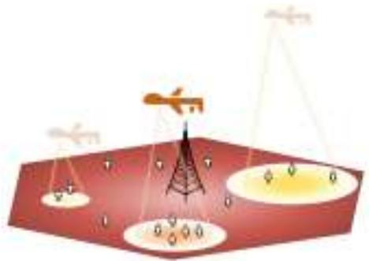
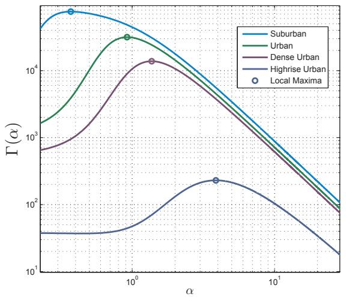
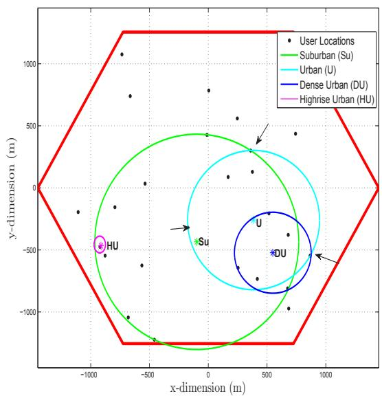
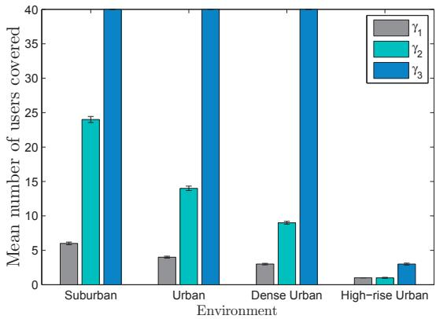

# Efficient 3-D Placement of an Aerial Base Station in Next Generation Cellular Networks

R. Irem Bor-Yaliniz, Amr El-Keyi, and Halim Yanikomeroglu

Department of Systems and Computer Engineering, Carleton University, Ottawa, ON, Canada

Abstract—Agility and resilience requirements of future cellular networks may not be fully satisfied by terrestrial base stations in cases of unexpected or temporary events. A promising solution is assisting the cellular network via low-altitude unmanned aerial vehicles equipped with base stations, i.e., drone-cells. Although drone-cells provide a quick deployment opportunity as aerial base stations, efficient placement becomes one of the key issues. In addition to mobility of the drone-cells in the vertical dimension as well as the horizontal dimension, the differences between the air-to-ground and terrestrial channels cause the placement of the drone-cells to diverge from placement of terrestrial base stations. In this paper, we first highlight the properties of the dronecell placement problem, and formulate it as a 3-D placement problem with the objective of maximizing the revenue of the network. After some mathematical manipulations, we formulate an equivalent quadratically-constrained mixed integer non-linear optimization problem and propose a computationally efficient numerical solution for this problem. We verify our analytical derivations with numerical simulations and enrich them with discussions which could serve as guidelines for researchers, mobile network operators, and policy makers.

# I. INTRODUCTION

Next generation cellular networks have high reliability and availability demands [1]. Be it a natural disaster, extreme densities of users in an area, or providing connectivity in rural areas, the cellular network needs to meet certain quality of service (QoS) requirements. However, these situations are either unexpected, or temporary. As a result, it is not feasible to invest in an infrastructure that will provide revenue for a relatively short time. A potential solution to these problems is assisting the cellular network via low-altitude unmanned aerial vehicles (UAV) that can serve as aerial base stations with a quick deployment opportunity, i.e. drone-cells. However, one of the biggest challenges is to determine the optimal placement of the drone-cell so that the network can benefit the most.

Although there has been significant amount of work on using UAVs in surveillance and reconnaissance networks [2], [3], using UAVs to assist future cellular networks is still at its infancy. In [4] and [5], the positioning of aerial relays is discussed. However, both works have a fixed altitude assumption and place the UAV on a line segment without considering the relation between the coverage area and the altitude of the UAV. Moreover, the effects of urban environment on the performance of communications is not considered. Both issues are addressed in [6], which provides fundamental results on the optimal altitude of a drone-cell, and the channel model to be utilized in urban environments. Accordingly, the authors of [7] investigate the coverage of two drone-cells positioned at a fixed altitude, and interfering with each other over a given area. The effects of interference is further studied in the presence of underlaid device-to-device (D2D) communications in [8]. In this work, there is no other base station except the drone-cell, which comes with the assumption that the area to be covered is known. A similar approach in [9] shows the improvement in the coverage by assisting the network with drone-cells at a certain altitude, in case of failure of Evolved Node Bs (eNBs). However, these studies neither cover all potential scenarios, nor show the optimal results for all possible selections of altitude, location, and coverage area. For instance, in case of a congested cell, neither the size of the area to be covered, nor the location of that area within the cell is known. These parameters need to be determined according to the target revenue, and the QoS requirements. Moreover, determining the altitude of the UAV is intertwined in this problem because of the characteristics of the channel between the UAV and the terrestrial users, namely the air-toground channel.

The work presented so far either considers the altitude, which is 1-D, or placement in the horizontal space, which is 2-D. To the best of our knowledge, this paper is the first to propose an efficient 3-D placement algorithm for dronecells in cellular networks by jointly determining the area to be covered, and the altitude of the drone-cell. We begin by discussing the characteristics of the air-to-ground channel. The discussion on how the placement of a drone-cell is different than the placement of terrestrial base stations leads us to the 3- D placement formulation. Our objective in this formulation is to maximize the revenue of the network, which is proportional to the number of users covered by the drone-cell.

Due to the complexity of the channel model, the solution of the 3-D placement problem formulation cannot be directly found. In order to solve this problem, we introduce a new variable relating the altitude of the drone-cell to the radius of its coverage area. Although there is not an analytical expression for the optimal value of this variable, it can be efficiently obtained by using one dimensional bisection search. Afterwards, the 3-D placement problem reduces to a mixedinteger non-linear problem (MINLP), which can be solved by using the interior point optimizer of the MOSEK solver.

The rest of the paper is organized as follows. We present the system model, and discuss the channel model in detail in Section II. Next, the description of the 3-D placement problem, and the solution method are presented in Section III. Numerical results validating our derivations are presented in Section IV. Finally, the paper is concluded in Section V.

# II. SYSTEM MODEL

Consider a macrocell where the location of each user i is known and represented by $( x _ { i } , y _ { i } )$ . We assume that for a user to be served, the QoS measured by the received signal-tonoise ratio (SNR) should be above a certain threshold. In case of an extreme event, such as congestion within the cell, or malfunction of the infrastructure, the terrestrial base station may become unable to serve all users. Hence, it will be assisted by a drone-cell with fixed transmission power. We consider a low-altitude quasi-stationary UAV for this purpose, and would like to determine the altitude h, and location, $( x _ { D } , y _ { D } )$ , providing the maximum revenue. Assuming a fixed QoS for all users, the maximum revenue can be obtained by offloading the maximum amount of users to the drone-cell. The placement of the drone-cell affects both the number of users enclosed by the its coverage region, and the quality of the air-to-ground links. Utilization of air-to-ground links is a characteristic of aerial base stations. There has been several studies on air-to-ground channel models, which we discuss next.

The air-to-ground channel differs from the terrestrial channel due to its higher chance of line-of-sight (LoS) connectivity. As a result, Rician [2], large scale Rayleigh [3], and free space fading [4] models are widely utilized in the literature for air-to-ground channels. However, none of them considers the effect of the environment on the occurrence of LoS. One of the most complete models on the effects of building blockage on radio propagation is proposed by ITU in [10]. With the help of the results in [10], a channel model for air-to-ground communication in urban environments is presented in [6] and [11], and adopted here.

The probability of having LoS for user i depends on the altitude of the drone-cell, $h ,$ and the horizontal distance between the drone-cell and $i ^ { t h }$ user, which is $r _ { i } =$ $\sqrt { ( x _ { D } - x _ { i } ) ^ { 2 } + ( y _ { D } - y _ { i } ) ^ { 2 } }$ for the $i ^ { t h }$ user located at $( x _ { i } , y _ { i } )$ and the drone-cell at $( x _ { D } , y _ { D } )$ ). The LoS probability is given by [6]

$$
P (h, r _ {i}) = \frac {1}{1 + a \exp \left(- b \left(\arctan \left(\frac {h}{r _ {i}}\right) - a\right)\right)}, \tag {1}
$$

where a and b are constant values that depend on the environment. In this setting, the altitude of the user, and the antenna heights of both the users and the drone-cell are neglected. Then the pathloss expression becomes [6]

$$
\begin{array}{l} L (h, r _ {i}) = 2 0 \log \left(\frac {4 \pi f _ {c}}{c}\right) + 2 0 \log \left(\sqrt {h ^ {2} + r _ {i} ^ {2}}\right) + \\ P (h, r _ {i}) \eta_ {\mathrm{LoS}} + (1 - P (h, r _ {i})) \eta_ {\mathrm{NLoS}}, \tag {2} \\ \end{array}
$$

natural_image

Illustration of a drone flying above a red hexagonal platform with floating objects and ground symbols (no text or labels)

Fig. 1: A possible scenario showing the users that are not covered by the eNB. Three potential placements of a dronecell is highlighted.

where $f _ { c }$ is the carrier frequency (Hz), c is the speed of light (m/s), $\eta _ { L o S }$ and $\eta _ { N L o S }$ (in dB) are respectively the losses corresponding to the LoS and non-LoS connections depending on the environment. Equivalently, (2) can be written as

$$
L (h, r _ {i}) = 2 0 \log \left(\sqrt {h ^ {2} + r _ {i} ^ {2}}\right) + A P (h, r _ {i}) + B, \tag {3}
$$

where A and B are constants such that $A = \eta _ { \mathrm { L o S } } - \eta _ { \mathrm { N L o S } } ,$ and $\begin{array} { r } { B = 2 0 \log ( \frac { 4 \pi f _ { c } } { c } ) + \eta _ { \mathrm { N L o S } } } \end{array}$ . Note that the pathloss model presented here is a function of both h and $r _ { i } .$ . In other words, the pathloss of the air-to-ground link depends on the altitude in the vertical dimension, and the distance in the horizontal dimension. Thus, we have a 3-D placement problem.

# III. EFFICIENT 3-D PLACEMENT OF A UAV

Placement of a drone-cell is different than terrestrial cell placement because of the following reasons:

1) In addition to choosing the drone-cell’s location in the horizontal space $( x _ { D } , y _ { D } )$ , we need to determine its altitude, h, as well.   
2) The coverage area of a terrestrial cell is known a priori. However, the coverage area of a drone-cell depends on its altitude, and is unknown before solving the placement problem.   
3) The mobility of the drone-cell allows it to move wherever the demand is, rather than terrestrial cells waiting for the demand to come towards them. As a result, the coverage region providing the maximum revenue to the network should be found.

The first item indicates that the placement of the drone-cell is a 3-D problem. In addition, the last two items, which are determining the size of the coverage area, and identifying the location of the coverage area must be considered jointly.

A possible placement problem is shown in Fig. 1. Assume that the macrocell is congested, where only the users that cannot be served by the eNB are shown. Three potential areas to be covered by deploying a drone-cell at different altitudes and locations are highlighted. Note that in each case, as well as the altitude of the drone-cell, the size of the area to be covered is changing, which in turn, affects the number of users served by the drone-cell. In this section, we will formulate and solve the 3-D placement problem efficiently to serve the maximum number of users with the minimum required area.

We assume that a user is in the coverage region of the dronecell if the air-to-ground link satisfies its QoS requirement. For a given transmission power of the drone-cell, let $\gamma$ represent the pathloss corresponding to the QoS requirement. Hence, user i is served by the drone-cell, if $L ( h , r _ { i } ) \leq \gamma$ . Using (3), we can re-write this condition as

$$
h ^ {2} + r _ {i} ^ {2} \leq 1 0 ^ {\frac {\gamma - (A P (h , r _ {i}) + B)}{1 0}}. \tag {4}
$$

Let $u _ { i } \in \{ 0 , 1 \}$ denote a binary variable that indicates whether user i is served by the drone-cell, or not. Using the variable ui, which is equal to 1, only if the user i is served by the drone-cell, and equal to 0 otherwise, the following constraint,

$$
u _ {i} (h ^ {2} + r _ {i} ^ {2}) \leq 1 0 ^ {\frac {\gamma - (A P (h , r _ {i}) + B)}{1 0}}, \tag {5}
$$

determines whether user i is covered, or not. This constraint can be further manipulated to

$$
h ^ {2} + r _ {i} ^ {2} \leq 1 0 ^ {\frac {\gamma - (A P (h , r _ {i}) + B)}{1 0}} + M _ {1} (1 - u _ {i}), \tag {6}
$$

where $M _ { 1 }$ is a constant that is slightly larger than the maximum possible value of the distance between a user and the drone-cell. Observe that when $u _ { i } = 1$ , (6) is equivalent to (5). If $u _ { i } = 0$ , since $M _ { 1 }$ is large enough, this constraint is released. Now, we can continue by determining the objective function.

Assuming a fixed QoS for all users, the best region to be served by the drone-cell is identified with the maximum number of users covered. By using (6), the placement problem for a set of users, U that are not covered by the macrocell can be written as

$$
\underset {x _ {D}, y _ {D}, h, \{u _ {i} \}} {\text { maximize }} \quad \sum_ {i \in \mathbb {U}} u _ {i}
$$

subject to

$$
h ^ {2} + r _ {i} ^ {2} \leq 1 0 ^ {\frac {\gamma - (A P (h , r _ {i}) + B)}{1 0}} + M _ {1} (1 - u _ {i}), \forall i = 1, \dots , | \mathbb {U} |,
$$

$$
x _ {l} \leq x _ {D} \leq x _ {u},
$$

$$
y _ {l} \leq y _ {D} \leq y _ {u}, \tag {7}
$$

$$
h _ {l} \leq h \leq h _ {u},
$$

$$
u _ {i} \in \{0, 1 \}, \quad \forall i = 1, \dots , | \mathbb {U} |,
$$

where |·| represents the cardinality of a set, subscripts $( \cdot ) _ { l }$ and $( \cdot ) _ { u }$ denote respectively the minimum and maximum allowed values for $x _ { D } , \ y _ { D }$ , and h of the drone-cell. Note that there are quadratic, exponential and binary terms in this problem, which makes it a MINLP. We will show that this problem can be solved efficiently by using a combination of the interiorpoint optimizer of MOSEK solver and bisection search.

Observe that if $P ( h , r )$ was a constant, then this optimization problem would be quadratically constrained MINLP. Let us denote the radius of the area to be covered by R and introduce the variable α as

$$
\alpha = \frac {h}{R}. \tag {8}
$$

Then, if user i is covered, $R \geq r _ { i }$ must be satisfied, i.e., the served user must be located within the coverage region. This conditional expression is similar to (5), and consequently is equivalent to

$$
R \geq r _ {i} - M _ {2} (1 - u _ {i}), \tag {9}
$$

as in (6), where $M _ { 2 }$ is a constant value which is slightly larger than the maximum possible value of R. Also, the first constraint in (7) becomes

$$
R ^ {2} \leq \Gamma (\alpha), \tag {10}
$$

where

$$
\Gamma (\alpha) = \frac {1 0 ^ {\frac {\gamma - (A P (\alpha) + B)}{1 0}}}{(1 + \alpha^ {2})}, \tag {11}
$$

which enables us to omit the variable h from (7), since $P ( \alpha )$ is

$$
P (\alpha) = \frac {1}{1 + a \exp (- b (\arctan (\alpha) - a))} \tag {12}
$$

by (1). Thus, (7) becomes

$$
\underset {x _ {D}, y _ {D}, \{u _ {i} \}, R, \alpha} {\text { maximize }} \quad \sum_ {i \in \mathbb {U}} u _ {i}
$$

subject to R2 ≤ Γ(α) + M1(1 − ui), ∀i = 1, ..., |U|,

$$
R \geq r _ {i} - M _ {2} (1 - u _ {i}), \quad \forall i = 1, \dots , | \mathbb {U} |,
$$

$$
x _ {l} \leq x _ {D} \leq x _ {u},
$$

$$
y _ {l} \leq y _ {D} \leq y _ {u}, \tag {13}
$$

$$
R \geq 0,
$$

$$
u _ {i} \in \{0, 1 \}, \quad \forall i = 1, \dots , | \mathbb {U} |.
$$

Note that if α and R are known, h can be evaluated by using (8). Since the variable α appears only in the right-handside of the first constraint of (13), the optimum value of α, which maximizes $\Gamma ( \alpha )$ , maximizes the size of the feasible set of (13). Next, we numerically show that $\Gamma ( \alpha )$ has only one local maxima. Hence, there exists a certain value, $\alpha ^ { * }$ that maximizes $\Gamma ( \alpha )$ .

Conjecture 1. For any QoS requirement, γ, and for any operating frequency, fc, if a local maxima exists in the function Γ(α) defined in (11), then it is the only local maxima of the function for $\alpha \in [ 0 , \infty ]$ for the propagation environments whose parameters are listed in Table I.

Observation. Observe that γ and B in (11) only scale the value of $\Gamma ( \alpha )$ . Since $\begin{array} { r } { B = 2 0 \log ( \frac { 4 \pi f _ { c } } { c } ) + \eta _ { \mathrm { N L o S } } } \end{array}$ , it also follows that the behaviour of $\Gamma ( \alpha )$ does not depend on $f _ { c } .$ In other words, the maximum point, $\alpha ^ { * }$ , does not change for different γ and $f _ { c } ,$ , but the value of $\Gamma ( \alpha ^ { * } )$ is scaled.

The behaviour of $\Gamma ( \alpha )$ is only determined by the environment parameters in A and $P ( \alpha )$ . By numerically plotting (11) in Fig. 2, we show that for all environments there exists only one maximum value, which occurs at $\alpha ^ { * }$ . Moreover, it is observed that the local maximas marked in Fig. 2 are the only maximas for all environments. □

line

| α     | Suburban | Urban   | Dense Urban | Highrise Urban | Local Maxima |
|-------|----------|---------|-------------|-----------------|--------------|
| 10^0  | ~30000   | ~20000  | ~15000      | ~50             | ~3000        |
| 10^1  | ~1000    | ~1000   | ~1000       | ~200            | ~200         |

Fig. 2: Γ(α) versus α for various environments.

TABLE I: RF Propagation Parameters of different environments 

<table><tr><td>Environment</td><td>Parameters (a, b, ηLoS, ηNLoS)</td></tr><tr><td>Suburban</td><td>(4.88, 0.43, 0.1, 21)</td></tr><tr><td>Urban</td><td>(9.61, 0.16, 1, 20)</td></tr><tr><td>Dense Urban</td><td>(12.08, 0.11, 1.6, 23)</td></tr><tr><td>High-rise Urban</td><td>(27.23, 0.08, 2.3, 34)</td></tr></table>

We can use the derivative of $\Gamma ( \alpha )$ to find $\alpha ^ { * }$ , which is the root of $\textstyle { \frac { d \Gamma ( \alpha ) } { d \alpha } }$ , that can be calculated as

$$
\frac {d \Gamma (\alpha)}{d \alpha} = - \frac {1 0 ^ {\Lambda}}{\Omega \Delta^ {2}} \left(2 \alpha \Delta^ {2} + A b K (\Delta - 1)\right), \tag {14}
$$

where $K = 1 8 { \frac { \log ( 1 0 ) } { 1 0 \log ( \mathrm { e } ) } }$ , and ∆, Λ and Ω are

$$
\Delta = \left(a \exp \left(b \left(a - \frac {1 8 0}{\pi} \arctan (\alpha)\right)\right) + 1\right), \tag {15}
$$

$$
\Lambda = \frac {1}{1 0} \left(\gamma - B - \frac {A}{\Delta}\right), \tag {16}
$$

$$
\Omega = \left(\alpha^ {2} + 1\right) ^ {2}. \tag {17}
$$

Finally, we proceed with the bisection search to find the root of $\frac { d \Gamma ( \acute { \alpha } ) } { d \alpha }$ , which is $\alpha ^ { * }$ . Note that, $\Delta$ yields that the maximum value of $\alpha ^ { * }$ can be tan(90◦). Also, the minimum value of $\alpha ^ { * }$ is 0, because $\alpha ^ { * }$ is a ratio of positive quantities. The bisection search algorithm with a maximum number of iterations, $N _ { u } .$ , and tolerance, ǫ, can be summarized in Algorithm 1.

After evaluating $\alpha ^ { * }$ using Algorithm 1, the problem given by (13) becomes MINLP, and can be solved to find $x _ { D } , y _ { D }$ $\{ u _ { i } \}$ , and R by interior point optimizer of MOSEK solver.

# IV. NUMERICAL RESULTS

The numerical values of the parameters of the air-to-ground channels for different environments are calculated based on [6] and [10], and presented in Table I. Also, all simulation parameters are provided in Table II. It is assumed that the drone-cell have enough capacity to serve all the users in the coverage region. The effect of different environments is shown in Fig. 3 for 25 users by using $\gamma _ { 2 } .$ . After finding $\alpha ^ { * }$ by using Algorithm 1, the solution of the optimization problem in (13) yields $R ,$ which determines the size of the circular coverage region, and the location of the drone-cell in 2-D space, as shown with an asterisk in the corresponding color for each environment in Fig. 3. Note that not only the size of the region, but also the location of the drone-cell changes. Observe that there are users (some of them are pointed by arrows) right on the edge of the coverage region, which means that the altitude is determined efficiently such that there is no area wasted. As expected, the area covered by the suburban environment has the largest size, due to the reduced blockage compared to other environments. On the other hand, the high-rise urban environment has the worst coverage.

Algorithm 1 Bisection Search Algorithm   
1: $N \leftarrow 0$ , $\alpha_{1} = 0$ , $\alpha_{2} = \tan(89.9^{\circ})$ 2: while $N \leq N_{u}$ do
3: $\alpha_{3} \leftarrow \frac{\alpha_{1} + \alpha_{2}}{2}$ 4: if $\left(\frac{d\Gamma(\alpha)}{d\alpha}\bigg|_{\alpha=\alpha_{3}}\right) = 0$ or $(\alpha_{2} - \alpha_{1}) \leq \epsilon$ then
5: $\alpha^{*} = \alpha_{3}$ 6: break
7: end if
8: $N \leftarrow N + 1$ 9: if sign $\left(\frac{d\Gamma(\alpha)}{d\alpha}\bigg|_{\alpha=\alpha_{3}}\right) = \text{sign}\left(\frac{d\Gamma(\alpha)}{d\alpha}\bigg|_{\alpha=\alpha_{1}}\right)$ then
10: $\alpha_{1} = \alpha_{3}$ 11: else
12: $\alpha_{2} = \alpha_{3}$ 13: end if
14: end while

TABLE II: Simulation Parameters 

<table><tr><td>Parameter</td><td>Value</td></tr><tr><td> $(x_{l}, x_{u})$ </td><td>(-1450, 1450) m</td></tr><tr><td> $(y_{l}, y_{u})$ </td><td>(-1258, 1258) m</td></tr><tr><td> $(\gamma_{1}, \gamma_{2}, \gamma_{3})$ </td><td>(90, 100, 125) dB</td></tr><tr><td> $f_{c}$ </td><td>2.5 GHz</td></tr><tr><td> $N_{u}$ </td><td>100</td></tr><tr><td> $\epsilon$ </td><td> $10^{-5}$ </td></tr><tr><td>Monte Carlo Runs</td><td>100</td></tr></table>

To elaborate more on the effect of environment parameters and the performance of the algorithm, we show the average revenue for varying QoS requirements in different environments together with 95% confidence interval for the revenue in Fig. 4. The results are obtained by using 100 Monte Carlo simulations. In each simulation, 40 users are generated randomly in the cell according to a uniform probability distribution. The results show that the number of served users varies by at most 1 user. Hence, the performance of the proposed method is consistent. The parameter $\gamma _ { 3 }$ provides the maximum revenue by enabling a coverage area larger than the size of the macrocell, because we are allowing a pathloss of 125 dB for the user to be served. Note that the average revenue for the high-rise urban environment is significantly worse than the other environments for this sparse user distribution. The dramatic drop of revenue can be understood by comparing the parameters of suburban and high-rise urban environments. For instance, $\eta _ { \mathrm { N L o S } }$ increases by 13 dB for the high-rise environment, which alone can reduce the coverage area by more than 100 times. Considering the changes in the other parameters, the significant reduction in the coverage area, and accordingly revenue, is not surprising. However, more users could be covered if the users were in proximity to each other, i.e., clustered. Hence, measuring traffic characteristics in space, such as the amount of clustering as shown in [12], can be of significant importance for determining the efficiency of drone-cell assistance for cellular networks.

scatter

| Location Type         | x-dimension (m) | y-dimension (m) |
| --------------------- | --------------- | --------------- |
| User Locations        | -1000           | 1000            |
| User Locations        | -500            | 700             |
| User Locations        | 0               | 400             |
| User Locations        | 500             | 300             |
| User Locations        | 1000            | 100             |
| User Locations        | 1500            | -100            |
| Suburban (Su)         | -1000           | -1000           |
| Suburban (Su)         | -500            | -500            |
| Suburban (Su)         | 0               | 400             |
| Suburban (Su)         | 500             | 300             |
| Suburban (Su)         | 1000            | 100             |
| Urban (U)             | -1000           | 100             |
| Urban (U)             | -500            | 400             |
| Urban (U)             | 0               | 300             |
| Urban (U)             | 500             | 200             |
| Urban (U)             | 1000            | 10              |
| Urban (U)             | 1500            | -10             |
| Dense Urban (DU)      | 500             | -50             |
| Dense Urban (DU)      | 750             | -75             |
| Dense Urban (DU)      | 1000            | -100            |
| Dense Urban (DU)      | 1250            | -125            |
| Dense Urban (DU)      | 1500            | -150            |
| Highrise Urban (HU)   | -875            | -475            |
| Highrise Urban (HU)   | -625            | -625            |
| Highrise Urban (HU)   | -375            | -775            |
| Highrise Urban (HU)   | -137            | -937            |
| Highrise Urban (HU)   | 43              | -112           |
| Highrise Urban (HU)   | 67              | -127           |
| Highrise Urban (HU)   | 89              | -143           |
| Highrise Urban (HU)   | 113             | -161           |
| Highrise Urban (HU)   | 137             | -179           |
| Highrise Urban (HU)   | 169             | -198           |
| Highrise Urban (HU)   | 199             | -218           |
| Highrise Urban (HU)   | 229             | -239           |
| Highrise Urban (HU)   | 259             | -261           |
| Highrise Urban (HU)   | 289             | -283           |
| Highrise Urban (HU)   | 319             | -306           |
| Highrise Urban (HU)   | 349             | -329           |
| Highrise Urban (HU)   | 379             | -353           |
| Highrise Urban (HU)   | 409             | -378           |
| Highrise Urban (HU)   | 439             | -404           |
| Highrise Urban (HU)   | 469             | -431           |
| Highrise Urban (HU)   | 499             | -459           |
| Highrise Urban (HU)   | 529             | -488           |
| Highrise Urban (HU)   | 559             | -518           |
| Highrise Urban (HU)   | 589             | -549           |
| Highrise Urban (HU)   | 619             | -571           |
| Highrise Urban (HU)   | 649             | -594           |
| Highrise Urban (HU)   | 679             | -618           |
| Highrise Urban (HU)   | 709             | -644           |
| Highrise Urban (HU)   | 739             | -672           |
| Highrise Urban (HU)   | 769             | -692           |
| Highrise Urban (HU)   | 799             | -714           |
| Highrise Urban (HU)   | 829             | -737           |
| Highrise Urban (HU)   | 859             | -761           |
| Highrise Urban (HU)   | 889             | -787           |
| Highrise Urban (HU)   | 919             | -814           |
| Highrise Urban (HU)   | 949             | -842           |
| Highrise Urban (HU)   | 979             | -872           |
| Highrise Urban (HU)   | 1009            | -904           |
| Highrise Urban (HU)   | 1039            | -937           |
| Highrise Urban (HU)   | 1069            | -972           |
| Highrise Urban (HU)   | 1099            | -1011          |
| Highrise Urban (HU)   | 1129            | -1042          |
| Highrise Urban (HU)   | 1159            | -1074          |
| Highrise Urban (HU)   | 1189            | -1108          |
| Highrise Urban (HU)   | 1219            | -1144          |
| Highrise Urban (HU)   | 1249            | -1172          |
| Highrise Urban (HU)   | 1279            | -1202          |
| Highrise Urban (HU)   | 1309            | -1234          |
| Highrise Urban (HU)   | 1339            | -1268          |
| Highrise Urban (HU)   | 1369            | -1304          |
| Highrise Urban (HU)   | 1399            | -1342          |
| Highrise Urban (HU)   | 1429            | -1372          |
| Highrise Urban (HU)   | 1459            | -1404          |
| Highrise Urban (HU)   | 1489            | -1438          |
| Highrise Urban (HU)   | 1519            | -1476          |
| Highrise Urban (HU)   | 1549            | -1516          |
| Highrise Urban (HU)   | 1579            | -1558          |
| Highrise Urban (HU)   | 1609            | -1592          |
| Highrise Urban (HU)   | 1639            | -1628          |
| Highrise Urban (HU)   | 1669            | -1666          |
| Highrise Urban (HU)   | 1699            | -1704          |
| Highrise Urban (HU)   | 1729            | -1744          |
| Highrise Urban (HU)   | 1759            | -1786          |
| Highrise Urban (HU)   | 1789            | -1828          |
| Highrise Urban (HU)   | 1819            | -1872          |
| Highrise Urban (HU)   | 1849            | -1918          |
| Highrise Urban (HU)   | 1879            | -1966          |
| Highrise Urban (HU)   | 1899            | -2014          |
| Highrise Urban (HU)   | 2009            | -2056          |
| Highrise Urban (HU)   | 2039            | -2098          |
| Highrise Urban (HU)   | 2069            | -2142          |
| Highrise Urban (HU)   | 2099            | -2186          |
| Highrise Urban (HU)   | 2129            | -2232          |
| Highrise Urban (HU)   | 2159            | -2278          |
| Highrise Urban (HU)   | 2189            | -2326          |
| Highrise Urban (HU)   | 2219            | -2376          |
| Highrise Urban (HU)   | 2249            | -2428          |
| Highrise Urban (HU)   | 2279            | -2482          |
| Highrise Urban (HU)   | 2309            | -2536          |
| Highrise Urban (HU)   | 2339            | -2584          |
| Highrise Urban (HU)   | 2369            | -2636          |
| Highrise Urban (HU)   | 2399            | -2688          |
| Highrise Urban (HU)   | 2429            | -2742          |
| Highrise Urban (HU)   | 2459            | -2796          |
| Highrise Urban (HU)   | 2489            | -2848          |
| Highrise Urban (HU)   | 2519            | -2898          |
| Highrise Urban (HU)   | 2549            | -2952          |
| Highrise Urban (HU)   | 2579            | -3006          |
| Highrise Urban (HU)   | 2609            | -3064          |
| Highrise Urban (HU)   | 2639            | -3124          |
| Highrise Urban (HU)   | 2669            | -3186          |
| Highrise Urban (HU)   | 2699            | -3248          |
| Highrise Urban (HU)   | 2729            | -3312          |
| Highrise Urban (HU)   | 2759            | -3376          |
| Highrise Urban (HU)   | 2789            | -3438          |
| Highrise Urban (HU)   | 2819            | -3502          |
| Highrise Urban (HU)   | 2849            | -3566          |
| Highrise Urban (HU)   | 2879            | -3628          |
| Highrise Urban (HU)   | 2899            | -3688          |
| Highrise Urban (HU)   | 3009            | -3748          |
| Highrise Urban (HU)   | 3039            | -3818          |
| Highrise Urban (HU)   | 3069            | -3888          |
| Highrise Urban (HU)   | 3099            | -3958          |
| Highrise Urban (HU)   | 3129            | -4028          |
| Highrise Urban (HU)   | 3159            | -4098          |
| Highrise Urban (HU)   | 3189            | -4168          |
| Highrise Urban (HU)   | 3219            | -4238          |
| Highrise Urban (HU)   | 3249            | -4308          |
| Highrise Urban (HU)   | 3279            | -4378          |
| Highrise Urban (HU)   | 3309            | -4448          |
| Highrise Urban (HU)   | 3339            | -4518          |
| Highrise Urban (HU)   | 3369            | -4588          |
| Highrise Urban (HU)   | 3399            | -4658          |
| Highrise Urban (HU)   | 3429            | -4728          |
| Highrise Urban (HU)   | 3459            | -4798          |
| Highrise Urban (HU)   | 3489            | -4868          |
| Highrise Urban (HU)   | 3519            | -4938          |
| Highrise Urban (HU)   | 3549            | -4988          |
| Highrise Urban (HU)   | 3579            | -5048          |
| Highrise Urban (HU)   | 3609            | -5088          |
| Highrise Urban (HU)   | 3639            | -5148          |
| Highrise Urban (HU)   | 3669            | -5188          |
| Highrise Urban (HU)   | 3699            | -5248          |
| Highrise Urban (HU)   | 3729            | -5288          |
| Highrise Urban (HU)   | 3759            | -5348          |
| Highrise Urban (HU)   | 3789            | -5388          |
| Highrise Urban (HU)   | 3819            | -5448          |
| Highrise Urban (HU)   | 3849            | -5488          |
| Highrise Urban (HU)   | 3879            | -5548          |
| Highrise Urban (HU)   | 3899            | -5588          |
| Highrise Urban (HU)   | 4009            | -5648          |
| Low Transition Point    A     A     A     A     A     A     A     A     A     A     A     A     A     A     A     A     A     A     A     A     A     A     A     A     A     A     A     A     A     A     A     A     A     A     A     A     A     A     A     A     A     A     A     A     A     A     A     A     A     A     A      N      N      N      N      N      N      N      N      N      N      N      N      N      N      N      N      N      N      N      N      N      N      N      N      N      N      N      N      N      N      N      N      N      N      N      N      N      N      N      N      N      N      N      N      N      N      N      N      N      N      M      M      M      M      M      M      M      M      M      M      M      M      M      M      M      M      M      M      M      M      M      M      M      M      M      M      M      M      M      M      M      M      M      M      M      M      M      M      M      M      M      M      M      M      M      M      M      M      M      M      L       L       L       L       L       L       L       L       L       L       L       L       L       L       L       L       L       L       L       L       L       L       L       L       L       L       L       L       L       L       L       L       L       L       L       L       L       L       L       L       L       L       L       L       L       L       L       L       L       L       L        HU        HU        HU        HU        HU        HU        HU        HU        HU        HU        HU        HU        HU        HU        HU        HU        HU        HU        HU        HU        HU        HU        HU        HU        HU        HU        HU        HU        HU        HU        HU        HU        HU        HU                HU        HU        HU        HU        HU        HU        HU        HU        HU        HU        HU        HU        HU        HU        HU        HU        HU        HU        HU        HU        HU        HU        HU        HU        HU        HU        HU        HU        HU        HU        HU        HU        HU        IH U        IH U        IH U        IH U        IH U        IH U        IH U        IH U        IH U        IH U        IH U        IH U        IH U        IH U        IH U        IH U        IH U        IH U        IH U        IH U        IH U        IH U        IH U        IH U        IH U        IH I         IH U         IH U         IH U         IH U         IH U         IH U         IH U         IH U         IH U         IH U         IH U         IH U         IH U         IH U         IH U         IH U         IH U         IH U         IH U         IH U         IH U         IH U         IH U         IH U         IH U         IH I         IH U         IH U         IH U         IH U         IH U         IH U         IH U         IH U         IH U         IH U         IH U         IH U         IH U         IH U         IH U         IH U         IH U         IH U         IH U         IH U         IH U         IH U         IH U         IH U
    style User Locations    style Suburban    style Rural    style Dense    style Higher    style Low Transition Point|
    style Suburban    style Dense    style Higher    style Lower    style Upper    style Lower    style Lower    style Medium    style Medium    style Medium    style Medium    style Medium    style Medium    style Medium    style Medium    style Medium    style Medium    style Medium    style Medium    style Medium    style Medium    style Medium    style Medium    style Medium    style Medium    style Medium    style Medium    style Medium    style Medium    style Medium    style Medium    style Medium    style Medium    style Medium    style Medium    style Medium    style Medium    style Medium    style Medium    style Medium    style Medium
    subgraph "High Transition Point" for User Locations
    end
    subgraph "Low Transition Point" for Suburban
    end
    subgraph "Upper Transition Point" for Suburban
    end
    subgraph "Lower Transition Point" for Suburban
    end
    subgraph "Mid Transition Point" for Suburban
    end
    subgraph "Mid Transition Point" for Mid-Upper
    end
    subgraph "Mid Transition Point" for Mid-Upper
    end
    subgraph "Mid Transition Point" for Mid-Upper
    end
    subgraph "Mid Transition Point" for Mid-Upper
    end
    subgraph "Mid Transition Point" for Mid-Upper
    end
    subgraph "Mid Transition Point" for Mid-Upper
    end
    subgraph "Mid Transition Point" for Mid-Upper
    end< img src="boxdolid fill:#fbbccff,stroke:#e6ccff,stroke-width:mp
    end< img src="boxdolid fill:#fbbccff,stroke-width:mp
    end< img src="boxdolid fill:#e6ccff,stroke-width:mp< img src="boxdolid">
    end< img src="boxdolid fill:#e6ccff,stroke-width:mp
    end< img src="boxdolid fill:#e6ccff,stroke-width:mp< img src="boxdolid">
    end< img src="boxdolid fill:#e6ccff,stroke-width:mp
    end< img src="boxdolid fill:#e6ccff,stroke-width:mp< img src="boxdolid">
    end< img src="boxdolid fill:#e6ccf,stroke-width:mp
    end< img src="boxdolid fill:#e6ccf,stroke-width:mp
    end< img src="boxdolid fill:#e6ccf,stroke-width:mp
    end< img src="boxdolid fill:#e6ccf,stroke-width:mp
    end< img src="boxdolid fill:#e6ccf,stroke-width:mp
    end< img src="boxdolid fill:#e6ccf< img src="boxdolid">
    end< img src="boxdolid fill:#e6ccf,stroke-width:mp
    end< img src="boxdolid fill:#e6ccf,stroke-width:mp
    end< img src="boxdolid fill:#e6ccf,stroke-width:mp
    end< img src="boxdolid fill:#e6ccf,stroke-width:mp
    end< img src="boxbolid fill:#e6ccf,stroke-width:mp
    end< img src="boxdolid fill:#e6ccf,stroke-width:mp
    end< img src="boxdolid fill:#e6ccf,stroke-width:mp
    end< img src="boxdolid fill:#e6ccf,stroke-width:mp
    end< img src="boxdolid fill:#e6ccf,stroke-width:mp
    end[ ]< img src="boxdolid fill:#e6ccf,stroke-width:mp< img src="boxdolid">
</image>

Fig. 3: Effect of environment on the location and size of the coverage area (circles in the figure) is shown.

bar

| Environment    | γ₁   | γ₂   | γ₃   |
| -------------- | ---- | ---- | ---- |
| Suburban       | 6.0  | 24.0 | 40.0 |
| Urban          | 4.0  | 14.0 | 40.0 |
| Dense Urban    | 3.0  | 9.0  | 40.0 |
| High-rise Urban| 1.0  | 1.0  | 3.0  |

Fig. 4: Mean number of users covered in different environments with 95% confidence interval. 40 users are distributed uniformly in one macrocell.

# V. CONCLUSION

In this paper, we have studied the 3-D placement problem of a drone-cell. First, we discussed the characteristics of the air-to-ground channel, and observed that they can be captured only by considering both the altitude of the drone-cell, and locations of the drone-cell and the users in the horizontal dimension. This yielded a 3-D placement problem with the objective of maximizing the revenue, which is measured by the maximum number of users covered by the drone-cell. We have formulated an equivalent problem which can be solved efficiently to find the location and size of the coverage region, and the altitude of the drone-cell.

Our model can be used for many possible communication scenarios, including failure and congestion. The results presented here can be used by proper authorities to manage and regulate drone-cells assisting cellular networks to meet high demands of the future wireless cellular networks. The effect of interference, and using several drone-cells are interesting future research directions.

# REFERENCES

[1] A. Osseiran, F. Boccardi, V. Braun, K. Kusume, P. Marsch, M. Maternia, O. Queseth, M. Schellmann, H. Schotten, H. Taoka, H. Tullberg, M. Uusitalo, B. Timus, and M. Fallgren, “Scenarios for 5G mobile and wireless communications: The vision of the METIS project,” IEEE Commun. Mag., vol. 52, no. 5, pp. 26–35, May 2014.   
[2] S. Kandeepan, K. Gomez, L. Reynaud, and T. Rasheed, “Aerialterrestrial communications: Terrestrial cooperation and energy-efficient transmissions to aerial base stations,” IEEE Trans. on Aerosp. and Electron. Syst., vol. 50, no. 4, pp. 2715–2735, Oct. 2014.   
[3] P. Zhan, K. Yu, and A. Swindlehurst, “Wireless relay communications with unmanned aerial vehicles: Performance and optimization,” IEEE Trans. on Aerosp. and Electron. Syst., vol. 47, no. 3, pp. 2068–2085, Jul. 2011.   
[4] S. Rohde, M. Putzke, and C. Wietfeld, “Ad-hoc self-healing of OFDMA networks using UAV-based relays,” Ad Hoc Networks, vol. 11, no. 7, pp. 1893–1906, Sep. 2013. [Online]. Available: http://www.sciencedirect.com/science/article/pii/S157087051200131X   
[5] X. Li, D. Guo, H. Yin, and G. Wei, “Drone-assisted public safety wireless broadband network,” in Proc. IEEE Wireless Commun. and Netw. Conf. Workshops (WCNCW), Mar. 2015, pp. 323–328.   
[6] A. Al-Hourani, S. Kandeepan, and S. Lardner, “Optimal LAP altitude for maximum coverage,” IEEE Wireless Commun. Letters, vol. 3, no. 6, pp. 569–572, Dec. 2014.   
[7] M. Mozaffari, W. Saad, M. Bennis, and M. Debbah, “Drone small cells in the clouds: Design, deployment and performance analysis,” arXiv:1509.01655 [cs, math], Sep. 2015, arXiv: 1509.01655. [Online]. Available: http://arxiv.org/abs/1509.01655   
[8] “Unmanned aerial vehicle with underlaid device-to-device communications: Performance and tradeoffs,” arXiv:1509.01187 [cs, math], Sep. 2015. [Online]. Available: http://arxiv.org/abs/1509.01187   
[9] A. Merwaday and I. Guvenc, “UAV assisted heterogeneous networks for public safety communications,” in Proc. IEEE Wireless Commun. and Netw. Conf. Workshops (WCNCW), Mar. 2015, pp. 329–334.   
[10] “Propagation data and prediction methods required for the design of terrestrial broadband radio access systems operating in a frequency range from 3 to 60 GHz,” International Telecommunication Union Radiocommunication Sector (ITU-R), Recommendation ITU-R P.1410- 5, Feb. 2012.   
[11] A. Al-Hourani, S. Kandeepan, and A. Jamalipour, “Modeling air-toground path loss for low altitude platforms in urban environments,” in IEEE Global Commun. Conf. (GLOBECOM), Dec. 2014, pp. 2898– 2904.   
[12] M. Mirahsan, R. Schoenen, and H. Yanikomeroglu, “HetHetNets: Heterogeneous traffic distribution in heterogeneous wireless cellular networks,” IEEE J. on Sel. Areas in Commun., vol. 33, no. 10, October 2015.