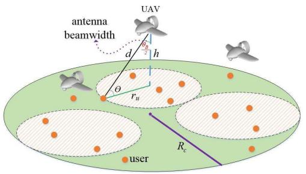
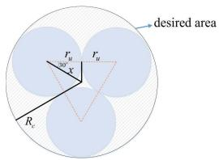
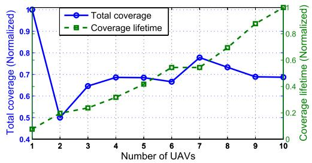
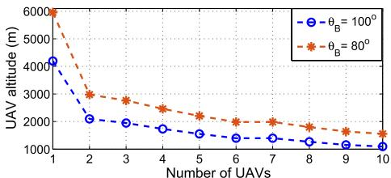
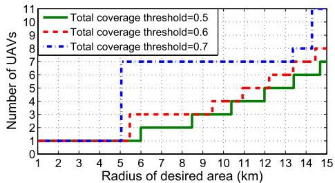

# Efficient Deployment of Multiple Unmanned Aerial Vehicles for Optimal Wireless Coverage

Mohammad Mozaffari, Walid Saad, Mehdi Bennis, and Mérouane Debbah

Abstract— In this letter, the efficient deployment of multiple unmanned aerial vehicles (UAVs) acting as wireless base stations that provide coverage for ground users is analyzed. First, the downlink coverage probability for UAVs as a function of the altitude and the antenna gain is derived. Next, using circle packing theory, the 3-D locations of the UAVs is determined in a way that the total coverage area is maximized while maximizing the coverage lifetime of the UAVs. Our results show that, in order to mitigate interference, the altitude of the UAVs must be properly adjusted based on the beamwidth of the directional antenna as well as coverage requirements. Furthermore, the minimum number of UAVs needed to guarantee a target coverage probability for a given geographical area is determined. Numerical results evaluate various tradeoffs.

Index Terms— Unmanned aerial vehicles (UAVs), coverage, deployment, airborne base stations.

## I. INTRODUCTION

HE use of unmanned aerial vehicles (UAVs) that can act as flying base stations is seen as a promising approach to enhance the coverage and rate performance of wireless networks in different scenarios such as temporary hotspots and emergency situations [1]. For example, mobile UAVs can establish efficient communication links to deliver messages to ground users, such as sensors [2]. Indeed, using UAVs as aerial base stations provides several advantages. First, due to their higher altitude, aerial base stations have a higher chance of line-of-sight (LoS) links to ground users. Second, UAVs can easily move and have a flexible deployment, and hence, they can provide rapid, on-demand communications [3].

Despite the numerous advantages of using UAVs as flying base stations, one must overcome a number of technical challenges. These challenges include the optimal 3D deployment of UAVs, energy limitations, interference management, and path planning [1]–[5]. In particular, the deployment problem is of paramount importance as it highly impacts the energy consumption as well as the interference generated by UAVs. However, only a limited number of existing works have

Manuscript received May 6, 2016; revised June 6, 2016; accepted June 6, 2016. Date of publication June 8, 2016; date of current version August 10, 2016. This work was supported by the U.S. National Science Foundation under Grants AST-1506297 and ACI-1541105, by the ERC Starting Grant 305123 MORE (Advanced Mathematical Tools for Complex Network Engineering), and by the Academy of Finland. The associate editor coordinating the review of this letter and approving it for publication was A. Vinel. (Corresponding author: Walid Saad.)

M. Mozaffari and W. Saad are with Wireless@VT, Electrical and Computer Engineering Department, Virginia Tech, Blacksburg, VA 24061 USA (e-mail: mmozaff@vt.edu; walids@vt.edu).

M. Bennis is with the Centre for Wireless Communications, University of Oulu, Oulu 90014, Finland (e-mail: bennis@ee.oulu.fi).

M. Debbah is with the Mathematical and Algorithmic Sciences Lab, France Research Center, Huawei Technologies, 92100 Boulogne-Billancourt and also with CentraleSupélec, Université Paris-Saclay, Gif-sur-Yvette, 91192, France (email: merouane.debbah@huawei.com).

Digital Object Identifier 10.1109/LCOMM.2016.2578312 addressed the interplay between UAV deployment and wireless performance [1], [4]–[6]. For instance, in [5], the use of multiple UAVs as wireless relays in order to provide service for ground sensors is investigated. This work addressed the tradeoff between connectivity among the UAVs and maximizing the area covered by the UAVs. However, the work in [5] does not consider the use of UAVs as aerial base stations and their mutual interference in downlink communications. In [6], the authors used evolutionary algorithms in order to find the optimal placement of low altitude platforms (LAPs). However, the model of [6] assumes that overlapping LAPs’ coverage areas is allowed by using inter-cell interference coordination (ICIC) which requires further communications.

text_image

antenna
beamwidth
UAV
d
h
θ
r_u
R_c
user

Fig. 1. System model.

The main contribution of this letter is to investigate the optimal 3D deployment of multiple UAVs in order to maximize the downlink coverage performance with a minimum transmit power. Given a target geographical area, the coverage requirements of the ground users and a number of UAVs that use directional antennas, we develop a novel framework to determine the optimal 3D locations of the UAVs. First, we derive the downlink coverage as a function of the UAV’s altitude and the antenna gain. Next, using circle packing theory [7], we propose an efficient deployment method which leads to the maximum coverage performance while ensuring that the coverage areas of UAVs do not overlap. Our results show that, considering the size of the desired area, the number of UAVs and the beamwidth of the antennas, the altitudes and locations of the UAVs can be properly adjusted for satisfying the coverage requirements. In addition, our results shed light on the minimum number of UAVs required to guarantee a target coverage.

## II. SYSTEM MODEL

Consider a circular geographical area of radius $R _ { c } ,$ as shown in Figure 1, within which M UAVs must be deployed to provide wireless coverage for ground users located within the area. In this model, we consider a stationary LAP such as quadrotor UAVs. The UAVs are assumed to be symmetric having the same transmit power and altitude. We denote the

UAV’s directional antenna half beamwidth by $\theta _ { B }$ , and, thus, the antenna gain can be approximated by:

$$
G = \left\{ \begin{array}{l l} G _ {3 \mathrm{dB}}, & \frac {- \theta_ {B}}{2} \leq \varphi \leq \frac {\theta_ {B}}{2}, \\ g (\varphi), & \text { otherwise }, \end{array} \right. \tag {1}
$$

where $\varphi$ is the sector angle, $\begin{array} { r } { G _ { 3 \mathrm { d B } } \approx \frac { 2 9 0 0 0 } { \theta _ { B } ^ { 2 } } } \end{array}$ with $\theta _ { B }$ in degrees, is the main lobe gain [8]. Also, g(ϕ) is the antenna gain outside of the main lobe. For the air-to-ground channel modeling, a common approach is to consider the LoS and non-line-ofsight (NLoS) links between the UAV and the ground users separately [9]. Each link has a specific probability of occurrence which depends on the elevation angle, environment, and relative location of the UAV and the users. Clearly, for NLoS links the shadowing and blockage loss is higher than the LoS links. Therefore, the received signal power from UAV j at a user’s location can be given by [9]:

$$
P _ {r, j} (d B) = \left\{ \begin{array}{l l} P _ {t} + G _ {3 \mathrm{dB}} - L _ {d B} - \psi_ {\mathrm{LoS}}, & \text { LoS   link }, \\ P _ {t} + G _ {3 \mathrm{dB}} - L _ {d B} - \psi_ {\mathrm{NLoS}}, & \text { NLoS   link }, \end{array} \right. \tag {2}
$$

where $P _ { r , j }$ is the received signal power, $P _ { t }$ is the UAV’s transmit power, and $G _ { 3 \mathrm { d B } }$ is the UAV antenna gain in dB. Also, $L _ { d B }$ is the path loss which for the air-to-ground communication is:

$$
L _ {d B} = 1 0 n \log \left(\frac {4 \pi f _ {c} d _ {j}}{c}\right), \tag {3}
$$

where $f _ { c }$ is the carrier frequency, c is the speed of light, $d _ { j }$ is the distance between UAV j and a ground user, and $n \geq 2$ is the path loss exponent. Also, $\psi _ { \mathrm { L o S } } \sim N ( \mu _ { \mathrm { L o S } } , \sigma _ { \mathrm { L o S } } ^ { 2 } )$ and $\psi _ { \mathrm { N L o S } } \sim N ( \mu _ { \mathrm { N L o S } } , \sigma _ { \mathrm { N L o S } } ^ { 2 } )$ are shadow fading with normal distribution in dB scale for LoS and NLoS links. The mean and variance of the shadow fading for LoS and NLoS links $( \mu _ { \mathrm { L o S } } , \sigma _ { \mathrm { L o S } } ^ { 2 } )$ $( \mu _ { \mathrm { N L o S } } , \sigma _ { \mathrm { N L o S } } ^ { 2 } )$ on the elevation angle and environment [10]:

$$
\sigma_ {\mathrm{LoS}} (\theta_ {j}) = k _ {1} \exp (- k _ {2} \theta_ {j}), \tag {4}
$$

$$
\sigma_ {\mathrm{NLoS}} (\theta_ {j}) = g _ {1} \exp (- g _ {2} \theta_ {j}), \tag {5}
$$

where $\theta _ { j } = \sin ^ { - 1 } ( h / d _ { j } )$ is the elevation angle between the UAV and the user, $k _ { 1 } , k _ { 2 } , g _ { 1 }$ , and $g _ { 2 }$ are constant values which depend on environment. Finally, the LoS probability is [9]:

$$
P _ {\mathrm{LoS}, j} = \alpha \left(\frac {1 8 0}{\pi} \theta_ {j} - 1 5\right) ^ {\gamma}, \tag {6}
$$

where α and $\gamma$ are constant values reflecting the environment impact. Here, $P _ { \mathrm { N L o S } , j } = 1 - P _ { \mathrm { L o S } , j }$ .

## III. OPTIMAL MULTI-UAV DEPLOYMENT

First, we find the coverage radius of each UAV in the presence of interference from other UAVs. To this end, the coverage probability of a single UAV needs to be derived. Then, we propose an efficient deployment strategy for M UAVs that maximizes the total coverage performance while maximizing the coverage lifetime.

Theorem 1: The coverage probability for a ground user, located at a distance $r \leq h . \tan ( \theta _ { \mathrm { B } } / 2 )$ from the projection of a given UAV j on the desired area, is given by:

$$
\begin{array}{l} P _ {\mathrm{cov}} = P _ {\mathrm{LoS}, j} Q \left(\frac {P _ {\min} + L _ {d B} - P _ {t} - G _ {3 \mathrm{dB}} + \mu_ {\mathrm{LoS}}}{\sigma_ {\mathrm{LoS}}}\right) \\ + P _ {\mathrm{NLoS}, j} Q \left(\frac {P _ {\min} + L _ {d B} - P _ {t} - G _ {3 \mathrm{dB}} + \mu_ {\mathrm{NLoS}}}{\sigma_ {\mathrm{NLoS}}}\right), \tag {7} \\ \end{array}
$$

where $P _ { \mathrm { m i n } } ~ = ~ 1 0 \log { \left( \beta N + \beta \bar { I } \right) }$ is the minimum received power requirement (in dB) for a successful detection, N is the noise power, $\beta$ is the signal-to-interference-plus-noiseratio (SINR) threshold. ¯I is the mean interference power received from the nearest UAV k which is given by:

$$
\begin{array}{l} \bar {I} \approx P _ {t} g (\varphi_ {k}) \left[ 1 0 ^ {\frac {- \mu_ {\mathrm{LoS} , k}}{1 0}} P _ {\mathrm{LoS}, k} + 1 0 ^ {\frac {- \mu_ {\mathrm{NLoS} , k}}{1 0}} P _ {\mathrm{NLoS}, k} \right] \\ \times \left(\frac {4 \pi f _ {c} d _ {k}}{c}\right) ^ {- n}. \\ \end{array}
$$

Also, Q(.) is the Q function.

Proof: The coverage probability for a ground user considering the mean interference between UAVs is:

$$
\begin{array}{l} P _ {\text { cov }} = \mathbb {P} \left[ \frac {P _ {r , j}}{N + \bar {I}} \geq \beta \right] = \mathbb {P} \left[ P _ {r, j} (d B) \geq P _ {\min} \right] \\ = P _ {\mathrm{LoS}, j} \mathbb {P} \left[ P _ {r, j} (\mathrm{LoS}) \geq P _ {\min} \right] \\ + P _ {\mathrm{NLoS}, j} \mathbb {P} \left[ P _ {r, j} (\mathrm{NLoS}) \geq P _ {\min} \right] \\ \stackrel {(a)} {=} P _ {\mathrm{LoS}, j} \mathbb {P} \left[ \psi_ {\mathrm{LoS}} \leq P _ {t} + G _ {3 \mathrm{dB}} - P _ {\min} - L _ {d B} \right] \\ + P _ {\mathrm{NLoS}, j} \mathbb {P} \left[ \psi_ {\mathrm{NLoS}} \leq P _ {t} + G _ {3 \mathrm{dB}} - P _ {\min} - L _ {d B} \right] \\ \stackrel {(b)} {=} P _ {\mathrm{LoS}, j} Q \left(\frac {P _ {\min} + L _ {d B} - P _ {t} - G _ {3 \mathrm{dB}} + \mu_ {\mathrm{LoS}}}{\sigma_ {\mathrm{LoS}}}\right) \\ + P _ {\mathrm{NLoS}, j} Q \left(\frac {P _ {\min} + L _ {d B} - P _ {t} - G _ {3 \mathrm{dB}} + \mu_ {\mathrm{NLoS}}}{\sigma_ {\mathrm{NLoS}}}\right), \tag {8} \\ \end{array}
$$

where P[.] denotes probability, and $P _ { \mathrm { m i n } } = 1 0 \log { \left( \beta N + \beta \bar { I } \right) }$ . Clearly, due to the use of directional antennas, the interference received from the nearest UAV k is dominant. Hence, $\bar { I }$ can be written as:

$$
\begin{array}{l} \bar {I} \approx P _ {\mathrm{LoS}, k} \mathbb {E} \left[ P _ {r, k} (\mathrm{LoS}) \right] + P _ {\mathrm{NLoS}, k} \mathbb {E} \left[ P _ {r, k} (\mathrm{NLoS}) \right] \\ = P _ {t} g (\varphi_ {k}) \left[ 1 0 ^ {\frac {- \mu_ {\mathrm{LoS}}}{1 0}} P _ {\mathrm{LoS}, k} + 1 0 ^ {\frac {- \mu_ {\mathrm{NLoS}}}{1 0}} P _ {\mathrm{NLoS}, k} \right] \left(\frac {4 \pi f _ {c} d _ {k}}{c}\right) ^ {- n}. \\ \end{array}
$$

where $\mathbb { E } [ . ]$ is the expected value over the received interference power. The mean interference is a reasonable approximation for the interference and leads to a tractable coverage probability expression. In (8), (a) is a direct result of (2), and (b) comes from the complementary cumulative distribution distribution function (CCDF) of a Gaussian random variable. Furthermore, $r ~ \leq ~ h . \tan ( \theta _ { \mathrm { B } } / 2 )$ implies that a user can be covered only if it is in the coverage range of a directional antenna with beamwidth $\theta _ { B }$ . This proves the theorem. ■

Theorem 1 provides the coverage probability for users located at any arbitrary range r . From Theorem 1, it is observed that changing the UAV’s altitude impacts the coverage by affecting the distance between the UAV and users, LoS probability, and the feasible coverage radius $\mathrm { ~ ( ~ } r \mathrm { ~ ~ \le ~ }$ $\begin{array} { r l } { h . 1 \mathrm { a n } \big ( \frac { \theta _ { \mathrm { B } } } { 2 } \big ) \big ) } & { { } } \end{array}$ . Increasing the UAV’s altitude leads to a higher path loss and LoS probability, as well as a higher feasible coverage radius. In the presence of interference, the UAVs need to increase their transmit power in order to meet the coverage requirements. Furthermore, as the number of UAVs increases, the distance between the UAVs decreases, and hence, the interference from the nearest UAV will increase. The coverage radius of a UAV, $r _ { u } ,$ is the maximum range within which the probability that users are covered by the UAV is greater than a specified threshold (
). Clearly, $r _ { u }$ depends on the transmit power, antenna beamwidth, 
, number of UAVs, and UAVs’ locations. Thus, the coverage radius is given by:

text_image

desired area
r_u
30°
x
r_u
R_v

Fig. 2. Packing problem in a circle with three circles.

TABLE I COVERING A CIRCULAR AREA WITH RADIUS Rc USING IDENTICAL UAVs- THE Circle Packing in a Circle APPROACH

<table><tr><td>Number of UAVs</td><td>Coverage radius of each UAV</td><td>Maximum total coverage</td></tr><tr><td>1</td><td> ${R}_{c}$ </td><td>1</td></tr><tr><td>2</td><td> ${0.5}{R}_{c}$ </td><td>0.5</td></tr><tr><td>3</td><td> ${0.464}{R}_{c}$ </td><td>0.646</td></tr><tr><td>4</td><td> ${0.413}{R}_{c}$ </td><td>0.686</td></tr><tr><td>5</td><td> ${0.370}{R}_{c}$ </td><td>0.685</td></tr><tr><td>6</td><td> ${0.333}{R}_{c}$ </td><td>0.666</td></tr><tr><td>7</td><td> ${0.333}{R}_{c}$ </td><td>0.778</td></tr><tr><td>8</td><td> ${0.302}{R}_{c}$ </td><td>0.733</td></tr><tr><td>9</td><td> ${0.275}{R}_{c}$ </td><td>0.689</td></tr><tr><td>10</td><td> ${0.261}{R}_{c}$ </td><td>0.687</td></tr></table>

$$
r _ {u} = \max \{r | P _ {\text { cov }} (r, P _ {t}, \theta_ {B}) \geq \varepsilon \}. \tag {9}
$$

Now, consider the geographical area of interest which should be covered by multiple UAVs. The UAVs must be placed in a way to maximize the total coverage, and to avoid any overlapping in their coverage areas. Furthermore, while maximizing the total coverage, each UAV must use a minimum transmit power in order to maximize the coverage lifetime. The coverage lifetime is defined as the maximum time that the UAVs can provide coverage for the given area. The coverage lifetime is maximized when the UAVs have the same transmit power (equal coverage radius). Assuming a circular coverage area for each UAV, the problem can be formulated as follows:

$$
\left(\vec {r} _ {j} ^ {*}, h ^ {*}, r _ {u} ^ {*}\right) = \arg \max M. r _ {u} ^ {2}, \tag {10}
$$

$$
j \in \{1, \dots , M \}
$$

$$
\text { st. } | | \vec {r} _ {j} - \vec {r} _ {k} | | \geq 2 r _ {u}, \quad j \neq k \in \{1, \dots , M \}, \tag {11}
$$

$$
\left| \left| \vec {r} _ {j} + r _ {u} \right| \right| \leq R _ {c}, \tag {12}
$$

$$
r _ {u} \leq h. \tan (\theta_ {\mathrm{B}} / 2), \tag {13}
$$

where M is the number of UAVs, $R _ { c }$ is the radius of the geographical area, $\vec { r } _ { j }$ is the vector location of $\mathrm { U A V } ~ j$ within the 2D plane of the desired area considering the center of the area as the origin, and $r _ { u }$ is the maximum coverage radius of each UAV. In this optimization problem, constraint (11) ensures that no coverage overlap occurs, and (12) guarantees that UAVs do not cover outside of the desired area. Hence, the interference between UAVs will be avoided, and users located outside the given area will not be affected by the UAVs’ transmissions.

Solving (10) is challenging due to the high number of unknowns and the nonlinear constraints. We model this problem by exploiting the so-called circle packing problem [7]. In the circle packing problem, M circles should be arranged inside a given surface such that the packing density is maximized and none of the circles overlap. As an illustrative example, Figure 2 shows the optimal packing of 3 equal circles inside a bigger circle. Also, Table I shows the radii of nonoverlapping small circles which lead to the maximum packing density for a given circular area [7]. Clearly, the radius of each circle decreases as the number of circles increases. In Table I, the total coverage represents the maximum portion of the desired area which can be covered by multiple disks. Note that, in general, the circle packing problem in a bounded area is known to be intractable [7]. In particular, it is not possible to find a general packing strategy that is optimal for any arbitrary M. Therefore, for each value of M a specific packing strategy needs to be provided. As an example, we derive the optimal packing method for $M = 3$ . Consider a circular area with radius $R _ { c } .$ . Clearly, the packing density is maximized if the maximum distance between the farthest circles is minimized. For $M = 3$ , all the circles tangent with each other if their centers are placed on the vertices of a equilateral triangle. Hence, Figure 2 corresponds to the optimal placement. Then,

line chart

| Number of UAVs | Total coverage | Coverage lifetime |
| -------------- | -------------- | ----------------- |
| 1              | 1.0            | 0.1               |
| 2              | 0.5            | 0.2               |
| 3              | 0.65           | 0.3               |
| 4              | 0.7            | 0.4               |
| 5              | 0.7            | 0.5               |
| 6              | 0.65           | 0.6               |
| 7              | 0.8            | 0.7               |
| 8              | 0.75           | 0.8               |
| 9              | 0.7            | 0.9               |
| 10             | 0.7            | 1.0               |

Fig. 3. Total coverage and coverage lifetime versus number of UAVs.

$$
x = \frac {r _ {u}}{\cos (3 0 ^ {\circ})} \text {and,} R _ {c} = r _ {u} + x = r _ {u} \left(1 + \frac {2}{\sqrt {3}}\right)\rightarrow
$$

$$
r _ {u} = \frac {\sqrt {3} R _ {c}}{2 + \sqrt {3}} \approx 0. 4 6 4 R _ {c}.
$$

In our model, each circle corresponds to the coverage region of each UAV, and maximizing packing density is related to maximizing the coverage area with non-overlapping smaller circles. Therefore, given the radius of the desired area and the number of symmetric UAVs, we can determine the required coverage radii of UAVs as well as their 3D locations which lead to the maximum coverage. Subsequently, based on the required coverage range of each UAV $\left( r _ { u } \right)$ , the minimum transmit power of UAVs can be computed. Note that, the UAV’s altitude should be adjusted based on the coverage radius and the antenna beamwidth by using h = rutan (θ /2) . $\begin{array} { r } { h = \frac { r _ { u } } { \tan \ ( \theta _ { B } / 2 ) } } \end{array}$

Next, we derive an upper bound for the altitude which guarantees the non-overlapping condition between the UAVs’ coverage regions.

Proposition 1: Given M UAVs, and $R _ { c } ,$ , the radius of the desired area, an upper bound for the maximum $\mathrm { U A V s } '$ altitude for which the coverage overlap does not occur, is given by:

$$
h \leq \frac {q _ {m} R _ {c}}{(2 + q _ {m}) \tan (\frac {\theta_ {B}}{2})}, \tag {14}
$$

where $q _ { m }$ is the maximum value of variable $q ~ \in ~ \mathbb { R }$ that satisfies the following inequality:√

$$
\frac {\pi}{\sin^ {- 1} (q / 2)} \left(\frac {q \sqrt {3} + \sqrt {4 - q ^ {2}}}{q}\right) + \sqrt {1 2} (1 - M) \geq 0.
$$

line chart

| Number of UAVs | θ_B = 100° | θ_B = 80° |
| -------------- | ---------- | --------- |
| 1              | 4200       | 6000      |
| 2              | 2200       | 3000      |
| 3              | 2000       | 2800      |
| 4              | 1800       | 2500      |
| 5              | 1600       | 2300      |
| 6              | 1500       | 2100      |
| 7              | 1400       | 2000      |
| 8              | 1300       | 1900      |
| 9              | 1200       | 1800      |
| 10             | 1100       | 1700      |

Fig. 4. UAV’s altitude versus number of UAVs.

line chart

| Radius of desired area (km) | Total coverage threshold=0.5 | Total coverage threshold=0.6 | Total coverage threshold=0.7 |
| --------------------------- | ---------------------------- | ---------------------------- | ---------------------------- |
| 1                           | 1                            | 1                            | 1                            |
| 2                           | 1                            | 1                            | 1                            |
| 3                           | 1                            | 1                            | 1                            |
| 4                           | 1                            | 1                            | 1                            |
| 5                           | 1                            | 1                            | 7                            |
| 6                           | 2                            | 3                            | 7                            |
| 7                           | 2                            | 3                            | 7                            |
| 8                           | 3                            | 3                            | 7                            |
| 9                           | 3                            | 4                            | 7                            |
| 10                          | 4                            | 4                            | 7                            |
| 11                          | 4                            | 5                            | 7                            |
| 12                          | 5                            | 5                            | 7                            |
| 13                          | 6                            | 6                            | 8                            |
| 14                          | 7                            | 7                            | 8                            |
| 15                          | 8                            | 8                            | 11                           |

Fig. 5. Number of required UAVs versus radius of desired area.

Proof: The maximum packing density (D) of a circle, using M equal smaller circles, satisfies the following [7]:

$$
D \leq \frac {M q _ {m} ^ {2}}{(2 + q _ {m}) ^ {2}}. \tag {15}
$$

Also, clearly, $\begin{array} { r } { D = \frac { M r _ { u } ^ { 2 } } { R _ { c } ^ { 2 } } } \end{array}$ , and hence, $\begin{array} { r } { \frac { M r _ { u } ^ { 2 } } { R _ { c } ^ { 2 } } \leq \frac { M q _ { m } ^ { 2 } } { ( 2 + q _ { m } ) ^ { 2 } } } \end{array}$ .

Finally, considering $\begin{array} { l } { r _ { u } \ \le \ \frac { q _ { m } R _ { c } } { ( 2 + q _ { m } ) } } \end{array}$ , and tan $\begin{array} { r l r } { ( \frac { \theta _ { B } } { 2 } ) } & { { } = } & { \frac { r _ { u } } { h } } \end{array}$ , we have $\begin{array} { r } { h \leq \frac { q _ { m } R _ { c } } { ( 2 + q _ { m } ) \tan { \ ( \frac { \theta _ { B } } { 2 } ) } } . } \end{array}$ .

## IV. SIMULATION RESULTS AND ANALYSIS

For simulations, we consider the UAV-based communications over 2 GHz carrier frequency $( f _ { c } = 2 \mathrm { G H z } )$ in an urban environment with $\alpha = 0 . 6 , \gamma = 0 . 1 1 , k _ { 1 } = 1 0 . 3 9 , k _ { 2 } = 0 . 0 5$ , g1 = 29.06, g2 = 0.03, μLoS = 1 dB, $\mu _ { \mathrm { N L o S } } = 2 0$ dB, and $n = 2 . 5 [ 9 ]$ . Moreover, using Theorem 1 and (9), the coverage radius of each UAV is computed based on $\epsilon = 0 . 8 0 , \beta = 5$ , and $N = - 1 2 0 \mathrm { d B m }$ . Here, the maximum coverage time of the UAVs is inversely proportional to their transmit power.

Figure 3 shows the total coverage and the coverage lifetime as a function of the number of UAVs (M) for $R _ { c } = 5 0 0 0 \mathrm { m }$ , and $\theta _ { B } \ = \ 8 0 ^ { o } .$ . In this figure, the maximum achievable coverage while maximizing the coverage lifetime is shown for different number of UAVs. Clearly, by increasing the number of UAVs, the coverage lifetime increases due to the decrease in the transmit power of each UAV. In Figure 3, for the given area with a radius 5000 m, a single UAV has the maximum coverage performance. However, in this case, having a single UAV yields a minimum coverage lifetime. Therefore, depending on the size of the area, coverage and coverage lifetime requirements, an appropriate number of UAVs needs to be deployed.

In Figure 4, we show the optimal UAVs’ altitude versus the number of UAVs. Clearly, the altitude of UAVs should be decreased as the number of UAVs increases. For higher number of UAVs, to avoid overlapping between the coverage regions of the UAVs, the coverage radius of UAVs must be decreased by reducing their height according to h = rutan (θB/2) . $\begin{array} { r } { h = \frac { r _ { u } } { \tan \ ( \theta _ { B } / 2 ) } } \end{array}$

Clearly, by doubling the number of UAVs from 3 to 6, the optimal altitude is reduced from 2000 m to 1300 m.

Figure 5 shows the minimum required number of UAVs in order satisfy the coverage requirement of the given geographical area. In this figure, the coverage threshold corresponds to the minimum portion of the given area which needs to be covered by the UAVs. This result is based on $P _ { t } = 3 5 \mathrm { d B m } .$ , $\theta _ { B } ~ = ~ 8 0 ^ { o }$ , and optimal altitudes subject to $h _ { \mathrm { ~ \normalfont ~ < ~ } } 5 0 0 0 \mathrm { m }$ . Interestingly, to satisfy at least 0.7 coverage requirement with a maximum coverage lifetime, either one UAV or more than 6 UAVs are required. In other words, for $1 < M < 7$ , the 0.7 coverage performance cannot be achieved. In general, as the size of the desired area increases, more UAVs are needed to meet the coverage requirement. Clearly, for $R _ { c } < 5 4 0 0 \mathrm { m }$ , using a single UAV can satisfy a 0.6 coverage threshold. However, for a larger target area, more UAVs must be used to reach the coverage threshold. Therefore, the optimal number of UAVs for an efficient system design is significantly dependent on the coverage requirement, and the size of area.

## V. CONCLUSIONS

In this letter, we have studied the optimal deployment of multiple UAVs equipped with directional antennas used as aerial base stations. First, the downlink coverage probability was derived based on the probabilistic LoS/NLoS links. Next, given a desired geographical area which needs to be covered by multiple UAVs, an efficient deployment approach was proposed based on the circle packing theory that leads to a maximum coverage while each UAV uses a minimum transmit power. The results have shown that, the optimal altitude and location of the UAVs can be determined based on the number of available UAVs and the antenna gain and beamwidth.

## REFERENCES

[1] M. Mozaffari, W. Saad, M. Bennis, and M. Debbah, “Drone small cells in the clouds: Design, deployment and performance analysis,” in Proc. IEEE Global Commun. Conf. (GLOBECOM), San Diego, CA, USA, Dec. 2015, pp. 1–6.  
[2] E. P. de Freitas, T. Heimfarth, A. Vinel, F. R. Wagner, C. E. Pereira, and T. Larsson, “Cooperation among wirelessly connected static and mobile sensor nodes for surveillance applications,” Sensors, vol. 13, no. 10, pp. 12903–12928, 2013.  
[3] I. Bekmezci, O. K. Sahingoz, and ¸S. Temel, “Flying ad-hoc networks (FANETs): A survey,” Ad Hoc Netw., vol. 11, no. 3, pp. 1254–1270, 2013.  
[4] M. Mozaffari, W. Saad, M. Bennis, and M. Debbah, “Unmanned aerial vehicle with underlaid device-to-device communications: Performance and tradeoffs,” IEEE Trans. Wireless Commun., vol. 15, no. 6, pp. 3949–3963, Jun. 2016.  
[5] D. Orfanus, E. P. de Freitas, and F. Eliassen, “Self-organization as a supporting paradigm for military UAV relay networks,” IEEE Commun. Lett., vol. 20, no. 4, pp. 804–807, Apr. 2016.  
[6] J. Košmerl and A. Vilhar, “Base stations placement optimization in wireless networks for emergency communications,” in Proc. IEEE Int. Conf. Commun. (ICC), Sydney, NSW, Australia, Jun. 2014, pp. 200–205.  
[7] Z. Gáspár and T. Tarnai, “Upper bound of density for packing of equal circles in special domains in the plane,” Periodica Polytech. Civil Eng., vol. 44, no. 1, pp. 13–32, 2000.  
[8] C. A. Balanis, Antenna Theory: Analysis and Design. New York, NY, USA: Wiley, 2016.  
[9] A. Al-Hourani, S. Kandeepan, and A. Jamalipour, “Modeling air-toground path loss for low altitude platforms in urban environments,” in Proc. IEEE Global Commun. Conf. (GLOBECOM), Austin, TX, USA, Dec. 2014, pp. 2898–2904.