# Efficient Live Migration of Edge Services Leveraging Container Layered Storage

Lele Ma , Shanhe Yi , Student Member, IEEE, Nancy Carter , and Qun Li, Fellow, IEEE

Abstract—Mobile users across edge networks require seamless migration of offloading services. Edge computing platforms must smoothly support these service transfers and keep pace with user movements around the network. However, live migration of offloading services in the wide area network poses significant service handoff challenges in the edge computing environment. In this paper, we propose an edge computing platform architecture which supports seamless migration of offloading services while also keeping the moving mobile user “in service” with its nearest edge server. We identify a critical problem in the state-of-the-art tool for Docker container migration. Based on our systematic study of the Docker container storage system, we propose to leverage the layered nature of the storage system to reduce file system synchronization overhead, without dependence on the distributed file system. In contrast to the state-of-the-art service handoff method in the edge environment, our system yields a 80 percent (56 percent) reduction in handoff time under 5 Mbps (20 Mbps) network bandwidth conditions

Index Terms—Docker container, container migration, service handoff, edge computing

## 1 INTRODUCTION

years [1], [2], [3], [4], [5], [6], [7], [8], [9], [10], [11], [12]. Since edge servers are in close proximity to the mobile end user, higher quality of services (QoS) could be provided than was possible with the traditional cloud platform [3], [11]. End users benefit from edge services by offloading their heavy duty computations to nearby edge servers [13], [14], [15], [16]. Then the end user experience with cloud services will achieve higher bandwidth, lower latency, as well as greater computational power.

One of the key challenges for edge computing is keeping quality of service guarantees better than traditional cloud services while offloading services to the end user’s nearest edge server. However, when the end user moves away from the nearby edge server, the quality of service will significantly decreases due to the deteriorating network connection. Ideally, when the end user moves, the services on the edge server should also be live migrated to a new nearby server. Therefore, efficient live migration is vital to enable the mobility of edge services in the edge computing environment.

Several approaches have been investigated to live migrate offloading services on the edge. Virtual machine (VM) handoff [17], [18] divides VM images into two stacked overlays based on VM synthesis [1]. During migration, only the overlay on the top is transferred from the source to the target server instead of the whole VM image volume. This significantly reduces data transfer size during migration. However, a virtual machine overlay can be tens or hundreds of megabytes in size, thus the total handoff time is still relatively long for latency sensitive applications. For example, OpenFace [15], a face recognition service, will cost 247 seconds to migrate on a 5 Mbps wide area network (WAN), which barely meets the requirements of a responsive user experience. Additionally, VM overlays are hard to maintain, and are not widely available in the industrial or academic world.

In contrast, the widely deployed Docker platform raises the possibility of high speed service handoffs on the network edge. Docker [19] has gained popularity in the industrial cloud. It employs layered storage inside containers, enabling fast packaging, sharing, and shipping of any application as a container. Live migration of Docker containers is achievable. For example, P. Haul [20] supports live migration containers on Docker 1.9.0 and 1.10.0. They are developed based on a user level process checkpoint and restore tool CRIU [21]. But CRIU will transfer the whole container file system in a bundle during the migration, regardless of storage layers, which could induce errors as well as high network overhead.

In exploring an efficient container migration strategy tailored for edge computing, we focus on reducing the file system transfer size by leveraging Docker’s layered storage architecture. Docker’s storage allows only the top storage layer to be changed during the whole life cycle of the container. All layers underlying the top layer will not be changed. Therefore, we propose to share the underlying storage layers before container migration begins, and only transfer the top layer during the migration itself.

In this paper, we build a system which allows efficient live migration of offloading services on the edge. Offloading services are running inside Docker containers. The system will reduce the transferred file volumes by leveraging layered storage in the Docker platform. Our work addressed following challenges during this project:

First, the internals of Docker storage management must be carefully studied. Few studies have been published regarding Docker storage. Reading the raw source code enables better understanding of the inner infrastructure.

Second, an efficient way to take advantage of Docker’s layered storage must be carefully designed to avoid file system redundancy. We found that Docker creates a random number as local identification for each image layer downloaded from the cloud. As a result, if two Docker hosts download the same image layer from the same storage repository, these layers will have different reference identification numbers. Therefore, when we migrate a container from one Docker host to another, we must recognize whether there are any image layers with different local identification numbers yet having the same content, thus avoiding transfer of redundant image layers during the container migration.

Third, besides the file system, we also need to optimize transmission of the raw memory pages, used to restore the live status of the offloading service. Binary data are different in format then the file system, and thus must be treated separately.

Last, in terms of end user experience, we need to reduce the user-experienced connection interruption during service migration. It is possible that user-experienced interruption interval could be shorter than the actual migration time through a well designed migration process strategy. Ideally, our goal is seamless service handoff wherein users will not notice that their offloading service has been migrated to a new edge server.

We propose a framework that enables high speed offloading service migration across edge servers over WAN. During migration, only the top storage layer and the incremental runtime memory is transferred. The total migration time and user perceived service interruption are significantly reduced. The contributions of this paper are listed as below (a preliminary version of this work appeared in [22]):

We have investigated the current status of container migration and identified performance problems.

We have analyzed Docker storage management based on the AUFS storage driver, and studied the internal image stacking methodology.

We have designed a framework that enables efficient live migration of offloading services by sharing common storage layers across Docker hosts.

A prototype of our system has been implemented. Evaluation shows significant performance improvement with our design, up tp 80 percent on 5 Mbps networks.

We will briefly introduce the motivation of this work in Section 2. Section 3 reports the systematic study of Docker storage management, and the problems of previous Docker migration tools. Section 4 discusses the design of our system infrastructure. In Section 5, the prototype system is evaluated. Section 6 discusses related work, and Section 7 concludes this paper.

## 2 MOTIVATION

In this section, we seek to answer the following questions: Why do edge applications need offloading of computation? Why is service migration needed in edge computing? Why do we seek to perform service migration via Docker containers?

## 2.1 Offloading Service is Essential for Edge Computing

With the rapid development of edge computing, many applications have been created to take advantage of the computation power available from the edge.

For example, edge computing provides powerful support for many emerging augmented reality (AR) applications with local object tracking, and local AR content caching [1], [4]. It can be used to offer consumer or enterprise propositions, such as tourist information, sporting event information, advertisements, etc. The Gabriel plat form [23] was proposed within the context of wearable cognitive assistance applications using a Glass-like wearable device, such as Lego Assistant, Drawing Assistant, or Ping pong Assistant. OpenFace [15] is a real-time mobile face recognition program based on a deep neural network. The OpenFace client sends pictures captured by the camera to a nearby edge server. The server runs a face recognition service that analyzes the picture and sends symbolic feedback to the user in real time. More edge applications can be found in [5], [6], [8], [11], [12]. In brief, applications on the edge not only demand intensive computations, or high bandwidth, but also require real time response.

## 2.2 Effective Edge Offloading Needs Migration for Service Handoff

As mentioned previously, highly responsive services rely upon relatively short network distances between the end user and the edge server. However, when the end user moves farther away from its current edge server, offloading performance benefits will be dramatically diminished.

In the centralized cloud infrastructure, mobility of end users is well supported since end users are connected to the centralized cloud server through WAN. However, in the edge computing infrastructure, mobile devices connect to nearby edge servers with high bandwidth and low latency connections, usually via a LAN. Therefore, when the mobile device moves farther away from its edge server, the connection will suffer from higher latency, or may even become totally interrupted.

In order to be continuously served by a nearby edge server, the offloading computation service should migrate to a new edge server that is closer to the end user’s new location than the current server. We regard this process as a service handoff from the current edge server to the new edge server. This is similar to the handover mechanism in cellular networks, wherein a moving user connects to the nearest available base station, maintaining connectivity to the cellular network with minimal interruption.

However, there exists one key difference between the cellular network handover and the edge server handoff. In cellular networks, changing a base station for the mobile client is as simple as rebuilding a wireless connection. Most runtime service states are not stored on the base station but are saved either on mobile client, or on the cloud. Therefore, after re-connection, the run-time state can be seamlessly resumed through the new connection.

TABLE 1  
Docker Container Migration Time (Bandwidth 600 Mbps, Latency 0.4 ms)

<table><tr><td>App</td><td>Total time</td><td>Down time</td><td>FS Size</td><td>Total Size</td></tr><tr><td>Busybox</td><td>7.54 s</td><td>3.49 s</td><td>140 KB</td><td>290 KB</td></tr><tr><td>OpenFace</td><td>26.19 s</td><td>5.02 s</td><td>2.0 GB</td><td>2.17 GB</td></tr></table>

In the edge infrastructure, mobile devices use edge servers to offload resource-hungry or computation-intensive computations. This means that the edge server needs to hold all the states of the offloading workloads. During the service handoff from one edge server to another, all the runtime states of offloading workloads need to be transferred to the new edge server. Therefore, fast live migration of offloading services across edge servers is a primary requirement for edge computing.

## 2.3 Lightweight and Faster Migration is Achievable with Docker Containers

Since VM migration poses significant performance problems to the seamless handoff of edge services, container live migration has gained recognition for being lightweight and its ability to maintain a certain degree of isolation.

Docker containers also support layered storage. Each container image references a list of read-only storage layers that represent file system differences. Layers are stacked hierarchically and union mounted as a container’s root file system [24]. Layered storage enables fast packaging and shipping of any application as a lightweight container based upon sharing of common layers.

These layered images have the potential for fast container migration by avoiding transfer of common image layers between two migration nodes. With container images located in cloud storage (such as DockerHub), all the container images are available through the centralized image server. Before migration starts, an edge server has the opportunity to download the system and application images as the container base image stack. Therefore, we can avoid the transfer of the container’s base image during the actual migration process.

Apparently, the migration of Docker containers can be accomplished with smaller transfer file sizes than with VM migration. However, as of this writing, no tools are available for container migration on the edge environment. Container migration tools for data centers can not be directly applied to the WAN network edge.

Tables 1 and 2 shows our experiment with previous container migration solution under two different network environments. Table 1 indicates that migration could be done in 7.52 seconds for Busybox, and 26.19 seconds for OpenFace. The network connection between the two hosts had 600 Mbps bandwidth with latency of 0.4 milliseconds.

However, when the network bandwidth reduces to 15 Mbps and latency reduces to 5:4 ms, container migration performance becomes unacceptable. Table 2 shows that the migration of the Busybox container takes 133.11 seconds with transferred size as small as 290 Kilobytes and

TABLE 2  
Docker Container Migration Time (Bandwidth 15 Mbps, Latency 5.4 ms)

<table><tr><td>App</td><td>Total time</td><td>Down time</td><td>FS Size</td><td>Total Size</td></tr><tr><td>Busybox</td><td>133.11 s</td><td>9 s</td><td>140 KB</td><td>290 KB</td></tr><tr><td>OpenFace</td><td> $\sim 3200$  s</td><td>153.82 s</td><td>2.0 G</td><td>2.17 G</td></tr></table>

OpenFace takes about 3200 seconds with 2 Gigabytes data transferred.

We found that one of the key factors causing this poor performance is the large size of the container’s transmitted file system. In this paper, we propose to reduce transmission size by leveraging the layered storage provided in Docker.

## 3 CONTAINER STORAGE AND MIGRATION

In this section, we discuss the inner details of container storage and the problems we found in the latest migration tools. We take Docker as an example container engine and AUFS as its storage system. Docker is becoming more popular and widely adopted in the industrial world. However, as of this writing, the technical details of Docker layered storage management are still not well-documented by research papers. To the best of the authors’ knowledge, this is the first paper to investigate the inner details of the Docker layered storage system, and leverage that layering to speed up Docker container migration.

## 3.1 Container Engines and Storage Drivers

In general, Linux container engines support multiple kinds of file storage systems. For example, the Docker container supports AUFS, Btrfs, OverlayFS, etc. [24]. LXC could use Btrfs, LVM, overlayFS, etc. [25]. OpenVZ containers can directly run on native ext3 for high performance, or Virtuozzo as networking distributed storage [26]. Some of them inherently support layered storage for easy sharing of container images, such as Docker and rkt. Others, such as OpenVZ, solely support regular file systems to achieve fast native performance. We leverage the layered storage of Docker containers for efficient container migration. This strategy is also applicable to other container engines supporting layered image formats, such as rkt. However, the details of layer management techniques can vary across different container engines, thus each engine requires customization to enable image layer sharing.

Different storage drivers can define their own container image formats, thus making container migration with differing storage drivers a challenging task. It must be recognized that with the efforts of the Open Container Inititive (OCI), the format and structure of the container image is evolving towards a common standard across multiple container engines. For example, both rkt and Docker can support OCI images, and the container image could be migrated between rkt and Docker hosts [27].

Docker leverages the copy-on-write (CoW) features of underlying storage drivers, such as AUFS or overlay2. Rkt supports Docker images consistent with OCI specifications thus it can leverage the image layers for sharing. Since Docker manages container image inherently and is one of the most popular industrialized container engines, we A. Downloaded on August 18,2026 at 12:33:29 UTC from IEEE Xplore. Restrictions adopt Docker as our experimental container engine to migrate containers on the edge.

<table><tr><td>R/W</td><td>febfb1642ebeb25857bf2a9c558bf695</td></tr><tr><td>RO</td><td>fac86d61dfe33f821e8d0e7660473381</td></tr><tr><td>RO</td><td>984034c1bb9c62ac63fff949a70d1c06</td></tr><tr><td>...</td><td>...</td></tr><tr><td>RO</td><td>80db20d8e37dc3795b17e0e59930a408</td></tr></table>

Fig. 1. OpenFace container’s image layer stack. Container’s rootfs ID is febfb1642ebeb25857bf2a9c558bf695. On the top is the writable (R/W) layer – container layer, and all the underlying layers are readonly (RO), which are called base image layers.

## 3.2 Layered Storage in Docker

A Docker container is created on top of a Docker image which has multiple layers of storage. Each Docker image references a list of read-only layers that represent file system differences. Layers are stacked on top of each other and will be union mounted to the container’s root file system [24].

## 3.2.1 ContainerLayerandBase Image Layers

When a new container is created, a new, thin, writable storage layer is created on top of the underlying read-only stack of image layers. The new layer on the top is called the container layer. All changes made to the container—such as creation, modification, or deletion of any file—are written to this container layer [24].

For example, Fig. 1 shows the stacked image layers of OpenFace. The dashed box on the top is the container layer of OpenFace. All the underlying layers are base image layers. To resolve the access request for a file name, the storage driver will search the file name from the top layer towards the bottom layer. The first copy of the file will be returned for accessing, regardless of any other copies with the same file name in the underlying layers.

## 3.2.2 Image LayerID Mapping

Since Docker 1.10, all images and layers are addressed by secure content SHA256 hash [24]. This content addressable design enables better sharing of layers by allowing many images to freely share their layers locally even if they don’t come from the same build. It also improves security by avoiding name collisions, and assuring data integrity across Docker local hosts and cloud registries [28].

By investigating the source code of Docker and its storage structure, we find that there is an image layer ID mapping relationship which is not well documented. If the same image is downloaded from the same build on the cloud, Docker will map the original layer IDs to a randomly generated ID, called cache ID. Every image layer’s original ID will be replaced with a unique cache ID. From then on, the Docker daemon will address the image layer by this cache ID when it creates, starts, stops, checkpoints, or restores a container.

As a result, if two Docker hosts download the same image layer from the same repository, these layers will have different cache IDs. Therefore, when we migrate a container from one Docker host to another, we must find out whether those image layers with different IDs are actually referencing the same content. This is necessary to avoid redundant transfers of image layers during container migration.

## 3.2.3 Docker’s Graph DriverandStorage Driver

Note that the mismatching of image layer cache IDs seems to be a flawed Docker design when it comes to container migration. However, this design is actually the image layer caching mechanism designed for the graph driver in the Docker runtime [29]. All image layers in Docker are managed via a global graph driver, which maintains a union mounted root file system tree for each container by caching all the image layers from the storage driver. The graph driver will randomly generate a cache ID for each image layer. The cache of image layers is built while the docker pull or docker build commands are executed. The Docker engine maintains the link between the content addressable layer ID and its cache ID, so that it knows where to locate the layer content on disk.

In order to get more details about Docker’s content addressable images, we investigated the source code along with one of its most popular storage drivers, AUFS. Other storage drivers such as Btrfs, Device Mapper, OverlayFS, and ZFS, implement management of image layers and container layers in unique ways. Our framework could be extended to those drivers. Due to limited time and space, we focused on experiments with AUFS. The following section presents our findings about Docker’s AUFS storage driver.

## 3.3 AUFS Storage: A Case Study

We worked with Docker version 1.10 and the default AUFS storage driver. Therefore, our case study demonstrates management of multiple image layers from an AUFS point of view. For the latest Docker version (docker-18.03 as of thi writing), it is recommended to use overlay2 when possible. Note that the actual directory tree structure described in this section is no longer valid for overlay2. However, the general principles of image layer organization and access remain the same as introduced in Section 3.1. The scheme in this paper provides a guideline to interact with the image layer addressing operations of the Docker runtime graph driver [29] which is not tightly bound to the underlying storage drivers. Therefore, it could be extended to overlay2 with straightforward engineering efforts, consisting mostly of updating directory names.

AUFS storage driver exposes Docker container storage as a union mounted file system. Union mount is a way of combining numerous directories into one directory in such a way that it appears to contain the contents from all of them [30]. AUFS uses union mount to merge all image layers together and presents them as one single read-only view. If there are duplicate identities (i.e., file names) in different layers, only the one on the highest layer is accessible.

In Docker 1.10, the root directory of Docker storage is by default defined as /var/lib/docker/0.0/. We will use ‘.’ to represent this common directory in the following discussion. The AUFS driver mainly uses three directories to manage image layers:

1) Layer directory (./aufs/layers/), contains the metadata describing how image layers are stacked together;

2) Diff directory (./aufs/diff/), stores the content data for each layer;

3) Mount directory (./aufs/mnt/), contains the mount point of the root file system for the container.

When the Docker daemon starts or restores a container, it will query the IDs of all image layers stored at Layer directory Then it will get the content of image layers by searching Diff directory. Finally all image layers are union mounted together to the Mount directory. After this, the container will have a single view of its complete file system.

Note that the mount point for a container’s root file system is only available when the container is running. If the container stops, all the image layers will be unmounted from this mount point and it will become an empty directory. Therefore, during migration, we cannot synchronize the container’s root file system directly, or the container’s layers will not be mounted or unmounted correctly on the target node.

## 3.4 Docker Container Migration in Practice

There is no official migration tool for Docker containers as of this writing, yet many enthusiastic developers have constructed tools for specific versions of Docker. These tools have demonstrated the feasibility of Docker container migration. For example, P.Haul [20] supports migration of Docker-1.9.0-dev, and Boucher [31] extends P.Haul to support Docker 1.10-dev migration. However, both methods simply transfer all the files located under the mount point of a container’s root file system. At that point, the files are actually a composition of all container image layers. Both methods ignore the underlying storage layers. This aspect of both methods causes the following problems:

1) It will corrupt the layered file system inside the container after restoration on the target server. The tool simply transfers the whole file system into one directory on the destination, ignoring all underlying layer information. After restoration on the target host, the container cannot be properly maintained by the Docker daemon, which will try to mount, or unmount the underlying image layers.

2) It substantially reduces the efficiency and robustness of migration. The tool synchronizes the whole file system using the Linux rsync command while the container is still running. First, running rsync command on a whole file system is slow due to the large amount of files, especially during the first run. Second, file contention is possible when process of container and the process of rsync attempt to access the same file and one of them is write. Contention causes synchronization errors which result in migration errors.

To verify our claim, we have conducted experiments to migrate containers over different network connections. Our experiments use one simple container, Busybox, and one application, OpenFace, to conduct edge server offloading. Busybox is a stripped-down Unix tool in a single executable file. It has a tiny file system inside the container. OpenFace [15] is an application that dispatches images from mobile devices to the edge server, which executes the face recognition task, and sends back a text string with the name of the person. The OpenFace container has a huge file system, approximately 2 Gigabytes.

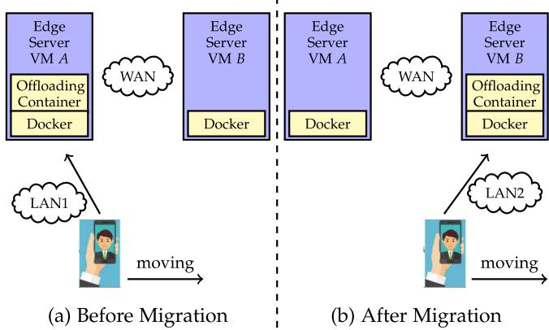  
Fig. 2. Offloading serivce handoff: Before and after migration o offloading container.

Table 1 indicates that migration could be done within 10 seconds for Busybox, and within 30 seconds for OpenFace. The network between these two virtual hosts has a 1 Gbps bandwidth and latency of 0.4 milliseconds, transferring 2.17 GB data within a short time. We further tested container migration over a network with bandwidth of 15 Mbps and latency of 5:4 ms. Table 2 shows that migration of the Busybox container takes 133.11 seconds with transfer sizes as small as 290 Kilobytes. Migrating OpenFace required transfer of more than 2 Gigabytes data and took about 3200 seconds.

As previously stated, poor performance is caused by tranferring large files comprising the complete file system. This is worse performance than the state-of-the-art VM migration solution. Migration of VMs could avoid transferring a portion of the file system by sharing the base VM images [17], which will finish migration within several minutes.

Therefore, we require a new tool to efficiently migrate Docker containers, avoiding unnecessary transmission of common image layer stacks. This new tool should leverage the layered file systems to transfer the container layer only during service handoff.

## 4 OFFLOADING SERVICE MIGRATION ON EDGE

In this section, we introduce the design of our service hand off framework based on Docker container migration. First, we provide a simple usage scenario, then we present an overview of the system architecture in Section 4.1. Second, we enumerate work-flow steps performed during service handoff in Section 4.2. Third, in Sections 4.3 and 4.4, we discuss our methodology for storage synchronization based on Docker image layer sharing between two edge servers. Finally, in Sections 4.5, 4.6, and 4.7, we show how to furthe speed up the migration process through memory difference transfers, file compression, pipelined and parallel processing during Docker container migration.

## 4.1 System Overview

Fig. 2 shows an exemplar usage scenario of offloading service hand-off based on container migration. In this example, the end user offloads workloads to an edge server to achieve real-time face recognition (OpenFace [15]). The mobile client continuously reads images from the camera and sends them to the edge server. The edge server runs the facial recognition application in a container, processes the images with a deep neural network algorithm, and sends each recognition result back to the client.

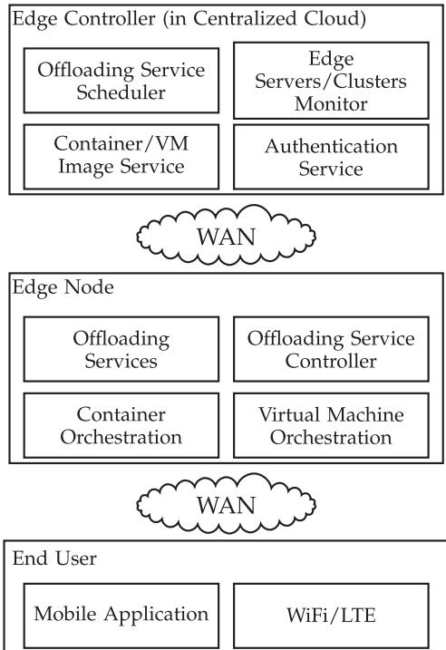  
Fig. 3. Overview of edge computing platform.

All containers are running inside VMs (see VM A, VM B in Fig. 2). The combination of containers and VMs enables applications scale up deployment more easily and control the isolation between applications at different levels.

All offloaded computations are processed inside containers, which we call the offloading container. When the user moves beyond the reach of server A and reaches the service area of edge server B, its offloading computation shall be migrated from server A to server B. This is done via migration of the offloading container, where all runtime memory states as well as associated storage data should be synchronized to the target server B.

In order to support both the mobility of end users and the mobility of its corresponding offloading services on the edge server, we designed a specialized edge computing platform. Fig. 3 provides an overview of our edge platform and its three-level computing architecture. The first level is the traditional cloud platform architecture. The second level consists of the edge nodes distributed over a WAN network in close proximity to end users. The third level consists of mobile clients from end users who request offloading services from nearby edge servers.

## 4.1.1 Edge Controller

The first level contains four services running in the centralized edge controller that manage offloading services across all edge servers and/or clusters on the WAN network. These four services are:

Offloading Service Scheduler is responsible for scheduling offloading services across edge servers or clusters. The parameters of scheduling include but are not limited to 1) physical locations of end users and edge servers; 2)

workloads of edge servers; 3) end user perceived bandwidth and latency, etc.

Edge Server/Clusters Monitor is responsible for communicating with the distributed edge servers or clusters, and collecting performance data, run time meta data for offloading services and end user meta data. The collected data is used to make scheduling decisions.

Container/VM Image Service is the storage service for edge servers. It distributes container and VM images to the edge server for fast deployment as well as for data backup. Backup data can be saved as container volumes [32] to enable faster deployment and sharing among distributed edge servers.

Authentication Service is used to authenticate the identities of both edge servers and end users.

## 4.1.2 Edge Nodes

The second level in Fig. 3 consists of the distributed edge nodes. An edge node could be a single edge server or a cluster of edge servers. Each edge node runs four services which are:

Container Orchestration Service and Virtual Machine Orchestration Service are two virtualization resource orchestration services. They are used to spawn and manage the life cycle of containers and VMs. Each end user could be assigned one or more VMs to build an isolated computing environment. Then by spawning containers inside the VM, the end user creates offloading services.

Offloading Service is the container instance that computes the end user’s offloading workloads.

Offloading Service Controller will be responsible for managing the service inside the edge node. It could limit the number of user-spawned containers, balance workloads inside the cluster, etc. It also provides the latest performance data to the Edge Controller in the cloud. Performance data includes offloading service states inside the edge node, and identification of the latest data volumes requiring backup to the cloud.

## 4.1.3 End Users

The third level of our edge platform is comprised of the end user population. End users are traditional mobile clients running mobile applications on Android, iOS, Windows, or Linux mobile devices. Our design will not modify the mobile client applications. Offloading service handoff progress will be transparent to end users. The mobile device can use WiFi or LTE to access the Edge Nodes or Edge Controller.

## 4.2 Workflow of Service Handoff

Fig. 4 shows the design details of our architecture broken into individual migration steps. The source server is the edge server currently providing end user computational services. The target server is the gaining server. Computational services are transferring from the source to the target server. Details of these steps are described below:

S1 Synchronize Base Image Layers. Offloading services are started by creating a container on the source server. Once the container is started on the source server, the base image layers for that container will be also be downloaded to additional nearby potential target servers. This is to begin preparation for subsequent end user movements.

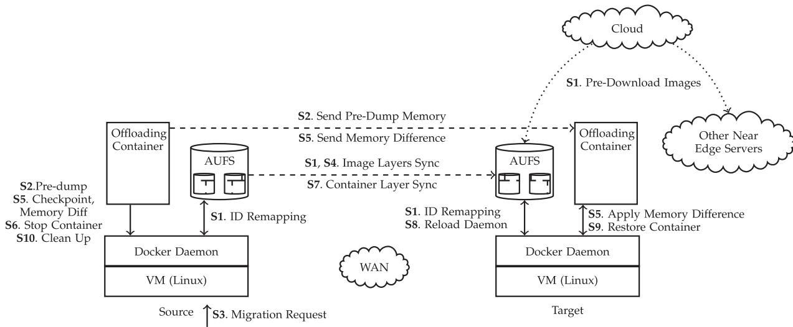  
Fig. 4. Full workflow of offloading service handoff.

S2 Pre-dump Container. Before the migration request is issued, one or more memory snapshots will be synchronized to the all potential target servers without interrupting the offloading service.

S3 Migration Request Received on Source Server. Live migration of the offloading is triggered by the migration request. The request is initiated by the cloud control center.

S4 Image Layer Synchronization. Images layers on the two edge servers are compared with each other by remapping the cacheIDs back to the original IDs. Only the different image layers are transferred.

Memory Difference Transmission. The container on the source server will be checkpointed to get a snapshot of memory. Multiple snapshots can be taken in different time slots. Two consecutive snapshots will be compared to get dirty memory. The dirty memory is then transmitted to the target server re-assembled at the target server.

Stop Container. Once the dirty memory and file system difference are small enough, such that they can be transferred in a tolerable amount of time, the container on the source server will be stopped and the latest dirty memory and files will be sent to the target edge server.

Container Layer Synchronization. After the container is stopped, storage on the source server will not be changed by the container. Thus we can send the latest container layer to the target server. At the same time, all meta data files, such as JSON files logging the container’s runtime states and configurations, are also transferred to the target server.

Docker Daemon Reload. On the target server, Docker daemon will be reloaded after receiving container configuration files from the source server. After reloading, the target node will have source configurations loaded into the runtime database.

Restore Container. After the target server receives the latest runtime memory and files, the target container can be restored with the most recent runtime states.

The migration is now finished at the target server and the user begins receiving services from this new edge server. At the same time, the target server will go to step S1 to prepare the next iteration of service migration in the future.

S10 Clean Up Source Node. Finally, the source node will clean up by removing the footprints of the offloading container. Clean up time should be carefully chosen based on user movement patterns. It could be more efficient to retain and update the footprint containers if the user moves back in the future.

Fig. 5 provides a simple overview of the major migration procedures. We assume that before migration starts, both the source and target edge servers have the application base images downloaded. Once the migration request is received on the source server, multiple iterations of transferring image layers and memory images/differences will be proceeded until the migration is done. File system images and memory snapshots are transferred in parallel to improve efficiency. The number of iterations needed can be determined empirically based on the actual offloading environment and user tolerance for service delay.

## 4.3 Strategy to Synchronize Storage Layers

Storage layer matching can either be implemented within the existing architecture of the container runtime, or provided as a third party tool without change to the underlying container runtime. Changing the container architecture will enable the built-in migration capabilities thus improve the efficiency and usability. However, users must update their container engine in order to benefit from the modified migration feature. Updating the software stack can be destructive in a complex environment, where the release of modified software packages usually takes a long time due to extensive testing requirements. A third party migration tool offers the advantage of faster migration feature implementation since no changes are made to the existing container engine. This is also a good option for a test environment.

In this paper, we implement our migration feature as a third party tool. Of course, after the migration feature is well established, it can subsequently be embedded into the A. Downloaded on August 18,2026 at 12:33:29 UTC from IEEE Xplore. Restrictions apply container architecture by changing the respective part of the container. One example is the graph driver of Docker [29]. One solution is to patch the graph driver by simply replacing the randomly generated cache ID with the actual content addressable hash ID of the image layer, or generate a different hash ID by hashing the same image layer content from a different hash algorithm. We leave such tool extensions to future work.

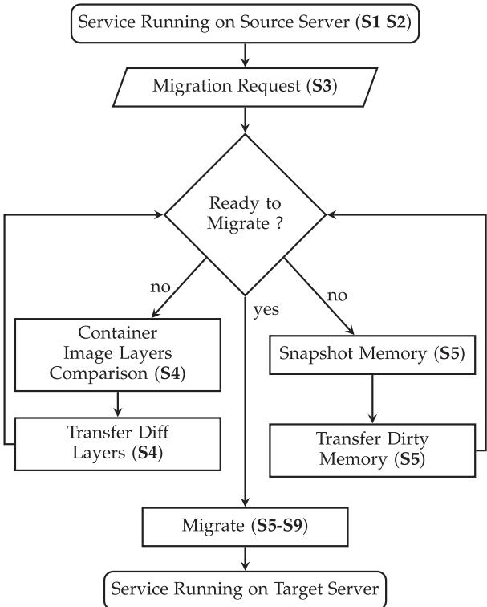  
Fig. 5. Major procedures of migration.

A running container’s layered storage is composed of one writable container layer and several read only base image layers. The container layer stores all the files created or modified by the newly created container. As long as the container is running, this layer is subject to change. So we postpone the synchronization of the container layer to the point after the source container is stopped (in step S7).

All base image layers inside containers are read only, and are synchronized as early as possible. There are two kinds of base image layers. The first, and most common type are base image layers downloaded by docker pull commands from centralized image registries such as Docker Hub. The second image layer type is created by the local Docker host by saving the current container layer as one read-only image layer.

Image layers from the centralized image registry should be downloaded before migration starts, thus download time is amortized (in step S1). This also reduces network traffic between the source and target edge servers. For locally created base image layers, we transfer each such image layer as it is created (in step S4), regardless if the migration has started or not.

## 4.4 Layer ID Remapping

As mentioned previously, an image downloaded from the common registry to multiple edge servers will have different cache IDs exposed at each edge server’s Docker runtime.

In order to efficiently share these common images across different edge servers, image layers need to be matched based upon the original IDs instead of the cache IDs. To remap image cache IDs without changing the Docker graph driver, we designed a third party tool to match the randomly generated cache IDs to original layer IDs. We first remap the cache IDs to original IDs on two different edge servers. Then the original IDs are compared via communication between the two edge servers. The image layers are the same if they have identical original IDs.

After the common image layers are found, we map the original IDs back to the local cache IDs on the target server. Then we update the migrated container with the new cache IDs on the target server. Thus, the common image layers on the migrated container will be reset with the new cache ID that are addressable to the Docker daemon on the target server. When we restore the container in the future, the file system will be mounted correctly from the shared image layers on the target server.

For the original IDs that don’t match between the two hosts, we treat them as new image layers, and add them to a waiting list for transfer in step S7.

## 4.5 Pre-Dump & Dirty Memory Synchronization

In order to reduce transferred memory image size during hand-off, we first checkpoint the source container and then dump a snapshot of container memory in step S2. This could happen as soon as the container is created, or we could dump memory when the most frequently used binary programs of the application are loaded into memory. This snapshot of memory will serve as the base memory image for the migration.

After the base memory image is dumped, it is transferred immediately to the target server. We assume that the transfer will be finished before hand-off starts. This is reasonable since we can send the base memory image as soon as the container starts. After the container starts, and before the hand-off begins, the nearby edge servers start to download the application’s container images. We process those two steps in parallel to reduce total transfer time. This is further discussed in Section 4.7. Upon hand-off start, we have the base memory image of the container already loaded on the target server.

## 4.6 Data Transfer

There are four types of data requiring transfer: layer stack information, thin writable container layers, container meta data files, and snapshots of container memory and memory differences. Some of the data is in the form of string messages, such as layer stack information. Some data are in plain text files, such as most contents and configuration files. Memory snapshots, and memory differences are contained in binary image files. Adapting to the file types, we design different data transfer strategies.

Layer stack information consists of a list of SHA256 ID strings. This is sent as a socket message via UNIX RPC API implementation in [20]. To must be noted that data compression is not efficient for this information because the overhead of compression outweighs the transmission efficiency benefits for those short strings.

For other data types, including the container writable layer, meta data files, dump memory images, and image A. Downloaded on August 18,2026 at 12:33:29 UTC from IEEE Xplore. Restrictions apply differences, we use bzip2 for compression before sending out via authorized ssh connection.

## 4.7 Parallel & Pipelined Processing

With the help of parallel and pipelined processing, we could further improve our process efficiency in four ways, and further reduce total migration time.

First, starting a container will trigger two events to run in parallel: a) on the edge servers near the end user, downloading images from centralized registry, and b) on the source node, pre-dumping/sending base memory images to the potential target servers. Those two processes could be run at the same time in order to reduce the total time of step S1 and S2.

Second, daemon reload in step S8 is required on the target host. It could be triggered immediately after S7 and be paralleled with step S5, when the source server is sending the memory difference to the target host. Step S7 cannot be paralleled with S8, because daemon reload on the target host requires the configuration data files sent in step S7.

Third, in step S7, we use compression to send all files in the container layer over an authorized ssh connection between the source and target host. The compression and transfer of the container layer can be pipelined using Linux pipes.

Lastly, in step S5, we need to obtain memory differences by comparing the base memory images with the images in the new snapshot, then we send the differences to the target and patch the differences to the base memory image on the target host. This whole process could also be piplined using Linux pipes.

## 4.8 Multi-Mode Migration with Flexible Trade-Offs

Service handoff efficiency is affected by many system environment factors. They include: 1) the network conditions between two edge servers; 2) the network conditions between end user and edge server; 3) the available resources on the edge servers, such as available CPU power. Taking these factors into consideration, we use different strategies to improve the efficiency of service handoff. We combine different metrics to dynamically adapt to various system environments.

The metrics we use to determine our strategies include:

1) Realtime Bandwidth and Latency. This includes the real time bandwidth and latency between the source and target edge servers, as well as between the end user and two edge servers.

2) Compression Options. We have a set of compression algorithms and options available for use. Different algorithms with different options require different CPU power and take differing amounts of computation time.

3) Number of Iterations. This defines the maximum number of iterations invoked for memory/storage predumping or checkpointing before handoff starts.

The end user’s high quality of service is the ultimate optimization goal. Instead of providing a concrete goal for optimization under different environments and requirements, we provide multiple possible settings to enable users or developers to customize their own strategies performing tradeoffs between differing environmental factors and user requirements. The optimization goals we define for service handoff are:

1) Interruption Time. Interruption time is the time from user disconnection from their service on the source server to the time when the user is reconnected to their service on the target server.

2) Service Downtime. This is the time duration of the last iteration of the container migration. During this time interval, the service instance on the source node is stopped.

3) Total Migration Time. We use total migration time to represent the total time of all iterations of container migration.

Number of Iterations needs to be carefully determined to optimize the quality of services for end users. If bandwidth is low, the time each iteration takes will be longer. So our system tends to use fewer iterations to checkpoint storage and memory. Fewer iterations mean each batch of dirty storage and memory transfers will occur in large volume. Therefore, during the last iteration for service handoff, it will migrate the container in a relatively longer time, while the total handoff time at the last iteration might be less.

If bandwidth is high, more iterations could be done in a relatively short time. Then our system tends to use more iterations to send storage and memory differences. Generally the first iteration takes the longest time, say $T _ { 1 }$ . The second iteration will take a shorter time, because it only transfers the dirty memory generated since $T _ { 1 } ,$ , say it takes $T _ { 2 } ,$ thus $T _ { 2 } ~ < ~ T _ { 1 }$ . Then the third iteration will usually cost less time, because the dirty memory generated since $T _ { 2 } ,$ is smaller than the dirty memory generated since $T _ { 1 }$ . Therefore, each iteration will usually take less and less time. The last iteration’s time can be minimized by increasing the total iteration number. This is how the live migration is done inside traditional data centers.

However, for live migration in an edge network, we need to consider user mobility. If we set too many iterations, it will add up to the total migration time. During this time, if the user is moving far away from its original edge server, the quality of service will also degrade despite the minimization of service downtime. Therefore we need to control the total iterations performed commensurate with user mobility and network bandwidth. Similarly, Compression options also need to be carefully choosen in order to optimize the service handoff process.

## 4.9 Two-Layer System-Wide Isolation for Better Security

It is critical to minimize security risks posed to offloading services running on the edge servers. Isolation between different services could provide a certain level of security. Our framework provides an isolated running environment for the offloading service via two layers of the system virtualization hierarchy. Different services can be isolated by running inside different Linux containers, and different containers are allowed to be further isolated by running in different virtual machines.

More thorough security solutions need to be designed before this framework can be deployed in a real world environment. These solutions include, but are not limited to efficient run-time monitoring, secure system updating, etc. We leave security enhancements for future work and focus on performance evaluation of our services.

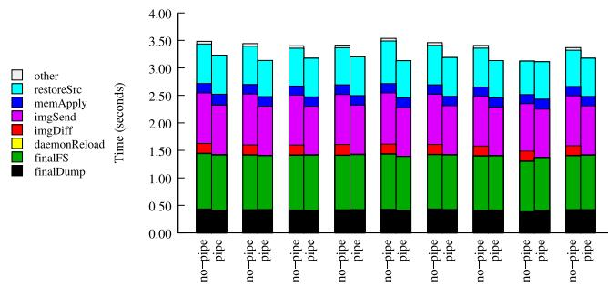  
5Mbps 10Mbps 15Mbps 20Mbps 25Mbps 30Mbps 35Mbps 40Mbps 45Mbps  
Fig. 6. Busybox: Time duration of container migration stages with and without pipelined processing.

## 4.10 Discussion

In this section, we discuss the benefits of overall system and its extended application, and then clarify the limitations of the scope of this paper.

## 4.10.1 Benefits andApplications

In this paper, we propose an efficient service migration scheme based on sharing layers of the container storage, and explore several key metrics that can be used to tune migration performance. Metrics on the edge server, such as bandwidth, latency, host environment, etc. are provided to the cloud center to support decisions towards optimal performance. Cloud centers could utilize those metrics to make migration go/no-go decisions, schedule the timing of migrations, decide which target servers to choose as migration destinations in order to minimize service interruptions.

## 4.10.2 Limitations ofScope

Note that the theoretical proof of our performance optimization scheme is out of scope of this paper. In the architecture of our edge platform, we divided the optimization problem into two tasks, one for distributed edge, and one for centralized cloud. The first one is to collect performance data from edge servers; second, we evaluate the performance and make optimization decisions at the cloud center. This paper focuses on the edge nodes, where metrics of performance are collected. The decision process of the cloud center is out of the scope of this paper.

## 5 EVALUATION

In this section, we introduce our evaluation experiments and report the results from the following investigations: 1) How can container migration performance be affected by pipeline processing? 2) How can customized metrics such as network bandwidth, latency, file compression options, and total iteration numbers, affect the migration performance? 3) Will our system perform better than state-of-the-art solutions?

## 5.1 Set Up and Benchmark Workloads

Migration scenarios are set up by using two VMs, each running a Docker instance. Docker containers are migrated from the Docker host on the source VM to the Docker host on the target VM.

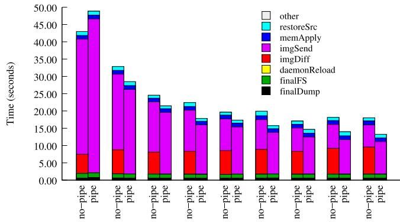  
5Mbps 10Mbps 15Mbps 20Mbps 25Mbps 30Mbps 35Mbps 40Mbps 45Mbp  
Fig. 7. OpenFace: Time duration of container migration stages with and without pipelined processing.

Linux Traffic Control (tc [33]) is used to control network traffic. In order to test our system running across WANs, we emulated low network bandwidths ranging from 5 to 45 Mbps. Consistent with the average bandwidth observed on the Internet [34], we fixed latency at 50 ms to emulate the WAN environment for edge computing. Since edge computing environments can also be adapted to LAN networks, we also tested several higher bandwidths, ranging from 50 to 500 Mpbs. Latency during these tests was set to 6 ms, the average observed latency on the author’s university LAN.

For the offloading workloads, we chose Busybox as a simple workload to show the functionality of the system, and demonstrate non-avoidable system overhead when performing container migration. In order to show offloading service handoff comparable to real world applications, we chose OpenFace as a sample workload.

## 5.2 Evaluation of Pipeline Performance

In order to demonstrate the effectiveness of pipelined processing, we incorporated pipeline processing into two time consuming processes: imgDiff and imgSend, where imgDiff receives memory difference files, and imgSend sends mem ory difference files to the target server during migration. Figs. 6 and 7 report the timing benefits we achieved by incorporating pipelined processing. From the figure, we can see that, without pipelined processing, most time costs are incurred by receiving and sending the memory difference files. After applying pipelined processing, we save 5 8 seconds during OpenFace migration. Busybox also saves a certain amount of time with pipelined processing.

## 5.3 Evaluation on Different Metrics

In this section, we will evaluate the service handoff times achieved under different configurations of our pre-defined four metrics: 1) network bandwidth; 2) network latency; 3) compression options; 4) number of iterations. In order to evaluate the implication of different configurations, we designed contrast experiments for each metric. For example, to evaluate network bandwidth effects, we keep other metrics constant in each experiment.

## 5.3.1 Evaluation ofChanging Network Bandwidth

Table 3 and Fig. 7 show an overview of the performance of our system under different network bandwidth conditions.

TABLE 3  
Overall System Performance

<table><tr><td colspan="2">Band-width (Mbps)</td><td>Handoff Time(s)</td><td>Down Time(s)</td><td>Pre-Transfer Size (MB)</td><td>Final-Transfer Size (MB)</td></tr><tr><td rowspan="13">Busybox</td><td>5</td><td>3.2 (7.3%)</td><td>2.8 (7.9%)</td><td>0.01 (0.2%)</td><td>0.03 (0.3%)</td></tr><tr><td>10</td><td>3.1 (1.8%)</td><td>2.7 (1.6%)</td><td>0.01 (0.2%)</td><td>0.03 (0.6%)</td></tr><tr><td>15</td><td>3.2 (1.4%)</td><td>2.8 (1.6%)</td><td>0.01 (0.5%)</td><td>0.03 (0.9%)</td></tr><tr><td>20</td><td>3.2 (1.6%)</td><td>2.8 (1.8%)</td><td>0.01 (0.3%)</td><td>0.03 (0.4%)</td></tr><tr><td>25</td><td>3.1 (1.6%)</td><td>2.7 (1.8%)</td><td>0.01 (0.2%)</td><td>0.03 (0.9%)</td></tr><tr><td>30</td><td>3.2 (1.4%)</td><td>2.8 (1.2%)</td><td>0.01 (0.3%)</td><td>0.03 (0.5%)</td></tr><tr><td>35</td><td>3.1 (3.5%)</td><td>2.7 (3.3%)</td><td>0.01 (0.3%)</td><td>0.03 (0.6%)</td></tr><tr><td>40</td><td>3.1 (3.4%)</td><td>2.7 (3.5%)</td><td>0.01 (0.2%)</td><td>0.03 (0.5%)</td></tr><tr><td>45</td><td>3.2 (1.9%)</td><td>2.7 (1.8%)</td><td>0.01 (0.2%)</td><td>0.03 (0.8%)</td></tr><tr><td>50</td><td>3.2 (1.7%)</td><td>2.7 (1.6%)</td><td>0.01 (0.2%)</td><td>0.03 (2.7%)</td></tr><tr><td>100</td><td>3.2 (1.6%)</td><td>2.7 (1.4%)</td><td>0.01 (0.3%)</td><td>0.03 (0.4%)</td></tr><tr><td>200</td><td>3.1 (1.8%)</td><td>2.7 (1.8%)</td><td>0.01 (0.1%)</td><td>0.03 (0.5%)</td></tr><tr><td>500</td><td>3.2 (2.0%)</td><td>2.8 (2.2%)</td><td>0.01 (0.2%)</td><td>0.03 (0.4%)</td></tr><tr><td rowspan="13">OpenFace</td><td>5</td><td>48.9 (12.6%)</td><td>48.1 (12.7%)</td><td>115.2 (6.1%)</td><td>22.6 (13.0%)</td></tr><tr><td>10</td><td>28.5 (6.9%)</td><td>27.9 (7.0%)</td><td>119.4 (3.5%)</td><td>22.2 (10.9%)</td></tr><tr><td>15</td><td>21.5 (9.1%)</td><td>20.9 (9.4%)</td><td>116.0 (7.3%)</td><td>22.1 (11.1%)</td></tr><tr><td>20</td><td>17.8 (8.6%)</td><td>17.3 (8.9%)</td><td>116.0 (6.9%)</td><td>21.2 (12.0%)</td></tr><tr><td>25</td><td>17.4 (11.5%)</td><td>16.8 (12.0%)</td><td>114.3 (7.6%)</td><td>23.7 (14.8%)</td></tr><tr><td>30</td><td>15.8 (7.5%)</td><td>15.1 (7.4%)</td><td>119.3 (2.5%)</td><td>22.7 (9.3%)</td></tr><tr><td>35</td><td>14.7 (13.6%)</td><td>14.0 (14.3%)</td><td>116.8 (5.9%)</td><td>22.2 (15.6%)</td></tr><tr><td>40</td><td>14.0 (7.3%)</td><td>13.4 (7.6%)</td><td>112.5 (8.1%)</td><td>23.0 (8.8%)</td></tr><tr><td>45</td><td>13.3 (8.6%)</td><td>12.6 (9.1%)</td><td>111.9 (9.1%)</td><td>22.6 (11.7%)</td></tr><tr><td>50</td><td>13.4 (10.7%)</td><td>12.8 (11.1%)</td><td>115.2 (5.3%)</td><td>23.2 (5.3%)</td></tr><tr><td>100</td><td>10.7 (9.6%)</td><td>10.1 (10.1%)</td><td>117.2 (2.4%)</td><td>21.6 (10.8%)</td></tr><tr><td>200</td><td>10.2 (12.9%)</td><td>9.6 (13.5%)</td><td>116.8 (2.4%)</td><td>20.6 (17.6%)</td></tr><tr><td>500</td><td>10.9 (5.6%)</td><td>10.3 (5.9%)</td><td>117.4 (1.5%)</td><td>23.0 (3.9%)</td></tr></table>

Average of 10 runs and relative standard deviations (RSDs, in parentheses) are reported.

Latency is set to 50 ms, total number of iterations is set to 2, and the compression option is set to level 6.

In Table 3, Handoff time is from the time the source server receives a migration request until the offloading container is successfully restored on the target server. Down time is from the time when the container is stopped on the source server to the time when the container is restored on the target server. Pre-Transfer Size is the transferred size before handoff starts, i.e., from stage S1 until stage S3 . Final-Transfer Size is the transferred size during handoff, i.e., from stage S3 until the end of final stage S9.

From Table 3 and Fig. 7 we can conclude that in general the higher bandwidth we have, the faster the handoff process. However, when the bandwidths improves to a relatively high value, the benefits of bandwidth expension diminish gradually. For example, when the bandwidth changes from 5 to 10 Mbps, handoff time changes from 50 seconds to less than 30 seconds, which yields more than 40 percent improvement. However, when bandwidth exceeds 50 Mbps, it becomes harder to reach higher throughput by simply increasing the bandwidth. This effect can be caused by limited hardware resources, such as CPU power or heavy disk workloads. When the transfer data rate of the network becomes high, the CPU power used for compression, and machine disk storage become performance bottlenecks.

Note that migration time of Busybox seems to be unrelated to the bandwidths in Table 3. This is due to the very small transferred file size, therefore transmission can be finished very quickly regardless of network bandwidth.

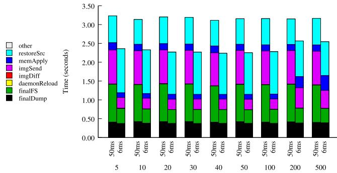  
Fig. 8. Busybox: Comparison of migration time. Under bandwidth from 5 to 500 Mbps, and latency of 50 and 6 ms. With two total iterations and level 6 compression.

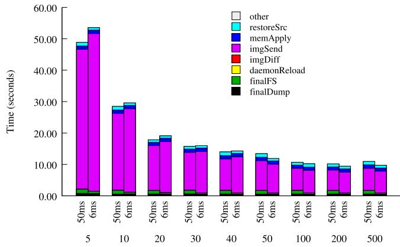  
Fig. 9. OpenFace: Comparison of migration time. Under bandwidth from 5 to 500 Mbps, and latency of 50 and 6 ms. With two total iterations and level 6 compression.

## 5.3.2 Evaluation ofChanging Latency

Figs. 8 and 9 illustrate migration performance under two different network latencies of 50 ms and 6 ms for Busybox and OpenFace. It shows a tiny difference when experiencing different latencies. This implies our system is suitable for a wide range of network latencies.

## 5.3.3 Evaluation ofChanging Compression Algorithms andOptions

In Fig. 10, each curve shows an average of 5 runs with the same experimental setup. Each run consists of the time of 10 iterations, where the first nine are memory difference transfer time before the final handoff starts. The 10th iteration equates to the final handoff time. Fig. 10a shows the time of 10 iterations at a bandwidth of 10 Mbps. We can see that with level 9 compression, we get slightly better performance than with no compression. However, for higher bandwidths, such as in Figs. 10b, 10c, and 10d, it is hard to conclude whether level 9 compression option is better than the no compression option.

Apparently, the higher the bandwidth we have, there are more chances that level 9 compression will induce more performance overhead. This is because when bandwidth is high, the CPU power we use to perform compression becomes the bottleneck. This also explains why with increasing iterations, level 9 compression imposes greater workloads than the no compression option. When we do more and more iterations for the same container, we have to checkpoint and restore the container again and again. These activities consume many computing resources and create high workloads for the host machine‘s CPU.

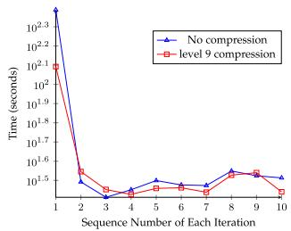  
(a) 10Mbps

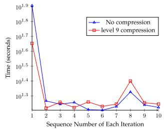  
(b) 30Mbps

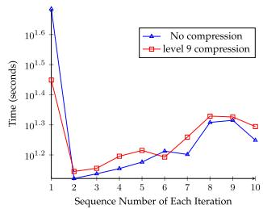  
(c) 45Mbps

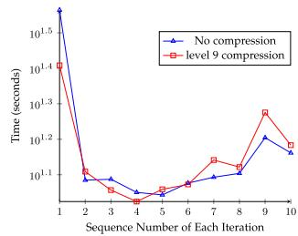  
(d) 65Mbps  
Fig. 10. Time for each iteration during a 10 iteration memory image transfer under different bandwidths, with no compression and with leve 9 compression. Each data point is an average of five runnings with the same experiment parameters.

Therefore, it is necessary to make the compression option flexible and choose a appropriate compression level suitable for the edge server’s available hardware resources.

## 5.3.4 Evaluation ofChanging Total Iterations

Fig. 11 shows the handoff time when we use differing numbers of total iterations to transfer the memory image difference before handoff starts. The experiment is done on Openface application.

We make two key observations from the figure: a) With total iteration numbers of three or more, it is rare to have a better performance than the set up with only two total iterations. b) With more total iterations, the final handoff time proves to be longer in most cases.

These observations can be explained by the special memory footprint pattern we shown for Openface/Busybox in Fig. 12. It shows that no matter how many iterations we checkpoint Openface or Busybox, the footprint size in main memory changes little. Although their memory is continuously changing, the changes reside in specific areas: a 4 KB area for Busybox, and a 25 MB area for OpenFace.

Therefore, no matter how many iterations we perform to synchronize memory difference before handoff, at the end we will have to transfer a similar amount of dirty memory. Additionally, more iterations pose higher workload pressures for the hardware. Therefore, in most cases for Openface, it usually does not help to increase iterations.

However, this does not mean we do not need more than two iterations for all applications. If the memory footprint size of the application increases linearly over time, we can get smaller memory differences with more iterations. Thus we can save more time by using more iterations.

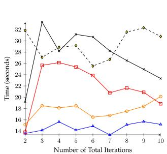

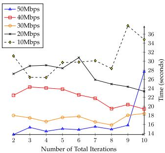  
(a) with level 9 compression  
(b) with no compression  
Fig. 11. Time of service handoff under different total iterations. Fig. 11a shows level 9 compression of the transferred data during handoff. Fig. 11b shows the result when no compression is used during handoff. Each point is an average of five runs with the same parameters.

## 5.4 Overall Performance and Comparison with State-of-the-Art VM Handoff

From Table 3 and Fig. 9, we can see the OpenFace offloading container can be migrated within 49 seconds under the lowest bandwidth 5 Mbps with 50 ms latency, where VM based solution in [17] will take 247 seconds. The relative standard deviations in Table 3 shows the robustness of our experimental result. In summary, our system could reduce the total handoff time by 56% 80% compared to the state-of-the-art work of VM handoff [17] on edge computing platforms.

## 6 RELATED WORK

In this section, we discuss related work on edge computing, service handoff on the edge from VM based solutions as well as container based solutions.

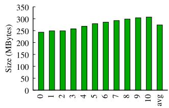

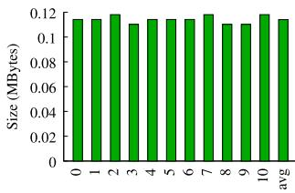  
(b) Memory Size, Busybox

(a) Memory Size, Openface  
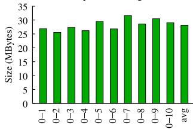

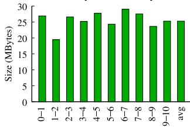

(c) Dirty Memory, Openface  
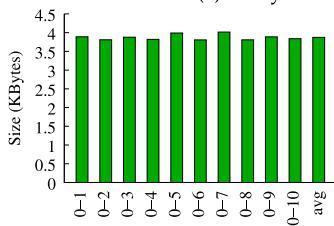

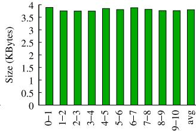  
(d) Dirty Memory, Busybox  
Fig. 12. Dirty memory size analysis for OpenFace and Busybox. (a) and (b) show the memory size for total 11 dumps (0-10 at x-axis) for Open-Face and Busybox, respectively. (c) and (d) show dirty memory size between each of dump 1 to dump 10 and the original dump 0, as well as dirty memory size between two adjacent dumps.

## 6.1 Edge Computing and Service Mobility

Many leading studies and technologies in recent years have discussed the benefits and challenges of edge computing. Satyanarayanan [1] proposed cloudlet as one of the earliest conceptions of edge nodes for offloading end-user computation. Fog computing [2] and Mobile Edge Computing [3], [4] are proposed with similar ideas whereby resource-rich server nodes are placed in close proximity to end users. The idea of Edge computing has been found to offer more responsive services as well as higher scalability than cloud platforms [3], [11], thus improving quality of service significantly. Several computation offloading schemes from mobile devices to edge servers have been investigated [13], [14], [15], [16]. By offloading to a nearby server, end users will experience services with higher bandwidth, lower latency, as well as higher computation power, and also save energy on the mobile device.

## 6.2 VM Migration on the Edge

VM handoff solutions based on VM migration have been proposed by Kiryong [17], [18] and Machen [35]. Satyanarayanan et al. in [1] proposed VM synthesis to divide huge VM images into a base VM image and a relatively small overlay image for one specific application. Based on the work of VM synthesis, Kiryong [17] proposed VM handoff across Cloudlet servers (alias of edge servers). While it reduces transfer size and migration time compared to the traditional VM live migration solution, the total transfer size is still relatively large for a WAN environment. Furthermore, the proposed system required changes to hypervisor and VMs, which were hard to maintain, and not widely available in the industrial or academic world.

A similar technique was proposed by Machen et al. in [35]. VM images were organized into 2 or 3 layers by pseudo-incremental layering, then layers were synchronized by using the rsync incremental file synchronization feature. However, it must duplicate the base layer to compose an incremental layer, causing unnecessary performance overhead.

## 6.3 Container Migration on the Edge

Containers provide lightweight virtualization by running a group of processes in isolated environments. Container runtime is a tool that provides an easy-to-use API for managing containers by abstracting the low-level technical details of namespaces and cgroups. Such tools include LXC [36], runC [37], rkt [38], OpenVZ [39], Docker [19], etc. Different container runtime has different scenerios of usage. For example, LXC only cares about full system containers and doesn’t care about the kind of application running inside the container, while Docker aims to encapsulate a specific application within the container.

Migration of containers becomes possible when CRIU [21] supports the checkpoint/restore functionality for Linux. Now CRIU supports the checkpoint and restore of containers for OpenVZ, LXC, and Docker.

Based on CRIU, OpenVZ now supports migration of containers [20]. It is claimed that migration could be done within 5 seconds [40]. However, OpenVZ uses a distributed storage system [26], where all files are shared across a high bandwidth network. Due to the limited WAN bandwidth for edge servers, it is not possible to deploy distributed storage.

Qiu [41] proposed a basic solution for live migrating LXC containers in data center environments. However, LXC regards containers as a whole system container, and there is no layered storage. As a result, during container migration, all contents of the file system for that container must be migrated together, along with all memory states.

Machen et al. in [35] proposed live migration of LXC containers with layer support based on the rsync incremental feature. However, it only supports predefined 2 or 3 layers of the whole system, while Docker inherently supports more flexible amounts of storage layers. It is also possible to encounter the rsync file contention problem when synchronizing the file system while the container is running. Furthermore, duplication of base layers in [35] could incur more performance overhead.

For Docker containers, P.Haul has examples supporting docker-1.9.0 [20] and docker-1.10 [31]. However, they both transmit the root file system of the container, regardless of the underlying layered storage. This makes the migration unsatisfactorily slow across the edges of the WAN.

## 7 CONCLUSION

We propose a framework that enhances the mobility of edge services in a three-layer edge computing environment. Leveraging the Docker container layered file system, we eliminate transfers of redundant sizable portions of the application file system. By transferring the base memory image ahead of the handoff, and transferring only the incremental memory difference when migration starts, we further reduce the transfer size during migration. Our prototype system is implemented and thoroughly evaluated under different system configurations. Finally, our system demonstrated hand-off time reductions of 56% 80% compared to the state-of-the-art VM handoff for edge computing platforms.

## ACKNOWLEDGMENTS

The authors would like to thank all of the reviewers for their helpful comments. This project was supported in part by US National Science Foundation grant CNS-1816399.

## REFERENCES

[1] M. Satyanarayanan, P. Bahl, R. Caceres, and N. Davies, “The case for VM-based cloudlets in mobile computing,” IEEE Pervasive Comput., vol. 8, no. 4, pp. 14–23, Oct.–Dec. 2009.

[2] F. Bonomi, R. Milito, J. Zhu, and S. Addepalli, “Fog computing and its role in the internet of things," in Proc. 1st Edition MC Workshop Mobile Cloud Comput., 2012, pp. 13–16.

[3] M. Patel, B. Naughton, C. Chan, N. Sprecher, S. Abeta, A. Neal, et al., “Mobile-edge computing introductory technical white paper,” White Paper, Mobile-Edge Computing (MEC) Industry Initiative, 2014.

[4] Y. C. Hu, M. Patel, D. Sabella, N. Sprecher, and V. Young, “Mobile edge computing-a key technology towards 5G,” ETSI White Paper, vol. 11, 2015.

[5] S. Yi, Z. Hao, Z. Qin, and Q. Li, “Fog computing: Platform and applications,” in Proc. 3rd IEEE Workshop Hot Topics Web Syst. Technol., 2015, pp. 73–78.

[6] S. Yi, C. Li, and Q. Li, “A survey of fog computing: Concepts, applications and issues,” in Proc. Workshop Mobile Big Data, 2015, pp. 37–42.

[7] S. Yi, Z. Qin, and Q. Li, “Security and privacy issues of fog computing: A survey,” in Proc. Int. Conf. Wireless Algorithms Syst. Appl., 2015, pp. 685–695

[8] Z. Hao and Q. Li, “EdgeStore: Integrating edge computing into cloud-based storage systems,” in Proc. IEEE/ACM Symp. Edge Comput., 2016, pp. 115–116.

[9] W. Shi, J. Cao, Q. Zhang, Y. Li, and L. Xu, “Edge computing: Vision and challenges,” IEEE Internet Things J., vol. 3, no. 5, pp. 637–646, Oct. 2016.

[10] M. Chiang and T. Zhang, “Fog and IoT: An overview of research opportunities,” IEEE Internet Things J., vol. 3, no. 6, pp. 854–864, Dec. 2016.

[11] M. Satyanarayanan, “The emergence of edge computing,” Comput., vol. 50, no. 1, pp. 30–39, 2017.

[12] Z. Hao, E. Novak, S. Yi, and Q. Li, “Challenges and software architecture for fog computing,” IEEE Internet Comput., vol. 21, no. 2, pp. 44–53, Mar./Apr. 2017.

[13] E. Cuervo, A. Balasubramanian, D.-K. Cho, A. Wolman, S. Saroiu, R. Chandra, and P. Bahl, “MAUI: Making smartphones last longer with code offload,” in Proc. 8th Int. Conf. Mobile Syst. Appl. Serv., 2010, pp. 49–62.

[14] N. D. Lane, S. Bhattacharya, P. Georgiev, C. Forlivesi, L. Jiao, L. Qendro, and F. Kawsar, “DeepX: A software accelerator for low-power deep learning inference on mobile devices,” in Proc. 15th ACM/IEEE Int. Conf. Inf. Process. Sensor Netw., 2016, pp. 1–12.

[15] B. Amos, B. Ludwiczuk, and M. Satyanarayanan, “OpenFace: A general-purpose face recognition library with mobile applica tions,” School Comput. Sci., Carnegie Mellon Univ., Pittsburgh, PA, USA, Tech. Rep. CMU-CS-16–118, 2016.

[16] P. Liu, D. Willis, and S. Banerjee, “ParaDrop: Enabling lightweight multi-tenancy at the network’s extreme edge,” in Proc. IEEE/ACM Symp. Edge Comput., 2016, pp. 1–13.

[17] K. Ha, Y. Abe, Z. Chen, W. Hu, B. Amos, P. Pillai, and M. Satyanarayanan, “Adaptive VM handoff across cloudlets,” School Comput. Sci., Carnegie Mellon Univ., Pittsburgh, PA, USA, Tech. Rep. CMU-CS-15–113, 2015.

[18] K. Ha, Y. Abe, T. Eiszler, Z. Chen, W. Hu, B. Amos, R. Upadhyaya, P. Pillai, and M. Satyanarayanan, “You can teach elephants to dance: Agile VM handoff for edge computing,” in Proc. 2nd ACM IEEE Symp. Edge Comput., 2017, Art. no. 12.

[19] D. Inc. “What is docker?” 2017. [Online]. Available: https://www. docker.com/what-docker

[20] P. Emelyanov, “Live migration using CRIU,” 2017. [Online]. Available: https://github.com/xemul/p.haul

[21] CRIU, “Criu,” 2017. [Online]. Available: https://criu.org/ Main\_Page

[22] L. Ma, S. Yi, and Q. Li, “Efficient service handoff across edge servers via docker container migration,” in Proc. 2nd ACM/IEEE Symp. Edge Comput., 2017, pp. 11:1–11:13.

[23] K.° Ha, Z. Chen," W. Hu, W. Richter, P. Pillai, and M. Satyanarayanan, “Towards wearable cognitive assistance,” in Proc. 12th Annu. Int. Conf. Mobile Syst. Appl. Serv., 2014, pp. 68–81.

[24] D. Inc. "Docker images and containers," 2017. [Online]. Available https://docs.docker.com/storage/storagedriver/

[25] S. Graber, “LXC 1.0: Container storage [5/10],” 2013. [Online]. Available: https://stgraber.org/2013/12/27/lxc-1–0-containerstorage/

[26] OpenVZ, “Virtuozzo storage,” 2017. [Online]. Available: https:// openvz.org/Virtuozzo\_Storage

[27] CoreOS, “Running docker images with rkt,” 2018. [Online]. Available: https://coreos.com/rkt/docs/latest/running-docker-images. html

[28] A. Lehmann, “1.10 distribution changes design doc,” 2015. [Online]. Available: https://gist.github.com/aaronlehmann/ b42a2eaf633fc949f93b

[29] ESTESP, “Storage drivers in docker: A deep dive,” 2016. [Online]. Available: https://integratedcode.us/2016/08/30/ storage-drivers-in-docker-a-deep-dive/

[30] J. Okajima, “Aufs,” 2017. [Online]. Available: http://aufs. sourceforge. net/aufs3/man.html

[31] R. Boucher, “Live migration using CRIU,” 2017. [Online]. Available: https://github.com/boucher/p.haul

[32] Docker, “Docker documentation–use volumes,” 2017. [Online]. Available: https://docs.docker.com/engine/admin/volumes/ volumes/

[33] M. A. Brown, “Traffic control howto,” 2017. [Online]. Available: http://www.tldp.org/HOWTO/Traffic-Control-HOWTO/

[34] A. R. S. Quarter, “State of the internet report,” Akamai, 2014. [Online]. Available: http://www.akamai.com/html/about/ press/releases/2014/press-093014.html

[35] A. Machen, S. Wang, K. K. Leung, B. J. Ko, and T. Salonidis, “Live service migration in mobile edge clouds,” IEEE Wireless Commun., vol. 25, no. 1, pp. 140–147, Feb. 2018.

[36] D. Lezcano. “Lxc - Linux containers,” 2017. [Online]. Available: https://github.com/lxc/lxc

[37] L. Foundation, “RUNC,” 2017. [Online]. Available: https:// runc.io/

[38] CoreOS, “A security-minded, standards-based container engine,” 2017. [Online]. Available: https://coreos.com/rkt

[39] OpenVZ, “OpenVZ virtuozzo containers Wiki,” 2017. [Online]. Available: https://openvz.org/Main\_Page

[40] A. Vagin, “FOSDEM 2015 - live migration for containers is around the corner,” 2017. Online. Available: https://archive.fosdem.org/ 2015/schedule/event/livemigration/

[41] Y. Qiu, “Evaluating and improving LXC container migration between cloudlets using multipath TCP,” Ph.D. dissertation, Electrical and Computer Engineering, Carleton Univ., Ottawa, ON, Canada, 2016

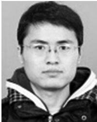

Lele Ma received the BS degree from Shandong University, Jinan, China, and the MS degree from the University of Chinese Academy of Sciences, Beijing, China. He is working toward the PhD degree in the College of William and Mary. He has a broad interest in computer system and security. He is currently exploring the challenges and security problems of virtualization technolo gies on edge computing platform.

Shanhe Yi received the BEng and MS degrees in electrical engineering both from the Huazhong University of Science and Technology, China, in 2010 and 2013, respectively. His research interests focus on the design and implementation of systems in the broad area of mobile/wearable computing and edge computing, with the empha sis on techniques that improve the usability, security, and privacy of the applications and systems. He is a student member of the IEEE.

Nancy Carter is working toward the PhD degree interested in exploring human-computer interac tion and wireless sensors, focusing on improving security and efficiency. Additional interests include ubiquitous computing, pervasive comput ing, and cyber-physical systems.

Qun Li received the PhD degree from Dartmouth College. His recent research focuses on wireless, mobile, and embedded systems, including pervasive computing, smart phones, energy efficiency, smart grid, smart health, cognitive radio, wireless LANs, mobile ad-hoc networks, sensor networks, and RFID systems. He is a fellow of the IEEE.

" For more information on this or any other computing topic please visit our Digital Library at www.computer.org/publications/dlib.