# Eficient Management of Composite Heterogeneous Applications at the Network Edge

Madhura Adeppady , Member, IEEE, Yenchia Yu , Graduate Student Member, IEEE, Ali Rahmanian, Ahmed Ali-Eldin Hassan, and Carla Fabiana Chiasserini , Fellow, IEEE

Abstract—Edge computing is a promising paradigm for deploying latency-sensitive applications (Apps) as it brings resources closer to end users. Edge Apps often adopt a microservice (MS) architecture, breaking monolithic Apps into lightweight, containerized MSs that can be dynamically and independently deployed. However, managing such Apps involves three key challenges: (i) optimizing the placement of MSs to reduce both response time and resource overhead, (ii) handling MS migration or relocation as users move while minimizing App service disruption (App downtime), and (iii) enabling MS sharing across Apps while ensuring performance guarantees. We formulate this as an optimization problem, named Multi-microservice Application Placement (MAP), prove its NP-hardness, and introduce STEP (State and Topology-aware Edge-MS Placement), a polynomialtime heuristic. STEP distinguishes itself from prior work by: (i) jointly considering stateful and stateless MS characteristics in deployment decisions, (ii) exploiting MS shareability to reduce resource usage, (iii) balancing response latency, App downtime, and resource utilization, and (iv) leveraging multiple versions of the same MS to adapt quality of service to available edge resources. Our results in a small-scale scenario show that STEP achieves near-optimal performance with only 7% higher CPU cost than the optimal solution. Large-scale real-time experiments on a Kubernetes cluster demonstrate that STEP consistently outperforms competing methods, achieving up to 50% lower deployment costs while delivering 50% gain in app quality and saving 15% in radio resources with over 90% request success rates.

Index Terms—Mobile edge computing, stateless and stateful microservices, application deployment and migration, service management.

## I. INTRODUCTION

DGE computing has emerged as an alternative to cloud (Apps) by bringing computing resources closer to end users. In edge computing, servers are deployed near base stations (BSs), enabling computation ofloading from mobile devices while significantly reducing response latency and bandwidth consumption. Increasingly, edge Apps adopt a microservice (MS) architecture, where monolithic Apps are composed of multiple lightweight, independently deployable containerized

MSs, making them well-suited for dynamic edge environments.

MSs at the edge can be categorized into stateful and stateless based on their operational characteristics [1]. Stateful MSs maintain user session and interaction data across requests, preserving state over time. Conversely, stateless MSs process each request independently without storing user-specific data. A key feature of MS architecture is shareability: MSs can be shared across multiple Apps to improve resource eficiency. However, while stateless MSs are shareable across Apps requested by diferent users, stateful MSs are typically shareable only among Apps requested by the same user. For diferent users, stateful MS shareability depends on whether or not their state includes user-specific information. For example, a registry MS that stores registration data of an uncrewed aerial vehicle (UAV) can be shared across diferent UAVs and their requested Apps, as it maintains generic user information. In contrast, an autopilot MS that manages flight parameters for individual UAVs cannot be shared, as the state information is unique to each user’s mission. Additionally, to enhance flexibility in resource-scarce environments (common in edge servers), an MS can have multiple versions, each ofering a diferent Quality of Service (QoS) level (e.g., accuracy in a classification task) as well as a diferent level of complexity and amount of resources required for its execution.

Despite its benefits, an MS architecture at the edge introduces relevant challenges in providing performance guarantees with minimal resource consumption.

First, since Apps are composed of several MSs, it is extremely dificult to manage resources at the individual MS level so as to minimize the deployment cost while ensuring tolerable response latency. The network orchestrator must allocate appropriate computational speed to each MS, manage Resource Blocks (RBs) on the communication link between users and servers, and determine MS placement that minimizes the communication overhead between MSs and between a user and the entry MS of a requested App.

Second, as users move between BSs coverage areas and connect to diferent servers, the deployment topology of MSs must be updated to honor response latency requirements. This triggers the migration of stateful MSs and the relocation of stateless MSs, both causing service disruption (App downtime). For stateful MSs, the entire container along with user session data must be migrated to maintain state continuity, while for stateless MSs, container relocation is enough since they do not maintain any user state. Thus, the orchestrator must additionally ensure that App downtime during migration remains within acceptable limits.

Third, MS shareability further complicates the orchestrator’s decisions since shared MSs impact the performance of multiple Apps across diferent users. Notably, the allocation of computational resources may need to be adjusted dynamically, as new Apps start using an existing MS or Apps using a shared MS terminate.

These challenges motivate the need for a holistic MS management framework that can optimize deployment topology while balancing the trade-ofs across response latency, App downtime, and resource utilization.

## A. Limitation of State-of-the-Art Approaches

A large body of recent approaches address resource management to reduce App response latency. Notably, [2] and [3] focus on analyzing individual MS contributions to response latency and apply autoscaling, or determine MS-to-server allocation [4], [5] to reduce costs while meeting target endto-end response latency. However, these approaches have limitations when applied to edge environments. First, they do not consider the impact of MS migration/relocation triggered by user mobility. Second, they lack the flexibility of adapting MS versions based on resource availability, which is crucial for eficiently managing limited resources at the edge. Third, not all of them exploit MS shareability as a way to reduce the consumption of computational, hence also energy, resources. Other prior approaches targeting edge environments focus on MS pre-deployment based on predicted user mobility [6], [7]. These works consider Apps as composed of only stateful MSs and use abstract migration models that do not capture the complexity of real MS migrations. Moreover, these approaches simply skip MS migration when destination servers lack suficient resources.

Recent approaches have made further progress: SR-CL [8] jointly optimizes migration and resource allocation but treats Apps as monolithic single-MS services; CMMF [9] addresses DAG-based migration but overlooks stateless MSs and shareability; E2MS [10] minimizes service disruption and communication costs during migration but assumes nonshareable MSs with a single fixed quality version; and Edge-Mi [11] addresses task migration between edge and cloud based on mobility patterns but does not consider MS shareability or quality adaptation. Works such as [12] provide realistic migration models but focus only on migration rather than jointly optimizing placement and resource allocation. Moreover, none of these approaches simultaneously handle stateless and stateful MS coexistence, MS shareability across users, and dynamic quality adaptation under edge resource constraints.

## B. Key Insights and Contributions

We propose State and Topology-aware Edge-MS Placement (STEP), an algorithm for the orchestrator to make deployment and resource allocation decisions that minimize deployment costs while ensuring that response latency and App downtime remain within tolerable limits. STEP first constructs a Dynamic Network Topology Graph (DNTG) that represents the key system components and their interactions. This graph captures possible deployment choices for MSs of the Apps requested by users. Additionally, it identifies dynamic conditions at the edge, such as App deployment requests, user migrations, and App terminations. Then, upon any of the above events, the orchestrator builds a decision graph that encodes feasible deployment and resource allocation choices to meet App requirements while minimizing deployment costs. This graph is expanded to enforce additive constraints and ensure decision feasibility. Finally, deployment decisions are derived by identifying the minimum-cost path in the decision graph.

We summarize our key contributions as follows:

We develop a system model that captures all key aspects of edge servers, users, Apps, and MSs composing these Apps, and derive analytical expressions for the performance metrics of interest. Further, we develop a testbed that allows us to perform a solid experimental analysis motivating our work and design choices, and then validate and thoroughly evaluate our proposed solution.

We formulate the Multi-microservice Application Placement (MAP) problem, which aims to minimize deployment cost while fulfilling all performance requirements. We prove that MAP is NP-hard and propose the STEP algorithm, which has polynomial time complexity. Importantly, STEP diferentiates from prior art in the following ways: (i) It considers Apps composed of both stateful and stateless MSs, which determines MS shareability and App downtime; (ii) It addresses multiple performance metrics, such as response latency, App downtime, and resource consumption, by leveraging an expanded graph that ensures these objectives are met; (iii) Its low complexity design makes it suitable to handle dynamic scenarios where demand for Apps and user mobility vary over time; (iv) It leverages MS shareability by reusing already deployed MS instances for newly required Apps or during App migration; (v) It increases deployment flexibility by considering diferent versions of the same App with individual MSs that may ofer diferent QoS levels and, correspondingly, diferent complexity and resource consumption.

• Finally, in a small-scale scenario, we show that STEP closely matches the optimal solution. In a large-scale Kubernetes cluster deployment, STEP significantly outperforms existing methods with up to 50% cost reduction, superior resource eficiency, and 50% increasement of the app quality compared to baseline approaches.

We mention that a preliminary version of our work has appeared in our conference paper [13] where we sketched a first version of the STEP algorithm using a simplified migration model and presented a limited, initial set of results.

Paper organization. Sec. III describes our target scenario and testbed setup. Sec. IV gives experimental evidences on why we need a holistic deployment algorithm for multi-MS App placement, and Sec. V introduces our system model. Sec. VI introduces the problem formulation and its complexity analysis. Sec. VII-A presents the proposed low-complexity orchestration algorithm STEP, while Sec. VIII highlights the improvement of STEP against state-of-the-art approaches. Finally, Sec. II summarizes related work and highlights our key contributions, while Sec. IX concludes the paper.

## II. RELATED WORK

Our study pertains to three main areas: edge-centric MS deployment, MS scaling, and MS migration.

## A. Edge-Centric MS Deployment

Multi-component App placement is addressed, e.g., in [4], which accounts for both user mobility and network dynamics. It first determines MS deployment by matching the physical (edge servers) and App graphs using the Hungarian algorithm, ignoring communication costs; then a local search refines the solution by incorporating these costs. Similarly, [5] proposes a greedy algorithm that first assigns an app to the server with the lowest resource-based assignment cost, neglecting communication costs, and then updates the assignment costs for the remaining apps by incorporating communication costs with the one already placed one. The learning-based approach in [6] proactively deploys the app MSs on the nearest edge server, considering the dependencies of the MS and user mobility. It also determines how many successor MSs to predeploy and selects the edge servers for their placement. This approach is extended in [7] to support complex MS structures by considering branching, parallel paths, and cycles in predeployment decisions. MS migration is addressed in [10], which selects candidate App MSs for migration by accounting for communication, image pull, and MS downtime costs, to minimize service disruption. In [14], a policy gradientbased reinforcement learning algorithm is proposed to make migration decisions considering initialization, computation, and migration delays.

SR-CL [8] addresses the joint problem of determining when and where to migrate service instances and the optimal allocation of computational resources to these service instances. For migration decisions, a deep reinforcement learning approach is used, while convex optimization handles optimal resource allocation. CMMF [9] proposes a framework for DAG-based service migration in mobile edge computing. The framework uses a two-stage approach: deep reinforcement learning with LSTM networks for edge cloud selection, followed by network flow algorithms with topological sorting for MS placement. Adapt-SD [15] optimizes MS deployment by minimizing computational, storage, and network costs while meeting service access time constraints, but focuses solely on initial placement decisions without considering dynamic migration scenarios. The study in [16] proposes a reinforcement learning-based approach to determine the optimal sequence of edge clouds to serve mobile users’ microservice requests, formulating the problem as a Markov decision process that balances service delay and migration costs.

Edge-Mi [11] presents an MS-based task migration framework that allows migration between edge servers and cloud infrastructure based on mobility patterns and resource requirements. The approach decomposes Apps into MSs that can be selectively migrated from edge servers to cloud resources (or vice versa) when mobile devices move out of coverage areas or when edge resources become insuficient. Nautilus [17] provides a three-tier runtime system with communicationaware mapping using graph algorithms, contention-aware resource management through deep reinforcement learning, and load-aware migration that migrates MSs from overloaded to underutilized nodes based on minimizing additional network communication costs. A closed-loop particle swarm optimization approach is introduced in [18] for service migration. This approach considers QoS and application characteristics to trigger service migration. The study in [19] presents a locationaware intelligent scaling framework for composite Apps in mobile edge computing environments. The approach considers user mobility patterns and dynamically adjusts MS scaling decisions based on location information to optimize resource utilization and service performance.

Recent works have further explored learning-based and predictive approaches for task migration and resource allocation at the edge. DDPG [20] proposes a deep deterministic policy gradient algorithm enhanced with a dual experience pool, to jointly optimize task migration and resource allocation in cooperative edge computing environments. A proactive service migration framework MAPSM [21] is proposed for Internet of Vehicles (IV) that combines RNN and Markov chain-based mobility prediction with coordinated container pre-migration and communication handover to minimize endto-end delay and total migration time. MATM [22] integrates a Mamba-based trajectory prediction module with a Soft Actor-Critic DRL decision-making module to enable proactive task migration and resource allocation in vehicular edge computing. However, all of the three above approaches consider monolithic tasks or single containerized services, and do not address Apps composed of multiple MSs.

Unlike STEP, the above approaches do not account for the coexistence of stateless and stateful MSs in the App. Moreover, they overlook scenarios where migration is infeasible due to resource-constrained servers. These approaches either optimize migration decisions or resource allocation dynamically, but not both jointly, and fail to leverage MS shareability across diferent users or applications to reduce resource consumption. In contrast, STEP ofers the flexibility to reduce the quality version of MSs when needed and provides a holistic solution that simultaneously addresses deployment, migration, and resource allocation decisions.

## B. MS Scaling

App response latency guarantees are provided in Erms [2], where a shared MS environment is considered and the latency target of each MS of the Apps is given by a piece-wise linear function of its workload. Further, if an MS is shared among multiple Apps, Erms gives higher priority to Apps with more latency-sensitive MSs to optimize request execution. PEMA [3] proposes an iterative feedback-based approach that initially allocates abundant resources to all MSs to meet App SLA requirements, and then it iteratively selects the best resource configuration for each MS by exploiting monotonic resource reduction opportunities. Although these approaches work well for the cloud, they fail to address the limited resource availability at the edge and the need for migration, which introduces an additional performance metric for the App downtime. DeepScaling [23] uses a three-component system with spatio-temporal graph neural networks for workload forecasting, deep neural networks for CPU utilization estimation, and an improved Deep Q-Network for adaptive autoscaling policy generation to minimize resource costs while meeting SLAs in large-scale production microservice environments.

TABLE I  
COMPARISON OF STEP WITH PROMINENT RELATED APPROACHES

<table><tr><td>Approach</td><td>Stateful + Stateless MS</td><td>MS Shareability</td><td>Multi-version QoS</td><td>User Mobility</td><td>Joint Placement + Migration</td><td>Resource Allocation</td><td>Learning-based</td></tr><tr><td>SR-CL [8]</td><td>X</td><td>X</td><td>X</td><td>√</td><td>√</td><td>√</td><td>√</td></tr><tr><td>CMMF [9]</td><td>X</td><td>X</td><td>X</td><td>√</td><td>√</td><td>X</td><td>√</td></tr><tr><td>E2MS [10]</td><td>X</td><td>X</td><td>X</td><td>√</td><td>√</td><td>X</td><td>X</td></tr><tr><td>Edge-Mi [11]</td><td>X</td><td>X</td><td>X</td><td>√</td><td>X</td><td>X</td><td>X</td></tr><tr><td>DDPG. [20]</td><td>X</td><td>X</td><td>X</td><td>X</td><td>√</td><td>√</td><td>√</td></tr><tr><td>MAPSM [21]</td><td>X</td><td>X</td><td>X</td><td>√</td><td>√</td><td>X</td><td>√</td></tr><tr><td>MATM [22]</td><td>X</td><td>X</td><td>X</td><td>√</td><td>√</td><td>√</td><td>√</td></tr><tr><td>STEP (ours)</td><td>√</td><td>√</td><td>√</td><td>√</td><td>√</td><td>√</td><td>X</td></tr></table>

All the above MS scaling schemes work well for resource allocation in cloud environments but difer from STEP in three key ways. First, they assume abundant resources and focus on meeting SLA requirements through resource optimization, while STEP operates under strict edge resource constraints and adjusts MS quality versions accordingly. Second, they do not handle MS migration, which introduces App downtime as a critical performance metric that STEP addresses through joint optimization of deployment, migration, and resource allocation decisions. Third, while some consider MS sharing only for prioritizing latency-sensitive applications, STEP uses MS shareability across users and applications as a core mechanism to reduce resource consumption at the edge.

## C. MS Migration

In the area of container migration, existing studies focus on either stateful migration [12], [24], [25], [26], [27] or stateless relocation [28], [29], [30] of MSs. Although relevant, these approaches are orthogonal to our work, as they focus on how to migrate MS containers rather than where to migrate them. We stress that any of these migration models can be integrated into our approach.

Finally, in our conference paper [13], we proposed a preliminary version of the STEP algorithm for managing composite edge applications using a simplified migration model. Building upon this foundation, in this work we propose an enhanced orchestration framework that includes a more realistic parallel migration model as well as an improved and lower-complexity version of STEP, with enhanced decision graph construction and pruning steps. Further, we significantly extended our Kubernetes-based testbed and the related experimental analysis, and we provide a formal problem formulation with NP-hardness proof, and an extensive experimental evaluation of STEP against a richer set of state-of-the-art benchmarks in both small-scale and large-scale scenarios.

## D. Progress Beyond State-of-the-Art

As highlighted in Table I, some of the above approaches either optimize migration decisions or resource allocation dynamically, but not both jointly. Moreover, they treat applications as monolithic services rather than chains of heterogeneous MSs, and thus do not account for the coexistence of stateful and stateless MSs in the App and their distinct migration behaviors. They also overlook scenarios where migration is infeasible due to resource-constrained servers, and fail to leverage MS shareability across diferent users or applications to reduce resource consumption. Furthermore, learning-based approaches, despite their ability to make adaptive decisions in dynamic environments, are limited to monolithic services and do not extend to composite multi-MS applications. Finally, none of the above approaches consider multiple versions of the same MS to adapt application quality to the available edge resources, which is crucial for eficiently managing limited resources at the edge. In contrast, STEP addresses all these limitations by providing a holistic solution that simultaneously handles deployment, migration, and resource allocation decisions for composite Apps composed of heterogeneous stateful and stateless MSs.

## III. TARGET SCENARIO AND TESTBED

Our study focuses on managing MS-based applications in an edge computing system for mobile users. In the following, first we introduce the system we focus on. Then we describe the testbed that we developed to conduct our quantitative analysis of the trade-ofs that exist in the system under study and serve as empirical foundation of our work. We use the testbed also to implement, test, and benchmark our solution.

## A. Reference Scenario

Fig. 1 depicts our reference scenario, including an edge computing system with an orchestrator and multiple edge servers. The latter are interconnected with each other physically or logically (i.e., through virtual links each composed of multiple physical links) and managed by the orchestrator. Edge servers can host Apps, each composed of (possibly) multiple containerized MSs, ofered to mobile users.

Each server may be connected with one or more BSs, which enable the mobile users to access the Apps deployed at the edge. Each mobile user can issue requests for one or multiple Apps. During runtime, mobile users may move and change the BS with which they connect. For example, User2 may handover its connection from the BS connected with edge server 2 to the BS connected with edge server 1. When the MS deployment remains static, the requests from User2 to App and App would need to be routed from server 1 to server 2, thus increasing latency and bandwidth consumption. The orchestrator can thus make the MSs migrate/relocate to keep the Apps latency suficiently low. Similarly, when the load on an App varies, the resources allocated to its MS instances may be insuficient or excessive, and the orchestrator may need to migrate/relocate MSs to optimize resource allocation.

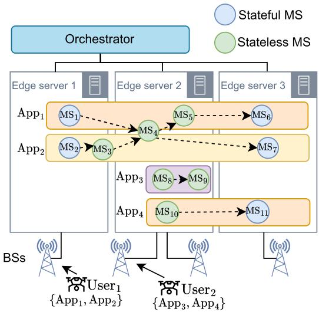

Fig. 1. Exemplary target scenario: Apps are deployed at the edge as chains of stateful / stateless MSs. Mobile users (i.e., UAVs) access the Apps through cellular BSs, with User1 (User2) requesting App –App (App –App ).  
  
Fig. 2. Open radio cell location (left) and edge server topology (right) in the city of Turin, Italy.

## B. Testbed

We have recreated the above system architecture in our testbed for the development and testing of our solution. Notably, we have used the approach in [31] to design edge server topologies and the open radio cell information available for the geographical area we consider (namely, an area in the city of Turin, Italy) in OpenCelliD (https:// www.opencellid.org/) (Fig. 2 (left)). We clustered the radio cells into 4 clusters using the K-means algorithm and deployed one edge server at the geographical center of each cluster (Fig. 2 (right)). To limit the number of physical links, we consider 1 Gbps optical links only between edge servers that are within a 3 km distance. Also, to ensure enough bandwidth for multi-hop communication between edge servers through logical links, we slice the bandwidth of inter-server physical links so that 60% is used for direct communication and the rest for multi-hop communication. The radio cells within a cluster are viewed as a virtual BS that is co-located with the edge server, and the communication bandwidth between the mobile user and the BS is estimated based on the 3GPP TS 38.306 standard [32] with the channel quality indicator (CQI) being negatively correlated with the user-BS distance.

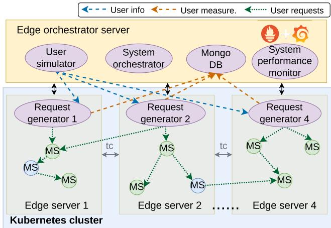  
Fig. 3. Edge system emulation testbed.

We have implemented the emulation testbed of this edge computing system using Kubernetes (https://kubernetes.io/) as depicted in Fig. 3. We use Kind (https://kind.sigs.k8s.io/) to create an edge cluster of 8 edge nodes on a host server, with each node featuring 2 CPU cores at 2.8GHz and 4GB of memory. The communication bandwidth between edge nodes is set through the tc Linux tool (https://man7.org/linux/manpages/man8/tc.8.html) We use the host server as the edge orchestrator node, and deploy four main components of our testbed: (i) User simulator, which simulates the mobile users movement and estimates the communication bandwidth to the connected BS; (ii) System orchestrator, which runs the real-time edge orchestration algorithm and updates the MS deployments via native Kubernetes API; (iii) System performance monitor, which monitors the resource consumption on each edge nodes using Prometheus (https://prometheus.io/) and visualize the measurements via Grafana (https://grafana.com/); and (iv) Mongo DB, which is a database that stores the user measurements and logs for analysis. On each edge node, we deploy a request generator, which produces application requests on behalf of users connected to the corresponding BS, informed by the User Simulator. The measurements of each request, including application quality and response latency, are persisted in MongoDB. Finally, we leverage the customized HydraGen tool [33] to generate emulated applications with MS quality selectors, enabling comprehensive validation of the dynamic edge orchestration strategies.

## IV. EXPERIMENTAL ANALYSIS

We now use our testbed to empirically analyze the trade-ofs that exist in the system and that are afected by orchestration decisions on MS deployment. The considered trade-ofs address two main aspects: (i) the mobile user quality of experience (QoE), represented as average App response latency,

App QoS, and user request success rate, and (ii) the eficiency of the App deployment solution, i.e., edge server resource consumption, edge server load balancing, and the edge system capability to serve multiple users.

To ease the analysis, we consider here a base scenario1 with one mobile user, namely, a UAV, requesting an App and moving at the constant speed of 10 m/s along a 5 kmlong straight trajectory. Along the trajectory, 3 BSs (and corresponding edge servers) are placed at equal distance. The SNR varies depending on the user distance from the BS to which it is connected and varies in the [4 24] dB range, which corresponds to a CQI varying between [5 15]. Also, the edge server colocated with the first BS has 5 CPU cores available, while the other two have just 2 CPU cores each. The communication bandwidth between edge servers is set to 1 Gbps, except for the link between the edge server with 5 CPU cores and one of the edge servers with 2 CPU cores, which is set to 100 Mbps to account for a varying capacity over the network. When the mobile user connects to a BS, by default the BS allocates 6 RBs for the communication with the user. The mobile user issues 1 request/s for an App composed of 3 MSs. Each request has the size of 5 MB, and the inter-MS communication payload size is 5 MB. Every MS can be deployed in one of three possible versions, with each version corresponding to a diferent quality level, namely, low, medium, and high, consuming 0.25, 0.5, and 0 75 109 CPU cycles (resp.), to process one user request. Unless otherwise specified, we allocate 1 CPU core for each MS when it is deployed on the edge system. Finally, we set the target App response latency to 1 s. For simplicity, the migration/relocation time and the amount of data to transfer for each MS migration/relocation is considered to be constant across the diferent instances of that MS, and multiple MSs can be migrated/relocated in parallel, thus the overall App downtime equals the duration of the slowest MS migration/relocation. For each considered baseline, we run a system emulation lasting 30 minutes and resulting in 12 handovers.

At every user handover, the orchestrator reassesses the current Apps deployment and makes changes according to the following three MS deployment schemes (hereinafter also referred to as baselines), representative of the main strategies that have been proposed in the existing literature [34]:

• App-level closest deployment (ALC). It deploys MSs belonging to the same App on the same edge server, selecting the closest server to the mobile user that requests the App.

• MS-level closest deployment (MLC). It deploys each MS of an App on the edge server that is closest to the mobile user among those with room to host the MS. For low computing load, the deployment coincides with of the App-level closest strategy.

• MS-level closest-least-loaded deployment (MCLL). It deploys each MS of an App on the least loaded server; in the case of ties, it selects the one closest to the mobile user.

Next, we use the three strategies above to investigate the fundamental trade-ofs that exist in the system under study and establish the motivation of our work.

1. App response latency vs. RB usage. Fig. 4a presents the average App response latency as a function of the number of RBs allocated to the mobile user, with the violin plot highlighting the distribution of the App latency measurements. As expected, under all three deployment strategies, the average response latency decreases significantly, up to 40%, as the RB allocation to the UAV grows, i.e., the user’s data rate increases. Among the three baseline strategies, MLC always performs best. Specifically, the latency target (horizontal black line) for ALC, MLC, and MCLL strategies are satisfied when allocating at least 5 RBs, 4 RBs, and 7 RBs, respectively. However, the latency distributions (violin plots) reveal considerable variability: even when the average latency meets the target, some responses (ALC: 33%, MLC: 23%, MCLL: 45%) still exceed it. This highlights the critical impact of variable bandwidth due to the user mobility and channel conditions, which must be managed carefully for latency-sensitive applications.

2. App response latency vs. CPU usage. Fig. 4b illustrates the average App response latency and the corresponding distribution versus the per-MS CPU allocation. Similarly, Fig. 4c depicts the average CPU usage in the edge system as a function of the allocated per-MS CPU. As expected, increasing the per-MS CPU allocation reduces by up to 40% the App response latency under all strategies. Notice that such an increased CPU allocation leads to 15–55% higher CPU usage, depending on the deployment strategy. Also, due to the imbalanced edge server capacity and the diferent MS placement strategies of the baselines, the increase of the average CPU usage is not always linear (Fig. 4c), and the per-MS CPU allocation significantly influences a strategy performance (Fig. 4b). When allocating fewer than 1.2 CPU cores for each MS, MLC yields the lowest latency. From 1.2 to 1.6 CPU cores, instead, ALC performs best. However, beyond 1.6 cores, the ALC strategy becomes unable to yield a feasible deployment, as no single edge server can accommodate all the MSs, and MLC becomes the best strategy again. Furthermore, to ensure that the average App response latency meets the target, at least 0.8 CPU cores/MS are required when MLC or ALC are adopted, and 1 CPU core/MS is required when MCLL is used. The violin plot in Fig. 4b underscores that, as the CPU allocation grows, the response latency rarely exceeds the target, specifically, with probability 16% and 18% for MLC and MCLL, respectively, when 2 cores per MS are allocated, and with probability 16% for ALC in the case of 1.6 per-MS core allocation. Importantly, this is because the faster the MS processing, the larger the communication latency margin to mitigate the efects of bandwidth variation due to the high user mobility.

3. CPU usage vs. Load balancing. Next, we look at the trade-of between average CPU usage and load balance across edge servers. Table II presents the average standard deviation of CPU usage, calculated as the average of the standard deviation of the edge servers’ load at each measurement time instance. Fig. 4c highlights that ALC and MCLL achieve, respectively, the lowest and the highest average CPU usage.

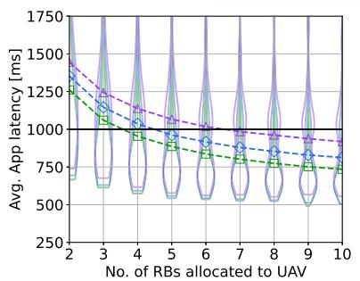  
(a)

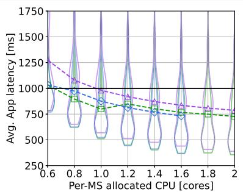  
(b)

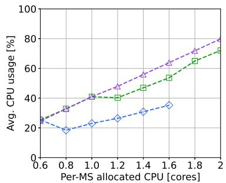  
(c)

Fig. 4. Average app response latency for a varying number of allocated RBs (a); Average app response latency (b) and Average edge system CPU usage (c) for a varying per-MS CPU core allocation. The performance is shown under the three baseline orchestration algorithms, namely, ALC, MLC, and MCLL.  
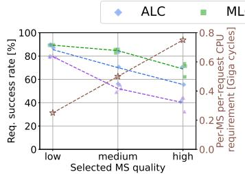  
(a) 1 CPU, 6 RBs

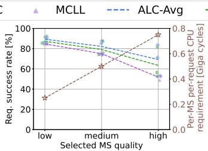  
(b) 1.5 CPU, 6 RBs

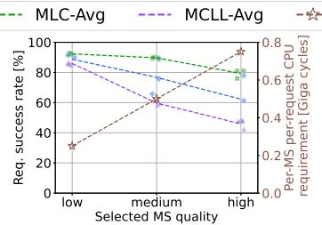  
(c) 1 CPU, 9 RBs

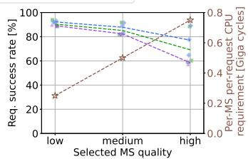  
(d) 1.5 CPU, 9 RBs  
Fig. 5. User request success rate and per-MS per-request CPU demand as functions of selected MS quality, under diferent per-MS CPU allocation and per-User RB allocation CPU and RB allocations for the three baseline algorithms.

TABLE II  
AVERAGE STANDARD DEVIATION OF EDGE SERVERS’ LOAD

<table><tr><td>Per-MS allocated CPU cores</td><td>ALC</td><td>MLC</td><td>MCLL</td></tr><tr><td>0.6</td><td>44.03%</td><td>43.91%</td><td>14.60%</td></tr><tr><td>1</td><td>36.17%</td><td>46.33%</td><td>20.61%</td></tr><tr><td>1.4</td><td>46.04%</td><td>32.04%</td><td>24.23%</td></tr><tr><td>1.8</td><td>-</td><td>37.50%</td><td>31.13%</td></tr></table>

Conversely, the results in Table II underline that MCLL consistently gives the lowest average standard deviation, i.e., the most balanced load distribution across the edge servers. This highlights that there is a clear trade-of between overall CPU utilization and load balance.

4. MS quality vs. Request success rate. For critical applications, it is crucial to ensure an App request success rate, which is computed here as the percentage of requests that can be served honoring the 1 s-target response latency over the total number of requests. Fig. 5 shows the request success rate (left y-axis) and per-MS per-request CPU cycle requirement (right y-axis) as the MS quality varies. The diferent plots depict the results for diferent combinations of BS-user RB allocation and per-MS CPU allocation. In all scenarios, as a higher MS quality level is selected, the per-MS per-request CPU cycle demand grows, resulting in longer processing times and, hence, decreasing success rate. Also, the comparison of Fig. 5a with Fig. 5c highlights a 5%–10% improvement in request success rate across all MS quality levels and baselines, indicating a consistent benefit from increased RB allocation. These results underscore the importance of being able to adapt the MSs (hence, the App) quality level to the network and computing resource availability. Also, the trade-of between success rate and resource consumption depends substantially in the deployment strategy. In more detail, looking at Fig. 5a and Fig. 5b, one can observe up to 20% increase in the request success rate, especially when medium or high quality MSs are selected under the ALC and MCLL strategies. Further, comparing Fig. 5a and Fig. 5d, we observe that the change of CPU and RB allocations impact the performance significantly in the case of medium and high quality MSs, but have a minor impact for the low quality MSs.

5. MS sharing and quality levels vs. Users’ success rate. Finally, we explore the trade-of between the level of MS sharing, the level of MS quality, and the ability to successfully serve users’ requests. For consistency, we consider the same settings for all mobile users, except for their initial position as they are uniformly distributed along the service area. Fig. 6a and Fig. 6b show the average request success rate when medium quality MSs are selected, and, respectively, none of the MSs and all common MSs, are shared among the users. Further, Fig. 6c and Fig. 6d present the average request success rate when, respectively, low and high quality MSs are selected and common MSs are shared among the users. In all the considered settings, the results indicate that the MLC and MCLL strategies can consistently support a higher number of users compared to ALC. When comparing Fig. 6a and Fig. 6b, one can notice that MS sharing substantially increases the number of users the edge can accommodate–up to 3 additional users for ALC and up to 5 for MLC and MCLL. However, for more than 3 users, the average request success rate slightly decreases due to the increased queuing time of the requests at the shared MS, which leads to increasingly larger App response latency.

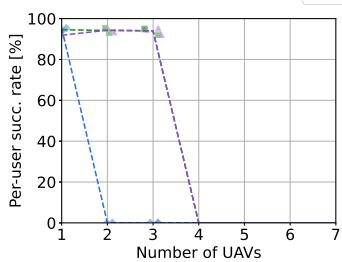  
(a) Medium quality, not shared

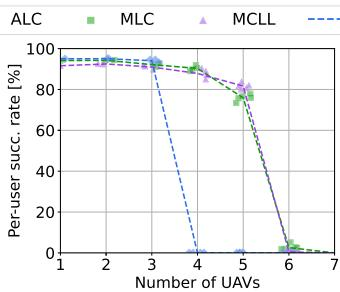  
(b) Medium quality, shared

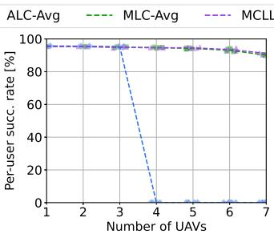  
(c) Low quality, shared

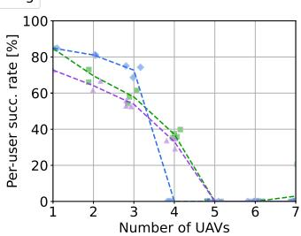  
(d) High quality, shared  
Fig. 6. Average per-user request success rate when diferent quality of MSs are used and the same MSs are shared/not shared among the users. The performance is shown under the three baseline algorithms.

Importantly, there is an additional degree of freedom that can be combined with shareability. Looking at Fig. 6b and Fig. 6c, we observe that selecting low-quality MSs further expands the edge’s ability to accommodate users (up to 7) under the MLC and MCLL strategies while still ensuring high success rates. Instead, the comparison between Fig. 6b and Fig. 6d underlines that selecting high-quality MSs significantly reduces the request success rates, even with few UAVs. Thus, sharing MSs along with a sensible selection of MS quality (possibly favoring lower quality) substantially increases the edge ability to successfully serve users’ requests.

Summary and major findings. Our experimental analysis clearly shows that eficiently orchestrating MS deployment or relocation at the edge is a complex, multi-faceted challenge—one that cannot be solved with simplistic or static strategies. This complexity arises from the interplay of multiple factors, including computing resource allocation, MS quality selection, bandwidth provisioning, MS sharing policies, and load balancing mechanisms. These factors jointly determine the system’s ability to support mobile applications both reliably and eficiently.

Notably, our results reveal that:

(i) Resource–QoE alignment is essential: bandwidth and computing resources must be dynamically allocated in accordance with user QoE requirements, particularly under fluctuating channel conditions.

(ii) Distributed MS placement boosts scalability: deploying the MSs that compose an application across diferent edge servers can substantially increase the number of users served without compromising QoE.

(iii) Adaptive sharing and quality adjustment enhance resilience: system performance can be further improved by sharing common MSs across multiple applications and, when resources are constrained, switching to lower-quality App versions—provided that QoE remains acceptable.

(iv) No one-size-fits-all strategy exists: the optimal approach depends on the prevailing system constraints, operational conditions, and specific application requirements.

Furthermore, our findings underscore that performance is highly sensitive to the real-time state of the edge system, making static management schemes inherently limited. It is therefore crucial to adopt flexible, adaptive orchestration solutions that can respond to system dynamics in real time, managing the inherent trade-ofs between application performance and operational costs.

## V. SYSTEM MODEL AND TIME PERFORMANCE METRICS

This section outlines the key assumptions made to build a mathematically tractable, yet accurate, model. Then it gives analytical expressions for the two performance metrics, i.e., App response latency and App downtime.

## A. Assumptions

To build a model that captures all relevant system aspects while retaining tractability without loss of generality, we make the following assumptions:

• Edge server and base stations: Each BS is co-located with an edge server, thus we refer to the user-edge server link as the wireless link between the user and the corresponding BS.

• MS deployment: An App entry MS is placed on the edge server co-located with the BS serving the requesting user.

• MS migration/relocation: The orchestrator may decide to change the MS deployment topology upon a user’s handover, App request arrival, or App termination; such deployment remains unchanged until the next occurrence of these events.

• MS version: MS instances implementing diferent versions of the MS (i.e., providing diferent levels of QoS) have the same communication interfaces. Further, notice that, at the beginning of a migration procedure, stateless MSs can switch to diferent versions according to the available resources at the destination server. Conversely, stateful MSs cannot change version during migration, due to their need to retain user-specific state information.

• MS shareability: Recall that stateless MSs can be shared among Apps requested by diferent users. Conversely, stateful MSs can always be shared among the Apps requested by the same user but may or may not be shared between diferent users, depending on whether their state contains user-specific information.

• App termination: The App termination events are triggered when an App completes all its assigned tasks, or when operational conditions require termination. For example, when a UAV completes its assigned tasks or returns to its base, it triggers an App termination event at the orchestrator.

## B. System Model and Time Performance Metrics

Consider an edge system consisting of a set S of servers available to serve users. Every server is equipped with computational capacity (memory $M _ { s } , \mathrm { C P U } ~ C _ { s } )$ and co-located with a BS that enables connectivity with mobile users. These edge servers are interconnected through a multi-hop wired network infrastructure.

Each mobile user u, u∈U, generates requests for Apps, whose set is denoted by Au, that need to be deployed on these servers. As they move, users may connect with diferent BSs using an allocated bandwidth $B _ { u , s } ,$ , and each App request must be served within a specified target delay, $l _ { \mathcal { A } _ { j } } .$ , to ensure quality of service. Apps are composed of chains of MSs, where each MS performs a specific function in the application workflow. Each MS can be deployed in diferent quality versions $( q \in \mathcal { Q } _ { n } )$ depending on resource availability and performance requirements. To serve a single request, each MS version demands specific CPU cycles $( \tau _ { n , q } )$ and memory $( \mu _ { n , q } )$ resources. When multiple users request the same application, multiple instances of the same MS version may need to be deployed across the system.

As users move throughout the coverage area and network conditions change, the system dynamically migrates MSs between servers to maintain optimal performance and meet target delay requirements. During this migration process, the total application downtime, which consists of the downtime of its individual MSs, must be within an acceptable limit $D _ { \mathcal { A } _ { j } }$

The system model components and their notation, with their associated parameters and variables, are summarized in Table III. Notice that, for convenience, we define a dummy server, s0, hosting virtually all possible MSs instances that may need to be deployed to provide an App.

The App response latency experienced by user u requesting for the App Aj consists of two contributions: (i) the processing latency of individual MSs composing the App $( \bar { d } _ { u , \mathcal { A } _ { i } } ^ { \mathrm { p r o c } } )$ , and (ii) the communication latency between two successive MSs, and between user u and the entry MS of the App $\mathcal { A } _ { j } ~ ( d _ { u , A _ { i } } ^ { \mathrm { c o m } } )$ . The processing latency accounts for the CPU demand of each MS version weighted by the load from all users sharing the same MS instance, normalized by the allocated CPU cycles/s. The communication latency captures both the wireless transmission delay between the user and its associated BS, and the inter-server link delays incurred when consecutive MSs of the same App are deployed on diferent servers. The formal expressions for all mathematical equations are reported in Appendix A.

Next, we derive the expression of an App downtime due to the migration or relocation of any of its composing MSs. Since MSs are containerized, MS migration/relocation can be generalized to container migration/relocation. According to the statefulness and shareability of the MSs, three types of procedures can be used:

LIST OF SYMBOLS REPRESENTING SYSTEM COMPONENTS AND THEIR DESCRIPTIONS  
TABLE III

<table><tr><td>Symbol</td><td>Description</td></tr><tr><td colspan="2">Parameters for Servers</td></tr><tr><td> $\mathcal{S}$ </td><td>Set of available servers</td></tr><tr><td> $M_s$ </td><td>Memory capacity of server s [bytes]</td></tr><tr><td> $C_s$ </td><td>Computation capacity of server s [CPU cycles/s]</td></tr><tr><td> $V_s$ </td><td>Max. no. of RBs available at co-located BS of server s</td></tr><tr><td> $s_0$ </td><td>Dummy server hosting virtually all possible MSs instances that may need to be actually deployed</td></tr><tr><td colspan="2">Parameters for Users</td></tr><tr><td> $\mathcal{U}$ </td><td>Set of available users</td></tr><tr><td> $B_{u,s}$ </td><td>Allocated bandwidth between user u and server s [bytes/s]</td></tr><tr><td> $\mathcal{A}^u$ </td><td>Set of Apps requested by user u</td></tr><tr><td colspan="2">Parameters for Apps</td></tr><tr><td> $\mathcal{A}$ </td><td>Set of available Apps</td></tr><tr><td> $\rho_{\mathcal{A}_j}^u$ </td><td>No. of active requests from user u to App  $\mathcal{A}_j$ </td></tr><tr><td> $l_{\mathcal{A}_j}$ </td><td>Tolerable latency for App  $\mathcal{A}_j$  [s]</td></tr><tr><td> $\eta_{\mathcal{A}_j}$ </td><td>Average size of packet entering App  $\mathcal{A}_j$  (bytes)</td></tr><tr><td> $D_{\mathcal{A}_j}$ </td><td>Max. tolerable downtime for App  $\mathcal{A}_j$  [s]</td></tr><tr><td colspan="2">Parameters for MSs</td></tr><tr><td> $\mathcal{N}$ </td><td>Set of available MSs</td></tr><tr><td> $\mathcal{Q}_n$ </td><td>Set of possible versions of MS n</td></tr><tr><td> $a_n$ </td><td>Set to 1 if MS n is stateful</td></tr><tr><td> $b_n$ </td><td>Set to 1 if MS n is shareable</td></tr><tr><td> $\mu_{n,q}$ </td><td>Required memory of MS n of version q [bytes]</td></tr><tr><td> $\tau_{n,q}$ </td><td>Required computation of MS n of version q [CPU cycles]</td></tr><tr><td> $r_n^q$ </td><td>Norm. dirty page rate of MS n of version q</td></tr><tr><td> $e_{mn}$ </td><td>Avg. message size between MS m and MS n [bytes]</td></tr><tr><td> $w_{s,i}^{n,q}$ </td><td>Set to 1 if instance i of MS n of version q is deployed on server s, 0 else</td></tr><tr><td> $x_{u,i}^{n,q}$ </td><td>Set to 1 if user u is served by instance i of MS n of version q, 0 else</td></tr><tr><td colspan="2">Decision Variables</td></tr><tr><td> $y_{s,i}^{n,q}$ </td><td>Binary, indicating whether instance i of MS n of version q is deployed on server s</td></tr><tr><td> $z_{u,i}^{n,q}$ </td><td>Binary, indicating whether user u is served by instance i of MS n of version q</td></tr><tr><td> $\hat{\tau}_{n,q}^i$ </td><td>Continuous, denotes allocated CPU to instance i of MS n of version q (CPU cycles/s)</td></tr><tr><td> $v_{u,s}$ </td><td>Integer, denotes allocated RBs between user u and server s</td></tr></table>

• Stateless relocation: It includes three steps: (1) create a new instance of the stateless MS container at the destination host, (2) redirect the requests to the new container instance, and (3) shut down the old instance at the source host.

• Stateful migration: It includes 6 steps: (1) checkpoint the running container at the source host, thus collecting both the MS state and the established connection state; (2) clear the network namespace, thus preventing network configuration conflicts in the following steps; (3) transfer the checkpoint image from source to destination host; (4) re-create and configure the network namespace at the destination to match the original one; (5) update the network flow of the connection by redirecting it towards the new network namespace; (6) restore the container from the checkpoint image.

• User state migration: This may happen in two cases: (i) when multiple users are using the MS container at the source host, or (ii) when a container of the same MS type is already running at the destination host. In these cases, only the user’s state is transferred from the source to the destination host. It includes three steps: (1) extract the user’s active state from the container at the source host; (2) transfer this state to a running container of the same MS type at the destination host; (3) redirect the use ${ \bf \ddot { s } }$ request to the running container at the destination host.

Since an App may consist of multiple stateful and stateless MSs, we must guarantee that the $A p p$ downtime $D _ { u , A _ { j } } ^ { \mathrm { d o w n } }$ , including the downtime for stateless relocations, stateful migrations, and user state migrations of all its MSs, remains within the App’s tolerance limit. For simplicity and without loss of generality, we consider that all MS relocations/migrations (stateless relocations, stateful migrations, and user state migrations) are performed in parallel across all MSs of the $\operatorname { A p p }$ . We remark that the model can be easily modified to include other strategies as well, such as sequential MS migrations or hybrid approaches where some migrations are parallel while others are sequential. To prevent inter–edge-server link saturation during the parallel operation, we allocate enough bandwidth to each MS relocation/migration ensuring 50 Mbps data transfers.

Given the above assumption, for stateless MS containers, the introduced MS downtime is majorly at the container initiation phase, which is related to the size of the target container and the destination host characteristics. Thus, we define the stateless downtime of a single MS n at quality q being relocated to server s to be $d _ { s } ^ { n , q } { = } f _ { \mathrm { s t a t e l e s s } } ( \mu _ { n , q } , s )$ , where $f _ { \mathrm { s t a t e l e s s } } ( )$ is the function to estimate the stateless MS initiation time. Hence, the downtime of the stateless MSs within an App $A _ { j }$ requested by user u is given by the maximum of $d _ { s } ^ { n , q }$ over all MS instances $( \mathrm { i } . \mathrm { e } . , \ a _ { n } { = } 0 )$ that have been newly deployed on server s, serving user $u ,$ and belonging to App $A _ { j }$

For stateful MS containers, the migration downtime and state data volume can be modeled and estimated in realtime using the Processing-Aware Migration (PAM) model in [24]. Note that, for those stateful MS instances which are migrated from $s _ { 0 }$ (i.e., the dummy server hosting all possible MSs) to $s { > } 0 ,$ , the MS downtime $d _ { 0 , s } ^ { n , q }$ is considered to be equal to the stateless migration downtime. This is because stateful MS instances deployed on $s _ { 0 }$ do not retain user or session-specific data. We then define the downtime of the stateful MS n at quality $q ,$ migrating from server $s ^ { \prime }$ to $s ,$ to be $d _ { s ^ { \prime } , s } ^ { n , q } = f _ { \mathrm { s t a t e f u l } ( \mu _ { n , q } , r _ { n } ^ { q } , s ^ { \prime } , s , L _ { s ^ { \prime } s } ) } ,$ where $f _ { \mathrm { s t a t e f u l } }$ is the expression estimating the stateful migration downtime in PAM. In this case, the downtime of stateful MSs composing an $\mathsf { A p p } \ A _ { j }$ is given by the maximum of $d _ { s ^ { \prime } , s } ^ { n , q }$ over all stateful MS instances $( \mathrm { i . e . , } a _ { n } { = } 1 )$ that are being migrated from server $s ^ { \prime }$ to server $s ,$ serving user $u ,$ and belonging to App $A _ { j }$

In the case of user state migration of MS n of quality $q$ for user u, the MS downtime is defined as $d ^ { n , q } { = } f _ { \mathrm { s t a t e } } ( u )$ . The downtime due to such procedures for an App is given by the maximum of $d ^ { n , q }$ over all MS instances that are stateful and (i.e., $a _ { n } { = } 1 b _ { n } { = } 1 )$ , where state of user u is migrated from an existing instance $i ^ { \prime }$ at source server $s ^ { \prime }$ to a diferent instance i at destination server s, and the MS belongs to App $\mathscr { A } _ { j } .$

Finally, as all migration procedures (stateless, stateful, and user state) for all MSs are executed in parallel, the overall downtime for an App $A _ { j }$ requested by user u is defined as the maximum of stateless downtime, stateful migration downtime, and user state migration downtime.

## VI. MULTI-MICROSERVICE APPLICATION PLACEMENT PROBLEM

This section presents the MAP problem that the orchestrator has to solve whenever any of these three events occurs: (i) a user u sends a new request for App $A _ { j } ;$ (ii) a user u stops using App $A _ { j } ;$ (iii) user’s connection is handed over from one BS to another. Accordingly, we present below the problem formulation that optimizes the overall cost and QoS of the used Apps while meeting the system and App constraints, and then we characterize its time complexity.

For deploying the MSs composing an App, there will be a deployment cost which consists of two parts: resource allocation cost and communication cost. The former refers to the cost of allocating computing resources to the MSs of the requested Apps on the servers, while the latter captures the cost of the communication between the user and the edge server where the entry MSs of the requested Apps are deployed, and between any two successive MSs of the requested Apps if they are deployed on diferent servers. Denoting by $ { \mathbf { M C S } } _ { u }$ the modulation and coding scheme used by user u, the deployment cost is as follows:

$$
\begin{array}{l} C (y, z, \hat {\tau}, v) = \sum_ {n \in \mathcal {N}} \sum_ {q \in \mathcal {Q} _ {n}} \sum_ {i} \sum_ {s > 0} y _ {s, i} ^ {n, q} \Big \{\frac {\mu_ {n , q}}{M _ {s}} + \frac {\hat {\tau} _ {n , q} ^ {i}}{C _ {s}} \\ \qquad + \sum_ {u \in \mathcal {U}} \sum_ {\mathcal {A} _ {j} \in \mathcal {A}} z _ {u, i} ^ {n, q} \cdot \mathbb {1} _ {n = \mathcal {A} _ {j} [ 0 ]} \cdot \frac {B _ {u , s}}{V _ {s} \mathrm{MCS} _ {u}} \Big \}. \end{array}\tag{1}
$$

We define the QoS ofered by the App $A _ { j }$ to user u as the average normalized qualities of MS instances of the App $A _ { j }$ serving user u, i.e.,

$$
\alpha_ {u, \mathcal {A} _ {j}} (z) = \frac {\sum_ {n \in \mathcal {N}} \sum_ {q \in \mathcal {Q} _ {n}} \sum_ {i} \frac {q \cdot \mathbb {1} _ {n \in \mathcal {A} _ {j}} \cdot z _ {u , i} ^ {n , q}}{q _ {n , \max}}}{| \mathcal {A} _ {j} |}  .\tag{2}
$$

The average normalized QoS of all the Apps requested by user u and across all the users is given by, respectively,

$$
\alpha_ {u} (z) = \frac {\sum_ {\mathcal {A} _ {j} \in \mathcal {A} ^ {u}} \alpha_ {u , \mathcal {A} _ {j}}}{\sum_ {\mathcal {A} _ {j} \in \mathcal {A} ^ {u}} \mathbb {1} _ {\mathcal {A} _ {j} \in \mathcal {A}}}, \quad \text { and } \quad Q (z) = \frac {\sum_ {u \in \mathcal {U}} \alpha_ {u}}{| \mathcal {U} |}  .\tag{3}
$$

The formulation of the MAP problem, including the objective function (with $\beta ~ \in ~ [ 0 , 1 ]$ balancing cost and quality objectives) as well as the constraints, is reported in the below colored box.

## Multi-MS Application Placement (MAP) Problem

$$
\min _ {y, z, \hat {\tau} y} [ \beta \cdot C (y, z, \hat {\tau}, v) - (1 - \beta) \cdot Q (z) ]\tag{4a}
$$

The three categories of constraints are described below, with their mathematical formulation provided in Appendix B.

Apps constraints ensure that, for each user u requesting App $A _ { j }$ , both the end-to-end latency and the experienced downtime remain within their respective maximum tolerable values.

MSs constraints define the placement and assignment of MS instances across servers. Every instance of MS n of quality $q$ must be placed on exactly one server, while unused instances are assigned to a dummy server. For shareable MSs, at most one instance per server is allowed, since the orchestrator can dynamically scale the CPU allocation of that instance to handle trafic from multiple users, provided that the computing budget at the server hosting the MS is not exceeded. For non-shareable MSs, each deployed instance is exclusively assigned to a single user, and if a user u is already being served by such an instance, it continues to be served by the same instance in the new deployment topology, ensuring service continuity. Furthermore, a user can access only one instance of a specific MS at any given time, and the entry MSs of all Apps requested by the same user must be co-located on the same server.

System constraints ensure that the total memory, CPU, and radio resources allocated across all MS instances and users do not exceed the available capacity at each server.

To provide intuition on the formulation, consider a simple scenario where a user requests an App $\boldsymbol { A } _ { 1 }$ composed of two MSs, $n _ { 1 }$ and $n _ { 2 } ,$ deployed over two edge servers, $s _ { 1 }$ and $s _ { 2 } .$ Let $n _ { 1 }$ be stateless and $n _ { 2 }$ be stateful. The latency constraint captures the end-to-end delay of $\boldsymbol { A } _ { 1 }$ . For instance, if $n _ { 1 }$ is placed on $s _ { 1 }$ and $n _ { 2 }$ on $s _ { 2 } .$ the total latency includes user-to-s1 communication (decided by $\nu _ { u , s } )$ , processing at $n _ { 1 }$ (decided by CPU allocation to $n _ { 1 } )$ , inter-server communication between $s _ { 1 }$ and $s _ { 2 } ,$ and processing at $n _ { 2 }$ (decided by CPU allocation to $n _ { 2 } )$ , which must satisfy the latency bound. When the user moves (e.g., towards $s _ { 2 } ) .$ , migrating $n _ { 1 }$ to $s _ { 2 }$ may reduce communication delay, but introduces downtime. This is captured through constraints limiting the allowable service disruption. Consider a second user requesting another App that also requires $n _ { 1 }$ . Since $n _ { 1 }$ is stateless, it can be shared across the two users, avoiding redundant deployment. Instead, $n _ { 2 } .$ being stateful, may require a separate instance depending on user-specific state. This reflects the shareability constraints in the formulation. Finally, if multiple versions of an MS are available, selecting a lower-quality version reduces resource usage at the cost of higher processing, reflecting the tradeof captured in the formulation. This example illustrates how placement, resource allocation, and migration decisions are jointly constrained in the model.

Problem Complexity. The following theorem holds:

Theorem 1: The MAP problem is NP-hard.

Proof: We prove NP-hardness of the MAP problem by showing that the Multi Dimensional Bin Packing (MDBP) Problem [35], which is NP-hard, can be reduced to an instance of our placement problem in polynomial time. Consider a simplified version of our placement problem, where each App consists of a single, non shareable stateful MS. This simplified version is an instance of MDBP, which, given a set of multi-dimensional items, aims to pack the items into bins to minimize the number of used bins. Additionally, MDBP aims to achieve the above objective in such a way that the total size of the items in each dimension does not exceed the bin capacity. The mapping between MDBP and an instance of our placement problem can be performed in polynomial time by considering: (i) items are Apps, each with multiple dimensions, i.e., resource demand, experienced latency, and tolerable downtime; (ii) bins are servers and the number of used bins is the deployment cost; (iii) bin capacity along the various dimensions is the amount of available resources at the server, the $\mathrm { A p p ^ { \prime } s }$ target delay, and the $\mathrm { A p p ^ { \prime } s }$ maximum tolerable downtime. Thus, the thesis is proven. 

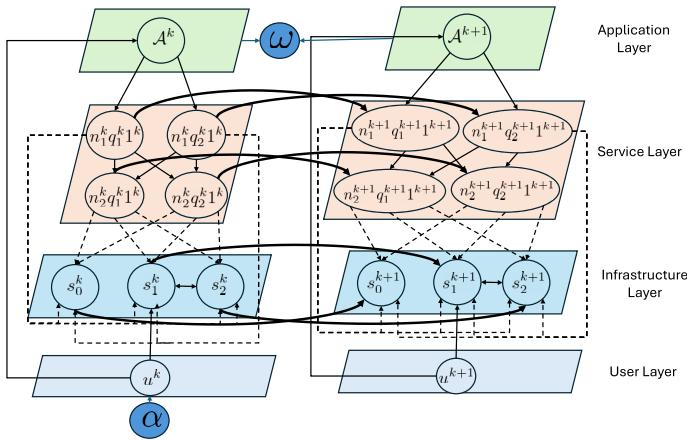  
Fig. 7. DNTG structure example with four hierarchical layers. From bottom to top: User layer (1 user), Infrastructure layer (2 edge servers plus the dummy server $s _ { 0 } ) _ { : }$ , Service layer (2 MS instances with quality variants), and App layer (1 App) across two consecutive frames $( k$ and $k { \overset { \cdot } { + } } 1 )$ . Virtual vertices (source) and (destination) are added to enable path-based optimization.

## VII. STEP ALGORITHM

In light of the complexity of the MAP problem, we introduce the low-complexity STEP (State and Topology-aware Edge-MS Placement), which, consistently with the MAP problem definition, runs at the orchestrator whenever a request for a new App is received, an App is terminated, or a user handover occurs. STEP includes three main steps. First, we create a multi-layer DNTG based on the BSs to which users are connected and the Apps they request (Sec. VII-A). Second, starting from the above DNTG, we build a (smaller) decision graph by retaining only those vertices that are relevant to service deployment decisions, thus ultimately reducing the decision-making complexity (Sec. VII-B). Third, to identify the set of feasible decisions and select the one that minimizes the deployment cost, we translate the decision graph into an expanded graph by embedding the weights in the decision graph into the vertices of the expanded graph (Sec. VII-C).

## A. DNTG Construction

The DNTG comprises four hierarchical layers that represent the key system components and their interactions, as depicted in Fig. 7. The bottom-most layer is the user layer, consisting of one vertex per user u∈U. The infrastructure layer (bottom) consists of one vertex per server $s { \in } S .$ . The service layer (top) represents the complete space of possible MS instances. Since each MS $n { \in } { \mathcal { N } }$ can be implemented in $q \in \mathcal { Q } _ { n }$ diferent quality versions with i possible instances, this layer includes a total of $\lvert \mathcal { N } \rvert \cdot \mathcal { Q } \cdot i$ vertices. Finally, the App layer (top-most) contain vertices presenting the App set A.

The purpose of the DNTG is to model all possible deployment choices of MSs for the Apps requested by the users. We identify the contact events between users and servers, indicating user connection handover events, as well as between users and Apps, indicating $\mathrm { A p p }$ request arrival or termination events. We refer to the time interval between any two successive contact events in the network as frame. Within a frame, neither the MSs deployment is changed nor links are created or removed. Let $F$ denote the number of frames present in the considered traces, and $\Delta t _ { k }$ is the duration of the generic frame k (1≤k≤F). All ongoing contact events during frame k are said to be active in that frame.

At frame k, each user u in the network is represented by a vertex $u ^ { k }$ in the user layer of the DNTG, while each edge server s is mapped onto the vertex $s ^ { k }$ in the infrastructure layer. The instance i of MS n of quality $q _ { n }$ at frame k is represented by a vertex $( n ^ { k } , q _ { n } ^ { k } , i ^ { k } )$ and $\mathsf { A p p } \ A _ { j }$ is mapped onto the vertex $\hat { \mathcal { A } } _ { j } ^ { k } .$ . Then let $\mathcal { U } ^ { k } , ~ \mathcal { S } ^ { k } , ~ \mathcal { D } ^ { k }$ , and $\mathcal { A } ^ { k }$ be the set of vertices representing, respectively, the users, edge servers, MS instances, and Apps in the DNTG at time frame $k .$

Within each frame $k ,$ the DNTG can contain the following directed edges connecting vertices corresponding to users, servers, MSs, or Apps (i.e., $u ^ { k } \in \mathcal { U } ^ { k } , s ^ { k } \in \bar { \mathcal { S } } ^ { k } , ( n ^ { k } , q _ { n } ^ { k } , i ^ { k } ) \in \mathcal { D } ^ { k }$ $\textstyle A _ { i } ^ { k } \in { \mathcal { A } } ^ { k } ) { \mathrm { : } }$

$( u ^ { k } , \mathcal { A } _ { i } ^ { k } )$ exists if user u has requested App $A _ { j } ;$ the weight $w ( u ^ { k } , \dot { \mathcal { A } } j ^ { k } )$ of this edge is equal to $( \eta _ { \mathcal { A } _ { j } } , \rho _ { \mathcal { A } _ { j } } ^ { u } ) ;$

$( u ^ { k } , s ^ { k } )$ exists if user u is connected to server s; its weight $w ( u ^ { k } , s ^ { k } )$ is set to $V _ { s } \mathbf { M C S } _ { u } ;$ ;

$( \mathcal { A } _ { i } ^ { k } , ( n ^ { k } , q _ { n } ^ { k } , i ^ { k } ) )$ exists if MS n is the entry MS of App $\mathcal { A } _ { i } ^ { k . }$ its the weight $w ( \mathcal { A } _ { i } ^ { k } , ( n ^ { k } , q _ { n } ^ { k } , i ^ { k } ) )$ is set to $( \eta _ { \mathcal { A } _ { j } } , \rho _ { \mathcal { A } _ { j } } ^ { u } ) ;$

$( ( \bar { n } ^ { k } , q _ { n } ^ { k } , i ^ { k } ) , ( m ^ { k } , q _ { m } ^ { k } , j ^ { k } ) )$ exists if both MS n and MS m are part of the same App and n communicates with $m ;$ the weight of this edge $w ( ( n ^ { k } , q _ { n } ^ { k } , i ^ { k } ) , ( m ^ { k } , q _ { m } ^ { k } , j ^ { k } ) )$ is set to $e _ { m n } ;$

$( s ^ { k } , { \hat { s } } ^ { k } )$ exists if there exists a wired network connection between servers $s _ { k }$ and ${ \hat { s } } _ { k } ;$ its weight is set to $\boldsymbol { B } _ { s , \hat { s } }$

Additionally, the following directed edges connect the vertices representing the same node across consecutive frames:

$( s ^ { k } , s ^ { k + 1 } )$ that connects server vertex $s ^ { k }$ at frame $k$ to server vertex $s ^ { k + 1 }$ at frame $k + 1$ . The weight here represents the remaining resources (CPU, memory, and resource blocks) at server s;

$( ( n ^ { k } , q _ { n } ^ { k } , i ^ { k } ) , ( n ^ { k + 1 } , q _ { n } ^ { k + 1 } , i ^ { k + 1 } ) )$ connecting MS instance vertex at frame k to its corresponding vertex at frame $k { + 1 }$ . The weight represents the properties of the container hosting that specific MS instance (e.g., dirty page rate);

$( \bar { \mathcal { A } } _ { j } ^ { k } , \bar { \mathcal { A } } _ { j } ^ { k + 1 } )$ connecting an App vertex at frame k to its corresponding vertex at frame $k + 1$ . The weight of this edge equals the deployment cost and QoS of the $\mathrm { A p p } \ A _ { j }$

Next, we use the above DNTG to formulate a min-cost problem, which allows for a low-complexity solution of the MAP problem. To this end, we add to the DNTG two virtual vertices, α and $\omega ,$ representing, respectively, the source and destination of a path over the graph. The graph is then completed with 0 weight edges $( \alpha , u ^ { 1 } )$ from α to any user vertex $u ^ { 1 } { \in } \mathcal { U } ^ { 1 }$ , and edges $( \mathcal { A } _ { j } ^ { k } , \omega )$ from any App vertex $\mathcal { A } _ { j } ^ { k }$ to ω, where 1≤k≤F.

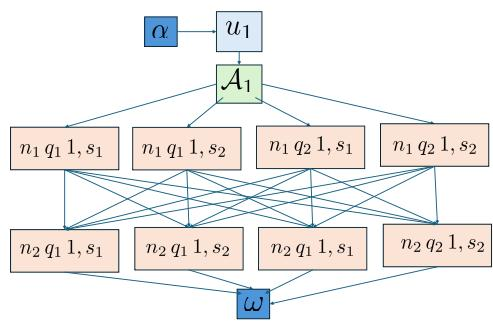  
Fig. 8. A sample decision graph for a single frame of DNTG in Fig. 7.

## B. The Decision Graph

For each frame of the DNTG, we construct a decision graph $G { = } ( V , E )$ that captures possible deployment decisions to meet the $\mathrm { A p p ^ { \prime } s }$ requirements while reducing the deployment cost. This graph is a simplified version of the corresponding DNTG frame, containing only the vertices from each layer that are relevant to the deployment decisions in that frame; for simplicity, we drop from the notation the dependency on the specific frame k.

As a preliminary step, we identify changes in the current frame compared to the previous one, with vertices included in $G$ varying based on the event type. For new App requests, G includes the requesting user $u ,$ the requested App $\mathcal { A } _ { j } ,$ its associated MSs, and servers with suficient resources for deployment. In contrast, for user migration or $\mathrm { A p p }$ termination events, G also includes all Apps requested by $u ,$ as the migration of an App may require the migration of MSs shared with other Apps, while termination necessitates CPU reallocation. To simplify the decision graph further, we merge the service and infrastructure layers of the DNTG frame into a deployment layer, where each vertex is represented as $( n , q _ { n } , i , s )$ , indicating that the i-th instance of MS n of quality $q _ { n }$ is deployed on server s, as shown in Fig. 8.

Further, for each vertex in this layer, we create replicas corresponding to predefined CPU allocations (e.g., $\{ 0 . 0 5 \mathrm { G } , 0 . 1 \mathrm { G } , 1 . 5 \mathrm { G } . . . \}$ cycles/s) and RB allocations $( \mathrm { e . g . }$ $\{ 1 , 2 , \ldots \} )$ , and these replica nodes are of the form $( n , q _ { n } , i , s , \hat { \tau } _ { n , q } ^ { i } , \nu _ { u , s } )$ . Thus, selecting a vertex in the deployment layer directly determines the MS instance, quality, server, allocated resources, as well as the associated deployment cost and service quality. To reduce the size of the decision graph, we consider only one unused instance per $( n , q _ { n } )$ and include only those already deployed instances that are eligible for reuse. This significantly reduces search space while preserving all feasible deployment decisions.

The above pruning steps directly determine how STEP scales with the number of users, MS instances, and edge servers. Since the decision graph is constructed locally for the afected user’s Apps only, its size remains proportional to the number of MS instances associated with the afected user and their requested Apps, rather than the total number of users or MS instances in the system. As the number of users grows, the number of MS instances eligible for sharing increases, causing a marginal expansion of the decision graph and a slight increase in decision time. Also, servers that cannot satisfy the App response latency constraint are excluded from the decision graph entirely, ensuring that increasing the number of edge servers does not significantly inflate the decision time.

Since certain deployment decisions in $G$ may violate MS shareability and entry MS placement constraints, we ensure feasibility by pruning $G$ as follows:

• For entry and non-entry MS vertices: Since entry MSs of Apps requested by a user must be placed on the same server, preferably the one to which user u is connected, we exclude vertices where server difers from the user’s connected server. Further, since entry MS vertices also represent RB allocations, we ignore those with $\nu _ { u , s } = 0$ Conversely, only non-entry MS vertices with $\nu _ { u , s } = 0$ are considered.

• Multiple MS instances on same server: If a server already has another instance of the same MS and quality, and the MS is shareable, we ignore additional instances of the same MS configuration on the same server to allow MS reusability.

Every generic edge $( \nu , \nu ^ { \prime } )$ in E has the following properties:

Response latency $D ( \nu , \nu ^ { \prime } ) \colon$ This represents the response latency contribution if the edge $( \nu , \nu ^ { \prime } )$ is included in the final deployment. By default, response latency is an additive constraint, i.e., summing the response latency attributes of all edges included in the final deployment yields the $\mathsf { A p p }$ response latency. $D ( \nu , \nu ^ { \prime } )$ is calculated as follows: (i) If v is an App vertex and $\nu ^ { \prime }$ is a deployment layer vertex, then $D ( \nu , \nu ^ { \prime } )$ is set to the sum of communication latency from the user to the entry MS of the App (based on RB allocation specified in $\nu ^ { \prime } )$ and processing latency of $\nu ^ { \prime }$ (based on CPU allocation specified in $\nu ^ { \prime } )$ (ii) If both v and $\nu ^ { \prime }$ are deployment layer vertices, then $D ( \nu , \nu ^ { \prime } )$ is set to the sum of communication latency if servers of v and $\nu ^ { \prime }$ are diferent and the processing latency of v0. (iii) If the edge $( \nu , \nu ^ { \prime } )$ is from user layer to App layer or from the last MS of the App to ω or from α to the user layer, the response latency is set to 0.

• Migration downtime $M ( \nu , \nu ^ { \prime } ) \colon$ It represents the contribution of edge $( \nu , \nu ^ { \prime } )$ to the $\mathrm { A p p ^ { \prime } s }$ migration downtime when foreseen in the final deployment. Unlike response latency, migration downtime is not directly an additive property, since migrations of MSs can be executed simultaneously, and the $\mathrm { A p p ^ { \prime } s }$ total migration downtime is determined by the maximum downtime among its MSs. We then convert migration downtime as an additive constraint by adopting an approach that flags violations rather than tracking cumulative contributions. For each edge $( \nu , \nu ^ { \prime } )$ , we define $M ( \nu , \nu ^ { \prime } ) { = } K$ if the downtime of the MS represented by $\nu ^ { \prime }$ exceeds the maximum allowed downtime $D _ { { \ r { A } _ { i } } }$ for the App and $M ( \nu , \nu ^ { \prime } ) { = } 0$ otherwise, where $K > 1$ . This transformation ensures any path containing at least one MS with downtime greater than the maximum allowed downtime will have a total migration downtime weight exceeding 1. Like before, if the edge $( \nu , \nu ^ { \prime } )$ is from user layer to App layer or from the App last MS to $\omega ,$ or from α to the user layer, migration downtime is set to $0 .$ Based on the above additive properties, for any generic edge $( \nu , \nu ^ { \prime } )$ of G for user u requesting $A _ { j }$ , we assign a multi-dimensional weight defined as:

$$
w (v, v ^ {\prime}) = \left(\frac {D (v , v ^ {\prime})}{l _ {\mathcal {A} _ {j}}}, M (v, v ^ {\prime})\right).\tag{5}
$$

C. The Expanded Graph: Guaranteeing Additive Constraints and Decision Feasibility

Given the decision graph for user u requesting App ${ \mathbf { } } A _ { j } ,$ we outline the procedure to find the set of feasible deployment decisions that meet the end-to-end performance constraints. Note that this procedure needs to be repeated for each App requested by user u in case of user migration or App termination events. Since finding a path between a source and destination vertex that satisfies two or more end-to-end constraints is NP-hard [36], we adopt the approach from [36], [37] to construct an expanded graph. We now describe the procedure to build such an expanded graph for our problem, given a positive integer resolution parameter $\gamma \mathrm { : }$

• For each vertex in the deployment and App layers of the decision graph, create $( \gamma + 1 ) ^ { 2 }$ corresponding vertices, where the exponent 2 reflects the number of additive constraints. We denote these vertices, whose number will be equal to the number of additive constraints, as $\nu ^ { 0 , 0 } , \nu ^ { 0 , 1 } , \cdot \cdot \cdot , \nu ^ { 0 , \gamma } , \cdot \cdot \cdot , \nu ^ { \gamma , \gamma }$

• For every generic edge (v v0) from App to deployment layer or within the deployment layer, create directed edges from each vertex $\nu ^ { i , j }$ to vertex $\triangleright ^ { i + \lceil \gamma w _ { 0 } ( \nu , \nu ^ { \prime } ) \rceil , j + \lceil \gamma w _ { 1 } \overline { { ( \nu , \nu ^ { \prime } ) } } \rceil } .$ , if such a vertex exists. Here, $w _ { 0 } ( \nu , \nu ^ { \prime } )$ and $w _ { 1 } ( \nu , \nu ^ { \prime } )$ represent response latency and migration downtime, respectively.

The weights present in the decision graph become embedded into the vertices of the expanded graph. This construction ensures that any path from α to ω in the expanded graph honors the considered additive constraints. Then to find the path that minimizes the deployment cost in addition to honoring the additive constraints, we define edge weights in the expanded graph as follows. For edges from App to the deployment layer or within the deployment layer, we associate each edge $( \nu , \nu ^ { \prime } )$ with the cost of deploying the MS associated with $\nu ^ { \prime } .$ . All other edges in the expanded graph have a weight of 0. To enable MS sharing, if the MS associated with the vertex $\nu ^ { \prime }$ is already deployed, we assign an edge weight of 0 to $( \nu , \nu ^ { \prime } )$ . Then we apply Dijkstra’s algorithm to such an expanded graph and find the minimum cost path.

As also noted in [37], a smaller value of $\gamma$ results in fewer vertices and paths in the expanded graph, introducing a quantization error that may lead to suboptimal solutions, since fewer levels of KPI target consumption can be distinguished. Conversely, a larger value of γ increases the number of vertices and paths explored, improving solution quality at the cost of a higher decision time. As γ increases, STEP can get arbitrarily close to the optimal solution within the decision graph, though larger values of $\gamma$ would lead to increased decision times.

CPU recalibration. After finding the minimum cost path for App $A _ { j }$ requested by user u (or the minimum cost paths for each $\mathrm { \normalfont { A p p } } \ \mathcal { A } _ { j } { \in } \mathcal { A } ^ { u }$ in case of migration or termination events), we perform an additional CPU recalibration step. Since we initially used a predefined set of CPU cycles/s allocations, the resulting CPU allocations in the deployment decision may not be optimal. In the recalibration phase, we fix all deployment decisions from the minimum-cost path, specifically the MS-to-server mappings, selected MS instances and versions for the users, and RB allocations to optimize only the CPU allocations. This transforms the problem into a convex optimization where we minimize the total CPU cost while ensuring that the response latency remains within the App’s requirement. This transformation makes the problem convex, hence solvable in polynomial time.

## VIII. PERFORMANCE EVALUATION

We first compare STEP against the optimum, the baseline algorithms described in Sec. IV, and state-of-the-art benchmarks introduced in Sec. VIII-A, in a small-scale scenario, which makes it feasible to compute the optimal. We then evaluate STEP and its alternatives in a large-scale scenario by implementing the solution provided by these schemes in our testbed and experimentally assessing their performance.

## A. Benchmarks

Among the benchmarks used in the small-scale scenario, the Optimal solution is obtained by solving the formulated MAP problem via the Gurobi solver, while the ALC, MLC, and MCLL baselines operate as discussed earlier in Sec. IV. In addition, we include the following two benchmarks:

• E2MS [10]: Minimizes a cost function consisting of service disruption cost during migration, communication cost, and image pull cost. It assumes non-shareable MSs, operates with a single fixed quality version for each MS, and does not support dynamic reuse or quality adaptation. Since E2MS can produce multiple solutions with identical optimal cost but diferent CPU allocations, we added upper bounds on CPU allocations. This prevents computationally expensive searches for minimal CPU usage and ensures a fair comparison with other methods.

• SR-CL [8]: A reinforcement learning-based approach that selects migration actions to minimize a reward function defined as the negative sum of migration delay, communication delay, and processing delay, and follows a convex optimization step for CPU allocation after placement decisions. Similar to E2MS, it does not support MS sharing across Apps or users and considers a single fixed quality version for each MS. Since SR-CL treats Apps as monolithic one-MS services only, we consider it only in the large-scale single-MS App deployment scenario, and exclude it from the multi-MS scenarios.

## B. Small-Scale Scenario

We focus on a scenario with four MSs: two stateless MSs, one stateful shareable MS, and one stateful non-shareable MS.

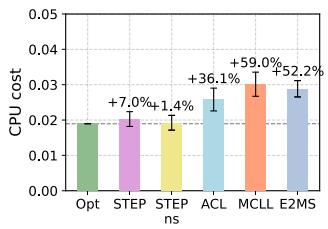

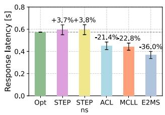

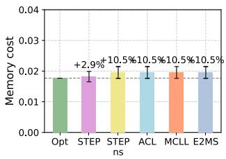

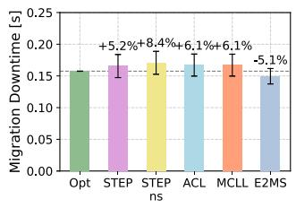  
Fig. 9. Small-scale scenario: Performance of optimal vs. STEP and benchmark solutions. CPU cost (top left), memory cost (top right), response latency (bottom left), migration downtime (bottom right).

These MSs are used to create four Apps, each composed of two MSs: $\mathrm { A p p } _ { 1 } ~ ( \mathrm { M S 1 } ~  \mathrm { M S 2 } ) , ~ \mathrm { A p p } _ { 2 } ~ ( \mathrm { M S 1 } ~  \mathrm { M S 3 } ) , ~ \mathrm { A p p } _ { 3 }$ (MS2 →MS3), and $\mathrm { A p p } _ { 4 } \ ( \mathrm { M S } 2  \mathrm { M S } 4 )$ . The system infrastructure includes four servers that can host the Apps MSs, serving four users; App requests follow a Poisson process. To evaluate our system’s performance under a high migration rate and load, we set the App request rate to 2 per unit time and the normalized load per App at 0.2, which yields a total system normalized load of 0.8. The user migration also follows a Poisson process with a rate of 4 migrations per unit time, allowing us to analyze the system’s behavior under a consistent user mobility pattern. For simplicity, we set $Q _ { n } { = } \{ 1 \}$ for each MS n $( \mathrm { i . e . , }$ , each MS can only have a single version), though multiple instances of the same MS can be deployed. We set the target response latency of each App to 1 s, and the maximum tolerable App downtime to 1 s. Other parameters, such as CPU cycle and memory requirements, and the migration downtime of the MSs are configured based on experimental values from our testbed. Notice that, since here we consider the server load to be low, both ALC and MLC result in the same deployment topology. Thus, we show only the ALC and MCLL baselines in the comparison. Also, in these baseline solutions, CPU and RB allocations are selected from a few predefined possible levels, while ensuring that the response latency of the deployed Apps does not exceed their required maximum value. We also evaluate STEP-ns, a variant of STEP with shareability disabled, to isolate the contribution of STEP’s resource allocation strategy from the system features it leverages, namely, MS shareability and multi-version quality selection.

During each event in the system, we measured various performance metrics and report the average over independent runs, along with the corresponding 95% confidence intervals. The percentage improvement or degradation is annotated relative to the Optimal solution. Fig. 9 (top left) shows the normalized CPU cost incurred while deploying the MSs of the requested Apps for the diferent approaches. Remarkably, STEP exhibits only a 7% increase in CPU cost compared to the Optimal, demonstrating eficient resource allocation. All other approaches have higher CPU costs than STEP and Optimal, since they do not optimize CPU allocations. STEPns achieves lower CPU cost than STEP because dedicated MS instances only need to satisfy the latency requirement of a single App, whereas shared instances require higher CPU allocation to satisfy multiple Apps simultaneously. Fig. 9 (top right) presents the normalized memory costs for deploying the MSs of the requested Apps. Since ALC, MCLL, and E2MS do not support sharing of MSs across diferent users or the Apps requested by the same user, they deploy a higher number of MSs, leading to a higher memory cost than Optimal and STEP. Importantly, the memory cost of STEP closely matches that of Optimal. STEP-ns incurs the same memory cost as the baselines because it deploys the same number of MS instances to serve user requests, without benefiting from shareability.

TABLE IV  
SENSITIVITY ANALYSIS OF γ: CPU COST & DECISION LATENCY

<table><tr><td>γ</td><td>CPU Cost</td><td>Decision Latency (ms)</td></tr><tr><td>3</td><td>0.0218 ± 0.0006</td><td>2.4 ± 0.2</td></tr><tr><td>9</td><td>0.0218 ± 0.0006</td><td>2.5 ± 0.2</td></tr></table>

As illustrated in Fig. 9 (bottom left), ALC and MCLL, and E2MS achieve lower response latency, but this comes at the cost of higher CPU consumption without providing a real advantage as all schemes can meet the Apps latency requirement of 1 s. Finally, Fig. 9 (bottom right) shows that also all downtimes are within the maximum tolerable downtime. E2MS achieves lower downtime because minimizing this metric is one of its objectives, while other approaches incur higher migration downtime compared to the optimal solution. Interestingly, STEP-ns incurs higher migration downtime than STEP because shareability reduces migration overhead: when the destination server already hosts a shared MS instance, stateless MSs require no migration, and stateful MSs only require data migration rather than full container migration.

To characterize the trade-of between solution quality and decision time, we evaluate STEP with $\gamma { = } 3 , 9$ in the smallscale scenario where the optimal solution can be computed. Table IV reports the deployment cost and decision latency for diferent $\gamma \mathrm { { s } }$ . Remarkably, STEP achieves near-optimal CPU cost already at γ=3, yielding stable values of both cost and decision latency across the tested values, with low computational overhead.

## C. Large-Scale Scenario

We now focus on a large-scale scenario with ten MSs: four stateless MSs (MS1, MS5, MS6, MS7), three stateful shareable MSs (MS2, MS3, MS4), and three stateful non-shareable MSs (MS8, MS9, MS10). Further, each MS has two quality levels (lower and higher, marked with level index 1 and 2). These MSs are used to create 6 Apps: $\mathrm { A p p } _ { 1 } { \cdot } \mathrm { A p p } _ { 6 }$ (the composition of the Apps will be mentioned later for the diferent test cases). Using our testbed (Sec. III), we also emulate up to 25 users (UAVs) moving along pre-defined paths in the edge system coverage area and request Apps with a rate of 1 request/s. The App-user relationship is as follows:

TABLE V  
STANDARD DEVIATION NORMALIZED TO THE AVERAGE OF EACH MEASUREMENT FOR 25 USERS (SINGLE-MS; MULTIPLE-MS)

<table><tr><td>Algo.</td><td>Latency [%]</td><td>CPU [%]</td><td>Memory [%]</td><td>RB [%]</td></tr><tr><td>STEP</td><td>22.46 ; 19.79</td><td>46.36 ; 33.34</td><td>30.88 ; 42.51</td><td>51.18 ; 51.03</td></tr><tr><td>ALC</td><td>23.03 ; 20.74</td><td>54.33 ; 64.67</td><td>51.33 ; 52.60</td><td>29.05 ; 28.99</td></tr><tr><td>MCLL</td><td>22.57 ; 20.33</td><td>50.04 ; 36.05</td><td>47.77 ; 49.42</td><td>27.84 ; 27.77</td></tr><tr><td>E2MS</td><td>18.16 ; 32.29</td><td>49.03 ; 41.66</td><td>47.99 ; 104.81</td><td>51.11 ; 51.03</td></tr><tr><td>SR-CL</td><td>17.91 ; -</td><td>53.48 ; -</td><td>49.58 ; -</td><td>64.74 ; -</td></tr></table>

$$
\operatorname{User} _ {1}, \operatorname{User} _ {7}, \operatorname{User} _ {1 3}, \operatorname{User} _ {1 9}, \operatorname{User} _ {2 5} \rightarrow \operatorname{App} _ {1}
$$

$$
\text { User } _ {2}, \text { User } _ {8}, \text { User } _ {1 4}, \text { User } _ {2 0} \rightarrow \text { App } _ {2}
$$

$$
\operatorname{User} _ {3}, \operatorname{User} _ {9}, \operatorname{User} _ {1 5}, \operatorname{User} _ {2 1} \rightarrow \operatorname{App} _ {3}
$$

$$
\operatorname{User} _ {4}, \operatorname{User} _ {1 0}, \operatorname{User} _ {1 6}, \operatorname{User} _ {2 2} \rightarrow \operatorname{App} _ {4}
$$

$$
\mathrm{User} _ {5}, \mathrm{User} _ {1 1}, \mathrm{User} _ {1 7}, \mathrm{User} _ {2 3} \rightarrow \mathrm{App} _ {5}
$$

$$
\operatorname{User} _ {6}, \operatorname{User} _ {1 2}, \operatorname{User} _ {1 8}, \operatorname{User} _ {2 4} \to \operatorname{App} _ {6}.
$$

As a user moves, the MCS used on the radio link between the user and the BS with which the user communicates varies, according to the user-BS distance. Also, a user always connects with the BS (and the edge server co-located with it) that ofers the best connectivity quality. Upon a handover, STEP (or the baseline algorithm used for comparison) is executed at the Kubernetes orchestrator for re-assessing the Apps deployment, and the orchestrator starts MS migration/relocation as needed. During an experiment, lasting 1,500 s, the rate of events that may cause changes in the MSs deployment (i.e., user arrival/handover/departure) is set to 3 events/min. For all Apps, we set the target response latency to 1 s and the maximum tolerable downtime to 2 s. Other parameters such as CPU cycle and memory requirements, as well as downtime of the MSs are configured based on the values measured in our testbed.

We first evaluate the orchestration performance when each App is composed of only one MS: App (MS1), App (MS2), App (MS3), App (MS4), App (MS5), and $\mathrm { A p p } _ { 6 }$ (MS6), and only the low quality level MS (quality index 1) can be used. In the test, we vary the number of users in the edge from 10 to 25 when STEP and the considered baseline algorithms are adopted, and show the average App response latency of each user in Fig. 10a. The average CPU, memory, and RB usage at each edge server are instead illustrated in Figures 10b, 10c, and 10d, respectively. To further highlight performance variability, Table V reports the normalized standard deviation of each metric in the 25-user case.

From Fig. 10a, we observe that in such a simple scenario all orchestration algorithms achieve a similar (low) value of latency (about 500 ms), well below the 1 s target maximum, thereby ensuring nearly 100% request success rate. Notably, ALC, MCLL, and SR-CL reduce latency by about 30 ms compared to STEP, but at the cost of 2.5% higher CPU usage and 15% higher RB usage (see Figures 10b and 10d). This highlights STEP’s advantage in balancing user experience with edge resource consumption. In addition, compared to E2MS,

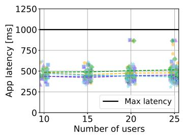  
(a) App response latency

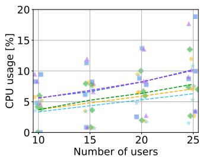  
(b) CPU

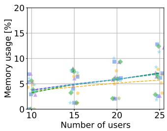  
(c) Memory

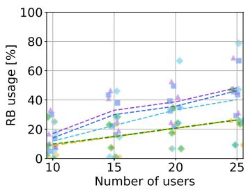  
(d) No. of RBs  
Fig. 10. Large-scale scenario with single-MS Apps: App response latency (a) of each user and CPU (b), Memory (c), and RB (d) usage of each edge server when the MS deployment is orchestrated by STEP or its alternatives. Each marker represents the averaged measurement for each user/edge server during emulation. The normalized standard deviation of each measurement in the case of 25 users is reported in Table V.

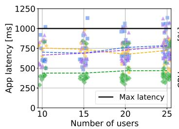  
(a) App response latency

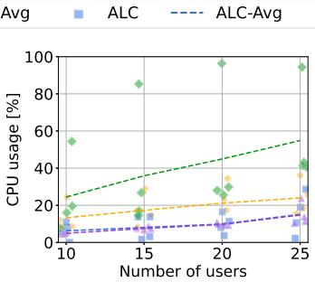  
(b) CPU

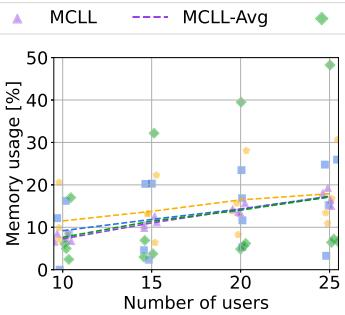  
(c) Memory

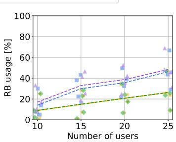  
(d) No. of RBs  
Fig. 11. Large-scale scenario with multiple-MS Apps: App response latency (a) of each user, and CPU (b), Memory (c), and RB (d) usage of each edg server when the MS deployment is orchestrated by STEP and its alternatives. Each marker represents the averaged measurement of each user/edge server during emulation. The normalized standard deviation of each measurement in the case of 25 users is reported in Table V.

STEP achieves on average 25 ms lower application latency and lower CPU usage, while consuming the same amount of RBs, demonstrating the superiority of STEP in MS placement. As shown in Fig. 10c, STEP reduces edge memory usage compared to the other schemes when the number of users at the edge is high, reflecting the benefits of its MS sharing capability. Finally, Table V provides additional insights into performance stability by presenting the standard deviation of the measured performance normalized to its average value. Looking at the single-MS App case, once can notice that, while SR-CL and E2MS achieve lower normalized standard deviation in user latency, they exhibit significantly higher variability in CPU, memory, and RB usage. This indicates less stable and less balanced resource allocation. In contrast, although STEP exhibits higher variability in radio resources occupation, it shows consistently moderate variability in latency, and significantly lower variability in CPU and memory consumption than all its alternatives.

Then we evaluate the orchestration performance of STEP when the composition of the Apps is complex: App1 (MS1 →MS2 →MS7), App (MS1 →MS3 →MS8), App (MS4 →MS6 →MS7), App (MS5 →MS6), App (MS7 →MS8), and App (MS9 →MS10), and each MS has two quality level options (indexed with 1 and 2). We remark that, since SR-CL can only orchestrate monolithic services composed of one MS only, it is excluded from this test. Similar to the previous tests, we vary the number of users served by the edge Apps from 10 to 25, and show the average App response latency of each user in Fig. 11a, and the average CPU, Memory, and RB usage of each edge server in Figures 11b, 11c, and 11d, respectively. Table V reports the normalized standard deviation of each metric in the 25-user case. To further clarify the performance diference of the considered schemes, Table VI presents the key orchestration performance metrics including the deployment cost C(y z τˆ v), average App quality Q(z), request success rate, and latency and App quality fairness (based on Jain’s fairness index).

Fig. 11a highlights that E2MS yields the lowest App response latency at around 450 ms, but at the expense of the highest CPU usage (Fig. 11b). STEP, ALC, and MCLL all achieve around 700 ms latency, yet their trade-ofs difer. On the one hand, STEP consumes about 10% more CPU and 1.7% more memory than ALC and MCLL (Figures 11b–11c), mainly because it prioritizes higher MS quality levels (as confirmed by the values in Table VI). On the other hand, STEP requires about 15% fewer RBs than ALC and MCLL (Fig. 11d). According to Table V, STEP achieves the lowest normalized standard deviation for user latency, and substantially lower CPU and memory usage in the case of 25 users, which again demonstrates robustness and stability of STEP in complex application scenario.

Overall, Table VI indicates that STEP consistently achieves the lowest deployment cost and highest App quality across all cases and exhibits the slowest cost increase as the number of users grows. Although STEP incurs a higher orchestration decision latency (on the order of tens of milliseconds), it achieves the lowest migration operation latency, resulting in an overall reduction of total orchestration time (decision + operation) by up to 20% compared to its alternatives. These results are consistent with the scalability properties of the decision graph construction discussed in Sec. VII-B. Moreover, STEP yields the smallest App downtime and the minimum number of migrated microservices per event, demonstrating its efectiveness in limiting service disruption and improving system stability. While E2MS excels in request success rate due to aggressive resource consumption, STEP achieves the second-best success rate (never falling below 90%), together with higher App quality. This comes at the cost of a slightly lower latency compared to the benchmarks, but still below the maximum tolerable value, and quality fairness that, however, results from the higher-quality MSs it yields.

TABLE VI  
LARGE-SCALE SCENARIO: ORCHESTRATION PERFORMANCE (β=0 5)

<table><tr><td>Index</td><td>|U|</td><td>STEP(β=0.5)</td><td>ALC</td><td>MCLL</td><td>E2MS</td></tr><tr><td rowspan="3">Avg. Dep. cost $C(y,z,\hat{\tau},v)$ </td><td>15</td><td> $1.84 \pm 0.12$ </td><td> $1.99 \pm 0.25$ </td><td> $2.05 \pm 0.12$ </td><td> $2.49 \pm 0.56$ </td></tr><tr><td>20</td><td> $2.33 \pm 0.15$ </td><td> $2.39 \pm 0.21$ </td><td> $2.51 \pm 0.11$ </td><td> $3.19 \pm 0.70$ </td></tr><tr><td>25</td><td> $2.68 \pm 0.13$ </td><td> $3.15 \pm 0.29$ </td><td> $3.21 \pm 0.10$ </td><td> $3.93 \pm 0.88$ </td></tr><tr><td rowspan="3">Avg. App quality level  $Q(z)$ </td><td>15</td><td> $1.52 \pm 0.12$ </td><td>1</td><td>1</td><td>1</td></tr><tr><td>20</td><td> $1.44 \pm 0.21$ </td><td>1</td><td>1</td><td>1</td></tr><tr><td>25</td><td> $1.49 \pm 0.19$ </td><td>1</td><td>1</td><td>1</td></tr><tr><td rowspan="3">Avg. orch. decision latency [ms]</td><td>15</td><td> $16.6 \pm 9.6$ </td><td> $1.3 \pm 0.6$ </td><td> $0.7 \pm 0.5$ </td><td> $13.1 \pm 8.5$ </td></tr><tr><td>20</td><td> $23.9 \pm 9.8$ </td><td> $0.7 \pm 0.5$ </td><td> $0.8 \pm 0.5$ </td><td> $15.6 \pm 10.3$ </td></tr><tr><td>25</td><td> $43.4 \pm 8.5$ </td><td> $0.6 \pm 0.2$ </td><td> $0.8 \pm 0.5$ </td><td> $23.2 \pm 30.5$ </td></tr><tr><td rowspan="3">Avg. orch. operation latency [s]</td><td>15</td><td> $0.37 \pm 0.43$ </td><td> $0.46 \pm 0.29$ </td><td> $0.47 \pm 0.30$ </td><td> $0.49 \pm 0.34$ </td></tr><tr><td>20</td><td> $0.38 \pm 0.42$ </td><td> $0.46 \pm 0.28$ </td><td> $0.46 \pm 0.30$ </td><td> $0.49 \pm 0.33$ </td></tr><tr><td>25</td><td> $0.34 \pm 0.41$ </td><td> $0.49 \pm 0.50$ </td><td> $0.57 \pm 0.29$ </td><td> $0.52 \pm 0.32$ </td></tr><tr><td rowspan="3">Avg. App downtime per-event [s]</td><td>15</td><td> $0.52 \pm 0.50$ </td><td> $0.69 \pm 0.39$ </td><td> $0.67 \pm 0.39$ </td><td> $0.60 \pm 0.37$ </td></tr><tr><td>20</td><td> $0.52 \pm 0.50$ </td><td> $0.68 \pm 0.39$ </td><td> $0.66 \pm 0.39$ </td><td> $0.61 \pm 0.37$ </td></tr><tr><td>25</td><td> $0.48 \pm 0.50$ </td><td> $0.74 \pm 0.38$ </td><td> $0.71 \pm 0.37$ </td><td> $0.63 \pm 0.34$ </td></tr><tr><td rowspan="3">Avg. num. mig. MS per-event</td><td>15</td><td> $0.62 \pm 0.63$ </td><td> $1.87 \pm 1.15$ </td><td> $1.76 \pm 1.15$ </td><td> $1.18 \pm 0.97$ </td></tr><tr><td>20</td><td> $0.61 \pm 0.63$ </td><td> $1.86 \pm 1.14$ </td><td> $1.71 \pm 1.14$ </td><td> $1.21 \pm 0.99$ </td></tr><tr><td>25</td><td> $0.57 \pm 0.63$ </td><td> $2.00 \pm 1.09$ </td><td> $1.74 \pm 1.10$ </td><td> $1.20 \pm 0.92$ </td></tr><tr><td rowspan="3">Request success rate</td><td>15</td><td>94.93%</td><td>93.87%</td><td>97.06%</td><td>99.74%</td></tr><tr><td>20</td><td>98.55%</td><td>89.72%</td><td>93.37%</td><td>97.02%</td></tr><tr><td>25</td><td>95.32%</td><td>85.23%</td><td>85.22%</td><td>97.78%</td></tr><tr><td rowspan="3">Latency fairness</td><td>15</td><td>0.95</td><td>0.95</td><td>0.96</td><td>0.95</td></tr><tr><td>20</td><td>0.95</td><td>0.95</td><td>0.96</td><td>0.91</td></tr><tr><td>25</td><td>0.94</td><td>0.95</td><td>0.97</td><td>0.93</td></tr><tr><td rowspan="3">App quality fairness</td><td>15</td><td>0.97</td><td>1</td><td>1</td><td>1</td></tr><tr><td>20</td><td>0.98</td><td>1</td><td>1</td><td>1</td></tr><tr><td>25</td><td>0.96</td><td>1</td><td>1</td><td>1</td></tr></table>

Moreover, to validate STEP’s orchestration performance in diferent application scenarios, we evaluate the impact of varying $\beta$ values in the objective function (4a). We recall that a larger $\beta$ places more emphasis on minimizing system resource usage, while a smaller β prioritizes user experience. The results in Table VII highlight that the average deployment cost $C ( y , z , \hat { r } , \nu )$ decreases as $\beta$ grows, with a reduction of up to 35.48%. A similar trend can be observed for CPU and memory usage, while RB usage remains nearly constant across diferent $\beta$ values. However, this improvement in resource eficiency comes at the expense of user performance, in which the average App quality decreases by up to 10%. This confirms that, through the $\beta$ weight in the objective, STEP can strike the desired trade-of between system eficiency and user experience.

TABLE VII  
LARGE-SCALE SCENARIO: ORCHESTRATION PERFORMANCE FOR 25 USERS AND VARYING β

<table><tr><td>β value</td><td>0.25</td><td>0.50</td><td>0.75</td><td>0.90</td></tr><tr><td>Avg. CPU usage [%]</td><td>24.03 ± 8.12</td><td>23.59 ± 8.31</td><td>8.69 ± 9.82</td><td>6.07 ± 9.47</td></tr><tr><td>Avg. Memory usage [%]</td><td>20.13 ± 7.84</td><td>19.85 ± 7.49</td><td>14.08 ± 8.96</td><td>13.06 ± 9.60</td></tr><tr><td>Avg. RB usage [%]</td><td>25.60 ± 8.34</td><td>25.59 ± 9.55</td><td>25.58 ± 8.64</td><td>25.99 ± 9.65</td></tr><tr><td>Avg. Dep. cost C(y,z,ˆ,v)</td><td>2.79 ± 0.15</td><td>2.68 ± 0.13</td><td>1.93 ± 0.18</td><td>1.8 ± 0.12</td></tr><tr><td>Avg. App quality Q(z)</td><td>1.50 ± 0.15</td><td>1.49 ± 0.15</td><td>1.44 ± 0.16</td><td>1.34 ± 0.10</td></tr></table>

In summary, STEP demonstrates robust orchestration eficiency across a variety of scenarios. In the case of simpler Apps compositions, it efectively balances latency with CPU, RB, and memory usage, outperforming baselines in overall resource eficiency. In the case of more complex Apps, STEP achieves the lowest deployment cost and consistently delivers high App quality with acceptable fairness, while maintaining competitive latency and success rates. These results confirm STEP’s ability to strike an excellent balance between user experience and system resource utilization, validating its suitability for large-scale multi-user edge environments.

## IX. CONCLUSION

We addressed the eficient management of composite Apps consisting of stateful and stateless MSs at the network edge. We formulated the MAP problem to minimize deployment costs while meeting performance constraints of the requested Apps and proved its NP-hardness. Our low complexity solution, STEP, exploits multi-layer DNTG to model deployment choices, and efectively increases the system performance by enabling MS shareability, CPU recalibration, and MS version adaptation. Evaluation on a small-scale scenario demonstrated STEP’s near-optimal performance with only 7% higher CPU cost, reduced memory and CPU costs compared to the baseline approaches. Large-scale Kubernetes cluster experiments further validated STEP’s eficiency, achieving up to 50% lower deployment costs than competing methods while delivering 50% higher the app quality and 15% lower radio resources.

An important real-world application of our framework is in edge-AI scenarios, where AI models are deployed as MSs at the edge and naturally exist in multiple versions, each ofering diferent levels of inference accuracy and resource demands. The ability of STEP to dynamically select MS versions based on available resources and QoS requirements makes it directly applicable to such scenarios. Future research directions include extending STEP to support proactive migration based on predicted user mobility, anticipating handover events, and predeploying MSs before they need to be used.

## APPENDIX A

## RESPONSE LATENCY AND MIGRATION DOWNTIME EXPRESSIONS

The processing latency and communication latency experienced by user u requesting App $A _ { j }$ are given by:

$$
\begin{array}{c} d _ {u, \mathcal {A} _ {j}} ^ {\mathrm{proc}} = \sum_ {n \in \mathcal {N}} \sum_ {q \in \mathcal {Q} _ {n}} \sum_ {i} \sum_ {s > 0} y _ {s, i} ^ {n, q} \cdot z _ {u, i} ^ {n, q} \cdot \mathbb {1} _ {n \in \mathcal {A} _ {j}} \\ \cdot \frac {\sum_ {u ^ {\prime} \in \mathcal {U}} \sum_ {\mathcal {A} _ {j ^ {\prime}} \in \mathcal {E}} z _ {u ^ {\prime} , i} ^ {n , q} \cdot \rho_ {\mathcal {A} _ {j ^ {\prime}}} ^ {u ^ {\prime}} \cdot \mathbb {1} _ {n \in \mathcal {A} _ {j ^ {\prime}}} \cdot \tau_ {n , q}}{\hat {\tau} _ {n , q} ^ {i}} \end{array}\tag{6}
$$

$$
\begin{array}{l}d_{u,\mathcal{A}_{j}}^{\mathrm{com}} = \sum_{n\in \mathcal{N}}\sum_{q\in \mathcal{Q}_{n}}\sum_{i}\sum_{s > 0}y_{s,i}^{n,q}\cdot z_{u,i}^{n,q}\cdot \mathbb{1}_{n = \mathcal{A}_{j}[0]}\Big\{\frac{\eta_{\mathcal{A}_{j}}\rho_{\mathcal{A}_{j}}^{u}}{B_{u,s}}\\ +\sum_{\substack{m\in \mathcal{N}\\ m\neq n}}\sum_{q^{\prime}\in \mathcal{Q}_{m}}\sum_{i^{\prime}}\sum_{\substack{s^{\prime} > 0\\ s\neq s^{\prime}}}y_{s^{\prime},i^{\prime}}^{m,q^{\prime}}\cdot z_{u,i^{\prime}}^{m,q^{\prime}}\cdot \mathbb{1}_{m\in \mathcal{A}_{j}}\cdot \mathbb{1}_{e_{mn} > 0}\cdot d_{s,s^{\prime}}\Big\} \end{array}\tag{7}
$$

where, $d _ { s , s ^ { \prime } }$ is the delay of the link between s and $s ^ { \prime } ,$ , i.e.,

$$
\begin{array}{l}d_{s,s^{\prime}} = \sum_{u\in \mathcal{U}}\sum_{\mathcal{A}_{j}\in \mathcal{A}}\sum_{\substack{m,n\in \mathcal{N}\\ m\neq n}}\sum_{\substack{q\in \mathcal{Q}_{n}\\ q^{\prime}\in \mathcal{Q}_{m}}}\sum_{i,i^{\prime}}y_{s,i}^{n,q}\cdot z_{u,i}^{n,q}\cdot y_{s^{\prime},i^{\prime}}^{m,q^{\prime}}\cdot z_{u,i^{\prime}}^{m,q^{\prime}}\\ \\ \cdot \mathbb{1}_{n\in \mathcal{A}_{j}}\cdot \mathbb{1}_{m\in \mathcal{A}_{j}}\cdot \frac{\rho_{\mathcal{A}_{j}}^{u}\cdot e_{mn}}{B_{s,s^{\prime}}}  . \end{array}\tag{8}
$$

Here, $B _ { s , s ^ { \prime } }$ represents Network bandwidth between two edge servers $s , s ^ { \prime }$ in bytes/s.

The downtime expressions for stateless relocation, stateful migration, and user state migration are respectively given by:

$$
\delta_{u,A_{j}}^{\text{stateless}}(t) = \max_{\substack{n\in N,q\in Q_{n}\\ s > 0,i}}d_{s}^{n,q}\cdot (1 - a_{n})\cdot
$$

$$
(1 - w _ {s, i} ^ {n, q}) \cdot y _ {s, i} ^ {n, q} \cdot z _ {u, i} ^ {n, q} \cdot \mathbb {1} _ {n \in \mathcal {A} _ {j}}.\tag{9}
$$

$$
\delta_{u,A_{j}}^{\text{stateful}}(t) = \max_{\substack{n\in N,q\in Q_{n},i\\ s^{\prime},s > 0,s\neq s^{\prime}}}d^{n,q}_{s^{\prime},s}\cdot a_{n}\cdot y^{n,q}_{s,i}\cdot w^{n,q}_{s^{\prime},i}\cdot z^{n,q}_{u,i}\cdot \mathbb{1}_{n\in \mathcal{A}_{j}}.\tag{10}
$$

$$
\begin{array}{rl} & {\delta_{u,\mathcal{A}_{j}}^{\mathrm{state}} = \max_{\substack{n\in \mathcal{N},q\in \mathcal{Q}_{n},\\ s^{\prime},s > 0,s\neq s^{\prime},i,i^{\prime},i\neq i^{\prime}}}d^{n,q}\cdot a_{n}\cdot b_{n}\cdot x_{u,i^{\prime}}^{n,q}\cdot w_{s^{\prime},i}^{n,q}\cdot y_{s,i}^{n,q}\cdot z_{u,i}^{n,q}}\\ & {\qquad \cdot \mathbb{1}_{n\in \mathcal{A}_{j}}.} \end{array}\tag{11}
$$

Finally overall App downtime is then:

$$
D _ {u, \mathcal {A} _ {j}} ^ {\text { down }} = \max [ \delta_ {u, \mathcal {A} _ {j}} ^ {\text { stateless }}, \delta_ {u, \mathcal {A} _ {j}} ^ {\text { stateful }}, \delta_ {u, \mathcal {A} _ {j}} ^ {\text { state }} ].\tag{12}
$$

## APPENDIX B

MATHEMATICAL FORMULATION OF MAP CONSTRAINTS

This appendix provides the full mathematical formulation of the constraints of the MAP problem introduced in Section V, organized into the three categories described therein.

App constraints: The constraints (13) and (14) ensure that the total delay and downtime of $A _ { j }$ for u are within their respective maximum tolerance level.

$$
d _ {u, \mathcal {A} _ {j}} ^ {\text { proc }} + d _ {u, \mathcal {A} _ {j}} ^ {\text { com }} \leq l _ {\mathcal {A} _ {j}}, \forall u \in \mathcal {U}, \forall \mathcal {A} _ {j} \in \mathcal {A} ^ {u}\tag{13}
$$

$$
D _ {u, \mathcal {A} _ {j}} ^ {\text { down }} <   D _ {\mathcal {A} _ {j}}, \forall u \in \mathcal {U}, \forall \mathcal {A} _ {j} \in \mathcal {A}.\tag{14}
$$

MSs constraints: Every instance of MS n of quality q must be placed, as guaranteed by Constraint (15), while unused instances of the MSs must be on the dummy server, as ensured by Constraint (16). If MS n is shareable among the Apps requested by diferent users, at most one instance of n per server is possible (Constraint (17)). If user u is served by an instance of a stateful non-shareable MS, constraint (18) ensures that it is served by the same MS instance in the new deployment topology. Constraint (19) ensures that if an instance of stateful, non shareable MS is deployed, it must be used by a single user. Constraint (20) imposes that a user can access only one instance of a specific MS at any given time. Constraint (21) makes sure that the entry MSs of Apps requested by the same user must be deployed on the same server.

$$
\sum_ {s \in \mathcal {S}} y _ {s, i} ^ {n, q} = 1, \forall i, \forall n \in \mathcal {N}, \forall q \in \mathcal {Q} _ {n}\tag{15}
$$

$$
y _ {0, i} ^ {n, q} = 1 - \min \left(1, \sum_ {u \in \mathcal {U}} z _ {u, i} ^ {n, q}\right), \forall i, \forall n \in \mathcal {N}, \forall q \in \mathcal {Q} _ {n}\tag{16}
$$

$$
b _ {n} \cdot \sum_ {i} y _ {s, i} ^ {n, q} \leq 1, \forall s > 0, \forall n \in \mathcal {N}, \forall q \in \mathcal {Q} _ {n}\tag{17}
$$

$$
a _ {n} (1 - b _ {n}) \left(z _ {u, i} ^ {n, q} - x _ {u, i} ^ {n, q}\right) \geq 0, \forall u \in \mathcal {U}, \forall n \in \mathcal {N}, \forall q \in \mathcal {Q} _ {n}, \forall i\tag{18}
$$

$$
\sum_ {u \in \mathcal {U}} z _ {u, i} ^ {n, q} \cdot (1 - b _ {n}) = \sum_ {s > 0} y _ {s, i} ^ {n, q} \cdot (1 - b _ {n}), \forall i, \forall n \in \mathcal {N}, \forall q \in \mathcal {Q} _ {n}\tag{19}
$$

$$
H \sum_ {q \in \mathcal {Q} _ {n} i} z _ {u, i} ^ {n, q} \geq \sum_ {\mathcal {A} _ {j} \in \mathcal {A}} \mathbb {1} _ {n \in \mathcal {A} _ {j}} \mathbb {1} _ {\mathcal {A} _ {j} \in \mathcal {A} ^ {u}}, \forall u \in \mathcal {U}, \forall n \in \mathcal {N}\tag{20}
$$

$$
\sum_ {m, n \in \mathcal {N}} \sum_ {q \in \mathcal {Q} _ {n}} \sum_ {q ^ {\prime} \in \mathcal {Q} _ {m}} \sum_ {i, i ^ {\prime}} z _ {u, i} ^ {n, q} \cdot z _ {u, i ^ {\prime}} ^ {m, q ^ {\prime}} \cdot \mathbb {1} _ {n = \mathcal {A} _ {j} [ 0 ]} \cdot \mathbb {1} _ {m = \mathcal {A} _ {j} ^ {\prime} [ 0 ]}.
$$

$$
(y _ {s, i} ^ {n, q} - y _ {s, i ^ {\prime}} ^ {m, q ^ {\prime}}) \leq 0, \forall s \in \mathcal {S}, \forall \mathcal {A} _ {j}, \mathcal {A} _ {j} ^ {\prime} \in \mathcal {A}, \forall u \in \mathcal {U}.\tag{21}
$$

System constraints: Constraints (22) and (23) ensure (resp.) that the total memory and CPU allocated to the MS instances of the requested Apps do not exceed the server’s capability. Constraint (24) ensures that the sum of RBs allocated to all users connected to server s does not exceed the number of available RBs.

$$
\sum_ {n \in \mathcal {N}} \sum_ {q \in \mathcal {Q} _ {n}} \sum_ {i} y _ {s, i} ^ {n, q} \cdot \mu_ {n, q} \leq M _ {s}, \forall s > 0,\tag{22}
$$

$$
\sum_ {n \in \mathcal {N}} \sum_ {q \in \mathcal {Q} _ {n}} \sum_ {i} y _ {s, i} ^ {n, q} \cdot \hat {\tau} _ {n, q} ^ {i} \leq C _ {s}, \forall s > 0\tag{23}
$$

$$
\sum_ {u \in \mathcal {U}} v _ {u, s} \leq V _ {s}, \forall s > 0\tag{24}
$$

## REFERENCES

[1] S. Luo et al., “An in-depth study of microservice call graph and runtime performance,” IEEE Trans. Parallel Distrib. Syst., vol. 33, no. 12, pp. 3901–3914, Dec. 2022.

[2] S. Luo et al., “Erms: Eficient resource management for shared microservices with SLA guarantees,” in Proc. 28th ACM Int. Conf. Architectural Support Program. Lang. Operating Syst., Dec. 2022, pp. 62–77.

[3] M. R. Hossen, M. A. Islam, and K. Ahmed, “Practical eficient microservice autoscaling with QoS assurance,” in Proc. 31st Int. Symp. High-Perform. Parallel Distrib. Comput., Jun. 2022, pp. 240–252.

[4] T. Bahreini and D. Grosu, “Eficient placement of multi-component applications in edge computing systems,” in Proc. 2nd ACM/IEEE Symp. Edge Comput., Oct. 2017, pp. 1–11.

[5] T. Bahreini and D. Grosu, “Eficient algorithms for multi-component application placement in mobile edge computing,” IEEE Trans. Cloud Comput., vol. 10, no. 4, pp. 2550–2563, Apr. 2022.

[6] K. Ray, A. Banerjee, and N. C. Narendra, “Proactive microservice placement and migration for mobile edge computing,” in Proc. IEEE/ACM Symp. Edge Comput. (SEC), Nov. 2020, pp. 28–41.

[7] K. Ray, A. Banerjee, and N. C. Narendra, “Learning-based microservice placement and migration for multi-access edge computing,” IEEE Trans. Netw. Service Manage., vol. 21, no. 2, pp. 1969–1982, Apr. 2024.

[8] Z. Chen, S. Huang, G. Min, Z. Ning, J. Li, and Y. Zhang, “Mobility-aware seamless service migration and resource allocation in multi-edge IoV systems,” IEEE Trans. Mobile Comput., vol. 24, no. 7, pp. 6315–6332, Jul. 2025.

[9] L. Zeng, C. Zhang, Z. Wang, H. Du, and X. Jia, “Toward collaborative and latency-aware microservice migration in mobile edge computing,” IEEE Internet Things J., vol. 12, no. 13, pp. 25286–25299, Jul. 2025.

[10] Y. Liu, B. Yang, X. Ren, Q. Liu, S. Liu, and X. Guan, “E2MS : An eficient and economical microservice migration strategy for smart manufacturing,” IEEE Trans. Services Comput., vol. 17, no. 4, pp. 1519–1532, Jul. 2024.

[11] M. Alam, R. Matam, and F. A. Barbhuiya, “Edge-MI: Edge-based microservices for mobility-aware task migration scheme,” in Proc. IEEE Future Netw. World Forum (FNWF), Oct. 2024, pp. 405–410.

[12] P. Bellavista, S. Dahdal, L. Foschini, D. Tazzioli, M. Tortonesi, and R. Venanzi, “Kubernetes enhanced stateful service migration for MLdriven applications in Industry 4.0 scenarios,” in Proc. IEEE Annu. Congr. Artif. Intell. Things (AIoT), Jul. 2024, pp. 25–31.

[13] M. Adeppady, Y. Yu, A. Rahmanian, A. A.-E.Hassan, and C. F. Chiasserini, “Eficient management of composite edge applications,” in Proc. GLOBECOM - IEEE Global Commun. Conf., Dec. 2025, pp. 1779–1784.

[14] Z. Tang, F. Mou, J. Lou, W. Jia, Y. Wu, and W. Zhao, “Multi-user layeraware online container migration in edge-assisted vehicular networks,” IEEE/ACM Trans. Netw., vol. 32, no. 2, pp. 1807–1822, Apr. 2024.

[15] B. Tang, F. Guo, B. Cao, M. Tang, and K. Li, “Cost-aware deployment of microservices for IoT applications in mobile edge computing environment,” IEEE Trans. Netw. Service Manage., vol. 20, no. 3, pp. 3119–3134, Sep. 2023.

[16] S. Wang, Y. Guo, N. Zhang, P. Yang, A. Zhou, and X. Shen, “Delay-aware microservice coordination in mobile edge computing: A reinforcement learning approach,” IEEE Trans. Mobile Comput., vol. 20, no. 3, pp. 939–951, Mar. 2021.

[17] K. Fu, W. Zhang, Q. Chen, D. Zeng, and M. Guo, “Adaptive resource eficient microservice deployment in cloud-edge continuum,” IEEE Trans. Parallel Distrib. Syst., vol. 33, no. 8, pp. 1825–1840, Aug. 2022.

[18] S. Velrajan and V. Ceronmani Sharmila, “QoS-aware service migration in multi-access edge compute using closed-loop adaptive particle swarm optimization algorithm,” J. Netw. Syst. Manage., vol. 31, no. 1, pp. 1–20, Dec. 2022.

[19] B. Tang, W. Xu, L. Zhang, B. Cao, M. Tang, and Q. Yang, “Locationaware dynamic scaling of microservices in mobile edge computing,” IEEE Trans. Netw. Service Manage., vol. 22, no. 5, pp. 4288–4301, Oct. 2025.

[20] J. Li, Q. Jiang, V. C. M. Leung, Z. Ma, and K. Kwarteng Abrokwa, “Deep-reinforcement-learning-based joint optimization of task migration and resource allocation for mobile-edge computing,” IEEE Internet Things J., vol. 12, no. 13, pp. 24431–24440, Jul. 2025.

[21] X. Zhao, Y. Shi, S. Chen, J. Liu, B. Ji, and S. Mumtaz, “MAPSM: Mobility-aware proactive service migration framework for mobile-edge computing in consumer Internet of Vehicles,” IEEE Trans. Consum. Electron., vol. 71, no. 2, pp. 3753–3766, May 2025.

[22] Y. Yin et al., “Mobility-aware assisted deep reinforcement learning for collaborative task migration and resource allocation in vehicular edge computing,” IEEE Trans. Veh. Technol., early access, Feb. 3, 2026, doi: 10.1109/TVT.2026.3660321.

[23] Z. Wang et al., “DeepScaling: Microservices autoscaling for stable CPU utilization in large scale cloud systems,” in Proc. 13th Symp. Cloud Comput., Nov. 2022, pp. 16–30.

[24] A. Calagna, Y. Yu, P. Giaccone, and C. F. Chiasserini, “Processingaware migration model for stateful edge microservices,” in Proc. IEEE Int. Conf. Commun., May 2023, pp. 815–820.

[25] A. Calagna, Y. Yu, P. Giaccone, and C. F. Chiasserini, “Design, modeling, and implementation of robust migration of stateful edge microservices,” IEEE Trans. Netw. Service Manage., vol. 21, no. 2, pp. 1877–1893, Apr. 2024.

[26] D. Tazzioli, R. Venanzi, and L. Foschini, “Stateful service migration support for Kubernetes-based orchestration in industry 4.0,” in Proc. IEEE Symp. Comput. Commun. (ISCC), Jun. 2024, pp. 1–6.

[27] T. Chanikaphon and M. A. Salehi, “UMS: Live migration of containerized services across autonomous computing systems,” in Proc. IEEE Global Commun. Conf., Dec. 2023, pp. 467–472.

[28] P. Silva, D. Fireman, and T. E. Pereira, “Prebaking functions to warm the serverless cold start,” in Proc. 21st Int. Middleware Conf., Dec. 2020, pp. 1–13.

[29] A. Mohan, H. Sane, K. Doshi, S. Edupuganti, N. Nayak, and V. Sukhomlinov, “Agile cold starts for scalable serverless,” in Proc. USENIX HotCloud, 2019, pp. 1–21.

[30] N. Daw, U. Bellur, and P. Kulkarni, “Xanadu: Mitigating cascading cold starts in serverless function chain deployments,” in Proc. 21st Int. Middleware Conf., Dec. 2020, pp. 356–370.

[31] B. Xiang, J. Elias, F. Martignon, and E. Di Nitto, “A dataset for mobile edge computing network topologies,” Data Brief, vol. 39, Dec. 2021, Art. no. 107557.

[32] (2017). User Equipment (UE) Radio Access Capabilities. [Online]. Available: https://portal.3gpp.org/desktopmodules/Specifications/ SpecificationDetails.aspx?specificationId=3193

[33] M. R. S. Sedghpour et al., “HydraGen: A microservice benchmark generator,” in Proc. IEEE 16th Int. Conf. Cloud Comput. (CLOUD), Jul. 2023, pp. 189–200.

[34] F. A. Salaht, F. Desprez, and A. Lebre, “An overview of service placement problem in fog and edge computing,” ACM Comput. Surv., vol. 53, no. 3, pp. 1–35, May 2021.

[35] C. Chekuri and S. Khanna, “On multidimensional packing problems,” SIAM J. Comput., vol. 33, no. 4, pp. 837–851, Jan. 2004.

[36] G. Xue, A. Sen, W. Zhang, J. Tang, and K. Thulasiraman, “Finding a path subject to many additive QoS constraints,” IEEE/ACM Trans. Netw., vol. 15, no. 1, pp. 201–211, Feb. 2007.

[37] J. Martin-Perez, F. Malandrino, C. F. Chiasserini, M. Groshev, and C. J. Bernardos, “KPI guarantees in network slicing,” IEEE/ACM Trans. Netw., vol. 30, no. 2, pp. 655–668, Apr. 2022.

Madhura Adeppady (Member, IEEE) received the Ph.D. degree from the Politecnico di Torino in 2024. She is a Post-Doctoral Researcher with the Politecnico di Torino.

Yenchia Yu (Graduate Student Member, IEEE) received the M.Sc. degree from the Politecnico di Torino in 2022, where he is currently pursuing the Ph.D. degree.

Ali Rahmanian is a Post-Doctoral Researcher with the Chalmers University of Technology, Sweden.

Ahmed Ali-Eldin Hassan is an Associate Professor with the Chalmers University of Technology, Sweden.

Carla Fabiana Chiasserini (Fellow, IEEE) is a Full Professor with the Politecnico di Torino, Italy; a WASP Guest Professor with Chalmers University of Technology, Sweden; and a Research Associate with CNR and CNIT.