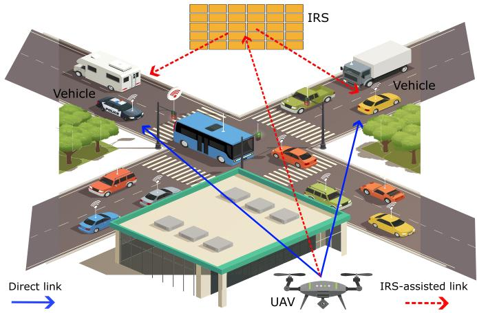
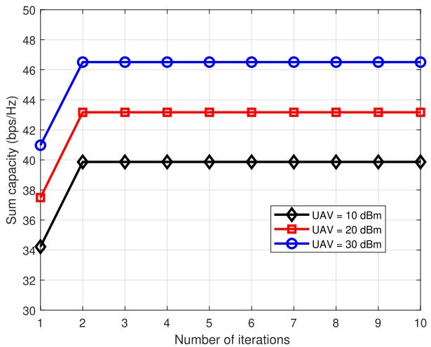
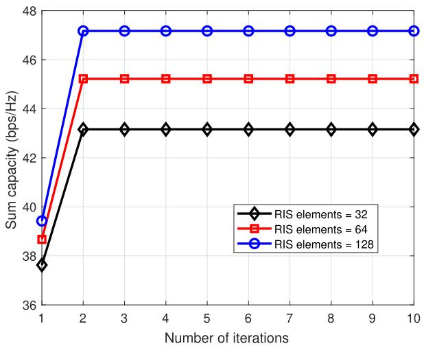
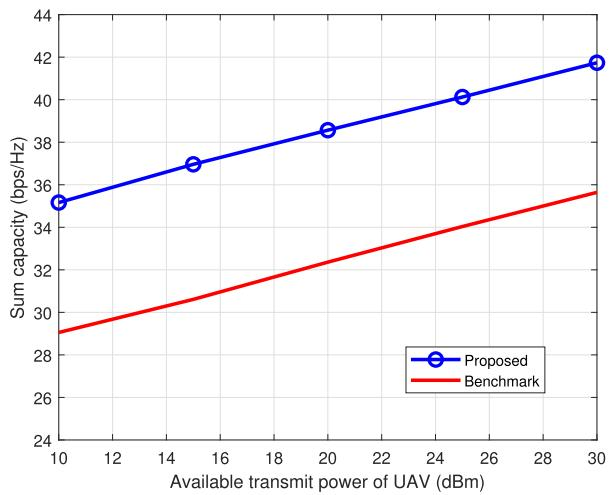
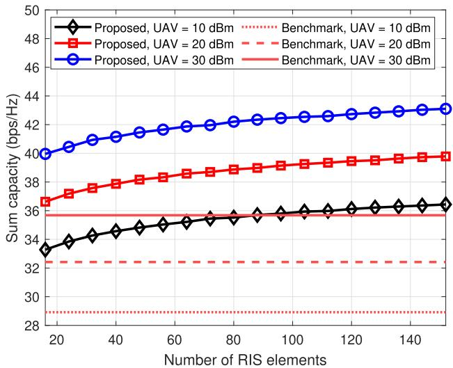
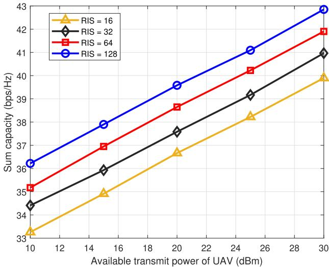

# Efficient Resource Management for NOMA-Enabled UAV Communications in 6G IRS-Assisted Vehicular Networks

Manzoor Ahmed , Wali Ullah Khan , Member, IEEE, Fahd N. Al-Wesabi , Shouki A. Ebad, Haya Mesfer Alshahrani, Ashit Kumar Dutta , Member, IEEE, Basem M. ElHalawany , Senior Member, IEEE, and Xingwang Li , Senior Member, IEEE

Abstract— Intelligent reconfigurable surfaces (IRS) have emerged as a promising technology to enhance wireless communications by dynamically controlling the propagation environment. Despite their potential, practical challenges such as effective integration with existing systems and efficient optimization remain critical. This paper investigates the sum capacity enhancement of NOMA-enabled uncrewed aerial vehicle (UAV) communications in vehicular networks assisted IRS. In urban environments where direct links from UAV to vehicles are often obstructed by buildings or other obstacles, the IRS plays a critical role in improving signal quality by reflecting signals toward vehicles. We consider a downlink NOMA transmission scenario, where the UAV serves multiple ground vehicles, and signals are delivered through both direct and IRS-assisted links. A joint optimization problem is formulated to maximize the sum capacity by simultaneously optimizing UAV power allocation and IRS passive beamforming while ensuring a minimum signal-to-interference plus noise ratio

requirement for each vehicle. To address the non-convex nature and reduce the complexity of the optimization, we first transform the original problem using the first-order Taylor expansion method. Then, we employ a two-step solution based on the fixed-point iteration method for passive beamforming at the IRS and standard convex optimization for UAV power allocation. The proposed solution is compared with a benchmark scheme with direct UAV-to-vehicle communication without IRS assistance. Numerical results demonstrate that our proposed framework converges quickly and significantly outperforms the benchmarks in terms of system capacity.

Index Terms— Capacity optimization, intelligent reflecting surfaces (IRS), non-orthogonal multiple access (NOMA), uncrewed aerial vehicle (UAV) communication, vehicular networks, sixthgeneration (6G).

## I. INTRODUCTION

latency communication services, upcoming sixthgeneration (6G) wireless networks are evolving to integrate new technologies that push the boundaries of conventional communication paradigms [1]. Among these, non-orthogonal multiple access (NOMA) has emerged as a promising solution to enhance spectral efficiency by allowing multiple users to share the same frequency resources, differentiated by their power levels [2]. Additionally, uncrewed aerial vehicles (UAVs) are gaining attention as mobile communication platforms capable of providing flexible and efficient wireless coverage in various scenarios, including urban and rural areas [3]. However, in many practical deployments, especially in urban environments, direct line-of-sight (LoS) links between UAVs and ground terminals may be frequently obstructed by buildings and other obstacles when ground terminals are mobile [4]. To overcome these limitations, intelligent reconfigurable surfaces (IRS) have been introduced as a critical technology that enables the manipulation of the wireless environment in a smart way [5]. IRS comprises arrays of passive elements that reflect and beamform incoming signals toward desired locations, thus enhancing signal coverage and quality [6]. Unlike conventional relays, the IRS can operate in a passive manner, meaning it consumes very little energy while still significantly improving the performance of wireless systems [7]. By dynamically adjusting the reflection coefficients of each element, IRS can steer, enhance, or scatter the signals in desired directions, allowing more efficient utilization of the wireless channel [8].

IRS can be classified based on various characteristics, such as the control mechanism, connectivity, and functionality [9]. The three main classifications of IRS are passive IRS, active IRS, and hybrid IRS. A passive IRS consists of a planar array of passive elements that reflect incoming signals without active signal amplification. The phase and amplitude of the reflected waves can be controlled, but no power amplification is applied. Passive IRS is energy-efficient since it does not require an external power source for signal processing. However, they have limited control over the signal due to the absence of active elements. Active IRS incorporates active electronic components into the surface’s elements, enabling signal amplification in addition to phase and amplitude adjustment [10]. These active elements are powered by external sources, allowing the surface to perform more sophisticated signal processing, such as amplifying weak signals before reflection. Hybrid IRS combines both active and passive elements in the same surface, allowing it to perform both reflection and signal amplification. This hybrid configuration offers greater flexibility, as it can be used in scenarios where some parts of the surface need to amplify signals while others only need to reflect them.

## A. Related Work

Many studies have been presented in recent years to fully utilize the benefits of UAVs. By collaboratively designing the UAV’s position and hybrid beamforming, the authors of [11] examine the deployment of a UAV to serve numerous UEs in the millimeter-wave spectrum with the goal of increasing the total data flow. To solve this issue, they have created a two-phase optimization approach. In order to improve service timeliness, the writers of [12] look at the UAV’s cache placement tactics. A modified timeliness model and a caching strategy optimization method are suggested in order to thoroughly assess this. In [13], it examines an optimization problem for 3D trajectory and resource allocation while taking energy consumption and fairness throughput among all UEs into account. The authors of [14] present an effective UAV 3D deployment plan that seeks to increase the system’s coverage rate while reducing the number of UAVs needed. As the Internet of Things (IoT) grows, [15] suggests employing several UAVs to gather information from ground stations. Together, the UE association and the UAV’s trajectory are tuned to increase system throughput and energy efficiency (EE).

Notwithstanding these obvious benefits of UAV communications, a significant issue that requires attention is the limited spectrum resources. Non-orthogonal multiple access (NOMA) is a promising approach to increase the utilization of spectrum resources. By enabling many UEs to access the same resource block at once, NOMA offers the potential to increase system throughput and spectrum efficiency (SE) [1], [16]. The basic concept of downlink NOMA is to share the power resources that are available. Superposition coding (SC) at the base station and successive interference cancellation (SIC) at the UEs are used to accomplish this [17], [18]. In order to enable UEs to decipher their desired signals from the overlaid signal,

SC permits the base station to send numerous signals on the same frequency but with varying power levels. Compared to conventional orthogonal multiple access (OMA) systems, power domain NOMA allows for the simultaneous serving of more UEs.

The received signals are separated and decoded at each UE using SIC. In order to reduce interference, the UE with the strongest signal first decodes its desired signal, after which it subtracts its decoded signal from the received signal. Each UE can decode its own signal while reducing the interference from other UEs by repeating this process successively for more UEs. The NOMA approach improves system performance by allowing multiple UEs to access the same resource block. In an effort to capitalize on its advantages, there has been a recent surge in research interest in combining NOMA with UAV communications. The authors of [19] present a unique NOMAenabled UAV-assisted IoTs network in which the trajectory and time allocation policy of the UAV are simultaneously designed to increase the overall network throughput. The fullduplex NOMA system with UAV assistance is the main emphasis of the authors of [20]. By using dynamic UE clustering, power control method, and UAV placement optimization, they hope to maximize the system throughput.

Another issue with UAV communications in real-world applications is the scarcity of spectrum resources. In complex urban contexts, obstructions frequently hinder the LoS links between the UAVs and the UEs. Through trajectory design, UAVs can enhance transmission quality, but the energy consumption will be much higher. As a result, re-establishing the LoS link by regularly moving the UAV may not always be possible. Researchers have suggested using the IRS to improve UAV communication systems’ performance in order to solve this problem. With a large number of passive reflecting units, IRS is a flat structure [21]. Using integrated circuits, each passive reflecting unit may be configured to dynamically modify incident signal characteristics and intelligently modify the amplitude and phase of incoming signals [22]. IRS’s programmable features allow it to improve the received signal at the receivers and intelligently rebuild the wireless communication environment [23]. Improved EE, longer coverage, less interference, and higher spectral efficiency are some advantages of IRS. Future wireless networks could be strengthened by the IRS. The transmission quality of UAV-UE links can be greatly enhanced with established cascade LoS lines by implementing IRSs in UAV communication systems.

Recently, there has been a lot of interest in research that combines IRS and UAV communications. Reference [24] explores the problem of optimizing the system capacity by means of a cooperative design process that includes the trajectory design of the UAV and passive beamforming optimization of the IRS. An IRS-UAV communication system, where the IRS is installed on the UAV, is presented in [25]. By simultaneously optimizing the UAV’s trajectory, the transmitting beamforming, and the reflecting beamforming, the goal is to optimize the system’s SE and EE. The authors use the sequential convex approximation (SCA) method to solve the formulated problem. The use of IRS in orthogonal frequency division multiple access UAV communication systems is examined by the authors of [26]. The data rate is maximized by optimizing the IRS scheduling, the resource allocation policy, and the UAV’s trajectory. The authors of [27] suggested an IRS-assisted UAV communication system. Together, they optimize the IRS’s phase shift, the UAV’s position, and resource allocation to reduce the UAV’s energy consumption. [28] suggests adopting NOMA to improve system performance and looks into a full-duplex relaying solution that uses an IRS-mounted UAV to aid in information flow.

Besides that, the authors of [29] and [30] have studied the physical layer security in IRS-assisted UAV networks. In [29], they maximize the secrecy rate of the system against jamming attacks by optimizing the transmit power and phase shift design using alternating optimization. In [29], the authors used IRS-mounted UAV communication and optimized beamforming and phase shift in order to maximize the secrecy rate of the system. In [31], Saif et al. have proposed a network connectivity problem in IRS-assisted UAV communication and adopted two approaches based on semidefinite programming and Laplacian matrix perturbation. Moreover, the work in [32] has employed deep reinforcement learning for optimizing the power allocation and phase shift design to maximize the system throughput. Huroon et al. [33] have optimized the transmission strategy by using alternating optimization to handle the mixed-integer optimization problem. Furthermore, Wang et al. [34] have investigated covert communication in NOMA-enabled UAV communication using a simultaneously transmitting and reflecting reconfigurable intelligent surface. In [35], the authors have used IRS-assisted UAV communication for enhanced backhaul transmissions in ground-to-aerial-to-ground communication networks. In addition, Li et al. [36] have done performance analysis in IRS-assisted UAV communication.

## B. Motivation and Contributions

Although significant work has been done on integrating UAV and IRS for the upcoming 6G networks, there is still a need for further improvement in the system’s performance. Moreover, most of the existing literature has considered UAV communication and they do not consider NOMA and IRS in their proposed frameworks. Furthermore, some works consider orthogonal resource allocation in their proposed frameworks. However, it has already been proven that NOMA performs better than the conventional orthogonal resource allocation approaches. Besides that, researchers have also combined NOMA and UAV communication without utilizing the benefits of IRS technology. Of late, some works have studied NOMA with IRS-assisted UAV communication, they investigate different performance metrics. Motivated by this, we consider a resource management framework for NOMA-enabled UAV communication in 6G IRS-assisted vehicular networks. Specifically, the proposed optimization framework maximizes the achievable sum capacity of the vehicular network through joint optimization of UAV power allocation and IRS phase shift design. The considered framework also considers the minimum signal-to-interference plus noise ratios (SINRs) of all users. The optimization problem is first transformed using the first-order Taylor expansion method. Then, we divide it into two separate problems, i.e., the UAV power allocation problem and the IRS phase shift design problem. To solve the IRS phase shift design problem, we adopted the fixed-point iteration method, given the fixed UAV power allocation. In the next stage, given the optimal IRS phase shift matrix, we solve the UAV power allocation using the standard convex solver. The proposed technique is iteratively updated until the convergence criteria are satisfied. The detailed contributions of this work can be summarized as follows.

• This work considers a downlink UAV communication, where a UAV acts as a transmitter and sends a signal to ground vehicles following NOMA protocol. Considering the dense urban communication scenario and the mobility of vehicles on the road, the direct links between a UAV and the vehicles can be interrupted by various obstacles, i.e., buildings, trees, and other vehicles on the road. To address this issue and ensure the smooth delivery of signal from UAV to vehicles, we consider that the IRS system is installed on the building wall to assist the signal delivery. Thus, the proposed system considered that the signal from UAV can be received through direct link and IRS-assisted link for better communication.

• This work aims to enhance the achievable capacity of the system through efficient resource allocation. In particular, joint optimization of NOMA power allocation at UAV and passive beamforming design at RIS is performed subject to the minimum SINR of vehicles. Due to the nature of the considered system, capacity maximization is formulated as a non-convex optimization problem. This is due to the interference terms in the capacity expression, coupled optimization variables, and IRS beamforming constraint, which results in high computational complexity. Therefore, we transformed the original problem to reduce the complexity and achieve an efficient solution.

• We adopt the first-order Taylor expansion method and split the joint optimization into two subproblems, i.e., NOMA power allocation at UAV and passive beamforming design at IRS. First, for any given power allocation at UAV, we design an optimal beamforming for IRS. Then, given the beamforming at IRS, we compute optimal power allocation at UAV. We provide numerical results from Monte Carlo simulations to validate the proposed solution. To perform a fair comparison, we consider the same system model without IRS, where vehicles only receive their signals from a UAV through direct links.

This paper can be organized as follows. Details of the system model under discussion, channel modeling and consideration, and the problem of maximizing the system’s achievable capacity are given in Section II. The proposed channel solution for sum capacity maximization is explained in Section III. The numerical results for the benchmark solution and the proposed solution are shown and discussed in Section IV. The closing remarks and future research directions are covered in Section V. Table I lists the notations used in this work.

TABLE I  
NOTATION TABLE
<table><tr><td rowspan=1 colspan=1>Notation</td><td rowspan=1 colspan=1>Description</td></tr><tr><td rowspan=1 colspan=1> $\overline { { P } }$ </td><td rowspan=1 colspan=1>Transmission power of UAV</td></tr><tr><td rowspan=1 colspan=1> $x$ </td><td rowspan=1 colspan=1>Superimposed signal of UAV for Vvehicles</td></tr><tr><td rowspan=1 colspan=1> $\overline { { P _ { t } } }$ </td><td rowspan=1 colspan=1>Maximum transmit power of UAV</td></tr><tr><td rowspan=1 colspan=1> $\alpha _ { v }$ </td><td rowspan=1 colspan=1>Power allocation coefficient for the $\overline { { v ^ { t h } } }$ vehicle</td></tr><tr><td rowspan=1 colspan=1> $\gamma _ { v }$ </td><td rowspan=1 colspan=1>SINR of the $\overline { { v ^ { t h } } }$ vehicle</td></tr><tr><td rowspan=1 colspan=1> $\underline { { \gamma _ { m i n } } }$ </td><td rowspan=1 colspan=1>Threshold to ensure the minimum SINR of vehicles</td></tr><tr><td rowspan=1 colspan=1> $\Phi$ </td><td rowspan=1 colspan=1>Phase shift matrix of the IRS</td></tr><tr><td rowspan=1 colspan=1> $\overline { { K } }$ </td><td rowspan=1 colspan=1>Number of IRS elements</td></tr><tr><td rowspan=1 colspan=1> $n _ { v }$ </td><td rowspan=1 colspan=1>Additive white Gaussian noise</td></tr><tr><td rowspan=1 colspan=1> $\overline { { V } }$ </td><td rowspan=1 colspan=1>Number of vehicles (users)</td></tr><tr><td rowspan=1 colspan=1> $h _ { v }$ </td><td rowspan=1 colspan=1>Direct channel between UAV and $\overline { { v ^ { t h } } }$ vehicle</td></tr><tr><td rowspan=1 colspan=1> $\overline { { \mathbf { H } } }$ </td><td rowspan=1 colspan=1>Channel between UAV and IRS</td></tr><tr><td rowspan=1 colspan=1> $\overline { { \mathbf { F } _ { v } } }$ </td><td rowspan=1 colspan=1>Channel between IRS and $\overline { { v ^ { t h } } }$ vehicle</td></tr><tr><td rowspan=1 colspan=1> $\overline { { C _ { s u m } } }$ </td><td rowspan=1 colspan=1>Sum capacity of the system</td></tr><tr><td rowspan=1 colspan=1> $\overline { { K _ { \mathrm { I R S } } } }$ </td><td rowspan=1 colspan=1>Rician factor between UAV and IRS channels</td></tr><tr><td rowspan=1 colspan=1> $\underline { { K } } _ { \mathrm { v e h i c l e } }$ </td><td rowspan=1 colspan=1>Rician factor between IRS and vehicles channels</td></tr><tr><td rowspan=1 colspan=1> $\overline { { \sigma ^ { 2 } } }$ </td><td rowspan=1 colspan=1>Variance of Additive white Gaussian noise</td></tr></table>

## II. SYSTEM MODEL AND PROBLEM FORMULATION

This section provides the system details, as well as different considerations and assumptions. We will also describe the channel modeling and received signals in this section. We consider a vehicular network where a UAV communicates to serve V vehicles on the ground using the power domain NOMA transmission. Considering an urban communication scenario, the direct links between UAVs and vehicles are sometimes blocked due to obstructions. To ensure reliable and stable connectivity, we consider installing a K elements IRS in a strategic position and assisting in the signal delivery from a UAV to vehicles. Thus, the vehicles receive signals through both direct and IRS-assisted links [37]. The set of vehicles and the set of elements can be expressed as $v \in \{ 1 , 2 , 3 , \dotsc , V \}$ and $k \in \{ 1 , 2 , 3 , \ldots , K \}$ . We consider an upper-bound solution and assume that the information of channels is known at UAV.

The channels from UAV to IRS and from IRS to vehicles undergo Rician Fading, while the direct channels from UAV to vehicles are assumed to be Rayleigh Fading [37]. To transmit the superimposed signal from UAV to V vehicles, We define the channel vector H from UAV to IRS as:

$$
\mathbf { H } = \sqrt { \frac { K _ { \mathrm { I R S } } } { K _ { \mathrm { I R S } } + 1 } } \mathbf { H } ^ { \mathrm { L o S } } + \sqrt { \frac { 1 } { K _ { \mathrm { I R S } } + 1 } } \mathbf { H } ^ { \mathrm { N L o S } } ,\tag{1}
$$

where the first segment is the line of sight (LoS) component and the second segment represents the non-LoS component. Furthermore, $K _ { \mathrm { I R S } }$ shows the Rician factor indicating the LoS component ratio to the non-LoS component. Next, we model the channels between IRS and vehicles as Rician fading such that the channel vector from IRS to $v ^ { t h }$ vehicle can be defined as:

$$
\mathbf { F } _ { v } = \sqrt { \frac { K _ { \mathrm { v e h i c l e } } } { K _ { \mathrm { v e h i c l e } } + 1 } } \mathbf { F } _ { v } ^ { \mathrm { L o S } } + \sqrt { \frac { 1 } { K _ { \mathrm { v e h i c l e } } + 1 } } \mathbf { F } _ { v } ^ { \mathrm { N L o S } } ,\tag{2}
$$

where $K _ { \mathrm { v e h i c l e } }$ is the Rician K -factors, representing the ratio of LoS to scattered components in the channels between IRS and vehicles. The term $\mathbf { F } _ { v } ^ { \mathrm { L o S } }$ shows the deterministic LoS components and $\mathbf { F } _ { v } ^ { \mathrm { N L o S } }$ is the Rayleigh-distributed non-LoS components. The superimposed signal from UAV to V vehicles can be described as:

  
Fig. 1. System model.

$$
x = \sum _ { v = 1 } ^ { V } \sqrt { P \alpha _ { v } } x _ { v } ,\tag{3}
$$

where P is the total transmit power of UAV and $\alpha _ { v }$ is power allocation coefficient of vehicle of $v ^ { t h }$ vehicle. Moreover, $x _ { v }$ is the unite power signal of $v ^ { t h }$ vehicle. The signal that $v ^ { t h }$ vehicle receives from UAV can be stated as:

$$
y _ { v } = ( h _ { v } + { \bf H } \Phi { \bf F } _ { v } ) x + n _ { v } ,\tag{4}
$$

where $h _ { v }$ is the direct channel between UAV and $v ^ { t h }$ vehicle which undergoes Rayleigh fading, and $n _ { v }$ is the additive white Gaussian noise with variance $\bar { \sigma ^ { 2 } }$ . The SINR of $v ^ { t h }$ vehicle from UAV using both links can be written as:

$$
\gamma _ { v } = \frac { | h _ { v } + \mathbf { H } \Phi \mathbf { H } _ { v } | ^ { 2 } P \alpha _ { v } } { \sigma ^ { 2 } + \displaystyle \sum _ { v ^ { \prime } \neq v } ^ { v + 1 } | h _ { v } + \mathbf { H } \Phi \mathbf { F } _ { v } | ^ { 2 } P \alpha _ { v ^ { \prime } } } .\tag{5}
$$

where $\sum _ { v ^ { \prime } \neq v } ^ { v + 1 } | h _ { v } + \mathbf { H } \Phi \mathbf { F } _ { v } | ^ { 2 } P \alpha _ { v ^ { \prime } }$ is the NOMA interference after SIC decoding method. Following this, the sum capacity of the system can be described as:

$$
C _ { s u m } = \sum _ { v = 1 } ^ { V } \log _ { 2 } ( 1 + \gamma _ { v } ) ,\tag{6}
$$

This work seeks to enhance the sum capacity of NOMAenabled IRS-assisted UAV communications in vehicular networks. More specifically, the proposed framework simultaneously optimizes the power allocation of UAV and passive beamforming of IRS while ensuring the minimum SINR of individual vehicles. The sum capacity optimization can be

formulated as:

$$
\begin{array} { r } { P _ { 1 } : \left\{ \begin{array} { l l } { \operatorname* { m a x i n i m i z e } C _ { s u m } , } \\ { \operatorname { ( \alpha , \phi , \phi ) } } \\ { \mathrm { s u b j e c t ~ t o : } } \\ { C _ { 1 } : \displaystyle \sum _ { v = 1 } ^ { V } \gamma _ { v } \geq \gamma _ { \operatorname* { m i n } } , } \\ { \quad _ { v = 1 } } \\ { C _ { 2 } : \displaystyle \sum _ { v = 1 } ^ { V } \alpha _ { v } \leq 1 , } \\ { \quad _ { v } \leq \sum _ { v = 1 } ^ { V } \sum _ { v = 1 } ^ { V } P _ { v } \leq P _ { t } , } \\ { \quad _ { v = 1 } } \\ { C _ { 4 } : | \phi _ { k } | = 1 , \ : \mathrm { v } , } \end{array} \right. } \end{array}\tag{7}
$$

where the first constraint in (7) is to ensure the minimum SINR of the individual vehicles. The second constraint controls the sum of power allocation coefficients, which is less than or equal to one, to facilitate NOMA. Then, the thirst constraint limits the power consumption of UAV and the fourth constraint is used for passive beamforming of IRS.

## III. PROPOSED CAPACITY ENHANCEMENT SOLUTION

The problem in (7) is non-convex optimization due to the SINR expressions and joint decision variables. This leads to a high complexity when considering a joint optimal solution. To obtain a low complex yet efficient solution, the original problem can be transformed first using a first-order Taylor expansion method, and then we split it into two subproblems. First, for a given power allocation at UAV, we design an efficient passive beamforming at IRS. Then, given the optimal beamforming at IRS, the proposed solution iteratively optimizes the UAV power allocation.

Using the first-order Taylor expansion method, the capacity expression of $v ^ { t h }$ vehicle can be linearized around feasible points $\gamma _ { v , 0 }$ as:

$$
\hat { C } _ { v } \approx \log _ { 2 } ( 1 + \gamma _ { v , 0 } ) + \frac { \gamma _ { v } - \gamma _ { v , 0 } } { ( 1 + \gamma _ { v , 0 } ) . \ln ( 2 ) } , \forall v ,\tag{8}
$$

where (8) becomes linear in terms of SINR, with the feasible points $\gamma _ { v , 0 }$ serving as reference values. Similarly, we can linearize the minimum SINR constraint of $v ^ { t h }$ vehicle as:

$$
\gamma _ { v } \geq \gamma _ { \operatorname* { m i n } } \Rightarrow \gamma _ { v , 0 } + \frac { \partial \gamma _ { v } } { \partial \alpha _ { i } } ( \alpha _ { v } - \alpha _ { v , 0 } ) \geq \gamma _ { \operatorname* { m i n } } , \forall v ,\tag{9}
$$

Now for a given power allocation at UAV, the passive beamforming problem at IRS can be reformulated as:

$$
P _ { 2 } : \left\{ \begin{array} { l l } { \mathrm { m a x i m i z e } \ \hat { C } _ { s u m } = \displaystyle \sum _ { v = 1 } ^ { V } \hat { C } _ { v } , } \\ { \mathrm { s u b j e c t ~ t o : } } \\ { ( 9 ) , C _ { 4 } , } \end{array} \right.\tag{10}
$$

The optimization problem in $P _ { 2 }$ is still non-convex due to unit modulus constraints of IRS beamforming. Therefore, we resort to obtaining a locally optimal solution based on the fixed-point iteration method. According to this method, we first initialize the random 8 matrix, which satisfies the unit modulus constraint $| \phi _ { v } | = 1$ . Then, we compute the gradient of the objective function with respect to 8, which can be expressed as:

```latex
Algorithm 1 Fixed-Point Iteration for IRS Beamforming
1: Input: Initial phase shift matrix $\Phi ^ { ( 0 ) }$ with $| \phi _ { k } | = 1 , \forall k$
maximum number of iterations $T _ { \mathrm { m a x } }$ , convergence toler
ance ϵ
2: Initialize: Set iteration counter $t = 0$ and objective value
$\mathcal { I } ( \Phi ^ { ( 0 ) } )$
3: while $t < T _ { \mathrm { m a x } }$ and not converged do
4: Update the phase shift matrix $\Phi ^ { ( t + 1 ) }$ using fixed-point
iteration:
$\begin{array} { r } { \Phi ^ { ( t + 1 ) } = \mathcal { P } \left( \Phi ^ { ( t ) } + \boldsymbol { \mu } \cdot \nabla _ { \Phi } \mathcal { I } ( \Phi ^ { ( t ) } ) \right) } \end{array}$
where $\nabla _ { \Phi } \mathcal { I } ( \Phi ^ { ( t ) } )$ is the gradient of the objective function
$\mathcal { T } ( \Phi )$ with respect to 8, $\mu$ is the step size, and $\mathcal { P } ( \cdot )$
denotes the projection onto the feasible set of unit modulus
constraints.
5: Projection step: Normalize $\Phi ^ { ( t + 1 ) }$ such that $| \phi _ { k } | =$
$1 , \forall k \colon$
$\phi _ { k } ^ { ( t + 1 ) } = \frac { \phi _ { k } ^ { ( t + 1 ) } } { | \phi _ { k } ^ { ( t + 1 ) } | } , \quad \forall k$
6: Compute the new objective value $\mathcal { I } ( \Phi ^ { ( t + 1 ) } )$
7: if $| \mathcal { T } ( \Phi ^ { ( t + 1 ) } ) - \mathcal { T } ( \Phi ^ { \hat { ( t ) } } ) | < \epsilon$ then
8: Convergence achieved, stop the algorithm.
9: end if
10: Update the iteration counter: $t = t + 1$
11: end while
12: Output: Optimized phase shift matrix $\Phi ^ { * } = \Phi ^ { ( t ) }$
```

$$
\Delta _ { \Phi } C _ { s u m } = \sum _ { v = 1 } ^ { V } \frac { \partial \log _ { 2 } ( 1 + \gamma _ { v } ) } { \partial \Phi }\tag{11}
$$

where this gradient helps to iteratively update 8. Next, retraction is applied to project onto the unit circle in order to ensure the modulus constraint $| \phi _ { k } | = 1$ after each step as:

$$
\Phi ^ { t + 1 } = \Phi ^ { t + 1 } / | \Phi ^ { t + 1 } |\tag{12}
$$

where the iteration process continues until the system capacity reaches to convergence threshold ϵ. The detailed steps of this method can also be found in Algorithm 1.

Next, the power allocation problem at UAV for the given $\Phi ^ { * }$ can be re-formulated as:

$$
P _ { 3 } : \left\{ \begin{array} { l l } { \mathrm { m a x i m i z e } \ \hat { C } _ { s u m } = \displaystyle \sum _ { v = 1 } ^ { V } \hat { C } _ { v } , } \\ { \mathrm { s u b j e c t ~ t o : } } \\ { ( 9 ) , C _ { 2 } , C _ { 3 } , } \end{array} \right.\tag{13}
$$

The problem $P _ { 3 }$ is now a convex optimization and can be efficiently solved using standard convex solvers such as CVX in MATLAB. Algorithm 2 shows the detailed solution.

## IV. COMPUTATIONAL COMPLEXITY ANALYSIS

The proposed solution alternates between two key optimization tasks: IRS passive beamforming and UAV power allocation. The complexity of the IRS beamforming step is mainly influenced by the number of IRS elements and the number of vehicles. Each iteration involves calculating the gradient of the objective function with respect to the phase shift matrix 8, which has a complexity of $\mathcal O ( V K )$ , where V is the number of vehicles and K is the number of IRS elements. The projection step to satisfy the unit modulus constraint has a complexity of $\mathcal O ( K )$ , but the gradient calculation dominates. If the fixed-point iteration requires $I _ { \mathrm { I R S } }$ iterations to converge, the total complexity for IRS passive beamforming becomes $\mathcal { O } ( I _ { \mathrm { I R S } } V K )$ .

The UAV power allocation problem, after fixing the IRS beamforming, is solved using convex optimization techniques. This involves solving for V power allocation coefficients $\alpha _ { v }$ through standard interior-point methods, which typically have a complexity of $\mathcal { O } ( V ^ { 3 } )$ ). Given that the problem is convex, the power allocation step requires $I _ { \mathrm { P A } }$ iterations to converge, resulting in a total complexity of $\mathcal { O } ( I _ { \mathrm { P A } } V ^ { 3 } )$

The overall complexity of the alternating optimization approach depends on how many times the two subproblems are iterated. Let $I _ { \mathrm { t o t a l } }$ denote the total number of alternating iterations required for convergence. Each iteration includes the IRS beamforming step with complexity $\mathcal { O } ( I _ { \mathrm { I R S } } V K )$ and the UAV power allocation step with complexity $\mathcal { O } ( I _ { \mathrm { P A } } V ^ { 3 } )$ Therefore, the total computational complexity of the proposed solution is $\mathcal { O } ( I _ { \mathrm { t o t a l } } \cdot ( I _ { \mathrm { I R S } } V K + I _ { \mathrm { P A } } V ^ { 3 } ) )$ ).

In summary, the overall complexity is influenced by the number of vehicles V , the number of IRS elements K , and the number of iterations required for both subproblems. While the IRS beamforming step grows linearly with K , the power allocation complexity grows cubically with V . However, since the number of alternating iterations $I _ { \mathrm { t o t a l } }$ is generally small due to fast convergence, the overall computational cost remains manageable in practical scenarios.

## V. NUMERICAL RESULTS AND DISCUSSION

In this section, we present the numerical results for the proposed NOMA-enabled UAV communications in vehicular networks assisted by IRS. The results for the proposed solution are obtained through Monte Carlo simulations with an average of 1000 iterations. Additionally, the performance of the proposed IRS-assisted NOMA UAV solution for vehicular networks is compared without IRS-assisted UAV communication in the same NOMA-enabled vehicular scenario. Unless otherwise specified, the simulation parameters and their corresponding values are listed in Table II.

Fig. 2(a) illustrates the convergence of sum capacity with respect to the number of iterations for different UAV transmit power levels, i.e., 10 dBm, 20 dBm, and 30 dBm, respectively. It is evident that the proposed algorithm achieves rapid convergence, with the sum capacity stabilizing after just 2-3 iterations, indicating the fast convergence efficiency of the algorithm. Higher transmit power levels at the UAV lead to increased sum capacity, with the UAV transmitting at 30 dBm

## Algorithm 2 UAV Power Allocation Optimization

1: Input: Initial SINR values $\gamma _ { v , 0 }$ for each vehicle, maximum transmit power $P _ { t }$ , minimum SINR $\gamma _ { \mathrm { m i n } }$ , number of vehicles V

2: Initialize: Power allocation coefficients $\alpha _ { v } ,$ ∀v ∈ $\{ 1 , 2 , \ldots , V \}$ , maximum number of iterations $T$

3: for $t = 1 \mathrm { ~ t o ~ } T$ do

4: Step 1: Linearize the sum capacity expression and the minimum SINR constraint using the first-order Taylor expansion as (8) and (9).

5: Step 2: Reformulate the power allocation optimization problem as (13)

6: Step 3: Solve the convex optimization problem using a standard solver (e.g., CVX) to obtain the optimal power allocation coefficients $\boldsymbol { \alpha } _ { v } ^ { \ast } \mathrm { . }$ :

$$
\alpha _ { v } ^ { * } = \arg \operatorname* { m a x } \hat { C } _ { s u m }
$$

7: Step 4: Update the SINR values $\gamma _ { v , 0 }$ with the new power allocation coefficients.

8: Step 5: Check for convergence: if the change in $\gamma _ { v , 0 }$ values across iterations is less than a predefined threshold $\epsilon ,$ terminate.

9: end for

10: Output: Optimized power allocation coefficients $\alpha _ { v } ^ { * }$ for each vehicle and then compute the system sum capacity.

TABLE II  
SIMULATION PARAMETERS AND THEIR VALUES
<table><tr><td rowspan=1 colspan=1>Parameter</td><td rowspan=1 colspan=1>Value</td></tr><tr><td rowspan=1 colspan=1>Carrier frequency (fc)</td><td rowspan=1 colspan=1>3.5 GHz</td></tr><tr><td rowspan=1 colspan=1>Wavelength (λ)</td><td rowspan=1 colspan=1>0.0857 m</td></tr><tr><td rowspan=1 colspan=1>Number of IRS elements (K)</td><td rowspan=1 colspan=1>128</td></tr><tr><td rowspan=1 colspan=1>Number of users (V)</td><td rowspan=1 colspan=1>2</td></tr><tr><td rowspan=1 colspan=1>Total transmit power $\overline { { ( P _ { t } ) } }$ </td><td rowspan=1 colspan=1>10-30 dBm</td></tr><tr><td rowspan=1 colspan=1>Noise power $\overline { { ( \sigma ^ { 2 } ) } }$ </td><td rowspan=1 colspan=1>0.0001</td></tr><tr><td rowspan=1 colspan=1>Minimum SINR $\mathrm { ( \gamma _ { m i n } ) }$ </td><td rowspan=1 colspan=1>1 bps/Hz</td></tr><tr><td rowspan=1 colspan=1>Rician K-factor</td><td rowspan=1 colspan=1>20</td></tr><tr><td rowspan=1 colspan=1>Number of Monte Carlo trials</td><td rowspan=1 colspan=1>1000</td></tr><tr><td rowspan=1 colspan=1>Maximum iterations $\underline { { \overline { { ( N _ { \mathrm { i t e r } } ) } } } }$ </td><td rowspan=1 colspan=1>10</td></tr><tr><td rowspan=1 colspan=1>UAV height</td><td rowspan=1 colspan=1>80m</td></tr><tr><td rowspan=1 colspan=1>Convergence threshold (€)</td><td rowspan=1 colspan=1> $\overline { { 1 \times 1 0 ^ { - 4 } } }$ </td></tr></table>

achieving the highest capacity, followed by 20 dBm and 10 dBm. However, the marginal gains diminish as the transmit power increases, showing a nonlinear relationship between power and capacity. The convergence behavior is consistent across different power levels, highlighting the robustness of the algorithm in optimizing the IRS passive beamforming and UAV power allocation while ensuring fast convergence.

Accordingly, Fig. 2(b) shows the achievable sum capacity of the system versus the number of iterations, considering different numbers of IRS elements, i.e., 32, 64, and 128. Similar to Fig. 2(a), the proposed algorithm demonstrates rapid convergence, achieving stable performance after just a few iterations. It is evident from the figure that increasing the number of IRS elements significantly enhances the system’s sum capacity. This improvement can be attributed to the ability of IRS technology to effectively manipulate the wireless propagation environment by introducing additional degrees of freedom. Specifically, a larger number of IRS elements enables finer control over the reflected signals, allowing the system to create highly directional and constructive interference patterns toward the intended users while mitigating interference in undesired directions. This improved beamforming capability enhances the signal strength at the receivers, directly translating to higher achievable data rates.

  
(a)

  
(b)

Fig. 2. Sum capacity of the system versus the number of iterations, considering (a) different UAV transmit power and (b) Different IRS elements. For these results, we set $\bar { P _ { t } } = \bar { 2 } 0 \mathrm { d } \mathrm { B m }$ and $\gamma _ { m i n } = 1$ bps/Hz.  
  
Fig. 3. Achievable capacity versus available transmit power of UAV for both proposed framework and the benchmark framework.

Next, we compare the proposed optimization framework with the benchmark optimization framework. Fig. 3 compares the sum capacity of the proposed NOMA-enabled IRS-assisted UAV framework with a benchmark framework that only considers the direct link as the transmit power of the UAV increases. The results show that the proposed framework consistently outperforms the benchmark solution across all available power levels of UAV. Specifically, as the UAV’s transmit power increases from 10 dBm to 30 dBm, the sum capacity of the proposed framework exhibits a significant increase, indicating the effectiveness of IRS-assisted communication in enhancing the overall capacity. For example, at 30 dBm transmit power, the proposed framework achieves a sum capacity of approximately 42 bps/Hz, while the benchmark framework achieves around 34 bps/Hz. This represents a performance improvement of approximately 24% when comparing the proposed IRS-assisted solution to the benchmark. Similarly, at 10 dBm, the proposed framework outperforms the benchmark by around 26%, demonstrating the clear capacity gain enabled by the inclusion of IRS to mitigate signal degradation and enhance coverage. The gap between the two frameworks widens as the transmit power increases, further underscoring the benefits of the IRS-assisted approach in achieving higher communication efficiency.

  
Fig. 4. Achievable capacity of the proposed and benchmark frameworks versus the number of IRS elements.

To further assess the performance of the proposed framework, Fig. 4 shows the impact of varying the number of IRS elements on the sum capacity of the system for different UAV transmit power levels, i.e., 10 dBm, 20 dBm, and 30 dBm. The sum capacity increases as the number of IRS elements grows, demonstrating the ability of the IRS to significantly enhance communication efficiency by improving signal reflection and directing it towards the intended vehicles. On the other hand, we also plot the capacity of the system with no IRS. It can be seen that the achievable sum capacity remains unchanged for different IRS elements. At each power level, the sum capacity of the proposed framework follows a similar trend, with higher UAV available transmit power leading to better overall performance. For instance, with 30 dBm transmit power, the sum capacity increases from approximately 37 bps/Hz with 20 IRS elements to over 42 bps/Hz with 150 IRS elements. Similarly, at 20 dBm, the capacity grows from around 35 bps/Hz to nearly 39 bps/Hz as the number of IRS elements increases. Even with the lowest power (10 dBm), there is a steady improvement, starting at around 32 bps/Hz with 20 elements and reaching approximately 37 bps/Hz with 150 elements. This figure clearly highlights the role of IRS in enhancing system capacity. Adding more IRS elements enables more efficient passive beamforming, leading to improved signal quality for the vehicles. The performance improvement becomes more prominent at higher UAV transmit powers, as the reflected signals from the IRS elements can better exploit the additional available power.

  
Fig. 5. Acievable capacity versus the available transmit power of UAV.

Finally, we demonstrate the relationship between UAV transmit power and the sum capacity for different numbers of IRS elements, i.e., 16, 32, 64, and 128 elements, as depicted in Fig. 5. As expected, the sum capacity increases with both the available transmit power of the UAV and the number of available IRS elements. At each available transmit power of UAV, the capacity enhancement is more significant as the number of IRS elements increases. For instance, with 128 IRS elements, the sum capacity starts at approximately 37 bps/Hz for a UAV transmit power of 10 dBm and reaches over 42 bps/Hz at 30 dBm. In comparison, for the lowest IRS configuration (16 elements), the sum capacity ranges from 33 bps/Hz at 10 dBm to about 37 bps/Hz at 30 dBm. This clearly indicates that increasing the number of IRS elements results in a higher sum capacity, as more elements provide better passive beamforming capabilities, improving the effective channel gain between the UAV and users. Furthermore, the sum capacity increases with higher UAV transmit power, but the capacity gain due to additional IRS elements becomes more prominent at higher transmit powers. This highlights the importance of the IRS configuration in improving communication performance, especially when combined with higher transmit power levels.

## VI. CONCLUSION

In this paper, we proposed a NOMA-enabled IRS-assisted UAV communication framework to enhance the sum capacity of vehicular networks. Our solution jointly optimized the UAV power allocation and IRS passive beamforming while ensuring the minimum SINR requirements for individual vehicles. The problem of sum capacity enhancement was first transformed using the first-order Taylor expansion method to reduce its complexity. Then, it was solved using fixed-point iteration and standard convex optimization methods for passive beamforming and power allocation problems. Through detailed simulations, we demonstrated the significant benefits of the proposed framework over conventional benchmark models that do not involve IRS assistance. We observed that the use of IRS greatly improves system performance by offering enhanced channel gains through passive beamforming, especially when the UAV’s direct links to the vehicles are partially obstructed. Furthermore, increasing the number of IRS elements and optimizing the phase shifts contributed to higher spectral efficiency, as reflected in the increased sum capacity. Our results also revealed that the proposed joint optimization of UAV power allocation and IRS phase shifts outperforms systems with fixed power allocation or random IRS configurations.

## REFERENCES

[1] W. U. Khan, M. A. Javed, T. N. Nguyen, S. Khan, and B. M. Elhalawany, “Energy-efficient resource allocation for 6G backscatter-enabled NOMA IoV networks,” IEEE Trans. Intell. Transp. Syst., vol. 23, no. 7, pp. 9775–9785, Jul. 2022.

[2] F. Jameel, S. Zeb, W. U. Khan, S. A. Hassan, Z. Chang, and J. Liu, “NOMA-enabled backscatter communications: Toward battery-free IoT networks,” IEEE Internet Things Mag., vol. 3, no. 4, pp. 95–101, Dec. 2020.

[3] F. Xu et al., “Beyond encryption: Exploring the potential of physical layer security in UAV networks,” J. King Saud Univ. Comput. Inf. Sci., vol. 35, no. 8, Sep. 2023, Art. no. 101717.

[4] A. Fotouhi et al., “Survey on UAV cellular communications: Practical aspects, standardization advancements, regulation, and security challenges,” IEEE Commun. Surveys Tuts., vol. 21, no. 4, pp. 3417–3442, 4th Quart., 2019.

[5] W. U. Khan et al., “Opportunities for physical layer security in UAV communication enhanced with intelligent reflective surfaces,” IEEE Wireless Commun., vol. 29, no. 6, pp. 22–28, Dec. 2022.

[6] M. Deng et al., “Reconfigurable intelligent surfaces enabled vehicular communications: A comprehensive survey of recent advances and future challenges,” IEEE Trans. Intell. Vehicles, pp. 1–28, 2024.

[7] W. U. Khan, A. Mahmood, M. A. Jamshed, E. Lagunas, M. Ahmed, and S. Chatzinotas, “Beyond diagonal RIS for 6G non-terrestrial networks: Potentials and challenges,” IEEE Netw., vol. 39, no. 1, pp. 80–89, Jan. 2025.

[8] M. Ahmed et al., “A survey on reconfigurable intelligent surfaces assisted multi-access edge computing networks: State of the art and future challenges,” Comput. Sci. Rev., vol. 54, Nov. 2024, Art. no. 100668.

[9] M. Ahmed et al., “A comprehensive survey of artificial intelligence advances in RIS-assisted wireless networks,” Authorea Preprints, Aug. 2024.

[10] M. Ahmed et al., “Active reconfigurable intelligent surfaces: Expanding the frontiers of wireless communication—A survey,” IEEE Commun. Surveys Tuts., early access, Jul. 4, 2024, doi: 10.1109/COMST.2024.3423460.

[11] K. Liu, Y. Liu, P. Yi, Z. Xiao, and X.-G. Xia, “Deployment and robust hybrid beamforming for UAV mmWave communications,” IEEE Trans. Commun., vol. 71, no. 5, pp. 3073–3086, May 2023.

[12] Y. Wang, S. Fu, C. Yao, H. Zhang, and F. Yu, “Caching placement optimization in UAV-assisted cellular networks: A deep reinforcement learning-based framework,” IEEE Wireless Commun. Lett., vol. 12, no. 8, pp. 1359–1363, Aug. 2023.

[13] R. Ding, F. Gao, and X. S. Shen, “3D UAV trajectory design and frequency band allocation for energy-efficient and fair communication: A deep reinforcement learning approach,” IEEE Trans. Wireless Commun., vol. 19, no. 12, pp. 7796–7809, Dec. 2020.

[14] C. Zhang, L. Zhang, L. Zhu, T. Zhang, Z. Xiao, and X.-G. Xia, “3D deployment of multiple UAV-mounted base stations for UAV communications,” IEEE Trans. Commun., vol. 69, no. 4, pp. 2473–2488, Apr. 2021.

[15] G. Chen, X. B. Zhai, and C. Li, “Joint optimization of trajectory and user association via reinforcement learning for UAV-aided data collection in wireless networks,” IEEE Trans. Wireless Commun., vol. 22, no. 5, pp. 3128–3143, May 2023.

[16] M. Ahmed et al., “NOMA-based backscatter communications: Fundamentals, applications, and advancements,” IEEE Internet Things J., vol. 11, no. 11, pp. 19303–19327, Jun. 2024.

[17] W. U. Khan, F. Jameel, T. Ristaniemi, S. Khan, G. A. S. Sidhu, and J. Liu, “Joint spectral and energy efficiency optimization for downlink NOMA networks,” IEEE Trans. Cogn. Commun. Netw., vol. 6, no. 2, pp. 645–656, Jun. 2020.

[18] W. U. Khan, J. Liu, F. Jameel, V. Sharma, R. Jäntti, and Z. Han, “Spectral efficiency optimization for next generation NOMA-enabled IoT networks,” IEEE Trans. Veh. Technol., vol. 69, no. 12, pp. 15284–15297, Dec. 2020.

[19] Z. Zhang, C. Xu, Z. Li, X. Zhao, and R. Wu, “Deep reinforcement learning for aerial data collection in hybrid-powered NOMA-IoT networks,” IEEE Internet Things J., vol. 10, no. 2, pp. 1761–1774, Jan. 2023.

[20] M. Katwe, K. Singh, P. K. Sharma, C. Li, and Z. Ding, “Dynamic user clustering and optimal power allocation in UAV-assisted full-duplex hybrid NOMA system,” IEEE Trans. Wireless Commun., vol. 21, no. 4, pp. 2573–2590, Apr. 2022.

[21] Y. Liu et al., “Reconfigurable intelligent surfaces: Principles and opportunities,” IEEE Commun. Surveys Tuts., vol. 23, no. 3, pp. 1546–1577, 3rd Quart., 2021.

[22] W. Tang et al., “Wireless communications with reconfigurable intelligent surface: Path loss modeling and experimental measurement,” IEEE Trans. Wireless Commun., vol. 20, no. 1, pp. 421–439, Jan. 2021.

[23] J. Hu et al., “Reconfigurable intelligent surface based RF sensing: Design, optimization, and implementation,” IEEE J. Sel. Areas Commun., vol. 38, no. 11, pp. 2700–2716, Nov. 2020.

[24] S. Li, B. Duo, X. Yuan, Y.-C. Liang, and M. Di Renzo, “Reconfigurable intelligent surface assisted UAV communication: Joint trajectory design and passive beamforming,” IEEE Wireless Commun. Lett., vol. 9, no. 5, pp. 716–720, May 2020.

[25] Y. Su, X. Pang, S. Chen, X. Jiang, N. Zhao, and F. R. Yu, “Spectrum and energy efficiency optimization in IRS-assisted UAV networks,” IEEE Trans. Commun., vol. 70, no. 10, pp. 6489–6502, Oct. 2022.

[26] Z. Wei et al., “Sum-rate maximization for IRS-assisted UAV OFDMA communication systems,” IEEE Trans. Wireless Commun., vol. 20, no. 4, pp. 2530–2550, Apr. 2021.

[27] Y. Cai, Z. Wei, S. Hu, C. Liu, D. W. K. Ng, and J. Yuan, “Resource allocation and 3D trajectory design for power-efficient IRS-assisted UAV-NOMA communications,” IEEE Trans. Wireless Commun., vol. 21, no. 12, pp. 10315–10334, Dec. 2022.

[28] S. K. Singh, K. Agrawal, K. Singh, C.-P. Li, and Z. Ding, “NOMA enhanced hybrid RIS-UAV-assisted full-duplex communication system with imperfect SIC and CSI,” IEEE Trans. Commun., vol. 70, no. 11, pp. 7609–7627, Nov. 2022.

[29] Y. Shang, Y. Peng, R. Ye, and J. Lee, “RIS-assisted secure UAV communication scheme against active jamming and passive eavesdropping,” IEEE Trans. Intell. Transp. Syst., vol. 25, no. 11, pp. 16953–16963, Nov. 2024.

[30] A. B. M. Adam et al., “Secure communication in UAV–RIS-empowered multiuser networks: Joint beamforming, phase shift, and UAV trajectory optimization,” IEEE Syst. J., vol. 18, no. 2, pp. 1009–1019, Jun. 2024.

[31] M. Saif, M. Javad-Kalbasi, and S. Valaee, “Effectiveness of reconfigurable intelligent surfaces to enhance connectivity in UAV networks,” IEEE Trans. Wireless Commun., vol. 23, no. 12, pp. 18757–18773, Dec. 2024.

[32] R. Tang, J. Wang, Y. Zhang, F. Jiang, X. Zhang, and J. Du, “Throughput maximization in NOMA enhanced RIS-assisted multi-UAV networks: A deep reinforcement learning approach,” IEEE Trans. Veh. Technol., vol. 74, no. 1, pp. 730–745, Jan. 2025.

[33] A. M. Huroon, Y.-C. Huang, and L.-C. Wang, “UAV-RIS assisted multiuser communications through transmission strategy optimization: GBD application,” IEEE Trans. Veh. Technol., vol. 73, no. 6, pp. 8584–8597, Jun. 2024.

[34] Q. Wang et al., “STAR-RIS aided covert communication in UAV air-ground networks,” IEEE J. Sel. Areas Commun., vol. 43, no. 1, pp. 245–259, Jan. 2025.

[35] Y. Ata, A. M. Vegni, and M.-S. Alouini, “RIS-embedded UAVs communications for multi-hop fully-FSO backhaul links in 6G networks,” IEEE Trans. Veh. Technol., vol. 73, no. 10, pp. 14143–14158, Oct. 2024.

[36] D. Li, G. Xu, M. Gao, Z. Song, Q. Zhang, and W. Zhang, “Performance analyses of RIS-assisted stochastic UAV mmWave relay communication system with moment matching estimation,” IEEE Wireless Commun. Lett., vol. 13, no. 4, pp. 1198–1202, Apr. 2024.

[37] M. Ahmed et al., “Advancements in RIS-assisted UAV for empowering multi-access edge computing: A survey,” IEEE Internet Things J., early access, Jan. 8, 2025, doi: 10.1109/JIOT.2025.3527041.


Manzoor Ahmed received the Ph.D. degree in communication and information systems from Beijing University of Posts and Telecommunications, China, in 2015. From 1997 to 2000, he was a Lecturer with Balochistan Engineering University; and a Telecomm Engineer with government-owned telecommunication service provider NTC, Pakistan, from 2000 to 2011. He was a Post-Doctoral Researcher with the Electrical Engineering Department, Tsinghua University, China, from 2015 to 2018. He was

an Associate Professor with the Department of Computer Science and Technology, Qingdao University. He is currently a Professor with the School of Computer and Information Science and the Institute for AI Industrial Technology Research, Hubei Engineering University, Xiaogan. He has several research publications in IEEE top journals and conferences. His research interests include resource allocation and offloading in vehicular communications and networking, fog and edge computing, socially aware D2D communication, physical layer security, RIS, backscattering, and UAV communication. He received several awards, including the Distinction Award from the President of Pakistan, the Best Employee Award from NTC, and the Excellent Paper Award from Intelligent and Converged Networks in 2023 and the Best Paper Award from the GameNets Conference in 2014.


Wali Ullah Khan (Member, IEEE) received the master’s degree in electrical engineering from COM-SATS University Islamabad, Pakistan, in 2017, and the Ph.D. degree in information and communication engineering from Shandong University, Qingdao, China, in 2020. He is currently with the Interdisciplinary Centre for Security, Reliability and Trust (SnT), University of Luxembourg, Luxembourg. He has authored/co-authored more than 150 publications, including international journals, peer-reviewed conferences, and book chapters.

His research interests include convex/nonconvex optimizations, integrated terrestrial and non-terrestrial wireless networks, reflecting intelligent surfaces, ambient backscatter communications, the Internet of Things, intelligent transportation systems, holographic MIMO, joint sensing and communication, physical layer security, and applications of machine learning.

Fahd N. Al-Wesabi is an Associate Professor with the Department of Computer Science, College of Science and Art at Mahayil, King Khalid University, Saudi Arabia. He has published several scientific articles in peer reviewed journals. His primary research interests are in the IoT, smart cities, deep learning, NLP, and artificial intelligent.

Shouki A. Ebad is an Associate Professor with the Department of Computer Science, Faculty of Science, Northern Border University, Arar, Saudi Arabia. He has published several scientific articles in peer reviewed journals. His primary research interests are in NLP, deep learning, the IoT, cloud computing, and artificial intelligent.  
Haya Mesfer Alshahrani is an Assistant Professor with the Department of Information Systems, College of Computer and Information Sciences, Princess Nourah bint Abdulrahman University, Saudi Arabia. Her research area of interest was utilized in the field of machine learning, cybersecurity, the IoT, and cloud computing.  


Ashit Kumar Dutta (Member, IEEE) is a Full Professor with the Department of Computer Science and Information Systems, Almaarefa University. He has 21 years of experience at both the national and international levels of education. He has completed eight research projects at the local and international levels. According to the Stanford Ranking, he is among the top 2% of scientists in the world. He has published more than 90 research articles in ISI journals. He is the author of eight books. His specialization is in the fields of artificial intelligence and cyber security in

health care applications. He received various meritorious awards at both the national and international levels. He received the Best Researcher Award and the Best Patent Award from the Nature Science Foundation in 2022. He is a member of several professional organizations and societies. He is also one of the committee members for scientific research, curriculum development, and quality management of educational institutions. He is a certified Ethical Hacker by the EC Council, USA. He is the Managing Editor-in-Chief and an editorial board member of several international journals.


Basem M. ElHalawany (Senior Member, IEEE) received the M.Sc. degree from Benha University in 2011, and the Ph.D. degree from Egypt-Japan University of Science and Technology, Egypt, in 2014. He was a Research Fellow with Shenzhen University, China, and Kyushu University, Fukuoka, Japan. He holds a tenured associate professor position with Benha University. He is currently a Faculty Member with Kuwait College of Science and Technology. He has authored 90 research papers in international leading journals/conferences. His research interests

include performance analysis, resource management, optimization, NOMA, satellite networks, and machine learning applications. He is an Associate Editor of Alexandria Engineering Journal.


Xingwang Li (Senior Member, IEEE) received the M.Sc. degree from the University of Electronic Science and Technology of China in 2010 and the Ph.D. degree from Beijing University of Posts and Telecommunications in 2015.

From 2010 to 2012, he was with Comba Telecom Ltd., Guangzhou China, as an Engineer. He spent one year from 2017 to 2018 as a Visiting Scholar with Queen’s University Belfast, Belfast, U.K. He is currently an Associate Professor with the School of Physics and Electronic Information Engineering,

Henan Polytechnic University, Jiaozuo China. His research interests span wireless communication, intelligent transport systems, artificial intelligence, and the Internet of Things. He was a recipient of Exemplary Reviewer Award for IEEE TRANSACTIONS ON COMMUNICATIONS, IEEE COMMUNI-CATIONS LETTERS, and Journal of Electronics and Information Technology. He has served as a TPC Member for many conferences, such as IEEE ICC, GLOBECOM, WCNC, VTC, and ICCC. He is on the editorial board of IEEE TRANSACTIONS ON INTELLIGENT TRANSPORTATION SYSTEMS, IEEE TRANSACTIONS ON VEHICULAR TECHNOLOGY, IEEE SYSTEMS JOURNAL, IEEE SENSORS JOURNAL, and Physical Communication. He has serviced as the Guest Editor for the special issue on Integrated Sensing and Communications (ISAC) for 6G Networks of Digital Communications and Networks and Intelligent Sensing and Navigation Technologies for 6G of IEEE JOURNAL OF SELECTED TOPICS IN APPLIED EARTH OBSERVATIONS AND REMOTE SENSING; Integrated Sensing and Communications (ISAC) for 6G IoE of IEEE INTERNET OF THINGS JOURNAL; Distributed and Resilient Machine Learning toward Trustworthy Sustainable Next-G Consumer Electronics of IEEE TRANSACTIONS ON CONSUMER ELECTRONICS; Computational Intelligence and Advanced Learning for Next-Generation Industrial IoT of IEEE TRANSACTIONS ON NETWORK SCIENCE AND ENGI-NEERING; and AI Driven Internet of Medical Things for Smart Healthcare Applications: Challenges, and Future Trends of the IEEE JOURNAL OF BIOMEDICAL AND HEALTH INFORMATICS.