# Efficient and Secure Routing Protocol Based on Artificial Intelligence Algorithms With UAV-Assisted for Vehicular Ad Hoc Networks in Intelligent Transportation Systems

Hamideh Fatemidokht, Marjan Kuchaki Rafsanjani , Brij B. Gupta , Senior Member, IEEE, and Ching-Hsien Hsu , Senior Member, IEEE

Abstract— Vehicular Ad hoc Networks (VANETs) that are considered as a subset of Mobile Ad hoc Networks (MANETs) can be applied in the field of transportation especially in Intelligent Transportation Systems (ITS). The routing process in these networks is a challenging task due to rapid topology changes, high vehicle mobility and frequent disconnection of links. Therefore, developing an efficient routing protocol that satisfies restriction of delay and minimum overhead is faced with many difficulties and limitations. Also, the detection of malicious vehicles is a significant task in VANETs. To address these issues, using Unmanned Aerial Vehicles (UAVs) can be helpful to cope with these limitations. In this paper, operation of UAVs in ad hoc mode and their cooperation with vehicles in VANETs are studied to help in the process of routing and detection of malicious vehicles. A routing protocol named VRU is proposed that includes two distinct ways of routing of data: (1) delivering packets of data between vehicles with the help of UAVs using a protocol named VRU\_vu, and (2) routing packet of data between UAVs using a protocol named VRU\_u. The NS-2.35 simulator under Linux Ubuntu 12.04 is utilized in order to appraise the performance of VRU routing components in an urban scenario. Also, VanetMobiSim generator of mobility and MobiSim are used to produce the motions of vehicles and to produce the motions of UAVs, respectively. The performance analysis displays that VRU protocol can improve the packet delivery ratio by 16% and detection ratio by 7% compared to

other reviewed routing protocol. Also, VRU protocol decreases end-to-end delay by an average of 13% and overhead by 40%.

Index Terms— Vehicular ad hoc networks (VANETs), Unmanned Aerial Vehicles (UAVs), trust, swarm intelligence, routing.

## I. INTRODUCTION

EHICULAR Ad hoc Networks (VANETs), which are a subclass of Mobile Ad hoc Networks (MANETs), are one of the hopeful approaches to perform Intelligent Transportation Systems (ITS). Actually, ITSs are more famous for improving road safety. Indeed, the lives of people who travel on roads are directly affected by traffic management and safety [1]–[3]. Due to nowadays vehicles are utilized by many people, the number of accidents and fatalities on the roads will be increased. VANET provides communication services among close vehicles and roadside infrastructure, by a dedicated short range communication (DSRC) and has a significant role in improving the safety of roads. In these networks, the communications are included vehicle-to-vehicle communication (V2V) and vehicle-to-infrastructure communication (V2I) [1], [4]–[6]. One of the important subjects in VANETs is the routing between a source and a destination vehicle. However, due to the characteristics of these networks such as self-organization, vehicular high mobility and dynamically changes of topology, designing an effective routing protocol is a considerable and challenging topic [7]. Therefore, one of the important researches in VANETs is developing routing protocols that can enhance the reliability by increasing the percentage of the packet delivery ratio and decreasing the endto-end delay. Another challenge in VANETs is securing communication between vehicles. Indeed, due to unique features of VANETs like lack of infrastructure, open nature and high mobility of the nodes, security is one of the most considerable topics in these networks. Various security solutions have been proposed for routing protocols of VANET, based on cryptography and trust solutions [1], [4], [8], [9].

An unmanned aerial vehicle (UAV), generally known as a drone is an aircraft that does not have a human pilot in it and can fly independently. Due to the characteristics of UAVs such as flexibility, versatility, small operating expenses and easy installation, they can be used for many environmental, military and commercial applications. Multiple UAVs create an ad hoc network between themselves that is known as a Flying Ad-Hoc Network (FANET) [10]. Flying Ad-Hoc Network (FANET) can be considered as a specific form of MANETs and VANETs [10], [11]. However, there are certain differences in their applications, challenging characteristics and architecture.

UAVs can be cooperated with vehicles through heterogeneous communications, which improve the exchanges of data between them and offer advantages to multiple applications of ITS like disaster assistance operations [12] and remote sensing [13], [14]. Considering that in the urban environment, there are various barriers like landmarks and buildings, the radio signal can be disrupted and communication between vehicles frequently failed. According to the characteristics of VANETs and FANETs, the cooperation of UAVs with ground vehicles can be considered. Also, UAVs can be utilized for enhancement of VANET security, privacy and trust [4], [8], [15], [16] by connection to the Trusted Authorities (TA) and the Road-Side Units (RSU).

In this paper, an improved routing protocol according to the cooperation of UAVs with vehicles for VANETs is proposed. This routing protocol contains of two routing protocols that are used in order to find a route between vehicles with help of UAVs and find the route between UAVs. An Ant Colony Optimization (ACO) algorithm [17] is used for improving the routing algorithm for FANETs. The remainder of the paper is organized as follows. Related works are presented in section 2. Section 3 expresses the problem. Our proposed routing protocol is described in Section 4. Section 5 provides results of simulations of network and eventually the conclusion is offered in Section 6.

## A. Contributions of This Paper

The proposed VRU routing protocol managements the process of routing for VANETs in intelligent transportation systems with UAVs-assisted that can deliver data packets in the network. UAVs are assisted to re-linking links of communication when disconnections road segments occur and detect malicious nodes in VANETs. The proposed protocol includes a combination of two routing protocols: a routing protocol between vehicles and UAVs and a reactive routing protocol to find the route between UAVs. An Ant Colony Optimization (ACO) algorithm is used for improving the routing algorithm for FANETs. Ant colony optimization (ACO) is a swarm intelligence routing algorithm that inspired by natural process of ants for searching of food. This algorithm can be used for ad hoc network routing in various ways that has superiority compared to traditional routings in terms of performance of the network. The advantages of our proposed routing protocol are briefly mentioned as follows:

1) The fundamental purpose of the VRU routing protocol is to reduce the delay and routing overhead and increase the packet delivery ratio, and detect the malicious nodes in VANETs for smart environments such as intelligent transportation systems.

2) In the VRU routing protocol, the cooperation between UAVs and vehicles in VANET via heterogeneous communications is considered.

3) UAVs are used for delivery of packets of data and re-linking links of communication when disconnections road segments occur due to the existence of obstacles.

4) In the VRU routing protocol, a cluster-based method is used in order to support the security and improve the performance of ad hoc networks.

5) In the VRU protocol, a method is used to evaluate the trust value of vehicles, and malicious vehicles are detected with the helped of UAVs.

6) The VRU routing protocol consists of two basic parts named VRU\_vu protocol and VRU\_u protocol. VRU\_vu protocol is based on the gradual choice of the road segments by using the UAVs so that the information about the road segment connection status will be collected by UAVs. VRU\_u protocol, which is a reactive routing protocol, is used to discover the route between UAVs.

7) In order to produce a high packet delivery ratio and low end-to-end delay via a route that guarantees the long term connection, the proposed VRU routing protocol uses Ant Colony Optimization (ACO) algorithm to discover the most appropriate route between UAVs.

## II. RELATED WORKS

Several routing protocols have been proposed for VANETs and FANETs [18]–[23]. These protocols endeavor to find an optimum route for sending data so that ensure increasing the throughput and packet delivery ratio and decreasing the delay and packet loss. UAVs can be utilized to ameliorate the performance of routing in VANETs. In this section, some of the routing protocols for VANETs and FANETs are reviewed.

Nzouonta et al. [24] have introduced Road-Based using Vehicular Traffic (RBVT) that includes two distinct routing protocols named proactive protocol (RBVT-P) and reactive protocol (RBVT-R). RBVT-R carries out the discovery of route on-demand and uses the greedy forwarding by a route reply for reporting the list of traveled intersections to the source node. When there are several discovered routes to the destination, RBVT selects the shortest route to forwarding packet of data. As a disadvantage, RBVT-R does not take into account the density of vehicles on the road segments. Therefore, the disconnection problem can be occurred at any time.

Fatemidokht and Kuchaki Rafsanjani [25] have proposed QMM-VANET clustering routing protocol for VANETs. This protocol considers the value of distrust, the requirements of QoS and the mobility restrictions. QMM-VANET routing protocol consists of three steps: (1) calculating the vehicles QoS value and choosing a trustworthy vehicle as a cluster-head, (2) choosing a set of appropriate neighboring vehicles as gateways in order to retransmit the packets, and (3) applying recovery algorithm for gateway in order to elect a suitable gateway when failure link occurred. In QMM-VANET, the cluster-head is elected according to the local maximum QoS value. Also, in this protocol, the behavior of vehicles is monitored in order to recognize malicious vehicles. QMM-VANET determines a stable and trustworthy cluster and increases the connectivity and stability in communications.

Oubbati et al. [26] have proposed a protocol for VANETs named Efficient Traffic Light Aware Routing (ETAR). This protocol chooses intersections of road using a score computed by three parameters named the density of traffic, the connectivity residual distance between the source and destination and the shown traffic light. As a disadvantage, ETAR protocol does not use the real distribution of vehicles in order to compute the degree of connectivity. Indeed, when the network is sparse, finding a connected segment of road to deliver the packet of data is hard.

Khekare and Sakhare [27] have introduced a smart city framework for traffic of intelligent system using Vehicular Ad hoc Network. This framework uses a warning message consists of Intelligent Traffic Lights (ITLs) to send information about conditions of traffic that can assist to the driver to take suitable decisions. In this framework, ITLs collect the information of traffic density from vehicles and update congestion of the city. Then, the obtained information is reported to the vehicles. Therefore, vehicles can choose the best route with the least congestion. When an accident happens, ITLs transmit warning messages to vehicles in order to prevent more collisions. The results show that AODV (Ad hoc On-demand Distance Vector) [28] protocol is the best option with regards to the proposed framework as it creates well throughput and the least delay.

Bibri [29] has reviewed and combined the related literature to recognize and discuss the sensor-based application of big data activated by the Internet of Things (IoT) for sustainability of environments and models of computing in the field of smart sustainable cities. Indeed, the urban environments spread through a large number of active devices of different types and forms in particular automatically decisions of routine. The smart sustainable cities are expected to be covered by a skin of electronic that can be sewed together and intrenched with communication networks and systems of information processing. These consist of numerous intelligent computing and sensing devices and relevant complicated and proprietary algorithms and techniques, as well as an extensive publication of the infrastructures of mobile network, wireless ad-hoc and relevant protocols.

Carie et al. [30] have proposed a directional antenna hybrid Common Control Channel (CCC) according to CR-MAC protocol for smart environments. Indeed, Common Control Channel (CCC) acts a considerable role in providing synchronization of nodes, lawful access of channel and interchange cognitive message of control. The experimental results show that the proposed protocol increases throughput and decreases delay and consumption of power of node in comparison to the omni-directional antenna based on software defined CR-MAC protocols.

Oubbati et al. [31] have proposed Connectivity-based Traffic Density Aware Routing uses UAVs for VANETs (CRUV). It is a delay tolerable protocol. In this protocol, Hello messages are periodically exchanged between UAVs and vehicles so that vehicles can compute the connectivity of their neighboring segments. The obtained information through the available

UAVs is forwarded to all vehicles placed at each intersection for delivering the packets of data. As a disadvantage, CRUV protocol does not apply the real distribution of vehicles on the chosen segments to compute the degree of connectivity. Also, when disconnection is occurred, the proposed protocol utilizes the transport and send technique as a strategy of recovery.

Oubbati et al. [32] have proposed a UAV-Assisted VANETs Routing (UVAR) protocol. They investigated the use of UAVs in ad hoc mode that cooperates with vehicles in VANET to help the process of routing. UVAR protocol includes two protocols: routing packets of data among vehicles and UAVs (UVAR-G) and routing packet of data by a reactive routing protocol between UAVs (UVAR-S). The proposed protocol ameliorates the vehicles connectivity and data delivery ratio through applying of UAVs.

Shirani et al. [33] have introduced Reactive-Greedy-Reactive (RGR) protocol for FANETs. This protocol utilizes the combination of AODV and Greedy Geographic Forwarding (GGF). When a source UAV needs to forward a packet of data to a destination UAV, it begins a process of route discovery in order to discover a valid route to the destination. The source UAV broadcast Route Request (RREQ) to all UAVs in the network. When the destination UAV receives the RREQ, it unicasts the Route Reply (RREP) to the source UAV. Once the source UAV receives the RREP, it begins the transmission of data packet through the discovered route. In the process of route discovery, each intermediate node which was met by the RREE store the geographic location of the destination UAV in its routing table. When a link failure occurs, RGR protocol switches to the GGF so that it forwards the packet of data to the nearest neighbor to the destination until this packet gets the destination. If GGF cannot discover the next forwarding node, it drops the packet of data and forwards a Route Error (RERR) message towards the prior node until it attains the source UAV. Then, the source UAV re-initiates a novel process of route discovery.

Golle et al. [34] have introduced a technique based on signature so that the received messages and model of lawful messages are compared in VANET. As a disadvantage, this technique is not possible for building such a global model. Also, whole novel messages will be deleted as well. Unlike the introduced technique in [34], Gurnug et al. [35] apply three metrics named similarity of content, conflict of content and similarity of routing path, to categorize received messages in either malicious or lawful messages. However, the proposed solution does not consider the high mobility of vehicles in VANETs.

Kerrache et al. [36] have offered a hybrid trust model to improve the procedure of message relaying and to discover DoS (Denial-of-Service) attack through applying of a detection of intrusion method. This model to discover DoS attack uses the categories of access of 802.11p, in the context of DSRC, to categorize the received messages in the early stages, and therefore speed up the processes of detection of intrusion. The proposed model supposes that the enemy has a dishonest behavior that stays stable during the time. Therefore, it does not begin a reliable solution when nodes give a smart malicious behavior.

Kerrache et al. [37] have proposed a trust model based on assisting of UAVs for the detection of malicious vehicles in VANETs. It consists of a discovery threshold technique that permitting the discovery of smart malicious behavior, including changing or faking of identity strategies. Also, the proposed technique consists of a clustering technique based on UAVs that decreases the number of exchanged messages and stores the energy of UAVs. In this technique, the trust value between vehicles is evaluated. Then, UAVs classify road segments into static clusters and initiate a phase of assessment gathering. The proposed technique can be improved the detection ratio and packet delivery ratio.

Singh and Verma [38] have introduced a Fuzzy Classification Trust Model (FCTM) for FANETs. This technique is based on the behavior of nodes and their cooperation in the operations of the network. Also, they apply social parameters and QoS (Quality of Service) to improve the trust assessment of each UAV. However, the proposed technique is an entity-centric method and also does not act for Information Centric Networks (ICNs).

Yu et al. [39] have presented an Ant colony optimization based Polymorphism-Aware Routing (APAR) algorithm for FANETs. The proposed algorithm utilizes the integration of ACO (Ant Colony Optimization) and DSR (Dynamic Source Routing) algorithms. In this algorithm, the pheromone value of routes is computed using the level of congestion of a route, the route distance and the route stability. Also, a novel mechanism of evaporation of pheromone is introduced. APAR algorithm can be improved packet delivery ratio, overhead of routing and end-to-end delay in comparison to traditional algorithms in the environment of the battlefield.

Chahal and Harit [40] have presented a Software-defined Vehicular Network (SDVN) communication by interfaces of heterogeneous wireless. Given that VANETs suffer from inadequate bandwidth and range of coverage for an application, Software-defined Network (SDN) is an effective technology that can manage the network in VANETs. SDN is a public network pattern that in both wireless and wired systems has been noticed by academia and industry. SDN is used for selecting network that is created by using the approach of game theory and utility functions. When an application has a data to transfer, the controller selects the optimal interface of the network from the existing networks. In addition, a data propagation approach is presented on the chosen network that utilizes the controllers layering concept and duration of the link. The simulation results show that the proposed method under different density of the network can improve the packet delivery ratio, end-to-end-delay, throughput and overhead.

Bensalem and Boubiche [41] have proposed a novel ElectriBio-inspired Energy-Efficient Self-organization model for Unmanned Aerial Ad-hoc Network (EBEESU). The main goal of EBEESU is saving energy that is crucial to UAVs lifetime. Indeed, EBEESU is the combination of bio-inspired and electrical-inspired models and algorithm of cluster-based communication with two level aggregations of data. The results of simulations show that the EBEESU model reduces the consumption of energy and increases the network lifetime.

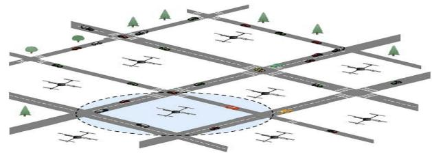  
Fig. 1. The assumed scenario [32].

## III. STATEMENT OF THE PROBLEM

We consider a routing protocol in VANETs that a set of vehicles collaborates with UAVs in order to ameliorate the routing. In this protocol, UAVs are used for transmitting packets of data to the desired destination directly, the computation of the connectivity of road segments and as nodes for maintenance when the network in the ground is sparsely connected. As regards that link failure is a very common event in VANETs, cooperation between vehicles and UAVs can help to reduce the delay of delivery and the packet losses. Generally, there are two ways for delivery of data that can be applied in parallel: (1) the data delivery using the communication among ground vehicles and UAVs, and (2) the communication between UAVs.

## A. Assumptions

In the VRU protocol, it is assumed that vehicles and UAVs are equipped with a global positioning system (GPS) and digital map. GPS is used to acquire the geographical position of nodes in network and digital map is applied to find the intersections of neighboring. In this protocol, energy of nodes is not a challenge because they have long life batteries that can be recharged by resources of energy such as fuel and energy of solar. Another hypothesis of the VRU protocol is that UAVs fly in constant and low altitude to be capable to communicate with vehicles. Also, UAVs use IEEE 802.11p wireless interfaces by a range of transmission up to 1000 m [42]. The assumed scenario is shown in Fig. 1.

## B. Model of System

In our system of communication, we use the IEEE 802.11p MAC protocol for communication between vehicles and communication between vehicles and UAVs. The communications in our system are classified into four categories:

1) Vehicle-to-vehicle communication (V2V): In V2V communication, vehicles communicate directly with each other in communication range or in a multi-hop mode indirectly. Vehicles can stash and transport the packets of data for a special moment until they achieve the next forwarders. However, there are some obstacles in urban area, which would lead to fail communication between vehicles.

2) Vehicle-to-infrastructure communication (V2I): Vehicles can communicate with fixed equipment next to the road such as roadside unit (RSU). The communication between vehicles and RSUs can provide a number of applications such as service discovery, internet access and etc.

3) Vehicle-to-UAV (V2U): As regards, UAVs can be considered as mobile nodes, the communication between vehicles and UAVs can be possible. Indeed, UAVs can have a large communication range in order to air-toground communication. In this case, obstacles such as buildings cannot cause communication failure. We note that UAVs can be used for delivering the packet of data when deliver the packet of data on the ground is not possible.

4) UAV-to-UAV (U2U): UAVs have various networking technologies for communication with each other. Indeed, each UAV can be organized as a mobile node in an ad hoc network and operate as relay node.

## IV. THE VRU PROPOSED PROTOCOL

In this section, the VRU (VANET Routing protocol with UAV-assisted) protocol for finding the efficient and secure connected path in vehicular ad hoc networks is described. This protocol includes two routing components: VRU\_vu (routing between vehicles and UAVs) and VRU\_u (routing between UAVs).

## A. VRU\_vu Protocol

One of the components of our proposed routing protocol is VRU\_vu that is used to deliver packets of data through vehicles on the ground. As previously mentioned, the geographical position of vehicles can be known using GPS. VRU\_vu has four steps: (1) the trust value of vehicles is evaluated and the malicious vehicles are detected with the assisted of UAVs, (2) the traffic density information is acquired with the help of UAVs through a centralized mechanism, (3) the connectivity is detected according to the information obtained from UAVs, and (4) the suitable next intersection is selected. In this protocol, each road segment is divided into fixed clusters that the communication range of vehicles is used to adjust the cluster size. Also, each UAV covers an area of four road segment. At present, clustering is used to improve the efficiency of ad hoc networks. In a structure of cluster, vehicles that are located in the cluster, have different situation such as cluster head or cluster member. Cluster heads operate as the access point and control of managing traffic. Vehicles in a cluster communicate directly with each other.

In order to select an appropriate vehicle as a cluster head by UAVs, the speed, position and trust value of vehicles are considered. The initial trust value $T r u s t _ { \upsilon } = 1$ is assigned to all vehicles in a cluster and the vehicle trust value is calculated using the technique described in section IV.A.1 The cluster heads initially are selected based on their positions since this method prevents the publication of additional messages in the network. For this purpose, the nearest vehicle to the center point of segment is selected as cluster head. Fig. 2 shows the formation of clusters and the choice of cluster heads. Therefore, the UAV selects the vehicle with the utmost value of the following score as cluster head

$$
\begin{array} { c } { { S c o r e \upsilon \nonumber = \displaystyle \frac { T r u s t \left( T A , \upsilon \right) } { P o s i t i o n \left( \upsilon \right) \times S p e e d \left( \upsilon \right) } } } \\ { { P o s i t i o n \left( \upsilon \right) = D i s t a n c e \left( \upsilon , C e n t r a l - p o i n t \right) } } \end{array}\tag{1}
$$

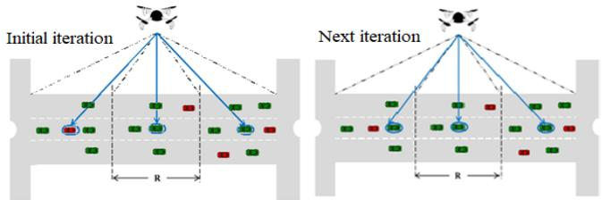  
Fig. 2. Selection of cluster heads [37].

where TA is a Trusted Authority that provide the different mechanisms of security.

1) Establishment of V2V Trust: Given that the security is an important issue for VANETs, the trust value of vehicles is calculated in order to detect the malicious vehicles. To select the most trusted vehicles, the trust value between the communicating vehicles is calculated. The calculation of intervehicular trust consists of two metrics: (1) direct trust, and (2) indirect trust. Direct trust is calculated from the direct interactions between vehicles, whereas indirect trust is defined as a recommendation of other vehicles about the trueness of interaction between two vehicles.

The direct trust value among two vehicles i and j is calculated as follows [37]:

$$
D T \left( i , j \right) = \frac { L ( i , j ) } { M \left( i , j \right) + L ( i , j ) } . \left[ 1 - \frac { 1 } { L \left( i , j \right) + 1 } \right]\tag{2}
$$

where $L ( i , j )$ and $M ( i , \ j )$ are the number of lawful and malicious actions between $v _ { i }$ and $v _ { j }$ from the perspective of $v _ { i } .$ respectively.

A lawful action is defined as the measurement of similarity between the efficient action carried out by a $v _ { j }$ and the same action performed from the point of view of the $v _ { i }$ . According to the procedure in [43], the following function is used to display an action X with n features

$$
\varphi : d  ( x _ { 1 } , x _ { 2 } , . . . , x _ { n } )
$$

Similarity of actions X1 and X2 is calculated as follows [44]:

$$
{ \begin{array} { r } { { \hat { k } } ( X 1 , X 2 ) = \left. { \frac { \varphi ( X 1 ) } { \lVert \varphi ( X 1 ) \rVert } } , { \frac { \varphi ( X 2 ) } { \lVert \varphi ( X 2 ) \rVert } } \right. } \\ { = { \frac { K ( X 1 , X 2 ) } { \sqrt { K ( X 1 , X 1 ) ~ k ( X 2 , X 2 ) } } } } \end{array} }\tag{3}
$$

where $k ( X I , X 2 )$ is computed by the following equation [44]:

$$
\begin{array} { l } { { k ( X 1 , X 2 ) = \langle \varphi ( X 1 ) , \varphi ( X 2 ) \rangle = \varphi _ { u } ( X 1 ) \cdot \varphi _ { u } ( X 2 ) \ } } \\ { { = \displaystyle \left( \sum _ { X 1 : u = \varphi ( X 1 ) } 1 \right) = \sum _ { ( X 1 , X 2 ) : u = \upsilon } 1 } } \end{array}\tag{4}
$$

where u is a feature of X1 and v is the same feature of X2. An action is considered as lawful, if the value of similarity is more than 0.5.

```powershell
Input: packet (i, j)
Output: DT (i, j) and Trust (i, j) are updated
if packet (i, j) is lawful then
L (i, j) ← L (i, j) +1
else
M (i, j) ← M (i, j) + 1
Compute DT (i, j) using equation 2.
$( 0 \leq D T ( i , j ) \leq 1 )$
if DT $( { \mathrm { i } } , { \mathrm { j } } ) = = 0$ then
Trust (i, j) ← 0
else
Incorporate the novel DT (i, j) with IT (i, j)
Regulate the value of Trust (i, j) by equation 6
(0 ≤ Trust(i, i) ≤ 1)
```  
Fig. 3. The pseudo-code of evaluation of trust based on the direct trust.

Inputs: DT (i, j) and Beacon (i, j)   
Output: IT (i, j) and Trust (i, j) are updated   
if (Trust (i, j) > threshold (i, j)) then   
Regulate the value of IT (i, j) using equation 5   
$( 0 \bar { \leq } I T ( i , j ) \leq 1 )$   
Incorporate the novel IT (i, j) with DT (i, j)   
Regulate the value of Trust (i, j) by equation 6   
(0 ≤ Trust(i, j) ≤ 1)   
else   
Delete (Beacon (i, j))  
Fig. 4. The pseudo-code of evaluation of trust based on the indirect trust.

The indirect trust from vehicle $v _ { i }$ to another vehicle $v _ { j }$ is computed by the equation (5) [37]:

$$
\begin{array} { l } { { I T \left( i , j \right) } } \\ { { = \left[ \begin{array} { l } { { \forall { v _ { k } } \in N e i g h b o r ( { v _ { i } } ) } } \\ { { \qquad \prod _ { N } \qquad \left( D T \left( i , k \right) . \mathrm { v i e w p o i n t } ( k , j ) \right) ^ { \frac { 1 } { 2 } } } } \end{array} \right] ^ { \frac { 1 } { N } } } } \end{array}\tag{5}
$$

where N is the number of recommenders, $N e i g h b o r ( \upsilon _ { i } )$ is the set of one hop neighbors of $v _ { i }$ and viewpoint(k, j ) is the viewpoint of $\upsilon _ { k }$ about $v _ { j }$ . In our proposed protocol, instead of using a new message for recommendations of vehicles, the format of beacon messages is modified by adding two fields. These fields are the identity of the neighbor and the viewpoint of the sender of beacon about that neighbor. When a vehicle $v _ { i }$ receives a beacon message, it computes the indirect trust value for every neighboring vehicle $v _ { j }$ . The pseudo codes for evaluation of trust based on the direct trust and the indirect trust are given in the Figs. 3 and 4, respectively.

Trust level between vehicles is calculated as follows [37]:

$$
\begin{array} { r l } & { T r u s t \left( i , j \right) = \left[ \left( 1 - \frac { 1 } { \# i n t + 1 } \right) . D T ( i , j ) \right] } \\ & { \qquad + \left[ \frac { 1 } { \# i n t + 1 } . I T ( i , j ) \right] } \end{array}\tag{6}
$$

where $D T ( i , j )$ and $I T ( i , j )$ are the direct trust and indirect trust computed by a vehicle $v _ { i }$ about vehicle $v _ { j } .$ , respectively. #int is the number of interactions. Due to the direct trust is more pertinent than indirect trust when #int increases, $\scriptstyle { \frac { 1 } { \# i n t + 1 } }$ is a factor that is used for adjusting the trust levels of vehicleto-vehicle. Indeed, more interactions lead to higher weight are assigned to direct trust and less interactions lead to higher weight are assigned to indirect trust. If the trust level of the vehicle is more than a pre-specified threshold, it considered as a trustworthy vehicle.

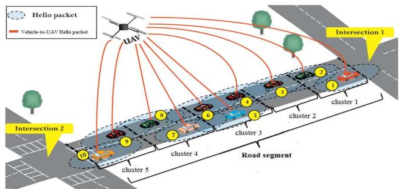  
Fig. 5. Estimate of traffic density [32].

TABLE I  
DENSITY TABLE OF THE ROAD SEGMENT
<table><tr><td rowspan=1 colspan=1>Cluster</td><td rowspan=1 colspan=1>Number of vehicles</td><td rowspan=1 colspan=1>Vehicles</td></tr><tr><td rowspan=1 colspan=1>1</td><td rowspan=1 colspan=1>2</td><td rowspan=1 colspan=1> $\underline { { v _ { 1 } , v _ { 2 } } }$ </td></tr><tr><td rowspan=1 colspan=1>2</td><td rowspan=1 colspan=1>1</td><td rowspan=1 colspan=1> $\underline { { v _ { 3 } } }$ </td></tr><tr><td rowspan=1 colspan=1>3</td><td rowspan=1 colspan=1>3</td><td rowspan=1 colspan=1> $\underline { { v _ { 4 } , v _ { 5 } , v _ { 6 } } }$ </td></tr><tr><td rowspan=1 colspan=1>4</td><td rowspan=1 colspan=1>2</td><td rowspan=1 colspan=1> $\underline { { v _ { 7 } , v _ { 8 } } }$ </td></tr><tr><td rowspan=1 colspan=1>5</td><td rowspan=1 colspan=1>2</td><td rowspan=1 colspan=1> ${ \underline { { v _ { 9 } , v _ { 1 0 } } } }$ </td></tr></table>

a) Detection of malicious nodes using UAV-assisted: In this section, the process of detection of malicious nodes using UAVs is explained. Indeed, using UAVs will be improved the detection process.

First, the trust value between vehicles is appraised. Then, UAVs start an appraisal gathering phase. They select a cluster head in each cluster in order to report the collected list of possible malicious vehicles named Cluster Local Black List (CLBL). This is an aggregation of vehicle level that the chosen cluster head calculates the average value of the collected viewpoints about their neighbors and appends it to the CLBL; CLBLs are sent to RSUs. Then RSUs start another aggregation phase and calculate the average value for reports of cluster heads and then send a segment Local Black List (LBL) towards the Trusted Authority (TA). TA allocates an appraisal value between 0 and 1 to possible malicious vehicles in the network.

2) Estimate of Traffic Density: To estimation of traffic density for determining road segment, a UAV collects the Hello packets that are exchanged among vehicles on every segment periodically. As mentioned already, a UAV is located on an area of the four road segment. Therefore, each UAV maintains a table named density table which includes the number of vehicles and their coordinates in each road segment. Fig. 5 and Table I show an example of estimate of traffic density and a density table, respectively. The whole number of vehicles in a segment is computed by following equation [32]:

$$
N \left( R s \right) = \sum _ { i = 1 } ^ { | R s | } N ( C _ { i } )\tag{7}
$$

where $| \mathrm { R s } |$ is the whole number of clusters in a determined road segment Rs and $N \left( C _ { i } \right)$ is the number of vehicles in the cluster $C _ { i }$

3) Detection of Connection: To detect the connection of a road segment, the UAV sorts the density table based on the vehicles geographic coordinates. Then it calculates the degree of connection based on the arranged table. There are some definitions to calculate the degree of connection:

1) Two vehicles connected directly: vehicles $v _ { i }$ and $v _ { j }$ are connected directly, if distance between them is less than the vehicles range of transmission $\left( R _ { v } \right)$ (Cond $\left( \upsilon _ { i } , \upsilon _ { j } \right) = T r u e , i f d i s t a n c e ( \upsilon _ { i } , \upsilon _ { j } ) \leq R _ { \upsilon } )$

2) Two vehicles connected: vehicles v<sub>i</sub> and $v _ { j }$ are connected, if Cond $\left( \upsilon _ { i } , \upsilon _ { j } \right) = T r u e$ , or there is a vehicle $\upsilon _ { g }$ so that Cond $\left( \upsilon _ { i } , \upsilon _ { g } \right) = T r u e$ and Cond $\left( \upsilon _ { g } , \upsilon _ { j } \right) =$ $T r u e$

3) A road segment connected: road segment Rs is connected $( C o n d ( R s ) ~ = ~ t r u e )$ , if there is a direct or indirect connection between the two ends of this segment via the vehicles on it.

According to above definitions, the degree of connection is calculated as follows [32]:

$$
\gamma = \prod _ { i = 0 } ^ { | N | - 1 } \lfloor \times \rfloor \frac { R _ { \upsilon } } { d i s t a n c e ( n _ { i } , n _ { i + 1 } ) }\tag{8}
$$

where $n _ { i }$ and $n _ { i + 1 }$ are consecutive nodes that $n _ { i } , n _ { i + 1 } \in N$ N is the arranged set of vehicles based on their geographic coordinates in a segment, along with the two intersections. Distance between nodes $n _ { i }$ and $n _ { j }$ is computed by following equation

$$
\begin{array} { l } { d i s t a n c e \left( n _ { i } , n _ { j } \right) } \\ { = \left\{ \begin{array} { l l } { R _ { \upsilon } \ i f \ x _ { i } = x _ { j } \ a n d \ y _ { i } = y _ { j } } \\ { \sqrt { ( x _ { i } - x _ { j } ) ^ { 2 } + ( y _ { i } - y _ { j } ) ^ { 2 } } \ o t h e r w i s e } \end{array} \right. } \end{array}\tag{9}
$$

where $( x _ { i } , y _ { i } )$ and $\left( x _ { j } , y _ { j } \right)$ are the coordinates of $n _ { i }$ and $n _ { j }$ , respectively.

A segment is connected, if $\gamma ~ > ~ 0$ . The segment with the utmost value of $\gamma$ is chosen as the most connected segment to transmit the packets of data. Due to the fact that the floor of $\lfloor \times \rfloor \frac { R _ { \upsilon } } { d i s t a n c e ( n _ { i } , n _ { i + 1 } ) }$ is used in equation (8), $\gamma = 0$ means that the segment is disconnected. The disconnected segment ignores and VRU\_vu is switched to $\mathrm { \ v R U \_ u }$ that delivers the packets of data using only UAVs. However, if $\mathrm { \ v R U \_ u }$ fails to transmit the packets of data to the destination, the recent vehicle utilizes the technique of carrying and forwarding that is a strategy of recovery.

4) Segment Choosing: The VRU\_vu protocol computes a score for each road segment based on the trust value of vehicles, the degree of connection, the shortest distance between the current vehicle and the destination and the actual distribution of the traffic density. The actual distribution of the density of traffic is calculated by the corresponding UAV based on the vehicles’ average number in each area and the standard deviation of the densities of area that are computed by equations (10) and (11), respectively [32].

$$
\mu = \frac { 1 } { | R s | } \sum _ { i = 1 } ^ { | R s | } N ( C _ { i } )\tag{10}
$$

$$
\sigma = \sqrt { \frac { 1 } { | R s | } \sum _ { i = 1 } ^ { | R s | } { ( N ( C _ { i } ) - \mu ) ^ { 2 } } }\tag{11}
$$

N(c): the one-hop neighbors of vehiclei   
if (vehiclei == Destination vehicle) then   
Packet successfully received   
else   
if (Destination vehicle ∈ N(c)) then   
The packet of data is forwarded directly to the destination vehicle   
else   
if (Position of vehicle ∈ Zones of intersection) then   
for each (Segment){   
Collect the value of Score, from UAVs   
Select the next intersection with biggest the score   
}   
else   
if (∃ vehicle ∈ N(c)) the   
Pass the packet of data to the next intersection by the   
greedy forwarding   
else   
Use the carry and forward technique by the vehicle   
Wait for neighbors  
Fig. 6. The pseudo-code of $\mathrm { V R U \_ v u }$ protocol.

The great standard deviation shows that the vehicles are extensively scattered. While the tiny standard deviation shows that the vehicles are not extensively scattered and therefore, distributed of vehicles in the corresponding route is not good and disconnection can occur at any time.

After acquiring sufficient information about each road segment, its score is computed as follows

$$
S c o r e _ { s } = T r u s t \times \gamma \times \left( \frac { R _ { \upsilon } } { ( 1 + \sigma ) \times D } \right)\tag{12}
$$

where $R _ { v }$ is the transmission range of vehicle V and D is the shortest distance between the current vehicle and the destination vehicle.

The hello packets containing the computed score are periodically broadcasted to vehicles that are at the intersection. Indeed, the UAV surveys an almost exact distribution of vehicles on segments using periodically update the score of road segments. The road segment with the utmost $S c o r e _ { s }$ is selected as the most regular and stable road segment for delivering the packet of data to the destination. After selecting the appropriate road segment, the greedy forwarding technique is utilized to forward the packet of data before achieving at the next intersection. However, because of the high vehicles speed, link failure and disconnection are a very common event. When link failure occurs, transportation vehicle transports the packet to the next intersection or hand it over to the vehicle that moves to the next intersection. Fig. 6 shows the pseudo code of VRU\_vu protocol.

## B. VRU\_u Protocol

The second part of our proposed routing protocol is ${ \mathrm { V R U } } _ { - } \mathbf { u } ,$ which can run with the VRU\_vu simultaneously. VRU\_u is a reactive routing protocol that finds routs on demand, using Ant Colony Optimization (ACO) algorithm. This protocol can find the most appropriate route between UAVs so that aims to generate a low end-to-end delay and high packet delivery ratio through a route guaranteeing the long term connection. The high mobility of nodes can cause disconnections in the network. Therefore, we use the intelligent route maintenance that discovers an alternative route and prevents initializing a novel process of discovery. In the following, the VRU\_u protocol is explained in detail. First, the process of ACO is described and then, the related discovery of route and recovery of route techniques will be discussed.

1) Ant Colony Optimization (ACO): Ant colony optimization (ACO) is an intelligence routing algorithm that mimics the behavior of ants seeking for food source. Ants interchange information with each other by a chemical material named pheromone. There are two fundamental phases in ACO algorithm [3, 13, 16]:

1) Initialization: ACO algorithm can be used to search for an optimum path in a graph with N nodes and L edges. There are a number of ants in each node. Also, each edge has assigned with a weight. The rule of node transition, which calculates the probability of selecting node $j$ as the next node from node i by ant k, is defined using the following equation<sub>:</sub>

$$
\begin{array} { r l } & { p _ { i j } ^ { k } \left( t \right) } \\ & { = \left\{ \begin{array} { l l } { \displaystyle \frac { \left[ \tau _ { i j } \left( t \right) \right] ^ { \alpha } \left[ \eta _ { i k } \left( t , \theta \right) \right] ^ { \beta } } { \sum _ { j \in I _ { k } } \left[ \tau _ { i s } \left( t \right) \right] ^ { \alpha } \left[ \eta _ { i s } \left( t , \theta \right) \right] ^ { \beta } } } & { i f j \in I _ { k } } \\ { 0 } & { e l s e } \end{array} \right. } \end{array}\tag{13}
$$

where $\tau _ { i j }$ is intensity of pheromone and $\eta _ { i k }$ denotes to value of heuristic. Parameters α and $\beta$ control the significance of intensity of pheromone and value of heuristic. $I _ { k }$ is the set of neighborhood node that ant k can be selected at the next phase.

2) Update pheromone: During selecting a route to the desired destination by a source node, when an ant achieved to this destination, it turns back to its source node through reverse link and updates the value of pheromone on the links. The rule of update pheromone consists of reinforcement of pheromone and evaporation of pheromone. The first is increasing of value of pheromone on the traversed links by the ant, while the latter denotes decreasing of value of pheromone. In this way, the ants discover the shortest route from the source node to the destination node. The following equation represents the rule of update pheromone

$$
\tau _ { i j } ^ { n e w } = \left( 1 - \rho \right) . \tau _ { i j } ^ { o l d } + \sum _ { k = 1 } ^ { N } \Delta \tau _ { i j } ^ { k }\tag{14}
$$

where N is the number of ants and $\rho \in ( 0 , 1 ]$ denotes to the coefficient of decline pheromone. $\Delta \tau _ { i j } ^ { k }$ is the quantity of pheromone laid on links i and j by ant $k$ that is computed as follows

$$
\Delta \tau _ { i j } ^ { k } = \left\{ \begin{array} { l l } { \frac { Q } { f _ { k } } } & { i f \ t h e \ k t h \ a n t \ t r a v e r s e d \ l i n k ( \ i , j ) } \\ { 0 } & { o t h e r w i s e } \end{array} \right.\tag{15}
$$

where $Q$ and $f _ { k }$ denote to a constant value and the cost of discovered route by ant k, respectively.

2) Route Discovery: When a source vehicle needs to send data to a specific destination vehicle, the process of route discovery initiates. In this process, the source vehicle broadcasts a Request-Ant packet in order to find all the subsequences of UAVs towards the destination and its geographical position. The Request-Ant packet contains the Source ID, the Destination ID, Intermediate UAV ID stack, latitude, longitude and altitude UAVs, Hop Count, Type and Life time. In this packet, the type field sets by 1.

When a UAV receives a control packet, it checks the type field. If the received packet is a Request-Ant packet, the UAV checks the stack of intermediate UAV ID field of this packet. If it detects its ID, this packet will be ignored. Otherwise, it increases the Hop Count field by one and adds its ID in Intermediate UAV ID stack. Then, the UAV will broadcast the Request-Ant packet. The same procedure is performed by all intermediate UAVs.

When the Request-Ant packet is received by the destination vehicle, it includes the address of intermediate UAV ID along the route. The destination vehicle increases the Hop Count field and converts Request-Ant packet into a Reply-Ant packet. Hence, in Reply-Ant packet the type field sets by 0. Then, it puts the reversed address of the intermediate UAVs in the Intermediate UAV ID stack in Reply-Ant packet and unicasts this packet toward the source vehicle.

If the Reply-Ant packet is received by the node, it investigates the field of destination. If this field is the same as the source vehicle address, it saved the available route in the Intermediate UAV ID stack and the value of Hop Count in its routing table. Otherwise, the Reply-Ant packet is forwarded by the intermediate nodes through the route saved in the Intermediate UAV ID stack.

Once the source vehicle receives the Reply-Ant packet, it computes the pheromone value of the route as follows

$$
\begin{array} { l } { { \displaystyle R o u t e ~ p h e r o m o n e ~ \upsilon a l u e } } \\ { ~ = ~ \prod _ { i = 0 } ^ { H C - 1 } ~ \lfloor \times \rfloor ~ \frac { R _ { U } } { d i s t a n c e ( u _ { i } , u _ { i + 1 } ) } } \end{array}\tag{16}
$$

where HC and $R _ { U }$ are the Hop Count filed and the transmission range of UAVs, respectively. distance $\left( u _ { i } , u _ { i + 1 } \right)$ represents the distance between two consecutive nodes. The pheromone value is used to select the best routes. Indeed, when more than one route is discovered, the route that has the highest value of pheromone is selected by the source vehicle for forwarding the packet of data to the destination vehicle.

Because of the high speed of nodes, especially UAVs in network, link failure is a very common event. If a disconnection of the route is occurred, the first UAV of vehicle that discovered this disconnection will investigate other paths that already stored in the intermediate node and endeavor to detect other routes. If an alternative route is found, the packet of data is forwarded through this route. Otherwise, an error message is forwarded to the source vehicle and it re-initiates a novel process of route discovery.

If the address of the node is discovered in the Intermediate UAV ID stack of the Request-Ant packet, it means that there is a loop. This node first puts the address of nodes that saved after its address in this stack (named looping nodes) and then it discards this packet. After that, it sends the repetitive packet towards whole nodes except looping nodes.

TABLE II  
SIMULATION PARAMETERS
<table><tr><td rowspan=1 colspan=1>Parameters</td><td rowspan=1 colspan=1>Values</td></tr><tr><td rowspan=1 colspan=1>Dimension</td><td rowspan=1 colspan=1>4000 m × 4000 m</td></tr><tr><td rowspan=1 colspan=1>Time of simulation</td><td rowspan=1 colspan=1>180 s</td></tr><tr><td rowspan=1 colspan=1>Generator of mobility</td><td rowspan=1 colspan=1>VanetMobiSim</td></tr><tr><td rowspan=1 colspan=1>Number of intersections</td><td rowspan=1 colspan=1>25</td></tr><tr><td rowspan=1 colspan=1>Number of roads</td><td rowspan=1 colspan=1>40</td></tr><tr><td rowspan=1 colspan=1>Number of vehicles</td><td rowspan=1 colspan=1>100-3000</td></tr><tr><td rowspan=1 colspan=1>Number of UAVs</td><td rowspan=1 colspan=1>16-80</td></tr><tr><td rowspan=1 colspan=1>Speed of vehicle</td><td rowspan=1 colspan=1>0-50 km/h</td></tr><tr><td rowspan=1 colspan=1>Speed of UAV</td><td rowspan=1 colspan=1>0-60 km/h</td></tr><tr><td rowspan=1 colspan=1>Transmission range of vehicles</td><td rowspan=1 colspan=1>≈ 300 m</td></tr><tr><td rowspan=1 colspan=1>Transmission range of UAVs</td><td rowspan=1 colspan=1>≈ 1000 m</td></tr><tr><td rowspan=1 colspan=1>MAC/PHY</td><td rowspan=1 colspan=1>IEEE 802.11p</td></tr><tr><td rowspan=1 colspan=1>Packet size</td><td rowspan=1 colspan=1>1KB</td></tr><tr><td rowspan=1 colspan=1>Link bandwidth</td><td rowspan=1 colspan=1>1 Mbps</td></tr><tr><td rowspan=1 colspan=1>Topology</td><td rowspan=1 colspan=1>Urban</td></tr><tr><td rowspan=1 colspan=1>Frequency band</td><td rowspan=1 colspan=1>5.9 GHz</td></tr><tr><td rowspan=1 colspan=1>% of malicious vehicles</td><td rowspan=1 colspan=1>20%</td></tr></table>

## V. PERFORMANCE EVALUATIONS

In this section, at first the simulation parameters and environment are represented. Then, the results of simulations and the comparison of VRU\_vu and VRU\_u protocols with other protocols are presented.

## A. Simulation Setup

To evaluate the VRU routing components performance, we use the network simulator NS-2.35 [45] under Linux Ubuntu 12.04. NS2 is an object-oriented and discrete event simulator that simulates routing, TCP and multicast protocols over wireless and wired networks. In our simulation, an urban scenario $4 \times 4 k m ^ { 2 }$ have been created that includes 40 two way road segments and 25 intersections. VanetMobiSim generator of mobility [46] is used to produce the motions of vehicles. To produce the motions of UAVs, we have applied MobiSim [47]. Also, it is assumed that UAVs fly at a steady altitude not exceeding 200 m.

In this simulation, the vehicle range of communication is set to <sub>≈</sub> 300 m and communication range of UAVs is supposed to 1000 m. Also, the IEEE 802.11p standard is used at the MAC layer for whole nodes. The results and experiments are run 10 times to attain the 95% confidence. The parameters of the simulations are displayed in Table II.

## B. Metrics

The following criteria are utilized for the process of evaluations [3], [32]:

1) Packet delivery ratio: packet delivery ratio (PDR) is the ratio of the whole number of packets that the destinations are successfully received to the whole number of packets that sources are produced. It is computed by the following equation<sub>:</sub>

$$
P D R = { \frac { \# P _ { s } } { \# P _ { w } } }\tag{17}
$$

where# $P _ { s }$ represents the number of packet successfully received and # $P _ { w }$ is the whole number of packets originated for the destinations.

2) End-to-end delay: end-to-end delay (EED) is the time required to transmit a packet all over a network from source node towards destination node. The end-to-end delay can be computed as follows

$$
E E D = \frac { \sum ^ { p _ { i } \in P _ { s } } T _ { A } \left( p _ { i } \right) - T _ { D } ( p _ { i } ) } { \# P _ { s } }\tag{18}
$$

where $p _ { i }$ is an arrived packet. $T _ { A } \left( p _ { i } \right)$ and $T _ { D } ( p _ { i } )$ are the arrival time of packet $p _ { i }$ and the delivery time of the $p _ { i } .$ , respectively.

3) Average number of hops: average number of Hops (AHop) is calculated by divided the whole number of packets successfully handed over by the whole number of hops traveled with all packets. It is computed by the following equation

$$
A H o p = \frac { \sum ^ { p _ { i } \in P _ { s } } H ( p _ { i } ) } { \# P _ { s } }\tag{19}
$$

where $H ( p _ { i } )$ refers to the number of hops crossed by packet $p _ { i }$ before attaining its destination.

4) Overhead: overhead is described as the ratio of additional packets of routing to the successfully handed over packets at destinations. Overhead is computed as follows

$$
o v e r h e a d = \frac { \# M } { \# P _ { w } }\tag{20}
$$

where M is a subset of $P _ { w }$ and #M represents the whole number of message of routing needed for discovering routs for packets of data.

5) Detection ratio: detection ratio can be determined as the ratio of the number of malicious vehicles that properly discovered during routing to the whole number of malicious vehicles in the network.

## C. Experiential Results

In this section, the efficiency and performance of our proposed protocols with other routing protocols such as UVAR [32] and AODV [28] are compared. Given that UVAR and AODV protocols did not consider the security, so the detection performance of our proposed protocol is compared with TFDD [36] and AECFV [48] protocols that have considered the security issue. The acquired results from executing the tests of simulations are demonstrated in Figs. 7 until 16. These tests are performed with different density of vehicles and UAVs. The number of vehicles grows from 100 to 3000. While the number of UAVs augments from 16 to 80. In figures relating to variable vehicles density, the number of UAVs is set 16. Also, in figures regarding to variable UAVs density, the number of vehicles is set 200. Although calculations of trust value have been added in VRU\_vu protocol, the simulation results are close to the UVAR-G protocol for some of the criteria such as delay and average number of hops. In addition, the simulation results show that our proposed protocol improves the investigated criteria such as packet delivery ratio compared to other protocols. Indeed, our proposed protocol uses the monitoring of vehicles behavior that can detect malicious vehicles in the network.

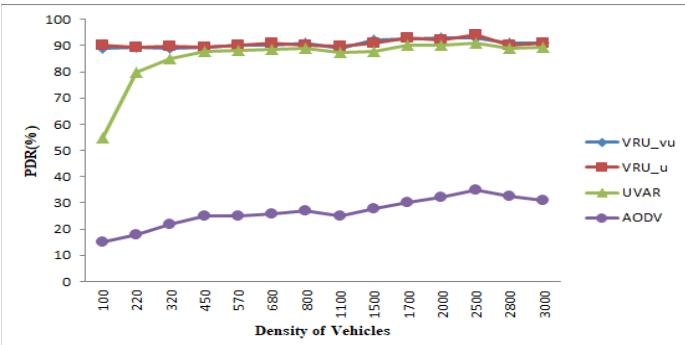

Fig. 7. Packet delivery ratio versus density of vehicles.  
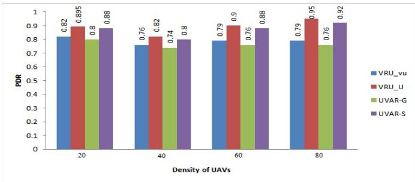  
Fig. 8. Packet delivery ratio versus density of UAVs.

As previously mentioned, the VRU routing protocol contains of two fundamental parts named VRU\_vu and VRU\_u protocols. In VRU\_vu protocol, a score for each road segment is computed. The road segment with the highestScore<sub>s</sub> is chosen as the most regular and stable road segment in order to deliver the packet of data to the destination. Hence, it requires O(log(N)) that N is the number of road segments. In the VRU\_u protocol the ACO algorithm is used to find a suitable route. Hence, it requires O(mlog(m)) that m is the problem instance size. Therefore, the computation overhead is ${ \cal O } ( \log ( N ) ) ~ + ~ { \cal O } ( m \log ( m ) )$ . In our proposed routing protocol, two messages (HELLO, beacon message) are broadcasted by the vehicles in the network in VRU\_vu protocol. While in VRU\_u protocol, UAVs broadcast three messages named Request-Ant, Reply-Ant and error message in the network. Therefore, the communication overhead of this routing protocol is $2 N _ { v } + 3 N _ { u }$ , where $N _ { v }$ and $N _ { u }$ represent the whole number of vehicles and the whole number of UAVs, respectively. This overhead is acceptable compared to other algorithms and it can be improved by using an advanced framework for ACO algorithm.

Figs. 7 and 8 show the packet delivery ratio as a function different density of vehicles and UAVs, respectively. We can see in Fig. 7 that the packet delivery ratio of our proposed protocols is more than other reviewed protocols. The UAV-assisted mechanism provides reasonable assurance of the accuracy of the route selection. Indeed, our proposed protocol compared to UVAR and AODV protocols increase the packet delivery ratio by 4% and 16%, respectively. In Fig. 8, the variable density of UAVs is demonstrated. As seen in this figure, when the number of UAVs increases, the packet delivery ratio of VRU\_u protocols also goes up; because it uses an Ant Colony Optimization (ACO) algorithm to discover the appropriate route between UAVs.

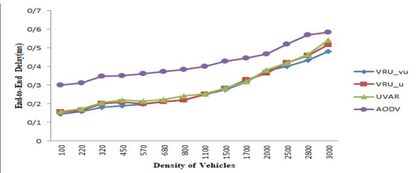  
Fig. 9. End-to-end delay versus density of vehicles.

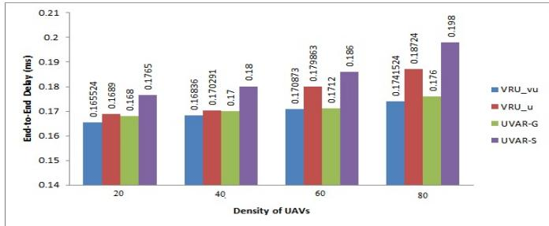  
Fig. 10. End-to-end delay versus density of UAVs.

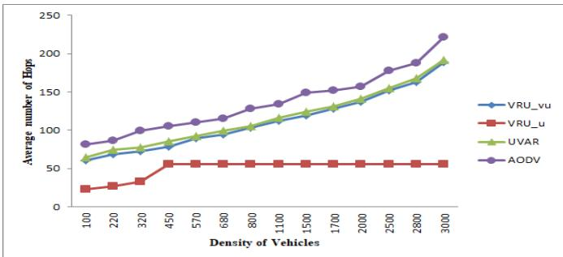  
Fig. 11. Average number of hops versus density of vehicles.

In Fig. 9, the end-to-end delay as a function of the density of vehicles is shown. The end-to-end delay of VRU\_vu protocol is less than UVAR and AODV. This is due to the fact that this protocol uses the UAVs for accurate calculations the score of road segments. It provides to select the appropriate road segment and also shorter distance that the data packets traveled towards the destination reduces considerably the delay. Generally, our proposed protocol in comparison to UVAR and AODV protocols decreases the end-to-end delay by 5% and 13%, respectively. Fig. 10 shows the end-to-end delay versus the density of UAVs. In this figure, is clearly shown that whenever the number of UAVs grows, the delay of VRU\_vu is stable. This is because of the number of UAVs has nothing to do with the operation of this protocol, and only one UAV needs in four road segment to do the routing correctly.

Figs. 11 and 12 demonstrate the average number of hops based on variable density of vehicles and UAVs, respectively. As seen in Fig. 11, there is a proportional relationship between the average numbers of hops with the number of vehicles in all protocols except VRU\_u protocol. This is due to that VRU\_u protocol uses a constant number of UAVs for the delivery of packets and don’t use of vehicles on the ground. As shown in Fig. 11, the average number of hops in our proposed protocol (VRU\_vu) is lower than other protocols. Indeed, the average number of hops of VRU\_vu is about 3% and 22% less than UVAR and AODV protocols, respectively. Also the increasing number of vehicles provides the increasing average number of hops. Indeed, increasing the number of vehicles will increase the distance between the source and destination vehicles, which requires more number of hops to find the route. Fig. 12 illustrates that the VRU\_u protocol is better than VRU\_vu protocol because of using UAVs to deliver the packets of data. In fact, in the VRU\_u protocol the average number of hops is minimized by avoiding inessential hops, particularly when the network is very dense.

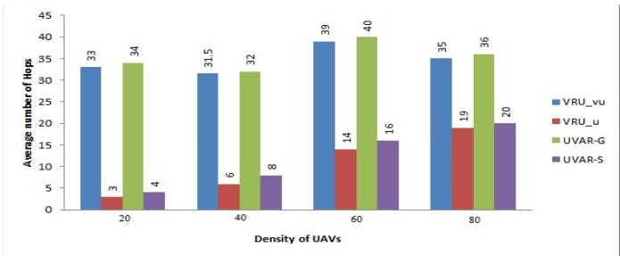  
Fig. 12. Average number of hops versus density of UAVs.

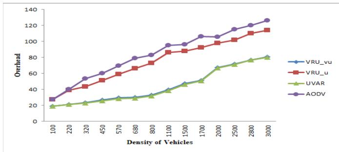  
Fig. 13. Overhead versus density of vehicles.

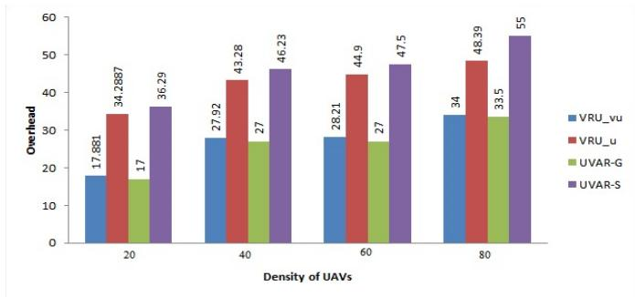  
Fig. 14. Overhead versus density of UAVs.

Figs. 13 and 14 represent overhead with different density of vehicles and UAVs, respectively. From Fig. 13, it can be seen that growth the number of vehicles provides growth the overhead. While a significant increase for the VRU\_u does not exist. Because this protocol does not use any additional packet except the necessary control packet for routing. Also, the overhead of the VRU\_u protocol is about 40% less than the AODV protocol. This is due to the reduction in the number of UAVs compared to vehicles and the use of alternative route maintenance. As shown in Fig. 14, when the number of UAVs increases, the overhead of VRU\_u protocol also goes up. This is mainly because of using the additional packets of routing, such as Request-Ant and Reply-Ant.

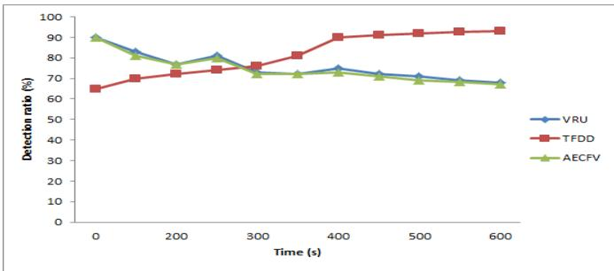  
Fig. 15. Detection ratio.

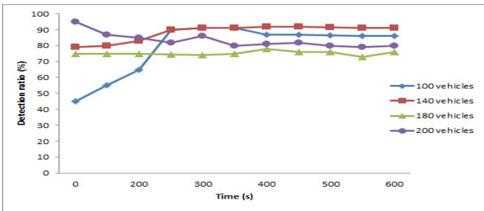  
Fig. 16. Detection ratio of the proposed protocol for different density of vehicles.

TABLE III  
PERCENTAGE OF IMPROVEMENT OF VRU PROTOCOL COMPARED TO UVAR AND AODV PROTOCOLS
<table><tr><td rowspan=1 colspan=1></td><td rowspan=1 colspan=1>% of improvement ofVRU protocol comparedto UVAR protocol [32]</td><td rowspan=1 colspan=1>% of improvement of VRUprotocol compared toAODV protocol [28]</td></tr><tr><td rowspan=1 colspan=1>PDR</td><td rowspan=1 colspan=1>4%</td><td rowspan=1 colspan=1>16%</td></tr><tr><td rowspan=1 colspan=1>EED</td><td rowspan=1 colspan=1>5%</td><td rowspan=1 colspan=1>13%</td></tr><tr><td rowspan=1 colspan=1>AHop</td><td rowspan=1 colspan=1>3%</td><td rowspan=1 colspan=1>22%</td></tr><tr><td rowspan=1 colspan=1>Overhead</td><td rowspan=1 colspan=1>8%</td><td rowspan=1 colspan=1>40%</td></tr></table>

TABLE IV

PERCENTAGE OF IMPROVEMENT OF VRU PROTOCOL COMPARED TO TFDD AND AECFV PROTOCOLS
<table><tr><td rowspan=1 colspan=1></td><td rowspan=1 colspan=2>% of improvement of VRUprotocol compared to TFDDprotocol [36]</td><td rowspan=1 colspan=1>% of improvement ofVRU protocolcompared to AECFVprotocol [48]</td></tr><tr><td rowspan=2 colspan=1>Detection ratio</td><td rowspan=1 colspan=1>0-300 s</td><td rowspan=1 colspan=1>300-600 s</td><td rowspan=2 colspan=1>2%</td></tr><tr><td rowspan=1 colspan=1>19%</td><td rowspan=1 colspan=1>- 23%</td></tr></table>

Fig. 15 shows the obtained detection ratio of the proposed protocol compared to the TFDD and AECFV protocols for 200 vehicles (without UAVs). Indeed, the Fig. 15 investigates the security performance of the proposed protocol. As shown in this figure, the detection ratio of the proposed protocol is roughly the same as the AECFV protocol. While the detection ratio of TFDD protocol in comparison to the proposed protocol increases with the time span. However, the TFDD and AECFV protocols do not have the ability to deal with malicious pseudonyms changing strategies.

Fig. 16 shows the detection performance of malicious nodes for various densities of vehicles using the diagnostic procedure with the help of UAVs. The utilize of UAVs will improve the detection ratio by approximately 7% compared to the detection ratio without using these UAVs.

Tables III and IV are the comparison tables that show the results based on percentage of improvement. In Table III, percentage of improvement of VRU protocol compared to UVAR and AODV protocols is demonstrated. Indeed, the UAVassisted mechanism for accurate computation the score of road segments and detection of the malicious vehicle provides reasonable assurance of the accuracy of the route selection. Table IV shows the percentage of detection ratio improvement of VRU protocol in comparison to TFDD and AECFV protocols that investigate the security issue.

## VI. CONCLUSION

Vehicular Ad hoc Networks (VANETs) consist sets of vehicles that are connected through wireless links. Because of the application and characteristics of these networks, designing an effective routing protocol is a popular and challenging research issue. In this paper, a novel routing protocol, named VRU, has been proposed to support routing in ad hoc mode between vehicles and UAVs and also between UAVs themselves. This protocol is a set of two distinct protocols: VRU\_vu for communication between vehicles and UAVs and VRU\_u for communication between UAVs. The major steps of VRU protocol are: using UAVs to appraise the density of vehicles in a given road segment by exchanging and monitoring Hello messages between vehicles, using a trust-based scheme with help of UAVs to detect the malicious vehicles that change pseudonyms, selecting appropriate routes for transmitting the packets of data using the help of UAVs, applying UAVs to route packets of data, via VRU\_u, when the density of vehicles is not sufficient to route packets via vehicles. The simulation results display that VRU protocol is suitable in the urban scenario and in comparison to other reviewed routing protocol improves the packet delivery ratio by 16% and decrease the overhead by 40% and end-to-end delay by an average of 13%. Also, the use of UAVs in this protocol improves the detection ratio by approximately 7% in comparison to the detection ratio without employing UAVs. However, the proposed protocol (VRU) can be only used in urban scenario. Also, VRU\_u protocol that creates the communication between UAVs is vulnerable to the intrusion of malicious UAVs. In the future, the proposed protocol can be developed to other scenarios like rural and highways based on the proposed techniques here for urban and a novel security protocol is introduced to detect malicious UAVs. Other intelligent behaviors can be studied to reinforce the proposed mechanism of detection and present a routing protocol with effective energy for routing in VANET. Also, the proposed protocol can be improved by using energy saving, which is crucial to UAVs life time.

## REFERENCES

[1] S. Al-Sultan, M. M. Al-Doori, A. H. Al-Bayatti, and H. Zedan, “A comprehensive survey on vehicular ad hoc network,” J. Netw. Comput. Appl., vol. 37, pp. 380–392, Jan. 2014.

[2] H. Hasrouny, A. E. Samhat, C. Bassil, and A. Laouiti, “Misbehavior detection and efficient revocation within VANET,” J. Inf. Secur. Appl., vol. 46, pp. 193–209, Jun. 2019.

[3] H. Fatemidokht and M. K. Rafsanjani, “F-ant: An effective routing protocol for ant colony optimization based on fuzzy logic in vehicular ad hoc networks,” Neural Comput. Appl., vol. 29, no. 11, pp. 1127–1137, Jun. 2018.

[4] B. Mokhtar and M. Azab, “Survey on security issues in vehicular ad hoc networks,” Alexandria Eng. J., vol. 54, no. 4, pp. 1115–1126, Dec. 2015.

[5] S.-F. Tzeng, S.-J. Horng, T. Li, X. Wang, P.-H. Huang, and M. K. Khan, “Enhancing security and privacy for identity-based batch verification scheme in VANETs,” IEEE Trans. Veh. Technol., vol. 66, no. 4, pp. 3235–3248, Apr. 2017.

[6] X. Zhang and X. Zhang, “A binary artificial bee colony algorithm for constructing spanning trees in vehicular ad hoc networks,” Ad Hoc Netw., vol. 58, pp. 198–204, Apr. 2017.

[7] B. T. Sharef, R. A. Alsaqour, and M. Ismail, “Vehicular communication ad hoc routing protocols: A survey,” J. Netw. Comput. Appl., vol. 40, pp. 363–396, Apr. 2014.

[8] A. Tewari and B. B. Gupta, “Security, privacy and trust of different layers in Internet-of-Things (IoTs) framework,” Future Gener. Comput. Syst., vol. 108, pp. 909–920, Jul. 2020.

[9] A. Al-Qerem, M. Alauthman, and A. Almomani, “IoT transaction processing through cooperative concurrency control on fog–cloud computing environment,” Soft Comput., vol. 24, no. 8, pp. 5695–5711, 2020.

[10] I. Bekmezci, O. K. Sahingoz, and ¸S. Temel, “Flying ad-hoc networks (FANETs): A survey,” Ad Hoc Netw., vol. 11, no. 3, pp. 1254–1270, May 2013.

[11] A. V. Leonov, “Applying bio-inspired algorithms to routing problem solution in FANET,” Bull. SUSU, vol. 17, no. 2, pp. 5–23, 2017.

[12] E. Yanmaz, M. Quaritsch, S. Yahyanejad, B. Rinner, H. Hellwagner, and C. Bettstetter, “Communication and coordination for drone networks,” in Proc. Ad Hoc Netw. Ottawa, ON, Canada: Springer, 2017, pp. 79–91.

[13] K. Daniel, B. Dusza, A. Lewandowski, and C. Wietfeld, “Airshield: A system-of-systems MUAV remote sensing architecture for disaster response,” in Proc. 3rd Annu. IEEE Syst. Conf., Vancouver, BC, Canada, Mar. 2009, pp. 196–200.

[14] S. A. Hadiwardoyo, E. Hernández-Orallo, C. T. Calafate, J. C. Cano, and P. Manzoni, “Experimental characterization of UAV-to-car communications,” Comput. Netw., vol. 136, pp. 105–118, May 2018.

[15] F. Mirsadeghi, M. K. Rafsanjani, and B. B. Gupta, “A trust infrastructure based authentication method for clustered vehicular ad hoc networks,” Peer Peer Netw. Appl., 2020, pp. 1–17.

[16] Z. A. Al-Sharif, M. I. Al-Saleh, L. M. Alawneh, Y. I. Jararweh, and B. Gupta, “Live forensics of software attacks on cyber–physical systems,” Future Gener. Comput. Syst., vol. 108, pp. 1217–1229, Jul. 2020.

[17] M. Dorigo and G. D. Caro, “Ant colony optimization: A new metaheuristic,” in Proc. Congr. Evol. Comput. (CEC), Washington, DC, USA, Jul. 1999, pp. 1470–1477.

[18] A. Daeinabi, A. G. P. Rahbar, and A. Khademzadeh, “VWCA: An efficient clustering algorithm in vehicular ad hoc networks,” J. Netw. Comput. Appl., vol. 34, no. 1, pp. 207–222, Jan. 2011.

[19] K. Bylykbashi, D. Elmazi, K. Matsuo, M. Ikeda, and L. Barolli, “Effect of security and trustworthiness for a fuzzy cluster management system in VANETs,” Cognit. Syst. Res., vol. 55, pp. 153–163, Jun. 2019.

[20] M. R. Jabbarpour et al., “Ant-based vehicle congestion avoidance system using vehicular networks,” Eng. Appl. Artif. Intell., vol. 36, pp. 303–319, Nov. 2014.

[21] B. R. Bellur, M. G. Lewis, and F. L. Templin, “An ad-hoc network for teams of autonomous vehicles,” in Proc. 1st Annu. Symp. Auton. Intell. Netw. Syst., 2002, pp. 1–6.

[22] L. Lin, Q. Sun, J. Li, and F. Yang, “A novel geographic position mobility oriented routing strategy for UAVs,” J. Comput. Inf. Syst., vol. 8, no. 2, pp. 709–716, 2012.

[23] K. Liu, J. Zhang, and T. Zhang, “The clustering algorithm of UAV networking in near-space,” in Proc. 8th Int. Symp. Antennas, Propag. EM Theory, 2008, pp. 1550–1553.

[24] J. Nzouonta, N. Rajgure, G. Wang, and C. Borcea, “VANET routing on city roads using real-time vehicular traffic information,” IEEE Trans. Veh. Technol., vol. 58, no. 7, pp. 3609–3626, Sep. 2009.

[25] H. Fatemidokht and M. K. Rafsanjani, “QMM-VANET: An efficient clustering algorithm based on QoS and monitoring of malicious vehicles in vehicular ad hoc networks,” J. Syst. Softw., vol. 165, Jul. 2020, Art. no. 110561.

[26] O. S. Oubbati, A. Lakas, N. Lagraa, and M. B. Yagoubi, “ETAR: Efficient traffic light aware routing protocol for vehicular networks,” in Proc. Int. Wireless Commun. Mobile Comput. Conf. (IWCMC), Aug. 2015, pp. 297–301.

[27] G. S. Khekare and A. V. Sakhare, “A smart city framework for intelligent traffic system using VANET,” in Proc. Int. Mutli-Conf. Autom., Comput., Commun., Control Compressed Sens. (iMac4s), Kottayam, India, Mar. 2013, pp. 302–305.

[28] C. Perkins, E. Belding-Royer, and S. Das, “Ad hoc on-demand distance vector (AODV) routing,” RFC Editor, USA, Tech. Rep. RFC3561, 2003.

[29] S. E. Bibri, “The IoT for smart sustainable cities of the future: An analytical framework for sensor-based big data applications for environmental sustainability,” Sustain. Cities Soc., vol. 38, pp. 230–253, Apr. 2018.

[30] A. Carie et al., “An Internet of software defined cognitive radio ad-hoc networks based on directional antenna for smart environments,” Sustain. Cities Soc., vol. 39, pp. 527–536, May 2018.

[31] O. S. Oubbati, A. Lakas, N. Lagraa, and M. B. Yagoubi, “CRUV: Connectivity-based traffic density aware routing using UAVs for VANets,” in Proc. Int. Conf. Connected Vehicles Expo (ICCVE), Oct. 2015, pp. 68–73.

[32] O. S. Oubbati, A. Lakas, F. Zhou, M. Günes, N. Lagraa, and M. B. Yagoubi, “Intelligent UAV-assisted routing protocol for urban VANETs,” Comput. Commun., vol. 107, pp. 93–111, Jul. 2017.

[33] R. Shirani, M. St-Hilaire, T. Kunz, Y. Zhou, J. Li, and L. Lamont, “On the delay of reactive-greedy-reactive routing in unmanned aeronautical ad-hoc networks,” Proc. Comput. Sci., vol. 10, pp. 535–542, Aug. 2012.

[34] P. Golle, D. Greene, and J. Staddon, “Detecting and correcting malicious data in VANETs,” in Proc. 1st ACM Workshop Veh. Ad Hoc Netw. (VANET), Philadelphia, PA, USA, 2004, pp. 29–37.

[35] S. Gurung, D. Lin, A. Squicciarini, and E. Bertino, “Informationoriented trustworthiness evaluation in vehicular ad-hoc networks,” in Proc. Int. Conf. Netw. Syst. Secur. Sapporo, Japan: Springer, 2013, pp. 94–108.

[36] C. A. Kerrache, N. Lagraa, C. T. Calafate, and A. Lakas, “TFDD: A trust-based framework for reliable data delivery and DoS defense in VANETs,” Veh. Commun., vol. 9, pp. 254–267, Jul. 2017.

[37] C. A. Kerrache, A. Lakas, N. Lagraa, and E. Barka, “UAV-assisted technique for the detection of malicious and selfish nodes in VANETs,” Veh. Commun., vol. 11, pp. 1–11, Jan. 2018.

[38] K. Singh and A. K. Verma, “FCTM: A novel fuzzy classification trust model for enhancing reliability in flying ad hoc networks (FANETs).” Ad Hoc Sensor Wireless Netw., vol. 40, nos. 1–2, pp. 23–47, 2018.

[39] Y. Yu, L. Ru, W. Chi, Y. Liu, Q. Yu, and K. Fang, “Ant colony optimization based polymorphism-aware routing algorithm for ad hoc UAV network,” Multimedia Tools Appl., vol. 75, no. 22, pp. 14451–14476, Nov. 2016.

[40] M. Chahal and S. Harit, “Network selection and data dissemination in heterogeneous software-defined vehicular network,” Comput. Netw., vol. 161, pp. 32–44, Oct. 2019.

[41] A. Bensalem and D. E. Boubiche, “EBEESU: ElectriBio-inspired energy-efficient self-organization model for unmanned aerial ad-hoc network,” Ad Hoc Netw., vol. 107, Oct. 2020, Art. no. 102236.

[42] W. Fisher, “Development of DSRC/wave standards,” in Proc. IEEE Annapolis, Jun. 2007.

[43] J. Shawe-Taylor and N. Cristianini, Kernel Methods for Pattern Analysis. Cambridge, U.K.: Cambridge Univ. Press, 2004.

[44] E. Barka, C. A. Kerrache, R. Hussain, N. Lagraa, A. Lakas, and S. H. Bouk, “A trusted lightweight communication strategy for flying named data networking,” Sensors, vol. 18, no. 8, pp. 2683–2700, 2018.

[45] K. Fall and K. Varadhan. (2007). The Network Simulator (NS-2). Accessed: Sep. 2019. [Online]. Available: http://www.isi.edu/nsnam/ns

[46] J. Härri, F. Filali, C. Bonnet, and M. Fiore, “VanetMobiSim: Generating realistic mobility patterns for VANETs,” in Proc. 3rd Int. Workshop Veh. Ad Hoc Netw. (VANET), 2006, pp. 96–97.

[47] S. M. Mousavi, H. R. Rabiee, M. Moshref, and A. Dabirmoghaddam, “Mobisim: A framework for simulation of mobility models in mobile adhoc networks,” in Proc. 3rd IEEE Int. Conf. Wireless Mobile Comput., Netw. Commun. (WiMOB), White Plains, NY, USA, Oct. 2007, p. 82.

[48] H. Sedjelmaci and S. M. Senouci, “An accurate and efficient collaborative intrusion detection framework to secure vehicular networks,” Comput. Electr. Eng., vol. 43, pp. 33–47, Apr. 2015.


Hamideh Fatemidokht received the B.Sc. degree in computer science from Vali-e-Asr University of Rafsanjan, Kerman, Iran, in 2010, and the M.Sc. degree in computer science and the Ph.D. degree in applied mathematics from the Shahid Bahonar University of Kerman, Kerman, in 2013 and 2017, respectively. Her main research interests include artificial intelligence, neural network, mobile ad hoc networks, and vehicular ad hoc networks.


Marjan Kuchaki Rafsanjani received the Ph.D. degree in computer engineering in Iran in 2009. She is currently an Associate Professor with the Department of Computer Science, Shahid Bahonar University of Kerman, Iran. She has published over 170 research papers in international journals and conference proceedings. Her current research interests include computer networks (MANETs, VANETs, FANETs, and WSNs), security, artificial intelligence, electronic commerce, grid and cloud computing, the Internet of Things (IoT), and bioinformatics.


Brij B. Gupta (Senior Member, IEEE) received the Ph.D. degree in the area of information and cyber security from the Indian Institute of Technology Roorkee, India. He published more than 250 research papers in international journals and conferences of high repute. His biography was selected and published in the 30th Edition of Marquis Who’s Who in the World, in 2012. He was also a Visiting Researcher with Yamaguchi University, Japan (January 2015 to January 2018), with Deakin University, Australia (July 2017), and with the Swinburne University of Technology, Australia (March 2018 to April 2018). Moreover, he was also a Visiting Professor with the University of Murcia, Spain, from June 2018 to July 2018. He was a Visiting Professor with Temple University, USA (June 2019), and Staffordshire University, U.K. (July 2020). He is currently working as an Assistant Professor with the Department of Computer Engineering, National Institute of Technology Kurukshetra, India. His research interests include information security, cyber security, cloud computing, Web security, intrusion detection, and phishing.


Ching-Hsien Hsu (Senior Member, IEEE) is currently a Distinguished Professor with the Department of Computer Science and Information Engineering, National Chung Cheng University, Taiwan, and a Distinguished Chair Professor with the Tianjin University of Technology, China. His research interests include high performance computing, cloud computing, parallel and distributed systems, big data analytics, and ubiquitous/pervasive computing and intelligence. He has published 200 papers in top journals, such as IEEE TRANSACTIONS ON PAR-

ALLEL AND DISTRIBUTED SYSTEMS, IEEE TRANSACTIONS ON SERVICES COMPUTING, ACM TOMM, IEEE TRANSACTIONS ON CLOUD COMPUT-ING, IEEE TRANSACTIONS ON EMERGING TOPICS IN COMPUTING, IEEE SYSTEMS JOURNAL, IEEE Network, conference proceedings, and book chapters in these areas, and he has been acting as an author/coauthor or an editor/co-editor of ten books from Springer, IGI Global, World Scientific, and McGraw-Hill. He has also edited a number of special issues at top journals, such as IEEE TRANSACTIONS ON CLOUD COMPUTING, IEEE TRANS-ACTIONS ON SERVICES COMPUTING, IEEE SYSTEMS JOURNAL, Future Generation Computer Systems, The Journal of Supercomputing, International Journal of Communication Systems, Automated Software Engineering, Journal of Systems Architecture, Concurrency and Computation: Practice and Experience, The Knowledge Engineering Review, Internet Research, and Information System Frontiers. He is a fellow of the Institution of Engineering and Technology and the Vice Chair of IEEE Technical Committee on Cloud Computing (TCCLD). He received the talent awards (six times) from the Ministry of Science and Technology and the Ministry of Education, and the Distinguished Award for Excellence in research (nine times) from Chung Hua University, Taiwan. Since 2008, he has been serving as an Executive Committee for IEEE Technical Committee of Scalable Computing, IEEE Special Technical Committee Cloud Computing, and Cloud Computing Association in Taiwan.