# Embodied Intelligence-Enhanced Anti-Jamming Resource Allocation for Low-Altitude Communication Networks

Helin Yang , Senior Member, IEEE, Honglin Du , Student Member, IEEE, Qing Geng, Changyuan Xu, Student Member, IEEE, and Zehui Xiong , Senior Member, IEEE

Abstract—Uncrewed aerial vehicles (UAVs)-assisted lowaltitude communication networks have emerged as a promising solution for extending air-to-ground communication coverage and services. However, UAV-assisted communications are highly susceptible to jamming attacks due to its high probability of line-of-sight links. In this paper, we design an embodied intelligence-enhanced low-altitude communication network under malicious jammers, where multiple UAVs act as embodied intelligent agents to collaborate and jointly optimize power allocation and spectrum allocation to minimize transmission delay, while guaranteeing quality of service requirements against jamming attacks. Considering the non-convex problem and highly dynamic wireless environments, we propose an embodied multiagent deep reinforcement learning (E-MA-DRL)-based intelligent resource allocation approach to jointly optimize the communication resource, where embodied intelligent agents (UAVs) sense communication states, learn to make decisions and perform resource allocation actions. To enhance learning efficiency and performance, we then design prioritized experience replay (PER) and transfer learning (TL) in a double deep Q-network (DDQN) algorithm, to smartly schedule the communication resource and reduce the effect of jamming attacks and inter-channel interference. Simulation results show that the proposed approach significantly reduces communication delay and improves the probability of successful transmission in low-altitude communication networks against jamming attacks.

Index Terms—Low-altitude communication networks, Uncrewed aerial vehicles, resource allocation, anti-jamming, embodied intelligence, reinforcement learning.

## I. INTRODUCTION

OW-ALTITUDE communication networks can establish

Received 27 August 2025; revised 10 December 2025; accepted 21 March 2026. Date of current version 6 April 2026. This work was supported in part by Fujian Provincial Natural Science Foundation of China under Grant 2024J09002, in part by the National Natural Science Foundation of China under Grant 62371408 and Grant 62301467, in part by the Fundamental Research Funds for the Central Universities under Grant 20720250170, and in part by the Xiaomi Young Talents Program. An earlier version of this paper was presented in part at the IEEE/CIC International Conference on Communications in China, Shanghai, China, 2025 [DOI: 10.1109/ICCC65529.2025.11148926]. The associate editor coordinating the review of this article and approving it for publication was Z. Guan. (Corresponding author: Helin Yang.)

Zehui Xiong is with the School of Electronics, Queen’s University Belfast, BT7 1NN Belfast, U.K. (e-mail: z.xiong@QUB.ac.uk).

Digital Object Identifier 10.1109/TWC.2026.3677272 ture, providing flexible and efficient communication services, especially in remote, traffic-congested, and disaster-stricken areas [1], [2], [3]. Uncrewed aerial vehicle (UAV) enabled communication holds great promise for enhancing coverage and increasing capacity in future wireless networks, due to advantages such as low cost, high maneuverability, and on-demand deployment [4]. Advances in technology have significantly improved the capabilities of UAVs, including improvements in flight endurance [5], data acquisition proficiency [6], and autonomous navigation [7]. Thus, UAV communications can be flexibly used in low-altitude communication networks. Specifically, for example, in response to temporary demands, multiple UAVs can rapidly expand the network capacity to meet the communication needs of users [8]. Recently, a new paradigm termed embodied intelligence [9] was applied into communication systems to perform online perception, active decision-making, and physical action in dynamic wireless networks. The study [9] proposed an embodied intelligent communication-aware multi-agent framework for wireless communication-optimized coverage in dynamic wireless environments.

## A. Related Work

In low-altitude communication networks, the integration of highly mobile and energy-constrained UAVs raises critical challenges, such as dynamic spectrum management and adaptive power control. Several studies have investigated these challenges [10], [11], [12], [13], [14], [15], [16], [17], [18], [19]. In [10], a position-aware cyclical multiple access (CMA) scheme was developed for UAVground communications, employing time-division patterns synchronized with UAV orbital motion to schedule terminal transmissions. This scheme characterized the fundamental throughput-delay trade-off through propulsion-aware trajectory optimization, maximizing minimum throughput under energy constraints. Addressing the energy and storage constraints in low-altitude communication networks, the study in [11] proposed a multi-UAV-enabled coded caching scheme that maintains reliable service for mobile users with diverse content pReferences. Building on trajectory optimization principles, the work in [12] developed a three-dimensional (3D) motion-parameterized energy consumption model for fixedwing UAVs and proposed a dual optimization framework that integrates constrained circular trajectories with adaptive speed control. Furthermore, recent works in [18] and [19] investigated energy-aware resource allocation and trajectory design for multi-user, multi-target UAV-enabled ISAC systems with hovering-based sensing. In particular, they jointly optimized the UAV trajectory, velocity, beamforming, power allocation, and sensing/communication time to minimize UAV power consumption while satisfying both communication QoS and sensing performance requirements, and [19] further accounted for the limited backhaul capacity between the UAV and the ground base station.

Complementing these physical-layer advancements, the authors in [13] developed a two-layer spectrum-resource co-allocation mechanism for multi-UAV communication networks that jointly optimizes aggregation node positioning and spectrum-task assignments through optimal-response matching to maximize weighted throughput. A joint resource optimization problem in UAV-assisted Internet of Things (IoT) networks was investigated in [14], where a BCD-Dinkelbach co-design algorithm is proposed to dynamically coordinate power allocation, bit distribution, and flight trajectory, achieving maximum energy efficiency without prior knowledge of channel dynamics. In addition, the [15] considered the objective of minimizing the long-term time averaged network operation cost and proposed a wireless power transmission architecture using UAVs to assist power transmission and investigate resource allocation with a joint online optimization algorithm based on Lyapunov optimization. Chen et al. in [16] extended this work by minimizing expected total latency during UAV and base station communication services. They proposed a distributionally robust optimization algorithm to minimize energy-constrained system latency under uncertain task arrivals, using a data-driven approach to enhance robustness. The concept was extended in [17] to investigate fair resource allocation that minimizes the difference between allocated and required data rates while maximizing utility for users and service providers. However, these works only optimized the UAV communication strategies or neglected the jamming caused by UAV communications.

Besides, the successful execution of UAV missions relies heavily on the functionality of communication links, which malicious devices can intentionally send jamming signals to hinder transmission and degrade communication performance due to the openness of the wireless communication environment [20], [21]. When subjected to severe jamming, UAVs may experience significant communication degradation or complete disruption. This critical vulnerability has made cooperative anti-jamming techniques a key focus in wireless security research [22], [23]. To address the challenges of jamming in UAV-based wireless networks, several studies have been conducted [24], [25], [26], [27], [28], [29], [30], [31]. A comprehensive anti-jamming framework was developed in [24] for UAV-assisted communication systems, where kernel density estimation was employed to model unknown jamming conditions and a deep deterministic policy gradient algorithm was utilized to optimize power control strategies while achieving enhanced sum rate and energy efficiency performance. Sun et al. in [32] proposed an active-passive cascaded receiver design to against jamming attack, which can be used in low-altitude communication applications. Zhou et al. in [26] developed a multifunctional UAV swarm framework for secure aerial networks using synchronized time-switching protocols to coordinate energy harvesting, information relaying, and eavesdropper jamming, simultaneously enhancing both energy sustainability and communication security. Building on this cooperative foundation, study [27] addressed spatial-physical layer synergies through joint trajectory-power optimization, developing an alternating convex approximation algorithm that progressively maximizes the worst-case secrecy rate by simultaneously refining UAV mobility patterns and transmission power allocation against dynamic eavesdropper threats.

To address transmission delay minimization in low-altitude air-ground integrated vehicle edge computing systems, [28] proposed a novel joint framework to optimize UAV trajectories and resource distribution across multiple computing nodes. In [29], the authors developed an anti-jamming UAV network architecture with multi-antenna directional jamming focusing, jointly optimizing trajectory design and beamforming patterns to actively counteract eavesdroppers while maintaining energy-efficient communications. Liu et al. in [30] proposed a deep reinforcement learning (DRL) algorithm to jointly optimize UAV trajectories, user associations, and channel selections against jamming attacks while minimizing task completion time and maximizing semantic spectral efficiency under quality of service requirements and resource constraints. Meanwhile, the joint optimization of UAV hover point selection and resource management under dynamic jamming attacks was investigated in [31], where an advanced deep reinforcement learning algorithm was proposed to jointly optimize UAV hover point selection, task collection time ratio, transmission power, channel selection, and task offloading ratio to maximize overall communication and computing efficiency while mitigating jamming effects and reducing energy consumption. Cheng et al. [33] designed an embodied intelligent wireless model, an advanced communication paradigm inspired by embodied intelligence, where it redefines communication devices as active, environment-aware, and evolving entities with self-update and self-evolution mechanisms. This motivates this paper to apply embodied intelligence for low-altitude communication networks.

While extensive research has employed conventional optimization methods to address resource allocation and antijamming problems in multi-UAV communications, these approaches face several limitations that remain challenging to fully resolve. On one hand, the rapidly varying channel conditions in practical communication environments introduce significant uncertainties into resource allocation decisions. On the other hand, emerging UAV applications impose increasingly diverse Quality of Service (QoS) requirements, which are often challenging to precisely characterize using traditional mathematical modeling approaches [34], [35]. To address these challenges, machine learning, particularly reinforcement learning (RL) algorithms, has demonstrated promising potential in handling dynamic scheduling problems under uncertainty [36], [37]. The authors in [38] investigated a cognitive satelliteaerial network where multiple UAVs share spectrum with satellites and developed a multi-agent deep deterministic policy gradient algorithm to jointly optimize trajectory and power allocation, minimizing transmission latency while meeting delay-sensitive QoS requirements in non-orthogonal multiple access (NOMA)-enabled IoT networks. In [39], the authors analyzed dynamic QoS requirements in jamming-prone aerial video transmission scenarios and devised a deep reinforcement learning (DRL) framework with adaptive policy optimization to maximize video transmission reliability under varying jamming conditions.

Building upon single-agent DRL advancements for individual UAV optimization in dynamic environments, recent researches have extended these principles to multi-UAV collaborative scenarios through multi-agent deep reinforcement learning (MA-DRL) architectures. Wu et al. [40] advanced multi-UAV resource allocation by proposing a multilayered aerial computing network that integrates lowaltitude communication with high-altitude platforms, using a parameter-sharing and action-masking multi-agent deep reinforcement learning approach. Specifically, a multi-UAV cooperative jamming strategy based on MA-DRL was developed in [41] for line-of-sight (LoS) dominated aerial networks, enabling joint 3D trajectory planning and directional jamming beam optimization to counteract eavesdroppers. To further enhance anti-jamming capabilities in complex adversarial environments, [42] extended the MA-DRL-based cooperative paradigm to a hierarchical game-theoretic framework, where the integration of DRQN-driven 3D trajectory evasion and DQN-enabled 2D resource adaptation establishes a new benchmark for defending against intelligent UAV attacks. Moreover, an efficient resource management scheme was proposed in [43] to maximize uplink transmission sum rate and minimize battery prediction loss by jointly optimizing access control and battery prediction through three RL algorithms, including a deep Q-network-enhanced scheduling algorithm and a two-layer RL network. Meanwhile, [44] developed a double Q-learning algorithm with improved delay-sensitive replay memory (DSRPM) and a joint information collection mechanism to achieve minimum packet delay, addressing high mobility and dynamic network conditions. Inspired by embodied intelligence, the work [45] developed embodied AIenhanced vehicular networks by integrating language models for semantic information extraction and DRL for communication decision-making. Simulation results shown that proposed transmission strategy in [45] enhances quality of experience by up to 36% compared to other DRL approaches.

## B. Contributions

This paper proposes an embodied intelligence-enhanced anti-jamming resource allocation framework for multi-UAVassisted low-altitude intelligent networks under adversarial jamming attacks and inter-channel interference (ICI) effects. Specifically, we aim to minimize the communication delay while accounting for energy consumption under QoS requirements. As traditional approaches are difficult to achieve optimal communication strategy in a dynamic wireless communication environment, we propose an embodied intelligence-guided MA-DRL-based intelligent resource management approach to optimize spectrum allocation and transmission power selection to enhance the low-altitude communication network performances. The primary contributions of this research can be summarized as follows:

Inspired by embodied intelligence, we design a joint spectrum allocation and transmission power optimization approach for embodied intelligent-enhanced low-altitude communication networks against malicious jamming attacks and ICI effects. The objective of the proposed approach is to minimize the transmission delay while accounting for energy consumption, subject to the QoS requirements of UAVs under dynamic channel conditions and limited communication resources.

• We formulate a non-convex optimization problem and design an anti-jamming resource allocation approach based on an embodied multi-agent double deep Q-network with prioritized experience replay and transfer learning (E-E-MA-DDQN-PER-TL) to efficiently optimize optimal resource allocation policies in complex state-action spaces. Embodied intelligent agents (UAVs) sense communication states, learn to make decisions and perform resource allocation actions. The incorporation of prioritized experience replay mechanisms substantially enhances learning efficiency by strategically sampling critical experiences, thereby improving learning quality.

To address the stochastic nature of the air-to-ground communication environment, we propose a learning approach that dynamically adapts UAVs’ spectrum utilization and power control strategies in response to real-time jamming conditions and channel state variations to optimize network performance. By leveraging knowledge obtained from prior tasks in dynamic lowaltitude communication networks, the proposed embodied intelligence-enhanced anti-jamming resource allocation approach enhances robustness against time-varying jamming attacks and ICI.

Extensive simulation results demonstrate that our proposed E-MA-DDQN-PER-TL-based intelligent resource allocation (called E-MA-DDQN-PER-TL-IRA) approach significantly outperforms existing approaches, effectively reducing average transmission delay metrics and enhancing the successful transmission probability, which substantially improving anti-jamming capabilities to support diverse mission-critical communication applications in low-altitude communication networks.

## C. Organization

The remainder of this paper is organized as follows. Section II presents the system model, including the multi-UAV communication network architecture and the detailed problem formulation. In Section III, we develop in detail our anti-jamming resource allocation approach based on DDQN-PER-TL-IRA. Section IV presents extensive numerical studies and simulation results for evaluating the performance of the developed approach. Finally, Section V concludes this work.

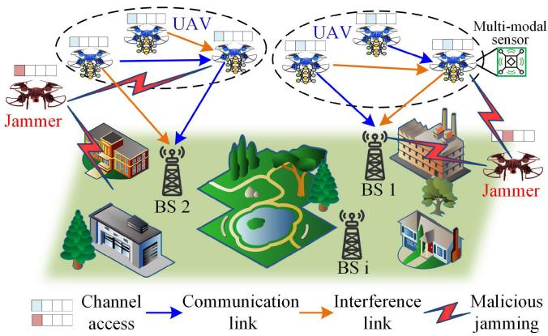  
Fig. 1. Multi-UAV-assisted embodied intelligence-enhanced low-altitude communication networks under jamming attacks.

## II. SYSTEM MODEL AND PROBLEM FORMULATION

## A. System Model

Fig. 1 illustrates the multi-UAV communication system based on cellular systems operating at an embodied intelligence-guided low-altitude wireless network, where we investigate optimal resource allocation strategies under malicious jamming conditions. Each embodied intelligent agent (such as UAV) senses the wireless environment state (such as jamming behaviors, channel gains, channel access status and so on), learn to make decisions and perform resource allocation actions. The system comprises M UAVs interconnected via N UAV-to-UAV (U2U) communication links for signaling transmission, while simultaneously maintaining data transmission with the base station (BS) through L UAV-to-Infrastructure (U2I) communication pathways. The comprehensive set of UAVs is indicated $\begin{array} { r c l } { \mathcal { M } } & { = } & { \{ 1 , \dots , m , \dots , M \} } \end{array}$ . The UAVs operate within a well-defined square area of $d _ { 0 }$ km $\times d _ { 0 }$ km, and fly at a constant altitude of H, with the terrestrial BSs randomly distributed within the designated service area. We employ an enhanced simulated annealing (SA) metaheuristic to formulate the optimal UAV path. The UAV traverses the planned path, continuously exchanging vital data as it travels from the departure point to the target BS. Additionally, each UAV executes a stationary hovering maneuver for a predetermined duration when it reaches the target position.

In this work, the orthogonal frequency division multiplexing (OFDM) modulation technique is employed to efficiently partition the total available bandwidth W into L discrete orthogonal sub-bands. We consider a heterogeneous wireless network architecture comprising multiple transmit-receive communication pairs, numerous frequency sub-bands, and a single malicious jammer entity. The comprehensive set of N U2U links is mathematically denoted as $\mathcal { N } = \{ 1 , . . , n , . . , N \}$ The comprehensive set of sub-bands is represented as $\mathcal { L } = \{ 1 , . . , l , . . , L \}$ , where the corresponding U2I link (uplink) serving L BSs have already been pre-allocated orthogonal spectrum sub-bands with predetermined fixed transmit power levels. Specifically, the U2I link l exclusively utilizes sub-band l for its transmission requirements. Each discrete sub-band can only be assigned to a single base station user, i.e., each individual base station user is allocated a dedicated separate sub-band. To enhance overall spectrum utilization efficiency, each U2U communication link is permitted to reuse the spectrum resources previously allocated for U2I uplink communication through a cognitive spectrum sharing paradigm. Two malicious jammers can cyclically and periodically jam each communication channel to deliberately disrupt both U2I and U2U communication links, with their strategic attack capabilities limited to compromising only one channel during each discrete time slot. The transmit power parameters of the UAVs and the uplink spectrum resources selected for reuse by each U2U link can be dynamically adjusted and optimized to implement robust anti-jamming countermeasures.

Based on the propagation features of each communication link in the aerial-terrestrial network, we assume that all wireless links are subject to the combined effects of distance-dependent path loss, log-normal shadow fading, and multipath small-scale fading. Specifically, we hypothesize that the characteristics of channel fading remain approximately uniform within the same frequency sub-band, while remaining statistically independent across different sub-bands. To accurately account for the signal attenuation caused by environmental obstacles (e.g., urban buildings, vegetation, and terrain variations), shadow fading is rigorously characterized by a log-normal probability distribution with environmentspecific parameters. Small-scale fading is modeled as a Rician process to capture the dominant LoS component and the scattered multipath components. Consequently, the instantaneous channel power gain between a transmitter i and receiver j over sub-band l, which is used for all links, can be expressed as

$$
\begin{array} { r } { h _ { i , j } [ l ] = 1 0 ^ { - \frac { \mathrm { P L } _ { i , j } ( d B ) + \psi ( d B ) + \xi ( d B ) } { 1 0 } } , } \end{array}\tag{1}
$$

where $\operatorname { P L } _ { i , j }$ denotes the large-scale path loss of link $( i , j )$ (as specified by the corresponding U2I or U2U path loss models), ψ represents the log-normal shadow fading term, and ξ denotes the small-scale fading term following a Rician distribution.

The primary multi-UAV communication scenario is set as an urban macrocell. As previously outlined in [42], the air-toground link between UAV m and the BS experiences a heightand elevation-angle-dependent line-of-sight (LoS) probability. The horizontal position of UAV m at discrete time slot t is denoted by $\left( d _ { x } , d _ { y } \right)$ . The corresponding three-dimensional distance between UAV m and the BS is

$$
d _ { m , \mathrm { B S } } ^ { 3 \mathrm { D } } = \sqrt { \left\| \mathbf { d } _ { m } - \mathbf { d } _ { \mathrm { B S } } \right\| _ { 2 } ^ { 2 } + \left( h _ { \mathrm { U T } } - h _ { \mathrm { B S } } \right) ^ { 2 } } ,\tag{2}
$$

where $\mathbf { d } _ { m } = [ d _ { x } , d _ { y } ]$ , dBS denote the horizontal coordinates of UAV m and the BS, respectively, and hUT and hBS are the UAV and BS antenna heights. The elevation angle from the BS to UAV m is given by

$$
\theta _ { m } = \arctan \left( \frac { \left| h _ { \mathrm { U T } } - h _ { \mathrm { B S } } \right| } { \left\| \mathbf { d } _ { m } - \mathbf { d } _ { \mathrm { B S } } \right\| _ { 2 } } \right) .\tag{3}
$$

The elevation-angle-dependent LoS probability is expressed as

$$
P _ { \mathrm { L o S } } = \frac { 1 } { 1 + a _ { \mathrm { L o S } } \exp \left( - b _ { \mathrm { L o S } } \left( \theta _ { m } - a _ { \mathrm { L o S } } \right) \right) } ,\tag{4}
$$

where $a _ { \mathrm { L o S } }$ and $b _ { \mathrm { L o S } }$ are model parameters. The LoS and NLoS path loss components are respectively given by

$$
\mathrm { P L } _ { \mathrm { L o S } } ( \mathrm { d B } ) = 2 8 . 0 + 2 2 \log _ { 1 0 } \left( d _ { m , \mathrm { B S } } ^ { 3 \mathrm { D } } \right) + 2 0 \log _ { 1 0 } ( f _ { c } ) ,\tag{5}
$$

and

$$
\begin{array} { r l r } & { \mathrm { P L } _ { \mathrm { N L o S } } ( \mathrm { d B } ) = - 1 7 . 5 + \left( 4 6 - 7 \log _ { 1 0 } ( h _ { \mathrm { U T } } ) \right) \log _ { 1 0 } \left( d _ { m , \mathrm { B S } } ^ { \mathrm { 3 D } } \right) } & \\ & { \quad \quad \quad + \ 2 0 \log _ { 1 0 } \left( \frac { 4 0 \pi f _ { c } } { 3 } \right) , } & { ( 6 ) } \end{array}
$$

where $f _ { c }$ is the carrier frequency. We adopt the expectation form of the path loss, which averages over LoS and NLoS conditions as

$$
\overline { { \mathrm { P L } } } _ { m , \mathrm { B S } } ( d B ) = P _ { \mathrm { L o S } } \mathrm { P L } _ { \mathrm { L o S } } + ( 1 - P _ { \mathrm { L o S } } ) \mathrm { P L } _ { \mathrm { N L o S } } .\tag{7}
$$

Under the specified flight altitude conditions, the path loss for the U2U link can be simplified and expressed through the free space model, which is given by

$$
\mathrm { P L } _ { m , m ^ { \prime } } ( \mathrm { d B } ) = 3 2 . 4 4 + 2 0 \log _ { 1 0 } \left( d _ { m , m ^ { \prime } } \right) + 2 0 \log _ { 1 0 } ( f _ { c } ) ,\tag{8}
$$

where $d _ { m , m ^ { \prime } }$ is the distance between the UAV m and the UAV $m ^ { \prime }$

We consider a practical jamming environment for the lowaltitude communication network. Each jammer adopts the swept jamming strategy over multiple channels. Specifically, we consider two jammers, each of which can transmit jamming signals with fixed power levels over one channel. This setting leads to a more complex multi-channel jamming environment, in which the legitimate agents must adapt their power control and channel allocation to heterogeneous jamming levels on different channels. In the swept jamming model, the jamming signal can be expressed as

$$
s _ { J } ( t ) = A _ { J } \cos \big ( 2 \pi ( f _ { 0 } + \mu t ) t + \phi _ { 0 } \big ) ,\tag{9}
$$

where $A _ { J }$ denote the amplitude of the jamming signal, $f _ { 0 }$ is the initial frequency, $\mu$ is sweep jamming rate, and $\phi _ { 0 }$ is the initial phase, respectively.

It is assumed that the length of the time slot is sufficiently small that the position of the UAVs remains constant within each discrete time slot t. This assumption facilitates quasi-static channel conditions for the purpose of analytical tractability. In addition, we further postulate that each U2I communication link is allocated a dedicated orthogonal channel with predetermined fixed transmission power, and a malicious jammer adversely affects communication integrity in each temporal time slot by cyclically selecting and deliberately interfering with a specific channel denoted mathematically as $j \left( t \right) ~ \in ~ L$ . Taking into account the simultaneous presence of both non-malicious co-channel jamming and malicious jamming, the U2I link l and the U2U link n operating over sub-band l experience substantial signal degradation from concurrent U2U communications utilizing identical frequency resources and jamming signal from a malicious jammer. Here, the signal-to-interference-plus-noise ratio (SINR) of the U2I link l (from the UAV transmitter m to the BS) on the sub-band l is denoted as $S I N R _ { m , B S } ^ { U 2 I } [ l ]$ , and the corresponding SINR of the U2U link n (from the UAV transmitter m to the UAV receiver $m ^ { \prime } )$ on the l-th sub-band is denoted as $S I N R _ { n } ^ { U 2 U } [ l ]$ Their SINR expressions can be analytically formulated as

$$
\begin{array} { l } { S I N R _ { m , B S } ^ { U 2 I } [ l ] } \\ { = \frac { P _ { l } h _ { m , B S } [ l ] } { \displaystyle \sum _ { n \in { \cal N } } \rho _ { n } [ l ] P _ { n } [ l ] h _ { m ^ { \prime } , B S } [ l ] + \rho _ { J } [ l ] P _ { J } h _ { J , B S } [ l ] + \delta ^ { 2 } } , } \end{array}\tag{10}
$$

and

$$
S I N R _ { m , m ^ { \prime } , n } ^ { U 2 U } [ l ] = \frac { P _ { n } [ l ] h _ { m , m ^ { \prime } } [ l ] } { J ^ { U 2 I } [ l ] + J ^ { U 2 U } [ l ] + \rho _ { J } [ l ] P _ { J } h _ { J , m ^ { \prime } } [ l ] + \delta ^ { 2 } } ,\tag{11}
$$

respectively, where $P _ { J }$ is the power of the jammer, $P _ { l }$ is the transmit power of the U2I transmitter l over the sub-band l, $P _ { n } [ l ]$ is the transmit power of the U2U transmitter n over the sub-band $l , \ \delta ^ { 2 }$ is background noise. The spectrum allocation indicator $\rho _ { n } [ l ]$ when the U2U link n is communicating over the sub-band l is expressed as $\rho _ { n } [ l ] = 1$ , otherwise $\rho _ { n } [ l ] = 0$ . We assume that each U2U link accesses only one sub-band, i.e., $\sum _ { n \in N } \rho _ { n } \left[ l \right] \leq 1$ . Similarly, the sub-band allocation indicator for the jammer is defined as $\rho _ { J }  { \left[ l \right] }$ . In (10), $h _ { m , B S } [ l ]$ and $h _ { m ^ { \prime } , B S } [ l ]$ respectively denote the channel gain from the UAV transmitter m to the BS on the sub-band l with U2I link module, and the channel gain from the UAV transmitter $m ^ { \prime }$ to the BS on the sub-band l with U2U link module. Similarly, in (11), $h _ { m , m ^ { \prime } } [ l ]$ denotes the channel gain from U2U UAV transmitter m to UAV transmitter $m ^ { \prime }$ on the sub-band l with U2U link module, and $h _ { J , m ^ { \prime } } [ l ]$ denotes the channel gain from the corresponding jammer to UAV transmitter $m ^ { \prime }$ on the sub-band l with U2U link module. In $( 1 1 ) , J ^ { U 2 I } [ l ]$ denotes co-channel interference from one U2I link in sub-band l, and $J ^ { U 2 U } [ l ]$ represents interference from other U2U links in the same sub-band l. They can be formulated as

$$
J ^ { U 2 I } [ l ] = P l h _ { m , m ^ { \prime } } [ l ] ,\tag{12}
$$

and

$$
J ^ { U 2 U } [ l ] = \sum _ { n ^ { \prime } \neq n } \rho _ { n ^ { \prime } } [ l ] P _ { n ^ { \prime } } h _ { m ^ { \prime \prime } , m ^ { \prime } } [ l ] ,\tag{13}
$$

respectively, where $h _ { m , m ^ { \prime } } [ l ]$ is the channel gain from U2I UAV transmitter m to the U2U UAV receiver $m ^ { \prime }$ on subband l, and $h _ { m ^ { \prime \prime } , m ^ { \prime } } [ l ]$ denotes the channel gain from the U2U UAV transmitter $m ^ { \prime \prime }$ of another U2U link $n ^ { \prime }$ to the U2U UAV receiver $m ^ { \prime }$ on sub-band l.

According to the definition shown above, the transmission delay of the U2I link l and the U2U link n operating on the sub-band l are then obtained as

$$
T _ { l } ^ { U 2 I } [ l ] = \frac { B _ { 0 } } { W \log _ { 2 } \Big ( 1 + S I N R _ { m , B S } ^ { U 2 I } [ l ] \Big ) } ,\tag{14}
$$

and

$$
T _ { n } ^ { U 2 U } [ l ] = \frac { B _ { 0 } } { W \log _ { 2 } \Big ( 1 + S I N R _ { m , m ^ { \prime } , n } ^ { U 2 U } [ l ] \Big ) } ,\tag{15}
$$

respectively, where $B _ { 0 }$ is the payload size.

The transmission is deemed successful when the UAV and its neighboring node successfully establish a communication link and complete the data exchange within the designated

time constraint. The transmission success probability can be formulated as

$$
P _ { \mathrm { s u c c e s s } } = P r \{ 0 \leq O _ { t } ^ { n } \leq O _ { m a x } ^ { n } \} ,\tag{16}
$$

where $O _ { t } ^ { n }$ the remaining transmission time of the n-th U2U link, $O _ { m a x } ^ { n }$ is the maximum transmission time.

## B. Problem Formulation

The primary objective of this paper is to optimise the system’s total channel transmission delay under the condition of malicious jamming attacks $( \mathrm { i } . \mathrm { e } . , T _ { l } ^ { U 2 I } [ l ]$ and $T _ { n } ^ { U 2 U } [ l ] )$ , with the aim of ensuring robust and uninterrupted mobile broadband access and critical data transmission even under persistent malicious jamming conditions, while respecting the overall energy budget of the UAVs. The multi-objective resource allocation problem can be mathematically stated as the design of an optimal U2U spectrum allocation strategy and transmission power control mechanism to maximize the cumulative capacity of all U2I and U2U communication links while minimizing the impact of jamming attacks. This optimization framework addresses the fundamental trade-off between spectral efficiency and communication security in contested environments. Consequently, the comprehensive problem formulation can be formulated as

$$
\begin{array} { r l } & { \quad \underset { x = 1 , \cdots , B } { \operatorname* { m i n } } \ \underset { x = 1 , \cdots , B } { \eta } \sum _ { i = 2 ^ { B } } ^ { T / 2 2 \eta } [ l _ { i } , l ] + ( 1 - \eta ) \sum _ { i = 1 } ^ { D / 2 \eta } \sum _ { i = 1 , \cdots , B } ^ { D / 2 \eta } [ l _ { i } , l _ { i } ^ { \prime } ] } \\ & { \quad + \lambda \sum _ { i = 1 } ^ { D / 2 \eta } \left( P _ { i j } + P _ { i } [ l _ { i } ] \right) \Delta t } \\ & { \quad \underset { x = 1 , \cdots , B } { \eta \le N } \int _ { \mathbb { R } _ { B } } [ l _ { i } ^ { \prime } ] \sum _ { i = 1 } ^ { 1 } \mathbb { I } _ { \eta } \eta \le N , \forall i \in L , } \\ & { \quad \underset { ( b ) \setminus \mathbb { R } _ { B } } { \eta \le N } [ l _ { i } ^ { \prime } ] \sum _ { i = 1 } ^ { D / 2 \eta } [ l _ { i } ^ { \prime } ] , } \\ & { \quad \quad \quad ( b ) : P _ { i j } \eta = 1 \Big [ \le \eta _ { i } , 1 \Big ] , \ \forall i \in L , } \\ & { \quad \quad \quad ( b ) : P _ { i j } \eta \le P _ { i j } \eta = \left\{ P _ { i j } , P _ { i j } , P _ { i j } , P _ { i j } \right\} , } \\ & { \quad \quad \quad \quad \quad \quad \quad \quad \quad \eta _ { R } \in N , } \\ & { \quad \quad \quad \quad \quad \quad \quad \quad \quad \quad \quad \quad \quad \quad \quad \quad \quad \quad \quad \quad \quad \quad } \\ & { \quad \quad \quad \quad \quad \quad \quad \quad \quad \quad \quad \quad \quad \quad \quad \quad \quad \quad \quad \quad \quad \quad \quad \quad \quad } \\ & { \quad \quad \quad \quad \quad \quad \quad \quad \quad \quad \quad \quad \quad \quad \quad \quad \quad \quad \quad \quad \quad \quad \quad \quad \quad \quad \quad \quad } \\ &  \quad \quad \quad \quad \quad \quad \quad \quad \quad \quad \quad \quad \quad \quad \quad \quad \quad \quad \quad \end{array}\tag{17}
$$

where $\eta$ is a critical weighting factor quantitatively measuring the relative importance of the two delay components in the multi-objective function, with higher values prioritizing U2U link optimization over U2I performance. The parameter can be dynamically adjusted based on mission-critical requirements and prevailing jamming conditions to achieve optimal network performance. ∆t denotes the duration of one time slot and $\chi$ is a weighting parameter that controls the relative importance of the energy consumption term in the objective function. Constraints (a) and (b) guarantee that the U2U spectrum allocation strategy expressed through the binary spectrum allocation indicator $\rho _ { n } [ l ]$ ensures non-overlapping resource allocation, preventing excessive co-channel jamming. Constraint (c) indicates that UAVs adopt a discrete-level transmit power control strategy for communication with nearby devices by selecting an appropriate power level from the available set $P _ { o } = \{ P _ { 1 } , P _ { 2 } , P _ { 3 } , P _ { 4 } \}$ , facilitating implementation on resource-constrained UAV platforms while maintaining sufficient granularity for effective jamming management. Constraint (d) ensures that each $\mathrm { U A V } ^ { \ , } \mathbf { s }$ transmit power is restricted by the maximum power threshold $P _ { m a x }$ and $P _ { n } [ l ]$ denotes the transmit power of U2U channels over sub-band l, which is essential for regulatory compliance, energy conservation, and minimizing inter-cell jamming in the network. Constraint (e) represents the maximum operational time limitation imposed by both mission requirements and energy constraints of the UAV platforms. Constraint (g) is implemented to maintain the $\mathrm { U A V } \mathbf { \hat { s } }$ flight trajectory within the designated operational area, ensuring both regulatory compliance and continuous network connectivity throughout the mission duration. Finally, constraint (h) is a transmission time constraint where links exceeding the maximum transmission time will be considered as transmission failures. The formulated problem presents a non-convex mixed-integer optimization challenge that necessitates sophisticated solution approaches where each embodied intelligent UAV agent can smartly make its action decisions, which will be elaborated in subsequent sections.

## III. EMBODIED MA-DRL FOR INTELLIGENT ANTI-JAMMING RESOURCE ALLOCATION

## A. Optimization Problem Transformation With DRL

DRL is a machine learning paradigm in which an intelligent agent learns optimal decision-making strategies through interaction with its environment in order to maximise cumulative reward signals. Deep Q-network (DQN) is a popular DRL algorithm that uses deep neural networks to approximate the Q-value function, which estimates the expected return of taking an action in a given state. Double deep Q-network (DDQN) is an improved version of DQN that reduces overestimation bias by decoupling the selection and evaluation of actions. However, traditional DDQN still faces issues such as prolonged training durations, inefficient sample utilization, and delayed policy convergence when dealing with highdimensional state spaces and complex environments. These issues are partly due to the limitations in the experience replay mechanism. The DDQN architecture has an experience replay function, but the uniform or random selection of experiences from the experience pool is suboptimal. To address these limitations, prioritized experience replay (PER) and transfer learning (TL) have been proposed as effective techniques. For this reason, this paper designs a MA-DRL-based algorithm that simultaneously introduces PER and TL.

In this paper, different from the transitional DRL algorithms, our proposed embodied intelligence-enhanced DRL can have superior environmental adaptability as well as decisionmaking capabilities in multi-UAV-assisted anti-jamming tasks. Conventional DRL primarily construct dynamic strategies through abstracted states and rewards, with optimization objectives mainly focused on communication resource configurations. However, these DRL algorithms may overlook the spatiotemporal coupling characteristics of unavoidable effects and adversarial jamming behaviors, leading to strategy degradation. In contrast, embodied DRL acts UAVs as embodied intelligent agents, enabling real-time perception of the low-altitude communication environment through perception items. Note that real time perception of physical environment can be through multimodal sensors such as vision, millimeter wave radar, laser radar, etc. For example, it estimates the jammer location in the sky. It executes smart management actions based on flight attitude, channel state, interference values and jamming behavior, achieving integrated “perception?communication?action” decision-making, significantly improving communication link reliability and anti-jamming robustness in low-altitude scenarios.

The Markov decision process (MDP) is a core framework in MA-DRL, describing an agent’s interaction with a stochastic environment to maximize long-term rewards. It is typically defined as a quintuple $( S , A , P , R , \gamma )$ , where S represents the set of possible system states, A represents the set of actions available to the agent in each state, and the reward function $R \left( s , a \right)$ indicates the immediate reward obtained by the agent when taking action in state s, guiding the agent to learn better behaviors. The discount factor $\gamma \in [ 0 , 1 ]$ is used to balance short-term and long-term rewards. We modeled the problem as a multi-agent Markov decision process (MAMDP), where each U2U link acts as an embodied intelligent agent interacting within a shared and dynamic environment to gain experience and update its policy. We define the states, actions, and rewards as follows:

1) State Space: Each embodied intelligent agent (e.g., UAV) senses and observe the wireless environment state, such as jamming channels and power levels. The state vector $s _ { n , t }$ comprises multiple critical dimensions of information that collectively characterize the operational environment and communication constraints. The current state of an agent at time slot t relates to a set of currently observed information. In this problem, we consider the state observed by the agent, including channel state, transmission load, and transmission time. The channel state comprises the communication subband selection for the n-th U2U link and the l-th U2I link, as well as the jamming power from close communication UAVs over the same sub-band. The state at time slot t is defined as

$$
s _ { t } = [ N _ { t } , L _ { t } , J _ { t } , Z _ { t } ^ { n } , B _ { t } ^ { n } , O _ { t } ^ { n } ] ,\tag{18}
$$

where $N _ { t }$ and $L _ { t }$ denote the channel state of the n-th U2U link and the l-th U2I link, $J _ { t }$ represents the sensed jammer behaviors (such as jamming power, jammer location, jamming channel gain, etc.), $Z _ { t } ^ { n }$ denotes the sub-band used for communication by the n-th U2U link in the time slot $t , B _ { t } ^ { n }$ presents transmission data load, $O _ { t } ^ { n }$ the presents remaining transmission time.

2) Action Space: In this optimization framework, each embodied intelligent agent is tasked with determining the optimal transmission power configuration and resource allocation strategy at each decision epoch to minimize communication delays under adversarial conditions. The parameter specifications in constraints (a) through (h) are systematically vectorized, corresponding directly to the decision variables of the anti-jamming UAV communication system, i.e., the transmission power selection parameters $P _ { n } [ l ]$ and the binary spectrum allocation indicators $\rho _ { n } \left[ l \right]$ . Consequently, the optimized decision variables in the formulated problem are methodically transformed into executable actions within the RL paradigm. The comprehensive action space for the agent at time slot t is rigorously defined as follows. Given the observed system state $s _ { t } ,$ the agent’s action consists of two critical components: the first component governs the transmission power selection $P _ { t } ,$ which directly affects energy consumption, communication range, and jamming characteristics; the second component determines the specific sub-band allocation for communication activities, represented by $V _ { t } ,$ which significantly impacts spectral efficiency and jamming resilience. Therefore, the action at time slot t can be defined as

$$
a _ { t } = [ P _ { t } , V _ { t } ] .\tag{19}
$$

3) Reward Function: The reward function is the feedback received by the agent from the environment after taking a specific action. In state s, the agent selects an action $^ { a , }$ and then the environment returns a new state $s ^ { \prime } .$ The agent will receive a corresponding immediate reward $R ( s , a )$ from the environment. Each agent uses the same reward function. Although each agent has its own strategy to maximize the reward, since all agents share a unified goal, they tend to choose behaviors that are most beneficial to the overall network performance, thereby achieving a cooperative effect during the learning process. The objectives of the spectrum sharing problem described in the problem formulation section are twofold: reducing the impact of jammers on the system and minimizing the average link transmission delay of U2U, while also reducing jamming with U2I channel information transmission. Each U2U link needs to complete data transmission within a specified time, meaning that the transmission is considered successful only if it is completed within the time limit On. Accordingly, the reward for the agent is defined as

$$
\begin{array} { r l } & { r _ { n } ^ { \mathrm { b a s e } } [ l , t ] = - \big ( \eta T _ { n } ^ { U 2 U } [ l , t ] + ( 1 - \eta ) T _ { l } ^ { U 2 I } [ l , t ] } \\ & { ~ + \chi \displaystyle \sum _ { n \in N } \left( P _ { f l y } + P _ { n } [ l ] \right) \Delta t \big ) , } \end{array}\tag{20}
$$

where $\eta \in [ 0 , 1 ]$ is a factor that describes the weight of these two parts and can be adjusted to balance the trade-off between them. To enhance spectral efficiency and system throughput in U2U communication links, each link should maximize its instantaneous channel capacity while satisfying the end-to-end latency constraints of delay-sensitive applications. Successful transmission requires not only spectrum resource availability but also timely payload delivery within the stipulated deadline. To enforce this requirement, we augment the reward function in Equation (16) with a penalty term applied upon transmission failure. It is defined as

$$
r _ { n } ^ { p } [ t ] = O _ { m a x } ^ { n } - O _ { t } ^ { n }\tag{21}
$$

Consequently, the agent’s reward is designed as

$$
r _ { n } [ l , t ] = \left\{ \begin{array} { l l } { r _ { n } ^ { \mathrm { b a s e } } [ l , t ] + ( 1 - r _ { n } ^ { p } [ t ] ) \times \mu _ { 1 } , } & { r _ { n } ^ { p } [ t ] < \gamma _ { 0 } , } \\ { r _ { n } ^ { \mathrm { b a s e } } [ l , t ] \times \mu _ { 2 } , } & { r _ { n } ^ { p } [ t ] \geq \gamma _ { 0 } , } \end{array} \right.\tag{22}
$$

where $\gamma _ { 0 }$ is the performance compliance threshold, $\mu _ { 1 }$ and $\mu _ { 2 }$ are the penalty regulation factors for controlling the penalty

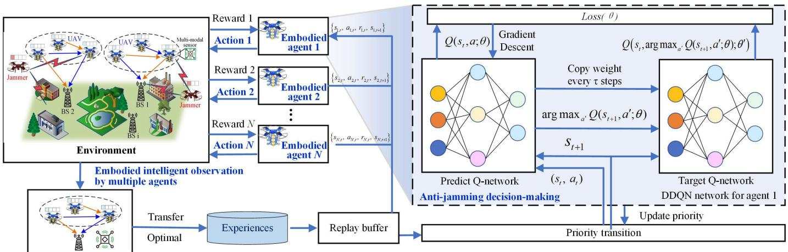  
Fig. 2. The structure of the E-MA-DDQN-PER-TL-IRA approach.

intensity during non-compliance. The reward and punishment incorporated within the function are normalized.

The communication between UAVs is cooperative, so we maximize the sum of all UAV rewards, which is given by

$$
r [ t ] = \sum _ { n = 1 } ^ { N } r _ { n } [ l , t ] .\tag{23}
$$

## B. Intelligent Resource Allocation Based on E-MA-DDQN-PER-TL

DDQN is a DRL algorithm that enhances the DQN. In DQN, the Q-value update depends on the target Q-network to estimate the maximum Q-value of the next state. However, due to the imprecision in Q-value estimation, DQN often leads to overestimation of Q-values. This overestimation bias can significantly degrade the algorithm?s performance, resulting in suboptimal decision-making and affecting both convergence and overall performance. To solve this problem, DDQN mitigates the overestimation issue by decoupling the selection of the action (via the prediction Q-network) and the estimation of the target Q-value (via the target Q-network). This decoupling is achieved by utilizing two separate networks: the prediction Q-network and the target Q-network. DDQN evaluates the greedy policy using the prediction Q-network but estimates its value through the target Q-network. This approach ensures more accurate Q-value estimation, leading to improved convergence and performance.

We illustrate the framework of the E-MA-DDQN-PER-TL-based intelligent resource allocation (IRA) against antijamming in Fig. 2. The framework considers the communication environment of multiple UAVs with malicious jamming, where the environmental sensed state parameters of each UAV are used as state input to each agent. The E-MA-DDQN-PER-TL-IRA approach, which incorporates a reward function and a DNN network, dynamically allocates resources in response to changing system conditions.

DDQN employs a centralized experience replay with a decentralized execution approach to optimize the training of the Q-network and the decision-making process. This means that each agent independently selects actions based on its own observations and policies, while the experience replay buffer centrally stores the experience data of all agents, which is then used to train both the target and main networks. Before each round of computing and communication tasks, each agent observes the system states from the environment, including channel state information (CSI), remaining energy, task data volume, etc. This information is fed as input to the main network of DDQN to select actions $a _ { t }$ based on the ε-greedy policy, such as channel selection, power allocation, etc.

In each learning step, the agent executes action $a _ { t } ,$ , observes the next state $s _ { t + 1 }$ , and receives the immediate reward $r _ { t }$ based on the current environment. The current state $s _ { t } ,$ next state $s _ { t + 1 }$ , action $a _ { t } ,$ and immediate reward $r _ { t }$ of all agents are stored in the common experience replay buffer D. During training, a mini-batch of data is randomly sampled from $D$ to update the parameters of the main network. DDQN adopts a dual-network structure, consisting of the main Q-network and the target Q-network. When updating the Q-value, the main network selects actions, while the target network computes the corresponding Q-value, thereby reducing the bias caused by overestimation. The target Q-value is calculated using the following formula

$$
y ^ { D D Q N } = r _ { t } + \gamma \left( s _ { t + 1 } , \arg \operatorname* { m a x } _ { a ^ { \prime } } Q ( s _ { t + 1 } , a ^ { \prime } ; \theta ) ; \theta ^ { \prime } \right) ,\tag{24}
$$

where $\theta$ and $\theta ^ { \prime }$ represent the parameters of predict and target networks. The parameters of the main network are updated by minimizing the following loss function

$$
L o s s ( \theta ) = \sum _ { ( s _ { t } , a _ { t } ) \in \kappa } \bigl ( y ^ { D D Q N } - Q \left( s _ { t } , a _ { t } ; \theta \right) \bigr ) ^ { 2 } ,\tag{25}
$$

where κ is a mini-batch of training data.

The weights of the target Q-network are copied every τ step from the prediction Q network to reduce the correlation between the two networks when they are updated. As the $\mathrm { Q } \mathrm { - }$ network is progressively refined, the agent?s action selection policy is also gradually optimized. The parameters of the target network are updated using a periodic hard update strategy. The parameters of the target network in step t are formulated as

$$
\theta _ { t } ^ { - } = \left\{ \begin{array} { l l } { \theta _ { t + 1 } } & { \mathrm { i f ~ } ( t + 1 ) \equiv 0 \pmod \tau } \\ { \theta _ { t } ^ { - } } & { \mathrm { o t h e r w i s e } } \end{array} \right. .\tag{26}
$$

Throughout the training process, the parameters of the main and target networks are continuously optimized. When the algorithm converges to the optimal policy, the main network is able to generate the optimal action strategy, thereby achieving the goals of resource management and anti-jamming.

The experience replay (ER) technique stores historical data in a memory buffer and utilizes random sampling to train the neural network. The PER mechanism, first proposed in the DQN algorithm [46], addresses the limitation that traditional ER strategies cannot fully utilize the varying value of data in real applications. In this paper, when storing the experience pool, the priority of each experience is determined according to its temporal difference error (TD error). Experience with a larger TD error indicates that the experience has a greater impact on the Q value update, so it will be given a higher priority. In this way, PER avoids inefficient learning that may be caused by random sampling by prioritizing the sampling of experiences that are most helpful for learning, and reduces the trial and error process, making the RL algorithm more effective in dealing with complex tasks. At the same time, TL reduces the training time required for the target task by leveraging the knowledge in the source task.

In PER, the priority of experience is usually calculated based on the TD error. The TD error reflects the difference between the current Q-value estimate and the actual return. The sampling probability $P _ { i }$ of the agent sampling the i-th sample can be calculated by the following formula

$$
P _ { i } = \frac { { p _ { i } } ^ { \alpha } } { \displaystyle \sum _ { k } p _ { k } ^ { \alpha } } ,\tag{27}
$$

where α controls the importance of priority. When $\alpha = 0 ,$ , it becomes uniform sampling.

Since PER changes the sampling distribution of experience, important sampling weights need to be introduced to correct the sampling bias to ensure the unbiasedness of the estimate. The importance sampling weight ω is calculated as follows

$$
\omega _ { i } = \left( \frac { 1 } { D } \cdot \frac { 1 } { P _ { i } } \right) ^ { \beta } ,\tag{28}
$$

where D is the size of the experience buffer, $\beta$ controls the strength of importance sampling.

Although E-MA-DDQN-PER can effectively address the shortcomings of Q-learning, it still poses some drawbacks inherited from conventional DRL when addressing scenarios with high sample complexity, as the considered problem in this work, where the surrounding environment of the UAV is unknown in advance. First, it often takes a lot of time to train DNN, e.g., DQN?s training time is up to 3 days for each game. If the environment dynamics change, the DNN may need to be retrained from scratch, yielding a high computational complexity. Consequently, it is unable to deploy on a UAV that has very limited energy and computing resources. However, as the UAV flies over its fixed trajectory, experiences obtained from this region are often very small compared with all those obtained over the entire considered area. Therefore, the UAV may not have adequate information to learn an optimal policy. To address these challenges, we develop a novel framework leveraging TL techniques, namely, E-MA-DDQN-PER-TL-IRA.

TL is a method of leveraging knowledge obtained when performing a source task in a source domain to enhance the learning process of target tasks in target domains. Typically, a domain contains labeled or unlabeled data given before the considered training process starts. However, data in RL are obtained via interactions between the agent (i.e., the UAV) and its surrounding environment. As a result, both the domain and task can be represented by an MDP. Suppose the source and target MDPs are defined [47]. TL in RL intends to leverage the knowledge $K _ { S }$ obtained from the source MDP, i.e., the policy, the environment dynamics, and the data, as a supplement to the target MDP?s information $K _ { T }$ to efficiently learn the target optimal policy $\pi _ { T }$ as follows

$$
\pi _ { T } ^ { * } = \underset { \pi _ { T } } { \mathrm { a r g m a x } } \mathbb { E } _ { s \sim S _ { T } , a \sim \pi _ { T } } \left[ Q ^ { \pi _ { T } } ( s , a ) \right]\tag{29}
$$

where $\pi _ { T }$ is a target MDP?s policy approximated by an estimator, e.g., a table or a DNN, that is trained on both $K _ { S }$ and $K _ { T }$

Note that TL for DRL may look like supervised learning since they both use existing data, but they are very different. In particular, all DRL data used to train a DNN are unlabeled and on-the-fly data generated by interactions between an agent and its surrounding environment. Although the source data are collected in advance for the target agent, they are just observations of the source agent about the source environment, which do not have any labels to indicate which action the UAV should take. Thus, the target agent still needs learning algorithms (e.g., DDQN) to learn the optimal policy gradually. Our proposed TL can help the UAV utilize the knowledge from the source domain to avoid bad decisions at the beginning of the learning process when the UAV is exploring the environment by taking a random action, thereby improving the learning rate and learning quality.

To measure the effectiveness of TL, we can use three metrics, including jump-start, asymptotic performance, and time-to-threshold. In particular, jump-start measures how much the agent?s performance at the beginning of the learning process can be improved by applying TL, while the asymptotic performance measures this improvement at the end of the learning process. The third metric, i.e., time-to-threshold, measures how fast TL can help the agent to achieve a predefined performance level compared with the scenario without TL. It is worth highlighting that TL cannot guarantee improvement in the learning curve. It may even negatively impact the learning in the target MDP if the transferred knowledge is not carefully chosen. Thus, in the following, we propose a TL framework that can reduce the learning time and learning quality for DDQN.

Experience transfer (ET) approach aims to leverage a set of experiences $E _ { S } .$ , in which each element is an experience tuple $\langle s , a , r , s ^ { \prime } \rangle$ , obtained in the source MDP, to improve the learning process of the target agent, working in the target MDP. Specifically, $E _ { S }$ is first copied to the memory buffer of the target agent. Then, these transferred experiences and the target agent?s new experiences are used to train the Q-network. In this manner, the target agent can quickly get adequate information, thereby significantly improving the learning speed. Additionally, the quality of the experiences affects the learning process. For example, an experience has limited value if it is easily obtained by the target agent. In contrast, an experience is considered valuable if it is difficult to obtain and significantly impacts system performance. For instance, experiences obtained when the embodied intelligent agent achieves low transmission latency may have higher value because they not only contain information observation about environment dynamics (e.g., channel capacity, transmission power, jamming behaviors) but may also reveal insights for mitigating jamming. The proposed E-MA-DDQN-PER-TL-IRA based resource allocation approach is shown in Algorithm 1.

Algorithm 1 Intelligent Anti-Jamming Resource Allocation   
Based on E-MA-DDQN-PER-TL   
1: Input: Q-network structure, environment simulator   
2: Initialize: Q-networks for all agents randomly   
3: if Transfer learning = True then   
4: Copy the experience set of source MDP to $D$   
5: end if   
6: for each episode do   
7: Reset the environment   
8: for each step t do   
9: Sense states of each communication link and jam  
ming behaviors   
10: for each agent n do   
11: Obtain the observation state $s _ { t } ^ { n }$ of UAVs   
12: Select an action $a _ { t } ^ { n }$   
13: Observe next state $s _ { t + 1 } ^ { n }$   
14: Receive immediate reward $r _ { t } ^ { n }$   
15: Store $\left\{ s _ { t } ^ { n } , a _ { t } ^ { n } , r _ { t } ^ { n } , s _ { t + 1 } ^ { n } \right\}$ in the replay buffer D   
16: end for   
17: Sample mini-batches from D according to (21) and   
(22)   
18: Minimize the loss function according to (19)   
19: Update the parameters of the prediction Q-network   
20: Compute and record TD-error, update transition   
priority $p _ { i }$   
21: Share environment sensing information and action   
with other embodied intelligent agents   
22: end for   
23: if step t mod $\tau = 0$ then   
24: Copy the network parameters θ from the prediction   
Q-network to the target Q-network   
25: end if   
26: end for

## C. Complexity Analysis

The proposed E-MA-DDQN-PER-TL-IRA approach integrates the DDQN, PER, and TL algorithms. In the MA-DDQN algorithm, the computational complexity is analyzed based on the number of agents ${ \tilde { A } } ,$ the neural network architecture comprising K layers with $\tilde { N } _ { k }$ neurons in the k-th layer, and the time consumed by key operations. The complexity of the forward and backward passes for the neural network is

O $\left( \sum _ { k = 1 } ^ { K - 1 } \tilde { N } _ { k } \tilde { N } _ { k + 1 } \right)$ . The DNN initialization time is denoted as ${ \dot { t } } _ { 0 } , t _ { 1 }$ represents the initialization time per episode, and $t _ { 2 }$ indicates the computation time per step. The total execution time of the MA-DDQN algorithm is given by $t _ { 0 } + ( t _ { 1 } +$ $t _ { 2 } \times S _ { 0 } ) \times I ,$ where $T$ represents the number of time steps per episode and $S _ { 0 }$ the number of episodes. According to [48], the overall computational complexity of MA-DDQN is $\begin{array} { r } { O \left( \tilde { A } \times T \times S _ { 0 } \times \left( \bar { \sum _ { k = 1 } ^ { K - 1 } { \tilde { N } _ { l } } } \cdot \tilde { N } _ { k + 1 } \right) \right) } \end{array}$ . In PER, the replay buffer size $D$ and the batch size $\vec { B _ { a } } ^ { \prime }$ determine the computational complexity of sampling and priority updates as $O ( B _ { a } \log _ { 2 } D )$ . This logarithmic dependency originates from the binary tree structure (e.g., SumTree) implemented for priority management [49].

Since E-MA-DDQN-PER and E-MA-DDQN-PER-TL utilize identical Q-network architectures, their per-iteration computational complexity is equivalent. As established in $[ 5 0 ] ,$ TL optimizes the algorithm by reconstructing the convergence pathway through pre-trained knowledge injection. This approach compresses the total training iterations from T to $\iota T \ ( 0 \ < \ \iota \ < \ 1 )$ , where ι denotes the convergence compression factor and its empirical value is determined jointly by task similarity and transfer methodology. The complexity of the proposed E-MA-DDQN-PER approach is denoted as $\begin{array} { r } { O \left( \tilde { A } \times \iota \times T \times S _ { 0 } \times \left( B _ { a } \log _ { 2 } D + \sum _ { k = 1 } ^ { K - 1 } \tilde { N } _ { k } \cdot \tilde { N } _ { k + 1 } \right) \right) } \end{array}$

## IV. SIMULATION RESULTS AND ANALYSIS

## A. Simulation Settings

This section describes the simulation setup and analyzes the results to demonstrate the effectiveness of the proposed method. We assume the simulation environment follows the evaluation assumptions for remote urban scenarios as outlined in Annex A and Annex B of TR 3GPP 36.777 [51]. The simulation area is designed as a 500 m ×500 m square area and is divided into a grid of $2 0 \times 2 0$ cells. Each cell measures 25 m in both length and width. The UAVs operate at a speed of 15 m/s to ensure efficient data collection and communication. The number of UAVs ranges from 10 to 30, with each UAV establishing U2U links with its two neighboring UAVs. The bandwidth of each sub-band W is set to 1.5 MHz. The noise power $\sigma ^ { 2 }$ is -144 dBm, and the jammer transmits at a power level of 23 dBm. The available transmit power levels for the U2I and U2U links are set to {10 dBm, 15 dBm, 20 dBm, 25 dBm, 30 dBm} and {8 dBm, 12 dBm, 16 dBm, 24 dBm}, respectively. Power levels balance communication reliability with energy efficiency, using higher power in challenging conditions and lower power to conserve energy. Transmission power adjustments manage jamming from both UAVs and a malicious jammer. The jammer moves randomly within a designated area, adding dynamic complexity. UAV trajectory planning is carried out using an improved Simulated Annealing Algorithm, aiming to optimize path efficiency. U2U and U2I payload sizes are fixed at 1 MB and 3 MB, respectively. The neural network uses ReLU activation functions and the RMSProp optimizer with a learning rate of 0.008, which decreases exponentially. The exploration rate decreases linearly from 0.9 to 0.01 over 2000 steps and then remains constant. The proposed method is benchmarked against two alternative approaches: the method based on DQN and the method based on DDQN. The key simulation parameters, including the number of UAVs, the jammer and UAV altitudes, the system bandwidth, the number of sub-bands, the noise power, and the transmit powers, are summarized in Table I.

TABLE I  
SIMULATION PARAMETERS
<table><tr><td rowspan=1 colspan=1>Parameter</td><td rowspan=1 colspan=1>Value</td></tr><tr><td rowspan=1 colspan=1>Simulation area size</td><td rowspan=1 colspan=1>500 m × 500 m</td></tr><tr><td rowspan=1 colspan=1>Number of UAVs M</td><td rowspan=1 colspan=1>{10, 15, 20, 25, 30}</td></tr><tr><td rowspan=1 colspan=1>Number of sub-bands L</td><td rowspan=1 colspan=1>{7, 10, 13, 16, 19}</td></tr><tr><td rowspan=1 colspan=1>UAV height</td><td rowspan=1 colspan=1>100 m</td></tr><tr><td rowspan=1 colspan=1>Jammer height</td><td rowspan=1 colspan=1>100 m</td></tr><tr><td rowspan=1 colspan=1>BS antenna height</td><td rowspan=1 colspan=1>35 m</td></tr><tr><td rowspan=1 colspan=1>Grid size</td><td rowspan=1 colspan=1>20 × 20 cells</td></tr><tr><td rowspan=1 colspan=1>Cell size</td><td rowspan=1 colspan=1>25 m × 25 m</td></tr><tr><td rowspan=1 colspan=1>UAV speed vUAV</td><td rowspan=1 colspan=1>15 m/s</td></tr><tr><td rowspan=1 colspan=1>Sub-band bandwidth W</td><td rowspan=1 colspan=1>1.5 MHz</td></tr><tr><td rowspan=1 colspan=1>Noise power $\overline { { \sigma ^ { 2 } } }$ </td><td rowspan=1 colspan=1>-144 dBm</td></tr><tr><td rowspan=1 colspan=1>Jammer transmit power $\overline { { P _ { J } } }$ </td><td rowspan=1 colspan=1>23 dBm</td></tr><tr><td rowspan=1 colspan=1>U2I transmit power</td><td rowspan=1 colspan=1>{10, 15, 20, 25, 30} dBm</td></tr><tr><td rowspan=1 colspan=1>U2U transmit power</td><td rowspan=1 colspan=1>{8, 12, 16, 24} dBm</td></tr><tr><td rowspan=1 colspan=1>U2U payload size</td><td rowspan=1 colspan=1>1 MB</td></tr><tr><td rowspan=1 colspan=1>U2I payload size</td><td rowspan=1 colspan=1>3MB</td></tr><tr><td rowspan=1 colspan=1>Learning rate (initial)</td><td rowspan=1 colspan=1>0.008</td></tr><tr><td rowspan=1 colspan=1> $\underline { { \eta , \chi } }$ </td><td rowspan=1 colspan=1>0.9,0.05</td></tr><tr><td rowspan=1 colspan=1> $\gamma _ { 0 } , \mu 1 , \mu 2$ </td><td rowspan=1 colspan=1> $\overline { { 0 . 8 , - 0 . 8 , 1 . 2 } }$ </td></tr></table>

The following metrics are employed to evaluate the performance in this paper:

• The average total transmission delay of U2U links is given by

$$
T _ { u } = \frac { 1 } { G } \sum _ { g = 0 } ^ { G - 1 } \bigg ( \sum _ { l \in L } \sum _ { n \in N } T _ { n } ^ { U 2 U } [ l , t ] \bigg ) ,\tag{30}
$$

where G is the number of rounds in the testing stage.

• The average transmission delay of U2I links is given by

$$
T _ { i } = \frac { 1 } { G } \sum _ { g = 0 } ^ { G - 1 } \left( \frac { 1 } { L } \sum _ { l \in L } T _ { l } ^ { U 2 I } [ l , t ] \right) .\tag{31}
$$

## B. Analysis Results

In the simulation, we first evaluate the performance of our proposed learning approach, i.e., E-MA-DDQN-PER-TL-IRA, by examining the convergence rate and the obtained policy compared with other approaches. Then, we evaluate the system performance when varying some important parameters (e.g., UAV numbers, sub-band numbers, and jamming power) to assess their influences on the system performance. For E-MA-DDQN-PER-TL-IRA, the ET type is chosen because it can leverage the experiences obtained during the learning phases of other algorithms, i.e., DDQN and Q-learning.

We present in Fig. 3 the convergence performance comparison of various algorithmic approaches under jamming conditions. As illustrated, the accumulated rewards exhibit rapid growth during the initial training phase as intelligent agents develop fundamental anti-jamming strategies, followed by stabilization during fine-tuning. Notably, the E-MA-DDQN-PER-TL-IRA approach demonstrates sustained improvement in reward accumulation, confirming its superior efficacy in complex spectrum environments. This enhanced performance can be attributed to the incorporation of prioritized experience replay, which substantially improves sample utilization efficiency and knowledge transfer capabilities, consequently reducing the required exploration time and achieving superior convergence characteristics. It can be observed that the conventional DQN implementation performs significantly worse due to its inherent Q-value overestimation problem in non-stationary environments. Our results unequivocally establish the proposed approach’s dominance in anti-jamming transmission, evidenced by accelerated convergence rates and heightened post-convergence reward accumulation when benchmarked against existing approaches. In short, embodied DRL advances UAV agents from traditional “passive parameter tuning” to an embodied intelligent decision-making characterized by “environment perception, intelligent decision, and coordinated anti-jamming action”.

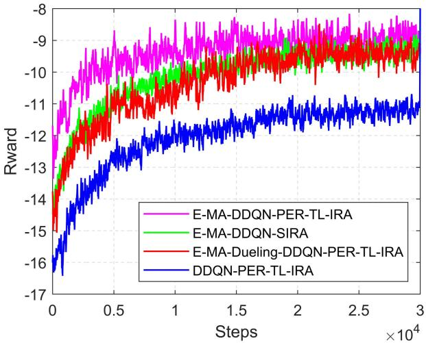  
Fig. 3. Reward for each training step with increasing iterations.

As illustrated in Fig. 4, the average total U2U transmission delay exhibits a declining trend with increasing UAV numbers under fixed sub-band allocation. The proposed E-MA-DDQN-PER-TL-IRA consistently outperforms all comparison schemes across different UAV deployment scenarios. While increasing the number of UAVs introduces additional interference that could potentially degrade communication quality, the results reveal that their positive impact on communication capacity significantly outweighs this drawback, resulting in a notable decrease in average transmission delay. More UAVs provide enhanced spatial diversity and create additional communication opportunities through improved network connectivity. The proposed E-MA-DDQN-PER-TL-IRA capitalizes on embodied DRL agents to adaptively manage anti-jamming and optimize resource allocation by perception and learning jamming behaviors, thereby amplifying the advantages of dense UAV deployment while suppressing its adverse impacts.

Fig. 5 illustrates U2I link transmission delay patterns, where delays generally increase as UAV numbers grow, indicating escalating pressure on ground BS access. Unlike U2U links, the U2I delay values remain relatively low across all scenarios, with E-MA-DDQN-PER-TL-IRA maintaining superior performance in moderate-density deployments. At the highest density, algorithm performance converges, with DDQN showing a slight advantage. This demonstrates that while reinforcement learning approaches effectively optimize U2I communications, their comparative advantages diminish in extremely dense deployments where infrastructure capacity becomes the limiting factor. This upward trend in U2I transmission delays can be explained by the differences in communication patterns between U2I and U2U links. As UAV density increases, multiple UAVs compete for access to the resources. The BS’s limited processing capacity and channel access opportunities become increasingly strained, leading to longer delays and reduced quality of service.

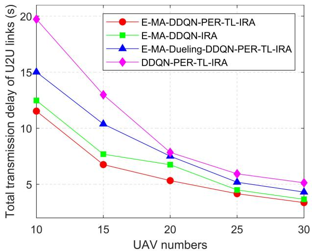  
Fig. 4. The average total transmission delay of U2U links with varying numbers of UAVs.

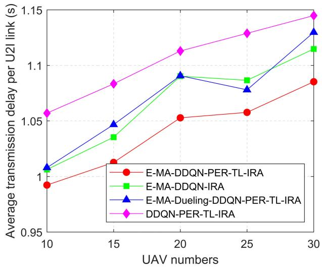  
Fig. 5. The average transmission delay per U2I link with varying numbers of UAVs.

Fig. 6 compares the performance of U2I and U2U links as the number of UAVs increases. Unlike U2U links, the U2I link transmission delay rises with additional UAVs due to increasing co-channel interference from U2U links when the available sub-bands remain fixed. Fig. 7 depicts the relationship between network transmission delay and the number of sub-bands for both U2I and U2U communications. The results indicate that increasing the number of resource blocks reduces transmission delay for both communication types. However, U2U communications consistently exhibit higher delays than U2I across all sub-band allocations. This discrepancy arises from differences in communication requirements and interference patterns between user-to-infrastructure and user-to-user links. The declining delay trend for both modes confirms that expanding spectral resources enhances network performance, with more pronounced improvements in resource-constrained scenarios than in resource-abundant ones. These findings suggest that optimal resource allocation is crucial for minimizing transmission latency in multi-UAV communication networks, particularly under the spectrum scarcity typical in real-world deployments.

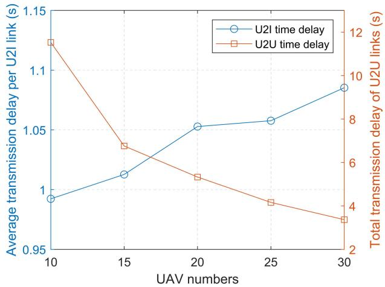  
Fig. 6. The average transmission delay per U2I link and the average total transmission delay of all U2U links with varying numbers of UAVs.

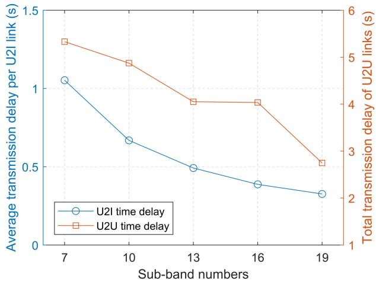  
Fig. 7. The average transmission delay per U2I link and the average total transmission delay of all U2U links with varying numbers of sub-bands.

In Fig. 8, we show the results of the relationship between jamming power and average transmission delays across U2I and U2U communication links. As jamming power increases, both communication links experience degraded performance, but with markedly different severity levels. U2I links demonstrate a steeper increase in transmission delay, increasing more dramatically compared to the relatively moderate increase observed in U2U communications. This disparity can be attributed to the fundamental architectural differences between the two communication paradigms. U2I communications typically involve longer transmission distances between airborne UAVs and base stations, as well as more obstacles affecting signal propagation, making them more vulnerable to jamming due to increased path loss and reduced SINR.

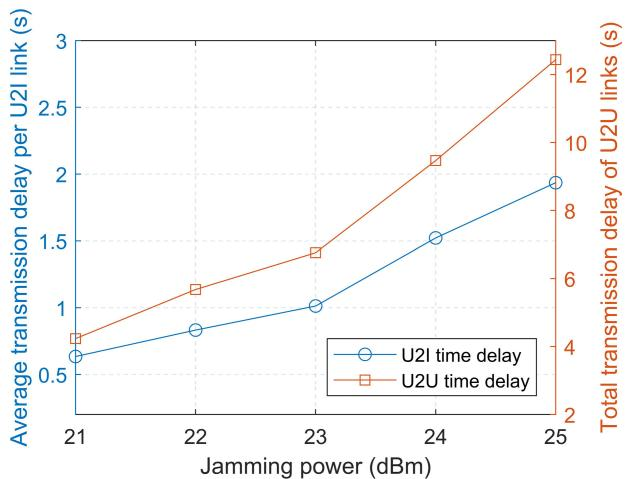  
Fig. 8. The average transmission delay of U2I and U2U links with varying power of jammer.

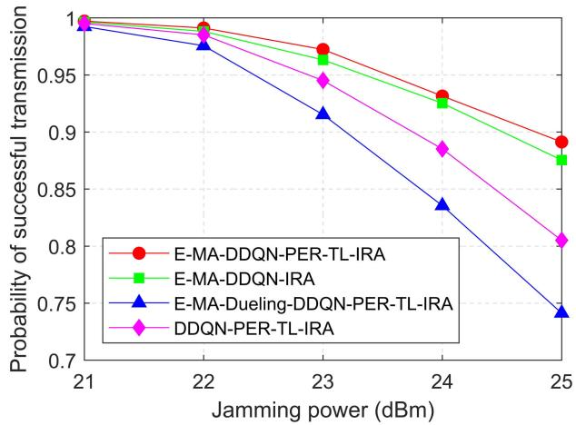  
Fig. 9. The probability of successful transmission versus the jamming power.

Fig. 9 illustrates the relationship between jamming power and the probability of successful transmission across four reinforcement learning approaches. As jamming power increases, all approaches exhibit declining transmission success rates, though with varying degrees of resilience. The E-MA-DDQN-PER-TL-IRA approach demonstrates superior anti-jamming capability, with only a 3% performance degradation. In contrast, the baseline DQN approach suffers the most significant impact, with success probability dropping from 1.0 to approximately 0.77. This performance hierarchy aligns with the architectural sophistication of these IRA approaches, indicating that E-MA-DDQN-PER-TL-IRA likely enables more effective adaptation to dynamic jamming environments.

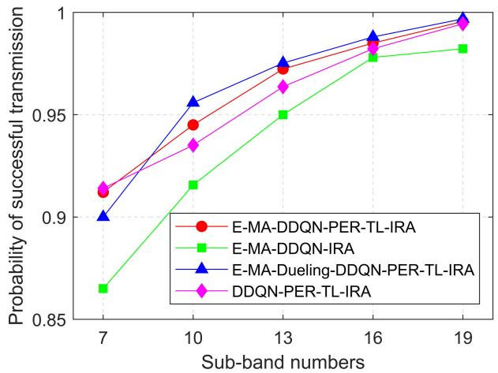  
Fig. 10. The probability of successful transmission versus the number of sub-bands.

Fig. 10 illustrates the relationship between the number of sub-bands and the probability of successful transmission across four reinforcement learning approaches. As the number of available sub-bands increases, all approaches exhibit improved transmission success rates, with the E-MA-DDQN-PER-TL-IRA approach outperforming the others across the entire range. All approaches achieve near-perfect reliability with sufficient resources, indicating that algorith mic advantages diminish in resource-abundant conditions. This upward trend underscores the fundamental relationship between resource availability and communication reliability in UAV networks. The performance gap further highlights the importance of intelligent resource allocation in constrained environments, where the proposed transfer learning approach leverages prior knowledge for more informed scheduling decisions.

## V. EXPERIMENTAL RESULTS AND ANALYSIS

In this section, experiments were conducted to evaluate the performances of the proposed approach. The real channel gain validation of our approach followed the general experimental setup adopted in [52]. Specifically, each UAV was equipped with a Raspberry Pi 4B platform to execute communication and computation tasks. The ground receiver was implemented using a USRP N210 to measure the received signal strength. The channel gains of from all UAV to any receiver are measured in this experiment setting. Based on this experimental setup, we compare the convergence rate, transmission delay of U2I and U2U of the proposed approach with the baseline schemes.

In fig. 11, we can observe that the rewards of all algorithms gradually increase with the training steps and eventually converge, indicating that stable policies can be learned under the considered settings. However, the proposed E-MA-DDQN-PER-TL-IRA approach consistently maintains a higher reward trajectory and converges to the highest value. Benefiting from the multi-agent architecture together with PER and TL, the proposed E-MA-DDQN-PER-TL-IRA approach increases its reward more rapidly and converges to the highest steady value, indicating a more efficient exploration of the state?action space and a better learned power and resource allocation policy.

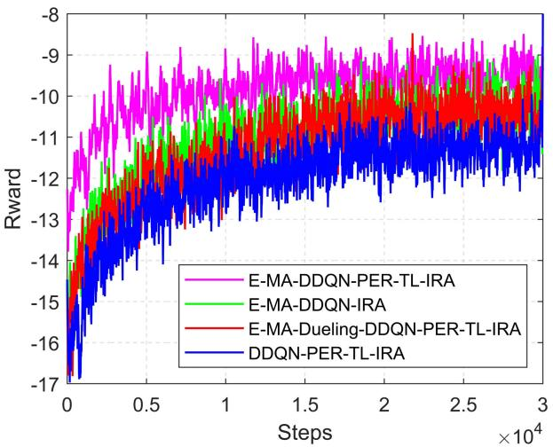  
Fig. 11. Reward for each training step with increasing iterations in experiments.

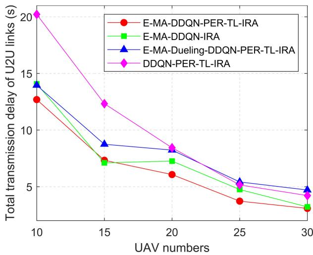  
Fig. 12. The average total transmission delay of U2U links with varying numbers of UAVs in experiments.

In Fig. 12 as we can see that the total transmission delay of U2U links decreases as the number of UAVs increases for all schemes, since more UAVs provide richer relay and resource options. The proposed E-MA-DDQN-PER-TL-IRA approach consistently maintains the lowest delay over the entire range, while the single-agent E-MA-DDQN-PER-TL-IRA suffers from the largest delay in the sparse-UAV regime. It demonstrates the advantages of the proposed strategy can better coordinate U2U transmissions, effectively alleviate cochannel interference and jamming, and thus significantly reduce the overall transmission latency and enhance communication reliability. Correspondingly, Fig. 13 further depicts the average transmission delay per U2U link under the same settings, from which we can see that, although the average delay per link increases with the number of UAVs due to denser spectrum reuse, the proposed E-MA-DDQN-PER-TL-IRA still maintains the lowest delay level among all schemes, which is consistent with the trend observed in Fig. 13.

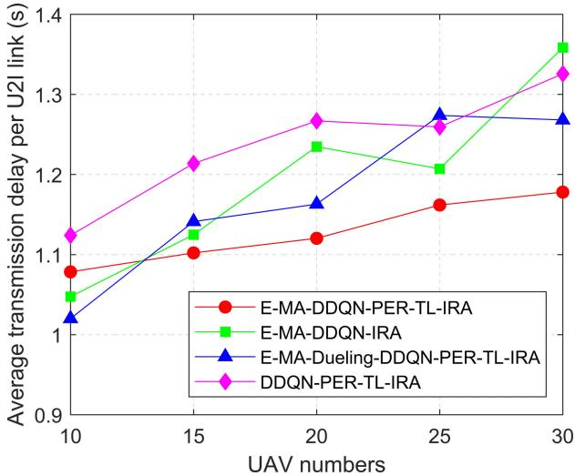  
Fig. 13. The average total transmission delay of U2I links with varying numbers of UAVs in experiments.

## VI. CONCLUSION

In this article, we have developed a novel E-MA-DDQN-PER-TL-IRA approach that jointly optimizes spectrum allocation and transmission power control strategies for embodied intelligence-enhanced multi-UAV communication networks to minimize system transmission delay under malicious jamming attacks. The proposed approach effectively addresses not only the dynamic and uncertain nature of the jamming environment, but also the high-dimensional state and action spaces of the underlying MDP problem with complex jamming patterns and hundreds of thousands of possible system configurations. In addition, the proposed E-MA-DDQN-PER-TL-IRA approach enables UAVs as embodied intelligent agents to sense jamming behaviors, share and transfer their learned anti-jamming knowledge across different deployment scenarios, resulting in substantial improvement of learning quality. Simulation results show that our proposed solution can significantly improve the system performance in terms of transmission delay reduction and anti-jamming effectiveness, and has a remarkably lower computational complexity compared with other conventional optimization approaches, such as traditional DQN and DDQN methods.

## REFERENCES

[1] H. Huang, J. Su, and F. Wang, “The potential of low-altitude airspace: The future of urban air transportation,” IEEE Trans. Intell. Veh., vol. 9, no. 8, pp. 5250–5254, Oct. 2024.

[2] G. Sun et al., “Joint task offloading and resource allocation in aerialterrestrial UAV networks with edge and fog computing for post-disaster rescue,” IEEE Trans. Mobile Comput., vol. 23, no. 9, pp. 8582–8600, Sep. 2024.

[3] H. Du, H. Yang, and C. Xu, “Deep reinforcement learning-based resource allocation for reliable multi-UAV communication networks,” in Proc. IEEE/CIC Int. Conf. Commun. China (ICCC), Shanghai, China, Aug. 2025, pp. 1–6.

[4] H. Yang et al., “Lead federated neuromorphic learning for wireless edge artificial intelligence,” Nature Commun., vol. 13, no. 1, pp. 1–13, Jul. 2022.

[5] H. Lei, D. Meng, H. Ran, K.-H. Park, G. Pan, and M.-S. Alouini, “Multi-UAV trajectory design for fair and secure communication,” IEEE Trans. Cognit. Commun. Netw., vol. 11, no. 3, pp. 1966–1980, Jun. 2025.

[6] C. H. Liu, X. Ma, X. Gao, and J. Tang, “Distributed energy-efficient multi-UAV navigation for long-term communication coverage by deep reinforcement learning,” IEEE Trans. Mobile Comput., vol. 19, no. 6, pp. 1274–1285, Jun. 2020.

[7] M. Sun, X. Xu, X. Qin, and P. Zhang, “AoI-energy-aware UAVassisted data collection for IoT networks: A deep reinforcement learning method,” IEEE Internet Things J., vol. 8, no. 24, pp. 17275–17289, Dec. 2021.

[8] C. Wang, J. Wang, Y. Shen, and X. Zhang, “Autonomous navigation of UAVs in large-scale complex environments: A deep reinforcement learning approach,” IEEE Trans. Veh. Technol., vol. 68, no. 3, pp. 2124–2136, Mar. 2019.

[9] H. Zeng, H. Wang, L. Fan, B. Zhu, X. You, and Z. Zhang, “AI agent access (A3) network: An embodied, communication-aware multi-agent framework for 6G coverage,” 2025, arXiv:2509.18526.

[10] L. Li, X. Wen, Z. Lu, W. Jing, and H. Zhang, “Energy-efficient multi-UAVs deployment and movement for emergency response,” IEEE Commun. Lett., vol. 25, no. 5, pp. 1625–1629, May 2021.

[11] Q. Wei, R. Li, W. Bai, and Z. Han, “Multi-UAV-enabled energyefficient data delivery for low-altitude economy: Joint coded caching, user grouping, and UAV deployment,” IEEE Internet Things J., vol. 12, no. 14, pp. 27519–27532, Jul. 2025.

[12] Y. Wang et al., “ISAC enabled cooperative detection for cellularconnected UAV network,” IEEE Trans. Wireless Commun., vol. 24, no. 2, pp. 1541–1554, Feb. 2025.

[13] X. Qin, Z. Song, T. Hou, W. Yu, J. Wang, and X. Sun, “Joint optimization of resource allocation, phase shift and UAV trajectory for energyefficient RIS-assisted UAV-enabled MEC systems,” IEEE Trans. Green Commun. Netw., vol. 7, no. 4, pp. 1778–1792, Jun. 2023.

[14] Q. Wu, W. Mei, and R. Zhang, “Safeguarding wireless network with UAVs: A physical layer security perspective,” IEEE Wireless Commun., vol. 26, no. 5, pp. 12–18, Oct. 2019.

[15] J. Liu, X. Zhao, P. Qin, S. Geng, and S. Meng, “Joint dynamic task offloading and resource scheduling for WPT enabled space-air-ground power Internet of Things,” IEEE Trans. Netw. Sci. Eng., vol. 9, no. 2, pp. 660–677, Mar. 2022.

[16] Y. Chen, B. Ai, Y. Niu, H. Zhang, and Z. Han, “Energy-constrained computation offloading in space-air-ground integrated networks using distributionally robust optimization,” IEEE Trans. Veh. Technol., vol. 70, no. 11, pp. 12113–12125, Nov. 2021.

[17] Q. Chen, W. Meng, S. Han, and C. Li, “Service-oriented fair resource allocation and auction for civil aircrafts augmented space-air-ground integrated networks,” IEEE Trans. Veh. Technol., vol. 69, no. 11, pp. 13658–13672, Nov. 2020.

[18] A. Khalili, A. Rezaei, D. Xu, and R. Schober, “Energy-aware resource allocation and trajectory design for UAV-enabled ISAC,” in Proc. IEEE Global Commun. Conf. (GLOBECOM), Dec. 2023, pp. 4193–4198.

[19] A. Khalili, A. Rezaei, D. Xu, F. Dressler, and R. Schober, “Efficient UAV hovering, resource allocation, and trajectory design for ISAC with limited backhaul capacity,” IEEE Trans. Wireless Commun., vol. 23, no. 11, pp. 17635–17650, Nov. 2024.

[20] Z. Li et al., “Unauthorized UAV countermeasure for low-altitude economy: Joint communications and jamming based on MIMO cellular systems,” IEEE Internet Things J., vol. 12, no. 6, pp. 6659–6672, Mar. 2025.

[21] H. Dong, C. Hua, L. Liu, W. Xu, and S. Guo, “Optimization-driven DRL-based joint beamformer design for IRS-aided ITSN against smart jamming attacks,” IEEE Trans. Wireless Commun., vol. 23, no. 1, pp. 667–682, Jan. 2024.

[22] S. Zhang, Z. Wang, G. Gao, J. Li, J. Zhang, and Z. Yin, “Deep reinforcement learning for UAV-assisted spectrum sharing under partial observability,” in Proc. IEEE 98th Veh. Technol. Conf. (VTC-Fall), Oct. 2023, pp. 1–6.

[23] W. Zhang, L. Tan, T. Huang, X. Huang, M. Huang, and G. Zhang, “Resource allocation and trajectory optimization in multi-UAV collaborative vehicular networks: An extended multiagent DRL approach,” IEEE Internet Things J., vol. 12, no. 8, pp. 9391–9404, Apr. 2025.

[24] N. Ma et al., “Reinforcement learning-based dynamic anti-jamming power control in UAV networks: An effective jamming signal strength based approach,” IEEE Commun. Lett., vol. 26, no. 10, pp. 2355–2359, Oct. 2022.

[25] B. Zheng and F. Liu, “Random signal design for joint communication and SAR imaging towards low-altitude economy,” IEEE Wireless Commun. Lett., vol. 13, no. 10, pp. 2662–2666, Oct. 2024.

[26] X. Zhou, Q. Wu, S. Yan, F. Shu, and J. Li, “UAV-enabled secure communications: Joint trajectory and transmit power optimization,” IEEE Trans. Veh. Technol., vol. 68, no. 4, pp. 4069–4073, Apr. 2019.

[27] Y. Cai, Z. Wei, R. Li, D. W. K. Ng, and J. Yuan, “Joint trajectory and resource allocation design for energy-efficient secure UAV communication systems,” IEEE Trans. Commun., vol. 68, no. 7, pp. 4536–4553, Jul. 2020.

[28] S. Li et al., “Joint computation offloading and multi-dimensional resource allocation in air-ground integrated vehicular edge computing network,” IEEE Internet Things J., vol. 11, no. 20, pp. 32687–32700, Aug. 2024.

[29] Y. Bai, H. Zhao, X. Zhang, Z. Chang, R. Jantti, and K. Yang, “Toward¨ autonomous multi-UAV wireless network: A survey of reinforcement learning-based approaches,” IEEE Commun. Surveys Tuts., vol. 25, no. 4, pp. 3038–3067, Oct. 2023.

[30] S. Liu, H. Yang, M. Zheng, L. Xiao, Z. Xiong, and D. Niyato, “UAVenabled semantic communication in mobile edge computing under jamming attacks: An intelligent resource management approach,” IEEE Trans. Wireless Commun., vol. 23, no. 11, pp. 17493–17507, Nov. 2024.

[31] H. Yang, J. Zhao, Z. Xiong, K.-Y. Lam, S. Sun, and L. Xiao, “Privacy-preserving federated learning for UAV-enabled networks: Learning-based joint scheduling and resource management,” IEEE J. Sel. Areas Commun., vol. 39, no. 10, pp. 3144–3159, Oct. 2021.

[32] Y. Sun et al., “Active-passive cascaded RIS-aided receiver design for jamming nulling and signal enhancing,” IEEE Trans. Wireless Commun., vol. 23, no. 6, pp. 5345–5362, Jun. 2024.

[33] X. Cheng et al., “Embodied intelligent wireless (EIW): Synesthesia of machines empowered wireless communications,” 2025, arXiv:2511.22845.

[34] W. Lu et al., “Secure NOMA-based UAV-MEC network towards a flying eavesdropper,” IEEE Trans. Commun., vol. 70, no. 5, pp. 3364–3376, May 2022.

[35] C. Liu, L. Huang, and Z. Dong, “A two-stage approach of joint route planning and resource allocation for multiple UAVs in unmanned logistics distribution,” IEEE Access, vol. 10, pp. 113888–113901, 2022.

[36] U. Challita, W. Saad, and C. Bettstetter, “Interference management for cellular-connected UAVs: A deep reinforcement learning approach,” IEEE Trans. Wireless Commun., vol. 18, no. 4, pp. 2125–2140, Apr. 2019.

[37] F. Tang, B. Mao, Y. Kawamoto, and N. Kato, “Survey on machine learning for intelligent end-to-end communication toward 6G: From network access, routing to traffic control and streaming adaption,” IEEE Commun. Surveys Tuts., vol. 23, no. 3, pp. 1578–1598, 3rd Quart., 2021.

[38] S. Guo and X. Zhao, “Multi-agent deep reinforcement learning based transmission latency minimization for delay-sensitive cognitive satellite-UAV networks,” IEEE Trans. Commun., vol. 71, no. 1, pp. 131–144, Jan. 2023.

[39] L. Xiao, Y. Ding, J. Huang, S. Liu, Y. Tang, and H. Dai, “UAV anti-jamming video transmissions with QoE guarantee: A reinforcement learning-based approach,” IEEE Trans. Commun., vol. 69, no. 9, pp. 5933–5947, Sep. 2021.

[40] J. Wu, J. Luo, C. Jiang, and L. Gao, “A multiagent deep reinforcement learning approach for multi-UAV cooperative search in multilayered aerial computing networks,” IEEE Internet Things J., vol. 12, no. 5, pp. 5807–5821, Mar. 2025.

[41] N. Gao, Z. Qin, X. Jing, Q. Ni, and S. Jin, “Anti-intelligent UAV jamming strategy via deep Q-networks,” IEEE Trans. Commun., vol. 68, no. 1, pp. 569–581, Jan. 2020.

[42] H. Chang et al., “A novel nonstationary 6G UAV-to-ground wireless channel model with 3-D arbitrary trajectory changes,” IEEE Internet Things J., vol. 8, no. 12, pp. 9865–9877, Jun. 2021.

[43] M. Chu, H. Li, X. Liao, and S. Cui, “Reinforcement learning-based multiaccess control and battery prediction with energy harvesting in IoT systems,” IEEE Internet Things J., vol. 6, no. 2, pp. 2009–2020, Apr. 2019.

[44] F. Tang, H. Hofner, N. Kato, K. Kaneko, Y. Yamashita, and M. Hangai, “A deep reinforcement learning-based dynamic traffic offloading in space-air-ground integrated networks (SAGIN),” IEEE J. Sel. Areas Commun., vol. 40, no. 1, pp. 276–289, Jan. 2022.

[45] R. Zhang et al., “Embodied AI-enhanced vehicular networks: An integrated vision language models and reinforcement learning method,” IEEE Trans. Mobile Comput., vol. 24, no. 11, pp. 11494–11510, Nov. 2025.

[46] T. Schaul, J. Quan, I. Antonoglou, and D. Silver, “Prioritized experience replay,” 2015, arXiv:1511.05952.

[47] Z. Zhu, K. Lin, A. K. Jain, and J. Zhou, “Transfer learning in deep reinforcement learning: A survey,” IEEE Trans. Pattern Anal. Mach. Intell., vol. 45, no. 11, pp. 13344–13362, Jul. 2023.

[48] H. Yang, Z. Xiong, J. Zhao, D. Niyato, L. Xiao, and Q. Wu, “Deep reinforcement learning-based intelligent reflecting surface for secure wireless communications,” IEEE Trans. Wireless Commun., vol. 20, no. 1, pp. 375–388, Jan. 2021.

[49] J. Yu, A. Y. Alhilal, T. Zhou, P. Hui, and D. H. K. Tsang, “Attention-based QoE-aware digital twin empowered edge computing for immersive virtual reality,” IEEE Trans. Wireless Commun., vol. 23, no. 9, pp. 11276–11290, Sep. 2024.

[50] N. H. Chu, D. T. Hoang, D. N. Nguyen, N. Van Huynh, and E. Dutkiewicz, “Joint speed control and energy replenishment optimization for UAV-assisted IoT data collection with deep reinforcement transfer learning,” IEEE Internet Things J., vol. 10, no. 7, pp. 5778–5793, Apr. 2023.

[51] M. Gapeyenko, D. Moltchanov, S. Andreev, and R. W. Heath, “Line-ofsight probability for mmWave-based UAV communications in 3D urban grid deployments,” IEEE Trans. Wireless Commun., vol. 20, no. 10, pp. 6566–6579, Oct. 2021.

[52] Z. Shao, H. Yang, L. Xiao, W. Su, Y. Chen, and Z. Xiong, “Deep reinforcement learning-based resource management for UAV-assisted mobile edge computing against jamming,” IEEE Trans. Mobile Comput., vol. 23, no. 12, pp. 13358–13374, Dec. 2024.

  
Helin Yang (Senior Member, IEEE) received the B.S. and M.S. degrees from the School of Telecommunications Information Engineering, Chongqing University of Posts and Telecommunications, in 2013 and 2016, respectively, and the Ph.D. degree from the School of Electrical and Electronic Engineering, Nanyang Technological University, Singapore, in 2020. He is currently an Associate Professor with the School of Informatics, Xiamen University, Xiamen, China. His research interests include wireless communication and resource management.

Honglin Du (Student Member, IEEE) received the B.S. degree in communication engineering from Fuzhou University, Fuzhou, China, in 2023. She is currently pursuing the M.S. degree in signal and information processing with the Department of Information and Communication Engineering, Xiamen University, Xiamen, China. Her research interests include UAV communications, anti-jamming communications, and resource allocation.

Qing Geng is currently pursuing the bachelor’s degree with the Department of Information and Communication Engineering, Xiamen University. Her research interests include UAV anti-jamming communications and semantic communications.

Changyuan Xu (Student Member, IEEE) received the M.S. degree from the School of Computer and Information Science, College of Software, Southwest University, Chongqing, China, in 2023. He is currently pursuing the Ph.D. degree with the Department of Information and Communication Engineering, Xiamen University, Xiamen, China. His current research interests include wireless communication, edge computing, and resource management.

Zehui Xiong (Senior Member, IEEE) received the Ph.D. degree from Nanyang Technological University (NTU), Singapore.

He was a Visiting Scholar with the Department of Electrical Engineering, Princeton University, and a Visiting Scholar with the Broadband Communications Research (BBCR) Laboratory, Department of Electrical and Computer Engineering, University of Waterloo. He is currently a Full Professor with the School of Electronics, Electrical Engineering and Computer Science, Queen’s University Belfast, U.K.

Prior to that, he was with Singapore University of Technology and Design, and NTU. His research interests include wireless networks, the Internet of Things, edge intelligence, semantic communications, generative AI, and metaverse. Recognized as a Highly Cited Researcher, he has published more than 250 peer-reviewed research articles in leading journals, with numerous best paper awards from international flagship conferences. Featured in Forbes Asia 30U30, he serves as the Chair for numerous international conferences. His honors include the IEEE Asia–Pacific Outstanding Young Researcher Award, the IEEE VTS Early Career Award, the IEEE Early Career Award for Excellence in Scalable Computing, the IEEE Technical Committee on Blockchain and Distributed Ledger Technologies Early Career Award, the IEEE Internet Technical Committee Early Achievement Award, the IEEE TCSVC Rising Star Award, the IEEE TCI Rising Star Award, the IEEE TCCLD Rising Star Award, the IEEE ComSoc Outstanding Paper Award, the IEEE Best Land Transport Paper Award, the IEEE Asia–Pacific Outstanding Paper Award, the IEEE CSIM Technical Committee Best Journal Paper Award, the IEEE SPCC Technical Committee Best Paper Award, and the IEEE Big Data Best Influential Conference Paper Award. He serves as an Editor or a Guest Editor for many leading journals such as IEEE JOURNAL ON SELECTED AREAS IN COMMUNICATIONS, IEEE TRANSACTIONS ON VEHICULAR TECHNOLOGY, IEEE INTERNET OF THINGS JOURNAL, IEEE TRANSACTIONS ON COGNITIVE COMMUNICATIONS AND NETWORKING, and IEEE TRANSACTIONS ON NETWORK SCIENCE AND ENGINEERING.