# Emerging Technologies in Intelligent Metasurfaces: Shaping the Future of Wireless Communications

Jiancheng An , Member, IEEE, Merouane Debbah´ , Fellow, IEEE, Tie Jun Cui , Fellow, IEEE, Zhi Ning Chen , Fellow, IEEE, and Chau Yuen , Fellow, IEEE

(Invited Paper)

Abstract—Intelligent metasurfaces have demonstrated great promise in revolutionizing wireless communications. One notable example is the 2-D programmable metasurface, which is also known as reconfigurable intelligent surfaces (RISs) to manipulate the wireless propagation environment to enhance the network coverage. More recently, 3-D stacked intelligent metasurfaces (SIMs) have been developed to substantially improve the signal processing eficiency by directly processing analog electromagnetic (EM) signals in the wave domain. Another exciting breakthrough is the flexible intelligent metasurface (FIM), which possesses the ability to morph its 3-D surface shape in response to dynamic wireless channels and thus achieve diversity gain. In this article, we provide a comprehensive overview of these emerging intelligent metasurface technologies. We commence by examining recent experiments of RIS and exploring its applications from four perspectives. Furthermore, we delve into the fundamental principles underlying SIM, discussing relevant prototypes as well as their applications. Numerical results are also provided to illustrate the potential of SIM for analog signal processing. Finally, we review the state of the art of the FIM technology, discussing its impact on wireless communications and identifying the key challenges of integrating FIMs into wireless networks.

Index Terms—Flexible intelligent metasurfaces (FIMs), intelligent metasurfaces, reconfigurable intelligent surfaces (RISs), stacked intelligent metasurfaces (SIMs).

## I. INTRODUCTION

P ROGRAMMABLE and intelligent metamaterials andmetasurfaces have revolutionized the manipulations of metasurfaces have revolutionized the manipulations of electromagnetic (EM) fields and waves [1]. Typically, programmable metasurfaces are created by arranging an array of subwavelength-scale meta-atoms integrated with active components (e.g., p-i-n diodes, varactor diodes, and microelectromechanical systems) periodically on 2-D surfaces [2]. The digital coding representation and control of the coding pattern using the field programmable gate array (FPGA) have enabled the programmable metasurfaces to dynamically engineer the phase, amplitude, frequency, and polarization of EM waves in real time [3], [4]. By manipulating the EM waves to an unprecedented degree, the metasurfaces exhibit extraordinary properties that do not exist in natural materials, such as negative refractive index, perfect absorption, and anomalous reflection/refraction patterns [5], [6]. Over the past few decades, the metasurfaces have evolved from a theoretical concept to a fully fledged field with a wide range of promising applications, including innovative waveguiding structures, absorbers, biomedical devices, and terahertz modulators and switches [7].

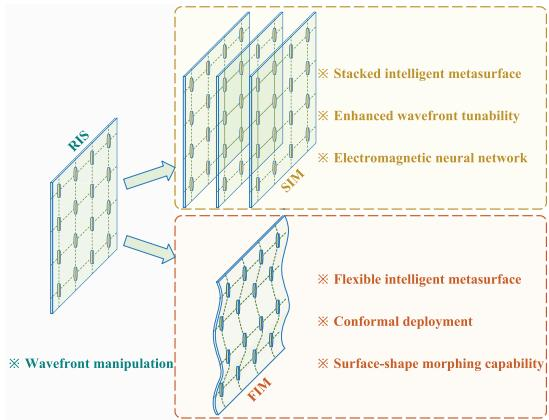  
Fig. 1. Development trend of intelligent metasurfaces: from 2-D RIS to 3-D SIM and FIM.

The recent innovative application of programmable metasurfaces in wireless communications has sparked considerable interest [8], [9], [10], [11]. Traditionally, the wireless propagation environment has been viewed as uncontrollable, impacting the eficiency and reliability of wireless transmission. However, programmable metasurfaces, commonly referred to as reconfigurable intelligent surfaces (RISs) in this context, have refuted this perspective. By intelligently coordinating the amplitude and phase shifts of incident EM waves through a large number of low-cost, quasi-passive reflecting elements, RIS can manipulate the radio propagation environment on demand [11]. Compared with conventional relays, RIS ofers an attractive advantage in terms of lower power consumption, as it no longer requires expensive and power-hungry radio frequency (RF) components for signal transmission [10]. Furthermore, RIS is typically lightweight and compact, making it easy to integrate with various environmental structures, such as buildings, ceilings, light poles, and road signs [12]. In past years, substantial research eforts have demonstrated the unprecedented performance gains of RIS for enhancing the capacity and coverage of wireless networks in a cost-efective and energy-eficient manner [10], [11], [13].

TABLE I  
COMPARISON OF THIS WORK WITH EXISTING SURVEYS AND TUTORIALS ON INTELLIGENT METASURFACES
<table><tr><td rowspan=1 colspan=2>Contents</td><td rowspan=1 colspan=1>[2]</td><td rowspan=1 colspan=1>[8]</td><td rowspan=1 colspan=1>[12]</td><td rowspan=1 colspan=1>[14]</td><td rowspan=1 colspan=1>[15]</td><td rowspan=1 colspan=1>[16]</td><td rowspan=1 colspan=1>[17]</td><td rowspan=1 colspan=1>[18]</td><td rowspan=1 colspan=1>[19]</td><td rowspan=1 colspan=1>[20]</td><td rowspan=1 colspan=1>[21]</td><td rowspan=1 colspan=1>[22]</td><td rowspan=1 colspan=1>This paper</td></tr><tr><td rowspan=7 colspan=1>RIS</td><td rowspan=1 colspan=1>Hardware prototype</td><td rowspan=1 colspan=1>√</td><td rowspan=1 colspan=1>√</td><td rowspan=1 colspan=1>X</td><td rowspan=1 colspan=1>X</td><td rowspan=1 colspan=1>X</td><td rowspan=1 colspan=1>√</td><td rowspan=1 colspan=1>X</td><td rowspan=1 colspan=1>√</td><td rowspan=1 colspan=1></td><td rowspan=1 colspan=1></td><td rowspan=1 colspan=1></td><td rowspan=1 colspan=1></td><td rowspan=1 colspan=1>√Sec. II-A</td></tr><tr><td rowspan=1 colspan=1>Field trials</td><td rowspan=1 colspan=1></td><td rowspan=1 colspan=1>X</td><td rowspan=1 colspan=1>X</td><td rowspan=1 colspan=1>X</td><td rowspan=1 colspan=1>X</td><td rowspan=1 colspan=1></td><td rowspan=1 colspan=1>X</td><td rowspan=1 colspan=1></td><td rowspan=1 colspan=1></td><td rowspan=1 colspan=1></td><td rowspan=1 colspan=1></td><td rowspan=1 colspan=1></td><td rowspan=1 colspan=1>Sec. II-A</td></tr><tr><td rowspan=1 colspan=1>Channel modeling</td><td rowspan=1 colspan=1>X</td><td rowspan=1 colspan=1></td><td rowspan=1 colspan=1></td><td rowspan=1 colspan=1>X</td><td rowspan=1 colspan=1></td><td rowspan=1 colspan=1></td><td rowspan=1 colspan=1>X</td><td rowspan=1 colspan=1>X</td><td rowspan=1 colspan=1></td><td rowspan=1 colspan=1></td><td rowspan=1 colspan=1></td><td rowspan=1 colspan=1></td><td rowspan=1 colspan=1>√Sec. II-A</td></tr><tr><td rowspan=1 colspan=1>Channel estimation</td><td rowspan=1 colspan=1>X</td><td rowspan=1 colspan=1>X</td><td rowspan=1 colspan=1>X</td><td rowspan=1 colspan=1></td><td rowspan=1 colspan=1>X</td><td rowspan=1 colspan=1>X</td><td rowspan=1 colspan=1></td><td rowspan=1 colspan=1>X</td><td rowspan=1 colspan=1></td><td rowspan=1 colspan=1></td><td rowspan=1 colspan=1></td><td rowspan=1 colspan=1></td><td rowspan=1 colspan=1>Sec. II-B</td></tr><tr><td rowspan=1 colspan=1>Transmission design</td><td rowspan=1 colspan=1>X</td><td rowspan=1 colspan=1>X</td><td rowspan=1 colspan=1></td><td rowspan=1 colspan=1></td><td rowspan=1 colspan=1></td><td rowspan=1 colspan=1></td><td rowspan=1 colspan=1></td><td rowspan=1 colspan=1>X</td><td rowspan=1 colspan=1></td><td rowspan=1 colspan=1></td><td rowspan=1 colspan=1></td><td rowspan=1 colspan=1></td><td rowspan=1 colspan=1>VSec. II-B</td></tr><tr><td rowspan=1 colspan=1>Radio localization</td><td rowspan=1 colspan=1>X</td><td rowspan=1 colspan=1>X</td><td rowspan=1 colspan=1>X</td><td rowspan=1 colspan=1></td><td rowspan=1 colspan=1></td><td rowspan=1 colspan=1>X</td><td rowspan=1 colspan=1>X</td><td rowspan=1 colspan=1>X</td><td rowspan=1 colspan=1></td><td rowspan=1 colspan=1></td><td rowspan=1 colspan=1></td><td rowspan=1 colspan=1></td><td rowspan=2 colspan=1>XX</td></tr><tr><td rowspan=1 colspan=1>Resource management</td><td rowspan=1 colspan=1>X</td><td rowspan=1 colspan=1>X</td><td rowspan=1 colspan=1></td><td rowspan=1 colspan=1>X</td><td rowspan=1 colspan=1>X</td><td rowspan=1 colspan=1>X</td><td rowspan=1 colspan=1>X</td><td rowspan=1 colspan=1>X</td><td rowspan=1 colspan=1></td><td rowspan=1 colspan=1></td><td rowspan=1 colspan=1></td><td rowspan=1 colspan=1></td></tr><tr><td rowspan=4 colspan=1>SIM</td><td rowspan=1 colspan=1>Operating principle</td><td rowspan=1 colspan=1></td><td rowspan=1 colspan=1></td><td rowspan=1 colspan=1></td><td rowspan=1 colspan=1></td><td rowspan=1 colspan=1></td><td rowspan=1 colspan=1></td><td rowspan=1 colspan=1></td><td rowspan=1 colspan=1></td><td rowspan=1 colspan=1></td><td rowspan=1 colspan=1></td><td rowspan=1 colspan=1></td><td rowspan=1 colspan=1></td><td rowspan=1 colspan=1>√Sec. III-A</td></tr><tr><td rowspan=1 colspan=1>Hardware prototype</td><td rowspan=1 colspan=1></td><td rowspan=1 colspan=1></td><td rowspan=1 colspan=1></td><td rowspan=1 colspan=1></td><td rowspan=1 colspan=1></td><td rowspan=1 colspan=1></td><td rowspan=1 colspan=1></td><td rowspan=1 colspan=1></td><td rowspan=1 colspan=1>X</td><td rowspan=1 colspan=1></td><td rowspan=1 colspan=1></td><td rowspan=1 colspan=1></td><td rowspan=1 colspan=1>Sec. III-B</td></tr><tr><td rowspan=1 colspan=1>Promising application</td><td rowspan=1 colspan=1></td><td rowspan=1 colspan=1></td><td rowspan=1 colspan=1></td><td rowspan=1 colspan=1></td><td rowspan=1 colspan=1></td><td rowspan=1 colspan=1></td><td rowspan=1 colspan=1></td><td rowspan=1 colspan=1></td><td rowspan=1 colspan=1>X</td><td rowspan=1 colspan=1>X</td><td rowspan=1 colspan=1></td><td rowspan=1 colspan=1></td><td rowspan=1 colspan=1>Sec. III-C</td></tr><tr><td rowspan=1 colspan=1>Performance evaluation</td><td rowspan=1 colspan=1></td><td rowspan=1 colspan=1></td><td rowspan=1 colspan=1></td><td rowspan=1 colspan=1></td><td rowspan=1 colspan=1></td><td rowspan=1 colspan=1></td><td rowspan=1 colspan=1></td><td rowspan=1 colspan=1></td><td rowspan=1 colspan=1></td><td rowspan=1 colspan=1></td><td rowspan=1 colspan=1></td><td rowspan=1 colspan=1></td><td rowspan=1 colspan=1>Sec. III-E</td></tr><tr><td rowspan=3 colspan=1>FIM</td><td rowspan=1 colspan=1>Hardware prototype</td><td rowspan=1 colspan=1></td><td rowspan=1 colspan=1></td><td rowspan=1 colspan=1></td><td rowspan=1 colspan=1></td><td rowspan=1 colspan=1></td><td rowspan=1 colspan=1></td><td rowspan=1 colspan=1></td><td rowspan=1 colspan=1></td><td rowspan=1 colspan=1></td><td rowspan=1 colspan=1></td><td rowspan=1 colspan=1></td><td rowspan=1 colspan=1></td><td rowspan=1 colspan=1>Sec. IV-A</td></tr><tr><td rowspan=1 colspan=1>Performance evaluation</td><td rowspan=1 colspan=1></td><td rowspan=1 colspan=1></td><td rowspan=1 colspan=1></td><td rowspan=1 colspan=1></td><td rowspan=1 colspan=1></td><td rowspan=1 colspan=1></td><td rowspan=1 colspan=1></td><td rowspan=1 colspan=1></td><td rowspan=1 colspan=1></td><td rowspan=1 colspan=1></td><td rowspan=1 colspan=1></td><td rowspan=1 colspan=1>X</td><td rowspan=1 colspan=1>Sec. IV-C</td></tr><tr><td rowspan=1 colspan=1>Open challenge</td><td rowspan=1 colspan=1></td><td rowspan=1 colspan=1></td><td rowspan=1 colspan=1></td><td rowspan=1 colspan=1></td><td rowspan=1 colspan=1></td><td rowspan=1 colspan=1></td><td rowspan=1 colspan=1></td><td rowspan=1 colspan=1></td><td rowspan=1 colspan=1></td><td rowspan=1 colspan=1></td><td rowspan=1 colspan=1>X</td><td rowspan=1 colspan=1>X</td><td rowspan=1 colspan=1>Sec. IV-D</td></tr></table>

Recently, 3-D stacked intelligent metasurfaces (SIMs) have been developed to realize analog signal processing in the wave domain [19]. As shown in Fig. 1, an SIM is physically fabricated by closely packing multiple layers of programmable metasurfaces, resulting in an architecture that bears some conceptual resemblance to an artificial neural network (ANN) [23]. The electronically programmable meta-atoms within an SIM function similar to artificial neurons in an ANN, with their complex-valued transmission coeficients serving as trainable network parameters [24]. By properly configuring the transmission coeficients of the meta-atoms on each metasurface, an SIM becomes capable of automatically accomplishing various advanced computation and signal processing tasks as EM waves propagate through the layered structure at the speed of light [25], [26]. Since SIMs directly process the information-carrying EM waves in free space, they no longer require any digital storage, transmission, preprocessing of information, as well as external computing power. Recent prototypes have demonstrated SIMs with impressive capabilities for applications, such as MIMO beamforming [25], radar sensing [26], and image classification [27].

In addition, flexible intelligent metasurfaces (FIMs) have been created by depositing an array of dielectric inclusions onto a soft, conformal substrate such as polydimethylsiloxane (PDMS) [21], [22]. More recently, a shape-morphable FIM has been developed using a mesh of tiny metallic filaments that can be precisely controlled by reprogrammable Lorentz forces generated by electrical currents passing through a static magnetic field [28]. This type of FIM can morph its 3-D surface shape into a wide variety of target configurations within milliseconds. The application of FIMs to wireless networks has shown significant potential, especially in terms of their adaptability to dynamic wireless environments [29], [30]. Specifically, conventional 2-D rigid antenna arrays with fixed element positions may lead to poor channel quality, especially when deep fading occurs [31]. However, by strategically adjusting the physical position of each antenna element, FIMs can ensure that multiple signal copies from diferent paths add constructively, thus improving the received signal quality through beneficial 3-D surface-shape morphing [29]. This is particularly beneficial for millimeter-wave and terahertz communications, where the channel coherence distance is relatively small.

In this article, we provide a comprehensive overview of the state of the art of intelligent metasurfaces in wireless communications. First, we review the latest research breakthroughs in experimental testing and modeling of RIS. Several key developments are discussed from four diferent perspectives. Second, we delve into the fundamental operating principles for SIM and systematically survey existing prototype designs. Moreover, we identify promising application scenarios for integrating SIM into future wireless networks and provide numerical results to demonstrate their advantages. Finally, we discuss the emerging FIM technology and its potential impacts on wireless communications. We also provide insights into ongoing challenges and outline major research directions that warrant further investigation. While several recent survey papers [8], [12], [14], [15], [16], [17], [18], [32] have examined the same topic, they have primarily focused on 2- D RIS. In contrast, this survey places a greater emphasis on 3-D SIM and FIM. More explicitly, we summarize the unique contributions of this article compared with existing works in Table I, where the structure of this article is also outlined.

## II. RECONFIGURABLE INTELLIGENT SURFACE

In this section, we first review the recent progress in modeling and experimental field tests of RIS (see Section II-A).

Then, we discuss the applications of RISs in wireless communications from four distinct perspectives (see Section II-B).

## A. Experiment and Modeling

1) Prototype and Field Trials: Over the past years, various prototypes of RIS have been developed and experimentally tested to showcase their potential in enhancing wireless communications. Liu et al. [33] designed a reflection-type RIS operating in the microwave frequency range, which is capable of achieving local control over the complex surface impedance for tunable perfect absorption and anomalous reflection. Dai et al. [34] developed a high-gain yet cost-efective RIS with 256 elements that integrated phase shifting and radiation functions using p-i-n diodes, allowing for 2-bit phase-shift tuning. Testing at 28.5 GHz revealed an impressive antenna gain of 19.1 dBi. In [35], an RIS prototype with 1100 individually controllable elements operating at 5.8 GHz was presented. In an indoor test scenario where the transmitter and receiver are separated by a 30-cm concrete wall, the RIS provides a power gain of 26 dB compared with using a copper surface alone. Huang et al. [36] designed an active frequency selective surface (AFSS) consisting of a periodic metallic structure layer and a graphene capacitor layer, which enables EM switching between transmission and absorption modes within the range of 6–7-GHz band [36].

In addition, Trichopoulos et al. [37] designed and fabricated an RIS with 160 elements operating at 5.8 GHz. In realistic outdoor communication scenarios with a blockage between a base station (BS) and a grid of mobile users over a 35-m propagation path, the RIS demonstrates an average signal-tonoise ratio (SNR) improvement of more than 6 dB. Recently, Liang et al. [38] designed a 3-bit meta-atom that is insensitive to incident angles. An RIS fabricated using this angleinsensitive meta-atom maintains stable phase and amplitude responses over a wide incidence angle range of ±60◦, verifying the channel reciprocity in RIS-aided wireless networks [38]. Zhao et al. [39] developed an RIS architecture that enables full-array space–time wavefront manipulation. Notably, each meta-atom ofers 2-bit phase-shifting capabilities and exhibits an insertion loss of less than 0.6 dB across a 200-MHz bandwidth. Moreover, these experimental results have demonstrated the potential of RIS to significantly reduce power consumption in real-world communication systems. Inspired by digital electronics, Yang et al. [40] synthesized a metasurface with arbitrary desired phases as efortlessly as Boolean algebra. They demonstrated the capability of the designed metasurface for beamforming, double-beam generation, and dynamic vortex beam creation.

2) Modeling: Developing mathematically tractable yet reasonably accurate EM models is crucial for theoretically analyzing and optimizing RIS-aided communication systems. To this end, Najafi et al. [41] developed a physics-based model by partitioning the RIS elements into several tiles. They modeled each tile as an anomalous reflector and then derived its impact by solving the resulting integral equations for the electric and magnetic vector fields. Moreover, Bjornson and¨ Sanguinetti [42] provided a physically feasible Rayleigh fading model that accurately characterizes the correlation between channels associated with diferent RIS elements, while Di Renzo et al. [43] developed a reflection model based on inhomogeneous sheets theory with varying surface impedance. In addition, Tang et al. [44] developed a free-space path loss model for RISs, which takes into account the directivity of the transceiver antenna and reflecting element through an angle-dependent loss factor. By leveraging rigorous scattering parameter network analysis, Shen et al. [45] proposed two new RIS architectures based on group-connected and fully connected impedance networks, which are shown to increase received signal power by more than 60% compared with single-connected impedance networks.

## B. Development Trend

In this section, we will discuss the development trend of RIS technology from four perspectives: 1) deployment location; 2) signal enhancement capability; 3) coverage area; and 4) practical protocol.

1) From Environmental RIS to Transceiver RIS: One of the main applications of RISs is to deploy them in propagation environments to assist in wireless communications [11], [13]. In recent years, substantial research eforts have demonstrated the potential of utilizing RIS to enhance the energy eficiency of cellular networks [10], increase the capacity of orthogonal frequency division multiplexing systems [46], bolster physical layer security (PLS) [47], and reduce latency in mobile edge computing [48], to name just a few.

In addition, RIS can be integrated with transceivers to make use of the entire surface for both transmission and reception, as shown in Fig. 2(a), enabling holographic MIMO (HMIMO) communications [49], [50]. This integration brings two distinct benefits that are as follows.

1) Near-Field Communications (NFC): When a large intelligent surface is utilized, users are typically within its radiating near-field region. This enables the exploitation of full-spatial degrees of freedom (DoF), even in strong line-of-sight (LoS) channel conditions [51].

2) Continuous Aperture: By integrating a near-infinite number of radiating and sensing elements into a finite space, a spatially continuous surface is formed. This allows for leveraging the spatial diversity gain across the whole continuous surface1 [54].

To characterize the fundamental performance limits of HMIMO communications, Hu et al. [50] considered an LoS propagation environment and demonstrated that the maximum spatial DoF is $\pi / \lambda ^ { 2 }$ per square meter for 2-D terminal deployments. Based on the scalar Helmholtz equation, Pizzo et al. [49] modeled the 3-D small-scale fading in HMIMO communications as a Fourier plane-wave spectral representation. Furthermore, Jung et al. [55] showed the channel hardening phenomenon in multiuser HMIMO systems. An asymptotic analysis of the uplink data rate indicates that the impact of hardware impairments, channel estimation errors, and noise becomes negligible as the number of antennas and devices increases. In addition, Deng et al. [56] proposed a holographic-pattern division multiple access strategy that maps the intended signals to a superposed holographic pattern, while Wei et al. [57] utilized triple polarization patch antennas at transceivers to enhance the capacity and diversity of multiuser HMIMO communication systems. More recently, Dardari [58] introduced the concept of a dynamic scattering array (DSA) to enable eficient HMIMO communications, shifting signal processing from the digital domain to the EM domain. Please refer to [54] and [59] for a comprehensive survey on the latest advances in HMIMO communications.

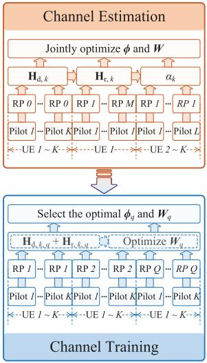

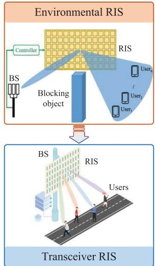  
(a)

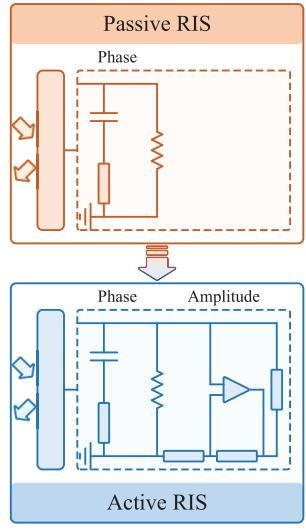  
(b)

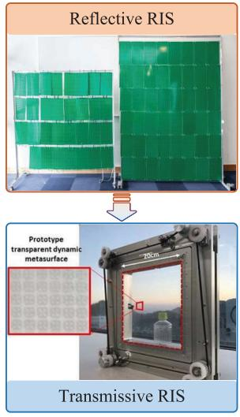  
(c)  
(d)  
Fig. 2. Four development trends of RIS technology. (a) From environmental RIS to transceiver RIS. (b) From passive RIS to active RIS. (c) From reflective RIS to transmissive RIS. (d) From channel estimation to channel training.

2) From Passive RIS to Active RIS: Due to the two-hop propagation—from the transmitter to the RIS and then from the RIS to the receiver—the overall path loss in RIS-aided communication systems is severe. To compensate for the multiplicative fading attenuation, a large number of passive reflecting elements are often deployed, resulting in a large surface area and increased circuit power consumption. To address this issue, Long et al. [60] proposed a new type of active RIS that can not only reflect signals with adjustable phase shifts but also amplify incoming signals. They also developed a method for optimizing the reflection coeficients to minimize RIS-related noise, while maximizing the received signal power. Moreover, Zhang et al. [61] designed an active RIS by integrating a small amplifier into each element, as depicted in Fig. 2(b). They developed and experimentally verified a signal model to characterize the signal amplification. Based on the tested model, they demonstrated the potential of active RISs to double the sum rate for multiuser multiple-input single-output (MISO) communications.

3) From Reflective RIS to Transmissive RIS: Most studies on RIS have concentrated on reflective metasurfaces that reflect incoming signals toward receivers on the same side as the transmitter. However, this limits the service coverage to only half of the surrounding space of RIS. To overcome this limitation, simultaneously transmitting and reflecting (STAR) RISs were conceived to refract and reflect wireless signals into the entire space, as shown in Fig. 2(c). Mu et al. [62] proposed three practical protocols for operating STAR-RISs: energy splitting, mode switching, and time switching. They also explored the downlink of an STAR-RIS-aided multiuser MISO communication system, where the transmit beamforming and the passive transmission/reflection beamforming at the STAR-RIS were jointly optimized to minimize power consumption for both unicast and multicast transmissions. Similarly, Zhang et al. [63], [64] introduced the concept of intelligent omni-surface (IOS) and presented a relevant prototype. A hybrid downlink beamforming scheme was proposed to maximize the sum rate of multiple users on both sides of the IOS. Numerical results have demonstrated that STAR-RISs and IOSs can significantly extend the service coverage of a BS compared with conventional transmitting-/reflecting-only RISs.

4) From Channel Estimation to Channel Training: In RIS-aided communication systems, accurate channel state information (CSI) acquisition and feedback with moderate overhead presents a major challenge. This is because passive RIS elements are unable to transmit or receive pilot signals. To address this issue, advanced channel estimation techniques have been developed to probe the cascaded transmitter-RISreceiver channels. Specifically, You et al. [65] proposed a hierarchical protocol design to progressively estimate the reflection channels over multiple time blocks by exploiting grouping strategies and considering the discrete phase-shift constraint. Moreover, Zhi et al. [66] developed a two-timescale transmission scheme for RIS-aided massive MIMO systems. The transmit beamforming is adapted to the rapidly changing instantaneous CSI, while the passive beamforming is adapted to the slowly changing statistical CSI. In addition, Xu et al. [67], [68] investigated estimation and prediction for rapidly time-varying channels, respectively, while Zhou et al. [69] studied robust passive beamforming design based on imperfect CSI.

However, the pilot overhead in the aforementioned channel estimation schemes still increases with the number of

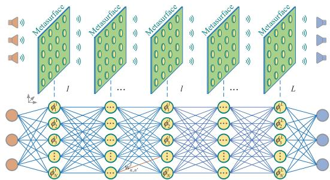  
Fig. 3. Schematic of an SIM and its equivalent neural network structure. The forward propagation of EM waves in the SIM is equivalent to a multilayer perceptron.

RIS elements. To reduce the pilot signaling overhead and implementation complexity, An et al. [13], [70] proposed a new channel training protocol, which is also known as codebook solution. As shown in Fig. 2(d), in each training block, the RIS is configured based on a predesigned codebook. The composite channel is then estimated based on which the transmit beamformer is designed with low complexity. The codeword resulting in optimal performance is used to assist data transmission [9]. Substantial research eforts have shown that the codebook protocol is more robust against channel estimation errors [13], [70]. Recently, Ren et al. [71] proposed an efective beamforming strategy for RIS that extracts statistical features from random samples of the received signal power. In addition, Yu et al. [72] proposed an environment-aware codebook protocol, which generates a reflection pattern codebook based on statistical CSI, thus achieving better performance than conventional environmentagnostic codebooks.

## III. STACKED INTELLIGENT METASURFACE

In this section, we shift our focus to 3-D SIM technology, which provides a new paradigm to perform signal processing. Specifically, we first elaborate on the fundamental operating principle of SIM in Section III-A, and then discuss some existing prototypes in Section III-B. Furthermore, Section III-C reviews the functionalities of SIM, while Section III-D provides a comprehensive survey of the state of the art in applying SIM technology to wireless networks. In Section III-E, we provide case studies to show the capabilities of SIM and shed light on the future directions in Section III-F.

## A. Operating Principle

As illustrated in Fig. 3, an SIM is constructed by stacking multiple layers of programmable metasurfaces. Each layer contains a large number of low-cost, passive meta-atoms that can manipulate EM waves. Essentially, the architecture of an SIM forms an EM neural network (EMNN), which is conceptually similar to an ANN [23], [24]. Specifically, each intelligent metasurface can be viewed as a hidden layer, where the meta-atoms behave similar to artificial neurons in a conventional ANN. By adequately training and configuring the transmission coeficients of the meta-atoms using error backpropagation, an SIM is capable of performing desired functions through the interactions of spatial EM waves with the metasurface layers [19], [20]. In recent years, several advanced SIM architectures have been reported to demonstrate impressive capabilities for various emerging applications, such as hologram generation [73], image classification [27], and matrix operations [25], [26].

According to the Huygens–Fresnel principle [23], each meta-atom on a metasurface layer acts as a secondary source, producing a spherical wave that illuminates all the metaatoms on the next layer. The field response impinging on each layer is the weighted sum of the difracted fields from the meta-atoms on the previous layer, with the weight coeficient determined by the product of the complex-valued transmission coeficients and corresponding propagation coeficients [25], [26]. Based on the Rayleigh–Sommerfeld difraction integral, the propagation coeficient from the n0th meta-atom on the (l − 1)th metasurface layer to the nth meta-atom on the lth metasurface layer can be expressed by2

$$
w _ { n , n ^ { \prime } } ^ { l } = \frac { A \cos \chi _ { n , n ^ { \prime } } ^ { l } } { r _ { n , n ^ { \prime } } ^ { l } } \left( \frac { 1 } { 2 \pi r _ { n , n ^ { \prime } } ^ { l } } - j \frac { 1 } { \lambda } \right) e ^ { j 2 \pi r _ { n , n ^ { \prime } } ^ { l } / \lambda }\tag{1}
$$

where A is the area of each meta-atom, ${ \boldsymbol { r } } _ { n , n ^ { \prime } } ^ { l }$ denotes the corresponding propagation distance, while $\chi _ { n , n ^ { \prime } } ^ { l }$ represents the angle ,between the propagation direction and the normal direction of the (l − 1)th metasurface layer. By repeating this propagation process until the last metasurface layer, the transfer function S of the SIM can be formulated as follows3:

$$
\mathbf { S } = \pmb { \Phi } ^ { L } \mathbf { W } ^ { L } \cdot \mathbf { \cdot } \mathbf { \cdot } \pmb { \Phi } ^ { 2 } \mathbf { W } ^ { 2 } \pmb { \Phi } ^ { 1 } \in \mathbb { C } ^ { N \times N }\tag{2}
$$

where N is the number of meta-atoms on each metasurface layer, $\mathbf { W } ^ { l } \in \mathbb { C } ^ { N \times N }$ denotes the propagation coeficient matrix between the (l−1)th metasurface layer and the lth metasurface layer, and $ { \Phi } ^ { l } \in \mathbb { C } ^ { N \times N }$ represents the transmission coeficient matrix of the lth metasurface layer.

Since the matrix operations in (2) occur automatically during the wave propagation through free space, SIMs can execute complex signal processing and computing tasks without requiring any digital storage, transmission, or preprocessing of information [24]. In addition, SIM can perform parallel calculations for all input EM signals, demonstrating its excellent scalability [19].

## B. Hardware Prototypes

As shown in Fig. 4, several SIM prototypes have been developed over the past years, turning the abstract concept into a tangible reality. Lin et al. [23] designed a passive SIM using 3-D printed difractive layers capable of classifying images of handwritten digits and fashion products at terahertz frequencies. Building on this, Qian et al. [74] created a compact SIM that can perform logic operations (NOT, OR, and AND) at microwave frequencies. The plane wave is initially spatially encoded using a patterned mask according to input logic states and then passes through a series of hidden metasurface layers. The well-designed SIM scatters the encoded EM waves into one of two designated areas at the output layer, indicating the output logic state.

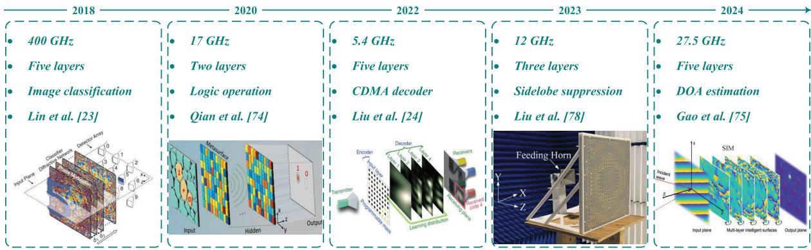  
Fig. 4. Illustration of several existing SIM prototypes.

Furthermore, Liu et al. [24] developed a reconfigurable SIM using programmable metasurfaces that can dynamically adjust its EM behavior in real time. Specifically, each metaatom (neuron) is connected to two amplifier chips, providing a dynamic modulation range of 35 dB. A five-layer SIM prototype was fabricated to demonstrate its capability for image recognition and multibeam focusing [24]. To enhance the parallelism capability of SIM, Luo et al. [27] developed an SIM device that can simultaneously recognize digital and fashionable items by leveraging polarization multiplexing in the visible spectrum. By integrating the SIM with a standard imaging sensor, a chip-scale architecture was created for energy-eficient and ultrafast visual information processing. Recently, Jia et al. [73] fabricated a two-layer SIM by using tunable transmissive metasurfaces with opposite phases, which can achieve both information transmission and holographic image generation using multiple channels. In addition, Gao et al. [75] designed an SIM for estimating the direction of arrival (DOA) of multiple radio sources over a 5-GHz bandwidth. Spatial–temporal multiplexing was utilized to achieve high-resolution DOA estimation over a wide field of view. In [76], an SIM comprised of three transmissive metasurface layers was built for enabling integrated sensing and communication (ISAC) tasks at 5.8 GHz. Moreover, Liu et al. [77] and Liu and Chen [78] synthesized a triple-layer meta-atom that enables precise phase-shift control across a range of 330◦, with a signal loss of less than −1 dB. This breakthrough has facilitated the design of metalens that can efectively suppress sidelobes. In parallel, Lv et al. [79] have explored the potential of SIM technology to produce a nearly rectangular filtering response.

## C. Functionalities of SIM in Wireless Communications

Leveraging SIM to achieve wave-domain signal processing has great potential to significantly reduce hardware costs and energy consumption of communication systems. In this section, we first review recent research eforts of utilizing SIM for performing beamforming-related matrix operations in the wave domain. Then, we discuss the contributions related to channel estimation and machine learning (ML)-based design.

1) MIMO Beamforming: Recent studies have made considerable progress in utilizing SIM to perform analog MIMO beamforming. These eforts can be broadly categorized into two categories according to the system architecture.

1) Fully Analog Architecture: An et al. [25] harnessed a pair of SIM devices to automatically perform MIMO precoding and combining as EM waves propagate through them. The aim is to minimize the error between the actual end-to-end channel matrix and a target diagonal one representing parallel interferencefree subchannels. To achieve this, a gradient descent algorithm was developed to determine the phase shifts for all the metasurface layers. Moreover, they explored the integration of SIM into the radome of a BS to enable multiuser downlink communications [80], [81]. As shown in Fig. 5, thanks to analog beamforming in the wave domain, the signal for each data stream can be directly radiated from the corresponding transmit antenna, allowing the communication system to work with lower resolution digital-to-analog converters (DACs) and fewer RF chains. In addition, Darsena et al. [82] enhanced the channel capacity by inserting active layers with amplifier chips to tune both phase and amplitude. Papazafeiropoulos et al. [83] used statistical CSI to optimize the phase shifts of the SIM for maximizing the sum rate in multiuser downlink scenarios. By contrast, Rezvani et al. [84] investigated an SIM-aided uplink communication scenario, proposing an interior point method to maximize the sum rate while accounting for hardware imperfections. The results showed that SIM can outperform digital phased arrays with the same number of RF chains under realistic channels. More recently, Nerini and Clerckx [85] explored the impact of mutual coupling among metaatoms in SIM, while Papazafeiropoulos et al. [86] placed an SIM in the environment to enhance the capability of a single-layer RIS for shaping the wireless channel. In addition, the fully analog wideband beamforming design was investigated in [87], where the influence of the number of subcarriers and transmission bandwidth was also characterized.

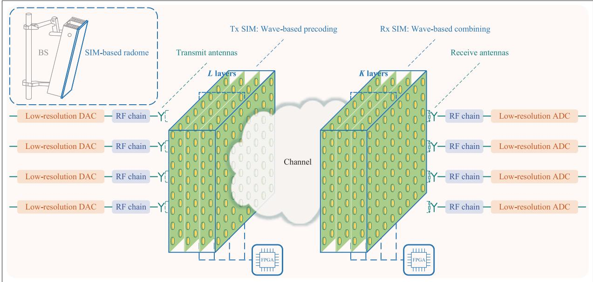  
Fig. 5. SIM-aided point-to-point MIMO system, where a pair of SIMs are deployed at the transmitter and receiver to implement MIMO precoding and combining automatically as the EM waves propagate through them.

2) Hybrid Architecture: While SIM can perform analog signal processing in the wave domain, it is important to note that a larger surface aperture is required for handling more data streams, which may limit its practical scalability. To address this issue, the hybrid architecture that combines SIM with low-complexity digital signal processors has recently gained attention. Specifically, Papazafeiropoulos et al. [88] designed a hybrid architecture harnessing two SIMs to enhance transmit precoding and receiver combining in HMIMO communications. The phase shifts of SIMs at the transceivers and the transmit covariance matrix were iteratively optimized using the projected gradient method. Furthermore, Perovic and Tran ´ [89] leveraged the cutof rate as a proxy for mutual information optimization. They proposed an alternating projected gradient method to maximize the channel cutof rate of an SIM-based HMIMO system by adjusting the transmit precoding and phase shifts of transmitting and receiving SIMs layer-by-layer. In addition, they investigated the energy eficiency of SIM-aided MIMO broadcast systems [90]. The uplinkdownlink duality was utilized to simplify the energy eficiency maximization problems formulated for dirty paper coding (DPC) and linear precoding, while the transmit covariance matrices were optimized using the successive convex approximation technique. Moreover, they demonstrated that the system energy eficiency can be improved by optimizing the distribution of metaatoms across layers.

2) Channel Estimation: CSI acquisition in SIM-aided communication systems presents a major challenge since the BS has fewer RF chains than the number of meta-atoms on each metasurface layer, which determines the channel dimension that needs to be probed. To tackle this challenge, Yao et al. [91] investigated channel estimation for SIM-assisted multiuser HMIMO communication systems. They collected multiple copies of uplink pilot signals that propagate through the SIM and used the array geometry to identify the subspace that covers any spatial correlation matrices. By leveraging partial information about channel statistics, two subspace-based channel estimators were proposed. They also modeled the channel estimation problem in SIM-assisted mmWave communication systems as a sparse recovery problem and applied an improved orthogonal matching pursuit (OMP) algorithm to estimate channel parameters [92]. In addition, Nadeem et al. [93] developed a novel hybrid-domain channel estimator. The phase shifts of the meta-atoms were optimized using a gradient descent algorithm to minimize the mean square error (mse) of channel estimates. Simulation results demonstrated that a sixlayer SIM with four RF chains achieved the same estimation accuracy as a fully digital channel estimator with 64 RF chains.

3) ML-Based Design: As previously mentioned, a number of optimization techniques, such as convex optimization, gradient descent, and alternating optimization algorithms, have been used to fine-tune the transmission coeficients of SIM for achieving wave-domain signal processing. Nevertheless, the wireless communication environment in practical SIMaided networks is highly dynamic. In addition, user feedback is often limited and resource-intensive, degrading the performance of conventional optimization approaches. Against this background, ML techniques have gained attention for their powerful learning abilities. For instance, Liu et al. [94], [95] developed a customized deep reinforcement learning (DRL) approach to jointly optimize the SIM’s phase shifts and transmit power allocation for a downlink multiuser system by continuously learning from simulated wireless environments. A whitening process was utilized to enhance the DRL’s robustness. Furthermore, Yang et al. [96] proposed a joint optimization method for SIM phase-shift configuration and power allocation based on the twin delayed deep deterministic policy gradient (TD3) algorithm, which achieves a higher sum rate compared with the deep deterministic policy gradient (DDPG) algorithm. They also found that increasing the number of metasurface layers yields diminishing returns. In addition, Mohammadzadeh et al. [97] investigated the interplay between RIS and SIM. They formulated a resource allocation problem aimed at maximizing the achievable rate while ensuring quality-of-service (QoS) requirements for terminals. By modeling the problem as a Markov decision process, a TD3 policy gradient agent was utilized to optimize the system’s decision variables, with metalearning employed to adapt to user mobility.

TABLE II  
RECENT CONTRIBUTIONS OF APPLYING SIM IN WIRELESS COMMUNICATION SYSTEMS
<table><tr><td rowspan=1 colspan=1>Ref.</td><td rowspan=1 colspan=1>Year</td><td rowspan=1 colspan=1>Direction</td><td rowspan=1 colspan=1>Task</td><td rowspan=1 colspan=1>Objective function</td><td rowspan=1 colspan=1>Optimization method</td><td rowspan=1 colspan=1>Feature</td></tr><tr><td rowspan=1 colspan=1>[25]</td><td rowspan=1 colspan=1>2023</td><td rowspan=1 colspan=1>n/a</td><td rowspan=1 colspan=1>MIMO beamforming</td><td rowspan=1 colspan=1>Mean square error</td><td rowspan=1 colspan=1>Projected gradient descent</td><td rowspan=1 colspan=1>n/a</td></tr><tr><td rowspan=1 colspan=1>[88]</td><td rowspan=1 colspan=1>2024</td><td rowspan=1 colspan=1>n/a</td><td rowspan=1 colspan=1>MIMO beamforming</td><td rowspan=1 colspan=1>Channel capacity</td><td rowspan=1 colspan=1>Projected gradient ascent</td><td rowspan=1 colspan=1>Hybrid architecture</td></tr><tr><td rowspan=1 colspan=1>[89]</td><td rowspan=1 colspan=1>2024</td><td rowspan=1 colspan=1>n/a</td><td rowspan=1 colspan=1>MIMO beamforming</td><td rowspan=1 colspan=1>Channel cutoff rate</td><td rowspan=1 colspan=1>Projected gradient ascent</td><td rowspan=1 colspan=1>Hybrid architecture</td></tr><tr><td rowspan=1 colspan=1>[81]</td><td rowspan=1 colspan=1>2023</td><td rowspan=1 colspan=1>Downlink</td><td rowspan=1 colspan=1>Multiuser precoding</td><td rowspan=1 colspan=1>Sum rate</td><td rowspan=1 colspan=1>Alternating optimization</td><td rowspan=1 colspan=1>Discrete phase shifts</td></tr><tr><td rowspan=1 colspan=1>[83]</td><td rowspan=1 colspan=1>2024</td><td rowspan=1 colspan=1>Downlink</td><td rowspan=1 colspan=1>Multiuser precoding</td><td rowspan=1 colspan=1>Sum rate</td><td rowspan=1 colspan=1>Alternating optimization</td><td rowspan=1 colspan=1>Statistical CSI</td></tr><tr><td rowspan=1 colspan=1>[82]</td><td rowspan=1 colspan=1>2024</td><td rowspan=1 colspan=1>Downlink</td><td rowspan=1 colspan=1>Multiuser precoding</td><td rowspan=1 colspan=1>Sum rate</td><td rowspan=1 colspan=1>Block coordinate descent</td><td rowspan=1 colspan=1>User selection</td></tr><tr><td rowspan=1 colspan=1>[98]</td><td rowspan=1 colspan=1>2024</td><td rowspan=1 colspan=1>Downlink</td><td rowspan=1 colspan=1>Multiuser precoding</td><td rowspan=1 colspan=1>Sum rate</td><td rowspan=1 colspan=1>Projected gradient ascent</td><td rowspan=1 colspan=1>Antenna selection, user grouping</td></tr><tr><td rowspan=1 colspan=1>[95]</td><td rowspan=1 colspan=1>2024</td><td rowspan=1 colspan=1>Downlink</td><td rowspan=1 colspan=1>Multiuser precoding</td><td rowspan=1 colspan=1>Sum rate</td><td rowspan=1 colspan=1>Deep reinforcement learning</td><td rowspan=1 colspan=1>n/a</td></tr><tr><td rowspan=1 colspan=1>[96]</td><td rowspan=1 colspan=1>2024</td><td rowspan=1 colspan=1>Downlink</td><td rowspan=1 colspan=1>Multiuser precoding</td><td rowspan=1 colspan=1>Sum rate</td><td rowspan=1 colspan=1>Twin-delayed DDPG</td><td rowspan=1 colspan=1>n/a</td></tr><tr><td rowspan=1 colspan=1>[97]</td><td rowspan=1 colspan=1>2024</td><td rowspan=1 colspan=1>Downlink</td><td rowspan=1 colspan=1>Multiuser precoding</td><td rowspan=1 colspan=1>Sum rate</td><td rowspan=1 colspan=1>Meta-learning</td><td rowspan=1 colspan=1>n/a</td></tr><tr><td rowspan=1 colspan=1>[99]</td><td rowspan=1 colspan=1>2024</td><td rowspan=1 colspan=1>Downlink</td><td rowspan=1 colspan=1>Multiuser precoding</td><td rowspan=1 colspan=1>Weighted sum rate</td><td rowspan=1 colspan=1>Block coordinate descent</td><td rowspan=1 colspan=1>Near-field communications</td></tr><tr><td rowspan=1 colspan=1>[90]</td><td rowspan=1 colspan=1>2024</td><td rowspan=1 colspan=1>Downlink</td><td rowspan=1 colspan=1>Multiuser precoding</td><td rowspan=1 colspan=1>Energy efficiency</td><td rowspan=1 colspan=1>Alternating optimization</td><td rowspan=1 colspan=1>Dirty paper coding</td></tr><tr><td rowspan=1 colspan=1>[100]</td><td rowspan=1 colspan=1>2024</td><td rowspan=1 colspan=1>Downlink</td><td rowspan=1 colspan=1>Multiuser precoding</td><td rowspan=1 colspan=1>Mean square error</td><td rowspan=1 colspan=1>Projected gradient descent</td><td rowspan=1 colspan=1>EM response modeling</td></tr><tr><td rowspan=1 colspan=1>[84]</td><td rowspan=1 colspan=1>2024</td><td rowspan=1 colspan=1>Uplink</td><td rowspan=1 colspan=1>Multiuser combining</td><td rowspan=1 colspan=1>Sum rate</td><td rowspan=1 colspan=1>Projected gradient ascent</td><td rowspan=1 colspan=1>EM response modeling</td></tr><tr><td rowspan=1 colspan=1>[86]</td><td rowspan=1 colspan=1>2024</td><td rowspan=1 colspan=1>Uplink</td><td rowspan=1 colspan=1>Multiuser combining</td><td rowspan=1 colspan=1>Sum rate</td><td rowspan=1 colspan=1>Projected gradient ascent</td><td rowspan=1 colspan=1>Environmental SIM</td></tr><tr><td rowspan=1 colspan=1>[92]</td><td rowspan=1 colspan=1>2024</td><td rowspan=1 colspan=1>Uplink</td><td rowspan=1 colspan=1>Channel estimation</td><td rowspan=1 colspan=1>Sparse recovery</td><td rowspan=1 colspan=1>Orthogonal matching pursuit</td><td rowspan=1 colspan=1>Sparsity-agnostic</td></tr><tr><td rowspan=1 colspan=1>[91]</td><td rowspan=1 colspan=1>2024</td><td rowspan=1 colspan=1>Uplink</td><td rowspan=1 colspan=1>Channel estimation</td><td rowspan=1 colspan=1>Mean square error</td><td rowspan=1 colspan=1>Random codebook</td><td rowspan=1 colspan=1>n/a</td></tr><tr><td rowspan=1 colspan=1>[93]</td><td rowspan=1 colspan=1>2024</td><td rowspan=1 colspan=1>Uplink</td><td rowspan=1 colspan=1>Channel estimation</td><td rowspan=1 colspan=1>Mean square error</td><td rowspan=1 colspan=1>Projected gradient descent</td><td rowspan=1 colspan=1>n/a</td></tr><tr><td rowspan=1 colspan=1>[101]</td><td rowspan=1 colspan=1>2024</td><td rowspan=1 colspan=1>Uplink</td><td rowspan=1 colspan=1>CF multiuser combining</td><td rowspan=1 colspan=1>SINR</td><td rowspan=1 colspan=1>Alternating optimization</td><td rowspan=1 colspan=1>n/a</td></tr><tr><td rowspan=1 colspan=1>[102]</td><td rowspan=1 colspan=1>2024</td><td rowspan=1 colspan=1>Uplink</td><td rowspan=1 colspan=1>CF multiuser combining</td><td rowspan=1 colspan=1>Sum rate</td><td rowspan=1 colspan=1>Alternating optimization</td><td rowspan=1 colspan=1>n/a</td></tr><tr><td rowspan=1 colspan=1>[103]</td><td rowspan=1 colspan=1>2024</td><td rowspan=1 colspan=1>Uplink</td><td rowspan=1 colspan=1>CF multiuser combining</td><td rowspan=1 colspan=1>Sum rate</td><td rowspan=1 colspan=1>Alternating optimization</td><td rowspan=1 colspan=1>Antenna-user association</td></tr><tr><td rowspan=1 colspan=1>[104]</td><td rowspan=1 colspan=1>2024</td><td rowspan=1 colspan=1>Downlink</td><td rowspan=1 colspan=1>ISAC beamforming</td><td rowspan=1 colspan=1>Sum rate</td><td rowspan=1 colspan=1>Projected gradient ascent</td><td rowspan=1 colspan=1>A single user</td></tr><tr><td rowspan=1 colspan=1>[105]</td><td rowspan=1 colspan=1>2024</td><td rowspan=1 colspan=1>Downlink</td><td rowspan=1 colspan=1>ISAC beamforming</td><td rowspan=1 colspan=1>Mean square error</td><td rowspan=1 colspan=1>Projected gradient descent</td><td rowspan=1 colspan=1>Dual functions</td></tr><tr><td rowspan=1 colspan=1>[76]</td><td rowspan=1 colspan=1>2024</td><td rowspan=1 colspan=1>Downlink</td><td rowspan=1 colspan=1>ISAC beamforming</td><td rowspan=1 colspan=1>Cramér-Rao bound</td><td rowspan=1 colspan=1>Alternating optimization</td><td rowspan=1 colspan=1>Environmental SIM</td></tr><tr><td rowspan=1 colspan=1>[106]</td><td rowspan=1 colspan=1>2024</td><td rowspan=1 colspan=1>Downlink</td><td rowspan=1 colspan=1>Semantic encoding</td><td rowspan=1 colspan=1>Cross entropy</td><td rowspan=1 colspan=1>Mini-batch gradient descent</td><td rowspan=1 colspan=1>n/a</td></tr><tr><td rowspan=1 colspan=1>[87]</td><td rowspan=1 colspan=1>2024</td><td rowspan=1 colspan=1>n/a</td><td rowspan=1 colspan=1>Wideband beamforming</td><td rowspan=1 colspan=1>Mean square error</td><td rowspan=1 colspan=1>Projected gradient descent</td><td rowspan=1 colspan=1>n/a</td></tr><tr><td rowspan=1 colspan=1>[81]</td><td rowspan=1 colspan=1>2024</td><td rowspan=1 colspan=1>n/a</td><td rowspan=1 colspan=1>DOA estimation</td><td rowspan=1 colspan=1>Mean square error</td><td rowspan=1 colspan=1>Projected gradient descent</td><td rowspan=1 colspan=1>Wave-domain DFT operator</td></tr><tr><td rowspan=1 colspan=1>[107]</td><td rowspan=1 colspan=1>2024</td><td rowspan=1 colspan=1>n/a</td><td rowspan=1 colspan=1>Hologram generation</td><td rowspan=1 colspan=1>Mean square error</td><td rowspan=1 colspan=1>Successive refinement</td><td rowspan=1 colspan=1>Discrete phase shifts</td></tr><tr><td rowspan=1 colspan=1>[85]</td><td rowspan=1 colspan=1>2024</td><td rowspan=1 colspan=1>n/a</td><td rowspan=1 colspan=1>Channel enhancement</td><td rowspan=1 colspan=1>Channel gain</td><td rowspan=1 colspan=1>Successive refinement</td><td rowspan=1 colspan=1>Mutual coupling among elements</td></tr><tr><td rowspan=1 colspan=1>[108]</td><td rowspan=1 colspan=1>2024</td><td rowspan=1 colspan=1>n/a</td><td rowspan=1 colspan=1>Waveform design for PLS</td><td rowspan=1 colspan=1>Mean square error</td><td rowspan=1 colspan=1>Alternating optimization</td><td rowspan=1 colspan=1>Closed-form solution</td></tr></table>

## D. Promising Applications

In this section, we explore the integration of SIM with emerging communication technologies. Table II summarizes the existing research eforts on applying SIM in wireless communication systems.

1) Cell-Free Massive MIMO: The user-centric cell-free (CF) network is a promising network architecture that efectively eludes intercell interference in conventional cellular networks [109], [110]. However, as the number of access points (APs) deployed increases, the CF network faces higher hardware costs, energy consumption, and backhaul overhead. To tackle these issues, Li et al. [101] explored integrating SIMs into APs to improve the spectrum and energy eficiency of the uplink CF systems. The transmission coeficients of the SIM and the local receiver combiner at each AP were optimized based on the local CSI to maximize the composite channel gain. Subsequently, the central processing unit (CPU) combines the local detection results from all APs to recover the user symbol. The weight vector was designed based on the minimum mse (MMSE) criterion, taking into account hardware impairments. In addition, Shi et al. [102], [111] derived a closed-form expression for the spectrum eficiency of an SIM-enhanced CF massive MIMO uplink system, based on which a wave-domain beamforming scheme and a max–min power control algorithm were designed based on the statistical CSI. Furthermore, a two-stage protocol was developed to maximize the SIM-aided CF network capacity [103], where a greedy antenna-user association algorithm was also proposed.

2) Near-Field Communications: A metasurface typically consists of a large number of low-cost meta-atoms, forming an extremely large-scale surface aperture. In addition, as future wireless communications are likely to operate at higher frequencies, NFC is becoming mainstream. In [51], Jia et al. [100] investigated the SIM-based transceiver design for a multiuser MISO NFC system, where an SIM is integrated into the BS to replace the conventional digital baseband architecture. The spherical wavefront characteristics were leveraged to accurately characterize the near-field channel. Numerical results demonstrated that the SIM can efectively mitigate interference between users, while significantly reducing the processing delay. Moreover, Papazafeiropoulos et al. [99] maximized the weighted sum rate of multiple users in the near field, where they developed a block coordinate descent algorithm to adjust the transmit power and phase shifts of the SIM.

3) Low-Earth Orbit Satellite: Low-Earth orbit (LEO) satellites have gained increasing attention as a crucial supplement to terrestrial wireless networks due to their wide coverage area [112]. Motivated by this, Lin et al. [98] suggested installing a lightweight and energy-eficient SIM on an LEO satellite to enable analog beamforming toward multiple users. This would significantly reduce the processing delay and computing load of the satellite compared with traditional digital beamforming methods. In addition, a user grouping method and an antenna selection algorithm were proposed to further enhance the system’s performance. Liu et al. [20] explored the use of an aerial SIM for monitoring natural disasters. The geomorphic image is first encoded into the transmission coeficients of the SIM’s input layer, while the remaining layers construct an EMNN to extract information and send the recognition result to a ground receiving station.

4) Physical Layer Security: The inherent broadcast property of wireless channels poses significant challenges to PLS. Fortunately, SIMs provide an eficient solution to mitigate the risk of information leakage in undesired directions without requiring excessive RF chains. Niu et al. [108] integrated an SIM with a single-antenna transmitter to enable joint modulation, beamforming, and artificial noise generation. The ANN-like structure of the SIM allows it to automatically convert the input carrier signal into the desired output signal. Specifically, a fitting problem between the actual and desired output signals is formulated. An alternating optimization algorithm was then developed to iteratively determine each phase shift and transmit power using closed-form expressions derived. Simulation results confirmed the efectiveness of SIM in achieving PLS with low complexity.

5) ISAC: ISAC is emerging as a key technology to address the growing issue of spectrum congestion and to meet the increasing demand for ubiquitous sensing and communication [113]. The SIM technology is expected to produce a dual-function beam pattern that allows for simultaneous communication with multiple users and the detection of radar targets. For instance, Niu et al. [104] explored the potential of ISAC precoding in the wave domain. They formulated an optimization problem to maximize system spectrum eficiency while ensuring the power constraint in the desired direction. By constructing a penalty term to account for the sensing power constraint, a customized gradient ascent algorithm was developed to design the phase shifts of the SIM and power allocation at the BS. In addition, Li et al. [105] proposed a dual-normalized diferential gradient descent algorithm to solve the same problem. It was demonstrated that the wavedomain ISAC precoder can automatically generate a desired beam pattern for the sensing task as multiple data streams transmit through the SIM. Furthermore, Wang et al. [76] fine-tuned both the transmit beamforming at the BS and the transmission coeficient matrix of the SIM to minimize the Cramer–Rao bound (CRB) for parameter estimation,´ while meeting minimum signal-to-interference-plus-noise ratio (SINR) requirements for communication users.

6) DOA Estimation: Accurate DOA information are crucial for developing signal processing algorithms used in wireless communication, radar sensing, navigation, and other applications. However, existing DOA estimation methods typically require RF circuits to sample and demodulate multichannel signals, as well as complex baseband signal processing. This fundamentally limits the processing speed and energy eficiency. In [114] and [26], an SIM was utilized to estimate the 2-D DOA of radio signals. In contrast to conventional designs, an SIM placed in front of a receiver array can be designed to compute the 2-D discrete Fourier transform (DFT) of incoming signals. As a result, the receiver array can directly observe the angular spectrum of incoming signals and estimate the DOA by simply probing for the energy peak across the receiver array. This approach eliminates the need for power-ineficient RF chains at each antenna. To achieve this goal, a customized gradient descent algorithm was used to iteratively update the phase shift of each meta-atom in the SIM to minimize the error between the SIM’s transfer function and the ideal 2-D DFT matrix. Numerical simulations have confirmed that an optimized SIM can perform DOA estimation with remarkable speed and accuracy, achieving an mse of −40 dB. Recently, Gao et al. [75] utilized a spatial–temporal multiplexing strategy to achieve high-resolution DOA estimation over a wide field of view. They demonstrated that the angular resolution of the SIM can even exceed the difraction limit. In addition, a novel ISAC scenario was demonstrated, where an SIM was utilized to provide DOA estimates for a co-located RIS.

7) Semantic Communications: Semantic communications can significantly enhance the eficiency and reliability of information transmission. Huang et al. [106] demonstrated the potential of employing an SIM to achieve semantic encoding for image recognition tasks. In contrast to traditional communication systems, which transmit modulated signals carrying image data or compressed semantic information, the input layer of the SIM is used for source encoding. The remaining layers form an EMNN, which transforms the signals passing through the input layer into a unique beam toward a receiving antenna corresponding to the image class. Both the source encoding and semantic encoding occur automatically as the carrier EM waves propagate through the SIM. At the receiver, the image is recognized by measuring the signal magnitude across the receiving array. After training the transmission coeficients of meta-atoms, the SIM achieved over 90% accuracy in image recognition [106]. Moreover, combining an SIM with conventional amplitude/phase modulation is anticipated to enable the multimodal semantic information transmission.

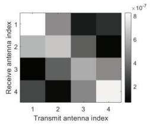

(a)  
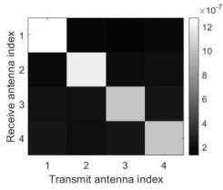

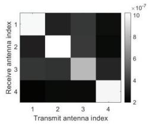

(b)  
(c)  
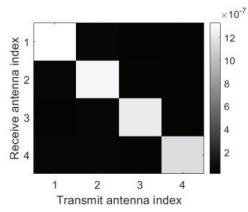  
(d)  
Fig. 6. Visualization of the end-to-end MIMO channel, where two SIMs are utilized to perform analog precoding and combining in the wave domain. (a) $L = K = 1$ . (b) $L = K = { \bar { 2 } } .$ (c) $L = K = 3 .$ . (d) $L = K = 4$

8) Hologram Generation: Leveraging SIMs to generate holograms has great potential for various computational imaging applications. To this end, Hassan et al. [107] formulated an optimization problem to produce a desired radiation hologram on a 2-D plane at a certain distance from the SIM’s output layer. They utilized a gradient descent algorithm for SIMs with continuously adjustable phase shifts and an alternating optimization algorithm for SIMs with discrete phase shifts. Simulation results showed that over 90% of the radiated power could be concentrated in the desired area using only three metasurface layers with continuous-valued transmission coefficients. However, when using discrete-valued transmission coeficients with two phase shifts, nine metasurface layers are required to achieve the same concentration level. Jia et al. [73] designed a tunable SIM using metasurfaces with a transmission eficiency of 96%. By optimizing the binary transmission state of each meta-atom, the SIM can simultaneously achieve multichannel information transmission and holographic image generation.

## E. Case Studies

In this section, we provide two examples to show the capability of SIM in wireless communications.

1) MIMO Beamforming: In Fig. 6, we evaluate the ability of two SIMs to perform matrix operations for MIMO precoding and combining. Each metasurface layer is comprised of 100 meta-atoms with a half-wavelength spacing. Moreover, we consider four data streams and use the same simulation parameters as in [25]. Fig. 6(a) reveals that when using two SIMs with a single-metasurface each, it is hard to form a diagonal channel matrix from the source to the destination. Therefore, each data stream experiences severe interference from other streams. However, as the number of metasurface layers increases, the SIMs gain a stronger inference capability to form multiple parallel subchannels in the physical space. Notably, when each SIM has four metasurface layers, an almost perfectly diagonal channel matrix is formed to enable spatial multiplexing, as seen in Fig. 6(d).

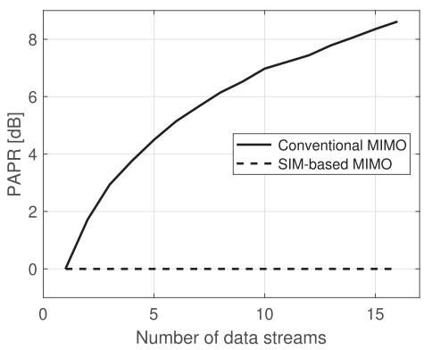  
Fig. 7. PAPR versus the number of data streams, where binary phase-shift keying modulation is considered.

Moreover, since MIMO precoding and combing are implemented in the wave domain, each data stream can be directly transmitted from the corresponding antenna. This significantly reduces the peak-to-average power ratio (PAPR) of the waveforms, enhancing power amplifier eficiency. In Fig. 7, we compare the PAPR of transmit waveforms in SIM-based and conventional MIMO systems, considering binary phase-shift keying signals and Rayleigh fading. The results indicate that the PAPR of the waveforms in fully digital MIMO systems increases with the number of data streams, as the superimposed signal is transmitted. For example, in conventional MIMO systems, the PAPR exceeds 8 dB for transmitting 16 data streams. In contrast, the PAPR of signals in SIM-based MIMO systems remains at 0 dB due to its favorable constantenvelope property.

2) Semantic Encoding: Next, we use the EMNIST dataset to evaluate the performance of the SIM in enabling semantic communications [115]. In contrast to conventional counterparts, the SIM is deployed at the transmitter as a semantic encoder that transforms image information into a unique beam. The system operates at 28 GHz and features a four-layer SIM, with each layer containing $2 1 \times 2 1 = 4 4 1$ meta-atoms. The thickness of the SIM is set to ten wavelengths. In addition, the transmit power and the noise power are set to 40 and −104 dBm, respectively. Other simulation setups, such as wireless channels and array patterns, are detailed in [106], and cross entropy is utilized as a metric to train the SIM. Fig. 8 illustrates the energy distribution at the receiving array for each input image. For simplicity, we focus on six letters: $\mathrm { ^ { * } S , ^ { 3 } \mathrm { ^ { * } I , ^ { 3 } \tilde { \Omega } ^ { * } M , ^ { 3 } \tilde { \Omega } ^ { * } N , ^ { 3 } \tilde { \Omega } ^ { * } T , ^ { 3 } } }$ ” and “U.” The results demonstrate that the SIM is capable of directing the information-bearing signals to the corresponding antenna. As a result, the image class can be readily recognized by detecting the energy peak, which significantly reduces the hardware cost while improving the processing speed.

## F. Open Challenges

1) Nonlinear Activation Function: Although SIM ofers advantages in terms of power eficiency and computation speed, its inference capability is limited by the inherent linear transfer function. To overcome this limitation, an efective solution is to cascade an SIM with an electronic neural network for creating a hybrid optical-electric neural network (HOENN) [116]. In HOENN, the power-eficient SIM can preprocess spatial EM waves, reducing the scale requirements and the computation load for the electronic neuron network [20]. Moreover, by extracting the key information from the phase characteristics of the incident EM waves and transforming them into amplitude characteristics, the system can use power-eficient envelope detectors at the receiver to enable the electronic neuron network. As a result, HOENN significantly decreases power consumption and hardware complexity while improving the inference capability of the SIM. In addition, it is possible to integrate nonlinear components, e.g., adjustable varactors, into the meta-atom to replicate the nonlinear activation functions in traditional neural networks, thus implementing various mathematical functions and ML tasks [117]. However, the precise modeling and device design with benign nonlinear response need to be further investigated [118].

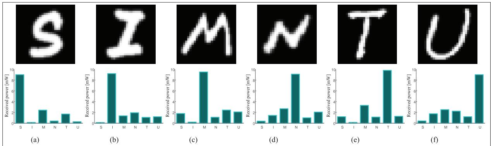  
Fig. 8. SIM is utilized for semantic encoding in an image classification task-oriented semantic communication system, where the input image and the corresponding energy distribution at the receiving array are shown for six cases. (a) Case I. (b) Case II. (c) Case III. (d) Case IV. (e) Case V. (f) Case VI.

2) Performance Evaluation: The advent of SIM technology has opened up new possibilities to utilize EM waves in data processing. In essence, SIM enables a more energyeficient integration of wireless communication and computing by shifting signal processing from the baseband domain to the EM domain, paving the way for future innovations. However, the efective theoretical framework is crucial for characterizing the theoretical limit of SIM. Several key methods for characterizing the relationship between structure and function in EM systems include semiclassical analytical models, heuristic optimization techniques, and topology optimization approaches [119]. In addition, it requires further investigation to characterize the fundamental tradeof between the power loss of EM signals as they pass through the multiple metasurface layers and the benefit of increased depth.

## IV. FLEXIBLE INTELLIGENT METASURFACE

Conventional metasurfaces are typically flat and rigid, which restricts their practical applications. To overcome this limitation, researchers are exploring novel methods for designing and constructing FIMs that can morph into various shapes [21], [22]. In this section, we delve into the emerging FIM technology as well as its promising applications in wireless communications. Specifically, we first review the existing hardware prototypes of FIM in Section IV-A. Then, the functionalities of FIM for wireless communications are discussed in Section IV-B, and some numerical results are provided in Section IV-C. Finally, Section IV-D presents the practical challenges when deploying FIM in wireless networks to motivate future research.

## A. Hardware Prototypes

As illustrated in Fig. 9, FIMs can be divided into two categories based on their ability to morph their surface shape actively:

1) Passive Morphing: FIMs can be conformally deployed on curved surfaces to alter their EM properties, which show great potential in EM camouflage and stealth applications [120], [121], [122], [123]. For example, by randomly arranging metallic patches, Zhang et al. [124] and Zhao et al. [125] showed that FIMs can significantly reduce specular reflection at various angles of incidence. This difuse scattering property remains efective, even when the FIM is wrapped around a curved surface. Measurements indicated that coating a cylindrical metal surface with an FIM can reduce the radar cross section by 10 dB across the X band [125]. Furthermore, Song et al. [126] developed a soft, water-resonator-based FIM that functions as an active absorber across Ku, K, and Ka bands, achieving near-perfect absorption of 99% even when the FIM is bent into diferent curvatures. More recently, Wang et al. [127] designed a stretchable FIM that exhibits robust microwave-absorbing capacity under stretching. In addition, Kamali et al. [128] demonstrated an aspherical lens by covering a cylindrical lens with an FIM, and Aksu et al. [129] showed that the EM responses of FIMs can be actively tuned by mechanically stretching the flexible substrate. Motivated by catenary optics, Huang et al. [130] developed a flexible substrate-based microfabrication process capable of achieving a minimum feature size of the submicrometer scale.

2) Active Morphing: Surface shape-morphable FIMs have significant potential for applications such as flexible displays, surgical instruments, and soft robots. However, creating FIMs that can alter their shapes in response to external stimuli after fabrication poses a substantial challenge. In past years, considerable progress has been made to tackle this issue [131]. For instance, Hajiesmaili and Clarke [132] developed an FIM using specially designed electrodes made of carbon nanotubes sandwiched between thin elastomer sheets. By applying diferent voltages to specific internal electrodes, the surface shape can be reconfigured through reversible deformation. Moreover, Ni et al. [133] presented an FIM with shape-morphing capabilities using liquid metal networks embedded in a flexible material. This design takes advantage of the liquid–solid phase transition of the liquid metal, allowing the surface to rapidly and continuously transform into complex 3-D shapes as needed. Similarly, Bai et al. [28] created an FIM made of a mesh of filamentary metal traces. By programming distributed Lorentz forces generated by passing electrical currents in the presence of a static magnetic field, local deformations can be accurately controlled with high fidelity. Through an integrated digital control scheme and in situ stereo imaging feedback, the FIM is capable of morphing into a variety of target shapes with response time in milliseconds. Recently, Wang et al. [134] proposed an FIM that can change its surface shape on demand using a matrix of ionic actuators.

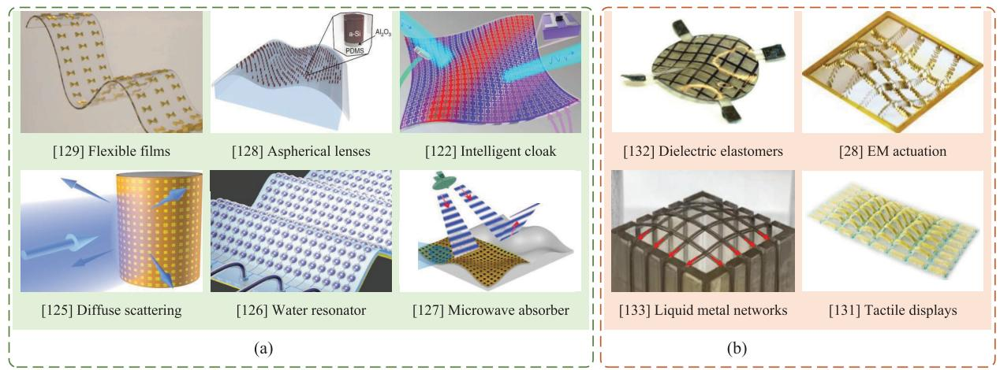  
Fig. 9. Illustration of several existing FIM prototypes. (a) Passive surface-shape morphing. (b) Active surface-shape morphing.

## B. Functionalities of FIM in Wireless Communications

The unique ability of FIMs to morph their surface shape enables them to potentially enhance signal quality for information transmission. This is particularly beneficial for telecommunications operating at high frequencies, where the channel coherence distance is relatively small. In this section, we will discuss recent progress in applying FIM in wireless communications.

1) MIMO Capacity Enhancement: An et al. [30] explored the use of FIMs as transceiver arrays in point-to-point MIMO communications. They characterized the capacity limits of FIM-aided MIMO transmissions over frequency-flat fading channels by simultaneously optimizing the 3-D surface shapes of the transmitting and receiving FIMs as well as the transmit covariance matrix. The optimization took into account constraints including the transmit power budget and the maximum morphing range of the FIMs. They developed an eficient block coordinate descent algorithm that alternately updates the FIM surface shapes and the transmit covariance matrix, until reaching a local optimum. Numerical results verified that FIMs can achieve higher MIMO capacity than conventional rigid arrays. Specifically, the MIMO channel capacity can even be doubled under certain system configurations.

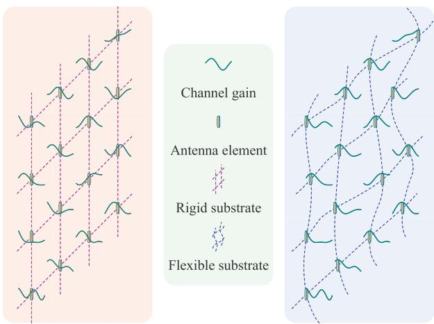  
Fig. 10. Comparison between FIM and conventional rigid array. Note that by beneficially morphing its surface shape, each radiating element on FIM can attain the highest channel gain.

2) Multiuser Interference Mitigation: In practice, an FIM can be integrated with a BS to enhance its ability to mitigate interuser interference. Specifically, by beneficially morphing the surface shape of the FIM, the efective channels between diferent users can be designed to be nearly orthogonal to each other. Motivated by this, An et al. [29], [135] investigated multiuser downlink communications, aiming to minimize the transmit power at the BS by jointly optimizing transmit beamforming and the FIM surface shape, subject to the QoS requirements for all users and the maximum morphing range of the FIM. When considering a single user, it was found that the optimal 3-D surface shape of the FIM can be achieved by independently adjusting each element to the position with the strongest channel gain, as shown in Fig. 10. For multiuser communication scenarios, the FIM surface shape and the transmit beamformer were alternately optimized. Simulation results showed that the FIM can reduce the required transmit power by about 3 dB compared with conventional rigid 2-D arrays while maintaining the same data rate. Moreover,

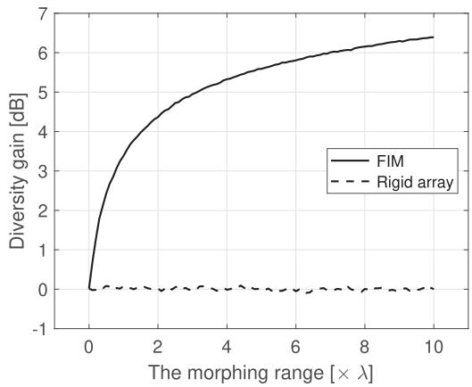  
Fig. 11. Diversity gain versus the morphing range of the FIM.

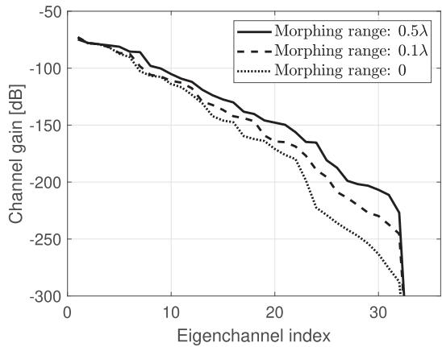  
Fig. 12. Channel gain versus the eigenchannel index.

Yang et al. [136] explored the potential of rotatable, bendable, and foldable FIMs for creating customized radiation patterns for serving multiple users.

## C. Case Studies

In this section, we provide two case studies to demonstrate the benefits of deploying FIMs in communication systems for improving diversity and multiplexing gains.

1) Diversity Gain: We first examine a single-user scenario to demonstrate the diversity gain provided by FIM. For simplicity, we assume correlated Rayleigh fading, where the spatial correlation between diferent positions of each element is characterized in [49, Lemma 2]. Fig. 11 shows the diversity gain versus the morphing range. Compared with a conventional rigid array, FIM significantly improves the diversity gain, which increases logarithmically with the morphing range. Specifically, an FIM with a morphing range of 0 8 can boost the diversity gain by 3 dB. However, achieving a 6 dB diversity gain may require a morphing range of 7 2 , which presents a considerable engineering challenge for the elasticity of the substrate material.

2) Multiplexing Gain: In Fig. 12, we consider an MIMO scenario to evaluate the multiplexing gain. Specifically, a pair of square FIMs, each consisting of $7 \times 7 = 4 9$ antenna elements, are deployed at the source and destination. Eight scatterers are randomly positioned in the environment, and the path loss is determined using the method described in [30]. It is observed from Fig. 12 that the FIMs can morph their surface shapes to improve the channel gain of all eigenchannels, particularly those with poor channel quality. With a morphing range of 0 1 , the weak eigenchannels are enhanced by over 40 dB compared with conventional rigid antenna arrays. Increasing the morphing range of FIMs to 0 5 provides a larger space to morph their surface shapes. Consequently, the eigenchannel gain is further increased by about 20 dB, which means that more eigenchannels can be utilized for data transmission.

## D. Open Challenges

Next, we discuss three major challenges arising from deploying FIMs into wireless networks.

1) Channel Estimation: The performance gain of FIM depends heavily on having perfect knowledge of CSI. However, channel estimation in FIM-aided systems is more challenging since it involves estimating channels across a continuous space. Advanced techniques such as compressed sensing and the space-alternating generalized expectation maximization algorithm can be utilized to estimate channels with moderate overhead. Moreover, the surface shapes of FIMs can potentially be optimized to attain even higher channel estimation accuracy, while further investigation is needed to develop detailed protocols.

2) Surface-Shape Morphing: Although advanced EM actuation technology provides dynamic flexibility, the surface shape morphing ability of a practical FIM may be hindered by hardware limitations and may result in additional energy consumption. This motivates further research to develop eficient solutions. Moreover, for rapidly time-varying channels with shorter coherence time, it may be beneficial to optimize the ergodic performance over multiple coherence blocks. Designing robust surface shape morphing methods to strike tradeofs between achievable performance and implementation complexity is also an important research topic.

3) Practical Deployment: Integrating FIMs into existing network infrastructures presents considerable challenges. For outdoor applications, FIMs can be incorporated into clothing, parachutes, or hot-air balloons. In indoor environments, FIMs can be seamlessly integrated into curtains, functioning as signal reflectors or APs. However, it is crucial to evaluate the resilience of these conformal materials. By skillfully combining passive and active surface-shape morphing strategies, the durability of FIMs in real-world applications can be further enhanced, while further research is needed to assess their performance and develop efective protocols.

## V. CONCLUSION

In this article, we have provided an overview of emerging intelligent metasurface technologies and their applications in wireless communications. We first examined recent RIS experiments and explored its applications from four perspectives. We also explained the underlying principles of 3-D SIM and discussed relevant prototypes. Numerical results were provided to illustrate SIM’s potential for analog signal processing. Finally, we reviewed the state of the art of FIM technology, discussing its impact on wireless communication and identifying key challenges of integrating FIMs into wireless networks. We hope that this comprehensive perspective will inspire future research eforts to achieve the grand vision of eficient communication and computing.

## REFERENCES

[1] T. J. Cui, M. Q. Qi, X. Wan, J. Zhao, and Q. Cheng, “Coding metamaterials, digital metamaterials and programmable metamaterials,” Light: Sci. Appl., vol. 3, no. 10, p. e218, Oct. 2014.

[2] M. Barbuto et al., “Metasurfaces 3.0: A new paradigm for enabling smart electromagnetic environments,” IEEE Trans. Antennas Propag., vol. 70, no. 10, pp. 8883–8897, Oct. 2022.

[3] L. Zhang et al., “Space-time-coding digital metasurfaces,” Nature Commun., vol. 9, no. 1, p. 4334, Oct. 2018.

[4] Q. Ma, G. D. Bai, H. B. Jing, C. Yang, L. Li, and T. J. Cui, “Smart metasurface with self-adaptively reprogrammable functions,” Light: Sci. Appl., vol. 8, no. 1, p. 98, Oct. 2019.

[5] N. Yu et al., “Light propagation with phase discontinuities: Generalized laws of reflection and refraction,” Science, vol. 334, no. 6054, pp. 333–337, Oct. 2011.

[6] A. Silva, F. Monticone, G. Castaldi, V. Galdi, A. Alu, and N. Engheta,´ “Performing mathematical operations with metamaterials,” Science, vol. 343, no. 6167, pp. 160–163, Jan. 2014.

[7] C. L. Holloway, E. F. Kuester, J. A. Gordon, J. O’Hara, J. Booth, and D. R. Smith, “An overview of the theory and applications of metasurfaces: The two-dimensional equivalents of metamaterials,” IEEE Antennas Propag. Mag., vol. 54, no. 2, pp. 10–35, Apr. 2012.

[8] M. Di Renzo et al., “Smart radio environments empowered by reconfigurable intelligent surfaces: How it works, state of research, and the road ahead,” IEEE J. Sel. Areas Commun., vol. 38, no. 11, pp. 2450–2525, Nov. 2020.

[9] J. An et al., “Codebook-based solutions for reconfigurable intelligent surfaces and their open challenges,” IEEE Wireless Commun., vol. 31, no. 2, pp. 134–141, Apr. 2024.

[10] C. Huang, A. Zappone, G. C. Alexandropoulos, M. Debbah, and C. Yuen, “Reconfigurable intelligent surfaces for energy eficiency in wireless communication,” IEEE Trans. Wireless Commun., vol. 18, no. 8, pp. 4157–4170, Aug. 2019.

[11] Q. Wu et al., “Intelligent reflecting surface-aided wireless communications: A tutorial,” IEEE Trans. Commun., vol. 69, no. 5, pp. 3313–3351, May 2021.

[12] Y. Liu et al., “Reconfigurable intelligent surfaces: Principles and opportunities,” IEEE Commun. Surveys Tuts., vol. 23, no. 3, pp. 1546–1577, 3rd Quart., 2021.

[13] J. An, C. Xu, L. Gan, and L. Hanzo, “Low-complexity channel estimation and passive beamforming for RIS-assisted MIMO systems relying on discrete phase shifts,” IEEE Trans. Commun., vol. 70, no. 2, pp. 1245–1260, Feb. 2022.

[14] C. Pan et al., “An overview of signal processing techniques for RIS/IRS-aided wireless systems,” IEEE J. Sel. Topics Signal Process., vol. 16, no. 5, pp. 883–917, Aug. 2022.

[15] E. Bjornson, H. Wymeersch, B. Matthiesen, P. Popovski, L. Sanguinetti,¨ and E. de Carvalho, “Reconfigurable intelligent surfaces: A signal processing perspective with wireless applications,” IEEE Signal Process. Mag., vol. 39, no. 2, pp. 135–158, Mar. 2022.

[16] S. Gong et al., “Toward smart wireless communications via intelligent reflecting surfaces: A contemporary survey,” IEEE Commun. Surveys Tuts., vol. 22, no. 4, pp. 2283–2314, 4th Quart., 2020.

[17] B. Zheng, C. You, W. Mei, and R. Zhang, “A survey on channel estimation and practical passive beamforming design for intelligent reflecting surface aided wireless communications,” IEEE Commun. Surveys Tuts., vol. 24, no. 2, pp. 1035–1071, 2nd Quart., 2022.

[18] E. Basar et al., “Reconfigurable intelligent surfaces for 6G: Emerging hardware architectures, applications, and open challenges,” IEEE Veh. Technol. Mag., vol. 19, no. 3, pp. 27–47, Sep. 2024.

[19] J. An et al., “Stacked intelligent metasurface-aided MIMO transceiver design,” IEEE Wireless Commun., vol. 31, no. 4, pp. 123–131, Aug. 2024.

[20] H. Liu et al., “Stacked intelligent metasurfaces for wireless communications: Applications and challenges,” 2024, arXiv:2407.03566.

[21] Z. Guanxing, Z. Liu, W. Deng, and W. Zhu, “Reconfigurable metasurfaces with mechanical actuations: Towards flexible and tunable photonic devices,” J. Opt., vol. 23, no. 1, Dec. 2020, Art. no. 013001.

[22] Y. Zhou et al., “Flexible metasurfaces for multifunctional interfaces,” ACS Nano, vol. 18, no. 4, pp. 2685–2707, Jan. 2024.

[23] X. Lin et al., “All-optical machine learning using difractive deep neural networks,” Science, vol. 361, no. 6406, pp. 1004–1008, Sep. 2018.

[24] C. Liu et al., “A programmable difractive deep neural network based on a digital-coding metasurface array,” Nature Electron., vol. 5, no. 2, pp. 113–122, Feb. 2022.

[25] J. An et al., “Stacked intelligent metasurfaces for eficient holographic MIMO communications in 6G,” IEEE J. Sel. Areas Commun., vol. 41, no. 8, pp. 2380–2396, Aug. 2023.

[26] J. An et al., “Two-dimensional direction-of-arrival estimation using stacked intelligent metasurfaces,” IEEE J. Sel. Areas Commun., vol. 42, no. 10, pp. 2786–2802, Oct. 2024.

[27] X. Luo et al., “Metasurface-enabled on-chip multiplexed difractive neural networks in the visible,” Light: Sci. Appl., vol. 11, no. 1, p. 158, May 2022.

[28] Y. Bai et al., “A dynamically reprogrammable surface with selfevolving shape morphing,” Nature, vol. 609, no. 7928, pp. 701–708, Sep. 2022.

[29] J. An, C. Yuen, M. D. Renzo, M. Debbah, H. V. Poor, and L. Hanzo, “Flexible intelligent metasurfaces for downlink multiuser MISO communications,” IEEE Trans. Wireless Commun., vol. 24, no. 4, pp. 2940–2955, Apr. 2025.

[30] J. An, Z. Han, D. Niyato, M. Debbah, C. Yuen, and L. Hanzo, “Flexible intelligent metasurfaces for enhancing MIMO communications,” IEEE Trans. Commun., early access, 2025.

[31] D. Tse and P. Viswanath, Fundamentals of Wireless Communication. Cambridge, U.K.: Cambridge Univ. Press, 2005.

[32] F. Bilotti et al., “Reconfigurable intelligent surfaces as the key-enabling technology for smart electromagnetic environments,” Adv. Phys., X, vol. 9, no. 1, Jan. 2024, Art. no. 2299543.

[33] F. Liu et al., “Intelligent metasurfaces with continuously tunable local surface impedance for multiple reconfigurable functions,” Phys. Rev. Appl., vol. 11, no. 4, Apr. 2019, Art. no. 044024.

[34] L. Dai et al., “Reconfigurable intelligent surface-based wireless communications: Antenna design, prototyping, and experimental results,” IEEE Access, vol. 8, pp. 45913–45923, 2020.

[35] X. Pei et al., “RIS-aided wireless communications: Prototyping, adaptive beamforming, and indoor/outdoor field trials,” IEEE Trans. Commun., vol. 69, no. 12, pp. 8627–8640, Dec. 2021.

[36] C. Huang, B. Zhao, J. Song, C. Guan, and X. Luo, “Active transmission/absorption frequency selective surface with dynamical modulation of amplitude,” IEEE Trans. Antennas Propag., vol. 69, no. 6, pp. 3593–3598, Jun. 2021.

[37] G. C. Trichopoulos et al., “Design and evaluation of reconfigurable intelligent surfaces in real-world environment,” IEEE Open J. Commun. Soc., vol. 3, pp. 462–474, 2022.

[38] J. C. Liang et al., “An angle-insensitive 3-bit reconfigurable intelligent surface,” IEEE Trans. Antennas Propag., vol. 70, no. 10, pp. 8798–8808, Oct. 2022.

[39] Y. Zhao et al., “2-bit RIS prototyping enhancing rapid-response space-time wavefront manipulation for wireless communication: Experimental studies,” IEEE Open J. Commun. Soc., vol. 5, pp. 4885–4901, 2024.

[40] H. Yang, Q. Hu, Y. Rao, W. Zhong, and X. Y. Zhang, “High-flexibility low-complexity reprogrammable phase-continuous metasurface,” IEEE Trans. Antennas Propag., vol. 72, no. 9, pp. 7146–7153, Sep. 2024.

[41] M. Najafi, V. Jamali, R. Schober, and H. V. Poor, “Physics-based modeling and scalable optimization of large intelligent reflecting surfaces,” IEEE Trans. Commun., vol. 69, no. 4, pp. 2673–2691, Apr. 2021.

[42] E. Bjornson and L. Sanguinetti, “Rayleigh fading modeling and chan-¨ nel hardening for reconfigurable intelligent surfaces,” IEEE Wireless Commun. Lett., vol. 10, no. 4, pp. 830–834, Apr. 2021.

[43] M. Di Renzo, F. H. Danufane, and S. Tretyakov, “Communication models for reconfigurable intelligent surfaces: From surface electromagnetics to wireless networks optimization,” Proc. IEEE, vol. 110, no. 9, pp. 1164–1209, Sep. 2022.

[44] W. Tang et al., “Path loss modeling and measurements for reconfigurable intelligent surfaces in the millimeter-wave frequency band,” IEEE Trans. Commun., vol. 70, no. 9, pp. 6259–6276, Sep. 2022.

[45] S. Shen, B. Clerckx, and R. Murch, “Modeling and architecture design of reconfigurable intelligent surfaces using scattering parameter network analysis,” IEEE Trans. Wireless Commun., vol. 21, no. 2, pp. 1229–1243, Feb. 2022.

[46] J. An, C. Xu, D. W. K. Ng, C. Yuen, and L. Hanzo, “Adjustabledelay RIS is capable of improving OFDM systems,” IEEE Trans. Veh. Technol., vol. 73, no. 7, pp. 9927–9942, Jul. 2024.

[47] X. Yu, D. Xu, Y. Sun, D. W. K. Ng, and R. Schober, “Robust and secure wireless communications via intelligent reflecting surfaces,” IEEE J. Sel. Areas Commun., vol. 38, no. 11, pp. 2637–2652, Nov. 2020.

[48] T. Bai, C. Pan, Y. Deng, M. Elkashlan, A. Nallanathan, and L. Hanzo, “Latency minimization for intelligent reflecting surface aided mobile edge computing,” IEEE J. Sel. Areas Commun., vol. 38, no. 11, pp. 2666–2682, Nov. 2020.

[49] A. Pizzo, T. L. Marzetta, and L. Sanguinetti, “Spatially-stationary model for holographic MIMO small-scale fading,” IEEE J. Sel. Areas Commun., vol. 38, no. 9, pp. 1964–1979, Sep. 2020.

[50] S. Hu, F. Rusek, and O. Edfors, “Beyond massive MIMO: The potential of data transmission with large intelligent surfaces,” IEEE Trans. Signal Process., vol. 66, no. 10, pp. 2746–2758, May 2018.

[51] J. An, C. Yuen, L. Dai, M. Di Renzo, M. Debbah, and L. Hanzo, “Nearfield communications: Research advances, potential, and challenges,” IEEE Wireless Commun., vol. 31, no. 3, pp. 100–107, Jun. 2024.

[52] K. Wong, A. Shojaeifard, K. Tong, and Y. Zhang, “Fluid antenna systems,” IEEE Trans. Wireless Commun., vol. 20, no. 3, pp. 1950–1962, Mar. 2021.

[53] L. Zhu, W. Ma, and R. Zhang, “Modeling and performance analysis for movable antenna enabled wireless communications,” IEEE Trans. Wireless Commun., vol. 23, no. 6, pp. 6234–6250, Jun. 2024.

[54] J. An, C. Yuen, C. Huang, M. Debbah, H. Vincent Poor, and L. Hanzo, “A tutorial on holographic MIMO communications—Part I: Channel modeling and channel estimation,” IEEE Commun. Lett., vol. 27, no. 7, pp. 1664–1668, Jul. 2023.

[55] M. Jung, W. Saad, Y. Jang, G. Kong, and S. Choi, “Performance analysis of large intelligent surfaces (LISs): Asymptotic data rate and channel hardening efects,” IEEE Trans. Wireless Commun., vol. 19, no. 3, pp. 2052–2065, Mar. 2020.

[56] R. Deng, B. Di, H. Zhang, and L. Song, “HDMA: Holographic-pattern division multiple access,” IEEE J. Sel. Areas Commun., vol. 40, no. 4, pp. 1317–1332, Apr. 2022.

[57] L. Wei et al., “Tri-polarized holographic MIMO surfaces for nearfield communications: Channel modeling and precoding design,” IEEE Trans. Wireless Commun., vol. 22, no. 12, pp. 8828–8842, Dec. 2023.

[58] D. Dardari, “Dynamic scattering arrays for simultaneous electromagnetic processing and radiation in holographic MIMO systems,” 2024, arXiv:2405.16174.

[59] T. Gong et al., “Holographic MIMO communications: Theoretical foundations, enabling technologies, and future directions,” IEEE Commun. Surveys Tuts., vol. 26, no. 1, pp. 196–257, 1st Quart., 2024.

[60] R. Long, Y. C. Liang, Y. Pei, and E. G. Larsson, “Active reconfigurable intelligent surface-aided wireless communications,” IEEE Trans. Wireless Commun., vol. 20, no. 8, pp. 4962–4975, Aug. 2021.

[61] Z. Zhang et al., “Active RIS vs. passive RIS: Which will prevail in 6G?,” IEEE Trans. Commun., vol. 71, no. 3, pp. 1707–1725, Mar. 2023.

[62] X. Mu, Y. Liu, L. Guo, J. Lin, and R. Schober, “Simultaneously transmitting and reflecting (STAR) RIS aided wireless communications,” IEEE Trans. Wireless Commun., vol. 21, no. 5, pp. 3083–3098, May 2022.

[63] H. Zhang et al., “Intelligent omni-surfaces for full-dimensional wireless communications: Principles, technology, and implementation,” IEEE Commun. Mag., vol. 60, no. 2, pp. 39–45, Feb. 2022.

[64] S. Zhang et al., “Intelligent omni-surfaces: Ubiquitous wireless transmission by reflective-refractive metasurfaces,” IEEE Trans. Wireless Commun., vol. 21, no. 1, pp. 219–233, Jan. 2022.

[65] C. You, B. Zheng, and R. Zhang, “Channel estimation and passive beamforming for intelligent reflecting surface: Discrete phase shift and progressive refinement,” IEEE J. Sel. Areas Commun., vol. 38, no. 11, pp. 2604–2620, Nov. 2020.

[66] K. Zhi et al., “Two-timescale design for reconfigurable intelligent surface-aided massive MIMO systems with imperfect CSI,” IEEE Trans. Inf. Theory, vol. 69, no. 5, pp. 3001–3033, May 2023.

[67] C. Xu et al., “Channel estimation for reconfigurable intelligent surface assisted high-mobility wireless systems,” IEEE Trans. Veh. Technol., vol. 72, no. 1, pp. 718–734, Jan. 2023.

[68] W. Xu, J. An, Y. Xu, C. Huang, L. Gan, and C. Yuen, “Timevarying channel prediction for RIS-assisted MU-MISO networks via deep learning,” IEEE Trans. Cogn. Commun. Netw., vol. 8, no. 4, pp. 1802–1815, Dec. 2022.

[69] G. Zhou et al., “A framework of robust transmission design for IRSaided MISO communications with imperfect cascaded channels,” IEEE Trans. Signal Process., vol. 68, pp. 5092–5106, 2020.

[70] J. An, C. Xu, L. Wang, Y. Liu, L. Gan, and L. Hanzo, “Joint training of the superimposed direct and reflected links in reconfigurable intelligent surface assisted multiuser communications,” IEEE Trans. Green Commun. Netw., vol. 6, no. 2, pp. 739–754, Jun. 2022.

[71] S. Ren, K. Shen, Y. Zhang, X. Li, X. Chen, and Z.-Q. Luo, “Configuring intelligent reflecting surface with performance guarantees: Blind beamforming,” IEEE Trans. Wireless Commun., vol. 22, no. 5, pp. 3355–3370, May 2023.

[72] Z. Yu, J. An, E. Basar, L. Gan, and C. Yuen, “Environment-aware codebook design for RIS-assisted MU-MISO communications: Implementation and performance analysis,” IEEE Trans. Commun., vol. 72, no. 12, pp. 7466–7479, Dec. 2024.

[73] Y. Jia et al., “High-eficiency transmissive tunable metasurfaces for binary cascaded difractive layers,” IEEE Trans. Antennas Propag., vol. 72, no. 5, pp. 4532–4540, May 2024.

[74] C. Qian et al., “Performing optical logic operations by a difractive neural network,” Light: Sci. Appl., vol. 9, no. 1, p. 59, Apr. 2020.

[75] S. Gao et al., “Super-resolution difractive neural network for all-optical direction of arrival estimation beyond difraction limits,” Light: Sci. Appl., vol. 13, no. 1, p. 161, Jul. 2024.

[76] Z. Wang et al., “Multi-user ISAC through stacked intelligent metasurfaces: New algorithms and experiments,” 2024, arXiv:2405.01104.

[77] P. Liu, L. Chen, and Z. N. Chen, “Prior-knowledge-guided deeplearning-enabled synthesis for broadband and large phase shift range metacells in metalens antenna,” IEEE Trans. Antennas Propag., vol. 70, no. 7, pp. 5024–5034, Jul. 2022.

[78] P. Liu and Z. N. Chen, “Full-range amplitude-phase metacells for sidelobe suppression of metalens antenna using prior-knowledge-guided deep-learning-enabled synthesis,” IEEE Trans. Antennas Propag., vol. 71, no. 6, pp. 5036–5045, Jun. 2023.

[79] Q. Lv, X. Qin, M. Hu, P. Li, Y. Zhang, and Y. Li, “Metatronicsinspired high-selectivity metasurface filter,” Nanophotonics, vol. 13, no. 16, pp. 2995–3003, Apr. 2024.

[80] J. An, M. Di Renzo, M. Debbah, and C. Yuen, “Stacked intelligent metasurfaces for multiuser beamforming in the wave domain,” in Proc. IEEE Int. Conf. Commun. (ICC), May/Jun. 2023, pp. 2834–2839.

[81] J. An, M. D. Renzo, M. Debbah, H. Vincent Poor, and C. Yuen, “Stacked intelligent metasurfaces for multiuser downlink beamforming in the wave domain,” IEEE Trans. Wireless Commun., early access, 2025.

[82] D. Darsena, F. Verde, I. Iudice, and V. Galdi, “Design of stacked intelligent metasurfaces with reconfigurable amplitude and phase for multiuser downlink beamforming,” 2024, arXiv:2408.16606.

[83] A. Papazafeiropoulos, P. Kourtessis, S. Chatzinotas, D. I. Kaklamani, and I. S. Venieris, “Achievable rate optimization for large stacked intelligent metasurfaces based on statistical CSI,” IEEE Wireless Commun. Lett., vol. 13, no. 9, pp. 2337–2341, Sep. 2024.

[84] M. Rezvani, R. Adve, A. Bin Sediq, and A. El-Keyi, “Uplink wavedomain combiner for stacked intelligent metasurfaces accounting for hardware limitations,” 2024, arXiv:2407.21012.

[85] M. Nerini and B. Clerckx, “Physically consistent modeling of stacked intelligent metasurfaces implemented with beyond diagonal RIS,” IEEE Commun. Lett., vol. 28, no. 7, pp. 1693–1697, Jul. 2024.

[86] A. Papazafeiropoulos, P. Kourtessis, S. Chatzinotas, D. I. Kaklamani, and I. S. Venieris, “Performance of double-stacked intelligent metasurface-assisted multiuser massive MIMO communications in the wave domain,” IEEE Trans. Wireless Commun., vol. 24, no. 5, pp. 4205–4218, May 2025.

[87] Z. Li, J. An, and C. Yuen, “Stacked intelligent metasurfaces for fully-analog wideband beamforming design,” in Proc. IEEE VTS Asia–Pacific Wireless Commun. Symp. (APWCS), Aug. 2024, pp. 1–5.

[88] A. Papazafeiropoulos, J. An, P. Kourtessis, T. Ratnarajah, and S. Chatzinotas, “Achievable rate optimization for stacked intelligent metasurface-assisted holographic MIMO communications,” IEEE Trans. Wireless Commun., vol. 23, no. 10, pp. 13173–13186, Oct. 2024.

[89] N. S. Perovic and L.-N. Tran, “Mutual information optimization for SIM-based holographic MIMO systems,” IEEE Commun. Lett., vol. 28, no. 11, pp. 2583–2587, Nov. 2024.

[90] N. S. Perovic, E. E. Bahingayi, and L.-N. Tran, “Energy-´ eficient designs for SIM-based broadcast MIMO systems,” 2024, arXiv:2409.00628.

[91] X. Yao, J. An, L. Gan, M. Di Renzo, and C. Yuen, “Channel estimation for stacked intelligent metasurface-assisted wireless networks,” IEEE Wireless Commun. Lett., vol. 13, no. 5, pp. 1349–1353, May 2024.

[92] X. Yao, J. An, G. Huang, H. Liu, L. Gan, and C. Yuen, “Sparse channel estimation for stacked intelligent metasurface-assisted mmWave communications,” in Proc. IEEE VTS Asia–Pacific Wireless Commun. Symp. (APWCS), Aug. 2024, pp. 1–5.

[93] Q.-U.-A. Nadeem, J. An, and A. Chaaban, “Hybrid digital-wave domain channel estimator for stacked intelligent metasurface enabled multi-user MISO systems,” in Proc. IEEE Wireless Commun. Netw. Conf. (WCNC), Apr. 2024, pp. 1–6.

[94] H. Liu, J. An, D. W. K. Ng, G. C. Alexandropoulos, and L. Gan, “DRL-based orchestration of multi-user MISO systems with stacked intelligent metasurfaces,” in Proc. IEEE Int. Conf. Commun. (ICC), Jun. 2024, pp. 4991–4996.

[95] H. Liu, J. An, G. C. Alexandropoulos, D. W. K. Ng, C. Yuen, and L. Gan, “Multi-user MISO with stacked intelligent metasurfaces: A DRL-based sum-rate optimization approach,” IEEE Trans. Cogn. Commun. Netw., early access, 2025.

[96] X. Yang et al., “Joint SIM configuration and power allocation for stacked intelligent metasurface-assisted MU-MISO systems with TD3,” 2024, arXiv:2408.05756.

[97] A. Mohammadzadeh et al., “Meta reinforcement learning empowered orchestration of SIM and RIS for downlink multiuser communications,” 2024, arXiv Preprint.

[98] S. Lin, J. An, L. Gan, M. Debbah, and C. Yuen, “Stacked intelligent metasurface enabled LEO satellite communications relying on statistical CSI,” IEEE Wireless Commun. Lett., vol. 13, no. 5, pp. 1295–1299, May 2024.

[99] A. Papazafeiropoulos, P. Kourtessis, S. Chatzinotas, D. I. Kaklamani, and I. S. Venieris, “Near-field beamforming for stacked intelligent metasurfaces-assisted MIMO networks,” IEEE Wireless Commun. Lett., vol. 13, no. 11, pp. 3035–3039, Nov. 2024.

[100] X. Jia et al., “Stacked intelligent metasurface enabled near-field multiuser beamfocusing in the wave domain,” in Proc. IEEE 99th Veh. Technol. Conf. (VTC-Spring), Jun. 2024, pp. 1–5.

[101] Q. Li, M. El-Hajjar, C. Xu, J. An, C. Yuen, and L. Hanzo, “Stacked intelligent metasurfaces for holographic MIMO-aided cellfree networks,” IEEE Trans. Commun., vol. 72, no. 11, pp. 7139–7151, Nov. 2024.

[102] E. Shi, J. Zhang, Y. Zhu, J. An, C. Yuen, and B. Ai, “Uplink performance of stacked intelligent metasurface-enhanced cell-free massive MIMO systems,” IEEE Trans. Wireless Commun., vol. 24, no. 5, pp. 3731–3746, May 2025.

[103] E. Shi et al., “Joint AP-UE association and precoding for SIM-aided cell-free massive MIMO systems,” IEEE Trans. Wireless Commun., early access, 2025.

[104] H. Niu, J. An, A. Papazafeiropoulos, L. Gan, S. Chatzinotas, and M. Debbah, “Stacked intelligent metasurfaces for integrated sensing and communications,” IEEE Wireless Commun. Lett., vol. 13, no. 10, pp. 2807–2811, Oct. 2024.

[105] S. Li, F. Zhang, T. Mao, R. Na, Z. Wang, and G. K. Karagiannidis, “Transmit beamforming design for ISAC with stacked intelligent metasurfaces,” IEEE Trans. Veh. Technol., vol. 74, no. 4, pp. 6767–6772, Apr. 2025.

[106] G. Huang, J. An, Z. Yang, L. Gan, M. Bennis, and M. Debbah, “Stacked intelligent metasurfaces for task-oriented semantic communications,” IEEE Wireless Commun. Lett., vol. 14, no. 2, pp. 310–314, Feb. 2025.

[107] N. U. Hassan, J. An, M. Di Renzo, M. Debbah, and C. Yuen, “Eficient beamforming and radiation pattern control using stacked intelligent metasurfaces,” IEEE Open J. Commun. Soc., vol. 5, pp. 599–611, 2024.

[108] H. Niu, J. An, L. Zhang, X. Lei, and C. Yuen, “Enhancing physical layer security for SISO systems using stacked intelligent metasurfaces,” in Proc. IEEE VTS Asia–Pacific Wireless Commun. Symp. (APWCS), Aug. 2024, pp. 1–5.

[109] W. Xu, J. An, H. Li, L. Gan, and C. Yuen, “Algorithm unrollingbased distributed optimization for RIS-assisted cell-free networks,” IEEE Internet Things J., vol. 11, no. 1, pp. 944–957, Jan. 2024.

[110] E. Shi et al., “RIS-aided cell-free massive MIMO systems for 6G: Fundamentals, system design, and applications,” Proc. IEEE, vol. 112, no. 4, pp. 331–364, Apr. 2024.

[111] E. Shi et al., “Uplink performance and beamforming design of SIM-enhanced cell-free massive MIMO systems,” in Proc. IEEE VTS Asia–Pacific Wireless Commun. Symp. (APWCS), Aug. 2024, pp. 01–05.

[112] C. Xu et al., “OTFS-aided RIS-assisted SAGIN systems outperform their OFDM counterparts in doubly selective high-Doppler scenarios,” IEEE Internet Things J., vol. 10, no. 1, pp. 682–703, Jan. 2023.

[113] J. An, H. Li, D. W. K. Ng, and C. Yuen, “Fundamental detection probability vs. achievable rate tradeof in integrated sensing and communication systems,” IEEE Trans. Wireless Commun., vol. 22, no. 12, pp. 9835–9853, Dec. 2023.

[114] J. An et al., “Stacked intelligent metasurface performs a 2D DFT in the wave domain for DOA estimation,” in Proc. IEEE Int. Conf. Commun. (ICC), Jun. 2024, pp. 3445–3451.

[115] G. Cohen, S. Afshar, J. Tapson, and A. van Schaik, “EMNIST: Extending MNIST to handwritten letters,” in Proc. Int. Joint Conf. Neural Netw. (IJCNN), May 2017, pp. 2921–2926.

[116] D. Mengu, Y. Luo, Y. Rivenson, and A. Ozcan, “Analysis of difractive optical neural networks and their integration with electronic neural networks,” IEEE J. Sel. Topics Quantum Electron., vol. 26, no. 1, pp. 1–14, Jan. 2020.

[117] X. Gao et al., “Programmable surface plasmonic neural networks for microwave detection and processing,” Nature Electron., vol. 6, no. 4, pp. 319–328, Apr. 2023.

[118] M. Yildirim, N. U. Dinc, I. Oguz, D. Psaltis, and C. Moser, “Nonlinear processing with linear optics,” Nature Photon., vol. 18, no. 10, pp. 1076–1082, Jul. 2024.

[119] X. Luo, M. Pu, Y. Guo, X. Li, and X. Ma, “Electromagnetic architectures: Structures, properties, functions and their intrinsic relationships in subwavelength optics and electromagnetics,” Adv. Photon. Res., vol. 2, no. 10, May 2021, Art. no. 2100023.

[120] A. Benoni, M. Salucci, G. Oliveri, P. Rocca, B. Li, and A. Massa, “Planning of EM skins for improved quality-of-service in urban areas,” IEEE Trans. Antennas Propag., vol. 70, no. 10, pp. 8849–8862, Oct. 2022.

[121] L. Cong, Y. K. Srivastava, A. Solanki, T. C. Sum, and R. Singh, “Perovskite as a platform for active flexible metaphotonic devices,” ACS Photon., vol. 4, no. 7, pp. 1595–1601, May 2017.

[122] C. Qian et al., “Deep-learning-enabled self-adaptive microwave cloak without human intervention,” Nature Photon., vol. 14, no. 6, pp. 383–390, Jun. 2020.

[123] J. Nam, I. Chang, J.-S. Lim, H. Woo, J.-G. Yook, and H. H. Cho, “Flexible metasurface for microwave-infrared compatible camouflage via particle swarm optimization algorithm,” Small, vol. 19, no. 2, pp. 1–9, Jun. 2023.

[124] Y. Zhang et al., “Broadband difuse terahertz wave scattering by flexible metasurface with randomized phase distribution,” Sci. Rep., vol. 6, no. 1, p. 26875, May 2016.

[125] J. Zhao et al., “Achieving flexible low-scattering metasurface based on randomly distribution of meta-elements,” Opt. Exp., vol. 24, no. 24, pp. 27849–27857, Nov. 2016.

[126] Q. Song et al., “Water-resonator-based metasurface: An ultrabroadband and near-unity absorption,” Adv. Opt. Mater., vol. 5, no. 8, Mar. 2017, Art. no. 1601103.

[127] C. Wang et al., “Pangolin-inspired stretchable, microwaveinvisible metascale,” Adv. Mater., vol. 33, no. 41, Aug. 2021, Art. no. 2102131.

[128] S. M. Kamali, A. Arbabi, E. Arbabi, Y. Horie, and A. Faraon, “Decoupling optical function and geometrical form using conformal flexible dielectric metasurfaces,” Nature Commun., vol. 7, no. 1, p. 11618, May 2016.

[129] S. Aksu et al., “Flexible plasmonics on unconventional and nonplanar substrates,” Adv. Mater., vol. 23, no. 38, p. 4422, Oct. 2011.

[130] Y. Huang et al., “Catenary electromagnetics for ultra-broadband lightweight absorbers and large-scale flat antennas,” Adv. Sci., vol. 6, no. 7, Feb. 2019, Art. no. 1801691.

[131] S. An, X. Li, Z. Guo, Y. Huang, Y. Zhang, and H. Jiang, “Energy-eficient dynamic 3D metasurfaces via spatiotemporal jamming interleaved assemblies for tactile interfaces,” Nature Commun., vol. 15, no. 1, p. 7340, Aug. 2024.

[132] E. Hajiesmaili and D. R. Clarke, “Reconfigurable shape-morphing dielectric elastomers using spatially varying electric fields,” Nature Commun., vol. 10, no. 1, p. 183, Jan. 2019.

[133] X. Ni et al., “Soft shape-programmable surfaces by fast electromagnetic actuation of liquid metal networks,” Nature Commun., vol. 13, no. 1, p. 5576, Sep. 2022.

[134] J. Wang, M. Sotzing, M. Lee, and A. Chortos, “Passively addressed robotic morphing surface (PARMS) based on machine learning,” Sci. Adv., vol. 9, no. 29, Jul. 2023, Art. no. eadg8019.

[135] J. An, C. Yuen, M. Di Renzo, M. Debbah, H. Vincent Poor, and L. Hanzo, “Downlink multiuser communications relying on flexible intelligent metasurfaces,” 2025, arXiv:2502.16472.

[136] S. Yang et al., “Flexible antenna arrays for wireless communications: Modeling and performance evaluation,” 2024, arXiv:2407.04944.