# Energy Consumption Minimization in STAR-RIS-Assisted UAV-MEC Networks With NOMA

Hamed Mohammadi, Mahrokh G. Shayesteh , Senior Member, IEEE, Hashem Kalbkhani , Member, IEEE, and Azadeh Khazali

Abstract—Unmanned aerial vehicle (UAV)-assisted mobile edge computing (MEC) network has been emerged as a key enabler for meeting the low-latency and high-computation demands of mobile users with constrained resources. This paper proposes a novel two-tier MEC framework in which a UAV is equipped with both an MEC server and a simultaneously transmitting and reflecting reconfigurable intelligent surface (STAR-RIS). In the proposed architecture, users can partially offload tasks either via the STAR-RIS to the UAV-based MEC server or reflect them toward a terrestrial MEC server. To improve energy efficiency, we formulate a weighted energy consumption minimization problem by jointly optimizing task bit allocation and user transmit power, STAR-RIS phase shifts, and UAV trajectory under a non-orthogonal multiple access (NOMA) protocol. Due to the non-convex and strongly coupled nature of the problem, it is decomposed into three subproblems. Each subproblem is solved using the successive convex approximation (SCA) method, which involves the first-order Taylor series expansion and the maximum-ratio transmission (MRT) technique. Subsequently, an efficient block coordinate descent (BCD) iterative algorithm is developed, in which these three subproblems are alternately solved. These processes gradually converge to a suboptimal solution. The results validate the effectiveness of the proposed approach, showing significant energy savings compared to the conventional schemes such as orthogonal multiple access (OMA) and other schemes.

Index Terms—Mobile edge computing (MEC), unmanned aerial vehicle (UAV), STAR-RIS, non-orthogonal multiple access (NOMA), task offloading, energy minimization, resource optimization.

## I. INTRODUCTION

(VR/AR), face recognition, and online gaming has significantly increased computation-intensive and latency-sensitive workloads [1]. Most mobile devices lack sufficient computational capacity and battery life to process these tasks locally, and limited the onboard storage further prevents handling large-scale user data [2]. These constraints limit the quality of service (QoS) and user experience, especially in dynamic wireless environments.

Mobile edge computing (MEC) mitigates these challenges by enabling task offloading to edge servers deployed at base stations (BSs) or access points (APs) [3], reducing local energy consumption, extending device battery life, and lowering latency [4]. However, fixed terrestrial MEC infrastructure suffers from limited coverage and vulnerability to disruption, impeding service in remote or disaster-affected areas—characterized by poor connectivity and high path loss [5].

To enhance MEC coverage and flexibility, integrating MEC servers into unmanned aerial vehicles (UAVs) have gained attention [6], [7]. UAVs offer rapid deployment, highaltitude line-of-sight (LOS) links, and trajectory optimization opportunities that improve channel quality and reduce offloading energy [8], [9]. However, UAVs still face constraints in battery life and computing capacity, especially under dense user scenarios. To address this, some studies proposed using UAVs as relays for task forwarding to ground MEC servers [10], though this introduces latency and energy overhead.

Reconfigurable intelligent surfaces (RISs) enhance wireless communication by manipulating signal propagation through low-power, phase-controlled elements without requiring active RF chains [9], [11]. Simultaneously transmitting and reflecting RIS (STAR-RIS) extends this concept by enabling concurrent transmission and reflection with independent phase control, boosting coverage and signal quality on both sides [12]. To manage this dual capability, three operational protocols were introduced: mode switching (MS), which assigns elements exclusively to transmission or reflection modes to reduce interference; energy splitting (ES), which allows each element to reflect and transmit concurrently by dividing the incident signal energy; and time switching (TS), allowing elements to alternate between modes over time. These protocols enable flexible and efficient deployment of STAR-RIS in heterogeneous wireless environments [13]. Integrating STAR-RIS with UAVs supports dynamic 3D beamforming and adaptive task routing between aerial and terrestrial MEC servers, enhancing system energy and computational efficiency.

Moreover, non-orthogonal multiple access (NOMA) improves spectral efficiency and connectivity by allowing multiple users to access channel simultaneously through superposition coding (SC) and successive interference cancellation (SIC), with adaptive power allocation optimizing resource use [14].

This paper proposes a novel framework combining UAVassisted MEC, STAR-RIS, and NOMA to optimize energyefficient task offloading in a cooperative UAV-terrestrial MEC network.

## A. Related Works

Recent studies have extensively investigated the integration of UAV-assisted MEC, RIS, and NOMA to enhance computational efficiency and wireless communication performance.

1) UAV-Assisted MEC: The architecture, benefits, and deployment challenges of MEC were extensively studied in [15], [16], [17], and [18]. With growing demand for low-latency and computation-intensive services, UAV-assisted MEC emerged as a flexible, cost-effective solution to extend coverage in dynamic environments [19]. To address the variability of UAV-ground links, the authors in [20] developed a comprehensive air-to-ground channel model incorporating altitude, elevation angle, and probabilistic LOS/non-line-ofsight (NLOS) conditions, while [21] proposed adaptive UAV deployment schemes based on user distribution dynamics.

Energy efficiency is a key focus in UAV-assisted MEC networks. Numerous works explored energy-aware trajectory design and resource allocation for both single and multi-UAV systems [1], [2], [3], [4], [22], and [23]. Deep reinforcement learning (DRL) methods were applied to jointly optimize UAV trajectories and computing resources under dynamic conditions [22].

In [23], aerial MEC (AMEC) networks based on orthogonal multiple access (OMA) were studied with joint bit allocation, power control, and trajectory optimization under delay constraints to reduce energy consumption. To surpass OMA limitations, the study in [24] integrated NOMA into MEC enabled by UAV, enabling simultaneous offload of multiuser tasks and enhancing computational efficiency. Extending this approach, the work in [25] proposed a multi-UAV NOMA framework employing convex optimization for joint resource and trajectory management, aiming to minimize overall network energy consumption.

2) RIS in AMEC Networks: RIS has been extensively studied for its potential to reconfigure wireless propagation environments. Surveys such as [26], [27], [28], and [29] comprehensively reviewed RIS fundamentals, including hardware architectures, control mechanisms, and applications within 6G networks. Integrating RIS with UAV systems has emerged as a promising direction for enhancing wireless coverage and efficiency. For instance, [30] employed successive convex approximation (SCA) to jointly optimize UAV trajectory and RIS beamforming, aiming to maximize received power. To address energy constraints, the study in [31] proposed a holistic optimization of RIS phase shifts, UAV trajectories, and resource allocation. A novel AMEC architecture incorporating RIS was presented in [32], where user tasks were offloaded either directly or via a building-mounted RIS, with NOMAbased strategies improving energy efficiency.

The concept of aerial RIS (ARIS), i.e., RIS mounted on UAVs, attracted increasing attention. The studies in [33] and [34] investigated ARIS-assisted networks, showing notable improvements in energy efficiency and communication reliability. Specifically, [34] formulated a joint optimization of RIS phase shifts, UAV trajectory, and MEC resource allocation, treating ARIS as a passive relay between ground users and a terrestrial BS. In [35], multiple ARIS units were used for downlink transmission, with energy efficiency achieved through optimized deployment and power control. Furthermore, the authors in [5] explored a dual-UAV framework utilizing a double deep Q-network (DDQN)-based algorithm, where one UAV hosts the ARIS and the other acts as a MEC server. This collaborative design enabled efficient task relaying and joint computation with a terrestrial MEC node. A model was proposed in [36] in which an UAV is equipped with a MEC and a STAR-RIS is installed on a building, aiming to minimize energy consumption of total network using Lyapunov theory. In the presented model in [37], users did not process any task locally, and all users tasks were offloaded to aerial and terrestrial MEC servers via STAR-RIS, with the goal of maximizing energy efficiency using time-division multiple access (TDMA). In [38], a system was introduced with multiple AMECs and STAR-RIS fixed on buildings to reduce energy consumption, using multi-agent reinforcement learning (MARL) method. Furthermore, in [39], IoT tasks were offloaded via a STAR-RIS mounted on an UAV to a terrestrial BS, optimizing task offloading, UAV trajectory, and transmission power to minimize energy consumption, using DRL method.

## B. Contributions

This paper proposes a novel framework that simultaneously optimizes computation offloading, STAR-RIS configuration, UAV trajectory planning, and NOMA-based resource allocation, a problem that remains unexplored in the existing literature. Most prior studies are limited to simplified settings, such as fixed RIS deployments, single MEC servers, or OMAbased resource allocation schemes, thus failing to fully exploit the potential of STAR-RIS-assisted integrated aerial–terrestrial MEC systems. In response to these limitations, we introduce a novel UAV-assisted MEC architecture enhanced by STAR-RIS, where the STAR-RIS is mounted on the UAV in a parallel orientation to the ground. This configuration enables users to offload computational tasks to both the MEC server at the BS and the UAV, facilitated by the combined reflection and transmission capabilities of the STAR-RIS. Unlike traditional UAV relay systems that suffer from high latency and energy inefficiency, or conventional RIS systems that solely reflect signals to ground-based MEC servers, the proposed approach capitalizes on the dual functionality of STAR-RIS to significantly enhance system performance, leading to reduced energy consumption and latency in computation offloading processes. The key contributions of this work are outlined as follows:

1) UAV-mounted STAR-RIS-assisted collaborative MEC framework: We propose the first framework that enables simultaneous offloading to both aerial and terrestrial MEC servers through a UAV mounted STAR-RIS. The framework utilizes the MS protocol of STAR-RIS, which allows a simple “on-off” operation to mitigate interference and reduce implementation complexity. Unlike ES and TS protocols, MS reduces hardware complexity and synchronization requirements. The framework also supports partial offloading, enabling users to process part of their tasks locally while offloading the remaining data, with STAR-RIS transmitting to the UAV and reflecting to the terrestrial MEC. NOMA is integrated to improve spectral efficiency.

TABLE I  
COMPARATIVE SUMMARY BETWEEN THE PROPOSED METHOD AND RELATED WORKS
<table><tr><td rowspan=1 colspan=1>Reference</td><td rowspan=1 colspan=1>Objective</td><td rowspan=1 colspan=1>OMA</td><td rowspan=1 colspan=1>NOMA</td><td rowspan=1 colspan=1>UAV-MEC</td><td rowspan=1 colspan=1>UAV-RIS</td><td rowspan=1 colspan=1>TerrestrialMEC</td><td rowspan=1 colspan=1>ResourceAllocation</td><td rowspan=1 colspan=1>UAVTrajectory</td><td rowspan=1 colspan=1>Solution</td></tr><tr><td rowspan=1 colspan=1>Our work</td><td rowspan=1 colspan=1>EnergyConsumptionMinimization</td><td rowspan=1 colspan=1>√</td><td rowspan=1 colspan=1>√</td><td rowspan=1 colspan=1>√</td><td rowspan=1 colspan=1>√</td><td rowspan=1 colspan=1>L</td><td rowspan=1 colspan=1>√</td><td rowspan=1 colspan=1>√</td><td rowspan=1 colspan=1>SCAmethod-basedBCD iterativealgorithm</td></tr><tr><td rowspan=1 colspan=1>[40]</td><td rowspan=1 colspan=1>EnergyEfficiencyMaximization</td><td rowspan=1 colspan=1>了</td><td rowspan=1 colspan=1>×</td><td rowspan=1 colspan=1>X</td><td rowspan=1 colspan=1>V</td><td rowspan=1 colspan=1>√</td><td rowspan=1 colspan=1>√</td><td rowspan=1 colspan=1>√</td><td rowspan=1 colspan=1>DDQN</td></tr><tr><td rowspan=1 colspan=1>[41]</td><td rowspan=1 colspan=1>Minimize UAVEnergyConsumption</td><td rowspan=1 colspan=1>√</td><td rowspan=1 colspan=1>×</td><td rowspan=1 colspan=1>√</td><td rowspan=1 colspan=1>×</td><td rowspan=1 colspan=1>√</td><td rowspan=1 colspan=1>L</td><td rowspan=1 colspan=1>√</td><td rowspan=1 colspan=1>DRL</td></tr><tr><td rowspan=1 colspan=1>[42]</td><td rowspan=1 colspan=1>Minimizeweighted sum ofenergy and time</td><td rowspan=1 colspan=1>L</td><td rowspan=1 colspan=1>×</td><td rowspan=1 colspan=1>×</td><td rowspan=1 colspan=1>√</td><td rowspan=1 colspan=1>√</td><td rowspan=1 colspan=1>√</td><td rowspan=1 colspan=1>√</td><td rowspan=1 colspan=1>Deepdeterministicpolicy gradient(DDPG)</td></tr><tr><td rowspan=1 colspan=1>[34]</td><td rowspan=1 colspan=1>EnergyEfficiencyMaximization</td><td rowspan=1 colspan=1>√</td><td rowspan=1 colspan=1>×</td><td rowspan=1 colspan=1>×</td><td rowspan=1 colspan=1>√</td><td rowspan=1 colspan=1>√</td><td rowspan=1 colspan=1>√</td><td rowspan=1 colspan=1>√</td><td rowspan=1 colspan=1>SCA andDinkelbach&#x27;smethod</td></tr><tr><td rowspan=1 colspan=1>[43]</td><td rowspan=1 colspan=1>ComputationBitsMaximization</td><td rowspan=1 colspan=1>√</td><td rowspan=1 colspan=1>√</td><td rowspan=1 colspan=1>√</td><td rowspan=1 colspan=1>×</td><td rowspan=1 colspan=1>√</td><td rowspan=1 colspan=1>L</td><td rowspan=1 colspan=1>√</td><td rowspan=1 colspan=1>Semidefiniterelaxation andSCA technique</td></tr><tr><td rowspan=1 colspan=1>[36]</td><td rowspan=1 colspan=1>EnergyConsumptionMinimization</td><td rowspan=1 colspan=1>√</td><td rowspan=1 colspan=1>×</td><td rowspan=1 colspan=1>√</td><td rowspan=1 colspan=1>×</td><td rowspan=1 colspan=1>×</td><td rowspan=1 colspan=1>√</td><td rowspan=1 colspan=1>√</td><td rowspan=1 colspan=1>Lyapunovtheory basediterativealgorithm</td></tr><tr><td rowspan=1 colspan=1>[38]</td><td rowspan=1 colspan=1>EnergyConsumptionMinimization</td><td rowspan=1 colspan=1>√</td><td rowspan=1 colspan=1>√</td><td rowspan=1 colspan=1>√</td><td rowspan=1 colspan=1>×</td><td rowspan=1 colspan=1>×</td><td rowspan=1 colspan=1>√</td><td rowspan=1 colspan=1>√</td><td rowspan=1 colspan=1>MARL</td></tr><tr><td rowspan=1 colspan=1>[7]</td><td rowspan=1 colspan=1>EnergyEfficiencyMaximization</td><td rowspan=1 colspan=1>√</td><td rowspan=1 colspan=1>×</td><td rowspan=1 colspan=1>√</td><td rowspan=1 colspan=1>×</td><td rowspan=1 colspan=1>×</td><td rowspan=1 colspan=1>√</td><td rowspan=1 colspan=1>√</td><td rowspan=1 colspan=1>SCA method</td></tr><tr><td rowspan=1 colspan=1>[32]</td><td rowspan=1 colspan=1>EnergyEfficiencyMaximization</td><td rowspan=1 colspan=1>√</td><td rowspan=1 colspan=1>√</td><td rowspan=1 colspan=1>√</td><td rowspan=1 colspan=1>×</td><td rowspan=1 colspan=1>×</td><td rowspan=1 colspan=1>√</td><td rowspan=1 colspan=1>√</td><td rowspan=1 colspan=1>Dinkelbach andBCDdouble-loop</td></tr><tr><td rowspan=1 colspan=1>[39]</td><td rowspan=1 colspan=1>EnergyConsumptionMinimization</td><td rowspan=1 colspan=1>X</td><td rowspan=1 colspan=1>√</td><td rowspan=1 colspan=1>×</td><td rowspan=1 colspan=1>√</td><td rowspan=1 colspan=1>√</td><td rowspan=1 colspan=1>√</td><td rowspan=1 colspan=1>√</td><td rowspan=1 colspan=1>DRL</td></tr></table>

2) Joint optimization problem formulation: We formulate a weighted total energy minimization problem that jointly optimizes bit allocation, user transmit power, STAR-RIS phase shifts, and UAV trajectory, subject to communication, computation, and mobility constraints. The formulation captures the strong coupling among communication resources, aerial mobility, and MEC computation, resulting in a highly non-convex optimization problem that has not been addressed in prior UAV-assisted STAR-RIS MEC studies.

3) Efficient solution methodology: To solve the coupled non-convex optimization problem, we develop a threestage iterative framework that decomposes the original problem into three interdependent subproblems: (i) bit allocation and user transmit power optimization, (ii) STAR-RIS phase shift design, and (iii) UAV trajectory planning. Each subproblem is tackled using SCA and closed-form maximum-ratio transmission (MRT)- based solutions for the STAR-RIS phases, while a block coordinate descent (BCD) iterative algorithm alternately optimizes the subproblems.

4) Comprehensive validation and performance evaluation: Extensive simulations validate the convergence and effectiveness of the proposed optimization framework through benchmark comparisons and sensitivity analyses. The results demonstrate that the proposed algorithm achieves near-benchmark performance with a small optimality gap relative to grid search solutions while significantly reducing energy consumption compared to baseline schemes, including OMA-based offloading. The individual impacts of STAR-RIS phase shift design and UAV trajectory optimization on energy consumption are also analyzed, providing practical design guidelines for future STAR-RIS-assisted MEC network.

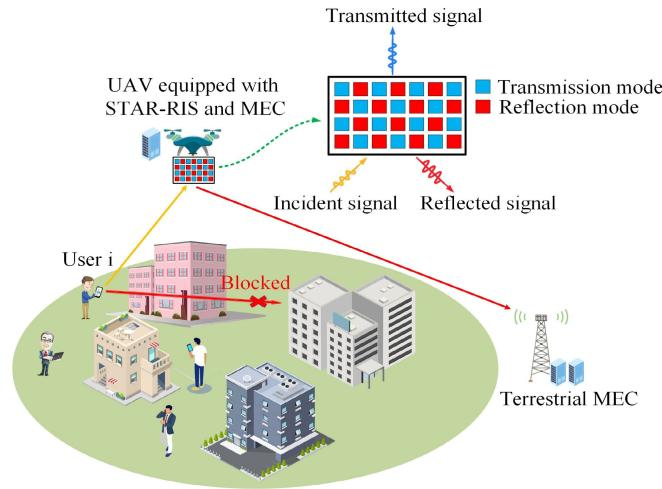  
Fig. 1. Proposed system model of STAR-RIS-assisted UAV-enabled MEC network.

Table I presents a comparative summary of the key features of the proposed framework relative to the recent state-ofthe-art works, clearly highlighting the introduced system characteristics and integration of multiple MEC, STAR-RIS, and NOMA components.

The remainder of this paper is organized as follows. Section II presents the system model and formulates the problem of minimizing weighted energy consumption. Section III details the proposed solution methodology, including problem decomposition and an iterative optimization framework. Section IV provides simulation results and discusses the performance benefits of the proposed scheme. Finally, conclusions are given in Section V.

## II. SYSTEM MODEL

We consider a cooperative MEC system (Fig. 1) comprising U ground users, a terrestrial MEC server (BS), and a UAV equipped with a MEC server and a STAR-RIS. Users are randomly distributed in the area, each with a total computation task of $D _ { \mathrm { T o t a l } }$ bits to complete within a fixed time T . Leveraging the superior computing power of MEC servers, users offload parts of their tasks via the STAR-RIS, which simultaneously transmits signals to the UAV-mounted MEC server and reflects to the BS. NOMA scheme is employed to improve spectral efficiency by allowing users to share bandwidth, with SIC used at receivers for decoding. All nodes are single-antenna, and obstacles block direct user-to-BS links.

The total task duration T is divided into N equal time slots, $\mathcal { N } = \{ 1 , \dots , N \}$ , each of length $\tau = T / N$ . Time slots are sufficiently short to assume constant channel states and UAV position. Users are indexed by $\mathcal { U } = \{ 1 , \dots , U \}$ . A 3D Cartesian coordinate system specifies locations: user i at $q _ { i } =$ $( x _ { i } , y _ { i } , 0 )$ , BS at $q _ { \mathrm { B S } } = ( x _ { \mathrm { B S } } , y _ { \mathrm { B S } } , z _ { \mathrm { B S } } )$ (with height zBS), and UAV at $q _ { \mathrm { U A V } } [ n ] = ( x _ { \mathrm { U A V } } [ n ] , y _ { \mathrm { U A V } } [ n ] , H )$ with fixed altitude H. The STAR-RIS, mounted on the UAV, shares its position $q _ { \mathrm { S } } [ n ] = q _ { \mathrm { U A V } } [ n ]$ and consists of M elements arranged as a uniform linear array (ULA), indexed by $\mathcal { M } = \{ 1 , \dots , M \}$

## A. Channel Model

Following [2], the energy required to transmit computation results from the UAV or BS to the users is negligible due to their small size compared to the offloaded data. Considering that the UAV operates at a relatively high altitude in an open-area deployment, the communication links among the UAV, users, and the BS are assumed to be dominated by LoS propagation, which is commonly used in UAV-assisted MEC studies [44], [45]. A quantitative justification of this assumption based on a probabilistic LoS model is provided in Section IV-B. The channel from user i to the STAR-RIS at time slot n is modeled as [32]:

$$
\begin{array} { r l } & { h _ { i , \mathrm { S } } [ n ] = \sqrt { \rho _ { 0 } d _ { i , \mathrm { S } } ^ { - \alpha } [ n ] } \left[ 1 , \dots , e ^ { - j \frac { 2 \pi d } { \lambda } ( m - 1 ) \varphi _ { i , \mathrm { S } } [ n ] } , \right. } \\ & { ~ \left. \dots , e ^ { - j \frac { 2 \pi d } { \lambda } ( M - 1 ) \varphi _ { i , \mathrm { S } } [ n ] } \right] , } \end{array}\tag{1}
$$

where $\rho _ { 0 }$ is the channel power gain at a reference distance of 1 meter, α is the path-loss exponent, $d _ { i , { \cal S } } [ n ] ~ =$ $\sqrt { \| q _ { \mathrm { S } } [ n ] - q _ { i } \| ^ { 2 } + H ^ { 2 } }$ is the distance between user i and the STAR-RIS, λ shows the carrier wavelength, d is the element spacing in the STAR-RIS, and $\begin{array} { r } { \varphi _ { i , \mathrm { S } } [ n ] = \overline { { \frac { x _ { \mathrm { S } } [ n ] - x _ { i } } { d _ { i . \mathrm { S } } [ n ] } } } } \end{array}$ denotes the cosine of the angle of arrival (AoA) from user i to the STAR-RIS. The channel from the STAR-RIS to the BS at time slot n is:

$$
\begin{array} { r l } & { h _ { \mathrm { S , B } } [ n ] = \sqrt { \rho _ { 0 } d _ { \mathrm { S , B } } ^ { - \alpha } [ n ] } \left[ 1 , \ldots , e ^ { - j \frac { 2 \pi d } { \lambda } ( m - 1 ) \varphi _ { \mathrm { S , B } } [ n ] } , \right. } \\ & { ~ \left. \ldots , e ^ { - j \frac { 2 \pi d } { \lambda } ( M - 1 ) \varphi _ { \mathrm { S , B } } [ n ] } \right] , } \end{array}\tag{2}
$$

where $\begin{array} { r c l } { d _ { \mathrm { S , B } } [ n ] } & { = } & { \sqrt { \| q _ { \mathrm { S } } [ n ] - q _ { \mathrm { B S } } \| ^ { 2 } + H ^ { 2 } } } \end{array}$ is the distance between the STAR-RIS and BS, and $\begin{array} { r } { \varphi _ { \mathrm { S , B } } [ n ] ~ = ~ \frac { x _ { \mathrm { S } } [ n ] - x _ { \mathrm { B S } } } { d _ { \mathrm { S , B } } [ n ] } } \end{array}$ denotes the cosine of the angle of departure (AoD). Due to the proximity of the STAR-RIS and UAV [46], their channel is modeled as a near-field channel:

$$
h _ { \mathrm { S , U } } = \beta \circ a _ { \mathrm { S , U } } ,\tag{3}
$$

where $\begin{array} { r } { \beta = \bigg \lceil \frac { \lambda } { 4 \pi r _ { 1 } } , \ldots , \frac { \lambda } { 4 \pi r _ { M } } \bigg \rceil } \end{array}$ is the attenuation vector based on distances r $r _ { m }$ from each STAR-RIS element to the UAV antenna, $a _ { \mathrm { S , U } } ~ = ~ \left\lceil e ^ { - j \frac { 2 \pi r _ { 1 } } { \lambda } } , \dots , e ^ { - j \frac { 2 \pi r _ { M } } { \lambda } } \right\rceil$ is the phase shift vector, and ◦ denotes the Hadamard product. The distance $r _ { m }$ is fixed, making $h _ { \mathrm { S , U } }$ constant. The STAR-RIS operates in MS protocol, with $M = M _ { t } + M _ { r }$ elements, where $M _ { t }$ and $M _ { r }$ denote the number of transmission and reflection elements, respectively. The coefficient matrix of phase is given by [13]:

$$
\begin{array} { r } { \Theta _ { \zeta } [ n ] = \mathrm { d i a g } \left\{ \beta _ { \zeta } ^ { 1 } [ n ] e ^ { j \theta _ { \zeta } ^ { 1 } [ n ] } , \dots , \beta _ { \zeta } ^ { M } [ n ] e ^ { j \theta _ { \zeta } ^ { M } [ n ] } \right\} , \ \zeta \in \{ r , t \} , } \end{array}\tag{4}
$$

where $\beta _ { \zeta } ^ { m } [ n ] \in \{ 0 , 1 \}$ is the amplitude coefficient for transmission $\dot { ( \zeta = t ) }$ or reflection $( \zeta = r )$ , $\theta _ { \zeta } ^ { m } [ n ] \in [ 0 , 2 \pi )$ is the phase shift, and $( \beta _ { r } ^ { m } [ n ] ) ^ { 2 } + ( \beta _ { t } ^ { m } [ n ] ) ^ { 2 } \stackrel { \circ } { = } 1$ ensures that each element operates in one mode.

Users offload tasks using NOMA, ranked in ascending order based on their channel gains for user-to-UAV and userto-BS links: $R _ { \varepsilon } [ n ] \ = \ \{ r _ { 1 } ^ { \varepsilon } [ n ] , \ldots , r _ { U } ^ { \varepsilon } [ n ] \} , \varepsilon \ \in \ \{ \mathrm { U A V } , \mathrm { B S } \}$ where $r _ { k } ^ { \varepsilon } [ n ]$ is the user with the k-th smallest channel gain. At the beginning of each time slot, users are dynamically re-ranked according to their instantaneous channel gains to determine the NOMA decoding order, which incurs only a low-complexity sorting operation. SIC decodes signals starting with the strongest channel gain, treating others as interference. The maximum amount of data that user $r _ { k } ^ { \varepsilon } [ n ]$ can offload to each MEC server during n-th time slot is given by [24] and [32]:

$$
R _ { r _ { k } } ^ { \varepsilon } [ n ] = B \log _ { 2 } \left( 1 + \frac { p _ { r _ { k } } ^ { \varepsilon } [ n ] g _ { r _ { k } } ^ { \varepsilon } [ n ] } { \sum _ { l = 1 } ^ { k - 1 } p _ { r _ { l } } ^ { \varepsilon } [ n ] g _ { r _ { l } } ^ { \varepsilon } [ n ] + B N _ { 0 } } \right) \tau ,\tag{5}
$$

where B is the system bandwidth, $N _ { 0 }$ denotes the noise power spectral density, $p _ { r _ { k } } ^ { \varepsilon } [ n ]$ is the transmit power of user $r _ { k } ^ { \varepsilon } [ n ]$ $g _ { r _ { k } } ^ { \mathrm { U A V } } [ n ] = \left| h _ { \mathrm { S , U } } ^ { H } \Theta _ { t } ^ { \ddot { H } } [ n ] h _ { r _ { k } , \mathrm { S } } [ n ] \right| ^ { 2 }$ shows the channel gain from user to the UAV, where $( . ) ^ { \dot { H } }$ is conjugate transpose, and $g _ { r _ { k } } ^ { \mathrm { B S } } [ n ] = \left| h _ { \mathrm { S } , \mathrm { B } } ^ { H } [ n ] \Theta _ { r } ^ { H } [ n ] h _ { r _ { k } , \mathrm { S } } [ n ] \right| ^ { 2 }$ represents the channel gain from user to the BS.

Although it is assumed that perfect channel state information (CSI) is available at both the UAV and the BS, in practical scenarios, this assumption is often idealistic due to channel estimation errors caused by UAV mobility, signaling overhead, and feedback delays. To assess the impact of channel uncertainties on system performance, the bounded CSI model is adopted [47]. Specifically, the channel between the i-th user and both the UAV and the BS at the n-th time slot can be expressed as [48]:

$$
\bar { h } _ { i , \varepsilon } [ n ] = h _ { i , \varepsilon } [ n ] + \Delta \hat { h } _ { i , \varepsilon } [ n ] , \quad \varepsilon \in \{ \mathrm { U A V } , \mathrm { B S } \} , \quad \forall i , n ,\tag{6}
$$

$$
\bar { g } _ { i , \varepsilon } [ n ] = g _ { i , \varepsilon } [ n ] + \Delta \hat { g } _ { i , \varepsilon } [ n ] , \quad \varepsilon \in \{ \mathrm { U A V } , \mathrm { B S } \} , \quad \forall i , n ,\tag{7}
$$

where $\Delta \hat { h } _ { i , \varepsilon } [ n ]$ and $\Delta { \hat { g } } _ { i , \varepsilon } [ n ]$ represent the channel estimation errors of $h _ { i , \varepsilon }$ and $\bar { g } _ { i , \varepsilon } .$ , respectively. The continuous set of all possible channel estimation errors is defined as:

$$
\begin{array} { r } { \Lambda _ { i , n } ^ { \varepsilon } = \left\{ \left\| \Delta \hat { h } _ { i , \varepsilon } [ n ] \right\| _ { 2 } \leq \eta _ { \varepsilon } , \ \| \Delta \hat { g } _ { i , \varepsilon } [ n ] \| _ { 2 } \leq \xi _ { \varepsilon } \right\} , } \\ { \varepsilon \in \{ \mathrm { U A V } , \mathrm { B S } \} , \quad \forall i , n , } \end{array}\tag{8}
$$

where $\eta _ { \varepsilon }$ and $\xi _ { \varepsilon }$ denote the radii of the corresponding uncertainty regions and $\lVert . \rVert _ { 2 }$ indicates the Euclidean norm.

## B. Computation Model

Each user i has $D _ { \mathrm { T o t a l } }$ bits to process within a time frame $T$ divided into N time slots. The computation tasks can be processed locally or offloaded to the UAV or BS MEC servers. The per-slot computation capacities are constrained by the maximum CPU frequencies of each entity as follows [32]:

$$
\begin{array} { r l } & { \frac { d _ { i } ^ { \mathrm { l o c a l } } [ n ] C _ { i } } { \tau } \leq F _ { \mathrm { u s e r } } , \quad \frac { \sum _ { i = 1 } ^ { U } d _ { i } ^ { \mathrm { U A V } } [ n ] C _ { i } } { \tau } \leq F _ { \mathrm { U A V } } , } \\ & { \frac { \sum _ { i = 1 } ^ { U } d _ { i } ^ { \mathrm { B S } } [ n ] C _ { i } } { \tau } \leq F _ { \mathrm { B S } } . } \end{array}\tag{9}
$$

where $d _ { i } ^ { \mathrm { l o c a l } } [ n ] , ~ d _ { i } ^ { \mathrm { U A V } } [ n ]$ , and $d _ { i } ^ { \mathrm { B S } } [ n ]$ denote bits processed locally, by UAV, and by BS for user i during slot $n ; C _ { i }$ is CPU cycles per bit; and τ shows the slot duration.

The total processed bits should satisfy the task size requirement for each user:

$$
\sum _ { n = 1 } ^ { N } \big ( d _ { i } ^ { \mathrm { l o c a l } } [ n ] + d _ { i } ^ { \mathrm { U A V } } [ n ] + d _ { i } ^ { \mathrm { B S } } [ n ] \big ) \geq D _ { \mathrm { T o t a l } } \quad \forall i \in \mathcal { U } .\tag{10}
$$

Considering causality in discrete-time processing, MEC servers can only compute offloaded tasks from previous slots.

Thus, no computation occurs in the first slot, and offloading in the last slot is prohibited due to lack of subsequent processing time. These causality constraints are:

$$
\sum _ { t = 1 } ^ { n - 1 } R _ { i } ^ { \mathrm { U A V } } [ t ] \geq \sum _ { t = 1 } ^ { n } d _ { i } ^ { \mathrm { U A V } } [ t ] , \quad \sum _ { t = 1 } ^ { n - 1 } R _ { i } ^ { \mathrm { B S } } [ t ] \geq \sum _ { t = 1 } ^ { n } d _ { i } ^ { \mathrm { B S } } [ t ] ,\tag{11}
$$

where $R _ { i } ^ { \mathrm { U A V } } [ t ]$ and $R _ { i } ^ { \mathrm { B S } } [ t ]$ are bits offloaded to UAV and BS at time slot t.

## C. Energy Consumption Model

The total energy consumption includes contributions from users, the UAV, and the BS as follows:

1) User Energy Consumption: User energy consumption consists of local computing and task offloading. For user i at time slot n, the local computing energy is [23]:

$$
e _ { i } [ n ] = { \frac { k _ { i } C _ { i } ^ { 3 } ( d _ { i } ^ { \mathrm { l o c a l } } [ n ] ) ^ { 3 } } { \tau ^ { 2 } } } , \quad E _ { \mathrm { l o c a l } } = \sum _ { i = 1 } ^ { U } \sum _ { n = 1 } ^ { N } e _ { i } [ n ] ,\tag{12}
$$

where $k _ { i }$ is the CPU effective switched capacitance. The offloading energy is

$$
E _ { \mathrm { o f f } } = \sum _ { i = 1 } ^ { U } \sum _ { n = 1 } ^ { N } \left( p _ { i } ^ { \mathrm { U A V } } [ n ] + p _ { i } ^ { \mathrm { B S } } [ n ] \right) \tau ,\tag{13}
$$

where $p _ { i } ^ { \mathrm { U A V } } [ n ]$ and $p _ { i } ^ { \mathrm { B S } } [ n ]$ denote transmit powers from user i to the UAV and BS, respectively. Therefore, total user energy consumption is $E _ { \mathrm { u s e r } } = E _ { \mathrm { l o c a l } } + E _ { \mathrm { o f f } }$

2) UAV Energy Consumption: The total energy consumption of the UAV comprises two components: task computing and flight. Similar to the user’s case, the energy consumed by the UAV for computing tasks offloaded by users is given by:

$$
E _ { \mathrm { c o m p } } ^ { \mathrm { U A V } } = \sum _ { i = 1 } ^ { U } \sum _ { n = 1 } ^ { N } \frac { k _ { i } C _ { i } ^ { 3 } ( d _ { i } ^ { \mathrm { U A V } } [ n ] ) ^ { 3 } } { \tau ^ { 2 } } .\tag{14}
$$

The UAV flight energy consumption is modeled assuming a uniform, rectilinear path between two positions. The propulsion energy consumption model depends on the UAV velocity, a widely accepted approach in similar studies [49], i.e.,

$$
E _ { \mathtt { f l y } } = \frac { W _ { \mathrm { U A V } } \tau } { 2 } \sum _ { n = 1 } ^ { N } \left( \frac { \| q _ { \mathrm { U A V } } [ n ] - q _ { \mathrm { U A V } } [ n - 1 ] \| } { \tau } \right) ^ { 2 } ,\tag{15}
$$

where $W _ { \mathrm { U A V } }$ is the weight of UAV, including the MEC server and STAR-RIS components [25]. The total UAV energy consumption is $E _ { \mathrm { U A V } } = E _ { \mathrm { c o m p } } ^ { \mathrm { \tilde { U } A V } } + \gamma \bar { E _ { \mathrm { f l y } } }$ , where $\gamma$ balances flight energy consumption.

3) BS Energy Consumption: The energy consumption at the BS stems from the computational processing of tasks offloaded by the users. Similar to the previous cases, it is calculated as follows:

$$
E _ { \mathrm { B S } } = \sum _ { i = 1 } ^ { U } \sum _ { n = 1 } ^ { N } \frac { k _ { i } C _ { i } ^ { 3 } ( d _ { i } ^ { \mathrm { B S } } [ n ] ) ^ { 3 } } { \tau ^ { 2 } } .\tag{16}
$$

## D. Problem Formulation

The objective is to minimize the weighted total energy consumption, that is,

$$
\psi = \omega _ { \mathrm { u s e r } } E _ { \mathrm { u s e r } } + \omega _ { \mathrm { U A V } } E _ { \mathrm { U A V } } + \omega _ { \mathrm { B S } } E _ { \mathrm { B S } } ,\tag{17}
$$

where $\omega _ { \mathrm { u s e r } } , \omega _ { \mathrm { U A V } }$ , and ωBS denote weighting factors, satisfying $\omega _ { \mathrm { u s e r } } + \omega _ { \mathrm { U A V } } + \omega _ { \mathrm { B S } } = 1$ . The optimization variables are $\Gamma =$ $\{ d _ { i } ^ { \mathrm { l o c a l } } [ n ] , d _ { i } ^ { \mathrm { U A V } } [ n ] , d _ { i } ^ { \mathrm { B S } } [ n ] , p _ { i } [ n ] \}$ for bit allocation and transmit power, $\Phi = \{ \theta _ { r } [ n ] , \theta _ { t } [ n ] \}$ for STAR-RIS phase shifts, and $Q = \{ q _ { \mathrm { U A V } } [ n ] \}$ for UAV trajectory. The optimization problem is expressed as:

$$
P _ { 0 } : \operatorname* { m i n } _ { \Gamma , \Phi , Q } \quad \psi
$$

$$
\mathrm { s . t . } ~ C 1 : 0 \leq p _ { i } ^ { \mathrm { U A V } } [ n ] + p _ { i } ^ { \mathrm { B S } } [ n ] \leq p _ { i } ^ { \mathrm { m a x } } , \quad \forall i \in \mathcal { U } , n \in \mathcal { N } ,
$$

$$
C 2 : \frac { d _ { i } ^ { \mathrm { l o c a l } } [ n ] C _ { i } } { \tau } \leq F _ { \mathrm { u s e r } } , \quad \forall i \in \mathcal { U } , n \in \mathcal { N } ,
$$

$$
{ \cal C } 3 : \frac { \sum _ { i = 1 } ^ { U } d _ { i } ^ { \mathrm { U A V } } [ n ] { \cal C } _ { i } } { \tau } \le F _ { \mathrm { U A V } } , \quad \forall n \in { \cal N } ,
$$

$$
C 4 : \frac { \sum _ { i = 1 } ^ { U } d _ { i } ^ { \mathrm { B S } } [ n ] C _ { i } } { \tau } \leq F _ { \mathrm { B S } } , \quad \forall n \in \mathcal { N } ,
$$

$$
{ \cal C } 5 : \sum _ { n = 1 } ^ { N } \big ( d _ { i } ^ { \mathrm { l o c a l } } [ n ] + d _ { i } ^ { \mathrm { U A V } } [ n ] + d _ { i } ^ { \mathrm { B S } } [ n ] \big ) \geq D _ { \mathrm { T o t a l } } , \forall i \in \mathcal { U } ,
$$

$$
C 6 : \sum _ { t = 1 } ^ { n - 1 } R _ { i } ^ { \mathrm { U A V } } [ t ] \geq \sum _ { t = 1 } ^ { n } d _ { i } ^ { \mathrm { U A V } } [ t ] , \quad \forall i \in \mathcal { U } , n \in \mathcal { N } ,
$$

$$
C 7 : \sum _ { t = 1 } ^ { n - 1 } R _ { i } ^ { \mathrm { B S } } [ t ] \geq \sum _ { t = 1 } ^ { n } d _ { i } ^ { \mathrm { B S } } [ t ] , \quad \forall i \in \mathcal { U } , n \in \mathcal { N } ,
$$

C8 : $\beta _ { r } ^ { m } [ n ] , \beta _ { t } ^ { m } [ n ] \in \{ 0 , 1 \} , \quad \forall m \in \mathcal { M } , n \in \mathcal { N } ,$

C9 : (βmr [n])2 + (βmt [n])2 = 1, ∀m ∈ M, n ∈ N ,

C10 : $\theta _ { r } ^ { m } [ n ] , \theta _ { t } ^ { m } [ n ] \in [ 0 , 2 \pi )$ , ∀m ∈ M, n ∈ N ,

C11 : $\begin{array} { r } { \| q _ { \mathrm { U A V } } [ n ] - q _ { \mathrm { U A V } } [ n - 1 ] \| \leq v _ { \operatorname* { m a x } } \tau , \quad \forall n \in \mathcal { N } , } \end{array}$

$$
C 1 2 : q _ { \mathrm { U A V } } [ 0 ] = q _ { \mathrm { I n i t i a l } } , q _ { \mathrm { U A V } } [ N ] = q _ { \mathrm { F i n a l } } .\tag{18}
$$

Constraint C1 limits the total transmit power of user i for offloading to the UAV and BS to a maximum $p _ { i } ^ { \operatorname* { m a x } }$ . C2 ensures local computation does not exceed the CPU frequency of user, $F _ { \mathrm { u s e r } } .$ . C3 and C4 restrict the computation load on the UAV and BS MEC servers to $F _ { \mathrm { U A V } }$ and $F _ { \mathrm { B S } }$ , respectively. C5 guarantees that the total number of computated bits, including both locally processed bits and those executed at the MEC servers, meets $D _ { \mathrm { T o t a l } }$ . C6 and $C 7$ enforces data availability constraints for UAV and BS offloading. C8 specifies binary mode selection for STAR-RIS elements, C9 ensures that each element operates in one mode and C10 constrains phase shifts to [0, 2π). C11 limits UAV movement based on the maximum velocity $v _ { \mathrm { m a x } }$ and C12 fixes the initial and final positions of UAV.

The non-convexity of C6 and C7, due to the nonlinear data rate expressions, makes $P _ { 0 }$ challenging. In the next section, we introduce a method to solve the optimization problem.

## III. PROPOSED APPROACH

The non-convex problem $P _ { 0 }$ is decomposed into three subproblems: bit allocation and user transmit power optimization, STAR-RIS phase shift optimization, and UAV trajectory optimization. Using auxiliary functions and an SCA-based approach, each subproblem is solved either in closed form or reformulated as a convex problem, which is efficiently solved using standard tools such as CVX and the interior point method (IPM).

In the proposed STAR-RIS-assisted UAV-enabled MEC system, decision-making is centralized at the BS due to its superior computational capabilities. The BS jointly determines task offloading, STAR-RIS phase shift configuration, UAV trajectory planning, and NOMA-based resource allocation for all users. For this purpose, the BS requires prior information such as user positions, task sizes, and CSI for all links between users, the UAV-mounted STAR-RIS, and the BS. The UAV functions as a mobile MEC server and relay, executing the offloaded tasks according to the BS instructions. In what follows, we explain each of three subproblems.

## A. Bit Allocation and User Transmit Power Optimization

Assuming fixed UAV trajectory and STAR-RIS phase shifts, the first subproblem optimizes bit allocation and user transmit power, that is,

$$
\begin{array} { r } { S P _ { 1 } : \underset { \Gamma } { \operatorname* { m i n } } \quad \psi \qquad } \\ { \mathrm { s . t . } \ : C 1 - C 7 . } \end{array}\tag{19}
$$

Due to the non-convexity of C6 and $C 7 , \ S P _ { 1 }$ is inherently non-convex and is thus first reformulated. Since the UAV trajectory is fixed, flight energy consumption is constant and omitted, yielding:

$$
\psi _ { 1 } = \omega _ { \mathrm { u s e r } } ( E _ { \mathrm { l o c a l } } + E _ { \mathrm { o f f } } ) + \omega _ { \mathrm { U A V } } E _ { \mathrm { c o m p } } ^ { \mathrm { U A V } } + \omega _ { \mathrm { B S } } E _ { \mathrm { B S } } ,\tag{20}
$$

where $E _ { \mathrm { l o c a l } } , E _ { \mathrm { c o m p } } ^ { \mathrm { U A V } }$ , and $E _ { \mathrm { B S } }$ are convex polynomial functions. To transform $E _ { \mathrm { o f f } }$ into a convex function, it can be reformulated as a summation of multiple exponential functions with positive coefficients, as demonstrated in [25] and [32]. To achieve this, (5) is first rewritten as:

$$
e ^ { \frac { R _ { r _ { k } } ^ { \varepsilon } \left[ n \right] \ln { 2 } } { B \tau } } = 1 + \frac { p _ { r _ { k } } ^ { \varepsilon } \left[ n \right] g _ { r _ { k } } ^ { \varepsilon } \left[ n \right] } { \sum _ { l = 1 } ^ { k - 1 } p _ { r _ { l } } ^ { \varepsilon } \left[ n \right] g _ { r _ { l } } ^ { \varepsilon } \left[ n \right] + B N _ { 0 } } , \varepsilon \in \{ \mathrm { U A V } , \mathrm { B S } \} .\tag{21}
$$

An auxiliary function is defined as:

$$
Z _ { r _ { k } } ^ { \varepsilon } [ n ] = \sum _ { l = 1 } ^ { k } p _ { r _ { l } } ^ { \varepsilon } [ n ] g _ { r _ { l } } ^ { \varepsilon } [ n ] + B N _ { 0 } , \quad \varepsilon \in \{ \mathrm { U A V } , \mathrm { B S } \} .\tag{22}
$$

Substituting (22) into (21) yields:

$$
\begin{array} { r } { Z _ { r _ { k } } ^ { \varepsilon } [ n ] - Z _ { r _ { k - 1 } } ^ { \varepsilon } [ n ] = Z _ { r _ { k - 1 } } ^ { \varepsilon } [ n ] \left( e ^ { \frac { R _ { r _ { k } } ^ { \varepsilon } [ n ] \ln 2 } { B \tau } } - 1 \right) , } \end{array}\tag{23}
$$

which leads to the recursive form:

$$
Z _ { r _ { k } } ^ { \varepsilon } [ n ] = e ^ { \frac { R _ { r _ { k } } ^ { \varepsilon } [ n ] \ln 2 } { B \tau } } Z _ { r _ { k - 1 } } ^ { \varepsilon } [ n ] , \quad k \in \mathcal { U } \setminus \{ 1 \} .\tag{24}
$$

For $k = 1 \mathrm { , ~ } Z _ { r _ { 1 } } ^ { \varepsilon } [ n ] \ = \ p _ { r _ { 1 } } ^ { \varepsilon } [ n ] g _ { r _ { 1 } } ^ { \varepsilon } [ n ] \mathrm { + \ } B N _ { 0 }$ , and $R _ { r _ { 1 } } ^ { \varepsilon } [ n ] ~ =$ $\begin{array} { r } { B \log _ { 2 } \left( 1 + \frac { p _ { r _ { 1 } } ^ { \varepsilon } \left[ n \right] g _ { r _ { 1 } } ^ { \varepsilon } \left[ n \right] } { B N _ { 0 } } \right) \tau , } \end{array}$ so $\begin{array} { r } { \begin{array} { l l l } { Z _ { r _ { 1 } } ^ { \varepsilon } [ n ] } & { = } & { B N _ { 0 } e ^ { \frac { \ln 2 } { B \tau } R _ { r _ { 1 } } ^ { \varepsilon } } } \end{array} } \end{array}$ 1 [n]. Generally:

$$
Z _ { r _ { k } } ^ { \varepsilon } [ n ] = B N _ { 0 } e ^ { \frac { \ln { 2 } } { B \tau } \sum _ { l = 1 } ^ { k } R _ { r _ { l } } ^ { \varepsilon } [ n ] } .\tag{25}
$$

The transmit power of user $r _ { k } ^ { \varepsilon } [ n ]$ to the UAV and the BS at the n-th time slot can be represented as:

$$
p _ { r _ { k } } ^ { \varepsilon } [ n ] = \frac { Z _ { r _ { k } } ^ { \varepsilon } [ n ] - Z _ { r _ { k - 1 } } ^ { \varepsilon } [ n ] } { g _ { r _ { k } } ^ { \varepsilon } [ n ] } , \quad k \in \mathcal { U } \setminus \{ 1 \} .\tag{26}
$$

Defining $\begin{array} { r } { \Omega _ { k } ^ { \varepsilon } [ n ] = \sum _ { l = 1 } ^ { k } R _ { r _ { l } } ^ { \varepsilon } [ n ] } \end{array}$ , the transmit power becomes:

$$
p _ { r _ { k } } ^ { \varepsilon } [ n ] = B N _ { 0 } \left( \frac { e ^ { \frac { \ln 2 } { B \tau } \Omega _ { k } ^ { \varepsilon } [ n ] } - e ^ { \frac { \ln 2 } { B \tau } \Omega _ { k - 1 } ^ { \varepsilon } [ n ] } } { g _ { r _ { k } } ^ { \varepsilon } [ n ] } \right) , \quad \forall k \in \mathcal { U } .\tag{27}
$$

Although the difference of exponentials in (27) is generally non-convex, the recursive formulation of user transmit power (24) enables a structured analysis, through which it is shown that the total transmit power toward the UAV and BS is convex and can be expressed as:

$$
\sum _ { k = 1 } ^ { U } p _ { r _ { k } } ^ { \varepsilon } [ n ] = B N _ { 0 } \sum _ { k = 0 } ^ { U } \left( \frac { 1 } { g _ { r _ { k } } ^ { \varepsilon } [ n ] } - \frac { 1 } { g _ { r _ { k + 1 } } ^ { \varepsilon } [ n ] } \right) e ^ { \frac { \ln 2 } { B \tau } \Omega _ { k } ^ { \varepsilon } [ n ] } ,\tag{28}
$$

where the exponential coefficients are non-negative and $g _ { r _ { 0 } } ^ { \varepsilon } [ n ] ^ { - 1 } = 0 , g _ { r _ { U + 1 } } ^ { \varepsilon } [ n ] ^ { - 1 } = 0 $ . Defining $\boldsymbol { \varpi } ( i , n , \varepsilon )$ as the rank of user i at time slot n for NOMA, the amount of data transmitted by user i to the UAV and BS can be respectively expressed as:

$$
\begin{array} { r l } & { R _ { i } ^ { \mathrm { U A V } } [ n ] = \Omega _ { \varpi ( i , n , \mathrm { U A V } ) } ^ { \mathrm { U A V } } [ n ] - \Omega _ { \varpi ( i , n , \mathrm { U A V } ) - 1 } ^ { \mathrm { U A V } } [ n ] , } \\ & { ~ R _ { i } ^ { \mathrm { B S } } [ n ] = \Omega _ { \varpi ( i , n , \mathrm { B S } ) } ^ { \mathrm { B S } } [ n ] - \Omega _ { \varpi ( i , n , \mathrm { B S } ) - 1 } ^ { \mathrm { B S } } [ n ] } \end{array}\tag{29}
$$

By substituting the above relations into (19), the subproblem $S P _ { 1 }$ can be formulated as:

$$
\begin{array} { r l } { \varphi _ { \varphi } ^ { ( k ) } } & { = \varphi _ { \varphi } ^ { ( k ) } + \varphi _ { \varphi } ^ { ( k ) } + \varphi _ { \varphi } ^ { ( k ) } + \varphi _ { \varphi } ^ { ( k ) } + \varphi _ { \varphi } ^ { ( k ) } } \\ & { \quad + \varphi _ { \varphi } ^ { ( k ) } + \varphi _ { \varphi } ^ { ( k ) } + \varphi _ { \varphi } ^ { ( k ) } + \varphi _ { \varphi } ^ { ( k ) } + \varphi _ { \varphi } ^ { ( k ) } } \\ & { \quad + \varphi _ { \varphi } ^ { ( k ) } + \varphi _ { \varphi } ^ { ( k ) } + \varphi _ { \varphi } ^ { ( k ) } + \varphi _ { \varphi } ^ { ( k ) } + \varphi _ { \varphi } ^ { ( k ) } } \\ & { \quad + \varphi _ { \varphi } ^ { ( k ) } + \varphi _ { \varphi } ^ { ( k ) } + \varphi _ { \varphi } ^ { ( k ) } + \varphi _ { \varphi } ^ { ( k ) } } \\ & { \quad - \varphi _ { \varphi } ^ { ( k ) } + \varphi _ { \varphi } ^ { ( k ) } + \varphi _ { \varphi } ^ { ( k ) } + \varphi _ { \varphi } ^ { ( k ) } } \\ & { \quad + \varphi _ { \varphi } ^ { ( k ) } + \varphi _ { \varphi } ^ { ( k ) } + \varphi _ { \varphi } ^ { ( k ) } + \varphi _ { \varphi } ^ { ( k ) } } \\ & { \quad - \varphi _ { \varphi } ^ { ( k ) } + \varphi _ { \varphi } ^ { ( k ) } + \varphi _ { \varphi } ^ { ( k ) } + \varphi _ { \varphi } ^ { ( k ) } + \varphi _ { \varphi } ^ { ( k ) } } \\ & { \quad - \varphi _ { \varphi } ^ { ( k ) } + \varphi _ { \varphi } ^ { ( k ) } + \varphi _ { \varphi } ^ { ( k ) } + \varphi _ { \varphi } ^ { ( k ) } + \varphi _ { \varphi } ^ { ( k ) } } \\ &  \quad + \varphi _ { \varphi } ^ { ( k ) } + \varphi _ { \varphi } ^ { ( k ) } + \varphi _ { \varphi } ^ { ( k ) } + \varphi _ { \varphi } ^  ( k \end{array}
$$

$$
\geq \sum _ { t = 1 } ^ { n } d _ { i } ^ { \mathrm { B S } } [ t ] .\tag{30}
$$

Constraints C2, C3, C4, C5, C60, and $C 7 ^ { \prime }$ are affine, but C10, which represents the difference of exponential functions, does not inherently possess convexity. Using SCA [50], the exponential function $\begin{array} { r } { y ( \Omega ) \ = \ e ^ { \frac { \ln 2 } { B \tau } \Omega } } \end{array}$ is approximated by its first-order Taylor expansion around $\Omega _ { 0 }$

$$
\tilde { y } ( \Omega | \Omega _ { 0 } ) = e ^ { \frac { \ln { 2 } } { B \tau } \Omega _ { 0 } } + \frac { \ln { 2 } } { B \tau } e ^ { \frac { \ln { 2 } } { B \tau } \Omega _ { 0 } } ( \Omega - \Omega _ { 0 } ) .\tag{31}
$$

The above linear approximation with respect to Ω facilitates the convexification of constraint C10. In each iteration of this approach, the center of the series expansion is updated based on the optimal values of $\Omega _ { i } ^ { U A V } [ n ]$ and $\Omega _ { i } ^ { B S } [ n ]$ . At the λ-th iteration, C10 is convexified as:

$$
\begin{array} { r l } & { C 1 ^ { \prime \prime } : 0 \leq \frac { 1 } { g _ { \varpi ( i , n , \mathrm { U A V } ) } ^ { \mathrm { U A V } } \left[ n \right] } \left[ y ( \Omega _ { \varpi ( i , n , \mathrm { U A V } ) } ^ { \mathrm { U A V } } \left[ n \right] ) \right. } \\ & { \qquad - \left. \tilde { y } ( \Omega _ { \varpi ( i , n , \mathrm { U A V } ) } ^ { \mathrm { U A V } } \left[ n \right] \rvert \tilde { \Omega } _ { \varpi ( i , n , \mathrm { U A V } ) - 1 , \lambda - 1 } ^ { \mathrm { U A V } } \left[ n \right] ) \right] } \\ & { \qquad + \frac { 1 } { g _ { \varpi ( i , n , \mathrm { B S } ) } ^ { \mathrm { B S } } \left[ n \right] } \left[ y ( \Omega _ { \varpi ( i , n , \mathrm { B S } ) } ^ { \mathrm { B S } } \left[ n \right] ) \right. } \\ & { \qquad \left. - \tilde { y } ( \Omega _ { \varpi ( i , n , \mathrm { B S } ) } ^ { \mathrm { B S } } \left[ n \right] \rvert \tilde { \Omega } _ { \varpi ( i , n , \mathrm { B S } ) - 1 , \lambda - 1 } ^ { \mathrm { B S } } \left[ n \right] ) \right] \leq \frac { p _ { i } ^ { \operatorname* { m a x } } } { B N _ { 0 } } , } \end{array}\tag{32}
$$

where $\tilde { \Omega } _ { \varpi ( i , n , \varepsilon ) , \lambda - 1 } ^ { \varepsilon } [ n ]$ is the solution from the previous iteration. Thus, the convex problem is:

$$
{ \cal S } P _ { 1 } ^ { \prime \prime } : \operatorname* { m i n } _ { { \scriptstyle \Omega , d _ { i } ^ { \mathrm { l o c a l } } [ n ] , d _ { i } ^ { \mathrm { U A V } } [ n ] , d _ { i } ^ { \mathrm { B S } } [ n ] } } \quad \mu \atop { { \scriptstyle \mathrm { s . t . } } { \scriptstyle { \cal C } 1 ^ { \prime \prime } , { \scriptstyle { \cal C } 2 } , { \scriptstyle { \cal C } 3 } , { \scriptstyle { \cal C } 4 } , { \scriptstyle { \cal C } 5 } , { \scriptstyle { \cal C } 6 ^ { \prime } } , { \scriptstyle { \cal C } 7 ^ { \prime } } , } }\tag{33}
$$

where $\mu$ is the objective function of $S P _ { 1 } ^ { \prime }$ . This is solved using IPM, as outlined in Algorithm 1.

## B. STAR-RIS Phase Shift Optimization

Given the bit allocation and user transmit power obtained from (33), and UAV trajectory, this section addresses the optimization of STAR-RIS phase shifts, which influence the channel gain and offloaded tasks, and consequently the offloading energy. The resulting subproblem is formulated as:

$$
\begin{array} { r } { S P _ { 2 } : \underset { \Phi } { \mathrm { m i n } } \ \omega _ { \mathrm { u s e r } } E _ { \mathrm { o f f } } \ } \\ { \mathrm { s . t . } \ C 8 - C 1 0 . } \end{array}\tag{34}
$$

The MS protocol assigns binary coefficients, where an element operates in transmission mode when $\beta _ { t } ^ { m } [ n ] = 1$ and in reflection mode when $\beta _ { r } ^ { m } [ n ] = 1$ , enabling interferencefree operation and simplified implementation via its on–off switching mechanism. The phase shift optimization maximizes channel gain when input and output signals are in phase, hence the channel gain to the UAV is:

$$
\begin{array} { r l } & { g _ { i } ^ { \mathrm { U A V } } [ n ] = \Big | h _ { \mathrm { S , U } } ^ { H } \Theta _ { t } ^ { H } [ n ] h _ { i , \mathrm { S } } [ n ] \Big | ^ { 2 } } \\ & { \qquad = \Big | \varphi _ { t } ^ { H } [ n ] \Upsilon _ { t } [ n ] \big ( h _ { \mathrm { S , U } } ^ { \ast } [ n ] \circ h _ { i , \mathrm { S } } [ n ] \big ) \Big | ^ { 2 } , } \end{array}\tag{35}
$$

where $\begin{array} { c c l } { \varphi _ { t } [ n ] } & { = } & { \{ e ^ { j \phi _ { t } ^ { 1 } [ n ] } , \dots , e ^ { j \phi _ { t } ^ { M _ { t } } [ n ] } \} ^ { T } } \end{array}$ , and $\begin{array} { r l } { \Upsilon _ { t } [ n ] } & { { } = } \end{array}$ diag $\{ \beta _ { t } ^ { 1 } \dot { [ } n \bar { ] } , \dot { \mathbf { \Omega } } . . . , \beta _ { t } ^ { M _ { t } } \dot { [ } n ] \}$ is a unitary matrix. To enhance data transmission capacity, the STAR-RIS-assisted MRT technique is employed [51], yielding the following optimal transmission and reflection phase shift expressions:

$$
\begin{array} { r l } & { \theta _ { t } ^ { \mathrm { o p t } } [ n ] = \arg \left( \mathrm { n o r m } ( h _ { \mathrm { S , U } } ^ { \ast } [ n ] \circ h _ { i , \mathrm { S } } [ n ] ) \right) , } \\ & { \theta _ { r } ^ { \mathrm { o p t } } [ n ] = \arg \left( \mathrm { n o r m } ( h _ { \mathrm { S , B } } ^ { \ast } [ n ] \circ h _ { i , \mathrm { S } } [ n ] ) \right) } \end{array}\tag{36}
$$

These closed-form expressions are utilized directly, eliminating the need to explicitly solve $S P _ { 2 }$

Algorithm 1 Bit Allocation and User Transmit Power Opti  
mization   
1: Input: User coordinates $q _ { i } ,$ UAV trajectory $q _ { \mathrm { U A V } } [ n ]$ , BS   
position $q _ { \mathrm { B S } } ,$ , STAR-RIS phase shifts Φ, total task $D _ { \mathrm { T o t a l } } .$   
accuracy threshold $\delta .$   
2: Output: Transmit power $p _ { r _ { k } } ^ { \varepsilon } [ n ] .$ , bits processed by users   
$d _ { i } ^ { \mathrm { l o c a } } [ n ] .$ UAV $d _ { i } ^ { \mathrm { U A V } } [ n ]$ , BS $\bar { d } _ { i } ^ { \mathrm { B S } } [ n ]$   
3: Compute channel gains based on $q _ { i } , q _ { \mathrm { U A V } } [ n ] , q _ { \mathrm { B S } } .$   
4: Rank users in ascending order of channel gains for   
NOMA.   
5: Initialize $\Omega _ { 0 } = 0 , \mu _ { 0 } = 0 ,$ iteration index $\lambda = 1 .$   
6: while $| \mu _ { \lambda } - \mu _ { \lambda - 1 } | \geq \delta$ do   
7: Solve $S P _ { 1 } ^ { \prime \prime }$ using CVX to obtain   
$\{ p _ { r _ { k } } ^ { \varepsilon } [ n ] , d _ { i } ^ { \mathrm { l o c a l } } [ n ] , \overset { \cdot } { d } _ { i } ^ { \mathrm { U A V } } [ n ] , d _ { i } ^ { \mathrm { B S } } [ n ] \}$   
8: Update $\lambda  \lambda + 1 .$   
9: end while   
10: Return: $\{ p _ { r _ { k } } ^ { \varepsilon } [ n ] , d _ { i } ^ { \mathrm { l o c a l } } [ n ] , d _ { i } ^ { \mathrm { U A V } } [ n ] , d _ { i } ^ { \mathrm { B S } } [ n ] \}$

## C. UAV Trajectory Optimization

Given the optimum allocated bits, user transmit power, and STAR-RIS phase shifts evaluated from the parts A and $B ,$ this section focuses on optimizing the UAV trajectory. Since the UAV trajectory does not impact the computation energy at the user, UAV, or BS, these components are excluded from this subproblem. Accordingly, the third subproblem is formulated as follows:

$$
\begin{array} { r l } & { S P _ { 3 } : \underset { Q } { \operatorname* { m i n } } \quad \omega _ { \mathrm { { u s e r } } } E _ { \mathrm { { o f f } } } + \omega _ { \mathrm { { U A V } } } E _ { \mathrm { { f l y } } } } \\ & { \quad \mathrm { s . t . } \ C 1 1 , C 1 2 . } \end{array}\tag{37}
$$

Altering the UAV trajectory affects not only the flight energy consumption but also the channel gains between the user and the UAV, as well as between the user and the BS, thereby influencing the transmit power of user. Consequently, the offloading energy consumption of user can be reformulated as:

$$
\begin{array} { r l r } & { } & { E _ { \mathrm { o f f } } [ n ] = B N _ { 0 } \displaystyle \sum _ { k = 1 } ^ { U } \sum _ { n = 1 } ^ { N } \left( e ^ { \frac { \ln 2 } { B \tau } \Omega _ { k } ^ { \mathrm { U A V } } [ n ] } - e ^ { \frac { \ln 2 } { B \tau } \Omega _ { k - 1 } ^ { \mathrm { U A V } } [ n ] } \right) L _ { r _ { k } } ^ { \mathrm { U A V } } [ n ] } \\ & { } & { + B N _ { 0 } \displaystyle \sum _ { k = 1 } ^ { U } \sum _ { n = 1 } ^ { N } \left( e ^ { \frac { \ln 2 } { B \tau } \Omega _ { k } ^ { \mathrm { B S } } [ n ] } - e ^ { \frac { \ln 2 } { B \tau } \Omega _ { k - 1 } ^ { \mathrm { B S } } [ n ] } \right) L _ { r _ { k } } ^ { \mathrm { B S } } [ n ] , } \end{array}\tag{38}
$$

where $L _ { r _ { k } } ^ { \mathrm { U A V } } [ n ] = 1 / g _ { r _ { k } } ^ { \mathrm { U A V } } [ n ]$ and $L _ { r _ { k } } ^ { \mathrm { B S } } [ n ] = 1 / g _ { r _ { k } } ^ { \mathrm { B S } } [ n ]$ represent the path loss between user $r _ { k } [ n ]$ and the UAV and the BS, respectively. Due to the exponential path loss in (38), the resulting function is non-convex. Following [52], an upper bound is used to linearize the exponential term with respect to the number of STAR-RIS elements as follows:

$$
\Big | \Big [ 1 , \dots , e ^ { - j \frac { 2 \pi d } { \lambda } ( m _ { t } - 1 ) \varphi _ { i } , \mathrm { s } [ n ] } , \dots , e ^ { - j \frac { 2 \pi d } { \lambda } ( M _ { t } - 1 ) \varphi _ { i , \mathrm { s } } [ n ] } \Big ] \Big | \leq { M _ { t } } ,\tag{39}
$$

This upper bound is specifically designed to prevent overestimation of the true function value, ensuring a close approximation of the actual value under small phase variations. Under this approximation, the channel gain between the user and the UAV is a convex function. Similarly, the channel gain between the user and BS can be expressed as an upper bound approximation, as follows:

$$
g _ { r _ { k } } ^ { \mathrm { B S } } [ n ] \leq \frac { | \rho _ { 0 } | ^ { 2 } M _ { r } ^ { 2 } } { d _ { r _ { k } , \mathrm { S } } ^ { \alpha } [ n ] d _ { \mathrm { S } , \mathrm { B } } ^ { \alpha } [ n ] } .\tag{40}
$$

Considering that the values of $d _ { r _ { k } , { \cal S } } [ n ]$ and $d _ { S , B } [ n ]$ change with the UAV movement, the term $d _ { r _ { k } , \mathrm { S } } ^ { \alpha } [ n ] d _ { \mathrm { S } , \mathrm { B } } ^ { \alpha } [ n ]$ is nonconvex. Using the first-order Taylor expansion at the given data points $d _ { \mathrm { S } , \mathrm { B } } ^ { ( l ) } [ n ] , d _ { r _ { k } , \mathrm { S } } ^ { ( l ) } [ n ]$ and $q _ { \mathrm { U A V } } ^ { ( l ) } [ n ]$ , the convex approximation can be expressed as:

$$
\begin{array} { r l } & { d _ { r _ { k , \mathrm { S } } } ^ { 2 } [ n ] d _ { \mathrm { S } , \mathrm { B } } ^ { 2 } [ n ] } \\ & { = \frac { 1 } { 2 } \left[ \left( d _ { r _ { k , \mathrm { S } } } ^ { 2 } [ n ] + d _ { \mathrm { S } , \mathrm { B } } ^ { 2 } [ n ] \right) ^ { 2 } - \left( d _ { r _ { k , \mathrm { S } } } ^ { 4 } [ n ] + d _ { \mathrm { S } , \mathrm { B } } ^ { 4 } [ n ] \right) \right] } \\ & { \leq \frac { 1 } { 2 } \left[ \left( d _ { r _ { k , \mathrm { S } } } ^ { 2 } [ n ] + d _ { \mathrm { S } , \mathrm { B } } ^ { 2 } [ n ] \right) ^ { 2 } - \left( ( d _ { r _ { k , \mathrm { S } } } ^ { ( l ) } [ n ] ) ^ { 4 } + ( d _ { \mathrm { S } , \mathrm { B } } ^ { ( l ) } [ n ] ) ^ { 4 } \right) \right] } \\ & { \phantom { = } - 2 ( d _ { r _ { k , \mathrm { S } } } ^ { ( l ) } [ n ] ) ^ { 2 } \left( \mathbf { q } _ { \mathrm { U A V } } ^ { ( l ) } [ n ] - \mathbf { q } _ { r _ { k } } \right) ^ { T } \left( \mathbf { q } _ { \mathrm { U A V } } [ n ] - \mathbf { q } _ { \mathrm { U A V } } ^ { ( l ) } [ n ] \right) } \\ & { \phantom { = } - 2 ( d _ { \mathrm { S } , \mathrm { B } } ^ { ( l ) } [ n ] ) ^ { 2 } \left( \mathbf { q } _ { \mathrm { U A V } } ^ { ( l ) } [ n ] - \mathbf { q } _ { \mathrm { B S } } \right) ^ { T } \left( \mathbf { q } _ { \mathrm { U A V } } [ n ] - \mathbf { q } _ { \mathrm { U A V } } ^ { ( l ) } [ n ] \right) } \\ & { \triangleq f \left( \mathbf { q } _ { \mathrm { U A V } } [ n ] \right) } \end{array}
$$

By substituting the above approximation into (40) and applying approximations (39) and (40), the path loss becomes a quadratic function, enabling reformulation of the UAV trajectory subproblem as:

$$
\begin{array} { r l } & { \displaystyle \operatorname* { m i n } _ { Q } ~ \omega _ { \mathrm { u s e r } } \Big [ B N _ { 0 } \sum _ { k = 1 } ^ { U } \sum _ { n = 1 } ^ { N } \Big ( e ^ { \frac { \ln { 2 } } { B \tau } \Omega _ { k } ^ { \mathrm { U A V } } [ n ] } - e ^ { \frac { \ln { 2 } } { B \tau } \Omega _ { k - 1 } ^ { \mathrm { U A V } } [ n ] } \Big ) } \\ & { ~ L _ { r _ { k } } ^ { \mathrm { U A V } } [ n ] + B N _ { 0 } \sum _ { k = 1 } ^ { U } \sum _ { n = 1 } ^ { N } \Big ( e ^ { \frac { \ln { 2 } } { B \tau } \Omega _ { k } ^ { \mathrm { B S } } [ n ] } - e ^ { \frac { \ln { 2 } } { B \tau } \Omega _ { k - 1 } ^ { \mathrm { B S } } [ n ] } \Big ) L _ { r _ { k } } ^ { \mathrm { B S } } [ n ] \Big ] } \\ & { ~ + \omega _ { \mathrm { U A V } } \left[ \gamma \frac { W _ { \mathrm { U A V } } \tau } { 2 } \sum _ { n = 1 } ^ { N } \Big ( \frac { \lVert q _ { \mathrm { U A V } } [ n ] - q _ { \mathrm { U A V } } [ n - 1 ] \rVert } { \tau } \Big ) ^ { 2 } \right] , } \\ & { ~ \mathrm { s . t . } ~ C 1 1 . C 1 2 . } \end{array}
$$

The resulting subproblem is convex and can be efficiently solved using standard optimization methods, such as CVX.

## D. Joint Optimization Algorithm

The joint optimization of bit allocation, user transmit power, STAR-RIS phase shifts, and UAV trajectory is efficiently addressed via a BCD algorithm, which iteratively solves each subproblem to achieve local convergence, as detailed in Algorithm 2

It is worth noting that the solutions obtained by the proposed framework are locally optimal. The original problem $P _ { 0 }$ is non-convex due to variable coupling and non-linear constraints, and the SCA-based iterative approach approximates the non-convex subproblems as convex ones. These approximations and convex relaxations are not fully equivalent to the original problem, which may introduce small gaps between the solutions of the convex subproblems and the global optimum. Nevertheless, the SCA algorithm ensures monotonic convergence: in each iteration, the objective function value is non-increasing and converges to a stable value after a few iterations (typically 3–4). Hence, while global optimality is not guaranteed, the proposed algorithm reliably achieves a stable locally optimal solution with continuous improvement in each iterations, which will be demonstrated later.

## E. Convergence and Computational Complexity Analysis

The proposed energy consumption minimization problem is solved via a two-layer iterative framework. In the inner layer, Algorithm 1 solves subproblem $S P _ { 1 } ^ { \prime \prime }$ using the SCA method. At each SCA iteration $\lambda ,$ the non-convex terms in the objective and constraints are replaced by convex firstorder Taylor surrogate functions that are tight at the current operating point. Consequently, the objective value satisfies $\mu _ { \lambda + 1 } \leq \mu _ { \lambda }$ for all λ. Since the objective is lower-bounded by zero, the sequence $\mu _ { \lambda }$ is monotonically non-increasing and converges, ensuring convergence of the inner-layer SCA procedure. In the outer layer, Algorithm 2 employs BCD to alternately optimize the three subproblems while keeping the remaining variables fixed. Because each subproblem is solved optimally within each block and the total weighted energy objective $\psi$ is lower-bounded, the objective value decreases monotonically across outer iterations. This guarantees that the algorithm converges to a stationary point of the original nonconvex problem $P _ { 0 } .$

The computational complexity is primarily determined by the number of constraints and decision variables in the subproblems. Using the IPM, the complexity of achieving an ε˜-optimal for a convex problem is $\mathcal { O } ( \ln ( 1 / \tilde { \varepsilon } ) \tilde { n } ^ { 3 } )$ , where n˜ denotes the total number of decision variables. In particular, the sub-problem $S P _ { 1 } ^ { \prime \prime }$ comprises 5NU decision variables, resulting in a computational complexity of $\mathcal { O } _ { 1 } = \mathcal { O } ( \ln ( 1 / \tilde { \varepsilon } ) ( 5 N U ) ^ { 3 } )$ ), while the sub-problem $S P _ { 3 } ^ { \prime }$ with the variable $2 ( N \mathrm { ~ - ~ } 1 )$ produces a complexity of $\mathcal { O } _ { 2 } ~ =$ $\mathcal { O } ( \ln ( 1 / \tilde { \varepsilon } ) ( 2 ( N - 1 ) ) ^ { 3 } )$ . With $L _ { 1 }$ and $L _ { 2 }$ iterations for Algorithms 1 and 2 respectively, the total complexity is $\mathcal { O } _ { t o t } \ = \ L _ { 2 } ( L _ { 1 } \mathcal { O } _ { 1 } + \mathcal { O } _ { 2 } )$ . The complexity depends mainly on the number of time slots (N ) and users $( U ) .$ , while the STAR-RIS phase shifts impose negligible overhead, limited to minor channel updates and matrix operations. In contrast, an exhaustive search, which evaluates all possible combinations of decision variables (bit allocations, transmit powers, STAR-RIS phase shifts and modes, and UAV trajectory), requires discretizing continuous variables into approximately $1 / \tilde { \varepsilon }$ levels to achieve ε˜ optimal precision. With 5NU variables for bit allocations and powers, MN binary mode selections and phase shifts, and approximately $2 ( N - 1 )$ variables for the UAV trajectory, the search space yields a complexity of $\mathcal { O } ( N U \cdot 2 ^ { M N } \cdot ( 1 / \tilde { \varepsilon } ) ^ { 5 N U + M N + 2 ( N - 1 ) } )$ , dominated by $\mathcal { O } ( N \dot { U } \cdot ( 1 / \tilde { \varepsilon } ) ^ { 5 N U } )$ . This exponential complexity renders the exhaustive search computationally infeasible for large N, U, or M, underscoring the efficiency of the polynomial complexity of the proposed iterative framework.

Algorithm 2 Joint Optimization Algorithm   
1: Input: User coordinates $q _ { i } ,$ initial UAV trajectory $q _ { \mathrm { U A V } } [ n ] .$   
BS position $q _ { \mathrm { B S } } ,$ , total task $D _ { \mathrm { T o t a l } } .$ , accuracy threshold $\delta .$   
2: Output: Transmit power $p _ { r _ { k } } ^ { \varepsilon } [ n ] ,$ , bits processed by users   
$d _ { i } ^ { \mathrm { l o c a } \bar { \mathbf { l } } } [ n ] ,$ UAV $d _ { i } ^ { \mathrm { U A V } } [ n ]$ , BS $\bar { d } _ { i } ^ { \mathrm { B S } } [ n ] .$ , phase shifts Φ, trajec  
tory qUAV[n].   
3: Obtain user and BS coordinates.   
4: Set initial UAV trajectory.   
5: Compute Φ using (36).   
6: Solve $S P _ { 1 } ^ { \prime \prime }$ using Algorithm to obtain   
$\{ p _ { r _ { k } } ^ { \varepsilon } [ n ] , d _ { i } ^ { \mathrm { l o c a } \mathbf { \bar { l } } } [ n ] , d _ { i } ^ { \mathrm { U A V } } [ n ] , d _ { i } ^ { \mathrm { B S } } [ n ] \}$   
7: Compute initial energy consumption $\psi _ { 0 } .$   
8: Initialize iteration index $l = 0 .$   
9: while $| \psi _ { l } - \psi _ { l - 1 } | \geq \delta$ do   
10: Solve $S P _ { 3 } ^ { \prime }$ using CVX to update qUAV $[ n ] .$   
11: Update Φ using (36).   
12: Solve $S P _ { 1 } ^ { \prime \prime }$ using CVX to update   
$\{ p _ { r _ { k } } ^ { \varepsilon } [ n ] , d _ { i } ^ { \mathrm { l o c a l } } [ n ] , \overset { \cdot } { d } _ { i } ^ { \mathrm { U A V } } [ n ] , d _ { i } ^ { \mathrm { l } \mathrm { \bar { B } S } } [ n ] \}$   
13: Update ψl.   
14: Update $l  l + 1 .$   
15: end while   
16: Return: $\{ p _ { r _ { k } } ^ { \varepsilon } [ n ] , d _ { i } ^ { \mathrm { l o c a l } } [ n ] , d _ { i } ^ { \mathrm { U A V } } [ n ] , d _ { i } ^ { \mathrm { B S } } [ n ] , \Phi , q _ { \mathrm { U A V } } [ n ] \}$

In the proposed algorithm, time slots are sufficiently short, and the optimization variables are updated in each time slot. Furthermore, the algorithm employs an optimization approach that continuously updates the network state, utilizing only relevant and up-to-date data at each iteration to avoid unnecessary complexity. The two-layer iterative framework ensures that, despite the inherent complexity of the joint optimization problem, the proposed framework is fully compatible with realistic UAV-assisted MEC communication scenarios. Hence, it remains implementable even when the underlying physical channel coherence time is short and converges rapidly to a stable, locally optimal solution after a small number of iterations.

In addition to energy consumption minimization, the proposed framework explicitly accounts for operational overheads. The computational complexity is managed through the two-layer iterative framework and SCA-based convex approximations, ensuring rapid convergence with minimal iterations. UAV energy consumption for trajectory adjustments is included in the optimization and remains negligible compared to overall flight energy due to the use of uniform motion between waypoints [25]. For the passive STAR-RIS used in this work, phase adjustments are performed via simple circuits, which consume negligible energy compared to the UAV or user transmit power [53], [54]. Consequently, both the energy overhead and control signaling for RIS adjustments are minimal, ensuring practical implementation without significant additional cost. Overall, the proposed approach achieves a balanced trade-off: while there is minor operational overhead from UAV trajectory adjustments and RIS signaling, the resulting energy savings and performance gains justify these costs, ensuring practical applicability in real-world deployments.

TABLE II  
SIMULATION PARAMETERS
<table><tr><td rowspan=1 colspan=1>Parameter</td><td rowspan=1 colspan=1>Symbol</td><td rowspan=1 colspan=1>Value</td></tr><tr><td rowspan=1 colspan=1>Carrier frequency</td><td rowspan=1 colspan=1> $f _ { c }$ </td><td rowspan=1 colspan=1>2.4 GHz</td></tr><tr><td rowspan=1 colspan=1>Bandwidth</td><td rowspan=1 colspan=1> $B$ </td><td rowspan=1 colspan=1>2MHz</td></tr><tr><td rowspan=1 colspan=1>Power spectral density of noise</td><td rowspan=1 colspan=1> $N _ { 0 }$ </td><td rowspan=1 colspan=1>10 $\overline { { . 1 7 } }$ W/Hz</td></tr><tr><td rowspan=1 colspan=1>Path loss exponent</td><td rowspan=1 colspan=1> $\alpha$ </td><td rowspan=1 colspan=1> $^ 2$ </td></tr><tr><td rowspan=1 colspan=1>Processing density</td><td rowspan=1 colspan=1> $C$ </td><td rowspan=1 colspan=1> $\overline { { 1 0 ^ { 3 } } }$ cycle/bit</td></tr><tr><td rowspan=1 colspan=1>Effective switched capacitance</td><td rowspan=1 colspan=1> $\kappa$ </td><td rowspan=1 colspan=1> $\overline { { 1 0 ^ { - 2 8 } } }$ </td></tr><tr><td rowspan=1 colspan=1>Maximum CPU frequency of users</td><td rowspan=1 colspan=1> $F _ { \mathrm { u s e r } }$ </td><td rowspan=1 colspan=1>1 GHz</td></tr><tr><td rowspan=1 colspan=1>Maximum CPU frequency of UAVMEC server</td><td rowspan=1 colspan=1> $F _ { \mathrm { U A V } }$ </td><td rowspan=1 colspan=1>20 GHz</td></tr><tr><td rowspan=1 colspan=1>Maximum CPU frequency of BSMEC server</td><td rowspan=1 colspan=1> $F _ { \mathrm { B S } }$ </td><td rowspan=1 colspan=1>30 GHz</td></tr><tr><td rowspan=1 colspan=1>UAV altitude</td><td rowspan=1 colspan=1> $H$ </td><td rowspan=1 colspan=1>40 m</td></tr><tr><td rowspan=1 colspan=1>UAV mass</td><td rowspan=1 colspan=1> $W _ { \mathrm { U A V } }$ </td><td rowspan=1 colspan=1>15 kg</td></tr><tr><td rowspan=1 colspan=1>Maximum speed of UAV</td><td rowspan=1 colspan=1> $v _ { \mathrm { m a x } }$ </td><td rowspan=1 colspan=1>10 m/s</td></tr><tr><td rowspan=1 colspan=1>Maximum user transmit power</td><td rowspan=1 colspan=1> $P ^ { \mathrm { m a x } }$ </td><td rowspan=1 colspan=1>10 W</td></tr><tr><td rowspan=1 colspan=1>Number of time slots</td><td rowspan=1 colspan=1> $N$ </td><td rowspan=1 colspan=1> $2 0$ </td></tr><tr><td rowspan=1 colspan=1>UAV flight energy factor</td><td rowspan=1 colspan=1> $\gamma$ </td><td rowspan=1 colspan=1>10−3</td></tr><tr><td rowspan=1 colspan=1>Number of users</td><td rowspan=1 colspan=1> $\overline { { U } }$ </td><td rowspan=1 colspan=1> $^ 7$ </td></tr></table>

## IV. RESULTS

This section presents simulation results to evaluate the performance of the proposed energy minimization algorithm. We first detail the simulation setup and parameters and then analyze the convergence of the algorithm, the energy consumption of the system, and the effects of key factors such as mission duration, number of users, computation load, weighting factors and the number of STAR-RIS elements.

## A. Simulation Environment

In the simulations, we consider a STAR-RIS-assisted UAVenabled MEC network with $U \ = \ 7$ ground users that are randomly distributed within a $( 1 0 0 * 1 0 0 ) m ^ { 2 }$ area. Each user has a computation task of $D _ { \mathrm { T o t a l } } = 6 0 $ Mbits that must be processed within a mission period T seconds. The UAV starts at the initial coordinate $q _ { \mathrm { I n i t i a l } } ~ = ~ [ 0 , 0 ]$ with a maximum velocity of $v _ { \mathrm { m a x } }$ and flies at an altitude of $H = 4 0 m$ towards the final coordinate $q _ { \mathrm { F i n a l } } ~ = ~ [ 1 0 0 , 0 ]$ . The BS is located at $q _ { \mathrm { B S } } = [ 5 0 , 0 ]$ . In this system, half of the STAR-RIS elements are designated as transmit elements to forward users’ tasks to the UAV $( M _ { t } = M / 2 )$ , while the other half reflect user tasks to the BS $( M _ { r } = M / 2 )$ . However, we will examine the effects of the variables $M _ { t }$ and $M _ { r }$ in part $F .$ . The weighting factors for energy consumption are set as $\omega _ { \mathrm { u s e r } } = 0 . 5 , \ : \omega _ { \mathrm { U A V } } = 0 . 3$ and $\omega _ { \mathrm { B S } } = 0 . 2$ . We will also study the influence of weighting factors in part E. Moreover, the impact of the number of users will be investigated in part D. Simulation parameters are detailed in Table II.

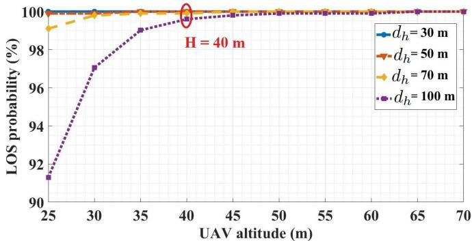  
Fig. 2. LOS probability versus UAV altitude.

## B. Justification of the LoS Channel Assumption

To verify the validity of the LoS channel assumption adopted in the proposed framework, we evaluate the LoS probability using the standard urban air-to-ground probabilistic model. The LoS probability between user i and the UAVmounted STAR-RIS at time slot n is given by [25], [55], and [56]:

$$
P _ { \mathrm { L o S } } [ n ] = \frac { 1 } { 1 + a \cdot \exp ( - b \cdot ( \theta _ { i , S } [ n ] - a ) ) }\tag{43}
$$

where a and b are environment-dependent parameters, and $\theta _ { i , S } [ n ]$ denotes the elevation angle between user i and the STAR-RIS. The elevation angle is computed as

$$
\theta _ { i , s } [ n ] = \frac { 1 8 0 } { \pi } \arctan \left( \frac { H } { d _ { h } [ n ] } \right) .\tag{44}
$$

where $d _ { h }$ is the horizontal distance. Fig. 2 illustrates the LoS probability under the considered deployment settings using the standard urban parameters $\textit { a } \ = \ 4 . 8 8$ and $\textit { b } = \ 0 . 4 3$ [55], [56]. The results show that, within the considered UAV altitude range and service area dimensions, the LoS probability remains above 99% for all practical user locations and exceeds 99.9% for typical transmission distances.

Since the STAR-RIS is mounted directly on the UAV, these probabilities apply to both the user-to-STAR-RIS and STAR-RIS-to-BS links. Therefore, the considered communication links are strongly LoS-dominant. This confirms that the deterministic LoS channel model adopted in this work, is statistically well justified and introduces negligible modeling error, while preserving analytical tractability for the proposed joint optimization framework.

## C. Convergence Analysis

Regarding practical feasibility under short channel coherence times, the optimization is performed on large-scale CSI (path loss and UAV geometry) rather than instantaneous smallscale fading. Since large-scale parameters vary much more slowly than the channel coherence time, the computed solution remains valid over multiple coherence intervals. The proposed algorithm adjusts the UAV trajectory, STAR-RIS phases, and task offloading to accommodate varying mission durations and large tasks. It incrementally solves subproblems to maintain feasibility, although very short missions or extremely large tasks may face limitations due to available processing resources at the user, UAV, and BS (e.g., maximum CPU frequency and required cycles per data bit). Nevertheless, adaptive optimization and precise resource constraints ensure energy-efficient operation while meeting time and computational requirements.

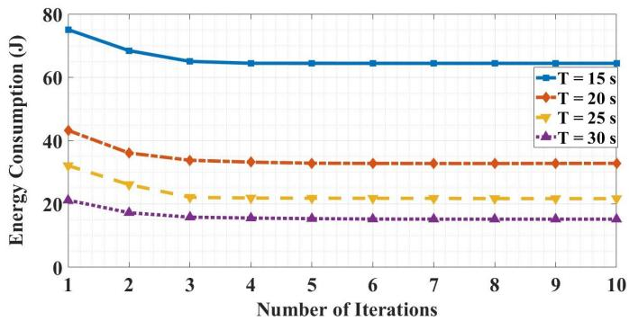  
Fig. 3. Total system energy consumption versus iteration index for different mission durations $T \left( M = 4 0 , D _ { \mathrm { T o t a l } } \right) = 6 0$ Mbits).

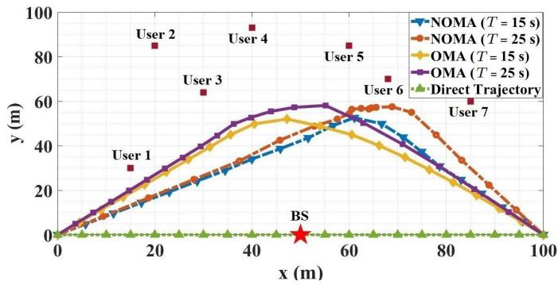  
Fig. 4. Optimized UAV horizontal trajectories under OMA and NOMA for different values of $T \left( M = 4 0 , D _ { \mathrm { T o t a l } } \right) = 6 0 \ M \mathrm { b i t s } )$

To assess the convergence behavior of the proposed algorithm, Fig. 3 illustrates the total system energy consumption versus the number of iterations for different mission periods T with M = 40 STAR-RIS elements. As shown, the total energy consumption decreases with the number of iterations and stabilizes after 3-4 iterations for all tested values of T .

## D. Energy Consumption Comparison

The performance of the proposed algorithm is evaluated in comparison with a baseline scheme that employs the OMA technique. In the OMA approach, the available bandwidth is divided among users via frequency division multiple access (FDMA), where each user occupies $1 / U$ of the total bandwidth. Due to the separate bandwidth allocation, no interference is considered. Fig. 4 illustrates the UAV horizontal trajectory projection under both NOMA and OMA techniques for two mission periods T . Each trajectory is optimized to achieve favorable channel conditions, minimizing total system energy consumption. In the OMA scheme, the UAV moves at a relatively uniform speed with minimal variations. Conversely, in the NOMA method, the UAV initially moves faster to reach optimal channel conditions and then remains in these locations longer to enable users to offload more computation tasks efficiently.

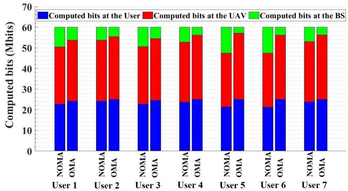  
Fig. 5. Task allocation among user, UAV, and BS under OMA and NOMA protocols (T = 25 s, M = 40, $D _ { \mathrm { T o t a l } } = 6 0$ Mbits).

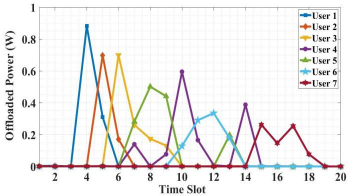  
Fig. 6. User transmit power versus time slots under NOMA $( T = 2 5 \mathrm { ~ s } ,$ M = 40, D = 60 Mbits).

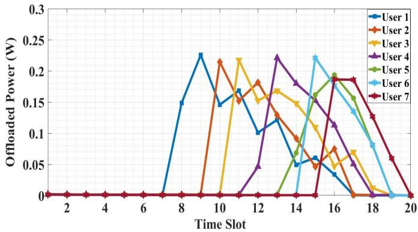  
Fig. 7. User transmit power versus time slots under OMA $( T ~ = ~ 2 5 ~ \mathrm { { \ s } } ,$ M = 40, $D _ { \mathrm { T o t a l } } = 6 0$ Mbits).

Fig. 5 compares the computed task distribution across users, UAV, and BS for NOMA and OMA techniques. In the NOMA approach, users offload larger portion of their tasks to the BS via STAR-RIS to leverage the BS superior computational resources and reduce overall energy consumption. In contrast, the OMA method results in a higher number of tasks being processed locally by users and the UAV, with fewer tasks reaching the BS.

Fig. 6 and Fig. 7 present the user transmit power across time slots for both NOMA and OMA protocols. In both methods, users prioritize task offloading during time slots with optimal channel conditions. Due to the improved bandwidth utilization in NOMA and power allocation strategy, users try their transmissions in fewer slots to minimize interference. In contrast, in OMA, the bandwidth limitation extends the offloading process across more time slots, often forcing users to offload tasks in less favorable channel conditions. Consequently, NOMA achieves superior offloading efficiency.

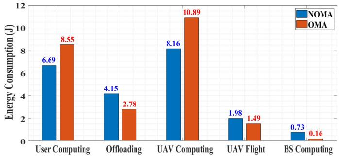  
Fig. 8. Energy consumption comparison of system components under NOMA and OMA $( \bar { T } = 2 5 \ \mathrm { s } , \ \bar { M } = 4 0 , \ \bar { D } _ { \mathrm { T o t a l } } = 6 \dot { 0 }$ Mbits).

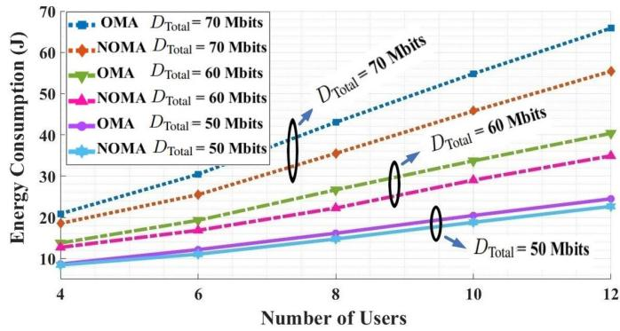  
Fig. 9. Energy consumption versus number of users $( T = 2 5 \ \mathrm { s } , \ M = 4 0 )$

The histogram in Fig. 8 compares energy consumption across system components for both NOMA and OMA. As described earlier, in the OMA scheme, more tasks are processed by users and UAV, resulting in higher energy consumption for these components. Conversely, in NOMA, larger portion of tasks are handled by BS. Despite the increased BS energy consumption, the overall system energy consumption in NOMA is 21.71 J, which is 9.95% lower than the 23.87 J observed in OMA due to the BS enhanced computational resources and lower energy weighting factor ωBS.

## E. Effect of User Count and Task Size

This subsection evaluates the system performance under varying numbers of users and total computation tasks $D _ { \mathrm { T o t a l } } .$ The results presented in Fig. 9 indicate that the system energy consumption increases with the growth in both the number of users and their total computation tasks. As observed, the energy consumption slope for the NOMA scheme is less steep than that of the OMA scheme. This advantage of NOMA becomes increasingly significant as the number of users and their corresponding computation tasks increase.

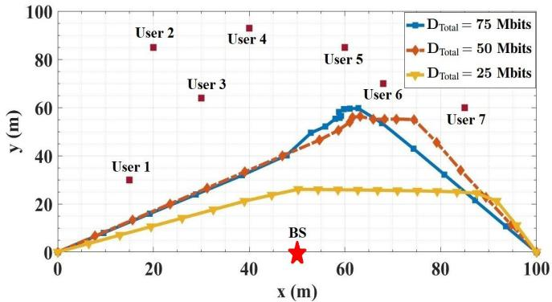  
Fig. 10. Optimal UAV trajectories for varying total tasks $D _ { \mathrm { T o t a l } } ~ ( T = 2 5 ~ \mathrm { s } .$ $\bar { M } = 4 0 )$

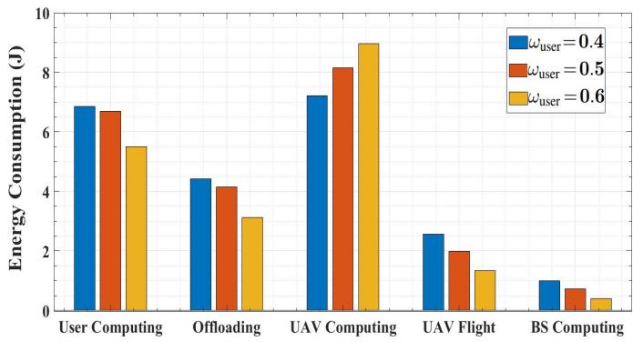  
Fig. 11. Component-wise energy consumption vs. ωuser $( T = 2 5 { \mathrm { ~ s } } , M = 4 0 .$ $D _ { \mathrm { T o t a l } } ^ { \mathrm { ^ { \upsilon } } } = 6 0 ~ \mathrm { \dot { M } b i t s ) }$

Fig. 10 illustrates the optimized UAV trajectory for different values of $D _ { \mathrm { T o t a l } }$ while keeping the number of users fixed at $U = 7$ under the NOMA framework. As observed, with an increase in $D _ { \mathrm { T o t a l } }$ , the UAV optimizes its flight path to ensure improved channel conditions. This optimization improves task offloading efficiency to both the UAV and BS while reducing energy consumption for users and the overall system.

## F. Impact of Weighting Factors

The selection of the weighting factors significantly influences the energy consumption prioritization in system design. As mentioned earlier, we have set $\omega _ { \mathrm { u s e r } } + \omega _ { \mathrm { U A V } } + \omega _ { \mathrm { B S } } = 1$ Increasing any of these weight factors indicates a higher emphasis on minimizing the energy consumption of the corresponding component. Given that the BS has more computational resources and access to a stable energy supply due to its stationary ground-based infrastructure, its weight factor can be assigned a relatively small value. Thus, we set $\omega _ { \mathrm { B S } } = 0 . 2 ,$ , allowing the BS to handle a larger portion of the computational tasks. Consequently, $\omega _ { \mathrm { u s e r } } + \omega _ { \mathrm { U A V } } = 0 . 8 .$ Fig. 11 illustrates the impact of $\omega _ { \mathrm { u s e r } }$ on the energy consumption of different components of the system. As observed, increasing $\omega _ { \mathrm { u s e r } }$ results in a reduction in the user energy consumption. This shift leads to a higher computational burden on the UAV, thereby increasing its energy consumption. Moreover, since the user prioritizes minimizing its own energy consumption for offloading, a smaller fraction of computational tasks is offloaded to the BS, which is located at a greater distance. Consequently, the energy consumption of the BS decreases as well.

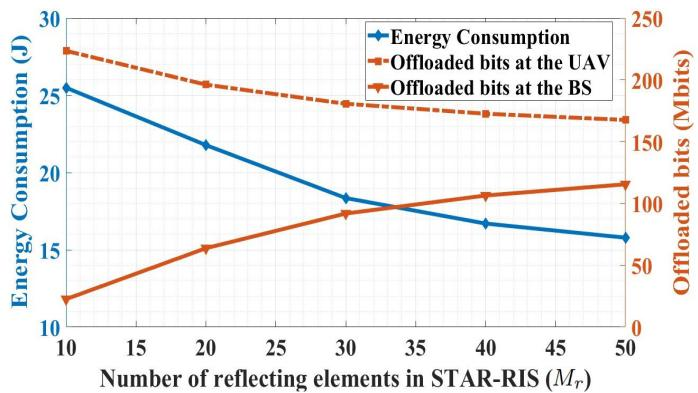  
Fig. 12. Energy consumption and offloaded tasks versus $M _ { r } ~ ( T = 2 5 ~ \mathrm { s }$ , M = 40, DTotal = 60 Mbits).

## G. Impact of the Number of STAR-RIS Elements and Mission Period

Fig. 12 illustrates the energy consumption and offloaded tasks in the STAR-RIS system, assuming a fixed total number of STAR-RIS elements $( M ~ = ~ 6 0 )$ and varying $M _ { r }$ and $M _ { t } .$ . An increase in $M _ { r }$ results in a significant enhancement of the communication channel gain between the user and the BS. Consequently, users offload a greater proportion of their computational tasks to the BS, rather than relying on local processing or offloading to the UAV, owing to the BS superior computational capabilities and lower energy consumption coefficient. This leads to a reduction in system energy consumption as $M _ { r }$ increases.

To provide a more comprehensive analysis and demonstrate the improvement in energy consumption as a function of the number of STAR-RIS elements, our proposed algorithm is compared with a number of alternative schemes: 1) imperfect CSI. 2) OMA. 3) without trajectory optimization: In this scheme, the UAV follows a fixed linear trajectory from the initial point to the final point without any trajectory adjustment. 4) random phase: The STAR-RIS phase shifts are randomly selected within the range [0, 2π]. 5) fixed STAR-RIS: In this configuration, to evaluate the advantages of UAV-mounted STAR-RIS over the fixed building-mounted STAR-RIS system, the STAR-RIS is statically installed on a tall building at a height of 25 meters, located at the coordinates [30, 50]. 6) grid search: This scheme serves as an optimal benchmark, where the primary optimization variables (bit allocation, user transmit power, STAR-RIS phase shifts, and UAV trajectory) are discretized and exhaustively evaluated to obtain the global optimum. Users computational tasks are offloaded through the STAR-RIS to both the UAV in flight and the BS for processing.

As illustrated in Fig. 13, when M increases, all schemes exhibit a reduction in energy consumption due to improved channel conditions, which enable more efficient task offloading. The fixed STAR-RIS scheme consistently results in the highest energy consumption, due to the absence of an optimized STAR-RIS placement, which severely degrades the communication channel condition between the users, UAV, and the BS. However, due to the optimized phase shift in this scheme, energy consumption decreases at a faster rate. Specifically, for $M = 8 0 .$ , it demonstrates lower energy consumption compared to the random phase scheme. In contrast, the NOMA scheme demonstrates superior performance. Notably, in the proposed system model, the performance gap between NOMA and the other schemes widens as M increases. Specifically, at $M = 3 0$ , NOMA achieves a 6.19% reduction in energy consumption compared to OMA, with this reduction increasing to 16.42% at $M ~ = ~ 8 0$ . Additionally, owing to channel estimation errors, schemes utilizing perfect CSI consistently demonstrate lower energy consumption than those relying on imperfect CSI. Furthermore, exhaustive methods like grid search theoretically guarantees optimality, its exponential complexity with parameter dimensionality and granularity renders it computationally intractable and practically infeasible for concurrent optimizations of multiple parameters (e.g., bit allocation and user transmit power, STAR-RIS phase shifts, and UAV trajectory) due to vast search spaces, necessitating exorbitant computational resources and execution times. Our iterative algorithm achieves near-optimal performance with only a $2 \textrm { -- } 3 \%$ energy increase compared to grid search tractable range, while offering orders-of-magnitude improvements in computational efficiency. This favorable trade-off establishes our approach as a practical and scalable solution for advanced wireless systems.

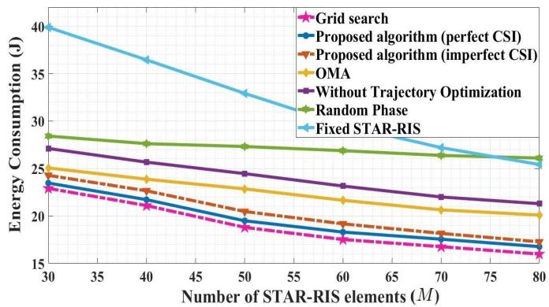

Fig. 13. System energy consumption versus the number of STAR-RIS elements $( T = 2 5 \ \mathrm { s } , D _ { \mathrm { T o t a l } } = 6 0$ Mbits).  
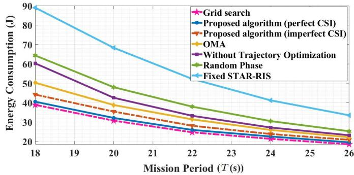  
Fig. 14. System energy consumption versus mission period T for various schemes $( M = 4 0 , D _ { \mathrm { T o t a l } } = 6 0$ Mbits).

Energy consumption versus mission period is examined in Fig. 14. As the mission period increases, the system energy consumption decreases across all schemes. This reduction is attributed to the extended execution time for task offloading and edge computing, which enables a more gradual and energy-efficient processing approach. The fixed STAR-RIS scheme results in the highest energy consumption, whereas the proposed NOMA-based model consistently demonstrates the lowest energy consumption across all mission periods. This improvement is due to the joint optimization of bit allocation, user transmit power, STAR-RIS phase shift, and UAV trajectory, which collectively enhance system efficiency.

## V. CONCLUSION

This paper proposed a STAR-RIS-assisted MEC framework in which users can partially offload their computation tasks to the UAV-mounted MEC server or the terrestrial BS using the NOMA technique. A joint optimization problem was formulated to minimize system energy consumption involving bit allocation, user transmit power, STAR-RIS phase shift, and UAV trajectory. To address the non-convexity of the problem, it was decomposed into three subproblems, each solved using the SCA method or closed-form solutions. Subsequently, a BCD-based iterative algorithm was proposed to minimize the energy consumption. The results demonstrated that the proposed algorithm significantly reduces energy consumption compared to other schemes, such as fixed STAR-RIS, random phase, without trajectory optimization, OMA, and imperfect CSI, while ensuring fast convergence within a limited number of iterations. A grid search benchmark validates the nearoptimality of the proposed algorithm, showing a performance gap consistently about 2 − 3%. Furthermore, optimizing the STAR-RIS phase shift notably enhances channel conditions, improving task offloading efficiency and reducing energy consumption. The NOMA technique also exhibits superior performance compared to OMA by reducing overall system energy consumption, a reduction that becomes increasingly significant with a growing number of users or computational load.

## REFERENCES

[1] M. Alsenwi, Y. K. Tun, S. R. Pandey, N. N. Ei, and C. S. Hong, “UAV-assisted multi-access edge computing system: An energy-efficient resource management framework,” in Proc. Int. Conf. Inf. Netw. (ICOIN), Jan. 2020, pp. 214–219.

[2] Y. K. Tun, Y. M. Park, N. H. Tran, W. Saad, S. R. Pandey, and C. S. Hong, “Energy-efficient resource management in UAVassisted mobile edge computing,” IEEE Commun. Lett., vol. 25, no. 1, pp. 249–253, Jan. 2021.

[3] J. Ji, K. Zhu, C. Yi, and D. Niyato, “Energy consumption minimization in UAV-assisted mobile-edge computing systems: Joint resource allocation and trajectory design,” IEEE Internet Things J., vol. 8, no. 10, pp. 8570–8584, May 2021.

[4] N. N. Ei, S. W. Kang, M. Alsenwi, Y. K. Tun, and C. S. Hong, “Multi-UAV-assisted MEC system: Joint association and resource management framework,” in Proc. Int. Conf. Inf. Netw. (ICOIN), Jan. 2021, pp. 213–218.

[5] B. Duo, M. He, Q. Wu, and Z. Zhang, “Joint dual-UAV trajectory and RIS design for ARIS-assisted aerial computing in IoT,” IEEE Internet Things J., vol. 10, no. 22, pp. 19584–19594, Nov. 2023.

[6] L. Yang, H. Yao, J. Wang, C. Jiang, A. Benslimane, and Y. Liu, “Multi-UAV-enabled load-balance mobile-edge computing for IoT networks,” IEEE Internet Things J., vol. 7, no. 8, pp. 6898–6908, Aug. 2020.

[7] H. Mei, K. Yang, J. Shen, and Q. Liu, “Joint trajectory-task-cache optimization with phase-shift design of RIS-assisted UAV for MEC,” IEEE Wireless Commun. Lett., vol. 10, no. 7, pp. 1586–1590, Jul. 2021.

[8] L. Gupta, R. Jain, and G. Vaszkun, “Survey of important issues in UAV communication networks,” IEEE Commun. Surveys Tuts., vol. 18, no. 2, pp. 1123–1152, 2nd Quart., 2016.

[9] B. Shang, “Unmanned aerial vehicles and edge computing in wireless networks,” Ph.D. dissertation, Virginia Tech Univ., 2022.

[10] N. N. Ei, M. Alsenwi, Y. K. Tun, Z. Han, and C. S. Hong, “Energyefficient resource allocation in multi-UAV-assisted two-stage edge computing for beyond 5G networks,” IEEE Trans. Intell. Transp. Syst., vol. 23, no. 9, pp. 16421–16432, Sep. 2022.

[11] A. Ranjha and G. Kaddoum, “URLLC facilitated by mobile UAV relay and RIS: A joint design of passive beamforming, blocklength, and UAV positioning,” IEEE Internet Things J., vol. 8, no. 6, pp. 4618–4627, Mar. 2021.

[12] C. Wu, Y. Liu, X. Mu, X. Gu, and O. A. Dobre, “Coverage characterization of STAR-RIS networks: NOMA and OMA,” IEEE Commun. Lett., vol. 25, no. 9, pp. 3036–3040, Sep. 2021.

[13] X. Mu, Y. Liu, L. Guo, J. Lin, and R. Schober, “Simultaneously transmitting and reflecting (STAR) RIS aided wireless communications,” IEEE Trans. Wireless Commun., vol. 21, no. 5, pp. 3083–3098, May 2022.

[14] G. Mu, “Joint beamforming and power allocation for wireless powered UAV-assisted cooperative NOMA systems,” EURASIP J. Wireless Commun. Netw., vol. 2020, no. 1, pp. 1–14, Dec. 2020.

[15] P. Mach and Z. Becvar, “Mobile edge computing: A survey on architecture and computation offloading,” IEEE Commun. Surveys Tuts., vol. 19, no. 3, pp. 1628–1656, 3rd Quart., 2017.

[16] H. Li, G. Shou, Y. Hu, and Z. Guo, “Mobile edge computing: Progress and challenges,” in Proc. 4th IEEE Int. Conf. Mobile Cloud Comput. Services Eng., Mar. 2016, pp. 83–84.

[17] L. A. Haibeh, M. C. E. Yagoub, and A. Jarray, “A survey on mobile edge computing infrastructure: Design, resource management, and optimization approaches,” IEEE Access, vol. 10, pp. 27591–27610, 2022.

[18] Y. Mao, C. You, J. Zhang, K. Huang, and K. B. Letaief, “A survey on mobile edge computing: The communication perspective,” IEEE Commun. Surveys Tuts., vol. 19, no. 4, pp. 2322–2358, 4th Quart., 2017.

[19] Y. Yazid, I. Ez-Zazi, A. Guerrero-Gonzalez, A. El Oualkadi, and´ M. Arioua, “UAV-enabled mobile edge-computing for IoT based on AI: A comprehensive review,” Drones, vol. 5, no. 4, p. 148, Dec. 2021.

[20] A. Al-Hourani, S. Kandeepan, and S. Lardner, “Optimal LAP altitude for maximum coverage,” IEEE Wireless Commun. Lett., vol. 3, no. 6, pp. 569–572, Dec. 2014.

[21] Z. Wang, L. Duan, and R. Zhang, “Adaptive deployment for UAV-aided communication networks,” IEEE Trans. Wireless Commun., vol. 18, no. 9, pp. 4531–4543, Sep. 2019.

[22] L. Wang, K. Wang, C. Pan, W. Xu, N. Aslam, and A. Nallanathan, “Deep reinforcement learning based dynamic trajectory control for UAVassisted mobile edge computing,” IEEE Trans. Mobile Comput., vol. 21, no. 10, pp. 3536–3550, Oct. 2022.

[23] T. Zhang, Y. Xu, J. Loo, D. Yang, and L. Xiao, “Joint computation and communication design for UAV-assisted mobile edge computing in IoT,” IEEE Trans. Ind. Informat., vol. 16, no. 8, pp. 5505–5516, Aug. 2020.

[24] W. Feng et al., “Hybrid beamforming design and resource allocation for UAV-aided wireless-powered mobile edge computing networks with NOMA,” IEEE J. Sel. Areas Commun., vol. 39, no. 11, pp. 3271–3286, Nov. 2021.

[25] X. Zhang, J. Zhang, J. Xiong, L. Zhou, and J. Wei, “Energy-efficient multi-UAV-enabled multiaccess edge computing incorporating NOMA,” IEEE Internet Things J., vol. 7, no. 6, pp. 5613–5627, Jun. 2020.

[26] S. R. Hasan, S. R. Sabuj, M. Hamamura, and M. A. Hossain, “A comprehensive review on reconfigurable intelligent surface for 6G communications: Overview, deployment, control mechanism, application, challenges, and opportunities,” Wireless Pers. Commun., vol. 139, no. 1, pp. 375–429, Nov. 2024.

[27] H. Zhou, M. Erol-Kantarci, Y. Liu, and H. V. Poor, “A survey on modelbased, heuristic, and machine learning optimization approaches in RISaided wireless networks,” IEEE Commun. Surveys Tuts., vol. 26, no. 2, pp. 781–823, 2nd Quart., 2024.

[28] S. Hassouna et al., “A survey on reconfigurable intelligent surfaces: Wireless communication perspective,” IET Commun., vol. 17, no. 5, pp. 497–537, Mar. 2023.

[29] M. Z. Siddiqi and T. Mir, “Reconfigurable intelligent surface-aided wireless communications: An overview,” Intell. Converged Netw., vol. 3, no. 1, pp. 33–63, Mar. 2022.

[30] L. Ge, P. Dong, H. Zhang, J.-B. Wang, and X. You, “Joint beamforming and trajectory optimization for intelligent reflecting surfaces-assisted UAV communications,” IEEE Access, vol. 8, pp. 78702–78712, 2020.

[31] Z. Zhuo, S. Dong, H. Zheng, and Y. Zhang, “Method of minimizing energy consumption for RIS assisted UAV mobile edge computing system,” IEEE Access, vol. 12, pp. 39678–39688, 2024.

[32] X. Qin, Z. Song, T. Hou, W. Yu, J. Wang, and X. Sun, “Joint optimization of resource allocation, phase shift, and UAV trajectory for energyefficient RIS-assisted UAV-enabled MEC systems,” IEEE Trans. Green Commun. Netw., vol. 7, no. 4, pp. 1778–1792, Dec. 2023.

[33] P. Q. Truong et al., “Computation offloading and resource allocation optimization for mobile edge computing-aided UAV-RIS communications,” IEEE Access, vol. 12, pp. 107971–107983, 2024.

[34] Z. Zhai, X. Dai, B. Duo, X. Wang, and X. Yuan, “Energy-efficient UAVmounted RIS assisted mobile edge computing,” IEEE Wireless Commun. Lett., vol. 11, no. 12, pp. 2507–2511, Dec. 2022.

[35] P. S. Aung, Y. M. Park, Y. K. Tun, Z. Han, and C. S. Hong, “Energyefficient communication networks via multiple aerial reconfigurable intelligent surfaces: DRL and optimization approach,” IEEE Trans. Veh. Technol., vol. 73, no. 3, pp. 4277–4292, Mar. 2024.

[36] X. Hu, H. Zhao, W. Zhang, and D. He, “Online resource allocation and trajectory optimization of STAR–RIS–assisted UAV–MEC system,” Drones, vol. 9, no. 3, p. 207, Mar. 2025.

[37] H. Xiao, X. Hu, W. Zhang, W. Wang, K.-K. Wong, and K. Yang, “Energy-efficient STAR-RIS enhanced UAV-enabled MEC networks with bi-directional task offloading,” IEEE Trans. Wireless Commun., vol. 24, no. 4, pp. 3258–3272, Apr. 2025.

[38] X. Deng et al., “Energy-efficient strategic AAV-enabled MEC networks via STAR-RIS: Joint optimization of trajectory and user association,” IEEE Internet Things J., vol. 12, no. 10, pp. 14921–14937, May 2025.

[39] P. S. Aung, L. X. Nguyen, Y. K. Tun, Z. Han, and C. S. Hong, “Aerial STAR-RIS empowered MEC: A DRL approach for energy minimization,” IEEE Wireless Commun. Lett., vol. 13, no. 5, pp. 1409–1413, May 2024.

[40] M. Wu et al., “UAV-mounted RIS-aided mobile edge computing system: A DDQN-based optimization approach,” Drones, vol. 8, no. 5, p. 184, May 2024.

[41] M. N. Tariq, J. Wang, S. Memon, M. Siraj, M. Altamimi, and M. A. Mirza, “Towards energy-efficiency: Integrating DRL and Ze-RIS for task offloading in UAV-MEC environments,” IEEE Access, vol. 12, pp. 65530–65542, 2024.

[42] L. Li, W. Guan, C. Zhao, Y. Su, and J. Huo, “Trajectory planning, phase shift design, and IoT devices association in flying-RIS-assisted mobile edge computing,” IEEE Internet Things J., vol. 11, no. 1, pp. 147–157, Jan. 2024.

[43] H. Hu, Z. Sheng, A. A. Nasir, H. Yu, and Y. Fang, “Computation capacity maximization for UAV and RIS cooperative MEC system with NOMA,” IEEE Commun. Lett., vol. 28, no. 3, pp. 592–596, Mar. 2024.

[44] J. Xu, Y. Zeng, and R. Zhang, “UAV-enabled wireless power transfer: Trajectory design and energy optimization,” IEEE Trans. Wireless Commun., vol. 17, no. 8, pp. 5092–5106, Aug. 2018.

[45] Y. Liu, K. Xiong, Q. Ni, P. Fan, and K. B. Letaief, “UAV-assisted wireless powered cooperative mobile edge computing: Joint offloading, CPU control, and trajectory optimization,” IEEE Internet Things J., vol. 7, no. 4, pp. 2777–2790, Apr. 2020.

[46] H. Zhang, N. Shlezinger, F. Guidi, D. Dardari, M. F. Imani, and Y. C. Eldar, “Beam focusing for near-field multiuser MIMO communications,” IEEE Trans. Wireless Commun., vol. 21, no. 9, pp. 7476–7490, Sep. 2022.

[47] Z. Zhang, L. Lv, Q. Wu, H. Deng, and J. Chen, “Robust and secure communications in intelligent reflecting surface assisted NOMA networks,” IEEE Commun. Lett., vol. 25, no. 3, pp. 739–743, Mar. 2021.

[48] W. Wang, W. Ni, H. Tian, Z. Yang, C. Huang, and K.-K. Wong, “Safeguarding NOMA networks via reconfigurable dual-functional surface under imperfect CSI,” IEEE J. Sel. Topics Signal Process., vol. 16, no. 5, pp. 950–966, Aug. 2022.

[49] F. Zhou, Y. Wu, R. Q. Hu, and Y. Qian, “Computation rate maximization in UAV-enabled wireless-powered mobile-edge computing systems,” IEEE J. Sel. Areas Commun., vol. 36, no. 9, pp. 1927–1941, Sep. 2018.

[50] Y. Pan, M. Chen, Z. Yang, N. Huang, and M. Shikh-Bahaei, “Energyefficient NOMA-based mobile edge computing offloading,” IEEE Commun. Lett., vol. 23, no. 2, pp. 310–313, Feb. 2019.

[51] D. Tse and P. Viswanath, Fundamentals of Wireless Communication. Cambridge, U.K.: Cambridge Univ. Press, 2005.

[52] H. Long et al., “Reflections in the sky: Joint trajectory and passive beamforming design for secure UAV networks with reconfigurable intelligent surface,” 2020, arXiv:2005.10559.

[53] J. Lei, T. Zhang, X. Mu, and Y. Liu, “NOMA for STAR-RIS assisted UAV networks,” IEEE Trans. Commun., vol. 72, no. 3, pp. 1732–1745, Mar. 2024.

[54] B. Lyu, C. Zhou, S. Gong, W. Wu, D. T. Hoang, and D. Niyato, “Energyefficiency maximization for STAR-RIS enabled cell-free symbiotic radio communications,” IEEE Trans. Cognit. Commun. Netw., vol. 10, no. 6, pp. 2209–2223, Dec. 2024.

[55] R. Karem, M. Ahmed, and F. Newagy, “Resource allocation in uplink NOMA-IoT based UAV for URLLC applications,” Sensors, vol. 22, no. 4, p. 1566, Feb. 2022.

[56] N. Babu, C. B. Papadias, and P. Popovski, “Energy-efficient 3-D deployment of aerial access points in a UAV communication system,” IEEE Commun. Lett., vol. 24, no. 12, pp. 2883–2887, Dec. 2020.

  
Hamed Mohammadi received the B.Sc. and M.Sc. degrees in electrical engineering, telecommunications systems in 2015 and 2017, respectively. He is currently pursuing the Ph.D. degree with Urmia University, Urmia, Iran. His research interests include UAV communications, mobile edge computing (MEC), and vehicular communications.

Mahrokh G. Shayesteh (Senior Member, IEEE) received the B.Sc. degree in electrical engineering from the University of Tehran, Tehran, Iran, the M.Sc. degree in electrical engineering from the Khajeh Nasir University of Technology, Tehran, and the Ph.D. degree in electrical engineering from the Amir Kabir University of Technology, Tehran. She is currently a Professor with the Department of Electrical Engineering, Urmia University, Urmia, Iran. She is also with the Wireless Research Laboratory, Advanced Communication Research Institute (ACRI), Department of Electrical Engineering, Sharif University of Technology, Tehran. Her research interests include wireless communications, and signal and image processing.

Hashem Kalbkhani (Member, IEEE) received the B.Sc., M.Sc., and Ph.D. degrees in electrical engineering from Urmia University, Iran. He is currently an Associate Professor with the Department of Electrical Engineering, Urmia University of Technology, Urmia, Iran. His research interests include wireless networks, machine learning, and signal processing.

Azadeh Khazali received the B.Sc., M.Sc., and Ph.D. degrees in electrical engineering (telecommunications systems) from Urmia University, Urmia, Iran, in 2012, 2015, and 2022, respectively. From 2019 to 2020, she was a Visiting Researcher with the University of Bologna, Italy. She was also a Post-Doctoral Fellow with Iran National Science Foundation (INSF). She is currently a Post-Doctoral Researcher with Urmia University. Her research interests include heterogeneous networks, D2D communications, NOMA-mm Wave, mobile edge computing, and machine learning.