# Energy- and Latency-Efficient Resource Allocation for RIS-Assisted UAV-USV Cooperative MEC Network

Yangzhe Liao , Member, IEEE, Lin Liu, and Yong Ma , Senior Member, IEEE

Abstract—The potential of cooperative autonomous aerial vehicle (UAV)-unmanned surface vehicle (USV) multi-access edge computing (MEC) platform cannot be fully revealed without thoroughly investigating USVs bidirectional data computation. In this paper, a novel reconfigurable intelligent surface (RIS)-assisted UAV-USV cooperative MEC network architecture is proposed considering USVs bidirectional tasks with hard time window. The weighted sum minimization of UAVs energy consumption and task execution latency is formulated by jointly considering USVs task execution mode selection indicators, UAVs flight route indicators, UAVs arrival time, UAVs hovering coordinates and RIS phase shift vector. A heuristic solution is proposed to solve the formulated challenging problem, where we divide the original problem into three subproblems, i.e., UAVs flight route indicators subproblem, the joint task execution mode selection indicators and UAVs arrival time subproblem and the joint UAVs hovering coordinates and RIS phase shift vector design subproblem; each of which is solved by the proposed enhanced grey wolf optimizer (EGWO) algorithm, the integer constrained-removed augmented Lagrangian (ICRAL) algorithm and the proposed multi-objective differential evolution (MODE) algorithm, respectively. The results verify that the proposed solution can significantly decrease the weighted sum of UAVs energy consumption and task execution latency in comparison with numerous selected advanced algorithms.

Index Terms—Unmanned surface vehicles, autonomous aerial vehicles, reconfigurable intelligent surface, multi-access edge computing.

## I. INTRODUCTION

## A. Research Background and Motivation

ECENTLY, unmanned surface vehicles (USVs) have communities as one emerging approach to fulfill energy

Yong Ma is with the State Key Laboratory of Maritime Technology and Safety, School of Navigation, Hubei Key Laboratory of Inland Shipping Technology, Wuhan University of Technology, Wuhan 430063, China, and also with the Sanya Science and Education Innovation Park, Wuhan University of Technology, Sanya 572000, China (e-mail: myongdlwhut.edu.cn).

Digital Object Identifier 10.1109/TGCN.2025.3545458 and latency-efficient wireless inland waterway communications [1], [2]. However, this promising technology suffers numerous significant technical challenges. First, even though the majority of USVs task execution energy consumption can be transferred from resource-limited USVs to resource-rich multi-access edge computing (MEC) servers located next to terrestrial base stations (TBSs) by allowing USVs to offload computation-intensive and latency-sensitive tasks, it is still complicated to release the powerful computing capabilities of MEC servers since some offloaded tasks cannot be successfully transmitted owing to adverse environmental conditions. Moreover, one should be aware that reducing USVs task execution latency may conflict with decreasing network energy consumption; the situation may worsen since the bidirectional task model has emerged as a vital use case of USVs in beyond 5G era [3], [4]. In particular, each bidirectional task consists of two components, one of which is locally generated, including onboard sensors, radar, sonars, altitude and waterdepth detectors, and the rest of which is remote input data originating from the Internet or TBS proactively. Note that the majority of recent research works regarding autonomous aerial vehicle (UAV)-USV cooperative MEC networks have not thoroughly investigated USVs bidirectional computation tasks; designing a highly efficient resource allocation solution for USVs considering the tradeoff of network energy consumption and task execution latency is extremely challenging and worth further effort. Although reconfigurable intelligent surface (RIS)-assisted data transmission schemes are widely recognized as a potential way to serve USVs one-way computation tasks, very few works have paid sufficient attention to the close relationship between UAVs flight routes, UAVs hovering coordinates and RIS phase shift vector [5]. Designing highly efficient resource allocation may become even more challenging when considering USVs bidirectional data compu tation with hard time window, since this type of optimization problem has been proven as NP-hard and extremely difficult to tackle. Note that UAVs can also represented as autonomous aerial vehicles.

## B. Related Works

Most research works regarding network performance enhancement have been focused on single-objective optimization targets. Dai et al. investigated USVs tasks execution latency minimization problem by jointly considering

USVs offloading decisions, task transmission time cost and computing resource allocation [6]. Xu et al. explored the network energy minimization problem by jointly considering USVs coordinates, data uploading time cost and offloaded data size, where each task that cannot satisfy the predetermined latency requirement is regarded as failed [7]. Li et al. considered UAVs energy consumption minimization problem by jointly considering USVs computing and transmission capabilities [8]. The results revealed that UAVs energy consumption could be significantly reduced by jointly allocating network resources. Numerous early research attempts regarding either energy or latency-efficiency improvements for USVs in wireless inland waterway communication networks have been proposed in [9], [10], [11]. Note that there exists very few works that focused on how to realize a tradeoff between network energy consumption and USVs task execution latency since the closely coupling relationship between USVs task execution mode selection, UAVs flight route design and UAVs hovering coordinates has not been well addressed.

Recently, multi-objective optimization approaches have been considered to investigate the tradeoff between network energy consumption and task execution latency. Akter et al. formulated a network energy consumption ratio and total task execution latency weighted sum minimization problem, which is a non-convex mixed-integer problem and challenging to solve [12]. The authors first decomposed the original problem into several subproblems and then transformed each subproblem into a convex form. In this way, the original problem could be efficiently solved. Zhan et al. proposed a successive convex approximation-based alternating optimization algorithm to solve the joint optimization problem of network energy consumption and UAVs tasks completion time [13]. Yadav et al. proposed an energy-efficient dynamic computation offloading and resource allocation scheme to tackle the formulated network energy consumption and service latency weighted sum minimization problem [14]. The results showed that the network energy consumption and service latency could be balanced by jointly considering task offloading and network resource allocation. Note that the computational complexity to solve the above-mentioned optimization problems may become extremely complicated and suffer remarkable computing resource costs when considering USVs bidirectional task execution, while very few works have been focused on this emerging research topic.

With the rapid developments of metasurface, one promising method to enhance wireless transmission quality is to deploy RIS with the existing telecommunication entities to establish an intelligent propagation environment [15], [16]. The authors of [17] proposed a novel RIS-assisted UAV MEC network architecture, where RIS is carried by UAV. In this way, data transmission quality via non-line-of-sight (NLOS) air-to-ground could be remarkably enhanced. Xu et al. proposed a RIS-assisted UAV MEC platform, where UAV was integrated with RIS to serve ground mobile users with LOS channels [18]. Wang et al. formulated a processing-time minimization problem by jointly considering RIS reflecting phase shift, UAV flight trajectory and resource allocation.

The results showed that RIS-assisted UAV data transmission quality could be considerably enhanced [19]. Some perspective works pointed out that one effective way to improve energy or latency efficiency is to jointly design UAV trajectory, network resource allocation, and RIS phase shift [20], [21], [22]. However, very few works have explored the minimization of the weighted sum of UAVs energy consumption and USVs task execution latency in RIS-assisted UAV-USV cooperative MEC network, which is still an open research issue in wireless inland waterway communications networks.

## C. Main Contributions

According to the above-mentioned background and technical weaknesses, utilizing RIS-mounted UAVs in wireless inland waterway communications brings numerous major technical advantages in serving USVs. Specifically, each RIS-mounted UAV can serve USVs by offering reliable uplink and downlink data transmission. In this respect, UAVs flight distance can be considerably decreased while maintaining satisfactory channel links for USVs bidirectional data transmission. The detailed information regarding the main contributions is summarized as follows.

1) A novel RIS-assisted UAV-USV cooperative MEC network architecture considering USVs bidirectional tasks with hard time window is proposed, where each USV bidirectional task is comprised of two parts, one of which is generated by USV locally and the other is proactively remote generated data originated from TBS. The weighted sum minimization of UAVs energy consumption and task execution latency is formulated by jointly considering USVs task execution mode selection indicators, UAVs flight route indicators, UAVs arrival time, UAVs hovering coordinates and RIS phase shift vector.

2) A heuristic algorithm is proposed to solve the formulated challenging problem, where we first divide the original problem into three subproblems, i.e., UAVs flight route indicators subproblem, the joint task execution mode selection indicators and UAVs arrival time subproblem and the joint UAVs hovering coordinates and RIS phase shift vector subproblem. Then, each subproblem is solved by the proposed enhanced grey wolf optimizer (EGWO) algorithm, integer constrained-removed augmented Lagrangian (ICRAL) algorithm and multi-objective differential evolution (MODE) algorithm, respectively. In this way, one can efficiently obtain the feasible solution to the challenging formulated problem.

3) The results verify that the proposed solution can significantly decrease the weighted sum of UAVs energy consumption and task execution latency in comparison with several other advanced algorithms. The results also show that the weighted sum of UAVs energy consumption and task execution latency can be remarkably decreased by utilizing the higher number of UAVs and RIS reflecting elements. Besides, the performance of the proposed solution regarding different information propagation conditions and UAV flight routes is illustrated.

The rest of the paper is organized as follows. The system model and the formulated problem are listed in Section II. The proposed heuristic solution is presented in Section III.

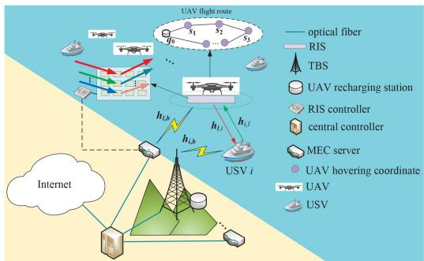  
Fig. 1. The proposed RIS-assisted UAV-USV cooperative MEC network architecture.

Section IV demonstrates the performance evaluation and Section V concludes the paper.

## II. SYSTEM MODEL AND PROBLEM FORMULATION

The proposed RIS-assisted UAV MEC network architecture is shown in Fig. 1, where the direct link between one $N _ { - }$ antenna TBS and each USV $i \in \mathcal { T } = \{ 0 , 1 , 2 , \ldots , I \}$ is severely blocked. A set of $\mathcal { L } ~ = ~ \{ 1 , 2 , \ldots , L \}$ rotary-wing single-antenna UAVs are deployed and dynamically form virtual clusters with TBS to serve USVs bidirectional task execution. In particular, each UAV $l \in \mathcal L$ is equipped with K RIS passive reflecting elements. During each equal-length time slot, each bidirectional task generated by USV i can be characterized by $U _ { i } \triangleq ( D _ { i } ^ { l } , D _ { i } ^ { r } , F _ { i } , [ X _ { i } , Y _ { i } ] )$ , where $D _ { i } ^ { l }$ and $D _ { i } ^ { r }$ indicate data size (in bits) generated by USV i and remote input data designated from the Internet, respectively. $F _ { i }$ indicates the required number of CPU cycles to execute $U _ { i \cdot } \ [ X _ { i } , Y _ { i } ]$ specify the time window of $U _ { i } .$ , where $X _ { i }$ and $Y _ { i }$ denote the earliest service time and the latest service time to execute $U _ { i } .$ , respectively.

In this system, the 3D Cartesian coordinate is considered, where the coordinates of TBS, UAVs recharging platform and each USV i are denoted by $q _ { b } , \ q _ { 0 }$ and $\mathbf { \delta } _ { \mathbf { \alpha } _ { \mathbf { \lambda } } \mathbf { \varepsilon } _ { \mathrm { ~ i ~ } } } ^ { q _ { i } , }$ respectively. Following [5], each UAV follows fly-hover-serve scheme, which needs to keep hovering status in the corresponding hovering coordinate $\mathbf { \delta } _ { \mathbf { \boldsymbol { s } } _ { i } }$ when serving each USV i. The central controller is utilized to capture the network state information, such as channel state information and network states. MEC server is connected with TBS via optic fiber and thus the transmission latency between them can be ignored [3].

## A. RIS-Assisted Transmission and Task Execution Model

The phase shift vector of each RIS l is denoted by $\pmb \theta _ { l } =$ $\{ \theta _ { l , k } ~ \in ~ [ 0 , 2 \pi ] , l ~ \in ~ \mathcal { L } , k ~ \in ~ \mathcal { K } ~ = ~ \{ 1 , 2 , \ldots , K \} \}$ =. In the [0 2 ] = 1 2same manner with [23], we assume that each RIS follows full reflection. The corresponding reflection coefficient matrix is defined as $\Theta ^ { K \times K }$ . The equivalent baseband channels from ΘUSV i to TBS, USV i to UAV l and UAV l to TBS are denoted by $\pmb { h } _ { i , b } \in \mathbb { R } ^ { N \times 1 } , h _ { i , l } \in \mathbb { R } ^ { K \times 1 }$ and $\pmb { h } _ { l , b } \in \mathbb { R } ^ { N \times K } , i \in \mathcal { I } , l \in$ ${ \mathcal { L } } ,$ respectively [24].

Denote path loss (PL) exponent and the distance between each USV i and TBS by $\zeta _ { i , b }$ and $\begin{array} { r c l } { d _ { i , b } } & { = } & { \| \pmb { q } _ { i } - \pmb { q } _ { b } \| } \end{array}$ respectively. The channel gain between USV i and TBS can be given as

$$
\begin{array} { r } { \pmb { h } _ { i , b } = \sqrt { \rho _ { 0 } d _ { i , b } ^ { - \zeta _ { i , b } } } \pmb { I } , i \in \mathcal { T } , } \end{array}\tag{1}
$$

where $\rho _ { 0 }$ denotes the channel power at the reference distance 1 m and I is the identity vector.

Denote PL exponent and the distance between USV i and UAV l by $\zeta _ { i , l }$ and $d _ { i , l } = \lVert \pmb { q } _ { i } - \pmb { s } _ { i } \rVert$ . The channel gain between =each USV i and UAV l can be expressed as

$$
\begin{array} { r } { h _ { i , l } = \sqrt { \rho _ { 0 } d _ { i , l } ^ { - \zeta _ { i , l } } } \bigg [ 1 , e ^ { - j \frac { 2 \pi d } { \xi } \phi _ { i , l } } , \ldots , e ^ { - j \frac { 2 ( K - 1 ) \pi d } { \xi } \phi _ { i , l } } \bigg ] ^ { T } , } \end{array}\tag{2}
$$

where $\phi _ { i , l }$ is the cosine of the angle of arrival of the incident signal from USV i to UAV l. d is the separation distance between two successive RIS elements and $\xi$ is the carrier wavelength.

Let $d _ { l , b } = \lVert \pmb { s } _ { i } - \pmb { q } _ { b } \rVert$ be the distance between UAV l and =TBS. The channel gain between UAV l and TBS is

$$
\begin{array} { r } { h _ { l , b } = \sqrt { \rho _ { 0 } d _ { l , b } ^ { - \zeta _ { l , b } } } \left[ \begin{array} { l l l } { 1 } & { e ^ { - j \frac { 2 \pi d } { \lambda _ { 0 } } \phi _ { i , l } } } & { \dots } & { e ^ { - j \frac { 2 ( K - 1 ) \pi d } { \lambda _ { 0 } } \phi _ { i , l } } } \\ { 1 } & { e ^ { - j \frac { 2 \pi d } { \lambda _ { 0 } } \phi _ { i , l } } } & { \dots } & { e ^ { - j \frac { 2 ( K - 1 ) \pi d } { \lambda _ { 0 } } \phi _ { i , l } } } \\ { \vdots } & { \vdots } & { \ddots } & { \vdots } \\ { 1 } & { e ^ { - j \frac { 2 \pi d } { \lambda _ { 0 } } \phi _ { i , l } } } & { \dots } & { e ^ { - j \frac { 2 ( K - 1 ) \pi d } { \lambda _ { 0 } } \phi _ { i , l } } } \end{array} \right] _ { N \times K } } \end{array}\tag{3) ,}
$$

Each $U _ { i }$ can be either executed by USV local execution mode or MEC execution mode. Let USVs task execution mode selection indicators be ${ \pmb { \alpha } } \triangleq \{ \alpha _ { i } , i \in \mathcal { I } \}$ , where $\alpha _ { i } = 1$ and 0 indicate that $U _ { i }$ is executed via USV local execution mode and MEC execution mode, respectively [25]. One has

$$
{ \mathcal { C } } 1 : \alpha _ { i } \in \{ 0 , 1 \} , i \in { \mathcal { T } } .\tag{4}
$$

USV local execution mode: When $\alpha _ { i } = 1$ , USV i caches remote data $D _ { i } ^ { r }$ = 1from TBS via UAV-mounted RIS l and then execute $U _ { i }$ locally. Denote the transmission time from TBS to USV i via UAV-mounted RIS l by $t _ { b , l , i }$ , which is

$$
t _ { b , l , i } = \frac { D _ { i } ^ { r } } { r _ { b , l , i } } , i \in \mathcal { I } , l \in \mathcal { L } ,\tag{5}
$$

where ${ r _ { b , l , i } }$ denotes the corresponding achievable transmission data rate, which can be given as

$$
r _ { b , l , i } = B _ { i } ^ { D L } \log _ { 2 } \bigl ( 1 + \gamma _ { b , l , i } \bigr ) , i \in  { \mathcal { I } } , l \in  { \mathcal { L } } ,\tag{6}
$$

where $B _ { i } ^ { D L }$ is the allocated downlink bandwidth of USV i.

Following [26], assume that each USV can receive desired signal from the corresponding UAV. Denote signal-to-noise ratio of USV i by $\gamma _ { b , l , i }$ , which can be expressed as

$$
\gamma _ { b , l , i } = \frac { p _ { b } ^ { t r } \Vert \boldsymbol { w } _ { i } ^ { H } \left( h _ { i , b } + h _ { l , b } \Theta h _ { i , l } \right) \Vert ^ { 2 } } { \sigma ^ { 2 } \Vert \boldsymbol { w } _ { i } ^ { H } \Vert ^ { 2 } } , i \in \mathcal { I } , l \in \mathcal { L } , ( 7 )
$$

where $p _ { b } ^ { t r }$ denotes the transmission power of TBS. ${ \textbf { \textit { w } } } \in$ $\mathbb { R } ^ { N \times 1 }$ is the virtual downlink transmission beamforming vector from TBS to USV i. $\boldsymbol { w } _ { i } ^ { H }$ is the Hermitian transpose of ${ \pmb w } _ { i }$

Denote the corresponding local execution time cost by $t _ { i } ^ { l } ,$ which can be given as

$$
t _ { i } ^ { l } = \frac { F _ { i } } { f _ { i } } , i \in \mathcal { I } ,\tag{8}
$$

where $f _ { i }$ represents the computing capability of USV i.

MEC execution mode: When $\alpha _ { i } = 0$ , USV i first transmits $D _ { i } ^ { l }$ = 0to TBS via UAV-mounted RIS l. Denote the corresponding transmission time from USV i to TBS via UAV-mounted RIS l by $t _ { i , l , b } .$ , which can be expressed as

$$
t _ { i , l , b } = \frac { D _ { i } ^ { l } } { r _ { i , l , b } } , i \in \mathcal { I } , l \in \mathcal { L } ,\tag{9}
$$

where $r _ { i , l , b }$ denotes the corresponding achievable transmission rate from USV i to TBS via UAV l, which is

$$
r _ { i , l , b } = B _ { i } ^ { U L } \log _ { 2 } \bigl ( 1 + \gamma _ { i , l , b } \bigr ) , i \in \mathcal { I } , l \in \mathcal { L } ,\tag{10}
$$

where $B _ { i } ^ { U L }$ is the allocated uplink bandwidth of USV i.

Denote the corresponding signal to interference plus noise ratio (SINR) by $\gamma _ { i , l , b }$ , which can be expressed as

$$
\begin{array} { r l r } & { } & { \gamma _ { i , l , b } = \frac { p _ { i } ^ { t r } \| \pmb { w } _ { i } ^ { H } \left( \pmb { h } _ { i , b } + \pmb { h } _ { l , b } \Theta \pmb { h } _ { i , l } \right) \| ^ { 2 } } { \sum _ { j \in \mathbb { Z } , j \ne i } p _ { j } ^ { t r } \| \pmb { w } _ { i } ^ { H } \left( \pmb { h } _ { j , b } + \pmb { h } _ { l , b } \Theta \pmb { h } _ { j , l } \right) \| ^ { 2 } + \sigma ^ { 2 } \| \pmb { w } _ { i } ^ { H } \| ^ { 2 } } , } \\ & { } & { i , j \in \mathbb { Z } , j \ne i , l \in \mathcal { L } , \qquad ( 1 1 ) } \end{array}
$$

where $p _ { j } ^ { t r }$ indicates the transmission power of USV j. The corresponding time cost for MEC server to execute $U _ { i }$ can be given as

$$
t _ { b , i } = { \frac { F _ { i } } { f _ { b } } } , i \in { \mathbb { Z } } ,\tag{12}
$$

where $f _ { b }$ represents the computing capability of MEC server.

## B. UAVs Service Model

In accordance with [27], the flight power consumption of each UAV l is related to its flight speed $v _ { l } ,$ which can be mathematically expressed as

$$
p _ { l } ^ { f } = p _ { 0 } \bigg ( 1 + \frac { 3 v _ { l } ^ { 2 } } { u _ { t i p } ^ { 2 } } \bigg ) + p _ { 1 } \bigg ( \sqrt { 1 + \frac { v _ { l } ^ { 4 } } { 4 u _ { a v } ^ { 4 } } } - \frac { v _ { l } ^ { 2 } } { 2 u _ { a v } ^ { 2 } } \bigg ) + \frac { 1 } { 2 } C _ { 0 } v _ { l } ^ { 3 } ,\tag{13}
$$

where $p _ { 0 }$ and $p _ { 1 }$ are constants, which respectively indicate UAV hovering induced power and blade profile power. $u _ { t i p }$ and $u _ { a v }$ represent hovering rotor speed and mean rotor-induced velocity, respectively. $C _ { 0 }$ is a constant.

Without loss of generality, we consider each UAV l consecutively serve three USVs $j , \ i ,$ and $j ^ { + }$ . Denote the flight route indicator of each UAV l by $\beta _ { l , ( i , j ) } .$ , where $\beta _ { l , ( i , j ) } = 1$ indicates UAV l flies from two successive hovering coordinates $\mathbf { \delta } _ { \mathbf { \boldsymbol { s } } _ { i } }$ and $s _ { j }$ , and otherwise $\beta _ { l , ( i , j ) } = 0$ . One has

$$
\mathcal { C 2 : } \beta _ { l , ( j , i ) } \in \{ 0 , 1 \} , i , j \in \mathcal { T } , l \in \mathcal { L } .\tag{14}
$$

The corresponding flight time cost can be given as

$$
t _ { l , ( j , i ) } ^ { f i g h t } = \frac { \| s _ { j } - s _ { i } \| } { v _ { l } } , i , j \in \mathcal { T } , i \in \mathcal { L } .\tag{15}
$$

The corresponding flight energy consumption can be given as

$$
E _ { l , ( j , i ) } ^ { f i g h t } = p _ { l } ^ { f } t _ { l , ( j , i ) } ^ { f } , i , j \in \mathcal { T } , i \in \mathcal { L } .\tag{16}
$$

For simplification purposes, UAVs recharging platform can be assumed to be a special USV, indexed by USV 0, without

generating any task [27]. Since each UAV l needs to take off from UAVs recharging platform, one has

$$
\mathcal { C } 3 : \sum _ { i \in \mathcal { I } } \beta _ { l , ( 0 , i ) } = 1 , l \in \mathcal { L } .\tag{17}
$$

Each UAV l needs to fly back to UAVs recharging platform to get battery recharged, one has

$$
\mathcal { C } 4 : \sum _ { j \in \mathcal { T } } \beta _ { l , ( j , 0 ) } = 1 , l \in \mathcal { L } .\tag{18}
$$

After successfully served USV i, UAV l needs to fly to the corresponding hovering coordinate of USV $j ^ { + }$ , one has

$$
\mathcal { C 5 } : \sum _ { j \in \mathcal { I } } \beta _ { l , ( j , i ) } = \sum _ { j ^ { + } \in \mathcal { I } } \beta _ { l , ( i , j ^ { + } ) } , i \in \mathcal { I } , l \in \mathcal { L } .\tag{19}
$$

Since each USV i can only be served up by one UAV, one has

$$
\mathcal { C } 6 : \sum _ { l \in \mathcal { L } } \sum _ { j \in \mathcal { T } } \beta _ { l , ( j , i ) } = 1 , i \in \mathcal { T } .\tag{20}
$$

Denote the arrival time when UAV l arrives $\mathbf { \delta } _ { s _ { i } }$ by $\tau _ { l , i }$ and the corresponding waiting time by $t _ { l , i } ^ { w }$ . Since UAV l cannot serve USV i until the earliest starting time $X _ { i }$ , one has

$$
c 7 : \operatorname* { m a x } \{ X _ { i } - \tau _ { l , i } , 0 \} \leq t _ { l , i } ^ { w } , i \in \mathbb { Z } , l \in \mathcal { L } .\tag{21}
$$

Since UAV l needs to keep hovering status until $U _ { i }$ is successfully executed, one has

$$
\begin{array} { r l r } {  { \mathcal { C } 8 : \beta _ { l , ( i , j ) } ( \tau _ { l , i } + t _ { l , i } ^ { w } + \alpha _ { i } t _ { b , l , i } + ( 1 - \alpha _ { i } ) t _ { i , l , b } + t _ { l , ( i , j ) } ^ { f i g h t } - \tau _ { l , j } ) } } \\ & { } & { \quad \le 0 , i , j \in { \mathcal { T } } , l \in { \mathcal { L } } . } \end{array}\tag{}
$$

Since each $U _ { i }$ should be successfully executed not later than $Y _ { i } ,$ , one has

$$
\begin{array} { r l r } & { \mathcal { C } 9 : \beta _ { l , ( j , i ) } \big ( \tau _ { l , i } + t _ { l , i } ^ { w } + \alpha _ { i } t _ { b , l , i } + ( 1 - \alpha _ { i } ) t _ { i , l , b } - Y _ { i } \big ) \leq 0 , } & \\ & { i , j \in \mathcal { I } , l \in \mathcal { L } . } & { ( 2 3 ) } \end{array}
$$

As such, the total time cost to execute $U _ { i }$ can be given as

$$
t _ { l , ( j , i ) } ^ { t o t a l } = t _ { l , ( j , i ) } ^ { f i g h t } + t _ { l , i } ^ { w } + \alpha _ { i } t _ { b , l , i } + ( 1 - \alpha _ { i } ) t _ { i , l , b } , i \in \mathcal { I } , l \in \mathcal { L } .\tag{24}
$$

## C. Problem Formulation

The total time cost to execute $U _ { i }$ can be given as $t _ { l , ( j , i ) } ^ { t o t a l } =$ $t _ { l , ( j , i ) } ^ { \mathrm { \it { f i g h t } } } + t _ { l , i } ^ { w } + \alpha _ { i } t _ { b , l , i } + ( 1 - \alpha _ { i } ) t _ { i , l , b } , i \in \mathcal { I } , l \in \mathcal { L }$ . In this paper, define the weighted sum of UAVs energy consumption and task execution latency as UAVs cumulative cost, which can be expressed as $\begin{array} { r } { F \triangleq \check { \sum } _ { j \in \mathcal { T } } \sum _ { i \in \mathcal { T } } \sum _ { l \in \mathcal { L } } \beta _ { l , ( j , i ) } ( E _ { l , ( j , i ) } ^ { \mathrm { { \it f i g h t } } } + } \end{array}$ $\lambda t _ { l , ( j , i ) } ^ { t o t a l } )$ , where λ is the weighting factor to reflect the relative importance of UAVs energy consumption and task execution latency. We aim to minimize UAVs cumulative cost by jointly considering USVs task execution mode selection indicators α $\triangleq \{ \alpha _ { i } , i \in \mathcal { I } \}$ , UAVs flight route indicators $\beta \triangleq$ $\{ \beta _ { l , ( j , i ) } , i , j \in \mathcal { T } , l \in \mathcal { L } \}$ , UAVs arrival time $\pmb { \tau } \triangleq \{ \tau _ { l , i } , i \in$ ${ \mathcal { L } } , l \in { \mathcal { L } } \}$ , UAVs hovering coordinates $\pmb { \mathscr { s } } \triangleq \{ \pmb { \mathscr { s } } _ { i } , i \in \mathbb { Z } \}$ and RIS phase shift vector $\pmb { \theta } \triangleq \{ \pmb { \theta } _ { l } , l \in \mathcal { L } \}$ , which can be formulated as

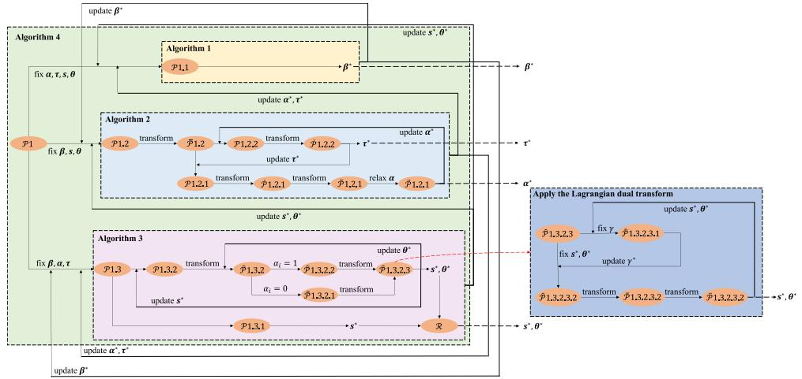  
Fig. 2. The general framework of the proposed solution.

$$
\begin{array} { r l } { \mathcal { P } 1 : } & { \underset { \alpha , \beta , \tau , s , \theta } { \operatorname* { m i n } } F } \\ { s . t . } & { \mathcal { C } 1 - \mathcal { C } 9 . } \end{array}\tag{25}
$$

C indicates each USV task execution mode selection indicator 1is a 0-1 binary variable. C − C represent UAVs trajectories requirements. $c 7 \mathrm { ~ - ~ } \mathcal { C } 9$ reveal USVs task execution time window constraints. Note that the computational complexity to solve P is extremely high not only because the existing traditional high efficient algorithms cannot directly apply to P due to the existence of C , but also numerous optimization variables are closely coupled.

## III. THE PROPOSED SOLUTION

In this section, a heuristic solution is proposed, where we divide P into three subproblems, i.e., P . the optimization of UAVs flight route indicators $\beta$ subproblem, P . the joint optimization of USVs task execution mode selection indicators α and UAVs arrival time τ subproblem and P . the joint optimization of UAVs hovering coordinates s and RIS phase shift vector θ subproblem, where each subproblem is solved by the proposed EGWO algorithm, CRAL algorithm and MODE algorithm, respectively. In this way, P can be efficiently solved. The framework of the proposed solution is shown in Fig. 2.

## A. The Optimization of UAVs Flight Route Indicators β

Given any feasible α, τ , s, and θ, P can be reduced as

$$
\begin{array} { r l } {  { \mathcal { P } \mathrm { 1 . 1 } \mathrm { : } } } & { \operatorname* { m i n } \sum _ { j \in \mathbb { Z } } \sum _ { i \in \mathbb { Z } } \sum _ { l \in \mathcal { L } } \beta _ { l , ( j , i ) } F ( \pmb { \beta } ) } \\ & { \quad s . t . \qquad \mathcal { C } \mathrm { 2 } - \mathcal { C } 6 , \mathcal { C } 8 - \mathcal { C } 9 . } \end{array}\tag{26}
$$

Note that P . can be regarded as the multiple traveling salesman problem with time window, which is NP-hard as proved in [28]. Inspired by the traditional grey wolf optimization algorithm [29], which can provide routing selection schemes for multiple traveling salesmen simultaneously and allows each city to be visited by only one salesman. The EGWO algorithm is proposed to promise that multiple UAVs can be cooperatively deployed and each USV can be successfully served by only one UAV within its task time window. The key steps are introduced as follows.

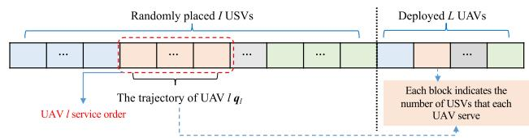  
Fig. 3. The proposed encoding mechanism.

Network initialization: The number of UAVs, USVs and population is initialized as L, I, and M, respectively. Denote $\dot { \boldsymbol { \mathcal { C } } } \in \mathbb { N } ^ { M \times ( I + L ) }$ as the set of available UAVs flight routes and each of which starts from and ends with UAV recharging platform.1

The proposed encoding mechanism is shown in Fig. 3, where the left-hand side represents randomly placed I USVs; USVs with the same color indicate that they can be served by the same UAV. Each element with the same color on the right-hand side indicates the number of USVs that each UAV can be served. Let $g _ { m a x }$ be the maximum generation number and $C ^ { g } ( m ) , m \in \mathcal { M } = \{ 1 , 2 , \ldots , M \}$ be each individual in the g-th generation population. The population in the g-th generation can be expressed as

$$
\begin{array} { l } { { { \pmb C } ^ { g } = [ { \pmb C } ^ { g } ( 1 ) , \ldots , { \pmb C } ^ { g } ( m ) , \ldots , { \pmb C } ^ { g } ( M ) ] , } } \\ { { \quad g \in \{ 1 , 2 , \ldots , g _ { m a x } \} . } } \end{array}\tag{27}
$$

Denote trajectory of each UAV l in g-th generation by $\pmb { C } _ { l } ^ { g } ( m ) = \{ \bar { G } _ { l } [ 1 ] , \bar { G } _ { l } [ 2 ] , \dots , G _ { l } [ N _ { l } ] \}$ , where $N _ { l }$ is the maximum number of USVs that each UAV l can serve and $G _ { l } [ N _ { l } ]$ denotes the $N _ { l ^ { - } } { \mathrm { t h } }$ service point of UAV l. As such, the flight distance of each UAV l can be expressed as

$$
\begin{array} { l } { { \displaystyle f \big ( C ^ { g } ( m ) \big ) = \sum _ { l \in \mathcal { L } } \left( \| G _ { l } [ 1 ] - \pmb { q } _ { 0 } \| + \sum _ { i = 2 } ^ { N _ { l } } \| G _ { l } [ i ] - G _ { l } [ i - 1 ] \| \right. } } \\ { { \displaystyle \qquad + \left. \| \pmb { q } _ { 0 } - G _ { l } [ N _ { l } ] \| \right) . } } \end{array}
$$

1Note that the coordinate of UAV recharging platform cannot be considered as an element of C.

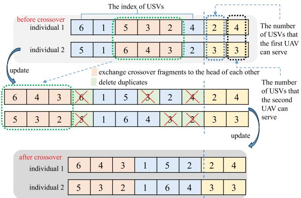  
Fig. 4. One example regarding the proposed crossover operation between two individuals.

In this way, one can obtain the optimal solution to P . when $f ( C ^ { g } ( m ) )$ reaches the minimum value.

( ( ))UAVs trajectories update mechanism: In each g-th generation, each individual $C ^ { g } ( m )$ can select one of the three feasible individuals, denoted by $\Omega _ { 1 } ^ { g } , \ \Omega _ { 2 } ^ { g }$ and $\Omega _ { 3 } ^ { g }$ to Ω Ω Ωperform crossover operation according to the roulette wheel method [30].

Let Cross · be the crossover operation between two individuals. $L e f t ^ { g }$ and $R i g h t ^ { g }$ denote the first and the last randomly generated crossover fragments, respectively. Define $\pmb { \lambda } = \{ \lambda _ { 1 } , \lambda _ { 2 } , \lambda _ { 3 } \}$ as the weighting factors of $\mathrm { ~ \bar { ~ } } _ { \Omega _ { 1 } ^ { g } , \Omega _ { 2 } ^ { j } } ^ { g }$ and $\Omega _ { 3 } ^ { g } ,$ respectively. One example regarding the proposed crossover operation is shown in Fig. 4. The update mechanism is given as follows.

1) The next generation can be given as follows after crossover with individual $\Omega _ { 1 } ^ { g }$

$$
C ^ { g + 1 } ( m ) = { C r o s s } \big [ C ^ { g } ( m ) , \Omega _ { 1 } ^ { g } , l e f t ^ { g } , r i g h t ^ { g } \big ] ,\tag{29}
$$

2) The next generation can be given as follows after crossover with individual $\Omega _ { 2 } ^ { g }$

$$
C ^ { g + 1 } ( m ) = C r o s s [ C ^ { g } ( m ) , \Omega ^ { g } , l e f t ^ { g } , r i g h t ^ { g } ] ,\tag{30}
$$

3) The next generation can be given as follows after crossover with individual $\Omega _ { 3 } ^ { g }$

$$
C ^ { g + 1 } ( m ) = C r o s s [ C ^ { g } ( m ) , \Omega ^ { g } , l e f t ^ { g } , r i g h t ^ { g } ] ,\tag{31}
$$

Example 1: For simplification purposes, two randomly selected individuals, e.g., individuals 1 and 2 are considered and demonstrated. The number of UAVs and USVs is set as 2 and 6, respectively. During the crossover operation, the crossover fragment of individual 1 is moved to the head of individual 2 while crossover fragment of individual 2 is moved to the head of individual 1. Then, the repetition fragments of two individuals are deleted.

Break and repair UAVs trajectories: $\Omega _ { 1 } ^ { g } , \ \Omega _ { 2 } ^ { g }$ and $\Omega _ { 3 } ^ { g }$ are considered in breaking and repairing operation. USVs belonging to the current population can be removed and then insert these USVs into the broken individuals. One key characteristic of this step is to reduce the likelihood of the obtained solution falling into the local optimum. The detailed information is given as follows.

Algorithm 1: The Framework of the Proposed EGWO   
Algorithm   
1 network initialization;   
2 while $g < = g m a x$ do   
3 initialize UAVs trajectories population according to Eq.   
(27);   
4 update UAVs trajectories population according to Eqs.   
(29)-(31);   
5 perform breaking and repairing according to Eqs. (32)-(33);   
6 update Ωg1, Ωg2, Ωg3 in current generation;   
7 $g = g + { \bar { 1 } } ;$   
8 end   
9 update $\beta ^ { * } ;$

Breaking operation: Let $I _ { m a x }$ be the minimum number of USVs that UAVs can serve, which can be denoted by $I _ { m a x } =$ min $\{ I _ { 1 } , I _ { 2 } , \ldots , I _ { i } , \ldots , I _ { L } \}$ . Consider each individual, $I _ { i } \ ( 1 \leq$ $I _ { 1 } ~ < ~ I _ { m a x } )$ (USVs need to be randomly removed from $N _ { l }$ $( 2 \leq N _ { l } < L )$ UAVs trajectories.

After removal, denote the set of updated USVs, the current individuals and the broken individuals by R, $\textbf { \textit { s } } \in$ $\{ \Omega _ { 1 } ^ { g } , \Omega _ { 2 } ^ { g } , \Omega _ { 3 } ^ { g } \}$ and $S ^ { * }$ , respectively. Define $S e l e ( \cdot )$ as the function to find the specified USV that needs to be removed from S for further repairing operation. bre1 and bre2 represent the serial number sets of removed USVs and broken UAVs trajectories, respectively.

Repairing operation: After breaking operation, removed USVs in R need to be inserted back into the broken individual $S ^ { * }$ based on repairing cost $R e c = \{ R e c _ { 1 } , R e c _ { 2 } , . . . ,$ $R e c _ { n u m ( R ) } \}$ , where num $( R )$ represents the number of ele-( )ments in R. Each USV in R has several insertion positions in $S ^ { * }$ while it can only be inserted into one position. As such, if and only if when the corresponding value of the insertion position realizes the lowest repairing cost can be regarded as the updated insertion position. Moreover, the corresponding repairing cost after USV i belongs to R inserts into the j-th position of $S ^ { * }$ is denoted by $R e c _ { ( R _ { i } , S _ { i } ^ { * } ) }$ , which reflects the differences between UAVs flight distance before and after insert USV i back into the j-th position of $S ^ { * }$ . One has

$$
\begin{array} { r l } & { R e c } \\ & { i \in ( R _ { i } , S _ { j } ^ { * } ) = | f _ { s u m } \Big ( S _ { j } ^ { * } , R _ { i } \Big ) - f _ { s u m } ( S ^ { * } ) | , } \\ & { i \in \{ 1 , 2 , \dots , n u m ( R ) \} , j \in \{ 1 , 2 , \dots , n u m ( S ^ { * } ) + 1 \} , } \end{array}\tag{32}
$$

where $n u m ( S ^ { * } )$ indicates the number of elements in $S ^ { * }$ $f _ { s u m } ( \pmb { S } _ { i } ^ { * } , \pmb { R } _ { i } )$ and $f _ { s u m } ( \pmb { S } ^ { * } )$ represent the sum of UAVs flight distance after and before insert USV i back into the j-th position of $S ^ { * }$ , respectively. As such, the corresponding insertion position with the lowest repairing cost for each USV in R is determined, which is

$$
\begin{array} { r l } & { R e c _ { i } = \operatorname* { m i n } \Biggl \{ R e c _ { \left( R _ { i } , S _ { 1 } ^ { * } \right) } , R e c _ { \left( R _ { i } , S _ { 2 } ^ { * } \right) } , \cdot \cdot \cdot , R e c _ { \left( R _ { i } , S _ { n u m \left( S ^ { * } \right) + 1 } ^ { * } \right) } \Biggr \} , } \\ & { i \in \{ 1 , 2 , \ldots , n u m ( R ) \} . } \end{array}
$$

The information regarding the proposed EGWO algorithm is summarized in Algorithm 1.

B. The Joint Optimization of Task Execution Mode Selection Indicators α and UAVs Arrival Time τ

Given any feasible β, s and θ, P can be reduced as

$$
\begin{array} { r l r } {  { \mathcal { P } 1 . 2 \colon \operatorname* { m i n } _ { \alpha , \tau } \sum _ { j \in \mathbb { Z } } \sum _ { i \in \mathbb { Z } } \sum _ { l \in \mathbb { Z } } \beta _ { l , ( j , i ) } \Big ( E _ { l , ( j , i ) } ^ { f i i g h t } + \lambda t _ { l , ( j , i ) } ^ { t o t a l } \Big ) } } \\ & { } & { s . t . \qquad \mathscr { C } 1 , \mathscr { C } 7 - \mathscr { C } 9 . } \end{array}\tag{34}
$$

Note that the objective function of P . can be divided into L independent subproblems and efficiently solved using parallel computing techniques. Each subproblem of P . can be further reduced as

$$
\begin{array} { r l } { \bar { \mathcal { P } } 1 . 2 \colon } & { \underset { \boldsymbol { \alpha } , \tau } { \operatorname* { m i n } } \displaystyle \sum _ { i \in \mathcal { T } } t _ { l , ( j , i ) } ^ { t o t a l } } \\ { s . t . } & { \mathcal { C } 1 , \mathcal { C 7 } - \mathcal { C } 9 . } \end{array}\tag{35}
$$

$\bar { \mathcal { P } } 1 . 2$ can be divided into two subproblems, i.e., $\bar { \mathcal { P } } 1 . 2 . 1$ the optimization subproblem of task execution mode selection indicators α and P . . the optimization subproblem of UAVs arrival time τ , which can be respectively solved as follows.

1) The Optimization of α: Given any feasible τ , one has

$$
\begin{array} { r l } { \bar { \mathcal { P } } 1 . 2 . 1 \colon \displaystyle \operatorname* { m i n } _ { \alpha } \sum _ { i \in \mathcal { T } } \alpha _ { i } t _ { b , l , i } + ( 1 - \alpha _ { i } ) t _ { i , l , b } } & { { } } \\ { s . t . } & { { } \quad \mathcal { C } 1 , \mathcal { C } 8 - \mathcal { C } 9 . } \end{array}\tag{36}
$$

The augmented lagrangian (AL) method is utilized to tackle $\bar { \mathcal { P } } 1 . 2 . 1$ , which can realize fast convergence compared with the traditional dual ascent method [31].

After introduce slack variables, e.g., $\pmb { b } = \{ b _ { i } , i \in \mathcal { T } \}$ and $\pmb { c } = \{ c _ { i } , i \in \mathcal { I } \}$ =, C and C can be respectively transformed into equality constraints $\overline { { \mathcal { C } } } 8 : g ( \alpha _ { i } ) + b _ { i } = 0 , i , j \in \mathcal { I } , l \in \mathcal { L }$ and $\overline { { \mathcal { C } } } 9 : h ( \alpha _ { i } ) + c _ { i } = 0 , i , j \in \mathcal { Z } , l \in \mathcal { L } . \ \bar { \mathcal { P } } 1 . 2 . 1$ can be rewritten as

$$
\begin{array} { r l } { \dot { \mathcal { P } } 1 . 2 . 1 { : } } & { { } \underset { \alpha , b , c } { \operatorname* { m i n } } \displaystyle \sum _ { i \in \mathcal { I } } f ( \alpha _ { i } ) } \\ { s . t . } & { { } \ \mathcal { C } 1 , \overline { { \mathcal { C } } } 8 , \overline { { \mathcal { C } } } 9 , \mathcal { C } 1 0 : b _ { i } \ge 0 , i \in \mathbb { Z } , \mathcal { C } 1 1 : c _ { i } \ge 0 , i \in \mathbb { Z } , } \end{array}\tag{37}
$$

where $f ( \alpha _ { i } ) \triangleq \alpha _ { i } t _ { b , l , i } + ( 1 - \alpha _ { i } ) t _ { i , l , b } , g ( \alpha _ { i } ) \triangleq \tau _ { l , i } + t _ { l , i } ^ { w } +$ $\alpha _ { i } t _ { b , l , i } + ( 1 - \alpha _ { i } ) t _ { i , l , b } + t _ { l , ( i , j ) } ^ { f l i g h t } - \tau _ { l , j }$ and $h ( \alpha _ { i } ) \triangleq \tau _ { l , i } +$ $t _ { l , i } ^ { w } + \alpha _ { i } t _ { b , l , i } + ( 1 - \alpha _ { i } ) t _ { i , l , b } - Y _ { i }$ . The Lagrangian function can be defined as

$$
\begin{array} { l } { \displaystyle \mathcal { L } ( \alpha , b , c , \pmb { \mu } _ { 1 } , \pmb { \mu } _ { 2 } ) \triangleq \sum _ { i \in \mathbb { Z } } f ( \alpha _ { i } ) + \sum _ { i \in \mathbb { Z } } \mu _ { 1 , i } ( g ( \alpha _ { i } ) + b _ { i } ) } \\ { \displaystyle \qquad + \sum _ { i \in \mathbb { Z } } \mu _ { 2 , i } ( h ( \alpha _ { i } ) + c _ { i } ) , } \end{array}\tag{38}
$$

where $\pmb { \mu } _ { 1 } = \{ \mu _ { 1 , i } , i \in \mathcal { T } \}$ and ${ \pmb { \mu } } _ { 2 } = \{ \mu _ { 2 , i } , i \in \mathbb { Z } \}$ are both non-negative Lagrange multipliers.

Let $p ( \pmb { \alpha } , \pmb { b } , \pmb { c } )$ be the quadratic penalty function of equality ( )constraints, which can be given as

$$
p ( \pmb { \alpha } , \pmb { b } , \pmb { c } ) = \sum _ { i \in \mathcal { I } } ( g ( \alpha _ { i } ) + b _ { i } ) ^ { 2 } + \sum _ { i \in \mathcal { I } } ( h ( \alpha _ { i } ) + c _ { i } ) ^ { 2 } .\tag{39}
$$

Let σ be the penalty factor. The augmented Lagrangian function can be defined as

$$
\begin{array} { l } { { \displaystyle { \mathcal { L } } _ { \sigma } ( \alpha , b , c , { \pmb \mu } _ { 1 } , { \pmb \mu } _ { 2 } ) \triangleq \sum _ { i \in { \mathcal { I } } } f ( \alpha _ { i } ) + \sum _ { i \in { \mathcal { I } } } \mu _ { 1 , i } ( g ( \alpha _ { i } ) + b _ { i } ) \hfill } } \\ { { \displaystyle \qquad + \sum _ { i \in { \mathcal { I } } } \mu _ { 2 , i } ( h ( \alpha _ { i } ) + c _ { i } ) + \frac { \sigma } { 2 } p ( { \pmb \alpha } , b , c ) } . } \end{array}\tag{40}
$$

In each g-th iteration, given any feasible $\pmb { \mu } _ { 1 } ^ { g }$ and $\pmb { \mu } _ { 2 } ^ { g } .$ , P . . can be further transformed into

$$
\begin{array} { r l } & { \hat { \mathcal { P } } 1 . 2 . 1 \colon \operatorname* { m i n } _ { \mathbf { \theta } ^ { , } b , c } \mathcal { L } _ { \sigma _ { g } } \left( \pmb { \alpha } , b , c , \pmb { \mu } _ { 1 } ^ { g } , \pmb { \mu } _ { 2 } ^ { g } \right) } \\ & { \qquad s . t . \qquad \mathcal { C } 1 , \mathcal { C } 1 0 , \mathcal { C } 1 1 . } \end{array}\tag{41}
$$

Lemma 1: The optimal solution to P . . is $\begin{array} { r l r } { { \mathcal L } _ { \sigma _ { g } } ( \alpha , \mu _ { 1 } ^ { g } , \mu _ { 2 } ^ { g } ) } & { = } & { \sum _ { i \in { \mathcal L } } f ( \alpha _ { i } ) + \frac { \sigma _ { g } } { 2 } \sum _ { i \in { \mathcal L } } ( \operatorname* { m a x } \{ \frac { \mu _ { 1 , i } ^ { g } } { \sigma _ { g } } \ + \ } \end{array}$ $\begin{array} { r } { g ( \alpha _ { i } ) , 0 \} ^ { 2 } - \frac { ( \mu _ { 1 , i } ^ { g } ) ^ { 2 } } { \sigma _ { a } ^ { 2 } } ) + \frac { \sigma _ { g } } { 2 } \sum _ { i \in \mathcal { Z } } ( \operatorname* { m a x } \{ \frac { \mu _ { 2 , i } ^ { g } } { \sigma _ { g } } + h ( \alpha _ { i } ) , 0 \} ^ { 2 } - } \end{array}$ $\frac { ( \mu _ { 2 , i } ^ { g } ) ^ { 2 } } { \sigma _ { a } ^ { 2 } } )$

Proof: See Appendix A for the proof.

According to Lemma 1, P . . can be transformed into

$$
\begin{array} { r } { \tilde { \mathcal { P } } 1 . 2 . 1 \colon \operatorname* { m i n } _ { \boldsymbol { \alpha } } L _ { \sigma _ { g } } \bigl ( \boldsymbol { \alpha } , \mu _ { 1 } ^ { g } , \mu _ { 2 } ^ { g } \bigr ) } \\ { s . t . \qquad \quad \mathcal { C } 1 . \qquad } \end{array}\tag{42}
$$

To remove the integer restriction of $\tilde { \mathcal { P } } 1 . 2 . 1 , m ( \pmb { \alpha } )$ is defined to measure the degree of α violating integer restrictions, which can be expressed as

$$
\begin{array} { r l } & { m ( \pmb { \alpha } ) = \| \pmb { \alpha } - \pmb { \alpha } _ { i n t } \| _ { \infty } } \\ & { \qquad = \operatorname* { m a x } \{ | \alpha _ { i } - r o u n d ( \alpha _ { i } ) | , i \in \mathcal { T } \} , } \end{array}\tag{43}
$$

where round · indicates the rounding operation. In this way, $\tilde { \mathcal { P } } 1 . 2 . 1$ can be transformed into

$$
\begin{array} { r l } & { \ddot { \mathcal { P } } 1 . 2 . 1 { : \quad } \underset { \pmb { \alpha } } { \operatorname* { m i n } } L _ { \sigma _ { g } } \left( \pmb { \alpha } , \pmb { \mu } _ { 1 } ^ { g } , \pmb { \mu } _ { 2 } ^ { g } \right) } \\ & { ~ s . t . ~ \overline { { \mathcal { C } } } 1 : 0 \leq \alpha _ { i } \leq 1 , i \in \mathbb { Z } , \mathcal { C } 1 2 : m ( \pmb { \alpha } ) \leq \eta , } \end{array}\tag{44}
$$

where η represents non-negative real number.

The key difference between $\tilde { \mathcal { P } } 1 . 2 . 1$ and $\ddot { \mathcal { P } } 1 . 2 . 1$ is that the integer constraint of $\ddot { \mathcal { P } } 1 . 2 . 1$ has been relaxed. One can observe that the integer restriction can be satisfied when $\eta = 0$ . The multipliers of $\ddot { \mathcal { P } } 1 . 2 . 1$ can be directly obtained by utilizing 1 2 1KKT conditions [32], which is

$$
\begin{array} { r } { \mu _ { 1 , i } ^ { g + 1 } = \operatorname* { m a x } \{ \mu _ { 1 , i } ^ { g } + \sigma _ { g } g \Big ( \alpha _ { i } ^ { g + 1 } \Big ) , 0 \} , i \in \mathbb { Z } , } \end{array}\tag{45}
$$

$$
\mu _ { 2 , i } ^ { g + 1 } = \operatorname* { m a x } \{ \mu _ { 2 , i } ^ { g } + \sigma _ { g } h \Big ( \alpha _ { i } ^ { g + 1 } \Big ) , 0 \} , i \in \mathbb { Z } .\tag{46}
$$

Denote $\pmb { \alpha } ^ { * }$ as the optimal solution to $\ddot { \mathcal { P } } 1 . 2 . 1$ , which can be iteratively updated according to the current subgradients. Let $\epsilon _ { 0 }$ be the predetermined constant. $\pmb { \alpha } ^ { * }$ can be obtained when $\| \nabla _ { \pmb { \alpha } } L _ { \sigma _ { q } } ( \dot { \pmb { \alpha } } ^ { g + 1 } , \pmb { \mu } _ { 1 } ^ { g } , \pmb { \mu } _ { 2 } ^ { g } ) \| _ { 2 } \le \epsilon _ { 0 } ,$ where $\nabla _ { \pmb { \alpha } }$ represents the gradient of the function $\bar { L } _ { \sigma _ { g } } ( \pmb { \alpha } ^ { g + 1 } , \pmb { \mu } _ { 1 } ^ { g } , \pmb { \mu } _ { 2 } ^ { g } )$ with respect to α. The optimal solution to P . . can be obtained via Corollary 1. The information regarding the proposed ICRAL algorithm is listed in Algorithm 2.

Corollary 1: The optimal solution to $\ddot { \mathcal { P } } 1 . 2 . 1$ is also the optimal solution to $\tilde { \mathcal { P } } 1 . 2 . 1$

Algorithm 2: The Framework of the Proposed ICRAL   
Algorithm   
1 initialize $\mu _ { 1 } ^ { 0 } , \mu _ { 2 } ^ { 0 }$   
2 set $g = \dot { 1 } , \pmb { \mu } _ { 1 } ^ { g }  \pmb { \mu } _ { 1 } ^ { 0 } , \pmb { \mu } _ { 2 } ^ { g }  \pmb { \mu } _ { 2 } ^ { 0 }$   
3 construct AL as shown in ˆ1.2.1 ;   
4 while $g < = g _ { m a x } \ o r \ \epsilon ^ { g } > = \epsilon _ { 0 }$ do   
5 update b and c according to $\pmb { \mu } _ { 1 } ^ { g }$ and $\mu _ { 2 } ^ { g }$   
6 formulate measure function m(α);   
7 transform $\tilde { \mathcal { P } } 1 . 2 . 1$ into $\ddot { \mathcal { P } } 1 . 2 . 1$   
8 compute $\epsilon ^ { g } = \| \nabla _ { \alpha } L _ { \sigma _ { g } } ( \alpha ^ { g + 1 } , \mu _ { 1 } ^ { g } , \pmb { \mu } _ { 2 } ^ { g } ) \| _ { 2 } ;$   
9 update $\pmb { \mu } _ { 1 } ^ { g + 1 }$ and $\pmb { \mu } _ { 2 } ^ { g + 1 }$   
10 $g = g + \hat { 1 } ;$   
11 end   
12 update $\pmb { \alpha } ^ { * }$

Proof: The proof is by contradiction. If there exist another $\pmb { \alpha } ^ { * }$ is the optimal solution to $\ddot { \mathcal { P } } 1 . 2 . 1$ , there must exist an optimal solution to P . . with ${ \pmb { \alpha } } ^ { \prime } \neq { \pmb { \alpha } } ^ { * }$ , which result in $\bar { L _ { \sigma _ { g } } } ( \alpha ^ { \prime } , \pmb { \mu } _ { 1 } ^ { g } , \pmb { \mu } _ { 2 } ^ { g } ) < L _ { \sigma _ { g } } ( \pmb { \alpha } ^ { * } , \pmb { \mu } _ { 1 } ^ { g } , \pmb { \mu } _ { 2 } ^ { g } )$ . However, this violates that $\pmb { \alpha } ^ { * }$ is the optimal solution to $\ddot { \mathcal { P } } 1 . 2 . 1$ . This completes the proof. ■

2) The Optimization of UAVs Arrival Time τ : After obtain the feasible α, the optimization problem of UAVs arrival time τ can be formulated as

$$
\mathcal { P } 1 . 2 . 2 \colon \operatorname* { m i n } _ { \tau } \sum _ { i \in \mathcal { T } \atop \mathcal { C } 7 - \mathcal { C } 9 } t _ { n , ( j , i ) } ^ { t o t a l }\tag{47}
$$

Lemma 2: The optimal solution to P . . can be obtained if and only if when $t _ { l , i } ^ { w } = \operatorname* { m a x } \{ X _ { i } - \tau _ { l . i } \} , i \in \mathcal { I } , l \in \mathcal { L }$

= maxProof: The objective function of P . . is positively correlated with $t _ { l , i } ^ { w }$ . As such, the objective function can reach the minimum value when C holds equality. $t _ { l , i } ^ { w }$ can be expressed as a function of $\tau _ { l . i }$ which can be expressed as

$$
t _ { l , i } ^ { w } = \operatorname* { m a x } \{ X _ { i } - \tau _ { l . i } \} , i \in \mathcal { I } , l \in \mathcal { L } .\tag{48}
$$

This completes the proof.

According to Lemma 2, P . . can be rewritten as

$$
\begin{array} { r l } { \dot { \mathcal { P } } \mathrm { 1 . 2 . 2 } \dot { \mathrm { : } } } & { { } \underset { \tau } { \operatorname* { m i n } } \displaystyle \sum _ { i \in \mathcal { T } } t _ { l , ( j , i ) } ^ { t o t a l } } \\ { s . t . } & { { } \quad \mathcal { C } \& \mathcal { C } 9 . } \end{array}\tag{49}
$$

Note that $\dot { \mathcal { P } } 1 . 2 . 2$ is a convex optimization problem with respect to τ , which can be efficient solved using convex optimization toolboxes such as CVX [33].

C. The Joint Optimization of UAVs Hovering Coordinates s and RIS Phase Shift Vector θ

Given any feasible α, β and τ , P can be reduced as

$$
\begin{array} { r l r } {  { \mathcal { P } 1 . 3 \colon \operatorname* { m i n } _ { s , \theta } \sum _ { j \in \mathcal { T } } \sum _ { i \in \mathcal { T } } \sum _ { l \in \mathcal { L } } \beta _ { l , ( j , i ) } ( E _ { l , ( j , i ) } ^ { f i i g h t } + \lambda t _ { l , ( j , i ) } ^ { t o t a l } ) } } \\ & { } & { \quad s . t . } \end{array}\tag{50}
$$

Note that P . is still NP-hard and challenging to be solved. Inspired by [34], MODE algorithm is proposed to solve $\mathcal { P } 1 . 3 ,$

where we divide it into two single-objective subproblems, i.e., P . . and P . . , which can be respectively expressed as

$$
\begin{array} { r l } { \mathcal { P } 1 . 3 . 1 ! } & { \underset { s } { \operatorname* { m i n } } \underset { j \in \mathbb { Z } i \in \mathbb { Z } l \in \mathcal { L } } { \sum } \beta _ { l , ( j , i ) } p _ { l } ^ { f } \frac { \left\| \pmb { s } _ { j } - \pmb { s } _ { i } \right\| } { v _ { l } } } \\ & { ~ s . t . } \end{array}\tag{51}
$$

and

$$
\begin{array} { r l } { \mathcal { P } \mathrm { 1 . 3 . 2 } \colon \displaystyle \operatorname* { m i n } _ { s , \theta } \displaystyle \sum _ { j \in \mathbb { Z } i \in \mathbb { Z } l \in \mathcal { L } } \displaystyle \sum _ { l , ( j , i ) } \big ( \alpha _ { i } t _ { b , l , i } \big ( { s _ { i } , \theta } \big ) } & { } \\ { \quad \quad } & { + \mathrm { \Gamma } ( 1 - \alpha _ { i } ) t _ { i , l , b } \big ( { s _ { i } , \theta } \big ) \big ) } \\ { \quad \quad } & { \quad \quad \quad \quad \quad \quad \quad \quad \quad \quad \quad \quad \quad \mathcal { C } 8 - \mathcal { C } 9 . } \end{array}\tag{52}
$$

One can observe that P . . is a subproblem of P . . , and 1 3 1thus we focus on solving P . . .

The EDE algorithm is proposed to solve P . . , where the key steps are introduced as follows.

Encoding: Denote hovering coordinate of each UAV l when serving USV i in g-th iteration by $\mathbf { \Delta } _ { s _ { i , l } ^ { g } } ^ { g } .$ In this manner, UAVs coordinates can be encoded into $\begin{array} { r l } { S ^ { g } } & { { } = } \end{array}$ $\{ s _ { i , 1 } ^ { g } , \dotsc , s _ { i , l } ^ { g } , \dotsc , s _ { i , L } ^ { g } \} , g \ \in \ \{ 1 , 2 , \dotsc , g _ { m a x } \}$ , where $s _ { i , l } ^ { g }$ can be expressed as

$$
\begin{array} { r } { \boldsymbol { s } _ { i , l } ^ { g } = \Big ( \boldsymbol { s } _ { i , l , 1 } ^ { g } , \ldots , \boldsymbol { s } _ { i , l , N _ { m } } ^ { g } , \ldots , \boldsymbol { s } _ { i , l , 2 N _ { m } } ^ { g } \Big ) , i \in { \mathcal { I } } , l \in { \mathcal { L } } , } \end{array}\tag{53}
$$

where $N _ { m }$ represents the length of encoding.

Mutation: Let r , r and r be the randomly selected integers with r $\neq r 2 \neq r 3 .$ . Randomly select three individuals, $\mathrm { e . g . , } s _ { i , r 1 } ^ { g } , s _ { i , r 2 } ^ { g }$ 2 =and $s _ { i , r 3 } ^ { g }$ to generate mutation operator $\boldsymbol { u } _ { i , l } ^ { g } ,$ which can be expressed as

$$
\begin{array} { r l } & { { \pmb u } _ { i , l } ^ { g } = { \pmb s } _ { i , r 1 } ^ { g } + F _ { 0 } \Big ( { \pmb s } _ { i , r 2 } ^ { g } - { \pmb s } _ { i , r 3 } ^ { g } \Big ) , i \in \mathbb { Z } , } \\ & { l , r 1 , r 2 , r 3 \in \mathcal { L } , \neq r 1 \neq r 2 \neq r 3 , } \end{array}\tag{54}
$$

where $F _ { 0 }$ is the scaling factor.

Crossover: To enhance the potential diversity of the population, $s _ { i , l } ^ { g }$ and $\boldsymbol { \mathsf { \pmb { u } } } _ { i , l } ^ { g }$ are utilized to generate the crossover operator, denoted by $\begin{array} { r l r } { z _ { i , l } ^ { g } } & { { } = } & { ( z _ { i , l , 1 } ^ { g } , \ldots , z _ { i , l , l ^ { \prime } } ^ { g } , \ldots , z _ { i , l , N _ { m } } ^ { g } , \ldots , z _ { i , l , 2 N _ { m } } ^ { g } ) , l ^ { \prime } \quad \in \mathrm { ~ V ~ } } \end{array}$ $\{ 1 , 2 , \dots , 2 N _ { m } \}$ . In accordance with [35], the binomial crossover method is utilized to perform the crossover as follows

$$
z _ { i , l , l ^ { \prime } } ^ { g } = \left\{ \begin{array} { l l } { u _ { i , l , l ^ { \prime } } ^ { g } , \mathrm { ~ i f ~ } r a n d _ { l ^ { \prime } } \leq C R \mathrm { ~ o r ~ } l ^ { \prime } = l _ { r a n d } ^ { \prime } , } \\ { s _ { i , l , l ^ { \prime } } ^ { g } , \mathrm { ~ o t h e r w i s e } , } \end{array} \right.\tag{55}
$$

where rand represents a uniformly distributed number ranging from , for each $l ^ { \prime }$ and CR denotes the crossover control parameter. $l _ { r q n d } ^ { \prime }$ is a randomly selected integer from $[ 1 , 2 N _ { m } ]$ to promise $z _ { i , l } ^ { y }$ is different from $s _ { i , l } ^ { g }$ in at least one dimension.

Consequently, RIS phase shift vector θ can be represented by $z _ { i , l } ^ { g }$ and $\mathbf { \Delta } _ { s _ { i , l } ^ { g } } ^ { g } .$ Given any feasible s, P . . can be transformed into

$$
\hat { \mathcal { P } } 1 . 3 . 2 { : } \operatorname* { m i n } _ { \pmb { \jmath } } \sum _ { i \in \mathbb { Z } } \sum _ { l \in \mathbb { Z } } \sum _ { l \in \mathcal { L } } \beta _ { l , ( j , i ) } \left( \alpha _ { i } t _ { b , l , i } ( s _ { i } , \pmb { \theta } ) + ( 1 - \alpha _ { i } ) t _ { i , l , b } ( s _ { i } , \pmb { \theta } ) \right)\tag{56}
$$

There exists two cases in solving $\hat { \mathcal { P } } 1 . 3 . 2 , \mathrm { e . g . , } \alpha _ { i } = 0$ and 1. P . . can be rewritten as

Case 1: When $\alpha _ { i } = 0 , \hat { \mathcal { P } } 1 . 3 . 2$ can be transformed into

$$
\begin{array} { r l r } {  { \hat { \mathcal { P } } 1 . 3 . 2 . 1 : \operatorname* { m i n } _ { \pmb { \theta } } \frac { D _ { i } ^ { l } } { B _ { i } ^ { U L } \log _ { 2 } ( 1 + \gamma _ { i , l , b } ( \pmb { \theta } ) ) } } } \\ & { } & { s . t . \qquad \mathcal { C } 1 3 . \qquad } \end{array}\tag{57}
$$

Case 2: When $\alpha _ { i } = 1 , \hat { \mathcal { P } } 1 . 3 . 2$ can be transformed into

$$
\begin{array} { r l r } {  { \hat { \mathcal { P } } 1 . 3 . 2 . 2 : \operatorname* { m i n } _ { \pmb { \theta } } \frac { D _ { i } ^ { r } } { B _ { i } ^ { D L } \log _ { 2 } ( 1 + \gamma _ { b , l , i } ( \pmb { \theta } ) ) } } } \\ & { } & { s . t . \qquad \mathcal { C } 1 3 } \end{array}\tag{58}
$$

The key steps to solve Case 1 are demonstrated in detail; the scheme to solve P . . . is omitted for brevity since this subproblem can be efficiently solved in a similar fashion.

After introduce an auxiliary variable $\gamma _ { 0 }$ and apply the Lagrangian dual transform, the original objective function of P . . . can be expressed as a function of θ and $\gamma _ { 0 } .$ . One has

$$
g ( \pmb { \theta } , \gamma _ { 0 } ) = \frac { B _ { i } ^ { U L } } { D _ { i } ^ { l } } \log _ { 2 } ( 1 + \gamma _ { 0 } ) - \frac { B _ { i } ^ { U L } } { D _ { i } ^ { l } } \gamma _ { 0 } + \frac { B _ { i } ^ { U L } } { D _ { i } ^ { l } } ( 1  \\  + \left. \gamma _ { 0 } \right) \frac { p _ { i } ^ { t r } \| \pmb { w } _ { i } ^ { H } \left( \pmb { h } _ { i , b } + \pmb { h } _ { l , b } \Theta \pmb { h } _ { i , l } \right) \| ^ { 2 } } { \sum _ { j \in \mathcal { T } } p _ { j } ^ { t r } \| \pmb { w } _ { i } ^ { H } \left( \pmb { h } _ { j , b } + \pmb { h } _ { l , b } \Theta \pmb { h } _ { j , l } \right) \| ^ { 2 } + \sigma ^ { 2 } \| \pmb { w } _ { i } ^ { H } \| ^ { 2 } }\tag{.(59}
$$

Consequently, $\hat { \mathcal { P } } 1 . 3 . 2 . 1$ can be rewritten as

$$
\begin{array} { r l } { \hat { \mathcal { P } } 1 . 3 . 2 . 3 \colon } & { { } \underset { \pmb { \theta } , \gamma _ { 0 } } { \operatorname* { m a x } } g ( \pmb { \theta } , \gamma _ { 0 } ) } \\ { s . t . } & { { } \mathcal { C } 1 3 . } \end{array}\tag{60}
$$

Note that one can obtain the optimal solution to $\hat { \mathcal { P } } 1 . 3 . 2 . 3$ 1 3 2 3by dividing into two subproblems, e.g., P . . . . the optimization of auxiliary variable $\gamma _ { 0 }$ 1 3 2 3 1and P . . . . the 1 3 2 3 2optimization of RIS phase shift vector θ. The detailed information is given as follows.

1) The Optimization of Auxiliary Variable γ0: Given feasible θ, P . . . can be reduced as

$$
\hat { \mathcal { P } } 1 . 3 . 2 . 3 . 1 . . \operatorname* { m a x } _ { \gamma _ { 0 } } g ( \gamma _ { 0 } )\tag{61}
$$

The optimal solution to $\hat { \mathcal { P } } 1 . 3 . 2 . 3 . 1 $ can be obtained according to Lemma 3.

Lemma 3: The optimal solution to P . . . . is expressed as Eq. (63), shown at the bottom of the page.

Proof: The partial derivative of $g ( \pmb \theta , \gamma _ { 0 } )$ can be computed as follows

$$
\begin{array} { r l } & { \frac { \partial g ( \pmb { \theta } , \gamma _ { 0 } ) } { \partial \gamma _ { 0 } } = \frac { B _ { i } ^ { U L } } { D _ { i } ^ { l } } \frac { 1 } { \ln 2 \left( 1 + \gamma _ { 0 } \right) } - \frac { B _ { i } ^ { U L } } { D _ { i } ^ { l } } } \\ & { \qquad + \frac { B _ { i } ^ { U L } } { D _ { i } ^ { l } } \frac { p _ { i } ^ { t r } \| \pmb { w } _ { i } ^ { H } \left( h _ { i , b } + h _ { l , b } \ominus h _ { i , l } \right) \| ^ { 2 } } { \sum _ { j \in \mathcal { T } } p _ { j } ^ { t r } \| \pmb { w } _ { i } ^ { H } \left( h _ { j , b } + h _ { l , b } \ominus h _ { j , l } \right) \| ^ { 2 } + \sigma ^ { 2 } \| \pmb { w } _ { i } ^ { H } \| ^ { 2 } } . } \end{array}\tag{62}
$$

One can observe that the optimal $\gamma _ { 0 } ^ { \ast }$ can be obtained if and only if when $\begin{array} { r } { \frac { \partial g ( \pmb { \theta } , \gamma _ { 0 } ) } { \partial \gamma _ { 0 } } = 0 } \end{array}$ , which is shown in Eq. (63).

2) The Optimization of RIS Phase Shift Vector θ: After obtain the feasible $\gamma _ { 0 } .$ , the optimization problem of RIS phase shift vector θ can be given as

$$
\begin{array} { r } { \hat { \mathcal { P } } 1 . 3 . 2 . 3 . 2 \colon \qquad } \\ { \operatorname* { m a x } _ { \theta } \frac { p _ { i } ^ { t r } \| w _ { i } ^ { H } \left( h _ { i , b } + h _ { l , b } \Theta h _ { i , l } \right) \| ^ { 2 } } { \sum _ { j \in \mathcal { T } } p _ { j } ^ { t r } \| w _ { i } ^ { H } \left( h _ { j , b } + h _ { l , b } \Theta h _ { j , l } \right) \| ^ { 2 } + \sigma ^ { 2 } \| w _ { i } ^ { H } \| ^ { 2 } } } \\ { s . t . \qquad \quad \qquad \quad \mathcal { C } 1 3 . \qquad ( 6 4 ) } \end{array}
$$

Note that $\hat { \mathcal { P } } 1 . 3 . 2 . 3 . 2$ is still a non-convex optimization problem and challenging to tackle. Denote $\begin{array} { r l } { A _ { i } ( \pmb { \theta } ) } & { { } = } \end{array}$ $\begin{array} { r l r } { \dot { p } _ { i } ^ { t r } \| { \pmb w } _ { i } ^ { H } ( { \pmb h } _ { i , b } } & { { } + } & { \dot { h _ { l , b } } \dot { \Theta } { \pmb h } _ { i , l } ) \| ^ { 2 } } \end{array}$ and $\begin{array} { r l r l } { B _ { i } ( { \pmb \theta } ) } & { { } } & { = } & { } \end{array}$ $\begin{array} { r } { \sum _ { j \in \mathcal { T } } \tilde { p } _ { j } ^ { t r } \| \tilde { \pmb { w } } _ { i } ^ { H } ( { \pmb { h } } _ { j , b } ~ + ~ { \pmb { h } } _ { l , b } \Theta { \pmb { h } } _ { j , l } ) \| ^ { 2 } ~ + ~ \sigma ^ { 2 } \| \pmb { w } _ { i } ^ { H } \| ^ { 2 } } \end{array}$ =. After introduce the intermediate variable $y _ { i }$ $\hat { \mathcal { P } } 1 . 3 . 2 . 3 . 2$ can be transformed into

$$
\begin{array} { r } { \tilde { \mathcal { P } } 1 . 3 . 2 . 3 . 2 \colon \displaystyle \operatorname* { m a x } _ { \pmb { \theta } } 2 y _ { i } \sqrt { A _ { i } ( \pmb { \theta } ) } - y _ { i } ^ { 2 } B _ { i } ( \pmb { \theta } ) } \\ { s . t . \qquad \qquad \quad \mathcal { C } 1 3 . \qquad } \end{array}\tag{65}
$$

Lemma 4: $\tilde { \mathcal { P } } 1 . 3 . 2 . 3 . 2$ can be reformulated as $\ddot { \mathcal { P } } 1 . 3 . 2 . 3 . 2$ Proof: See Appendix B for the proof.

According to Lemma 4, P . . . . can be reformulated as

$$
\begin{array} { r l } { \ddot { \mathcal { P } } 1 . 3 . 2 . 3 . 2 \colon } & { { } \underset { \Phi } { \operatorname* { m a x } } f ( \Phi ) } \\ { s . t . } & { { } \quad \bar { \mathcal { C } } 1 3 { : } \| \Phi _ { k } \| = 1 , k \in \mathcal { K } , } \end{array}\tag{66}
$$

where $\begin{array} { r l r } { f ( \Phi ) } & { { } = } & { 2 y _ { i } \sqrt { p _ { i } ^ { t r } R e \{ \Phi ^ { H } U ^ { H } w _ { i } \ + \ h _ { i , b } ^ { H } w _ { i } \} } - } \end{array}$ $y _ { i } ^ { 2 } ( \Phi ^ { H } E \Phi + 2 R e \{ \Phi ^ { H } \dot { \mathbf { F } } \} + C )$ . According to Proposition 1, the optimal $\pmb { \theta } ^ { * } = \mathrm { a r g } \{ \frac { 2 } { y _ { i } } ( \pmb { E } + \pmb { E } ^ { H } ) ^ { - 1 } ( \pmb { U } ^ { \bar { H } } \pmb { w } _ { i } - \bar { y } _ { i } \pmb { F } ) \}$

Proposition 1: The optimal solution to $\ddot { \mathcal { P } } 1 . 3 . 2 . 3 . 2$ can be obtained when $\begin{array} { r } { \pmb { \theta } ^ { * } = \mathrm { a r g } \{ \frac { 2 } { y _ { i } } ( \pmb { E } + \pmb { E } ^ { H } ) ^ { - 1 } ( \pmb { U } ^ { H } \pmb { w } _ { i } - y _ { i } \pmb { F } ) \} } \end{array}$ with $\boldsymbol { y } _ { i } ^ { * } = \frac { \sqrt { A _ { i } ( \pmb { \theta } ) } } { B _ { i } ( \pmb { \theta } ) } \ [ 3 6 ]$

Proof: See Appendix C for the proof.

After obtain $\pmb { \theta } ^ { * }$ , the fitness function is proposed to measure the quality of $z _ { i , l } ^ { g }$ and $\boldsymbol { s } _ { i , l } ^ { g }$ according to P . . . . One has

$$
f _ { 3 } \left( z _ { i , l } ^ { g } \right) = \frac { D _ { i } ^ { l } } { B _ { i } ^ { U L } \log _ { 2 } \left( 1 + \gamma _ { i , l , b } ( \pmb { \theta } ^ { * } , \pmb { z } _ { i , l } ^ { g } ) \right) } .\tag{67}
$$

Selection: The next generation can be selected based on their fitness values of $z _ { i , l } ^ { g }$ and $\boldsymbol { s } _ { i , l } ^ { g } .$ , which can be expressed as

$$
\begin{array} { r } { s _ { i , l } ^ { g + 1 } = \left\{ \begin{array} { l l } { z _ { i , l } ^ { g } , \mathrm { i f } f _ { 3 } \Big ( z _ { i , l } ^ { g } \Big ) \leq f _ { 3 } \Big ( s _ { i , l } ^ { g } \Big ) , } \\ { s _ { i , l } ^ { g } , \mathrm { o t h e r w i s e } . } \end{array} \right. } \end{array}\tag{68}
$$

Note that the feasible solution to the single objective optimization problem can be obtained when the proposed algorithm reaches the maximum number of iterations gmax . R is defined as archiving population. The proposed MODE algorithm is given in Algorithm 3. Note that the proposed solution is implemented by MEC server. The framework regarding

$$
\begin{array} { r } { \gamma _ { 0 } ^ { \ast } = \frac { \sum _ { j \in \mathbb { Z } } p _ { j } ^ { t r } \| w _ { i } ^ { H } \left( h _ { j , b } + h _ { l , b } \Theta h _ { j , l } \right) \| ^ { 2 } + \sigma ^ { 2 } \| w _ { i } ^ { H } \| ^ { 2 } - \ln 2 \left( \sum _ { j \in \mathcal { T } , j \neq i } p _ { j } ^ { t r } \| w _ { i } ^ { H } ( h _ { j , b } + h _ { l , b } \Theta h _ { j , l } ) \| ^ { 2 } + \sigma ^ { 2 } \| w _ { i } ^ { H } \| ^ { 2 } \right) } { \ln 2 \left( \sum _ { j \in \mathcal { T } , j \neq i } p _ { j } ^ { t r } \| w _ { i } ^ { H } ( h _ { j , b } + h _ { l , b } \Theta h _ { j , l } ) \| ^ { 2 } + \sigma ^ { 2 } \| w _ { i } ^ { H } \| ^ { 2 } \right) } . } \end{array}\tag{63}
$$

Algorithm 3: The Framework of the Proposed MODE   
Algorithm   
1 initialize $\mathbf { \Lambda } _ { s } ^ { 0 } , \mathbf { \Lambda } _ { \pmb { \theta } } ^ { 0 } , \mathcal { R } ^ { 0 }$   
2 divide 1.3 into two single-objective subproblems;   
3 The Optimization of Single-Objective Subproblems while   
$g < = g m a x$ do   
4 perform encoding operation according to Eq. (53);   
5 perform mutation operation according to Eq. (54);   
6 perform crossover operation according to Eq. (55);   
7 transform $\tilde { \mathcal { P } } 1$ .3.2.3.2 into $\ddot { \mathcal { P } } 1 . 3 . 2 . 3 . 2 $   
8 solve $\ddot { \mathcal { P } } 1 . 3 . 2 . 3 . 2$ and obtain $\Phi ^ { g + 1 }$ and $\pmb { \theta } ^ { g + 1 }$   
9 perform selection operation according to Eq. (68);   
10 end   
11 The Optimization of Multi-Objective Problem while   
$g < = g _ { \mathit { m a x } \ \mathit { o r } \ \epsilon } ^ { g } > = \epsilon _ { 0 }$ do   
12 perform EDE for 1.3.1, 1.3.2 and $\mathcal { R } ^ { g } ;$   
13 update $\mathcal { R } ^ { g }$ for archiving the selected optimal solutions   
from $\mathcal { P } 1 . 3 . 1$ and 1.3.2;   
14 perform non-dominated sorting for $\mathcal { R } ^ { g }$   
15 delete solutions that are not within Pareto optimal front;   
16 end   
17 update $s ^ { * }$ and $\pmb { \theta } ^ { * } ;$

Algorithm 4: The Framework of the Proposed Solution   
1 repeat   
2 The Optimization of β   
3 solve $\overline { { \mathcal { P } 1 . 1 } }$ by using the proposed EGWO algorithm and   
obtain $\beta ^ { * }$   
4 The Joint Optimization of α and τ   
5 solve $\overline { { \mathcal { P } 1 . 2 } }$ by using the proposed ICRAL algorithm and   
obtain $\pmb { \alpha } ^ { * }$ and $\tau ^ { * } ~ ;$   
6 The Joint Optimization of s and θ   
7 solve $\overline { { \mathcal { P } 1 . 3 } }$ by using the proposed MODE algorithm and   
obtain $s ^ { * }$ and $\pmb { \theta } ^ { * }$   
8 $g  g + 1$   
9 until convergence;

the proposed solution is summarized in Algorithm 4. The proposed solution can be regarded as reaching convergence when it reaches the maximum number of iterations $g _ { m a x }$ . The complexity analysis of the proposed solution can be roughly given as $\dot { \mathcal { O } } ( g _ { m a x } ( M ( I + L ) \dot { + } I \dot { l o } g ( \frac { 1 } { \epsilon _ { 0 } } ) + 2 I N _ { m } l o g ( \frac { 1 } { \epsilon _ { 0 } } ) ) )$ , where $\epsilon _ { 0 }$ is the predetermined convergence accuracy parameter.

## IV. PERFORMANCE EVALUATION

In this section, numerous significant performance metrics are demonstrated to verify the effectiveness of the proposed solution. The simulation is conducted in MATLAB with CVX toolbox on a PC with Intel Core i5-8250U and 8GB RAM. USVs are assumed to be randomly distributed in an area of 250m × 500m, where the hovering height and the flight speed of each UAV l are set to $H = 6 0$ m and $v _ { l } = 2 0 ~ \mathrm { m / s } ,$ respectively [37]. USV-TBS link is assumed to be a controllable NLOS channel when utilizing RIS technique. Following [38], USV-UAV link and UAV-TBS link are both assumed to be LOS channels. The direct link between USV and TBS is severely blocked. PL exponents of USV-TBS link, USV-UAV link and UAV-TBS link are set as 3.5, 2.2, 2.2, respectively [5]. The transmission power of each USV i is set to $p _ { i } ^ { t r } = 2 ~ \mathrm { W }$ and noise power $\sigma ^ { 2 }$ is −70 dBm. The task data size $D _ { i } ^ { l }$ generated by USV i and remote input data size $D _ { i } ^ { r }$ designated from the Internet are set to $[ 1 , 2 0 0 ] \times 1 0 ^ { 6 }$ bits [26]. The required number of CPU cycles to execute $U _ { i }$ is set as $[ 1 , 2 0 ] \times 1 0 ^ { 7 }$ . The earliest service time $X _ { i }$ [1 20] 10and the latest service time to execute $U _ { i }$ range from [1, 1500] s and [1500, 2500] s, respectively. The computation capability of each USV and MEC server are set as $1 \times 1 0 ^ { 5 }$ CPU cycles/s and $1 \times 1 0 ^ { 7 }$ 1 10CPU cycles/s, respectively [6]. The convergence accuracy of the proposed solution is $1 0 ^ { - 5 }$ . Numerous advanced 10algorithms are selected to compare with the proposed solution. The proposed solution is referred to as TPS for simplification purposes in the following. Detailed information regarding the selected advanced algorithms is given as follows.

UAVs random flight route (RFR) algorithm: UAVs flight route indicators are randomly generated. The optimization of USVs task execution mode selection indicators, UAVs arrival time, UAVs hovering coordinates and RIS phase shift vector are identical to TPS.

All local execution (AL) algorithm: Each USV i caches remote data from TBS via UAV l and then executes $U _ { i }$ by itself [24]. The optimization of UAVs flight route indicators, UAVs arrival time and UAVs hovering coordinates are identical to TPS.

All MEC execution (AM) algorithm: Following [3], each $U _ { i }$ is executed by MEC server after USV i transmits $D _ { i } ^ { l }$ to TBS via UAV-mounted RIS l. The optimization of RIS phase shift vector is identical to TPS. Note that this algorithm considers RIS-carried UAVs are placed in fixed places.

All random execution (AR) algorithm: Each USV i randomly selects an execution mode to compute $U _ { i }$ . The optimization of UAVs flight route indicators, UAVs arrival time, UAVs hovering coordinates and RIS phase shift vector are identical to TPS.

Single-objective differential evolution (SODE) algorithm: The single-objective differential evolution algorithm is utilized to optimize UAVs hovering coordinates. The optimization of UAVs flight route indicators, task execution mode selection indicators, UAVs arrival time and RIS phase shift vector are identical to TPS.

Majorization-minimization (MM) algorithm: The majorization-minimization algorithm is utilized to optimize RIS phase shift vector to promise SINR performance as proposed in [39]. The optimization of UAVs flight route indicators, task execution mode selection indicators, UAVs arrival time and UAVs hovering coordinates are identical to TPS.

UAVs random hovering coordinates (RHC) algorithm: UAVs hovering coordinates are randomly determined. The optimization of UAVs flight route indicators, USVs task execution mode selection indicators, UAVs arrival time and RIS phase shift vector design are identical to TPS.

UAVs cumulative cost under different number of USVs when $K \ = \ 5 0$ is shown in Fig. 5. One can observe that =MODE realizes the lowest UAVs cumulative cost compared with other algorithms under the same number of USVs. Moreover, one can see that as the number of USVs increases, UAVs cumulative cost correspondingly increases. In particular, MODE achieves the lowest values of nearly $1 . 8 \times 1 0 ^ { 5 }$ and

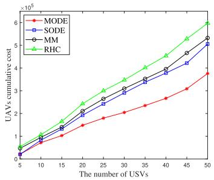  
Fig. 5. The relationship between UAVs cumulative cost and the number of USVs.

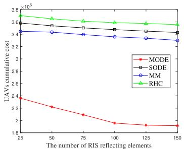

Fig. 6. UAVs cumulative cost versus the number of RIS reflecting elements.  
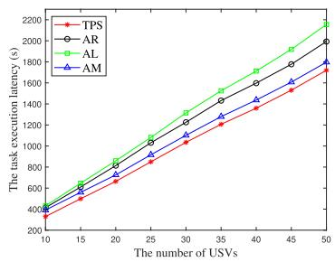  
Fig. 7. The relationship between the task execution latency and the number of USVs.

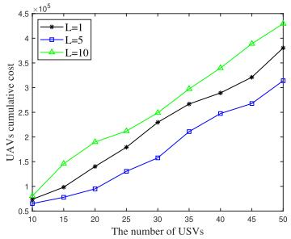  
Fig. 8. UAVs cumulative cost versus the number of USVs under typical number of UAVs.

$3 . 7 \times 1 0 ^ { 5 }$ when $I = 2 5$ and 50, respectively, while RHC reaches 3 7 10 =the highest values of nearly $2 . 9 \times 1 0 ^ { 5 }$ and $5 . 9 \times 1 0 ^ { 5 }$ . Note 2 9 10 5 9 10that SODE is mainly focuses on optimizing UAVs hovering coordinates, which is highly likely to obtain the locally optimal solution. MODE can realize multiple optimization objectives and thus can obtain the lowest UAVs cumulative cost.

Fig. 6 presents UAVs cumulative cost versus the number of RIS reflecting elements when I 50. One can see that MODE realizes the lowest UAVs cumulative cost compared with other algorithms under the same number of RIS reflecting elements.

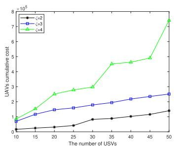  
Fig. 9. UAVs cumulative cost versus the number of USVs under typical values of PL exponent.

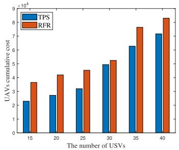  
Fig. 10. UAVs cumulative cost versus the number of USVs.

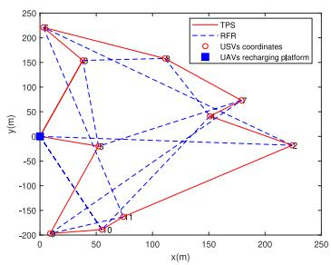  
Fig. 11. UAV flight route.

In particular, UAVs cumulative cost of MODE is nearly $2 . 3 \times$ $1 0 ^ { 5 }$ and $1 . 9 \times 1 0 ^ { 5 }$ when $K = 2 5$ and 150, respectively, while RHC realizes the worst performance, with the corresponding values are nearly $3 . 7 \times 1 0 ^ { 5 }$ and $3 . 5 \times 1 0 ^ { 5 }$ when $K = 2 5$ and 150, respectively. Moreover, as the number of RIS reflecting elements increases, UAVs cumulative cost correspondingly decreases. This is because SINR of the communication link can be enhanced as the number of RIS reflecting elements increases, which leads to lower transmission time cost.

Fig. 7 illustrates the relationship between the task execution latency and the number of USVs when $K = 5 0$ . One can observe that as the number of USVs increases, task execution latency correspondingly increases. In addition, TPS outperforms AL, AM and AR under the same number of USVs. In particular, TPS realizes the lowest task execution latency at around 850 s and 1720 s when I 25 and 50, respectively, followed by AM with the corresponding values of approximately 920 s and 1800 s. AL achieves the worst performance, with the corresponding task execution latency of 1080 s and 2150 s when $I = 2 5$ and 50, respectively. This may involve the =fact that TPS can dynamically determine USVs task execution mode compared with the selected algorithms. Moreover, due to the limitation of USVs computing capabilities, AL demands a higher computing resource and thus may consume additional task execution time cost.

Consider TPS, Fig. 8 demonstrates UAVs cumulative cost versus the number of USVs under different typical number of UAVs when $K = 5 0$ . One can observe that as the number of UAVs increases, UAVs cumulative cost correspondingly decreases. In particular, when $L = 5 .$ , UAVs cumulative cost realize nearly $1 . 3 \times 1 0 ^ { 5 }$ and $3 . 1 \times 1 0 ^ { 5 }$ at $I = 2 5$ and 50, respectively, followed by the corresponding values of $1 . 7 \times$ $1 0 ^ { 5 }$ and $3 . 8 \times 1 0 ^ { 5 }$ when $L = 1$ 1 7. One can realize that TPS can significantly reduce UAVs cumulative cost by adequately determining the number of UAVs.

UAVs cumulative cost comparison of TPS under different wireless transmission environments is conducted; one can observe the relationship between the weighted sum of UAVs energy consumption and task execution latency, and the number of USVs. Fig. 9 demonstrates UAVs cumulative cost versus the number of USVs under different typical PL exponent ζ. One can see that as PL exponent increases, UAVs cumulative cost correspondingly increases. Specifically, when $\zeta \ = \ 2 ,$ UAVs cumulative cost realize nearly $4 . 1 \times 1 0 ^ { 4 }$ and $1 . 4 \times 1 0 ^ { 5 }$ at $I = 2 5$ and 50, respectively, followed by the corresponding values of $1 . 6 \times 1 0 ^ { 5 }$ and $2 . 5 \times 1 0 ^ { 5 }$ when $\zeta = 3 .$ , respectively. Moreover, when $\zeta = 4$ , UAVs cumulative cost reaches the highest values of $2 . 7 \times 1 0 ^ { 5 }$ and $7 . 4 \times 1 0 ^ { 5 }$ when $I = 2 5$ and 50, respectively. One can expect that TPS can promise acceptable UAVs cumulative cost performance in real-world high-density environments, where the typical PL exponent ranges from approximately 2 to 4 [40].

The relationship between UAVs cumulative cost and the number of USVs when $K = 5 0$ and $L = 5$ is shown in Fig. 10. One can observe that as the number of USVs increases, UAVs cumulative cost correspondingly increases. Moreover, TPS is capable of decreasing UAVs cumulative cost in comparison with RFR when under the same number of USVs. In particular, TPS realizes the lowest UAVs cumulative cost at around . × $1 0 ^ { 4 }$ and $7 . 2 \times 1 0 ^ { 4 }$ when $I = 2 5$ and 40, respectively, while the corresponding values of RFR are approximately $4 . 5 \times 1 0 ^ { 4 }$ and $8 . 3 \times 1 0 ^ { 4 }$ , respectively.

In the same manner with [41], [42], UAV can be assumed to simply fly in a straight line from the initial hovering coordinate to UAVs recharging platform. The coordination of UAVs recharging platform is set as (0, 0) for simplification purposes. Fig. 11 demonstrates UAV flight route for TPS and RFR when $I = 1 0$ and $L = 1$ . One can observe that TPS outperforms RFR regarding the overall UAV flight distance. The reason may involve the fact that TPS is capable of dynamically adjusting UAV flight route indicator by jointly considering UAV arrival time, UAV hovering coordinate and RIS phase shift vector.

One can observe that TPS can significantly decrease UAVs cumulative cost and bring several technical advantages in comparison with other selected advanced algorithms. First, TPS promises that each UAV can adaptively adjust its flight route, which can decrease UAV flight time cost, energy consumption and flight distance. Moreover, TPS can jointly optimize USVs task execution mode selection indicators and UAVs arrival time, which can remarkably reduce USVs task execution latency. Furthermore, the joint optimization of UAVs hovering coordinates and RIS phase shift vector can decrease USVs bidirectional data transmission time cost under the same number of RIS reflecting elements.

## V. CONCLUSION AND FUTURE WORK

In this paper, a novel RIS-assisted UAV-empowered MEC network architecture is proposed and UAVs cumulative cost minimization problem is formulated. To solve the formulated challenging problem, we first decouple the original problem into three subproblems, each of which is efficiently solved by the proposed EGWO, ICRAL and MODE algorithms, respectively. The results verify the effectiveness of the proposed solution, which can significantly decrease UAVs cumulative cost by up to approximately 46% compared with several selected advanced algorithms.

Even though learning-based algorithms have been used to design UAV-mounted RIS reflecting beamforming, the utilization of deep learning-based algorithms to optimize RIS phase shifts and multi-objective optimization approaches to realize UAVs cumulative cost and UAVs control in three-dimensional scenarios has not been fully investigated, which can be selected for future research directions [43], [46]. Another emerging research direction is to develop global optimization meta-heuristic and/or nature-inspired algorithms for UAV-USV cooperative MEC networks to fulfill real-world practical application potential, where one promising approach is Dung beetle optimizer, which shows excellent performance in balancing the local and global searches [47].

## APPENDIX A PROOF OF LEMMA 1

In each g-th iteration, given any feasible $\pmb { \mu } _ { 1 } ^ { g }$ and $\pmb { \mu } _ { 2 } ^ { g } .$ P . . . can be transformed into

$$
\begin{array} { r l } & { \hat { \mathcal { P } } 1 . 2 . 1 \colon \operatorname* { m i n } _ { \mathbf { \theta } ^ { , } b , c } \mathcal { L } _ { \sigma _ { g } } \left( \pmb { \alpha } , b , c , \pmb { \mu } _ { 1 } ^ { g } , \pmb { \mu } _ { 2 } ^ { g } \right) } \\ & { \qquad s . t . \qquad \mathcal { C } 1 , \mathcal { C } 1 0 , \mathcal { C } 1 1 . } \end{array}\tag{69}
$$

Given any feasible $\pmb { \alpha } ,$ the optimization problem of b can be formulated as

$$
\begin{array} { l } { \displaystyle \operatorname* { m i n } _ { b } \ \sum _ { i \in \mathcal { I } } \mu _ { 1 , i } ( g ( \alpha _ { i } ) + b _ { i } ) + \displaystyle \frac { \sigma } { 2 } \sum _ { i \in \mathcal { I } } ( g ( \alpha _ { i } ) + b _ { i } ) ^ { 2 } } \\ { \displaystyle s . t . } \end{array}\tag{70}
$$

Given any feasible ${ \pmb { \alpha } } ,$ the optimization problem of c can be formulated as

$$
\begin{array} { l } { \displaystyle \operatorname* { m i n } _ { c } \ \sum _ { i \in \mathcal { I } } \mu _ { 2 , i } ( h ( \alpha _ { i } ) + c _ { i } ) + \displaystyle \frac { \sigma } { 2 } \sum _ { i \in \mathcal { I } } ( h ( \alpha _ { i } ) + c _ { i } ) ^ { 2 } } \\ { \displaystyle \quad _ { \mathcal { S } . t . } } \end{array}\tag{71}
$$

According to the optimality theory of convex optimization [44], the optimized $b _ { i } ^ { g + 1 }$ and $c _ { i } ^ { g + 1 }$ can be respectively expressed as

$$
b _ { i } ^ { g + 1 } = \operatorname* { m a x } \{ - \frac { \mu _ { 1 , i } ^ { g } } { \sigma _ { g } } - g \Big ( \alpha _ { i } ^ { g + 1 } \Big ) , 0 \} , i \in \mathcal { T } ,\tag{72}
$$

$$
c _ { i } ^ { g + 1 } = \operatorname* { m a x } \{ - \frac { \mu _ { 2 , i } ^ { g } } { \sigma _ { g } } - h \Big ( \alpha _ { i } ^ { g + 1 } \Big ) , 0 \} , i \in \mathbb { Z } .\tag{73}
$$

$$
\begin{array} { r l } & { \ddot { \mathcal { P } } 1 . 3 . 2 . 3 . 2 \colon \displaystyle \operatorname* { m a x } _ { \Phi } 2 y _ { i } \sqrt { p _ { i } ^ { t r } } R e \{ \Phi ^ { H } U ^ { H } w _ { i } + h _ { i , b } ^ { H } w _ { i } \} - y _ { i } ^ { 2 } \Big ( \Phi ^ { H } E \Phi + 2 R e \{ \Phi ^ { H } F \} + C \Big ) } \\ & { \qquad \quad s . t . } \end{array}\tag{75}
$$

Assume the optimal solution to (72) and (73) are denoted by $b _ { i } ^ { * }$ and $c _ { i } ^ { * }$ , respectively, with $b _ { i } ^ { * } \triangleq b _ { i } ^ { g + 1 }$ and $c _ { i } ^ { * } \triangleq c _ { i } ^ { g + 1 }$ . After substitute $b _ { i } ^ { * }$ and $c _ { i } ^ { * }$ into Eq. (41), one has $\mathcal { L } _ { \sigma _ { g } } ( \pmb { \alpha } , \dot { \pmb { \mu } } _ { 1 } ^ { g } , \pmb { \mu } _ { 2 } ^ { g } ) =$ $\begin{array} { r l } & { \sum _ { i \in \mathcal { I } } f ( \alpha _ { i } ) + \frac { \sigma _ { g } } { 2 } \sum _ { i \in \mathcal { I } } ( \operatorname* { m a x } \{ \frac { \mu _ { 1 , i } ^ { g } } { \sigma _ { g } } + g ( \alpha _ { i } ) , 0 \} ^ { 2 } - \frac { ( \mu _ { 1 , i } ^ { g } ) ^ { 2 } } { \sigma _ { q } ^ { 2 } } ) + } \end{array}$ $\begin{array} { r } { \frac { \sigma _ { g } } { 2 } \sum _ { i \in \mathcal { T } } ( \operatorname* { m a x } \{ \frac { \mu _ { 2 , i } ^ { g } } { \sigma _ { g } } + h ( \alpha _ { i } ) , 0 \} ^ { 2 } - \frac { ( \mu _ { 2 , i } ^ { g } ) ^ { 2 } } { \sigma _ { g } ^ { 2 } } ) } \end{array}$

## APPENDIX B PROOF OF LEMMA 4

Define $\begin{array} { r l r } { U } & { { } = } & { h _ { l , b } d i a g ( h _ { i , l } ) \quad \in \quad \mathbb { R } ^ { N \times K } , \Phi } \end{array}$ $\begin{array} { r } { [ e ^ { j \theta _ { l , 1 } } , e ^ { j \theta _ { l , 2 } } , . . . , e ^ { j \theta _ { l , K } } ] ^ { \hat { T } } , \ Q \ = \ h _ { i . b } ^ { H } w _ { i } w _ { i } ^ { H } h _ { i , b } \ \in \ \mathbb { R } ^ { 1 \times 1 } } \end{array}$ and $V = \Phi ^ { H } \Phi \in \mathbb { R } ^ { 1 \times 1 }$ . In this way, $B _ { i } ( \pmb \theta )$ can be rewritten as

$$
\begin{array} { r l r } {  { B _ { i } ( \theta ) = \sum _ { j \in \mathbb { Z } } p _ { j } ^ { t \top } | w _ { i } ^ { H } ( h _ { j , b } + h _ { l , b } \Theta h _ { j , l } ) | | ^ { 2 } + \sigma ^ { 2 } | | w _ { i } ^ { H } | | ^ { 2 } } } \\ & { } & { \quad + \sum _ { j \in \mathbb { Z } } p _ { j } ^ { t \top } [ ( h _ { j , b } ^ { H } + \Phi ^ { H } U ^ { H } ) w _ { i } ] [ w _ { i } ^ { H } ( h _ { j , b } + U \Phi ) ] + \sigma ^ { 2 } \| w _ { i } ^ { H } \| ^ { 2 } } \\ & { } & { \quad + \sum _ { j \in \mathbb { Z } } p _ { j } ^ { t \top } ( Q + h _ { j , b } ^ { H } w _ { i } w _ { i } ^ { H } U \Phi + \Phi ^ { H } U ^ { H } w _ { i } w _ { i } ^ { H } h _ { j , b }  } \\ & { } & { \quad +  \Phi ^ { H } U ^ { H } w _ { i } w _ { i } ^ { H } U \Phi ) + \sigma ^ { 2 } \| w _ { i } ^ { H } \| ^ { 2 } } \\ & { } & { \quad + \sum _ { j \in \mathbb { Z } } p _ { j } ^ { t \top } ( \Phi ^ { H } ( \frac { Q } { U } _ { j } f _ { k } + U ^ { H } w _ { i } w _ { i } ^ { H } U ) \Phi  } \\ & { } & { \quad +  2 R \varepsilon \{ \Phi ^ { H } U ^ { H } w _ { i } w _ { i } ^ { H } h _ { j , b } \} ) + \sigma ^ { 2 } | w _ { i } ^ { H } \| ^ { 2 } } \\ & { } & { \quad  ( \frac { \omega } { \omega } ) \Phi ^ { H } E \Phi + 2 R \varepsilon \{ \Phi ^ { H } \Phi ^ { H } \} + C , } \end{array}
$$

where step (a) holds $\begin{array} { r } { \pmb { { \cal E } } = \sum _ { i \in \mathcal { T } } p _ { i } ^ { t r } \big ( \frac { Q } { V } I _ { K } + \pmb { U } ^ { H } \pmb { w } _ { i } \pmb { w } _ { i } ^ { H } \pmb { U } \big ) \in } \end{array}$ $\begin{array} { r l r } { \mathbb { R } ^ { K \times K } , ~ { \bf F } } & { { } = } & { \sum _ { i \in \mathbb { Z } } \bar { p } _ { i } ^ {  } \bar { U } ^ { \dag } { \bf w } _ { i } { \bf w } _ { i } ^ { H } h _ { j , b } ~ \in ~ \bar { \mathbb { R } } ^ { K \times 1 } } \end{array}$ and $\begin{array} { r c l } { C } & { = } & { \sigma ^ { 2 } \| \pmb { w } _ { i } ^ { H } \| ^ { 2 } } \end{array}$ . The expression of $\begin{array} { r l } { \sqrt { A _ { i } ( \pmb { \theta } ) } } & { { } = } \end{array}$ $\sqrt { p _ { i } ^ { t r } } R e \{ \Phi ^ { H } U ^ { H } { \pmb w } _ { i } + { \pmb h } _ { i , b } ^ { H } { \pmb w } _ { i } \}$ can be obtained in the same manner. As such, $\tilde { \mathcal { P } } 1 . 3 . 2 . 3 . 2$ can be reformulated as Eq. (75), shown at the top of the page.

## APPENDIX C PROOF OF PROPOSITION 1

Since E is positive definite, the optimal value of Φ can be obtained by calculating the Hessian matrix of the objective function of P . . . . [45]. The first derivative of $f ( \Phi )$ can be expressed as

$$
\frac { \partial f ( \Phi ) } { \partial \Phi } = - y _ { i } ^ { 2 } \Big ( { \cal E } + { \cal E } ^ { H } \Big ) \Phi + 2 y _ { i } \Big ( { \cal U } ^ { H } w _ { i } - y _ { i } { \cal F } \Big ) .\tag{76}
$$

The stagnation point of $f ( \Phi )$ can be expressed as

$$
\Phi ^ { * } = \frac { 2 } { y _ { i } } \Big ( { \pmb { E } } + { \pmb { E } } ^ { H } \Big ) ^ { - 1 } \Big ( { \pmb { U } } ^ { H } { \pmb { w } } _ { i } - y _ { i } { \pmb { F } } \Big ) .\tag{77}
$$

The second derivative of the objective function of P . . . . can be given as

$$
\frac { \partial ^ { 2 } f ( \Phi ) } { \partial \Phi \partial \Phi ^ { H } } = - y _ { i } ^ { 2 } \Big ( { \pmb { E } } + { \pmb { E } } ^ { H } \Big ) .\tag{78}
$$

Since ${ \pmb E } + { \pmb E } ^ { H }$ is positive definite, the stagnation point of $f ( \Phi )$ is the optimal solution to $\ddot { \mathcal { P } } 1 . 3 . 2 . 3 . 2$ . The corresponding optimal $\begin{array} { r } { \pmb { \theta } ^ { * } = \mathrm { a r g } \{ \frac { 2 } { { \psi } _ { i } } ( \pmb { E } + \pmb { E } ^ { H } ) ^ { - 1 } ( \pmb { U } ^ { H } \pmb { w } _ { i } - y _ { i } \pmb { F } ) \} } \end{array}$ with $y _ { i } ^ { * } =$ $\frac { \sqrt { A _ { i } ( \pmb \theta ) } } { B _ { i } ( \pmb \theta ) } \ [ 3 6 ]$

## REFERENCES

[1] Y. Cheng, M. Jiang, J. Zhu, and Y. Liu, “Are we ready for unmanned surface vehicles in inland waterways? The USVInland multisensor dataset and benchmark,” IEEE Robot. Autom. Lett., vol. 6, no. 2, pp. 3964–3970, Apr. 2021.

[2] Y. Liao, Y. Song, L. Liu, and Y. Han, “Joint deployment and task scheduling in IRS-assisted wireless inland ship MEC network,” in Proc. IEEE 97th Veh. Technol. Conf., Florence, Italy, 2023, pp. 1–6.

[3] Y. Liao, X. Chen, J. Liu, Y. Han, N. Xu, and Z. Yuan, “Cooperative UAV-USV MEC platform for wireless inland waterway communications,” IEEE Trans. Consum. Electron., vol. 70, no. 1, pp. 3064–3076, Feb. 2024.

[4] Y. Liao, L. Liu, Y. Song, and N. Xu, “Joint communication-cachingcomputing resource allocation for bidirectional data computation in irs-assisted hybrid UAV-terrestrial network,” Chinese J. Electron., vol. 33, no. 4, pp. 1093–1103, Jul. 2024.

[5] Y. Liao, X. Chen, S. Xia, Q. Ai, and Q. Liu, “Energy minimization for UAV swarm-enabled wireless inland ship MEC network with time windows,” IEEE Trans. Green Commun. Netw., vol. 7, no. 2, pp. 594–608, Jun. 2023.

[6] M. Dai et al., “Latency minimization oriented hybrid offshore and aerialbased multi-access computation offloading for marine communication networks,” IEEE Trans. Commun., vol. 71, no. 11, pp. 6482–6498, Nov. 2023.

[7] W. Xu and G. Li, “UAV relay energy consumption minimization in an MEC-assisted marine data collection system,” J. Marine Sci. Eng., vol. 11, no. 12, p. 2333, 2023.

[8] M. Li, L. P. Qian, X. Dong, B. Lin, Y. Wu, and X. Yang, “Secure computation offloading for marine IoT: An energy-efficient design via cooperative jamming,” IEEE Trans. Veh. Technol., vol. 72, no. 5, pp. 6518–6531, May 2023.

[9] H. Wang, Y. Wang, Y. Ma, and B. Lin, “Resource allocation for OFDMbased maritime edge computing networks,” in Proc. 13th Int. Congr. Image Signal Process., BioMed. Eng. Informat., Chengdu, China, 2020, pp. 983–988.

[10] H. Zeng et al., “Collaborative computation offloading for UAVs and USV fleets in communication networks,” in Proc. Int. Wireless Commun. Mobile Comput., Dubrovnik, Croatia, 2022, pp. 949–954.

[11] Y. Li, S. Li, Y. Zhang, W. Zhang, and H. Lu, “Dynamic route planning for a USV-UAV multi-robot system in the rendezvous task with obstacles,” J. Intell. Robot. Syst., vol. 107, no. 52, p. 107, 2023.

[12] S. Akter, D. Y. Kim, and S. Yoon, “Task offloading in multi-access edge computing enabled UAV-aided emergency response operations,” IEEE Access, vol. 11, pp. 23167–23188, 2023.

[13] C. Zhan, H. Hu, X. Sui, Z. Liu, and D. Niyato, “Completion time and energy optimization in the UAV-enabled mobile-edge computing system,” IEEE Internet Things J., vol. 7, no. 8, pp. 7808–7822, Aug. 2020.

[14] R. Yadav, W. Zhang, O. Kaiwartya, H. Song, and S. Yu, “Energy-latency tradeoff for dynamic computation offloading in vehicular fog computing,” IEEE Trans. Veh. Technol., vol. 69, no. 12, pp. 14198–14211, Dec. 2020.

[15] E. Björnson, Ö. Özdogan, and E. Larsson, “Intelligent reflecting surface versus decode-and-forward: How large surfaces are needed to beat relaying?” IEEE Wireless Commun. Let., vol. 9, no. 2, pp. 244–248, Feb. 2020.

[16] Q. Wu, S. Zhang, B. Zheng, C. You, and R. Zhang, “Intelligent reflecting surface-aided wireless communications: A tutorial,” IEEE Trans. Commun., vol. 69, no. 5, pp. 3313–3351, May 2021.

[17] M. Ahmed et al., “Joint optimization of UAV-IRS placement and resource allocation for wireless powered mobile edge computing networks,” J. King Saud Univ.-Comput. Inf. Sci., vol. 35, no. 8, pp. 1–9, 2023.

[18] Y. Xu, T. Zhang, Y. Zou, and Y. Liu, “Reconfigurable intelligence surface aided UAV-MEC systems with NOMA,” IEEE Commun. Lett., vol. 26, no. 9, pp. 2121–2125, Sep. 2022.

[19] F. Wang and X. Zhang, “IRS/UAV-based edge-computing/trafficoffloading over RF-powered 6G mobile wireless networks,” in Proc. IEEE Wireless Commun. Netw. Conf., Austin, TX, USA, 2022, pp. 1272–1277.

[20] P. Chen, B. Lyu, S. Gong, H. Guo, J. Jiang, and Z. Yang, “Computational rate maximization for IRS-assisted full-duplex wireless-powered MEC systems,” IEEE Trans. Veh. Technol., vol. 73, no. 1, pp. 1191–1206, Jan. 2024.

[21] H. Hu, Z. Sheng, A. Nasir, H. Yu, and Y. Fang, “Computation capacity maximization for UAV and RIS cooperative MEC system with NOMA,” IEEE Commun. Lett., vol. 28, no. 3, pp. 592–596, Mar. 2024.

[22] G. Chen, Q. Wu, R. Liu, J. Wu, and C. Fang, “IRS aided MEC systems with binary offloading: A unified framework for dynamic IRS beamforming,” IEEE J. Sel. Areas Commun., vol. 41, no. 2, pp. 349–365, Feb. 2023.

[23] L. Zhang, Y. Sun, Z. Chen, and S. Roy, “Communications-cachingcomputing resource allocation for bidirectional data computation in mobile edge networks,” IEEE Trans. Commun., vol. 69, no. 3, pp. 1496–1509, Mar. 2021.

[24] Y. Liao, J. Liu, X. Chen, Y. Han, Q. Ai, and G.-M. Muntean, “Energy minimization of inland waterway USVs for IRS-assisted hybrid UAVterrestrial MEC network,” IEEE Trans. Veh. Technol., vol. 73, no. 3, pp. 4121–4135, Mar. 2024.

[25] Y. Sun, L. Zhang, Z. Chen, and S. Roy, “Communications-cachingcomputing tradeoff analysis for bidirectional data computation in mobile edge networks,” in Proc. IEEE 92nd Veh. Technol. Conf., Victoria, BC, Canada, 2020, pp. 1–7.

[26] Y. Liao et al., “Low-latency data computation of inland waterway USVs for RIS-assisted UAV MEC network,” IEEE Internet Things J., vol. 11, no. 16, pp. 26713–26726, Aug. 2024.

[27] S. Shen, K. Yang, K. Wang, G. Zhang, and H. Mei, “Number and operation time minimization for multi-UAV-enabled data collection system with time windows,” IEEE Internet Things J., vol. 9, no. 12, pp. 10149–10161, Jun. 2022.

[28] T. Bektas, “The multiple traveling salesman problem: An overview of formulations and solution procedures,” Omega, vol. 34, no. 3, pp. 209–219, 2006.

[29] S. Mirjalili, S. Saremi, S. M. Mirjalili, and L. S. Coelho, “Multiobjective grey wolf optimizer: A novel algorithm for multi-criterion optimization,” Expert Syst. Appl., vol. 47, no. 11, pp. 106–119, 2016.

[30] L. Adam and D. Lipowska, “Roulette-wheel selection via stochastic acceptance,” Physica A Stat. Mechan. Appl., vol. 391, no. 6, pp. 2193–2196, 2012.

[31] C. Feng, B. Liang, Z. Li, W. Liu, and F. Wen, “Peer-to-peer energy trading under network constraints based on generalized fast dual ascent,” IEEE Trans. Smart Grid, vol. 14, no. 2, pp. 1441–1453, Mar. 2023.

[32] B. Ghojogh, A. Ghodsi, F. Karray, and M. Crowley, “KKT conditions, first-order and second-order optimization, and distributed optimization: Tutorial and survey,” 2021, arXiv:2110.01858.

[33] M. Grant, S. Boyd, and Y. Ye (CVX Res., Inc., Austin, TX, USA). CVX: MATLAB Software for Disciplined Convex Programming, Version 2.1. 2009. [Online]. Available: http://cvxr.com/cvx

[34] P. Rakshit and A. Konar, “Extending multi-objective differential evolution for optimization in presence of noise,” Inf. Sci., vol. 305, no. 3, pp. 56–76, 2015.

[35] P. Huang, Y. Wang, K. Wang, and K. Yang, “Differential evolution with a variable population size for deployment optimization in a UAV-assisted IoT data collection system,” IEEE Trans. Emerg. Topics Comput. Intell., vol. 4, no. 3, pp. 324–335, Jun. 2020.

[36] K. Shen and Y. Wei, “Fractional programming for communication systems—Part-I: Power control and beamforming,” IEEE Trans. Signal Process., vol. 66, no. 10, pp. 2616–2630, May 2018.

[37] M. Fu, Y. Zhou, Y. Shi, W. Chen, and R. Zhang, “UAV aided overthe-air computation,” IEEE Trans. Wireless Commun., vol. 21, no. 7, pp. 4909–4924, Jul. 2022.

[38] D. Ma, M. Ding, and M. Hassan, “Enhancing cellular communications for UAVs via intelligent reflective surface,” in Proc. IEEE Wireless Commun. Netw. Conf., Seoul, South Korea, 2020, pp. 1–6.

[39] Y. Sun, P. Babu, and D. Palomar, “Majorization-minimization algorithms in signal processing, communications, and machine learning,” IEEE Trans. Signal Process., vol. 65, pp. 794–816, 2021.

[40] A. Alsayyari, I. Kostanic, C. Otero, and A. Aldosary, “An empirical path loss model for wireless sensor network deployment in a dense tree environment,” in Proc. IEEE Sensors Appl. Symp., Glassboro, NJ, USA, 2017, pp. 1–6.

[41] A. Andreou, C. X. Mavromoustakis, J. M. Batalla, E. K. Markakis, G. Mastorakis, and S. Mumtaz, “UAV trajectory optimization in smart cities using modified A algorithm combined with haversine and Vincenty formulas,” IEEE Trans. Veh. Technol., vol. 72, no. 8, pp. 9757–9769, Aug. 2023.

[42] M. Hua, L. Yang, Q. Wu, and A. Swindlehurst, “3D UAV trajectory and communication design for simultaneous uplink and downlink transmission,” IEEE Trans. Commun., vol. 68, no. 9, pp. 5908–5923, Sep. 2020.

[43] C. You, Z. Kang, Y. Zeng, and R. Zhang, “Enabling smart reflection in integrated air-ground wireless network: IRS meets UAV,” IEEE Wireless Commun., vol. 28, no. 6, pp. 138–144, Dec. 2021.

[44] B. Sébastien, “Convex optimization: Algorithms and complexity,” Found. Trends-R Mach. Learn., vol. 8, no. 3, pp. 231–357, 2015.

[45] K. Petersen and M. Pedersen (Tech. Univ. Denmark, Lyngby, Denmark). The Matrix Cookbook. 2012. [Online]. Available: http://matrixcookbook.com

[46] Z. Huang, Z. Kuang, S. Lin, F. Hou, and A. Liu, “Energy-efficient joint trajectory and reflecting design in IRS-enabled UAV edge computing,” IEEE Internet Things J., vol. 11, no. 12, pp. 21872–21884, Jun. 2024.

[47] J. Xue and B. Shen, “Dung beetle optimizer: A new meta-heuristic algorithm for global optimization,” J. Supercomput., vol. 79, no. 7, pp. 7305–7336, 2023.

  
Yangzhe Liao (Member, IEEE) received the B.S. degree in measurement and control technology from Northeastern University, China, in 2013 and the Ph.D. degree from the University of Warwick, U.K., in 2017. He is currently an Associate Professor with the School of Information Engineering, Wuhan University of Technology, China. His research interests include mobile edge computing and mobile computing.

Lin Liu is currently pursuing the master’s degree in information and communication engineering with the School of Information Engineering, Wuhan University of Technology, China. Her research interests mainly focus on wireless resource allocation and network optimization.

Yong Ma (Senior Member, IEEE) received the B.Sc. degree in engineering from Wuhan University of Technology (WUT), Wuhan, China, in 2006, the M.Sc. degree in traffic from Dalian Maritime University, Dalian, China, in 2008, and the Ph.D. degree in engineering from the Huazhong University of Science and Technology, Wuhan, in 2012. He is currently a Full Professor with the School of Navigation, WUT. His current research interests include intelligent algorithms and systems and platforms for surface vessels navigation and control.