# Energy-Aware Multi-UAV Collaboration for Data Collection and Trajectory Planning With MADDPG

Jing Mei , Member, IEEE, Jinglei Xu , Zhao Tong , Senior Member, IEEE, and Keqin Li , Fellow, IEEE

Abstract—Unmanned Aerial Vehicles (UAVs) are pivotal for facilitating data collection in emergency scenarios. Despite the potential of Multi-Agent Deep Reinforcement Learning (MADRL) in coordinating such systems, existing researches struggle to resolve the high-dimensional coupling of data collection, trajectory planning, and energy scheduling under strict collision avoidance and Return-To-Base (RTB) constraints. This paper proposes a energy-aware cooperative MADRL framework designed to maximize data collection utility under energy constraints. Specifically, we employ a Multi-Agent Deep Deterministic Policy Gradient (MADDPG) approach featuring a Centralized Training with Decentralized Execution (CTDE) design and a multi-objective reward mechanism to balance conflicting optimization goals. Extensive simulations validate the advantages of the proposed framework over leading baselines. Notably, the algorithm exhibits significant quantitative advantages in complex high-load scenarios. These outcomes prove that our method achieves higher task completion rates while strictly adhering to RTB and safety protocols.

Index Terms—Data collection, trajectory planning, multi-agent deep deterministic policy gradient (MADDPG).

## I. INTRODUCTION

stringent requirements on network processing capabilities and connection reliability [1]. Limited bandwidth and transmission instability hinder traditional cloud architectures from supporting efficient interaction demands of massive terminals [2], [3], broadly defined as User Equipments (UE). Mobile Edge Computing (MEC) pushes computational resources to the network edge, significantly alleviating core network pressure [4]. However, extreme natural disasters [5] often paralyze terrestrial base stations and edge nodes via equipment damage and power outages [6]. Data generated by scattered UEs in affected areas cannot be transmitted through conventional networks, leading to severe information isolation [7]. To address this, highly maneuverable Unmanned Aerial Vehicles (UAV) serve as aerial data collection platforms, entering impacted regions to gather data and returning to safe zones to restore connectivity. Unlike idealized unrestricted resource scheduling, such emergency operation prioritizes both efficient data collection and safe equipment retrieval [8]. UAVs must enhance ground data collection performance while ensuring reliable delivery of collected data to designated safe areas.

Executing the joint mission encounters several challenges. First, deeply coupled air-ground communication links and flight trajectories complicate joint optimization. UAVs must continuously adjust paths to approach scattered devices and ensure collection rates, yet large-scale maneuvers inevitably incur extra flight energy consumption. Second, strict onboard energy limitations present a complex operational dilemma. UAVs must dynamically balance maximizing collection coverage against reserving adequate power for safe returns. Finally, multi-UAV systems confront dynamic collision avoidance and cooperative coverage hurdles. Distributed coordination must simultaneously prevent mid-air collisions and avert redundant data collection, thereby maximizing overall operational efficiency.

To overcome these interconnected hurdles, we propose a cooperative Multi-Agent Deep Reinforcement Learning (MADRL) approach. Specifically, we formulate the complex air-ground interactions as a continuous-space Markov Decision Process (MDP). Addressing the dilemma of limited onboard power, we directly integrate energy awareness into state representations and reward functions. This design enforces a proactive global energy budgeting strategy for safe Return-To-Base (RTB) executions. To resolve multi-UAV coordination issues, we employ a Centralized Training with Decentralized Execution (CTDE) architecture. Paired with process-level penalties, this setup mitigates redundant data collection and fosters emergent collision-free behaviors. As a result, UAVs execute rapid, autonomous, and energy-efficient decisions relying solely on local observations. The key contributions of this paper are outlined as follows:

1) We formulate a multi-UAV cooperative data collection model addressing the high-dimensional coupling of communication and trajectories. By framing the system as a continuous-space MDP, we integrate data collection, trajectory planning, and collision avoidance into a cohesive framework. To ensure mission sustainability, we incorporate energy-constrained RTB requirements directly into the state space. This design enpowers agents to autonomously regulate flight duration and direction in complex environments.

2) We propose a energy-aware MADRL algorithm utilizing a CTDE architecture to tackle environmental non-stationarity. To accelerate convergence in continuous spaces, we design a multi-objective reward shaping mechanism alongside process-level collision penalties. Balancing data throughput, energy consumption, and collision safety, this approach fosters emergent collisionfree behaviors. Furthermore, employing streamlined fully connected architectures combined with action normalization, the proposed method facilitates rapid and autonomous decision-making relying solely on local observations.

3) We conduct rigorous simulations to evaluate the formulated framework. Applying established algorithms to complex operational spaces explicitly demonstrates the immense potential of classical multi-agent reinforcement learning in handling practical engineering scenarios with realistic physical constraints. Comparative results highlight the adopted algorithm’s exceptional suitability for this joint optimization, demonstrating substantial performance gains over baselines in data collection efficiency and energy utilization. Furthermore, broad assessments validate the system’s scalability, ensuring sustained operational efficacy and strict safety compliance across fluctuating user densities and expanding disaster zones.

The remainder of this paper is structured as follows. Section II reviews related work in UAV-assisted systems. Section III details the system model and formulates the optimization problem. Section IV presents the proposed MADRL-based solution. Section V provides simulation results and performance analysis. Finally, Section VI concludes the paper.

## II. RELATED WORK

This section reviews the existing literature on UAV-assisted data collection and trajectory planning. We categorize the related work based on system configuration and optimization paradigm.

## A. Single-UAV-Assisted Systems

Early studies on single-UAV-assisted systems primarily concentrated on distinct performance metrics, including system sum-rate, latency minimization, and Quality of Experience (QoE). Chen et al. [9] combined hypergraph grouping with power control and proposed a Non-Orthogonal Multiple Access (NOMA)-enabled UAV data collection method, jointly optimizing UAV positioning, user clustering, and power allocation to maximize the system sum rate. Li et al. [10] designed an integrated framework combining Traveling Salesman Problem (TSP) path planning, mode selection, and joint trajectory-power optimization to minimize task completion time. By characterizing the optimal successive-hover-fly trajectory structure, Yuan et al. [11] developed a successive convex approximation-based method for joint user scheduling and trajectory design. Donipati et al. [12] improved data collection efficiency under time-window constraints by proposing a buffer-aware trajectory optimization framework utilizing a PCA-GLS metaheuristic. He et al. [13] utilized Lyapunov optimization and game theory for online joint optimization of task offloading, resource allocation, and trajectory planning to maximize QoE.

Addressing highly dynamic environments and real-time decision requirements, DRL has gained significant attention in UAV-assisted scenarios due to its robust adaptability to environmental uncertainty [14], [15]. Gao et al. [16] a deep deterministic policy gradient algorithm enhanced by long short-term memory networks for adaptive optimization of task offloading and resource allocation. Yan et al. [17] applied the twin delayed deep deterministic policy gradient algorithm to jointly optimize trajectories and offloading strategies, minimizing Age of Information (AoI), energy consumption, and lease costs in vehicular edge computing systems.

Despite these advances, these studies exhibit notable limitations in complex real-world scenarios. Their overly idealistic single-UAV assumptions struggle to address large-scale tasks requiring multi-UAV cooperation. As shown in Table I, these approaches frequently neglect the joint integration of drone energy constraints, continuous trajectory planning, and RTB mechanisms, proving inadequate for rigorous multi-objective optimization.

## B. Multi-UAV-Assisted Systems

Yan et al. [18] introduced a semantic communicationenabled MEC architecture to optimize resource allocation, reducing latency and energy consumption in 6G networks. Xiong et al. [19] applied coalitional game theory to optimize data aggregation routing, minimizing average transmission energy. Guo et al. [20] combined convex optimization with a two-stage game to minimize latency by prioritizing device association before task offloading. Mathematical programming offers another common approach. Sabzehali et al. [21] utilized Integer Linear Programming (ILP) to minimize the UAV count required for static coverage. Li et al. [22] decomposed the trajectory planning problem into Multiple Traveling Salesman Problem (MTSP) and Mixed-Integer Nonlinear Programming (MINLP) subproblems. Sun et al. [23] applied iterative techniques, including Successive Convex Approximation (SCA), to resolve joint optimization challenges.

Some researchers used DRL algorithms. Ju and Shim [24] and Cheng et al. [25] adopted Multi-Agent Actor-Critic (MAAC) and CTDE architectures to optimize energy consumption and throughput, respectively. Dai et al. [26] improved the Proximal Policy Optimization (PPO) algorithm to maximize system communication rates. While effective for data transmission, these approaches often overlook MEC task offloading dynamics and physical constraints like obstacle avoidance. Nahom Abishu et al. [27] developed a stochastic game-enhanced multi-agent DRL framework for joint blockchain consensus and resource sharing in multi-UAVassisted 6G networks. Shen et al. [28] proposed a digital twin based algorithm for cooperative flocking, focusing on kinematics rather than computational resource allocation. Lee et al. [29] introduced a distributed Multi-Agent Deep Q-Network (MADQN) planner incorporating wireless energy transfer to minimize AoI. Dhuheir et al. [30] combined DRL and particle swarm optimization, improving energy harvesting and transmission in RIS-assisted systems.

TABLE I  
RELATED CONTRIBUTION

<table><tr><td></td><td>[10]</td><td>[11]</td><td>[12]</td><td>[13]</td><td>[16]</td><td>[17]</td><td>[19]</td><td>[20]</td><td>[21]</td><td>[22]</td><td>[23]</td><td>[24]</td><td>[25]</td><td>[26]</td><td>[27]</td><td>[28]</td><td>[29]</td><td>[30]</td><td>Ours</td></tr><tr><td>Multi-UAV Cooperation</td><td>×</td><td>×</td><td>×</td><td>×</td><td>×</td><td>×</td><td>√</td><td>√</td><td>√</td><td>√</td><td>√</td><td>√</td><td>√</td><td>√</td><td>√</td><td>√</td><td>√</td><td>√</td><td>√</td></tr><tr><td>Multi-Objective</td><td>×</td><td>×</td><td>×</td><td>√</td><td>√</td><td>√</td><td>×</td><td>×</td><td>×</td><td>×</td><td>×</td><td>×</td><td>√</td><td>×</td><td>√</td><td>√</td><td>×</td><td>√</td><td>√</td></tr><tr><td>Continuous Trajectory</td><td>√</td><td>√</td><td>×</td><td>√</td><td>√</td><td>√</td><td>×</td><td>×</td><td>×</td><td>√</td><td>√</td><td>×</td><td>√</td><td>√</td><td>×</td><td>√</td><td>×</td><td>×</td><td>√</td></tr><tr><td>Process-level Collision Penalty</td><td>×</td><td>×</td><td>×</td><td>×</td><td>×</td><td>×</td><td>×</td><td>×</td><td>×</td><td>×</td><td>×</td><td>×</td><td>×</td><td>×</td><td>×</td><td>×</td><td>×</td><td>×</td><td>√</td></tr><tr><td>Return to Base</td><td>√</td><td>×</td><td>√</td><td>×</td><td>×</td><td>×</td><td>×</td><td>×</td><td>×</td><td>√</td><td>×</td><td>×</td><td>×</td><td>√</td><td>×</td><td>×</td><td>×</td><td>√</td><td>√</td></tr><tr><td>UAV Energy Constraint</td><td>×</td><td>×</td><td>√</td><td>√</td><td>√</td><td>√</td><td>√</td><td>√</td><td>×</td><td>√</td><td>×</td><td>×</td><td>×</td><td>√</td><td>×</td><td>×</td><td>√</td><td>√</td><td>√</td></tr></table>

However, these multi-UAV studies exhibit considerable limitations in complex practical scenarios. As shown in Table I, existing works universally ignore process-level collision assessment during trajectory planning, compromising flight safety in real-world dynamic environments. Furthermore, these approaches frequently neglect the joint integration of continuous trajectory planning, UAV energy constraints, and RTB mechanism. Many studies focus exclusively on singlemetric optimization, lacking comprehensive trade-offs required for rigorous multi-objective tasks, severely restricting their applicability in actual multi-drone deployments.

## III. SYSTEM MODEL AND PROBLEM FORMULATION

This section presents the comprehensive system model, incorporating communication protocols, energy consumption characteristics, and obstacle avoidance strategy. The associated problem formulation follows.

## A. System Model

Fig. 1 illustrates the multi-UAV-assisted edge offloading network. We consider a wireless system comprising K UAVs and M ground UEs distributed within an $L \times L$ area. The UAVs, indexed by $\{ 1 , \ldots , K \}$ , function as aerial relays and edge computing nodes providing data collection services to the UEs, indexed by $\{ 1 , \dots , M \}$ . The location model of the system is modeled as a planar Cartesian coordinate system. The flying altitude of UAVs is fixed at H. The location coordinate of UAV k in time slot t is defined as $u _ { k } ( t ) = ( x _ { k } ( t ) , y _ { k } ( t ) , H )$ Every UAV directly acquires the environment information of all peers via wireless communication links. UEs are statically deployed following a uniform random distribution within the coverage region. The location of UE m can be denoted as $\boldsymbol { e } _ { m } ~ = ~ ( x _ { m } , y _ { m } , 0 )$ . UE m generates a lot of data to be collected, with the data size denoted as $D _ { m } .$ The cumulative data to be collected is represented by $\begin{array} { r } { D = \sum _ { m = 1 } ^ { M } D _ { m } } \end{array}$

Assuming UAV k operates at a uniform velocity $v _ { k }$ . As depicted in Fig. 2(a), within each time slot, a simple fly-hovercommunicate design is considered, where UAV k first flies to the hovering location and then communicates with the UEs within its coverage area. UAVs collect data from all UEs in a time-division manner. The entire working period is divided into a series of time slots of equal length. Let T denote the total number of time slots, and δ represent the duration of the t-th time slot, where $1 \leq t \leq T$ . It is assumed that any UE within the coverage footprint of a UAV can establish a reliable wireless link with that UAV.

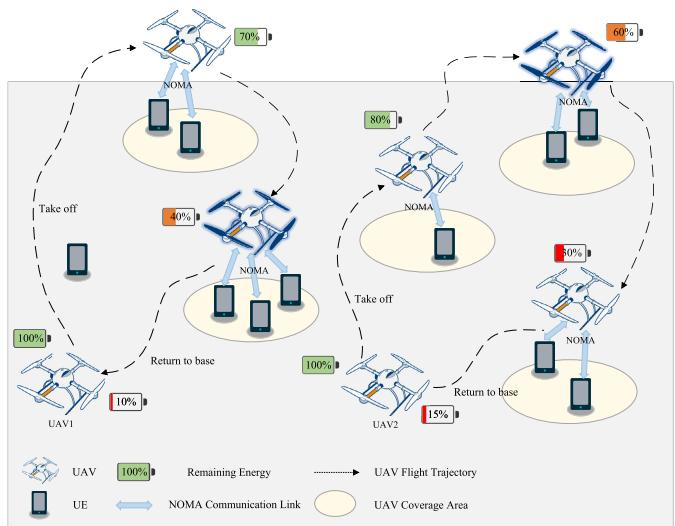  
Fig. 1. Multi-UAV-assisted data collection network.

Fig. 2(b) illustrates the location updating model for UAVs. At the beginning of each time slot, UAV k ascertains its actions for the current time slot, inclusive of the flight heading angle $\theta _ { k }$ and flight time $T _ { k } ^ { \mathrm { f l y } }$ . Here, $\theta _ { k } ~ \in ~ [ 0 , 2 \pi ]$ represents the clockwise rotation angle of UAV k in the horizontal plane relative to the y-axis. The flight time $T _ { k } ^ { \mathrm { f l y } }$ is constrained by $0 \leq T _ { k } ^ { \mathrm { f l y } } \leq \delta$ . In time slot t, after executing an action, the location of UAV k is updated to

$$
u _ {k} (t + 1) = \left(x _ {k} (t + 1), y _ {k} (t + 1), H\right),\tag{1}
$$

where

$$
\begin{array}{r} x _ {k} (t + 1) = x _ {k} (t) + v _ {k} T _ {k} ^ {\mathrm{fly}} \sin \theta_ {k}; \\ y _ {k} (t + 1) = y _ {k} (t) + v _ {k} T _ {k} ^ {\mathrm{fly}} \cos \theta_ {k}. \end{array}
$$

## B. Communication Model

In time slot t, UAV k flies and arrives at the hovering position $u _ { k } ( t )$ , and begins to establish communication connections with the devices within its coverage area. UE m can only connect to a single UAV, while a UAV can communicate with multiple UEs simultaneously. Let the coverage angle of UAV k be denoted as $\theta _ { k } ^ { c }$ . If UE m is within the coverage range of UAV k, as shown in Fig. 2(c), then the following condition must be satisfied:

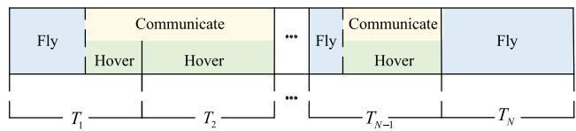  
(a) Fly-hover-communicate

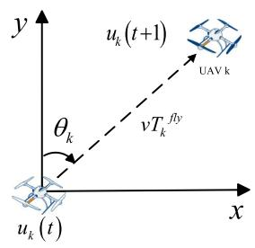

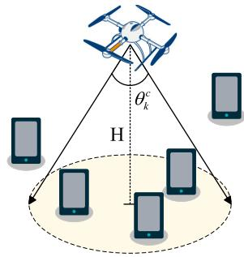

(b) Location updating  
(c) Coverage of UAV  
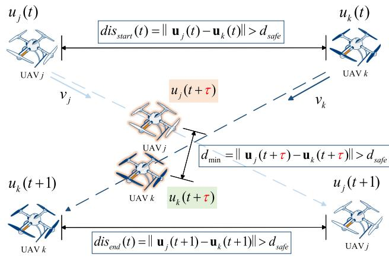  
(d) Collision avoidance  
Fig. 2. Schematic of UAV kinematics and spatial constraints.

$$
\operatorname{dis} _ {k, m} (t) <   \frac {H}{\cos (\theta_ {k} ^ {c} / 2)}, \quad m \in M, k \in K,\tag{2}
$$

where $\mathrm { d i s } _ { k , m } ( t )$ denotes the 3D Euclidean distance between UAV k and UE m which can be calculated by

$$
\mathrm{dis} _ {k, m} (t) = \sqrt {(x _ {k} (t) - x _ {m}) ^ {2} + (y _ {k} (t) - y _ {m}) ^ {2} + H ^ {2}}.\tag{3}
$$

The distance accounts for UAV altitude, ensuring accurate coverage boundary estimation.

Let $D _ { m } ( t )$ represent the volume of data to be collected from UE m in time slot t. If UE m possesses no pending data for collection, that is, $D _ { m } ( t ) = 0$ , it will not establish a communication link with the UAV, even if it resides within the

UAV’s coverage area. Define $Z _ { k , m } ( t )$ as the access indicator, which is characterized as follows:

$$
Z _ {k, m} (t) = \left\{ \begin{array}{l l} 1, & \text { if } \operatorname{dis} _ {k, m} <   \frac {H}{\cos (\theta_ {k} ^ {c} / 2)} \text { and } D _ {m} (t) > 0; \\ 0, & \text { otherwise }. \end{array} \right.\tag{4}
$$

Therefore, the number of UEs that establish connections with UAV k in time slot t is denoted as $\textstyle \sum _ { m = 1 } ^ { M } Z _ { k , m } ( t )$ And UAV k allocates bandwidth resources to these UEs proportionally to the amount of data to be collected. The bandwidth ratio allocated to UE m can be calculated as

$$
r _ {k, m} (t) = \frac {Z _ {k , m} (t) D _ {m} (t)}{\sum_ {m = 1} ^ {M} Z _ {k , m} (t) D _ {m} (t)}.\tag{5}
$$

Assuming that the wireless channel between the UAV and the UE is dominated by the line-of-sight (LoS) link. It is reasonable in disaster emergency scenarios, with UAVs operating at high altitudes in open environments with limited ground obstruction, leading to LoS propagation. The channel gain between UAV k and UE m can be modeled as

$$
\begin{array}{r} g _ {k, m} (t) = \beta_ {0} \mathrm{dis} _ {k, m} (t) ^ {- 2} \\ = \frac {\beta_ {0}}{(x _ {k} (t) - x _ {m}) ^ {2} + (y _ {k} (t) - y _ {m}) ^ {2} + H ^ {2}}, \end{array}\tag{6}
$$

where $\beta _ { 0 }$ is the reference channel gain, which indicates the channel gain at unit distance.

Assuming that after establishing communication between UAV k and UE m, the uplink transmission power of UE m is $p _ { m }$ . In time slot t, the achievable rate (bits per second) between UE m and UAV k can be represented as

$$
R _ {k, m} (t) = r _ {k, m} (t) B \log_ {2} \left(1 + \frac {p _ {m} g _ {k , m} (t)}{\sigma_ {0} ^ {2}}\right),\tag{7}
$$

where $r _ { k , m } ( t )$ represents the bandwidth ratio that can be allocated to UE m, B represents the total bandwidth which can be allocated by UAV $k , p _ { m }$ denotes the uplink transmission power of UE $m ,$ and $\sigma _ { 0 } ^ { 2 }$ represents the noise power.

In time slot t, the amount of tasks that UAV k can collect from UE m can be expressed as

$$
C _ {k, m} (t) = \min (R _ {k, m} (t) (\delta - T _ {k} ^ {\mathrm{fly}} (t)), D _ {m} (t)),\tag{8}
$$

where $\delta$ is the length of the time slot, and $T _ { k } ^ { \mathrm { f l y } } ( t )$ is the flight time in time slot t. And the remaining data amount of UE m at time slot t is

$$
D _ {m} (t + 1) = D _ {m} (t) - C _ {k, m} (t),\tag{9}
$$

Then, the total amount of collected data can be calculated as

$$
C = \sum_ {t = 1} ^ {T} \sum_ {k = 1} ^ {K} \sum_ {m = 1} ^ {M} C _ {k, m} (t).\tag{10}
$$

## C. Energy Consumption Model

Assuming that $E _ { k } ^ { \mathrm { c o n s } }$ represents the initial energy of UAV $k ,$ and $E _ { k } ^ { \mathrm { r e s t } } ( t )$ represents the residual energy of UAV k at the beginning of time slot t. Therefore, $E _ { k } ^ { \mathrm { r e s t } } ( 0 ) ~ = ~ E _ { k } ^ { \mathrm { c o n s } }$ The total energy expenditure of UAV comprises two primary components: energy for communication purposes and propul sion energy required to counteract aerodynamic drag and gravitational forces. As referenced in [31], a UAV’s propulsion energy consumption is strongly correlated with its flight velocity. To better illustrate the point, we only consider uniform speed and temporarily ignore acceleration. Within each slot, UAV motion is decomposed into flight and hovering phases. If flight duration fills the slot, the UAV flies continuously without hovering, precluding data collection. Otherwise, the UAV completes its displacement along the selected heading and then hovers at the target position, with the remaining slot duration naturally transitioning to data collection.

1) Flight Energy Consumption: At each time step, UAV k flies at a constant velocity $v _ { k }$ at a fixed altitude H. Since the propulsion power of UAV k is modeled as a function of the velocity $v _ { k } .$ , it can be expressed as

$$
\begin{array}{l} P ^ {\text {fly}} (v _ {k}) = \frac {\sigma}{8} \rho s _ {r} A _ {r} \Omega^ {3} R ^ {3} \left(1 + 3 \frac {v _ {k} ^ {2}}{U _ {\text {tip}} ^ {2}}\right) \\ \qquad + (1 + c _ {f}) \frac {W ^ {1 . 5}}{(2 \rho A _ {r}) ^ {0 . 5}} \left(\sqrt {1 + \frac {v _ {k} ^ {4}}{4 v _ {0} ^ {4}}} - \frac {v _ {k} ^ {2}}{2 v _ {0} ^ {2}}\right) \\ \qquad + 0. 5 d _ {r} v _ {k} ^ {3} \rho s _ {r} A _ {r}, \end{array}\tag{0.5}
$$

(11)

where $v _ { k }$ is the flight velocity, σ represents the form drag coefficient and $\rho$ stands for the air density. The parameters $s _ { r } ,$ $A _ { r } , \Omega$ and R correspond to the rotor solidity, rotor disc area, rotor angular velocity and rotor radius, respectively. The rotor tip speed, defined as $U _ { \mathrm { t i p } } = \Omega \times R ,$ , reflects the linear velocity at the end of the rotor blade. W denotes the weight of the UAV k in newtons. $c _ { f }$ and $d _ { r }$ serve as incremental correction factors for induced power and the fuselage drag ratio. The mean induced velocity $v _ { 0 }$ during hovering characterizes the air flow speed while the UAV is in a hovering state.

The flight energy consumption of UAV k in time slot t is calculated as

$$
E _ {k} ^ {\mathrm{fly}} (t) = P _ {k} ^ {\mathrm{fly}} T _ {k} ^ {\mathrm{fly}} (t),\tag{12}
$$

where $T _ { k } ^ { \mathrm { f l y } } ( t )$ is the flight time in time slot t.

2) Hovering Energy Consumption: When hovering, the UAV’s flight velocity $v _ { k } = 0$ , and the hovering power of UAV k can be calculated as

$$
P ^ {\text { hover }} = \frac {\sigma}{8} \rho s _ {r} A _ {r} \Omega^ {3} R ^ {3} + (1 + c _ {f}) \frac {W ^ {1 . 5}}{(2 \rho A _ {r}) ^ {0 . 5}}.\tag{13}
$$

The hovering time at time slot t depends on the offloading time of the UEs within the coverage range of UAV k, which is calculated as

$$
T _ {k} ^ {\text { hover }} (t) = \max \left\{\frac {C _ {k , m} (t)}{R _ {k , m} (t)} \right\} _ {m \in \mathcal {M}}.\tag{14}
$$

The hovering energy consumption of UAV k in time slot t is calculated as

$$
E _ {k} ^ {\text { hover }} (t) = P ^ {\text { hover }} T _ {k} ^ {\text { hover }} (t).\tag{15}
$$

3) Communication Energy Consumption: The communication power of UAV k is represented by the constant value $P _ { k } ^ { c } .$ Therefore, the energy consumed by UAV k for communication during time slot t is determined as

$$
E _ {k} ^ {\mathrm{com}} (t) = P _ {k} ^ {c} T _ {k} ^ {\mathrm{hover}} (t).\tag{16}
$$

In summary, the total energy consumption in time slot t is

$$
E _ {k} (t) = E _ {k} ^ {\mathrm{fly}} (t) + E _ {k} ^ {\mathrm{hover}} (t) + E _ {k} ^ {\mathrm{com}} (t),\tag{17}
$$

and the residual energy of UAV k at the beginning of time slot $t + 1$ is updated as

$$
E _ {k} ^ {\mathrm{rest}} (t + 1) = E _ {k} ^ {\mathrm{rest}} (t) - E _ {k} (t).\tag{18}
$$

The total energy consumption throughout the entire flight process should not exceed the total energy capacity $E _ { k } ^ { \mathrm { c o n s } }$ , that is

$$
E _ {k} = \sum_ {t = 1} ^ {T} E _ {k} (t) \leq E _ {k} ^ {\text { cons }}.\tag{19}
$$

4) RTB Energy Threshold: Evaluating the RTB energy threshold precedes any new action at the current time slot t. The current remaining energy must cover the planned action (encompassing flight to the next position, hovering, and data collection communication) while guaranteeing a safe return from the subsequent location. This threshold condition is formulated as

$$
E _ {k} ^ {r e s t} (t) \geq E _ {k} ^ {r t b} (t + 1) + E _ {k} (t + 1),\tag{20}
$$

where $E _ { k } ^ { r e s t } ( t )$ represents the current remaining energy of UAV k, and $E _ { k } ( t + 1 )$ denotes the estimated energy cost for the combined action. $\dot { E } _ { k } ^ { r t b } ( t { + } 1 )$ signifies the minimum energy required to return to the base from the next position. Falling below this threshold prompts UAV k to abort the intended action and return to the base directly from its current location.

## D. Collision Avoidance Strategy

To prevent collisions and conflicts between UAVs, a minimum safe distance $d _ { \mathrm { s a f e } }$ is set. In this paper, two types of spatial cooperation constraints are considered: point conflicts and edge conflicts. For each pair of UAVs $j$ and k, the starting and ending positions in time slot t are first checked to see if they meet the constraints:

$$
\mathrm{dis} _ {s t a r t} (t) = \| \mathbf {u} _ {j} (t) - \mathbf {u} _ {k} (t) \| > d _ {s a f e};\tag{21}
$$

$$
\mathrm{dis} _ {e n d} (t) = \left\| \mathbf {u} _ {j} (t + 1) - \mathbf {u} _ {k} (t + 1) \right\| > d _ {s a f e}.\tag{22}
$$

If the constraints are not satisfied, a collision is deemed to have occurred.

Edge conflicts are reflected in the flight process. Assuming that in time slot t, the locations of UAV j and UAV k are respectively $u _ { j } ( t ) ~ = ~ ( x _ { j } ( t ) , y _ { j } ( t ) , H )$ and $u _ { k } ( t ) \ =$ $( x _ { k } ( t ) , y _ { k } ( t ) , H )$ with velocities $v _ { j }$ and $v _ { k }$ . Therefore, the flight directions of UAV j and UAV k in the current time slot can be obtained as

$$
d _ {j} = [ d x _ {j}, d y _ {j} ];
$$

$$
d _ {k} = [ d x _ {k}, d y _ {k} ].\tag{23}
$$

(24)

During the flight, the trajectory changes of UAV j and UAV k can be obtained as

$$
u _ {j} (t + \tau) = u _ {j} (t) + v _ {j} d _ {j} \tau ;\tag{25}
$$

$$
u _ {j} (t + \tau) = u _ {k} (t) + v _ {j} d _ {k} \tau ,\tag{26}
$$

where τ is the flight duration. The squared distance between the two UAVs during flight can be expressed as

$$
D (t + \tau) = \| \mathbf {u} _ {j} (t + \tau) - \mathbf {u} _ {k} (t + \tau) \| ^ {2}.\tag{27}
$$

Expanding $D ( t + \tau )$ and rearranging, a quadratic equation in terms of τ can be obtained as

$$
A \tau^ {2} + B \tau + C = 0,\tag{28}
$$

where

$$
A = (v _ {j} d x _ {j} - v _ {k} d x _ {k}) ^ {2} + (v _ {j} d y _ {j} - v _ {k} d y _ {k}) ^ {2};\tag{29}
$$

$$
B = 2 \big ((x _ {j} (t) - x _ {k} (t)) (v _ {j} d x _ {j} - v _ {k} d x _ {k})
$$

$$
+ (y _ {j} (t) - y _ {k} (t)) (v _ {j} d y _ {j} - v _ {k} d y _ {k}) \big);\tag{30}
$$

$$
C = (x _ {j} (t) - x _ {k} (t)) ^ {2} + (y _ {j} (t) - y _ {k} (t)) ^ {2} - d _ {\mathrm{safe}} ^ {2}.\tag{31}
$$

Solving the quadratic equation yields two solutions $\tau _ { 1 }$ and $\tau _ { 2 } .$ . If the discriminant $\Delta = B ^ { 2 } - 4 A C \ge 0 .$ , real solutions exist. Check whether these two solutions fall within the flight duration τ. If the condition is met, it is considered that a collision will occur within this time interval.

## E. Problem Formulation

Our objective is to maximize the total amount of data collected under the constraints of the UAVs’ limited energy capacity, flight paths, hovering-communication and collision avoidance strategies, while ensuring the safe RTB of all UAVs. In addressing this problem, we consider two different scenarios.

1) When the UAVs’ total energy reserve is inadequate to complete the data collection tasks of all UEs, the objective is to maximize the amount of data collected while ensuring the safe RTB of the UAVs.

2) Conversely, when the UAVs’ total energy reserve is sufficient to complete the data collection tasks of all UEs, the objective is to maximize the remaining energy while ensuring the safe RTB of the UAVs.

In order to attain the two objectives, we formulate the optimization problem as follows:

$$
\begin{array}{l} \max _ {T, \theta_ {k}, T _ {k} ^ {\text { fly }}} \sum_ {t = 1} ^ {T} \sum_ {k = 1} ^ {K} \sum_ {m = 1} ^ {M} C _ {k, m} (t) + \lambda \sum_ {k = 1} ^ {K} \left(E _ {k} ^ {\text { cons }} - \sum_ {t = 1} ^ {T} E _ {k} (t)\right) \\ \text { s.t. } \quad \sum_ {t = 1} ^ {T} E _ {k} (t) \leq E _ {k} ^ {\text { cons }}, \quad \forall k, \\ u _ {k} (0) = u _ {k} (T), \quad \forall k, \\ 0 \leq x _ {k} (t), y _ {k} (t) \leq L, \quad \forall k, \end{array} \tag {32}
$$

where λ is the data collection completion indicator, which is defined as

$$
\lambda = I _ {\left\{\sum_ {t = 1} ^ {T} \sum_ {k = 1} ^ {K} \sum_ {m = 1} ^ {M} C _ {k, m} (t) = D \right\}}.\tag{33}
$$

The formulated optimization task structurally aligns with the multiple Traveling Salesman Problem (mTSP) with return constraints. Each UAV departs from the base station, visits selected UEs, and returns to the base station, mirroring route planning by multiple salesmen over the node set. However, communication coverage requirements, onboard energy coupling, and environmental dynamics place this problem beyond the classic mTSP framework. UAVs must collect data within communication ranges, the energy model depends on factors beyond path length, and system states evolve over time. These characteristics yield a Mixed-Integer Non-Linear Programming (MINLP) formulation of NP-hard complexity [32]. Traditional convex optimization methods rely on static assumptions, and exact algorithms for classic mTSP fail to handle such high-dimensional dynamic coupling constraints. We therefore adopt DRL to optimize long-term objectives and enable adaptive decision-making under time-varying conditions.

## IV. MULTI-AGENT DEEP DETERMINISTIC POLICY GRADIENT FOR MULTI-UAV COLLABORATION SYSTEM

In this section, we propose a collaborative offloading framework utilizing MADDPG approach. We formulate the optimization task as an MDP and detail the corresponding algorithmic architecture.

## A. Design of Markov Decision Process

The cooperative UAV offloading problem is modeled as an MDP, characterized by the tuple $\langle S , A , P , R \rangle$ . In this formulation, the sets S and A correspond to the state and action spaces, respectively, whereas $P$ indicates the state transition probability and R represents the reward function. The specific descriptions of MDP elements are detailed below.

1) State Space: At the beginning of every time slot t, each individual agent $k , k \in K$ collects its own observation $o _ { k } ( t )$ from the surrounding environment, which could be formatted as

$$
o _ {k} (t) \triangleq \left\{\left\{u _ {k} (t) \right\} _ {k = 1} ^ {K}, E _ {k} ^ {\text { rest }} (t), \left\{D _ {m} (t) \right\} _ {m = 1} ^ {M} \right\},\tag{34}
$$

where

1) $\{ u _ { k } ( t ) \} _ { k = 1 } ^ { K }$ represents the locations of all UAVs in time slot t.

2) $E _ { k } ^ { r e s t } ( t )$ represents the residual energy of UAV k in time slot t.

3) $\{ D _ { m } ( t ) \} _ { m = 1 } ^ { M }$ represents the residual task data of all UEs in time slot t.

The global state $s ( t )$ aggregates local observations from all UAVs. To mitigate information redundancy, we consolidate these distinct inputs into a unified representation formulated as:

$$
s (t) \triangleq \left\{\{o _ {k} (t) \} _ {k = 1} ^ {K} \right\},\tag{35}
$$

where $\{ E _ { k } ^ { r e s t } ( t ) \} _ { k = 1 } ^ { K }$ represents the residual energy of all UAVs in time slot t.

2) Action Space: Under the observation $o _ { k } ( t )$ , the actor of agent k calculates its action $a _ { k } ( t )$ as

$$
a _ {k} (t) = [ \theta_ {k} (t), T _ {k} ^ {f l y} (t) ],\tag{36}
$$

where $\theta _ { k } ( t )$ denotes the flight direction and $T _ { k } ^ { f l y } ( t )$ represents the flight time in time slot t. In the model, the values of $\theta _ { k } ( t )$ and $T _ { k } ^ { \check { f } l y } ( t )$ are normalized to $[ - 1 , 1 ]$

The action of the K agents is described as

$$
a (t) = \left\{a _ {1} (t), a _ {2} (t), \dots , a _ {K} (t) \right\},\tag{37}
$$

and accordingly, the action space could be expressed as $A =$ $\{ a ( t ) , t \in T \}$

3) Reward Function: To guide agents in learning the optimal strategy, the design of the reward function in this problem adheres to the following principles: first, ensure that UAVs maximize data collection while safely returning; then, after data collection is completed, further maximize their remaining energies. The specific design is as follows:

1) In each time slot t agent k is given a positive reward when UAV k collects a certain amount of tasks, which is defined as

$$
R _ {k, 1} (t) = \alpha_ {1} \frac {\sum_ {m = 1} ^ {M} C _ {k , m} (t)}{D},\tag{38}
$$

while D is the cumulative data to be collected, and $\textstyle \sum _ { m = 1 } ^ { M } C _ { k , m } ( t )$ is the amount of data collected by UAV k in time slot t.

2) The agent k is given a positive reward based on the remaining energy of UAV k when all UAVs successfully return and all UE tasks are collected, which is defined as

$$
R _ {k, 2} (t) = \left\{ \begin{array}{l l} \lambda \alpha_ {2} \eta_ {k} (t), & \text { if } u _ {k} (0) = u _ {k} (T); \\ 0, & \text { otherwise }, \end{array} \right.\tag{39}
$$

where $\begin{array} { r } { \eta _ { k } ( t ) ~ = ~ \frac { E _ { k } ^ { \mathrm { r e s t } } ( t ) } { E _ { k } ^ { \mathrm { c o n s } } } } \end{array}$ represents the residual energy ratio of UAV $k ,$ and λ is the data collection completion indicator.

3) The agent k is given a negative reward when UAV k flies out of the given area boundary, which is defined as

$$
R _ {k, 3} (t) = \left\{ \begin{array}{l l} - \alpha_ {3}, & \text { if   } u _ {k} (t) \text {   is   out   of   boundary; } \\ 0, & \text { otherwise. } \end{array} \right.\tag{40}
$$

4) The agent k is given a negative reward when collisions occur between UAV k and other UAVs, which is defined as

$$
R _ {k, 4} (t) = \left\{ \begin{array}{l l} - \alpha_ {4}, & \text { if   collisions   occur; } \\ 0, & \text { otherwise. } \end{array} \right.\tag{41}
$$

In the reward function, α1, α2, $\alpha _ { 3 }$ and $\alpha _ { 4 } ,$ , are constant parameters that adjust the reward and penalty for each item. In summary, the reward function of agent k is expressed as

$$
R _ {k} (t) = R _ {k, 1} (t) + R _ {k, 2} (t) + R _ {k, 3} (t) + R _ {k, 4} (t).\tag{42}
$$

## B. The MADDPG Framework

MADDPG is an effective extension of the DDPG algorithm [33] for multi-agent environments. It enables cooperative learning and action coordination, thereby enhancing convergence speed and overall performance [34], [35]. The core design principle of MADDPG is the CTDE paradigm. This architecture is designed to address the non-stationarity problem inherent in multi-agent settings, an issue arising from the dynamically changing policies of other agents [36].

The algorithm architecture is based on the Actor-Critic framework, equipping each of the K agents with a corresponding network structure. Each agent k’s actor network, $\mu _ { k } ( \cdot ; \theta _ { k } )$ , employs a decentralized design. It maps the agent’s local observation $o _ { k } ( t )$ to a deterministic action $a _ { k } ( t )$ = $\mu _ { k } ( o _ { k } ( t ) ; \theta _ { k } )$ . Conversely, the critic network $Q _ { k } ( \cdot ; w _ { k } )$ utilizes a centralized design, receiving the global state $s ( t )$ and the joint action $a ( t )$ from all agents as input to estimate the corresponding Q-value. To ensure training stability, the algorithm maintains a “target network” $( \mu _ { k } ^ { \prime } , Q _ { k } ^ { \prime } )$ for each primary network $( \mu _ { k } , Q _ { k } )$ . These target networks share the same architecture but feature slowly updated parameters. They are dedicated to computing the Temporal-Difference (TD) target values. By providing a stable target, they effectively suppress training oscillations resulting from bootstrapping.

Mechanistically, MADDPG is an off-policy algorithm that relies on the centralized training paradigm. The algorithm maintains a centralized experience replay buffer B, to store the experience generated by all agents. Experiences are represented as tuples global state, action, reward, next global state information, with the form $( s , a , R , s ^ { \prime } )$ . The critic network $Q _ { k }$ updates its parameters $w _ { k }$ by minimizing the TD error, This error is defined as the Mean Squared Error (MSE) between the current $Q _ { k }$ output and the TD target value $y _ { k }$ computed by the target networks $Q _ { k } ^ { \prime } ( \cdot ; w _ { k } ^ { \prime } )$ and $\mu _ { k } ^ { \prime } ( \cdot ; \theta _ { k } ^ { \prime } )$ . The loss function $L ( w _ { k } )$ is defined as

$$
L (w _ {k}) = \mathbb {E} _ {(s, \mathbf {a}, \mathbf {R}, s ^ {\prime}) \sim \mathcal {B}} [ (y _ {k} - Q _ {k} (s, \mathbf {a}; w _ {k})) ^ {2} ],\tag{43}
$$

where the target value $y _ { k }$ incorporates the rewards and the discounted future value estimated by the target networks

$$
y _ {k} = R _ {k} + \gamma Q _ {k} ^ {\prime} (s ^ {\prime}, \mathbf {a} ^ {\prime}; w _ {k} ^ {\prime}) | _ {\mathbf {a} ^ {\prime} = \mu_ {1} ^ {\prime} (o _ {1} ^ {\prime}), \dots , \mu_ {K} ^ {\prime} (o _ {K} ^ {\prime})},\tag{44}
$$

here, $\gamma$ denotes the discount factor. The critic’s parameters $w _ { k }$ are updated by descending the negative gradient of the loss function:

$$
w _ {k} \leftarrow w _ {k} - \beta \nabla_ {w _ {k}} L (w _ {k}),\tag{45}
$$

where $\beta$ is the learning rate for the critic network.

The actor parameters $\theta _ { k }$ are optimized via the deterministic policy gradient algorithm. The centralized critic serves as a surrogate objective, providing gradients with respect to the actions. The gradient of the expected return $J ( \theta _ { k } )$ is computed by applying the chain rule:

$$
\begin{array}{c} \nabla_ {\theta_ {k}} J (\theta_ {k}) = \mathbb {E} _ {s, \mathbf {a} \sim \mathcal {B}} \Big [ \nabla_ {a _ {k}} Q _ {k} (s, \mathbf {a}; w _ {k})   \Big | \\ a _ {k} = \mu_ {k} (o _ {k}) \cdot \nabla_ {\theta_ {k}} \mu_ {k} (o _ {k}; \theta_ {k}) \Big ]. \end{array}\tag{46}
$$

The actor’s parameters $\theta _ { k }$ are updated by ascending the positive gradient of the policy:

$$
\theta_ {k} \leftarrow \theta_ {k} + \alpha \nabla_ {\theta_ {k}} J (\theta_ {k}),\tag{47}
$$

where α is the learning rate for the actor network.

This mechanism allows the actor to learn a policy that maximizes the global value estimate while relying solely on local observations.

To ensure stable convergence, the parameters of the target networks are updated using a soft update strategy with a small factor $\tau ( 0 < \tau \ll 1 )$ ):

$$
w _ {k} ^ {\prime} \leftarrow \tau w _ {k} + (1 - \tau) w _ {k} ^ {\prime},\tag{48}
$$

$$
\theta_ {k} ^ {\prime} \leftarrow \tau \theta_ {k} + (1 - \tau) \theta_ {k} ^ {\prime}.\tag{49}
$$

Algorithm 1 MADDPG
Input: Multi-UAV-assisted system environment, number of agents K
Output: Optimal trajectory and data collection policies for all agents
1: for agent k = 1 to K do
2: Initialize actor network  $\mu_{k}(\cdot; \theta_{k})$  and critic network  $Q_{k}(\cdot; w_{k})$  with the weight parameters  $\theta_{k}$  and  $w_{k}$ ;
3: Initialize the parameters  $\theta_{k}^{\prime}$  and  $w_{k}^{\prime}$  for the target networks by letting  $\theta_{k}^{\prime} \leftarrow \theta_{k}, w_{k}^{\prime} \leftarrow w_{k}$ .
4: end for
5: Initialize the learning rate  $\alpha$  and  $\beta$  corresponding to the Actor and Critic networks, the discount factor  $\gamma$ , the number of episode  $N_{e}$  and the random process  $\phi$  for action exploration.
6: Initialize replay buffer B, exploration factors  $\epsilon, \varepsilon$  and  $\zeta$ .
7: for episode = 1 to  $N_{e}$  do
8: Let  $t \leftarrow 0$ ; is Terminal  $\leftarrow$  False;  $\varepsilon \leftarrow \varepsilon\epsilon$ ;
9: Each UAV is initialized with an initial state  $o_{k}(t)$ , and the central controller obtains the global state  $s(t)$ .
10: while is Terminal == False do
11: for each agent  $k = 1, \ldots, K$  do
12: Select action  $a_{k}(t)$  at  $o_{k}(t)$ , observe reward  $R_{k}(t)$  and new state  $o_{k}(t + 1)$ ;
13: Case 1: Randomly select  $a_{k}(t)$  with probability  $\varepsilon$ ;
14: Case 2: Select action  $a_{k}(t) \leftarrow \mu_{k}(o_{k}(t); \theta_{k}) + \zeta$  with exploration noise  $\zeta \sim \mathcal{N}(0, \sigma_{0}^{2})$ .
15: end for
16: Obtain  $s(t)$  and  $a(t)$  according to Eq. (35) and Eq. (37).
17: Store transition tuple  $(s, a, R, s')$  in B.
18: Set  $s(t) \leftarrow s(t + 1)$ .
19: if B has enough transitions then
20: Sample mini-batch of N transitions from B randomly;
21: for each agent  $k = 1, \ldots, K$  do
22: Update  $\omega_{k}$  and  $\theta_{k}$  using Eq. (45), (47);
23: Update target networks using Eq. (48), (49);
24: end for
25: end if
26: end while
27: end for

The description of the MADDPG structure is given in Algorithm 1. The framework of the MADDPG algorithm is illustrated in the Fig. 3.

## V. PERFORMANCE EVALUATION

In this section, we evaluate the performance of the proposed MADDPG framework via extensive simulations. We first analyze the convergence characteristics of the algorithm, followed by a comparative assessment against stateof-the-art baselines. All methods are evaluated under the same MDP setting, including identical state representation, action space, and environment dynamics, to ensure a fair comparison.

TABLE II  
SIMULATION PARAMETERS

<table><tr><td>Notation</td><td>Physical meaning</td><td>Value</td></tr><tr><td> $A_r$ </td><td>Rotor disc area</td><td>0.79  $m^2$ </td></tr><tr><td>B</td><td>Bandwidth</td><td>10MHz</td></tr><tr><td> $D_m$ </td><td>Data amount of UE m</td><td>(5000, 10000) bits</td></tr><tr><td> $E_k^{cons}$ </td><td>Energy capacity of UAV k</td><td>50000 J</td></tr><tr><td>H</td><td>UAVs&#x27; flight height</td><td>50 m</td></tr><tr><td>K</td><td>Number of UAVs</td><td>2</td></tr><tr><td>L</td><td>Side length of a square area</td><td>400 m</td></tr><tr><td>M</td><td>Number of UEs</td><td>40</td></tr><tr><td> $P_k^c$ </td><td>UAV k transmission power</td><td>0.5 W</td></tr><tr><td> $P_m$ </td><td>Transmission power of UE m</td><td>0.1 W</td></tr><tr><td>R</td><td>Rotor radius</td><td>0.5 m</td></tr><tr><td> $U_{tip}$ </td><td>Rotor tip speed</td><td>200</td></tr><tr><td>W</td><td>Weight of UAV</td><td>10 kg</td></tr><tr><td>Ω</td><td>Angular velocity of the rotor</td><td>400</td></tr><tr><td>α</td><td>Learning rate of actor network</td><td>0.001</td></tr><tr><td> $α_1, α_2, α_3, α_4$ </td><td>Constant parameters related with reward and penalty</td><td>10, 10, 0.1, 0.8</td></tr><tr><td>β</td><td>Learning rate of critic network</td><td>0.001</td></tr><tr><td> $β_0$ </td><td>Reference channel gain</td><td>-50 dB</td></tr><tr><td>γ</td><td>Discount factor</td><td>0.95</td></tr><tr><td>δ</td><td>Time interval of a time slot</td><td>2.0 s</td></tr><tr><td> $θ_k^c$ </td><td>Coverage angle of UAV k</td><td>60°</td></tr><tr><td>ρ</td><td>Air density</td><td>1.225 kg/ $m^3$ </td></tr><tr><td>σ</td><td>Form drag coefficient</td><td>0.012</td></tr><tr><td> $σ_0^2$ </td><td>Noise power</td><td>-70 dB/Hz</td></tr><tr><td>τ</td><td>Soft update factor</td><td>0.01</td></tr><tr><td> $c_f$ </td><td>Incremental correction coefficient for induced power</td><td>0.1</td></tr><tr><td> $d_r$ </td><td>Incremental correction coefficients for fuselage drag ratio</td><td>0.3</td></tr><tr><td> $f_1, f_2, f_3$ </td><td>Fully connected hidden layers of actor and critic network</td><td>256, 256, 64</td></tr><tr><td> $s_r$ </td><td>Rotor solidity</td><td>0.05</td></tr><tr><td> $v_0$ </td><td>Average induced velocity</td><td>7.2 m/s</td></tr><tr><td> $v_k$ </td><td>Flight speed of UAV k</td><td>25 m/s</td></tr></table>

## A. Simulation Settings

The simulation system is implemented using PyTorch. Adam optimizer is used to update the actor and critic networks. The default parameter settings are shown in Table II, and unless otherwise specified, they remain unchanged in subsequent simulations.

## B. Convergence Analysis

To clearly illustrate training dynamics, convergence curves apply Gaussian smoothing to eliminate intense episodic fluctuations and capture long-term reward trends. For quantitative assessment, all final performance metrics are normalized. Specifically, “Residual Energy Ratio” is scaled relative to their maximum observed values across all configurations (set to 1.00), facilitating direct comparative analysis.

1) Convergence With Different Parameters: We evaluate four core hyperparameters based on the convergence curves presented in Fig. 4 and the performance metric heatmaps detailed in Fig. 5 to identify the optimal algorithm configuration.

As illustrated in Fig. 4(a), a batch size of 4096 provides higher global stability. The corresponding reward curve exhibits a moderate initial rise followed by steady convergence with minimal late-stage fluctuations. Fig. 5(a) demonstrates the highest task completion rate, data collection rate, and residual energy achieved at a batch size of 4096. Theoretically, larger batch sizes yield more accurate gradient estimations, enabling the agent to effectively bypass local optima. Therefore, a batch size of 4096 is adopted for the proposed system.

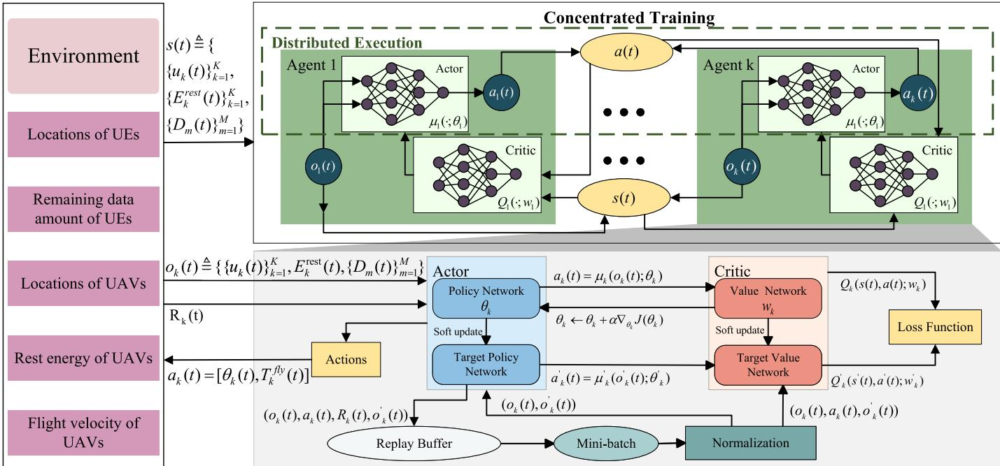  
Fig. 3. Framework of the proposed MADDPG algorithm.

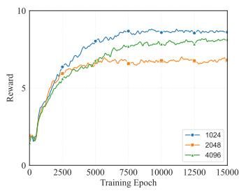  
(a) Batch Size

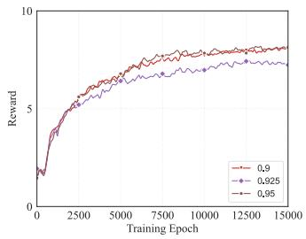  
(b) Discount Factor γ

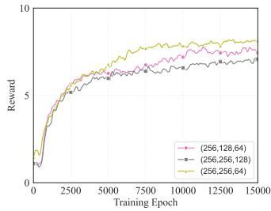  
(c) Network Parameter Set

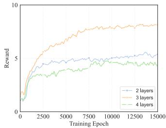  
(d) Network Layer Number  
Fig. 4. Convergence vs. different parameters.

As shown in Fig. 4(b), the discount factor (γ) of 0.95 produces the highest final reward and the most robust convergence. Under this configuration, Fig. 5(b) shows that the service completion and data collection rates achieve 0.950 and 0.974, while the normalized residual energy ratio concurrently peaks at 1.000. Higher discount values compel the agent to prioritize long-term cumulative returns, fundamentally facilitating the extraction of globally optimal policies in multi-objective resource allocation tasks. Consequently, a discount factor of 0.95 is adopted as the optimal setting.

Regarding the neural network parameter set, Fig. 4(c) indicates that a topology comprising hidden layers with 256, 256, and 64 nodes converges effectively and attains a highly competitive reward score. As detailed in Fig. 5(c), this specific layout improves task completion rate to 0.950 and data collection rate to 0.974. Despite yielding minimal residual energy, the overall system design prioritizes intensive task processing and data acquisition. Consequently, this structural configuration serves as the final selected parameter.

As illustrated in Fig. 4(d), the three-layer architecture significantly outperforms alternative network depths regarding reward curve metrics, indicating superior state-learning capabilities. Fig. 5(d) shows advantage of this configuration, demonstrating superior task completion and data collection rates. Generally, shallow networks fail to capture complex environmental dynamics, whereas excessively deep models introduce overfitting risks and heavy computational overhead. Consequently, the three-layer architecture effectively manages the high-dimensional action space within the proposed environment.

2) Convergence With Different UAV Numbers: We evaluate the impact of varying UAV numbers, ranging from one to six, on convergence performance, cooperative data collection efficiency, and energy consumption, considering an operational scenario serving 80 UEs across an 800 m by 800 m region.

Fig. 6 illustrates reward convergence curves under varying UAV numbers. Increasing the UAV count consistently elevates accumulated rewards, driven by expanded spatial coverage and enhanced parallel task execution capabilities. Specifically, setups with one to three UAVs exhibit rapid convergence and high training stability. In scenarios involving four UAVs, the reward curve experiences slight degradation and increased variance after reaching its peak, indicating joint policy learning challenges induced by expanded action spaces and heightened coordination complexity among multiple agents. Nevertheless, configurations utilizing five and six UAVs successfully overcome this coordination bottleneck, demonstrating steady training curve ascensions stabilizing at maximal reward levels, validating excellent scalability.

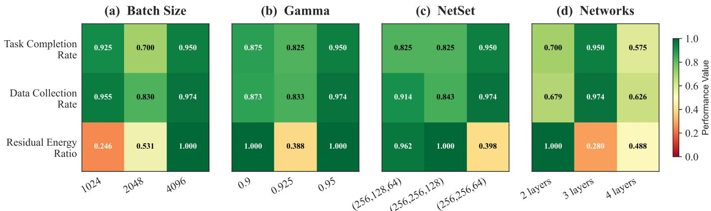

Fig. 5. Performance metric of different parameters.  
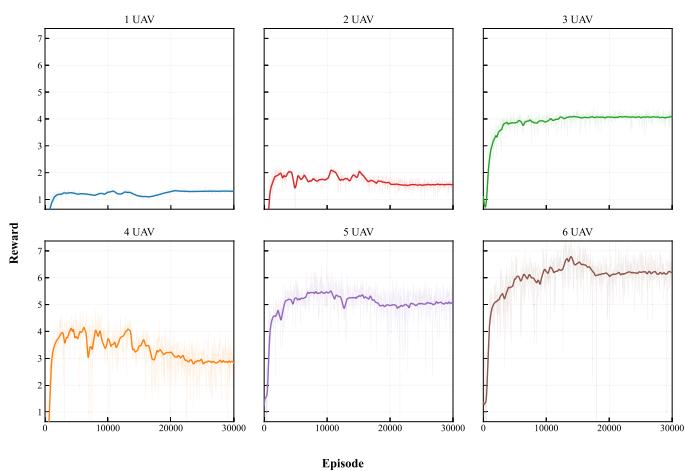  
Fig. 6. Convergence vs. different UAV numbers.

TABLE III  
EVALUATION RESULTS OF DIFFERENT UAV NUMBERS

<table><tr><td>Number</td><td>Eval Reward</td><td>Avg Rest Energy</td><td>Task Completed</td></tr><tr><td>1</td><td>0.9806</td><td>1358.30</td><td>7/80 (8.8%)</td></tr><tr><td>2</td><td>1.9025</td><td>312.23</td><td>14/80 (17.5%)</td></tr><tr><td>3</td><td>3.7009</td><td>280.88</td><td>23/80 (28.8%)</td></tr><tr><td>4</td><td>3.7031</td><td>337.37</td><td>26/80 (32.5%)</td></tr><tr><td>5</td><td>4.4709</td><td>81.40</td><td>38/80 (47.5%)</td></tr><tr><td>6</td><td>5.2940</td><td>337.15</td><td>43/80 (53.8%)</td></tr></table>

Table III summarizes quantitative evaluation metrics. As fleet size grows from one to six, evaluation rewards increase from 0.9806 to 5.2940, alongside significant task completion rate improvements from 8.8% to 53.8%. Average remaining energy reveals insightful operational trends. A single UAV maintains high residual energy levels reaching 1358.30 owing to limited exploration ranges within the time horizon. Fleets comprising five UAVs expend almost all available energy, leaving minimal residual energy around 81.40, maximizing completion rates to 47.5%. Conversely, fleets comprising six UAVs achieve highest task completion rates reaching 53.8% while preserving safer energy margins around 337.15. This phenomenon demonstrates larger fleet capacities balancing energy efficiency and mission throughput via superior spatiotemporal alignment and optimized trajectory planning.

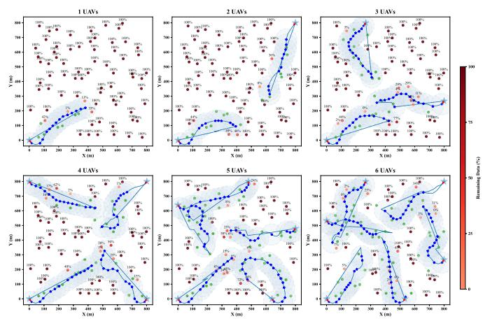  
Fig. 7. UAV trajectories of different UAV numbers.

Fig. 7 visualizes UAV trajectories and UE status. With fewer UAVs, data collection trajectories remain localized near initial deployment positions, leaving majority task nodes incomplete with 100% remaining data. Introducing additional UAVs expands collaborative networks across the entire area. Starting with three UAVs, agents automatically partition the environment into distinct subregions, effectively minimizing trajectory overlaps. Utilizing six UAVs, the trajectory network spans evenly across the entire mission space, successfully transforming numerous incomplete nodes into completed ones. These visual trajectories firmly validate scalability and trajectory planning efficacy of the proposed algorithm in complex setups involving multiple agents.

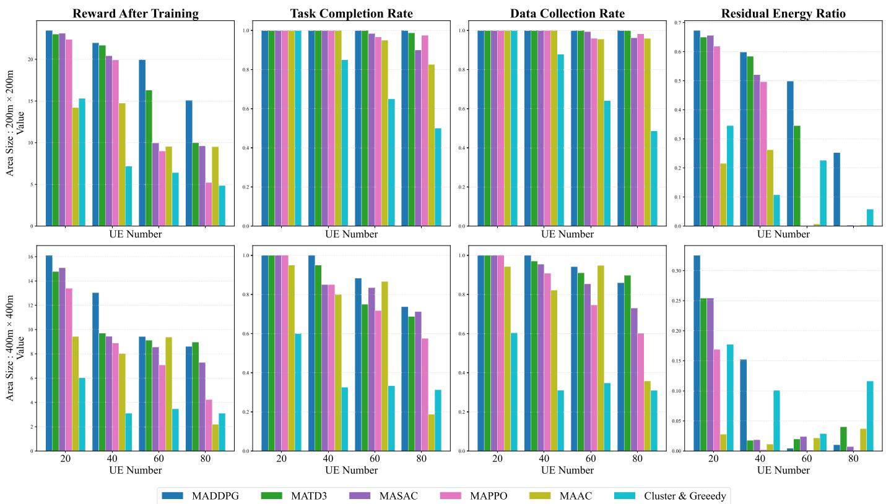  
Fig. 8. Performance metrics of different algorithms under varying scenarios.

## C. Comparative Analysis of Algorithms

This section delivers a rigorous evaluation of the MADDPG algorithm by analyzing the performance metric bar charts in Fig. 8 alongside UAV flight trajectory visualizations. The practical performance is investigated across different environmental scales (200 m × 200 m and 400 m × 400 m) and task workloads of 20 to 80 UEs. Comprehensive multi-dimensional comparisons against baseline algorithms are also conducted to demonstrate its superiority. The baseline algorithms are as follows.

1) Multi-Agent Twin Delayed Deep Deterministic Policy Gradient (MATD3): Extending the TD3 architecture to multi-agent domains, this off-policy method utilizes a clipped double Q-learning mechanism to mitigate value overestimation bias by deriving target values from the minimum output of twin critics. Furthermore, delaying policy parameter updates relative to critic adjustments bolsters learning robustness.

2) Multi-Agent Soft Actor-Critic (MASAC): Integrating maximum entropy reinforcement learning into a CTDE framework enhances exploration and policy robustness. To prevent premature convergence, centralized critics evaluate joint state-action values alongside policy entropy. Concurrently, actors independently optimize stochastic policies using local observations, effectively balancing reward maximization and entropy exploration.

3) Multi-Agent Proximal Policy Optimization (MAPPO): As an on-policy adaptation of PPO, this algorithm adopts a CTDE framework. A centralized critic approximates the global value function by synthesizing joint observations. To maintain update stability and prevent excessive parameter shifts, individual agents optimize independent policies using a surrogate objective function featuring probability ratio clipping.

4) Multi-Agent Actor-Critic (MAAC): To mitigate environmental non-stationarity, this CTDE framework assigns a dedicated centralized critic to each agent. These critics leverage global states and joint actions to accurately model the action-value landscape. Consequently, actors formulate decisions exclusively based on local sensory inputs during decentralized execution.

5) Cluster & Greedy: To mitigate large-scale spatial complexity, this heuristic algorithm partitions distributed target nodes into localized clusters based on geographical proximity. This modularization decomposes intricate decision-making into manageable sub-tasks. Subsequently, a greedy strategy operates within each cluster, sequentially selecting the nearest neighbor or immediate optimal action to minimize instant operational costs and accelerate computation.

Fig. 8(a) indicates that MADDPG achieves higher cumulative rewards compared to the evaluated baselines across the test scenarios. Expanding the spatial scale from 200 m × 200 m to 400 m × 400 m alongside increasing workloads consistently diminishes rewards due to the enlarged search space and higher energy demands. MAAC exhibits a lower reward profile even under a light workload of 20 UEs. Under an intensive workload of 80 UEs, the heuristic Cluster & Greedy scheme

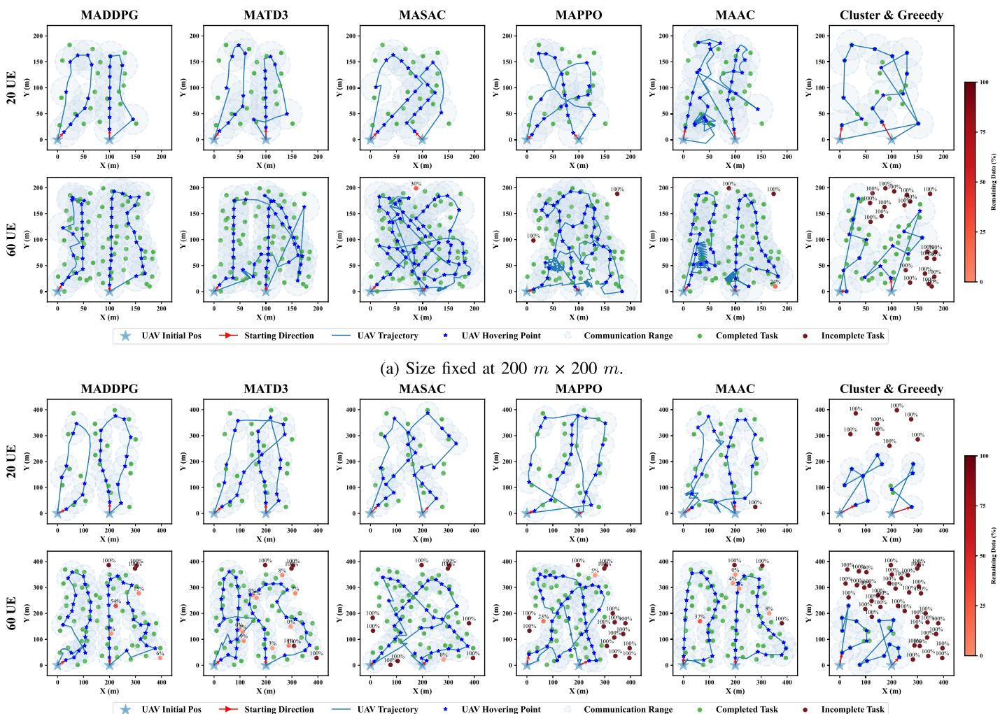  
(b) Size fixed at 400 m × 400 m.  
Fig. 9. UAVs trajectories of different algorithms under varying scenarios.

records the lowest performance among the models. Among the learning-based baselines, MASAC and MAPPO experience reward degradation under high user density, while MATD3 retains a reward profile closer to MADDPG. Service completion and data collection rates in Fig. 8(b) and (c) demonstrate near-optimal performance across learning methods under lowload scenarios. Scaling the environment to 60 and 80 UEs reveals distinct performance variations. In the 200 m × 200 m setting with 80 UEs, MASAC and MAAC show a decrease below 0.85, while MATD3 and MAPPO remain near 0.98. Expanding the operational field to 400 m ×400 m with 80 UEs reduces the completion rate of MAAC below 0.20. Under this larger-scale condition, MAPPO and MASAC decline to approximately 0.60, whereas MATD3 maintains a value near 0.70. MADDPG sustains both metrics above 0.95 in the smaller field and preserves the highest recorded value at 0.73 under the maximum scale and workload conditions. Residual energy curves in Fig. 8(d) highlight the inherent trade-off between task execution and energy consumption. To sustain high collection rates, MASAC, MAPPO, and MAAC completely deplete their energy at 60 and 80 UEs (200 m ×200 m), accelerating to near-zero at just 40 UEs in the 400 m ×400 m environment. Conversely, while Cluster & Greedy retains energy, this surplus stems from severe operational failure and low task completion, not algorithmic efficiency. MADDPG uniquely decouples this trade-off. By leveraging user-aware path planning, it minimizes wasteful mechanical consumption, preserving the highest residual energy across all configurations while simultaneously securing peak task completion rates.

Physical flight paths in the trajectory maps corroborate the quantitative results, illustrating behavioral variations across the algorithms. The Cluster & Greedy algorithm generates rigid, straight-line paths that often do not reach outer nodes, leaving uncompleted task nodes clustered along the map boundaries at 60 UEs. MAAC trajectories present frequent path intersections under a light workload of 20 UEs, which shift to localized looping and central path redundancy at 60 UEs, leaving multiple peripheral nodes unserved. In the expanded 400 m ×400 m environment, MASAC and MAPPO concentrate flight paths in central regions, creating path overlap and leaving incomplete tasks along the outer periphery. MATD3 tracks user distributions at smaller scales, but expanding the operational field induces task omissions at the map edges. MADDPG addresses these coverage issues via a user-aware service mechanism. Hovering points anchor near the geometric centers of localized high-demand areas, reducing sequential pointto-point tracking. A single communication coverage circle serves three to five closely situated task points simultaneously, increasing the communication gain per flight step. Streamlined migration paths reduce acceleration and deceleration overhead, contributing to the higher remaining energy ratio. Under 60 and 80 UE workloads, alternative algorithms leave uncompleted task nodes due to spatial conflicts. UAVs governed by MADDPG execute a perception-based interleaved service mechanism. This global search strategy reduces redundant path overlap and successfully services the majority of nodes across the map.

Heuristic approaches like Cluster & Greedy require realtime iterative clustering at every execution step. This dependency introduces processing latency, restricting real-time responsiveness as node density increases. Conversely, deep reinforcement learning frameworks bypass online optimization by shifting the computational burden to offline training. The action-value network of MADDPG encapsulates longterm value estimations of global states during training. This mechanism reduces the peripheral task omissions observed in MAPPO and MASAC, minimizes the path overlaps found in MAAC, mitigates the edge-node coverage gaps present in MATD3, and outperforms traditional heuristics, providing better scalability and global coordination in dynamic continuous environments.

## VI. CONCLUSION

This paper investigates the multi-UAV assisted MEC problem in emergency communication scenarios. The objective is to maximize collected data while optimizing residual energy, subject to hard constraints including energy limits, dynamic collision avoidance, and safe RTB. We formulate this as an MDP and adopt a multi-agent scheme, treating each UAV as an agent. We propose an MADDPG-based cooperative control algorithm to solve this high-dimensional optimization problem. The algorithm adopts the CTDE architecture to enable efficient multi-agent cooperation. We designed a multiobjective reward function to guide agents in balancing data collection, energy consumption, safety, and RTB guarantees. The proposed algorithm learns efficiently and coordinates energy-aware strategies, eliminating spatial conflicts and path redundancy. Numerical results show MADDPG significantly outperforms baselines (MATD3, MASAC, MAPPO, MAAC, and Cluster & Greedy). Crucially, it decouples the trade-off between data collection and energy consumption, achieving peak completion rates while preserving maximum residual energy, whereas baselines either prematurely deplete batteries or retain energy merely due to operational failure.

This study establishes an effective framework for the considered scenarios. Several directions merit further investigation. At the algorithmic level, asynchronous training frameworks and communication topology learning can be explored to improve coordination efficiency and robustness under partial observability and highly dynamic conditions. At the modeling level, more realistic constraints will be incorporated, including intermittent communication, uncertain wind disturbances, and cooperative task planning for heterogeneous UAV systems.

These extensions are expected to improve the consistency between the proposed framework and practical application requirements.

## REFERENCES

[1] S. Tanwar, S. Tyagi, I. Budhiraja, and N. Kumar, “Tactile internet for autonomous vehicles: Latency and reliability analysis,” IEEE Wireless Commun., vol. 26, no. 4, pp. 66–72, Aug. 2019.

[2] J. Kang et al., “Personalized saliency in task-oriented semantic communications: Image transmission and performance analysis,” IEEE J. Sel. Areas Commun., vol. 41, no. 1, pp. 186–201, Jan. 2023.

[3] L. Liu, J. Feng, X. Mu, Q. Pei, D. Lan, and M. Xiao, “Asynchronous deep reinforcement learning for collaborative task computing and ondemand resource allocation in vehicular edge computing,” IEEE Trans. Intell. Transp. Syst., vol. 24, no. 12, pp. 15513–15526, Dec. 2023.

[4] J. Mei, L. Dai, Z. Tong, X. Deng, and K. Li, “Throughput-aware dynamic task offloading under resource constant for MEC with energy harvesting devices,” IEEE Trans. Netw. Service Manage., vol. 20, no. 3, pp. 3460–3473, Sep. 2023.

[5] M. A. Khan et al., “Swarm of UAVs for network management in 6G: A technical review,” IEEE Trans. Netw. Service Manage., vol. 20, no. 1, pp. 741–761, Mar. 2023.

[6] A. M. Seid, G. O. Boateng, B. Mareri, G. Sun, and W. Jiang, “Multiagent DRL for task offloading and resource allocation in multi-UAV enabled IoT edge network,” IEEE Trans. Netw. Service Manage., vol. 18, no. 4, pp. 4531–4547, Dec. 2021.

[7] L. Dai, F. Zeng, H. Kong, J. Cai, H. Jiang, and K. Li, “Throughput-aware cooperative task offloading in dynamic mobile edge computing systems,” IEEE Trans. Mobile Comput., vol. 24, no. 12, pp. 13276–13292, Dec. 2025.

[8] M. Yan, P. Yu, C. A. Chan, A. F. Gygax, C. Li, and I. Chih-Lin, “Intelligent and efficient UAV delivery for low-altitude economy networking: Path planning and energy consumption optimization,” IEEE Commun. Mag., vol. 64, no. 6, pp. 96–102, Jun. 2026.

[9] W. Chen, S. Zhao, R. Zhang, Y. Chen, and L. Yang, “UAV-assisted data collection with nonorthogonal multiple access,” IEEE Internet Things J., vol. 8, no. 1, pp. 501–511, Jan. 2021.

[10] M. Li, X. Liu, and H. Wang, “Completion time minimization considering GNs’ energy for UAV-assisted data collection,” IEEE Wireless Commun. Lett., vol. 12, no. 12, pp. 2128–2132, Dec. 2023.

[11] X. Yuan, Y. Hu, J. Zhang, and A. Schmeink, “Joint user scheduling and UAV trajectory design on completion time minimization for UAVaided data collection,” IEEE Trans. Wireless Commun., vol. 22, no. 6, pp. 3884–3898, Jun. 2023.

[12] M. Donipati, A. Jaiswal, A. Hazra, N. Mazumdar, and J. Singh, “Optimizing UAV-based data collection in IoT networks with dynamic service time and buffer-aware trajectory planning,” IEEE Trans. Netw. Service Manage., vol. 22, no. 2, pp. 1450–1460, Apr. 2025.

[13] L. He et al., “An online joint optimization approach for QoE maximization in UAV-enabled mobile edge computing,” in Proc. IEEE Conf. Comput. Commun. (IEEE INFOCOM), May 2024, pp. 101–110.

[14] L. Jing, X. Jia, Y. Lv, and N. Wan, “Maximizing the average secrecy rate for UAV-assisted MEC: A DRL method,” in Proc. IEEE 5th Adv. Inf. Technol., Electron. Autom. Control Conf. (IAEAC), Mar. 2021, pp. 2514–2518.

[15] M. Cheng, S. He, M. Lin, W.-P. Zhu, and J. Wang, “RL and DRL based distributed user access schemes in multi-UAV networks,” IEEE Trans. Veh. Technol., vol. 74, no. 3, pp. 5241–5246, Mar. 2025.

[16] Y. Gao, C. Li, and Z. Li, “Deep reinforcement learning-driven adaptive task offloading and resource allocation for UAV-assisted mobile edge computing,” in Proc. 27th Int. Conf. Comput. Supported Cooperat. Work Design (CSCWD), May 2024, pp. 1004–1009.

[17] J. Yan, X. Zhao, and Z. Li, “Deep-reinforcement-learning-based computation offloading in UAV-assisted vehicular edge computing networks,” IEEE Internet Things J., vol. 11, no. 11, pp. 19882–19897, Jun. 2024.

[18] M. Yan, H. Guo, C. A. Chan, A. F. Gygax, C. Li, and I. Chih-Lin, “Semantic communication-enabled multi-access edge computing network resource optimization in the 6G era,” IEEE Wireless Commun., vol. 33, no. 2, pp. 83–91, Apr. 2026.

[19] F. Xiong et al., “Energy-saving data aggregation for multi-UAV system,” IEEE Trans. Veh. Technol., vol. 69, no. 8, pp. 9002–9016, Aug. 2020.

[20] H. Guo, Y. Wang, J. Liu, and C. Liu, “Multi-UAV cooperative task offloading and resource allocation in 5G advanced and beyond,” IEEE Trans. Wireless Commun., vol. 23, no. 1, pp. 347–359, Jan. 2024.

[21] J. Sabzehali, V. K. Shah, Q. Fan, B. Choudhury, L. Liu, and J. H. Reed, “Optimizing number, placement, and backhaul connectivity of multi-UAV networks,” IEEE Internet Things J., vol. 9, no. 21, pp. 21548–21560, Nov. 2022.

[22] M. Li, S. He, and H. Li, “Minimizing mission completion time of UAVs by jointly optimizing the flight and data collection trajectory in UAV-enabled WSNs,” IEEE Internet Things J., vol. 9, no. 15, pp. 13498–13510, Aug. 2022.

[23] G. Sun et al., “Multi-objective optimization for multi-UAV-assisted mobile edge computing,” IEEE Trans. Mobile Comput., vol. 23, no. 12, pp. 14803–14820, Dec. 2024.

[24] H. Ju and B. Shim, “Energy-efficient multi-UAV network using multiagent deep reinforcement learning,” in Proc. IEEE VTS Asia Pacific Wireless Commun. Symp. (APWCS), Aug. 2022, pp. 70–74.

[25] X. Cheng, R. Jiang, H. Sang, G. Li, and B. He, “Joint optimization of multi-UAV deployment and user association via deep reinforcement learning for long-term communication coverage,” IEEE Trans. Instrum. Meas., vol. 73, pp. 1–13, 2024.

[26] C. Dai, K. Zhu, and E. Hossain, “Multi-agent deep reinforcement learning for joint decoupled user association and trajectory design in full-duplex multi-UAV networks,” IEEE Trans. Mobile Comput., vol. 22, no. 10, pp. 6056–6070, Oct. 2023.

[27] H. N. Abishu, G. Sun, Y. H. Yacob, G. O. Boateng, D. Ayepah-Mensah, and G. Liu, “Multiagent DRL-based consensus mechanism for blockchain-based collaborative computing in UAV-assisted 6G networks,” IEEE Internet Things J., vol. 12, no. 4, pp. 4331–4348, Feb. 2025.

[28] G. Shen et al., “Deep reinforcement learning for flocking motion of multi-UAV systems: Learn from a digital twin,” IEEE Internet Things J., vol. 9, no. 13, pp. 11141–11153, Jul. 2022.

[29] C. Lee, S. Lee, T. Kim, I. Bang, J. H. Lee, and S. H. Chae, “Multi-agent deep reinforcement learning-based multi-uav path planning for wireless data collection and energy transfer,” in Proc. 5th Int. Conf. Ubiquitous Future Netw. (ICUFN), 2024, pp. 500–504.

[30] M. Dhuheir, A. Erbad, A. Al-Fuqaha, B. Hamdaoui, and M. Guizani, “AoI-aware intelligent platform for energy and rate management in multi-UAV multi-RIS system,” IEEE Trans. Netw. Service Manage., vol. 22, no. 5, pp. 4376–4393, Oct. 2025.

[31] Y. He, Y. Gan, H. Cui, and M. Guizani, “Fairness-based 3-D multi-UAV trajectory optimization in multi-UAV-assisted MEC system,” IEEE Internet Things J., vol. 10, no. 13, pp. 11383–11395, Jul. 2023.

[32] Y. Cui, Y. Gao, and D. Zhao, “Design of multi-UAV task allocation algorithm based on deep reinforcement learning,” in Proc. 6th Int. Conf. Comput. Eng. Appl. (ICCEA), Apr. 2025, pp. 440–443.

[33] T. P. Lillicrap et al., “Continuous control with deep reinforcement learning,” 2015, arXiv:1509.02971.

[34] L. Wu et al., “Attention-augmented MADDPG in NOMA-based vehicular mobile edge computational offloading,” IEEE Internet Things J., vol. 11, no. 16, pp. 27000–27014, Aug. 2024.

[35] J. Du et al., “MADDPG-based joint service placement and task offloading in MEC empowered air–ground integrated networks,” IEEE Internet Things J., vol. 11, no. 6, pp. 10600–10615, Mar. 2024.

[36] R. Lowe, Y. Wu, A. Tamar, J. Harb, P. Abbeel, and I. Mordatch, “Multiagent actor-critic for mixed cooperative-competitive environments,” 2017, arXiv:1706.02275.

Jing Mei (Member, IEEE) received the Ph.D. degree in computer science from Hunan University, China, in 2015. She is currently an Associate Professor at Hunan Normal University, Changsha, China. Her research interests include parallel and distributed computing and cloud computing. She has published 40 research articles in international conference and journals, such as IEEE TRANSACTIONS ON COMPUTERS, IEEE TRANSACTIONS ON PARALLEL AND DISTRIBUTED SYSTEMS, IEEE TRANSACTIONS ON SERVICES

COMPUTING, Cluster Computing, Journal of Grid Computing, and The Journal of Supercomputing.

Jinglei Xu is currently pursuing the master’s degree with the College of Information Science and Engineering, Hunan Normal University, Changsha, China. Her research interests mainly revolve around the areas of mobile edge computing and deep reinforcement learning.

Zhao Tong (Senior Member, IEEE) received the Ph.D. degree in computer science and technology from the College of Computer Science and Electronic Engineering (CSEE), Hunan University (HNU), China, in 2014. From 2017 to 2018, he was a Visiting Scholar at Georgia State University. He is currently a Full Professor at Hunan Normal University (HNNU). He has published more than 40 research papers in peer-review international conferences and journals, such as IEEE TRANSACTIONS ON PARALLEL AND DISTRIBUTED SYSTEMS, IEEE

SC, IEEE TRANSACTIONS ON NETWORK AND SERVICE MANAGEMENT, and IEEE TRANSACTIONS ON INDUSTRIAL INFORMATICS. His main research interests are on high-performance computing and super-computing, big data management and analytics, and resource management. He is a Distinguished Member of China Computer Federation (CCF).

Keqin Li (Fellow, IEEE) received the B.S. degree in computer science from Tsinghua University in 1985 and the Ph.D. degree in computer science from the University of Houston in 1990. He is a SUNY Distinguished Professor at the State University of New York and a National Distinguished Professor at Hunan University, China. He has authored or co-authored more than 1130 journal articles, book chapters, and refereed conference papers. Since 2020, he has been among the world’s top few most influential scientists in parallel and distributed

computing regarding single-year impact (ranked #2) and career-long impact (ranked #4) based on a composite indicator of the Scopus citation database. He is listed in Scilit Top Cited Scholars from 2023 to 2024 and is among the top 0.02% out of more than 20 million scholars worldwide based on top-cited publications. He is listed in ScholarGPS Highly Ranked Scholars from 2022 to 2024 and is among the top 0.002% out of more than 30 million scholars worldwide based on a composite score of three ranking metrics for research productivity, impact and quality in the recent five years. He is a member of the SUNY Distinguished Academy. He is an AAAS Fellow, an AAIA Fellow, an ACIS Fellow, and an AIIA Fellow. He is a member of European Academy of Sciences and Arts. He is a member of Academia Europaea (Academician of the Academy of Europe).