# Energy-Constrained Satellite Edge Computing for Satellite-Terrestrial Integrated Networks

Lei Cheng , Gang Feng , Senior Member, IEEE, Yao Sun , Senior Member, IEEE, Shuang Qin , Senior Member, IEEE, Feng Wang , Member, IEEE, and Tony Q. S. Quek , Fellow, IEEE

Abstract—Satellite edge computing (SEC) has emerged as an innovative paradigm for future satellite-terrestrial integrated networks (STINs), expanding computation services by sinking computing capabilities into Low-Earth-Orbit (LEO) satellites. However, the mobility of LEO satellites poses two key challenges to SEC: 1) constrained onboard computing and transmission capabilities caused by limited and dynamic energy supply, and 2) stochastic task arrivals within the satellites’ coverage and time-varying channel conditions. To tackle these issues, it is imperative to design an optimal SEC offloading strategy that effectively exploits the available energy of LEO satellites to fulfill competing task demands for SEC. In this paper, we propose a dynamic offloading strategy (DOS) with the aim to minimize the overall completion time of arriving tasks in an SEC-assisted STIN, subject to the long-term energy constraints of the LEO satellite. Leveraging Lyapunov optimization theory, we first convert the original long-term stochastic problem into multiple deterministic one-slot problems parameterized by current system states. Then we use sub-problem decomposition to jointly optimize the task offloading, computing, and communication resource allocation strategies. We theoretically prove that DOS achieves near-optimal performance. Numerical results demonstrate that DOS significantly outperforms the other four baseline approaches in terms of task completion time and dropping rate.

Index Terms—Computation offloading, satellite edge computing, satellite-terrestrial integrated network.

# I. INTRODUCTION

ATELLITE-TERRESTRIAL networks (STINs) have been widely acknowledged as a promising solution to achieve

Received 10 June 2024; revised 6 August 2024; accepted 13 October 2024. Date of publication 17 October 2024; date of current version 14 February 2025. This work was supported in part by the National Natural Science Foundation of China under Grant 62201121, in part by the fellowship of China National Postdoctoral Program for Innovative Talents under Grant BX20230057, and in part by the National Research Foundation, Singapore and Infocomm Media Development Authority under its Future Communications Research & Development Programme. An earlier version of this paper was presented in part at the ICC 2022 - IEEE International Conference on Communications [DOI: 10.1109/ICC45855.2022.9838943]. The review of this article was coordinated by Prof. Xianbin Cao. (Corresponding author: Gang Feng.)

Lei Cheng is with the National Key Laboratory of Wireless Communications, University of Electronic Science and Technology of China, Chengdu 611731, China (e-mail: leicheng@std.uestc.edu.cn).

Gang Feng and Shuang Qin are with the National Key Laboratory of Wireless Communications, University of Electronic Science and Technology of China, Chengdu 611731, China, and also with the Yangtze Delta Region Institute (Huzhou), University of Electronic Science and Technology of China, Huzhou 313001, China (e-mail: fenggang@uestc.edu.cn; blueqs@uestc.edu.cn).

Yao Sun is with the James Watt School of Engineering, University of Glasgow, G12 8QQ Glasgow, U.K. (e-mail: yao.sun@glasgow.ac.uk).

Feng Wang and Tony Q. S. Quek are with the Information Systems Technology and Design Pillar, Singapore University of Technology and Design, Singapore 487372 (e-mail: feng2\_wang@sutd.edu.sg; tonyquek@sutd.edu.sg).

Digital Object Identifier 10.1109/TVT.2024.3483203

global seamless coverage and pervasive connectivity for future networks [1], [2]. As an indispensable component of STINs, satellite networks can not only supplement existing terrestrial networks in congested urban areas but also extend connectivity to places lacking ground communication infrastructure. More importantly, the rapid advancements in onboard processing technologies have propelled satellites’ evolving from their traditional roles as communication relays into edge computing nodes, and even machine learning nodes [3], [4], [5]. In such a transformation, low-earth-orbit (LEO) satellites, in particular, have attracted much attention for their low orbit height, short propagation delay, and small path loss. By deploying LEO satellites with edge computing servers, satellite edge computing (SEC) has emerged to provide in-proximity computation services to users. For example, the first LEO satellite with an SEC platform was already successfully launched by Huawei Cloud to form the future sky computing constellation [6].

Compared to traditional mobile edge computing (MEC), SEC offers distinct advantages to provide resilient computation services, especially for scenarios where terrestrial networks are compromised. Besides, SEC exhibits great scalability as the satellites are becoming more miniature and cost-effective. Thus, SEC has been readily employed to support various applications, such as disaster recovery, emergency services (e.g. wildfires or hurricanes), remote Internet of Things (RIoT), and Internet of Vehicles (IoVs) monitoring. By adopting SEC, potential multi-hop transmission and long-distance propagation to the remote computing center are avoided by processing tasks at LEO satellite onboard computing servers [7], [8]. However, while the energy supply of MEC is usually assumed to be stable, that of SEC is provided by solar panels and battery cells on LEO satellites. As the LEO satellites constantly move, they may experience prolonged darkness without sufficient energy input [9]. This results in unstable and scarce onboard computing and transmission capability of LEO satellites, making it difficult to provide SEC services with certain quality requirements for arriving users within coverage. Moreover, unlike MEC in terrestrial networks, the increased distance between LEO satellites and users may lead to higher transmission delay and energy consumption when offloading tasks.

Therefore, while we enjoy the great benefits of SEC, it is crucial to design an efficient SEC strategy, i.e., to jointly determine whether/where to offload users’ tasks and how to allocate computing and communication resources. This task is especially challenging due to the strict spatio-temporal constraints imposed by the inherent mobility of LEO satellites, such as dynamic energy evolution and stochastic computation demands [10]. On the one hand, as an LEO satellite moves, its accumulated energy is consistently consumed for the computation and transmission of arrival tasks. This dynamic energy evolution of LEO satellites couples the offloading decision and resource allocation across timeslots and thus should be carefully considered to guarantee long-term system performance. On the other hand, task arrivals within coverage, and channel quality of transmission links vary with the locations of LEO satellites, which could lead to varying demands for energy resources [11]. With this regard, the limited resources (the available energy, computation capacity, and transmit power) should be dynamically adjusted under the stochastic distribution of current and future environmental dynamics.

Fortunately, researchers have intensively explored SEC strategies from different perspectives [12], [13], [14], [15], [16], [17], [18], [19], [20], [21], [22], [23], [24], [25], [26], [27], [28], [29], [30]. For instance, the problem of minimizing total energy consumption and/or latency of tasks has been investigated through the optimization of offloading decisions, and/or resource allocation under various network restrictions, e.g., computing capacity [12], [14], environmental dynamics [13], [29], [30], and topological changes [26]. Despite these advancements, the aforementioned challenges remain inadequately addressed. First, in some investigations, the allocation of only communication or computation resources is considered, without taking advantage of the complementary relationship between communication and computation resources, and thus the limited resources cannot be well exploited. Second, the energy dynamics of LEO satellites during movement have been greatly simplified in most previous work, where the energy supply is often assumed to be sufficient and constant. Last but not least, computation task arrivals varying with the geographical position of the LEO satellite are not considered.

In this paper, we design an efficient online SEC offloading strategy, called DOS, that integrates task offloading and the associated resource allocation for an SEC-assisted STIN. Our main contributions are summarized as follows:

We develop a comprehensive model for an SEC-assisted STIN, thereby reflecting more realistic scenarios. Specifically, we take into account the time-varying energy evolution of LEO satellites and stochastic computation demands caused by the mobility of LEO satellites, to accurately capture the features of real-world SEC scenarios within STIN.   
We formulate a novel joint task offloading, computation, and communication resource allocation optimization problem, with the aim of minimizing the overall task completion time while adhering to the long-term energy evolution of LEO satellites. The formulated problem is NP-hard and future-dependent.   
We propose an online SEC offloading strategy (DOS) through hierarchical decomposition. We first transform the original problem into multiple one-slot real-time optimization problems leveraging the Lyapunov optimization framework, where each one-slot problem is then

decomposed and transformed into multiple convex optimization problems.

We validate the effectiveness and performance of the proposed DOS through theoretical analysis and numerical experiments. The theoretical analysis demonstrates that the proposed DOS converges to the near-optimality within polynomial time. Numerical results further confirm the superiority of DOS over benchmark approaches.

The remainder of this paper is organized as follows. Section II presents related work. The system model and the formulated problem are described in Section III. In Section IV, the corresponding solution to the problem is presented under the framework of Lyapunov optimization. Section V presents the simulation results as well as discussions. Finally, this paper is concluded in Section VI.

# II. RELATED WORK

In this section, we have reviewed the most relevant studies in terms of STIN system constraints and approach design for SEC strategies, and provide a summary of the disparities between them and our work in Table I.

# A. STIN System Constraints

1) Limited Onboard Resources: To exploit limited onboard resources, the offloading strategy of SEC is optimized by leveraging distributed optimization methods [12], [13]. Besides, various strategies have been developed for the optimization of computation or transmission resource allocation in SECassisted STINs [14], [15], [16], [17]. Considering both unmanned aerial vehicles (UAVs) and ground users, the authors of [14] propose a low-complexity algorithm by successive convex approximation to improve system energy efficiency. An adaptive offloading and bandwidth allocation strategy is proposed based on proximal policy optimization (PPO) in [15]. The authors of [16] study the problem of cooperative computation offloading for LEO satellite networks, where a hierarchical greedy-based resource allocation strategy is proposed. In digital-twin empowered SEC, the authors of [17] utilize a multi-agent reinforcement learning (MARL) method to optimize the computation resource allocation and offloading decisions jointly. However, the communication and/or computation resources are allocated according to a predetermined strategy in the above literature, resulting in low resource utilization in practice.   
2) Delay-Energy Tradeoffs: With co-design on communication and computation resources, some of the literature seeks delay-energy trade-offs when designing SEC strategies [18], [19], [20], [21], [22], [23]. To reduce offloading latency, the task splitting, timeslot allocation, and computation allocation are jointly optimized in [18]. With a common goal of energy optimization, the authors of [19], [20], [21] all adopt alternative optimization for multi-satellite edge computing to optimize users’ association, power control, task scheduling, and computing resource allocation. To optimize long-term power cost, a Lyapunov optimization method is proposed in [22] considering

TABLE IDISPARITIES BETWEEN OUR WORK AND THE MOST RELEVANT WORK

<table><tr><td rowspan="2">Work</td><td colspan="3">STIN System Constraints</td><td rowspan="2">Approach Design</td></tr><tr><td>Computation-communication co-design</td><td>Energy evolution of satellites</td><td>Time-varying task arrivals</td></tr><tr><td>[12]-[14], [16]</td><td>✘</td><td>✘</td><td>✘</td><td>Convex optimization</td></tr><tr><td>[17]</td><td>✘</td><td>✘</td><td>✘</td><td>MARL</td></tr><tr><td>[15]</td><td>✘</td><td>✘</td><td>✓</td><td>RL (PPO)</td></tr><tr><td>[18]-[21]</td><td>✓</td><td>✘</td><td>✘</td><td>Convex optimization</td></tr><tr><td>[22]</td><td>✓</td><td>✓</td><td>✘</td><td>Lyapunov optimization + convex optimization</td></tr><tr><td>[24]</td><td>✓</td><td>✘</td><td>✓</td><td>RL (DDPG)</td></tr><tr><td>[26]</td><td>✓</td><td>✘</td><td>✓</td><td>Convex optimization</td></tr><tr><td>[27]</td><td>✓</td><td>✘</td><td>✓</td><td>Lyapunov optimization + delayed online learning</td></tr><tr><td>[28]</td><td>✓</td><td>✘</td><td>✓</td><td>Lyapunov optimization + delayed online learning</td></tr><tr><td>Our work</td><td>✓</td><td>✓</td><td>✓</td><td>Lyapunov optimization + convex optimization</td></tr></table>

the time-varying satellite-terrestrial channel conditions and the random task arrivals. With a concern on privacy protection [31], [32], a blockchain-aided Stackelberg game model is proposed in [23] for maximizing privacy overhead and network throughput by a Lyapunov optimization-based meta-learning method. Nevertheless, little attention has been paid to the time-varying energy evolution of satellites yet, which is indeed crucial in STINs as stated.

3) Mobility of LEO Satellites: On the other hand, the environmental dynamics brought by the mobility of LEO satellites, such as topology changes, time-varying channel conditions, and stochastic task arrivals, have been another concern for SEC strategy design [15], [24], [25], [26], [27], [28]. In [24], intersatellite computing resources sharing is introduced based on deep deterministic policy gradient (DDPG) to deal with stochastic task arrivals. A bargain game-based method is proposed in [25] to minimize the training delay and energy consumption for semantic SEC offloading. Considering the varying intraand inter-layer topology, a multi-tier offloading problem is resolved by the generalized benders decomposition (GBD) method and successive convex approximation in [26]. An aerial/spaceaided computation offloading strategy based on Lyapunov optimization with delayed online learning is proposed in [27]. A similar method is also utilized in [28] for multi-hop satellite peer offloading. Except for [28], these studies mostly consider stochastic computation demands at the user level, rather than the varying demands with the satellite’s movement.

# B. Approach Design

1) Offline Methods: To efficiently tackle the intricate joint optimization of SEC strategy for SEC-assisted STINs, numerous works have employed offline approaches, such as traditional deterministic optimization methods [12], [13], [14], [16], [18], [19], [20], [21]. While these approaches well address the SEC offloading problems in static scenarios, they fall short when directly applied to each slot considering energy dynamics of LEO satellites. Besides, offline approaches formulate long-term solutions under the assumption that the computation demands and channel conditions are either fixed or known in advance, which is impractical. As LEO satellites move, computation demands arrive in a stochastic manner, and the channel conditions exhibit dynamic changes. Hence, it is necessary to develop online approaches for dynamic SEC-assisted STIN to make real-time decisions without knowing future information.

2) Online Methods: Several studies have also explored online approaches, which are generally developed based on the Lyapunov optimization [22], [27], [28] or RL [15], [17], [24]. For instance, the Lyapunov framework integrated with delayed online learning is utilized in [28] for optimizing multi-hop satellite peer offloading with uncertain future workloads. An adaptive RL method is proposed in [15] to deal with spatiotemporal load dynamics for SEC. Specifically, most RL methods are data-driven and learn optimal policies through interactions with the environment. Although RL can be hard to interpret and may suffer from stability and convergence issues, it remains a powerful technique for making real-time decisions in complex environments where an explicit environmental model is infeasible. In contrast, the Lyapunov optimization framework has a simpler structure without requiring a large amount of samples, while providing stable performance guarantees based on explicit system models. Therefore, the Lyapunov optimization framework is preferred to devise our online approach.

According to the above comparison, we focus on a more realistic scenario by introducing the long-term energy dynamics and stochastic task arrivals as an LEO satellite moves in this paper. Besides, we develop an online dynamic computation offloading strategy based on Lyapunov optimization theory.

# III. SYSTEM MODEL AND PROBLEM FORMULATION

# A. SEC-Assisted STIN Model

The considered STIN is shown in Fig. 1, where multiple LEO satellites orbiting the Earth constitute a constellation over space. Each satellite, equipped with a computing server, serves as the space base station for remote user devices (UDs) under its coverage, such as IoT and IoV devices. Multiple ground-satellite links (GSLs) may be established between UDs and L to access the SEC services [15]. Furthermore, each LEO satellite establishes a feeder satellite-ground link (SGL) to a nearby terrestrial gateway and then connects the remote terrestrial cloud computing center via the gateway [21], [24].

We consider a scenario where the area served by an LEO satellite L varies with its movement. To facilitate the discussion for the access of UDs within a single LEO satellite’s coverage in a certain period, the time is divided into T slots, each with equal length τ [15]. We assume that the serving satellite for each UD remains unchanged during each slot. In each slot, the network control and data transmission operate according to the following steps. First, the serving LEO satellite gathers the network information (such as channel information) and computation task requests through GSLs. Second, based on collected information, the serving LEO satellite decides the task offloading and corresponding resource allocation for this slot. Subsequentially, the control messages will be distributed to UEs and the cloud computing center to allocate resources for each task. Third, the task is scheduled by the ground UE, the satellite, and the computation center following the control messages. Owing to the highly dynamic nature of the LEO satellite networks, the serving satellite for a UD is handed over according to certain criteria, just like signal strength-based handover. Once a handover is triggered, the current task execution and connection status will be synchronized to the next serving satellite via inter-satellite links (ISLs) to ensure the continuity of task completion [33], [34], as is shown in Fig. 1.

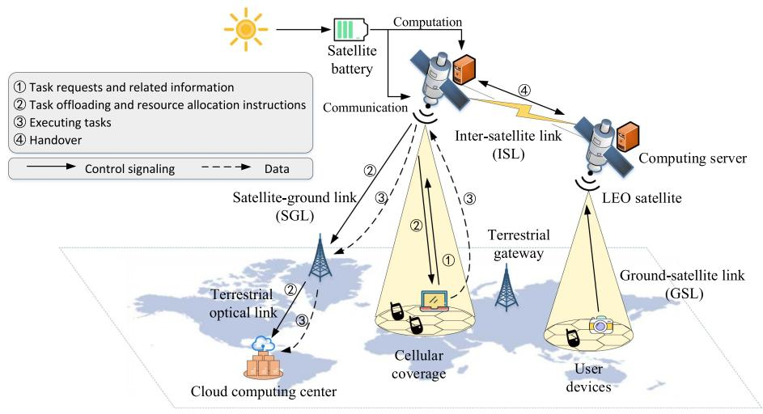

flowchart

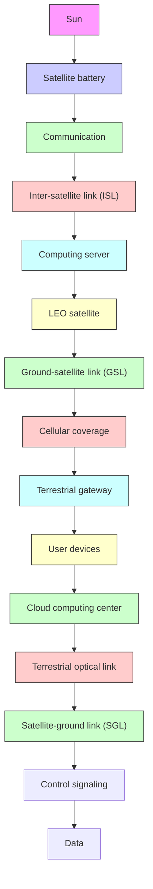

Fig. 1. Illustration of satellite-terrestrial integrated network with satellite edge computing.

Hypothetically, the arrival of UDs with computing tasks within the coverage of $\mathcal { L }$ obeys a Poisson Point Process (PPP). As the coverage area of $\mathcal { L }$ can be viewed as a circle with a fixed radius, the number of arrival UDs in each slot t follows a Poisson distribution, $\mathrm { i . e . , } N ( t ) \sim P ( \lambda _ { A } )$ , where $\lambda _ { A }$ is the average arrival rate of computing tasks with a unit of tasks/slot [12], [35]. We denote the n-th arriving UD within the coverage of $\mathcal { L }$ by $\mathcal { D } _ { n } , n \in \mathcal { N } ( t ) = \{ 1 , 2 , . . . , N ( t ) \}$ }. Each UD can transmit its ( ) =computing tasks via GSL to ${ \mathcal { L } } .$ (

Next, the channel characteristics of GSL are described. The GSLs, operating at the C band, suffer from attenuation, shadowing effects and small-scale fading. The channel path loss of the GSL from $\mathcal { D } _ { n }$ to ${ \mathcal { L } } ,$ denoted by $P L _ { n , S } ( \mathrm { d B } )$ , can be expressed as:

$$
P L _ {n, S} = P L _ {a} + P L _ {b} + P L _ {c}. \tag {1}
$$

Specifically, the channel path loss of a GSL is composed of the attenuation of atmospheric absorption $P L _ { a } .$ , basic path loss $P L _ { b } .$ , and small-scale fading $P L _ { c } [ 3 6 ] . P L _ { a }$ is a function of the elevation angle $\theta _ { S } .$ , the carrier frequency $f _ { c } ^ { S } ( \mathrm { G H z } )$ , which can be expressed as:

$$
P L _ {a} = \frac {L _ {z} (f _ {c} ^ {S})}{\sin \theta_ {S}}, \tag {2}
$$

where $L _ { z } ( f _ { c } ^ { S } )$ is the zenith attenuation at different altitudes and ( )environments on Earth, depending on the density of oxygen and water vapor [34].

On the other hand, $P L _ { b }$ is composed of free space path loss (FSPL) $P L _ { f s }$ and shadow fading caused by obstacles in surrounding environments $P L _ { s f }$ , and can be modelled as:

$$
P L _ {b} = P L _ {f s} + P L _ {s f}. \tag {3}
$$

Specifically, $P L _ { f s } ( \mathrm { { d B } ) }$ can be represented as:

$$
P _ {f s} = 2 0 \log_ {1 0} \left(f _ {c} ^ {S}\right) + 2 0 \log_ {1 0} (d _ {i, S}) + 3 2. 4 5, \tag {4}
$$

where $d _ { n , S }$ is the slant range between $\mathcal { D } _ { n }$ and ${ \mathcal { L } } ,$ , and can be calculated as [34]:

$$
d _ {n, S} = \sqrt {R _ {E} ^ {2} \sin^ {2} \theta_ {S} + h _ {S} ^ {2} + 2 R _ {E} h _ {S}} - R _ {e} \sin \theta_ {S}, \tag {5}
$$

where $R _ { E }$ is the Earth radius and $h _ { S }$ is the LEO altitude. $P L _ { s f }$ is a function of the elevation angle $\theta _ { S }$ , and the reference values of different scenarios are given by 3GPP [37]. $P L _ { c }$ is mainly caused by the scattering and reflection of multipath and the movement of UDs, and its value is determined by the probability of Line of Sight (LOS), which can be found in [37]. Thus, the channel gain from $\mathcal { D } _ { n }$ to $\mathcal { L } .$ denoted by $h _ { n , S } ( t )$ , is calculated as:

$$
h _ {n, S} (t) = G _ {t} G _ {r} P L _ {n, S} ^ {- 1}, \tag {6}
$$

where $G _ { t }$ and $G _ { r }$ are the transmit and receive antenna gains.

Suppose that the system uplink bandwidth $B _ { G S }$ is equally shared among multiple GSLs by adopting orthogonal frequency division multiplexing [17], [38]. Thus the bandwidth allocated to each GSL in slot t is given by $B _ { n } ^ { G S } ( t ) = B _ { G S } / N ( t )$ . According to Shannon’s Theorem, the computing task can be transmitted from $\mathcal { D } _ { n }$ to $\mathcal { L }$ at a transmission rate of

$$
r _ {n} ^ {D} (t) = B _ {n} ^ {G S} (t) \log_ {2} \left(1 + \frac {h _ {n , S} (t) p _ {n} ^ {D} (t)}{\sigma_ {0} B _ {n} ^ {G S} (t)}\right), \tag {7}
$$

TABLE II NOTATIONS USED IN THE PAPER 

<table><tr><td>Notation</td><td>Description</td></tr><tr><td> $\mathcal{L},\mathcal{D}_{n}$ </td><td>The LEO satellite and the  $n$ -th UD</td></tr><tr><td> $w_{a}^{in},f_{a},\tau_{a}^{\max}$ </td><td>The input data size, required CPU cycles per bit, and tolerable maximum delay of type- $a$  tasks</td></tr><tr><td> $\Xi=\{l,e,c\}$ </td><td>A index set denoting local computation, satellite edge computing and at the cloud center for task procession</td></tr><tr><td> $x_{n}^{\xi}(t),\xi\in\Xi$ </td><td>The task proportions that are processed</td></tr><tr><td> $z_{n}^{\xi}(t),\xi\in\Xi$ </td><td>The computing resources allocated to  $A_{n}^{a}(t)$ </td></tr><tr><td> $d_{n}^{\xi}(t),\xi\in\Xi$ </td><td>The task completion time at certain nodes</td></tr><tr><td> $e_{n}^{D,\xi}(t),\xi\in\Xi$ </td><td>The energy consumption of  $\mathcal{D}_{n}$  for satellite edge computing, and cloud computing</td></tr><tr><td> $e_{n}^{S,\xi}(t),\xi\in\{e,c\}$ </td><td>The energy consumption of  $\mathcal{D}_{n}$  and  $\mathcal{L}$  for satellite edge computing, and cloud computing</td></tr><tr><td> $E^{S}(t),e^{S,h}(t)$ </td><td>The energy level, and harvested energy of  $\mathcal{L}$ </td></tr><tr><td> $e^{S}(t),e_{n}^{D}(t)$ </td><td>The energy consumption of  $\mathcal{L}$  and  $\mathcal{D}_{n}$ </td></tr><tr><td> $B_{GS},B_{SG}$ </td><td>The system bandwidth for GSLs and SGLs</td></tr><tr><td> $r_{n}^{D}(t),r_{n}^{S}(t)$ </td><td>The transmission rate for GSLs and SGLs</td></tr></table>

where $\sigma _ { 0 }$ is the noise power spectral density, and $p _ { n } ^ { D } ( t )$ is the transmit power allocated by $\mathcal { D } _ { n }$ .

A task can also be transmitted to the remote cloud center via an SGL. The composition of channel path loss of SGLs is identical to that of GSLs, except for different parameters [39]. Besides, the SGLs share a downlink bandwidth of $B _ { S G }$ , with the bandwidth allocated to each SGL being $B _ { n } ^ { S G } ( t ) = { B } ^ { S G } / N ( t )$ . Similarly, the transmission rate from $\mathcal { L }$ to the nearby terrestrial gateway is given by:

$$
r _ {n} ^ {S} (t) = B _ {n} ^ {S G} (t) \log_ {2} \left(1 + \frac {h _ {S G} (t) p _ {n} ^ {S} (t)}{\sigma_ {0} B _ {n} ^ {S G} (t)}\right), \tag {8}
$$

where $h _ { S G } ( t )$ is the channel gain from L to the nearby terrestrial ( )gateway and can be calculated in the identical form as (6) except for different parameters. Then the gateway forwards the task to the cloud computing center through a terrestrial optical fiber link with abundant transmission bandwidth. For improvement of the readability, the notations used throughout the paper are listed in Table II.

# B. Task Processing Model in STIN

To efficiently utilize the available energy of the LEO satellite and UDs, we discuss the processing (i.e., transmission and computation) of a specific task at different computing nodes and analyze the completion time and energy consumption throughout the task’s processing.

To depict different characteristics of computing tasks, we further assume that the tasks will be generated from a finite set ${ \mathcal { A } } ,$ where each element denotes a specific type of task. A type a task generated by $\mathcal { D } _ { n }$ in slot t, i.e., $A _ { n } ^ { a } ( t )$ , is depicted by a tuple $( w _ { a } ^ { i n } , f _ { a } , \tau _ { a } ^ { \mathrm { m a x } } )$ , where $w _ { a } ^ { i n } , f _ { a }$ ( )and $\tau _ { a } ^ { \mathrm { m a x } }$ ( )represent the input data size (Mbits), required CPU cycles per bit (cycles/bit), and maximum tolerable delay (s) respectively. Suppose that the probability of generating the type-a task is $p _ { a }$ , where $\textstyle \sum _ { a = 1 } ^ { | { \mathcal { A } } | } p _ { a } = 1$ and |A| is the size of A. The distribution = =of task type, represented by $\mathbf { p } = [ p _ { 1 } , p _ { 2 } , . . . , p _ { | \mathcal { A } | } ]$ , is related to = [ ]different applications operated by UDs within the coverage of $\mathcal { L }$ . Therefore, the average arrival rate of type-a tasks can be given by $\lambda _ { A } p _ { a }$ .

Benefiting from code partitioning technology, we assume that computing tasks are separable in this paper, just like that in [21]. Thus, each task can be partially processed at different nodes simultaneously. We define an offloading vector $x _ { n } ( t ) =$ $[ x _ { n } ^ { l } ( t ) , x _ { n } ^ { e } ( t ) , x _ { n } ^ { c } ( t ) ]$ ( ) =to denote the partitioned portions of the [ (task $A _ { n } ^ { a } ( t )$ ( ) (, where $x _ { n } ^ { l } ( t ) , x _ { n } ^ { e } ( t )$ and $x _ { n } ^ { c } ( t )$ denote the percentage ( ) ( ) ( ) ( )of a task processed locally, at the LEO computing server and at the cloud computing center, respectively. Due to the limited available energy on UDs and the LEO satellite, a task may be blocked and dropped, which is denoted by $x _ { n } ^ { d } ( t ) = 1$ , otherwise $x _ { n } ^ { d } ( t ) = 0$ ( ) =. Therefore, these variables are constrained as:

$$
x _ {n} ^ {l} (t) + x _ {n} ^ {e} (t) + x _ {n} ^ {c} (t) + x _ {n} ^ {d} (t) = 1, \forall t \in \{1, 2, \dots , T \},
$$

where $x _ { n } ^ { l } ( t ) , x _ { n } ^ { e } ( t ) , x _ { n } ^ { c } ( t ) \in [ 0 , 1 ]$ , and $x _ { n } ^ { d } ( t ) \in \{ 0 , 1 \}$ . (9)

Next, we respectively discuss the completion time and energy consumed for a specific task $A _ { n } ^ { a } ( t )$ when it’s processed at different nodes.

1) Local Computing: First, we consider the scenario when task $A _ { n } ^ { a } ( t )$ is partially processed locally. We denote by $c _ { a } =$ $w _ { a } ^ { i n } f _ { a }$ ( ) =the total number of central processing unit (CPU) cycles for $A _ { n } ^ { a } ( t )$ . If the CPU frequency provided by $\mathcal { D } _ { n }$ is $z _ { n } ^ { D } ( t )$ , the ( )completion time for local computing is

$$
d _ {n} ^ {l} (t) = \frac {x _ {n} ^ {l} (t) c _ {a}}{z _ {n} ^ {D} (t)}, \tag {10}
$$

where $z _ { n } ^ { D } ( t )$ is constrained by the local computing capacity $z _ { n } ^ { D }$ i.e., $0 \leq z _ { n } ^ { D } ( t ) \leq z _ { n } ^ { D }$ . Thus, the energy consumption of local ( )computing is denoted by

$$
e _ {n} ^ {D, l} (t) = \kappa x _ {n} ^ {l} (t) c _ {a} z _ {n} ^ {D} (t) ^ {2}, \tag {11}
$$

where κ is the effective switched capacitance related to hardware structures [15].

2) Satellite Edge Computing: Similar to that in [21], [28], a part of task $A _ { n } ^ { a } ( t )$ can be offloaded to L for SEC services via a GSL.

Therefore, the completion time $d _ { n } ^ { e } ( t )$ for SEC consists of ( )transmission time, task computing time, and propagation time, and thus can be expressed as

$$
d _ {n} ^ {e} (t) = x _ {n} ^ {e} (t) \left(\frac {w _ {a} ^ {i n}}{r _ {n} ^ {D} (t)} + \frac {c _ {a}}{z _ {n} ^ {S} (t)}\right) + \frac {2 l _ {n}}{v}, \tag {12}
$$

where $z _ { n } ^ { S } ( t )$ is the amount of computing resource allocated to task $A _ { n } ^ { a } ( t )$ ( )by the SEC server, and is constrained by the maxi-( )mum capacity $z ^ { S }$ that can be allocated, i.e., $, 0 \leq z _ { n } ^ { S } ( t ) \leq z ^ { S } , l _ { n }$ is the distance from $\mathcal { D } _ { n }$ to $\mathcal { L }$ ( )and v is the speed of electromagnetic waves. The time spent on computation results transmission can be negligible according to two facts, 1) The size of computation results is usually much smaller than that of the input data, and 2) The downlink transmission rate of LEO satellites or the cloud computing center is much greater than that of terrestrial UDs [21].

In this way, the energy consumption for task $A _ { n } ^ { a } ( t )$ is composed of the UD’s transmission consumption $e _ { n } ^ { e , \dot { D } } ( t )$ and the satellite’s computation consumption $e _ { n } ^ { e , S } ( t )$ , which can be respectively expressed as

$$
e _ {n} ^ {D, e} (t) = p _ {n} ^ {D} (t) \frac {x _ {n} ^ {e} (t) w _ {a} ^ {i n}}{r _ {n} ^ {D} (t)}, \tag {13}
$$

$$
e _ {n} ^ {S, e} (t) = \kappa x _ {n} ^ {e} (t) c _ {a} z _ {n} ^ {S} (t) ^ {2}. \tag {14}
$$

3) Remote Cloud Computing: Similarly, we analyze the scenario if part of task $A _ { n } ^ { a } ( t )$ is processed at the remote cloud ( )computing center. Due to the lack of ground facilities, $\mathcal { D } _ { n }$ can only transmit computing tasks to ${ \mathcal { L } } ,$ and then $\mathcal { L }$ forwards the computing task to the nearby terrestrial gateway via an SGL before transmitting them to the cloud computing center.

Denote by $p _ { n } ^ { S } ( t )$ the transmit power of L. The task completion time $d _ { n } ^ { c } ( t )$ ( )is composed of the UD’s transmission time, the ( )satellite’s transmission time, the cloud’s computing time, and propagation time:

$$
d _ {n} ^ {c} (t) = x _ {n} ^ {c} (t) \left(\frac {w _ {a} ^ {i n}}{r _ {n} ^ {D} (t)} + \frac {w _ {a} ^ {i n}}{r _ {n} ^ {S} (t)} + \frac {c _ {a}}{z _ {n} ^ {C} (t)}\right) + \frac {2 \left(l _ {n} + l\right)}{v}, \tag {15}
$$

where $z _ { n } ^ { C } ( t )$ is the computation capacity that is allocated to task $A _ { n } ^ { a } ( t )$ ( )by the cloud computing center, and l is the total distance ( )from the LEO satellites, to the gateway, finally to the cloud computing center. Let ${ l } _ { n } ^ { \prime } = { l } _ { n } + { l } .$ .

= +Furthermore, the energy consumption for task $A _ { n } ^ { a } ( t )$ consists of the UD’s transmission consumption $e _ { n } ^ { D , c } ( t )$ ( )and the satellite’s transmission consumption $e _ { n } ^ { S , c } ( \bar { t } )$ ( ), which can be respectively given by

$$
e _ {n} ^ {D, c} (t) = p _ {n} ^ {D} (t) \frac {x _ {n} ^ {c} (t) w _ {a} ^ {i n}}{r _ {n} ^ {D} (t)}, \tag {16}
$$

$$
e _ {n} ^ {S, c} (t) = p _ {n} ^ {S} (t) \frac {x _ {n} ^ {c} (t) w _ {a} ^ {i n}}{r _ {n} ^ {S} (t)}. \tag {17}
$$

# C. Energy Consumption and Task Completion Time

1) Energy Consumption of UDs: For a terrestrial UD $\mathcal { D } _ { n }$ , its energy consumption in slot t is composed of energy for task transmission, task computation, and nominal operation $e _ { n } ^ { D , r } ( t )$ , and can be expressed as

$$
e _ {n} ^ {D} (t) = e _ {n} ^ {D, l} (t) + e _ {n} ^ {D, e} (t) + e _ {n} ^ {D, c} (t) + e _ {n} ^ {D, r} (t) \leq E ^ {D, \max} (t), \tag {18}
$$

where $E ^ { D , \mathrm { { m a x } } } ( t )$ is the maximum energy consumption of terres-(trial UDs in slot $t . e _ { n } ^ { D } ( t )$ is determined by the offloading strategy ( )and associated resource allocation and thus can be denoted by $e _ { n } ^ { D } ( x _ { n } ( t ) , z _ { n } ( t ) , p _ { n } ( t ) )$ .

( ( ) ( ) ( ))2) Dynamic Energy Evolution of LEO Satellites: The available energy of LEO satellites for the computation and transmission of tasks is limited and consistently changing during the fast-orbital movement of the LEO satellites, and thus the LEO satellite may not be able to serve all requests due to energy limitations [11], [35]. With this regard, we model the energy evolution process of the satellite. Let $\omega _ { s }$ denote the angular velocity of the satellite. When $t = t _ { 0 }$ , the satellite is at the =point that has the greatest distance to the sun. At slot t, the LEO satellite has passed $\theta ( t ) = ( t - t _ { 0 } ) \omega _ { s } \tau$ radians. Therefore, ( ) = ( )the harvested energy of the LEO satellite in slot $t ,$ denoted by $e ^ { S , h } ( t )$ , is a constraint with the following form:

$$
e ^ {S, h} (t) = \left\{ \begin{array}{l l} 0, & \text { if   } | \theta (t) | <   \theta_ {0}, \\ p _ {H} (\alpha_ {s}) \tau , & \text { otherwise }, \end{array} \right. \tag {19}
$$

where $p _ { H } ( \alpha _ { s } ) = p _ { H } \sqrt { 1 - \cos ^ { 2 } \alpha _ { s } \cos ^ { 2 } \theta ( t ) }$ denotes the ab-( ) = cos cossorption power of the LEO satellite, and $\alpha _ { s }$ ( )is the angle between sunlight and the orbital plane of the satellite [40]. The eclipse period is when $- \theta _ { 0 } \le \theta ( t ) \le \theta _ { 0 }$ , and the value of $\theta _ { 0 }$ is also related to $\alpha _ { s } \mathrm { : }$

$$
\theta_ {0} \left(\alpha_ {s}\right) = \left\{ \begin{array}{l} 0, \quad \text { if } \alpha_ {s} > \arcsin \frac {R _ {E}}{R _ {E} + h _ {S}} \\ \arcsin \frac {\sqrt {R _ {E} ^ {2} \cos^ {2} \alpha_ {s} - \left(2 R _ {E} h _ {S} + h _ {S} ^ {2}\right) \sin^ {2} \alpha_ {s}}}{\left(R _ {E} + H _ {S}\right) \cos \alpha_ {s}}, \\ \text { otherwise. } \end{array} \right. \tag {20}
$$

Thus, the harvested energy $e ^ { S , h } ( t )$ in each slot is co-determined by the absorption power and satellite orbital movement.

Assume that the harvested energy is available from the next slot, and the energy level of the LEO satellite at slot t is denoted by $E ^ { S } ( t )$ , which evolves according to the following equation:

$$
E ^ {S} (t + 1) = E ^ {S} (t) - e ^ {S} (t) + e ^ {S, h} (t),
$$

$$
\text { and } e ^ {S} (t) = \sum_ {n = 1} ^ {N} \left(e _ {n} ^ {S, e} (t) + e _ {n} ^ {S, c} (t)\right) + e ^ {S, r} (t) \leq E ^ {S} (t), \tag {21}
$$

where $e ^ { S } ( t )$ is the energy consumption of the LEO satellite in ( )slot t for task transmission, computation, and nominal operation (related to nominal power), and is related to the offloading strategy and associated resource allocation. Besides, the energy consumption is constrained by $e ^ { S } ( t ) \leq E ^ { S , \operatorname* { m a x } }$ , and $E ^ { S }$ , ( )is the maximum energy consumption determined by the maximum discharge depth of the battery, which prevents the energy from over-discharging [41], [42]. Thus, the energy consumption is constrained by $e ^ { S } ( x _ { n } ( t ) , z _ { n } ( t ) , p _ { n } ( t ) ) \leq E ^ { S , \operatorname* { m a x } } ( t ) =$ min $\{ E ^ { S , \operatorname* { m a x } } , E ^ { S } ( t ) \}$ .

( )3) Task Completion Time: As discussed before, processing task portions locally, by SEC, and by remote cloud computing involves consuming different amounts of energy across different computing nodes, with each part requiring a period of time to finish. As the computing task can be processed in parallel in different ways, the task completion time $d _ { n } ( t )$ for $A _ { n } ^ { a } ( t )$ is expressed as

$$
\begin{array}{l} d _ {n} (t) = \max \left\{1 _ {\{x _ {n} ^ {l} (t) > 0 \}} \cdot d _ {n} ^ {l} (t), 1 _ {\{x _ {n} ^ {e} (t) > 0 \}} \cdot d _ {n} ^ {e} (t), \right. \\ \left. 1 _ {\{x _ {n} ^ {c} (t) > 0 \}} \cdot d _ {n} ^ {c} (t) \right\} \\ = \max \left\{\frac {x _ {n} ^ {l} (t) \cdot c _ {a}}{z _ {n} ^ {l} (t)}, \right. \\ x _ {n} ^ {e} (t) w _ {a} ^ {i n} \left(\frac {1}{r _ {n} ^ {D} (t)} + \frac {f _ {a}}{z _ {n} ^ {S} (t)}\right) + 1 _ {\{x _ {n} ^ {e} (t) > 0 \}} \cdot \frac {2 l _ {n}}{v}, \\ x _ {n} ^ {c} (t) w _ {a} ^ {i n} \left(\frac {1}{r _ {n} ^ {D} (t)} + \frac {1}{r _ {n} ^ {S} (t)} + \frac {f _ {a}}{z _ {n} ^ {c} (t)}\right) \\ \end{array}
$$

$$
\left. + 1 _ {\{x _ {n} ^ {c} (t) > 0 \}} \cdot \frac {2 l _ {n} ^ {\prime}}{v} \right\}, \tag {22}
$$

where $1 _ { \{ x \in A \} }$ is an indicator function, and $1 _ { \{ x \in A \} } = 1$ if x $\in A$ and $1 _ { \{ x \in A \} } = 0$ otherwise.

The task $A _ { n } ^ { a } ( t )$ needs to be accomplished in a given time,

$$
d _ {n} (t) \leq \tau_ {a} ^ {\max}. \tag {23}
$$

Nevertheless, as the task offloading is subject to the energy constraints of UDs and the LEO satellite, some tasks may not be processed but have to be blocked and dropped in some cases. For instance, 1) when the wireless channel from $\mathcal { D } _ { n }$ to $\mathcal { L }$ is in deep fading, some tasks cannot be delivered due to the limited transmit power, 2) when computation-intensive tasks arrive densely, the finite and intermittent harvested energy of the LEO satellite may be unable to fulfill all the requests within its coverage. With this regard, we need to count the extra delay incurred, as the dropped tasks have to be re-transmitted and executed. Therefore, the task completion time of task $A _ { n } ^ { a } ( t )$ is defined as:

$$
\gamma_ {n} (t) = d _ {n} (t) + \beta \cdot 1 _ {\{x _ {n} ^ {d} (t) = 1 \}} = d _ {n} (t) + \beta x _ {n} ^ {d} (t), \tag {24}
$$

where $\beta$ represents the extra delay introduced by a re-executing dropped task and usually satisfies $\beta \ge \tau _ { a } ^ { \mathrm { m a x } }$ .

# D. Problem Formulation: Minimizing Task Completion Time With Energy Constraints

From the analysis above, the task completion time and corresponding energy consumption are both jointly determined by the offloading decisions and the associated computation and communication resource allocation. Besides, the task completion time of multiple UDs is interdependent owing to the limited energy of terrestrial UDs and the time-varying energy of the LEO satellite. Thus, it is imperative to derive an SEC offloading strategy that optimizes the use of the available energy of UDs and the LEO satellites. However, the causal relationship between task completion time and energy consumption is intricate as stated, making it challenging to derive an explicit SEC-assisted offloading strategy with optimal long-term performance. With the aim of minimizing the task completion time, we formulate a joint computation offloading and resource allocation problem for SEC, which is subject to the energy constraints of the LEO satellites and UDs in the long term as follows

$$
P _ {0}: \min _ {x _ {n} (t), z _ {n} ^ {D} (t), z _ {n} ^ {S} (t), p _ {n} ^ {D} (t), p _ {n} ^ {S} (t)} \frac {1}{T} \sum_ {t = 0} ^ {T - 1} \mathbb {E} \left[ \sum_ {n = 1} ^ {N (t)} \gamma_ {n} (t) \right] \tag {25a}
$$

s.t.

$$
(9), (2 1), (2 3), \tag {25b}
$$

$$
e ^ {S} \left(x _ {n} (t), z _ {n} (t), p _ {n} (t)\right) \leq E ^ {S, \max} (t), \tag {25c}
$$

$$
e _ {n} ^ {D} \left(x _ {n} (t), z _ {n} (t), p _ {n} (t)\right) \leq E ^ {D, \max} (t), \forall n \in \mathcal {N} (t), \tag {25d}
$$

$$
0 \leq z _ {n} ^ {D} (t) \leq z _ {n} ^ {D} \cdot 1 _ {\{x _ {n} ^ {l} (t) > 0 \}}, \tag {25e}
$$

$$
0 \leq z _ {n} ^ {S} (t) \leq z ^ {S} \cdot 1 _ {\{x _ {n} ^ {e} (t) + x _ {n} ^ {c} (t) > 0 \}}, \forall n \in \mathcal {N} (t), \tag {25f}
$$

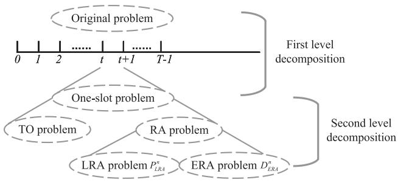

flowchart

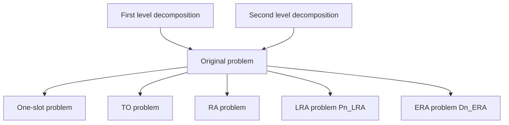

Fig. 2. The roadmap of DOS.

$$
0 \leq p _ {n} ^ {D} (t) \leq p ^ {D, \max} \cdot 1 _ {\{x _ {n} ^ {e} (t) + x _ {n} ^ {c} (t) > 0 \}}, \tag {25g}
$$

$$
0 \leq p _ {n} ^ {S} (t) \leq p ^ {S, \max} \cdot 1 _ {\{x _ {n} ^ {c} (t) > 0 \}}, \forall n \in \mathcal {N} (t). \tag {25h}
$$

The objective function in the problem $P _ { 0 }$ is minimizing the long-term average of the overall task completion time in multiple slots under time-varying system states (e.g., the energy level of the LEO satellite, the terrestrial-satellite channel state, the number and types of arriving tasks, etc.) by determining the task offloading proportions $x _ { n } ( t )$ , computing resource $z _ { n } ( t )$ , and transmit power $p _ { n } ( t )$ ( ) ( )in each slot. (25c) and (25d) indi-( )cate the energy limitation for each UD and the LEO satellite. (25e)–(25h) present the physical constraints on computing capacity and transmit power. Thus, $P _ { 0 }$ is a long-term stochastic optimization problem, where continuous variables and integer variables are closely coupled.

$P _ { 0 }$ is mathematically intractable for the following reasons. First, $P _ { 0 }$ is a mixed integer problem with closely coupled integer and continuous variables, which is naturally non-convex and NP-hard. Second, $P _ { 0 }$ is a long-term stochastic optimization problem, which is future-dependent. Optimally solving problem $P _ { 0 }$ requires complete future information, e.g., channel state and stochastic packet arrivals across all time slots. However, obtaining accurate future information is impractical in the considered time-varying scenario. Owing to the above combinatorial and future-dependent nature of $P _ { 0 }$ , the formulated problem is hard to solve using offline methods, such as traditional convex optimization methods. Instead, an online approach is necessary to decide the task offloading and resource allocation in real-time without foreseeing the future.

# IV. LYAPUNOV OPTIMIZATION-BASED DYNAMIC OFFLOADING STRATEGY

Fortunately, the Lyapunov optimization theory has offered an effective solution to address the above challenges, while providing a robust, efficient, and practical framework with performance guarantees. In this section, we resort to the Lyapunov optimization framework for designing an online approach called dynamic offloading strategy (DOS), whose roadmap is illustrated in Fig. 2. Then, we analyze the complexity and convergence properties of DOS.

# A. Lyapunov Optimization-Based Problem Transformation

First, to deal with the long-term evolution constraint (21), we set a virtual energy queue as $\widehat { E } ^ { S } ( t ) = E ^ { S } ( t ) - \phi$ , which has the flavor of keeping the energy level near a non-zero auxiliary constant φ [42].

Then, we set a backlog $\Theta ( t ) = [ \widehat { E } ^ { S } ( t ) ]$ , and the correspond-Θ( ) = [ing Lyapunov function is defined as

$$
L (\Theta (t)) = \frac {1}{2} \widehat {E} ^ {S} (t) ^ {2}. \tag {26}
$$

Accordingly, we define a Lyapunov drift function with respect to $L ( \Theta ( t ) )$ to capture the variations in energy levels across adjacent time slots:

$$
\Delta \left(\Theta (t)\right) = \mathbb {E} \left\{L \left(\Theta \left(t + 1\right)\right) - L \left(\Theta (t)\right) \left| \Theta (t) \right. \right\}. \tag {27}
$$

Next, to minimize the objective function and to deal with the energy evolution of the LEO satellite, we optimize the following Lyapunov drift-plus-penalty function in each slot [43] :

$$
\Phi_ {V} (t) = V \cdot \gamma (t) + \Delta (\Theta (t)), \tag {28}
$$

$V \geq 0$ is a tuning factor with the unit as is the overall completion time o $J ^ { 2 } / \mathrm { s }$ $\gamma ( t ) =$ $\textstyle \sum _ { n = 1 } ^ { N ( t ) } \gamma _ { n } ( t )$

Lemma 1: For arbitrary feasible decision variables $x _ { n } ( t ) , z _ { n } ( t ) , p _ { n } ( t )$ for $P _ { 0 } , \Phi _ { V } ( t )$ is upper bounded by:

$$
\Phi_ {V} (t) = V \cdot \gamma (t) + \Delta (\Theta (t))
$$

$$
\leq B ^ {\prime} + V \cdot \gamma (t) - \widehat {E} ^ {S} (t) \left(e ^ {S, h} (t) - e ^ {S} (t)\right). \tag {29}
$$

where $\begin{array} { r } { B ^ { \prime } = \frac { 1 } { \mathit { \Omega } } ( E ^ { S , \mathrm { m a x } } + \Psi ^ { \mathrm { m a x } } ) ^ { 2 } } \end{array}$ , and $\Psi ^ { \mathrm { m a x } }$ is the amount of = ( + Ψmaximum harvested energy.

Proof: See Appendix A.

According to Lemma 1, we obtain the approximate optimality of $\Phi _ { V } ( t )$ by minimizing the upper bound of $\Phi _ { V } ( t )$ , and thus Φ ( ) Φ ( )a long-term stochastic optimization problem is converted to multiple one-slot problems that need to be solved in real-time. The one-slot problem for a specific slot t is formulated as

$$
P _ {1}: \min _ {x _ {n} (t), z _ {n} (t), p _ {n} (t)} V \cdot \gamma (t) - \widehat {E} ^ {S} (t) e ^ {S} (t) \tag {30a}
$$

$$
\text { s.t. } (9), (2 3), (2 5 c) - (2 5 h). \tag {30b}
$$

Regardless of the continuous change of energy state, $P _ { 1 }$ is formulated based on the current value of the energy queue. For the slots in which $\widehat { E } ^ { S } ( t ) \leq 0 , P _ { 1 }$ aims at minimizing the ( )weighted sum of task completion time and the energy consumption of the LEO satellite, thus striking a tradeoff between system performance and costs. Otherwise, $P _ { 1 }$ makes full use of available energy to achieve the minimum overall task completion time. Besides, to solve $P _ { 1 }$ , only the observed system state is needed without prior knowledge from the environment. From the perspective of Lyapunov optimization theory, the random event observed in slot t is defined as $\omega ( t ) =$ $\{ h _ { n , S } ( t ) , h _ { S G } ( t ) , A _ { n } ^ { a } ( t ) , N ( t ) \} _ { n \in \mathcal { N } ( t ) }$ ( ) =, and the action in each ( ) ( )slot is defined as $x ( t ) = \{ x _ { n } ( t ) , z _ { n } ( t ) , p _ { n } ( t ) \} _ { n \in \mathcal { N } ( t ) }$ . Generally, $\alpha ( t )$ ( ) = ( ) ( ) ( ) ( )could be chosen within an abstract set according to a control ( )policy that possibly relies on $\omega ( t )$ . If the action is chosen solely based on the observed $\omega ( t )$ ( )in the current slot, the control policy ( )is called an ω-only policy [43]. By solving $P _ { 1 } , \alpha ( t )$ is chosen

Algorithm 1: Drift-Plus-Penalty Based DOS.   
1: for each slot t do
2: Obtain the number of arriving tasks $N(t)$ , task type $A_{n}^{a}(t)$ , channel gain $h_{n,S}(t)$ and $h_{SG}(t)$ , the virtual energy queue length of the LEO satellite $\widehat{E}^{S}(t)$ , the harvestable energy $e^{S,h}(t)$ ;
3: Determine task offloading $x_{n}(t)$ , computing resource $z_{n}(t)$ , transmit power $p_{n}(t)$ by solving $P_{1}$ ;
4: Update the energy queue according to (21);
5: $t = t + 1$ ;
6: end for

solely based on the observed $\omega ( t )$ in each slot, which yields an ω-only policy.

We present the drift-plus-penalty-based DOS, which is summarized in Algorithm 1. To implement the proposed DoS, each LEO satellite consistently maintains its energy queue state during movement and waits for potential SEC requests from the UDs within its coverage. In each slot, the UDs with computing tasks establish connections with the current serving LEO satellite for transmitting control signals containing computation task requests, which contain task-related information as well as environmental information. Based on the collected environmental information, the LEO satellite determines the task offloading, computation, and communication resource allocation for the current slot by solving $P _ { 1 }$ . Then the decisions will be transmitted back to the UDs and to the computing center. Accordingly, the UDs, the LEO satellite, and the terrestrial computing center will allocate a certain amount of resources and execute the task. Afterward, the LEO satellite updates its energy queue and waits for the next task requests.

# B. One-Slot Optimization Problem

A key step of DOS is to solve $P _ { 1 }$ , which is still hard due to the non-convexity of $P _ { 1 }$ . Thus, we solve the one-slot problem $P _ { 1 }$ by decomposing it into the following sub-problems and solving them iteratively based on convex optimization theory.

1) Task Offloading (TO) Problem: When the transmit power and computing resources are given, we try to obtain the optimal offloading decision $x _ { n } ( t ) ^ { * }$ in PTO:

$$
P _ {\mathrm{TO}}: \min _ {x _ {n} (t)} V \sum_ {n = 1} ^ {N (t)} \left(d _ {n} (t) + \beta \cdot 1 _ {\{x _ {n} ^ {d} (t) = 1 \}}\right) - \widehat {E} ^ {S} (t) e ^ {S} (t) \tag {31a}
$$

$$
\text { s.t. } (9), (2 3), (2 5 c), (2 5 d). \tag {31b}
$$

It can be noticed that the objective function and the constraints are the linear sum of the offloading variables and their indicator functions [44], and then we analyze the convexity of the indicator function $1 \{ x > 0 \}$ in the following Lemma 2.

Lemma $2 \colon 1 _ { \{ x > 0 \} }$ is a concave function with respect to x.

Proof: See Appendix B.

Then we convert the TO problem into a convex problem. For each offloading variable $x _ { n } ( t )$ , we define a continuous indicator variable on 0, 1 , which can be expressed as

$$
I _ {n} ^ {\xi} (t) = 1 _ {\left\{x _ {n} ^ {\xi} (t) > 0 \right\}}, \text { where } \xi \in \{l, e, c \}, \tag {32a}
$$

$$
I _ {n} ^ {d} (t) = 1 - I _ {n} ^ {l} (t) I _ {n} ^ {e} (t) I _ {n} ^ {c} (t). \tag {32b}
$$

Instead of $P _ { \mathrm { T O } }$ , we solve $P _ { \mathrm { T O } } ^ { \prime }$ given by

$$
P _ {\mathrm{TO}} ^ {\prime}: \min _ {x _ {n} (t), I _ {n} (t)} V \sum_ {n = 1} ^ {N (t)} (\max \left(\frac {x _ {n} ^ {l} (t) \cdot c _ {a}}{z _ {n} ^ {D} (t)}\right),
$$

$$
x _ {n} ^ {e} (t) w _ {a} ^ {i n} \left(\frac {1}{r _ {n} ^ {D} (t)} + \frac {f _ {a}}{z _ {n} ^ {S} (t)}\right) + I _ {n} ^ {e} (t) \cdot \frac {2 l _ {n}}{v},
$$

$$
x _ {n} ^ {c} (t) w _ {a} ^ {i n} \left(\frac {1}{r _ {n} ^ {D} (t)} + \frac {1}{r _ {n} ^ {S} (t)} + \frac {f _ {a}}{z _ {n} ^ {c} (t)}\right) + I _ {n} ^ {c} (t) \cdot \frac {2 l _ {n} ^ {\prime}}{v}\left. \right)
$$

$$
+ \beta \cdot I _ {n} ^ {d} (t))
$$

$$
- \widehat {E} ^ {S} (t) \sum_ {n = 1} ^ {N (t)} \left(\kappa \cdot x _ {n} ^ {e} (t) \cdot c _ {a} \cdot \left(z _ {n} ^ {S} (t)\right) ^ {2} + p _ {n} ^ {S} \frac {x _ {n} ^ {c} (t) w _ {a} ^ {i n}}{r _ {n} ^ {S} (t)}\right) \tag {33a}
$$

$$
\text { s.t. } (9), (2 3), (2 5 \mathrm{c}), (2 5 \mathrm{d}), (3 2 \mathrm{a}), (3 2 \mathrm{b}). \tag {33b}
$$

Since the objective function and constraints of $P _ { \mathrm { T O } } ^ { \prime }$ are convex with respect to $x _ { n } ( t )$ and $I _ { n } ( t ) , P _ { \mathrm { T O } } ^ { \prime }$ TOis a convex optimization problem. As the solution of $P _ { \mathrm { T O } } ^ { \prime }$ is equivalent to that of $P _ { \mathrm { T O } }$ , the optimal $\boldsymbol { x } _ { n } ^ { * }$ TOcan be obtained by solving $P _ { \mathrm { T O } } ^ { \prime }$ using TO TOsome convex optimization techniques. Moreover, for any power and computing resource given, a feasible solution to the TO problem can always be found by dropping these tasks, i.e., $x _ { n } ^ { d } ( t ) = 1$ , for $n \in \mathcal { N } ( t )$ , as no offloaded tasks need to be processed/transmitted by the terrestrial UD/the LEO satellite. In this scenario, no computing resource or power resource should be allocated for the task $A _ { n } ^ { a } ( t )$ , and we have $z _ { n } ^ { D } ( t ) = z _ { n } ^ { S } ( t ) = 0$ , and $p _ { n } ^ { D } ( t ) = p _ { n } ^ { S } ( t ) = 0$ ( ) ( ) = ( ) =. Therefore, we discuss the resource ( ) = ( ) =allocation problem for tasks to be processed in the following sub-problems.

2) Resource Allocation (RA) Problem: After we get the optimal task offloading vectors, $\mathrm { i . e . , } x _ { n } ( t ) = x _ { n } ^ { * }$ , we aim to obtain the optimal solution of $z _ { n } ( t )$ and $p _ { n } ( t )$ . Observing the non-( ) ( )convexity of the objective function with respect to $z _ { n } ( t )$ and $p _ { n } ( t )$ ( ), we first decompose the RA problem into N local RA ( )sub-problems and an edge RA sub-problem, as follows:

Local Resource Allocation (LRA): For each terrestrial UD, we solve the following problem $P _ { \mathrm { L R A } } ^ { n }$ to get the optimal $z _ { n } ^ { D } ( t ) ^ { * }$ and $p _ { n } ^ { D } ( t ) ^ { * }$ :

$$
P _ {\mathrm{LRA}} ^ {n}: \min _ {z _ {n} ^ {D} (t), p _ {n} ^ {D} (t)} V \cdot \gamma_ {n} (t) \tag {34a}
$$

$$
\text { s.t. } e _ {n} ^ {D} \left(x _ {n} (t), z _ {n} ^ {D} (t), p _ {n} ^ {D} (t)\right) \leq E ^ {D, \max} (t), \tag {34b}
$$

$$
0 \leq z _ {n} ^ {D} (t) \leq z _ {n} ^ {D} \cdot 1 _ {\{x _ {n} ^ {l} (t) > 0 \}}, \tag {34c}
$$

$$
0 \leq p _ {n} ^ {D} (t) \leq p ^ {D, \max} \cdot 1 _ {\{x _ {n} ^ {e} (t) + x _ {n} ^ {c} (t) > 0 \}}, \tag {34d}
$$

$$
(2 3). \tag {34e}
$$

We can find that the objective function, the energy consumption of $\mathcal { D } _ { n }$ , and the overall completion time are convex functions with respect to $z _ { n } ^ { D } ( t )$ . However, we also discover that the difficulty of $P _ { \mathrm { L R A } } ^ { n }$ ( )is derived from the product term $\frac { p _ { n } ^ { D } ( t ) } { r _ { n } ^ { D } ( t ) }$ in LRA ( )the energy constraint. To this end, we introduce a new variable $y _ { n } ^ { D } ( t )$ ,

$$
y _ {n} ^ {D} (t) = \frac {1}{B _ {n} ^ {G S} (t) \log_ {2} \left(1 + \frac {h _ {n , S} (t) p _ {n} ^ {D} (t)}{\sigma_ {0} B _ {n} ^ {G S} (t)}\right)} = \frac {1}{r _ {n} ^ {D} (t)}. \tag {35}
$$

Next, by means of variable substitution, we define $\xi ( y _ { n } ^ { D } ( t ) )$ as follows:

$$
\xi \left(y _ {n} ^ {D} (t)\right) = \frac {p _ {n} ^ {D} (t)}{r _ {n} ^ {D} (t)} = \frac {\sigma_ {0} B _ {n} ^ {G S} (t)}{h _ {n , S} (t)} y _ {n} ^ {D} (t) \left(2 ^ {\frac {1}{y _ {n} ^ {D} (t) B _ {n} ^ {G S} (t)}} - 1\right). \tag {36}
$$

The converted problem can be re-expressed as follows,

$$
P _ {\mathrm{LRA}} ^ {n ^ {\prime}}: \min _ {z _ {n} ^ {D} (t), y _ {n} ^ {D} (t)} V \cdot \gamma_ {n} (t) \tag {37a}
$$

$$
\text { s.t. } e _ {n} ^ {D} \left(x _ {n} (t), z _ {n} ^ {D} (t), y _ {n} ^ {D} (t)\right) \leq E ^ {D, \max} (t), \tag {37b}
$$

$$
0 \leq z _ {n} ^ {D} (t) \leq z _ {n} ^ {D} \cdot 1 _ {\{x _ {n} ^ {l} (t) > 0 \}}, \tag {37c}
$$

$$
y _ {n} ^ {D} (t) \geq y _ {n} ^ {D} \left(p ^ {D, \max} \cdot 1 _ {\{x _ {n} ^ {e} (t) + x _ {n} ^ {c} (t) > 0 \}}\right), \tag {37d}
$$

$$
(2 3). \tag {37e}
$$

where $e _ { n } ^ { D } ( x _ { n } , z _ { n } ^ { D } ( t ) , y _ { n } ^ { D } ( t ) ) = \kappa x _ { n } ^ { l } ( t ) c _ { a } z _ { n } ^ { D } ( t ) ^ { 2 } + ( x _ { n } ^ { e } ( t ) + x _ { n } ^ { c }$ $( t ) ) \xi ( y _ { n } ^ { D } ( t ) ) w _ { a } ^ { i n } + e _ { n } ^ { D , \bar { r } } ( t )$ )).

)) ( ( )) + ( )Then we present the convexity and monotony property of $\xi ( y _ { n } ^ { D } ( t ) )$ in the following theorems.

( ( ))Theorem 1: $\xi ( y _ { n } ^ { D } ( t ) )$ is convex with respect to $y _ { n } ^ { D } ( t )$

( ( ))Proof: See Appendix C.

Theorem 2: For channel gain $h _ { n , S } ( t ) > 0 , \xi ( y _ { n } ^ { D } ( t ) )$ is monotonically decreasing with respect to $y _ { n } ^ { D } ( t ) ( y _ { n } ^ { D } ( t ) > 0 )$ .

Proof: See Appendix D.

Corollary From Theorem 2: For channel gain $h _ { n , S } ( t ) > 0 ,$ $\frac { p _ { n } ^ { D } ( t ) } { r _ { n } ^ { D } ( t ) }$ is an increasing function of $p _ { n } ^ { D } ( t ) ( p _ { n } ^ { D } ( t ) > 0 )$ ( )that varying in the range of $( \ln 2 \sigma _ { 0 } ( h _ { n , S } ( t ) ) ^ { - 1 } , + \infty )$ .

(ln (Proof: See Appendix E.

As given by Theorem 2, the objective function and constraint functions of $P _ { \mathrm { L R A } } ^ { n ^ { \prime } }$ are the linear sum of multiple convex func-LRAtions with respect to $z _ { n } ^ { D } ( t )$ and $y _ { n } ^ { D } ( t )$ , and thus we can get the optimal $z _ { n } ^ { D } ( t ) ^ { * }$ and $y _ { n } ^ { D } ( t ) ^ { * }$ ) ( )through solving the convex problem $P _ { \mathrm { L R A } } ^ { n ^ { \prime } }$ ( ) ( )with high efficiency.

LRAEdge Resource Allocation (ERA): Owing to the limited computing capacity at UDs, the computing and power resources of the LEO satellite should be allocated properly for the offloaded tasks. Similar to LRA problem, we first substitute $p _ { n } ^ { S } ( t )$ with $\begin{array} { r } { y _ { n } ^ { S } ( t ) = \frac { 1 } { B _ { n } ^ { S G } ( t ) \log _ { 2 } ( 1 + \frac { h _ { n , S } ( t ) p _ { n } ^ { S } ( t ) } { \sigma _ { 0 } B _ { n } ^ { S G } ( t ) } ) } = \frac { 1 } { r _ { n } ^ { S } ( t ) } } \end{array}$ ( )and consider the fol-

( )log ( + 0lowing converted problem $P _ { \mathrm { E R A } } ^ { \prime } { \mathrm { : } }$

$$
P _ {\mathrm{ERA}} ^ {\prime}: \min _ {z _ {n} ^ {S} (t), y _ {n} ^ {S} (t)} V \sum_ {n = 1} ^ {N (t)} \gamma_ {n} (t) - \widehat {E} ^ {S} (t) e ^ {S} (t) \tag {38a}
$$

$$
\text { s.t. } e ^ {S} \left(x _ {n} (t), z _ {n} ^ {S} (t), y _ {n} ^ {S} (t)\right) \leq E ^ {S, \max} (t), \tag {38b}
$$

$$
0 \leq z _ {n} ^ {S} (t) \leq z ^ {S} \cdot 1 _ {\{x _ {n} ^ {e} (t) > 0 \}}, \tag {38c}
$$

$$
y _ {n} ^ {S} (t) \geq y _ {n} ^ {S} \left(p ^ {S, \max} \cdot 1 _ {\{x _ {n} ^ {c} (t) > 0 \}}\right), \tag {38d}
$$

$$
(2 3). \tag {38e}
$$

where $\begin{array} { r } { e ^ { S } ( t ) = \sum _ { n = 1 } ^ { N ( t ) } ( e _ { n } ^ { S , e } ( t ) + ( x _ { n } ^ { e } ( t ) + x _ { n } ^ { c } ( t ) ) \xi ( y _ { n } ^ { S } ( t ) ) w _ { a } ^ { i n } ) + } \end{array}$ $e _ { n } ^ { S , r } ( t )$ , and $\begin{array} { r } { \xi ( y _ { n } ^ { S } ( t ) ) = \frac { p _ { n } ^ { S } ( t ) } { r _ { n } ^ { S } ( t ) } = \frac { \sigma _ { 0 } B _ { n } ^ { S G } ( t ) } { g _ { n } ( t ) } y _ { n } ^ { S } ( t ) ( 2 ^ { \frac { 1 } { y _ { n } ^ { S } ( t ) } } - 1 ) } \end{array}$ ( ( )+ ( )) ( ( )) )σ0BSGn (t)gn t ySn t 2 1ySn (t) − 1 .

On the one hand, when $\widehat { E } ^ { S } ( t ) \leq 0$ , it is intuitive that the ob-( )jective function and constraints are convex with respect to $z _ { n } ^ { S } ( t )$ and $y _ { n } ^ { S } ( t )$ ( )as indicated by Theorems 1 and 2. However, under ( )the case that $\widehat E ^ { S } ( t ) > 0$ , the objective function of $P _ { \mathrm { E R A } } ^ { \prime }$ is still ( ) ERAnonconvex yet non-increasing due to the negative-definiteness of the term $- \widehat { E } ^ { S } ( t ) e ^ { S } ( t )$ . As the optimal solution of a program with monotonic functions should always be achieved at the boundary of some constraints, we consider two cases leveraging the monotony property of $z _ { n } ^ { S } ( t )$ and $y _ { n } ^ { S } ( t )$ :

( ) ( )1) The optimum is not achieved at the boundary of constraint (25c). Then it is intuitive that the optimal $z _ { n } ^ { \dot { S } } ( t )$ and $y _ { n } ^ { S } ( t )$ must be $z _ { n } ^ { S } ( t ) ^ { * } = z ^ { S } \cdot 1 _ { \{ x _ { n } ^ { e } ( t ) > 0 \} }$ and $p _ { n } ^ { S } ( i ) ^ { * } = p ^ { S , \operatorname* { i n a x } }$ )· $1 \{ x _ { n } ^ { c } ( t ) > 0 \}$ .   
( )2) The optimum is achieved at the boundary of constraint (25c). Then $- \widehat { E } ^ { S } ( t ) e ^ { S } ( t )$ in the objective function can be  ( ) ( )eliminated by constraint (25c) so that $P _ { \mathrm { E R A } } ^ { \prime }$ is transformed ERAinto a convex problem. To improve computation efficiency, the Lagrange dual decomposition method can be exploited to decouple the edge resource allocation between tasks, as indicated by (25c). We first constitute the Lagrange function of $P _ { \mathrm { E R A } } ^ { \prime }$ as follows:

$$
\begin{array}{l} L \left(z _ {n} ^ {S} (t), y _ {n} ^ {S} (t), \lambda\right) = V \sum_ {n = 1} ^ {N (t)} \gamma_ {n} (t) \\ + \lambda \left(e ^ {S} (t) - E ^ {S, \max} (t)\right), \tag {39} \\ \end{array}
$$

where $\lambda \geq 0$ is the Lagrange multiplier [44]. For a fixed λ, the Lagrange dual function can be expressed as

$$
g (\lambda) = \inf _ {z _ {n} ^ {S} (t), y _ {n} ^ {S} (t)} V \sum_ {n = 1} ^ {N (t)} \gamma_ {n} (t) + \lambda \left(e ^ {S} (t) - E ^ {S, \max} (t)\right),
$$

$$
= \sum_ {n = 1} ^ {N (t)} \left[ \inf _ {z _ {n} ^ {S} (t), y _ {n} ^ {S} (t)} \gamma_ {n} (t) + \lambda \left(e _ {n} ^ {S, e} (t) + e _ {n} ^ {S, c} (t)\right) \right]
$$

$$
+ \lambda \left(e ^ {S, r} (t) - E ^ {S, \max} (t)\right), \tag {40}
$$

and the corresponding dual problem is $\operatorname* { m a x } _ { \lambda } g ( \lambda )$ . Thus, we solve the following problem $g _ { n } ( \lambda )$ max ( )for each task $A _ { n } ^ { a } ( t )$ separately,

$$
\begin{array}{l} D _ {\mathrm{ERA}} ^ {n}: g _ {n} (\lambda) = \inf _ {z _ {n} ^ {S} (t), y _ {n} ^ {S} (t)} V \cdot \gamma_ {n} (t) \\ + \lambda \left(e _ {n} ^ {S, e} (t) + e _ {n} ^ {S, c} (t)\right) \tag {41a} \\ \end{array}
$$

$$
\text { s.t. } 0 \leq z _ {n} ^ {S} (t) \leq z ^ {S} \cdot 1 _ {\{x _ {n} ^ {c} (t) > 0 \}}, \tag {41b}
$$

$$
\begin{array}{r l} y _ {n} ^ {S} (t) & \geq y _ {n} ^ {S} \left(p ^ {S, \max} \cdot 1 _ {\{x _ {n} ^ {c} (t) > 0 \}}\right), \quad \text {(41c)} \\ & \quad \text {(23)}. \quad \text {(41d)} \end{array}
$$

For a fixed λ, $D _ { \mathrm { E R A } } ^ { n }$ is described as: for the task $A _ { n } ^ { a } ( t )$ , ERAwe allocate the LEO satellite’s computing resource $z _ { n } ^ { S } ( t )$ ( )and the transmit power $p _ { n } ^ { S } ( t )$ to minimize the value of $\gamma _ { n } ( t ) +$

Algorithm 2: The Overall Procedure of the One-Slot Solution.   
1: Input: maximum iteration round $k_{max}^{1}$ and $k_{max}^{2}$ , a feasible initial solution $\{x^{(0)}, z^{(0)}, p^{(0)}\}$ 2: Output: the one-slot solution $\{x^{*}, z^{*}, p^{*}\}$ 3: for each slot t do
4: while $k_{1} \leq k_{max}^{1}$ do
5: Given $z^{(k_{1})}, p^{(k_{1})}$ , solve $P_{TO}'$ to get $x^{(k_{1}+1)}$ ;
6: Given $x^{(k_{1}+1)}, z^{S(k_{1})}$ and $p^{S(k_{1})}$ ,
7: for $n = 1, 2, \ldots, N(t)$ do
8: solve $P_{LRA}'$ and get $z^{D(k_{1}+1)}$ and $p_{n}^{D(k_{1}+1)}$ ,
9: end for
10: Given $x^{(k_{1}+1)}, z_{n}^{D(k_{1}+1)}$ and $p_{n}^{D(k_{1}+1)}$ ,
11: while $k_{2} \leq k_{max}^{2}$ do
12: for $n = 1, 2, \ldots, N(t)$ do
13: solve $D_{ERA}^{n}$ to get $z_{n}^{S(k_{2})}$ and $p_{n}^{S(k_{2})}$ ,
14: update $\lambda$ according to (42),
15: $k_{2} \longleftarrow k_{2} + 1$ 16: end for
17: end while
18: $k_{1} \longleftarrow k_{1} + 1$ 19: end while
20: end for

$\lambda ( e _ { n } ^ { S , e } ( t ) + e _ { n } ^ { S , c } ( t ) )$ . Thus, $g ( \lambda )$ can be found by choosing the ( (optimal $z _ { n } ^ { S } ( t ) ^ { * }$ ( ))and $y _ { n } ^ { S } ( t ) ^ { * }$ in $D _ { \mathrm { E R A } } ^ { n }$ for each task respectively. ( )Then we maximize $g ( \lambda )$ ) ERAover λ to get the optimal value $\lambda ^ { * }$ for ( )the dual problem. We use gradient ascent direction to update λ,

$$
\lambda (k + 1) = \left[ \lambda (k) + \delta (k) \left(e ^ {S} (t) - E ^ {S, \max} (t)\right) \right] ^ {+}, \tag {42}
$$

where k represents the round of iteration, and $\delta ( k ) > 0$ is the update step size of the round k.

As discussed in the second case, P  becomes convex, $P _ { \mathrm { E R A } } ^ { \prime }$ ERAand strong duality holds, which indicates that the maximum value of $g ( \lambda )$ until convergence is equal to the minimum value ( )of the original problem $P _ { \mathrm { E R A } } ^ { \prime }$ . In summary, the overall pro-ERAcedure of the one-slot solution for solving $P _ { 1 }$ is concluded in Algorithm 2 at the top of this page.

# C. Convergence and Complexity Analysis

We analyze the convergence and complexity of our proposed DOS as follows:

1) Convergence: Following Algorithm 1, for each slot t, after observing the current system state, the task offloading and resource allocation are determined by the ω-only policy derived from Algorithm 2. In Algorithm 2, each variable is solved depending on the optimized previous variables, and thus the optimization objective of $P _ { 1 }$ is non-increasing after each iteration. After several iterations, the optimization objective continues to decrease and converges to the minimum value. Hence, the near-optimal solution to the current one-slot problem $P _ { 1 }$ can be obtained by Algorithm 2.

To further analyze the gap between the proposed DOS and the optimal long-term solution, we define $\bar { \gamma _ { 0 } ^ { o p t } }$ as the infimum value of the time average overall completion time of all tasks over all control policies (including ω-only policies) that satisfy all the constraints in $P _ { 0 } .$ . As indicated by Appendix 4.A in [43], there exists an ω-only policy to approach the optimum of the considered long-term problem since process stationarity and boundedness assumption are satisfied. Next, we show that by setting tuning factor V to a sufficiently large value, the solution of $P _ { 1 }$ can be arbitrarily close to the optimum $\gamma _ { 0 } ^ { o p t }$ in the following theorem.

Theorem 3: The average overall task completion time of the proposed DOS converges to the optimum with $O ( { \textstyle { \frac { 1 } { V } } } )$ .

Proof: See Appendix F.

2) Complexity: In Algorithm 2, the complexity of solving the convex problems of $P _ { \mathrm { T O } } , P _ { \mathrm { L R A } } ^ { n }$ , and $D _ { \mathrm { E R A } } ^ { n }$ is of polynomial TO LRA ERAtime with the number of variables and constraints. According to [45], the worst-case computational complexity required by the interior-point method is $\mathcal { O } ( a ^ { 3 . 5 } \log ( 1 / \epsilon ) )$ , where a and 
 denote ( log( ))the numbers of variables and the accuracy for a solution respectively. The TO problem has 8N variables each LRA problem has 2 variables, and each ERA problem has 2 variables. Suppose that the lower bound of accuracies for solutions of all sub-problems is $\epsilon ,$ and thus the overall complexity of solving Algorithm 2 is given by $\mathcal { O } ( \log ( 1 / \epsilon ) k _ { m a x } ^ { 1 } ( N ^ { 3 . 5 } + N \dot { ( } 1 + k _ { m a x } ^ { 2 } \dot { ) } ) )$ , which shows that the complexity of problem-solving is of polynomial time.

# V. PERFORMANCE EVALUATION

In this section, we conduct simulations to implement DOS under different system settings, evaluate the performance of DOS in terms of overall task completion time, and compare the performance of DOS with the other four benchmark algorithms.

# A. Simulation Configurations

We consider a polar-orbiting LEO satellite with an orbital height of 1700 km, whose orbital period is 120 minutes according to satellite orbital dynamics [40]. Along with the movement of the LEO satellite, we aim to minimize the overall task completion time in a whole orbital period, which is divided into 200 slots. In each slot, the harvested energy is calculated according to the LEO satellite power supply model in [40]. During the orbital period, we record the lowest energy level as the energy discharge depth, which reflects the maximum offset to φ. For intuitive comparison, we have not taken into account the energy consumption for nominal operation, which is usually a fixed value in each slot [41], despite that the proposed DOS is indeed feasible for more general energy models.

The terrestrial UDs transmit the packets to the satellite via the C band (6 GHz) with a system uplink bandwidth of 20 MHz while the satellite backhauls via the Ku band (12 GHz) with a system downlink bandwidth of 200 MHz [15]. The maximum transmit power of each terrestrial UD and the satellite, $\mathrm { i . e . , } \ p ^ { D , \mathrm { m a x } }$ and $p ^ { S , \mathrm { m a x } }$ are set to 24 dBm and 46 dBm respectively [21], [30]. Similar to that in [12], [29], we set the computing capability $z _ { n } ^ { D }$ and battery capacity $E ^ { D , m a x }$ of each terrestrial UD to 0.1 Gcycles/s and 5 mJ respectively. The maximum amount of computing resources that are allocated by the satellite edge server and the cloud, $\mathrm { i . e . , ~ } z ^ { S }$ and $z ^ { C }$ are set to 4 Gcycles/s and 10 Gcycles/s respectively [12], [30]. The noise power spectral density $\sigma _ { 0 }$ and the effective switched capacitance κ are set to −174 dBm/Hz and $1 0 ^ { - 2 4 }$ respectively. In addition, we consider a specific scenario that the computing tasks will be generated from the application set $\mathcal { A } = \{ ( 0 . 1 , 1 0 0 0 , 2 ) , ( 0 . 4 , 1 0 0 0 , 2 ) \} ( | A | = 2 )$ , where each ele-= ( ) ( ) (ment describe a specific task type, and $\beta$ = )for dropping tasks is set to the maximum tolerable delay []. The average task arrival rate is set to 10 tasks/slot and the task distribution is $\mathbf { p } = [ 0 . 4 , 0 . 6 ]$ = [ ]unless otherwise specified [15], [24]. The simulations are carried out on Python 3.7.6 and the problems are solved by Gurobi Optimizer, version 9.

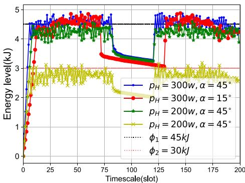

line

| Timescale(slot) | p_H = 300w, α = 45° | p_H = 300w, α = 15° | p_H = 200w, α = 45° | p_H = 200w, α = 45° | φ₁ = 45kJ | φ₂ = 30kJ |
| ---------------- | ------------------- | ------------------- | ------------------- | ------------------- | --------- | --------- |
| 0                | ~4.5                | ~4.5                | ~4.5                | ~2.5                | ~4.5      | ~2.5      |
| 25               | ~4.8                | ~4.8                | ~4.8                | ~2.8                | ~4.8      | ~2.8      |
| 50               | ~4.9                | ~4.9                | ~4.9                | ~2.9                | ~4.9      | ~2.9      |
| 75               | ~4.7                | ~4.7                | ~4.7                | ~2.8                | ~4.7      | ~2.8      |
| 100              | ~3.5                | ~3.5                | ~3.5                | ~2.6                | ~3.5      | ~2.6      |
| 125              | ~3.2                | ~3.2                | ~3.2                | ~2.5                | ~3.2      | ~2.5      |
| 150              | ~4.8                | ~4.8                | ~4.8                | ~2.6                | ~4.8      | ~2.6      |
| 175              | ~4.7                | ~4.7                | ~4.7                | ~2.7                | ~4.7      | ~2.7      |
| 200              | ~4.6                | ~4.6                | ~4.6                | ~2.8                | ~4.6      | ~2.8      |

(a)

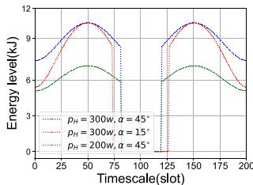

line

| Timescale (slot) | p_H = 300w, α = 45° | p_H = 15w, α = 45° | p_H = 200w, α = 45° |
| ---------------- | ------------------- | ------------------ | ------------------- |
| 0                | 6.0                 | 6.0                | 6.0                 |
| 25               | 9.0                 | 8.0                | 7.0                 |
| 50               | 11.0                | 10.0               | 9.0                 |
| 75               | 9.0                 | 8.0                | 7.0                 |
| 100              | 6.0                 | 6.0                | 6.0                 |
| 125              | 9.0                 | 8.0                | 7.0                 |
| 150              | 11.0                | 10.0               | 9.0                 |
| 175              | 9.0                 | 8.0                | 7.0                 |
| 200              | 6.0                 | 6.0                | 6.0                 |

(b)

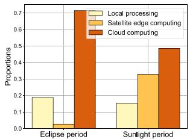

bar

| Period | Local processing | Satellite edge computing | Cloud computing |
|---|---|---|---|
| Eclipse period | 0.2 | 0.03 | 0.7 |
| Sunlight period | 0.15 | 0.33 | 0.49 |

(c）  
Fig. 3. Energy evolution at the LEO satellite. (a) Energy level v.s. t. (b) Harvested energy v.s. t. (c) Offloading scheme selection.

# B. Feasibility of DOS

1) Energy Evolution Over Time: In the first experiment, we verify the feasibility of the proposed DOS under different absorption power of the LEO satellite and perturbation index φ. Fig. 3(a) and (b) show the energy evolution/harvested energy of the LEO satellite as a function of time, where $p _ { H }$ and $\alpha _ { s }$ in the legend denote the maximum absorption power and the angle between the orbital plane of the LEO satellite and the sunlight, respectively. It can be observed that the harvested energy varies even if the satellite is exposed to the sun. The eclipse period with no energy supply is also shown in Fig. 3(b). In Fig. 3(a), please note that the offloading decision and resource allocation in each slot are determined according to the one-slot solution given in Section VI, and then the energy level is updated based on the solution. First, we observe that the energy level increases rapidly at the beginning, and eventually becomes roughly stable at around the perturbed energy level φ for all four settings. This is achieved through the minimization of the upper bound of the Lyapunov drift-plus-penalty function in DOS, as indicated by Lemma 1. The energy evolution curve grows faster to the perturbation index with a greater $p _ { H }$ . The eclipse period is also reflected in each curve, where the energy level slightly declines. This is due to the fact that the schemes of local processing and cloud computing are chosen with a greater probability in the eclipse period, as shown in Fig. 3(c). In the current setting of the simulation, these two offloading schemes consume less energy to sustain the energy level of the LEO satellite. When the LEO satellite is exposed to the sunlight, a significantly larger proportion of each task is offloaded to the LEO satellite edge server to guarantee a satisfactory delay performance.

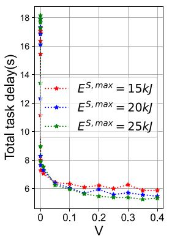

line

| V    | E^S,max = 15kJ | E^S,max = 20kJ | E^S,max = 25kJ |
|------|----------------|----------------|----------------|
| 0.0  | 18.0           | 17.5           | 17.0           |
| 0.1  | 6.5            | 6.0            | 5.5            |
| 0.2  | 6.0            | 5.5            | 5.0            |
| 0.3  | 5.5            | 5.0            | 4.5            |
| 0.4  | 5.0            | 4.5            | 4.0            |

(a)

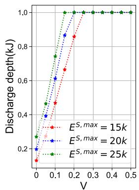

line

| V    | Discharge depth(kJ) for E^S,max = 15k | Discharge depth(kJ) for E^S,max = 20k | Discharge depth(kJ) for E^S,max = 25k |
|------|----------------------------------------|----------------------------------------|----------------------------------------|
| 0.0  | 0.1                                    | 0.1                                    | 0.1                                    |
| 0.1  | 0.4                                    | 0.6                                    | 0.7                                    |
| 0.2  | 0.8                                    | 0.9                                    | 1.0                                    |
| 0.3  | 1.0                                    | 1.0                                    | 1.0                                    |
| 0.4  | 1.0                                    | 1.0                                    | 1.0                                    |
| 0.5  | 1.0                                    | 1.0                                    | 1.0                                    |

(b)   
Fig. 4. Overall task completion time and discharge depth v.s. tuning factor. (a) Overall task completion time v.s. V . (b) Energy discharge depth v.s. V .

2) The Tradeoff Between Performance and Costs: Next, we examine the relationship between the average overall completion time of tasks and the energy discharge depth of the LEO satellite and the tuning factor V , when the task arrival rate is 10 tasks/slot in Fig. 4. In Fig. 4(a), it can be observed that when V approaches 0, the average overall task completion time reaches the maximum. The average overall task completion time decreases with $V ,$ , and eventually converges to the optimality of $P _ { 1 }$ , which confirms the asymptotic optimality in the afore-analysis. However, as indicated in Fig. 4(b), the energy discharge depth of the LEO satellite increases linearly with V , which implies more energy consumption of the LEO satellite. For instance, with only 5.72% performance improvement, more than 1.88 times energy consumption is needed for $V = 0 . 0 5$ compared to $V = 0 . 2$ in Fig. 4. As $E ^ { S , m a x }$ =grows, the corresponding =task completion time converges faster to a smaller value, which also leads to a faster energy degradation in Fig. 4(b). Therefore, the values of V and $E ^ { S , m a x }$ should be adjusted according to the LEO satellite configuration for a good trade-off between the overall task completion time and the energy consumption.

# C. Performance Evaluation

In this subsection, we compare our proposed DOS with the four specific offloading strategies in terms of average task completion time and task dropping rate and present how our proposed DOS adapts to different scenarios. All the comparison experiments are carried out with $V = 0 . 0 5$ , and the reference =algorithms for comparisons are listed as follows,

Greedy on edge (GE): since edge computing can usually provide a lower computing time with a higher computation energy consumption, every task is incessantly offloaded to the LEO server as long as there is sufficient energy, otherwise, it will be discarded.   
Optimal task offloading (OPT) [30]: a random amount of local/edge power and computing resources are allocated to each task, and then the optimal task offloading solution is calculated.   
Greedy on the satellite (GS) [21]: every task is offloaded to the LEO server and/or the cloud computing center for procession in each slot.   
Dynamic full Offloading (DFO) [12]: either local offloading/LEO edge computing or cloud computing strategy is chosen for each task to get the optimal solution of $P _ { 1 }$ in each slot.

1) The Impact of Absorption Power: First, we compare the average overall task completion time and task dropping rate with the absorption power pH of the LEO satellite increasing from 200 to 700 w in Fig. 5. In Fig. 5(a) and (b), the average overall task completion time and task dropping rate of our proposed DOS remain the lowest under all values of $p _ { H } . \mathrm { A s } p _ { H }$ increases, the average overall completion time and task dropping rate of DOS, along with the GE, declines generally. This is due to the fact that they make full use of the available energy for task procession, which is shown in Fig. 5(c). Although the energy capacity of each terrestrial UD is quite limited, the task completion time of DOS is reduced by 37.4% on average with additional assistance from the terrestrial UDs, when compared with GE. As also shown in Fig. 5(c), with a fixed amount of power and computing resources/a fixed offloading option for each task in each slot, OPT and DFO both fail in leveraging the harvested energy and as a result, the average task completion time even increases when more energy is offered. With more energy input, DOS and GE adaptively use the harvested energy, while the overall task completion time of DOS is nearly halved with a better energy allocation.

2) The Impact of Task Arrival Rate: Next, we compare the average task completion time and task dropping rate with the task arrival rate $\lambda _ { A }$ varying from 10 to 30 tasks/slot in Fig. 6(a). It is intuitive that the average overall task completion time and task dropping rate of our DOS remain the lowest with joint task partition and resource allocation, and meanwhile, those of GE are the highest, as illustrated by Fig. 6(a) and (b). As the energy consumption is limited in each slot, the average completion time for each task is increased, where our proposed DOS has the lowest growth. Rather than a fixed preference for three schemes for task procession, DOS makes full use of harvested energy by dynamically adjusting the amount of the partitioned portions of arriving tasks and corresponding resource allocation, as shown by Fig. 6(c). As $\lambda _ { A }$ increases, the percentage of leveraging satellite edge computing scheme and local computing scheme keeps declining, while that of cloud computing scheme has an opposite trend under the energy constraint, and as a result, the probability of discarding a task can be minimized.

3) The Impact of Task Distribution: As set in our simulations, the arrival probability of type 1 and type 2 tasks are set to be $p _ { 1 } = p$ and $p _ { 2 } = 1 - p$ respectively. We finally compare = =the average overall task completion time and task dropping rate when the arrival probability p varies from 0 to 1in Fig. 7. While GS and DFO have similar performance in terms of average overall task completion time and task dropping rate, becoming the second lowest at first, they both have a higher growth rate than OPT, and their overall completion time exceeds that of OPT at $p = 0 . 7$ . With different task distributions, DOS exhibits =the best performance in terms of average total task completion time and dropping rate over all values of $\mid p ,$ as shown in Fig. 7(a) and (b). As type-1 tasks consume more energy than type-2 tasks, DOS adaptively changes the offloading schemes and resource allocation as p increases. As shown in Fig. 7(c), the computing tasks are offloaded to the cloud center with a greater probability, while the proportion of tasks that are processed locally/at the satellite edge server keeps declining. As the satellite edge computing scheme can achieve a lower completion time at the cost of higher energy consumption in the current setting of the simulation, the average completion time for each task of DOS keeps growing at the slowest speed.

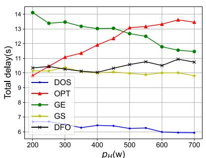

line

| p_H(w) | DOS   | OPT   | GE    | GS    | DFO   |
| ------ | ----- | ----- | ----- | ----- | ----- |
| 200    | 6.5   | 9.8   | 14.0  | 10.2  | 10.3  |
| 300    | 6.4   | 10.8  | 13.5  | 10.1  | 10.2  |
| 400    | 6.5   | 11.8  | 13.2  | 10.0  | 10.1  |
| 500    | 6.4   | 13.0  | 12.8  | 9.9   | 10.3  |
| 600    | 6.2   | 13.5  | 11.8  | 9.9   | 10.5  |
| 700    | 6.0   | 13.8  | 11.5  | 9.8   | 10.7  |

(a)

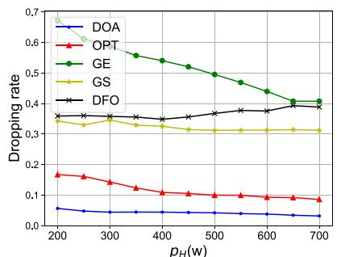

line

| p_H(w) | DOA   | OPT   | GE    | GS    | DFO   |
| ------ | ----- | ----- | ----- | ----- | ----- |
| 200    | 0.05  | 0.17  | 0.68  | 0.35  | 0.36  |
| 300    | 0.04  | 0.14  | 0.62  | 0.34  | 0.35  |
| 400    | 0.04  | 0.11  | 0.55  | 0.33  | 0.34  |
| 500    | 0.04  | 0.10  | 0.50  | 0.32  | 0.36  |
| 600    | 0.03  | 0.09  | 0.45  | 0.31  | 0.37  |
| 700    | 0.03  | 0.08  | 0.41  | 0.31  | 0.38  |

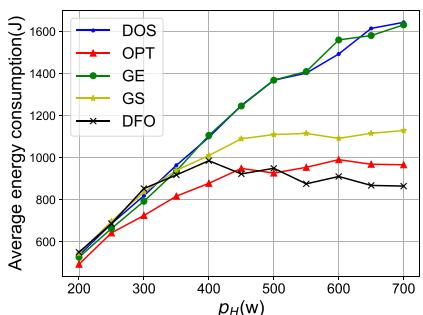

line

| p_H(w) | DOS (J) | OPT (J) | GE (J) | GS (J) | DFO (J) |
|---|---|---|---|---|---|
| 200 | 550 | 500 | 550 | 550 | 550 |
| 300 | 850 | 750 | 850 | 900 | 850 |
| 400 | 1050 | 900 | 1100 | 1000 | 950 |
| 500 | 1350 | 950 | 1350 | 1100 | 950 |
| 600 | 1550 | 980 | 1550 | 1120 | 900 |
| 700 | 1620 | 970 | 1620 | 1130 | 870 |

Fig. 5. Overall task completion time and energy consumption with absorption power $p _ { H }$ varying. (a) Overall task completion time v.s. pH . (b) Dropping rate v.s. pH . (c) Energy consumption v.s. pH .   
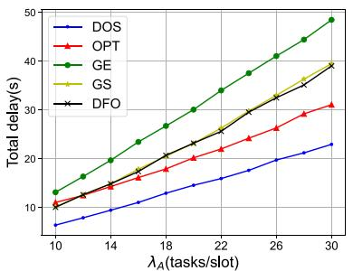

line

| λ_A (tasks/slot) | DOS  | OPT  | GE   | GS   | DFO  |
| ---------------- | ---- | ---- | ---- | ---- | ---- |
| 10               | 7    | 10   | 12   | 10   | 10   |
| 14               | 9    | 14   | 18   | 14   | 14   |
| 18               | 12   | 18   | 24   | 18   | 18   |
| 22               | 15   | 22   | 30   | 22   | 22   |
| 26               | 18   | 26   | 36   | 26   | 26   |
| 30               | 22   | 30   | 48   | 30   | 30   |

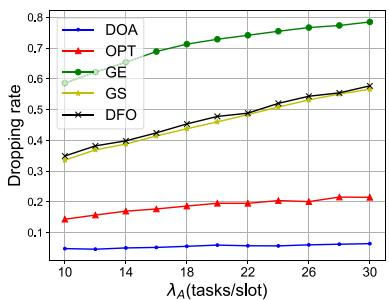

line

| λ_A (tasks/slot) | DOA   | OPT   | GE    | GS    | DFO   |
| ---------------- | ----- | ----- | ----- | ----- | ----- |
| 10               | 0.05  | 0.15  | 0.60  | 0.35  | 0.35  |
| 14               | 0.05  | 0.17  | 0.68  | 0.40  | 0.40  |
| 18               | 0.05  | 0.18  | 0.72  | 0.45  | 0.45  |
| 22               | 0.05  | 0.19  | 0.75  | 0.50  | 0.50  |
| 26               | 0.05  | 0.20  | 0.78  | 0.55  | 0.55  |
| 30               | 0.05  | 0.21  | 0.80  | 0.60  | 0.60  |

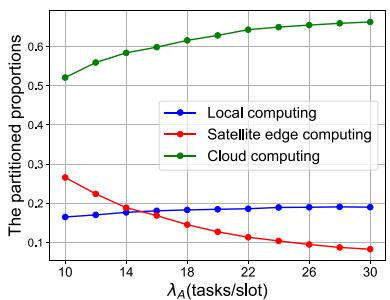

line

| λ_A (tasks/slot) | Local computing | Satellite edge computing | Cloud computing |
| ---------------- | --------------- | ------------------------ | --------------- |
| 10               | 0.17            | 0.27                     | 0.53            |
| 14               | 0.18            | 0.20                     | 0.58            |
| 18               | 0.19            | 0.15                     | 0.61            |
| 22               | 0.19            | 0.12                     | 0.64            |
| 26               | 0.19            | 0.10                     | 0.65            |
| 30               | 0.19            | 0.09                     | 0.66            |

Fig. 6. Overall performance with task arrival rates λ varying. (a) Overall task completion time v.s. $\lambda _ { A } .$ . (b) Dropping rate v.s. $\lambda _ { A } .$ (c) The task proportions v.s. λA. $\lambda _ { A } .$

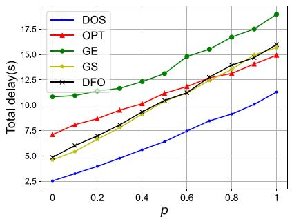

line

| p    | DOS  | OPT  | GE   | GS   | DFO  |
| ---- | ---- | ---- | ---- | ---- | ---- |
| 0.0  | 2.5  | 7.5  | 11.0 | 5.0  | 5.0  |
| 0.2  | 3.75 | 8.75 | 11.25| 6.25 | 6.25 |
| 0.4  | 5.0  | 10.0 | 12.5 | 7.5  | 7.5  |
| 0.6  | 6.25 | 11.25| 14.75| 9.0  | 9.0  |
| 0.8  | 7.5  | 12.5 | 16.0 | 10.25| 10.25|
| 1.0  | 8.75 | 14.75| 18.25| 11.5 | 11.5 |

(a)

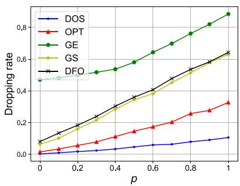

line

| p    | DOS   | OPT   | GE    | GS    | DFO   |
| ---- | ----- | ----- | ----- | ----- | ----- |
| 0.0  | 0.00  | 0.00  | 0.45  | 0.10  | 0.10  |
| 0.2  | 0.02  | 0.05  | 0.50  | 0.15  | 0.15  |
| 0.4  | 0.03  | 0.10  | 0.55  | 0.25  | 0.25  |
| 0.6  | 0.05  | 0.15  | 0.65  | 0.35  | 0.35  |
| 0.8  | 0.07  | 0.25  | 0.75  | 0.50  | 0.50  |
| 1.0  | 0.10  | 0.35  | 0.90  | 0.65  | 0.65  |

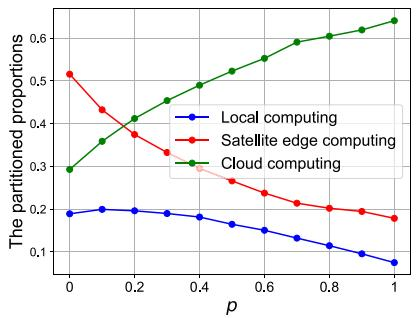

line

| p    | Local computing | Satellite edge computing | Cloud computing |
| ---- | --------------- | ------------------------ | --------------- |
| 0.0  | 0.2             | 0.5                      | 0.3             |
| 0.2  | 0.2             | 0.4                      | 0.4             |
| 0.4  | 0.2             | 0.3                      | 0.5             |
| 0.6  | 0.15            | 0.25                     | 0.55            |
| 0.8  | 0.1             | 0.2                      | 0.6             |
| 1.0  | 0.05            | 0.15                     | 0.65            |

(c）  
Fig. 7. Overall performance with task arrival probability p varying. (a) Overall task completion time v.s. p. (b) Dropping rate v.s. p. (c) The task proportions v.s. $p .$

# VI. CONCLUSION

In this paper, we have investigated the dynamic computation offloading problem for an SEC-assisted STIN, based on a general system model by taking into account the energy dynamics of the LEO satellite. To deal with environmental dynamics, we have proposed to minimize the overall completion time of all computing tasks in the long term by jointly optimizing offloading decisions and resource allocation. We designed a dynamic computation offloading strategy leveraging the framework of Lyapunov optimization and convex optimization theory, which is proven to achieve near-optimal performance within polynomial time. Simulation results show that our proposed DOS has the lowest completion time in all environmental settings when compared with other benchmark algorithms.

In future work, it could be interesting to explore more adaptable SEC offloading strategies by considering a non-i.i.d scenario. Additionally, artificial intelligence techniques such as meta-learning techniques could be exploited to fast respond to environmental changes through consistent interaction with the network environment.

# APPENDIX A

# PROOF OF LEMMA 1

Subtracting φ to both sides of (21), we have $\widehat E ^ { S } ( t + 1 )$ $= \widehat { E } ^ { S } ( t ) - e ^ { S } ( t ) + e ^ { S , h } ( t )$ ( + ). Squaring both sides of this equa-= ( )tion, we have

$$
\begin{array}{l} \widehat {E} ^ {S} (t + 1) ^ {2} - \widehat {E} ^ {S} (t) ^ {2} = 2 \widehat {E} ^ {S} (t) \left(e ^ {S, h} (t) - e ^ {S} (t)\right) \\ + \left(e ^ {S, h} (t) - e ^ {S} (t)\right) ^ {2}. \tag {A.1} \\ \end{array}
$$

Thus, taking conditional expectations of the above equation and summing it from t  0 to T , we can get a bound on $\Delta ( \Theta ( t ) )$ as follows

$$
\begin{array}{l} \Delta (\Theta (t)) = \mathbb {E} \{L (\Theta (t + 1)) - L (\Theta (t)) \mid \Theta (t) \} \\ \leq B ^ {\prime} + \widehat {E} ^ {S} (t) \cdot \mathbb {E} \left\{e ^ {S, h} (t) - e ^ {S} (t) \mid \Theta (t) \right\}, \tag {A.2} \\ \end{array}
$$

where $\begin{array} { r } { B ^ { \prime } = \frac { 1 } { \gamma } ( E ^ { S , \mathrm { { m a x } } ^ { 2 } } + p _ { H } \tau ^ { 2 } ) } \end{array}$ , due to the boundedness =properties of $\mathbf { \bar { \rho } } _ { e } { S } ( t )$ and $e ^ { S , h } ( t )$ ) by the maximum consum-( )able/harvestable energy.

# APPENDIX B

# PROOF OF LEMMA 2

First, the domain of definition of the offloading vector $\vec { x _ { n } } ( t ) =$ $[ x _ { n } ^ { l } ( t ) , x _ { n } ^ { e } ( t ) , x _ { n } ^ { c } ( t ) ]$ is $\mathcal { C } = [ 0 , 1 ] ^ { 3 }$ ( ) =, which is a convex set. To [ ( ) ( ) ( )] =[ ]prove Lemma 2, we consider the following two cases:

1) Let $x _ { 1 } = 0 < x _ { 2 } \in \mathcal { C } , 0 < \theta < 1$ , and then we have

$$
1 _ {\{\theta x _ {1} + (1 - \theta) x _ {2} > 0 \}} = 1 _ {\{(1 - \theta) x _ {2} > 0 \}} = 1,
$$

$$
\theta \cdot 1 _ {\{x _ {1} > 0 \}} + (1 - \theta) \cdot 1 _ {\{x _ {2} > 0 \}} = 1 - \theta . \tag {B.1}
$$

2) Let $0 < x _ { 1 } < x _ { 2 } \in \mathcal { C } , 0 < \theta < 1$ , and then we have

$$
1 _ {\{\theta x _ {1} + (1 - \theta) x _ {2} > 0 \}} = 1 = \theta \cdot 1 _ {\{x _ {1} > 0 \}} + (1 - \theta) \cdot 1 _ {\{x _ {2} > 0 \}}. \tag {B.2}
$$

In summary, ${ \mathrm { f o r ~ } } \quad { \mathrm { a n y ~ } } \quad x _ { 1 } \neq x _ { 2 } , 0 < \theta < 1$ , $1 _ { \{ \theta x _ { 1 } + ( 1 - \theta ) x _ { 2 } > 0 \} } \geq \theta \cdot 1 _ { \{ x _ { 1 } > 0 \} } + ( 1 - \theta ) \cdot 1 _ { \{ x _ { 2 } > 0 \} }$ holds. +( ) + ( )According to the definition of concave function, $1 _ { \{ x > 0 \} }$ is concave with respect to x.

# APPENDIX C PROOF OF THEOREM 1

To judge the convexity of $\xi ( y _ { n } ^ { D } ( t ) )$ with respect to $y _ { n } ^ { D } ( t )$ , we ( ( ))calculate the first-order and second-order derivation of $\dot { \xi } ( \dot { y } _ { n } ^ { D } ( t ) )$ as follows:

$$
\frac {d \left(\xi \left(y _ {n} ^ {D} (t)\right)\right)}{d \left(y _ {n} ^ {D} (t)\right)} = 2 ^ {\frac {1}{B _ {n} ^ {G S} (t) y _ {n} ^ {D} (t)}} \left(1 - \frac {\ln 2}{B _ {n} ^ {G S} (t) y _ {n} ^ {D} (t)}\right) - 1, \tag {C.1}
$$

$$
\frac {d ^ {2} \left(\xi \left(y _ {n} ^ {D} (t)\right)\right)}{d ^ {2} \left(y _ {n} ^ {D} (t)\right)} = 2 ^ {\frac {1}{B _ {n} ^ {G S} (t) y _ {n} ^ {D} (t)}} \frac {(\ln 2) ^ {2}}{B _ {n} ^ {G S} (t) ^ {2} y _ {n} ^ {D} (t) ^ {3}}. \tag {C.2}
$$

For any $\begin{array} { r } { y _ { n } ^ { D } ( t ) > 0 , \frac { d ^ { 2 } ( \xi ( y _ { n } ^ { D } ( t ) ) ) } { d ^ { 2 } ( y _ { n } ^ { D } ( t ) ) } } \end{array}$ is positive, which means $\xi ( y _ { n } ^ { D } ( t ) )$ ( ( ))is convex with respect to $y _ { n } ^ { D } ( t )$ . Considering the ( ( ))feasible region constrained by $y _ { n } ^ { D } ( i ) \geq y _ { n } ^ { D } ( p ^ { D , \operatorname* { m a x } } )$ with $y _ { n } ^ { D } ( p ^ { D , \operatorname* { m a x } } ) > 0$ in $P _ { \mathrm { L R A } } ^ { n ^ { \prime } }$ and $P _ { \mathrm { E R A } } ^ { \prime }$ ( )  n ( max) , we can conclude that $\xi ( y _ { n } ^ { D } ( t ) )$ ) LRA is convex with respect to $y _ { n } ^ { D } ( t )$ .

# APPENDIX D PROOF OF THEOREM 2

For $y _ { n } ^ { D } ( t ) > 0 ,$ as $\frac { d ^ { 2 } ( \xi ( y _ { n } ^ { D } ( t ) ) ) } { d ^ { 2 } ( y _ { n } ^ { D } ( t ) ) }$ is positive according to (C.2), ( ( ))d(ξ(yDn (t)))d yD t is monotonically increasing. According to (C.1), $\underline { { d ( \xi ( y _ { n } ^ { D } ( t ) ) ) } }$ $\overbrace { d ( y _ { n } ^ { D } ( t ) ) }$ as $y _ { n } ^ { D } ( t )$ infinitely approaches positive infinite, the first-order ( )derivation tends to be zero. Therefore, for $y _ { n } ^ { D } ( t ) < + \infty$ , the first-order derivation of $y _ { n } ^ { D } ( t )$ ( )is negative, and thus $\xi ( y _ { n } ^ { D } ( t ) )$ is ( )monotonically decreasing with respect to $y _ { n } ^ { D } ( t ) ( y _ { n } ^ { D } ( t ) > 0 )$ ).

# APPENDIX E PROOF OF COROLLARY FROM THEOREM 2

As indicated by (35), $y _ { n } ^ { D } ( t )$ is monotonically decreasing with respect to $p _ { n } ^ { D } ( t ) ( p _ { n } ^ { \ddot { D } } ( t ) > 0 )$ . When $p _ { n } ^ { D } ( t )$ infinitely approximates $0 ^ { + } , \ y _ { n } ^ { D } ( t )$ )( ( ) ) ( )tends to be infinite. Incorporating Theorem 2, $2 , \ { \frac { p _ { n } ^ { D } ( t ) } { r _ { n } ^ { D } ( t ) } }$ ( )is a monotonically increasing function of $p _ { n } ^ { D } ( t ) ( p _ { n } ^ { D } ( t ) > 0 )$ due to the monotony property of composite ( )( ( ) )function. Next, we determine the value range of $\omega ( p _ { n } ^ { D } ( t ) )$ . According to L’ Hospital’s rule,

$$
\begin{array}{l} \lim _ {\delta p _ {n} ^ {D} (t) \rightarrow 0} \frac {p _ {n} ^ {D} (t)}{B _ {n} ^ {G S} (t) \log_ {2} \left(1 + \frac {h _ {n , S} (t) p _ {n} ^ {D} (t)}{\sigma_ {0} B _ {n} ^ {G S} (t)}\right)} \\ = \lim _ {\delta p _ {n} ^ {D} (t) \to 0} \frac {1}{B _ {n} ^ {G S} (t) \frac {1}{\ln 2 \left(1 + \frac {h _ {n , S} (t) p _ {n} ^ {D} (t)}{\sigma_ {0} B _ {n} ^ {G S} (t)}\right)} \cdot \frac {h _ {n , S} (t)}{\sigma_ {0} B _ {n} ^ {G S} (t)}} \\ = \ln 2 \sigma_ {0} (h _ {n, S} (t)) ^ {- 1}. \tag {E.1} \\ \end{array}
$$

In conclusion, $\frac { p _ { n } ^ { D } ( t ) } { r _ { n } ^ { D } ( t ) }$ takes value from $( \ln 2 \sigma _ { 0 } ( h _ { n , S } ( t ) ) ^ { - 1 } , + \infty )$

# APPENDIX F PROOF OF THEOREM 3

First, the optimal solution $\gamma _ { 0 } ^ { o p t }$ is finite as it is constrained by $\gamma _ { \mathrm { m i n } } \leq \gamma _ { 0 } ^ { o p t } \leq \gamma _ { \mathrm { m a x } } .$ , where $\gamma _ { \mathrm { m i n } } = 0$ and $\gamma _ { \mathrm { m a x } } = N \beta . \operatorname { A c - }$ min max micording to Appendix 4.A in [43], $\gamma _ { 0 } ^ { o p t }$ max =can be computed and can be arbitrarily approached by adopting an equivalent ω-only policy.

Next, we analyze the gap between $\gamma _ { 0 } ^ { o p t }$ and the solution of $P _ { 0 }$ obtained by Algorithm 2. If Algorithm 2 is a C-additive approximation of $P _ { 1 }$ over all ω-only policies, for each slot t we have:

$$
V \cdot \mathbb {E} \left\{\gamma (t) \mid \Theta (t) \right\} + \Delta (\Theta (t)) \leq B _ {1} + V \cdot \gamma_ {0} ^ {\text { opt }}, \tag {F.1}
$$

where $B _ { 1 } = B ^ { \prime } + C$ . According to Lyapunov optimization the-= +orem in [43], the energy queue stays mean rate stable, i.e.,

$$
\lim _ {t \to \infty} \frac {\mathbb {E} \left[ \Theta (t) \right]}{t} = 0. \tag {F.2}
$$

Simply summing (F.1) from t  0 to T , we have:

$$
\frac {1}{T} \sum_ {t = 1} ^ {T} \mathbb {E} \{\gamma (t) \} \leq \gamma_ {0} ^ {\text { opt }} + \frac {B _ {1}}{V} + \frac {\mathbb {E} \{L (\Theta (0)) \}}{V T}. \tag {F.3}
$$

As the initial backlog is of finite length, we have $L ( \Theta ( 0 ) ) < \infty$ . (Θ( ))Thus, by setting V to a sufficiently large value, the solution of the $P _ { 1 }$ can be arbitrarily close to $\gamma _ { 0 } ^ { o p t }$

# REFERENCES

[1] Y. Lin et al., “Integrating satellites and mobile edge computing for 6 G wide-area edge intelligence: Minimal structures and systematic thinking,” IEEE Netw., vol. 37, no. 2, pp. 14–21, Mar./Apr. 2023.   
[2] A. Alsharoa and M.-S. Alouini, “Improvement of the global connectivity using integrated satellite-airborne-terrestrial networks with resource optimization,” IEEE Trans. Wireless Commun., vol. 19, no. 8, pp. 5088–5100, Aug. 2020.   
[3] Z. Zhai, Q. Wu, S. Yu, R. Li, F. Zhang, and X. Chen, “FedLEO: An offloading-assisted decentralized federated learning framework for low Earth orbit satellite networks,” IEEE Trans. Mobile Comput., vol. 23, no. 5, pp. 5260–5279, May 2024.   
[4] T. K. Rodrigues and N. Kato, “Hybrid centralized and distributed learning for MEC-equipped satellite 6G networks,” IEEE J. Sel. Areas Commun., vol. 41, no. 4, pp. 1201–1211, Apr. 2023.   
[5] D.-J. Han, S. Hosseinalipour, D. J. Love, M. Chiang, and C. G. Brinton, “Cooperative federated learning over ground-to-satellite integrated networks: Joint local computation and data offloading,” IEEE J. Sel. Areas Commun., vol. 42, no. 5, pp. 1080–1096, May 2024.   
[6] A. Sarkar, “Huawei cloud gets world’s first cloud native satellite with sky computing constellation in space,” [EB/OL], 2021. [Online]. Available: Https://www.huaweicentral.com/huawei-cloud-gets-worldsfirst-cloud-native-satellite-with-sky-computing-constellation-in-space   
[7] S. Jung, S. Jeong, J. Kang, and J. Kang, “Marine IoT systems with spaceair-sea integrated networks: Hybrid LEO and UAV edge computing,” IEEE Internet Things J., vol. 10, no. 23, pp. 20498–20510, Dec. 2023.   
[8] L. Cheng, G. Feng, Y. Sun, M. Liu, and S. Qin, “Dynamic computation offloading in satellite edge computing,” in Proc. ICC 2022-IEEE Int. Conf. Commun.. Seoul, Korea, Jun. 2022, pp. 4721–4726.   
[9] Q. Li et al., “Battery-aware energy optimization for satellite edge computing,” IEEE Trans. Serv. Comput., vol. 17, no. 2, pp. 437–451, Mar./Apr. 2024.   
[10] J. Liu, X. Du, J. Cui, M. Pan, and D. Wei, “Task-oriented intelligent networking architecture for the space-air-ground-aqua integrated network,” IEEE Internet Things J., vol. 7, no. 6, pp. 5345–5358, Jun. 2020.   
[11] F. Alagoz and G. Gur, “Energy efficiency and satellite networking: A holistic overview,” Proc. IEEE, vol. 99, no. 11, pp. 1954–1979, Nov. 2011.   
[12] Q. Tang, Z. Fei, B. Li, and Z. Han, “Computation offloading in LEO satellite networks with hybrid cloud and edge computing,” IEEE Internet Things J., vol. 8, no. 11, pp. 9164–9176, Jun. 2021.   
[13] J. Zhou, Q. Yang, L. Zhao, H. Dai, and F. Xiao, “Mobility-aware computation offloading in satellite edge computing networks,” IEEE Trans. Mobile Comput., vol. 23, no. 10, pp. 9135–9149, Oct. 2024.   
[14] B. Chen, N. Li, Y. Li, X. Tao, and G. Sun, “Energy efficient hybrid offloading in space-air-ground integrated networks,” in Proc. 2022 IEEE Wireless Commun. Netw. Conf.. Austin, TX, USA, 2022, pp. 1319–1324.

[15] J. Zhou, Y. Zhao, L. Zhao, H. Cai, and F. Xiao, “Adaptive task offloading with spatiotemporal load awareness in satellite edge computing,” IEEE Trans. Netw. Sci. Eng., early access, Feb. 21, 2024, doi: 10.1109/TNSE.2024.3368086.   
[16] X. Gao et al., “Hierarchical dynamic resource allocation for computation offloading in LEO satellite networks,” IEEE Internet Things J., vol. 11, no. 11, pp. 19470–19484, Jun. 2024.   
[17] Z. Ji, S. Wu, and C. Jiang, “Cooperative multi-agent deep reinforcement learning for computation offloading in digital twin satellite edge networks,” IEEE J. Sel. Areas Commun., vol. 41, no. 11, pp. 3414–3429, Nov. 2023.   
[18] X. Zhu and C. Jiang, “Delay optimization for cooperative multi-tier computing in integrated satellite-terrestrial networks,” IEEE J. Sel. Areas Commun., vol. 41, no. 2, pp. 366–380, Feb. 2023.   
[19] S. Xi, B. Shang, H. Zhang, J. Ma, and P. Fan, “Energy optimization in multi-satellite-enabled edge computing systems,” IEEE Internet Things J., vol. 11, no. 12, pp. 21715–21726, Jun. 2024.   
[20] X. Cao et al., “Edge-assisted multi-layer offloading optimization of LEO satellite-terrestrial integrated networks,” IEEE J. Sel. Areas Commun., vol. 41, no. 2, pp. 381–398, Feb. 2023.   
[21] Y. Zhang, H. Zhang, K. Sun, J. Huo, N. Wang, and V. C. Leung, “Partial computation offloading in satellite-based three-tier cloud-edge integration networks,” IEEE Trans. Wireless Commun., vol. 23, no. 2, pp. 836–847, Feb. 2023.   
[22] Q. Tang et al., “Stochastic computation offloading for LEO satellite edge computing networks: A learning-based approach,” IEEE Internet Things J., vol. 11, no. 4, pp. 5638–5652, Feb. 2024.   
[23] Y. Gong, H. Yao, X. Liu, M. Bennis, A. Nallanathan, and Z. Han, “Computation and privacy protection for satellite-ground digital twin networks,” IEEE Trans. Commun., vol. 72, no. 9, pp. 5532–5546, Sep. 2024.   
[24] H. Zhang, R. Liu, A. Kaushik, and X. Gao, “Satellite edge computing with collaborative computation offloading: An intelligent deep deterministic policy gradient approach,” IEEE Internet Things J., vol. 10, no. 10, pp. 9092–9107, May 2023.   
[25] G. Zheng, Q. Ni, K. Navaie, and H. Pervaiz, “Semantic communication in satellite-borne edge cloud network for computation offloading,” IEEE J. Sel. Areas Commun., vol. 42, no. 5, pp. 1145–1158, May 2024.   
[26] Q. Chen, W. Meng, T. Q. Quek, and S. Chen, “Multi-tier hybrid offloading for computation-aware IoT applications in civil aircraft-augmented SA-GIN,” IEEE J. Sel. Areas Commun., vol. 41, no. 2, pp. 399–417, Feb. 2023.   
[27] Y. Liu, L. Jiang, Q. Qi, K. Xie, and S. Xie, “Online computation offloading for collaborative space/aerial-aided edge computing toward 6G system,” IEEE Trans. Veh. Technol., vol. 73, no. 2, pp. 2495–2505, Feb. 2024.   
[28] X. Zhang et al., “Energy-efficient computation peer offloading in satellite edge computing networks,” IEEE Trans. Mobile Comput., vol. 23, no. 4, pp. 3077–3091, Apr. 2024.   
[29] J. Shuai, H. Cui, Y. He, and M. Guizani, “Dynamic satellite edge computing offloading algorithm based on distributed deep learning,” IEEE Internet Things J., vol. 11, no. 16, pp. 27790–27802, Aug. 2024.   
[30] Q. Tang, Z. Fei, and B. Li, “Distributed deep learning for cooperative computation offloading in low earth orbit satellite networks,” China Commun., vol. 19, no. 4, pp. 230–243, 2022.   
[31] B. Cao et al., “Blockchain systems, technologies, and applications: A methodology perspective,” IEEE Commun. Surveys Tuts., vol. 25, no. 1, pp. 353–385, Firstquarter 2023.   
[32] S. Yuan, B. Cao, Y. Sun, Z. Wan, and M. Peng, “Secure and efficient federated learning through layering and sharding blockchain,” IEEE Trans. Netw. Sci. Eng., vol. 11, no. 3, pp. 3120–3134, May/Jun. 2024.   
[33] J.-H. Lee, C. Park, S. Park, and A. F. Molisch, “Handover protocol learning for LEO satellite networks: Access delay and collision minimization,” IEEE Trans. Wireless Commun., vol. 23, no. 7, pp. 7624–7637, Jul. 2024.   
[34] F. Wang, D. Jiang, Z. Wang, J. Chen, and T. Q. Quek, “Seamless handover in LEO based non-terrestrial networks: Service continuity and optimization,” IEEE Trans. Commun., vol. 71, no. 2, pp. 1008–1023, Feb. 2023.   
[35] A. C. Fu, E. Modiano, and J. N. Tsitsiklis, “Optimal energy allocation and admission control for communications satellites,” IEEE/ACM Trans. Netw., vol. 11, no. 3, pp. 488–500, Jun. 2003.   
[36] Y. Qiao et al., “Joint optimization of resource allocation and user association in multi-frequency cellular networks assisted by RIS,” IEEE Trans. Veh. Technol., vol. 73, no. 1, pp. 826–842, Jan. 2024.   
[37] 3rd Generation Partnership Project, “Study on new radio (NR) to support non-terrestrial networks,” 3rd Generation Partnership Project, Sophia Antipolis, France, Tech. Rep. TR 38.811, 2020.   
[38] Y. Li and L. J. Cimini, “Bounds on the interchannel interference of OFDM in time-varying impairments,” IEEE Trans. Commun., vol. 49, no. 3, pp. 401–404, Mar. 2001.

[39] G.-Y. Chang, C.-K. Hung, and C.-H. Chen, “A CSI prediction scheme for satellite-terrestrial networks,” IEEE Internet Things J., vol. 10, no. 9, pp. 7774–7785, May 2023.   
[40] Y. Yang, M. Xu, D. Wang, and Y. Wang, “Towards energy-efficient routing in satellite networks,” IEEE J. Sel. Areas Commun., vol. 34, no. 12, pp. 3869–3886, Dec. 2016.   
[41] R. Liu, M. Sheng, K.-S. Lui, X. Wang, Y. Wang, and D. Zhou, “An analytical framework for resource-limited small satellite networks,” IEEE Commun. Lett., vol. 20, no. 2, pp. 388–391, Feb. 2016.   
[42] Y. Mao, J. Zhang, and K. B. Letaief, “Dynamic computation offloading for mobile-edge computing with energy harvesting devices,” IEEE J. Sel. Areas Commun., vol. 34, no. 12, pp. 3590–3605, Dec. 2016.   
[43] M. Neely, Stochastic Network Optimization With Application to Communication and Queueing Systems. San Rafael, CA, USA: Morgan and Claypool, 2010.   
[44] S. Boyd, S. P. Boyd, and L. Vandenberghe, Convex Optimization. Cambridge, U.K.: Cambridge Univ. Press, 2004.   
[45] C. You, K. Huang, H. Chae, and B.-H. Kim, “Energy-efficient resource allocation for mobile-edge computation offloading,” IEEE Trans. Wireless Commun., vol. 16, no. 3, pp. 1397–1411, Mar. 2017.

natural_image

Portrait of a woman with long dark hair wearing a light gray collared shirt (no text or symbols visible)

Lei Cheng received the B.S. degree in communication engineering from the University of Electronic Science and Technology of China (UESTC), Chengdu, China, in 2019. She is currently working toward the Ph.D. degree with National Key Laboratory of Wireless Communications, UESTC. Her research interests include resource allocation and distributed learning for space-air-ground/satellite-terrestrial integrated networks by using optimization theory and machine learning techniques.

natural_image

Portrait of a man wearing glasses and a dark shirt (no text or symbols visible)

Gang Feng (Senior Member, IEEE) received the B.Eng. and M.Eng. degrees in electronic engineering from the University of Electronic Science and Technology of China (UESTC), Chengdu, China, in 1986 and 1989, respectively, and the Ph.D. degree in information engineering from The Chinese University of Hong Kong, Hong Kong, in 1998. In December 2000, he joined the School of Electric and Electronic Engineering, Nanyang Technological University, Singapore, as an Assistant Professor and was promoted as an Associate Professor in October

2005. He is currently a Professor with the National Key Laboratory of Wireless Communications, University of Electronic Science and Technology of China. He has extensive research experience and has published widely in computer networking and wireless networking research. His research interests include re source management in wireless networks, next-generation cellular networks.

natural_image

Portrait photo of a man in formal attire (no text or symbols visible)

Yao Sun (Senior Member, IEEE) is currently a Lecturer with James Watt School of Engineering, the University of Glasgow, Glasgow, U.K. He has extensive research experience and has published widely in wireless networking research. His research interests include intelligent wireless networking, semantic communications, blockchain system, and resource management in next generation mobile networks. He was the recipient of the IEEE Communication Society of TAOS Best Paper Award in 2019 ICC, IEEE IoT Journal Best Paper Award 2022 and Best Paper Award

in 22nd ICCT. He has been the Guest Editor for special issues of several international journals. He was the TPC Chair for UCET 2021, the Symposium Chair for VTC 2024 Spring, and TPC member for a number of international flagship conferences, including ICC, GLOBECOM, WCNC.

natural_image

Portrait photo of a man in a black shirt (no text or symbols visible)

Shuang Qin (Senior Member, IEEE) received the B.S. degree in electronic information science and technology, and the Ph.D degree in communication and information system from the University of Electronic Science and Technology of China (UESTC), Chengdu, China, in 2006 and 2012, respectively. He is currently a Professor with National Key Laboratory of Wireless Communications, UESTC. His research interests include AI-enabled wireless networking, distributed machine learning in wireless networks, mobile Ad-hoc networking.

natural_image

Portrait photo of a man in formal attire against a blue background (no text or symbols visible)

Feng Wang (Member, IEEE) received the B.S. and Ph.D. degrees from the University of Electronic Science and Technology of China (UESTC), Chengdu, China, in 2016 and 2022, respectively. He is currently a Postdoctoral Research Fellow with Information Systems Technology and Design Pillar, Singapore University of Technology and Design (SUTD), Singapore, where he was an International Research Visitor from 2021 to 2022. His research interests include non-terrestrial networking and satellite mobility management.

natural_image

Portrait of a smiling man in a blue striped shirt (no text or symbols visible)

Tony Q. S. Quek (Fellow, IEEE) received the B.E. and M.E. degrees in electrical and electronics engineering from the Tokyo Institute of Technology, Meguro, Japan, in 1998 and 2000, respectively, and the Ph.D. degree in electrical engineering and computer science from the Massachusetts Institute of Technology, Cambridge, MA, USA, in 2008. He is currently the Cheng Tsang Man Chair Professor with Singapore University of Technology and Design (SUTD), Singapore, and ST Engineering Distinguished Professor. He is also the Director of the Future Communications

R&D Programme, the Head of ISTD Pillar, and the AI on RAN Working Group Chair in AI-RAN Alliance. His current research interests include wireless communications and networking, network intelligence, non-terrestrial networks, open radio access network, and 6 G. Dr. Quek has been actively involved in organizing and chairing sessions, and was a member of the Technical Program Committee as well as symposium chairs in a number of international conferences. He is currently an Area Editor for the IEEE TRANSACTIONS ON WIRELESS COMMUNICATIONS. Dr. Quek was honored with the 2008 Philip Yeo Prize for Outstanding Achievement in Research, the 2012 IEEE William R. Bennett Prize, the 2015 SUTD Outstanding Education Awards – Excellence in Research, the 2016 IEEE Signal Processing Society Young Author Best Paper Award, the 2017 CTTC Early Achievement Award, the 2017 IEEE ComSoc AP Outstanding Paper Award, the 2020 IEEE Communications Society Young Author Best Paper Award, the 2020 IEEE Stephen O. Rice Prize, the 2020 Nokia Visiting Professor, the 2022 IEEE Signal Processing Society Best Paper Award, and the 2024 IIT Bombay International Award For Excellence in Research in Engineering and Technology. He is aWWRF Fellow, and a Fellow of the Academy of Engineering Singapore.