# Energy-Efficient Joint Task Offloading and 3D Trajectory Optimization for UAV-assisted MEC Systems over Uneven Terrain

Zhao Tong, Senior Member, IEEE, Shiyan Zhang, Jing Mei\*, Jiayi Sun, and Keqin Li, Fellow, IEEE

Abstract—With the rapid advancement and deep integration of the Internet of Things (IoT) and 5G technologies, mobile edge computing (MEC) has undertaken an increasingly important role in enhancing service quality. Leveraging their high mobility and flexible deployment, unmanned aerial vehicles (UAVs) extend MEC services to challenging environments such as mountainous areas. Nevertheless, UAVs have inherent limitations, including restricted onboard resources (e.g., energy and computing capacity) and the need for obstacle avoidance flight. In this work, which investigates a UAV-assisted MEC system with uneven terrain and dynamic service scenarios, these limitations bring additional challenges to system optimization. The incorporation of terrain information in high-dimensional state space, the continuous action space required for fine control, and the variable network demands under dynamic service scenarios complicate the non-convex optimization problem. By jointly designing UAV’s trajectory and user equipments’ (UEs) task allocation, we address the task offloading problem under safe flight conditions, aiming to maximize both service coverage ratio and UAV’s propulsion energy efficiency. Then, we propose a phased hierarchical deep reinforcement learning (PH-DRL) algorithm, in which the network training is designed in phases and the network structure is organized hierarchically. Specifically, the phased method overcomes insufficient network experience in complex environments, while the hierarchical method decomposes the optimization variables, enabling independent solution. Experimental results demonstrate that the PH-DRL algorithm substantially improves service coverage ratio and propulsion energy efficiency, achieving system utility that significantly outperforms other comparative strategies.

Index Terms—Mobile edge computing, task offloading, trajectory optimization, uneven terrain, unmanned aerial vehicle.

## I. INTRODUCTION

industrial terminals, and smart devices, enabling real-time perception and control of the physical environment. With the rollout of 5G and emerging beyond-5G technologies, the IoT is generating data traffic that grows exponentially. Many critical IoT services — such as smart manufacturing, intelligent transportation, and remote healthcare — demand ultra-low latency, high reliability, and massive connectivity [1]. However, traditional cloud data centers are often located far from user equipment (UEs), resulting in long round-trip delays that cannot satisfy these stringent quality-of-service (QoS) requirements. Mobile edge computing (MEC) addresses these challenges by pushing computation, storage, and networking functions from centralized clouds to edge nodes situated close to UEs (e.g., base stations (BS), routers, or dedicated edge servers) [2]. By processing tasks at the network edge, MEC can dramatically reduce end-to-end latency and improve system scalability. Nevertheless, fixed edge infrastructures are constrained by deployment cost, geographic coverage, and adaptability, which limit their effectiveness in remote regions or sudden demand surges such as disaster recovery.

Integrating unmanned aerial vehicles (UAVs) with MEC creates a UAV-assisted MEC paradigm that leverages the high mobility, rapid deployment, and wide coverage of aerial platforms [3]. UAV equipped with edge servers can hover over hotspots or cruise with predefined trajectories to provide on-demand computational resources, thereby filling coverage gaps and augmenting capacity where ground-based edge nodes are insufficient. The application of UAVs has shortens the ground-to-air (G2A), air-to-air (A2A), and air-to-ground (A2G) links, further reducing communication latency [4]. Moreover, UAV-assisted MEC is well suited for scenarios lacking permanent infrastructure—such as disaster zones, islands, or scarcely populated areas—offering temporary yet reliable services that sustain critical IoT operations. Coordinating UEs, BSs, and UAVs into a cohesive system can better utilize computing and communication resources to provide better services. Consequently, UAV-assisted MEC emerges as a key technology for enhancing the resilience, adaptability, and low-latency performance of next-generation IoT systems [5].

In UAV-assisted MEC systems, key factors for performance improvement include, but are not limited to, optimizing: flight trajectories, task offloading, and energy control. Trajectory optimization focuses on how to plan the UAV’s flight trajectory in a 2D or 3D environment. Researchers need to consider how to guide the UAV to avoid obstacles, ensure signal coverage, minimize service latency, or maximize UE’s fairness [6]. Task offloading determines the computation distribution and communication resource scheduling of each UE’s task across local, UAV, or BS. The offloading decision should account for task information, channel quality, and other factors to balance latency, energy consumption, fairness, and other objectives [7]. Energy control needs to address the limited onboard battery capacity of UAVs, where enhanced endurance allows UAVs to serve more UEs or for longer service durations. Therefore, effective trajectory and task scheduling strategies are needed to optimize UAV’s energy efficiency [8]. Solving optimization problems with a single objective is often achievable in polynomial time, such as using convex optimization or graph search algorithms to find the flight trajectory that satisfies airspace constraints. However, when trajectory optimization, task offloading, and energy control are highly coupled, and the effects of terrain data as well as terrain-induced communication and flight blockages are taken into account, the solution space of the joint decision problem grows exponentially. This requires the design of a low-complexity, high-efficiency, and fast-implementing joint optimization framework.

To address these issues, we propose a phased hierarchical deep reinforcement learning (PH-DRL) algorithm that provides optimal offloading decisions and improves UAV energy efficiency while ensuring safe flight. The main contributions of this paper are as follows:

• We construct a UAV-assisted MEC system model that takes into account three practical aspects: UAV flight over uneven terrain, task offloading under dynamic signal coverage, and a refined UAV propulsion energy consumption model. These factors are interrelated in realistic scenarios—the terrain affects the UAV’s flight and signal coverage, while both influence communication quality and energy consumption. This enhances the realism of the model, while also increasing the complexity of the optimization problem, thereby providing a more challenging and meaningful testbed for algorithm evaluation.

• We integrate hierarchical and phased methods into the DRL framework to solve the optimization problem. Specifically, the hierarchical method decomposes the optimization variables into different decision levels and reformulates the problem as a corresponding Markov decision process (MDP), effectively reducing dimensional redundancy. The phased training method divides the learning process into multiple stages, enabling the agent to accumulate experience quickly and stabilize convergence in a complex system.

• We design a dynamically invoked network architecture to tackle the challenge of neural network input/output dimensionality variation, which arises from the dynamically changing number of equipment within the UAV’s signal coverage. Specifically, the task offloading network is invoked according to the number of covered UEs at each time instant, improving the adaptability of the proposed algorithm.

• We incorporate real-world terrain data into our experiments. Numerical experiments demonstrate that the proposed algorithm outperforms other DRL baseline algorithms in terms of service coverage ratio and propulsive energy efficiency. Moreover, through extended experiments that validate the algorithm’s robustness and applicability under varying UE numbers and changes in communication and computational resources.

The remainder of this paper is organized as follows: Section II reviews the related work in UAV-assisted MEC. Section III presents the system model and the problem formulation. In Section IV, the PH-DRL algorithm is introduced. Section V analyzes the performance of the proposed algorithm through experimental results. Lastly, Section VI concludes this paper.

## II. RELATED WORK

In IoT sensor networks, utilizing UAVs to collect data from sensor nodes (SN) and transmit it to remote cloud centers can reduce system latency and energy consumption while ensuring sufficient data collection [9]–[12]. Han et al. addressed the energy constraints of SNs during the data collection process. By employing block coordinate descent (BCD) and slack variable methods, they transformed the original nonconvex problem into two subproblems and applied successive convex approximation (SCA) for iterative solutions, aiming to minimize the energy consumption of all SNs [9]. Li et al. proposed a novel data collection framework leveraging orthogonal frequency division multiple access (OFDMA) technology, enabling UAVs to simultaneously collect data from SNs. They modeled the problem as one of maximizing data collection, proved it to be NP-hard, and designed approximation and heuristic algorithms for its solution [10]. Liu et al. considered delay constraints of data, UAV energy consumption limitations, and interference mitigation for ground users. They achieved task completion time optimization through the joint optimization of BS and UAV association variables, UAV flight speed, and UAV trajectory [11]. Sun et al. studied UAVs with fixed coverage areas capable of receiving data from SNs within their range. By employing multiple subcarriers for data collection, they applied DRL to optimize flight trajectory control and coordination among multiple UAVs [12]. Zhao et al. focused on ensuring the connection quality between UAVs and BSs within cellular networks while minimizing flight energy consumption. They reconstructed an outage probability knowledge graph via the deep image prior (DIP) map reconstruction to perceive the environment and performed online optimization of UAV trajectories [13]. Xu et al. examined the joint optimization of task offloading decisions with task dependencies, UAV trajectory design, and resource allocation. They modeled the problem as a mixed integer programming problem and proposed an iterative solution method based on the BCD method [14]. Xie et al. investigated the problem of throughput maximization in a UAV-assisted wireless powered communication network (WPCN). They proposed an efficient continuous hovering–flight trajectory design, and obtained a locally optimal solution through alternating optimization and successive convex programming (SCP) techniques [15]. However, these studies generally assume that UAVs operate within fixed altitudes or predefined grid points, without addressing 3D flight control or obstacle avoidance. In realistic mountainous environments with uneven terrain, UAVs must perform finegrained altitude adjustments and path planning to ensure safe navigation and reliable connectivity, which significantly increases the complexity of trajectory design.

In the research of UAV-enabled computation offloading and resource management, Gupta et al. proposed a UAV replacement framework designed to ensure uninterrupted service in UAV-assisted wireless communication (UWC) sys tems, thereby addressing the limitation of UAV battery endurance. When a serving UAV’s battery is depleted, a fully charged UAV departs from the charging station to replace it, ensuring continuous coverage for UEs [16]. Huang et al. employed UAVs as network relay nodes to assist data centers in information collection while considering obstacle-avoidance trajectories. They propose an improved shuffled frog-leaping algorithm (ISFLA) based on Dubins paths for solution [17]. Li et al. assumed UEs take heterogeneous task types, and incorporated uncertainties in communication and computation (such as imperfect channel state information (CSI) and inaccurate task complexity estimation) to achieve robust system design [18]. Wang et al. assumed UAVs are equipped with caching capability, enabling them to temporarily store incoming data in their queues. They jointly designed data scheduling and UAV trajectory planning strategies to minimize the maximum queue length among UEs [19]. Yuan et al. characterized the optimal SN assignment as a segment-based scheme and proved that the UAV trajectory follows a successive-hover-fly (SHF) structure, aiming to minimize data collection completion time [20]. Qin et al. investigated RIS-assisted UAV-enabled MEC systems, where reconfigurable intelligent surfaces (RIS) are deployed on surrounding building walls to establish virtual line-of-sight (LoS) links by adjusting reflection phases when direct IoT-to-UAV channels are blocked [21]. Zhu et al. focused on minimizing the overall age of information (AoI) of collected data by jointly optimizing UAV hovering point selection and visiting sequences. They designed a machine learning (ML) solution based on Transformer models and a weighted A\* path search algorithm [22]. Nevertheless, these studies generally assume that UAVs can connect to all devices in the environment or provide only one-to-one service during a given period, without accounting for UAV coverage limitations or the potential performance improvements arising from parallelized services. Besides, uneven terrain can obstruct LoS links and lead to irregular signal coverage, which significantly affects communication quality and overall service performance provided by UAVs.

In terms of optimization objectives, Gao et al. considered a complex 3D urban environment, where both UE mobility and UAV obstacle avoidance were taken into account, with the goal of minimizing the total system time cost for the task offloading [23]. Chen et al. account for the issue of coverage holes in aerial cellular networks, reformulating the problem as a more tractable mixed integer convex optimization task based on graph theory, aiming to minimize the AoI for all points-of-interest (PoIs) [24]. Liu et al. modeled the system as an UAV-assisted edge caching network, incorporating Zipfdistributed file requests along with Rician distribution and Rayleigh fading channels, with the objective of maximizing overall system throughput [25]. Fu et al. assumed solarpowered wireless nodes (WNs) transmit data to multiple UAVs using harvested solar energy, and proposed an online convexassisted reinforcement learning (CARL) approach to address energy efficiency and collection fairness among WNs [26]. Chang et al. focused on multi-UAV communication systems, aiming to maximize system utility for all served UEs within a given time constraint [27]. Gong et al. proposed a multi-UAV-assisted wireless network model, wherein UAVs form multi-hop relay networks to accelerate data transmission and optimize network topology, thereby minimizing both energy consumption and transmission delay [28]. While some works considered SN energy harvesting or energy consumption in computation and communication. However, UAVs are constrained by limited onboard battery capacity and cannot sustain prolonged operations, making it essential to account for energy consumption across computation, communication, and flight processes. When operating over uneven terrain, the UAV consumes additional propulsion energy due to frequent altitude variations and 3D maneuvers, which necessitate more precise energy management strategies.

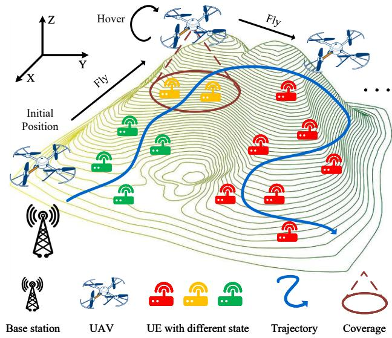  
Fig. 1. UAV-assisted MEC system with uneven terrain.

## III. SYSTEM MODEL AND PROBLEM FORMULATION

In this section, we present an overview of the UAV-assisted MEC system with uneven terrain, including the task offloading model and UAV propulsion model, and then formulate them as an optimization problem.

As illustrated in Fig. 1, we consider a UAV-assisted MEC system deployed in a remote mountainous area where communication infrastructure is limited. The system consists of three layers of MEC architecture in a 3D environment, including M UEs, a UAV equipped with an onboard MEC server, and a base station connected to the core network. UEs are dispersed at different heights across different locations due to terrain-induced height variations. Therefore, the location of UE m is denoted by $\mathbf { c } _ { m } ~ = ~ [ x _ { m } , y _ { m } , z _ { m } ] ~ \in ~ \mathbb { R } ^ { 3 } .$ 1 The UAV performs 3D mobility in the airspace to provide computation offloading services for ground UEs within its best communication coverage [29], and its instantaneous position defined as $\mathbf { c } _ { u } \left( t \right) = \left[ x _ { u } \left( t \right) , y _ { u } \left( t \right) , z _ { u } \left( t \right) \right] \in \mathbb { R } ^ { 3 }$ . Given the limited computational resources onboard the UAV, the UE’s computational tasks need to be partitioned. A portion is offloaded via the UAV to the BS for processing, while the remaining tasks are computed at the UAV. Thus, we denote the location of BS by $\mathbf { c } _ { s } = [ x _ { s } , y _ { s } , z _ { s } ] \in \mathbb { R } ^ { 3 }$ . Moreover, to ensure the reliability of the offloading service, the UAV remains in a hovering state during task offloading. The summary of the key notations used in this paper is listed in Table I.

TABLE I. Summary of Key Notations
<table><tr><td>Notation</td><td>Description</td></tr><tr><td> $\mathbf { c } _ { m } , \mathbf { c } _ { u } , \mathbf { c } _ { s }$ </td><td>3D coordinate vector of UE m, UAV and BS</td></tr><tr><td> $\mathbf { o } _ { m } , \mathbf { o } _ { u } , \mathbf { o } _ { s }$ </td><td>2D coordinate vector of UE m, UAV and BS</td></tr><tr><td> $\lambda _ { m } ^ { \mathrm { u n s e r v e d } } \left( t \right)$ </td><td>Unserved indicator of UE m</td></tr><tr><td> $\lambda _ { m } ^ { \mathrm { c o v e r } } \left( t \right)$ </td><td>Cover indicator of UE m</td></tr><tr><td> $\lambda _ { m } \left( t \right)$ </td><td>Service indicator of UE m</td></tr><tr><td> $\varphi _ { m } ^ { u } \left( t \right)$ </td><td>Elevation angle between UE m and UAV</td></tr><tr><td> $M _ { u } \left( t \right)$ </td><td>Number of UEs served by UAV</td></tr><tr><td> $\xi _ { m } \left( t \right)$ </td><td>Proportion of tasks of UE m computed at BS</td></tr><tr><td> $g _ { m } ^ { u } \left( t \right) , g _ { u } ^ { s } \left( t \right)$ </td><td>Channel power gain of G2A link for UE m and A2G link for UAV</td></tr><tr><td> $B _ { m } ^ { S } \left( t \right) , F _ { m } ^ { U } \left( t \right)$ </td><td>The UAV&#x27;s computing resources and BS&#x27;s band- width allocated to UE m</td></tr><tr><td> $T _ { m } ^ { \mathrm { G 2 A } } \left( t \right) , T _ { m } ^ { \mathrm { A 2 G } } \left( t \right)$ </td><td>G2A and A2G transmission latency of UE m</td></tr><tr><td> $T _ { m } ^ { \mathrm { C A } } \left( t \right) , T _ { m } ^ { \mathrm { C G } } \left( t \right)$ </td><td>Computation latency of UE m on UAV and BS</td></tr><tr><td> $T _ { m } ^ { \mathrm { O L } } \left( t \right)$ </td><td>Task offloading latency of UE m</td></tr><tr><td> $\Delta t _ { \mathrm { h o v e r } } \left( t \right)$ </td><td>Hover time of UAV</td></tr><tr><td> $\mathbf { v } _ { u } \left( t \right) , \mathbf { v } _ { u } ^ { d } \left( t \right) , v _ { u } \left( t \right)$ </td><td>Velocity vector, velocity direction vector, and velocity scalar of UAV</td></tr><tr><td> $Z \left( \mathbf { o } \right)$ </td><td>Terrain elevation at 2D coordinates o</td></tr><tr><td> $T _ { u } ^ { r } \left( t \right)$ </td><td>Thrust of each UAV&#x27;s rotor</td></tr><tr><td> $P _ { u } ^ { \mathrm { P r o p } } \left( t \right)$ </td><td>Propulsion power of UAV</td></tr><tr><td> $E _ { u } \left( t \right)$ </td><td>Energy consumption of UAV</td></tr></table>

## A. Task Offloading Model

Each UE m possesses a task $W _ { m }$ charracterized by its data size $W _ { m } ^ { s }$ and required CPU cycles $W _ { m } ^ { c }$ , denoted as $W _ { m } = [ W _ { m } ^ { s } , W _ { m } ^ { c } ]$ . The UAV cruises in the airspace while providing task offloading services. Upon receiving the tasks from UEs, the UAV performs partial offloading, where each task is partitioned and executed collaboratively by the UAV’s onboard processor and the BS’s server.

1) UAV-UE Interaction: This model categorizes UEs into three statuses: “unserved,” “serving,” and “served.” To distinguish these three categories, two indicators were used, that is, the unserved indicator $\lambda _ { m } ^ { \mathrm { u n s e r v e d } } \left( t \right)$ and coverage indicator $\lambda _ { m } ^ { \mathrm { c o v e r } } \left( t \right)$ . If the UE has already been serviced, that is, the task it carries has been offloaded, the unserved indicator will be set to 0; otherwise, it will be 1, i.e.,

$$
\lambda _ { m } ^ { \mathrm { u n s e r v e d } } \left( t \right) = \left\{ \begin{array} { l l } { 1 , } & { \mathrm { u n s e r v e d } , } \\ { 0 , } & { \mathrm { o t h e r w i s e } . } \end{array} \right.\tag{1}
$$

The necessary condition for UEs to receive services is that they can establish a good transmission link with the UAV. At the same time, the coverage region of the UAV-UE is a circular disk. As shown in Fig. 2, in a 3D environment, the UAV signal covers the corresponding area at a certain coverage angle $\varphi _ { \mathrm { c o v e r } }$ [30]. Therefore, by calculating the elevation angle between the UE m and the UAV, it is possible to determine whether the UE m is within the service coverage area of the UAV, and the angle is defined as

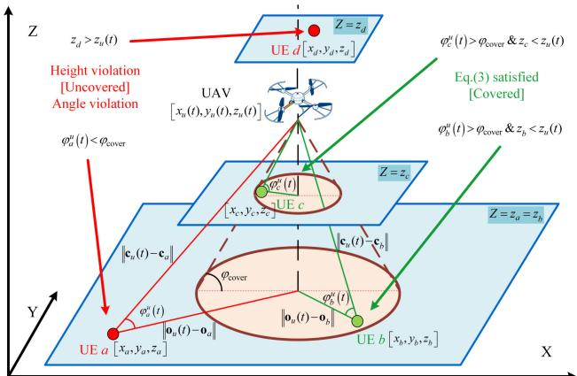  
Fig. 2. Coverage region of the UAV-UE over uneven terrain.

$$
\varphi _ { m } ^ { u } \left( t \right) = \operatorname { a r c c o s } ( \frac { \left\| \mathbf { o } _ { u } \left( t \right) - \mathbf { o } _ { m } \right\| } { \left\| \mathbf { c } _ { u } \left( t \right) - \mathbf { c } _ { m } \right\| } ) ,\tag{2}
$$

where $\mathbf { o } _ { m } = \left[ x _ { m } , y _ { m } \right] \in \mathbb { R } ^ { 2 } , \mathbf { o } _ { u } \left( t \right) = \left[ x _ { u } \left( t \right) , y _ { u } \left( t \right) \right] \in \mathbb { R } ^ { 2 } .$

In an uneven terrain environment, there may be UEs whose altitude is higher than that of the UAV, even when meeting the coverage angle, which is unreasonable. Therefore, the coverage indicator also needs to consider the height status of UE m and UAV, which can be expressed as

$$
\lambda _ { m } ^ { \mathrm { c o v e r } } \left( t \right) = \left\{ \begin{array} { l l } { 1 , } & { \varphi _ { m } ^ { u } \left( t \right) > \varphi _ { \mathrm { c o v e r } } \mathrm { a n d } z _ { u } \left( t \right) > z _ { m } , } \\ { 0 , } & { \mathrm { o t h e r w i s e } , } \end{array} \right.\tag{3}
$$

where $\lambda _ { m } ^ { \mathrm { c o v e r } } \left( t \right) ~ = ~ 1$ means the UE m meet the coverage conditions at time t. As illustrated by the four examples in Fig. 2, UE a violates the angle condition, and UE d violates the height condition, so they are considered uncovered. In contrast, UEs b and $c ,$ although located at different altitudes, satisfy both the coverage angle and height conditions, and thus meet the coverage conditions at time t.

By using the unserved indicator and coverage indicator, the service indicator $\lambda _ { m } \left( t \right)$ is defined to determine whether UE m is be serving at time $t ,$ that is,

$$
\lambda _ { m } \left( t \right) = \lambda _ { m } ^ { \mathrm { u n s e r v e d } } \left( t \right) \lambda _ { m } ^ { \mathrm { c o v e r } } \left( t \right) .\tag{4}
$$

Then, it is possible to count the UEs being served by the UAV at the current time t, which is denoted by $M _ { u } \left( t \right)$ , i.e.,

$$
M _ { u } \left( t \right) = \sum _ { m = 1 } ^ { M } \lambda _ { m } \left( t \right) .\tag{5}
$$

Considering the remote mountainous deployment scenario, it is assumed that the number of simultaneously served UEs remains within a normal and practical range, since the UAV’s flight altitude and coverage area are naturally limited. Additionally, we maintain a list L (t) to store the indices of served UEs in time t, where $M _ { u } \left( t \right)$ equals the length of L (t).

2) Task Transmission: After determining the UEs currently served by the UAV, a communication link will be established to upload tasks from the UEs to the UAV via the G2A channel. Since the UAV maintains a hovering state while providing offloading services, the channel state remains constant from the start until the completion of service, i.e., from the beginning to the end of the hover period. Considering the large-scale fading in UAV-UE communication links caused by terrain features and obstacles, this paper adopts a probabilistic LoS channel model. The LoS probability of UE m at time t, denoted as $\mathbb { P } \left( L o S , \varphi _ { m } ^ { u } \left( t \right) \right)$ ), can be approximated to be an elevation angle-related logistic function of the following form [31]

$$
\mathbb { P } \left( L o S , \varphi _ { m } ^ { u } \left( t \right) \right) = \frac { 1 } { 1 + a \exp \left( - b \left( \frac { 1 8 0 } { \pi } \varphi _ { m } ^ { u } \left( t \right) - a \right) \right) } ,\tag{6}
$$

where a and b are parameters related to the environment. Meanwhile, we can obtain the probability of the non-line-ofsight (NLoS) channel, i.e.,

$$
\mathbb { P } \left( N L o S , \varphi _ { m } ^ { u } \left( t \right) \right) = 1 - \mathbb { P } \left( L o S , \varphi _ { m } ^ { u } \left( t \right) \right) .\tag{7}
$$

Based on the occurrence probabilities of LoS and NLoS channel states, the expected channel power gain between the UAV and UE m becomes

$$
\begin{array} { r l r } & { } & { \mathbb { E } \left[ \left| g _ { m } ^ { u } \left( t \right) \right| ^ { 2 } \right] = \frac { \left( \mathbb { P } \left( L o S , \varphi _ { m } ^ { u } \left( t \right) \right) + \kappa \mathbb { P } \left( N L o S , \varphi _ { m } ^ { u } \left( t \right) \right) \right) g _ { 0 } } { \left[ d _ { m } ^ { u } \left( t \right) \right] ^ { \iota } } } \\ & { } & { = \mathbb { \tilde { P } } \left( L o S , \varphi _ { m } ^ { u } \left( t \right) \right) g _ { 0 } [ d _ { m } ^ { u } \left( t \right) ] ^ { - \iota } , } \end{array}\tag{8}
$$

where $\widetilde { \mathbb { P } } \left( L o S , \varphi _ { m } ^ { u } \left( t \right) \right) = \kappa + \left( 1 - \kappa \right) \mathbb { P } \left( L o S , \varphi _ { m } ^ { u } \left( t \right) \right)$ represents the regularized LoS probability, $\kappa < 1$ is the additional attenuation factor due to the NLoS condition, g0 represents the channel gain at a distance of 1m, ι is the path loss exponent, and $d _ { m } ^ { u } \left( t \right) = \left. \mathbf { c } _ { u } \left( t \right) - \mathbf { c } _ { m } \right.$ represents the current Euclidean distance between the UAV and UE m at time t.

In the task upload phase, we assume that the bandwidth of the UAV is distributed to all UEs in the “serving” status evenly. This bandwidth allocation strategy is designed based on practical considerations for this stage. First, this strategy helps reduce control complexity under the probabilistic LoS channel model. Second, this strategy can be seen as a redundant design that ensures fair uplink transmission between UEs in situations where task information cannot be accurately obtained before the UAV enters “hover mode”. Then, the G2A transmission rate between UE m and UAV is given by

$$
R _ { m } ^ { u } \left( t \right) = \frac { B _ { U } } { M _ { u } \left( t \right) } \mathrm { l o g } _ { 2 } \left( 1 + \frac { P _ { M } | g _ { m } ^ { u } \left( t \right) | ^ { 2 } } { \sigma ^ { 2 } } \right) ,\tag{9}
$$

where $B _ { U }$ is UAV’s bandwidth, $P _ { M }$ denotes the UE’s transmission power, and σ represents the noise power. Considering the UAV’s cover condition and the probabilistic LoS channel model, the G2A transmission latency from UE m to UAV can be defined as

$$
T _ { m } ^ { \mathrm { G 2 A } } \left( t \right) = \lambda _ { m } \left( t \right) \frac { W _ { m } ^ { s } } { R _ { m } ^ { u } \left( t \right) } .\tag{10}
$$

In this work, we consider a partial offloading model, where each task may be either partially or fully processed at the UAV, while the remaining portion is offloaded to the BS for computation. The proportion of tasks of UE m computed at BS is defined as $\xi _ { m } \left( t \right)$ . After receiving the task from the UE, the UAV needs to determine the allocated portion and transmit it to the BS via the A2G channel for calculation. This paper assumes the absence of obstacles between the UAV and the BS during the UAV’s flight operation, thus modeling the A2G transmission link as a LoS channel. Then the A2G channel power gain between UAV and BS at time t is given by

$$
g _ { u } ^ { s } \left( t \right) = { { g } _ { 0 } } [ d _ { u } ^ { s } \left( t \right) ] ^ { - 2 } ,\tag{11}
$$

where $d _ { u } ^ { s } \left( t \right) = \left\| \mathbf { c } _ { u } \left( t \right) - \mathbf { c } _ { s } \right\|$ represents the Euclidean distance between the UAV and the BS. During the process of transmitting tasks from UAV to BS, the waste of bandwidth resources may occur due to the different allocation proportions of tasks for different UEs. In this stage, the A2G channel can be regarded as more deterministic, and the remaining task sizes to be transmitted to the BS are already known. Therefore, instead of evenly distributing the BS bandwidth (referred to as User-equal allocation), this paper allocates it according to the proportion of task volume (referred to as Load-equal allocation), i.e.,

$$
B _ { m } ^ { S } \left( t \right) = \frac { \xi _ { m } \left( t \right) W _ { m } ^ { s } B _ { S } } { \sum _ { i = 1 } ^ { M } \lambda _ { i } \left( t \right) \xi _ { i } \left( t \right) W _ { i } ^ { s } } ,\tag{12}
$$

where $B _ { S }$ is BS’s bandwidth. Then, the A2G transmission rate at time t for UE m is defined as

$$
R _ { m } ^ { s } \left( t \right) = B _ { m } ^ { S } \left( t \right) \log _ { 2 } \left[ 1 + \frac { P _ { U } g _ { u } ^ { s } \left( t \right) } { \sigma ^ { 2 } } \right] ,\tag{13}
$$

where $P _ { U }$ denotes the UAV’s transmission power. Therefore, for the task of UE m, the A2G transmission latency from UAV to BS at time t can be expressed as

$$
T _ { m } ^ { \mathrm { A 2 G } } \left( t \right) = \lambda _ { m } \left( t \right) \frac { \xi _ { m } \left( t \right) W _ { m } ^ { s } } { R _ { m } ^ { s } \left( t \right) } .\tag{14}
$$

3) Task Computation: While the UAV transmits the offloaded tasks to the BS, it simultaneously processes the remaining tasks using its onboard computing resources to reduce the latency. To avoid UAV’s computational resource wastage, we adopted the same method as BS’s bandwidth allocation, which divides computing resources according to the proportion of task volume, i.e.,

$$
F _ { m } ^ { U } \left( t \right) = \frac { \left( 1 - \xi _ { m } \left( t \right) \right) W _ { m } ^ { s } F _ { U } } { \sum _ { i = 1 } ^ { M } \lambda _ { i } \left( t \right) \left( 1 - \xi _ { i } \left( t \right) \right) W _ { i } ^ { s } } ,\tag{15}
$$

where $F _ { U }$ represents the UAV’s computational resources. Then, for task of UE $m ,$ , the computation latency on the UAV at time t can be given by

$$
T _ { m } ^ { \mathrm { C A } } \left( t \right) = \lambda _ { m } \left( t \right) \frac { \left( 1 - \xi _ { m } \left( t \right) \right) W _ { m } ^ { s } W _ { m } ^ { c } } { F _ { m } ^ { U } \left( t \right) } .\tag{16}
$$

Similarly, the computation latency caused by BS computing the UE’s task is defined as

$$
T _ { m } ^ { \mathrm { C G } } \left( t \right) = \lambda _ { m } \left( t \right) \frac { \xi _ { m } \left( t \right) W _ { m } ^ { s } W _ { m } ^ { c } } { F _ { S } } ,\tag{17}
$$

where $F _ { S }$ represents the BS’s computational resources.

For a UE in the “serving” status, its task offloading process is illustrated by UE b in Fig. 3. First, the entire task of

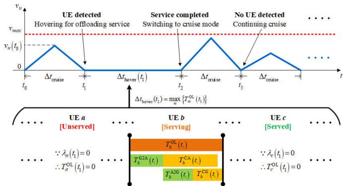  
Fig. 3. The workflow for UAV.

UE b is transmitted to the UAV via the G2A link (requiring $T _ { b } ^ { \mathrm { G 2 A } } \left( t \right) )$ . Then, partial computation is performed on the UAV (requiring $\bar { T } _ { b } ^ { \mathrm { C A } } \left( t \right) )$ , while the remaining portion is simultaneously offloaded to the BS for computation via the A2G link (requiring $T _ { b } ^ { \mathrm { A 2 G } } \left( t \right) + T _ { m } ^ { \mathrm { C G } } )$ . The downlink delay for result feedback is neglected due to its relatively minor impact. Therefore, the task offloading latency for UE m can be expressed as

$$
T _ { m } ^ { \mathrm { O L } } \left( t \right) = T _ { m } ^ { \mathrm { G 2 A } } \left( t \right) + \operatorname* { m a x } \left\{ T _ { m } ^ { \mathrm { C A } } \left( t \right) , T _ { m } ^ { \mathrm { A 2 G } } \left( t \right) + T _ { m } ^ { \mathrm { C G } } \left( t \right) \right\} ,\tag{18}
$$

Similarly, for UEs in the “unserved” or “served” status (e.g., UEs a and $c ) ,$ since their service indicators $\lambda _ { a } \left( t \right) = \lambda _ { c } \left( t \right) =$ $0 ,$ their corresponding task offloading latencies $T _ { a } ^ { \mathrm { O L } } \left( t \right)$ and $T _ { c } ^ { \mathrm { O L } } \left( t \right)$ are also zero. This ensures the completeness and consistency of equation at any time t.

## B. Quad-Rotor UAV Propulsion Model

While providing task offloading services, the UAV must also ensure safe flight (including both cruising and hovering) in uneven terrain environments. In addition, since the UAV is constrained by its limited onboard energy, improving propulsion energy efficiency becomes another key consideration.

1) Safe Mobility Model: The UAV’s movement model operates in two modes: “hover mode” and “cruise mode”. As shown in Fig. 3, the UAV switches between “hover mode” and “cruise mode” at the start or completion of task offloading—for example, entering “hover mode” at time $t _ { 1 }$ and transitioning back to “cruise mode” at time $t _ { 2 } .$ . Otherwise, it maintains “cruise mode” to reach a new location for UE detection and service, as seen in the continued cruise mode at time $t _ { 3 } .$

The hover duration depends on the time of task offloading. Since the UAV serves UEs in parallel within its coverage, the hover time equals the longest task offloading time among Serving UEs (such as UE b). The service indicator $\lambda _ { m } \left( t \right)$ sets the offloading time of unserved UEs (such as UE a) and served UEs (such as UE c) to zero. Therefore, the hover time $\Delta t _ { \mathrm { h o v e r } } \left( t \right)$ can be obtained by calculating the maximum offloading time among all UEs, defined as

$$
\Delta t _ { \mathrm { h o v e r } } \left( t \right) = \operatorname* { m a x } _ { m } \left\{ T _ { m } ^ { \mathrm { O L } } \left( t \right) \right\} .\tag{19}
$$

During the “hover mode”, the coordinates of the UAV will remain unchanged, that is,

$$
\mathbf { c } _ { u } \left( t + \Delta t _ { \mathrm { h o v e r } } \left( t \right) \right) = \mathbf { c } _ { u } \left( t \right) .\tag{20}
$$

In “cruise mode”, the UAV’s positional variation can be modeled through its velocity vector ${ \mathbf v } _ { u } \left( t \right) \in \mathbb { R } ^ { 3 }$ . The velocity vector ${ { \bf { v } } _ { u } } \left( t \right)$ is composed of a velocity scalar $v _ { u } \left( t \right)$ and heading direction vector $\mathbf { v } _ { u } ^ { d } \left( t \right) \in \mathbb { R } ^ { 3 }$ , expressed as:

$$
\mathbf { v } _ { u } \left( t \right) = v _ { u } \left( t \right) \mathbf { v } _ { u } ^ { d } \left( t \right) .\tag{21}
$$

Since at time t twhen the UAV enters the “cruise mode”, the service indicators of all UEs are set to 0, the hover time $\Delta t _ { \mathrm { h o v e r } } \left( t \right)$ equals 0, implying that no hovering occurs. Then, this model assumed the “cruise mode” persists for duration $\Delta t _ { \mathrm { c r u i s e } }$ , comprising two symmetrical operational phases: acceleration and deceleration. During the acceleration phase, the UAV accelerates from zero velocity to $v _ { u } \left( t \right)$ , then decelerates back to zero velocity in the subsequent phase. Both phases maintain equal time duration $( \Delta t _ { \mathrm { c r u i s e } } / 2 )$ and identical cruise heading direction $\mathbf { v } _ { u } ^ { d } \left( t \right)$ . Then, we have

$$
\begin{array} { r l } { \mathbf { c } _ { u } \left( t + \Delta t _ { \mathrm { c r u i s e } } \right) = \mathbf { c } _ { u } \left( t \right) + \mathbf { v } _ { u } ^ { d } \left( t \right) \displaystyle \int _ { t } ^ { t + \Delta t _ { \mathrm { c r u i s e } } } v _ { u } \left( \tau \right) d \tau } \\ { = \mathbf { c } _ { u } \left( t \right) + \frac { 1 } { 2 } \mathbf { v } _ { u } ^ { d } \left( t \right) v _ { u } \left( t \right) \Delta t _ { \mathrm { c r u i s e } } . } \end{array}\tag{22}
$$

Moreover, the system model defines a cubic service area to ensure UAV operations within the designated domain. The movement of the UAV cannot exceed the boundaries of the service area, that is, $0 \leq x _ { u } \left( t \right) \leq X _ { m a x } , 0 \leq y _ { u } \left( t \right) \leq Y _ { m a x } ,$ $0 \leq z _ { u } \left( t \right) \leq Z _ { m a x }$ , where $X _ { m a x } , \ Y _ { m a x } ,$ and $Z _ { m a x }$ respectively represent the length, width, and altitude of the rectangleshaped service area.

This paper accounts for real-world operational scenarios where the service area contains uneven terrain. The varying ground elevation necessitates dynamic adjustment of safe flight altitudes during path planning. In this model, the terrain elevation at 2D coordinates $\mathbf { o } ~ = ~ [ x , y ]$ is defined as $Z \left( \mathbf { o } \right)$ Consequently, the UAV’s minimum safe flight altitude constraint is expressed as

$$
H _ { m i n } \leq z _ { u } \left( t \right) - Z \left( \mathbf { o } _ { u } \left( t \right) \right) \leq H _ { m a x } ,\tag{23}
$$

where $H _ { m i n } , H _ { m a x }$ denote the minimum and maximum flight altitude of the UAV, respectively. This constraint ensures a minimum safe clearance height above the terrain, which enables the UAV to effectively avoid terrain-induced obstacles during flight. The trajectory generation and optimization of the UAV in this work are grounded in this constraint, guaranteeing the development of safe and efficient 3D flight trajectories.

2) Energy Consumption Model: In the UAV-assisted MEC system, the energy carried by the UAV is primarily consumed by three processes: task computation, data transmission, and propulsion. We focus exclusively on propulsion energy because the energy expended during propulsion is much greater than the sum of the energy consumption for the UAV’s computation and transmission. The Quad-Rotor UAV moves by the thrust generated by its rotor, which needs to overcome gravity and aerodynamic drag to propel the UAV to fly [32].

$$
\begin{array} { r } { P _ { u } ^ { \mathrm { P r o p } } \left( t \right) = P _ { u } ^ { \mathrm { P r o p } } \left( v _ { u } \left( t \right) , T _ { u } ^ { \mathrm { r } } \left( t \right) \right) = n _ { r } \Bigg [ \frac { \delta } { 8 } \left( \frac { T _ { u } ^ { r } \left( t \right) } { c _ { T } \rho A } + 3 v _ { u } ^ { 2 } \left( t \right) \right) \sqrt { \frac { T _ { u } ^ { r } \left( t \right) \rho c _ { S } ^ { 2 } A } { c _ { T } } } + \frac { 1 } { 2 } d _ { 0 } v _ { u } ^ { 3 } \left( t \right) \rho c _ { S } A } \\ { + \left( 1 + c _ { f } \right) T _ { u } ^ { r } \left( t \right) \left( \sqrt { \frac { \left( T _ { u } ^ { r } \left( t \right) \right) ^ { 2 } } { 4 \rho ^ { 2 } A ^ { 2 } } } + \frac { v _ { u } ^ { 4 } \left( t \right) } { 4 } - \frac { v _ { u } ^ { 2 } \left( t \right) } { 2 } \right) ^ { \frac { 1 } { 2 } } + \frac { W _ { u } g v _ { u } \left( t \right) } { n _ { r } } \sin \tau _ { c } \Bigg ] } \end{array}\tag{25}
$$

According to Newton’s second law, the thrust of each rotor $T _ { u } ^ { r } \left( t \right)$ can be expressed as a function of UAV’s velocity ${ { \bf { v } } _ { u } } \left( t \right)$ and acceleration $\mathbf { a c c } _ { u } \left( t \right)$ , i.e.,

$$
\begin{array} { l } { { \displaystyle T _ { u } ^ { r } ( t ) = T _ { u } ^ { r } ( { \bf v } _ { u } ( t ) , { \bf a c c } _ { u } ( t ) ) } \ ~ } \\ { { \displaystyle ~ = \frac { 1 } { n _ { r } } \| ( W _ { u } \| { \bf a c c } _ { u } ( t ) \| + \frac { \rho v _ { u } ^ { 2 } ( t ) S _ { F P } } { 2 } ) { \bf v } _ { u } ^ { d } ( t ) - W _ { u } { \bf g } \| } \ ~ } \\ { { \displaystyle ~  ( 2 4 )  } } \end{array}
$$

where $n _ { r }$ is the number of rotors; $W _ { u }$ represents the $\mathrm { U A V } \mathbf { \hat { s } }$ weight; $\rho$ denotes air density; $S _ { F P }$ means fuselage equivalent flat plate area; g is gravity acceleration vector.

The propulsion power of the UAV can be derived from the rotor thrust $T _ { u } ^ { r } \left( t \right)$ and UAV’s velocity scalar $v _ { u } \left( t \right)$ , defined as (25), shown at the top of this page, where $\delta$ is the profile drag coefficient, $c _ { T }$ represents the thrust coefficient based on disc area; $A$ means disc area for each rotor; $c _ { S }$ and $d _ { 0 }$ are the solidity and fuselage drag ratio for each rotor respectively; $c _ { f }$ is the incremental correction factor of induced power; $g$ represents the gravity acceleration scalar; $\tau _ { c }$ denotes the climb angle. Thus, the energy consumption of the UAV from start to time t can be defined as

$$
E _ { u } \left( t \right) = \int _ { 0 } ^ { t } P _ { u } ^ { \mathrm { P r o p } } \left( \tau \right) d \tau .\tag{26}
$$

Based on the movement model of the UAV, we can calculate the total energy consumption by calculating the energy consumption under different modes. When the UAV is in “hover mode”, its rotors only needs to overcome gravity while maintaining its velocity $\mathbf { v } _ { u } \left( t \right)$ and acceleration accu (t) at zero. Thus, the propulsion power remains constant, defined as $P _ { u } ^ { \mathrm { h o v e r } }$ . Therefore, the energy consumption of the UAV after “hover mode” can be converted into

$$
\begin{array} { r l r } {  { E _ { u } ( t + \Delta t _ { \mathrm { h o v e r } } ( t ) ) = E _ { u } ( t ) + \int _ { t } ^ { t + \Delta t _ { \mathrm { h o v e r } } ( t ) } P _ { u } ^ { \mathrm { P r o p } } ( \tau ) d \tau } } \\ & { } & { = E _ { u } ( t ) + P _ { u } ^ { \mathrm { h o v e r } } \Delta t _ { \mathrm { h o v e r } } ( t ) . \quad } \end{array}\tag{27}
$$

Under “cruise mode” with dynamic velocity ${ { \bf { v } } _ { u } } \left( t \right)$ and acceleration $\mathbf { a c c } _ { u } \left( t \right)$ , the UAV’s propulsion power becomes a continuously changing value. This paper employs discretization with the midpoint method to convert the energy consumption of the UAV after “cruise mode”. Then, we have

$$
E _ { u } \left( t + \Delta t _ { \mathrm { c r u i s e } } \right) = E _ { u } \left( t \right) + \int _ { t } ^ { t + \Delta t _ { \mathrm { c r u i s e } } } P _ { u } ^ { \mathrm { P r o p } } \left( \tau \right) d \tau
$$

$$
= E _ { u } \left( t \right) + \sum _ { n = 0 } ^ { N - 1 } { { P } _ { u } ^ { \mathrm { P r o p } } } \left( t + \frac { \left( 2 n + 1 \right) \delta _ { t } } { 2 } \right) \delta _ { t } ,\tag{28}
$$

where $N$ is the number of points segments, and $\begin{array} { r } { \delta _ { t } = \frac { \Delta t _ { \mathrm { c r u i s e } } } { N } } \end{array}$

Through these integral transformations under different movement modes, it is possible to accurately model the energy consumption during UAV mobility, which significantly improves precision compared to constant-power assumptions.

## C. Problem Formulation

The goal of this model is to serve the most UEs with the least energy consumption. Thus, we introduce two objectives, the service coverage ratio SCR (t) and the UAV’s propulsion energy efficiency $E _ { \mathrm { e f f } } \left( t \right)$ . The service coverage ratio is defined as

$$
S C R \left( t \right) = 1 - \frac { \sum _ { m = 1 } ^ { M } \lambda _ { m } ^ { \mathrm { u n s e r v e d } } \left( t \right) } { M } .\tag{29}
$$

In subsequent algorithmic performance comparisons, the communication region of the UAV may fail to cover any UEs, thereby resulting in a case where no UEs were served, and the service coverage ratio is zero. Therefore, instead of using the energy consumption per served UE (which may cause divisionby-zero issues), we adopt the number of UEs served per unit energy consumption, i.e., energy efficiency [33], [34], defined as

$$
E _ { \mathrm { e f f } } \left( t \right) = \frac { M - \sum _ { m = 1 } ^ { M } \lambda _ { m } ^ { \mathrm { u n s e r v e d } } \left( t \right) } { E _ { u } \left( t \right) } .\tag{30}
$$

To further evaluate the overall system performance, we define the system utility as the product of the service coverage ratio and propulsion energy efficiency, that is,

$$
\begin{array} { r } { U t i l i t y \left( t \right) = S C R \left( t \right) E _ { \mathrm { e f f } } \left( t \right) . } \end{array}\tag{31}
$$

To ensure efficient system operation, we impose a maximum system runtime $T .$ . Simultaneously, to guarantee flight safety, any violation of constraints during UAV operation is considered a default step. Thus, the UAV must maximize system utility while maintaining safe flight operations within the prescribed time T . By optimizing the UAV’s location $\mathbf { c } _ { u } \left( t \right)$ and task allocation ratios $\xi _ { m } \left( t \right)$ , the formulated optimization problem is denoted as follows:

$$
\operatorname* { m a x } _ { \{ \mathbf { c } _ { u } \left( t \right) \} , \xi _ { m } \left( t \right) } U t i l i t y \left( t \right)\tag{32}
$$

$$
s . t . \ t \leq T ,\tag{32a}
$$

$$
0 \leq \xi _ { m } \left( t \right) \leq 1 , \forall m ,
$$

$$
v _ { u } \left( t \right) \leq v _ { m a x } , \forall t ,\tag{32b}
$$

(32c)

$$
0 \leq x _ { u } \left( t \right) \leq X _ { m a x } ,\tag{32d}
$$

$$
0 \leq y _ { u } \left( t \right) \leq Y _ { m a x } ,\tag{32e}
$$

$$
0 \leq z _ { u } \left( t \right) \leq Z _ { m a x } ,\tag{32f}
$$

$$
H _ { m i n } \leq z _ { u } \left( t \right) - Z \left( \mathbf { o } _ { u } \left( t \right) \right) \leq H _ { m a x } ,\tag{32g}
$$

where (32a) is the constraint about the system runtime, (32b) denotes the constraint of task allocation ratio, (32c) represents the maximum velocity constraint of the UAV, and (32d)-(32g) include the safety mobility constraints of the UAV.

In this system model, the UAV needs to perform 3D flight operations while simultaneously executing task offloading, where complex terrain and dynamic UE coverage present significant challenges. Furthermore, the combined effects of uncertain UE communication conditions and the UAV’s high mobility induce dynamic environments. These challenges render the non-convex optimization problem (32) particularly difficult to solve using conventional methods. Consequently, in the following section, we design a DRL approach that decomposes the problem and employs multi-phase exploration to enable the agent to get the near-optimal policy.

## IV. PH-DRL FOR TASK OFFLOADING AND TRAJECTORY OPTIMIZATION PROBLEM

In this section, we formulate the optimization problem as an MDP and subsequently present the PH-DRL algorithm for its solution.

## A. MDP Formulation

In this system, the UAV must fly safely through uneven terrain while serving distributed ground UEs. Its movement not only alters its position but also affects the service statuses of UEs. Since the joint task offloading and trajectory planning constitute a decision-making process, we formulate the optimization problem as an MDP that can be solved using the reinforcement learning (RL) method.

1) State Space: The system state at time t includes the UAV’s positional coordinates $\mathbf { c } _ { u } \left( t \right)$ and energy consumption $E _ { u } \left( t \right)$ , UEs’ location coordinates $\mathbf { c } _ { m }$ , task information $W _ { m } ,$ and unserved indicators $\lambda _ { m } ^ { \mathrm { u n s e r v e d } } \left( t \right)$ . Besides, considering the uneven terrain conditions, terrain elevation information must also be incorporated into the state space. However, including complete terrain elevation data $Z \left( \mathbf { o } \right)$ would lead to a dimensionality explosion. Therefore, we consider the grid block containing the UAV’s 2D coordinates as the central block, and extend outward to form a $5 \times 5$ square grid region as the terrain observation window. The elevation information within this window (defined as $\vartheta _ { u } \left( t \right) )$ is incorporated into the state space. Then, the state space is defined as

$$
\boldsymbol { s } \left( t \right) = \left\{ \mathbf { c } _ { u } \left( t \right) , E _ { u } \left( t \right) , \boldsymbol { \vartheta } _ { u } \left( t \right) , \mathbf { c } _ { m } , W _ { m } , \lambda _ { m } ^ { \mathrm { u n s e r v e d } } \left( t \right) , \forall m \right\} .\tag{33}
$$

2) Action Space: The UAV conducts 3D flight operations to accommodate varying terrain elevations. The flight trajectory is governed by ${ { \bf { v } } _ { u } } \left( t \right)$ , which we transform into spherical coordinates for more convenient parametric representation [35]. In this representation, $\varphi _ { v } \left( t \right)$ denotes the vertical angle from the positive z-axis with $0 \leq \varphi _ { v } \left( t \right) \leq \pi .$ , and $\varphi _ { h } \left( t \right)$ denotes the horizontal angle in the xy-plane from the x-axis with $- \pi \leq \varphi _ { h } \left( t \right) \leq \pi$ . Additionally, the UAV’s action needs include task allocation ratios for different UEs $\xi _ { m } \left( t \right)$ . Then, the action space is defined as

$$
a \left( t \right) = \left\{ v _ { u } \left( t \right) , \varphi _ { v } \left( t \right) , \varphi _ { h } \left( t \right) , \xi _ { m } \left( t \right) , \forall m \right\}\tag{34}
$$

3) Reward Function: In this model, the UAV serves UEs within its signal coverage region during flight, then continues moving to reach and serve unserved UEs, repeating this process cyclically. This can be considered a reach sub-destination task, for which we assign positive rewards when UEs are served to guide the $\mathrm { U A V } _ { \mathrm { \Delta } }$ service behavior, i.e.,

$$
r _ { 1 } \left( t \right) = \left\{ \begin{array} { l l } { \psi _ { 1 } , } & { M _ { u } \left( t \right) \neq 0 , } \\ { 0 , } & { \mathrm { o t h e r w i s e } , } \end{array} \right.\tag{35}
$$

where $\psi _ { 1 }$ is a positive reward factor to adjust the reward of exploring UEs.

Moreover, a summative episodic reward is provided at the end of each episode to evaluate the UAV’s overall service coverage performance during that episode. Additionally, we relocate the energy efficiency-related rewards from per-step assignments to the episode’s end, thereby preventing the UAV from avoiding long-distance flights solely for energy conservation purposes. Then, the comprehensive reward is expressed as

$$
r _ { 2 } \left( t \right) = \left\{ \begin{array} { l l } { \psi _ { 2 } S C R \left( t \right) + \psi _ { 3 } E _ { \mathrm { e f f } } \left( t \right) , } & { t = T \mathrm { o r } S C R \left( t \right) = 1 , } \\ { 0 , } & { \mathrm { o t h e r w i s e } , } \end{array} \right.\tag{36}
$$

where $\psi _ { 2 }$ and $\psi _ { 3 }$ are positive reward factors like $\psi _ { 1 }$

Furthermore, to ensure the UAV maintains safe flight operations in uneven terrain environments, we implement penalty rewards to punish violations of constraints (22)-(25):

$$
r _ { 3 } \left( t \right) = \psi _ { 4 } \varsigma \left( t \right) ,\tag{37}
$$

where $\psi _ { 4 }$ is a negative reward factor, and $\varsigma \left( t \right)$ is the constraint indicator with $\varsigma \left( t \right) = 1$ indicates constraint violation, while $\varsigma \left( t \right) = 0$ denotes constraint satisfaction. In summary, the reward function can be formulated as

$$
R \left( t \right) = r _ { 1 } \left( t \right) + r _ { 2 } \left( t \right) + r _ { 3 } \left( t \right) .\tag{38}
$$

## B. Phased Hierarchical DRL Algorithm

This model’s optimization problem poses two key challenges for DRL algorithms: First, the UAV operates predominantly in “cruise mode”, and only serves UEs within its signal coverage during “hover mode”. Consequently, in the agent’s state space, UE’s task information is only relevant at specific moments, causing redundancy and interference to the neural network at other times. Similarly, in the agent’s action space, the task allocation ratio of each UE is only effective at particular moments, adversely affecting neural network training. Second, while the terrain observation window effectively addresses high-dimensional state space issues, the agent struggles to acquire global terrain information through limited exploration, which influences optimal flight path determination. Besides, the infrequent occurrence of “hover mode” results in insufficient task-offloading optimization experience, leading to poor optimization performance.

To address these challenges, we propose a phased hierarchical DRL algorithm, whose network architecture is illustrated in Fig. 4. In conventional DRL workflows, only a singlelevel network architecture is employed, where the environment and the network interact through state, action, and reward, and experiences are stored for optimization. In contrast, our algorithm adopts a two-level architecture (corresponding to the First-level and Second-level shown on the left and right in the figure), and incorporates a phased training method into the workflow. The following subsections first elaborate on the definitions of state, action, and reward in each level, and then describe the design of the phased training method as well as the network composition within each level.

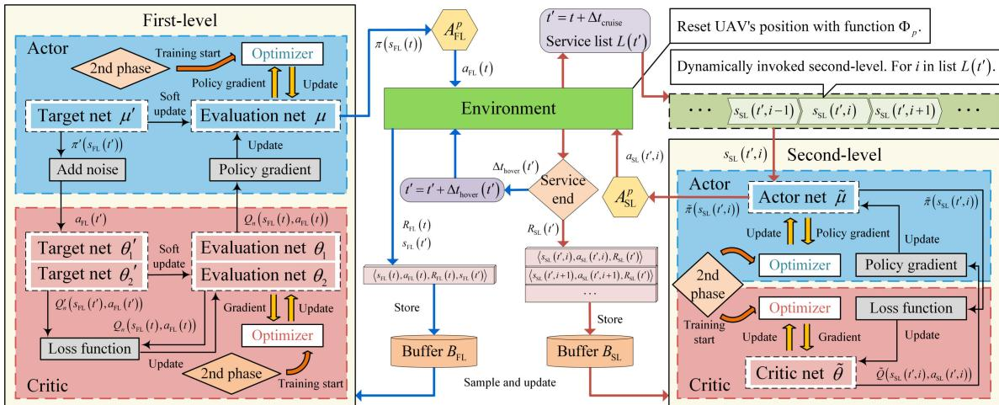  
Fig. 4. The workflow for UAV.

1) Hierarchical Architecture: To address the temporal redundancy issues in both state and action spaces, we propose a hierarchical network architecture that separates the optimization variables. Specifically, UAV’s trajectory $\{ { \bf c } _ { u } \left( t \right) \}$ is optimized by the first-level while UEs’ task allocation ratios $\xi _ { m } \left( t \right)$ are handled by the second-level, achieving functional separation of the optimization objectives.

Optimizing variable separation also requires modifications to the MDP problem. For the first-level, which exclusively handles $\{ { \bf c } _ { u } \left( t \right) \}$ without considering $\xi _ { m } \left( t \right)$ , the agent no longer requires the task information $W _ { m }$ for all UE. Consequently, the state space can be substantially simplified from the original state space (33) and defined as

$$
\begin{array} { r } { s _ { \mathrm { F L } } \left( t \right) = \left\{ \mathbf { c } _ { u } \left( t \right) , E _ { u } \left( t \right) , \vartheta _ { u } \left( t \right) , \mathbf { c } _ { m } , \lambda _ { m } ^ { \mathrm { u n s e r v e d } } \left( t \right) , \forall m \right\} , } \end{array}\tag{39}
$$

achieving a dimensionality reduction of 2∗M parameters. The action space retains only UAV flight control variables while removing all task allocation ratios, that is,

$$
a _ { \mathrm { F L } } \left( t \right) = \left\{ v _ { u } \left( t \right) , \varphi _ { v } \left( t \right) , \varphi _ { h } \left( t \right) \right\} .\tag{40}
$$

The goal of this network is basically the same as the original goal, so the reward function remains the original design, which is $R _ { \mathrm { F L } } \left( t \right) = R \left( t \right)$

The second-level’s state space cannot simply incorporate all UE task information, as this would introduce redundancy. Moreover, the number of UEs in “serving” status varies between UAV’s propulsion modes: zero during “cruise mode” and one or more during “hover mode”. This variability makes it difficult to simply set the number of input/output neurons to a fixed value. To address both redundancy and input/output dimensionality variation challenges, we designed a dynamically invoked network structure that employs iterative calling mechanisms.

Specifically, we consider the number of UEs in “serving” status as the second-level’s invocation count. Then, each invocation processes only a single UE’s information and outputs the corresponding task allocation ratio for that UE. Considering that the UAV provides parallel services and requires a reasonable allocation of system resources, this process is related to the UE’s task information. We introduce a new variable $\zeta _ { m } \left( t \right)$ representing each UE’s task proportion relative to the total demand from all currently served UEs, defined as: $\begin{array} { r } { \zeta _ { m } \left( t \right) = \frac { W _ { m } ^ { s } } { \sum _ { i = 1 } ^ { M } \lambda _ { i } \left( t \right) W _ { i } ^ { s } } } \end{array}$ . Then, the state space of the secondlevel can be represented as

$$
s _ { \mathrm { S L } } \left( t , m \right) = \left\{ W _ { m } , \zeta _ { m } \left( t \right) , d _ { m } ^ { u } \left( t \right) , d _ { u } ^ { s } \left( t \right) \right\} ,\tag{41}
$$

where $d _ { m } ^ { u } \left( t \right)$ and $d _ { u } ^ { s } \left( t \right)$ take into account the relative position of the UE-UAV-BS to obtain the optimal task allocation. The corresponding action space is denoted as

$$
a _ { \mathrm { S L } } \left( t , m \right) = \left\{ \xi _ { m } \left( t \right) \right\} .\tag{42}
$$

For the dynamically-invoked network structure, we designed a novel reward function that incorporates the UAV’s hover time as a negative penalty term, expressed as

$$
R _ { \mathrm { S L } } \left( t \right) = \psi _ { 5 } \Delta t _ { \mathrm { h o v e r } } \left( t \right) ,\tag{43}
$$

where $\psi _ { 5 }$ is a negative reward factor. This design stems from the direct correlation between task offloading times and hover mode duration (as established in Equation (19), thereby guiding the network to minimize total service time through optimized decision-making.

2) Phased Training Strategy: To address the potential low training efficiency caused by insufficient environmental information, we introduce a phased training method. The first phase (p = 1) aims to obtain general knowledge about the environment and runs for $e _ { p } .$ In the reset function $\Phi _ { p } ,$ we randomized the agent’s initial position to enable comprehensive perception of terrain elevation data $Z \left( \mathbf { o } \right)$ across different regions while establishing correlations between the UE’s information and rewards. Besides, we applied a random exploration strategy to the action functions $A _ { \mathrm { F L } } ^ { p }$ and $A _ { \mathrm { S L } } ^ { p }$ , allowing the agent to quickly gather substantial effective experience without requiring training.

The second phase $( p = 2 )$ focuses on refining the agent’s action details and continues for a corresponding episodes $e _ { p } .$ We preserved experience buffers $B _ { \mathrm { F L } }$ and $B _ { \mathrm { S I } }$ from the first phase to accelerate network training, while modifying the reset function $\Phi _ { p }$ to initialize the agent at predetermined positions. $\tan \ z \mathrm { ~ - ~ } g r e e d y$ strategy with Gaussian noise $\tilde { n } \sim \mathbb { N } \left( 0 , \hat { \sigma } ^ { 2 } \right)$ is implemented in the action functions $A _ { \mathrm { F L } } ^ { p }$ and $A _ { \mathrm { S L } } ^ { p }$ . This establishes a learning approach where the agent prioritizes exploration in the early stages of training and focuses on optimization in later stages within the specified environment.

Algorithm 1 presents the pseudocode for PH-DRL. The first-level addresses a more complex problem and therefore employs the TD3 algorithm, which consists of six networks: an evaluation actor network $\pi \left( s \left| \mu \right. \right)$ , two evaluation critic network $Q _ { 1 } ( s , a | \theta _ { 1 } ) , Q _ { 2 } ( s , a | \theta _ { 2 } )$ , and their corresponding target networks $\pi ^ { \prime } ( s | \mu ^ { \prime } ) , \ Q _ { 1 } ^ { \prime } \ ( s , a | \theta _ { 1 } ^ { \prime } ) , \ Q _ { 2 } ^ { \prime } \ ( s , a | \theta _ { 2 } ^ { \prime } )$ The second-level operates in a simpler solution space, for which we adopt the AC algorithm comprising two networks: an actor network $\tilde { \pi } \left( s | \tilde { \mu } \right)$ and a critic network $\tilde { Q } \left( s , a \left| \tilde { \theta } \right. \right)$ . Besides, we use the variable k to denote the step count of $\mathrm { U A V }$ “cruise mode” execution. The target networks in first-level updates every d steps, while the second-level updates according to its invocation frequency. The proposed algorithm operates in two phases with a phase index $p \in \{ 1 , 2 \}$ In each phase, the firstlevel network is responsible for UAV flight control, while the second-level network is activated when serviceable UEs are detected. UAV flight and UE service both consume continuous time, and the total duration of an episode is constrained by a time budget T , rather than a fixed number of time steps. Within each episode, the UAV may perform multiple flight actions before detecting UEs. However, each UE can be served at most once, and the second-level network is therefore activated no more than M times per episode. Since the phase index and network architectures are fixed, the overall computational complexity of the proposed algorithm can be expressed as $O \left( E \times M \right)$

## V. EXPERIMENT RESULTS AND ANALYSIS

In this section, we first describe the system configuration parameters, followed by numerical experiments that evaluate the proposed PH-DRL algorithm in terms of convergence, performance, and extended analyses.

## A. Simulation Settings

In our simulations, real elevation data from a paid-platform (http://www.tuxingis.com/store.html) digital elevation model (DEM) were utilized. The specific coordinates are (Left = 107.3612972521917, Top $= \ 3 4 . 0 8 0 1 3 8 1 5 7 9 5 1 0 5 .$ , Right = 107.36568909492071, Bottom = 34.07574631522204). The area has dimensions of 500m in both length and width, with the highest terrain elevation within the region being 94m. Therefore, the system environment is considered as a cube service area of $5 0 0 \times 5 0 0 \times 1 9 4 \ m ^ { 3 }$ . The 15 UEs are randomly distributed across the uneven terrain, with the BS fixed at [6, 6, 56]. The UAV departs from [6, 6, 131] and attempts to serve as many UEs as possible. The detailed simulation parameters are summarized in Table II.

Algorithm 1: PH-DRL Algorithm of Task Offloading   
Problem with Uneven Terrain.   
Input: Terrain’s data Z (o) and UEs’ data $\mathbf { c } _ { m } , W _ { m } .$   
Output: The optimal trajectory and task allocation   
ratios ${ \{ \mathbf { c } _ { u } \left( t \right) \} , \xi _ { m } \left( t \right) . }$   
1 Initialize the first-level’s networks $\mu , \theta _ { 1 } , \theta _ { 2 } , \mu ^ { \prime } , \theta _ { 1 } ^ { \prime } , \theta _ { 2 } ^ { \prime } ;$   
2 Initialize the second-level’s networks ${ \tilde { \mu } } , { \tilde { \theta } } ;$   
3 Initialize environment ENV, buffers $B _ { \mathrm { F L } }$ and $B _ { \mathrm { S L } }$   
4 for each phase p do   
5 while episode $e \leq E _ { p }$ do   
6 Set time $t = 0 , \ : \mathrm { s t e p } \ : k = 0 ;$   
7 Reset ENV and get $s _ { \mathrm { F L } } \left( t \right) ;$   
8 Reset UAV’s position with function $\Phi _ { p } ;$   
9 while $t \leq T$ do   
10 Select $a _ { \mathrm { { F L } } } ( t )  A _ { \mathrm { { F L } } } ^ { p } ( s _ { \mathrm { { F L } } } ( t ) ) ;$   
11 Set $t ^ { \prime } = t + \Delta t _ { \mathrm { c r u i s e } } ;$   
12 Get $L \left( t ^ { \prime } \right)$ from ENV;   
13 if length of $L \left( t ^ { \prime } \right) \neq 0$ then   
14 for i in list $L \left( t ^ { \prime } \right)$ do   
15 Select aSL $( t ^ { \prime } , i )  A _ { \mathrm { S L } } ^ { p } ( s _ { \mathrm { S L } } ( t ^ { \prime } , i ) ) ;$   
16 Get and store $\dot { T } _ { i } ^ { \mathrm { O L } } \left( t ^ { \prime } \right) ;$   
17 end   
18 Get $R _ { \mathrm { S L } } \left( t ^ { \prime } \right)$ from ENV;   
19 for i in list $L \left( t ^ { \prime } \right)$ do   
20 Store experience   
$\left. s _ { \mathrm { S L } } \left( t ^ { \prime } , i \right) , a _ { \mathrm { S L } } \left( t ^ { \prime } , i \right) , R _ { \mathrm { S L } } \left( t ^ { \prime } \right) \right.$ to   
buffer $B _ { \mathrm { S L } }$   
21 end   
22 Calculate $\Delta t _ { \mathrm { h o v e r } } \left( t ^ { \prime } \right)$ by $\left\{ T _ { m } ^ { \mathrm { O L } } \left( t ^ { \prime } \right) \right\}$   
23 Set $t ^ { \prime } = t ^ { \prime } + \Delta t _ { \mathrm { h o v e r } } \left( t ^ { \prime } \right) ;$   
24 if $p = = 1$ then break;   
25 Sample experience from buffer $B _ { \mathrm { S L } } ;$   
26 Update second-level’s networks $\tilde { \mu } , \tilde { \theta } ;$   
27 end   
28 Get $s _ { \mathrm { F L } } \left( t ^ { \prime } \right) , R _ { \mathrm { F L } } \left( t \right)$ from ENV;   
29 Store experience   
$\left. s _ { \mathrm { F L } } \left( t \right) , a _ { \mathrm { F L } } \left( t \right) , R _ { \mathrm { F L } } \left( t \right) , s _ { \mathrm { F L } } \left( t ^ { \prime } \right) \right.$ to   
buffer $B _ { \mathrm { F L } } ;$   
30 Set $t = t ^ { \prime } , k = k + 1 ;$   
31 if $p = = 1$ then continue;   
32 Sample experience from buffer $B _ { \mathrm { F L } } ;$   
33 Update first-level’s evaluation networks $\theta _ { 1 }$   
$\theta _ { 2 } ;$   
34 if k mod d then   
35 Update first-level’s evaluation network   
$\mu ;$   
36 Soft update first-level’s target networks   
$\mu ^ { \prime } , \theta _ { 1 } ^ { \prime } , \theta _ { 2 } ^ { \prime } ;$   
37 end   
38 end   
39 end   
40 end   
41 return

TABLE II. Experimental Simulation Parameters
<table><tr><td>Parameters</td><td>Value</td><td>Parameters</td><td>Value</td></tr><tr><td>System runtime,  $_ T$ </td><td>150 s</td><td>UAV&#x27;s maximum velocity,  $v _ { m a x }$ </td><td>15 m/s</td></tr><tr><td>Size of area,  $X _ { m a x } , Y _ { m a x } , Z _ { m a x }$ </td><td>500 m, 500 m, 194m</td><td>UAV&#x27;s flight altitude,  $H _ { m i n } , H _ { m a x }$ </td><td> $5 0 ~ \mathrm { m } , 1 0 0 ~ \mathrm { m }$ </td></tr><tr><td>Number of UEs, M</td><td>15</td><td>UAV&#x27;s rotors, nr</td><td>4</td></tr><tr><td>Size of task data,  $W _ { m } ^ { s }$ </td><td>[1,5] Mbits</td><td>UAV&#x27;s weight,  $W _ { u }$ </td><td> $2 ~ \mathrm { k g }$ </td></tr><tr><td>Number of CPU cycles,  $W _ { m } ^ { c }$ </td><td>[100,200] cycles/bit</td><td>UAV&#x27;s cruise duration, ∆tcruise</td><td>3 s</td></tr><tr><td>Environmental parameters, a, b</td><td>15, 0.5</td><td>Number of points segments, N</td><td>10</td></tr><tr><td>NLoS attenuation, κ</td><td>0.2</td><td>Air density,  $\rho$ </td><td>1.225 kg/m³</td></tr><tr><td>Path loss exponent, ¿</td><td>2.3</td><td>Fuselage equivalent flat plate area,  $S _ { F P }$ </td><td>0.01</td></tr><tr><td>Noise power, σ</td><td>-80 dBm</td><td>Gravity acceleration, g</td><td> $9 . 8 1 ~ \mathrm { m } / \mathrm { s } ^ { 2 }$ </td></tr><tr><td>Channel gain, go</td><td>-50 dB</td><td>Profile drag coefficient, δ</td><td>0.012</td></tr><tr><td>UE&#x27;s transmit power,  $P _ { M }$ </td><td>0.1 W</td><td>Thrust coefficient based on disc area,  $c _ { T }$ </td><td>0.302</td></tr><tr><td>BS&#x27;s bandwith,  $B _ { S }$ </td><td>5MHz</td><td>Disc area for each rotor, A</td><td> $0 . 0 3 1 4 ~ \mathrm { m } ^ { 2 }$ </td></tr><tr><td>BS’s computation resource,  $F _ { S }$ </td><td>1 GHz</td><td>Solidity for each rotor, cs</td><td>0.0955</td></tr><tr><td> $\mathrm { U A V ` s ~ t r a n s m i t ~ p o w e r , ~ } P _ { U }$ </td><td>5W</td><td>Fuselage drag ratio for each rotor,  $d _ { \mathrm { 0 } }$ </td><td>0.834</td></tr><tr><td> $\mathrm { U A V ` s ~ b a n d w i t h } , ~ B _ { U }$ </td><td>1 MHz</td><td>Positive reward factor, ψ1, ψ2 ,  $\psi _ { 3 }$ </td><td>100, 10, 10000</td></tr><tr><td>UAV&#x27;s computation resource,  $F _ { U }$ </td><td>1 GHz</td><td>Negative reward factor,  $\psi _ { 4 } ,$  ψ5</td><td>-10, -1</td></tr></table>

The network architecture of the first-level in the proposed PH-DRL algorithm comprises a fully connected neural network with three hidden layers containing 256, 128, and 64 neurons, respectively. The second-level employs a dual hiddenlayer neural network with 64 neurons in each layer. Both level employs ReLU activation functions and maintain a consistent action noise standard deviation of 0.1. Besides, the first-level operates with a discount factor of 0.99, soft update rate of 0.005, update interval of 5 steps, and policy noise standard deviation of 0.2. Moreover, the actor and critic learning rates are set to 0.0003 and 0.001, respectively, for the firstlevel, compared to 0.003 and 0.01 for the second-level. The experience replay buffer sizes are configured as $2 ^ { 1 7 }$ for the first level and $2 ^ { \overset { \cdot } { 1 } 2 }$ for the second level, with corresponding batch sizes of 512 and 256 samples during training.

Apart from the introduced PH-DRL approach, we employed four other optimization algorithms to compare performance: degraded versions of PH-DRL without phased or hierarchical components, named hierarchical DRL (H-DRL) and phased TD3 (P-TD3); the original algorithms were also considered, with both TD3 and proximal policy optimization (PPO) serving as baseline algorithms, where PPO is a policy gradient method that uses clipped surrogate objectives to ensure stable policy updates while maintaining sample efficiency.

To ensure fairness in comparison, both H-DRL and PH-DRL maintain identical network architectures and hyperparameter configurations. Similarly, P-TD3, TD3, and PPO algorithms adopt the same network structure and hyperparameters as the first-level of PH-DRL. For the subsequent experiments, trajectory results were generated using an identical random seed, while all other experimental outcomes represent averaged values obtained under three consistent random seeds. The comparison of various algorithms includes both training and testing results. To ensure that each algorithm has sufficient exploration and learning iterations, the time limit T for agent training was set to 1800s.

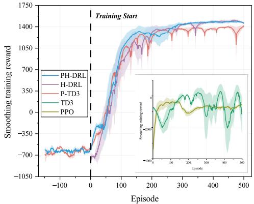

(a) Trend of the training reward.  
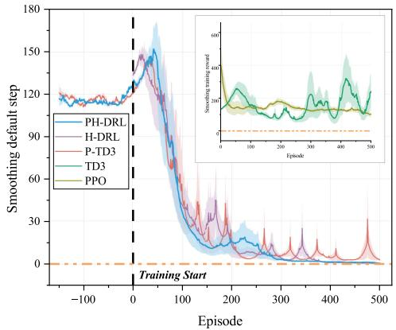  
(b) Trend of the default step.  
Fig. 5. Convergence of different algorithms.

## B. Convergence Analysis

We first compared the convergence performance of the different algorithms. Fig. 5(a) presents the training reward curves for all algorithms, where the range from −150 to 0 episodes corresponds to the first phase $( p = 1 )$ of the PH-

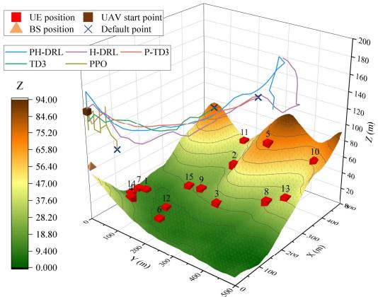

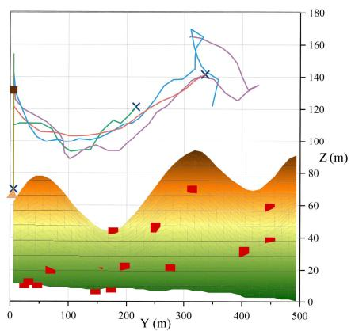

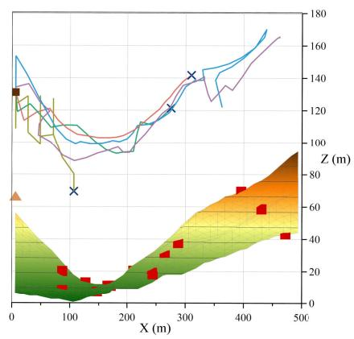

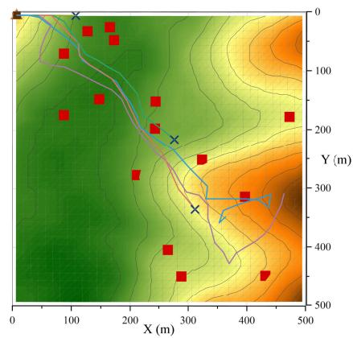  
Fig. 6. UAV trajectories of different algorithms: including 3D and three-view drawing.

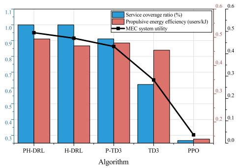  
Fig. 7. Comparison of different algorithms: including service coverage ratio, propulsive energy efficiency, and system utility.

DRL and P-TD3 algorithms employing the staged method. The solid lines represent the smoothed curves obtained by applying the exponential moving average (EMA) method to the three results, and the shaded areas indicate the standard error ranges for each algorithm. PH-DRL and H-DRL reached convergence around the 300th episode, both achieving the highest reward values. This demonstrates the effectiveness of the hierarchical method, which reduces the redundancy in input dimensions by separating optimization variables. As a result, the input dimension is reduced from 119 to 94, thereby lowering the training difficulty of the neural network. PH-DRL is more stable than H-DRL, as it never exhibited a sudden drop in reward values. P-TD3, utilizing the staged method, gathered substantial effective information and was able to converge, but its reward value was lower than those of PH-DRL and H-DRL, with greater fluctuations. The TD3 and PPO algorithms did not achieve satisfactory convergence, indicating that the combination of uneven terrain and dynamic service coverage presents a significant challenge, making it difficult for conventional algorithms to solve. Fig. 5(b) illustrates the number of default steps during the training process, representing the number of violations of the constraint conditions. It is evident that PH-DRL, H-DRL, and P-TD3 all effectively perceive the terrain altitudes, optimizing the UAV flight actions accordingly. However, PH-DRL outperformed the others, reaching zero default steps the earliest and maintaining stability. While PPO showed some improvement compared to TD3, both have poor results.

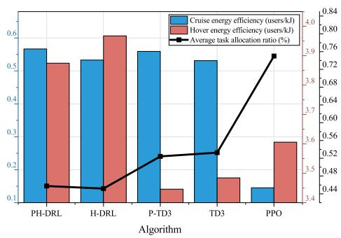  
Fig. 8. Comparison of different algorithms: including cruise energy efficiency, hover energy efficiency, and average task allocation ratio.

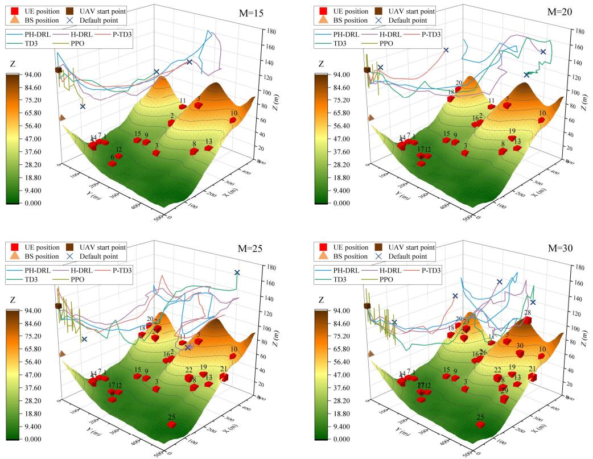

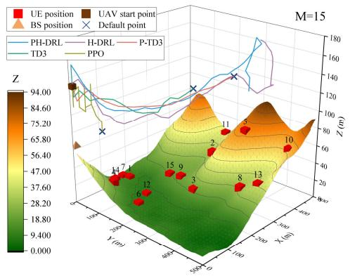

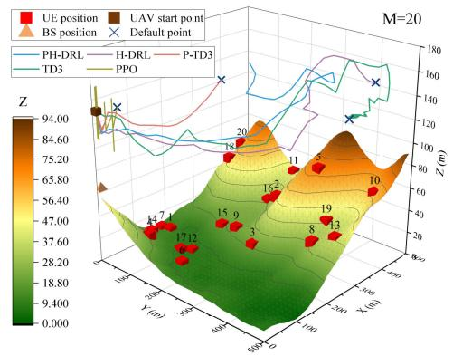  
Fig. 9. UAV 3D trajectories of different algorithms and UE counts M .

## C. Performance Comparison

The performance is evaluated in terms of trajectory planning, service coverage, and energy efficiency to demonstrate the effectiveness of the proposed algorithm. Fig. 6 shows the optimal trajectories produced by different algorithms in the testing phase. Notably, the UE distribution is predominantly positioned along the straight line from (0, 0) to (500, 500), and the trajectories of most algorithms also align with this path, indicating that the reward function effectively guides the network’s learning direction. Among them, PH-DRL and H-DRL successfully serve all UEs without violating any constraint conditions. P-TD3 and TD3 manage to maintain safe flight for most of the duration but breach constraints toward the end, likely due to the complexity of network inputs or insufficient information. The trajectory of PPO reveals issues in its network training, where outputting the extreme values in the action range results in movement restricted to only the X and Z dimensions, accompanied by unreasonable altitude fluctuations, indicating that the algorithm fails to achieve effective convergence.

Fig. 7 depicts the service coverage ratio, propulsive energy efficiency, and overall system utility of the different algorithms. PH-DRL achieves full UE coverage, serving each UE with an average energy expenditure of 2 kJ. H-DRL, P-TD3, and TD3 each attain certain improvements in either service coverage ratio or energy efficiency, yet their overall utility remains inferior to that of PH-DRL. To further explore the relationship between UAV’s energy efficiency and task allocation ratio, propulsive energy efficiency is decomposed into cruise energy efficiency and hover energy efficiency, as illustrated in Fig. 8. It is evident that PH-DRL and H-DRL effectively leverage the second level to optimize task offloading, thereby enhancing energy efficiency in “hover mode”. Moreover, under the given parameters, a UE’s task allocation ratio of approximately 0.45 proves optimal. P-TD3 and TD3 exhibit relatively high average task allocation ratios, which in turn lead to elevated hover energy consumption. Combined with the observations in Fig. 6, the PPO algorithm undertakes only a very brief flight, serving solely UE 1, 4, 7, and 14, as its generated trajectory is restricted mainly to the X and Z dimensions and exhibits unreasonable altitude fluctuations. Nevertheless, it achieves a higher degree of parallelism in serving UEs. In contrast, other algorithms at times serve only a single UE, resulting in PPO’s hovering efficiency surpassing that of P-TD3 and TD3. This confirms the superior resource utilization of parallel service over one-to-one service.

## D. Extended Evaluation

To further compare the performance improvements brought by hierarchical and phased methods, we conducted extended experiments involving three parameters: the number of UEs, the bandwidth of the BS, and the computational resources of the BS. Fig. 9 presents the optimal trajectories generated by different algorithms under varying UE counts. To ensure the validity of the experiment, as the number of UE increased, we also relaxed the time constraint T : 20 UE corresponds to a time of 300s, 25 UE to 450s, and 30 UE to 600s. Except for the proposed PH-DRL, all other algorithms encountered the default step. This occurred because, as the number of UEs increased, the UAV was required to reach more new areas, thereby elevating the probability of violating constraints. Moreover, the increase in the number of UEs leads to a rapid growth in the input dimension of the learning model. By adopting the hierarchical method, the input dimension is effectively reduced, from 119 to 94 with 15 UEs, from 149 to 114 with 20 UEs, from 179 to 134 with 25 UEs, and from 209 to 154 with 30 UEs. This dimensionality reduction significantly alleviates the training difficulty and contributes to the superior robustness of the proposed PH-DRL.

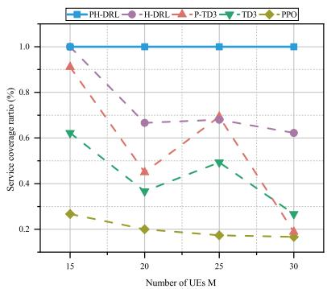  
(a) Service coverage ratio

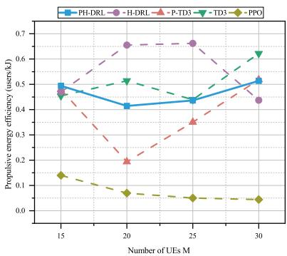  
(b) Propulsive energy efficiency

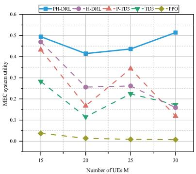  
(c) MEC system utility  
Fig. 10. Comparison of different algorithms and UE counts M.

Fig. 10 illustrates the variation in algorithm performance as the number of UEs changes. As the number of UEs increases, the dimensionality of the network’s state space expands dramatically, posing greater challenges for convergence and sample efficiency. The PPO algorithm shows a rapid decline in performance, as its on-policy nature prevents it from reusing past experiences and makes it difficult to handle experience sampling and gradient estimation under the increasingly complex state and action spaces. The other baseline methods, such as TD3 and P-TD3, perform better than PPO but still exhibit fluctuations as the environment dimension increases, largely due to the increased exploration difficulty and higher control complexity. In contrast, PH-DRL consistently maintains a 100% service coverage ratio, keeps efficient training and stable convergence even in highdimensional settings. In terms of propulsive energy efficiency, PH-DRL did not retain the highest efficiency, which can be attributed to the presence of certain UEs—such as UE 18, 20, 23, 24, and 25—who are located in more remote areas. Serving these UEs necessitates greater cruising energy expenditure, thus reducing the average propulsive energy efficiency. To account for this, we incorporated a system utility metric that combines service coverage ratio and propulsive energy efficiency. From this, it is evident that PH-DRL consistently maintains the highest overall system utility. This demonstrates the effectiveness of the first level in the hierarchical method and the staged approach in optimizing UAV path planning.

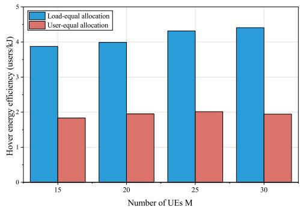

(a) Different UE counts M  
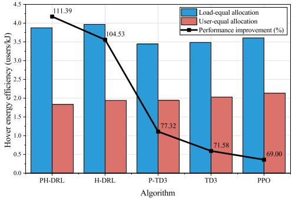  
(b) Different algorithm.  
Fig. 11. Comparison of different bandwidth allocation methods.

Fig. 11 illustrates the impact of different bandwidth allocation strategies on hover energy efficiency under varying UE counts and algorithms. As shown in Fig. 11(a), under different numbers of UEs M, the load-equal bandwidth allocation scheme consistently outperforms the user-equal allocation scheme. The superiority of load-equal allocation can be attributed to the fact that, during the A2G transmission stage, the UAV operates under relatively stable LoS channel conditions and the remaining task loads are already known. This enables bandwidth to be proportionally allocated according to task load, thereby reducing transmission delay and improving overall energy efficiency. Fig. 11(b) further compares the two allocation schemes under different algorithms. It can be observed that load-equal allocation consistently achieves higher hover energy efficiency than user-equal allocation across all algorithms, demonstrating its robustness and algorithm-independent advantage. Moreover, when combined with the proposed PH-DRL framework, the load-equal strategy yields the most significant performance improvement. This is because PH-DRL can more effectively exploit the known task load information and stable channel conditions in the A2G stage, enabling more accurate decisions.

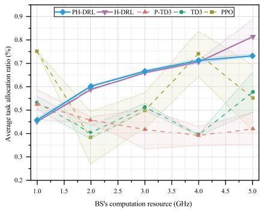

(a) Average task allocate ratio  
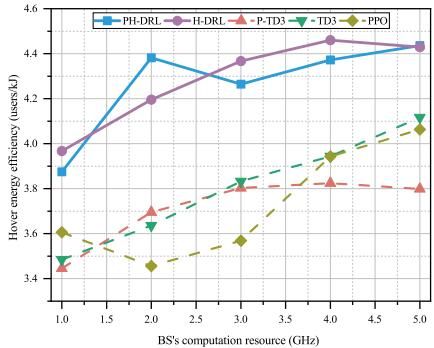  
(b) Hover energy efficiency  
Fig. 12. Comparison of different algorithms and BS’s computation resource $F _ { S }$

Fig. 12 depicts the variation in the average task allocation ratio under changing BS’s computing resources, where the shaded areas indicate the standard error ranges for each algorithm. The results given by PH-DRL and H-DRL using a hierarchical approach show an increasing trend. This is because, as the BS’s computational capacity increases, the latency of $T _ { m } ^ { \mathrm { C G } } \left( t \right)$ decreases prompting the UAV to allocate a greater proportion of tasks to the BS for processing. In contrast, the results from the remaining algorithms fluctuate irregularly without a stable trend, and their wide error margins indicate that their allocation ratios have not been effectively optimized. Regarding hover energy efficiency, PH-DRL and H-DRL consistently outperform all other algorithms.

Fig. 13 shows the variation in the average task allocation ratio under changing BS’s bandwidths. Similar to Fig. 12, as the BS’s bandwidth increases, the communication latency of the A2G channel decreases, leading to a rising trend in the average allocation ratio. The figure shows that PH-DRL and H-DRL display a growth tendency, albeit not pronounced. This is due to two reasons: first, A2G latency $T _ { m } ^ { \mathrm { A 2 G } } \left( t \right)$ exerts a smaller influence on total latency compared with $T _ { m } ^ { \mathrm { C G } } \left( t \right) ;$ second, with computational resources held constant, the task allocation ratio has a theoretical upper limit, beyond which assigning more tasks to the BS would instead increase total latency. Besides, the results of the remaining algorithms remain unstable. In terms of hover energy efficiency, PH-DRL and H-DRL continue to deliver the best performance. The outcomes in Fig. 12 and Fig. 13 both attest to the effectiveness of the second level in the hierarchical method for optimizing task allocation ratios.

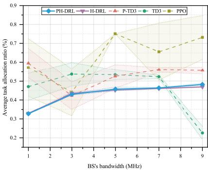

(a) Average task allocation ratio  
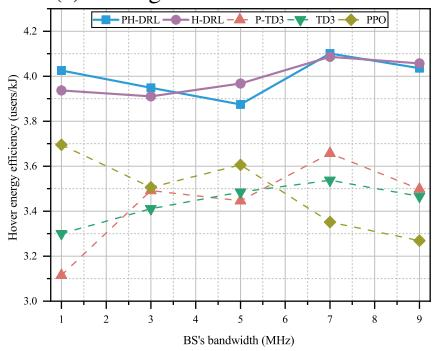  
(b) Hover energy efficiency  
Fig. 13. Comparison of different algorithms and BS’s bandwidth $B _ { S }$

## VI. CONCLUSION

This paper establishes a UAV-assisted MEC system that accounts for UAV flight trajectory design over uneven terrain, dynamic UE servicing within the signal coverage region, and UAV propulsion energy consumption modeling. The system is then formulated as a multi-objective non-convex optimization problem, seeking to maximize service coverage ratio and propulsion energy efficiency within a given system runtime. A PH-DRL optimization algorithm is proposed, which integrates a hierarchical network architecture and phased training strategy with DRL. Simulation experiments leveraging real elevation data are conducted to evaluate the performance of the proposed algorithm. The results demonstrate that PH-DRL surpasses other comparative algorithms in terms of system utility, thereby validating its effectiveness in optimizing UAV trajectories and task allocation ratio, as well as its applicability to complex non-convex optimization problems. Future work will focus on extend to multi-UAV collaboration in uneven terrain environments and enhancing system performance under additional terrain-related factors and environmental uncertainties like user mobility.

## VII. ACKNOWLEDGMENT

This work was supported by the Program of National Natural Science Foundation of China (Grant No. 62372172, 62072174), Distinguished Youth Science Foundation of Hunan Province, China (Grant No. 2023JJ10030), National Natural Science Foundation of Hunan Province, China (Grant No. 2022JJ40278), Research Foundation of Education Bureau of Hunan Province, China (Grant No. 23B0100), Graduate Research Innovation Program of Hunan Province, China (Grant No. LXBZZ2024086).

## REFERENCES

[1] L. Dai, F. Zeng, H. Kong, J. Cai, H. Jiang, and K. Li, “Throughputaware cooperative task offloading in dynamic mobile edge computing systems,” IEEE Trans. Mob. Comput., pp. 1–16, Jul. 2025.

[2] J. Mei, L. Dai, Z. Tong, X. Deng, and K. Li, “Throughput-aware dynamic task offloading under resource constant for MEC with energy harvesting devices,” IEEE Trans. Netw. Service Manag., vol. 20, no. 3, pp. 3460– 3473, Feb. 2023.

[3] H. Bayerlein, M. Theile, M. Caccamo, and D. Gesbert, “UAV path planning for wireless data harvesting: A deep reinforcement learning approach,” in GLOBECoM 2020-2020 IEEE global communications conference, Dec. 2020, pp. 1–6.

[4] B. Li, Q. Li, Y. Zeng, Y. Rong, and R. Zhang, “3D trajectory optimization for energy-efficient UAV communication: A control design perspective,” IEEE Trans. Wireless Commun., vol. 21, no. 6, pp. 4579– 4593, Dec. 2022.

[5] Y. Choi, M. Chen, Y. Choi, S. Briceno, and D. Mavris, “Multi-UAV trajectory optimization utilizing a NURBS-based terrain model for an aerial imaging mission,” Journal of Intelligent & Robotic Systems, vol. 97, no. 1, pp. 141–154, Jan. 2020.

[6] A. V. Savkin, “Autonomous UAV 3D trajectory optimization and transmission scheduling for sensor data collection on uneven terrains,” Def. Technol., vol. 30, pp. 154–160, Dec. 2023.

[7] Y. Luo, Y. Wang, Y. Lei, C. Wang, D. Zhang, and W. Ding, “Decentralized user allocation and dynamic service for multi-UAV-enabled MEC system,” IEEE Trans. Veh. Technol., vol. 73, no. 1, pp. 1306–1321, Aug. 2024.

[8] C. Zhan and Y. Zeng, “Energy minimization for cellular-connected UAV: From optimization to deep reinforcement learning,” IEEE Trans. Wireless Commun., vol. 21, no. 7, pp. 5541–5555, Jan. 2022.

[9] D. Han, T. Shi, T. Han, and Z. Zhou, “Joint optimization of trajectory and node access in UAV-aided data collection system,” IEEE Syst. J., vol. 17, no. 2, pp. 2574–2585, Apr. 2023.

[10] Y. Li, W. Liang, W. Xu, Z. Xu, X. Jia, Y. Xu, and H. Kan, “Data collection maximization in IoT-sensor networks via an energy-constrained UAV,” IEEE Trans. Mob. Comput., vol. 22, no. 1, pp. 159–174, May 2023.

[11] K. Liu and J. Zheng, “UAV trajectory planning with interference awareness in UAV-enabled time-constrained data collection systems,” IEEE Trans. Veh. Technol., vol. 73, no. 2, pp. 2799–2815, Sep. 2024.

[12] W. Sun, Z. Bai, J. Shi, and Z. Li, “DDPG-based multi-UAV trajectory optimization for WSN’s data collection,” in 2023 IEEE 11th International Conference on Information, Communication and Networks (ICICN). Xi’an, China: IEEE, Aug. 2023, pp. 241–247.

[13] H. Zhao, Q. Hao, H. Huang, G. Gui, T. Ohtsuki, H. Sari, and F. Adachi, “Online trajectory optimization for energy-efficient cellular-connected UAVs with map reconstruction,” IEEE Trans. Veh. Technol., vol. 73, no. 3, pp. 3445–3456, Oct. 2024.

[14] B. Xu, Z. Kuang, J. Gao, L. Zhao, and C. Wu, “Joint offloading decision and trajectory design for UAV-enabled edge computing with task dependency,” IEEE Trans. Wireless Commun., vol. 22, no. 8, pp. 5043–5055, Dec. 2023.

[15] L. Xie, J. Xu, and R. Zhang, “Throughput maximization for UAVenabled wireless powered communication networks,” IEEE Internet Things J., vol. 6, no. 2, pp. 1690–1703, Oct. 2019.

[16] N. Gupta, S. Agarwal, D. Mishra, and B. Kumbhani, “Trajectory and resource allocation for UAV replacement to provide uninterrupted service,” IEEE Trans. Commun., vol. 71, no. 12, pp. 7288–7302, Aug. 2023.

[17] X. Huang, Y. Luo, X. Yang, and Q. Chen, “Energy consumption optimization for UAV-assisted communication by trajectory design,” in 2023 IEEE 97th Vehicular Technology Conference (VTC2023-Spring). Florence, Italy: IEEE, Jun. 2023, pp. 1–5.

[18] B. Li, R. Yang, L. Liu, J. Wang, N. Zhang, and M. Dong, “Robust computation offloading and trajectory optimization for multi-UAV-assisted MEC: A multiagent DRL approach,” IEEE Internet Things J., vol. 11, no. 3, pp. 4775–4786, Aug. 2024.

[19] B. Wang, Q. Wang, N. Yang, and R. Chai, “Long-term optimizationbased data scheduling and trajectory planning for UAV-assisted systems,” in 2023 IEEE 98th Vehicular Technology Conference (VTC2023- Fall). Hong Kong, Hong Kong: IEEE, Oct. 2023, pp. 1–5.

[20] X. Yuan, Y. Hu, J. Zhang, and A. Schmeink, “Joint user scheduling and UAV trajectory design on completion time minimization for UAVaided data collection,” IEEE Trans. Wireless Commun., vol. 22, no. 6, pp. 3884–3898, Nov. 2023.

[21] X. Qin, Z. Song, T. Hou, W. Yu, J. Wang, and X. Sun, “Joint optimization of resource allocation, phase shift, and UAV trajectory for energyefficient RIS-assisted UAV-enabled MEC systems,” IEEE Trans. on Green Commun. Netw., vol. 7, no. 4, pp. 1778–1792, Jun. 2023.

[22] B. Zhu, E. Bedeer, H. H. Nguyen, R. Barton, and Z. Gao, “Uav trajectory planning for AoI-minimal data collection in UAV-aided IoT networks by transformer,” IEEE Trans. Wireless Commun., vol. 22, no. 2, pp. 1343–1358, Sep. 2023.

[23] Y. Gao, X. Yuan, D. Yang, Y. Hu, Y. Cao, and A. Schmeink, “UAVassisted MEC system with mobile ground terminals: DRL-based joint terminal scheduling and UAV 3D trajectory design,” IEEE Trans. Veh. Technol., vol. 73, no. 7, pp. 10 164–10 180, Mar. 2024.

[24] G. Chen, C. Cheng, X. Xu, and Y. Zeng, “Minimizing the age of information for data collection by cellular-connected UAV,” IEEE Trans. Veh. Technol., vol. 72, no. 7, pp. 9631–9635, Feb. 2023.

[25] B. Liu, C. Liu, and M. Peng, “Dynamic cache placement and trajectory design for UAV-assisted networks: A two-timescale deep reinforcement learning approach,” IEEE Trans. Veh. Technol., vol. 73, no. 4, pp. 5516– 5530, Nov. 2024.

[26] C.-W. Fu, M.-L. Ku, Y.-J. Chen, and T. Q. S. Quek, “UAV trajectory, user association, and power control for multi-UAV-enabled energy-harvesting communications: Offline design and online reinforcement learning,” IEEE Internet Things J., vol. 11, no. 6, pp. 9781–9800, Oct. 2024.

[27] Z. Chang, H. Deng, L. You, G. Min, S. Garg, and G. Kaddoum, “Trajectory design and resource allocation for multi-UAV networks: Deep reinforcement learning approaches,” IEEE Trans. Netw. Sci. Eng., vol. 10, no. 5, pp. 2940–2951, May 2023.

[28] S. Gong, M. Wang, B. Gu, W. Zhang, D. T. Hoang, and D. Niyato, “Bayesian optimization enhanced deep reinforcement learning for trajectory planning and network formation in multi-UAV networks,” IEEE Trans. Veh. Technol., vol. 72, no. 8, pp. 10 933–10 948, Mar. 2023.

[29] M. Alzenad, A. El-Keyi, F. Lagum, and H. Yanikomeroglu, “3-D placement of an unmanned aerial vehicle base station (UAV-BS) for energyefficient maximal coverage,” IEEE Wireless Commun. Lett., vol. 6, no. 4, pp. 434–437, May 2017.

[30] L. Wang, K. Wang, C. Pan, W. Xu, N. Aslam, and A. Nallanathan, “Deep reinforcement learning based dynamic trajectory control for UAVassisted mobile edge computing,” IEEE Trans. Mob. Comput., vol. 21, no. 10, pp. 3536–3550, Feb. 2022.

[31] Z. Yang, S. Bi, and Y.-J. A. Zhang, “Online trajectory and resource optimization for stochastic UAV-enabled MEC systems,” IEEE Trans. Wireless Commun., vol. 21, no. 7, pp. 5629–5643, Jan. 2022.

[32] Y. Zeng, J. Xu, and R. Zhang, “Energy minimization for wireless communication with rotary-wing UAV,” IEEE Trans. Wireless Commun., vol. 18, no. 4, pp. 2329–2345, Mar. 2019.

[33] Y. Ma, Y. Tang, Z. Mao, D. Zhang, C. Yang, and W. Li, “Energy-efficient 3D trajectory optimization for UAV-aided wireless sensor networks,” in GLOBECOM 2023 - 2023 IEEE Global Communications Conference. Kuala Lumpur, Malaysia: IEEE, Dec. 2023, pp. 6591–6596.

[34] Q. Wu, W. Chen, D. W. Kwan Ng, J. Li, and R. Schober, “User-centric energy efficiency maximization for wireless powered communications,” IEEE Trans. Wireless Commun., vol. 15, no. 10, pp. 6898–6912, Jul. 2016.

[35] R. Ding, F. Gao, and X. S. Shen, “3D UAV trajectory design and frequency band allocation for energy-efficient and fair communication: A deep reinforcement learning approach,” IEEE Trans. Wireless Commun., vol. 19, no. 12, pp. 7796–7809, Aug. 2020.

Zhao Tong received the Ph.D. degree in computer science from Hunan University, Changsha, China, in 2014. From 2017 to 2018, He is currently an professor with Hunan Normal University. He was a visiting scholar at the Georgia State University during 2017-2018. He has author or coauthored more than 50 papers in peer-reviewed international journals and conferences, such as IEEE Transactions on Parallel and Distributed Systems, IEEE Transactions on Services Computing, IEEE Transactions on Network and Service Management, IEEE Transactions on Vehicular Technology, etc. His research interests include AI computing, parallel and distributed computing systems, and resource management. He is a senior member of the IEEE and CCF.

Shiyan Zhang received his bachelor’s degree from Guangxi Minzu University, Nanning, China, in 2022. He is currently pursuing his master’s degree in the College of Information Science and Engineering of Hunan Normal University, Changsha, China. His research interests mainly revolve around the areas of UAV-assisted mobile edge computing and deep reinforcement learning.

Jing Mei received the Ph.D. degree in computer science from Hunan University, China, in 2015. She is currently an associate professor at the Hunan Normal University, Changsha, China. Her research interests include parallel and distributed computing and cloud computing. She has published 40 research articles in international conference and journals, such as IEEE-TC/TPDS/TSC/Cluster Comput./J. Grid Comput./J. Supercomput, etc.

Jiayi Sun is currently pursuing the bachelor’s degree in the College of Information Science and Engineering, Hunan Normal University, Changsha, China. Her research interests include task offloading and scheduling in low Earth orbit (LEO) satellite-based mobile edge computing.

Keqin Li (Fellow, IEEE) received a B.S. degree in computer science from Tsinghua University in 1985 and a Ph.D. degree in computer science from the University of Houston in 1990. He is a SUNY Distinguished Professor at the State University of New York and a National Distinguished Professor at Hunan University (China). He has authored or coauthored more than 1230 journal articles, book chapters, and refereed conference papers. He holds nearly 80 patents announced or authorized by the Chinese National Intellectual Property Administration. He is among the world’s top few most influential scientists in parallel and distributed computing, regarding single-year impact (ranked #2) and career-long impact (ranked #3) based on a composite indicator of the Scopus citation database. He is listed in Scilit Top Cited Scholars (2023-2025) and is among the top 0.02% out of over 20 million scholars worldwide based on top-cited publications in the last ten years. He is listed in ScholarGPS Highly Ranked Scholars (2022-2025) and is among the top 0.002% out of over 30 million scholars worldwide based on a composite score of three ranking metrics for research productivity, impact, and quality in the recent five years. He received the IEEE TCCLD Research Impact Award from the IEEE CS Technical Committee on Cloud Computing in 2022 and the IEEE TCSVC Research Innovation Award from the IEEE CS Technical Community on Services Computing in 2023. He won the IEEE Region 1 Technological Innovation Award (Academic) in 2023. He was a recipient of the 2022-2023 International Science and Technology Cooperation Award and the 2023 Xiaoxiang Friendship Award of Hunan Province, China. He is a Member of the SUNY Distinguished Academy. He is an AAAS Fellow, an IEEE Fellow, an AAIA Fellow, an ACIS Fellow, and an AIIA Fellow. He is a Member of the European Academy of Sciences and Arts. He is a Member of Academia Europaea (Academician of the Academy of Europe).

