# Energy-Efficient Offloading, Caching, and Resource Allocation for Blockchain-Assisted Low-Altitude Flying Networks: An Integrated Federated Learning and MAPPO Approach

Zhiran Wang, Student Member, IEEE, Bintao Hu, Member, IEEE, Miguel Lopez-Ben´ ´ıtez, Senior Member, IEEE Jianbo Du, Member, IEEE, Xiaoli Chu, Senior Member, IEEE, F. Richard Yu, Fellow, IEEE

Abstract—In 6G low-altitude edge intelligent networks, the proliferation of delay-sensitive Internet of Things (IoT) services exacerbates mutual interference among IoT devices, thereby reducing the efficiency of resource allocation. To address this challenge, we propose a blockchain-assisted federated learning (FL)-based four-layer low-altitude framework, where the user equipment (UE) layer generates delay-sensitive tasks, the task UAV (TUAV) layer offers extra computation resources to process UE tasks, the service UAV (SUAV) layer trains the FL local models in a distributed manner, and the base station layer aggregates them to obtain the global model, where the FL models are trained for the joint optimisation including resource allocation, offloading decisions, and caching strategy. Based on this framework, we define a system utility cost that incorporates the total service delay (including the transmission, computation, queueing, and fetching delays) and the total energy consumption, and formulate an optimisation problem to minimise the long-term system utility cost. To solve the formulated problem, we propose an FL and multi-agent proximal policy optimisation (MAPPO) integrated offloading decisions, caching strategy, and resource allocation. Simulation results show that our proposed algorithm converges faster and achieves a lower system utility cost than the benchmarks.

Index Terms—Low-altitude networks, multi-agent proximal policy optimisation, federated learning, edge intelligence.

## I. INTRODUCTION

Artificial Intelligence (AI) techniques integrate with sixthgeneration (6G) Internet of Things (IoT) networks, which have shown promise for future trends to enhance the intelligence and quality of the networks for both industry and academia. However, on one side, the new AI computation applications generated by the 6G IoT networks have imposed higher requirements on ultra-low delay, high energy efficiency, and reliable computing services [1]. On the other side, the traditional base station (BS) and roadside units embedded with mobile edge computing (MEC) infrastructures lack the flexibility requirement for dynamic edge server deployment. Unmanned aerial vehicles (UAVs) equipped with lightweight edge servers have therefore emerged as promising enablers for flexible and on-demand MEC services. By dynamically and intelligently positioning different UAV-assisted MEC servers close to task-generating devices, we can significantly reduce communication and computation delays, and enhance coverage in areas with insufficient terrestrial infrastructure [2].

Considering their flexibility, UAV-assisted MEC servers can be divided into three main categories, including edge computing servers, caching servers, and blockchain nodes. Specifically, the UAV-assisted MEC edge computing servers can fly close to the end users and offer extra computing capacities to process end users’ tasks [3]. The UAV-assisted MEC caching servers can regularly cache a large amount of frequently requested files at each server, and different end users can fetch the files from the closest UAV-assisted caching servers directly [4]. For the UAV-assisted blockchain nodes, different UAV-assisted nodes can serve as committee members to guarantee the fairness and security of the transactions of the different network services [5]. Thus, finding the optimal offloading and caching strategies and leveraging the limited communications and computation resources among all UAVassisted servers, while guaranteeing the quality of services (QoS) [6], is the key challenge for improving the efficiency of the entire network.

With the consideration of AI for improving the efficiency of UAV-assisted IoT wireless networks, deep reinforcement learning (DRL) has been widely applied to solve the task offloading and/or caching strategies optimisation in conjunction with the resource allocation optimisation. For example, Hu et al. [3] proposed a multi-agent deep Q-learning (MADQN)

optimisation algorithm to minimize the long-term average total delays by optimising the offloading decisions and the communication and computation resource allocations in a lowaltitude-assisted vehicular network. Li et al. [7] applied an asynchronous advantage actor–critic (A3C) optimisation algorithm to minimize the update delays by jointly improving the MEC caching hit rates and optimising the resource allocation in a UAV-assisted vehicular edge computing network. Actor– critic methods, including A2C and A3C [7]–[10], improve convergence speed and stability but remain sensitive to coupled environments and high-dimensional joint actions. Trust region policy optimisation (TRPO) further enhances stability [11], [12], yet its computational overhead and centralised design limit its applicability in large-scale UAV networks. Hafeez et al. [13] proposed a blockchain-assisted clustered framework that integrates with federated learning (FL), which organises UAVs into proximity-based clusters with cluster heads, thereby overcoming communications overhead and scalability bottlenecks in large UAV swarm networks. Although the above works have shown the benefits of the integration between AI and MEC technologies in UAV-assisted networks, there are still several critical challenges that need to be considered in real-world wireless environments. Firstly, the limited battery capacity of each UAV may affect the lifetime of the services and reduce the QoS [14]–[16]. Secondly, dense UAV deployments cause severe co-channel interference, especially under limited spectrum resources [2]. Moreover, limited cache capacities at UAVs restrict content reuse and increase backhaul traffic [17]–[20]. Meanwhile, secure and trustworthy cooperation among UAV-assisted MEC servers becomes essential in highly dynamic aerial networks, which may affect the resource allocation fairness among all devices in networks, and also the privacy-preserving among all users [21].

To address the above gaps in the existing works, we propose a blockchain-assisted four-layer UAV-assisted MEC network. The proposed network consists of a user equipment (UE) layer, a task UAV (TUAV) layer, a service UAV (SUAV) layer, and a base station (BS) layer. Each UE periodically generates a computational task and offloads it to the nearest TUAV for remote processing. Meanwhile, each TUAV regularly requests cached files from the SUAVs to process all received tasks, where each SUAV frequently updates its caching library to avoid the long-distance transmission between TUAVs and the BS. Additionally, to guarantee the resource allocation fairness and protect privacy among all TUAVs, all SUAVs also serve as blockchain nodes. In the BS layer, the single-cell BS aggregates the FL local models to obtain the global model, and the updated parameters are leveraged to optimise the offloading and caching decisions, as well as the communication and the computation resources allocation. To improve the communication resource utilisation efficiency, both orthogonal frequency-division multiple access (OFDMA) and non-orthogonal multiple access (NOMA) are employed in the proposed network, where the communications between all SUAVs and all TUAVs are based on NOMA, and the communications between all TUAVs and UEs, as well as the communications between the BS and all SUAVs, follow OFDMA. The main contributions of this article are summarised as follows:

• We define a long-term system utility cost for the proposed blockchain-assisted low-altitude edge intelligent caching and offloading network, in terms of the total service latency (including the transmission, processing, queueing, and fetching delays) and the energy consumption among all UEs, TUAVs, and SUAVs.

• To minimise the long-term system utility cost of all UEs, we formulate an optimisation problem that jointly optimises the TUAV task offloading decisions and caching strategies of all the TUAVs, the computation resource allocation at each TUAV and SUAV, and the allocation of communication resources for all communication links among all the UEs, TUAVs, SUAVs, and the BS, while meeting the QoS requirements and constraints on transmit power.

• As the formulated joint optimisation problem is an NPhard problem that concerns heterogeneous devices (i.e., UEs, TUAVs, and SUAVs), it is difficult to seek the optimal solution by using traditional convex optimisation approaches. Therefore, to solve the problem, we model the proposed system as a multi-agent Markov decision process and leverage proximal policy optimisation (PPO) to devise an FL-multi-agent PPO (FL-MAPPO)-based offloading, caching, and resource allocation joint optimisation algorithm (FL-MAPPO-BOCRAOA). Compared with conventional single-agent DRL and independent learning benchmarks, the proposed network framework enables coordinated decision-making among multiple UAV agents through centralised training and decentralised execution (CTDE). In addition, the integration of federated learning supports distributed policy aggregation, thereby improving training scalability and reducing communication overhead.

The remainder of this paper is structured as follows. The related works are summarised in Section II. Then, the system model is introduced in Section III, while the optimisation problem formulation and proposed algorithm are presented in Section IV. Simulation results are presented in Section V. Finally, this paper is concluded in Section VI.

## II. RELATED WORKS

UAVs have recently emerged as aerial edge nodes that complement terrestrial BSs by providing flexible coverage and mobile edge services [22]. Integrating AI for edge-intelligent UAV-assisted networks has been envisioned as an important research direction for self-intelligent low-altitude dynamic networks. Early studies simply focused on the deep Q-networks (DQN) method to optimise the offloading decisions among all UEs under dynamic network environments [23]. Wang et al. [24] proposed a single-agent PPO-based optimisation algorithm for trajectory and resource optimisation in UAV networks, which aims to minimize the total service delay [23]. More recently, Ho et al. [11] leveraged trust region

This article has been accepted for publication in IEEE Transactions on Mobile Computing. This is the author's version which has not been fully edited and content may change prior to final publication. Citation information: DOI 10.1109/TMC.2026.3709198

policy TRPO to enhance UAV control for wireless service provisioning in critical demand areas, ensuring stable convergence while improving coverage and service reliability. In parallel, Liu et al. [12] developed a TRPO-based trajectory–phase decoupled framework for UAV-RIS enhanced passive IoT in non-terrestrial networks, where a single UAV-RIS agent optimises its trajectory and phase configuration under stringent energy and channel constraints. While both approaches demonstrate the merits of TRPO in achieving smoother convergence and robust optimisation, they predominantly operate in single-agent or centralised UAV control paradigms. Additionally, considering the complex environment and advanced optimisation algorithm, Hao et al. [8] proposed an experience-shared advantage actor-critic (ES-A2C) method, where positive experiences are shared among agents to improve training efficiency. To improve the exploration of the optimisation algorithm, Qin et al. [9] designed an A3C-based framework that integrates asynchronous advantage actor–critic to optimise the communication and computation resource allocation, while jointly optimising service instance caching, task migration, and hovering positions. Complementarily, Yu et al. [10] applied A3C to the energy-efficient deployment of UAVassisted movable BSs in 6G edge networks, demonstrating that asynchronous policy updates improve both coverage capacity and energy efficiency. While the above proposed methods illustrate the benefits of AI-enabled optimisation algorithms in low-altitude networks to improve the resource allocation efficiency, they often fail to consider and scale in complex and dynamic systems, which include caching services and queueing delays.

Taking into account queueing delays, Deng et al. [25] modelled UAV-assisted MEC systems with altitude-dependent computing power using an M/D/1 tandem queue to characterise end-to-end service delay, while Shen et al. [26] adopted an M/D/1 queue to derive the average peak AoI in multi-UAV aided MEC networks. Additionally, considering caching services in a low-altitude network, Fan et al. [27] conducted a stochastic geometry-based analysis of cache-enabled UAV emergency networks, deriving closed-form expressions for cache hit probability, coverage, and throughput to guarantee reliable service in disaster scenarios. Zhao et al. [28] proposed a Lyapunov-driven joint optimisation framework that optimises UAV trajectory planning, task offloading decision, and caching strategy, which reduces delay and energy consumption in UAVassisted MEC environments. Chen et al. [17] introduced a distributionally robust adaptive-bitrate caching scheme with online transcoding, which improves robustness against uncertain content popularity while enhancing user quality of experience in video delivery. Additionally, Masood et al. [29] proposed a HAP-assisted multi-UAV caching scheme with hierarchical FL, which enables collaborative popularity prediction while preserving user privacy. However, most works ignore the coupling with communication delay, energy consumption, and blockchain-based trust management in a UAV-assisted MEC network.

Considering the battery capacity limitation of each UAV, recent studies explored harvesting to prolong endurance and stabilise long-term operation. For example, Yang et al. [16] proposed an online perturbed-Lyapunov controller that jointly optimises dynamic offloading decisions, computational rates, and trajectory for UAV-MEC with energy-harvesting devices under stochastic task arrivals, guaranteeing queue stability while trading off energy versus delay. Basharat et al. [15] introduced a digital twin–assisted offloading framework with energy harvesting that optimises UAV placement and association under joint computing–caching–harvesting–delay constraints, solved via branch-and-bound/heuristics and a difference-ofconvex penalty method for near-optimality at lower complexity. Focusing on post-disaster response, Khalid et al. [14] maximised computational efficiency in EH-enabled UAV-MEC with a power-splitting architecture; they jointly optimised user association, UE power, offloading time, and UAV location via k-means clustering and interior-point methods.

Additionally, blockchain provides decentralised trust, auditability, and tamper-proof recording, which are crucial for collaborative UAV networks, especially for the communication and computation resource allocation among all UAVs [5]. Qin et al. [5] designed a blockchain-assisted multitype disaster search-and-rescue framework, where blockchain maintained fairness and traceability in multi-FL under highly dynamic air–ground conditions. Hafeez et al. [13] proposed a blockchain-assisted clustered and scalable FL framework, which organises UAVs into proximity-based clusters with cluster heads and hybrid aggregation, thereby overcoming communication overhead and scalability bottlenecks in large UAV swarms. Saraswat et al. [30] provided a taxonomy and reference architecture for blockchain-based FL in beyond-5G UAV networks, emphasising how consensus-driven FL exchanges enhance privacy, security, and resilience against poisoning attacks. Bandara et al. [31] introduced a blockchainassisted and NFT-enabled UAV surveillance system in 5G/6G network-sliced environments, where UAV identities are tokenised and a coordinator-less FL with model cards strengthens zero-trust security and anomaly detection. Dong et al. [32] enhanced practical Byzantine fault tolerance (PBFT) for IoT environments by introducing a voting–clustering mechanism with group signatures, thereby reducing communication overhead and ensuring privacy protection. These studies highlight the growing interest in blockchain-assisted trust frameworks. Nevertheless, in reality, PV input is time-varying and battery state-of-charge directly constrains both computation and communication capacities. The above existing works still face some challenges, such as simplifying battery harvesting status without dynamic energy throttling, and seldom couple PV intermittency with caching/queueing/offloading or blockchainbased trust management.

## III. LOW-ALTITUDE EDGE INTELLIGENT SYSTEM MODEL A. Low-Altitude System Model Overview

As shown in Fig. 1, we consider a single BS low-altitude edge intelligent network, which consists of U user equipment (UE), N TUAVs, and M mobile edge server UAVs (SUAVs),

This article has been accepted for publication in IEEE Transactions on Mobile Computing. This is the author's version which has not been fully edited and content may change prior to final publication. Citation information: DOI 10.1109/TMC.2026.3709198

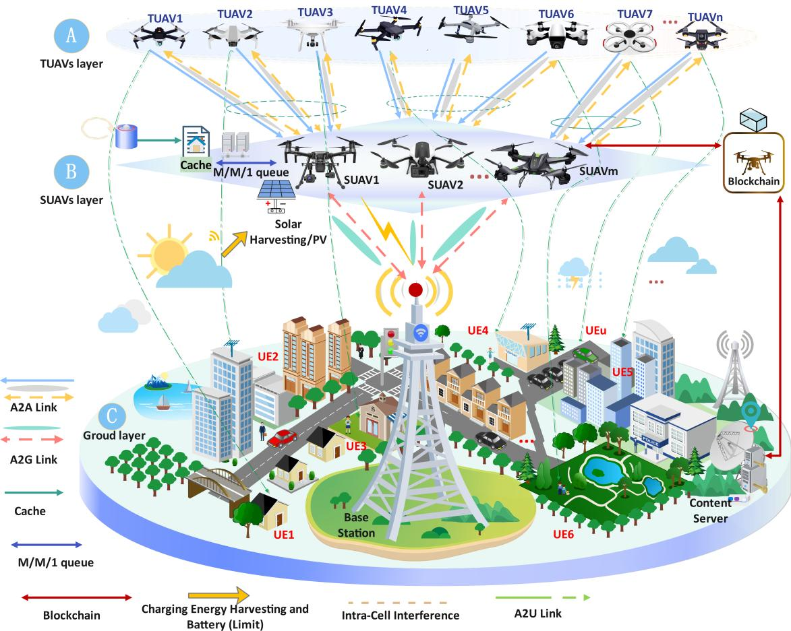  
Fig. 1. The framework of a Blockchain-Assisted edge intelligent offloading and caching low-altitude network.

which can be denoted as $\mathcal { U } = \{ 1 , 2 , . . . , U \} , \mathcal { N } = \{ 1 , 2 , . . . , N \}$ , and $\mathcal { M } = \{ 1 , 2 , . . . , M \}$ , respectively. Without loss of generality, the network operates in an equal-length time-slotted model, which can be denoted as $\mathcal { T } = \{ 1 , 2 , . . . , T \}$ , where T is the total number of time slots, and ∆t (in s) is the length of each time slot. Different from the traditional low-altitude network in [3], [24], [33], our system model includes four functional modules, i.e., the edge computing subsystem, the edge caching subsystem, the blockchain subsystem, and the FL subsystem. The edge computing subsystem aims to offer extra computational resources close to the end users to process computational tasks remotely. The edge caching subsystem is used for popular file caching and sharing. The blockchain subsystem module guarantees the safety and fairness of data sharing and resource allocation among all devices in the system. The FL subsystem is used for global model training by using local training models’ parameters without transmitting raw data to protect the users’ privacy. The different functions of each subsystem model in this work can be summarised as follows:

1) The Edge Computing Subsystem: At the beginning of each time slot, we assume that each UE can only generate a single computational task, which cannot be divided into different portions [23], [34]. Due to the limited computation resources at each UE, each task needs to be offloaded to a TUAV and processed there remotely. Additionally, each TUAV first allocates computation resources to process each task successfully, and then aggregates all the processed results into a new task based on the requirements of the applications, and then forwards the new task to a SUAV for aggregation and FL local model training.

2) The Edge Caching Subsystem: In this work, each SUAV has a finite library to cache F frequently requested popular files, which can be denoted as $\mathcal { F } = \{ 1 , 2 , . . . , F \}$ . Whenever a new time slot starts, each TUAV requests certain popular files cached at a SUAV to aggregate all processed tasks at each TUAV, based on the application’s requirements. Meanwhile, based on the received requests, each SUAV shares the requested popular files to each TUAV accordingly, following a first-in-first-out (FIFO) M/M/1 queueing model.

3) The Blockchain Subsystem: In this work, the blockchain is embedded in our system model to pack the reputation between the TUAVs and SUAVs during the popular filesharing transactions into blocks, which aims to guarantee the traceability of the requested popular file sharing in a secure manner.

4) The FL Subsystem: In this subsystem, each SUAV first allocates computation resources to process all received tasks from TUAVs, and then aggregates all processed results as the input to train the FL local model accordingly. Meanwhile, each SUAV aims to upload its local model parameters to the BS for further aggregation and global model training in each time slot. Based on this distributed FL method, the raw data and tasks generated by each UE, TUAV, and SUAV can be avoided from being transmitted to the BS while guaranteeing the privacy perspective.

## B. Task Models of UEs, TUAVs, and SUAVs

In this work, UE u generates a task at the beginning of time slot t, which can be defined as a task model as

$$
\mathbb { O } _ { u } ( t ) = \{ D _ { u } ( t ) , C _ { u } ( t ) , \mathbf { l } _ { u } ( t ) , T _ { u } ^ { m a x } ( t ) \} ,\tag{1}
$$

where $D _ { u } ( t )$ (in bits) is the input data size of the generated computation task, $C _ { u } ( t )$ (in core processing unit (CPU) cycles/bit) is the required CPU cycles to process task u in time slot $t , \ 1 _ { u } ( t ) \ = \ [ x _ { u } ( t ) , y _ { u } ( t ) ]$ is the coordinate of UE u in time slot t, and $T _ { u } ^ { m a x } ( t )$ (in s) is the maximum tolerated delay requirement for processing task u. Based on the available computation resources at TUAV n in time slot $t , { \mathrm { T U A V ~ } } n$ first allocates computation resources to process all received tasks from multiple UEs, and then, based on the requirements of the application, TUAV n aims to aggregate all the processed results into a new task, which can be defined as a task model

$$
\mathbb { O } _ { n } ( t ) = \{ D _ { n } ( t ) , C _ { n } ( t ) , \mathbf { l } _ { n } ( t ) , a _ { n } ^ { f } ( t ) , F _ { n } ^ { m a x } ( t ) , T _ { n } ^ { m a x } ( t ) \} ,\tag{2}
$$

where $\begin{array} { r } { D _ { n } ( t ) = \eta _ { n } ( t ) \sum _ { u = 1 } ^ { U _ { n } ( t ) } D _ { u } ( t ) } \end{array}$ (in bits) is the input data size of the aggregated new task n in time slot t (where $\eta _ { n } ( t ) \in$ [0, 1] is the coefficient of input data size, and $U _ { n } ( t )$ is the number of the tasks received at TUAV n in time slot t), which is smaller than the total size of all received tasks at TUAV $n , C _ { n } ( t )$ (in cycles/bit) is the computation processing density for task n in time slot $t , \mathbf { l } _ { n } ( t ) = [ x _ { n } ( t ) , y _ { n } ( t ) , z _ { n } ( t ) ]$ is the coordinate of TUAV n in time slot $t , \ a _ { n } ^ { f } ( t ) \in \{ 0 , 1 \}$ is the binary popular file request indicator from TUAV n in time slot t, where $a _ { n } ^ { f } ( t ) = 1$ indicates that TUAV n requests file f, and otherwise $\begin{array} { r } { \dot { a } _ { n } ^ { f } ( t ) = 0 , F _ { n } ^ { m a x } ( t ) } \end{array}$ (in cycles/s) is the maximum available computation capacity at TUAV n in time slot t, and $T _ { n } ^ { m a x } ( t )$ (in s) is the maximum tolerated delay requirement for processing task u.

Similarly, a task model for the SUAVs can be defined as

$$
\mathbb { O } _ { m } ( t ) = \{ D _ { m } ( t ) , D _ { m } ^ { f } ( t ) , C _ { m } ( t ) , \mathbf { l } _ { m } ( t ) , F _ { m } ^ { m a x } ( t ) , E _ { m } ^ { r m } ( t ) , T _ { m } ^ { m a x } ( t ) \} ,\tag{3}
$$

where $\begin{array} { r } { D _ { m } ( t ) = \eta _ { m } ( t ) \sum _ { n = 1 } ^ { N _ { m } ( t ) } D _ { n } ( t ) } \end{array}$ (in bits) is the data size of the local model parameters in time slot t (where $\eta _ { m } ( t ) \in [ 0 , 1 ]$ is the coefficient weight data size of the local training model parameter, and $N _ { m } ( t )$ is the number of the requested received at SUAV in time slot t), $D _ { m } ^ { f } ( t )$ (in bits) is the size of the requested popular file f in time slot $t , C _ { m } ( t )$ (in cycles/bit) is the computation processing density for task m in time slot $t , \ : \mathbf { l } _ { m } ( t ) = [ x _ { m } ( t ) , y _ { m } ( t ) , z _ { m } ( t ) ]$ is the coordinate of SUAV m in time slot t, $F _ { m } ^ { m a x } ( t )$ (in cycles/s) is the maximum computation capacity at SUAV m in time slot t; $E _ { m } ^ { r m } ( t )$ is the remaining energy of SUAV m at the beginning of time slot t, and $T _ { m } ^ { m a x } ( t )$ is the maximum tolerated delay requirement for processing task m.

## C. Low-Altitude Edge Intelligent Communications Model

Based on the proposed system model, the total available bandwidth can be divided into K resource blocks (RBs), which include $K ^ { u p }$ uplink RBs and $K ^ { d n }$ downlink RBs. The sets of the uplink and downlink RBs can be denoted as $\kappa ^ { u p } =$ $\{ 1 , \ldots , K ^ { u p } \}$ and $\mathcal { K } ^ { d n } ~ = ~ \{ 1 , . . . , K ^ { d n } \}$ , respectively. We assume that $K ^ { u p }$ RBs are orthogonally allocated among all airto-ground (A2G) uplinks (i.e., the communication between the SUAVs and the BS, and the communication between UEs and the TUAVs) to avoid the interference influence. To improve the communication resource allocation utilisation efficiency, all TUAVs in the same cluster as the SUAV can reuse the same RB by a NOMA-enabled successive interference cancellation (SIC) technique [35].

1) Communications Model Between UEs and TUAVs: At the beginning of time slot t, UE generates a single computational task u, which aims to be offloaded to TUAV n through an A2G uplink over RB k for remote processing. Thus, the maximum achievable transmission rate is given by

$$
R _ { u , n } ^ { k } ( t ) \ : = \ : a _ { u , n } ( t ) a ^ { k } ( t ) B \log _ { 2 } \bigl ( 1 + \gamma _ { u , n } ^ { k } ( t ) \bigr ) , \forall u \in \mathcal { U } _ { n } ( t ) , \forall k \in K ^ { u p } ,\tag{4}
$$

where $a _ { u , n } ( t ) \in \{ 0 , 1 \}$ is the binary offloading decision, and if $a _ { u , n } ( t ) = 1$ that task u is to be offloaded to TUAV n in time slot t, and otherwise $a _ { u , n } ( t ) = 0 ; a ^ { k } ( t ) \in \{ 0 , 1 \}$ is the binary RB allocation indicator, and $a ^ { k } ( t ) = 1$ indicates that RB k is allocated to the current uplink in time slot t, and otherwise $a ^ { k } ( t ) = 0 ; B$ (in Hz) is the bandwidth of RB $k ; \mathcal { U } _ { n } ( t )$ is the set of tasks received at TUAV n in time slot t; and $\gamma _ { u , n } ^ { k } ( t )$ is the received signal-to-noise ratio (SNR) at TUAV n over uplink RB k in time slot t, which is given by

$$
\gamma _ { u , n } ^ { k } ( t ) \ : = \ : \frac { p _ { u } ( t ) g _ { u , n } ^ { k } ( t ) } { B N _ { 0 } } , \forall u \in \mathcal { U } _ { n } ( t ) , \forall k \in \mathcal { K } ^ { u p } ,\tag{5}
$$

where $p _ { u } ( t )$ (in mW) is the transmission power of UE u in time slot t; and $g _ { u , n } ^ { k } ( t )$ is the channel power gain between UE u and TUAV n over uplink RB k in time slot t, given by

$$
\begin{array} { r } { g _ { u , n } ^ { k } ( t ) = 1 0 ^ { ( \frac { - P L _ { u , n } ^ { \mathrm { A } 2 \mathrm { G } } ( t ) } { 1 0 } ) } , \forall u \in \mathcal { U } _ { n } ( t ) , \forall k \in \mathcal { K } ^ { u p } , } \end{array}\tag{6}
$$

where $P L _ { u , n } ^ { \mathrm { A 2 G } } ( t )$ is the distance-dependent path loss between UE u and TUAV n in time slot t, which includes line of sight (LoS) and non-LoS (NLoS) components as follows

$$
P L _ { u , n } ^ { \mathrm { A 2 G } } ( t ) = p _ { u , n } ^ { \mathrm { L o S } } ( t ) P L ^ { \mathrm { L o S } } ( t ) + ( 1 - p _ { u , n } ^ { \mathrm { L o S } } ( t ) ) P L ^ { \mathrm { N L o S } } ( t ) ,\tag{7}
$$

where $P L ^ { \mathrm { L o S } } ( t )$ and $P L ^ { \mathrm { N L o S } } ( t )$ are the losses corresponding to the LoS component and NLoS component between UE u and TUAV n in time slot t, which can be defined in (8), where $d _ { \mathsf { u , n } } ^ { 3 D } ( t ) = \sqrt { ( d _ { \mathsf { u , n } } ^ { 2 D } ( t ) ) ^ { 2 } + ( z _ { n } ( t ) ) ^ { 2 } }$ is the 3D distance between

UE u and TUAV n; $\begin{array} { r } { f _ { c } ^ { G } = \frac { f _ { c } } { 1 0 ^ { 9 } } } \end{array}$ is the carrier frequency in GHz; $p _ { u , n } ^ { \mathrm { L o S } } ( t )$ is the probability of LoS between UE u and TUAV n in time slot t, corresponding to the 3GPP TR 36.777 Urban Microcell-AV [36] as

$$
\begin{array} { r } { p _ { u , n } ^ { \mathrm { L o S } } ( t ) = \left\{ \begin{array} { l l } { 1 , } & { \mathrm { ~ i ~ f ~ } d _ { \mathrm { u , n } } ^ { 2 D } ( t ) \leq d _ { 1 } , } \\ { \displaystyle \frac { d _ { 1 } } { d _ { \mathrm { u , n } } ^ { 2 D } ( t ) } + \exp \Bigl ( - \frac { d _ { \mathrm { u , n } } ^ { 2 D } ( t ) } { p _ { 1 } } \Bigr ) \left( 1 - \frac { d _ { 1 } } { d _ { \mathrm { u , n } } ^ { 2 D } ( t ) } \right) , } & { } \\ { \quad \quad \quad \quad \quad \quad \quad \quad \quad \quad \quad \mathrm { ~ i ~ f ~ } d _ { \mathrm { u , n } } ^ { 2 D } ( t ) > d _ { 1 } , } \end{array} \right. } \end{array}\tag{9}
$$

where $d _ { \mathrm { u , n } } ^ { 2 D } ( t ) = \sqrt { ( x _ { u } ( t ) - x _ { n } ( t ) ) ^ { 2 } + ( y _ { u } ( t ) - y _ { n } ( t ) ) ^ { 2 } }$ is the horizontal distance between UE u and TUAV n in time slot $t ; \ d _ { 1 }$ and $p _ { 1 }$ are the coefficient parameters [36] as $\begin{array} { r l } { d _ { 1 } } & { { } = } \end{array}$ max $\{ 2 9 4 . 0 5 \log _ { 1 0 } ( z _ { n } ( t ) ) ~ - ~ 4 3 2 . 9 4 , ~ 1 8 \} ; ~ p _ { 1 }  =$ 233.9 $8 \log _ { 1 0 } ( z _ { n } ( t ) ) - 0 . 9 5$

Based on the above analysis, the transmission delay and energy consumption of task u in time slot t is given by

$$
T _ { u , n } ^ { \mathrm { t r a n s } } ( t ) = \frac { D _ { u } ( t ) } { R _ { u , n } ^ { k } ( t ) } , \forall k \in K ^ { u p } ,\tag{10}
$$

$$
E _ { u , n } ^ { \mathrm { t r a n s } } ( t ) = \frac { p _ { u } ( t ) D _ { u } ( t ) } { R _ { u , n } ^ { k } ( t ) } , \forall k \in \mathcal { K } ^ { u p } .\tag{11}
$$

In general, the size of the processed task result is extremely small, where the corresponding transmission delay and energy consumption from TUAV n to UE u can be ignored in each time slot t.

2) Communications Model Between TUAVs and SUAVs: In time slot t, TUAV n generates a new computational task based on the processed results of all received tasks from UEs, which can be offloaded to SUAV m through an air-to-air (A2A) uplink over RB k, which only includes the LoS component [23]. Thus, the distance-dependent path loss between TUAV n and SUAV m in time slot t can be expressed as

$$
P L _ { n , m } ^ { \mathrm { A 2 A } } ( t ) = 2 0 \log _ { 1 0 } \left( \frac { 4 \pi \| \mathbf { l } _ { n } ( t ) - \mathbf { l } _ { m } ( t ) \| f _ { c } } { c } \right) , \forall n \in \mathcal { N } _ { m } ( t ) ,\tag{12}
$$

where $\mathcal { N } _ { m } ( t )$ is the set of the tasks received at SUAV m in time slot t; $f _ { c }$ (in Hz) and c (in m/s) are the carrier frequency and the speed of light, respectively. The channel power gain between TUAV n and SUAV m over RB k in time slot t can be given by

$$
g _ { n , m } ^ { k } ( t ) = 1 0 ^ { ( \frac { - P L _ { n , m } ^ { \mathrm { A 2 A } } ( t ) } { 1 0 } ) } , \forall k \in \mathcal { K } ^ { u p } , \forall n \in \mathcal { N } _ { m } ( t ) .\tag{13}
$$

Therefore, the received signal-to-interference-plus-noise ratio (SINR) at the receiver m over RB k in time slot t is given by

$$
\gamma _ { n , m } ^ { k } ( t ) = \frac { p _ { n , m } ^ { k } ( t ) g _ { n , m } ^ { k } ( t ) } { \displaystyle \sum _ { n ^ { \prime } \in { \cal N } _ { m } ( t ) , g _ { n ^ { \prime } , m } ^ { k } ( t ) < g _ { n , m } ^ { k } ( t ) \atop \forall n \in { \cal N } _ { m } ( t ) , \ \forall k \in { \cal K } ^ { u p } . } } ,\tag{14}
$$

where $p _ { n , m } ^ { k } ( t )$ (in mW) is the transmit power of TUAV n in time slot t; $g _ { n ^ { \prime } , m } ^ { k } ( t )$ is the interference channel power gain between TUAV $n ^ { \prime }$ and SUAV m caused by reusing RB k, which utilises the NOMA mechanism that outperforms the conventional SIC; $N _ { 0 }$ is the additive white Gaussian noise (AWGN) [37]. The maximum achievable transmission rate between TUAV n and SUAV m over RB k in time slot t can be given by

$$
\begin{array} { r l r } & { } & { R _ { n , m } ^ { k } ( t ) = a _ { n , m } ( t ) a ^ { k } ( t ) B \log _ { 2 } \bigl ( 1 + \gamma _ { n , m } ^ { k } ( t ) \bigr ) , } \\ & { } & { \forall n \in \mathcal { N } _ { m } ( t ) , \ \forall k \in \mathcal { K } ^ { u p } , } \end{array}\tag{15}
$$

where $a _ { n , m } ( t ) \in \{ 0 , 1 \}$ is the binary offloading indicator for the new aggregated task n in time slot t, which is similarly defined as $a _ { u , n } ( t )$ . The transmission delay and energy consumption for TUAV n offloading its task to SUAV m over RB k in time slot t can be given by

$$
T _ { n , m } ^ { \mathrm { t r a n s } } ( t ) = \frac { D _ { n } ( t ) } { R _ { n , m } ^ { k } ( t ) } , \forall k \in K ^ { u p } ,\tag{16}
$$

$$
E _ { n , m } ^ { \mathrm { t r a n s } } ( t ) = p _ { n , m } ^ { k } ( t ) \frac { D _ { n } ( t ) } { R _ { n , m } ^ { k } ( t ) } , \forall k \in { \cal K } ^ { u p } .\tag{17}
$$

To process all received tasks from UEs at TUAV n in each time slot successfully, each TUAV needs to request the popular files cached at a SUAV based on the application’s requirements. If a popular file f is cached at SUAV m and requested by TUAV n in time slot t, i.e., $a _ { n } ^ { f } ( t ) = 1$ , it is then transmitted from SUAV m to TUAV n through an A2A downlink over RB k. Thus, the transmission delay and energy consumption to fetch the file f in time slot t can be given by

$$
T _ { m , n } ^ { \mathrm { t r a n s } } ( t ) = \frac { D _ { m } ^ { f } ( t ) } { R _ { m , n } ^ { k } ( t ) } , \forall k \in K ^ { d n } ,\tag{18}
$$

$$
E _ { m , n } ^ { \mathrm { t r a n s } } ( t ) = \frac { p _ { m } ( t ) D _ { m } ^ { f } ( t ) } { R _ { m , n } ^ { k } ( t ) } , \forall k \in \boldsymbol { K } ^ { d n } ,\tag{19}
$$

where $p _ { m } ( t )$ (in mW) is the transmit power of SUAV m, and $R _ { m , n } ^ { k } ( t )$ (in bits/s) is the maximum achievable transmission rate from SUAV m to TUAV n via RB k in time slot t, which is similarly defined as $R _ { n , m } ^ { k } ( t )$

3) Communications Model Between SUAVs and the BS: In time slot t, SUAV m aims to process all received tasks from multiple TUAVs, and aggregates all results to train the FL local model accordingly. Then, the local model parameter $D _ { m } ( t )$ is required to be transmitted to the BS through an A2G uplink over RB k in time slot t for further global model training at the BS. Thus, the local model parameter transmission delay and energy consumption between SUAV m and the BS can be calculated by

$$
T _ { m , b s } ^ { \mathrm { t r a n s } } ( t ) = \frac { D _ { m } ( t ) } { R _ { m , b s } ^ { k } ( t ) } , \forall k \in \ o K ^ { u p } ,\tag{20}
$$

$$
E _ { m , b s } ^ { \mathrm { t r a n s } } ( t ) = \frac { p _ { m } ( t ) D _ { m } ( t ) } { R _ { m , b s } ^ { k } ( t ) } , \forall k \in \mathcal { K } ^ { u p } ,\tag{21}
$$

where $R _ { m , b s } ^ { k } ( t )$ (in bits/s) is the maximum achievable transmission rate between SUAV m to the BS via RB k in time slot t, which is similarly defined as $R _ { u , n } ^ { k } ( t )$

This article has been accepted for publication in IEEE Transactions on Mobile Computing. This is the author's version which has not been fully edited and content may change prior to final publication. Citation information: DOI 10.1109/TMC.2026.3709198

$$
\begin{array} { r } { \{ P L ^ { \mathrm { { l o s } } } ( t ) = 3 0 . 9 + [ 2 2 . 2 5 - 0 . 5 \log _ { 1 0 } ( z _ { n } ( t ) ) ] \log _ { 1 0 } ( d _ { \mathrm { u } , \mathrm { n } } ^ { 3 D } ( t ) ) + 2 0 \log _ { 1 0 } ( f _ { c } ^ { G } ) ,  } \\ {  P L ^ { \mathrm { { N L o s } } } ( t ) = \operatorname* { m a x } \{ P L ^ { \mathrm { { l o s } } } ( t ) , 3 2 . 4 + [ 4 3 . 2 - 7 . 6 \log _ { 1 0 } ( z _ { n } ( t ) ) ] \log _ { 1 0 } ( d _ { \mathrm { u } , \mathrm { n } } ^ { 3 D } ( t ) ) + 2 0 \log _ { 1 0 } ( f _ { c } ^ { G } ) \} , } \end{array}\tag{8}
$$

Since the BS completes the global model training in time slot t, the global model parameters can be transmitted to each SUAV through an A2G downlink accordingly. Thus, the broadcasting delay and energy consumption for the global model parameter transmission from the BS to SUAV m over the downlink RB k in each time slot can be given by

$$
T _ { b s , m } ^ { \mathrm { b c a s t } } ( t ) = \frac { D _ { b s } ( t ) } { R _ { b s , m } ^ { k } ( t ) } , \forall k \in \mathcal { K } ^ { d n } ,\tag{22}
$$

$$
E _ { b s , m } ^ { \mathrm { b c a s t } } ( t ) = p _ { b s } ( t ) T _ { b s , m } ^ { \mathrm { b c a s t } } ( t ) ,\tag{23}
$$

where $D _ { b s } ( t )$ (in bits) is the size of the global model parameter; $p _ { b s } ( t )$ (in mW) is the transmit power of the BS; similarly, $R _ { b s , m } ^ { k } ( t )$ (in bits/s) is the maximum achievable transmission rate from the BS to SUAV m in each time slot, which is similarly defined as (4).

## D. Low-Altitude Edge Intelligent Computing Model

The edge computing subsystem in our proposed low-altitude network provides hybrid edge computing services at TUAVs and SUAVs, respectively. Specifically, each TUAV offers edge computing services for all received tasks from multiple UEs in every time slot. Similarly, each SUAV in each time slot offers edge computing services for all received tasks from different TUAVs.

1) Edge Computing Model at a TUAV: In time slot t, if task u is offloaded to TUAV n for remote processing, i.e., $a _ { u , n } ( t ) =$ 1, the current computing delay and energy consumption in time slot t can be given by

$$
T _ { u , n } ^ { \mathrm { t u a v } } ( t ) = a _ { u , n } ( t ) \frac { D _ { u } ( t ) C _ { u } ( t ) } { f _ { u , n } ( t ) } , \forall u \in \mathcal { U } _ { n } ( t ) ,\tag{24}
$$

$$
E _ { u , n } ^ { \mathrm { t u a v } } ( t ) = \kappa _ { n } ( f _ { u , n } ( t ) ) ^ { 2 } T _ { u , n } ^ { \mathrm { t u a v } } ( t ) , \forall u \in \mathcal { U } _ { n } ( t ) ,\tag{25}
$$

where $f _ { u , n } ( t )$ is the allocated computation resources for task u at TUAV n in time slot $t ; \kappa _ { n }$ is the effective switching capacitance factor of TUAV n [38].

2) Edge Computing Model at a SUAV: If the new aggregated task n is required to be offloaded to SUAV m for remote processing in time slot $t , \mathrm { i . e . , } a _ { n , m } ( t ) = 1$ , the relevant computing delay and energy consumption can be given by

$$
T _ { m } ^ { \mathrm { s u a v } } ( t ) = a _ { n , m } ( t ) \frac { D _ { n } ( t ) C _ { n } ( t ) } { f _ { n , m } ( t ) } , \forall n \in \mathcal { N } _ { m } ( t ) ,\tag{26}
$$

$$
E _ { m } ^ { \mathrm { s u a v } } ( t ) = \kappa _ { m } ( f _ { n , m } ( t ) ) ^ { 2 } T _ { m } ^ { \mathrm { s u a v } } ( t ) , \forall n \in  { \mathcal { N } } _ { m } ( t ) ,\tag{27}
$$

where $f _ { n , m } ( t )$ is the allocated computation resources for the task n at SUAV m in time slot $t ; \kappa _ { m }$ is the effective switching capacitance that is based on the chip architecture of SUAV m.

Different from the edge computing model at a TUAV, the edge computing model at each SUAV follows a FIFO-based M/M/1 queueing model, where tasks arrive at SUAV m in each time slot following a Poisson process with an arrival rate of $\lambda _ { m } ( t )$ , and the service rate is defined as $\mu _ { m } ( t )$ [33]. Thus, the queueing delay at SUAV m in time slot t can be given by

$$
T _ { n , m } ^ { \mathrm { q u e } } ( t ) = \left\{ \begin{array} { l l } { \displaystyle \frac { a _ { n , m } ( t ) \lambda _ { m } ( t ) } { \mu _ { m } ( t ) \big ( \mu _ { m } ( t ) - \lambda _ { m } ( t ) \big ) } } & { , \quad \lambda _ { m } ( t ) < \mu _ { m } ( t ) , } \\ { T _ { \mathrm { p e n } } , } & { \quad \lambda _ { m } ( t ) \geq \mu _ { m } ( t ) , } \end{array} \right.\tag{28}
$$

where $T _ { \mathrm { p e n } }$ (in s) is a large penalty queueing delay.

## E. Low-Altitude Edge Intelligent Caching Model

As shown in Fig. 1, the SUAVs possess caching capabilities, and the maximum caching memory capacity of SUAV m is defined as $S _ { m } ^ { \mathrm { m a x } }$ . In this work, the file popularity follows a Zipf distribution [27], and the request probability of file f can be expressed as

$$
\omega _ { f } = \frac { f ^ { - \Gamma } } { \displaystyle \sum _ { i = 1 } ^ { F } i ^ { - \Gamma } } , \forall f \in \mathcal { F } ,\tag{29}
$$

where $\Gamma \geq 0$ indicates the file popularity skewness factor.

## F. Low-Altitude Edge Intelligent Federated Learning Model

Based on the proposed system model, SUAVs serve as the FL local model training nodes, where the local model can be trained based on all collected datasets from TUAVs at each SUAV in each time slot, and the BS serve as the global model training platform to train the global model according to all received local model parameters from TUAVs in time slot t.

1) FL Local Model at SUAVs: Let $\mathcal { D } _ { m } ( t )$ be the required local model training dataset in time slot t, $\mathbf { w } _ { m } ( t )$ be the parameter vector of the local FL model maintained at SUAV m in time slot $t ,$ and $L$ be the maximum number of training epochs. Thus, the local model at SUAV m in time slot t can be updated by

$$
\mathbf { w } _ { m } ^ { ( t + 1 ) } \gets \mathbf { w } _ { m } ^ { ( t ) } - \theta \nabla \mathcal { L } _ { m } \Big ( \mathbf { w } _ { m } ^ { ( t ) } ; \mathcal { D } _ { m } ( t ) \Big ) ,\tag{30}
$$

where θ is the learning rate; and $\nabla { \mathcal { L } } _ { m } ( \cdot )$ is the empirical loss function according to the local dataset. The local model training delay at SUAV m in time slot t can be given by

$$
T _ { m } ^ { \mathrm { H l } } ( t ) = \frac { | \mathcal { D } _ { m } ( t ) | C _ { m } ^ { \mathrm { H l } } } { f _ { m } ^ { \mathrm { H l } } ( t ) } ,\tag{31}
$$

where $C _ { \mathrm { { f l l } } }$ is the local model training density; $f _ { m } ^ { \mathrm { H l } } ( t )$ denotes the allocated computation resource for FL local model training SUAV m in time slot t. The corresponding energy consumption in time slot t can be given by

$$
E _ { m } ^ { \mathrm { H } } ( t ) = \kappa _ { m } ( f _ { m } ^ { \mathrm { H } } ( t ) ) ^ { 2 } T _ { m } ^ { \mathrm { H } } ( t ) .\tag{32}
$$

2) FL Global Model at the BS: In each time slot, the BS aims to aggregate all the received local models based on the FedAvg method proposed in [39], which can be denoted as $\mathbf { w } ^ { ( t + 1 ) }$ as shown below

$$
\mathbf { w } ^ { ( t + 1 ) } \gets \sum _ { m \in \mathcal { M } } \frac { | \mathcal { D } _ { m } ( t ) | } { \sum _ { m = 1 } ^ { M } | \mathcal { D } _ { m } ( t ) | } \Big [ \mathbf { w } ^ { ( t ) } - \eta \sum _ { l = 1 } ^ { L } \nabla \mathcal { L } _ { m } ( \mathbf { w } ^ { ( t , l ) _ { m } } ) \Big ] .\tag{33}
$$

Similarly, the global model training delay and energy consumption can be expressed as

$$
T _ { \mathrm { b s } } ^ { \mathrm { f g l } } ( t ) = \frac { | \mathcal { D } _ { b s } ( t ) | C _ { \mathrm { f g l } } } { F _ { \mathrm { b s } } ( t ) } ,\tag{34}
$$

$$
E _ { \mathrm { b s } } ^ { \mathrm { f g l } } ( t ) = \kappa _ { \mathrm { b s } } F _ { \mathrm { b s } } ^ { 2 } ( t ) T _ { \mathrm { b s } } ^ { \mathrm { f g l } } ( t ) ,\tag{35}
$$

where $F _ { \mathrm { b s } } ( t )$ is the computation capacity at the $\mathbf { B S } ; C _ { \mathrm { b s } }$ is the global model training density; $\kappa _ { \mathrm { b s } }$ denotes the BS switched capacitance [38],

## G. Mobility and Energy Harvesting Models

1) Mobility Models of the TUAVs and SUAVs: We assume that all UEs, TUAVs, and SUAVs are randomly distributed in time slot $t = 0 ,$ , and each UE maintains a consistent location while all TUAVs/SUAVs hover at a consistent altitude within each subsequent time slot. Thus, in each time slot, the mobility of each TUAV and SUAV can be illustrated in the change of its coordinates as follows

$$
\begin{array} { r } { x _ { n ( m ) } ( t ) = x _ { n ( m ) } ( t - 1 ) + \Delta x _ { n ( m ) } ( t ) , } \\ { y _ { n ( m ) } ( t ) = y _ { n ( m ) } ( t - 1 ) + \Delta y _ { n ( m ) } ( t ) . } \end{array}\tag{36}
$$

2) Energy Harvesting Models of the SUAVs: To extend its battery and service life, each SUAV m is equipped with photovoltaic panels to harvest energy in each time slot. Thus, the harvested energy for each SUAV and the battery evolution state-of-charge at the end of time slot t can be given by

$$
E _ { m } ^ { \mathrm { h a r v } } ( t ) = \eta _ { m } ^ { \mathrm { s u a v } } S _ { m } ^ { \mathrm { s u a v } } I _ { m } ( t ) \Delta t _ { \mathrm { E H } } ,\tag{37}
$$

$$
E _ { m } ^ { \mathrm { b a t } } ( t + 1 ) = \operatorname* { m i n } \biggl \{ E _ { m } ^ { \mathrm { b a t } } ( t ) - \Bigl [ E _ { m , b s } ^ { \mathrm { t r a n s } } ( t ) + E _ { m } ^ { \mathrm { s u a v } } ( t ) + E _ { m } ^ { \mathrm { h o v } } ( t )
$$

$$
+ \xi _ { m } ( t ) \left( E _ { m } ^ { \mathrm { f l l } } ( t ) + E _ { m } ^ { \mathrm { s u a v } } ( t ) \right) \Big ] + \Big ( E _ { m } ^ { \mathrm { h a r v } } ( t ) \Big ) , E _ { \mathrm { m a x } } ^ { \mathrm { b a t } } \Big \} ,\tag{38}
$$

where $\eta _ { m } ^ { \mathrm { s u a v } } \in [ 0 , 1 ]$ is the conversion efficiency; $E _ { m } ^ { \mathrm { h o v } } ( t )$ is the hovering energy consumption for each SUAV in each time slot; $S _ { m } ^ { \mathrm { s u a v } }$ is the panel area; $\Delta t _ { \mathrm { E H } }$ is the PV energy-harvesting update interval [40]; $I _ { m } ( t )$ is the solar irradiance; and $\xi _ { m } ( t )$ is the battery’s state of charge (SOC) throttle factor for each SUAV, and we have

$$
I _ { m } ( t ) = I _ { \operatorname* { m a x } } \rho _ { m } ( t ) \operatorname* { m a x } \left\{ 0 , \sin \left( \frac { \pi t \Delta t _ { \mathrm { E H } } } { T _ { \mathrm { d a y } } } \right) \right\} ,\tag{39}
$$

$$
\xi _ { m } ( t ) = \operatorname* { m i n } \left\{ 1 , \operatorname* { m a x } \left\{ 0 , \frac { \mathrm { S O C } _ { m } ( t ) - \mathrm { S O C } _ { \operatorname* { m i n } } } { \mathrm { S O C } _ { \mathrm { s a f e } } - \mathrm { S O C } _ { \operatorname* { m i n } } } \right\} \right\} ,\tag{40}
$$

where $I _ { \mathrm { m a x } }$ is the maximum solar irradiance under clear-sky conditions; $T _ { \mathrm { d a y } }$ is the daylight duration; $\rho _ { m } ( t ) \in [ 0 , 1 ]$ is the weather-dependent attenuation factor; $\mathrm { S O C } _ { \mathrm { m i n } }$ denotes the minimum reserved SOC for safe hovering and communication; $\mathrm { S O C _ { s a f e } }$ is the safe operating SOC threshold, and $\mathrm { S O C } _ { m } ( t ) =$ $E _ { m } ^ { \mathrm { b a t } } ( t ) / E _ { \mathrm { m a x } } ^ { \mathrm { b a t } }$ is the SOC throttle factor of SUAV m in each time slot.

## IV. PROBLEM FORMULATION AND OPTIMISATION ALGORITHM

In this section, we first introduce the total service delay and energy consumption model based on the proposed system model, formulate the optimisation problem, and then propose an FL-MAPPO-based offloading decision optimisation and resource allocation algorithm, in conjunction with optimising communication and computation resource allocation, transmission power, and caching strategy to solve the formulated optimisation problem.

## A. Total Delay and Energy Consumption Models

In time slot t, the total service delay includes the transmission delay, the computing delay, the queueing delay, and the FL local and global models’ training delays. Meanwhile, the total energy consumption based on the proposed system model may include the transmission energy consumption, the computing energy consumption, the hovering energy consumption, the FL local and global models’ training energy consumption, and the energy harvesting for the system. Therefore, the total service delay and energy consumption models can be given in (41) and (42), respectively.

## B. Optimisation Problem Formulation

Based on our proposed low-altitude wireless communications system in Fig. 1, we propose a utility function in (43), which includes the total service delay and the total energy consumption, while considering the fairness among all A2A links and the blockchain overhead.

$$
\begin{array} { r } { U T ( t ) = \omega _ { T } T _ { \mathrm { n e t } } ^ { \mathrm { t o t } } ( t ) + \omega _ { E } E _ { \mathrm { n e t } } ^ { \mathrm { t o t } } ( t ) - \gamma \mathrm { J a i n } _ { \mathrm { A 2 A } } ( t ) + \chi C _ { \mathrm { c h a i n } } ( t ) , } \end{array}\tag{43}
$$

where $\omega _ { T }$ and $\omega _ { E }$ are the weights for the total service delay and the total energy consumption, respectively; γ is the weight for the resource fairness control; χ is the weight for the blockchain overhead; Jain(·) is the Jain fairness index calculated over the achievable rate set of all active A2A links in time slot t [41], whose negative-weighted term $- \gamma \mathrm { J a i n _ { A 2 A } } ( t )$ is not a penalty but a benefit component introduced in the minimisation objective to promote fairness among agents; and $C _ { \mathrm { c h a i n } } ( t )$ is the blockchain overhead in each time slot, which can be expressed as

$$
C _ { \mathrm { c h a i n } } ( t ) = c _ { \mathrm { h a s h } } N _ { \mathrm { h a s h } } ( t ) + c _ { \mathrm { t x } } S _ { \mathrm { t x } } ( t ) + c _ { \mathrm { c o n } } N _ { \mathrm { v a l } } ( t ) N _ { \mathrm { t x } } ( t ) ,\tag{44}
$$

where $c _ { \mathrm { h a s h } } , c _ { \mathrm { t x } } .$ , and $c _ { \mathrm { c o n } }$ are the unit costs of SHA256 computation, transaction transmission, and consensus verification, respectively; $N _ { \mathrm { h a s h } } ( t )$ is the number of generated hash records,

This article has been accepted for publication in IEEE Transactions on Mobile Computing. This is the author's version which has not been fully edited and content may change prior to final publication. Citation information: DOI 10.1109/TMC.2026.3709198

$$
\begin{array} { r l } { { \cal T } _ { \mathrm { n o t } } ^ { \mathrm { t o n } } ( t ) = \displaystyle \sum _ { \mathrm { w \in \cal { M } } , n \leq n } C _ { 1 , n } ^ { \mathrm { t o n } , \mathrm { n o t } } ( t ) + \displaystyle \sum _ { n \leq N , m \leq M } \cal T _ { n , n } ^ { \mathrm { t r o n s } } ( t ) + \displaystyle \sum _ { \mathrm {  ~ \pi ~ s \leq M , n \leq n ~ } } T _ { n \mathrm { m o t } , n } ^ { \mathrm { t r o n s } } ( t ) + \displaystyle \sum _ { \mathrm {  ~ \pi ~ s \leq M } } T _ { n \mathrm { m o t } , n } ^ { \mathrm { t r o n s } } ( t ) + \displaystyle \sum _ { m \in \cal { M } } T _ { n \mathrm { m o t } , n } ^ { \mathrm { t r o n s } } ( t ) } & { } \\ { + \displaystyle \sum _ { \mathrm { w \in \cal { M } } , n \leq N } T _ { \mathrm { n o t } } ^ { \mathrm { t r o n s } } ( t ) + \displaystyle \sum _ { \mathrm {  ~ \pi ~ s \leq M } } \pi _ { n } ^ { \mathrm { t o n s } } ( t ) } & { \mathrm { T h e ~ T a n s m s i o n ~ n o t } , } & { } \\ { + \displaystyle \sum _ { \mathrm {  ~ \pi ~ s \leq M , n ~ } } T _ { \mathrm { n \in \Upsilon } , n } ^ { \mathrm { t r o n s } } ( t ) + \displaystyle \sum _ { \mathrm {  ~ \pi ~ s \leq M } } T _ { n \mathrm { m o t } , n } ^ { \mathrm { t o n s } } ( t ) + \displaystyle \sum _ { \mathrm {  ~ \pi ~ s \geq M } } \pi _ { n } ^ { \mathrm { t r o n s } } ( t ) } & { + \displaystyle \sum _ { \mathrm {  ~ \pi ~ s \leq M , n \leq n ~ } } T _ { n \mathrm { m o t } , n } ^ { \mathrm { t r o n s } } ( t ) , } & { } \\ { { \cal E } _ { \mathrm { n o t } } ^ { \mathrm { t o n } } ( t ) = \displaystyle \sum _ { \mathrm { w \in \cal { M } } , n \leq n } \mathrm { t i m ~ p o t ~ a l l y ~ } } &  \displaystyle \sum _  \mathrm { n o t } , \mathrm { n ~ d e l d } , n \ \end{array}\tag{41}
$$

(42)

$S _ { \mathrm { t x } } ( t )$ is the total transaction size, $N _ { \mathrm { t x } } ( t )$ is the number of blockchain transactions, $N _ { \mathrm { v a l } } ( t )$ is the number of validator nodes participating in the lightweight consensus procedure.

We intend to minimize the utility cost in terms of total service delays and energy consumption among all devices over time slot t by jointly optimising the offloading decisions $\mathbf { a } ^ { ( 1 ) } ( t ) ~ = ~ \{ a _ { u , n } \dot { ( } t \dot { ) } \}$ , while optimising the communication resource allocation $\mathbf { \bar { a } } ^ { ( 2 ) } ( t ) \ = \ \mathbf { \bar { \{ \{ a } }   ^ { k } ( t ) \mathbf { \bar { \ } }$ , the caching strategy $\mathbf { a } ^ { ( 3 ) } ( t ) \ = \ \{ a _ { n , m } ( t ) \}$ , the transmission power $\mathbf { p } ( t ) \ =$ $\{ p _ { u } ( t ) , p _ { n , m } ( t ) , p _ { m } ( t ) , \}$ , the computation resource allocation $\mathbf { f } ( t ) = \{ f _ { u , n } ( t ) , f _ { n , m } ( t ) , f _ { m } ^ { \mathrm { H } } ( t ) \}$ , and the global model loss ${ \bf w } ( t )$ for the FL. Accordingly, the joint long-term optimisation problem can be formulated as follows:

$$
\mathcal { P } : \operatorname* { m i n } _ { \{ \mathbf { a } ^ { ( 1 ) } ( t ) , \mathbf { a } ^ { ( 2 ) } ( t ) , \mathbf { a } ^ { ( 3 ) } ( t ) , \mathbf { p } ( t ) , \mathbf { f } ( t ) , \mathbf { w } ( t ) \} } \quad \frac { 1 } { T } \sum _ { t = 1 } ^ { T } U T ( t ) ,\tag{45}
$$

$$
(  { \mathbf Ḋ 1 } ) a _ { u , n } ( t ) , a _ { n , m } ( t ) \in \{ 0 , 1 \} , \forall u \in \mathcal { U } , n \in \mathcal { N } , m \in \mathcal { M } ,
$$

(C2) $a ^ { k } ( t ) \in \{ 0 , 1 \} , \forall k \in { \mathcal { K } } ,$

$$
( \mathbf { C } 3 ) \eta _ { m } ( t ) , \xi _ { m } ( t ) \in [ 0 , 1 ] , \forall m \in \mathcal { M } ,
$$

$$
( \mathbf { C } 4 ) \sum _ { n = 1 } ^ { N } a _ { u , n } ( t ) = 1 , \forall u \in \mathcal { U } ,
$$

$$
( \mathbf { C 5 } ) \sum _ { m = 1 } ^ { M } a _ { n , m } ( t ) = 1 , \forall n \in \mathcal { N } ,
$$

$$
( \mathsf { C 6 } ) \sum _ { k = 1 } ^ { K } a _ { u , n } ( t ) a ^ { k } ( t ) = 1 , \forall u \in \mathcal { U } _ { n } ( t ) , n \in \mathcal { N } ,
$$

(C7) $p _ { u } ( t ) \leq p _ { u } ^ { \operatorname* { m a x } } , \forall u \in \mathcal { U } ,$

$$
( \mathbf { C 8 } ) p _ { m } ( t ) \leq p _ { m } ^ { \operatorname* { m a x } } , \forall m \in \mathcal { M } ,
$$

$$
( \mathbf { C } 9 ) p _ { n , m } ^ { k } ( t ) \leq p _ { n } ^ { \operatorname* { m a x } } , \forall n \in \mathcal { N } _ { m } ( t ) , m \in \mathcal { M } ,
$$

$$
( \mathbf { C 1 0 } ) \sum _ { u = 1 } ^ { U _ { n } ( t ) } a _ { u , n } ( t ) f _ { u , n } ( t ) \leq F _ { n } ^ { \operatorname* { m a x } } , \forall u \in \mathcal { U } _ { n } ( t ) , \forall n \in \mathcal { N } ,
$$

$$
( \mathbf { C } 1 1 ) \sum _ { n = 1 } ^ { } a _ { n , m } ( t ) f _ { n , m } ( t ) + f _ { m } ^ { \mathrm { H } } ( t ) \leq F _ { m } ^ { \operatorname* { m a x } } , \forall n \in \mathcal { N } _ { m } ( t ) ,
$$

$$
( \mathbf { C } 1 2 ) a _ { n , m } ( t ) \sum _ { f = 1 } ^ { F } D _ { m } ^ { f } ( t ) \leq S _ { m } ^ { \operatorname* { m a x } } , \forall n \in \mathcal { N } _ { m } ( t ) , \forall m \in \mathcal { M } ,
$$

where $F _ { n } ^ { \mathrm { m a x } }$ is the maximum computation capacity of TUAV n and SUAV $m ,$ respectively; Constraints (C1)–(C2) are the offloading decision, caching strategy, and communication resource allocation binary indicator; (C3) includes two coefficient weights for the local model training and $\operatorname { s o c } ;$ constraints (C4) and (C5) guarantee that each UE and TUAV can only be served by a single TUAV and SUAV in each time slot, respectively; constraint (C6) ensures each RB can only be orthogonally allocated to a single A2G link; constraints (C7)- (C9) ensure that the transmission power of each UE, TUAV, and SUAV cannot exceed its maximum transmission power; (C10) and (C11) constraints on the total allocated computation resource at each TUAV and SUAV cannot exceed its maximum capacity in each time slot; (C12) is the constraint that the total size of cached files cannot exceed the maximum memory capacity at each SUAV.

The formulated problem $( \mathcal { P } )$ constitutes a dynamic optimisation problem in an interdependent multi-timeslot setting, incorporating mixed-integer and nonlinear programming components coupled through multiple constraints. Thus, it is difficult to find the optimal solution by using traditional optimisation methods under multiple time-varying elements, including channel state information across all A2A and A2G uplinks, the locations of TUAVs and SUAVs, the updated cached library, transmit power control, and so on. To solve this difficult issue, we transform the formulated problem $( \mathcal { P } )$ into a multi-agent Markov Decision Process (MDP), and propose an FL-MAPPO-based joint optimisation algorithm to find the optimal solution of the formulated problem (P).

## C. FL-MAPPO-Based Blockchain-assisted Offloading-Caching and Resource Allocation Joint Optimisation Algorithm

In this work, to solve the formulated problem $( \mathcal { P } )$ , we propose a FL-MAPPO-based framework, which is a centralisedtraining-with-decentralised-execution paradigm. Our proposed low-altitude edge intelligent network is a dynamic multi-agent environment, where all TUAVs are served as agents, and each agent observes the global environment and interacts to take its

This article has been accepted for publication in IEEE Transactions on Mobile Computing. This is the author's version which has not been fully edited and content may change prior to final publication. Citation information: DOI 10.1109/TMC.2026.3709198

$$
\begin{array} { r l } & { p r a n d l y = \lambda _ { 1 } [ T _ { n , \mathrm { a t } } ^ { \mathrm { 1 a s t } } ( t ) - T ^ { \mathrm { n a s t } } ] ^ { + } + \lambda _ { 2 } \displaystyle \sum _ { u \in \mathcal { U } } ( \displaystyle \sum _ { n = u , n } ( t ) - 1 ) ^ { 2 } + \lambda _ { 3 } \displaystyle \sum _ { n \in \mathcal { W } } ( \displaystyle \sum _ { n = u , n } ( t ) - 1 ) ^ { 2 } + \lambda _ { 4 } \displaystyle \sum _ { u \in \mathcal { U } } \displaystyle \sum _ { n = u } ( \displaystyle \sum _ { u \in \mathcal { U } } \alpha _ { u , n } ( t ) - 1 ) ^ { 2 } } \\ & { \qquad + \lambda _ { \lambda _ { \mathrm { b e f f . } } } \displaystyle \sum _ { n = 1 } ^ { \infty } [ p _ { n } ( t ) - p _ { n } ^ { \mathrm { 1 a s t } } ] ^ { + } + \lambda _ { \mathrm { c h } } \displaystyle \sum _ { n = u \in \mathcal { M } } [ p _ { n } ( t ) - p _ { n } ^ { \mathrm { 2 m i s } } ] ^ { + } + \lambda _ { 7 } \displaystyle \sum _ { n \in \mathcal { A } } \displaystyle \sum _ { n = u + n } \displaystyle \sum _ { n = u } \displaystyle \sum _ { n = u } [ p _ { n } ^ { \mathrm { 1 a } } , ( t ) - p _ { n } ^ { \mathrm { 2 m i s } } ] ^ { + } + \lambda _ { 8 } \displaystyle \sum _ { u \in \mathcal { W } } ( \displaystyle \sum _ { n = u } ^ { \mathrm { 2 m } } \alpha _ { u , n } ( t ) f _ { u , n } - 1 ) ^ { + } } \\ &  \qquad + \lambda _ { 9 } \displaystyle \sum _ { n \in \mathcal { A } } ( \displaystyle \sum _ { n = 1 } ^ { \infty } \alpha _ { n , n } ( t ) f _ { n , n } ( t ) + f _ { n } ^ { \mathrm { 1 i n } } ( t ) - F _ { n } ^ { \mathrm { 2 m a s t } } ) ^ { + } + \lambda _ { 1 0 } \displaystyle \sum _ { n \in \mathcal { A } } ( \displaystyle \sum _ { f = 1 } ^  \ \end{array}
$$

own actions in each time step. Specifically, a centralised critic network is trained using global state information to estimate the value of joint actions across all agents, while each agent’s actor network takes actions based solely on its own local observations. During the training process, experience replay and advantage estimation are employed to learn policies that converge toward a Nash equilibrium, thereby maximising longterm system utility under dynamic constraints. To employ the MAPPO framework for solving (P), we define the state space, action space, and reward function based on our proposed system model in each time step as follows:

1) State Space S: At the beginning of each time step t, each agent can update its own local observation from the global environment, and the observation of agent n in each time step can be defined as

$$
o _ { n } ( t ) \triangleq \{ \mathcal { D } _ { n } ( t ) , \mathcal { G } _ { n } ( t ) , \mathcal { C } _ { n } ( t ) , \mathcal { Q } _ { n } ( t ) \} ,\tag{46}
$$

where $\mathcal { D } _ { n } ( t ) ~ = ~ \{ D _ { n } ( t ) , \eta _ { m } ( t ) D _ { n } ( t ) , D _ { m } ^ { f } ( t ) \}$ is the set of task information according to TUAV n in each time slot; $\mathcal { G } _ { n } ( t ) ~ = ~ \{ g _ { u , n } ^ { k } ( t ) , g _ { n , m } ^ { k } ( t ) , g _ { m , n } ^ { k } ( t ) \}$ is the channel power gain status information of TUAV n in each time slot; $\mathcal { C } _ { n } ( t ) = \{ C _ { u } ( t ) , C _ { n } ( t ) \}$ is the requested computation capacity at TUAV n in each time slot; $\mathcal { Q } _ { n } ( t ) = \{ \lambda _ { m } ( t ) , \mu _ { m } ( t ) \}$ } is the queueing information for TUAV n at SUAV m in each time slot. Subsequently, the environment state space in each time slot can be defined as $s ( t ) \in S ,$ , and we have

$$
s ( t ) \triangleq \{ o _ { 1 } ( t ) , o _ { 2 } ( t ) , . . . , o _ { N } ( t ) \} .\tag{47}
$$

(48)

2) Action Space A: Based on the observation of each agent in each time slot, $\mathrm { i } . \mathrm { e } . , o _ { n } ( t )$ , each TUAV takes its action $a _ { n } ( t )$ to decide the offloading decision, the RB allocation, the caching strategy, the transmission power, the computation resource allocation at each SUAV, and the FL training parameters, which can be defined as

$$
a _ { n } ( t ) \triangleq \{ \mathbf { a } _ { n } ^ { ( 1 ) } ( t ) , \mathbf { a } _ { n } ^ { ( 2 ) } ( t ) , \mathbf { a } _ { n } ^ { ( 3 ) } ( t ) , \mathbf { p } _ { n } ( t ) , \mathbf { f } _ { n } ( t ) , \mathbf { w } ( t ) \} ,\tag{48}
$$

where ${ \bf a } _ { n } ^ { ( 1 ) } ( t ) = \{ a _ { u , n } ( t ) \}$ is the offloading decision, while optimising the communication resource allocation ${ \bf a } _ { n } ^ { ( 2 ) } ( t ) =$ $\{ a ^ { k } ( t ) \}$ , the caching strategy $\mathbf { a } _ { n } ^ { ( 3 ) } ( t ) = \{ a _ { n , m } ( t ) \}$ , the transmission power ${ \bf p } _ { n } ( t ) = \{ p _ { u } ( t ) , p _ { n , m } ( t ) , p _ { m } ( t ) \}$ , the computation resource allocation ${ \bf f } _ { n } ( t ) = \{ f _ { u , n } ( t ) , f _ { n , m } ( t ) , f _ { m } ^ { \mathrm { H l } } ( t ) \}$ }, and the global model loss $\mathbf { w } ( t ) = \{ \mathbf { w } _ { m } ( t ) , \mathbf { w } ( t ) \}$ for the FL models.

The joint actions of all N agents can be denoted as

$$
{ \bf a } ( t ) = \{ a _ { 1 } ( t ) , a _ { 2 } ( t ) , . . . , a _ { N } ( t ) \} ,\tag{49}
$$

and the action space can be expressed as $\mathbf { a } ( t ) \in { \mathcal { A } } .$

3) Reward Function R: At each time step, the agents jointly determine task association/offloading, RB allocation, power control, computation-frequency assignment, caching, and FL training actions, and each agent n receives an immediate reward $r _ { n } ( t )$ . The reward is designed to align with the objective in (45) by minimising the long-term system utility $U T ( t )$ in (43). To discourage infeasible decisions and resource violations, we adopt a hinge/indicator-based penalty for constraint violations (C1)–(C12), and is defined as

$$
\mathcal { R } ( t ) = \left\{ \begin{array} { l l } { - U T ( t ) , } & { \mathrm { i ~ f ~ } \mathsf { \ s a t \ i s f y i n g ~ c o n s t r a i n t s \ s \left( C 1 \right) \cdots ( C 1 2 ) ~ } , } \\ { - U T ( t ) - p e n a l t y , } & { \mathrm { o t h e r w i s e , } } \end{array} \right.\tag{50}
$$

where penalty in (48) is a non-negative term that quantifies the degree of constraint violation. Here, $[ x ] ^ { + } \triangleq \operatorname* { m a x } \{ x , 0 \}$ denotes the positive-part operator; $\mathbb { I } ( \cdot )$ is the indicator function; $\lambda _ { 1 } , \ldots , \lambda _ { 1 1 } \geq 0$ are penalty coefficients. This penalty-based design guides agents toward feasible, near-optimal policies while balancing network delay, energy consumption, fairness, and blockchain costs.

Accordingly, we propose a CTDE-based FL-MAPPO joint optimisation algorithm, namely FL-MAPPO-based Blockchain-assisted Offloading–Caching and Resource Allocation joint Optimisation Algorithm (FL-MAPPO-BOCRAOA), which is summarised in Algorithm 1. As shown in Fig. 2, the framework of Algorithm 1, we set E episodes for the proposed FL-MAPPO-BOCRAOA, and $T _ { \mathrm { s t e p } }$ time steps within each episode. At the beginning of each time step, each agent n observes the environment and initialises the state space $s ( t )$ , while taking its own action $a _ { n } ( t )$ based on the current policy $\pi _ { \theta } ^ { ( n ) } ( a _ { n } ( t ) | s ( t ) )$ ). Then, calculates the reward $R ( t )$ and updates the state as $s ( t + 1 )$ . After collecting the interaction data over an episode, all state–action–reward transitions are stored in a replay buffer, from which minibatches are randomly sampled for updating the actor and critic networks. Additionally, each agent n updates its actor parameter by using a gradient-based approach [42], i.e., $\theta = \theta _ { \mathrm { o l d } } + \psi _ { \mathrm { a c t o r } } \nabla _ { \theta } \mathcal { L } _ { \mathrm { c l i p } } ( \theta )$ , where $\psi _ { \mathrm { a c t o r } }$ is the learning rate for the actor network, and $\mathcal { L } _ { \mathrm { c l i p } } ( \theta )$ is the clipped surrogate objective, and we have

$$
\begin{array} { r } { \mathcal { L } _ { \mathrm { c l i p } } ( \theta ) = \mathbb { E } \Big [ \operatorname* { m i n } \Big ( \rho _ { n } ^ { i } ( \theta ) \hat { A } _ { n } ^ { i } , \mathrm { c l i p } \big ( \rho _ { n } ^ { i } ( \theta ) , 1 - \epsilon , 1 + \epsilon \big ) \hat { A } _ { n } ^ { i } \Big ) \Big ] , } \end{array}\tag{49}
$$

where $\begin{array} { r } { \rho _ { n } ^ { i } ( { \boldsymbol { \theta } } ) ~ = ~ \frac { \pi _ { \boldsymbol { \theta } } ( a _ { n } ^ { \iota } ( t ) | { \boldsymbol { o } } _ { n } ^ { \iota } ( t ) ) } { \pi _ { \boldsymbol { \theta } _ { \mathrm { - } 1 , \mathrm { d } } } ( a _ { n } ^ { i } ( t ) | { \boldsymbol { o } } _ { n } ^ { i } ( t ) ) } , i ~ \in ~ \boldsymbol { \mathcal { B } } , ~ | \boldsymbol { \mathcal { B } } | } \end{array}$ is the size of mini-batch; ϵ is the clipping parameter; the advantage function $\hat { A } _ { n } ^ { i } ( a ( t ) | s ( t ) ) = R ( t ) - V _ { \phi } ( s ( t ) )$ can be calculated by using

Algorithm 1 FL-MAPPO-based blockchain-assisted   
offloading-caching and resource allocation joint optimisation   
algorithm (FL-MAPPO-BOCRAOA)   
Require: TUAV agents N, SUAVs M, RBs $K ;$ clip ratio $\epsilon ;$   
actor/critic learning rates $\psi _ { \mathrm { a c t o r } } , \psi _ { \mathrm { c r i t i c } } ;$ GAE parameters   
$( \gamma , \lambda )$ ; number of episodes $E ;$ maximum time steps per   
episode $T _ { \mathrm { s t e p } } ;$ update epochs $E _ { \mathrm { u p d } } ;$ entropy coefficient $c _ { e }$   
Ensure: Trained shared policy $\pi _ { \boldsymbol { \theta } } ;$ centralised value $V _ { \phi }$   
1: Initialise actor parameters θ and critic parameters $\phi$   
2: for episode $= 1 , 2 , \ldots , E$ do   
3: Set behaviour policy parameters $\theta _ { \mathrm { o l d } }  \theta$   
4: Reset environment and obtain initial observations   
$\{ o _ { 0 } ^ { n } \} _ { n = 1 } ^ { N }$ and centralised state $s _ { 0 }$   
5: Initialize buffer $B \gets \emptyset$ , mini-batch $\mathcal { T }$   
6: for $t = 0 , 1 , \ldots , T _ { \mathrm { s t e p } } - 1$ do   
7: for each agent $n = 1 , 2 , \ldots , N$ in parallel do   
8: Sample action $a _ { n } ( t ) \sim \pi _ { \theta _ { \mathrm { o l d } } } ^ { ( n ) } \Bigl ( \cdot | o _ { n } ( t ) \Bigr )$   
9: Compute log-probability $\ell _ { n } \dot { ( t ) } \gets \log ^ { \prime } \pi _ { \theta _ { \mathrm { o l d } } } ^ { ( n ) } \Big ( a _ { n } ( t ) | o _ { n } ( t ) \Big )$   
10: end for   
11: Execute joint action $a ( t ) ~ = ~ \{ a _ { n } ( t ) \} _ { n = 1 } ^ { N } ;$ ; observe   
reward $r ( t )$ , termination flag done(t), next observa  
tions $\{ o _ { t + 1 } ^ { n } \}$ , and next state $s ( t + 1 )$   
12: Evaluate critic value $v ( t )  V _ { \phi } ( s ( t ) )$   
13: Store $( s ( t ) , \{ o _ { n } ( t ) \} , \{ a _ { n } ( t ) \} , r ( t ) ,$ done(t), $\{ \ell _ { n } ( t ) \} , v ( t ) )$ into   
buffer B   
14: Update $s ( t ) \gets s ( t { + } 1 )$ and $\{ o _ { n } ( t ) \} _ { n = 1 } ^ { N }  \{ o _ { n } ( t + 1 ) \} _ { n = 1 } ^ { N }$   
15: if done $( t ) = 1$ then   
16: break {End rollout early if the episode terminates}   
17: end if   
18: end for   
19: Set last time index $t _ { \mathrm { m a x } } \gets | \boldsymbol { B } | - 1$   
20: Initialise advantage $\hat { A } ( t _ { \operatorname* { m a x } } + 1 ) \gets 0$   
21: for $t = t _ { \operatorname* { m a x } } , t _ { \operatorname* { m a x } } - 1 , \dots , 0$ do   
22: Compute TD residual $\begin{array} { r l r } { \delta ( t ) } & { { }  } & { r ( t ) + \gamma ( 1 - } \end{array}$   
done $( t ) \big ) V _ { \phi } ( s ( t + 1 ) ) - V _ { \phi } ( s ( t ) )$   
23: Compute GAE advantage ${ \hat { A } } ( t ) \gets \delta ( t ) + \gamma \lambda \big ( 1 -$   
done $( t ) ) \hat { A } ( t + 1 )$   
24: Compute return target $\hat { R } ( t ) \gets \hat { A } ( t ) + V _ { \phi } ( s ( t ) )$   
25: end for   
26: Normalize advantages $\{ \hat { A } ( t ) \}$ stored in B   
27: for epoch $\it \Omega = 1 , 2 , \dots , E _ { \mathrm { u p d } }$ do   
28: Randomly sample a mini-batch $\mathcal { T } \subset B$   
29: for each sample $i \in \mathcal { T }$ do   
30: for each agent $n = 1 , 2 , \ldots , N$ in parallel do   
31: Compute new log-probability $\ell _ { n } ^ { i , \mathrm { n e w } } \gets$   
log $\pi _ { \theta } ^ { ( n ) } ( a _ { n } ^ { i } | o _ { n } ^ { i } )$   
32: Compute importance ratio $\rho _ { n } ^ { i } ( \theta ) \gets \mathrm { e x p } ( \ell _ { n } ^ { i , \mathrm { n e w } } - \ell _ { n } ^ { i } )$   
33: end for   
34: Retrieve stored advantage $\hat { A } ^ { i }$ and return ${ \hat { R } } ^ { i }$ for   
sample i   
35: end for   
36: Compute actor objective $\mathcal { L } _ { \mathrm { c l i p } } ( \theta )$ using (49)   
37: Compute critic loss ${ \mathcal { L } } _ { V } ( \phi )$ using (51)   
38: Update actor parameters: $\theta \gets \theta _ { \mathrm { o l d } } + \psi _ { \mathrm { a c t o r } } \nabla _ { \theta } ( \mathcal { L } _ { \mathrm { c l i p } } ( \theta ) +$   
$c _ { e } \mathcal { H } ( \pi _ { \theta } ) )$   
39: Update critic parameters $\phi$ using (50)   
40: Update behaviour policy parameters $\theta _ { \mathrm { o l d } }  \theta$   
41: end for   
42: Clear buffer B   
43: end forAuthorized licensed use limited to: LNM Institute of Information Technology. Dow   
© 2026 IEEE. All rights reserved, including rights for text and data min

$R ( t ) =$ $\sum _ { i = 1 } ^ { r _ { \mathrm { s t e p } } } \gamma ^ { i - t } r ^ { i }$ , and $\gamma$ and $V _ { \phi } ( s ( t ) )$ are the discount factor and the estimated value function for the critic network, respectively.

Similarly, each agent n updates its critic network parameter, i.e., $V _ { \phi } .$ , by using the gradient-based approach, and we have

$$
\phi = \phi - \psi _ { \mathrm { c r i t i c } } \nabla _ { \phi } \mathcal { L } _ { V } ( \phi ) ,\tag{50}
$$

where the loss function of the critic network can be calculated by the mean-squared error approach [23], [24], [43], and we have

$$
\mathcal { L } _ { V } ( \phi ) = \mathbb { E } \Big [ \big ( V _ { \phi } ( s ( t ) ) - \hat { R } ( t ) \big ) ^ { 2 } \Big ] ,\tag{51}
$$

where $\hat { R } ( t )$ is the Monte Carlo discount reward.

## V. SIMULATION RESULTS AND ANALYSIS

In this work, we consider a single-cell scenario with a single BS located in the centre of a 1200 m × 1200 m urban area, as illustrated in Fig. 1. We assume that all the UEs, the TUAVs, and the SUAVs are uniformly deployed in the proposed urban area, where each TUAV is located in a 1 km × 1 km area with the altitude in [50, 100] m, while the altitude of each SUAV is set as [100, 150] m. To guarantee flying safety among all TUAVs and SUAVs, the minimum 3D distance between different UAVs is set to 10 m. Considering the realworld low-altitude environment, we utilise the third-generation partnership project (3GPP)-TR 36.777 protocols [36]. Based on our proposed FL-MAPPO-BOCRAOA, considering the computational complexity, we set the total number of episodes as $E = 3 5 0 0$ , and the number of time steps is $T _ { \mathrm { s t e p } } = 1 0 $ . To update the parameters of each agent’s actor-critic network, we set the discount factor $\gamma = 0 . 9 9$ , the GAE parameter $\lambda = 0 . 9 5 ,$ the learning rate $3 \times 1 0 ^ { - 4 }$ , and the PPO clipping parameter is $\epsilon = 0 . 2 ~ [ 2 3 ]$ . Additionally, all simulations of this work run on Python 3.12.8 and Tensorflow 2.18.0. A summary of the notations and default parameter settings is presented in Table I unless otherwise specified [19], [23], [24], [33], [43].

To illustrate the advantages of our proposed joint optimisation algorithm, we compare the simulation results with different existing benchmarks as the state-of-the-art methods, which include an advantage actor–critic (A2C) presented in [8], an asynchronous advantage actor–critic (A3C) presented in [7], an multi-agent double deep Q-learning (MADDQN) presented in [3], and a multi-agent trust region policy optimisation (MATRPO) presented in [12].

Fig. 3 depicts the convergence performance of the five algorithms in terms of accumulated reward over 3500 episodes. We can clearly observe that our proposed algorithm exhibits the fastest convergence rate and the most stable long-term performance among all solutions. Specifically, our proposed solution converges after about 475 episodes, while the A2C, the A3C, the MADDQN, and the MATRPO solutions require about 1650, 650, 850, and 720 episodes, respectively. Considering the system reward, FL-MAPPO-BOCRAOA achieves

This article has been accepted for publication in IEEE Transactions on Mobile Computing. This is the author's version which has not been fully edited and content may change prior to final publication. Citation information: DOI 10.1109/TMC.2026.3709198

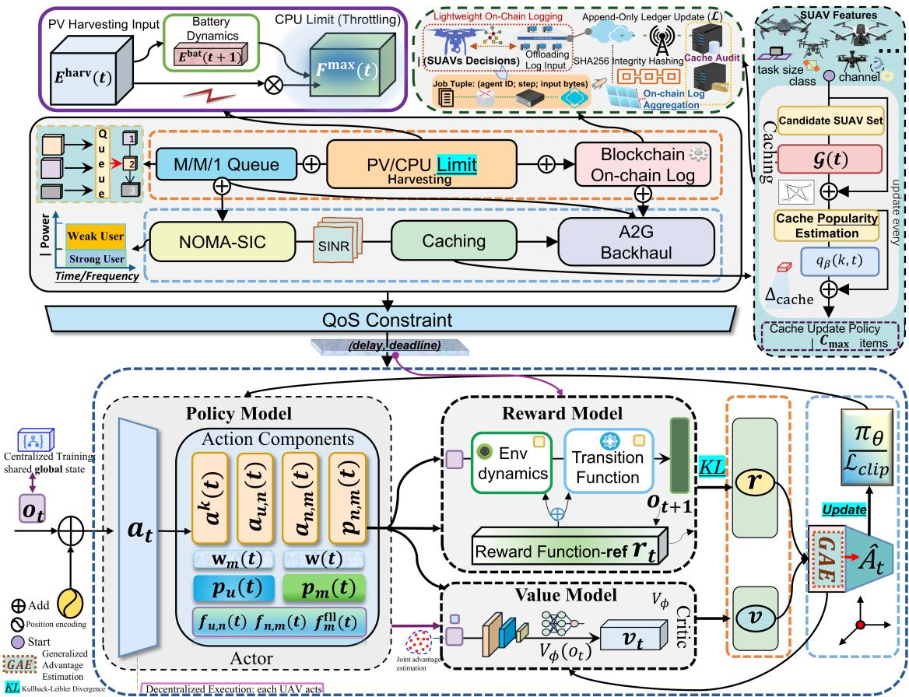  
Fig. 2. Framework of the proposed CTDE-based FL-MAPPO-BOCRAOA for low-altitude edge intelligent network.

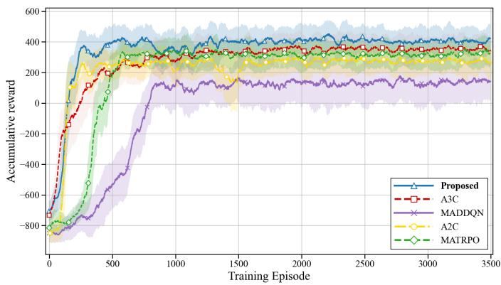  
Fig. 3. Convergence performance comparisons between our proposed algorithm and benchmarks.

the highest final accumulated reward among all benchmarks, including MATRPO, A2C, A3C, and MADDQN. This is because the A3C solution suffers from high variance and slower stabilisation, while the MADDQN lacks adaptability to high-dimensional continuous decision-making. Thus, the above analysis demonstrates the robustness and efficiency of FL-MAPPO-BOCRAOA in handling large-scale and dynamic UAV edge computing environments, as it not only achieves the fastest convergence but also sustains the highest long-term reward compared to all benchmarks.

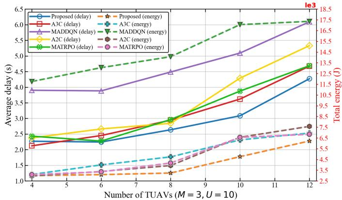  
Fig. 4. Average delay and total energy consumption versus the number of TUAVs.

Fig. 4 evaluates the average delay and total energy consumption versus the number of TUAVs, ranging from 4 to 12. Considering the average delay we observe an increase with the number of TUAVs, since more UAVs introduce additional coordination overhead. Nevertheless, FL-MAPPO-BOCRAOA consistently outperforms other benchmarks. For instance, when the number of TUAVs reaches 12, FL-MAPPO-BOCRAOA maintains a delay of 4.27 s, while A3C, MA-

TABLE I  
SUMMARY OF MAIN NOTATIONS AND SIMULATION PARAMETERS
<table><tr><td>Parameter</td><td>Description</td><td>Value</td></tr><tr><td colspan="3"> $S y s t e m \ a n d \ T a s k \ M o d e l$ </td></tr><tr><td> $\begin{array} { r } { C _ { u } ( t ) , C _ { n } ( t ) , C _ { m } ( t ) } \end{array}$ </td><td>Computation density at UE u, TUAV n, SUAV m</td><td>103, 103, 300 cycles/bit</td></tr><tr><td> $D _ { u } ( t ) , D _ { n } ( t ) , D _ { m } ( t )$ </td><td>Input data size of task u, aggregated task n, aggregated workload m</td><td> $D _ { u } ( t ) \in [ 3 , 5 ]$  MB, See Section III-B</td></tr><tr><td> $E _ { \mathrm { m a x } } ^ { \mathrm { b a t } }$ </td><td>Maximum battery capacity</td><td> $1 0 ^ { 6 } \mathrm { ~ j ~ }$ </td></tr><tr><td> ${ \bf l } _ { u } \widetilde { ( t ) } , { \bf l } _ { n } ( t ) , { \bf l } _ { m } ( t )$ </td><td>Coordinates of UE u, TUAV n, SUAV m</td><td>See Section V</td></tr><tr><td> $M$ </td><td>The number of SUAVs</td><td>3</td></tr><tr><td> $N$ </td><td>The number of TUAVs</td><td> $^ { 7 }$ </td></tr><tr><td> $T _ { u } ^ { \operatorname* { m a x } } ( t ) , T _ { n } ^ { \operatorname* { m a x } } ( t ) , T _ { m } ^ { \operatorname* { m a x } } ( t )$ </td><td>Maximum tolerable delay for processing task u, n, m</td><td>50 ms, 50 ms, 50 ms</td></tr><tr><td> $U ^ { ^ { \mathrm { ~ e ~ } } }$ </td><td>The number of UEs</td><td>10</td></tr><tr><td> $\Delta t$ </td><td>The length of each time slot</td><td>50 ms</td></tr><tr><td> $\eta _ { n } ( t ) , \eta _ { m } ( t )$ </td><td>Coefficient of input data size parameters at TUAV n, SUAV m</td><td>[0,1],[0,1]</td></tr><tr><td colspan="3">Communication Model</td></tr><tr><td> $a ^ { k } ( t )$ </td><td>RB allocation indicator</td><td>{0,1}</td></tr><tr><td> $B$ </td><td>Bandwidth of each RB</td><td>100 MHz</td></tr><tr><td> $f _ { c }$ </td><td>The carrier frequency</td><td>3.5 GHz</td></tr><tr><td> $K ^ { u p } , K ^ { d n }$ </td><td>The number of uplink and downlink RBs</td><td> $5 , 5$ </td></tr><tr><td> $N _ { 0 }$ </td><td>The noise spectral density</td><td>-174 dBm/Hz</td></tr><tr><td> $P \bar { L } _ { u . n } ^ { \mathrm { A 2 G } } ( t )$ </td><td>LoS/NLoS A2G path loss between UE u and TUAV n</td><td>3GPP TR 36.777</td></tr><tr><td> $P L _ { n , m } ^ { \mathrm { A 2 A } } ( t )$ </td><td>LoS/NLoS A2A path loss between TAUV n and SUAV m</td><td>3GPP TR 36.777</td></tr><tr><td colspan="3">Computation and Caching Model</td></tr><tr><td> $F _ { n } ^ { \mathrm { m a x } } ( t ) , F _ { m } ^ { \mathrm { m a x } } ( t )$ </td><td>The maximum computation capacity at TUAV n, SUAV m</td><td> $1 \times 1 0 ^ { 1 0 } \mathrm { c y c l e s } / \mathrm { s } , \ 1 \times 1 0 ^ { 1 1 } \mathrm { c y c l e s } / \mathrm { s }$ </td></tr><tr><td> $I _ { m } ( t )$ </td><td>The solar irradiance</td><td>1000 W/m2</td></tr><tr><td> $S _ { \mathrm { { a n a x } } } ^ { \mathrm { { m a x } } }$ </td><td>The maximum cache capacity at SUAV m</td><td>55 MB</td></tr><tr><td></td><td></td><td> $\mathrm { 0 . 0 5 ~ m ^ { 2 } }$ </td></tr><tr><td> $S _ { m } ^ { \mathrm { s u a v } }$ </td><td>SUAV solar panel area</td><td></td></tr><tr><td> $T _ { \mathrm { p e n } }$ </td><td>Penalty delay  $( \lambda _ { m } \geq \mu _ { m } )$ </td><td>10 s</td></tr><tr><td>Γ</td><td>File popularity skewness-Zipf parameter</td><td>[0.6, 1.2]</td></tr><tr><td> $\eta _ { m } ^ { \mathrm { s u a v } }$ </td><td>Solar energy conversion efficiency The task arrival rate at SUAV m</td><td>0.25</td></tr><tr><td> $\lambda _ { m } ( t )$   $\mu _ { m } ( t )$ </td><td>The service rate at SUAV m</td><td>[1, 22] tasks/s [23, 25] tasks/s</td></tr><tr><td> $\xi ( t )$ </td><td>PV-aware throttle factor for SUAV power usage</td><td>[0, 1]</td></tr><tr><td colspan="3">optimisation Algorithm Variables</td></tr><tr><td> $F _ { \mathrm { b s } }$ </td><td>BS CPU frequency</td><td>50 GHz</td></tr><tr><td> $T _ { \mathrm { s t e p } }$ </td><td>The number of time steps</td><td>10 steps</td></tr><tr><td> $_ \alpha$ </td><td>PPO learning rate</td><td> $3 \times 1 \bar { 0 } ^ { - 4 }$ </td></tr><tr><td> $\epsilon$ </td><td>PPO clipping parameter</td><td>0.2</td></tr><tr><td> $\gamma$ </td><td>PPO discount factor</td><td>0.99</td></tr><tr><td> $\lambda$ </td><td>GAE parameter</td><td>0.95</td></tr><tr><td> $\mathrm { J a i n } ( \cdot )$ </td><td>Jain fairness index</td><td> $\textstyle { \left[ \frac { 1 } { U } , 1 \right] }$ </td></tr><tr><td> $\mathbf { w } _ { m } ^ { ( t ) }$ </td><td>FL Local model parameter at SUAV m</td><td> $\in \mathbb { R } ^ { d }$ </td></tr><tr><td> $\mathbf { w } ^ { ( t + 1 ) }$ </td><td>FL Global parameter at the BS</td><td> $\in \mathbb { R } ^ { d }$ </td></tr><tr><td> $\kappa _ { \mathrm { b s } }$ </td><td>BS switched capacitance</td><td> $1 0 ^ { - 9 }$  J/cycle</td></tr><tr><td></td><td></td><td></td></tr></table>

TRPO, and A2C increase to 4.67 s (+9.4%), 4.69 s (+9.8%), and $5 . 3 3 \textrm { s } ( + 2 4 . 8 \% )$ , respectively. MADDQN again exhibits the poorest performance with $6 . 0 9 ~ \mathrm { ~ s ~ } ~ ( + 4 2 . 6 \% )$ . Regarding energy consumption, FL-MAPPO-BOCRAOA consumes $6 . 2 1 7 \times 1 0 ^ { 3 } \ : \cdot$ J, while A3C, MATRPO, A2C, and MADDQN require $6 . 7 5 8 \times 1 0 ^ { 3 } \textbf { J } ( + 8 . 7 \% ) , \ : 6 . 8 3 9 \times 1 0 ^ { 3 } \textbf { J } ( + 1 0 . 0 \% )$ $7 . 5 7 9 \times 1 0 ^ { 3 } \mathrm { ~ J } \left( + 2 1 . 9 \% \right)$ , and $1 7 . 3 5 6 \times 1 0 ^ { 3 }$ J, respectively. Thus, we can see that FL-MAPPO-BOCRAOA not only reduces the average delay but also achieves significant energy savings in complex multi-UAV cooperation scenarios, owing to its adaptive policy optimisation mechanism.

Fig. 5 shows the impact of the number of UEs on the system performance in terms of average delay and energy consumption, which increases from 10 to 30. The results show that the average delay increases with the number of UEs for all schemes, due to a heavier traffic load and increased computation demand. However, our proposed solution consistently achieves the lowest delay compared to the other solutions. For example, when the number of UEs reaches 30, FL-MAPPO-BOCRAOA achieves an average delay of 3.57 s, while A3C, MATRPO, and A2C incur delays of $3 . 7 9 \mathrm { ~ s ~ } ( + 6 . 1 6 \% )$ , 4.88 s (+36.69%), and $4 . 1 8 \mathrm { ~ s ~ } ( + 1 7 . 0 9 \% )$ , respectively. MADDQN performs the worst with an average delay of 5.04 s, which is +41.18% higher than FL-MAPPO-BOCRAOA. This is because FL-MAPPO-BOCRAOA provides both lower delay and more stable scalability compared to other benchmarks, as it leverages advantage learning to refine resource allocation, while MADDQN fails to adapt under dynamic environments. In terms of energy consumption, FL-MAPPO-BOCRAOA also demonstrates superior efficiency. At 30 UEs, FL-MAPPO-BOCRAOA consumes only $5 . 9 3 1 \times 1 0 ^ { 3 }$ J, compared with $6 . 3 9 9 \times 1 0 ^ { 3 }$ J for A3C (+7.9%), $6 . 6 0 \times 1 0 ^ { 3 }$ J for MATRPO (+11.3%), and $1 7 . 9 2 \times 1 0 ^ { 3 } .$ J insert space for MADDQN. A2C also shows significantly higher consumption at $7 . 8 5 2 \times 1 0 ^ { 3 } \mathrm { ~ J }$ for A2C (+32.4%). Thus, FL-MAPPO-BOCRAOA can maintain both low delay and energy efficiency under increasing user density, which is crucial for UAV-assisted edge computing.

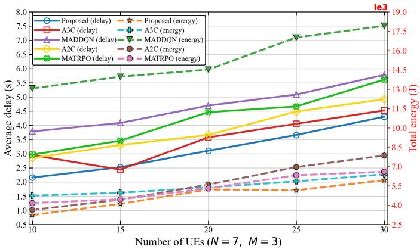  
Fig. 5. Average delay and total energy consumption versus the number of UEs.

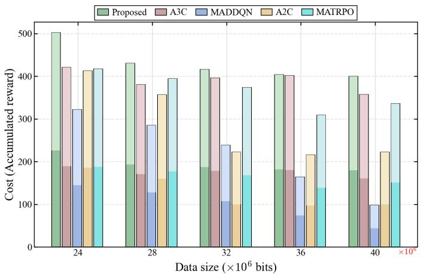  
Fig. 6. The system reward versus the data size.

Fig. 6 demonstrates the system reward under different task data sizes, ranging from $2 4 \times 1 0 ^ { 6 }$ bits to $4 0 \times 1 0 ^ { 6 }$ bits. As the data size increases, all solutions experience reduced reward due to higher communication and computation costs. However, FL-MAPPO-BOCRAOA consistently maintains the highest reward under all data size conditions. Specifically, at $2 4 \times 1 0 ^ { 6 }$ bits, FL-MAPPO-BOCRAOA achieves a reward of 501.88, while A3C, MATRPO, A2C, and MADDQN achieve 420.33 (−16.25%), 417.53 (−16.81%), 412.62 (−17.79%), and 321.63 (−35.91%), respectively. Even when the data size increases to $3 2 \times 1 0 ^ { 6 }$ bits, FL-MAPPO-BOCRAOA still maintains a reward of 415.65, while A3C, MATRPO, A2C, and MADDQN achieve 396.04 (−4.72%), 373.76 (−10.08%), 221.81 (−46.64%), and 238.62 (−42.59%), respectively.

Meanwhile, the results demonstrate that FL-MAPPO-BOCRAOA exhibits superior robustness to varying task sizes. As task size increases, the transmission and computation delays inevitably rise, degrading system reward. Nevertheless,

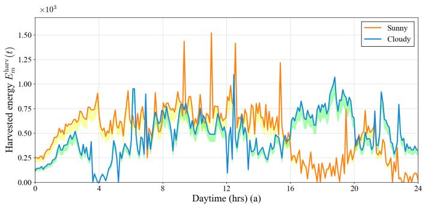

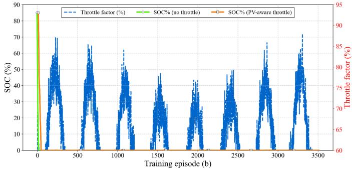  
Fig. 7. Performance of the proposed time-varying PV energy harvesting and SOC-aware throttling mechanism under sunny and cloudy conditions: (a) Harvested energy under weather-dependent irradiance; (b) SOC evolution and throttle factor during training.

FL-MAPPO-BOCRAOA consistently maintains the highest reward, as it dynamically balances task offloading and resource allocation to mitigate the negative effects of larger input sizes. In contrast, A3C, although competitive under smaller task sizes, suffers from high variance in gradient estimates and the absence of a clipping mechanism, resulting in unstable rewards and slower adaptation as the workload increases. MA-TRPO, constrained by conservative policy updates, exhibits limited exploration and converges to suboptimal solutions under larger tasks. Due to the synchronous updates of the A2C, the learning variance grows with task size, and the lack of asynchronous stabilisation causes sharper reward degradation under heavy workloads. MADDQN, being purely value-based, is the most vulnerable to workload fluctuations. Its discrete Q-value updates cannot capture the complexity of continuous task allocation and dynamic resource management, resulting in the steepest performance collapse.

As shown in Fig. 7(a), the harvested energy under sunny conditions exhibits a smooth, bell-shaped profile, whereas cloudy conditions introduce pronounced fluctuations with intermittent peaks and drops due to transient cloud coverage. The fluctuations under cloudy conditions are caused by the weather-dependent attenuation factor $\rho _ { m } ( t )$ introduced in (39). At peak irradiance, sunny harvesting yields 1.6–2.0 times the energy of cloudy harvesting, increasing to 2.5– 4.0 times during morning and late-afternoon periods. This substantial disparity directly influences energy-aware control, enabling sustained high throttle factors (90–95%) under sunny skies while necessitating frequent throttling to 60–80% under cloudy conditions to maintain battery safety. As illustrated in Fig. 7(b), PV-aware throttling adaptively modulates the throttle factor ξ(t) to maintain a higher and more stable battery SOC compared to the unthrottled case, effectively mitigating energy depletion risks during low solar generation. The adaptive variation of ξ(t) demonstrates the effectiveness of the proposed SOC-aware throttling mechanism defined in (40). This approach extends the time until SOC drops to 20% by approximately 40–70 episodes and reduces peak communication and computation loads by 15–25%, indicating improved shortterm and long-term energy sustainability. Furthermore, the throttling actions become less frequent as training proceeds, demonstrating that the learned policy progressively aligns system workload with favourable PV conditions.

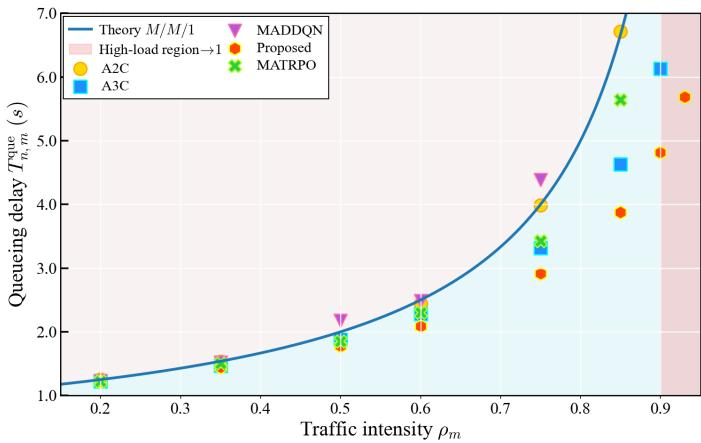  
Fig. 8. M/M/1 stability and normalised queueing delay under different traffic intensities.

To evaluate queueing stability under different traffic conditions, we independently sweep the traffic intensity $\rho _ { m } ( t ) =$ ${ \lambda _ { m } ( t ) } / { \mu _ { m } ( t ) }$ from light to heavy-load regimes while ensuring $\rho _ { m } ( t ) < 1$ . Fig. 8 compares the queueing delays of the five algorithms against the M/M/1 theoretical baseline. All methods align with theory under light-to-moderate loads $( \rho _ { m } ( t ) < 0 . 5 )$ As load increases, the figure shows that the lowest delay is achieved by the proposed method, reducing waiting times by 20–25% over MATRPO and over 30% compared to MAD-DQN at high loads $( \rho _ { m } ( t ) \ge 0 . 7 )$ . FL-MAPPO-BOCRAOA performs robustly but with higher variance under congestion, while value-based MADDQN and policy-gradient baselines degrade earlier due to insufficient stability regularisation. The results confirm that algorithms with stability-aware updates effectively control operational load and prevent delay explosion.

Fig. 9 presents the cumulative distribution function (CDF) of block confirmation delay with and without attacks in a UAV-assisted blockchain system using SUAV–TUAV relays for block propagation. The evaluated confirmation delay incorporates the proposed blockchain overhead model, including SHA256 hash logging, transaction transmission overhead, and lightweight consensus verification overhead. The no-attack CDF curves are consistently left-shifted relative to those under attack, indicating increased delays due to adversarial disruption. Quantitatively, the attack scenario shifts the confirmationdelay distribution to the right for all algorithms. However, the shift of FL-MAPPO-BOCRAOA is visibly smaller than those of A2C and MADDQN, indicating stronger robustness against adversarial disruption. Among the five evaluated algorithms, FL-MAPPO-BOCRAOA exhibits the steepest CDF slope and the lowest delay distribution, confirming faster and more stable confirmation in both benign and adversarial conditions. This advantage originates from its CTDE architecture, which stabilises multi-agent coordination over relay links and reduces learning variance, thereby maintaining resilience against stakebased attacks.

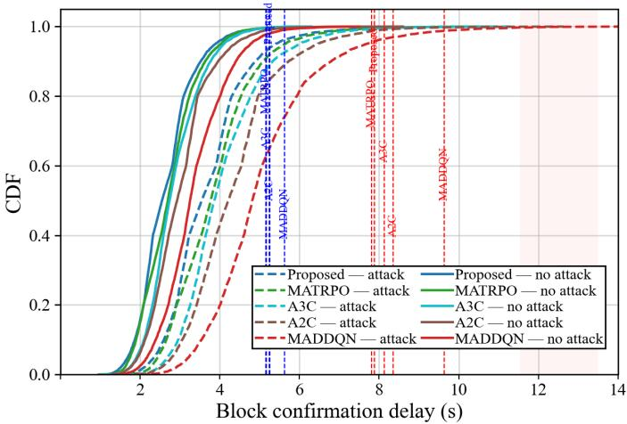  
Fig. 9. CDF of the block confirmation delay under both no-attack and attack scenarios.

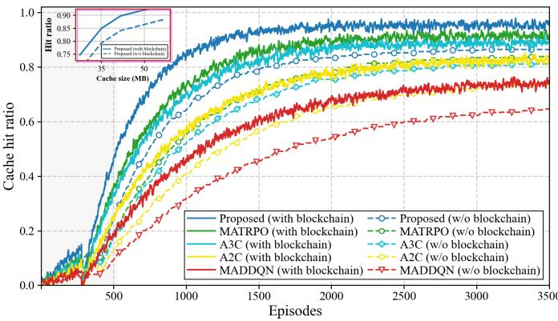  
Fig. 10. Caching Performance and Convergence Behavior.

Fig. 10 shows that the cache hit ratio for all learning-based algorithms increases with training episodes and stabilises after approximately 2000 iterations, indicating convergence to nearoptimal policies. Enabling blockchain support consistently improves the cache hit ratio by an average of 6–9%, with a maximum gain of 10.5% in the proposed FL-MAPPO-BOCRAOAbased scheme, due to enhanced trusted information sharing and cooperative caching among SUAVs. Among the evaluated algorithms, the proposed method achieves the highest steadystate cache hit ratio of 0.93, followed by MATRPO, A3C, A2C, and MADDQN, respectively, attributed to its CTDE paradigm for stabilised multi-agent coordination. Increasing

This article has been accepted for publication in IEEE Transactions on Mobile Computing. This is the author's version which has not been fully edited and content may change prior to final publication. Citation information: DOI 10.1109/TMC.2026.3709198

cache capacity from 35 MB to 50 MB raises the hit ratio by 3– 4% in both configurations, yet blockchain-assisted cooperation yields significant orthogonal performance gains, highlighting that the proposed blockchain-assisted cooperation mechanism effectively compensates for the additional blockchain overhead through improved trusted caching coordination and resource sharing.

## VI. CONCLUSION

This paper proposed a blockchain-empowered multi-agent UAV system for secure, energy-efficient, and low-latency aerial edge intelligence, integrating communication, computation, caching, queueing, and consensus control within a unified four-tier architecture comprising UEs, TUAVs, SUAVs, and a BS. To minimize the long-term system utility encompassing total service delay and energy consumption, we formulated a joint optimisation problem for offloading decisions, caching strategies, and communication and computation resource allocation, and developed an FL-MAPPO-based Blockchainassisted Offloading-Caching and Resource Allocation joint Optimisation Algorithm (FL-MAPPO-BOCRAOA) to solve it. Simulation results demonstrated that our algorithm achieves faster convergence and superior long-term reward compared to baseline methods (A2C, A3C, MADDQN, MATRPO), effectively balancing blockchain efficiency and security, enhancing cache hit ratios through trusted cooperation, and ensuring energy sustainability via PV-aware throttling integrated with M/M/1 queueing stability. Future work will focus on largescale multi-tier UAV-terrestrial cooperation and cross-layer communication-computation-consensus optimisation.

## REFERENCES

[1] A. A. Al-Bakhrani, M. Li, M. S. Obaidat, and G. A. Amran, “MOALF-UAV-MEC: Adaptive multiobjective optimization for UAV-Assisted mobile edge computing in dynamic IoT environments,” IEEE Internet Things J., vol. 12, no. 12, pp. 20 736–20 756, 2025.

[2] M. Hui et al., “UAV-Assisted mobile edge computing: Optimal design of UAV altitude and task offloading,” IEEE Trans. Wireless Commun., vol. 23, no. 10, pp. 13 633–13 647, 2024.

[3] B. Hu et al., “MADQN-Enhanced computation offloading and resource allocation for 6G Low-Altitude economy vehicular networks,” IEEE Trans. Cogn. Commun. Netw., vol. 12, pp. 2603–2617, 2026.

[4] Y. Yin et al., “Integrated deployment and resource allocation in Multilayer UAV-Enabled NOMA wireless caching networks,” IEEE Internet Things J., vol. 13, no. 7, pp. 14 898–14 911, 2026.

[5] P. Qin, Y. Wang, J. Zhang, P. Li, and Y. Fu, “Multi-Type disaster scenario task offloading in Air-Ground integrated search and rescue networks: A Blockchain-Assisted MFL Approach,” IEEE Trans. Veh. Technol., vol. 74, no. 12, pp. 19 583–19 597, 2025.

[6] B. Mao et al., “On a hierarchical content caching and asynchronous updating scheme for Non-Terrestrial Network-Assisted connected automated vehicles,” IEEE J. Sel. Areas Commun., vol. 43, no. 1, pp. 64–74, 2025.

[7] C. Li et al., “Joint service caching and computation offloading scheme with 3D UAV deployment for ICVs in UAV-Assisted VEC,” IEEE Trans. Commun., vol. 73, no. 11, pp. 10 886–10 899, 2025.

[8] X. Han et al., “Multi-UAV automatic dynamic obstacle avoidance with Experience-shared A2C,” in Proc. 2019 Int. Conf. Wireless Mobile Comput., Netw. Commun. (WiMob), 2019, pp. 330–335.

[9] P. Qin, M. Li, K. Wu, and Y. Fu, “Cost minimization resource allocation with service instance caching and task migration for UAV mobile edge computing,” IEEE Trans. Netw. Sci. Eng., vol. 13, pp. 1738–1753, 2026.

[10] P. Yu et al., “Energy-Efficient coverage and capacity enhancement with intelligent UAV-BSs deployment in 6G edge networks,” IEEE Trans Intell. Transp. Syst., vol. 24, no. 7, pp. 7664–7675, 2023.

[11] T. M. Ho et al., “UAV control for wireless service provisioning in critical demand areas: A deep reinforcement learning approach,” IEEE Trans. Veh. Technol., vol. 70, no. 7, pp. 7138–7152, 2021.

[12] Q. Liu, X. Xia, D. Chen, C. Liu, and F. Zhou, “Joint trajectory and phase shift design for UAV-RIS enhanced passive IoT in nonterrestrial networks,” IEEE Internet Things J., vol. 13, no. 3, pp. 3608–3617, 2026.

[13] S. Hafeez, L. Mohjazi, M. A. Imran, and Y. Sun, “Blockchain-enabled clustered and scalable federated learning (BCS-FL) framework in UAV networks,” in Proc. 2023 IEEE 28th Int. Workshop Comput. Aided Model. Des. Commun. Links Netw. (CAMAD), 2023, pp. 68–73.

[14] A. Ali et al., “Computational efficiency maximization for UAV-Assisted MEC networks with energy harvesting in disaster scenarios,” IEEE Internet Things J., vol. 11, no. 5, pp. 9004–9018, 2024.

[15] M. Basharat et al., “Digital-twin-assisted task offloading in UAV-MEC networks with energy harvesting for IoT devices,” IEEE Internet Things J., vol. 11, no. 23, pp. 37 550–37 561, 2024.

[16] S. Bi et al., “Dynamic offloading and trajectory control for UAV-Enabled mobile edge computing system with energy harvesting devices,” IEEE Trans. Wireless Commun., vol. 21, no. 12, pp. 10 515–10 528, 2022.

[17] Y. Chen et al., “Adaptive bitrate video caching in UAV-Assisted MEC networks based on distributionally robust optimization,” IEEE Trans. Mob. Comput., vol. 23, no. 5, pp. 5245–5259, 2024.

[18] P. Qin et al., “Latency minimization resource allocation and trajectory optimization for UAV-Assisted Cache-Computing network with energy recharging,” IEEE Trans. Commun., vol. 73, no. 8, pp. 5715–5728, 2025.

[19] Y. Fu et al., “DRL-based resource allocation and trajectory planning for NOMA-Enabled Multi-UAV collaborative caching 6G network,” IEEE Trans. Veh. Technol., vol. 73, no. 6, pp. 8750–8764, 2024.

[20] Q. Li et al., “Dynamic routing mechanism for load distribution in uav swarm networks with edge caching,” IEEE Trans. Mob. Comput., vol. 24, no. 12, pp. 13 226–13 242, 2025.

[21] R. Karmakar, G. Kaddoum, and O. Akhrif, “A novel federated learningbased smart power and 3D trajectory control for fairness optimization in secure UAV-assisted MEC services,” IEEE Trans. Mob. Comput., vol. 23, no. 5, pp. 4832–4848, 2024.

[22] H. Cao, S. Garg, G. Kaddoum, M. Alrashoud, and L. Yang, “Efficient resource allocation of slicing services in softwarized space-aerial-ground integrated networks for seamless and open access services,” IEEE Trans. Veh. Technol., vol. 73, no. 7, pp. 9284–9295, 2024.

[23] Z. Wang et al., “FL-assisted offloading and resource allocation in 6G NOMA-based low-altitude economy networks,” in Proc. 2025 IEEE 102nd Veh. Technol. Conf. (VTC2025-Fall), 2025, pp. 1–6.

[24] Z. Wang et al., “NOMA-enabled joint trajectory and resource allocation optimisation in 6G low-altitude networks: A PPO-based approach,” in Proc. 2025 IEEE/CIC Int. Conf. Commun. China, 2025, pp. 1–6.

[25] Y. Deng et al., “UAV-assisted multi-access edge computing with altitude-dependent computing power,” IEEE Trans. Wireless Commun., vol. 23, no. 8, pp. 9404–9418, 2024.

[26] S. Shen et al., “AoI-aware joint resource allocation in multi- UAV aided multi-access edge computing systems,” IEEE Trans. Netw. Sci. Eng., vol. 11, no. 3, pp. 2596–2609, 2024.

[27] C. Fan et al., “Cache-Enabled UAV emergency communication networks: Performance analysis with stochastic geometry,” IEEE Trans. Veh. Technol., vol. 72, no. 7, pp. 9308–9321, 2023.

[28] M. Zhao, R. Zhang, Z. He, and K. Li, “Joint optimization of trajectory, offloading, caching, and migration for UAV-Assisted MEC,” IEEE Trans. Mob. Comput., vol. 24, no. 3, pp. 1981–1998, 2025.

[29] A. Masood et al., “Content caching in HAP-Assisted Multi-UAV networks using hierarchical federated learning,” in Proc. 2021 Int. Conf. Inf. Commun. Technol. Convergence (ICTC), 2021, pp. 1160–1162.

[30] D. Saraswat et al., “Blockchain-Based federated learning in UAVs beyond 5G networks: A Solution Taxonomy and Future Directions,” IEEE Access, vol. 10, pp. 33 154–33 182, 2022.

[31] E. Bandara et al., “Blockchain, NFT, federated learning and model cards enabled UAV surveillance system for 5G/6G network sliced environment,” in Proc. 2023 Int. Symp. Netw., Comput. Commun. (ISNCC), 2023, pp. 1–8.

[32] S. Dong et al., “Improved PBFT consensus mechanism based on voting sort clustering partition with group signature for IoT,” IEEE Trans. Intell. Transp. Syst., vol. 26, no. 2, pp. 2239–2251, 2025.

[33] B. Hu, J. Du, J. Zhang, and X. Chu, “Computation offloading and resource allocation in Mixed Cloud/Vehicular-Fog computing systems,” IEEE Trans. Mob. Comput., vol. 24, no. 9, pp. 8612–8624, 2025.

[34] P. Chen et al., “QoS-Oriented task offloading in NOMA-Based Multi-UAV cooperative MEC systems,” IEEE Trans. Wireless Commun., vol. 25, pp. 1965–1980, 2026.

[35] J. Du et al., “Cost-effective task offloading in NOMA-enabled vehicular mobile edge computing,” IEEE Syst. J., vol. 17, pp. 928–939, 2023.

[36] 3GPP-TR Technical Specification Group Radio Access Network-36.777, “Study on enhanced LTE support for aerial vehicles (Release 15) version 15.0.0,” 3GPP, Tech. Rep., 2018, available online: www.3gpp.org.

[37] B. Hu et al., “Multiagent deep deterministic policy gradient-based computation offloading and resource allocation for ISAC-aided 6G V2X networks,” IEEE Internet Things J., no. 20, pp. 33 890–33 902, 2024.

[38] C. Liang et al., “A multicell SCC capacitive coupler with strong lateral, longitudinal, and rotational antioffset performance,” IEEE Trans. Power Electron., vol. 40, no. 4, pp. 6230–6247, 2025.

[39] Y. Mao et al., “SAFARI: Sparsity-Enabled federated learning with limited and unreliable communications,” IEEE Trans. Mob. Comput., vol. 23, no. 5, pp. 4819–4831, 2024.

[40] N. Paunkov et al., “Efficiency of the photovoltaic panel on the temperature change,” in Proc. 2025 19th Conf. Elect. Mach., Drives Power Syst. (ELMA), 2025, pp. 1–5.

[41] B. Zhu et al., “Max-Min computation optimization in Multi-BS WPT-MEC networks via Multi-Agent reinforcement learning,” IEEE Trans. Mob. Comput., vol. 25, no. 5, pp. 6596–6613, 2026.

[42] J. Ji et al., “Decoupled association with rate splitting multiple access in UAV-assisted cellular networks using multi-agent deep reinforcement learning,” IEEE Trans. Mob. Comput., vol. 23, pp. 2186–2201, 2024.

[43] E. Houcine et al., “Multi-agent proximal policy optimization for data freshness in UAV-assisted networks,” in Proc. 2023 IEEE Int. Conf. Commun. Workshops, 2023, pp. 1920–1925.

Zhiran Wang (Student Member, IEEE) received the B.Sc. degree in Information Technology from Southern Cross University, Australia, in 2020, and the M.Sc. degree in Software Engineering from the University of Sydney, Sydney, Australia, in 2023. He is currently pursuing the Ph.D. degree in Electronic and Electrical Engineering with the joint doctoral program between Xi’an Jiaotong-Liverpool University, China, and the University of Liverpool, U.K. His research interests include 6G edge intelligence, UAV-assisted low-altitude networks, air-ground integrated communications, intelligent caching and computation offloading, energy-efficient resource allocation, with a particular focus on multi-agent and/or deep reinforcement learning optimisation.

Bintao Hu (Member, IEEE) is an Assistant Professor at the School of Internet of Things, Xi’an Jiaotong-Liverpool University, Suzhou, China. He received his B.Eng. degree in telecommunications engineering from Xiangtan University, Xiangtan, China, in 2015, M.Sc. degree in Data Communications in 2017 and Ph.D. degree in Electronic and Electrical Engineering in 2022, both from the University of Sheffield, UK. He attended the European Commission Decade project with Ranplan, Barcelona, Spain, in 2018. He received the Young

Investigator Award in IEEE CCAI 2025, the best paper award in IEEE IWCMC 2026,2025 EAI MONAMO, and 2025 IEEE ECNCT, the best oral presentation award in IEEE/ACIS ICIS 2023, and the best workshop organisation award in SMC-IoT 2023. He served as a Chair/Co-Chair of many international workshops, such as IEEE WCNC 2026, IEEE VTC 2024-2026, IEEE ICCCN 2024-2026, etc. He served as a member of the TPC for many flagship conferences such as IEEE WCNC 2024-2026, IEEE VTC 2023-2026, IEEE PIMRC 2024-2026, etc. He also served as a reviewer for many journals, such as IEEE TWC, IEEE TCOM, IEEE TMC, IEEE TNSE, IEEE IoTJ, etc. His current research interests include low-altitude economy communications, D2D/V2X/U2X communications, MEC, ISAC, space-air-ground integrated networks, digital twins, federated learning, and AI.

Miguel Lopez-Ben´ ´ıtez (Senior Member, IEEE) received the B.Sc. and M.Sc. degrees (Hons.) in telecommunication engineering from Miguel Hernandez University, Elche, Spain, in 2003 and´ 2006, respectively, and the Ph.D. degree (summa cum laude) in telecommunication engineering from the Technical University of Catalonia, Barcelona, Spain, in 2011.,From 2011 to 2013, he was a Research Fellow with the Centre for Communication Systems Research, University of Surrey, Guildford, U.K. In 2013, he became a Lecturer (Assistant

Professor) with the Department of Electrical Engineering and Electronics, University of Liverpool, Liverpool, U.K., where he has been a Senior Lecturer (Associate Professor) since 2018. His research interests include the field of wireless communications and networking, with special emphasis on mobile communications, dynamic spectrum access, and the Internet of Things.

Jianbo Du (Member, IEEE) received her Ph.D. degree in communication and information systems from Xidian University, Xi’an, China, in 2018. She was a Visiting Scholar with Carleton University, Ottawa, ON, Canada, in 2019. She is currently an Associate Professor at the School of Communication and Information Engineering, Xi’an University of Posts and Telecommunications, Xi’an. She has published more than 50 research papers in leading journals and flagship conferences, and five of them are ESI Top 1% highly cited papers. Her research interests include mobile edge computing, blockchain, space-airground integrated networks, deep reinforcement learning, optimisation theory and methods, and their applications in wireless communications. She has been awarded the Excellent Reviewer of IEEE TCOM, IEEE TNSE, and IEEE CL in 2021 and 2022. She was selected as the Top 2% World’s Top Scientist from 2022 to 2023. She serves as an Editor for the IEEE OPEN JOURNAL OF VEHICULAR TECHNOLOGY and the Guest Editor for IET Communications. She also serves as the TPC chair, and TPC member for many conferences and the reviewer for more than 30 leading journals.

Xiaoli Chu (Senior Member, IEEE) Xiaoli Chu is a Professor in the Department of Electronic and Electrical Engineering at the University of Sheffield, UK. She has co-authored over 200 peer-reviewed journal and conference papers, including 8 ESI Highly Cited Papers and the IEEE Communications Society 2017 Young Author Best Paper. She co-authored/co-edited the books “Fog-Enabled Intelligent IoT Systems” (Springer 2020), “Ultra Dense Networks for 5G and Beyond” (Wiley 2019), “Heterogeneous Cellular Networks - Theory, Simulation and Deployment”

(Cambridge University Press 2013), and “4G Femtocells: Resource Allocation and Interference Management” (Springer 2013). She is Senior Editor for the IEEE Wireless Communications Letters, Associate Editor for the IEEE Transactions on Network Science and Engineering, Editor for the IEEE Open Journal of Vehicular Technology, and received the IEEE Communications Letters Exemplary Editor Award in 2018.

F.Richard Yu (Fellow, IEEE) received the Ph.D. degree in electrical engineering from the University of British Columbia. His research interests include machine learning, embodied AI, autonomous systems, and blockchain. He has been recognized as a Clarivate Highly Cited Researcher in Computer Science since 2019 and among Stanford’s Top 2% Most Cited Scientists since 2020. He has received multiple Best Paper Awards, the Carleton Research Achievement Awards (2012, 2021), and the Ontario Early Researcher Award (2011). He serves on the

Board of IEEE Vehicular Technology Society, is Editor-in-Chief of the IEEE VTS Mobile World newsletter, and is a Fellow of IEEE, CAE, EIC, and IET, as well as a Member of Academia Europaea and an IEEE Distinguished Lecturer.