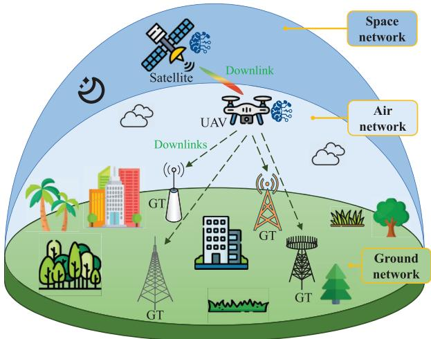
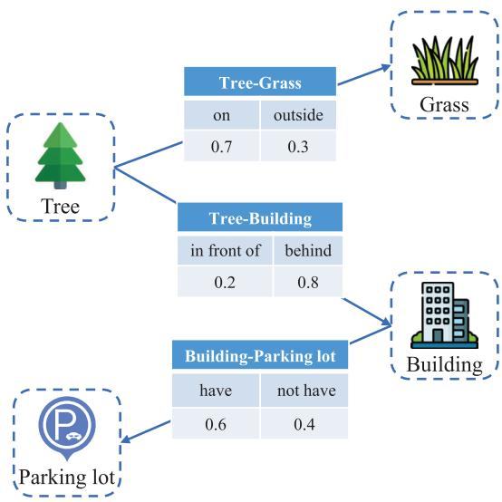
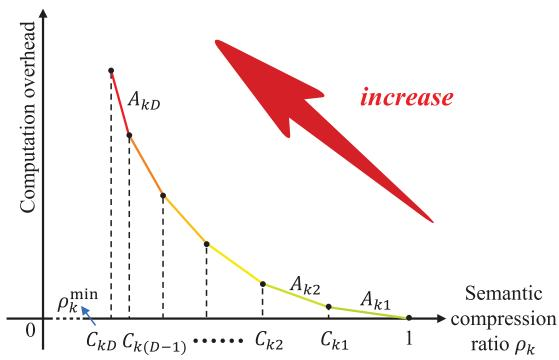
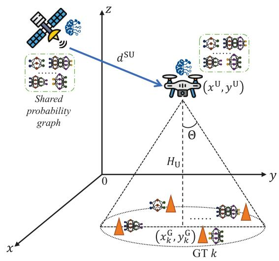
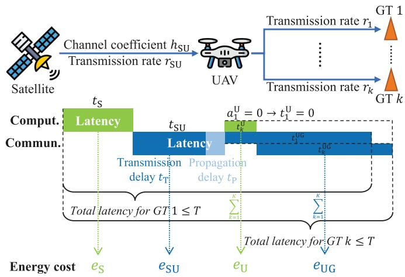
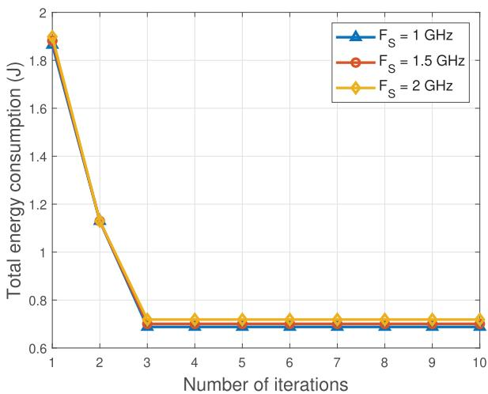
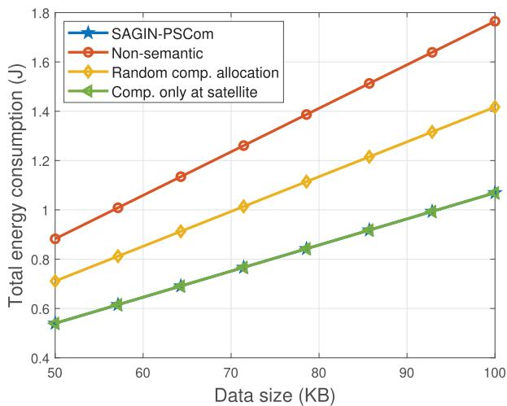
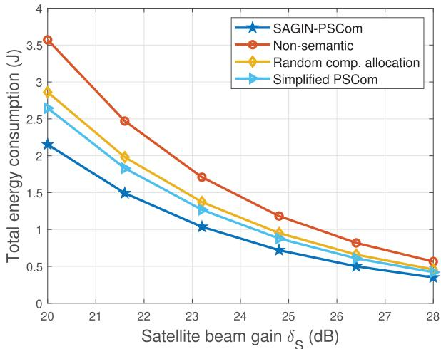
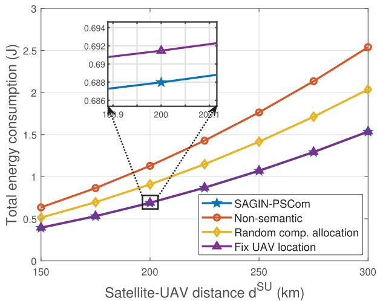
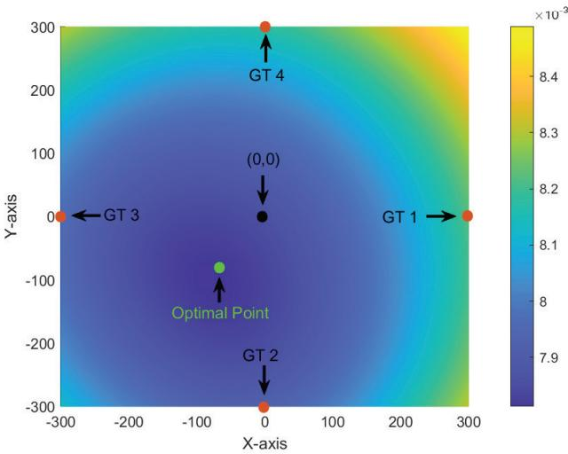

# Energy-Efficient Probabilistic Semantic Communication Over Space-Air-Ground Integrated Networks

Zhouxiang Zhao , Graduate Student Member, IEEE, Zhaohui Yang , Member, IEEE, Mingzhe Chen , Senior Member, IEEE, Chen Zhu , Wei Xu , Fellow, IEEE, Zhaoyang Zhang , Senior Member, IEEE, and Kaibin Huang , Fellow, IEEE

Abstract—Space-air-ground integrated networks (SAGINs) are emerging as a pivotal element in the evolution of future wireless networks. Despite their potential, the joint design of communication and computation within SAGINs remains a formidable challenge. In this paper, the problem of energy efficiency in SAGIN-enabled probabilistic semantic communication (PSCom) system is investigated. In the considered model, a satellite needs to transmit data to multiple ground terminals (GTs) via an uncrewed aerial vehicle (UAV) acting as a relay. During transmission, the satellite and the UAV can use PSCom technique to compress the transmitting data, while the GTs can automatically recover the missing information. The PSCom is underpinned by shared probabilistic graphs that serve as a common knowledge base among the transceivers, allowing for resource-saving communication at the expense of increased computation resource. Through analysis, the computation overhead function in PSCom is a piecewise function with respect

Kaibin Huang is with the Department of Electrical and Electronic Engineering, The University of Hong Kong, Hong Kong, SAR, China (e-mail: huangkb@eee.hku.hk).

Digital Object Identifier 10.1109/TWC.2025.3569102

to the semantic compression ratio. Therefore, it is important to make a balance between communication and computation to achieve optimal energy efficiency. The joint communication and computation problem is formulated as an optimization problem aiming to minimize the total communication and computation energy consumption of the network under latency, power, computation capacity, bandwidth, semantic compression ratio, and UAV location constraints. To solve this non-convex non-smooth problem, we propose an iterative algorithm where the closedform solutions for computation capacity allocation and UAV altitude are obtained at each iteration. Numerical results show the effectiveness of the proposed algorithm.

Index Terms—Space-air-ground integrated network, semantic communication, energy efficiency, computation offloading.

## I. INTRODUCTION

aerial vehicle (UAV) technology, the potential of space-air-ground integrated networks (SAGINs) to revolutionize future communication systems is becoming increasingly evident [1], [2], [3]. SAGIN covers satellites, aerial platforms, and terrestrial nodes, making it a multi-level three-dimensional (3D) network [4]. This 3D characteristic gives SAGINs global broadband coverage, which is a major demand in the sixthgeneration (6G) wireless networks [5]. Beyond traditional wireless connectivity, 6G is envisioned to provide advanced computing services, enabling intelligent and efficient data processing [6], [7]. Among these innovations, semantic communication has gained significant attention as a paradigm that transcends conventional bit-based transmission [8], [9], [10]. In semantic communication, the transmitter extracts semantic information from raw data before transmission, allowing the receiver to reconstruct the message with minimal data exchange [11]. While this approach enhances communication efficiency by reducing the amount of data transmitted, it also introduces additional computation overhead, which requires a joint communication and computation design [12]. Despite extensive research on satellite and UAV communication, integrated networks across space-air-ground present significant challenges in balancing communication and computation [13], [14], necessitating innovative design strategies.

## A. Related Works

1) SAGINs: Existing studies on SAGINs have primarily focused on network architecture and resource management.

Mingzhe Chen is with the Department of Electrical and Computer Engineering and the Institute for Data Science and Computing, University of Miami, Coral Gables, FL 33146 USA (e-mail: mingzhe.chen@miami.edu).

Hierarchical architectures have been explored to enable efficient coordination among space, air, and ground segments in SAGINs. For instance, [15] proposed a flexible, low-latency, and flat SAGIN architecture, demonstrating its advantages in reducing delay and enhancing flexibility through two deployment scenarios. Building on this, [16] introduced software-defined network (SDN) into SAGIN, designing a hierarchical domain-based architecture with a multi-controller deployment strategy to enhance network adaptability. In addition, [17] explored the integration of mobile edge computing (MEC) with SAGIN, examining the system architecture, selection schemes, and handover procedures to combine communication, sensing, and computing.

Resource management in SAGINs is another crucial aspect. [18] developed a scalable task scheduling and resource allocation framework, designed to handle diverse task scenarios and manage heterogeneous task demands efficiently. To improve computing resource utilization in the internet of vehicles (IoV), [19] proposed an edge-cloud architecture based on SDN and network function virtualization, which enhances network flexibility and computing efficiency. Additionally, [20] investigated the use of wireless edge caching to improve quality of service (QoS) and quality of experience (QoE), utilizing relay nodes in SAGINs to pre-cache frequently accessed tasks and reduce transmission delays.

Despite these advances, the aforementioned works all used conventional communication schemes. The integration of semantic communication and SAGINs offers a promising avenue to further enhance efficiency by reducing redundant data transmission while introducing new challenges in computation resource allocation.

2) Semantic Communications: Semantic communication is an emerging paradigm that extends beyond traditional bit transmission by prioritizing the conveyance of message meaning rather than raw data streams [21], [22], [23]. By leveraging advancements in artificial intelligence (AI), it effectively extracts essential information, significantly reducing data size by eliminating redundancies [24], [25], [26]. This approach enhances energy efficiency, spectral efficiency, and overall communication reliability [27], [28].

A fundamental aspect of semantic communication is semantic information representation. In joint source-channel coding (JSCC) schemes, deep neural networks generate semantic representations of transmitted data [29]. Some other approaches utilize knowledge graphs or semantic triplets to structure semantic information [30], [31], [32]. Based on the statistical information of extensive knowledge graphs, probabilistic semantic communication (PSCom) employs probabilistic graphs as knowledge bases to enhance semantic compression [33]. Building upon this, [34] integrated ratesplitting multiple access (RSMA) into PSCom and formulated an energy minimization problem. Incorporating distributed reconfigurable intelligent surfaces (RISs), [35] explored spectral efficiency maximization for PSCom while considering computational constraints.

In PSCom, semantic information is compressed using probabilistic graphs, effectively reducing redundancy. In this context, redundancy refers to messages that can be inferred from the shared probabilistic graph. Furthermore, the computation overhead of PSCom can be mathematically modeled as a piecewise function, thus facilitating the joint design of communication and computation processes.

## B. Motivation and Contributions

In SAGINs, communication resources are significantly more constrained than in terrestrial networks due to limited spectrum availability, long propagation delays, etc. Semantic communication offers a promising solution by reducing data transmission requirements through intelligent compression, thereby conserving scarce communication resources. However, this comes at the cost of increased computation overhead, as semantic information extraction demand substantial processing power. The multi-layered structure of SAGINs further complicates this trade-off, as computation tasks must be strategically allocated between satellites and UAVs, each with varying processing capabilities and energy constraints [36]. Effectively integrating PSCom into SAGINs requires a joint optimization of communication and computation, balancing data compression benefits against computational feasibility while ensuring efficient resource allocation across different network layers.

This paper proposes a SAGIN-enabled PSCom framework that combines the benefits of SAGIN and semantic communication. To the best of our knowledge, this is the first work that examines semantic communication resource allocation problem in SAGINs. The key contributions are summarized as follows:

• We propose a SAGIN-enabled PSCom framework in which a satellite transmits data to multiple ground terminals (GTs) via a UAV acting as a relay. During the transmission, the satellite and the UAV can choose to perform semantic compression to reduce the data size of the message using PSCom technique, while the GTs can reconstruct the compressed information using the shared probabilistic graphs. Although this semantic compression can save communication resource, it inevitably incurs additional computation costs. The computation overhead function in PSCom system is modeled as a piecewise function with respect to the semantic compression ratio. Thus, a trade-off between communication and computation is required to achieve optimal performance.

• We formulate a joint communication and computation optimization problem aimed at minimizing the total energy consumption of the system, encompassing both communication and computation components. This is achieved by optimizing key system parameters, including the UAV’s location and beamwidth, the allocation of bandwidth, computation capacity, and transmit power for each GT on the UAV, the semantic compression ratio, and the allocation of computation tasks between the satellite and the UAV. The optimization problem is subject to constraints on latency, power budgets, computation capacity, bandwidth availability, semantic compression ratios, and UAV positioning.

• This optimization problem exhibits a pronounced nonconvex structure, further complicated by the introduction of the piecewise function that induces non-smooth characteristics. To address this challenging non-convex and non-smooth optimization problem, we propose an iterative algorithm that alternately optimizes six subproblems. At each iteration, closed-form solutions are derived for computation capacity allocation and UAV altitude. Numerical results show the effectiveness of the proposed algorithm.

TABLE I  
LIST OF MAIN NOTATIONS
<table><tr><td rowspan=1 colspan=1>Notation</td><td rowspan=1 colspan=1>Description</td></tr><tr><td rowspan=1 colspan=1>K</td><td rowspan=1 colspan=1>Set of GTs, K = {1, 2, . . . , K}</td></tr><tr><td rowspan=1 colspan=1> $\overline { { H _ { \mathrm { U } } } }$ </td><td rowspan=1 colspan=1>Altitude of the UAV</td></tr><tr><td rowspan=1 colspan=1> $\overline { { d _ { \iota _ { k } } ^ { \mathrm { U G } } } }$ </td><td rowspan=1 colspan=1>Distance between UAV and GT k</td></tr><tr><td rowspan=1 colspan=1> $\overbrace { d ^ { \mathrm { S U } } }$ </td><td rowspan=1 colspan=1>Distance between satellite and UAV</td></tr><tr><td rowspan=1 colspan=1> $r _ { \mathrm { S U } }$ </td><td rowspan=1 colspan=1>Satellite-to-UAV transmission rate</td></tr><tr><td rowspan=1 colspan=1> $B _ { \mathrm { S U } }$ </td><td rowspan=1 colspan=1>Satellite-to-UAV bandwidth</td></tr><tr><td rowspan=1 colspan=1> $\overline { { P _ { \mathrm { S } } } }$ </td><td rowspan=1 colspan=1>Satellite transmit power</td></tr><tr><td rowspan=1 colspan=1> $\overline { { N _ { 0 } } }$ </td><td rowspan=1 colspan=1>Noise power spectral density</td></tr><tr><td rowspan=1 colspan=1> $\Theta$ </td><td rowspan=1 colspan=1>Half-power beamwidth of UAV antenna</td></tr><tr><td rowspan=1 colspan=1> $g _ { k }$ </td><td rowspan=1 colspan=1>Channel gain between UAV and GT k</td></tr><tr><td rowspan=1 colspan=1> $r _ { k }$ </td><td rowspan=1 colspan=1>UAV-to-GT k transmission rate</td></tr><tr><td rowspan=1 colspan=1> $b _ { k }$ </td><td rowspan=1 colspan=1>Bandwidth allocated to GT k</td></tr><tr><td rowspan=1 colspan=1> $p _ { k }$ </td><td rowspan=1 colspan=1>Transmit power allocated to GT k</td></tr><tr><td rowspan=1 colspan=1> $\kappa$ </td><td rowspan=1 colspan=1>Computation latency constant</td></tr><tr><td rowspan=1 colspan=1> $\overline { { F _ { \mathrm { S } } } }$ </td><td rowspan=1 colspan=1>Satellite computation capacity</td></tr><tr><td rowspan=1 colspan=1> $\tau$ </td><td rowspan=1 colspan=1>Computation energy constant</td></tr><tr><td rowspan=1 colspan=1> $f _ { k }$ </td><td rowspan=1 colspan=1>Computation capacity allocated to GT k at UAV</td></tr><tr><td rowspan=1 colspan=1> $e _ { \mathrm { U } }$ </td><td rowspan=1 colspan=1>UAV computation energy</td></tr><tr><td rowspan=1 colspan=1> $\overline { { T } }$ </td><td rowspan=1 colspan=1>Maximum tolerable latency constraint</td></tr><tr><td rowspan=1 colspan=1> $P _ { \mathrm { U } }$ </td><td rowspan=1 colspan=1>UAV total power budget</td></tr><tr><td rowspan=1 colspan=1> $\overline { { H _ { \mathrm { U } } ^ { \mathrm { m i n } } , H _ { \mathrm { U } } ^ { \mathrm { m a x } } } }$ </td><td rowspan=1 colspan=1>UAV altitude limits</td></tr><tr><td rowspan=1 colspan=1> $B _ { \mathrm { U } }$ </td><td rowspan=1 colspan=1>UAV total bandwidth</td></tr><tr><td rowspan=1 colspan=1> $\overline { { F _ { \mathrm { U } } } }$ </td><td rowspan=1 colspan=1>UAV total computation capacity</td></tr><tr><td rowspan=1 colspan=1> $\rho _ { k } ^ { \mathrm { m i n } }$ </td><td rowspan=1 colspan=1>Minimum semantic compression ratio for GT k</td></tr><tr><td rowspan=1 colspan=1> $\Theta _ { \mathrm { m i n } } , \Theta _ { \mathrm { m a x } }$ </td><td rowspan=1 colspan=1>UAV antenna beamwidth limits</td></tr><tr><td rowspan=1 colspan=1> $\overline { { a _ { k } ^ { \mathrm { S } } , a _ { k } ^ { \mathrm { U } } } }$ </td><td rowspan=1 colspan=1>Binary variables for computation task allocation</td></tr></table>

## C. Organization and Notations

The remainder of this paper is organized as follows. Section II introduces the system model, detailing the architecture of the considered SAGIN and the PSCom framework, then formulates the energy efficiency optimization problem. Section III presents the proposed iterative algorithm, including the detailed derivation and algorithm analysis on convergence and complexity. Section IV provides a comprehensive analysis of the simulation results, demonstrating the effectiveness of the proposed algorithm in achieving energy-efficient PSCom over SAGINs. Finally, Section V concludes the paper.

The main notations used in the paper are summarized in Table I.

## II. SYSTEM MODEL AND PROBLEM FORMULATION

Consider a downlink transmission scenario that a satellite in the space needs to transmit data to multiple GTs on the ground and uses a UAV in the air as a relay, as shown in Fig. 1. The set of GTs is represented by ${ \mathcal { K } } = \{ 1 , 2 , \cdots , K \}$ and the data that need to be transmitted to GT k is denoted by $\mathcal { D } _ { k }$ . Due to limited wireless resources, the satellite or UAV needs to take advantage of its computation capability to extract the small-sized semantic information $\mathcal { C } _ { k }$ from original data $\mathcal { D } _ { k }$ to reduce data size, thus saving communication resources. In the considered model, semantic communication is enabled by shared probabilistic graphs between the satellite, UAV, and GTs.

  
Fig. 1. Illustration of the considered SAGIN-enabled PSCom system.

## A. Semantic Communication Model

In the considered PSCom model, we assume the transmitter has a set of semantic triplets [32] to transmit. A semantic triplet is defined as

$$
\varepsilon = ( h , r , t ) ,\tag{1}
$$

where h is the head entity, t is the tail entity, and r represents the relation between them. For example, (Tree, on, Grass) is a semantic triplet with “Tree” as the head entity, “Grass” as the tail entity, and “on” as the relation. These triplets can be generated from diverse data types (text, images, video) using deep neural networks [37], [38], [39]. As shown, semantic triplets provide high information density, encoding a large amount of data with a small number of bits. Despite their compactness, we propose a probabilistic approach to compress them further.

In traditional semantic triplets, the relation is fixed. However, with a large set of triplets, we can generate a probabilistic graph to store their statistical information. These triplets, derived from historical data between transceivers, form semantic quadruples, which extend the traditional triplet by incorporating the relation probability. The probabilistic graph, as shown in Fig. 2, is shared between transceivers, serving as a knowledge base. The transmitter can then use this graph for semantic compression when sending triplets to the receiver [40]. A multi-dimensional conditional probability matrix is computed from the graph, indicating the likelihood of a specific triplet being valid when others are valid. This allows omitting the relation before transmission, reducing data size. Upon receiving the compressed data, the receiver can recover the omitted relation using the shared probabilistic graph. For instance, if the transmitter needs to send (Tree, behind, Building), it only needs to transmit (Tree, ∅, Building), omitting the relation. The receiver can then recover the relation “behind” based on the shared graph, as it has a high probability. However, achieving greater data compression requires a lower semantic compression ratio, which involves higher-dimensional conditional probabilities. This leads to increased computation overhead, highlighting the trade-off between communication and computation in the PSCom system.

  
Fig. 2. An illustration of a probabilistic graph in the PSCom system.

In the SAGIN-enabled PSCom framework, each GT maintains a local probabilistic graph with statistical data from its history. These graphs are shared with the satellite and UAV. The satellite holds data $\mathcal { D } _ { k }$ for GT k, which may consist of remote sensing results in the form of semantic triplets. Using PSCom, the satellite or UAV can perform semantic compression on $\mathcal { D } _ { k }$ . Upon receiving the compressed data $\mathcal { C } _ { k }$ GT k can recover the missing information using the shared graph. The semantic compression ratio for GT k is defined as

$$
\rho _ { k } = \frac { C _ { k } } { D _ { k } } ,\tag{2}
$$

where $D _ { k }$ is the original data size and $C _ { k }$ is the compressed size. A lower ratio indicates more compact compression.

## B. Computation Model

The PSCom technique can save communication resources through semantic compression. However, this process inevitably costs additional computation resources.

According to equation (20) in [33], the computation overhead for the considered PSCom technique can be written as

$$
O _ { k } \left( \rho _ { k } \right) = \left\{ \begin{array} { l l } { A _ { k 1 } \rho _ { k } + B _ { k 1 } , } & { C _ { k 1 } < \rho _ { k } \leq 1 , } \\ { A _ { k 2 } \rho _ { k } + B _ { k 2 } , } & { C _ { k 2 } < \rho _ { k } \leq C _ { k 1 } , } \\ { \vdots } \\ { A _ { k D } \rho _ { k } + B _ { k D } , } & { C _ { k D } \leq \rho _ { k } \leq C _ { k ( D - 1 ) } , } \end{array} \right.\tag{3}
$$

  
Fig. 3. Illustration of the relationship between semantic compression ratio and computation overhead.

where $A _ { k d } < 0$ denotes the slope, $B _ { k d } > 0$ represents the constant term, and $C _ { k d }$ stands for the boundary for each segment $d \in \mathcal { D } ^ { \mathrm { s } } = \{ 1 , \cdot \cdot \cdot , D \}$ . These parameters depend on the properties of the probabilistic graph corresponding to different GTs.

From equation (3), we observe that the computation overhead for GT k, denoted by $O _ { k } ( \rho _ { k } )$ , manifests as a piecewise function with respect to its semantic compression ratio, $\rho _ { k }$ Fig. 3 visually depicts the behavior of the $O _ { k } ( \rho _ { k } )$ function. This function exhibits a segmented structure with D distinct levels, a property that is determined by the dimensionality of the conditional probabilities. This segmentation arises from the inherent characteristic of the semantic compression process, which employs multiple hierarchical levels of conditional probabilities. Each level contributes a distinct linear expression to the overall computation overhead. Furthermore, a discernible decrease in the slope magnitude of $O _ { k } ( \rho _ { k } )$ is evident across these discrete segments. This phenomenon can be attributed to the utilization of lower-dimensional conditional probabilities at higher semantic compression ratios, resulting in reduced computation demands. On the contrary, as $\rho _ { k }$ diminishes, the need for higher-dimensional information arises. Consequently, the computation overhead intensifies with increasing information dimensionality. Each transition within the piecewise function $O _ { k } ( \rho _ { k } )$ signifies the activation of a higher level of probabilistic information.

## C. Network Model

In the considered SAGIN-enabled PSCom system, there is one satellite, one UAV, and K GTs. The satellite and the UAV are equipped with computation capacity and are shared with probabilistic graphs of all GTs. The UAV can hover in the air. Fig. 4 illustrates the considered network.

In the ground network, the horizontal and vertical location of GT k can be denoted by

$$
\begin{array} { r } { \mathbf L _ { k } ^ { \mathrm { G } } = \left( x _ { k } ^ { \mathrm { G } } , y _ { k } ^ { \mathrm { G } } \right) , } \end{array}\tag{4}
$$

and the height of each GT is approximated to be zero compared to the height of UAV and satellite.

In the air network, the horizontal and vertical location of the UAV can be denoted by

$$
\begin{array} { r } { { \bf L } ^ { \mathrm { U } } = \left( x ^ { \mathrm { U } } , y ^ { \mathrm { U } } \right) , } \end{array}\tag{5}
$$

  
Fig. 4. The considered SAGIN-enabled PSCom network.

and the height of the UAV is represented by $H _ { \mathrm { U } }$ . Therefore, the distance between the UAV and GT k can be calculated as

$$
d _ { k } ^ { \mathrm { U G } } = \left( \left\| \mathbf { L } ^ { \mathrm { U } } - \mathbf { L } _ { k } ^ { \mathrm { G } } \right\| ^ { 2 } + H _ { \mathrm { U } } ^ { 2 } \right) ^ { \frac { 1 } { 2 } } ,\tag{6}
$$

where $\left\| \cdot \right\|$ is the Euclidian norm.

In the space network, the distance between the satellite and the UAV is denoted as $d ^ { \mathrm { S U } }$ . Given the satellite’s significantly high altitude, variations in the UAV’s position exert minimal influence on $d ^ { \mathrm { S U } }$ . For analytical simplicity, the impact of the UAV’s positional changes on the satellite-UAV distance is therefore neglected. Furthermore, although satellites are inherently mobile, their orbital periods are substantially longer than the transmission timescale under consideration. Consequently, the satellite’s orbit is approximated as quasi-static during the data transmission phase, simplifying the analysis.

The satellite transmits data to GT k indirectly with the UAV as a relay. During the transmission process, the satellite or UAV can choose to perform semantic compression using the PSCom technique to reduce the consumption of communication resources. We use $a _ { k } ^ { \mathrm { S } }$ to indicate the computation state of the satellite. If the satellite does the semantic compression for GT $k ,$ we have $a _ { k } ^ { \mathrm { S } } ~ = ~ 1 ;$ ; otherwise, we have $a _ { k } ^ { \mathrm { S } } \ = \ 0 .$ Similarly, we use $a _ { k } ^ { \mathrm { U } }$ to indicate the computation state of the UAV. Since the semantic compression for each GT is required at most once, the following constraint can be obtained:

$$
a _ { k } ^ { \mathrm { S } } + a _ { k } ^ { \mathrm { U } } \leq 1 ,\tag{7}
$$

which indicates that the semantic compression for each GT is either conducted by the satellite, by the UAV, or by neither of them.

## D. Transmission Model

In the considered downlink transmission scenario, the satellite sends data to the UAV, which then sends data to the GTs.

1) Satellite to UAV: Different from traditional terrestrial communication, the satellite communication channel is subject to various factors, including space propagation fading, atmospheric absorption fading, rain attenuation, among others. For simplification, we model the satellite-to-UAV wireless channel coefficient as

$$
| h _ { \mathrm { S U } } | = \frac { \sqrt { \delta _ { \mathrm { S } } } \lambda ^ { \mathrm { S U } } } { 4 \pi d ^ { \mathrm { S U } } } ,\tag{8}
$$

where $\delta _ { \mathrm { { S } } }$ is the beam gain, and $\lambda ^ { \mathrm { S U } }$ denotes the wavelength of the satellite-to-UAV transmission wave.

Consequently, the downlink transmission rate between the satellite and the UAV can be given by

$$
r _ { \mathrm { S U } } = B _ { \mathrm { S U } } \log _ { 2 } \left( 1 + \frac { \left| h _ { \mathrm { S U } } \right| ^ { 2 } P _ { \mathrm { S } } } { B _ { \mathrm { S U } } N _ { 0 } } \right) ,\tag{9}
$$

where $B _ { \mathrm { S U } }$ denotes the bandwidth of the satellite-to-UAV system, $P _ { \mathrm { S } }$ represents the transmit power of the satellite, and $N _ { 0 }$ is the power spectral density of additive white Gaussian noise (AWGN).

2) UAV to GT: We assume that the UAV is outfitted with a directional antenna featuring adjustable beamwidth, while each GT is equipped with an omnidirectional antenna possessing unit gain. The azimuth and elevation half-power beamwidths of the UAV’s antenna are equivalent and are denoted by $2 \Theta \in ( 0 , \pi )$ . Conforming to [[41], Eqs. (2)–(52)], the antenna gain within the azimuth angle θ and elevation angle $\phi$ can be expressed as

$$
G = \left\{ \frac { G _ { 0 } } { \Theta ^ { 2 } } , \mathrm { i f } 0 \le \theta \le \Theta \mathrm { a n d } 0 \le \phi \le \Theta , \right.\tag{10}
$$

where $G _ { 0 } \approx 2 . 2 8 4 6 .$ and $g \approx 0$ represents the antenna gain outside the beamwidth.

In the considered scenario, the GTs are positioned in outdoor environments, and the communication channels between the UAV and each GT are dominated by the line-of-sight (LoS) path. Consequently, the channel gain between the UAV and GT k can be expressed as1

$$
g _ { k } = \frac { g _ { 0 } } { \left( d _ { k } ^ { \mathrm { U G } } \right) ^ { 2 } } ,\tag{11}
$$

where $g _ { 0 }$ denotes the channel gain at the reference distance of 1 m.

To ensure effective communication between the UAV and the GTs, all GTs must be within the coverage area of the UAV, which means

$$
\left\| \mathbf { L } ^ { \mathrm { U } } - \mathbf { L } _ { k } ^ { \mathrm { G } } \right\| \leq H _ { \mathrm { U } } \tan \Theta , \forall k \in \mathcal { K } .\tag{12}
$$

We employ frequency-division multiple access (FDMA) for UAV-to-GT communication, then the achievable downlink transmission rate for GT k satisfying constraint (12) can be written as

$$
r _ { k } = b _ { k } \log _ { 2 } \left( 1 + { \frac { G _ { 0 } g _ { k } p _ { k } } { \Theta ^ { 2 } b _ { k } N _ { 0 } } } \right) ,\tag{13}
$$

where $b _ { k }$ is the allocated bandwidth for GT k, and $p _ { k }$ is the allocated transmit power for GT k.

## E. Latency and Energy Model

Latency and energy efficiency are both important metrics in communication systems, particularly in SAGINs. SAGINs are characterized by exceptionally long communication distances, which require great attention to latency. Additionally, the resource-constrained nature of SAGINs highlights the importance of energy efficiency.

1) Satellite to UAV: The computation latency caused by satellite computation can be modeled as

$$
t _ { \mathrm { S } } = \frac { \kappa \sum _ { k = 1 } ^ { K } a _ { k } ^ { \mathrm { S } } O _ { k } ( \rho _ { k } ) } { F _ { \mathrm { S } } } ,\tag{14}
$$

where κ is a constant, and $F _ { \mathrm { S } }$ denotes the computation capacity of the satellite.

Then, the computation energy cost by the satellite can be written as

$$
e _ { \mathrm { S } } = \tau t _ { \mathrm { S } } F _ { \mathrm { S } } ^ { 3 } ,\tag{15}
$$

where $\tau$ is a constant.

The communication latency of the satellite-to-UAV link is comprised of transmission delay and propagation delay. The propagation delay cannot be neglected since the vast distance between the satellite and the UAV, often spanning thousands of kilometers.

The transmission delay of the satellite-to-UAV communication can be expressed as

$$
t _ { \mathrm { T } } = \frac { \sum _ { k = 1 } ^ { K } \left[ a _ { k } ^ { \mathrm { S } } C _ { k } + \left( 1 - a _ { k } ^ { \mathrm { S } } \right) D _ { k } \right] } { r _ { \mathrm { S U } } } ,\tag{16}
$$

which is data size over transmission rate. The propagation delay of the satellite-to-UAV communication can be expressed as

$$
t _ { \mathrm { P } } = { \frac { d ^ { \mathrm { S U } } } { c } } ,\tag{17}
$$

where c is the speed of light. Then, the total communication latency of the satellite-to-UAV communication can be written as

$$
t _ { \mathrm { S U } } = t _ { \mathrm { T } } + t _ { \mathrm { P } } .\tag{18}
$$

Afterwards, the satellite-to-UAV communication energy can be calculated as

$$
e _ { \mathrm { S U } } = t _ { \mathrm { T } } P _ { \mathrm { S } } .\tag{19}
$$

2) UAV to GT: The computation latency caused by UAV computation for GT k can be modeled as

$$
t _ { k } ^ { \mathrm { U } } = \frac { \kappa a _ { k } ^ { \mathrm { U } } O _ { k } ( \rho _ { k } ) } { f _ { k } } ,\tag{20}
$$

where $f _ { k }$ denotes the computation capacity of the UAV that is allocated for GT k.

Then, the total computation energy cost by the UAV can be written as

$$
e _ { \mathrm { U } } = \tau \sum _ { k = 1 } ^ { K } t _ { k } ^ { \mathrm { U } } f _ { k } ^ { 3 } .\tag{21}
$$

As the distance between the UAV and each GT is only a few hundred meters, the propagation delay in UAV-to-GT communication can be neglected.

  
Fig. 5. The framework of the considered SAGIN-enabled PSCom network.

Then, the communication latency from the UAV to GT k that is in coverage can be expressed as

$$
t _ { k } ^ { \mathrm { U G } } = \frac { \left( a _ { k } ^ { \mathrm { S } } + a _ { k } ^ { \mathrm { U } } \right) \rho _ { k } D _ { k } + \left( 1 - a _ { k } ^ { \mathrm { S } } - a _ { k } ^ { \mathrm { U } } \right) D _ { k } } { r _ { k } } .\tag{22}
$$

Afterwards, the total UAV-to-GT communication energy can be calculated as

$$
e _ { \mathrm { U G } } = \sum _ { k = 1 } ^ { K } t _ { k } ^ { \mathrm { U G } } p _ { k } .\tag{23}
$$

The general framework of the considered SAGIN-enabled PSCom network is illustrated in Fig. 5.

## F. Problem Formulation

Given the defined system model, our goal is to minimize the energy consumption of the SAGIN-enabled PSCom network while considering latency requirement, power budget and suitable location of the UAV, bandwidth and computation capacity allocation of the UAV, semantic compression ratio for each GT, and computation task allocation between the satellite and the UAV. Mathematically, the energy minimization problem can be formulated as

$$
\operatorname* { m i n } _ { \mathbf { L } ^ { \mathrm { U } } , H _ { \mathrm { U } } , \Theta , \mathbf { b } , \mathbf { f } , \mathbf { p } , \rho , \mathbf { a } ^ { \mathrm { S } } , \mathbf { a } ^ { \mathrm { U } } } \quad e _ { \mathrm { S } } + e _ { \mathrm { S U } } + e _ { \mathrm { U } } + e _ { \mathrm { U G } } ,\tag{24}
$$

$$
\mathrm { s . t . } \quad t _ { \mathrm { S } } + t _ { \mathrm { S U } } + t _ { k } ^ { \mathrm { U } } + t _ { k } ^ { \mathrm { U G } } \leq T , \forall k \in \mathcal { K } ,\tag{24a}
$$

$$
\sum _ { k = 1 } ^ { K } p _ { k } \leq P _ { \mathrm { U } } ,\tag{24b}
$$

$$
\left\| \mathbf { L } ^ { \mathrm { U } } - \mathbf { L } _ { k } ^ { \mathrm { G } } \right\| \leq H _ { \mathrm { U } } \tan \Theta , \forall k \in \mathcal { K } ,\tag{24c}
$$

$$
H _ { \mathrm { U } } ^ { \mathrm { m i n } } \le H _ { \mathrm { U } } \le H _ { \mathrm { U } } ^ { \mathrm { m a x } } ,
$$

$$
\sum _ { k = 1 } ^ { K } b _ { k } \leq B _ { \mathrm { U } } ,\tag{24d}
$$

(24e)

$$
\sum _ { k = 1 } ^ { K } f _ { k } \leq F _ { \mathrm { U } } ,\tag{24f}
$$

$$
\begin{array} { r } { \rho _ { k } ^ { \operatorname* { m i n } } \le \rho _ { k } \le 1 , \forall k \in \mathcal { K } , } \end{array}\tag{24g}
$$

$$
a _ { k } ^ { \mathrm { S } } + a _ { k } ^ { \mathrm { U } } \leq 1 , \forall k \in \mathcal { K } ,\tag{24h}
$$

$$
a _ { k } ^ { \mathrm { S } } , a _ { k } ^ { \mathrm { U } } \in \left\{ 0 , 1 \right\} , \forall k \in \mathcal { K } ,\tag{24i}
$$

$$
\Theta _ { \mathrm { m i n } } \le \Theta \le \Theta _ { \mathrm { m a x } } ,\tag{24j}
$$

$$
b _ { k } , f _ { k } , p _ { k } \ge 0 , \forall k \in \mathcal { K } ,\tag{24k}
$$

where $\begin{array} { l l l l l l } { \mathbf { b } } & { = } & { [ b _ { 1 } , \cdots , b _ { K } ] ^ { \mathrm { T } } , } & { \mathbf { f } } & { = } & { [ f _ { 1 } , \cdots , f _ { K } ] ^ { \mathrm { T } } , } & { \mathbf { p } } & { = } & { } \end{array}$ $[ p _ { 1 } , \cdots , p _ { K } ] ^ { \mathrm { T } } , \rho = [ \rho _ { \perp } , \cdots , \rho _ { K } ] ^ { \mathrm { T } } , \mathbf { a } ^ { \mathrm { S } } = \bigl [ a _ { 1 } ^ { \mathrm { S } } , \cdots , a _ { K } ^ { \mathrm { S } } \bigr ] ^ { \mathrm { T } } ,$ and $\mathbf { a } ^ { \mathrm { U } } = \left[ a _ { 1 } ^ { \mathrm { U } } , \cdots , a _ { K } ^ { \mathrm { U } } \right] ^ { \mathrm { T } }$ . Here, T is the maximum tolerable latency of each GT, $P _ { \mathrm { U } }$ is the total power budget of the UAV, $\left[ H _ { \mathrm { U } } ^ { \mathrm { m i n } } , H _ { \mathrm { U } } ^ { \mathrm { m a x } } \right]$ is the feasible altitude range of the UAV, constrained by both obstacle heights and regulatory limitations, $B _ { \mathrm { U } }$ is the total bandwidth of the UAV, $F _ { \mathrm { U } }$ is the total computation capacity of the UAV, $\rho _ { k } ^ { \mathrm { m i n } }$ is the minimum achievable semantic compression ratio of GT k, and $[ \Theta _ { \mathrm { m i n } } , \Theta _ { \mathrm { m a x } } ]$ is the feasible range of half-beamwidth for the UAV’s antenna, as determined by practical antenna beamwidth tuning techniques.

In problem (24), constraint (24a) requires that the SAGINenabled PSCom network cannot have a latency exceeding T for all GTs. This necessitates a careful trade-off between communication and computation, and a strategic allocation of computational tasks between the satellite and the UAV. Constraints (24b), (24e), and (24f) impose limitations on the total power, bandwidth, and computation capacity resources allocated for each GT. Constraints (24c), (24d), and (24j) limit the location of the UAV and the half-beamwidth of its antenna. Constraint $( 2 4 \mathrm { g } )$ determines the range of the semantic compression ratio of each GT. Constraints (24h) and (24i) govern the allocation of computation tasks between the satellite and the UAV. Finally, constraint (24k) guarantees the non-negativity of bandwidth, computation capacity, and transmit power.

It is generally hard to solve problem (24) since both the objective function and constraint (24a) are non-convex. Additionally, the integer constraint (24i) and the presence of the piecewise function $O _ { k } ( \rho _ { k } )$ further complicate the optimization process. To address these challenges and achieve a polynomial-time solution for problem (24), we propose an iterative algorithm that leverages the alternating method.

## III. ALGORITHM DESIGN

In this section, we propose an alternating algorithm to iteratively solve problem (24) by optimizing six subproblems.

## A. Satellite-UAV Computation Task Allocation

With given semantic compression ratio, computation capacity, power, and bandwidth allocation, altitude, beamwidth, and location planning, problem (24) can be simplified as

$$
\begin{array} { l } { \displaystyle \underset { n ^ { \leq \bar { s } } , \alpha ^ { \vee } } { \mathrm { m i n } } ~ \kappa \tau \sum _ { k = 1 } ^ { K } a _ { k } ^ { \le } O _ { k } ( \rho _ { k } ) F _ { S } ^ { 2 } } \\ { ~ + \displaystyle \frac { P _ { \mathrm { S } } \sum _ { k = 1 } ^ { K } \left[ a _ { k } ^ { \le } \rho _ { k } D _ { k } + \left( 1 - a _ { k } ^ { \le } \right) D _ { k } \right] } { r _ { \mathrm { S U } } } } \\ { ~ + \kappa \tau \sum _ { k = 1 } ^ { K } a _ { k } ^ { \vee } O _ { k } ( \rho _ { k } ) f _ { k } ^ { 2 } } \\ { ~ + \displaystyle \sum _ { k = 1 } ^ { K } \frac { p _ { k } D _ { k } \left[ \left( a _ { k } ^ { \le } + a _ { k } ^ { \vee } \right) \rho _ { k } + \left( 1 - a _ { k } ^ { \le } - a _ { k } ^ { \vee } \right) \right] } { r _ { k } } , } \end{array}\tag{25}
$$

$$
\textstyle \kappa \sum _ { k = 1 } ^ { K } a _ { k } ^ { \mathrm { S } } O _ { k } ( \rho _ { k } )
$$

$$
F _ { \mathrm { S } }
$$

$$
\begin{array} { r l } & { + \frac { \sum _ { k = 1 } ^ { K } \left[ a _ { k } ^ { \mathrm { S } } \rho _ { k } D _ { k } + \left( 1 - a _ { k } ^ { \mathrm { S } } \right) D _ { k } \right] } { r _ { \mathrm { S U } } } + \frac { d ^ { \mathrm { S U } } } { c } } \\ & { + \frac { \kappa a _ { k } ^ { \mathrm { U } } O _ { k } \left( \rho _ { k } \right) } { f _ { k } } } \\ & { + D _ { k } \frac { \left( a _ { k } ^ { \mathrm { S } } + a _ { k } ^ { \mathrm { U } } \right) \rho _ { k } + \left( 1 - a _ { k } ^ { \mathrm { S } } - a _ { k } ^ { \mathrm { U } } \right) } { r _ { k } } \leq T , \quad \forall k \in \mathcal { K } , } \end{array}\tag{25a}
$$

$$
a _ { k } ^ { \mathrm { S } } + a _ { k } ^ { \mathrm { U } } \leq 1 , \quad \forall k \in \mathcal { K } ,\tag{25b}
$$

$$
a _ { k } ^ { \mathrm { S } } , a _ { k } ^ { \mathrm { U } } \in \{ 0 , 1 \} , \quad \forall k \in K .\tag{25c}
$$

The difficulty in solving problem (25) arises from the discrete nature of the value space for $\mathbf { a } ^ { \mathrm { S } }$ and $\mathbf { a } ^ { \mathrm { U } }$ . This characteristic transforms problem (25) into a discrete optimization problem, whose complexity of finding the optimal solution is often significantly high.

To deal with the discrete difficulty of problem (25), we first relax the integer constraint (25b) with

$$
a _ { k } ^ { \mathrm { S } } , a _ { k } ^ { \mathrm { U } } \in \left[ 0 , 1 \right] , \quad \forall k \in \mathcal { K } .\tag{26}
$$

Then, problem (25) becomes a convex optimization problem which can be addressed by the dual method.

The dual problem of problem (25) after integer relaxation (26) can be written as

$$
\operatorname* { m a x } _ { \lambda } { \cal D } \left( \lambda \right) ,\tag{27}
$$

where

$$
D \left( { \boldsymbol { \mathsf { A } } } \right) = \left\{ \begin{array} { l l } { \underset { { \mathbf { a } } ^ { \mathrm { S } } , { \mathbf { a } } ^ { \mathrm { U } } } { \operatorname* { m i n } } } & { L \left( \mathbf { a } ^ { \mathrm { S } } , \mathbf { a } ^ { \mathrm { U } } , \boldsymbol { \lambda } \right) , } \\ { { \mathrm { s . t . } } } & { a _ { k } ^ { \mathrm { S } } + a _ { k } ^ { \mathrm { U } } \leq 1 , \forall k \in { \mathcal { K } } , } \\ & { a _ { k } ^ { \mathrm { S } } , a _ { k } ^ { \mathrm { U } } \in \left[ 0 , 1 \right] , \forall k \in { \mathcal { K } } , } \end{array} \right.\tag{28}
$$

with

$$
\begin{array} { r l } { \tilde { \mathcal { L } } ( \tilde { \mathcal { S } } , \mathcal { S } ^ { \dagger } , \mathcal { X } ) = } & { \exp \frac { \mathcal { L } _ { \mathrm { e } } \tilde { \mathcal { S } } _ { \mathrm { e } } ( \tilde { \mathcal { S } } , \mathcal { Y } ) } { \tilde { \mathcal { L } } _ { \mathrm { e } } ( \tilde { \mathcal { S } } , \mathcal { Y } ) } } \\ &  + \mathrm { e } ^ { \frac { \tilde { \mathcal { L } } _ { \mathrm { e } } \tilde { \mathcal { L } } _ { \mathrm { e } } ( \tilde { \mathcal { S } } , \mathcal { Y } ) } { \tilde { \mathcal { L } } _ { \mathrm { e } } ( \tilde { \mathcal { S } } , \mathcal { Y } ) } + \frac { \tilde { \mathcal { L } } _ { \mathrm { e } } \tilde { \mathcal { L } } _ { \mathrm { e } } ( \tilde { \mathcal { S } } , \mathcal { Y } ) } { \tilde { \mathcal { L } } _ { \mathrm { e } } ( \tilde { \mathcal { S } } , \mathcal { Y } ) } } \\ &  + \mathrm { e } ^ { \frac { \tilde { \mathcal { L } } _ { \mathrm { e } } \tilde { \mathcal { L } } _ { \mathrm { e } } ( \tilde { \mathcal { S } } , \mathcal { Y } ) } { \tilde { \mathcal { L } } _ { \mathrm { e } } ( \tilde { \mathcal { S } } , \mathcal { Y } ) } } \\ &  + \mathrm { e } ^ { \frac { \tilde { \mathcal { L } } _ { \mathrm { e } } \tilde { \mathcal { L } } _ { \mathrm { e } } ( \tilde { \mathcal { S } } , \mathcal { Y } ) } { \tilde { \mathcal { L } } _ { \mathrm { e } } ( \tilde { \mathcal { S } } , \mathcal { Y } ) } } \\ &  + \sum _ { j = 1 } ^ { N } \mu \frac  \tilde { \mathcal { L } } _ { \mathrm { e } } ^ { \tilde { \mathcal { S } } } + \frac { \tilde { \mathcal { L } } _ { \mathrm { e } } \tilde { \mathcal { L } } _ { \mathrm { e } } ( \tilde { \mathcal { S } } , \mathcal { Y } ) }  \tilde { \mathcal { L } } _ { \mathrm { e } } ( \tilde  \end{array}\tag{29}
$$

and $\pmb { \lambda } = [ \lambda _ { 1 } , \cdots , \lambda _ { K } ]$ is non-negative Lagrange multiplier vector with respect to the corresponding constraint (25a).

The objective function in (28) is linear, we can write the coefficient corresponding to $a _ { k } ^ { \mathrm { S } }$ as

$$
\begin{array} { r l } & { A _ { k } ^ { \mathrm { S } } = \kappa \tau O _ { k } ( \rho _ { k } ) F _ { \mathrm { S } } ^ { 2 } - D _ { k } ( 1 - \rho _ { k } ) \left( \frac { P _ { \mathrm { S } } } { r _ { \mathrm { S U } } } + \frac { p _ { k } } { r _ { k } } \right) } \\ & { ~ + \lambda _ { k } \left[ \frac { \kappa O _ { k } ( \rho _ { k } ) } { F _ { \mathrm { S } } } - D _ { k } ( 1 - \rho _ { k } ) \left( \frac { 1 } { r _ { \mathrm { S U } } } + \frac { 1 } { r _ { k } } \right) \right] , } \end{array}\tag{30}
$$

and write the coefficient corresponding to $a _ { k } ^ { \mathrm { U } }$ as

$$
\begin{array} { l } { { A _ { k } ^ { \mathrm { U } } = \kappa \tau O _ { k } ( \rho _ { k } ) f _ { k } ^ { 2 } - D _ { k } ( 1 - \rho _ { k } ) \frac { p _ { k } } { r _ { k } } } } \\ { { \displaystyle ~ + \lambda _ { k } \left[ \frac { \kappa O _ { k } ( \rho _ { k } ) } { f _ { k } } - D _ { k } ( 1 - \rho _ { k } ) \frac { 1 } { r _ { k } } \right] . } } \end{array}\tag{31}
$$

Considering constraint $a _ { k } ^ { \mathrm { S } } + a _ { k } ^ { \mathrm { U } } ~ \le ~ 1$ , we can obtain the optimal solution as

$$
\left( a _ { k } ^ { \mathrm { S } } , a _ { k } ^ { \mathrm { U } } \right) ^ { * } = \left\{ \begin{array} { c c } { ( 0 , 0 ) , } & { \mathrm { i f ~ } \left( A _ { k } ^ { \mathrm { S } } \geq 0 \mathrm { ~ a n d ~ } A _ { k } ^ { \mathrm { U } } \geq 0 \right) , } \\ { ( 0 , 1 ) , } & { \mathrm { i f ~ } \left( A _ { k } ^ { \mathrm { S } } \geq 0 \mathrm { ~ a n d ~ } A _ { k } ^ { \mathrm { U } } < 0 \right) } \\ { \mathrm { o r ~ } \left( A _ { k } ^ { \mathrm { U } } < A _ { k } ^ { \mathrm { S } } < 0 \right) , } \\ { ( 1 , 0 ) , } & { \mathrm { i f ~ } \left( A _ { k } ^ { \mathrm { S } } < 0 \mathrm { ~ a n d ~ } A _ { k } ^ { \mathrm { U } } \geq 0 \right) } \\ { \mathrm { o r ~ } \left( A _ { k } ^ { \mathrm { S } } < A _ { k } ^ { \mathrm { U } } < 0 \right) , } \end{array} \right.\tag{32}
$$

The value of λ can be determined by the sub-gradient method, and the updating process can be given by

$$
\begin{array} { r l } & { \lambda _ { k } = \Bigg [ \lambda _ { k } + \xi \Bigg ( \frac { \kappa \sum _ { k = 1 } ^ { K } a _ { k } ^ { \mathrm { S } } O _ { k } \left( \rho _ { k } \right) } { F _ { \mathrm { S } } } } \\ & { \quad \quad + \frac { \sum _ { k = 1 } ^ { K } \left[ a _ { k } ^ { \mathrm { S } } \rho _ { k } D _ { k } + \left( 1 - a _ { k } ^ { \mathrm { S } } \right) D _ { k } \right] } { r _ { \mathrm { S U } } } + \frac { d ^ { \mathrm { S U } } } { c } } \\ & { \quad \quad \quad + \frac { \kappa a _ { k } ^ { \mathrm { U } } O _ { k } \left( \rho _ { k } \right) } { f _ { k } } } \\ & { \quad \quad \quad + D _ { k } \frac { \left( a _ { k } ^ { \mathrm { S } } + a _ { k } ^ { \mathrm { U } } \right) \rho _ { k } + \left( 1 - a _ { k } ^ { \mathrm { S } } - a _ { k } ^ { \mathrm { U } } \right) } { r _ { k } } - T \Bigg ) \Bigg ] ^ { + } , } \end{array}\tag{33}
$$

where $[ x ] ^ { + } = \operatorname* { m a x } \{ x , 0 \}$ , and $\xi > 0$ is the dynamic step size [42]. By iteratively updating $\left( a _ { k } ^ { \mathrm { S } } , a _ { k } ^ { \mathrm { U } } \right)$ according to (32) and $\lambda _ { k }$ according to (33), we can obtain the optimal solution of problem (25) with zero duality gap. Note that although we relaxed the integer constraint (25c) to be continuous, the optimal solution we derived always satisfies the discrete constraint $a _ { k } ^ { \mathrm { S } } , a _ { k } ^ { \mathrm { U } } \in \{ 0 , 1 \}$ in accordance with (32). Therefore, the integer relaxation does not affect the optimality of problem (25).

## B. Semantic Compression Ratio Optimization

With given satellite-UAV computation task allocation, computation capacity, power, and bandwidth allocation, altitude, beamwidth, and location planning, problem (24) can be simplified as

$$
\begin{array} { r l } { \underset { \rho } { \mathrm { m i n } } } & { \kappa \tau \displaystyle \sum _ { k = 1 } ^ { K } a _ { k } ^ { \mathrm { S } } O _ { k } ( \rho _ { k } ) F _ { \mathrm { S } } ^ { 2 } } \\ & { + \frac { P _ { \mathrm { S } } \sum _ { k = 1 } ^ { K } \left[ a _ { k } ^ { \mathrm { S } } \rho _ { k } D _ { k } + \left( 1 - a _ { k } ^ { \mathrm { S } } \right) D _ { k } \right] } { r _ { \mathrm { S U } } } } \end{array}
$$

$$
\begin{array} { r l } & { \quad + \kappa \tau \frac { \kappa } { \sum _ { k = 1 } ^ { K } \omega _ { k } ^ { \kappa } \left( \omega _ { k } \right) f _ { k } ^ { 2 } } } \\ & { \quad + \displaystyle \sum _ { k = 1 } ^ { K } \frac { \nu _ { k } D _ { k } \left[ \left( \alpha _ { k } ^ { 8 } + \alpha _ { k } ^ { \mathrm { G } } \right) ^ { 2 } \right] \rho _ { k } + \left( 1 - \alpha _ { k } ^ { 8 } - \alpha _ { k } ^ { \mathrm { G } } \right) ^ { 2 } } { \nu _ { k } } , \quad ( 3 4 ) } \\ { \mathrm { s . t . } \quad } &  \frac { \kappa \sum _ { k = 1 } ^ { K } \frac { \alpha _ { k } ^ { K } \left( D _ { k } ^ { \mathrm { G } } \right) \left( \rho _ { k } \right) } { F _ { 5 } } } \\ & { \quad + \displaystyle \sum _ { k = 1 } ^ { K } \frac { \left[ \alpha _ { k } ^ { K } \right] \left( \beta _ { k } ^ { \mathrm { G } } \rho _ { k } D _ { k } + \left( 1 - \alpha _ { k } ^ { \mathrm { S } } \right) D _ { k } \right] } { \nu _ { 5 0 1 } } + \frac { \alpha ^ { \mathrm { G T } } } { c } } \\ & { \quad + \frac { \kappa \alpha _ { k } ^ { \mathrm { G T } } \left( \rho _ { k } \right) } { \nu _ { k } } } \\ & { \quad + D _ { k } \frac { \left( \alpha _ { k } ^ { \mathrm { S } } + \alpha _ { k } ^ { \mathrm { G } } \right) \rho _ { k } + \left( 1 - \alpha _ { k } ^ { \mathrm { G } } - \alpha _ { k } ^ { \mathrm { G } } \right) } { \nu _ { k } } \leq T , \quad \forall k \in \mathbb { K } , } \end{array}\tag{34a}
$$

$$
\rho _ { k } ^ { \mathrm { m i n } } \le \rho _ { k } \le 1 , \quad \forall k \in \mathcal { K } .\tag{34b}
$$

The difficulty in solving problem (34) lies in the piecewise function $O _ { k } ( \rho _ { k } )$ , which leads to non-smooth optimization.

To address this difficulty, we suggest using the binary variable $\alpha _ { k d } \in \{ 0 , 1 \}$ to signify the linear segment level of $O _ { k } ( \rho _ { k } )$ . When $\alpha _ { k d } = 1$ , the computation overhead function $O _ { k } ( \rho _ { k } )$ is associated with the d-th segment. Thus, it can be represented as $O _ { k } ( \rho _ { k } ) = A _ { k d } \rho _ { k } + B _ { k d }$ . Conversely, if $\alpha _ { k d } = 0$ , the computation overhead function does not pertain to the d-th segment. By introducing the binary variable $\alpha _ { k d } .$ we can rewrite the computation overhead function as

$$
O _ { k } ( \rho _ { k } ) = \sum _ { d = 1 } ^ { D } \alpha _ { k d } \left( A _ { k d } \rho _ { k } + B _ { k d } \right) ,\tag{35}
$$

where D represents the total number of segments of the piecewise function. Furthermore, we have

$$
\sum _ { d = 1 } ^ { D } \alpha _ { k d } = 1 , \alpha _ { k d } \in \{ 0 , 1 \} ,\tag{36}
$$

since each GT corresponds to only one linear segment level.

After the above reformulation, we first aim to roughly determine the segment of the piecewise function. To achieve this, we use the midpoint of each segment d to approximate the value of this segment, which can be given by

$$
\rho _ { k d } = \frac { C _ { k d } + C _ { k ( d - 1 ) } } { 2 } , \quad \forall d \in \mathcal { D } ^ { \mathrm { s } } , \forall k \in \mathcal { K } ,\tag{37}
$$

with $C _ { k 0 } = 1 , \forall k \in { \mathcal { K } } .$

Then, the segment selection problem is

$$
\begin{array} { r l } { \underset { \alpha } { \mathrm { m i n } } } & { ~ \kappa \tau F _ { 3 } ^ { 2 } \underset { k = 1 } { \overset { K } { \sum } } \underset { i = 1 } { \overset { D } { \sum } } a _ { k } ^ { \mathrm { S } } \alpha _ { k d } \left( A _ { k d } \rho _ { k d } + B _ { k d } \right) } \\ & { + \frac { P _ { 5 } \sum _ { k = 1 } ^ { K } D _ { k } \left[ a _ { k } ^ { \mathrm { S } } \left( \sum _ { d = 1 } ^ { D } \alpha _ { k d } \rho _ { k d } \right) + \left( 1 - a _ { k } ^ { \mathrm { S } } \right) \right] } { r _ { 5 \mathrm { U } } } } \\ & { + \kappa \tau \underset { k = 1 } { \overset { K } { \sum } } \underset { d = 1 } { \overset { D } { \sum } } a _ { k } ^ { \mathrm { U } } f _ { k } ^ { 2 } \alpha _ { k d } \left( A _ { k d } \rho _ { k d } + B _ { k d } \right) } \\ & { + \underset { k = 1 } { \overset { K } { \sum } } p _ { k } D _ { k } \frac { 1 - a _ { k } ^ { \mathrm { S } } - a _ { k } ^ { \mathrm { U } } + \left( a _ { k } ^ { \mathrm { S } } + a _ { k } ^ { \mathrm { U } } \right) \sum _ { d = 1 } ^ { D } \alpha _ { k d } \rho _ { k d } } { r _ { k } } , } \end{array}\tag{38}
$$

$$
\begin{array} { r l } & { \frac { \kappa \sum _ { k = 1 } ^ { K } \sum _ { d = 1 } ^ { D } a _ { k } ^ { \mathrm { S } } \alpha _ { k d } \left( A _ { k d } \rho _ { k d } + B _ { k d } \right) } { F _ { \mathrm { S } } } } \\ & { + \frac { \sum _ { k = 1 } ^ { K } D _ { k } \left[ a _ { k } ^ { \mathrm { S } } \left( \sum _ { d = 1 } ^ { D } \alpha _ { k d } \rho _ { k d } \right) + 1 - a _ { k } ^ { \mathrm { S } } \right] } { r _ { \mathrm { S U } } } + \frac { d ^ { \mathrm { S U } } } { c } } \\ & { + \frac { \kappa a _ { k } ^ { \mathrm { U } } \sum _ { d = 1 } ^ { D } \alpha _ { k d } \left( A _ { k d } \rho _ { k d } + B _ { k d } \right) } { f _ { k } } } \\ & { + D _ { k } \frac { 1 - a _ { k } ^ { \mathrm { S } } - a _ { k } ^ { \mathrm { U } } + \left( a _ { k } ^ { \mathrm { S } } + a _ { k } ^ { \mathrm { U } } \right) \sum _ { d = 1 } ^ { D } \alpha _ { k d } \rho _ { k d } } { r _ { k } } \leq T , } \end{array}\tag{s.t.}
$$

$$
\forall k \in { \cal K } ,\tag{38a}
$$

$$
\sum _ { d = 1 } ^ { D } \alpha _ { k d } = 1 , \forall k \in \mathcal { K } ,\tag{38b}
$$

$$
\alpha _ { k d } \in \{ 0 , 1 \} , \forall d \in \mathcal { D } ^ { \mathrm { s } } , \forall k \in \mathcal { K } .\tag{38c}
$$

where $\begin{array} { r l r } { { \pmb \alpha } } & { { } = } & { \left[ { \pmb \alpha } _ { 1 } , \cdots , { \pmb \alpha } _ { k } , \cdots , { \pmb \alpha } _ { K } \right] } \end{array}$ with $\begin{array} { r l } { \alpha _ { k } } & { { } = } \end{array}$ $[ \alpha _ { k 1 } ; ~ \cdot \cdot \cdot ; \alpha _ { k D } ]$

The optimal solution to problem (38) can be efficiently derived using the dual method, which exhibits a zero duality gap. The procedure closely resembles the steps employed in the first subproblem; therefore, a detailed deduction is omitted here for brevity.

After solving the segment selection problem, we can determine which segment does $O _ { k } ( \rho _ { k } )$ belong to. Denote the optimal segment of $O _ { k } ( \rho _ { k } )$ by $d _ { k } ^ { * }$ , we can rewrite problem (34) as

$$
\begin{array} { r l } { \underset { \rho } { \mathrm { m i n } } } & { ~ \kappa \tau \overset { K } { \underset { k = 1 } { \sum } } a _ { k } ^ { \mathrm { S } } \left( A _ { k d _ { k } ^ { \circ } } \rho _ { k } + B _ { k d _ { k } ^ { \circ } } \right) F _ { \mathrm { S } } ^ { 2 } } \\ & { + \underset { \kappa = 1 } { \overset { P _ { \mathrm { S } } } { \longrightarrow } } \frac { K } { k \left( a _ { k } ^ { \mathrm { S } } \rho _ { k } D _ { k } + \left( 1 - a _ { k } ^ { \mathrm { S } } \right) D _ { k } \right] } } \\ & { + \kappa \tau \overset { K } { \underset { k = 1 } { \sum } } a _ { k } ^ { \mathrm { U } } \left( A _ { k d _ { k } ^ { \circ } } \rho _ { k } + B _ { k d _ { k } ^ { \circ } } \right) f _ { k } ^ { 2 } } \\ & { + \underset { k = 1 } { \overset { K } { \longrightarrow } } \frac { p _ { k } D _ { k } \left[ \left( a _ { k } ^ { \mathrm { S } } + a _ { k } ^ { \mathrm { U } } \right) \rho _ { k } + \left( 1 - a _ { k } ^ { \mathrm { S } } - a _ { k } ^ { \mathrm { U } } \right) \right] } { r _ { k } } , } \end{array}\tag{39}
$$

$$
\begin{array} { r l } { \mathrm { s . t . } \ } & { \frac { K \sum _ { k = 1 } ^ { K } a _ { k } ^ { \mathrm { S } } \left( A _ { k d _ { k } ^ { \ast } } \rho _ { k } + { B _ { k d _ { k } ^ { \ast } } } \right) } { F _ { \mathrm { S } } } } \\ & { + \frac { \sum _ { k = 1 } ^ { K } { \left[ a _ { k } ^ { \mathrm { S } } \rho _ { k } D _ { k } + \left( 1 - a _ { k } ^ { \mathrm { S } } \right) D _ { k } \right] } } { r _ { \mathrm { S U } } } + \frac { d ^ { \mathrm { S U } } } { c } } \\ & { + \frac { \kappa a _ { k } ^ { \mathrm { U } } \left( A _ { k d _ { k } ^ { \ast } } \rho _ { k } + { B _ { k d _ { k } ^ { \ast } } } \right) } { f _ { k } } } \\ & { + D _ { k } \frac { \left( a _ { k } ^ { \mathrm { S } } + a _ { k } ^ { \mathrm { U } } \right) \rho _ { k } + \left( 1 - a _ { k } ^ { \mathrm { S } } - a _ { k } ^ { \mathrm { U } } \right) } { r _ { k } } \leq T , } \end{array}
$$

$$
\forall k \in { \cal K } ,\tag{39a}
$$

$$
C _ { k d _ { k } ^ { * } } \leq \rho _ { k } \leq C _ { k ( d _ { k } ^ { * } - 1 ) } , \quad \forall k \in K ,\tag{39b}
$$

which is a linear optimization problem and can be addressed using existing toolbox.

Algorithm 1 provides a summary of the semantic compression ratio optimization algorithm.

## C. Optimal Computation Capacity Allocation

With given satellite-UAV computation task allocation, semantic compression ratio, power, and bandwidth allocation,

Algorithm 1 Semantic Compression Ratio Optimization 1: Initialize $\rho .$

2: Rewrite the computation overhead function according to (35).

3: Approximate the value of each segment using (37).

4: Solve problem (38) using dual method, and obtain the optimal segment indicator α.

5: Reformulate problem (39) according to the obtained segment indicator α.

6: Solve problem (39) using existing toolbox.

7: Output: The optimized $\rho .$

altitude, beamwidth, and location planning, problem (24) can be simplified as

$$
\operatorname* { m i n } _ { \mathbf { f } } \quad \sum _ { k = 1 } ^ { K } a _ { k } ^ { \mathrm { U } } O _ { k } ( \rho _ { k } ) f _ { k } ^ { 2 } ,\tag{40}
$$

$$
\mathrm { s . t . } \quad t _ { \mathrm { S } } + t _ { \mathrm { S U } } + \frac { \kappa a _ { k } ^ { \mathrm { U } } O _ { k } ( \rho _ { k } ) } { f _ { k } } + t _ { k } ^ { \mathrm { U G } } \leq T , \forall k \in \mathcal { K } ,\tag{40a}
$$

$$
\sum _ { k = 1 } ^ { K } f _ { k } \leq F _ { \mathrm { U } } ,\tag{40b}
$$

$$
f _ { k } \geq 0 , \forall k \in { \mathcal { K } } .\tag{40c}
$$

To solve problem (40), we obtain the following theorem. Theorem 1: The optimal solution of problem (40) is

$$
f _ { k } = \frac { \kappa a _ { k } ^ { \mathrm { U } } O _ { k } ( \rho _ { k } ) } { T - t _ { \mathrm { S } } - t _ { \mathrm { S U } } - t _ { k } ^ { \mathrm { U G } } } , \forall k \in \mathcal { K } .\tag{41}
$$

Proof: Please refer to Appendix $\mathrm { A } .$

Theorem 1 demonstrates that the UAV allocates the minimum necessary computation capacity $f _ { k }$ to satisfy latency constraints, thereby optimizing energy consumption. By examining the structure of (41), it is evident that $f _ { k }$ exhibits an increasing trend as the latency term diminishes and the computation overhead $O _ { k } ( \rho _ { k } )$ escalates, which is consistent with intuitive expectations.

## D. Optimal Power and Bandwidth Allocation

With given satellite-UAV computation task allocation, semantic compression ratio, computation capacity allocation, altitude, beamwidth, and location planning, problem (24) can be simplified as

$$
\operatorname* { m i n } _ { \mathbf { b } , \mathbf { p } } \quad \sum _ { k = 1 } ^ { K } \frac { p _ { k } D _ { k } \left[ \left( a _ { k } ^ { \mathrm { S } } + a _ { k } ^ { \mathrm { U } } \right) \rho _ { k } + \left( 1 - a _ { k } ^ { \mathrm { S } } - a _ { k } ^ { \mathrm { U } } \right) \right] } { b _ { k } \log _ { 2 } \left( 1 + \frac { G _ { 0 } g _ { k } p _ { k } } { \Theta ^ { 2 } b _ { k } N _ { 0 } } \right) } ,\tag{42}
$$

$$
{ \cal D } _ { k } \left[ \left( a _ { k } ^ { \mathrm { S } } + a _ { k } ^ { \mathrm { U } } \right) \rho _ { k } + \left( 1 - a _ { k } ^ { \mathrm { S } } - a _ { k } ^ { \mathrm { U } } \right) \right]
$$

$$
\leq T - t _ { \mathrm { S } } - t _ { \mathrm { S U } } - t _ { k } ^ { \mathrm { U } } , \quad \forall k \in \mathcal { K } ,\tag{42a}
$$

$$
\sum _ { k = 1 } ^ { K } p _ { k } \leq P _ { \mathrm { U } } ,\tag{42b}
$$

$$
\sum _ { k = 1 } ^ { K } b _ { k } \leq B _ { \mathrm { U } } ,\tag{42c}
$$

$$
b _ { k } , p _ { k } \geq 0 , \forall k \in \mathcal { K } .\tag{42d}
$$

It is hard to solve problem (42) due to the non-convexity of the objective function. Hence, we first try to obtain the optimal condition of problem (42) and we have the following lemma.

Lemma 1: The optimal $( \mathbf { b } ^ { * } , \mathbf { p } ^ { * } )$ of problem (42) satisfies

$$
D _ { k } \frac { \left( a _ { k } ^ { \mathrm { S } } + a _ { k } ^ { \mathrm { U } } \right) \rho _ { k } + 1 - a _ { k } ^ { \mathrm { S } } - a _ { k } ^ { \mathrm { U } } } { b _ { k } ^ { * } \log _ { 2 } \left( 1 + \frac { G _ { 0 } g _ { k } p _ { k } ^ { * } } { \Theta ^ { 2 } b _ { k } ^ { * } N _ { 0 } } \right) } = T - t _ { \mathrm { S } } - t _ { \mathrm { S U } } - t _ { k } ^ { \mathrm { U } } .\tag{43}
$$

Proof: Please refer to Appendix B.

According to lemma 1, we can separate $p _ { k } ^ { * }$ with

$$
p _ { k } ^ { * } = \frac { b _ { k } ^ { * } \left( 2 ^ { \frac { U _ { k } } { b _ { k } ^ { * } } } - 1 \right) } { V _ { k } } , \forall k \in \mathcal { K } ,\tag{44}
$$

where

$$
U _ { k } = \frac { D _ { k } \left[ \left( a _ { k } ^ { \mathrm { S } } + a _ { k } ^ { \mathrm { U } } \right) \rho _ { k } + \left( 1 - a _ { k } ^ { \mathrm { S } } - a _ { k } ^ { \mathrm { U } } \right) \right] } { T - t _ { \mathrm { S } } - t _ { \mathrm { S U } } - t _ { k } ^ { \mathrm { U } } } ,\tag{45}
$$

and

$$
V _ { k } = \frac { G _ { 0 } g _ { k } } { \Theta ^ { 2 } N _ { 0 } } ,\tag{46}
$$

are both constants in problem (42).

Then, problem (42) can be reformulated as

$$
\operatorname* { m i n } _ { \mathbf { b } } \quad \sum _ { k = 1 } ^ { K } \frac { T - t _ { \mathrm { S } } - t _ { \mathrm { S U } } - t _ { k } ^ { \mathrm { U } } } { V _ { k } } b _ { k } \left( 2 ^ { \frac { U _ { k } } { b _ { k } } } - 1 \right) ,\tag{47}
$$

$$
\mathrm { s . t . } \quad \sum _ { k = 1 } ^ { K } \frac { b _ { k } \left( 2 ^ { \frac { U _ { k } } { b _ { k } } } - 1 \right) } { V _ { k } } \leq P _ { \mathrm { U } } ,\tag{47a}
$$

$$
\sum _ { k = 1 } ^ { K } b _ { k } \leq B _ { \mathrm { U } } ,\tag{47b}
$$

$$
b _ { k } \geq 0 , \quad \forall k \in { \mathcal { K } } .\tag{47c}
$$

To solve problem (47), we have the following theorem. Theorem 2: Problem (47) is a convex optimization problem. Proof: Please refer to Appendix C. 

Following theorem 2, problem (47) can be efficiently solved using existing convex optimization toolbox.

## E. Optimal Altitude and Beamwidth

With given satellite-UAV computation task allocation, semantic compression ratio, computation capacity, power, bandwidth allocation, and location planning, problem (24) can be simplified as

$$
\begin{array} { r l } { \underset { H _ { \mathrm { U } } , \Theta } { \operatorname* { m i n } } } & { { } \sum _ { k = 1 } ^ { K } \frac { p _ { k } D _ { k } \left[ \left( a _ { k } ^ { \mathrm { S } } + a _ { k } ^ { \mathrm { U } } \right) \rho _ { k } + \left( 1 - a _ { k } ^ { \mathrm { S } } - a _ { k } ^ { \mathrm { U } } \right) \right] } { b _ { k } \log _ { 2 } \left( 1 + \frac { G _ { 0 } g _ { 0 } p _ { k } } { \Theta ^ { 2 } \left( \left\| \mathbf { L } ^ { \mathrm { U } } - \mathbf { L } _ { k } ^ { \mathrm { G } } \right\| ^ { 2 } + H _ { \mathrm { U } } ^ { 2 } \right) b _ { k } N _ { 0 } } \right) } , } \end{array}\tag{48}
$$

$$
{ D _ { k } } \left[ \left( { a _ { k } ^ { \mathrm { S } } } + a _ { k } ^ { \mathrm { U } } \right) \rho _ { k } + \left( { 1 - a _ { k } ^ { \mathrm { S } } } - a _ { k } ^ { \mathrm { U } } \right) \right]
$$

$$
\begin{array} { r } { b _ { k } \log _ { 2 } \left( 1 + \frac { G _ { 0 } g _ { 0 } p _ { k } } { \Theta ^ { 2 } \left( \left\| \mathbf { L } ^ { \mathrm { U } } - \mathbf { L } _ { k } ^ { \mathrm { G } } \right\| ^ { 2 } + H _ { \mathrm { U } } ^ { 2 } \right) b _ { k } N _ { 0 } } \right) } \end{array}
$$

$$
\leq T - t _ { \mathrm { S } } - t _ { \mathrm { S U } } - t _ { k } ^ { \mathrm { U } } , \forall k \in \mathcal { K } ,\tag{48a}
$$

$$
\left\| \mathbf { L } ^ { \mathrm { U } } - \mathbf { L } _ { k } ^ { \mathrm { G } } \right\| \leq H _ { \mathrm { U } } \tan \Theta , \forall k \in \mathcal { K } ,\tag{48b}
$$

$$
H _ { \mathrm { U } } ^ { \mathrm { m i n } } \le H _ { \mathrm { U } } \le H _ { \mathrm { U } } ^ { \mathrm { m a x } } ,\tag{48c}
$$

$$
\Theta _ { \mathrm { m i n } } \le \Theta \le \Theta _ { \mathrm { m a x } } .\tag{48d}
$$

We observe that the objective function of problem (48) and the left hand side of constraint (48a) are both increasing functions in $H _ { \mathrm { U } }$ with given Θ. Denote $H _ { \mathrm { U } } ^ { * }$ as the optimal value of $H _ { \mathrm { U } }$ in problem (48), we can claim that

$$
H _ { \mathrm { U } } ^ { * } = \operatorname* { m a x } \left\{ H _ { \mathrm { U } } ^ { \mathrm { m i n } } , \frac { L _ { \mathrm { m a x } } } { \tan \Theta } \right\} ,\tag{49}
$$

where $L _ { \operatorname* { m a x } } \ = \ \operatorname* { m a x } _ { k \in \mathcal { K } } \left\| \mathbf { L } ^ { \mathrm { U } } - \mathbf { L } _ { k } ^ { \mathrm { G } } \right\|$ . Based on (49), we consider the following two cases.

1) Case 1: If $H _ { \mathrm { U } } ^ { * } = H _ { \mathrm { U } } ^ { \mathrm { m i n } }$ , problem (48) is equivalent to

$$
{ D _ { k } } \left[ { \left( { a _ { k } ^ { \mathrm { S } } + a _ { k } ^ { \mathrm { U } } } \right) \rho _ { k } + \left( { 1 - a _ { k } ^ { \mathrm { S } } - a _ { k } ^ { \mathrm { U } } } \right) } \right]\tag{50}
$$

$$
\begin{array} { r } { b _ { k } \log _ { 2 } \bigg ( 1 + \frac { G _ { 0 } g _ { 0 } p _ { k } } { \Theta ^ { 2 } \left[ \left\| \mathbf { L } ^ { \mathrm { U } } - \mathbf { L } _ { k } ^ { \mathrm { G } } \right\| ^ { 2 } + \left( H _ { \mathrm { U } } ^ { \operatorname* { m i n } } \right) ^ { 2 } \right] b _ { k } N _ { 0 } } \bigg ) } \end{array}
$$

$$
\leq T - t _ { \mathrm { S } } - t _ { \mathrm { S U } } - t _ { k } ^ { \mathrm { U } } , \quad \forall k \in \mathcal { K } ,\tag{50a}
$$

$$
L _ { \mathrm { m a x } } \leq H _ { \mathrm { U } } ^ { \mathrm { m i n } } \tan \Theta ,\tag{50b}
$$

$$
\Theta _ { \mathrm { m i n } } \le \Theta \le \Theta _ { \mathrm { m a x } } .\tag{50c}
$$

Obviously, the optimal solution of problem (50) is

$$
\Theta ^ { * } = \operatorname* { m a x } \left\{ \Theta _ { \mathrm { m i n } } , \arctan \frac { L _ { \mathrm { m a x } } } { H _ { \mathrm { U } } ^ { \mathrm { m i n } } } \right\} ,\tag{51}
$$

which is the minimal value of Θ satisfying constraints (50b) and (50c). Considering constraint (50a), problem (50) is feasible if and only if

$$
\Theta ^ { \ast } \leq \operatorname* { m i n } \left\{ \Theta _ { \operatorname* { m a x } } , \operatorname* { m i n } _ { k \in \mathcal { K } } \sqrt { \frac { G _ { 0 } g _ { 0 } p _ { k } } { I _ { k } b _ { k } N _ { 0 } \left( 2 ^ { J _ { k } } - 1 \right) } } \right\} ,\tag{52}
$$

where $\begin{array} { r l r } { I _ { k } } & { { } = } & { \left\| { \bf L } ^ { \mathrm { U } } - { \bf L } _ { k } ^ { \mathrm { G } } \right\| ^ { 2 } + \left( H _ { \mathrm { U } } ^ { \mathrm { m i n } } \right) ^ { 2 } } \end{array}$ and $\scriptstyle J _ { k } \quad =$ $\frac { D _ { k } \left[ \left( a _ { k } ^ { \mathrm { S } } + a _ { k } ^ { \mathrm { U } } \right) \rho _ { k } + \left( 1 - a _ { k } ^ { \mathrm { S } } - a _ { k } ^ { \mathrm { U } } \right) \right] } { b _ { k } \left( T - t _ { \mathrm { S } } - t _ { \mathrm { S U } } - t _ { k } ^ { \mathrm { U } } \right) }$ . Otherwise, problem (50) has no solution.

2) Case 2: If $\begin{array} { r } { H _ { \mathrm { U } } ^ { \mathrm { m i n } } ~ \ge ~ \frac { L _ { \mathrm { m a x } } } { \tan \Theta ^ { * } } } \end{array}$ , then the optimal solution of case 1 is the optimal solution of problem (48). Otherwise, $\begin{array} { r } { H _ { \mathrm { U } } ^ { * } = \frac { L _ { \mathrm { m a x } } } { \tan { \Theta } } } \end{array}$ . In this case, problem (48) is equivalent to

$$
\operatorname* { m i n } _ { \Theta } \ \sum _ { k = 1 } ^ { K } \frac { p _ { k } D _ { k } \left[ \left( a _ { k } ^ { \mathrm { S } } + a _ { k } ^ { \mathrm { U } } \right) \rho _ { k } + \left( 1 - a _ { k } ^ { \mathrm { S } } - a _ { k } ^ { \mathrm { U } } \right) \right] } { b _ { k } \log _ { 2 } \bigg ( 1 + \frac { G _ { 0 } g _ { 0 } p _ { k } } { \Theta ^ { 2 } \left[ \left\| \mathbf { L } ^ { \mathrm { U } } - \mathbf { L } _ { k } ^ { \mathrm { G } } \right\| ^ { 2 } + \left( \frac { L _ { \operatorname* { m a x } } } { \tan \Theta } \right) ^ { 2 } \right] b _ { k } N _ { 0 } } \bigg ) } ,\tag{53}
$$

$$
\begin{array} { r l } { \mathrm { s . t . } } & { { } \frac { D _ { k } \left[ \left( a _ { k } ^ { \mathrm { S } } + a _ { k } ^ { \mathrm { U } } \right) \rho _ { k } + \left( 1 - a _ { k } ^ { \mathrm { S } } - a _ { k } ^ { \mathrm { U } } \right) \right] } { b _ { k } \log _ { 2 } \left( 1 + \frac { G _ { 0 } g _ { 0 } p _ { k } } { \Theta ^ { 2 } \left[ \left\| \mathbf { L } ^ { \mathrm { U } } - \mathbf { L } _ { k } ^ { \mathrm { G } } \right\| ^ { 2 } + \left( \frac { L _ { \operatorname* { m a x } } } { \tan \Theta } \right) ^ { 2 } \right] b _ { k } N _ { 0 } } \right) } } \end{array}
$$

$$
\leq T - t _ { \mathrm { S } } - t _ { \mathrm { S U } } - t _ { k } ^ { \mathrm { U } } , \quad \forall k \in \mathcal { K } ,\tag{53a}
$$

$$
H _ { \mathrm { U } } ^ { \mathrm { m i n } } \leq \frac { L _ { \mathrm { m a x } } } { \tan \Theta } \leq H _ { \mathrm { U } } ^ { \mathrm { m a x } } ,\tag{53b}
$$

$$
\Theta _ { \mathrm { m i n } } \le \Theta \le \Theta _ { \mathrm { m a x } } .\tag{53c}
$$

It is generally hard to obtain the optimal solution of problem (53) in closed form due to its complicated objective function. Hence, we conduct one-dimensional exhaustive search over $[ \Theta _ { \mathrm { m i n } } , \Theta _ { \mathrm { m a x } } ]$ to obtain the optimal $\Theta ^ { * }$

Comparing the optimal solution of the above two cases, the one with lower objective value is the optimal solution of problem (48).

## F. Optimal Location Planning

With given satellite-UAV computation task allocation, semantic compression ratio, computation capacity, power, bandwidth allocation, altitude, and beamwidth, problem (24) can be simplified as

$$
\operatorname* { m i n } _ { \mathbf { L } ^ { \mathbb { U } } } \quad \sum _ { k = 1 } ^ { K } \frac { p _ { k } D _ { k } \left[ \left( a _ { k } ^ { \mathrm { S } } + a _ { k } ^ { \mathrm { U } } \right) \rho _ { k } + \left( 1 - a _ { k } ^ { \mathrm { S } } - a _ { k } ^ { \mathrm { U } } \right) \right] } { b _ { k } \log _ { 2 } \left( 1 + \frac { G _ { 0 } g _ { 0 } p _ { k } } { \Theta ^ { 2 } \left( \left\| \mathbf { L } ^ { \mathrm { U } } - \mathbf { L } _ { k } ^ { \mathrm { G } } \right\| ^ { 2 } + H _ { \mathrm { U } } ^ { 2 } \right) b _ { k } N _ { 0 } } \right) } ,\tag{54}
$$

$$
\begin{array} { r l } { \mathrm { s . t . ~ } } & { { } \frac { D _ { k } \left[ \left( a _ { k } ^ { \mathrm { S } } + a _ { k } ^ { \mathrm { U } } \right) \rho _ { k } + \left( 1 - a _ { k } ^ { \mathrm { S } } - a _ { k } ^ { \mathrm { U } } \right) \right] } { b _ { k } \log _ { 2 } \left( 1 + \frac { G _ { 0 } g _ { 0 } p _ { k } } { \Theta ^ { 2 } \left( \left\| \mathbf { L } ^ { \mathrm { U } } - \mathbf { L } _ { k } ^ { \mathrm { G } } \right\| ^ { 2 } + H _ { \mathrm { U } } ^ { 2 } \right) b _ { k } N _ { 0 } } \right) } } \end{array}
$$

$$
\leq T - t _ { \mathrm { S } } - t _ { \mathrm { S U } } - t _ { k } ^ { \mathrm { U } } , \quad \forall k \in \mathcal { K } ,\tag{54a}
$$

$$
\left\| \mathbf { L } ^ { \mathrm { U } } - \mathbf { L } _ { k } ^ { \mathrm { G } } \right\| \leq H _ { \mathrm { U } } \tan \Theta , \quad \forall k \in \mathcal { K } .\tag{54b}
$$

Constraint (54a) is equivalent to

$$
\left. \mathbf { L } ^ { \mathrm { U } } - \mathbf { L } _ { k } ^ { \mathrm { G } } \right. \leq \sqrt { \frac { G _ { 0 } g _ { 0 } p _ { k } } { \Theta ^ { 2 } b _ { k } N _ { 0 } \left( 2 ^ { J _ { k } } - 1 \right) } - H _ { \mathrm { U } } ^ { 2 } } , \quad \forall k \in \mathcal { K } .\tag{55}
$$

Denote the right-hand side of (55) by $Q _ { k }$ , then we can combine constraints (54a) and (54b) as

$$
\left\| \mathbf { L } ^ { \mathrm { U } } - \mathbf { L } _ { k } ^ { \mathrm { G } } \right\| \leq \operatorname* { m i n } \left\{ H _ { \mathrm { U } } \tan \Theta , Q _ { k } \right\} , \quad \forall k \in \mathcal { K } .\tag{56}
$$

Since $\| \mathbf { L } ^ { \mathrm { U } } - \mathbf { L } _ { k } ^ { \mathrm { G } } \|$ represents the horizontal distance between the UAV and GT k, the feasible region for GT k is a circular area of radius min $\{ H _ { \mathrm { U } } \tan \Theta , Q _ { k } \}$ with center $\mathbf { L } _ { k } ^ { \mathrm { G } }$ . Denote the feasible region for GT k by $\mathcal { R } _ { k }$ , we can express the feasible region of problem (54) as

$$
{ \mathcal { R } } _ { \mathrm { U } } = \bigcap _ { k \in { \mathcal { K } } } { \mathcal { R } } _ { k } .\tag{57}
$$

Then, we conduct two-dimensional exhaustive search over $\mathcal { R } _ { \mathrm { U } }$ to obtain the optimal $\mathbf { L } ^ { \mathrm { U } }$ with the lowest objective value of problem (54).

## G. Algorithm Analysis

The overall SAGIN-enabled PSCom network energy minimization algorithm solve the six subproblems iteratively.

1) Convergence Analysis: Denote the objective value of problem (24) at i-th iteration by $V _ { \mathrm { o b j } } ^ { ( i ) }$ , and the objective value at i-th iteration after solving the first subproblem by $V _ { \mathrm { s 1 } } ^ { ( i ) }$ , etc. We have

$$
\begin{array} { r l } { V _ { \mathrm { o b j } } ^ { ( i - 1 ) } \geq V _ { \mathrm { s 1 } } ^ { ( i ) } \geq V _ { \mathrm { s 2 } } ^ { ( i ) } \geq V _ { \mathrm { s 3 } } ^ { ( i ) } } & { } \\ { \geq V _ { \mathrm { s 4 } } ^ { ( i ) } \geq V _ { \mathrm { s 5 } } ^ { ( i ) } \geq V _ { \mathrm { s 6 } } ^ { ( i ) } = V _ { \mathrm { o b j } } ^ { ( i ) } , } & { } \end{array}\tag{58}
$$

which means the objective value of problem (24) is nonincreasing along the iteration. Moreover, the physical meaning of the objective value is energy consumption, which is always positive. Since the objective value is non-increasing during the iteration and is lower-bounded by zero, the proposed iterative algorithm must converge.

TABLE II  
MAIN SYSTEM PARAMETERS
<table><tr><td rowspan=1 colspan=3>Parameter</td><td rowspan=1 colspan=1>Value</td></tr><tr><td rowspan=1 colspan=3>Number of GTs K</td><td rowspan=1 colspan=1>4</td></tr><tr><td rowspan=1 colspan=3>Original data size $\overline { { D _ { k } } }$ </td><td rowspan=1 colspan=1>64KB</td></tr><tr><td rowspan=1 colspan=3>Satellite-UAV distance $\overline { { d ^ { \mathrm { S U } } } }$ </td><td rowspan=1 colspan=1>200 km</td></tr><tr><td rowspan=1 colspan=3>Satellite beam gain $\overline { { \delta _ { \mathrm { S } } } }$ </td><td rowspan=1 colspan=1>25 dB</td></tr><tr><td rowspan=1 colspan=3>Satellite-UAV wavelength $\overleftarrow { \lambda ^ { \mathrm { S U } } }$ </td><td rowspan=1 colspan=1>10 mm</td></tr><tr><td rowspan=1 colspan=3>Satellite bandwidth $\overline { { B _ { \mathrm { S U } } } }$ </td><td rowspan=1 colspan=1>1 GHz</td></tr><tr><td rowspan=1 colspan=3>Satellite transmit power $\overline { { P _ { \mathrm { S } } } }$ </td><td rowspan=1 colspan=1>1W</td></tr><tr><td rowspan=1 colspan=3>Power spectral density of $\overline { { \mathrm { A W G N } \ N _ { 0 } } }$ </td><td rowspan=1 colspan=1>-174dBm/Hz</td></tr><tr><td rowspan=1 colspan=3>Reference gain go</td><td rowspan=1 colspan=1> $\overline { { 1 . 4 2 \times 1 0 ^ { - 4 } } }$ </td></tr><tr><td rowspan=1 colspan=3>Computation coefficient $\tau$ </td><td rowspan=1 colspan=1>10-28</td></tr><tr><td rowspan=1 colspan=3>Satellite computation capacity $\overline { { F _ { \mathrm { S } } } }$ </td><td rowspan=1 colspan=1>1GHz</td></tr><tr><td rowspan=1 colspan=3>Maximum latency T</td><td rowspan=1 colspan=1>700 ms</td></tr><tr><td rowspan=1 colspan=3>Total transmit power of the UAV $\overline { { P _ { \mathrm { U } } } }$ </td><td rowspan=1 colspan=1>1W</td></tr><tr><td rowspan=1 colspan=3> $\left[ H _ { \mathrm { U } } ^ { \operatorname* { m i n } } , H _ { \mathrm { U } } ^ { \operatorname* { m a x } } \right]$ </td><td rowspan=1 colspan=1>[50, 500] m</td></tr><tr><td rowspan=1 colspan=3>Total bandwidth of the UAV $\overline { { B _ { \mathrm { U } } } }$ </td><td rowspan=1 colspan=1>10MHz</td></tr><tr><td rowspan=1 colspan=3>UAV computation capacity $\overline { { F _ { \mathrm { U } } } }$ </td><td rowspan=1 colspan=1>0.5 GHz</td></tr><tr><td rowspan=1 colspan=1></td><td rowspan=1 colspan=1> $[ \Theta _ { \mathrm { m i n } } , \Theta _ { \mathrm { m a x } } ]$ </td><td rowspan=1 colspan=1></td><td rowspan=1 colspan=1>[0, π/2] rad</td></tr></table>

2) Complexity Analysis: The complexity of solving problem (24) lies in solving six subproblems at each iteration. For the satellite-UAV computation task allocation subproblem, the complexity is $\mathcal { O } \left( N _ { 1 } K \right)$ , where $N _ { 1 }$ is the number of iterations of using the dual method to solve problem (25). For the semantic compression ratio optimization subproblem, the complexity lies in the segment selection problem and the subsequent convex problem. For the segment selection problem, the complexity is $\mathcal { O } \left( N _ { 2 } K D \right)$ , where $N _ { 2 }$ is the number of iterations of using the dual method to solve problem (38). For the subsequent convex problem, the complexity is $\mathcal { O } \left( M _ { 1 } ^ { 2 } M _ { 2 } \right)$ [43], where $M _ { 1 } \ = \ K$ is the number of variables, and $M _ { 2 } ~ = ~ 2 K$ is the number of constraints in problem (39). As a result, the total complexity of solving the semantic compression ratio optimization subproblem is $\mathcal { O } \left( N _ { 2 } K D + K ^ { 3 } \right)$ . For the optimal computation capacity allocation subproblem, the complexity is $\mathcal O \left( K \right)$ . For the optimal power and bandwidth allocation subproblem, the complexity is $\mathcal { O } \left( K ^ { 3 } \right)$ . For the optimal optimal altitude and beamwidth subproblem, the complexity is $\mathcal { O } \left( \left( \Theta _ { \mathrm { m a x } } - \Theta _ { \mathrm { m i n } } \right) / \eta \right)$ , where η is the step size of one-dimensional exhaustive search of problem (53). For the optimal location planning subproblem, the complexity is $\mathcal { O } \left( N _ { 3 } \right)$ , where $N _ { 3 }$ is the number of steps of two-dimensional exhaustive search of problem (54). As a result, the total complexity of the proposed algorithm is $\mathcal { O } ( N N _ { 1 } K + N N _ { 2 } K D + N K ^ { 3 } + N \left( \Theta _ { \operatorname* { m a x } } - \Theta _ { \operatorname* { m i n } } \right) / \eta + N N _ { 3 } )$ where N is the number of outer iterations.

## IV. SIMULATION RESULTS AND ANALYSIS

In the simulations, the GTs are uniformly distributed within a circular area of radius 300 m. We assume that each GT requires the same amount of data. For the PSCom model, we adopt the same parameters as in [33]. A summary of the main system parameters is provided in Table II.

Fig. 6 demonstrates the convergence behavior of the proposed algorithm under varying satellite computation capacities. The results indicate that the algorithm converges rapidly, requiring only three iterations to achieve stability, which underscores the effectiveness of our optimization algorithm. Initially, the energy consumption is high because communication and computation resources are equally allocated to each GT. However, after several iterations, the energy consumption significantly decreases, as the proposed algorithm effectively optimizes these system parameters.

  
Fig. 6. Convergence behavior of the proposed algorithm.

  
Fig. 7. Total energy consumption vs. data size.

To compare the results of the proposed algorithm, labeled as ‘SAGIN-PSCom’, we consider five alternative schemes: the ‘Non-semantic’ scheme, which employs no semantic compression; the ‘Random comp. allocation’ scheme, where computation tasks are randomly allocated between the satellite and the UAV; the ‘Comp. only at satellite’ scheme, which only allocates computation tasks to the satellite; the ‘Simplified PSCom’ scheme, where conditional probabilities are not used for semantic compression; and the ‘Fix UAV location’ scheme, which excludes optimization of the UAV’s location.

Fig. 7 illustrates the relationship between total energy consumption and the original data size. As expected, increasing the data size results in a corresponding rise in energy consumption across all four examined schemes. Notably, the proposed ‘SAGIN-PSCom’ scheme consistently achieves the lowest total energy consumption, primarily due to its use of the PSCom technique, which effectively compresses the original data and reduces communication energy costs. Although semantic compression incurs additional computation overhead, the energy savings from reduced data transmission outweigh the computational energy expenditure, particularly when an optimized semantic compression ratio is applied. Furthermore, the ‘Random comp. allocation’ scheme consumes more energy than both the ‘Comp. only at satellite’ and ‘SAGIN-PSCom schemes, which exhibit identical performance. This suggests that, under the current simulation settings, the ‘SAGIN-PSCom’ scheme also allocates all computation tasks to the satellite. However, this strategy is not necessarily optimal under all conditions. To further analyze the impact of computation task allocation, Table III examines how the distribution of computation tasks between the satellite and the UAV varies with different numbers of GTs.

TABLE III  
COMPUTATION TASK ALLOCATION WITH DIFFERENT NUMBERS OF GTS
<table><tr><td>Number of GTs</td><td>1</td><td>4</td><td>7</td></tr><tr><td>Comp. at the satellite</td><td>1</td><td>4</td><td>6</td></tr><tr><td>Comp. at the UAV</td><td>0</td><td>0</td><td>1</td></tr><tr><td>Total Energy Consumption</td><td>0.172J</td><td>0.688J</td><td>1.123J</td></tr></table>

  
Fig. 8. Total energy consumption vs. satellite beam gain.

In Table III, when the number of GTs is 7, we configure one GT to require less data compared to the others. In this case, the proposed algorithm assigns the computation task of this GT to the UAV, rather than allocating all computation tasks to the satellite. This result demonstrates that the algorithm can dynamically adapt computation task allocation based on the heterogeneous data demands of each GT, ensuring an efficient balance between communication and computation resources.

Fig. 8 demonstrates that the ‘SAGIN-PSCom’ scheme’s benefits are particularly pronounced under conditions of low satellite beam gain. This occurs because a decrease in satellite beam gain diminishes the achievable rate between the satellite and the UAV, thereby increasing the energy required to transmit the same amount of data. Under these conditions, the ‘SAGIN-PSCom’ scheme compensates by allocating more computation resources at the satellite to mitigate the adverse effects of reduced beam gain. Furthermore, the performance of the ‘Simplified PSCom’ scheme falls between that of the ‘Non-semantic’ and ‘SAGIN-PSCom’ schemes, highlighting the advantage of leveraging deeper probabilistic information.

  
Fig. 9. Total energy consumption vs. satellite-UAV distance.

  
Fig. 10. The impact of UAV’s location on UAV communication energy.

Fig. 9 depicts the relationship between total energy consumption and the distance between the satellite and UAV. Interestingly, the ‘Fix UAV location’ scheme exhibits energy consumption levels comparable to those of the SAGIN-PSCom’ scheme, suggesting that the UAV’s location does not critically impact the system’s overall energy efficiency. This observation also indicates that the energy used for communication between the UAV and GTs is relatively minor within the system’s total energy consumption.

In Fig. 10, the influence of UAV’s location on its communication energy is explored. The axes represent the UAV’s two-dimensional coordinates in meters, and the color gradient illustrates varying values of the objective function defined in Section III-F, which is the communication energy consumed by the UAV. Fig. 10 is obtained when the 4 GTs requiring different amount of data. The figure reveals that the optimal

UAV location is not at the origin but slightly offset. Given that the UAV communication energy is quantified on the order of $1 0 ^ { - 3 }$ , it constitutes a minor fraction of the total system energy consumption. This minor impact supports the observation that the ‘Fix UAV location’ scheme performs comparably to the ‘SAGIN-PSCom’ scheme.

## V. CONCLUSION

This paper has investigated the problem of energy efficiency in SAGIN-enabled PSCom system. The model considers that a satellite transmits data to multiple GTs through a UAV acting as a relay. The satellite and the UAV can use PSCom technique to compress the transmitted data, while the GTs can automatically recover missing information. The PSCom is enabled by shared probabilistic graphs among the transceivers, allowing for the conservation of communication resource at the expense of additional computation resource. The joint communication and computation problem is formulated as an optimization problem aiming to minimize the total communication and computation energy consumption of the network under latency, power, computation capacity, bandwidth, semantic compression ratio, and UAV location constraints. We proposed an iterative algorithm to solve this non-convex non-smooth problem, where the closed-form solutions for computation capacity allocation and UAV altitude are obtained at each iteration. Numerical results demonstrate the effectiveness of the proposed algorithm.

In future research, we plan to expand our scenario to include multiple satellites and UAVs. In addition, we plan to consider the dynamic elements of satellite motion and the trajectory of the UAV to improve the robustness and adaptability of our energy-efficient communication framework.

## APPENDIX A

## PROOF OF THEOREM 1

For those GTs with $a _ { k } ^ { \mathrm { U } } = 0 ,$ , we can simply set $f _ { k } = 0$ because the UAV does not need to compute for these GTs. For other GTs with $a _ { k } ^ { \mathrm { U } } = 1$ , we can combine constraints (40a) and (40c) as

$$
f _ { k } \geq \frac { \kappa a _ { k } ^ { \mathrm { U } } O _ { k } ( \rho _ { k } ) } { T - t _ { \mathrm { S } } - t _ { \mathrm { S U } } - t _ { k } ^ { \mathrm { U G } } } > 0 , \forall k \in \mathcal { K } ,\tag{59}
$$

where $\frac { \kappa a _ { k } ^ { \mathrm { U } } O _ { k } \left( \rho _ { k } \right) } { T - t _ { \mathrm { S } } - t _ { \mathrm { S U } } - t _ { \mathrm { L } } ^ { \mathrm { U G } } }$ is a constant in problem (40).

Then, the Lagrange function of problem (40) can be given by

$$
\begin{array} { l } { { { \displaystyle { \cal L } \left( { \bf f } , { \boldsymbol \mu } _ { 1 } , \mu _ { 2 } \right) = \sum _ { k = 1 } ^ { K } a _ { k } ^ { \mathrm { U } } { \cal O } _ { k } ( \rho _ { k } ) f _ { k } ^ { 2 } } \ ~ } } \\ { { \displaystyle ~ - \sum _ { k = 1 } ^ { K } \mu _ { 1 k } \left( f _ { k } - \frac { \kappa a _ { k } ^ { \mathrm { U } } { \cal O } _ { k } ( \rho _ { k } ) } { T - t _ { \mathrm { S } } - t _ { \mathrm { S U } } - t _ { k } ^ { \mathrm { U G } } } \right) } \ ~ }  \\ { { \displaystyle ~ + \mu _ { 2 } \left( \sum _ { k = 1 } ^ { K } f _ { k } - F _ { \mathrm { U } } \right) , \ ~ ( 1 - \frac { \kappa a _ { k } ^ { \mathrm { U } } { \cal O } _ { k } ( \rho _ { k } ) } { T - t _ { \mathrm { S } } - t _ { \mathrm { S U } } - t _ { k } ^ { \mathrm { U G } } } ) } \ ~ }  \end{array}\tag{60}
$$

where $\pmb { \mu } _ { 1 } \ = \ [ \mu _ { 1 1 } , \cdots , \mu _ { 1 K } ]$ is the non-negative Lagrange multiplier vector associated with constraint (59), and $\mu _ { 2 }$ is the

non-negative Lagrange multiplier associated with constraint (40b). The first derivative of (60) is

$$
\frac { \partial L \left( \mathbf { f } , \mu _ { 1 } , \mu _ { 2 } \right) } { \partial f _ { k } } = 2 a _ { k } ^ { \mathrm { U } } O _ { k } ( \rho _ { k } ) f _ { k } - \mu _ { 1 k } + \mu _ { 2 } .\tag{61}
$$

Setting $\begin{array} { r } { \frac { \partial L ( \mathbf { f } , \pmb { \mu } _ { 1 } , \mu _ { 2 } ) } { \partial f _ { k } } = 0 } \end{array}$ yields

$$
f _ { k } = \frac { \mu _ { 1 k } - \mu _ { 2 } } { 2 a _ { k } ^ { \mathrm { U } } O _ { k } ( \rho _ { k } ) } .\tag{62}
$$

According to complementary slackness, we have

$$
\mu _ { 1 k } \left( f _ { k } - \frac { \kappa a _ { k } ^ { \mathrm { U } } O _ { k } ( \rho _ { k } ) } { T - t _ { \mathrm { S } } - t _ { \mathrm { S U } } - t _ { k } ^ { \mathrm { U G } } } \right) = 0 .\tag{63}
$$

To obtain the Karush-Kuhn-Tucker (KKT) point, conditions (62) and (63) must be satisfied at the same time. Moreover, due to the fact that $f _ { k } > 0$ and $\mu _ { 1 k } , \mu _ { 2 }$ are non-negative, µ1k must be greater than zero, which means

$$
f _ { k } - \frac { \kappa a _ { k } ^ { \mathrm { U } } O _ { k } ( \rho _ { k } ) } { T - t _ { \mathrm { S } } - t _ { \mathrm { S U } } - t _ { k } ^ { \mathrm { U G } } } = 0 ,\tag{64}
$$

for those GTs with $a _ { k } ^ { \mathrm { U } } ~ = ~ 1$ . As mentioned above, we set $f _ { k } = 0$ for those GTs with $a _ { k } ^ { \mathrm { U } } = 0$ . Hence, we can obtain the closed-form solution of problem (40) as

$$
f _ { k } = \frac { \kappa a _ { k } ^ { \mathrm { U } } O _ { k } ( \rho _ { k } ) } { T - t _ { \mathrm { S } } - t _ { \mathrm { S U } } - t _ { k } ^ { \mathrm { U G } } } , \forall k \in \mathcal { K } .\tag{65}
$$

## APPENDIX B PROOF OF LEMMA 1

Lemma 1 can be proved by the contradiction method. Define function

$$
f ( x ) = { \frac { x } { \log _ { 2 } ( 1 + x ) } } , x > 0 ,\tag{66}
$$

whose derivative is

$$
f ^ { \prime } ( x ) = { \frac { \left( \ln 2 \right) \left( 1 + x \right) \log _ { 2 } ( 1 + x ) - x } { \left( \ln 2 \right) \left[ \log _ { 2 } ( 1 + x ) \right] ^ { 2 } ( 1 + x ) } } , x > 0 .\tag{67}
$$

Then, define function

$$
g ( x ) = ( \ln 2 ) ( 1 + x ) \log _ { 2 } ( 1 + x ) - x , x > 0 ,\tag{68}
$$

whose derivative is

$$
g ^ { \prime } ( x ) = ( \ln 2 ) \log _ { 2 } ( 1 + x ) , x > 0 .\tag{69}
$$

Obviously, $g ^ { \prime } ( x ) > 0$ for $x > 0$ . Since $g ( 0 ) = 0 $ , we have $g ( x ) > 0$ for $x > 0$ . Furthermore, since the denominator of $f ^ { \prime } ( x )$ is greater than zero for $x > 0$ , we have $f ^ { \prime } ( x ) > 0$ for $x > 0$ . Thus, $f ( x )$ is monotonically increasing on $x > 0$ Hence, with given $b _ { k }$ , the objective function of problem (42) increases with growing $p _ { k }$

Assume (b, p) is a feasible solution of problem (42), if there exists one k whose corresponding constraint (42a) holds with inequality, we can always decrease $p _ { k }$ to obtain a smaller objective value. Therefore, for optimal $( \mathbf { b } ^ { * } , \mathbf { p } ^ { * } )$ , constraint (42a) must hold with equality.

## APPENDIX C PROOF OF THEOREM 2

Define function

$$
q ( x ) = x \left( 2 ^ { \frac { a } { x } } - 1 \right) , x > 0 ,\tag{70}
$$

where a is a positive constant. Then, we can write its derivative as

$$
q ^ { \prime } ( x ) = 2 ^ { \frac { a } { x } } - 1 - { \frac { a ( \ln 2 ) 2 ^ { \frac { a } { x } } } { x } } , x > 0 .\tag{71}
$$

Furthermore,

$$
q ^ { \prime \prime } ( x ) = { \frac { a ^ { 2 } ( \ln 2 ) ^ { 2 } 2 ^ { \frac { a } { x } } } { x ^ { 3 } } } , x > 0 .\tag{72}
$$

Obviously, $q ^ { \prime \prime } ( x ) > 0$ on $x \ > \ 0$ . Thus, $q ( x )$ is a convex function. Therefore, the objective function of problem (47) and constraint (47a) are both convex. Since constraints (47b) and (47c) are also convex, problem (47) is a convex optimization problem.

## REFERENCES

[1] W. Mei, Q. Wu, and R. Zhang, “Cellular-connected UAV: Uplink association, power control and interference coordination,” IEEE Trans. Wireless Commun., vol. 18, no. 11, pp. 5380–5393, Nov. 2019.

[2] S. Zhang et al., “Large models for aerial edges: An edge-cloud model evolution and communication paradigm,” IEEE J. Sel. Areas Commun., vol. 43, no. 1, pp. 21–35, Jan. 2025.

[3] W. Mei and R. Zhang, “Aerial-ground interference mitigation for cellular-connected UAV,” IEEE Wireless Commun., vol. 28, no. 1, pp. 167–173, Feb. 2021.

[4] J. Liu, Y. Shi, Z. M. Fadlullah, and N. Kato, “Space-air-ground integrated network: A survey,” IEEE Commun. Surveys Tuts., vol. 20, no. 4, pp. 2714–2741, 4th Quart., 2018.

[5] J. Ye, S. Dang, B. Shihada, and M.-S. Alouini, “Space-air-ground integrated networks: Outage performance analysis,” IEEE Trans. Wireless Commun., vol. 19, no. 12, pp. 7897–7912, Dec. 2020.

[6] J. Du, T. Lin, C. Jiang, Q. Yang, C. F. Bader, and Z. Han, “Distributed foundation models for multi-modal learning in 6G wireless networks,” IEEE Wireless Commun., vol. 31, no. 3, pp. 20–30, Jun. 2024.

[7] B. Wang et al., “Multi-sources fusion learning for multi-points NLOS localization in OFDM system,” IEEE J. Sel. Topics Signal Process., vol. 18, no. 7, pp. 1339–1350, Oct. 2024.

[8] D. Gund¨ uz et al., “Beyond transmitting bits: Context, semantics, and¨ task-oriented communications,” IEEE J. Sel. Areas Commun., vol. 41, no. 1, pp. 5–41, Jan. 2023.

[9] W. Yang et al., “Semantic communications for future internet: Fundamentals, applications, and challenges,” IEEE Commun. Surveys Tuts., vol. 25, no. 1, pp. 213–250, 1st Quart., 2023.

[10] W. Xu, Z. Yang, D. W. K. Ng, M. Levorato, Y. C. Eldar, and M. Debbah, “Edge learning for B5G networks with distributed signal processing: Semantic communication, edge computing, and wireless sensing,” IEEE J. Sel. Topics Signal Process., vol. 17, no. 1, pp. 9–39, Jan. 2023.

[11] K. Zhou, G. Zhang, Y. Cai, Q. Hu, and G. Yu, “FAST: Feature arrangement for semantic transmission,” in Proc. IEEE Wireless Commun. Netw. Conf. (WCNC), Apr. 2024, pp. 1–6.

[12] Z. Zhao et al., “Energy efficient probabilistic semantic communication over SAGIN,” in Proc. IEEE Global Commun. Conf. (GLOBECOM), Dec. 2024, pp. 5072–5077.

[13] G. Zheng, Q. Ni, K. Navaie, and H. Pervaiz, “Semantic communication in satellite-borne edge cloud network for computation offloading,” IEEE J. Sel. Areas Commun., vol. 42, no. 5, pp. 1145–1158, May 2024.

[14] Y. Sun et al., “Multi-functional RIS-assisted semantic anti-jamming communication and computing in integrated aerial-ground networks,” IEEE J. Sel. Areas Commun., vol. 42, no. 12, pp. 3597–3617, Dec. 2024.

[15] H. Cui et al., “Space-air-ground integrated network (SAGIN) for 6G: Requirements, architecture and challenges,” China Commun., vol. 19, no. 2, pp. 90–108, Feb. 2022.

[16] C. Chen, Z. Liao, Y. Ju, C. He, K. Yu, and S. Wan, “Hierarchical domainbased multicontroller deployment strategy in SDN-enabled space-airground integrated network,” IEEE Trans. Aerosp. Electron. Syst., vol. 58, no. 6, pp. 4864–4879, Dec. 2022.

[17] Y. Zhang, J. Wang, Q. Li, J. Chen, H. Feng, and S. He, “Joint communication, sensing, and computing in space–air–ground integrated networks: System architecture and handover procedure,” IEEE Veh. Technol. Mag., vol. 19, no. 2, pp. 70–78, Jun. 2024.

[18] K. Fan, B. Feng, X. Zhang, and Q. Zhang, “Demand-driven task scheduling and resource allocation in space-air-ground integrated network: A deep reinforcement learning approach,” IEEE Trans. Wireless Commun., vol. 23, no. 10, pp. 13053–13067, Oct. 2024.

[19] B. Cao et al., “Edge-cloud resource scheduling in space-air-groundintegrated networks for Internet of Vehicles,” IEEE Internet Things J., vol. 9, no. 8, pp. 5765–5772, Apr. 2022.

[20] P. Zhang, Y. Li, N. Kumar, N. Chen, C.-H. Hsu, and A. Barnawi, “Distributed deep reinforcement learning assisted resource allocation algorithm for space-air-ground integrated networks,” IEEE Trans. Netw. Service Manage., vol. 20, no. 3, pp. 3348–3358, Sep. 2023.

[21] M. Zhang et al., “Beamforming design for semantic-bit coexisting communication system,” IEEE J. Sel. Areas Commun., vol. 43, no. 4, pp. 1262–1277, Apr. 2025.

[22] Z. Yang, M. Chen, Z. Zhang, and C. Huang, “Energy efficient semantic communication over wireless networks with rate splitting,” IEEE J. Sel. Areas Commun., vol. 41, no. 5, pp. 1484–1495, May 2023.

[23] Z. Zhao, Z. Yang, M. Chen, Z. Zhang, and H. V. Poor, “A joint communication and computation design for probabilistic semantic communications,” Entropy, vol. 26, no. 5, p. 394, Apr. 2024.

[24] J. Wang et al., “Generative AI empowered semantic feature multiple access (SFMA) over wireless networks,” IEEE Trans. Cogn. Commun Netw., vol. 11, no. 2, pp. 791–804, Apr. 2025.

[25] S. Tang, Q. Yang, L. Fan, X. Lei, A. Nallanathan, and G. K. Karagiannidis, “Contrastive learning-based semantic communications,” IEEE Trans. Commun., vol. 72, no. 10, pp. 6328–6343, Oct. 2024.

[26] M. Xu et al., “Generative AI-empowered simulation for autonomous driving in vehicular mixed reality metaverses,” IEEE J. Sel. Topics Signal Process., vol. 17, no. 5, pp. 1064–1079, Sep. 2023.

[27] K. Zhou, G. Zhang, Y. Cai, Q. Hu, and G. Yu, “Robust model ensembling against wireless adversarial attacks for semantic communications,” in Proc. IEEE 35th Int. Symp. Pers., Indoor Mobile Radio Commun. (PIMRC), Sep. 2024, pp. 1–6.

[28] Z. Qin, F. Gao, B. Lin, X. Tao, G. Liu, and C. Pan, “A generalized semantic communication system: From sources to channels,” IEEE Wireless Commun., vol. 30, no. 3, pp. 18–26, Jun. 2023.

[29] E. Bourtsoulatze, D. B. Kurka, and D. Gund¨ uz, “Deep joint source-¨ channel coding for wireless image transmission,” IEEE Trans. Cogn. Commun. Netw., vol. 5, no. 3, pp. 567–579, Sep. 2019.

[30] S. Jiang et al., “Reliable semantic communication system enabled by knowledge graph,” Entropy, vol. 24, no. 6, p. 846, Jun. 2022.

[31] F. Zhou et al., “Cognitive semantic communication systems driven by knowledge graph: Principle, implementation, and performance evaluation,” IEEE Trans. Commun., vol. 72, no. 1, pp. 193–208, Jan. 2024.

[32] C. Liu, C. Guo, S. Wang, Y. Li, and D. Hu, “Task-oriented semantic communication based on semantic triplets,” in Proc. IEEE Wireless Commun. Netw. Conf. (WCNC), Mar. 2023, pp. 1–6.

[33] Z. Zhao et al., “A joint communication and computation design for semantic wireless communication with probability graph,” J. Franklin Inst., vol. 361, no. 13, Sep. 2024, Art. no. 107055.

[34] R. Xu et al., “Rate-splitting multiple access enabled green probabilistic semantic communication over wireless networks,” IEEE Trans. Green Commun. Netw., early access, Jan. 13, 2025, doi: 10.1109/ TGCN.2025.3528943.

[35] Z. Zhao et al., “A joint communication and computation design for distributed RIS-assisted probabilistic semantic communication in IIoT,” IEEE Internet Things J., vol. 11, no. 16, pp. 26568–26579, Aug. 2024.

[36] C. Huang, G. Chen, P. Xiao, Y. Xiao, Z. Han, and J. A. Chambers, “Joint offloading and resource allocation for hybrid cloud and edge computing in SAGINs: A decision assisted hybrid action space deep reinforcement learning approach,” IEEE J. Sel. Areas Commun., vol. 42, no. 5, pp. 1029–1043, May 2024.

[37] X. Chang, P. Ren, P. Xu, Z. Li, X. Chen, and A. Hauptmann, “A comprehensive survey of scene graphs: Generation and application,” IEEE Trans. Pattern Anal. Mach. Intell., vol. 45, no. 1, pp. 1–26, Jan. 2023.

[38] X. Zhu et al., “Multi-modal knowledge graph construction and application: A survey,” IEEE Trans. Knowl. Data Eng., vol. 36, no. 2, pp. 715–735, Feb. 2024.

[39] J. Yang et al., “Panoptic video scene graph generation,” in Proc. IEEE/CVF Conf. Comput. Vis. Pattern Recognit. (CVPR), Vancouver, BC, Canada, Jun. 2023, pp. 18675–18685.

[40] Z. Zhao et al., “Compression ratio allocation for probabilistic semantic communication with RSMA,” Proc. IEEE Trans. Commun., early access, Mar. 6, 2025, doi: 10.1109/TCOMM.2025.3548689.

[41] C. A. Balanis, Antenna Theory: Analysis and Design. New York, NY, USA: Wiley, 2016.

[42] D. Bertsekas, Convex Optimization Theory. Belmont, MA, USA: Athena Scientific, 2009.

[43] M. S. Lobo, L. Vandenberghe, S. Boyd, and H. Lebret, “Applications of second-order cone programming,” Linear Algebra Appl., vol. 284, nos. 1–3, pp. 193–228, 1998.

Zhouxiang Zhao (Graduate Student Member, IEEE) received the B.Eng. degree in information engineering from Zhejiang University, Hangzhou, China, in 2023, where he is currently pursuing the Ph.D. degree with the College of Information Science and Electronic Engineering, under the supervision of Prof. Zhaohui Yang. His research interests include semantic communications, graph theory, and joint communication and computation. He was a recipient of the Best Paper Award at IEEE ICC 2024 Workshop.

Zhaohui Yang (Member, IEEE) received the bachelor’s and Ph.D. degrees from Southeast University, Nanjing, China, in 2014 and 2018, respectively. He is currently a ZJU Young Professor with Zhejiang Key Laboratory of Information Processing Communication and Networking, College of Information Science and Electronic Engineering, Zhejiang University. From 2018 to 2020, he was a Post-Doctoral Research Associate with the Center for Telecommunications Research, Department of Informatics, King’s College London, U.K. From 2020 to 2022, he was a Research Fellow with the Department of Electronic and Electrical Engineering, University College London, U.K. His research interests include joint communication, sensing, and computation, federated learning, and semantic communication. He received IEEE Communications Society Asia–Pacific Outstanding Young Researcher Award in 2024, IEEE Communications Society Leonard G. Abraham Prize Award in 2024, IEEE Computer Society Best Paper Award of IEEE Open Journal of the Computer Society in 2024, IEEE Marconi Prize Paper Award in 2023, and IEEE Katherine Johnson Young Author Paper Award in 2023. He currently serves as an Associate Editor for IEEE TRANSACTIONS ON GREEN COMMUNICATIONS AND NETWORKING, IEEE COMMUNICATIONS LETTERS, and IEEE TRANSACTIONS ON MACHINE LEARNING IN COMMUNICATIONS AND NETWORKING. He has served as a Guest Editor for several journals, including IEEE JOURNAL ON SELECTED AREAS IN COMMUNICATIONS.

Mingzhe Chen (Senior Member, IEEE) is currently an Assistant Professor with the Department of Electrical and Computer Engineering and the Knight Foundation Chair in Data Science and AI with the Frost Institute of Data Science and Computing, University of Miami. His research interests include federated learning, reinforcement learning, virtual reality, uncrewed aerial vehicles, and the Internet of Things. He has received four IEEE Communication Society journal article awards, including the Young Author Best Paper Award in 2021 and 2023, and the

Fred W. Ellersick Prize Award in 2022, and the IEEE Marconi Prize Paper Award in Wireless Communications in 2023; and four conference best paper awards at IEEE GLOBECOM in 2020, IEEE ICC in 2020, IEEE WCNC in 2021, and ICCCN in 2023. He currently serves as an Associate Editor for IEEE TRANSACTIONS ON MOBILE COMPUTING, IEEE TRANSACTIONS ON COMMUNICATIONS, IEEE WIRELESS COMMUNICATIONS LETTERS, IEEE TRANSACTIONS ON GREEN COMMUNICATIONS AND NETWORKING, and IEEE TRANSACTIONS ON MACHINE LEARNING IN COMMUNICATIONS AND NETWORKING.

  
Chen Zhu received the B.Sc. degree from the North University of China in 2010 and the M.Sc. degree from Zhejiang University of Technology, Hangzhou, China, in 2013. He is currently engaged in teaching and research with the Polytechnic Institute, Zhejiang University. His main research interests include joint communication, sensing, computation, machine learning, semantic communication, and cloud-edge collaborative computing.

Wei Xu (Fellow, IEEE) received the B.Sc. degree in electrical engineering and the M.S. and Ph.D. degrees in communication and information engineering from Southeast University, Nanjing, China, in 2003, 2006, and 2009, respectively.

Between 2009 and 2010, he was a Post-Doctoral Research Fellow with the University of Victoria, Canada, where he was an Adjunct Professor from 2017 to 2020 and a Distinguished Visiting Fellow of the Royal Academy of Engineering, U.K., in 2019. He is currently a Professor with Southeast Univer-

sity. His research interests include information theory, signal processing, and artificial intelligence for wireless communications. He is a fellow of IET. He received the Science and Technology Award for Young Scholars of China Institute of Communications in 2018; the Science and Technology Award of Chinese Institute of Electronics (Second Prize) in 2019; the National Natural Science Foundation of China for Outstanding Young Scholars in 2020; the IEEE Communications Society Heinrich Hertz Award in 2023; and the Best Paper Awards at IEEE ICC 2024, IEEE Globecom 2014, IEEE ICCC 2014, ISWCS 2018, and WCSP 2017 and 2021. He served as an Editor for IEEE TRANSACTIONS ON COMMUNICATIONS from 2018 to 2023 and an Editor and a Senior Editor for IEEE COMMUNICATIONS LETTERS from 2015 to 2023. He also serving as an Area Editor for IEEE COMMUNICATIONS LETTERS and an Associate Editor for IEEE TRANSACTIONS ON VEHICULAR TECHNOLOGY.

Zhaoyang Zhang (Senior Member, IEEE) received the Ph.D. degree from Zhejiang University, Hangzhou, China, in 1998.

He is currently a Qiushi Distinguished Professor with Zhejiang University. His research interests are mainly focused on the fundamental aspects of wireless communications and networking, with an emphases on AI-empowered communications and networking, integrated communication, sensing and computing, and field signal processing and communication theory. He has co-authored more than 150 IEEE journal articles and is a co-recipient of 2024 IEEE Leonard G. Abraham Prize and about ten best paper awards or student travel grant of international conferences like IEEE ICC 2019, GLOBECOM 2020, ISIT 2023, and WCNC 2024. He was awarded the National Natural Science Fund for Distinguished Young Scholars by NSFC in 2017 and was a co-recipient of the First Grade State-Level Teaching Award for Graduate Education in 2023. He served as an Editor for IEEE TRANSACTIONS ON WIRELESS COMMUNICATIONS and IEEE TRANSACTIONS ON COMMUNICATIONS; a Lead Guest Editor for IEEE WIRELESS COMMUNICATIONS Special Issue on Sustainable Big AI Model for Wireless Networks; and as the General Chair, the TPC Co-Chair, or the Symposium Co-Chair for WCSP 2023/2018/2013, PIMRC 2021 Workshop on Native AI Empowered Wireless Networks, VTC-Spring 2017 Workshop on HMWC, and Globecom 2014 Wireless Communications Symposium. He was also a Keynote Speaker of IEEE Globecom 2021 Workshop on Native-AI Wireless, APCC 2018, and VTC-Fall 2017 Workshop on NOMA.

Kaibin Huang (Fellow, IEEE) received the B.Eng. and M.Eng. degrees in electrical engineering from the National University of Singapore and the Ph.D. degree from The University of Texas at Austin. He is currently the Philip K. H. Wong Wilson K. L. Wong Professor in electrical engineering and the Head of the Department of Electrical and Electronic Engineering, The University of Hong Kong (HKU), Hong Kong. His work was recognized with seven Best Paper Awards from the IEEE Communication Society. He is a member of the Engineering Panel of Hong Kong Research Grants Council (RGC) and a RGC Research Fellow (2021 Class). He has served on the editorial boards of five major journals in the area of wireless communications and co-edited ten journal special issues. He has been active in organizing international conferences, such as the 2014, 2017, and 2023, editions of IEEE Globecom, and a flagship conference in communication. He has been named as a Highly Cited Researcher by Clarivate in the last six years (2019–2024) and an AI 2000 Most Influential Scholar (Top 30 in Internet of Things) in 2023 and 2024. He was an IEEE Distinguished Lecturer. He is a fellow of U.S. National Academy of Inventors.