# Energy-Efficient STAR-RIS Enhanced UAV-Enabled MEC Networks With Bi-Directional Task Offloading

Han Xiao , Student Member, IEEE, Xiaoyan Hu , Member, IEEE, Weile Zhang , Member, IEEE, Wenjie Wang, Senior Member, IEEE, Kai-Kit Wong , Fellow, IEEE, and Kun Yang , Fellow, IEEE

Abstract— This paper introduces a novel multi-user mobile edge computing (MEC) scheme facilitated by a simultaneously transmitting and reflecting reconfigurable intelligent surface (STAR-RIS) and a unmanned aerial vehicle (UAV). Unlike existing MEC approaches, the proposed scheme enables bidirectional offloading, allowing users to concurrently offload tasks to the MEC servers located at ground base station (BS) and UAV with the support of the STAR-RIS. To evaluate the effectiveness of the proposed MEC scheme, we first formulate an optimization problem aiming at maximizing the energy efficiency of the system while ensuring the quality of service (QoS) constraints by jointly optimizing the resource allocation, user scheduling, passive beamforming of the STAR-RIS, and the UAV trajectory. A block coordinate descent (BCD) iterative algorithm designed with the Dinkelbach’s algorithm and the successive convex approximation (SCA) technique is proposed to effectively handle

Kai-Kit Wong is with the Department of Electronic and Electrical Engineering, University College London, WC1E 7JE London, U.K., and also with the Yonsei Frontier Laboratory, Yonsei University, Seoul 03722, South Korea (e-mail: kai-kit.wong@ucl.ac.uk).

Kun Yang is with the State Key Laboratory of Novel Software Technology, Nanjing University, Nanjing 210008, China, also with the School of Intelligent Software and Engineering, Nanjing University (Suzhou Campus), Suzhou 215163, China, and also with the School of Computer Science and Electronic Engineering, University of Essex, CO4 3SQ Colchester, U.K. (e-mail: kyang@ieee.org).

Digital Object Identifier 10.1109/TWC.2025.3529252

the formulated non-convex optimization problem characterized by significant coupling among variables. Simulation results indicate that the proposed STAR-RIS enhanced UAV-enabled MEC scheme possesses significant advantages in enhancing the system energy efficiency over other baseline schemes including the conventional RIS-aided scheme.

Index Terms— STAR-RIS, unmanned aerial vehicle (UAV), mobile edge computing (MEC), energy efficiency.

## I. INTRODUCTION

notable diversification in the utilization of Internet of Things (IoT) applications. As for the implementation of those computation-intensive and latency-critical applications, e.g., autonomous driving, augmented and virtual reality, etc., it presents significant challenges for the widely used center-cloud computing framework to effectively handle large amounts of data in swift actions [1], [2], [3]. To address this challenge, the technology of mobile edge computing (MEC) has emerged as a promising solution for effectively tackling the significantly augmented computational necessity, since it is able to bring the capabilities of cloud computing to the network edge and enables data processing in close proximity. Consequently the MEC technique can perform well in reducing network congestion, and improving service quality and user experience. The benefits introduced by MEC have garnered significant attention from researchers, and thus many efforts primarily focus on reducing latency, conserving energy, enhancing energy efficiency and so on [4], [5], [6], [7], and [8].

## A. Related Works

While the MEC technology provides an effective means to enhance the network computing capabilities, the traditional placement strategy for MEC servers near the ground base stations (BSs) or access points (APs) may result in a limited service coverage. To overcome this limitation, the unmanned aerial vehicles (UAVs) are leveraged to assist the task completion of the MEC networks due to the inherent advantages of UAVs, such as exceptional mobility and flexibility [9], [10], [11], [12], [13], [14], [15], [16], [17]. Specifically, in [9], the UAV is equipped with a MEC server acting as an aerial MEC platform to facilitate the computation of the offloaded tasks for users with low-quality transmission

Han Xiao, Weile Zhang, and Wenjie Wang are with the School of Information and Communications Engineering, Xi’an Jiaotong University, Xi’an 710049, China (e-mail: hanxiaonuli@stu.xjtu.edu.cn; wlzhang@mail.xjtu.edu.cn; wjwang@mail.xjtu.edu.cn).

Xiaoyan Hu is with the School of Information and Communications Engineering, Xi’an Jiaotong University, Xi’an 710049, China, and also with the National Mobile Communications Research Laboratory, Southeast University, Nanjing 210096, China (e-mail: xiaoyanhu@xjtu.edu.cn).

links from the BSs or APs. In [10], the UAV is leveraged as a relay to support the transfer of users’ computational tasks to the MEC servers located at BS. The authors in [11] introduce a novel MEC scheme that involves both aerial and ground cooperation. The proposed scheme enables users to efficiently offload their task data to multiple base stations (BSs) and UAVs in a collaborative manner. Furthermore, a two-way offloading UAV-aided MEC scheme is proposed in [12], [13], and [14] to enhance the computing capacity of the MEC network, where the UAV not only carries the MEC processor but also serves as a relay to facilitate the offloading of tasks from users to ground MEC servers. Although UAV is able to effectively improve the computing capacity of MEC networks, the existing UAV-aided MEC schemes are designed by adapting to uncontrollable random wireless channels, which seriously limits the task offloading efficiency.

The reconfigurable intelligent surface (RIS) technique emerges as a promising solution to address this challenge [18], [19], [20]. Due to the fact that RIS can dynamically adjust the phases and amplitudes of incident signals, allowing the creation of controllable end-to-end virtual channels, RIS has been incorporated into various kinds of communication systems including MEC networks [21], [22], [23], [24], [25], [26], [27], [28]. It is important to highlight that UAVs flying at high altitudes enables the establishment of a reliable line-ofsight (LoS) connection between the UAV and users with a high possibility. Additionally, RIS technology has the capability to reconfigure the wireless propagation environment, and thus combining UAV and RIS will be a win-win strategy for MEC networks. In particular, a RIS-assisted UAV-enabled MEC scheme considering the aim of maximizing energy efficiency is proposed in [24]. This MEC scheme utilizes the RIS positioned on the building to enhance the signals of users’ task offloading and direct them towards the MEC server located on the UAV. To further improve the computational capacity of the MEC network, a two-way offloading scheme assisted by the UAV and the RIS is proposed in [25]. In this scheme, a multiantenna UAV is responsible for processing a portion of users computation tasks while also acts as a relay to transmit the remaining computation tasks to the BS with the assistance of the RIS installed on the building’s surface.

It is worth nothing that the flexibility and mobility of the RIS in traditional RIS-assisted UAV-enabled MEC schemes are limited [24], [25], considering that the location of the RIS is usually fixed. In order to improve the flexibility and mobility of the RIS, an aerial RIS-aided MEC scheme is proposed to assist the MEC network in [26]. In this scheme, users only offload their tasks to ground MEC server with the help of the reflected ability of the RIS. Actually, the utilization of computing resources on the UAV is significantly limited by the reflection-only RIS, as it redirects all signals intended for task offloading to the BS. A MEC scheme utilizing two UAVs has been introduced by Duo et al. in [27] to overcome this constraint. In this scheme, one UAV is equipped with a RIS to support and optimize the transmission of task offloading signals from users to the MEC server positioned on the second UAV. It is important to highlight that the UAV housing the MEC server is capable to handle some of the computational tasks and serve as a relay to forward the remaining tasks to the ground BS, thereby significantly enhancing the computational capacity of the MEC network.

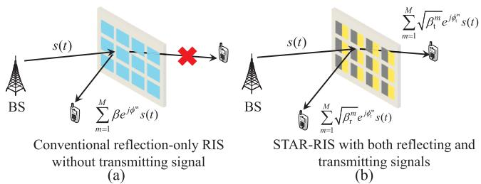  
Fig. 1. The main difference between the STAR-RIS and the conventional RIS in signal processing.

Actually, in the existing RIS-aided wireless communication schemes, the traditional RIS is solely able to execute the reflection modulation to the incident signals, which requires the transceiver terminal equipment to be located at the same side of the RIS. In other words, the conventional RIS can only reconfigure the half-space wireless propagation environment, which will significantly limit the coverage area of wireless networks and the flexibility in deploying the RIS. To breakthrough this limitation, an advanced RIS technology, named as simultaneously transmitting and reflecting reconfigurable intelligent surface (STAR-RIS), has drawn great attention from both academia and industry [29], [30], [31], [32]. STAR-RIS can split the incident signal into two parts, where one part is reflected to the same side of the incident signal and the other part is transited to the opposite side, allowing a 360◦ coverage, compared with the conventional RIS. As shown in Fig. 1, we present the main difference between the STAR-RIS and RIS in signal processing. Specifically, when the BS transmits signals to the traditional RIS, the signals can only be reflected towards the user positioned on the same side as the BS. The user on the opposite side will not receive any signals from the RIS. However, the STAR-RIS has the capability to not only reflect signals to users positioned on the same side as the BS but also transmit signals to users on the opposing side.

## B. Motivation and Contributions

Due to the inherent advantages, STAR-RIS possesses an enormous application potentials in various wireless communication systems, e.g., secure communications [33], [34], [35], integrated sensing and communications [36], [37] and MEC networks [38], [39], [40]. Specifically, a novel STAR-RIS-assisted MEC scheme is proposed in [40], where the STAR-RIS is attached vertically on the UAV. With the assistance of STAR-RIS, the ground users distributed in a 360◦ manner can efficiently offload their tasks to the BS. It is worth noting that the traditional RIS mounted horizontally on the UAV can offer a 360◦ coverage for ground users, as demonstrated in [26]. However, the aerial STAR-RISaided MEC system provides greater flexibility in modulating incident signals through the use of transmission and reflection beamforming. Note that, the MEC scheme supported by the STAR-RIS in [40] still exhibits certain constraints: (i) The vertically positioned STAR-RIS will experience air resistance when the UAV is swiftly moving in the air. And the resistance becomes more pronounced as the surface area of the RIS increases, which will affect the flexibility of the UAV. (ii) The MEC scheme underutilizes the complete spatial modulation potential inherent in the STAR-RIS and it is difficult for this scheme to use the computing resources on the UAV.

Although the existing RIS-assisted UAV-enabled MEC schemes with the two-way task offloading can fully leverage the computing resources situated at the BS and UAV, they have the following deficiencies: (i) The UAV serves as multiple roles where it acts as an MEC platform for processing partial offloaded tasks, and a relay to send the remaining tasks to the BS, which imposes a challenge on UAV hardware design. (ii) These two-step MEC schemes are not energy and time efficient since the UAV needs to receive and decode all the offloaded tasks, and then transmit the unprocessed tasks to the BS in the next time slot. The primary driving force behind this study stems from the imperative need to tackle the aforementioned challenges. To overcome limitations of the current MEC schemes, we propose the STAR-RIS enhanced UAV-assisted MEC scheme. In this scheme, the STAR-RIS is attached on the UAV parallel to the ground, which allows users to offload their computing tasks to MEC servers located at the BS and UAV simultaneously in a bi-directional manner, facilitated by the reflection and transmission features of the STAR-RIS. In this paper, our main contributions are summarized as follows:

• STAR-RIS enhanced UAV-enabled MEC Architecture with Bi-directional Offloading: A novel MEC scheme aided by the STAR-RIS horizontally mounted on the UAV is proposed for the first time. In contrast to the existing MEC schemes, the proposed scheme allows users to simultaneously offload their computing tasks to the MEC servers located at the BS and UAV in a bi-directional manner through the reflection and transmission capabilities of the STAR-RIS. Note that the UAV in the proposed MEC scheme is solely responsible for carrying the MEC server and the STAR-RIS to assist the computation and offloading of users’ tasks.

• Optimization Problem Formulation Maximizing Energy Efficiency under Practical Constraints: To assess the effectiveness of the proposed MEC scheme, We first formulate an optimization problem with the aim of maximizing the energy efficiency of the system and ensuring users’ quality of service (QoS) constraints by jointly designing the resource allocation, users scheduling, passive beamforming and UAV trajectory. Actually, managing this optimization problem can be quite difficult because of the presence of a fractional objective function and the significant couplings among optimization variables.

• Iterative Algorithm with Guaranteed Convergence and Substantial Performance Gain: To effectively address this non-convex optimization problem, the alternative strategy is leveraged to divide the optimization problem into three subproblems. Then, an iterative algorithm based on the Dinkelbach’s algorithm [41, Chapter 3.2.1] and the successive convex approximation (SCA) technique is proposed to effectively solve these three subproblems. The assured convergence and efficacy of the algorithm under consideration can be validated through an analysis of its convergence curve and a comparative assessment against the semidefinite relaxation (SDR) technique. Moreover, the potential of the STAR-RIS enhanced UAVenabled MEC scheme are demonstrated by comparing the simulation results with four other baseline schemes.

The remainder of this paper is organized as follows. In Section II, the system model of the STAR-RIS enhanced UAV-enabled MEC network is presented, along with the channel models, task offloading and computation models, as well as the energy consumption model of the system. The formulated optimization problem and the designed iterative algorithm are shown in Section III, including the convergence and complexity analysis of the proposed algorithm. The numerical simulation is conducted in Section IV to verify the effectiveness of the designed algorithm and the proposed MEC scheme. Finally, the conclusion is made in Section V.

Notation: Operator ◦ denotes the Hadamard product. $( \cdot ) ^ { T } .$ $( \cdot ) ^ { H }$ and (·)∗ represent transpose, conjugate transpose and conjugate, respectively. Diag(a) denotes a diagonal matrix with diagonal elements in vector a while diag(A) denotes a vector whose elements are composed of the diagonal elements of matrix A. | · |, ∥ · ∥ indicate the complex modulus and the spectral norm, respectively. $\mathbb { C } ^ { M \times 1 }$ stands for the set of M × 1 complex vectors. Operator norm(a) will normalize the amplitude of all entities in vector a as 1. Operator arg(a) denotes the operation of extracting the phase angle of the complex number.

## II. SYSTEM MODEL

Fig. 2 illustrates the architecture of the UAV-enabled MEC network with the assistance of the STAR-RIS. The network comprises a ground base station (BS), K users each equipped with a single antenna, a UAV equipped with a signal antenna and installed with a STAR-RIS featuring M elements, along with two MEC servers situated respectively at the BS and the UAV. This study adopts the energy splitting protocol for the STAR-RIS, wherein all elements incorporated within the STAR-RIS possess the capability to simultaneously reflect (R) and transmit (T) incident signals [29].1 Specifically, when signals from users approach the STAR-RIS, a portion of the signals are reflected to the BS by STAR-RIS, while the remaining portion of the signals are transmitted to the UAV via the STAR-RIS. This feature enables users to offload their computing tasks in a bidirectional manner concurrently to the MEC servers located at the BS and the UAV, respectively.

In this paper, we divide the mission period T into N equal time slots, i.e., $\delta _ { \mathrm { t } } = T / N _ { \mathrm { \Omega } }$ , which is sufficiently small.

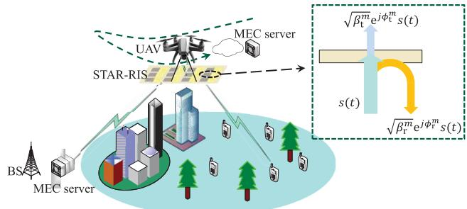  
Fig. 2. The UAV-enabled MEC network with bi-directional offloading strategy supported by the STAR-RIS.

Considering that the UAV is equipped with a transceiver that has a single antenna, the time division multiple access (TDMA) protocol is implemented to handle users’ offloaded tasks, requiring that only one user will be chosen to offload the computing tasks to the BS and the UAV within a time slot. Here, we use the variable $\zeta _ { k } [ n ] \ \in \ \{ 0 , 1 \}$ for $k \in$ ${ \cal K } \triangleq \{ 1 , \cdots , { \cal K } \} , n \in { \cal N } \triangleq \{ 1 , \cdots , { \cal N } \}$ to represent the user association decision for task offloading in a time slot. In particular, if $\zeta _ { k } [ n ] = 1$ , it means that the k-th user is chosen to offload its task to the BS and UAV in the n-th time slot with the assistance of the STAR-RIS. To ensure that only one user is selected to offload its tasks in each time slot, variable $\zeta _ { k } [ n ]$ needs to satisfy the following constraint:

$$
\sum _ { k = 1 } ^ { K } \zeta _ { k } [ n ] = 1 , \forall n \in \mathcal { N } ; \ 0 \leq \zeta _ { k } [ n ] \leq 1 , \forall n \in \mathcal { N } , k \in \mathcal { K } .\tag{1}
$$

In order to clearly describe the considered scenario, we assume that all nodes are situated in a 3D Cartesian coordinate system. The positions of the BS and the k-th user are respectively denoted as $\mathbf { q } _ { \mathrm { B S } } = [ x _ { \mathrm { B S } } , y _ { \mathrm { B S } } , z _ { \mathrm { B S } } ] ^ { T }$ and $\mathbf q _ { k } ~ = ~ [ x _ { k } , y _ { k } , 0 ] ^ { T }$ , where $x _ { \mathrm { B S } }$ and $x _ { k }$ respectively denote the abscissa value of the BS and the k-th user, yBS and $y _ { k }$ respectively represent the vertical coordinates of the BS and the k-th user, z is the height of the BS. It is assumed that the UAV flies at a fixed altitude H and its position remains constant within a given time slot considering the small value of $\delta _ { \mathrm { t } }$ . Consequently, the location of the UAV in the n-th time slot can be represented as $\mathbf { q } _ { \mathrm { u a } } [ n ] = [ x _ { \mathrm { u a } } [ n ] , y _ { \mathrm { u a } } [ n ] , H ] ^ { T } , n \in \mathcal { N }$ which should adhere to the subsequent flight constraints:

$$
\mathbf { v } _ { \mathrm { u a } } [ n ] = \frac { \mathbf { q } _ { \mathrm { u a } } [ n + 1 ] - \mathbf { q } _ { \mathrm { u a } } [ n ] } { \delta _ { \mathrm { t } } } , \| \mathbf { v } _ { \mathrm { u a } } [ n ] \| \leq v _ { \operatorname* { m a x } } ,\tag{2}
$$

$$
\mathbf { a } _ { \mathrm { u a } } [ n ] = \frac { \mathbf { v } _ { \mathrm { u a } } [ n + 1 ] - \mathbf { v } _ { \mathrm { u a } } [ n ] } { \delta _ { \mathrm { t } } } , \| \mathbf { a } _ { \mathrm { u a } } [ n ] \| \leq a _ { \mathrm { m a x } } ,\tag{3}
$$

$$
{ \bf q } _ { \mathrm { u a } } [ 0 ] = { \bf q } _ { \mathrm { I } } , \ { \bf q } _ { \mathrm { u a } } [ N + 1 ] = { \bf q } _ { \mathrm { F } } ,\tag{4}
$$

where $\| \mathbf { v } _ { \mathrm { u a } } [ n ] \|$ and $\| \mathbf { a } _ { \mathrm { u a } } [ n ] \|$ respectively represent the flight speed and the acceleration of the UAV in the n-th time slot, with the maximum values of $v _ { \mathrm { m a x } }$ and $a _ { \mathrm { m a x } } .$ . In terms of ${ \bf q } _ { \mathrm { I } }$ and $\mathbf { q } _ { \mathrm { F } }$ , they can serve as the ground station where the UAV can access a reliable power supply and receive necessary maintenance.

## A. Channel Model

Due to the fact that the UAV flights at a high altitude, we assume that the line-of-sight (LoS) channels between the ground users/BS and aerial UAV/STAR-RIS can always be guaranteed. It is assumed that the STAR-RIS adopts the uniform planar array (UPA) with $M _ { x }$ elements along x-axis direction and $M _ { y }$ elements along y-axis direction, i.e., $M \ = \ M _ { x } M _ { y }$ . Hence, the channel between the k-th user $( \varsigma = \mathrm { r } k ) / \mathrm { B S } \ : \ : ( \varsigma = \mathrm { r b } )$ and the STAR-RIS in the n-th time slot for $k \in \mathcal { K } , \ n \in \mathcal { N }$ can be expressed as [42]

$$
\mathbf { h } _ { \mathsf { c } } [ n ] = { \sqrt { \frac { \rho } { d _ { \varsigma } ^ { \alpha _ { \varsigma } } [ n ] } } } { \widehat { \mathbf { h } } } _ { \mathsf { c } } [ n ] \in \mathbb { C } ^ { M \times 1 } , \ \varsigma \in \{ { \mathrm { r } } k , { \mathrm { r b } } \} ,\tag{5}
$$

where

$$
\begin{array} { r l } & { \widehat { \mathbf { h } } _ { \varsigma } [ n ] = } \\ & { \left[ 1 , \cdots , e ^ { - j \frac { 2 \pi d } { \lambda } ( m _ { \mathbf { x } } - 1 ) \xi _ { \varsigma } [ n ] } , \cdots , e ^ { - j \frac { 2 \pi d } { \lambda } ( M _ { \mathbf { x } } - 1 ) \xi _ { \varsigma } [ n ] } \right] ^ { T } \otimes } \\ & { \left[ 1 , \cdots , e ^ { - j \frac { 2 \pi d } { \lambda } ( m _ { \mathbf { y } } - 1 ) \chi _ { \varsigma } [ n ] } , \cdots , e ^ { - j \frac { 2 \pi d } { \lambda } ( M _ { \mathbf { y } } - 1 ) \chi _ { \varsigma } [ n ] } \right] ^ { T } , } \end{array}\tag{6}
$$

with $\textstyle \rho = { \bigl ( } { \frac { \lambda } { 4 \pi } } { \bigr ) } ^ { 2 }$ [43] represents the path loss at a reference distance of 1 meter (m) with λ being the wavelength of the carrier frequency, $\alpha _ { \varsigma }$ indicating the pass loss exponent, $d _ { \varsigma } [ n ]$ denoting the distance between k-th user/BS and the STAR-RIS. d denotes the adjacent element separation of the STAR-RIS. In addition, the $\xi _ { \mathsf { S } } [ n ]$ and $\chi _ { \varsigma } [ n ]$ corresponding to the k-th user and the BS are respectively calculated as

$$
\xi _ { \mathrm { r } k } [ n ] = \cos ( \phi _ { \mathrm { r } k } [ n ] ) \sin ( \theta _ { \mathrm { r } k } [ n ] ) = \frac { x _ { \mathrm { u a } } [ n ] - x _ { k } } { \| \mathbf { q } _ { \mathrm { u a } } [ n ] - \mathbf { q } _ { k } \| } ,\tag{7}
$$

$$
\xi _ { \mathrm { r b } } [ n ] = \cos ( \phi _ { \mathrm { r b } } [ n ] ) \sin ( \theta _ { \mathrm { r b } } [ n ] ) = \frac { x _ { \mathrm { B S } } - x _ { \mathrm { u a } } [ n ] } { \| \mathbf { q } _ { \mathrm { B S } } - \mathbf { q } _ { \mathrm { u a } } [ n ] \| } ,\tag{8}
$$

$$
\chi _ { \mathrm { r } k } [ n ] = \sin ( \phi _ { \mathrm { r } k } [ n ] ) \sin ( \theta _ { \mathrm { r } k } [ n ] ) = { \frac { y _ { \mathrm { u a } } [ n ] - y _ { k } } { \left\| \mathbf { q } _ { \mathrm { u a } } [ n ] - \mathbf { q } _ { k } \right\| } } ,\tag{9}
$$

$$
\chi _ { \mathrm { r b } } [ n ] = \sin ( \phi _ { \mathrm { r b } } [ n ] ) \sin ( \theta _ { \mathrm { r b } } [ n ] ) = { \frac { y _ { \mathrm { B S } } - y _ { \mathrm { u a } } [ n ] } { \lVert \mathbf { q } _ { \mathrm { B S } } - \mathbf { q } _ { \mathrm { u a } } [ n ] \rVert } } .\tag{10}
$$

It is important to note that the connection between the UAV and STAR-RIS should be described as the near-field channel, denoted as $\mathbf { h } _ { \mathrm { r u } } ,$ considering the fact that the distance between the UAV and STAR-RIS is extremely small. Thus, $\mathbf { h } _ { \mathrm { r u } }$ can be expressed as [44]

$$
\mathbf { h } _ { \mathrm { { r u } } } = \boldsymbol { \alpha } \circ \mathbf { a } _ { \mathrm { { r u } } } \in \mathbb { C } ^ { M \times 1 } ,\tag{11}
$$

where

$$
\begin{array} { r l } & { \quad \mathbf { \Psi } ^ { \mathrm { w I I C I C } } } \\ & { \quad \bullet \quad \alpha = \left[ \frac { \lambda } { 4 \pi r _ { 1 } } , \cdots , \frac { \lambda } { 4 \pi r _ { m } } , \cdots , \frac { \lambda } { 4 \pi r _ { M } } \right] ^ { T } , } \\ & { \quad \bullet \quad \mathbf { a } _ { \mathrm { r u } } = \left[ e ^ { - j \frac { 2 \pi r _ { 1 } } { \lambda } } , \cdots , e ^ { - j \frac { 2 \pi r _ { m } } { \lambda } } , \cdots , e ^ { - j \frac { 2 \pi r _ { M } } { \lambda } } \right] ^ { T } , } \end{array}
$$

with $r _ { m }$ denotes the distance between the antenna located on the UAV and the m-th element of the STAR-RIS, where $m \in \mathcal { M } \triangleq \{ 1 , \cdots , M \}$ . Notably, the channel $\mathbf { h } _ { \mathrm { r u } }$ remains invariant throughout, attributed to the fixed spatial relationship maintained between the UAV and the STAR-RIS.

## B. Task Offloading and Computation Model

The offloading rates achieved by the k-th user in the n-th time slot to the BS and UAV are respectively given by

$$
R _ { k } ^ { \mathrm { u a } } [ n ] = \zeta _ { k } [ n ] B \log _ { 2 } \left( 1 + \frac { p \left| \mathbf { h } _ { \mathrm { r u } } ^ { H } \mathbf { \Theta } _ { \mathrm { t } } ^ { H } [ n ] \mathbf { h } _ { \mathrm { r } k } [ n ] \right| ^ { 2 } } { \sigma _ { \mathrm { u a } } ^ { 2 } } \right) ,\tag{12}
$$

$$
R _ { k } ^ { \mathrm { B S } } [ n ] = \zeta _ { k } [ n ] B \log _ { 2 } \left( 1 + \frac { p \left| \mathbf { h } _ { \mathrm { r b } } ^ { H } [ n ] \boldsymbol { \Theta } _ { \mathrm { r } } ^ { H } [ n ] \mathbf { h } _ { \mathrm { r } k } [ n ] \right| ^ { 2 } } { \sigma _ { \mathrm { B S } } ^ { 2 } } \right)\tag{13}
$$

where p denotes the unified transmitted power of users, $B$ is the bandwidth of the system, $\sigma _ { \mathrm { u a } } ^ { 2 }$ and $\sigma _ { \mathrm { B S } } ^ { 2 }$ respectively denote the noise power at the BS and the UAV. In addition, $\Theta _ { \kappa } [ n ] =$ Diag $\left\{ \beta _ { \kappa } ^ { 1 } [ \mathsf { \tilde { n } } ] e ^ { j \phi _ { \kappa } ^ { 1 } [ n ] } , \cdot \cdot \cdot \right. , \beta _ { \kappa } ^ { m } [ n ] e ^ { j \phi _ { \kappa } ^ { m } [ n ] } , \cdot \cdot \cdot \left. , \beta _ { \kappa } ^ { M } [ n ] e ^ { j \phi _ { \kappa } ^ { M } [ \mathsf { \tilde { n } } ] } \right\}$ is the matrix of the STAR-RIS’s coefficients with $\kappa \in \{ \mathrm { r , t } \}$ indicating the reflected or transmitted coefficients of the STAR-RIS, where the amplitudes $\beta _ { \kappa } ^ { m } [ n ]$ and phases $\phi _ { \kappa } ^ { m } [ n ]$ of STAR-RIS should satisfy: $\beta _ { \mathrm { r } } ^ { m } [ n ] , \beta _ { \mathrm { t } } ^ { \bar { m } } [ n ] \in ( 0 , 1 ] , ( \beta _ { \mathrm { r } } ^ { m } \bar { [ } n ] ) ^ { 2 } +$ $( \beta _ { \mathrm { t } } ^ { m } [ n ] ) ^ { 2 } = 1 , \ : \phi _ { \mathrm { r } } ^ { m } [ n ] , \ : \phi _ { \mathrm { t } } ^ { m } [ n ] \in [ 0 , 2 \pi ]$ , ∀m ∈ M.

It is assumed that the ground users are with limited resources for local computing and thus users’ tasks have to be offloaded to the BS and UAV for computing.2 Let $l _ { k } ^ { \mathrm { B S } } [ n ]$ and $l _ { k } ^ { \mathrm { u a } } [ n ]$ denote the number of the offloaded bits that need to be computed at the BS and UAV for user k in the n-th time slot, respectively. Due to the fact that the BS and UAV can only deal with the tasks they have received, the following constraints should be satisfied

$$
\begin{array} { r } { \delta _ { \mathrm { t } } \zeta _ { k } [ n ] R _ { k } ^ { \mathrm { u a } } [ n ] \geq l _ { k } ^ { \mathrm { u a } } [ n ] , \forall k \in \mathcal { K } , n \in \mathcal { N } , } \end{array}\tag{14}
$$

$$
\delta _ { \mathrm { t } } \zeta _ { k } [ n ] R _ { k } ^ { \mathrm { B S } } [ n ] \geq l _ { k } ^ { \mathrm { B S } } [ n ] , \ \forall k \in \mathcal { K } , \ n \in \mathcal { N } .\tag{15}
$$

In order to ensure that every user’s minimum computational need is met, we implement the following QoS constraints

$$
\sum _ { n = 1 } ^ { N } { \bigl ( } l _ { k } ^ { \mathrm { B S } } [ n ] + l _ { k } ^ { \mathrm { u a } } [ n ] { \bigr ) } \geq L _ { k } , \forall k \in { \mathcal { K } } ,\tag{16}
$$

where $L _ { k }$ is the minimum computing task requirement of the k-th user.

Let $f _ { k } ^ { \mathrm { B S } } [ n ]$ and $f _ { k } ^ { \mathrm { u a } } [ n ]$ respectively denote the computation frequency allocated by the BS and UAV for the k-th user at the n-th time slot. In addition, considering the processing causality, it is assumed that the BS and the UAV solely receive the offloaded tasks without carrying out any computations within the first time slot, and the users cease the act of offloading their tasks at the last time slot, i.e., $f _ { k } ^ { \mathrm { B S } } [ 1 ] ~ =$ $f _ { k } ^ { \mathrm { u a } } [ 1 ] \ = \ l _ { k } ^ { \mathrm { B S } } [ N ] \ = \ l _ { k } ^ { \mathrm { u a } } [ N ] \ = \ 0$ for $k \in \mathcal K$ . In order to guarantee that all users’ offloaded task-input data can be completely computed within the give mission time $T ,$ , we have the following information-causality constraints:

$$
\sum _ { k = 1 } ^ { K } f _ { k } ^ { \mathrm { B S } } [ n ] \leq F _ { \mathrm { B S } } , \ \sum _ { k = 1 } ^ { K } f _ { k } ^ { \mathrm { u a } } [ n ] \leq F _ { \mathrm { u a } } , \ \forall n \in \mathcal { N } ,\tag{17}
$$

$$
\sum _ { i = 2 } ^ { n } \frac { f _ { k } ^ { \mathrm { u a } } [ i ] \delta _ { \mathrm { t } } } { \varrho _ { \mathrm { u a } } } \ge \sum _ { i = 1 } ^ { n - 1 } l _ { k } ^ { \mathrm { u a } } [ i ] , ~ \forall k \in \mathcal { K } , ~ n \in \mathcal { N } _ { 1 } ,\tag{18}
$$

$$
\sum _ { i = 2 } ^ { n } \frac { f _ { k } ^ { \mathrm { B S } } [ i ] \delta _ { \mathrm { t } } } { \varrho _ { \mathrm { B S } } } \ge \sum _ { i = 1 } ^ { n - 1 } l _ { k } ^ { \mathrm { B S } } [ i ] , ~ \forall k \in \mathcal { K } , ~ n \in \mathcal { N } _ { 1 } ,\tag{19}
$$

2The local processing at the users is disregarded due to the following reasons: (i) For certain fundamental devices such as smart sensors, edge cameras, surveillance systems, and health monitoring devices, carrying out local computing tasks may pose various challenges. (ii) In situations where power resources are severely limited and not promptly replenished, devices with limited computing capabilities may opt to suspend local processing in order to conserve power. This is done with the aim of maximizing the devices’ operational time and ensuring the continuous functioning of essential features.

where $F _ { \mathrm { B S } }$ and $F _ { \mathrm { u a } }$ are the maximum CPU frequency at the BS and the UAV, respectively. $\varrho _ { \mathrm { B S } }$ and $\varrho _ { \mathrm { u a } }$ represent the number of CPU cycles needed for processing 1-bit of task-input data at the BS and UAV, respectively, and ${ \mathcal { N } } _ { 1 } \ { \stackrel { \Delta } { = } }$ $\{ 2 , 3 , \cdots , N \}$ is a subset of ${ \mathcal { N } } .$ . Therefore, the total amount of the completed task-input data for all users within the whole period can be calculated as

$$
L _ { \mathrm { t o l } } = \sum _ { n = 1 } ^ { N } \sum _ { k = 1 } ^ { K } l _ { k } ^ { \mathrm { B S } } [ n ] + l _ { k } ^ { \mathrm { u a } } [ n ] ,\tag{20}
$$

which is an important indicator to measure the computing capability of the MEC system.

## C. Energy Consumption Model

The energy consumption in the system primarily occurs in three ways: task offloading by users, task computation by the BS and UAV, and the UAV’s flying process. Specifically, the energy consumed by users to offload tasks during the total mission period is given by

$$
E _ { \mathrm { u t } } = p \delta _ { \mathrm { t } } ( N - 1 ) ,\tag{21}
$$

considering the fact that only the first $N - 1$ time slots are utilized by users for task offloading.

According to [12], the energy consumption of the MEC servers situated at the BS and the UAV for computing the received tasks within the whole mission period $T$ can be respectively expressed as

$$
E _ { \mathrm { B S } } ^ { \mathrm { c o m } } = \sum _ { n = 1 } ^ { N } \sum _ { k = 1 } ^ { K } \iota _ { \mathrm { B S } } \delta _ { \mathrm { t } } ( f _ { k } ^ { \mathrm { B S } } [ n ] ) ^ { 3 } ,\tag{22}
$$

$$
E _ { \mathrm { u a } } ^ { \mathrm { c o m } } = \sum _ { n = 1 } ^ { N } \sum _ { k = 1 } ^ { K } \iota _ { \mathrm { u a } } \delta _ { \mathrm { t } } ( f _ { k } ^ { \mathrm { u a } } [ n ] ) ^ { 3 } ,\tag{23}
$$

where $\iota _ { \mathrm { B S } }$ and $\iota _ { \mathrm { u a } }$ are the effective capacitance coefficients of the MEC servers at the BS and the UAV, respectively.

In this paper, we select the rotary-wing UAV to enhance the STAR-RIS-assisted UAV-enabled MEC network. Consequently, the flying energy consumed by the UAV during the mission period can be expressed as [45]

$$
E _ { \mathrm { u a } } ^ { \mathrm { f l y } } = \sum _ { n = 1 } ^ { N } \delta _ { \mathrm { t } } \Bigg ( P _ { 0 } \bigg ( 1 + \frac { 3 v ^ { 2 } [ n ] } { U _ { \mathrm { t i p } } ^ { 2 } } \bigg ) + \frac { 1 } { 2 } \mu \psi q A v ^ { 3 } [ n ]
$$

$$
+ \widehat { P } _ { 0 } \sqrt { ( 1 + \frac { v ^ { 4 } [ n ] } { 4 v _ { 0 } ^ { 4 } } ) ^ { \frac { 1 } { 2 } } - \frac { v ^ { 2 } [ n ] } { 2 v _ { 0 } ^ { 2 } } } ) ,\tag{24}
$$

where $P _ { 0 }$ and $\widehat { P } _ { 0 }$ denote the blade profile power and induced power in the hovering status, respectively. $U _ { \mathrm { t i p } } , \mu , \psi , q ,$ A and $v _ { 0 }$ are parameters related to the UAV’s aerodynamics, and more details are presented in Table I of [45]. It is worth noting that $v [ n ] = \| \mathbf { v } _ { \mathrm { u a } } [ n ] \|$ represents the flight velocity of the UAV at the n-th time slot.

In this paper, the energy consumption of the BS in processing an computing the received tasks is not taken into account for optimization and analysis, due to the fact that the BS is usually adequately supplied with grid power. Hence, the system’s energy consumption is represented by the total energy used by the UAV and all users, given as

$$
\begin{array} { r } { E _ { \mathrm { t o l } } = E _ { \mathrm { u t } } + E _ { \mathrm { u a } } ^ { \mathrm { c o m } } + E _ { \mathrm { u a } } ^ { \mathrm { f i y } } , } \end{array}\tag{25}
$$

which is also an important performance indicator to measure the MEC system.

## III. PROBLEM FORMULATION AND ALGORITHM DESIGN

## A. Optimization Problem Formulation

In this section, the optimization problem will be formulated based on the analysis in Section II. In particular, we try to maximize the energy efficiency of the MEC system, defined as $\frac { L _ { \mathrm { t o l } } } { E _ { \mathrm { t o l } } }$ , which takes both the indicators of computing capability $L _ { \mathrm { t o l } }$ and the energy consumption $E _ { \mathrm { t o l } }$ into consideration, while ensuring the QoS constraints of users with minimum computational requirements, by jointly optimizing

• the resource allocation variables in $\mathbf { \dot { L } } \triangleq \{ l _ { k } ^ { \mathrm { u a } } [ n ] , l _ { k } ^ { \mathrm { B S } } [ n ]$ $f _ { k } ^ { \mathrm { u a } } [ n ] , f _ { k } ^ { \mathrm { B S } } [ n ] , \ k \in \mathcal { K } , \ n \in \mathcal { N } \}$

• the user scheduling variables for task offloading in $\zeta \triangleq$ $\{ \zeta _ { k } [ n ] , \ k \in \mathcal { K } , \ n \in \mathcal { N } \}$ ;

• the passive beamforming variables of STAR-RIS in $\Upsilon \triangleq$ $\{ \Theta _ { \mathrm { r } } [ n ] , \Theta _ { \mathrm { t } } [ n ] , n \in \mathcal { N } \} ;$

• the UAV trajectory variables in $\mathbf { Q } \triangleq \{ \mathbf { q } _ { \mathrm { u a } } [ n ] , \ n \in \mathcal { N } \}$ Hence, the corresponding optimization problem can be formulated as

$$
\operatorname* { m a x } _ { \mathbf { L } , \zeta , \Upsilon , \mathbf { Q } } \quad \frac { L _ { \mathrm { t o l } } } { E _ { \mathrm { t o l } } } ,
$$

$$
{ \mathrm { s . t . } } \ { \mathrm { ( 1 4 ) } } - { \mathrm { ( 1 9 ) } } ,\tag{26a}
$$

$$
\lVert \mathbf { v } _ { \mathrm { u a } } [ n ] \rVert \leq v _ { \operatorname* { m a x } } , \ \left\| \mathbf { a } _ { \mathrm { u a } } [ n ] \right\| \leq a _ { \operatorname* { m a x } } , \ \forall n \in \mathcal { N } ,\tag{26b}
$$

$$
{ \bf q } _ { \mathrm { u a } } [ 0 ] = { \bf q } _ { \mathrm { I } } , \ { \bf q } _ { \mathrm { u a } } [ N ] = { \bf q } _ { \mathrm { F } } ,\tag{26c}
$$

$$
\sum _ { k = 1 } ^ { K } \zeta _ { k } [ n ] = 1 , \forall n \in \mathcal { N } ; ~ \zeta _ { k } [ n ] \in \{ 0 , 1 \} , \forall n \in \mathcal { N } , k \in \mathcal { K } ,\tag{26d}
$$

$$
f _ { k } ^ { \mathrm { u a } } [ 1 ] = f _ { k } ^ { \mathrm { B S } } [ 1 ] = l _ { k } ^ { \mathrm { u a } } [ N ] = l _ { k } ^ { \mathrm { B S } } [ N ] = 0 , \forall k \in \mathcal { K } ,\tag{26e}
$$

$$
( \beta _ { \mathrm { r } } ^ { m } [ n ] ) ^ { 2 } + ( \beta _ { \mathrm { t } } ^ { m } [ n ] ) ^ { 2 } = 1 , \forall m \in \mathcal { M } , n \in \mathcal { N } ,\tag{26f}
$$

$$
\beta _ { \mathrm { r } } ^ { m } [ n ] , \beta _ { \mathrm { t } } ^ { m } [ n ] \in ( 0 , 1 ] , \forall m \in \mathcal { M } , n \in \mathcal { N } ,\tag{26g}
$$

$$
\phi _ { \mathrm { r } } ^ { m } [ n ] , \phi _ { \mathrm { t } } ^ { m } [ n ] \in [ 0 , 2 \pi ) , \forall m \in \mathcal { M } , n \in \mathcal { N } .\tag{26h}
$$

Actually, the problem (26) is a non-convex problem due to the non-convexity of the fractional objective function, and constraints (14), (15) and (26f), which is difficult to solve directly. To effectively handle the optimization problem with the fractional objective function, Dinkelbach’s algorithm, as one of the most popular fractional programming algorithms, will be leveraged. According to its core principle, we first transform the problem (26) as

$$
\begin{array} { r l } & { \operatorname* { m a x } \ L _ { \mathrm { t o l } } - \psi E _ { \mathrm { t o l } } , } \\ & { \mathrm { s . t . } \ \mathrm { ( 2 6 a ) } - \mathrm { ( 2 6 h ) } , } \end{array}\tag{27a}
$$

where $\psi$ denotes the introduced auxiliary variable, $\begin{array} { r l } { \mathbf { r } } & { { } = } \end{array}$ $\{ \mathbf { L } , \boldsymbol { \zeta } , \mathbf { r } , \mathbf { Q } \}$ . If $\begin{array} { r l r } { \psi ^ { \mathrm { o p t } } } & { { } = } & { \frac { L _ { \mathrm { t o l } } ( \mathbf { r } ^ { \mathrm { o p t } } ) } { E _ { \mathrm { t o l } } ( \mathbf { r } ^ { \mathrm { o p t } } ) } } \end{array}$ denotes the optimal objective value of the optimization problem (26),

$L _ { \mathrm { t o l } } ( \mathbf { \boldsymbol { \Gamma } } ) ~ - ~ \psi ^ { \mathrm { o p t } } E _ { \mathrm { t o l } } ( \mathbf { \boldsymbol { \Gamma } } ) ~ \le ~ 0$ always holds for any Γ and the equality occurs exclusively when the optimal solution $\mathbf { \Gamma } ^ { \mathrm { { r } ^ { o p t } } }$ of problem (26) is reached. Therefore, the optimization problems (27) and (26) will converge to the same optimal solution when $\psi = \psi ^ { \mathrm { o p t } }$ . This equivalence allows us to resolve the transformed problem (27) to attain the optimal solution for the original problem (26). However, it is challenging to obtain $\psi ^ { \mathrm { o p t } }$ in advance. To address this challenge, the Dinkelbach’s algorithm opts to iteratively update the ψ based on the solution of the transformed problem (27) to gradually achieve the optimal solution of the optimization problem (26). Hence, the Dinkelbach’s algorithm demonstrates considerable potential in efficiently tackling optimization problems with fractional objective functions. More details about the Dinkelbach’s algorithm are presented in [41, Chapter 3.2.1].

On the basis of the analysis above, the original problem (26) can be transformed as the following problem in the (l + 1)-th iteration of the Dinkelbach’s algorithm, which is given by

$$
\begin{array} { r l } & { \underset { \Gamma } { \operatorname* { m a x } } ~ L _ { \mathrm { t o l } } - \psi ^ { ( l ) } E _ { \mathrm { t o l } } , } \\ & { \mathrm { s . t . } ~ ( 2 6 \mathrm { a } ) - ( 2 6 \mathrm { h } ) , } \end{array}\tag{28a}
$$

where $\begin{array} { r } { \psi ^ { ( l ) } = \frac { L _ { \mathrm { t o l } } ^ { ( l ) } } { E _ { \mathrm { t o l } } ^ { ( l ) } } } \end{array}$ . Note that the optimization problem (28) is still a non-convex optimization problem due to the significant coupling among variables in constraints (14) and (15), as well as the equality constraint (26f). To overcome this challenge, the alternative strategy is employed to divide the optimization problem (28) into three subproblems. The algorithm is designed by alternatively optimizing three variable subsets, which are respectively denoted as $\pmb { \Xi } _ { 1 } = \{ \mathbf { L } , \pmb { \zeta } \} , \pmb { \Xi } _ { 2 } = \{ \mathbf { L } , \pmb { \Upsilon } \}$ and $\Xi _ { 3 } = \{ { \bf L } , { \bf Q } \}$ . More details of the algorithm design is given in the next subsection.

## B. Algorithm Design

1) Designing Ξ1 With the Given Q and Υ: First, we jointly optimize the resource allocation variable L and user scheduling variable $\zeta$ with the given passive beamforming and UAV trajectory. In this case, the original problem (26) can be simplified as

$$
\operatorname* { m a x } _ { \Xi _ { 1 } } ~ L _ { \mathrm { t o l } } ( \Xi _ { 1 } ) - \psi ^ { ( l ) } E _ { \mathrm { t o l } } ( \Xi _ { 1 } ) ,
$$

$$
{ \mathrm { s . t . } } ( 2 6 a ) , ( 2 6 d ) , ( 2 6 e ) .\tag{29a}
$$

Note that the optimization problem (29) is a non-convex problem because of the binary variable ζ. To address this optimization problem, the non-convex binary constraint (26d) is equivalently transformed as the following constraints:

$$
\sum _ { k = 1 } ^ { K } \zeta _ { k } [ n ] = 1 , \forall n \in \mathcal { N } ; \ 0 \leq \zeta _ { k } [ n ] \leq 1 , \forall n \in \mathcal { N } , k \in \mathcal { K } ,\tag{30}
$$

$$
\eta _ { k } [ n ] = \zeta _ { k } [ n ] - \zeta _ { k } ^ { 2 } [ n ] = 0 , \forall n \in \mathcal { N } , k \in \mathcal { K } .\tag{31}
$$

Note that for any $\zeta _ { k } [ n ] \in [ 0 , 1 ] , \eta _ { k } [ n ] \geq 0$ always holds and the equality in (30) is satisfied if and only if $\zeta _ { k } [ n ] = 0$ or $\zeta _ { k } [ n ] ~ = ~ 1$ . Considering the non-negative characteristic of $\{ \eta _ { k } [ n ] \} _ { k \in \mathcal { K } , n \in \mathcal { N } }$ , we try to add the sum of them into the objective function as a penalty term that is subtracted from the objective function. To guarantee the fulfilment of the binary constraint (26d), an additional inner loop iteration is incorporated into the $( l + 1 )$ -th iteration of the Dinkelbach’s algorithm to iteratively enforce the penalty term approaching to 0. Note that the inclusion of the penalty term in the objective function results in a non-concave objective function due to the convex nature of $- \eta _ { k } [ n ]$ with respect to $\begin{array} { r l } { \mathrm { ( w . r . t . ) } \ \zeta _ { k } [ n ] } \end{array}$ To handle this problem, we utilize the liner upper bound, i.e., the first-order Taylor expansion of $\eta _ { k } [ n ]$ , to replace itself. The liner upper bound of $\eta _ { k } [ n ]$ in the $( t + 1 )$ -th inner loop iteration can be expressed as

$$
\begin{array} { r l } & { \eta _ { k } [ n ] \leq \widehat { \eta } _ { k } [ n ] \big ( \zeta _ { k } [ n ] , \zeta _ { k } ^ { ( t ) } [ n ] \big ) = \zeta _ { k } [ n ] - \big ( ( \zeta _ { k } ^ { ( t ) } [ n ] ) ^ { 2 } } \\ & { \qquad + 2 \zeta _ { k } ^ { ( t ) } [ n ] ( \zeta _ { k } [ n ] - \zeta _ { k } ^ { ( t ) } [ n ] ) \big ) . } \end{array}\tag{32}
$$

Thus, in the $( t + 1 )$ -th inner loop iteration of the $( l + 1 ) \cdot$ th iteration of the Dinkelbach’s algorithm, the optimization problem (29) can be re-expressed

$$
\begin{array} { r l } & { \underset { \Xi _ { 1 } } { \operatorname* { m a x } } L _ { \mathrm { t o l } } ( \Xi _ { 1 } ) - \psi ^ { ( l ) } E _ { \mathrm { t o l } } ( \Xi _ { 1 } ) } \\ & { ~ - \hat { \rho } \displaystyle \sum _ { n = 1 } ^ { N } \sum _ { k = 1 } ^ { K } \widehat { \eta } _ { k } [ n ] \left( \zeta _ { k } [ n ] , \zeta _ { k } ^ { ( t ) } [ n ] \right) , } \\ & { \mathrm { s . t . } ( 2 6 \mathrm { a } ) , ( 2 6 \mathrm { e } ) , ( 3 0 ) , } \end{array}\tag{33a}
$$

where $\hat { \rho } > 0$ denotes the introduced penalty coefficient. The problem (33) is a convex optimization problem and can be directly solved by the existing tool such as CVX.

To solve problem (29), we propose an iterative algorithm which is summarized as Algorithm 1. The primary objective aims to ensure that the binary constraint is met by progressively increasing the penalty coefficient with $\hat { \rho } = \omega \hat { \rho } ,$ where $\omega > 1$ is the scaling factor.

Algorithm 1: The Proposed Iterative Algorithm for Solving   
the Sub-problem (29)   
1: Initialize the feasible point $\big ( \mathbf { L } ^ { ( l , 0 ) } , \boldsymbol { \zeta } ^ { ( l , 0 ) } \big )$ ; Define the   
tolerance accuracy thresholds as ε; Set the iteration index   
$t = 0 ;$ Initialize $\bar { \rho } ^ { ( 0 ) }$   
2: While $\widehat { v } > \widehat { \varepsilon }$ or $t = 0$ do   
b b3: Solve the optimization problem (33) with the given   
$\zeta ^ { ( l , t ) }$ and update $\big ( \mathbf { L } ^ { ( l , t + 1 ) } , \boldsymbol { \zeta } ^ { ( l , t + 1 ) } \big )$ with the obtained   
solutions.   
4: Calculate $\widehat { v } = \operatorname* { m a x } _ { k \in \mathcal { K } , n \in \mathcal { N } } \eta _ { k } [ n ]$ based on the acquired   
solutions; Update the penalty coefficients $\hat { \rho } = \omega \hat { \rho } ;$   
Let $t = t + 1 .$   
5: end while   
6: Update $\big ( \mathbf { L } ^ { ( l + 1 , 0 ) } , \boldsymbol { \zeta } ^ { ( l + 1 , 0 ) } \big )$ with $\big ( \mathbf { L } ^ { ( l , t ) } , \boldsymbol { \zeta } ^ { ( l , t ) } \big )$

2) Designing $\Xi _ { 2 }$ With Given $\zeta$ and Q: After achieving the user scheduling $\zeta ,$ we focus on designing the passive beamforming variables with the given UAV’s trajectory. In particular, the corresponding optimization problem for passive beamforming can be expressed as

$$
\begin{array} { r l } & { \underset { \Xi _ { 2 } } { \operatorname* { m a x } } L _ { \mathrm { t o l } } ( \Xi _ { 2 } ) - \psi ^ { ( l ) } E _ { \mathrm { t o l } } ( \Xi _ { 2 } ) , } \\ & { \mathrm { s . t . } ( 2 6 \mathrm { a } ) , ( 2 6 \mathrm { e } ) - ( 2 6 \mathrm { h } ) . } \end{array}\tag{34a}
$$

Note that, problem (34) is a non-convex optimization problem because of the non-convexity of constraints (14), (15) and (26f). However, we can derive the close-form expression of the optimal reflected phases according to the Theorem 1.

Theorem 1: The obtained optimal reflection phases at the n-th time slot can be given by

$$
\phi _ { \mathrm { r } } ^ { \mathrm { o p t } } [ n ] = \qquad \mathrm { a r g } ( \mathrm { n o r m } ( \mathbf { h } _ { \mathrm { r b } } ^ { * } [ n ] \circ \mathbf { h } _ { \mathrm { r } k } [ n ] ) ) ,\tag{35}
$$

where the selection of the index k is determined by the condition $o f \zeta _ { k } [ n ] = 1$

Proof: The proof of Theorem 1 is given in Appendix A.

Next, we will focus on designing the reflection amplitudes and transmitted coefficient of STAR-RIS’s passive beamforming, i.e., $\{ \beta _ { \mathrm { r } } ^ { m } [ n ] \} _ { m \in \mathcal { M } , n \in \mathcal { N } }$ and $\{ \Theta _ { \mathrm { t } } [ n ] \} _ { n \in \mathcal { N } } .$ For the non-convex constraints (14) and (15), we first rewrite $\vartheta _ { \mathrm { r } } [ n ] ~ = ~ \Phi _ { \mathrm { r } } [ n ] \beta _ { \mathrm { r } } [ n ]$ , where $\vartheta _ { \mathrm { r } } [ n ] = \mathrm { d i a g } ( \Theta _ { \mathrm { r } } [ n ] )$ $\beta _ { \mathrm { r } } [ n ] ~ = ~ [ \bar { \beta } _ { \mathrm { r } } ^ { 1 } [ n ] , \cdots , ~ \beta _ { \mathrm { r } } ^ { m } [ \bar { n } ] , \cdots , \beta _ { \mathrm { r } } ^ { M } [ \bar { n } ] ] ^ { T } ,$ , and $\Phi _ { \mathrm { r } } [ n ] \ =$ $\mathrm { D i a g } \bar { ( } e ^ { j \phi _ { \mathrm { r } } ^ { \mathrm { o p t } } [ \bar { n } ] } \bar { ) }$ . Therefore, $\bar { R } _ { k } ^ { \mathrm { B S } } [ n ]$ and $R _ { k } ^ { \mathrm { u a } } [ n ]$ can be further re-expressed as

$$
R _ { k } ^ { \mathrm { B S } } [ n ] = \zeta _ { k } [ n ] B \log _ { 2 } \Big ( 1 + \beta _ { \mathrm { r } } ^ { T } [ n ] \mathbf { F } _ { k } [ n ] \beta _ { \mathrm { r } } [ n ] \Big ) ,\tag{36}
$$

$$
\begin{array} { r } { R _ { k } ^ { \mathrm { u a } } [ n ] = \zeta _ { k } [ n ] B \log _ { 2 } \Big ( 1 + \vartheta _ { \mathrm { t } } ^ { H } [ n ] \mathbf { E } _ { k } [ n ] \vartheta _ { \mathrm { t } } [ n ] \Big ) , } \end{array}
$$

where

$$
\begin{array} { r l } & { \bullet \vartheta _ { \mathrm { t } } [ n ] = \mathrm { d i a g } ( \} \Theta _ { \mathrm { t } } [ n ] ) = \{ \beta _ { \mathrm { t } } ^ { 1 } [ n ] e ^ { j \phi _ { \mathrm { t } } ^ { 1 } [ n ] } , \cdots , } \\ & { \beta _ { \mathrm { t } } ^ { m } [ n ] e ^ { j \phi _ { \mathrm { t } } ^ { m } [ n ] } , \cdots , \beta _ { \mathrm { t } } ^ { M } [ n ] e ^ { j \phi _ { \mathrm { t } } ^ { M } [ n ] } \} , } \\ & { \bullet \mathbf { F } _ { k } [ n ] = \frac { \Phi _ { \mathrm { r } } ^ { H } [ n ] } { \sigma _ { \mathrm { B S } } ^ { 2 } } ( \mathbf { h } _ { \mathrm { B R } } ^ { * } [ n ] \circ \mathbf { h } _ { \mathrm { r } k } [ n ] ) ( \mathbf { h } _ { \mathrm { B R } } ^ { * } [ n ] \circ \mathbf { h } _ { \mathrm { r } k } [ n ] ) ^ { H } \Phi _ { \mathrm { r } } , } \\ & { \bullet \mathbf { E } _ { k } [ n ] = ( \mathbf { h } _ { \mathrm { r u } } ^ { * } \circ \mathbf { h } _ { \mathrm { r } k } [ n ] ) ( \mathbf { h } _ { \mathrm { r u } } ^ { * } \circ \mathbf { h } _ { \mathrm { r } _ { k } } [ n ] ) ^ { H } . } \end{array}\tag{37}
$$

Then, we introduce auxiliary variables $\gamma _ { k } ^ { \mathrm { B S } } [ n ]$ and $\gamma _ { k } ^ { \mathrm { u a } } [ n ]$ which satisfy $\gamma _ { k } ^ { \mathrm { B S } } [ n ] ~ \leq ~ \beta _ { \mathrm { r } } ^ { T } [ n ] \mathbf { F } _ { k } [ n ] \beta _ { \mathrm { r } } [ n ]$ and $\gamma _ { k } ^ { \mathrm { u a } } [ n ] ~ \leq$ $\vartheta _ { \mathrm { t } } ^ { H } [ n ] \mathbf { E } _ { k } [ n ] \dot { \vartheta } _ { \mathrm { t } } [ n ]$ . Thus, the problem designing the reflection amplitudes and the transmission coefficients in the $( l + 1 ) -$ th iteration of the Dinkelbach’s algorithm can be equivalently transformed as

$$
\operatorname* { m a x } _ { \mathbf { L } , \beta _ { \mathrm { r } } , \vartheta _ { \mathrm { t } } , \gamma } L _ { \mathrm { t o l } } ( \beta _ { \mathrm { r } } , \vartheta _ { \mathrm { t } } , \gamma ) - \psi ^ { ( l ) } E _ { \mathrm { t o l } } ( \beta _ { \mathrm { r } } , \vartheta _ { \mathrm { t } } , \gamma )
$$

$$
\delta _ { \mathrm { t } } [ n ] \zeta _ { k } [ n ] \log _ { 2 } ( 1 + \gamma _ { k } ^ { \mathrm { u a } } [ n ] ) \geq l _ { k } ^ { \mathrm { u a } } [ n ] , \ \forall k \in \mathcal { K } , n \in \mathcal { N } ,\tag{38a}
$$

(38b)

$$
\delta _ { \mathrm { t } } [ n ] \zeta _ { k } [ n ] \log _ { 2 } ( 1 + \gamma _ { k } ^ { \mathrm { B S } } [ n ] ) \geq l _ { k } ^ { \mathrm { B S } } [ n ] , \forall k \in \mathcal { K } , n \in \mathcal { N } ,\tag{38c}
$$

$$
\begin{array} { r } { \gamma _ { k } ^ { \mathrm { u a } } [ n ] \leq \vartheta _ { \mathrm { t } } ^ { H } [ n ] \mathbf { E } _ { k } [ n ] \vartheta _ { \mathrm { t } } , \forall k \in \mathcal { K } , n \in \mathcal { N } , } \end{array}\tag{38d}
$$

$$
\begin{array} { r } { \gamma _ { k } ^ { \mathrm { B S } } [ n ] \leq \beta _ { \mathrm { r } } ^ { T } [ n ] \mathbf { F } _ { k } [ n ] \beta _ { \mathrm { r } } [ n ] , \forall k \in \mathcal { K } , n \in \mathcal { N } , } \end{array}\tag{38e}
$$

$$
( \beta _ { \mathrm { r } } ^ { m } [ n ] ) ^ { 2 } + ( \beta _ { \mathrm { t } } ^ { m } [ n ] ) ^ { 2 } \leq 1 , \ \forall m \in \mathcal { M } , \ n \in \mathcal { N } .\tag{38f}
$$

where $\gamma \ \triangleq \ \{ \gamma _ { k } ^ { \mathrm { u a } } [ n ] , \gamma _ { k } ^ { \mathrm { B S } } [ n ] , k \ \in \ K , n \ \in \ N \}$ . Actually, problem (38) is still a non-convex optimization problem due to the non-convex constraints (38d) and (38e). In order to address this issue, we employ a linear lower bound, specifically the first-order Taylor expansion, to approximate the right-hand side of constraints (38d) and (38e) and replace them accordingly. Note that the equality sign in constraint (26f) has been substituted with an inequality sign to establish the convex constraint (38f), transforming (38) into a convex optimization problem.

Proposition 1: In fact, this replacement of the equal sign does not impact the fulfilment of the equality constraint, because the constraint (38f) is satisfied with strict equality in the optimal solution of problem (38).

Proof: The proof of Proposition 1 is given in Appendix B.

3) Designing $\Xi _ { 3 }$ With Given $\zeta$ and $\mathbf { \hat { r } } :$ Next, we will design the trajectory of the UAV with the obtained ζ and $\mathbf { \hat { r } } .$ Specifically, the corresponding optimization problem for UAV trajectory can be expressed as

$$
\begin{array} { r l } & { \underset { \Xi _ { 3 } } { \operatorname* { m a x } } L _ { \mathrm { t o l } } ( \Xi _ { 3 } ) - \psi ^ { ( l ) } E _ { \mathrm { t o l } } ( \Xi _ { 3 } ) , } \\ & { \mathrm { s . t . } ( 2 6 \mathrm { a } ) - ( 2 6 \mathrm { c } ) , ( 2 6 \mathrm { e } ) . } \end{array}\tag{39a}
$$

In fact, problem (39) is non-convex because of constraints (14) and (15). In order to handle this non-convex constraints, we first introduce the auxiliary variables $\lambda _ { k } [ n ]$ and $\tilde { \lambda } [ n ]$ with

$$
\lambda _ { k } [ n ] \geq d _ { \mathrm { r } k } ^ { \alpha _ { \mathrm { r } k } } [ n ] = \| \mathbf { q } _ { \mathrm { u a } } [ n ] - \mathbf { q } _ { k } \| ^ { \alpha _ { \mathrm { r } k } } ,\tag{40}
$$

$$
\widetilde \lambda [ n ] \geq d _ { \mathrm { r b } } ^ { \alpha _ { \mathrm { r b } } } [ n ] = \| \mathbf { q } _ { \mathrm { B S } } - \mathbf { q } _ { \mathrm { u a } } [ n ] \| ^ { \alpha _ { \mathrm { r b } } } .\tag{41}
$$

Hence, we have

$$
R _ { k } ^ { \mathrm { u a } } [ n ] \geq \tilde { R } _ { k } ^ { \mathrm { u a } } [ n ] = \log _ { 2 } \left( 1 + \frac { \rho p \left| { \bf h } _ { \mathrm { r u } } ^ { H } \Theta _ { \mathrm { t } } ^ { H } [ n ] \widehat { \bf h } _ { \mathrm { u } k } [ n ] \right| ^ { 2 } } { \lambda _ { k } [ n ] \sigma _ { \mathrm { u a } } ^ { 2 } } \right) ,\tag{42}
$$

$$
\begin{array} { r l } & { R _ { k } ^ { \mathrm { B S } } [ n ] \geq \tilde { R } _ { k } ^ { \mathrm { B S } } [ n ] } \\ & { = \log _ { 2 } \left( 1 + \frac { \rho ^ { 2 } p _ { k } [ n ] \left| \widehat { \mathbf { h } } _ { \mathrm { B R } } ^ { H } [ n ] \boldsymbol { \Theta } _ { \mathrm { r } } ^ { H } [ n ] \widehat { \mathbf { h } } _ { \mathrm { u } k } [ n ] \right| ^ { 2 } } { \lambda _ { k } [ n ] \widetilde { \lambda } [ n ] \sigma _ { \mathrm { u a } } ^ { 2 } } \right) . } \end{array}\tag{43}
$$

Actually, $\tilde { R } _ { k } ^ { \mathrm { u a } } [ n ]$ is a convex function w.r.t. $\lambda _ { k } [ n ]$ and $\tilde { R } _ { k } ^ { \mathrm { B S } } [ n ]$ is the jointly convex function w.r.t. $\lambda _ { k } [ n ]$ and $\tilde { \lambda } [ n ]$ and thus we can apply the first-order Taylor expansion of $\tilde { R } _ { k } ^ { \mathrm { u a } } [ n ]$ and $\tilde { R } _ { k } ^ { \mathrm { B S } } [ n ]$ at the given point $\dot { ( \lambda _ { k } ^ { ( l ) } [ n ] , \tilde { \lambda } ^ { ( l ) } [ n ] ) }$ in $( l + 1 ) { \tt - } { \tt t h }$ iteration of the Dinkelbach’s algorithm to convert constraints (14) and (15) as the following convex constraints

$$
\zeta _ { k } [ n ] \delta _ { \mathrm { t } } \widehat { R } _ { k } ^ { \mathrm { u a } } [ n ] \geq l _ { k } ^ { \mathrm { u a } } [ n ] , \forall k \in \mathcal { K } , n \in \mathcal { N } ,\tag{44}
$$

$$
\begin{array} { r } { \zeta _ { k } [ n ] \delta _ { \mathrm { t } } \widehat { R } _ { k } ^ { \mathrm { B S } } [ n ] \geq l _ { k } ^ { \mathrm { B S } } [ n ] , \forall k \in \mathcal { K } , n \in \mathcal { N } , } \end{array}\tag{45}
$$

where

$$
\begin{array} { r } { \widehat { \mathbf { \Omega } } \cdot \widehat { R } _ { k } ^ { \mathrm { u a } } [ n ] = \log _ { 2 } ^ { } \Big ( 1 + \frac { \rho p \left| { \mathbf { h } } _ { { \mathrm { r u } } } ^ { H } \mathbf { \Theta } \Theta _ { \mathrm { t } } ^ { H } [ n ] \widehat { \mathbf { h } } _ { { \mathrm { r } } k } [ n ] \right| ^ { 2 } } { \lambda _ { k } ^ { ( l ) } [ n ] \sigma _ { \mathrm { u a } } ^ { 2 } } \Big ) + } \end{array}
$$

$$
\left( \lambda _ { k } \lbrack n \rbrack - \lambda _ { k } ^ { ( s ) } \lbrack n \rbrack \right) f ( \lambda _ { k \ldots } ^ { ( l ) } \lbrack n \rbrack ) .
$$

$$
\bullet \widehat { R } _ { k } ^ { \mathrm { B S } } [ n ] = \left( \lambda _ { k } [ n ] - \lambda _ { k } ^ { ( l ) } [ n ] \right) \widetilde { f } _ { 1 } \left( \lambda _ { k } ^ { ( l ) } [ n ] , \widetilde { \lambda } ^ { ( l ) } [ n ] \right) +
$$

$$
\left( \tilde { \lambda } [ n ] - \tilde { \lambda } ^ { ( l ) } [ n ] \right) \tilde { f } _ { 2 } ( \lambda _ { k } ^ { ( l ) } [ n ] , \tilde { \lambda } ^ { ( l ) } [ n ] ) +
$$

$$
\begin{array} { r } { \log _ { 2 } \Big ( 1 + \frac { \rho ^ { 2 } p \left| \widehat { \mathbf { h } } _ { \mathrm { B R } } ^ { H } [ n ] \Theta _ { \mathrm { r } } ^ { H } [ n ] \widehat { \mathbf { h } } _ { \mathrm { r } k } [ n ] \right| ^ { 2 } } { \lambda _ { k } ^ { ( l ) } \left[ n \right] \widetilde { \lambda } ^ { ( l ) } \left[ n \right] \sigma _ { \mathrm { u a } } ^ { 2 } } \Big ) . } \end{array}
$$

$$
\begin{array} { r } { \bullet f ( \lambda _ { k } ^ { ( l ) } [ n ] ) = \frac { - \rho p \left| { \bf h } _ { \mathrm { r u } } ^ { H } \Theta _ { \mathrm { t } } ^ { H } [ n ] \widehat { \bf h } _ { \mathrm { r } k } [ n ] \right| ^ { 2 } } { \ln 2 \left( \rho p \left| { \bf h } _ { \mathrm { r u } } ^ { H } \Theta _ { \mathrm { t } } ^ { H } [ n ] \widehat { \bf h } _ { \mathrm { r } k } [ n ] \right| ^ { 2 } + \lambda _ { k } ^ { ( l ) } [ n ] \sigma _ { \mathrm { u a } } ^ { 2 } \right) \lambda _ { k } ^ { ( l ) } [ n ] } . } \end{array}
$$

$$
\begin{array} { r l } & { \bullet \tilde { f } _ { 1 } ( \lambda _ { k } ^ { ( l ) } [ n ] , \tilde { \lambda } ^ { ( l ) } [ n ] ) = } \\ & { \bullet \quad \widehat { f } _ { 1 } ( \lambda _ { k } ^ { ( l ) } [ n ] , \tilde { \lambda } ^ { ( l ) } [ n ] ) } \\ & { \overline { { \ln { 2 \lambda _ { k } ^ { ( l ) } [ n ] } ( \rho ^ { 2 } p \big | \widehat { \mathbf { h } } _ { \mathrm { B R } } ^ { H } [ n ] \boldsymbol { \Theta } _ { \mathrm { r } } ^ { H } [ n ] \widehat { \mathbf { h } } _ { \mathrm { r } k } [ n ] \big | ^ { 2 }  } } } \\ & { \qquad \ln { 2 \lambda _ { k } ^ { ( l ) } [ n ] } ( \rho ^ { 2 } p \big | \widehat { \mathbf { h } } _ { \mathrm { B R } } ^ { H } [ n ] \boldsymbol { \Theta } _ { \mathrm { r } } ^ { H } [ n ] \widehat { \mathbf { h } } _ { \mathrm { r } k } [ n ] \big | ^ { 2 } + \lambda _ { k } ^ { ( l ) } [ n ] \tilde { \lambda } ^ { ( l ) } [ n ] \sigma _ { \mathrm { u a } } ^ { 2 } ) } .  \end{array}
$$

$$
\begin{array} { r l } { \bullet } & { \tilde { f } _ { 2 } ( \lambda _ { k } ^ { ( l ) } [ n ] , \tilde { \lambda } ^ { ( l ) } [ n ] ) = } \\ & { \frac { - \rho ^ { 2 } p \left| \widehat { \mathbf { h } } _ { \mathrm { B R } } ^ { H } [ n ] \Theta _ { \mathrm { r } } ^ { H } [ n ] \widehat { \mathbf { h } } _ { \mathrm { r } k } [ n ] \right| ^ { 2 } } { \ln 2 \tilde { \lambda } _ { \mathrm { \iota } } ^ { ( l ) } [ n ] \left( \rho ^ { 2 } p \left| \widehat { \mathbf { h } } _ { \mathrm { B R } } ^ { H } [ n ] \Theta _ { \mathrm { r } } ^ { H } [ n ] \widehat { \mathbf { h } } _ { \mathrm { r } k } [ n ] \right| _ { - } ^ { 2 } + \lambda _ { k \mathrm { \iota } , \mathrm { \Pi } } ^ { ( l ) } [ n ] \tilde { \lambda } ^ { ( l ) } [ n ] \sigma _ { \mathrm { u a } } ^ { 2 } \right) } . } \end{array}
$$

Note that, $E _ { \mathrm { t o l } }$ is a non-convex function w.r.t. variable Q due to the non-convexity of $E _ { \mathrm { u a } } ^ { \mathrm { f i y } }$ . To tackle this problem, we further introduce a non-negative auxiliary variable $\widehat { \mu } [ n ]$ with $\begin{array} { r } { \widehat { \mu } ^ { 2 } [ n ] \geq ( 1 + \frac { v ^ { 4 } [ n ] } { 4 v _ { 0 } ^ { 4 } } ) ^ { \frac { 1 } { 2 } } - \frac { v ^ { 2 } [ n ] } { 2 v _ { 0 } ^ { 2 } } } \end{array}$ to obtain the upper bound of $E _ { \mathrm { u a } } ^ { \mathrm { f i y } }$ , which is expressed as

$$
\widehat { E } _ { \mathrm { u a } } ^ { \mathrm { f l y } } = \sum _ { n = 1 } ^ { N } \delta _ { \mathrm { t } } ( P _ { 0 } ( 1 + \frac { 3 v ^ { 2 } \lceil n \rceil } { U _ { \mathrm { t i p } } ^ { 2 } } ) + \frac { 1 } { 2 } \mu \psi q A v ^ { 3 } \lfloor n ] + \widehat { P } _ { 0 } \widehat { \mu } [ n ] ) .\tag{46}
$$

Actually, the introduced constraint $\begin{array} { r } { \widehat { \mu } ^ { 2 } [ n ] \geq \left( 1 + \frac { v ^ { 4 } [ n ] } { 4 v _ { 0 } ^ { 4 } } \right) ^ { \frac { 1 } { 2 } } - } \end{array}$ $\frac { v ^ { 2 } [ n ] } { 2 v _ { 0 } ^ { 2 } }$ is a non-convex constraint. To handle this non-convex constraint, we first equivalently transform it as $\begin{array} { r } { \widehat \mu ^ { 2 } [ n ] + \frac { v ^ { 2 } [ n ] } { v _ { 0 } ^ { 2 } } \ge } \end{array}$ $\frac { 1 } { { \widehat { \mu } } ^ { 2 } [ n ] }$ . Note that $\begin{array} { r } { \widehat { \mu } ^ { 2 } [ n ] + \frac { v ^ { 2 } [ n ] } { v _ { 0 } ^ { 2 } } } \end{array}$ is a jointly convex function w.r.t. $\widehat { \mu } [ n ]$ and $v [ n ]$ , so the first-order Taylor expansion can be utilized to transform this constraint, and thus we have

$$
\begin{array} { r l } & { g ( \widehat { \mu } , v [ n ] ) } \\ & { \ = ( \widehat { \mu } ^ { ( l ) } [ n ] ) ^ { 2 } + 2 \mu ^ { ( l ) } [ n ] \big ( \widehat { \mu } [ n ] - \widehat { \mu } ^ { ( l ) } [ n ] \big ) } \\ & { \quad + \displaystyle \frac { 2 } { v _ { 0 } ^ { 2 } \delta _ { \mathrm { t } } ^ { 2 } } \big ( \mathbf { q } _ { \mathrm { u a } } ^ { ( l ) } [ n + 1 ] - \mathbf { q } _ { \mathrm { u a } } ^ { ( l ) } [ n ] \big ) ^ { T } \big ( \mathbf { q } _ { \mathrm { u a } } [ n + 1 ] - \mathbf { q } _ { \mathrm { u a } } [ n ] \big ) } \\ & { \ \displaystyle - \ \frac { \big \| \mathbf { q } _ { \mathrm { u a } } ^ { ( l ) } [ n + 1 ] - \mathbf { q } _ { \mathrm { u a } } ^ { ( l ) } [ n ] \big \| ^ { 2 } } { v _ { 0 } ^ { 2 } \delta _ { \mathrm { t } } ^ { 2 } } \geq \frac { 1 } { \widehat { \mu } ^ { 2 } [ n ] } . } \end{array}\tag{47}
$$

As a result, the optimization problem (39) in the (l + 1)-th iteration of the Dinkelbach’s algorithm can be transformed as

$$
\operatorname* { m a x } _ { \Xi } ~ \mathbf { L } ( \Xi ) - \psi ^ { ( l ) } \widehat { E } _ { \mathrm { t o l } } ( \Xi ) ,
$$

$$
{ \mathrm { s . t . ~ } } ( 1 6 ) - ( 1 9 ) , ( 2 6 \mathrm { b } ) , ( 2 6 \mathrm { c } ) , ( 2 6 \mathrm { e } ) , ( 4 4 ) , ( 4 5 ) , ( 4 7 ) , ~ ( 4 8 \mathrm { a } )
$$

$$
\lambda _ { k } [ n ] \geq \left\| \mathbf { q } _ { \mathrm { u a } } [ n ] - \mathbf { q } _ { k } \right\| ^ { \alpha _ { \mathrm { r } k } } ,\tag{48b}
$$

$$
\tilde { \lambda } [ n ] \geq \| \mathbf { q } _ { \mathrm { B S } } - \mathbf { q } _ { \mathrm { u a } } [ n ] \| ^ { \alpha _ { \mathrm { r b } } } ,\tag{48c}
$$

where $\Xi = \{ \Xi _ { 3 } , \lambda _ { k } [ n ] , \tilde { \lambda } [ n ] , \mu [ n ] \} , \widehat { E } _ { \mathrm { t o l } } = \widehat { E } _ { \mathrm { u a } } ^ { \mathrm { f l y } } + E _ { \mathrm { u t } } + E _ { \mathrm { u a } } ^ { \mathrm { c o m } }$ Consequently, we can leverage the convex optimization solver, e.g., CVX, to address this problem.

## C. Proposed Optimization Algorithm Analysis

The presented iterative algorithm for solving the original optimization problem (26) is summarized as Algorithm 2, which is two-tier iterative algorithm designed to tackle the three subproblems explained in Section III. Specifically, the inner loop is responsible for solving the binary variable, i.e., user association variable, by progressively increase the penalty coefficient, ${ \widehat { \rho } } .$ v represents the objective function value obtained after the transformation through the Dinkelbach’s algorithm. Once v falls below a predefined threshold $\varepsilon ,$ the proposed algorithm will converge.

Then, the computational complexity of the proposed iterative algorithm is analysed. Specifically, the computational complexity mainly comes from solving the divided three subproblems, i.e., (29), (34) and (39). Regarding the first subproblem, we propose an iterative penalty algorithm that incorporates both Dinkelbach’s algorithm to effectively address it. It is presumed that the interior point method will be employed to compute the transformed standard convex optimization problem. Consequently, the computational complexity for resolving the first subproblem can be expressed as $\mathcal { O } _ { 1 } = \overset { \cdot } { \mathcal { O } } ( L _ { 1 } ( 5 N K ) ^ { 3 . 5 } )$ , where $L _ { 1 }$ denotes the total iterations number of the Algorithm 1. The computational complexity of addressing the subproblem (38) can be expressed as $\mathcal { O } _ { 2 } ~ =$ $\mathcal { O } ( ( 6 N \bar { K _ { \mathrm { ~ + ~ } 2 M } } ) ^ { 3 . \bar { 5 } } )$ , which is significantly lower than the computing complexity associated with using the semidefinite relaxation (SDR) method for addressing this subproblem, given by $\mathcal { O } ( ( 4 N K { + } 2 M ^ { 2 } ) ^ { 3 . 5 } )$ . For the subproblem 3, the SCA technique is adopted to transform the UAV trajectory problem into a convex optimization problem. The computational complexity can be determined as $\mathcal { O } _ { 3 } = \mathcal { O } ( ( 4 N K + 2 N ) ^ { 3 . 5 } )$ Therefore, the total computing complexity of the proposed algorithm can be expressed as $\mathcal { O } _ { \mathrm { t o l } } = \widehat { L } ( \mathcal { O } _ { 1 } + \mathcal { O } _ { 2 } + \mathcal { O } _ { 2 } )$ , where $\widehat { L }$ denotes the total iteration number of the proposed algorithm. Based on the overall computational complexity analysis, it is evident that the computing complexity is intricately connected to both the quantity of sub-time slots (N ) and the number of elements installed at STAR-RIS (M ).

Algorithm 2: The Proposed Iterative Algorithm to Handle   
the Optimization Problem (26)   
1: Initialize feasible point $( { \bf L } ^ { ( 0 ) } , \boldsymbol { \zeta } ^ { ( 0 ) } , { \bf \Phi } { \bf \vec { T } } ^ { ( 0 ) } , { \bf Q } ^ { ( 0 ) } )$ ; Define   
the tolerance accuracy threshold ε; Set the outer iteration   
index $l = 0 ;$ Calculate $\psi ^ { ( 0 ) }$ with the given initial feasible   
point.   
2: While $v > \varepsilon { \mathrm { ~ o r ~ } } = 0$ do   
3: Solve the sub-problem (29) by utilizing Algorithm 1   
with the given $\mathbf { \boldsymbol { r } } ^ { ( l ) }$ and $\mathbf { Q } ^ { ( l ) }$ , and update $\mathbf { L } ^ { ( l + 1 ) }$ and   
$\zeta ^ { ( l + 1 ) }$ with the obtained solution.   
4: Solve the sub-problem (38) with the given $\zeta ^ { ( l + 1 ) }$ and   
$\mathbf { Q } ^ { ( l ) }$ , and update $\mathbf { L } ^ { ( l + 1 ) }$ and $\Upsilon ^ { ( l + 1 ) }$ with the obtained   
solution.   
5: Solve the sub-problem (48) with the given $\zeta ^ { ( l + 1 ) }$ and   
$\Upsilon ^ { ( l + 1 ) }$ , and update $\mathbf { L } ^ { ( l + 1 ) }$ and $\mathbf { Q } ^ { ( l + 1 ) }$ with the obtai  
ned solution.   
6: Calculate $v = L _ { \mathrm { t o l } } ^ { ( l + 1 ) } - \psi ^ { ( l ) } E _ { \mathrm { t o l } } ^ { ( l + 1 ) }$ based on the obtain  
ed solutions; Update $\begin{array} { r } { \psi ^ { ( l + 1 ) } = \frac { L _ { \mathrm { t o l } } ^ { ( l + 1 ) } } { E _ { \mathrm { t o l } } ^ { ( l + 1 ) } } } \end{array}$ ; Let $l = l + 1$   
7: end while

Actually, the convergence of the proposed algorithm can be guaranteed, since the framework of the block coordinate descent (BCD) algorithm is utilized to address the optimization problem (26), which will ensure that each iteration results in a solution that is at least as good as the previous one and thus the objective function is monotonically non-decreasing versus the iteration. Additionally, we will also verify the convergence of the proposed algorithm through the simulation results presented in Section IV. To evaluate the quality of the solutions obtained from the proposed algorithm, the SDR method is selected as the algorithm for comparison in Section IV, which is commonly utilized for addressing optimization challenges in the field of communication. Since the approximation accuracy of solutions obtained through the SDR method in solving various types of optimization problems has been theoretically demonstrated [46]. In addition, the authors of [46] thoroughly summarize the theoretical approximation accuracy of solving various optimization problems in the field of communication using SDR methodology. Note that the approximation accuracy represents the ratio between the obtained solution by leveraging the SDR and the theoretically optimal solution. Thus, choosing the SDR method as a comparative benchmark algorithm can provide an effective evaluation of the theoretical gap between the achieved solution and the optimal solution.

TABLE I  
PARAMETERS SETTING
<table><tr><td rowspan=1 colspan=1>Parameters</td><td rowspan=1 colspan=1>Symbol and Value</td></tr><tr><td rowspan=1 colspan=1>Altitude of UAV</td><td rowspan=1 colspan=1> $H = 3 0 ~ \mathrm { m }$ </td></tr><tr><td rowspan=1 colspan=1>Bandwidth</td><td rowspan=1 colspan=1>B = 1 MHz</td></tr><tr><td rowspan=1 colspan=1>Carrier frequency</td><td rowspan=1 colspan=1> $\lambda _ { \mathrm { c } } = 2 . 4 ~ \mathrm { G H z }$ </td></tr><tr><td rowspan=1 colspan=1>Effective capacitance coefficientof MEC servers</td><td rowspan=1 colspan=1> $\iota _ { \mathrm { u a } } = \iota _ { \mathrm { B S } } = 1 0 ^ { - 2 7 }$ </td></tr><tr><td rowspan=1 colspan=1>Initial/final point of UAVtrajectory</td><td rowspan=1 colspan=1> $\begin{array} { r } { \mathbf q _ { \mathrm { I } } = [ - 4 0 , 0 , 3 0 ] _ { \ r { \infty } } ^ { T } \ r _ { \mathrm { m } , \ r } } \end{array}$  $\bar { \mathbf { q } } _ { \mathrm { F } } \doteq [ 4 0 , 0 , 3 0 ] ^ { T } \mathrm { ~ m ~ }$ </td></tr><tr><td rowspan=1 colspan=1>Maximum flight velocity andacceleration of UAV</td><td rowspan=1 colspan=1> $v _ { \mathrm { m a x } } = 3 0 ~ \mathrm { m / s , } ~ a _ { \mathrm { m a x } } = 2 0$ </td></tr><tr><td rowspan=1 colspan=1>Maximum CPU frequency</td><td rowspan=1 colspan=1> $F _ { \mathrm { B S } } = 2 0 ~ \mathrm { G H z }$ </td></tr><tr><td rowspan=1 colspan=1>Noise power</td><td rowspan=1 colspan=1> $\sigma _ { \mathrm { u a } } ^ { 2 } = \sigma _ { \mathrm { B S } } ^ { 2 } = .$ -100 dBm</td></tr><tr><td rowspan=1 colspan=1>Pass loss exponent</td><td rowspan=1 colspan=1> $\alpha _ { \mathrm { r } k } = 2 . 3 , \alpha _ { \mathrm { r b } } = 2 . 3$ </td></tr><tr><td rowspan=1 colspan=1>Scaling factor</td><td rowspan=1 colspan=1>ω = 10</td></tr><tr><td rowspan=1 colspan=1>The number of CPU cyclesneeded for processing 1-bit of data</td><td rowspan=1 colspan=1> $\varrho _ { \mathrm { u a } } = \varrho _ { \mathrm { B S } } = 1 0 ^ { 3 } ~ \mathrm { c y c l e s / b i t }$ </td></tr><tr><td rowspan=1 colspan=1>Time slot</td><td rowspan=1 colspan=1> $\delta _ { \mathrm { t } } = 0 . 2 ~ \mathrm { s }$ </td></tr><tr><td rowspan=1 colspan=1>Transmitting power at users</td><td rowspan=1 colspan=1> $p = 2 0 ~ \mathrm { d B m }$ </td></tr><tr><td rowspan=1 colspan=1>Tolerance accuracy thresholds</td><td rowspan=1 colspan=1> $\varepsilon = \varepsilon _ { 1 } = \varepsilon _ { 2 } = 1 0 ^ { - 3 }$ </td></tr></table>

## IV. SIMULATION RESULTS

To highlight the effectiveness of the proposed STAR-RIS-aided UAV-enabled MEC scheme, we present the numerical simulation results in this section and compare the their with three benchmark schemes, including: 1) RISaided scheme [33]: In this baseline scheme, two adjacent conventional RISs with $\textstyle { \frac { M } { 2 } }$ elements are adopted to replace the STAR-RIS, where one is the reflecting-only RIS and the other one is the transmission-only RIS; 2) Fixing trajectory scheme: This scheme focuses on optimizing L, ζ and Υ with direct UAV trajectory flying from the initial point to the final point at a consistent speed. 3) Heuristic scheme: UAV will traverse each user node based on the pre-defined trajectory at a consistent speed. Similarly, variables L, ζ and Υ will be optimized in this scheme. 4) SDR scheme: The SDR method is utilized to optimize the passive beamforming variable Υ in this scheme. In addition, the simulation parameters are listed in Table I.

In order to assess the convergence of the proposed algorithm, we examine the performance of energy efficiency w.r.t. the number of iteration, taking into account of various mission periods T and the STAR-RIS’s number of elements M. The outcomes of this investigation are illustrated in Fig. 3. Specifically, it is observed that the energy efficiency monotonically increasing with the iteration index and ultimately converges to a specific value. In terms of the four cases under consideration, it is noteworthy that the objective function consistently attains a stable value within a relatively short span of 5-6 iterations.

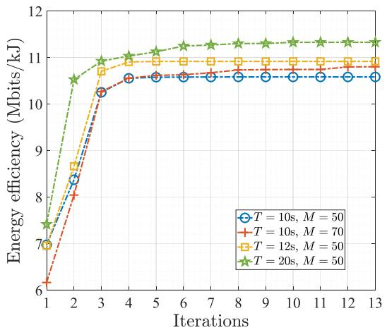  
Fig. 3. Energy efficiency versus iterations index with $L _ { k } = 2 0$ Mbits and $\begin{array} { r } { F _ { \mathrm { u a } } = 1 2 ~ \mathrm { G H z } . } \end{array}$ , with different mission period T and the number of elements at STAR-RIS M.

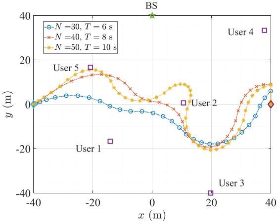  
Fig. 4. UAV trajectory with $M = 3 6 ,$ $L _ { k } \ = \ 2 0$ Mbits, $\forall k \in \mathcal K$ and $\begin{array} { r } { F _ { \mathrm { u a } } = 1 2 ~ \mathrm { G H z } , } \end{array}$ as well as the different mission period T and N .

In Fig. 4 and Fig. 5, we give the UAV trajectories considering different parameter settings, where M and $F _ { \mathrm { u a } }$ are fixed as 36 and 12 GHz, respectively. Specifically, UAV trajectories under different mission period T and time slot number N are shown in Fig. 4, where all the users with computation requirements $L _ { k } = 2 0 \mathrm { { M b i t s } }$ . We can find that the UAV consistently flies towards User 3, who is the furthest user away from the BS, in order to improve the channel quality between User 3 and the BS under different T . This is done to ensure that User $3 \mathrm { { } ^ { \circ } s }$ minimum task requirement is met. Additionally, it demonstrates that the UAV tends to approach the BS as T increases, which aims to offload larger tasks to the BS, ultimately enhancing the energy efficiency. In Fig. 5, the UAV trajectories is plotted with different $\{ L _ { k } \} _ { k \in \mathcal K }$ . It is observed that when all users share the same minimum task requirement, the UAV prioritizes traversing users located at longer distances from the BS, such as User 1, User 2, and User 3. However, if certain users, like User 3 and User 5, require a higher number of offloading task bits, the UAV will approach these users to improve their channel quality and fulfil their task requirements.

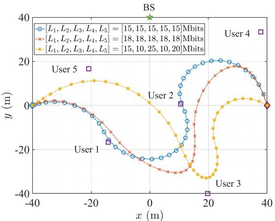  
Fig. 5. UAV trajectory with different $L _ { k }$ , with $T ~ = ~ 1 0$ s, $N \ = \ 5 0 .$ $F _ { \mathrm { u a } } ^ { \mathrm { ^ { - } } } = 1 2$ GHz and $M \stackrel { \cdot } { = } 3 6 .$

Next, we investigate the influence of the number of elements equipped at STAR-RIS, i.e., M, on the energy efficiency with $N \ : = \ : 5 0 , \ : F _ { \mathrm { u a } } = 1 2$ GHz and $L _ { k } ~ = ~ 2 0$ Mbits, $\forall k \in { \mathcal { K } } .$ as shown in Fig. 6. Specifically, it can be observed that the energy efficiency of all the schemes increases as M grows, as the additional elements can offer more flexibility to reconfigure the wireless environment. However, the rates of increase gradually decrease as M continues to grow. The proposed scheme offers a greater performance gain in improving the energy efficiency, especially when the number of elements is limited, compared to the conventional RISassisted scheme. Additionally, an interesting observation is obtained between the RIS-aided scheme and the heuristic scheme. Specifically, the heuristic scheme achieves higher energy efficiency than the RIS-aided scheme when the M is small. As M increases, the RIS-aided scheme becomes more energy efficient than the heuristic scheme. This indicates that the trajectory of the UAV, with the help of the RIS, has the potential to overcome performance limitations imposed by other system settings. The presented results in fixing trajectory scheme further verify the importance of the UAV’s trajectory in enhancing the system performance. Note that, the proposed scheme illustrates certain performance advantages through a comparison with the results obtained by the SDR scheme, showcasing the effectiveness of the proposed algorithm.

Fig. 7 explores the impact of the mission duration T on energy efficiency when M, $F _ { \mathrm { u a } }$ and $L _ { k } , \forall k \ \in \ K$ are respectively set to 50, 12 GHz and 20 Mbits. The results show that the proposed scheme provides the highest performance gain for MEC network, while the scheme without the trajectory optimization exhibits the lowest energy efficiency. Regarding the proposed scheme and the SDR scheme, the energy efficiency consistently increases as T grows from 8s to 16s. This can be attributed to the fact that the UAV having more time to optimize its trajectory, thereby improving the channel condition between users/BS and UAV as T increases. However, beyond 16s, the energy efficiency starts to decline. This is due to the channel quality between users/BS and UAV reaching a saturation point, which may not increase the completed task bits but increase the energy consumption of UAV as $T$ becomes larger. Besides, the conventional RIS-assisted scheme has the similar trend in energy efficiency as the proposed scheme. However, the energy efficiency reaches the limitation at $T \ = \ 1 2 \mathrm { s }$ in this scheme, which indicates that STAR-RIS demonstrates a significant potential in achieving a balance between system energy consumption and the volume of the offloaded data when compared to the conventional RIS. In contrast to the suggested scheme, both the heuristic scheme and the scheme with direct UAV trajectory suffer from the earlier performance limitation as $T$ increases. This highlights the significance of the UAV’s trajectory optimization in augmenting the energy efficiency of the comprehensive UAV-enabled MEC system. Furthermore, we can find that the outcomes attained by the suggested algorithm consistently surpass those of the SDR scheme, underscoring the potential and benefits of the proposed algorithm.

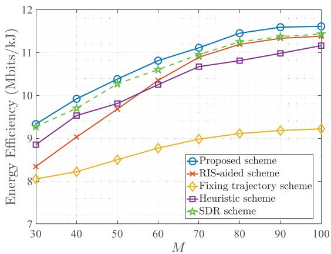  
Fig. 6. Energy efficiency versus the number of elements at STAR-RIS with N = 50, F = 12 GHz and $L _ { k } = 2 0$ Mbits, $\forall k \in { \mathcal { K } } .$

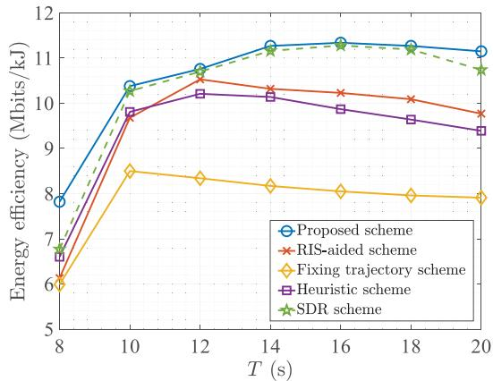  
Fig. 7. Energy efficiency versus the mission period $_ T$ with $M \ = \ 5 0 .$ $F _ { \mathrm { u a } } = 1 2 ~ \mathrm { G H z }$ and $L _ { k } = 2 0$ Mbits, $\forall k \in { \mathcal { K } } .$

Figure 8 illustrates the fluctuating energy efficiency trend corresponding to the CPU frequency of the MEC server deployed on the UAV with parameters $M \ = \ 5 0 , \ N \ =$ 50, and $L _ { k } \quad = \quad 1 0$ Mbits, $\forall k \in \ K .$ In particular, the escalation of $F _ { \mathrm { u a } }$ correlates with a progressive enhancement in energy efficiency across all scenarios, characterized by a diminishing rate of increase. There are two reasons for this: (i) By elevating the CPU frequency of the MEC server located at the UAV, users can delegate an expanded array of computational duties to UAV servers for execution. Although this heightened task allocation could potentially elevate energy consumption levels, the pace at which tasks are added outpaces the growth in energy usage, consequently bolstering the system’s overall energy efficiency. (ii) The limitation of achievable offloading rate for users is influenced by system parameters such as allocated task time, number of RIS elements, and users’ transmit power. Additionally, the computing energy consumption assigned to UAVs will increase in a cubic function manner as more tasks are delegated (see (23)), contributing to a gradual slowdown in energy efficiency improvement. It is obvious that the proposed scheme outperforms all the benchmarks. Furthermore, when compared to the four MEC schemes incorporating trajectory design, i.e., the proposed scheme, RIS-aided scheme, Heuristic scheme and SDR scheme, there is a gradually increase performance gap observed with the scheme lacking UAV trajectory optimization with the growth of $F _ { \mathrm { u a } } .$ . This indicates that the trajectory optimization plays an important role in balancing the task processing and energy consumption.

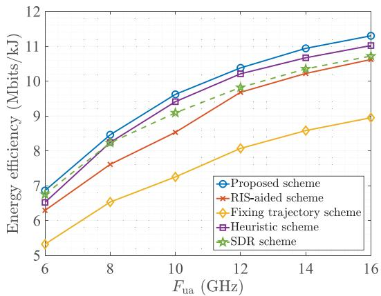  
Fig. 8. Energy efficiency versus the CPU frequency of the MEC server installed at the UAV, $F _ { \mathrm { u a } } ,$ with $M = 5 0 , N = 5 0$ and $L _ { k } = 1 0$ Mbits, $\forall k \in { \mathcal { K } }$

The impact of the CPU processing cycles needed by the UAV to compute a single bit of task input data, denoted as $\varrho _ { \mathrm { u a } } .$ , on energy efficiency is investigated with considerations for $M \ = \ 5 0 , \ N \ = \ 5 0$ , and $L _ { k } ~ = ~ 2 0$ Mbits, $\forall k \in \ K$ as shown in Fig. 9. Specifically, it is observed that the energy efficiency declines progressively as the parameter denoted by $\varrho _ { \mathrm { u a } }$ increases for all scenarios. This is due to the fact that the MEC server installed on the UAV must assign additional frequency resources to handle 1-bit data, leading to increased energy consumption for executing offloaded tasks from users. Furthermore, the MEC scheme lacking the optimization of the UAV trajectory demonstrates the least energy efficiency compared with the other four schemes, which highlights the significant potential of optimizing the

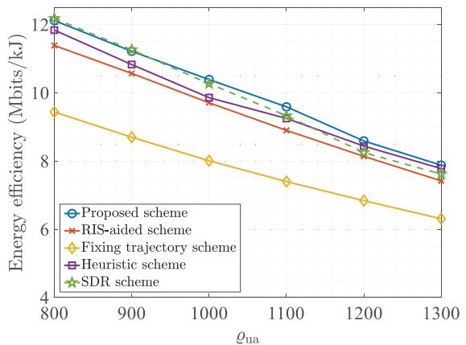  
Fig. 9. Energy efficiency versus CPU cycles required at the UAV for computing 1-bit of task-input data with $\overset { \cdot } { M } \overset { \cdot } { = } 5 0 , \overset { \cdot } { N } \overset { \cdot } { = } 5 0 , \overset { \cdot } { F } _ { \mathrm { u a } } = 1 2$ GHz and $\bar { L } _ { k } = 2 0$ Mbits, $\forall k \in \kappa$

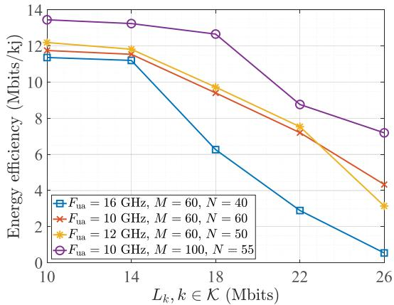  
Fig. 10. Energy efficiency versus the QoS requirement $L _ { k } = L , \forall k \in \mathcal { K }$ with different $\begin{array} { r } { \bar { F _ { \mathrm { u a } } } . } \end{array}$ , M and N.

UAV trajectory design to enhance the energy efficiency of the MEC system. It is worth noting that the SDR scheme exhibits the highest performance gain by comparing its obtained simulation results with other four schemes when the $\varrho _ { \mathrm { u a } } ~ \leq ~ 9 5 0$ . However, the benefit is exceedingly marginal when compared with the proposed scheme. The energy efficiency of the SDR scheme diminishes rapidly as the value of $\varrho _ { \mathrm { u a } }$ increases beyond 950, with the outcomes achieved even falling below those of the Heuristic scheme when $\varrho _ { \mathrm { u a } }$ ranges from 1150 to 1300. The simulation results demonstrate a consistent and stable reduction when employing the suggested approach, surpassing the performance of the RISaided scheme, the fixed trajectory scheme, and the heuristic scheme. This indicates the high robustness of the proposed algorithm.

Fig. 10 plots the curves of the optimizing energy efficiency versus the QoS requirement, i.e., the uniform minimum computing need of each user $L _ { k } = L , k \in \mathcal { K }$ , taking account of different number of time slots (N ) and elements equipped at the STAR-RIS (M), as well as the maximal CPU frequency at the UAV $( F _ { \mathrm { u a } } )$ . In particular, it is clearly observed that the energy efficiency exhibits a decreased trend as the QoS requirement rises for all cases. This is due to the fact that the allocated frequency at the UAV is linearly related to $L _ { k }$ for $k \in \mathcal { K }$ , while the energy consumption increases cubically with the allocated frequency. Additionally, we can also find that the energy efficiency gradually decreases from $L _ { k } = 1 0$ Mbits to $L _ { k } = 1 4$ Mbits, followed by a sharp decline from $L _ { k } ~ = ~ 1 8$ Mbits to $L _ { k } ~ = ~ 2 6$ Mbits. This phenomenon can be explained as: (i) When the QoS requirements are low, the computing tasks jointly processed by the BS and UAV can easily meet the QoS requirements. In this scenario, the energy consumption of the UAV for computing tasks is small, and the increase rate in system energy consumption is slow when the QoS requirements are slightly elevated, resulting in a gradual decrease in energy efficiency. As the QoS requirements are further increased, the energy consumption for computing tasks by the UAV gradually becomes the primary source. Due to the cubic relationship between energy consumption and task allocation frequency, an increase in QoS will lead to a sharp decline in energy efficiency when the QoS requirements are high. (ii) When the QoS requirements are low, the system will allocate more resources to maximize the energy efficiency and enhance users’ ability to offload computing tasks to the BS. However, as the QoS requirements increase, the users’ capability to offload tasks to the BS will gradually weaken, as the system will prioritize meeting higher QoS demands while striving to maximize energy efficiency. This is also a main reason behind the aforementioned phenomenon.

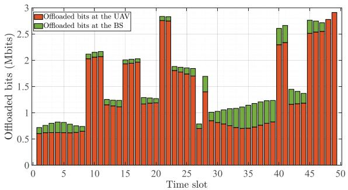

(a) The allocation of the offloaded bits at the UAV and the BS versus the time slot.  
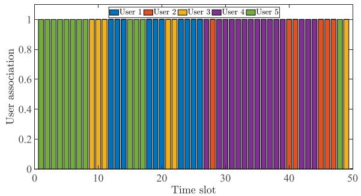  
(b) User scheduling for task offloading versus the time slot.  
Fig. 11. The allocation of the offloaded tasks and user scheduling with $M = 5 0 , F _ { \mathrm { u a } } = 6 ~ \mathrm { G H z } , N = 5 0$ and $L _ { k } = 1 5$ Mbits, $\forall k \in \mathcal { K }$

Finally, to reveal the collaboration between the UAV and the BS for simultaneously processing the offloaded tasks from users, Fig. 11(a) details the distribution of offloaded bits at the UAV and the BS throughout the mission duration T . Specifically, it is noted that the MEC server mounted on the UAV is responsible for processing the majority of computing tasks initiated by users. To meet the demanding computational needs of users, the UAV must primarily handle the processing of offloaded tasks, which is because the UAV’s mobility and flexibility are beneficial for enhancing the channel quality between users and the UAV, and the two-path loss of the offloading signals restricts users’ ability to offload tasks to the BS. Additionally, we can find that the dynamic trend is evident in the distribution of the offloaded bits at the UAV and the BS, which is corresponding to the UAV’s mobility. To show more details, the user scheduling in mission period is presented in Fig. 11(b). In particular, it is observed that the considered five users (from User 1 to User 5) are allocated 10, 6, 6, 15, 12 time slots to offload their computing tasks to the MEC servers situated at the UAV and the BS, respectively. Note that the final time slot remains unassigned for task offloading, in accordance with the anticipated scheduling. By comparing Fig. 11(a) and 11(b), it is important to highlight that the individuals allocated with more time slots, such as User 4 and User 5, are inclined to reduce the computational bits transferred to the UAV while opting to increase the computational bits directed to the BS within each time slot, which is beneficial for increasing the energy efficiency of the MEC system. To fulfil the minimal task offloading requirement, certain users such as User 2 and User 3, who possess limited time slots, opt to augment the volume of offloaded tasks directed to the MEC server situated on the UAV.

## V. CONCLUSION

In this paper, we propose a MEC scheme assisted by STAR-RIS and UAV, which allows the bi-directional task offloading so that users can offload their tasks to the MEC servers situated at the BS and UAV simultaneously. Then, a non-convex optimization problem is established which seeks to maximize the energy efficiency while guaranteeing the QoS constraints for users by jointly designing resources allocation, user scheduling, passive beamforming and the UAV’s trajectory. In order to effectively address this non-convex optimization problem, we propose an iterative algorithm that draws inspiration from the Dinkelbach’s algorithm and the SCA technique. The proposed iterative algorithm can effectively solve the established problem with guaranteed convergence. The efficacy of the proposed MEC scheme is substantiated through the simulation outcomes in comparison with the several baseline schemes, encompassing the traditional RIS-assisted scheme.

## APPENDIX A PROOF OF THEOREM 1

Considering that the energy efficiency of the system, denoted as $\frac { L _ { \mathrm { t o l } } } { E _ { \mathrm { t o l } } }$ , excludes the energy utilized for processing user’s tasks received at the BS, fully developing the offloaded ability of users to the BS is beneficial for enhancing the overall energy efficiency of the system. When the k-th user is selected to offload computing tasks in the n-th time slot, i.e., $\zeta _ { k } [ n ] = 1$ the achievable offloaded rate from the k-th user to the BS is

given by

$$
\begin{array} { r l } & { { { R } _ { k } ^ { \mathrm { B S } } } [ n ] = B \log _ { 2 } \left( 1 + \frac { p \left| { { \bf { h } } _ { \mathrm { { r b } } } ^ { H } } [ n ] \boldsymbol { \Theta } _ { \mathrm { r } } ^ { H } [ n ] { { \bf { h } } _ { \mathrm { r } k } } [ n ] \right| ^ { 2 } } { { \sigma _ { \mathrm { B S } } ^ { 2 } } } \right) } \\ & { ~ = B \log _ { 2 } \left( 1 + \frac { p \left| { { \boldsymbol { \varphi } } _ { \mathrm { r } } ^ { H } } [ n ] { { \bf { \Lambda } } _ { \mathrm { r } } } [ n ] \left( { { { \bf { h } } _ { \mathrm { r b } } ^ { \ast } } [ n ] \circ { { \bf { h } } _ { \mathrm { r } k } } [ n ] } \right) \right| ^ { 2 } } { { \sigma _ { { \mathrm { B S } } } ^ { 2 } } } \right) , } \end{array}\tag{49}
$$

where $\begin{array} { r l r } { \varphi _ { \mathrm { r } } [ n ] } & { { } = } & { \left\{ e ^ { j \phi _ { \mathrm { r } } ^ { 1 } [ n ] } , \cdot \cdot \cdot , e ^ { j \phi _ { \mathrm { r } } ^ { m } [ n ] } , \cdot \cdot \cdot , e ^ { j \phi _ { \mathrm { r } } ^ { M } [ n ] } \right\} ^ { T } , } \end{array}$ $\begin{array} { r l r } { \Lambda _ { \mathrm { r } } [ n ] } & { = } & { \mathrm { D i a g } \{ \beta _ { \mathrm { r } } ^ { 1 } [ n ] , \dot { \mathrm { \Omega } } \cdot \cdot \cdot \ , \beta _ { \mathrm { r } } ^ { m } [ n ] , \dot { \mathrm { \Omega } } \cdot \cdot \cdot \ , \beta _ { \mathrm { r } } ^ { M } [ n ] \} } \end{array}$ is a real matrix. To maximize the offloading capacity from the k-th user to the BS in the n-th time slot, given the reflective amplitudes of the STAR-RIS, i.e., $\Lambda _ { \mathrm { r } } [ n ]$ , the maximum-ratio transmission (MRT) provides the most effective solution for determining $\varphi _ { \mathrm { r } } [ n ]$ in the n-th time slot according to [47]. Thus, the optimal $\varphi _ { \mathrm { r } } [ n ]$ , denoted as $\varphi _ { \mathrm { r } } ^ { \mathrm { o p t } } [ n ]$ , can be derived as

$$
\varphi _ { \mathrm { r } } ^ { \mathrm { o p t } } [ n ] = \mathrm { n o r m } ( \mathbf { h } _ { \mathrm { r b } } ^ { * } [ n ] \circ \mathbf { h } _ { \mathrm { r } k } [ n ] ) .\tag{50}
$$

Therefore, the optimal reflection phases can be expressed as

$$
\phi _ { \mathrm { r } } ^ { \mathrm { o p t } } [ n ] = \qquad \mathrm { a r g } ( \mathrm { n o r m } ( \mathbf { h } _ { \mathrm { r b } } ^ { * } [ n ] \circ \mathbf { h } _ { \mathrm { r } k } [ n ] ) ) .\tag{51}
$$

## APPENDIX B PROOF OF PROPOSITION 1

The contradiction is adopted to prove the Proposition 1. Specifically, we first substitute the optimal reflection phases to the $R _ { k } ^ { \mathrm { B } \dot { \mathrm { S } } } [ n ]$ , we have

$$
R _ { k } ^ { \mathrm { B S } } [ n ] = \log _ { 2 } \left( 1 + \frac { p ( \sum _ { m = 1 } ^ { M } \beta _ { \mathrm { r } } ^ { m } [ n ] ) ^ { 2 } } { \sigma _ { \mathrm { B S } } ^ { 2 } } \right) .\tag{52}
$$

It is assumed that the optimal solution of the optimization problem (38) does not satisfy the equality in constraint (38f), i.e., $( \beta _ { \mathrm { r } } ^ { m } [ n ] ) ^ { 2 } + ( \beta _ { \mathrm { t } } ^ { m } [ n ] ) ^ { 2 } < 1$ , ∀m $\in { \mathcal { M } } , n \in { \mathcal { N } } .$ . By fixing the $\beta _ { \mathrm { t } } ^ { m } [ n ]$ , we increase the value of $\beta _ { \mathrm { r } } ^ { m } [ n ]$ by employing the scaling factor $\widehat { \omega } > 1$ so that $( \beta _ { \mathrm { r } } ^ { m } [ n ] ) ^ { 2 } \dot { + } ( \bar { \beta } _ { \mathrm { t } } ^ { \bar { m } } [ n ] ) ^ { 2 } = 1$ remains valid. In this case, we always can achieve a bigger objective function value, since $R _ { k } ^ { \mathrm { B S } } [ { \bar { n } } ]$ is a monotonically increasing function w.r.t. $\beta _ { \mathrm { r } } ^ { m } [ n ]$ (see equation (52)). In other words, scaling up $\beta _ { \mathrm { r } } ^ { m } [ n ]$ can improve the users’ task offloading capabilities to the BS, thereby enhancing the overall energy efficiency of the system. The resulting finding conflicts with the initial assumption that $( \beta _ { \mathrm { r } } ^ { m } [ n ] ) ^ { 2 } \dot { + } ( \beta _ { \mathrm { t } } ^ { m } [ n \bar { ] } ) ^ { 2 } < 1$ , ∀m ∈ $\mathcal { M } , n \in \mathcal { N }$ holds true. Thus, the constraint (38f) is satisfied with strict equality in the optimal solution of problem (38).

## REFERENCES

[1] Y. Mao, C. You, J. Zhang, K. Huang, and K. B. Letaief, “A survey on mobile edge computing: The communication perspective,” IEEE Commun. Surveys Tuts., vol. 19, no. 4, pp. 2322–2358, 4th Quart., 2017.

[2] X. Hu, K.-K. Wong, C. Masouros, and S. Jin, IRS-Aided Mobile Edge Computing: From Optimization to Learning. Wiley, 2023, ch. 10, pp. 207–228.

[3] A. Al-Fuqaha, M. Guizani, M. Mohammadi, M. Aledhari, and M. Ayyash, “Internet of Things: A survey on enabling technologies, protocols, and applications,” IEEE Commun. Surveys Tuts., vol. 17, no. 4, pp. 2347–2376, 4th Quart., 2015.

[4] X. Chen, “Decentralized computation offloading game for mobile cloud computing,” IEEE Trans. Parallel Distrib. Syst., vol. 26, no. 4, pp. 974–983, Apr. 2015.

[5] C.-L. Chen, C. G. Brinton, and V. Aggarwal, “Latency minimization for mobile edge computing networks,” IEEE Trans. Mobile Comput., vol. 22, no. 4, pp. 2233–2247, Apr. 2023.

[6] S. Bi and Y. J. Zhang, “Computation rate maximization for wireless powered mobile-edge computing with binary computation offloading,” IEEE Trans. Wireless Commun., vol. 17, no. 6, pp. 4177–4190, Jun. 2018.

[7] X. Hu, K.-K. Wong, and K. Yang, “Wireless powered cooperationassisted mobile edge computing,” IEEE Trans. Wireless Commun., vol. 17, no. 4, pp. 2375–2388, Apr. 2018.

[8] L. Shi, Y. Ye, X. Chu, and G. Lu, “Computation energy efficiency maximization for a NOMA-based WPT-MEC network,” IEEE Internet Things J., vol. 8, no. 13, pp. 10731–10744, Jul. 2021.

[9] S. Jeong, O. Simeone, and J. Kang, “Mobile edge computing via a UAV-mounted cloudlet: Optimization of bit allocation and path planning,” IEEE Trans. Veh. Technol., vol. 67, no. 3, pp. 2049–2063, Mar. 2018.

[10] X. Gu, G. Zhang, M. Wang, W. Duan, M. Wen, and P.-H. Ho, “UAVaided energy-efficient edge computing networks: Security offloading optimization,” IEEE Internet Things J., vol. 9, no. 6, pp. 4245–4258, Mar. 2022.

[11] Y. Xu, T. Zhang, Y. Liu, D. Yang, L. Xiao, and M. Tao, “UAVassisted MEC networks with aerial and ground cooperation,” IEEE Trans. Wireless Commun., vol. 20, no. 12, pp. 7712–7727, Dec. 2021.

[12] X. Hu, K.-K. Wong, K. Yang, and Z. Zheng, “UAV-assisted relaying and edge computing: Scheduling and trajectory optimization,” IEEE Trans. Wireless Commun., vol. 18, no. 10, pp. 4738–4752, Oct. 2019.

[13] X. Hu, K. Wong, and Y. Zhang, “Wireless-powered edge computing with cooperative UAV: Task, time scheduling and trajectory design,” IEEE Trans. Wireless Commun., vol. 19, no. 12, pp. 8083–8098, Dec. 2020.

[14] T. Zhang, Y. Xu, J. Loo, D. Yang, and L. Xiao, “Joint computation and communication design for UAV-assisted mobile edge computing in IoT,” IEEE Trans. Ind. Informat., vol. 16, no. 8, pp. 5505–5516, Aug. 2020.

[15] J. Zhang et al., “Computation-efficient offloading and trajectory scheduling for multi-UAV assisted mobile edge computing,” IEEE Trans. Veh. Technol., vol. 69, no. 2, pp. 2114–2125, Feb. 2019.

[16] Z. Yang et al., “AI-driven UAV-NOMA-MEC in next generation wireless networks,” IEEE Wireless Commun., vol. 28, no. 5, pp. 66–73, Oct. 2021.

[17] B. Yang, X. Cao, C. Yuen, and L. Qian, “Offloading optimization in edge computing for deep-learning-enabled target tracking by Internet of UAVs,” IEEE Internet Things J., vol. 8, no. 12, pp. 9878–9893, Jun. 2021.

[18] C. Huang, A. Zappone, G. C. Alexandropoulos, M. Debbah, and C. Yuen, “Reconfigurable intelligent surfaces for energy efficiency in wireless communication,” IEEE Trans. Wireless Commun., vol. 18, no. 8, pp. 4157–4170, Aug. 2019.

[19] Q. Wu and R. Zhang, “Intelligent reflecting surface enhanced wireless network via joint active and passive beamforming,” IEEE Trans. Wireless Commun., vol. 18, no. 11, pp. 5394–5409, Nov. 2019.

[20] B. Yang et al., “Reconfigurable intelligent computational surfaces: When wave propagation control meets computing,” IEEE Wireless Commun., vol. 30, no. 3, pp. 120–128, Jun. 2023.

[21] X. Hu, C. Masouros, and K.-K. Wong, “Reconfigurable intelligent surface aided mobile edge computing: From optimization-based to location-only learning-based solutions,” IEEE Trans. Commun., vol. 69, no. 6, pp. 3709–3725, Jun. 2021.

[22] Z. Li et al., “Energy efficient reconfigurable intelligent surface enabled mobile edge computing networks with NOMA,” IEEE Trans. Cogn. Commun. Netw., vol. 7, no. 2, pp. 427–440, Jun. 2021.

[23] W. He, D. He, X. Ma, X. Chen, Y. Fang, and W. Zhang, “Joint user association, resource allocation, and beamforming in RIS-assisted multiserver MEC systems,” IEEE Trans. Wireless Commun., vol. 23, no. 4, pp. 2917–2932, Apr. 2024.

[24] X. Qin, Z. Song, T. Hou, W. Yu, J. Wang, and X. Sun, “Joint optimization of resource allocation, phase shift and UAV trajectory for energyefficient RIS-assisted UAV-enabled MEC systems,” IEEE Trans. Green Commun. Netw., vol. 7, no. 4, pp. 1778–1792, Dec. 2023.

[25] Y. Xu, T. Zhang, Y. Liu, D. Yang, L. Xiao, and M. Tao, “Computation capacity enhancement by joint UAV and RIS design in IoT,” IEEE Internet Things J., vol. 9, no. 20, pp. 20590–20603, Oct. 2022.

[26] Z. Zhai, X. Dai, B. Duo, X. Wang, and X. Yuan, “Energy-efficient UAVmounted RIS assisted mobile edge computing,” IEEE Wireless Commun. Lett., vol. 11, no. 12, pp. 2507–2511, Dec. 2022.

[27] B. Duo, M. He, Q. Wu, and Z. Zhang, “Joint dual-UAV trajectory and RIS design for ARIS-assisted aerial computing in IoT,” IEEE Internet Things J., vol. 10, no. 22, pp. 19584–19594, Nov. 2023.

[28] X. Cao et al., “Reconfigurable intelligent surface-assisted aerialterrestrial communications via multi-task learning,” IEEE J. Sel. Areas Commun., vol. 39, no. 10, pp. 3035–3050, Oct. 2021.

[29] X. Mu, Y. Liu, L. Guo, J. Lin, and R. Schober, “Simultaneously transmitting and reflecting (STAR) RIS aided wireless communications,” IEEE Trans. Wireless Commun., vol. 21, no. 5, pp. 3083–3098, May 2022.

[30] S. Zhang et al., “Intelligent omni-surfaces: Ubiquitous wireless transmission by reflective-refractive metasurfaces,” IEEE Trans. Wireless Commun., vol. 21, no. 1, pp. 219–233, Jan. 2022.

[31] Y. Liu et al., “STAR: Simultaneous transmission and reflection for 360 coverage by intelligent surfaces,” IEEE Wireless Commun., vol. 28, no. 6, pp. 102–109, Dec. 2021.

[32] M. Ahmed et al., S. Chatzinotas, and Z. Han, “A survey on STAR-RIS: Use cases, recent advances, and future research challenges,” IEEE Internet Things J., vol. 10, no. 16, pp. 14689–14711, Aug. 2023.

[33] H. Xiao et al., “Simultaneously transmitting and reflecting RIS (STAR-RIS) assisted multi-antenna covert communication: Analysis and optimization,” IEEE Trans. Wireless Commun., vol. 23, no. 6, pp. 6438–6452, Jun. 2024.

[34] H. Xiao, X. Hu, T.-X. Zheng, and K.-K. Wong, “STAR-RIS assisted covert communications in NOMA systems,” IEEE Trans. Veh. Technol., vol. 73, no. 4, pp. 5941–5946, Apr. 2024.

[35] H. Xiao et al., “STAR-RIS enhanced joint physical layer security and covert communications for multi-antenna mmWave systems,” IEEE Trans. Wireless Commun., vol. 23, no. 8, pp. 8805–8819, Aug. 2024.

[36] Z. Liu, X. Li, H. Ji, H. Zhang, and V. C. Leung, “Toward STAR-RISempowered integrated sensing and communications: Joint active and passive beamforming design,” IEEE Trans. Veh. Technol., vol. 72, no. 12, pp. 15991–16005, Dec. 2023.

[37] N. Xue, X. Mu, Y. Liu, and Y. Chen, “NOMA assisted full space STAR-RIS-ISAC,” IEEE Tran. Wireless Commun., vol. 23, no. 8, pp. 8954–8968, Aug. 2024.

[38] X. Qin, Z. Song, T. Hou, W. Yu, J. Wang, and X. Sun, “Joint resource allocation and configuration design for STAR-RIS-enhanced wirelesspowered MEC,” IEEE Trans. Commun., vol. 71, no. 4, pp. 2381–2395, Apr. 2023.

[39] Q. Zhang, Y. Wang, H. Li, S. Hou, and Z. Song, “Resource allocation for energy efficient STAR-RIS aided MEC systems,” IEEE Wireless Commun. Lett., vol. 12, no. 4, pp. 610–614, Apr. 2023.

[40] P. S. Aung, L. X. Nguyen, Y. K. Tun, Z. Han, and C. S. Hong, “Aerial STAR-RIS empowered MEC: A DRL approach for energy minimization,” IEEE Wireless Commun. Lett., vol. 13, no. 5, pp. 1409–1413, May 2024.

[41] A. Zappone and E. Jorswieck, “Energy efficiency in wireless networks via fractional programming theory,” Found. Trends Commun. Inf. Theory, vol. 11, nos. 3–4, pp. 185–396, 2015.

[42] S. Li, B. Duo, M. D. Renzo, M. Tao, and X. Yuan, “Robust secure UAV communications with the aid of reconfigurable intelligent surfaces,” IEEE Trans. Wireless Commun., vol. 20, no. 10, pp. 6402–6417, Oct. 2021.

[43] W. Mao, K. Xiong, Y. Lu, P. Fan, and Z. Ding, “Energy consumption minimization in secure multi-antenna UAV-assisted MEC networks with channel uncertainty,” IEEE Trans. Wireless Commun., vol. 22, no. 11, pp. 7185–7200, Nov. 2023.

[44] H. Zhang et al., “Beam focusing for near-field multiuser MIMO communications,” IEEE Trans. Wireless Commun., vol. 21, no. 9, pp. 7476–7490, Sep. 2022.

[45] Y. Zeng, J. Xu, and R. Zhang, “Energy minimization for wireless communication with rotary-wing UAV,” IEEE Trans. Wireless Commun., vol. 18, no. 4, pp. 2329–2345, Apr. 2019.

[46] Z.-Q. Luo, W.-K. Ma, A. So, Y. Ye, and S. Zhang, “Semidefinite relaxation of quadratic optimization problems,” IEEE Signal Process. Mag., vol. 27, no. 3, pp. 20–34, May 2010.

[47] D. Tse and P. Viswanath, Fundamentals of Wireless Communication. Cambridge, U.K.: Cambridge Univ. Press, 2005.

  
Han Xiao (Student Member, IEEE) received the M.Eng. degree in vehicle engineering from Dalian University of Technology, Dalian, China, in 2021. He is currently pursuing the Ph.D. degree with the School of Information and Communications Engineering, Xi’an Jiaotong University, Xi’an, China. His research interests include physical layer security, covert communications, mobile edge computing, and reconfigurable intelligent surface.

Xiaoyan Hu (Member, IEEE) received the Ph.D. degree in electronic and electrical engineering from University College London (UCL), London, U.K., in 2020. From 2019 to 2021, she was a Research Fellow with the Department of Electronic and Electrical Engineering, UCL. She is currently an Associate Professor with the School of Information and Communications Engineering, Xi’an Jiaotong University, Xi’an, China. Her research interests include 5G&6G wireless communications, including topics such as edge computing, reconfigurable intelligent surface, UAV communications, integrated sensing and communications (ISAC), secure and covert communications, and learning-based communications. She was a recipient of the IEEE Communication Society Big Data 2023 Best Influential Paper Award. She has been recognized as an Exemplary Reviewer for IEEE COMMUNICATIONS LETTERS. From 2020 to 2023, she served as the Assistant to the Editor-in-Chief for IEEE WIRELESS COMMUNICATIONS LETTERS. She is serving as an Associate Editor for IEEE WIRELESS COMMUNICATIONS LETTERS. She has also served as the Guest Editor for ELECTRONICS on Physical Layer Security and for CHINA COMMUNICATIONS Blue Ocean Forum on MAC and Networks.

Weile Zhang (Member, IEEE) received the B.S. and Ph.D. degrees in information and communications engineering from Xi’an Jiaotong University, Xi’an, China, in 2006 and 2012, respectively. From 2010 to 2011, he was a Visiting Scholar with the Department of Computer Science, University of California at Santa Barbara, Santa Barbara, CA, USA. He is currently a Professor with the Ministry of Education Key Laboratory for Intelligent Networks and Network Security, Xi’an Jiaotong University. His research interests include broadband

wireless communications, MIMO, array signal processing, and localization in wireless networks.

Wenjie Wang (Senior Member, IEEE) received the B.S., M.S., and Ph.D. degrees in information and communications engineering from Xi’an Jiaotong University, Xi’an, China, in 1993, 1998, and 2001, respectively. He was a Visiting Scholar with the Department of Electrical and Computer Engineering, University of Delaware, Newark, DE, USA, from 2009 to 2010. He is currently a Professor and the Dean of the School of Information and Communications Engineering, Xi’an Jiaotong University. His research interests include ad-hoc networks, smart antennas, wireless communications, signal processing, artificial intelligence, and data analysis.

Kai-Kit Wong (Fellow, IEEE) received the B.Eng., M.Phil., and Ph.D. degrees in electrical and electronic engineering from The Hong Kong University of Science and Technology, Hong Kong, in 1996, 1998, and 2001, respectively. After graduation, he took up academic and research positions at The University of Hong Kong, Lucent Technologies, Bell-Labs, Holmdel, the Smart Antennas Research Group, Stanford University, and the University of Hull, U.K. He is currently the Chair of Wireless Communications with the Department of Electronic

and Electrical Engineering, University College London, U.K. His current research interests include 5G and beyond mobile communications, including topics such as massive MIMO, full-duplex communications, millimeter-wave communications, edge caching and fog networking, physical layer security, wireless power transfer and mobile computing, V2X communications, fluid antenna communications systems, and of course cognitive radios. He is a fellow of IET. He was a co-recipient of the 2013 IEEE Signal Processing Letters Best Paper Award and the 2000 IEEE VTS Japan Chapter Award from the IEEE Vehicular Technology Conference in Japan in 2000, and a few other international best paper awards. He is also on the editorial board of several international journals. He has been serving as a Senior Editor for IEEE COMMUNICATIONS LETTERS since 2012 and IEEE WIRELESS COMMUNICATIONS LETTERS since 2016. He had also previously served as an Associate Editor for IEEE SIGNAL PROCESSING LETTERS from 2009 to 2012 and an Editor for IEEE TRANSACTIONS ON WIRELESS COMMUNICATIONS from 2005 to 2011. He was also the Guest Editor for IEEE JOURNAL ON SELECTED AREAS IN COMMUNICATIONS SI on virtual MIMO in 2013 and on physical layer security for 5G in 2018. He served as the Editor-in-Chief for IEEE WIRELESS COMMUNICATIONS LETTERS from 2020 to 2023.

Kun Yang (Fellow, IEEE) received the Ph.D. degree from the Department of Electronic and Electrical Engineering, University College London (UCL), U.K. He is currently a Chair Professor with the University of Essex, U.K., and Nanjing University. He has published more than 500 articles and filed 50 patents. His main research interests include wireless networks and communications, communication-computing cooperation, and new artificial intelligence (AI) for wireless. He is a member of Academia Europaea (MAE). He is a fellow of IET. He is a Distinguished Member of ACM. He was a recipient of the 2024 IET Achievement Medals and the 2024 IEEE CommSoft TC’s Technical Achievement Award. He has been a Judge of GSMA GLOMO Award at the World Mobile Congress-Barcelona since 2019. He serves on the editorial boards for a number of IEEE journals, such as IEEE WIRELESS COMMUNICATIONS, IEEE TRANSACTIONS ON VEHICULAR TECHNOLOGY, and IEEE TRANSACTIONS ON NANOBIOSCIENCE. He is the Deputy Editorin-Chief of IET Smart Cities. He was a Distinguished Lecturer of IEEE ComSoc from 2020 to 2021.