# Energy-Efficient Secure Aerial Communications for Low-Altitude Economy: Joint UAV Scheduling and Trajectory Optimization

Xiaojie Wang , Senior Member, IEEE, Qianwen Liu , Zhaolong Ning , Senior Member, IEEE, Tie Qiu , Senior Member, IEEE, Lei Guo , and Yan Zhang , Fellow, IEEE

Abstract—Low-Altitude Economy (LAE) has emerged as an innovative system offering a range of low-altitude services. Uncrewed Aerial Vehicles (UAVs), owing to their flexible deployment and mobility, have become pivotal platforms in LAE. However, the open nature and dynamic characteristics of UAVs also expose these platforms to significant security threats. Current UAV-based LAE security research primarily focuses on secure throughput maximization. Nevertheless, resource scheduling in multi-UAV scenarios with energy constraints and incomplete dynamic channel state information poses substantial challenges. To address these challenges, we propose an efficient optimization algorithm that jointly optimizes UAV scheduling, power allocation, flight trajectory, and velocity to maximize network secrecy energy efficiency. First, we propose a penalty-based algorithm to optimize UAV scheduling so that UAVs can flexibly configure functions. Subsequently, we design a continuous convex approximation method for power allocation. Then, we develop the Dinkelbach method to decompose the fractional programming problem for trajectory and velocity optimization. Theoretical analysis and experiments show that the designed algorithm significantly outperforms other schemes in terms of convergence and energy efficiency.

Index Terms—Secure communications, uncrewed aerial vehicles, low-altitude economy, trajectory optimization, energy efficiency.

## I. INTRODUCTION

OW-ALTITUDE Economy (LAE) refers to an ecoconducted by aircraft, such as Uncrewed Aerial Vehicles (UAVs) within low-altitude airspace [1]. Driven by advances in wireless communication technologies, it has significantly enhanced the capability of aerial devices to serve various low-altitude fields including transportation, environmental monitoring, and entertainment, thereby generating substantial economic and social benefits [2]. In LAE, UAVs’ advantages in flexible deployment, high maneuverability, and low cost have made them an essential platform [3]. UAVs can be flexibly deployed as aerial relays [4] to collect offloaded data from ground users and assist in alleviating computational burdens. Simultaneously, UAVs can serve as aerial base stations to support communication among terrestrial users [5]. However, the broadcast nature of Line-of-Sight (LoS) links exposes aerial transmissions to malicious eavesdroppers. Physical Layer Security (PLS) technology has become a key technology to safeguard the confidentiality of data transmission in UAV networks by tapping into physical characteristics of the wireless channel to build an active defense mechanism [6]. UAVs can act as active jamming sources, actively interfering with the reception of the eavesdropper’s signals by generating Artificial Noises (ANs) on a specific spectrum, thus effectively protecting legitimate users’ communication privacy [7].

In existing research, the addition of ANs is an effective method to improve the security of UAV communications for LAE by utilizing the inherent randomness of wireless channels. Based on UAV cooperation models, related studies can be categorized into: single-UAV multi-antenna schemes [8], dual-UAV cooperation schemes [9], [10], [11], and multi-UAV cooperation schemes [12], [13]. Literature [8] investigated a single UAV equipped with multiple antennas executing simultaneous data collection and AN transmission to jam eavesdroppers. Literature [9], [10], [11] explored dual-UAV systems, one UAV responsible for transmitting data to legitimate users, while the other transmitting ANs to suppress eavesdroppers. Literature [12] utilized multiple UAVs to coop eratively transmit jamming signals and plan flight trajectories to proactively weaken the eavesdropping capability of suspicious channels. Literature [13] studied a game mechanism between communication UAVs and jamming UAVs. However, in these studies, the roles of UAVs are typically pre-defined and remained fixed throughout the entire mission duration.

In LAE networks, the high mobility and dynamic reconfigurability of communication environments provide unique security optimization dimensions, particularly against eavesdropping. The authors in [14] optimized UAV transmit power and trajectories to maximize the secure computational capability of maritime devices with the awareness of the eavesdropper’s channel information. The research in [15] and [16] investigated secure communications in general Mobile Edge Computing (MEC) scenarios, incorporating optimizations like user scheduling and offloading decisions on top of trajectory planning. Under the assumption of full eavesdropper knowledge, deep reinforcement learning was adopted in [17] to jointly balance communication quality and security through intelligent trajectory design. Beyond conventional methods, blockchain technology has been introduced to achieve decentralized and secure access control in UAV networks, reducing dependence on vulnerable central entities [18]. Additionally, cross-tier interference in space-air-ground integrated IoT systems has been addressed through joint optimization of UAV altitude and transmission power [19]. To counter mobile eavesdroppers, the authors in [20] further advanced this research direction by jointly optimizing UAV trajectories and beamforming vectors to maximize the system secrecy rate. However, these studies predominantly prioritize secrecy rate maximization while often neglecting the critical aspect of energy consumption, and typically rely on the assumption of known eavesdropper locations.

Regarding UAV energy consumption, current research predominantly focuses on trajectory optimization, where speed adjustments influence propulsion power consumption to maximize endurance duration. The authors in [21] proposed a generalized propulsion energy consumption model for rotarywing UAVs considering variations in speed, acceleration, and direction. The authors in [22] considered the rational design of trajectories to maximize energy efficiency of a multi-UAV system with limited energy supply. Focusing on efficiency optimization, the study in [23] designed novel MIMO-based protocols to improve throughput and fairness in large-scale flying ad hoc networks. Energy consumption was further investigated in [24] for the case of UAVs serving multiple energy-harvesting devices in MEC scenarios. However, these studies generally overlook the trade-off between energy consumption and security performance, or incorporate energy constraints without embedding security objectives into the trajectory optimization framework.

Overall, there are still some challenges and shortcomings that need to be addressed in providing secure UAV communications to support LAE.

UAV networks exhibit inherent high mobility, yet existing studies employing PLS techniques typically assign fixed operational roles to UAVs, thereby underutilizing dynamic Channel State Information (CSI). To bridge this gap, it is worthwhile to study dynamic function allocation strategies that adapt UAV operations to real-time channel variations, enhancing both spectral efficiency and communication security.

Onboard energy reserves of UAVs are inherently limited. Existing studies on PLS in UAV networks primarily focus on secrecy rate maximization. Overlooking the critical impact of energy consumption, which may lead to unsustainable security performance in practice. Therefore, a trade-off between secure communication quality and energy efficiency must be established.

Direct acquisition of eavesdropper position is practically infeasible. Current research predominantly assumes fixed eavesdropper locations or complete CSI knowledge, while in dynamic scenarios, mobility-induced channel dynamics lead to incomplete CSI acquisition. Therefore, eavesdropper localization must be effectively modeled.

In response to the challenges presented above, this paper considers a multi-UAV assisted downlink communication system, to maximize Secrecy Energy Efficiency (SEE) of the system. The contributions of this paper are summarized as follows:

To enhance system security, we propose a multi-UAV assisted secure transmission scheme. Under ground-based eavesdropper location uncertainty, UAVs dynamically change trajectories while enabling flexibly functional mode selection to facilitate secure user communication.

Considering UAV energy consumption, we formulate an SEE maximization problem. Due to the mutual influence of UAVs with different functions, variables exhibit strong coupling. To address this, we decouple the problem into three subproblems and propose an Efficient Alternating Iteration Algorithm (EAIA) to solve the joint optimization.

We propose a penalty-based double-loop algorithm to resolve the nonconvex binary variable constraints of UAV communication and jamming scheduling. Then, we design a Successive Convex Approximation (SCA)-based algorithm for power allocation. To tackle the high coupling in trajectory optimization, we propose a Dinkelbach-driven hierarchical iterative algorithm integrated with SCA.

• We perform theoretical analysis on algorithm convergence and complexity. Simulation results demonstrate that compared to other algorithms, the proposed approach achieves superior balance between system security rate and energy consumption, exhibiting significant advantages in convergence performance.

The rest of the paper is structured as follows: In Section II, we introduce the system model in the presence of multiple eavesdroppers under multi-UAV assistance and formulate the optimization problem. Section III presents a detailed solution to the formulated problem. In Section IV, we present simulation validations. Finally, Section V concludes the work.

Notation: Operation k · k denotes the Euclidean paradigm and <sup>E</sup> (·) denotes expectation. Operation $[ x ] ^ { + } = \operatorname* { m a x } \left\{ 0 , x \right\}$ denotes that the value is x when x is greater than 0, and 0 otherwise.

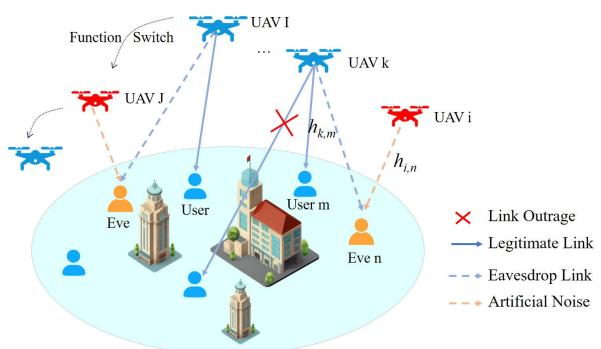  
Fig. 1. A secure communication model with multiple UAVs and eavesdroppers. Blue UAVs perform low-altitude communications, and red UAVs conduct low-altitude jamming.

## II. SYSTEM MODEL

As shown in Fig. 1 for a wireless communication scenario, multiple UAVs are employed to deliver services to ground users. As multiple Ground Eavesdroppers (GEs) attempt to eavesdrop on Legitimate Users (LUs), some UAVs send ANs as Jammers (UAVJs) on demand to prevent illegal eavesdropping. UAVs, users and eavesdroppers are denoted as sets $\begin{array} { r } { \mathcal { K } = \{ 1 , 2 , \dotsc , k , \dotsc , K \} , \mathcal { M } = \{ 1 , 2 , \dotsc , m , \dotsc , M \} } \end{array}$ and $\mathcal { N } { = } \{ 1 , 2 , \ldots , n , \ldots , N \}$ , respectively. The entire mission execution time is divided into $T _ { N }$ time slots, each of length δ, denoted as $\mathcal { T } \overset { } { \underset { } { \longrightarrow } } \left\{ 1 , 2 , \dots , t , \dots { T } _ { N } \right\}$

## A. Channel Model

In the considered scenario, the UAV needs to dynamically adjust its position to provide secure communications to LUs due to dynamic changes in the channel. Without loss of generality, we consider a three-dimensional Cartesian coordinate system, and assume that the UAV flies at altitude $z _ { k } [ t ]$ . The horizontal coordinates of UAV k in time slot t are given by $\mathbf q _ { k } [ t ] = ( x _ { k } [ t ] , y _ { k } [ t ] ) ^ { \mathrm T }$ . Meanwhile, the coordinates of LU m are denoted as $( x _ { m } ^ { u } [ t ] , y _ { m } ^ { u } [ t ] , z _ { m } ^ { u } [ t ] ) ^ { T }$ , where $\pmb { w } _ { m } ^ { u } [ t ] = \left( x _ { m } ^ { u } [ t ] , y _ { m } ^ { u } [ t ] \right) ^ { T }$ are horizontal coordinates. The exact coordinates of GE n are denoted by $\left( x _ { n } ^ { e } [ t ] , y _ { n } ^ { e } [ t ] , z _ { n } ^ { e } [ t ] \right) ^ { T }$ where $w _ { n } ^ { e } [ t ] ~ = ~ ( x _ { n } ^ { e } [ t ] , y _ { n } ^ { e } [ t ] ) ^ { T }$ are horizontal coordinates. Although UAVs can estimate the position of GEs, their precise localization remains unattainable for UAV networks due to inherent measurement constraints. This results in positional estimates with errors, which we model using a bounded error model [25], expressed as:

$$
\begin{array} { r } { { \pmb w } _ { n } ^ { e } [ t ] = \hat { { \pmb w } } _ { n } ^ { e } [ t ] + \Delta { \pmb w } _ { n } ^ { e } [ t ] , } \end{array}\tag{1}
$$

where $\begin{array} { r l r } { \pmb { \hat { w } } _ { n } ^ { e } [ t ] } & { { } = } & { \left( \hat { x } _ { n } ^ { e } [ t ] , \hat { y } _ { n } ^ { e } [ t ] \right) ^ { T } } \end{array}$ are estimated positions of GE n, and $\Delta \boldsymbol { w } _ { n } ^ { e } [ t ] = \left( \Delta x _ { n } [ t ] , \Delta y _ { n } [ t ] , \Delta z _ { n } [ t ] \right) ^ { T }$ are estimation errors, satisfying the following constraint:

$$
\left\| \Delta x _ { n } ^ { 2 } [ t ] + \Delta y _ { n } ^ { 2 } [ t ] \right\| ^ { 2 } \leq \Delta r _ { n } ^ { 2 } ,\tag{2}
$$

where $\Delta r _ { n }$ is the radius that defines the circular uncertainty region centered on the estimated location of GE n.

Furthermore, departing from the common practice of using the free space path loss model for analytical simplicity, our work incorporates a Rician fading model [26]. Let $h _ { k , m } [ t ]$

denote the complex channel coefficients between UAV k and LU m, which can be formulated as:

$$
\begin{array} { l } { \displaystyle h _ { \boldsymbol { k } , m } [ t ] } \\ { = \beta _ { \boldsymbol { k } , m } [ t ] \biggl ( \sqrt { \frac { K [ t ] } { K [ t ] + 1 } } \tilde { h } _ { \boldsymbol { k } , m } [ t ] + \sqrt { \frac { 1 } { K [ t ] + 1 } } \tilde { \tilde { h } } _ { \boldsymbol { k } , m } [ t ] \biggr ) ^ { 2 } , } \end{array}\tag{3}
$$

where $\tilde { h } _ { k , m } [ t ]$ represents the deterministic LoS channel component with $\left\| \widetilde { h } _ { k , m } [ t ] \right\| = 1$ . Variable $\tilde { \tilde { h } } _ { k , m } [ t ]$ denotes the small fading coefficient, modeled as $\tilde { \tilde { h } } _ { k , m } [ t ] \sim \mathcal { C N } ( 0 , 1 )$ , and $K [ t ]$ is the Rician factor. Variable $\beta _ { k , m } [ t ]$ denotes the large-scale fading, which can be formulated as:

$$
\beta _ { k , m } [ t ] = \frac { \beta _ { 0 } } { \Big ( \big \| \pmb { q } _ { k } [ t ] - \pmb { w } _ { m } ^ { u } [ t ] \big \| ^ { 2 } + z _ { k } ^ { 2 } [ t ] \Big ) ^ { \alpha } \Big / 2 } ,\tag{4}
$$

where $\beta _ { 0 }$ denotes the channel gain measured at a range of 1 ${ \mathrm { m } } ,$ and α denotes the path loss exponent.

Similarly, the complex channel coefficients between UAV k and GE n can be formulated as:

$$
h _ { k , n } [ t ] = \beta _ { k , n } [ t ] \biggl ( \sqrt { \frac { K [ t ] } { K [ t ] + 1 } } \tilde { h } _ { k , n } [ t ] + \sqrt { \frac { 1 } { K [ t ] + 1 } } \tilde { \tilde { h } } _ { k , n } [ t ] \biggr ) ^ { 2 } ,\tag{5}
$$

where symbol $\tilde { h } _ { k , n } [ t ]$ represents the deterministic LoS channel component between UAV k and GE n with $\left\| \tilde { h } _ { k , n } [ t ] \right\| = 1$ and $\tilde { \tilde { h } } _ { k , n } [ t ]$ denotes the small fading coefficient, modeled as $\ddot { \tilde { h } } _ { k , n } [ t ] \sim \mathcal { C N } ( 0 , 1 )$ . Variable $\beta _ { k , n } [ t ]$ denotes the large-scale fading, which can be express as:

$$
\beta _ { k , n } [ t ] = \frac { \beta _ { 0 } } { \Big ( \big \| \pmb { q } _ { k } [ t ] - \pmb { w } _ { n } ^ { e } [ t ] \big \| ^ { 2 } + z _ { k } ^ { 2 } [ t ] \Big ) ^ { \alpha } \Big / 2 } .\tag{6}
$$

Note that Rician K-factors for all the channels depend on the environment. Therefore, we assume that Rician factor $K [ t ]$ is constant for the urban environment, which has been widely adopted in the UAV secure communication literature [27], [28]. This assumption is justified by the following reasons. First, when the UAV operates at a sufficiently high altitude, the LoS probability approaches unity, rendering the Rician factor essentially independent of the UAV’s location. Second, for a long mission duration T , the UAV spends most of its time hovering above LUs, during which the channel conditions remain relatively stable. Notwithstanding this simplification, more sophisticated channel models can be integrated into our framework in future work to further enhance performance.

## B. Communication Model

To facilitate the design scheme, binary variable $\lambda _ { k , m } [ t ]$ is used to denote communication scheduling of UAV k, subject to constraint: $\lambda _ { k , m } [ t ] \in \{ 0 , 1 \}$ . When $\lambda _ { k , m } [ t ] = 1$ , it means that UAV k is selected as a communication UAV (UAVI) in time slot t and provides communication service for LU m. Otherwise, UAV k does not provide communication service to LU m. Similarly, binary variable $\mu _ { k , n } [ t ]$ denotes the scheduling between UAV k and GE n, subject to: $\mu _ { k , n } [ t ] \in$ $\{ 0 , 1 \}$ . When $\mu _ { k , n } [ t ] = 1$ , UAV k is selected as UAVJ in time slot t, and interferes with GE n. Conversely, when $\mu _ { k , n } [ t ] = 0$ UAV k is not selected as a jamming UAV. In any given time slot, a single UAV serves no more than one LU, and conversely, each LU receives service from at most one UAV.

When communication scheduling variable $\lambda _ { k , m } [ t ] = 1$ , the Signal-to-Noise Ratio (SINR) at LU m is computed by:

$$
\gamma _ { k , m } [ t ] = \frac { h _ { k , m } [ t ] p _ { k } ^ { S } [ t ] } { \displaystyle \sum _ { i = 1 , i \neq k } ^ { K } \mu _ { i , n } [ t ] h _ { i , m } [ t ] p _ { i } ^ { J } [ t ] + \sigma _ { U } ^ { 2 } } .\tag{7}
$$

Similarly, the SINR received from UAV k to GE n can be written as:

$$
\gamma _ { k , n } [ t ] = \frac { h _ { k , n } [ t ] p _ { k } ^ { S } [ t ] } { \displaystyle \sum _ { i = 1 , i \neq k } ^ { K } \mu _ { i , n } [ t ] h _ { i , n } [ t ] p _ { i } ^ { J } [ t ] + \sigma _ { E } ^ { 2 } } ,\tag{8}
$$

where $\sigma _ { U } ^ { 2 }$ and $\sigma _ { E } ^ { 2 }$ denote the additive Gaussian white noise at LUs and GEs, respectively. Variable $p _ { k } ^ { S } [ t ]$ denotes the transmit power when UAV k provides communication functions in time slot t, and $p _ { i } ^ { J } [ t ]$ denotes the jamming power when the UAV functions as a jammer in time slot t. Therefore, communication rate $\mathbb { R } _ { m } [ t ]$ from UAV k to LU m is:

$$
\begin{array} { l } {  { \mathbb { R } _ { m } [ t ] } } \\ & { = \mathbb { E } _ { \hat { h } } \{ \sum _ { k = 1 } ^ { K } \lambda _ { k , m } [ t ] B \mathrm { l o g } _ { 2 } ( 1 + \gamma _ { k , m } [ t ] ) \} } \\ & { \geq \displaystyle \sum _ { k = 1 } ^ { K } \lambda _ { k , m } [ t ] B \mathrm { l o g } _ { 2 } ( 1 + \frac { e ^ { - \kappa } \beta _ { k , m } [ t ] p _ { k } ^ { S } [ t ] } { \displaystyle \sum _ { i = 1 , i \neq k } ^ { K } \mu _ { i , m } [ t ] \beta _ { i , m } [ t ] p _ { i } ^ { I } [ t ] + \sigma _ { U } ^ { 2 } } ) } \\ & { = \displaystyle \sum _ { k = 1 } ^ { K } \lambda _ { k , m } [ t ] R _ { k , m } [ t ] = R _ { m } [ t ] , \eqno { ( 9 , 1 ) } } \end{array}
$$

where κ is Euler’s constant, and $R _ { k , m } [ t ]$ is the communication rate of LU m. Eavesdropping rate $\mathbb { R } _ { n } [ t ]$ for GE n in time slot $t \ \mathrm { i s ^ { 1 } }$ :

$$
\begin{array} { r l } & { \mathbb { \ } \mathbb { \ } _ { n } [ t ] } \\ & { \ = \mathbb { E } _ { \tilde { h } } \left\{ \displaystyle \sum _ { k = 1 } ^ { K } \lambda _ { k , m } [ t ] B \log _ { 2 } \left( 1 + \gamma _ { k , n } [ t ] \right) \right\} } \\ & { \ \le \displaystyle \sum _ { k = 1 } ^ { K } \lambda _ { k , m } [ t ] B \log _ { 2 } \left( 1 + \frac { \beta _ { k , n } [ t ] p _ { k } ^ { S } [ t ] } { { \displaystyle \sum _ { i = 1 , i \ne k } ^ { K } \mu _ { i , n } [ t ] \beta _ { i , n } [ t ] p _ { i } ^ { J } [ t ] } + \sigma _ { E } ^ { 2 } } \right) } \\ & { \ = \displaystyle R _ { n } [ t ] . } \end{array}
$$

Considering the effect of eavesdroppers, the secrecy rate of LU m in time slot t is:

$$
R _ { m } ^ { \mathrm { s e c } } [ t ] = \left[ R _ { m } ( t ) - \operatorname* { m a x } _ { n \in \mathcal { N } } \{ R _ { n } ( t ) \} \right] ^ { + } .\tag{11}
$$

<sup>1</sup>To avoid model complexity, the expected proof can refer to [29].

## C. Energy Model

Energy consumption of UAVs generally consists of two main components, i.e., communication and propulsion energy consumption. We neglect the communication-related energy expenditure owing to its negligible magnitude relative to the propulsive energy [30]. Considering the agile mobility of UAVs, we adopt the flight energy consumption model of rotor-wing UAVs [31]. When UAV k flies at the speed of ${ \pmb v } _ { k } [ t ] = ( \bar { v } _ { k } ^ { x } [ t ] , v _ { k } ^ { y } [ t ] , v _ { k } ^ { z } [ t ] ) ^ { \mathrm { T } }$ , its flight power consumption can be calculated as:

$$
\begin{array} { r l } & { P _ { k } ^ { f } [ t ] = \displaystyle \frac { 1 } { 2 } \Re \varpi s \mathcal { Z } \left\| v _ { k } ^ { x y } [ t ] \right\| ^ { 3 } + \mathcal { P } \left( 1 + \frac { 3 \left\| v _ { k } ^ { x y } [ t ] \right\| ^ { 2 } } { v _ { p } ^ { 2 } } \right) } \\ & { \qquad + \mathcal { Q } \left( \sqrt { 1 + \frac { \left\| v _ { k } ^ { x y } [ t ] \right\| ^ { 4 } } { 4 v _ { 0 } ^ { 4 } } } - \frac { \left\| v _ { k } ^ { x y } [ t ] \right\| ^ { 2 } } { 2 v _ { 0 } ^ { 2 } } \right) ^ { 1 / 2 } + \mathcal { W } v _ { k } ^ { z } [ t ] , } \end{array}\tag{12}
$$

where $\mathcal { P }$ and Q are two constants, denoting the blade profile power and induced power in the hovering state, respectively. Symbols $v _ { p }$ and $v _ { 0 }$ are the rotor blade tip speed and the rotor average induced speed in hovering, respectively. Variables < and \$ are the fuselage drag ratio and air density, while s and $\mathcal { Z }$ are denoted as the rotor sturdiness and rotor disk area, respectively. Symbol W is the weight of the UAV. Variables $v _ { k } ^ { x y } [ t ]$ and $v _ { k } ^ { z } [ t ]$ correspond to the UAV’s horizontal and vertical speeds, respectively. Since the UAV communicates while flying, the total energy consumed by UAV k is $\begin{array} { r } { \delta \sum _ { t = 1 } ^ { T _ { N } } \sum _ { k = 1 } ^ { K } \mathbf { \bar { P } } _ { k } ^ { \mathcal { F } } [ t ] } \end{array}$

## D. Problem Formulation

This paper aims to maximize SEE during task execution by jointly optimizing communication and jamming scheduling $\mathbf { A } \ = \ \{ \lambda _ { k , m } [ t ] , \mu _ { k , n } [ t ] \ | \ \forall k , m , n \}$ , power allocation $\textbf { P } = \{ p _ { \scriptscriptstyle k } ^ { V } [ t ] \mid \forall k , t , \mid V \in \bar { S } , \bar { J } \}$ , UAV trajectory ${ \textbf { Q } } =$ $\{ q _ { k } [ t ] , z _ { k } [ t ] \ \dot { | } \stackrel {  } {  } \dot { \psi } k , t \}$ , and velocity $\mathbf { V } \dot { = } \{ v _ { k } [ t ] \mid \forall k , t \}$ , thereby achieving an optimal trade-off between secrecy rate and energy consumption. The optimization problem can be formulated as follows:

$$
\mathbf { \Sigma } ( \mathbf { P } ) : \operatorname* { m a x i m i z e } _ { \mathbf { A } , \mathbf { P } , \mathbf { Q } , \mathbf { V } } ^ { T _ { N } } \frac { \displaystyle \sum _ { t = 1 } ^ { M } \sum _ { m = 1 } ^ { M } \left[ R _ { m } [ t ] - \operatorname* { m a x } _ { n \in \mathcal { N } } \{ R _ { n } [ t ] \right] ^ { + } } { }  { \displaystyle \sum _ { t = 1 } ^ { T _ { N } } \sum _ { k = 1 } ^ { K } P _ { k } ^ { f } [ t ] \delta } ,\tag{13}
$$

$$
{ \mathrm { C 1 } } \colon \lambda _ { k , m } [ t ] \in \{ 0 , 1 \} , \sum _ { m = 1 } ^ { M } \lambda _ { k , m } [ t ] \leq 1 , \sum _ { k = 1 } ^ { K } \lambda _ { k , m } [ t ] \leq 1 ,\tag{s.t.}
$$

$$
{ \sf C 2 } \colon \mu _ { k , n } [ t ] \in \{ 0 , 1 \} , \sum _ { n = 1 } ^ { N } \mu _ { k , n } [ t ] \leq 1 , \sum _ { k = 1 } ^ { K } \mu _ { k , n } [ t ] \leq 1 ,
$$

$$
{ \bf C } 3 \colon 0 \leq \sum _ { m = 1 } ^ { M } \lambda _ { k , m } [ t ] + \sum _ { n = 1 } ^ { N } \mu _ { k , n } [ t ] \leq 1 , \forall k ,
$$

$$
{ \bf C } 4 \mathrm { : ~ } 0 \leq p _ { k } ^ { S } [ t ] \leq p _ { \operatorname* { m a x } } ^ { S } , \quad \frac { 1 } { T _ { N } } \sum _ { t = 1 } ^ { T _ { N } } p _ { k } ^ { S } [ t ] \leq p _ { a v e } ^ { S } ,
$$

$$
{ \bf C } 5 \colon 0 \le p _ { k } ^ { J } [ t ] \le p _ { \operatorname* { m a x } } ^ { J } , \quad \frac { 1 } { T _ { N } } \sum _ { t = 1 } ^ { T _ { N } } p _ { k } ^ { J } [ t ] \le p _ { a v e } ^ { J } ,
$$

$$
{ \mathrm { C } } 6 \colon \frac { 1 } { T _ { N } } \sum _ { t = 1 } ^ { T _ { N } } \lambda _ { k , m } [ t ] R _ { k , m } [ t ] \geq R _ { t h } ,
$$

$$
\mathbf { C 7 : } \| \pmb { q } _ { k } [ t ] - \pmb { q } _ { k ^ { \prime } } [ t ] \| ^ { 2 } + ( z _ { k } [ t ] - z _ { k ^ { \prime } } [ t ] ) ^ { 2 }
$$

$$
\geq d _ { \operatorname* { m i n } } ^ { 2 } , k , k ^ { \prime } \in K ,
$$

$$
\begin{array} { r } { \mathbb { C } 8 \colon \| \pmb { q } _ { k } [ t + 1 ] - \pmb { q } _ { k } [ t ] \| \le v _ { \operatorname* { m a x } } ^ { x y } \delta , } \end{array}
$$

$$
\mathbf { C 9 } \colon \| z _ { k } [ t + 1 ] - z _ { k } [ t ] \| \leq v _ { \operatorname* { m a x } } ^ { z } \delta ,
$$

$$
\mathrm { C } 1 0 \colon \| v _ { k } ^ { x y } [ t + 1 ] - v _ { k } ^ { x y } [ t ] \| \leq a _ { \operatorname* { m a x } } \delta ,
$$

$$
\mathrm { C l } 1 \colon z _ { \mathrm { m i n } } \leq z _ { k } [ t ] \leq z _ { \mathrm { m a x } } ,
$$

where constraints C1 and C2 ensure that one UAV is assigned to only one LU or GE, and that one GE or LU is connected by a single UAV per time slot. Constraint C3 restricts the UAV to only have one function per time slot. Constraints C4-C5 are transmission power limits of UAVs, where $p _ { \mathrm { m a x } } ^ { k }$ and $p _ { a v e } ^ { k } , \ k \ \in \ \{ S , J \}$ denote the maximum and average transmission power of UAV k, respectively. Constraint C6 ensures the minimum average secrecy rate for communicating LUs. Constraint C7 restricts the minimum distance as $d _ { \mathrm { m i n } }$ among UAVs to avoid collisions. Constraints C8-C10 are constraints on the maximum rate and acceleration of UAV k, where $v _ { \mathrm { m a x } } ^ { x y }$ and $v _ { \mathrm { m a x } } ^ { z }$ are the maximum horizontal velocity and vertical velocity. Constraint C11 defines the allowable altitude range for UAV k.

Theorem 1: Problem (P) is NP-hard.

Proof: Please see Appendix A.

## III. AN EFFICIENT ALTERNATING ITERATIVE ALGORITHM FOR MULTI-UAV SECURE TRANSMISSION

In order to solve Problem (P) effectively, we decompose it into three subproblems based on the variable coupling relationship, and we develop an algorithm with alternating iterations. Specifically, given the trajectory and transmit power of the last iteration of UAVs, a penalty-based double-loop algorithm is first proposed to solve for UAV scheduling. Next, based on the obtained UAV scheduling and given trajectories, we design the SCA-based approach for power allocation. Finally, an iterative algorithm based on Dinkelbach’s method is proposed to optimize UAV trajectory given the obtained UAV scheduling and power allocation results.

## A. Scheduling Optimization

We optimize communication and jamming scheduling A based on fixed UAV transmit power P and trajectory Q. Notice that there is an estimation error in the GE’s position, making Problem (P) challenging to solve directly. Given the fixed trajectory, upper bound rate $R _ { n } ^ { * } [ t ]$ of GE n can be derived based on geometric relationships as follows:

$$
\sum _ { k = 1 } ^ { K } \lambda _ { k , m } [ t ] B \mathrm { l o g } _ { 2 } \left( 1 + \frac { \hat { \beta } _ { k , n } ^ { * } [ t ] p _ { k } ^ { S } [ t ] } { \displaystyle \sum _ { i = 1 , i \ne k } ^ { K } \mu _ { i , n } [ t ] \hat { \beta } _ { i , n } ^ { * } [ t ] p _ { i } ^ { J } [ t ] + \sigma _ { E } ^ { 2 } } \right) ,\tag{14}
$$

where $\hat { \beta } _ { i , n } ^ { * } [ t ] = \beta _ { 0 } \bigg ( \sqrt { ( \| \pmb { q } _ { i } [ t ] - \hat { \mathbf { w } } _ { n } ^ { e } [ t ] \| + \Delta r _ { n } ) ^ { 2 } + z _ { k } ^ { 2 } [ t ] } \bigg ) ^ { - \alpha }$ is the minimum channel coefficient from UAVJ i to GE n.

−α Variable $\hat { \beta } _ { k , n } ^ { * } [ t ] = \beta _ { 0 } \bigg ( \sqrt { \big ( \| \pmb { q } _ { k } [ t ] - \hat { \mathbf { w } } _ { n } ^ { e } [ t ] \| - \Delta r _ { n } \big ) ^ { 2 } + z _ { k } ^ { 2 } [ t ] } \bigg )$ denotes the maximum channel coefficient from UAVI k to GE n, when $\| { \pmb q } _ { k } [ t ] - \hat { \mathbf w } _ { n } ^ { e } [ t ] \| > \Delta r _ { n }$ , and otherwise $\hat { \beta } _ { k , n } ^ { * } [ t ] =$ $\beta _ { 0 } z _ { k } [ t ] ^ { - \alpha }$ . Problem (P) can be transformed into:

$$
\begin{array} { r } { ( \mathrm { P 1 } ) : \ \underset { \mathbf { A } , \vartheta _ { m } [ t ] , \tilde { R } _ { m } ^ { \mathrm { s e c } } [ t ] } { \mathrm { m a x i m i z e } } \sum _ { t = 1 } ^ { T _ { N } } \sum _ { m = 1 } ^ { M } \tilde { R } _ { m } ^ { \mathrm { s e c } } [ t ] , } \end{array}\tag{15}
$$

$$
\begin{array} { r l } { \mathrm { s . t . } } & { \displaystyle \mathbb { C } 1 2 \colon \sum _ { k = 1 } ^ { K } \lambda _ { k , m } [ t ] \vartheta _ { m } [ t ] \geq \tilde { R } _ { m } ^ { \mathrm { s e c } } [ t ] , \quad \forall m , } \\ & { \displaystyle \mathbb { C } 1 3 \colon B \log _ { 2 } \big ( 1 + \gamma ^ { \prime } _ { k , m } [ t ] \big ) - B \log _ { 2 } \big ( 1 + \gamma _ { k , n } ^ { * } [ t ] \big ) } \\ & { \qquad \geq \vartheta _ { m } [ t ] , \quad \forall m , n , } \\ & { \displaystyle \mathrm { c o n s t r a i n t s ~ } \mathbb { C } 1 - \mathbb { C } 3 , \mathbb { C } 6 , } \end{array}
$$

where $\begin{array} { r l r } { \gamma _ { k , m } ^ { \prime } [ t ] \ } & { { } = } & { \frac { e ^ { - \kappa } \hat { \beta } _ { k , m } [ t ] p _ { k } ^ { S } [ t ] } { \sum _ { i = 1 , i \neq k } ^ { K } \mu _ { i , n } [ t ] \beta _ { i , m } [ t ] p _ { i } ^ { J } [ t ] + \sigma _ { U } ^ { 2 } } } \end{array}$ is the minimum SINR at LU m, and $\begin{array} { r l } { \gamma _ { k , n } ^ { * } [ t ] \ } & { { } = } \end{array}$ $\frac { \hat { \beta } _ { k , n } ^ { * } [ t ] p _ { k } ^ { S } [ t ] } { \sum _ { i = 1 , i \neq k } ^ { K } \mu _ { i , n } [ t ] \hat { \beta } _ { i , n } ^ { * } [ t ] p _ { i } ^ { J } [ t ] + \sigma _ { E } ^ { 2 } }$ is the maximum SINR at GE n. Meanwhile $\vartheta _ { m } [ t ]$ is the introduced auxiliary variable, and $\tilde { R } _ { m } ^ { \mathrm { s e c } } [ t ]$ is the minimum secrecy rate of LU m.

Problem (P1) is mixed integer nonconvex due to the coupling of variables in constraints C6, C12 and C13, along with the existence of binary variables. We relax the original binary constraints to continuous values in interval [0, 1] by introducing auxiliary variables $\tilde { \lambda } _ { k , m } [ t ]$ and $\tilde { \mu } _ { k , n } [ t ] . ^ { 2 }$ The 0-1 constraint for binary variable $\textbf { A } = \ \{ \lambda _ { k , m } [ t ] , \mu _ { k , n } [ t ] \ | \ \forall k , m , n \}$ can be equivalently expressed as constraints C1 and C2 and is bounded by the following equation:

$$
\widetilde { \mathbf { C } } 1 : 0 \leq \lambda _ { k , m } [ t ] \leq 1 , \quad \widetilde { \mathbf { C } } 2 : 0 \leq \mu _ { k , n } [ t ] \leq 1 .\tag{16}
$$

$$
\lambda _ { k , m } [ t ] ( 1 - \tilde { \lambda } _ { k , m } [ t ] ) = 0 , \quad \lambda _ { k , m } [ t ] = \tilde { \lambda } _ { k , m } [ t ] .
$$

$$
\begin{array} { r } { \mu _ { k , n } [ t ] ( 1 - \tilde { \mu } _ { k , n } [ t ] ) = 0 , \quad \mu _ { k , n } [ t ] = \tilde { \mu } _ { k , n } [ t ] . } \end{array}\tag{17}
$$

(18)

To ensure that equality constraints (17) and (18) are satisfied, we incorporate them as penalty terms into the optimization objective of Problem (P1). The coupling among variables in constraint C12 can be addressed by applying the complete square formula [32], yielding:

$$
\lambda _ { k , m } [ t ] \vartheta _ { m } [ t ] = \frac { \left( \lambda _ { k , m } [ t ] + \vartheta _ { m } [ t ] \right) ^ { 2 } } { 4 } - \frac { \left( \lambda _ { k , m } [ t ] - \vartheta _ { m } [ t ] \right) ^ { 2 } } { 4 } .\tag{19}
$$

Equation (19) is a Difference-of-Convex (DC) expression, where convex quadratic component $\begin{array} { r } { \frac { 1 } { 4 } \left( \lambda _ { k , m } [ t ] + \vartheta _ { m } \mathbf { \bar { [ } } t ] \right) ^ { 2 } . } \end{array}$ can be expanded by first-order Taylor expansion at point $( \lambda _ { k , m } ^ { ( r ) } [ t ]$ $\vartheta _ { m } ^ { ( r ) } [ t ] )$ to obtain its lower bound as follows:

$$
\begin{array} { r l } & { \frac { 1 } { 4 } \left( \lambda _ { k , m } [ t ] + \vartheta _ { m } [ t ] \right) ^ { 2 } \geq \frac { 1 } { 4 } \left( \lambda _ { k , m } ^ { ( r ) } [ t ] + \vartheta _ { m } ^ { ( r ) } [ t ] \right) ^ { 2 } } \\ & { \quad + \displaystyle \frac { 1 } { 2 } \left( \lambda _ { k , m } ^ { ( r ) } [ t ] + \vartheta _ { m } ^ { ( r ) } [ t ] \right) \left( \lambda _ { k , m } [ t ] - \lambda _ { k , m } ^ { ( r ) } [ t ] \right) } \\ & { \quad + \displaystyle \frac { 1 } { 2 } \left( \lambda _ { k , m } ^ { ( r ) } [ t ] + \vartheta _ { m } ^ { ( r ) } [ t ] \right) \left( \vartheta _ { m } [ t ] - \vartheta _ { m } ^ { ( r ) } [ t ] \right) } \\ & { \quad = f _ { 1 } ^ { l b } [ t ] . } \end{array}\tag{20}
$$

<sup>2</sup>Though binary variables are relaxed, our penalty-based double-loop algorithm ensures a binary solution without the need for reconstruction (Constraints (17) and (18) hold only when $\lambda _ { k , m } [ t ] = \tilde { \lambda } _ { k , m } [ t ] \in \{ 0 , 1 \}$ and $\mu _ { k , n } [ t ] = \tilde { \mu } _ { k , n } [ t ] \in \{ 0 , 1 \} )$ .

With the above processing, constraint C12 is transformed into a convex constraint. Since $\log _ { 2 } ( 1 + x )$ is a concave function, constraint C13 is also a nonconvex constraint on binary variable $\mu _ { k , n } [ t ]$ . Both the minuend and subtrahend of constraint C13 can be decomposed into:

$$
\begin{array} { r l } & { B \mathrm { l o g } _ { 2 } \left( 1 + \gamma _ { k , m } ^ { \prime } [ t ] \right) - B \mathrm { l o g } _ { 2 } \left( 1 + \gamma _ { k , n } ^ { \ast } [ t ] \right) } \\ & { = B \mathrm { l o g } _ { 2 } \left( e ^ { - \kappa } \beta _ { k , m } [ t ] p _ { k } ^ { S } [ t ] + I _ { m } [ t ] \right) - B \mathrm { l o g } _ { 2 } \left( I _ { m } [ t ] \right) } \\ & { \phantom { = } - B \mathrm { l o g } _ { 2 } \left( \hat { \beta } _ { k , n } ^ { \ast } [ t ] p _ { k } ^ { S } [ t ] + I _ { n } [ t ] \right) + B \mathrm { l o g } _ { 2 } \left( I _ { n } [ t ] \right) , } \end{array}\tag{21}
$$

where ${ \cal I } _ { m } [ t ] = \sum _ { i = 1 , i \neq k } ^ { K } \mu _ { i , n } [ t ] \beta _ { i , m } [ t ] p _ { i } ^ { J } [ t ] + \sigma _ { U } ^ { 2 }$ denotes the interference at LU m in time slot t, and $I _ { n } [ t ] \ =$ $\sum _ { i = 1 , i \neq k } ^ { K } \mu _ { i , n } [ t ] \hat { \beta } _ { i , n } ^ { * } [ t ] p _ { i } ^ { J } [ t ] + \sigma _ { E } ^ { 2 }$ denotes the interference at GE n in time slot t. In equation (21), the first and fourth terms about binary variable $\mu _ { k , n } [ t ]$ are concave and can be written as $f _ { 2 } [ t ]$ , whereas the second and third terms are convex with respect to binary variable $\mu _ { k , n } [ t ]$ . To deal with the nonconvexity of constraint C13, we leverage the first-order Taylor expansion [33]. For a convex function, this expansion provides its tight global upper bound. The upper bound at reference point $\mu _ { i , n } ^ { ( r ) } [ t ]$ is given as:

$$
\begin{array} { r l r } & { } & { B \mathrm { l o g } _ { 2 } \left( I _ { m } [ t ] \right) + B \mathrm { l o g } _ { 2 } \left( \hat { \beta } _ { k , n } ^ { * } [ t ] p _ { k } ^ { S } [ t ] + I _ { n } [ t ] \right) } \\ & { } & { \leq B \mathrm { l o g } _ { 2 } \left( I _ { m } ^ { ( r ) } [ t ] \right) + B \mathrm { l o g } _ { 2 } \left( \hat { \beta } _ { k , n } ^ { * } [ t ] p _ { k } ^ { S } [ t ] + I _ { n } ^ { ( r ) } [ t ] \right) } \\ & { } & { \quad + \displaystyle \frac { B \left( I _ { m } [ t ] - I _ { m } ^ { ( r ) } [ t ] \right) } { \ln 2 \cdot I _ { m } ^ { ( r ) } [ t ] } + \frac { B \left( I _ { n } [ t ] - I _ { n } ^ { ( r ) } [ t ] \right) } { \ln 2 \cdot \left( \hat { \beta } _ { k , n } ^ { * } [ t ] p _ { k } ^ { S } [ t ] + I _ { n } ^ { ( r ) } [ t ] \right) } } \\ & { } & { \quad = f _ { 3 } ^ { u p } [ t ] , \qquad ( 2 ! } \end{array}\tag{2}
$$

where $I _ { m } ^ { ( r ) } [ t ] = \sum _ { i = 1 , i \ne k } ^ { K } \mu _ { i , n } ^ { ( r ) } [ t ] \beta _ { i , m } [ t ] p _ { i } ^ { J } [ t ] + \sigma _ { U } ^ { 2 } \mathrm { ~ a n d ~ } I _ { n } ^ { ( r ) } [ t ] =$ $\sum _ { i = 1 , i \neq k } ^ { K } \mu _ { i , n } ^ { ( r ) } [ t ] \hat { \beta } _ { i , n } ^ { * } [ t ] p _ { i } ^ { J } [ t ] + \sigma _ { E } ^ { 2 }$ are the values of $I _ { m } [ t ]$ and $I _ { n } [ t ]$ at iteration r. Constraint C6 performs the same operation, thus yielding the following convex-constrained optimization problem:

$$
\begin{array} { l } { { \displaystyle ( { \bf P } { \bf 1 } ^ { \prime } ) : \operatorname* { m a x } _ { { \bar { \bf { A } } } ; \rho _ { n } } \sum _ { | t | = 1 } ^ { T _ { n } } \sum _ { m = 1 } ^ { M } \widetilde { R } _ { m } ^ { \mathrm { e x c } } [ t ] } } \\ { { \displaystyle - \rho _ { n } \sum _ { \ell , k , m } \bigg [ \Big ( \lambda _ { k , m } [ t ] - \widetilde { \lambda } _ { k , m } [ t ] \Big ) ^ { 2 } + \Big ( \lambda _ { k , m } [ t ] \big ( 1 - \widetilde { \lambda } _ { k , m } [ t ] \big ) \Big ) ^ { 2 } ] } } \\ { { \displaystyle ~ - \rho _ { \mu _ { k , m } } \sum _ { \ell , k , m } \Big [ \Big ( \mu _ { k , m } [ t ] - \widetilde { \mu } _ { k , m } [ t ] \Big ) ^ { 2 } + \Big ( \mu _ { k , m } [ t ] \big ( 1 - \widetilde { \mu } _ { k , m } [ t ] \big ) \Big ) ^ { 2 } \Big ] } , } \\ { { \displaystyle \mathrm { s . t . } \sum _ { \ell = 1 } ^ { K } \bigg ( f _ { 1 } ^ { k } [ t ] - \frac { 1 } { 4 } \Big ( \lambda _ { k , m } [ t ] - \widetilde { \eta } _ { m } [ t ] \Big ) ^ { 2 } \bigg ) \geq \widetilde { R } _ { m } ^ { \mathrm { e x c } } [ t ] } , } \\ { { \displaystyle \widetilde { \mathrm { C l a s t . } \sum _ { \ell = 1 } ^ { K } f _ { 1 } [ t ] - f _ { 1 } ^ { k } [ t ] \geq \widetilde { Q } } _ { m } [ t ] , ~ \forall m , n , } } \\ { { \displaystyle \mathrm { c o n s t r a n s } \widetilde { \mathrm { C l a s t . } \sum _ { \ell = 1 } ^ { K } \widetilde { C } _ { 2 } } \sum _ { \ell = 2 } ^ { K } \widetilde { \mathrm { C a s t . } } \widetilde { \mathrm { C o } } _ { m } [ t ] } , ~ } \end{array}
$$

where $\rho = \{ \rho _ { \lambda } , \rho _ { \mu } \}$ denotes the penalty coefficients, with $\rho _ { \lambda } > 0$ and $\rho _ { \mu } > 0$ . Coefficient $\rho > 0$ increases multiplicatively with iteration index r according to $\pmb { \rho } ^ { ( r + 1 ) } = \bar { c } \pmb { \rho } ^ { ( r ) }$ thereby penalizing fractional values of binary variables (deviations from 0, 1). Here, $c \quad > \quad 1$ represents the multiplicative step size. For the initial value, we set $c \ = \ 2 .$ . As the algorithm convergences, the penalty terms approach zero. Augmented optimization variables $\begin{array} { r l } { \tilde { \mathbf { A } } } & { { } = } \end{array}$ $\left\{ \tilde { \lambda } _ { k , m } [ t ] , \tilde { \mu } _ { k , n } [ t ] , \mathbf { A } \mid \forall k , m , n \right\}$ are introduced to reformulate Problem (P1). It is noted that auxiliary scheduling variables $\tilde { \mathbf { B } } = \left\{ \tilde { \lambda } _ { k , m } [ t ] , \tilde { \mu } _ { k , n } [ t ] \mid \forall k , m , n \right\}$ appear exclusively in the optimization objective, and we can obtain their optimal solutions by Theorem 2.

Theorem 2: The optimal solution for auxiliary scheduling variables $\tilde { \mathbf { B } } ^ { ( r _ { 2 } ) }$ at iteration $r _ { 2 }$ is given by:

$$
\tilde { \mathbf { B } } ^ { ( r _ { 2 } ) } = \frac { \mathbf { A } ^ { ( r _ { 2 } - 1 ) } + \left( \mathbf { A } ^ { ( r _ { 2 } - 1 ) } \right) ^ { 2 } } { \left( \mathbf { A } ^ { ( r _ { 2 } - 1 ) } \right) ^ { 2 } + 1 } ,\tag{24}
$$

where $\mathbf { A } ^ { ( r _ { 2 } - 1 ) }$ denotes the scheduling values at iteration $r _ { 2 } - 1$

Proof: Please see Appendix B.

Then, we obtain the solution of Problem (P1) through a penalty-based double-loop algorithm, which decomposes the solution into two layers: 1) In the inner loop: First, according to Theorem 2, we derive optimal solution $\tilde { \mathbf { B } } ^ { ( r _ { 2 } ) } =$ $\left\{ \widetilde { \lambda } _ { k , m } ^ { ( r _ { 2 } ) } [ t ] , \widetilde { \mu } _ { k , n } ^ { ( r _ { 2 } ) } [ t ] \right\}$ . Then, $\tilde { \mathbf { B } } ^ { ( r _ { 2 } ) }$ is substituted into the optimization objective of Problem (P1<sup>0</sup>). At this stage, Problem $( \mathrm { P } 1 ^ { \prime } )$ is evidently a convex optimization problem, and can be solved by optimization solvers to obtain solution ${ \bf A } ^ { ( r _ { 2 } ) }$ and other variable values $\left\{ \vartheta _ { m } ^ { ( r _ { 2 } ) } [ t ] , \tilde { R } _ { m } ^ { \sec ( r _ { 2 } ) } [ t ] \right\}$ . Finally, through alternating updates of the above two steps, an approximate solution to Problem (P1<sup>0</sup>) is achieved upon convergence. 2) In the outer loop: The penalty factor is adjusted to control the penalty value, driving the solution toward feasibility for Problem (P1). Algorithm 1 outlines the procedure for solving Problem (P1). Compared to heuristic methods such as relaxation-then-rounding or random rounding, the proposed penalty-based double-loop algorithm ensures the feasibility of binary solutions while avoiding the infeasibility often caused by post-processing.

## B. Transmit Power Optimization

We optimize transmit power P of UAVs based on fixed trajectory Q and scheduling variable A. By introducing slack variable $c _ { m } [ t ]$ , we reformulate Problem (P) as follows:

$$
( \mathrm { P 2 } ) : \operatorname* { m a x i m i z e } _ { \mathbf { P } , c _ { m } [ t ] , \tilde { R } _ { m } ^ { \mathrm { s e c } } [ t ] } \sum _ { t = 1 } ^ { T _ { N } } \sum _ { m = 1 } ^ { M } \tilde { R } _ { m } ^ { \mathrm { s e c } } [ t ] ,\tag{25}
$$

$$
\begin{array} { r l } { \mathrm { s . t . } \quad } & { \mathrm { C 1 4 : ~ } R _ { m } [ t ] - c _ { m } [ t ] \geq \tilde { R } _ { m } ^ { \mathrm { s e c } } [ t ] , \quad \forall m \in \mathcal { M } , t \in \mathcal { T } , } \\ & { \mathrm { C 1 5 : ~ } R _ { n } ^ { * } [ t ] \leq c _ { m } [ t ] , \quad \forall m \in \mathcal { M } , n \in \mathcal { N } , t \in \mathcal { T } , } \\ & { \mathrm { c o n s t r a i n t s ~ } \mathrm { C 4 } { \mathrm { - C 6 } } . } \end{array}
$$

Problem (P2) is nonconvex since expressions of $R _ { m } [ t ]$ and $R _ { n } ^ { * } [ t ]$ in constraints C6, C14, and C15 are nonconvex with respect to transmit power $p _ { k } ^ { S } [ t ]$ and $p _ { k } ^ { J } [ t ]$ To address this nonconvexity, achievable rate $R _ { m } [ t ]$ at LU m can be lower-bounded via logarithmic transformations as follows:

$$
R _ { m } [ t ] = \sum _ { k = 1 } ^ { K } \lambda _ { k , m } [ t ] B \left( \log _ { 2 } \left( e ^ { - \kappa } \beta _ { k , m } [ t ] p _ { k } ^ { S } [ t ] + I _ { m } [ t ] \right) \right.
$$

$$
- \log _ { 2 } { ( I _ { m } [ t ] ) } ) = \sum _ { k = 1 } ^ { K } \lambda _ { k , m } [ t ] B \left( R _ { m 1 } [ t ] - R _ { m 2 } [ t ] \right) ,\tag{26}
$$

where $R _ { m 1 } [ t ] = \log _ { 2 } \left( e ^ { - \kappa } \beta _ { k , m } [ t ] p _ { k } ^ { S } [ t ] + I _ { m } [ t ] \right)$ denotes logarithmic rate (log-rate) at LU m including interference and signal power, and $R _ { m 2 } [ t ] ~ = ~ \log _ { 2 } { ( I _ { m } [ t ] ) }$ denotes log-rate at LU m only for interference. Both functions are concave in transmit power $p _ { k } ^ { S } [ t ]$ and jamming power $p _ { i } ^ { J } [ t ]$ , enabling convex reformulation by SCA technique. At iteration $r ,$ an upper bound for log-rate $R _ { m 2 } [ t ]$ at LU m which contains only interference is derived at local point $p _ { i } ^ { J ( r ) } [ t ]$

$$
\begin{array} { r l r } {  { R _ { m 2 } [ t ] \leq \log _ { 2 } ( \sum _ { i = 1 , i \neq k } ^ { K } \mu _ { i , n } [ t ] \beta _ { i , m } [ t ] p _ { i } ^ { J ( r ) } [ t ] + \sigma _ { U } ^ { 2 } ) } } \\ & { } & { + \frac { \sum _ { i = 1 , i \neq k } ^ { K } \mu _ { i , n } [ t ] \beta _ { i , m } [ t ] ( p _ { i } ^ { J } [ t ] - p _ { i } ^ { J ( r ) } [ t ] ) } { \ln 2 \cdot ( \sum _ { i = 1 , i \neq k } ^ { K } \mu _ { i , n } [ t ] \beta _ { i , m } [ t ] p _ { i } ^ { J ( r ) } [ t ] + \sigma _ { U } ^ { 2 } ) } = R _ { m 2 } ^ { u p } [ t ] . } \end{array}\tag{27}
$$

Theorem 3: For fixed power $p _ { i } ^ { J ( r ) } [ t ]$ , the upper bound of equation (27) remains valid:

Proof: Refer to Appendix C.

Algorithm 1 A Penalty-Based Double-Loop Algorithm for   
Scheduling Optimization   
1: Input: Fixed power allocation P, trajectory Q, and UAV   
scheduling $\mathbf { A } ^ { ( 0 ) }$   
2: Output: Optimal UAV scheduling A<sup>∗</sup>.   
3: Initialize: $\stackrel {  } { \rho } > 0 , c > 1 , \lambda _ { k , m } ^ { ( 0 ) } [ t ] , \stackrel {  } { \mu _ { k , n } ^ { ( 0 ) } } [ t ] , \tilde { R } _ { m } ^ { \sec ( 0 ) } [ t ] , \vartheta _ { m } ^ { ( 0 ) } [ t ]$   
and objective function value $R _ { 0 } ,$ maximum number of   
iterations $L _ { 1 } ^ { m a x }$ , and threshold $\varepsilon _ { 1 } = 1 0 ^ { - 3 }$   
4: for $r _ { 1 } = 1$ to $L _ { 1 } ^ { \mathrm { m a x } }$ do   
5: for $r _ { 2 } = 1$ to $L _ { 1 } ^ { \mathrm { m a x } }$ do   
6: Obtain optimal $\begin{array} { r c l } { \tilde { \mathbf { B } } ^ { ( r _ { 2 } ) } } & { = } & { \left\{ \tilde { \lambda } _ { k , m } ^ { ( r _ { 2 } ) } [ t ] , \tilde { \mu } _ { k , n } ^ { ( r _ { 2 } ) } [ t ] \right\} } \end{array}$ by   
equations (24) with fixed $\mathbf { A } ^ { ( \overset { \setminus } { r } _ { 2 } - 1 ) }$   
7: Solve Problem (P1<sup>0</sup>) and obtain optimal scheduling   
${ \bf A } ^ { ( r _ { 2 } ) }$ and objective value $\tilde { R } _ { m } ^ { \mathrm { s e c } ( r _ { 2 } ) } [ t ]$   
8: $\textbf { i f } | \tilde { R } _ { m } ^ { \mathrm { s e c } ( r _ { 2 } ) } [ t ] - R _ { 0 } | / R _ { 0 } < \varepsilon _ { 1 }$ then   
9: $\mathbf { A } ^ { ( r _ { 1 } ) } = \mathbf { \dot { A } } ^ { ( r _ { 2 } ) } , \mathbf { \ddot { A } } ^ { ( r _ { 1 } ) } = \mathbf { \tilde { A } } ^ { ( r _ { 2 } ) }$   
10 break   
11: end if   
12: Update optimization objective $R _ { 0 } \ = \ \tilde { R } _ { m } ^ { \mathrm { s e c } ( r _ { 2 } ) } [ t ] ;$   
$r _ { 2 } = r _ { 2 } + 1$   
13: end for   
14: Calculate penalty terms by $\mathbf A ^ { ( r _ { 1 } ) }$ and $\tilde { \mathbf { A } } ^ { ( r _ { 1 } ) }$   
15: if penalty value below threshold $\varepsilon _ { 1 }$ then   
16: ${ \bf A } ^ { * } = \left\{ \lambda _ { k , m } ^ { * } [ t ] , \mu _ { k , n } ^ { * } [ t ] \right\} = { \bf A } ^ { ( r _ { 1 } ) }$   
17 break   
18: else   
19: Update penalty factor $\rho = c \rho .$   
20: end if   
21: end for

As a result, the right-hand side of equation (27) becomes convex. Meanwhile, log-rate $R _ { m 1 } [ t ]$ at LU m including interference and signal power remains concave in transmit power $p _ { k } ^ { S } [ t ]$ and jamming power $p _ { i } ^ { J } [ t ]$ . Consequently, constraint C14 is reformulated into a convex form. Similarly, equation (27) is incorporated into constraint C6, making it convex as well. The transformed constraints are as follows:

$$
\begin{array} { l } { { \displaystyle { \widetilde { \tilde { \mathsf { C } } } } 6 : \frac { 1 } { T _ { N } } \sum _ { t = 1 } ^ { T _ { N } } \lambda _ { k , m } [ t ] B \left( R _ { m 1 } [ t ] - R _ { m 2 } ^ { u p } [ t ] \right) \ge R _ { t h } , } \ ~ } \\ { { \displaystyle { \widetilde { \mathsf { C } } } 1 4 : \sum _ { k = 1 } ^ { K } \lambda _ { k , m } [ t ] B \left( R _ { m 1 } [ t ] - R _ { m 2 } ^ { u p } [ t ] \right) - c _ { m } [ t ] \ge \widetilde { R } _ { m } ^ { \mathrm { s e c } } [ t ] } . } \end{array}
$$

Likewise, the upper bound of eavesdropping rate $R _ { n } ^ { * } [ t ]$ at GE n can be rewritten as:

$$
\begin{array} { l } { { \displaystyle R _ { n } ^ { * } [ t ] = \sum _ { k = 1 } ^ { K } B \lambda _ { k , m } [ t ] \left( \log _ { 2 } \Big ( \hat { \beta } _ { k , n } ^ { * } [ t ] p _ { k } ^ { S } [ t ] + I _ { n } [ t ] \Big ) \right. } } \\ { { \displaystyle \left. - \log _ { 2 } \big ( I _ { n } [ t ] \big ) \big ) = \sum _ { k = 1 } ^ { K } B \lambda _ { k , m } [ t ] \big ( R _ { n 1 } [ t ] - R _ { n 2 } [ t ] \big ) , \right. } } \end{array}\tag{28}
$$

where $R _ { n 1 } [ t ] = \log _ { 2 } \Big ( \hat { \beta } _ { k , n } ^ { * } [ t ] p _ { k } ^ { S } [ t ] + I _ { n } [ t ] \Big )$ characterizes lograte at GE n including interference and signal power, and $R _ { n 2 } [ t ] \ = \ \log _ { 2 } { ( I _ { n } [ t ] ) }$ corresponds to the log-rate at GE n only for interference. The above equation is the subtraction of two concave functions, and similarly the first-order Taylor expansion is employed to derive an upper bound for $R _ { n 1 } [ t ]$ around reference points $p _ { k } ^ { S ( r ) } [ t ]$ and $p _ { i } ^ { { \hat { J } } ( \hat { r } ) } [ t ]$ as follows:

$$
\begin{array} { r l } & { R _ { n 1 } [ t ] \leq R _ { n 1 } ^ { ( r ) } [ t ] + \displaystyle \sum _ { i = 1 , i \neq k } ^ { K } { \cal A } _ { i } ^ { J } [ t ] \left( p _ { i } ^ { J } [ t ] - p _ { i } ^ { J ( r ) } [ t ] \right) } \\ & { \quad \quad \quad + \displaystyle { \cal B } _ { k } ^ { S } [ t ] \left( p _ { k } ^ { S } [ t ] - p _ { k } ^ { S ( r ) } [ t ] \right) = R _ { n 1 } ^ { u p } [ t ] , } \end{array}\tag{29}
$$

where the first-order approximation value $\begin{array} { r } { \begin{array} { r l } { R _ { n 1 } ^ { ( r ) } [ t ] } & { { } = } \end{array} } \end{array}$ $\log _ { 2 } \Big ( \hat { \beta } _ { k , n } ^ { * } [ t ] p _ { k } ^ { S ( r ) } [ t ] + \tilde { I } _ { n } ^ { ( r ) } \bar { [ t ] } \Big )$ , jammer power gradient $\begin{array} { r l r } { A _ { i } ^ { J } [ t ] ^ { \mathrm { ~ ~ } } } & { = } & { \mu _ { i , n } [ t ] \hat { \beta } _ { i , n } ^ { \ast } [ t ] / \left( \ln 2 \cdot \left( \hat { \beta } _ { k , n } ^ { \ast } [ t ] p _ { k } ^ { S ( r ) } [ t ] + \tilde { I } _ { n } ^ { ( r ) } [ t ] \right) \right) } \end{array}$ source power gradient $\begin{array} { r l r } { \dot { B _ { k } ^ { S } } [ t ] \quad } & { { } = } & { \quad \hat { \beta } _ { k , n } ^ { * } \tilde { [ t ] } / } \end{array}$ $\Big ( \ln 2 \cdot \Big ( \hat { \beta } _ { k , n } ^ { * } [ t ] p _ { k } ^ { S ( r ) } [ t ] + \tilde { I } _ { n } ^ { ( r ) } [ t ] \Big ) \Big )$ , and $\begin{array} { r } { \tilde { I } _ { n } ^ { ( r ) } [ t ] \ = \ \sum _ { i = 1 , i \neq k } ^ { K } } \end{array}$ $\dot { \mu _ { i , n } } [ t ] \hat { \beta } _ { i , n } ^ { * } [ t ] p _ { i } ^ { J ( r ) } [ t ] \ + \ \sigma _ { E } ^ { 2 }$ is the interference at GE n. Constraint C15 now has a convex left-hand side: lograte $R _ { n 2 } [ t ]$ at GE n only for interference is concave in jamming power $p _ { i } ^ { J } [ t ]$ , while log-rate $R _ { n 1 } ^ { u p } [ t ]$ at GE n including interference and signal power is linear. This jointly renders the constraint convex, expressed as follows:

$$
\tilde { \mathrm { C 1 5 } } : \sum _ { k = 1 } ^ { K } \lambda _ { k , m } [ t ] B \left( R _ { n 1 } ^ { u p } [ t ] - R _ { n 2 } [ t ] \right) \leq c _ { m } [ t ] , \forall m , n .
$$

Through the transformation of nonconvex constraints, we reformulate Problem (P2) as follows:

$$
\begin{array} { r l } & { ( \mathrm { P 2 ^ { \prime } } ) : \underset { \mathbf { P } , c _ { m } [ t ] , \tilde { R } _ { m } ^ { \mathrm { s e c } } [ t ] } { \operatorname* { m a x i m i z e } } \displaystyle \sum _ { t = 1 } ^ { T _ { N } } \sum _ { m = 1 } ^ { M } \tilde { R } _ { m } ^ { \mathrm { s e c } } [ t ] , } \\ & { \mathrm { s . t . } \quad \mathrm { c o n s t r a i n t s ~ } \mathbf { C } 4 \mathbf { - C } 5 , \tilde { \tilde { \mathbf { C } } } 6 , \tilde { \mathbf { C } } 1 4 , \tilde { \mathbf { C } } 1 5 . } \end{array}\tag{30}
$$

The convexity of Problem (P2<sup>0</sup>) makes it tractable for standard convex optimization methods. Furthermore, the solution to Problem (P2) is obtained by iteratively updating transmission power of Problem (P2<sup>0</sup>).

## C. Trajectory Optimization

We optimize trajectory Q and velocity V given UAV transmit power P and scheduling variable A. To simplify the expression, slack variable $\Phi _ { m } [ t ]$ is introduced to represent a lower bound on the secrecy rate at LU $m ,$ as well as slack variable $\varphi _ { m } [ t ]$ to denote the maximum rate which LU m can be eavesdropped. Thus, Problem (P3) can be expressed as:

$$
\begin{array} { r l } & { \mathrm { ( P 3 ) : } \underset { \mathbf { Q } , \mathbf { V } , \varphi _ { m } [ t ] , \Phi _ { m } [ t ] } { \mathrm { m a x i m i z e } } \quad \underset { t = 1 } { \sum } \underset { k = 1 } { \sum } \underset { k = 1 } { M } \Phi _ { m } [ t ] , } \\ & { \mathrm { s . t . } \quad \quad \mathbf { C } 1 6 : { R _ { m } [ t ] } - \varphi _ { m } [ t ] \geq \Phi _ { m } [ t ] , } \\ & { \quad \quad \mathbf { C } 1 7 : \underset { n \in N } { \mathrm { m a x } } { R _ { n } [ t ] } \leq \varphi _ { m } [ t ] , } \\ & { \quad \quad \quad \mathrm { c o n s t r a i n t s } \ : \mathbf { C } 6 - \mathbf { C } 1 1 . } \end{array}\tag{31}
$$

Constraints C6, C7, C16, and C17 are nonconvex because $R _ { k , m } [ t ] , \| { \pmb q } _ { k } [ t ] - { \pmb q } _ { k ^ { \prime } } [ t ] \| ^ { 2 } , R _ { m } [ t ] .$ , and $R _ { n } [ t ]$ are nonconvex with respect to trajectory $\mathbf { \nabla } q _ { k } [ t ] .$ . In addition, the denominator part of the optimization objective is also nonconvex with UAV speed ${ \mathbf { } } v _ { k } [ t ]$ . In order to deal with the nonconvexity of constraint C16, auxiliary variable $\{ \mathcal { L } _ { i , m } ^ { J } [ t ] , i \ \in \ \dot { \mathcal { K } } , m \ \in \ \mathcal { M } , t \ \in \ \mathcal { T } \}$ is first introduced as follows:

$$
\begin{array} { r } { \mathbf { C } 1 8 : \mathcal { L } _ { i , m } ^ { J } [ t ] \leq d _ { i , m } ^ { 2 } [ t ] = \Vert \pmb { q } _ { i } [ t ] - \pmb { w } _ { m } ^ { u } [ t ] \Vert ^ { 2 } + z _ { k } ^ { 2 } [ t ] . } \end{array}
$$

Also, the lower bound of achievable rate $R _ { m } [ t ]$ at LU m can be transformed into:

$$
\sum _ { k = 1 } ^ { K } \lambda _ { k , m } [ t ] B \mathrm { l o g } _ { 2 } \left( 1 + \frac { e ^ { - \kappa } \beta _ { 0 } p _ { k } ^ { S } [ t ] } { \left( \left\| q _ { k } [ t ] - { \pmb w } _ { m } ^ { u } [ t ] \right\| ^ { 2 } + z _ { k } ^ { 2 } [ t ] \right) \tilde { I } _ { m } [ t ] } \right)
$$

$$
= R _ { m } [ t ] = \sum _ { k = 1 } ^ { K } \lambda _ { k , m } [ t ] \left( \mathcal { R } _ { k , m } [ t ] - \bar { R } _ { k , m } [ t ] \right) ,\tag{32}
$$

where $\begin{array} { r l r } { \tilde { \tilde { I } } _ { m } [ t ] } & { { } \quad } & { = } & { { } \qquad \underset { i = 1 , i \neq k } { \sum ^ { K } } \mu _ { i , n } [ t ] \frac { \beta _ { 0 } } { \mathcal { L } _ { i , m } ^ { J } [ t ] } p _ { i } ^ { J } [ t ] + \sigma _ { U } ^ { 2 } } \end{array}$ is the aggregated interference at LU m, and $\begin{array} { r } { \mathcal { R } _ { k , m } [ t ] = { \cal B } \log _ { 2 } \Big ( \frac { e ^ { - \kappa } \beta _ { 0 } p _ { k } ^ { S } [ t ] } { \| \boldsymbol { q } _ { k } [ t ] - \boldsymbol { w } _ { m } ^ { u } [ t ] \| ^ { 2 } + z _ { k } ^ { 2 } [ t ] } + \tilde { \tilde { I } } _ { m } [ t ] \Big ) } \end{array}$ is the signalinterference combined rate, while $\ddot { R } _ { k , m } [ t ] = \stackrel { \prime } { \cal B } \mathrm { l o g } _ { 2 } \left( \tilde { \tilde { I } } _ { m } [ t ] \right)$ is the interference-only rate at LU m. Achievable rate $R _ { m } [ t ]$ is still nonconvex because $\mathcal { R } _ { k , m } [ t ]$ is a nonconvex function of trajectory $\mathbf { \Delta } q _ { k } [ t ]$ . However, by considering $\lVert \mathbf { q } _ { k } [ t ] - \mathbf { w } _ { m } ^ { u } [ t ] \rVert ^ { 2 } + z _ { k } ^ { 2 } [ t ]$ altogether, $\mathcal { R } _ { k , m } [ t ]$ possesses the property of convexity. Therefore, the following result can be obtained.

Theorem 4: At iteration r, for given point $\| \pmb { q } _ { k } ^ { ( r ) } [ t ] -$ ${ \pmb w } _ { m } ^ { u } [ t ] \| ^ { 2 } \ + \ z _ { k } ^ { 2 ( r ) } [ t ]$ and $\mathcal { L } _ { i , m } ^ { J ( r ) } [ t ]$ , inequality (33) always holds.

Proof: Refer to Appendix D.

The lower bound of the signal-interference combined rate $\mathcal { R } _ { k , m } [ t ]$ is given by:

$$
\begin{array} { r l } & { \mathcal { R } _ { k , m } [ t ] } \\ & { \geq B \log _ { 2 } \left( \mathcal { T } _ { k , m } ^ { ( r ) } [ t ] \right) } \end{array}
$$

$$
\begin{array} { l } { \displaystyle + \frac { - B e ^ { - \kappa } \beta _ { 0 } p _ { k } ^ { S } [ t ] \left( \| q _ { k } [ t ] - w _ { m } ^ { u } [ t ] \| ^ { 2 } - \left\| q _ { k } ^ { ( r ) } [ t ] - w _ { m } ^ { u } [ t ] \right\| ^ { 2 } \right) } { \ln 2 \cdot \mathcal { T } _ { k , m } ^ { ( r ) } [ t ] \left( \left\| q _ { k } ^ { ( r ) } [ t ] - w _ { m } ^ { u } [ t ] \right\| ^ { 2 } + z _ { k } ^ { 2 ( r ) } [ t ] \right) ^ { 2 } } } \\ { + \displaystyle \sum _ { i = 1 , i \neq k } ^ { K } \frac { - \mu _ { i , n } [ t ] B \beta _ { 0 } p _ { i } ^ { J } [ t ] \left( \mathcal { L } _ { i , m } ^ { J } [ t ] - \mathcal { L } _ { i , m } ^ { J ( r ) } [ t ] \right) } { \ln 2 \cdot \mathcal { L } _ { k , m } ^ { ( r ) } [ t ] \left( \mathcal { L } _ { i , m } ^ { J ( r ) } [ t ] \right) ^ { 2 } } = \mathcal { R } _ { k , m } ^ { l b } [ t ] , } \end{array}\tag{33}
$$

where interference auxiliary variable $\mathcal { T } _ { k , m } ^ { ( r ) } [ t ]$ is given by:

$$
\begin{array} { l } { \displaystyle \mathcal { T } _ { k , m } ^ { ( r ) } [ t ] = \frac { e ^ { - \kappa } \beta _ { 0 } p _ { k } ^ { S } [ t ] } { \Big \| \pmb { q } _ { k } ^ { ( r ) } [ t ] - \pmb { w } _ { m } ^ { u } [ t ] \Big \| ^ { 2 } + z _ { k } ^ { 2 ( r ) } [ t ] } + \sigma _ { U } ^ { 2 } } \\ { + \displaystyle \sum _ { i = 1 , i \neq k } ^ { K } \frac { \mu _ { i , n } [ t ] \beta _ { 0 } p _ { i } ^ { J } [ t ] } { \mathcal { L } _ { i , m } ^ { J ( r ) } [ t ] } . } \end{array}\tag{34}
$$

Substituting equation (33) into constraint C16 yields:

$$
\tilde { \mathrm { C 1 6 } } : \sum _ { k = 1 } ^ { K } \lambda _ { k , m } [ t ] \left( \mathcal { R } _ { k , m } ^ { l b } [ t ] - \bar { R } _ { k , m } [ t ] \right) - \varphi _ { m } [ t ] \ge \Phi _ { m } [ t ] ,
$$

which is convex because the lower bound of signalinterference combined rate $\mathcal { R } _ { k , m } ^ { l b } [ t ]$ is linear and interferenceonly rate $\bar { R } _ { k , m } [ t ]$ at LU m is convex relative to auxiliary variable $\mathcal { L } _ { i , m } ^ { J } [ t ]$ . Similarly, to address the nonconvexity in constraint C6, we reformulate it by incorporating equation (33) as follows:

$$
\bar { \mathsf { C 6 } } : \frac { 1 } { T _ { N } } \sum _ { t = 1 } ^ { T _ { N } } \lambda _ { k , m } [ t ] \left( \mathcal { R } _ { k , m } ^ { l b } [ t ] - \bar { R } _ { k , m } [ t ] \right) \ge R _ { t h } .
$$

For Problem (P3) to be convex, constraint C18, introduced with the auxiliary variable, must also be convex. However, the right part of constraint C18 is a convex function with respect to variable $\mathbf { \Delta } q _ { k } [ t ]$ and height $z _ { k } [ t ]$ . Using the SCA technique, we can transform distance $d _ { i , m } ^ { 2 } [ t ]$ on the right-hand side of constraint C18 into:

$$
\begin{array} { r l r } & { } & { d _ { i , m } ^ { 2 } [ t ] = \Vert { \pmb q _ { i } } [ t ] - { \pmb w } _ { m } ^ { u } [ t ] \Vert ^ { 2 } + z _ { k } ^ { 2 } [ t ] \geq \left. { \pmb q } _ { i } ^ { ( r ) } [ t ] - { \pmb w } _ { m } ^ { u } [ t ] \right. ^ { 2 } } \\ & { } & { ~ + z _ { k } ^ { 2 ( r ) } [ t ] + 2 \left( { \pmb q } _ { i } ^ { ( r ) } [ t ] - { \pmb w } _ { m } ^ { u } [ t ] \right) ^ { T } \left( { \pmb q } _ { i } [ t ] - { \pmb q } _ { i } ^ { ( r ) } [ t ] \right) } \\ & { } & { ~ + 2 z _ { k } ^ { ( r ) } [ t ] \left( z _ { k } [ t ] - z _ { k } ^ { ( r ) } [ t ] \right) = d _ { i , m } ^ { l b } [ t ] . \qquad ( 3 5 ) } \end{array}
$$

Consequently, the lower bound in equation (35) can be incorporated into constraint C18, which renders it convex. The resulting constraint becomes C18:<sup>˜</sup> $\begin{array} { r l } { \mathcal { L } _ { i , m } ^ { J } [ t ] } & { { } \leq } \end{array}$ $d _ { i , m } ^ { l b } [ t ]$ . For the eavesdropper part, constraint C17 can be similarly deformed by introducing auxiliary variables $\{ \mathcal { L } _ { k , n } [ t ] , \dot { \mathcal { L } _ { i , n } ^ { J } } [ t ] , i \in \mathcal { K } , m \dot { \in } \mathcal { M } , t \in \mathcal { T } \}$ to obtain additional constraints:

$$
\begin{array} { r l } & { \mathbf { C } \boldsymbol { 1 } \boldsymbol { 9 } : \mathcal { L } _ { k , n } [ t ] \leq \big ( \| \pmb { q } _ { k } [ t ] - \pmb { \hat { w } } _ { n } ^ { e } [ t ] \| - \Delta r _ { n } \big ) ^ { 2 } + z _ { k } ^ { 2 } [ t ] , } \\ & { \mathbf { C } \boldsymbol { 2 } \boldsymbol { 0 } : \mathcal { L } _ { i , n } ^ { J } [ t ] \geq \big ( \| \pmb { q } _ { i } [ t ] - \pmb { \hat { w } } _ { n } ^ { e } [ t ] \| + \Delta r _ { n } \big ) ^ { 2 } + z _ { k } ^ { 2 } [ t ] . } \end{array}
$$

The upper bound of eavesdropping rate $R _ { n } [ t ]$ at GE n in equation (10) can be deformed to:

$$
\begin{array} { c } { { \displaystyle R _ { n } [ t ] = \sum _ { k = 1 } ^ { K } \lambda _ { k , m } [ t ] B \mathrm { l o g } _ { 2 } \left( 1 + \frac { \frac { \beta _ { 0 } } { \mathcal { L } _ { k , n } [ t ] } p _ { k } ^ { S } [ t ] } { \sum _ { i = 1 , i \neq k } ^ { K } \frac { \mu _ { i , n } [ t ] \beta _ { 0 } } { \mathcal { L } _ { i , n } ^ { I } [ t ] } p _ { i } ^ { J } [ t ] + \sigma _ { E } ^ { 2 } } \right) } } \\ { { = \displaystyle \sum _ { k = 1 } ^ { K } \lambda _ { k , m } [ t ] \left( \mathcal { R } _ { k , n } [ t ] - \bar { R } _ { k , n } [ t ] \right) , } } \end{array}
$$

where composite rate is R<sub>k,n</sub>[t] $=$ Blog<sub>2</sub> β<sub>0</sub>p<sup>S</sup>[t] L<sub>k,n</sub>[t] + P<sup>K</sup> µ<sub>i,n</sub>[t]β<sub>0</sub>p<sup>J</sup><sub>i</sub> [t] L<sup>J</sup><sub>i,n</sub>[t] + σ<sub>E</sub> 2 and i=1,i6=k interference-only rate at GE n is $\bar { R } _ { k , n } [ t ]$ = $B \log _ { 2 } \left( \sum _ { i = 1 , i \ne k } ^ { K } \frac { \mu _ { i , n } [ t ] \beta _ { 0 } p _ { i } ^ { J } [ t ] } { \mathcal { L } _ { i , n } ^ { J } [ t ] } + \sigma _ { E } ^ { 2 } \right)$ . Similarly, the upper bound of eavesdropping rate $R _ { n } ^ { ' } [ t ]$ is transformed into a DC expression, thereby facilitating the application of SCA to interference-only rate $\bar { R } _ { k , n } [ t ]$ at GE n. At iteration $r ,$ interference-only rate $\bar { R } _ { k , n } [ t ]$ at GE n satisfies:

$$
\begin{array} { r l r } & { } & { \bar { R } _ { k , n } [ t ] \geq B \log _ { 2 } \left( \displaystyle \sum _ { j = 1 , j \neq k } ^ { K } \frac { \mu _ { j , n } [ t ] \beta _ { 0 } p _ { j } ^ { J } [ t ] } { \mathscr { L } _ { j , n } ^ { J ( r ) } [ t ] } + \sigma _ { E } ^ { 2 } \right) } \\ & { } & { + \displaystyle \sum _ { i = 1 , i \neq k } ^ { K } \frac { - \mu _ { i , n } [ t ] B \beta _ { 0 } p _ { i } ^ { J } [ t ] \left( \mathscr { L } _ { i , n } ^ { J } [ t ] - \mathscr { L } _ { i , n } ^ { J ( r ) } [ t ] \right) } { \displaystyle \ln 2 \left( \displaystyle \sum _ { j = 1 , j \neq k } ^ { K } \frac { \mu _ { j , n } [ t ] \beta _ { 0 } } { \mathscr { L } _ { j , n } ^ { J ( r ) } [ t ] } p _ { j } ^ { J } [ t ] + \sigma _ { E } ^ { 2 } \right) \left( \mathscr { L } _ { i , n } ^ { J ( r ) } [ t ] \right) ^ { 2 } } } \\ & { } & { = \bar { R } _ { k , n } ^ { l b } [ t ] . } \end{array}
$$

By bringing equation (37) into constraint C17, it is transformed into a convex constraint:

$$
\tilde { \mathrm { C 1 7 } } : \sum _ { k = 1 } ^ { K } \lambda _ { k , m } [ t ] \left( \mathcal { R } _ { k , n } [ t ] - \bar { R } _ { k , n } ^ { l b } [ t ] \right) \leq \varphi _ { m } [ t ] .
$$

Similar to constraint C18, using the SCA technique at point $\pmb { q } _ { k } ^ { ( r ) } [ t ]$ and $z _ { k } ^ { ( r ) } [ t ]$ at iteration r, the right-hand side of constraint C19, defined as $d _ { k , n } ^ { ' 2 } [ t ] = ( \| \mathbf { q } _ { k } [ t ] - \hat { \pmb { w } } _ { n } ^ { e } [ t ] \| - \Delta r _ { n } ) ^ { 2 } +$ $z _ { k } ^ { 2 } [ t ]$ , admits a lower bound:

$$
\begin{array} { c } { d _ { k , n } ^ { ' 2 } [ t ] \geq ( \boldsymbol { \mathcal { D } } _ { k , n } ^ { ( r ) } - \Delta r _ { n } ) ^ { 2 } + z _ { k } ^ { 2 ( r ) } [ t ] + 2 \left( \boldsymbol { \mathcal { D } } _ { k , n } ^ { ( r ) } - \Delta r _ { n } \right) } \\ { \times \displaystyle \frac { \left( \boldsymbol { q } _ { k } ^ { ( r ) } [ t ] - \hat { \boldsymbol { w } } _ { n } ^ { e } [ t ] \right) ^ { T } } { \mathcal { D } _ { k , n } ^ { ( r ) } } \left( \boldsymbol { q } _ { k } [ t ] - \boldsymbol { q } _ { k } ^ { ( r ) } [ t ] \right) } \\ { + 2 z _ { k } ^ { ( r ) } [ t ] \left( z _ { k } [ t ] - z _ { k } ^ { ( r ) } [ t ] \right) = d _ { k , n } ^ { l b } [ t ] , } \end{array}\tag{38}
$$

where $\mathcal { D } _ { k , n } ^ { ( r ) } ~ = ~ \left\| \pmb { q } _ { k } ^ { ( r ) } [ t ] - \hat { \pmb { w } } _ { n } ^ { e } [ t ] \right\|$ represents the estimated horizontal separation from UAV k to GE n. For the collision distance limitation constraint, a lower bound can be obtained at points ${ \pmb q } _ { k } ^ { ( r ) } [ t ] , { \pmb q } _ { k ^ { \prime } } ^ { ( r ) } [ t ] , z _ { k } ^ { ( r ) } [ t ]$ and $z _ { k ^ { \prime } } ^ { ( r ) } [ t ]$ by the first-order Taylor expansion:

$$
\begin{array} { r l } & { \left\| { \pmb q } _ { k } [ t ] - { \pmb q } _ { k ^ { \prime } } [ t ] \right\| ^ { 2 } + \left( z _ { k } [ t ] - z _ { k ^ { \prime } } [ t ] \right) ^ { 2 } \geq - \left\| { \pmb q } _ { k } ^ { ( r ) } [ t ] - { \pmb q } _ { k ^ { \prime } } ^ { ( r ) } [ t ] \right\| ^ { 2 } } \\ & { \quad + \left. 2 \left( { \pmb q } _ { k } ^ { ( r ) } [ t ] - { \pmb q } _ { k ^ { \prime } } ^ { ( r ) } [ t ] \right) ^ { \mathrm { T } } \left( { \pmb q } _ { k } [ t ] - { \pmb q } _ { k ^ { \prime } } [ t ] \right) \right. } \\ & { \quad + \left. 2 \left( z _ { k } ^ { ( r ) } [ t ] - z _ { k ^ { \prime } } ^ { ( r ) } [ t ] \right) \right. } \end{array}
$$

$$
\begin{array} { r l } & { \left[ \left( z _ { k } [ t ] - z _ { k } ^ { ( r ) } [ t ] \right) - \left( z _ { k ^ { \prime } } [ t ] - z _ { k ^ { \prime } } ^ { ( r ) } [ t ] \right) \right] } \\ & { ~ + \left( z _ { k } ^ { ( r ) } [ t ] - z _ { k ^ { \prime } } ^ { ( r ) } [ t ] \right) ^ { 2 } = d _ { k , k ^ { \prime } } ^ { l b } [ t ] . } \end{array}\tag{39}
$$

With the above transformation, the nonconvex parts of constraints C7 and C19 can be replaced by the following constraints:

$$
\tilde { \mathbf { C } } 7 : d _ { k , k ^ { \prime } } ^ { l b } [ t ] \geq d _ { \operatorname* { m i n } } ^ { 2 } , \quad \tilde { \mathbf { C } } 1 9 : \mathcal { L } _ { k , n } [ t ] \leq d _ { k , n } ^ { l b } [ t ] .
$$

Then, all constraints are convex, but Problem (P3) remains intractable, because the denominator part of the optimization objective is still in a complex form about velocity ${ \mathbf { } } v _ { k } [ t ]$ . Therefore, we introduce auxiliary variable $\zeta _ { k } [ t ] ~ > ~ 0$ to convexify induced power expression $\begin{array} { r } { \mathcal { Q } \left( \sqrt { 1 + \frac { \left. v _ { k } ^ { x y } [ t ] \right. ^ { 4 } } { 4 v _ { 0 } ^ { 4 } } } - \frac { \left. v _ { k } ^ { x y } [ t ] \right. ^ { 2 } } { 2 v _ { 0 } ^ { 2 } } \right) ^ { 1 } } \end{array}$ 1/2 in equation (12), yielding the following form:

$$
\zeta _ { k } ^ { 2 } [ t ] = \sqrt { 1 + \frac { \left\| v _ { k } ^ { x y } [ t ] \right\| ^ { 4 } } { 4 v _ { 0 } ^ { 4 } } } - \frac { \left\| v _ { k } ^ { x y } [ t ] \right\| ^ { 2 } } { 2 v _ { 0 } ^ { 2 } } .\tag{40}
$$

Then, equation (40) can be relaxed to:

$$
\mathbf { C } 2 1 : \frac { 1 } { \zeta _ { k } ^ { 2 } [ t ] } \leq \zeta _ { k } ^ { 2 } [ t ] + \frac { { \| \pmb { v } _ { k } ^ { x y } [ t ] \| } ^ { 2 } } { v _ { 0 } ^ { 2 } } .
$$

Constraint C21 contains an expression that is jointly convex in auxiliary variable $\zeta _ { k } [ t ]$ and speed $v _ { k } ^ { x y } [ t ]$ , thus allowing a lower bound to be derived by:

$$
\begin{array} { r l r } {  { \zeta _ { k } ^ { 2 } [ t ] + \frac { \big \| \pmb { v } _ { k } ^ { x y } [ t ] \big \| ^ { 2 } } { \pmb { v } _ { 0 } ^ { 2 } } \geq \zeta _ { k } ^ { 2 ( r ) } [ t ] + \frac { \big \| \pmb { v } _ { k } ^ { x y } [ t ] \big \| ^ { 2 ( r ) } } { \pmb { v } _ { 0 } ^ { 2 } } + 2 \zeta _ { k } ^ { ( r ) } [ t ] } } \\ & { } & { \times ( \zeta _ { k } [ t ] - \zeta _ { k } ^ { ( r ) } [ t ] ) + \frac { 2 ( \pmb { v } _ { k } ^ { x y ( r ) } [ t ] ) ^ { T } } { \pmb { v } _ { 0 } ^ { 2 } } ( \pmb { v } _ { k } ^ { x y } [ t ] - \pmb { v } _ { k } ^ { x y ( r ) } [ t ] ) } \\ & { } & { = f _ { 4 } ( \zeta _ { k } [ t ] , \pmb { v } _ { k } ^ { x y } [ t ] ) . \qquad ( 4 1 ) } \end{array}
$$

After that, the left-hand side of constraint C19 is convex and the right side is replaced by $f _ { 4 } \left( \zeta _ { k } [ t ] , \boldsymbol { v } _ { k } ^ { x y } [ t ] \right)$ , which becomes convex as:

$$
\tilde { \mathrm { C 2 1 } } : \frac { 1 } { \zeta _ { k } ^ { 2 } [ t ] } \le f _ { 4 } \left( \zeta _ { k } [ t ] , { v } _ { k } ^ { x y } [ t ] \right) .
$$

Concurrently, by introducing auxiliary variable $\zeta _ { k } [ t ]$ into equation (12), we obtain the following reformulated expression for power consumption:

$$
\begin{array} { r l r } & { } & { \tilde { P } _ { k } ^ { f } [ t ] = \mathcal { P } \left( 1 + \frac { 3 \left\| v _ { k } ^ { x y } [ t ] \right\| ^ { 2 } } { v _ { p } ^ { 2 } } \right) + \mathcal { Q } \zeta _ { k } [ t ] + \frac { 1 } { 2 } \Re { \varpi s \mathcal { Z } \left\| v _ { k } ^ { x y } [ t ] \right\| ^ { 3 } } } \\ & { } & { + \mathcal { W } v _ { k } ^ { z } [ t ] . \qquad ( 4 2 ) } \end{array}
$$

After addressing the inherent nonconvexities, we restructure Problem (P3) as:

$$
\begin{array} { r l } & { \left( \mathrm { P 3 } ^ { \prime } \right) : \underset { \mathbf { Q } , \mathbf { V } , \varphi _ { m } [ t ] , \Phi _ { m } [ t ] , \Xi } { \mathrm { m a x i m i z e } } \frac { \sum _ { t = 1 } ^ { T _ { N } } \sum _ { m = 1 } ^ { M } \Phi _ { m } [ t ] } { \sum _ { t = 1 } ^ { T _ { N } } \sum _ { k = 1 } ^ { K } \tilde { P } _ { k } ^ { f } [ t ] \delta } , } \\ & { \mathrm { s . t . } \qquad \mathrm { c o n s t r a i n t s ~ } \bar { \mathbf { C } } 6 , \tilde { \mathbf { C } } 7 , \mathbf { C 8 } - \mathbf { C 1 1 } , \tilde { \mathbf { C } } 1 6 - \tilde { \mathbf { C } } 1 9 , } \\ & { \qquad \mathrm { C 2 0 ~ a n d ~ } \tilde { \mathbf { C } } 2 1 , } \end{array}\tag{43}
$$

where $\Xi ~ = ~ \{ \mathcal { L } _ { i , m } ^ { J } [ t ] , \mathcal { L } _ { k , n } [ t ] , \mathcal { L } _ { i , n } ^ { J } [ t ] , \zeta _ { k } [ t ] \}$ is the set of auxiliary variables. Problem (P3<sup>0</sup>) remains nonconvex, since its objective involves maximizing a ratio that has a linear numerator and a convex functional denominator, all under a convex constraint set. To deal with this fractional problem, we use the Dinkelbach method to change the optimization objective to a subtractive structure.

Theorem 5: Problem (P3<sup>0</sup>) can be optimally solved if and only if the below equation is satisfied:

```latex
$\operatorname* { m a x i m i z e } _ { \mathbf { Q } , \mathbf { V } , \varphi _ { m } [ t ] , \Phi _ { m } [ t ] , \Xi } \sum _ { t = 1 } ^ { T _ { N } } \sum _ { m = 1 } ^ { M } \Phi _ { m } [ t ] - \eta ^ { * } \sum _ { t = 1 } ^ { T _ { N } } \sum _ { k = 1 } ^ { K } \tilde { P } _ { k } ^ { f } [ t ] \delta = 0 .$
(44)
Proof: Refer to Appendix E.
According to Theorem 5, the optimal solutions of Problems
$( \mathrm { P 3 ^ { \prime \prime } } )$ and (P3<sup>0</sup>) are equivalent, where:
$\begin{array} { r l } { ( \mathrm { P 3 } ^ { \prime \prime } ) : \underset { \mathbf { Q } , \mathbf { V } , \varphi _ { m } [ t ] , \Phi _ { m } [ t ] , \Xi } { \mathrm { m a x i m i z e } } } & { \underset { t = 1 } { \overset { T _ { N } } { \sum } } \sum _ { m = 1 } ^ { M } \Phi _ { m } [ t ] - \eta \underset { t = 1 } { \overset { T _ { N } } { \sum } } \underset { k = 1 } { \overset { K } { \sum } } \tilde { P } _ { k } ^ { f } [ t ] \delta , } \end{array}$
(45)
s.t. constraints $\begin{array} { r } { \bar { \bf C } 6 - \tilde { \bf C } 7 , \bf C 8 - \bf C 1 1 , \tilde { \bf C } 1 6 - \tilde { \bf C } 1 9 , } \end{array}$
C20 and $\tilde { \mathrm { { C 2 1 } } }$
```

Algorithm 2 Dinkelbach Method for Trajectory Optimization   
1: Input: UAV scheduling A, power allocation P, UAV   
trajectory $\mathbf { Q } ^ { ( 0 ) }$ , and velocity $\overset { \cdot } { \mathbf { V } } ^ { ( 0 ) }$   
2: Output: Optimal trajectory $\mathbf { Q } ^ { * }$ and velocity $\mathbf { V } ^ { * }$   
3: Initialize: UAV trajectory $\mathbf { \dot { Q } } ^ { ( l _ { 1 } ^ { \prime } ) } = \mathbf { Q } ^ { ( l _ { 2 } ) } = \mathbf { \dot { Q } } ^ { ( 0 ) }$ , velocity   
$\mathbf { V } ^ { ( l _ { 1 } ) } = \mathbf { V } ^ { ( l _ { 2 } ) } = \mathbf { \check { V } } ^ { ( 0 ) }$ , energy efficiency $\eta ^ { ( \bar { l _ { 1 } } ) } = \eta ^ { ( l _ { 2 } ) } \dot { = }$   
0, outer iteration index as $l _ { 1 } = 1$ , inner iteration index   
as $l _ { 2 } ~ = ~ 1$ , maximum number of iterations $L _ { \mathrm { m a x } }$ , and   
threshold $\varepsilon _ { 2 } = 1 0 ^ { - 3 }$   
4: for $l _ { 1 } = 1$ to $L _ { \mathrm { m a x } }$ do   
5: for $l _ { 2 } = 1$ to $L _ { \mathrm { m a x } }$ do   
6: Solve Problem $( \mathrm { P 3 ^ { \prime \prime } } )$ with given $\{ \eta ^ { ( l _ { 2 } ) } , \mathbf { A } ^ { ( 0 ) } , \mathbf { P } ^ { ( 0 ) } \}$   
to obtain $\{ \mathbf { Q } ^ { ( l _ { 2 } ) } , \mathbf { V } ^ { ( l _ { 2 } ) } , \varphi _ { m } ^ { ( l _ { 2 } ^ { - } ) } [ t ] , \tilde { \Phi _ { m } ^ { ( l _ { 2 } ) } } [ t ] , \Xi ^ { ( l _ { 2 } ) } \}$   
7: if $\sum _ { t = 1 } ^ { T _ { N } } \sum _ { m = 1 } ^ { M } \Phi _ { m } ^ { ( l _ { 2 } ) } [ t ] \ : - \ : \eta ^ { ( l _ { 2 } ) } \sum _ { t = 1 } ^ { T _ { N } } \sum _ { k = 1 } ^ { K } \tilde { P } _ { k } ^ { f ( l _ { 2 } ) } [ t ] \delta \ : \le \ : \varepsilon _ { 2 }$   
then   
8: $\mathbf { Q } _ { \mathbf { \Lambda } _ { \infty } } ^ { ( l _ { 1 } + 1 ) } \ = \ \mathbf { Q } ^ { ( l _ { 2 } ) } , \ \mathbf { V } ^ { ( l _ { 1 } + 1 ) } \ = \ \mathbf { V } ^ { ( l _ { 2 } ) } , \ \eta ^ { ( l _ { 1 } + 1 ) } \ =$   
$\begin{array} { r } { \dot { \sum } _ { t = 1 } ^ { T _ { N } } \sum _ { m = 1 } ^ { M } \phi _ { m } ^ { ( \overline { { l } } _ { 2 } ) } [ t ] } \end{array}$   
$\begin{array} { r } { \overline { { \sum _ { t = 1 } ^ { T _ { N } } \sum _ { k = 1 } ^ { K } \tilde { P } _ { k } ^ { f ( l _ { 2 } ) } [ t ] \delta } } . } \end{array}$   
9: break   
10: else   
11: Set $\begin{array} { r } { \eta ^ { ( l _ { 2 } + 1 ) } = \frac { \sum _ { t = 1 } ^ { T _ { N } } \sum _ { m = 1 } ^ { M } \mathcal { P } _ { m } ^ { ( l _ { 2 } ) } [ t ] } { \sum _ { t = 1 } ^ { T _ { N } } \sum _ { k = 1 } ^ { K } \tilde { P } _ { k } ^ { f ( l _ { 2 } ) } [ t ] \delta } } \end{array}$ and $l _ { 2 } = l _ { 2 } + 1$   
12: end if   
13: end for   
14: $\mathbf { i f } \ \frac { \left| \eta ^ { ( l _ { 2 } + 1 ) } - \eta ^ { ( l _ { 2 } ) } \right| } { n ^ { ( l _ { 2 } ) } } \leq \varepsilon _ { 2 }$ then   
15: $\mathbf { Q } ^ { * } = \mathbf { Q } ^ { ( l _ { 1 } + 1 ) } , \mathbf { V } ^ { * } = \mathbf { V } ^ { ( l _ { 1 } + 1 ) }$   
16: break   
17: end if   
18: end for

The problem above can be classified as a standard convex optimization problem, which is tractable and solvable with a convex solver such as CVX [34]. Solving Problem $( \mathrm { P 3 ^ { \prime \prime } } )$ optimally can provide a lower bound for Problem (P3). The procedure is summarized in Algorithm 2.

Algorithm 3 The Overall Algorithm   
1: Input: UAV scheduling $\mathbf { A } ^ { ( 0 ) }$ , power allocation $\mathbf { P } ^ { ( 0 ) }$ , UAV   
trajectory $\mathbf { Q } ^ { ( 0 ) }$ , and velocity $\mathbf { \hat { V } } ^ { ( 0 ) }$   
2: Output: Optimal energy efficiency $\eta ^ { * }$   
3: Initialize: energy efficiency $\eta ^ { ( 0 ) } \stackrel { \cdot } { = } 1 \stackrel { \cdot } { 0 ^ { - 6 } } , l _ { 3 } = 1 .$   
4: while $l _ { 3 } \le L _ { 3 } ^ { \mathrm { m a x } }$ and $\left| \eta ^ { ( \bar { l _ { 3 } } ) } - \eta ^ { ( l _ { 3 } - 1 ) } \right| / \eta ^ { ( \bar { l _ { 3 } } - 1 ) } > \varepsilon _ { 3 }$ do   
5: Solve Problem (P1<sup>0</sup>) by Algorithm 1 to obtain UAV   
scheduling $\mathbf { A } ^ { ( l _ { 3 } ) }$ with the last iteration of $\mathbf { A } ^ { ( l _ { 3 } - 1 ) }$   
$\mathbf { P } ^ { ( l _ { 3 } - 1 ) } , \mathbf { \breve { Q } } ^ { ( l _ { 3 } - 1 ) }$ and $\mathbf { V } ^ { ( l _ { 3 } - 1 ) }$   
6: Solve Problem (P2<sup>0</sup>) with $\mathbf { A } ^ { ( l _ { 3 } ) } , \mathbf { P } ^ { ( l _ { 3 } - 1 ) }$ $\mathbf { Q } ^ { ( l _ { 3 } - 1 ) }$   
$\mathbf { V } ^ { ( l _ { 3 } - 1 ) }$ to obtain power allocation ${ \bf P } ^ { ( l _ { 3 } ) }$   
7: Solve Problem (P3<sup>0</sup>) by Algorithm 2 to obtain tra  
jectory $\mathbf { Q } ^ { ( l _ { 3 } ) }$ and velocity $\breve { \mathbf { V } } ^ { ( l _ { 3 } ) }$ , given $\mathbf { A } ^ { ( l _ { 3 } ) }$ ${ \bf P } ^ { ( l _ { 3 } ) }$   
$\mathbf { \check { Q } } ^ { ( l _ { 3 } - 1 ) } , \mathbf { \check { V } } ^ { ( l _ { 3 } - 1 ) }$   
8: Calculate $\eta ^ { ( l _ { 3 } ) }$ by $\mathbf { A } ^ { ( l _ { 3 } ) } , \mathbf { P } ^ { ( l _ { 3 } ) } , \mathbf { Q } ^ { ( l _ { 3 } ) } , \mathbf { V } ^ { ( i l _ { 3 } ) }$   
9: $l _ { 3 } = l _ { 3 } + 1 .$   
10: end while

## D. Overall Algorithm

The overall algorithm flow is summarized in Algorithm 3. Following the idea of alternating iterations, it finally converges to a suboptimal solution of the original problem. The convergence of this algorithm is given by Theorem 6.

Theorem 6: The proposed EAIA algorithm is convergent.   
Proof: Please see Appendix F.

Moreover, the complexity analysis of EAIA algorithm is established by Theorem 7.

Theorem 7: The computational complexity of the proposed EAIA algorithm is:

$$
\mathcal { O } \left( \left( r _ { 1 } r _ { 2 } ( N _ { 1 } ) ^ { 3 . 5 } + L _ { 2 } ( N _ { 2 } ) ^ { 3 . 5 } + l _ { 1 } l _ { 2 } ( N _ { 3 } ) ^ { 3 . 5 } \right) \log \frac { 1 } { \omega } \right)\tag{46}
$$

Proof: Please see Appendix G.

## IV. SIMULATION RESULTS

This section analyzes and verifies the effectiveness of EAIA algorithm through simulation results.

## A. Simulation Settings

Simulation parameters are shown in Table I. In order to analyze the superiority of the proposed scheme, we use the following algorithms for comparison:

• SUS [36]: It accomplishes secure communication with a single UAV in the presence of ground eavesdroppers.

• FRS [37]: It enables secure communication through collaborative dual UAVs with fixed functions, where one UAV performs communication tasks while the other operates solely as a jammer.

• MARS: It maximizes the aggregate secrecy rate under the same energy consumption model, with energy consumption serving as a constraint.

• MPS: The UAVs serve at the maximum transmit power while only optimizing their trajectory, communication and jamming scheduling.

TABLE I  
SIMULATION PARAMETERS [34], [35]
<table><tr><td rowspan=1 colspan=1>Parameter</td><td rowspan=1 colspan=1>Value</td><td rowspan=1 colspan=1>Parameter</td><td rowspan=1 colspan=1>Value</td></tr><tr><td rowspan=1 colspan=1> $\overline { { \beta _ { 0 } } }$ </td><td rowspan=1 colspan=1>-60dB</td><td rowspan=1 colspan=1>dmin</td><td rowspan=1 colspan=1>15m</td></tr><tr><td rowspan=1 colspan=1> $\overline { { \sigma _ { U } ^ { 2 } , \sigma _ { E } ^ { 2 } } }$ </td><td rowspan=1 colspan=1>-110dBm</td><td rowspan=1 colspan=1>R</td><td rowspan=1 colspan=1>0.6</td></tr><tr><td rowspan=1 colspan=1> $\overline { { \delta } }$ </td><td rowspan=1 colspan=1>1s</td><td rowspan=1 colspan=1>ω</td><td rowspan=1 colspan=1> $\overline { { 1 . 2 2 5 \mathrm { k g } / \mathrm { m } ^ { 3 } } }$ </td></tr><tr><td rowspan=1 colspan=1>B</td><td rowspan=1 colspan=1>1MHz</td><td rowspan=1 colspan=1>s</td><td rowspan=1 colspan=1>0.05</td></tr><tr><td rowspan=1 colspan=1>α</td><td rowspan=1 colspan=1>2</td><td rowspan=1 colspan=1>Z</td><td rowspan=1 colspan=1>0.503m²</td></tr><tr><td rowspan=1 colspan=1> $\underline { { p _ { \mathrm { m a x } } ^ { S } } }$ </td><td rowspan=1 colspan=1>30dBm</td><td rowspan=1 colspan=1>P</td><td rowspan=1 colspan=1>79.86W</td></tr><tr><td rowspan=1 colspan=1>C $\frac { p _ { \mathrm { a v e } } ^ { . > } } { r r }$ </td><td rowspan=1 colspan=1>26dBm</td><td rowspan=1 colspan=1>vp</td><td rowspan=1 colspan=1>120m/s</td></tr><tr><td rowspan=1 colspan=1> $\underline { { v } } _ { \mathrm { m a x } } ^ { x y }$ </td><td rowspan=1 colspan=1>25m/s</td><td rowspan=1 colspan=1>Q</td><td rowspan=1 colspan=1> $\overline { { 8 8 . 6 3 W } }$ </td></tr><tr><td rowspan=1 colspan=1> $a _ { \mathrm { m a x } }$ </td><td rowspan=1 colspan=1> $\overline { { { 3 \mathrm { m } } / { \mathrm { s } } ^ { 2 } } }$ </td><td rowspan=1 colspan=1>v0</td><td rowspan=1 colspan=1> $\overline { { 4 . 0 3 \mathrm { m } / \mathrm { s } } }$ </td></tr></table>

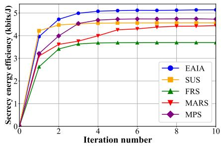  
Fig. 2. Energy efficiency versus the number of iterations.

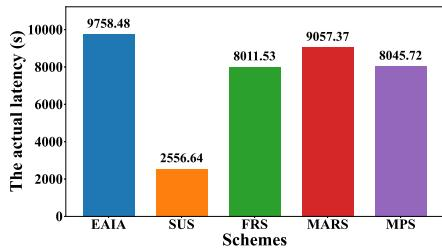  
Fig. 3. Latency versus different schemes.

## B. Two-UAV Simulation Results

We consider a scenario where two UAVs provide communication services to LUs. The convergence characteristics of the EAIA algorithm versus comparison schemes are shown in Fig. 2. This result demonstrates that the EAIA algorithm achieves higher SEE. This advantage arises because EAIA enables UAVs to dynamically change functions and allocate the optimal transmit power while coordinating trajectory planning, thereby achieving efficient resource utilization. Notably, although SUS converges slightly faster than EAIA without collaboration among UAVs, its SEE is even lower than that of MPS due to resource sacrifices caused by its need to reposition to a new optimal hovering point whenever the GE is detected. Thus, the EAIA algorithm converges without significantly increasing iteration numbers, demonstrating excellent convergence speed while delivering higher SEE.

Fig. 3 illustrates the comparison of the actual latency among different schemes. It can be observed that the SUS scheme achieves the lowest latency, as it does not require UAV collaboration. The proposed EAIA scheme shows comparable latency to the FRS scheme, with only a marginal difference. However, as evidenced in Fig. 2, the EAIA scheme achieves a significant improvement in energy efficiency. This is because the functional adjustment process in the EAIA scheme enhances the overall system performance.

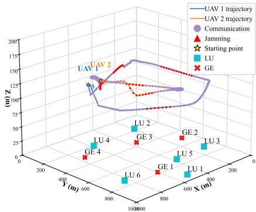

Fig. 4. EAIA-based 3D trajectories for dual-UAV system.  
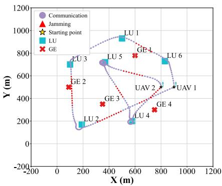  
Fig. 5. EAIA-based 2D trajectories for dual-UAV system.

1) Trajectory and scheduling results: In Fig. 4 and Fig. 5, we plot the optimized trajectory results obtained through the EAIA algorithm. At $T \ = \ 1 5 0 \ \mathrm { \ s } ,$ both UAVs follow initial trajectories flying counterclockwise around circular paths from their starting points. As shown in Fig. 4, the UAVs tend to first descend to lower altitudes and then maintain a certain flight altitude. This is because flying closer to ground users enables them to achieve better channel conditions, thereby enhancing the secrecy rate. In Fig. 5, it can be observed that UAVs tend to approach LUs for information transfer. When UAVs fly near GEs, they switch functions to transmit ANs for eavesdropper suppression. It is noticed that UAV 1 frequently changes its function near LU 2 and GE 4. This occurs because UAV 1 passes through GE 3 and then GE 4 when it returns to its starting point, and also needs to pass through LU4. UAV 1 first jams GE 3 and then jams GE 4 to secure UAV 2’s ongoing transmission with LU 4. When UAV 2 moves away from LU 4, it also switches functions to assist UAV 1’s transmission with LU 6, demonstrating the system’s collaborative mechanism.

In Fig. 6, UAV function switching over time is shown. The y-axis “1” in the graph indicates that the UAV acts with a communication function at this time, while $\mathbf { \vec { \Delta } } ^ { 6 } 0 ^ { 9 }$ represents a jamming function. The plot presents seven collaborative interactions between the two UAVs, corresponding to trajectory observations in Fig. 4 and Fig. 5. These results thus validate the effectiveness of both trajectory optimization and cooperative function scheduling.

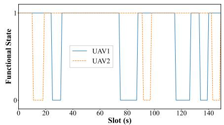  
Fig. 6. Functional scheduling with two UAVs.

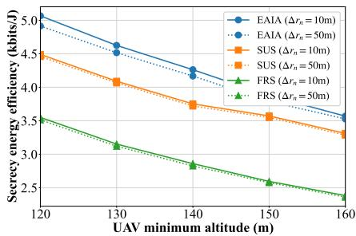  
Fig. 7. Energy efficiency versus flight height.

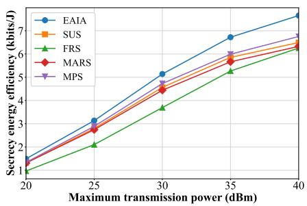  
Fig. 8. Energy efficiency versus maximum transmit power in two-UAV networks.

2) Performance based on minimum flight altitude and error radius: Figure 7 shows the SEE variation curves of three algorithms under different minimum flight altitude constraints. The results indicate that SEE decreases as the minimum altitude increases. This trend primarily stems from the lower minimum flight altitude of UAVs, which grants them a larger operational airspace and greater flexibility to approach ground users. This proximity enables better channel quality, thereby maximizing the SEE. Additionally, SEE variations under imperfect CSI error radius $\Delta r _ { n } ~ = ~ 1 0$ m and $\Delta r _ { n } ~ = ~ 5 0$ m are shown. Larger error radius correlate with reduced SEE performance, as tighter security constraints imposed on the system restrict trajectory planning and resource optimization. Nevertheless, the proposed EAIA scheme consistently maintains better performance than comparison schemes across different radii and a range of heights by flexibly reconfiguring its functions and dynamically allocating transmit power.

3) Performance based on different transmit power: In Fig. 8, we plot SEE versus maximum transmit power, with flight duration fixed at $T = 1 5 0 \ { \mathrm { s . } } \ { \mathrm { F i g . } }$ . 8 demonstrates variations in SEE across maximum transmit power levels, and the proposed

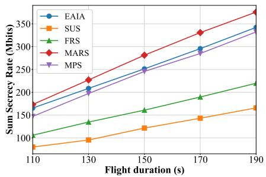  
Fig. 9. Secrecy rate at different flight durations in two-UAV networks.

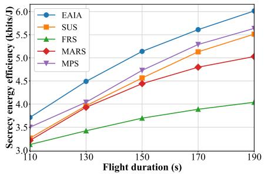  
Fig. 10. Energy efficiency at different flight durations in two-UAV networks.

EAIA scheme has higher SEE than other schemes. Notably, the MPS scheme has lower SEE values than the EAIA, which indicates that intelligent power control effectively enhances overall system performance. In addition, the difference in SEE between FRS and the proposed EAIA is increasing as transmit power increases. This occurs primarily because EAIA dynamically adjusts functions according to channel conditions, thereby achieving more efficient power utilization through optimized resource allocation.

4) Performance based on different flight time: Figs. 9 and 10 show the variation of SEE and the sum secrecy rate for different execution time. We observe that both SEE and the sum secrecy rate increase over time for all schemes. This is because prolonging mission duration T enables UAVs to dedicate more time to transmissions for LUs. In Fig. 9, we notice that both EAIA and FRS achieve higher secrecy rates than SUS. This occurs because the collaborative jamming in EAIA and FRS outperforms SUS’s single-UAV strategy, which sacrifices communication resources for security enhancement. Fig. 10 shows that EAIA achieves the highest SEE, because EAIA’s jammers can switch to communication functions, significantly improving secrecy rates while enhancing energy efficiency, unlike dedicated jamming UAVs that incur energy overhead. Furthermore, Figs. 9 and 10 shows that although the MARS scheme achieves the maximum sum secrecy rate, its SEE performance is substantially compromised. This occurs because MARS prioritizes higher secrecy rates by rapidly approaching LUs while neglecting energy consumption during movement. However, the EAIA algorithm optimally plans trajectories and flight velocities within duration T , yielding optimal energy efficiency with minimal secrecy rate degradation, thereby balancing secrecy rates and energy consumption.

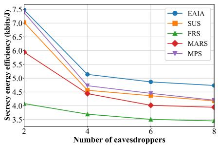  
Fig. 11. Energy efficiency versus the number of eavesdroppers.

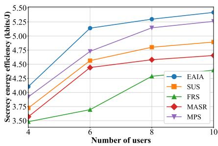  
Fig. 12. Energy efficiency versus the number of users.

5) Performance under different numbers of eavesdroppers and users: In Fig. 11, the SEE comparison under different numbers of eavesdroppers is plotted. Fig. 11 shows that as the number of eavesdroppers gradually increases, the SEE decreases. The main reason is that more eavesdroppers intercept more information, leading to a relative decline in security. Overall, thanks to the cooperation and functional switching of the two UAVs to provide services, the overall performance remains the best. Fig. 12 plots the SEE comparison under different numbers of users. The figure indicates that as the number of users increases, the SEE value gradually improves. The primary reason is that with more users, secure transmissions can be distributed more efficiently, reducing the need for frequent mobility and thereby saving energy within the cycle time. As can be observed from the figure, the EAIA scheme achieves the best performance across different user scenarios. The flexible communication and jamming capabilities of the UAVs enhance resource utilization, resulting in superior performance compared to other schemes.

## C. Multi-UAV Simulation Results

We consider a four-UAV system for providing communication services to LUs. The FRS scheme is applied to our model through coordinated UAV pairs (1UAVI + 1UAVJ per cooperative unit). To suit networks of different scales, mission duration T is 80 s for the multi-UAV, with all comparison schemes using the same T under identical scenarios, ensuring a fair comparison.

1) Trajectory results: In Fig. 13, we present the optimized trajectories for the multi-UAV scenario obtained through the EAIA algorithm. To ensure comprehensive coverage, and similar to [38], UAVs 1 to 4 are initially deployed to fly along circular trajectories from their respective starting points indicated in the diagram, following the direction of arrows.

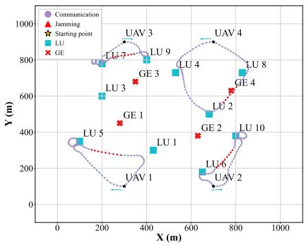  
Fig. 13. Optimized trajectories with four UAVs.

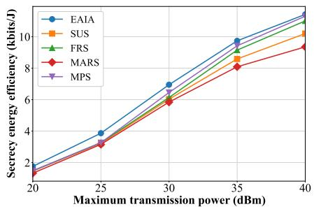  
Fig. 14. Energy efficiency versus maximum transmit power in multi-UAV networks.

The circular paths have centers at [300, 300], [700, 300], [300, 700] and [700, 700], each with a 200-meter radius. The results from the graph demonstrate that UAVs tend to fly towards and communicate with places where there are LUs, aligning with behavioral patterns observed in Fig. 5. Crucially, all four UAVs execute dual functions: while maintaining their own communication links, they transmit ANs to jam GEs and secure other UAVs’ transmissions. For example, after serving LU 9, UAV 3 actively jams GE 3 to enhance security during the transmission between UAV 4 and LU 4. Similarly, when UAV 3 communicates with LU 7, UAV 1 interferes with GE 1. This network achieves multiple collaboration, forming a closed-loop cooperation pattern. As a result, the trajectories collectively validate EAIA’s effectiveness in multi-UAV deployments.

2) Performance based on different transmit power: In Fig. 14, we plot SEE versus maximum transmit power for multi-UAV service provision, with flight duration fixed at T = 80 s. It shows that the EAIA scheme still maintains the best SEE performance, demonstrating its operational effectiveness in multi-UAV scenarios. The FRS scheme achieves higher SEE than SUS in multi-UAV deployments. This is because the collaborative scheme is more adaptable to large-scale scenarios compared to the single UAV scheme. In addition, the MPS scheme exhibits persistently lower SEE than EAIA, indicating the necessity of optimized power allocation strategies.

3) Performance based on different flight time: In Figs. 15 and 16, we present comparative results for different mission durations for four-UAV assisted scenarios. We can observe that the FRS scheme has higher SEE and sum secrecy rates than the SUS scheme, further indicating that the multi-UAV collaboration scheme is adapted to large-scale scenarios. Crucially, the proposed EAIA scheme achieves significantly higher SEE than other methods due to its operational flexibility in functional mode selection. Notably, MARS exhibits the lowest SEE, as increased UAV deployment scales induce growth in aggregate energy consumption, thereby amplifying system efficiency degradation. Furthermore, the proposed EAIA scheme significantly improves the SEE with appropriate secrecy rate reduction to reach an equilibrium between security and energy overhead. This is similar to Figs. 9 and 10.

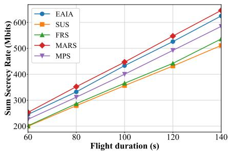  
Fig. 15. Secrecy rate at different flight durations in multi-UAV networks.

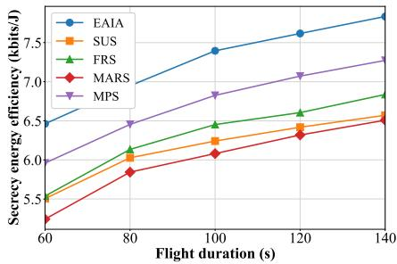  
Fig. 16. Energy efficiency at different flight durations in multi-UAV networks.

## V. CONCLUSION

This paper has considered a multi-UAV-assisted downlink secure communication system, where UAVs can flexibly change their functions based on the channel to suppress eavesdroppers. For the considered scenario, we have maximized the system’s SEE by jointly optimizing UAVs’ scheduling, transmission power, trajectory, and velocity. To address this highly coupled optimization problem, we have decomposed it into three subproblems and solved them iteratively. First, a penalty-based double-loop algorithm has been proposed to address the UAV scheduling problem and determine the UAV’s functional selection. Then, we have employed SCA to solve for power allocation. Finally, UAV trajectory optimization has been accomplished by a Dinkelbach-based iterative algorithm. Results from both theoretical and simulation results have demonstrated the substantial benefits of the designed EAIA scheme. In future research, integrating the proposed scheme with more refined channel models for optimization can further enhance system performance.

## APPENDIX A PROOF OF THEOREM 1

To facilitate analysis, we first consider the numerator of the optimization objective in Problem (P). Optimization variables $\lambda _ { k , m } [ t ] , \mu _ { k , n } [ t ] , p _ { k } ^ { S } [ t ]$ , and $p _ { k } ^ { J } [ t ]$ are highly coupled and $\lambda _ { k , m } [ t ]$ and $\mu _ { k , n } [ t ]$ are binary variables, and thus the numerator part is nonconvex. If we consider the numerator part as an optimization problem, it is a mixed-integer nonlinear program, a class of problems known to be NP-hard [39]. The original problem (P) together with the denominator part is clearly more difficult to solve because the trajectory part also introduces coupling and nonconvexity. Theorem 1 is proved.

## APPENDIX B PROOF OF THEOREM 2

Define function $\mathcal { F } \left( \tilde { \lambda } , \tilde { \mu } \right) = \mathcal { X } ( R ) - \mathcal { Y } _ { \tilde { \lambda } } \left( P _ { \tilde { \lambda } } \right) - \mathcal { Y } _ { \tilde { \mu } } \left( P _ { \tilde { \mu } } \right)$ where $\begin{array} { r l r } { \chi ( R ) } & { { } = } & { \sum _ { t = 1 } ^ { T _ { N } } \overset { \prime } { \sum } _ { m = 1 } ^ { M } \tilde { R } _ { m } ^ { \mathrm { s e c } } [ t ] . } \end{array}$ and $\mathcal { V } _ { \tilde { \lambda } } \left( P _ { \tilde { \lambda } } \right)$ and $\mathcal { V } _ { \tilde { \mu } } \left( P _ { \tilde { \mu } } \right)$ represent the second and third terms of the objective function in Problem (P1<sup>0</sup>), respectively. Since function $\mathcal { F } \left( \tilde { \lambda } , \tilde { \mu } \right)$ is twice differentiable, its second derivatives with respect to $\tilde { \lambda }$ and $\tilde { \mu }$ are given by: $\begin{array} { r l r } { \mathcal { F } _ { { \tilde { \lambda } } } ^ { \prime \prime } \left( { \tilde { \lambda } } , { \tilde { \mu } } \right) } & { { } = } & { - 2 \rho _ { \lambda } - \sum _ { t , k , m } \left( \lambda _ { k , m } [ t ] \right) ^ { 2 } < 0 } \end{array}$ and $\begin{array} { r } { \mathcal { F } _ { \tilde { \mu } } ^ { \prime \prime } \left( \tilde { \lambda } , \tilde { \mu } \right) ~ = ~ - 2 \rho _ { \mu } - \sum _ { t , k , n } \left( \mu _ { k , n } [ t ] \right) ^ { 2 } ~ < ~ 0 . } \end{array}$ . Therefore, function $\displaystyle \dot { \mathcal { F } } \left( \tilde { \lambda } , \tilde { \mu } \right)$ is concave with variables $\tilde { \lambda }$ and $\tilde { \mu } .$ . The first-order partial derivatives of $\mathcal { F } \left( \tilde { \lambda } , \tilde { \mu } \right)$ are: $\mathcal { F } _ { \widetilde { \lambda } } ^ { \prime } \left( \widetilde { \lambda } , \widetilde { \mu } \right) =$ $\begin{array} { r l r } {  { 2 \rho _ { \lambda } \sum _ { t , k , m } \Big [ \Big ( \lambda _ { k , m } [ t ] - \tilde { \lambda } _ { k , m } [ t ] \Big ) + \binom { \tilde { \lambda } _ { k , m } [ t ] } { k } ^ { 2 } ( 1 - \tilde { \lambda } _ { k , m } [ t ] ) \Big ] } } \end{array}$ and $\begin{array} { r l r } { \mathcal { F } _ { \tilde { \mu } } ^ { \prime } \left( \tilde { \lambda } , \tilde { \mu } \right) } & { { } = } & { 2 \rho _ { \mu } \sum _ { t , k , n } [ ( \mu _ { k , n } [ t ] - \tilde { \mu } _ { k , n } [ t ] ) + } \end{array}$ $\left( \mu _ { k , n } [ t ] \right) ^ { 2 } \left( 1 - \tilde { \mu } _ { k , n } [ t ] \right) ]$ . Setting $\begin{array} { r l r } { { \mathcal F } _ { \tilde { \lambda } } ^ { \prime } \left( \tilde { \lambda } , \tilde { \mu } \right) } & { { } = } & { 0 } \end{array}$ and $\mathcal { F } _ { \tilde { \mu } } ^ { \prime } \left( \tilde { \lambda } , \tilde { \mu } \right) = 0$ yields the closed-form solutions for $\tilde { \lambda }$ and $\tilde { \mu }$ as shown in equation (24). Thus, the proof of Theorem 2 is completed.

## APPENDIX C PROOF OF THEOREM 3

Define function $f ( x _ { 1 } , . . . , x _ { K } ) \ = \ \log _ { 2 } \left( \sum _ { i = 1 } ^ { K } a _ { i } x _ { i } + b \right)$ where $a _ { i } \geq 0$ and $b > 0$ is constant. Hessian matrix H of this function is given by:

$$
{ \mathcal { H } } = - { \frac { 1 } { \left( \sum _ { i = 1 } ^ { K } a _ { i } x _ { i } + b \right) ^ { 2 } \ln 2 } } { \left[ \begin{array} { l l l l } { a _ { 1 } ^ { 2 } } & { a _ { 1 } a _ { 2 } } & { \cdots } & { a _ { 1 } a _ { K } } \\ { a _ { 2 } a _ { 1 } } & { a _ { 2 } ^ { 2 } } & { \cdots } & { a _ { 2 } a _ { K } } \\ { \vdots } & { \vdots } & { \ddots } & { \vdots } \\ { a _ { K } a _ { 1 } } & { a _ { K } a _ { 2 } } & { \cdots } & { a _ { K } ^ { 2 } } \end{array} \right] }  .
$$

We can find the eigenvalues of $\begin{array} { r l r l } { \mathcal { H } } & { { } \mathrm { a s } } & { \gamma _ { 1 } } & { { } = } \end{array}$ $\begin{array} { r } { \sum _ { i = 1 } ^ { K } a _ { i } ^ { 2 } / \mathrm { l n } 2 \Big ( \sum _ { i = 1 } ^ { K } a _ { i } x _ { i } + b \Big ) ^ { 2 } , \gamma _ { 2 } = \cdot \cdot \cdot = \gamma _ { K } = 0 , } \end{array}$ and thus matrix H is negative semi-definite. Therefore, $f ( x _ { 1 } , . . . , x _ { K } )$ is concave as a function of $x _ { i } ,$ and its firstorder Taylor expansion provides an upper bound at given point $x _ { i } ^ { ( r ) }$ [40], with first-order derivatives: $f _ { \mathrm { \Delta } x _ { i } } ^ { \prime } \left( x _ { 1 } , . . . , x _ { K } \right) \ =$ $\begin{array} { r } { a _ { i } / \mathrm { l n } 2 \left( \sum _ { j = 1 } ^ { K } a _ { j } x _ { j } + b \right) } \end{array}$ . Therefore, $\begin{array} { r l } { f ( x _ { 1 } , . . . , x _ { K } ) } & { { } \leq } \end{array}$ $\begin{array} { r c l } { f ( x _ { 1 } ^ { ( r ) } , . . . , x _ { K } ^ { ( r ) } ) } & { + } & { \sum _ { i = 1 } ^ { K } f _ { x _ { i } } ^ { \prime } ( x _ { 1 } ^ { ( r ) } , . . . , x _ { K } ^ { ( r ) } ) ( x _ { i } } & { - } & { x _ { i } ^ { ( r ) } ) } \end{array}$ Equivalent rate component $R _ { m 2 } [ t ]$ conforms to function $f ( x _ { 1 } , . . . , x _ { K } )$ and is concave with respect to $p _ { i } ^ { J } [ t ]$ , leading to equation (27).

## APPENDIX D PROOF OF THEOREM 4 PROOF OF THEOREM 4

Define function $f \left( x , y _ { 1 } , \dotsc , y _ { K - 1 } \right)$ $\log _ { 2 } \left( \frac { a } { x } + \sum _ { i = 1 , i \neq k } ^ { K } \frac { b _ { i } } { y _ { i } } + c \right)$ , where $a \ge 0 , b _ { i } \ge 0 , c > 0$ are constants, and variables $\acute { x }$ and $y _ { i }$ are positive, and it can be transformed into $\begin{array} { r c l } { g \left( z _ { 1 } , \dots , z _ { K } \right) } & { = } & { \log _ { 2 } \left( \sum _ { i = 1 } ^ { K } \frac { c _ { i } } { z _ { i } } + c \right) } \end{array}$ where $\begin{array} { r l r l } { c _ { i } } & { { } \ge } & { 0 . } \end{array}$ . Define $\begin{array} { r l r } { S } & { { } = } & { \sum _ { i = 1 } ^ { K } \frac { c _ { i } } { z _ { i } } + c . } \end{array}$ . Hessian matrix $\widehat { \mathcal { H } }$ of function $g \left( z _ { 1 } , \ldots , z _ { K } \right)$ is given by the second-order partial derivatives. The diagonal elements are: $\begin{array} { r c l c r c l } { \widehat { \mathcal { H } } _ { i i } } & { = } & { \frac { \partial ^ { 2 } g } { \partial z _ { i } ^ { 2 } } } & { = } & { \frac { 2 c _ { i } } { \ln 2 \cdot S z _ { i } ^ { 3 } } } & { - } & { \frac { c _ { i } ^ { 2 } } { \ln 2 \cdot S ^ { 2 } z _ { i } ^ { 4 } } } \end{array}$ , and the offdiagonal elements are: $\begin{array} { r l r } { \widehat { { \mathcal H } } _ { j i } } & { = } & { \frac { \partial ^ { 2 } g } { \partial z _ { j } \partial z _ { i } } \quad = \quad - \frac { c _ { j } c _ { i } } { \ln 2 \cdot S ^ { 2 } z _ { j } ^ { 2 } z _ { i } ^ { 2 } } . } \end{array}$ For vector $\begin{array} { c c l } { \pmb { x } } & { = } & { \left( x _ { 1 } , \ldots x _ { K } \right) ^ { T } } \end{array}$ , the quadratic form is: $\begin{array} { r } { \pmb { x } ^ { T } \pmb { \widehat { \mathcal { H } } } \pmb { x } = \displaystyle \sum _ { i = 1 } ^ { K } \displaystyle \sum _ { i = 1 } ^ { K } x _ { j } \widehat { \mathcal { H } } _ { j i } x _ { i } = \sum _ { i = 1 } ^ { K } x _ { i } ^ { 2 } \widehat { \mathcal { H } } _ { i i } + \sum _ { j \neq k } x _ { j } x _ { i } \widehat { \mathcal { H } } _ { j i } . } \end{array}$ Substituting the elements and simplifying yields: $\begin{array} { r } { \begin{array} { l } { _ { \pmb { x } } ^ { T } \widehat { \mathcal { H } } \pmb { x } = \frac { 2 } { \ln 2 \cdot S } \sum _ { i = 1 } ^ { K } \frac { c _ { i } x _ { i } ^ { 2 } } { z _ { i } ^ { 3 } } - \frac { 1 } { \ln 2 \cdot S ^ { 2 } } \left( \sum _ { i = 1 } ^ { K } \frac { c _ { i } x _ { i } } { z _ { i } ^ { 2 } } \right) ^ { 2 } } \end{array} } \end{array}$ . Define vectors a and b as: $a _ { i } \ = \ x _ { i } { \sqrt { { \frac { c _ { i } } { z _ { i } ^ { 3 } } } } } , \ b _ { i } \ = \ { \sqrt { { \frac { c _ { i } } { z _ { i } } } } }$ . According to the Cauchy-Schwarz inequality $\begin{array} { r l } { \left( \mathbf { a } \cdot \mathbf { b } \right) ^ { 2 ^ { * } } \leq } & { { } \| \mathbf { a } \| ^ { 2 } \| \mathbf { b } \| ^ { 2 } } \end{array}$ we have: $\begin{array} { r l r } { \left( \sum _ { i = 1 } ^ { K } \frac { c _ { i } x _ { i } } { z _ { i } ^ { 2 } } \right) ^ { 2 } } & { { } \le } & { \left( \sum _ { i = 1 } ^ { K } \frac { c _ { i } x _ { i } ^ { 2 } } { z _ { i } ^ { 3 } } \right) ( S - c ) } \end{array}$ Substituting into the quadratic form gives: ${ \pmb x } ^ { T } { \hat { \mathcal { H } } } { \pmb x } \geq$ $\begin{array} { r l r l r } { \frac { 2 } { \ln 2 \cdot S } \sum _ { i = 1 } ^ { K } \frac { c _ { i } x _ { i } ^ { 2 } } { z _ { i } ^ { 3 } } } & { { } - } & { { } } & { \frac { \hat { 1 } } { \ln 2 \cdot S ^ { 2 } } \left( \sum _ { i = 1 } ^ { K } \frac { c _ { i } x _ { i } ^ { 2 } } { z _ { i } ^ { 3 } } \right) ( S - c ) } & { } & { { } = } & { } \end{array}$ $\begin{array} { r l r } { \frac { 1 } { \ln 2 \cdot S } \sum _ { i = 1 } ^ { K } \frac { c _ { i } x _ { i } ^ { 2 } } { z _ { i } ^ { 3 } } + \frac { c } { \ln 2 \cdot S ^ { 2 } } \left( \sum _ { i = 1 } ^ { K } \frac { c _ { i } x _ { i } ^ { 2 } } { z _ { i } ^ { 3 } } \right) } & { { } \ge } & { 0 } \end{array}$ . Therefore, function $g \left( z _ { 1 } , \ldots , z _ { K } \right)$ is convex, and its lower bound can be obtained. The first-order partial derivative of $g \left( z _ { 1 } , \ldots , z _ { K } \right)$ regarding $z _ { i }$ is: $\begin{array} { r l r } { \frac { \partial \hat { g } } { \partial z _ { i } } } & { { } = } & { - \frac { c _ { i } } { \ln 2 \cdot S z _ { i } ^ { 2 } } } \end{array}$ Thus, we have $\begin{array} { r l r } { g \left( z _ { 1 } , \dots , z _ { K } \right) } & { { } \ge } & { g \left( z _ { 1 } ^ { ( r ) } , \dots , z _ { K } ^ { ( r ) } \right) \ \overset { \cdot } { + } } \end{array}$ $\begin{array} { r } { \sum _ { i = 1 } ^ { K } \left( - \frac { c _ { i } } { \ln 2 \cdot S ^ { ( r ) } z _ { i } ^ { 2 ( r ) } } \right) \left( z _ { i } - z _ { i } ^ { ( r ) } \right) } \end{array}$ . The form of signalinterference combined rate $\mathcal { R } _ { k , m } [ t ]$ is similar to $g \left( z _ { 1 } , \ldots , z _ { K } \right)$ thus inequality (33) holds.

## APPENDIX E PROOF OF THEOREM 5

Define function $\mathcal { F } ( \eta ) = \mathcal { U } ( R ) - \eta \mathcal { V } ( P )$ , where $\mathcal { U } ( R ) =$ $\sum _ { \mathbf { \lambda } } ^ { T _ { N } } \sum _ { \mathbf { \lambda } } ^ { M } \Phi _ { m } [ t ]$ and $\mathcal { V } ( P ) = \sum _ { t = 1 } ^ { T _ { N } } \sum _ { k = 1 } ^ { K } \tilde { P } _ { k } ^ { f } [ t ]$ . Since $\check { \Omega }$ is the set of t=1 m=1 feasible solutions and $\eta ^ { * }$ is the optimal energy efficiency of the system, we have $\mathcal { U } ( \check { R } ) / \nu ( \check { P } ) \leq \eta ^ { * }$ . Rewrite this in subtractive form as $\mathcal { U } ( \check { R } ) - \eta ^ { * } \mathcal { V } ( \check { P } ) \leq 0 .$ , and thus maxmize $\mathcal { F } ( \eta ) \leq 0$ The optimal energy efficiency satisfies $\eta ^ { * } = \mathcal { U } ( R ^ { * } ) / \mathcal { V } ( P ^ { * } )$ i.e., $\mathcal { U } ( R ^ { * } ) - \eta ^ { * } \mathcal { V } ( P ^ { * } ) = 0$ . In summary, Theorem 5 is proved.

## APPENDIX F PROOF OF THEOREM 6

Problem (P) is partitioned into three subproblems, and the SCA approach is used to address each subproblem. The algorithm converges to a stabilized value through iterative updating. For given feasible initial point $\{ X ^ { ( r ) } \}$ , we obtain feasible solution $\left\{ \tilde { Y } ^ { ( r ) } \right\}$ at the $r { \mathrm { - t h } }$ iteration. The $( r + 1 )$ -th iteration takes feasible solution $\left\{ \tilde { Y } ^ { ( r ) } \right\}$ obtained in the r-th iteration as the new initial point, i.e., $\left\{ X ^ { ( r + 1 ) } \right\} = \left\{ \tilde { Y } ^ { ( r ) } \right\}$ This new initial point $\{ X ^ { ( r + 1 ) } \}$ is used to find next solution $\left\{ { \tilde { Y } } ^ { ( r + 1 ) } \right\}$ . Specifically, let $\eta \big ( \mathbf { A } ^ { r - 1 } , \mathbf { P } ^ { r - 1 } , \mathbf { Q } ^ { r - 1 } , \mathbf { V } ^ { r - 1 } \big )$ denote the initial solution to the original optimization objective. Through Step 5 of Algorithm 3, an improved solution $\mathbf { A } ^ { r }$ can be obtained, satisfying $\eta \big ( \mathbf { A } ^ { r - 1 } , \mathbf { P } ^ { r - 1 } , \mathbf { Q } ^ { r - 1 } , \mathbf { V } ^ { r - 1 } \big ) \ \leq$ $\eta \big ( \mathbf { A } ^ { r } , \mathbf { P } ^ { r - 1 } , \mathbf { Q } ^ { r - 1 } , \mathbf { V } ^ { r - 1 } \big )$ . Then, in Step 6 of Algorithm 3, a suboptimal transmit power solution $\mathbf { P } ^ { r }$ is derived by solving Problem (P2<sup>0</sup>):

$$
\begin{array} { r l } & { \eta \big ( \mathbf { A } ^ { r } , \mathbf { P } ^ { r - 1 } , \mathbf { Q } ^ { r - 1 } , \mathbf { V } ^ { r - 1 } \big ) } \\ & { \quad \stackrel { ( a ) } { = } \eta ^ { \mathrm { l b } } \big ( \mathbf { A } ^ { r } , \mathbf { P } ^ { r - 1 } , \mathbf { Q } ^ { r - 1 } , \mathbf { V } ^ { r - 1 } \big ) } \\ & { \quad \stackrel { ( b ) } { \leq } \eta ^ { \mathrm { l b } } \big ( \mathbf { A } ^ { r } , \mathbf { P } ^ { r } , \mathbf { Q } ^ { r - 1 } , \mathbf { V } ^ { r - 1 } \big ) } \\ & { \quad \stackrel { ( c ) } { \leq } \eta \big ( \mathbf { A } ^ { r } , \mathbf { P } ^ { r } , \mathbf { Q } ^ { r - 1 } , \mathbf { V } ^ { r - 1 } \big ) , } \end{array}
$$

where equation (a) is justified by the tightness of the firstorder Taylor approximations at the specified feasible point. Inequality (b) arises from the fact that Problem (P2<sup>0</sup>) can be optimally solved. Inequality (c) is valid because the SEE in Problem $( { \bf P } 2 ^ { \prime } )$ serves as a lower bound for the objective function in Problem (P). The inequality confirms that the objective value is non-decreasing across successive iterations [41]. The convergence proof for Step 7 of Algorithm 3 follows an analogous argument, leading to the conclusion:

$$
\eta \left( \mathbf { A } ^ { r - 1 } , \mathbf { P } ^ { r - 1 } , \mathbf { Q } ^ { r - 1 } , \mathbf { V } ^ { r - 1 } \right) \leq \eta \left( \mathbf { A } ^ { r } , \mathbf { P } ^ { r } , \mathbf { Q } ^ { r } , \mathbf { V } ^ { r } \right) .
$$

Convergence is guaranteed since the total transmission rate is bounded due to UAV power and speed constraints during the fixed execution time. Thus, Theorem 6 is proved.

## APPENDIX G PROOF OF THEOREM 7

The computational complexity of the EAIA algorithm stems mainly from solving the three subproblems. Problem $( \mathrm { P } 1 ^ { \prime } )$ is solved by a penalty-based algorithm with $N _ { 1 } = K M +$ $N T + 2 M T$ variables, where $r _ { 1 }$ and $r _ { 2 }$ denote the iteration numbers for inner and outer loops. Problem $( \mathrm { P } 1 ^ { \prime } )$ is solved in each iteration involves logarithmic form, and its algorithmic complexity is $\mathcal { O } \left( r _ { 1 } r _ { 2 } N _ { 1 } ^ { 3 . 5 } \log \frac { 1 } { \omega } \right)$ [14], where $\omega$ denotes the accuracy of the solution. Similarly, solving Problem $( { \bf P } 2 ^ { \prime } )$ has computational complexity $\mathcal { O } \left( L _ { 2 } \bar { N } _ { 2 } ^ { 3 . 5 } \log \frac { 1 } { \omega } \right)$ , where $N _ { 2 } \ =$ $2 K T + 2 M T$ is the number of variables, and $L _ { 2 }$ indicates the required iteration count. The trajectory optimization complexity is $\mathcal { O } \left( l _ { 1 } l _ { 2 } N _ { 3 } ^ { 3 . 5 } \log \frac { 1 } { \omega } \right)$ , where $N _ { 3 } = 3 K T + K ( M +$ $N ) T + 2 M \dot { T }$ represents the number of variables, with $l _ { 1 }$ and $l _ { 2 }$ denote inner and outer loop iteration numbers for Problem $( \mathrm { P 3 ^ { \prime \prime } } )$ . Thus, the overall time complexity is given by equation (46).

## ACKNOWLEDGMENT

The authors would like to thank for the guidance provided by Prof. Dusit Niyato on this article.

## REFERENCES

[1] X. Wang et al., “Robust anti-jamming for hybrid-IRS-assisted AAV swarm communications for low-altitude economy,” IEEE Trans. Wireless Commun., vol. 25, pp. 10337–10353, 2026, doi: 10.1109/ TWC.2025.3645590.

[2] Y. Bai et al., “Toward autonomous multi-UAV wireless network: A survey of reinforcement learning-based approaches,” IEEE Commun. Surveys Tuts., vol. 25, no. 4, pp. 3038–3067, 2nd Quart., 2023.

[3] Q. Wu et al., “A comprehensive overview on 5G-and-beyond networks with UAVs: From communications to sensing and intelligence,” IEEE J. Sel. Areas Commun., vol. 39, no. 10, pp. 2912–2945, Oct. 2021.

[4] X. Guo, B. Li, J. Wu, R. Zhang, and X. Cheng, “Joint uplink and downlink NOMA for UAV relaying network with multi-pair users,” IEEE Trans. Wireless Commun., vol. 23, no. 12, pp. 18549–18562, Dec. 2024.

[5] Y. Chen, W. Cheng, and W. Zhang, “Reconfigurable intelligent surface equipped UAV in emergency wireless communications: A new fading–shadowing model and performance analysis,” IEEE Trans. Commun., vol. 72, no. 3, pp. 1821–1834, Mar. 2024.

[6] X. Wang, B. Wang, Y. Wu, Z. Ning, S. Guo, and F. R. Yu, “A survey on trustworthy edge intelligence: From security and reliability to transparency and sustainability,” IEEE Commun. Surveys Tuts., vol. 27, no. 3, pp. 1729–1757, Jun. 2025, doi: 10.1109/COMST.2024.3446585.

[7] X. Yu, J. Xu, N. Zhao, X. Wang, and D. Niyato, “Security enhancement of ISAC via IRS-UAV,” IEEE Trans. Wireless Commun., vol. 23, no. 10, pp. 15601–15612, Oct. 2024.

[8] W. Mao, K. Xiong, Y. Lu, P. Fan, and Z. Ding, “Energy consumption minimization in secure multi-antenna UAV-assisted MEC networks with channel uncertainty,” IEEE Trans. Wireless Commun., vol. 22, no. 11, pp. 7185–7200, Nov. 2023.

[9] R. Ye, Y. Peng, F. Al-Hazemi, and R. Boutaba, “A robust cooperative jamming scheme for secure UAV communication via intelligent reflecting surface,” IEEE Trans. Commun., vol. 72, no. 2, pp. 1005–1019, Feb. 2024.

[10] X. Wang et al., “Throughput maximization for covert communications: A buffer-aided AAV relaying algorithm,” IEEE J. Sel. Areas Commun., vol. 44, pp. 1842–1857, 2026, doi: 10.1109/JSAC.2025.3638728.

[11] K. Heo, W. Lee, and K. Lee, “UAV-assisted wireless-powered secure communications: Integration of optimization and deep learning,” IEEE Trans. Wireless Commun., vol. 23, no. 9, pp. 10530–10545, Sep. 2024.

[12] D. Guo, L. Tang, X. Zhang, and Y.-C. Liang, “Joint optimization of trajectory and jamming power for multiple UAV-aided proactive eavesdropping,” IEEE Trans. Mobile Comput., vol. 23, no. 5, pp. 5770–5785, May 2024.

[13] L. Xie, Z. Su, Q. Xu, N. Chen, Y. Fan, and A. Benslimane, “A secure UAV cooperative communication framework: Prospect theory based approach,” IEEE Trans. Mobile Comput., vol. 23, no. 11, pp. 10219–10234, Nov. 2024.

[14] F. Lu et al., “Resource and trajectory optimization for UAV-relayassisted secure maritime MEC,” IEEE Trans. Commun., vol. 72, no. 3, pp. 1641–1652, Mar. 2024.

[15] Y. Zhang, Z. Kuang, Y. Feng, and F. Hou, “Task offloading and trajectory optimization for secure communications in dynamic user multi-UAV MEC systems,” IEEE Trans. Mobile Comput., vol. 23, no. 12, pp. 14427–14440, Dec. 2024.

[16] Y. Ding et al., “Collaborative communication and computation for secure UAV-enabled MEC against active aerial eavesdropping,” IEEE Trans. Wireless Commun., vol. 23, no. 11, pp. 15915–15929, Nov. 2024.

[17] J. Li et al., “Deep learning based secure transmissions for the UAV-RIS assisted networks: Trajectory and phase shift optimization,” in Proc. IEEE Global Commun. Conf., Dec. 2024, pp. 1617–1622.

[18] J. Wang, Z. Jiao, J. Chen, X. Hou, T. Yang, and D. Lan, “Blockchainaided secure access control for UAV computing networks,” IEEE Trans. Netw. Sci. Eng., vol. 11, no. 6, pp. 5267–5279, Nov. 2024.

[19] J. Wang, C. Jiang, Z. Wei, C. Pan, H. Zhang, and Y. Ren, “Joint UAV hovering altitude and power control for space-air-ground IoT networks,” IEEE Internet Things J., vol. 6, no. 2, pp. 1741–1753, Apr. 2019.

[20] M. Zhao, Z. Wang, K. Guo, R. Zhang, and T. Q. S. Quek, “Against mobile collusive eavesdroppers: Cooperative secure transmission and computation in UAV-assisted MEC networks,” IEEE Trans. Mobile Comput., vol. 24, no. 6, pp. 5280–5297, Jun. 2025.

[21] X. Dai, B. Duo, X. Yuan, and W. Tang, “Energy-efficient UAV communications: A generalized propulsion energy consumption model,” IEEE Wireless Commun. Lett., vol. 11, no. 10, pp. 2150–2154, Oct. 2022.

[22] N. Lin, Y. Fan, L. Zhao, X. Li, and M. Guizani, “GREEN: A global energy efficiency maximization strategy for multi-UAV enabled communication systems,” IEEE Trans. Mobile Comput., vol. 22, no. 12, pp. 7104–7120, Dec. 2023.

[23] J. Chen, J. Wang, J. Wang, and L. Bai, “Joint fairness and efficiency optimization for CSMA/CA-based multi-user MIMO UAV ad hoc networks,” IEEE J. Sel. Topics Signal Process., vol. 18, no. 7, pp. 1311–1323, Oct. 2024.

[24] X. Hu, P. Wen, H. Xiao, W. Wang, and K.-K. Wong, “Maximizing energy charging for UAV-assisted MEC systems with SWIPT,” IEEE Trans. Veh. Technol., vol. 74, no. 5, pp. 8442–8447, May 2025.

[25] Y. Zhou, F. Zhou, H. Zhou, D. W. K. Ng, and R. Q. Hu, “Robust trajectory and transmit power optimization for secure UAV-enabled cognitive radio networks,” IEEE Trans. Commun., vol. 68, no. 7, pp. 4022–4034, Jul. 2020.

[26] C. Diaz-Vilor, A. Lozano, and H. Jafarkhani, “Cell-free UAV networks with wireless fronthaul: Analysis and optimization,” IEEE Trans. Wireless Commun., vol. 23, no. 3, pp. 2054–2069, Mar. 2024.

[27] M. Hua, L. Yang, Q. Wu, and A. L. Swindlehurst, “3D UAV trajectory and communication design for simultaneous uplink and downlink transmission,” IEEE Trans. Commun., vol. 68, no. 9, pp. 5908–5923, Sep. 2020.

[28] W. Wang et al., “Robust 3D-trajectory and time switching optimization for dual-UAV-enabled secure communications,” IEEE J. Sel. Areas Commun., vol. 39, no. 11, pp. 3334–3347, Nov. 2021.

[29] Z. Liu, B. Zhu, Y. Xie, K. Ma, and X. Guan, “UAV-aided secure communication with imperfect eavesdropper location: Robust design for jamming power and trajectory,” IEEE Trans. Veh. Technol., vol. 73, no. 5, pp. 7276–7286, May 2024.

[30] X. Zhu, L. Zhai, N. Li, Y. Li, and F. Yang, “Multi-objective deployment optimization of UAVs for energy-efficient wireless coverage,” IEEE Trans. Commun., vol. 72, no. 6, pp. 3587–3601, Jun. 2024.

[31] N. Gupta, S. Agarwal, D. Mishra, and B. Kumbhani, “Trajectory and resource allocation for UAV replacement to provide uninterrupted service,” IEEE Trans. Commun., vol. 71, no. 12, pp. 7288–7302, Dec. 2023.

[32] X. Zhou, S. Yan, F. Shu, R. Chen, and J. Li, “UAV-enabled covert wireless data collection,” IEEE J. Sel. Areas Commun., vol. 39, no. 11, pp. 3348–3362, Nov. 2021.

[33] X. Wang et al., “Adaptive power control and data sampling for energy-efficient over-the-air federated edge learning,” IEEE Trans. Wireless Commun., vol. 25, pp. 5890–5905, 2025, doi: 10.1109/ TWC.2025.3621448.

[34] R. Zhang, X. Pang, W. Lu, N. Zhao, Y. Chen, and D. Niyato, “Dual-UAV enabled secure data collection with propulsion limitation,” IEEE Trans. Wireless Commun., vol. 20, no. 11, pp. 7445–7459, Nov. 2021.

[35] Y. Cai, Z. Wei, R. Li, D. W. K. Ng, and J. Yuan, “Joint trajectory and resource allocation design for energy-efficient secure UAV communication systems,” IEEE Trans. Commun., vol. 68, no. 7, pp. 4536–4553, Jul. 2020.

[36] J. Hur and S.-H. Lee, “Joint trajectory and power optimization for energy-efficient UAV redeployment against an eavesdropper under consistent fairness constraint,” IEEE Commun. Lett., vol. 28, no. 10, pp. 2347–2351, Oct. 2024.

[37] W. Lu et al., “Secure NOMA-based UAV-MEC network towards a flying eavesdropper,” IEEE Trans. Commun., vol. 70, no. 5, pp. 3364–3376, May 2022.

[38] M. Hua, Y. Wang, Q. Wu, H. Dai, Y. Huang, and L. Yang, “Energyefficient cooperative secure transmission in multi-UAV-enabled wireless networks,” IEEE Trans. Veh. Technol., vol. 68, no. 8, pp. 7761–7775, Aug. 2019.

[39] Z. Ning, H. Hu, X. Wang, and Y. Zhang, “Channel-aware user association and trajectory design for multi-IRS assisted multi-UAV communications,” IEEE Trans. Wireless Commun., vol. 25, pp. 8483–8497, 2025, doi: 10.1109/TWC.2025.3638442.

[40] S. Boyd and L. Vandenberghe, Convex Optimization. Cambridge, U.K.: Cambridge Univ. Press, 2004.

[41] X. Zhang, Z. Chang, T. Ham¨ al¨ ainen, and G. Min, “AoI-energy tradeoff¨ for data collection in UAV-assisted wireless networks,” IEEE Trans. Commun., vol. 72, no. 3, pp. 1849–1861, Mar. 2024.

  
Xiaojie Wang (Senior Member, IEEE) received the Ph.D. degree from Dalian University of Technology, Dalian, China, in 2019. She is currently a Full Professor with the School of Communications and Information Engineering, Chongqing University of Posts and Telecommunications, Chongqing, China. She has published more than 70 scientific papers in international journals and conferences. Her research interests are wireless networks, mobile edge computing, and machine learning. She is a Highly Cited Researcher (Web of Science) in 2023 and 2024.


Qianwen Liu received the bachelor’s degree from the School of Communications and Information Engineering, Chongqing University of Posts and Telecommunications, Chongqing, China, in 2023. She is currently pursuing the master’s degree with Chongqing University of Posts and Telecommunications. Her research interests include wireless communication networks, uncrewed aerial vehicle, and secure communications.

  
Researcher (Web of Science) since 2020.

Zhaolong Ning (Senior Member, IEEE) received the Ph.D. degree from Northeastern University, China, in 2014. He is currently a Full Professor with the School of Communications and Information Engineering, Chongqing University of Posts and Telecommunications, Chongqing, China. He has published more than 150 scientific papers in international journals and conferences. His research interests include mobile edge computing, 6G networks, machine learning, and resource management. He is an IET Fellow. He has been a Highly Cited


Tie Qiu (Senior Member, IEEE) was an Assistant Professor and an Associate Professor with the School of Software, Dalian University of Technology, from 2008 to 2013. He was a Visiting Professor with the Department of Electrical and Computer Engineering, Iowa State University, Ames, IA, USA, from 2014 to 2015. He is currently a Full Professor with the School of Computer Science and Engineering, Northeastern University, Shenyang, China. He has authored/co-authored ten books, more than 200 scientific papers in international journals and conference proceedings. He is a Distinguished Member of China Computer Federation (CCF) and a Senior Member of ACM. He serves as an Associate Editor for IEEE/ACM TRANSACTIONS ON NETWORKING (ToN), IEEE TRANSACTIONS ON NETWORK SCIENCE AND ENGINEERING (TNSE), and IEEE TRANSACTIONS ON SYSTEMS, MAN, AND CYBERNETICS: SYSTEMS, and an Area Editor for Ad Hoc Networks (Elsevier).


Lei Guo received the Ph.D. degree from the University of Electronic Science and Technology of China, Chengdu, China, in 2006. He is currently a Full Professor with Northeastern University, Shenyang, China. He has authored or co-authored more than 200 technical papers in international journals and conferences. His current research interests include communication networks, optical communications, and wireless communications. He is an editor of several international journals.


Yan Zhang (Fellow, IEEE) received the Ph.D. degree from the School of Electrical and Electronics Engineering, Nanyang Technological University, Singapore. He is currently a Full Professor with the University of Electronic Science and Technology of China. His research interests include next generation wireless networks leading to 6G and green and secure cyber-physical systems. He is a Fellow of IET. He is an Elected Member of Academia Europaea (MAE), the Royal Norwegian Society of Sciences and Letters (DKNVS), and Norwegian

Academy of Technological Sciences (NTVA). Since 2018, he has been a recipient of the Global Clarivate Analytics “Highly Cited Researcher” Award (Web of Science top 1% most cited worldwide). He is the Co-Editor-in-Chief of IEEE TRANSACTIONS ON INDUSTRIAL INFORMATICS, an Area Editor of IEEE TRANSACTIONS ON GREEN COMMUNICATIONS AND NETWORKING, a Senior Editor of IEEE SYSTEMS JOURNAL, and an associate editor of several IEEE transactions/magazine.