# Energy-Efficient Task Allocation for Green Aerial Edge Computing Based on Metaverse Users: A Mean Field Game Approach

Lianbo Ma, Senior Member, IEEE, Dingsige Chen, Yue-e Zhou, Jianming Zhao, Liang Wang, Qiang He, Bo Yi, Min Huang, Xingwei Wang

Abstract—We consider the energy-constrained task allocation problem in large-scale Aerial Edge Computing (AEC) systems, which encompasses a series of tightly coupled decision-making processes, including which tasks need to be processed by unmanned aerial vehicles (UAVs), how to allocate these tasks and balance energy across UAVs for delay-sensitive requirements. However, little attention has been devoted to exploring the above coupled decision-making problem in AEC with various resource and energy constraints, which is further complicated by energy dynamics (UAV battery states), task-specific consumption, and allocation-feedback balance. In this paper, we formulate a multi-dimensional joint optimization problem, simultaneously optimizing task allocation and energy rewarding to maximize long-term system rewards while balancing service quality and energy efficiency. To this end, we propose a green aerial edge computing framework where partial UAVs are equipped with energy harvesting modules to collect ambient energy. To circumvent the intractable computational complexity arising from the coupled energy states of massive UAVs, we design a distributed solution method based on the mean field game, which decouples the dense multi-agent interactions into a game between an individual UAV and the aggregate population state, thereby transforming the complex global optimization problem into a set of equivalent scalable subproblems. We develop an optimal energy valuation scheme to guide UAV behavior. Numerical results show that our mechanism can effectively ensure sustainable system operation while maintaining high quality of service for metaverse users, outperforming existing methods in both system sustainability and service responsiveness.

Index Terms—Task allocation, aerial edge computing, energyefficient, metaverse, mean field game.

## I. INTRODUCTION

Lianbo Ma, Dingsige Chen and Yue-e Zhou are with College of Software, Northeastern University, Shenyang 110819, China (e-mail: malb@swc.neu.edu.cn, chendingsige@gmail.com, zhouyuee@stumail.neu.edu.cn).

Jianming Zhao is with College of Computer Science and Engineering, Northeastern University, Shenyang 110819, China. (e-mail: zhaojianming@cse.neu.edu.cn).

Liang Wang is with College of Computer Science, Northwestern Polytechnical University, Xian 710129, China (e-mail: liangwang@nwpu.edu.cn.)

Qiang He (corresponding author) is with College of Computer Science and Engineering, Northeastern University, Shenyang 110819, China (e-mail: heqiang@bmie.neu.edu.cn).

Bo Yi is with College of Computer Science and Engineering, Northeastern University, Shenyang 110819, China. (e-mail: yibo@cse.neu.edu.cn).

Min Huang is with the College of Information Science and Engineering, State Key Laboratory of Synthetical Automation for Process Industries, Northeastern University, Shenyang 110819, China (e-mail: mhuang@mail.neu.edu.cn).

Xingwei Wang is with the College of Computer Science and Engineering, Northeastern University, Shenyang 110819, China (e-mail: wangxw@mail.neu.edu.cn).

interactions [1], [2]. It achieves cyber-physical synchronization through synergistic integration of augmented reality (AR) [3], virtual reality (VR) [4], and distributed sensor networks [5], which however suffers from high latency due to cloud transmission. An effective solution is to integrate metaverse computation with Aerial Edge Computing (AEC) to facilitate access to real-time metaverse services with ultra-low latency and reduced bandwidth consumption [6], [7], enabled by Line-of-Sight (LoS) transmission of unmanned aerial vehicles (UAVs) [8]. However, the operations of UAVs remain constrained by limited battery capacity, which impacts service sustainability and reliability in prolonged operational scenarios. Recent developments in miniaturized Energy Harvesting (EH) technologies [9] offer a promising solution to mitigate these constraints. State-of-the-art EH devices, e.g., JUSE [10], Sunthetic [11], and SUNNY [12], have exhibited remarkable potential for enabling perpetual UAV power supply, and they can be effectively integrated with UAV platforms to form Green Aerial Edge Computing (GAEC) for sustainable operation through continuous energy replenishment [13].

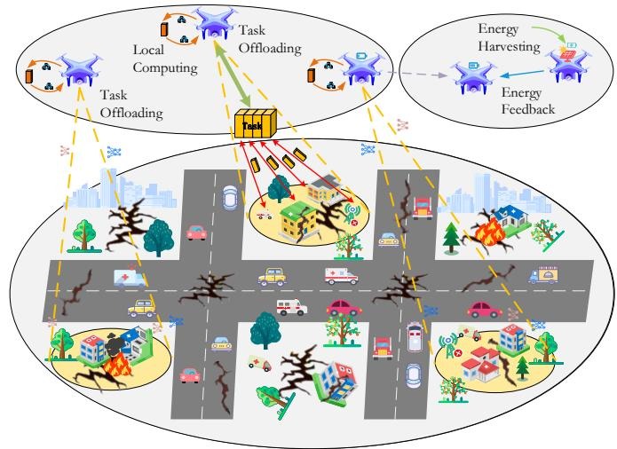  
Fig. 1. Example of GAEC system in post-disaster rescue scenario.

Example 1: In post-disaster rescue scenarios [14], as shown in Fig. 1, energy-harvesting UAVs are equipped with 800W solar arrays, and the ground units (e.g., ResQBot-

X3) create digital twins of collapsed structures while monitoring vital signs in real time. The workflow comprises: (1) they offload compute-intensive tasks from ground to nearby UAVs (e.g., DJI Matrice 300 RTK), and (2) UAV process the task and then return result. After task completion, these UAVs relocate to energy harvesting zones for proportional energy replenishment. However, inefficient task assignment risks queue congestion and processing delays, while unbalanced energy distribution reduces total operational time. This dual requirement for optimized task allocation and equitable energy feedback presents a key challenge in system design.

A potential solution is a centralized bidding mechanism where users submit requests, UAVs bid based on energy costs, and a dispatcher assigns tasks to maximize global rewards. However, applying this to large-scale metaverse environments still faces three major challenges:

• Challenge 1: UAV Battery Limitation and Stochasticity in Energy Dynamics. UAVs are inherently constrained by limited on-board battery capacity, which cannot support long-time service for computation-intensive Metaverse tasks. To address this, GAEC integrates EH to extend operational lifespan. However, unlike conventional edge servers with stable power supplies, the energy inflow from EH is governed by highly variable environmental factors (e.g., solar irradiance fluctuations). The energy state of each UAV thus becomes uncertain, featured by a stochastic differential equation (SDE), which makes it mathematically intractable to guarantee task completion.

• Challenge 2: Temporal Mismatch between Supply and Demand. There exists a critical temporal discordance between aperiodic metaverse task arrivals and periodic EH cycles. Computational demand often peaks during users bursts, not aligning with peak harvesting windows. This mismatch incurs a dynamic scheduling conflict, i.e., maximizing immediate service quality would jeopardize long-term energy sustainability, which increases the optimization difficulty.

• Challenge 3: Complexity of Energy Valuation and Coupling. The true ”value” of energy unit is not static, but dynamically coupled with the system-wide energy state. However, quantifying such dynamic, which depends on the joint state of the entire UAVs, is rather difficult. In a massive swarm, an individual UAV’s decision is implicitly coupled with hundreds of others through the shared goal of load balancing, leading to an entangled optimization landscape.

Existing work focuses on instantaneous reward optimization disregarding long-term consequences of decision-making, which induces progressive systemic inefficiencies [15]. In contrast, our goal is to maximize the aggregated long-term energy gains for all UAVs while keeping persistent system sustainability, where UAVs not only consider immediate rewards from individual tasks, but also evaluate the effect of current energy expenditure in processing potential future tasks. To show this, we conduct a comparative evaluation of two distinct UAV task bidding strategies across a 6-hour operational period, with each hour representing a discrete time slot.

Motivation Validation: Table 1 shows the performance of two UAVs using identical initial energy levels (10 units) but different bidding strategies when faced with the same sequence of computational tasks. We can observe that: UAV-A accepts high-reward but energy-intensive task in T1, depleting most of its energy reserves; UAV-B declines the first energyintensive task, preserving its energy for a sequence of more energy-efficient tasks in subsequent slots [16]. The above 6- fold reward difference shows that the value function design should account for the EH and task arrival dynamics.

Given incomplete information about UAV private values, ensuring incentive compatibility is another fundamental requirement to prevent strategic energy state manipulation. Therefore, an effective task allocation and energy feedback mechanism is necessary to ensure UAVs truthfully reveal their energy states and computational capacities.

To address the above challenges, we utilize the mean field game (MFG) [17] to approximate the collective scheduling behavior of all UAVs in GAEC, synergistically integrating EH capabilities with Lyapunov optimization to maximize longterm system rewards while balancing service quality and energy efficiency. Our main contributions are as follows:

• We formulate an MFG model to characterize the collective energy scheduling behavior of UAVs in GAEC system, where UAV battery limitation, stochastic energy harvesting (Challenge 1) and unpredictable task arrivals (Challenge 2) are considered. This is achieved by deterministic ordinary differential equations (ODEs), which allows each UAV to predict expected system state and derive optimal decentralized scheduling policies conditioned on local energy levels and anticipated resource availability.

• We transform the complex service utility maximization problem into a concise optimization formulation. Then, we use the Lyapunov optimization to form an optimal energy valuation scheme for enhanced long-term utility with desirable energy balance among UAVs (Challenge 3), where the optimal service energy value can dynamically converge to a steady value when the average energy of UAVs becomes stable.

• We validate the effectiveness of our mechanism through experimentation and theoretical analysis, which show that the system stability and individual rationality properties can be achieved under Nash equilibrium, while the UAVs’ operation time can be significantly extended with superior service quality.

To the best of our knowledge, our work is the first attempt to address the coupled energy-efficient task allocation problem in metaverse-based GAEC systems.

## II. SYSTEM MODEL

We consider a GAEC system with a heterogeneous population of UAVs managed by a central dispatcher, as shown in Fig. 2. The types of UAVs include: computing-enhanced UAVs (CE-UAVs) $U _ { c }$ , forming the set ${ { \mathcal U } _ { c } } ~ = ~ \{ 1 , . . . , { { U } _ { c } } \}$ and energy-focused UAVs (EF-UAVs) $U _ { e } ,$ constituting the set ${ \mathcal { U } } _ { e } = \{ 1 , \ldots , U _ { e } \}$ . The total set of UAVs is $\mathcal { U } = \mathcal { U } _ { c } \cup \mathcal { U } _ { e } ,$ , with

TABLE 1  
A MOTIVATING EXAMPLE (x+y: REMAINING ENERGY AFTER TASK EXECUTION PLUS HARVESTED ENERGY IN THAT SLOT; BOTH UAVS START WITH 10 UNITS; UAV-A ACCEPTS T1 ONLY; UAV-B DECLINES T1 AND ACCEPTS T2–T6)
<table><tr><td rowspan=2 colspan=1>Time</td><td rowspan=2 colspan=1>Task</td><td rowspan=2 colspan=1>Reward</td><td rowspan=2 colspan=1>Energy Required</td><td rowspan=1 colspan=1></td><td rowspan=1 colspan=2>UAV-A (Greedy)</td><td rowspan=1 colspan=2>UAV-B (Long-sighted)</td></tr><tr><td rowspan=1 colspan=2>Energy</td><td rowspan=1 colspan=1>Cumulative Reward</td><td rowspan=1 colspan=1>Energy</td><td rowspan=1 colspan=1>Cumulative Reward</td></tr><tr><td rowspan=1 colspan=1>T1</td><td rowspan=1 colspan=1>Image Processing</td><td rowspan=1 colspan=1>15</td><td rowspan=1 colspan=1>8</td><td rowspan=1 colspan=2>2+2</td><td rowspan=1 colspan=1>15</td><td rowspan=1 colspan=1>10+2</td><td rowspan=1 colspan=1>0</td></tr><tr><td rowspan=1 colspan=1>T2</td><td rowspan=1 colspan=1>Data Compression</td><td rowspan=1 colspan=1>12</td><td rowspan=1 colspan=1>3</td><td rowspan=1 colspan=2>4+2</td><td rowspan=1 colspan=1>15</td><td rowspan=1 colspan=1>9+2</td><td rowspan=1 colspan=1>12</td></tr><tr><td rowspan=1 colspan=1>T3</td><td rowspan=1 colspan=1>Video Analytics</td><td rowspan=1 colspan=1>20</td><td rowspan=1 colspan=1>5</td><td rowspan=1 colspan=2>6+2</td><td rowspan=1 colspan=1>15</td><td rowspan=1 colspan=1>6+2</td><td rowspan=1 colspan=1>32</td></tr><tr><td rowspan=1 colspan=1>T4</td><td rowspan=1 colspan=1>Object Detection</td><td rowspan=1 colspan=1>25</td><td rowspan=1 colspan=1>4</td><td rowspan=1 colspan=2>8+1</td><td rowspan=1 colspan=1>15</td><td rowspan=1 colspan=1>4+1</td><td rowspan=1 colspan=1>57</td></tr><tr><td rowspan=1 colspan=1>T5</td><td rowspan=1 colspan=1>Path Planning</td><td rowspan=1 colspan=1>18</td><td rowspan=1 colspan=1>3</td><td rowspan=1 colspan=2>9+2</td><td rowspan=1 colspan=1>15</td><td rowspan=1 colspan=1>2+2</td><td rowspan=1 colspan=1>75</td></tr><tr><td rowspan=1 colspan=1>T6</td><td rowspan=1 colspan=1>Sensor Fusion</td><td rowspan=1 colspan=1>22</td><td rowspan=1 colspan=1>3</td><td rowspan=1 colspan=2>11+2</td><td rowspan=1 colspan=1>15</td><td rowspan=1 colspan=1>1+2</td><td rowspan=1 colspan=1>97</td></tr><tr><td rowspan=1 colspan=4>Final Cumulative Reward</td><td rowspan=1 colspan=3>15</td><td rowspan=1 colspan=2>97</td></tr></table>

$U = U _ { c } + U _ { e }$ denoting the total number of UAVs. These UAVs are deployed to serve metaverse users who generate delaysensitive computational tasks. $\mathrm { C E - U A V s } \left( u \in \mathcal { U } _ { c } \right)$ are equipped with onboard processing units to execute offloaded tasks. In contrast, EF-UAVs $( u \in \mathcal { U } _ { e } )$ are outfitted with efficient EH modules (e.g., solar panels) and batteries to capture ambient energy. The central dispatcher orchestrates task allocation and influences UAV operational decisions by broadcasting energy valuation signals, for managing the system’s overall energy posture and operational efficiency.

Ground-based metaverse users establish direct communication links with proximate CE-UAVs for task offloading and subsequent retrieval of processed results. In our target system, a series of high-performance wireless technologies [18], such as IEEE 802.11ax (WiFi6) and 5G New Radio (NR) standards, are used for communication between UAVs, owing to their advantages of high data transmission rates and ultralow latency with enhanced signal reliability.

The CE-UAVs $\textit { \textbf { ( u ~ } \in ~ } \mathcal { U } _ { c } )$ make decentralized decisions about task processing based on their individual, local energy state and system-wide energy value from the dispatcher. Each UAV autonomously determines its optimal processing and transmission to minimize its operational energy cost and keep system-wide energy balance. Due to strict latency constraints, the UAV’s computational tasks are required to complete within current operational time slot [19]; any task that cannot be processed timely needs to be offloaded to remote cloud servers.

## A. Embedded Timescale Decision-Making Framework

The system operates in an embedded timescale way. A small timescale, denoted by continuous time $t \in [ 0 , T ]$ , is embedded within a larger timescale of discrete time slots (indexed by n), each of duration T . In the large timescale, the dispatcher evaluates the system’s aggregate energy status and broadcasts a system-wide energy value signal $\rho [ n ]$ , where a higher value indicates greater computational demand or lower average energy reserves, incentivizing UAVs to adopt more energy-conservative behaviors. During each slot $t ,$ each UAV executes tasks and manages energy consumption via an optimal policy derived from ρ[n].

## B. Energy Balance Scheduling

In our design, each metaverse task is characterized by its data size and computational resources required for its execution, which are related to service time requirement. Within any time slot t (in the small timescale), let $\kappa ( t )$ denote the set of all active computational tasks, where k is the unique identifier for each task. Let $X _ { u , k } ( t )$ be a binary decision variable indicating task assignment: $X _ { u , k } ( t ) = 1$ if task k is assigned to UAV u at time $t ,$ and $X _ { u , k } ( t ) = 0$ otherwise. The following constraints are considered within t:

1) Each task is assigned to at most one CE-UAV to prevent redundant processing:

$$
\sum _ { u \in \mathcal { U } _ { c } } X _ { u , k } ( t ) \leq 1 , \quad \forall k \in \mathcal { K } ( t ) , \forall t .\tag{1}
$$

2) Each computing UAV processes at most one task at any given time t due to limitations in its processing capacity:

$$
\sum _ { k \in \mathcal { K } ( t ) } X _ { u , k } ( t ) \leq 1 , \quad \forall u \in \mathcal { U } _ { c } , \forall t .\tag{2}
$$

Then, those tasks that remain unprocessed at the end of time slot $T$ are offloaded to remote cloud servers, to ensure adherence to latency constraints.

Let $f _ { u } ( t )$ and $r _ { u } ( t )$ represent the energy consumption rates caused by UAV u’s computation and communication activities, respectively, which are power allocations in addition to its basic operational power. The total instantaneous energy consumption rate (power) of u at time t is thus given by:

$$
s _ { u } ( t ) = P _ { u } ^ { b a s e } + f _ { u } ( t ) + r _ { u } ( t ) ,\tag{3}
$$

where $P _ { u } ^ { b a s e }$ denotes the base power consumption required for hovering, basic avionics, and maintaining idle system components. The chosen energy consumption rates $f _ { u } ( t )$ and $r _ { u } ( t )$ are associated with their operational costs: $\kappa _ { u } f _ { u } ^ { 2 } ( t )$ and $\psi _ { u } r _ { u } ^ { 2 } ( t )$ , respectively, where $\kappa _ { u } ~ > ~ 0$ and $\psi _ { u } ~ > ~ 0$ are cost coefficients. This indicates that operating at higher power consumption rates for specific tasks would incur greater operational stress or faster resource degradation.

To make the communication energy explicit, we note that $r _ { u } ( t )$ represents the instantaneous transmit power in Watts. We characterize the UAV-to-ground link using the probabilistic LoS air-to-ground channel [20]: for task k served by CE-UAV $u ,$ the effective channel gain is $G _ { u , k } ( t ) ~ =$ $G _ { 0 } d _ { u , k } ^ { - \alpha } ( t ) \operatorname { P r } _ { \mathrm { L o S } } ( d _ { u , k } ( t ) )$ , and the achievable uplink rate under $r _ { u } ( t )$ is $C _ { u , k } ( t ) = B \log _ { 2 } ( 1 + G _ { u , k } ( t ) r _ { u } ( t ) / ( N _ { 0 } B ) )$ . For a target data rate $R _ { k } ( t )$ , the required minimum transmit power is $\underline { { r } } _ { u , k } ( t ) \ = \ N _ { 0 } B \big ( 2 ^ { R _ { k } ( t ) / B } - 1 \big ) / G _ { u , k } ( t )$ and a feasible transmission satisfies $r _ { u } ( t ) ~ \geq ~ \underline { { r } } _ { u , k } ( t )$ . Since $r _ { u } ( t )$ is the transmit power in Watts, the communication energy consumed by UAV u in slot n is $\begin{array} { r } { E _ { u , k } ^ { c o m m } [ n ] = \int _ { 0 } ^ { T } r _ { u } ( t ) \ddot { d t } } \end{array}$ , which is already captured in the battery dynamics through $r _ { u } ( t )$ in $s _ { u } ( t )$ (Eq. (3)).

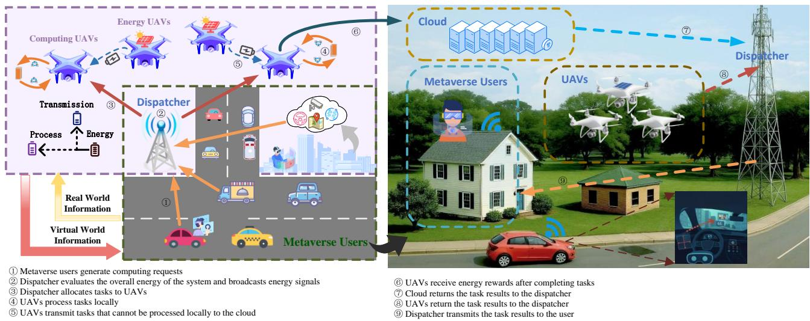  
Fig. 2. Illustration of UAV Network-based Physical-Virtual Integrated Metaverse Platform.

For CE-UAV $u \in \mathcal { U } _ { c }$ , it has an energy queue $e _ { u } ( t )$ , which evolves according to SDE, accounting for both energy inflow and consumption:

$$
d e _ { u } ( t ) = ( \eta _ { u } ( t ) - s _ { u } ( t ) ) d t + \sigma _ { u } d W _ { u } ( t ) ,\tag{4}
$$

where $\sigma _ { u } d W _ { u } ( t )$ represents the stochastic component of energy dynamics, arising from factors such as harvesting variability or unmodelled consumption fluctuations, with $d W _ { u } ( t )$ being a standard Wiener process. Then, the effective energy inflow rate $\eta _ { u } ( t )$ for a CE-UAV is defined as:

$$
\eta _ { u } ( t ) = \sum _ { v \in \mathcal { U } _ { e } } \gamma _ { v , u } ( t ) P _ { v } ^ { h a r v } ( t ) ,\tag{5}
$$

where $P _ { v } ^ { h a r v } ( t )$ represents the net available harvesting power of $\begin{array} { r } { \mathrm { E F - U A V } ~ v ~ \in ~ \mathcal { U } _ { e } } \end{array}$ after deducting its own operational costs (including hovering power and energy harvesting module operation), and $\gamma _ { v , u } ( t ) ~ \in ~ [ 0 , 1 ]$ represents the end-to-end energy transfer efficiency from EF-UAV v to CE-UAV u. This coefficient is formulated at an abstract level to accommodate different physical energy transfer mechanisms: for far-field wireless power transfer (e.g., laser beaming [21] or microwave transmission), it captures the combined propagation and conversion loss; for near-field magnetic resonance coupling [22], it represents the coupling coefficient and rectification efficiency.

By Eq. (5), the dynamics of the EF-UAVs are tightly coupled into the system model. Their collective harvesting performance directly determines the drift parameter $\eta [ n ]$ in the subsequent MFG formulation. Consequently, while EF-UAVs do not perform computational tasks, their presence serves as a foundational energy reservoir that dictates the sustainability constraints of the entire system. Notably, EF-UAVs are modeled as stochastic exogenous energy sources in the

MFG framework, which captures their essential contribution to system through the energy inflow parameter.

In the system, the energy balance is a key in UAV scheduling, since the energy levels across various UAVs, termed energy queues, are often unbalanced. Severe energy depletion in some UAVs would decrease the sustainability of system operations. To avoid this, the energy level of each UAV should remain close to the average energy level of the UAVs U, which can be defined as:

$$
\bar { e } ^ { U } ( t ) = \frac { 1 } { U } \sum _ { u = 1 } ^ { U } e _ { u } ( t ) .\tag{6}
$$

For CE-UAV $u \in \mathcal { U } _ { c }$ , the operational cost incurred in time slot n is formulated as:

$$
\begin{array} { r l r } & { } & { w _ { u } [ n ] = { \mathbb E } \Bigg [ \int _ { 0 } ^ { T } \Big [ P _ { u } ^ { b a s e } + \kappa _ { u } f _ { u } ^ { 2 } ( t ) + \psi _ { u } r _ { u } ^ { 2 } ( t ) } \\ & { } & { \qquad + \xi ( e _ { u } ( t ) - \bar { e } ^ { U } ( t ) ) ^ { 2 } \Big ] d t \Bigg ] , } \end{array}\tag{7}
$$

where $\kappa _ { u } f _ { u } ^ { 2 } ( t )$ and $\psi _ { u } r _ { u } ^ { 2 } ( t )$ represent the operational costs associated with the chosen power consumption rates $f _ { u } ( t )$ and $r _ { u } ( t )$ , respectively, and $\xi > 0$ is a weighting parameter.

The term $\xi ( e _ { u } ( t ) - \bar { e } ^ { U } ( t ) ) ^ { 2 }$ in Eq. (7) quantifies the energy balancing cost, penalizing each UAV for deviating from the collective energy average and capturing field coupling among UAVs. As shown in Eq. (5), EF-UAVs continuously inject energy, elevating $\bar { e } ^ { U } ( t )$ and incentivizing CE-UAVs to increase task processing expenditure to maintain alignment with the swarm average. Thus, this term mathematically encapsulates the implicit collaboration between the two UAV types and the competition among CE-UAVs, driving the system toward a synchronized Mean Field Equilibrium where individual rationality naturally leads to system-wide load balancing.

TABLE 2  
KEY NOTATIONS
<table><tr><td>Notation</td><td>Description</td></tr><tr><td> $\mathcal { U } _ { c } , \mathcal { U } _ { e } , \mathcal { U }$ </td><td>Set of CE-UAVs, EF-UAVs, and all UAVs, respectively.</td></tr><tr><td> $U _ { c } , U _ { e } , U$ </td><td>Number of CE-UAVs, EF-UAVs, and all UAVs, respectively.</td></tr><tr><td> $\kappa ( t )$ </td><td>Set of all computational tasks at time t.</td></tr><tr><td> $X _ { u , k } ( t )$ </td><td>Binary task assignment indicator: 1 if task k is assigned to UAV u at time t, 0 otherwise.</td></tr><tr><td> $f _ { u } ( t ) , r _ { u } ( t )$ </td><td>Chosen energy consumption rates for computation and communication by UAV u at time t.</td></tr><tr><td> $P _ { u } ^ { b a s e }$ </td><td>Base power consumption for hovering, avionics, and idle systems.</td></tr><tr><td> $\kappa _ { u } \bar { f } _ { u } ^ { 2 } ( t ) , \psi _ { u } r _ { u } ^ { 2 } ( t )$ </td><td>Operational costs associated with consuming power  $f _ { u } ( t )$  and  $r _ { u } ( t )$  , respectively.</td></tr><tr><td> $\kappa _ { u } , \psi _ { u }$ </td><td>Cost coefficients for computation and communication power consumption strategies.</td></tr><tr><td> $s _ { u } ( t )$ </td><td>Total instantaneous energy consumption rate (power) of UAV u at time t.</td></tr><tr><td> $e _ { u } ( t )$ </td><td>Energy level of UAV u&#x27;s battery at time t.</td></tr><tr><td> $\eta _ { u } ( t )$ </td><td>Random energy harvesting rate for UAV  $u .$ </td></tr><tr><td> $\sigma _ { u } d W _ { u } ( t )$ </td><td>Stochastic component of energy dynamics for UAV  $u .$ </td></tr><tr><td> $\bar { e } ^ { U } ( t )$ </td><td>Average energy queue level across all UAVs at time t.</td></tr><tr><td> $\xi$ </td><td>Parameter converting energy variance to cost.</td></tr><tr><td> $w _ { u } [ n ]$ </td><td>Operational cost of UAV u in time slot  $n .$ </td></tr><tr><td> $\rho [ n ]$ </td><td>Energy value signal (internal valuation) broadcast by the dispatcher in time slot  $n .$ </td></tr><tr><td> $\eta [ n ]$   $\phi ( \cdot )$ </td><td>Average energy harvesting condition in time slot n.</td></tr><tr><td> $J _ { u } [ n ]$ </td><td>Function relating energy value signal to energy harvesting efficiency/conditions</td></tr><tr><td> $T$ </td><td>Utility of UAV u in time slot  $n .$ </td></tr><tr><td></td><td>Duration of a single time slot.</td></tr><tr><td> $n$ </td><td>Time slot index in the large timescale.</td></tr><tr><td> $t$ </td><td>Time index in the small timescale,  $t \in [ 0 , T ] .$ </td></tr></table>

The goal of each UAV u is to minimize its individual operational cost $w _ { u } [ n ]$ by judiciously selecting its power consumption rates $f _ { u } ( t )$ and $r _ { u } ( t )$ , based on local state $e _ { u } ( t )$ and system-wide signals. Formally, this is expressed as:

$$
\begin{array} { c l } { \displaystyle \operatorname* { m i n } _ { f _ { u } ( t ) , r _ { u } ( t ) } \quad w _ { u } [ n ] } & { } \\ { \mathrm { s . t . } \quad \mathrm { E q . ~ ( 1 ) } , ( 2 ) , ( 4 ) , \forall u \in \mathcal { U } _ { c } . } \end{array}\tag{8}
$$

Due to the inherent dynamics of $e _ { u } ( t )$ , the operational costs $w _ { u } [ n ]$ are coupled through the evolving $\bar { e } ^ { U } ( t )$ , increasing the complexity of Eq. (8). To address this, we employ a mean field model to decouple the cost minimization problems and enable decentralized optimal decision-making.

## C. Long-term Utility Model

The UAVs operate under the coordination of a central dispatcher with the aim of optimizing the system’s longterm utility. In each time slot n, an individual UAV u incurs an operational cost $w _ { u } [ n ]$ , obtained by solving Eq. (8). The dispatcher sets an energy value signal $\rho [ n ]$ , which reflects the system-wide valuation of energy; a high $\rho [ n ]$ implies that energy is currently scarce or highly valuable within the system.

The average energy harvesting condition prevailing within time slot $n ,$ denoted as $\eta [ n ]$ , is assumed to be related to this energy value signal $\rho [ n ]$ through a function $\phi ( \cdot )$ , such that $\eta [ n ] ~ = ~ \phi ( \rho [ n ] )$ . The function $\phi ( \cdot )$ is characterized as decreasing and differentiable. This relationship suggests that operational contexts where energy is deemed highly valuable (high $\rho [ n ] )$ may often correspond to challenging energy harvesting conditions (low $\eta [ n ] )$ , or alternatively, that targeting operations in contexts yielding high $\rho [ n ]$ may intrinsically involve less favorable η[n]. The dispatcher’s role includes selecting $\rho [ n ]$ (thereby indirectly influencing or selecting an operational context characterized by $\eta [ n ] )$ to optimize overall system utility. For an individual UAV u, its actual energy harvesting rate $\eta _ { u } ( t )$ for $t \in [ 0 , T ]$ within time slot n is a stochastic process whose mean is $\mathbb { E } [ \eta _ { u } ( t ) ] = \eta [ n ]$

Since each time slot n has a duration of T , the expected total amount of energy collected by u is $\begin{array} { r } { \mathbb { E } [ \int _ { 0 } ^ { T } \eta _ { u } ( t ) d t ] = T \eta [ n ] } \end{array}$ Consequently, the utility for u in slot n is defined as the value of harvested energy minus its operational cost:

$$
J _ { u } [ n ] = \rho [ n ] T \eta [ n ] - w _ { u } [ n ] = \rho [ n ] T \phi ( \rho [ n ] ) - w _ { u } [ n ] .\tag{9}
$$

Consistent with the energy level dynamics described by $\operatorname { E q } .$ (4), the evolution of the energy queue from one time slot to the next is given by:

$$
\begin{array} { c } { \displaystyle { e _ { u } [ n + 1 ] = \operatorname* { m a x } \bigg \{ \operatorname* { m i n } \bigg \{ e _ { u } [ n ] + \int _ { 0 } ^ { T } ( \eta _ { u } ( t ) - s _ { u } ( t ) ) d t } } \\ { \displaystyle + \int _ { 0 } ^ { T } \sigma _ { u } d W _ { u } ( t ) , e _ { \operatorname* { m a x } } \bigg \} , 0 \bigg \} , \quad \quad ( 1 }  \end{array}\tag{0}
$$

where $e _ { \mathrm { m a x } }$ denotes the CE-UAV battery capacity, and the max $\{ \cdot , 0 \}$ operation ensures that the energy level does not become negative. The dispatcher’s objective is to maximize the long-term average utility of the system by dynamically setting the energy signal $\rho [ n ]$ over time:

$$
\begin{array} { r l } & { \displaystyle \underset { \rho [ n ] } { \operatorname* { m a x } } \ \underset { N \to \infty } { \operatorname* { l i m } } \frac { 1 } { N } \sum _ { n = 1 } ^ { N } \frac { 1 } { U } \sum _ { u = 1 } ^ { U } J _ { u } [ n ] } \\ & { \mathrm { s . t . } \quad \displaystyle \operatorname* { l i m } _ { N \to \infty } \frac { 1 } { N } \sum _ { n = 1 } ^ { N } e _ { u } [ n ] > 0 , \forall u \in \mathcal { U } . } \end{array}\tag{11}
$$

The constraint in Eq. (11) signifies that all energy queues should be mean-rate stable, avoiding a persistent depleted state. $e _ { u } [ n ]$ is stochastic due to the random $\eta _ { u } ( t )$ and other noise factors. Since the queue states among UAVs are heterogeneous, directly maximizing this utility by a simple $\rho [ n ]$ is challenging. Thus, we leverage the mean field theory to approximate the influence of the collective $e _ { u } [ n ]$ (via $\bar { e } ^ { \bar { U } } ( t ) )$ with a deterministic mean field value, which makes the representation increasingly exact $( \mathrm { i . e . , } U \to \infty )$

## D. Further Analysis

The decision variables in our model involve $\mathrm { U A V s } '$ energy consumption rates $f _ { u } ( t ) , r _ { u } ( t )$ and dispatcher’s energy value signal $\rho [ n ]$ . In the small timescale, each u selects optimal $f _ { u } ( t ) , r _ { u } ( t )$ to minimize its operational cost $w _ { u } [ n ]$ for a given $\rho [ n ]$ , where the mean field analysis facilitates decentralized optimization despite coupling via $\bar { e } ^ { U } ( t )$ . In the large timescale, the dispatcher determines $\rho [ n ]$ to maximize long-term system utility, which incorporates UAVs’ costs $w _ { u } [ n ]$ . This multitimescale modeling captures real-world GAEC dynamics, enabling finer-grained energy control in heterogeneous and dynamic settings. In a sense, this design provides a new insight for designing optimal decentralized scheduling schemes in many application scenarios. Table 2 provides a summary of key notations used in this work.

## III. MEAN FIELD BASED ENERGY SCHEDULING AND ENERGY SIGNAL CONTROLLING

In this section, our primary goal is to determine the minimum energy-balanced scheduling cost for each UAV. To achieve this, we should first address the optimization problem Eq. (8) for all UAVs $U _ { : }$ which is very challenging because: (1) simultaneously solving $U$ coupled optimization problems becomes computationally prohibitive when the number of UAVs, U , is very large [23], and (2) the dynamics of $e _ { u } ( t )$ lead to a rapidly fluctuating $\bar { e } ^ { U } ( t )$ , making it difficult to accurately track this coupling term in real-time.

To solve the above issues, we propose an MFG approximation model, which allows us to address each UAV’s cost minimization problem independently. In this model, a deterministic quantity $\bar { e } ( t )$ is specified to approximate $\bar { e } ^ { U } ( t )$ . In this way, we can decouple the individual energy cost minimization problems by treating $\bar { e } ( t )$ as an exogenous parameter. This is justified by the fact that the impact of a single UAV on the system-wide average e¯(t) is minimal in a large population.

## A. Mean Field Approximation

The operational cost of UAV u is intrinsically linked to the stochastic nature of its energy harvesting process, $\eta _ { u } ( t )$

which directly influences the energy queue dynamics described in Eq. (4). The energy inflow for UAV u, $\eta _ { u } ( t )$ , is a stochastic process. For analytical tractability within slot n, we assume its expected rate is $\eta [ n ]$ , i.e., $\mathbb { E } [ \eta _ { u } ( t ) ] ~ = ~ \eta [ n ]$ for $t \in [ n T , ( n + 1 ) T ]$ . The variability around this mean and other unmodelled stochastic effects on the energy level are captured by the term $\sigma _ { u } d W _ { u } ( t )$ in Eq. (4). While the specific distribution of $\eta _ { u } ( t )$ (e.g., Gaussian deviations from $\eta [ n ]$ with variance $\sigma _ { u } ^ { 2 } )$ could inform the choice of $\sigma _ { u } .$ , for the Hamilton-Jacobi-Bellman (HJB) derivation that follows, we use $\eta [ n ]$ as the deterministic drift component for energy input. The random processes $d W _ { u } ( t )$ are assumed to be independent across UAVs. Let $\mathbb { E } [ \sigma _ { u } ^ { 2 } ] = \dot { \sigma } ^ { 2 }$ denote the expected magnitude of this stochasticity averaged over the UAV population. For clarity of exposition, we proceed with the assumption that the drift component of energy inflow is $\eta [ n ]$ [24].

Let the operational cost-to-go for an individual UAV (omitting subscript u for brevity, unless differentiation is necessary) from time t until the end of the slot T be $w ( t , e ( t ) )$

$$
\begin{array} { r l r }   { w ( t , e ( t ) ) = \mathbb { E } \Bigg [ \int _ { t } ^ { T } \Big [ P ^ { b a s e } + \kappa f ^ { 2 } ( \tau ) + \psi r ^ { 2 } ( \tau ) } \\ & { } & { + \xi ( e ( \tau ) - \bar { e } ^ { U } ( \tau ) ) ^ { 2 } \Big ] d \tau \Big \vert e ( t ) \Bigg ] . } \end{array}\tag{12}
$$

In time interval $n ,$ the total operational cost $w _ { u } [ n ]$ defined in Eq. (7) corresponds to $w _ { u } ( 0 , e _ { u } ( 0 ) )$ ) from Eq. (12), i.e., evaluated at the beginning of the slot, $t = 0 .$

By replacing the empirical average $\bar { e } ^ { U } ( t )$ with its deterministic mean field approximation $\bar { e } ( t )$ the cost-to-go becomes $w ( t , e ( t ) )$ $\begin{array} { r } { \mathbb { E } \left[ \int _ { t } ^ { T } \big [ P ^ { b a s e } + \kappa f ^ { 2 } ( \tau ) + \psi r ^ { 2 } ( \tau ) + \xi ( e ( \tau ) - \bar { e } ( \tau ) ) ^ { 2 } \big ] d \tau \big | e ( t ) \right] } \end{array}$ Our objective is now to minimize this $w ( t , e ( t ) )$ using the mean field $\bar { e } ( t )$ . The energy dynamics for a representative UAV, omitting the subscript u and assuming optimal $f ( t )$ and $r ( t )$ are applied, can be written as:

$$
d e ( t ) = ( \eta [ n ] - ( P ^ { b a s e } + f ( t ) + r ( t ) ) ) d t + \sigma d W ( t ) ,\tag{13}
$$

where $d W ( t )$ is a standard Wiener process, and $f ( t )$ and $r ( t )$ are the control inputs (power consumption rates) to be optimized. The parameter σ here represents the stochastic noise magnitude for this representative UAV.

1) Optimal Decision: To determine the optimal power consumption rates $f ( t )$ and $r ( t )$ , we employ the HJB equation from optimal control theory. The HJB equation for the minimum cost-to-go $w ( t , e ( t ) )$ (denoted w for brevity) is:

$$
\begin{array} { l } { \displaystyle - \frac { \partial w } { \partial t } = \operatorname* { m i n } _ { f ( t ) , r ( t ) } \Bigg [ P ^ { b a s e } + \kappa f ^ { 2 } ( t ) + \psi r ^ { 2 } ( t ) + \xi ( e ( t ) - \bar { e } ( t ) ) ^ { 2 } } \\ { \displaystyle ~ + ~ ( \eta [ n ] - ( P ^ { b a s e } + f ( t ) + r ( t ) ) ) \frac { \partial w } { \partial e } } \\ { \displaystyle ~ + \frac { 1 } { 2 } \sigma ^ { 2 } \frac { \partial ^ { 2 } w } { \partial e ^ { 2 } } \Bigg ] . } \end{array}
$$

The Hamiltonian is quadratic and convex with respect to the control variables $f ( t )$ and $r ( t )$ . Thus, the optimal controls are found by setting the partial derivatives of the Hamiltonian

(the term within the minimization brackets) with respect to f(t) and $r ( t )$ to zero:

$$
\begin{array} { r l r } & { \displaystyle \frac { \partial ( \cdot ) } { \partial f ( t ) } = 2 \kappa f ( t ) - \frac { \partial w } { \partial e } = 0 , } & \\ & { \displaystyle \frac { \partial ( \cdot ) } { \partial r ( t ) } = 2 \psi r ( t ) - \frac { \partial w } { \partial e } = 0 . } & \end{array}\tag{15}
$$

This yields the optimal power consumption rates as:

$$
\begin{array} { c } { f ^ { * } ( t ) = \displaystyle \frac { 1 } { 2 \kappa } \frac { \partial w } { \partial e } , } \\ { r ^ { * } ( t ) = \displaystyle \frac { 1 } { 2 \psi } \frac { \partial w } { \partial e } . } \end{array}\tag{16}
$$

The problem structure, involving a linear SDE for the state (energy) and a quadratic cost function, corresponds to a Linear-Quadratic-Gaussian (LQG) control problem. We therefore postulate a quadratic solution for the value function $w ( t , e ( t ) )$ of the form:

$$
w ( t , e ( t ) ) = x ( t ) e ^ { 2 } ( t ) + y ( t ) e ( t ) + z ( t ) ,\tag{17}
$$

where $x ( t ) , \ y ( t )$ , and $z ( t )$ are time-dependent coefficients to be determined. The partial derivatives are then $\begin{array} { r } { \begin{array} { r l } { \frac { \partial w } { \partial t } } & { { } = } \end{array} } \end{array}$ $\dot { x } ( t ) e ^ { 2 } ( t ) + \dot { y } ( t ) e ( t ) + \dot { z } ( t ) , \ \frac { \partial w } { \partial e } \ = \ 2 x ( t ) e ( t ) + y ( t )$ , and $\frac { \partial ^ { 2 } w } { \partial e ^ { 2 } } ~ = ~ 2 x ( t )$ . Substituting these into Eq. (16), the optimal decisions are expressed as:

$$
\begin{array} { l } { f ^ { \ast } ( t ) = \cfrac { 2 x ( t ) e ( t ) + y ( t ) } { 2 \kappa } , } \\ { r ^ { \ast } ( t ) = \cfrac { 2 x ( t ) e ( t ) + y ( t ) } { 2 \psi } . } \end{array}\tag{18}
$$

2) Mean Field Model Equations: We now elucidate the decoupling of the energy cost minimization problems within the mean field model framework. Substituting the optimal decisions from Eq. (18) and the derivatives of $w ( t , e ( t ) )$ from Eq. (17) into the HJB equation (14), we obtain:

$$
\begin{array} { r l r } {  { - \dot { x } ( t ) e ^ { 2 } ( t ) - \dot { y } ( t ) e ( t ) - \dot { z } ( t ) } } \\ & { = } & { P ^ { b a s e } - ( \frac { 1 } { 4 \kappa } + \frac { 1 } { 4 \psi } ) ( 2 x ( t ) e ( t ) + y ( t ) ) ^ { 2 } + \xi ( e ( t ) - \bar { e } ( t ) ) ^ { 2 } } \\ & { } & { + ( \eta [ n ] - P ^ { b a s e } ) ( 2 x ( t ) e ( t ) + y ( t ) ) + \sigma ^ { 2 } x ( t ) . \qquad ( 1 9 ) } \end{array}
$$

Since this equation must hold for arbitrary energy levels $e ( t )$ , we can equate the coefficients of $e ^ { 2 } ( t ) , e ( t )$ , and the constant terms on both sides. Let $\begin{array} { r } { b = \frac { 1 } { \kappa } + \frac { \mathrm { i } } { \psi } } \end{array}$ . This procedure yields a system of ordinary differential equations (ODEs) for x(t), y(t), and z(t):

$$
{ \frac { d x } { d t } } = \left( { \frac { 1 } { 2 \kappa } } + { \frac { 1 } { 2 \psi } } \right) x ^ { 2 } ( t ) - \xi ,\tag{20}
$$

$$
\frac { d y } { d t } = \left( \frac { 1 } { 2 \kappa } + \frac { 1 } { 2 \psi } \right) x ( t ) y ( t ) + 2 \xi \bar { e } ( t ) - 2 ( \eta [ n ] - P ^ { b a s e } ) x ( t ) ,\tag{21}
$$

$$
\begin{array} { c } { { \displaystyle \frac { d z } { d t } = \left( \frac { 1 } { 4 \kappa } + \frac { 1 } { 4 \psi } \right) y ^ { 2 } ( t ) - \xi \bar { e } ^ { 2 } ( t ) - ( \eta [ n ] - P ^ { b a s e } ) y ( t ) } } \\ { { - \sigma ^ { 2 } x ( t ) - P ^ { b a s e } . } } \end{array}\tag{22}
$$

In this mean field model, the term $\bar { e } ( t )$ acts as an exogenous input to the ODEs for $y ( t )$ and $z ( t )$ , thereby decoupling the optimization problems for individual UAVs. Each UAV can solve these ODEs based on the broadcasted or predicted mean field trajectory e¯(t).

To complete the mean field model, we require the dynamics of the mean field energy itself, $\begin{array} { r } { \bar { e } ( t ) ~ = ~ \mathbb { E } [ e ( t ) ] } \end{array}$ ]. Taking the expectation of the SDE in Eq. (13), and noting that $\mathbb { E } [ \sigma d W ( t ) ] = 0 \colon$

$$
d \mathbb { E } [ e ( t ) ] = ( \eta [ n ] - P ^ { b a s e } - \mathbb { E } [ f ^ { * } ( t ) ] - \mathbb { E } [ r ^ { * } ( t ) ] ) d t .\tag{23}
$$

Substituting the optimal actions from Eq. (18), and using $\mathbb { E } [ e ( t ) ] = \bar { e } ( t )$

$$
\begin{array} { r l r } & { } & { \mathbb { E } [ f ^ { * } ( t ) ] + \mathbb { E } [ r ^ { * } ( t ) ] = \left( \displaystyle \frac { 1 } { 2 \kappa } + \displaystyle \frac { 1 } { 2 \psi } \right) ( 2 x ( t ) \mathbb { E } [ e ( t ) ] + y ( t ) ) } \\ & { } & { = \left( \displaystyle \frac { 1 } { 2 \kappa } + \displaystyle \frac { 1 } { 2 \psi } \right) ( 2 x ( t ) \bar { e } ( t ) + y ( t ) ) . } \end{array}\tag{24}
$$

Thus, the ODE governing the mean field energy level is:

$$
\frac { d \bar { e } } { d t } = \eta [ n ] - P ^ { b a s e } - \left( \frac { 1 } { 2 \kappa } + \frac { 1 } { 2 \psi } \right) ( 2 x ( t ) \bar { e } ( t ) + y ( t ) ) .\tag{25}
$$

It is worth noting that the canonical MFG framework employs a Fokker-Planck-Kolmogorov (FPK) equation to describe the full distributional evolution. However, due to the LQG structure of our problem, the optimal control depends solely on the first moment of the distribution. Thus, tracking the mean energy e¯(t) via the ODE (Eq. (25)) is sufficient and equivalent to solving the FPK equation. A detailed derivation of FPK is provided in the Appendix A.

We note that while the network architecture consists of two functionally distinct UAV types, the Mean Field Game is formulated exclusively over the CE-UAV population, which is modeled as homogeneous agents sharing identical cost parameters (κ, ψ), identical linear energy dynamics, and a common mean field e¯(t). EF-UAVs are not strategic players in this game; they do not optimize a cost functional or solve an HJB equation. Instead, their aggregate energy output η[n] acts as a stochastic exogenous energy drift entering the CE-UAV dynamics.

The MFG model is thus characterized by the coupled system of deterministic ODEs given by Eqs. (20)-(22) and Eq. (25).

The ODEs for $x ( t ) , y ( t )$ , and $z ( t )$ are solved backward in time, starting from their terminal conditions at $t ~ = ~ T$ which arise from the definition of the cost-to-go function. Specifically, at the end of the time slot $t = T$ , the remaining cost is zero, i.e., $w ( T , e ( T ) ) = 0$ . From the quadratic form in Eq. (17), this implies the terminal conditions:

$$
x ( T ) = 0 , \quad y ( T ) = 0 , \quad z ( T ) = 0 .\tag{26}
$$

For the mean field energy $\bar { e } ( t )$ , the initial condition at the start of the slot $( t = 0 )$ is the average energy level from the end of the previous slot, or a known initial average system energy:

$$
\bar { e } ( 0 ) = \bar { e } [ n ] .\tag{27}
$$

The coupled system of ODEs, Eqs. (20)-(25), together with the boundary conditions specified in Eqs. (26) and (27), characterizes the evolution of the system variables in the mean field limit.

## B. Closed-Form Solution

The system of ODEs derived in the preceding subsection allows for the determination of the coefficients $x ( t ) , y ( t ) , z ( t )$ and consequently, the minimum energy cost $w ( t , e ( t ) )$ . It is possible to obtain closed-form solutions for these coefficients [25]. The derivation involves sequentially solving for $x ( t )$ first (which is a Riccati equation), then $y ( t )$ (often in conjunction with $\bar { e } ( t )$ through a system of linear ODEs), and finally $z ( t )$ via integration. Let $\begin{array} { r } { \dot { b } ~ = ~ ( \frac { 1 } { 2 \kappa } + \frac { 1 } { 2 \psi } ) } \end{array}$ denote the coefficient of $x ^ { 2 } ( t )$ in Eq. (20). The solutions are summarized in the following lemmas:

Lemma 1. The coefficient $x ( t )$ for $t \in [ 0 , T ] ,$ , satisfying the   
ODE $\begin{array} { r } { \frac { d x } { d t } = b x ^ { 2 } ( t ) - \xi } \end{array}$ (from $E q .$ (20)) with the terminal   
condition $\begin{array} { r } { \mathbf { \nabla } \cdot ( T ) = 0 , } \end{array}$ is given by:   
$x ( t ) = \sqrt { \frac { \xi } { b } } \operatorname { t a n h } ( \sqrt { b \xi } ( T - t ) ) .$

Proof. The detailed proof is provided in Appendix B-A.

Lemma 2. The mean field energy level $\bar { e } ( t )$ and the   
coefficient $y ( t )$ for $t \in [ 0 , T ] ,$ , satisfying the ODEs (21) and   
(25) with boundary conditions $y ( T ) = 0$ and $\bar { e } ( 0 ) = \bar { e } [ n ] ,$   
are given by:   
$\bar { e } ( t ) = \bar { e } [ n ] + ( \eta [ n ] - P ^ { b a s e } ) t ,$   
$y ( t ) = - 2 x ( t ) \bar { e } ( t ) = - 2 x ( t ) ( \bar { e } [ n ] + ( \eta [ n ] - P ^ { b a s e } ) t ) ,$   
where x(t) is given by Lemma 1.

```latex
Proof. The detailed proof is provided in Appendix B-B.
Lemma 3. The coefficient $z ( t )$ for $t \in [ 0 , T ]$ , satisfying
$E q .$ (22) with the terminal condition $z ( T ) = 0 ,$ is given
$b y \colon$
$z ( t ) = x ( t ) \bar { e } ^ { 2 } ( t ) +$
$\frac { \sigma ^ { 2 } } { b } \ln ( \cosh ( \sqrt { b \xi } ( T - t ) ) ) - P ^ { b a s e } ( T - t ) ,$
where $\sigma ^ { 2 }$ is the variance parameter from the HJB equation
(Eq. (14), effectively $\sigma _ { u } ^ { 2 }$ for UAV u), and $\begin{array} { r } { b = ( \frac { 1 } { 2 \kappa } + \frac { 1 } { 2 \psi } ) . } \end{array}$
```

Proof. The detailed proof is provided in Appendix B-C.

## C. Lyapunov-based Energy Value Signal Controlling

For the energy sustainability constraint in Eq. (11), we utilize the Lyapunov optimization to dynamically control the energy value signal $\rho [ n ]$ , aiming to transform the long-term time-averaged constraint into a series of online optimization problems that stabilize a virtual queue.

1) Virtual Queue Construction. We first construct a virtual energy deficit queue $Z [ n ]$ to track the deviation of the current average energy level from a safety threshold $e _ { s a f e }$ . The evolution of this virtual queue is defined as:

$$
Z [ n + 1 ] = \operatorname* { m a x } \{ Z [ n ] + e _ { s a f e } - \bar { e } ^ { U } [ n ] , 0 \} ,\tag{28}
$$

where $\bar { e } ^ { U } [ n ]$ is the actual average energy level of UAVs at the end of time $n ,$ and $e _ { s a f e }$ is the minimum required average energy level to ensure system resilience. A strictly positive $Z [ n ]$ indicates an energy deficit, necessitating a higher $\rho [ n ]$ to suppress energy consumption in subsequent slots.

2) Lyapunov Drift-plus-Penalty. We define a quadratic Lyapunov function $\begin{array} { r } { L ( Z [ n ] ) \triangleq \frac 1 2 Z [ \dot { n } ] ^ { 2 } } \end{array}$ to represent a scalar measure of the ”energy debt” in the system. The Lyapunov drift, representing the expected change in the Lyapunov function over one slot, is given by $\Delta \bar { ( \cal Z [ n ] ) } \ = \ \bar { \mathbb { E } } [ \bar { L } ( \cal Z [ n + 1 ] ) \ -$ $L ( Z [ n ] ) | Z [ n ] ]$

To stabilize the queue while maximizing utility, we minimize the drift-plus-penalty bound:

$$
\operatorname* { m a x } _ { \rho [ n ] \in [ \rho _ { \operatorname* { m i n } } , \rho _ { \operatorname* { m a x } } ] } V \cdot ( T \rho [ n ] \phi ( \rho [ n ] ) - \bar { w } _ { e s t } [ n ] ) - Z [ n ] \cdot \bar { e } _ { e s t } [ n ] ,\tag{29}
$$

where V is a non-negative control parameter, $\bar { w } _ { e s t } [ n ]$ and $\bar { e } _ { e s t } [ n ]$ are the estimated operational cost and the energy evolution obtained from the MFG solution (derived in Section III-B, given a candidate $\rho [ n ] )$ , respectively.

3) Algorithm Description. The overall control logic of energy value signal through Lyapunov operates in two embedded timescales, as shown in Algorithm 1.

Algorithm 1 Lyapunov-based Energy Value Signal Control  
ling   
Require: Safety threshold $e _ { s a f e } ,$ trade-off parameter V , time   
horizon $N .$   
1: Initialize: Virtual queue $Z [ 0 ] = 0 .$   
2: for time slot $n = 0 , 1 , \ldots , N$ do   
3: // Large Timescale (Dispatcher)   
4: Observe current virtual queue $Z [ n ] .$   
5: Dispatcher computes optimal $\rho ^ { * } [ n ]$ by solving Eq. (29).   
6: Broadcast $\rho ^ { * } [ n ]$ to all UAVs.   
7: // Small Timescale (UAVs)   
8: for time $t \in [ 0 , T ]$ do   
9: for each UAV u in parallel do   
10: Estimate $\eta [ n ] = \phi ( \rho ^ { * } [ n ] )$   
11: Solve Riccati ODEs (Eqs. 22-24) to obtain   
$x ( t ) , y ( t ) .$   
12: Update local energy $e _ { u } ( t )$ and apply optimal con  
trols $f _ { u } ^ { * } ( t ) , r _ { u } ^ { * } ( t )$   
13: end for   
14: end for   
15: // Feedback and Update   
16: UAVs report energy states.   
17: Dispatcher calculates average $\bar { e } ^ { U } [ n + 1 ]$   
18: Update virtual queue: $Z [ n + 1 ] $ max $\{ Z [ n ] + e _ { s a f e } -$   
$\bar { e } ^ { \bar { U } } [ n + 1 ] , 0 \}$   
19: end for

## IV. THEORETICAL ANALYSIS

## A. Mean Field Approximation Error Analysis

Before analyzing the approximation error of the mean field model, we introduce the concept of ϵ-equilibrium [24], [26].

Definition 1 (ϵ-equilibrium). Let $\pi _ { u } ~ = ~ \left\{ f _ { u } , r _ { u } \right\}$ be the strategy (chosen power consumption rates for processing and transmission) of UAV u. Denote $\pi _ { - u }$ as the strategies of all UAVs except u. A strategy profile $\pi ^ { * } ~ = ~ \{ \pi _ { u } ^ { * } , \pi _ { - u } ^ { * } \}$ is a Nash Equilibrium if $w _ { u } ( \pi ^ { * } ) ~ \leq ~ w _ { u } ( \{ \pi _ { u } , \pi _ { - u } ^ { * } \} )$ for all $u \in \mathcal { U } _ { c }$ and alternative strategies $\pi _ { u } .$ A strategy profile $\pi ^ { \epsilon }$ is an ϵ-equilibrium if there exists $\epsilon \geq 0$ such that $w _ { u } ( \pi ^ { \epsilon } ) \leq$ $w _ { u } ( \{ \pi _ { u } , \pi _ { - u } ^ { \epsilon } \} ) + \epsilon f o r$ all $u \in \mathcal { U } _ { c }$ and $\pi _ { u } .$

In Definition 1, an ϵ-equilibrium is actually an equilibrium when $\epsilon \ = \ 0 .$ Later on, we demonstrate that the optimal decisions derived in the mean field model is an ϵ-equilibrium, and $\epsilon \to 0 \mathrm { i f } U \to \infty$ . Based on the mean field approximation, the deterministic value $\bar { e } ( t )$ is used to represent the average energy queue $\bar { e } ^ { U } ( t )$ , so that the closed-from cost could be obtained. Therefore, we need to characterize the accuracy of this representation. To avoid confusion, we will use superscript U to denote values acquired through $\bar { e } ^ { U } ( t )$

Let $e _ { u } ^ { U } ( t )$ denote the energy level of UAV u in the original system with U UAVs interacting via the empirical average $\begin{array} { r } { \bar { e } ^ { \bar { U } } ( t ) ~ = ~ \frac { 1 } { U } \sum _ { j = 1 } ^ { U } e _ { j } ^ { U } ( t ) } \end{array}$ . Let $e _ { u } ( t )$ be the energy level of the corresponding UAV under the mean field approximation [20], interacting via the deterministic mean field $\bar { e } ( t )$ . The coefficients in the U-system are denoted $x ^ { U } ( t ) , y ^ { U } ( t )$ , while in the mean field they are $x ( t ) , y ( t )$ . We assume the system starts from the same initial state distribution, so $\bar { e } ^ { U } ( 0 ) = \bar { e } ( 0 ) = \bar { e } [ n ]$ and $e _ { u } ^ { U } ( 0 )$ has the same distribution as $e _ { u } ( 0 )$

Theorem 1. The error between the energy level in the mean field model and the U-UAV system satisfies:

$$
\begin{array} { r l } & { \underset { t \in [ 0 , T ] } { \operatorname* { s u p } } \mathbb { E } \left[ | \bar { e } ^ { U } ( t ) - \bar { e } ( t ) | + \displaystyle \frac { 1 } { U } \sum _ { u = 1 } ^ { U } | e _ { u } ^ { U } ( t ) - e _ { u } ( t ) | \right] \leq \epsilon ^ { \prime } , } \\ & { w h e r e \ \epsilon ^ { \prime } = O \left( \frac { 1 } { \sqrt { U } } \right) . } \end{array}
$$

Proof. The detailed proof is provided in Appendix C.

Remark 1 (Impact of Heterogeneity on MFG Precision): It is worth noting that the heterogeneity of the UAVs affects the constant factor within the error bound $O ( 1 / \sqrt { U } )$ , although it does not alter the convergence rate. Specifically, the aggregate variance $\begin{array} { r } { \bar { \sigma } ^ { 2 } = \frac { 1 } { U } \sum _ { u = 1 } ^ { U } \overline { { \sigma _ { u } ^ { 2 } } } } \end{array}$ in the martingale term dM<sub>t</sub> (Eq. 36) is a weighted average of the variances from CE-UAVs and EF-UAVs. An extreme imbalance in the ratio of these two types $( \mathrm { e . g . } , U _ { e } \ll U _ { c } )$ may increase the volatility of the empirical mean $\bar { e } ^ { U } ( t )$ if the minority group has significantly higher harvesting variance, thereby affecting the short-term precision of the MFG decoupling. However, as long as the total population U is sufficiently large, the law of large numbers ensures the validity of the mean field approximation regardless of the specific internal composition.

## B. ϵ-Equilibrium Proof

The optimal strategy based on mean field approximation constitutes an ϵ-equilibrium, whose properties are described by the following theorem.

Theorem 2. The optimal scheduling strategy obtained from mean field approximation constitutes an ϵ-equilibrium, i.e.:

$$
\begin{array} { r } { \left| w _ { u } ^ { U } [ n ] - w _ { u } [ n ] \right| \leq \epsilon , \quad \forall u \in \mathcal { U } , } \end{array}\tag{30}
$$

where $\epsilon \ = \ O \left( { \textstyle \frac { 1 } { \sqrt { U } } } \right)$ , and $w _ { u } ^ { U } [ n ]$ and $w _ { u } [ n ]$ are the operational costs in the U-UAV system and mean field model, respectively.

Proof. Let $f _ { u } ^ { U } ( t ) , r _ { u } ^ { U } ( t )$ be the optimal power consumption rates in the U-UAV system, and $f _ { u } ( t ) , r _ { u } ( t )$ be the optimal rates in the mean field model. According to previous derivations (Eq. (18)):

$$
\begin{array} { l } { f _ { u } ( t ) = \displaystyle \frac { 2 x ( t ) e _ { u } ( t ) + y ( t ) } { 2 \kappa _ { u } } , } \\ { r _ { u } ( t ) = \displaystyle \frac { 2 x ( t ) e _ { u } ( t ) + y ( t ) } { 2 \psi _ { u } } . } \end{array}\tag{31}
$$

The cost difference is:

$$
\begin{array} { r l r } {  { w _ { u } ^ { U } [ n ] - w _ { u } [ n ] = \mathbb { E } \Bigg [ \int _ { 0 } ^ { T } \Big [ P _ { u } ^ { b a s e } + \kappa _ { u } ( f _ { u } ^ { U } ( t ) ) ^ { 2 } + \psi _ { u } ( r _ { u } ^ { U } ( t ) ) ^ { 2 } } } \\ & { } & { \quad + \xi ( e _ { u } ^ { U } ( t ) - \bar { e } ^ { U } ( t ) ) ^ { 2 } - ( P _ { u } ^ { b a s e } + \kappa _ { u } ( f _ { u } ( t ) ) ^ { 2 } + \psi _ { u } ( r _ { u } ( t ) ) ^ { 2 } } \\ & { } & { \quad + \xi ( e _ { u } ( t ) - \bar { e } ( t ) ) ^ { 2 } ) \Big ] d t \Bigg ] . } \end{array}
$$

By carefully analyzing each term in the cost function, using Lipschitz continuity of the cost terms with respect to states and decisions, and applying the bounds from Theorem 1 on state differences $( | e _ { u } ^ { U } - e _ { u } | , | \bar { e } ^ { U } - \bar { e } | , | y ^ { U } - y | )$ , we can show that the difference in optimal decisions and subsequently the difference in costs are bounded. The terms are quadratic, so errors propagate quadratically in state errors, but since state errors are $O ( 1 / \sqrt { U } )$ , the cost difference is $O ( 1 / \sqrt { U } )$ . A full proof involves Gronwall’s inequality and detailed bounding arguments common in MFG literature. Thus, $\begin{array} { r } { | w _ { u } ^ { U } [ n ] - \bar { w } _ { u } [ n ] | = O \left( \frac { 1 } { \sqrt { U } } \right) } \end{array}$ . When $U  \infty , \epsilon  0 .$ and the mean field approximation strategy converges to the exact Nash equilibrium.

## C. Nash Equilibrium and Stability

1) Approximate Nash Equilibrium: A Nash Equilibrium (NE) in the original U-UAV game is a strategy profile (chosen power consumption rates for all UAVs) where no single UAV can improve its own expected cost by unilaterally changing its strategy, given that all other UAVs keep their strategies fixed. Finding an exact NE is generally intractable for large U. The MFG provides an approximate NE.

Property 1 (ϵ-Nash Equilibrium). The decentralized strategy profile $\dot { \pi } ^ { M F }$ where each UAV $u \in \mathcal { U } _ { c }$ chooses its actions $f _ { u } ( t ) , r _ { u } ( t )$ according to the mean field optimal control law (Eq. (18) using coefficients $x ( t ) , y ( t )$ derived from the mean field ODEs and its local state $e _ { u } ^ { U } ( t ) )$ constitutes an ϵ-Nash Equilibrium for the original U-UAV game defined by the cost function (Eq. (7)). The approximation error ϵ satisfies $\epsilon = O ( 1 / \sqrt { U } )$

Proof. This property signifies that for a large number of UAVs U, the deviation in cost for any UAV from unilaterally deviating from the mean field strategy is very small (vanishing as $U \to \infty )$ . This follows from Theorem 2. Thus, the mean field solution provides a stable and near-optimal operating point for the decentralized system.

2) Incentive Compatibility: Incentive Compatibility (IC) relates to whether agents are incentivized to reveal their private information truthfully. In our context, the primary private information of UAV u is its current energy level $e _ { u } ( t )$

Property 2 (Incentive Compatibility regarding Local State). The mean field framework is inherently incentive compatible with respect to the UAV’s local energy state $e _ { u } ( t ) .$ Each UAV is incentivized to use its true energy level when computing its optimal actions $f _ { u } ^ { * } ( t ) , r _ { u } ^ { * } ( t )$ according to $E q .$ (18).

Proof. The optimal control law $\begin{array} { r } { f _ { u } ^ { * } ( t ) = \frac { 2 x ( t ) e _ { u } ( t ) + y ( t ) } { 2 \kappa _ { u } } } \end{array}$ and $\begin{array} { r } { r _ { u } ^ { * } ( t ) = \frac { 2 x ( t ) e _ { u } ( t ) + y ( t ) } { 2 \psi _ { * } } } \end{array}$ are derived by minimizing UAV $u \mathrm { { s } }$ own expected future cost $w _ { u } ( t )$ (Eq. 12, approximated by Eq. 17). The coefficients $x ( t )$ and $y ( t )$ are determined by the global mean field dynamics and are common knowledge (or broadcast implicitly via $\bar { e } ( t ) )$ . Given these common signals, UAV u’s actions directly depend on its local state $e _ { u } ( t )$ . If UAV u were to use a false state $e _ { u } ^ { \prime } ( t )$ in the calculation, it would result in actions $f _ { u } ^ { \prime } , r _ { u } ^ { \prime }$ that are suboptimal for minimizing its true expected cost $w _ { u } ( t )$ given its actual state $e _ { u } ( t )$ . Since the UAV is assumed to be rational (aiming to minimize its cost), it has no incentive to misrepresent or use a false $e _ { u } ( t )$ for its internal decision-making process. This aligns with the principle of individual rationality.

3) Individual Rationality: Individual Rationality (IR) requires that each agent achieves a utility or reward level from participating in the system that is at least as good as its reservation utility.

Property 3 (Individual Rationality). A UAV u will rationally participate in the GAEC system under the mean field strategy if its expected net reward $J _ { u } [ n ]$ is non-negative or meets its reservation utility level. The mean field solution ensures the UAV minimizes its operational cost $w _ { u } [ n ]$ given the system conditions.

Proof. The MFG solution finds the best-response strategy for each UAV to minimize its expected operational cost $w _ { u } [ n ]$ within the environment defined by the task arrivals (implicit) and the energy valuation signal $\rho [ n ]$ (set by the dispatcher). The net reward $J _ { u } [ n ] ~ = ~ T \rho [ n ] \eta [ n ] - w _ { u } [ n ]$ depends on the revenue from harvested energy (valued at $\rho [ n ] )$ minus the minimized operational cost. Whether $J _ { u } [ n ]$ is positive depends critically on the dispatcher’s choice of $\rho [ n ]$ (via the Lyapunov policy) and the actual energy harvesting rate $\eta [ n ]$ The MFG framework itself does not guarantee positive rewards for all UAVs under all conditions, but it ensures that given the conditions set by the dispatcher and the environment, each UAV acts optimally to minimize its cost component. If the overall economic structure (i.e., the energy valuation $\rho [ n ]$ relative to costs and harvesting potential) allows for positive expected net rewards, then rational UAVs will participate. The dispatcher’s Lyapunov policy, aiming to maximize the average system reward $\dot { \bar { J } } [ n ]$ , implicitly tries to set $\rho [ n ]$ such that the system is beneficial overall, which often translates to positive expected rewards for participants on average.

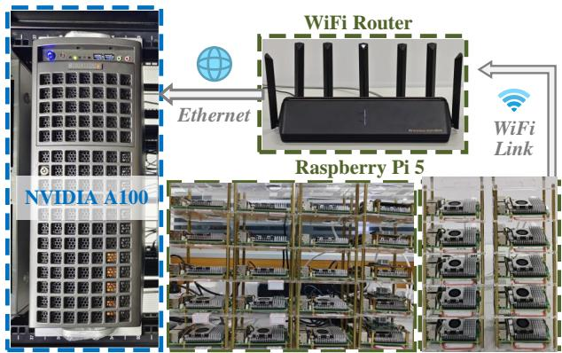  
Fig. 3. The testbed to implement our experiment.

In summary, the mean field solution provides a computationally tractable, decentralized, and provably near-optimal strategy profile (ϵ-NE) for the large-scale GAEC system. It inherently incentivizes UAVs to use their true local energy state for decision-making and ensures they act rationally to minimize their costs within the system’s operational context.

## V. PERFORMANCE EVALUATION

In this section, we employ a real hardware testbed, where a set of distributed UAVs and a local server are deployed for coordination, to assess performance, scalability, and practical efficacy of the proposed algorithm.

## A. Experimental Testbed Setup

The hardware testbed allows for the evaluation of task allocation, energy management, and overall system dynamics under conditions that approximate real-world deployments. Its key components include:

UAV Emulation: A set of Raspberry Pi5 devices serve as UAV agents, executing the decentralized decision-making algorithms derived from our MFG model. Moreover, these agents have local energy states, e.g., simulating energy consumption for task processing and communication, and stochastic energy harvesting for designated EF-UAVs $U _ { e }$ . Custom Python scripts are deployed on agents to implement the above logic and facilitate communication with the central dispatcher.

• Cloud Server (CS): The central dispatcher, implemented on an NVIDIA A100 GPU-powered cloud server (CS), is responsible for aggregating status information from the UAVs, assigning computational tasks, and broadcasting system-wide energy metrics (e.g., the energy value $\rho [ n ] )$ . Owing to the $\mathrm { U A V s } '$ limited onboard processing capabilities, compute-intensive jobs may also be offloaded to the CS for execution.

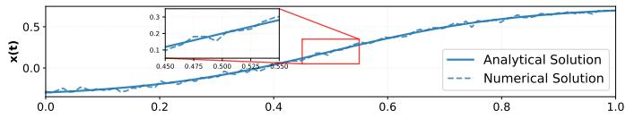

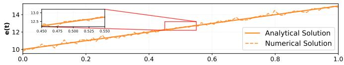

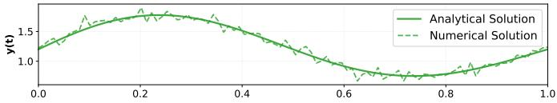

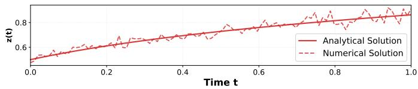  
Fig. 4. Validation of closed-form cost coefficients in MFG model. The figure shows excellent agreement between analytical solutions (solid lines) and numerical solutions (dashed lines) for: coefficient $x ( t )$ with tanh behavior, mean field energy e¯(t) with linear growth, coefficient y(t) with coupled dynamics, and coefficient z(t) with logarithmic components.

• Network Infrastructure: The Raspberry Pi UAVs are connected to a local area network (LAN) via WiFi, mimicking the wireless communication paradigm of actual UAV operations. The NVIDIA A100 CS is connected to the same LAN via a high-speed Ethernet connection. Communication between UAV agents, the dispatcher, and the CS is facilitated using standard TCP/IP protocols, with application-level interactions potentially managed through REST APIs for less frequent commands and WebSocket connections for real-time data exchange (e.g., status updates and signal broadcasts).

This hardware-in-the-loop configuration allows us to assess the performance of our proposed algorithms by incorporating realistic factors such as processing delays on embedded platforms (Raspberry Pis), the computational throughput of a high-performance server (A100), and network latencies. An overview of our testbed is shown in Fig. 3.

## B. Simulation and System Setup

The system consists of two types of UAVs: $U _ { c }$ CE-UAVs equipped with processing units, and $U _ { e }$ EF-UAVs equipped with efficient energy collection modules. We conduct a set of simulations with heterogeneous UAVs randomly deployed within a three-dimensional region. The simulation settings are summarized in Table 3.

For computational tasks, we assume a poisson arrival process with rate $\lambda _ { t a s k }$ ranging from 3 to 7 tasks per minute. Each task was characterized by its data size $D _ { k } ( t )$ uniformly distributed between 100 KB and 500 KB, and required CPU cycles $C _ { k } ( t )$ uniformly distributed between 400 and 800 Mega cycles. The maximum tolerable delay for each task was set to be less than or equal to the time slot duration.

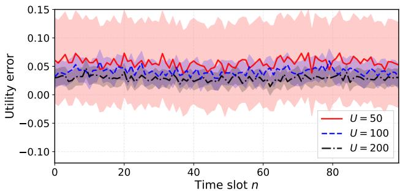  
(a) Linear function

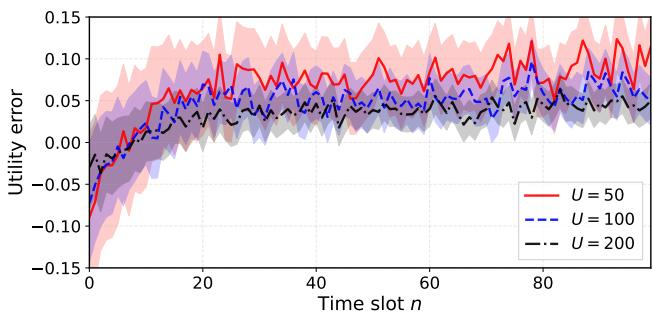  
(b) Logarithm function  
Fig. 5. Approximation error dynamics of long-term utility under different utility functions.

TABLE 3  
SIMULATION PARAMETERS
<table><tr><td rowspan=1 colspan=1>Parameter</td><td rowspan=1 colspan=1>Value</td></tr><tr><td rowspan=1 colspan=1>Number of UAVs $\overline { { ( U _ { c } + U _ { e } ) } }$ </td><td rowspan=1 colspan=1>10, 20, 50, 100, 200</td></tr><tr><td rowspan=1 colspan=1>Simulation duration</td><td rowspan=1 colspan=1>6 hours</td></tr><tr><td rowspan=1 colspan=1>Time slot duration (T)</td><td rowspan=1 colspan=1>15 minutes</td></tr><tr><td rowspan=1 colspan=1>Task arrival rate $\overline { { ( \lambda _ { t a s k } ) } }$ </td><td rowspan=1 colspan=1>3-7 tasks/minute</td></tr><tr><td rowspan=1 colspan=1>Data size $\overline { { ( D _ { k } ) } }$ </td><td rowspan=1 colspan=1>U[100, 500] KB</td></tr><tr><td rowspan=1 colspan=1>CPU cycles $\overline { { ( C _ { k } ) } }$ </td><td rowspan=1 colspan=1>U[400, 800] Mega cycles</td></tr><tr><td rowspan=1 colspan=1>Energy harvesting rate $\overline { { ( \eta _ { u } ( t ) ) } }$ </td><td rowspan=1 colspan=1> $\overline { { \mathcal { N } ( \eta [ n ] , \sigma _ { u } ^ { 2 } ) } }$ </td></tr><tr><td rowspan=1 colspan=1>Energy balance parameter (ξ)</td><td rowspan=1 colspan=1>0.1, 0.5, 1, 2, 5</td></tr><tr><td rowspan=1 colspan=1>Computation coefficient $( \kappa _ { u } )$ </td><td rowspan=1 colspan=1> $\overline { { 1 0 ^ { - 2 6 } } }$ </td></tr><tr><td rowspan=1 colspan=1>Communication coefficient $( \psi _ { u } )$ </td><td rowspan=1 colspan=1> $\overline { { 1 0 ^ { - 6 } } }$ </td></tr></table>

The energy harvesting rate for UAVs follows a Gaussian distribution $\mathcal { N } ( \eta [ n ] , \sigma _ { u } ^ { 2 } )$ , where $\eta [ n ]$ represents the average energy collection condition in time slot $n ,$ and $\sigma _ { u } ^ { 2 }$ captures the randomness magnitude of energy harvesting.

## C. Mean Field Game Model Validation

Validation of Closed-Form Cost Coefficients. Before assessing the full system, we first validate the correctness of our derived closed-form solutions for the quadratic cost coefficients $x ( t ) , y ( t )$ , and z(t) (Lemmas 1-3). We employ the scipy.integrate.odeint solver<sup>1</sup> in Python to numerically solve the system of Ordinary Differential Equations (ODEs) given by Eqs. (20)-(22) and (25). Fig. 4 compares these numerical solutions with our analytical closed-form expressions over a single small time interval $t \in [ 0 , T ]$ . The close match between the theoretical curves and the numerically computed points for x(t), y(t), and $z ( t )$ verifies the mathematical correctness of our derivations, providing a solid foundation for the MFG model.

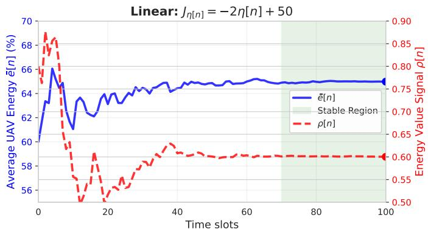

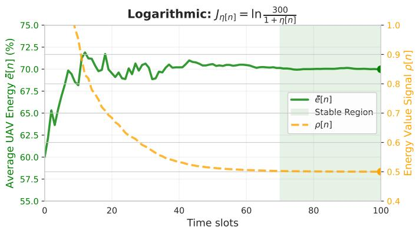  
Fig. 6. Evolution of average UAVs’ energy and energy value signal $\rho [ n ]$ over 100 time slots, demonstrating convergence for Linear and Logarithmic models.

Approximation Error of Long-Term Utility. We then validate the $O ( 1 / \sqrt { U } )$ approximation error (Theorem 1) by varying the number of active Raspberry Pi UAVs $\textup { \textsf { ( U \_ \in } }$ $\{ 5 0 , 1 0 0 , 2 0 0 \} )$ in our testbed. For each configuration of U, the experiments simulating 6 hours of operation are conducted. The coordination server aggregates the actual longterm utility achieved by the UAV telemetry (from Raspberry Pi agents) and compares it to the theoretical predictions from our numerically solved mean-field model. Fig. 5 plots this normalized approximation error against the number of UAVs U. The empirical data obtained from our distributed Raspberry Pi agents closely follows the theoretical $O ( 1 / \sqrt { U } )$ decay. As U increases, the observed error diminishes, confirming that the MFG approximation becomes increasingly accurate for larger GAEC systems, which is a key advantage for scalability, even when validated on a physical testbed.

## D. Lyapunov Control and System Dynamics Evaluation

We assess the Lyapunov optimization framework’s effectiveness in ensuring system stability and optimizing utility based on our testbed.

1) Convergence of System State and Energy Value Signal: Extended experiments, running up to 100 time slots on the testbed, are conducted to observe the convergence behavior of the average UAV energy e¯[n] and the energy value signal $\rho [ n ]$ . The server performs dynamical computation of $\rho [ n ]$ using the Lyapunov-based policy. We consider both a linear function $( J _ { \eta [ n ] } = - 2 \eta [ n ] + 5 0 )$ and a logarithmic function $\begin{array} { r } { ( J _ { \eta [ n ] } = \ln { \frac { \mathbf { \tilde { \eta } } _ { 3 0 0 } ^ { 3 0 0 } } { 1 + \eta [ n ] } } ) } \end{array}$ for the relationship $\phi ( \rho [ n ] ) = \eta [ n ]$ , representing different sensitivities of energy harvesting potential to the energy value signal. Fig. 6 shows the evolution of e¯[n] (aggregated from the Raspberry Pi nodes) and the servergenerated $\rho [ n ]$ . In both cases, these key system parameters converge to stable operating points, empirically validating the stability induced by the Lyapunov controller within our distributed testbed environment.

2) Performance Comparison with Baseline Strategies: We benchmark our proposed GAEC-Opt approach against several baseline strategies:

• Greedy Strategy: UAVs prioritize tasks that offer the highest immediate reward without long-term energy considerations.

• No Balancing: UAVs follow the MFG strategy but with the energy balancing term disabled $( \mathrm { i . e . , } \xi = 0 )$

Fig. 7 presents a comprehensive comparison of energy management performance across these strategies over 100 time slots. The results clearly demonstrate the superior energy management capabilities of our MFG approach. As shown in the left panel of Fig. 7, the MFG strategy maintains consistently higher average energy levels (around 0.75-0.8) throughout the simulation, particularly achieving excellent energy balance in the steady state phase. In contrast, both the Greedy Strategy and No Balancing approaches exhibit significant energy depletion over time, with average energy levels dropping to 0.3-0.4 by the end of the simulation period.

The right panel of Fig. 7 reveals an even more striking advantage of our approach in terms of energy variance, which serves as a key indicator of load balancing effectiveness. The MFG achieves remarkably low energy variance (below 0.05) throughout most of the simulation, demonstrating superior energy distribution among UAVs. Conversely, both baseline strategies exhibit high energy variance (0.1-0.17), indicating severe energy imbalances where some UAVs become heavily depleted while others remain underutilized.

The simulation can be divided into three distinct phases: initialization (0-20 time slots), transition (20-60 time slots), and steady state (60-100 time slots). During the steady state phase, our MFG maintains both high average energy levels and minimal variance, while the baseline strategies continue to deteriorate. These results underscore the critical importance of incorporating energy balancing mechanisms in multi-UAV task allocation and validate the effectiveness of our integrated GAEC in achieving long-term system sustainability.

## E. Parameter Sensitivity Analysis

To comprehensively understand the performance characteristics of our GAEC framework, we conduct a systematic parameter sensitivity analysis focusing on the joint effects of the energy balancing parameter ξ and the UAVs’ size U. These parameters are critical determinants of system performance: $\xi$ controls the penalty strength for energy level deviations from the $\mathrm { U A V s } '$ average, while U directly influences the accuracy of mean field approximation according to our theoretical analysis with $O ( 1 / \sqrt { U } )$ error bounds.

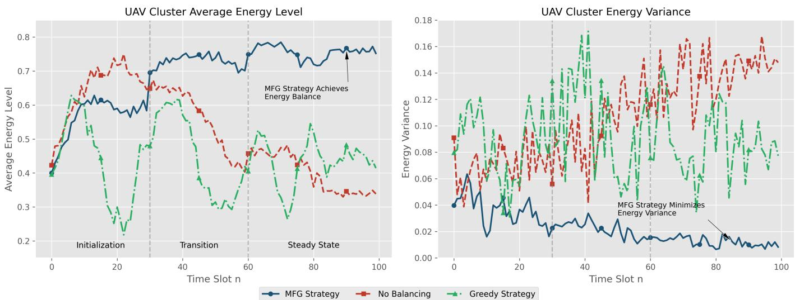  
Fig. 7. Comparison of UAV cluster energy performance across different strategies. Left panel shows average energy levels over time, right panel shows energy variance indicating load balancing effectiveness.

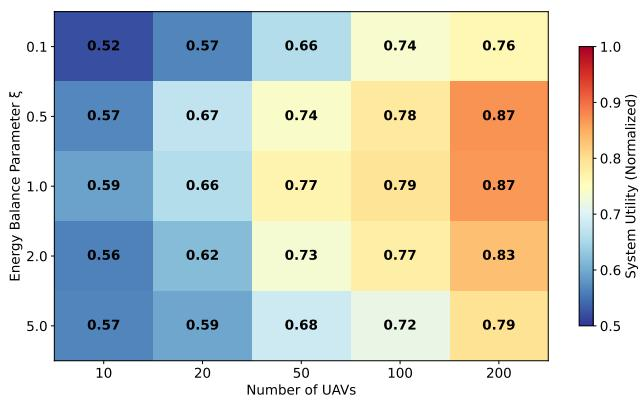  
Fig. 8. Task allocation performance heatmap: Joint impact analysis of energy balancing parameter ξ and UAVs’ size U on normalized system utility.

We construct a two-dimensional parameter space with $\xi \in \{ 0 . 1 , 0 . 5 , 1 . 0 , 2 . 0 , 5 . 0 \}$ and $U \in \{ 1 0 , 2 0 , 5 0 , 1 0 0 , 2 0 0 \}$ covering scenarios from small-scale deployments to large commercial applications. For each parameter combination, we perform 100 independent simulation runs with 6-hour operational periods to ensure statistical reliability. The system utility metric represents normalized long-term cumulative rewards, which reflects the integrated performance of task processing efficiency, energy balance quality, and service quality.

Fig. 8 presents the task allocation performance heatmap revealing several key insights:

Optimal Balance Point: The system utility peaks around $\xi \ = \ 1 . 0 \ ( 0 . 8 5  – 0 . 8 7 )$ , confirming our theoretical predictions regarding optimal energy balancing strategies. This validates the energy balance cost term $\xi ( e _ { u } ( t ) - \bar { e } ^ { U } ( t ) ) ^ { 2 }$ in $\operatorname { E q . }$ (10) and demonstrates that moderate energy balancing constraints enhance rather than compromise system performance.

Scale-Dependent Performance: The horizontal progression shows logarithmic utility improvement from $U = 1 0$ to $U =$ 200, consistent with the $O ( 1 / \sqrt { U } )$ error bounds predicted by our mean field theory. Significant performance gains occur at smaller scales $( U ~ \le ~ 2 0 )$ , while marginal improvements diminish at larger scales $( U \ge 1 0 0 )$

Parameter Robustness: The framework maintains utility above 0.80 across the broad parameter region of $\xi \in [ 0 . 5 , 2 . 0 ]$ and $U \geq 2 0$ , demonstrating excellent robustness for practical deployment. Even under constrained scenarios $( U ~ = ~ 1 0 )$ appropriate ξ selection achieves acceptable performance levels (0.75-0.85).

Deployment Guidelines: Based on the heatmap analysis, we recommend $\xi \in [ 0 . 5 , 2 . 0 ]$ for general deployments, with $\xi = 1 . 0$ optimal for small-scale systems $( U \leq 2 0 )$ and flexible tuning within $\xi \in [ 0 . 5 , 1 . 5 ]$ for large-scale deployments $( U \geq$ 100) based on specific operational priorities.

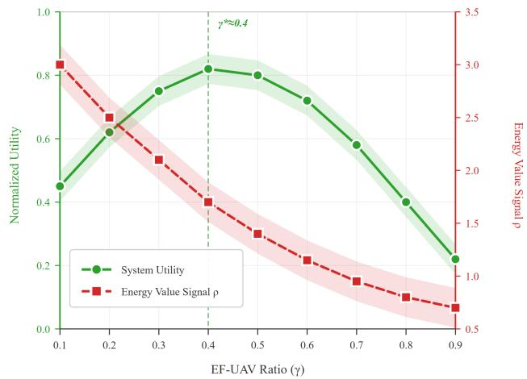  
Fig. 9. Impact of EF-UAVs ratio γ on system performance.

Impact of Heterogeneous UAV Ratios: Beside of U and ξ, the ratio of EF-UAVs $\gamma ~ = ~ U _ { e } / U$ plays a pivotal role in the convergence of the Lyapunov optimization. As shown in Fig. (9), a higher γ increases the average energy inflow rate $\eta [ n ]$ , which alleviates the pressure on the energy queues and enables $\rho [ n ]$ to converge more quickly to a steady state. $\mathbf { A s } \ \gamma$ increases from 0.1 to 0.4, the normalized utility rises from approximately 0.45 to 0.82, reaching its peak. Beyond $\gamma = 0 . 4$ , the utility decreases due to the scarcity of CE-UAVs, dropping to 0.22 at $\gamma = 0 . 9$

These results not only validate our MFG theoretical framework but also provide practical guidance for real-world GAEC system deployments. They confirm that appropriate energy balancing promotes UAVs’ coordination and enhances overall system utility.

## VI. RELATED WORK

## A. Task Allocation in Edge Computing

Task allocation and computation offloading are fundamental to MEC and AEC, aiming to reduce latency and device energy consumption by leveraging proximate resources [27]– [29]. While general efforts optimize offloading considering latency, computational requirements, and network conditions [30]–[32], AEC introduces further complexities with UAV mobility and unique Line-of-Sight communication [33], spurring research into joint trajectory-task optimization [34], swarm resource management [35], [36], and load balancing [37], [38]. However, existing solutions often rely on centralized control frameworks [39] or assume predictable environmental conditions, which may limit scalability and adaptability, especially for the dynamic demands of metaverse users interacting with a large number of UAV [40]. The critical challenge of ensuring long-term energy sustainability for UAVs is often simplified or inadequately addressed, particularly when the complex interplay between energy consumption and stochastic energy replenishment remains unresolved. Different from existing methods, our decentralized framework is specifically designed for energy-constrained AEC supporting metaverse applications, explicitly tackling long-term sustainability through integrated energy harvesting and dynamic task allocation.

## B. Energy Harvesting in Edge Computing

The limited endurance of UAVs due to battery constraints presents a significant operational bottleneck [13], [41], which EH technologies aim to alleviate by allowing extended missions or perpetual operation [42], [43]. Research has explored energy-aware scheduling methods [44], [45], resource allocation for EH-enabled MEC systems [46], and inter-UAV energy cooperation [47], [48]. However, existing approaches often formulate EH processes in a deterministic way or based on simple stochastic models that may not capture the full variability encountered in real-world scenarios. In addition, few unified optimization frameworks consider the coupled effects of unpredictable task arrivals, stochastic energy harvesting, and energy balancing across heterogeneous UAVs when optimizing long-term rewards. Unlike prior work that might optimize instantaneous energy efficiency, our GAEC framework explicitly incorporates stochastic EH dynamics within an MFG model and utilizes Lyapunov optimization to ensure long-term energy balance and maximize system utility, directly addressing the sustainability challenge for metaverse support.

## C. Mean Field Game

The MFG is a statistical method to model interactions between agents [17], [24], and it has been utilized to analyze the computation offloading among multi-access points in MEC [25], [49], [50], [51], where the running cost is dependent on the expected network state and offloading control. Also, it was used to determine the caching strategy in ultra-dense networks for reducing the long-term cost [52], [53]. Nevertheless, most existing methods rely on numerical methods rather than deriving explicit results to evaluate the mean field model performance, which makes it difficult to prove key attributes and adapt dynamically changing real-world environments. Unlike prior work that often addresses isolated aspects such as task offloading or energy-aware scheduling, our research proposes a comprehensive MFG-based framework for AEC systems supporting metaverse applications. This framework jointly optimizes task allocation, energy harvesting, and long-term sustainability, explicitly considering the randomness and dynamism of energy. Moreover, distinct from existing EH methods that employ deterministic or simplistic stochastic models, our approach captures the full complexity of real-world energy variability through Lyapunov optimization, thereby ensuring long-term energy balance across heterogeneous UAV fleets. The main distinctions between our work and existing studies are summarized in Table 4.

TABLE 4  
THE COMPARISON BETWEEN OUR WORK AND EXISTING MECHANISMS
<table><tr><td>Reference</td><td>AEC</td><td>EH</td><td>SEH</td><td>MFG</td><td>LTO</td><td>EB</td><td>IC</td></tr><tr><td>[19]</td><td>√</td><td>×</td><td>X</td><td>×</td><td>×</td><td>×</td><td>X</td></tr><tr><td>[35]</td><td>×</td><td>√</td><td>X</td><td>×</td><td>X</td><td>X</td><td>X</td></tr><tr><td>[27]</td><td>√</td><td>X</td><td>X</td><td>X</td><td>X</td><td>X</td><td>X</td></tr><tr><td>[44]</td><td>X</td><td>X</td><td>X</td><td>√</td><td>X</td><td>X</td><td>X</td></tr><tr><td>[46]</td><td>×</td><td>X</td><td>X</td><td>√</td><td>√</td><td>X</td><td>X</td></tr><tr><td>[39]</td><td>√</td><td>X</td><td>×</td><td>×</td><td>×</td><td>√</td><td>X</td></tr><tr><td>[47]</td><td>√</td><td>V</td><td>X</td><td>×</td><td>√</td><td>×</td><td>X</td></tr><tr><td>Ours</td><td>√</td><td>√</td><td>√</td><td>√</td><td>√</td><td>√</td><td>√</td></tr></table>

AEC: Applied in Aerial Edge Computing scenarios. EH: Incorporates Energy Harvesting for sustainability. SEH: Models Energy Harvesting Stochastically. MFG: Utilizes MFG theory for large-scale systems. LTO: Optimizes for Long-Term Utility or System Sustainability. EB: Includes explicit Energy Balancing considerations. IC: Analyzes Incentive Compatibility or Truthfulness.

## VII. CONCLUSION

This paper addresses the energy-efficient task allocation problem in GAEC systems supporting metaverse applications. We first propose a GAEC framework that integrates energy harvesting functionality into heterogeneous UAV clusters. Building upon this framework, we introduce the MFG method to describe the collective energy scheduling behavior of a large number of UAVs, with the objective of maximizing the longterm benefits of the system. A key theoretical advantage of the MFG approach lies in its asymptotic optimality: as the number of UAVs U increases, the approximation error diminishes at the rate of $O ( 1 / \sqrt { U } )$ , ensuring that the decentralized strategy converges to the Nash equilibrium. This scalability property makes our framework particularly suitable for massive-scale metaverse ecosystems where the number of UAVs can grow without requiring algorithm redesign.

Limitation: We further discuss the limitations of GAEC and potential future research directions. The current framework limits each task to be processed by a single UAV, preventing collaborative execution where multiple UAVs could jointly handle computationally intensive tasks. Future work will extend the framework to support collaborative task execution where complex workloads can be decomposed and distributed across multiple UAVs.

## REFERENCES

[1] Y. Yuan, S. Mann, T. Furness, P. Rosedale, N. Trevett, R. Lebaredian, C. Kalinowski, D. Lange, E. Miralles, O. Inbar et al., “Metaverse landscape & outlook: Metaverse decoded by top experts,” in IEEE Metaverse Congress, 2022.

[2] L.-H. Lee, T. Braud, P. Y. Zhou, L. Wang, D. Xu, Z. Lin, A. Kumar, C. Bermejo, P. Hui et al., “All one needs to know about metaverse: A complete survey on technological singularity, virtual ecosystem, and research agenda,” Foundations and trends® in human-computer interaction, vol. 18, no. 2–3, pp. 100–337, 2024.

[3] F. Arena, M. Collotta, G. Pau, and F. Termine, “An overview of augmented reality,” Computers, vol. 11, no. 2, p. 28, 2022.

[4] I. Wohlgenannt, A. Simons, and S. Stieglitz, “Virtual reality,” Business & Information Systems Engineering, vol. 62, pp. 455–461, 2020.

[5] M. Xu, W. C. Ng, W. Y. B. Lim, J. Kang, Z. Xiong, D. Niyato, Q. Yang, X. Shen, and C. Miao, “A full dive into realizing the edgeenabled metaverse: Visions, enabling technologies, and challenges,” IEEE Communications Surveys & Tutorials, vol. 25, no. 1, pp. 656– 700, 2022.

[6] Q. Zhang, Y. Luo, H. Jiang, and K. Zhang, “Aerial edge computing: A survey,” IEEE Internet of Things Journal, vol. 10, no. 16, pp. 14 357– 14 374, 2023.

[7] L. Zhao, Y. Feng, A. Hawbani, L. Xu, Z. Liu, and Y. Bi, “Optimized resource allocation in vehicle edge computing through platoon collaboration,” IEEE Internet of Things Journal, 2025.

[8] Z. Shuai, Z. Hu, J. Gai, Y. Chen, J. Chen, H. Zhang, and F.-Y. Wang, “Metaverse-enabled intelligence for open-terrain field vehicle fleets: Leveraging parallel intelligence and edge computing,” IEEE Transactions on Intelligent Vehicles, 2024.

[9] Y. Mao, J. Zhang, and K. B. Letaief, “Dynamic computation offloading for mobile-edge computing with energy harvesting devices,” IEEE Journal on Selected Areas in Communications, vol. 34, no. 12, pp. 3590– 3605, 2016.

[10] Solar nano smartphone case gives your phone perpetual power. 2017. [Online]. Available: https://www.psfk.com/2015/01/ solar-nano-smartphone-case-gives-your-phone-perpetual-power.html

[11] Sunthetic is a solar case charger beautifully designed for your iphone. 2019. [Online]. Available: https://sunthetic.eu/

[12] Sunny - the only solar battery case for iphone that actually works. 2018. [Online]. Available: https://sunnycase.com/

[13] Z. Yang, W. Xu, and M. Shikh-Bahaei, “Energy efficient uav communication with energy harvesting,” IEEE Transactions on Vehicular Technology, vol. 69, no. 2, pp. 1913–1927, 2019.

[14] H. Gao, W. Lee, Y. Kang, W. Li, Z. Han, S. Osher, and H. V. Poor, “Energy-efficient velocity control for massive numbers of uavs: A mean field game approach,” IEEE Transactions on Vehicular Technology, vol. 71, no. 6, pp. 6266–6278, 2022.

[15] Z. Yang, S. Bi, and Y.-J. A. Zhang, “Dynamic offloading and trajectory control for uav-enabled mobile edge computing system with energy harvesting devices,” IEEE Transactions on Wireless Communications, vol. 21, no. 12, pp. 10 515–10 528, 2022.

[16] L. Ma, Y. Zhou, Y. Ma, G. Yu, Q. Li, Q. He, and Y. Pei, “Defying multimodel forgetting in one-shot neural architecture search using orthogonal gradient learning,” IEEE Transactions on Computers, 2025.

[17] J.-M. Lasry and P.-L. Lions, “Mean field games,” Japanese journal of mathematics, vol. 2, no. 1, pp. 229–260, 2007.

[18] C. You and R. Zhang, “Hybrid offline-online design for uav-enabled data harvesting in probabilistic los channels,” IEEE Transactions on Wireless Communications, vol. 19, no. 6, pp. 3753–3768, 2020.

[19] J. Hu, M. Jiang, Q. Zhang, Q. Li, and J. Qin, “Joint optimization of uav position, time slot allocation, and computation task partition in multiuser aerial mobile-edge computing systems,” IEEE Transactions on Vehicular Technology, vol. 68, no. 7, pp. 7231–7235, 2019.

[20] A. Al-Hourani, S. Kandeepan, and S. Lardner, “Optimal lap altitude for maximum coverage,” IEEE Wireless Communications Letters, vol. 3, no. 6, pp. 569–572, 2014.

[21] M. C. Achtelik, J. Stumpf, D. Gurdan, and K.-M. Doth, “Design of a flexible high performance quadcopter platform breaking the mav endurance record with laser power beaming,” in 2011 IEEE/RSJ international conference on intelligent robots and systems. IEEE, 2011, pp. 5166–5172.

[22] A. P. Sample, B. H. Waters, S. T. Wisdom, and J. R. Smith, “Enabling seamless wireless power delivery in dynamic environments,” Proceedings of the IEEE, vol. 101, no. 6, pp. 1343–1358, 2013.

[23] Y. Wang, Z.-Y. Ru, K. Wang, and P.-Q. Huang, “Joint deployment and task scheduling optimization for large-scale mobile users in multi-uavenabled mobile edge computing,” IEEE transactions on cybernetics, vol. 50, no. 9, pp. 3984–3997, 2019.

[24] M. Huang, R. P. Malhame, and P. E. Caines, “Large population stochas-´ tic dynamic games: closed-loop mckean-vlasov systems and the nash certainty equivalence principle,” 2006.

[25] R. A. Banez, H. Tembine, L. Li, C. Yang, L. Song, Z. Han, and H. V. Poor, “Mean-field-type game-based computation offloading in multi-access edge computing networks,” IEEE Transactions on Wireless Communications, vol. 19, no. 12, pp. 8366–8381, 2020.

[26] M. Huang, P. E. Caines, and R. P. Malhame, “Large-population costcoupled lqg problems with nonuniform agents: Individual-mass behavior and decentralized ε-nash equilibria,” IEEE Transactions on Automatic Control, vol. 52, no. 9, pp. 1560–1571, 2007.

[27] Q. Wang, S. Guo, J. Liu, C. Pan, and L. Yang, “Profit maximization incentive mechanism for resource providers in mobile edge computing,” IEEE Transactions on Services Computing, vol. 15, no. 1, pp. 138–149, 2019.

[28] L. Ma, X. Wang, X. Wang, L. Wang, Y. Shi, and M. Huang, “Tcda: Truthful combinatorial double auctions for mobile edge computing in industrial internet of things,” IEEE Transactions on Mobile Computing, vol. 21, no. 11, pp. 4125–4138, 2021.

[29] X. Chen, L. Jiao, W. Li, and X. Fu, “Efficient multi-user computation offloading for mobile-edge cloud computing,” IEEE/ACM transactions on networking, vol. 24, no. 5, pp. 2795–2808, 2015.

[30] Y. Jararweh, A. Doulat, O. AlQudah, E. Ahmed, M. Al-Ayyoub, and E. Benkhelifa, “The future of mobile cloud computing: integrating cloudlets and mobile edge computing,” in 2016 23rd International conference on telecommunications (ICT). IEEE, 2016, pp. 1–5.

[31] P. Mach and Z. Becvar, “Mobile edge computing: A survey on architecture and computation offloading,” IEEE communications surveys & tutorials, vol. 19, no. 3, pp. 1628–1656, 2017.

[32] Y. Zhou, L. Ma, Y. Qian, M. Huang, F. Hao, and X. Wang, “A stable locality-aware task scheduling mechanism for mobile edge computing with workflow task offloading,” IEEE Transactions on Services Computing, vol. 19, no. 1, pp. 72–85, 2026.

[33] J. Bellingham, M. Tillerson, A. Richards, and J. P. How, “Multi-task allocation and path planning for cooperating uavs,” Cooperative control: models, applications and algorithms, pp. 23–41, 2003.

[34] P. Sujit, J. George, and R. Beard, “Multiple uav task allocation using particle swarm optimization,” in AIAA Guidance, Navigation and Control Conference and Exhibit, 2008, p. 6837.

[35] M.-H. Kim, H. Baik, and S. Lee, “Resource welfare based task allocation for uav team with resource constraints,” Journal of Intelligent & Robotic Systems, vol. 77, pp. 611–627, 2015.

[36] L. Huang, H. Qu, and L. Zuo, “Multi-type uavs cooperative task allocation under resource constraints,” Ieee Access, vol. 6, pp. 17 841– 17 850, 2018.

[37] I. A. Elgendy, S. Meshoul, and M. Hammad, “Joint task offloading, resource allocation, and load-balancing optimization in multi-uav-aided mec systems,” Applied Sciences, vol. 13, no. 4, p. 2625, 2023.

[38] S. Poudel and S. Moh, “Priority-aware task assignment and path planning for efficient and load-balanced multi-uav operation,” Vehicular Communications, vol. 42, p. 100633, 2023.

[39] H. Guo, Y. Wang, J. Liu, and C. Liu, “Multi-uav cooperative task offloading and resource allocation in 5g advanced and beyond,” IEEE Transactions on Wireless Communications, vol. 23, no. 1, pp. 347–359, 2023.

[40] H. Gao, W. Li, R. A. Banez, Z. Han, and H. V. Poor, “Mean field evolutionary dynamics in dense-user multi-access edge computing systems,” IEEE Transactions on Wireless Communications, vol. 19, no. 12, pp. 7825–7835, 2020.

[41] H. Wu, Y. Sun, and K. Wolter, “Energy-efficient decision making for mobile cloud offloading,” IEEE Transactions on Cloud Computing, vol. 8, no. 2, pp. 570–584, 2018.

[42] B. Ji, Y. Li, B. Zhou, C. Li, K. Song, and H. Wen, “Performance analysis of uav relay assisted iot communication network enhanced with energy harvesting,” IEEE Access, vol. 7, pp. 38 738–38 747, 2019.

[43] L. Jia, Q.-S. Hua, H. Fan, Q. Wang, and H. Jin, “Efficient distributed algorithms for holistic aggregation functions on random regular graphs,” Science China Information Sciences, vol. 65, pp. 1–19, 2022.

[44] L. Ma, Y. Qian, G. Yu, Z. Li, L. Wang, Q. Li, X. Wang, and G. Han, “Tbcim: Two-level blockchain-aided edge resource allocation mechanism for federated learning service market,” IEEE Transactions on Networking, 2025.

[45] Y. Li, W. Dai, X. Gan, H. Jin, L. Fu, H. Ma, and X. Wang, “Cooperative service placement and scheduling in edge clouds: A deadline-driven approach,” IEEE Transactions on Mobile Computing, vol. 21, no. 10, pp. 3519–3535, 2021.

[46] H. Hu, Q. Wang, R. Q. Hu, and H. Zhu, “Mobility-aware offloading and resource allocation in a mec-enabled iot network with energy harvesting,” IEEE Internet of Things Journal, vol. 8, no. 24, pp. 17 541– 17 556, 2021.

[47] F. Pervez, A. Sultana, C. Yang, and L. Zhao, “Energy and latency efficient joint communication and computation optimization in a multi-uavassisted mec network,” IEEE Transactions on Wireless Communications, vol. 23, no. 3, pp. 1728–1741, 2023.

[48] M. Yan, L. Zhang, W. Jiang, C. A. Chan, A. F. Gygax, and A. Nirmalathas, “Energy consumption modeling and optimization of uavassisted mec networks using deep reinforcement learning,” IEEE Sensors Journal, 2024.

[49] A. Abouaomar, S. Cherkaoui, Z. Mlika, and A. Kobbane, “Mean-field game and reinforcement learning mec resource provisioning for sfc,” in 2021 IEEE Global Communications Conference (GLOBECOM). IEEE, 2021, pp. 1–6.

[50] D. Shi, H. Gao, L. Wang, M. Pan, Z. Han, and H. V. Poor, “Mean field game guided deep reinforcement learning for task placement in cooperative multiaccess edge computing,” IEEE Internet of Things Journal, vol. 7, no. 10, pp. 9330–9340, 2020.

[51] S. Aggarwal, M. A. u. Zaman, M. Bastopcu, S. Ulukus, and T. Bas¸ar, “Distributed offloading in multi-access edge computing systems: A mean-field perspective,” IEEE Transactions on Mobile Computing, pp. 1–18, 2025.

[52] L. Li, M. Wang, K. Xue, Q. Cheng, D. Wang, W. Chen, M. Pan, and Z. Han, “Delay optimization in multi-uav edge caching networks: A robust mean field game,” IEEE Transactions on Vehicular Technology, vol. 70, no. 1, pp. 808–819, 2020.

[53] K. Hamidouche, W. Saad, M. Debbah, and H. V. Poor, “Mean-field games for distributed caching in ultra-dense small cell networks,” in 2016 American Control Conference (ACC). IEEE, 2016, pp. 4699– 4704.

  
learning.  
Lianbo Ma (Senior Member, IEEE) received the B.Sc. degree in communication engineering and the M.Sc. degree in communication and information systems from Northeastern University, Shenyang, China, in 2004 and 2007, respectively, and the Ph.D. degree from the University of Chinese Academy of Sciences, Beijing, China, in 2015. He is currently a Professor with Northeastern University. He has published over 90 journal articles, books, and refereed conference papers. His current research interests include computational intelligence and machine

  
Dingsige Chen received the B.Sc. degree from the Northeastern University, China, in 2024. She is currently pursuing the M.Sc. degree at Northeastern University, Shenyang, China. Her current research interests include edge computing and mean field game.


  
and Computer Applications.

Yuee Zhou received the B.Sc. degree from the Northeastern University, China, in 2017. She is currently pursuing the Ph.D. degree at Northeastern University, Shenyang, China. Her current research interests include edge computing and machine learning.


Jianming Zhao received the B.Sc. degree and the M.Sc. degree in network and information security from Jilin University, Changchun, China, in 2010 and 2013. He received the Ph.D. degree in engineering from the University of Chinese Academy of Sciences, Beijing, China, in 2025. He is currently a Professor with Northeastern University. His current research interests include industrial Internet, industrial control system security, edge computing, and cryptography applications.

Liang Wang received the Ph.D. degree in computer science from the Shenyang Institute of Automation (SIA), Chinese Academy of Sciences, Shenyang, China, in 2014. He is currently an associate professor at Northwestern Polytechnical University, Xi’an, China. His research interests include ubiquitous computing, mobile crowd sensing, and data mining.

Qiang He received the Ph.D. degree in computer application technology from the Northeastern University, Shenyang, China in 2020.He is currently Associate Professor at College of Medicine and Biological Information Engineering, Northeastern University, Shenyang, China. His research interests include social network analytic, machine learning, data mining, etc. He has published more than 60 journal articles and refereed conference papers.

Bo Yi (Member, IEEE) is currently a Lecturer of Computer Science e and Engineering with Northeastern University, China. He has authored and coauthored more than 20 journal and conference articles on IEEE TPDS, TCC, IEEE Communications Letter, IWQoS, AAAI, and Computer Networks. His research interests include service computing, routing, virtualization, cloud computing in SDN, NFV, and DetNet. He is currently the Reviewer of IEEE Communications Survey and Tutorial, Communications Letter, Computer Networks, and Journal of Network

Min Huang received the B.Sc. degree in automatic instrument, M.Sc. degree in systems engineering, and the Ph.D. degree in control theory and control engineering from the Northeastern University, Shenyang, China, in 1990, 1993, and 1999, respectively. She is currently a professor at Northeastern University, China. Her research interests include modeling and optimization for logistics and supply chain, etc. She has published more than 100 journal articles, books, and refereed conference papers.


Xingwei Wang received the B.Sc., M.Sc., and Ph.D. degrees from the Northeastern University, Shenyang, China, in 1989, 1992, and 1998, respectively, all in computer science. He is currently a professor at Northeastern University, China. His current research interests include cloud computing and future Internet. He has published more than 100 journal articles, books, and refereed conference papers.