# Energy-Efficient UAV-Assisted Mobile Edge Computing With Secure and Reliable Data Transmission

Mingqian Wang, Graduate Student Member, IEEE, Jianshan Zhou , Daxin Tian , Fellow, IEEE, Xuting Duan , Member, IEEE, and Kaige Qu , Member, IEEE

Abstract—Uncrewed aerial vehicles (UAVs) play a pivotal role in air-ground collaborative mobile edge computing (MEC) systems. They function as aerial cloudlets, deploying flexibly closer to ground users (GUs) to provide enhanced computational capacity in edge computing scenarios. While extensive studies have optimized resource allocation and UAV trajectories collaboratively to improve energy and offloading efficiency, few have simultaneously addressed the system’s communication security and reliability. This paper proposes a joint optimization model to ensure both security and reliability in an energy-efficient UAV-assisted MEC system. Specifically, we introduce an artificial noise generation technique to enhance system security and derive a closed-form expression for the optimal ratio between the generated noise and the data transmission power to ensure secure communication. Additionally, we propose a probabilistic model to characterize the reliability of data transmission and derive the worst-case transmission rate. Furthermore, we present an energy-efficient model for optimizing resource allocation and UAV trajectory planning, with the goal of improving the overall energy efficiency of the UAV-assisted MEC system. Finally, we design an optimization algorithm with polynomial-time complexity based on the augmented Lagrangian multiplier method. Simulation results demonstrate that the proposed method outperforms existing approaches in terms of both global secure energy efficiency and average secure energy efficiency.

Index Terms—Uncrewed aerial vehicle, mobile edge computing system, security and reliability communication, energy efficiency, resource allocation.

## I. INTRODUCTION

nificant attention due to their unique advantages, such as high mobility [1], operational flexibility [2], and low deployment costs [3]. These characteristics enable UAVs to be applied across a wide range of fields, including environmental monitoring [4], disaster response [5], precision agriculture [6], and logistics [7]. Furthermore, UAVs are increasingly utilized as mobile computing platforms, strategically deployed closer to ground users (GUs) to support mobile edge computing (MEC). MEC is a distributed computing paradigm that enhances computational efficiency by placing processing resources closer to end-users at the network edge [8]. This approach reduces latency and improves real-time processing, making it ideal for computeintensive applications. By offloading tasks to edge servers, MEC enhances data processing efficiency and improves Quality of Service [9]. Building on these advancements, the UAV-assisted MEC framework offers a promising solution for dynamically addressing diverse computational demands. However, the presence of eavesdroppers in UAV-assisted MEC networks poses significant security challenges [10], [11]. The open nature of wireless communication channels exacerbates these challenges, making sensitive data transmitted between UAVs and GUs highly vulnerable to interception. Additionally, the limited payload capacity of UAVs requires efficient onboard resource management to ensure sustainable operations within UAV-assisted MEC networks. Similarly, effective energy management is essential for GUs, who often face power constraints.

At the core of UAV-assisted MEC systems is the challenge of ensuring secure, reliable, and efficient communication, which is essential for meeting diverse edge computing requirements under varying conditions. A body of research [12], [13], [14] has focused on optimizing energy efficiency in these systems, with particular attention to UAV trajectory planning and resource allocation. However, these studies often overlook the critical issue of securing air-ground communication. While much of the energy efficiency research aims to enhance UAV endurance and network sustainability [12], [13], the security of transmitted data, particularly in the presence of potential eavesdroppers, has not been adequately addressed. Some approaches attempt to improve security through methods such as trajectory optimization [15] or minimizing energy consumption while maintaining secure offloading rates [16], yet they often neglect the reliability of data transmission—an essential factor for ensuring consistent service quality in real-world applications. The reliability, security, and energy efficiency in UAV-assisted MEC systems are intrinsically linked. For example, optimizing energy efficiency typically requires adjustments to UAV trajectory and resource allocation, but such changes can inadvertently degrade channel quality, thereby compromising both data security and reliability. Additionally, to counter eavesdropping, techniques such as artificial noise generation are often employed to enhance communication security. However, these techniques increase energy consumption, creating a trade-off that negatively impacts overall system performance. Furthermore, the stochastic nature of UAV communication channels complicates the reliability of transmission. These challenges raise a pivotal question: How can secure, reliable, and efficient transmission be simultaneously achieved in UAV-assisted MEC systems? Key issues that need to be addressed include determining the optimal power for generating artificial noise and accurately characterizing the transmission reliability of air-ground communication channels with inherent stochastic characteristics.

Motivated by the aforementioned observations, we propose an optimization model that jointly optimizes UAV trajectories and resource allocation to enhance the security, reliability, and energy efficiency of UAV-assisted MEC systems. In this model, the proportion of tasks offloaded by a GU is determined by both transmission reliability and the system’s overall energy cost. Specifically, the decision regarding the amount of data to be offloaded by a GU depends on the available secure transmission capacity and the total energy cost of the system. Unlike conventional application-layer encryption methods, we introduce a physical-layer security approach that incorporates an artificial noise generation scheme to mitigate eavesdropping. By injecting artificial noise into the communication channel, this method degrades the channel quality for potential eavesdroppers, thereby significantly reducing their ability to intercept transmitted information. To ensure transmission reliability, we develop a probabilistic transmission model. Specifically, secure transmission is guaranteed by constraining the probability that the secrecy capacity falls below a predefined threshold, ensuring it remains within an acceptable range. The secrecy capacity is defined as the difference between the capacities of the legitimate channel and the eavesdropper’s channel. By adjusting the power of the generated artificial noise, we can maximize the secrecy capacity. The objective of this paper is to achieve secure, reliable transmission and energy efficiency in UAV-assisted MEC systems through the joint optimization of resource allocation and UAV trajectories. The main contributions of this paper are summarized as follows:

We propose an optimization model for a UAV-assisted MEC system that integrates security, reliability, and energy efficiency considerations. Specifically, we develop an artificial noise generation model to enhance physicallayer security by disrupting unauthorized eavesdroppers, a probabilistic model to ensure transmission reliability, and an energy efficiency model to optimize UAV transmission performance.

We derive a closed-form expression for the optimal power allocation between artificial noise generation and communication transmission within the secure transmission model. Additionally, we formulate a reliability transmission model from a probabilistic perspective and derive a closed-form expression for the achievable transmission rate under worst-case conditions.

To solve the model, we propose an iterative optimization algorithm with polynomial time complexity. This algorithm transforms the multi-variable constrained optimization problem into a series of subproblems. Furthermore, we establish a lower bound on energy consumption using the Cauchy-Schwarz inequality, which not only simplifies the calculations but also enhances the problem’s solvability.

The remainder of this paper is organized as follows. Section II reviews the related work. In Section III, we define the system model and present the secure transmission framework. Section IV develops the joint optimization model and algorithm for resource allocation and UAV trajectory planning. In Section VI, we conduct simulations to evaluate and compare performance, presenting the results. Finally, Section VII offers concluding remarks.

## II. RELATED WORK

UAVs have emerged as a promising solution for on-demand deployment in wireless communication networks due to their flexibility, mobility, and cost-effectiveness. In recent years, UAV-assisted MEC has garnered significant attention from researchers, driven by its potential to enhance network performance. Numerous studies have focused on optimizing UAV trajectories, reducing energy consumption, ensuring data secure transmission. We aim to provide a thorough review of the existing literature, categorizing key research efforts and highlighting the main challenges in the field of UAV-assisted MEC. The details are presented below.

Trajectory Planning: In UAV-assisted air-ground networks, trajectory planning is crucial for enhancing network performance. Researchers have extensively investigated UAV trajectory optimization from various perspectives. [17] propose a joint optimization model to maximizes the minimum secrecy transmission rate between the UAV and GUs. To achieve a large and flexible service coverage, [18] develop an online path planning algorithm based on deep reinforcement learning (DRL). [19] proposes a multi-UAV-assisted MEC offloading algorithm that integrates both global and local path planning models. Several studies utilize deep Q-Networks (DDQN) to address UAV trajectory planning challenges [20], [21], [22], [23], [24]. When it comes to data collection, the timeliness or freshness of information, quantified as the Age of Information (AoI), is a key metric that cannot be overlooked. [25] optimizes UAV trajectories to minimize both the maximum and average AoI. In contrast, [26] proposes an optimization framework aimed at reducing the average spatial correlation of the AoI across all GUs. Moreover, researchers have designed hierarchical frameworks to enable efficient trajectory optimization for UAVs. [27] propose a hierarchical trajectory optimization scheme consisted by improved particle swarm optimization and Gauss pseudospectral method. [28] propose a two-layer training framework with DRL for multi UAV-assisted MEC system. [29] propose a new multi-agent based hierarchical DRL framework with two tiers to efficiently solve the trajectory of UAVs. To address the dynamic nature of UAVS and GUs, [30] propose an intelligent algorithm that combines multi-agent deep deterministic policy gradient, linear quadratic regulator, and the CVXPY solver for the joint optimization of dynamic trajectory control and resource allocation. [31] model GU movement using the Gauss-Markov random process and propose a joint dynamic programming and bidding algorithm to determine the optimal UAV trajectory. [32] propose an online mobility-aware offloading and resource allocation algorithm for UAV trajectory planning, which does not require prior knowledge of the user mobility. In addition to the aspects mentioned above, researchers have integrated UAV trajectory optimization with other objectives, such as minimizing transmission power [33], maximizing the number of served users [34], reducing task execution time [35], and improving energy efficiency [36].

Energy Consumption Minimization: Minimizing energy con sumption is a critical challenge in UAV-assisted networks, a efficient energy management not only prolongs the operational lifespan of UAVs but also contributes to the overall sustainability and performance of the network. Numerous energy efficiency strategies have been explored in the existing literature. [12] presents an integrated resource scheduling strategy designed for UAV-assisted emergency communication networks, aiming to minimize energy consumption under critical conditions. [37] employs a double DDQN to optimize UAV trajectories. [38] presents an online DRL approach, which dynamically minimizes energy consumption for mobile users in real-time scenarios. [39] establish a hierarchical offloading computation model to maximize resource utilization. [40] propose a three-hierarchical optimization framework to reduce the energy consumption. [41] propose a hierarchical computational offloading strategy based on multi-agent reinforcement learning to minimize system energy consumption. Energy consumption is often influenced by multiple interrelated factors. [14] formulates a joint optimiza tion problem that aims to minimize UAV energy consumption. Similarly, [42] aims to maximize energy efficiency through a dual optimization of UAV trajectory planning and resource allocation. [43] addresses energy consumption by jointly optimizing task scheduling and UAV deployment, whereas [44] proposes a joint optimization of time and power allocation to achieve energy-efficient computation offloading in NOMA enabled MEC networks. Some researchers consider the mo bility of GUs. [45] models the UAV-enabled MEC problem with GU mobility as a multi-stage stochastic optimization and proposes an online algorithm to minimize average weighted energy consumption. [46] considers stochastic GU data arrivals and aims to minimize the long-term average weighted system energy. [47] develops a user-centric, energy-aware mobility management strategy to reduce network delay and cost. [48] proposes a mobility-aware dynamic service placement framework that optimizes the tradeoff between migration gain and cost. [49] designs a mobility-aware binary offloading scheme to balance task latency and energy consumption. In the context of multi-UAV collaborative networks, [13] proposes a framework that seeks to reduce system-wide energy consumption while ensuring the successful completion of all offloading tasks.

Security Transmission: Since data offloaded to UAVs for edge computing is highly susceptible to eavesdropping, extensive research has been conducted to ensure secure transmission in these systems. [15] integrate caching techniques with UAV trajectory optimization to enhance the security of NOMA-UAV systems. Similarly, [50] develop a framework to jointly optimize computational resources and flight trajectory, aiming to maximize the minimum secrecy capacity. [51] presents a method to maximize the average secrecy rate of users by optimizing the flight trajectory in UAV-assisted MEC systems. [16] proposes a method to minimize the energy consumption of UAV computing and offloading processes while guaranteeing a secure offloading rate. In [52], a DRL-based secure beamforming scheme is introduced to enhance the secrecy rate of UAV-assisted networks. [53] develop a hierarchical transmission Cestimation approach to enhance the transmission reliability. There are some studies have focused on maximizing secure transmission rates by optimizing UAV trajectories, user transmit power, and task offloading ratios [44], [54], [55]. As blockchain technology continues to advance, it has been increasingly adopted in research to ensure secure transmission. [56] proposes a lightweight and privacy-preserving data aggregation method enabled by edge blockchain technology. [57] provides a comprehensive survey of integrated blockchain and edge computing systems, highlighting their potential for securing transmissions. In the context of future 6 G wireless networks, distributed multi-modal foundation models will be widely deployed across user terminals [58]. To ensure transmission security, researchers have proposed multimodal federated learning methods that enable collaborative model training across distributed devices while preserving data privacy and mitigating risks associated with transmitting raw multimodal data over wireless networks [59], [60].

It is evident that researchers have conducted extensive studies focusing on optimizing UAV trajectories, reducing system energy consumption, ensuring secure transmission, and efficient resources allocation in UAV-assisted MEC scenarios. The importance of these objectives stems from the unique challenges posed by such systems, including the need for efficient resource utilization, extended operational endurance, and the protection of sensitive data transmitted over air-ground links. By reviewing the aforementioned literature, it can be observed that existing joint optimization methods effectively address UAV trajectory planning, energy optimization, and secure transmission. However, these approaches often fall short in adequately considering the security and reliability of transmissions when optimizing UAV trajectories and energy consumption. To bridge this gap, we propose an innovative approach that simultaneously addresses UAV trajectory planning, resource allocation, and secure and reliable transmission in UAV-assisted MEC scenarios.

## III. SYSTEM MODEL WITH SECURE TRANSMISSION

As illustrated in Fig. 1, we consider a UAV-assisted wireless communication network comprising M GUs. To model potential security threats in UAV-assisted MEC networks, we adopt the commonly used assumption that each GU is monitored by a respective passive eavesdropper. That is, we assume there exists one passive eavesdropper in the vicinity of each GU, attempting to intercept the wireless transmission. This modeling approach is widely adopted in the literature [61], [62], [63] and facilitates tractable analysis of secure communication and resource allocation. In practical scenarios, passive eavesdroppers often aim to stay close to their targets to improve interception capability while remaining hidden, which supports the one-to-one association between GUs and eavesdroppers in our model. Accordingly, we define the set of GUs be denoted as $\mathcal { U } = \{ u _ { 1 } , u _ { 2 } , \dotsc \dotsc , u _ { M } \}$ and the set of eavesdroppers as $\mathcal { E } = \{ e _ { 1 } , e _ { 2 } , \dots , e _ { M } \}$ . Due to the limited energy resources of the GUs, each user offloads part of its computational tasks to a UAV that provides MEC services. For convenience, we index the time slots in our analysis by $k = 1 , 2 , \dots , T$ , where each time slot has a duration of $\Delta t .$ . The location of the ith GU is represented by $\mathbf { q } _ { i }$ , while the location of the UAV at time slot k is denoted as $\mathbf { q } _ { U } [ k ]$ . Our objective is to ensure secure communication between the UAV and the GUs, while simultaneously achieving optimal performance of the UAV-assisted MEC system.

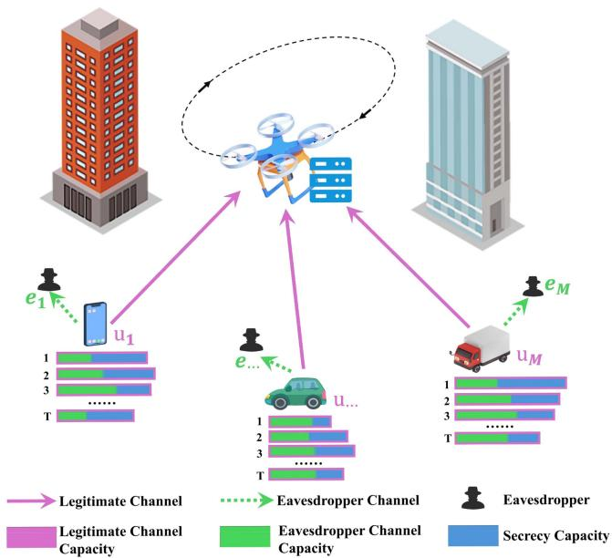  
Fig. 1. The UAV-assisted wireless communication network.

## A. Channel Model

We consider an uplink network consisting of a UAV equipped with a single antenna and M GUs, each equipped with $A _ { T }$ antennas and is associated with a nearby eavesdropper equipped with $A _ { E }$ receive antennas. To avoid inter-user interference and enable simultaneous transmission, we employ a frequency division multiple access (FDMA) scheme, where the total available bandwidth $W _ { t o t a l }$ is partitioned into M orthogonal sub-bands. The communication from each GU to the UAV is subject to potential interception by the eavesdropper, which attempts to decode the signals without authorization. We assume that the number of antennas at the transmitter, $A _ { T }$ , exceeds that of the eavesdropper, $A _ { E }$ , with the condition that $A _ { T } > A _ { E } > 1$ This configuration allows the legitimate transmitter to leverage artificial noise injection techniques, which enhance the signal quality at the UAV while simultaneously degrading the eavesdropper’s ability to intercept and decode the transmitted signal. Importantly, the eavesdroppers are considered to be passive, meaning they do not actively interfere with the communication by transmitting jamming signals but rather attempt to illicitly capture and decode the signals transmitted by the legitimate users. The signals received by the UAV and the eavesdropper from user i are denoted by $y _ { U } [ i ]$ and ${ \bf y } _ { E } [ i ]$ , respectively, and are mathematically expressed as follows:

$$
\begin{array} { r } {  \begin{array} { l l } { \mathbf { \Theta } \displaystyle \boldsymbol { y } _ { U } [ i ] = \mathbf { g } [ i ] \mathbf { x } [ i ] + n [ i ] ,  } \\ {  \mathbf { \Theta } \mathbf { y } _ { E } [ i ] = \mathbf { H } _ { E } [ i ] \mathbf { x } [ i ] + \mathbf { e } [ i ] ,  } \end{array}  } \end{array}\tag{1}
$$

where $\mathbf { x } [ i ] \in \mathbb { C } ^ { A _ { T } \times 1 }$ denotes the transmitted symbol vector, while $\mathbf { g } [ \bar { i } ] \in \mathbb { C } ^ { 1 \times A _ { T } }$ represents the channel vector between the [ ]UAV and GU i. Additionally, $\mathbf { H } _ { E } [ i ] \in \mathbb { C } ^ { A _ { E } \times A _ { T } }$ denotes the [ ]channel matrix between GU i and its corresponding eavesdropper. UAVs operating at sufficiently high altitudes are generally above common obstructions such as buildings and terrain, which enables reliable Line-of-Sight (LOS) communication with GUs. Conversely, in urban environments, where eavesdroppers are typically situated on the ground or in obstructed locations, the channel between the GU and the eavesdropper is more likely to experience Non-Line-of-Sight (NLOS) conditions. In these cases, signal degradation is predominantly caused by multipath fading and shadowing effects, which are prevalent in NLOS environments. In this work, we model the communication link between the UAV and the GU as a LOS channel, where path loss is the dominant impairment. In contrast, for the communication between the GU and its corresponding eavesdropper, we focus primarily on fading effects, given the NLOS nature of this link. The term $n [ i ] \in \mathbb { C }$ represents the additive white Gaussian noise at GU i, while $\mathbf { e } [ \bar { i } ] \in \mathbb { C } ^ { N _ { E } \times 1 }$ corresponds to the noise vector at the eavesdropper i. Both n i and the components of e i are modeled as independent and identically distributed (i.i.d.) complex Gaussian random variables, with distribution $\mathscr { C N } ( 0 , N _ { 0 } )$ , where $N _ { 0 }$ denotes the noise power spectral density. Notably, each entry of the noise vector e i follows the same statistical distribution, ensuring that the eavesdropper’s noise characteristics remain consistent across its array elements. Following the widely adopted modeling approach in physical-layer security literature (e.g., [64], [65], [66]), we assume that the passive eavesdropper has perfect channel state information (CSI), including both the legitimate channel $\mathbf { g } [ i ]$ and the eavesdropper channel ${ \bf H } _ { E } [ i ]$ . This assumption, also made [ ]in [67], defines a worst-case scenario where the eavesdropper can acquire complete CSI via side information, channel estimation, or passive observation. By decoupling communication security from the secrecy of channel gains, this assumption enables rigorous analysis of system robustness under the most adverse conditions. It allows us to characterize the maximum potential threat posed by a fully informed eavesdropper and design security schemes that remain effective regardless of channel confidentiality. This modeling choice has also been employed in related works, such as [68], which investigates UAV jitter effects with perfect CSI at randomly moving eavesdroppers, and [69], which optimizes IRS-aided UAV-MIMO transmissions under the same assumption. To achieve secure communication under these conditions, artificial noise is employed at the GU’s side to enhance physical-layer security. Specifically, the transmitter not only transmits the information-bearing signal but also injects artificial noise designed to confuse potential eavesdroppers. The primary objective of this artificial noise is to degrade the eavesdropper’s signal reception quality, while ensuring minimal impact on the legitimate receiver’s performance. GU i constructs the transmitted symbol vector $\mathbf { x } [ i ]$ as a linear combination of the information-bearing signal u i and the artificial noise $\mathbf { v } [ i ] \sim \mathcal { C N } ( 0 , \sigma _ { v } ^ { 2 } [ i ] \mathbf { I } _ { A _ { T } - 1 } )$ , i.e.,

$$
\begin{array} { r } { \mathbf { x } [ i ] = \underbrace { \mathbf { d } [ i ] s [ i ] } _ { \mathrm { D e s i r e d ~ S i g n a l } } + \underbrace { \mathbf { A } [ i ] \mathbf { v } [ i ] } _ { \mathrm { A r t i f i c i a l ~ N o i s e } } , } \end{array}\tag{2}
$$

where $\mathbf { d } [ i ] \in \mathbb { C } ^ { A _ { T } \times 1 }$ denotes the beamforming vector. Assuming that g · is available at each user, we define an orthogonal basis $\mathbf { A } [ i ] \in \mathbb { C } ^ { A _ { T } \times ( A _ { T } - 1 ) }$ for the null space of $\mathbf { g } [ i ]$ . This basis is chosen such that it satisfies the following conditions:

$$
\begin{array} { r } { \mathbf { g } [ i ] ^ { \dagger } \mathbf { A } [ i ] \mathbf { v } [ i ] = 0 , } \\ { \mathbf { A } [ i ] ^ { \dagger } \mathbf { A } [ i ] = \mathbf { I } , } \end{array}\tag{3}
$$

where $\mathbf { I } = \mathbf { I } _ { ( A _ { T } - 1 ) \times ( A _ { T } - 1 ) }$ denotes the identity matrix. This ensures that the artificial noise signal does not interfere with the legitimate receiver. Without loss of generality, we define the transmit power allocated to the information-bearing signal for GU i as $p [ i ]$ . To maximize the signal-to-noise ratio (SNR) at GU i, we select the beamforming vector as $\mathbf { d } [ i ] = p [ i ] \mathbf { g } [ i ] ^ { \dagger } / \lVert \mathbf { g } [ i ] \rVert .$ which aligns the information-bearing signal with the range space of g i . As a result, the received signals at the UAV and the eavesdropper for GU i can be written as follows:

$$
\begin{array} { r l } & { y _ { U } [ i ] = \mathbf { g } [ i ] \mathbf { d } [ i ] s [ i ] + n [ i ] , } \\ & { } \\ & { \mathbf { y } _ { E } [ i ] = \mathbf { H } _ { E } [ i ] \mathbf { d } [ i ] s [ i ] + \mathbf { H } _ { E } [ i ] \mathbf { A } [ i ] \mathbf { v } [ i ] + \mathbf { e } [ i ] . } \end{array}\tag{4}
$$

Furthermore, we assume that the total power at GU i is denoted by $P _ { i , \operatorname* { m a x } } .$ . Consequently, the total communication power for the GU can be expressed as follows:

$$
P _ { i , c o } [ k ] = \frac { \beta _ { i } [ k ] P _ { i , \operatorname* { m a x } } h _ { r e f } } { \Vert \mathbf { q } _ { i } - \mathbf { q } _ { U } [ k ] \Vert ^ { \iota } } ,\tag{5}
$$

where $\beta _ { i } [ k ]$ denotes the fraction of power allocated by GU i for [ ]communication at time slot k, while $h _ { \mathrm { r e f } }$ represents the reference channel gain. The position of GU i is denoted by $\mathbf { q } _ { i }$ , while the position of UAV at time slot k is given by $\mathbf { q } _ { U } [ k ]$ . Additionally, ι denotes the path loss exponent. Based on these definitions, we can derive the following relationships:

$$
\begin{array} { r l r } {  { P _ { i , c o } [ k ] = p _ { i } [ k ] + ( A _ { T } - 1 ) \sigma _ { v } ^ { 2 } [ i ] , } } \\ & { } & { p _ { i } [ k ] = \alpha _ { i } [ k ] P _ { i , c o } [ k ] , } \\ & { } & { \sigma _ { v } ^ { 2 } [ i ] = \frac { ( 1 - \alpha _ { i } [ k ] ) P _ { i , c o } [ k ] } { A _ { T } - 1 } , \ } \end{array}\tag{6}
$$

where $p _ { i } [ k ]$ denotes the power allocated to the information bearing signal for GU i at time slot k, $, ( A _ { T } - 1 ) \sigma _ { v } ^ { 2 } [ i ]$ represents the power assigned to generating artificial noise for GU i,

$0 < \alpha _ { i } [ k ] \leq 1$ indicates the fraction of power dedicated to the information-bearing signal for GU i at time slot k.

## B. Secrecy Channel Capacity

Secrecy channel capacity refers to the maximum rate at which information can be transmitted over a communication channel in the presence of an eavesdropper, while ensuring that the transmitted data remains secure from unauthorized interception. It is defined as the difference between the capacity of the legitimate communication link (between the transmitter and the receiver) and the capacity of the wiretap channel (between the transmitter and the eavesdropper). To define the secrecy channel capacity, we first need to establish the capacity of the legitimate communication link, which represents the maximum achievable rate for secure communication between the user and the UAV, without any interference from potential eavesdroppers. The capacity of the channel between user i and the UAV at time slot k is given by

$$
R _ { U , i } [ k ] = W \log _ { 2 } \left( 1 + S N R _ { U , i } [ k ] \right) ,\tag{7}
$$

where W Wtotal/M denotes the bandwidth allocated to each user under the FDMA scheme, with Wtotal representing the total available system bandwidth and M the number of GUs. This orthogonal frequency allocation ensures interference-free simultaneous transmissions at the UAV receiver. and $S N R _ { U , i } [ k ]$ denotes the SNR between the UAV and GU i at time slot k, which is given by the following expression:

$$
\begin{array} { l } { { \displaystyle S N R _ { U , i } [ k ] = \frac { \alpha _ { i } [ k ] P _ { i , c o } [ k ] } { N _ { 0 } W } } , } \\ { { \displaystyle ~ = \frac { \alpha _ { i } [ k ] \beta _ { i } [ k ] P _ { i , \mathrm { m a x } } h _ { r e f } } { N _ { 0 } W ( \| { \bf q } _ { i } - { \bf q } _ { U } [ k ] \| _ { 2 } ) } . } } \end{array}\tag{8}
$$

To maintain generality, we normalize the received symbol at the eavesdropper by scaling it with $| { \bf H } _ { E } [ i ] | _ { 2 }$ . As a result, the received symbol at the eavesdropper is expressed as follows:

$$
\widetilde { \mathbf { y } } _ { E } [ i ] = \frac { \mathbf { y } _ { E } [ i ] } { \| \mathbf { H } _ { E } [ i ] \| _ { 2 } } = \widetilde { \mathbf { H } } _ { E } [ i ] \mathbf { d } [ i ] s [ i ] + \widetilde { \mathbf { H } } _ { E } [ i ] \mathbf { A } [ i ] \mathbf { v } [ i ] + \widetilde { \mathbf { e } } [ i ] ,\tag{9}
$$

where $\tilde { \mathbf { H } } _ { E } [ i ] = \mathbf { H } _ { E } [ i ] / \lVert \mathbf { H } _ { E } [ i ] \rVert _ { 2 } , \tilde { \mathbf { e } } [ i ] = \mathbf { e } [ i ] / \lVert \mathbf { H } _ { E } [ i ] \rVert _ { 2 }$ . The path loss between GU i and its eavesdropper is modeled as a noise-related model associated with e i , where each entry has a variance of $( N _ { 0 } W / \lVert \mathbf { H } _ { E } [ i ] \rVert _ { 2 } )$ . For clarity, we define $\begin{array} { r } { \mathbf { h } _ { 1 } [ i ] = \tilde { \mathbf { H } } _ { E } [ i ] \mathbf { d } [ i ] } \end{array}$ and $\mathbf { G } _ { 1 } [ i ] = \tilde { \mathbf { H } } _ { E } [ i ] \mathbf { A } [ i ]$ . Thus, (9) can be rearranged as follows:

$$
\begin{array} { r } { \tilde { { \bf y } } _ { E } [ i ] = { \bf h } _ { 1 } [ i ] s [ i ] + { \bf G } _ { 1 } [ i ] { \bf v } [ i ] + \tilde { { \bf e } } [ i ] . } \end{array}\tag{10}
$$

As discussed in Section III, the eavesdropper is assumed to be in close proximity to the GU in order to intercept the transmitted information. Consequently, the distance between the eavesdropper and the GU is considered negligible in comparison to the UAV. To model the worst-case scenario in the presence of the eavesdropper, we assume that $( N _ { 0 } W / \lVert \mathbf { H } _ { E } [ i ] \rVert _ { 2 } ) \to 0$ effectively diminishing the impact of noise on the eavesdropper’s ability to intercept the signal. Under this worst-case assumption, the capacity of the channel between GU i and its eavesdropper

can be derived as follows:

$$
\begin{array} { r l } & { { \cal R } _ { E , i } [ k ] = W \log _ { 2 } \left| { \bf I } + p _ { i } [ k ] { \bf h } _ { 1 } { \bf h } _ { 1 } ^ { \dagger } [ i ] \left( \sigma _ { v } ^ { 2 } [ i ] { \bf G } _ { 1 } [ i ] { \bf G } _ { 1 } ^ { \dagger } [ i ] \right) ^ { - 1 } \right| } \\ & { ~ = W \log _ { 2 } \left( 1 + \frac { \alpha _ { i } [ k ] ( A _ { T } - 1 ) } { 1 - \alpha _ { i } [ k ] } { \bf h } _ { 1 } ^ { \dagger } [ i ] \left( { \bf G } _ { 1 } [ i ] { \bf G } _ { 1 } ^ { \dagger } [ i ] \right) ^ { - 1 } { \bf h } _ { 1 } [ i ] \right) , } \end{array}\tag{11}
$$

where | · | represents the determinant of a matrix. The achievable secrecy capacity represents the maximum rate at which confidential information can be reliably transmitted to a legitimate GU while ensuring that a potential eavesdropper gains no useful information. It is formally defined as the difference between the capacity of the legitimate communication link and that of the eavesdropping channel. Based on this definition, the maximum achievable secrecy capacity for the ith GU at time slot $k ,$ under a worst-case eavesdropping scenario, is given by:

$$
\begin{array} { r l r } {  { R _ { i } [ k ] = [ R _ { U , i } [ k ] - R _ { E , i } [ k ] ] ^ { + } } } \\ & { } & { = \bigg [ W \log _ { 2 } \bigg ( 1 + \frac { \alpha _ { i } [ k ] \beta _ { i } [ k ] P _ { i , \mathrm { m a x } } h _ { \mathrm { r e f } } } { N _ { 0 } W \| \mathbf { q } _ { i } - \mathbf { q } _ { U } [ k ] \| _ { 2 } } \bigg ) } \\ & { } & { - W \log _ { 2 } } \\ & { } & { \times \bigg ( 1 + \frac { \alpha _ { i } [ k ] ( A _ { T } - 1 ) } { 1 - \alpha _ { i } [ k ] } \mathbf { h } _ { 1 } ^ { \dagger } [ i ] ( \mathbf { G } _ { 1 } [ i ] \mathbf { G } _ { 1 } ^ { \dagger } [ i ] ) ^ { - 1 } \mathbf { h } _ { 1 } [ i ] \bigg ) \bigg ] ^ { + } , } \end{array}\tag{12}
$$

where $[ m ] ^ { + } = \operatorname* { m a x } \{ 0 , m \}$ ensures the capacity remains nonnegative. This formulation accounts for both the legitimate channel capacity $R _ { U , i } [ k ]$ and the potential eavesdropping capacity $R _ { E , i } [ k ]$ . The first logarithmic term corresponds to the achievable rate of the legitimate GU, which increases with the transmit power and the channel quality. The second term reflects the capacity at the eavesdropper, which is mitigated by the use of artificial noise. To simplify the interpretation and emphasize the impact of system parameters, we define two intermediate variables: $B _ { i } [ k ] = ( \bar { \beta _ { i } } [ k ] P _ { i , \mathrm { { m a x } } } h _ { \mathrm { r e f } } ) / ( N _ { 0 } W \lVert \mathbf { q } _ { i } - \mathbf { q } _ { U } [ k ] \rVert _ { 2 } )$ , which encapsulates the effective SNR at the legitimate user, and $Z _ { i } [ k ] = \mathbf { h } _ { 1 } ^ { \dagger } [ i ] ( \mathbf { G } _ { 1 } [ i ] \mathbf { G } _ { 1 } ^ { \dagger } [ i ] ) ^ { - 1 } \mathbf { h } _ { 1 } [ i ]$ , which represents the channel gain at the eavesdropper and is treated as a random variable. By substituting these definitions into (12), the secrecy capacity expression can be equivalently rewritten as:

$$
\begin{array} { l } { { R _ { i } [ k ] = W \Bigg ( \log _ { 2 } { \Bigg ( 1 + \alpha _ { i } [ k ] B _ { i } [ k ] \Bigg ) } } } \\ { { - \log _ { 2 } { \Bigg ( 1 + \frac { \alpha _ { i } [ k ] \left( A _ { T } - 1 \right) } { 1 - \alpha _ { i } [ k ] } Z _ { i } [ k ] \Bigg ) } \Bigg ) } . } \end{array}\tag{13}
$$

This formulation highlights the inherent trade-off in power allocation between the information signal and artificial noise, governed by the parameter $\alpha _ { i } [ k ]$ . From a practical perspective, selecting an appropriate value of $\alpha _ { i } [ k ]$ is crucial: allocating too much power to the information signal may enhance the legitimate user’s rate but risks increased information leakage, whereas allocating too much to artificial noise may overly suppress the legitimate rate.

## C. Probabilistic Constraint Secure Data Transmission Volume

In secure communication systems, ensuring not only the confidentiality but also the reliability of data transmission is crucial. While previous work primarily focuses on protecting data from eavesdroppers, a comprehensive system design must also account for the reliable delivery of data, especially under uncertain conditions. To achieve this, we define the total secure data transmission volume, $\theta ( \mathbf { q } , \alpha , \beta )$ , which quantifies the amount of data that can be transmitted securely and reliably, subject to probabilistic constraints, as follows:

$$
\theta ( \mathbf { q } , \alpha , \beta ) = \sum _ { i = 1 } ^ { M } \sum _ { k = 1 } ^ { T } R _ { i } [ k ] ,\tag{14}
$$

where $\mathbf { q } = \operatorname { c o l } \{ \mathbf { q } _ { U } [ k ] , k = 1 , 2 , \dots , T \}$ represents the $\mathrm { U A V } _ { \mathrm { \Delta } }$ =trajectory, while $\pmb { \alpha } = \mathrm { c o l } \{ \pmb { \alpha } [ k ] ^ { \top } , k = 1 , 2 , . . . , T \}$ with ${ \pmb { \alpha } } [ k ] = \mathrm { c o l } \{ \alpha _ { i } [ k ] , i = 1 , 2 , \ldots , M \}$ , and $\beta = \mathrm { c o l } \{ \beta [ k ] ^ { \top } , k =$ $1 , 2 , \ldots , T \}$ , where $\beta [ k ] = \operatorname { c o l } \{ \beta _ { i } [ k ] , i = 1 , 2 , \ldots , M \}$

From (13), it can be inferred that the secure transmission volume between GU i and the UAV is described by a random variable with an unbounded probability distribution. To ensure reliable and secure data transmission, we impose a probabilistic constraint that guarantees the secure transmission volume consistently exceeds a predetermined threshold, as outlined below.

$$
\underbrace { \mathrm { P r o b } \{ s _ { i } [ k ] \geq R _ { U , i } [ k ] - R _ { E , i } [ k ] \} } _ { \mathrm { S e c r e c y ~ o u t a g e ~ p r o b a b i l i t y } } \leq \varepsilon ,\tag{15}
$$

where $s _ { i } [ k ]$ represents the data transmission demand of GU i at time $k .$ [ ] Consequently, (14) can be reformulated as follows:

$$
\theta ( \mathbf { q } , \alpha , \beta ) = \sum _ { i = 1 } ^ { M } \sum _ { k = 1 } ^ { T } s _ { i } [ k ] \mathbf { 1 } _ { R _ { U , i } [ k ] - R _ { E , i } [ k ] \geq s _ { i } [ k ] } ,\tag{16}
$$

where $\mathbf { 1 } _ { R _ { U , i } [ k ] - R _ { E , i } [ k ] \geq s _ { i } [ k ] }$ is an indicator function that determines whether the difference between the transmission rate from GU i to the UAV, $R _ { U , i } [ k ]$ , and the transmission rate to the eavesdropper, $R _ { E , i } [ k ]$ , at time k meets or exceeds the required secure transmission rate $s _ { i } [ k ]$ . If the condition $R _ { U , i } [ k ] \stackrel { - } { - } R _ { E , i } [ k ] \stackrel { > } { - }$ $s _ { i } [ k ]$ holds, the indicator function evaluates to 1; otherwise, it takes a value of 0.

## IV. RESOURCE ALLOCATION AND TRAJECTORY OPTIMIZATION

In this section, we provide an in-depth discussion of key factors in resource allocation and trajectory optimization within the UAV-assisted MEC systems. While ensuring secure and reliable transmission is crucial, efficient resource allocation and trajectory planning also play a vital role in enhancing system performance. Specifically, we examine UAV mobility, energy consumption during UAV flight, as well as the energy models for both UAV computing and GU communication and computing. These factors are crucial for optimizing both computational and communication resources and ensuring efficient UAV operation. We now proceed to model each of these elements individually.

## A. UAV Mobility

We define a 3D Cartesian coordinate system to represent the positions of both the UAV and the GUs. The position of GU i is denoted by $\mathbf { q } _ { i } = [ \boldsymbol { q } _ { i } ^ { x } , \boldsymbol { q } _ { i } ^ { y } , 0 ]$ , where $q _ { i } ^ { x }$ and $q _ { i } ^ { y }$ are the x- and y-coordinates of the user, respectively, and the z-coordinate is set to zero. This time-invariant representation reflects the fact that the position of each GU is fixed throughout the entire analysis [70], [71]. The UAV’s position at time k is denoted by $\mathbf { q } _ { U } [ k ] = [ q _ { U } ^ { x } [ k ] , q _ { U } ^ { y } [ k ] , H ]$ , where $q _ { U } ^ { x } [ k ]$ and $q _ { U } ^ { y } [ k ]$ represent the UAV’s coordinates in the x and y dimensions, and $H$ is a constant denoting its fixed altitude. The UAV is constrained to a flight region $\mathcal { Q } ,$ defined as $Q \triangleq \{ \mathbf { q } _ { U } \mid \| \mathbf { q } _ { U } - \mathbf { q } _ { U } [ 0 ] \| _ { 2 } < r _ { 0 } \}$ where ${ \bf q } _ { U } [ 0 ]$ is the UAV’s initial position and $r _ { 0 }$ is the maximum allowable radius from ${ \bf q } _ { U } [ 0 ]$ . Once the UAV’s position [0]is determined for each time slot, the next step is to model its movement. Specifically, the average velocity of the UAV at time slot $k ,$ denoted by $\mathbf { v } _ { U } [ k ]$ , is given by

$$
\mathbf { v } _ { U } [ k ] = \frac { \mathbf { q } _ { U } [ k ] - \mathbf { q } _ { U } [ k - 1 ] } { \Delta t } , \quad \forall k .\tag{17}
$$

where UAV’s velocity, denoted by $\mathbf { v } _ { U } [ k ]$ , is constrained to lie within the set $\nu ,$ , which is defined as $\dot { \mathcal { V } } \triangleq \{ \mathbf { v } \ | \ \mathbf { v } _ { \operatorname* { m i n } } \leq \mathbf { v } \leq$ $\mathbf { v } _ { \mathrm { m a x } } \}$ , where $\mathbf { v } _ { \mathrm { m i n } }$ and $\mathbf { v } _ { \mathrm { m a x } }$ represent the minimum and maximum allowable velocities, respectively. Subsequently, the UAV’s average acceleration at time slot $k ,$ denoted by $\mathbf { a } _ { U } [ k ]$ can be determined as follows:

$$
\mathbf { a } _ { U } [ k ] = \frac { \mathbf { v } _ { U } [ k ] - \mathbf { v } _ { U } [ k - 1 ] } { \Delta t } , \quad \forall k ,\tag{18}
$$

where the $\mathrm { U A V } _ { \mathrm { \Delta } }$ acceleration, denoted by $\mathbf { a } _ { U } [ k ]$ , is restricted to the set ${ \mathcal { A } } ,$ defined as $\mathcal { A } \triangleq \left\{ \mathbf { a } \ | \ \mathbf { a } _ { \operatorname* { m i n } } \leq \mathbf { a } \leq \mathbf { a } _ { \operatorname* { m a x } } \right\}$ , where $\mathbf { a } _ { \mathrm { m i n } }$ and $\mathbf { a } _ { \mathrm { m a x } }$ represent the minimum and maximum allowable acceleration values, respectively.

## B. Energy Consumption Model

In this study, we focus on the energy consumption of both the UAV and the GUs, considering both flight and computation energy expenditures. In the subsequent sections, we present detailed models to quantify the energy consumed by the UAV during flight, as well as the energy expended by the GUs for communication and computation activities.

1) UAV Flight: The UAV’s energy consumption is predominantly attributed to the mechanical operations during flight. In this study, we consider a fixed-wing UAV deployed within the region Q. The energy consumption at time slot k is influenced by the UAV’s instantaneous acceleration and velocity, as outlined in [72]. The model for the UAV’s flight energy consumption in time slot k is expressed as follows:

$$
\mathcal { E } _ { U , f l y } [ k ] = \gamma _ { 1 } \| \mathbf { v } _ { U } [ k ] \| _ { 2 } ^ { 3 } + \frac { \gamma _ { 2 } } { \| \mathbf { v } _ { U } [ k ] \| _ { 2 } } \left( 1 + \frac { \| \mathbf { a } _ { U } [ k ] \| _ { 2 } ^ { 2 } } { G ^ { 2 } } \right) ,\tag{∀k,}
$$

(19)

where $G$ represents the gravitational acceleration, and $\gamma _ { 1 }$ and $\gamma _ { 2 }$ are fixed parameters associated with the aircraft’s weight, wing area, air density, and other factors. The values of these parameters are provided in [72], [73]. Based on the per-slot energy consumption model, the UAV’s total energy consumption, $\mathcal { E } _ { U }$ over the entire time horizon T can be expressed as:

$$
\mathcal { E } _ { U , f l y } = \sum _ { k = 1 } ^ { T } \mathcal { E } _ { U , f l y } [ k ] .\tag{20}
$$

2) UAV Computation: The energy consumed by the UAV for processing data offloaded from GUs constitutes another significant component of its total energy expenditure. This consumption is primarily determined by the volume of data transferred from the GUs to the UAV. Given that CPU power is the dominant factor in computational energy usage, we model the computational energy expenditure as follows:

$$
\mathcal { E } _ { U , c p } [ k ] = \eta f _ { U } ^ { 3 } [ k ] \Delta t , \quad \forall k ,\tag{21}
$$

where $\begin{array} { r } { f _ { U } [ k ] = \sum _ { i = 1 } ^ { M } s _ { i } [ k ] \mathbf { 1 } _ { R _ { U , i } [ k ] - R _ { E , i } [ k ] \geq s _ { i } [ k ] } / \Delta t } \end{array}$ represents the $\mathrm { U A V } _ { \mathrm { \Delta } }$ computational capability at time slot $k ,$ , with the summation $\begin{array} { r } { \sum _ { i = 1 } ^ { M } s _ { i } [ k ] \mathbf { 1 } _ { R _ { U , i } [ k ] - R _ { E , i } [ k ] \ge s _ { i } [ k ] } } \end{array}$ indicating the total amount of data received by the UAV during that time slot. Additionally, η denotes the effective capacitance coefficient of the user’s computing chipset. Consequently, (21) can be rewritten as follows:

$$
\begin{array} { l } { { \displaystyle \mathcal E _ { U , c p } [ k ] = \eta \left( \frac { \sum _ { i = 1 } ^ { M } s _ { i } [ k ] \mathbf { 1 } _ { R _ { U , i } [ k ] - R _ { E , i } [ k ] \geq s _ { i } [ k ] } } { \Delta t } \right) ^ { 3 } \Delta t } } \\ { { \displaystyle \qquad = \frac { \eta } { \Delta t ^ { 2 } } \left( \sum _ { i = 1 } ^ { M } s _ { i } [ k ] \mathbf { 1 } _ { R _ { U , i } [ k ] - R _ { E , i } [ k ] \geq s _ { i } [ k ] } \right) ^ { 3 } } . } \end{array}\tag{22}
$$

The total computational energy consumption of the UAV over the entire operational period is given by

$$
\mathcal { E } _ { U , c p } = \sum _ { k = 1 } ^ { T } \frac { \eta } { \Delta t ^ { 2 } } \left( \sum _ { i = 1 } ^ { M } s _ { i } [ k ] \mathbf { 1 } _ { R _ { U , i } [ k ] - R _ { E , i } [ k ] \ge s _ { i } [ k ] } \right) ^ { 3 } .\tag{23}
$$

3) GU Communication: The energy expended by the GUs for data transmission to the UAV constitutes a significant portion of their total energy consumption. Specifically, the energy consumed by GU i during time slot k for transmitting data to the UAV is denoted by $\mathcal { E } _ { i , c o } [ k ]$ , and is influenced by both [ ]the transmission power and the transmission duration. The communication energy consumption model for the GUs is thus expressed as follows:

$$
\mathcal { E } _ { i , c o } [ k ] = \beta _ { i } [ k ] P _ { i , \operatorname* { m a x } } \Delta t , \forall i , k ,\tag{24}
$$

where where $\beta _ { i } [ k ]$ represents the power allocation factor for GU i at time slot $k ,$ and $P _ { i , \mathrm { m a x } }$ denotes the maximum transmission power of GU i, while $\Delta t$ indicates the duration of time slot k. To assess the total energy consumption across all GUs, we aggregate the energy consumption over all users and time slots. The total communication energy consumption is thus given by:

$$
\mathcal { E } _ { c o } = \sum _ { i = 1 } ^ { M } \sum _ { k = 1 } ^ { T } \beta _ { i } [ k ] P _ { i , \operatorname* { m a x } } .\tag{25}
$$

4) GU Computation: In addition to communication, local computation for data processing represents another significant source of energy consumption for GUs. To model this energy expenditure, we first determine the amount of data processed locally. This depends on the total data generated by the user and the portion offloaded to the UAV. Without loss of generality, we model the task generation process at the GU side within each time slot using a Poisson distribution, as outlined below.

$$
\operatorname* { P r } ( d _ { i } [ k ] = \omega ) = \frac { \chi _ { i } ^ { \omega } e ^ { - \chi _ { i } } } { \omega ! } , \forall i ,\tag{26}
$$

where $d _ { i } [ k ]$ denotes the data generation rate of GU i in time slot $k ,$ and $\chi _ { i }$ ]represents the expected data size of tasks generated by GU i per time slot. It is important to note that $\chi _ { i }$ can be computed from observed data. Specifically, we calculate $\chi _ { i }$ as follows:

$$
\chi _ { i } = \sum _ { \hat { \omega } = 0 } ^ { \Omega } \hat { \omega } O _ { \hat { \omega } } ^ { i } , ~ \forall i ,\tag{27}
$$

where ω represents the observed value of the task generation rate, $O _ { \hat { \omega } } ^ { i }$ is the probability of observing ω, and  is the maximum observed value of the data generation rate. Additionally, the data size $D _ { i } [ k ]$ of GU i in time slot k is given by $D _ { i } [ k ] = d _ { i } [ k ] \Delta t .$ which consists of the data offloaded to the UAV and the data processed locally. The remaining data, denoted as $c _ { i } [ k ]$ , corresponds to the portion that is processed locally and can be determined by subtracting the successfully offloaded data from $D _ { i } [ k ]$ , as given by:

$$
c _ { i } [ k ] = D _ { i } [ k ] - s _ { i } [ k ] \mathbf { 1 } _ { R _ { U , i } [ k ] - R _ { E , i } [ k ] \geq s _ { i } [ k ] } , \quad \forall i , k ,\tag{28}
$$

where $s _ { i } [ k ] \mathbf { 1 } _ { R _ { U , i } [ k ] - R _ { E , i } [ k ] \geq s _ { i } [ k ] }$ represents the amount of data successfully offloaded by GU i at time slot k. Once the remaining data $c _ { i } [ k ]$ , which needs to be processed locally, is determined, the next step is to model the associated computational energy consumption. Given that CPU power consumption typically dominates the overall computational energy expenditure, we define the computational energy consumption model as follows:

$$
\mathcal { E } _ { i , c p } [ k ] = \eta f _ { i } ^ { 3 } [ k ] \Delta t , \forall i , k ,\tag{29}
$$

The local computing capability of GU i at time slot $k ,$ denoted as $f _ { i } [ k ]$ , is given by $\begin{array} { r } { f _ { i } [ k ] = \frac { c _ { i } [ k ] } { \Delta t } } \end{array}$ . Consequently, (29) can be expressed as follows:

$$
\begin{array} { c } { { \displaystyle \mathcal { E } _ { i , c p } [ k ] = \eta \left( \frac { c _ { i } [ k ] } { \Delta t } \right) ^ { 3 } \Delta t } } \\ { { = \displaystyle \frac { \eta } { \Delta t ^ { 2 } } c _ { i } ^ { 3 } [ k ] . } } \end{array}\tag{30}
$$

The total computational energy consumption for GU i over the entire operation period, accumulated across all time slots, is expressed as:

$$
\mathcal { E } _ { i , c p } = \sum _ { k = 1 } ^ { T } \frac { \eta } { \Delta t ^ { 2 } } c _ { i } ^ { 3 } [ k ] .\tag{31}
$$

Furthermore, the overall computational energy consumption for all GUs is given by

$$
\mathcal { E } _ { G U , c p } = \sum _ { i = 1 } ^ { M } \mathcal { E } _ { i , c p } .\tag{32}
$$

## C. Problem Formulation

In this paper, we propose a UAV-assisted secure and reliable MEC system, each GU evaluates the trade-off between local computation and offloading based on the secrecy capacity of the reliable transmission channel and the whole energy cost of the MEC system. When the transmission channel is sufficiently reliable, the GU may choose to offload a portion of its data to the UAV, while the remaining data is processed locally. Conversely, if the transmission reliability is low, the GU may prioritize local computation to ensure data security and reduce energy consumption. Our goal is to maximize the energy efficiency of the UAV-assisted secure and reliable MEC system. To achieve this, we define the system’s energy efficiency as the objective function, which is formulated as follows:

$$
J _ { E E } ( \mathbf { q } , \alpha , \beta ) = \frac { \theta ( \mathbf { q } , \alpha , \beta ) } { \mathcal { E } _ { t o t a l } } ,\tag{33}
$$

where $\mathcal { E } _ { t o t a l } = \omega _ { c p } ( \mathcal { E } _ { U , c p } + \mathcal { E } _ { G U , c p } ) + \omega _ { c o } \mathcal { E } _ { G U , c o } + \omega _ { f l y }$ $\mathcal { E } _ { G U , f l y }$ represents the total energy consumption of the UAV-assisted secure communication system. The parameters $\omega _ { c p } , \omega _ { c o } ,$ , and $\omega _ { f l y }$ are the weighting factors associated with computational energy consumption, communication energy consumption, and flight energy consumption, respectively.

The optimal $\mathrm { U A V } _ { \mathrm { \Delta } }$ trajectory $\mathbf { q } ^ { * }$ , optimal power allocation parameter $\alpha ^ { * } , \beta ^ { * }$ can be obtained by solving

$$
\begin{array} { r l } & { \mathcal { P } 1 : \underset { \mathbf { q } , \alpha , \beta } { \mathrm { m a x } } \quad J _ { \mathrm { E E } } ( \mathbf { q } , \alpha , \beta ) } \\ & { \qquad \mathrm { s . t . } \left\{ \begin{array} { l l } { \mathrm { C 1 : \mathrm { P r o b } } \{ s _ { i } [ k ] \geq R _ { U , i } [ k ] - R _ { E , i } [ k ] \} \leq \varepsilon , \forall i , k ; } \\ { \mathrm { C 2 : \mathrm { ~ } } q U [ k ] \in \mathcal { Q } , v _ { U } [ k ] \in \mathcal { V } , a _ { U } [ k ] \in \mathcal { A } , \forall k ; } \end{array} \right. } \\ & { \mathrm { s . t . } \left\{ \begin{array} { l l } { \mathrm { C 3 : \alpha _ { i } [ k ] \in [ 0 , 1 ] , } \beta _ { i } [ k ] \in [ 0 , 1 ] , \forall i , k ; } \\ { \mathrm { C 4 : \alpha _ { c o } + \omega _ { c p } + \omega _ { f l y } = 1 , \forall \omega _ { l } \geq 0 , ~ } l = c o , \varepsilon o , c p , f l y ; } \\ { \mathrm { C 5 : \mathbf { q } _ { U } [ k ] - \mathbf { q } _ { U } [ k - 1 ] = v _ { U } [ k ] \Delta t , ~ \forall k ; } } \\ { \mathrm { C 6 : v _ { U } } [ k ] - \mathbf { v } _ { U } [ k - 1 ] = \mathrm { a } _ { U } [ k ] \Delta t , } \end{array} \right. , } \end{array}\tag{34}
$$

In Problem P , the first constraint imposes a requirement on the secrecy outage probability, with the parameter ε defining the upper bound for the acceptable secrecy outage. The second constraint limits the UAV’s flight area, as well as its velocity and acceleration. The third constraint addresses the boundary conditions for the power allocation variables. The fourth constraint ensures that energy and resources are allocated efficiently across various components, promoting a balanced and optimized total energy consumption. Finally, the last two constraints govern the UAV’s motion by regulating its position and velocity transitions over time.

## V. SOLUTION OF THE OPTIMIZATION PROBLEM

The objective function in Problem P is expressed as a ratio of two functions, which typically leads to a nonconvex optimization problem. To develop an efficient solution algorithm, we introduce the following transformation to simplify the fractional expression, thus making the optimization process more tractable.

## A. Transformation of the Objective Function

To render the optimization problem more tractable, we introduce an auxiliary variable $p ,$ which transforms the fractional form into a more manageable expression, as shown below:

$$
p = \frac { \theta ( \mathbf { q } , \alpha , \beta ) } { \mathcal { E } _ { t o t a l } } .\tag{35}
$$

Following this, the objective function in the original problem is transformed into the following form:

$$
\begin{array} { r l } & { \mathcal { P } \mathrm { 2 } : \operatorname* { m a x } _ { \mathbf { q } , \alpha , \beta } \quad \theta ( \mathbf { q } , \alpha , \beta ) - p \mathcal { E } _ { t o t a l } } \\ & { } \\ & { \mathrm { s . t . } \quad \mathrm { C } \mathrm { 1 } , \mathrm { C } 2 , \mathrm { C } 3 , \mathrm { C } 4 , \mathrm { C } 5 , \mathrm { C } 6 . } \end{array}\tag{36}
$$

This approach allows us to convert the original fractional problem into a series of simpler subproblems, facilitating convergence to an optimal solution.

## B. Transformation of the Chance Constraint

It is evident that constraint C1 is neither convex nor concave. To overcome this issue, we derive an equivalent expression for the secrecy data rate and incorporate it into the objective function. Since the optimal solution is typically achieved when the constraint is satisfied as an equality, we can rewrite constraint C1 as follows:

$$
{ \mathrm { C 1 } } : { \mathrm { P r o b } } \{ s _ { i } [ k ] \geq R _ { U , i } [ k ] - R _ { E , i } [ k ] \} = \varepsilon , \forall i , k .\tag{37}
$$

We now present a proposition to derive the equivalent secrecy data rate under constraint C1.

Theorem 1: Assuming the channel between the GU and its eavesdropper follows Rayleigh fading, the equivalent secrecy data rate $R _ { i } ^ { * } [ k ]$ of GU k is given by

$$
\begin{array} { l } { { \displaystyle R _ { i } ^ { * } [ k ] = W \biggl [ \log _ { 2 } ( 1 + \alpha _ { i } ^ { * } [ k ] B _ { i } [ k ] ) } } \\ { { \displaystyle ~ - \log _ { 2 } \biggl ( 1 + \frac { \alpha _ { i } ^ { * } [ k ] } { 1 - \alpha _ { i } ^ { * } [ k ] } C _ { i } [ k ] \biggr ) \biggr ] ^ { + } , } } \end{array}\tag{38}
$$

where $C _ { i } [ k ] = ( A _ { T } - 1 ) F _ { z } ^ { - 1 } ( \varepsilon )$

Proof: See Appendix A, available online.

As shown in (38), the signal-to-interference-plus-noise ratio (SINR) of the eavesdropper converges to a constant value as the signal-to-noise ratio (SNR) increases. By substituting (38) into Problem ${ \mathcal { P } } 2$ , we obtain a modified objective function for Problem P , which incorporates the secrecy outage constraint. Thus, Problem $\mathcal { P } 2$ can be reformulated as follows:

$$
\begin{array} { r l } & { \mathcal { P } 3 : \underset { \mathbf { q } , \beta } { \operatorname* { m a x } } \quad \theta ^ { * } ( \mathbf { q } , \alpha ^ { * } , \beta ) - p \mathcal { E } _ { t o t a l } } \\ & { \mathrm { s } . \mathrm { t } . \left\{ \begin{array} { l l } { \mathrm { C } 7 : \beta _ { i } [ k ] \in [ 0 , 1 ] , } & { \forall i , k ; } \\ { \mathrm { C } 2 , \mathrm { C } 4 , \mathrm { C } 5 , \mathrm { C } 6 . } \end{array} \right. } \end{array}\tag{39}
$$

where $\begin{array} { r } { \theta ^ { * } ( \mathbf { q } , \alpha , \beta ) = \sum _ { i = 1 } ^ { M } \sum _ { k = 1 } ^ { T } R _ { i } ^ { * } [ k ] } \end{array}$ denotes the total secrecy data transmission volume, incorporating the secrecy outage probability requirement.

## C. Lower Bounding Energy Consumption

The energy consumption model involves the sum of multiple cubic terms, making direct optimization computationally complex. To alleviate this challenge, we employ Jensen’s Inequality to derive a lower bounds for each computation model. The following theorem formalizes this result:

Theorem 2: By applying Jensen’s Inequality to the total computation energy consumption model for GUs, we obtain the following lower bound:

$$
\mathcal { E } _ { G U , c p } \geq \mathcal { E } _ { G U , c p } ^ { - } = \frac { \eta } { ( T \Delta t ) ^ { 2 } } \sum _ { i = 1 } ^ { M } \left( \sum _ { k = 1 } ^ { T } c _ { i } [ k ] \right) ^ { 3 } .\tag{40}
$$

Proof: See Appendix B, available online.

Similarly, by applying the same method to the UAV’s total computation energy consumption model, we obtain the following lower bound for the UAV’s energy consumption:

$$
\mathcal { E } _ { U , c p } \geq \mathcal { E } _ { U , c p } ^ { - } = \frac { \eta } { ( T \Delta t ) ^ { 2 } } \left( \theta ( \mathbf { q } , \alpha , \beta ) \right) ^ { 3 } .\tag{41}
$$

Based on the lower bounds derived for the energy consumption models of GUs and the UAV, we proceed to update the objective function in Problem P3 as follows:

$$
\begin{array} { r l } & { \mathcal { P } 4 : \displaystyle \operatorname* { m a x } _ { \mathbf { q } , \boldsymbol { \beta } } \quad \theta ^ { * } \big ( \mathbf { q } , \alpha ^ { * } , \boldsymbol { \beta } \big ) - p \mathcal { E } _ { t o t a l } ^ { - } } \\ & { \mathrm { s . t . } \quad \quad } \\ & { \quad \quad } \\ { \mathrm { w h e r e } \quad } & { \mathcal { E } _ { t o t a l } ^ { - } = \omega _ { c p } \big ( \mathcal { E } _ { U , c p } ^ { - } + \mathcal { E } _ { G U , c p } ^ { - } \big ) + \omega _ { c o } \mathcal { E } _ { G U , c o } + \omega _ { f l y } } \\ & { \quad \quad } \\ & { \mathcal { E } _ { G U , f l y . } \quad \quad } \end{array}
$$

## D. Optimization Algorithm Design

Compared to the original problem, Problem P is significantly more computationally tractable. In the following, we develop an iterative algorithm to solve Problem P using the augmented Lagrangian method. Building on this framework, we can further establish the following result for Problem P based on the principles of Lagrangian optimization theory:

Theorem 3: For a sufficiently large positive real number $\sigma > 0$ , the local optimal point of the unconstrained optimization 0Problem $\mathcal { P } 5$ is equivalent to the local optimal point of Problem $\mathcal { P } 4$

$$
\mathcal { P } 5 : \operatorname* { m a x } _ { \mathbf { q } , \beta , \lambda } \mathcal { L } _ { \sigma } ( \mathbf { q } , \beta , \lambda ) ,\tag{43}
$$

where $\pmb { \lambda } = \mathrm { c o l } \{ \lambda _ { l } \} \in \mathbb { R } ^ { 2 T \times 1 }$ is the column vector collecting Lagrangian multipliers and $\mathcal { L } _ { \sigma } ( \mathbf { q } , \beta , \lambda )$ is the augmented Lagrangian function as follows:

$$
\begin{array} { l } { { \displaystyle { \mathcal { L } } _ { \sigma } ( \mathbf { q } , \beta , \lambda ) = \theta ^ { * } ( \mathbf { q } , \alpha ^ { * } , \beta ) - p \mathcal { E } _ { t o t a l } ^ { - } } } \\ { { \displaystyle \qquad + \left. g _ { l } ( \mathbf { q } , \beta ) , \lambda \right. + \frac { 1 } { 2 \sigma } g _ { l } ^ { 2 } ( \mathbf { q } , \beta ) , } } \end{array}\tag{44}
$$

where $g _ { l } ( \mathbf { q } , \beta ) = \mathbf { q } _ { U } [ k ] - \mathbf { q } _ { U } [ k - 1 ] - \mathbf { v } _ { U } [ k ]$ for $l =$ $1 , . . . , T , \qquad g _ { l } ( \mathbf { q } , \beta ) = \mathbf { v } _ { U } [ k ] - \mathbf { v } _ { U } [ k - 1 ] - \mathbf { a } _ { U } [ k ]$ =for $l = T + 1 , \ldots , 2 T$ . The total number of equality constraints = + 1 2is T . Constraints C2, C4, and C7 are incorporated into the

Karush-Kuhn-Tucker (KKT) conditions during the derivation of the optimal solution.

Proof: See Appendix C, available online.

Building upon Theorem 3, the solution to Problem $\mathcal { P } 4$ can be 4derived by solving its augmented Lagrangian function, which is particularly suitable for iterative solution techniques. In the mth iteration, starting from the current feasible point ${ \bf q } [ m ]$ , the variable $\beta [ m ]$ , the associated Lagrange multipliers $\lambda [ m ]$ , and the penalty factor $\sigma [ m ]$ , the update rules for determining the next values of $\mathbf { q } [ m + 1 ] , \lambda [ m + 1 ]$ , and $\sigma [ m + 1 ]$ are given by:

$$
\begin{array} { r } { \left\{ \begin{array} { l l } { \mathbf { q } [ m + 1 ] \in \mathrm { a r g m a x } _ { \mathbf { q } } \mathcal { L } _ { \sigma [ m ] } ( \mathbf { q } , \beta [ m ] , \lambda [ m ] ; \mathbf { q } [ m ] ) ; } \\ { \beta [ m + 1 ] \in \mathrm { a r g m a x } _ { \beta } \mathcal { L } _ { \sigma [ m ] } ( \mathbf { q } [ m + 1 ] , \beta , \lambda [ m ] ; \beta [ m ] ) ; } \\ { \lambda _ { l } [ m + 1 ] = [ \lambda _ { l } [ m ] - \sigma [ m ] g _ { l } ( \mathbf { q } [ m + 1 ] , \beta [ m + 1 ] ) ] ^ { + } , \forall l ; } \\ { \sigma [ m + 1 ] = \sigma [ m ] + ( \mu - 1 ) 1 _ { \xi } \sigma [ m ] , } \end{array} \right. } \end{array}\tag{45}
$$

where the parameter $\mu > 1$ serves as the increment coefficient for the penalty factor, enabling controlled adjustments throughout the iterative process. The indicator function $1 _ { \xi }$ is utilized to dynamically update the penalty based on $\xi ,$ which determines whether the system has satisfied a specific criterion. More precisely, $1 _ { \xi }$ takes a value of 1 if $\xi > 0$ , and 0 otherwise. This approach ensures that the penalty factor σ $[ m + 1 ]$ is only increased when necessary, thereby allowing for adaptive refinement of the solution at each iteration. The condition function $\xi$ is defined as follows:

$$
\boldsymbol { \xi } = \frac { \gamma ( \mathbf { q } [ m + 1 ] , \boldsymbol { \beta } [ m + 1 ] , \boldsymbol { \lambda } [ m + 1 ] , \sigma [ m + 1 ] ) } { \gamma ( \mathbf { q } [ m ] , \boldsymbol { \beta } [ m ] , \boldsymbol { \lambda } [ m ] , \sigma [ m ] ) } - \boldsymbol { \zeta } ,\tag{46}
$$

where $\zeta \in ( 0 , 1 )$ represents a predefined threshold, and $\gamma ( \mathbf { q } [ m ] , \beta [ m ] , \lambda [ m ] , \sigma [ m ] )$ serves as the stopping criterion, which is expressed using the 2-norm. This criterion is employed to assess the convergence of the iterative process, with its specific formulation outlined as follows:

$$
\begin{array} { r l } {  { \gamma ( \mathbf { q } [ m ] , \beta [ m ] , \lambda [ m ] , \sigma [ m ] ) } } \\ & { = \{ \sum _ { l = 1 } ^ { 2 T } [ \operatorname* { m i n } \Big ( g _ { l } ( \mathbf { q } , \beta ) , \frac { \lambda _ { l } [ m ] } { \sigma [ m ] } \Big ) ] ^ { 2 } \} ^ { \frac { 1 } { 2 } } . } \end{array}\tag{47}
$$

Building on the iterative update formula (45) derived from the Augmented Lagrangian Multiplier Method, Problem $\mathcal { P } 5$ can be efficiently addressed using advanced optimization techniques, such as Newton’s method or conjugate gradient descent. These methods are particularly well-suited for ensuring rapid convergence while exploiting the inherent structure of the problem to accelerate the solution process. A crucial step in the optimization procedure is to analyze the computational complexity of the algorithm, specifically focusing on the number of iterations required for convergence. In this section, we provide a detailed analysis of the worst-case computational complexity of the algorithm, examining the factors that influence the iteration count and their interplay in determining the overall efficiency of the optimization process.

Theorem 4: Let $\epsilon > 0$ denote a prescribed error tolerance. The iterative process terminates when either $\gamma ( \mathbf { q } [ m ] , \beta [ m ] , \lambda [ m ] , \sigma [ m ] ) \leq \epsilon \quad \mathrm { o r } \quad \| \nabla _ { \mathbf { q } , \beta } \mathcal { L } _ { \sigma [ m ] } \| \leq \epsilon$ is

TABLE I  
UAV MOBILITY PARAMETERS
<table><tr><td>Parameter</td><td>Value</td><td>Parameter</td><td>Value</td></tr><tr><td> $[ \mathbf { v } _ { \operatorname* { m i n } } , \mathbf { v } _ { \operatorname* { m a x } } ]$ </td><td> $[ 0 , 3 5 ] \ : ( \mathrm { m / s } ) \ : [ 7 4 ] , \ : [ 7 5 ]$ </td><td>∆t</td><td>1 s [76], [77]</td></tr><tr><td> $[ \mathbf { a } _ { \mathrm { m i n } } , \mathbf { a } _ { \mathrm { m a x } } ]$ </td><td> $[ - 1 0 , 1 0 ] ( \mathrm { m / s ^ { 2 } } )$ </td><td>G</td><td> $9 . 8 \mathrm { m } / \mathrm { s } ^ { 2 }$ </td></tr><tr><td> $[ q _ { \mathrm { m i n } } ^ { x } , q _ { \mathrm { m a x } } ^ { x } ]$ </td><td> $[ - 2 5 0 , 2 5 0 ] ( \mathrm { m } )$ </td><td>γ1</td><td>0.0037 [78]</td></tr><tr><td> $[ q _ { \mathrm { m i n } } ^ { y } , q _ { \mathrm { m a x } } ^ { y } ]$ </td><td>[−200, 200] (m)</td><td>γ2</td><td>500.206 [78]</td></tr><tr><td> $q _ { U } ^ { x } [ 0 ] , q _ { U } ^ { y } [ 0 ]$ </td><td>(250,0)</td><td>H</td><td>100m [45], [79], [80]</td></tr></table>

satisfied. Then, after at most

$$
\operatorname* { m a x } \left\{ N ( \epsilon ) , \frac { \log \left( \sigma _ { \operatorname* { m a x } } / \sigma [ 0 ] \right) } { \log ( \mu ) } \times \frac { \log \left( \epsilon / \gamma _ { \operatorname* { m a x } } \right) } { \log ( \zeta ) } \right\}\tag{48}
$$

iterations, the solution ${ \bf q } [ m ] , \beta [ m ]$ is guaranteed to meet the convergence criteria.

Proof: See Appendix $\mathrm { E , }$ available online.

Lemma 1: Building on the above result, we can further deduce that the worst-case computational complexity of the algorithm is given by

$$
\mathcal { O } \left( N ( \epsilon ) \times \frac { \log \left( \sigma _ { \operatorname* { m a x } } / \sigma [ 0 ] \right) } { \log ( \mu ) } \times \frac { \log \left( \epsilon / \gamma _ { \operatorname* { m a x } } \right) } { \log ( \zeta ) } \right) .\tag{49}
$$

This bound captures the combined effect of the iteration count $N ( \epsilon )$ and the logarithmic terms associated with the penalty parameter $\sigma$ and the error tolerance .

Proof: See Appendix F, available online.

## VI. SIMULATION EVALUATION

## A. Simulation Setup

We evaluate the performance of the proposed UAV-assisted MEC framework through a series of simulations designed to closely replicate real-world conditions. Our approach focuses on ensuring that the UAV mobility, communication parameters, and energy consumption models are not only theoretically robust but also practically relevant. The selected parameter values, derived from recent research, align with those observed in actual UAV operations, enhancing the credibility and applicability of our results.

The UAV mobility parameters, as outlined in Table I, are calibrated to reflect operational constraints and typical deployment scenarios. Specifically, we model the UAV’s velocity range between $0 \mathrm { m / s }$ and / , which is consistent with the capa-0m s 35m sbilities of commercial UAV systems as reported in [74], [75]. This range effectively covers the operational speeds employed in most UAV-assisted communication studies and practical applications [72], [87]. The UAV’s acceleration is constrained within $[ - 1 0 , 1 0 ] \mathrm { m } / \mathrm { s } ^ { 2 }$ , a range that is representative of the dynamic maneuvering capabilities of current UAVs. The operational area, designed as a rectangular zone with $q _ { \mathrm { m i n } } ^ { x } = - 2 5 0 \mathrm { m } , \ q _ { \mathrm { m a x } } ^ { x } =$ 250m, $q _ { \mathrm { m i n } } ^ { y } = - 2 0 0 \mathrm { m }$ , and $q _ { \mathrm { m a x } } ^ { y } = 2 0 0 \mathrm { m }$ , reflects the typical layout of many UAV deployment environments. Additionally, the trajectory planning interval of follows a widely accepted time step in the UAV motion modeling literature [76], [77], ensuring both the fidelity and realism of the simulation. Gravitational acceleration is set to $9 . 8 \mathrm { m } / \mathrm { s } ^ { 2 }$ , a standard value that accurately reflects Earth’s gravitational field. The UAV’s initial position is set at the boundary of the study area, specifically at the coordinate (250,0). The flight altitude is set to 100 meters, which strikes a practical balance between ensuring reliable LoS communication and optimizing energy consumption. This altitude allows the UAV to maintain effective LoS links with ground users while minimizing path loss and interference, in line with existing research that suggests altitudes around 100 meters are sufficient for reliable communication in many urban environments [45], [79], [80]. The communication parameters, detailed in Table II, are selected to represent a realistic UAV-assisted MEC setup. The bandwidth W is set to MHz, a value that is commonly 3used in contemporary UAV communication systems [81]. This bandwidth is widely adopted in various UAV-assisted scenarios, including trajectory planning and secure data transmission [81], task offloading in connected vehicle networks [88], energy-efficient IoT edge computing [89], and disaster-affected area resource optimization [90]. Its extensive use across these studies demonstrates its effectiveness in supporting diverse requirements, making it a practical and representative choice for UAV-assisted MEC systems. The noise power spectral density $N _ { 0 }$ is chosen as − dBm, a value that reflects realistic noise levels observed in air-ground communication channels [82], [83]. For the transmission reliability model, we adopt a threshold $\varepsilon = 0 . 0 1$ , consistent with the error rates commonly employed in secure communication protocols for UAV-assisted MEC systems [84], [85]. This threshold is widely used in various UAVassisted applications, including secure data transmission under Weibull fading [91], multi-user coded cooperation [92], and Non-Orthogonal Multiple Access cognitive radio systems [93]. The path loss exponent ι is set to 2.75, a value that aligns with empirical findings for air-to-ground channel models, as reported in [86], ensuring that the communication channel is accurately characterized in line with real-world propagation conditions.

(a) GSEE in static scenario.  
TABLE II COMMUNICATION PARAMETERS
<table><tr><td>Parameter</td><td>Value</td><td>Parameter</td><td>Value</td></tr><tr><td>W</td><td>3MHz [81]</td><td> $N _ { 0 }$ </td><td>-150dBm [82], [83]</td></tr><tr><td>ε</td><td>0.01 [84], [85]</td><td>l</td><td>2.75 [86]</td></tr></table>

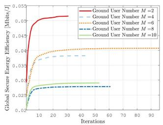

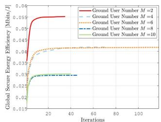  
Fig. 2. The performance of GSEE in different scenarios.

## B. Method Validation

Fig. 2(a) presents the evolution of global secure energy efficiency (GSEE) in a UAV-assisted MEC network. The results reveal that GSEE converges to a stable level across varying numbers of ground users as the number of iterations increases. Specifically, after approximately 30 iterations, the efficiency reaches a near-steady state, indicating robust convergence of the proposed method in the static ground user (GU) scenario. Furthermore, Fig. 2(b) corroborates the strong convergence properties of the proposed method in the dynamic GU scenario, further validating its effectiveness under varying network conditions.

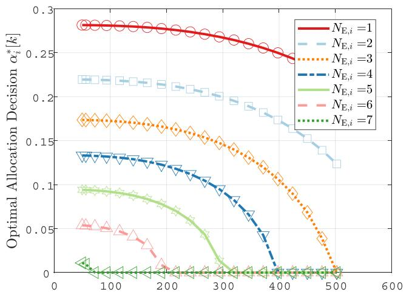  
Relative Distance between the UAV and Ground User i [m]  
Fig. 3. Variation of $\alpha _ { i } ^ { * } [ k ]$ with respect to the relative distance between UAV and GU i, and the number of eavesdroppers in the vicinity of GU i.

Additionally, an approximate linear decrease in global energy efficiency is observed as the number of GUs increases, i.e., $\mathrm { G S E E } _ { M = 2 } > \mathrm { G S E E } _ { M = 4 , 6 } > \mathrm { G S E E } _ { M = 8 , 1 0 }$ . This trend can be attributable to the increase in overall computational demand as the number of GUs grows. Notably, the GSEE for $M = 6$ surpasses that of $M = 4$ , and similarly, the GSEE for $M = 1 0$ is higher than for $M = 8$ . This phenomenon can be explained by using a Poisson distribution to model GU’s requirements, based on their average computational demands. This approach introduces inherent randomness, which may lead to instances where the aggregate computational demand in systems with a larger number of GUs is unexpectedly lower than in those with fewer GUs, thus resulting in the observed variations in energy efficiency.

## C. Results

Fig. 3 illustrates the optimal power allocation $\alpha _ { i } [ k ]$ at the GU i for secure data transmission, highlighting its dual dependence on both the relative distance between the UAV and the GU, and the number of eavesdroppers $N _ { E , i }$ in the vicinity. As shown in the figure, $\alpha _ { i } [ k ]$ exhibits a decreasing trend with increasing [ ]UAV-GU distance. This trend can be explained by the deterioration of the channel quality due to path loss effects, which is consistent with classical wireless channel models [94]. To preserve secrecy under poor channel conditions, GU i shifts more of its transmission power toward artificial noise generation, thus reducing the fraction of power allocated to data transmission. This behavior aligns with the secrecy capacity framework, which posits that secure transmission over degraded channels often requires increased interference toward potential eavesdroppers to maximize the secrecy rate. Furthermore, the figure reveals that $\alpha _ { i } [ k ]$ also decreases as the number of nearby eavesdroppers increases. This reflects a proactive and threat-aware power allocation strategy: as $N _ { E , i }$ grows, the GU is compelled to allocate more power to interfere with a larger number of potential interceptors. It is noteworthy that as the relative distance between the UAV and the GU increases, or as the density of eavesdroppers grows, the power allocated for data transmission tends to decrease to zero. This trend underscores the escalating difficulty in ensuring secure communication under increasingly adverse conditions. While adaptive power control and other software-level optimization strategies are pivotal in enhancing security, their effectiveness may reach a plateau in extremely hostile environments. This limitation accentuates the urgent need for complementary hardware-level enhancements, such as increasing the total transmission power at the GU. In summary, the gradual reduction in data transmission power as the distance between the UAV and the ground user increases or the density of eavesdroppers grows highlights the challenges of ensuring secure communication under adverse channel conditions.

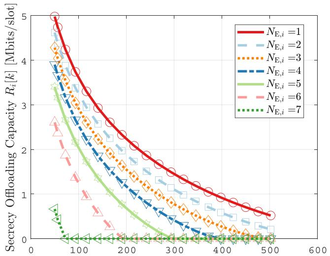  
Relative Distance between the UAV and Ground User i [m]  
Fig. 4. Variation of $R _ { i } [ k ]$ with respect to the relative distance between UAV and GU i, and the number of eavesdroppers in the vicinity of GU i.

Fig. 4 illustrates the variation in the secure offloading capacity of GU i, which is primarily influenced by two factors: the relative distance between GU i and the UAV, and the presence of eavesdroppers in the vicinity. As the relative distance between GU i and the UAV increases, a corresponding decline in the secure offloading capacity is observed. This reduction can be attributed to the deterioration of the channel quality, as the increased distance leads to greater signal attenuation and a higher probability of interference. The relationship between distance and signal strength follows the well-established path loss model in wireless communications, where the SNR decreases with the square or higher power of the distance, thus directly impacting the secure offloading rate [95]. In addition, the number of eavesdroppers in the proximity of GU i plays a critical role in further diminishing the secure offloading capacity. As the number of eavesdroppers increases, they effectively compete for the same communication resources, leading to a reduction in the available secure bandwidth for GU i. This phenomenon is consistent with the findings in secure communication and physical layer security research, where the presence of eavesdroppers is shown to significantly degrade the security and throughput of wireless communication channels [96]. Moreover, the interplay between distance and eavesdropper density can be viewed within the framework of a cooperative communication system, where both factors need to be optimized to balance offloading efficiency and secure transmission. As the UAV moves closer to GU i and the density of eavesdroppers is reduced, the secure offloading capacity improves due to the enhanced quality of the communication link and the lower probability of interception. As illustrated in Figs. 3 and 4, the distance between the UAV and the GU plays a critical role in determining both the transmission power required for secure communication and the achievable secure transmission capacity. This observation fundamentally motivates our joint optimization of UAV trajectory in our proposed joint optimization framework, where we develop a UAV mobility model that dynamically enhances both channel quality and physical-layer security.

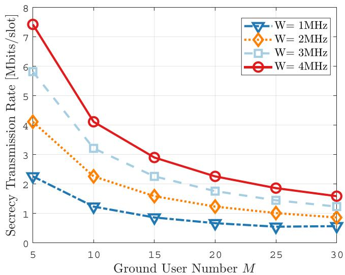  
Fig. 5. The variation of secure transmission rate with increasing user numbers for different total bandwidths.

As shown in Fig. 5, under fixed bandwidth conditions, the secure transmission rate for each GU decreases as the number of GUs increases. This decline can be attributed to the finite total bandwidth available in the system. As more GUs are added, the bandwidth allocated to each user becomes progressively smaller, resulting in a lower transmission rate and, consequently, a further reduction in the secrecy transmission rate. To maintain a non-negative secure transmission rate under these constraints, each GU must increase its transmission power. However, this leads to a rise in overall communication energy consumption. As depicted in Fig. 6, despite the increase in transmission power, the secrecy transmission rate continues to decline with the growing number of GUs. Although our study derives a closed-form expression for optimal power allocation, this result highlights that, even with ideal resource distribution, the secrecy transmission rates remain limited. This limitation stems from the restricted channel resources and the intensified competition among users, underscoring the fundamental challenge in maintaining high secrecy transmission rates in dense user environments.

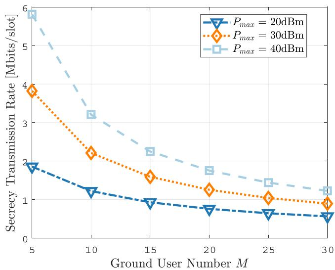  
Fig. 6. The variation of secure transmission rate with increasing user numbers for different total power.

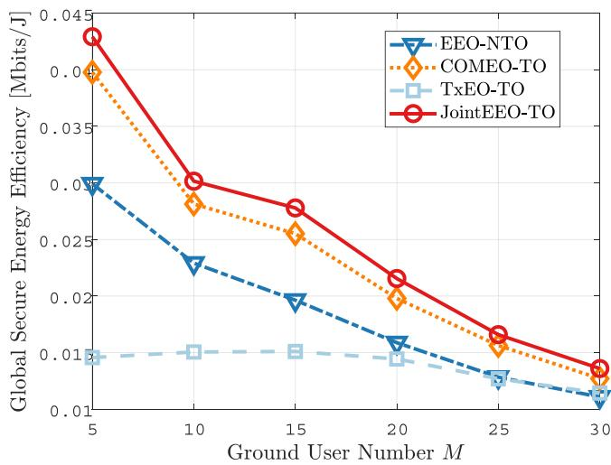  
Fig. 7. Global secure energy efficiency with varying number of GUs.

To evaluate the effectiveness of our proposed approach, we assess the performance of our approach (Joint EEO-TO) compared to several advanced schemes: i) Joint Computing and Offloading Energy Efficiency Optimization (EEO-NTO); ii) Joint Computing Energy Efficiency and Trajectory Optimization (COMEO-TO); and iii) Joint Offloading Energy Efficiency and Trajectory Optimization (TxEO-TO).

As illustrated in Fig. 7, our method consistently outperforms other comparative approaches in terms of global secure energy efficiency across all quantities of ground nodes, exhibiting particularly notable advantages when the number of ground nodes is low. Furthermore, the figure demonstrates that the three methods optimized for computational energy consumption (JointEEO-TO, COMEO-TO, EEO-NTO) achieve higher energy efficiency compared to the method that does not optimize computational energy consumption (TxEO-TO). Specifically, compared to the EEO-NTO method, our proposed approach achieves a maximum increase in computational energy efficiency of 13 Kbits/J. Similarly, when compared to the COMEO-TO method, our approach results in a maximum improvement of 3 Kbits/J. Although the computational energy efficiency of the aforementioned methods declines as the number of GUs in the network increases, our proposed method consistently maintains the highest efficiency.

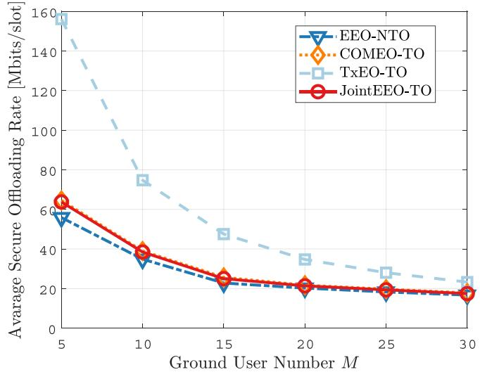  
Fig. 8. Average secure offloading rate with varying number of GUs.

As illustrated in Figs. 5 and 6, our proposed method not only maintains an average secure transmission rate comparable to that of COMEO-TO but also achieves a higher global secure energy efficiency. In contrast, while the TxEO-TO method achieves a high transmission rate, its global secure energy efficiency is significantly low. A potential factor behind this could be that the method jointly optimizes the UAV’s trajectory and communication transmission rate, enabling data transmission between the UAV and ground users (GUs) at their optimal relative positions, thereby achieving the highest transmission rate. However, this optimization process requires the UAV to expend a substantial amount of energy in searching for the best position.

The decrease in the average secure transmission rate as the number of GUs (M) increases, as shown in Fig. 6, can be attributed to two primary factors. First, as the number of GUs increases, the available channel bandwidth must be shared among a larger GU base, which results in a reduction in the individual transmission rate for each GU. Additionally, all GUs experience interference from the eavesdropper, which further exacerbates the decline in secure communication rates. Consequently, the overall secure transmission rate is negatively impacted by the combined effects of bandwidth dilution and the inherent interference from the eavesdropper, which becomes more pronounced with an increasing number of users. Second, although the UAV optimizes its trajectory to maximize the secure communication rate for each GU, this optimization process faces inherent limitations as the number of users grows. The UAV’s ability to effectively improve the secure transmission rate for each GU becomes constrained by the increasing user density, as the UAV can only optimize the trajectory for a limited number of users at any given time.

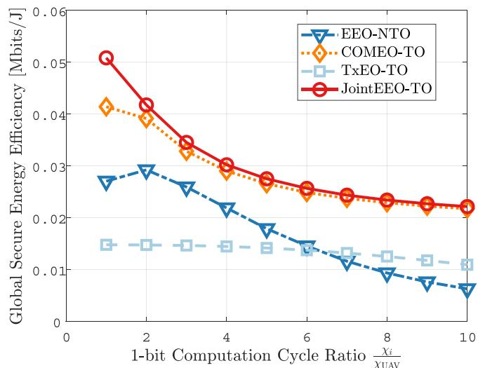  
Fig. 9. Global secure energy efficiency with varying computational capacities.

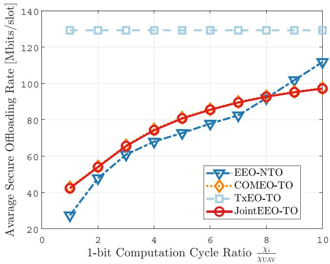  
Fig. 10. Average secure offloading rate with varying computational capacities.

As illustrated in Figs. 9 and 10, our proposed method achieves the highest global secure energy efficiency under varying computational capacities. This outcome can be attributed to the method’s integrated optimization of both communication transmission rates and computational energy consumption. By carefully balancing these two factors, our approach maximizes the system’s overall efficiency, leading to significant improvements in energy usage without compromising security. Specifically, while our method maintains a secure transmission rate comparable to that of the COMEO-TO method, it offers a substantial improvement in secure energy efficiency, with an increase of up to 9 Kbits/J. This indicates that our method not only manages to achieve a competitive transmission rate but also ensures that energy consumption is minimized, which is critical in resourceconstrained environments such as UAV-assisted communication systems.

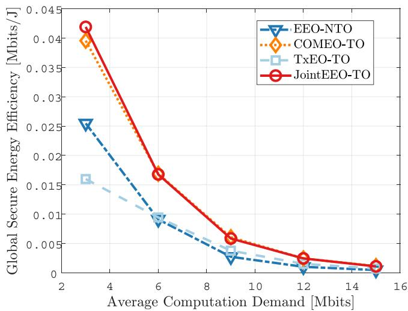  
Fig. 11. Global secure energy efficiency with varying average computation demand.

When compared to the EEO-NTO method, our approach stands out by not only maintaining a higher average secure transmission rate but also achieving a 23 Kbits/s increase in secure energy efficiency. This improvement is primarily due to our method’s ability to optimize the computational energy consumption of both the UAV and ground users (GUs). In contrast, the EEO-NTO method primarily focuses on optimizing communication rates without incorporating an energy-efficient computational strategy. As a result, it does not fully capitalize on the energy-saving opportunities provided by optimized computational resource allocation, leading to suboptimal secure energy efficiency.

As illustrated in Fig. 11, the proposed JointEEO-TO method consistently achieves the highest level of global secure energy efficiency across varying average computational demands. Notably, when the average computational demand of the ground user (GU) is 3 Mbit, the proposed approach yields an approximate 5.9% improvement in energy efficiency compared to the COMEO-TO method. Distinct from comparison approaches that decouple the optimization of communication, computation, and trajectory, the proposed JointEEO-TO framework implements a joint optimization of transmission energy consumption, computational energy consumption, and UAV trajectory. This holistic design enables the system to leverage the intrinsic coupling among these domains, thereby enhancing the overall energy utilization efficiency. Specifically, by dynamically adapting the trade-off between local computation and task offloading, the proposed method effectively minimizes redundant energy expenditure. This advantage is particularly pronounced in scenarios characterized by low computational demand, where precise coordination of resources becomes critical to energy-efficient operation.

## VII. CONCLUSION AND FUTURE WORK

In this paper, we propose a novel approach to optimizing energy efficiency in UAV-assisted MEC systems by jointly addressing computing and offloading energy consumption, as well as UAV trajectory optimization. Our simulation results show that the proposed method consistently outperforms existing schemes in terms of global secure energy efficiency and secure offloading rates, particularly when the number of GUs is low. By effectively balancing power allocation between secure communication and interference management, our approach ensures robust performance even in the presence of eavesdroppers. Furthermore, our method maintains high computational energy efficiency across diverse network conditions and computational demands, making it a versatile solution for dynamic UAV-assisted systems. As an important extension of this work, future research will investigate countermeasures against active eavesdropping in UAV-assisted MEC systems, with a focus on adaptive power control via reinforcement learning and jamming-resilient modulation techniques such as spread spectrum [97] and frequency hopping [98]. Moreover, we will extend our physical-layer security framework to encompass secure downlink/backhaul transmission, where the UAV returns processed results to ground stations or central servers, employing techniques such as artificial noise injection and directional beamforming to ensure end-to-end communication security. In addition, we plan to extend the proposed framework to more complex scenarios by incorporating factors such as multi-UAV coordination, dynamic channel conditions, and time-varying computational demands.

## REFERENCES

[1] R. Amer, W. Saad, and N. Marchetti, “Mobility in the sky: Performance and mobility analysis for cellular-connected UAVs,” IEEE Trans. Commun., vol. 68, no. 5, pp. 3229–3246, May 2020.

[2] C. Ren, L. Liu, and H. Zhang, “Multimodal interference compatible passive UAV network based on location-aware flexibility,” IEEE Wireless Commun. Lett., vol. 12, no. 4, pp. 640–643, Apr. 2023.

[3] L. Luo, R. Sun, R. Chai, and Q. Chen, “Cost-efficient UAV deployment and content placement for cellular systems with D2D communications,” IEEE Syst. J., vol. 17, no. 4, pp. 5405–5416, Dec. 2023.

[4] K. Liu and J. Zheng, “UAV trajectory optimization for time-constrained data collection in UAV-enabled environmental monitoring systems,” IEEE Internet Things J., vol. 9, no. 23, pp. 24300–24314, Dec. 2022.

[5] J. Xu, K. Ota, and M. Dong, “Big Data on the fly: UAV-mounted mobile edge computing for disaster management,” IEEE Trans. Netw. Sci. Eng., vol. 7, no. 4, pp. 2620–2630, Oct.-Dec. 2020.

[6] B. Deka and D. Chakraborty, “UAV sensing-based litchi segmentation using modified Mask-RCNN for precision agriculture,” IEEE Trans. Agri-Food Elect., vol. 2, no. 2, pp. 509–517, Sep./Oct. 2024.

[7] Y. Pan, Q. Chen, N. Zhang, Z. Li, T. Zhu, and Q. Han, “Extending delivery range and decelerating battery aging of logistics UAVs using public buses,” IEEE Trans. Mobile Comput., vol. 22, no. 9, pp. 5280–5295, Sep. 2023.

[8] N. Abbas, Y. Zhang, A. Taherkordi, and T. Skeie, “Mobile edge computing: A survey,” IEEE Internet Things J., vol. 5, no. 1, pp. 450–465, Feb. 2018.

[9] S. Bebortta, D. Senapati, C. R. Panigrahi, and B. Pati, “Adaptive performance modeling framework for QoS-Aware offloading in MEC-based IIoT systems,” IEEE Internet Things J., vol. 9, no. 12, pp. 10162–10171, Jun. 2022.

[10] S. Liu et al., “Satisfaction-maximized secure computation offloading in multi-eavesdropper MEC networks,” IEEE Trans. Wireless Commun., vol. 21, no. 6, pp. 4227–4241, Jun. 2022.

[11] E. T. Michailidis, M.-G. Volakaki, N. I. Miridakis, and D. Vouyioukas, “Optimization of secure computation efficiency in UAV-enabled RISassisted MEC-IoT networks with aerial and ground eavesdroppers,” IEEE Trans. Commun., vol. 72, no. 7, pp. 3994–4009, Jul. 2024.

[12] C. Wang, D. Deng, L. Xu, and W. Wang, “Resource scheduling based on deep reinforcement learning in UAV assisted emergency communication networks,” IEEE Trans. Commun., vol. 70, no. 6, pp. 3834–3848, Jun. 2022.

[13] Y. Wang, H. Wang, and X. Wei, “Energy-efficient UAV deployment and task scheduling in multi-UAV edge computing,” in Proc. Intl. Conf. Wireless Commun. Signal Process., Nanjing, China, 2020, pp. 1147–1152.

[14] C. Zhan, H. Hu, X. Sui, Z. Liu, and D. Niyato, “Completion time and energy optimization in the UAV-enabled mobile-edge computing system,” IEEE Internet Things J., vol. 7, no. 8, pp. 7808–7822, Aug. 2020.

[15] F. Cheng, G. Gui, N. Zhao, Y. Chen, J. Tang, and H. Sari, “UAV-Relaying-Assisted secure transmission with caching,” IEEE Trans. Commun., vol. 67, no. 5, pp. 3140–3153, May 2019.

[16] X. Gu, G. Zhang, and J. Gu, “Offloading optimization for energyminimization secure UAV-edge-computing systems,” in Proc. IEEE Wireless Commun. Netw. Conf., Nanjing, China, 2021, pp. 1–6.

[17] Z. Li, M. Chen, C. Pan, N. Huang, Z. Yang, and A. Nallanathan, “Joint trajectory and communication design for secure UAV networks,” IEEE Commun. Lett., vol. 23, no. 4, pp. 636–639, Apr. 2019.

[18] S. Wan, J. Lu, P. Fan, and K. B. Letaief, “Toward Big Data processing in IoT: Path planning and resource management of UAV base stations in mobile-edge computing system,” IEEE Internet Things J., vol. 7, no. 7, pp. 5995–6009, Jul. 2020.

[19] Y. Miao, K. Hwang, D. Wu, Y. Hao, and M. Chen, “Drone swarm path planning for mobile edge computing in industrial Internet of Things,” IEEE Trans. Ind. Inf., vol. 19, no. 5, pp. 6836–6848, May 2023.

[20] H. Bayerlein, M. Theile, M. Caccamo, and D. Gesbert, “UAV path planning for wireless data harvesting: A deep reinforcement learning approach,” in Proc. 2020 IEEE Glob. Commun. Conf., Taipei, Taiwan, 2020, pp. 1–6.

[21] V. Mnih et al., “Human-level control through deep reinforcement learning,” Nature, vol. 518, no. 7540, pp. 529–533, 2015.

[22] U. Challita, W. Saad, and C. Bettstetter, “Deep reinforcement learning for interference-aware path planning of cellular-connected UAVs,” in Proc. 2018 IEEE Intl. Conf. Commun., 2018, pp. 1–7.

[23] Y. Lu, G. Xiong, X. Zhang, Z. Zhang, T. Jia, and K. Xiong, “Uplink throughput maximization in UAV-aided mobile networks: A DQN-based trajectory planning method,” Drones, vol. 6, no. 12, pp. 1–15, 2022.

[24] M. Samir, C. Assi, S. Sharafeddine, D. Ebrahimi, and A. Ghrayeb, “Age of information aware trajectory planning of UAVs in intelligent transportation systems: A deep learning approach,” IEEE Trans. Veh. Technol., vol. 69, no. 11, pp. 12382–12395, Nov. 2020.

[25] J. Liu, X. Wang, B. Bai, and H. Dai, “Age-optimal trajectory planning for UAV-assisted data collection,” in Proc. IEEE Conf. Comput. Commun. Workshops, Honolulu, HI, USA, 2018, pp. 553–558.

[26] X. Zhou and Q. Zhu, “Optimization algorithm for AoI-based UAV-assisted data collection,” Intl. J. Distrib. Sens. Netw., vol. 1, no. 1, pp. 1–26, 2024.

[27] S. Shao, C. He, Y. Zhao, and X. Wu, “Efficient trajectory planning for UAVs using hierarchical optimization,” IEEE Access, vol. 9, pp. 60668–60 681, 2021.

[28] Y. Luo, Y. Wang, Y. Lei, C. Wang, D. Zhang, and W. Ding, “Decentralized user allocation and dynamic service for Multi-UAV-Enabled MEC system,” IEEE Trans. Veh. Technol., vol. 73, no. 1, pp. 1306–1321, Jan. 2024.

[29] Z. Y. Zhao, Y. L. Che, S. Luo, G. Luo, K. Wu, and V. C. M. Leung, “On designing multi-UAV aided wireless powered dynamic communication via hierarchical deep reinforcement learning,” IEEE Trans. Mobile Comput., vol. 23, no. 12, pp. 13991–14004, Dec. 2024.

[30] Z. Wang et al., “Dynamic trajectory design for Multi-UAV-Assisted mobile edge computing,” IEEE Trans. Veh. Technol., vol. 74, no. 3, pp. 4684–4697, Mar. 2025.

[31] Y. Zhang, Z. Kuang, Y. Feng, and F. Hou, “Task offloading and trajectory optimization for secure communications in dynamic user Multi-UAV MEC systems,” IEEE Trans. Mobile Comput., vol. 23, no. 12, pp. 14427–14440, Dec. 2024.

[32] H. Hu, Q. Wang, R. Q. Hu, and H. Zhu, “Mobility-aware offloading and resource allocation in a MEC-enabled IoT network with energy harvesting,” IEEE Internet Things J., vol. 8, no. 24, pp. 17541–17556, Dec. 2021.

[33] T. Liu, M. Cui, G. Zhang, Q. Wu, X. Chu, and J. Zhang, “3D trajectory and transmit power optimization for UAV-enabled multi-link relaying systems,” IEEE Trans. Green Commun. Netw., vol. 5, no. 1, pp. 392–405, Mar. 2021.

[34] M. Samir, S. Sharafeddine, C. M. Assi, T. M. Nguyen, and A. Ghrayeb, “UAV trajectory planning for data collection from time-constrained IoT devices,” IEEE Trans. Wireless Commun., vol. 19, no. 1, pp. 34–46, Jan. 2020.

[35] Y. Zeng, X. Xu, and R. Zhang, “Trajectory design for completion time minimization in UAV-enabled multicasting,” IEEE Trans. Wireless Commun., vol. 17, no. 4, pp. 2233–2246, Apr. 2018.

[36] H. Xiao, Z. Hu, K. Yang, Y. Du, and D. Chen, “An energy-aware joint routing and task allocation algorithm in MEC systems assisted by multiple UAVs,” in Proc. Int. Wireless Commun. Mobile Comput., 2020, pp. 1654–1659.

[37] Y. Peng, Y. Liu, and H. Zhang, “Deep reinforcement learning based path planning for UAV-assisted edge computing networks,” in Proc. IEEE Wireless Commun. Net. Conf., Nanjing, China, 2021, pp. 1–6.

[38] S. Hwang, J. Park, H. Lee, M. Kim, and I. Lee, “Deep reinforcement learning approach for UAV-assisted mobile edge computing networks,” in Proc. IEEE Glob. Commun. Conf., Rio de Janeiro, Brazil, 2022, pp. 3839–3844.

[39] Z. Hu, Y. Yang, W. Gu, Y. Chen, and J. Huang, “DRL-based trajectory optimization and task offloading in hierarchical aerial MEC,” IEEE Internet Things J., vol. 12, no. 3, pp. 3410–3423, Feb. 2025.

[40] Z. Zhao et al., “A novel framework of three-hierarchical offloading optimization for MEC in industrial IoT networks,” IEEE Trans. Ind. Inf., vol. 16, no. 8, pp. 5424–5434, Aug. 2020.

[41] Y. Sun and Q. He, “Computational offloading for MEC networks with energy harvesting: A hierarchical multi-agent reinforcement learning approach,” Electronics, vol. 12, no. 6, 2023, Art. no. 1304. [Online]. Available: https://www.mdpi.com/2079-9292/12/6/1304

[42] M. Li, N. Cheng, J. Gao, Y. Wang, L. Zhao, and X. Shen, “Energy-efficient UAV-assisted mobile edge computing: Resource allocation and trajectory optimization,” IEEE Trans. Veh. Technol., vol. 69, no. 3, pp. 3424–3438, Mar. 2020.

[43] Y. Wang, Z.-Y. Ru, K. Wang, and P.-Q. Huang, “Joint deployment and task scheduling optimization for large-scale mobile users in Multi-UAV-Enabled mobile edge computing,” IEEE Trans. Cybern., vol. 50, no. 9, pp. 3984–3997, Sep. 2020.

[44] Y. Li, Y. Fang, and L. Qiu, “Joint computation offloading and communication design for secure UAV-enabled MEC systems,” in Proc. IEEE Wireless Commun. Netw. Conf., Nanjing, China, 2021, pp. 1–6.

[45] Z. Yang, S. Bi, and Y.-J. A. Zhang, “Dynamic trajectory and offloading control of UAV-enabled MEC under user mobility,” in Proc. IEEE Intl. Conf. Commun. Workshops, 2021, pp. 1–6.

[46] J. Zhang et al., “Stochastic computation offloading and trajectory scheduling for UAV-assisted mobile edge computing,” IEEE Internet Things J., vol. 6, no. 2, pp. 3688–3699, Apr. 2019.

[47] Y. Sun, S. Zhou, and J. Xu, “EMM: Energy-aware mobility management for mobile edge computing in ultra dense networks,” IEEE J. Sel. Areas Commun, vol. 35, no. 11, pp. 2637–2646, Nov. 2017.

[48] T. Ouyang, Z. Zhou, and X. Chen, “Follow me at the edge: Mobility-aware dynamic service placement for mobile edge computing,” IEEE J. Sel. Areas Commun, vol. 36, no. 10, pp. 2333–2345, Oct. 2018.

[49] W. Zhan, C. Luo, G. Min, C. Wang, Q. Zhu, and H. Duan, “Mobilityaware multi-user offloading optimization for mobile edge computing,” IEEE Trans. Veh. Technol., vol. 69, no. 3, pp. 3341–3356, Mar. 2020.

[50] Y. Xu, T. Zhang, D. Yang, Y. Liu, and M. Tao, “Joint resource and trajectory optimization for security in UAV-assisted MEC systems,” IEEE Trans. Commun., vol. 69, no. 1, pp. 573–588, Jan. 2021.

[51] L. Jing, X. Jia, Y. Lv, and N. Wan, “Maximizing the average secrecy rate for UAV-assisted MEC: A DRL method,” in Proc. IEEE 5th Adv. Inf. Technol., Electron. Automat. Control Conf., Chongqing, China, 2021, pp. 2514–2518.

[52] H. Yang, Z. Xiong, J. Zhao, D. Niyato, L. Xiao, and Q. Wu, “Deep reinforcement learning-based intelligent reflecting surface for secure wireless communications,” IEEE Trans. Wireless Commun., vol. 20, no. 1, pp. 375–388, Jan. 2021.

[53] L. Lyu, C. Chen, S. Zhu, and X. Guan, “5G enabled codesign of energyefficient transmission and estimation for industrial IoT systems,” IEEE Trans. Ind. Inf., vol. 14, no. 6, pp. 2690–2704, Jun. 2018.

[54] D. Han and T. Shi, “Secrecy capacity maximization for a UAV-assisted MEC system,” China Commun., vol. 17, no. 10, pp. 64–81, 2020.

[55] Y. Zhou et al., “Secure communications for UAV-enabled mobile edge computing systems,” IEEE Trans. Commun., vol. 68, no. 1, pp. 376–388, Jan. 2020.

[56] W. Lu, Z. Ren, J. Xu, and S. Chen, “Edge blockchain assisted lightweight privacy-preserving data aggregation for smart grid,” IEEE Trans. Netw. Serv. Manage., vol. 18, no. 2, pp. 1246–1259, Jun. 2021.

[57] R. Yang, F. R. Yu, P. Si, Z. Yang, and Y. Zhang, “Integrated blockchain and edge computing systems: A survey, some research issues and challenges,” IEEE Commun. Surv. Tut., vol. 21, no. 2, pp. 1508–1532, Second Quarter 2019.

[58] J. Du, T. Lin, C. Jiang, Q. Yang, C. F. Bader, and Z. Han, “Distributed foundation models for multi-modal learning in 6G wireless networks,” IEEE Wireless Commun., vol. 31, no. 3, pp. 20–30, Jun. 2024.

[59] J. Guo et al., “MASA: Multimodal federated learning through modalityaware and secure aggregation,” IEEE Trans. Mobile Comput., vol. 24, no. 8, pp. 7328–7344, Aug. 2025.

[60] H. Tang, K. Zhang, J. Zhang, X. Xie, X. Tong, and X. Liu, “AQMFL: An adaptive quantization framework for multi-modal federated learning in heterogeneous edge devices,” in Proc. IEEE Int. Symp. Parallel Distrib. Process. Appl., Kaifeng, China, 2024, pp. 98–105.

[61] Q. Zhu, W. Saad, Z. Han, H. V. Poor, and T. Ba¸sar, “Eavesdropping and jamming in next-generation wireless networks: A gametheoretic approach,” in Proc. MILCOM 2011 Mil. Commun. Conf., 2011, pp. 119–124.

[62] G. Gomez, F. J. Lopez-Martinez, D. Morales-Jimenez, and M. R. McKay, “On the equivalence between interference and eavesdropping in wireless communications,” IEEE Trans. Veh. Technol., vol. 64, no. 12, pp. 5935–5940, Dec. 2015.

[63] C. O. Nnamani, M. R. A. Khandaker, and M. Sellathurai, “UAV-Aided jamming for secure ground communication with unknown eavesdropper location,” IEEE Access, vol. 8, pp. 72881–72892, 2020.

[64] A. D. Wyner, “The wire-tap channel,” Bell Syst. Tech. J., vol. 54, no. 8, pp. 1355–1387, 1975.

[65] S. Liu, Y. Hong, and E. Viterbo, “Artificial noise revisited,” IEEE Trans. Inf. Theory, vol. 61, no. 7, pp. 3901–3911, Jul. 2015.

[66] T. V. Pham and A. T. Pham, “Energy efficient artificial noiseaided precoding designs for secured visible light communication systems,” IEEE Trans. Wireless Commun., vol. 20, no. 1, pp. 653–666, Jan. 2021.

[67] R. Negi and S. Goel, “Secret communication using artificial noise,” in Proc. IEEE 62nd Veh. Technol. Conf., Dallas, TX, USA, 2005, pp. 1906–1910.

[68] H. Wu, H. Li, Z. Wei, N. Zhang, and X. Tao, “Secrecy performance analysis of air-to-ground communication with UAV jitter and multiple random walking eavesdroppers,” IEEE Trans. Veh. Technol., vol. 70, no. 1, pp. 572–584, Jan. 2021.

[69] T. Cheng, B. Wang, Z. Wang, K. Cao, R. Dong, and J. Weng, “Intelligent reflecting surface assisted secure transmission in UAV-MIMO communication systems,” Entropy, vol. 24, no. 11, 2022, Art. no. 1605.

[70] X. Yu et al., “Air-ground integrated deployment for UAV-enabled mobile edge computing: A hierarchical game approach,” IET Commun., vol. 14, no. 15, pp. 2491–2499, 2020.

[71] Q. Zhen et al., “Air-ground collaborative mobile edge computing: Architecture, challenges, and opportunities,” China Commun., vol. 21, no. 5, pp. 1–16, 2024.

[72] Y. Zeng and R. Zhang, “Energy-efficient UAV communication with trajectory optimization,” IEEE Trans. Wireless Commun., vol. 16, no. 6, pp. 3747–3760, Jun. 2017.

[73] S. Jeong, O. Simeone, and J. Kang, “Mobile edge computing via a UAVmounted cloudlet: Optimization of bit allocation and path planning,” IEEE Trans. Veh. Technol., vol. 67, no. 3, pp. 2049–2063, Mar. 2018.

[74] Z. Wang, G. Zhang, Q. Wang, K. Wang, and K. Yang, “Completion time minimization in wireless-powered UAV-assisted data collection system,” IEEE Commun. Lett., vol. 25, no. 6, pp. 1954–1958, Jun. 2021.

[75] Z. Yuan, W. Guo, and S. Al-Rubaye, “Multi-UAV wireless positioning using adaptive multidimensional scaling and extended Kalman filter,” in Proc. 2022 IEEE Globecom Workshops, 2022, pp. 1437–1441.

[76] H. Chang, J. Bian, C.-X. Wang, Z. Bai, W. Zhou, and E.-H. M. Aggoune, “A 3D non-stationary wideband gbsm for low-altitude UAV-to-ground V2V MIMO channels,” IEEE Access, vol. 7, pp. 70719–70 732, 2019.

[77] Y. Liu, K. Xiong, Y. Lu, Q. Ni, P. Fan, and K. B. Letaief, “UAV-aided wireless power transfer and data collection in rician fading,” IEEE J. Sel. Areas Commun., vol. 39, no. 10, pp. 3097–3113, Oct. 2021.

[78] A. Filippone, Flight Performance of Fixed and Rotary Wing Aircraft. Oxford, U.K.: Elsevier Butterworth-Heinemann, 2006.

[79] G. Sun et al., “Task delay and energy consumption minimization for low-altitude MEC via evolutionary multi-objective deep reinforcement learning,” 2025. [Online]. Available: https://arxiv.org/abs/2501.06410

[80] X.-H. Lin, S. Bi, G. Su, and Y.-J. A. Zhang, “A Lyapunov-based approach to joint optimization of resource allocation and 3-D trajectory for solarpowered UAV MEC systems,” IEEE Internet Things J., vol. 11, no. 11, pp. 20797–20815, Jun. 2024.

[81] Z. Na et al., “UAV-based wide-area Internet of Things: An integrated deployment architecture,” IEEE Netw., vol. 35, no. 5, pp. 122–128, May 2021.

[82] B. Yang, T. Taleb, Y. Fan, and S. Shen, “Mode selection and cooperative jamming for covert communication in D2D underlaid UAV networks,” IEEE Netw., vol. 35, no. 2, pp. 104–111, Mar./Apr. 2021.

[83] S. Panic, T. D. P. Perera, D. N. K. Jayakody, C. Stefanovic, and B. Prlincevic, “UAV-assited wireless powered sensor network over rician shadowed fading channels,” in Proc. IEEE Int. Conf. Microw., Antennas, Commun. Elect. Syst., Tel-Aviv, Israel, 2019, pp. 1–5.

[84] H. C. Nguyen, R. Amorim, J. Wigard, I. Z. KováCs, T. B. Sørensen, and P. E. Mogensen, “How to ensure reliable connectivity for aerial vehicles over cellular networks,” IEEE Access, vol. 6, pp. 12304–12 317, 2018.

[85] G. Yang and C. Luo, “Performance improvement in UAV communication systems with uncertain solar energy supply,” IEEE Internet Things J., vol. 10, no. 22, pp. 19607–19616, Nov. 2023.

[86] H. Aghajari, S. Ahmadinabi, H. B. Babadegani, and M. N. Soorki, “Empirical performance analysis and channel modeling of UAV-assisted LoRa networks,” in Proc. 30th Int. Conf. Elect. Eng., Tehran, Iran, Islamic Republic, 2022, pp. 463–468.

[87] N. H. Chu, D. T. Hoang, D. N. Nguyen, N. Van Huynh, and E. Dutkiewicz, “Joint speed control and energy replenishment optimization for UAV-Assisted IoT data collection with deep reinforcement transfer learning,” IEEE Internet Things J., vol. 10, no. 7, pp. 5778–5793, Jul. 2023.

[88] S. H. Emon et al., “Energy consumption aware delay minimization for UAV enabled internet of vehicle,” in Proc. 5th Int. Conf. Sustain. Technol. Ind. 5.0, 2023, pp. 1–6.

[89] X. Tang, H. Zhang, R. Zhang, D. Zhou, Y. Zhang, and Z. Han, “Robust trajectory and offloading for energy-efficient UAV edge computing in industrial Internet of Things,” IEEE Trans. Ind. Inf., vol. 20, no. 1, pp. 38–49, Jan. 2024.

[90] M. Dhuheir, A. Erbad, A. Al-Fuqaha, and A. M. Seid, “Meta reinforcement learning for UAV-Assisted energy harvesting IoT devices in disasteraffected areas,” IEEE Open J. Commun. Soc., vol. 5, pp. 2145–2163, 2024.

[91] F. Jameel, S. Wyne, and I. Krikidis, “Secrecy outage for wireless sensor networks,” IEEE Commun. Lett., vol. 21, no. 7, pp. 1565–1568, Jul. 2017.

[92] P. Kumar, S. Bhattacharyya, S. Darshi, S. Majhi, A. A. Almohammedi, and S. Shailendra, “Outage analysis using probabilistic channel model for drone assisted multi-user coded cooperation system,” IEEE Trans. Veh. Technol., vol. 72, no. 8, pp. 10273–10 285, Aug. 2023.

[93] V. N. Vo et al., “Outage probability minimization in secure NOMA cognitive radio systems with UAV relay: A machine learning approach,” IEEE Trans. Cogn. Commun. Net., vol. 9, no. 2, pp. 435–451, Apr. 2023.

[94] A. Goldsmith, Wireless Communications, New York, NY, USA: Cambridge Univ. Press, 2005.

[95] J. G. Andrews et al., “What will 5G be,” IEEE J. Sel. Areas Commun., vol. 32, no. 6, pp. 1065–1082, Jun. 2014.

[96] Y. Li, R. Zhang, J. Zhang, S. Gao, and L. Yang, “Cooperative jamming for secure UAV communications with partial eavesdropper information,” IEEE Access, vol. 7, pp. 94593–94 603, 2019.

[97] W. Li et al., “Intelligent dynamic spectrum anti-jamming communications: A deep reinforcement learning perspective,” IEEE Wireless Commun., vol. 29, no. 5, pp. 60–67, Oct. 2022.

[98] Y. Shi, K. An, and Y. Li, “Index modulation based frequency hopping: Anti-jamming design and analysis,” IEEE Trans. Veh. Technol., vol. 70, no. 7, pp. 6930–6942, Jul. 2021.

  
Mingqian Wang (Graduate Student Member, IEEE) received the BSc degree in transportation engineering from the Shandong University of Technology, Shandong, China, in 2019, the MSc degrees from the Beijing University of Technology, Beijing, China, in 2023. He is currently working toward the PhD degree with Beihang University. His research interests include uncrewed systems, dynamics modeling and control, and distributed optimization.

Jianshan Zhou received the BSc, MSc, and PhD degrees in traffic information engineering and control from Beihang University, Beijing, China, in 2013, 2016, and 2020, respectively. He is an associate professor with the school of transportation science and engineering, Beihang University. From 2017 to 2018, he was a visiting research fellow with the School of Informatics and Engineering, University of Sussex, Brighton, U.K. He was a postdoctoral research fellow supported by the Zhuoyue Program of Beihang University and the National Postdoctoral Program for

Innovative Talents from 2020 to 2022. He is or was the Technical Program Session Chair with the IEEE EDGE 2020, the IEEE ICUS 2022-2024, the ICAUS 2022, the TPC member with the IEEE VTC2021-Fall track, and the Youth Editorial Board Member of the uncrewed Systems Technology. He is the author or co-author of more than 50 international scientific publications. His research interests include the modeling and optimization of vehicular communication networks and airground cooperative networks, the analysis and control of connected autonomous vehicles, and intelligent transportation systems.

Daxin Tian (Fellow, IEEE) received the PhD degree in computer application technology from Jilin University, Changchun, China, in 2007. He is currently a professor with the School of Transportation Science and Engineering, Beihang University, Beijing, China. His research interest include intelligent transportation systems, autonomous connected vehicles, swarm intelligent and mobile computing. He was the recipient of the Changjiang Scholars Program (Young Scholar) of Ministry of Education of China, in 2017, National Science Fund for Distinguished Young Scholars in

2018, and Distinguished Young Investigator of China Frontiers of Engineering, in 2018. He is also a fellow of IEEE and was the Technical Program Committee Member/Chair/Co-Chair for several international conferences which include EAI 2018, ICTIS 2019, IEEE ICUS 2019, IEEE HMWC 2020, and GRAPH-HOC 2020.

Xuting Duan (Member, IEEE) received the PhD degree in traffic information engineering and control from Beihang University, Beijing, China, in 2017. He is currently an associate professor with the School of Transportation Science and Engineering, Beihang University, Beijing, China. His current research interests are focused on vehicular ad hoc networks and autonomous systems.

Kaige Qu (Member, IEEE) received the BS degree in communication engineering from Shandong University, Jinan, China, in 2013, the MS degrees in integrated circuits engineering and electrical engineering from Tsinghua University, Beijing, China, and KU Leuven, Leuven, Belgium, in 2016, and the PhD degree in electrical and computer engineering from the University of Waterloo, Waterloo, Canada, in 2021. Since February 2021, she has been a postdoctoral fellow with the Department of Electrical and Computer Engineering, University of Waterloo. She is currently an associate professor with the school of transportation science and engineering with Beihang University. Her research interests include network slicing, edge intelligence, machine learning for wireless networks, connected autonomous vehicles, and digital twin assisted network automation.