# Energy-Efficient Computation Peer Offloading in Satellite Edge Computing Networks

Xinyuan Zhang , Jiang Liu , Ran Zhang , Member, IEEE, Yudong Huang , Jincheng Tong , Ning Xin , Liang Liu , and Zehui Xiong , Member, IEEE

Abstract—Recently, MEC has been integrated with satellite networks to process remote terrestrial computation tasks with superior coverage and delay. Since single satellite computation is hard to tackle spatially uneven computation workloads, computation peer offloading among multiple satellites is urgently needed to further improve service quality and resource utilization. However, considering limited resources, deficient energy, and costly overheads of communication and computation, how to enable efficient offloading cooperation in the time-varying satellite networks is a significant challenge. In this paper, we first design a satellite peer offloading scheme, where offloading is performed along multi-hop paths to explore collaborative computing capabilities. Second, we formulate the Multi-Hop Satellite Peer offloading (MHSPO) problem, aiming to jointly minimize the delay and energy consumption under system resources and backlog constraints. Then, to adapt to the network dynamics, the decision-making process with uncertain future workloads is optimized by leveraging the delayed online learning method under the Lyapunov framework. Finally, we develop a practical online distributed algorithm to solve the MHSPO problem, which is proven to achieve close-to-optimal performance. Extensive simulations show that multi-hop peer offloading among satellites improves edge computing performance efficiently.

Index Terms—Satellite networks, edge computing, load balancing, energy efficiency, peer-to-peer offloading.

# I. INTRODUCTION

N PAST decades, satellite networks have long been consid-I ered a seamless global and disaster-resistant communication

Manuscript received 2 September 2022; revised 3 February 2023; accepted 18 April 2023. Date of publication 25 April 2023; date of current version 6 March 2024. This work was supported in part by the National Natural Science Foundation of China under Grant 62171064, in part by China Postdoctoral Science Foundation under Grant 2021M700515, and in part by the State Scholarship Fund of China Scholarship Council under Grant 202106470020. Recommended for acceptance by M. Atiquzzaman. (Corresponding author: Jiang Liu.)

Xinyuan Zhang and Yudong Huang are with the State Key Laboratory of Networking and Switching Technology, Beijing University of Posts and Telecommunications, Beijing 100876, China (e-mail: zhangxinyuan0181@bupt.edu.cn; hyduni@bupt.edu.cn).

Jiang Liu and Ran Zhang are with the State Key Laboratory of Networking and Switching Technology, Beijing University of Posts and Telecommunications, Beijing 100876, China, and also with Purple Mountain Laboratories, Nanjing 211111, China (e-mail: liujiang@bupt.edu.cn; zhangran@bupt.edu.cn).

Jincheng Tong, Ning Xin, and Liang Liu are with the China Academy of Space Technology, Beijing 100876, China (e-mail: 30755497@qq.com; xinning7@ sina.com; liuliang1945@buaa.edu.cn).

Zehui Xiong is with the Information Systems Technology and Design (ISTD) Pillar, Singapore University of Technology and Design, Singapore 487372 (e-mail: zehui\_xiong@sutd.edu.sg).

This article has supplementary downloadable material available at https://doi.org/10.1109/TMC.2023.3269801, provided by the authors.

Digital Object Identifier 10.1109/TMC.2023.3269801

paradigm [1], [2], [3], [4]. Recently, the enhanced on-board processing capabilities are shifting the role of satellites from transport relay to in-orbit computing, prompting the integration of multi-access edge computing (MEC) and satellite networks [5], [6], [7], [8]. The in-orbit computing allows directly handling tasks on satellites, preventing the long propagation delay from satellites to the ground data centers and the congestion of the downlinks with limited bandwidth [9], [10], [11]. This opens up new possibilities for fast decision-making in Internet of Remote Things (IoRT) services [12] and eases the burden of data return in space-native data processing services [11].

In response to the above trends and benefits, many works have been done towards in-orbit computing, such as architecture design [5], [6], [9], [10], [11], network element deployments [8], and computation offloading schemes [7], [13], [14], [15], [16], [17], [18]. However, most of them only consider single satellite computation. Specifically, users offload tasks to satellites within line of sight. Each satellite individually processes all its received requests rather than offloading them to neighbors, resulting in high workloads in densely populated areas and resource waste in sparsely populated areas. Therefore, multiple satellite computation is essential to improve service quality and resource utilization.

Although some works have studied cooperative offloading in terrestrial MEC networks, such as data centers [19], [20], edge clouds [21], [22], [23], [24], [25], mobile edge clusters [26], [27], [28], [29], and cellular networks [30], [31], they do not apply to satellite networks. Satellite networks have distinct channel characteristics and face more complex mobility issues compared to terrestrial MEC networks due to high-speed motion. Also, the workloads of satellite networks are more variable and uneven than terrestrial edge clouds since constellations cover the entire earth’s surface.

Computation peer offloading among multiple satellites faces several challenges: 1) Traffic arrivals in satellite networks vary with geographical position and time zone. The limited computing resources among multiple satellites should be jointly leveraged to provide satisfactory computation service all the time. 2) The power supply of satellites is restricted as the solar panels are not always oriented towards sunlight, and the battery cells have a finite cycle life [32]. Peer offloading must consider energy consumption to avoid the continuous overwork of a single satellite that will drain the energy and cause it to age quickly. 3) Reduced computation delay is achieved by offloading tasks to light-loaded satellites multiple hops away but at the expense of transmission overheads, so computing cooperation requires jointly optimizing the communication and computation overheads.

In this paper, we propose a multi-hop computation peer offloading scheme in MEC-enabled satellite networks. We initiate the offloading scheduling on the network side, and the access satellite offloads tasks to cooperative satellites via inter-satellite links (ISLs). Compared to single satellite computing, users are unaware of offloading schedules and can offload tasks to satellites out of sight in the proposed scheme. More tasks are served on the satellite edge computing platform, so the on-board resources are better utilized, and the propagation delay and congestion of downlinks are further alleviated. Besides, the proposed scheme can be applied to a broader range of services, from terrestrial network services to space-native data processing.

Specifically, we formulate the problem as maximizing the utilization of computing and communication resources while minimizing energy consumption. To reduce the complexity of the interplay among communication, computation, and energy consumption, we develop a multi-hop computation offloading model that incorporates satellites’ computing and forwarding behaviors. Besides, due to the unfeasibility of knowing complete traffic arrival information, we leverage the online Lyapunov framework to optimize long-term performance. The delayed online learning technique is leveraged to help make decisions with the uncertainty of future workloads. The prediction loss is proved to be upper bounded.

The main contributions are summarized as follows:

We design a satellite peer offloading scheme, where offloading is performed along multi-hop paths to explore collaborative computing capabilities. The proposed scheme efficiently balances the uneven workloads and improves the resource utilization of satellite networks.   
C We formulate a Multi-Hop Satellite Peer Offloading (MH-SPO) problem as a global optimization problem, which jointly optimizes the latency and energy consumption under system backlogs and resource constraints. The Lyapunov framework is introduced to transform MHSPO into an online per-slot optimization problem.   
We propose an online distributed decision-making scheme to solve MHSPO. By gap-preserving reduction, we transform the network-wide Lyapunov-based cost minimization problem into several sub-problems conducted on individual satellites. The proposed algorithm can achieve closeto-optimal performance.   
C We conduct simulations to evaluate the performance of the proposed scheme and compare it with baseline solutions. Simulation results show that the proposed scheme significantly improves the system performance.

The rest of this paper is organized as follows. Section II reviews related works. The system model is presented in Section III. The problem formulation and proposed solution are presented in Section IV. Simulations are carried out in Section V, followed by the conclusion in Section VI.

# II. RELATED WORKS

In this section, we first study the MEC-enabled satellite networks and the fundamental offloading problem, and then review how load balancing is tackled in the terrestrial MEC networks and explain why they do not apply to satellite networks.

# A. MEC-Enhanced Satellite Networks

Satellite edge computing brings computing from ”anytime” to ”anywhere”. In recent studies on the integration of MEC and satellite networks, satellites have evolved from being solely used for transmission [33], [34], [35] to directly processing computation tasks, leading to the emergence of in-orbit computing.

The advancements in satellite design have paved the way for in-orbit computing. For instance, improved power generation and storage technologies make in-orbit computing less energyintensive [10]. Satellites equipped with advanced computation servers [11] and laser communication terminals [36], [37], [38] are capable of delivering high-performance computation and transmission. Furthermore, the feasibility of in-orbit computing is further enhanced by the fact that a significant portion of satellite network infrastructure is idle at any given moment due to the dispersed population. In [11], the authors explored the opportunities and challenges of in-orbit computing both qualitatively and quantitatively, and outlined several potential applications.

Several brand-new architectures for in-orbit computing have been proposed. [5] proposed the architecture of satellite edge computing and several significant technical challenges. The authors in [9] presented a SDN/NFV-based architecture of the MEC-enabled satellite-terrestrial integrated network (STIN) and explained critical functional parts. The authors emphasized that task scheduling should be decentralized in the MEC-enabled satellite networks, because the broad coverage and enormous scale of constellations would result in inefficiency by centralized control. This idea is adopted in this work. Besides, [39], [40] proposed utilizing GEO satellites to offload comutation workloads from LEO satellites. The authors in [8] proposed a two-layer computing architecture consisting of terrestrial data center and satellite fog computing. They also designed the hardware and software deployments on the satellite computing platforms. A cross-layer cooperative computing scheme between space/air/ground layers was shown in [6]. The authors in [10] customized a computing system for camera-equipped nanosatellite constellations to process the sensed data locally.

In this paper, we adopt LEO satellites for computation offloading due to LEO’s ultra-low terrestrial-satellite delay, highcapacity inter-satellite bandwidth, low design and manufacturing cost, and large-scale launches. Based on the architectures above, we present detailed computation offloading schemes in MEC satellite networks in the following.

# B. Computation Offloading in MEC Satellite Networks

In the MEC-enhanced satellite networks, computing offloading is a fundamental problem. Many recent works investigated offloading strategies in MEC STINs. Various optimization goals included single objects (e.g., service latency [16], user energy consumption [14], [15]) and multiple objects (e.g., task processing delay and user energy consumption [7], service latency and users’ satisfaction proportion [17]). However, these works initiated offloading schedules from the user side, ignoring the capacities of satellites. In addition to the limited computation and communication resources, the MEC-enabled satellites are also energy-constrained [32]. Satellites are powered by solar panels and battery cells. The power supply may not be persistent because the solar panels used for electricity generation are not always oriented towards sunlight. The battery cells for energy storage have a finite cycle life. Therefore, it is essential to schedule the offloading strategies from the network’s perspective and consider the satellites’ energy consumption.

The authors in [13] considered both the satellites’ computation energy consumption and the response time of tasks. Besides, in [18], each user device may selfishly choose the best offload target in a game-theoretic framework, according to satellite computation energy consumption, user transmission energy consumption, and task response delay. Nevertheless, most of these two papers, together with [7], [14], [15], [16], [17], adopted the single-satellite offloading strategy while neglecting the cooperation among peer satellites. Due to the constrained offloading strategy, the requests queued in high-load satellite nodes will suffer long delays. The idle resources in sparsely populated areas are wasted. A large amount of raw data will be forwarded to the ground data center because of the constrained processing capability of single satellites, which will cause the congestion of downlinks.

Therefore, we initiate the satellite peer computation offloading scheme from the network side and jointly consider the latency and energy consumption under the constraints of system backlogs and resources. The closest work to the proposed scheme is [41], in which an access satellite could distribute a task to four neighbor satellites. However, this one-hop offload scheme still can not fully utilize the system resources and achieve efficient task processing. Hence, in this paper, we adopt the multi-hop offloading scheme.

# C. Computation Offloading in Terrestrial MEC Networks

Computation offloading has been widely studied in terrestrial MEC networks. For example, in [30], the authors tackled computation offloading in NOMA-assisted multi-access MEC by jointly optimizing the mobile users’ offloaded workloads and the NOMA transmission-time allocation, with a focus on the offloading scheduling between users and edge servers. In this paper, however, our focus shifts to the offloading among satellite edge nodes.In satellite-terrestrial networks, a mobile user usually has few access satellite options because the access policy is restricted by connection time, channel quality, and so on. Therefore, more emphasis must be placed on offloading among satellites initiated by the access satellites to minimize overall delay for the users.

Peer computation offloading has also been studied in previous works. Load balancing is a key aspect during the peer offloading process. Spatially uneven computation workloads are a common issue in densely deployed small-cell networks. In [31], the authors addressed this problem by grouping MEC servers and controlling task offloading in server clusters. In [21], the authors developed an online peer offloading framework among small-cell base stations to reduce computation latency at overloaded base stations and ensure high-quality service for end users. However, these approaches do not apply to load balancing in satellite MEC networks, as the mobility patterns in satellite networks differ greatly from those in terrestrial mobile networks. With satellites orbiting the Earth periodically, the length and connectivity of inter-satellite links (ISLs) vary and the channel quality of ISLs change, requiring consideration each time an offloading decision is made. In this paper, we propose a peer offloading scheme suitable for satellite dynamics.

TABLE I MAJOR NOTATIONS 

<table><tr><td>Notation</td><td>Description</td></tr><tr><td> $N, P, S, F$ </td><td>constellation parameters: the number of satellites, planes,and satellites per plane, constellation phasing factor</td></tr><tr><td> $\mathcal{N}, n$ </td><td>set and index of satellites</td></tr><tr><td> $N_n, m$ </td><td>set and index of satellite  $n$ &#x27;s neighbors</td></tr><tr><td> $\mathcal{T}, t$ </td><td>set and index of time slots</td></tr><tr><td> $(n, m)$ </td><td>index of physical links</td></tr><tr><td> $c_n$ </td><td>computation service rate of  $n$ </td></tr><tr><td> $b_{nm}(t)$ </td><td>transmission capacity of  $(n, m)$  in  $t$ </td></tr><tr><td> $T_{nm}(t)$ </td><td>propagation delay of  $(n, m)$  in  $t$ </td></tr><tr><td> $\mathcal{I}, I(t)$ </td><td>set of all active users and set of active users in  $t$ </td></tr><tr><td> $I_n(t)$ </td><td>set of active users in  $n$ &#x27;s coverage in  $t$ </td></tr><tr><td> $s^i$ </td><td>task  $i$ &#x27;s size</td></tr><tr><td> $h^i$ </td><td>task  $i$ &#x27;s required number of cycles for processing one bit</td></tr><tr><td> $t_0^i, d_{max}^i$ </td><td>task  $i$ &#x27;s arrival slot and deadline</td></tr><tr><td> $a_n^i(t)$ </td><td>task  $i$ &#x27;s admission decision on  $n$  in  $t$ </td></tr><tr><td> $a_n(t)$ </td><td>arrival rate on  $n$  in  $t$ </td></tr><tr><td> $\mathbf{Q}_n^F(t)$ </td><td>set of task requests waiting for offloading decisions in  $t$ </td></tr><tr><td> $\mathbf{Q}_n^B(t)$ </td><td>set of requests for tasks to be computed in  $t$ </td></tr><tr><td> $Q_n^F(t)$ </td><td>workload amount of forwarding on  $n$  in  $t$ </td></tr><tr><td> $Q_n^B(t)$ </td><td>workload amount of computing on  $n$  in  $t$ </td></tr><tr><td> $\alpha_n^i(t)$ </td><td>task  $i$ &#x27;s local computing desision on  $n$  in  $t$ </td></tr><tr><td> $\alpha_n(t)$ </td><td>amount of  $n$ &#x27;s local computing workloads in  $t$ </td></tr><tr><td> $\beta_{nm}^i(t)$ </td><td>task  $i$ &#x27;s offloading desision from  $n$  to  $m$  in  $t$ </td></tr><tr><td> $\beta_{nm}(t)$ </td><td>amount of offloading workloads from  $n$  to  $m$  in  $t$ </td></tr><tr><td> $\beta_n(t)$ </td><td>amount of offloading workloads out of  $n$  in  $t$ </td></tr><tr><td> $p^i, n_k^i$ </td><td>task  $i$ &#x27;s offloading path and intermediate node</td></tr><tr><td> $r_n^i(t)$ </td><td>task  $i$ &#x27;s processed workloads on  $n$  in  $t$ </td></tr><tr><td> $d_n^{i,C}, e_n^{i,C}$ </td><td>computation delay and energy consumption of  $i$  on  $n$ </td></tr><tr><td> $P_t$ </td><td>transmission power</td></tr><tr><td> $d^{i,T}$ </td><td>offloading delay of  $i$ </td></tr><tr><td> $e^{i,T}$ </td><td>transmission energy consumption of  $i$ </td></tr><tr><td> $\rho_d, \rho_e$ </td><td>weighting parameters of delay and energy consumption</td></tr><tr><td> $E_n, B_{nm}$ </td><td>local computing capacity, offloading capacity</td></tr></table>

# III. SYSTEM MODEL

In this section, we first introduce the network model. Then, we present the design of satellite peer computation offloading. Finally, the computation model and transmission model are defined. The major notations of the key metrics are presented in Table I.

# A. Network Model

The multi-hop satellite peer offloading scheme is shown as 1. We consider a Walker Constellation. N is the total number of satellites in a constellation which is composed of P orbit planes, each consisting of S satellites. F is the constellation phasing factor. The MEC-enabled satellite network topology $\mathcal { G } = ( V , E )$ varies over time. V is the set of all satellite edge computing nodes, indexed by $\mathcal { N } = ( 1 , . . . , N )$ , and E represents the set of ISLs. Two nodes that can establish a physical connection are neighbors of each other, and the neighbor set for a node $n \in \mathcal N$ is $N _ { n }$ . The computing capability of satellite n is characterized by its computation service rate $c _ { n }$ (CPU frequency). The transmission capacity and propagation delay of link $( n , m ) , m { \in } N _ { n }$ changes over time, which are defined as $b _ { n m } ( t )$ (bits per second) and $T _ { n m } ( t )$ , respectively.

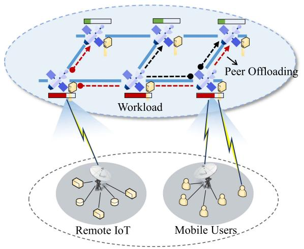

<details>
<summary>flowchart</summary>

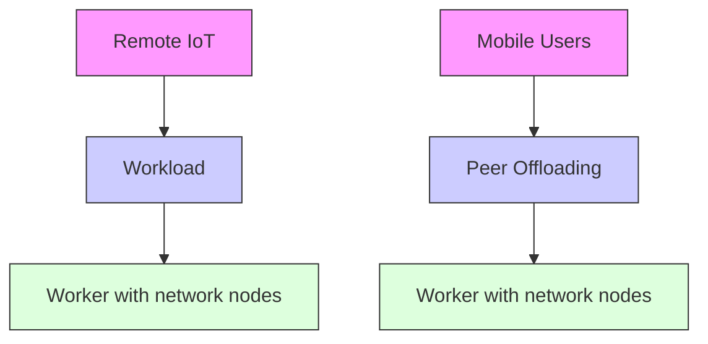
</details>

Fig. 1. MEC-enhanced multi-hop satellite peer offloading.

Here, we assume that users are allocated to the closest satellite or the satellite with the longest dwell time in line of sight, but the proposed scheme is also compatible with other access strategies. Let I be the set of all active users. I(t) denotes the set of active users at time $t ,$ and the active user set in satellite n’s coverage is $I _ { n } ( t )$ . Every user is assumed to access at most one satellite for simplicity, so $\begin{array} { r } { \sum _ { n \in { \cal N } } I _ { n } ( t ) = I ( t ) \subseteq \mathbb { Z } . } \end{array}$ .1

# B. Multi-Hop Computation Peer Offloading

We adopt the idea of snapshots to model the dynamics of satellite networks. The topology information is assumed to be fixed in each snapshot but varies among different snapshots. The operational timeline is discretized into several snapshots, and each snapshot is divided into many time slots (we use t to denote time slots in the following). At the beginning of each time slot t, satellite edge nodes make task admission and offloading decisions to every received task request. In the rest of t, satellites perform task forwarding and processing according to the decisions. The set of all time slots is T .

In each time slot, the computation peer offloading scheme of every satellite edge node includes three parts:

1) Task Admission: At the beginning of t, the satellite receives all task requests from the active users it covers. The task request corresponding to task i contains i’s information specified by a tuple $( s ^ { i } , h ^ { i } , t _ { 0 } ^ { i } , d _ { \mathrm { m a x } } ^ { i } )$ , where $s ^ { i } \in [ s ^ { \mathrm { m i n } } , s ^ { \mathrm { m a x } } ]$ is the task size in bits, $h ^ { i } \in [ \bar { h ^ { \operatorname* { m i n } } } , h ^ { \operatorname* { m a x } } ]$ is the required number of CPU cycles for processing one bit of the task, $t _ { 0 } ^ { i }$ is the time slot when task arrives its access satellite, and $d _ { \mathrm { m a x } } ^ { i }$ is the deadline. The satellite makes admission decisions according to its current workload level, which means if the satellite workload is heavy, some task requests will be rejected. The rejected requests wait for task admission decisions in the next time slot or access another lightloaded satellite. Task i’s admission result at t is $a _ { n } ^ { i } ( t )$ , which is 1 if the task is admitted and 0 otherwise. The total task arrival rate of satellite n at t is defined as $\begin{array} { r } { a _ { n } ( t ) = \sum _ { i \in I _ { n } ( t ) } a _ { n } ^ { i } ( t ) s ^ { i } } \end{array}$ .

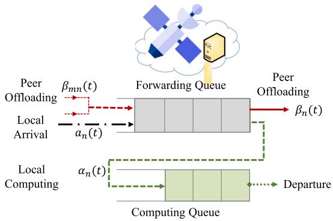

<details>
<summary>flowchart</summary>

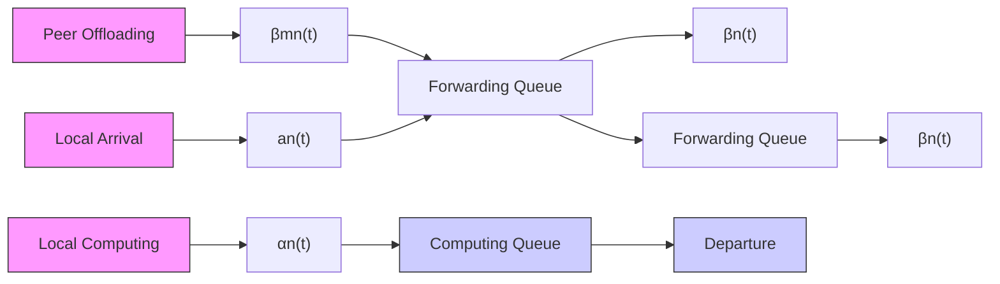
</details>

Fig. 2. Queue model for satellite peer offloading.

Since the sizes of task requests and admission results are usually small and constant, it is acceptable to assume that the interaction message can be transmitted immediately and the uplink from users to the satellite is not congested. Besides, the time for making task admission decisions can be ignored due to the low complexity of the algorithm (see Section IV-E). As for the rejected task requests, we model the response delay waiting for a successful admission decision as a statistical variable related to user distribution density, satellite network load, etc. Hence, the average response delay is the same for all task requests, and we exclude it from the total delay. A more precise model of response delay will be studied in future works.

2) Task Scheduling: This process happens at the beginning of t but after task admission. The satellite organizes the requests of successfully admitted tasks and the requests of tasks offloaded to itself for task scheduling decision, and determines whether each task will be processed locally or offloaded to one of the neighboring satellites. Satellite edge nodes share backlog and link quality information in every slot. As the size of interaction messages is small and the decisions can be made in polynomial time (see Section IV-E), this process will occupy a small portion of a time slot.   
3) Task Processing: Based on the task scheduling results, satellite edge nodes will carry out the processing and transmitting of tasks, which consume the majority of the time slot.

As described above, satellites act as both task processors and intermediate forwarders in satellite computation peer offloading. To distinguish and formulate the forwarding and computing behaviors, we maintain two virtual task queues named forwarding queue $Q ^ { F }$ and computing queue $Q ^ { \dot { B } }$ for each MEC-enabled satellite node. The queue model is demonstrated as Fig. 2. For satellite n, ${ \bf Q } _ { n } ^ { F } ( t )$ is the set of task requests waiting for offloading decisions, and ${ \bf Q } _ { n } ^ { B } ( t )$ is the set of requests for tasks to be computed during time slot t. Specifically, at the beginning of slot $t , \ \mathbf { Q } _ { n } ^ { F } ( t )$ and ${ \bf Q } _ { n } ^ { B } ( t )$ are updated. The requests for successfully admitted tasks are added to $\mathbf { Q } _ { n } ^ { F } ( t )$ . Then, for every task request in ${ \bf Q } _ { n } ^ { F } ( t )$ , satellite n decides whether to offload the task to neighbors or to process it locally. If the former happens, assuming task i will be sent from n to $m \in N _ { n } .$ so $\beta _ { n m } ^ { i } ( t ) = 1$ (otherwise 0), then the request of i will join $\mathbf { Q } _ { m } ^ { F } ( t + 1 )$ and wait for the next offloading decision. If the latter happens, $\alpha _ { n } ^ { i } ( t ) = 1$ (otherwise 0), the request of i will join $\mathbf { Q } _ { n } ^ { B } ( t + 1 )$ and stay in $\mathbf { Q } _ { n } ^ { B }$ until i is finished. We define $Q _ { n } ^ { F } ( t )$ and $Q _ { n } ^ { B } ( t )$ to capture the workload amount of forwarding and computing, respectively:

# C. Computation Model

$$
\begin{array}{l} Q _ {n} ^ {F} (t + 1) = \max \left\{Q _ {n} ^ {F} (t) - \alpha_ {n} (t) - \beta_ {n} (t), 0 \right\} + a _ {n} (t) \\ + \sum_ {m \in N _ {n}} \beta_ {m n} (t), \tag {1} \\ \end{array}
$$

$$
Q _ {n} ^ {B} (t + 1) = \max \left\{Q _ {n} ^ {B} (t) - \sum_ {i \in \mathbf {Q} _ {n} ^ {B} (t)} r _ {n} ^ {i} (t), 0 \right\} + \alpha_ {n} (t). \tag {2}
$$

Note that $\begin{array} { r } { \alpha _ { n } ( t ) = \sum _ { i \in \mathbf { Q } _ { n } ^ { F } ( t ) } s ^ { i } \alpha _ { n } ^ { i } ( t ) } \end{array}$ represents the amount of locally processed tasks, $\begin{array} { r } { \beta _ { n } ( t ) = \sum _ { m \in N _ { n } } \beta _ { n m } ( t ) = } \end{array}$ $\begin{array} { r } { \sum _ { m \in N _ { n } } \sum _ { i \in \mathbf { Q } _ { n } ^ { F } ( t ) } s ^ { i } \beta _ { n m } ^ { i } ( t ) } \end{array}$ is the total amount of tasks sent out by n, and $\beta _ { n m } ( t )$ specifies the tasks transmitted from n to m. Newly arrived tasks $a _ { n } ( t )$ and tasks offloaded from neighbors $\sum _ { m \in N _ { n } } \beta _ { m n } ( t )$ are admitted by n at the end of slot $t . r _ { n } ^ { i } ( t )$ is task i’s processed workloads at node n during slot t, explained in the next subsection.

We assume that a task can be forwarded several hops away but can only be processed on one MEC-enabled satellite node. The admitted task i’s offloading path is $p ^ { i } = \{ n _ { k } ^ { i } | k = 0 , . . . , K \}$ , which means task i that initially accesses satellite $n _ { 0 } ^ { i }$ is forwarded multiple hops away, and is finally processed on the satellite $n _ { K } ^ { i }$ .

The MEC-enabled satellites process the tasks queued in $Q ^ { B }$ . We adopt the fair-share scheduling of computing resources inspired by the Rate Control Protocol (RCP) [25]. Every computing node assigns the same rate to all tasks and updates the rate allocation every slot. Compared to the priority-based scheduling, fair-share computing resource scheduling guarantees that all tasks share the same resources without preemption. Thus, for any task i whose request is buffered in $\mathbf { Q } _ { n } ^ { B } ( { \bar { t } } )$ , the allocated computing frequency is

$$
f _ {n} ^ {i} (t) = \frac {c _ {n}}{| \mathbf {Q} _ {n} ^ {B} (t) |}, \tag {3}
$$

where $c _ { n }$ is the CPU frequency of satellite n (CPU cycles per second) and $| \mathbf { Q } _ { n } ^ { B } ( t ) |$ | is the number of tasks locally processed.

For task i, the amount of workloads processed at slot t is described as

$$
r _ {n} ^ {i} (t) = \min \left\{\frac {c _ {n}}{h ^ {i} \left| \mathbf {Q} _ {n} ^ {B} (t) \right|}, s ^ {i} - \sum_ {\tau = 0} ^ {t - 1} r _ {n} ^ {i} (\tau) \right\}, \tag {4}
$$

where the second term in the curly bracket is the residual workloads of i at the beginning of slot τ . Tasks will leave the system as soon as they are completely served, which means the residual workloads are 0. We assume that once the satellite begins to process a task, it will continuously work on it until it is finished. We assume that task i starts being processed at satellite n at slot t, which means $\alpha _ { n } ^ { i } ( t ) = 1$ . The computation delay of task i is defined as

$$
d ^ {i, C} = \Delta t, \tag {5}
$$

where $\Delta t$ is calculated according to $\begin{array} { r } { \sum _ { \tau = t + 1 } ^ { t + \Delta t } r _ { n } ^ { i } ( \tau ) = s ^ { i } } \end{array}$ if $\alpha _ { n } ^ { i } ( t ) = 1$ .

Also, if $\alpha _ { n } ^ { i } ( t ) = 1$ , the computation energy consumption of satellite n for processing task i is

$$
e ^ {i, C} = \sum_ {\tau = t + 1} ^ {t + \Delta t} \kappa r _ {n} ^ {i} (\tau) f _ {n} ^ {i ^ {2}} (\tau), \tag {6}
$$

where κ is a coefficient depending on the chip architecture.

# D. Transmission Model

Transmissions occur on the uplinks from user devices to satellites, the wireless links among satellites, and the downlinks from satellites to the ground. The length of uplinks is approximately the same, and this part of transmission does not consume the satellite energy, so we do not consider the uplink transmission part. The sizes of computation results are small, so we ignore the transmission delay and energy consumption from the computing satellite to the ground. Here, we only consider the transmission of wireless links among satellites.

We adopt the laser ISLs as the inter-satellite wireless communication technology. Optical wireless communication takes advantages of high bandwidth, unlicensed spectrum allocation, reduced antenna size, and improved channel security compared with conventional radio frequency techniques. It has been considered a promising paradigm for future inter-satellite communications.2 According to [45], the transmission between two satellites faces challenges of doppler shift, acquisition and tracking, and background radiations.

1) Doppler Shift: Doppler shift happens to a pair of satellite carriers moving with different relative velocity. The destination satellite will shift its central wavelength, and thus a small portion of wavelength leaks to adjacent channels, which results in loss of data. The normalized Doppler shift between two adjacent satellites in the same orbit without any compensation methods has the following form [46]:

$$
\frac {\Delta \lambda}{\lambda_ {s}} = - \frac {\omega R}{c} \cdot \frac {a \sin (2 \omega t + 2 \pi m)}{\left[ a \cos (2 \omega t + 2 \pi m) + b \right] ^ {\frac {1}{2}}},
$$

where

$$
a = \sin^ {2} \theta \left[ 1 - \cos \left(\frac {2 \pi}{P}\right) \right]
$$

$$
b = 2 + 2 \cos \theta \sin \left(\frac {2 \pi}{P}\right) \sin (2 \pi m)
$$

$$
- \left[ \sin^ {2} \theta - \sin^ {2} \theta \cos \left(\frac {2 \pi}{P}\right) + 2 \cos \left(\frac {2 \pi}{P}\right) \right] \cos (2 \pi m)
$$

$$
m = \frac {F}{P S} + \frac {\omega T}{\pi}.
$$

Here, $\Delta \lambda / \lambda _ { i }$ s is the normalized Doppler shift, ω is the angular velocity of the satellite, R is the distance between the satellite

2The high-speed laser ISLs have been successfully demonstrated by the European space agency [42], NASA [43] and many other agencies. SpaceX has launched Starlink satellites equipped with laser communication terminals on January 24, 2021, and Telesat’s Lightspeed laser ISLs will start offering services in 2023 [44]. Hence, the assumption of laser ISLs is entirely reasonable in this paper.

and the earth center, t is the time period, c is the speed of light, $P$ is the number of orbit planes, $F$ is the constellation phasing factor, S is the number of satellites per plane, and $T$ is the propagation delay of two satellites varing over time, which is defined in Section III-A. Moreover, the normalized Dopler shift over two adjacent satellites in adjacent orbits without any compensation methods is presented as [46]

$$
\frac {\Delta \lambda}{\lambda_ {s}} = \frac {R \dot {\varphi} (t + T)}{c} \cdot \frac {\sin [ \varphi (t + T) - \varphi (t _ {0}) ] \cos \phi (t _ {0})}{\sqrt {2 - 2 \cos [ \varphi (t + T) - \varphi (t _ {0}) ] \cos \phi (t _ {0})}},
$$

where $\dot { \varphi } ( t + T )$ is the angular velocity of the destination satellite, $t _ { 0 }$ is the time when two satellites have the minimum distance, $\varphi ( t + T ) - \varphi ( t _ { 0 } )$ is the angular distanse between the destination satellite and position where two satellites have minimum distance, $\phi ( t _ { 0 } )$ is the angular distance when two satellites have minimum distance.

Although the representation of the Doppler shift is complex, it is easy to predict and calculate once the constellation parameters are given. The parameters are fixed when designing constellations, and the velocity and position of any satellite at any time are known in advance, so the Doppler shift between any pair of satellites during any period can be predicted and compensated by efficient methods. Common methods include optical phase-lock loop, optical injection locking, optical injection phase-lock loop, etc [45]. Therefore, we suppose that the receiver of MEC-enhanced satellites has equipped with Doppler shift frequency compensators, and we exclude the effect of Doppler shift on ISL transmission.

2) Acquisition and Tracking: Satellites are commonly equipped with acquisition, tracking and pointing (ATP) systems to ensure the optical beam reaches the receiver reliably. However, the ATP system’s vibration degrades the optical transmission link’s performance by introducing a stochastic tracking noise created by the electro-optic tracker. Hence, we introduce the tracking noise N  and show its effect in the next point.   
3) Background Radiations: The noise sources depend on the detection techniques and generally include detector (bulk dark current), receiver amplifier (pre-amplifier noise and thermal noise), shot noise, stellar and celestial radiant fluxes, and so on. We denote $N _ { 0 }$ to represent this part of noise.

Considering the impact of the above three factors on ISL transmission, we express the data rate of link $( n , m )$ at slot t as follows [47]:

$$
b _ {n m} (t) = \frac {P _ {t} G _ {t r} G _ {r e} L _ {f} ^ {t}}{k T _ {s} \cdot [ E _ {b} / (N ^ {\prime} + N _ {0}) ] _ {r e q} \cdot M}. \tag {7}
$$

Wherein, the free space loss $L _ { f } ^ { t }$ can be shown as

$$
L _ {f} ^ {t} = \left(\frac {c}{4 \pi \cdot S R (t) \cdot f}\right) ^ {2}.
$$

Here, $P _ { t }$ is the constant transmission power of satellites. $G _ { t r }$ and $G _ { r e }$ are the transmitting antenna gain and the receiving antenna gain, respectively. k is the Boltzmann’s constant and $T _ { s }$ is the total system noise temperature. Besides, ${ E _ { b } } / ( { N } ^ { \prime } + { N } _ { 0 } )$ is the required ratio of received energy-per-bit to certain noisedensity, M is the link margin, and $S R ( t )$ is the slant range.

The total offloading delay includes the transmission delay and the propagation delay. Assume task $i \mathrm { \ ' } _ { \mathrm { s } }$ offloading path is $p ^ { i } = \{ n _ { k } ^ { i } | k = 0 , . . . , K \}$ . Hence, the total offloading delay is

$$
d ^ {i, T} = \sum_ {t \in \mathcal {T}} \sum_ {k = 0} ^ {K - 1} \beta_ {n _ {k} ^ {i} n _ {k + 1} ^ {i}} (t) \left(\frac {s ^ {i}}{b _ {n _ {k} ^ {i} n _ {k + 1} ^ {i}} (t)} + T _ {n _ {k} ^ {i} n _ {k + 1} ^ {i}} (t)\right), \tag {8}
$$

where $\beta _ { n _ { k } ^ { i } n _ { k + 1 } ^ { i } } ( t ) = 1$ if the task i is offloaded from $n _ { k } ^ { i }$ to $n _ { k + 1 } ^ { i }$ kalong $p ^ { i }$ 1 during slot $t , b _ { n _ { k } ^ { i } n _ { k + 1 } ^ { i } } ( t )$ and $T _ { n _ { k } ^ { i } n _ { k + 1 } ^ { i } } ( t )$ are the transmission capacity and propogation delay of one hop along $p ^ { i }$ . Suppose each satellite operates at a fixed transmission power $P _ { t }$ , the transmission energy consumption for sending task i is

$$
e ^ {i, T} = \sum_ {t \in \mathcal {T}} \sum_ {k = 0} ^ {K - 1} \beta_ {n _ {k} ^ {i} n _ {k + 1} ^ {i}} (t) \frac {s ^ {i}}{b _ {n _ {k} ^ {i} n _ {k + 1} ^ {i}} (t)} P _ {t}. \tag {9}
$$

# IV. PROBLEM FORMULATION AND SOLUTION

In this section, we first formulate MHSPO as an offline global optimization problem. Then, we leverage the Lyapunov technique to develop a novel framework for making online per-slot computation peer offloading decisions with only current information. In order to alleviate the current perspective’s limitations, we leverage the delayed online learning to predict the task’s processing delay and energy consumption. The prediction loss is proved to be upper bounded. Finally, we propose an online queue-based distributed offloading control scheme to solve the problem. The performance of the solution is analyzed.

# A. Problem Formulation

The computation offloading overhead of task i is defines as

$$
C ^ {i} = \rho_ {d} (d ^ {i, C} + d ^ {i, T}) + \rho_ {e} (e ^ {i, C} + e ^ {i, T}),
$$

where $\rho _ { d } , \rho _ { e }$ denote the weighting overhead parameters of delay and energy consumption, respectively. We aim to make lowoverhead computation offloading decisions for all tasks $i \in \mathcal { T }$ , which means the optimization goal is min $\textstyle \sum _ { i \in { \mathcal { I } } } C ^ { i }$ . According to (5), (6), (8), and (9), $C ^ { i }$ is relative to the system’s computation offloading decisions over time. Hence, the optimization goal can be shown in another way:

$$
\min \sum_ {t \in \mathcal {T}} C (t), \tag {10}
$$

where $C ( t )$ is defined as the system cost at slot t and can be represented as

$$
\begin{array}{l} C (t) = \sum_ {n \in \mathcal {N}} \sum_ {i \in \mathbf {Q} _ {n} ^ {F} (t)} \left(\alpha_ {n} ^ {i} (t) \left[ \rho_ {d} d _ {n} ^ {i, C} + \rho_ {e} e _ {n} ^ {i, C} \right] \right. \\ + \sum_ {m \in N _ {n}} \beta_ {n m} ^ {i} (t) \\ \left. \times \left[ \rho_ {d} \frac {s ^ {i}}{b _ {n m} (t)} + \rho_ {d} T _ {n m} (t) + \rho_ {e} \frac {s ^ {i}}{b _ {n m} (t)} P _ {t} \right]\right). \tag {11} \\ \end{array}
$$

Here, $C ( t )$ is the weighted sum of system delay and energy consumption corresponding to the offloading and computing decision of every task in ${ \bf Q } _ { n } ^ { F } ( t )$ . If the system decides $\alpha _ { n } ^ { i } ( t ) = 1$ , it means task i will start being computed, so the computation delay (5) and energy consumption (6) must be added to the system cost at slot t. We replace βniknik+1 ( $\beta _ { n _ { k } ^ { i } n _ { k + 1 } ^ { i } } ( t )$ in (8) and (9) with $\beta _ { n m } ^ { i } ( t )$ as $\beta _ { n m } ^ { i } ( t )$ can better display the system’s offloading decisions. The $b _ { n _ { k } ^ { i } n _ { k + 1 } ^ { i } } ( t )$ and $T _ { n _ { k } ^ { i } n _ { k + 1 } ^ { i } } ( t )$ in (8) and (9) are also replaced with $b _ { n m } ( t )$ and $T _ { n m } ( t )$ for the same reason.

Formally, a satellite peer computation offloading mechanism determines the admission decisions $\mathbf { \delta } \mathbf { a } = \{ \mathbf { a } ( t ) | \forall t \in \mathcal { T } \}$ $= \{ a _ { n } ^ { i } ( t ) | \forall t \in T , i \in I ( t ) , n \in \mathcal { N } \}$ and the offloading decisions $\begin{array} { r } { s = \{ s ( t ) | \forall t \in T \} = \{ s _ { n } ( t ) | \forall t \in T , i \in \mathbf { Q } _ { n } ^ { F } ( t ) , n \in } \end{array}$ $\mathcal { N } \} = \{ \alpha _ { n } ^ { i } ( t ) , \beta _ { n m } ^ { i } ( t ) | \forall t \in \mathcal { T } , i \in \mathbf { Q } _ { n } ^ { F } ( t ) , m \in N _ { n } , n \in \mathcal { N } \}$ to minimize the long-term system overhead. The MHSPO problem is formulated as

$$
\mathbf {P 1} \quad \min _ {\boldsymbol {a}, \boldsymbol {s}} \frac {1}{| \mathcal {T} |} \sum_ {t \in \mathcal {T}} C (t) \tag {12}
$$

$$
\text { s.t. } \quad \alpha_ {n} ^ {i} (t) + \sum_ {m \in N _ {n}} \beta_ {n m} ^ {i} (t) \leq 1, \forall i \in \mathbf {Q} _ {n} ^ {F} (t), n \in \mathcal {N} \tag {12a}
$$

$$
d _ {m} ^ {i, C} + \frac {s ^ {i}}{b _ {n m} (t)} + T _ {n m} (t) \leq d _ {n} ^ {i},
$$

$$
\forall i \in \mathbf {Q} _ {n} ^ {F} (t), \exists \beta_ {n m} ^ {i} (t) = 1, m \in N _ {n} \tag {12b}
$$

$$
\sum_ {i \in \mathbf {Q} _ {n} ^ {F} (t)} \alpha_ {n} ^ {i} (t) \leq E _ {n}, \forall n \in \mathcal {N} \tag {12c}
$$

$$
\sum_ {i \in \mathbf {Q} _ {n} ^ {F} (t)} s ^ {i} \beta_ {n m} ^ {i} (t) \leq B _ {n m}, \forall m \in N _ {n}, n \in \mathcal {N} \tag {12d}
$$

$$
\lim _ {| \mathcal {T} | \rightarrow \infty} \frac {1}{| \mathcal {T} |} \sum_ {t = 0} ^ {| \mathcal {T} | - 1} \sum_ {n \in \mathcal {N}} \mathbb {E} \left\{Q _ {n} ^ {F} (t) + Q _ {n} ^ {B} (t) \right\} <   \infty , \forall n \in \mathcal {N}. \tag {12e}
$$

Constraint (12a) requires that for a task i, satellite n can locally process it, offload it to one of its neighbors, or keep its request waiting in queue $\mathbf { Q } _ { n } ^ { F }$ . An offloading strategy from n to m is beneficial if it satisfies constraint (12b). The forwarding behavior happens only when offloading to m does not incur higher completion delay than n’s local computing. Constraints (12c) and (12d) are scheduling capacity constraints. $E _ { n }$ is the maximum number of tasks dispatched to n’s computing queue at one slot for guaranteed processing rate, and $B _ { n m } \in [ 0 , B ^ { \operatorname* { m a x } } ]$ specifies the limited offloading capacity, which is relative to bandwidth and the length of slots. Constraint (12e) is the queue stability constraint, which means a bounded time-average backlog. Due to the limited satellite resources, the amount of workloads entering the network is restricted to guarantee the service rate of admitted tasks.

The major challenge that impedes the derivation of the optimal solution to P1 is the lack of future information. Optimally solving P1 requires complete task arrival information across all time slots, which is difficult to get in advance. Moreover, even though the task arrival information is available, the solution complexity is unaffordable. The scale of the solution seraching space is exponential to the number of tasks, the timeline range, and the satellite network topology scale. It is impossible to derive the optimal solution in finite time. These challenges call for an online efficient optimization approach to perform satellite peer offloading.

# B. Lyapunov Optimization Based Online Framework

Lyapunov optimization has been extensively used to achieve optimal control in dynamic systems. In P1, the long-term optimization goal (12) and the time-average queue stability constraint (12e) couple per-slot offloading decisions $( { \pmb a } ( t ) , { \pmb s } ( t ) )$ across time slots. To address this challenge, we adopt the Lyapunov drift-plus-penalty framework [48] for online joint network stability and system overhead minimization. Several definitions are given below.

Definition 1: Let $\Theta ( t ) = [ \mathbf { Q } ^ { F } ( t ) , \mathbf { Q } ^ { B } ( t ) ]$ be the aggregate queue vector, where $\mathbf { Q } ^ { F } ( t ) = \{ Q _ { n } ^ { F } ( t ) | \forall n \in \mathcal { N } \}$ and $\mathbf { Q } ^ { B } ( t ) =$ $\{ Q _ { n } ^ { B } ( t ) | \forall n \in \mathcal { N } \}$ . We define the perturbed Lyapunov function as

$$
L (\boldsymbol {\Theta} (t)) = \frac {1}{2} \left\| \mathbf {Q} ^ {\mathbf {F}} (\mathbf {t}) - \boldsymbol {\theta} \right\| + \frac {1}{2} \left\| \mathbf {Q} ^ {\mathbf {B}} (\mathbf {t}) \right\|, \tag {13}
$$

where $\pmb { \theta } = \pmb { \theta } _ { n } \cdot \mathbf { 1 } ^ { N }$ with $\theta _ { n }$ being perturbation parameters.

$L ( \Theta ( t ) )$ represents a scalar metric of the queue length in all queues. A small value of $L ( \Theta ( \mathbf { t } ) )$ implies that all the queue backlogs are small, which means the virtual queues are not prone to overflow and have strong stability. $Q _ { n } ^ { \hat { F } } ( t )$ converges towards $\theta _ { n }$ instead of zero, which ensures each satellite node has a certain amount of workloads to schedule, avoiding the waste of communication and computation resources.

Definition 2: For system stability, we define one-slot $L y a \mathrm { - }$ punov drift as

$$
\Delta (\Theta (t)) = \mathbb {E} \left\{L (\Theta (t + 1)) - L (\Theta (t)) | \Theta (t) \right\}. \tag {14}
$$

$\Delta ( \Theta ( t ) )$ captures expected changes of the backlogs over slots. With the designed Lyapunov drift, the long-term backlog constraint (12e) is enforced if $\Delta ( \Theta ( t ) )$ converges towards zero, which means the queues are stable.

Definition 3: For optimizing the system performance, we define the instant system overhead $C ( t )$ as one-slot Lyapunov penalty, which is the weight sum of latency and energy consumption in (11).

Now, we present the online approach for solving P1 in the framework of Lyapunov drift-plus-penalty. In each time slot t, network operators determines the computation peer offloading strategies by solving P2 formulated below

$$
\mathbf {P 2} \quad \min _ {\boldsymbol {a} (t), \boldsymbol {s} (t)} \Delta (\boldsymbol {\Theta} (t)) + V \cdot \mathbb {E} \left\{C (t) | \boldsymbol {\Theta} (t) \right\}
$$

$$
\text { s.t. } \quad (1 2 a), (1 2 b), (1 2 c), (1 2 d). \tag {15}
$$

The first term in P2 is added aiming to satisfy the long-term backlog constraint (12e) in an online manner and the second term is to minimize the system overhead. The non-negative weight V is chosen to affect a performance tradeoff between queue stability and system overhead. To give a brief explanation, by considering the additional first term in P2, the network operator takes into account the system stability in current-slot decisionmaking. When $\Delta \Theta ( t )$ is larger, minimizing the queue length is more critical for the network operator, and hence the long-term system stability is satisfied in the long run without knowing the future information in advance. If $\Delta \Theta ( t )$ stays low, minimizing the system overhead is the main goal.

Algorithm 1: Prediction Policy on Node n at Slot t.   
1: $\eta_{n} \leftarrow \frac{Q_{n}^{B,\max}}{\sqrt{T+D}};$ 2: Observe the actual current workload $Q_{n}^{B}(t);$ 3: for each slot $\tau \in T_{t}$ do
4: Derive the predicted workload $Q_{n}^{B^{*}}(\tau + 1)$ by (18);
5: end for
6: Share the future workload information with neighbors in $N_{n}$ and receive neighbors' workload information;
7: for each task $i \in \mathbf{Q}_{n}^{F}(t)$ do
8: for each node $m \in N_{n} \cup \{n\}$ do
9: $s' \leftarrow s^{i}, t' \leftarrow t, e' = 0;$ 10: while $s' > 0$ do
11: $f_{m}^{i}(t') \leftarrow \frac{c_{n}}{|Q_{n}^{B^{*}}(t')|};$ 12: $r_{m}^{i}(t') \leftarrow \min\{\frac{f_{m}^{i}(t')}{h^{i}}, s'\};$ 13: $e' \leftarrow e' + \kappa r_{m}^{i}(t') f_{m}^{i^{2}}(t'), s' \leftarrow s' - r_{m}^{i}(t'), t' \leftarrow t' + 1;$ 14: end while
15: $d_{m}^{i,C} \leftarrow t' - t, e_{m}^{i,C} \leftarrow e';$ 16: end for
17: end for

For any feasible solution of P2, we have (16) shown at the bottom of this page, where $\begin{array} { r } { \tilde { Q } _ { n } ^ { F } ( t ) = Q _ { n } ^ { F } ( t ) - \theta _ { n } , B _ { 1 } = \frac { 1 } { 2 } } \end{array}$ $\begin{array} { r } { \sum _ { n \in \mathcal { N } } \{ [ s ^ { \prime } E _ { n } + ( \tilde { N } - 1 ) B ^ { \mathrm { m a x } } ] ^ { 2 } + [ s ^ { \prime } I ^ { \mathrm { m a x } } + ( N - 1 ) B ^ { \mathrm { m a x } } ] ^ { 2 } + } \end{array}$ $\begin{array} { r } { c _ { n } ^ { 2 } + ( s ^ { \prime } E _ { n } ) ^ { 2 } \} , B _ { 2 } ( t ) = - \sum _ { n \in \cal N } \sum _ { i \in { \bf Q } _ { n } ^ { B } ( t ) } Q _ { n } ^ { B } ( t ) r _ { n } ^ { i } ( t ) } \end{array}$ , which n is a known constant at the beginning of slot t. The details are given in Appendix A, available online. Notice that solving P2 is exactly to minimize the right hand side of (16).

By solving the per-slot minimization problem of P2, we persistently approach the optimal offline solution of P1 in a greedy manner. The rigorous performance bound of P2 compared to P1 is analyzed in Section IV-E.

# C. Learning-Based Prediction Algorithm

Since the values of $d ^ { i , C }$ and $e ^ { i , C }$ in P2 are not precisely known at the decision slot, we propose a workload prediction policy based on delayed online learning to encourage high-quality decision-making.

Once a task i is assigned to node n and starts to be computed at slot t, the $d ^ { i , C }$ and ${ \bar { e } } ^ { i , C }$ highly rely on the workload levels in the following slots (i.e., $\bar { Q } _ { n } ^ { B } ( t + 1 ) , Q _ { n } ^ { B } ( t + 2 ) , \ldots )$ until the slot when i is finished. We define a non-negative integer prediction window length $d _ { t } \left[ 2 5 \right]$ , [49] for every t, which means the prediction window is $T _ { t } = \{ t + 1 , . . . , t + d _ { t } \}$ . To accommodate user diverse demands in deadline, we make $d _ { t } = d _ { \operatorname* { m a x } } =$ $m a x _ { i \in \mathcal { T } } d _ { \mathrm { m a x } } ^ { i }$ for every slot t.

Let $Q _ { n } ^ { B } ( t )$ be the actual computing workload amount of MECenabled satellite node n at slot t, and $Q _ { n } ^ { B ^ { * } } ( t ) = \{ Q _ { n } ^ { B ^ { * } } ( \tau ) | \forall \tau \in$ $\mathbf { \mathcal { T } } _ { t } \mathbf  \Big \}$ be the predicted workloads. We seek to minimize the prediction error (a.k.a. the loss function), $f _ { n \tau } ( Q _ { n } ^ { B ^ { * } } ( \tau ) ) = | Q _ { n } ^ { \bar { B ^ { * } } } ( \tau ) -$ $Q _ { n } ^ { B } ( \tau ) | , \forall n \in \mathcal { N } , \tau \in \pmb { T } _ { t }$ , to bound the sub-optimality gap due to imperfect prediction. $f _ { n \tau }$ is a convex function on $[ 0 , \bar { Q } _ { n } ^ { B , \mathrm { { m a x } } } ]$ where $Q _ { n } ^ { B , \operatorname* { m a x } } = \operatorname* { m a x } _ { t \in T } Q _ { n } ^ { B } ( t )$ . A loss minimization problem is constructed as follows:

$$
\min _ {Q _ {n} ^ {B ^ {*}} (\tau) \in [ 0, Q _ {n} ^ {B, \max} ]} \sum_ {t \in T} \sum_ {\tau \in \boldsymbol {T} _ {t}} f _ {n \tau} (Q _ {n} ^ {B ^ {*}} (\tau)). \tag {17}
$$

We use the Delayed Online Gradient Descent (DOGD) method [50], [51] to compute $Q _ { n } ^ { B ^ { * } } ( \tau )$ that minimizes $\textstyle \sum _ { \tau \in \mathbf { T } _ { t } } f _ { n \tau } ( Q _ { n } ^ { B ^ { * } } ( \tau ) )$ ) for each time slot t. Specifically, without the knowledge of the actual $Q _ { n } ^ { B } ( \tau )$ for $\tau \in { \cal T } _ { t } , f _ { n \tau } ( Q _ { n } ^ { B ^ { * } } ( \tau ) )$ ) is not available. Hence, it is based on the feedback observed from t to make the workload predictions $Q _ { n } ^ { B ^ { * } } ( \tau )$ for every future slot $\tau \in \mathbf { \boldsymbol { T } } _ { t }$ . The update rule for each slot $\tau \in \mathbf { \boldsymbol { T } } _ { t }$ is as follows:

$$
Q _ {n} ^ {B ^ {*}} (\tau + 1) = Q _ {n} ^ {B ^ {*}} (\tau) - \eta_ {n} \nabla f _ {n t} | _ {Q _ {n} ^ {B} (t)}. \tag {18}
$$

The essence of (17) is to iterate the prediction in the negative direction of the gradient of the loss received at the current slot. The step size $\eta _ { n }$ is set as $\frac { Q _ { n } ^ { B , \operatorname* { m a x } } } { \sqrt { T + D } }$ with $\begin{array} { r } { D = \sum _ { t \in T } \sum _ { \tau \in T _ { t } } d _ { \tau } = } \end{array}$ $\begin{array} { r } { \frac { 1 } { 2 } T d _ { \mathrm { m a x } } [ 1 + d _ { \mathrm { m a x } } ] } \end{array}$ denoting the sum of delays over all slots. $\nabla f _ { n t } \big | _ { Q _ { n } ^ { B } ( t ) }$ equals 1 if $Q _ { n } ^ { B ^ { * } } ( t ) > Q _ { n } ^ { B } ( t ) ; - 1$ if $Q _ { n } ^ { B ^ { * } } ( t ) <$ $Q _ { n } ^ { B } ( t ) ; 0 ,$ otherwise.

The learning-based prediction policy and the derivation process of $d ^ { i , C }$ and $e ^ { i , C }$ are shown in Algorithm 1.

$$
\begin{array}{l} \Delta (\Theta (t)) + V \cdot \mathbb {E} \left\{C (t) | \Theta (t) \right\} \\ \leq \sum_ {n \in \mathcal {N}} \mathbb {E} \left\{\sum_ {i \in I _ {n} (t)} a _ {n} ^ {i} (t) \tilde {Q} _ {n} ^ {F} (t) | \boldsymbol {\Theta} (t) \right\} + \sum_ {n \in \mathcal {N}} \mathbb {E} \left\{\sum_ {i \in \mathbf {Q} _ {n} ^ {F} (t)} \alpha_ {n} ^ {i} (t) \left[ s ^ {i} Q _ {n} ^ {B} (t) - s ^ {i} \tilde {Q} _ {n} ^ {F} (t) + V \rho_ {d} d _ {n} ^ {i, C} + V \rho_ {e} e _ {n} ^ {i, C} \right] | \boldsymbol {\Theta} (t) \right\} \\ + B _ {1} + B _ {2} (t) \\ + \sum_ {n \in \mathcal {N}} \sum_ {m \in N _ {n}} \mathbb {E} \left\{\sum_ {i \in \mathbf {Q} _ {m} ^ {F} (t)} \beta_ {m n} ^ {i} (t) s ^ {i} \tilde {Q} _ {n} ^ {F} (t) - \sum_ {i \in \mathbf {Q} _ {n} ^ {F} (t)} \beta_ {n m} ^ {i} (t) \left[ s ^ {i} \tilde {Q} _ {n} ^ {F} (t) - V \rho_ {d} \left(\frac {s ^ {i}}{b _ {n m} (t)} + T _ {n m} (t)\right) - V \rho_ {e} \frac {s ^ {i}}{b _ {n m} (t)} P _ {t} \right] | \boldsymbol {\Theta} (t) \right\}. \tag {16} \\ \end{array}
$$

We analyze the performance of the proposed prediction strategy, which is defined as regret. Let $\mathbf { \hat { { Q } } } _ { n } ^ { \hat { { B ^ { \prime } } } } ( t ) = \{ { Q } _ { n } ^ { B ^ { \prime } } ( \tau ) | \forall \tau \in$ $\pmb { T } _ { t } \}$ be the best static predictor in hindsight obtained by the strategy in [52] with full knowledge of workloads. We have

$$
\begin{array}{l} R e g r e t _ {n} ^ {T} (D O G D) = \sum_ {t \in T} \sum_ {\tau \in \boldsymbol {T} _ {t}} \\ \times \left[ f _ {n \tau} (Q _ {n} ^ {B ^ {*}} (\tau)) - f _ {n \tau} (Q _ {n} ^ {B ^ {\prime}} (\tau)) \right]. \tag {19} \\ \end{array}
$$

Lemma 1: The overall regret of Algorithm 1 is upper bounded compared with the best static prediction strategy.

$$
\begin{array}{l} R e g r e t ^ {T} (D O G D) = \sum_ {n \in \mathcal {N}} R e g r e t _ {n} ^ {T} (D O G D) \\ \leq \sum_ {n \in \mathcal {N}} \frac {d _ {\max}}{2 \eta_ {n}} + \eta_ {n} \left(\frac {T d _ {\max}}{2} + 2 D\right). \tag {20} \\ \end{array}
$$

The proof of (20) can be found in [25].

# D. Distributed Solution

The centralized solution of P2 is not feasible in the MECenhanced satellite networks. The large network scale and high topology dynamism bring huge complexity of centralized computation. It is also not efficient for a centralized controller to distribute offloading decisions. Therefore, the task scheduling should be carried out directly on satellite computing nodes [9]. A distributed offloading decision scheme is needed.

First, P2 should be decoupled for individual satellites. Note that in (15), the offload workloads are counted bidirectionally, which means $\beta _ { n m } ^ { i } ( t )$ and $\beta _ { m n } ^ { i } ( t )$ coexist in the third term of (16). But a node n can not acquire neighbors’ $\beta _ { m n } ^ { i } ( t )$ until the next slot t + 1. To solve the problem, we leverage the gap-preserving techniques to transform (16) into a single direction optimization problem. Given $\begin{array} { r } { \sum _ { i \in \mathbf { Q } _ { n } ^ { F } ( t ) } s ^ { i } \beta _ { n m } ^ { i } ( t ) \dot { + } \sum _ { i \in \mathbf { Q } _ { m } ^ { F } ( t ) } \bar { s ^ { i } } \beta _ { m n } ^ { i } ( t ) \le } \end{array}$ $B _ { n m } + B _ { m n }$ , we have the following new problem:

$$
\mathbf {P 3} \quad \min _ {\boldsymbol {a} (t), \boldsymbol {s} (t)} \sum_ {n \in \mathcal {N}} \mathbb {E} \left\{\sum_ {i \in I _ {n} (t)} a _ {n} ^ {i} (t) \tilde {Q} _ {n} ^ {F} (t) | \boldsymbol {\Theta} (t) \right\}
$$

$$
+ \sum_ {n \in \mathcal {N}} \mathbb {E} \left\{\sum_ {i \in \mathbf {Q} _ {n} ^ {F} (t)} s ^ {i} \alpha_ {n} ^ {i} (t) \left[ Q _ {n} ^ {B} (t) - \tilde {Q} _ {n} ^ {F} (t) \right] \right.
$$

$$
\left. + V \alpha_ {n} ^ {i} (t) \left[ \rho_ {d} d _ {n} ^ {i, C} + \rho_ {e} e _ {n} ^ {i, C} \right] | \Theta (t) \right\}
$$

$$
+ \sum_ {n \in \mathcal {N}} \sum_ {m \in N _ {n}} \mathbb {E} \left\{\sum_ {i \in \mathbf {Q} _ {n} ^ {F} (t)} \beta_ {n m} ^ {i} (t) \left[ V \rho_ {d} \left(\frac {s ^ {i}}{b _ {n m} (t)} + T _ {n m} (t)\right) \right. \right.
$$

$$
\left. \left. + V \rho_ {e} \frac {s ^ {i}}{b _ {n m} (t)} P _ {t} - s ^ {i} \tilde {Q} _ {n} ^ {F} (t) - s ^ {i} \left[ Q _ {n} ^ {F} (t) - \theta_ {n} \right] ^ {1} \right] | \boldsymbol {\Theta} (t) \right\}, \tag {21}
$$

where $\lceil x \rceil ^ { 1 } = x { \mathrm { ~ i f ~ } } x \leq 0$ , and $\lceil x \rceil ^ { 1 } = 0 { \mathrm { ~ i f ~ } } x > 0$ . Any feasible offloading decision algorithm that produces the optimal solution to P3 is within a constant gap from the minimum of the RHS of (16). See Appendix B for the derivation process of P3, available in the online supplemental material.

Note that the optimization object of P3 is the sum of all nodes $n \in \mathcal N$ and the variable $a _ { n } ( t ) , \alpha _ { n } ( t )$ and $\beta _ { n } ( t )$ can be decoupled from the optimization object. Therefore, P3 can be addressed by dealing with the several subproblems separately. We further decompose P3 into |N | independent subproblems, each subproblem aims at minimizing n’s own one-slot one-hop offloading overhead. Satellites coordinate their offloading strategies in an autonomous way over time to jointly minimize the time expectation of the total system overhead.

Based on the analysis above, we propose the distributed satellite peer computation offloading scheme. The task offloading scheme on a single satellite includes three steps: task admission, task scheduling, and task processing.

Task Admission: Task admission decisions are made by minimizing the first term of (21). In each slot, every satellite independently solves

$$
\min _ {a _ {n} (t)} \sum_ {i \in I _ {n} (t)} a _ {n} ^ {i} (t) \left[ Q _ {n} ^ {F} (t) - \theta_ {n} \right]. \tag {22}
$$

The optimal solution reduces to a simple threshold rule

$$
a _ {n} ^ {i} (t) = \left\{ \begin{array}{l l} 1, & Q _ {n} ^ {F} (t) \leq \theta_ {n}, \\ 0, & o t h e r w i s e. \end{array} \right. \tag {23}
$$

where $\theta _ { n }$ is an offline parameter related to network stability and resource utilization, explained in Section IV-D. The formula of (23) means that tasks are admitted only when the workload of the access satellite forwarding queue is under threshold.

Task Scheduling: Satellite makes task scheduling decisions by independently minimizing the second and third terms in the subproblems of (21).

$$
\begin{array}{l} \min _ {s _ {n} (t)} \sum_ {i \in \mathbf {Q} _ {n} ^ {F} (t)} \alpha_ {n} ^ {i} (t) \\ \times \left[ s ^ {i} Q _ {n} ^ {B} (t) - s ^ {i} \tilde {Q} _ {n} ^ {F} (t) + V (\rho_ {d} d _ {n} ^ {i, C} + \rho_ {e} e _ {n} ^ {i, C}) \right] \\ + \sum_ {m \in N _ {n}} \beta_ {n m} ^ {i} (t) \left[ V \rho_ {d} \left(\frac {s ^ {i}}{b _ {n m} (t)} + T _ {n m} (t)\right) \right. \\ + V \rho_ {e} \frac {s ^ {i}}{b _ {n m} (t)} P _ {t} \\ \left. - s ^ {i} \tilde {Q} _ {n} ^ {F} (t) - s ^ {\max} \left\lceil Q _ {n} ^ {F} (t) - \theta_ {n} \right\rceil^ {1} \right] \\ \end{array}
$$

$$
\text { s.t. } (1 2 \mathrm{a}) - (1 2 \mathrm{d}). \tag {24}
$$

Note that the decision is made based on the collection of the neighbors’ future workload information. The scheduling process (24) is executed on every satellite at any slot and it is essentially an assignment problem: given a set of newly incoming tasks and current network status, how to assign resources for each task with the minimum system overhead under constraints.

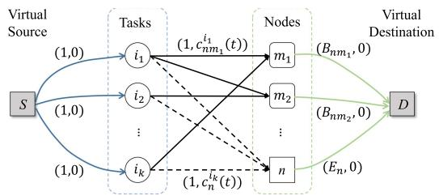

<details>
<summary>flowchart</summary>

```mermaid
graph TD
    S["Virtual Source S"] -->| (1,0) | Tasks["i₁"]
    S -->| (1,0) | Tasks
    Tasks -->| (1, cₙₘ₁ⁱ(t)) | Nodes["m₁"]
    Tasks -->| (1, cₙₘ₁ⁱ(t)) | Nodes
    Tasks -->| ... | Nodes
    Tasks -->| (1, cₙᵢₖ(t)) | Nodes
    Tasks -->| ... | Nodes
    Tasks -->| (1, cₙᵢₖ(t)) | Nodes
    Nodes -->| m₁ | D["Virtual Destination D"]
    Nodes -->| m₂ | D
    Nodes -->| ... | D
    Nodes -->| n | D
    D -->| (Bₙₘ₁, 0) | Nodes
    D -->| (Bₙₘ₂, 0) | Nodes
    D -->| (Eₙ, 0) | Nodes
```
</details>

Fig. 3. An example of CMCMF graph construction.

Task processing: The satellite processes all tasks in ${ \bf Q } _ { n } ^ { B } ( t )$ , which are accepted to $Q _ { n } ^ { B }$ at the end of t − 1. The allocation of processing rate is as (3).

Now, we describe the task scheduling step in detail. We model the task scheduling problem as a capacity-constraint minimum cost maximum flow problem (CMCMF). The input of CMCMF is a set of flows (task requests queued in ${ \bf Q } _ { n } ^ { F } ( t )$ to be assigned in this paper’s context) and network graph (the status of satellite and its neighbors). The output is the flow routing plans (task scheduling decisions) and the minimum cost (the optimization object of (24). The graph of CMCMF is constructed as $\operatorname { F i g } . 3$ . First, let ${ \cal V } _ { n t } = \{ \mathbf { Q } _ { n } ^ { \cal F } ( \bar { t } ) \vee { \cal N } _ { n } \vee \{ n , S , D \} \}$ } denote the set of vertices. S and D is a pair of virtual source and destination. There are two layers of vertices between S and D. Each task $i \in \mathbf { Q } _ { n } ^ { F } ( t )$ corresponds to a vertice in the first layer. The second layer consists of nodes in $N _ { n }$ and satellite n itself. Next, let $\varepsilon _ { n t }$ be the set of undirected edges. S establishes an edge of capacity 1 and cost 0 with each vertice in the first layer, which means each task can be offloaded to at most one satellite at one slot, coinciding with (12a). The rule of establishing edges between the first and second layer is as following. Each vertice ik establishes an edge of capacity 1 with a vertice $m _ { j }$ in the second layer if constraint (12b) is satisfied. The cost of such an edge is same as the cost of peer offloading, which is cinm(t) = V ρd( sibnm(t) $\begin{array} { r } { c _ { n m } ^ { i } ( t ) = V \bar { \rho } _ { d } \big ( \frac { s ^ { i } } { b _ { n m } ( t ) } + T _ { n m } ( t ) \big ) + } \end{array}$ V ρe bnm(t) $\begin{array} { r } { V \rho _ { e } \frac { s ^ { i } } { b _ { n m } ( t ) } P _ { t } - s ^ { i } \tilde { Q } _ { n } ^ { F } ( t ) - s ^ { \operatorname* { m a x } } \big [ Q _ { n } ^ { F } ( t ) - \theta _ { n } \big ] ^ { 1 } } \end{array}$ . Each vertice $i _ { k }$ must connect to n with capacity 1 and local processing cost $c _ { n } ^ { i } ( t ) = s ^ { i } Q _ { n } ^ { B } ( t ) - s ^ { i } \tilde { Q } _ { n } ^ { F } \bar { ( t ) } + \bar { V } ( \rho _ { d } d _ { n } ^ { i , C } + \rho _ { e } \bar { e } _ { n } ^ { i , C } )$ . Every vertice $m _ { j }$ in the second layer connects to D with capacity $B _ { n m _ { j } }$ and cost 0 under constraint (12c). Similarly, vertice n is connected to D with capacity $E _ { n }$ and cost 0 due to limited processing capacity (12d). Generally, by reducing (24) to a CMCMF problem, a lot of algorithms can be used to solve this problem in polynomial time, such as the Successive Shortest Path (SSP) algorithm and so on.

The complete peer offloading scheme on an individual satellite is shown in Algorithm 2.

# E. Properties Analysis

Complexity: The distributed online satellite peer offloading algorithm includes three steps. The running time of the first step of task admission (line 2–4) is $O ( I _ { n } ( t ) )$ . In the second step (line 5–10), the algorithm considers $| N _ { n } | +$ 1 candidate scheduling strategies for each task queued in ${ \bf Q } _ { n } ^ { F } ( t )$ . The complexity of predicting $d _ { m } ^ { i , C }$ and $e _ { m } ^ { i , C }$ by using Algorithm 1 (line 9–15) is $O ( | \mathbf { T } _ { t } | )$ . The algorithm applies SSP to obtain the final peer offloading decisions with the running time of min $\{ O ( \bar { v ^ { 2 } } f ^ { * } ) , O ( v ^ { 3 } c ^ { * } ) \bar  \}$ , where $v = \left| N _ { n } \right| +$ $3 + | \bar { \mathbf { Q } _ { n } ^ { F } } ( t ) |$ is the total number of vertices based on $V _ { n t } , \ f ^ { * }$ is the derived maximum flow, and $c ^ { * }$ is the corresponding minimum cost. Hence, the total complexity of task scheduling is $O ( | \mathbf { Q } _ { n } ^ { F } ( t ) | ( | N _ { n } | + 1 ) | T _ { t } | + \operatorname* { m i n } \{ O ( v ^ { 2 } f ^ { * } ) , O ( v ^ { 3 } c ^ { * } ) \} )$ . In the task processing step, the amount of workloads is computed with complexity of $O ( | \mathbf { Q } _ { n } ^ { B } ( t ) | )$ ). Therefore, the overall complexity of distributed online satellite peer offloading algorithm is min $\{ O ( I _ { n } ( t ) + | \mathbf { Q } _ { n } ^ { F } ( t ) | ( | N _ { n } | + 1 ) | T _ { t } | +$ $\begin{array} { r } { { v } ^ { 2 } f ^ { * } + | \mathbf { Q } _ { n } ^ { B } ( t ) | ) , O ( I _ { n } ( \dot { t } ) + | \mathbf { Q } _ { n } ^ { \dot { F } } ( t ) | ( | \tilde { N } _ { n } | + 1 ) | \dot { T } _ { t } | + { v } ^ { 3 } { c } ^ { \dot { * } } + } \end{array}$ $| \mathbf { Q } _ { n } ^ { B } ( t ) | ) \}$ . The algorithm can find a near-optimal solution in polynomial time.

<table><tr><td colspan="2">Algorithm 2: Distributed Satellite Peer Offloading Scheme on Node n at Slot t.</td></tr><tr><td>1:</td><td>Update  $\mathbf{Q}_{n}^{F}(t)$  and  $\mathbf{Q}_{n}^{B}(t)$  by (1) and (2);</td></tr><tr><td>2:</td><td>for each task  $i \in I_{n}(t)$  do</td></tr><tr><td>3:</td><td>Get the task admission decision by (23);</td></tr><tr><td>4:</td><td>end for</td></tr><tr><td>5:</td><td>for each task  $i \in \mathbf{Q}_{n}^{F}(t)$  do</td></tr><tr><td>6:</td><td>for each node  $m \in N_{n} \bigcup \{n\}$  do</td></tr><tr><td>7:</td><td>Apply Algorithm 1 to obtain  $d_{m}^{i,C}$  and  $e_{m}^{i,C}$ ;</td></tr><tr><td>8:</td><td>end for</td></tr><tr><td>9:</td><td>end for</td></tr><tr><td>10:</td><td>Apply SSP algorithm to derive task scheduling decisions  $\alpha_{n}(t)$  and  $\beta_{nm}(t)$ ;</td></tr><tr><td>11:</td><td>for each task  $i \in \mathbf{Q}_{n}^{B}(t)$  do</td></tr><tr><td>12:</td><td>Process the task according to (3) and (4);</td></tr><tr><td>13:</td><td>end for</td></tr></table>

Close-to-Optimality: In this part, we rigorously prove that minimizing P2 under the framework of Lyapunov optimization can achieve close-to-optimal system overhead compared to P1 while guaranteeing system stability in the case of dynamic task arrivals.

First, we define the perturbation parameter as

$$
\theta_ {n} \triangleq 2 (E _ {n} + [ N - 1 ] B ^ {\max}). \tag {25}
$$

which is an offline parameter that depends on each satellite’s computation and communication capacity. Such feature is favorable to practical implementations.

Lemma 2: Suppose that $\forall n \in { \mathcal { N } } , Q _ { n } ^ { F } ( 0 ) = \theta _ { n }$ , and $Q _ { n } ^ { B } ( 0 ) =$ 0. Assume we can obtain admission decisions π(t) and offloading decisions $s ( t )$ by Algorithm 2. In that case, we denote the system overhead obtained by Algorithm 2 as $\hat { C } ( t )$ for each time slot, and the backlogs of forwarding queue and computing queue are $\hat { Q } _ { n } ^ { F } ( t )$ and $\hat { Q _ { n } } ^ { B } ( t )$ , respectively. Following the distributed online satellite peer offloading decision-making scheme, the long-term system stability satisfies

$$
\begin{array}{l} \lim _ {T \rightarrow \infty} \sup \frac {1}{T} \sum_ {t = 0} ^ {T - 1} \sum_ {n = 1} ^ {N} \mathbb {E} \left\{\hat {Q} _ {n} ^ {B} (t) + \hat {Q} _ {n} ^ {F} (t) \right\} \\ \leq \sum_ {n = 1} ^ {N} \theta_ {n} + \frac {B _ {1} + V (C ^ {\max} - C ^ {*})}{\varepsilon}, \tag {26} \\ \end{array}
$$

and the long-term system overhead satisfies

$$
\lim _ {T \to \infty} \sup \frac {1}{T} \sum_ {t = 0} ^ {T - 1} \mathbb {E} \left\{\hat {C} (t) \right\} \leq C ^ {*} + \frac {B _ {1}}{V}, \tag {27}
$$

where C∗ is the optimal solution of P1, Cmax = NEmax $( \rho _ { d } d ^ { C , \operatorname* { m a x } } + \bar { \rho _ { e } } e ^ { C , \operatorname* { m a x } } ) + 4 N [ \rho _ { d } ( s ^ { m a x / } b ^ { \operatorname* { m i n } } +$ $T ^ { \mathrm { m a x } } ) + \rho _ { e } s ^ { \mathrm { m a x } } P ^ { \mathrm { m a x } } / b ^ { \mathrm { m i n } } ]$ , and $\varepsilon > 0$ is a constant which represents the long-term resource surplus achieved by some stationary strategy. Here we assume that a satellite establishes finite number of links with neighbors. The proof of Lemma 2 is given in Appendix C, available in the online supplemental material.

The above lemma demonstrates an $[ O ( 1 / V ) , O ( V ) ]$ overhead-stability tradeoff. Algorithm 2 asymptotically achieves the optimal performance of the offline problem P1 by letting $V \to \infty$ . However, the optimal system overhead is achieved at the price of a larger system congestion, as a larger system congestion deteriorates the task processing delay and postpones the convergence. The long-term system stability bound in (26) implies that the time-average queue length grows linearly with V .

Robustness Against Workload Prediction Errors: Although we have already analyzed the prediction error of Algorithm 1, we have to figure out the effect on the system overhead and stability when the predicted workload $Q _ { n } ^ { B ^ { * } } ( t )$ differs from the actual.

Lemma 3: Suppose there exists a constant ξ such that $| Q _ { n } ^ { B ^ { * } } ( t ) - Q _ { n } ^ { B } ( t ) | \leq \xi$ holds for all slots $t > 0$ . Under the prediction error $\xi ,$ the long-term system stability satisfies

$$
\begin{array}{l} \lim _ {T \rightarrow \infty} \sup \frac {1}{T} \sum_ {t = 0} ^ {T - 1} \sum_ {n = 1} ^ {N} \mathbb {E} \left\{Q _ {n} ^ {B} (t) + Q _ {n} ^ {F} (t) \right\} \\ \leq \sum_ {n = 1} ^ {N} \theta_ {n} + \frac {B _ {3} + V (C ^ {\max} - C ^ {*})}{\varepsilon}, \tag {28} \\ \end{array}
$$

and the long-term system overhead satisfies

$$
\lim _ {T \to \infty} \sup \frac {1}{T} \sum_ {t = 0} ^ {T - 1} \mathbb {E} \left\{\hat {C} (t) \right\} \leq C ^ {*} + \frac {B _ {3}}{V}, \tag {29}
$$

where $\begin{array} { r } { B _ { 3 } = B _ { 1 } + \xi \sum _ { n \in \mathcal { N } } \bigl [ s ^ { \mathrm { m a x } } E _ { n } + \frac { Q _ { n } ^ { B , \mathrm { m a x } } r _ { n } ^ { \mathrm { m a x } } } { s ^ { \mathrm { m i n } } h ^ { \mathrm { m i n } } } \bigr ] . } \end{array}$

See [25] for the details of Lemma 3. Comparing Lemma 3 with Lemma 2, we conclude that the upper bounds of long-term system overhead and queue length are larger under inaccurate workload predictions. However, the robustness of Algorithm 2 is still guaranteed. Besides, with the prediction error, a larger V is desired to achieve the same average system overhead as that with exact workload information, but at the expense of decreased stability.

# V. SIMULATION RESULTS AND DISCUSSIONS

In this section, we discuss the main findings of this paper. We evaluate the proposed multi-hop satellite peer computation offloading scheme under various system settings and give insights on the performance compared with baseline schemes.

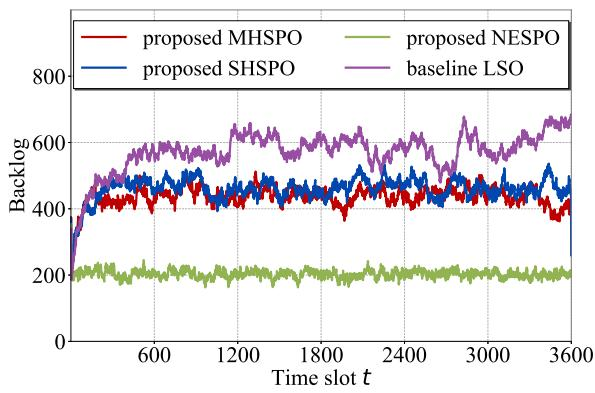

<details>
<summary>line</summary>

| Time slot t | proposed MHSPO | proposed SHSPO | proposed NESPO | baseline LSO |
| ----------- | -------------- | -------------- | -------------- | ------------ |
| 0           | 200            | 200            | 200            | 200          |
| 600         | 450            | 480            | 200            | 550          |
| 1200        | 470            | 500            | 200            | 600          |
| 1800        | 460            | 490            | 200            | 580          |
| 2400        | 480            | 510            | 200            | 620          |
| 3000        | 470            | 500            | 200            | 650          |
| 3600        | 450            | 480            | 200            | 680          |
</details>

Fig. 4. Comparison of system backlogs over time.

# A. Simulation Settings

We assume that the MEC network is deployed in a 1,070 km low-orit satellite constellation with an inclination of 87◦. The scale of the constellation should be large, such that multiple collaborations among MEC-enhanced satellites can be exploited. We set 192 satellites on 16 orbits, with 12 satellites on each orbit plane. The simulation’s operational time is 3,600 seconds, each slot lasts one second for making satellte peer offloading decisions. The computation capability of satellites is 2 Gcycles/s [14]. The local computing capacity of each satellite $E _ { n }$ is 6 tasks/slot [25]. The transmission rate of inter-satellite links are uniformly distributed in [100 M, 300M] bit/s. The inter-satellite transmission power is 0.1 W and we set $\kappa = 1 0 ^ { - 2 6 }$ [14]. The propogation delay among neighbor satellites are calculated as the straight-line distance divided by the speed of light.

We generate computation demands based on real Internet usage [32], [53]. Specifically, the earth is divided into $1 5 ^ { \circ } \times 1 5 ^ { \circ }$ geographical zones, so in total there are 288 such zones. The task arrival rate of each zone is propotional to the Internet users distribution data in [54]. Additionally, to simulate computation demands of devices in remote areas, the task generation of each zone follows a Poisson process with arrival rate $\pi _ { n } ( t ) \in [ 0 , 2 ]$ tasks/sec. The total computation task generation is the sum of the above two parts. For each task, its size is uniformly distributed in [10 M, 50M] bits. We assume the required number of CPU cycles for processing one bit of each task is randomly drawn from [100, 300]. The deadline of task is randomly generated within a range of [1, 12] seconds.

The performances of multi-hop satellite peer offloading (MH-SPO) is compared with three benchmarks:

1) Single-hop satellite peer offloading (SHSPO): Tasks are offloaded to at most one-hop peer satellites. The access satellite chooses the best one-hop offloading decision in the same approach as MHSPO: if offloading to one-hop neighbors is not beneficial, the access satellite will process the task locally.   
2) No-energy satellite peer offloading (NESPO): The decision-making process of NESPO is mostly the same as that of MHSPO, the only difference is that NESPO does not take the system energy overhead into account, which means $\rho _ { e } = 0$ .   
3) Local satellite offloading (LSO): No satellite peer offloading is enabled in LSO. For each task, the access satellite will process it locally.

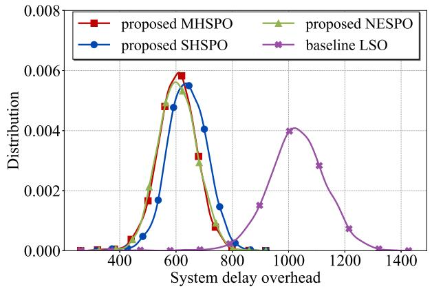

<details>
<summary>line</summary>

| System delay overhead | proposed MHSP0 | proposed SHSP0 | proposed NESPO | baseline LSO |
| --------------------- | -------------- | -------------- | -------------- | ------------ |
| 400                   | 0.0000         | 0.0000         | 0.0000         | 0.0000       |
| 500                   | 0.0020         | 0.0015         | 0.0025         | 0.0000       |
| 600                   | 0.0060         | 0.0055         | 0.0058         | 0.0000       |
| 700                   | 0.0035         | 0.0045         | 0.0038         | 0.0015       |
| 800                   | 0.0015         | 0.0015         | 0.0018         | 0.0018       |
| 900                   | 0.0005         | 0.0005         | 0.0015         | 0.0025       |
| 1000                  | 0.0002         | 0.0002         | 0.0012         | 0.0042       |
| 1100                  | 0.0001         | 0.0001         | 0.0010         | 0.0035       |
| 1200                  | 0.0001         | 0.0001         | 0.0012         | 0.0015       |
| 1300                  | 0.0001         | 0.0001         | 0.0015         | 0.0012       |
| 1400                  | 0.0001         | 0.0001         | 0.0018         | 0.0015       |
</details>

Fig. 5. Comparison of the distribution of system delay overhead over time.

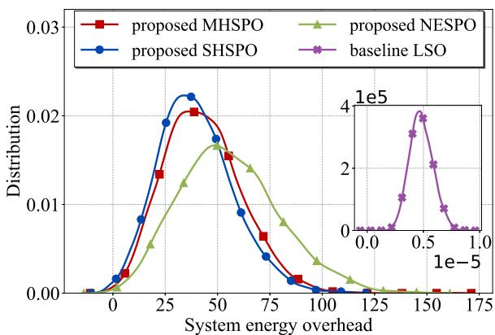

<details>
<summary>line</summary>

| System energy overhead | proposed MHSPO | proposed SHSPO | proposed NESPO | baseline LSO |
| ---------------------- | -------------- | -------------- | -------------- | ------------ |
| 0                      | 0.0000         | 0.0000         | 0.0000         | 0.0000       |
| 25                     | 0.0130         | 0.0200         | 0.0060         | 0.0000       |
| 50                     | 0.0210         | 0.0230         | 0.0180         | 0.0000       |
| 75                     | 0.0160         | 0.0180         | 0.0140         | 0.0000       |
| 100                    | 0.0060         | 0.0080         | 0.0040         | 0.0000       |
| 125                    | 0.0020         | 0.0030         | 0.0020         | 0.0000       |
| 150                    | 0.0010         | 0.0015         | 0.0015         | 4e-5         |
| 175                    | 0.0005         | 0.0010         | 0.0010         | 2e-5         |
</details>

Fig. 6. Comparison of the distribution of system energy overhead over time.

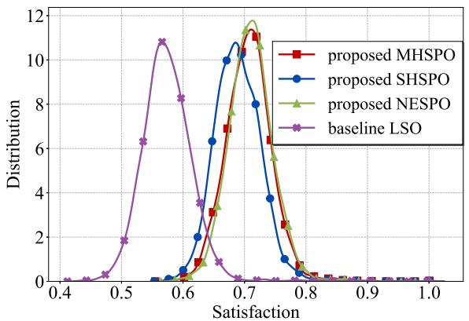

<details>
<summary>line</summary>

| Satisfaction | proposed MHSPO | proposed SHSPO | proposed NESPO | baseline LSO |
| ------------ | -------------- | -------------- | -------------- | ------------ |
| 0.4          | 0              | 0              | 0              | 0            |
| 0.5          | 0              | 0              | 0              | 2            |
| 0.6          | 3              | 2              | 1              | 8            |
| 0.7          | 11             | 10             | 12             | 11           |
| 0.8          | 2              | 1              | 1              | 0            |
| 0.9          | 0              | 0              | 0              | 0            |
| 1.0          | 0              | 0              | 0              | 0            |
</details>

Fig. 7. Comparison of the distribution of users’ satisfaction over time.

# B. Run-Time Performance Evaluation

Figs. 4–7 show the long-term system performance obtained by running four schemes with V = 100 and $\rho _ { d } = 0 . 0 0 5 , \rho _ { e } =$ 0.995. We mainly focus on four metrics: the system backlogs over time in Fig. 4, the system delay overhead in Fig. 5, the system energy overhead in Fig. 6, and the users’ satisfaction in Fig. 7. Note that Figs. 5 and 6 show the histogram distributions of the system metric data over time slots, and Fig. 7 shows the probability density distributions of the number of tasks completed before their deadlines divided by the total number of tasks finished at each slot.

It can be observed that without peer offloading the MECenabed satellite system bears a high backlog, a large system delay overhead, and a low users’ satisfaction, since single satellites can be easily overloaded due to spatially and temporally heterogeneous task arrival pattern. The system energy overhead of LSO is the lowest among the four schemes because the task transmission is not permitted in LSO, which accounts for the majority of system energy consumption. By contrast, other three schemes with peer offloading enabled (MHSPO, SHSPO, NESPO) achieve much lower backlogs, much smaller system delay overhead, and better users’ satisfaction. Specifically, NESPO achieves the lowest system backlog and the best delay performance since it is designed to minimize the delay overhead, so it can thoroughly balance the workloads regardless of the energy consumption. Therefore, NESPO incurs a larger energy consumption as shown in Fig. 6. Surprisingly, the users’ satisfaction of NESPO is not much higher than that of MHSPO. The reason is that, in order to balance the load, NESPO offloads tasks to satellites more hops away. The time that tasks wait in intermediate nodes for next decisions at each slot is not included in the calculation of system delay overhead, but is considered in task completion delay.

The main purpose of MHSPO is to constrain the system backlogs while minimizing the system overhead. As can be observed in Figs. 4 and 5, MHSPO achieves the lowest system backlog and the smallest system delay overhead among MHSPO, SHSPO, and LSO, which means that the multi-hop offloading way balance the load better. Although the energy consumption of SHSPO is lower than MHSPO in Fig. 6, the users’ satisfaction of MHSPO is higher in Fig. 7. Hence, we conclude that the proposed MHSPO scheme can well balance the system backlog and the system overhead, while meeting the requirements of most users.

# C. System Dynamics

Figs. 8 and 9 show the system backlog and the system overhead from the 500th to 550th time slot, respectively. Considering the fact that a newly admitted arrival cannot arrive at $Q ^ { B }$ until at least one slot later, we show the backlog of $Q ^ { B }$ from the 501th to 551th time slot in Fig. 8(a) to clearly demonstrate how $Q ^ { B }$ varies with the arrival.

We see that the system backlog of $Q ^ { F }$ is mainly decided by the total task arrival rate in the network which varies across the time slots. Usually, a larger task arrival rate will result in a higher $Q ^ { F }$ backlog. But the value fluctuation of $Q ^ { F }$ is smaller than that of the system arrival due to the task admission excuted on each satellite. Moreover, the trend of $Q ^ { B }$ is roughly the same as that of the system arrival. But a sudden increase or decrease in arrival does not always brings surge or fall in $Q ^ { B }$ as presented at slot 509 and 534 in Fig. 8(a). The reason is that the value of $Q ^ { B }$ backlog also depends on the departure of tasks. Only a low (high) level of arrivals persisting for a period of slots can bring about a downword (upward) trend of ${ \bar { Q } } ^ { B }$ (as shown from slot 511 to 516, and from slot 530 to 533). In addition, the overhead of the system fluctuates with the system arrival, a higher system arrival always brings a larger system overhead as depicted in Fig. 9.

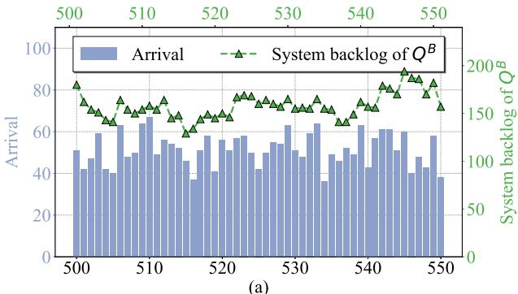

<details>
<summary>bar_line</summary>

| X Value | Arrival | System backlog of Q^B |
| ------- | ------- | --------------------- |
| 500     | 50      | 80                    |
| 501     | 45      | 75                    |
| 502     | 40      | 70                    |
| 503     | 45      | 75                    |
| 504     | 50      | 80                    |
| 505     | 55      | 75                    |
| 506     | 60      | 70                    |
| 507     | 65      | 75                    |
| 508     | 70      | 80                    |
| 509     | 75      | 75                    |
| 510     | 80      | 70                    |
| 511     | 75      | 75                    |
| 512     | 70      | 80                    |
| 513     | 65      | 75                    |
| 514     | 60      | 70                    |
| 515     | 55      | 75                    |
| 516     | 50      | 80                    |
| 517     | 45      | 75                    |
| 518     | 40      | 70                    |
| 519     | 45      | 75                    |
| 520     | 50      | 80                    |
| 521     | 55      | 75                    |
| 522     | 60      | 70                    |
| 523     | 65      | 75                    |
| 524     | 70      | 80                    |
| 525     | 75      | 75                    |
| 526     | 80      | 70                    |
| 527     | 75      | 75                    |
| 528     | 70      | 80                    |
| 529     | 65      | 75                    |
| 530     | 60      | 70                    |
| 531     | 55      | 75                    |
| 532     | 50      | 80                    |
| 533     | 45      | 75                    |
| 534     | 40      | 70                    |
| 535     | 45      | 75                    |
| 536     | 50      | 80                    |
| 537     | 55      | 75                    |
| 538     | 60      | 70                    |
| 539     | 65      | 75                    |
| 540     | 70      | 80                    |
| 541     | 75      | 75                    |
| 542     | 80      | 70                    |
| 543     | 75      | 75                    |
| 544     | 70      | 80                    |
| 545     | 65      | 75                    |
| 546     | 60      | 70                    |
| 547     | 55      | 75                    |
| 548     | 50      | 80                    |
| 549     | 45      | 75                    |
| 550     | 40      | 70                    |
</details>

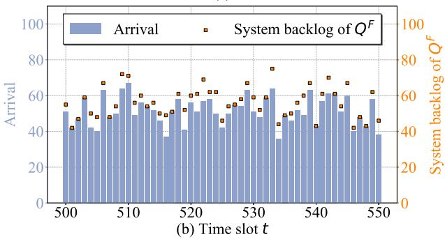

<details>
<summary>bar_line</summary>

| Time slot t | Arrival | System backlog of Q^F |
| ----------- | ------- | --------------------- |
| 500         | 52      | 45                    |
| 501         | 48      | 47                    |
| 502         | 46      | 46                    |
| 503         | 49      | 48                    |
| 504         | 51      | 50                    |
| 505         | 53      | 52                    |
| 506         | 55      | 54                    |
| 507         | 57      | 56                    |
| 508         | 59      | 58                    |
| 509         | 61      | 60                    |
| 510         | 63      | 62                    |
| 511         | 65      | 64                    |
| 512         | 67      | 66                    |
| 513         | 69      | 68                    |
| 514         | 71      | 70                    |
| 515         | 73      | 72                    |
| 516         | 75      | 74                    |
| 517         | 77      | 76                    |
| 518         | 79      | 78                    |
| 519         | 81      | 80                    |
| 520         | 83      | 82                    |
| 521         | 85      | 84                    |
| 522         | 87      | 86                    |
| 523         | 89      | 88                    |
| 524         | 91      | 90                    |
| 525         | 93      | 92                    |
| 526         | 95      | 94                    |
| 527         | 97      | 96                    |
| 528         | 99      | 98                    |
| 529         | 101     | 100                   |
| 530         | 103     | 102                   |
| 531         | 105     | 104                   |
| 532         | 107     | 106                   |
| 533         | 109     | 108                   |
| 534         | 111     | 110                   |
| 535         | 113     | 112                   |
| 536         | 115     | 114                   |
| 537         | 117     | 116                   |
| 538         | 119     | 118                   |
| 539         | 121     | 120                   |
| 540         | 123     | 122                   |
| 541         | 125     | 124                   |
| 542         | 127     | 126                   |
| 543         | 129     | 128                   |
| 544         | 131     | 130                   |
| 545         | 133     | 132                   |
| 546         | 135     | 134                   |
| 547         | 137     | 136                   |
| 548         | 139     | 138                   |
| 549         | 141     | 140                   |
| 550         | 143     | 142                   |
</details>

Fig. 8. System dynamics (system backlogs).

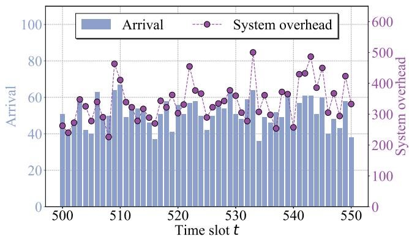

<details>
<summary>bar_line</summary>

| Time slot t | Arrival | System overhead |
| ----------- | ------- | --------------- |
| 500         | 50      | 280             |
| 501         | 42      | 300             |
| 502         | 40      | 320             |
| 503         | 44      | 340             |
| 504         | 46      | 360             |
| 505         | 48      | 380             |
| 506         | 50      | 400             |
| 507         | 52      | 420             |
| 508         | 54      | 440             |
| 509         | 56      | 460             |
| 510         | 60      | 480             |
| 511         | 62      | 500             |
| 512         | 64      | 480             |
| 513         | 66      | 460             |
| 514         | 68      | 440             |
| 515         | 70      | 420             |
| 516         | 72      | 400             |
| 517         | 74      | 380             |
| 518         | 76      | 360             |
| 519         | 78      | 340             |
| 520         | 80      | 320             |
| 521         | 82      | 300             |
| 522         | 84      | 280             |
| 523         | 86      | 260             |
| 524         | 88      | 240             |
| 525         | 90      | 220             |
| 526         | 92      | 200             |
| 527         | 94      | 180             |
| 528         | 96      | 160             |
| 529         | 98      | 140             |
| 530         | 100     | 120             |
| 531         | 102     | 100             |
| 532         | 104     | 80              |
| 533         | 106     | 60              |
| 534         | 108     | 40              |
| 535         | 110     | 20              |
| 536         | 112     | 0               |
| 537         | 114     | -20             |
| 538         | 116     | -40             |
| 539         | 118     | -60             |
| 540         | 120     | -80             |
| 541         | 122     | -100            |
| 542         | 124     | -120            |
| 543         | 126     | -140            |
| 544         | 128     | -160            |
| 545         | 130     | -180            |
| 546         | 132     | -200            |
| 547         | 134     | -220            |
| 548         | 136     | -240            |
| 549         | 138     | -260            |
| 550         | 140     | -280            |
</details>

Fig. 9. System dynamics (system overhead).

# D. Impact of Parameter V

Figs. 10 and 11 show the impact of parameter V on the performance of MHSPO, SHSPO, and NESPO. From Fig. 10, we can see that the average system backlogs of MHSPO and SHSPO increase with V , since more attention is paid to system overhead. MHSPO always has less backlogs than SHSPO. The backlogs of NESPO does not consistently rises with V because the goal of minimizing the system delay overhead coincides with minimizing the backlogs. As shown in Fig. 11, the system overhead under the three mechanisms decreases with V and MH-SPO achieves the lowest overhead. The reason lies in the more emphasis highlighted on the system overhead. With a larger V , the SHSPO cannot achieve the same amount of system overhead decline as MHSPO because it is only allowed to schedule load balancing within one-hop range.

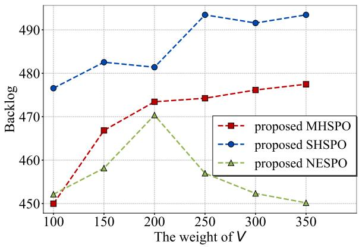

<details>
<summary>line</summary>

| The weight of V | proposed MHSPO | proposed SHSPO | proposed NESPO |
| --------------- | -------------- | -------------- | -------------- |
| 100             | 450            | 477            | 452            |
| 150             | 467            | 483            | 458            |
| 200             | 474            | 481            | 471            |
| 250             | 475            | 493            | 457            |
| 300             | 477            | 491            | 452            |
| 350             | 478            | 493            | 450            |
</details>

Fig. 10. System bocklogs with varying V .

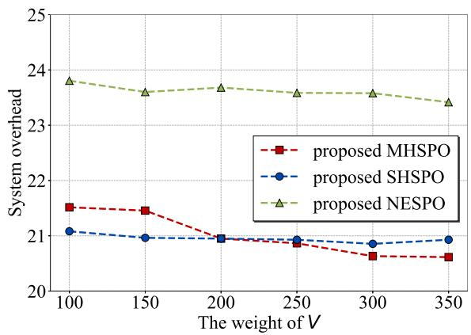

<details>
<summary>line</summary>

| The weight of V | proposed MHSPO | proposed SHSPO | proposed NESPO |
| --------------- | -------------- | -------------- | -------------- |
| 100             | 21.6           | 21.1           | 23.9           |
| 150             | 21.5           | 21.0           | 23.7           |
| 200             | 21.0           | 21.0           | 23.8           |
| 250             | 20.9           | 21.0           | 23.7           |
| 300             | 20.7           | 20.9           | 23.6           |
| 350             | 20.7           | 21.0           | 23.4           |
</details>

Fig. 11. System overhead with varying V .

These two figures present a $[ O ( 1 / V ) , O ( V ) ]$ trade-off between the long-term system overhead and the long-term system backlogs, which is consistent with our theoretical analysis. With a larger V , MHSPO emphasizes more on the system overhead and is less concerned with the system backlogs. As V grows to the infinity, MHSPO is able to achieve the optimal delay overhead, but it is hard to define an optimal value for V since a lower system overhead is achieved at the cost of larger backlogs. However, it still offers a guideline for picking an appropriate value of V . In this particular simulation, the network operator is recommened to choose, for example, $V = 1 0 0$ for two reasons: (i) MHSPO has already achieved close-to-optimal delay and little improvement is available by increasing V ; (ii) the system backlog is much smaller when $V = 1 0 0$ compared to the system backlogs with higher V .

# VI. CONCLUSION

In this paper, we proposed a multi-hop computation peer offloading scheme in MEC-enabled satellite networks where unbalanced and heterogeneous task arrival pattern is considered. We formulated a novel MHSPO problem to jointly optimize the long-term delay and energy consumption while confining the system backlogs. A Lyapunov-based framework was introduced to optimize the system performance online. The proposed scheme allows autonomous decision-making and provides a provable performance guarantee. We also showed that the proposed scheme balances the system overheads and backlogs well.

In the future, we will consider the online learning technique with less prediction regret to further improve the system performance. Moreover, compared with MEC-enhanced satellites, terrestrial data centers have more powerful computing capabilities but suffer long RTT latency. A satellite-terrestrial combined twolayer computation offloading scheme is a promising research direction.

# REFERENCES

[1] J. Liu, Y. Shi, Z. M. Fadlullah, and N. Kato, “Space-air-ground integrated network: A survey,” IEEE Commun. Surveys Tut., vol. 20, no. 4, pp. 2714–2741, Fourth Quarter 2018.   
[2] O. Kodheli et al., “Satellite communications in the new space era: A survey and future challenges,” IEEE Commun. Surveys Tut., vol. 23, no. 1, pp. 70–109, First Quarter 2021.   
[3] H. Guo, J. Li, J. Liu, N. Tian, and N. Kato, “A survey on space-airground-sea integrated network security in 6G,” IEEE Commun. Surveys Tut., vol. 24, no. 1, pp. 53–87, First Quarter 2022.   
[4] S. Duan et al., “Distributed artificial intelligence empowered by end-edgecloud computing: A survey,” IEEE Commun. Surveys Tut., vol. 25, no. 1, pp. 591–624, First Quarter 2023.   
[5] Z. Zhang, W. Zhang, and F.-H. Tseng, “Satellite mobile edge computing: Improving QoS of high-speed satellite-terrestrial networks using edge computing techniques,” IEEE Netw., vol. 33, no. 1, pp. 70–76, Jan./Feb. 2019.   
[6] B. Shang, Y. Yi, and L. Liu, “Computing over space-air-ground integrated networks: Challenges and opportunities,” IEEE Netw., vol. 35, no. 4, pp. 302–309, Jul./Aug. 2021.   
[7] K. Wei, Q. Tang, J. Guo, M. Zeng, Z. Fei, and Q. Cui, “Resource scheduling and offloading strategy based on LEO satellite edge computing,” in Proc. IEEE 94th Veh. Technol. Conf., 2021, pp. 1–6.   
[8] S. Cao, H. Han, J. Wei, Y. Zhao, S. Yang, and L. Yan, “Space cloud-fog computing: Architecture, application and challenge,” in Proc. 3rd ACM Int. Conf. Comput. Sci. Appl. Eng., 2019, Art. no. 63.   
[9] R. Xie, Q. Tang, Q. Wang, X. Liu, F. R. Yu, and T. Huang, “Satelliteterrestrial integrated edge computing networks: Architecture, challenges, and open issues,” IEEE Netw., vol. 34, no. 3, pp. 224–231, May/Jun. 2020.   
[10] B. Denby and B. Lucia, “Orbital edge computing: Nanosatellite constellations as a new class of computer system,” in Proc. 25th Int. Conf. Architectural Support Program. Lang. Operating Syst., 2020, pp. 939–954.   
[11] D. Bhattacherjee, S. Kassing, M. Licciardello, and A. Singla, “In-orbit computing: An outlandish thought experiment?,” in Proc. 19th ACM Workshop Hot Topics Netw., 2020, pp. 197–204.   
[12] T. Chen et al., “Learning-based computation offloading for IoRT through ka/Q-band satellite–terrestrial integrated networks,” IEEE Internet Things J., vol. 9, no. 14, pp. 12056–12070, Jul. 2022.   
[13] G. Cui, X. Li, L. Xu, and W. Wang, “Latency and energy optimization for MEC enhanced SAT-IoT networks,” IEEE Access, vol. 8, pp. 55915–55926, 2020.   
[14] Z. Song, Y. Hao, Y. Liu, and X. Sun, “Energy-efficient multiaccess edge computing for terrestrial-satellite Internet of Things,” IEEE Internet Things J., vol. 8, no. 18, pp. 14202–14218, Sep. 2021.   
[15] Q. Tang, Z. Fei, B. Li, and Z. Han, “Computation offloading in LEO satellite networks with hybrid cloud and edge computing,” IEEE Internet Things J., vol. 8, no. 11, pp. 9164–9176, Jun. 2021.   
[16] S. Zhang, G. Cui, Y. Long, and W. Wang, “Joint computing and communication resource allocation for satellite communication networks with edge computing,” China Commun., vol. 18, no. 7, pp. 236–252, 2021.   
[17] C. Li, Y. Zhang, X. Hao, and T. Huang, “Jointly optimized request dispatching and service placement for MEC in LEO network,” China Commun., vol. 17, no. 8, pp. 199–208, 2020.   
[18] Y. Wang, J. Yang, X. Guo, and Z. Qu, “A game-theoretic approach to computation offloading in satellite edge computing,” IEEE Access, vol. 8, pp. 12510–12520, 2020.   
[19] M. A. Islam, S. Ren, G. Quan, M. Z. Shakir, and A. V. Vasilakos, “Waterconstrained geographic load balancing in data centers,” IEEE Trans. Cloud Comput., vol. 5, no. 2, pp. 208–220, Second Quarter 2017.   
[20] Z. Liu, M. Lin, A. Wierman, S. Low, and L. L. H. Andrew, “Greening geographical load balancing,” IEEE/ACM Trans. Netw., vol. 23, no. 2, pp. 657–671, Apr. 2015.

[21] L. Chen, S. Zhou, and J. Xu, “Computation peer offloading for energyconstrained mobile edge computing in small-cell networks,” IEEE/ACM Trans. Netw., vol. 26, no. 4, pp. 1619–1632, Aug. 2018.   
[22] J. Ren et al., “An efficient two-layer task offloading scheme for MEC system with multiple services providers,” in Proc. IEEE Conf. Comput. Commun., 2022, pp. 1519–1528.   
[23] Z. Jing, Q. Yang, Y. Wu, M. Qin, K. Sup Kwak, and X. Wang, “Adaptive cooperative task offloading for energy-efficient small cell MEC networks,” in Proc. IEEE Wireless Commun. Netw. Conf., 2022, pp. 292–297.   
[24] K. Wang, Y. Zhou, J. Li, L. Shi, W. Chen, and L. Hanzo, “Energyefficient task offloading in massive MIMO-aided multi-pair fog-computing networks,” IEEE Trans. Commun., vol. 69, no. 4, pp. 2123–2137, Apr. 2021.   
[25] Y. Li, X. Wang, X. Gan, H. Jin, L. Fu, and X. Wang, “Learning-aided computation offloading for trusted collaborative mobile edge computing,” IEEE Trans. Mobile Comput., vol. 19, no. 12, pp. 2833–2849, Dec. 2020.   
[26] L. Hu, Y. Tian, J. Yang, T. Taleb, L. Xiang, and Y. Hao, “Ready player one: UAV-clustering-based multi-task offloading for vehicular VR/AR gaming,” IEEE Netw., vol. 33, no. 3, pp. 42–48, May/Jun. 2019.   
[27] Z. Xiao et al., “Vehicular task offloading via heat-aware MEC cooperation using game-theoretic method,” IEEE Internet Things J., vol. 7, no. 3, pp. 2038–2052, Mar. 2020.   
[28] J. Wang, K. Zhu, B. Chen, and Z. Han, “Distributed clustering-based cooperative vehicular edge computing for real-time offloading requests,” IEEE Trans. Veh. Technol., vol. 71, no. 1, pp. 653–669, Jan. 2022.   
[29] P. Dai, K. Hu, X. Wu, H. Xing, F. Teng, and Z. Yu, “A probabilistic approach for cooperative computation offloading in MEC-assisted vehicular networks,” IEEE Trans. Intell. Transp. Syst., vol. 23, no. 2, pp. 899–911, Feb. 2022.   
[30] Y. Wu, K. Ni, C. Zhang, L. P. Qian, and D. H. K. Tsang, “NOMA-assisted multi-access mobile edge computing: A joint optimization of computation offloading and time allocation,” IEEE Trans. Veh. Technol., vol. 67, no. 12, pp. 12244–12258, Dec. 2018.   
[31] S. Duan et al., “MOTO: Mobility-aware online task offloading with adaptive load balancing in small-cell MEC,” IEEE Trans. Mobile Comput., early access, Nov. 08, 2022, doi: 10.1109/TMC.2022.3220720.   
[32] Y. Yang, M. Xu, D. Wang, and Y. Wang, “Towards energy-efficient routing in satellite networks,” IEEE J. Sel. Areas Commun., vol. 34, no. 12, pp. 3869–3886, Dec. 2016.   
[33] N. Cheng et al., “Space/aerial-assisted computing offloading for IoT applications: A learning-based approach,” IEEE J. Sel. Areas Commun., vol. 37, no. 5, pp. 1117–1129, May 2019.   
[34] M. De Sanctis, E. Cianca, G. Araniti, I. Bisio, and R. Prasad, “Satellite communications supporting internet of remote things,” IEEE Internet Things J., vol. 3, no. 1, pp. 113–123, Feb. 2016.   
[35] W.-C. Chien, C.-F. Lai, M. S. Hossain, and G. Muhammad, “Heterogeneous space and terrestrial integrated networks for IoT: Architecture and challenges,” IEEE Netw., vol. 33, no. 1, pp. 15–21, Jan./Feb. 2019.   
[36] R. Radhakrishnan, W. W. Edmonson, F. Afghah, R. M. Rodriguez-Osorio, F. Pinto, and S. C. Burleigh, “Survey of inter-satellite communication for small satellite systems: Physical layer to network layer view,” IEEE Commun. Surveys Tut., vol. 18, no. 4, pp. 2442–2473, Fourth Quarter 2016.   
[37] B. d’Humières et al., “The C3PO project: A laser communication system concept for small satellites,” in Proc. Free-Space Laser Commun. Atmospheric Propag. XXIX, SPIE, 2017, pp. 285–297.   
[38] H. Tomio et al., “Assembly and integration of optical downlink terminal vsota on microsatellite risesat,” in Proc. Int. Conf. Space Opt., SPIE, 2019, pp. 2147–2157.   
[39] X. Xiaobin, Z. Hui, L. Chang, F. Cunqu, L. Zhongjun, and W. Shangguang, “On the aggregated resource management for satellite edge computing,” in Proc. IEEE Int. Conf. Commun., 2021, pp. 1–6.   
[40] H. Fang, Y. Jia, Y. Wang, Y. Zhao, Y. Gao, and X. Yang, “Matching game based task offloading and resource allocation algorithm for satellite edge computing networks,” in Proc. Int. Symp. Netw. Comput. Commun., 2022, pp. 1–5.   
[41] Y. Wang, J. Zhang, X. Zhang, P. Wang, and L. Liu, “A computation offloading strategy in satellite terrestrial networks with double edge computing,” in Proc. IEEE Int. Conf. Commun. Syst., 2018, pp. 450–455.   
[42] D. Calzolaio, F. Curreli, J. Duncan, A. Moorhouse, G. Perez, and S. Voegt, “EDRS-C–The second node of the European data relay system is in orbit,” Acta Astronautica, vol. 177, pp. 537–544, 2020. [Online]. Available: https: //www.sciencedirect.com/science/article/pii/S0094576520304707   
[43] D. M. Cornwell, “NASA’s optical communications program for 2017 and beyond,” in Proc. IEEE Int. Conf. Space Opt. Syst. Appl., 2017, pp. 10–14.

[44] A. U. Chaudhry and H. Yanikomeroglu, “Temporary laser inter-satellite links in free-space optical satellite networks,” IEEE Open J. Commun. Soc., vol. 3, pp. 1413–1427, Aug. 2022.   
[45] H. Kaushal and G. Kaddoum, “Optical communication in space: Challenges and mitigation techniques,” IEEE Commun. Surveys Tut., vol. 19, no. 1, pp. 57–96, First Quarter 2017.   
[46] Q. Yang, L. Tan, and J. Ma, “Doppler characterization of laser inter-satellite links for optical LEO satellite constellations,” Opt. Commun., vol. 282, no. 17, pp. 3547–3552, 2009.   
[47] D. Zhou, M. Sheng, R. Liu, Y. Wang, and J. Li, “Channel-aware mission scheduling in broadband data relay satellite networks,” IEEE J. Sel. Areas Commun., vol. 36, no. 5, pp. 1052–1064, May 2018.   
[48] Neely and J. Michael, “Stochastic network optimization with application to communication and queueing systems,” Synth. Lect. Commun., vol. 3, no. 1, pp. 1–211, 2010.   
[49] X. Zhang, C. Wu, Z. Li, and F. C. Lau, “Proactive VNF provisioning with multi-timescale cloud resources: Fusing online learning and online optimization,” in Proc. IEEE Conf. Comput. Commun., 2017, pp. 1–9.   
[50] P. Joulani, A. Gyorgy, and C. Szepesvari, “Online learning under delayed feedback,” in Proc. Int. Conf. Mach. Learn., 2013, pp. 1453–1461.   
[51] K. Quanrud and D. Khashabi, “Online learning with adversarial delays,” in Proc. Adv. Neural Inf. Process. Syst., 2015, pp. 1270–1278.   
[52] N. Chen, A. Agarwal, A. Wierman, S. Barman, and L. L. Andrew, “Online convex optimization using predictions,” in Proc. ACM SIGMETRICS Int. Conf. Meas. Model. Comput. Syst., 2015, pp. 191–204.   
[53] A. Papa, T. De Cola, P. Vizarreta, M. He, C. Mas Machuca, and W. Kellerer, “Dynamic SDN controller placement in a LEO constellation satellite network,” in Proc. IEEE Glob. Commun. Conf., 2018, pp. 206–212.   
[54] Internet usage statistics, 2022. [Online]. Available: https://www. internetworldstats.com/stats.htm


<details>
<summary>natural_image</summary>

Portrait of a woman in formal business attire (no visible text or symbols)
</details>

Xinyuan Zhang received the BS degree in communication engineering from the Beijing University of Posts and Telecommunications (BUPT), China, in 2019. She is currently working toward the PhD degree with the State Key Laboratory of Networking and Switching Technology, in BUPT. She is a visiting PhD student with the Information Systems Technology and Design Pillar, Singapore University of Technology and Design, Singapore, from 2022. Her current research interests include satellite-terrestrial integrated networks, edge networks, and deterministic networks.


<details>
<summary>natural_image</summary>

Portrait of a man wearing glasses and a sweater (no text or symbols visible)
</details>

Jiang Liu received the BS degree in electronics engineering from the Beijing Institute of Technology, Beijing, China, in 2005, the MS degree in communication and information system from Zhengzhou University, Zhengzhou, China, in 2009, and the PhD degree from the Beijing University of Posts and Telecommunications, Beijing, in 2012. He is currently a professor with the Beijing University of Posts and Telecommunications. His current research interests include network architecture, network virtualization, satellite networking, software-defined networking (SDN),

information-centric networking (ICN), and network testbed.


<details>
<summary>natural_image</summary>

Portrait photo of a young man in formal attire (no text or symbols visible)
</details>

Ran Zhang (Member, IEEE) received the PhD degree from the Beijing University of Posts and Telecommunications, Beijing, China, in 2021. He is currently a post-doctoral research fellow with the State Key Laboratory of Networking and Switching Technology, BUPT. His research interests include caching, computing, communication integration, satellite-terrestrial integrated networks, and artificial intelligence.


<details>
<summary>natural_image</summary>

Portrait of a man in business attire (no text or symbols visible)
</details>

Yudong Huang received the BS degree in communication engineering from the Beijing University of Posts and Telecommunications (BUPT), China, in 2019. He is currently working toward the PhD degree with the State Key Laboratory of Networking and Switching Technology, in BUPT. He was a visiting PhD student with the School of Computer Science and Engineering, Nanyang Technological University, Singapore, from 2022 to 2023. His current research interests include time-sensitive networks, deterministic networks, and network architecture.


<details>
<summary>natural_image</summary>

Portrait photo of a man in a blue polo shirt (no text or symbols visible)
</details>

Jincheng Tong received the MS degree from the China Academy of Space Technology (CAST), in 2006. He is currently working in China Academy of Space Technology (CAST), Beijing, China. His research interests includes telecommunication satellite design, satellite payload design and space network technology.


<details>
<summary>natural_image</summary>

Portrait of a man wearing glasses and a blue sports jersey (no text or symbols visible)
</details>

Ning Xin received the PhD degree from the China Academy of Space Technology (CAST), in 2014. He is a researcher with the Institute of Telecommunication and Navigation Satellite, China Academy of Space Technology, Beijing, China. His research interests are spacecraft design, satellite payload design and space network system design.


<details>
<summary>natural_image</summary>

Portrait of a man wearing glasses, suit, and tie (no text or symbols visible)
</details>

Liang Liu received the PhD degree from the Beijing University of Aeronautics and Astronautics (BUAA), in 2017. He is a researcher with the Institute of Telecommunication and Navigation Satellite, China Academy of Space Technology, Beijing, China. His research interests are space network system design, satellite communication system design.


<details>
<summary>natural_image</summary>

Portrait photo of a young man with short dark hair (no text or symbols visible)
</details>

Zehui Xiong (Member, IEEE) received the PhD degree from Nanyang Technological University (NTU), Singapore. He is currently an Assistant Professor with the Singapore University of Technology and Design, and also an Honorary adjunct senior research scientist with Alibaba-NTU Singapore Joint Research Institute, Singapore. He was the visiting scholar with Princeton University and University of Waterloo. His research interests include wireless communications, Internet of Things, blockchain, edge intelligence, and Metaverse. He has published more than 150 research

papers in leading journals and flagship conferences and many of them are ESI Highly Cited Papers. He has won more than 10 Best Paper Awards in international conferences and is listed in the World’s Top 2% Scientists identified by Stanford University. He is now serving as the editor or guest editor for many leading journals including IEEE Journal on Selected Areas in Communications, IEEE Transactions on Vehicular Technology, IEEE Internet of Things Journal, IEEE Transactions on Cognitive Communications and Networking, IEEE Transactions on Network Science and Engineering, International Surgery Journal, Journal of the Atmospheric Sciences. He is the recipient of IEEE Early Career Researcher Award for Excellence in Scalable Computing, IEEE Technical Committee on Blockchain and Distributed Ledger Technologies Early Career Award, IEEE Internet Technical Committee Early Achievement Award, IEEE Best Land Transportation Paper Award, IEEE CSIM Technical Committee Best Journal Paper Award, IEEE SPCC Technical Committee Best Paper Award, IEEE VTS Singapore Best Paper Award, Chinese Government Award for Outstanding Students Abroad, and NTU SCSE Best PhD Thesis Runner-Up Award. He is now serving as the associate director of Future Communications R&D Programme.