# Energy-Efficient Cooperative Relaying for Unmanned Aerial Vehicles

Kai Li, Member, IEEE, Wei Ni, Senior Member, IEEE, Xin Wang, Senior Member, IEEE, Ren Ping Liu, Senior Member, IEEE, Salil S. Kanhere, Senior Member, IEEE, and Sanjay Jha, Senior Member, IEEE

Abstract—Airborne relaying can extend wireless sensor networks (WSNs) to remote human-unfriendly terrains. However, lossy airborne channels and limited battery of unmanned aerial vehicles (UAVs) are critical issues, adversely affecting success rate and network lifetime, especially in real-time applications. We propose an energy-efficient cooperative relaving scheme which extends network lifetime while guaranteeing the success rate. The optimal transmission schedule of the UAVs is formulated to minimize the maximum (min-max) energy consumption under guaranteed bit error rates, and can be judiciously reformulated and solved using standard optimisation techniques. We also propose a computationally efficient suboptimal algorithm to reduce the scheduling complexity, where energy balancing and rate adaptation are decoupled and carried out in a recursive alternating manner. Simulation results confirm that the suboptimal algorithm cuts off the complexity by orders of magnitude with marginal loss of the optimal network vield (throughput) and lifetime. The proposed suboptimal algorithm can also save energy by 50 percent, increase network vield by 15 percent, and extend network lifetime by 33 percent, compared to the prior art.

Index Terms—Energy-efficient, scheduling, optimisation, cooperative, unmanned aerial vehicles

## 1 INTRODUCTION

AIRBORNE relaying has potential to extend the coverage of wireless sensor networks (WSN) to remote, humanunfriendly terrains, such as battlefields and bushfire [1]. It also has important applications to many time critical realtime tasks, such as monitoring chemical clouds [2], precision agriculture [3], disaster management [4], as well as rescue operations [5]. The widespread availability of unmanned aerial vehicles (UAVs) such as Aerosonde and Quadrocopter have also contributed to their popularity as mobile relays and data sinks [6], [7].

Two critical challenges arise in UAV-assisted real-time relaying networks. The first challenge is the highly dynamic airborne wireless channels between the ground nodes (i.e., the sensors and the Base station (BS)) and the UAVs, where are prone to packet loss [8]. The packet loss is especially severe over the first hop from the sensors to the UAVs, as the sensors typically do not have capabilities of predicting channel variations or adapt transmission rates. The second critical challenge is from the limited battery capacity of

UAVs. Data collection would be frequently interrupted, because the UAVs need to be recharged. Cooperative relaying has been demonstrated to enhance link reliability [9], [10] and increase energy efficiency [11] in terrestrial communications. It can be anticipated that the cooperation of multiple UAVs can address these two challenges for realtime airborne applications [12]

Fig. 1 illustrates a typical real-time application of airborne relaying, where a number of sensor nodes are deployed in remote areas to collect critical environmental data, for example, bushfire monitoring. The radio paths between the remote sensors and the data processing centre, i.e., the BS, are often obstructed. The received radio signal is too weak at the BS. A swarm of UAVs can be employed to fly over the sensors and the BS, establishing a two-hop wireless relaying transmission link. The UAVs forward the sensory data immediately after receiving the data, such that packet delay can be reduced. In this case, the energy consumption of the UAVs needs to be balanced. Otherwise, some UAVs, that get more packets to relay or experience worse channels to the BS, would run out of energy sooner than the others. This, in turn, speeds up draining energy in the remaining active UAVs.

The problem of balancing energy consumption amongst the UAVs is non-trivial, particularly, given the uncertain channel dynamics. No existing work provides a solution that addresses the problem. In [13] and [14], the placement of cooperative UAVs was studied to ensure connectivity and high throughput. However, the placement study was based on the assumption of unlimited battery capacity. In [15] and [16], a Hive-Drone model was developed, where a centralised charging station, hive, is placed in the sensing field to charge the UAVs (i.e., drones). The UAVs collect and carry data from the sensing field to the hive. The July 05,2026 at 12:27:12 UTC from IEEE Xplore. Restrictions apply.

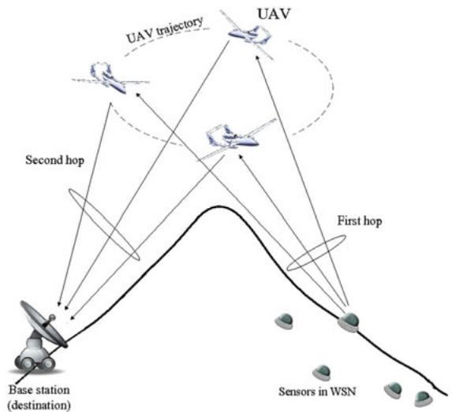  
Fig. 1. Airborne relaying networks using cooperative UAVs, where the UAVs relay sensory data from remote sensors to the BS.

trajectory of the UAVs was designed to reduce information gathering latency. Unfortunately, the Hive-Drone model is inapplicable to human-unfriendly environments, where the cables required to feed energy to the hive cannot be deployed. In addition, the latency resulting from data gathering process can be intolerable in real-time applications. In [17], a control algorithm was proposed to adjust the transmit rate of the sensors, and maximise network throughput while keeping the rate of each individual link above a threshold. Nevertheless, this requires the UAVs to send the optimisation results from the BS to the sensors, incurring a long signalling delay. In [18], a potential game was formulated between on-ground sensors and a single UAV to extend the energy efficiency of the sensors. Unfortunately, the uniqueness of Nash Equilibrium (NE) was not evaluated for the game. The game may converge to and stay at a local optimum [18]. The energy efficiency may degrade. Other existing works are focused on a delay-tolerant scenario where mobile sinks patrol a number of static sensor nodes and collect data [19], [20], [21], [22], [23]. They cannot be directly applied to many real-time applications, such as disaster management and rescue operations.

In this paper, we propose an energy-efficient cooperative relaying scheme which extends network lifetime while guaranteeing the success rate for real-time applications of WSNs. Specifically, we optimise the transmission schedule of the UAVs as such that the maximum energy consumption of the UAVs is minimised under a guaranteed bit error rate (BER). The optimal schedule is achieved by carefully reformulating the original min-max problem to a set of min problems and solving the min problems with using standard optimisation techniques. We further propose a computationally efficient suboptimal algorithm to reduce the complexity of the schedule generation, where the energies of the UAVs are balanced and the transmit rates are adapted in an alternating manner. The convergence of the suboptimal algorithm is fast.

Simulation results confirm that the suboptimal scheduling method is indistinguishably close to the NP-hard optimal solution in terms of network yield (throughput) and lifetime. Meanwhile, the complexity of our suboptimal method is dramatically lower, e.g., by three orders of magnitude in the case of five cooperative UAVs. As a result, the energy of the relaying nodes can be saved by 50 percent and the network lifetime can be extended by 33 percent, compared to existing greedy algorithms. Our scheme is also 15 percent better in terms of network yield. Extensive simulations are also carried out on practical design of the airborne relaying networks. We show the lifetime can also be extended by carefully designing the trajectory of UAVs. A flying range of 1 between the sensors and the BS can leverage the packet loss over the first hop and the energy consumption over the second hop, lengthening network lifetime.

In our recent work [24], UAV scheduling was considered with emphasis on problem formulation. We solved the problem using the standard CVX toolbox, which requires a high complexity and limits the number of UAVs under cooperation. In this paper, we significantly scale up the number of UAVs by developing the computationally efficient suboptimal algorithm. We also investigate a number of practical aspects of UAV systems, such as the impact of UAV flight trajectory on the network lifetime and data delivery, as will be detailed later in the paper.

The rest of the paper is organised as follows. Section 2 introduces the system model and communication protocol of the UAVs relaying. In Section 3, we formulate the energy balancing packet load scheduling optimisation problem. The practical suboptimal solution is presented. Simulation results are shown in Section 4, followed by conclusions in Section 5.

## 2 SYSTEM MODEL AND PROTOCOL

The system that we consider consists of $M _ { R }$ sensors in a remote WSN, $N _ { R }$ UAVs and a BS. For illustration convenience, we assume that the sensors transmit packets exploiting TDMA, while our algorithm developed in Section 3 is general and can support other multiple access techniques among the sensors. Each sensor transmits a packet at a prescheduled TDMA time slot. Therefore, the total number of packets transmitted by the sensors per TDMA frame is $M _ { R } .$ Flying along a pre-determined trajectory, the UAVs relay the packets from the sensors to the BS. The UAVs also exploit TDMA to forward the sensory packets that they successfully receive from the sensors.

Fig. 2 illustrates the communication protocol for the UAVs to collaboratively forward packets from the sensors to the BS. As shown in the figure, in each TDMA frame, the sensors broadcast packets to all the UAVs. The transmit power of the sensors is fixed and set to be $P _ { s } ^ { T x }$ , so that the operations at the sensor can keep simple. The UAVs report their reception qualities of the sensory packets to the BS, where the proposed scheduling algorithm is carried out. The scheduling results are returned to the UAVs. Following the scheduling results, the UAVs forward their successfully decoded sensory data to the BS with balanced energy consumptions, hence extending the lifetime of the UAVs. The packets to be forwarded, the modulation level and the transmit power are specified in the scheduling results to each UAV. The number of packets, the modulation level and the transmit power can be different among the UAVs, adapting to the reception quality of the UAVs and their channel conditions to the BS.

Let $\mathbb { S } _ { i }$ and $s _ { i }$ denote the set of packets that UAV i correctly received and the set of packets that the UAV is to July 05,2026 at 12:27:12 UTC from IEEE Xplore. Restrictions apply.

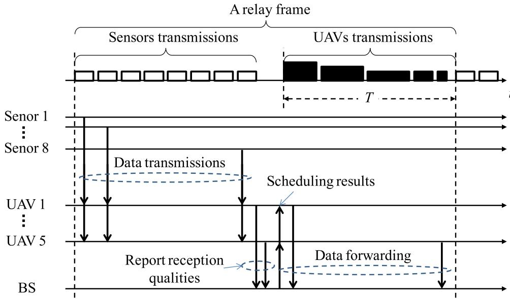  
Fig. 2. Illustration on a TDMA based cooperative relaying protocol for ${ \mathsf { U A V s } } ,$ where the sensors broadcast sensory data to all UAVs. The UAVs that correctly receive the data report their reception qualities to the BS, based on which the BS performs scheduling. The scheduling results are returned to the UAVs. The UAVs forward the data to the BS, following the instruction in the scheduling results.

forward to the BS in the current relay frame (as illustrated in the figure), respectively. $i = 1 , \ldots , N _ { R } . \ s _ { i } \subseteq \mathbb { S } _ { i }$ . The number ¼of packets received by UAV i is $| \mathbb { S } _ { i } | ,$ where denotes cardinality. $| \mathbb { S } _ { i } | \le M _ { R }$ depends on the channel condition of the j j link between the corresponding sensor and UAV i.

Then, each UAV reports the indices to its successfully decoded packets. The BS also measures $\gamma _ { i } ( t )$ which is ð Þdefined as the instantaneous signal to noise ratio (SNR) of the second hop for every UAV. Based on the UAVs’ reports and the BS measurement results, the BS schedules packets for every UAV, and determine the associated transmit rates $( \mathrm { i . e . , }$ modulation). After that, the BS returns the scheduling results to the UAVs. For each UAV, $\left| { s _ { i } } \right| ( \left| { s _ { i } } \right| \leq \left| { \mathbb { S } _ { i } } \right| )$ packets are transmitted to the BS. $s _ { i } \cap s _ { i + 1 } = \emptyset ( i = 1 , . . . , \bar { N } _ { R } - 1 )$ \ þ ¼ ; ¼ since repeated transmissions of the same packets from multiple UAVs can be avoided at scheduling.

The protocol is practical with a small amount of overhead. For the reception quality report shown in Fig. 2, each UAV can use one bit to indicate its reception quality of a packet, $^ { \prime \prime } { } _ { 1 } \prime \prime$ for success and $\prime \prime 0 \prime \prime$ otherwise. Consider a case where the source node sends 128 data packets. Each UAV needs to transmit a report of 16 bytes. For the packet of scheduling results that the BS broadcasts to the UAVs, as shown in Fig. 2, one selected UAV’s ID is attached to every data packet. For example, for eight relaying UAVs and 128 data packets from the source node, the scheduling results consists of 48 bytes in total.

## 3 PROPOSED ENERGY EFFICIENT SCHEDULINGFOR COOPERATIVE UAVS

In this section, we start by formulating the optimisation problem for scheduling. Noting the problem is an NP-hard integer programming and intractable in real-time applications, we develop a low-complexity suboptimal algorithm which is indistinguishably close to the optimal strategy in terms of network throughput. The algorithm can operate in real-time applications, where a large number of packets need to be scheduled and forwarded in a timely manner.

## 3.1 Optimal Scheduling for Cooperative UAVs

It is important to guarantee the quality of the received packets at the BS, i.e., the received BER is less than the required BER, denoted by - [24]. Our scheduling is designed to extend the network lifetime while meeting the BER requirement of the packets.

The instantaneous BER $\epsilon _ { i }$ for the transmission of UAV i can be given by [25]

$$
\epsilon _ { i } \approx \kappa _ { 1 } \exp \left[ \frac { - \kappa _ { 2 } \gamma _ { i } ( t ) \Gamma _ { i } ( t ) } { 2 ^ { \rho _ { i } } - 1 } \right] ,\tag{1}
$$

where $\kappa _ { 1 }$ and $\kappa _ { 2 }$ are positive fixed constants relating to the channel. $\rho _ { i }$ is the modulation level that UAV i uses to transmit data to the BS; the modulation of the UAV is 2ri Quadrature Amplitude Modulation (QAM). $\rho _ { i } \in \{ 1 , \ldots , M \}$ . When $\rho _ { i } = 1 .$ 2 f g, the modulation is essentially the Binary Phase Shift ¼Keying (BPSK). When $\rho _ { i } = 2 .$ , the modulation is the Quadra-¼ture Phase Shift Keying (QPSK). M is the number of modulation levels available for rate adaptation. $\Gamma _ { i } ( t )$ is the transmit power of UAV i at time t.

Consider the BER requirement of - for sensory packets received at the BS, i.e., $\epsilon _ { i } = \epsilon$ for $i = 1 , \ldots , N _ { R } .$ . We can rewrite (1) as given by

$$
\Gamma _ { i } ( t ) = \frac { \kappa _ { 2 } ^ { - 1 } \ln ( \frac { \kappa _ { 1 } } { \epsilon } ) \cdot ( 2 ^ { \rho _ { i } } - 1 ) } { \gamma _ { i } ( t ) } = \delta _ { i } ( t ) ( 2 ^ { \rho _ { i } } - 1 ) ,\tag{2}
$$

where $\begin{array} { r } { \delta _ { i } ( t ) = \frac { \kappa _ { 2 } ^ { - 1 } \ln ( \frac { \kappa _ { 1 } } { \epsilon } ) } { \gamma _ { i } ( t ) } } \end{array}$ for notation simplification.

ð ÞGiven the packet size $\mathfrak { L } _ { p } ^ { s _ { i } }$ , the energy that UAV i consumes to forward a set of sensory packet $s _ { i }$ can be given by

$$
\pi ( s _ { i } , \rho _ { i } , t ) = \frac { \mathfrak { L } _ { p } ^ { s _ { i } } } { \rho _ { i } } \Gamma _ { i } ( t ) = \mathfrak { L } _ { p } ^ { s _ { i } } \delta _ { i } ( t ) \frac { ( 2 ^ { \rho _ { i } } - 1 ) } { \rho _ { i } } .\tag{3}
$$

For illustration convenience, we assume that all the sensory packets are of the same length. The superscript of $\mathfrak { L } _ { p } ^ { s _ { i } }$ is suppressed in the rest of the paper.

Now, we can formulate the optimisation problem of scheduling which is to minimise the maximum energy consumption of all the $\mathrm { U A V s } ,$ , given the required BER - and the July 05,2026 at 12:27:12 UTC from IEEE Xplore. Restrictions apply.

fact that the UAVs may have received different subsets of the packets the source node sent. The formulation is provided as follows, i.e., (4)-(8).

$$
\operatorname* { m i n } _ { x _ { i , s , \rho _ { i } } } \left\{ \operatorname* { m a x } _ { i \in [ 1 , N _ { R } ] } \sum _ { s \subseteq \mathbb { S } _ { i } } \sum _ { \rho _ { i } = 1 } ^ { M } x _ { i , s , \rho _ { i } } \cdot \delta _ { i } ( t ) \cdot \frac { 2 ^ { \rho _ { i } } - 1 } { \rho _ { i } } \right\}\tag{4}
$$

$$
s u b j e c t : o : \sum _ { \rho _ { i } = 1 } ^ { M } [ x _ { i , s , \rho _ { i } } \Gamma _ { i } ( t ) ] \leq P _ { \operatorname* { m a x } } , \forall s \subseteq \mathbb { S } _ { i } ;\tag{5}
$$

$$
\sum _ { \rho _ { i } = 1 } ^ { M } x _ { i , s , \rho _ { i } } \leq 1 , \forall s \subseteq \mathbb { S } _ { i } ;\tag{6}
$$

$$
\sum _ { i \in \{ j : s \subseteq \mathbb { S } _ { j } \} } \sum _ { \rho _ { i } = 1 } ^ { M } x _ { i , s , \rho _ { i } } = 1 , \forall s \subseteq \bigcup _ { i = 1 } ^ { N _ { R } } \mathbb { S } _ { i } ;\tag{7}
$$

$$
\sum _ { i \in \{ j : s \subseteq \mathbb { S } _ { j } \} } \sum _ { s \subseteq \mathbb { S } _ { i } } \sum _ { \rho _ { i } = 1 } ^ { M } \frac { x _ { i , s , \rho _ { i } } } { \rho _ { i } } \leq \frac { T } { \mathfrak { L } _ { p } } ,\tag{8}
$$

where the binary variables $x _ { i , s , \rho _ { i } }$ that are to be optimised are the indicator that UAV i is allocated to forward packet $s \in \mathbb { S } _ { i }$ using $\rho _ { i } \in [ 1 , M ] , \ P _ { \operatorname* { m a x } }$ is the maximum transmit 2 2 ½power of a UAV, and $T$ is the duration of a time slot for all the UAVs to forward packets, as highlighted in Fig. 2.

1) Constraint (5) ensures that the transmit power of each UAV does not exceed the maximum transmit power $P _ { \mathrm { m a x } }$

2) Constraint (6) states that any data packet can only be forwarded by selecting one modulation of a UAV.

3) Constraint (7) guarantees that each of the packets that have been correctly received by the UAVs is forwarded by one of the UAVs that have correctly received the packet. Any two UAVs can not transmit the same packet.

4) Constraint (8) ensures all the UAVs complete forwarding packets in the scheduled time slot of $T ,$ where $\begin{array} { r } { \sum _ { i \in \{ j : s \in \mathbb { S } _ { j } \} } \sum _ { s \in \mathbb { S } _ { i } } \sum _ { \rho _ { i } = 1 } ^ { M } \frac { x _ { i , s , \rho _ { i } } } { \rho _ { i } } } \end{array}$ is the time required for the UAVs to forward their correctly received packets.

To directly solve this Min-Max optimisation problem is challenging. This is because the unknown variable $\rho _ { i }$ and the exponential term of it prevent the problem from being written into a standard form required by popular optimisation toolboxes, such as the MATLAB FMINIMAX function.

We proceed to convert the Min-Max problem to a set of minimisation problems which are mathematically tractable. Specifically, for any $\mathrm { U A V } ~ i ,$ we can reformulate (4)-(8) to a minimisation problem as follows, i.e., (9)-(10)

(9)

$$
\begin{array} { l } { \displaystyle \operatorname* { m i n } _ { x : s , \rho _ { i } } \left\{ \sum _ { s \in S _ { i } } \sum _ { \rho _ { i } = 1 } ^ { M } x _ { i , s , \rho _ { i } } \cdot \delta _ { i } ( t ) \cdot \frac { 2 ^ { \rho _ { i } } - 1 } { \rho _ { i } } \right\} } \\ { \displaystyle s . t . : \{ \mathrm { g } \} ; ( 6 ) ; ( 7 ) ; } \\ { \displaystyle \sum _ { s \in S _ { i } } \sum _ { \rho _ { i } = 1 } ^ { M } \left( x _ { i , s , \rho _ { i } } \cdot \delta _ { i } ( t ) \cdot \frac { 2 ^ { \rho _ { i } } - 1 } { \rho _ { i } } \right) } \\ { \displaystyle \geq \sum _ { s \in S _ { i } } \sum _ { \rho _ { i } = 1 } ^ { M } \left( x _ { j , s , \rho _ { j } } \cdot \delta _ { j } ( t ) \cdot \frac { 2 ^ { \rho _ { j } } - 1 } { \rho _ { j } } \right) , \forall j \neq i , } \end{array}\tag{10}
$$

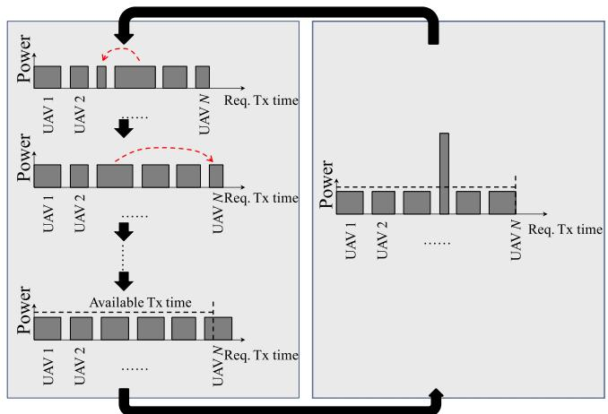  
Fig. 3. Pictorial illustration of the proposed algorithm, where the left box describes the energy balancing process given the modulation of every UAV; the right box shows increasing the modulation to fit into the available transmit time. The area of each grey block indicates the energy consumption of a UAV.

where the maximisation of the original Min-Max problem is replaced by including $( N _ { R } - 1 )$ new auxiliary constraints, ð  Þas given by (10). The new minimisation problem can be solved by using standard optimisation tools, e.g., the MAT-LAB BINTPROG function.

The minimisation problem (9)-(10) needs to be solved with respect to each $\mathrm { U A V } i = 1 , \dots , N _ { R }$ . The results of the UAVs ¼are then compared, and the one associated with the least energy consumption, i.e., the minimum value for the objective function (9), is taken as the final optimal solution.

Unfortunately, the problem is an NP-hard integer programming. Solving $N _ { R }$ such problems require prohibitively high computational complexity. On the other hand, the number of packets that are generated in WSNs can be large. This would lead to an exponentially increased complexity for solving the NP-hard integer programming. For these reasons, the optimal solutions are not suitable for real-time applications.

## 3.2 Computationally Efficient Suboptimal Solution: Energy-Efficient Packet Load Algorithm (EPLA)

We propose a practical, sub-optimal solution, EPLA, to the energy balancing packet scheduling problem for real-time UAV applications, as the optimal solutions are inapplicable in those scenarios, as discussed earlier.

Fig. 3 illustrates the proposed scheduling algorithm carried out at the BS, where the two processes of energy balancing and rate adaptation are decoupled and interact with each other in a recursive way. In the energy balancing process, the algorithm recursively reduces the energy consumption difference between any pair of UAVs, given the modulation of every UAV. As indicated by the red dash arrows, the largest difference of energy consumption is reduced by rescheduling some of the packets from the most energy-consuming UAV to the least energy-consuming UAV. The requirement of transmit time may increase. This is due to the fact that the energy efficiency is higher under better channel conditions. Our algorithm is therefore designed to assign more packets to the UAVs with better channels whenever possible. As a result, the required July 05,2026 at 12:27:12 UTC from IEEE Xplore. Restrictions apply.

transmit time grows, and the constraint of the totally available transmit time may be violated.

The rate adaptation process is carried out to address the violation of the transmit time constraint. As shown in the right-hand side of the figure, we pick up one of the UAVs and increase its modulation order. The UAV is chosen to require the least extra energy.

Clearly, the rate adaptation results in a growth of the overall energy consumption, since the transmit power of the selected UAV increases exponentially while its required transmit time decreases just linearly (see Equation (3)). In other words, the overall energy budget increases. A new round of energy balancing is then carried out to balance the energy consumption, given the increased energy budget.

The convergence of the proposed algorithm is obvious, because it gradually increases the energy budget until the constraint of the transmit time is met and the difference of energy consumption between any pair of UAVs is minimised.

Algorithm 1 provides the details on the proposed algorithm. Steps 4 to 15 describe the energy balancing process, where the ith UAV in the ordered sequence is indexed by $\ell ^ { \prime } ( i )$ (see Step 12). From Step 4 to 10, packets are tentatively ð Þassigned to the UAVs. In Steps 11 to 15, the energy consumption difference is minimised by pairwise assessing the UAVs. Steps 16 to 22 describe the rate adaptation process, where the UAV that can reduce the most overall transmission time by increasing its modulation is selected to do so. These two processes repeat iteratively until the time constraint is satisfied, as implemented by the outer loop, specifically, Steps 3 and 23.

Algorithm 1. EPLA Algorithm   
1: Initialise $\rho _ { i } = 1 .$   
2: Sort all $\begin{array} { r l } & { \subset \mathcal { P } _ { i } \mathrm { ~ - ~ } \dotsc } \\ & { \mathrm { U A V s } \mathrm { b y } \frac { \kappa _ { 2 } ^ { - 1 } \ln ( \frac { \kappa _ { 1 } } { \epsilon } ) } { \gamma _ { i } } } \end{array}$ in ascending order.   
i 3: while EPLA is not completed do   
4: for $i = [ 1 , N _ { R } ]$ do   
5: $\begin{array} { r } { \mathbf { i f } \frac { \kappa _ { 2 } ^ { - 1 } \ln ( \frac { \kappa _ { 1 } } { \epsilon } ) \cdot ( 2 ^ { \rho _ { \ell ( i ) } } - 1 ) } { \gamma _ { \ell ( i ) } ( t ) } \leq P _ { m a x } } \end{array}$ then   
6: ð ÞSchedule UAV ‘ i to transmit the data packets   
which have not been allocated.   
7: else   
8: The $\gamma _ { \ell ( i ) } ( t )$ is too small, UAV ‘ i is not scheduled to   
ð Þðtransmit.   
9: end if   
10: end for   
11: while $| \pi ( s _ { \ell ^ { \prime } ( i ) } , \rho _ { \ell ^ { \prime } ( i ) } , t ) - \pi ( s _ { \ell ^ { \prime } ( j ) } , \rho _ { \ell ^ { \prime } ( j ) } , t ) |$ is minimised do   
12: Sort the UAVs by $\begin{array} { r } { [ | s _ { \ell ^ { \prime } ( i ) } | \cdot \delta _ { \ell ^ { \prime } ( i ) } ( t ) \cdot \frac { ( 2 ^ { \rho _ { \ell ^ { \prime } ( i ) } } - 1 ) } { \rho _ { \ell ^ { \prime } ( i ) } } ] } \end{array}$ in descend  
ing order.   
13: UAV i has largest $\pi ( s _ { \ell ^ { \prime } ( i ) } , \rho _ { \ell ^ { \prime } ( i ) } , t )$ and UAV j has   
smallest one.   
14: Allocate packet load from $s _ { \ell ^ { \prime } ( i ) }$ to $s _ { \ell ^ { \prime } ( j ) }$   
15: end while   
16: if $\begin{array} { r } { \sum _ { i = 1 } ^ { N _ { R } } \frac { | s _ { \ell ^ { \prime } ( i ) } | } { \rho _ { \ell ^ { \prime } ( i ) } } \leq \frac { T } { \mathfrak L _ { p } } } \end{array}$ then   
17: ð ÞEPLA is completed.   
18: break   
19: else   
20: Sort the UAVs by $\frac { | s _ { \ell ^ { \prime } ( i ) } | ( 2 ^ { \rho _ { \ell ^ { \prime } ( i ) } } - 1 ) } { \rho _ { \ell ^ { \prime } ( i ) } }$ in descending order, $\ell ^ { \prime } ( i )$   
has the largest value.   
21: $\rho _ { \ell ^ { \prime } ( i ) }  \rho _ { \ell ^ { \prime } ( i ) } + 1 .$   
ð Þ22: end if   
23: end while

## 4 SIMULATION EVALUATION

In this section, MATLAB simulations are carried out to evaluate the performance of EPLA, namely, network yield, UAVs’ energy consumption (UEC), and network lifetime. Here, network yield defines the ratio of successfully delivered sensory packets to all sensory packets that the sensors transmit during a time period of T [26]. UEC indicates the energy efficiency of the UAVs, and it is critical to the lifetime of the UAVs and the network. We suppress the energy consumption of the BS in UEC, because the BS is typically equipped with persistent power supply. We also do not include the energy consumption of the sensors in UEC, because the deployment of UAVs does not affect the energy consumption of the sensors. The sensors transmit the sensory data without being aware of the UAVs. Otherwise the sensors would require the receiving capabilities and the energy requirement of the sensors would substantially increase, as described in Section 2. In fact, the use of UAVs can increase the energy efficiency of the sensors by increasing the number of successfully delivered data over relay links.

One reason for us choosing MATLAB is that it is convenient to generate fast changing airborne wireless channels in MATLAB. Another reason for using MATLAB is that the key part of the proposed algorithm, i.e., Algorithm 1, is a computationally efficient iterative sub-optimal algorithm to solve the problem specified in (4) to (8). MATLAB is powerful in terms of mathematic operations and algorithmic implementations. Our use of MATLAB is also because we compare the proposed suboptimal algorithm with the optimal solution which can be readily implemented by using the MATLAB CVX toolbox. Our MATLAB simulations are implemented with a 2.7 GHz Intel core processor with 8 GB of memory.

## 4.1 Simulation Setup and Parameters

The distance between the WSN (i.e., the centre of the locally distributed sensors) and the BS is 2 km. The number of sensors is 100 in the WSN. A circular flight trajectory with radius of r and elevation of 50 m is considered, as considered in [27], [28]. The centre of the circular trajectory is the middle of the WSN and the BS, unless otherwise specified. The UAVs are uniformly distributed on the circular trajectory with the same speed of 10 m/s.

We consider a realistic channel model for the simulations. Specifically, we consider the large-scale path loss which is modelled as free-space propagations in the UAV scenarios, as in most cases the UAVs have line-of-sight to both the sensors and the BS [29]. We also consider the small-scale fading which is modelled as independent and identically distributed (i.i.d.) Rayleigh fading (as extensively modelled in the literature, as suggested in [30]). Block fading is assumed on all the wireless links. In other words, the channel gain of a wireless link keeps constant during the scheduling and the transmission within a TDMA frame, but varies between frames. This assumption is reasonable, because the duration of a frame is typically up to 10 ms during which the distance that a UAV has travelled is negligible given the UAV speed of around $1 0 ~ \mathrm { m / s }$

TABLE 1 Configuration of Simulations
<table><tr><td>Parameters</td><td>Values</td></tr><tr><td> $\mathfrak { L } _ { p }$ </td><td>32 bytes</td></tr><tr><td> $M _ { R }$ </td><td>100</td></tr><tr><td> $T$ </td><td>10 milliseconds</td></tr><tr><td> $P _ { \mathrm { m a x } }$ </td><td> $5 \mathrm { W }$ </td></tr><tr><td> $N _ { 0 }$ </td><td> $3 . 9 8 \times 1 0 ^ { - 1 2 } \ : W$ </td></tr><tr><td> $N _ { R }$ </td><td> $1 , \ldots , 2 0$ </td></tr><tr><td> $\epsilon$ </td><td>0.05%</td></tr><tr><td> $\kappa _ { 1 }$ </td><td>0.2</td></tr><tr><td> $\kappa _ { 2 }$ </td><td>3</td></tr><tr><td> $\gamma _ { 0 }$ </td><td>3 dB</td></tr></table>

The probability that UAV i correctly decodes a sensory packet on the first hop can be calculated by

$$
\operatorname* { P r } \{ \gamma _ { i } ^ { \prime } ( r , \theta , t ) \geq \gamma _ { 0 } \} = \exp \biggl ( \frac { \gamma _ { 0 } } { \gamma ^ { \prime } ( r , \theta ) } \biggr ) ,\tag{11}
$$

where $\gamma _ { i } ^ { \prime } ( r , \theta , t )$ is the instantaneous SNR of UAV i at the ð Þposition of the polar coordinates r; u on the circular trajectory at time $t , \gamma _ { 0 }$ ð Þis the SNR threshold required for successful reception at the UAV, and $\gamma ^ { \prime } ( r , \theta )$ is the average SNR of a UAV at the position of $( r , \theta )$

ð ÞWe denote the initial energy of any UAV i as $E _ { i } ( 0 )$ in Joule. $E _ { i } ( T )$ ð Þis the remaining energy of UAV i in the battery ð Þat the end of a simulation time period of T . - is set to 0.05 percent, however, the value of - can be configured depending on the traffic type and quality-of-service (QoS) requirement of the sensory data, as well as the transmission capability of the UAVs [31]. Other simulation parameters are listed in Table 1.

For comparison purpose, we simulate three other scheduling algorithms that are suitable in our context setting.

1) The first algorithm, referred to as “low transmission power (Low TxPower)”, is a greedy algorithm, where the scheduling is solely based on the energy of UAVs [32]. UAVs with higher remaining energy are assigned more packets and those with lower energy are assigned less packets.

2) The second algorithm, referred to as “Average Allocation”, is a non-adaptive strategy that schedules an equal number of packets to all relay UAVs.

3) The third algorithm, referred to as “Random Allocation”, randomly assigns packets to the UAVs.

The modulation of the three algorithms is fixed to QPSK, due to the least energy-per-bit requirement of QPSK compared to other QAMs with higher modulation levels [33]. As far as we are aware of, no other algorithms are able to adjust the transmit rate while balancing energy consumption and guaranteeing bit error rate, as our proposed approach in this paper.

We also carry out a comparison study between the proposed algorithm and the optimal rate-adapting solution which is implemented by directly applying the standard convex optimisation techniques to solve (9). The optimal solution provides the lower bound to the packet drop rate of any rate adaptive algorithms applicable to the UAV setting. Comparisons between our algorithm and the optimal solution are meaningful and conclusive in terms of confirming the effectiveness of the proposed algorithm.

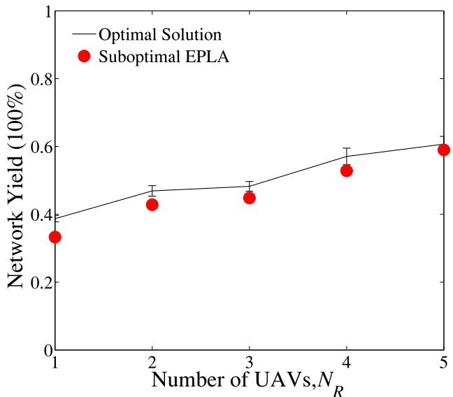  
Fig. 4. Comparison of network yield. The error bar shows the standard deviation over 50 runs.

## 4.2 Validation of The Proposed Algorithm

Figs. 4 and 5 confirm that the proposed suboptimal algorithm, i.e., EPLA, approaches the optimal scheduling (4) in terms of network yield and energy consumption, where $E _ { i } ( 0 )$ is assumed to be infinite for $i = 1 , \ldots , N _ { R }$ . The results of the optimal scheduling are obtained by solving (9) using MATLAB BINTPROG program. The network yield and UEC achieved by EPLA are respectively close to those of the optimal scheme, and the differences between the optimal and suboptimal solutions diminish as the number of relays $N _ { R }$ increases.

On the other hand, EPLA incurs substantially lower computational complexity than the optimal solution. Table 2 shows that the runtime of EPLA is far shorter than the runtime of the optimal solution by orders of magnitude, and the difference in runtime keeps increasing with the number of UAVs. When $N _ { R } = 5 ,$ the runtime of EPLA is shorter by four ¼orders of magnitude. This is due to the fact that the complexity of the optimal scheme grows exponentially with $N _ { R } ,$ while the complexity growth of the suboptimal EPLA is marginal. As a result, EPLA can support a larger number of UAVs instantly (e.g., tens of UAVs), whereas the optimal solution can hardly support the number of UAVs more than five.

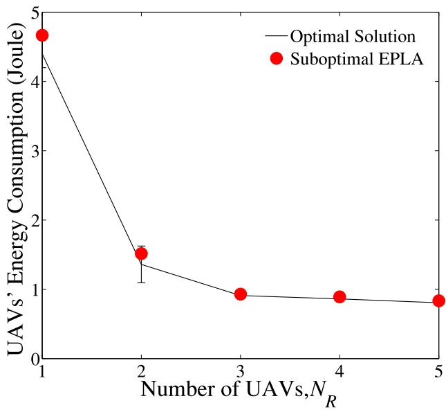  
Fig. 5. Comparison of UEC. The error bar shows the standard deviation over 50 runs.

TABLE 2  
Comparison of Runtime, Where the Variance is Calculated Based on 50 Runs
<table><tr><td rowspan="2">No. of UAVs</td><td colspan="2">Optimal Schedules</td><td colspan="2">EPLA</td></tr><tr><td>mean</td><td>variance</td><td>mean</td><td>variance</td></tr><tr><td>1</td><td>0.56 s</td><td>0.000022</td><td>0.039 s</td><td>0.000015</td></tr><tr><td>2</td><td>19.06 s</td><td>1.6291</td><td>0.0438 s</td><td>0.000013</td></tr><tr><td>3</td><td>42.6540 s</td><td>0.5993</td><td>0.0477 s</td><td>0.000039</td></tr><tr><td>4</td><td>50.0191 s</td><td>12.4113</td><td>0.0507 s</td><td>0.000019</td></tr><tr><td>5</td><td>129.1360 s</td><td>147.9916</td><td>0.0664 s</td><td>0.00003</td></tr></table>

## 4.3 Network Lifetime

Fig. 6 shows the network lifetime of cooperative UAVs with an increasing number of UAVs, where the initial battery level of each UAV is $E _ { i } ( 0 ) = 8 0$ Joules for $i = 1 , \ldots , N _ { R } .$ . The ð Þ ¼ ¼network lifetime defines as the time duration until all the UAVs run out of battery and stop relaying; in other words, the network lifetime $T _ { L } \dot { = } \operatorname* { m a x } _ { i = 1 , \dots , N _ { R } } \dot { \{ T _ { i } \} }$ , where $E _ { i } ( T _ { i } ) = 0$ and $E _ { i } ( T _ { i } - \eta ) ~ > ~ 0$ for $i = 1 , \dots , N _ { R } . \ \eta \longrightarrow 0$ is positive. The suboptimal EPLA is plotted in comparison with the three existing algorithms, i.e., Low TxPower, Average Allocation, and Random Allocation. The optimal scheduling of (4) or (9) is not plotted due to computational intractability, as discussed earlier.

We can see that EPLA can extend network lifetime, compared to the three existing algorithms. Particularly, when $\bar { N } _ { R } = 2 0$ , ELPA achieves 33 percent longer lifetime than the

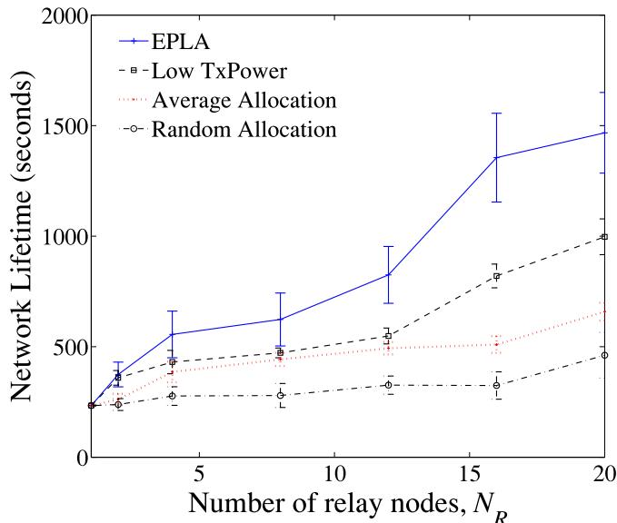  
Fig. 6. The performance of network lifetime with different packet scheduling algorithms, where the error bars show the standard deviation over 100 runs.

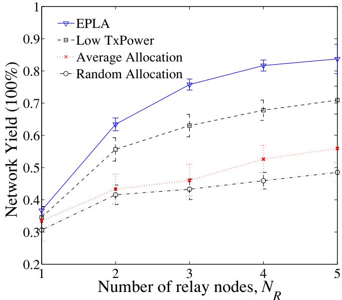  
Fig. 7. Comparison of network yield with different packet scheduling algorithms, where the error bars show the standard deviation over 100 runs.

Low TxPower, 60 percent longer than the Average Allocation, and 66.7 percent longer than the Random Allocation. This is because the proposed EPLA balances energy consumption of the UAVs, and the UAVs consume their energy in a steady and simply pace. In contrast, the Low TxPower gets the UAVs with good channel conditions to exhaust their energy much faster than the other UAVs. Once these UAVs run out of energy, the energy drainage of the remaining active UAVs speeds up, and the network lifetime expires rapidly. The Average Allocation and Random Allocation do not require particular UAVs to transmit significant more packets than other UAVs, as opposed to the Low TxPower. However, they may require the UAVs with poor channels to forward the same number of or even more packets than the UAVs with good channels. As a result, the network lifetime of the Average Allocation and Random Allocation is even shorter than the Low TxPower.

In Fig. 6, we also see that the network lifetime improvement of the proposed EPLA over the three existing algorithms grows with the number of UAVs. In other words, the network lifetime of EPLA increases much faster with the number of cooperative UAVs that the network lifetime of the existing algorithms. The conclusion drawn is that the increased number of UAVs leads to higher flexibility of scheduling, i.e., more UAVs cannot be chosen from to relay a packet. This helps reduce the gap between the highest and the lowest energy consumptions of the UAVs within a transmission schedule, achieving better energy balancing effects.

## 4.4 Network Yield and Energy Consumption

Fig. 7 plots the network yield of EPLA and the aforementioned three existing algorithms, where the number of UAVs grows from 1 to 20. Network yield defines the ratio of successfully delivered sensory packets to all the packets transmitted by the sensor. It is equivalent to the successful transmission rate of the network. We can see that EPLA outperforms all the other three existing algorithms with substantial gains, and the gains keep growing with the number July 05,2026 at 12:27:12 UTC from IEEE Xplore. Restrictions apply.

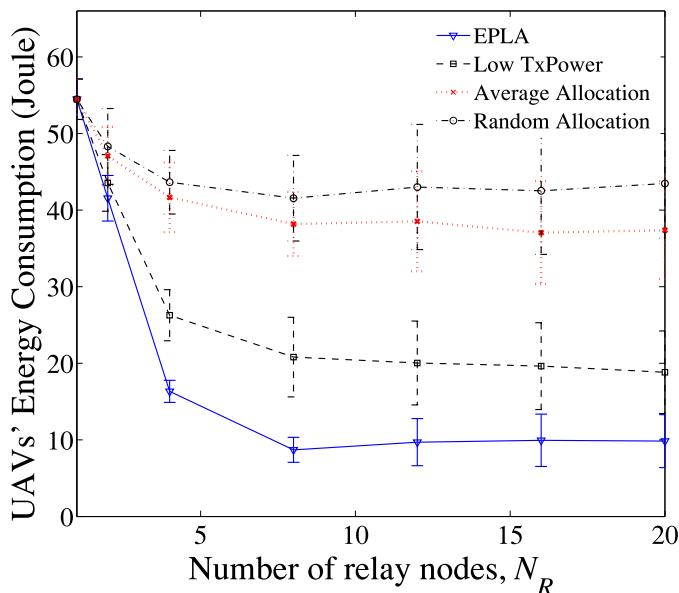  
Fig. 8. Comparison of the average UEC within the transmission duration of T. where the error bars show the standard deviation over 100 runs.

of UAVs. Specifically, our algorithm achieves 15, 30 and 38 percent higher network yield than the Low TxPower, Average Allocation, and Random Allocation algorithms, when $N _ { R } = 2 0$ . These gains are the results of the extended ¼network lifetime of EPLA.

Fig. 8 compares EPLA and the three existing algorithms in terms of the average UEC within the lifetime of the UAVs, where the number of UAVs increases from 1 to 20. It is shown that the UEC can be substantially reduced by getting more UAVs in cooperation, especially when the number of UAVs is small $( { N } _ { R } \leq 8 )$ . This is because an increased number of UAVs improve the likelihood of transmitting a packet with a reduced power, and in turn reduces the UEC. The proposed EPLA is able to reduce the UEC to a greater extent than the other three algorithms. It saves 50, 75 and 78 percent the energy compared to TxPower, Average and

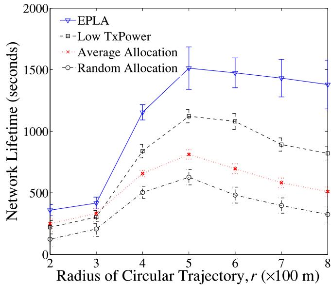  
Fig. 9. The performance of network lifetime with different packet scheduling algorithms, where the error bars show the standard deviation over 100 runs.

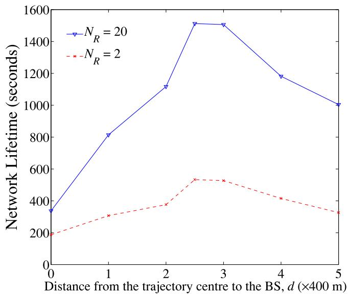  
Fig. 10. The performance of network lifetime for a varying number of UAVs.

Random allocations. This is due to the significantly extended lifetime of EPLA.

We also observe in Fig. 8 that the energy consumption, UEC, stabilizes when the number of UAVs becomes large $( { \mathrm { i . e . , ~ } } N _ { R } > 8 )$ . The reason is because adding an extra UAV to the $N _ { R }$ UAVs can hardly change the geometry of the UAVs that can successfully decode a sensory packet or reduce the channel gains towards the BS, when $N _ { R }$ is large. Consider two angularly uniform deployments of $N _ { R } \ \mathrm { U A V s }$ and $( N _ { R } + 1 )$ UAVs on the same circular flight trajectory. At þan instant, the maximum angular offset between any two nearest UAVs from the two different deployments is $\pi / ( N _ { R } + 1 )$ . When $N _ { R }$ is large, the angular offset becomes ð þ Þasymptotically negligible. As a result, the subgroups of UAVs from the two deployments, which successfully decode a sensory packet, are very likely to have the same geometry at the instant. Meanwhile, the difference of channel gain can be negligible between a UAV from one of the two subgroups and its counterpart in the other subgroup. For these reasons, the difference of UEC between the two deployments decreases with the growth of $N _ { R } .$ The UEC asymptotically stabilizes with growth of $N _ { R }$

Note that the value of $N _ { R }$ at which the UEC starts to stabilize is dependent on the radius of the UAV flight trajectory. The larger radius that the circular flight trajectory of the UAVs has, the bigger value of $N _ { R }$ is required for stabilizing UEC. This is because, for a given $N _ { R } ,$ the larger radius of the circular trajectory leads to the larger distance between adjacent UAVs. The reduction of the distance is non-negligible by increasing to $( N _ { R } + 1 )$ , and can result in a þnon-negligible decrease of UEC. In contrast, if the radius of the trajectory is small, the distance between adjacent UAVs is small. The reduction of the distance is negligible due to increasing $N _ { R }$ to $( N _ { R } + 1 )$ , and the UEC stabilizes.

## 4.5 Impact of Flying Trajectories of UAVs

Fig. 9 plots the network lifetime with respect to the radius of the circular trajectory of UAVs, where $N _ { R } = 1 0$ and the cen-¼tre of the circular trajectories is the halfway point between the WSN and the BS. We can see the network achieves the July 05,2026 at 12:27:12 UTC from IEEE Xplore. Restrictions apply.

longest lifetime when r is at 500 meters. That is because this is the case where the packet error on the first hop and the channel gain on the second hop are leveraged, thereby achieving the best end-to-end performance on both two hops.

Given r 500 meters, we proceed to evaluate the impact ¼of the trajectory location to the network lifetime. Fig. 10 evaluates the network lifetime by shifting the centre of the circular trajectory from the WSN to the BS. We can see that the best network lifetime is achieved between 1 and 1.2 km away from the BS. We also see that a large number of UAVs is more sensitive to the latitude location of the trajectory. Particularly, when $N _ { R } = 2 0$ , the difference of network life-¼time caused by the trajectory location is as large as six-fold. Significant improvement of network lifetime can be achieved by carefully choosing the centre of the trajectory. In contrast, the network lifetime is consistently low when $N _ { R } = 2 ,$ due to the poor success rates on both hops.

## 5 CONCLUSION

In this paper, we proposed an energy-efficient relaying scheme which can extend the lifetime of cooperative UAVs in human-unfriendly environments. An NP-hard optimisation problem was formulated to guarantee packet success rates and balance energy consumption. A practical suboptimal solution was developed by decoupling energy balancing and rate adaptation, and performing these two parts in an alternating manner. Simulation results show that our suboptimal method can reduce the computational complexity by orders of magnitude with negligible degradation of network yield and lifetime, compared to the optimal solution. Our suboptimal approach can also save energy by 50 percent, increase network yield by 15 percent, and extend network lifetime by 33 percent, compared to the existing algorithms.

## ACKNOWLEDGMENTS

This research was funded by the Australian Research Council Discovery Grant DP110104344.

## REFERENCES

[1] L. Merino, F. Caballero, J. R. Mart-ınez-de Dios, I. Maza, and A. Ollero, “An unmanned aircraft system for automatic forest fire monitoring and measurement,” J. Intell. Robotic Syst., vol. 65, nos. 1–4, pp. 533–548, 2012.

[2] B. A. White, A. Tsourdos, I. Ashokaraj, S. Subchan, and R. Zbikowski, “Contaminant cloud boundary monitoring using network of UAV sensors,” IEEE Sensors J., vol. 8, no. 10, pp. 1681– 1692, Oct. 2008.

[3] J. Valente, D. Sanz, A. Barrientos, J. d. Cerro, A. Ribeiro, and C.- Rossi, “An air-ground wireless sensor network for crop monitoring,” Sensors, vol. 11, no. 6, pp. 6088–6108, 2011.

[4] I. Maza, F. Caballero, J. Capit-an, J. Mart-ınez-de Dios, and A. Ollero, “Experimental results in Multi-UAV coordination for disaster management and civil security applications,” J. Intell. Robotic Syst., vol. 61, nos. 1–4, pp. 563–585, 2011.

[5] M. Bernard, K. Kondak, I. Maza, and A. Ollero, “Autonomous transportation and deployment with aerial robots for search and rescue missions,” J. Field Robotics, vol. 28, no. 6, pp. 914–931, 2011.

[6] I. Jawhar, N. Mohamed, J. Al-Jaroodi, and S. Zhang, “A framework for using unmanned aerial vehicles for data collection in linear wireless sensor networks,” J. Intell. Robotic Syst., vol. 74, nos. 1/2, pp. 437–453, 2014.

[7] D.-T. Ho, E. Grotli, S. Shimamoto, and T. A. Johansen, “Optimal relay path selection and cooperative communication protocol for a swarm of UAVs,” in Proc. IEEE Globecom Workshops, 2012, pp. 1585–1590.

[8] \_I. Bekmezci, O. K. Sahingoz, and S. Temel, “Flying ad-hoc net-¸ works (fanets): A survey,” Ad Hoc Netw., vol. 11, no. 3, pp. 1254– 1270, 2013.

[9] W. Ni, I. B. Collings, and R. P. Liu, “Relay handover and link adaptation design for fixed relays in IMT-advanced using a new Markov chain model,” IEEE Trans. Veh. Technol., vol. 61, no. 4, pp. 1839–1853, May 2012.

[10] W. Ni, I. B. Collings, R. P. Liu, and Z. Chen, “Relay-assisted wireless communication systems in mining vehicle safety applications,” IEEE Trans. Ind. Informat., vol. 10, no. 1, pp. 615– 627.Feb.2014.

[11] W. Ni, I. B. Collings, and R. P. Liu, “Decentralized user-centric scheduling with low rate feedback for mobile small cells,” IEEE Trans. Wireless Commun., vol. 12, no. 12, pp. 6106–6120, Dec. 2013.

[12] L. Peng, D. Lipinski, and K. Mohseni, “Dynamic data driven application system for plume estimation using UAVs,” J. Intell. Robotic Syst., vol. 74, nos. 1/2, pp. 421–436, 2014.

[13] H. Wang, D. Huo, and B. Alidaee, “Position unmanned aerial vehicles in the mobile ad hoc network,” J. Intell. Robotic Syst., vol. 74, nos. 1/2, pp. 455–464, 2014.

[14] O. Burdakov, P. Doherty, K. Holmberg, and P.-M. Olsson, “Optimal placement of UV-based communications relay nodes,” J. Global Optim., vol. 48, no. 4, pp. 511–531, 2010.

[15] Z. Gu, Q.-S. Hua, Y. Wang, and F. Lau, “Reducing information gathering latency through mobile aerial sensor network,” in Proc. IEEE INFOCOM, 2013, pp. 656–664.

[16] K. Dantu, B. Kate, J. Waterman, P. Bailis, and M. Welsh, “Programming micro-aerial vehicle swarms with karma,” in Proc. 9th ACM Int. Conf. Embedded Netw. Sensor Syst., 2011, pp. 121–134.

[17] P. Zhan, K. Yu, and A. Swindlehurst, “Wireless relay communications with unmanned aerial vehicles: Performance and optimization,” IEEE Trans. Aerosp. Electron. Syst., vol. 47, no. 3, pp. 2068–2085, Jul. 2011.

[18] A. E. Abdulla, Z. M. Fadlullah, H. Nishiyama, N. Kato, F. Ono, and R. Miura, “An optimal data collection technique for improved utility in UAS-aided networks,” in Proc. IEEE INFOCOM, 2014, pp. 736–744.

[19] A. Purohit, Z. Sun, and P. Zhang, “Sugarmap: Location-less coverage for micro-aerial sensing swarms,” in Proc. ACM Int. Conf. Inf. Process. Sensor Netw., 2013, pp. 253–264.

[20] C. Konstantopoulos, G. Pantziou, D. Gavalas, A. Mpitziopoulos, and B. Mamalis, “A rendezvous-based approach enabling energyefficient sensory data collection with mobile sinks,” IEEE Trans. Parallel Distrib. Syst., vol. 23, no. 5, pp. 809–817, May 2012.

[21] E. Hamouda, N. Mitton, and D. Simplot-Ryl, “Energy efficient mobile routing in actuator and sensor networks with connectivity preservation,” in Proc. 10th Int. Conf. Ad-hoc, Mobile, Wireless Netw., 2011, pp. 15–28.

[22] D. Turgut and L. Bol € oni, “Heuristic approaches for transmission € scheduling in sensor networks with multiple mobile sinks,” Comput. J., vol. 54, no. 3, pp. 332–344, 2011.

[23] Y.-C. Wang, W.-C. Peng, and Y.-C. Tseng, “Energy-balanced dispatch of mobile sensors in a hybrid wireless sensor network,” IEEE Trans. Parallel Distrib. Syst., vol. 21, no. 12, pp. 1836–1850, Dec.2010.

[24] K. Li, W. Ni, X. Wang, R. Liu, S. S. Kanhere, and S. Jha, “EPLA: Energy-balancing packet scheduling for airborne relaying networks,” in Proc. IEEE Int. Conf. Commun., 2015, pp. 7864–7869.

[25] T. He, X. Wang, and W. Ni, “Optimal Chunk-based resource allocation for OFDMA systems with multiple BER requirements,” IEEE Trans. Veh. Technol., vol. 63, no. 9, pp. 4292–4301, Nov. 2014.

[26] S. Xiong, J. Li, Z. Li, J. Wang, and Y. Liu, “Multiple task scheduling for Low-duty-cycled wireless sensor networks,” in Proc. IEEE INFOCOM, 2011, pp. 1323–1331.

[27] R. W. Beard, T. W. McLain, D. B. Nelson, D. Kingston, and D. Johanson, “Decentralized cooperative aerial surveillance using fixed-wing miniature UAVs,” Proc. IEEE, vol. 94, no. 7, pp. 1306– 1324, Jul. 2006.

[28] D. W. Casbeer, D. B. Kingston, R. W. Beard, and T. W. McLain, “Cooperative forest fire surveillance using a team of small unmanned air vehicles,” Int. J. Syst. Sci., vol. 37, no. 6, pp. 351– 360, 2006.

[29] N. Goddemeier, K. Daniel, and C. Wietfeld, “Role-based connectivity management with realistic air-to-ground channels for cooperative UAVs,” IEEE J. Sel. Areas Commun., vol. 30, no. 5, pp. 951– 963, Jun. 2012.

[30] R. C. Palat, A. Annamalau, and J. H. Reed, “Cooperative relaying for ad-hoc ground networks using swarm UAVs,” in Proc. IEEE Int. Conf. Military Commun. Conf., 2005, pp. 1588–1594.

[31] J. C. Bicket, “Bit-rate selection in wireless networks,” Ph.D. dissertation, Dept. Electr. Eng. Comput. Sci., Massachusetts Inst. Technol., Cambridge, MA, USA, 2005.

[32] K. Li, B. Kusy, R. Jurdak, A. Ignjatovic, S. S. Kanhere, and S. Jha, “k-fsom: Fair link scheduling optimization for energy-aware data collection in mobile sensor networks,” in Proc. Int. Conf. Wireless Sensor Netw., 2014, pp. 17–33.

[33] Z. Nan, X. Wang, and W. Ni, “Energy-efficient transmission of delay-limited bursty data packets under non-ideal circuit power consumption,” in Proc. IEEE Int. Conf. Commun., Jun. 2014, pp. 4957–4962.

Kai Li received the BE degree from Shandong University, China, in 2009, the MSc degree from The Hong Kong University of Science and Technology, Hong Kong, in 2010, and the PhD degree in computer science from The University of New South Wales, Sydney, Australia, in 2014. From 2010 to 2011, he was a research assistant in the Mobile Technologies Centre at The Chinese University of Hong Kong. He is currently a postdoctoral research fellow in The SUTD-MIT International Design Centre (IDC),

The Singapore University of Technology and Design (SUTD), Singapore. His research area includes resource allocation, network protocols, scheduling and energy efficiency in adhoc, sensor, and wireless networks. He is a member of the IEEE.

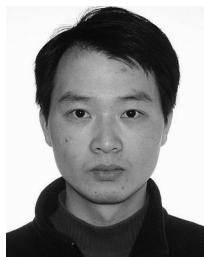

Wei Ni (M’09-SM’15) received the BE and PhD degrees in electronic engineering from Fudan University, Shanghai, China, in 2000 and 2005, respectively. He is currently a senior research scientist in CSIRO, Australia. Prior to this, he was a research scientist and deputy project leader at the Bell Labs R&I Center, Alcatel-Lucent (2005- 2008), and a senior research scientist at Devices R&D, Nokia (2008-2009). His research interests include multiuser MIMO, relay mesh networks, radio resource management, and scheduling,

etc. He serves as an editorial board member for Hindawi Journal of Engineering since 2012. He is a senior member of the IEEE.

Xin Wang (SM’09) received the BSc degree and the MSc degree from Fudan University, Shanghai, China, in 1997 and 2000, respectively, and the PhD degree from Auburn University, Auburn, AL, in 2004, all in electrical engineering. From September 2004 to August 2006, he was a postdoctoral research associate with the Department of Electrical and Computer Engineering, University of Minnesota, Minneapolis. In August 2006, he joined the Department of Computer & Electrical Engineering and Computer Science,

Florida Atlantic University, Boca Raton, as an assistant professor, and then an associate professor from August 2010. He is currently a professor with the Department of Communication Science and Engineering, Fudan University, China. His research interests include stochastic network optimisation, energy-efficient communications, cross-layer design, and signal processing for communications. He is a senior member of the IEEE.

Ren Ping Liu (SM’13) received the BE and ME degrees from the Beijing University of Posts and Telecomms, China, and the PhD degree in electrical and computer engineering from the University of Newcastle, Australia. He joined CSIRO in 1995, where he is currently a principle scientist. He has been heavily involved in commercial projects ranging from QoS design and TCP/IP internetworking to next generation network architectures. He has delivered networking solutions to customers including Optus, AARNet, Nortel,

Queensland Health, CityRail, and Rio Tinto. His interests include modelling, resource allocation, and analysis in IEEE 802.11, mesh, sensor, and cognitive radio networks. He is a senior member of the IEEE.

Salil S. Kanhere received the BE degree in electrical engineering from the University of Bombay, India, in 1998, and the MS and PhD degrees in electrical engineering from Drexel University, Philadelphia, in 2001 and 2003, respectively. He is currently an associate professor with the School of Computer Science and Engineering, University of New South Wales, Sydney, Australia. His current research interests include wireless sensor networks, vehicular communication, mobile computing, and network security. He is a member of the ACM and a senior member of the IEEE.

Sanjay Jha is a professor and head of the Network Group at the School of Computer Science and Engineering, University of New South Wales. His research activities cover a wide range of topics in networking including network and systems security, wireless sensor networks, adhoc/community wireless networks, and resilience and multicasting in IP networks. He has published more than 160 articles in high quality journals and conferences. He is the principal author of the book Engineering Internet QoS and a co-editor of the book Wireless Sensor Networks: A Systems Perspective. He served as an associate editor of the IEEE Transactions on Mobile Computing (TMC). He currently serves on the editorial board of the ACM Computer Communication Review (CCR). He is a senior member of the IEEE.

" For more information on this or any other computing topic, please visit our Digital Library at www.computer.org/publications/dlib.