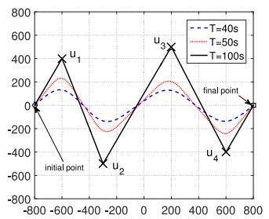
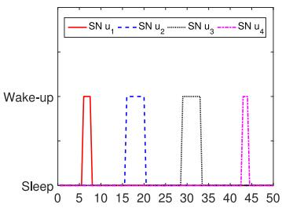
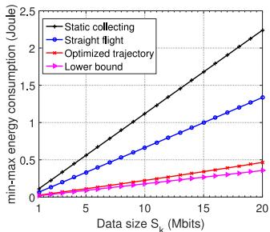
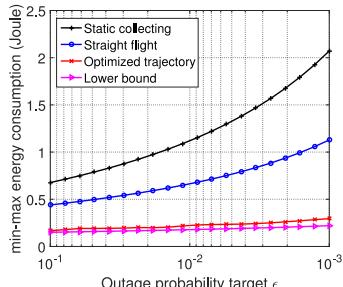

# Energy-Efficient Data Collection in UAV Enabled Wireless Sensor Network

Cheng Zhan , Member, IEEE, Yong Zeng , Member, IEEE, and Rui Zhang Fellow, IEEE

Abstract—In wireless sensor networks, utilizing the unmanned aerial vehicle (UAV) as a mobile data collector for the sensor nodes (SNs) is an energy-efficient technique to prolong the network lifetime. In this letter, considering a general fading channel model for the SN-UAV links, we jointly optimize the SNs’ wakeup schedule and UAV’s trajectory to minimize the maximum energy consumption of all SNs, while ensuring that the required amount of data is collected reliably from each SN. We formulate our design as a mixed-integer non-convex optimization problem. By applying the successive convex optimization technique, an efficient iterative algorithm is proposed to find a sub-optimal solution. Numerical results show that the proposed scheme achieves significant network energy saving as compared to benchmark schemes.

Index Terms—Unmanned aerial vehicle, trajectory design, energy minimization, data collection, wireless sensor network.

## I. INTRODUCTION

a large number of low-cost sensor nodes (SNs) that are typically powered by limited energy sources such as battery, which are difficult to be recharged once depleted [1]. Therefore, energy-efficient sensing and communication techniques for SNs are crucial to prolong the lifetime of WSNs. There has been a growing interest recently in employing the unmanned aerial vehicle (UAV) as a mobile data collector for the ground SNs in WSN [2]. By leveraging its high mobility, UAV is capable of collecting data from the SNs energyefficiently, since it can sequentially visit the SNs and collect data from them only when it moves sufficiently close to each SN. Thus, the link distance from each active SN to the UAV is significantly reduced, which saves the transmission energy of all SNs. It has been shown that short-distance line-of-sight (LoS) communication links between UAV and ground terminals can be efficiently exploited in various UAV-enabled wireless networks for performance enhancement by properly designing the UAV’s trajectory [3]–[5].

For UAV-enabled WSNs, sleep and wake-up mechanism is another useful technique to save the energy consumption of SNs [6]. With such a mechanism, the SNs remain in the sleep state until they receive the waking up beacon signal with good strength from the nearby UAV, at which time they will wake up and start sending data to the UAV, and return to the sleep state after the transmission. There are two critical issues in designing UAV-enabled WSNs for data collection. The first one is due to the limited battery energy of SNs. The wakeup schedule of SNs should thus be appropriately designed so that each SN can complete its data transmission with minimum energy consumption. The second issue is due to the highly dynamic wireless channels between the SNs and the moving UAV, which are prone to packet loss [7], especially for the practical case when multi-path induced channel fading is present. Thus, the trajectory of the UAV should be properly designed to ensure that each SN can transmit data with low outage probability when it is in its wake-up state.

The problem of jointly designing the SNs’ wake-up schedule and the UAV’s trajectory for energy-efficient data collection is new and challenging, which has not been rigorously studied to our best knowledge. The deployment and mobility of multiple UAVs for Internet of Things (IoT) communications was investigated in [8]. A cyclical multiple access scheme was also proposed in [9], for supporting delay-tolerant data transmission from ground terminals to the UAV in a periodic manner. It is worth noting that an optimization framework for energy-efficient UAV-to-ground communication via trajectory design was recently developed in [10], but only the UAV’s energy consumption was considered.

Under a general fading channel model for the SN-UAV links, this letter studies the joint optimization of SNs’ wake-up schedule and UAV’s trajectory to achieve reliable and energyefficient data collection in UAV-enabled WSNs. The aim is to minimize the maximum energy consumption of all SNs while ensuring that a target amount of data is collected reliably from each SN. The design is formulated as a mixed-integer non-convex optimization problem, which is difficult to be optimally solved. By applying the successive convex optimization technique, an efficient iterative algorithm is proposed to find a sub-optimal solution for our design. Numerical results show that the proposed scheme achieves significant energy savings for the SNs as compared to the benchmark schemes with static data collector or simple straight trajectory of the UAV.

## II. SYSTEM MODEL AND PROBLEM FORMULATION

We consider a WSN where a UAV is employed as a mobile data collector to gather information from K SNs on the ground, which are denoted by {uk, $1 \leq k \leq K \}$ . The location of $u _ { k }$ is denoted by $\mathbf { w } _ { k } \in \mathbb { R } ^ { 2 \times 1 }$ . Each SN $u _ { k }$ generates sensing data of size $S _ { k }$ bits, and the UAV is regularly dispatched to collect the sensed data for a duration of T seconds. We assume that the UAV flies at a fixed altitude of H meters and denote its maximum speed as $V _ { \mathrm { m a x } }$ in meter/second (m/s). The initial and final locations of the UAV are assumed to be pre-determined,

Manuscript received September 13, 2017; revised October 24, 2017; accepted November 18, 2017. Date of publication November 23, 2017; date of current version June 19, 2018. This work was supported in part by the National Natural Science Foundation of China under Grant 61702426, and in part by the China Scholarship Council. The associate editor coordinating the review of this paper and approving it for publication was M. Sheng. (Corresponding author: Yong Zeng).

C. Zhan is with the School of Computer and Information Science, Southwest University, Chongqing 400715, China (e-mail: zhanc@swu.edu.cn).

Y. Zeng and R. Zhang are with the Department of Electrical and Computer Engineering, National University of Singapore, Singapore 117583 (e-mail: elezeng@nus.edu.sg; elezhang@nus.edu.sg).

Digital Object Identifier 10.1109/LWC.2017.2776922 whose horizontal coordinates are denoted as ${ \bf q } _ { 0 } , { \bf q } _ { F } \in \mathbb { R } ^ { 2 \times 1 }$ , respectively. This corresponds to practical scenarios where q0 and $\mathbf { q } _ { F }$ depend on various factors such as the UAV’s pre- and post-mission flying paths, which are given in different applications [4]. We assume that $\| { \bf q } _ { F } - { \bf q } _ { 0 } \| \le V _ { \mathrm { m a x } } T$ so that there exists at least one feasible trajectory for the UAV to move from ${ \bf q } _ { 0 }$ to $\mathbf { q } _ { F }$ within T. The $\mathrm { U A V } _ { \mathrm { \Delta } }$ flying trajectory projected on the ground is denoted as $\mathbf { q } ( t ) \in \mathbb { R } ^ { 2 \times 1 } , \bar { 0 } \leq \bar { t } \leq T .$ . For convenience, $T$ is discretized into M time slots, $\mathrm { i . e . , ~ } T = M \delta _ { t }$ , where $\delta _ { t }$ denotes the elemental slot length such that the UAV’s location is considered as approximately unchanged by the ground SNs within each time slot even at the maximum speed. Therefore, the UAV’s trajectory q(t) can be approximated by the sequence $\{ \mathbf { q } [ m ] , 1 \leq m \leq M \}$ , where $\mathbf { q } [ m ] \triangleq \mathbf { q } ( m \delta _ { t } )$ denotes the UAV’s location at time slot $m .$

We assume that the sleep and wake-up mechanism is employed, and at most one SN can be waked up to communicate with the UAV at each time slot. Denote the wake-up schedule variable as $x _ { k } [ m ]$ , where $x _ { k } [ m ] = 1 \mathrm { ~ i f ~ } u _ { k }$ is waked up at time slot $m ,$ , and $x _ { k } [ m ] = 0$ otherwise. Thus, we have - Kk=1 xk[m] ≤ 1, ∀m. If xk[m] = 1, then uk transmits data with $\begin{array} { r } { \dot { \sum _ { k = 1 } ^ { K } } x _ { k } [ m ] \le 1 } \end{array}$ $[ \mathrm { f } \ x _ { k } [ m ] = 1$ $u _ { k }$ a constant transmission power $P _ { k }$ and a designed transmission rate $R _ { k } [ m ]$ in bits/second/Hz (bps/Hz).

We assume quasi-static block fading channels for the ground-UAV links, where the channel remains unchanged within each fading block and may change over blocks. Furthermore, the duration of each fading block is typically much smaller than $\delta _ { t } .$ . As such, the number of fading blocks in each time slot, denoted as $L ,$ is much larger than 1 in practice. Under a general fading channel model, the channel coefficient between the UAV and $u _ { k }$ at the l-th fading block of time slot m can be modelled as hk[m, $l ] = \sqrt { \beta _ { k } [ m ] } \rho _ { k } [ m , l ]$ , where $\rho _ { k } [ m , l ]$ is a small-scale fading coefficient and $\beta _ { k } [ m ]$ accounts for the large-scale channel attenuation that depends only on the distance between the UAV and $u _ { k }$ . Let $d _ { k } [ m ]$ be the distance between the UAV and $u _ { k }$ at time slot m. We thus have

$$
\beta_ {k} [ m ] = \beta_ {0} d _ {k} ^ {- \alpha} [ m ] = \frac {\beta_ {0}}{(H ^ {2} + \| \mathbf {q} [ m ] - \mathbf {w} _ {k} \| ^ {2}) ^ {\alpha / 2}}, \tag {1}
$$

where $\beta _ { 0 }$ denotes the reference channel power gain at $d _ { 0 } =$ 1m, and $\alpha \ge 2$ is the path loss exponent. Without loss of generality, for any time slot $m , \ \rho _ { k } [ m , l ]$ are assumed to be independent and identically distributed (i.i.d.) random variables with $\mathbb { E } [ | \rho _ { k } [ m , l ] | ^ { 2 } ] = \dot { 1 }$ . We assume that the UAV only knows the locations of the SNs as well as the channel distribution information (CDI), namely the values for α and $\beta _ { 0 }$ as well as the identical distribution of $| \rho _ { k } [ m , l ] | ^ { 2 }$ . Note that due to the time-varying UAV locations, the distribution of $| h _ { k } [ m , l ] | ^ { 2 }$ keeps unchanged within each time slot but varies over different time slots. Therefore, the transmission rate $R _ { k } [ m ]$ by the wake-up SN can be designed adaptively over each time slot based on the UAV’s location. Once the trajectory q[m], wakeup schedule $x _ { k } [ m ]$ , and transmission rate $R _ { k } [ m ]$ are determined, the UAV will wake up the corresponding SNs, and inform each of them the optimized transmission rate over time slots using the downlink control links.

If $u _ { k }$ is in the wake-up state for communication at time slot $m ,$ then for the l-th fading block of time slot $m ,$ the achievable

rate in bps/Hz is given by

$$
C _ {k} [ m, l ] = \log_ {2} \left(1 + \frac {\left| h _ {k} [ m , l ] \right| ^ {2} P _ {k}}{\sigma^ {2} \Gamma}\right), \tag {2}
$$

where $\sigma ^ { 2 }$ is the noise power, $\Gamma > 1$ is the SNR gap between the practical modulation schemes and the theoretical Gaussian signaling. The outage probability between $u _ { k }$ and the UAV at the l-th fading block of time slot m is then given by

$$
\begin{array}{l} p _ {k} [ m, l ] = \mathbb {P} (C _ {k} [ m, l ] <   R _ {k} [ m ]) \\ = \mathbb {P} \left(| \rho_ {k} [ m, l ] | ^ {2} <   \frac {\sigma^ {2} \Gamma \left(2 ^ {R _ {k} [ m ]} - 1\right)}{\beta_ {k} [ m ] P _ {k}}\right) \\ = F \left(\frac {\sigma^ {2} \Gamma (2 ^ {R _ {k} [ m ]} - 1)}{\beta_ {k} [ m ] P _ {k}}\right) \triangleq p _ {k} ^ {o u t} [ m ], \tag {3} \\ \end{array}
$$

where $F ( \cdot )$ denotes the identical cumulative distribution function (CDF) of $| \rho _ { k } [ m , l ] | ^ { 2 }$ . Note that during each time slot m, $p _ { k } [ m , l ]$ is identical for different fading blocks $l ,$ and thus is denoted as $p _ { k } ^ { o u t } [ m ]$ , which is a non-decreasing function with respect to $R _ { k } [ m ]$ . Therefore, in order to ensure that the target amount of sensing information of each SN is collected reliably by the UAV, $R _ { k } [ m ]$ should be chosen such that $p _ { k } ^ { o u t } [ m ] = \epsilon .$ , where  denotes the maximum tolerable outage probability. As a result, the transmission rate can be expressed as

$$
R _ {k} [ m ] = \log_ {2} \left(1 + \frac {F ^ {- 1} (\epsilon) P _ {k} \beta_ {0}}{\sigma^ {2} \Gamma (H ^ {2} + \| \mathbf {q} [ m ] - \mathbf {w} _ {k} \| ^ {2}) ^ {\alpha / 2}}\right), \tag {4}
$$

where $F ^ { - 1 } ( \cdot )$ is the inverse function of $F ( \cdot )$ .

In order to ensure fairness among all SNs in terms of their energy consumption, we choose to minimize the maximum energy consumption among all SNs. Let $\mathbf { X } = \{ x _ { k } [ m ] , \forall k , m \}$ and $\mathbf { Q } = \{ \mathbf { q } [ m ] , \forall m \}$ . Our aim is to jointly optimize the wakeup schedule X and the UAV’s trajectory Q so as to minimize the maximum energy consumption of all SNs, while ensuring that the target amount of data $S _ { k }$ in bits is collected from uk reliably (i.e., with maximum outage probability $\epsilon )$ . Define $D _ { \operatorname* { m a x } } \triangleq \delta _ { t } V _ { \operatorname* { m a x } }$ in meter, $E _ { k } \triangleq \delta _ { t } P _ { k }$ in Joule, and $\begin{array} { r } { r _ { k } \triangleq \frac { S _ { k } } { B \delta _ { t } } } \end{array}$ in bps/Hz, where B denotes the channel bandwidth in $\operatorname { H z } ;$ then the problem is formulated as

$$
\begin{array}{l} \text {(P1)}: \min _ {\mathbf {X}, \mathbf {Q}, \theta} \theta \\ \text { s.t. } \sum_ {m = 1} ^ {M} x _ {k} [ m ] E _ {k} \leq \theta , \quad \forall k, (5) \\ \sum_ {m = 1} ^ {M} x _ {k} [ m ] R _ {k} [ m ] \geq r _ {k}, \quad \forall k, (6) \\ \sum_ {k = 1} ^ {K} x _ {k} [ m ] \leq 1, \quad \forall m, (7) \\ x _ {k} [ m ] \in \{0, 1 \}, \quad \forall k, m, (8) \\ \| \mathbf {q} [ m ] - \mathbf {q} [ m - 1 ] \| \leq D _ {\max}, \forall m \geq 2, (9) \\ \mathbf {q} [ 1 ] = \mathbf {q} _ {0}, \mathbf {q} [ M ] = \mathbf {q} _ {F}. (10) \\ \end{array}
$$

Note that constraints (5) ensure that the energy consumption of each SN does not exceed θ, where θ is the slack variable signifying the maximum energy to be minimized, and the constraints (6) ensure that the target amount of data from each

SN is collected reliably. The constraints (9) and (10) correspond to the UAV’s speed and initial/final location constraints, respectively.

## III. PROPOSED SOLUTION

Problem (P1) is a mixed-integer non-convex problem, which is difficult to be optimally solved in general. Therefore, in this letter, we aim to obtain an efficient sub-optimal solution to (P1). To this end, we first relax the binary constraints in (8) as $0 \leq x _ { k } [ m ] \leq 1$ , and then solve the relaxed problem iteratively based on the block coordinate descent technique. To reconstruct the binary wake-up schedule variables, note that there are LM fading blocks in total with the time horizon T. If the solution X of the relaxed problem is not binary, we can allocate $N _ { k } [ m ] \ = \ \lfloor L x _ { k } [ m ] \rceil$ fading blocks to SN uk in any time slot m, where 	x
 denotes the nearest integer of x. With sufficiently large $L ,$ the gap between $N _ { k } [ m ]$ and $L x _ { k } [ m ]$ is practically negligible. Since the relaxed problem is not jointly convex with respect to X and Q, we adopt the block coordinate descent technique to solve X and Q alternately. First, for any given trajectory Q, the integer-relaxed wake-up schedule solution can be obtained by solving the following standard linear program (LP),

$$
\text {(P2)}: \min _ {\mathbf {X}, \theta} \theta
$$

$$
\text { s.t. } 0 \leq x _ {k} [ m ] \leq 1, \quad \forall k, m, \tag {11}
$$

$$
(5), (6), (7).
$$

On the other hand, for any given wake-up schedule X, the $\mathrm { U A V } _ { \mathrm { \Delta } }$ trajectory is optimized to maximize the weighted minimum of the communication throughput of all SNs, where the weight is inversely proportional to $r _ { k }$ . Specifically, the problem can be formulated as

$$
\text {(P3)}: \max _ {\mathbf {Q}, \eta} \eta
$$

$$
\text { s.t. } \frac {1}{r _ {k}} \sum_ {m = 1} ^ {M} x _ {k} [ m ] R _ {k} [ m ] \geq \eta , \quad \forall k, \tag {12}
$$

$$
(9), (1 0).
$$

Problem (P3) is a non-convex optimization problem due to the non-convex constraints (12). However, an efficient approximate solution can be obtained based on the successive convex optimization technique [10], which is guaranteed to converge to at least a locally optimal solution. The main idea is to successively maximize a lower bound of (P3) at each iteration. Let ${ \bf Q } ^ { l } \stackrel { \cdot } { = } \{ { \bf q } ^ { l } [ m ]$ , ∀m} denote the given trajectory in the l-th iteration. Similar as [10], by applying the first-order Taylor expansion, $R _ { k } [ m ]$ in (4) can be lower-bounded as

$$
\begin{array}{l} R _ {k} [ m ] \geq R _ {k, l} ^ {l b} [ m ] \triangleq A _ {k, l} [ m ] - I _ {k, l} [ m ] \| \mathbf {q} [ m ] - \mathbf {w} _ {k} \| ^ {2} \\ + I _ {k, l} [ m ] \left\| \mathbf {q} ^ {l} [ m ] - \mathbf {w} _ {k} \right\| ^ {2}, \tag {13} \\ \end{array}
$$

where $A _ { k , l } [ m ] = \log _ { 2 } \biggl ( 1 + \frac { F ^ { - 1 } ( \epsilon ) P _ { k } \beta _ { 0 } } { \sigma ^ { 2 } \Gamma J _ { k , l } [ m ] ^ { \alpha / 2 } } \biggr ) ,$ (14)

$$
I _ {k, l} [ m ] = \frac {F ^ {- 1} (\epsilon) P _ {k} \beta_ {0} (\alpha / 2) \log_ {2} e}{J _ {k , l} [ m ] \left(\sigma^ {2} \Gamma J _ {k , l} [ m ] ^ {\alpha / 2} + F ^ {- 1} (\epsilon) P _ {k} \beta_ {0}\right)}, \tag {15}
$$

$$
J _ {k, l} [ m ] = H ^ {2} + \left\| \mathbf {q} ^ {l} [ m ] - \mathbf {w} _ {k} \right\| ^ {2}. \tag {16}
$$

Algorithm 1 Successive Convex Optimization for (P3)  
1: Initialize the trajectory as $\mathbf{Q}^0$ ;
2: $l \leftarrow 0$ ; set tolerance $\kappa > 0$ ;
3: repeat
4: Solve the QCQP problem (P4) for given $\mathbf{Q}^l$ , and denote the optimal solution as $\mathbf{Q}^{l+1}$ ;
5: $\mathbf{Q}^l \leftarrow \mathbf{Q}^{l+1}$ ; $l \leftarrow l + 1$ ;
6: until The fractional increase of the objective value of (P4) is below $\kappa$ .

Algorithm 2 Iterative Algorithm for Relaxed (P1)  
1: Initialize the trajectory as $Q^{0}$ ;
2: $r \leftarrow 0$ ; set tolerance $\kappa > 0$ ;
3: repeat
4: Solve (P2) for given $Q^{r}$ to obtain solution $X^{r}$ ;
5: Solve (P3) for given $\{X^{r}, Q^{r}\}$ with Algorithm 1, and denote the solution as $Q^{r+1}$ ;
6: $r \leftarrow r + 1$ ;
7: until The fractional decrease of the objective value of (P2) is below $\kappa$ .

As a result, the UAV’s trajectory can be optimized by solving the following problem,

$$
\text {(P4)}: \max _ {\mathbf {Q}, \eta^ {l b}} \eta^ {l b}
$$

$$
\text { s.t. } \frac {1}{r _ {k}} \sum_ {m = 1} ^ {M} x _ {k} [ m ] R _ {k, l} ^ {l b} [ m ] \geq \eta^ {l b}, \quad \forall k, \tag {17}
$$

$$
(9), (1 0).
$$

Note that $\eta ^ { l b }$ is a slack variable to be maximized, and it is not difficult to show that at the optimal solution to (P4), we have $\begin{array} { r } { \eta ^ { l b } = \operatorname* { m i n } _ { k } \frac { 1 } { r _ { k } } \sum _ { m = 1 } ^ { M } x _ { k } [ m ] \dot { R _ { k , l } ^ { l b } } [ m ] } \end{array}$ = mink 1r . Since $R _ { k , l } ^ { l b } [ m ]$ is a concave quadratic function with respect to q[m], (P4) is a convex quadratically constrained quadratic program (QCQP), which can be solved efficiently by existing software tools such as CVX. Thus, (P3) can be solved by iteratively optimizing (P4) with the local point $\mathbf { Q } ^ { l }$ updated in each iteration, which is summarized in Algorithm 1.

Similar as in [10], the resulting objective values of (P4) in Algorithm 1 are non-decreasing over the iterations. Thus, Algorithm 1 is guaranteed to converge. The overall algorithm for the integer-relaxed problem (P1) is obtained by optimizing the wake-up schedule X and trajectory Q alternately via solving problem (P2) and (P3) respectively, in an iterative manner, which is summarized in Algorithm 2.

It can be shown that after step 4 of Algorithm 2, the constraints in (6) are all satisfied with equality. Furthermore, constraints (6) can be relaxed after step 5 due to the maximization of the weighted minimum throughput in (P3), which leaves more optimization space for decreasing θ in (P2). Therefore, with Algorithm 2, the resulting cost values of (P2) are non-increasing over the iterations. Furthermore, since the objective value of (P2) is lower-bounded by a finite value, Algorithm 2 is guaranteed to converge.

line chart

| x     | T=40s | T=50s | T=100s |
|-------|-------|-------|--------|
| -800  | 0     | 0     | 0      |
| -600  | 200   | 200   | 400    |
| -400  | 0     | 0     | -400   |
| -200  | -200  | -200  | -600   |
| 0     | 0     | 0     | 0      |
| 200   | 200   | 200   | 400    |
| 400   | 0     | 0     | -400   |
| 600   | -200  | -200  | -600   |
| 800   | 0     | 0     | 0      |

(a) UAV's trajectory

line chart

| Sleep | SN u₁ | SN u₂ | SN u₃ | SN u₄ |
|-------|-------|-------|-------|-------|
| 0     | 0     | 0     | 0     | 0     |
| 5     | 1.0   | 0     | 0     | 0     |
| 10    | 0     | 0     | 0     | 0     |
| 15    | 0     | 1.0   | 0     | 0     |
| 20    | 0     | 1.0   | 0     | 0     |
| 25    | 0     | 0     | 0     | 0     |
| 30    | 0     | 0     | 1.0   | 0     |
| 35    | 0     | 0     | 1.0   | 0     |
| 40    | 0     | 0     | 0     | 1.0   |
| 45    | 0     | 0     | 0     | 1.0   |
| 50    | 0     | 0     | 0     | 0     |

(b) Wake-up schedule (T= 50s)  
Fig. 1. The UAV’s trajectory and SNs’ wake-up schedule.

## IV. NUMERICAL RESULTS

In this section, numerical results are provided to verify our proposed design. We consider the practical Rician fading channels with Rician factor $K _ { c } ,$ and the CDF function F(·) of √ √ $| \rho _ { k } [ m , l ] | ^ { 2 }$ can be expressed as $F ( z ) ~ = ~ 1 -$ $Q _ { 1 } ( \sqrt { 2 K _ { c } } , \sqrt { 2 ( K _ { c } + 1 ) z } )$ where $Q _ { 1 } ( a , b )$ is the Marcum-Q function [11]. We consider a system with $K = 4 ~ \mathrm { S N s }$ , which are randomly located within an area of size $1 . 6 \times 1 . 6 ~ \mathrm { k m } ^ { 2 }$ . The results obtained are based on one random realization of the SN locations as shown in Fig. 1(a). The UAV’s initial and final locations are respectively set as $\mathbf { q } _ { 0 } = [ - 8 0 0 , 0 ] ^ { T }$ and $\mathbf { q } _ { F } = [ 8 0 0 , 0 ] ^ { T }$ in meter. Furthermore, we set $H = 1 0 0 \mathrm { m } .$ , Vmax = 50m/s, δt = 0.5s, B = 1MHz, $\beta _ { 0 } ~ = ~ - 6 0 \mathrm { d B }$ , $\sigma ^ { 2 } = - 1 1 0 \mathrm { d B m }$ ,  = 7dB, $K _ { c } = 1 0$ , and $\alpha = 2$ . The SN’s transmission power is set to be $\begin{array} { r } { P _ { k } = 0 . 1 \mathrm { W } , } \end{array}$ ∀k.

For benchmark comparison, we consider the simple straight flight, where the UAV flies in a straight line from ${ \bf q } _ { 0 }$ to qF with constant speed $\frac { \| \mathbf q _ { F } - \mathbf q _ { 0 } \| } { T }$ . This straight flight is also used as the initial trajectory in Algorithm 2. The optimized trajectories under different T are shown in Fig. 1(a) with $S _ { k } = 1 0 \mathrm { { M b i t s } }$ and $\epsilon = 1 0 ^ { - 2 }$ . It is observed that as T increases, the UAV adjusts its trajectory to move closer to the SNs. The wake-up schedule of SNs is also shown in Fig. 1(b) for the case of $T = 5 0 \mathrm { s }$ , where it is observed that the SNs remain in sleep states for most of the time and are only waked up when the UAV is moving sufficiently close to them.

In Fig. 2, we compare the min-max energy consumption of our optimized trajectory with that of straight flight and the static collecting scheme, where the data collector is deployed at the geometric center of all SNs. It is observed that our proposed design outperforms the two benchmark schemes, and the performance gain is more pronounced as $S _ { k }$ increases or  decreases. This is expected since with our proposed scheme, the UAV can fly closer to or even stays above the SNs with better channels, due to which the SNs can transmit at higher data rate reliably with less transmission time and thus save energy consumption. Note that finding the optimal solution to (P1) is difficult in general, even by discretizing the continuous trajectory variables approximately. To show the efficiency of our proposed design, we compare with a lower bound of the min-max energy $\theta ^ { \tilde { l } b }$ , where $\theta ^ { l \bar { b } }$ is computed based on the ideal case that the $\mathrm { U A V }$ only collects data when it is on the top of each SN and its traveling time is ignored. In this case, $\begin{array} { r } { \theta ^ { l b } = \frac { P _ { k } S _ { k } } { B R _ { k } ^ { \operatorname* { m a x } } [ m ] } } \end{array}$ BRmaxk [m] , $R _ { k } ^ { \operatorname* { m a x } } [ m ]$ rate for uk and Rmaxk [m] = log2 	 1 + F−1()Pkβ0σ 2Hα $u _ { k }$ $\begin{array} { r } { R _ { k } ^ { \operatorname* { m a x } } [ m ] = \log _ { 2 } \left( 1 + \frac { F ^ { - 1 } ( \epsilon ) P _ { k } \beta _ { 0 } } { \sigma ^ { 2 } \Gamma H ^ { \alpha } } \right) } \end{array}$ due to (4). As compared to the lower bound $\theta ^ { \mathit { l b } }$ , only a small performance gap is observed by our proposed design, which implies that our proposed solution is quite close to the optimal solution for the considered setup.

line chart

| Data size S_k (Mbits) | Static collecting | Straight flight | Optimized trajectory | Lower bound |
| --------------------- | ----------------- | --------------- | --------------------- | ----------- |
| 1                     | 0.0               | 0.0             | 0.0                   | 0.0         |
| 5                     | 0.5               | 0.3             | 0.2                   | 0.1         |
| 10                    | 1.0               | 0.6             | 0.4                   | 0.2         |
| 15                    | 1.5               | 0.9             | 0.6                   | 0.3         |
| 20                    | 2.0               | 1.3             | 0.8                   | 0.4         |

(a)θ versus $S _ { k }$ (∈=10-2)

line chart

| Outage probability target ε | Static collecting | Straight flight | Optimized trajectory | Lower bound |
| -------------------------- | ----------------- | --------------- | -------------------- | ----------- |
| 10⁻¹                       | 0.6               | 0.5             | 0.2                  | 0.1         |
| 10⁻²                       | 1.2               | 0.8             | 0.2                  | 0.1         |
| 10⁻³                       | 2.1               | 1.1             | 0.2                  | 0.1         |

(b)0 versus ∈(Sk=10Mbits)  
Fig. 2. Min-max energy consumption θ versus the sensing data size $S _ { k }$ or outage probability target  $( T = 1 \bar { 0 } 0 \mathrm { s } )$ ).

## V. CONCLUSION

This letter proposes a novel design for energy-efficient data collection in UAV-enabled WSNs. The SNs’ wake-up schedule and UAV’s trajectory are jointly optimized to minimize the maximum energy consumption of all SNs while ensuring reliable data collection in fading channels. With the successive convex optimization technique, an efficient iterative algorithm is proposed to find a sub-optimal solution. The design framework can also be extended to the multi-UAV scenario, where the UAV-sensor association and co-channel interference should be taken into account. In this case, the UAV’s trajectory design needs to strike a balance between enhancing the direct link and suppressing the interference link, which is an interesting problem to be addressed in future work.

## REFERENCES

[1] D. Wu, J. He, H. Wang, C. Wang, and R. Wang, “A hierarchical packet forwarding mechanism for energy harvesting wireless sensor networks,” IEEE Commun. Mag., vol. 53, no. 8, pp. 92–98, Aug. 2015.  
[2] A. E. A. A. Abdulla et al., “An optimal data collection technique for improved utility in UAS-aided networks,” in Proc. IEEE Int. Conf. Comput. Commun. (INFOCOM), Toronto, ON, Canada, May 2014, pp. 736–744.  
[3] Y. Zeng, R. Zhang, and T. J. Lim, “Wireless communications with unmanned aerial vehicles: Opportunities and challenges,” IEEE Commun. Mag., vol. 54, no. 5, pp. 36–42, May 2016.  
[4] Y. Zeng, R. Zhang, and T. J. Lim, “Throughput maximization for UAV-enabled mobile relaying systems,” IEEE Trans. Commun., vol. 64, no. 12, pp. 4983–4996, Dec. 2016.  
[5] M. Mozaffari, W. Saad, M. Bennis, and M. Debbah, “Unmanned aerial vehicle with underlaid device-to-device communications: Performance and tradeoffs,” IEEE Trans. Wireless Commun., vol. 15, no. 6, pp. 3949–3963, Jun. 2016.  
[6] S. Say, H. Inata, J. Liu, and S. Shimamoto, “Priority-based data gathering framework in UAV-assisted wireless sensor networks,” IEEE Sensors J., vol. 16, no. 14, pp. 5785–5794, Jul. 2016.  
[7] N. Ahmed, S. S. Kanhere, and S. Jha, “On the importance of link characterization for aerial wireless sensor networks,” IEEE Commun. Mag., vol. 54, no. 5, pp. 52–57, May 2016.  
[8] M. Mozaffari, W. Saad, M. Bennis, and M. Debbah, “Mobile Internet of Things: Can UAVs provide an energy-efficient mobile architecture?” in Proc. IEEE Glob. Commun. Conf. (GLOBECOM), Washington, DC, USA, Dec. 2016, pp. 1–6.  
[9] J. Lyu, Y. Zeng, and R. Zhang, “Cyclical multiple access in UAV-aided communications: A throughput-delay tradeoff,” IEEE Wireless Commun. Lett., vol. 5, no. 6, pp. 600–603, Dec. 2016.  
[10] Y. Zeng and R. Zhang, “Energy-efficient UAV communication with trajectory optimization,” IEEE Trans. Wireless Commun., vol. 16, no. 6, pp. 3747–3760, Jun. 2017.  
[11] F. Ono, H. Ochiai, and R. Miura, “A wireless relay network based on unmanned aircraft system with rate optimization,” IEEE Trans. Wireless Commun., vol. 15, no. 11, pp. 7699–7708, Nov. 2016.