# Energy-Efficient Joint Localization and Communication via Air-Ground Collaboration in UAV-Assisted Emergency Systems

Zeyu Tian , Lianming Xu , Member, IEEE, Chen Xu , Member, IEEE, Zheng Chang , Senior Member, IEEE, Li Wang , Senior Member, IEEE, and Zhu Han , Fellow, IEEE

Abstract—In emergency scenarios, uncrewed aerial vehicles (UAVs) show significant potential as aerial base stations (BSs) to establish reliable communication links and provide localization services through integrated air-ground collaboration. This paper proposes a novel energy-efficient collaborative framework based on the solo-UAV-rescuer cooperative (SURC) paradigm, which synergistically enhances both communication capacity and localization accuracy. From a system optimization perspective, we formulate an optimization problem using a normalized combination of three critical metrics: achievable data rate, localization accuracy, and energy consumption. Specifically, to maximize the system’s utility, we design a signal perception-based localization method that incorporates angle-of-arrival (AOA) localization information for guidance, and develop a beamforming scheme to facilitate high data rate communication. Building on these methods, we propose a deep reinforcement learning (DRL)- based synergistic communication and localization reinforcement (SYNCORE) approach that dynamically optimizes three key operational parameters: UAV trajectory planning, flight time, and transmission power control, achieving reliable services with energy-efficient operation. Based on the simulation results, we

Digital Object Identifier 10.1109/TWC.2026.3656750

## I. INTRODUCTION

validate that the proposed scheme enhances communication and localization performance, while also improving energy efficiency, surpassing the baseline schemes.

Index Terms—Energy-efficient air-ground collaboration, synergistic communication and localization reinforcement, beamforming design.

## A. Background and Motivation

UDDEN disasters pose significant risks to both human S life and property [2]. During disasters such as floods, hurricanes, or earthquakes, the likelihood of equipment failures increases, significantly impacting the performance of wireless networks. For instance, during Hurricane Harvey in August 2018 in the U.S. [3], the FCC reported that only one out of 19 cell towers in Aransas County, Texas, was operational, while 85% of cellular towers in neighboring counties went offline. Rescuers may encounter challenges such as communication breakdowns, team fragmentation, and limited energy resources, which hinder effective rescue operations. In such cases, uncrewed aerial vehicles (UAVs) serve as valuable autonomous tools, integrating advanced sensors, aerial base stations (BSs), and mobility into a single platform, enabling them to function effectively as aerial BSs and localization anchors [4], [5]. This capability provides critical support to rescue teams, enhancing communication coverage and facilitating localization, thereby aiding self-rescue and rescue operations.

However, establishing UAV-assisted systems that simultaneously support critical rescue operations, such as localization and communication, faces significant challenges due to resource scarcity in emergency situations. Specifically, using a significant quantity of large-scale UAVs in harsh disaster scenes is typically impractical. Besides, to achieve high localization accuracy requires not only sufficient number of anchors but also spatial diversity in the deployment of anchors [6]. Unfortunately, due to damage to infrastructure and roads, collaboration between the anchors is hindered. Finally, the energy supply in emergency networks is often severely constrained. Exploring efficient collaboration patterns among rescue nodes and developing systems that can perform both localization and communication tasks with a limited number of available

Zhu Han is with the Department of Electrical and Computer Engineering, University of Houston, Houston, TX 77004 USA (e-mail: hanzhu22@gmail.com).

nodes is crucial to improving rescue efficiency. Therefore, effectively meeting the requirements of both localization and communication tasks under these constrained equipment and resource conditions poses a significant challenge.

## B. Related Work

To understand the technical challenges associated with the above issues, we review related studies that focus on providing localization and communication services through cooperation among different types of nodes.

1) Ground Nodes-Aided Communication and Localization: Extensive research has been conducted on the utilization of ground BSs to facilitate communication and localization services. In [7], the authors investigated the ground stationassisted integrated localization and communication (ILAC) framework, quantifying the trade-off between communication and localization, and analyzed the localization performance under different antenna configurations. In [8], an ILAC system based on ground BSs and intelligent reflecting surfaces was presented. By jointly considering location awareness and beamforming, it designed the signal transmission protocol to maximize both communication and localization performance. Users far from BSs or obstructed by obstacles may experience signal degradation, which can lead to reduced communication and localization accuracy and potentially cause operational failures. Terrestrial localization systems frequently encounter challenges such as limited transmission power and interference from nearby non-line-of-sight (NLoS) signals, which can impact the service quality. To address the challenges, the authors in [9] proposed a road-aware localization mechanism leveraging roadside unit collaboration. It extracts road features via signal strength sensing, simplifying the localization search and ensuring accuracy. However, this approach necessitates many ground-based anchor nodes for high accuracy, which restricts its use in emergency scenarios.

2) Aerial Nodes-Aided Communication and Localization: UAVs have emerged as cost-effective aerial platforms for enhanced communication and localization services, leveraging their flexible deployment and robust line-of-sight (LoS) links [10]. For example, in [11], a genetic algorithm-deep reinforcement learning (DRL) hybrid scheme for joint UAV deployment and role allocation was proposed. Meanwhile, authors in [12] designed an energy-efficient framework integrating base station deployment with resource management. However, existing approaches typically address communication and localization as isolated objectives through separate maximization strategies, resulting in suboptimal resource utilization.

To address these issues, the integration of communication and localization has received considerable attention for joint system design, with the goal of sharing hardware resources and optimizing operational efficiency, thereby reducing costs [13], [14], [15], [16]. UAV-assisted ILAC systems face multidimensional challenges stemming from coupled factors including wireless resource allocation, energy consumption, and beamforming designs linked to UAV trajectories. Recent advances exploited UAV mobility to enhance performance: In [17], a joint maneuver-beamforming optimization framework balancing communication throughput and target localization accuracy was proposed, while [18] presented a power-adaptive allocation algorithm, which is designed to reduce power consumption and enhance communication rates, while ensuring compliance with radar detection requirements and communication delay constraints. Further, [19] achieved localization enhancement through beamforming optimization with communication quality of service constraints, minimizing Cramer-Rao´ lower bounds. Existing schemes rely on aerial node interactions and lack terrestrial network collaboration, necessitating numerous UAVs for large-area communication and localization. In practice, this can lead to significant network delays, increased control complexity, and higher signaling overhead.

3) Air-Ground Synergistic Communication and Localization: To reduce UAV deployment costs in emergency systems, the authors in [20] proposed an air-ground architecture using UAVs as relays with ground BSs for communication and localization, mitigating UAV power and computational constraints. However, the study used ground nodes solely for communication enhancement, neglecting their localization role and limiting resource efficiency. In [21], an aerial-ground cooperative vehicular network was proposed, which provided ILAC services through UAVs and terrestrial vehicles, thereby optimizing resource utilization. In [22], an integrated airground network model was proposed that employed a minimal number of dual-functional UAVs to enhance both communication and localization performance for ground networks. However, this model required at least three BSs and additional support for communication and localization, which is inefficient for emergency situations.

In summary, inter-node collaboration effectively enhances communication and localization. However, relying solely on ground-to-ground communication cannot avoid interference and NLoS effects. In rescue operations, air-to-air communication enhances effectiveness but poor coordination with ground personnel raises control complexity and energy consumption. To improve system performance, air-ground cooperation presents an effective approach. By deploying a single UAV to collaborate with rescuers while simultaneously providing ILAC services, the proposed system effectively leverages the expertise of rescue teams and exploits the high mobility of UAVs to enhance operational efficiency. However, existing studies focus on optimizing communication or localization individually, treating the other as constraints rather than exploring mutual enhancement synergistic effects. The primary challenge is achieving dual-objective optimization through airground collaboration under energy and UAV constraints.

## C. Our Contributions

Driven by the aforementioned challenges, this work focuses on how communication and localization technologies can mutually enhance each other’s performance to optimize overall system utility by leveraging the collaborative interaction of spatial, temporal, and power resources. Specifically, our key contributions are summarized as follows:

• First, we propose a novel integrated air-ground collaboration framework based on the solo-UAV-rescuer cooperative (SURC) mode, which employs a single UAV to assist the rescuer in fulfilling users’ communication and localization needs. The framework utilizes the angle of arrival (AOA) method for accurate location estimation and optimizes beamforming based on the obtained location data. To achieve synergistic enhancement in both communication and localization, we enhance localization accuracy by adjusting the geometric configuration among anchor nodes and use more precise location information to guide beamforming, thereby maximizing the data rate. The framework boosts communication-localization performance via air-ground collaboration.

• Next, from a performance synergy perspective, we formulate an optimization problem using a utility function that combines communication rate, localization accuracy, and system energy consumption to optimize the UAV’s locations, flight time, beamforming, and transmission power, with the goal of enhancing joint energy efficiency. The problem is solved in three steps. First, we design an AOA-based localization method using signal sensing to estimate the user’s location. Then, we develop a beamforming scheme that leverages accurate location information. Finally, we design a DRL-based synergistic communication and localization reinforcement approach (SYNCORE), which iteratively optimizes the UAV’s location to improve the localization geometry and communication performance, while also optimizing flight time and transmission power to control energy consumption, thereby achieving maximum utility.

Finally, simulation results verify the effectiveness of our proposed algorithm compared with the state-of-the-art schemes, and demonstrate that the mutual enhancement scheme for communication and localization services can improve the energy efficiency by 43%. Moreover, to maximize the system’s energy efficiency, it is crucial to wisely select the UAV’s propulsion time and signal transmission power, ensuring optimal performance while minimizing energy consumption.

We organize the rest of this paper as follows. Section II introduces the air-ground collaboration framework and system model. Section III describes the problem formulation. Section IV designs the optimization algorithm. Numerical results are provided in Section V. Finally, Section VI concludes the paper.

Notations: If there are no special instructions, boldface lower case and upper case letters are used for column vectors and matrices, respectively. $( \cdot ) ^ { T }$ and $( \cdot ) ^ { H }$ represent transpose and conjugate transpose operation, respectively. Also, k·k, $| \cdot | ,$ and ⊗ denote the Euclidean norm, absolute value, and Kronecker product, respectively. In addition, the expectation operator and trace are denoted by <sup>E</sup>{·} and tr(·). [·] represents the element in lines p through q. Finally, <sup>CM×N</sup> represents the Complex space of dimension $M \times N$

## II. AIR-GROUND COLLABORATION FRAMEWORK AND SYSTEM MODEL

As illustrated in Fig. 1, we consider a UAV-aided emergency system comprising a ground rescuer (RC) and an aerial cooperative UAV (CU) to collaboratively execute reconnaissance and rescue missions, extending the air-ground collaborative paradigm [15]. Each RC is paired with a CU to serve the people to be rescued (PR), with the objective of enhancing system performance in simultaneous communication and localization tasks. Furthermore, the RC and CU are equipped with uniform planar arrays (UPA) of $M _ { x } \times M _ { z } = M$ antennas, which are positioned on the $x { - } O { - } z$ plane. We summarize the key notations in Table I.

Fig. 1. The illustration of UAV-aided emergency systems.  
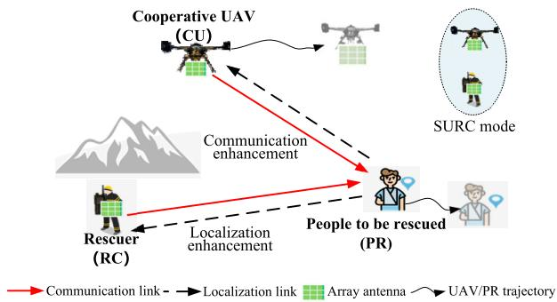

NOTATION SUMMARY  
TABLE I
<table><tr><td>Notation  $\overline { { l _ { u } , l _ { r } , l _ { p } } }$ </td><td>Definition Coordinates of the CU, RC, and PR</td></tr><tr><td> $p _ { u } , p _ { r } , p _ { p }$   $\mathbf { \psi } _ { w _ { u } , \ w _ { r } }$   $s _ { u } , s _ { r } , s _ { p }$   $M$   $\pmb { h } _ { u , p }$   $\mathbf { \Delta } \mathbf { a } _ { u , p }$   $\boldsymbol { h } _ { \boldsymbol { r } , \boldsymbol { p } }$   $\smash {  { \mathbf { a } } _ { r \mathrm { ~ } n } ^ { L o S } }$   $\pmb { a } ^ { N L o S }$  ar,p  $\tilde { K }$   $\beta _ { 0 }$   $\beta _ { 1 }$   $\alpha _ { 0 }$   $\alpha _ { 1 }$   $\sigma _ { 0 } ^ { 2 }$ </td><td>Transmit powers of CU, RC, and PR CU and PR transmit beamforming vectors The signal from CU, RC, and PR Uniform planar array antenna count Channel vector between the CU and PR Array response vector between the CU and PR Channel vector between the RC and PR LoS component with array response vector NLoS component with array response vector Rician factor LoS reference distance channel power gain NLoS reference distance channel power gain</td></tr></table>

## A. Integrated Air-Ground Collaboration Framework Overview

As depicted in Fig. reffig:2, we propose an air–ground collaborative framework for the joint optimization of localization and communication in SURC mode. The key advantage of this framework is its ability to perform both tasks collaboratively with only a single UAV coordinating with the RC, despite limited physical resources. This is possible because the UAV and RC can together estimate four angles, enabling AOA-based localization of the PR. Once the position is obtained, the system applies beamforming to enhance communication. Furthermore, overall system efficiency is improved through iterative, time-series optimization of the localization geometry, UAV flight duration, and power allocation.

The whole mission period is segmented into T time slots, defined as $\mathcal { T } ~ = ~ \{ 1 , \ldots , t , \ldots , T \}$ . Here, $\delta _ { t }$ denotes the duration of time slot t. It is assumed that the channel is quasi-static in the decision-making time slot [23]. Each time slot consists of a communication phase and a localization phase. Moreover, the entire duration of time slot t is dedicated to communication, which incorporates a localization phase of length $\delta _ { t _ { l } } \left( \delta _ { t _ { l } } \ \leq \ \delta _ { t } \right)$ , indexed as $t _ { l }$ within the slot.<sup>1</sup> The localization phase comprises signal sensing, CU location adjustment, and RC location estimation. The coordinates of the CU, RC, and PR are represented as $\boldsymbol { l } _ { u } = \left[ x _ { u } , y _ { u } , z _ { u } \right] ^ { T }$ $\boldsymbol { l _ { r } } = \left[ x _ { r } , y _ { r } , z _ { r } \right] ^ { T }$ and $\boldsymbol { l _ { p } } = \left[ \boldsymbol { \dot { x } } _ { p } , y _ { p } , z _ { p } \right] ^ { T }$ , respectively.

The CU and RC continuously transmit information to the PR during the entire duration $\delta _ { t }$ . Within each time slot t, a localization phase is executed, which includes signal sensing, CU position adjustment, and RC position estimation. The signal sensing period is denoted by τ , leaving $\delta _ { t _ { l } } \ - \ \tau$ for CU location adjustment and PR location estimation. In each time slot t, the PR is accurately perceived and located by the system. The localization phase involves: (1) CU and RC detect PR’s distress signal followed by AOA estimation; (2) CU optimizing position for improved geometry; (3) PR localization via AOA method. During communication, the RC and the CU perform joint beamforming design using the precise PR location, thereby enhancing directional transmission and throughput. Each time slot is assessed for communication throughput, localization accuracy, and energy consumption.

In each time slot t, the system updates the CU’s position and power based on the latest communication–localization status, obtains refreshed angle and PR-location estimates, and applies beamforming accordingly. This iterative process jointly improves communication and localization over time<sup>2</sup>.

## B. Communication Model

In the emergency cooperative communication system considered in this work, the RC and the CU jointly transmit data to the PR. The air-ground separation between the CU and the RC is relatively short (on the order of tens of meters horizontally and operating at moderate altitudes, e.g., 50–120 m), corresponding to elevation angles typically above 45<sup>◦</sup>. Under such geometry, classical air-to-ground channel analyses (e.g., the Al-Hourani model [24]) indicate that the LoS probability generally exceeds 0.9, and both 3GPP Release-15 measurements and UAV connectivity studies confirm that air-ground links within this altitude range are predominantly LoS [25], [26]. Therefore, a stable LoS CU-RC link is assumed in the system model.<sup>3</sup> The received signal at the PR from the CU in time slot t can be denoted as

$$
\boldsymbol { x } _ { u , p } ( t ) = \sqrt { p _ { u } ( t ) } \boldsymbol { h } _ { u , p } ^ { H } ( t ) \boldsymbol { w } _ { u } ( t ) \boldsymbol { s } _ { u } ( t ) + \boldsymbol { n } _ { u , p } ( t ) ,\tag{1}
$$

where $p _ { u } ( t )$ represents the transmit power of CU, the transmit beamforming vector for CU is denoted as ${ \pmb w } _ { \pmb u } ( t ) \in \mathbb { C } ^ { M \times 1 }$ satisfying $\| \pmb { w } _ { u } ( t ) \| = 1$ . Furthermore, the signal from CU at time slot t is denoted as $s _ { u } ( t )$ , satisfying $s _ { u } ( t ) \sim \mathcal { C N } ( 0 , 1 )$ and $\mathbb { E } \{ | s _ { u } ( t ) | ^ { 2 } \} ~ = ~ 1$ . The additive white Gaussian noise (AWGN) is represented by $n _ { u , p } ( t ) \sim \mathcal { C N } ( 0 , \sigma _ { 0 } ^ { 2 } )$ . Additionally, $\pmb { h } _ { u , p } ( t ) \in \mathbb { C } ^ { \hat { M } \times 1 }$ is the channel vector between the CU and PR at the time slot t, explicitly expressed as

$$
h _ { u , p } \left( t \right) = \sqrt { \beta _ { 0 } d _ { u , p } ^ { - \alpha _ { 0 } } ( t ) } a _ { u , p } \left( \mu _ { u , p } ( t ) , \nu _ { u , p } ( t ) \right) ,\tag{2}
$$

where $\beta _ { 0 }$ denotes the channel power gain at a reference distance $d _ { 0 } = 1 m$ , and $d _ { u , p } ( t ) = \Vert { l } _ { u } ( t ) - { l } _ { p } ( t ) \Vert$ represents the distance between the CU and the PR at time slot t. Then, the array response vector for the CU and the PR is given by

$$
\begin{array} { l } { \displaystyle \pmb { a } _ { u , p } \left( \mu _ { u , p } ( t ) , \nu _ { u , p } ( t ) \right) } \\ { \displaystyle = \frac { 1 } { \sqrt { M } } [ 1 , \dots , e ^ { j ( m - 1 ) \mu _ { u , p } ( t ) } , \dots , e ^ { j ( M _ { x } - 1 ) \mu _ { u , p } ( t ) } ] ^ { T } } \\ { \displaystyle \otimes \left[ 1 , \dots , e ^ { j ( m - 1 ) \nu _ { u , p } ( t ) } , \dots , e ^ { j ( M _ { z } - 1 ) \nu _ { u , p } ( t ) } \right] ^ { T } . } \end{array}\tag{3}
$$

The expressions of $\mu _ { u , p } ( t )$ and $\nu _ { u , p } ( t )$ are given below

$$
\mu _ { u , p } ( t ) = \frac { 2 \pi d _ { u } \cos ( \theta _ { u } ( t ) ) \cos ( \varphi _ { u } ( t ) ) } { \lambda } ,\tag{4}
$$

$$
\nu _ { u , p } ( t ) = \frac { 2 \pi d _ { u } \sin ( \theta _ { u } ( t ) ) } { \lambda } ,\tag{5}
$$

where $d _ { u }$ represents the half-wavelength antenna spacing, λ denotes the carrier wavelength, $\theta _ { u } ( t )$ and $\varphi _ { u } ( t )$ represent the azimuth angle and the elevation angle of the PR relative to the CU, respectively.

On the other hand, due to the possible local scattering around the ground users, we adopt the Rician fading channel model for the RC-to-PR link<sup>4</sup> [15], [31]. In time slot t, the signal received by the PR from the RC can be defined as

$$
x _ { r , p } ( t ) = \sqrt { p _ { r } \left( t \right) } \pmb { h } _ { r , p } ^ { H } ( t ) \pmb { w } _ { r } ( t ) s _ { r } ( t ) + n _ { r , p } ( t ) ,\tag{6}
$$

where $p _ { r } ( t )$ represents the transmit power of the RC. $w _ { r } ( t ) \in$ $\mathbb { C } ^ { M \times 1 }$ , satisfying $\| \pmb { w } _ { r } ( t ) \| = 1$ , denotes the RC corresponding transmit beamforming vector. $s _ { r } ( t )$ , satisfying $s _ { r } ( t ) \ \sim$ $\mathcal { C } \bar { \mathcal { N } } ( 0 , 1 )$ and $\mathbb { E } \{ | s _ { r } ( t ) | ^ { 2 } \} ~ = ~ 1$ denotes the signal from the RC. $n _ { r , p } ( t ) \ \stackrel { \triangledown } { \sim } \ \vec { c } \mathcal { N } ( \vec { 0 } , \sigma _ { 0 } ^ { 2 } )$ is the AWGN. Furthermore, $\pmb { h } _ { r , p } ( t ) \in \mathbb { C } ^ { M \times 1 }$ represents the channel vector between the RC and the PR, which can be explicitly expressed as

$$
h _ { r , p } \left( t \right) = \sqrt { \beta _ { 1 } d _ { r , p } ^ { - \alpha _ { 1 } } \left( t \right) } \left( \sqrt { \frac { \tilde { K } } { \tilde { K } + 1 } } a _ { r , p } ^ { L o S } ( t ) + \sqrt { \frac { 1 } { \tilde { K } + 1 } } a _ { r , p } ^ { N L o S } ( t ) \right) ,\tag{7}
$$

where $\beta _ { 1 }$ denotes the channel power gain at a reference distance, and $d _ { r , p } ( t ) = \| \boldsymbol { l } _ { \boldsymbol { r } } ( t ) - \boldsymbol { l } _ { p } ( t ) \|$ denotes the distance between the RC and the PR, α<sub>1</sub> is the corresponding path loss exponent. $\tilde { K }$ is the Rician factor related to small-scale fading. $\mathbf { \Delta } _ { a _ { r , p } ^ { L o S } } ^ { L o S }$ is the LoS component that consists of the transmit steering vector, while the elements in NLoS components $\pmb { a } _ { r , p } ^ { N L o S }$ are independent and identically distributed (i.i.d.) complex Gaussian variables with zero mean and unit variance.

In the downlink coordinate multipoints (CoMP) system, the CU and RC share the downlink channel [33], [34]. Then, the Signal-to-Noise Ratio (SNR) within time slot t can be represented as

$$
\gamma ( t ) = \frac { p _ { u } ( t ) \Big | h _ { u , p } ^ { H } ( t ) { \pmb w } _ { u } ( t ) \Big | ^ { 2 } + p _ { r } ( t ) \Big | h _ { r , p } ^ { H } ( t ) { \pmb w } _ { r } ( t ) \Big | ^ { 2 } } { \sigma _ { 0 } ^ { 2 } } ,\tag{8}
$$

where $\sigma _ { 0 } ^ { 2 }$ is noise power.

Due to the existence of the localization adjustment time period within each time slot $t ,$ there are two different transmission rates: one during the localization adjustment phase and another after the location stabilizes. Let B denote the transmission bandwidth. Therefore, the transmission rate during localization adjustment phase at time slot $t _ { l }$ is defined as $R _ { C o M P } ( t _ { l } ) = B \left( 1 + \gamma ( t _ { l } ) \right)$ ). During the subsequent phase $t - t _ { l }$ , the transmission rate denoted as $R _ { C o M P } ( t - t _ { l } ) ~ =$ $B \left( 1 + \gamma ( t - t _ { l } ) \right)$ . Therefore, the total communication data volume during time slot t can be determined as

$$
D _ { a l l } \left( t \right) = \delta _ { t _ { l } } R _ { C o M P } ( t _ { l } ) + ( \delta _ { t } - \delta _ { t _ { l } } ) R _ { C o M P } ( t - t _ { l } ) .\tag{9}
$$

## C. Localization Model

During the localization phase, CU and RC receive signals from PR to perceive angle information and calculate the PR’s location, followed by an analysis of localization errors.

1) Localization Signal Model: Due to the relatively high altitude of the UAV, we adopt the LoS channel model [35], [36]. Initially, the PR sends $\sqrt { p _ { p } } s _ { p } ( t _ { l } )$ , satisfying $s _ { p } ( t _ { l } ) \sim$ $\mathcal { C N } ( 0 , 1 )$ , to the CU and the RC, with $p _ { p }$ representing the transmit power. The signal received by the CU is denoted as

$$
\begin{array} { r } { \pmb { x } _ { p , u } ( t _ { l } ) = \sqrt { p _ { p } } \pmb { h } _ { p , u } ( t _ { l } ) s _ { p } ( t _ { l } ) + \pmb { n } _ { u } ( t _ { l } ) , } \end{array}\tag{10}
$$

where $h _ { p , u } ( t _ { l } ) \in \mathbb { C } ^ { M \times 1 }$ represents the channel vector between the CU and the PR. Additionally, ${ n } _ { u } ( t _ { l } )$ denotes the AWGN at the CU, with elements following the complex Gaussian distribution $\mathcal { C N } ( 0 , \sigma _ { 0 } ^ { 2 } )$ . The specific representation of the communication channel vector between the CU and the PR can be denoted as

$$
\begin{array} { r } { \pmb { h } _ { p , u } \left( t _ { l } \right) = \sqrt { \beta _ { 0 } d _ { p , u } ^ { - \alpha _ { 0 } } ( t _ { l } ) } ( t _ { l } ) \pmb { a } _ { p , u } \left( \mu _ { p , u } ( t _ { l } ) , \nu _ { p , u } ( t _ { l } ) \right) } \end{array}\tag{11}
$$

where $\beta _ { 0 }$ denotes the channel power gain at a reference distance $d _ { 0 } \ = \ 1 m$ , and $d _ { p , u } ( t _ { l } ) ~ = ~ \lVert \boldsymbol { l } _ { u } ( t _ { l } ) - \boldsymbol { l } _ { p } ( t _ { l } ) \rVert$ is the distance between the CU and PR at time slot $t _ { l } \ [ 1 7 ] , [ 3 7 ]$ . The

array response vector $\mathbf { \Delta } _ { a _ { p , u } }$ for the PR and the CU is expressed as

$$
\begin{array} { r l r } {  { \pmb { a } _ { p , u } ( \mu _ { p , u } ( t _ { l } ) , \nu _ { p , u } ( t _ { l } ) ) } } \\ & { } & { = \frac { 1 } { \sqrt { M } } [ 1 , \dots , e ^ { j ( m _ { x } - 1 ) \mu _ { p , u } ( t _ { l } ) } , \dots , e ^ { j ( M _ { x } - 1 ) \mu _ { p , u } ( t _ { l } ) } ] ^ { T } } \\ & { } & { \otimes [ 1 , \dots , e ^ { j ( m _ { z } - 1 ) \nu _ { p , u } ( t _ { l } ) } , \dots , e ^ { j ( M _ { z } - 1 ) \nu _ { p , u } ( t _ { l } ) } ] ^ { T } , \qquad ( 1 } \end{array}\tag{12}
$$

where $\mu _ { p , r } ( t _ { l } )$ and $\nu _ { p , r } ( t _ { l } )$ represent quantities related to effective azimuth and elevation angles [8], [27], respectively, which can be expressed as

$$
\mu _ { p , u } ( t _ { l } ) = \frac { 2 \pi d _ { u } \cos ( \theta _ { u } ( t _ { l } ) ) \cos ( \varphi _ { u } ( t _ { l } ) ) } { \lambda } ,\tag{13}
$$

$$
\nu _ { p , u } ( t _ { l } ) = \frac { 2 \pi d _ { u } \sin ( \theta _ { u } ( t _ { l } ) ) } { \lambda } ,\tag{14}
$$

where $d _ { u }$ is the half-wavelength antenna spacing, λ is the carrier wavelength, $\theta _ { u } ( t _ { l } )$ and $\varphi _ { u } ( t _ { l } )$ represent the azimuth and the elevation angles of the PR relative to the CU, respectively.

On the other hand, due to the possible local scattering around the ground users, we adopt the Rician fading channel model for the PR-to-RC link [15], [31]. The signal received by the CU is denoted as

$$
\begin{array} { r } { \pmb { x } _ { p , r } ( t _ { l } ) = \sqrt { p _ { p } } \pmb { h } _ { p , r } ( t _ { l } ) s _ { p } ( t _ { l } ) + \pmb { n } _ { r } ( t _ { l } ) , } \end{array}\tag{15}
$$

where ${ \mathbf { } } n _ { r } ( t _ { l } )$ denotes the AWGN at the CU, with elements following the complex Gaussian distribution $\mathcal { C N } ( 0 , \sigma _ { 0 } ^ { 2 } )$ . Additionally, $\mathbf { \widehat { h } } _ { p , r } ( t _ { l } ) \mathbf { \widehat { \Omega } } \in \mathbb { C } ^ { M \times 1 }$ represents the channel vector between the PR and the RC, which can be explicitly expressed as

$$
h _ { p , r } \left( t _ { l } \right) = \sqrt { \beta _ { 1 } d _ { p , r } ^ { - \alpha _ { 1 } } \left( t _ { l } \right) } \left( \sqrt { \frac { \tilde { K } } { \tilde { K } + 1 } } a _ { p , r } ^ { L o S } \left( t _ { l } \right) + \sqrt { \frac { 1 } { \tilde { K } + 1 } } a _ { p , r } ^ { N L o S } \left( t _ { l } \right) \right) \left( \sqrt { \frac { \tilde { K } } { \tilde { K } + 1 } } a _ { p , r } ^ { L o S } \left( t _ { l } \right) \right) ,\tag{16}
$$

where $d _ { p , r } ( t _ { l } ) ~ = ~ \lVert l _ { r } ( t _ { l } ) - l _ { p } ( t _ { l } ) \rVert$ denotes the distance between the RC and the PR, $\alpha _ { 1 }$ is the corresponding path loss exponent. $\tilde { K }$ is the Rician factor related to small-scale fading. $\mathbf { \Delta } _ { a _ { r , p } ^ { \tilde { L } o S } } ^ { \tilde { L } o S }$ is the array response vector for the LoS path between the PR and $\mathrm { R C } ,$ while the elements in NLoS components $\pmb { a } _ { r , p } ^ { N L o S }$ are independent and identically distributed (i.i.d.) complex Gaussian variables with zero mean and unit variance.

Based on distress signals received by both CU and RC, and using the subspace rotation invariance property of the signals, the system estimates the angles of the incoming wave direction, yielding four distinct angles denoted as $\mathbf { \alpha } _ { } \mathbf { { a n g l e } } \ =$ $\left[ \theta _ { u } , \theta _ { r } , \varphi _ { u } , \varphi _ { r } \right] ^ { T }$ . Detailed analyses of the specific estimation methods are expounded upon in the Section IV-A.

2) Evaluation of Localization Performance: We utilize the Position Dilution of Precision (PDOP) to evaluates localization performance through geometric precision quantification [38], [39]. For notational simplicity, $t _ { l }$ is omitted. Fig. 3 shows the relative geometry of PR, RC, and CU as

$$
\left\{ \begin{array} { l l } { \tan \theta _ { u } = \displaystyle \frac { y _ { p } - y _ { u } } { x _ { p } - x _ { u } } , } \\ { \tan \varphi _ { u } = \displaystyle \frac { z _ { u } - z _ { p } } { \sqrt { \left( x _ { p } - x _ { u } \right) ^ { 2 } + \left( y _ { p } - y _ { u } \right) ^ { 2 } } } , } \\ { \tan \theta _ { r } = \displaystyle \frac { y _ { p } - y _ { r } } { x _ { p } - x _ { r } } , } \\ { \tan \varphi _ { r } = \displaystyle \frac { z _ { p } - z _ { r } } { \sqrt { \left( x _ { p } - x _ { r } \right) ^ { 2 } + \left( y _ { p } - y _ { r } \right) ^ { 2 } } } . } \end{array} \right.\tag{17}
$$

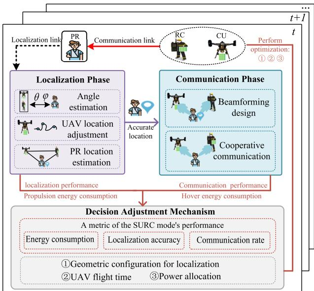

Fig. 2. Integrated air-ground collaboration framework workflow.  
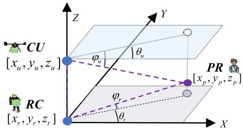  
Fig. 3. Localization geometry illustration of the system.

The difference between the estimated angle and the true angle is defined as the angle measurement error, given by the error vector $\boldsymbol { m } _ { e r r } = \left[ \Delta \theta _ { u } , \Delta \theta _ { r } , \Delta \varphi _ { u } , \Delta \varphi _ { r } \right] ^ { T }$ , where $\Delta \theta _ { u } , \Delta \theta _ { r }$ $\Delta \varphi _ { u } ,$ , and $\Delta \varphi _ { r }$ represent the measurement errors for azimuth and pitch angles. Simultaneously, the definition of the location solution error vector is defined as

$$
\begin{array} { r } { l _ { e r r } = \left[ \Delta x , \Delta y , \Delta z \right] ^ { T } , } \end{array}\tag{18}
$$

where $\Delta x , \Delta y$ , and $\Delta z$ represent the location errors on the $x , \ y ,$ and z-coordinate axes, respectively. By taking partial derivatives of the estimated angles $\theta _ { u } , \theta _ { r } , \varphi _ { u }$ , and $\varphi _ { r }$ with respect to the PR’s coordinates $x _ { p } , y _ { p } ,$ , and $z _ { p } ,$ we can establish a relationship between the measured angle errors and the absolute location errors as follows

$$
{ \left[ \begin{array} { l } { \Delta \theta _ { u } } \\ { \Delta \theta _ { r } } \\ { \Delta \varphi _ { u } } \\ { \Delta \varphi _ { r } } \end{array} \right] } = { \left[ \begin{array} { l l l } { { \frac { \partial \theta _ { u } } { \partial x _ { p } } } } & { { \frac { \partial \theta _ { u } } { \partial y _ { p } } } } & { { \frac { \partial \theta _ { u } } { \partial z _ { p } } } } \\ { { \frac { \partial \theta _ { r } } { \partial x _ { p } } } } & { { \frac { \partial \theta _ { r } } { \partial y _ { p } } } } & { { \frac { \partial \theta _ { r } } { \partial z _ { p } } } } \\ { { \frac { \partial \varphi _ { u } } { \partial x _ { p } } } } & { { \frac { \partial \varphi _ { u } } { \partial y _ { p } } } } & { { \frac { \partial \varphi _ { u } } { \partial z _ { p } } } } \\ { { \frac { \partial \varphi _ { r } } { \partial x _ { p } } } } & { { \frac { \partial \varphi _ { r } } { \partial y _ { p } } } } & { { \frac { \partial \varphi _ { r } } { \partial z _ { p } } } } \end{array} \right] } { \left[ \begin{array} { l } { \Delta x } \\ { \Delta y } \\ { \Delta z } \end{array} \right] } .\tag{19}
$$

Then, we can obtain an equation involving the partial derivative matrix H as follows $m _ { e r r } { = } H l _ { e r r }$ . The resulting solution for the location error vector is [39]

$$
\begin{array} { r } { l _ { e r r } { = } \Big ( H ^ { T } H \Big ) ^ { - 1 } H ^ { \mathbf { T } } m _ { e r r } . } \end{array}\tag{20}
$$

The measured angle errors are assumed to be independent, zero mean, Gaussian distributed random variables with equal variance $\delta _ { M } ^ { 2 }$ . The location error variance is denoted as [38]

$$
\delta _ { L } ^ { 2 } = \pmb { t r } \left[ \mathbb { E } \left\{ \boldsymbol { l _ { e r r } } { \boldsymbol { l _ { e r r } } } ^ { T } \right\} \right] = \pmb { t r } \left[ \left( \boldsymbol { H } ^ { T } \boldsymbol { H } \right) ^ { - 1 } \right] \delta _ { M } ^ { 2 } .\tag{21}
$$

Then, PDOP is defined as the ratio of localization error standard deviation $\delta _ { L }$ to the standard deviation of the measured angle errors $\delta _ { M }$ [40]

$$
P D O P = \frac { \delta _ { L } } { \delta _ { M } } = \frac { \sqrt { \delta _ { x } ^ { 2 } + \delta _ { y } ^ { 2 } + \delta _ { z } ^ { 2 } } } { \delta _ { M } } = \sqrt { t r \left[ \left( H ^ { T } H \right) ^ { - 1 } \right] } ,\tag{22}
$$

where the standard deviations of locations in the $x , y ,$ and z directions are denoted as $\delta _ { x } , \delta _ { y }$ , and $\delta _ { z } ,$ respectively.

## D. Energy Consumption Model

In this system, energy consumption can be divided into two components: communication energy consumption and CU’s flying energy consumption. The flying energy consumption of the CU can further be categorized into propulsion energy consumption and hover energy consumption.

1) Communication Energy Consumption: Communication energy consumption involves energy used by CU and RC to transmit information to PR. The communication energy consumption of the CU at time slot t is denoted as $E _ { c } ^ { u } ( t ) =$ $p _ { u } ( t ) \delta _ { t }$ . Similarly, the communication energy of the RC is also denoted as $E _ { c } ^ { r } ( t ) = p _ { r } ( t ) \delta _ { t }$ [12]. The total communication energy consumption can be expressed as

$$
E _ { c } ^ { a l l } ( t ) = E _ { c } ^ { u } ( t ) + E _ { c } ^ { r } ( t ) .\tag{23}
$$

2) CU’s Flying Energy Consumption: Assuming that the CU is rotary-wing drone, the horizontal velocity of the CU at time slot t denotes as $\begin{array} { r c l } { v _ { h } ( t ) } & { = } & { \parallel [ x _ { u } ( t + 1 ) , y _ { u } ( t + } \end{array}$ $1 ) ] - [ x _ { u } ( t ) , y _ { u } ( t ) ] \vert / \delta _ { t }$ . On the other hand, the vertical flying velocity of the CU at time slot t can be denoted as $v _ { v } ( t ) =$ $\| z _ { u } ( t + 1 ) - z _ { u } ( t ) \| / \delta _ { t }$ [36], [37]. Therefore, the propulsion power at time slot t can be denoted as

$$
\begin{array} { l } { \displaystyle { e _ { p } ( t ) = P _ { 0 } \left( 1 + \frac { 3 \left( v _ { h } ( t ) \right) ^ { 2 } } { U _ { t i p } ^ { 2 } } \right) + \frac { 1 } { 2 } r _ { 0 } \rho s G ( v _ { h } ( t ) ) ^ { 3 } } } \\ { \displaystyle { ~ + P _ { 1 } \left( \sqrt { 1 + \frac { \left( v _ { h } ( t ) \right) ^ { 4 } } { 4 v _ { 0 } ^ { 2 } } } - \frac { \left( v _ { h } ( t ) \right) ^ { 2 } } { 2 v _ { 0 } ^ { 2 } } \right) ^ { \frac { 1 } { 2 } } + P _ { 2 } v _ { v } ( t ) } , } \end{array}\tag{24}
$$

where $P _ { 0 }$ and $P _ { 1 }$ adenote drone-specific constants dependent on weight, wing area, and air density. $P _ { 2 }$ is the constant descending/ascending power, $U _ { t i p }$ is the tip speed of the rotor blade; $v _ { 0 }$ is the mean rotor induced velocity in hover, $r _ { 0 }$ and s are the fuselage drag ratio and rotor solidity. $\rho$ and $G$ denote the air density and rotor disc area respectively [36], [37].

Furthermore, the hover power consumption of the CU at an altitude of $h ( t )$ can be represented as $e _ { h } ( t ) = P _ { 0 } + P _ { 1 } +$ Γ $\left( h ( t ) - h _ { 0 } \right)$ [36], where $P _ { 0 } + P _ { 1 }$ represents the hover power consumption when the CU is at an altitude of $h _ { 0 } , \Gamma > 0$ represents the motor speed multiplier. During time period $t _ { l } .$

the propulsion energy consumption of the CU can be denoted as $E _ { l } ^ { p } ( t _ { l } ) = \delta _ { t _ { l } } e _ { p } ( t _ { l } )$ . During the time period of $t - t _ { l }$ , the CU remains stationary without adjusting its location, resulting in hover energy consumption. Consequently, the hover energy consumption of the CU during this period can be quantified as $E _ { l } ^ { h } ( t - t _ { l } ) = ( \delta _ { t } - \delta _ { t _ { l } } ) e _ { h } ( t - t _ { l } )$ . Therefore, the total energy consumption of the CU in time slot t can be expressed as

$$
E _ { l } ^ { a l l } ( t ) = E _ { l } ^ { p } ( t _ { l } ) + E _ { l } ^ { h } ( t - t _ { l } ) .\tag{25}
$$

Based on the above, the overall energy consumption of the system can be represented as $E _ { t o t a l } \left( t \right) = E _ { c } ^ { a l l } ( t ) + E _ { l } ^ { a l l } ( t )$

Based on the rotary-wing propulsion power model and the physical parameters of our CU platform, we evaluated both propulsion energy (including hovering and translational flight) and communication energy (determined by the transmit power and slot duration). The results show that propulsion energy dominates the overall onboard consumption by a very large margin, whereas communication energy accounts for only a very small fraction of the total. This trend is consistent with prior studies on multi-rotor UAVs, which report that more than 85–95% of the energy budget is consumed by propulsion, while communication typically contributes only a few percent or less [29], [41]. Although communication energy is relatively small, transmit-power optimization remains important: it directly affects the communication–localization effectiveness per unit energy in our objective, and lower transmit power also reduces interference to coexisting rescue devices, thereby improving operational robustness.

## III. PROBLEM FORMULATION

Addressing dual communication-localization demands, we optimize energy efficiency under resource constraints. System performance is assessed by integrating key metrics: communication rate, localization accuracy, and energy consumption into a unified utility metric. Building on this, we propose a normalized utility function for joint communication-localization performance in time slot t:

$$
U _ { a l l } \left( t \right) = \frac { D _ { a l l } \left( t \right) - D _ { a l l } ^ { \operatorname* { m i n } } } { D _ { a l l } ^ { \operatorname* { m a x } } - D _ { a l l } ^ { \operatorname* { m i n } } } + \frac { N \left( t \right) - N _ { \operatorname* { m i n } } } { N _ { \operatorname* { m a x } } - N _ { \operatorname* { m i n } } } ,\tag{26}
$$

where $D _ { a l l } ( t )$ represents the total amount of communication data in time slot t, $D _ { a l l } ^ { \mathrm { m a x } }$ and $D _ { a l l } ^ { \mathrm { m i n } }$ represent the maximum and minimum values of the communication data quantity, respectively. $N \left( t \right) = - P D O P \left( t \right)$ represents the inverse of the localization accuracy in time slot $t , N _ { m a x }$ and $N _ { m i n }$ represent the maximum and minimum values of the localization accuracy, respectively. Then, the energy efficiency ratio (EER) of a complete time slot t is defined as

$$
E _ { E E R } ( t ) = U _ { a l l } \left( t \right) / ( \mu E _ { t o t a l } \left( t \right) ) ,\tag{27}
$$

where $E _ { t o t a l } \left( t \right)$ represents the total energy consumption of time slot t, and $\mu$ is the scale balance factor, which ensures the balance of magnitudes between the communicationlocalization utility and the total energy consumption within the overall optimization objective. The scale factor $\mu$ is determined through an offline magnitude calibration in which the normalized utility $U _ { \mathrm { a l l } } ( t )$ and the total energy $E _ { \mathrm { t o t a l } } ( t )$ are evaluated under randomly sampled UAV locations, beamforming vectors, and transmit-power settings. The value of $\mu$ is then selected such that the weighted energy term $\mu E _ { \mathrm { t o t a l } } ( t )$ is of the same numerical order as $U _ { \mathrm { a l l } } ( t )$ , ensuring a well-balanced reward in (27).

We propose to maximize the energy efficiency ratio over an observation period by considering: 1) beamforming design for the CU and RC, 2) optimization of the CU’s location, and 3) UAV flight energy consumption optimization. For each time slot $t ,$ we define ${ \bf \dot { \boldsymbol { l } } } _ { u } ( t ) = \left[ \dot { \boldsymbol { x } } _ { \underline { { u } } } , { y } _ { u } , \dot { \boldsymbol { z } } _ { u } \right] ^ { T }$ as the location of the CU, w ${ \bf \Xi } ( t ) = \left[ { \pmb w } _ { u } ( t ) , { \pmb w } _ { r } ( t ) \right] ^ { T }$ as the beamforming vectors of the CU and the RC, $\mathbf { \Psi } _ { \pmb { p } } ( t ) \stackrel {  } { = } [ p _ { u } ( t ) , p _ { r } ( t ) ] ^ { T }$ as the transmit power of the CU and the RC, $q \left( t \right) = \delta _ { t _ { l } }$ as the time required for the CU’s location adjustment. Therefore, the optimization problem can be formulated as

$$
\mathcal { P } : \operatorname* { m a x } _ { \{ l _ { u } ( t ) , w ( t ) , p ( t ) , q ( t ) \} } \ \frac { 1 } { T } \sum _ { t \in \mathcal { T } } E _ { E E R } \left( t \right)
$$

$$
\mathrm { s . t . } \quad \delta _ { t _ { l } } \leq \delta _ { t } , \forall t \in \mathcal T ,\tag{28a}
$$

$$
h ( t ) \leq h _ { \operatorname* { m a x } } , \forall t \in \mathcal T ,\tag{28b}
$$

$$
v _ { h } ( t ) < v _ { h } ^ { m a x } , \forall t \in \mathcal { T } ,\tag{28c}
$$

$$
v _ { v } ( t ) < v _ { v } ^ { m a x } , \forall t \in \mathcal { T } ,\tag{28d}
$$

(28e)

$$
\sum _ { t = 1 } ^ { T } E _ { t o t a l } \left( t \right) \leq E _ { a l l } , \forall t \in T ,\tag{28f}
$$

$$
0 < p _ { u } \left( t \right) \le p _ { \operatorname* { m a x } } , \forall t \in \mathcal { T } ,
$$

$$
0 < p _ { r } \left( t \right) \leq p _ { \operatorname* { m a x } } , \forall t \in \mathcal { T } ,\tag{28g}
$$

$$
\| \pmb { w } _ { u } ( t ) \| = 1 , \forall t \in \mathcal { T } ,\tag{28h}
$$

$$
\| \mathbf { \boldsymbol { w } } _ { r } ( t ) \| = 1 , \forall t \in \mathcal { T } .\tag{28i}
$$

(28j)

In problem P, constraint (28b) represents the time constraint during the CU’s localization phase. Constraint (28c) indicates that the flying altitude of the CU must not exceed the maximum service altitude of the RC. Constraints (28d) and (28e) are the UAV speed threshold. Constraint (28f) represents the total energy constraint of the system. Constraints (28g) and (28h) indicate the power allocation requirements in the CU and the RC, respectively. Constraints (28i) and (28j) impose restrictions on the beamforming vector.

Since problem P is a non-convex optimization problem involving the joint optimization of UAV locations, beamforming, power, and movement time, it is NP-hard, and thus extremely difficult to solve using traditional convex optimization algorithms. Given that the UAV’s dynamic trajectory planning process exhibits Markovian properties, and that a favorable localization geometry can improve localization accuracy, further enhancing beamforming design, we develop a DRL - based dynamic optimization framework where communication and localization functions continuously enhance each other through iterative optimization, ultimately solving the problem.

## IV. PROPOSED SYNERGISTIC COMMUNICATION AND LOCALIZATION REINFORCEMENT APPROACH

By utilizing DRL, in this section, we design a synergistic communication and localization reinforcement approach (SYNCORE) to solve problem (28). As shown in Fig. 4, the SYNCORE includes three major stages: 1) PR location estimation (Section IV-A); 2) Cooperative communication (Section IV-B); and 3) Synergistic communication and localization reinforcement (Section IV-C). In the overall algorithm, user localization can assist in collaborative communication, where communication and localization serve as the foundational components of the algorithm. Furthermore, based on the DRL framework, the iterative process over time is utilized to adjust the UAV’s position, flight time, and power, ensuring the maximization of system energy efficiency in each time slot. The information flow among these stages is shown in Fig. 5.

Algorithm 3(Section IV-C)  
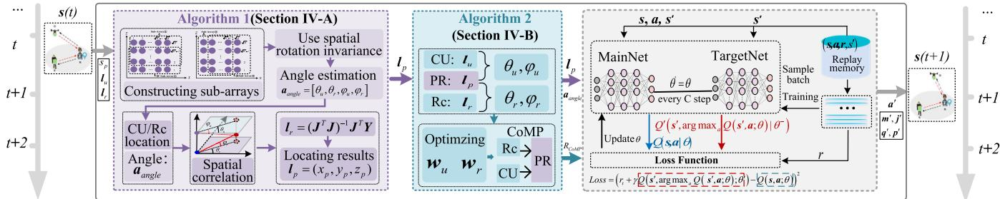  
Fig. 4. The overall of SYNCORE algorithm structure.

1) PR location estimation: The system employs signals received from the PR to estimate the AOA. Based on this, an advanced signal perception-based AOA localization algorithm is proposed to accurately determine the PR’s location.

2) Cooperative communication: Based on the PR location estimation, an optimized beamforming scheme is proposed, utilizing CoMP technology to significantly improve communication performance.

3) Synergistic communication and localization reinforcement: Although improvements in localization and communication can be separately achieved through 1) and 2), the dynamic nature of the environment introduces timevarying characteristics in localization geometry that can affect localization accuracy, consequently influencing beamforming design. To address this issue, by combining the advantages of 1) and 2), we design the SYNCORE that iteratively optimizes the localization geometry, flight time, and power, leveraging system energy efficiency as feedback to synergistically enhance both communication and localization performance.

## A. Signal Perception-Based AOA Localization Algorithm

1) Angle Estimation: In this subsection, angle estimation is made based on the rotation invariance of the signal subspace using estimation of signal parameters via rotational invariance techniques (ESPRIT)<sup>5</sup> [42].

As illustrated in Fig. 6(a), the UPA is divided into two identical sub-arrays along the x-axis parallel direction: subarray 1, consisting of lines 1 through $M _ { x } - 1$ , and sub-array 2 comprising lines 2 through $M _ { x }$ . It is assumed that the signals received by the sub-array 1 and the sub-array 2 are denoted as ${ \pmb x } _ { i , x } ^ { 1 } \left( t \right)$ and ${ \pmb x } _ { i , x } ^ { 2 } \left( t \right)$ , where $i = u , r$ . Therefore, the received signal models of the two sub-arrays are merged to obtain

$$
\begin{array} { r } { X _ { i , x } \left( t \right) = \left[ \pmb { x } _ { i , x } ^ { 1 } \left( t \right) , \pmb { x } _ { i , x } ^ { 2 } \left( t \right) \right] ^ { T } , i = u , r . } \end{array}\tag{29}
$$

The signal subspace, denoted as $U _ { i , x } , i = u , r$ , is derived by solving the covariance matrix using the formula mentioned above, followed by eigenvalue decomposition. There exists a unique matrix $\boldsymbol { T } _ { i , x }$ , such that $U _ { i , x } = { \pmb a } _ { p , i , x } { \pmb T } _ { i , x } , i = u , r$ Moreover, the array’s invariant structure implies $U _ { i , x }$ can be decomposed into $U _ { i , x 1 }$ and $U _ { i , x 2 }$ such that [42]

$$
U _ { i , x } = \left[ \begin{array} { l } { U _ { i , x 1 } } \\ { U _ { i , x 2 } } \end{array} \right] = \left[ \begin{array} { l } { a _ { p , i , x } ^ { 1 } T _ { i , x } } \\ { a _ { p , i , x } ^ { 2 } T _ { i , x } } \end{array} \right] , i = u , r .\tag{30}
$$

Due to the identical structure, the array response vectors $\pmb { a } _ { p , i , x } ^ { 1 }$ and $a _ { p , i , x } ^ { 2 }$ for the two sub-arrays only differ only by a rotation factor denoted as $\Phi _ { i , x } ~ = ~ [ \phi _ { i , z } ]$ , where $\begin{array} { r l } { \phi _ { i , z } } & { { } = } \end{array}$ $e ^ { \frac { 2 \pi j d _ { i } } { \lambda } \sin \varphi _ { i } } , i = u , r$ . It can be known from the relationship between the two sub-arrays on the array flow pattern

$$
\begin{array} { r } { \pmb { a } _ { p , i , x } ^ { 2 } = \pmb { a } _ { p , i , x } ^ { 1 } \pmb { \Phi } _ { i , x } , i = { \boldsymbol { u } } , r . } \end{array}\tag{31}
$$

Considering (30) and (31) together, the relationship between the signal sub-spaces of the two sub-matrices is as follows

$$
\boldsymbol { U } _ { i , x 2 } = \boldsymbol { U } _ { i , x 1 } \boldsymbol { T } _ { i , x } { } ^ { - 1 } \Phi _ { i , x } \boldsymbol { T } _ { i , x } = \boldsymbol { U } _ { i , x 1 } \Psi _ { i , x } , i = u , r .\tag{32}
$$

The eigenvalue of $\Psi _ { i , x }$ is the same as that of $\Phi _ { i , x } ,$ where $i = u , r .$ . Applying the least square method to solve (32), we derive the following equation

$$
\Psi _ { i , x } = ( { \pmb U } _ { i , x 1 } { } ^ { H } { \pmb U } _ { i , x 1 } ) ^ { - 1 } { \pmb U } _ { i , x 1 } { } ^ { H } { \pmb U } _ { i , x 2 } , i = u , r .\tag{33}
$$

The eigenvalue is denoted as $\delta _ { i , x }$ . Utilizing the expression of rotation factor, we can derive the following

$$
\sin ( \varphi _ { i } ) = \frac { \lambda } { 2 \pi d } \arg ( \delta _ { i , x } ) , i = u , r .\tag{34}
$$

In Fig. 6(b), the UPA is divided into two identical subarrays along the z-axis parallel direction. It is assumed that the signals received by sub-array 3 and sub-array 4 are denoted as $\mathbf { \boldsymbol { x } } _ { i , z } ^ { 1 } \left( t \right)$ and $\pmb { x } _ { i , z } ^ { 2 } \left( t \right)$ , where $i = u , r$ . Therefore, the received signal models of the two sub-arrays are merged to obtain

$$
X _ { i , z } \left( t \right) = \left[ \pmb { x } _ { i , z } ^ { 1 } \left( t \right) , \pmb { x } _ { i , z } ^ { 2 } \left( t \right) \right] ^ { T } , i = u , r .\tag{35}
$$

The signal subspace is denoted as $U _ { i , z }$ , where $i = u , r .$ Similarly, based on the fact that two sub-arrays differ only by a rotation factor, we can derive:

$$
\cos ( \theta _ { i } ) \cos ( \varphi _ { i } ) = \frac { \lambda } { 2 \pi d } \arg ( \delta _ { i , z } ) , i = u , r .\tag{36}
$$

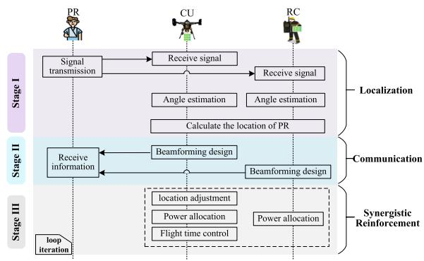

Fig. 5. Sequence diagram of localization and communication.  
Z Sub-Array② Z Sub-Array③   
个 个   
M.-1 M   
M   
M   
11   
i1   
一   
11   
2   
Sub-Array① → x Sub-Array④ x   
(a) X-axis sub-array division. (b) Z-axis sub-array division.  
Fig. 6. Sub-arrays partition illustration.

The combination of (34) and (36) can be used to obtain the azimuth and pitch angles of the PR relative to the CU and the RC, denoted as $\overline { { \mathbf { a } _ { a n g l e } } } = \left[ \theta _ { u } , \theta _ { r } , \varphi _ { u } , \varphi _ { r } \right] ^ { T }$

2) AOA-Based Localization Scheme: As shown in Fig. 3, using the four angles and the point of intersection between the CU and the RC in space, we determine the location of the PR.Performing a trigonometric transformation on (17), we derive the following

x<sub>p</sub> sin θ<sub>u</sub> − y<sub>p</sub> cos θ<sub>u</sub> = x<sub>u</sub> sin θ<sub>u</sub> − y<sub>u</sub> cos θ<sub>u</sub>,   
x<sub>p</sub> sin ϕ<sub>u</sub> cos θ<sub>u</sub> + y<sub>p</sub> sin ϕ<sub>u</sub> sin θ<sub>u</sub> + z<sub>p</sub> cos ϕ<sub>u</sub>   
= x<sub>u</sub> sin ϕ<sub>u</sub> cos θ<sub>u</sub> + y<sub>u</sub> sin ϕ<sub>u</sub> sin $\theta _ { u } + z _ { u }$ cos ϕ<sub>u</sub>,   
x<sub>p</sub> sin θ<sub>r</sub> − y<sub>p</sub> cos θ<sub>r</sub> = x<sub>r</sub> sin θ<sub>r</sub> − y<sub>r</sub> cos θ<sub>r</sub>,   
x<sub>p</sub> sin ϕ<sub>r</sub> cos θ<sub>r</sub> + y<sub>p</sub> sin ϕ<sub>r</sub> sin θ<sub>r</sub> − z<sub>p</sub> cos ϕ<sub>r</sub>   
= x<sub>r</sub> sin ϕ<sub>r</sub> cos θ<sub>r</sub> + y<sub>r</sub> sin ϕ<sub>r</sub> sin $\theta _ { r } - z _ { r }$ cos ϕ<sub>r</sub>.

(37)

When (37) is transformed into the matrix form, we obtain $J l _ { p } = Y$ , where

$$
\begin{array} { r l } & { \boldsymbol { J } = \left[ \begin{array} { c c c } { \sin \theta _ { u } } & { - \cos \theta _ { u } } & { 0 } \\ { \sin \varphi _ { u } \cos \theta _ { u } \sin \varphi _ { u } \sin \theta _ { u } } & { \cos \varphi _ { u } } \\ { \sin \theta _ { r } } & { - \cos \theta _ { r } } & { 0 } \\ { \sin \varphi _ { r } \cos \theta _ { r } } & { \sin \varphi _ { r } \sin \theta _ { r } - \cos \varphi _ { r } } \end{array} \right] , } \\ & { \boldsymbol { Y } = \left[ \begin{array} { c c c } { x _ { u } \sin \theta _ { u } - y _ { u } \cos \theta _ { u } } & & \\ { x _ { u } \sin \varphi _ { u } \cos \theta _ { u } + y _ { u } \sin \varphi _ { u } \sin \theta _ { u } + z _ { u } \cos \varphi _ { u } } & \\ { x _ { r } \sin \theta _ { r } - y _ { r } \cos \theta _ { r } } & & \\ { x _ { r } \sin \varphi _ { r } \cos \theta _ { r } + y _ { r } \sin \varphi _ { r } \sin \theta _ { r } - z _ { r } \cos \varphi _ { r } } \end{array} \right] . } \end{array}\tag{8}
$$

(39)

Utilizing the least square method, the coordinates of the PR can be determined as follows

$$
\begin{array} { r } { l _ { p } = ( J ^ { T } J ) ^ { - 1 } J ^ { T } Y . } \end{array}\tag{40}
$$

```latex
Algorithm 1 Signal Perception-Based Localization Algorithm
Inputs: $\pmb { x } _ { u } , \pmb { x } _ { r } , l _ { u } = ( x _ { u } , y _ { u } , z _ { u } ) , l _ { r } = ( x _ { r } , y _ { r } , z _ { r } )$
Outputs: Location of the PR $\boldsymbol { l } _ { p } = \left( x _ { p } , y _ { p } , z _ { p } \right)$
1: for $i = u , r$ do
2: for $k = x , z$ do
3: The model of the sub-array is merged to get $X _ { i , k } .$
4: Extract the signal subspace $U _ { i , k } .$
5: Decompose signal subspace $U _ { i , k }$
$\begin{array} { r } { [ U _ { i , k 1 } , U _ { i , k 2 } ] ^ { T } = \left\lceil a _ { p , i , k } ^ { 1 } \mathbf { T } _ { i , k } , \boldsymbol { a } _ { p , i , k } ^ { 1 } \Phi _ { i , k } \mathbf { T } _ { i , k } \right\rceil ^ { T } } \end{array}$
6: Establish the array flow pattern relationship $a _ { p , i , k } ^ { 2 } =$
$a _ { p , i , k } ^ { 1 } \Phi _ { i , k }$ between two decomposed sub-arrays.
7: Establish the relationship between two sub-matrix
$\pmb { U } _ { i , k 2 } = \pmb { U } _ { i , k 1 } \pmb { T } _ { i , k } ^ { - 1 } \pmb { \Phi } _ { i } \pmb { T } _ { i , k } = \pmb { U } _ { i , k 1 } \pmb { \Psi } _ { i , k } .$
8: Apply the least square method to get $\begin{array} { r l } { \Psi _ { i , k } } & { { } = } \end{array}$
$( \stackrel { \ldots } { U _ { i , k 1 } } ^ { H } U _ { i , k 1 } ) ^ { - 1 } \stackrel { \ldots } { U _ { i , k 1 } } ^ { H } U _ { i , k 2 } .$
9: The eigenvalue of solving $\Phi _ { i , k }$ is $\delta _ { i , k } .$
10: end for
11: if $k = x$ then
12: Derive the angle sin $\begin{array} { r } { ( \varphi _ { i } ) = \frac { \lambda } { 2 \pi d } \arg ( \delta _ { i , k } ) } \end{array}$
13: else
14: Derive the angle cos (θ<sub>i</sub>) cos $\textstyle ( \varphi _ { i } ) = { \frac { \lambda } { 2 \pi d } }$ arg $( \delta _ { i , k } )$
15: end if
16: end for
17: Construct the localization equations $\begin{array} { r } { J L _ { p } = Y . } \end{array}$
18: Bring $\mathbf { \xi } _ { l _ { a } } , \mathbf { \xi } _ { l _ { r } } ,$ and $\theta _ { u } , \varphi _ { u } , \theta _ { r } , \varphi _ { r }$ into (40) to solve the $l _ { p } .$
```

The details of the signal perception-based AOA localization algorithm are shown in Algorithm 1.

Under the prerequisite that a detectable LoS component is present, the AOA estimation in our system remains reliable even under noisy or partially obstructed conditions. In the adopted Rician channel, the dominant LoS component preserves a stable linear phase structure across the array, while weaker scattered paths appear as low-power sources that do not break the subspace rotational invariance exploited by ESPRIT. ESPRIT jointly estimates all incident directions and identifies the LoS component via an earliest-arrival or highest-power rule, and forward–backward spatial smoothing can further decorrelate coherent multipath [45]. Recent analyses [46] provide tight error bounds for ESPRIT under high-noise, moderate multipath regimes, confirming its robustness. Combined with the spatial diversity of the multi-antenna array, these properties ensure accurate and stable AOA recovery under increased noise levels or partial signal obstruction.

## B. Beamforming Design

Based on the PR location estimation discussed earlier, we propose a beamforming optimization scheme. In the downlink, where the CU and RC jointly utilize the downlink channel, the SNR in time slot t is expressed as

$$
\gamma ( t ) = \frac { p _ { u } ( t ) \Big | h _ { u , p } ^ { H } ( t ) { \pmb w } _ { u } ( t ) \Big | ^ { 2 } + p _ { r } ( t ) \Big | h _ { r , p } ^ { H } ( t ) { \pmb w } _ { r } ( t ) \Big | ^ { 2 } } { \sigma _ { 0 } ^ { 2 } } .\tag{41}
$$

Thus, the communication rate can be expressed as

$$
R _ { C o M P } ( t ) = B \log \left( 1 + \gamma ( t ) \right) .\tag{42}
$$

Algorithm 2 Communication Rate-Maximizing Algorithm   
Inputs: Location of the CU $\boldsymbol { l } _ { u } = ( x _ { u } , y _ { u } , z _ { u } )$ , location   
of the RC $\boldsymbol { l } _ { r } = \left( x _ { r } , y _ { r } , z _ { r } \right)$ , and location of the PR $l _ { p } =$   
$( x _ { p } , y _ { p } , z _ { p } ) .$   
Outputs: Transmission rate $R _ { C o M P } $   
1: Based on $\mathbf { \delta } l _ { u } , l _ { r }$ and $l _ { p } ,$ , calculate the relative angles   
$\theta _ { u } , \varphi _ { u } , \theta _ { r }$ , and $\varphi _ { r }$   
2: Calculate $\mathbf { } a _ { u , p } , \mathbf { } a _ { r , p }$ based on $\theta _ { u } , \varphi _ { u } , \theta _ { r } , \varphi _ { r }$   
3: Bring $\mathbf { \Delta } a _ { u , p } , a _ { r , p }$ into (44) and (45), calculate the beam  
forming vector ${ \pmb w } _ { u } , { \pmb w } _ { u }$   
4: The SNR of the current time slot system is calculated   
based on (41).   
5: Calculate $R _ { C o M P }$ by substituting γ into (42).

The following optimization problem is formulated to maximize the throughput of the system

$$
\mathcal { P } _ { 1 } : \operatorname* { m a x } _ { w _ { u } ( t ) , w _ { r } ( t ) } R _ { C o M P } ( t ) = B \log \left( 1 + \gamma ( t ) \right)\tag{43a}
$$

$$
\begin{array} { r } { \mathrm { s . t . } \quad \| \pmb { w } _ { u } ( t ) \| = 1 , \forall t \in \mathcal { T } , } \end{array}\tag{43b}
$$

$$
\| \mathbf { w } _ { r } ( t ) \| = 1 , \forall t \in \mathcal { T } .\tag{43c}
$$

Considering the locations of the CU, RC, and PR, it can be confirmed that the optimal solution to the problem is [8]

$$
{ \pmb w } _ { u } ( t ) = \frac { 1 } { \sqrt { M } } { \pmb a } _ { u , p } \left( \mu _ { u , p } ( t ) , \nu _ { u , p } ( t ) \right) ,\tag{44}
$$

$$
{ \pmb w } _ { r } ( t ) = \frac { 1 } { \sqrt { M } } { \pmb a } _ { r , p } \left( { \mu } _ { r , p } ( t ) , { \nu } _ { r , p } ( t ) \right) .\tag{45}
$$

Specifically, by jointly considering the locations of PR, CU, and RC, we can compute that

$$
\theta _ { u } ( t ) = a r c \cos { \frac { x _ { p } ( t ) - x _ { u } ( t ) } { \parallel \left[ x _ { p } ( t ) , y _ { p } ( t ) \right] - \left[ x _ { u } ( t ) , y _ { u } ( t ) \right] \parallel } } ,\tag{46}
$$

$$
\varphi _ { u } ( t ) = a r c s i n \frac { z _ { u } ( t ) - z _ { p } ( t ) } { \lVert \boldsymbol { l } _ { p } ( t ) - \boldsymbol { l } _ { u } ( t ) \rVert } ,\tag{47}
$$

$$
\theta _ { r } ( t ) = a r c \cos { \frac { x _ { p } ( t ) - x _ { r } ( t ) } { \parallel \left[ x _ { p } ( t ) , y _ { p } ( t ) \right] - \left[ x _ { r } ( t ) , y _ { r } ( t ) \right] \parallel } } ,\tag{48}
$$

$$
\varphi _ { r } ( t ) = a r c s i n \frac { z _ { r } ( t ) - z _ { p } ( t ) } { \lVert \boldsymbol { l } _ { p } ( t ) - \boldsymbol { l } _ { r } ( t ) \rVert } .\tag{49}
$$

Subsequently, by combining (46), (47), (48), and (49), we can obtain $\begin{array} { r l r } { \mu _ { u , p } ( t ) } & { { } = } & { \frac { 2 \pi d _ { u } \cos ( \theta _ { u } ( t ) ) \cos ( \varphi _ { u } ( t ) ) } { \lambda } , \nu _ { u , p } ( t ) \ = } \end{array}$ $\frac { 2 \pi d _ { u } \sin ( \theta _ { u } ( t ) ) } { \phantom { \frac { 1 } { 2 } } }$ <sup>)</sup> , and $\begin{array} { r } { \ddot { \mu _ { r , p } } ( t ) = \frac { 2 \pi d _ { r } \cos ( \theta _ { r } ( t ) ) \cos ( \varphi _ { r } ( t ) ) } { \lambda } , \nu _ { r , p } ( t ) = } \end{array}$ $\frac { 2 \pi d _ { r } \sin ( \theta _ { r } ( t ) ) } { \lambda }$ . Hence, ${ \pmb w } _ { u } ( t )$ and ${ \pmb w } _ { r } ( t )$ can be determined. Finally, we summarize the procedures of the communication rate-maximizing beamforming algorithm in Algorithm 2.

## C. Synergistic Communication and Localization Reinforcement

To further bolster collaborative assistance between communication and localization in dynamic environments, we integrate the aforementioned communication and localization methods to devise a SYNCORE algorithm based on the Double Deep Q-Network framework [47]. Here, the collaborative UAV functions as the agent, making decisions based on its current state, which includes the locations of the CU and PR, as well as the estimated angles for each time slot. A deep neural network is then employed to determine actions such as adjusting the CU’s location, flight duration, and the transmit power of both the CU and RC. These actions optimize the localization geometry and facilitate the estimation of the PR’s location. Subsequently, a beamforming vector is designed by exploiting the geometric relationship among the CU, RC, and PR to enhance transmission rates.

To comprehensively explain the proposed SYNCORE algorithm, it is crucial to define the key elements of the Markov decision process, namely states, actions, and rewards.

1) State: The state is characterized by the horizontal location and altitude of the CU, the location of the PR, and the angle estimation for each time slot t, as defined below

$$
\pmb { s } ( t ) = \left[ l \left( t \right) , h \left( t \right) , l _ { p } ( t ) , \pmb { a } _ { a n g l e } ( t ) \right] ,\tag{50}
$$

where $l \left( t \right) = \left[ x _ { u } \left( t \right) , y _ { u } \left( t \right) \right]$ represents the horizontal location coordinate of the CU, $h \left( t \right) \ = \ \left[ z \left( t \right) \right]$ denotes the height information of the CU, $l _ { p } ( t )$ denotes the PR’s location, and $\mathbf { } \mathbf { } \mathbf { a } _ { a n g l e } ( t ) ~ = ~ \left[ \theta _ { u } ( t ) , \theta _ { r } ( t ) , \varphi _ { u } ( t ) , \varphi _ { r } ( t ) \right]$ represents the estimated angle at time slot t.

2) Action: The agents’ actions involve several key parameters, including the horizontal and vertical movement directions, CU amplitudes, CU flight time allocation, and power control strategies. These details are described as follows

$$
\mathbf { } \mathbf { } a \left( t \right) = \left[ m \left( t \right) , j \left( t \right) , \mathbf { \ } q \left( t \right) , \mathbf { \ } p \left( t \right) \right] ,\tag{51}
$$

where m $~ ( t ) ~ = ~ [ ( 0 , y _ { s } ) , ( 0 , - y _ { s } ) , ( x _ { s } , 0 ) , ( - x _ { s } , 0 ) ]$ denotes the horizontal movement direction and movement amplitude of the CU, and $j \left( t \right) ~ = ~ \left[ h _ { s } , - h _ { s } , 0 \right]$ represent the vertical movement direction and movement amplitude of the CU, respectively. $\begin{array} { r c l } { \mathbf { \sigma } \mathbf { \sigma } \left( t \right) } & { = } & { \left[ t _ { \operatorname* { m i n } } : \delta : t _ { \operatorname* { m a x } } \right] } \end{array}$ represents the UAV propulsion time, where δ represents the minimum allocation time interval, $\pmb { p } \left( t \right) \ = \ \left[ p _ { u } \left( t \right) , p _ { r } \left( t \right) \right]$ represents the power allocation action of the CU and RC.

3) Reward: The reward of the state-action pair $( \mathbf { \boldsymbol { s } } ( t ) , \mathbf { \boldsymbol { a } } ( t ) )$ at time slot t can be defined as

$$
r ( t ) = \eta ( U _ { a l l } ( t ) \setminus ( \mu E _ { t o t a l } ( t ) ) - r _ { p } ( t ) ,\tag{52}
$$

where, the reward in the formula is defined as the overall system energy efficiency ratio. $r _ { p } ( t )$ is the penalty term caused by CU movement and various performance index thresholds exceeding system limits, η is the reward scaling factor. The long-term return of the system can be defined as $R ( t ) = \mathbb { E } \left\{ \sum _ { t ^ { \prime } = t } ^ { \tilde { T } } \gamma ^ { t ^ { \prime } - t } r ( t ^ { \prime } ) \right\}$ , where $\gamma \in ( 0 , 1 ]$ is the discount factor. Therefore, in a certain state, the expected cumulative reward of all actions can be expressed as $Q ( \pmb { s } ( t ) , \pmb { a } ( t ) ) =$ E $\{ ( R ( t ) | \pmb { s } ( t ) , \pmb { a } ( t ) \}$

Based on the defined value of Q in the preceding formula, the learning process involves selecting a random action $a ( t )$ with a probability denoted by  or selecting the action with the highest Q value for the current state with probability represented by 1 −  with

$$
\pmb { a } ( t ) = \arg \operatorname* { m a x } _ { a } Q ( \pmb { s } ( t ) , \pmb { a } ( t ) ) .\tag{53}
$$

There are two networks with the same structure, the main network with θ as the parameter and the target network with $\theta ^ { \prime }$ as the parameter. The Deep Neural Network utilizes weight vector θ to estimate the Q function. During training, the algorithm stores historical experiences $( s ( t ) , \pmb { a } ( t ) , r ( t ) , \pmb { s } ( t + 1 ) )$ in an experience replay buffer. From this buffer, batches of samples are randomly selected for updating the network parameters θ using stochastic gradient descent. The target network parameters $\theta ^ { \prime } { } _ { ; }$ , initially set to θ, are periodically updated, typically every C steps. The loss function guiding the learning process is defined as

Algorithm 3 SYNCORE Algorithm   
Inputs: Initialize replay memories D; Randomly initialize Q  
network and target Q-network with weights θ and $\theta ^ { \prime } ;$ Training   
batch size $N _ { b } ;$ Target network replacement freq C; Number of   
iterations $T _ { e p } ;$ Decay factor $\gamma ;$ Exploration rate .   
Outputs: Q-network parameters.   
1: for episode = 1 to $T _ { e p } ^ { - }$ do   
2: Initialize state $s ( 1 ) .$   
3: for t = 1 to T do   
4: With probability ε select a random action $\mathbf { } \mathbf { } \mathbf { } \mathbf { } \mathbf { } \mathbf { } \mathbf { } \mathbf { } \mathbf { } \mathbf { } \mathbf { } \mathbf { } \mathbf { } \mathbf { } \mathbf { } \mathbf { } \mathbf { } \mathbf { } \mathbf { } \mathbf { } \mathbf { } \mathbf { } \mathbf { } \mathbf { } \mathbf { } \mathbf { } \mathbf { } \mathbf { } \mathbf { } \mathbf { } \mathbf { } \mathbf { } \mathbf { } \mathbf { } \mathbf { } \mathbf { } \mathbf { } \mathbf { } \mathbf { } \mathbf { } \mathbf { } \mathbf { } \mathbf { } \mathbf { } \mathbf { } \mathbf { } \mathbf { } \mathbf { } \mathbf { } \mathbf { } \mathbf { } \mathbf { } \mathbf { } \mathbf { } \mathbf { } \mathbf { } \mathbf { } \mathbf { } \mathbf { } \mathbf { } \mathbf { } \mathbf { } \mathbf { } \mathbf { } \mathbf { } \mathbf { } \mathbf { } \mathbf { } \mathbf { } \mathbf { } \mathbf { } \mathbf { } \mathbf { } \mathbf { } \mathbf { } \mathbf { } \mathbf { } \mathbf { } \mathbf { } \mathbf { } \mathbf { } \mathbf { } \mathbf { } \mathbf { } \mathbf { } \mathbf { } \mathbf { } \mathbf { } \mathbf { } \mathbf { } \mathbf { } \mathbf { } \mathbf { } \mathbf { } \mathbf { } \mathbf { } \mathbf { } \mathbf { } \mathbf { } \mathbf { } \mathbf { } \mathbf { } \mathbf { } \mathbf { } \mathbf { } \mathbf { } \mathbf { } \mathbf { } \mathbf { } \mathbf { } \mathbf { } \mathbf { } \mathbf { } \mathbf { } \mathbf { } \mathbf { } \mathbf { } \mathbf { } \mathbf { } \mathbf { } \mathbf { } \mathbf { } \mathbf { } \mathbf { } \mathbf { } \mathbf \mathbf { } \mathbf { } \mathbf { } \mathbf { } \mathbf \mathbf { } \mathbf { } \mathbf { } \mathbf \mathbf { } \mathbf { } \mathbf \mathbf { } \mathbf { } \mathbf \mathbf { } \mathbf { } \mathbf \mathbf { } \mathbf \mathbf { } \mathbf { } \mathbf \mathbf { } \mathbf \mathbf { } \mathbf \mathbf { } \mathbf \mathbf { } \mathbf \mathbf { } \mathbf \mathbf { } \mathbf \mathbf { } \mathbf \mathbf \mathbf { } \mathbf \mathbf { } \mathbf \mathbf \mathbf { } \mathbf \mathbf \mathbf { } \mathbf \mathbf \mathbf { } \mathbf \mathbf \mathbf  $ , otherwise   
select $\begin{array} { r } { \pmb { a } ( t ) = \dot { \arg \operatorname* { m a x } } _ { a } Q \left( \pmb { s } ( t ) , \pmb { a } ( t ) | \theta \right) } \end{array}$   
5: Perform the selected action ${ \pmb a } ( t ) ,$ , execute Algorithm 1   
and calculate the energy consumption at this stage.   
6: Based on the $l _ { p } ( t ) , l _ { u } ^ { \top } ( t )$ and $\hat { l _ { r } } ( t )$ , execute Algorithm   
2 and calculate the energy consumption at this stage.   
7: Observe reward $r ( t )$ and new state $s ( t + 1 )$   
8: Store the experience $( s ( t ) , \pmb { a } ( t ) , r ( t ) , \pmb { s } ( t + 1 ) )$ into the   
replay memory D.   
9: Get a random mini-batch of $N _ { b }$ samples from D.   
10: Construct target values, one for each of the $N _ { b }$ tuples.   
11: Update the target Q value:   
$y ( t ) =$   
12: $\begin{array} { r } { \dot { r } ( t ) + \gamma Q \left( s ( t + 1 ) , \arg \operatorname* { m a x } _ { a } Q \left( s ( t + 1 ) , a ( t ) | \theta \right) | \theta ^ { \prime } \right) ) } \end{array}$   
13: Perform a gradient descent step on (54) with respect to   
the network parameters $\theta .$   
14: Every $C$ steps reset $\theta ^ { \prime } = \theta .$   
15: end for   
16: end for

$$
L \left( \boldsymbol { \theta } \right) = { \left( y ( n ) - Q \left( s ( n ) , \mathbf { a } ( n ) ; \boldsymbol { \theta } \right) \right) } ^ { 2 } ,\tag{54}
$$

where $y ( n )$ is the target value, which can be estimated as

$$
y ( t ) = r ( t ) + \gamma Q \left( s ( t + 1 ) , \mathrm { a r g } \operatorname* { m a x } _ { a } Q \left( s ( t + 1 ) , { \pmb a } ( t ) ; \theta \right) ; \theta ^ { \prime } \right)\tag{55}
$$

Moreover, throughout the training process, an epsilongreedy strategy is employed to balance exploration and exploitation. The full algorithm is outlined in Algorithm 3.

## D. Complexity Analysis

In this subsection, we analyze the computational complexity of all algorithms. In the angle estimation step, the covariance matrix of the received signals is computed, with a computational complexity of $\mathcal { O } ( M ^ { 2 } )$ , where M represents the number of antennas. Additionally, eigenvalue decomposition is needed to obtain the signal and noise subspaces, with a complexity of $\mathcal { O } ( M ^ { 3 } )$ ). Finally, the direction angles of the signal sources are calculated, with a complexity of $\mathcal O ( M )$ . Once the angles are determined, the user location is estimated using the AOA location equations, with a computational complexity of $\mathcal { O } ( N ^ { 3 } )$ where N denotes the number of positioning nodes. Since the number of antennas must exceed the number of positioning nodes, the computational complexity of the aforementioned steps is $\mathcal { O } ( M ^ { \bar { 3 } } + N ^ { 3 } + M ^ { \bar { 2 } } + \bar { M } ) = \mathcal { O } ( M ^ { 3 } )$ . During the beamforming phase, which involves only trigonometric functions and vector addition/subtraction based on the user’s coordinates, the computational complexity is O(1). Then, we analyze the computational complexity of the DRL algorithm. As referred in [48], we assume that the neural network contains L fully connected layers, and $\mu _ { l }$ is the number of neurons in the l-th layer. For a single sample, the computational complexity of each time step can be denoted as $\begin{array} { r } { \mathcal { O } \left( \sum _ { ( l = 0 ) } ^ { L - 1 } \mu _ { l } \mu _ { l + 1 } \right) } \end{array}$ Thus, for $T _ { e p }$ episodes and T time frames, the computational complexity of the proposed SYNCORE algorithm is $\mathcal { O } ( T _ { e p } T \mathcal { X } )$ , in which $\begin{array} { r } { \mathcal { X } \stackrel { { } = } { = } \dot { \sum } _ { ( l = 0 ) } ^ { L - 1 } \mu _ { l } \mu _ { l + 1 } } \end{array}$ . In summary, the total computational complexity of the proposed algorithm is $\mathcal { O } ( T _ { e p } T \mathcal { X } M ^ { 3 } )$ ).

SIMULATION PARAMETERS  
TABLE II
<table><tr><td rowspan=1 colspan=1>Symbol</td><td rowspan=1 colspan=1>Description</td><td rowspan=1 colspan=1>Value</td></tr><tr><td rowspan=1 colspan=1> $\overline { { U _ { t i p } } }$ </td><td rowspan=1 colspan=1>Tip speed of the rotor blade</td><td rowspan=1 colspan=1>120 m/s</td></tr><tr><td rowspan=1 colspan=1> $v _ { 0 }$ </td><td rowspan=1 colspan=1>Mean rotor induced velocity in hover</td><td rowspan=1 colspan=1>4.3 m/s</td></tr><tr><td rowspan=1 colspan=1>r0</td><td rowspan=1 colspan=1>Fuselage drag ratio</td><td rowspan=1 colspan=1>0.6</td></tr><tr><td rowspan=1 colspan=1>S</td><td rowspan=1 colspan=1>Rotor solidity</td><td rowspan=1 colspan=1> $\overline { { 0 . 0 5 \mathrm { ~ m } ^ { 3 } } }$ </td></tr><tr><td rowspan=1 colspan=1> $\rho$ </td><td rowspan=1 colspan=1> $\operatorname { A i r }$ density</td><td rowspan=1 colspan=1>1.225 kg/m³</td></tr><tr><td rowspan=1 colspan=1> $\overline { G }$ </td><td rowspan=1 colspan=1>Rotor disc area</td><td rowspan=1 colspan=1>0.503</td></tr><tr><td rowspan=1 colspan=1> $P _ { 0 }$ </td><td rowspan=1 colspan=1>Constant blade profile power</td><td rowspan=1 colspan=1> $\overline { { 1 2 \times 3 0 ^ { 3 } \times 0 . 4 ^ { 3 } } }$  $\overline { { 8 \times ( \rho s G ) ^ { - 1 } } }$ </td></tr><tr><td rowspan=1 colspan=1> $P _ { 1 }$ </td><td rowspan=1 colspan=1>Induced power</td><td rowspan=1 colspan=1> $\overline { { { \underline { { 1 . 1 \times 2 0 ^ { 3 / 2 } } } } } }$  $\overline { { \perp \rho G } }$ </td></tr><tr><td rowspan=1 colspan=1> $\overline { { P _ { 2 } } }$ </td><td rowspan=1 colspan=1>Constant descending/ascending power</td><td rowspan=1 colspan=1>11.46</td></tr><tr><td rowspan=1 colspan=1> $\overline { { M } }$ </td><td rowspan=1 colspan=1>Number of antennas</td><td rowspan=1 colspan=1>100</td></tr><tr><td rowspan=1 colspan=1> $c$ </td><td rowspan=1 colspan=1>Velocity of light</td><td rowspan=1 colspan=1> $\overline { { { 3 \times 1 0 } ^ { 8 } \ m / s } }$ </td></tr><tr><td rowspan=1 colspan=1> $\overline { B }$ </td><td rowspan=1 colspan=1>Total bandwidth</td><td rowspan=1 colspan=1>10 MHz</td></tr><tr><td rowspan=1 colspan=1> $\beta _ { 0 }$ </td><td rowspan=1 colspan=1>Reference channel power gain for LoSpath</td><td rowspan=1 colspan=1>-46.43 dB</td></tr><tr><td rowspan=1 colspan=1> $\overline { { \beta _ { 1 } } }$ </td><td rowspan=1 colspan=1>Reference channel power gain forNLoS path</td><td rowspan=1 colspan=1>-56.43 dB</td></tr><tr><td rowspan=1 colspan=1>α0</td><td rowspan=1 colspan=1>Path-loss exponent for LoS path</td><td rowspan=1 colspan=1>2</td></tr><tr><td rowspan=1 colspan=1> $\alpha _ { 1 }$ </td><td rowspan=1 colspan=1>Path-loss exponent for NLoS path</td><td rowspan=1 colspan=1> $\overline { { 3 . 3 } }$ </td></tr><tr><td rowspan=1 colspan=1> $\mu$ </td><td rowspan=1 colspan=1>The scale balance factor</td><td rowspan=1 colspan=1> $\overline { { 1 0 ^ { - 5 } } }$ </td></tr><tr><td rowspan=1 colspan=1> $\tilde { K }$ </td><td rowspan=1 colspan=1>Rician factor</td><td rowspan=1 colspan=1>8</td></tr><tr><td rowspan=1 colspan=1> $\overline { { f _ { c } } }$ </td><td rowspan=1 colspan=1>Carrier frequency</td><td rowspan=1 colspan=1>5GHz</td></tr><tr><td rowspan=1 colspan=1> $\sigma _ { 0 } ^ { \angle }$ </td><td rowspan=1 colspan=1>Noise power</td><td rowspan=1 colspan=1>-107 dBm</td></tr><tr><td rowspan=1 colspan=1> $\epsilon$ </td><td rowspan=1 colspan=1>Exploration rate</td><td rowspan=1 colspan=1>0.9 → 0.01</td></tr><tr><td rowspan=1 colspan=1> $\bar { \lambda }$ </td><td rowspan=1 colspan=1>Wave length</td><td rowspan=1 colspan=1>0.06 m</td></tr><tr><td rowspan=1 colspan=1> $\gamma _ { l }$ </td><td rowspan=1 colspan=1>Learning rate</td><td rowspan=1 colspan=1>0.005</td></tr><tr><td rowspan=1 colspan=1> $\overline { { N _ { r } } }$ </td><td rowspan=1 colspan=1>Replay memory size</td><td rowspan=1 colspan=1>3200</td></tr><tr><td rowspan=1 colspan=1> $\overline { { N _ { b } } }$ </td><td rowspan=1 colspan=1>Sample size</td><td rowspan=1 colspan=1>64</td></tr><tr><td rowspan=1 colspan=1> $\underline { \gamma }$ </td><td rowspan=1 colspan=1>Decay factor</td><td rowspan=1 colspan=1>0.9</td></tr></table>

## V. NUMERICAL RESULTS

## A. Simulation Setup

The simulation parameters are listed in Table II, where the values of parameters related to UAV, i.e., the UAV altitude, noise power, maximum transmission power, are selected according to [36]. The communication parameters in [49] are also adopted.<sup>6</sup> For DRL model, the original network and the target network adopt two-layer structure, and ReLu is used as the activation function. In our algorithm, the selection amplitude of each time action is $\delta \ : = \ : 3 0$ , and the $t _ { m i n } ~ =$ $6 0 s , t _ { m a x } = 1 2 0 s$ . The movement distribution action of CU are as follow: $x _ { s } = 2 , y _ { s } = 2 , h _ { s } = 5$ . The power distribution action of CU and RC are discrete $[ 0 . 3 w , 0 . 5 w ]$ . The location of the RC is given by $\boldsymbol { l } _ { r } = [ 0 , 0 , 0 ]$ . The starting location of PR is $l _ { p } = [ 5 0 , 4 5 , 2 ]$ , and it moves randomly at a constant speed. In addition, the pre-decided initial and final locations of the CU are [0, 0, 40] and [20, 20, 65]. All experiments were performed on a laptop equipped with 16 GB of RAM, an Intel Core i7-10875H CPU @ 2.30 GHz, and an NVIDIA GeForce RTX 2060 GPU with 6 GB of VRAM.

To evaluate the proposed SYNCORE algorithm, comparisons were made with the following five algorithms:

Deep Q-Network with Beamforming (DQN-BF): [50] This baseline adopts a standard DQN architecture in which a neural network approximates the Q-value for state–action pairs. The UAV position, movement duration, and transmit-power vector are jointly optimized through discrete action selection, while the beamforming vector is computed based on the resulting CU-PR geometry and power configuration.

• Dijkstra and Particle Swarm Optimization with Beamforming (DPS-BF): [51] In this baseline, the CU position is optimized using a Dijkstra-based search over discretized feasible locations, whereas the movement duration and transmit-power vector are jointly optimized using particle swarm optimization (PSO). Thus, Dijkstra and PSO operate on disjoint subsets of variables in a coordinated manner. Beamforming vectors are subsequently computed from the final position-power configuration.

• Greedy and Random Optimization with Beamforming (GRA-BF): [36] This baseline uses a deterministic greedy local-search heuristic to update the CU position. At each iteration, the CU position is updated according to $\begin{array} { r } { l _ { u } ^ { ( k + 1 ) } = \arg \operatorname* { m a x } _ { l \in \mathcal { N } ( l _ { n } ^ { ( k ) } ) } U \left( l , q ^ { ( k ) } , \pmb { w } ^ { ( k ) } , \pmb { p } ^ { ( k ) } \right) } \end{array}$ , where $\mathcal { N } ( \cdot )$ denotes the neighborhood around the current CU position. The remaining variables q and p are randomly generated and fixed in each greedy step, serving as a nonlearning reference that isolates the effect of greedy spatial selection.

• Non-Synergistic Optimization of Communication and Localization with Beamforming (NSOCL-BF): Communication and localization are optimized independently without cross-domain feedback. The system performs beamforming design but does not allow the two functional modules to coordinate with each other.

• Non-Synergistic Optimization without Beamforming (NSOCL): This baseline neither applies beamforming nor performs synergistic communication–localization optimization, serving as a fully non-adaptive reference.

## B. Communication and Localization Performance Analysis

As shown in Fig. 7, the reward curves of both SYNCORE and DQN-BF exhibit a consistently upward trend as the number of training episodes increases, indicating that each agent successfully learns to select higher-reward actions through continuous exploration and environment interaction. Furthermore, experiments across varying array sizes demonstrate that larger arrays yield higher rewards and faster convergence, suggesting that system performance can be improved by increasing the array count. Furthermore, Fig. 7 shows that DQN-BF obtains slightly higher early-stage rewards for the M = 8×8 array because the weaker beam directivity produces a smoother reward landscape, and the max-based target update induces optimistic Q-value estimates that accelerate initial learning. However, this overestimation later leads to instability and inferior convergence. When the array size increases to $\mathbf { M } = 1 0 \times 1 0$ , the finer beamforming resolution makes the reward surface more sensitive, amplifying DQN-BF’s overestimation bias. In contrast, the proposed SYNCODE stabilizes learning by decoupling action selection and target evaluation, achieving consistently superior convergence.

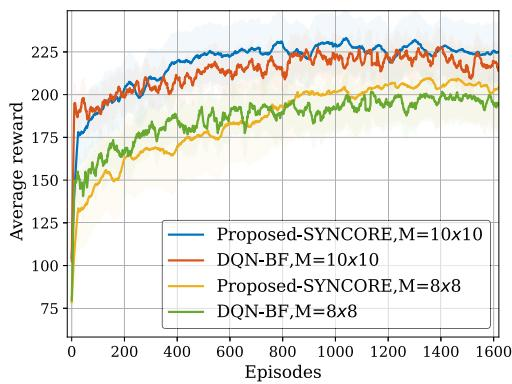  
Fig. 7. Training processes under different numbers of antennas.

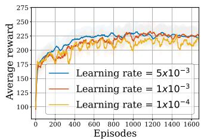

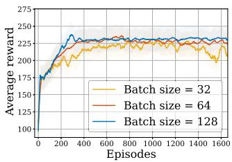  
(b) Batch size.

(a) Learning rate.  
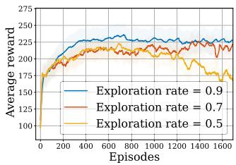  
(c) Exploration rate.

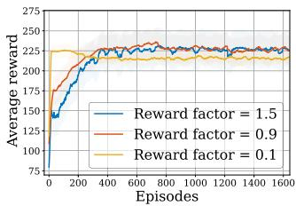  
(d) Reward scaling factor.  
Fig. 8. Performance evaluation of SYNCORE’s hyper-parameters.

Fig. 8 presents the performance of SYNCORE under different hyperparameter settings. Each curve is obtained by modifying one hyperparameter while keeping the others at default values $( \gamma _ { l } = 0 . 0 0 5 , N _ { b } = 6 4 , \epsilon = 0 . 9 , \eta = 0 . 9 )$ In Fig. 8(a), a learning rate of 0.005 leads to convergence around 500 episodes with a stable reward of about 230, while smaller values slow convergence and reduce peak rewards. In Fig. 8(b), a batch size of 64 enables convergence within approximately 500 episodes and results in smoother reward curves compared to smaller batch sizes. Increasing the batch size helps stabilize gradient estimates; however, excessively large batches may lead to higher computational costs. In Fig. 8(c), setting $\epsilon = 0 . 9$ achieves an effective balance between exploration and exploitation, leading to convergence at around 500 episodes and higher final rewards. In contrast, smaller  values reduce early-stage exploration and delay convergence. Fig. 8(d) indicates that the scaling factor η strongly affects learning dynamics. For $\eta < 0 . 9$ , the efficiency term is underweighted and increasing η improves learning speed, while very small values (e.g., 0.1) lead to slow convergence and hamper effective action selection. Once $\eta \geq 0 . 9$ , the efficiency term dominates the reward, and its value varies only marginally after the policy approaches a near-optimal region. Further increasing η therefore only rescales an already saturated reward signal without affecting the policy update direction, resulting in the observed performance plateau. Hence, $\eta = 0 . 9$ provides the best stability–speed trade-off, whereas larger values (e.g., 1.5) introduce oscillations.

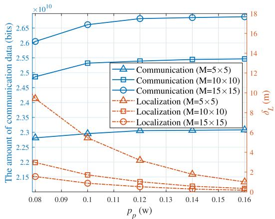  
Fig. 9. Communication and localization performance of SYNCORE.

Fig. 9 displays the communication and localization performance of the RC and CU as the number of array antennas varies. $\delta _ { L }$ indicates the localization error, with a smaller $\delta _ { L }$ reflecting the higher localization accuracy. The graph illustrates a progressive improvement in communication and localization performance as the transmit power of the sensed signal increases. This improvement results from the increased transmit power, which enhances the perception efficiency of both the RC and the CU in measuring PR signals. Consequently, this increase contributes to improved accuracy in angle estimation, thereby further enhancing localization accuracy. Simultaneously, as localization accuracy improves, beamforming design becomes more precise, leading to more directional signal transmission between the CU and the RC. Furthermore, the figure shows that more array antennas significantly enhance both communication and localization performance. This observation suggests that deploying more antennas to both the CU and the RC can achieve equivalent performance while reducing the transmitting power required from the PR.

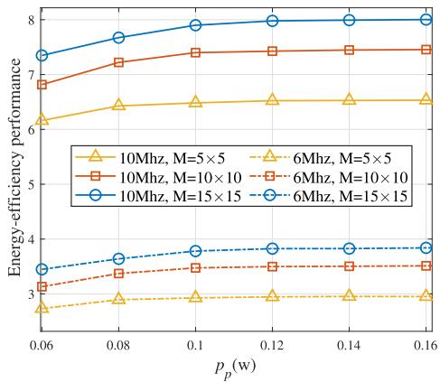  
Fig. 10. Energy efficiency performance of the proposed SYNCORE.

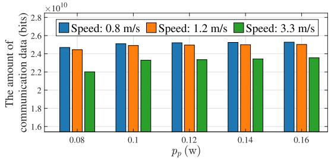  
(a) Communication performance versus the moving speed

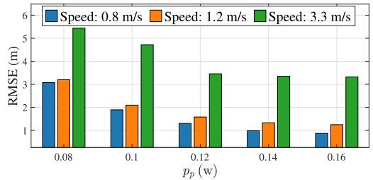  
(b) Localization performance versus the moving speed.  
Fig. 11. System performance analysis in different moving speeds.

Fig. 10 shows the energy efficiency performance under varying bandwidths and antenna quantities. As the number of array antennas increases, the communication rate rises. Moreover, augmenting the bandwidth results in an increased communication rate. Consequently, arrays with more antennas significantly enhances communication performance. This improvement in communication, in turn, enhances localization performance, leading to an overall gain in energy efficiency. As the PR’s transmit power increases, the CU and RC attain better signal perception, thereby improving localization performance. The heightened localization accuracy further facilitates beamforming optimization, improving communication performance and boosting overall system energy efficiency.

As shown in Fig. 11, three PR movement speeds were considered: 0.8 m/s and 1.2 m/s for walking [52], and 3.3 m/s for running [53]. In Fig. 11(a), the communication performance increases with transmission power across all speeds. The two walking speeds yield similar results, indicating that low-speed movement has minimal impact on communication performance and confirming the system’s robustness at low speeds. However, at 3.3 m/s, the overall communication volume decreases. Fig. 11(b) shows that positioning error decreases with increasing transmission power, but remains higher at faster speeds. These results suggest that while increasing transmission power improves both communication and positioning performance, high-speed movement can degrade overall system effectiveness.

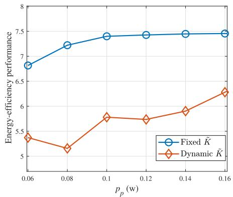  
Fig. 12. Energy efficiency under different channel conditions.

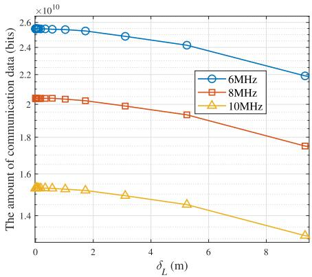  
Fig. 13. The relationship between communication and localization.

As shown in Fig. 12, the Fixed $\tilde { K }$ curve uses a constant Rician factor of $\bar { K } = 8$ to emulate a stable environment, while the Dynamic $\tilde { K }$ curve randomly samples $\tilde { K }$ from the set {2, 4, 6, 8, 10} to simulate a fluctuating environment. The results demonstrate that with fixed $\tilde { K } = 8$ , energy efficiency rises smoothly with transmit power before saturating; under the dynamic $\tilde { K }$ model, occasional low- $\tilde { \cal K }$ slots (weaker LoS components) cause brief dips in link efficiency, keeping overall efficiency below the fixed- $\bar { . K }$ case and introducing slight variability. This comparison not only reveals the optimal energy efficiency under ideal conditions but also highlights that practical systems must provision for instantaneous variations in the LoS–multipath ratio, guiding the design of more robust power-control and resource-allocation strategies.

Fig. 13 illustrates the relationship between localization and communication. The x-axis represents localization performance, indicated by localization error $\delta _ { L }$ , while the y-axis shows communication performance, quantified by the amount of communication data received by PR. The figure shows that increasing localization errors reduce the communication data received by PR. Specifically, an increase in localization error from 1.7 m to 3.1 m results in a reduction of 431 Mbits in the received communication data. In contrast, when the localization error increases from 0.18 m to 1 m, the reduction is only 54 Mbits. This discrepancy arises because localization errors substantially affect beamforming design. While smaller localization errors lead to better communication performance, larger errors significantly impair beamforming design, leading to a marked decline in communication performance.

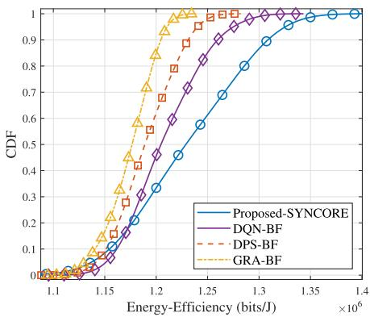  
Fig. 14. CDFs of the communication energy efficiency in different algorithms.

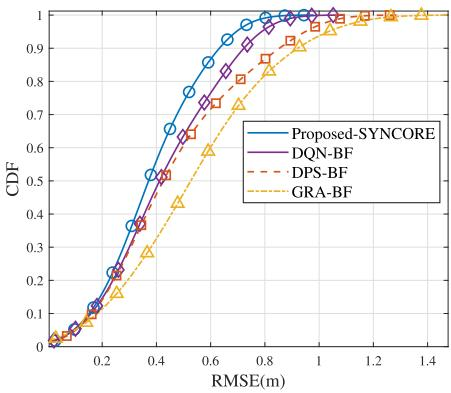  
Fig. 15. CDFs of the RMSE in different algorithms.

## C. Performance Comparison

To demonstrate the communication efficiency of the proposed scheme, we have included an additional analysis, with communication energy efficiency represented as $\begin{array} { r l } { E _ { c } ( t ) } & { { } = } \end{array}$ $D _ { a l l } ( t ) / E _ { t o t a l } ( t )$ . As shown in Fig. 14, the cumulative distribution functions (CDF) curve of the proposed algorithm is on the far right, indicating that compared with the baseline methods, the proposed algorithm has the best communication efficiency and can control energy consumption while ensuring the communication rate.

Fig. 15 illustrates the localization root-mean-square error (RMSE) of both the proposed algorithm and the baseline algorithms, when $p _ { p } = 0 . 1 2 \mathrm { w } .$ Notably, the proposed SYNCORE is positioned on the far left side of the graph, unequivocally demonstrating its superior localization accuracy in comparison to alternative algorithms. Furthermore, it can be seen that there is an 85% probability of localization error above 0.6 m.

Figs. 16 and 17 illustrate the communication and localization performance of different algorithms. In Fig. 17, the y-axis represents the localization error. As transmit power increases, the signal becomes more easily detected by the RC and CU, leading to improved angle estimation accuracy. Since localization depends on both angular information and geometric configuration, enhanced accuracy further contributes to more precise beamforming design. The proposed SYNCORE and DQN-BF algorithms, based on DRL, emphasize agent–environment interaction and aim to maximize global rewards through continuous bidirectional feedback between communication and localization. This dynamic coupling provides a clear advantage over other baseline methods. SYNCORE introduces separate main and target networks to decouple action selection from Q-value evaluation, effectively reducing the overestimation bias inherent in classical DQN-BF and resulting in more stable and reliable learning. Consequently, SYNCORE outperforms DQN-BF. Among the remaining baselines, DPS-BF is prone to local optima, while GRA-BF suffers degradation due to its random adjustments of time and power, which hinder convergence to the global optimum. The NSOCL scheme performs poorly in communication due to the absence of beamforming. These results highlight the importance of dynamic localization-geometry adjustment and beamforming for robust system performance.

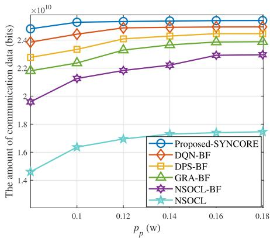

Fig. 16. Analysis of communication performance in different algorithms.  
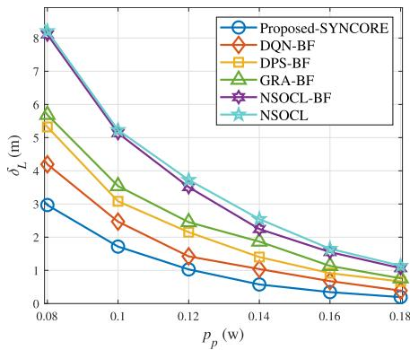  
Fig. 17. Analysis of localization performance in different algorithms.

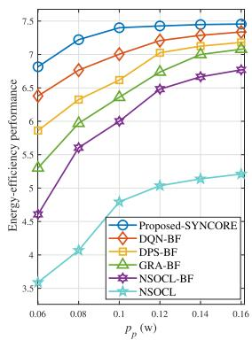  
(a) Average energy-efficiency.

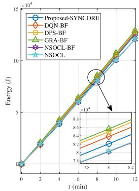  
(b) Energy consumption.  
Fig. 18. System energy efficiency analysis in different algorithms.

Fig. 18(a) shows the overall energy efficiency comparison of the system over the observation time. The proposed SYNCORE algorithm exhibits superior energy efficiency. During the dynamic adjustment process, the proposed algorithm, grounded in the evaluation and adjustment of comprehensive utility, not only guarantees optimal communication and localization performance but also reduces the energy consumption of the system. DQN-BF may encounter overestimation of Q-values, leading to slightly lower stability than the proposed solution and thus slightly inferior overall performance. The DPS-BF and GRA-BF algorithms rely on heuristic strategies that lack dynamic adaptation in rapidly changing environments and may fall into local optima due to their greedy nature. For the NSOCL algorithm without beamforming, communication performance is poor, resulting in an overall low utility.

As illustrated in Figs. 18(a) and 18(b), the proposed algorithm marginally increases energy consumption compared to the NSOCL algorithms, while significantly enhancing overall utility. The DPS-BF and GRA-BF algorithms adopt a greedy strategy during the dynamic adjustment process. Although this strategy rapidly optimizes the UAV’s position, it leads to slightly higher energy consumption. DQN-BF, although it dynamically adjusts strategies through continuous interaction with the environment, suffers from some inherent instability issues in the algorithm, leading to slightly higher energy consumption compared to the proposed solution. NSOCL schemes assume that minimizing energy consumption by avoiding dynamic CU localization adjustments and maintaining continuous low-altitude hovering sacrifices significant communication and localization performance. Hence, although moderate location adjustments incur slightly higher energy consumption, they yield superior performance improvements, leading to an overall gain in system energy efficiency.

## VI. CONCLUSION

In this work, we have proposed a novel integrated airground collaboration framework for emergency UAV systems, in which a single UAV serves as an aerial BS alongside rescuers to provide communication and localization services for users. We aimed to maximize the system’s energy efficiency by formulating an optimization problem that combines communication rate, localization accuracy, and system energy consumption. To achieve this objective, we have developed a signal perception-based localization method utilizing AOA information and a beamforming scheme for high data rate communication. Additionally, we proposed a DRL-based SYNCORE approach to optimize the UAV’s trajectory, flying time, and transmit power in real-time, capitalizing on the synergies between communication and localization while minimizing energy consumption. Simulation results demonstrate that the proposed scheme significantly improves communication and localization performance while also improving energy efficiency, thereby outperforming traditional baseline approaches. In the future, we will consider scenarios with more users and incorporate more comprehensive energy consumption models that account for the impact of strong winds. We will enhance the system’s robustness by incorporating motion prediction, jointly improving signal reception, and optimizing resource and computing power scheduling.

## REFERENCES

[1] Z. Tian, L. Wang, L. Xu, Z. Chang, and A. Fei, “Towards integrated communication and localization in emergency UAV systems: A joint trajectory and resource allocation design,” in Proc. IEEE Global Commun. Conf., Cape Town, South Africa, Dec. 2024, pp. 3533–3538.

[2] L. Wang, J. Zhang, J. Chuan, R. Ma, and A. Fei, “Edge intelligence for mission cognitive wireless emergency networks,” IEEE Wireless Commun., vol. 27, no. 4, pp. 103–109, Aug. 2020.

[3] O. A. Fernandes, R. R. Murphy, J. Adams, and D. Merrick, “Quantitative data analysis: CRASAR small unmanned aerial systems at hurricane Harvey,” in Proc. IEEE Int. Symp. Saf., Aug. 2018, pp. 1–6.

[4] M. Mozaffari, W. Saad, M. Bennis, Y.-H. Nam, and M. Debbah, “A tutorial on UAVs for wireless networks: Applications, challenges, and open problems,” IEEE Commun. Surveys Tuts., vol. 21, no. 3, pp. 2334–2360, 3rd Quart., 2019.

[5] Z. Chang, H. Deng, L. You, G. Min, S. Garg, and G. Kaddoum, “Trajectory design and resource allocation for multi-UAV networks: Deep reinforcement learning approaches,” IEEE Trans. Netw. Sci. Eng., vol. 10, no. 5, pp. 2940–2951, Sep. 2023.

[6] C.-Y. Chen and W.-R. Wu, “Three-dimensional positioning for LTE systems,” IEEE Trans. Veh. Technol., vol. 66, no. 4, pp. 3220–3234, Apr. 2017.

[7] Y. Gao, H. Hu, J. Zhang, Y. Jin, S. Xu, and X. Chu, “On the performance of an integrated communication and localization system: An analytical framework,” IEEE Trans. Veh. Technol., vol. 73, no. 7, pp. 10845–10849, Jul. 2024.

[8] X. Hu, C. Liu, M. Peng, and C. Zhong, “IRS-based integrated location sensing and communication for mmWave SIMO systems,” IEEE Trans. Wireless Commun., vol. 22, no. 6, pp. 4132–4145, Jun. 2023.

[9] L. Cong, K. Meng, D. Li, H. Jiang, and L. Xu, “Multiscale vehicle localization in heterogeneous mobile communication networks,” IEEE Internet Things J., vol. 12, no. 9, pp. 11408–11424, May 2025.

[10] L. Gupta, R. Jain, and G. Vaszkun, “Survey of important issues in UAV communication networks,” IEEE Commun. Surveys Tuts., vol. 18, no. 2, pp. 1123–1152, 2nd Quart., 2016.

[11] K. Zhuang, L. Xu, L. Li, L. Wang, and A. Fei, “GA-MADDPG: A demand-aware UAV network adaptation method for joint communication and positioning in emergency scenarios,” in Proc. IEEE Wireless Commun. Netw. Conf. (WCNC), Glasgow, United Kingdom, Mar. 2023, pp. 1–6.

[12] L. Wang, Q. Wei, L. Xu, Y. Shen, P. Zhang, and A. Fei, “Research on low-energy-consumption deployment of emergency UAV network for integrated communication-navigating-sensing,” J. Commun., vol. 43, no. 7, pp. 1–20, Aug. 2022.

[13] A. Liu et al., “A survey on fundamental limits of integrated sensing and communication,” IEEE Commun. Surveys Tuts., vol. 24, no. 2, pp. 994–1034, 2nd Quart., 2022.

[14] W. Zhu, Y. Han, L. Wang, L. Xu, Y. Zhang, and A. Fei, “Pilot optimization for OFDM-based ISAC signal in emergency IoT networks,” IEEE Internet Things J., vol. 11, no. 18, pp. 29600–29614, Sep. 2024.

[15] Y. Zeng, Q. Wu, and R. Zhang, “Accessing from the sky: A tutorial on UAV communications for 5G and beyond,” Proc. IEEE, vol. 107, no. 12, pp. 2327–2375, Dec. 2019.

[16] F. Liu et al., “Integrated sensing and communications: Toward dual-functional wireless networks for 6G and beyond,” IEEE J. Sel. Areas Commun., vol. 40, no. 6, pp. 1728–1767, Jun. 2022.

[17] Z. Lyu, G. Zhu, and J. Xu, “Joint maneuver and beamforming design for UAV-enabled integrated sensing and communication,” IEEE Trans. Wireless Commun., vol. 22, no. 4, pp. 2424–2440, Apr. 2023.

[18] Y. Liu, Z. Wei, Z. Feng, and G. L. Stuber, “Effective capacity based resource allocation for an integrated radar and communications system,” in Proc. IEEE Wireless Commun. Netw. Conf. (WCNC), May 2020, pp. 1–5.

[19] L. Yin and B. Clerckx, “Rate-splitting multiple access for dual-functional radar-communication satellite systems,” in Proc. IEEE Wireless Commun. Netw. Conf. (WCNC), Austin, TX, USA, Apr. 2022, pp. 1–6.

[20] Z. Fei, X. Wang, N. Wu, J. Huang, and J. A. Zhang, “Air-ground integrated sensing and communications: Opportunities and challenges,” IEEE Commun. Mag., vol. 61, no. 5, pp. 55–61, May 2023.

[21] L. Wang, R. Li, L. Xu, W. Zhu, Y. Zhang, and A. Fei, “Aerial-ground cooperative vehicular networks for emergency integrated localization and communication,” IEEE Netw., vol. 37, no. 4, pp. 323–330, Jul. 2023.

[22] Z. Yang, S. Bi, and Y.-J.-A. Zhang, “Deployment optimization of dualfunctional UAVs for integrated localization and communication,” IEEE Trans. Wireless Commun., vol. 22, no. 12, pp. 9672–9687, Dec. 2023.

[23] K. Meng, Q. Wu, S. Ma, W. Chen, K. Wang, and J. Li, “Throughput maximization for UAV-enabled integrated periodic sensing and communication,” IEEE Trans. Wireless Commun., vol. 22, no. 1, pp. 671–687, Jan. 2023.

[24] A. Al-Hourani, S. Kandeepan, and A. Jamalipour, “Modeling air-toground path loss for low altitude platforms in urban environments,” in Proc. IEEE Global Commun. Conf., Austin, TX, USA, Dec. 2014, pp. 2898–2904.

[25] S. D. Muruganathan et al., “An overview of 3GPP release-15 study on enhanced LTE support for connected drones,” IEEE Commun. Standards Mag., vol. 5, no. 4, pp. 140–146, Dec. 2021.

[26] S. Zhang, Y. Zeng, and R. Zhang, “Cellular-enabled UAV communication: A connectivity-constrained trajectory optimization perspective,” IEEE Trans. Commun., vol. 67, no. 3, pp. 2580–2604, Mar. 2019.

[27] Z. Yu, X. Hu, C. Liu, M. Peng, and C. Zhong, “Location sensing and beamforming design for IRS-enabled multi-user ISAC systems,” IEEE Trans. Signal Process., vol. 70, pp. 5178–5193, 2022.

[28] B. Tang, D. Li, W. Wu, A. Saini, P. Babu, and P. Stoica, “Dualfunction beamforming design for multi-target localization and reliable communications,” IEEE Trans. Signal Process., vol. 73, pp. 559–573, 2025.

[29] Y. Zeng, R. Zhang, and T. J. Lim, “Wireless communications with unmanned aerial vehicles: Opportunities and challenges,” IEEE Commun. Mag., vol. 54, no. 5, pp. 36–42, May 2016.

[30] X. Tang, F. Chen, F. Wang, and Z. Jia, “Disaster-resilient emergency communication with intelligent air–ground cooperation,” IEEE Internet Things J., vol. 11, no. 3, pp. 5331–5346, Feb. 2024.

[31] R. Li, L. Wang, K. Chen, L. Xu, and A. Fei, “Full-duplex NOMAenabled integrated sensing and communication: Joint transmit and receive beamforming optimization,” IEEE Internet Things J., vol. 11, no. 16, pp. 27015–27029, Aug. 2024.

[32] A. F. Demir and H. Arslan, “The impact of adaptive guards for 5G and beyond,” in Proc. IEEE 28th Annu. Int. Symp. Pers., Indoor, Mobile Radio Commun. (PIMRC), Montreal, QC, Canada, Oct. 2017, pp. 1–5.

[33] L. Liu, S. Zhang, and R. Zhang, “CoMP in the sky: UAV placement and movement optimization for multi-user communications,” IEEE Trans. Commun., vol. 67, no. 8, pp. 5645–5658, Aug. 2019.

[34] M. R. Maleki, M. R. Mili, M. R. Javan, N. Mokari, and E. A. Jorswieck, “Multi-agent reinforcement learning trajectory design and two-stage resource management in CoMP UAV VLC networks,” IEEE Trans. Commun., vol. 70, no. 11, pp. 7464–7476, Nov. 2022.

[35] Q. Wu, J. Xu, and R. Zhang, “Capacity characterization of UAV-enabled two-user broadcast channel,” IEEE J. Sel. Areas Commun., vol. 36, no. 9, pp. 1955–1971, Sep. 2018.

[36] Y. Zeng, J. Xu, and R. Zhang, “Energy minimization for wireless communication with rotary-wing UAV,” IEEE Trans. Wireless Commun., vol. 18, no. 4, pp. 2329–2345, Apr. 2019.

[37] H. Mei, K. Yang, Q. Liu, and K. Wang, “3D-trajectory and phaseshift design for RIS-assisted UAV systems using deep reinforcement learning,” IEEE Trans. Veh. Technol., vol. 71, no. 3, pp. 3020–3029, Mar. 2022.

[38] A. G. Dempster, “Dilution of precision in angle-of-arrival positioning systems,” Electron. Lett., vol. 42, no. 5, pp. 291–292, Mar. 2006.

[39] A. Arafa, S. Dalmiya, R. Klukas, and J. F. Holzman, “Angle-of-arrival reception for optical wireless location technology,” Opt. Exp., vol. 23, no. 6, pp. 7755–7766, Mar. 2015.

[40] T. Komine and M. Nakagawa, “Fundamental analysis for visible-light communication system using LED lights,” IEEE Trans. Consum. Electron., vol. 50, no. 1, pp. 100–107, Feb. 2004.

[41] M. Mozaffari, W. Saad, M. Bennis, and M. Debbah, “Mobile UAVs for energy-efficient Internet of Things communications,” IEEE Trans. Wireless Commun., vol. 16, no. 11, pp. 7574–7589, Nov. 2017.

[42] R. Roy and T. Kailath, “ESPRIT-estimation of signal parameters via rotational invariance techniques,” IEEE Trans. Signal Processing., vol. 37, no. 7, pp. 984–995, Jul. 1989.

[43] Y. I. Abramovich, N. K. Spencer, and A. Y. Gorokhov, “Positive-definite Toeplitz completion in DOA estimation for nonuniform linear antenna arrays. II. partially augmentable arrays,” IEEE Trans. Signal Process., vol. 47, no. 6, pp. 1502–1521, Jun. 1999.

[44] M. Gapeyenko, V. Petrov, D. Moltchanov, S. Andreev, N. Himayat, and Y. Koucheryavy, “Flexible and reliable UAV-assisted backhaul operation in 5G mmWave cellular networks,” IEEE J. Sel. Areas Commun., vol. 36, no. 11, pp. 2486–2496, Nov. 2018.

[45] X. Gao, D. He, P. Wang, and W. Yu, “Signal parameter estimation based on ESPRIT with state space model for 5G NR signals in indoor and urban environments,” IEEE Trans. Veh. Technol., vol. 74, no. 2, pp. 2276–2291, Feb. 2025.

[46] Z. Ding, E. N. Epperly, L. Lin, and R. Zhang, “The ESPRIT algorithm under high noise: Optimal error scaling and noisy super-resolution,” in Proc. IEEE Symp. Found. Comput. Sci. (FOCS), Oct. 2024, pp. 2344–2366.

[47] X. Liu, Y. Liu, and Y. Chen, “Machine learning empowered trajectory and passive beamforming design in UAV-RIS wireless networks,” IEEE J. Sel. Areas Commun., vol. 39, no. 7, pp. 2042–2055, Jul. 2021.

[48] M. Fayaz, W. Yi, Y. Liu, and A. Nallanathan, “Transmit power pool design for grant-free NOMA-IoT networks via deep reinforcement learning,” IEEE Trans. Wireless Commun., vol. 20, no. 11, pp. 7626–7641, Nov. 2021.

[49] P. Yi, L. Zhu, Z. Xiao, R. Zhang, Z. Han, and X.-G. Xia, “3- D positioning and resource allocation for multi-UAV base stations under blockage-aware channel model,” IEEE Trans. Wireless Commun., vol. 23, no. 3, pp. 2453–2468, Mar. 2024.

[50] P. Susarla, B. Gouda, Y. Deng, M. Juntti, O. Silven, and A. T´ olli,¨ “Learning-based beam alignment for uplink mmWave UAVs,” IEEE Trans. Wireless Commun., vol. 22, no. 3, pp. 1779–1793, Mar. 2023.

[51] H. Wu, F. Lyu, C. Zhou, J. Chen, L. Wang, and X. Shen, “Optimal UAV caching and trajectory in aerial-assisted vehicular networks: A learning-based approach,” IEEE J. Sel. Areas Commun., vol. 38, no. 12, pp. 2783–2797, Dec. 2020.

[52] E. Reznick, K. R. Embry, R. Neuman, E. Bol´ıvar-Nieto, N. P. Fey, and R. D. Gregg, “Lower-limb kinematics and kinetics during continuously varying human locomotion,” Sci. Data, vol. 8, no. 1, p. 282, Oct. 2021.

[53] J. C. Selinger, J. L. Hicks, R. W. Jackson, C. M. Wall-Scheffler, D. Chang, and S. L. Delp, “Running in the wild: Energetics explain ecological running speeds,” Current Biol., vol. 32, no. 10, pp. 2309–2315.e3, May 2022.


Zeyu Tian received the M.E. degree from Beijing Information Science and Technology University, Beijing, China, in 2020. He is currently pursuing the Ph.D. degree with the School of Computer Science (National Pilot Software Engineering School), Beijing University of Posts and Telecommunications, Beijing. His current research interests include edge caching, wireless resource management, and the integrated localization and communication in UAV networks.

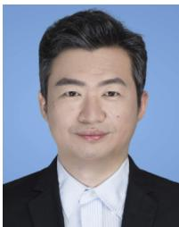

Lianming Xu (Member, IEEE) received the B.Eng. degree from Hefei University of Technology, Hefei, China, in 2003, and the Ph.D. degree from Beijing University of Posts and Telecommunications (BUPT), Beijing, China, in 2009.

He is currently an Associate Professor with the School of Electronic Engineering, BUPT. His research interests include cooperative positioning, edge intelligence, edge caching, and computing.


Chen Xu (Member, IEEE) received the B.S. degree from Beijing University of Posts and Telecommunications, China, in 2010, and the Ph.D. degree from Peking University, Beijing, in 2015.

She is currently an Associate Professor and the Ph.D. Supervisor with the School of Artificial Intelligence, Beijing University of Posts and Telecommunications. Her research interests mainly include wireless resource management, cooperative communication and computing, and intelligent network optimization. She served as a TPC member

for IEEE Globecom 2016 and IEEE ICC 2016. She received the Best Paper Award at the 2012 International Conference on Wireless Communications and Signal Processing (WCSP), the IEEE Leonard G. Abraham Prize in 2016, the WCSP 10-year Anniversary Excellent Paper Award in 2019, and the first prize of Natural Science of Chinas Ministry of Education in 2017. She is one of the 2019 Beijing Nova of Science and Technology.


Zheng Chang (Senior Member, IEEE) received the B.Eng. degree from Jilin University, Changchun, China, in 2007, the M.Sc. (Tech.) degree from Helsinki University of Technology (Now Aalto University), Espoo, Finland, in 2009, and the Ph.D. degree from the University of Jyvaskyl¨ a, Jyv¨ askyl¨ a,¨ Finland, in 2013.

Since 2008, he has been holding various research positions with Helsinki University of Technology, University of Jyvaskyl¨ a, and Magister Solutions¨ Ltd., Finland. He was a Visiting Researcher with

Tsinghua University, China, from June to August 2013, and the University of Houston, TX, USA, from April to May 2015. He has published over 200 papers in journals and conferences. His research interests include federated learning, cloud/edge computing, UAV/vehicular networks, and green communications. He has been awarded by Ulla Tuominen Foundation, Nokia Foundation, and Riitta and Jorma J. Takanen Foundation for his research excellence. He has been awarded the 2018 IEEE Communications Society Best Young Researcher for Europe, Middle East, and Africa Region, and the 2021 IEEE Communications Society MMTC Outstanding Young Researcher. He received the Best Paper Awards from IEEE ICC in 2023, IEEE TCGCC, and APCC in 2017. He has participated in organizing workshop and special session in Globecom’19, WCNC’18–‘24, SPAWC’19, and ISWCS’18. He also serves as the Symposium/Track Co-Chair for IEEE ICC’20, Globecom’23, VTS’25S, and ICC’26, the Publicity Co-Chair for IEEE Infocom’22, the Workshop Co-Chair for ICCC’22 and VTS’25F, the TPC Co-Chair for IEEE iThing’22, and a TPC Member for many IEEE major conferences, such as INFOCOM, ICC, and Globecom. He was the Best Editor of IEEE WIRELESS COMMUNICATIONS LETTERS and China Communications in 2024 and the Exemplary Reviewer of IEEE WIRELESS COMMUNICATIONS LETTERS in 2018. He serves as an Editor for IEEE WIRELESS COMMU-NICATIONS LETTERS, IEEE TRANSACTIONS ON MACHINE LEARNING IN COMMUNICATIONS AND NETWORKING, and China Communications, and a Guest Editor for IEEE Network, IEEE WIRELESS COMMUNICATIONS, IEEE Communications Magazine, IEEE INTERNET OF THINGS JOURNAL, and IEEE TRANSACTIONS ON INDUSTRIAL INFORMATICS.


Li Wang (Senior Member, IEEE) received the Ph.D. degree from Beijing University of Posts and Telecommunications (BUPT), Beijing, China, in 2009.

She is currently a Full Professor with the School of Computer Science (National Pilot Software Engineering School), BUPT, where she is also an Associate Dean and the Head of the High Performance Computing and Networking Laboratory. She is also a Faculty Member of the Key Laboratory of the Universal Wireless Communications, Ministry of

Education, China. She is also the Rotating Director of the Key Laboratory of Application Innovation in Emergency Command Communication Technology, Ministry of Emergency Management, China. She also held visiting positions with the School of Electrical and Computer Engineering, Georgia Tech, Atlanta, GA, USA, from December 2013 to January 2015, and with the Department of Signals and Systems, Chalmers University of Technology, Gothenburg, Sweden, from August to November 2015 and from July to August 2018. She has authored or co-authored almost 70 journal articles and four books. Her research interests include wireless communications, distributed networking and storage, vehicular communications, social networks, and edge AI. She was a recipient of the 2013 Beijing Young Elite Faculty for Higher Education Award, best paper awards from several IEEE conferences, including IEEE ICCC 2017, IEEE GLOBECOM 2018, and IEEE WCSP 2019. She was also a recipient of Beijing Technology Rising Star Award in 2018. She was the Symposium Chair of IEEE ICC 2019 on Cognitive Radio and Networks Symposium and a Tutorial Chair of IEEE VTC 2019. She was the Vice Chair of Meetings and Conference Committee (MCC) for IEEE Communication Society (ComSoc) Asia Pacific Board (APB) for the term from 2020 to 2021. She is the Chair of the Special Interest Group (SIG) on Sensing, Communications, Caching, and Computing (C3) in Cognitive Networks for IEEE Technical Committee on Cognitive Networks. She has served on TPC of multiple IEEE conferences, including IEEE INFOCOM, IEEE GLOBECOM, the International Conference on Communications, the IEEE Wireless Communications and Networking Conference, and the IEEE Vehicular Technology Conference in recent years. She was an Associate Editor of IEEE TRANSACTIONS ON GREEN COMMUNICATIONS AND NETWORKING. She currently serves on the Editorial Board for IEEE TRANSACTIONS ON VEHICULAR TECHNOLOGY, IEEE TRANSACTIONS ON COGNITIVE COMMUNICATIONS AND NETWORKING, IEEE INTERNET OF THINGS JOURNAL, and China Communications.


Zhu Han (Fellow, IEEE) received the B.S. degree in electronic engineering from Tsinghua University, in 1997, and the M.S. and Ph.D. degrees in electrical and computer engineering from the University of Maryland, College Park, in 1999 and 2003, respectively.

From 2000 to 2002, he was an Research and Development Engineer with JDSU, Germantown, Maryland. From 2003 to 2006, he was a Research Associate with the University of Maryland. From 2006 to 2008, he was an Assistant Professor with

Boise State University, Idaho. Currently, he is a John and Rebecca Moores Professor with the Electrical and Computer Engineering Department and the Computer Science Department, University of Houston, TX, USA. His main research targets on the novel game-theory related concepts critical to enabling efficient and distributive use of wireless networks with limited resources. His other research interests include wireless resource allocation and management, wireless communications and networking, quantum computing, data science, smart grid, carbon neutralization, and security and privacy. He received the NSF Career Award in 2010, the Fred W. Ellersick Prize of the IEEE Communication Society in 2011, the EURASIP Best Paper Award for Journal on Advances in Signal Processing in 2015, the IEEE Leonard G. Abraham Prize in the field of communications systems (Best Paper Award in IEEE JSAC) in 2016, the IEEE Vehicular Technology Society 2022 Best Land Transportation Paper Award, and several best paper awards in IEEE conferences. He was an IEEE Communications Society Distinguished Lecturer from 2015 to 2018 and the ACM Distinguished Speaker from 2022 to 2025. He has been a AAAS Fellow since 2019 and has been an ACM Fellow since 2024. He is also the winner of the 2021 IEEE Kiyo Tomiyasu Award (an IEEE Field Award), for outstanding early to mid-career contributions to technologies holding the promise of innovative applications, with the following citation: “for contributions to game theory and distributed management of autonomous communication networks.” He is honored Lifetime Chair Professor of National Yang Ming Chiao Tung University, Taiwan; Eminent Scholar of Kyung Hee University, South Korea; and Global Professor of Keio University, Japan.