# Energy-Efficient Multi-UAV Navigation for Cooperative Data Sensing and Transmission

Hu He , Member, IEEE, Jun Peng , Senior Member, IEEE, Lin Cai , Fellow, IEEE,

Weirong Liu , Member, IEEE, Chenglong Wang, Xin Gu , Member, IEEE, and Zhiwu Huang , Member, IEEE

Abstract—Unmanned aerial vehicles (UAVs) hold significant potential for sensing services in a large scope of area, thanks to their wide coverage and adaptable deployment. Considering the complex environment dynamics and limited sensing range, navigating multiple UAVs in a distributed way becomes challenging to implement cooperative data sensing and transmission tasks. In this paper, we optimize the trajectory design of UAVs by jointly considering the collected data volume, geographical fairness and limited energy reserve during their service period. To achieve the long-term serving objective, a memory augmented multi-agent deep reinforcement learning approach is presented to ensure energy-efficient distributed trajectory design with partial observations. Specifically, the intrinsic criterion is developed to enhance UAV spatial exploration when reaching the boundary of explored regions. Then, to address the information loss caused by incomplete observations, the spatial-temporal memory augmented actor-critic architecture is designed to extract historical contextual features for multi-UAV cooperative navigation. Furthermore, the prioritized experience replay mechanism is incorporated to enhance important experience exploitation for UAV collaboration. Extensive simulations using two real-world datasets in Shenzhen and Beijing demonstrate that the proposed method outperforms the state-of-the-art methods in terms of data collection ratio, geographical fairness, and energy consumption ratio.

Index Terms—Unmanned aerial vehicle, cooperative data sensing and transmission, distributed trajectory design, multiagent deep reinforcement learning.

## I. INTRODUCTION

applications in diverse civilian and industrial domains [1], including aerial inspection [2], high-precision positioning [3], and package delivery [4], driven by their high mobility and extensive service coverage capabilities. With the elevated altitude, UAVs are more likely to establish robust line-of-sight (LoS) downlink and uplink communications with ground terminals, thereby presenting an effective avenue to enhance communication performance [5]. In this context, UAVs can perfrom various sensing tasks by collecting data from multiple Point-of-Interests (PoIs), such as traffic monitoring cameras and environmental sensors, to support diverse services and applications. For example, UAVs can be quickly and dynamically deployed collecting environmental data to facilitate rapid damage assessment, helping emergency responders prioritize rescue efforts within the most affected areas.

Considering the computational and storage capabilities of UAVs, the sensory data collected from various PoIs requires transmission to the data center through the base station for further analysis to support intelligent service provisioning [6]. In contrast to the conventional terrestrial sensing paradigm employing mobile devices for sensory data collection [7], [8], UAVs present advantages in terms of enhanced mobility, reduced signal blockage, and the ability to access harsh environment. During the serving period, UAVs are required to access all PoIs for sensing tasks, ensuring comprehensive coverage. Simultaneously, the sensory data should be transmitted to the base station as much as possible to prevent data backlogs. Although there are several works focus on the trajectory optimization for UAV-enabled sensing problems [9] [10], it is not suitable for the data sensing and transmission scenario since the two functions tightly coupled. Furthermore, considering the limited on-board energy, the trajectory of UAVs should be well designed to provide the long-term and energy-efficient data sensing and transmission services.

Over the past few years, UAV trajectory optimization for data sensing and transmission has been explored extensively [11], [12]. Existing approaches based on optimization theory such as dynamic programming [13] and successive convex approximation [14] have been adopted to iteratively optimize the UAV trajectory. Given the complex system dynamics and rapid expansion of the solution space with the increasing number of UAVs, the time complexity of these methods becomes exponential and intolerable. Recently, in order to provide energy-efficient data sensing and transmission service, works in [15], [16] designed several UAV navigation policies based on the Markov Decision Process (MDP) with complete system-level information. These methods designed centralized controllers, located at base station or central cloud, to make real-time navigation actions for UAVs to perform data sensing and transmission tasks.

There are several challenges in the above-mentioned UAV trajectory optimization methods. First, directly collecting comprehensive system-level data from PoIs to BS is challenging due to the limited communication capabilities of the PoIs. For example, PoIs, such as IoT sensors deployed in remote areas and edge devices in industrial settings typically lack long-distance transmission capabilities. These device often rely on short-range protocols with constrained power budgets, meaning they can only transmit their status to the UAV within the sensing range. Additionally, considering the constraints of maximum communication distance and the high mobility of UAVs [17], a centralized control policy is impractical, as it would require continuous and real-time global state information, which is infeasible given the distributed and partial observable nature of the system. Even with multiple UAVs deployed, their collective observations in each time slot are unlikely to encompass the entire target sensing region, especially in dynamic environments where PoIs’ states (e.g., emergency event statuses) evolve rapidly. Furthermore, the centralized control approach faces scalability issues. Coordinating and managing the growing number of UAVs from the central controller can become increasingly complex and resource-intensive.

Recently, deep reinforcement learning (DRL) has emerged as a powerful approach for addressing high-complexity problems with environmental uncertainty, which has been widely used for trajectory optimization in UAV-assisted wireless networks [18], [19], [20]. The objective of DRL is to iteratively learn decision-making policy through interactions in a dynamic environment, aiming to maximize the cumulative reward. The inherent assumption of independence in single-agent DRL frameworks cannot align well with the collaboration nature of multi-UAV scenarios, where UAVs need to perform data sensing and transmission tasks cooperatively. To make matters worse, the computational cost and the size of the action space will be expaned significantly with the increasing number of UAVs, making it difficult to find an optimal solution for single-agent DRL methods.

Multi-agent DRL (MADRL) method offers a distributed solution for multi-UAV cooperation. Unlike single-agent DRL, which is limited to centralized decision-making scenarios, MADRL effectively captures the dynamic and decentralized nature of multi-agent environments. By decomposing the action space for each UAV, MADRL enables individual agents to model inter-agent dependencies and interactions, facilitating coordinated strategies that optimize the global objective. To achieve this, the centralized training and decentralized execution paradigm [21] is employed. During training stage, each UAV leverages a joint value function that incorporates global state information and the actions of other agents, mitigating the nonstationarity inherent in multi-agent systems. For the decentralized execution phase, each UAV operates autonomously, relying on its locally optimized policy to make real-time decisions while maintaining coordination with other UAVs. This allows each UAV to adapt its policy parameters dynamically, ensuring efficient and scalable cooperation for data sensing and transmission.

However, existing MADRL approaches for UAV coordination cannot address the following challenges in the multi-UAV cooperative data sensing and transmission scenario with partial observability. i) Exploration Under Spatial Uncertainty. Existing MADRL methods typically rely on standard exploration strategies (e.g., epsilon-greedy [22] or entropy-based [23] methods) to address environmental uncertainty. They lack mechanisms to prioritize unvisited spatial regions, leading to inefficient trajectory planning under incomplete information. ii) Spatial-Temporal Interdependencies. Prior works [24] [25] primarily focus on temporal UAV observations, failing to adequately capture the spatial-temporal dual-dependency among UAVs and PoIs. These interdependencies include spatial relationships (e.g., relative positions of UAVs and PoIs) and temporal dynamics (e.g., remaining data volume of PoIs and UAV energy levels over time), both of which are critical for effective coordination. iii) Prioritized Learning for Critical Interactive Experiences. Random sampling for experience replay may fail to deal with significant environmental transitions (e.g., UAV trajectories with high data collection and extensive geographical coverage), leading to lower convergence and reduced robustness. To address these challenges, we present MEMDRL with the following novel components.

BeBold Exploration-Based Intrinsic Reward Mechanism: MEMDRL incorporates a beyond the boundary of explored regions (BeBold)-inspired intrinsic reward mechanism specifically designed for UAVs operating under partial observability. This mechanism encourages UAVs to prioritize exploration of unvisited spatial regions by assigning intrinsic rewards based on the observations, thereby improving coverage and collaboration in dynamic environments under limited sensing ranges.

Memory Augmented Actor-Critic with ConvLSTM: MEM-DRL introduces a spatial-temporal memory augmented actor-critic framework that integrates convolutional LSTM (ConvLSTM) networks. Unlike standard GRU or LSTM, ConvLSTM captures both historical spatial and temporal dependencies simultaneously in the partial observable environment, enabling UAVs to effectively capture the interrelations between the PoIs and UAVs over time.

\- Prioritized Interactive Experience Replay: MEMDRL employs prioritized experience replay (PER) based on temporal difference (TD) errors to emphasize interactive experiences that capture critical transitions in the dynamic UAV environment. This ensures that UAVs learn from the most informative interactions, accelerating policy convergence and improving robustness in scenarios with partial observability and frequent environmental changes.

The main contributions of this paper are summarized as follows.

The multi-UAV trajectory optimization problem is modeled as a Partially Observable MDP (POMDP) to capture complex system dynamics. To provide long-term and energy-efficient data sensing and transmission services, the UAV trajectory design aims to maximize the total collected data volume received at the base station and ensure geographical fairness among PoIs under limited energy reserve of UAVs during the service period.

\- A MEMory augmented multi-agent Deep Reinforcement Learning approach (MEMDRL) is proposed to address multi-UAV navigation problem with partial observations. The BeBold-based intrinsic exploration criterion is designed for UAVs to encourage spatial exploration. To address information loss, the ConvLSTM-based actor-critic architecture is designed to capture historical spatial and temporal information. Prioritized interactive experience replay mechanism is implemented to improve experience exploitation for UAV collaboration.

\- Extensive simulations using two real-world PoI datasets in Shenzhen and Beijing validate the superiority of the proposed multi-UAV cooperative navigation method. We visualize the UAV trajectories on the two datasets and find noticeable cooperation among UAVs for data sensing and transmission. When varying the number of UAVs and the sensing range of UAVs, the proposed method outperforms five baselines in terms of data collection ratio, geographical fairness, and energy consumption ratio.

The rest of this paper is organized as follows. Related work is introduced in Section II. The system model and problem statement are defined in Section III. In Section IV, we present the POMDP modeling for multi-UAV cooperative data sensing and transmission. Section V describes the proposed multi-UAV navigation approach in details. The numerical results based on the two real-world datasets in Shenzhen and Beijing are presented in Section VI, followed by concluding remarks and further research issues in Section VII.

## II. RELATED WORK

Thanks to the advantages of high mobility and flexible deployment, UAVs can provide various sensing services from the sky. UAVs equipped with high-speed data receivers can be regarded as aerial nodes to directly collect data from various PoIs in the target sensing region. The work in [26] studied the trajectory design for UAV-enabled data collection in the massive machinetype communication (mMTC) networks using artificial energy map. Considering the trade-off between the energy consumption and delay constraint, the work in [27] investigated the edge computing enabled multi-UAV cooperative target search problem. Take the UAV Ad-hoc network into consideration, the work in [17] proposed a graph neural network based path planning method to maximize the coverage-fairness-energy score.

Considering the computational and storage capacities of UAVs, the sensory data such as the live video streaming and highresolution images requires to be sent to the data center through the base station for further processing and analysing. In this context, UAVs can be considered as aerial relays that perform data sensing and transmission tasks. The authors in [11] optimized the UAV trajectory and transmission power by addressing the UAV sensing optimization problem and UAV transmission optimization problem separately. The work in [28] studied the collected data average age of information minimization problem, where the UAV trajectory was optimized by dynamic programming and ant colony heuristic algorithm. Aiming to support massive ultrareliable and low-latency communications (mURLLC) services, the work in [29] optimized UAV trajectory and provided quality of service (QoS) guarantee in multimedia mobile networks. A limitation of these UAV trajectory optimization methods is that with the increasing number of UAVs, the time complexity for obtaining the optimal UAV trajectory is unacceptable.

Some works further employ machine learning-based methods for UAV trajectory optimization to address complex environment dynamics. The work in [16] designed a centralized control and distributed execution DRL framework for delay-sensitive and energy-efficient UAV trajectory design. The base station is considered to be the central controller that could navigate multiple UAVs concurrently. The work in [30] proposed a Transformer-based UAV path search algorithm to jointly optimize the hovering point selection and access order of these points in the cluster-based IoT network. The authors in [31] designed a distributed sense-and-send protocol to coordinate multiple UAVs. Based on this protocol, the trajectory design problem was formulated as an MDP and proposed a MADRL method to solve it. However, the above methods rely on the central controller or global information gathering, which is impractical due to excessive communication cost and scheduling complexity for large-scale network. Furthermore, UAVs are constrained to obtain local observations within their sensing range. From the above discussion, how to navigate multiple UAVs in a distributed manner to jointly optimize data sensing and transmission in a partially observable environment is still an open issue, which motivated our work.

## III. SYSTEM MODEL AND PROBLEM FORMULATION

In this section, we first describe the system model for the multi-UAV cooperative data sensing and transmission scenario, then define the trajectory optimization problem of UAVs by jointly considering the collected data volume, geographical fairness and energy consumption. Table I provides an overview of the main notations.

## A. System Overview

An illustration of the multi-UAV cooperative data sensing and transmission scenario is presented in Fig. 1, which consists of a target sensing region , a ground base station (GBS) $b ,$ a set ${ \mathcal { K } } = \{ 1 , 2 , \ldots , K \}$ UAVs, and a set $\mathcal { P } = \{ 1 , 2 , \ldots , P \}$ PoIs = 1 2with data volume $d _ { 0 } ^ { p }$ = 1 2sensed from the surrounding environment. The PoIs are randomly distributed in the target sensing region, and their associated data volumes $d _ { 0 } ^ { p } , \forall p \in \mathcal { P }$ are randomly initialized. The UAVs are responsible for collecting data from PoIs distributed in the target sensing region, and transmitting the data to the ground base station for further analysing and processing. We consider the service time for UAVs is divided into T time slots with equal duration τ . At each time slot t, each UAV k first spends time $\tau _ { \mathrm { m o v e } , t } ^ { k }$ for movement in a certain direction $\theta _ { t } ^ { k } \in [ 0 , 2 \pi )$ with distance $d _ { t } ^ { k } \in [ 0 , d _ { \operatorname* { m a x } } ]$ . Then, UAV k can utilize the remaining time $\tau _ { \mathrm { c o l l e c t } , t } ^ { k } = \tau - \tau _ { \mathrm { m o v e } , t } ^ { k }$ in this time slot to serve a group of PoIs $\mathcal { P } _ { t } ^ { k } \subset \mathcal { P }$ within the sensing range for data collection and transmission. In the target sensing region , there are obstacles such as tall buildings and no-fly zones that UAVs are unable to traverse.

TABLE I  
KEY NOTATIONS AND DEFINITIONS
<table><tr><td>Notation</td><td>Explanation</td></tr><tr><td> $\kappa , \mathcal { P }$ </td><td>Sets of UAVs and PoIs</td></tr><tr><td> $\tau , \tau _ { \mathrm { m o v e } , t } ^ { k } , \tau _ { \mathrm { c o l l e c t } , t } ^ { k }$ </td><td>Duration of a time slot, duration for UAV movement and data collection in each time slot</td></tr><tr><td> $\underline { { \theta _ { t } ^ { k } } } , d _ { t } ^ { k }$ </td><td>UAV movement direction and distance</td></tr><tr><td> $\mathcal { P } _ { t } ^ { k }$ </td><td>PoI sets within the sensing range of UAV k</td></tr><tr><td> $\overline { { h _ { t } ^ { p , k } , R _ { t } ^ { p , k } } }$ </td><td>Path loss and data transmission rate from PoI p to UAV k</td></tr><tr><td> $\overline { { d _ { t } ^ { p } , D _ { t } ^ { k } } }$ </td><td>Current data volume of PoI  $p ,$  total received data volume of UAV k from PoI set  $\underline { \mathcal { P } } _ { t } ^ { k }$ </td></tr><tr><td> $\overline { { h _ { t } ^ { k , b } , R _ { t } ^ { k , b } } }$ </td><td>Path loss and data transmission rate from UAV k to ground base station b</td></tr><tr><td> $F _ { t } , E _ { t } ^ { k }$ </td><td>Geographical fairness, total energy con- sumption for UAV k at time slot t</td></tr><tr><td> $s _ { t } , o _ { t } ^ { k } , a _ { t } ^ { k } , r _ { t } ^ { k }$ </td><td>State, observation, action and reward of UAV k at time slot t</td></tr><tr><td> $\overline { { \tilde { s } _ { t } ^ { k } , \tilde { o } _ { t } ^ { k } , a _ { t } } }$ </td><td>States and observations of UAV k in previ- ous l time slots, and joint actions of all UAVs</td></tr><tr><td> $\mathcal { D } _ { r } , B _ { r }$ </td><td>Experience replay buffer and mini-batch of experiences</td></tr></table>

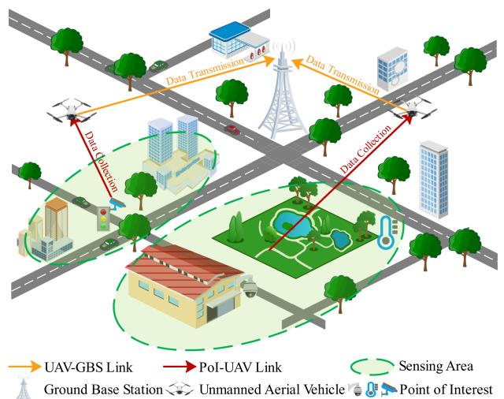  
Fig. 1. The system overview of the multi-UAV cooperative data sensing and transmission scenario.

The height of the ground base station is $H _ { b }$ . The UAVs are assumed to fly at the constant altitude $H _ { u }$ since frequent altitude change is energy-inefficient [32]. The coordinate of the k-th UAV at time slot t is denoted by $\mathbf { p } _ { t } ^ { k } = [ x _ { t } ^ { k } , y _ { t } ^ { k } , H _ { u } ]$ . UAVs are re-= [ ]quired to collect data from PoIs within the target sensing region, which means that UAVs should not fly beyond the boundary of the region . In addition, it is essential to maintain a safe distance $d _ { \mathrm { s a f e } }$ between UAVs to prevent collisions. Therefore, for UAV k and $\boldsymbol { k } ^ { \prime } \left( \boldsymbol { k } \neq \boldsymbol { k } ^ { \prime } \right)$ , we have $d _ { t } ^ { k , k ^ { \prime } } \geq d _ { \mathrm { s a f e } }$ , where $d _ { t } ^ { k , k ^ { \prime } }$ denotes the distance between the k-th UAV and the k-th UAV, which is given by

$$
d _ { t } ^ { k , k ^ { \prime } } = | | \mathbf { p } _ { t } ^ { k } - \mathbf { p } _ { t } ^ { k ^ { \prime } } | | = \sqrt { ( x _ { t } ^ { k } - x _ { t } ^ { k ^ { \prime } } ) ^ { 2 } + ( y _ { t } ^ { k } - y _ { t } ^ { k ^ { \prime } } ) ^ { 2 } } ,\tag{1}
$$

where || · || is the euclidean norm.

## B. System Model

1) UAV Communication Model: There exist two types of transmission links in the system: the PoI-UAV data collection link and the UAV-GBS data transmission link. Following [11] and [33], UAVs collect the sensory data from PoIs and transmit the data to the ground base station simultaneously.

1) UAV Data Collection: In urban environments, the wireless data collection link between UAV and PoI can experience intermittent blockages due to terrestrial obstacles. Similar to [34], the PoI-UAV wireless channel can be modeled as a weighted combination of the line-of-sight (LoS) and non-line-of-sight (NLoS) path loss links with their occurrence probabilities. Specifically, the LoS and NLoS path losses of UAV k collecting data from PoI $p$ at time slot t can be expressed as

$$
\begin{array} { r l } & { \quad h _ { \mathrm { L o S } , t } ^ { p , k } = 2 0 \log \left( \frac { 4 \pi f _ { c } d _ { t } ^ { p , k } } { v _ { c } } \right) + \eta _ { \mathrm { L o S } } , } \\ & { \quad h _ { \mathrm { N L o S } , t } ^ { p , k } = 2 0 \log \left( \frac { 4 \pi f _ { c } d _ { t } ^ { p , k } } { v _ { c } } \right) + \eta _ { \mathrm { N L o S } } , } \end{array}\tag{2}
$$

where $v _ { c }$ represents the speed of light, $f _ { c }$ signifies the carrier frequency, ${ \dot { d } } _ { t } ^ { p , k }$ stands for the distance between PoI $p$ and UAV k at time slot t, and $\eta _ { \mathrm { L o S } }$ and $\eta _ { \mathrm { N L o S } }$ correspond to the distinct shadowing factors attributed to the LoS and NLoS links, respectively.

Based on the elevation angle-dependent probabilistic LoS model [35], the LoS probability between PoI $p$ and UAV k at time slot t can be denoted by

$$
P _ { \mathrm { L o S } , t } ^ { p , k } = \frac { 1 } { 1 + c _ { 1 } \exp \left( - c _ { 2 } ( \theta _ { t } ^ { p , k } - c _ { 1 } ) \right) } ,\tag{3}
$$

where $c _ { 1 }$ and $c _ { 2 }$ are environment-related constant values. $\theta _ { t } ^ { p , k } = $ $\frac { 1 8 0 } { \pi }$ arcsin $\textstyle { \Big ( } { \frac { H _ { u } } { d _ { t } ^ { p , k } } } { \Big ) }$ is the elevation angle between PoI $p$ and UAV k at time slot t. The NLoS probability is given by $P _ { \mathrm { N L o S } , t } ^ { p , k } =$ $1 - P _ { \mathrm { L o S } , t } ^ { p , k }$ t. Then the path loss from PoI $p$ to UAV k at time slot t can be represented as

$$
\begin{array} { r } { { h } _ { t } ^ { p , k } = { P } _ { \mathrm { L o S } , t } ^ { p , k } \cdot { h } _ { \mathrm { L o S } , t } ^ { p , k } + { P } _ { \mathrm { N L o S } , t } ^ { p , k } \cdot { h } _ { \mathrm { N L o S } , t } ^ { p , k } . } \end{array}\tag{4}
$$

Considering the limited sensing range of UAVs, UAV k can serve a subset of PoIs $\mathcal { P } _ { t } ^ { k } \subset \mathcal { P }$ and collect data from them at time slot t. Then, the signal-to-interference-plus-noise ratio (SINR) of the PoI-UAV data collection link at time slot t can be expressed as

$$
\gamma _ { \mathrm { S I N R } , t } ^ { p , k } = \frac { P _ { r } \cdot 1 0 ^ { - h _ { t } ^ { p , k / } 1 0 } } { \sigma ^ { 2 } + \sum _ { p ^ { \prime } \in \mathcal { P } _ { t } ^ { k } , p ^ { \prime } \ne p } P _ { r } \cdot 1 0 ^ { - h _ { t } ^ { p ^ { \prime } , k } / 1 0 } } ,\tag{5}
$$

where $P _ { r }$ is the prescribed transmission power of PoIs and $\sigma ^ { 2 }$ denotes the noise power. Since our focus is not on the bandwidth allocation of the PoI-UAV data collection link, we assume that the total available bandwidth B for UAV k is equally divided among the subset of PoIs $\mathcal { P } _ { t } ^ { k }$ . The path loss parameters $\eta _ { \mathrm { L o S } }$ and $\eta _ { \mathrm { N L o S } }$ for different environments (e.g., suburban, urban, and dense urban) can be found in [36]. Then the achievable data transmission rate $R _ { t } ^ { p , k }$ from PoI $p \left( p \in { \mathcal { P } } _ { t } ^ { k } \right)$ to UAV k at time slot t is obtained as the expectation over path loss, which can be denoted by

$$
R _ { t } ^ { p , k } = \mathbb { E } _ { h _ { t } ^ { p , k } } \left\{ \frac { B } { | \mathcal { P } _ { t } ^ { k } | } \log _ { 2 } \Big ( 1 + \gamma _ { \mathrm { S I N R } , t } ^ { p , k } \Big ) \right\} .\tag{6}
$$

The total received data volume of UAV k from PoI set $\mathcal { P } _ { t } ^ { k }$ can be calculated as

$$
D _ { t } ^ { k } = \sum _ { p \in \mathcal { P } _ { t } ^ { k } } \operatorname* { m i n } \left( R _ { t } ^ { p , k } \cdot \tau _ { \mathrm { c o l l e c t } , t } ^ { k } , d _ { t } ^ { p } \right) ,\tag{7}
$$

where $d _ { t } ^ { p }$ denotes the remaining data volume of PoI p at time slot t.

2) UAV Data Transmission: The distance of the UAV-GBS data transmission link may be larger compared with the distance of the PoI-UAV data collection link, which means that the NLoS link experiences higher attenuation than LoS link due to the shadowing and diffraction losses in UAV-GBS links. According to [37], the path loss between UAV k and ground base station b at time slot t can be denoted by

$$
\begin{array} { r } { h _ { t } ^ { k , b } = P _ { \mathrm { L o S } , t } ^ { k , b } \cdot h _ { \mathrm { L o S } , t } ^ { k , b } + P _ { \mathrm { N L o S } , t } ^ { k , b } \cdot h _ { \mathrm { N L o S } , t } ^ { k , b } , } \end{array}\tag{8}
$$

where $h _ { \mathrm { L o S } , t } ^ { k , b } = ( d _ { t } ^ { k , b } ) ^ { - \alpha }$ and $h _ { \mathrm { N L o S } , t } ^ { k , b } = \zeta ( d _ { t } ^ { k , b } ) ^ { - \alpha }$ are the LoS = ( ) = ( )and NLoS path losses between UAV k and ground base station b at time slot t, respectively. α denotes the path loss exponent, and ζ represents the additional path loss factor of the NLoS link. Similar to (3), the LoS probability between UAV k and ground base station b at time slot t is given by

$$
P _ { \mathrm { L o S } , t } ^ { k , b } = \frac { 1 } { 1 + c _ { 1 } \exp \Big ( - c _ { 2 } ( \theta _ { t } ^ { k , b } - c _ { 1 } ) \Big ) } ,\tag{9}
$$

where $\begin{array} { r } { \theta _ { t } ^ { k , b } = \frac { 1 8 0 } { \pi } } \end{array}$ arcsin $\textstyle \big ( { \frac { H _ { b } - H _ { u } } { d _ { + } ^ { k , b } } } \big )$ . The corresponding NLoS probability is given by $P _ { \mathrm { N L o S } , t } ^ { k , b } = 1 - P _ { \mathrm { L o S } , t } ^ { k , b }$

To avoid data transmission overlapping, each UAV is allocated a dedicated orthogonal subchannel to ensure interference-free UAV data transmission to the ground base station. Similar to (6), the data transmission rate $\breve { R _ { t } ^ { k , b } }$ between UAV k and ground base station b at time slot t can be represented by

$$
R _ { t } ^ { k , b } = \mathbb { E } _ { h _ { t } ^ { k , b } } \Bigg \lbrace W \log _ { 2 } \Bigg ( 1 + \frac { P _ { u } } { \sigma ^ { 2 } 1 0 ^ { h _ { t } ^ { k , b } / 1 0 } } \Bigg ) \Bigg \rbrace ,\tag{10}
$$

where W represents the bandwidth and $P _ { u }$ denotes the transmission power.

To avoid data backlogs in UAVs and complete the data transmission for real-time process, the maximum uploaded data volume should be no less than the collected data at each time slot, i.e., $R _ { t } ^ { k , b } \cdot \tau _ { \mathrm { c o l l e c t } , t } ^ { k } \geq D _ { t } ^ { k }$ , which means that the navigation policy of UAVs should be carefully designed to achieve a balance between PoI-UAV data collection and UAV-GBS data transmission.

2) Energy Consumption Model: The UAV energy consumption can be attributed to two main components: communicationrelated energy and propulsion energy. The communicationrelated energy component is omitted from the analysis in this paper since it is considered negligible compared to the propulsion energy [38].

We adopt the energy consumption model for rotary-wing UAVs presented in [39], which represents the total power consumption as the combined sum of three components: blade profile power, parasite power, and induced power. The propulsion power consumption for UAV k with moving speed $v _ { t } ^ { k }$ can be represented as

$$
\begin{array} { l } { { \displaystyle P _ { \mathrm { p r o p } , t } ^ { k } = P _ { 1 } \left( 1 + \frac { 3 ( v _ { t } ^ { k } ) ^ { 2 } } { ( v _ { \mathrm { t i p } } ) ^ { 2 } } \right) + \frac { 1 } { 2 } P _ { 2 } ( v _ { t } ^ { k } ) ^ { 3 } } } \\ { { \displaystyle ~ + P _ { 3 } \left( \sqrt { 1 + \frac { ( v _ { t } ^ { k } ) ^ { 4 } } { 4 \bar { v } ^ { 4 } } } - \frac { ( v _ { t } ^ { k } ) ^ { 2 } } { 2 \bar { v } ^ { 2 } } \right) ^ { \frac { 1 } { 2 } } , } } \end{array}\tag{11}
$$

where $P _ { 1 } , P _ { 2 } ,$ , and $P _ { 3 }$ denote the coefficients corresponding to blade profile power, parasite power, and induced power, respectively. $v _ { \mathrm { t i p } }$ denotes the tip speed of the rotor blade. v is the mean ¯rotor induced velocity. Accordingly, the power consumption $P _ { \mathrm { h o v e r } , t } ^ { k }$ when UAV is hovering $( v _ { t } ^ { k } = 0 )$ for data sensing and transmission is computed by: $P _ { \mathrm { h o v e r } , t } ^ { k } = P _ { 1 } + P _ { 3 }$ . Then, the total energy consumption for UAV k at time slot t is computed by

$$
\begin{array} { r } { \boldsymbol { E } _ { t } ^ { k } = \tau _ { \mathrm { m o v e } , t } ^ { k } \cdot \boldsymbol { P } _ { \mathrm { p r o p } , t } ^ { k } + \tau _ { \mathrm { c o l l e c t } , t } ^ { k } \cdot \boldsymbol { P } _ { \mathrm { h o v e r } , t } ^ { k } . } \end{array}\tag{12}
$$

3) Geographical Fairness Model: Geographical fairness ensures that PoIs receive equitable access coverage in the UAVenabled data sensing and transmission system, thereby mitigating issues related to skewed data distribution. This balance is particularly important for applications like environmental monitoring and disaster response, where timely and comprehensive data from different PoIs contribute to effective assessment and rapid intervention. Here, we refer to the Jain’s fairness index [40] to explicate the sensing times of each PoI and evaluate the geographical fairness across all PoIs, which can be represented by

$$
F _ { t } = \frac { \left( \sum _ { p \in \mathcal { P } } \sum _ { t ^ { \prime } = 1 } ^ { t } \sum _ { k \in K } \mathbb { 1 } \{ p \in \mathcal { P } _ { t ^ { \prime } } ^ { k } \} \right) ^ { 2 } } { P \sum _ { p \in \mathcal { P } } \left( \sum _ { t ^ { \prime } = 1 } ^ { t } \sum _ { k \in K } \mathbb { 1 } \{ p \in \mathcal { P } _ { t ^ { \prime } } ^ { k } \} \right) ^ { 2 } } ,\tag{13}
$$

where the indicator function 1 $\{ p \in \mathcal P _ { t } ^ { k } \}$ is equal to 1 if UAV k visit PoI p at time slot t and otherwise 0.

## C. Problem Formulation

The objective of the multi-UAV cooperative data sensing and transmission system aims to optimize the UAV trajectories to maximize the total collected data volume and geographical fairness while minimize the energy consumption of UAVs during the service period. Following [16] [41], we consider the system works in an energy-efficient manner, by combining the collected data volume $\sum _ { t = 1 } ^ { \infty } D _ { t } ^ { k }$ and energy consumption $\textstyle \sum _ { t = 1 } ^ { T } E _ { t } ^ { k }$ in bits per Joule among all UAVs, and weighted by the geographical fairness $F _ { T }$ . The total collected data volume ranges within $[ 0 , \textstyle \sum _ { p \in { \mathcal { P } } } d _ { 0 } ^ { p } ]$ , geographical fairness lies within $\textstyle \left[ { \frac { 1 } { P } } , 1 \right]$ and energy consumption for each UAV is bounded by , Emax . [0 ]To address the differing orders of magnitude and units, we can normalize these indicators in the range of ,  to ensure fair contributions to the overall optimization index. Mathematically, the optimization problem can be written as

$$
\mathrm { P } 1 : \quad \operatorname* { m a x } _ { \mathbf { p } } F _ { T } \cdot \frac { 1 } { K } \sum _ { k = 1 } ^ { K } \frac { \sum _ { t = 1 } ^ { T } D _ { t } ^ { k } } { \sum _ { t = 1 } ^ { T } E _ { t } ^ { k } }\tag{14}
$$

$$
\mathrm { s . t . } C 1 : 0 \leq \theta _ { t } ^ { k } < 2 \pi , \forall k \in \mathcal { K }\tag{14a}
$$

$$
C 2 : 0 \leq d _ { t } ^ { k } \leq d _ { \operatorname* { m a x } } , \forall k \in \mathcal { K }\tag{14b}
$$

$$
C 3 : \mathbf { p } _ { t } ^ { k } \in \Omega , \forall k \in \mathcal { K }\tag{14c}
$$

$$
C 4 : | | \mathbf { p } _ { t } ^ { i } - \mathbf { p } _ { t } ^ { j } | | \geq d _ { \mathrm { s a f e } } , \forall i , j \in \mathcal { K } , i \neq j\tag{14d}
$$

$$
C 5 : R _ { t } ^ { k , b } \cdot \tau _ { \mathrm { c o l l e c t } , t } ^ { k } \geq D _ { t } ^ { k } , \forall k \in \mathcal { K }\tag{14e}
$$

$$
C 6 : \sum _ { t = 1 } ^ { T } E _ { t } ^ { k } \leq E _ { \operatorname* { m a x } } , \forall k \in \mathcal { K }\tag{14f}
$$

where $\mathbf { p } = \{ \mathbf { p } _ { t } ^ { k } , \forall k \in \mathcal { K } \}$ denote the UAV trajectories. C and C guarantee the UAV flight direction and moving distance is in the feasible region. C and C require UAVs to work in the target sensing region while keep a safe distance between them. C prohibits the data backlogs in UAVs. C gives the energy constraint during the service period, where $E _ { \mathrm { m a x } }$ denotes the maximum on-board energy of UAVs.

It is not difficult to find that P1 is challenging to solve due to the following reasons. First, the navigation policy for UAVs should be carefully designed, considering both individual trajectory optimization and cooperation patterns among UAVs. Second, obtaining the optimal navigation decisions requires complete information related to the decision-making process, with computational complexity exponentially increasing with respect to the service period and the number of UAVs. However, UAVs can only obtain the local observations within their sensing range. Since our considered problem can be naturally modeled as a sequential decision problem, we model P1 as a POMDP, and then employ DRL methods to solve it for distributed multi-UAV cooperative navigation.

Remark: The current study focuses on optimizing multi-UAV cooperative data sensing and transmission tasks during a single service episode. To ensure continuous PoI information transmission across service episodes, we can incorporate an energy reservation mechanism for UAVs returning to their take-off points for charging. Following [27], let $E _ { r e t , t } ^ { k }$ denote the minimum kinetic energy required for UAV k returns to its take-off point for charging at time slot t. The energy constraint C can be updated as $\begin{array} { r } { \bar { E } _ { \operatorname* { m a x } } - \sum _ { t = 1 } ^ { T } E _ { t } ^ { k } \geq E _ { r e t , T } ^ { k } , \forall k \in \mathcal { K } , } \end{array}$ ensuring that each UAV reserves sufficient energy for the return trip, thereby maintaining continuous PoI information transmission by allowing other UAVs to fill in for the subsequent service episodes as needed.

## IV. POMDP MODELING FOR MULTI-UAV COOPERATIVE DATASENSING AND TRANSMISSION

Considering the complex environment dynamics and limited sensing range of UAVs, the optimization problem P1 is modeled as a POMDP under the multi-agent setting. We define each UAV as an agent and consider the cooperative data sensing and transmission scenario in Section III as the learning environment. Generally, POMDP can be expressed by a six-tuple $< S , \mathcal { O } , \mathcal { A } , R , \mathcal { P } r , \gamma >$ , where $\mathcal { P } r$ and $\gamma$ stand for the transition probability and discounted factor, respectively. Following [16], the state transition function $\mathcal { P } r : \mathcal { S } \times \mathcal { A }  \mathcal { S }$ governs the transition from state $s _ { t }$ to state $s _ { t + 1 }$ , as defined by the system model in Section III. Specifically, at the beginning of each time slot t, each UAV $k \in \mathcal { K }$ observes the local observation $o _ { t } ^ { k }$ , which is a subset of the state $s _ { t } .$ , and then takes action $a _ { t } ^ { k }$ . Then the system transitions to the next state $s _ { t + 1 }$ according to the state transition function $\mathcal { P } r ( s _ { t + 1 } | s _ { t } , \{ a _ { t } ^ { k } \} _ { k \in \mathcal { K } } )$ . The state space $s ,$ , observation space ${ \mathcal { O } } _ { : }$ , action space A and reward function R are defined as follows.

## A. State and Observation Space

The state $s _ { t }$ at time slot t is defined as a three-dimensional tensor, which contains the current conditions of UAVs and PoIs with their location information. Specifically, each layer in $s _ { t }$ can be expressed as

$$
\begin{array} { r l } & { \mathrm { L a y e r 1 : } s _ { t } ( x _ { t } ^ { p } , y _ { t } ^ { p } , 1 ) = d _ { t } ^ { p } , } \\ & { \mathrm { L a y e r 2 : } s _ { t } ( x _ { t } ^ { k } , y _ { t } ^ { k } , 2 ) = e _ { t } ^ { k } , } \\ & { \mathrm { L a y e r 3 : } s _ { t } ( x _ { t } ^ { p } , y _ { t } ^ { p } , 3 ) = v _ { t } ^ { p } , } \end{array}\tag{15}
$$

where the first layer includes the remaining data volume $d _ { t } ^ { p }$ for each PoI at time slot t, the second layer places the remaining energy $e _ { t } ^ { k }$ of each UAV with their positions, and the last layer represents the visiting times $v _ { t } ^ { p }$ by UAVs for each PoI. The state space is then denoted as $\mathcal { S } = \bar { \{ { s _ { t } } | t = 1 , . . . , T \} }$

Each UAV can obtain partial observation $o _ { t } ^ { k }$ , which is a subset of the system state constrained by the limited communication distance [10] [17]. Specifically, UAVs can collect the observable PoI status information (i.e., remaining data volume and visiting times), and the remaining energy information of the UAVs within their limited communication distance. For UAV k, the observation $o _ { t } ^ { k }$ at time slot t is represented by

$$
o _ { t } ^ { k } = s _ { t } ( x _ { t } ^ { k } - j : x _ { t } ^ { k } + j , y _ { t } ^ { k } - j : y _ { t } ^ { k } + j , : ) ,\tag{16}
$$

where $o _ { t } ^ { k } \in \mathbb { R } ^ { 2 j \times 2 j \times 3 }$ , and $j$ controls the sensing range of each UAV. Therefore, the observation space is given by $\mathcal { O } = \{ o _ { t } ^ { k } | t =$ $1 , \dots , T , k \in \mathcal { K } \}$

## B. Action Space

In the optimization problem , the UAV trajectory is defined as a sequence of discrete coordinates $\mathbf { p } = \{ \mathbf { p } _ { t } ^ { k } , \forall k \in \mathcal { K } \}$ , where $\mathbf { p } _ { t } ^ { k }$ represents the target position of the k-th UAV at time slot t. These coordinates are optimized to enable the UAV to serve a group of PoIs for data sensing and transmission. The action of the k-th UAV at time slot t is defined as

$$
a _ { t } ^ { k } = \left\{ ( \theta _ { t } ^ { k } , d _ { t } ^ { k } ) | \theta _ { t } ^ { k } \in [ 0 , 2 \pi ) , d _ { t } ^ { k } \in [ 0 , d _ { \operatorname* { m a x } } ] \right\} ,\tag{17}
$$

where $d _ { \mathrm { m a x } }$ is the maximum movement distance per time slot, constrained by the UAV’s maximum flight speed and time slot duration to ensure kinematic feasibility. Given the current 2D position of the k-th UAV $[ x _ { t } ^ { k } , y _ { t } ^ { k } ]$ and the corresponding action $a _ { t } ^ { k } = ( \theta _ { t } ^ { k } , d _ { t } ^ { k } )$ , the next position is computed as $[ x _ { t } ^ { \bar { k } } + d _ { t } ^ { k } ( \cos \theta _ { t } ^ { k } ) , y _ { t } ^ { \bar { k } } + \dot { d } _ { t } ^ { k } ( \sin \theta _ { t } ^ { k } ) ]$ . The action space is given by $\mathcal { A } = \{ a _ { t } ^ { k } | t = 1 , \ldots , T , k \in K \}$

Remark: To ensure physical feasibility, the transitions between consecutive coordinates are designed to comply with the UAV’s kinematic and dynamic constraints. In practice, a low-level flight controller [42] [43] can generate a smooth and continuous trajectory that tracks these coordinates, adhering to constraints such as maximum velocity, acceleration, and energy budgets. This approach ensures that transitions between consecutive coordinates are both physically feasible and operationally efficient.

## C. Reward Function

The UAV aims to explore the navigation policy that maximizes the expected reward, which is associated with the data collection volume, geographical fairness and energy consumption. Considering the limited sensing range of UAVs, effective spatial exploration plays a crucial role in enhancing cooperation among UAVs in the dynamic environment. To this end, the reward $r _ { t } ^ { \bar { k } }$ for UAV k at time slot t can be expressed by

$$
\boldsymbol { r } _ { t } ^ { k } = \boldsymbol { r } _ { \mathrm { e x t r } , t } ^ { k } + \varsigma \cdot \boldsymbol { r } _ { \mathrm { i n t r } , t } ^ { k } + \boldsymbol { r } _ { \mathrm { p e n a l t y } } , \forall k \in \mathcal { K } ,\tag{18}
$$

where $r _ { \mathrm { e x t r } , t } ^ { k }$ denotes the task-driven extrinsic reward provided by the environment. $r _ { \mathrm { i n t r } , t } ^ { k }$ represents the intrinsic reward derived from the designed exploration criterion. ς is the intrinsic reward scaling coefficient. $r _ { \mathrm { p e n a l t y } }$ denotes the penalty when the UAV hits obstacles or depletes its energy.

Extrinsic Reward: The extrinsic reward denotes the external incentives with the objective function P1, which aims to maximize the data collection volume and geographical fairness while minimize the energy consumption. Therefore, the extrinsic reward $r _ { \mathrm { e x t r } , t } ^ { k }$ for UAV k at time slot t can be denoted by

$$
r _ { \mathrm { e x t r } , t } ^ { k } = \frac { D _ { t } ^ { k } } { E _ { t } ^ { k } } \cdot F _ { t } ,\tag{19}
$$

where $F _ { t }$ denotes the geographical fairness among PoIs. $D _ { t } ^ { k }$ and $E _ { t } ^ { k }$ represent the total data volume transmitted to ground base station and the energy consumption of UAV k at time slot t, respectively.

Intrinsic Reward: The intrinsic reward aims to provide effective spatial exploration for UAVs. UAVs can become trapped in local optimization with insufficient spatial exploration, resulting in a tendency to revisit the same locations consistently while neglecting more distant PoIs. To motivate UAVs to explore the environment effectively, the beyond the boundary of explored regions (BeBold) exploration criterion [44] is employed in the designed intrinsic reward. The target sensing region is discretized into a grid of spatial regions for the purpose of calculating the visitation counts $N ( \cdot )$ and the episodic visitation counts $N _ { e } ( \cdot )$ The discretization ensures that the UAVs’ positions are mapped to a finite set of grid cells, making it feasible to record whether a location has been visited within an episode or during the training process. UAVs can receive a reward only when they visit the grid cell for the first time in an episode with the BeBold-based spatial exploration criterion. The intrinsic reward $r _ { \mathrm { i n t r } , t } ^ { k }$ for UAV k at time slot t is defined as

$$
\begin{array} { r l } & { r _ { \mathrm { i n t r } , t } ^ { k } = } \\ & { \mathbb { 1 } \left\{ N _ { e } \left( x _ { t + 1 } ^ { k } , y _ { t + 1 } ^ { k } \right) \right\} \cdot \operatorname* { m a x } \Bigg ( \frac { 1 } { N \left( x _ { t + 1 } ^ { k } , y _ { t + 1 } ^ { k } \right) } - \frac { 1 } { N \left( x _ { t } ^ { k } , y _ { t } ^ { k } \right) } , 0 \Bigg ) , } \end{array}\tag{20}
$$

where $N _ { e } ( x _ { t } ^ { k } , y _ { t } ^ { k } )$ denotes the episodic visitation count, which records the number of times a grid cell corresponding to $( x _ { t } ^ { k } , y _ { t } ^ { k } )$ has been visited within the current episode. It is reset to zero at the start of each new training episode. The indicator function $\mathbb { 1 } \{ N _ { e } ( x _ { t + 1 } ^ { k } , y _ { t + 1 } ^ { k } ) \}$ is activated only for the first-time visit of the grid cell corresponding to $( x _ { t } ^ { k } , y _ { t } ^ { k } )$ within an episode. $N ( x _ { t } ^ { k } , y _ { t } ^ { k } )$ denotes the cumulative visitation count, which records the total number of visits to a grid cell across all episodes during the training stage.

## V. MEMORY AUGMENTED MADRL SOLUTION FOR MULTI-UAV NAVIGATION

In this section, we introduce a MADRL approach to formulate a distributed multi-UAV cooperative navigation policy with partial observations. The actor-critic architecture has been extensively adopted in MADRL leveraging the benefits both from the policy-based and value-based reinforcement learning methods. Based on it, multi-agent deep deterministic policy gradient (MADDPG) [21] based methods have been widely used for providing effective control policies of UAVs. However, these methods demonstrate sensitivity to hyperparameters and suffer from an overestimation bias of the Q-value, leading to non-stationary convergence and suboptimal performance.

To deal with this issue, multi-agent twin delayed deep deterministic policy gradient (MATD3) [45] method is proposed to reduce the bias with double centralized critics. Directly applying MATD3 to solve the POMDP is challenging due to the partial observations of UAVs. To this end, to enable effective cooperative data sensing and transmission for UAVs with partial observations and complex environment dynamics, we employ MATD3 as the start point of our design and present MEMDRL for multi-UAV distributed trajectory design.

## A. Learning Framework

The framework of MEMDRL is shown in Fig. 2. Each UAV holds the same actor-critic architecture. Both the actor and critic contain the evaluation network and target network. The evaluation network approximates the current value of the policy, while the target network offers a stable reference for policy updating by reducing the detrimental effects of policy oscillation. Let $\theta _ { A } = \{ \theta _ { a } , \theta _ { a } ^ { \prime } \}$ denote the model parameters of the evaluation actor and target actor network. UAV k makes action $a _ { t } ^ { k } = \pi _ { \theta _ { A } } ^ { k } ( \tilde { o } _ { t } ^ { k } )$ based on the policy $\pi _ { \theta _ { A } } ^ { k } ( \cdot )$ and observation input $\tilde { o } _ { t } ^ { k }$ . Let $\phi _ { C } = \{ \phi _ { c 1 } , \phi _ { c 2 } \}$ denote the model parameters of the two evaluation critic networks and $\phi _ { C } ^ { \prime } = \{ \phi _ { c 1 } ^ { \prime } , \phi _ { c 2 } ^ { \prime } \}$ denote the model parameters of the two target critic networks. UAV k calculates the Q-value by the value function $Q _ { \phi } ^ { k } ( \tilde { \boldsymbol { s } } _ { t } , \boldsymbol { a } _ { t } )$ , which means the expected long-term reward of the action input $\mathbf { } \mathbf { a } _ { t }$ and state input $\tilde { \mathbf { \boldsymbol { s } } } _ { t }$ . Let $\mathcal { D } _ { r }$ represent the experience reply buffer, ˜which can store the interactive experiences during the training stage. Similar to MATD3, to address the Q-value overestimation problem, MEMDRL presents the following three features.

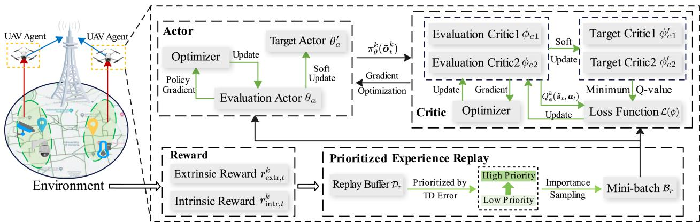  
Fig. 2. The framework overview of MEMDRL for multi-UAV distributed trajectory design. Each UAV acts as an agent and holds the same actor-critic architecture The UAV aims to explore the navigation policy that maximizes the expected reward, including both the task-driven extrinsic reward and exploration-based intrinsic reward. The prioritized mini-batch of experiences are sampled to update actor and critic networks.

1) Clipped Double-Q Learning: The UAV chooses the minimum Q-value in the two target critic networks, enabling more accurate value estimations and relieving the overestimation problem. For UAV k, the Q-value $y _ { t } ^ { k }$ of the target network can be obtained by

$$
\begin{array} { r } { y _ { t } ^ { k } = r _ { t } ^ { k } + \gamma \operatorname* { m i n } _ { \phi = \phi _ { c 1 } ^ { \prime } , \phi _ { c 2 } ^ { \prime } } Q _ { \phi } ^ { k } \left( \tilde { s } _ { t + 1 } , \bar { a } _ { 1 } , \dots , \bar { a } _ { K } \right) | _ { \bar { a } _ { k } = \pi _ { \theta _ { a } ^ { \prime } } ^ { k } } ( \tilde { o } _ { t + 1 } ^ { k } ) + \epsilon , } \\ { \epsilon \sim \mathrm { c l i p } ( \mathcal { N } ( 0 , \rho ) , - c , c ) \qquad ( 2 1 ) } \end{array}
$$

where $\gamma \in [ 0 , 1 )$ is the discount factor.  denotes the random Gaussian noise added to target actor network, which allows a smoother state-action value estimation. c represents the clip bound of the noise to keep close to the original action.

2) Soft Update Mechanism: The two evaluation critic loss can be calculated by the weighted mean-squared temporal difference (TD) error with the mini-batch $B _ { r }$ sampled from the experience reply buffer $\mathcal { D } _ { r }$ , which can be represented by

$$
\mathcal { L } ( \phi ) = \frac { 1 } { \left| B _ { r } \right| } \sum _ { t \in B _ { r } } \left( Q _ { \phi } ^ { k } \left( \tilde { s } _ { t } , a _ { t } \right) - y _ { t } ^ { k } \right) ^ { 2 } , \phi = \phi _ { c 1 } , \phi _ { c 2 }\tag{22}
$$

where $Q _ { \phi } ^ { k } ( \tilde { \pmb { s } } _ { t } , \pmb { a } _ { t } )$ denotes the Q-value output by the evaluation critic networks parameterized by φ.

The policy objective function $J ( \theta _ { a } )$ is used to measure the ( )performance of the evaluation actor network. Since the two evaluation critics hold the same network structure and update method, we take one of the evaluation critic network to update the evaluation actor network. Therefore, $J ( \theta _ { a } )$ can be obtained (with evaluation critic network with parameter $\phi _ { c 1 }$ , which is given

by

$$
J ( \theta _ { a } ) = \frac { 1 } { | B _ { r } | } \sum _ { t \in B _ { r } } Q _ { \phi _ { c 1 } } ^ { k } \left( \tilde { s } _ { t } , a _ { t } ^ { 1 } , \dots , \pi _ { \theta _ { a } } ^ { k } ( \tilde { \sigma } _ { t } ^ { k } ) , \dots , a _ { t } ^ { K } \right) .\tag{23}
$$

Therefore, each UAV can update the parameters of the evaluation actor and critics, which can be expressed as

$$
\begin{array} { r l } & { \theta _ { a }  \theta _ { a } - \alpha _ { a } \nabla _ { \theta _ { a } } J ( \theta _ { a } ) , } \\ & { \phi _ { c 1 }  \phi _ { c 1 } - \alpha _ { c } \nabla _ { \phi _ { c 1 } } \mathcal { L } ( \phi _ { c 1 } ) , } \\ & { \phi _ { c 2 }  \phi _ { c 2 } - \alpha _ { c } \nabla _ { \phi _ { c 2 } } \mathcal { L } ( \phi _ { c 2 } ) , } \end{array}\tag{24}
$$

where $\alpha _ { a }$ and $\alpha _ { c }$ denote the learning rate for the evaluation actor and critic, respectively. To enhance the training stability, the target actor and critics are soft updated with the corresponding evaluation networks, which can be given by

$$
\begin{array} { c } { { \theta _ { a } ^ { \prime }  \omega \theta _ { a } + ( 1 - \omega ) \theta _ { a } ^ { \prime } , } } \\ { { { } } } \\ { { \phi _ { c 1 } ^ { \prime }  \omega \phi _ { c 1 } + ( 1 - \omega ) \phi _ { c 1 } ^ { \prime } , } } \\ { { { } } } \\ { { \phi _ { c 2 } ^ { \prime }  \omega \phi _ { c 2 } + ( 1 - \omega ) \phi _ { c 2 } ^ { \prime } , } } \end{array}\tag{25}
$$

where $\omega$ denotes the soft update rate.

3) Delayed Policy Updates: The UAV updates the evaluation actor network after κ updates of the evaluation critic networks, which makes the critic networks converge in advance and ensures the actor network updates with a more stable and reasonable gradient.

## B. Spatial-Temporal Memory Augmented Actor-Critic

Considering the limited sensing range, the UAV cannot choose its actions directly based on the state due to the partial observations. In POMDP setting, the evaluation actor network can infer the latent state representation using historical observations, thus facilitating effective decision-making for UAVs with the evolving dynamics of the environment. Meanwhile, during the training stage, using historical states as input for the critic networks enables UAVs to better assess the impact of the joint actions over time, leading to refined Q-value estimations.

In this work, we present a memory-augmented actor-critic network architecture to address the challenges of multi-UAV cooperative data sensing and transmission under POMDP settings. Unlike traditional DRL methods, where agents typically make decisions based on current observations or states, our proposed memory-augmented actor-critic architecture incorporates ConvLSTM to jointly capture spatial and temporal features from historical observations, enabling effective decision-making for UAVs with limited sensing range. This memory augmentation differs from the memory replay mechanism employed in DQN and other DRL works, where a replay buffer is used to store past interactions for training purposes. While experience replay enhances training efficiency by revisiting stored experiences, our proposed memory-augmented actor-critic architecture embeds historical observation sequences into the actor and critic network for efficient decision-making of UAVs.

According to (15) and (16), the observation and state at each time slot are expressed as three-dimensional tensors to preserve the current conditions of UAVs and PoIs with their location information. However, employing LSTM to capture the historical features of the observation and state sequences will loss the spatial representation, which compromises the effectiveness for UAV navigation. Alternatively, ConvLSTM [46] is capable of preserving the structural information with three-dimensional spatial-temporal sequences as input. To this end, ConvLSTM is integrated into the actor-critic architecture to simultaneously model the spatial and temporal features from the observation and state sequences. To enhance spatial representation, the convolution operator in ConvLSTM can effectively capture the interrelations between the PoIs and UAVs. Additionally, the memory cell and gates in ConvLSTM can obtain the temporal features with spatial correlations within the observation and state sequence. Let $\mathbf { \Delta } _ { \mathbf { \mathcal { X } } _ { t } }$ denote the observation or state sequence input, the key operations of ConvLSTM can be expressed as

$$
\begin{array} { r l r } & { i _ { t } = \sigma \left( W _ { x i } \ast x _ { t } + W _ { h i } \ast H _ { t - 1 } + W _ { c i } \circ C _ { t - 1 } + b _ { i } \right) , } & \\ & { f _ { t } = \sigma \left( W _ { x f } \ast x _ { t } + W _ { h f } \ast H _ { t - 1 } + W _ { c f } \circ C _ { t - 1 } + b _ { f } \right) , } & \\ & { C _ { t } = f _ { t } \circ \mathcal { C } _ { t - 1 } + i _ { t } \circ \operatorname { t a n h } \left( W _ { x c } \ast x _ { t } + W _ { h c } \ast H _ { t - 1 } + b _ { c } \right) } & \\ & { o _ { t } = \sigma \left( W _ { x o } \ast x _ { t } + W _ { h o } \ast H _ { t - 1 } + W _ { c o } \circ C _ { t } + b _ { o } \right) , } & \\ & { H _ { t } = o _ { t } \circ \operatorname { t a n h } \left( C _ { t } \right) , } & { ( 2 6 ) } \end{array}
$$

where ∗ denotes the convolution operator and ◦ denotes the Hadamard product. $\sigma$ is the activation function. W and b are the model parameters for training. $\pmb { H } _ { t }$ is the hidden state. $i _ { t } , f _ { t } ,$ $\mathbf { } _ { o _ { t } }$ and $C _ { t }$ are the input, forget, output gate, and memory cell, respectively.

The structure of the actor and critic networks in MEMDRL are shown in Figs. 3 and 4, respectively. The observation sequence $\tilde { \pmb { o } } _ { t } ^ { k } = ( o _ { t - \ell } ^ { \bar { k } } , \dots , o _ { t } ^ { k } )$ of UAV k with previous  time slots form the input of the actor network in MEMDRL. ConvLSTM encodes the historical observation sequence and returns the spatial-temporal features. Subsequently, fully connected layers are employed to map these hidden features to the action of the UAV. Correspondingly, the inputs of the critic network in MEMDRL are the state sequence $\tilde { \pmb { s } } _ { t } = ( s _ { t - \ell } , \ldots , s _ { t } )$ and the joint UAV actions $\pmb { a } _ { t } = ( a _ { t } ^ { 1 } , \ldots , a _ { t } ^ { K } )$ . The critic network adopts

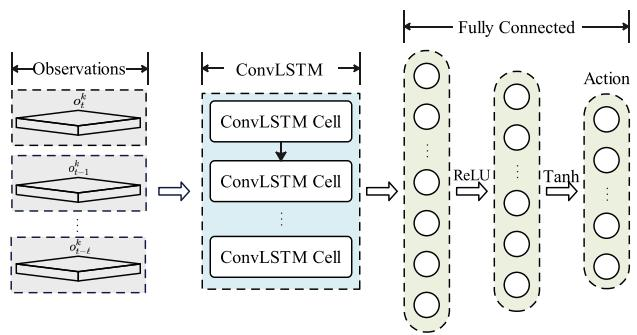  
Fig. 3. The structure of the actor network in MEMDRL. The actor network employs ConvLSTM to encode the historical observation sequence and outputs the UAV navigation actions.

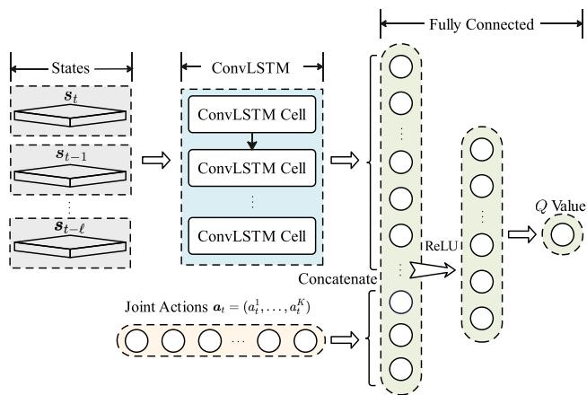  
Fig. 4. The structure of the critic network in MEMDRL. The critic network employs ConvLSTM to encode historical state sequence, and the output hidden features concatenating the joint UAV actions are mapped into the Q-value via fully connected layers.

ConvLSTM to encode the historical state sequence, and the output hidden features concatenate the joint UAV actions are mapped into the Q-value via the fully connected layers.

## C. Learn Collaboration With Prioritized Experience

UAVs can leverage the interactive experiences stored in the replay buffer Dr to acquire informed and adaptable actions in the learning stage. Traditionally, a mini-batch of experiences $B _ { r }$ are randomly sampled from $\mathcal { D } _ { r }$ to perform the network parameter updating. However, the random sampling may cause the learning process of UAVs to be unstable or even fail to converge, since the importance of the selected experiences with the policy updating remains unknown. To learn more effectively from some experiences than from others, the prioritized experience replay mechanism was proposed in [47] for single-agent RL, where the agent can achieve higher expected learning process by measuring the magnitude of the temporal-difference (TD) error of the experiences. In MEMDRL, considering the multi-agent setting, the priority of experience is determined by the sum of TD errors of all UAVs. Then the priority value of the t-th experience can be calculated by

$$
\chi _ { t } = \sum _ { k \in \mathcal { K } } \left| y _ { t } ^ { k } - Q _ { \phi } ^ { k } ( \widetilde { \pmb { s } } _ { t } , \pmb { a } _ { t } ) \right| + \xi ,\tag{27}
$$

Algorithm 1: MEMDRL Algorithm.   
// Initialization.   
1 for UAV k = 1 to K do   
2 Evaluation network initialization: actor with   
parameter $\theta _ { a } ,$ two critics with parameters $\phi _ { \mathrm { c 1 } }$ and   
φc2.   
3 Target network initialization: copy of the   
corresponding evaluation network, $\theta _ { a } ^ { \prime } \gets \theta _ { a } ,$   
$\phi _ { c 1 } ^ { \prime }  \stackrel { } { \phi _ { c 1 } } , \phi _ { c 2 } ^ { \prime }  \phi _ { c 2 } .$   
4 end for   
5 Experience reply buffer initialization: $\mathcal { D } _ { r } .$   
6 for episode = 1 to $E _ { \mathrm { t r a i n } }$ do   
$\nearrow$ Experience collection.   
7 for time slot $t = 0$ to $T _ { \mathrm { m a x } }$ do   
8 for UAV k = 1 to K do   
9 Observe ot and execute action   
$a _ { t } ^ { k } = \pi _ { \theta _ { a } } ^ { k } ( \tilde { \pmb { o } } _ { t } ^ { k } ) + \epsilon$ by the evaluation actor.   
10 end for   
11 Collect the state $s _ { t } ,$ next state $s _ { t + 1 } ,$ joint   
observations $\scriptstyle { o _ { t } , }$ joint next observations $_ { o _ { t + 1 } , }$   
joint actions $\mathbf { } _ { \mathbf { } } \mathbf { \Pi } \mathbf { a } _ { t } ,$ joint rewards $\mathbf { \nabla } _ { \mathbf { r } _ { t } }$ of all UAVs.   
12 Store experience $\left( { { s _ { t } } , { o _ { t } } , { a _ { t } } , { r _ { t } } , { s _ { t + 1 } } , { o _ { t + 1 } } } \right)$ in   
experience replay buffer $\mathcal { D } _ { r }$   
13 end for   
$/ /$ Parameter updating.   
14 for UAV k = 1 to K do   
15 Sample a mini-batch Br from Dr by Eq. (28).   
16 Update two evaluation critics with Eq. (22).   
17 if time step t mod κ then   
18 Update evaluate actor with Eq. (23).   
19 Update target network by Eq. (25).   
20 end if   
21 end for   
22 end for

where ξ is a small positive constant that prevent experiences from being excluded once their error becomes zero. Accordingly, the probability of sampling the t-th experience can be represented by

$$
P r o b _ { t } = \frac { \chi _ { t } ^ { \alpha } } { \sum _ { i \in \mathcal { D } _ { r } } \chi _ { i } ^ { \alpha } } ,\tag{28}
$$

where the exponent α determines how much prioritization is used. The prioritized experience replay mechanism enhances MEMDRL by selecting and replaying important experiences, boosting learning efficiency to achieve the optimal UAV navigation policy.

## D. Algorithm Description

The overall training procedure of MEMDRL is described in Algorithm 1. MEMDRL employs centralized training and distributed execution, where centralized training enhances global collaboration among UAVs, and adaptation to dynamic environments during distributed execution.

In the centralized training stage, the evaluation network parameters $\{ \theta _ { a } , \phi _ { c 1 } , \phi _ { c 2 } \}$ and the corresponding target network parameters $\{ \theta _ { a } ^ { \prime } , \phi _ { c 1 } ^ { \prime } , \phi _ { c 2 } ^ { \prime } \}$ for all UAVs, and the experience reply buffer $\mathcal { D } _ { \boldsymbol { r } }$ r are initialized (Lines 1-5). At the beginning of time slot t, each UAV k executes action $a _ { t } ^ { k }$ with random noise  based on the evaluation actor $\pi _ { \theta _ { a } } ^ { k } ( \tilde { \pmb { o } } _ { t } ^ { k } )$ , where $a _ { t } ^ { k }$ determines the movement distance with radial direction (Line 9). Then the environment transits to the next state $s _ { t + 1 }$ and each UAV receives the next observation $o _ { t + 1 } ^ { k } . \mathrm { A t }$ the end of time slot t, the algorithm collects the state $s _ { t } .$ , next state $s _ { t + 1 }$ , joint observations $\mathbf { } _ { o _ { t } } .$ , joint next observations $_ { o _ { t + 1 } }$ , joint actions $\mathbf { } \mathbf { } \mathbf { } \mathbf { a } _ { t }$ , joint rewards $\mathbf { \nabla } _ { \mathbf { \boldsymbol { r } } _ { t } }$ of all UAVs and store the experience into the replay buffer $\mathcal { D } _ { r }$ (Lines 11-12). This experience collection procedure repeats until the end of the training stage. After collecting enough experiences, UAVs can begin the parameter updating phase. For each UAV, mini-batch $B _ { r }$ are sampled using prioritized experience replay mechanism by (28) (Line 15). The two evaluation critics are updated by minimizing the loss function (22) (Line 16). The delayed policy update mechanism is performed to update the model parameters of evaluation actor network and the target networks. Every κ steps, the evaluation actor network updates with (23), and the target network parameters update using the soft update mechanism by (25) (Lines 17-19).

In the distributed execution stage, each UAV employs the well-trained evaluation actor network to generate the navigation decisions based on its own observation sequences. Thus the UAVs can cooperatively perform the data sensing and transmission tasks in a distributed manner.

Theorem 1: For the proposed MEMDRL method, the critic networks ${ Q } _ { \phi } ^ { k } , \phi = \{ \phi _ { c 1 } , \phi _ { c 2 } \}$ of each UAV agent $k \in \mathcal { K }$ con-=verge to the true Q-value $Q _ { k } ^ { * } ,$ , and each UAV agent’s actor network $\pi _ { \theta _ { a } } ^ { k }$ is locally optimal with respect to Q∗k under the following conditions: (i) Opponent policies $\pi _ { \theta _ { a } } ^ { - k } =$ $( \pi _ { \theta _ { a } } ^ { 1 } , \ldots , \pi _ { \theta _ { a } } ^ { k - 1 } , \pi _ { \theta _ { a } } ^ { k + 1 } , \ldots , \pi _ { \theta _ { a } } ^ { K } )$ change slowly (quasi-static) during each UAV’s update, simulating a stationary environment for analysis. (ii) The actor and critic networks are Lipschitz continuous with respect to their parameters, ensuring smooth updates. (iii) The experience replay buffer $\mathcal { D } _ { r }$ covers the stateaction space.

Proof: The proof is provided in Appendix A, available online. -

## VI. PERFORMANCE EVALUATION

The performance of MEMDRL is evaluated comprehensively based on two real-world PoI datasets. In this section, the simulation settings are first illustrated, followed by experimental results and corresponding analysis.

## A. Simulation Setup

We use Python 3.9 and Pytorch 1.8 to implement the proposed solution, and all codes are run on Compute Canada [48] with Intel(R) Xeon(R) Silver 4216 CPU @ 2.10 GHz, NVIDIA Tesla V100 GPU, and 64 GB memory. Two real-world PoI datasets in Shenzhen and Beijing collected from Mendeley open dataset [49] are utilized for the performance evaluation. For the shenzhen dataset, there are 79 PoIs randomly distributed in the target sensing region (22.721◦N - 22.734◦N and 114.224◦E - 114.235◦E). For the Beijing dataset, there are 137 PoIs randomly distributed in the selected region (39.922◦N - 39.932◦N and 116.472◦E - 116.484◦E). The data volume associated with each PoI is randomly initialized within (0, 40]Mbit. The majority of the PoIs in Shenzhen dataset exhibit relatively dense distribution along the roads. In Beijing dataset, PoIs demonstrate a more uniform distribution in the selected sensing region, with some situated around obstacles. Within the two selected sensing regions, specific subareas such as schools, hospitals, or tall buildings are chosen to represent obstacles or no-fly zones where UAVs cannot enter. Additionally, the corresponding simulation maps and position information are recorded by OpenStreetMap [50].

TABLE II SIMULATION SETTINGS
<table><tr><td>Parameter</td><td>Value</td></tr><tr><td>Environment-related values, c1 and c2 Shadowing factors,  $\eta _ { \mathrm { L o s } }$  and ηNLos Speed of the light,  $v _ { c }$ </td><td>9.61, 0.16 6 dB, 20 dB  $3 \times 1 0 ^ { 8 } \mathrm { m / s }$ </td></tr><tr><td>Carrier frequency,  $f _ { c }$  Additional NLo path loss factor, ζ</td><td>2 GHz 20 dB</td></tr><tr><td>Path loss exponent for UAV-GBS link, α</td><td>2</td></tr><tr><td>Noise power,  $\sigma ^ { 2 }$ </td><td>-174dBm</td></tr><tr><td></td><td></td></tr><tr><td>Bandwidth for UAV data sensing, B</td><td>10 MHz</td></tr><tr><td>Bandwidth for UAV data transmission, W</td><td>10 MHz</td></tr><tr><td>Transmission power of PoIs,  $P _ { r }$ </td><td>0.5W</td></tr><tr><td>Transmission power of UAVs,  $P _ { u }$ </td><td></td></tr><tr><td></td><td>1W</td></tr><tr><td>Maximum on-board energy of  $\mathrm { U A V s } , E _ { \mathrm { m a x } }$ </td><td>99.9 Wh</td></tr><tr><td>Tip speed of the rotor blade, vtip</td><td>120 m/s</td></tr><tr><td>Mean rotor induced velocity in hover, v</td><td>4.03 m/s</td></tr><tr><td>Coefficient of blade profile power,  $P _ { 1 }$ </td><td></td></tr><tr><td></td><td>79.85</td></tr><tr><td>Coefficient of parasite power,  $P _ { 2 }$  Coefficient of induced power,  $P _ { 3 }$ </td><td>0.018 88.63</td></tr></table>

In the simulation, we refer to the parameters of the industrial UAV DJI Mavic 3 Pro [51] to conduct our experiments. Following the technical specifications and existing works [52] [53], the transmission power of the UAV is set to $P _ { u } = 1 \mathrm { W }$ The maximum on-board energy of the UAV is set to $E _ { \mathrm { m a x } } = 9 9 . 9 \mathrm { W h }$ . The whole serving period for UAV is 30 minutes, which is divided into $T _ { \mathrm { m a x } } = 1 2 0$ time slots with equal length $\tau = 1 5 \mathrm { s }$ = 120. Following [39], the UAV energy consumption related parameters $P _ { 1 } , P _ { 2 } ,$ and $P _ { 3 }$ are set to 79.85, 0.018 and 88.63, $v _ { \mathrm { t i p } }$ and v are set to 120 m/s and 4.03 m/s, respectively. All UAVs fly at an altitude of $H _ { u } = 1 2 0$ m and the maximum flight speed is set to 15 m/s. The height of ground base station is set to $H _ { b } = 1 0 \mathrm { m }$ . To avoid collisions between UAVs, the safe distance is set to $d _ { \mathrm { s a f e } } = 1$ m. Other communication-related settings are referred to the 3GPP specification [54], and the detailed simulation settings are given in Table II.

For the implementation of the proposed method MEMDRL, the training episode $E _ { \mathrm { t r a i n } }$ is set to 5000. The capacity of the experience replay buffer is set to 10000 and the size of the mini-batch is set to 256. For the actor and critic network in MEMDRL, the Rectified Linear Unit (ReLU) function $f _ { \mathrm { R e L U } } ( x ) = \operatorname* { m a x } ( 0 , x )$ is utilized as the activation function in each hidden layer. A 3-layer ConvLSTM with convolution kernel size equal to 5 [46] is adopted in both the actor and critic networks. The Adam optimizer is used to update the actor and critic networks. The learning rate for both actor and critic is set to $5 \times 1 0 ^ { - 4 }$ . The discount factor γ is set to 0.95. The historical sequence length for capturing observation and state spatial-temporal features is set to  . The soft update rate ω is set to 0.01, and the frequency of delayed policy updates is set to $\kappa = 2 .$

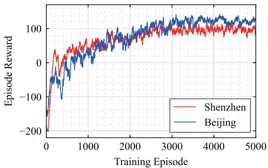  
Fig. 5. Episode reward versus training episodes for MEMDRL in Shenzhen and Beijing datasets.

TABLE III  
COMPUTATIONAL COMPLEXITY BY TIME COST (MS)
<table><tr><td rowspan="2">Method</td><td colspan="2">Dataset</td></tr><tr><td>Shenzhen</td><td>Beijing</td></tr><tr><td>MADDPG</td><td>1.972</td><td>1.988</td></tr><tr><td>MATD3</td><td>1.927</td><td>1.954</td></tr><tr><td>e-Divert</td><td>3.413</td><td>3.672</td></tr><tr><td>MEMDRL</td><td>2.721</td><td>2.843</td></tr></table>

## B. Convergence and Computational Complexity

The convergence trends of the training process of MEMDRL for Shenzhen and Beijing datasets are shown in Fig. 5. It can be seen that the reward gradually increases with the training episodes and eventually stabilizes at around 2400 episodes for Shenzhen dataset and 3200 episodes for Beijing dataset. At the beginning of the training process, the reward exhibits an initial decrease followed by a gradual increase. This occurs because UAVs initially need to explore the environment, which results in a decrease in immediate rewards. After collecting enough experiences, UAVs can efficiently learn from the sampled experiences using the prioritized experience replay mechanism. As more experiences accumulate, the UAVs tend to choose a better navigation policy by avoiding the obstacles and maximizing the long-term reward. We also present the computational complexity (by time cost) of four DRL based methods (i.e. MADDPG, MATD3, e-Divert, and MEMDRL) in Table III. The running time to produce actions in a time slot by MEMDRL is slightly higher than other baselines but lower than e-Divert. However, it is still in the scale of millisecond, which is acceptable in practical UAV operations.

## C. Multi-UAV Cooperation Trajectory

In Figs. 6 and 7, we present the UAV trajectories of MEMDRL in Shenzhen dataset with two UAVs deployment and Beijing dataset with three UAVs deployment, respectively. To better illustrate the distribution of the PoI data volume, the PoI data heatmap for Shenzhen and Beijing datasets are presented in Figs. 6(a) and 7(a). The darker shades in the heatmap indicate a higher volume of data that needs to be collected by UAVs. In Figs. 6(b) and 7(b), we can observe significant cooperation among UAVs given by MEMDRL, characterized by each UAV being responsible for a part of the selected sensing region. Meanwhile, UAVs tend to move back and forth in the areas with dense PoI data volume. The reason is that UAVs have limited sensing range and maximum movement distance in a time slot. Consequently, a single serving session is insufficient to transmit all the remaining data of PoIs in these areas to the ground base station. Additionally, it is worth noting that UAVs successfully cover all PoIs during the entire service period, including those located in corners and around obstacles. This is achieved by the intrinsic reward during the training stage, which gives UAVs effective spatial exploration following the BeBold criterion.

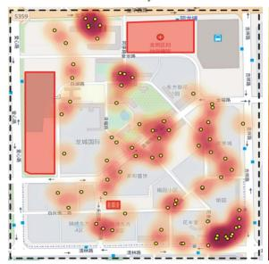

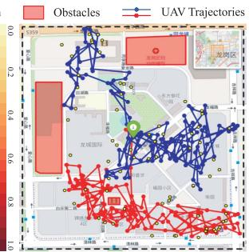  
(a) PoI data heatmap  
(b) UAV trajectory  
Fig. 6. The real-world Shenzhen PoI dataset for data sensing and transmission simulation scenario. The selected Shenzhen dataset contains 79 PoIs. (a) The PoI data heatmap in the selected Shenzhen sensing region. (b) The UAV trajectories in the selected Shenzhen sensing region.

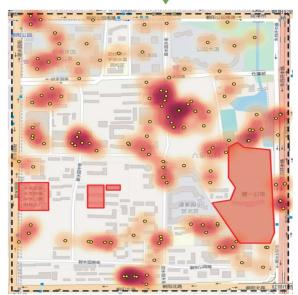

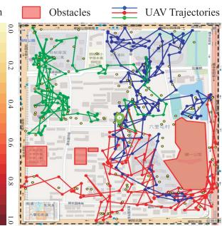  
(a) PoI data heatmap  
(b) UAV trajectory  
Fig. 7. The real-world Beijing PoI dataset for data sensing and transmission simulation scenario. The selected Beijing dataset contains 137 PoIs. (a) The PoI data heatmap in the selected Beijing sensing region. (b) The UAV trajectories in the selected Beijing sensing region.

## D. Method Comparison

To evaluate the performance of MEMDRL, we compare it with the following five baselines.

\- MADDPG [21]: It is a classical MADRL approach in multi-agent cooperation and competition scenarios. It employs centralized training and distributed execution, using shared experience replay buffer among collaborating agents to enhance training efficiency.

\- MATD3 [45]: It is a classical MADRL approach and the start point of MEMDRL. It employs several practical techniques, including clipped double-Q learning, targetpolicy smoothing, and delayed policy updates, to address overestimation problem and enhance the performance of multi-agent tasks.

\- e-Divert [55]: It is a state-of-the-art MADRL-based approach for UAV crowdsensing tasks. We extend it to our multi-UAV cooperative data sensing and transmission scenario. It is a fully distributed control framework that leverages CNN for spatial feature extraction and LSTM for temporal sequence modeling.

\- JOFC [56]: It investigates the joint optimization of flight trajectory and data collection of UAVs. The multi-UAV cooperative data sensing and transmission optimization problem in this paper is transformed into a multiple traveling selasman problem. Subsequently, the genetic algorithm is employed to solve this optimization problem.

\- Random: At time slot t, each UAV k randomly selects action $a _ { t } ^ { k }$ from the action space.

It is noted that during the performance evaluation stage, we run 50 times on each model and calculate the average results. Additionally, to achieve the long-term serving goals, we use the following three metrics for the performance comparison.

\- Data collection ratio $( D _ { T } ) \mathrm { : }$ : It is calculated as a ratio between the total transmitted data volume of UAVs to the ground base station $\textstyle \sum _ { k = 1 } ^ { K } \sum _ { t = 1 } ^ { T } D _ { t } ^ { k }$ and the initial data volume $\textstyle \sum _ { p \in { \mathcal { P } } } d _ { 0 } ^ { p }$ at PoIs during the whole serving period.

\- Geographical fairness $( F _ { T } ) \colon$ It is calculated by (13) to evaluate the coverage of the PoIs during the whole serving period. Note that $\begin{array} { r } { F _ { t } \in \left[ \frac { 1 } { P } , 1 \right] } \end{array}$ always holds.

[ 1]- Energy consumption ratio (ET ): It is calculated as a ratio between the total consumed energy $\textstyle \sum _ { k = 1 } ^ { K } \sum _ { t = 1 } ^ { T } E _ { t } ^ { k }$ of all UAVs and the total initial on-board energy $K \cdot E _ { \mathrm { m a x } }$ during the whole serving period.

1) Impact of the Number of UAVs: In this subsection, to evaluate the performance of MEMDRL with varying numbers of UAVs deployed, we conduct experiments by changing the UAV number K from 1 to 10. And the performance comparison in terms of data collection ratio, geographical fairness, and energy consumption ratio for Shenzhen and Beijing datasets are presented in Figs. 8 and 10, respectively.

In terms of data collection ratio in Shenzhen dataset, MEM-DRL outperforms other methods by achieving the highest data volume received by the ground base station, as depicted in Fig. 8(a). When assigning two UAVs in the selected sensing region in Shenzhen dataset, MEMDRL can transmit 81.62% of the data volume of PoIs to the ground base station, representing a 6.97% improvement compared to 74.65% achieved by the best baseline e-Divert. When the number of deployed UAVs reaches five, MEMDRL successfully transmits nearly all the data of PoIs to the ground base station by the efficient cooperation pattern. While continuously increasing the number of UAVs can narrow the gap between different methods, MEMDRL achieves cost efficiency by deploying the minimum number of UAVs.

The performance comparison of the geographical fairness in Shenzhen dataset is shown in Fig. 8(b). Considering the rapid expanding solution space with respect to the increasing number of UAVs and serving period, JOFC cannot find a reasonable policy for achieving long-term geographical fairness coverage. This results in the poor performance compared to DRL-based methods. MATD3 alleviates the Q-value overestimation problem by employing the clipped double-Q learning improvement, which enables UAVs to develop a more effective navigation policy for achieving higher geographical fairness coverage. However, these methods still perform worse than MEMDRL and e-Divert due to the lack of historical spatial-temporal modeling under POMDP setting. e-Divert uses CNN for spatial feature extraction and LSTM for temporal modeling, which may lead to information loss during the feature fusion stage. To address this issue, MEMDRL integrates ConvLSTM to preserve spatial and temporal correlations during the training stage, which leads to the highest geographical fairness compared to other methods.

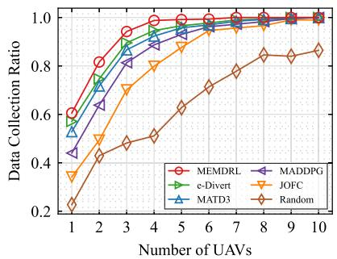  
(a) Data collection ratio

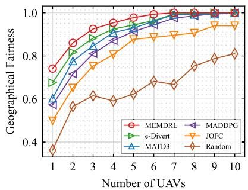  
(b) Geographical fairness

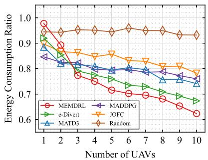  
(c) Energy consumption ratio

Fig. 8. Performance comparison between the proposed solution MEMDRL and five baselines in terms of the data collection ratio, geographical fairness, and energy consumption ratio under different numbers of UAVs ranging from 1 to 10 in the Shenzhen dataset.  
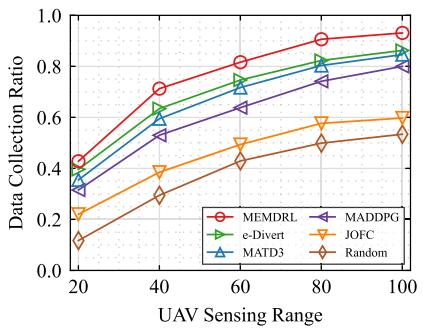  
(a) Data collection ratio

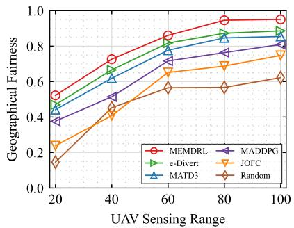  
(b) Geographical fairness

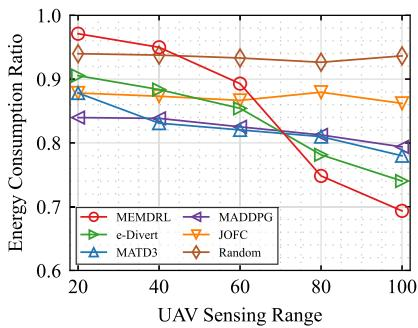  
(c) Energy consumption ratio  
Fig. 9. Performance comparison between the proposed solution MEMDRL and five baselines in terms of the data collection ratio, geographical fairness, and energy consumption ratio under different sensing ranges of UAVs ranging from 20 to 100 meters in the Shenzhen dataset.

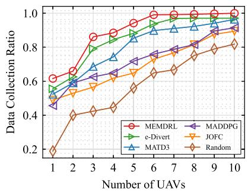  
(a) Data collection ratio

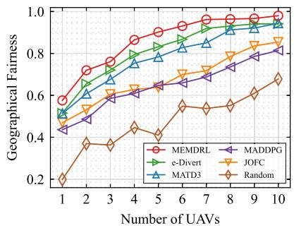  
(b) Geographical fairness

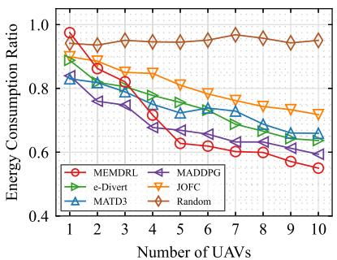  
(c) Energy consumption ratio  
Fig. 10. Performance comparison between the proposed solution MEMDRL and five baselines in terms of the data collection ratio, geographical fairness, and energy consumption ratio under different numbers of UAVs ranging from 1 to 10 in the Beijing dataset.

The energy consumption comparison in Shenzhen dataset is given in Fig. 8(c). We can observe that the energy consumption ratio of MEMDRL tends to be relatively high when assigning a limited number of UAVs. This phenomenon should be attributed to our extrinsic reward design in (19), which aims to maximize the data collection volume and geographical fairness with limited energy budget. MEMDRL attempts to transmit the data from PoIs to the ground base station even with limited UAV deployment. This results in the long-distance movement to access remote PoIs, which leads to higher energy consumption by UAVs. For example, when deploying a single UAV, the UAV tries to visit all PoIs and achieves the highest geographical fairness at 74.12% compared to other methods, as illustrated in Fig. 8(b). However, this setting also results in the highest energy consumption for the UAV in Fig. 8(c), reaching up to 97.73%. Moreover, deploying more UAVs can significantly reduce the energy consumption of UAVs in MEMDRL. This reduction can be attributed to the effective collaboration pattern among UAVs in MEMDRL, where each UAV is responsible for a part of the selected sensing region, resulting in energy savings from reduced movement.

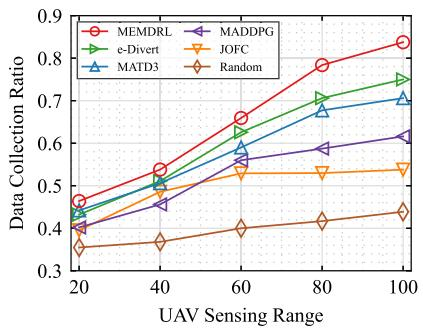  
(a) Data collection ratio

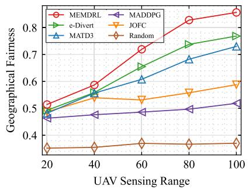  
(b) Geographical fairness

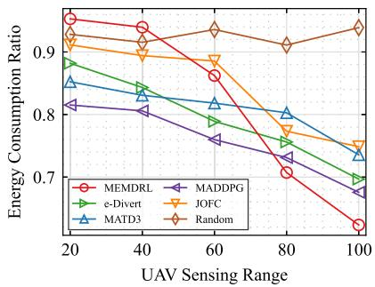  
(c) Energy consumption ratio  
Fig. 11. Performance comparison between the proposed solution MEMDRL and five baselines in terms of the data collection ratio, geographical fairness, and energy consumption ratio under different sensing ranges of UAVs ranging from 20 to 100 meters in the Beijing dataset.

The performance of MEMDRL on Beijing dataset is similar to that on Shenzhen dataset when deploying different numbers of UAVs. The PoIs in Beijing dataset are distributed more evenly in the selected sensing region compared to Shenzhen dataset. Additionally, some PoIs in Beijing dataset are challenging to access, particularly those located in corners or near obstacles. These inherent difficulties in Beijing dataset present further challenges for effective UAV spatial exploration. As shown in Fig. 10(a) and (b), MEMDRL can navigate UAVs more efficiently in terms of data collection ratio and geographical fairness. This is attributed to the intrinsic reward with the BeBold-based spatial exploration, which helps UAVs to make appropriate navigation decisions to reach the PoIs located in the corner and near obstacles. It is noted that in Fig. 10(c), MADDPG achieves the lowest energy consumption compared to other methods when deploying four or less UAVs. The scattered PoIs in Beijing dataset, especially those located in corners and near obstacles, present challenges for MADDPG without effective spatial exploration and cannot find reasonable navigation policies for UAVs. As a result, when assigning more UAVs, MADDPG still neglect the unvisited PoIs, which results in the low energy consumption as well as limited data collection ratio shown in Fig. 10(a) and low geographical fairness coverage shown in Fig. 10(b), respectively.

The performance comparison in terms of the overall optimization objective in (14) under different numbers of UAVs in the Shenzhen and Beijing datasets is illustrated in Fig. 12. The proposed method MEMDRL consistently outperforms other baselines in the two datasets, demonstrating its scalability and robustness. For example, when assigning a single UAV in the Beijing dataset, MEMDRL achieves improvements of 12.88%,

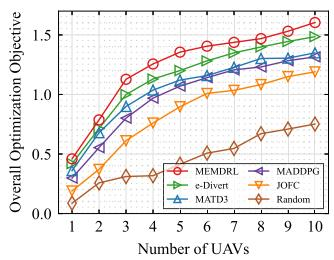  
(a) Shenzhen dataset

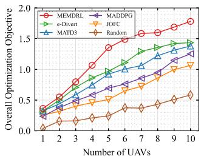  
(b) Beijing dataset  
Fig. 12. Performance comparison between the proposed solution MEMDRL and five baselines in terms of the energy efficiency under different numbers of UAVs ranging from 1 to 10 in the Shenzhen and Beijing datasets.

12.42%, 53.65%, and 42.45% in terms of the overall optimization objective compared to e-Divert, MATD3, MADDPG, and JOFC, respectively. As the number of UAVs increases to ten in the Beijing dataset, the performance gap widens significantly, with MEMDRL exhibiting enhancements of 24.13%, 29.02%, 42.06%, and 67.39% over these baselines, respectively. These results highlight the effectiveness of the proposed method MEM-DRL in optimizing the trade-offs among data collection volume, geographical fairness, and energy consumption.

2) Impact of the Sensing Range of UAVs: In this subsection, we demonstrate the impact of sensing range of UAVs on data collection ratio, geographical fairness, and energy consumption ratio in both Shenzhen and Beijing datasets, as illustrated in Figs. 9 and 11. We fix the number of UAVs at K in the following simulation, while varying the sensing range of UAVs from R m to R m with a step size of 20m.

= 20 = 100In terms of data collection ratio with different sensing range of UAVs in Shenzhen dataset, MEMDRL outperforms other methods by transmitting the highest data volume of PoIs to the ground base station, as shown in Fig. 9(a). Expanding the sensing range of UAVs enhances the ability of the actor network in MEMDRL to gather more comprehensive information. With the help of ConvLSTM, UAVs in MEMDRL can capture the spatial-temporal features from historical observation sequences. UAVs can trade off between the dense PoI data volume areas and remote PoIs, resulting in a higher data collection ratio compared with other methods.

The comparison of geographical fairness in Shenzhen dataset is shown in Fig. 9(b). The geographical fairness of all methods exhibits an ascending trend with the sensing range of UAVs increases. This is because the number of PoIs that can be served in each time slot increases with the extended sensing range, indicating a broader geographical coverage as well. Additionally, the gap between the geographical fairness of MEMDRL and other baselines is increasing. For example, when the sensing range of UAVs is set to $R = 6 0 \mathrm { m }$ , MEMDRL demonstrates improvements of 4.33%, 8.38%, 13.42%, 19.9% and 29.52% in terms of geographical fairness compared to e-Divert, MATD3, MAD-DPG, JOFC and Random, respectively. When the sensing range is extended to R m, MEMDRL exhibits enhancements of = 1006.45%, 9.63%, 14.17%, 20.31% and 32.84% compared to these baselines. The improvement is mainly brought by the accurate spatial-temporal modeling in MEMDRL. And the prioritized experience replay mechanism in MEMDRL enhances the exploitation of important experiences, thus facilitating efficient spatial cooperation among UAVs to maximize the geographical fairness coverage.

The energy consumption comparison in Shenzhen dataset is given in Fig. 9(c). When the sensing range is small, the energy consumption of UAVs is higher. The reason is that a smaller sensing range requires UAVs to continuously move to access different PoIs to collect data and ensure geographical fairness. If energy consumption of UAVs is prioritized, we could add a scaling coefficient for the energy consumption term in the extrinsic reward function. As the sensing range of UAVs increases, the energy consumption ratio of all DRL-based methods decreases. This is because a larger sensing range reduces the movements for UAVs to cover the PoIs, resulting in lower propulsion energy consumption. However, MATD3 and MADDPG are unable to capture spatial-temporal features, and e-Divert fails to capture spatial-temporal correlations, leading to inefficient energy usage compared to MEMDRL.

The evaluation result with varying sensing range of UAVs in Beijing dataset is illustrated in Fig. 11. In terms of data collection ratio and geographical fairness, as shown in Fig. 11(a) and (b), MEMDRL outperforms other methods, and the performance gap increases with the extended sensing range of UAVs. When the sensing range of UAVs is set to R m, MEMDRL is capable of transmitting an additional 3.35% volume of data to the gound base station compared to the best baseline e-Divert. As the sensing range is extended to $R = 1 0 0 \mathrm { m }$ , MEMDRL demonstrates even more substantial improvement, acquiring 8.75% more PoI data volume than the baseline. Similarly, when the sensing range is m, the geographical fairness of MEMDRL is 0.719, and the best baseline e-Divert achieves 0.655. However, with the sensing range extended to m, MEMDRL demonstrates a significant increase in geographical fairness to 0.856, and e-Divert only reaches to 0.768. In terms of energy consumption, MADDPG reaches the lowest energy consumption ratio when the sensing range of UAVs is set to 60m or less. However, it is noteworthy that MADDPG also exhibits lower data collection ratio and geographical fairness coverage simultaneously. This is primarily due to UAVs in MADDPG are unable to establish an effective cooperation pattern to finish the data sensing and transmission tasks, resulting in poor obstacle avoidance and exploration capabilities.

TABLE IV  
EVALUATION OF THE TRAINED MEMDRL MODEL IN BEIJING DATASET
<table><tr><td rowspan="2">Model</td><td colspan="3">Metrics</td></tr><tr><td> $\overline { { D _ { T } } }$ </td><td> $\overline { { F _ { T } } }$ </td><td> $\overline { { E _ { T } } }$ </td></tr><tr><td>MEMDRL Trained on Shenzhen Dataset</td><td>0.751</td><td>0.796</td><td> $\overline { { 0 . 7 1 4 } }$ </td></tr><tr><td>MEMDRL Trained on Beijing Dataset</td><td>0.784</td><td>0.828</td><td>0.707</td></tr></table>

TABLE V  
IMPACT OF UAV FLIGHT ALTITUDE IN THE SHENZHEN AND BEIJING DATASETS
<table><tr><td rowspan="2">Dataset</td><td rowspan="2">Metrics</td><td colspan="5">UAV Flight Altitude (m)</td></tr><tr><td>100</td><td>110</td><td>120</td><td>130</td><td>140</td></tr><tr><td rowspan="3">Shenzhen</td><td> $\overline { { D _ { T } } }$ </td><td>0.932</td><td>0.911</td><td>0.906</td><td>0.887</td><td>0.859</td></tr><tr><td> $F _ { T }$ </td><td>0.954</td><td>0.949</td><td>0.946</td><td>0.932</td><td>0.921</td></tr><tr><td> $E _ { T }$ </td><td>0.736</td><td>0.741</td><td>0.748</td><td>0.755</td><td>0.759</td></tr><tr><td rowspan="3">Beijing</td><td> $\overline { { D _ { T } } }$ </td><td>0.814</td><td>0.803</td><td>0.784</td><td>0.760</td><td>0.756</td></tr><tr><td> $F _ { T }$ </td><td>0.847</td><td>0.835</td><td>0.828</td><td>0.819</td><td>0.808</td></tr><tr><td> $E _ { T }$ </td><td>0.685</td><td>0.692</td><td>0.707</td><td>0.717</td><td>0.724</td></tr></table>

To evaluate the cross-domain applicability, we applied the MEMDRL model trained on the Shenzhen dataset to the Beijing dataset. We set the number of UAVs $K = 2 ,$ and the sensing range is set to R m. The results are shown in Table IV. The proposed MEMDRL is a model-free MADRL method, meaning it does not require redesigning the model architecture to adapt to new environments. We can observe that the MEMDRL model achieves a data collection ratio of 75.1% on the Beijing dataset, closely approaching the 78.4% achieved by the model trained directly on the Beijing dataset. To achieve optimal performance in unseen sensing regions, the model can be retrained using the same hyperparameters, allowing it to adapt to environment-specific dynamics by learning new weights. For scenarios requiring simultaneous data sensing and transmission across multiple regions with a single training instance, integrating a federated learning architecture [57] [58] could further enhance the model’s adaptability.

3) Impact of the UAV Flight Altitude: In this subsection, we demonstrate the impact of the UAV flight altitude on data collection ratio, geographical fairness, and energy consumption ratio on both Shenzhen and Beijing datasets, as illustrated in Table V. We fix the number of UAVs at K  in the following simulation, while varying the UAV flight altitude from m to m with a step size of  m.

As shown in Table V, we can observe that the data collection ratio and geographical fairness decrease, while the energy consumption ratio increases as the UAV flight altitude rises from m to m across both datasets. Specifically, for the Shenzhen dataset, the data collection ratio declines from 93.2% at 100m to 85.9% at 140m, the geographical fairness decreases from 0.954 to 0.921, and the energy consumption ratio rises from 73.6% to 75.9% over the same altitude range. The Beijing dataset exhibits a similar trend with the varying UAV flight altitude. This performance degradation can be attributed to the increased path loss, which weakens both the PoI-UAV data collection link and UAV-GBS data transmission link. At lower altitudes, the reduced path loss enhances the average capacity of these links, leading to improved system performance. Conversely, when UAVs are deployed at higher altitudes, the performance loss becomes more pronounced due to the increased signal attenuation and more frequent UAV movements required for coverage, leading to reduced performance across the evaluation metrics.

TABLE VI  
PERFORMANCE COMPARISON OF MEMDRL AND MEMDRL-RM
<table><tr><td rowspan="2">Dataset</td><td rowspan="2">Metrics</td><td colspan="2">Method</td></tr><tr><td>MEMDRL</td><td>MEMDRL-RM</td></tr><tr><td rowspan="3">Shenzhen</td><td> $\overline { { D _ { T } } }$ </td><td>0.906</td><td>0.917</td></tr><tr><td> $F _ { T }$ </td><td>0.946</td><td>0.951</td></tr><tr><td> $E _ { T }$ </td><td>0.748</td><td>0.733</td></tr><tr><td rowspan="3">Beijing</td><td> $\overline { { D _ { T } } }$ </td><td>0.784</td><td>0.805</td></tr><tr><td> $F _ { T }$ </td><td>0.828</td><td>0.839</td></tr><tr><td> $E _ { T }$ </td><td>0.707</td><td>0.688</td></tr></table>

4) Extensions to Resource Management: The proposed method MEMDRL is a model-free reinforcement learning approach, which is inherently flexible and can be extended to optimize multi-dimensional action spaces. In this subsection, we evaluate the performance of MEMDRL with resource management decisions (denoted as MEMDRL-RM), where the action space is augmented to include bandwidth allocation decisions for the associated PoIs without modifying the core algorithmic logic of MEMDRL. Specifically, the action space for bandwidth allocation is defined as a continuous vector representing the proportion of available bandwidth assigned to each PoI, constrained by the total bandwidth capacity of the UAV. We demonstrate the impact of MEMDRL-RM on data collection ratio, geographical fairness, and energy consumption ratio using the Shenzhen and Beijing datasets, as illustrated in Table VI.

As shown in Table VI, MEMDRL-RM achieves robust performance improvements compared to MEMDRL across both datasets, effectively balancing the three objectives while maintaining algorithmic stability. For example, in the Shenzhen dataset, the data collection ratio increases from 90.6% to 91.7%, and geographical fairness improves from 0.946 to 0.951, while the energy consumption decreases from 74.8% to 73.3%. These improvements can be attributed to the dynamic optimization of bandwidth allocation enabled by MEMDRL-RM. Unlike original MEMDRL, which assumes an equal division of available bandwidth among associated PoIs, MEMDRL-RM adaptively allocates bandwidth based on the real-time demands of PoIs, leading to enhanced performance across the evaluated metrics.

## E. Ablation Study

We conduct ablation studies on both Shenzhen and Beijing datasets. We isolate the contributions of each module (i.e., ConvLSTM and PER) in MEMDRL by gradually removing them. We fix the number of UAVs at $K = 2 ,$ , and the sensing range of UAVs is set to R m in the following simulation. The results are shown in Table VII.

The complete MEMDRL achieves 7.0% and 4.9% improvements on the data collection ratio compared to MEMDRL w/o ConvLSTM in the Shenzhen and Beijing datasets, respectively. This confirms that ConvLSTM can capture spatial and temporal dependencies simultaneously for efficient UAV decisionmaking. Moreover, MEMDRL w/o ConvLSTM outperforms other baselines in terms of the data collection ratio and geographical fairness with the limited energy budget. For example, in Shenzhen dataset, MEMDRL w/o ConvLSTM demonstrates improvements of 16.6%, 20.1%, 30.7%, 37.4% and 50.8% in terms of data collection ratio compared to e-Divert, MATD3, MADDPG, JOFC and Random in Fig. 9(a), respectively. Similarly, MEMDRL outperforms MEMDRL w/o PER by 3.8% and 11.7% with geographical fairness in Shenzhen and Beijing datasets, respectively. This highlights the ability of PER to ensure efficient learning process by prioritizing the interactive experiences, which also leads to an improvement of 4.3% compared to the best baseline e-Divert in Fig. 9(b). When removing both ConvLSTM and PER in MEMDRL, the data collection ratio drops significantly by 12.8% and 15.8% in Shenzhen and Beijing datasets, respectively. Meanwhile, the geographical fairness during the whole serving period declines by 11.6% and 21.3% in the two datasets, which confirms the effectiveness of combining ConvLSTM and PER together.

TABLE VII ABLATION STUDY
<table><tr><td>Dataset</td><td>Method</td><td> $\overline { { D _ { T } } }$ </td><td> $\overline { { F _ { T } } }$ </td><td> $\overline { { E _ { T } } }$ </td></tr><tr><td rowspan="4">Shenzhen</td><td>MEMDRL</td><td>0.906</td><td>0.946</td><td>0.748</td></tr><tr><td>MEMDRL w/o ConvLSTM</td><td>0.847</td><td>0.903</td><td>0.767</td></tr><tr><td>MEMDRL w/o PER</td><td>0.873</td><td>0.912</td><td>0.788</td></tr><tr><td>MEMDRL w/o ConvLSTM &amp; PER</td><td>0.803</td><td>0.847</td><td>0.810</td></tr><tr><td rowspan="4">Beijing</td><td>MEMDRL</td><td>0.784</td><td>0.828</td><td>0.707</td></tr><tr><td>MEMDRL w/o ConvLSTM</td><td>0.747</td><td>0.758</td><td>0.714</td></tr><tr><td>MEMDRL w/o PER</td><td>0.726</td><td>0.741</td><td>0.736</td></tr><tr><td>MEMDRL w/o ConvLSTM &amp; PER</td><td>0.677</td><td>0.683</td><td>0.803</td></tr></table>

## VII. CONCLUSION AND FUTURE WORK

In this paper, we consider the multi-UAV cooperative data sensing and transmission scenario. We aim to maximize the total received data volume at the ground base station, geographical fairness among PoIs and minimize the energy consumption of all UAVs during the whole serving period. Considering the complex environment dynamics and limited sensing range of UAVs, we design a memory augmented MADRL approach MEMDRL to ensure energy-efficient distributed trajectory design. Compared with five baselines, the simulation results on Shenzhen and Beijing PoI datasets validate the superiority of the proposed solution in terms of data collection ratio, geographical fairness and energy consumption ratio while varying the number of UAVs and the sensing range of UAVs.

In this paper, we consider UAVs cooperatively collect data from PoIs and transmit it to a BS for further analysis and processing. To extend the proposed method MEMDRL to multi-BS scenarios in future work, the following enhancements can be considered. First, UAVs can be dynamically assigned to the most suitable BS based on metrics such as geographical proximity and channel quality, ensuring efficient and reliable communication. Second, a multi-BS scheduling method can be introduced to optimize resource allocation among UAVs and BSs, minimizing interference while maximizing network throughput. Furthermore, to ensure scalability, a hierarchical control method can be employed, where local decisions (e.g., UAV-BS assignments) are managed at individual BSs, and global decisions (e.g., inter-BS coordination) are handled by a central cloud center.

## REFERENCES

[1] Q. Wu et al., “A comprehensive overview on 5G-and-beyond networks with UAVs: From communications to sensing and intelligence,” IEEE J. Sel. Areas Commun., vol. 39, no. 10, pp. 2912–2945, Oct. 2021.

[2] X. Wu, W. Li, D. Hong, R. Tao, and Q. Du, “Deep learning for unmanned aerial vehicle-based object detection and tracking: A survey,” IEEE Geosci. Remote Sens. Mag., vol. 10, no. 1, pp. 91–124, Mar. 2022.

[3] K. Gao, H. Wang, H. Lv, and P. Gao, “A DL-based high-precision positioning method in challenging urban scenarios for B5G CCUAVs,” IEEE J. Sel. Areas Commun., vol. 41, no. 6, pp. 1670–1687, Jun. 2023.

[4] C. Xiang et al., “Reusing delivery drones for urban crowdsensing,” IEEE Trans. Mobile Comput., vol. 22, no. 5, pp. 2972–2988, May 2023.

[5] X. Zhang, H. Zhang, K. Sun, K. Long, and Y. Li, “Human-centric irregular RIS-Assisted Multi-UAV networks with resource allocation and reflecting design for metaverse,” IEEE J. Sel. Areas Commun., vol. 42, no. 3, pp. 603–615, Mar. 2024.

[6] L. Fu, Z. Zhao, G. Min, W. Miao, L. Zhao, and W. Huang, “Energy-efficient 3D data collection for multi-UAV assisted mobile crowdsensing,” IEEE Trans. Comput., vol. 72, no. 7, pp. 2025–2038, Jul. 2023.

[7] E. Wang et al., “Outlier-concerned data completion exploiting intra-and inter-data correlations in sparse CrowdSensing,” IEEE/ACM Trans. Netw., vol. 31, no. 2, pp. 648–663, Apr. 2023.

[8] X. Li, G. Feng, Y. Liu, S. Qin, and Z. Zhang, “Joint sensing, communication, and computation in mobile crowdsensing enabled edge networks,” IEEE Trans. Wireless Commun., vol. 22, no. 4, pp. 2818–2832, Apr. 2023.

[9] Y. Zhu, B. Yang, M. Liu, and Z. Li, “UAV trajectory optimization for largescale and low-power data collection: An attention-reinforced learning scheme,” IEEE Trans. Wireless Commun., vol. 23, no. 4, pp. 3009–3024, Apr. 2024.

[10] H. Wang, C. H. Liu, H. Yang, G. Wang, and K. K. Leung, “Ensuring threshold AoI for UAV-Assisted mobile crowdsensing by multi-agent deep reinforcement learning with transformer,” IEEE/ACM Trans. Netw., vol. 32, no. 1, pp. 566–581, Feb. 2024.

[11] S. Zhang, H. Zhang, B. Di, and L. Song, “Joint trajectory and power optimization for UAV sensing over cellular networks,” IEEE Commun. Lett., vol. 22, no. 11, pp. 2382–2385, Nov. 2018.

[12] S. F. Abedin, M. S. Munir, N. H. Tran, Z. Han, and C. S. Hong, “Data freshness and energy-efficient UAV navigation optimization: A deep reinforcement learning approach,” IEEE Trans. Intell. Transp. Syst., vol. 22, no. 9, pp. 5994–6006, Sep. 2021.

[13] J. Liu, P. Tong, X. Wang, B. Bai, and H. Dai, “UAV-aided data collection for information freshness in wireless sensor networks,” IEEE Trans. Wireless Commun., vol. 20, no. 4, pp. 2368–2382, Apr. 2021.

[14] X. Zhou, S. Yan, F. Shu, R. Chen, and J. Li, “UAV-enabled covert wireless data collection,” IEEE J. Sel. Areas Commun., vol. 39, no. 11, pp. 3348–3362, Nov. 2021.

[15] S. Zhang, H. Zhang, Z. Han, H. V. Poor, and L. Song, “Age of information in a cellular internet of UAVs: Sensing and communication trade-off design,” IEEE Trans. Wireless Commun., vol. 19, no. 10, pp. 6578–6592, Oct. 2020.

[16] Z. Dai, C. H. Liu, R. Han, G. Wang, K. K. Leung, and J. Tang, “Delaysensitive energy-efficient UAV crowdsensing by deep reinforcement learning,” IEEE Trans. Mobile Comput., vol. 22, no. 4, pp. 2038–2052, Apr. 2023.

[17] Z. Ye, K. Wang, Y. Chen, X. Jiang, and G. Song, “Multi-UAV navigation for partially observable communication coverage by graph reinforcement learning,” IEEE Trans. Mobile Comput., vol. 22, no. 7, pp. 4056–4069, Jul. 2023.

[18] R. Ding, J. Chen, W. Wu, J. Liu, F. Gao, and X. Shen, “Packet routing in dynamic multi-hop UAV relay network: A multi-agent learning approach,” IEEE Trans. Veh. Technol., vol. 71, no. 9, pp. 10059–10072, Sep. 2022.

[19] L. Zeng, H. Chen, D. Feng, X. Zhang, and X. Chen, “A3D: Adaptive, accurate, and autonomous navigation for edge-assisted drones,” IEEE/ACM Trans. Netw., vol. 32, no. 1, pp. 713–728, Feb. 2024.

[20] P. Wan, G. Xu, J. Chen, and Y. Zhou, “Deep reinforcement learning enabled Multi-UAV scheduling for disaster data collection with time-varying value,” IEEE Trans. Intell. Transp. Syst., vol. 25, no. 7, pp. 6691–6702, Jul. 2024.

[21] R. Lowe, Y. I. Wu, A. Tamar, J. Harb, O. PieterAbbeel, and I. Mordatch, “Multi-agent actor-critic for mixed cooperative-competitive environments,” in Proc. Adv. Neural Inf. Process. Syst., 2017, pp. 6382–6393.

[22] M. Chen, Y. Li, Z. Dai, T. Zhang, Y. Zhou, and H. Wang, “A robust multidomain adaptive anti-jamming communication system for a UAV swarm in urban ITS traffic monitoring via multi-agent deep deterministic policy gradient,” IEEE Trans. Intell. Transp. Syst., early access, Jul. 17, 2025, doi: 10.1109/TITS.2025.3584216.

[23] T. Deng et al., “Entropy normalization SAC-Based task offloading for UAV-Assisted mobile-edge computing,” IEEE Internet Things J., vol. 11, no. 15, pp. 26220–26233, Aug. 2024.

[24] S. Essaky, G. Raja, K. Dev, and D. Niyato, “ARReSVG: Intelligent multi-UAV navigation in partially observable spaces using adaptive deep reinforcement learning approach,” IEEE Trans. Veh. Technol., early access, May 26, 2025, doi: 10.1109/TVT.2025.3573898.

[25] J. Wang, R. Wang, Z. Zheng, R. Lin, L. Wu, and F. Shu, “Physical layer security enhancement in UAV-assisted cooperative jamming for cognitive radio networks: A MAPPO-LSTM deep reinforcement learning approach,” IEEE Trans. Veh. Technol., vol. 74, no. 3, pp. 4713–4727, Mar. 2025.

[26] L. Shen et al., “UAV-Enabled data collection over clustered machine-type communication networks: AEM modeling and trajectory planning,” IEEE Trans. Veh. Technol., vol. 71, no. 9, pp. 10016–10032, Sep. 2022.

[27] Q. Luo, T. H. Luan, W. Shi, and P. Fan, “Deep reinforcement learning based computation offloading and trajectory planning for Multi-UAV cooperative target search,” IEEE J. Sel. Areas Commun., vol. 41, no. 2, pp. 504–520, Feb. 2023.

[28] H. Hu, K. Xiong, G. Qu, Q. Ni, P. Fan, and K. B. Letaief, “AoI-minimal trajectory planning and data collection in UAV-assisted wireless powered IoT networks,” IEEE Internet Things J., vol. 8, no. 2, pp. 1211–1223, Jan. 2021.

[29] X. Zhang, J. Wang, and H. V. Poor, “AoI-driven statistical delay and errorrate bounded QoS provisioning for mURLLC over UAV-multimedia 6G mobile networks using FBC,” IEEE J. Sel. Areas Commun., vol. 39, no. 11, pp. 3425–3443, Nov. 2021.

[30] B. Zhu, E. Bedeer, H. H. Nguyen, R. Barton, and Z. Gao, “UAV trajectory planning for AoI-Minimal data collection in UAV-Aided IoT networks by transformer,” IEEE Trans. Wireless Commun., vol. 22, no. 2, pp. 1343–1358, Feb. 2023.

[31] J. Hu, H. Zhang, L. Song, R. Schober, and H. V. Poor, “Cooperative internet of UAVs: Distributed trajectory design by multi-agent deep reinforcement learning,” IEEE Trans. Commun., vol. 68, no. 11, pp. 6807–6821, Nov. 2020.

[32] J. Liu, M. Sheng, R. Lyu, Y. Shi, and J. Li, “Access points in the air: Modeling and optimization of fixed-wing UAV network,” IEEE J. Sel. Areas Commun., vol. 38, no. 12, pp. 2824–2835, Dec. 2020.

[33] C. Zhan, H. Hu, J. Wang, Z. Liu, and S. Mao, “Tradeoff between age of information and operation time for UAV sensing over multi-cell cellular networks,” IEEE Trans. Mobile Comput., vol. 23, no. 4, pp. 2976–2991, Apr. 2024.

[34] A. Al-Hourani, S. Kandeepan, and A. Jamalipour, “Modeling air-toground path loss for low altitude platforms in urban environments,” in Proc. IEEE Glob. Commun. Conf., 2014, pp. 2898–2904.

[35] A. Al-Hourani, S. Kandeepan, and S. Lardner, “Optimal LAP altitude for maximum coverage,” IEEE Wireless Commun. Lett., vol. 3, no. 6, pp. 569–572, Dec. 2014.

[36] H. Kang, J. Joung, J. Ahn, and J. Kang, “Secrecy-aware altitude optimization for quasi-static UAV base station without eavesdropper location information,” IEEE Commun. Lett., vol. 23, no. 5, pp. 851–854, May 2019.

[37] M. Mozaffari, W. Saad, M. Bennis, and M. Debbah, “Unmanned aerial vehicle with underlaid device-to-device communications: Performance and tradeoffs,” IEEE Trans. Wireless Commun., vol. 15, no. 6, pp. 3949–3963, Jun. 2016.

[38] M. Samir, D. Ebrahimi, C. Assi, S. Sharafeddine, and A. Ghrayeb, “Leveraging UAVs for coverage in cell-free vehicular networks: A deep reinforcement learning approach,” IEEE Trans. Mobile Comput., vol. 20, no. 9, pp. 2835–2847, Sep. 2021.

[39] Y. Zeng, J. Xu, and R. Zhang, “Energy minimization for wireless communication with rotary-wing UAV,” IEEE Trans. Wireless Commun., vol. 18, no. 4, pp. 2329–2345, Apr. 2019.

[40] R. K. Jain et al., “A quantitative measure of fairness and discrimination,” Eastern Research Laboratory, Digital Equipment Corporation, Hudson, MA, Tech. Rep. TR-301, 1984.

[41] P. Du, T. Xiao, C. Chakraborty, H. Cao, O. Alfarraj, and K. Yu, “Energyefficient UAVs and BSs management in distributed edge intelligence empowered IoV networks,” IEEE Internet Things J., vol. 12, no. 5, pp. 4667–4680, Mar. 2025.

[42] X. Zhou, Z. Wang, H. Ye, C. Xu, and F. Gao, “Ego-planner: An esdf-free gradient-based local planner for quadrotors,” IEEE Robot. Automat. Lett., vol. 6, no. 2, pp. 478–485, Apr. 2021.

[43] Z. Han, L. Xu, L. Pei, and F. Gao, “Dynamically feasible trajectory generation with optimization-embedded networks for autonomous flight,” IEEE Robot. Automat. Lett., vol. 10, no. 10, pp. 9995–10002, Oct. 2025.

[44] T. Zhang et al., “BeBold: Exploration beyond the boundary of explored regions,” 2020, arXiv: 2012.08621.

[45] J. Ackermann, V. Gabler, T. Osa, and M. Sugiyama, “Reducing overestimation bias in multi-agent domains using double centralized critics,” 2019, arXiv: 1910.01465.

[46] X. Shi, Z. Chen, H. Wang, D.-Y. Yeung, W.-K. Wong, and W.-C. Woo, “Convolutional LSTM network: A machine learning approach for precipitation nowcasting,” in Proc. Adv. Neural Inf. Process. Syst., 2015, pp. 802–810.

[47] T. Schaul, J. Quan, I. Antonoglou, and D. Silver, “Prioritized experience replay,” 2015, arXiv:1511.05952.

[48] Compute Canada. 2022. [Online]. Available: https://alliancecan.ca/en/ services/advanced-research-computing/acknowledging-alliance

[49] H. Tran, “POI data sets,” 2020. Accessed: Jul. 12, 2020. [Online]. Available: https://data.mendeley.com/datasets/t7fvdmfpzm/1

[50] OpenStreetMap contributors, “Planet dump retrieved from https://planet. osm.org,” 2017. [Online]. Available: https://www.openstreetmap.org

[51] DJI, “Mavic 3 pro,” 2023. [Online]. Available: https://www.dji.com/cn/ mavic-3-pro/specs

[52] T. Ma et al., “UAV-LEO integrated backbone: A ubiquitous data collection approach for B5G internet of remote things networks,” IEEE J. Sel. Areas Commun., vol. 39, no. 11, pp. 3491–3505, Nov. 2021.

[53] Z. Liu, X. Liu, Y. Liu, V. C. Leung, and T. S. Durrani, “UAV assisted integrated sensing and communications for Internet of Things: 3D trajectory optimization and resource allocation,” IEEE Trans. Wireless Commun., vol. 23, no. 8, pp. 8654–8667, Aug. 2024.

[54] 3GPP, “Enhanced LTE support for aerial vehicles,” 3rd Generation Partnership Project (3GPP), Tech. Rep. 36.777, Dec. 2017. [Online]. Available: https://portal.3gpp.org/desktopmodules/Specifications/ SpecificationDetails.aspx?specificationId=3231

[55] C. H. Liu, Z. Dai, Y. Zhao, J. Crowcroft, D. Wu, and K. K. Leung, “Distributed and energy-efficient mobile crowdsensing with charging stations by deep reinforcement learning,” IEEE Trans. Mobile Comput., vol. 20, no. 1, pp. 130–146, Jan. 2021.

[56] M. Li, S. He, and H. Li, “Minimizing mission completion time of UAVs by jointly optimizing the flight and data collection trajectory in UAVenabled WSNs,” IEEE Internet Things J., vol. 9, no. 15, pp. 13498–13510, Aug. 2022.

[57] P. Wang et al., “Decentralized navigation with heterogeneous federated reinforcement learning for UAV-enabled mobile edge computing,” IEEE Trans. Mobile Comput., vol. 23, no. 12, pp. 13621–13638, Dec. 2024.

[58] C. Huang, G. Chen, P. Xiao, J. A. Chambers, and W. Huang, “Fair resource allocation for hierarchical federated edge learning in space-air-ground integrated networks via deep reinforcement learning with hybrid control,” IEEE J. Sel. Areas Commun., vol. 42, no. 12, pp. 3618–3631, Dec. 2024.

Hu He (Member, IEEE) received the BE degree in automation from Central South University, Changsha, China, in 2018. He is currently working toward the PhD degree with the School of Computer Science and Engineering, Central South University, Changsha, China. From 2022 to 2024, he was a visiting PhD student with the Department of Electrical and Computer Engineering, University of Victoria, Victoria, BC, Canada. His current research interests include UAV-enabled wireless communications, mobile edge computing, and deep reinforcement learning.

Jun Peng (Senior Member, IEEE) received the BS degree from Xiangtan University, Xiangtan, China, in 1987, the MSc degree from the National University of Defense Technology, Changsha, China, in 1990, and the PhD degree from Central South University, Changsha, in 2005. In April 1990, she joined Central South University. From 2006 to 2007, she was with the School of Electrical and Computer Science, University of Central Florida, USA, as a visiting scholar. She is a professor with the School of Computer Science and Engineering, Central South University. Her research interests include cooperative control, cloud computing, and wireless communications.

Lin Cai (Fellow, IEEE) has been with the Department of Electrical and Computer Engineering, University of Victoria since 2005 and is currently a professor. She is a Royal Society of Canada (RSC) fellow, an NSERC E.W.R. Steacie Memorial fellow, a Canadian Academy of Engineering (CAE) fellow, and an Engineering Institute of Canada (EIC) fellow. Her research interests span several areas in communications and networking, with a focus on network protocol and architecture design supporting ubiquitous intelligence.

Weirong Liu (Member, IEEE) received the BE degree in computer software engineering and the ME degree in computer application technology from the Central South University, Changsha, China, in 1998 and 2003, respectively, and the PhD degree in control theory and control engineering from the Institute of Automation, Chinese Academy of Sciences, Beijing, China, in 2007. Since 2008, he has been a faculty member with the School of Computer Science and Engineering, Central South University, where he is currently a professor. His main research interests include cooperative control, energy storage management, reinforcement learning, neural networks, wireless sensor networks, network protocol, and microgrids.

Chenglong Wang received the BE degree from the School of Computer Science and Engineering, Central South University, Changsha, China, in 2018, and the PhD degree from the School of Computer Science and Engineering, Central South University, Changsha, in 2024. Since 2025, he has been a faculty member with the School of Information Science and Engineering, Yunnan University, where he is currently a lecturer. His current research interests include mobility prediction for connected vehicles and resource management for edge networks.

Xin Gu (Member, IEEE) received the BS degree in communication engineering and the PhD degree from the School of Automation, Central South University, Changsha, China, in 2015 and 2023, respectively. From 2021 to 2023, she was a visiting PhD student with the Department of Electrical and Computer Engineering, University of Victoria, Victoria, BC, Canada. Her research interests include cellular vehicle-to-everything (C-V2X), wireless resource management, and protocol design.

Zhiwu Huang (Member, IEEE) received the BS degree in industrial automation from Xiangtan University, Xiangtan, China, in 1987, the MS degree in industrial automation from the University of Science and Technology Beijing, Beijing, China, in 1989, and the PhD degree in control theory and control engineering from Central South University, Changsha, China, in 2006. In October 1994, he joined the Staff of Central South University. From 2008 to 2009, he was with the School of Computer Science and Electronic Engineering, University of Essex, Colchester, U.K., as a visiting scholar. He is currently a professor with the School of Automation, Central South University. His research interests include fault diagnostic technique and cooperative control.