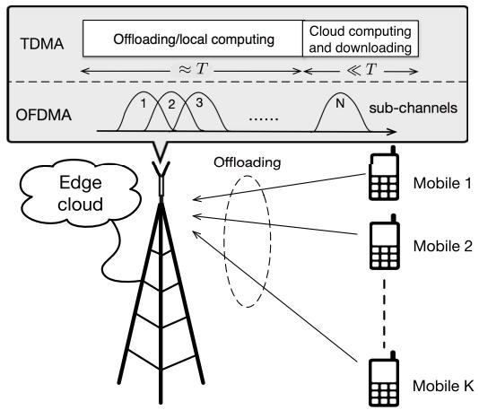
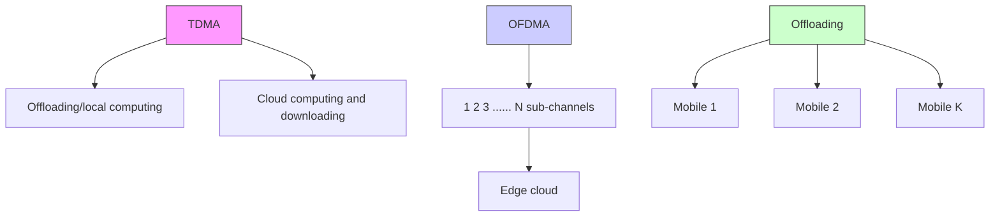
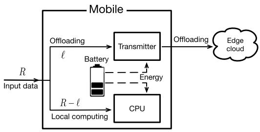
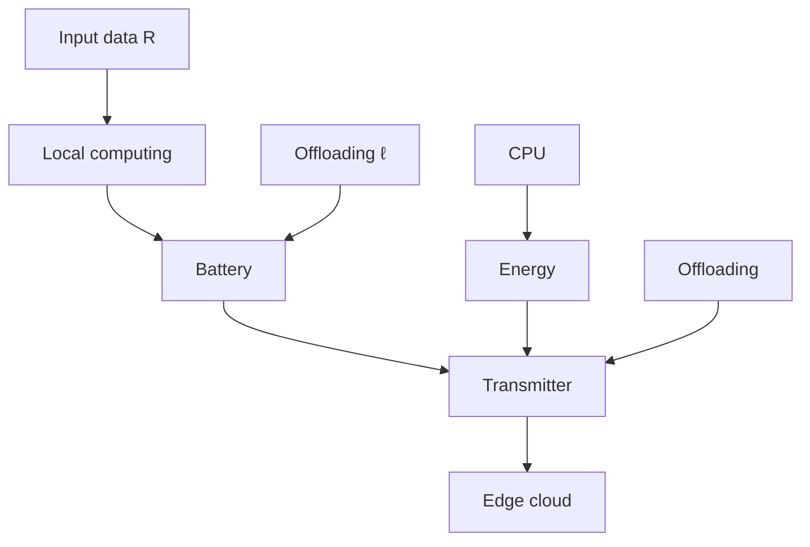
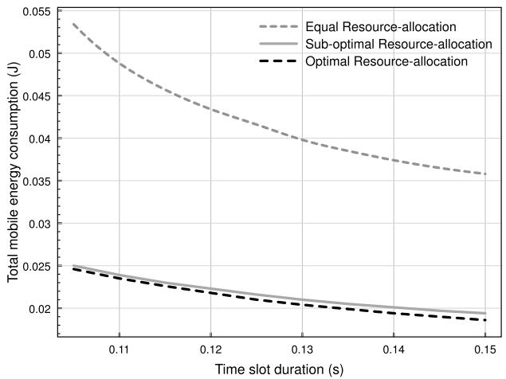
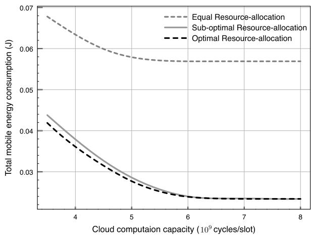
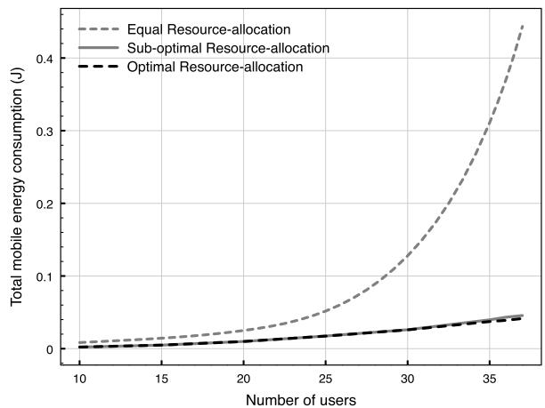

# Energy-Efficient Resource Allocation for Mobile-Edge Computation Offloading

Changsheng You, Student Member, IEEE, Kaibin Huang, Senior Member, IEEE, Hyukjin Chae, and Byoung-Hoon Kim, Member, IEEE

Abstract— Mobile-edge computation offloading (MECO) offloads intensive mobile computation to clouds located at the edges of cellular networks. Thereby, MECO is envisioned as a promising technique for prolonging the battery lives and enhancing the computation capacities of mobiles. In this paper, we study resource allocation for a multiuser MECO system based on time-division multiple access (TDMA) and orthogonal frequency-division multiple access (OFDMA). First, for the TDMA MECO system with infinite or finite cloud computation capacity, the optimal resource allocation is formulated as a convex optimization problem for minimizing the weighted sum mobile energy consumption under the constraint on computation latency. The optimal policy is proved to have a threshold-based structure with respect to a derived offloading priority function, which yields priorities for users according to their channel gains and local computing energy consumption. As a result, users with priorities above and below a given threshold perform complete and minimum offloading, respectively. Moreover, for the cloud with finite capacity, a sub-optimal resource-allocation algorithm is proposed to reduce the computation complexity for computing the threshold. Next, we consider the OFDMA MECO system, for which the optimal resource allocation is formulated as a mixed-integer problem. To solve this challenging problem and characterize its policy structure, a low-complexity sub-optimal algorithm is proposed by transforming the OFDMA problem to its TDMA counterpart. The corresponding resource allocation is derived by defining an average offloading priority function and shown to have close-to-optimal performance in simulation.

Index Terms— Mobile-edge computing, resource allocation, mobile computation offloading, energy-efficient computing.

# I. INTRODUCTION

HE realization of Internet of Things (IoT) [1] will connect tens of billions of resource-limited mobiles, e.g., mobile devices, sensors and wearable computing devices, to Internet via cellular networks. The finite battery lives and limited computation capacities of mobiles pose significant challenges for designing IoT. One promising solution is to leverage mobileedge computing [2] and offload intensive mobile computation to nearby clouds at the edges of cellular networks, called

Manuscript received June 5, 2016; revised September 24, 2016 and November 13, 2016; accepted November 20, 2016. Date of publication December 1, 2016; date of current version March 8, 2017. This work was supported by a grant from LG Electronics. This paper was presented in part at the IEEE Globecom 2016. The associate editor coordinating the review of this paper and approving it for publication was P. Wang.

C. You and K. Huang are with the Department of Electrical and Electronic Engineering, The University of Hong Kong, Hong Kong (e-mail: csyou@eee.hku.hk; huangkb@eee.hku.hk).

H. Chae and B.-H. Kim are with LG Electronics, Seoul, South Korea (email: hyukjin.chae@lge.com; bh.kim@lge.com).

Color versions of one or more of the figures in this paper are available online at http://ieeexplore.ieee.org.

Digital Object Identifier 10.1109/TWC.2016.2633522

edge clouds, with short latency, referred to as mobile-edge computation offloading (MECO). In this paper, we consider an MECO system with a single edge cloud serving multiple users and investigate the energy-efficient resource allocation.

# A. Prior Work

Mobile computation offloading (MCO) [3] (or mobile cloud computing) has been extensively studied in computer science, including system architectures (e.g., MAUI [4]), virtual machine migration [5] and power management [6]. It is commonly assumed that the implementation of MCO relies on a network architecture with a central cloud (e.g., a data center). This architecture has the drawbacks of high overhead and long backhaul latency [7], and will soon encounter the performance bottleneck of finite backhaul capacity in view of exponential mobile traffic growth. These issues can be overcome by MECO based on a network architecture supporting distributed mobileedge computing. Among others, designing energy-efficient control policies is a key challenge for the MECO system.

Energy-efficient MECO requires the joint design of MCO and wireless communication techniques. Recent years have seen research progress on this topic for both single-user [8]–[11] and multiuser [12]–[16] MECO systems. For a singleuser MECO system, the optimal offloading decision policy was derived in [8] by comparing the energy consumption of optimized local computing (with variable CPU cycles) and offloading (with variable transmission rates). This framework was further developed in [9] and [10] to enable adaptive offloading powered by wireless energy transfer and energy harvesting, respectively. Moreover, dynamic offloading was integrated with adaptive LTE/WiFi link selection in [11] to achieve higher energy efficiency. For multiuser MECO systems, the control policies for energy savings are more complicated. In [12], distributed computation offloading for multiuser MECO at a single cloud was designed using game theory for both energy-and-latency minimization at mobiles. A multi-cell MECO system was considered in [13], where the radio and computation resources were jointly allocated to minimize the mobile energy consumption under offloading latency constraints. With the coexistence of central and edge clouds, the optimal user scheduling for offloading to different clouds was studied in [14]. In addition to total mobile energy consumption, cloud energy consumption for computation was also minimized in [15] by designing the mapping between clouds and mobiles for offloading using game theory. The cooperation among clouds was further investigated in [16] to maximize the revenues of clouds and meet mobiles’ demands via resource pool sharing. Prior work on MECO resource allocation focuses on complex algorithmic designs and yields little insight into the optimal policy structures. In contrast, for a multiuser MECO system based on time-division multiple access (TDMA), the optimal resource-allocation policy is shown in the current work to have a simple threshold-based structure with respect to a derived offloading priority function. This insight is used for designing the low-complexity resourceallocation policy for an orthogonal frequency-division multiple access (OFDMA) MECO system.

Resource allocation for traditional multiple-access communication systems has been widely studied, including TDMA (see e.g., [17]), OFDMA (see e.g., [18]) and code-division multiple access (CDMA) (see e.g., [19]). Moreover, it has been designed for existing networks such as cognitive radio [20] and heterogenous networks [21]. Note that all of them only focus on the radio resource allocation. In contrast, for the newly proposed MECO systems, both the computation and radio resource allocation at the edge cloud are jointly optimized for the maximum mobile energy savings, making the algorithmic design more complex.

# B. Contribution and Organization

This paper considers resource allocation in a multiuser MECO system based on TDMA and OFDMA. Multiple mobiles are required to compute different computation loads with the same latency constraint. Assuming that computation data can be split for separate computing, each mobile can simultaneously perform local computing and offloading. Moreover, the edge cloud is assumed to have perfect knowledge of local computing energy consumption, channel gains and fairness factors at all users, which is used for designing centralized resource allocation to achieve the minimum weighted sum mobile energy consumption. In the TDMA MECO system, the optimal threshold-based policy is derived for both the cases of infinite and finite cloud capacities. For the OFDMA MECO system, a low-complexity sub-optimal algorithm is proposed to solve the mixed-integer resource allocation problem.

The contributions of current work are as follows.

• TDMA MECO with infinite cloud capacity: For TDMA MECO with infinite (computation) capacity, a convex optimization problem is formulated to minimize the weighted sum mobile energy consumption under the timesharing constraint. To solve it, an offloading priority function is derived that yields priorities for users and depends on their channel gains and local computing energy consumption. Based on this, the optimal policy is proved to have a threshold-based structure that determines complete and minimum offloading for users with priorities above and below a given threshold, respectively.

• TDMA MECO with finite cloud capacity: The above results are extended to the case of finite capacity. Specifically, the optimal resource allocation policy is derived by defining an effective offloading priority function and modifying the threshold-based policy as derived for the infinite-capacity cloud. To reduce the complexity arising from a two-dimension search for Lagrange multipliers, a simple and low-complexity algorithm is proposed

based on the approximated offloading priority order. This reduces the said search to a one-dimension search, shown by simulation to have close-to-optimal performance.

• OFDMA MECO: For an infinite-capacity cloud based on OFDMA, the insight of priority-based policy structure of TDMA is used for optimizing its resource allocation. Specifically, to solve the corresponding mixed-integer optimization problem, a low-complexity sub-optimal algorithm is proposed. Using average sub-channel gains, the OFDMA resource allocation problem is transformed into its TDMA counterpart. Based on this, the initial resource allocation and offloaded data allocation can be determined by defining an average offloading priority function. Moreover, the integer sub-channel assignment is performed according to the offloading priority order, followed by adjustments of offloaded data allocation over assigned sub-channels. The proposed algorithm is shown to have close-to-optimal performance by simulation and can be extended to the finite-capacity cloud case.

The reminder of this paper is organized as follows. Section II introduces the system model. Section III presents the problem formulation for multiuser MECO based on TDMA. The corresponding resource allocation policies are characterized in Section IV and Section V for both the cases of infinite and finite cloud capacities, respectively. The above results are extended in Section VI for the OFDMA system. Simulation results and discussion are given in Section VII, followed by the conclusion in Section VIII.

# II. SYSTEM MODEL

Consider a multiuser MECO system shown in Fig. 1 with K single-antenna mobiles, denoted by a set $\mathcal { K } = \{ 1 , 2 , \cdots , K \}$ , and one single-antenna base station (BS) that is the gateway of an edge cloud. These mobiles are required to compute different computation loads under the same latency constraint.1 Assume that the BS has perfect knowledge of multiuser channel gains, local computing energy per bit and sizes of input data at all users, which can be obtained by feedback. Using these information, the BS selects offloading users, determines the offloaded data sizes and allocates radio resource to offloading users with the criterion of minimum weighted sum mobile energy consumption.

# A. Multiple-Access Model

Both the TDMA and OFDMA systems are considered as follows. For the TDMA system, time is divided into slots each with a duration of T seconds where T is chosen to meet the user-latency requirement. As shown in Fig. 1, each time slot comprises two sequential phases for 1) mobile offloading or local computing and 2) cloud computing and

1For asynchronous computation offloading among users, the maximum additional latency for each user is one time slot. Moreover, this framework can be extended to predictive computing by designing control policies for the coming data.

For the general case with heterogeneous user-latency constraints and finite cloud resource, the current work can be extended by integration with dynamic cloud control designed similarly as techniques such as demand scheduling and load shifting for smart grids [22], [23].

flowchart

Fig. 1. Multiuser MECO systems based on TDMA and OFDMA.

flowchart

Fig. 2. Mobile computation offloading.

downloading of computation results from the edge cloud to mobiles. Cloud computing has small latency; the downloading consumes negligible mobile energy and furthermore is much faster than offloading due to relative smaller sizes of computation results. For these reasons, the second phase is assumed to have a negligible duration compared to the first phase and not considered in resource allocation. For the OFDMA system, the total bandwidth is divided into multiple orthogonal subchannels and each sub-channel can be assigned to at most one user. The offloading mobiles will be allocated with one or more sub-channels.

Considering an arbitrary slot in TDMA/OFDMA, the BS schedules a subset of users for complete/partial offloading. The user with partial or no offloading computes a fraction of or all input data, respectively, using a local CPU.

# B. Local-Computing Model

Assume that the CPU frequency is fixed at each user and may vary over users. Consider an arbitrary time slot. Following the model in [12], let $C _ { k }$ denote the number of CPU cycles required for computing 1-bit of input data at the k-th mobile, and $P _ { k }$ the energy consumption per cycle for local computing at this user. Then the product $C _ { k } P _ { k }$ gives computing energy per bit. As shown in Fig. 2, mobile k is required to compute $R _ { k } { \mathrm { - } } \mathbf { b i t }$ input data within the time slot, out of which $\ell _ { k } { \mathrm { - b i t } }$ is offloaded and $( R _ { k } - \ell _ { k } )$ -bit is computed locally. Then the total energy consumption for local computing at mobile k, denoted as $E _ { \mathrm { l o c } , k }$ , is given by $E _ { \mathrm { l o c } , k } = ( R _ { k } - \ell _ { k } ) C _ { k } P _ { k }$ . Let $F _ { k }$ denote the computation capacity of mobile k that is measured by the number of CPU cycles per second. Under the computation latency constraint, it has $C _ { k } ( R _ { k } - \ell _ { k } ) / F _ { k } \le T$ . As a result, the offloaded data at mobile k has the minimum size of $\ell _ { k } \geq m _ { k } ^ { + }$ with $m _ { k } = R _ { k } - F _ { k } T / C _ { k }$ , where $( x ) ^ { + } = \operatorname* { m a x } \{ x , 0 \}$ .

# C. Computation-Offloading Model

First, consider the TDMA system for an arbitrary time slot. Let $h _ { k }$ denote the channel gain for mobile k that is constant during offloading duration, and $p _ { k }$ its transmission power. Then the achievable rate (in bits/s), denoted by $r _ { k } .$ , is:

$$
r _ {k} = B \log_ {2} \left(1 + \frac {p _ {k} h _ {k} ^ {2}}{N _ {0}}\right) \tag {1}
$$

where B and $N _ { 0 }$ are the bandwidth and the variance of complex white Gaussian channel noise, respectively. The fraction of slot allocated to mobile k for offloading is denoted as tk with $t _ { k } ~ \geq ~ 0$ , where $t _ { k } ~ = ~ 0$ corresponds to no offloading. For the case of offloading $( t _ { k } \ > \ 0 )$ , under the assumption of negligible cloud computing and result downloading time (see Section II-A), the transmission rate is fixed as $r _ { k } = \ell _ { k } / t _ { k }$ since this is the most energy-efficient transmission policy under a deadline constraint [24]. Define a function $f ( x ) =$ $N _ { 0 } ( 2 ^ { \frac { x } { B } } - 1 )$ . It follows from (1) that the energy consumption for offloading at mobile k is

$$
E _ {\text { off }, k} = p _ {k} t _ {k} = \frac {t _ {k}}{h _ {k} ^ {2}} f \left(\frac {\ell_ {k}}{t _ {k}}\right). \tag {2}
$$

Note that if either $\ell _ { k } = 0$ or $t _ { k } = 0$ , $E _ { \mathrm { o f f } , k }$ is equal to zero.

Next, consider an OFDMA system with N sub-channels, denoted by a set $\mathcal { N } = \{ 1 , 2 , \cdots , N \}$ . Let $p _ { k , n }$ and $h _ { k , n }$ denote the transmission power and channel gain of mobile k on the $n { \mathrm { - } } { \mathrm { t h } }$ sub-channel. Define $\rho _ { k , n } ~ \in ~ \{ 0 , 1 \}$ as the sub-channel assignment indicator variable where $\rho _ { k , n } = 1$ indicates that sub-channel n is assigned to mobile $k ,$ and verse vice. Then the achievable rate (in bits/s) follows:

$$
r _ {k, n} = \rho_ {k, n} \bar {B} \log_ {2} \left(1 + \frac {p _ {k , n} h _ {k , n} ^ {2}}{\bar {N} _ {0}}\right) \tag {3}
$$

where $\bar { B }$ and $\bar { N _ { 0 } }$ are the bandwidth and noise power for each sub-channel, respectively. Let $\ell _ { k , n } = r _ { k , n } T$ denote the offloaded data size over the offloading duration time $T$ that can be set as the OFDMA symbol duration. The corresponding offloading energy consumption can be expressed as below, which is similar to that in [18], namely,

$$
E _ {\text { off }, k, n} = \rho_ {k, n} p _ {k, n} T = \frac {\rho_ {k , n}}{\bar {h} _ {k , n} ^ {2}} \bar {f} \left(\frac {\ell_ {k , n}}{\rho_ {k , n}}\right) \tag {4}
$$

where $\bar { h } _ { k , n } ^ { 2 } = h _ { k , n } ^ { 2 } / T$ and ¯f (x ) = N¯0(2 xBT¯ − 1).

# D. Cloud-Computing Model

Considering an edge cloud with finite (computation) capacity, for simplicity, the finite capacity is reflected in one of the following two constraints.2 The first one upper-bounds

2For simplicity, we consider either a computation-load or a computationtime constraint at one time but not both simultaneously. However, note that the two constraints can be considered equivalent. Specifically, limiting the cloud computation load allows the computation to be completed within the required time and vice versa. The current resource-allocation policies can be extended to account for more elaborate constraints, which are outside the scope of the paper.

CPU cycles of sum offloaded data that can be handled by the cloud in each time slot. Let $F$ represent the cloud computation capacity measured by CPU cycles per time slot. Then it follows: $\begin{array} { r } { \dot { \sum _ { k = 1 } ^ { K } } C _ { k } \ell _ { k } \ \le \ \dot { F } } \end{array}$ . This constraint ensures negligible cloud computing latency. The other one considers non-negligible computing time at the cloud that performs load balancing as in [25], given as $\begin{array} { r } { t _ { \mathrm { c o m p } } = ( \sum _ { k } ^ { K } \ell _ { k } C _ { k } ) / F ^ { \prime } , } \end{array}$ , where $F ^ { \prime }$ is the cloud computation capacity measure by CPU cycles per second. Note that $t _ { \mathrm { c o m p } }$ is factored into the latency constraint in the sequel.

# III. MULTIUSER MECO FOR TDMA: PROBLEM FORMULATION

In this section, resource allocation for multiuser MECO based on TDMA is formulated as an optimization problem. The objective is to minimize the weighted sum mobile energy consumption: $\begin{array} { r } { \sum _ { k = 1 } ^ { K } \beta _ { k } ( E _ { \mathrm { o f f } , k } + E _ { \mathrm { l o c } , k } ) } \end{array}$ , where the positive weight factors $\{ \beta _ { k } \}$ account for fairness among mobiles. Under the constraints on time-sharing, cloud computation capacity and computation latency, the resource allocation problem is formulated as follows:

$$
\min _ {\{\ell_ {k}, t _ {k} \}} \sum_ {k = 1} ^ {K} \beta_ {k} \left[ \frac {t _ {k}}{h _ {k} ^ {2}} f \left(\frac {\ell_ {k}}{t _ {k}}\right) + (R _ {k} - \ell_ {k}) C _ {k} P _ {k} \right]
$$

$$
\text { s.t. } \sum_ {k = 1} ^ {K} t _ {k} \leq T, \quad \sum_ {k = 1} ^ {K} C _ {k} \ell_ {k} \leq F,
$$

$$
t _ {k} \geq 0, \quad m _ {k} ^ {+} \leq \ell_ {k} \leq R _ {k}, k \in \mathcal {K}. \tag {P1}
$$

First, it is easy to observe that the feasibility condition for Problem P1 is: ${ \begin{array} { r } { \sum _ { k = 1 } ^ { K } m _ { k } ^ { + } C _ { k } \leq F } \end{array} }$ . It shows that whether the cloud capacity constraint is satisfied determines the feasibility of this optimization problem, while the time-sharing constraint can always be satisfied and only affects the mobile energy consumption. Next, one basic characteristic of Problem P1 is given in the following lemma, proved in Appendix A.

Lemma 1: Problem P1 is a convex optimization problem.

Assume that Problem P1 is feasible. The direct solution for Problem P1 using the dual-decomposition approach (the Lagrange method) requires iterative computation and yields little insight into the structure of the optimal policy. To address these issues, we adopt a two-stage solution approach that requires first solving Problem P2 below, which follows from Problem P1 by relaxing the constraint on cloud capacity:

$$
\min _ {\{\ell_ {k}, t _ {k} \}} \sum_ {k = 1} ^ {K} \beta_ {k} \left[ \frac {t _ {k}}{h _ {k} ^ {2}} f \left(\frac {\ell_ {k}}{t _ {k}}\right) + (R _ {k} - \ell_ {k}) C _ {k} P _ {k} \right]
$$

$$
\text { s.t. } \sum_ {k = 1} ^ {K} t _ {k} \leq T,
$$

$$
t _ {k} \geq 0, \quad m _ {k} ^ {+} \leq \ell_ {k} \leq R _ {k}, \quad k \in \mathcal {K}. \tag {P2}
$$

If the solution for Problem P2 violates the constraint on cloud capacity, Problem P1 is then incrementally solved building on the solution for Problem P2. This approach allows the optimal policy to be shown to have the said threshold-based structure and also facilitates the design of low-complexity close-tooptimal algorithm. It is interesting to note that Problem P2 corresponds to the case where the edge cloud has infinite capacity. The detailed procedures for solving Problems P1 and P2 are presented in the two subsequent sections.

# IV. MULTIUSER MECO FOR TDMA: INFINITE CLOUD CAPACITY

In this section, by solving Problem P2 using the Lagrange method, we derive a threshold-based policy for the optimal resource allocation.

To solve Problem P2, the partial Lagrange function is defined as

$$
L = \sum_ {k = 1} ^ {K} \beta_ {k} \left[ \frac {t _ {k}}{h _ {k} ^ {2}} f \left(\frac {\ell_ {k}}{t _ {k}}\right) + (R _ {k} - \ell_ {k}) C _ {k} P _ {k} \right] + \lambda \left(\sum_ {k = 1} ^ {K} t _ {k} - T\right)
$$

where $\lambda \geq 0$ is the Lagrange multiplier associated with the $g ( x ) = f ( x ) - x f ^ { \prime } ( x )$ For e. Let $\{ \ell _ { k } ^ { * ( 2 ) } , t _ { k } ^ { * ( 2 ) } \}$ on, define a functiondenote the optimal feasibility condition.

Then applying KKT conditions leads to the following necessary and sufficient conditions:

$$
\frac {\partial L}{\partial \ell_ {k} ^ {* (2)}} = \frac {\beta_ {k} f ^ {\prime} \left(\frac {\ell_ {k} ^ {* (2)}}{t _ {k} ^ {* (2)}}\right)}{h _ {k} ^ {2}} - \beta_ {k} C _ {k} P _ {k} \left\{ \begin{array}{l l} > 0, & \ell_ {k} ^ {* (2)} = m _ {k} ^ {+} \\ = 0, & \ell_ {k} ^ {* (2)} \in \left(m _ {k} ^ {+}, R _ {k}\right) \\ <   0, & \ell_ {k} ^ {* (2)} = R _ {k}, \end{array} \right. \tag {5a}
$$

$$
\frac {\partial L}{\partial t _ {k} ^ {* (2)}} = \frac {\beta_ {k} g \left(\frac {\ell_ {k} ^ {* (2)}}{t _ {k} ^ {* (2)}}\right)}{h _ {k} ^ {2}} + \lambda^ {*} \left\{ \begin{array}{l l} > 0, & t _ {k} ^ {* (2)} = 0 \\ = 0, & t _ {k} ^ {* (2)} > 0, \end{array} \quad \forall k \in \mathcal {K}, \right. \tag {5b}
$$

$$
\sum_ {k = 1} ^ {K} t _ {k} ^ {* (2)} \leq T, \quad \lambda^ {*} \left(\sum_ {k = 1} ^ {K} t _ {k} ^ {* (2)} - T\right) = 0. \tag {5c}
$$

Note that for $\ell _ { k } ^ { * ( 2 ) } \in ( m _ { k } ^ { + } , R _ { k } )$ and $t _ { k } ^ { * ( 2 ) } > 0$ , it can be derived from (5) and (5b) that

$$
\frac {\ell_ {k} ^ {* (2)}}{t _ {k} ^ {* (2)}} = f ^ {\prime - 1} \left(C _ {k} P _ {k} h _ {k} ^ {2}\right) = g ^ {- 1} \left(\frac {- h _ {k} ^ {2} \lambda^ {*}}{\beta_ {k}}\right). \tag {6}
$$

Based on these conditions, the optimal policy for resource allocation is characterized in the following sub-sections.

# A. Offloading Priority Function

Define a (mobile) offloading priority function, which is essential for the optimal resource allocation, as follows:

$$
\varphi (\beta_ {k}, C _ {k}, P _ {k}, h _ {k}) = \left\{ \begin{array}{l l} \frac {\beta_ {k} N _ {0}}{h _ {k} ^ {2}} (v _ {k} \ln v _ {k} - v _ {k} + 1), & v _ {k} \geq 1 \\ 0, & v _ {k} <   1, \end{array} \right. \tag {7}
$$

with the constant $\upsilon _ { k }$ defined as

$$
v _ {k} = \frac {B C _ {k} P _ {k} h _ {k} ^ {2}}{N _ {0} \ln 2}. \tag {8}
$$

This function is derived by solving a useful equation as shown in the following lemma.

Lemma 2: Given $\upsilon _ { k } \geq 1$ , the offloading priority function $\varphi ( \beta _ { k } , C _ { k } , P _ { k } , h _ { k } )$ in (7) is the root of following equation with respect to x :

$$
f ^ {\prime - 1} \left(C _ {k} P _ {k} h _ {k} ^ {2}\right) = g ^ {- 1} \left(\frac {- h _ {k} ^ {2} x}{\beta_ {k}}\right).
$$

Lemma 2 is proved in Appendix B. The function generates an offloading priority value, $\varphi _ { k } ~ = ~ \varphi ( \beta _ { k } , C _ { k } , P _ { k } , h _ { k } )$ , for mobile $k ,$ depending on corresponding variables quantifying fairness, local computing and channel. The amount of offloaded data by a mobile grows with an increasing offloading priority as shown in the next sub-section. It is useful to understand the effects of parameters on the offloading priority that are characterized as follows.

Lemma 3: Given $\upsilon ~ \geq ~ 1 , ~ \varphi ( \beta , C , P , h )$ is a monotone increasing function for $\beta , C , P$ and h.

Lemma 3 is proved in Appendix C by deriving the first derivatives of ϕ with respect to each parameter. This lemma is consistent with the intuition that, to reduce energy consumption by offloading, the BS should schedule those mobiles having high computing energy consumption per bit (i.e., large C and P) or good channels (i.e., large h).

Remark 1 (Effects of Parameters on the Offloading Priority): It can be observed from (7) and (8) that the offloading priority scales with local computing energy per bit $C P$ approximately as (C P) ln(C P) and with the channel gain h approximately as ln h. The former scaling is much faster than the latter. This shows that the computing energy per bit is dominant over the channel on determining whether to offload.

# B. Optimal Resource-Allocation Policy

Based on conditions in $( 5 ) ‐ ( 5 \mathrm { c } )$ and Lemma 2, the main result of this section is derived, given in the following theorem.

Theorem 1 (Optimal Resource-Allocation Policy): Consider the case of infinite cloud computation capacity. The optimal policy solving Problem P2 has the following structure.

1) If $\upsilon _ { k } \leq 1$ and the minimum offloaded data size $m _ { k } ^ { + } = 0$ for all k, none of these users performs offloading, i.e.,

$$
\ell_ {k} ^ {* (2)} = t _ {k} ^ {* (2)} = 0 k \in \mathcal {K}.
$$

2) If there exists mobile k such that $\upsilon _ { k } > 1$ or $m _ { k } ^ { + } > 0$ for $k \in \mathcal { K } ,$

$$
\ell_ {k} ^ {* (2)} \left\{ \begin{array}{l l} = m _ {k} ^ {+}, & \varphi_ {k} <   \lambda^ {*} \\ \in [ m _ {k} ^ {+}, R _ {k} ], & \varphi_ {k} = \lambda^ {*} \\ = R _ {k}, & \varphi_ {k} > \lambda^ {*}, \end{array} \right.
$$

and

$$
t _ {k} ^ {* (2)} = \frac {\ln 2}{B \left[ W _ {0} \left(\frac {\lambda^ {*} h _ {k} ^ {2} / \beta_ {k} - N _ {0}}{N _ {0} e}\right) + 1 \right]} \times \ell_ {k} ^ {* (2)}
$$

where $W _ { 0 } ( x )$ is the Lambert function and $\lambda ^ { * }$ is the optimal value of the Lagrange multiplier satisfying the active time-sharing constraint: $\begin{array} { r } { \sum _ { k = 1 } ^ { K } t _ { k } ^ { * ( 2 ) } = T } \end{array}$ .

Proof: See Appendix D.

Theorem 1 reveals that the optimal resource-allocation policy has a threshold-based structure when offloading saves energy. In other words, since the exact case of $\varphi _ { k } = \lambda ^ { * }$ rarely occurs in practice, the optimal policy makes a binary offloading decision for each mobile. Specifically, if the corresponding offloading priority exceeds a given threshold, namely $\lambda ^ { * } .$ , the mobile should offload all input data to the edge cloud; otherwise, the mobile should offload only the minimum amount of data under the computation latency constraint. This result is consistent with the intuition that the greedy method can lead to the optimal resource allocation. Note that there are two groups of users selected to perform the minimum offloading. One is the group of users for which it has positive minimum offloading data, i.e., $m _ { k } > 0 .$ , and offloading cannot save energy consumption since they have bad channels or small local computing energy such that $\mathit { v } _ { k } \le 1$ and $\varphi _ { k } = 0$ . The second group is the set of users for which offloading is energy-efficient, i.e., $\upsilon _ { k } > 1$ , however, have relatively small offloading priorities, $\mathrm { i . e . , } \varphi _ { k } < \lambda ^ { * }$ ; they cannot perform complete offloading due to the limited radio resource.

Remark 2 (Offloading or Not?): For a conventional TDMA communication system, continuous transmission by at least one mobile is always advantageous under the criterion of minimum sum energy consumption [17]. However, this does not always hold for a TDMA MECO system where no offloading for all users may be preferred as shown in Theorem 1. Offloading is not necessary expect for two cases. First, there exists at least one mobile whose input-data size is too large such that complete local computing fails to meet the latency constraint. Second, some mobile has a sufficient high value for the product $C _ { k } P _ { k } h _ { k } ^ { 2 }$ , indicating that energy savings can be achieved by offloading because of high channel gain or large local computing energy consumption.

Remark 3 (Offloading Rate): It can be observed from Theorem 1 that the offloading rate, defined as $\ell _ { k } ^ { * ( 2 ) } / t _ { k } ^ { * ( 2 ) }$ for mobile k, is determined only by the channel gain and fairness factor while other factors, namely $C _ { k }$ and $P _ { k }$ , affect the offloading decision. The rate increases with a growing channel gain and vice versa since a large channel gain supports a higher transmission rate or reduces transmission power, making offloading desirable for reducing energy consumption.

Remark 4 (Low-Complexity Algorithm): The traditional method for solving Problem P2 is the block-coordinate descending algorithm which performs iterative optimization of the two sets of variables, {-k } and {tk }, resulting in high computation complexity. In contrast, by exploiting the threshold-based structure of the optimal resourceallocation policy in Theorem 1, the proposed solution approach, described in Algorithm 1, needs to perform only a one-dimension search for $\lambda ^ { * }$ , reducing the computation complexity significantly. To facilitate the search, next lemma gives the range of $\lambda ^ { * }$ , which can be easily proved from Theorem 1.

Lemma 4: When there is at least one offloading mobile, $\lambda ^ { * }$ satisfies: $0 \leq \lambda ^ { * } \leq \lambda _ { \operatorname* { m a x } } = \operatorname* { m a x } _ { k } \varphi _ { k }$ .

# Algorithm 1 Optimal Algorithm for Solving Problem P2

• Step 1 [Initialize]: Let $\overline { { \lambda _ { \ell } = 0 } }$ and $\lambda _ { h } = \lambda _ { \operatorname* { m a x } } .$ . According m 1, ob, where $\begin{array} { r c l } { T _ { \ell } } & { = } & { \sum _ { k = 1 } ^ { K } t _ { k , \ell } ^ { * ( 2 ) } } \end{array}$  k=1 and the al $\begin{array} { r l } { T _ { h } } & { { } = } \end{array}$ $\scriptstyle \sum _ { k = 1 } ^ { K } t _ { k , h } ^ { * ( 2 ) }$  k=1 t k,h $\{ t _ { k , \ell } ^ { * ( 2 ) } \}$ $\{ t _ { k , h } ^ { * ( 2 ) } \}$ fractions of slot for the cases of $\lambda _ { \ell }$ and $\lambda _ { h }$ , respectively.   
• Step 2 [Bisection search]: While $T _ { \ell } \neq T$ and $T _ { h } \neq T$ , update $\{ \lambda _ { \ell } , \lambda _ { h } \}$ as follows.

(1) Define $\lambda _ { m } = ( \lambda _ { \ell } + \lambda _ { h } ) / 2$ and compute $T _ { m }$

(2) If $T _ { m } = T$ , then $\lambda ^ { * } = \lambda _ { m }$ and the optimal policy can be determined. Otherwise, if $T _ { m } ~ < ~ T$ , let $\lambda _ { h } = \lambda _ { m }$ and if $T _ { m } > T ,$ , let $\lambda _ { \ell } = \lambda _ { m } .$

Furthermore, with the assumption of infinite cloud capacity, the effects of finite radio resource (i.e., the TDMA time-slot duration) are characterized in the following two propositions in terms of the number of offloading users, which can be easily derived using Theorem 1.

Proposition 1 (Exclusive Mobile Computation Offloading): For TDMA MECO with offloading users, only one mobile can offload computation if $T \ \leq \ { \frac { \kappa _ { m } } { B \log _ { 2 } \left( { \frac { B C _ { m } P _ { m } h _ { m } ^ { 2 } } { N _ { 0 } \ln 2 } } \right) } }$ where B log2 $m = \arg \operatorname* { m a x } _ { k } \varphi _ { k }$ .

It indicates that short time slot limits the number of offloading users. From another perspective, it means that if the winner user m has excessive data, it will take up all the resource.

Proposition 2 (Inclusive Mobile Computation Offloading): All offloading-desired mobiles (defined as for which, it has $\varphi _ { k } > 0 )$ will completely offload computation if

$$
\begin{array}{l} T \geq \sum_ {k \in O _ {1}} \frac {R _ {k} \ln 2}{B \left[ W _ {0} (\frac {\lambda_ {\min} h _ {k} ^ {2} / \beta_ {k} - N _ {0}}{N _ {0} e}) + 1 \right]} \\ + \sum_ {k \in \mathcal {O} _ {2}} \frac {m _ {k} ^ {+} \ln 2}{B \left[ W _ {0} (\frac {\lambda_ {\min} h _ {k} ^ {2} / \beta_ {k} - N _ {0}}{N _ {0} e}) + 1 \right]} \\ \end{array}
$$

where ${ \cal O } _ { 1 } = \{ k | \varphi _ { k } > 0 \} , { \cal O } _ { 2 } = \{ k | \varphi _ { k } = 0 \}$ and $\lambda _ { \operatorname* { m i n } { } } =$ $\mathrm { m i n } _ { k \in O _ { 1 } } \varphi _ { k }$ .

Proposition 2 reveals that when T exceeds a given threshold, the offloading-desired mobiles for which offloading brings energy savings, will offload all computation to the cloud.

Remark 5 (Which Resource is Bottleneck?): Proposition 1 and 2 suggest that as the radio resource continuously increases, the cloud will become the performance bottleneck and the assumption of infinite cloud capacity will not hold. For a short time-slot duration, only a few users can offload computation. This just requires a fraction of computation such that the cloud can be regarded as having infinite capacity. However, when the time-slot duration is large, it not only saves energy consumption by offloading but also allows more users for offloading, which potentially exceeds the cloud capacity. The case of finite-capacity cloud will be considered in the sequel.

# C. Special Cases

The optimal resource-allocation policies for several special cases considering equal fairness factors are discussed as follows.

1) Uniform Channels and Local Computing: Consider the simplest case where $\{ h _ { k } , C _ { k } , P _ { k } \}$ are identical for all k. Then all mobiles have uniform offloading priorities. In this case, for the optimal resource allocation, all mobiles can offload arbitrary data sizes so long as the sum offloaded data size satisfies the following constraint: $\begin{array} { r } { \sum _ { k = 1 } ^ { K } \ell _ { k } ^ { * ( 2 ) } \leq T B \log _ { 2 } \left( \frac { B C P h ^ { 2 } } { N _ { 0 } \ln 2 } \right) } \end{array}$ ≤ T B log2   
2) Uniform Channels: Consider the case of $\dot { h _ { 1 } } = \dot { h _ { 2 } } \cdot \dot { \cdot } = \dot { }$ $h _ { K } = h$ . The offloading priority for each mobile, say mobile k, is only affected by the corresponding local-computing parameters $P _ { k }$ and $C _ { k }$ . Without loss of generality, assume that $P _ { 1 } C _ { 1 } \leq P _ { 2 } C _ { 2 } \cdot \cdot \cdot \leq P _ { K } C _ { K }$ . Then the optimal resourceallocation policy is given in the following corollary of Theorem 1.

Corollary 1: Assume infinite cloud capacity, $h _ { 1 } = h _ { 2 } \cdot \cdot \cdot =$ $h _ { K } = h$ and $P _ { 1 } C _ { 1 } \ \le \ P _ { 2 } C _ { 2 } \cdot \cdot \cdot \le P _ { K } C _ { K }$ . Let $k _ { t }$ denote the index such that $\varphi _ { k } \ < \ \lambda ^ { * }$ for all $k \ < \ k _ { t }$ and $\varphi _ { k } > \lambda ^ { * }$ for all $k \geq k _ { t }$ , neglecting the rare case where $\varphi _ { k } = \lambda ^ { * }$ . The optimal resource-allocation policy is given as follows: for $k \in \mathcal { K } .$

$$
\ell_ {k} ^ {* (2)} = \left\{ \begin{array}{l l} R _ {k}, & k \geq k _ {t} \\ m _ {k} ^ {+}, & \text { otherwise }, \end{array} \right.
$$

and

$$
t _ {k} ^ {* (2)} = \frac {\ln 2}{B \left[ W _ {0} \left(\frac {\lambda^ {*} h ^ {2} / \beta - N _ {0}}{N _ {0} e}\right) + 1 \right]} \times \ell_ {k} ^ {* (2)}.
$$

The result shows that the optimal resource-allocation policy follows a greedy approach that selects mobiles in a descending order of energy consumption per bit for complete offloading until the time-sharing duration is fully utilized.

3) Uniform Local Computing: Consider the case of $C _ { 1 } P _ { 1 } =$ $C _ { 2 } P _ { 2 } \cdot \cdot \cdot = C _ { K } P _ { K }$ . Similar to the previous case, the optimal resource-allocation policy can be shown to follow the greedy approach that selects mobiles for complete offloading in the descending order of channel gains.

# V. MULTIUSER MECO FOR TDMA: FINITE CLOUD CAPACITY

In this section, we consider the case of finite cloud capacity and analyze the optimal resource-allocation policy for solving Problem P1. The policy is shown to also have a thresholdbased structure as the infinite-capacity counterpart derived in the preceding section. Both the optimal and sub-optimal algorithms are presented for policy computation. The results are extended to the finite-capacity cloud with non-negligible computing time.

# A. Optimal Resource-Allocation Policy

To solve the convex Problem P1, the corresponding partial Lagrange function is written as

$$
\begin{array}{l} \tilde {L} = \sum_ {k = 1} ^ {K} \beta_ {k} \left[ \frac {t _ {k}}{h _ {k} ^ {2}} f \left(\frac {\ell_ {k}}{t _ {k}}\right) + (R _ {k} - \ell_ {k}) C _ {k} P _ {k} \right] \\ + \lambda \left(\sum_ {k = 1} ^ {K} t _ {k} - T\right) + \mu \left(\sum_ {k = 1} ^ {K} C _ {k} \ell_ {k} - F\right) \tag {9} \\ \end{array}
$$

where $\mu ~ \geq ~ 0$ is the Lagrange multiplier associated with the cloud capacity constraint. Using the above Lagrange function, it is straightforward to show that the corresponding KKT conditions can be modified from their infinite-capacity counterparts in (5)-(5c) by replacing $P _ { k }$ with $\tilde { P } _ { k } = P _ { k } - \mu$ , called the effective computation energy per cycle. The resultant effective offloading priority function, denoted as $\tilde { \varphi } _ { k } ,$ , can be modified accordingly from that in (7) as

$$
\begin{array}{l} \tilde {\varphi} \left(\beta_ {k}, C _ {k}, P _ {k}, h _ {k}, \tilde {\mu} ^ {*}\right) \\ = \left\{ \begin{array}{l l} \frac {\beta_ {k} N _ {0}}{h _ {k} ^ {2}} \left(\tilde {v} _ {k} \ln \tilde {v} _ {k} - \tilde {v} _ {k} + 1\right), & \tilde {v} _ {k} \geq 1 \\ 0, & \tilde {v} _ {k} <   1, \end{array} \right. \tag {10} \\ \end{array}
$$

where $\tilde { \upsilon } _ { k } = \frac { B C _ { k } ( P _ { k } - \tilde { \mu } ^ { * } ) h _ { k } ^ { 2 } } { N _ { 0 } \ln 2 }$ .

Moreover, it can be easily derived that a cloud with smaller capacity F leads to a larger Lagrange multiplier $\tilde { \mu } ^ { * }$ . It indicates that compared with $\varphi _ { k }$ in (7) for the case of infinitecapacity cloud, the effective offloading priority function here is also determined by the cloud capacity. Based on above discussion, the main result of this section follows.

Theorem 2: Consider the finite-capacity cloud with upperbounded offloaded computation. The optimal policy solving Problem P1 has the same structure as that in Theorem 1 and is expressed in terms of the priority function $\tilde { \varphi } _ { k }$ in (10) and optimized Lagrange multipliers $\{ \tilde { \lambda } ^ { * } , \tilde { \mu } ^ { * } \}$ .

Remark 6 (Variation of Offloading Priority Order): Since $\tilde { \mu } ^ { * } > 0 .$ , it has $\tilde { \varphi } _ { k } \ < \ \varphi _ { k }$ for all k. Therefore, the offloading priority order may be different with that of infinite-capacity cloud, due to the varying decreasing rates of offloading priorities. The reason is that the finite-capacity cloud should make the tradeoff between energy savings and computation burden. To this end, it will select the mobiles for offloading that can save significant energy and require less computation for each bit of data.

Computing the threshold for the optimal resource-allocation policy requires a two-dimension search over the Lagrange multipliers $\{ \tilde { \lambda } ^ { * } , \tilde { \mu } ^ { * } \}$ , described in Algorithm 2. For an efficient search, it is useful to limit the range of $\tilde { \lambda } ^ { * }$ and $\tilde { \mu } ^ { * }$ shown as below, which can be easily proved.

Lemma 5: When there is at least one offloading mobile, the optimal Lagrange multipliers $\{ \tilde { \lambda } ^ { * } , \tilde { \mu } ^ { * } \}$ satisfy:

$$
0 \leq \tilde {\lambda} ^ {*} \leq \lambda_ {\max}, \text { and } 0 \leq \tilde {\mu} ^ {*} \leq \mu_ {\max} = \max _ {k} \left\{P _ {k} - \frac {N _ {0} \ln 2}{B C _ {k} h _ {k} ^ {2}} \right\}
$$

where $\lambda _ { \mathrm { m a x } }$ is defined in Lemma 4.

Note that $\tilde { \mu } ^ { * } = 0$ corresponds to the case of infinite-capacity cloud and $\tilde { \mu } ^ { * } = \mu _ { \mathrm { m a x } }$ to the case where offloading yields no energy savings for any mobile.

# B. Sub-Optimal Resource-Allocation Policy

To reduce the computation complexity of Algorithm 2 due to the two-dimension search, one simple sub-optimal policy is proposed as shown in Algorithm 3. The key idea is to decouple the computation and radio resource allocation. In Step 2, based on the approximated offloading priority in (7) for the case of infinite-capacity cloud, we allocate the computation

# Algorithm 2 Optimal Algorithm for Solving Problem P1

• Step 1 [Check solution for Problem P2]: Perform Algorithm 1. If Kk=1 - ∗(k $\begin{array} { r } { \sum _ { k = 1 } ^ { K } \ell _ { k } ^ { * ( 2 ) } \le F . } \end{array}$ , the optimal policy is given in Theorem 1. Otherwise, go to Step 2.   
• Step 2 [Initialize]: Let $\mu _ { \ell } = 0$ and $\mu _ { h } = \mu _ { \mathrm { m a x } } .$ . Based on Theorem 2, obtain $\begin{array} { r } { F _ { \ell } = \sum _ { k = 1 } ^ { K } C _ { k } \ell _ { k , \ell } ^ { * } } \end{array}$ and $F _ { h } \ =$ $\begin{array} { r l } { ~ } & { { } \sum _ { k = 1 } ^ { K } C _ { k } \ell _ { k , h } ^ { * } . } \end{array}$ where $\{ \ell _ { k , \ell } ^ { * } \}$ and $\{ \ell _ { k , h } ^ { * } \}$ are the offloaded data sizes for $\mu _ { \ell }$ and $\mu _ { h }$ , respectively, involving the onedimension search for $\tilde { \lambda } ^ { * }$ .   
• Step 3 [Bisection search]: While $F _ { \ell } \neq F$ and $F _ { h } \neq F ,$ , update $\{ \mu _ { \ell } , \mu _ { h } \}$ as follows.   
(1) Define $\mu _ { m } = ( \mu _ { \ell } + \mu _ { h } ) / 2$ and compute $F _ { m } .$   
(2) If $F _ { m } = F$ , then $\tilde { \mu } ^ { * } = \mu _ { m }$ and the optimal policy can be determined. Otherwise, if $F _ { m } \ < \ F$ , let $\mu _ { h } = \mu _ { m }$ and if $F _ { m } > F ,$ , let $\mu _ { \ell } = \mu _ { m } .$ .

# Algorithm 3 Sub-Optimal Algorithm for Solving Problem P1

• Step 1: Perform Algorithm 1. If $\begin{array} { r l r } { \sum _ { k = 1 } ^ { K } \ell _ { k } ^ { * ( 2 ) } } & { { } \le } & { F , } \end{array}$ Theorem 1 gives the optimal policy. Otherwise, go to Step 2.   
• Step 2: Based on offloading priorities in (7), offload the data from mobiles in the descending order of offloading priority until the cloud computation capacity is fully occupied, i.e., $\begin{array} { r } { \sum _ { k = 1 } ^ { K } C _ { k } \ell _ { k } ^ { * } = \dot { F } . } \end{array}$   
• Step 3: With k  dimension search for $\{ \ell _ { k } ^ { * } \}$ derived in Step 2, perform one- $\lambda ^ { * }$ such that $\textstyle \sum _ { k = 1 } ^ { K } t _ { k } ^ { * } = T$ where

$$
t _ {k} ^ {*} = \frac {\ell_ {k} ^ {*} \ln 2}{B [ W _ {0} (\frac {\lambda^ {*} h _ {k} ^ {2} / \beta_ {k} - N _ {0}}{N _ {0} e}) + 1 ]}.
$$

resource to mobiles with high offloading priorities. Step 3 optimizes the corresponding fractions of slot given offloaded data. This sub-optimal algorithm has low computation complexity. Specifically, let d denote the largest bisection-search interval. Given a solution accuracy $\varepsilon > 0$ , the bisection method will call for $\log _ { 2 } ( d / \epsilon )$ times of comparison operations, and thus has the order of complexity $O ( \log ( 1 / \varepsilon ) )$ . For each iteration, the resource-allocation complexity is O(K ). Therefore, the total computation complexity for the sub-optimal algorithm is O(K log(1/ε)). Moreover, its performance is shown by simulation to be close-to-optimal in the sequel.

# C. Extension: MECO With Non-Negligible Computing Time

Consider another finite-capacity cloud for which the computing time is non-negligible. Surprisingly, the resultant optimal policy is also threshold based, with respect to a different offloading priority function.

Assume that the edge cloud performs load balancing for the uploaded computation as in [25]. In other words, the CPU cycles are proportionally allocated for each user such that all users experience the same computing time: $\textstyle ( \sum _ { k = 1 } ^ { K } C _ { k } \ell _ { k } ) / F ^ { \prime }$ (see Section II-D). Then the latency constraint is reformulated as $\begin{array} { r } { ( \sum _ { k = 1 } ^ { K } C _ { k } \ell _ { k } ) / F ^ { \prime } + \sum _ { k = 1 } ^ { K } t _ { k } \le \mathbf { \bar {  { T } } } } \end{array}$ , accounting for both the data transmission and cloud computing time. The resultant optimization problem for minimizing weighted sum mobile energy consumption is re-written by

$$
\min _ {\{\ell_ {k}, t _ {k} \}} \sum_ {k = 1} ^ {K} \beta_ {k} \left[ \frac {t _ {k}}{h _ {k} ^ {2}} f \left(\frac {\ell_ {k}}{t _ {k}}\right) + (R _ {k} - \ell_ {k}) C _ {k} P _ {k} \right]
$$

$$
\text { s.t. } \frac {\sum_ {k = 1} ^ {K} C _ {k} \ell_ {k}}{F ^ {\prime}} + \sum_ {k = 1} ^ {K} t _ {k} \leq T,
$$

$$
t _ {k} \geq 0, \quad m _ {k} ^ {+} \leq \ell_ {k} \leq R _ {k}, k \in \mathcal {K}. \tag {P3}
$$

The key challenge of Problem P3 is that the amount of offloaded data size for each user has effects on offloading energy consumption, offloading duration and cloud computing time, making the problem more complicated.

The feasibility condition for Problem P3 can be easily obtained as: $\begin{array} { r l r } { ( \dot { \sum } _ { k = 1 } ^ { K } C _ { k } m _ { k } ^ { + } ) / F ^ { \prime } } & { { } < } & { T . } \end{array}$ Note that the case $\textstyle ( \sum _ { k = 1 } ^ { K } C _ { k } m _ { k } ^ { + } ) / F ^ { \prime } = T$ k makes Problem P3 infeasible since the resultant offloading time $( t _ { k } = 0 )$ cannot enable computation offloading.

Similarly, to solve Problem P3, the partial Lagrange function is written as

$$
\widehat {L} = \sum_ {k = 1} ^ {K} \beta_ {k} \left[ \frac {t _ {k}}{h _ {k} ^ {2}} f \left(\frac {\ell_ {k}}{t _ {k}}\right) + (R _ {k} - \ell_ {k}) C _ {k} P _ {k} \right]
$$

$$
+ \lambda \left(\frac {\sum_ {k = 1} ^ {K} C _ {k} \ell_ {k}}{F ^ {\prime}} + \sum_ {k = 1} ^ {K} t _ {k} - T\right).
$$

Define two sets of important constants: $\begin{array} { r } { a _ { k } = \frac { F ^ { \prime } \ln 2 } { B C _ { k } } } \end{array}$ and $b _ { k } =$ $\frac { F ^ { \prime } P _ { k } h _ { k } ^ { 2 } } { N _ { 0 } }$ for all k. Using KKT conditions, we can obtain the following offloading priority function

$$
\widehat {\varphi} \left(\beta_ {k}, C _ {k}, P _ {k}, h _ {k}, F ^ {\prime}\right)
$$

$$
= \left\{ \begin{array}{l l} \frac {\beta_ {k} N _ {0}}{h _ {k} ^ {2}} \left(\widehat {v} _ {k} \ln \widehat {v} _ {k} - \widehat {v} _ {k} + 1\right), & \widehat {v} _ {k} \geq 1 \\ 0, & \widehat {v} _ {k} <   1, \end{array} \right. \tag {11}
$$

where

$$
\widehat {v} _ {k} = \frac {b _ {k} - 1}{W _ {0} ((b _ {k} - 1) e ^ {(a _ {k} - 1)})}. \tag {12}
$$

This function is derived by solving a equation in the following lemma, proved in Appendix E.

Lemma 6: Given $\widehat { \upsilon _ { k } } ~ \geq ~ 1$ , the offloading priority function $\widehat { \varphi _ { k } } = \widehat { \varphi } ( \beta _ { k } , C _ { k } , P _ { k } , h _ { k } , F ^ { \prime } )$ in (11) is the root of the following equation with respect to x :

$$
f ^ {\prime - 1} \left(C _ {k} P _ {k} h _ {k} ^ {2} - \frac {x C _ {k} h _ {k} ^ {2}}{\beta_ {k} F ^ {\prime}}\right) = g ^ {- 1} \left(\frac {- h _ {k} ^ {2} x}{\beta_ {k}}\right). \tag {13}
$$

Recall that for a cloud that upper-bounds the offloaded computation, its offloading priority $( \mathrm { i } . \mathrm { e } . , \tilde { \varphi } _ { k }$ in (10)) is function of a Lagrange multiplier $\tilde { \mu } ^ { * }$ which is determined by $F .$ However, for the current cloud with non-negligible computing time, the offloading priority function $\widehat { \varphi _ { k } }$ in (11) is directly affected by the finite cloud capacity $F ^ { \prime }$ via $\widehat { \upsilon _ { k } }$ .

In the following, the properties of $\widehat { \upsilon _ { k } }$ , which is the key component of $\widehat { \varphi _ { k } }$ , are characterized.

Lemma $7 \colon ~ \widehat { \upsilon } > 1$ if and only if $v > 1$ , where υ is defined in (8).

It is proved in Appendix F and indicates that the condition that offloading saves energy comsumption for this kind of finite-capacity cloud is same as that of infinite-capacity cloud.

Lemma 8: Given $\widehat { \upsilon } \geq 1 , \widehat { \varphi } ( \beta , C , P , h , F ^ { \prime } )$ is a monotone increasing function for $\beta , C , P ,$ h and $F ^ { \prime } .$ , respectively.

Lemma 8 can be proved by deriving the first derivatives of $\widehat { \varphi }$ with respect to each parameter. It shows that enhancing the cloud capacity will increase the offloading priority for all users that is same as the result of a cloud with upper-bounded offloaded computation.Based on above discussion, the main result of this section is presented in the following theorem.

Theorem 3: Consider the finite-capacity cloud with nonnegligible computing time. The optimal resource allocation policy solving Problem P3 has the same structure as that in Theorem 1 and is expressed in terms of the priority function $\widehat { \varphi _ { k } }$ in (11) and optimized Lagrange multipliers $\widehat { \lambda } ^ { \ast }$ .

The optimal policy can be computed with a one-dimension search for $\widehat { \lambda } ^ { \ast }$ , following a similar procedure in Algorithm 1.

# VI. MULTIUSER MECO FOR OFDMA

In this section, consider resource allocation for MECO OFDMA. Both OFDM sub-channels and offloaded data sizes are optimized for the energy-efficient multiuser MECO. To solve the formulated mixed-integer optimization problem, a sub-optimal algorithm is proposed by defining an average offloading priority function from its TDMA counterpart and shown to have close-to-optimal performance in simulation.

# A. Multiuser MECO for OFDMA: Infinite Cloud Capacity

Consider an OFDMA system (see Section II) with K mobiles and N sub-channels. The cloud is assumed with infinite cloud capacity. Given time-slot duration T , the latency constraint for local computing is rewritten as $C _ { k } ( R _ { k } \mathrm { ~ \ r ~ { ~ - ~ } ~ }$ $\begin{array} { r } { \sum _ { n = 1 } ^ { N } \ell _ { k , n } ) / F _ { k } \quad \leq \quad T } \end{array}$ . Moreover, the time-sharing constraint is replaced by sub-channel constraints, expressed as $\begin{array} { r } { \sum _ { k = 1 } ^ { K } \rho _ { k , n } \ \leq \ 1 } \end{array}$ for all n. Then the corresponding optimization problem for the minimum weighted sum mobile energy consumption based on OFDMA is readily re-formulated as:

$$
\min _ {\{\ell_ {k, n}, \rho_ {k, n} \}} \sum_ {k = 1} ^ {K} \beta_ {k} \left[ \sum_ {n = 1} ^ {N} \frac {\rho_ {k , n}}{\bar {h} _ {k , n} ^ {2}} \bar {f} \left(\frac {\ell_ {k , n}}{\rho_ {k , n}}\right) + (R _ {k} - \sum_ {n = 1} ^ {N} \ell_ {k, n}) C _ {k} P _ {k} \right]
$$

$$
\text { s.t. } \sum_ {k = 1} ^ {K} \rho_ {k, n} \leq 1, \quad n \in \mathcal {N};
$$

$$
m _ {k} ^ {+} \leq \sum_ {n = 1} ^ {N} \ell_ {k, n} \leq R _ {k}, \quad k \in \mathcal {K};
$$

$$
\rho_ {k, n} \in \{0, 1 \}, \quad n \in \mathcal {N} \text {   and   } k \in \mathcal {K}. \tag {P4}
$$

Observe that Problem P4 is a mixed-integer programming problem that is difficult to solve. It involves the joint optimization of both continuous variables $\{ \ell _ { k , n } \}$ and integer variables $\{ \rho _ { k , n } \}$ . One common solution method is relaxationand-rounding, which firstly relaxes the integer constraint $\rho _ { k , n } \in \{ 0 , 1 \}$ as the real-value constraint $0 \leq \rho _ { k , n } \leq 1 \ [ 1 8 ]$ , and then determines the integer solution using rounding techniques. Note that the integer-relaxation problem is a convex problem which can be solved by powerful convex optimization techniques. An alternative method is using dual decomposition as in [26], which has been proved to be optimal when the number of sub-channels goes to infinity. However, both algorithms performing extensive iterations shed little insight on the policy structure.

To reduce the computation complexity and characterize the policy structure, a low-complexity sub-optimal algorithm is proposed below by a decomposition method, motivated by the following existing results and observations. First, for traditional OFDMA systems, low-complexity sub-channel allocation policy was designed in [27] and [28] via defining average channel gains, which was shown to achieve close-to-optimal performance in simulation. Next, for the integer-relaxation resource allocation problem, applying KKT conditions directly can lead to its optimal solution. It can be observed that for each sub-channel, users with higher offloading priorities should be allocated with more radio resource. Therefore, in the proposed algorithm, the initial resource and offloaded data allocation is firstly determined by defining average channel gains and an average offloading priority function. Then, the integer subchannel assignment is performed according to the offloading priority order, followed by the adjustment of offloaded data allocation over assigned sub-channels for each user. The main procedures of this sequential algorithm are as follows.

Phase 1 [Sub-Channel Reservation for Offloading-Required Users]: Consider the offloading-required users that have $m _ { k } ^ { + } > 0$ . The offloading priorities for these users are ordered in the descending manner. Based on this, the available sub-channels with high priorities are assigned to corresponding users sequentially and each user is allocated with one sub-channel.   
Phase 2 [Initial Resource and Offloaded Data Allocation]: For the unassigned sub-channels, using average channel gain over these sub-channels for each user, the OFDMA MECO problem is transformed into its TDMA counterpart. Then, by defining an average offloading priority function, the optimal total sub-channel number and offloaded data size for each user are derived. Note that the resultant sub-channel numbers may not be integer.   
– Phase 3 [Integer Sub-Channel Assignment]: Given constraints on the rounded total sub-channel numbers for each user derived in Phase 2, specific integer subchannel assignment is determined by the offloading priority order. Specifically, each sub-channel is assigned to the user that requires sub-channel assignment and has higher offloading priority than others.   
– Phase 4 [Adjustment of Offloaded Data Allocation]: For each user, based on the sub-channel assignment in Phase 3, the specific offloaded data allocation is optimized.

Before stating the algorithm, let $\varphi _ { k , n }$ define the offloading priority function for user k at sub-channel n. It can be modified from the TDMA counterpart in (7) by replacing $h _ { k } , \ N _ { 0 }$ and $\upsilon _ { k }$ with $h _ { k , n } , \ \bar { N } _ { 0 }$ and $\begin{array} { r } { \upsilon _ { k , n } \ = \ \frac { \bar { B } T C _ { k } P _ { k } \bar { h } _ { k , n } ^ { 2 } } { \bar { N } _ { 0 } \ln { 2 } . . } } \end{array}$ BT C ¯ k Pk h¯2k,n respectively. Let 0    reflect the offloading priority order, which is constituted by

Algorithm 4 Sub-Channel Reservation for Offloading-Required Users 

<table><tr><td colspan="2">While  $\mathcal{K}_{1} \neq \emptyset$ , reserve sub-channels as follows.</td></tr><tr><td colspan="2">(1) Let  $\rho_{k',n'} = 1$  where  $\{k', n'\} = \arg\max_{k \in \mathcal{K}_{1}, n \in \mathcal{N}_{2}} \varphi_{k,n}.$ </td></tr><tr><td colspan="2">(2) Update sets:  $\mathcal{S}_{k'} = \mathcal{S}_{k'} \cup \{n'\}; \quad \mathcal{K}_{1} = \mathcal{K}_{1} \setminus \{k'\}; \quad \mathcal{N}_{1} = \mathcal{N}_{1} \cup \{n'\}; \quad \mathcal{N}_{2} = \mathcal{N} \setminus \mathcal{N}_{1}.$ </td></tr></table>

$\{ \varphi _ { k , n } \}$ , arranged in the descending manner, $\mathrm { e . g . , \{ \varphi _ { 2 , 3 } \geq \varphi _ { 1 , 4 } \geq } $ $\cdots \varphi { 5 , 2 } \}$ . The set of offloading-required users is denoted by $\mathcal { K } _ { 1 }$ , given as $\mathcal { K } _ { 1 } = \{ k , | m _ { k } ^ { + } > 0 \}$ . The sets of assigned and unassigned sub-channels are denoted by $\mathcal { N }$ and $\mathcal { N } _ { 2 }$ , initialized as $\mathcal { N } _ { 1 } = \emptyset$ and $\mathcal { N } _ { 2 } = \mathcal { N }$ . For each user, say user k, the assigned sub-channel set is represented by $S _ { k } ,$ initialized as $S _ { k } = \emptyset$ . In addition, sub-channel assignment indicators are set as $\{ \rho _ { k , n } =$ 0} at the beginning.

Using these definitions, the detailed control policies are elaborated as follows.

1) Sub-Channel Reservation for Offloading-Required Users: The purpose of this phase is to guarantee that the computation latency constraints are satisfied for all users. This can be achieved by reserving one sub-channel for each offloadingrequired user as presented in Algorithm 4.

Observe that Step 1 in the loop searches for the highest offloading priority $\varphi _ { k ^ { \prime } , n ^ { \prime } }$ over unassigned sub-channels $\mathcal { N } _ { 2 }$ for the remaining offloading-required users K1; and then allocates sub-channel $n ^ { \prime }$ to user $k ^ { \prime } .$ . This sequential sub-channel assignment follows the descending offloading priority order. Moreover, the condition for the loop ensures that all offloading-required users will be allocated with one subchannel. This phase only has a complexity of $O ( K )$ since it just performs the max operation for at most K iterations.

2) Initial Resource and Offloaded Data Allocation: This phase determines the total allocated sub-channel number and offloaded data size for each user. Note that the integer constraint on sub-channel allocation makes Problem P4 challenging, which requires an exhaustive search. To reduce the computation complexity, we first derive the non-integer total number of sub-channels for each user as below.

Using a similar method in [28], for each user, say user k, let $H _ { k }$ denote its average sub-channel gain, give by $\begin{array} { r } { H _ { k } = \sqrt { ( \sum _ { n \in \mathcal { N } _ { 2 } } \bar { h } _ { k , n } ^ { 2 } ) / | \mathcal { N } | } } \end{array}$ where |N2| gives the cardinality of unassigned sub-channel set $\mathcal { N } _ { 2 }$ resulted from Phase 1. Then, the MECO OFDMA resource allocation Problem P4 is transformed into its TDMA counterpart Problem P5 as:

$$
\begin{array}{l} \min _ {\left\{\ell_ {k}, n _ {k} \right\}} \sum_ {k = 1} ^ {K} \beta_ {k} \left[ \frac {n _ {k}}{H _ {k} ^ {2}} \bar {f} \left(\frac {\ell_ {k}}{n _ {k}}\right) + \left(R _ {k} - \ell_ {k}\right) C _ {k} P _ {k} \right] \\ \text { s.t. } \sum_ {k = 1} ^ {K} n _ {k} \leq | \mathcal {N} _ {2} |, \\ n _ {k} \geq 0, \quad m _ {k} ^ {+} \leq \ell_ {k} \leq R _ {k}, k \in \mathcal {K} \tag {P5} \\ \end{array}
$$

where $\{ \ell _ { k } , n _ { k } \}$ are the allocated total sub-channel numbers and offloaded data sizes.

Define an average offloading priority function as in (7) by replacing $h _ { k }$ with $H _ { k }$ . The optimal control policy, denoted by $\{ \ell _ { k } ^ { * } , n _ { k } ^ { * } \}$ , can be directly obtained following the same method as for Theorem 1. Note that this phase only invokes the bisection search. Similar to Section V-B, the computation complexity can be represented by O(K log (1/ε)).

3) Integer Sub-Channel Assignment: Given the non-integer total sub-channel number allocation obtained in Phase 2, in this phase, users are assigned with specific integer subchannels based on offloading priority order. Specifically, it includes the following two steps as in Algorithm 5.

In the first step, to guarantee that sub-channels are enough for allocation, each user is allocated with $\tilde { n } _ { k } ^ { * } ~ = ~ \lfloor n _ { k } ^ { * } \rfloor$ subchannels. However, allocating specific sub-channels to users given the rounded numbers is still hard, for which the optimal solution can be obtained using the Hungarian Algorithm [29] that has the complexity of $O ( N ^ { 3 } )$ . To further reduce the complexity, a priority-based sub-channel assignment is proposed as follows. Let $\tilde { \mathcal { K } }$ denote the set of users that require subchannel assignment, which is initialized as $\tilde { \mathcal { K } } = \{ k , \ | \tilde { n } _ { k } ^ { * } > 0 \}$ and will be updated as in Step 1.(3), by deleting the user that has been allocated with the maximum sub-channels. During the loop, for users in set $\tilde { \mathcal { K } }$ and available sub-channels ${ \mathcal { N } } _ { 2 } .$ , we search for the highest offloading priority function, indexed as $\varphi _ { k ^ { \prime } , n ^ { \prime } }$ , and assign sub-channel $n ^ { \prime }$ to user $k ^ { \prime } .$ .

In the second step, all users compete for remaining subchannels since $\tilde { n } _ { k } ^ { * }$ is the lower-rounding of $n _ { k } ^ { * }$ in the first step. In particular, each unassigned sub-channel in $\mathcal { N }$ is assigned to the user with highest offloading priority. In total, the computation complexity of this phase is O(N).

4) Adjustment of Offloaded Data Allocation: Based on results from Phase 1–3, for each user, say k, this phase allocates the total offloaded data $\ell _ { k } ^ { * }$ over assigned sub-channels $S _ { k }$ for minimizing the individual mobile energy consumption. The corresponding optimization problem is formulated as below with the solution given in Proposition 3.

$$
\min _ {\{\ell_ {k, n} \}} \sum_ {n \in \mathcal {S} _ {k}} \frac {1}{\bar {h} _ {k , n} ^ {2}} \bar {f} (\ell_ {k, n})
$$

$$
\text { s.t. } \sum_ {n \in \mathcal {S} _ {k}} \ell_ {k, n} = \ell_ {k} ^ {*},
$$

$$
\ell_ {k, n} \geq 0, \quad n \in S _ {k}. \tag {P6}
$$

Proposition 3: For user $k ,$ the optimal offloaded data allocation solving Problem P6 is

$$
\ell_ {k, n} ^ {*} = \left[ \bar {B} T \log_ {2} \left(\frac {\xi_ {k} \bar {B} T \bar {h} _ {k , n} ^ {2}}{\bar {N} _ {0} \ln 2}\right) \right] ^ {+} \quad \text { for } n \in S _ {k}
$$

where $\xi _ { k }$ satisfies $\begin{array} { r } { \sum _ { n \in S _ { k } } \ell _ { k , n } ^ { * } = \ell _ { k } ^ { * } . } \end{array}$

Note that it is possible that some sub-channels are allocated to user k but without offloaded data allocation due to their poor sub-channel gains. For each user, the optimal solution is obtained by performing one-dimension search for $\xi _ { k }$ , whose computation complexity is O(N log $\left( 1 / \varepsilon \right) )$ since $| S _ { k } | ~ \le ~ N$ . Thus, the total complexity of this phase is $O ( K N \log { ( 1 / \varepsilon ) } )$ , considering offloaded data allocation for all users.

Remark 7 (Low-Complexity Algorithm): Based on above discussion, the total complexity for the proposed sequential

# Algorithm 5 Integer Sub-Channel Assignment

Step 1: While ${ \tilde { \mathcal { K } } } \neq \emptyset ,$ assign sub-channels as follows.

(1) Let $\rho _ { k ^ { \prime } , n ^ { \prime } } = 1$ where $\{ k ^ { \prime } , n ^ { \prime } \} =$ arg max $\varphi _ { k , n } .$   
(2) Update sets: $S _ { k ^ { \prime } } = S _ { k ^ { \prime } } \cup \{ n ^ { \prime } \} ; \qquad \mathcal { N } _ { 1 } = \mathcal { N } _ { 1 } \cup \{ n ^ { \prime } \} ;$   
(3) If $| { \cal S } _ { k ^ { \prime } } | = \tilde { n } _ { k ^ { \prime } } ^ { * }$ , then ${ \tilde { \mathcal { K } } } = { \tilde { \mathcal { K } } } \backslash \{ k ^ { \prime } \} .$

$$
k \in \tilde {\mathcal {K}}, n \in \mathcal {N} _ {2}
$$

$$
\mathcal {N} _ {2} = \mathcal {N} \setminus \mathcal {N} _ {1}.
$$

Step 2: If ${ \mathcal { N } } \neq { \mathbb { \emptyset } } ,$ assign remaining sub-channels as follows. For each $n \in \mathcal { N } .$ , let $\rho _ { k ^ { \prime } , n } = 1$ where $k ^ { \prime } = \arg \operatorname* { m a x } _ { k \in \mathcal { K } } \varphi _ { k , n } .$

sub-optimal algorithm is up to $O ( K + N + K N \log { ( 1 / \varepsilon ) } )$ . It significantly reduces the computation complexity compared with that of relaxation-and-rounding policy having the complexity order of $O ( ( K N ) ^ { 3 . 5 }$ log $( 1 / \varepsilon ) + N )$ accounting for the worst case. Specifically, the relaxation-and-rounding policy can be derived by solving a relaxation problem using CVX followed by a rounding technique. The CVX solver is based on the interior-point method which has complexity order $O ( ( K N ) ^ { 3 . 5 } \log { ( 1 / \varepsilon ) } )$ [30], where K N is the total number of variables, $( K N ) ^ { 3 . 5 }$ characterizes the complexity order of dominant Hession matrix calculation, and log $( 1 / \varepsilon )$ is the iteration complexity order. Moreover, the rounding technique allocates each sub-channel to the user with largest sub-channel ratio, and thus has complexity order of O(N).

# B. Multiuser MECO for OFDMA: Finite Cloud Capacity

For the case of finite-capacity cloud based on OFDMA, the corresponding sub-optimal low-complexity algorithm can be derived by modifying that of infinite-capacity cloud as follows.

Recall that for TDMA MECO, modifying the offloading priority function of infinite-capacity cloud leads to the optimal resource allocation for the finite-capacity cloud. Therefore, by the similar method, modifying Phase 2 to account for the finite computation capacity will give the new optimal initial resource and offloaded data allocation for all users. Other phases in Section VI-A can be straightforwardly extended to the current case and are omitted for simplicity.

# VII. SIMULATION RESULTS

In this section, the performance of the proposed resourceallocation algorithms for both the TDMA and OFDMA systems is evaluated by simulation based on 200 channel realizations. The simulation settings are as follows unless specified otherwise. There are 30 users in the system with equal fairness factors, i.e., $\beta _ { k } \ = \ 1$ for all k such that the weighted sum mobile energy consumption represents the total mobile energy consumption. The time slot $T = 1 0 0$ ms. Both channel $h _ { k }$ in TDMA and sub-channel $h _ { k , n }$ in OFDAM are modeled as independent Rayleigh fading with average power loss set as $1 0 ^ { - 3 }$ . The variance of complex white Gaussian channel noise $N _ { 0 } = 1 0 ^ { - 9 }$ W. Consider mobile k. The CPU computation capacity $F _ { k }$ is uniformly selected from the set $\{ 0 . 1 , 0 . 2 , \cdots , 1 . 0 \}$ GHz and the local computing energy per cycle $P _ { k }$ follows a uniform distribution in the range $( 0 , 2 0 \times$ $1 \dot { 0 } ^ { - 1 1 } )$ J/cycle similar to [12]. For the computing task, both the data size and required number of CPU cycles per bit follow the uniform distribution with $R _ { k } ~ \in ~ [ 1 0 0 , 5 0 0 ]$ KB and $C _ { k } ~ \in ~ [ 5 0 0 , 1 5 0 0 ]$ cycles/bit. All random variables are independent for different mobiles, modeling heterogeneous mobile computing capabilities. Last, the finite-capacity cloud is modeled by the one with upper-bounded offloaded computation, set as $F = 6 \times 1 0 ^ { 9 }$ cycles per slot.3

# A. Multiuser MECO for TDMA

Consider an MECO system where the bandwidth $B = 1 0$ MHz. For performance comparison, a baseline equal resourceallocation policy is considered, which allocates equal offloading time duration for mobiles that satisfy $\upsilon _ { k } > 1$ and based on this, the offloaded data sizes are optimized.

Fig. 3(a) shows the curves of total mobile energy consumption versus the time slot duration T . Several observations can be made. First, the total mobile energy consumption reduces as the time-slot duration grows. Next, the sub-optimal policy computed using Algorithm 3 is found to have close-to-optimal performance and yields total mobile energy consumption less than half of that for the equal resource-allocation policy. The energy reduction is more significant for a shorter time slot duration. The reason is that without the optimization on time fractions, the offloading energy of baseline policy grows exponentially as the allocated time fractions decrease.

The curves of total mobile energy consumption versus the cloud computation capacity are displayed in Fig. 3(b). It can be observed that the performance of the sub-optimal policy approaches to that of the optimal one when the cloud computation capacity increases and achieves substantial energy savings gains over the equal resource-allocation policy. Furthermore, the total mobile energy consumption is invariant after the cloud computation capacity exceeds some threshold (about $6 \times 1 0 ^ { 9 } )$ . This suggests that there exists some critical value for the cloud computation capacity, above which increasing the capacity yields no reduction on the total mobile energy consumption.

Last, Fig. 3(c) plots the curves of total energy consumption versus the number of mobiles given fixed cloud computation capacity set as $F = 6 \times 1 0 ^ { 9 }$ cycles per slot. It shows the total energy consumption of the proposed policy grows with the number of mobiles at a much slower rate than that of the equal-allocation policy. Again, the designed sub-optimal policy is observed to have close-to-optimality.

# B. Multiuser MECO for OFDMA

Consider an OFDMA system where $F = 5 \times 1 0 ^ { 1 5 }$ cycles per slot (modeling large cloud capacity), $\bar { B } = 1$ MHz and $\bar { N } _ { 0 } ~ = ~ 1 0 ^ { - 9 }$ W. The proposed low-complexity sub-optimal resource allocation policy is compared with two baseline policies. One is the relaxation-and-rounding resource-allocation policy, for which the integer-relaxation convex problem is computed by a convex problem solver, CVX in Matlab, and the integer solution is determined by rounding technique. The other one is a greedy resource-allocation policy. It assigns each sub-channel to the user that has highest offloading priority over this sub-channel, followed by the optimal data allocation over assigned sub-channels for each user. However, this policy does not consider the effect of heterogeneous computation loads.

line

| Time slot duration (s) | Equal Resource-allocation | Sub-optimal Resource-allocation | Optimal Resource-allocation |
| ---------------------- | ------------------------- | ------------------------------- | --------------------------- |
| 0.11                   | 0.054                     | 0.025                           | 0.024                       |
| 0.12                   | 0.043                     | 0.023                           | 0.022                       |
| 0.13                   | 0.040                     | 0.021                           | 0.020                       |
| 0.14                   | 0.037                     | 0.020                           | 0.019                       |
| 0.15                   | 0.036                     | 0.019                           | 0.018                       |

(a) Effect of the time slot duration.

line

| Cloud computation capacity (10^9 cycles/slot) | Equal Resource-allocation | Sub-optimal Resource-allocation | Optimal Resource-allocation |
| --------------------------------------------- | ------------------------- | ------------------------------- | --------------------------- |
| 3                                             | 0.068                     | 0.044                           | 0.042                       |
| 4                                             | 0.065                     | 0.038                           | 0.036                       |
| 5                                             | 0.059                     | 0.030                           | 0.028                       |
| 6                                             | 0.057                     | 0.025                           | 0.024                       |
| 7                                             | 0.057                     | 0.024                           | 0.023                       |
| 8                                             | 0.057                     | 0.024                           | 0.023                       |

(b）Effect of the cloud computation capacity.   

line

| Number of users | Equal Resource-allocation | Sub-optimal Resource-allocation | Optimal Resource-allocation |
| --------------- | ------------------------- | ------------------------------- | --------------------------- |
| 10              | 0.01                      | 0.005                           | 0.002                       |
| 15              | 0.02                      | 0.01                            | 0.005                       |
| 20              | 0.04                      | 0.015                           | 0.01                        |
| 25              | 0.07                      | 0.02                            | 0.015                       |
| 30              | 0.15                      | 0.03                            | 0.02                        |
| 35              | 0.35                      | 0.04                            | 0.03                        |
| 38              | 0.45                      | 0.05                            | 0.04                        |

(c） Effect of the number of users.   
Fig. 3. (a) Total mobile energy consumption vs. time slot duration for a TDMA system. (b) Total mobile energy consumption vs. cloud computation capacity for a TDMA system. (c) Total mobile energy consumption vs. number of users for a TDMA system.

Table I presents the results of total mobile energy consumption versus the number of sub-channels in an OFDMA MECO system with 8 users, where RA is short for resource-allocation. It can be observed that the performance of proposed sub-optimal resource allocation is close to that of relaxation-and-rounding policy, especially when the number of sub-channels is large (e.g., 256). However, the proposed suboptimal policy has much smaller computation complexity as discussed in Remark 7. The comparison of average running time of different policies will also be given in the sequel. In addition, the proposed policy has significant energy-savings gain over the greedy policy. The reason is that it considers the varying computation loads over users and allocates more sub-channels to heavy-loaded users, while the greedy policy only offloads computation from users with high priorities. Moreover, it suggests that increasing the number of subchannels has little effect on the energy savings for the system if this number is above a threshold (about 64), but otherwise it decreases the total mobile energy consumption significantly.

TABLE I TOTAL MOBILE ENERGY CONSUMPTION (J) VS. NUMBER OF SUB-CHANNELS 

<table><tr><td>Number of Sub-channels</td><td>8</td><td>16</td><td>32</td><td>64</td><td>128</td><td>256</td></tr><tr><td>Relaxation-and-rounding RA</td><td>0.0041</td><td>0.0013</td><td>0.0008</td><td>0.0006</td><td>0.0005</td><td>0.0004</td></tr><tr><td>Sub-optimal RA</td><td>0.0073</td><td>0.0021</td><td>0.0010</td><td>0.0007</td><td>0.0006</td><td>0.0005</td></tr><tr><td>Greedy RA</td><td>0.0129</td><td>0.0099</td><td>0.0078</td><td>0.0064</td><td>0.0054</td><td>0.0046</td></tr></table>

TABLE II TOTAL MOBILE ENERGY CONSUMPTION (J) VS. NUMBER OF USERS 

<table><tr><td>Number of Users</td><td>4</td><td>8</td><td>12</td><td>16</td><td>20</td></tr><tr><td>Relaxation-and-rounding RA</td><td>0.0002</td><td>0.0005</td><td>0.0008</td><td>0.0011</td><td>0.0014</td></tr><tr><td>Sub-optimal RA</td><td>0.0003</td><td>0.0006</td><td>0.0010</td><td>0.0013</td><td>0.0016</td></tr><tr><td>Greedy RA</td><td>0.001</td><td>0.0051</td><td>0.0109</td><td>0.0181</td><td>0.0258</td></tr></table>

TABLE III AVERAGE RUNNING TIME (s) VS. NUMBER OF SUB-CHANNELS 

<table><tr><td>Number of Sub-channels</td><td>8</td><td>16</td><td>32</td><td>64</td><td>128</td><td>256</td></tr><tr><td>Relaxation-and-rounding RA</td><td>9.5367</td><td>15.6099</td><td>29.1621</td><td>54.6303</td><td>114.6334</td><td>247.4548</td></tr><tr><td>Sub-optimal RA</td><td>0.3085</td><td>0.4019</td><td>0.4582</td><td>0.5369</td><td>0.5679</td><td>0.6338</td></tr><tr><td>Greedy RA</td><td>0.3476</td><td>0.4179</td><td>0.4822</td><td>0.5241</td><td>0.5653</td><td>0.6118</td></tr></table>

TABLE IV AVERAGE RUNNING TIME (s) VS. NUMBER OF USERS 

<table><tr><td>Number of Users</td><td>4</td><td>8</td><td>12</td><td>16</td><td>20</td></tr><tr><td>Relaxation-and-rounding RA</td><td>52.2648</td><td>113.3511</td><td>180.5420</td><td>255.2736</td><td>355.2360</td></tr><tr><td>Sub-optimal RA</td><td>0.3978</td><td>0.5374</td><td>0.7229</td><td>0.9313</td><td>1.1758</td></tr><tr><td>Greedy RA</td><td>0.4123</td><td>0.5519</td><td>0.6576</td><td>0.7518</td><td>0.8607</td></tr></table>

Table II gives the results of total mobile energy consumption versus the number of users for an OFDMA system with 128 sub-channels. It shows that the total mobile energy consumptions for three policies increase with the number of users in the same trend that is almost linear. However, the proposed policy has much smaller increasing rate than the greedy one and approaches the performance of the relaxation-and-rounding policy.

Last, we compare the computation complexity of different policies by evaluating their average running time using Matlab on a computer equipped with Intel Core i5-4570, 3.20GHz processor and 8GB RAM memory. Table III gives the results of average running time versus the number of sub-channels in an OFDMA MECO system with 8 users. It can be observed that the proposed policy has much shorter average running time than the relaxation-and-rounding policy, especially when the number of sub-channels is large (e.g., 256). This is due to the fact that the proposed policy is computed by the simple sequential algorithm while the latter involves complicated matrix calculations and iterations. On the other hand, the proposed policy consumes comparable running time with the greedy one but it can achieve significant energy-savings gain (see Table I). Similar observations can be found on Table IV that shows the results of average running time versus the number of users for an OFDMA system with 128 subchannels.

# VIII. CONCLUSION

This work studies resource allocation for a multiuser MECO system based on TDMA/OFDMA, accounting for both the cases of infinite and finite cloud computation capacities. For the TDMA MECO system, it shows that to minimize weighted sum mobile energy consumption, the optimal resource allocation policy should have a threshold-based structure. Specifically, we derive an offloading priority function that depends on the local computing energy and channel gains. Based on this, the BS makes a binary offloading decision for each mobile, where users with priorities above and below a given threshold will perform complete and minimum offloading. Then, we extend this threshold-based policy structure to the OFDMA system and design a low-complexity algorithm to solve the formulated mixed-integer optimization problem, which has close-to-optimal performance in simulation.

# APPENDIX

# A. Proof of Lemma 1

Since f (x ) is a convex function, its perspective function $\begin{array} { r } { [ 3 1 ] , \mathrm { i . e . , } t _ { k } f ( \frac { \ell _ { k } } { t _ { k } } ) } \end{array}$ , is still convex. Using the same technique in [17], jointly considering the cases for $t _ { k } = 0$ and $t _ { k } \ > \ 0 , \ f ( x )$ is still convex. Thus, the objective function, the summation of a set of convex functions, preserves the convexity. Combining it with the linear convex constraints leads to the result. 

# B. Proof of Lemma 2

First, we derive a general result that is the root of equation: $f ^ { \prime - 1 } \left( p \right) = g ^ { - 1 } \left( y \right)$ with respect to y as follows. According to the definitions of f (x ) and g(x ), it has

$$
f ^ {\prime} (x) = \frac {N _ {0} \ln 2}{B} 2 ^ {\frac {x}{B}} \text {   and   } f ^ {\prime - 1} (y) = B \log_ {2} \left(\frac {B y}{N _ {0} \ln 2}\right). \tag {14}
$$

Therefore, the solution for the general equation is

$$
\begin{array}{l} y = g (f ^ {\prime - 1} (p)) = f (f ^ {\prime - 1} (p)) - f ^ {\prime - 1} (p) \times f ^ {\prime} (f ^ {\prime - 1} (p)) \\ = f (f ^ {\prime - 1} (p)) - f ^ {\prime - 1} (p) \times p \\ = \frac {B p}{\ln 2} - N _ {0} - p B \log_ {2} \left(\frac {B p}{N _ {0} \ln 2}\right). \tag {15} \\ \end{array}
$$

Note that to ensure $\ell _ { k } ^ { * ( 2 ) } \geq 0$ in Problem P1, it requires $f ^ { \prime - 1 } ( C _ { k } P _ { k } h _ { k } ^ { 2 } ) \ge 0$ from (6). Combining this with (14), it leads to $\upsilon _ { k } \geq 1$ where $\upsilon _ { k }$ is defined in (8). Then, substituting $p = C _ { k } P _ { k } h _ { k } ^ { 2 }$ and $\begin{array} { r } { y \ = \ \frac { - h _ { k } ^ { 2 } x } { \beta _ { k } } } \end{array}$ −h2k x to (15) and making arithmetic operations gives the desired result as in (7).

# C. Proof of Lemma 3

First, the monotone increasing property in terms of β is straightforward, since the offloading priority function in (7) is linear to $\beta .$ . Next, by rewriting (7) as

$$
\varphi (\beta , C, P, h) = \beta B C P \left[ \log_ {2} \left(\frac {B C P h ^ {2}}{N _ {0} \ln 2}\right) - \frac {1}{\ln 2} \right] + \frac {\beta N _ {0}}{h ^ {2}},
$$

it is easy to conclude that $\varphi ( \beta , C , P , h )$ is monotone increasing with respect to C and P. Last, the first derivative of $\varphi ( \beta , C , P , h )$ for h can be derived as:

$$
\frac {\partial \varphi (\beta , C , P , h)}{\partial h} = \frac {2 \beta (B C P h ^ {2} - N _ {0} \ln 2)}{h ^ {3} \ln 2}.
$$

For $\begin{array} { r } { \upsilon = \frac { B C P h ^ { 2 } } { N _ { 0 } \ln { 2 } } \ge 1 } \end{array}$ BC Ph2 , we have ${ \frac { \partial \varphi ( \beta , C , P , h ) } { \partial h } } \geq 0$ , leading to the desired results.

# D. Proof of Theorem 1

First, to prove this theorem, we need the following two lemmas which can be easily proved using the definition of Lambert function and its property.

Lemma 9: The function $g ^ { - 1 } ( y )$ can be expressed as

$$
g ^ {- 1} (y) = \frac {B \left[ W _ {0} (\frac {y + N _ {0}}{- N _ {0} e}) + 1 \right]}{\ln 2}.
$$

Lemma 10: The function $g ^ { - 1 } ( y )$ is a monotone decreasing function for $y < 0 .$

Then, consider case 1) in Theorem 1. Note that for mobile k, if $m _ { k } ^ { + } = 0$ and $\upsilon _ { k } \leq 1$ , it results in $\ell _ { k } ^ { * ( 2 ) } = 0$ derived from (5). Thus, if these two conditions are satisfied for all k, it leads to $\ell _ { k } ^ { * ( 2 ) } = t _ { k } ^ { * ( 2 ) } = 0$ - k = t k ) = 0.

For case 2), if there exists mobile k such that $\upsilon _ { k } ~ > ~ 1$ or $m _ { k } ^ { + } ~ > ~ 0 ,$ it leads to $\ell _ { k } ^ { * ( 2 ) } \ > \ 0$ . And the time-sharing constraint should be active since remaining time can be used for extending offloading duration so as to reduce transmission energy. Moreover, consider each user, say user k. If $\upsilon _ { k } \geq 1$ , then from (5) and (5b), $\{ \ell _ { k } ^ { * ( 2 ) } , t _ { k } ^ { * ( 2 ) } \}$ {- k should satisfy the following:

$$
\begin{array}{l} \frac {\ell_ {k} ^ {* (2)}}{t _ {k} ^ {* (2)}} = \min \left\{\max \left[ \frac {m _ {k} ^ {+}}{t _ {k} ^ {* (2)}}, f ^ {\prime - 1} \left(C _ {k} P _ {k} h _ {k} ^ {2}\right) \right], \frac {R _ {k}}{t _ {k} ^ {* (2)}} \right\} (16a) \\ = \max \left\{\frac {m _ {k} ^ {+}}{t _ {k} ^ {* (2)}}, \min \left[ f ^ {\prime - 1} \left(C _ {k} P _ {k} h _ {k} ^ {2}\right), \frac {R _ {k}}{t _ {k} ^ {* (2)}} \right] \right\} (16b) \\ = g ^ {- 1} \left(\frac {- h _ {k} ^ {2} \lambda^ {*}}{\beta_ {k}}\right). (16c) \\ \end{array}
$$

Using Lemma 2 and Lemma 10, we have the following:

1) If $\varphi _ { k } > \lambda ^ { * } \ge 0 .$ , it has $- h _ { k } ^ { 2 } \varphi _ { k } \ < \ - h _ { k } ^ { 2 } \lambda ^ { * } \ \leq \ 0$ . Then, from (16a), it gives

$$
\begin{array}{l} \max \left[ \frac {m _ {k} ^ {+}}{t _ {k} ^ {* (2)}}, f ^ {\prime - 1} \left(C _ {k} P _ {k} h _ {k} ^ {2}\right) \right] \\ \geq f ^ {\prime - 1} \left(C _ {k} P _ {k} h _ {k} ^ {2}\right) \\ = g ^ {- 1} \left(\frac {- h _ {k} ^ {2} \varphi_ {k}}{\beta_ {k}}\right) > g ^ {- 1} \left(\frac {- h _ {k} ^ {2} \lambda^ {*}}{\beta_ {k}}\right). \tag {17} \\ \end{array}
$$

From (16a), (16c) and (17), it follows that $\ell _ { k } ^ { * ( 2 ) } = R _ { k }$

2) If $\varphi _ { k } = \lambda ^ { * }$ , it has $\begin{array} { r } { f ^ { \prime - 1 } \left( C _ { k } P _ { k } h _ { k } ^ { 2 } \right) = g ^ { - 1 } \left( \frac { - h _ { k } ^ { 2 } \lambda ^ { * } } { \beta _ { k } } \right) } \end{array}$

3) If $0 \leq \varphi _ { k } < \lambda ^ { * }$ , it has $- h _ { k } ^ { 2 } \varphi _ { k } > - h _ { k } ^ { 2 } \lambda ^ { * }$ . Combining it with (16b) leads to

$$
\begin{array}{l} \min \left[ f ^ {\prime - 1} \left(C _ {k} P _ {k} h _ {k} ^ {2}\right), \frac {R _ {k}}{t _ {k} ^ {* (2)}}, \right] \\ \leq f ^ {\prime - 1} \left(C _ {k} P _ {k} h _ {k} ^ {2}\right) \\ = g ^ {- 1} \left(\frac {- h _ {k} ^ {2} \varphi_ {k}}{\beta_ {k}}\right) <   g ^ {- 1} \left(\frac {- h _ {k} ^ {2} \lambda^ {*}}{\beta_ {k}}\right). \tag {18} \\ \end{array}
$$

From (16b), (16c) and (18), it follows that $\ell _ { k } ^ { * ( 2 ) } = m _ { k } ^ { + }$ - k ) = m +k . Furthermore, if υk < 1, it has - ∗(k $\upsilon _ { k } < 1$ $\ell _ { k } ^ { * ( 2 ) } = m _ { k } ^ { + }$ . Note that this case can be included in the scenario of $\varphi _ { k } < \lambda ^ { * }$ with the definition of $\varphi _ { k }$ in (7). Last, from (16c), it follows that

$$
t _ {k} ^ {* (2)} = \frac {\ell_ {k} ^ {* (2)}}{g ^ {- 1} \left(\frac {- h _ {k} ^ {2} \lambda^ {*}}{\beta_ {k}}\right)} = \frac {\ell_ {k} ^ {* (2)} \ln 2}{B \left[ W _ {0} (\frac {\lambda^ {*} h _ {k} ^ {2} / \beta_ {k} - N _ {0}}{N _ {0} e}) + 1 \right]} \tag {19}
$$

where (19) is obtained using Lemma 9, ending the proof.

# E. Proof of Lemma 6

First, by arithmetic operations with the Lambert function, it can be proved that the solution for a general equation x ln $x +$ $p x = q$ is $x = \frac { q } { W _ { 0 } ( q \times e ^ { p } ) } .$ .

Next, to solve equation (13), let $y _ { k } = C _ { k } P _ { k } h _ { k } ^ { 2 } - { \frac { x C _ { k } h _ { k } ^ { 2 } } { \beta _ { k } F ^ { \prime } } }$ and use the derivation method in Lemma 2, it has

$$
\frac {F ^ {\prime} y _ {k}}{C _ {k}} - F ^ {\prime} P _ {k} h _ {k} ^ {2} = \frac {B y _ {k}}{\ln 2} - N _ {0} - y _ {k} B \log_ {2} \left(\frac {B y _ {k}}{N _ {0} \ln 2}\right). \tag {20}
$$

Defining zk = N ln 2 , $z _ { k } = \frac { B y _ { k } } { N _ { 0 } \ln 2 } .$ Byk (20) can be rewritten as

$$
z _ {k} \ln z _ {k} + (a _ {k} - 1) z _ {k} = b _ {k} - 1, \tag {21}
$$

where $a _ { k }$ and $b _ { k }$ are defined in Lemma 6. Using Lambert function, the solution for (21) can be obtained: $z _ { k } = \widehat { v _ { k } }$ where $\widehat { \upsilon _ { k } }$ is defined in (12). Then, it follows that

$$
\begin{array}{l} x \stackrel {(a)} {=} \beta_ {k} F ^ {\prime} P _ {k} (1 - \frac {N _ {0} \ln 2}{B P _ {k} C _ {k} h _ {k} ^ {2}} z _ {k}) \\ \stackrel {(b)} {=} \beta_ {k} F ^ {\prime} P _ {k} (1 - \frac {a _ {k}}{b _ {k}} z _ {k}) \\ \stackrel {(c)} {=} \frac {\beta_ {k} N _ {0}}{h _ {k} ^ {2}} (z _ {k} \ln z _ {k} - z _ {k} + 1) \tag {22} \\ \end{array}
$$

where (a) comes from the relationship among x, yk and $z _ { k } ; ( b )$ follows the definition of $a _ { k }$ and $b _ { k } ; \mathbf { \Omega } ( c )$ is derived from (21). This leads to the desired result.

# F. Proof of Lemma 7

It is equivalent to proved as below that when $\widehat { \upsilon } > 1$ , it has $b \geq a$  According to the definition of Lambert function, it has $b - 1 = W _ { 0 } ( ( b - 1 ) e ^ { ( b - 1 ) } )$ ). Then, it leads to

$$
\widehat {v} = \frac {b - 1}{W _ {0} ((b - 1) e ^ {(a - 1)})} = \frac {W _ {0} ((b - 1) e ^ {(b - 1)})}{W _ {0} ((b - 1) e ^ {(a - 1)})} \geq 1. \tag {23}
$$

Using the monotone increasing property of Lambert function, (23) is equivalent to $b \geq a$ .

# REFERENCES

[1] M. Swan, “Sensor mania! The Internet of things, wearable computing, objective metrics, and the quantified self 2.0,” J. Sens. Actuator Netw., vol. 1, no. 3, pp. 217–253, 2012.   
[2] “Mobile-edge computing introductory technical white paper,” Dept. Mobile-Edge Comput. Ind. Initiative, ETSI, Sophia Antipolis, France, White Paper, Sep. 2014. [Online]. Available: https://portal.etsi.org/portals/0/tbpages/mec/docs/mobile-edge \_computing\_-\_introductory\_technical\_white\_paper\_v1%2018-09-14.pdf   
[3] K. Kumar and Y.-H. Lu, “Cloud computing for mobile users: Can offloading computation save energy?” Computer, vol. 43, no. 4, pp. 51–56, Apr. 2010.   
[4] E. Cuervo, et al., “MAUI: Making smartphones last longer with code offload,” in Proc. ACM MobiSys, San Francisco, CA, USA, Mar. 2010, pp. 49–62.   
[5] Z. Xiao, W. Song, and Q. Chen, “Dynamic resource allocation using virtual machines for cloud computing environment,” IEEE Trans. Parallel Distrib. Syst., vol. 24, no. 6, pp. 1107–1117, Jun. 2013.   
[6] H. N. Van, F. D. Tran, and J.-M. Menaud, “Performance and power management for cloud infrastructures,” in Proc. IEEE Cloud Comput., Jun. 2010, pp. 329–336.   
[7] A. Ahmed and E. Ahmed, “A survey on mobile edge computing,” in Proc. IEEE ISCO, Jan. 2016, pp. 1–8.

[8] W. Zhang, Y. Wen, K. Guan, D. Kilper, H. Luo, and D. O. Wu, “Energy-optimal mobile cloud computing under stochastic wireless channel,” IEEE Trans. Wireless Commun., vol. 12, no. 9, pp. 4569–4581, Sep. 2013.   
[9] C. You, K. Huang, and H. Chae, “Energy efficient mobile cloud computing powered by wireless energy transfer,” IEEE J. Sel. Areas Commun., vol. 34, no. 5, pp. 1757–1771, May 2016.   
[10] Y. Mao, J. Zhang, and K. B. Letaief, “Dynamic computation offloading for mobile-edge computing with energy harvesting devices,” IEEE J. Sel. Areas Commun., vol. 34, no. 12, pp. 3590–3605, Dec. 2016.   
[11] X. Xiang, C. Lin, and X. Chen, “Energy-efficient link selection and transmission scheduling in mobile cloud computing,” IEEE Wireless Commmu. Lett., vol. 3, no. 2, pp. 153–156, Apr. 2014.   
[12] X. Chen, L. Jiao, W. Li, and X. Fu, “Efficient multi-user computation offloading for mobile-edge cloud computing,” IEEE Trans. Netw., vol. 24, no. 5, pp. 2795–2808, Oct. 2016.   
[13] S. Sardellitti, G. Scutari, and S. Barbarossa, “Joint optimization of radio and computational resources for multicell mobile-edge computing,” IEEE Trans. Signal Inf. Process. Netw., vol. 1, no. 2, pp. 89–103, Jun. 2015.   
[14] T. Zhao, S. Zhou, X. Guo, Y. Zhao, and Z. Niu, “A cooperative scheduling scheme of local cloud and Internet cloud for delayaware mobile cloud computing,” in Proc. IEEE Globecom, Dec. 2015, pp. 1–6.   
[15] Y. Ge, Y. Zhang, Q. Qiu, and Y.-H. Lu, “A game theoretic resource allocation for overall energy minimization in mobile cloud computing system,” in Proc. IEEE ISLPED, Jul. 2012, pp. 279–284.   
[16] R. Kaewpuang, D. Niyato, P. Wang, and E. Hossain, “A framework for cooperative resource management in mobile cloud computing,” IEEE J. Sel. Areas Commun., vol. 31, no. 12, pp. 2685–2700, Dec. 2013.   
[17] X. Wang and G. B. Giannakis, “Power-efficient resource allocation for time-division multiple access over fading channels,” IEEE Trans. Inf. Theory, vol. 54, no. 3, pp. 1225–1240, Mar. 2008.   
[18] C. Y. Wong, R. S. Cheng, K. B. Lataief, and R. D. Murch, “Multiuser OFDM with adaptive subcarrier, bit, and power allocation,” IEEE J. Sel. Areas Commun., vol. 17, no. 10, pp. 1747–1758, Oct. 1999.   
[19] S.-J. Oh, D. Zhang, and K. M. Wasserman, “Optimal resource allocation in multiservice CDMA networks,” IEEE Trans. Wireless Commun., vol. 2, no. 4, pp. 811–821, Jul. 2003.   
[20] L. B. Le and E. Hossain, “Resource allocation for spectrum underlay in cognitive radio networks,” IEEE Trans. Wireless Commun., vol. 7, no. 12, pp. 5306–5315, Dec. 2008.   
[21] Y. Choi, H. Kim, S.-W. Han, and Y. Han, “Joint resource allocation for parallel multi-radio access in heterogeneous wireless networks,” IEEE Trans. Wireless Commun., vol. 9, no. 11, pp. 3324–3329, Nov. 2010.   
[22] Y. Liu, C. Yuen, N. Ul Hassan, S. Huang, R. Yu, and S. Xie, “Electricity cost minimization for a microgrid with distributed energy resource under different information availability,” IEEE Trans. Ind. Electron., vol. 62, no. 4, pp. 2571–2583, Apr. 2015.   
[23] X. Wang, C. Yuen, X. Chen, N. Ul Hassan, and Y. Ouyang, “Cost-aware demand scheduling for delay tolerant applications,” J. Netw. Comput. Appl., vol. 53, pp. 173–182, Jul. 2015.   
[24] B. Prabhakar, E. U. Biyikoglu, and A. El Gamal, “Energy-efficient transmission over a wireless link via lazy packet scheduling,” in Proc. IEEE INFOCOM, vol. 1. Apr. 2001, pp. 386–394.   
[25] S.-C. Wang, K.-Q. Yan, W.-P. Liao, and S.-S. Wang, “Towards a load balancing in a three-level cloud computing network,” in Proc. IEEE Int. Conf. Comput. Sci. Inf. Technol., vol. 1. Jul. 2010, pp. 108–113.   
[26] M. Tao, Y.-C. Liang, and F. Zhang, “Resource allocation for delay differentiated traffic in multiuser OFDM systems,” IEEE Trans. Wireless Commun., vol. 7, no. 6, pp. 2190–2201, Jun. 2008.   
[27] J. Huang, V. G. Subramanian, R. Agrawal, and R. Berry, “Joint scheduling and resource allocation in uplink OFDM systems for broadband wireless access networks,” IEEE J. Sel. Areas Commun., vol. 27, no. 2, pp. 226–234, Feb. 2009.   
[28] D. Kivanc, G. Li, and H. Liu, “Computationally efficient bandwidth allocation and power control for OFDMA,” IEEE Trans. Wireless Commun., vol. 2, no. 6, pp. 1150–1158, Nov. 2003.   
[29] H. W. Kuhn, “The Hungarian method for the assignment problem,” Naval Res. Logistics Quart., vol. 2, nos. 1–2, pp. 83–97, Mar. 1955.   
[30] A. Ben-Tal and A. Nemirovski, Lectures on Modern Convex Opti-Mization: Analysis, Algorithms, and Engineering Applications, vol. 2. Philadelphia, PA, USA: SIAM, 2001.   
[31] S. Boyd and L. Vandenberghe, Convex Optimization. Cambridge, U.K.: Cambridge Univ. Press, 2004.

natural_image

Portrait of a young man wearing glasses and a black shirt (no text or symbols visible)

Changsheng You (S’12) received the B.S. degree in electronic engineering and information science from the University of Science and Technology of China in 2014. He is currently pursuing the Ph.D. degree in electrical and electronic engineering with The University of Hong Kong. His research interests include mobile-edge computing, fog computing, wireless power transfer, energy harvesting systems, and convex optimization.

natural_image

Portrait photo of a young man with short dark hair and neutral expression (no text or symbols visible)

Hyukjin Chae received the B.S. and Ph.D. degrees in electrical and electronic engineering from Yonsei University, Seoul, South Korea. He joined LG Electronics, South Korea, as a Senior Research Engineer, in 2012. His research interests include interference channels, multiuser MIMO, D2D, V2X, and full duplex radio. Since 2012, he has contributed to and participated as a delegate in 3GPP RAN1 with interests in ePDCCH, eIMTA, FD MIMO, indoor positioning, D2D, and V2X communications. He is an inventor of over 100 patents.

natural_image

Portrait of a man wearing glasses and a collared shirt, with bookshelves in the background (no visible text or symbols)

Kaibin Huang (M’08–SM’13) received the B.Eng. (Hons.) and M.Eng. degrees from the National University of Singapore and the Ph.D. degree from The University of Texas at Austin (UT Austin), all in electrical engineering.

Since 2014, he has been an Assistant Professor with the Department of Electrical and Electronic Engineering (EEE), The University of Hong Kong. He is an Adjunct Professor with the School of EEE, Yonsei University, South Korea. He had been a Faculty Member with the Department of Applied

Mathematics (AMA), Hong Kong Polytechnic University (PolyU), and with the Department of EEE, Yonsei University. He had been a Post-Doctoral Research Fellow with the Department of Electrical and Computer Engineering, Hong Kong University of Science and Technology, from June 2008 to February 2009, and an Associate Scientist with the Institute for Infocomm Research, Singapore, from November 1999 to July 2004. His research interests include the analysis and design of wireless networks using stochastic geometry and multi-antenna techniques.

Dr. Huang frequently serves on the technical program committees of major IEEE conferences in wireless communications. He has been the Technical Chair/Co-Chair for the IEEE CTW 2013, the Communication Theory Symposium of the IEEE GLOBECOM 2014, and the Advanced Topics in Wireless Communication Symposium of the IEEE/CIC ICCC 2014, and has been the Track Chair/Co-Chair of the IEEE PIMRC 2015, the IEE VTC Spring 2013, the Asilomar 2011, and the IEEE WCNC 2011. He is currently an Editor of the IEEE JOURNAL ON SELECTED AREAS IN COMMUNICATIONS (JSAC) Series on Green Communications and Networking, the IEEE TRANSACTIONS ON WIRELESS COMMUNICATIONS, and the IEEE WIRELESS COMMUNI-CATIONS LETTERS. He was also a Guest Editor of the JSAC Special Issue on Communications Powered by Energy Harvesting and an Editor of the IEEE/KICS JOURNAL OF COMMUNICATION AND NETWORKS (2009– 2015). He is an elected member of the SPCOM Technical Committee of the IEEE Signal Processing Society. He received the 2015 IEEE ComSoc Asia Pacific Outstanding Paper Award, the Outstanding Teaching Award from Yonsei, Motorola Partnerships in Research Grant, the University Continuing Fellowship from UT Austin, and the Best Paper Award from the IEEE GLOBECOM 2006 and PolyU AMA in 2013.

natural_image

Portrait of a man wearing glasses and a suit (no text or symbols visible)

Byoung-Hoon Kim (S’95–M’01) received the B.S. and M.E. degrees in electronics engineering, and the Ph.D. degree in electrical engineering and computer science from Seoul National University, Seoul, South Korea, in 1994, 1996, and 2000, respectively. From 2000 to 2003, he was with GCT Semiconductor, Seoul, developing W-CDMA and WLAN chip sets. From 2003 to 2008, he was with QUALCOMM Inc., San Diego, CA, USA, where he was responsible for MIMO technology development and 3GPP LTE standard and design works. He was also involved in

the IEEE 802.11 standard works and assumed the role of a member of the board of directors of the Wi-Fi Alliance from 2011 to 2012. Since 2008, he has been with LG Electronics as the Vice President and a Research Fellow, developing advanced wireless technologies, including 5G mobile communications and 3GPP LTE-Advanced/5G standards. He has co-authored Scrambling Techniques for CDMA Communications (Springer, 2001). His current research interest includes advanced channel coding, multiple access, V2X, massive MIMO, flexible and full duplex radio, and mmWave technologies. He was elected as the First IEEE Communications Society Asia-Pacific Best Young Researcher in 2001.