# Energy-Efficient Trajectory Optimization for UAV-Assisted IoT Networks

Liang Zhang , Student Member, IEEE, Abdulkadir Celik , Senior Member, IEEE, Shuping Dang , Member, IEEE, and Basem Shihada , Senior Member, IEEE

Abstract—In this paper, we propose and study an energy-efficient trajectory optimization scheme for unmanned aerial vehicle (UAV) assisted Internet of Things (IoT) networks. In such networks, a single UAV is powered by both solar energy and charging stations (CSs), resulting in sustainable communication services, while avoiding energy outage. In particular, we optimize the trajectory design of UAV by jointly considering the average data rate, the total energy consumption, and the fairness of coverage for the IoT terminals. A dynamic spatial-temporal configuration scheme is operated for terminals working in the discontinuous reception (DRX) mode. The module-free, action-confined on-policy and off-policy reinforcement learning (RL) approaches are proposed and jointly applied to solve the formulated optimization problem in this paper. We evaluate the effectiveness of the proposed strategy by comparing it with other dynamic benchmark algorithms. The extensive simulation results provided in this paper reveal that the proposed scheme outperforms the benchmarks in terms of data transmission, energy efficiency and adaptivity of avoiding battery depletion. By deploying the proposed trajectory scheme, the UAV is able to adapt itself according to the temporal and dynamic conditions of communication networks.

Index Terms—Unmanned aerial vehicle (UAV), Internet of Things (IoT), energy harvesting, reinforcement learning (RL), trajectory optimization

## 1 INTRODUCTION

wireless communication networks are envisioned Fto provide sustainable, reliable, and high-rate data services for various application scenarios [1]. It becomes rather challenging to meet these ever-increasing data services by terrestrial communication infrastructures, and therefore more researchers turn the attention to the space and aerial communication infrastructures and network integration [2], [3], [4]. In the context of network integration, data can be aggregated/disseminated either in an adhoc fashion by conveying the information hop by hop or in an infra-structured manner where nodes exchange information with nearby access points (APs) [5]. While the former approach shortens the network lifetime by exploiting the battery of IoT nodes along the routing path, the latter necessitates a considerable number of stationary APs whose deployment and maintenance may incur significant time and monetary cost. Thanks to the recent advances in unmanned aerial vehicle (UAV) communications technology, a UAV can be equipped as an airborne AP and flexibly deployed to disadvantageous locations depending on the needs of dynamically changing IoT data traffic [6], [7], [8], [9]. In this way, simple and low-cost IoT nodes can be utilized since nodes are no longer responsible for data relaying and routing. This approach can also offer multifold gains for the IoT implementation and operation by striking an appropriate balance between ad-hoc and infrastructured data aggregation.

With the traits of dynamic on-demand services and a high degree of mobility, the implementation of UAV-assisted communication networks have drastically increased over the past few years. Despite various potential benefits, some obstacles hinder the usage of UAV-assisted communication networks. Energy constraint, for example, introduces challenges for UAV-assisted communications, since the battery life of typical UAVs is usually less than half an hour [10]. The continuously decreasing cost of the on-board renewable energy systems provides an alternative solution [11]. Solar energy has enormous potential due to its sustainability, cleanliness, and low cost. Nevertheless, solar energy is intermittent and uncertain, which may expose the UAV to the risk of energy depletion. Accordingly, additional docking stations (DSs) for recharging are essential components in the UAV-assisted communication networks [12]. In addition, how to jointly design the trajectory of UAV to achieve longer endurance and continuous operations for different application scenarios and service demands remains a stern and open challenge, which is worth further investigating [13].

Pursuing high throughput while taking energy efficiency, channel condition, and quality of service (QoS) into consideration is another significant challenge, especially for IoT terminals working in the discontinuous reception (DRX) mode [14]. The IoT terminals listen to the headers containing flow information at the very beginning of each time slot and judge whether the traffic is relevant to them or not. With a certain probability, the DRX mode enables the IoT terminals to negotiate phases in which data transmission occurs and to enter a low-power state during other time slots. In this manner, power consumption can be significantly reduced. On the other hand, this setting becomes an obstacle for the UAV to manage downlink service optimization since no causal knowledge is accessible.

To this end, we impose the on-policy scheme providing the means for an aerial agent to learn while flying such that the energy-efficiency trajectory optimization can be achieved. To satisfy the QoS requirements of IoT networks and dynamically optimize the data transmission efficiency, two measures are taken into account in this paper: the temporal aliveness of the terminals and the link signal-to-noise ratio (SNR) threshold associated with the distribution of the IoT network and the coordination of the UAV.

## 1.1 Related Works

As an integral component of future wireless networks, harvested energy enabled UAV has been extensively investigated in recent years [15], [16], [17], [18], [19]. For instance, in [20], the probability of energy outage at harvested energy enabled UAV and the probability of SNR outage at ground cellular users are calculated. The occurrence of energy outage is a disaster to a UAV and could lead to severe accidents, which should be averted by the best effort. The authors in [21] investigate the trajectory and resource allocation design for solar-powered UAV communication systems, including the impact of the cloud layer. However, most of the references listed above neglect the temporally dynamic property of the harvested energy and the fact that the harvested energy cannot guarantee the sustainable data services provided by UAVs for modern communication networks that consume large amounts of energy for high-rate transmissions. Even worse, during the night time, the operation of UAVs cannot be supported by solar energy. In [22], Zheng et al. optimize a fixed-wing UAV’s flight radius and speed for achieving maximum throughput and minimum energy consumption. In [23], Zhan et al. utilize a UAV to maximize the lifetime of a sensor network, which is achieved by optimizing the UAV’s trajectory and the wakeup schedule of sensor nodes. An energy harvesting UAVenabled wireless communication system is investigated in [24], where the UAV transfers energy to users in a wireless manner to charge them to facilitate uplink transmission. In [25], the efficient deployment and mobility of multiple UAVs are considered to collect data from ground IoT devices. The authors propose a framework for joint optimization of the 3D placement and the mobility of UAVs, IoT-UAV association, and uplink power control. In [26], Skeridis et al. consider a public safety network where a UAV transfers power to charge ground IoT terminals through a wireless link before the data transmission phase. This is especially important to improve the network lifetime in emergency situations with frequent or permanent power outages. In this paper, we rather aim at improving the UAV lifetime to enhance the mobile broadband services in a ubiquitous manner.

Apart from energy related issues, various application scenarios of UAV have also been well discussed in the literature. The authors in [27] design a distributed energy-efficient UAVs based navigation framework to sustain long-term communication coverage. However, the crucial channel characteristics and the QoS for the users are not taken into consideration. At the expense of limited mobility, the tethered UAVs, as described in [28], can be a viable alternative to provide seamless wireless data service over a cable that reliably supplies power for data transmission and processing. In [29], an optimization problem is formulated and solved to minimize the total hovering and traveling time of data aggregation and field estimation missions.

To reduce the complexity of the optimization problem, some works model the UAV working process as sub-optimal problems. The authors in [30] propose a cost function that considers the energy consumption model and drone reuse strategy. The approach is applied in simulated annealing (SA) heuristic for finding sub-optimal solutions for practical applications. The throughput maximization problem for UAVenabled networks is studied in [31]. First, an ideal case to relax the formulated problem is considered. Second, a locally optimal solution with the constraints, including maximum speed and the users’ energy neutrality, is achieved by alternating optimization and successive convex programming. In [32], the authors propose a distributed algorithm that allows UAVs to maximize the network’s sum rate by dynamically learning the optimal three-dimension (3D) locations associated with ground users. The algorithm decomposition breaks the optimization into three sub-problems addressed by a distributed matching-based association, a modified version of the K-means algorithm, and a game-theoretic algorithm with a local utility function. The problem of docking/charging station (DS/CS) placement is investigated in [12], and then a UAV scheduling program is formulated based on the optimized locations of CSs.

## 1.2 Main Contributions

As reviewed in the previous subsection, the real-world conditions of infrastructure have not been fully considered when optimizing the UAV scheduling. Regarding the real-world scenarios where infrastructures are usually pre-configured, we propose a trajectory optimization scheme in this paper that is capable of adapting to the temporal and dynamic conditions of communication networks, regardless of the spatial distributions of IoT terminals and CSs. Specifically, we jointly design the trajectory policy with the constraints of prohibitive power depletion and QoS requirements to achieve an appropriate balance between the data transmission, energy consumption, and coverage fairness. The spatial-temporal and dynamic availability of harvested energy as well as the distribution of IoT sensors in the DXR mode raise the complexity of the strategy design. Overall, the main contributions of this paper can be summarized as follows:

We propose a novel system model comprised of solar energy and CSs to pursue high energy efficiency while avoiding battery exhaustion. The proposed model can be adapted to any network system with an arbitrary spatial distribution of CSs.

We formulate a trajectory design as a multi-objective optimization problem, aiming to jointly optimize data transmission, energy consumption, and coverage fairness.

We propose an action-confined model-free approach to solve the formulated problem. Also, along with offpolicy algorithms, we deploy an on-policy method to adjust the system setups for practical scenarios where no causal knowledge is available.

We exhibit the convergence of the proposed algorithms and reveal that the proposed strategy outperforms the benchmarks by simulation results. Additionally, we also show the effect of time on the energy harvesting strategy.

## 1.3 Paper Organization

The rest of the paper is organized as follows. Section 2 builds up the communication network model, energy harvesting model, energy consumption model, channel model, and coverage fairness model. In Section 3, we formulate the problem as a multi-objective optimization problem. The action-confined on-policy and off-policy reinforcement learning (RL) algorithms are proposed in Section 4 to solve the formulated problem. The numerical results and graphical trajectory are exhibited in Section 5. Section 6 concludes the paper with a few important remarks. To improve the readability, we list the key notations in Table 1.

## 2 SYSTEM MODEL

## 2.1 Network Model

We herein consider a spatial-temporal communication network where there exist a single UAV serving as the aerial base station (ABS) to provide functions of network access, edge computing, and caching. The area of interest is confined within a finite region , over which J IoT terminals are uni-Wformly and randomly distributed. The time is divided into N epochs of duration T . The location set of the IoT terminals is denoted as $L _ { j } = \{ \ell _ { 1 } , \ldots , \ell _ { j } , \ldots \ell _ { J } \}$ , where $\ell _ { j } = ( x _ { j } , y _ { j } , z _ { j } )$ rep-¼ fresents the coordinate of the $j ^ { \mathrm { t h } }$ g ¼ ð Þlocation. In each epoch, the IoT terminals operating in the DRX mode listen to the headers containing the address details to decide whether the transmission is relevant or not. The IoT terminals only have to be active at the beginning of each time slot to receive the headers, and the UAV only serves the active terminals when it is necessary. In this manner, the IoT terminals have a certain probability to switch off at each time slot, and the battery life can thus be conserved. Accordingly, the UAV takes action a n at the beginning of time epoch $n , \forall n \in [ 1 , N ]$ . In the duration of 8 2 ½ t n , the UAV moves from the current state to the destina-½ tion. Thereafter, it stays at either the CSs to charge or the serving area to offer continuously data services for the rest of time in the current time epoch. The rest of time can be easily determined to be $T - \overline { { t } } _ { \mathrm { m o v } } [ n ]$ , where T represents the time dura- ½ tion of each time epoch. Based on the setup described above, we consider two types of states for the UAV:

Land & Charge states correspond to positioning the UAV at one of M CSs, where the UAV can momentarily charge its battery. The location set of the CSs is denoted as $L _ { m } = \{ \ell _ { 1 } , \ldots , \ell _ { m } , \ldots , \ell _ { M } \}$ , where $\ell _ { m } =$ $\left( x _ { m } , y _ { m } , z _ { m } \right)$ ¼ f gis a 3D Cartesian coordinate of the $m ^ { \mathrm { t h } }$ $\mathbf { C S } , \forall m \in \{ 1 , 2 , . . . , M \}$

8 2 f gHover & Serve states correspond to navigating the UAV to one of H serving points (SPs), where the

Key Notations Used in This Paper
<table><tr><td>Notation</td><td>Definition/explanation</td></tr><tr><td> $J , M , H$   $L _ { j } , L _ { m } , L _ { h }$   $l _ { u }$   $I ( t , d )$   $I _ { \mathrm { c b } } ( t , d )$ </td><td>Number of IoT terminals, CSs, and SPs Location sets of IoT terminals, CSs, and SPs location of the UAV Solar radiation at time t in the  $d ^ { \mathrm { t h } }$  day of a year Clear-sky beam radiation at time t in the  $d ^ { \mathrm { { \acute { h } } } }$ </td></tr><tr><td> $I _ { \mathrm { o n } } ( d )$   $I _ { \mathrm { S C } }$   $\tau _ { \mathrm { b } } , \theta , \phi , \delta , \Sigma ,$   $\sigma , \omega$ </td><td>of a year Extraterrestrial radiation in the  $d ^ { \mathrm { t h } }$  day of a year Solar constant ,Atmospheric transmittance, angle of incidence, latitude of the UAV, declination of the sun, slope of the solar panel, surface azimuth angle, hour angle</td></tr><tr><td> $P _ { \mathrm { h a r } } , P _ { \mathrm { c h a r } }$   $P _ { \mathrm { { m o v } } } , P _ { \mathrm { { s e r } } }$  T  $t _ { \mathrm { m o v } } , t _ { \mathrm { s e r } } ,$ </td><td>Power collected from harvesting and charging Power consumed for moving and serving Duration of each time epoch Time consumed for moving, serving and</td></tr><tr><td> $t _ { \mathrm { c h a r } }$   ${ \underline { { s } } } \mathrm { { s e r } } , { s } _ { \mathrm { { c h a r } } }$ </td><td>charging Indicators demonstrating the UAV&#x27;s destination</td></tr><tr><td> $E _ { \mathrm { m o v } } , E _ { \mathrm { s e r } }$ </td><td>Energy consumed for moving and serving</td></tr><tr><td> $E _ { \mathrm { h a r } }$ </td><td>Harvested energy</td></tr><tr><td></td><td></td></tr><tr><td> $\boldsymbol { B } _ { \mathrm { m a x } } , B _ { \mathrm { d e p } }$ </td><td>Battery capability and battery depletion</td></tr><tr><td></td><td></td></tr><tr><td></td><td>threshold Indicates the penalty due to the battery depletion</td></tr><tr><td> $^ s \mathrm { d e p }$   $s _ { j }$ </td><td>Indicates the establishment of the link</td></tr><tr><td></td><td>connecting the  $j ^ { \mathrm { t h } }$  IoT terminal</td></tr><tr><td> $a _ { j _ { \pm } }$ </td><td>Indicates the  $j ^ { \mathrm { t h } }$  IoT terminal&#x27;s activation</td></tr><tr><td> $\wp _ { \mathrm { L o S } } ^ { \prime }$ </td><td>LoS probability corresponding to the  $j ^ { \mathrm { t h } }$  IoT</td></tr><tr><td></td><td>terminal  $j ^ { \mathrm { t h } }$ </td></tr><tr><td> $\mathrm { P L } _ { j }$ </td><td>Path loss corresponding to te IoT terminal</td></tr><tr><td> $\Gamma _ { j } ^ { \phantom { } }$ </td><td>SNR corresponding to the a  $j ^ { \mathrm { t h } }$  IoT terminal</td></tr><tr><td></td><td></td></tr><tr><td></td><td></td></tr><tr><td></td><td></td></tr><tr><td> $\Gamma _ { \mathrm { t h } }$ </td><td></td></tr><tr><td></td><td>SNR threshold.</td></tr><tr><td></td><td></td></tr><tr><td></td><td></td></tr><tr><td></td><td> $j ^ { \mathrm { t h } }$ </td></tr><tr><td></td><td></td></tr><tr><td></td><td></td></tr><tr><td> $B _ { j }$ </td><td>Bandwidth assigned to the IoT terminal</td></tr><tr><td></td><td></td></tr><tr><td></td><td></td></tr><tr><td></td><td></td></tr><tr><td></td><td></td></tr><tr><td></td><td></td></tr><tr><td></td><td></td></tr><tr><td></td><td></td></tr><tr><td></td><td></td></tr><tr><td></td><td></td></tr><tr><td></td><td></td></tr><tr><td> $\check { C _ { j } }$ </td><td></td></tr><tr><td></td><td> $j ^ { \mathrm { t h } }$ </td></tr><tr><td></td><td></td></tr><tr><td></td><td></td></tr><tr><td></td><td></td></tr><tr><td></td><td></td></tr><tr><td></td><td></td></tr><tr><td></td><td></td></tr><tr><td></td><td></td></tr><tr><td></td><td></td></tr><tr><td></td><td></td></tr><tr><td></td><td></td></tr><tr><td></td><td></td></tr><tr><td></td><td>Data rate corresponding to the IoT terminal</td></tr></table>

TABLE 1

UAV exploits its available battery power to hover and provide data services for the active IoT terminals. The potential hovering location set is denoted as $L _ { h } = \{ \hat { \ell } _ { 1 } , \dots , \ell _ { h } , \dots , \ell _ { H } \}$ , where $\ell _ { h } = ( x _ { h } , y _ { h } , z _ { h } )$ is ¼ f gthe 3D Cartesian coordinate of the $h ^ { \mathrm { t h } } ~ \mathrm { S P }$ $\forall \ : h \in$ $\{ 1 , 2 , . . . , H \}$

f gWe collect the location of the UAV as $l _ { u } = ( x _ { u } , y _ { u } , h _ { u } ) \in$ $\{ L _ { m } , L _ { h } \}$ ¼ ð Þ 2. The UAV is capable of harvesting solar energy while f gmoving, serving, and charging. However, due to the low altitude of CS, the harvested solar energy during charging is relatively low compared to the charging energy, which is assumed to be negligible in the proposed system. Fig. 1 depicts a realistic scenario where a UAV-assisted IoT network is operating and powered by both renewable energy source and CSs.

## 2.2 Energy Harvesting Model

The utilizable amount of harvested power is mainly dependent on three factors: 1) the efficiency of the photo voltaic cell (PVC); 2) the radiation area of the boarded solar panels; 3) the solar radiation. Therefore, at time instant t in the $d ^ { \mathrm { t h } }$ day of a year, the harvested power can be modeled by the following function [33]:

$$
\begin{array} { r } { P _ { \mathrm { h a r } } ( t , d ) = \left\{ \begin{array} { l l } { \eta A _ { \mathrm { s o l a r } } I ( t , d ) } & { t _ { \mathrm { s r } } < t < t _ { \mathrm { s s } } } \\ { 0 } & { \mathrm { o t h e r w i s e } } \end{array} \right. , } \end{array}\tag{1}
$$

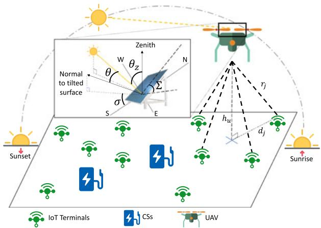  
Fig. 1. System model of a UAV-assisted IoT network considered in this paper.

where $t _ { \mathrm { s r } }$ and $t _ { \mathrm { S S } }$ represent the instants of sunrise and sunset; $\eta$ is the PVC efficiency; $A _ { \mathrm { s o l a r } }$ in the unit of $( \mathrm m ^ { 2 } )$ is the radiation area of the solar panels, and I t; d in $\mathrm { ( W / m ^ { 2 } ) }$ denotes the ð Þsolar radiation power per square meter that reaches the PVC. The solar radiation goes through the atmosphere and reaches the solar panels with attenuation due to atmospheric scattering and atmospheric absorption. Neglecting the non-significant diffuse radiation and reflected radiation components, the solar radiation power per square meter absorbed by the PVC, $I ( t , d )$ can be described in terms of the clear-sky beam radia-ðtion $I _ { \mathrm { c b } } ( t , d )$ as follows [33], [34]:

$$
I ( t , d ) = I _ { \mathrm { c b } } ( t , d ) = I _ { \mathrm { o n } } ( d ) \tau _ { \mathrm { b } } ( \theta ) \cos { \theta } ,\tag{2}
$$

where $I _ { \mathrm { o n } } ( d )$ represents the extraterrestrial radiation; $\tau _ { b } ( \boldsymbol { \theta } )$ ð Þ ð Þrepresents the atmospheric transmittance for beam radiation, and u is the angle of incidence between the direct solar beam and the normal to the surface of the solar panel. To model the extraterrestrial radiation, Duffie and Beckman give a simple formula of $I _ { \mathrm { o n } } ( d )$ with an adequate accuracy for most engineering calculations [34]

$$
I _ { \mathrm { o n } } ( d ) = I _ { \mathrm { S C } } \bigg ( 1 + 0 . 0 3 3 ~ \cos \bigg ( \frac { 2 \pi d } { 3 6 5 } \bigg ) \bigg ) ,\tag{3}
$$

where the solar constant $I _ { \mathrm { S C } }$ is the energy from the sun per unit time, which is received on a unit area of surface perpendicular to the propagation direction of the radiation at mean earth-sun distance outside the atmosphere. Equation relating the angle of incidence, $\cdot \theta ,$ to the other angles is given as

$$
\begin{array} { r } { \cos \theta = \sin \delta \sin \phi \cos \Sigma - \sin \delta \cos \phi \sin \Sigma \cos \sigma } \\ { + \cos \delta \cos \phi \cos \Sigma \cos \omega + \cos \delta \sin \phi \sin \Sigma \cos \sigma \cos \omega } \\ { + \cos \delta \sin \Sigma \sin \sigma \sin \omega , } \end{array}\tag{4}
$$

where f, $\delta , \Sigma , \sigma ,$ and v are the latitude of the UAV, the declination of the sun, the slope of the solar panel, the surface azimuth angle, and the hour angle, respectively.

To keep balance against turbulent flows, the solar cells are usually made as a horizontal surface implemented on the wings of a UAV. Consequently, the angle of incidence $\theta$ is simplified as the zenith angle of the sun $\theta _ { z } ,$ , which is given by

(5)

The solar declination d and the hour angle v are temporal variables, the value of which can be obtained from the approximates given as follows [35]:

$$
\delta ( d ) = 2 3 . 4 5 \sin { \left( 2 \pi \frac { 2 8 4 + d } { 3 6 5 } \right) } ,
$$

and

(6)

$$
\omega ( t ) = \frac { \pi } { 1 2 } ( 1 2 - t ) .\tag{7}
$$

In terms of the atmospheric transmittance, Hottel in [36] provides a black-plus-gray-plus-clear gas model which is feasible to provide an accurate estimate

$$
\tau _ { \mathrm { b } } ( \theta _ { z } ) = a _ { 0 } + a _ { 1 } e ^ { ( - \frac { k } { \cos \theta _ { \mathrm { z } } } ) } ,\tag{8}
$$

where parameters $a _ { 0 } , ~ a _ { 1 } ,$ and k are affected by the atmosphere visibility and the altitude of the observation. For the standard atmosphere with 23 km visibility and the altitudes of the UAV $h _ { u }$ less than 2.5 km, these three parameters can be well approximated by the following quadratics:

$$
\left\{ \begin{array} { l l } { a _ { 0 } = 0 . 4 2 3 7 - 0 . 0 0 8 2 1 ( 6 - h _ { u } ) ^ { 2 } } \\ { a _ { 1 } = 0 . 5 0 5 5 + 0 . 0 0 5 9 5 ( 6 . 5 - h _ { u } ) ^ { 2 } . } \\ { k = 0 . 2 7 1 1 + 0 . 0 1 8 5 8 ( 2 . 5 - h _ { u } ) ^ { 2 } } \end{array} \right.\tag{9}
$$

## 2.3 Energy Consumption Models

The power consumption mainly occurs in two phases: the moving and serving phases. We assume that the UAV is in a quasi-static equilibrium condition in both phases, which means that the UAV moves smoothly with a small acceleration, and the cruising speed is a constant [37], [38].

For 3D Cartesian coordinates, the moving process involves a horizontal flight and a vertical flight. We define $\boldsymbol { v } = ( v _ { x } , v _ { y } , v _ { z } )$ as the velocity of the UAV and focus on the ¼ ð Þenergy consumption due to the moving of the UAV while neglecting the energy consumption caused by the internal electronics of the UAV. Seddon and Newman in [39] provide the aerodynamic power consumption module to capture the power consumption for this case, which is adopted herein. Specifically, the energy consumption for moving at a given velocity is given by

$$
P _ { \mathrm { m o v } } = F _ { \mathrm { t h } } ( v _ { i } + v _ { z } ) ,\tag{10}
$$

where $F _ { t h }$ is the propeller thrust of the UAV which can be approximated to the weight of the UAV, i.e., $F _ { \mathrm { t h } } = m _ { u } g ,$ where $m _ { u }$ denotes the mass of the UAV, and $g$ ¼is the gravitational acceleration; $v _ { i }$ is the induced speed denoted as [39]

$$
v _ { i } = \frac { F _ { \mathrm { t h } } } { \sqrt { 2 } \rho A } \frac { 1 } { \sqrt { \left| v _ { x } , v _ { y } \right| ^ { 2 } + \sqrt { \left| v _ { x } , v _ { y } \right| ^ { 4 } + \left( \frac { F _ { \mathrm { t h } } } { \rho A } \right) ^ { 2 } } } } ,\tag{11}
$$

where $\rho$ is the air density and $A = \pi r _ { v } ^ { 2 } n _ { p }$ is the total area of ¼the propellers which is determined by the propeller radius $r _ { p }$ and the number of propellers $n _ { p } .$ . For the ascending flight, $v _ { z }$ is positive; while in the descending case, a negative $v _ { z }$ implies power harvesting for UAV boarded with a July 05,2026 at 12:38:43 UTC from IEEE Xplore. Restrictions apply.

gravitational potential energy collecting system [33]. Even though the gravitational potential energy cannot be utilized by typical UAVs, the power consumed during the descending process can be set to zero if the power consumption for braking is neglected. The ascending flight and the descending flight mainly occur in the scenarios that the UAV moves from a CS to a SP, and vice versa. The other scenario refers to that the UAV moves horizontally from one $\mathrm { S P }$ to the other, where the value of vertical speed $v _ { z }$ equals zero. Accordingly, the energy consumption for horizontal moving can be simplified as

$$
P _ { \mathrm { h o r } } = F _ { \mathrm { t h } } v _ { i } .\tag{12}
$$

More specifically, when the UAV is hovering and serving, the values of speed $v _ { x }$ and $v _ { y }$ equal zero as well. Therefore, the power consumed for hovering can be simplified from (11) to be

$$
\begin{array} { r l } { P _ { \mathrm { h o v } } = } & { { } F _ { \mathrm { t h } } \frac { F _ { \mathrm { t h } } } { \sqrt { 2 } \rho A } \frac { 1 } { \sqrt { \frac { F _ { \mathrm { t h } } } { \rho A } } } = \sqrt { \frac { F _ { \mathrm { t h } } ^ { 3 } } { 2 \rho A } } . } \end{array}\tag{13}
$$

Eqs. (10), (11), (12), and (13) evince that the most energy is consumed by the climbing flight, as this is in line with the fact that more energy is required for hovering than horizontal flight. Consequently, the agent may not tend to the CSs since it consumes more energy due to the altitude intercept between the target SPs and the CSs. However, a good trajectory design strategy should avoid energy depletion to achieve a far-sighted reward for a sequential optimization problem. As a direct result, the intelligent algorithms should thereby fully consider the trade-off between the communication performance, the total energy consumption, and the battery outage probability.

Following the above descriptions, the total power consumption in the serving mode is mainly counted by those for hovering and data transmission, which can be written as

$$
P _ { \mathrm { s e r } } = P _ { \mathrm { h o v } } + P _ { \mathrm { t x } } ,\tag{14}
$$

where $P _ { \mathrm { t x } }$ represents the total power consumption for data transmission. For simplicity, we assume that $P _ { \mathrm { t x } }$ is the sum of the transmission power allocated to all IoT terminals, denoted as $P _ { \mathrm { t x } } ^ { j } ,$ , and thereby have

$$
P _ { \mathrm { t x } } = \sum _ { i = 1 } ^ { I } s _ { j } P _ { \mathrm { t x } } ^ { j } ,\tag{15}
$$

where $s _ { j } \in \{ 0 , 1 \}$ is a binary indicator function depending on 2 f gwhether the wireless link connecting to the $j ^ { \mathrm { t h } }$ IoT terminal has been established or not. The link is set up only if the $j ^ { \mathrm { t h } }$ IoT terminal is active and the QoS of the channel meets the baseline. Indeed, the communication energy consumption is lower than the propulsion energy consumption. For simplicity, it is feasible to neglect the communication energy consumption in less-dense IoT networks. However, the energy consumption model and the associated optimization are more accurate and close to real-world scenarios when taking the communication energy consumption into consideration. Furthermore, the communication energy consumption might be comparable to the propulsion energy consumption in dense IoT networks. Therefore, we jointly consider these two kinds of energy consumption mechanisms in this paper for comprehensiveness.

## 2.4 Channel Model

To model air-to-ground channel between the hovering UAV and IoT terminals, we take both line-of-sight (LoS) and nonline-of-sight (NLoS) radio propagation paths into account. Based on the empirical data, the International Telecommunication Union (ITU) determines a precise method to find the probability of geometrical LoS between a terrestrial transmitter with height $h _ { \mathrm { T X } }$ and a receiver at altitude $h _ { R X }$ [40]. This probability depends on the following statistical and environmental parameters: 1) a represents the ratio of built-up land area to the total land area; 2) $\beta$ represents the average number of buildings per unit area, $\mathrm { i . e . , }$ [buildings/km2]; and 3) $\gamma$ is a scale parameter to describe the buildings’ heights distribution as per Rayleigh probability density function, $\begin{array} { r } { \mathrm { i . e . , } f ( H ) = } \end{array}$ $( H \mathbf { \dot { / } } \gamma ^ { 2 } ) \mathrm { e x p \ } \mathbf { \bar { ( } } - H ^ { 2 } / \dot { 2 } \gamma ^ { 2 } )$ ð Þ ¼, where H [m] is the average building ð Þ ð Þheight. Accordingly, the LoS probability is given by [40]

$$
\mathbf { P } ( \mathrm { L o S } ) = \prod _ { n = 0 } ^ { m } \left[ 1 - \exp { \left( - \frac { \left[ h _ { \mathrm { T } X } - \frac { \left( n + \frac { 1 } { 2 } \right) \left( h _ { \mathrm { T } X } - h _ { \mathrm { R } X } \right) } { m + 1 } \right] ^ { 2 } } { 2 \gamma ^ { 2 } } \right) } \right] ,\tag{16}
$$

where $m = \lfloor ( r { \sqrt { \alpha \beta } } - 1 \rfloor ; r$ is the Euclidian distance between ¼ bð  cthe transceivers; n is merely a product index. The model in (16) can be further simplified by the approximation of a simple modified Sigmoid function (S-curve) as follows [41]:

$$
\wp _ { \mathrm { L o S } } ^ { j } = { \frac { 1 } { 1 + \epsilon e ^ { - \beta \left( \operatorname { a r c c o t } ( { \frac { d _ { j } } { r _ { j } } } ) - \epsilon \right) } } } ~ ,\tag{17}
$$

where $d _ { j }$ and $r _ { j }$ denote the horizontal distance and the spatial distance between the hovering UAV and the $j ^ { \mathrm { t h } }$ IoT terminal, respectively; - and $\beta$ are the S-curve parameters depending on the chosen environment, e.g., urban, suburban, and dense urban. The signal propagating from the UAV first goes through the free space and then the urban environment. Therefore, the overall path loss is dominated by two parts: the free-space path loss (FSPL) $\mathrm { P L } _ { \mathrm { F S P L } }$ and the excessive path loss $\mathrm { P L } _ { \mathrm { u r b a n } }$ . Based on the models proposed in [41] and [42], the path loss of the link connecting the UAV and the $j ^ { \mathrm { t h } }$ IoT terminal can be written as

$$
\begin{array} { r l } & { \mathrm { P L } _ { j } = \mathrm { P L } _ { \mathrm { F S P L } } + \mathrm { P L } _ { \mathrm { u r b a n } } } \\ & { \quad \quad = 2 0 \mathrm { l o g } \left( \displaystyle \frac { 4 \pi f _ { \mathrm { c } } r _ { j } } { c } \right) + \mathrm { \it g } _ { \mathrm { L o S } } ^ { j } \xi _ { \mathrm { L o S } } + ( 1 - \mathrm { \it g } _ { \mathrm { L o S } } ^ { j } ) \xi _ { \mathrm { N L o S } } , } \end{array}\tag{18}
$$

where $\xi _ { \mathrm { L o S } }$ and $\xi _ { \mathrm { N L o S } }$ represent the additional path loss corresponding to the LoS and NLoS transmission, respectively. The values of $\xi _ { \mathrm { L o S } }$ and $\xi _ { \mathrm { N L o S } }$ vary depending on the chosen environment; c and $f _ { \mathrm { c } }$ are the speed of light and the carrier frequency.

We assume that the IoT terminals are assigned with orthogonal channels, and the co-channel interference becomes negligible, since the existing techniques such as cell planning, frequency reuse, and beam-forming are capable of significantly mitigating the interference [43]. Therefore, the SNR of the link between the UAV and the $j ^ { \mathrm { t h } }$ IoT terminal can be expressed as

$$
\Gamma _ { j } = \frac { P _ { \mathrm { t x } } ^ { j } 1 0 ^ { - P L _ { j } / 1 0 } } { N _ { 0 } B _ { j } } ,\tag{19}
$$

where $N _ { 0 }$ denotes the noise power density, and $B _ { j }$ is the bandwidth assigned to the $j ^ { \mathrm { t h } }$ BIoT terminal. The bandwidth is uniformly allocated for simplification purposes. To satisfy the dynamic QoS requirements and achieve energy-efficient communications, the serving process should be well managed. Ideally, a communication link should be set up if and only if the SNR of the corresponding channel is above a predefined threshold $\Gamma _ { \mathrm { t h } }$

According to Shannon capacity bound, the instantaneous data rate associated by the UAV-assisted channel is given by

$$
C _ { j } = B _ { j } \mathrm { l o g } _ { 2 } ( 1 + \Gamma _ { j } ) ,\tag{20}
$$

in bits per second (bps).

## 2.5 Fairness Model

Applying the conventional greedy searching, the UAV tends to serve the region producing the maximum data transmission in each epoch. Albeit with a highest throughput, this strategy results in the service unfairness among users because some users in certain regions are served for many times, while others have never been served at all. To mitigate this problem and jointly consider efficiency and fairness, we integrate the recorder to explicate the serve status of each serving region and evaluate the serving fairness by Jain’s fairness index defined as [44]

$$
f [ n ] = { \frac { ( \sum _ { j = 1 } ^ { J } O _ { j } [ n ] ) ^ { 2 } } { J \sum _ { j = 1 } ^ { J } O _ { j } [ n ] ^ { 2 } } } ,\tag{21}
$$

where $O _ { j } [ n ]$ represents the times the $j ^ { \mathrm { t h } }$ IoT terminal has ½ been served until time slot $n ,$ which can be explicitly written as $\begin{array} { r } { O _ { j } [ n ] = \sum _ { k = 1 } ^ { n - 1 } s _ { j } [ k ] } \end{array}$ . Ideally, the value of the fairness index ½  ¼ ¼ ½ equals unity when all IoT terminals are served equally.

## 3 PROBLEM STATEMENT, FORMULATION, AND SOLUTION

## 3.1 Problem Statement: A Multi-Objective Trajectory Design

We formulate the sequential trajectory design as a Markov decision process (MDP), where the transfer probability is independent of the past states, given the present state. The MDP is defined by a tuple $< \bar { S } , A , R > _ { . }$ , where S is the state space; A is the action space; $R \gets s \times a$ is a real-value reward function, and the UAV takes an action $a \in A$ at state $s \in S .$ The action space $A \triangleq \{ L _ { m } , L _ { h } \}$ 2contains the potential 2locations of the $\mathrm { U } \bar { \mathrm { A V } } ,$ fwhere $a [ n ] = ( x _ { a } [ n ] , y _ { a } [ n ] , \ \hat { z _ { a } } [ n ] ) \in A$ ½  ¼ ð ½  ½  ½ Þ 2provides the coordinate of the destination, to which the UAV is moving. Thus, the cardinality of the action space is $( M + H )$ . The state space $S \triangleq L _ { u } \times \mathbf { \dot { B } } \times t$ consists of three ð þ Þ  components: 1) the location state space; 2) the time state space; 3) the battery state space.

The location state space in our system is defined as $L _ { u } \triangleq \{ L _ { m } , L _ { h } \}$ , with the same representation as the action f gspace, where $\ell _ { u } [ n ] = ( x _ { u } [ n ] , y _ { u } [ n ] , z _ { u } [ n ] ) \in L _ { u }$ describes the ½  ¼ ð ½  ½  ½ Þ 2coordinate of the UAV at time slot n. Specifically, action a determines the location of the UAV for the next time slot by the relation

$$
\ell _ { u } [ n + 1 ] = \ell _ { u } [ n ] + T _ { \ell _ { u } [ n ] , a [ n ] , \ell _ { u } [ n + 1 ] } ( { \pmb a } [ n ] - \ell _ { u } [ n + 1 ] ) ,\tag{22}
$$

where $\mathcal { T } _ { \ell _ { u } [ n ] , { \pmb a } [ n ] , \ell _ { u } [ n + 1 ] }$ denotes the transferring possibility ½  ½  ½ þfrom the origination ${ \dot { \ell } _ { u } } [ n ]$ to the destination $\ell _ { u } [ n + 1 ]$ under the operation $a [ n ] ,$ ½  ½ þ , which can be explicitly expressed as

$$
\begin{array} { r } { \mathcal { T } _ { \ell _ { u } [ n ] , a [ n ] , \ell _ { u } [ n + 1 ] } = \left\{ \begin{array} { l l } { 1 } & { \| a [ n ] - \ell _ { u } [ n ] \| _ { 2 } \leq \operatorname* { v m a x } T } \\ { 0 } & { \| a [ n ] - \ell _ { u } [ n ] \| _ { 2 } > \operatorname* { v m a x } T } \end{array} , \right. } \end{array}\tag{23}
$$

where $\lVert a [ n ] - \ell _ { u } [ n + 1 ] \rVert _ { 2 }$ represents the euclidean distance k k½   ½ þ between the destination and the origination; $v _ { \mathrm { m a x } }$ is the UAV’s maximum speed that is normally constrained by the hardware specifications as well as the aviation and security policies.

The time consumed by UAV moving from the current location at time slot n to the destination of next time slot $n +$ 1 is derived by

$$
t _ { \mathrm { m o v } } [ n ] = \frac { \| \ell [ n + 1 ] - \ell [ n ] \| _ { 2 } } { | v | } .\tag{24}
$$

As a spatial-temporal module, the time set t is adapted as part of the state space, which can provide another degree of freedom to enhance the system performance under the DRX mode for IoT networks equipped with time-based energy harvesting modules. The time instant $t [ n ] \in t$ is the starting time of time slot $n .$ ½  2Specifically, we assume that the harvested solar power $P _ { \mathrm { h a r } } ( t [ n ] , d )$ does not change in decision ð ½  Þepoch n and the operational indicator $a _ { j } [ n ]$ equals one if the $j ^ { \mathrm { { \hat { t h } } } }$ ½ IoT terminal is active. Obviously, the starting time of the $n + 1$ decision epoch is determined by

$$
t [ n + 1 ] = t [ n ] + T .\tag{25}
$$

The last component of the state space is the battery state space B, which signifies the battery condition of the UAV, where $B [ n ] \in B$ represents the residual energy level of the ½  2UAV at decision epoch n. The UAV simultaneously harvests and consumes energy while moving over time duration $t _ { \mathrm { m o v } }$ . If the UAV needs to go for charging, then it gets the energy supplement from the CSs over time duration $\bar { T } -$ tmov, which is the left time duration in the time slot after moving. On the other hand, if the UAV is required to serve at a SP, energy is consumed due to hovering and transmission over time duration $T - t _ { \mathrm { m o v } }$ . Overall, the battery state at the $( n + 1 ) ^ { \mathrm { t h } }$ decision epoch can be updated as

$$
\begin{array} { r l } & { B [ n + 1 ] = \operatorname* { m a x } \{ B _ { \mathrm { m a x } } , \left[ t _ { \mathrm { m o v } } [ n ] \big ( P _ { \mathrm { h a r } } ( t [ n ] , d ) - P _ { \mathrm { m o v } } [ n ] \big ) + \right. } \\ & { \left. ( T - t _ { \mathrm { m o v } } [ n ] ) \big ( P _ { \mathrm { c h a r } } [ n ] s _ { \mathrm { c h a r } } [ n ] - P _ { \mathrm { s e r } } [ n ] s _ { \mathrm { s e r } } [ n ] \big ) + B [ n ] \right] ^ { + } \} , } \end{array}\tag{26}
$$

where $B _ { \mathrm { m a x } }$ represents the battery capacity of the $\mathrm { U A V } ;$ $[ x ] ^ { + } \triangleq \operatorname* { m a x } ( 0 , x ) ; \ P _ { \mathrm { c h a r } } [ n ]$ represents the charging rate at ½  ð Þ ½ decision epoch n; parameters $s _ { \mathrm { c h a r } }$ and $s _ { \mathrm { S e r } }$ are the indicators demonstrating the status of the $\mathrm { U A V } ^ { \prime } \mathbf { s }$ destination, which are given by

$$
s _ { \mathrm { s e r } } [ n ] = \left\{ \begin{array} { l l } { 1 } & { \mathbf { \Delta } a [ n ] \in L _ { h } } \\ { 0 } & { \mathbf { \Delta } a [ n ] \in L _ { m } } \end{array} \right. ,\tag{27}
$$

and

$$
s _ { \mathrm { c h a r } } [ n ] = \left\{ \begin{array} { l l } { 1 } & { \pmb { a } [ n ] \in L _ { m } } \\ { 0 } & { \pmb { a } [ n ] \in L _ { h } } \end{array} \right. .\tag{28}
$$

With the statements above, the total amount of data transmission $C$ and the net harvested energy E are given respectively by

$$
C = \sum _ { n = 1 } ^ { N } \sum _ { i = 1 } ^ { I } s _ { j } [ n ] C _ { j } [ n ] ( T - t _ { \mathrm { m o v } } [ n ] ) s _ { \mathrm { s e r } } [ n ] ,\tag{29}
$$

and

$$
\begin{array} { r l } {  { E = \sum _ { n = 1 } ^ { N } \{ ( P _ { \mathrm { h a r } } [ n ] - P _ { \mathrm { m o v } } [ n ] ) t _ { \mathrm { m o v } } [ n ] , } } \\ & { + \ ( P _ { \mathrm { h a r } } [ n ] - P _ { \mathrm { s e r } } [ n ] ) ( T - t _ { \mathrm { m o v } } ) [ n ] s _ { \mathrm { s e r } } [ n ] \} . } \end{array}\tag{30}
$$

As we mentioned above, the objective of most UAVassisted IoT networks is to navigate the UAV in a wise way to achieve long-term serving with the optimized data transmission rate, net harvested energy, and system-level fairness. This objective can be realized by designing the trajectory policy of the UAV with a series of constraints. In this paper, we propose such an optimized trajectory policy $\pi ( \{ a [ n ] \} )$ by solving the following optimization problem

$$
\begin{array} { r l } & { \quad \quad \underset { \mathrm { H ( B u r e ) } } { \mathrm { m a x } } \{ C , E , f [ N ] \} , } \\ & { : \quad \mathrm { C l u e l y } \quad ( f ( \mathrm { H a r e } [ m ] ) ^ { - 1 } P _ { \mathrm { H O V } } [ [ \bigg ] ) t _ { \mathrm { H O V } } [ \mathrm { H } ] ) \in ( 0 , B _ { \mathrm { m a x } } ) , } \\ & { \quad \mathrm { C l } : \quad B [ [ M ] + ( F \Vert _ { \mathrm { H a r e } } [ m ] - P _ { \mathrm { H O V } } [ [ \bigg ] t _ { \mathrm { H O V } } [ \mathrm { H } ] ] ) ] } \\ & { \quad - [ P _ { \mathrm { H O V } } [ t _ { \mathrm { H F } } ^ { 3 } [ [ \mathcal { D } ] - [ \begin{array} { l } { \mathrm { H } } { \mathrm { O } } \\ { \mathrm { D } } \end{array} ] ] ^ { - 1 } ] } \\ { \quad \mathrm { C l u e l y } \quad \mathrm { H } [ - [ P _ { \mathrm { H O V } } [ [ \bigg ] ] ] ] \mathrm { H } \mathrm { O } [ \mathrm { H } ] } \\ { \quad \mathrm { H } [ \mathrm { H } ] + ( P _ { \mathrm { H a r e } } [ m ] - P _ { \mathrm { H O V } } [ [ \mathrm { H } ] ] ) \mathrm { H } \mathrm { O } [ \mathrm { H } ] } \\ { \quad \mathrm { H } ^ { - 1 } \ \mathrm { H e l u e l y } [ t _ { \mathrm { H a r e } } [ \mathrm { H } ] ] \  \ \mathrm { H } \mathrm { O } [ \mathrm { H } ] \mathrm { O } [ \mathrm { H } ] } \\ { \quad \mathrm { C l u e l y } \quad \mathrm { H } ^ { - 1 } \ \mathrm { H e l u e l y } [ \mathrm { H } ] \times [ \mathrm { H } \mathrm { O } ] , } \\  \quad \mathrm { C l } : \ \hbar \mathrm { e x } [ \mathrm { H } ] + \delta _  \mathrm  H \end{array}\tag{31}
$$

where C1 prohibits the battery level of the moving UAV to overflow the battery capability which is defined as $B _ { \mathrm { m a x } }$ and meanwhile it should be noted that the energy consumption for moving should not render battery exhaust of the UAV; C2 confines the same energy boundary for the UAV which takes the action, navigates to ${ \mathrm { S P s } } ,$ and serves for the remaining time duration in one time slot after moving; C3 guarantees that the UAV will not be over-recharged while docking at the CSs for the left time duration in one time slot after moving; C4 specifies the sum of the time assigned to each state equals the duration of one time slot $T ;$ C5 requires the UAV to choose only one action that can be either serving or recharging in one time slot; C6 ensures that the UAV serves for only active IoT terminals, and the parameter $a _ { j } [ n ]$ is a binary indicator signifying whether the $\hat { j } ^ { \mathrm { t h } }$ ½ IoT terminal is active or not; C7 guarantees the QoS for the IoT network, i.e., the SNR of the link between the UAV and the $j ^ { \mathrm { t h } }$ IoT terminal $\Gamma _ { j } [ n ]$ should be above the SNR threshold $\Gamma _ { \mathrm { t h } } ;$ finally, ½ C8 specifies that a potential destination should be located within the reachable region over the entire time duration T .

## 3.2 Reward Function Design

To solve the multi-objective optimization problem described in (31), simultaneously considering the constraints from C1 to C8, we propose an RL approach with a comprehensive reward function design. In particular, $R _ { s [ n ] , a [ n ] , s [ n + 1 ] }$ expresses ½  ½  ½the immediate reward obtained when action ${ \dot { a [ n ] } } \in A$ is taken at state $s [ n ] \in S$ and leads the UAV to state $s [ n + 1 ] \in$ ½  2 ½ þ  2S. The system returns a unique reward in each time slot, and, therefore, we can simplify the reward as $R [ n ]$ in the following analysis of this paper.

The overall design goal of the reward function is to jointly optimize the transmission rate and the energy consumption, i.e., bit per Joule, which should also consider two key practical concerns: 1) Fairness: The transmission rate should be weighted with a fairness index to strike the right balance between service delivered to the entire IoT network. This concern is raised to avoid the case that the UAV may tend to serve a small subset of IoT nodes with better channel conditions, which causes the quality of experience degradation for other IoT nodes. 2) Energy Depletion: In order to avoid UAV clashes and resulting permanent service interruptions, energy depletion states should be penalized severely. In light of the above discussions, the reward function can be formulated as follows

$$
R [ n ] = w _ { 1 } \frac { s _ { \mathrm { s e r } } [ n ] \sum _ { j = 1 } ^ { J } s _ { j } [ n ] C _ { j } [ n ] t _ { \mathrm { s e r } } [ n ] f [ n ] } { E _ { \mathrm { m o v } } [ n ] + E _ { \mathrm { s e r } } [ n ] - E _ { \mathrm { h a r } } [ n ] } + w _ { 2 } s _ { \mathrm { d e p } } [ n ] .\tag{32}
$$

The reward function is constructed by two components with the weights of $w _ { 1 } > 0$ and $w _ { 2 } < 0 .$ The first component is positive and donates the energy efficiency of data transmission in the unit of $\mathrm { { b i t } / ( W \cdot h ) }$ multiplied by Jain’s ð  Þfairness index. The denominator is the total net energy consumption consisting of three parts: The energy consumption for moving $E _ { \mathrm { m o v } } ,$ , the energy consumption for serving $E _ { \mathrm { s e r } } ,$ and the energy harvested from the renewable energy resource $E _ { \mathrm { h a r } } .$ . These three energy components can be calculated by the expressions given as follows:

$$
E _ { \mathrm { m o v } } [ n ] = P _ { \mathrm { m o v } } [ n ] t _ { \mathrm { m o v } } [ n ] ,\tag{33}
$$

$$
E _ { \mathrm { s e r } } [ n ] = P _ { \mathrm { s e r } } [ n ] t _ { \mathrm { s e r } } [ n ] s _ { \mathrm { s e r } } [ n ] ,\tag{34}
$$

and

$$
E _ { \mathrm { h a r } } [ n ] = P _ { \mathrm { h a r } } [ n ] t _ { \mathrm { m o v } } [ n ] + P _ { \mathrm { h a r } } [ n ] t _ { \mathrm { s e r } } [ n ] s _ { \mathrm { s e r } } [ n ] .\tag{35}
$$

The negative component represents the penalty of battery depletion. The binary constant $s _ { \mathrm { d e p } } [ n ]$ indicates the penalty ½ applied to the agent in the state where the battery level is below the threshold $B _ { \mathrm { d e n } } , \mathrm { i . e . }$

$$
s _ { \mathrm { d e p } } [ n ] \left\{ \begin{array} { l l } { 1 } & { B [ n ] \le B _ { \mathrm { d e p } } } \\ { 0 } & { B [ n ] > B _ { \mathrm { d e p } } } \end{array} \right. .\tag{36}
$$

Power outage leads to the termination of one episode and is catastrophic to the UAV. Therefore, the weight of the power outage penalty should be set much heavier than the weight of the fairness index decorated energy efficiency of data transmission, resulting in $| w _ { 1 } | \ll | w _ { 2 } |$

## 4 OFF-POLICY AND ON-POLICY REINFORCEMENT LEARNING BASED TRAJECTORY OPTIMIZATION

Algorithm 1. Action-Confined Off-Policy RL   
Input: Agent information: starting time t 0 and initial loca  
tion $l _ { u } [ 0 ] ;$   
½ System information: --greedy parameter $\epsilon _ { g \prime }$   
discounted factor $\gamma ,$ and learning rate $\Upsilon ;$   
Output: Trajectory strategy $\pi ( \{ a [ n ] \} ) ;$   
1: repeat   
2: Initialize the state s 0 , Q-value $Q [ 0 ] ,$ and $n = 0 ;$   
3: for n $< N$ do   
4: Confine the action space ${ \mathbf { } } a _ { \mathrm { a v a i } } [ n ]$ based on C8;   
5: Select action a n from ${ \pmb a } _ { \mathrm { a v a i } } [ n ]$ ½ using the --greedy policy;   
6: ½  ½ Obtain the reward R n and observation ${ \bar { \boldsymbol { b } } } [ n ] ;$   
7: Update state $s [ n + 1 ] \stackrel { \cdot } {  } b [ n ] ;$   
8: Update $Q [ n ]$ ½ þ  ½ based on causal knowledge:   
9: ${ \hat { Q } } [ n ] \longleftarrow Q [ n ] \cdot$ and $\Upsilon ( R [ n ] + \gamma \mathrm { m a x } _ { a } Q [ n + 1 ] - Q [ n ] ) ;$   
10: if $B [ n ] < B _ { \mathrm { d e p } }$ ðthen   
11: ½ End the episode and back to Line $2 ;$   
12: end   
13: $n = n + 1 ;$   
14: end   
15: until convergence is reached;

The optimization problem formulated in (31) is a multiobjective optimization problem that is generally hard to solve, especially with several non-convex constraints. Additionally, the highly dynamic and spatio-temporal distribution of the network topology increases the complexity of solving the problem. Hence, we resort to RL to jointly optimize the energy efficiency, the data transmission, and the fairness of the coverage. Meanwhile, the proposed approach should guarantee the QoS for the IoT network. In particular, two approaches relying on off-policy and on-policy RL are proposed in the following subsections for trajectory design of the UAV.

## 4.1 Off-Policy Reinforcement Learning for Trajectory Design

With the awareness of causal knowledge and the off-line training data, the off-policy Q-learning can be applied as a model-free approach to help design the UAV trajectory. The algorithm is given as Algorithm 1. We first randomly initialize the UAV’s state and the Q-value with a two-dimension zero matrix and set the time slot counter n to zero. Then, the action space is confined as $\pmb { a } _ { \mathrm { a v a i } }$ to satisfy C8 in (31) and to reduce the action space for accelerating the convergence process. To find the optimal policy $\pi ( \{ a [ \bar { n } ] \} )$ , the Q-value is introduced to evaluate the long-term effect of the actions at state s in each slot, which is given by

$$
Q _ { \pi } [ n ] ( s [ n ] , a [ n ] ) = E { \Biggl ( } \sum _ { T _ { n } = 1 } ^ { N - n } \gamma ^ { T _ { n } } R [ n + T _ { n } ] { \Biggr | } s [ n ] , a [ n ] , \pi { \Biggr ) } ,\tag{37}
$$

where $T _ { n }$ donates the following sequence of time slots, and $\gamma \in ( 0 , 1 )$ is the discounted factor imposed to reduce the far-2 ð Þsighted impact.

The action of the agent is selected based on the distribution of Q-value. The trade-off between exploration and exploitation is always considered as a key concept for RL methods, since the exploration process may involve shortterm sacrifices but gathering more information for better long-term decisions. In this regard, we implement the --greedy policy described as

$$
a [ n ] = { \left\{ \begin{array} { l l } { \arg \operatorname* { m a x } Q ( s [ n ] , { \boldsymbol { a } } _ { \mathrm { a v a i } } [ n ] ) } & { p [ n ] < \epsilon _ { g } } \\ { \quad a [ n ] } & { p [ n ] > \epsilon _ { g } } \end{array} , \right. }\tag{38}
$$

where $p [ n ]$ is a random variable for the exploration of the agent and can help get rid of local optima. Hyper-parameter $\epsilon _ { g }$ reveals how much the agent explore while training. Specifically, the action ${ \pmb a } [ n ]$ that maximizes the Q-value is ½ selected with a probability of $( 1 - \epsilon _ { g } ) + \epsilon _ { g } / | \{ a _ { \mathrm { a v a i } } [ n ] \} | ,$ , while ð  Þ þ jfother actions are chosen with a probability of $1 - \epsilon _ { g } .$ The variable $| \{ a _ { \mathrm { a v a i } } [ n ] \} |$ denotes the total counts of the available jf ½ gjactions in time slot n.

Taking the advantage of causal knowledge, in each time slot $n ,$ the Q-value can be iteratively updated by taking the action that moves toward the maximum Q-value of the next time slot, i.e.,

$$
\begin{array} { r l } & { \quad Q [ n ] ( s [ n ] , \pmb { a } [ n ] )  Q [ n ] ( s [ n ] , \pmb { a } [ n ] ) + \Upsilon ( R [ n ] } \\ & { \quad \quad + \gamma \mathrm { m a x } _ { \pmb { a } [ n + 1 ] } Q ( s [ n + 1 ] , \pmb { a } [ n + 1 ] ) - Q [ n ] ( s [ n ] , \pmb { a } [ n ] ) ) , } \end{array}\tag{39}
$$

where $\Upsilon \in ( 0 , 1 )$ is the learning rate. The action that moves 2 ð Þtowards the maximum Q-value can be obtained offline and is not necessarily the same as the action carried out by the UAV. We can repeat the aforementioned procedure until the Q-value converges so that an optimized trajectory design is obtained.

## 4.2 On-Policy Reinforcement Learning for Trajectory Design

With the awareness of causal knowledge and capability of computing offline, an off-policy learner is able to estimate the value of an optimal policy, which is independent of the agent’s actions. However, in some practical scenarios, e.g., disaster rescue and remote surveillance, only non-causal knowledge is available [45]. Additionally, it is risky to omit the actions of the agent in some cases where significantly negative rewards are imposed as penalty. In this regard, an alternative way is to utilize an on-policy learner, termed state action reward state action (SARSA). The on-policy learner evaluates the value of the policy which the agent is carrying out. By using the on-policy learner, the Q-value can be updated by the following relation:

$$
\begin{array} { r l r } & { } & { Q [ n ] ( s [ n ] , a [ n ] )  Q [ n ] ( s [ n ] , a [ n ] ) + \Upsilon ( R [ n ] } \\ & { } & { \mathrm { ~ } + \gamma Q ( s [ n + 1 ] , \pmb { a } [ n + 1 ] ) - Q [ n ] ( s [ n ] , \pmb { a } [ n ] ) ) , } \end{array}\tag{40}
$$

where both of the current action ${ \pmb a } [ n ]$ and the action of next step $\pmb { a } [ n + 1 ]$ ½ are selected by using the --greedy method ½ þ described in the off-policy learning process.

## 4.3 Optimality, Complexity, Convergence, and Real-Time Implementation Analysis

The optimization problem presented in (31) is a non-convex mixed-integer non-linear programming problem (MINLP), which is known to be a non-deterministic polynomial-time (NP) hard to solve [46]. In other words, obtaining an optimal solution even for a moderate-size IoT network will yield prohibitive time complexity. Therefore, we will compare proposed solution methodologies with random and greedy benchmarks in the rest of the paper. The proposed on-policy and off-policy schemes are model-free approaches and both implement the --greedy exploration methods. Therefore, the time complexity of the proposed schemes is KH , and the space complexity is $\bar { \mathcal { O } } ( \bar { S A H } )$ , where K is the number of training episodes and H is the number of steps in each episode [47]. The regret is also important while analysis the complexity of RL algorithms. The upper bound regret of the proposed action confined RL schemes is $\Omega ( \operatorname* { m i n } \{ K H , A ^ { H / 2 } \} )$ [48]. Once well trained, the models are installed in the UAV with an embedded system. The time to process the inputs and generate the output actions is negligible, and therefore the execution of the model can be regarded as real-time implementation. Given the proposed update rules, the Q-value converges w.p.1 to the optimal $\mathrm { Q } \mathrm { - }$ value as long as

$$
\sum _ { n } \Upsilon = 0 , \ \mathrm { a n d } \ \sum _ { n } \Upsilon ^ { 2 } < \ \infty .\tag{41}
$$

Since $0 \leq \Upsilon < 1$ in our assumption, (41) requires all state-action pairs to be visited infinitely often, which is satisfied by implementing an --greedy algorithm with a zero-initialled reward in model-free Q-learning algorithms [49].

Algorithm 2. Action-Confined On-Policy Reinforcement   
Learning   
Input: Agent information: starting time t 0 and initial loca  
tion $l _ { u } [ 0 ] ;$   
½ System information: --greedy parameter $\epsilon ,$   
discounted factor $\gamma ,$ and learning rate $\Upsilon ;$   
Output: Trajectory strategy $\pi ( \{ l _ { u } \} ) ;$   
1: repeat   
2: Initialize the state s, Q-value, and $n = 0 ;$   
3: for $n < N$ do   
4: Confine the action space $A [ n ]$ based on C8;   
5: Select action $a _ { \mathrm { a v a i } } [ n ]$ ½from $a _ { \mathrm { a v a i } } [ n ]$ using the --greedy   
policy;   
$6 { : }$ Obtain the reward R n and observation $b [ n ] ;$   
7: Update state $s [ n + 1 ]  b [ n ] ;$   
8: Update $Q [ n ] ( s [ n ] ;$ þ  ½  a n using the --greedy;   
9: if $B [ n ] < B _ { \mathrm { d e p } }$ do   
10: ½ End the episode and back to Line $2 ;$   
11: end   
12: $n = n + 1 ;$   
13: end   
14: until convergence;

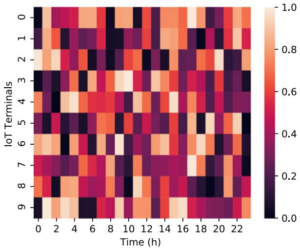  
Fig. 2. Probability of the IoT terminals’ activation.

## 5 NUMERICAL SIMULATIONS AND DISCUSSION

In this section, we first present the training process of offpolicy and on-policy RL schemes in terms of cumulative reward and energy outage ratio. Then, we implement the module obtained from the training process, and various empirical results of the proposed schemes are numerically evaluated. Specifically, we consider an $1 0 0 0 \mathrm { ~ m ~ } \times \mathrm { ~ } 1 0 0 0$ m square as the area of interest in all simulations, where there are two CSs and several IoT terminals. The CSs and the IoT terminals are uniformly located in the area of interest, and the heights of the CSs and the IoT terminals are randomly generated within the ranges from 0 m to 10 m, and from 10 m to 20 m, respectively. The probability of the IoT terminals’ activation is given in Fig. 2. A random variable is generated as the threshold, and at each time slot the threshold is compared to the probability of the IoT terminals’ activation to determine the activation pattern of the IoT terminals. Only active IoTs with an SNR higher than the SNR threshold can be served by the UAV to increase the system throughput.

The influence of variable $\epsilon _ { g }$ is studied through the performance evaluation of the cumulative reward, the energy outage ratio, and the trajectory of the UAV. Finally, we obtain the average data rate and the total energy consumption in terms of various starting times for the system execution. The training and testing processes are developed by Python 3.7 on a workstation utilizing the Linux 3.10 operating system. The main parameters adopted in the simulations are summarized in Table 1. Note that the proposed schemes are model-free and general approaches. Therefore, all the solarpowered rotary-wing UAVs with embedded system can be adopted in the framework, as long as a series of related characteristic parameters listed in Table 2 are given.

## 5.1 Training Process

Unlike the supervised learning that trains and obtains the module with labeled samples, the RL process is executed by updating the estimated value of the state-action pairs until the Q-value converges [52]. We represent the convergence of cumulative reward in each episode regarding both offpolicy and on-policy RL schemes in Fig. 3. From Figs. 3a and 3b, we observe that both off-policy and on-policy schemes converge after being trained for $3 \times 1 0 ^ { 5 }$ episodes. The --greedy scheme with $\epsilon _ { g } = 0$ means that the agent ¼greedily searches for the next action when estimating and updating the current Q-value. In this manner, we obtain a rapidly increasing cumulative reward, which converges much faster than the other schemes at the very beginning of the training process. However, the --greedy scheme with $\epsilon _ { g } = 0$ leads to a predicament of the accumulate reward and ¼keeps it at a relatively low level. The cumulative reward of --greedy scheme with $\epsilon _ { g } = 0$ is only half of the best value ¼obtained by executing the --greedy scheme with $\epsilon _ { g } = 0 . 1$ ¼The reason is that the agent will never explore and often gets stuck at local optima that may lead the UAV to an awful situation on a long-term basis. On the other hand, the --greedy scheme with $\epsilon _ { g } = 1$ is equivalent to randomly selecting the next action when estimating and updating the current Q-value. In this case, the agent obtains enormous penalty, and the UAV frequently falls into the battery outage situation that causes severe reliability problems to the IoT network.

TABLE 2 Summary of Simulation Parameters
<table><tr><td>Parameter</td><td>Value</td></tr><tr><td>Weight of the UAV  $( m _ { u } g )$ </td><td>40N</td></tr><tr><td>Total area of rotor disks  $( \pi r _ { p } ^ { 2 } n _ { p } )$ </td><td> $0 . 1 8 \mathrm { m ^ { 2 } }$ </td></tr><tr><td>Density of air (ρ)</td><td>1.225  $\mathrm { k g / m ^ { 3 } }$ </td></tr><tr><td>Speed of the UAV (v)</td><td>10 km/h</td></tr><tr><td>Poer consumption for data transmission  $( P _ { \mathrm { t x } } ^ { j } )$ </td><td>0.1 W</td></tr><tr><td>S-curve parameters  $( \epsilon , \beta )$ </td><td>9.6, 0.16</td></tr><tr><td>Path loss for LoS transmission  $( \xi _ { \mathrm { L o S } } )$ </td><td>1 dB [50]</td></tr><tr><td>Path loss for NLoS transmission  $( \xi _ { \mathrm { N L o S } } )$ </td><td>20 dB [50]</td></tr><tr><td>Noise power density (N0)</td><td>-174 dbm/Hz</td></tr><tr><td>Total bandwidth (B)</td><td>10 MHz</td></tr><tr><td>Solar constant  $( I _ { \mathrm { S C } } )$ </td><td> $1 3 6 7 \mathrm { W / m ^ { 2 } }$  [51]</td></tr><tr><td>Learning rate (Y)</td><td>0.1</td></tr><tr><td>Discounting factor  $( \gamma )$ </td><td>0.9</td></tr><tr><td>Weight parameters  $( w _ { 1 } , w _ { 2 } )$ </td><td>1,-100</td></tr></table>

For both off-policy and on-policy schemes, the agent achieves the best performance when $\epsilon _ { g } = 0 . 1$ , because it ¼strikes a balance between exploration and exploitation in RL. When $\epsilon _ { g } = 0 . 0 1$ , the agent conducting the on-policy ¼scheme achieves approximately 80 percent of the maximum cumulative reward after being trained for 45,000 episodes, while the agent relying on the off-policy scheme is able to achieve the same level of the cumulative reward in a much faster manner. This is because the agent using the off-policy scheme learns from the causal knowledge and asynchronously updates the Q-value and the executed action.

Figs. 4a and 4b shows the energy outage ratio $R _ { \mathrm { o u } } ,$ which is defined by

$$
R _ { \mathrm { o u } } = { \frac { \mathrm { c o u n t s ~ o f ~ e n e r g y ~ o u t a g e ~ e p i s o d e s } } { \mathrm { c o u n t s ~ o f ~ t o t a l ~ e p i s o d e s } } } .\tag{42}
$$

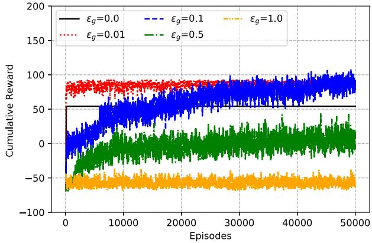

(a) Cumulative reward as a function of episodes with the off-policy scheme.  
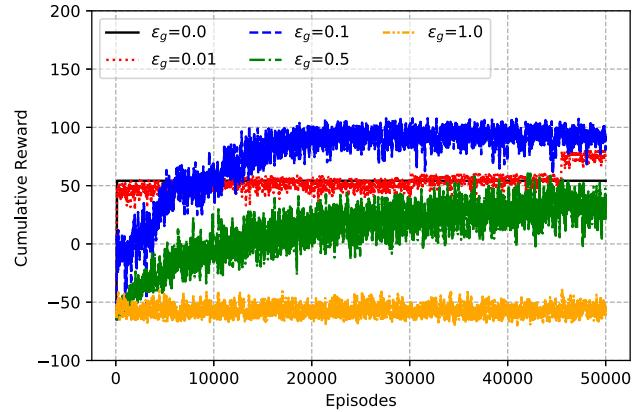  
(b) Cumulative reward as a function of episodes with the on-policy scheme.  
Fig. 3. Convergence of training process using different $\epsilon _ { g } .$

As depicted in Fig. 4, the UAV efficiently learns to avoid energy outage by deploying the proposed strategies. Compared with its off-policy counterpart, the on-policy scheme leads to a lower energy outage ratio and faster descent, since the on-policy scheme is more cautious about updating the Q-value.

## 5.2 Numerical Results

After being trained with both off-policy and on-policy schemes as specified in the previous subsection, we then implement the trained models in a highly dynamic and realistic simulation environment. In this simulation, we suppose that the UAV starts the task at 2:00 pm and accomplishes the transmission task in 5 hours. Fig. 5 shows the performance of the on-policy and off-policy schemes over different values of the hyper-parameter $\epsilon _ { g } .$ . Generally, the off-policy scheme exhibits better performance by virtue of the access to causal knowledge. However, the on-policy scheme also provides sufficient cumulative reward which is 96.3 percent of the cumulative reward produced by the offpolicy scheme. These results validate the effectiveness of both schemes for realistic application scenarios.

In Fig. 6, we compare the proposed schemes with greedy searching and random searching algorithms. The result shows that our proposed strategies outperform the benchmarks. Both off-policy and on-policy schemes are capable of adjusting the trajectory of the UAV so as to provide highquality data transmission services while properly navigating to avoid energy depletion. The flat segments of the lines July 05,2026 at 12:38:43 UTC from IEEE Xplore. Restrictions apply.

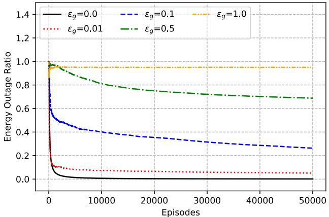

(a) Energy outage ratio as a function of episodes with the off-policy scheme.  
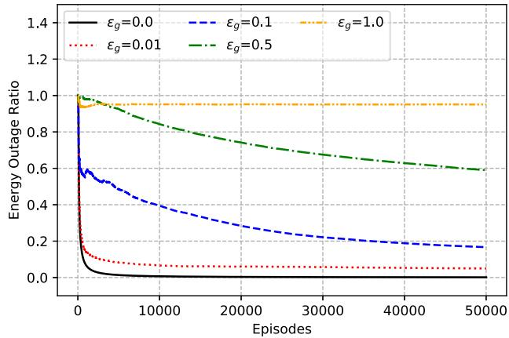  
(b) Energy outage ratio as a function of episodes with the on-policy scheme.  
Fig. 4. Energy outage ratio of the training process using different $\epsilon _ { g } .$

indicate that the UAV goes to CSs for charging and thereby gets no rewards. Energy outages occur at Step 3 and 5 at the agent simulated with greedy algorithm and random searching algorithms, respectively. The --greedy schemes with $\epsilon _ { g } = 0 . 0 5$ and $\epsilon _ { g } = 0 . 1$ support the UAV to complete the ¼ ¼entire simulation and obtain sufficient rewards. The limited exploration of the agent operating under the --greedy scheme with $\epsilon _ { g } = 0 . 1$ results a lower cumulative reward ¼than the agent operating under the --greedy scheme with $\epsilon _ { g } = 0 . 1$ . On the other hand, the --greedy schemes with $\epsilon _ { g } = { }$ ¼ ¼1 cannot adapt the UAV corresponding to the quick changes in the highly dynamic environment because of over-exploration. Overall, the on-policy scheme achieves a 90 percent cumulative reward of the off-policy scheme, which is much higher than the greedy and random searching algorithms. These simulation outcomes show the efficiency of both offpolicy and on-policy schemes.

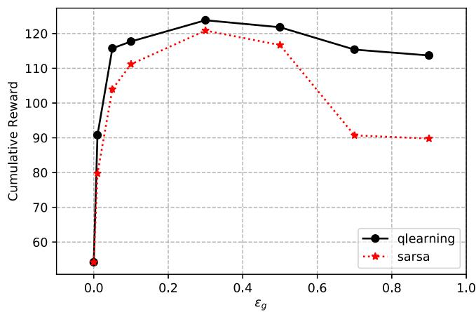

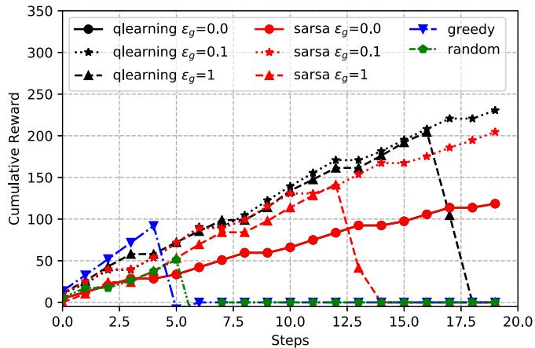  
Fig. 6. Per-step cumulative rewards corresponding to different optimization schemes.

To provide a visual impact, Fig. 7 exhibits the trajectories of the UAV configured by different optimization methods. The greedy algorithm navigates the UAV serving at two SPs (c.f. the 3D profile) until the battery energy has been exhausted. The UAV operating under the action-confined RL algorithm can get rid of energy outage. The agent taking the --greedy scheme with $\epsilon _ { g } = 0 . 1$ explores more than the ¼agent taking the --greedy scheme with $\epsilon = 0 . 0 5$ , resulting in ¼better fairness performance. The random searching algorithm also explores while performing searching tasks, but ends up with energy exhaust since no charging interaction has been involved in the procedure.

Additionally, a 3D profile of the network system with UAV trajectory configured by different optimization schemes is given in Fig. 8. The altitude of the UAV is constrained within the range from 100 m to 500 m. By implementing the proposed RL schemes, the altitude-adaptive navigation is achievable. However, we find out that the UAV is adjusted to relatively low altitude. This is because the amount of the harvested energy is not sufficient to attract the UAV to higher altitude. In reality, the height of the UAV is usually optimized for maximizing coverage [41] and is set as a constant. Therefore, we also present the data rate and the harvested energy as functions of the navigation altitude in Fig. 9. For each height, we repeat the simulation for 50 times in terms of different location and activation probability of the IoT terminals. The performance reveals that higher altitude results in a lower data rate but a higher level of harvested energy.

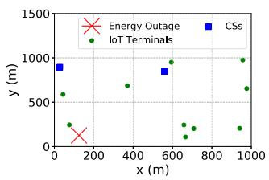  
(a) Greedy scheme.

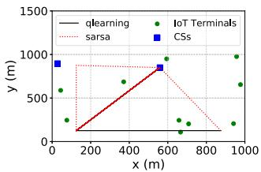  
(b) RL scheme with $\epsilon _ { g } = 0 . 0 5 .$

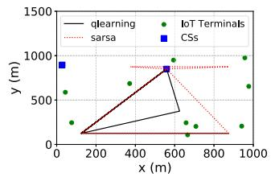  
(c) RL scheme with $\epsilon _ { g } = 0 . 1 .$

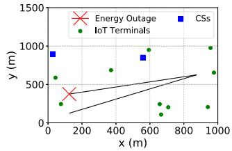  
(d) Random scheme.  
Fig. 5. Cumulative reward of simulation process using different $\epsilon _ { g } .$ Fig. 7. Navigation trajectories by different optimization schemes. Authorized licensed use limited to: Guangxi University. Downloaded on July 05,2026 at 12:38:43 UTC from IEEE Xplore. Restrictions apply.

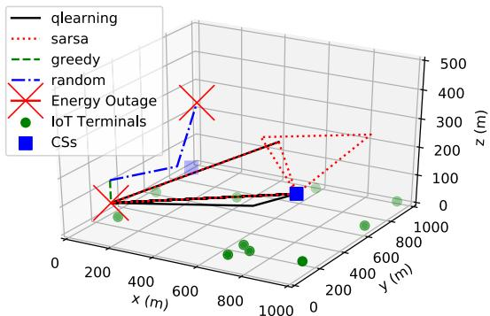  
Fig. 8. 3D profile of the network system with UAV trajectories configured by different optimization schemes.

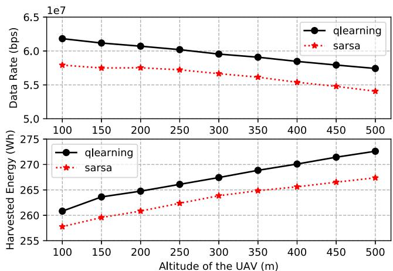  
Fig. 9. Data rate and harvested energy as functions of UAV altitude.

Subsequently, we present the effect of the starting time of the tasks in terms of cumulative reward, data rate, and energy consumption. We consider short-term (5-hour sequential), middle-term (10-hour sequential), and long-term (24-hour sequential) simulations. For simplicity, we fix the --greedy parameter $\epsilon _ { g } = 0 . 1$ for the RL algorithms. Fig. 10 shows the ¼cumulative reward as a function of starting time. For the short-term simulation, the greedy algorithm achieves a higher cumulative reward at most of the time. However, it could lead the UAV to the energy outage situation which is not acceptable for most IoT networks. When we increase the simulation time, the greedy algorithm is not capable of optimizing the trajectory of the UAV to avoid energy outage. This is because the greedy algorithm cannot deal with the highly dynamic environment jointly rendered by energy harvesting behaviors and fast-changing network topology. In this scenario, both of the proposed off-policy and on-policy RL schemes can help the UAV avoid energy outage and yield higher cumulative rewards.

Apart from the cumulative regard, data rate and energy consumption are also of paramount importance for operating UAV-assisted IoT networks. Fig. 11 represents the data rate as a function of starting time. Generally, the off-policy scheme explores more and thus gets better performance for data transmission. For the short-term simulation described in Fig. 11a, the UAV using the off-policy scheme explores and transmits more data starting at 8:00 am and 9:00 am, when the renewable energy is sufficient. Fig. 12 quantifies the energy consumption as a function of starting time. From the results of 5-hour sequential and 10-hour sequential simulations, we remark that the agent implementing the proposed RL schemes fully utilize the renewable energy and realizes the energy-efficient trajectory optimization. The energy consumption for the simulations operating in the daytime significantly decreases compared with the simulations operating at night, because no much renewable energy can be harvested at night.

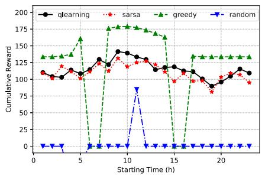  
(a) 5-hour sequential simulation.

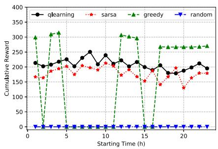  
(b) 10-hour sequential simulation.

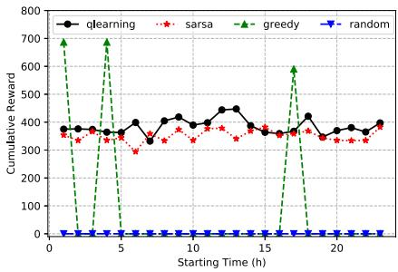  
(c) 24-hour sequential simulation.

Fig. 10. Cumulative reward as a function of starting time.  
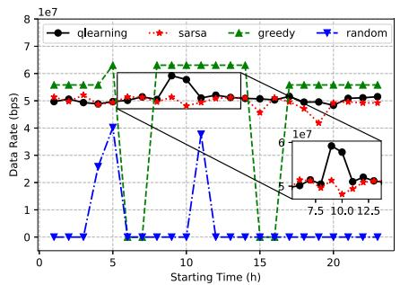  
(a) 5-hour sequential simulation.  
Fig. 11. Data rate as a function of starting time.

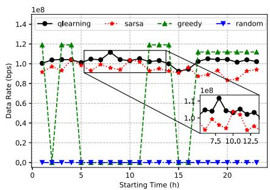  
(b) 10-hour sequential simulation.

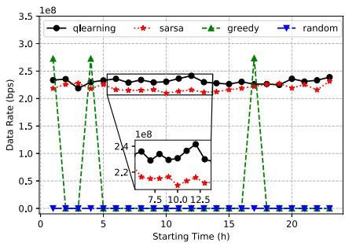  
(c) 24-hour sequential simulation.

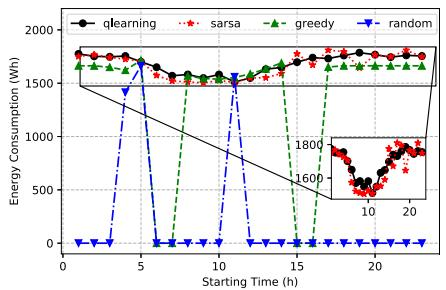  
(a) 5-hour sequential simulation.

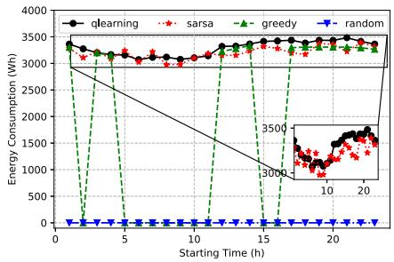  
(b) 10-hour sequential simulation.  
Fig. 12. Energy consumption as a function of starting time.

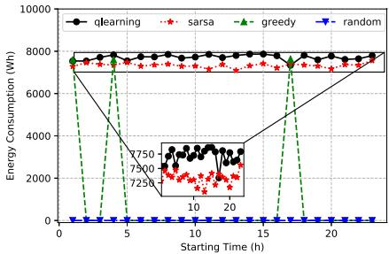  
(c) 24-hour sequential simulation.

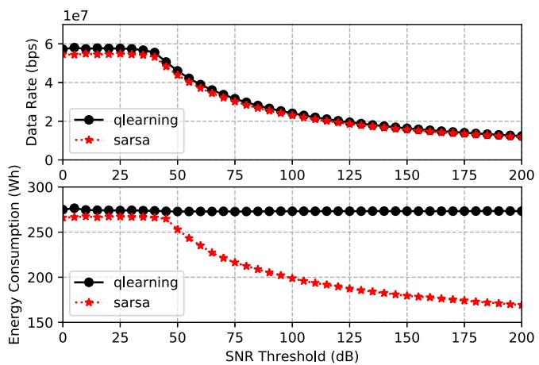  
Fig. 13. Data rate and energy consumption as functions of SNR threshold.

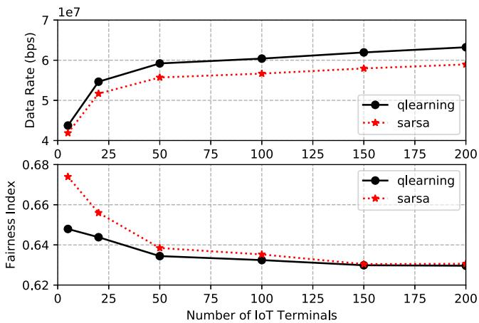  
Fig. 14. Data rate and Fairness Index as functions of number of IoT terminals.

Finally, we investigate the effects of the SNR threshold and the number of IoT terminals. Figs. 13 and 14 are obtained by processing the long-term simulations starting at 6:00 am. Each simulation is repeated for 10 times, and the performance is evaluated in form of means. Fig. 13 presents the data rate and the energy consumption per SNR threshold. The proposed RL schemes are capable of providing the solution for IoT networks with the SNR threshold below 40 dB. For the IoT networks with the SNR threshold above 40 dB, the data rate decreases as the SNR threshold increases. Generally, a higher data rate is achievable by implementing the off-policy scheme than the on-policy scheme. However, in the scenario with an extremely high SNR threshold, the UAV executing on-policy scheme takes an energy-efficient decision heading to the CSs. In contrast, the off-policy scheme navigates the UAV to explore more, resulting in higher energy consumption, which is inadvisable.

Fig. 14 shows that the data rate increases as the number of the IoT terminals increases. The growth rate becomes high when the scale of the network is relatively small. This is caused by fully exploiting the communication resource. However, when the number of IoT terminals is larger than 50, the increase of the data rate slows down due to the limitation of available bandwidth. Besides, the total energy consumption is not significantly affected by the change in the number of IoT terminals, since the communication energy consumption is low compared with the propulsion energy consumption. Therefore, we present the fairness index as a function of the number of IoT terminals. In this scenario, the on-policy scheme makes more effort on coverage fairness than the off-policy scheme. The fairness index decreases as the number of IoT terminals increases, since less communication resource is assigned to each terminal and the UAV can serve only the IoT terminals with low SNRs.

## 6 CONCLUSION

In this paper, we proposed the action-confined off-policy and on-policy RL schemes for the energy-efficient trajectory optimization for UAV-assisted IoT networks. We considered the complex environment caused by the highly dynamic aliveness of IoT terminals working in the DRX mode, the renewable energy availability, and the network topology determined by the operational state of the UAV. The convergence of the training process was verified for both off-policy and on-policy schemes. By using the proposed schemes, the UAV-assisted

IoT network can efficiently avoid energy outage and outperform those using the greedy and random searching algorithms in terms of cumulative reward, data rate, and energy consumption. The numerical results also revealed the importance of using learning schemes to adapt the operational state of UAV in complex environments for enhancing energy efficiency and data transmission capability. To further enhance the practicality of the proposed schemes and analyses, a generalized scenario shall be considered as future work, such as a network encompassing multiple UAVs and dense IoT terminals. In this context, it would be interesting to investigate the cooperation among multiple UAVs, the partial observable environment, multi-user resource allocation, interference mitigation, and UAV-to-UAV communications.

## ACKNOWLEDGMENTS

This work was supported by the King Abdullah University of Science and Technology.

## REFERENCES

[1] S. Dang, O. Amin, B. Shihada, and M.-S. Alouini, “What should 6G be?” Nat. Electron., vol. 3, no. 1, pp. 20–29, 2020.

[2] Y. Wang et al., “Joint resource allocation and UAV trajectory optimization for Space-Air-Ground internet of remote things networks,” IEEE Syst. J., early access, Sep. 10, 2020, doi: 10.1109/ JSYST.2020.3019463.

[3] T. Hong, W. Zhao, R. Liu, and M. Kadoch, “Space-air-ground IoT network and related key technologies,” IEEE Wirel. Commun., vol. 27, no. 2, pp. 96–104, Apr. 2020.

[4] J. Ye, S. Dang, B. Shihada, and M.-S. Alouini, “Space-air-ground integrated network: Outage performance analysis,” IEEE Trans. Wirel. Commun., vol. 19, no. 12, pp. 7897–7912, Dec. 2020.

[5] A. Bader and M.-S. Alouini, “Mobile ad hoc networks in bandwidth-demanding mission-critical applications: Practical implementation insights,” IEEE Access, vol. 5, pp. 891–910, 2017.

[6] F. Qi, X. Zhu, G. Mang, M. Kadoch, and W. Li, “UAV network and IoT in the sky for future smart cities,” IEEE Netw., vol. 33, no. 2, pp. 96–101, Mar./Apr. 2019.

[7] N. H. Motlagh, M. Bagaa, and T. Taleb, “UAV-based IoT platform: A crowd surveillance use case,” IEEE Commun. Mag., vol. 55, no. 2, pp. 128–134, Feb. 2017.

[8] Z. Yuan, J. Jin, L. Sun, K. Chin, and G. Muntean, “Ultra-reliable IoT communications with UAVs: A swarm use case,” IEEE Commun. Mag., vol. 56, no. 12, pp. 90–96, Dec. 2018.

[9] H. Zhang, L. Song, Z. Han, and H. V. Poor, “Cooperation techniques for a cellular internet of unmanned aerial vehicles,” IEEE Wirel. Commun., vol. 26, no. 5, pp. 167–173, Oct. 2019.

[10] H. Menouar, I. Guvenc, K. Akkaya, A. S. Uluagac, A. Kadri, and A. Tuncer, “UAV-enabled intelligent transportation systems for the smart city: Applications and challenges,” IEEE Commun. Mag., vol. 55, no. 3, pp. 22–28, Mar. 2017.

[11] S. Sekander, H. Tabassum, and E. Hossain, “Statistical performance modeling of solar and wind-powered UAV communications,” IEEE Trans. Mobile Comput., early access, Apr. 8, 2020, doi: 10.1109/ TMC.2020.2983955.

[12] H. Ghazzai, H. Menouar, A. Kadri, and Y. Massoud, “Future UAV-based ITS: A comprehensive scheduling framework,” IEEE Access, vol. 7, pp. 75678–75695, 2019

[13] Q. Wu, L. Liu, and R. Zhang, “Fundamental trade-offs in communication and trajectory design for UAV-enabled wireless network,” IEEE Wirel. Commun., vol. 26, no. 1, pp. 36–44, Feb. 2019.

[14] N. M. Balasubramanya, L. Lampe, G. Vos, and S. Bennett, “DRX with quick sleeping: A novel mechanism for energy-efficient IoT using LTE/LTE-A,” IEEE Internet Things J., vol. 3, no. 3, pp. 398–407, Jun. 2016.

[15] B. Ji, Y. Li, B. Zhou, C. Li, K. Song, and H. Wen, “Performance analysis of UAV relay assisted IoT communication network enhanced with energy harvesting,” IEEE Access, vol. 7, pp. 38 738–38 747, 2019.

[16] L. Amorosi, L. Chiaraviglio, and J. Galan-Jimenez, “Optimal energy management of UAV-based cellular networks powered by solar panels and batteries: Formulation and solutions,” IEEE Access, vol. 7, pp. 53 698–53 717, 2019.

[17] L. Chiaraviglio, F. D’andreagiovanni, R. Choo, F. Cuomo, and S. Colonnese, “Joint optimization of area throughput and grid-connected microgeneration in UAV-based mobile networks,” IEEE Access, vol. 7, pp. 69 545–69 558, 2019.

[18] S. Cho, K. Lee, B. Kang, K. Koo, and I. Joe, “Weighted harvestthen-transmit: UAV-enabled wireless powered communication networks,” IEEE Access, vol. 6, pp. 72 212–72 224, 2018.

[19] H. Wang, J. Wang, G. Ding, L. Wang, T. A. Tsiftsis, and P. K. Sharma, “Resource allocation for energy harvesting-powered D2D communication underlaying UAV-assisted networks,” IEEE Trans. Green Commun. Netw., vol. 2, no. 1, pp. 14–24, Mar. 2018.

[20] M. Alzenad, A. El-Keyi , F. Lagum, and H. Yanikomeroglu, “3-D placement of an unmanned aerial vehicle base station (UAV-BS) for energy-efficient maximal coverage,” IEEE Wirel. Commun. Lett., vol. 6, no. 4, pp. 434–437, Aug. 2017.

[21] Y. Sun, D. Xu, D. W. K. Ng, L. Dai, and R. Schober, “Optimal 3Dtrajectory design and resource allocation for solar-powered UAV communication systems,” IEEE Trans. Commun., vol. 67, no. 6, pp. 4281–4298, Jun. 2019.

[22] Y. Zeng and R. Zhang, “Energy-efficient UAV communication with trajectory optimization,” IEEE Trans. Wirel. Commun., vol. 16, no. 6, pp. 3747–3760, Jun. 2017.

[23] C. Zhan, Y. Zeng, and R. Zhang, “Energy-efficient data collection in UAV enabled wireless sensor network,” IEEE Wirel. Commun. Lett., vol. 7, no. 3, pp. 328–331, Jun. 2018.

[24] Z. Yang, W. Xu, and M. Shikh-Bahaei, “Energy efficient UAV communication with energy harvesting,” IEEE Trans. Veh. Technol., vol. 69, no. 2, pp. 1913–1927, Feb. 2020.

[25] M. Mozaffari, W. Saad, M. Bennis, and M. Debbah, “Mobile unmanned aerial vehicles (UAVs) for energy-efficient internet of things communications,” IEEE Trans. Wirel. Commun., vol. 16, no. 11, pp. 7574–7589, Nov. 2017.

[26] D. Sikeridis, E. E. Tsiropoulou, M. Devetsikiotis, and S. Papavassiliou, “Wireless powered public safety IoT: A UAV-assisted adaptive-learning approach towards energy efficiency,” J. Netw. Comput. Appl., vol. 123, pp. 69–79, 2018.

[27] C. H. Liu, X. Ma, X. Gao, and J. Tang, “Distributed energy-efficient multi-UAV navigation for long-term communication coverage by deep reinforcement learning,” IEEE Trans. Mobile Comput., vol. 19, no. 6, pp. 1274–1285, Jun. 2020.

[28] O. M. Bushnaq, M. A. Kishk, A. Celik, M. Alouini, and T. Y. Al-Naffouri , “Cellular traffic offloading through tethered-UAV deployment and user association,” CoRR, vol. abs/2003.00713, pp. 1–16, 2020.

[29] O. M. Bushnaq, A. Celik, H. ElSawy, M.-S. Alouini, and T. Y. Al-Naffouri , “Aeronautical data aggregation and field estimation in IoT networks: Hovering and traveling time dilemma of UAVs,” IEEE Trans. Wirel,. Commun., vol. 18, no. 10, pp. 4620–4635, Oct. 2019.

[30] K. Dorling, J. Heinrichs, G. G. Messier, and S. Magierowski, “Vehicle routing problems for drone delivery,” IEEE Trans. Syst., Man, Cybern., Syst., vol. 47, no. 1, pp. 70–85, Jan. 2016.

[31] L. Xie, J. Xu, and R. Zhang, “Throughput maximization for UAVenabled wireless powered communication networks,” IEEE Internet Things J., vol. 6, no. 2, pp. 1690–1703, Apr. 2018.

[32] H. ElHammouti, M. Benjillali, B. Shihada, and M.-S. Alouini, “Learn-as-you-fly: A distributed algorithm for joint 3D placement and user association in multi-UAVs networks,” IEEE Trans. Wirel. Commun., vol. 18, no. 12, pp. 5831–5844, Apr. 2019.

[33] J.-S. Lee and K.-H. Yu, “Optimal path planning of solar-powered UAV using gravitational potential energy,” IEEE Trans. Aerospace Electron. Syst., vol. 53, no. 3, pp. 1442–1451, Jun. 2017.

[34] J. A. Duffie and W. A. Beckman, Solar engineering of thermal processes. Hoboken, NJ, USA: Wiley, 2013.

[35] P. Cooper, “The absorption of radiation in solar stills,” Solar Energy, vol. 12, no. 3, pp. 333–346, 1969.

[36] H. C. Hottel, “A simple model for estimating the transmittance of direct solar radiation through clear atmospheres,” Solar Energy, vol. 18, no. 2, pp. 129–134, 1976.

[37] P. J. Enright and B. A. Conway, “Discrete approximations to optimal trajectories using direct transcription and nonlinear programming,” J. Guid., Control, Dyn., vol. 15, no. 4, pp. 994–1002, 1992.

[38] Y. Zeng, J. Xu, and R. Zhang, “Energy minimization for wireless communication with rotary-wing UAV,” IEEE Trans. Wirel. Commun., vol. 18, no. 4, pp. 2329–2345, Apr. 2019.

[39] J. Seddon, Basic Helicopter Aerodynamics. Hoboken, NJ, USA: Wiley, 1990.

[40] ITU, “Prediction methods required for the design of terrestrial broadband millimetric radio access systems operating in a frequency range of about 20–50 GHz,” Geneva, Switzerland, ITU-R P1410, 2003.

[41] A. Al-Hourani , K. Sithamparanathan, and S. Lardner, “Optimal LAP altitude for maximum coverage,” IEEE Wirel. Commun. Lett., vol. 3, pp. 569–572, Dec. 2014.

[42] R. I. Bor-Yaliniz , A. El-Keyi , and H. Yanikomeroglu, “Efficient 3- D placement of an aerial base station in next generation cellular networks,” in Proc. Int. Conf. Commun., 2016, pp. 1–5.

[43] W. Nam, D. Bai, J. Lee, and I. Kang, “Advanced interference management for 5G cellular networks,” IEEE Commun. Mag., vol. 52, no. 5, pp. 52–60, May 2014.

[44] A. B. Sediq, R. H. Gohary, R. Schoenen, and H. Yanikomeroglu, “Optimal tradeoff between sum-rate efficiency and Jain’s fairness index in resource allocation," IEEE Trans. Wirel. Commun., vol. 12, no. 7, pp. 3496–3509, Jul. 2013

[45] A. Ortiz, H. Al-Shatri , X. Li, T. Weber, and A. Klein, “Reinforcement learning for energy harvesting decode-and-forward two-hop communications,” IEEE Trans. Green Commun. Netw., vol. 1, no. 3, pp. 309–319, Sep. 2017.

[46] S. Dang, J. P. Coon, and G. Chen, “Resource allocation for fullduplex relay-assisted device-to-device multicarrier systems,” IEEE Wirel. Commun. Lett., vol. 6, no. 2, pp. 166–169, Apr. 2017.

[47] C. Jin, Z. Allen-Zhu , S. Bubeck, and M. I. Jordan, “Is Q-learning arXiv: 1807.03765

[48] M. Kearns and S. Singh, “Near-optimal reinforcement learning in polynomial time,” Mach. learn., vol. 49, no. 2, pp. 209–232, 2002.

[49] F. S. Melo, “Convergence of Q-learning: A simple proof,” Institute Of Systems and Robotics, Lisboa, Portugal, Tech. Rep, 2001.

[50] A. Al-Hourani , S. Kandeepan, and A. Jamalipour, “Modeling airto-ground path loss for low altitude platforms in urban environments,” in Proc. IEEE Glob. Commun. Conf. 2014, pp. 2898–2904.

[51] M. Iqbal, An introduction to solar radiation. Don Mills, ON, Canada: Academic Press Canada, 1983.

[52] Z. Zheng, A. K. Sangaiah, and T. Wang, “Adaptive communication protocols in flying ad hoc network,” IEEE Commun. Mag., vol. 56, no. 1, pp. 136–142, Jan. 2018.

  
Liang Zhang (Student Member, IEEE) received the BSc degree in physics from the University of Science and Technology Beijing, China, in 2016 and the M.Sc. degree in electrical engineering from the King Abdullah University of Science and Technology, Saudi Arabia, in 2018. She is currently working toward the PhD degree in electrical and computer engineering at the King Abdullah University of Science and Technology. Her research interests include flying network, Internet of Things, deep learning, and reinforcement learning.

Abdulkadir Celik (Senior Member, IEEE) received the MS degree in electrical engineering, in 2013, the MS degree in computer engineering, in 2015, and the PhD degree in co-majors of electrical engineering and computer engineering from Iowa State University, Ames, IA, USA, in 2016. From 2016 to 2020, he was a postdoctoral fellow with the King Abdullah University of Science and Technology (KAUST) . He is currently a research scientist at the communications and computing systems lab with KAUST. His research interests include wireless communication systems and networks.

Shuping Dang (Member, IEEE) received the BEng (Hons) degree in electrical and electronic engineering from the University of Manchester (with first class honors), the BEng degree in electrical engineering and automation from Beijing Jiaotong University, in 2014, via a joint ‘2+2’ dualdegree program,and the DPhil degree in engineering science from the University of Oxford in 2018. He joined in the R&D Center, Huanan Communication Company, Ltd. after graduating from the University of Oxford. He is currently a postdoctoral fellow with the Computer, Electrical and Mathematical Science and Engineering Division, King Abdullah University of Science and Technology. His current research interests include novel modulation schemes, cooperative communications, terahertz communications, and 6G wireless network design.

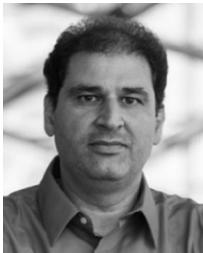

Basem Shihada (Senior Member, IEEE) received the PhD degree in computer science from the University of Waterloo in 2009. He is currently an associate and founding professor at the Computer, Electrical and Mathematical Sciences and Engineering Division, King Abdullah University of Science and Technology. He was appointed as visiting faculty with the Department of Computer Science, Stanford University. His current research interests include energy and resource allocation in wired and wireless networks, software defined networking, Internet of Things, data networks, network security, and cloud or fog computing.

" For more information on this or any other computing topic, please visit our Digital Library at www.computer.org/csdl.