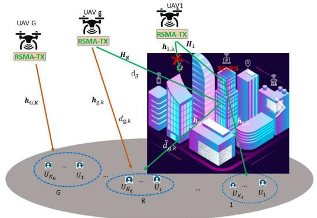
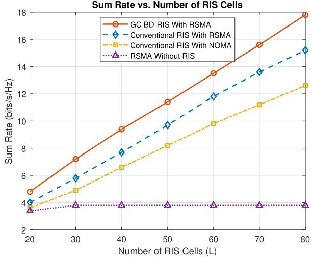
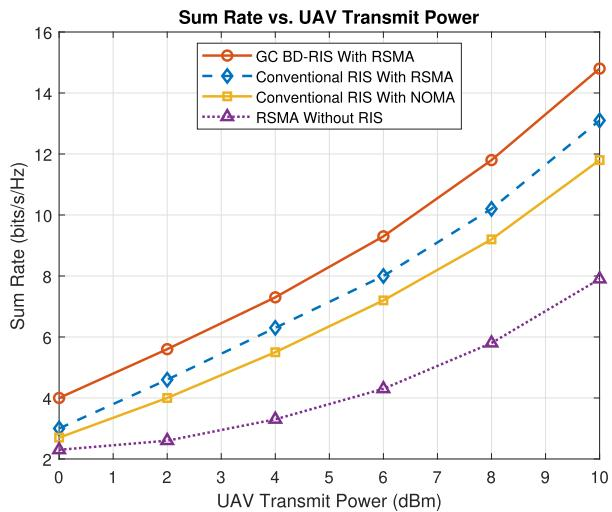
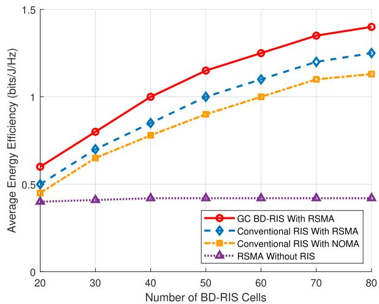
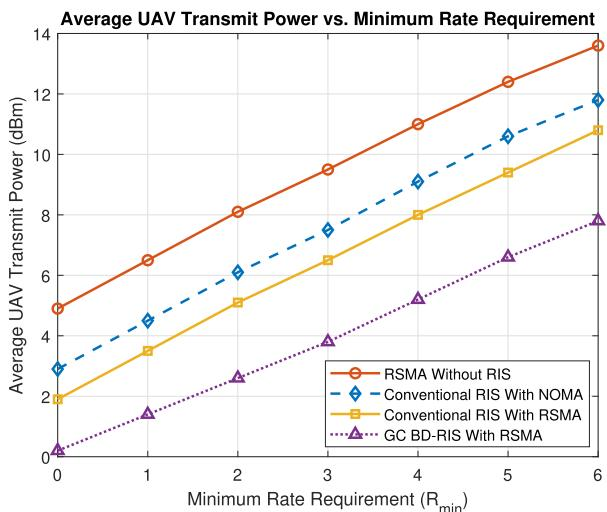
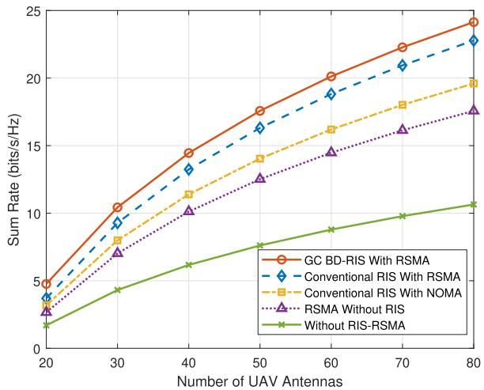
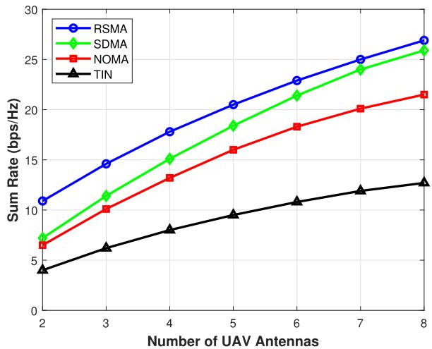
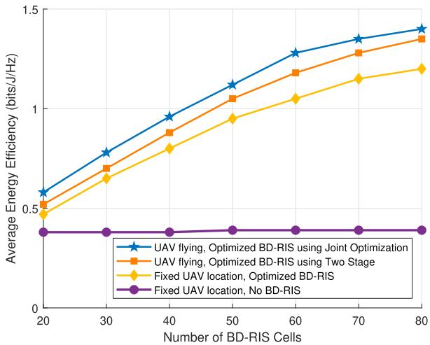
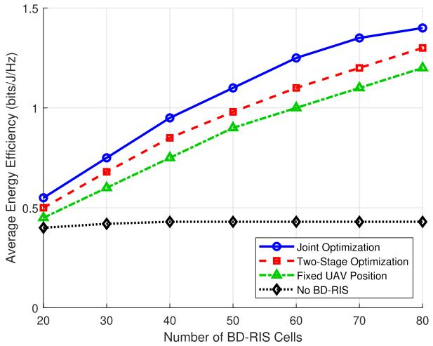

# Energy-Efficient Transmission Strategy for UAV-RIS 2.0 Assisted Communications Using Rate Splitting Multiple Access

Aamer Mohamed Huroon , Member, IEEE, Yu-Chih Huang , Senior Member, IEEE, and Li-Chun Wang , Fellow, IEEE

Abstract—This study explores the optimization of transmission strategies focusing on energy efficiency within a network comprising ground-based beyond-diagonal reconfigurable intelligent surfaces (BD-RIS), a.k.a RIS 2.0, and multiple unmanned aerial vehicles (UAVs). The motivation behind this work stems from the critical need to enhance energy efficiency in nextgeneration wireless networks, where the integration of UAVs and RIS technologies presents both opportunities and challenges. Specifically, while UAVs offer flexible deployment and improved coverage, their limited battery life and the complex interference environment in multi-user networks necessitate innovative solutions for sustainable operation. Each UAV is designed to serve its corresponding user group, with each group utilizing unique subcarriers to maintain orthogonality and employing a ratesplitting multiple access (RSMA) strategy within each group. The primary objectives of this work are to optimize: 1) the allocation of BD-RIS elements to groups, 2) the phase rotations of BD-RIS, 3) the common rate allocation in RSMA, 4) UAV trajectories, and 5) the design of precoders. To achieve these objectives, we formulate an optimization problem under the framework of mixed-integer nonlinear programming (MINLP), with a focus on maximizing energy efficiency. Our proposed solution combines generalized Benders decomposition (GBD), a manifold-based algorithm, and successive convex approximation (SCA). GBD decomposes the MINLP into primal and master sub-problems, which are iteratively solved. To efficiently address variable coupling in the primal problem, we adopt a block coordinate descent (BCD) method and employ the Riemannian conjugate gradient (RCG) technique for phase rotation. SCA addresses the remaining challenges in the primal problem, while a two-

stage approach simplifies the optimization process. Simulations confirm the significant energy efficiency improvements achieved by the proposed method.

Index Terms—Rate splitting multiple access, energy efficiency, unmanned aerial vehicle, beyond diagonal reconfigurable intelligent surface.

## I. INTRODUCTION

is driven by the need for enhanced energy efficiency (EE) and reduced environmental impact. With the growing reliance on the Internet of Everything (IoE) devices and the increasing use of unmanned aerial vehicles (UAVs) as mobile base stations, the evolution of communication networks is crucial. UAVs offer unprecedented flexibility, improved coverage, and efficient network management, all essential for addressing connectivity challenges in next-generation networks [2]. To further enhance UAV performance, particularly for missioncritical tasks, the integration of Reconfigurable Intelligent Surfaces (RIS) has emerged as a promising solution [3], [4], [5], [6]. This integration allows dynamic control of the wireless propagation environment, improving signal quality while reducing power consumption, in line with the energy efficiency goals of 6G networks [7], [8].

Recent innovations in RIS technology have introduced beyond-diagonal RIS (BD-RIS), which extends the capabilities of traditional RIS by employing non-diagonal phase shift matrices, enabled by scattering matrices [9], [10]. This advancement expands the scope of applications for RIS, particularly in UAV-assisted systems, where BD-RIS can help address challenges related to coverage and interference as the number of connected users grows. Despite these advantages, the combination of UAVs and BD-RIS can lead to increased multi-user interference, which can hinder system performance. To mitigate this, the integration of rate-splitting multiple access (RSMA) has been proposed as a promising interference management technique [11], [12]. The integration of RSMA in UAV-RIS-assisted communication is motivated by its adaptability, robustness to interference, and ability to provide enhanced spectral efficiency. While SDMA benefits from RIS-aided channel orthogonalization, RSMA offers additional flexibility in handling multi-user interference, particularly when dealing with imperfect CSI or dynamic user distributions [13].

The integration of UAVs and RIS has gained significant attention in 6G research due to its potential for enhancing coverage and energy efficiency. Prior works such as [14] have explored UAV-aided systems with ground-based RIS for sum-rate maximization via phase control and element allocation. Meanwhile, RSMA has been studied in RIS-enabled networks [15], [16], highlighting its spectral and energy efficiency benefits. Active RIS-based architectures for optimizing spectral-energy tradeoffs were also considered in [17].

Despite this progress, current studies treat UAV-RIS and RSMA in isolation, overlooking the complex interplay of UAV dynamics, RSMA transmission, and RIS configuration—especially in ground-deployed BD-RIS scenarios. For instance, [18] focuses on RSMA energy optimization in MISO systems, while UAV-RIS trajectory design and energy-aware control are addressed in [19] and [20]. Efficient energy usage in UAV-RIS systems demands solving complex joint optimization problems involving UAV mobility and RIS configuration [21]. However, none of these works jointly tackle the highly coupled optimization involving BD-RIS phase shift design, UAV mobility, RSMA resource allocation, and RIS element clustering under realistic system constraints. This work builds upon these foundations by addressing the above limitations and jointly considering the unique challenges of UAV-BD-RIS-assisted RSMA systems.

## The main contributions of this work are as follows:

Our work introduces an innovative communication system that integrates UAVs with advanced ground-based BD-RIS. This system is designed to tackle common issues of interference and connectivity in multi-user networks. By combining multiple UAVs with BD-RIS and employing RSMA technology, the system achieves higher energy efficiency, while ensuring reliable connectivity for various ground user groups. This approach is a generalization of the model in [22], treating conventional RIS as a specific case within a broader framework. The use of RSMA enhances the performance over non-orthogonal multiple access (NOMA) systems. The integration of UAVs with BD-RIS systems presents significant challenges in managing interference and maintaining connectivity in multi-user networks. Additionally, this approach seeks to address the limitations in adaptability and performance that are not readily resolved by current methods. A notable aspect of this innovation is the new strategy for partitioning BD-RIS cells and the introduction of design variables for their allocation, markedly improving adaptability and performance compared to other recent methods like those in [12].

Given the advancements in next-generation wireless communication technologies, which are increasingly focused on sustainability, it becomes evident that solely focusing on spectral efficiency (SE) is inadequate for attaining energy efficiency. We address the energy efficiency optimization problem. Our approach incorporates the BD-RIS matrix, cell allocation, UAV trajectory optimization precoders, and RSMA common rate allocation. The complexity of these NP-hard problems, due to non-convexity and variable coupling, is managed through the GBD method, which divides the problem into primal and master subproblems. To further resolve the primal problem’s complexities, we use the BCD method to decompose the variable coupling and recognize the manifold structure in the BD-RIS phase enabling the RCG algorithm. The non-convexity in the precoder design and rate allocation is handled by using successive convex approximation.

TABLE I LIST OF NOTATIONS
<table><tr><td>Notation</td><td>Definition</td></tr><tr><td> $\overline { { K _ { g } } }$ </td><td>Number of users in the g-th group</td></tr><tr><td> $M$ </td><td>Total number of RIS elements</td></tr><tr><td> $F$ </td><td>Number of RIS clusters</td></tr><tr><td> $\omega _ { 1 }$ </td><td>Fraction of bandwidth allocated to RIS-assisted communication path</td></tr><tr><td> $\omega _ { 2 }$ </td><td>Fraction of bandwidth allocated to the direct path communication</td></tr><tr><td> $u _ { g }$ </td><td>The RIS cluster that the g-th UAV group is as-</td></tr><tr><td> $\tau$ </td><td>signed to  $\{ \bar { t } _ { g } : \ g \in [ G ] \}$ </td></tr><tr><td> $\mathcal { F } _ { i }$ </td><td> $\mathrm { S e i }$  of indices for the BD-RIS cells in the i-th BD-</td></tr><tr><td> $\mathbf { h } _ { g , k }$ </td><td> $\mathrm { R I S }$  cluster Direct link from q-th UAV to the k-th user in the g-th group</td></tr><tr><td> $\tilde { \mathbf { h } } _ { g , k }$ </td><td>Channel vector from the RIS to the k-th user in</td></tr><tr><td> $\mathbf { H } _ { g }$ </td><td>the g-th group Channel vector from the g-th UAV to the RIS</td></tr><tr><td> $w _ { g , k }$ </td><td>Additive white Gaussian noise</td></tr><tr><td> $\Phi _ { g }$ </td><td>Diagonal matrix containing phase rotations of RIS</td></tr><tr><td> $\Phi ^ { f }$ </td><td>elements in  $\mathcal { F } _ { u _ { g } } . \ \pmb { \Phi } _ { g } = \bar { \bf 0 } \ \mathrm { i f } \ t _ { g } = 0$ </td></tr><tr><td> $\Phi ^ { f _ { g } }$ </td><td>phase rotation for all BD-RIS groups</td></tr><tr><td> $\Phi$ </td><td>phase rotation for  $f _ { g } \mathrm { t h }$  group</td></tr><tr><td> $i , j$ </td><td> $\left\{ \Phi _ { g } : \ g \in [ G ] \right\}$ </td></tr><tr><td>For UAV</td><td>iteration indexing for primal and relaxed mater problem respectively</td></tr><tr><td></td><td>The Physical Meaning of Modeling UAV Power Consumption</td></tr><tr><td> $\overline { { \delta } }$ </td><td>Profile drag coefficient</td></tr><tr><td> $\rho$ </td><td>Air density in  $\mathrm { k g / m ^ { 3 } }$ </td></tr><tr><td> $s$ </td><td>Rotor solidity</td></tr><tr><td> $A$   $\Omega$ </td><td>Rotor disc area in  $\mathrm { m ^ { 2 } }$ </td></tr><tr><td> $R$ </td><td>Blade angular velocity in radians/second</td></tr><tr><td> $k$ </td><td>Rotor radius in meter (m)</td></tr><tr><td> $\bar { W }$ </td><td>Incremental correction factor to induced power</td></tr><tr><td></td><td>UAV weight in Newton</td></tr><tr><td> $\kappa$ </td><td>Thrust-to-weight ratio,  $\begin{array} { r } { \kappa \equiv \frac { T } { W } } \end{array}$ </td></tr><tr><td> $v _ { 0 }$   $S _ { F P \parallel }$ </td><td>Mean rotor induced velocity in hover Fuselage equivalent flat plate area in horizontal</td></tr><tr><td></td><td>status in  $\mathrm { m ^ { 2 } }$ </td></tr><tr><td> $S _ { F P \perp }$ </td><td>Fuselage equivalent flat plate area in vertical status  $\mathrm { i n ~ m ^ { 2 } }$ </td></tr><tr><td> $C _ { T }$ </td><td>Thrust coefficient</td></tr></table>

• The optimization of UAV trajectories is vital in UAV communications, given that their high mobility plays a pivotal role in influencing the efficiency and effectiveness of the entire system. This step is essential to maximize operational performance and ensure reliable communication. Our approach innovatively optimizes UAV trajectories in tandem with BD-RIS phase rotation. This integrated optimization, distinct from the method in [22], which addresses UAV trajectory in isolation, significantly enhances energy efficiency. Our solution stands out by incorporating additional constraints into the optimization problem, thus offering a more comprehensive and efficient resolution. Furthermore, we simplified our solutions by proposing a two-stage approach. In the first stage, we optimized the UAV trajectory by directing

UAV 1 along the shortest path and then optimized the phase rotation.

• Simulation outcomes indicate that our model excels in enhancing the energy efficiency objective. This is achieved by integrating UAVs with group-connected BD-RIS, utilizing the RSMA technique. This approach outperforms traditional systems that use conventional RIS and NOMA techniques.

The remainder of this paper is organized as follows: Section II presents the system model, and Section III formulates the energy efficiency maximization problem. Section IV details the proposed solution methods, Section V provides simulation results, and Section VI concludes the paper.

## A. Notation

The notation $( \cdot ) ^ { H }$ denotes the conjugate transpose, and | · | represents the absolute value of a complex number. Bold symbols indicate vectors or matrices, and $\mathbb { C } ^ { x \times y }$ refers to $x \times y$ complex-valued matrices. The index set [L] denotes integers from 1 to $L ,$ with key notations summarized in Table I.

## II. SYSTEM MODEL

The system model investigated consists of multiple UAVs serving several user clusters through BD-RIS. Users are grouped into clusters, with each UAV dedicated to a specific user group. The BD-RIS employs a group-connected architectures and is mounted on the facade of a building, featuring a passive reflecting surface to enhance signal propagation. In BD-RIS, the reflecting cells are grouped, with each group supporting a specific UAV. The scattering matrix Φ of the BD-RIS is defined by the circuit topology of the M-port reconfigurable impedance network, where ${ \Phi } = \{ { \Phi } _ { g } : g \in [ { G } ] \}$ . We consider a group-connected (GC) architecture, which must adhere to the imposed constraints

$$
\Phi _ { r , g } ^ { H } \Phi _ { r , g } = \mathbf { I } _ { M / F } , \forall g \in [ G ] .\tag{1}
$$

To provide a more detailed explanation, the system consists of a set of G UAVs, with each UAV dedicated to serving a specific group of users, represented as $\kappa _ { g }$ . Each UAV is equipped with a total of N antennas. These UAVs are organized into $F$ clusters, denoted as $\mathcal { F } _ { 1 } , \ldots , \mathcal { F } _ { F }$ , and each cluster encompasses a proportion of the total reflecting cells, specifically $M / F$ cells in each cluster. It’s worth noting that the BD-RIS operates passively, meaning that it consumes power only for the controller and configuration circuits while being passive in other respects.

To establish the connection between UAVs and BD-RIS clusters, we employ the notation $t _ { g } ,$ where $t _ { g } = f$ signifies that UAV g receives assistance from RIS cluster $f ,$ while $t _ { g } = 0 .$ , conveys that UAV g operates without support from any BD-RIS clusters. To make this determination, we employ the indicator function $f ( t _ { g } )$ , which serves the purpose of assessing whether UAV group g benefits from the BD-RIS or not. Consequently, the overall count of the active BD-RIS clusters denoted as $F ,$ can be calculated by summing the values of $f ( t _ { g } )$ for all UAVs, as shown in the formula: $\textstyle F = \sum _ { g = 1 } ^ { G } f ( t _ { g } )$ This provides for understanding of how UAVs are assigned to BD-RIS clusters and how the total number of active clusters is computed.

In alignment with our system’s operational structure, the available bandwidth is partitioned into C orthogonal subcarriers. Each UAV is allocated sub-carriers in a manner that ensures there is no interference with sub-carriers assigned to other UAVs. These C sub-carriers are further subdivided into two distinct portions: $\omega _ { 1 } C$ and $\omega _ { 2 } C ,$ , with the constraint that $\omega _ { 1 } + \omega _ { 2 } = 1$ . The portion represented by $\omega _ { 1 } C$ is specifically designated for transmissions involving the assistance of the BD-RIS, and these sub-carriers are assigned to UAV groups where $f ( t _ { g } ) = 1$ . Conversely, the remaining $\omega _ { 2 } C$ is designated for UAV groups that do not have the support of BD-RIS, characterized by $f ( t _ { g } ) = 0$

To provide further insight into the system operation for UAVs denoted as $g ~ \in ~ [ G ]$ and are supported by BD-RIS, signified by $f ( t _ { g } ) = 1$ , the system takes into account specific channel vectors. These vectors include $\mathbf { H } _ { g } \in \mathbb { C } ^ { M / F \times \mathbf { \bar { N } } }$ and $\tilde { \mathbf { h } } _ { g , k } \in \mathbb { C } ^ { 1 \times M / F }$ , which respectively represent the channels between UAV g and the BD-RIS cells in the designated cluster $u _ { g }$ , and the channels connecting the BD-RIS cells within cluster $u _ { g }$ to the individual user $k \in \mathcal { K } _ { g }$ , that UAV g serves. Furthermore, the system incorporates $\mathbf { h } _ { g , k } ^ { - } \in \mathbb { C } ^ { 1 \times N }$ which characterizes the direct channel between UAV g and the specific user $k \in \mathcal { K } _ { g }$ , that falls under its coverage. The communication process comprises two distinct phases, the negotiation phase and the communication phase, each with its specific role in the overall transmission protocol [14], [23]. During negotiations, it is crucial to assume that channel estimation and synchronization have been carried out perfectly to ensure optimal communication conditions. This assumption is fundamental for the negotiation’s success, as any errors in these processes can cause communication problems and impede the overall outcome. Therefore, a great deal of trust is placed in the precision and dependability of channel estimation and synchronization in this phase [14], [24].

The communication phase is vital for transmitting real-time data from UAVs to designated destinations in the ground user cluster. It involves complex processes and protocols to ensure efficient and reliable data transfer.

## A. RSMA Transmission Model

RSMA manages multi-user interference by splitting each user’s message into a common part and a private part. The common parts are encoded into a common stream intended for all users, while private parts are encoded into private streams. Each user first decodes the common stream by treating all private streams as noise. After successfully decoding and subtracting the common stream via SIC, each user decodes its private stream with reduced interference from the other private streams. This approach effectively transforms part of the multiuser interference into a common signal that is decoded and removed, thereby enhancing the achievable rates. In BD-RIS-assisted systems, the RIS’s reconfigurability complements RSMA by shaping the propagation environment to further suppress interference and improve the SINR for both common and private streams. The synergy between RSMA and BD-RIS has been demonstrated in recent studies [25] to achieve significant spectral and energy efficiency gains in multi-user networks. The signal transmitted from the g-th UAV in the set [G] can be written as

$$
\mathbf { s } _ { g } = \left( \mathbf { w } _ { g } ^ { c } x _ { g } ^ { c } + \sum _ { k \in \mathcal { K } _ { g } } \mathbf { w } _ { g , k } ^ { p } x _ { g , k } ^ { p } \right) = \mathbf { W } _ { g } \mathbf { x } _ { g } ,\tag{2}
$$

where $\mathbf { w } _ { g } ^ { c }$ belongs to $\mathbb { C } ^ { N \times 1 }$ and $x _ { q } ^ { c } ~ \in ~ \mathbb { C }$ , these respectively represent the precoder vector and transmit symbol for the common part. Additionally, $\mathbf { w } _ { g , k } ^ { p }$ is in $\mathbb { C } ^ { N \times 1 }$ and $x _ { q , k } ^ { p } \in \mathbb { C } ,$ , are the precoder vector and transmit symbol for the private part. The precoder matrix $\mathbf { W } _ { q }$ is defined as $[ \mathbf { w } _ { g } ^ { c } , \mathbf { w } _ { g , 1 } ^ { p } , \ldots , \mathbf { w } _ { g , K } ^ { p } ]$ , belonging to $\mathbb { C } ^ { N \times ( K + 1 ) ^ { \vee } }$ . Furthermore, $\mathbf { x } _ { g } .$ , a vector in $\mathbb { C } ^ { ( K + 1 ) \times 1 }$ , represents the transmitted signals, with a distribution following $\mathbf { x } _ { g } \sim \mathcal { C N } \left( \mathbf { 0 } , \mathbf { I } _ { \left( K + 1 \right) } \right)$

The formula describing the signal received by user k from the g-th UAV can be expressed in the following manner:

$$
\begin{array} { r l } & { \mu _ { \theta , b } = \left( \mathbf { h } _ { \theta , b } + \mathbf { \hat { h } } _ { \theta , b } ^ { \prime } \mathbf { \hat { g } } ^ { \dagger } \mathbf { H } _ { \theta } ^ { \dagger } \mathbf { \Phi } + \sum _ { j \in \mathcal { J } _ { k } } \mathbf { \hat { h } } _ { \theta , b } ^ { \prime } \mathbf { \Phi } ^ { \dagger } \mathbf { H } _ { \theta } ^ { \dagger } \right) \mathbf { s } _ { \theta } + \boldsymbol { w } _ { \theta , b } } \\ & { = \underbrace { \left( \mathbf { h } _ { \theta , b } + \mathbf { \hat { h } } _ { \theta , b } ^ { \prime } \mathbf { \hat { g } } ^ { \dagger } \mathbf { H } _ { \theta } ^ { \dagger } \mathbf { \Phi } \mathbf { H } _ { \theta } ^ { \prime } \right) \cdot \mathbf { \Phi } _ { \theta } ^ { \dagger } \left( \sum _ { j \in \mathcal { J } _ { k } } \mathbf { \Phi } _ { \theta , b } ^ { \prime } \mathbf { \Phi } \mathbf { H } _ { \theta } ^ { \prime } \right) \cdot \mathbf { w } _ { \theta , b } ^ { \prime } \left( \mathbf { w } _ { \theta , b } ^ { \prime } \mathbf { \Phi } \right) } _ { \mathrm { c o m e r ~ t o r ~ t h ~ f l ~ } } } \\ &  + \underbrace { \left( \mathbf { h } _ { \theta , b } + \mathbf { \hat { h } } _ { \theta , b } ^ { \prime } \mathbf { \Phi } \mathbf { \Phi } ^ { \dagger } \mathbf { H } _ { \theta } ^ { \prime } \right) \cdot \sum _ { j ^ { \prime } , j ^ { \prime } , j ^ { \prime } , j ^ { \prime } , j ^ { \prime } , j ^ { \prime } , j ^ { \prime } } \left( \mathbf { w } _ { \theta , b } ^ { \prime } \mathbf { \Phi } \mathbf { H } _ { \theta } ^ { \prime } \right) \cdot \mathbf { w } _ { \theta , b } ^ { \prime } \left( \mathbf { w } _ { \theta , b } ^ { \prime } \mathbf { \Phi } \mathbf { w } _ { \theta , b } ^ { \prime } \right) } _  \boldsymbol { w } \cdot \end{array}\tag{3}
$$

The additive white Gaussian noise can be expressed as $\omega _ { g , k } ,$ which follows a complex Gaussian distribution with mean 0 and variance $\sigma ^ { 2 }$ . The scattering matrix $\Phi _ { g }$ is composed of phase shift values $f _ { 1 } , \dots , f _ { M / F } \in { \mathcal { F } } _ { t _ { g } }$ belonging to the set $\mathcal { F } _ { t _ { g } }$ for BD-RIS cells within the BD-RIS cluster $t _ { g } .$ , where $t _ { g }$ is a positive integer. The $\Phi ^ { f }$ and $\Phi ^ { f _ { g } }$ are the phase scattering matrices reflected from all BD-RIS group. is now uniformly defined as $\Phi = \{ \Phi ^ { f } \} _ { f _ { a } = 1 } ^ { F } ,$ where $\breve { \Phi ^ { f } } \in \bar { \mathbb { C } ^ { M / F \times M / F } }$ is the phase shift matrix for cluster $f .$ When $t _ { g }$ equals zero, $\Phi _ { g }$ is set to the zero matrix 0. In some cases, certain channel gains $\mathbf { h } _ { g , k }$ may be equal to zero, indicating that the user is located within the coverage hole.

The focus of this paper is on optimizing the distribution of $u _ { g }$ and $\Phi _ { g }$ for each group g within the set [G]. This optimization process involves assigning BD-RIS cells, denoted by $u _ { g }$ , and their associated phase rotation matrices, represented as $\Phi _ { g }$ . The primary goal is to enhance the energy efficiency. Previous studies, such as the one referenced in [14], have explored scenarios where $K _ { g } = 1$ for all $g \in [ G ]$ . Our research aims to delve into this particular case as well as more general situations involving various values of $K _ { g }$ . In this context, a total of F UAV groups will be supported by BD-RIS, while the remaining $G - F$ groups will depend on direct links for communication.

Each UAV group g, where the binary function $f ( u _ { g } ) = 1$ will be allocated a portion of the bandwidth equivalent to $\omega _ { 1 } / F$ . In contrast, UAV groups g with $f ( u _ { g } ) = 0$ will utilize a bandwidth fraction of $\omega _ { 2 } / ( G - F )$ for communication. This study seeks to conduct an in-depth analysis and optimization for these scenarios, taking into account the different values of $K _ { g }$ and their implications for bandwidth allocation. BD-RIS groups are dynamically optimized and assigned to UAV-user groups to maximize product-channel gain $\| \mathbf { \check { H } } _ { g } ^ { f } \| \cdot \| \tilde { \mathbf { h } } _ { g , k } ^ { f } \|$ across users $k \in \mathcal { K } _ { g }$ . This joint optimization involves phase shift design and UAV trajectory adjustments to maintain energy efficiency as users move.

## B. UAV Trajectory Formulation

To demonstrate the influence of the UAV trajectory, we concentrate on a specific user group, commencing with UAV 1. Initially, we examine a scenario where the UAV maintains a constant altitude H and follows a flight period T . To facilitate analysis, we divide the UAV’s flight period T into S evenly spaced time slots, each with a time step of δ, satisfying the relationship $T = S \delta$

Let $\mathcal { S } = \{ 1 , \cdots , S \}$ represent the set of all discrete time slots. The time-varying horizontal coordinates of the UAV in time slot s are denoted as $\mathbf { q } [ s ] = [ x [ s ] , y [ s ] ] ^ { T }$ , where $s \in S$

To ensure periodic servicing of the users, the UAV must return to its initial position by the end of the period T :

$$
\mathbf { q } [ S ] = \mathbf { q } [ 0 ] .\tag{4}
$$

Let ${ \bf q } [ 0 ] = [ x [ 0 ] , y [ 0 ] ] ^ { T }$ represent the predetermined initial horizontal coordinates of the UAV. By selecting an appropriate number of time slots, denoted as $S ,$ based on the given maximum UAV speed $V _ { \mathrm { m a x } } .$ , the UAV’s location can change within a time interval δb small enough to be considered negligible. Consequently, we obtain [26].

$$
\| \mathbf { q } [ s ] - \mathbf { q } [ s - 1 ] \| \leq D _ { \operatorname* { m a x } } .\tag{5}
$$

The maximum horizontal distance the UAV can cover in a single time slot, denoted as $D _ { \mathrm { m a x } } .$ is determined by the product of $V _ { \mathrm { m a x } } \delta .$ . Given the hovering behavior, the $\mathrm { U A V } ^ { \ , } \mathbf { s }$ position remains constant throughout the trajectory optimization, resulting in constraint (4), ensuring that the UAV returns to its initial position at the end of the trajectory. The constraint (5) limits the distance traveled by the UAV between consecutive time steps to be within $D _ { \mathrm { m a x } }$ , thereby constraining its maximum displacement. This is accomplished by introducing the trajectory optimization constraints (4) and (5) while detailing the model and specifying the circuit power as a function of the trajectory design Q, we will incorporate the UAV hovering behavior and express the circuit power in terms of the UAV and

RIS. Given the trajectory optimization constraint equations: where q[s] represents the position of the UAV at time step $s , \ D _ { \operatorname* { m a x } }$ is the maximum allowable displacement between consecutive time steps.

## C. Channel Model

The channel model for the paths from UAVs to the users, UAVs to the BD-RIS, and BD-RIS to the users is designed as a Rician fading channel model, which is a statistical model that accounts for both line-of-sight (LOS) and non-line-ofsight (NLOS) paths. This selection is especially robust, as it takes into account the presence of UAVs, which can introduce the potential for establishing a direct LOS connection. In real-world scenarios, it is common for UAVs to establish LOS connections with both terrestrial users and the RIS. This prevalence is attributable to the customary high-altitude flight paths of UAVs [14], [27]. To advance the channel estimation, we first estimate the channel over a fixed time slot [s], assuming all channels are equidistant. Next, we design the RIS phase rotation, followed by a two-stage optimization process.

Consider a multipath channel where multiple NLOS propagation paths exist alongside a LOS path, with the LOS path occurring with a probability $p _ { \mathrm { L O S } }$ between any given pair of UAV and user cluster. Suppose there are $N _ { c }$ clusters of NLOS paths, each containing $N _ { r }$ propagation rays, between a UAV of sector s and the $g \cdot$ -th user cluster. The direct path from g-th UAV to the user in the time domain can be expressed as [28].

The channel from UAV $g$ to the user k is $\mathbf { h } _ { g , k } .$ , the channel from UAV g to the BD-RIS group f is ${ \bf { H } } _ { g , f }$ the channel from BD-RIS group to the user k is $\mathbf { h } _ { g , k }$ , and can be expressed on equations (6), (9) and (10).

The channel between UAV g and user k is expressed as (6), shown at the bottom of the page.

Additionally, in the Rician fading channel model used to characterize the communication paths between UAVs and users or RIS, the likelihood of having a direct LOS path depends on the distance d between them. The probability of a LOS path, $p _ { \mathrm { L O S } }$ , decreases exponentially with distance, while the probability of NLOS path, $p _ { \mathrm { N L O S } } ~ = ~ 1 - p _ { \mathrm { L O S } } .$ increases correspondingly. These probabilities can be modeled as $\begin{array} { r } { p _ { \mathrm { L O S } } ( d ) = \exp \left( - \frac { d } { d _ { 0 } } \right) } \end{array}$ and $\begin{array} { r } { \dot { p _ { \mathrm { N L O S } } } ( d ) = 1 - \exp \left( - \frac { d } { d _ { 0 } } \right) } \end{array}$ where $d _ { 0 }$ is a characteristic distance parameter. For a given distance $d ,$ a random variable Prob $\sim \mathcal { U } ( 0 , 1 )$ is drawn to determine the channel condition: if Prob $\leq p _ { \mathrm { L O S } } ( d )$ , an LOS path is present; otherwise, only NLOS paths are considered.

$$
\begin{array} { r } { \overline { { \mathbf { h } } } _ { g , k } = \mathbf { a } _ { R } \left( \varphi _ { g , R } ^ { A O A } , \vartheta _ { g , R } ^ { A O A } \right) , } \end{array}
$$

where $\overline { { \mathbf { h } } } _ { g , k } ^ { ( 0 , 0 ) } [ s ]$ and $\hat { \mathbf { h } } _ { g , k } ^ { ( i , j ) } [ s ]$ represent the LOS and the NLOS coefficient matrices. In this context, $h _ { 0 }$ designates the path

(7)

loss at a standard distance, $\bar { h }$ signifies the stochastic scattering factor, and $d _ { g , k }$ and $\tau _ { g , k } \ge 2$ characterize the LOS distance and the path loss exponent for the connection between the UAV $g$ and the user $k ,$ respectively. $d _ { R , k }$ and $\tau _ { R , k } ~ \geq ~ 2$ represent the LOS distance and the path loss exponent between the link from the RIS to the user $k ,$ respectively. Moreover, $\hat { \mathbf { h } } _ { g , k }$ is the NLoS component and $\overline { { \mathbf { h } } } _ { g , k }$ is the NLoS components given by where $\varphi _ { R , k } ^ { A O D }$ and $\vartheta _ { R , k } ^ { A O D }$ represent the azimuth and elevation angles, respectively, of departure from the RIS to the user k. $\bar { \varphi } _ { g , R } ^ { A O A }$ and $\vartheta _ { g , R } ^ { A O \bar { A } }$ are the azimuth and elevation angles, respectively, of arrival from the UAV g to the RIS, and $\mathbf { a } _ { R } ( \varphi , \vartheta ) \triangleq \left[ 1 , e ^ { - j \frac { 2 \pi d } { \lambda } \phi _ { k } [ s ] \left( f _ { x } \sin \varphi \sin \vartheta + f _ { y } \right) } , \cdot \cdot \cdot , \right] ^ { T }$ , with $f _ { x }$ and $f _ { y }$ indicating the f -th RIS cluster’s length and width $( 0 \leq \{ f _ { x } , \dot { f } _ { y } \} \leq M / F - 1 )$ , as well as the antenna separation $d .$ The channel from the RIS to the user $k \mathbf { h } _ { g , k }$ is modeled as a Rician fading channel with both LOS and NLOS given by $\begin{array} { r } { \phi _ { k } [ s ] = \frac { x [ s ] - \widecheck { x _ { k } } } { d _ { k } [ s ] } } \end{array}$ , which denotes the cosine of the angle of arrival (AoA) of the signal from user k to the uniform linear array (ULA) at the BD-RIS during time slot s, the distance between the gth UAV and user k in time slot s denotes as

$$
d _ { g , k } [ s ] = \sqrt { \left\| q [ s ] - w _ { k } \right\| ^ { 2 } + H ^ { 2 } } .\tag{8}
$$

The channel from UAV g to the fth BD-RIS cluster can be written as

$$
\begin{array} { r } { \mathbf { H } _ { g , f } [ s ] = \sqrt { h _ { 0 } d _ { g , f } ^ { - \tau _ { g , k } } [ s ] } \Big ( \sqrt { \frac { \kappa _ { g , f } } { \kappa _ { g , f } + 1 } } \overline { { \mathbf { H } } } _ { g , f } ^ { ( 0 , 0 ) } [ s ] } \\ { + \sqrt { \frac { 1 } { \kappa _ { g , f } + 1 } } \times \displaystyle \sum _ { i = 1 } ^ { N _ { c } } \sum _ { j = 1 } ^ { N _ { r } } \hat { \mathbf { H } } _ { g , f } ^ { ( i , j ) } [ s ] \Big ) , } \end{array}\tag{9}
$$

where $\overline { { \mathbf { H } } } _ { g , f } ^ { ( 0 , 0 ) } [ s ]$ and $\hat { \mathbf { H } } _ { g , f } ^ { ( i , j ) } [ s ]$ represent the LOS and the NLOS coefficient matrices.

The channel from the BD-RIS cluster to the k user can be written as

$$
\begin{array} { r } { \tilde { \mathbf { h } } _ { g , k } [ s ] = \sqrt { h _ { 0 } d _ { f , k } ^ { - \tau _ { g , k } } [ s ] } \Big ( \sqrt { \frac { \kappa _ { g , k } } { \kappa _ { g , k } + 1 } } \overline { { \tilde { \mathbf { h } } } } _ { g , k } ^ { ( 0 , 0 ) } [ s ] } \\ { + \sqrt { \frac { 1 } { \kappa _ { g , k } + 1 } } \times \displaystyle \sum _ { i = 1 } ^ { N _ { c } } \sum _ { j = 1 } ^ { N _ { r } } \hat { \tilde { \mathbf { h } } } _ { g , k } ^ { ( i , j ) } [ s ] \Big ) , } \end{array}\tag{10}
$$

where $\overline { { \tilde { \mathbf { h } } } } _ { g , k } ^ { ( 0 , 0 ) } \left[ s \right]$ and $\hat { \tilde { \mathbf { h } } } _ { g , k } ^ { ( i , j ) } [ s ]$ represent the LOS and the NLOS coefficient matrices.

## D. Overall Rate Computation

This section is dedicated to delving into the concept of RSMA as an intermediary multiple access scheme situated between two other schemes one treating interference as noise and the other employing full decoding. The core idea behind

$$
\begin{array} { r l } & { \mathbf { h } _ { g , k } [ s ] = } \\ & { \left\{ \begin{array} { l l } { \sqrt { h _ { 0 } d _ { g , k } ^ { - \tau _ { g , k } } } [ s ] \left( \sqrt { \frac { \kappa _ { g , k } } { \kappa _ { g , k } + 1 } } \overline { { \mathbf { h } } } _ { g , k } ^ { ( 0 , 0 ) } [ s ] + \sqrt { \frac { 1 } { \kappa _ { g , k } + 1 } } \right. } \\ { \times \left. \sum _ { i = 1 } ^ { N _ { c } } \sum _ { j = 1 } ^ { N _ { r } } \hat { \mathbf { h } } _ { g , k } ^ { ( i , j ) } [ s ] \right. } & { \mathrm { ~ i f ~ } \mathrm { P r o b ~ \leq ~ } p _ { \mathrm { L O S } } } \\ { \left. \sum _ { i = 1 } ^ { N _ { c } } \sum _ { j = 1 } ^ { N _ { r } } \hat { \mathbf { h } } _ { g , k } ^ { ( i , j ) } [ s ] \right. } & { \mathrm { ~ i f ~ } \mathrm { P r o b ~ > ~ } p _ { \mathrm { L O S } } ) } \end{array} \right. } \end{array}\tag{6}
$$

RSMA is its efficient exploitation of interference within the channel to augment the overall system capacity. In this scheme, users selectively decode the streams designated for them, while treating the rest as interference. This approach effectively mitigates multi-user interference and contributes to an improvement in energy efficiency. Our exploration of this topic unfolds in several steps. Firstly, we introduce the optimization problem. Equations (11) and (12), as shown at the bottom of the page, present the SINR for the common and private parts, respectively, for UAVs assisted by the BD-RIS, with $f ( t _ { g } )$ set to 1. The mathematical expressions are as follows

Similarly, we can compute the SINR using the signal model presented in (3), for UAV groups that are not benefiting from the assistance of the BD-RIS, with $( \mathrm { i . e . , } f ( t _ { g } ) )$ set to 0. This equation applies to all values of k within the set $\kappa .$ . The mathematical equations are expressed as follows

$$
\bar { \gamma } _ { g , k } ^ { c } [ s ] = \frac { \lvert \mathbf h _ { g , k } ( d _ { g , k } ) [ s ] \mathbf w _ { g } ^ { c } [ s ] \rvert ^ { 2 } } { \sum _ { k \in \mathcal { K } _ { g } } \lvert \mathbf h _ { g , k } [ s ] \mathbf w _ { g , j } ^ { p } [ s ] \rvert ^ { 2 } + \sigma _ { k } ^ { 2 } } ,\tag{13}
$$

$$
\bar { \gamma } _ { g , k } ^ { p } [ s ] = \frac { \vert \mathbf { h } _ { g , k } ( d _ { g , k } ) [ s ] \mathbf { w } _ { g , k } ^ { p } [ s ] \vert ^ { 2 } } { \sum _ { k \in \mathcal { K } _ { g } \backslash k } \vert \mathbf { h } _ { g , k } [ s ] \mathbf { w } _ { g , j } ^ { p } [ s ] \vert ^ { 2 } + \sigma _ { k } ^ { 2 } } .\tag{14}
$$

Consider two sets $\mathcal { T } = \{ t _ { g } : g \in [ G ] \}$ and $\Phi = \{ \Phi _ { g } : g \in$ [G]}. It’s worth noting that for UAV groups where $f ( t _ { g } ) = 0 .$ the associated matrix $\Phi _ { g }$ is the zero matrix 0. Taking all these factors into consideration, the achievable sum rate for both the common and private components can be expressed as follows

$$
R _ { g , k } ^ { c } [ s ] = \log _ { 2 } \Big ( 1 + \gamma _ { g , k } ^ { c } [ s ] \Big ) ,\tag{15}
$$

$$
R _ { g , k } ^ { p } [ s ] = \log _ { 2 } \Big ( 1 + \gamma _ { g , k } ^ { p } [ s ] \Big ) .\tag{16}
$$

Likewise, the achievable total data transmission rate for UAVs operating independently, without relying on the BD-RIS for the direct communication link, can be summarized for both the common and private parts as follows:

$$
\bar { R } _ { g , k } ^ { c } [ s ] = \log _ { 2 } \left( 1 + \bar { \gamma } _ { g , k } ^ { c } [ s ] \right) ,\tag{17}
$$

$$
\bar { R } _ { g , k } ^ { p } [ s ] = \log _ { 2 } \Big ( 1 + \bar { \gamma } _ { g , k } ^ { p } [ s ] \Big ) .\tag{18}
$$

It is crucial to understand that all users fully decode the common signal, and its rate must not exceed the channel capacity. This constraint can be mathematically formulated as:

$$
\sum _ { i = 1 } ^ { K _ { g } } r _ { g , i } \leq R _ { g } ^ { c } , \quad \forall g \in \mathcal { G } .\tag{19}
$$

Here, $\mathbf { r } _ { g } ~ = ~ \left[ r _ { g , 1 } , \cdot \cdot \cdot , r _ { g , K _ { g } } \right] ^ { T } ~ \in ~ \mathbb { C } ^ { K _ { g } }$ represents the common rate allocation vector for each user i in group g,

ensuring that the total sum of allocated common rates does not exceed the capacity of the common message.

The total achievable sum rate, considering both the common and private parts in the RSMA scheme for UAVs with and without BD-RIS assistance, can be expressed as:

$$
\begin{array} { r l } & { { \cal R } _ { \mathrm { o v e r a l l } } ( { \mathcal T } , \mathbf { Q } , \Phi _ { g } , \mathbf { W } _ { g } , { \mathbf { r } } _ { g } ) [ s ] } \\ & { \quad = \displaystyle \sum _ { g = 1 } ^ { G } \sum _ { k = 1 } ^ { K _ { g } } \frac { \omega _ { 1 } C } { F } f ( t _ { g } ) \Big ( r _ { g , k } [ s ] + R _ { g , k } ^ { p } [ s ] \Big ) } \\ & { \quad \quad + \frac { \omega _ { 2 } C } { G - F } ( 1 - f ( t _ { g } ) ) \Big ( \bar { r } _ { g , k } [ s ] + \bar { R } _ { g , k } ^ { p } [ s ] \Big ) . } \end{array}\tag{20}
$$

Equation (20) calculating the overall achievable rate, which includes the sum rates for UAVs communicating with and without the assistance of BD-RIS—both for common and private cases under RSMA for each group after successfully calculating the overall achievable rate, which includes the sum rates for UAVs communicating with and without the assistance of BD-RIS—both for common and private cases under RSMA for each group.

## III. ENERGY EFFICIENCY MAXIMIZATION FORMULATION

The energy efficiency of a wireless communication system is determined by the ratio of the total achievable data rate to the overall power consumption, which includes both transmit and circuit power. While there are other formulas for maximizing energy efficiency, such as maximizing spectral efficiency per unit of energy or minimizing energy per bit, the widely used approach involves using the achievable rate-to-power consumption ratio. However, the choice of the formula depends on factors like system requirements, channel conditions, and user needs, making it crucial to select the most appropriate formula for a specific scenario [29], [30], [31], [32], [33].

The overall power consumption of the RIS-assisted system comprises three main components: the transmit power of the communication, the circuit power consumption of both the UAVs and the power consumed by the RIS elements. As a result, the total power consumption of the entire system can be expressed as follows

We express the circuit power $P _ { C }$ as a function of the UAV and RIS powers as

$$
P _ { C } = P _ { U A V } + P _ { R I S } ,\tag{21}
$$

where $P _ { U A V } ( Q )$ is the circuit power consumption of the UAV, defined as $\xi _ { g } ,$ is hovering or flying power consumption by the g-th UAV and $P _ { R I S }$ is the circuit power consumption of the RIS. The circuit power consumption for RIS and BD-RIS is

$$
\begin{array} { r l } & { \gamma _ { g , k } ^ { c } [ s ] = \frac { \vert ( \mathbf { h } _ { g , k } ( d _ { g , k } ) [ s ] + \tilde { \mathbf { h } } _ { g , k } ^ { f _ { g } } ( \tilde { d } _ { g , k } ) [ s ] \Phi ^ { f _ { g } } [ s ] \mathbf { H } _ { g } ^ { f _ { g } } ( d _ { g } ) [ s ] + \sum _ { f \neq f _ { g } } \tilde { \mathbf { h } } _ { g , k } ^ { f } ( \tilde { d } _ { g , k } ) [ s ] \Phi ^ { f } [ s ] \mathbf { H } _ { g } ^ { f } ( d _ { g } ) [ s ] ) \mathbf { w } _ { g } ^ { c } [ s ] \vert ^ { 2 } } { \sum _ { k \in \mathcal { K } _ { g } } \vert ( \mathbf { h } _ { g , k } ( d _ { g , k } ) [ s ] + \sum _ { f } \tilde { \mathbf { h } } _ { g , k } ^ { f } ( \tilde { d } _ { g , k } ) [ s ] \Phi ^ { f } [ s ] \mathbf { H } _ { g } ^ { f } ( d _ { g } ) [ s ] ) \mathbf { w } _ { g } ^ { p } [ s ] \vert ^ { 2 } } , } \\ &  \gamma _ { g , k } ^ { p } [ s ] = \frac { \vert ( \mathbf { h } _ { g , k } ( d _ { g , k } ) [ s ] + \tilde { \mathbf { h } } _ { g , k } ^ { f _ { g } } ( \tilde { d } _ { g , k } ) [ s ] \Phi ^ { f _ { g } } [ s ] \mathbf { H } _ { g } ^ { f _ { g } } ( d _ { g } ) [ s ] + \sum _ { f \neq f _ { g } } \tilde { \mathbf { h } } _ { g , k } ^ { f } ( \tilde { d } _ { g , k } ) [ s ] \Phi ^ { f } [ s ] \Phi ^ { f } [ s ] \mathbf { H } _ { g } ^ { f } ( d _ { g } ) [ s ] ) \mathbf { w } _ { g } ^ { p } [ s ] \vert ^ { 2 } }  \sum _ { k \in \mathcal { K } _ { g } \backslash k } \vert ( \mathbf { h } _ { g , k } ( d _ { g , k } ) [ s ] + \end{array}\tag{11}
$$

(12)

modeled by equations (22) and (23), respectively. The total power consumption is given by [34]:

$$
P _ { \mathrm { R I S } } = P _ { \mathrm { R I S , 0 } } ^ { \mathrm { D } } + M P _ { \mathrm { R I S , } m } ^ { \mathrm { D } } ,\tag{22}
$$

$$
P _ { \mathrm { R I S } } = P _ { \mathrm { R I S , 0 } } ^ { \mathrm { B D } } + M _ { c } P _ { \mathrm { R I S , } m } ^ { \mathrm { B D } } ,\tag{23}
$$

where $P _ { \mathrm { R I S , 0 } } ^ { \mathrm { D } }$ denotes the static power consumption of the diagonal RIS architecture, $P _ { \mathrm { R I S } , m } ^ { \mathrm { D } }$ represents the power consumed by each RIS element, and M is the total number of RIS elements. In the BD-RIS architecture, $P _ { \mathrm { R I S , 0 } } ^ { \mathrm { B D } }$ is the static power consumption, $P _ { \mathrm { R I S } , m } ^ { \mathrm { B D } }$ is the power consumed by each circuit element, and $M _ { c }$ is the number of circuit elements required to implement the BD-RIS. In this work, we consider a groupconnected BD-RIS architecture, where $\begin{array} { r } { M _ { c } = \frac { M ( M - 1 ) } { 2 F } } \end{array}$

Now, let’s define the total power $P _ { T }$ considering the circuit power of the system as

$$
P _ { T } = \sum _ { g = 1 } ^ { G } \mathbf { W } _ { g } ^ { H } \mathbf { W } _ { g } + P _ { C } ,\tag{24}
$$

where $\mathbf { W } _ { g }$ represents the transmit beamforming associated with the g-th UAV.

## A. UAV Power Consumption Models

In this segment, we model the power needs of a singlerotor UAV during forward horizontal flight. Specifically, we delve into a model for power consumption during hovering, where the flight speed is zero. As per the findings in [35], the power a single-rotor UAV uses to remain in a hovering state is described as

$$
P _ { \mathrm { h o v } } = \underbrace { \frac { \delta } { 8 } \rho s A \Omega ^ { 3 } R ^ { 3 } } _ { \triangleq P _ { 1 } } + \underbrace { ( 1 + k ) \frac { \bar { W } ^ { 3 / 2 } } { \sqrt { 2 \rho A } } } _ { \triangleq P _ { 2 } } ,\tag{25}
$$

where $P _ { 1 }$ and $P _ { 2 }$ signify two constants that correspond to the power related to the blade profile and the power induced by it, respectively. From equation (25), we derive the power required for hovering, $P _ { \mathrm { h o v } }$ , as the sum of $P _ { 1 }$ and $P _ { 2 } .$ . This value is finite and varies based on factors such as the UAV’s weight, the density of the air, the area of the rotor disc, and so on. Moreover, when the single-rotor UAV moves forward at a steady speed, denoted by $V ,$ , the power it consumes of $d \leq D _ { \mathrm { m a x } }$ can be articulated as

$$
\begin{array} { l } { { \displaystyle P _ { \mathrm { f l y } } ( V , \tilde { \kappa } ) = P _ { 1 } \left( 1 + \frac { 3 V ^ { 2 } } { \Omega ^ { 2 } R ^ { 2 } } \right) } } \\ { { \displaystyle \qquad + P _ { 2 } \tilde { \kappa } \left( \sqrt { \tilde { \kappa } ^ { 2 } + \frac { V ^ { 4 } } { 4 v _ { 0 } ^ { 4 } } } - \frac { V ^ { 2 } } { 2 v _ { 0 } ^ { 2 } } \right) ^ { 1 / 2 } + \frac { 1 } { 2 } S _ { F P \parallel } \rho V ^ { 3 } } . }  \end{array}\tag{26}
$$

To express the equations in terms of distance instead of velocity, note that velocity is not a factor in the hovering case, so equation (25) remains unchanged. However, for the UAV in flight, we can rewrite equation (26) using the relation $\begin{array} { r } { V = \frac { d } { t } } \end{array}$ assuming unit time.

$$
P _ { \mathrm { f l y } } \left( d , \tilde { \kappa } \right) = P _ { 1 } \left( 1 + \frac { 3 d ^ { 2 } } { \Omega ^ { 2 } R ^ { 2 } } \right) + P _ { 2 } \tilde { \kappa } \left( \sqrt { \tilde { \kappa } ^ { 2 } + \frac { d ^ { 4 } } { 4 v _ { 0 } ^ { 4 } } } - \frac { d ^ { 2 } } { 2 v _ { 0 } ^ { 2 } } \right)\tag{1/2}
$$

$$
+ \frac { 1 } { 2 } S _ { F P \parallel } \rho d ^ { 3 } .\tag{27}
$$

In equation (26), the initial two terms represent the blade profile power and induced power during forward flight, which vary with the specific speed V, unlike their constant values during hovering. The term $S _ { F P \parallel } \rho V ^ { 3 } / 2$ signifies the parasite power. According to equation (26), both the blade profile power and parasite power escalate with speed V —quadratically for the former and cubically for the latter. These increments are essential to counteract the profile drag of the blades and the fuselage drag, respectively. Additionally, the induced power, which is needed to overcome the induced drag on the blades, decreases as V increases.

After successfully calculating the overall achievable rate, which includes the sum rates for UAVs communicating with and without the assistance of BD-RIS—both for common and private cases under RSMA for each group—and determining the total transmit power, encompassing both circuit and communication power, we are now ready to formulate the energy efficiency maximization as follows

$$
\eta = \frac { R _ { \mathrm { o v e r a l l } } ( \mathcal { T } , \mathbf { Q } , \Phi _ { g } , \mathbf { W } _ { g } , \mathbf { r } _ { g } ) } { P _ { T } } ,\tag{28}
$$

where $R _ { \mathrm { o v e r a l l } }$ is the overall achievable rate, $\tau$ represents the transmission duration, $\xi _ { g } ,$ is the UAV power consumption, Q denotes the UAV trajectory, $\Phi _ { g }$ is the phase shift vectors at the RIS, $\mathbf { W } _ { g }$ are the transmit beamforming vectors, and $\mathbf { r } _ { g }$ are the channel vectors between the BSs and the UAV.

In the state of the art, there are no existing algorithms that have fully addressed the challenges of transmission strategy by directly solving the BD-RIS phase shift. Solving the BD-RIS phase shift directly is indeed a challenging task when assigning UAVs to specific BD-RIS clusters. This allows us to approximate the solution by solving the BD-RIS clusters individually, which can be considered the most practical and approximate solution available.

The objective described in (28) is to develop an optimization problem to improve energy efficiency η in a network system. This involves a coordinated strategy that includes allocating RIS network cells T , optimizing transmit beamforming $\mathbf { W } _ { g } ,$ managing common rate allocations $\mathbf { r } _ { g } ,$ optimizing UAV trajectory Q and adjusting the BD-RIS phase rotation $\Phi _ { g } .$ The essence of this approach is the integration of different network aspects to maximize overall efficiency, ensuring that the collective performance of these components results in a more effective and resilient network than the individual elements alone.

$$
\begin{array} { r l } & { \displaystyle \operatorname* { m a x } _ { T , \mathbf { Q } , \Phi , \boldsymbol { \Psi } _ { g } } \boldsymbol { \mathcal { I } } ( \mathcal { T } , \mathbf { Q } , \Phi _ { g } , \mathbf { w } _ { g } , \mathbf { r } _ { g } ) , } \\ & { \displaystyle \operatorname* { s t } _ { s : \mathbf { L } _ { g } } \mathbf { C } _ { 1 } : u _ { g } \in [ F ] \cup \boldsymbol { 0 } , \forall g \in [ G ] , } \\ & { \displaystyle \mathbb { C } _ { 2 } : u _ { g } \neq u _ { g ^ { \prime } } , \forall g , g ^ { \prime } \in [ G ] , \mathrm { w i t h } \ f ( g ) = f ( g ^ { \prime } ) = 1 , } \\ & { \displaystyle \mathbb { C } _ { 3 } : \sum _ { g = 1 } ^ { G } f ( u _ { g } ) \leq F , \forall g \in [ G ] , } \\ & { \displaystyle \mathbb { C } _ { 4 } : \sum _ { j = 1 } ^ { K _ { g } } r _ { g , j } ^ { c } \leq R _ { g , k } ^ { c } , r _ { g , k } ^ { c } \geq 0 , \forall k \in \mathcal { K } _ { g } , \forall g \in [ G ] , } \end{array}
$$

$$
\begin{array} { r l } & { \mathsf { C } _ { 5 } : r _ { g , k } ^ { c } + R _ { g , k } ^ { p } \ge R ^ { \mathrm { m i n } } , \quad \forall k \in K _ { g } , \forall g \in [ G ] } \\ & { \qquad \mathsf { C } _ { 6 } : \displaystyle \sum _ { k = 0 } ^ { K _ { g } } \| { \bf w } _ { k } ^ { g } \| ^ { 2 } + \xi _ { g } ( { \bf Q } ) \le P _ { \mathrm { U A N } } ^ { \mathrm { m a x } } , \forall g \in [ G ] , } \\ & { \qquad \mathsf { C } _ { 7 } : \displaystyle \Phi _ { g , f _ { l } } ^ { H } \Phi _ { g , f _ { l } } = { \bf I } _ { M / F } , \forall g \in [ G ] , } \\ & { \qquad \mathrm { s . t . } ~ f ( u _ { g } ) = 1 , \forall f _ { l } \in \mathcal { F } _ { u _ { g } } , } \\ & { \qquad \mathsf { C } _ { 8 } : \mathbf { q } [ S ] = \mathbf { q } [ 0 ] , } \\ & { \qquad \mathsf { C } _ { 9 } : \| { \bf q } [ s ] - \mathbf { q } [ s - 1 ] \| \le D _ { \operatorname* { m a x } } , \forall s \in \mathcal { S } . } \end{array}\tag{29}
$$

where,

$$
\varepsilon _ { g } ( \mathbf { Q } ) = \left\{ \begin{array} { l l } { ( 2 5 ) } & { \mathrm { i f ~ } \left\| \mathbf { q } [ s ] - \mathbf { q } [ s - 1 ] \right\| \leq d _ { m i n } , } \\ { ( 2 7 ) } & { \mathrm { i f ~ } d _ { m i n } < \left\| \mathbf { q } [ s ] - \mathbf { q } [ s - 1 ] \right\| \leq D _ { m a x } . } \end{array} \right.\tag{30}
$$

The power consumption model of the UAV is introduced in Section III-A to model $\xi _ { g } ( \mathbf { Q } )$ . The equations in this section provide the necessary foundation for incorporating UAV power consumption into the overall system model crucial for accurately characterizing the $\mathrm { U A V } \mathbf { \hat { s } }$ energy efficiency and optimizing its trajectory. In the formulated problem, constraints ${ \sf C } _ { 1 }$ to $\mathsf { C } _ { 3 }$ are responsible for the allocation of UAVs to specific clusters of BD-RIS. Constraint ${ \mathsf { C } } _ { 4 }$ is crucial for ensuring that all users can accurately decode a common signal. The objective of constraint ${ \mathsf { C } } _ { 5 }$ is to guarantee that every user attains a minimum required data rate. Constraint ${ \mathsf { C } } _ { 6 }$ deals with the power limitations at the UAV, ensuring efficient energy use. The BD-RIS phase shift is addressed under constraint ${ \mathsf { C } } _ { 7 } .$ , which is essential for maintaining optimal system performance. Lastly, constraints ${ \sf C } _ { 8 }$ and ${ \sf C } _ { 9 }$ focus on optimizing the flight trajectories of UAVs, which is vital for the effective deployment and operation of the aerial network components.

The objective of the energy efficiency maximization problem is given in (28), which is a non-convex fractional program. To address this, we employ the quadratic transform [36] to decouple the numerator and denominator by introducing an auxiliary variable $\alpha ,$ leading to the transformed problem:

$$
\operatorname* { m a x } _ { \alpha , \Theta } 2 \alpha \sqrt { R _ { \mathrm { o v e r a l l } } } - \alpha ^ { 2 } P _ { T } ,\tag{31}
$$

where $\boldsymbol { \Theta } \ = \ \{ \mathcal { T } , \mathbf { Q } , \boldsymbol { \Phi } _ { g } , \mathbf { W } _ { g } , \mathbf { r } _ { g } \}$ . This problem is solved iteratively by first optimizing α for a fixed Θ, where the closed-form solution is given by $\alpha ~ = ~ \sqrt { R _ { \mathrm { o v e r a l l } } / P _ { T } }$ , and then optimizing Θ for a fixed α using GBD/BCD as detailed in Section IV. The quadratic transform ensures monotonic convergence and overcomes the limitations of Dinkelbach’s method in non-smooth problems [36]. The RSMA model incorporates several crucial aspects: (i) common rate allocation, where constraint ${ \mathsf { C } } _ { 4 }$ ensures that the common message is decodable by all users:

$$
\sum _ { j = 1 } ^ { K _ { g } } r _ { g , j } ^ { c } \le \operatorname* { m i n } _ { k } R _ { g , k } ^ { c } , \quad \forall g \in [ G ] ,\tag{32}
$$

which is enforced using SCA by approximating $\log _ { 2 } ( 1 + \gamma _ { g , k } ^ { c } )$ as a concave function; (ii) private rate guarantees, where constraint ${ \mathsf { C } } _ { 5 }$ ensures the QoS requirements are met:

$$
r _ { g , k } ^ { c } + R _ { g , k } ^ { p } \geq R ^ { \mathrm { m i n } } , \quad \forall k \in \mathcal { K } _ { g } ;\tag{33}
$$

and (iii) interference management, where the BD-RIS phase shifts $\Phi _ { g }$ and beamforming vectors $\mathbf { W } _ { g }$ are jointly optimized to suppress multi-user interference, as reflected in the SINR expressions. RSMA’s layered interference handling (common + private messages) has been shown to outperform NOMA and OMA in high-mobility UAV scenarios. The proposed GBD-based algorithm ensures several key convergence and optimality guarantees: (1) primal problem convergence, where each BCD subproblem, including SCA for $\mathbf { W } _ { g } , \mathbf { r } _ { g } ,$ and Q and RCG for $\Phi _ { g } ,$ converges to a stationary point [37], [38]; specifically, SCA’s surrogate functions satisfy the three conditions outlined in [39], and RCG ensures convergence on the Stiefel manifold per [37]; (2) master problem convergence, where GBD’s cuts guarantee that the upper and lower bounds converge within an -tolerance [40]; and (3) global optimality, where although GBD achieves only a local optimum, the quadratic transform’s monotonicity ensures that the energy efficiency $\eta$ is non-decreasing in each iteration.

## IV. PROBLEM SOLUTION

The problem (29) of maximizing energy efficiency involves both discrete and continuous design variables, making it a MINLP problem. This approach integrates a manifold-based method with GBD [40], [41] to address the complex optimization. The augmented method enhances GBD’s efficiency and convergence by leveraging the RCG technique, specifically for MINLP problems. The GBD framework decomposes the problem into primal and master problems. The primal problem is further decomposed using the BCD method, with the RCG method employed to manage phase rotation, while SCA addresses the non-convexity of the remaining primal subproblems. The master problem optimizes the BD-RIS clusters, which represent the discrete variables. The solution processes for the primal and master problems are detailed in Sections IV-A and IV-B.

A. Primal Problem: Addressing $\Phi _ { g } , Q , \mathbf { W } _ { g } ,$ , and $\mathbf { r } _ { g }$ While Maintaining T as Constant

In the specified primal problem, the objective is to solve four variables: $\Phi _ { g } , \mathbf { Q } , \mathbf { W } _ { g } ,$ , and $\mathbf { r _ { g } } .$ . This is done while keeping the set $\tau$ constant, defined as $\check { T ^ { ( \iota - 1 ) } } = \{ t _ { 1 } ^ { ( \iota - 1 ) } , \dots , t _ { F } ^ { ( \iota - 1 ) } \}$ , where ı represents the iteration index. In addition to this, the primal problem undergoes further segmentation through the application of Block Coordinate Descent. This approach subdivides the problem into three distinct parts. The original problem, referenced as Equation (29), is restructured accordingly to facilitate this decomposition.

$$
\operatorname* { m a x } _ { \Phi _ { g } , \mathbf { Q } , \mathbf { W } _ { g } , \xi _ { g } , \mathbf { r } _ { g } } \eta ( \mathcal { T } ^ { - 1 } , \Phi _ { g } , \mathbf { Q } , \mathbf { W } _ { g } , \mathbf { r } _ { g } ) \mathrm { s . t . } \mathsf { C } _ { 4 } - \mathsf { C } _ { 9 } .\tag{34}
$$

The primal problem, as presented in equation (34), can be effectively broken down using the BCD method. This technique divides the problem into three smaller, more manageable sub-problems, each of which can be solved iteratively. By employing BCD, we simplify the complexity of the original problem, making it easier to approach and resolve. Consequently, equation (34) is decomposed into three sub-problems under this method.

In the context where phase rotation $\Phi _ { g }$ and UAV trajectory optimization Q are predetermined, the task of refining the precoders $\mathbf { W } _ { g }$ and managing common rate allocation within the RSMA framework $\mathbf { r } _ { g }$ can be effectively approached by employing the SCA method. This strategy is instrumental in achieving a stationary solution, especially pertinent due to the non-convex nature of the optimization problem. The efficacy and applicability of this approach are underscored by the research presented in [42] and [43]. These studies advocate for an iterative process of updates, which is central to the SCA method, enhancing the optimization process for these parameters.

$$
\operatorname* { m a x } _ { \mathbf { W } _ { g } , \mathbf { r } _ { g } } \ \eta ( \mathcal { T } ^ { - 1 } , \hat { \Phi _ { g } } , \hat { \mathbf { Q } } , \mathbf { W } _ { g } , \mathbf { r } _ { g } ) . \mathrm { ~ s . t . ~ } \mathsf { C } _ { 4 } - \mathsf { C } _ { 6 } .\tag{35}
$$

The SCA algorithm addresses a specific challenge through an iterative update mechanism, focusing on rate allocation for a rate-splitting vector and the precoding matrix. This involves optimizing both the rate allocation and the precoding matrix to achieve the desired outcomes.

Using BCD on the equations presented in (34), we tackle the main issue. When this problem is solvable, it establishes a lower bound for the initial problem (29), denoted as $\mathsf { L B } ^ { ( \iota ) }$ Additionally, it determines the relevant phase rotation matrix $\Phi ^ { ( \iota ) } = \{ \Phi _ { q } ^ { \bar { ( \iota ) } } : g \in [ G ] \}$ . The iteration index \` is added to the feasible set $\mathcal { T } _ { \mathrm { { : } } }$ , and the optimal dual variable $\mu ^ { ( i ) }$ is retained for future use. If the main problem is unsolvable, \` is categorized in the infeasible set $\bar { \mathcal { T } } .$ prompting the formulation of a problem to evaluate feasibility. In this context, the Lagrangian multiplier $\lambda ^ { ( \iota ) }$ , pertinent to the feasibility assessment, is also preserved for subsequent reference.

Upon fixing the complicated variable $\scriptstyle { \mathcal { T } } ^ { \imath - 1 }$ and applying the BCD method to the primary problem, the optimal BD-RIS phase rotation $\Phi _ { g }$ is established. Simultaneously, the variables $\hat { \mathbf { W } } _ { g }$ and $\hat { \mathbf { r } _ { g } }$ remain fixed. As a result, the problem, initially outlined in equation (34), evolves to focus primarily on determining the optimal trajectory for the UAVs Q represented as.

$$
\operatorname* { m a x } _ { \mathbf { Q } } \eta ( \mathcal { T } ^ { - 1 } , \hat { \Phi _ { g } } , \mathbf { Q } , \hat { \mathbf { W } _ { g } } , \hat { \mathbf { r } _ { g } } ) \mathrm { ~ s . t . ~ } \mathsf { C } _ { 8 } - \mathsf { C } _ { 9 } .\tag{36}
$$

To tackle this particular challenge, we aimed to optimize the $\mathrm { U A V } \mathbf { \hat { s } }$ trajectory to boost its overall performance. Leveraging the high mobility of the UAV, we focused on achieving its optimal positioning. The inherent non-convexity of this problem was effectively addressed using the SCA method.

After addressing the $\scriptstyle { \mathcal { T } } ^ { \scriptstyle \imath - 1 }$ and implementing the BCD method on the primal problem, we now focus on determining the optimal BD-RIS phase rotation $\Phi _ { g }$ . Meanwhile, the variables $\hat { \mathbf { Q } } , \hat { \mathbf { W } } _ { g } ,$ and $\hat { \mathbf { r } _ { g } }$ are fixed. Consequently, the problem as defined in equation (34) transforms as follows:

$$
\operatorname* { m a x } _ { \boldsymbol { \Phi } _ { g } } \eta ( T ^ { \iota - 1 } , \boldsymbol { \Phi } _ { g } , \hat { \mathbf { Q } } , \hat { \mathbf { W } } _ { g } , \hat { \mathbf { r } _ { g } } ) \mathrm { ~ s . t . ~ } \mathsf { C } _ { 7 } .\tag{37}
$$

The characteristics of the objective function, as described in equation (37), reveal its continuous and differentiable nature. Moreover, the associated constraints define a complex circle manifold. This aspect categorizes the problem as manifold optimization, which can be effectively tackled using techniques such as the RCG methods. These methods are thoroughly discussed in [44] and [45].

1) Two Stage Optimization: Low Complexity Solutions: Jointly solving the optimization problem involves tackling the complexity of UAV trajectory and RIS phase rotation, driven by channel estimation challenges linked to the distance between UAVs and users. To reduce complexity and find cost-effective solutions, we propose a two-stage optimization approach. First, the UAV trajectory is optimized by determining the shortest flight path, which simplifies the subsequent step of solving for the optimal BD-RIS phase rotations. This sequential approach effectively reduces the complexity of jointly optimizing both UAV trajectory and BD-RIS phase rotations.

## • Stage 1: UAV Trajectory Optimization

To maximize energy efficiency, we optimize the trajectory of UAV 1 by maximizing the ratio of the overall sum rate for group 1 users to the total power consumption

$$
\operatorname* { m a x } _ { \mathbf { q } _ { \mathrm { U A V } _ { 1 } } ( t ) } \int _ { t _ { 0 } } ^ { t _ { f } } \frac { R _ { \mathrm { o v e r a l l } } ^ { \mathrm { g r o u p ~ 1 } } ( \mathbf { q } _ { \mathrm { U A V } _ { 1 } } ( t ) ) } { P _ { \mathrm { t o t a l } } ( \mathbf { q } _ { \mathrm { U A V } _ { 1 } } ( t ) ) } d t .\tag{38}
$$

The optimization of UAV 1’s trajectory is constrained as follows: 1) kinematic constraints ensure that the $\mathrm { U A V } ^ { \prime } \mathbf { s }$ position $\mathbf { q } _ { \mathrm { U A V _ { 1 } } } ( t )$ changes does not exceed a maximum displacement over time, effectively limiting its speed to $v _ { \operatorname* { m a x } } ; 2 )$ boundary conditions require that the UAV starts at ${ \bf q } _ { 0 }$ at time $t _ { 0 }$ and reaches $\mathbf { q } _ { f }$ at time $t _ { f } ;$ and 3) obstacle avoidance mandates that the UAV’s trajectory $\mathbf { q } _ { \mathrm { U A V _ { 1 } } } ( t )$ does not intersect any obstacles.

$$
{ \bf q } _ { \mathrm { U A V } _ { 1 } } ^ { * } ( t ) = { \bf q } _ { \mathrm { U A V } _ { 1 } } ( t _ { 0 } ) + \frac { t - t _ { 0 } } { t _ { f } - t _ { 0 } } ( { \bf q } _ { \mathrm { u s e r s } } - { \bf q } _ { \mathrm { U A V } _ { 1 } } ( t _ { 0 } ) ) ,\tag{39}
$$

where $\mathbf { q } _ { \mathrm { u s e r s } }$ is the centroid or average position of the users in group 1. The UAV’s trajectory $\mathbf { q } _ { \mathrm { U A V _ { 1 } } } ( t )$ is optimized to balance the sum rate for user group 1 with the total power consumption, subject to UAV kinematics and environmental constraints. Optimal position Calculation for UAV 1. To determine the optimal position $\mathbf { q } _ { \mathrm { U A V 1 } }$ for UAV 1, we consider its position relative to the users it serves and the RIS. Let, $\begin{array} { l c l c l c l } { { { \bf q } _ { \mathrm { U A V 1 } } } } & { { = } } & { { ( x _ { i } , y _ { i } , z _ { i } ) , ~ { \bf q } _ { \mathrm { U s e r 1 } } } } & { { = } } & { { \left( x _ { u 1 } , y _ { u 1 } , z _ { u 1 } \right) , ~ { \bf q } _ { \mathrm { U s e r 2 } } } } & { { = } } & { { \left( x _ { u 1 } , z _ { u 1 } , z _ { u 1 } \right) , } } \end{array}$ $( x _ { u 2 } , y _ { u 2 } , z _ { u 2 } )$ , qRIS = (xRIS, yRIS, zRIS). The objective is to minimize the distance between UAV 1 and the users it serves while considering the distance to the RIS for optimal reflection. Define the cost function $J$ as:

$$
J = w _ { 1 } d _ { \mathrm { U A V 1 - U s e r 1 } } + w _ { 2 } d _ { \mathrm { U A V 1 - U s e r 2 } } + w _ { 3 } d _ { \mathrm { U A V 1 - R I S } } ,\tag{40}
$$

where:

$$
\begin{array} { r l } & { d _ { \mathrm { U A V 1 - U s e r 1 } } = \sqrt { ( x _ { u 1 } - x _ { i } ) ^ { 2 } + ( y _ { u 1 } - y _ { i } ) ^ { 2 } + ( z _ { u 1 } - z _ { i } ) ^ { 2 } } , } \\ & { d _ { \mathrm { U A V 1 - U s e r 2 } } = \sqrt { ( x _ { u 2 } - x _ { i } ) ^ { 2 } + ( y _ { u 2 } - y _ { i } ) ^ { 2 } + ( z _ { u 2 } - z _ { i } ) ^ { 2 } } , } \\ & { d _ { \mathrm { U A V 1 - R I S } } = \sqrt { ( x _ { R I S } - x _ { i } ) ^ { 2 } + ( y _ { R I S } - y _ { i } ) ^ { 2 } + ( z _ { R I S } - z _ { i } ) ^ { 2 } } . } \end{array}
$$

To determine the optimal values for $w _ { 1 } , \ w _ { 2 } ,$ and $w _ { 3 }$ in the cost function J from equation (40), used for optimizing UAV trajectory and RIS phase rotations, we employ a strategic approach. The cost function J aims to minimize the distances between the UAV, users, and RIS, aligning with the network’s primary objectives and application scenarios. Initially, the UAV trajectory is optimized to maximize the ratio of the overall sum rate to total power consumption, considering kinematic constraints and obstacle avoidance. The optimal

UAV position $\mathbf { q } _ { \mathrm { U A V 1 } } ^ { * }$ is computed to balance the sum rate and power consumption, followed by calculating the optimal RIS phase rotations. To prioritize user connectivity, we selected the weights $w _ { 1 } , w _ { 2 }$ , and $w _ { 3 }$ . These weights reflect the importance of minimizing distances to users over the RIS. Empirical evaluations and sensitivity analysis are recommended to further refine these weights for optimal network performance. Constraints of UAV 1 must operate within a feasible flight region and maintain communication links with the users and RIS. The optimization problem can be expressed as follows

$$
\begin{array} { r l } & { \underset { \mathbf { q } \mathrm { u s v } 1 } { \mathrm { m i n } } \quad J } \\ & { \mathrm { s u b j e c t ~ t o } \quad 0 \leq x \leq x _ { \mathrm { m a x } } , 0 \leq y \leq y _ { \mathrm { m a x } } , 0 \leq z \leq z _ { \mathrm { m a x } } . } \end{array}\tag{41}
$$

Solving the optimization problem (41) yields the optimal position $\mathbf { q } _ { \mathrm { U A V 1 } } ^ { * }$ for UAV 1. The weights $w _ { 1 } , \ w _ { 2 } .$ and w3 should be chosen to balance the trade-offs between minimizing the distances to the users and the RIS. The constraints for the UAV trajectory optimization include the following: First, Kinematic Constraints require that the $\mathrm { U A V } \mathbf { \hat { s } }$ velocity $\mathbf { v } ( t )$ is the time derivative of its position $\mathbf { q } _ { \mathrm { U A V _ { 1 } } } ( t )$ and must not exceed the maximum speed $v _ { \mathrm { m a x } }$ . Mathematically, this is expressed as $\dot { \mathbf { q } } _ { \mathrm { U A V } _ { 1 } } ( t ) ~ = ~ \mathbf { v } ( t ) , \| \mathbf { v } ( t ) \| ~ \leq ~ v _ { \operatorname* { m a x } }$ . Second, Boundary Conditions dictate that the UAV must start at an initial position ${ \bf q } _ { 0 }$ at time $t _ { 0 }$ and reach a final position $\mathbf { q } _ { f }$ by time $t _ { f } .$ , given by $\mathbf { q } _ { \mathrm { U A V } _ { 1 } } ( t _ { 0 } ) = \mathbf { q } _ { 0 }$ and $\mathbf { q } _ { \mathrm { U A V } _ { 1 } } ( t _ { f } ) = \mathbf { q } _ { f }$ . Third, obstacle avoidance mandates that the UAV’s position $\mathbf { q } _ { \mathrm { U A V _ { 1 } } } ( t )$ must not intersect any obstacles at any time t, ensuring safe navigation.

## • Stage 2: Phase Rotation Optimization

After determining the simplified UAV trajectory, we compute the optimal phase rotation using the two-stage trajectory optimization. The phase rotation is derived based on the predetermined trajectory, according to the formula provided in 37.

## B. Master Problem: Resolving $\tau$ in Conjunction With $\Phi _ { g } ,$ $Q , \textbf { W } _ { g } ,$ and $\mathbf { r } _ { g }$

Upon determining the optimal BD-RIS phase rotation $\Phi _ { g } ,$ UAVs trajectory Q, precoders $\mathbf { W } _ { g }$ and common rate allocation of RSMA $\mathbf { r } _ { g }$ in the primary problem, which establishes the lower bound at iteration ı, we maintain $\Phi ^ { ( \iota ) } = \{ \Phi _ { q } ^ { ( \iota ) } : g \in$ [G]} fixed. Subsequently, we aim to identify the optimal $\tau$ by addressing a modified version of the original problem expressed in equation (29).

$$
\operatorname* { m a x } _ { \boldsymbol { T } } \eta ( \boldsymbol { T } , \Phi _ { g } ^ { \iota - 1 } , \mathbf { Q } ^ { \iota - 1 } , \mathbf { W } _ { g } ^ { \iota - 1 } , \mathbf { r } _ { g } ^ { \iota - 1 } ) \mathrm { ~ s . t . ~ } \mathsf { C } _ { 1 } - \mathsf { C } _ { 3 } .\tag{42}
$$

The GBD is strategically employed to tackle the discrete variable in the master problem and concurrently solve the primal problem associated with the dual variable. In this context, there are two types of dual variables: $\mu ,$ linked with the feasible primal problem, and λ, associated with an infeasible primal problem. The GBD algorithm incorporates optimality cuts to refine a feasible primal problem and feasibility cuts to adjust an infeasible primal problem. The Lagrangian functions for the feasible and infeasible primal problems are formulated as follows

$$
\begin{array} { r l r } & { \mathcal { L } ( \mathbf { W } _ { g } , \mathbf { r } _ { g } , \Phi _ { g } , \mathbf { Q } , T , \mu ) = \eta ( T , \Phi _ { g } , \mathbf { Q } , \mathbf { W } _ { g } , \mathbf { r } _ { g } ) } & \\ & { \quad + \ \mu \mathbf { E } ( T , \mathbf { W } _ { g } , \mathbf { r } _ { c } , \Phi _ { g } , \mathbf { Q } ) , \ \mu \succeq \mathbf { 0 } , } & { ( \mathcal { L } } \\ & { \quad \bar { \mathcal { L } } ( \mathbf { W } _ { g } , \mathbf { r } _ { g } , \Phi _ { g } , \mathbf { Q } , T , \lambda ) = \lambda \mathbf { E } ( T , \mathbf { W } _ { g } , \mathbf { r } _ { g } , \Phi _ { g } ) , \ \lambda \succeq \mathbf { 0 } , } \end{array}\tag{43}
$$

(44)

where, $\mathbf { E } ( \mathcal { T } , \mathbf { Q } , \mathbf { W } _ { g } , \mathbf { r } _ { g } , \pmb { \Phi } _ { g } )$ symbolizes the constraint functions presented in vector format. The Lagrangian multipliers corresponding to the feasible and infeasible scenarios are denoted by $\pmb { \mu }$ and $\lambda ,$ respectively. The relaxed master problem is then formulated as follows

$$
\begin{array} { r l r } & { \underset { \mathcal { T } , \zeta } { \operatorname* { m a x } } \zeta , } & \\ & { \mathrm { s . t . } ~ \zeta \leq \mathcal { L } ( \Phi _ { g } ^ { ( \jmath ) } , { \bf Q } ^ { ( \jmath ) } , { \bf W } _ { g } ^ { ( \jmath ) } , { \bf r } _ { g } ^ { ( \jmath ) } , \mathcal { T } , \mu ^ { ( \jmath ) } ) , \forall \jmath \in \mathcal { I } , } & \\ & { \quad \quad 0 \leq \bar { \mathcal { L } } ( \Phi _ { g } ^ { ( \jmath ) } , { \bf Q } ^ { ( \jmath ) } , { \bf W } _ { g } ^ { ( \jmath ) } , { \bf r } _ { g } ^ { ( \jmath ) } , \mathcal { T } , \pmb { \lambda } ^ { ( \jmath ) } ) , \forall \jmath \in \bar { \mathcal { I } } . } & \end{array}\tag{45}
$$

In every iteration, the solution $\tau ^ { \left( \ell \right) }$ undergoes updates, progressively approaching the optimal solution. This optimal solution establishes an upper bound, denoted as $\mathsf { U B } ^ { ( \bar { \ell } ) }$ , for the original problem as defined in equation (29).

The algorithm, referred to as algorithm 1, succinctly outlines the complete process of the proposed method. This algorithm is similar to the one detailed in [22], with a notable extension, it includes an extra iteration on the primal problem that involves solving three blocks and a phase rotation matrix. Importantly, in this instance, the phase rotation matrix is a specific application of the RCG methods.

## C. Complexity Analysis

The complexity analysis of the proposed algorithm for solving problem (29) combines GBD with BCD, SCA, and RCG methods. The primal problem is decomposed into three subproblems: (1) Precoder and Rate Allocation Optimization, where the complexity is $\mathcal { O } ( I _ { \mathrm { S C A } } N ^ { 3 } K _ { q } ^ { 3 } )$ due to matrix inversions and iterative SCA updates; (2) UAV Trajectory Optimization, which has a complexity of $\mathcal { O } ( I _ { \mathrm { S C A } } S ^ { 3 } )$ due to quadratic programming constraints; and (3) BD-RIS Phase Rotation Optimization, where RCG operates on the complex circle manifold with a per-iteration complexity of $\mathcal { O } ( M ^ { 3 } )$ , leading to a total complexity of $\mathcal { O } ( I _ { \mathrm { R C G } } M ^ { 3 } )$ The master problem in GBD involves discrete RIS clustering with a worst-case complexity of $\mathcal { O } ( 2 ^ { F } )$ , though practical convergence occurs in fewer iterations due to optimality and feasibility cuts. Additionally, a two-stage lowcomplexity optimization further reduces the computational burden, where UAV trajectory is optimized via linear approximation with complexity ${ \mathcal { O } } ( S \log ( 1 / \epsilon ) )$ , and phase rotation follows a closed-form alignment approach with complexity $\mathcal { O } ( M K _ { g } )$ . The overall algorithm complexity is given by $\mathcal { O } \left( I _ { \mathrm { G B D } } \left[ I _ { \mathrm { B C D } } \left( N ^ { 3 } K _ { q } ^ { 3 } + S ^ { \overline { { 3 } } } + M ^ { 3 } \right) + 2 ^ { \hat { F } } \right] \right)$ , where $I _ { \mathrm { G B D } }$ and IBCD represent the outer and inner iterations, respectively. The feasibility analysis confirms that the algorithm operates in polynomial time with respect to $N , S , M$ and is only exponential in $F$ (number of RIS clusters), which is typically small $( F \le 4 )$ . Given practical values— $- N \leq 8 , K _ { g } \leq 1 0 .$ $M ~ \leq ~ 6 4 , ~ S ~ \leq ~ 1 0 0$ , and $F ~ \leq ~ 4 { \mathrm { - } } \mathrm { t h } \epsilon$ proposed method is computationally feasible for real-world UAV-RIS deployments. This complexity analysis highlights that the algorithm is scalable and implementable for energy-efficient UAV-RIS networks, with the most computationally intensive step being RIS clustering, mitigated by GBD’s efficient decomposition strategy. We recommend integrating this analysis into Section IV problem polution and including a condensed version in the convergence analysis subsection.

Algorithm 1 Augmented GBD With BCD, SCA, and RCG   
1 Initialize:   
• Set convergence threshold $\varepsilon > 0 ,$ max iterations $L _ { \mathrm { m a x } }$   
• Initialize RIS clustering $\boldsymbol { \mathcal { T } } ^ { ( 0 ) }$ , iteration counter $\begin{array} { r } { \ i = 0 . } \end{array}$   
• Set bounds: ${ \bf L B } ^ { ( 0 ) } = - \infty , { \bf U B } ^ { ( 0 ) } = + \infty .$   
• Initialize dual variables $\mu ^ { ( 0 ) } , \lambda ^ { ( 0 ) } .$   
while $\mathsf { U B } ^ { ( \iota ) } - \mathsf { L B } ^ { ( \iota ) } > \varepsilon \ a n d \ \iota < L _ { \mathrm { m a x } }$ do   
i ← i + 1   
Step 1: Primal Problem (BCD Decomposition)   
Given fixed $\mathcal { T } ^ { ( \imath - 1 ) }$ , solve: (35), $( 3 7 ) , ( 3 \bar { 6 } )$ , and (41)   
1) Subproblem 1 (Precoder $\underline { { \mathbf { W } _ { g } } }$ and Rate $\underline { { \mathbf { r } _ { g } ) } } \mathrm { : }$   
• Fix $\Phi _ { g } ^ { ( \imath - 1 ) } , { \bf Q } ^ { ( \imath - 1 ) } .$   
• Solve via SCA (iterative convex approximation):   
$\operatorname* { m a x } _ { \mathbf { W } _ { g } , \mathbf { r } _ { g } } \eta \mathrm { ~ s . t . ~ } \mathsf { C } _ { 4 } - \mathsf { C } _ { 6 } .$   
• Update $\mathbf { W } _ { g } ^ { ( \iota ) } , \mathbf { r } _ { g } ^ { ( \iota ) } .$   
2) Subproblem 2 (UAV Trajectory Q)   
• Fix $\mathbf { W } _ { g } ^ { ( \iota ) } , \mathbf { r } _ { g } ^ { ( \iota ) } , \Phi _ { g } ^ { ( \iota - 1 ) } .$   
• Solve via SCA with kinematic constraints   
$\operatorname* { m a x } _ { \mathbf { Q } } \eta \ \mathrm { s . t . } \ \mathsf { C } _ { \mathsf { 8 } } - \mathsf { C } _ { \mathsf { 9 } } .$   
• Update $\mathbf { Q } ^ { ( \iota ) }$   
3) Subproblem 3 (RIS Phase $\underline { { \boldsymbol { \Phi } _ { g } ) } } \mathrm { : }$   
• Fix $\mathbf { W } _ { g } ^ { ( \iota ) } , \mathbf { r } _ { g } ^ { ( \iota ) } , \mathbf { Q } ^ { ( \iota ) }$   
• Solve via RCG on the complex circle manifold:   
$\operatorname* { m a x } _ { \Phi _ { g } } \eta \ s . \ t . \ C _ { 7 } .$   
• Update $\Phi _ { g } ^ { ( \iota ) }$   
Step 2: Dual Updates and Bounds   
• Compute Lagrangian multipliers $\mu ^ { ( \iota ) } , \lambda ^ { ( \iota ) }$   
• Update lower bound:   
$\mathsf { L B } ^ { ( \iota ) } = \eta ( \boldsymbol { T } ^ { ( \iota - 1 ) } , \boldsymbol { \Phi } _ { g } ^ { ( \iota ) } , \mathbf { Q } ^ { ( \iota ) } , \mathbf { W } _ { g } ^ { ( \iota ) } , \mathbf { r } _ { g } ^ { ( \iota ) } ) .$   
• Classify as feasible $( \jmath \in \mathcal { T } )$ or infeasible $( \jmath \in { \bar { \mathcal { I } } } )$   
Step 3: Master Problem (RIS Clustering T)   
• Solve MILP with GBD cuts:   
max ζ s.t. optimality/feasibility cuts from (45)   
T,ζ   
• Update $\boldsymbol { \mathcal { T } } ^ { ( \iota ) }$ and upper bound $\mathsf { U B } ^ { ( \imath ) }$   
Output: Optimal solutions $\mathcal { T } ^ { \star } , \Phi _ { g } ^ { \star } , \mathbf { Q } ^ { \star } , \mathbf { W } _ { g } ^ { \star } , \mathbf { r } _ { g } ^ { \star } .$

## D. Convergence Analysis

The convergence properties of the proposed augmented GBD algorithm with BCD, SCA, and RCG components are analyzed through the following aspects:

1) Primal Problem Convergence: The BCD decomposition ensures that each subproblem converges to a stationary point:

1) Precoder and Rate Optimization (SCA-based): The SCA procedure generates a sequence $\{ \mathbf { W } _ { g } ^ { ( \ell ) } , \mathbf { r } _ { g } ^ { ( \ell ) } \} _ { \ell = 1 } ^ { \infty } ,$ satisfying:

$$
\eta ( \mathbf { W } _ { g } ^ { ( \ell + 1 ) } , \mathbf { r } _ { g } ^ { ( \ell + 1 ) } ) \geq \eta ( \mathbf { W } _ { g } ^ { ( \ell ) } , \mathbf { r } _ { g } ^ { ( \ell ) } , )\tag{46}
$$

with the approximation error bounded by:

$$
\| \mathbf { W } _ { g } ^ { ( \ell + 1 ) } - \mathbf { W } _ { g } ^ { ( \ell ) } \| _ { F } \leq \epsilon _ { \mathrm { S C A } } , \quad \| \mathbf { r } _ { g } ^ { ( \ell + 1 ) } - \mathbf { r } _ { g } ^ { ( \ell ) } \| \leq \epsilon _ { \mathrm { S C A } , }\tag{47}
$$

2) UAV Trajectory Optimization (SCA-based): The trajectory updates $\{ \mathbf { Q } ^ { ( \bar { \ell } ) } \}$ , satisfy:

$$
\lVert \mathbf { Q } ^ { ( \ell + 1 ) } - \mathbf { Q } ^ { ( \ell ) } \rVert \leq \delta _ { \mathrm { S C A } , }\tag{48}
$$

with the kinematic constraints maintained at each iteration.

3) RIS Phase Optimization (RCG-based): The RCG method on the complex circle manifold M ensures:

$$
\begin{array} { r } { \big \| \mathrm { g r a d } \ \eta \big ( \Phi _ { g } ^ { ( \ell ) } \big ) \big \| _ { \Phi _ { g } ^ { ( \ell ) } } \leq \epsilon _ { \mathrm { R C G } , } } \end{array}\tag{49}
$$

where grad η denotes the Riemannian gradient.

2) Master Problem Convergence: The GBD framework guarantees:

Theorem $ { \boldsymbol { l } } ;$ The sequence $\{ \mathsf { U B } ^ { ( \iota ) } , \mathsf { L B } ^ { ( \iota ) } \} _ { \iota = 1 } ^ { \infty }$ , generated by Algorithm 1 satisfies:

$$
\begin{array} { r } { \mathsf { L B } ^ { ( \iota ) } \le \eta ^ { \star } \le \mathsf { U B } ^ { ( \iota ) , } } \end{array}\tag{50}
$$

where $\eta ^ { \star }$ is the optimal value of (29), with:

$$
\operatorname* { l i m } _ { \imath  \infty } ( \mathsf { U B } ^ { ( \imath ) } - \mathsf { L B } ^ { ( \imath ) } ) = 0 ,\tag{51}
$$

Proof: Follows from:

• The primal problem provides valid lower bounds via BCD

• The master problem’s cuts ensure upper bounds converge

• Finite termination occurs since T is discrete

3) Convergence Rate: The overall convergence rate is characterized by:

$$
\mathsf { U B } ^ { ( \imath ) } - \mathsf { L B } ^ { ( \imath ) } \leq \frac { C } { \imath } ,\tag{52}
$$

where C depends on:

• The curvature of η in primal variables

• The number of GBD cuts $\vert \mathcal { I } \cup \bar { \mathcal { I } } \vert$

• The initial gap $\mathsf { U B } ^ { ( 0 ) } - \mathsf { L B } ^ { ( 0 ) }$

## V. SIMULATION RESULTS

This section assesses the effectiveness of our proposed approach through comprehensive simulations. We provide an overview of the simulation setup in Section V-A, detailing the parameters and configurations. Sections V-B and V-C focus on the simulation findings, interpreting the results and discussing their implications for the performance and potential of our proposed method.

Fig. 1. The UAV- BD-RIS assisted system.  
  
Fig. 2. Achievable sum rate as a function of BD-RIS cells.

## A. Simulation Setting

In the simulation settings subsection, we describe our operational environment as a three-dimensional space measuring $1 0 0 m \times 1 0 0 m \times 3 0 0 m$ . The setup begins with fixed initial positions for UAV 1 and user 1. The positioning for UAVs 2 through 8 is arranged such that they all have identical y and z coordinates, specifically at 80m and 250m respectively. Each UAV in this group is assigned a distinct x coordinate, which ranges from 20m to 80m, increasing in increments of 10m. In a similar pattern, all the other users, mirroring the position of the user 1, are located at the same y and z coordinates, set at 30m and 1m respectively. The x coordinates for these users are varied, ranging from 20m to 90m, thereby creating a diverse set of spatial arrangements within the defined threedimensional space.

## B. Simulation Results With Fixed UAVs

Fig. 2 displays the sum rate as a function of the BD-RIS cell count. The results reveal that for both RSMA and NOMA frameworks, the sum rate escalates with the augmentation in BD-RIS cells. Importantly, the RSMA approach we propose consistently surpasses the NOMA approach in securing a higher sum rate across varying BD-RIS cell quantities. Furthermore, a comparison between BD-RIS and conventional RIS reveals that BD-RIS usage leads to enhanced rates, as corroborated in studies like [9] and [10], even in scenarios not employing RSMA. These results collectively affirm the efficiency of both RSMA and BD-RIS in harnessing greater achievable sum rates with the increase in the number of BD-RIS cells.

Fig. 3. Achievable sum rate versus UAV transmit power.  
  
Fig. 4. Average energy efficiency as a function of the number of BD-RIS cells.

Fig. 3 illustrates the total rate as a function of UAVs transmit power. This figure compares the efficacy of different approaches, including our RSMA with GC BD-RIS setup, conventional RIS using RSMA, and traditional RIS employing NOMA. The findings demonstrate that the RSMA combined with the BD-RIS framework surpasses the performance of conventional RIS configurations. Notably, the conventional RIS with RSMA excels over the RIS with NOMA. This advantage is anticipated, considering NOMA is essentially a subset of RSMA. Furthermore, the RSMA model without incorporating RIS shows the least effectiveness, underscoring the significant role of RIS in enhancing the achievable rate.

Fig. 4 illustrates the correlation between the count of BD-RIS cells and the average energy efficiency. The data shows a significant enhancement in energy efficiency corresponding to the increase in BD-RIS cell numbers. This study evaluates four distinct scenarios, utilizing BD-RIS with RSMA, employing conventional RIS with RSMA, using conventional RIS with NOMA, and implementing RSMA without RIS.

Fig. 5. Averacge UAV transmit power as a function of minimum rate requirement.  
  
Fig. 6. The achievable sum rate is analyzed as a function of the number of UAV antennas to demonstrate the performance improvements using BD-RIS and RSMA, in comparison to conventional RIS and NOMA.

The results demonstrate that Conventional RIS with RSMA surpasses Conventional RIS with NOMA regarding energy efficiency. Most notably, the combination of BD-RIS with RSMA achieves the highest level of energy efficiency, outstripping both the Conventional RIS with NOMA and the Conventional RIS with RSMA setups. Fig. 5 displays the average transmit power of UAVs about the minimum rate requirement. This part of the simulation results was conducted to demonstrate the feasibility of the transmit power constraint. We explored various scenarios, including RSMA without RIS, conventional RIS with both NOMA and RSMA, and BD-RIS with RSMA. Notably, BD-RIS integrated with RSMA outperformed all other scenarios, which was expected because NOMA can be considered a special case of RSMA, and conventional RIS is effectively a particular case of BD-RIS.

Fig. 6 presents a comparative analysis of the achievable sum rate versus the number of BD-RIS cells for three configurations: (1) GC (Group-Connected BD-RIS) with RSMA, (2) single-connected BD-RIS (conventional RIS) with RSMA, and (3) RSMA without RIS. The results show that GC BD-RIS significantly outperforms the single-connected counterpart, highlighting the advantage of group-connected architectures in optimizing reflected signal paths. Notably, the integration of BD-RIS with RSMA yields a 4.2 (bits/s/Hz) gain in sum rate compared to RSMA alone, demonstrating the synergistic benefit of combining BD-RIS’s configurability with RSMA’s interference management. As the number of BD-RIS cells increases, the sum rate improves markedly—especially in CW-GC configurations—due to enhanced interference suppression and multi-user diversity. The comparison underscores RSMA’s effectiveness as a multiple access scheme through layered interference cancellation (common/private messages) while emphasizing the performance leap enabled by the transition from single- to group-connected BD-RIS designs.

  
Fig. 7. Sum Rate vs. Number of UAV antennas for different multiple access schemes.

Fig. 7 compares the sum rate performance of different multiple access schemes RSMA, SDMA, NOMA, and TIN as the number of UAV antennas increases. This simulation setup introduces an SIC penalty for NOMA and RSMA, thereby avoiding overly optimistic results based on idealized perfect SIC assumptions. The results show a consistent improvement across all schemes, highlighting the benefits of spatial multiplexing and array gain. RSMA achieves the highest performance across all antenna configurations, owing to its hybrid interference management strategy that flexibly combines common and private message transmission, and its robustness against SIC imperfections [46], [47]. SDMA demonstrates strong scalability, particularly when the number of antennas equals or exceeds the number of users $( N \geq K )$ reaching about 94% of RSMA’s performance at $N \ = \ 8$ by effectively balancing interference-limited and spatially multiplexed regimes. In contrast, NOMA performs well in the small-antenna regime $( N \ < \ K )$ , where it surpasses TIN and closely approaches SDMA. However, its sum rate saturates with larger antenna arrays due to the SIC penalty and associated error propagation during decoding. The need for complex power allocation and iterative processing further limits NOMA’s scalability. By avoiding SIC and exploiting spatial separation through techniques such as regularized zeroforcing (RZF), SDMA offers more robust performance in larger-antenna scenarios, though it requires accurate channel state information. TIN consistently achieves the lowest rates since it neglects interference mitigation. Overall, RSMA outperforms all other schemes, underlining its adaptability and efficiency across varying antenna configurations.

Fig. 8. Evaluation of energy efficiency versus BD-RIS cells in terms of joint optimization, two-stage optimization, fixed UAV trajectory with and without BD-RIS, and flying UAV with no BD-RIS.  
  
Fig. 9. Evaluation of energy efficiency versus BD-RIS cells in terms of joint optimization, two-stage optimization, and flying UAV with no BD-RIS.

## C. Simulation Results With Trajectory Optimization

Fig. 8, illustrates the relationship between energy efficiency and BD-RIS cells, for different UAV and BD-RIS configurations. The setting of this simulation is we use all parameters similar to that in table II and find the optimal flaying of the UAV 1 which only serves users group 1 by solving joint optimization and then simplified to the two stages which is the optimal solution is UAV 1 flying to the short’s path which is geometry problem. The UAV flying, Optimized BD-RIS achieves the highest energy efficiency across all BD-RIS cell values due to dynamic UAV positioning and optimized BD-RIS, which maximizes signal strength and minimizes interference. In the Fixed UAV location, optimized BD-RIS [22], performs slightly worse but still significantly better than non-optimized scenarios, benefiting from BD-RIS despite the fixed UAV position. The UAV flying, with no BD-RIS [48] has lower energy efficiency, as the absence of BD-RIS limits the system’s performance, even with optimal UAV positioning.

TABLE II SIMULATION PARAMETERS
<table><tr><td rowspan=1 colspan=1>Symbol</td><td rowspan=1 colspan=1>Description</td></tr><tr><td rowspan=1 colspan=1>RIS Position</td><td rowspan=1 colspan=1>(100, 75, 120) m</td></tr><tr><td rowspan=1 colspan=1>Numbers of RIS elements M</td><td rowspan=1 colspan=1>[16,32,48,64,80,100]</td></tr><tr><td rowspan=1 colspan=1>UAV1 position</td><td rowspan=1 colspan=1>(10, 80, 250) m</td></tr><tr><td rowspan=1 colspan=1>Total numbers of UAVs G</td><td rowspan=1 colspan=1>8</td></tr><tr><td rowspan=1 colspan=1>User 1 Location</td><td rowspan=1 colspan=1>(10, 30, 1) m</td></tr><tr><td rowspan=1 colspan=1>Unmbers of Antennas in eachUAV N</td><td rowspan=1 colspan=1>4</td></tr><tr><td rowspan=1 colspan=1>GBD max iterations</td><td rowspan=1 colspan=1>50</td></tr><tr><td rowspan=1 colspan=1> $\overline { { \sigma ^ { 2 } } }$ </td><td rowspan=1 colspan=1>-94 dBm</td></tr><tr><td rowspan=1 colspan=1>numbers of RIS groups F</td><td rowspan=1 colspan=1>4</td></tr><tr><td rowspan=1 colspan=1> $\underline { { \rho _ { g } ^ { 2 } } }$ </td><td rowspan=1 colspan=1>10mW</td></tr><tr><td rowspan=1 colspan=1>Frame duration</td><td rowspan=1 colspan=1>1 ms</td></tr><tr><td rowspan=1 colspan=1>Bandwidth</td><td rowspan=1 colspan=1>10MHz</td></tr><tr><td rowspan=1 colspan=1>Users position</td><td rowspan=1 colspan=1>(x, 30, 1) m</td></tr><tr><td rowspan=1 colspan=1>Carrier frequency</td><td rowspan=1 colspan=1>5 GHz</td></tr><tr><td rowspan=1 colspan=1>UAVs coordinates</td><td rowspan=1 colspan=1>(x, 80, 250) m</td></tr><tr><td rowspan=1 colspan=1>Antenna Gain</td><td rowspan=1 colspan=1>5 dBi</td></tr><tr><td rowspan=1 colspan=1>BCD max iterations</td><td rowspan=1 colspan=1>80</td></tr><tr><td rowspan=1 colspan=1>Bandwidth weights for UAVswith RIS and without RIS(ω1, ω2)</td><td rowspan=1 colspan=1>0.6,0.4</td></tr><tr><td rowspan=1 colspan=1> $d _ { \mathrm { m i n } }$ </td><td rowspan=1 colspan=1>10m</td></tr><tr><td rowspan=1 colspan=1>δ</td><td rowspan=1 colspan=1>0.011</td></tr><tr><td rowspan=1 colspan=1>ρ</td><td rowspan=1 colspan=1>1.168</td></tr><tr><td rowspan=1 colspan=1>S</td><td rowspan=1 colspan=1>0.045</td></tr><tr><td rowspan=1 colspan=1>A</td><td rowspan=1 colspan=1>0.214</td></tr><tr><td rowspan=1 colspan=1>κ</td><td rowspan=1 colspan=1>1</td></tr><tr><td rowspan=1 colspan=1>R</td><td rowspan=1 colspan=1>0.26</td></tr><tr><td rowspan=1 colspan=1>k</td><td rowspan=1 colspan=1>0.11</td></tr><tr><td rowspan=1 colspan=1>W</td><td rowspan=1 colspan=1>20</td></tr><tr><td rowspan=1 colspan=1> $v _ { 0 }$ </td><td rowspan=1 colspan=1>6.325</td></tr><tr><td rowspan=1 colspan=1> $S _ { F P }$ </td><td rowspan=1 colspan=1>0.009</td></tr><tr><td rowspan=1 colspan=1>S</td><td rowspan=1 colspan=1>12</td></tr><tr><td rowspan=1 colspan=1>w1</td><td rowspan=1 colspan=1>0.5</td></tr><tr><td rowspan=1 colspan=1> $w _ { 2 }$ </td><td rowspan=1 colspan=1>0.4</td></tr><tr><td rowspan=1 colspan=1>W3</td><td rowspan=1 colspan=1>0.1</td></tr></table>

The fixed UAV location, no BD-RIS shows the lowest energy efficiency, highlighting the limitations of fixed positioning and the absence of BD-RIS. These results underscore the importance of UAV mobility and BD-RIS optimization in enhancing energy efficiency, with the flying UAV and optimized BD-RIS configuration providing the best performance and emphasizing the need for flexibility and optimization in next-generation 6G wireless networks.

Fig. 9, shows the energy efficiency versus the number of BD-RIS cells for joint optimization, the two-stage method, and no-BD-RIS cases. In all scenarios, as the number of BD-RIS cells increases, the energy efficiency is slightly enhanced while the UAV is flying. In this simulation, the UAV power consumption model is configured such that there is a minimum distance below which the UAV is considered to hover, and above which it is considered to be flying. The purpose of this additional simulation is to evaluate the UAV’s actual flying performance by enforcing the UAV to fly and to compare this with the case where the UAV only chooses the optimal scenario, which may lead it to a hovering case only.

## VI. CONCLUSION

In this work, we investigated a communication system integrating UAVs, BD-RIS, and RSMA to enhance multiuser communication. Multiple UAVs were deployed to serve user clusters, while RSMA managed intra-group interference. We formulated an energy efficiency maximization problem, optimizing BD-RIS configuration, cell allocation, precoders, UAV trajectory, and RSMA rate allocation. A GBD algorithm combined with manifold optimization, BCD, RCG, and SCA was adopted, supported by a two-stage simplification. Simulation results confirm that the proposed UAV-BD-RIS-RSMA system significantly enhances energy efficiency over traditional designs. The integration of UAVs, BD-RIS, and RSMA proves promising for future multi-user 6G networks. Future work will explore user clustering, multi-objective optimization, and learning-based joint design for greater adaptability and intelligence.

## REFERENCES

[1] A. M. Huroon, Y.-C. Huang, and L.-C. Wang, “Optimized transmission strategy for UAV-RIS 2.0 assisted communications using rate splitting multiple access,” in Proc. IEEE 98th Veh. Technol. Conf., Oct. 2023, pp. 1–6.

[2] M. Shehab, T. Khattab, M. Kucukvar, and D. Trinchero, “The role of 5G/6G networks in building sustainable and energy-efficient smart cities,” in Proc. IEEE 7th Int. Energy Conf., May 2022, pp. 1–7.

[3] Q. Wu and R. Zhang, “Towards smart and reconfigurable environment: Intelligent reflecting surface aided wireless network,” IEEE Commun. Mag., vol. 58, no. 1, pp. 106–112, Jan. 2020.

[4] A. M. Huroon, G. B. Tarekegn, A. M. A. Abdo, A. Amjad, L.-C. Tai, and L.-C. Wang, “Multiagent deep reinforcement learning for AAV-RISassisted integrated sensing and communication,” IEEE Internet Things J., vol. 12, no. 19, pp. 40083–40097, Oct. 2025.

[5] M. Di Renzo et al., “Smart radio environments empowered by reconfigurable intelligent surfaces: How it works, state of research, and the road ahead,” IEEE J. Sel. Areas Commun., vol. 38, no. 11, pp. 2450–2525, Nov. 2020.

[6] A. M. Huroon, Y.-C. Huang, C. C. Fung, and L.-C. Wang, “Generalized Bender’s decomposition (GBD) for reconfigurable intelligent surfaceassisted transmission strategy problem,” in Proc. IEEE VTS Asia–Pacific Wireless Commun. Symp. (APWCS), Aug. 2022, pp. 1–5.

[7] A. C. Pogaku, D.-T. Do, B. M. Lee, and N. D. Nguyen, “UAV-assisted RIS for future wireless communications: A survey on optimization and performance analysis,” IEEE Access, vol. 10, pp. 16320–16336, 2022.

[8] Y. Yao, K. Lv, S. Huang, X. Li, and W. Xiang, “UAV trajectory and energy efficiency optimization in RIS-assisted multi-user air-to-ground communications networks,” Drones, vol. 7, no. 4, p. 272, Apr. 2023.

[9] H. Li, S. Shen, and B. Clerckx, “Beyond diagonal reconfigurable intelligent surfaces: From transmitting and reflecting modes to single-, group-, and fully-connected architectures,” IEEE Trans. Wireless Commun., vol. 22, no. 4, pp. 2311–2324, Apr. 2023.

[10] S. Shen, B. Clerckx, and R. Murch, “Modeling and architecture design of reconfigurable intelligent surfaces using scattering parameter network analysis,” IEEE Trans. Wireless Commun., vol. 21, no. 2, pp. 1229–1243, Feb. 2022.

[11] B. Clerckx et al., “Multiple access techniques for intelligent and multifunctional 6G: Tutorial, survey, and outlook,” 2024, arXiv:2401.01433.

[12] M. Soleymani, I. Santamaria, E. A. Jorswieck, and B. Clerckx, “Optimization of rate-splitting multiple access in beyond diagonal RISassisted URLLC systems,” IEEE Trans. Wireless Commun., vol. 23, no. 5, pp. 5063–5078, May 2024.

[13] M. Soleymani, I. Santamaria, E. Jorswieck, M. Di Renzo, R. Schober, and L. Hanzo, “Rate splitting multiple access for RIS-aided URLLC MIMO broadcast channels,” 2024, arXiv:2411.11028.

[14] X. Cao et al., “Reconfigurable intelligent surface-assisted aerialterrestrial communications via multi-task learning,” IEEE J. Sel. Areas Commun., vol. 39, no. 10, pp. 3035–3050, Oct. 2021.

[15] H. Li, Y. Mao, O. Dizdar, and B. Clerckx, “Rate-splitting multiple access for 6G—Part III: Interplay with reconfigurable intelligent surfaces,” IEEE Commun. Lett., vol. 26, no. 10, pp. 2242–2246, Oct. 2022.

[16] M. Katwe, K. Singh, B. Clerckx, and C.-P. Li, “Rate splitting multiple access for energy efficient RIS-aided multi-user short-packet communications,” in Proc. IEEE Globecom Workshops, Dec. 2022, pp. 644–649.

[17] X. Li, T. Wang, H. Tong, Z. Yang, Y. Mao, and C. Yin, “Sum-rate maximization for active RIS-aided downlink RSMA system,” 2023, arXiv:2301.12833.

[18] G. Zhou, Y. Mao, and B. Clerckx, “Rate-splitting multiple access for multi-antenna downlink communication systems: Spectral and energy efficiency tradeoff,” IEEE Trans. Wireless Commun., vol. 21, no. 7, pp. 4816–4828, Jul. 2022.

[19] R. Zhang, K. Xiong, Y. Lu, P. Fan, D. W. K. Ng, and K. B. Letaief, “Energy efficiency maximization in RIS-assisted SWIPT networks with RSMA: A PPO-based approach,” IEEE J. Sel. Areas Commun., vol. 41, no. 5, pp. 1413–1430, May 2023.

[20] W. Zhang, K. Xiong, R. Zhang, P. Fan, and K. Ben Letaief, “SEE maximization in RIS-aided network with RSMA: A PPO-SCF method,” IEEE Wireless Commun. Lett., vol. 13, no. 12, pp. 3315–3319, Dec. 2024.

[21] Y. Mao, O. Dizdar, B. Clerckx, R. Schober, P. Popovski, and H. V. Poor, “Rate-splitting multiple access: Fundamentals, survey, and future research trends,” IEEE Commun. Surveys Tuts., vol. 24, no. 4, pp. 2073–2126, 4th Quart., 2022.

[22] A. M. Huroon, Y.-C. Huang, and L.-C. Wang, “UAV-RIS assisted multiuser communications through transmission strategy optimization: GBD application,” IEEE Trans. Veh. Technol., vol. 73, no. 6, pp. 8584–8597, Jun. 2024.

[23] Y. Yang, B. Zheng, S. Zhang, and R. Zhang, “Intelligent reflecting surface meets OFDM: Protocol design and rate maximization,” IEEE Trans. Commun., vol. 68, no. 7, pp. 4522–4535, Jul. 2020.

[24] Q. Wu and R. Zhang, “Intelligent reflecting surface enhanced wireless network via joint active and passive beamforming,” IEEE Trans. Wireless Commun., vol. 18, no. 11, pp. 5394–5409, Nov. 2019.

[25] H. Li, S. Shen, and B. Clerckx, “Synergizing beyond diagonal reconfigurable intelligent surface and rate-splitting multiple access,” IEEE Trans. Wireless Commun., vol. 23, no. 8, pp. 8717–8729, Aug. 2024.

[26] H. Long et al., “Joint trajectory and passive beamforming design for secure UAV networks with RIS,” in Proc. IEEE Globecom Workshops, Dec. 2020, pp. 1–6.

[27] B. Di, H. Zhang, L. Song, Y. Li, Z. Han, and H. V. Poor, “Hybrid beamforming for reconfigurable intelligent surface based multi-user communications: Achievable rates with limited discrete phase shifts,” IEEE J. Sel. Areas Commun., vol. 38, no. 8, pp. 1809–1822, Aug. 2020.

[28] Study on Channel Model for Frequencies From 0.5 to 100 GHz, document TR 138 901, 3GPP, 2018.

[29] L. Sboui, Z. Rezki, A. Sultan, and M.-S. Alouini, “A new relation between energy efficiency and spectral efficiency in wireless communications systems,” IEEE Wireless Commun., vol. 26, no. 3, pp. 168–174, Jun. 2019.

[30] H. Kim, S.-R. Lee, C. Song, K.-J. Lee, and I. Lee, “Optimal power allocation scheme for energy efficiency maximization in distributed antenna systems,” IEEE Trans. Commun., vol. 63, no. 2, pp. 431–440, Feb. 2015.

[31] Y. Qian, “Spectrum efficiency and energy efficiency in wireless communication networks,” IEEE Wireless Commun., vol. 27, no. 5, pp. 2–3, Oct. 2020.

[32] P. He, S. Zhang, L. Zhao, and X. Shen, “Multichannel power allocation for maximizing energy efficiency in wireless networks,” IEEE Trans. Veh. Technol., vol. 67, no. 7, pp. 5895–5908, Jul. 2018.

[33] S. Guo, Y. Shi, Y. Yang, and B. Xiao, “Energy efficiency maximization in mobile wireless energy harvesting sensor networks,” IEEE Trans. Mobile Comput., vol. 17, no. 7, pp. 1524–1537, Jul. 2018.

[34] M. Soleymani, I. Santamaria, E. Jorswieck, M. Di Renzo, and J. Gutierrez, “Energy efficiency comparison of RIS architectures in´ MISO broadcast channels,” in Proc. IEEE 25th Int. Workshop Signal Process. Adv. Wireless Commun. (SPAWC), Sep. 2024, pp. 701–705.

[35] H. Gong, B. Huang, B. Jia, and H. Dai, “Modelling power consumptions for multi-rotor UAVs,” IEEE Trans. Aerosp. Electron. Syst., vol. 59, no. 6, pp. 7409–7422, Jun. 2023.

[36] K. Shen and W. Yu, “Fractional programming for communication systems—Part I: Power control and beamforming,” IEEE Trans. Signal Process., vol. 66, no. 10, pp. 2616–2630, May 2018.

[37] N. Boumal, An Introduction to Optimization on Smooth Manifolds. Cambridge, U.K.: Cambridge Univ. Press, 2023. [Online]. Available: https://www.nicolasboumal.net/book

[38] X. Li, T. Zhao, R. Arora, H. Liu, and M. Hong, “An improved convergence analysis of cyclic block coordinate descent-type methods for strongly convex minimization,” in Proc. Artif. Intell. Statist., 2016, pp. 491–499.

[39] A. Liu, V. K. N. Lau, and B. Kananian, “Stochastic successive convex approximation for non-convex constrained stochastic optimization,” IEEE Trans. Signal Process., vol. 67, no. 16, pp. 4189–4203, Aug. 2019.

[40] A. M. Geoffrion, “Generalized Benders decomposition,” J. Optim. Theory Appl., vol. 10, no. 4, pp. 237–260, Oct. 1972.

[41] R. Rahmaniani, T. G. Crainic, M. Gendreau, and W. Rei, “The Benders decomposition algorithm: A literature review,” Eur. J. Oper. Res., vol. 259, no. 3, pp. 801–817, Jun. 2017.

[42] Q. Shi, M. Razaviyayn, Z.-Q. Luo, and C. He, “An iteratively weighted MMSE approach to distributed sum-utility maximization for a MIMO interfering broadcast channel,” IEEE Trans. Signal Process., vol. 59, no. 9, pp. 4331–4340, Sep. 2011.

[43] C. Liu and N. Boumal, “Simple algorithms for optimization on Riemannian manifolds with constraints,” Appl. Math. Optim., vol. 82, no. 3, pp. 949–981, Dec. 2020.

[44] N. Boumal, B. Mishra, P.-A. Absil, and R. Sepulchre, “Manopt, a MATLAB toolbox for optimization on manifolds,” J. Mach. Learn. Res., vol. 15, no. 1, pp. 1455–1459, 2014.

[45] H. Guo, Y.-C. Liang, J. Chen, and E. G. Larsson, “Weighted sum-rate maximization for reconfigurable intelligent surface aided wireless networks,” IEEE Trans. Wireless Commun., vol. 19, no. 5, pp. 3064–3076, May 2020.

[46] Y. Mao, B. Clerckx, and V. O. K. Li, “Rate-splitting multiple access for downlink communication systems: Bridging, generalizing, and outperforming SDMA and NOMA,” EURASIP J. Wireless Commun. Netw., vol. 2018, no. 1, p. 133, Dec. 2018.

[47] L. F. Abanto-Leon, A. Krishnamoorthy, A. Garcia-Saavedra, G. H. Sim, R. Schober, and M. Hollick, “Radio resource management design for RSMA: Optimization of beamforming, user admission, and discrete/continuous rates with imperfect SIC,” IEEE Trans. Mobile Comput., vol. 23, no. 12, pp. 11498–11518, Dec. 2024.

[48] Y. Zeng and R. Zhang, “Energy-efficient UAV communication with trajectory optimization,” IEEE Trans. Wireless Commun., vol. 16, no. 6, pp. 3747–3760, Jun. 2017.

Aamer Mohamed Huroon (Member, IEEE) received the B.Sc. degree (Hons.) in electrical and electronic engineering from the University of Nyala, Nyala, Sudan, in 2014, the M.Sc. degree in electronic and communication engineering from Osmania University, Hyderabad, India, in 2018, and the Ph.D. degree in electrical engineering and computer science from the National Yang-Ming Chiao Tung University (NYCU), Hsinchu, Taiwan, in May 2024.

Since November 2024, he has been a Post-

Doctoral Researcher with NYCU. He has also been serving as an Assistant Professor with the Department of Electrical and Electronic Engineering, Faculty of Engineering Science, University of Nyala, since May 2024, where he previously worked as a Lecturer from 2018 to 2020. His research interests include integrated sensing and communications, AI for wireless communications, unmanned aerial vehicle communications, reconfigurable intelligent surfaces, 6G technologies, and optimization theory and applications.

Dr. Huroon was a recipient of the IEEE 98th VTC2023-Fall Student Travel Award. He was selected as one of the Outstanding Research Interns during the 2024 Winter Internship at Polytechnique Montreal, Canada. He served as´ a TPC member for the VTC2022-Fall Recent Results and Workshop. He has also served as a reviewer for several prominent IEEE Transactions.

Yu-Chih Huang (Senior Member, IEEE) received the Ph.D. degree in electrical and computer engineering from Texas A&M University (TAMU) in 2013. From 2013 to 2015, he was a Post-Doctoral Research Associate with TAMU. In 2015, he joined the Department of Communication Engineering, National Taipei University, Taiwan, as an Assistant Professor and was promoted to an Associate Professor in 2018. Since 2020, he has been with the Institute of Communications Engineering, National Yang Ming Chiao Tung University, Taiwan, where he is currently a Professor. His research interests are in information theory, coding theory, wireless communications, and machine learning. He received the Y. Z. Hsu Scientific Paper Award in 2025, the National Science and Technology Council Wu Ta-You Memorial Award in 2023, the Ministry of Science and Technology Young Scholar Fellowship in 2020, and the 2018 IEEE Information Theory Society Taipei Chapter and IEEE Communications Society Taipei/Tainan Chapter’s Best Paper Award for Young Scholars. From 2020 to 2025, he served as an Associate Editor for IEEE COMMUNICATIONS LETTERS and is currently serving as an Associate Editor for IEEE TRANS-ACTIONS ON COMMUNICATIONS.

Li-Chun Wang (Fellow, IEEE) received the Ph.D. degree from Georgia Institute of Technology, Atlanta, GA, USA, in 1996.

From 1996 to 2000, he was a Senior Researcher with the Wireless Communications Research Institute, AT&T Labs, Atlanta. He is currently the Dean of the College of Electrical Engineering and a Lifetime Chair Professor with the Department of Electrical Engineering, National Yang-Ming Chiao Tung University, Hsinchu, Taiwan. He serves as the Director for the Chunghwa Telecom–NYCU

Innovation Research Center and the NYCU–IBM IIoT Research Center, National Yang-Ming Chiao Tung University. He has published more than 300 journal and conference papers and co-edited the book Key Technologies for 5G Wireless Communications (Cambridge University Press, 2017). He has collaborated with numerous domestic and international companies and holds 49 domestic and international patents, 16 of which have been applied in commercial products. He has made significant contributions to the research fields of wireless communication and information technology. According to Google Scholar, his research works have been cited more than 11 000 times with an H-index of 53. His recent research interests lie in datadriven intelligent wireless communications, brain technology, and sustainable development.

Dr. Wang was elected as a fellow of the Institute of Electrical and Electronics Engineers in 2011 for his contributions to the design of cellular architectures and wireless resource management in wireless networks. He has received numerous awards and honors, including the Distinguished Research Awards from the National Science and Technology Council twice in 2012 and 2016, the Future Tech Award from the National Science and Technology Council in 2021, Chinese Institute of Engineers Outstanding Electrical Engineering Professor Award in 2022, the Outstanding Engineering Professor Award from Chinese Institute of Electrical Engineering in 2009, the K. T. Li Fellow Award in 2021, and the Medal of Honor in 2024 from the Institute of Information and Computing Machinery, the Outstanding ICT Elite Award in 2020, the Y. Z. Hsu Scientific Paper Award in 2013, and the Y. Z. Hsu Scientific Chair Professor in 2023. He has served as an IEEE Tutorial Speaker multiple times, promoting international cooperation and talent cultivation. He was listed in the “2020 Annual Global Top 2% Scientists” and “Lifetime Scientific Impact Rankings” by Stanford University. He is also ranked as a top Taiwanese International Scholar in the field of Computer Science by the Guide2 Research Website. He is currently an Associate Editor of IEEE TRANSACTIONS ON WIRELESS COMMUNICATIONS and IEEE INTERNET OF THINGS JOURNAL.