# Energy-Efficient User Grouping-Based Federated Learning With UAV Assistance

Chien-Wei Fu, Graduate Student Member, IEEE, Meng-Lin Ku , Senior Member, IEEE, and Keshav Singh , Senior Member, IEEE

Abstract—This paper proposes an energy-efficient user grouping (UG)-based federated learning (FL) framework with the assistance of uncrewed aerial vehicle (UAV) to overcome transmission rate constraints that hinder model dissemination. By dividing users into groups, the proposed method enhances the effective transmission rate, ensuring feasibility and improving system scalability under rate-limited conditions. We propose a novel joint design framework to optimize UAV trajectory, FL participation, power allocation, and data volume, in which participation control, data volume allocation and UG are simultaneously incorporated and co-designed. A convergence analysis is conducted to characterize how user participation and data volume affect the expected global loss gap of the FL model. The resulting non-convex problem is addressed using successive convex approximation (SCA), forming a UG-SCA algorithm which integrates UG with SCA techniques. Simulations show that UG-SCA significantly outperforms benchmark schemes in terms of both energy efficiency and convergence performance. Increasing the number of groups supports larger model transmissions and better scalability. The results reveal a trade-off between transmission feasibility, model size, and learning performance in UAV-assisted FL.

Index Terms—Federated learning (FL), uncrewed aerial vehicle (UAV), UAV trajectory, user participation, power control, data volume control, FL convergence.

## I. INTRODUCTION

intelligent, scalable, and privacy-preserving machine learning frameworks [1]. Driven by the proliferation of Internet of Things (IoT) devices, these applications generate large amounts of data. Traditional centralized learning, which requires uploading raw data to a central server for model training, consumes substantial communication and storage resources and raises privacy concerns [2]. To overcome these limitations, Federated learning (FL) has emerged as a decentralized paradigm that enables collaborative model training without sharing raw data. By exchanging only model updates, FL reduces communication load while preserving user privacy and supporting personalized model adaptation [3] [4]. Nevertheless, the distributed and iterative nature of FL introduces new system-level challenges in energy efficiency, communication reliability, and resource management [5] [6].

To further enhance network flexibility and coverage, uncrewed aerial vehicles (UAVs) have recently become key enablers of aerial access in 6G systems. Owing to their high mobility and rapid deployment, UAVs can provide ondemand connectivity in areas where terrestrial infrastructure is limited [7]. Integrating UAVs with FL therefore offers a promising solution for extending distributed learning to remote environments. Recent studies have incorporated FL into UAV-assisted sensing, task offloading in Internet-of-Vehicles, and integrated sensing-communication-computing frameworks to improve resource utilization and distributed coordination [8], [9]. These developments demonstrate the potential of UAV-assisted FL in supporting intelligent edge services and real-time data analytics [10].

Despite these advantages, UAV-assisted FL still faces critical challenges: allocating limited spectrum and power to avoid interference, maintaining robust communication link capacity for FL-enabled devices, jointly optimizing UAV trajectories and user participation for efficient training, and managing UAV energy for sustained operation. This paper addresses these issues from an energy-efficient design perspective, advancing the practical deployment of UAV-assisted FL.

## A. Literature Survey

FL is a promising privacy-preserving solution for decentralized machine learning in wireless edge networks. Most existing studies primarily focus on improving learning performance and training efficiency, while often overlooking energy consumption [11], [12], [13], [14]. For example, resource management for FL in vehicular networks is optimized via Markov decision processes [11]. Other works aim to reduce latency without explicitly incorporating energy costs [12], [13]. The relationship between FL accuracy and dataset size is also investigated, revealing a logarithmic accuracy improvement as the data volume increases [14]. Although dataset size adjustment is adopted to enhance accuracy and efficiency [12], [14], the energy costs of data processing and communication are neglected. Recognizing this limitation, a growing body of research integrates energy efficiency into FL by addressing latency-aware resource allocation [15], deep reinforcement learning (RL) client selection and power control [16], energyharvesting scheduling [17], adaptive training control [18], SCA-based collaborative optimization [19], and OTA-based aggregation [20]. However, most of them optimize only partial design variables without fully accounting for the interaction between communication resource allocation and learning dynamics.

Recent research further investigates UAV-assisted FL to enhance network flexibility and coverage [21], [22], [23], [24]. Personalized deep RL is employed for UAV deployment to maximize network throughput [21]. Asynchronous FL combined with multi-agent RL enables privacy-preserving UAV deployment and resource management [22]. Hierarchical FL schemes are developed to address unreliable communication [23], and joint user selection and model compression are used to mitigate model redundancy and device heterogeneity [24].

More recent efforts further incorporate energy considerations into UAV-assisted FL systems [25], [26], [27], [28], [29], [30]. Total energy consumption is minimized through joint optimization of UAV positioning, transmit power, bandwidth allocation, and computation resources [25]. Energy-efficient FL is studied through joint trajectory design, device scheduling, and resource allocation using alternating optimization (AO) [30]. UAV swarm-based FL is studied by optimizing convergence thresholds and resource allocation to balance learning accuracy and latency [26]. Wireless energy transfer is explored to support sustainable FL [27], while covert and dynamic UAV participation strategies are proposed with energy-aware considerations [28], [29].

Despite these advancements, existing works optimize only a subset of design variables and overlook their strong coupling under practical energy constraints. While prior studies address trajectory design, power allocation, or scheduling individually, a joint design framework that simultaneously incorporates UAV trajectory, FL participation, power control, and data volume allocation under explicit learning performance requirements and UG strategies remains unexplored. This research gap motivates the proposed integrated energy-efficient framework for UAV-assisted FL.

## B. Motivation and Contributions

While previous studies have advanced UAV-assisted FL, most remain limited in scope. Works such as [25], [26], and [27] overlook user selection and data volume control to improve training efficiency. Although [24] incorporates user selection and model compression, it omits data volume optimization. Similarly, [12] and [13] address learning efficiency and latency but ignore energy consumption or system-level optimization. Many studies, e.g., [19], [21] [23], [24], [25] and [27], assume static UAV deployment, neglecting UAV trajectory optimization and dynamic energy management. While [16] considers energy-efficient client selection and power allocation, it fails to jointly optimize data volume or UAV trajectory. The work [30] improves energy efficiency through joint trajectory design, device scheduling, and resource optimization, but it optimizes variables alternately and does not explicitly integrate participation control and data volume allocation within a unified design framework.

Several studies have examined FL convergence under various conditions. Studies [13] and [23] focus on specific FL architectures, which limit the generalizability of convergence results. Works such as [15], [19] [25], [26], and [28] derive convergence bounds under fixed accuracy levels to reduce communication rounds, whereas [31], [32], and [33] assume a single local update per round, which is unrealistic in practice. Although [34] considers multiple local updates and data volume control, it adopts an asynchronous FL framework without global aggregation. Besides, the data rate for uploading model parameters is another critical factor in FL. Studies [25], [26], [27] addressed this issue by employing frequency or time division multiple access to avoid interference and meet rate constraints. However, these works assume a fixed model size. When the model size increases, successful upload can still be achieved by increasing transmission duration, transmit power, or bandwidth. Yet, under conditions with limited total time and fairness among users, such adjustments can render the problem infeasible. Overall, many of these works adopt simplified assumptions or system models that do not fully capture the practical coupling among data volume control, client participation, and energy-aware UAV optimization.

This paper proposes a UAV-assisted FL joint design framework based on user grouping (UG) to enhance problem feasibility under transmission rate constraints. We first analyze the feasibility of UAV-assisted FL under rate limitations and derive a tractable suboptimal solution to guarantee efficient model dissemination. A theoretical learning performance analysis with multiple local updates is conducted to characterize the impact of user participation and data volume on model expected global loss (EGL) gap. With this analysis, we jointly optimize UAV trajectory, FL participation, transmit power, and data volume to minimize the overall energy consumption. The main contributions are summarized as follows:

• To the best of our knowledge, this is the first work to establish a joint design framework that simultaneously considers UAV trajectory design, FL participation, power control, and data volume allocation for energy-efficient UAV-assisted FL. Unlike existing studies that treat these variables separately, our framework explicitly integrates learning convergence analysis into system-level energy optimization, revealing how user participation and data volume fundamentally influence.

• We develop an analytical model linking data volume allocation with the EGL gap in the FL model, providing FL performance evaluation and guiding resource optimization. A system model is further developed to capture UAV–user interactions, enabling joint optimization of user selection, data volume, and UAV trajectory for accurate and energy-efficient learning.

• The resulting non-convex problem is tackled using SCA. We derive an asymptotically closed-form UAV trajectory for SCA initialization and incorporate UG to enhance scalability under a large number of users or model sizes.

• Extensive simulations demonstrate that the proposed algorithm consistently outperforms baseline schemes. The results are evaluated under varying system parameters, revealing distinct trade-offs between energy consumption and model convergence.

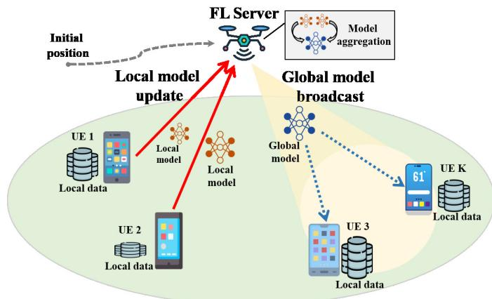

Fig. 1. UAV-assisted federated learning communications $( K = 4 )$  
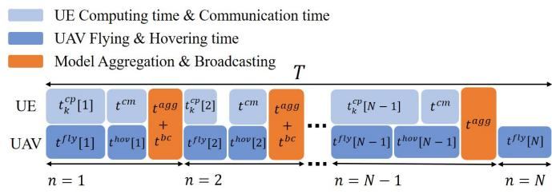  
Fig. 2. Time slot model.

The remainder of this paper is organized as follows. Section II introduces the system model and formulates the joint design problem. Section III analyzes problem feasibility and presents the proposed UG strategy. Section III presents an SCA optimization framework to solve the problem. Sections IV and VI provide the simulation results and concluding remarks, respectively. Notations: $\left[ \cdot \right] ^ { T }$ denotes the transpose of a vector. Diag(·) represents a diagonal matrix with the given argument as its diagonal entries. E[·] denotes expectation, and R is the set of real numbers. $\mathbf { 1 } _ { K }$ is a $K \times 1$ all-ones vector. $\langle \cdot , \cdot \rangle$ denotes the inner product. $. \nabla f$ is the gradient of a function $f .$ The symbol ∪ denotes the union of sets.

## II. SYSTEM MODEL AND PROBLEM FORMULATION

## A. System Model

Fig. 1 shows a UAV-assisted FL communication network, comprising a UAV and K ground users (UEs) with different sizes of local data. The UAV acts as the FL server and flies over the area to perform FL with the users. The entire task duration T is divided into N time slots, with N discrete time instants $( n ~ = ~ 1 , \ldots , N )$ . Define the sets of UEs and time instants as $\mathcal { K } = \{ 1 , \ldots , K \}$ and $\mathcal { N } = \{ 1 , \ldots , N - 1 \}$ respectively. As shown in Fig. 2, $t _ { k } ^ { c p } [ n ]$ represents the local model computation time of the kth UE at time n. Furthermore, $t ^ { f l y } [ n ]$ and $\dot { t } ^ { h o v } [ n ]$ denote the flight and hovering time of the UAV at time n, and $t ^ { c m } , t ^ { a g g }$ , and $t ^ { b c }$ represent the time for model uploading, aggregation, and broadcasting, respectively. To enable synchronized FL among UEs, the time durations of $t ^ { c m } , t ^ { a g g }$ , and $t ^ { b c }$ are assumed to be fixed.

1) UAV Position and Channel Model: The kth UE’s horizontal coordinate is given by

$$
\begin{array} { r } { \mathbf { g } _ { U E , k } = [ \bar { x } _ { k } , \bar { y } _ { k } ] ^ { T } \in \mathbb { R } ^ { 2 } , \forall k \in \mathcal { K } . } \end{array}\tag{1}
$$

The UAV flies at a fixed altitude H and constant speed $v _ { U A V } ,$ with $\mathbf { q } [ n ] = [ x [ n ] , y [ n ] ] ^ { T } \in \mathbb { R } ^ { 2 }$ as its horizontal coordinate at time n, ∀n $\in \mathcal { N } \cup \{ 0 , N \}$ . The UAV’s initial and final positions are given as

$$
\mathbf { q } [ 0 ] = \mathbf { q } ^ { i n i } ;\tag{2}
$$

$$
{ \bf q } [ N ] = { \bf q } ^ { f i n } .\tag{3}
$$

Assuming the UAV flies at a high enough altitude to ensure a line-of-sight (LOS) link between the UAV and UEs, the path loss (in decibels) is modeled as [35]:

$$
g _ { k } \left[ n \right] = 2 0 \mathrm { l o g } _ { 1 0 } \left( \frac { 4 \pi f _ { c } d _ { k } \left[ n \right] } { c } \right) , \forall k \in \mathcal { K } , \forall n \in \mathcal { N } ,\tag{4}
$$

where $f _ { c }$ is the carrier frequency, c is the speed of light, and $d _ { k } \left[ n \right] = \sqrt { \left\| \mathbf { q } [ n ] - \mathbf { g } _ { U E , k } \right\| _ { 2 } ^ { 2 } + H ^ { 2 } }$ is the distance between the UAV and the kth UE.

2) Time-Slotted Model: Let $D _ { k }$ denote the data amount used by the kth UE for FL participation. The local computation time for UE k is calculated as:

$$
t _ { k } ^ { c p } [ n ] = a _ { k } [ n ] D _ { k } \Phi _ { k } , \forall k \in { \mathcal { K } } , \forall n \in { \mathcal { N } } ,\tag{5}
$$

where $\begin{array} { r } { \Phi _ { k } \ = \ I \left( \frac { C } { f _ { c p u , k } } \right) } \end{array}$ with the CPU frequency $f _ { c p u , k } ,$ I is the number of local update iterations, and C is the computation required to process one bit. The binary variable $a _ { k } [ n ] ~ \in ~ \{ 0 , 1 \}$ indicates FL participation $( a _ { k } [ n ] \ = \ 1$ if participating, otherwise $a _ { k } [ n ] = 0 )$ . The UE performs local model computation while the UAV is in flight and transmits the local model during the UAV hovering phase, subject to time constraints:

$$
t ^ { c m } \leq t ^ { h o v } [ n ] , \forall n \in \mathcal { N } ;\tag{6}
$$

$$
t ^ { c m } + t _ { k } ^ { c p } [ n ] \leq t ^ { f l y } [ n ] + t ^ { h o v } [ n ] , \forall k \in \mathcal { K } , \forall n \in \mathcal { N } ;\tag{7}
$$

$$
\sum _ { n = 1 } ^ { N } t ^ { f l y } [ n ] + \sum _ { n = 1 } ^ { N - 1 } ( t ^ { h o v } [ n ] + t ^ { a g g } ) + ( N - 2 ) t ^ { b c } \leq T ,\tag{8}
$$

where the UAV’s flight time is given by $\begin{array} { r l } { t ^ { f l y } [ n ] } & { { } = } \end{array}$ $\begin{array} { r } { \frac { 1 } { v _ { U A V } } | | \mathbf { q } [ n ] - \mathbf { q } [ n - 1 ] | | } \end{array}$ . The constraint (6) mandates the UAV to hover during FL model uploading to ensure stable communication. For model aggregation, the constraint (7) ensures that the UE’s local model computation and communication time does not exceed the $\mathrm { U A V } ^ { \prime } \mathbf { s }$ flight and hovering time.1 The constraint (8) ensures that the $\mathrm { U A V } ^ { \ , } \mathbf { s }$ flight and hovering time, along with the model aggregation time tcm and broadcasting time $t ^ { b c }$ , do not exceed the task period T .

## B. Transmission Model

Since the UEs share the same bandwidth W , the UAV experiences multiuser interference. The signal-to-interferenceplus-noise ratio (SINR) for the kth UE at the UAV is expressed as

$$
\Gamma _ { k } \left[ n \right] = \frac { p _ { k } \left[ n \right] \tilde { g } _ { k } \left[ n \right] } { \sum _ { i = 1 , i \neq k } ^ { K } p _ { i } \left[ n \right] \tilde { g } _ { i } \left[ n \right] + \sigma _ { z } ^ { 2 } } , \forall k \in \mathcal { K } , \forall n \in \mathcal { N } ,\tag{9}
$$

where $\tilde { g } _ { k } \left[ n \right] = 1 0 ^ { \frac { - g _ { k } \left[ n \right] } { 1 0 } } , \sigma _ { z } ^ { 2 }$ is the noise power, and $p _ { k }$ [n] is the transmit power of UE k, subject to

$$
0 \leq p _ { k } [ n ] \leq p _ { U E } ^ { m a x } , \forall k \in K , \forall n \in N ,\tag{10}
$$

where $p _ { U E } ^ { m a x }$ is the maximum allowable power. The achievable rate of the kth UE can be calculated as

$$
R _ { k } [ n ] = W \mathrm { l o g } _ { 2 } ( 1 + \Gamma _ { k } [ n ] ) , \forall k \in \mathcal { K } , \forall n \in \mathcal { N } .\tag{11}
$$

For successful model aggregation, the kth UE’s uplink data within $t ^ { c m }$ must cover the model size Q:

$$
a _ { k } [ n ] \mathscr { Q } \leq t ^ { c m } R _ { k } [ n ] , \forall k \in { \mathcal { K } } , \forall n \in { \mathcal { N } } .\tag{12}
$$

## C. FL Model

A global loss function for the FL model is defined as $f _ { G } ( \mathbf { w } ) \ \triangleq \ \sum _ { k = 1 } ^ { K } f _ { L , k } \left( \mathbf { w } \right)$ , where $f _ { L , k } ( { \bf w } )$ is the average local loss function of the kth UE, evaluated over its local dataset of size $D _ { k }$ , and w is the FL model parameter. Let $\mathcal { T } ~ = ~ \{ n I ~ | ~ n ~ \in ~ \mathcal { N } \}$ be the set of global aggregation intervals. Within each time slot, the participating UEs remain fixed, performing I − 1 local updates followed by one global aggregation at the UAV server. The participating indicator of the kth UE at the ith FL model update is

$$
a _ { k } ^ { i } = a _ { k } [ n ] \in \{ 0 , 1 \} , \forall i \in \{ n I - 1 , n I - 2 , \ldots , n I - I \} .\tag{13}
$$

The FL model parameter w is collaboratively trained by the UEs under UAV coordination via two steps:

1) Local Update: Let $\mathbf { w } _ { k } ^ { i }$ denote the local model parameter of UE k in the ith update. Each UE performs local updates utilizing stochastic gradient descent (SGD):

$$
\begin{array} { r } { \mathbf { w } _ { k } ^ { i } = \mathbf { w } _ { k } ^ { i - 1 } - \eta \nabla f _ { L , k } ( \mathbf { w } _ { k } ^ { i - 1 } , s _ { k } ^ { i - 1 } ) , \forall i \notin \mathcal { T } , } \end{array}\tag{14}
$$

where η is the learning rate, $\nabla f _ { L , k }$ is the gradient of $f _ { L , k } ( { \bf w } )$ and $s _ { k } ^ { i - 1 }$ represents a randomly sampled mini-batch from the local dataset.

2) Global Aggregation: After every I −1 local updates, the UAV server performs model aggregation at time instant nI:

$$
\mathbf { w } _ { k } ^ { i + 1 } = \sum _ { k = 1 } ^ { K } \frac { a _ { k } ^ { i } D _ { k } } { \sum _ { j = 1 } ^ { K } a _ { j } ^ { i } D _ { j } } \mathbf { w } _ { k } ^ { i } , \forall i + 1 \in \mathcal { I } .\tag{15}
$$

To facilitate analysis, a “virtual” model aggregation is introduced as follows:

$$
\bar { \mathbf { w } } ^ { i } = \sum _ { k = 1 } ^ { K } \frac { a _ { k } ^ { i } D _ { k } } { \sum _ { j = 1 } ^ { K } a _ { j } ^ { i } D _ { j } } \mathbf { w } _ { k } ^ { i } , \forall i ,\tag{16}
$$

where $\bar { \mathbf { w } } ^ { i }$ represents a conceptual (non-physical) aggregation of local models at iteration i. The recursive relationship

between successive virtual updates, linking the local and global updates, is given by

$$
\bar { \mathbf { w } } ^ { i + 1 } = \bar { \mathbf { w } } ^ { i } - \eta \sum _ { k = 1 } ^ { K } \frac { a _ { k } ^ { i } D _ { k } } { \sum _ { j = 1 } ^ { K } a _ { j } ^ { i } D _ { j } } \nabla f _ { L , k } ( \mathbf { w } _ { k } ^ { i } , s _ { k } ^ { i } ) .\tag{17}
$$

Theorem 1: Let $\mathbf { w } ^ { * }$ be the optimal FL parameter of the global function. Under standard smoothness, convexity, and bounded variance assumptions (see Assumptions 1–4 in Appendix A) and a learning rate $\begin{array} { r } { \eta \le \frac { 1 } { 2 L } } \end{array}$ , the EGL gap after (i + 1) updates is bounded by

$$
\mathbb { E } \Big [ f _ { G } \big ( \bar { \mathbf { w } } ^ { i + 1 } \big ) - f _ { G } \big ( \mathbf { w } ^ { * } \big ) \Big ] \leq \frac { L } { 2 } \Bigg [ \omega ^ { i + 1 } \mathbb { E } \left[ \| \bar { \mathbf { w } } ^ { 0 } - \mathbf { w } ^ { * } \| ^ { 2 } \right]
$$

$$
+ A _ { 1 } \left( \frac { 1 - \omega ^ { i + 1 } } { \eta \mu } \right) + \eta ^ { 2 } \sum _ { l = 0 } ^ { i } \left( \omega ^ { i - l } \sum _ { k = 1 } ^ { K } ( \bar { D } _ { k } ^ { l } ) ^ { 2 } \epsilon _ { v } ^ { 2 } \right) \Bigg ] ,
$$

where $\begin{array} { r } { \omega = 1 - \eta \mu , A _ { 1 } \ = \ \left( 1 + \frac { \zeta } { 2 \eta } \right) I ^ { 2 } \eta ^ { 2 } \epsilon _ { s } ^ { 2 } + \frac { \eta L ^ { 2 } \epsilon _ { w } } { 2 } ( \zeta + } \end{array}$ $\begin{array} { r } { 4 \eta ) , \zeta = 2 \eta ( 1 - \eta 2 L ) , \bar { D } _ { k } ^ { i } = \frac { a _ { k } ^ { \ i } D _ { k } } { \sum _ { j = 1 } ^ { K } a _ { j } ^ { \ i } D _ { j } } , } \end{array}$ , and $\| \mathbf { w } ^ { * } - \mathbf { w } _ { k } ^ { * } \| ^ { 2 } \leq$ $\epsilon _ { w } .$

Proof: See Appendix A for the detailed proof.

Theorem 1 shows that the EGL gap depends quadratically on $\bar { D } _ { k } ^ { i }$ , highlighting the impact of each UE’s data volume and FL participation on the learning performance. Accordingly, a learning performance constraint is introduced to bound the EGL gap at the target round:

$$
\begin{array} { r l } & { \displaystyle \frac { L } { 2 } \Biggl [ \omega ^ { ( N - 1 ) I } \mathbb { E } \left[ \| \bar { \mathbf { w } } ^ { 0 } - \mathbf { w } ^ { * } \| ^ { 2 } \right] + A _ { 1 } \left( \frac { 1 - \omega ^ { ( N - 1 ) I } } { \eta \mu } \right) } \\ & { \displaystyle + \eta ^ { 2 } \sum _ { n = 1 } ^ { N - 1 } \left( \omega ^ { ( ( N - 1 ) - n ) I } \left( \frac { 1 - \omega ^ { I } } { \eta \mu } \right) \sum _ { k = 1 } ^ { K } ( \bar { D } _ { k } [ n ] ) ^ { 2 } \epsilon _ { v } ^ { 2 } \right) \Biggr ] \leq \epsilon _ { G } , } \end{array}\tag{18}
$$

where $\epsilon _ { G }$ is a preset threshold for the loss gap, and ${ \bar { D } } _ { k } [ n ] =$ $\overline { { \sum _ { j = 1 } ^ { K } a _ { j } [ n ] D _ { j } } }$ ak[n]Dk is obtained from D¯ i via (13). $\bar { D } _ { k } ^ { i }$

To ensure adequate and diverse training data, the total data volume of UEs must exceed a threshold $D _ { t h } \colon$

$$
\sum _ { n = 1 } ^ { N - 1 } a _ { k } [ n ] D _ { k } \geq D _ { t h } , \forall k \in \mathcal { K } .\tag{19}
$$

Additionally, the number of participating UEs per time slot must meet a minimum requirement $a _ { m i n }$

$$
\sum _ { k = 1 } ^ { K } a _ { k } [ n ] \geq a _ { m i n } , \forall n \in \mathcal { N } .\tag{20}
$$

## D. Energy Consumption Model

The communication and computation energy of UE k are given by $\begin{array} { r c l } { E _ { k } ^ { c m } [ n ] } & { = } & { t ^ { c m } p _ { k } [ n ] } \end{array}$ and $\begin{array} { r l } { E _ { k } ^ { c p } [ n ] } & { { } = } \end{array}$ $a _ { k } [ n ] D _ { k } I \psi C f _ { c p u , k } ^ { 2 }$ , respectively, where ψ is the chip coefficient [15], and other related parameters are defined in (5). The UAV consumes energy for model aggregation, broadcasting, and flight. Since aggregation energy depends on the UAV’s CPU frequency and this work focuses on the effect of UE data size on FL, model aggregation energy is omitted. Let

$P ^ { f l y } ( v _ { U A V } )$ represent the power consumption of a rotarywing UAV flying at speed $v _ { U A V }$ [36]. The UAV’s flight-related energy consumption includes two operations: flying and hovering, given by $E ^ { f l y } [ n ] = t ^ { f l y } [ n ] P ^ { \dot { f } l y } ( v _ { U A V } )$ and $\bar { \boldsymbol { E } } ^ { h o v } [ n ] =$ $t ^ { h o v } \bar { [ { m } ] { \cal P } ^ { f l y } ( 0 ) }$ . In summary, the total energy consumption of the UAV-assisted FL system is given by

$$
E ^ { t o t } = \sum _ { n = 1 } ^ { N } E ^ { f l y } [ n ] + \sum _ { n = 1 } ^ { N - 1 } \left\{ \sum _ { k = 1 } ^ { K } E _ { k } ^ { c p } [ n ] + E _ { k } ^ { c m } [ n ] + E ^ { h o v } [ n ] \right\}\tag{21}
$$

## E. Problem Formulation

We formulate a joint design problem, involving the UAV trajectory $\mathbf { q } = \{ \mathbf { q } [ n ] , \forall n \in N \cup \{ 0 , N \} \}$ , UE participation $\mathbf { a } = \{ a _ { k } [ n ] , \forall n \in \mathcal { N } , k \in \mathcal { K } \}$ , UE transmit power $\mathbf { p } _ { U E } =$ $\{ p _ { k } [ n ] , \forall n \in \mathcal { N } , k \in \mathcal { K } \}$ , the data amount used by the UEs for FL participation $\mathbf { D } = \{ D _ { k } , \forall k \in \mathcal { K } \}$ , and UAV hovering time $\mathbf { t } ^ { h \bar { o } v } = \bar { { t } } ^ { h o v } [ n ] , \forall n \in \bar { \mathcal { N } } \}$ . The objective is to minimize the total system energy consumption:

$$
\begin{array} { r l } { \mathbf { ( P 1 ) } } & { \underset { \{ \mathbf { q } , \mathbf { a } , \mathbf { p } _ { U E } , \mathbf { D } , \mathbf { t } ^ { h o v } \} } { \operatorname* { m i n } } E ^ { t o t } } \\ & { \quad \quad \quad \quad s . t . ~ ( 2 ) , ( 3 ) , ( 6 ) , ( 7 ) , ( 8 ) , } \\ & { \quad \quad \quad \quad ( 1 0 ) , ( 1 2 ) , ( 1 8 ) , ( 1 9 ) , ( 2 0 ) . } \end{array}
$$

The constraints (2) and (3) specify the UAV’s initial and final positions, while (6)–(8) define the time slot constraints. The constraint (10) limits the $\mathrm { U E s } '$ transmit power, and (12) governs the uplink rates. The constraint (18) enforces a target bound on the EGL gap at the designated round, rather than providing a formal convergence guarantee, while (19) and (20) guarantee minimum data per UE and user participation, respectively. However, problem (P1) may be infeasible under strict uplink rate constraints, since each participating UE must upload a local model of size Q within tcm. When the available rate is limited by interference, power, or short communication duration, certain UE participation sets $a _ { k } [ n ]$ render the problem unsolvable. To overcome this, we analyze the feasibility condition of (P1) and develop UG-based optimization that mitigates infeasibility while improving overall resource utilization.

## III. FEASIBILITY AND USER GROUPING STRATEGY

## A. Feasibility Analysis

To reveal when the SINR constraints cause infeasibility, we first consider a related UAV deployment problem that minimizes the total UE transmit power while satisfying an SINR target γth:

$$
\begin{array} { r l r } {  { ( { \bf P 2 } ) } \operatorname* { m i n } _ { \{ ( X , Y ) , p _ { k } \geq 0 , \forall k \in \mathcal { K } \} } \sum _ { k = 1 } ^ { K } p _ { k } }  \\ & { } & { s . t . \ \frac { p _ { k } d _ { k } ^ { - 2 } } { \sum _ { i = 1 , i \neq k } ^ { K } p _ { i } d _ { i } ^ { - 2 } + \tilde { \sigma } _ { z } } \geq \gamma _ { t h } , \forall k \in \mathcal { K } , } \end{array}\tag{22}
$$

where (X, Y ) is the UAV’s horizontal position, and the SINR follows (9) with $\begin{array} { r } { \tilde { \sigma } _ { z } = \frac { \sigma _ { z } ^ { 2 } } { c ^ { 2 } ( 4 \pi f _ { c } ) ^ { - 2 } } } \end{array}$ . For brevity, define $\textbf { D } =$ Diag $( d _ { 1 } , \dots , d _ { K } ) \in \mathbb { R } ^ { K \times K }$ , and $\mathbf { p } = [ p _ { 1 } , \dots , p _ { K } ] ^ { T } \in \mathbb { R } ^ { K \times 1 }$

Problem (P2) retains the SINR constraints of (P1) while fixing the other optimization variables and omitting the remaining constraints. As such, it serves as a tractable proxy for analyzing feasibility under given UAV positions and UE participation sets, rather than as a standalone optimization problem. By examining the feasibility of (P2), we are able to characterize the conditions under which the SINR constraints alone may render Problem (P1) infeasible. The following lemma and theorem is then provided.

Lemma 1: In (P2), the total transmit power is minimized only when all UEs meet the same SINR $\gamma _ { t h }$

Proof: It can be easily proved following the power reduction procedures in [37]. 

Theorem 2: The optimal UAV placement and UE transmit power for (P2) are

$$
\left( { X , Y } \right) = \left( { \frac { { \sum _ { k = 1 } ^ { K } { b _ { k } { \bar { x } } _ { k } } } } { { \sum _ { k = 1 } ^ { K } { b _ { k } } } } } , { \frac { { \sum _ { k = 1 } ^ { K } { b _ { k } { \bar { y } } _ { k } } } } { { \sum _ { k = 1 } ^ { K } { b _ { k } } } } } \right) ;\tag{23}
$$

$$
\begin{array} { r } { \mathbf { p } = \mathbf { D } ^ { 2 } \mathbf { b } , } \end{array}\tag{24}
$$

where $\mathbf { b } = \gamma _ { t h } \mathbf { A } ^ { - 1 } \mathbf { 1 } _ { K } \tilde { \sigma } _ { z } \triangleq \left[ b _ { 1 } , \ldots , b _ { K } \right] ^ { T } \in \mathbb { R } ^ { K \times 1 } , [ \bar { x } _ { k } , \bar { y } _ { k } ]$ is the kth UE’s position in (1), and

$$
\mathbf { A } = \left[ \begin{array} { l l l } { 1 } & { - \gamma _ { t h } \mathbf { \Omega } \cdot \mathbf { \Omega } \cdot - \gamma _ { t h } } \\ { - \gamma _ { t h } } & { 1 } & { - \gamma _ { t h } } \\ { \vdots } & { \ddots } & { \vdots } \\ { - \gamma _ { t h } - \gamma _ { t h } \mathbf { \Omega } \cdot \mathbf { \Omega } \cdot - \mathbf { \Omega } } & { 1 } \end{array} \right] \in \mathbb { R } ^ { K \times K } .
$$

Proof: From Lemma 1, the SINR constraint is tight, yielding ${ \bf A D } ^ { - 2 } { \bf p } = \gamma _ { t h } { \bf 1 } _ { K } \tilde { \sigma } _ { z }$ and thus $\mathbf { p } = \mathbf { D } ^ { 2 } \mathbf { b }$ . Substituting (24) into (P2) gives min $\begin{array} { r } { \{ ( X , Y ) \} \sum _ { k = 1 } ^ { K } b _ { k } d _ { k } ^ { 2 } } \end{array}$ . Setting the partial derivative with respect to X and Y to zero yields (23). 

Remark 1: From Theorem 2, the optimal UAV placement is the $b _ { k }$ -weighted centroid of UE locations, with $b _ { k }$ determined by $\gamma _ { t h }$ . The optimal UE transmit power only depends on $b _ { k }$ and the distance to the UAV. Scaling up $\gamma _ { t h }$ does not alter the optimal UAV placement.

Lemma 2: Problem (P2) is feasible if and only if

$$
\gamma _ { t h } \in \left[ 0 , \frac { 1 } { K - 1 } \right) , \forall k \in K .\tag{25}
$$

Proof: To compute (24), A must be non-singular. Since det $\bar { ( \mathbf { A } ) } = ( 1 - \bar { ( K - 1 ) } \gamma _ { t h } ) ( 1 + \gamma _ { t h } ) ^ { K - 1 }$ , we need $\gamma _ { t h } \neq$ $\frac { 1 } { K - 1 }$ . Note that $\mathbf { 1 } _ { K }$ is an eigenvector of A, with eigenvalue $( \bar { 1 } - ( K - 1 ) \gamma _ { t h } )$ . We thus have

$$
\mathbf { b } = \mathbf { A } ^ { - 1 } \mathbf { 1 } _ { K } \gamma _ { t h } \tilde { \sigma } _ { z } = \frac { \gamma _ { t h } \tilde { \sigma } _ { z } } { 1 - ( K - 1 ) \gamma _ { t h } } \mathbf { 1 } _ { K } .\tag{26}
$$

Thus, $\mathbf { p } = \mathbf { D } ^ { 2 } \mathbf { b } \geq 0$ if and only if (25) holds; otherwise, $\mathbf b < 0$ yields infeasible (negative) power. 

From Theorem 2 and Lemma 2, the total UE transmit power is

$$
\sum _ { k = 1 } ^ { K } p _ { k } = \frac { \gamma _ { t h } K \tilde { \sigma } _ { z } } { \left( 1 - \gamma _ { t h } \left( K - 1 \right) \right) \left( \frac { \sum _ { k = 1 } ^ { K } p _ { k } d _ { k } ^ { - 2 } } { \sum _ { k = 1 } ^ { K } p _ { k } } \right) } ,\tag{27}
$$

where $\begin{array} { r } { \gamma _ { t h } \in \bigg \lceil 0 , \frac { 1 } { K - 1 } \bigg \rceil } \end{array}$ . The following remark is then given. Remark 2: As $\gamma _ { t h }$ increases to $\frac { 1 } { K - 1 }$ , the total UE transmit power increases and approaches infinity. As $\gamma _ { t h }  \frac { 1 } { K - 1 }$ , the

Algorithm 1 User Grouping-Based Suboptimal Solution 1: Perform DBSCAN to obtain UE groups $\begin{array} { r } { \overline { { \bf G _ { \it i } , { \mathrm { ~ \it ~ i ~ \omega ~ } } = } } } \end{array}$ $1 , 2 , . . . , G ^ { t o t }$ 2: Assign equal time slots $\mathcal { T } _ { i }$ to group $\mathbf { G } _ { i } , i = 1 , 2 , . . . , G ^ { t o t }$ 3: Use Theorem 2, set q[n] by (23), pk[n] by (24). 4: Assign $\begin{array} { r } { D _ { k } [ n ] = \frac { D _ { t h } } { | \mathcal { T } _ { i } | } , \forall \dot { k } \in { \bf G } _ { i } , n \in \dot { \mathcal { T } } _ { i } , i = 1 , 2 , . . . , G ^ { t o t } } \end{array}$

UE transmit power dominates the total energy consumption, and the optimal UAV trajectory of (P1) converges to a static placement solution of (P2).

## B. User Grouping-Based Suboptimal Solution (UG-Suboptimal)

From Lemma 2, problem (P1) becomes infeasible when the FL model size $\begin{array} { r } { \mathcal { Q } \ge t ^ { c m } W \log _ { 2 } \left( \frac { 1 } { K - 1 } + 1 \right) } \end{array}$ , i.e., when $\begin{array} { l l l } { \gamma _ { t h } } & { \geq } & { { \frac { 1 } { K - 1 } } } \end{array}$ . To alleviate infeasibility, a UG strategy is introduced to reduce the number of participants per FL round, thereby improving the SINR for each UE. However, varying the number of participants affects the model EGL gap, revealing a fundamental trade-off between communication feasibility and learning performance. In this work, we adopt densitybased spatial clustering of applications with noise (DBSCAN) as the primary grouping method. DBSCAN can cluster users into arbitrary shapes, handle irregular distributions, and adapt to dynamic user densities and UAV locations without requiring a preset number of groups. By tuning the density threshold, it balances FL model learning performance with SINR enhancement.

The analysis of problem (P2) offers structural insights for solving (P1). Based on this, we design a suboptimal UG-based algorithm (Algorithm 1) for (P1) to enhance feasibility. DBSCAN is executed with parameters  and minPts, representing the maximum neighbor distance for grouping users (adjusted to represent different user density scenarios) and the minimum number of UEs to form a valid group, respectively. This process yields $G ^ { t o t }$ groups, denoted by $\mathbf { G } _ { i } ,$ for $i = 1 , \ldots , G ^ { t o t }$ . According to Lemma 2, the number of UEs per group is restricted by $\begin{array} { r } { K _ { G } \le \frac { 1 } { \gamma _ { t h } } + 1 } \end{array}$ . The available time slots are evenly divided among the groups, where $\mathcal { T } _ { i }$ denotes the time slots for group $\mathbf { G } _ { i } ,$ and the data volume is $\frac { D t h } { | { \cal T } _ { i } | }$ . Using Theorem 2, the UAV trajectory and UE transmit power are determined by (23) and (24), respectively. Note that the parameter K in Theorem 2 represents the total number of UEs, whereas in Algorithm 1, K is replaced by the number of UEs in each group.

## IV. TWO-PHASE OPTIMIZATION DESIGN

Given the complexity of the non-convex problem (P1), we address it in two phases. In (P1), the UE participation variable $a _ { k } [ n ]$ and the UE local data size $D _ { k }$ are combined into a new variable $\tilde { \mathbf { D } } = \{ D _ { k } [ n ] = a _ { k } [ n ] D _ { k } , \forall n \in \mathcal { N } , k \in \mathcal { K } \}$ , where

$$
D _ { k } [ n ] \in \{ 0 , D _ { k } \} .\tag{28}
$$

The constraint (12) depends solely on $a _ { k } [ n ]$ . We therefore introduce a sign function $s g n ( D \boldsymbol { k } [ n ] ) \in \{ 0 , 1 \}$ to indicate UE participation and approximate it as [38]:

$$
a _ { k } [ n ] = s g n ( D _ { k } [ n ] ) \approx \frac { e ^ { 2 \beta D _ { k } [ n ] } - 1 } { e ^ { 2 \beta D _ { k } [ n ] } + 1 } \triangleq \tilde { a } _ { k } [ n ] ,\tag{29}
$$

where $\beta ~ > ~ 0$ controls the approximation accuracy (here, $\beta = 5 )$ . Since $\tilde { a } _ { k } [ n ]$ is concave for $D _ { k } [ n ] > 0$ , problem (P1) can be rewritten as

$$
\operatorname* { m i n } _ { \{ \mathbf { q } , \mathbf { p } _ { U E } , \mathbf { D } , \tilde { \mathbf { D } } , \mathbf { t } ^ { h o v } \} } E ^ { t o t }\tag{P3}
$$

$$
s . t . ~ ( 2 ) , ( 3 ) , ( 6 ) , ( 8 ) , ( 1 0 ) , ( 2 8 ) ,
$$

$$
t ^ { c m } + D _ { k } [ n ] \Phi _ { k } \underline { { { \le } } } t ^ { f l y } [ n ] + t ^ { h o v } [ n ] , \forall k \in \mathcal { K } , \forall n \in \mathcal { N } ,\tag{30}
$$

$$
\tilde { a } _ { k } [ n ] \mathcal { Q } \leq t ^ { c m } R _ { k } [ n ] , \forall k \in \mathcal { K } , \forall n \in \mathcal { N } ,\tag{31}
$$

$$
\sum _ { n = 1 } ^ { N - 1 } D _ { k } [ n ] \geq D _ { t h } , \forall k \in \mathcal { K } ,\tag{32}
$$

$$
\frac { L } { 2 } \left[ \boldsymbol { \omega } ^ { ( N - 1 ) I } \mathbb { E } \left[ \left. \bar { \mathbf { w } } ^ { 0 } - \mathbf { w } ^ { * } \right. ^ { 2 } \right] \right.
$$

$$
+ A _ { 1 } \left( \frac { 1 - \omega ^ { \left( N - 1 \right) I } } { \eta \mu } \right) +
$$

$$
\eta ^ { 2 } \sum _ { n = 1 } ^ { N - 1 } ( \omega ^ { ( ( N - 1 ) - n ) I } ( \frac { 1 - \omega ^ { I } } { \eta \mu } ) \sum _ { k = 1 } ^ { K } ( \tilde { D } _ { k } [ n ] ) ^ { 2 } \epsilon _ { v } ^ { 2 } ) ]\tag{33}
$$

$$
\sum _ { k = 1 } ^ { K } \tilde { a } _ { k } [ n ] \geq a _ { m i n } , \forall n \in \mathcal N ,\tag{34}
$$

where $\begin{array} { r c l } { E _ { k } ^ { c p } } & { = } & { D _ { k } [ n ] I \psi C f _ { c p u , k } ^ { 2 } } \end{array}$ in $E ^ { t o t }$ , and $\tilde { D } _ { k } [ n ] ~ =$ $\begin{array} { r } { D _ { k } [ n ] \left( \sum _ { j = 1 } ^ { K } D _ { j } [ n ] \right) ^ { - 1 } } \end{array}$

## A. Phase I: Optimization With Relaxed Data Size Restrictions

We relax the binary restriction (28) on $D _ { k } [ n ]$ , yielding the relaxed constraint and problem of (P3):

$$
\begin{array} { r l } & { D _ { k } \big [ n \big ] \geq 0 , \forall n \in \mathcal { N } , k \in \mathcal { K } . } \\ & { ( { \bf P 4 } ) \quad \quad \quad \stackrel { \operatorname* { m i n } } { \{ { \bf q } , { \bf p } _ { U E } , \tilde { \bf D } , { \bf t } ^ { h o v } \} } { \cal E } ^ { t o t } } \\ & { \quad \quad \quad \quad s . t . ~ ( 2 ) , ( 3 ) , ( 6 ) , ( 8 ) , ( 1 0 ) , ( 3 0 ) , ( 3 1 ) , } \\ & { \quad \quad \quad \quad ( 3 2 ) , ( 3 3 ) , ( 3 4 ) , ( 3 5 ) . } \end{array}\tag{35}
$$

Problem (P4) remains non-convex due to (30)–(31) and (33), which are convexified as follows. We first introduce an auxiliary variable $d ^ { l b } [ n ]$ satisfying

$$
d ^ { l b } [ n ] \leq \| \mathbf { q } [ n ] - \mathbf { q } [ n - 1 ] \| , \forall n \in \mathcal { N } .\tag{36}
$$

Using (36), the constraint (30) is replaced by a lower bound:

$$
t ^ { c m } + D _ { k } [ n ] \Phi _ { k } \leq \frac { d ^ { l b } [ n ] } { v _ { U A V } } + t ^ { h o v } [ n ] .\tag{37}
$$

Since $\| \mathbf { q } [ n ] - \mathbf { q } [ n - 1 ] \| ^ { 2 }$ is convex in ${ \bf q } [ n ]$ and ${ \bf q } [ n - 1 ]$ , its first-order Taylor expansion at ${ \bf q } ^ { r } [ n ]$ yields a convex lower bound constraint for (36):

$$
\begin{array} { r l r } { ( d ^ { l b } [ n ] ) ^ { 2 } \leq \| \mathbf { { q } } ^ { r } [ n ] - \mathbf { { q } } ^ { r } [ n - 1 ] \| ^ { 2 } } \\ { } & { } & { + 2 ( \mathbf { { q } } ^ { r } [ n ] - \mathbf { { q } } ^ { r } [ n - 1 ] ) ^ { T } ( \mathbf { { q } } [ n ] - \mathbf { { q } } ^ { r } [ n ] ) } \\ { } & { } & { - 2 ( \mathbf { { q } } ^ { r } [ n ] - \mathbf { { q } } ^ { r } [ n - 1 ] ) ^ { T } ( \mathbf { { q } } [ n - 1 ] - \mathbf { { q } } ^ { r } [ n - 1 ] ) } \\ { } & { } & { , \forall n \in \mathcal { N } , k \in \mathcal { K } \quad \quad ( 3 : } \end{array}\tag{8}
$$

The transmission rate $R _ { k } [ n ]$ in (31) is neither convex nor concave in q[n] and $p _ { k } [ n ]$ . Following [39], we introduce auxiliary variables $A _ { k } [ n ]$ and $B _ { k } [ n ]$ , given by $\begin{array} { r l r } { e x p ( A _ { k } [ n ] ) } & { { } = } & { \tilde { g } _ { k } [ n ] } \end{array}$ and exp( $\begin{array} { r l r } { B _ { k } [ n ] ) } & { { } = } & { p _ { k } [ n ] } \end{array}$ We express $\begin{array} { r l r } { { \cal R } _ { k } [ n ] } & { { } = } & { \frac { W } { l n ( 2 ) } \left( { \cal R } _ { 1 } [ n ] + \dot { \cal R } _ { 2 , k } [ n ] \right) } \end{array}$ , where $\begin{array} { r l } { R _ { 1 } [ n ] } & { { } \triangleq } \end{array}$ ln $\begin{array} { r } { \left( \sum _ { i = 1 } ^ { K } e ^ { B _ { i } [ n ] + \dot { A _ { i } } [ n ] } + \sigma _ { z } ^ { 2 } \right) } \end{array}$ and $\begin{array} { r l } { R _ { 2 , k } [ n ] } & { { } \triangleq } \end{array}$ $- \ln \left( \sum _ { i = 1 , i \neq k } ^ { K } \stackrel { \textstyle \cdot } { e } ^ { B _ { i } [ n ] + A _ { i } [ n ] } + \sigma _ { z } ^ { 2 } \right)$ . Then, we derive concave lower bounds for $R _ { 1 } [ n ]$ and $R _ { 2 , k } [ n ]$ in terms of ${ \bf q } [ n ]$

1) A Concave Lower Bound for $R _ { 1 } | n | .$ :

Theorem 3: Given any ${ \bf q } ^ { r } [ n ] , R _ { 1 } ^ { l b } [ { \bar { n } } ]$ is a concave lower bound for $R _ { 1 } [ n ]$ in terms of q[n] and $B _ { k } [ n ]$ :

$$
\begin{array} { l } { \displaystyle R _ { 1 } [ n ] \ge \ln \left( \displaystyle \sum _ { i = 1 } ^ { K } e ^ { B _ { i } ^ { r } [ n ] + A _ { i } ^ { r } [ n ] } + \sigma _ { z } ^ { 2 } \right) } \\ { \displaystyle \qquad + \displaystyle \sum _ { i = 1 } ^ { K } \frac { e ^ { B _ { i } ^ { r } [ n ] + A _ { i } ^ { r } [ n ] } } { \displaystyle \sum _ { j = 1 } ^ { K } e ^ { B _ { j } ^ { r } [ n ] + A _ { j } ^ { r } [ n ] } + \sigma _ { z } ^ { 2 } } \left( A _ { i } ^ { l b } [ n ] - A _ { i } ^ { r } [ n ] \right) } \\ { \displaystyle \qquad + \displaystyle \sum _ { i = 1 } ^ { K } \frac { e ^ { B _ { i } ^ { r } [ n ] + A _ { i } ^ { r } [ n ] } } { \displaystyle \sum _ { j = 1 } ^ { K } e ^ { B _ { j } ^ { r } [ n ] + A _ { j } ^ { r } [ n ] } + \sigma _ { z } ^ { 2 } } \left( B _ { i } [ n ] - B _ { i } ^ { r } [ n ] \right) \triangleq R _ { 1 } ^ { l b } [ n ] , } \end{array}\tag{39}
$$

where $A _ { i } ^ { r } [ n ] { = } \ln \left( \left( c ( 4 \pi f _ { c } ) ^ { - 1 } \right) ^ { 2 } / \left( \| \mathbf { q } ^ { r } [ n ] - \mathbf { g } _ { U E , i } \| ^ { 2 } + H ^ { 2 } \right) \right)$ $B _ { i } ^ { r } [ n ] ~ = ~ \ln { ( p _ { k } ^ { r } [ n ] ) } , ~ S _ { i } ^ { r } [ n ] ~ = ~ \| \mathbf { q } ^ { r } [ n ] ~ - ~ \mathbf { g } _ { U E , i } \| ^ { 2 } ~ + ~ H ^ { 2 } ,$ $\begin{array} { r } { A _ { i } ^ { l b } [ n ] = \ln \left( \frac { \left( c ( 4 \pi f _ { c } ) ^ { - 1 } \right) ^ { 2 } } { S _ { i } ^ { r } [ n ] } \right) - \frac { \left( \Vert \mathbf { q } [ n ] - \mathbf { g } _ { U E , i } \Vert ^ { 2 } + H ^ { 2 } - S _ { i } ^ { r } [ n ] \right) } { S _ { i } ^ { r } [ n ] } } \end{array}$

Proof: See Appendix D for the detailed proof.

2) A Concave Lower Bound for $R _ { 2 , k } [ n ] .$ : From (4) and (9), $\tilde { g } _ { k } [ n ]$ is non-convex in ${ \bf q } [ n ]$ . An auxiliary variable $\tilde { A } _ { k } [ n ]$ is introduced to ensure $e ^ { A _ { k } \bar { [ n ] } } \bar { = } \tilde { g } _ { k } [ n ] \leq e ^ { \tilde { A _ { k } } [ n ] }$ , yielding

$$
\frac { \| \mathbf { q } [ n ] - \mathbf { g } _ { U E , k } \| ^ { 2 } + H ^ { 2 } } { \left( c ( 4 \pi f _ { c } ) ^ { - 1 } \right) ^ { 2 } } \geq e ^ { - \tilde { A } _ { k } [ n ] } .\tag{40}
$$

Hence, the rate formula $R _ { 2 , k } [ n ]$ is lower bounded by a concave function $R _ { 2 , k } ^ { l b } [ n ]$

$$
\begin{array} { l } { { \displaystyle R _ { 2 , k } [ n ] \geq - \ln \left( \sum _ { i = 1 , i \neq k } ^ { K } e ^ { B _ { i } [ n ] + \tilde { A } _ { i } [ n ] } + \sigma _ { z } ^ { 2 } \right) \triangleq R _ { 2 , k } ^ { l b } [ n ] } } \\ { { \quad \ : , \forall n \in \mathcal { N } , k \in \mathcal { K } . } } \end{array}\tag{41}
$$

The non-convex constraint (40) is linearized via first-order Taylor expansion at ${ \bf q } [ n ] = { \bf q } ^ { r } [ n ]$ , yielding a convex lower bound:

$$
\frac { \| { \bf q } ^ { r } [ n ] - { \bf g } _ { U E , k } \| ^ { 2 } + 2 ( { \bf q } ^ { r } [ n ] - { \bf g } _ { U E , k } ) ^ { T } ( { \bf q } [ n ] - { \bf q } ^ { r } [ n ] ) + H ^ { 2 } } { \left( c ( 4 \pi f _ { c } ) ^ { - 1 } \right) ^ { 2 } }\tag{42}
$$

By replacing $R _ { 1 } [ n ]$ and $R _ { 2 , k } [ n ]$ in $R _ { k } [ n ]$ with the concave bounds $\mathbf { \bar { \mathit { R } } } _ { 1 } ^ { l l b } [ n ]$ and $\bar { R } _ { 2 , k } ^ { l b } [ n ] , ( 3 \bar { 1 } )$ becomes

$$
\widetilde { a } _ { k } [ n ] \mathcal { Q } \leq \frac { t ^ { c m } W } { \ln ( 2 ) } \left( R _ { 1 } ^ { l l b } [ n ] + R _ { 2 , k } ^ { l b } [ n ] \right) , \forall k \in \mathcal { K } , \forall n \in \mathcal { N } .\tag{43}
$$

From (29), $\tilde { a } _ { k } [ n ]$ is concave for $D _ { k } [ n ] \geq 0 .$ , rendering constraint (43) non-convex. To convexify it, we apply a firstorder Taylor expansion at a given point $D _ { k } ^ { r } [ n ]$ , resulting in

$$
\tilde { a } _ { k } [ n ] \leq \frac { e ^ { ( 2 \beta D _ { k } ^ { r } [ n ] ) } - 1 } { e ^ { ( 2 \beta D _ { k } ^ { r } [ n ] ) } + 1 } + \frac { 4 \beta e ^ { ( 2 \beta D _ { k } ^ { r } [ n ] ) } } { \left( e ^ { ( 2 \beta D _ { k } ^ { r } [ n ] ) } + 1 \right) ^ { 2 } } ( D _ { k } [ n ] - D _ { k } ^ { r } [ n ] )
$$

$$
\triangleq \check { a } _ { k } [ n ] , \forall n \in \mathcal { N } , k \in \mathcal { K } .\tag{44}
$$

By utilizing (44) and defining $\begin{array} { r } { \tilde { \mathcal { Q } } = \frac { \mathcal { Q } \ln ( 2 ) } { t ^ { c m } W } } \end{array}$ , the constraint (43) can be convexified as

$$
\check { a } _ { k } [ n ] \tilde { \mathcal { Q } } \leq R _ { 1 } ^ { l l b } [ n ] + R _ { 2 , k } ^ { l b } [ n ] , \forall k \in \mathcal { K } , \forall n \in \mathcal { N } .\tag{45}
$$

In the model learning performance constraint (33), $\tilde { D } _ { k } [ n ]$ is non-convex in $D _ { k } [ n ]$ for $k \in \mathcal { K }$ . To address this, we introduce an auxiliary variable $\hat { D } [ n ]$ satisfying the constraint:

$$
\hat { D } [ n ] \leq \left( \sum _ { j = 1 } ^ { K } D _ { j } [ n ] \right) ^ { 2 } , \forall n \in \mathcal { N } .\tag{46}
$$

Applying (46), we replace the original model learning performance constraint (33) with the following upper bound:

$$
\begin{array} { r l r } {  { \frac { L } { 2 } [ \omega ^ { ( N - 1 ) I } \mathbb { E } \| \bar { \mathbf { w } } ^ { 0 } - \mathbf { w } ^ { * } \| ^ { 2 } + A _ { 1 } ( \frac { 1 - \omega ^ { ( N - 1 ) I } } { \eta \mu } )  } } \\ & { } & { \quad  + \eta ^ { 2 } \sum _ { n = 1 } ^ { N - 1 } ( \omega ^ { ( ( N - 1 ) - n ) I } ( \frac { 1 - \omega ^ { I } } { \eta \mu } ) \sum _ { k = 1 } ^ { K } \frac { ( D _ { k } [ n ] ) ^ { 2 } } { \hat { D } [ n ] } \epsilon _ { v } ^ { 2 } ) ] } \\ & { } & { \quad \le \epsilon _ { G } . } \end{array}\tag{}
$$

The constraint (47) is convex, since $\frac { ( D _ { k } [ n ] ) ^ { 2 } } { \hat { D } [ n ] }$ is convex in $D _ { k } [ n ]$ and ${ \hat { D } } [ n ] ~ > ~ 0$ . The non-convex constraint (46) is convexified via the first-order lower bound of $\begin{array} { r } { \left( \sum _ { j = 1 } ^ { K } D _ { j } [ n ] \right) ^ { 2 } } \end{array}$ at $D _ { j } [ n ] = D _ { j } ^ { r } [ n ] ;$

$$
\begin{array} { r l r } {  { ( \sum _ { j = 1 } ^ { K } D _ { j } [ n ] ) ^ { 2 } \ge ( \sum _ { j = 1 } ^ { K } D _ { j } ^ { r } [ n ] ) ^ { 2 } } } \\ & { } & { + \displaystyle \sum _ { j ^ { \prime } = 1 } ^ { K } ( 2 ( \sum _ { j ^ { \prime \prime } = 1 } ^ { K } D _ { j ^ { \prime \prime } } ^ { r } [ n ] ) ( D _ { j ^ { \prime } } [ n ] - D _ { j ^ { \prime } } ^ { r } [ n ] ) ) , \forall n \in \mathcal N , } \end{array}
$$

which yields the convex surrogate:

$$
\begin{array} { r l r } & { \displaystyle \hat { D } [ n ] \le \left( \sum _ { j = 1 } ^ { K } D _ { j } ^ { r } [ n ] \right) ^ { 2 } } & { ( 4 9 ) } \\ & { \displaystyle + \sum _ { j ^ { \prime } = 1 } ^ { K } \left( 2 \left( \sum _ { j ^ { \prime \prime } = 1 } ^ { K } D _ { j ^ { \prime \prime } } ^ { r } [ n ] \right) \left( D _ { j ^ { \prime } } [ n ] - D _ { j ^ { \prime } } ^ { r } [ n ] \right) \right) , \forall n \in \mathcal { N } . } \end{array}
$$

With these transformations, problem (P4) becomes

$$
( \mathbf { P 5 } ) \operatorname* { m i n } _ { \{ \mathbf { q } , \tilde { \mathbf { A } } , \mathbf { B } , \tilde { \mathbf { D } } , \hat { \mathbf { D } } , \mathbf { t } ^ { h o v } \} } E ^ { t o t }
$$

$$
\begin{array} { c } { { s . t . ~ ( 2 ) , ( 3 ) , ( 6 ) , ( 8 ) , ( 1 0 ) , ( 3 2 ) , ( 3 4 ) , } } \\ { { ( 3 5 ) , ( 3 5 ) , ( 3 5 ) , ( 4 2 ) , ( 4 5 ) , ( 4 7 ) , ( 4 9 ) , } } \end{array}
$$

where $\tilde { \textbf { A } } = \{ \tilde { A } _ { k } [ n ] , \forall n \in \mathcal { N } , k \in \mathcal { K } \} , \textbf { B } = \{ B _ { k } [ n ] , \forall n \in \mathcal { N } ,$ $\mathcal { N } , k \in \mathcal { K } \} , \hat { { \mathbf { D } } } = \{ \hat { D } [ n ] , \forall n \in \mathcal { N } \}$ . The auxiliary constraints (42) and (49) ensure the lower and upper bound relationships in (45) and (47), respectively. For given ${ \bf q } ^ { r } [ n ] , B _ { k } ^ { r } [ n ]$ and $D _ { k } ^ { r } [ n ]$ , we solve (P5) iteratively using SCA [40] with CVX [41] to obtain UAV trajectory, UE and UAV transmit power, relaxed data size, and UAV hovering time.

## B. Phase II: Re-Optimization With Data Size Restrictions

The data size relaxation in Phase I allows UE data sizes to vary across time slots. In Phase II, We refine the solution by considering the data size restriction. As $D _ { k } [ n ]$ in Phase I encapsulates the UE participation $a _ { k } [ n ]$ and local data size $D _ { k }$ it reflects the outcome of joint optimization involving multiple variables (e.g., UE participation, UAV trajectory, and transmit power). Phase II leverages $D _ { k } [ n ]$ to infer UE participation and re-optimize $D _ { k }$ accordingly. From $( 2 9 ) , a _ { k } [ n ]$ is computed based on the data size variable $D _ { k } [ n ]$ and quantized as

$$
a _ { k } [ n ] = \left\{ \begin{array} { l l } { 1 , } & { D _ { k } [ n ] \ge \epsilon _ { a } ~ ; } \\ { 0 , } & { o t h e r w i s e . } \end{array} \right.\tag{50}
$$

The threshold $\epsilon _ { a }$ is selected based on the transition behavior of the UE participation approximation in (29). When $\beta \ =$ 5, the function (29) exhibits a sharp transition and rapidly saturates to one as $D _ { k } [ n ]$ approaches unity. Accordingly, $\epsilon _ { a }$ is set to 1. With (P5), we optimize the data size D under fixed $a _ { k } [ n ]$ using (50) while re-optimizing ${ \bf q } , { \bf p } _ { U E } ,$ and $\mathbf { t } ^ { h o v }$ . To this end, all constraints involving $D _ { k } [ n ]$ in Phase I are updated by substituting $D _ { k } [ n ] = a _ { k } [ n ] D _ { k }$ , except for (45) which is traced back to (31). By directly replacing $\tilde { a } _ { k } [ n ]$ with $a _ { k } [ n ]$ in (31) and applying the same convexification procedure used in (43), we obtain

$$
a _ { k } [ n ] \mathcal { Q } \leq \frac { t ^ { c m } W } { \ln ( 2 ) } \left( R _ { 1 } ^ { l l b } [ n ] + R _ { 2 , k } ^ { l b } [ n ] \right) , \forall k \in \mathcal { K } , \forall n \in \mathcal { N } ;\tag{51}
$$

Using the SCA method [40] with CVX [41], the UAV trajectory, transmit powers, hovering time, and data size are jointly re-optimized for fixed ${ \bf q } ^ { r } [ n ] , B _ { k } ^ { r } [ n ]$ , and $D _ { k } ^ { r }$

## C. Proposed Two-Phase UG-SCA Algorithm

The proposed two-phase UG-SCA algorithm is summarized in Algorithm 2. The superscript r denotes the iteration index. Phase I (lines 1–8) initializes ${ \bf q } ^ { r } [ n ] , B _ { k } ^ { r } [ n ]$ , and $D _ { k } ^ { r } [ n ]$ at $r = 0 ^ { 2 }$ and iteratively solves problem (P5) using SCA until the objective improvement is below a threshold . At each iteration, ${ \bf q } ^ { r } [ n ] , B _ { k } ^ { r } [ n ]$ , and $D _ { k } ^ { r } [ n ]$ are updated to their optimal values ${ \bf q } ^ { \star } [ n ] , B _ { k } ^ { \star } [ n ]$ , and $D _ { k } ^ { \star } [ n ]$ . Phase II (lines 9–11) uses the optimized $D _ { k } ^ { \star }$ from Phase I to infer $a _ { k } [ n ]$ via (50). The constraint (45) is replaced by (51), and the data volume variable is reformulated as $D _ { k } [ n ] = a _ { k } [ n ] D _ { k }$ . Problem (P5) is then re-solved under these updated constraints using the same SCA procedure as in Phase I to obtain the final solution.

Algorithm 2 Two-Phase UG-SCA Algorithm for Problem (P1)   
1: Set $\overline { { \mathcal { Q } , K , N , \epsilon > 0 } }$   
2: Phase I: Initialize $\{ \mathbf { q } ^ { r } [ n ] , B _ { k } ^ { r } [ n ] , D _ { k } ^ { r } [ n ] , \forall k , n \} , r = 0$   
3: repeat (SCA for solving problem (P5))   
4: Update $\{ \mathbf { q } ^ { r } [ n ] , B _ { k } ^ { r } [ n ] , D _ { k } ^ { r } [ n ] \}$ using the last result   
$\{ \mathbf { q } ^ { \star } [ n ] , B _ { k } ^ { \star } [ n ] , D _ { k } ^ { \star } [ n ] \}$   
5: Update (38), (42), (45) and (49) using   
$\{ \mathbf { q } ^ { r } [ n ] , B _ { k } ^ { r } [ n ] , D _ { k } ^ { r } [ n ] \} .$   
6: Find the new optimal solution $\{ \mathbf { q } ^ { \star } [ n ] , B _ { k } ^ { \star } [ n ] , D _ { k } ^ { \star } [ n ] \}$   
by solving the problem (P5).   
7: Update $r  r + 1 .$   
8: until Increase of the objective value $< \epsilon$   
9: Phase II: Using $D _ { k } ^ { \star } [ n ] ,$ , compute $a _ { k } [ n ]$ via (50).   
10: Replace constraint (45) with (51), and substitute $D _ { k } [ n ] =$   
$a _ { k } [ n ] D _ { k }$ in problem (P5).   
11: Re-solve problem (P5) with the same SCA procedure as   
in Phase I.

## D. Computational Complexity

In Phase I, the resulting convex problem involves $\mathcal { O } ( K N )$ optimization variables and $\mathcal { O } ( K N )$ constraints. Each convex subproblem is solved using CVX with an interior-point method (e.g., MOSEK), whose worst-case computational complexity is $\mathcal { O } \left( \sqrt { m } n ^ { 3 } \log \frac { 1 } { \epsilon _ { a } } \right)$ , where n and m denote the numbers of optimization variables and constraints, respectively, and $\epsilon _ { a }$ is the solution accuracy [39]. As a result, the computational complexity of each iteration in Phase I is $\mathcal { O } \Big ( ( K N ) ^ { 3 . 5 } \log \frac { 1 } { \epsilon _ { a } } \Big )$ . After $I _ { 1 }$ iterations, the total complexity of Phase I is $\mathcal { O } \left( I _ { 1 } ( K N ) ^ { 3 . 5 } \log \frac { 1 } { \epsilon _ { a } } \right)$ . Similarly, Phase II solves a convex problem with the same order of optimization variables and constraints, under a fixed FL participation. After $I _ { 2 }$ iterations, the computational complexity of Phase II is $\mathcal { O } \left( I _ { 2 } ( K N ) ^ { 3 . 5 } \log \frac { 1 } { \epsilon _ { a } } \right)$ . Consequently, the overall computational complexity of the proposed two-phase algorithm is given by $\begin{array} { r } { \mathcal { O } \Big ( ( I _ { 1 } + I _ { 2 } ) ( K N ) ^ { 3 . 5 } \log \frac { 1 } { \epsilon _ { a } } \Big ) } \end{array}$

Before executing the proposed two-phase UG-SCA algorithm, a UG-based suboptimal solution is employed to initialize the optimization variables. Specifically, DBSCAN clustering is first applied to group the UEs, whose computational complexity is at most $\bar { \mathcal { O } } ( K ^ { \bar { 2 } } )$ . The subsequent time-slot assignment and closed-form variable initialization have a complexity of O(KN). Therefore, the complexity of the initialization stage is $\mathcal { O } ( K ^ { 2 } + K N )$ . The overall complexity of the proposed algorithm is thus dominated by the two-phase optimization stage. The additional complexity introduced by the initialization stage is marginal, while it provides a highquality feasible starting point that significantly accelerates the convergence of the proposed algorithm.

## V. NUMERICAL SIMULATION

## A. Simulation Settings

We consider a UAV flying over a 600 m ×600 m area at a fixed altitude of 150 m. The UAV starts at [0, 300, 150] m and ends at [600, 300, 150] m, with a maximum UAV velocity of 10 m/sec. The number of UEs is $K = 6$ , with coordinates given by $\mathbf { g } _ { U E , 1 } = [ 0 , 4 0 0 ] ^ { T } , \mathbf { g } _ { U E , 2 } = [ 1 0 0 , 6 0 0 ] ^ { T } , \mathbf { g } _ { U E , 3 } =$ $[ 1 0 0 , 4 0 0 ] ^ { T } , \ \mathbf { g } _ { U E , 4 } \ = \ [ 4 0 0 , 6 0 0 ] ^ { T } , \ \mathbf { g } _ { U E , 5 } \ = \ [ 4 0 0 , 4 0 0 ] ^ { T } ,$ $\mathbf { g } _ { U E , 6 } = [ 5 0 0 , 4 0 0 ] ^ { T }$ . The mission duration is $T = 5 0 0 \mathrm { ~ s } ,$ divided into 50 time slots. The transmission, aggregation, and broadcast time are $t _ { c m } = 2 ~ { \mathrm { s e c } } , ~ t _ { a g g } = 0 . 5 ~ { \mathrm { s e c } }$ , and $t _ { b c } ~ = ~ 0 . 5$ sec, respectively. The maximum transmit power of each UE is set to $p _ { U E } ^ { m a x } = 3 1 . .$ 8 dBm. The UAV’s CPU operates at 2 GHz with chip coefficient $\zeta ~ = ~ 1 0 ^ { - 2 5 }$ and computational resource requirement $C = 1 0$ for computing one bit. The system operates at a 2.4 GHz carrier frequency and 20 MHz bandwidth, with noise power $\sigma _ { z } ^ { 2 } = - 8 0$ dBm. The FL loss parameters are $L = 4 , \mu = 2 , I = 4 , \eta = 0 . 1 2 5$ $\sigma _ { v } ^ { 2 } = 1 , \epsilon _ { s } ^ { 2 } = 1 , \epsilon _ { w } = 1$ , and $\lVert \bar { \mathbf { w } } ^ { 0 } - \mathbf { w } ^ { * } \rVert ^ { 2 } = 2 \ [ 2 5 ]$ . UAV energy consumption follows [36] with blade profile power $P _ { 0 } ~ = ~ 0 . 6 2 3 1 ~ \mathrm { { J } }$ , hover induced power $P _ { i } ~ = ~ 6 2 . 6 9 0 9$ J, ω = 10 N, R = 0.2 m, ρ = 1.225 kg/m3, $A = \pi R ^ { 2 } \mathrm { ~ m } ^ { 2 }$ $\begin{array} { r c l } { U _ { t i p } } & { = } & { \omega R } \end{array}$ m/sec, $\begin{array} { l l l l l l } { v _ { 0 } } & { = } & { \sqrt { \frac { \omega } { 2 \rho A } } , } & { d _ { 0 } } & { = } & { \frac { 0 . 0 1 5 1 } { s A } } \end{array}$ , and $\begin{array} { r } { s \ = \ \frac { 4 \times 0 . 0 1 5 7 } { \pi R } } \end{array}$ . The minimum number of participating UEs is $a _ { m i n } \ = \ 2$ , the minimum total data requirement for FL is $D _ { t h } \ = \ 5 0$ Mb, and the FL model EGL gap threshold is $\epsilon _ { G } = 1 0 $ . The DBSCAN parameter minPts is set to 2, and the parameter  is set to 250 m for $G ^ { t o t } = 2$ and 150 m for $G ^ { t o t } = 3$ , respectively. Unless otherwise stated, these values are used as default settings.

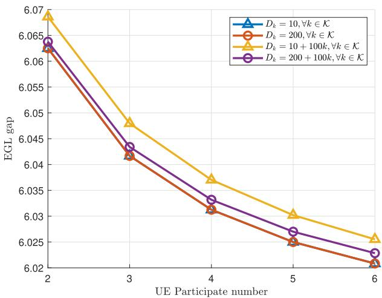  
Fig. 3. Impact of UE data volume and participation on model EGL gap $( \bar { K } = 6 )$

## B. Simulation Results

Fig. 3 validates Theorem 1 by analyzing the impact of UE data volume and participation on model EGL gap for $K = 6 ,$ with energy consumption effects excluded. In the simulation, the data volume $D _ { k }$ of the kth UE could be 10, 200. 10+100k, or $2 0 0 + 1 0 0 k$ . The results show that equal data volumes yield the minimum model EGL gap, regardless of the total data size. With uneven data distribution, increasing the total data volume and the number of participating UEs enriches the aggregated statistical information in each FL round, thereby reducing the EGL gap. While this beneficial effect outweighs the adverse impact of data heterogeneity, the improvement gradually saturates as the data volume grows.

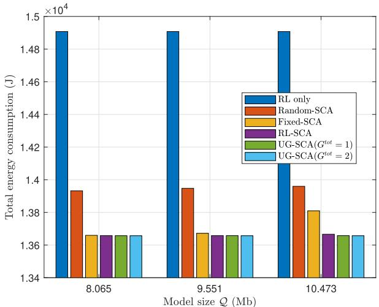

(a)  
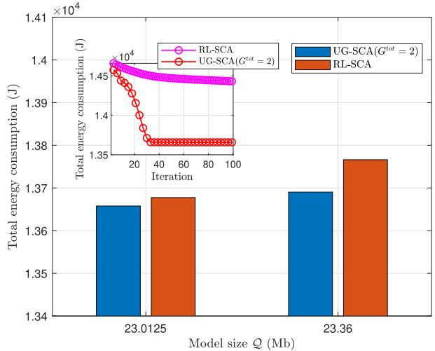  
(b)  
Fig. 4. Comparison of total energy consumption under different methods and model sizes.

Fig. 4a compares four FL participation schemes: (1) Random-SCA [42], where two UEs are randomly selected per slot and the remaining variables are optimized via SCA; (2) Fixed-SCA [15], where full UE participation is adopted and the other variables are optimized via SCA; (3) RL-only, where under a given UAV trajectory and fixed user data volume allocation, all decision variables including UE participation and transmit power are determined solely by RL; and (4) RL-SCA, where UE participation is first determined by RL and the remaining variables are optimized via SCA. The proposed UG-SCA with $G ^ { t o t } = 1$ corresponds to full participation, while $G ^ { t o t } ~ = ~ 2$ adopts UG participation. When the model size is small $( \mathcal { Q } = 8 . 0 6 5 ~ \mathrm { M b } )$ , UG-SCA performs comparably to fixed participation. As Q increases, UG-SCA achieves better energy efficiency, especially with $G ^ { t o t } = 2 .$ Among the RL-based schemes, RL-only yields the highest energy consumption, since all decisions are determined by RL. RL-SCA refines the RL-based participation via SCA and achieves energy performance close to, yet slightly higher than, UG-SCA with $G ^ { t o t } = 2$ under moderate model sizes.

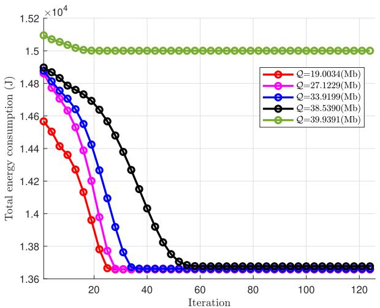  
Fig. 5. Convergence of the proposed UG-SCA method for various model sizes.

However, as shown in Fig. 4b, when the model size becomes large $( \mathcal { Q } ~ = ~ 2 3 . 0 1 2 5  – 2 3 . 3 6$ Mb), the energy gap between RL-SCA and UG-SCA with $G ^ { t o t } = 2$ gradually widens. This is because RL-SCA does not further optimize UE participation during iterations. For large model sizes, if the number of participating UEs is not adaptively reduced, inter-user interference remains severe. To satisfy rate constraints, the UAV relies more on trajectory adjustments, increasing propulsion energy. Moreover, UG-SCA with $G ^ { t o t } = 2$ converges faster than RL-SCA, as the grouping structure mitigates interference and reduces the feasible search space.

Fig. 5 shows the convergence of the UG-SCA method under different model sizes. The total energy consumption decreases monotonically until convergence, and a larger $\mathcal { Q }$ slows the rate due to tighter constraints. Interestingly, when $\mathcal { Q } \  \ 3 9 . 9 3 9 1$ Mb (theoretical upper bound), convergence accelerates because the initialization from asymptotic analysis is already near-optimal.

Fig. 6a compares the total energy consumption of UG-SCA with the traveling salesman problem (TSP)-based trajectory [43], UG-Suboptimal trajectories, and the AO method [30] (see Fig. 6b). In the benchmarks, the UAV trajectory is predetermined and the remaining variables are optimized via SCA, except AO, which alternately optimizes UE participation and other variables. For fairness, AO uses the same initial trajectory as UG-SCA. The TSP-based route is less energyefficient when UEs are spatially dispersed. UG-Suboptimal reduces energy consumption due to shorter trajectories. UG-SCA achieves the lowest energy for both $~ G ^ { t o t } ~ = ~ 2$ and $~ G ^ { t o t } ~ = ~ 3 .$ demonstrating the advantage of joint trajectory and participation optimization. Note that the energy cost for $G ^ { t o t } = 2$ and $G ^ { t o t } ~ = ~ 3$ is comparable, since the data rate constraint imposed by the model size is not strict, yielding a similar trajectory. Although TSP-SCA and AO yield slightly higher energy consumption, they converge more slowly because trajectory and user participation are optimized separately rather than jointly. In contrast, UG-SCA converges faster and remains effective even when Q approaches the upper limit tcmW log2 $\begin{array} { r } { \left( \frac { 1 } { K - 1 } + 1 \right) } \end{array}$ Mb.

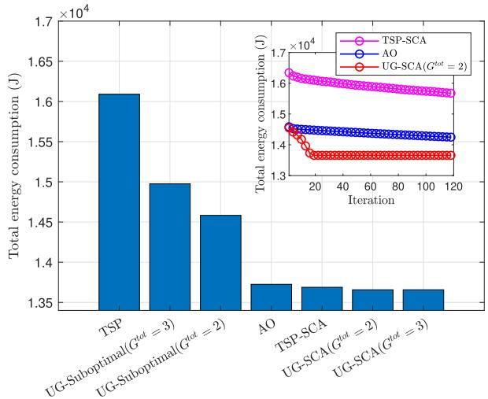

(a) Total energy consumption of the proposed UG-SCA, UG-Suboptimal, AO and TSP trajectories.  
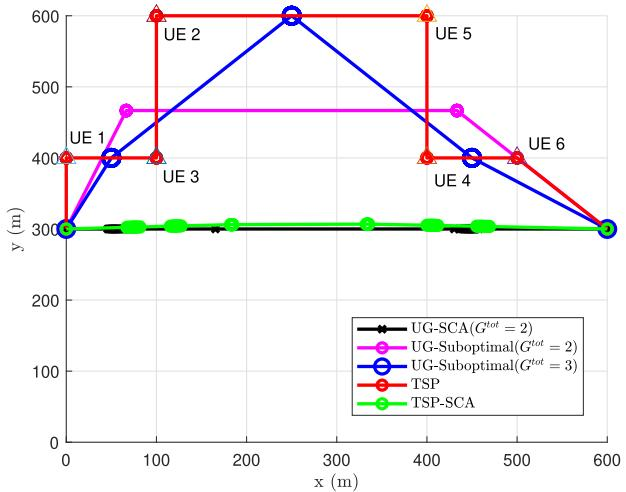  
(b) Comparison of UAV trajectories under the proposed and different benchmark methods.

Fig. 6. Performance and trajectory comparison of the proposed and benchmark UAV schemes.  
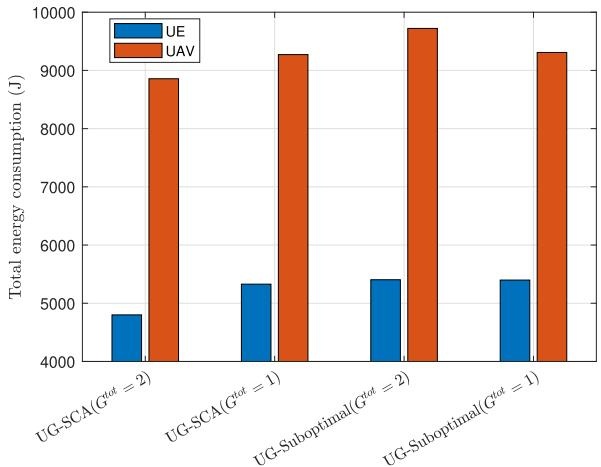  
Fig. 7. Comparison of UAV propulsion energy and UE transmission energy under different schemes.

In Fig. 7, although propulsion energy dominates, joint optimization of UE transmit power and user grouping significantly affects total UAV energy by influencing hovering time and trajectory refinement. The slightly higher UAV energy in

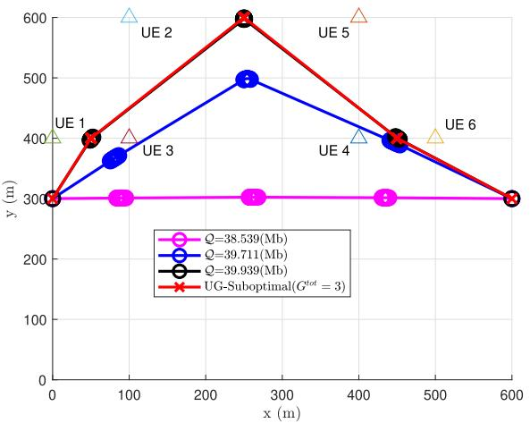  
Fig. 8. The UAV trajectory of the proposed UG-SCA method under various model sizes.

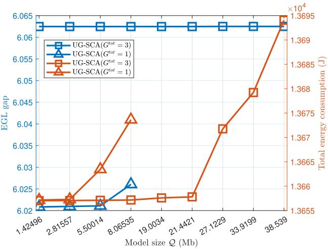  
Fig. 9. Performance of model EGL gap and energy consumption under different FL model sizes with and without UG.

UG-suboptimal $( G ^ { t o t } = 2 )$ compared to UG-SCA $( G ^ { t o t } = 1 )$ mainly stems from trajectory initialization. Under fixed UE power, the trajectory determined by the UG-suboptimal solution may result in a longer flight path than the no-grouping $( G ^ { t o t } ~ = ~ 1 )$ baseline. Without joint power and trajectory optimization, the system cannot compensate for this gap, leading to higher propulsion energy. When joint optimization is enabled, the algorithm refines UE transmit power, user grouping, and UAV trajectory simultaneously. With reduced inter-group interference and improved communication feasibility, the UAV shortens hovering time and approaches a near-minimum flight path. Hence, UG-SCA $( G ^ { t o t } ~ = ~ 2 )$ achieves the lowest total UAV energy consumption among all schemes.

Fig. 8 shows that for $\mathcal { Q } = 3 8 . 5 3 9 ~ \mathrm { M b }$ , the UAV trajectory centers around three hovering points, indicating UG into three clusters. When $\mathcal { Q } = 3 9 . 9 3 9 ~ \mathrm { M b }$ , the UG becomes apparent, where UE 1 and UE 3 form one group, UE 2 and UE 5 form another, and UE 4 and UE 6 form the third. As Q increases, the UG-SCA trajectory approaches that of the UG-Suboptimal, confirming Remark 2 in Sec. III-A.

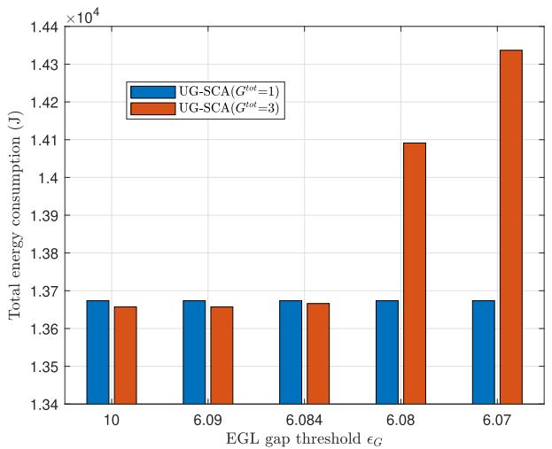  
(a) Total energy consumption under various EGL gap thresholds $( \mathcal { Q } = 8 . 0 6 5 3 5 )$

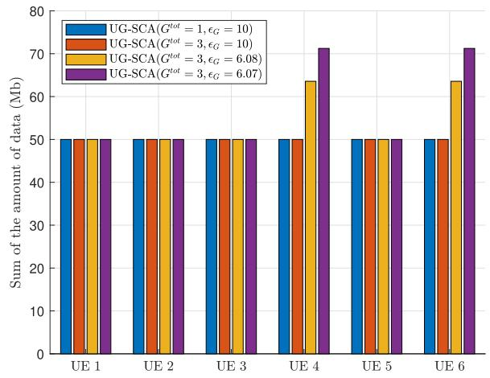  
(b) UE data size under different EGL gap thresholds.

Fig. 10. Impact of the EGL gap threshold on energy consumption and UE data allocation.  
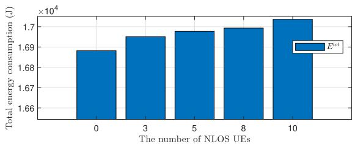

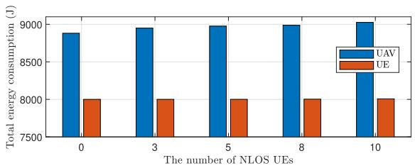  
Fig. 11. UAV and UE energy consumption under different numbers of NLOS UE $( K = 1 0 )$

Fig. 9 examines the impact of UG on model EGL gap and energy consumption. The proposed UG-SCA $( G ^ { t o t } = 3 )$ achieves the lowest energy consumption, making it particularly suitable for larger FL models, such as $\mathcal { Q } \geq 1 9 . 0 0 3 4$ Mb. In contrast, UG-SCA $( G ^ { t o t } = 1 )$ is feasible only for smaller FL models with $\mathcal { Q } \leq 8 . 0 6 5 3 5$ Mb. Although $\mathrm { U G } \mathrm { - } \mathrm { S C A } \left( G ^ { t o t } = 1 \right)$ consumes more energy than UG-SCA $( G ^ { t o t } ~ = ~ 3 )$ in this regime, it offers better model EGL gap, revealing a tradeoff between energy use and model EGL gap. The EGL gap can be reduced by increasing the amount of UE data, but such compensation inevitably increases energy consumption. Fig. 10a further examines this trade-off at $Q = 8 . 0 6 5 3 5 ~ \mathrm { M b }$ . As the EGL gap requirement tightens (smaller G), the energy consumption of UG-SCA $( G ^ { t o t } = 3 )$ increases, while UG-SCA $( G ^ { t o t } = 1 )$ remains comparatively stable. This is because the aggregated data volume with full user participation in $G ^ { t o t } = 1$ is already sufficient to meet the small EGL gap threshold $\epsilon _ { G } = 6 . 0 7 $ . Fig. 10b shows the UE data size under different EGL gap thresholds. For UG-SCA $( G ^ { t o t } = 3 )$ , when $D _ { t h } = 5 0$ Mb, tightening the threshold to 6.08 or 6.07 causes some UEs’ data sizes to exceed 50 Mb to satisfy the model EGL gap requirement. This trend aligns with the observations in Fig. 3 and Fig. 10a, where lower EGL gap demands larger data volumes, thereby leading to greater energy consumption.

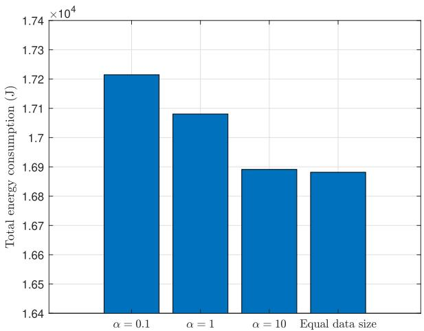

(a) System energy consumption  
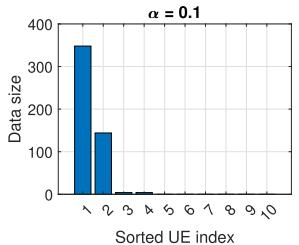

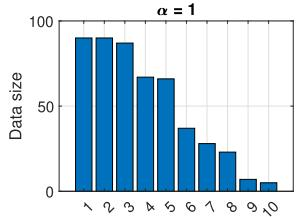

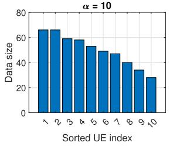

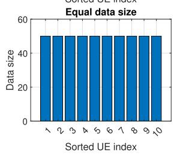  
(b) UE data distribution under different non-IID levels  
Fig. 12. Impact of non-IID data heterogeneity and the corresponding UE data allocation $( \bar { K } = 1 0 )$ .

To evaluate the robustness of the proposed framework under NLOS channel conditions [21], Fig. 11 shows the total energy consumption versus the number of NLOS UEs. As the number of NLOS users increases, the total energy consumption gradually rises. A further examination of the UAV and UE energy consumption reveals that the increase is primarily due to higher UAV propulsion energy, while UE transmission energy changes only marginally. This is because NLOS links degrade the achievable data rate, and the optimization framework compensates by adjusting UAV trajectory and hovering time to meet the rate constraints, subject to the bounded UE transmit power.

We incorporate non-IID data distributions by considering the quantity skew scenario [44], [45], where data volumes across users are uneven. Quantity skew is a widely recognized form of non-IID heterogeneity in federated learning [46], [47], [48]. Fig. 12a illustrates the total energy consumption under different heterogeneity levels generated by the Dirichlet method [49] with $\alpha = 0 . 1$ , 1, and 10, along with the equaldata benchmark, where the total data volume is fixed at 500 Mb. The corresponding UE data allocation is shown in Fig. 12. A smaller α leads to more skewed data distribution. The results show that total energy consumption increases as α decreases, indicating that stronger heterogeneity incurs higher energy consumption. This is because highly non-IID allocations impose havier transmission and computation loads on certain UEs, prolonging hovering time for data aggregation and thus increasing propulsion energy. When $\alpha = 1 0$ , the data distribution becomes more balanced, and the energy consumption approaches that of the equal-data case.

## VI. CONCLUSION

This paper proposed a UAV-assisted FL framework featuring a UG-based design to overcome infeasibility caused by transmission rate constraints during model dissemination. By dividing users into multiple groups, the proposed UG-SCA method enhanced the effective transmission rate, ensuring the feasibility of the optimization problem while maintaining learning performance. The framework jointly optimized UAV trajectory, user participation, power control, and data volume allocation to minimize the total energy consumption. A convergence analysis of the FL model with multiple local updates revealed how user participation and data volume influenced model EGL gap, providing a theoretical foundation for energy-efficient resource management. Furthermore, increasing the number of groups enabled the transmission of larger FL models, thereby improving system scalability and feasibility under rate constraints, albeit with a slight increase in model EGL gap due to less aggregated data within each group. Simulation results verified that the proposed UG-SCA significantly outperformed the benchmark schemes in terms of energy consumption and convergence behavior, highlighting the trade-off between transmission feasibility and model EGL gap in UAV-assisted FL.

## APPENDIX A PROOF OF THEOREM 1

We introduce common assumptions about the loss function $f ( \cdot ) \left[ 5 0 \right]$ , where $f ( \cdot )$ may represent either the global loss $f _ { G } ( \cdot )$ or local loss $f _ { L , k } ( \cdot )$

Assumption 1 (µ-strongly convex): For all ${ \mathbf a } , { \mathbf b } , f ( { \mathbf b } ) \geq$ $\begin{array} { r } { f ( \mathbf { a } ) + \langle \bar { \nabla } f ( \mathbf { a } ) , \mathbf { b } - \mathbf { a } \rangle + \frac { \mu } { 2 } \| \mathbf { b } - \mathbf { a } \| ^ { 2 } } \end{array}$ , where $\mu > 0$ is a strongly convex parameter.

Assumption 2 (L-smooth): For all a, b, $\begin{array} { r l } { \| \nabla f ( \mathbf { a } ) - \nabla f ( \mathbf { b } ) \| \le } & { { } } \end{array}$ $L \| \mathbf { a } - \mathbf { b } \|$ , where $L > 0$ is a smoothness parameter.

Assumption 3 (Bounded sample variance in stochastic gradients): For any FL user in the ith SGD update, $\mathbb { E } \Big [ \left\| \nabla f _ { L , k } ( \mathbf { w } _ { k } ^ { i } ) - \nabla f _ { L , k } ( \mathbf { w } _ { k } ^ { i } , s _ { k } ^ { i } ) \right\| ^ { 2 } \Big ] \leq \epsilon _ { v } ^ { 2 } .$ , where $\epsilon _ { v } ^ { 2 }$ is an upper bound of the gradient variation.

Assumption 4 (Bounded square norm expectation in stochastic gradients): For any FL user in the ith SGD update, $\mathbb { E } \Big \lceil \left\| \nabla f _ { L , k } ( \mathbf { w } _ { k } ^ { i } , s _ { k } ^ { i } ) \right\| ^ { 2 } \Big \rceil \leq \epsilon _ { s } ^ { 2 } \mathrm { . }$ , where $\epsilon _ { s } ^ { 2 }$ is an upper bound of the update magnitude.

Assumption 1 ensures the existence of a unique global optimum and limits the amount of its variation. Assumption 2 constrains abrupt gradient changes, ensuring convergence rates. For SGD updates, Assumption 3 bounds gradient fluctuations caused by random sampling of data. Assumption 4 limits the magnitude of each parameter update. Together, these assumptions ensure the stability and convergence of the FL algorithm in the following analysis.

Remark 3: The L-smooth property (Assumption 2) implies the following inequality: For all a, b, $\| \nabla f ( \mathbf { a } ) \| ^ { 2 } \ \leq$ $2 L \left( f ( \mathbf { a } ) - f ( \mathbf { b } ) \right)$ [51].

Remark 4: Assumption 2 can be extended to the inequality: For all $\begin{array} { r } { \mathrm { x } \in \mathbb { R } ^ { d } , f ( \dot { \mathrm { x } } ) - f ( \mathrm { x } ^ { \ast } ) \leq \frac { L } { 2 } \left. \mathrm { x } - \mathrm { x } ^ { \ast } \right. ^ { 2 } } \end{array}$ , where $\mathbf { x } ^ { * } =$ arg mi $\mathbf { 1 } _ { \mathbf { X } \in \mathbb { R } ^ { d } } f ( \mathbf { x } ) \ [ 5 1 ]$

Using the L-smooth of $f _ { G } ( \mathbf { w } )$ from Remark 4, we have

$$
\mathbb { E } \big [ f _ { G } ( \bar { \mathbf { w } } ^ { i + 1 } ) - f _ { G } ( \mathbf { w } ^ { * } ) \big ] \leq \frac { L } { 2 } \mathbb { E } \big [ \| \bar { \mathbf { w } } ^ { i + 1 } - \mathbf { w } ^ { * } \| ^ { 2 } \big ] .\tag{A.1}
$$

An upper bound for $\begin{array} { r } { \frac { L } { 2 } \mathbb { E } \big [ \| \bar { \mathbf { w } } ^ { i + 1 } - \mathbf { w } ^ { * } \| ^ { 2 } } \end{array}$ is then provided in the following.

Theorem 4: Under Assumptions 1–4 and a learning rate $\begin{array} { r } { \eta \leq \frac { 1 } { 2 L } , \mathbb { E } \big [ \| \bar { \mathbf { w } } ^ { i + 1 } - \mathbf { w } ^ { * } \| ^ { 2 } \big ] } \end{array}$ is bounded by

$$
\mathbb { E } \left[ \Vert \bar { \mathbf { w } } ^ { i + 1 } - \mathbf { w } ^ { * } \Vert ^ { 2 } \right] \leq \omega ^ { i + 1 } \mathbb { E } \left[ \Vert \bar { \mathbf { w } } ^ { 0 } - \mathbf { w } ^ { * } \Vert ^ { 2 } \right] + A _ { 1 } \left( \frac { 1 - \omega ^ { i + 1 } } { \eta \mu } \right)
$$

$$
+ \eta ^ { 2 } \sum _ { l = 0 } ^ { i } \left( \omega ^ { i - l } \sum _ { k = 1 } ^ { K } ( \bar { D } _ { k } ^ { l } ) ^ { 2 } \epsilon _ { v } ^ { 2 } \right) ,\tag{A.2}
$$

where $\begin{array} { r } { \omega = 1 - \eta \mu , A _ { 1 } = \left( 1 + \frac { \zeta } { 2 \eta } \right) I ^ { 2 } \eta ^ { 2 } \epsilon _ { s } ^ { 2 } + \frac { \eta L ^ { 2 } \epsilon _ { w } } { 2 } ( \zeta + 4 \eta ) } \end{array}$ $\zeta = 2 \eta ( 1 - \eta 2 L )$ , and $\begin{array} { r } { \bar { D } _ { k } ^ { i } = \frac { a _ { k } ^ { i } D _ { k } } { \sum _ { i = 1 } ^ { K } a _ { i } ^ { i } D _ { j } } } \end{array}$

Proof: See Appendix B for the detailed proof.  Substituting Theorem 4 into (A.1) yields the upper bound in Theorem 1.

APPENDIX B PROOF OF THEOREM 4

From (17), the expected gap between $\bar { \mathbf { w } } ^ { i + 1 }$ and $\mathbf { w } ^ { * }$ is given as

$$
\begin{array} { r l } & { \mathbb { E } \left[ \| \bar { \mathbf { w } } ^ { i + 1 } - \mathbf { w } ^ { * } \| ^ { 2 } \right] } \\ & { = \mathbb { E } \left[ \left\| \left( \bar { \mathbf { w } } ^ { i } - \eta \displaystyle \sum _ { k = 1 } ^ { K } \bar { D } _ { k } ^ { i } \nabla f _ { L , k } ( \mathbf { w } _ { k } ^ { i } , s _ { k } ^ { i } ) \right) - \mathbf { w } ^ { * } \right\| ^ { 2 } \right] } \end{array}
$$

$$
\begin{array} { r l } & { = \mathbb { E } \Bigg [ \Bigg \lVert \underset { \frac { \hat { \Delta } } { 2 } A _ { 2 } } { \overbar { \mathbf { v } } } ^ { i } \left( \eta \nabla f _ { L , k } ( \mathbf { w } _ { k } ^ { i } ) \right) } \\ &  + \underset { \underset { \left( \frac { k = 1 } { \sum } \bar { L } \right) } { \underbrace { \bar { \mathbf { D } } _ { k } ^ { i } \left( \eta \nabla f _ { L , k } ( \mathbf { w } _ { k } ^ { i } ) \right) - \sum _ { k = 1 } ^ { K } \bar { D } _ { k } ^ { i } \left( \eta \nabla f _ { L , k } ( \mathbf { w } _ { k } ^ { i } , s _ { k } ^ { i } ) \right) } } \Bigg \rVert ^ { 2 } \Bigg ] } \\ & { = \mathbb { E } \left[ \left. A _ { 2 } \right. ^ { 2 } \right] + \mathbb { E } \left[ \left. A _ { 3 } \right. ^ { 2 } \right] , \qquad ( \mathrm { B . l . ~ } } \end{array}
$$

where $\mathbb { E } [ A _ { 2 } A _ { 3 } ] = 0$ since E $\left[ A _ { 3 } \right] = 0 .$

By expanding $\| A _ { 2 } \| ^ { 2 }$ , we can get

$$
\begin{array} { l } { { \displaystyle \| A _ { 2 } \| ^ { 2 } = \left\| \bar { \mathbf { w } } ^ { i } - { \mathbf { w } } ^ { * } \right\| ^ { 2 } \underbrace { - 2 \eta \displaystyle \sum _ { k = 1 } ^ { K } { { { \bar { D } } } _ { k } ^ { i } \left. \bar { \mathbf { w } } ^ { i } - { \mathbf { w } } ^ { * } , \nabla f _ { L , k } \left( { \mathbf { w } } _ { k } ^ { i } \right) \right. } } _ { \triangleq A _ { 4 } } } } \\ { { \displaystyle \qquad + \underbrace { \left\| \sum _ { k = 1 } ^ { K } { { { \bar { D } } } _ { k } ^ { i } \left( \eta \nabla f _ { L , k } \left( { \mathbf { w } } _ { k } ^ { i } \right) \right) } \right\| ^ { 2 } } _ { \triangleq A _ { 5 } } , } } \end{array}
$$

where $A _ { 4 }$ can be rewritten as

$$
\begin{array} { r } { A _ { 4 } = \underbrace { - 2 \eta \displaystyle \sum _ { k = 1 } ^ { K } { { { \bar { D } } } _ { k } ^ { i } \left. { { { \bf { \bar { w } } } } ^ { i } - { { \bf { w } } } _ { k } ^ { i } , \nabla { f _ { L , k } } ( { { \bf { w } } _ { k } ^ { i } } ) } \right. } } _ { B _ { 1 } } } \\ { \underbrace { - 2 \eta \displaystyle \sum _ { k = 1 } ^ { K } { { { \bar { D } } } _ { k } ^ { i } \left. { { { \bf { w } } } _ { k } ^ { i } - { { \bf { w } } } ^ { * } , \nabla { f _ { L , k } } ( { { \bf { w } } _ { k } ^ { i } } ) } \right. } } _ { B _ { 2 } } . } \end{array}\tag{B.3}
$$

We then introduce the following lemma.

Lemma 3: For any a, b and $\eta > 0$ , we have the inequality $\begin{array} { r } { - 2 \langle \mathbf { a } , \mathbf { b } \rangle \leq \frac { 1 } { n } \| \mathbf { a } \| ^ { 2 } + \eta \| \mathbf { b } \| ^ { 2 } } \end{array}$

Proof: Details are given in [52] using Cauchy–Schwarz and AM–GM inequalities. 

From Lemma 3 and L-smoothness, $B _ { 1 }$ is upper bounded by

$$
\begin{array} { r l } & { \displaystyle \leq \eta \displaystyle \sum _ { k = 1 } ^ { K } \bar { D } _ { k } ^ { i } \left( \frac { 1 } { \eta } \left\| \bar { \mathbf { w } } ^ { i } - \mathbf { w } _ { k } ^ { i } \right\| ^ { 2 } + \eta \| \nabla f _ { L , k } ( \mathbf { w } _ { k } ^ { i } ) \| ^ { 2 } \right) } \\ & { \displaystyle \leq \sum _ { k = 1 } ^ { K } \bar { D } _ { k } ^ { i } \left( \left\| \bar { \mathbf { w } } ^ { i } - \mathbf { w } _ { k } ^ { i } \right\| ^ { 2 } + \eta ^ { 2 } 2 L \left( f _ { L , k } \left( \mathbf { w } _ { k } ^ { i } \right) - f _ { L , k } ( \mathbf { w } _ { k } ^ { * } ) \right) \right) . } \end{array}\tag{B.4}
$$

Additionally, by successively using µ-strongly convex and Jensen’s inequality, $B _ { 2 }$ is upper bounded by

$$
\begin{array} { r l } &  { \displaystyle { { B } _ { 2 } } \leq - 2 \eta \displaystyle \sum _ { k = 1 } ^ { K } { { { \bar { D } } _ { k } ^ { i } } \left( { { f } _ { L , k } } ( { { \mathbf { w } } _ { k } ^ { i } } ) - { { f } _ { L , k } } ( { { \mathbf { w } } ^ { * } } ) + \frac { \mu } { 2 } \| { { \mathbf { w } } _ { k } ^ { i } } - { { \mathbf { w } } ^ { * } } \| ^ { 2 } \right) } } \\ & { \leq - 2 \eta \displaystyle \sum _ { k = 1 } ^ { K } { { { \bar { D } } _ { k } ^ { i } } \left( { { f } _ { L , k } } ( { { \mathbf { w } } _ { k } ^ { i } } ) - { { f } _ { L , k } } ( { { \mathbf { w } } ^ { * } } ) \right) - \eta \mu \left\| { { { \bar { \mathbf { w } } } ^ { i } } - { { \mathbf { w } } ^ { * } } } \right\| ^ { 2 } } . } \end{array}\tag{B.5}
$$

Using Jensen’s inequality and Remark $3 , A _ { 5 }$ is bounded by

$$
A _ { 5 } \leq 2 L \eta ^ { 2 } \sum _ { k = 1 } ^ { K } \bar { D } _ { k } ^ { i } \left( f _ { L , k } ( \mathbf { w } _ { k } ^ { i } ) - f _ { L , k } ( \mathbf { w } _ { k } ^ { * } ) \right) .\tag{B.6}
$$

By combining (B.3) and (B.4)–(B.6), (B.2) is bounded by

$$
\begin{array} { r l r } { \displaystyle \left\| A _ { 2 } \right\| ^ { 2 } \leq \left( 1 - \eta \mu \right) \left\| \overline { { \mathbf { w } } } ^ { i } - \mathbf { w } ^ { * } \right\| ^ { 2 } + \displaystyle \sum _ { k = 1 } ^ { K } \bar { D } _ { k } ^ { i } \left\| \overline { { \mathbf { w } } } ^ { i } - \mathbf { w } _ { k } ^ { i } \right\| ^ { 2 } } & { } & \\ { + \underbrace { 4 L \eta ^ { 2 } \displaystyle \sum _ { k = 1 } ^ { K } \bar { D } _ { k } ^ { i } \left( f _ { L , k } ( \mathbf { w } _ { k } ^ { i } ) - f _ { L , k } ( \mathbf { w } _ { k } ^ { * } ) \right) } _ { K } } & { } & \\ { - \displaystyle 2 \eta \displaystyle \sum _ { k = 1 } ^ { K } \bar { D } _ { k } ^ { i } \left( f _ { L , k } ( \mathbf { w } _ { k } ^ { i } ) - f _ { L , k } ( \mathbf { w } ^ { * } ) \right) . } & { } & { { \mathrm { ( B ) } } } \end{array}\tag{.7}
$$

We then provide an upper bound for $B _ { 3 }$ as follows.

Lemma 4: For given $\eta ~ \leq ~ 1 / 2 L$ , let $\zeta = 2 \eta ( 1 - \eta 2 L )$ Then $B _ { 3 }$ is upper bounded by $\begin{array} { r l r } { B _ { 3 } } & { { } \le } & { \frac { \eta L ^ { 2 } \epsilon _ { w } } { 2 } ( \zeta + 4 \eta ) + } \end{array}$ $\begin{array} { r } { \frac { \zeta } { 2 n } \sum _ { k = 1 } ^ { K } \bar { D } _ { k } ^ { i } \left\| \mathbf { w } _ { k } ^ { i } - \bar { \mathbf { w } } ^ { i } \right\| ^ { 2 } } \end{array}$

Proof: See Appendix C for the detailed proof.

By using Lemma 4 in $( \mathbf { B } . 7 ) , \mathbb { E } \left[ \lVert A _ { 2 } \rVert ^ { 2 } \right]$ is bounded by

$$
\begin{array} { r l r } & { \displaystyle \mathbb { E } \left[ \| A _ { 2 } \| ^ { 2 } \right] \leq ( 1 - \eta \mu ) \mathbb { E } \left[ \left\| \bar { \mathbf { w } } ^ { i } - \mathbf { w } ^ { * } \right\| ^ { 2 } \right] + \frac { \eta L ^ { 2 } \epsilon _ { w } } { 2 } ( \zeta + 4 \eta ) } & \\ & { \displaystyle + \left( 1 + \frac { \zeta } { 2 \eta } \right) \mathbb { E } \left[ \sum _ { k = 1 } ^ { K } \bar { D } _ { k } ^ { i } \left\| \mathbf { w } _ { k } ^ { i } - \bar { \mathbf { w } } ^ { i } \right\| ^ { 2 } \right] , } & { ( \mathbf { B . 8 } ) } \end{array}
$$

where we have

$$
\begin{array} { r l } & { \quad \quad \mathbb { E } [ \displaystyle \sum _ { k = 1 } ^ { K } \bar { D } _ { k } ^ { i } \| \mathbf { w } _ { k } ^ { i } - \bar { \mathbf { w } } ^ { i } \| ^ { 2 } ] = \displaystyle \sum _ { k = 1 } ^ { K } \bar { D } _ { k } ^ { i } \mathbb { E } [ \| ( \mathbf { w } _ { k } ^ { i } - \bar { \mathbf { w } } ^ { i ^ { \prime } } )   } \\ & { \quad \quad  - ( \bar { \mathbf { w } } ^ { i } - \bar { \mathbf { w } } ^ { i ^ { \prime } } ) \| ^ { 2 } ] \leq \displaystyle \sum _ { k = 1 } ^ { K } \bar { D } _ { k } ^ { i } \mathbb { E } [ \| ( \mathbf { w } _ { k } ^ { i } - \bar { \mathbf { w } } ^ { i ^ { \prime } } ) \| ^ { 2 } ] , } \end{array}\tag{B.9}
$$

where the inequality follows from $\begin{array} { r l } { \mathbb { E } \left[ \| x - \mathbb { E } [ x ] \| ^ { 2 } \right] } & { { } \leq } \end{array}$ $\mathbb { E } \left[ \Vert x \Vert ^ { 2 } \right]$ and E $\left\lceil \mathbf { w } _ { k } ^ { i } - \bar { \mathbf { w } } ^ { i ^ { \prime } } \right\rceil = \bar { \mathbf { w } } ^ { i } - \bar { \mathbf { w } } ^ { i ^ { \prime } }$

Subsequently, the third term in (B.8) can be bounded by invoking Assumption 4 and considering two cases: $i + 1 \in \mathcal { I }$ and $i + 1 \ell \mathcal { T }$ . Specifically, when $i + 1 \in \mathcal { T }$ , we assume that there exists an update step $i ^ { \prime } \leq i$ such that $i ^ { \prime } \in \mathcal { Z }$ and $i - i ^ { \prime } \leq I - 1$ Then, we have

$$
\begin{array} { r l } & { \displaystyle \sum _ { k = 1 } ^ { K } \bar { D } _ { k } ^ { i } \mathbb { E } \left[ \left\| \left( \mathbf { w } _ { k } ^ { i } - \bar { \mathbf { w } } ^ { i ^ { \prime } } \right) \right\| ^ { 2 } \right] } \\ & { \displaystyle = \sum _ { k = 1 } ^ { K } \bar { D } _ { k } ^ { i } \mathbb { E } \left[ \left\| - \sum _ { t = i ^ { \prime } } ^ { i - 1 } \eta \nabla f _ { L , k } ( \mathbf { w } _ { k } ^ { t } , s _ { k } ^ { t } ) \right\| ^ { 2 } \right] \leq } \\ & { \displaystyle \sum _ { k = 1 } ^ { K } \bar { D } _ { k } ^ { i } ( I - 1 ) \sum _ { t = i ^ { \prime } } ^ { i - 1 } \eta ^ { 2 } \mathbb { E } \left[ \left\| \nabla f _ { L , k } ( \mathbf { w } _ { k } ^ { t } , s _ { k } ^ { t } ) \right\| ^ { 2 } \right] = ( I - 1 ) ^ { 2 } \eta ^ { 2 } \epsilon _ { s } ^ { 2 } . } \end{array}\tag{B.10}
$$

On the other hand, when $i + 1 \mathcal { \ell } \mathcal { T }$ and $i \in \mathcal { T }$ , we assume that there exists an update step $i ^ { \prime } \leq i$ such that $i ^ { \prime } \in \mathcal { Z }$ and $i - i ^ { \prime } = I$ . Then, we have

$$
\begin{array} { r l } & { \displaystyle \sum _ { k = 1 } ^ { K } \bar { D } _ { k } ^ { i } \mathbb { E } \left[ \left\| \left( { \mathbf w } _ { k } ^ { i } - \bar { { \mathbf w } } ^ { i ^ { \prime } } \right) \right\| ^ { 2 } \right] } \\ & { = \displaystyle \sum _ { k = 1 } ^ { K } \bar { D } _ { k } ^ { i } \mathbb { E } \left[ \left\| \sum _ { k = 1 } ^ { K } \bar { D } _ { k } ^ { i - 1 } \left( - \sum _ { t = i ^ { \prime } } ^ { i - 1 } \eta \nabla f _ { L , k } ( { \mathbf w } _ { k } ^ { t } , s _ { k } ^ { t } ) \right) \right\| ^ { 2 } \right] } \\ & { \le \displaystyle \sum _ { k = 1 } ^ { K } \bar { D } _ { k } ^ { i } \sum _ { k = 1 } ^ { K } \bar { D } _ { k } ^ { i - 1 } I \sum _ { t = i ^ { \prime } } ^ { i - 1 } \eta ^ { 2 } \mathbb { E } \left[ \left\| \nabla f _ { L , k } ( { \mathbf w } _ { k } ^ { t } , s _ { k } ^ { t } ) \right\| ^ { 2 } \right] = I ^ { 2 } \eta ^ { 2 } \epsilon _ { s } ^ { 2 } . } \end{array}\tag{B.11}
$$

By using (B.10) and (B.11) in (B.9), E $\left[ \Vert A _ { 2 } \Vert ^ { 2 } \right]$ in (B.8) is then upper bounded by

$$
\begin{array} { r l r } {  { \mathbb { E } [ \| A _ { 2 } \| ^ { 2 } ] \le ( 1 - \eta \mu ) \mathbb { E } [ \| \bar { \mathbf { w } } ^ { i } - \mathbf { w } ^ { * } \| ^ { 2 } ] + \frac { \eta L ^ { 2 } \epsilon _ { w } } { 2 } ( \zeta + 4 \eta ) } } \\ & { } & { \quad + ( 1 + \displaystyle \frac { \zeta } { 2 \eta } ) I ^ { 2 } \eta ^ { 2 } \epsilon _ { s } ^ { 2 } . } & { \quad \mathrm { ~ } \mathrm { ~ } \mathrm { ~ } \mathrm { ~ } \mathrm { ~ } \mathrm { ~ } \mathrm { ~ } \mathrm { ~ } \mathrm { ~ } \mathrm { ~ } \mathrm { ~ } \Omega } \end{array}
$$

From the definition of $A _ { 3 }$ in (B.1), we can get

$$
\begin{array} { r l r } {  { \mathbb { E } [ \| A _ { 3 } \| ^ { 2 } ] = \mathbb { E } [ \| \sum _ { k = 1 } ^ { K } \bar { D } _ { k } ^ { i } \eta ( \nabla f _ { L , k } ( \mathbf { w } _ { k } ^ { i } ) - \nabla f _ { L , k } ( \mathbf { w } _ { k } ^ { i } , s _ { k } ^ { i } ) ) \| ^ { 2 } ] } } \\ & { \le \displaystyle \sum _ { k = 1 } ^ { K } ( \bar { D } _ { k } ^ { i } ) ^ { 2 } \eta ^ { 2 } \mathbb { E } [ \| ( \nabla f _ { L , k } ( \mathbf { w } _ { k } ^ { i } ) - \nabla f _ { L , k } ( \mathbf { w } _ { k } ^ { i } , s _ { k } ^ { i } ) ) \| ^ { 2 } ] } \\ & { \le \displaystyle \sum _ { k = 1 } ^ { K } ( \bar { D } _ { k } ^ { i } ) ^ { 2 } \eta ^ { 2 } \epsilon _ { v } ^ { 2 } , } & { ( \mathrm { B . 1 3 } ) } \end{array}
$$

where Jensen’s inequality and Assumption 3 are applied in the first and second inequalities, respectively.

By substituting (B.12) and (B.13) into (B.1), we obtain an upper bound on the expected difference:

$$
\begin{array} { r l } & { \mathbb { E } \left[ \left. \bar { \mathbf { w } } ^ { i + 1 } - \mathbf { w } ^ { * } \right. ^ { 2 } \right] } \\ & { \leq ( 1 - \eta \mu ) \mathbb { E } \left[ \left. \bar { \mathbf { w } } _ { k } ^ { i } - \mathbf { w } ^ { * } \right. ^ { 2 } \right] + \frac { \eta L ^ { 2 } \epsilon _ { w } } { 2 } ( \zeta + 4 \eta ) } \\ & { \quad + \left( 1 + \displaystyle \frac { \zeta } { 2 \eta } \right) I ^ { 2 } \eta ^ { 2 } \epsilon _ { s } ^ { 2 } + \displaystyle \sum _ { k = 1 } ^ { K } ( \bar { D } _ { k } ^ { i } ) ^ { 2 } \eta ^ { 2 } \epsilon _ { v } ^ { 2 } . } \end{array}\tag{B.14}
$$

By recursively applying (B.14), we obtain (A.2) and complete the proof.

## APPENDIX C PROOF OF LEMMA 4

From (B.7), the term $B _ { 3 }$ can be rewritten in (C.1), as shown at the bottom of the next page, where the term $C _ { 1 }$ is bounded $( \mathbf { C } . 2 )$ , as shown at the bottom of the next page, by applying a first-order Taylor expansion in step (a), invoking Lemma 3 in step (b) and leveraging the L-smoothness property in step (c). Substituting (C.2) into (C.1) yields an upper bound on $B _ { 3 } { \mathrm { : } }$

$$
B _ { 3 } \leq \zeta [ \sum _ { k = 1 } ^ { K } \bar { D } _ { k } ^ { i } ( \eta L ( f _ { L , k } ( \bar { \mathbf { w } } ^ { i } ) - f _ { L , k } ( \mathbf { w } _ { k } ^ { * } ) ) 
$$

$$
\begin{array} { l } { { \displaystyle + \frac { 1 } { 2 \eta } \| { \mathbf { w } } _ { k } ^ { i } - \bar { \mathbf { w } } ^ { i } \| ^ { 2 } \displaystyle ) - \displaystyle \sum _ { k = 1 } ^ { K } \bar { D } _ { k } ^ { i } ( f _ { L , k } ( \bar { \mathbf { w } } ^ { i } ) - f _ { L , k } \big ( \mathbf { w } ^ { * } \big ) ) } } \\ { { \displaystyle + \eta ^ { 2 } 4 L \sum _ { k = 1 } ^ { K } \bar { D } _ { k } ^ { i } ( f _ { L , k } \big ( \mathbf { w } ^ { * } \big ) - f _ { L , k } \big ( \mathbf { w } _ { k } ^ { * } \big ) ) , } } \end{array}
$$

where $\zeta = 2 \eta ( 1 - \eta 2 L ) \geq 0$ . To simplify the expression, we define $\begin{array} { r } { \Gamma \triangleq \sum _ { k = 1 } ^ { K } \bar { D } _ { k } ^ { i } ( f _ { L , k } ( \mathbf { w } ^ { * } ) - f _ { L , k } ( \mathbf { w } _ { k } ^ { * } ) } \end{array}$ . Applying Remark 4 which states that $f _ { L , k } ( \mathbf { w } )$ is L-smooth, we have $\begin{array} { r } { \Gamma \leq \frac { L } { 2 } \sum _ { k = 1 } ^ { K } \bar { D } _ { k } ^ { i } ( \| \mathbf { w } ^ { * } - \mathbf { w } _ { k } ^ { * } \| ^ { 2 } ) } \end{array}$ . Assuming that the deviation between the optimal parameter of each UE and the global optimal parameter is bounded, i.e., $\begin{array} { r } { \mathopen { } \mathclose \bgroup \left\| \mathbf { w } ^ { * } - \mathbf { w } _ { k } ^ { * } \aftergroup \egroup \right\| ^ { 2 } \leq \epsilon _ { w } . } \end{array}$ , we obtain $\Gamma \ \leq \ \frac { L \epsilon _ { w } } { 2 }$ . Hence, the upper bound in (C.3) can be rewritten as (a) in $\left( \mathbf { C . 4 } \right)$ , as shown at the bottom of the page. Noting that $\begin{array} { r } { \sum _ { k = 1 } ^ { K } \bar { D } _ { k } ^ { i } = 1 } \end{array}$ and $f _ { L , k } \left( \bar { \mathbf { w } } ^ { i } \right) \geq f _ { L , k } ( \mathbf { w } ^ { * } )$ we have $\begin{array} { r l } { \sum _ { k = 1 } ^ { K } \bar { D } _ { k } ^ { i } \left( f _ { L , k } \left( \bar { \mathbf { w } } ^ { i } \right) - \sum _ { k ^ { \prime } = 1 } ^ { K } \bar { D } _ { k ^ { \prime } } ^ { i } f _ { L , k ^ { \prime } } \big ( \mathbf { w } ^ { * } \big ) \right) } & { = } \end{array}$ $\begin{array} { r } { \sum _ { k = 1 } ^ { K } \bar { D } _ { k } ^ { i } f _ { L , k } \left( \bar { \mathbf { w } } ^ { i } \right) - \sum _ { k = 1 } ^ { K } \bar { D } _ { k } ^ { i } f _ { L , k } ( \mathbf { w } ^ { * } ) \geq 0 } \end{array}$ . Since $\begin{array} { r } { \eta \le \frac { 1 } { 2 L } } \end{array}$ it implies $( \eta L - 1 ) \leq 0$ . Substituting the above result into (a) of (C.4) finally yields (b) of (C.4).

## APPENDIX D

PROOF OF THEOREM 3

Since $\begin{array} { r } { R _ { 1 } [ n ] \stackrel { \Delta } { = } \ln \left( \sum _ { i = 1 } ^ { K } e ^ { B _ { i } [ n ] + A _ { i } [ n ] } + \sigma _ { z } ^ { 2 } \right) } \end{array}$ is convex in $A _ { i } [ n ]$ and $B _ { i } [ n ]$ for all $i ,$ the first-order Taylor expansion of

$R _ { 1 } [ n ]$ at $( A _ { i } [ n ] , B _ { i } [ n ] ) = ( A _ { i } ^ { r } [ n ] , B _ { i } ^ { r } [ n ] )$ , as defined in (39), yields a lower bound $R _ { 1 } ^ { l b } [ n ]$

$$
\begin{array} { l } { \displaystyle R _ { 1 } [ n ] \geq \ln \left( \displaystyle \sum _ { i = 1 } ^ { K } e ^ { B _ { i } ^ { r } [ n ] + A _ { i } ^ { r } [ n ] } + \sigma _ { z } ^ { 2 } \right) } \\ { \displaystyle \quad + \sum _ { i = 1 } ^ { K } \frac { e ^ { B _ { i } ^ { r } [ n ] + A _ { i } ^ { r } [ n ] } } { \sum _ { j = 1 } ^ { K } e ^ { B _ { j } ^ { r } [ n ] + A _ { j } ^ { r } [ n ] } + \sigma _ { z } ^ { 2 } } \left( A _ { i } [ n ] - A _ { i } ^ { r } [ n ] \right) } \\ { \displaystyle \quad + \sum _ { i = 1 } ^ { K } \frac { e ^ { B _ { i } ^ { r } [ n ] + A _ { i } ^ { r } [ n ] } } { \sum _ { j = 1 } ^ { K } e ^ { B _ { j } ^ { r } [ n ] + A _ { j } ^ { r } [ n ] } + \sigma _ { z } ^ { 2 } } \left( B _ { i } [ n ] - B _ { i } ^ { r } [ n ] \right) } \\ { \displaystyle \triangleq R _ { 1 } ^ { L b } [ n ] , \forall \pi \in \mathcal { N } . } \end{array}\tag{D.1}
$$

Since $A _ { i } [ n ]$ in (D.1) is neither concave nor convex in q[n], we concavify it as follows. Define an auxiliary variable $S _ { i } [ n ] =$ $\| \mathbf { q } [ n ] - \mathbf { \dot { g } } _ { U E , i } \| ^ { 2 } + H ^ { 2 }$ , allowing us to reformulate $A _ { i } [ n ] =$ l $\displaystyle 1 \left( \frac { \left( c ( 4 \pi f _ { c } ) ^ { - 1 } \right) ^ { 2 } } { S _ { i } [ n ] } \right)$ . Since the function ln $\left( { \frac { 1 } { x } } \right)$ is convex for $x > 0 .$ , we apply a first-order Taylor expansion at $S _ { i } [ n ] =$ $\| \mathbf { q } ^ { r } [ n ] - \mathbf { g } _ { U E , i } \| ^ { 2 } + H ^ { 2 } \triangleq S _ { i } ^ { r } [ n ]$ , yielding a lower bound:

$$
A _ { i } [ n ] \geq \ln \left( \frac { \left( c ( 4 \pi f _ { c } ) ^ { - 1 } \right) ^ { 2 } } { S _ { i } ^ { r } [ n ] } \right) - \frac { S _ { i } [ n ] - S _ { i } ^ { r } [ n ] } { S _ { i } ^ { r } [ n ] } \triangleq A _ { i } ^ { l b } [ n ] .\tag{D.2}
$$

Substituting (D.2) into (D.1) yields the a lower bound $R _ { 1 } ^ { l l b } [ n ]$ as given in (39). Note that $\dot { R } _ { 1 } ^ { l l b } [ n ]$ is concave in ${ \bf q } [ n ]$ , since

$$
\begin{array} { r l } { \overline { { D } } _ { 2 } = A L \eta ^ { 1 2 } \displaystyle { \sum _ { j = 1 } ^ { N } \widetilde { \mu } _ { j } ( \hat { \mu } _ { j } , \{ \alpha _ { j } ^ { \mathrm { s a l } } \} ) - \frac { 1 } { 2 } \mu _ { j } \displaystyle { \sum _ { j = 1 } ^ { N } \widetilde { \mu } _ { j } ( \hat { \mu } _ { j } , \{ \alpha _ { j } ^ { \mathrm { s a l } } \} ) - 2 \mu _ { j } \displaystyle { \sum _ { j = 1 } ^ { N } \widetilde { \mu } _ { j } ( \hat { \mu } _ { j } , \{ \alpha _ { j } ^ { \mathrm { s a l } } \} ) - \frac { 1 } { 2 } \mu _ { j } ( \hat { \mu } _ { j } , \{ \alpha _ { j } ^ { \mathrm { s a l } } \} ) } } \qquad \mathrm { ~ C ~ L ~ I ~ } , } } \\ { - 2 \eta ^ { 1 } \displaystyle { \sum _ { j = 1 } ^ { N } \widetilde { \mu } _ { j } ( \hat { \mu } _ { j } , \{ \alpha _ { j } ^ { \mathrm { s a l } } \} ) - \frac { 1 } { 2 } \mu _ { j } ( \hat { \mu } _ { j } , \{ \alpha _ { j } ^ { \mathrm { s a l } } \} ) + \left( \displaystyle { \sum _ { j = 1 } ^ { N } \widetilde { \mu } _ { j } ( \hat { \mu } _ { j } , \{ \alpha _ { j } ^ { \mathrm { s a l } } \} ) - \frac { 1 } { 2 } \mu _ { j } ( \hat { \mu } _ { j } , \{ \alpha _ { j } ^ { \mathrm { s a l } } \} ) - \frac { 1 } { 2 } \mu _ { j } ( \hat { \mu } _ { j } , \{ \alpha _ { j } ^ { \mathrm { s a l } } \} ) } \right) } } \\  - 2 \eta ^ { 1 } \displaystyle  \sum _ { j = 1 } ^ { N } \widetilde { \mu } _ { j } ( \hat { \mu } _ { j } , \{ \alpha _ { j } ^ { \mathrm { s a l } } \} ) - 2 \mu _ { j } \displaystyle  \sum _ { j = 1 } ^ { N } \widetilde { \mu } _ { j } (  \end{array}
$$

$$
\begin{array} { r l } & { B _ { 3 } \overset { ( a ) } { \leq } \underset { { k = 1 } } { \zeta ( \eta L - 1 ) } \overset { K } { \sum _ { k = 1 } ^ { K } } \bar { D } _ { k } ^ { i } \left( f _ { L , k } \left( \bar { \mathbf { w } } ^ { i } \right) - \displaystyle \sum _ { k = 1 } ^ { K } \bar { D } _ { k } ^ { i } f _ { L , k } \left( \mathbf { w } ^ { * } \right) \right) + \eta L \Gamma ( \zeta + 4 \eta ) + \frac { \zeta } { 2 \eta } \displaystyle \sum _ { k = 1 } ^ { K } \bar { D } _ { k } ^ { i } \left\| \mathbf { w } _ { k } ^ { i } - \bar { \mathbf { w } } ^ { i } \right\| ^ { 2 } } \\ & { \overset { ( b ) } { \leq } \frac { \eta L ^ { 2 } \epsilon _ { w } } { 2 } ( \zeta + 4 \eta ) + \frac { \zeta } { 2 \eta } \displaystyle \sum _ { k = 1 } ^ { K } \bar { D } _ { k } ^ { i } \left\| \mathbf { w } _ { k } ^ { i } - \bar { \mathbf { w } } ^ { i } \right\| ^ { 2 } . } \end{array}\tag{C.4}
$$

the function $\| \mathbf { q } [ n ] - \mathbf { g } _ { U E , i } \| ^ { 2 } + H ^ { 2 }$ is convex in ${ \bf q } [ n ]$ . Hence, the proof is completed.

## REFERENCES

[1] C.-X. Wang et al., “On the road to 6G: Visions, requirements, key technologies, and testbeds,” IEEE Commun. Surveys Tuts., vol. 25, no. 2, pp. 905–974, Feb. 2023.

[2] B. McMahan, E. Moore, D. Ramage, S. Hampson, and B. A. Y. Arcas, “Communication-efficient learning of deep networks from decentralized data,” in Proc. 20th Int. Conf. Artif. Intell. Statist., vol. 54, 2017, pp. 1273–1282.

[3] D. C. Nguyen, M. Ding, P. N. Pathirana, A. Seneviratne, J. Li, and H. V. Poor, “Federated learning for Internet of Things: A comprehensive survey,” IEEE Commun. Surveys Tuts., vol. 23, no. 3, pp. 1622–1658, 3rd Quart., 2021.

[4] W. Y. B. Lim et al., “Federated learning in mobile edge networks: A comprehensive survey,” IEEE Commun. Surveys Tuts., vol. 22, no. 3, pp. 2031–2063, 3rd Quart., 2020.

[5] L. U. Khan, W. Saad, Z. Han, E. Hossain, and C. S. Hong, “Federated learning for Internet of Things: Recent advances, taxonomy, and open challenges,” IEEE Commun. Surveys Tuts., vol. 23, no. 3, pp. 1759–1799, 3rd Quart., 2021.

[6] A. Gouissem, Z. Chkirbene, and R. Hamila, “A comprehensive survey on energy efficiency in federated learning: Strategies and challenges,” in Proc. IEEE 8th Energy Conf., Doha, Qatar, Doha, Qatar, Mar. 2024, pp. 1–6.

[7] Q.-V. Pham, M. Zeng, T. Huynh-The, Z. Han, and W.-J. Hwang, “Aerial access networks for federated learning: Applications and challenges,” IEEE Netw., vol. 36, no. 3, pp. 159–166, May 2022.

[8] R. Ren, J. Zhao, and Q. Zhang, “UAV-assisted collaborative sensing task offloading and resource allocation in IoV,” IEEE Trans. Veh. Technol., early access, Oct. 20, 2025, doi: 10.1109/TVT.2025.3623590.

[9] C. Liu, J. Zhao, J. Li, D. Wang, and F. R. Yu, “UAV aided integrated sensing, communication and computing: Optimization via federated learning,” IEEE Trans. Veh. Technol., early access, Oct. 9, 2025, doi: 10.1109/TVT.2025.3619529.

[10] B. Brik, A. Ksentini, and M. Bouaziz, “Federated learning for UAVsenabled wireless networks: Use cases, challenges, and open problems,” IEEE Access, vol. 8, pp. 53841–53849, 2020.

[11] T. Yuan, L. Chen, Y. Jiang, H. Chen, W. Gong, and Y. Gu, “Resource management and optimization in Internet of Vehicles for hierarchical federated learning,” IEEE Access, vol. 12, pp. 158174–158188, 2024.

[12] Y. He, J. Ren, G. Yu, and J. Yuan, “Importance-aware data selection and resource allocation in federated edge learning system,” IEEE Trans. Veh. Technol., vol. 69, no. 11, pp. 13593–13605, Nov. 2020.

[13] H. Li, Y. Pan, H. Zhu, P. Gong, and J. Wang, “Resource management for MEC assisted multi-layer federated learning framework,” IEEE Trans. Wireless Commun., vol. 23, no. 6, pp. 5680–5693, Jun. 2024.

[14] J. Chen, J. Zhang, N. Zhao, Y. Pei, Y.-C. Liang, and D. Niyato, “Joint device participation, dataset management, and resource allocation in wireless federated learning via deep reinforcement learning,” IEEE Trans. Veh. Technol., vol. 73, no. 3, pp. 4505–4510, Mar. 2024.

[15] Z. Yang, M. Chen, W. Saad, C. S. Hong, and M. Shikh-Bahaei, “Energy efficient federated learning over wireless communication networks,” IEEE Trans. Wireless Commun., vol. 20, no. 3, pp. 1935–1949, Mar. 2021.

[16] F. Zheng, Y. Sun, and B. Ni, “FedAEB: Deep reinforcement learning based joint client selection and resource allocation strategy for heterogeneous federated learning,” IEEE Trans. Veh. Technol., vol. 73, no. 6, pp. 8835–8846, Jun. 2024.

[17] S. Pejoski, M. Poposka, and Z. Hadzi-Velkov, “Optimized scheduling transmissions for wireless powered federated learning networks,” IEEE Commun. Lett., vol. 29, no. 3, pp. 640–644, Mar. 2025.

[18] T. Wu, X. Li, P. Gao, W. Yu, L. Xin, and M. Guo, “Resource-aware personalized federated learning based on reinforcement learning,” IEEE Commun. Lett., vol. 29, no. 1, pp. 175–179, Jan. 2025.

[19] X. Zhang, Z. Chang, T. Hu, W. Chen, X. Zhang, and G. Min, “Vehicle selection and resource allocation for federated learning-assisted vehicular network,” IEEE Trans. Mobile Comput., vol. 23, no. 5, pp. 3817–3829, May 2024.

[20] Y. Liang, Q. Chen, G. Zhu, H. Jiang, Y. C. Eldar, and S. Cui, “Communication-and-energy efficient over-the-air federated learning,” IEEE Trans. Wireless Commun., vol. 24, no. 1, pp. 767–782, Jan. 2025.

[21] X. Xu, G. Feng, S. Qin, Y. Liu, and Y. Sun, “Joint UAV deployment and resource allocation: A personalized federated deep reinforcement learning approach,” IEEE Trans. Veh. Technol., vol. 73, no. 3, pp. 4005–4018, Mar. 2024.

[22] H. Yang, J. Zhao, Z. Xiong, K.-Y. Lam, S. Sun, and L. Xiao, “Privacy-preserving federated learning for UAV-enabled networks: Learning-based joint scheduling and resource management,” IEEE J. Sel. Areas Commun., vol. 39, no. 10, pp. 3144–3159, Oct. 2021.

[23] R. Zhagypar, N. Kouzayha, H. ElSawy, H. Dahrouj, and T. Y. Al-Naffouri, “UAV-assisted unbiased hierarchical federated learning: Performance and convergence analysis,” IEEE Trans. Mach. Learn. Commun. Netw., vol. 3, pp. 420–447, 2025.

[24] L. Chen, R. Wang, Y. Cui, P. He, and A. Duan, “Joint client selection and model compression for efficient FL in UAV-assisted wireless networks,” IEEE Trans. Veh. Technol., vol. 73, no. 10, pp. 15172–15184, Oct. 2024.

[25] Q.-V. Pham, M. Le, T. Huynh-The, Z. Han, and W.-J. Hwang, “Energy-efficient federated learning over UAV-enabled wireless powered communications,” IEEE Trans. Veh. Technol., vol. 71, no. 5, pp. 4977–4990, May 2022.

[26] Y. Shen, Y. Qu, C. Dong, F. Zhou, and Q. Wu, “Joint training and resource allocation optimization for federated learning in UAV swarm,” IEEE Internet Things J., vol. 10, no. 3, pp. 2272–2284, Feb. 2023.

[27] Q.-V. Pham, M. Zeng, R. Ruby, T. Huynh-The, and W.-J. Hwang, “UAV communications for sustainable federated learning,” IEEE Trans. Veh. Technol., vol. 70, no. 4, pp. 3944–3948, Apr. 2021.

[28] X. Hou, J. Wang, C. Jiang, X. Zhang, Y. Ren, and M. Debbah, “UAVenabled covert federated learning,” IEEE Trans. Wireless Commun., vol. 22, no. 10, pp. 6793–6809, Oct. 2023.

[29] Y. Peng, F. Jiang, S. Tu, L. Dong, K. Wang, and K. Yang, “Dynamic client scheduling enhanced federated learning for UAVs,” IEEE Wireless Commun. Lett., vol. 13, no. 7, pp. 1998–2002, Jul. 2024.

[30] Z. Fu, J. Liu, Y. Mao, L. Qu, L. Xie, and X. Wang, “Energyefficient UAV-assisted federated learning: Trajectory optimization, device scheduling, and resource management,” IEEE Trans. Netw. Service Manage., vol. 22, no. 2, pp. 974–988, Apr. 2025.

[31] H. Chen, S. Huang, D. Zhang, M. Xiao, M. Skoglund, and H. V. Poor, “Federated learning over wireless IoT networks with optimized communication and resources,” IEEE Internet Things J., vol. 9, no. 17, pp. 16592–16605, Sep. 2022.

[32] M. Chen, H. V. Poor, W. Saad, and S. Cui, “Convergence time optimization for federated learning over wireless networks,” IEEE Trans. Wireless Commun., vol. 20, no. 4, pp. 2457–2471, Apr. 2021.

[33] B. Wu, F. Fang, and X. Wang, “Joint age-based client selection and resource allocation for communication-efficient federated learning over NOMA networks,” IEEE Trans. Commun., vol. 72, no. 1, pp. 179–192, Jan. 2024.

[34] Z. Cui, T. Yang, X. Wu, H. Feng, and B. Hu, “The data value based asynchronous federated learning for UAV swarm under unstable communication scenarios,” IEEE Trans. Mobile Comput., vol. 23, no. 6, pp. 7165–7179, Jun. 2024.

[35] M. Mozaffari, W. Saad, M. Bennis, and M. Debbah, “Efficient deployment of multiple unmanned aerial vehicles for optimal wireless coverage,” IEEE Commun. Lett., vol. 20, no. 8, pp. 1647–1650, Aug. 2016.

[36] Y. Zeng, J. Xu, and R. Zhang, “Energy minimization for wireless communication with rotary-wing UAV,” IEEE Trans. Wireless Commun., vol. 18, no. 4, pp. 2329–2345, Apr. 2019.

[37] M.-L. Ku and J.-W. Lai, “Joint beamforming and resource allocation for wireless-powered device-to-device communications in cellular networks,” IEEE Trans. Wireless Commun., vol. 16, no. 11, pp. 7290–7304, Nov. 2017.

[38] M. Sadeghi, F. Ghayem, M. Babaie-Zadeh, S. Chatterjee, M. Skoglund, and C. Jutten, “LOSoft: \`0 minimization via soft thresholding,” in Proc. 27th Eur. Signal Process. Conf. (EUSIPCO), Sep. 2019, pp. 1–5.

[39] C.-W. Fu, M.-L. Ku, Y.-J. Chen, and T. Q. S. Quek, “UAV trajectory, user association, and power control for multi-UAV-enabled energyharvesting communications: Offline design and online reinforcement learning,” IEEE Internet Things J., vol. 11, no. 6, pp. 9781–9800, Mar. 2024.

[40] M. Razaviyayn, “Successive convex approximation: Analysis and applications,” Ph.D. dissertation, Dept. Faculty Grad. School, Univ. Minnesota, Minneapolis, MN, USA, 2014.

[41] M. Grant and S. Boyd, “CVX: MATLAB software for disciplined convex programming, version 2.1,” 2014. [Online]. Available: http://cvxr.com/ cvx

[42] T. Zeng, O. Semiari, M. Mozaffari, M. Chen, W. Saad, and M. Bennis, “Federated learning in the sky: Joint power allocation and scheduling with UAV swarms,” in Proc. IEEE Int. Conf. Commun. (ICC), Jun. 2020, pp. 1–6.

[43] Y. Zeng, X. Xu, and R. Zhang, “Trajectory design for completion time minimization in UAV-enabled multicasting,” IEEE Trans. Wireless Commun., vol. 17, no. 4, pp. 2233–2246, Apr. 2018.

[44] Z. Lu, H. Pan, Y. Dai, X. Si, and Y. Zhang, “Federated learning with non-IID data: A survey,” IEEE Internet Things J., vol. 11, no. 11, pp. 19188–19209, Jun. 2024.

[45] H. Zhu, J. Xu, S. Liu, and Y. Jin, “Federated learning on non-IID data: A survey,” Neurocomputing, vol. 465, pp. 371–390, Nov. 2021.

[46] B. Casella, R. Esposito, C. Cavazzoni, and M. Aldinucci, “Benchmarking FedAvg and FedCurv for image classification tasks,” in Proc. 1st Italian Conf. Big Data Data Sci., 2022, pp. 1–12.

[47] S. Bansal, M. Bansal, R. Verma, R. Shorey, and H. Saran, “FedNSE: Optimal node selection for federated learning with non-IID data,” in Proc. 15th Int. Conf. Commun. Syst. Netw. (COMSNETS), Jan. 2023, pp. 713–721.

[48] B. Casella, R. Esposito, A. Sciarappa, C. Cavazzoni, and M. Aldinucci, “Experimenting with normalization layers in federated learning on non-IID scenarios,” IEEE Access, vol. 12, pp. 47961–47971, 2024.

[49] D. M. J. Gutierrez, A. Anagnostopoulos, I. Chatzigiannakis, and A. Vitaletti, “FedArtML: A tool to facilitate the generation of non-IID datasets in a controlled way to support federated learning research,” IEEE Access, vol. 12, pp. 81004–81016, 2024.

[50] X. Cao, G. Zhu, J. Xu, and S. Cui, “Transmission power control for over-the-air federated averaging at network edge,” IEEE J. Sel. Areas Commun., vol. 40, no. 5, pp. 1571–1586, May 2022.

[51] G. Garrigos and R. M. Gower, “Handbook of convergence theorems for (stochastic) gradient methods,” 2023, arXiv:2301.11235.

[52] Y. Zhou, Q. Ye, and J. Lv, “Communication-efficient federated learning with compensated overlap-FedAvg,” IEEE Trans. Parallel Distrib. Syst., vol. 33, no. 1, pp. 192–205, Jan. 2022.

Chien-Wei Fu (Graduate Student Member, IEEE) received the B.S. degree from the Department of Communication Engineering, Feng Chia University, Taichung, Taiwan, in 2018, and the M.S. degree from the Department of Communication Engineering, National Central University, Taoyuan, Taiwan, in 2020, where he is currently pursuing the Ph.D. degree.

His research interests include UAV communications, green communications, convex optimization, and federated learning.

Meng-Lin Ku (Senior Member, IEEE) received the B.S., M.S., and Ph.D. degrees in communication engineering from National Chiao Tung University, Hsinchu, Taiwan, in 2002, 2003, and 2009, respectively.

From 2009 to 2010, he was a Post-Doctoral Research Fellow with Prof. L.-C. Wang at the Department of Electrical and Computer Engineering, National Chiao Tung University, and with Prof. V. Tarokh at the School of Engineering and Applied Sciences, Harvard University, Cambridge,

MA, USA. In August 2010, he joined the Department of Communication Engineering, National Central University, Taoyuan, Taiwan, where he is currently a Distinguished Professor and the Department Head. In Summer 2013, he was a Visiting Scholar with the Signals and Information Group under Prof. K. J. R. Liu at the University of Maryland, College Park, MD, USA. His research interests include green communications, terrestrial-satellite, UAVintegrated communications, optimization, and artificial intelligence for radio access. He received the Exploration Research Award from the Pan Wen Yuan Foundation in 2013, the Outstanding Young Electrical Engineer Award from Chinese Institute of Electrical Engineering in 2019, and the Outstanding Youth Award from Taiwan Consumer Electronics Society in 2022. He also received the IEEE PIMRC Best Track Paper Award in 2022 and the IEEE ICCE-Asia Best Paper Award in 2025. Previously, he served as the Chair for the IEEE Information Theory Society Taipei Chapter. He is currently an Associate Editor of IEEE TRANSACTIONS ON WIRELESS COMMUNICATIONS.

Keshav Singh (Senior Member, IEEE) received the Ph.D. degree in communication engineering from National Central University, Taiwan, in 2015.

He is currently an Associate Professor with the Institute of Communications Engineering, National Sun Yat-sen University (NSYSU), Taiwan. He is also an Adjunct Professor with Memorial University, Canada. Prior to this, he held the position of a Research Associate with the Institute of Digital Communications, The University of Edinburgh, U.K., from 2016 to 2019. From 2019 to 2020,

he was a Research Fellow with the University College Dublin, Ireland. He leads research in the areas of transceiver design for full-duplex radio, machine learning for wireless communications, integrated sensing and communications, and large intelligent surface-assisted communications. He has chaired workshops on conferences, such as IEEE GLOBECOM 2023-2025 and IEEE WCNC 2024. He has served as a Leading Guest Editor for IEEE TRANSACTIONS ON GREEN COMMUNICATIONS AND NETWORKING Special Issue on Design of Green Near-Field Wireless Communication Networks and IEEE INTERNET-OF-THINGS JOURNAL Special Issue on Positioning and Sensing for Near-Field (NF)-Driven Internet-of-Everything. He currently serves as an Editor for IEEE TRANSACTIONS ON COMMUNICATIONS, IEEE WIRELESS COMMUNICATIONS LETTERS, and IEEE COMMUNICATIONS LETTERS, and an Associate Editor for IEEE COMMUNICATIONS SURVEYS AND TUTORIALS.