# Energy-Latency Tradeoff for Joint Optimization of Vehicle Selection and Resource Allocation in UAV-Assisted Vehicular Edge Computing

Chunlin Li , Jianyang Wu, Yong Zhang, and Shaohua Wan , Senior Member, IEEE

Abstract—In Unmanned Aerial Vehicle (UAV)-assisted Vehicular Edge Computing (VEC), Federated Learning (FL) offers a means to protect user privacy during the training of models using multiple vehicle datasets. However, involving numerous vehicles in the training process can lead to significant communication overhead, thereby increasing FL latency and energy consumption. To address this issue, we propose an energy-latency tradeoff scheme for the joint optimization of vehicle selection and resource allocation in UAV-assisted VEC. Our investigation focuses on maximizing long-term training rewards for vehicle selection and resource allocation in FL, while considering constraints such as UAV energy consumption, vehicular energy consumption, bandwidth, and vehicle mobility. This problem is formulated as a Mixed-Integer Nonlinear Programming (MINLP) problem and modeled as a Markov Decision Process (MDP). We proposed an algorithm based on AdamW and Butterfly Optimization Algorithm (BOA) for Double-Depth Q-networks (AB-DDQN) to determine the optimal decisions. To expedite algorithm convergence, we replace the stochastic gradient descent (SGD) algorithm with AdamW algorithm and employ BOA to select hyperparameters, enhancing algorithm performance. Experimental validation using the GTSDB dataset demonstrates that our algorithm effectively reduces latency and energy consumption in FL.

Index Terms—UAV-assisted VEC, energy-latency tradeoffs, vehicle selection and resource allocation, AB-DDQN.

Manuscript received 10 January 2024; revised 20 April 2024 and 13 June 2024; accepted 18 July 2024. Date of publication 25 July 2024; date of current version 21 May 2025. This work was supported in part by the National Natural Science Foundation of China (NSFC) under Grant 62171330, Grant 62372344, and Grant 62172438; in part by the National Key Research and Development Program of China under Grant 2023YFB3308701; in part by the Key Research and Development Plan of Hubei Province under Grant 2023BAB075; in part by the Shenzhen Science and Technology Program under Grant JCYJ20220818103200002; in part by the Vehicle Measurement, Control and Safety Key Laboratory of Sichuan Province under Grant QCCK2024-0012; in part by the Wuhan Key Research and Development Program under Project 2024012202010624; and in part by the International Science and Technology Cooperation Project of Hubei Province under Grant 2024EHB004. The editor coordinating the review of this article was M. Chen. (Corresponding author: Chunlin Li.)

Digital Object Identifier 10.1109/TGCN.2024.3433457

## I. INTRODUCTION

EHICULAR edge computing (VEC) distributes intelligent tasks such as obstacle detection to the edge side by deploying edge nodes on roadside infrastructure, thereby reducing the burden on cloud servers. However, with increasing vehicle mobility and the complexity of network environments, relying solely on rode-side units (RSUs) still poses challenges in covering all scenarios and providing stable services. Unmanned Aerial Vehicles (UAVs), with their ability to be quickly deployed and flexibly positioned [1], [2], can significantly enhance network coverage and data transmission capabilities. Zeng and Zhang [3] delve into trajectory optimization of UAVs, while Alemayehu and Kim [4] and Luo et al. [5] examine communication constraints and deployment strategies, respectively. Given their flexibility and mobility, UAVs have been considered for diverse scenarios. Jeong et al. [6] explore computational offloading, and work [7] investigates their use in searchand-rescue operations in disaster-affected areas. Furthermore, UAVs are playing a growing role in vehicle applications to boost intelligent transportation systems in smart cities [8]. It includes serving as airborne base stations for improved vehicular communication and aiding in traffic prediction and vehicle localization [9], [10], [11]. Nonetheless, the introduction of UAVs also brings challenges, such as data privacy leaks, network security threats, and high computing resource consumption. Federated learning (FL) [12], as an emerging distributed training approach, can effectively improve model training efficiency and accuracy while ensuring data privacy. Such as work [13] has demonstrated the potential of FL in efficiently managing power and scheduling for UAV swarms, highlighting the applicability of FL in UAV-assisted training.

In FL training, node selection and resource allocation cannot be ignored, which will affect the performance of training. Lim et al. [14] designed a collaborative learning scheme based on FL and considered the integration of UAVs in the IoV paradigm. Given the existing misalignment of incentives between UAVs and model owners, a proposal is made for a multi-dimensional incentive mechanism design that utilizes contract matching. It aims to allocate UAVs with the lowest marginal cost of node coverage to each subregion to complete tasks efficiently, ensuring profit maximization for model owners, particularly in the presence of information asymmetry. Ng et al. [15] proposed a joint auction and

Shaohua Wan is with the Shenzhen Institute for Advanced Study, University of Electronic Science and Technology of China, Shenzhen 518110, China (e-mail: shaohua.wan@uestc.edu.cn).

consortium formation to tackle the challenge of assigning UAV consortia to groups of IoV components. The primary objective of this research is to devise a joint auction-coalition formation framework for UAVs to achieve efficiency. Zhou et al. [16] proposed a two-layer model designed specifically for smart object detection, improving the efficiency and accuracy of training in IoV environments and enhancing the existing endedge cloud computing architecture in 6G-enabled in-vehicle networks. Kong et al. [17] proposed a training framework based on FL for application in IoV environments, leveraging mobile devices’ computational resources to train license plate detection and recognition models, minimizing training latency and resource consumption while ensuring the devices privacy. Wang et al. [18] developed a mobility-enabled FL participant decision algorithm to effectively select participants from a pool of candidate vehicles. However, the challenge of participant selection and resource allocation in FL is recognized as a Mixed Integer Nonlinear Programming (MINLP) problem [19], which traditional optimization methods struggle to solve optimally. In response, researchers have turned to Deep Reinforcement Learning (DRL) [20], which excels in environmental awareness and decision-making, to find the globally optimal strategy through learning driven by a reward function. This problem has been framed as a Markov Decision Process (MDP), with DRL approaches being applied to tackle the complexities of federation-oriented learning. Chen et al. [21] implemented Deep Q Network (DQN) learning to overcome the issue of exploding dimensions in Q-learning tables. To mitigate the problem of Q-value overestimation inherent in DQN, the Double Deep Q Network (DDQN) approach was introduced [22], further refining the learning process and enhancing the reliability of the solutions generated.

Numerous studies have indicated the importance of selecting the most suitable vehicles and efficiently allocating resources for FL training in UAV-assisted VEC. These strategies are intended to improve the effectiveness of FL training. Nevertheless, these approaches may not be ideal for optimizing battery usage in vehicular devices and decreasing the longterm training delays and energy consumption of FL. They may not effectively tackle the issues arising from limited resources and extended service delays. Our work aims to investigate and tackle the following challenges:

How to optimize participant selection and resource allocation in FL to address the high communication overhead of global model updates?

How to design optimization algorithms to improve the training efficiency of FL in UAV-assisted VEC?

Motivated by the above discussion, in UAV-assisted VEC, we proposed a vehicle selection and resource allocation approach for FL, and our contributions are summarized as follows:

We propose an energy-latency tradeoff scheme for joint optimization of vehicle selection and resource allocation for FL in UAV-assisted VEC, incorporating the constraints on energy consumption of UAVs and vehicles, bandwidth, and vehicle mobility. It has proved to be a MINLP problem, and we formulate it as a MDP.

To address this challenging problem, we proposed an improved AB-DDQN algorithm that extends the DDQN method. Our algorithm integrates the AdamW algorithm for training the neural network, leading to faster convergence. Moreover, we utilize BOA to automatically determine the best hyperparameters, reducing the need for manual parameter adjustments and improving the training efficiency of the model.

Considering the mobility of vehicles, we propose a participant selection algorithm based on the Bureau of Public Roads (BPR) function. We compare the time it takes for a vehicle to participate in a FL with its departure time to determine the appropriate participant.

Rest of the paper is organized as follows: Section II outlines the system model, Section III introduces the optimization objectives and solutions, Section IV presents the algorithm, and Section IV sets up the experimental environment and evaluated our algorithm. Finally, Section V concludes our work and looks forward to future research directions.

## II. SYSTEM MODEL

## A. UAV-Assisted VEC Framework

The proposed UAV-assisted VEC framework is divided into four layers: the vehicle layer, the UAV layer, the edge layer, and the cloud layer. The vehicle layer consists of several intelligent connected vehicles. The UAV layer is composed of quadcopter UAVs with certain computational resources and caching capacity. The edge computing layer includes intermediate access devices such as base stations, wireless access points, edge controllers, and edge servers. The cloud layer consists of remote cloud data centers or content providers. The vehicle layer is the cornerstone of the entire framework. Vehicles can not only obtain relevant services through drones but also participate as training nodes in federated learning training. The UAV layer serves as a crucial intermediate communication node within the framework. UAVs provide services to users within their coverage area and can act as local aggregation nodes during the federated learning process, aggregating model parameters uploaded by vehicles within their coverage area. The edge layer functions as the interaction center of the framework. Edge servers are deployed next to base stations to provide computing and storage resources to meet user content requests.

Next, we investigate the participant selection and resource allocation optimization method for FL within a single time slice size of $T _ { s l o t }$ . It is assumed that K rounds of FL are completed within a single time slice $T _ { s l o t }$ , the iterations is represented by the set ${ \mathcal { K } } = \{ 1 , 2 , \ldots , k , \ldots , k \}$ . It is assumed = 1 2that the UAVs are hovering overhead to provide services to the ground-based vehicle, donating the set of UAVs as $u =$ $\{ 1 , 2 , \ldots , u , \ldots , U \}$ , and the set of vehicles under coverage 1 2of u as $\mathcal { M } _ { u } = \{ 1 , 2 , \ldots , m , \ldots , M _ { u } \} . \ \mathcal { D } _ { u , m }$ represents the local dataset of device m under the coverage of u, and $D _ { u }$ represents the dataset of all Vehicles under the coverage of u and $\cup _ { m = 1 } ^ { M _ { u } } D _ { m } = D _ { u }$ . The battery capacity of vehicle m is $E _ { u , m } ^ { l i m i t }$ . We use $X _ { u , m } ^ { k }$ to denote whether the Vehicle m under the coverage of u participates, and $X _ { u , m } ^ { k } ~ = ~ 0$ to indicate that the Vehicle m under the coverage of u participates in the $k _ { t h }$ round of training or otherwise does not participate. To simplify the problem to facilitate the solution of the optimal strategy, through the ideas of [23], [24], the relative position of UAVs and vehicles can be considered to be quasi-static where vehicles and UAVs remain unchanged in each time slot, but can vary in different time slot. For ease of reading, the main variables with explanations of the proposed model are shown in Table I.

TABLE I NOTATIONS AND DEFINITIONS
<table><tr><td>Symbols</td><td>Description</td></tr><tr><td></td><td>A collection of UAVs</td></tr><tr><td> $\begin{array} { c } { { \mathcal { U } = \{ 1 , 2 , . . . , u , . . . , U \} } } \\ { { \mathcal { M } _ { u } = \{ 1 , 2 , . . . , m , . . . , M _ { u } \} } } \end{array}$ </td><td>Collection of vehicles</td></tr><tr><td> $D _ { u , m }$ </td><td>Local dataset for vehicle m</td></tr><tr><td> $X _ { u , m } ^ { k }$ </td><td>State of m participating in the kth round of FL training</td></tr><tr><td> $E _ { u . m } ^ { l i m i t }$ </td><td>Battery capacity of the vehicle m</td></tr><tr><td> ${ \mathcal { K } } = \{ 1 , 2 , . . . , k , . . . , K \}$ </td><td>The set of FL counts</td></tr><tr><td></td><td></td></tr><tr><td></td><td>Proportion of bandwidth resources allocated to downlinks between B and u</td></tr><tr><td> $\xi _ { u , m } ^ { k , d o w n }$ </td><td>Proportion of bandwidth resources allocated to downlinks between u and m</td></tr><tr><td>ξr,up</td><td></td></tr><tr><td></td><td>Proportion of bandwidth resources allocated to uplinks between m and u</td></tr><tr><td></td><td>Proportion of bandwidth resources allocated to uplinks between u and B</td></tr><tr><td> $\xi _ { u , B } ^ { \kappa , u p }$ </td><td></td></tr><tr><td> $\tau _ { u , m } ^ { k }$ </td><td>Allocation ratio of local computing resources for m</td></tr><tr><td> $I _ { u , m } ^ { k }$ </td><td></td></tr><tr><td></td><td>Lower bound on the number of m local training iterations</td></tr><tr><td> $b _ { \mathcal { U } , \mathcal { M } _ { u } }$ </td><td>Total backhaul link bandwidth between u and m</td></tr><tr><td> $b _ { B , \mathcal { U } }$ </td><td>Total backhaul link bandwidth between u and B</td></tr></table>

## B. UAV Trajectory Model

The selection of the UAV trajectory plays a crucial role in determining the system’s overall energy consumption. The objective of selecting the trajectory for UAVs is to identify the optimal path that minimizes total energy consumption. The UAV will record the vehicle’s current position when communicating with the vehicle and then form a heat map of the vehicle’s position. The entire region is divided into N proto-hotspot regions with a radius r, which is less than the radius of the communication range of the UAV. Thus, the optimal path selection problem for the UAV is transformed into a TSP problem, where the UAV must pass through all the hotspot regions and return to its origin, with the UAV’s total flight energy consumption minimized. This problem is NPcomplete, i.e., an exact algorithm cannot solve the exact value, and an approximation algorithm can only solve the optimal value. In this paper, a genetic algorithm is used to solve it. After undergoing multiple iterations, the sequence of UAV visits to subareas gradually converges towards an approximate optimal solution. Subsequently, the UAV visits the subareas in a predetermined order based on the given sequence, optimizing the flight path.

The UAV flies at a fixed height H, greater than the height of the highest obstacle in the entire region. The UAV follows the derived trajectory to fly with a flight period of T. T is divided into N time slots of size $T _ { s l o t }$ on average, and the UAV hovers at the center of the hotspot region within each time slot and flies towards the hotspot region of the next time slot at the end of the time slot. Thus the trajectory of the u can be represented by a series of positional coordinates $q _ { u } ( n ) = [ x ( n ) , y ( n ) ] , n = 1 , . . . , . , N$ . The edge base station communicates with the remote cloud data center via a wireless fiber optic link, and the UAV communicates with the ground base station and vehicle via a wireless backhaul link. The transmission links in the system model all follow the UAV channel model provided by 3GPP, and the ground and air propagation channels follow the standard logarithmic shadowing model. Reference [25] It is assumed that there is no interference in the communication links between the base station and the UAV, as well as between the UAV and the vehicle. It is assumed that no co-channel signal interference occurs between different UAVs.

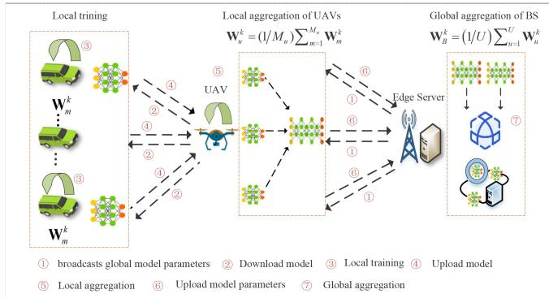  
Fig. 1. Overview of the proposed Hierarchical FL Training.

Vehicles are typically considered to have minimal variations in altitude, and their horizontal coordinates are denoted as $w _ { m } = [ x _ { m } , y _ { m } ] , m = 1 , \ldots , M$ . The distance between u and m is

$$
d _ { u , m } [ n ] = \sqrt { H ^ { 2 } + | | q _ { u } ( n ) - w _ { m } | | ^ { 2 } } ,\tag{1}
$$

The distance between UAV u and base station B is:

$$
d _ { u , B } [ n ] = \sqrt { H ^ { 2 } + | | q _ { u } ( n ) - B S _ { B } | | ^ { 2 } }\tag{2}
$$

## C. Training Process of the Proposed FL

Different from traditional cloud-edge-device three-layer architecture, the hierarchical FL method used in this paper is the structure of remote cloud data center-UAV-ground base station, using UAV to extend the coverage of ground base station, which can allow more vehicles can participate in FL. The UAV is set up as a server. Each vehicle participating in the FL training adopts the proximity principle to communicate with the UAV that is closer, and the UAV carries out local aggregation of the model before uploading the model to the ground base station for global aggregation, which improves the efficiency of model aggregation. As shown in Fig. 1, the training process of this paper is as follows: (1) The ground base station broadcasts model parameters to the UAV. (2) The UAV downloads the model parameters to the participant’s vehicle. (3) Vehicle participants perform local model training. (4) Vehicle participants upload the parameters of local model training to the UAV. (5) The UAV performs local aggregation of model parameters. (6) The UAV uploads the locally aggregated model parameters to the ground base station. (7) The ground base station performs global aggregation of the model.

In the FL training, vehicle m initializes the local model using the received global model parameters. During the process of local training, the device employs the AdamW method to iteratively update the parameters of the local model. ${ \bf W } _ { u , m } ^ { x }$ and $\mathbf { W } _ { u , m } ^ { x - 1 }$ respectively represent the equipment under the coverage of UAV u The model parameters of m after the end of the xth and x − th local training iterations, $R _ { l }$ represents the learning rate. $\nabla L ( \mathbf { W } _ { u , m } ^ { x - 1 } , D _ { u , m } )$ represents the loss function $L ( \mathbf { W } _ { u , m } ^ { x - 1 } , D _ { u , m } )$ relative to the parameter $\mathbf { W } _ { u , m } ^ { x - 1 }$ gradient. The model parameter update formula of device m under the coverage of UAV u can be expressed as ${ \bf W } _ { u , m } ^ { x } = { \bf W } _ { u , m } ^ { x - 1 } -$ $R _ { l } \nabla L ( \mathbf { W } _ { u , m } ^ { x - 1 } , D _ { u , m } )$ . Utilizing UAVs equipped with computing and storage devices as local aggregation nodes for FL can efficiently perform model training in edge networks while ensuring data privacy and reducing communication burdens. The local device uploads the updated model parameters to the UAV. The updated model parameters are uploaded to the UAV by the local device. Subsequently, the UAV performs local aggregation of the model parameters and transmits the locally aggregated model parameters to the edge base station B. The edge base station B then conducts global aggregation to update the Global model. The concept of a global model. The formula for aggregating model parameters at the local level by UAV u can be expressed as $\begin{array} { r } { \mathbf { \dot { W } } _ { u } ^ { k } = ( 1 / M _ { u } ) \sum _ { m = 1 } ^ { M _ { u } } \mathbf { W } _ { m } ^ { k } , } \end{array}$ ∀u ∈ U. The global aggregation of parameters by base station B can be expressed as $\bar { \mathbf { W } } _ { B } ^ { k } = ( 1 / \bar { U } ) \sum$ n $o l i m i t s _ { u = 1 } ^ { U } \mathbf { W } _ { u } ^ { k }$

## D. Communication Model of the Proposed FL

The scenarios considered in this paper are congested urban roads, especially crossroads during peak hours. At the crossroads, the UAV flies at a higher altitude, and there are few obstacles between the UAV and the vehicle. Therefore, it is practical and feasible to only use Line-of-sight (LoS) link communication in this open scenario [26]. The channel gain for LoS communication between UAV and vehicle is

$$
P L _ { u , m } [ n ] = \rho _ { 0 } d _ { u , m } ^ { - 2 } [ n ] = \frac { \rho _ { 0 } } { H ^ { 2 } + | | q _ { u } [ n ] - w _ { m } | | ^ { 2 } }\tag{3}
$$

Hence, the Channel gain for LoS communication between UAV u and base station B:

$$
P L _ { u , B } [ n ] = \frac { \rho _ { 0 } } { H ^ { 2 } + | | q _ { u } [ n ] - B S _ { B } | | ^ { 2 } }\tag{4}
$$

where $\rho _ { 0 }$ is channel gain, $\begin{array} { r } { \rho _ { 0 } = 1 0 \mathrm { l o g } _ { 1 0 } ( \frac { A _ { s } A _ { r } \lambda ^ { 2 } } { 4 \pi ^ { 2 } } ) , . } \end{array}$ As and $A _ { r }$ are antenna gains at the transmitter and receiver ends, and λ is transmitted signal wavelength. The Signal Interference plus Noise Ratio (SINR) for the downlink connecting UAV u and B, as well as the SINR for the link between UAV and vehicle.

$$
\begin{array} { r l } & { \alpha _ { u , B } = \cfrac { P L _ { u , B } \cdot q _ { u , B } } { \eta W + \sum _ { k \in \phi _ { m } } ^ { k \neq u } q _ { k , B } \cdot P L _ { u , B } } , \forall u \in \mathcal { U } , } \\ & { \alpha _ { u , m } = \cfrac { P L _ { u , m } \cdot q _ { u , m } } { \eta W + \sum _ { k \in \phi _ { m } } ^ { k \neq u } q _ { k , m } \cdot P L _ { u , m } } , \forall u \in \mathcal { U } , m \in \mathcal { M } _ { u } } \end{array}\tag{}
$$

(6)

where $q _ { u , B }$ is the transmission power between the UAV, $q _ { u , m }$ is transmission power between UAV u and vehicle m. η is the power spectral density of additive Gaussian white noise, and W is bandwidth.

## E. Latency Model of the Proposed FL

1) Global Model Parameter Download Latency: The downlink transmission rate between base station B and u is $r _ { B , u } ^ { k , d o w n } = \xi _ { B , u } ^ { k , d o w n } b _ { B , \mathcal { U } } \mathrm { l o g } _ { 2 } ( 1 + \alpha _ { B , u } ) . \ \xi _ { B , u } ^ { k , d o w n }$ represents = log (1 + )the downlink bandwidth resource allocation ratio between base station B and u in the k round of FL. The time latency for the global model parameters to be downloaded from the edge base station B to the u is

$$
T _ { B , u } ^ { k , d o w n } = \frac { Q _ { g } } { r _ { B , u } ^ { k , d o w n } }\tag{7}
$$

where $Q _ { g }$ represents the global model parameter size. The downlink transmission rate between UAV u and device m is $\begin{array} { r } { r _ { u , m } ^ { k , d o w n } = \xi _ { u , m } ^ { k , d o w n } b _ { \mathcal { U } , \mathcal { M } _ { u } } \mathrm { l o g } _ { 2 } ( 1 + \alpha _ { u , m } ) , \forall u \in \mathcal { U } , m \in \mathcal { M } _ { u } . } \end{array}$ where $\xi _ { u , m } ^ { k , d o w n }$ represents the bandwidth resource allocation ratio of the downlink between the UAV u and the device m, Hence, the latency for transmitting the global model parameters from the UAV u to the device m is

$$
T _ { u , m } ^ { k , d o w n } = \frac { Q _ { g } } { r _ { u , m } ^ { k , d o w n } } , \forall u \in \mathcal { U } , m \in \mathcal { M } _ { u }\tag{8}
$$

The latency for global model parameters to be downloaded from edge base station B to device m is

$$
T _ { B , m } ^ { k , d o w n } = T _ { B , u } ^ { k , d o w n } + T _ { u , m } ^ { k , d o w n } , \forall u \in \mathcal { U } , m \in \mathcal { M } _ { u }\tag{9}
$$

The global model parameter downloading latency is mainly affected by the last device that receives the global model parameters. Therefore, the global model parameter downloading latency is

$$
T _ { k } ^ { d o w n } = \mathop { m a x } _ { u \in \mathcal { U } , m \in \mathcal { M } _ { u } } X _ { u , m } ^ { k } T _ { B , m } ^ { k , d o w n }\tag{10}
$$

2) Vehicles Local Training Latency: The CPU frequency of the device m under the coverage of UAV u is expressed as $\mathit { C } _ { u , m }$ . Use $\tau _ { u , m } ^ { k }$ to represent the allocation ratio of local computing resources of device m under the coverage of UAV u. The local training latency is

$$
T _ { u , m } ^ { k , t r a } = I _ { u , m } ^ { k } . \frac { \mu N _ { u , m } } { \tau _ { u , m } ^ { k } C _ { u , m } } , \forall u \in \mathcal { U } , m _ { u } \in \mathcal { M } _ { u }\tag{11}
$$

where $\mu$ represents the number of CPU revolutions needed to process each unit of data, and $N _ { u , m }$ represents the size of the local dataset $D _ { u , m }$ of device m within range of UAV u. The notation $I _ { u , m } ^ { k }$ is the minimum number of device mlocal training iterations required for UAV u coverage, as stated in [27]. The local training latency is determined by the device that completes the model training.

$$
T _ { k } ^ { t r a } = \mathop { m a x } _ { u \in \mathcal { U } , m \in \mathcal { M } _ { u } } X _ { u , m } ^ { k } T _ { u , m } ^ { k , t r a }\tag{12}
$$

3) Model Parameter Upload Latency: The uplink transmission rate between the device m and the UAV u is $r _ { m , u } ^ { k , u p } =$ $\xi _ { m , u } ^ { k , u p } b _ { \mathcal { U } , \mathcal { M } _ { \mathcal { U } } } \mathrm { l o g } _ { 2 } ( 1 + \alpha _ { m , u } )$ , where $\xi _ { m , u } ^ { k , u p }$ is the proportion of bandwidth resources allocated to uplink between device m and UAV u. Denoting the updated model parameter sizes by $Q _ { l } .$ . The model parameter sizes are generally considered to be constant, so we have $Q _ { l } = Q _ { g }$ [28]. Therefore, the latency of model parameters uploading is

$$
T _ { m , u } ^ { k , u p } = \frac { Q _ { l } } { r _ { m , u } ^ { k , u p } } , \forall u \in \mathcal { U } , m \in \mathcal { M } _ { u }\tag{13}
$$

Donating uplink transmission rate between UAV and base station is $\bar { r } _ { u , B } ^ { k , \bar { u } p } = \xi _ { u , B } ^ { k , u p } b _ { B , \mathcal { U } } \mathrm { l o g } _ { 2 } ( 1 + \alpha _ { u , B } )$ , where $\xi _ { u , B } ^ { k , u p }$ is bandwidth resource allocation ratio of uplink. Hence, the latency for transmitting the locally aggregated parameters from UAV u to base station B is

$$
T _ { u , B } ^ { k , u p } = \frac { Q _ { l } } { r _ { u , B } ^ { k , u p } } , \forall u \in \mathcal { U }\tag{14}
$$

Hence, the latency of uploading the locally updated model parameters of device m to base station B is

$$
T _ { m , B } ^ { k , u p } = T _ { m , u } ^ { k , u p } + T _ { u , B } ^ { k , u p } , \forall u \in \mathcal { U } , m \in \mathcal { M } _ { u }\tag{15}
$$

The model parameter upload latency for the first k round of FL can be expressed as follows:

$$
T _ { k } ^ { u p } = \mathop { m a x } _ { u \in \mathcal { U } , m \in \mathcal { M } _ { u } } X _ { u , m } ^ { k } T _ { m , B } ^ { k , u p }\tag{16}
$$

The total delay $T _ { k }$ of k round training can be expressed as follows:

$$
T _ { k } = T _ { k } ^ { d o w n } + T _ { k } ^ { t r a } + T _ { k } ^ { u p }\tag{17}
$$

F. Energy Consumption Model of the Proposed FL

1) Global Model Parameter Download Energy Consumption: In the $k _ { t h }$ round of FL, the energy consumption of B for transmitting the global model parameters to UAV u is

$$
E _ { B , u } ^ { k , d o w n } = P L _ { B } T _ { B , u } ^ { k , d o w n } , \forall u \in \mathcal { U }\tag{18}
$$

The energy consumption for UAV u transmitting the global model parameters to vehicle m is

$$
E _ { u , m } ^ { k , d o w n } = P L _ { u } T _ { u , m } ^ { k , d o w n } , \forall u \in \mathcal { U } , m \in \mathcal { M } _ { u }\tag{19}
$$

Hence, the energy consumption for global model parameter downcasting is

$$
E _ { k } ^ { d o w n } = \sum _ { u = 1 } ^ { U } \sum _ { m = 1 } ^ { M _ { u } } { X _ { u , m } ^ { k } E _ { u , m } ^ { k , d o w n } } + \sum _ { u = 1 } ^ { U } { X _ { u , m } ^ { k } E _ { B , u } ^ { k , d o w n } } , \quad \mathrm { ~ ( ~ ) ~ }\tag{20}
$$

2) Energy Consumption of Local Training: The energy consumption of local training is influenced by size of the task and available computing power. The local training energy consumption is

$$
\begin{array} { r } { E _ { u , m } ^ { k , t r a } = \mu N _ { u , m } \lambda \Big ( \tau _ { u , m } ^ { k } C _ { u , m } \Big ) ^ { 2 } I _ { u , m } ^ { k } , \forall u \in \mathcal { U } , m \in \mathcal { M } _ { u } } \end{array}\tag{21}
$$

where λ is the effective capacitance coefficient [29] associated with the computing chipset device.The aggregate energy consumption of the device’s local training is

$$
E _ { k } ^ { t r a } = \sum _ { u = 1 } ^ { U } \sum _ { m = 1 } ^ { M _ { u } } { X _ { u , m } ^ { k } E _ { u , m } ^ { k , t r a } } , \forall u \in \mathcal { U } , m \in \mathcal { M } _ { u }\tag{22}
$$

3) Model Parameter Upload Energy Consumption: The energy consumption required for device m to transmit the updated model parameters to UAV u is

$$
E _ { m , u } ^ { k , u p } = P L _ { m } T _ { m , u } ^ { k , u p } , \forall u \in \mathcal { U } , m \in \mathcal { M } _ { u }\tag{23}
$$

Next, the energy consumption of the UAV u for transmitting the model parameters to B after local aggregation is

$$
E _ { u , B } ^ { k , u p } = P L _ { u } T _ { u , B } ^ { k , u p } , \forall u \in \mathcal { U } , m \in \mathcal { M } _ { u }\tag{24}
$$

The expression for the total energy consumption associated with model parameter uploading is

$$
\begin{array} { r } { E _ { k } ^ { u p } = \displaystyle \sum _ { u = 1 } ^ { U } \sum _ { m = 1 } ^ { M _ { u } } { X _ { u , m } ^ { k } E _ { m , u } ^ { k , u p } } + \displaystyle \sum _ { u = 1 } ^ { U } { X _ { u , m } ^ { k } E _ { u , B } ^ { k , u p } } } ,  \\ { \forall u \in \mathcal { U } , m \in \mathcal { M } _ { u } } \end{array}\tag{25}
$$

4) Energy Consumption of UAVs: The energy consumption of UAVs in flight and hovering is:

$$
\begin{array} { l } { { \displaystyle E _ { f } = \sum _ { 1 } ^ { \mathrm { N } } T _ { s l o t } \left( P _ { b } \left( 1 + \frac { 3 \left( v _ { h } ( t ) \right) ^ { 2 } } { U _ { t i p } ^ { 2 } } \right) + \right. } } \\ { { \displaystyle P _ { i } \left( \sqrt { 1 + \frac { \left( v _ { h } ( t ) \right) ^ { 4 } } { 4 \left( v _ { 0 } \right) ^ { 4 } } } \right) - \frac { \left( v _ { h } ( t ) \right) ^ { 2 } } { 2 \left( v _ { 0 } \right) ^ { 2 } } ) ^ { \frac { 1 } { 2 } } + \frac { 1 } { 2 } d _ { 0 } \rho s A v _ { h } ( t ) ^ { 3 } \left. \right) } } \end{array}\tag{26}
$$

In the given expressions, $v _ { h } ( t )$ represents the horizontal flight speed of the UAV, $P _ { b }$ and $P _ { i }$ denote the profile power and induced power of the UAV blades, respectively, $d _ { 0 }$ indicates the fuselage drag ratio, ρ, s, and A respectively denote air density, the robustness of the UAV rotor, and the UAV rotor disk area, $U _ { t i p }$ represents tip speed of the rotor blades, and v0 denotes the rotor induced speed in hovering state. Therefore, the total energy consumption $E _ { k }$ for $k _ { t h }$ round of FL can be expressed as follows:

$$
E _ { k } = E _ { k } ^ { d o w n } + E _ { k } ^ { t r a } + E _ { k } ^ { u p } + E _ { f }\tag{27}
$$

The energy consumption of device m within the range of UAV u encompasses the energy required for local model training and the energy expended for model parameter uploading. Therefore, at the conclusion of $k _ { t h }$ iteration of FL, the total energy consumption $\hat { E } _ { u , m } ^ { k }$ of device m can be represented as follows:

$$
\begin{array} { r l } & { \hat { \boldsymbol E } _ { u , m } ^ { k } = \hat { \boldsymbol E } _ { u , m } ^ { k - 1 } + \boldsymbol X _ { u , m } ^ { k } \boldsymbol E _ { u , m } ^ { k , t r a } + \boldsymbol X _ { u , m } ^ { k } \boldsymbol E _ { m , u } ^ { k , u p } , } \\ & { \quad \quad \quad \forall u \in \mathcal { U } , m \in \mathcal { M } _ { u } } \end{array}\tag{28}
$$

where $\hat { E } _ { u , m } ^ { k - 1 }$ represents total energy of $m ,$ and $\hat { E } _ { u , m } ^ { k }$ represents cumulative energy consumption. It is imperative that $\hat { E } _ { u , m } ^ { k }$ does not surpass the battery capacity available to device m, denoted as $\stackrel { \bullet } { E } _ { u , m } ^ { k , l i m i t }$

## G. Optimization Goal

We have analyzed the components for energy consumption $E _ { k }$ and latency $T _ { k }$ . In $E _ { k }$ , it depends on the computational complexity $\left( \tau _ { u , m } ^ { k } C _ { u , m } \right) ^ { 2 }$ and the number of calculations $I _ { u , m } ^ { k }$ , model parameters $N _ { u , m }$ , and other coefficients. In $T _ { k }$ it depends on by the amount of data transmission $Q _ { g }$ and $Q _ { l } ,$ bandwidth $^ { b , }$ etc. both $E _ { k }$ and $T _ { k }$ have the same order of magnitude $1 0 ^ { n }$ , besides, the energy consumption $E _ { k }$ contains direct dependencies on some parts of latency $T _ { k } .$ , such as $T _ { B , u } ^ { k , d o w n } , T _ { m , u } ^ { k , u p }$ . Hence, we used a linear combination of FL latency and energy consumption to characterize the overall cost of the $k _ { t h }$ round of training. The cost $c o s t _ { k }$ in $k _ { t h }$ round training can be calculated as follows.

$$
c o s t _ { k } = \alpha T _ { k } + ( 1 - \alpha ) E _ { k }\tag{29}
$$

where $\alpha ~ \in ~ [ 0 , 1 ]$ is the weight parameter. In congested urban roads, where network communication resources are scarce, and devices have limited computational resources and battery capacity, we aim to enhance device battery efficiency and minimize training latency and energy consumption. This is achieved by optimizing the selection of devices for FL training and managing the allocation of communication and computational resources. This approach addresses resource constraints and reduces service latency.

$$
\underset { { \bf X } , \xi , \tau } { m i n } \sum _ { k = 1 } ^ { K } c o s t _ { k }\tag{30}
$$

$$
s . t . T _ { k } \leq t _ { i , a r e a } , M _ { m i n } < \sum _ { m = 1 } ^ { M _ { u } } X _ { u , m } ^ { k } \leq M _ { u } ,
$$

$$
\forall k \in \{ 1 \cdot \cdot \cdot K \} , \forall u \in \mathcal { U }\tag{30a}
$$

$$
\hat { E } _ { u , m } ^ { K } \le E _ { u , m } ^ { l i m i t } , \forall u \in \mathcal { U } , m \in \mathcal { M } _ { u }\tag{30b}
$$

$$
\xi _ { B , u } ^ { k , d o w n } \in [ 0 , 1 ] , \xi _ { u , m } ^ { k , d o w n } \in [ 0 , 1 ] , \xi _ { u , B } ^ { k , u p } \in [ 0 , 1 ] ,
$$

$$
\xi _ { m , u } ^ { k , u p } \in [ 0 , 1 ] , \forall k \in { \mathcal { K } } , u \in { \mathcal { U } } , m \in { \mathcal { M } } _ { u }\tag{30c}
$$

$$
0 \leq \sum _ { u = 1 } ^ { U } \xi _ { B , u } ^ { k , d o w n } b _ { B , \mathcal { U } } \leq b _ { B , \mathcal { U } } ,
$$

$$
0 \leq \sum _ { u = 1 } ^ { U } \xi _ { B , u } ^ { k , u p } b _ { B , \mathcal { U } } \leq b _ { B , \mathcal { U } } , \forall k \in \mathcal { K }\tag{30d}
$$

$$
0 \leq \sum _ { u = 1 } ^ { U } \sum _ { m = 1 } ^ { M _ { u } } \xi _ { u , m } ^ { k , d o w n } b _ { \mathcal { U } , \mathcal { M } _ { \mathcal { U } } } \leq b _ { \mathcal { U } , \mathcal { M } _ { \mathcal { U } } }
$$

$$
0 \leq \sum _ { u = 1 } ^ { U } \sum _ { m = 1 } ^ { M _ { u } } \xi _ { u , m } ^ { k , u p } b _ { \mathcal { U } , \mathcal { M } _ { \mathcal { U } } } \leq b _ { \mathcal { U } , \mathcal { M } _ { \mathcal { U } } } , \forall k \in \mathcal { K }\tag{30e}
$$

$$
\tau _ { u , m } ^ { k } \in [ 0 , 1 ] \forall k \in { \mathcal { K } } , u \in { \mathcal { U } } , m \in { \mathcal { M } } _ { u }\tag{30f}
$$

where constraint (30a) indicates the delay for vehicle leaving the coverage $t _ { i , a r e a }$ is not less than the tolerance delay $T _ { k }$ and the number of participating vehicles is not less than the minimum for guaranteeing the FL performance $M _ { m i n }$ and does not exceed the UAV maximum coverage capacity $M _ { u } .$ Constraint (30b) indicates the cumulative energy consumption for each device should not exceed the limit of its battery capacity $E _ { u , m } ^ { l i m i t }$ . Constraint (30c) indicates the uplink and downlink energy consumption between the UAV and the base station, as well as the uplink and downlink energy consumption of any device should not exceed the limit of its battery capacity $E _ { u , m } ^ { l i m i t }$ . Link and downlink bandwidth resource allocation ratios are both between 0 and 1. Constraint (30d) indicates the sum of bandwidth resources allocated to the uplink and downlink between the base station and the

UAV cannot exceed the total bandwidth $b _ { B , \mathcal { U } }$ . Constraint (30e) indicates the sum of bandwidth resources allocated to the uplink and downlink between UAV and vehicle cannot exceed the total bandwidth $b _ { \mathcal { U } , \mathcal { M } _ { \mathcal { U } } }$ . Constraint (30f) indicates the ratio of the device’s computational resource allocation is between 0 and 1.

## III. PROBLEM SOLVING AND ALGORITHM DESCRIPTION

Problem (30) has been demonstrated to be a MINLP problem. In recent years, various methods, including approximate optimization algorithms, heuristic algorithms, and deep learning algorithms, have been considered effective for solving such problems. Approximate optimization algorithms [6], [30] and heuristic algorithms [10], [31] typically offer high efficiency and applicability in solving MINLP problems. However, these methods often face challenges such as local optima and high computational complexity. On the other hand, DL algorithms such as DDQN, A3C, and DDPG [27], [28], [32], [33] can predict vehicle demand based on historical data, thereby achieving optimal resource allocation efficiency. Nevertheless, in complex VEC scenarios, the state and action spaces for DRL algorithms become excessively large, leading to issues with algorithm convergence and low training efficiency. To address these challenges, we employ the AdamW algorithm to train the NN, which enhances the convergence speed of the DDQN algorithm. Additionally, we utilize the BOA to automatically select the optimal hyperparameters. This approach not only saves the time required for manual parameter tuning but also improves the overall training efficiency.

## A. Formalization of the Optimization Problem

In a single time slice $T _ { \mathrm { s l o t } }$ , by solving the vehicle selection vector $\mathbf { X } _ { k } ~ = ~ \{ X _ { u , m } ^ { k } \}$ , the computing resource allocation vector $\begin{array} { r c l } { \tau _ { k } } & { = } & { \{ \tau _ { u , m } ^ { k } \} } \end{array}$ , and the global optimal solution of the communication resource allocation vector $\xi _ { k } \ = \ \{ \xi _ { B , u } ^ { k , \mathrm { d o w n } } , \xi _ { u , m } ^ { k , \mathrm { d o w n } } , \xi _ { m , u } ^ { k , \mathrm { u p } } , \xi _ { u , B } ^ { k , \mathrm { u p } } \}$ , Deep Reinforcement =Learning (DRL) is used to address the issue of vehicle selection and resource allocation optimization. Problem (30) can be described as an MDP [34].

In MDP, the agent selects the corresponding action based on the observed environment state and obtains immediate rewards, and then this experience information is played back to the experience pool. The basis for the agent to choose actions based on this experience information is called strategy π:

$$
\pi ( a | s ) = P ( a _ { t } = a , s _ { t } = s )\tag{31}
$$

where $\pi ( a | s . )$ is the probability of performing action a in state s. Starting from state s, the expected value of reward that the agent receives by interacting with the environment is called state value function $V _ { \pi } ( s )$

$$
V _ { \pi } ( s ) = E [ R ( t ) | s _ { t } = s ]\tag{32}
$$

where $E [ . ]$ represents the expectation. Based on the strategy π, the expected value of reward obtained after performing a

certain action from the current state s is the state-action value function $Q _ { \pi } ( s , a )$

$$
Q _ { \pi } ( s , a ) = E [ R _ { t } | s _ { t } = s , a _ { t } = a ]\tag{33}
$$

where $Q _ { \pi } ( s , a )$ embodies the value of executing action a ( )based on the state s based on the policy π.

1) State Space $\scriptstyle ( s _ { k } ) .$ : In the $k _ { t h }$ round of FL, and according ( )to constraints (30a) and (30b), we defined the state space $s _ { k }$ as $s _ { k } = \{ T _ { k } , \mathbf { C } _ { k } , b _ { B , \mathcal { U } } ^ { k } , b _ { \mathcal { U } , \mathcal { M } _ { \mathcal { U } } } ^ { k } , E _ { u , m } ^ { k , l i m i t } \}$ , where $\mathbf { C } _ { k } = \{ C _ { u , m } ^ { k } \}$ and $E _ { u , m } ^ { k , l i m i t }$ represents the available battery capacity. During each training time slot, the number of vehicles participating in FL training may vary. To handle the change in state space dimension, we use zero-padding technology [35] to keep the state space dimension fixed. It is assumed the maximum number of vehicles is $N _ { \mathrm { m a x } } .$ , when the number of vehicles in the current time slot is $\sum _ { m = 1 } ^ { M _ { u } } X _ { u , m } ^ { k }$ and $\sum _ { m = 1 } ^ { M _ { u } } X _ { u , m } ^ { k } < N _ { \operatorname* { m a x } } .$ , zero values need to be filled to reach the maximum dimension. The number of zero values to be filled is $( N _ { \operatorname* { m a x } } - \sum _ { m = 1 } ^ { M _ { u } } X _ { u , m } ^ { k } ) \times d _ { s i }$ , where $d _ { s i }$ represents the number of vehicle state information dimensions. It ensures that when the number of vehicles changes, the state space dimension remains consistent, maintaining the stability and performance of the model.

2) Action Space $\left( a _ { k } \right)$ : The action space is the set of all possible actions output by the agent, which is equivalent to the solution space satisfying the constraint (30a), (30c), (30d), (30e), and (30f). In the $k _ { t h }$ round, agent B selects vehicles and allocates communication and computational resources based on the observed states so that the action space can be expressed as $a _ { k } = \{ { \bf X } _ { k } , \xi _ { k } , \tau _ { k } \}$ , and $a _ { k } \in { \mathcal { A } }$

3) Transition Probability: When agent B finds approximate optimal action $a _ { k } = \pi ( . a _ { k } | s _ { k } )$ based on the current state $s _ { k }$ the system reaches the next state $s _ { k + 1 }$

4) Reward Function $\left( r _ { k } \right)$ : The agent B explores action $a _ { k }$ by interacting with the environment, consider current state $s _ { k } .$ Meanwhile, after executing the corresponding action $a _ { k }$ , the agent will receive an instant reward from the environment. To minimize optimization goal $c o s t _ { k }$ , instant reward function of MDP is

$$
r _ { k } = \frac { k - c o s t _ { k } } { 1 0 0 }\tag{34}
$$

Different from current works that set reward function to be negatively related to the objective function, we add the iterations k into reward function to allows algorithm to not unduly penalize exploratory actions in the early stages, which helps avoid premature convergence to a locally optimal solution. However, above approach will make the training process unstable and difficult to converge, by considering the learning rate l and discount factor v in this paper, we set the reward as reward/ . The optimization problem (30) is to minimize the training cost $c o s t _ { k }$ of all k rounds, which corresponds to the maximization of the expected total reward $R _ { t } .$ , so we have

$$
R _ { k } = r _ { k } + { v r } _ { k + 1 } + { v ^ { 2 } } { r } _ { k + 2 } + \cdots + { v ^ { I } } { r } _ { k + i } = \sum _ { i = 0 } ^ { I } { v ^ { i } } { r } _ { k + i }\tag{35}
$$

To prevent the reward function from failing to converge due to larger k, we set a reward factor v, when the reward tends to be stable, the iterations k will not affect the value of the cumulative reward.

The objective to optimize the long-term expected reward $Q _ { \pi } ( s , a )$ in FL training across all initial states s. The edge server, denoted as agent B, aims to learn and acquire the optimal policy $\pi ^ { * }$ given any initial state s, which can be expressed as follows in Eq. (36):

$$
\pi ^ { * } = \arg m a x \ : Q _ { \pi } ( s , a ) , \forall s \in S\tag{36}
$$

## B. Vehicle Selection and Resource Allocation Optimization Algorithm Based on AB-DDQN

1) Vehicle Selection Based on Mobility: Since vehicles have mobility, assuming that the speed of vehicle I remains constant for a certain period as $v _ { i }$ , this paper evaluates the mobility of vehicles by using BPR function to compute the free travel time $t _ { i , a r e a } ^ { f r e e } \dot { = } d _ { r } / \overline { { v } } _ { i }$ on a certain road section, such that $t _ { i , a r e a }$ =denotes the time at which the vehicle $v _ { i }$ is expected to leave the area area and in combination with BPR function, $t _ { i , a r e a }$ is calculated as follows:

$$
t _ { i , a r e a } = t _ { i , a r e a } ^ { f r e e } \times \left( 1 + \alpha _ { 1 } { ( \frac { Q _ { a r e a } } { C _ { a r e a } } ) } ^ { \beta } \right)\tag{37}
$$

where $Q \phantom { } _ { a r e a }$ is the real-time traffic volume of area area in $p c u / h$ $C _ { a r e a }$ represents the actual capacity of area area, $\alpha _ { 1 } / \beta$ represents the model pending parameters of area area, whose suggested values are 0.15 and 4, which need to be determined by the actual situation of area. Calculate the expected departure times of all vehicles in area covered by UAV and rank them from largest to smallest. $T _ { k }$ is used as the departure time threshold chosen by the vehicle participants. Then, the $X _ { u , i }$ can be calculated as

$$
X _ { u , i } = \left\{ \begin{array} { l l } { 1 , t _ { i , a r e a } \ge T _ { k } } \\ { 0 , t _ { i , a r e a } < T _ { k } } \end{array} \right.\tag{38}
$$

2) DDQN: The DRL method entails the iterative updating of the policy π through continuous interaction between the intelligent agent and the environment. The primary goal is to identify a globally optimal policy $\pi ^ { * }$ that maximizes the cumulative reward obtained by the system over the long term. If $\pi ( s _ { t + 1 } )$ is employed to represent the decision made by the agent in the state of $s t { + 1 }$ based on π, the method of updating the state action-value function of Q-learning can be expressed as follows:

$$
Q _ { \pi } ( s _ { t } , a _ { t } ) \gets R _ { t } + Q _ { \pi } ( a _ { t + 1 } , \pi ( s _ { t + 1 } ) )\tag{39}
$$

To address the issue of the Q-table dimension explosion, the Deep Q Network (DQN) learning approach is introduced [36]. DQN learns to get the optimal policy by training the Q network by turning the Q-table in Q-learning into a Q-network. The neural network is used in the DQN algorithm for Q-value prediction.

$$
\begin{array} { r l } & { Q _ { \pi } ( s _ { t } , a _ { t } | \vartheta ) = } \\ & { \quad R _ { t } + \upsilon Q _ { \pi } \bigg ( s _ { t + 1 } , a r g \underset { a _ { t + 1 } } { m a x } Q _ { \pi } ( s _ { t + 1 } , a _ { t + 1 } ; \vartheta ) ; \vartheta \bigg ) } \end{array}\tag{40}
$$

where ϑ denotes the evaluation network parameters for DQN and υ is the discount factor. The maximization operation of Q-value prediction in DQN methods leads to the problem of Q-value overestimation. In contrast, double-depth Q network learning [21] decouples action selection and Q-value computation, thus avoiding Q-value overestimation [22]. So, in this paper, we use the double-depth Q network learning method to solve the global optimal solution of the resource allocation problem. The dual-deep Q network learning improves the Q value prediction method, and the Q value prediction formula is as follows:

$$
y _ { t } = R _ { t } + { \nu } Q _ { \pi } { \biggl ( } s _ { t + 1 } , a r g m a x ~ Q _ { \pi } ( s _ { t + 1 } , a _ { t + 1 } ; \vartheta ) ; \vartheta ^ { - } { \biggr ) }\tag{41}
$$

where $\vartheta ^ { - }$ is parameters of the target network. It can be seen that the difference between dual-depth Q network learning and DQN is that DQN selects the action through the evaluation network and then calculates the Q value through the evaluation network, but the dual-depth Q network learning approach seeks to ascertain the optimal action in the state of $s _ { t + 1 }$ by utilizing the evaluation network, followed by the computation of the target Q value of the action using the target network. The mean-square error loss function used to update the evaluation network parameters ϑ in double-deep Q-network learning is

$$
L ( \vartheta ) = E \left[ \left( y _ { t } - Q _ { \pi } ( s _ { t } , a _ { t } ; \vartheta ) \right) ^ { 2 } \right]\tag{42}
$$

where $y _ { t }$ is value estimated by Eq. (40) and $Q _ { \pi } ( s , a ; \vartheta )$ is the Q value of evaluation network.

3) AB-DDQN: Traditional DDQN uses a Stochastic Gradient Descent (SGD) algorithm to train neural networks. SGD algorithm is known for its slow convergence and unstable parameter updates, which can result in oscillations or dispersion of the model during the training process. AdamW [37] algorithm is used to train DDQN. AdamW algorithm adds weight decay to Adam, making it simple to implement, computationally efficient, with small memory requirements, and ensuring that the parameter updates are not affected by gradient scaling. As we can see from Fig. 2, based on the traditional DDQN, we use BOA to identify optimal hyperparameters. In detail, when a butterfly senses that another butterfly is emitting more scent in the area, it moves closer to that area. This phase is referred to as global search. When a butterfly fails to perceive a scent stronger than its own, it moves randomly, and this phase is called the local search phase. The perceived intensity of the scent produced by each butterfly in the BOA population can be expressed as follows.

$$
f = c I ^ { \alpha _ { 2 } }\tag{43}
$$

where f is scent intensity function, I is the stimulus intensity determined by adaptation function, and $\alpha _ { 2 }$ is the intensity coefficient, which takes the value range of [0, 1].

Next, the BOA is used to select the following hyperparameters of the DDQN algorithm: (1) the number of neurons in the hidden layer, (2) the size of the empirical replay buffer, and (3) the discount factor. First, randomly generate the initial positions of a group of butterfly individuals. Use the DDQN algorithm to train in the environment based on the current position and calculate the fitness of each butterfly. Then, according to the update rules of the butterfly optimization algorithm, update the position and speed of each butterfly to facilitate the search for hyperparameters. When the maximum number of iterations is reached or the fitness value converges to a certain threshold, output the optimal hyperparameter combination after convergence as the final configuration of the DDQN algorithm for application and evaluation in actual environments. Different values of hyperparameters in the DDQN algorithm will lead to different performances of the DDQN algorithm, ultimately leading to different values of the R. The pseudo code of the algorithm is shown in Algorithm 1:

The position corresponding to $g _ { b e s t }$ indicates the number of neurons, the size of the Replay Buffer, the discount factor, respectively, and the fitness value corresponding to $g _ { b e s t }$ is the average value of R.

$$
\boldsymbol { x } _ { i } ^ { t + 1 } = \boldsymbol { x } _ { i } ^ { t } + \left( \boldsymbol { r } ^ { 2 } \times g _ { b e s t } - \boldsymbol { x } _ { i } ^ { t } \right) \times \boldsymbol { f } _ { i }\tag{44}
$$

$$
\boldsymbol { x } _ { i } ^ { t + 1 } = \boldsymbol { x } _ { i } ^ { t } + \left( \boldsymbol { r } ^ { 2 } \times \boldsymbol { x } _ { j } ^ { t } - \boldsymbol { x } _ { k } ^ { t } \right) \times \boldsymbol { f } _ { i }\tag{45}
$$

where r is a random number between , , $g _ { b e s t }$ is the position of the butterfly with the best fitness value, xj and $x _ { k }$ are two random individuals in the solution space.

4) Complexity Analysis: the time spent on initialization in each iteration is $t _ { i n i t }$ . The time spent in each iteration is $t _ { s t e p } ,$ thus the time to execute DDQN algorithm is $t _ { i n i t } + t _ { s t e p } \times N$ $\times \_ M$ , with time complexity of $O ( N \times M )$ . When using ( )the BOA to select parameters, iterations is K, the butterfly population size is $N _ { b }$ , the complexity of BOA to select parameters is $O ( K \times N _ { b } )$ , and the total time complexity of (AB-DDQN algorithm is $O ( N \times M \times K \times N _ { b } )$ .

## IV. EXPERIMENT AND RESULT ANALYSIS

As shown in Fig. 3, the UAV-assisted VEC experimental environment includes an end-device layer, a UAV layer, an edge layer, and a cloud layer. The end device can utilize local data for training. Meanwhile, the end device can send content requests to the UAV, which serves it via a wireless network. The UAV layer consists of a Raspberry Pi 4 Model B with cache capacity and computational resources, primarily to provide resources for the devices within its coverage area. The edge layer is deployed on this campus, and it consists of wireless access points, edge servers, and edge controllers. When the UAV fails to meet the content request of the devices within its coverage area, it requests the corresponding content from the edge server. The cloud data center contains the central server, which is also deployed on this campus to alleviate the resource constraints at the edge layer. The cloud data center provides elastic resources through the installation of virtual machines.

## A. Settings

In this section, extensive experiments are performed to evaluate the effectiveness of the proposed strategy, the main experimental parameter value settings are shown in Table II.

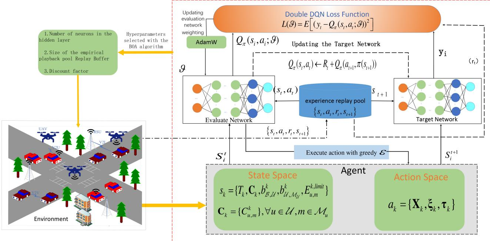  
Fig. 2. The proposed vehicle selection and resource allocation algorithm based on AB-DDQN.

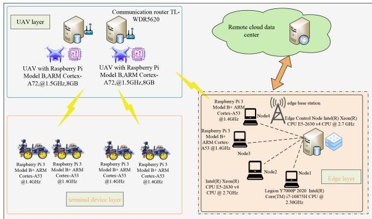  
Fig. 3. Experimental environment for UAV-assisted VEC.

TABLE II PARAMETER SETTINGS
<table><tr><td>Parameters</td><td>Value</td><td>Parameters</td><td>Value</td></tr><tr><td>Number of UAVs</td><td>2</td><td>butterfly population size</td><td>30</td></tr><tr><td>The maximum number of iterations of the BOA K</td><td>50</td><td>BOA problem dimensions</td><td>2</td></tr><tr><td>Range of model parameter sizes(KB)</td><td>[5, 25]</td><td>Number of vehicles</td><td>[10, 50]</td></tr><tr><td>Size of local data volume(MB)</td><td>[2, 10]</td><td>Number of CPU cycle(cycle/bit) [38]</td><td>[10, 30]</td></tr><tr><td>Vehicle local energy consumption limits</td><td>15J</td><td>Learning rate λ [39]</td><td>0.01</td></tr><tr><td>Transmission power pu for UAVs [38]</td><td>33dbm</td><td>Transmission power pB of the base station</td><td>46dbm</td></tr><tr><td>The computational resources available to the UAV [38]</td><td>1.5GHz</td><td>The computational resources available to the vehicle Cu,m</td><td>1−2GHz</td></tr><tr><td>The size of the model parameters Q9</td><td>1MB</td><td>Experience pool size Ωc</td><td>2000</td></tr><tr><td>Frequency of target network updates G</td><td>10</td><td>UAV&#x27;s Flight Height[32]</td><td>50m</td></tr><tr><td>UAV&#x27;s power efficiency</td><td>0.7</td><td>UAV&#x27;s hovering energy consumption</td><td>2600m.Ah/h</td></tr></table>

1) Dataset: The German Traffic Sign Detection Benchmark (GTSDB) [40] is a well-established benchmark dataset in Germany that is commonly used for evaluating the performance of traffic sign recognition algorithms. Each image in the dataset is annotated with a rectangular region of interest (ROI) that encompasses the visible traffic signs. Additionally, the dataset includes specific traffic sign categories such as stop signs, speed limit 60, speed limit 80, etc. All the relevant traffic signs present in the image are manually labeled.

2) Baselines: Deep Q Network Learning based User Selection and Communication Resource Allocation

Algorithm (DQN-USCRA) [41], Deep Deterministic Policy Gradient-based Computing Resource Allocation Algorithm (DDPG-CRA) [42] and Q-learning based User Selection Optimization Algorithm (Q-US) [18] as baselines. DQN-USCRA focuses only on selecting devices and allocating bandwidth resources in the FL process. In contrast, the utilization of device CPU resources is fixed at one hundred percent. The optimization objective of this algorithm aligns with our algorithm. Therefore, DQN-USCRA is presented as a comparative approach to the algorithm proposed in this research paper. DDPG-CRA focuses only on selecting devices in the FL process and allocating CPU resources, and the network bandwidth resources are uniformly allocated. This algorithm aims to minimize the long-term training latency in FL by employing the DDPG method. It aims to solve the participant selection and computational resource allocation policies to achieve the globally optimal solution. Q-US focuses on participant selection during FL training only, and the bandwidth resources in the network are evenly distributed, the CPU resource utilization of the device is fixed at 100 percent, and Q-learning is used to solve the near-optimal participant selection policy.

3) Performance Metrics: We select FL latency, FL energy consumption, FL system cost, and training rewards as the evaluation indexes of the algorithm performance. The FL latency for the experimental study in this section is the average latency of K rounds of FL. According to equation (17), the average latency of K rounds of FL can be expressed as latency $= \textstyle \sum _ { k = 1 } ^ { \cdot _ { K } } T _ { k } / K$ . The energy consumption of FL studied experimentally is the average energy consumption of K rounds of FL. According to equation (27), the average energy consumption of K rounds of FL can be expressed as energy $\textstyle \sum _ { k = 1 } ^ { K } \dot { E } _ { k } / K$ . The FL system cost studied in this section of the experiment is the average system cost of K rounds of

Algorithm 1 Vehicle Selection and Resource Allocation   
Algorithm Based on AB-DDQN   
Require: $s _ { k } = \{ T _ { k } , \mathbf { C } _ { k } , b _ { B , \mathcal { U } } ^ { k } , b _ { \mathcal { U } , \mathcal { M } _ { \mathcal { U } } } ^ { k } , E _ { u , m } ^ { k , l i m i t } \}$ , learning rate $\lambda ,$   
decay factor $\gamma ,$ U  butterfly population size $\dot { N } _ { b } , K _ { b } , c , p .$   
Ensure: $\pi _ { k } ^ { * } = \{ \mathbf { X } _ { k } , \xi _ { k } , \dot { \tau } _ { k } \} .$   
Initialize the capacity of the experience pool Ω to $\Omega _ { C } ,$ , initialize   
the population.   
Data owner $a _ { i }$ responds to the request and uploads the initial   
amount of shared data $q _ { i } .$   
for gen = i to $K _ { b }$ do   
for $b _ { f } = 1$ to $N _ { b }$ do   
Initialize the agent with the evaluation network parameter $\vartheta$   
and the target network parameter $\vartheta ^ { \prime }$ $\vartheta ^ { \prime } = \vartheta$   
for iteration = 1 to M do   
$s = s _ { 0 }$   
for $t = 1 \mathrm { ~ t ~ } N$ do   
Select action $a _ { t }$ with adaptive probability $\varepsilon ,$ otherwise   
select the current optimal action argmax $Q ( s , a )$   
a   
B allocates resources according to $\mathop { a _ { t } } ^ { \sim }$ and obtains $r _ { t }$   
according to equation $( 3 7 ) . \ s _ { t } \stackrel { } { \Rightarrow } \ s _ { t + 1 } \stackrel { } { _ { \cdot } }$   
$\Omega \gets \{ s _ { t } , a _ { t } , r _ { t } , s _ { t + 1 } \}$   
Selecting $\Omega _ { b }$ from Ω as a training sample   
for $i = \overset { \triangledown } { 1 }$ to $\Omega _ { b }$ do   
Calculate Calculate current target $Q$   
if $s _ { i }$ is the final state then   
$y _ { i } = R _ { i }$   
else   
equation (41)   
end if   
end for   
${ \cal L } ( \vartheta ) _ { a v e } = 1 / \Omega _ { b } \ { \cal E } \Big [ ( y _ { i } - Q \pi ( s _ { i } , a _ { i } ; \vartheta ) ) ^ { 2 } \Big ]$   
Updated ϑ using AdamW algorithm   
After every $\delta$ iterations, $\vartheta ^ { - } = \vartheta$   
end for   
$\pi _ { k }  s _ { k }$   
end for   
$I _ { i } = $ Reward   
Calculate $f _ { i }$ using formula 1   
end for   
Obtain the optimal flavor intensity $f _ { b e s t } ,$ gbest $\gets f _ { b e s t }$   
for $b _ { f } = 1$ to $N _ { b }$ do   
Generate a random number r from [0, 1]   
if $r < p$ then   
Global search using equation (44)   
else   
Localized search using equation (45)   
end if   
end for   
end for   
return $\pi _ { k } ^ { * } = \pi _ { k } , g _ { b e s t } .$

FL. The FL system cost is a linear combination of latency and energy consumption in the process of FL. According to equation (31), the FL system cost cost can be represented as $\begin{array} { r } { c o s t { = } \sum _ { k = 1 } ^ { K } c o s t { _ k } / K } \end{array}$ . The training reward studied in this experiment section is the average K rounds of FL reward. According to equation (36), the average reward of K rounds of FL, reward, can be expressed as reward $= \textstyle \sum _ { k = 1 } ^ { K } r _ { k } / K$

## B. Results and Analysis

In Fig. 4, as α increases, the weight of delay increases, indicating an increase in the importance of delay in FL and, correspondingly, a decrease in the importance of the energy consumption component. Therefore, different weight values should be set in different scenarios. In the subsequent experiments, the value of a was set to 0.55.

latency   
energy consumption   
0.0 0.2 0.4 0.6 0.8 1.0   
weight  
Fig. 4. Impact of weight values on delay and energy consumption.

8 0.8   
0.6   
0.2 learning rate=0.01   
learning rate=0.1   
learning rate=0,001   
0.0   
200 400 600 800 200 400 600 800   
iterations iterations   
(a) Iterations on training rewards. (b) Model training accuracy.   
3.0   
learning rate=0,01   
Jearning rate=0,1   
Jearning rate=0,001   
2.0   
1.0   
0.5   
  
200 400 600 800   
iterations   
(c) Model training loss.  
Fig. 5. The impact of the number of iterations on training rewards and learning rate on model convergence performance.

In Fig. 5(a), the training reward of the participant selection and resource allocation optimization algorithm based on AB-DDQN exhibits a notable upward trend as the number of training iterations increases. Moreover, the deep neural network achieves convergence at approximately 450 iterations. After achieving training convergence, the average reward stabilizes at approximately 8.95.

In Fig. 5(b) and 5(c), we evaluated the convergence performance of the participant selection and resource allocation optimization algorithms for AB-DDQN with respect to different learning rates. It can be seen that when the learning rate is set to 0.01, the model accuracy is the highest, and the model training loss is the lowest. The results show that a higher learning rate does not necessarily improve model training results, while a learning rate that is too small leads to lower model training accuracy and higher training loss. Hence, the learning rate in this paper is set to 0.01. In Fig. 6, show that training cost of our algorithm and convergence are better than DDQN.

In Fig. 7, the latency of DQN-USCRA and Q-US increases significantly with local data volume. In terms of energy consumption, it demonstrates a 13.26% reduction compared to DDPG-CRA, an 87.92% reduction compared to DQN-USCRA, and a 91.45% reduction compared to Q-US. In terms of cost, our algorithms achieve 14.52% lower cost than DDPG-CRA, an 82.17% lower cost than DQN-USCRA, and an 89.05% lower cost than Q-US. The training reward decreases gradually as local data on the device increases. Our algorithm demonstrates an average improvement of 0.37% over DDPG-CRA, 2.83% over DQN-USCRA, and 4.25% over Q-US in terms of training rewards.

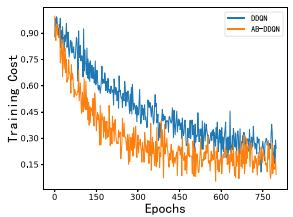  
(a) Model training cost.

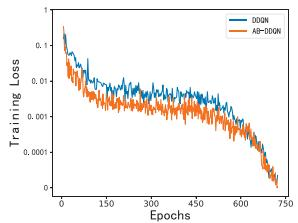  
(b) Model training loss.

Fig. 6. Comparison of training cost and convergence.  
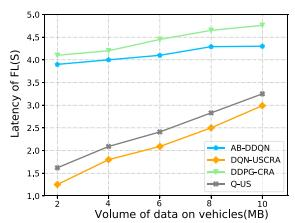  
(a) Latency of FL.

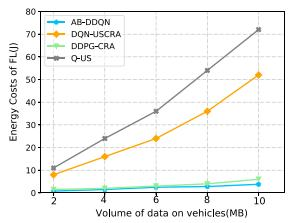  
(b) Energy consumption of FL.

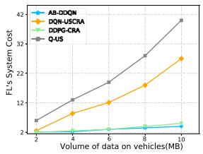  
(c) Cost of FL.

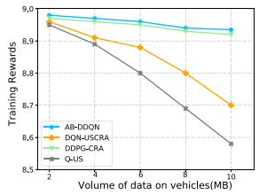  
(d) Training rewards of FL.

Fig. 7. The impact of the amount of local data from vehicles on experimental results.  
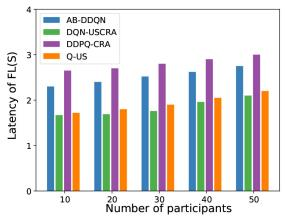  
(a) Latency of FL.

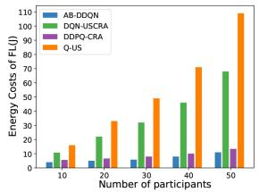

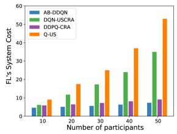  
(c) Cost of FL.

(b) Energy consumption of FL  
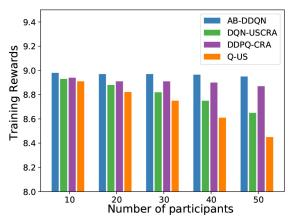  
(d) Training rewards of FL.  
Fig. 8. The impact of the number of participants on the experiment results.

In Fig. 8, as the number of participants increases, the latency of all algorithms does not change much because the latency is only determined by a participant’s maximum local model training time and model parameter transmission latency. Energy consumption and system costs have gradually increased. Our algorithms described have a mean latency that is 10.13% lower compared to DDPG-CRA, 21.72% higher compared to DQN-USCRA, and 29.58% higher compared to Q-US. In terms of cost, it achieves a reduction of 18.91% when compared to DDPG-CRA, 87.02% when compared to DQN-USCRA, and 94.49% when compared to Q-US. The training reward decreases gradually as the number of participants increases. Our algorithm demonstrates, on average, a 0.82% increase in training incentives compared to DDPG-CRA, a 3.57% increase compared to DQN-USCRA, and a 6.27% increase compared to Q-US.

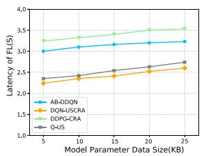  
(a) Latency of FL.

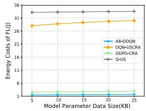  
(b) Energy consumption of FL.

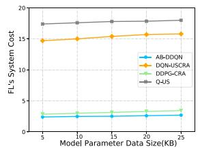  
(c) Cost of FL.

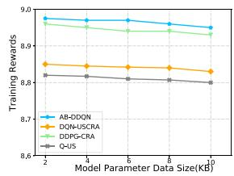  
(d) Training rewards of FL.  
Fig. 9. The impact of model parameter data size on experimental results.

In Fig. 9, DQN-USCRA and Q-US both have lower devicelocal training latency and higher model training energy consumption because they fix the utilization of device computational resources to 100% per participant. Also, DQN-USCRA optimizes the allocation of bandwidth resources, so DQN-USCRA has the lowest FL latency, and Q-US has the second lowest. Our algorithm considers the allocation of both communication and computational resources, while DDPG-CRA only focuses on the allocation of computational resources of the participant’s device, so the FL delay and model training energy consumption of this paper’s algorithm are lower than that of the DDPG -CRA algorithm. Specifically, our algorithm is 29.86% lower than DDPG-CRA on average in terms of FL energy consumption, 86.75% lower than DQN-USCRA, and 93.82% lower than Q-US on average. It is 21.09% lower than DDPG-CRA on average, 83.02% lower than DQN-USCRA, and 90.13% lower than Q-US on average in terms of the cost of the FL system. In terms of latency by an average of 10.86% compared to DDPG-CRA, an increase of 21.93% compared to DQN-USCRA, and an increase of 27.78% compared to Q-US. In terms of training rewards, the average performance of the algorithm used in this paper is improved by 1.12% compared with DDPG-CRA, 2.33% compared with DQN-USCRA, and 3.55% compared with Q-US.

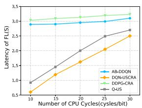  
(a) Latency of FL.

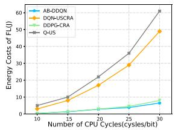  
(b) Energy consumption of FL.

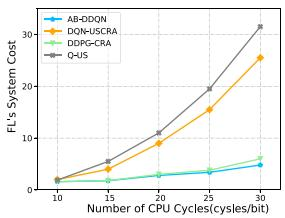  
(c) Cost of FL.

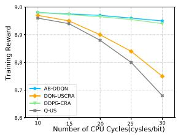  
(d) Training rewards of FL.

Fig. 10. The impact of the number of CPU cycles on the experimental results.  
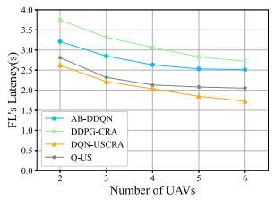

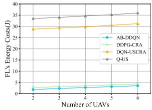  
(b) Energy consumption of FL.

(a) Latency of FL.  
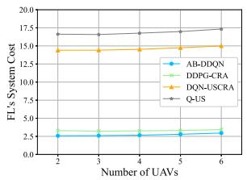  
(c) Cost of FL.

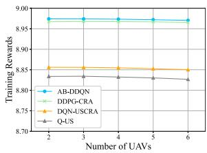  
(d) Training rewards of FL.  
Fig. 11. The impact of the number of UAVs on the experimental results.

In Fig. 10, since number of CPU cycles directly affects the device’s local training latency, a larger number of CPU cycles indicates that more CPU revolutions need to be consumed to process each bit of data, and as the number of CPU cycles increases, the FL latency, energy consumption, and system cost increase, while the training reward decreases. Since DQN-USCRA and Q-US utilize the participant’s device computational resources to 100% each time, the local training latency is low, and the energy consumption of the model training is high. Our algorithm considers the allocation of both communication and computational resources, while DDPG-CRA only focuses on the allocation of participant device computational resources, so the latency and energy consumption of our algorithm are both lower than those of DDPG-CRA. Our algorithm shows an average reduction of 4.06% in latency compared to DDPG-CRA, but it demonstrates a larger latency of 23.18% compared to DQN-USCRA and a 16.79% greater latency than Q-US.

In Fig. 11, as the number of UAVs increases, the coverage and capacity of the communication network are improved, thereby reducing the communication delay between vehicles and infrastructure or between vehicles. More UAVs can provide more communication nodes, allowing vehicles to communicate faster with other participants in the network, so the average FL training latency for all algorithms is reduced. As the number of UAVs increases, the delay of our algorithm is 12.18% lower than DDPG-CRA on average, 32.57% higher than DQN-USCRA on average, and 20.94% higher than Q-US on average. In terms of energy consumption, it is 24.28% lower than DDPG-CRA, 91.07% lower on average than DQN-USCRA, and 92.29% lower than the Q-US algorithm. In terms of FL cost, it is 17.76% lower on average than the DDPG-CRA algorithm, 81.40% lower than the DQN-USCRA algorithm on average, and 83.87% lower than the Q-US on average. In terms of training rewards, it is 0.05% lower than the DDPG-CRA algorithm on average, 1.38% lower than the DQN-USCRA algorithm on average, and 1.64% lower than Q-US on average.

## V. CONCLUSION AND FUTURE WORKS

In UAV-assisted VEC, to improve the training cost of FL while ensuring the efficiency of training, we proposed a novel joint optimization approach of vehicle selection and resource allocation for FL training. In detail, By considering the limitations of vehicle battery capacity and optimizing the allocation of computational resources, we can improve the efficiency of battery usage in vehicles, thereby reducing training energy consumption and latency and avoiding the premature exit of vehicles from training. Additionally, by considering the allocation of network resources, we aim to reduce the transmission latency of model parameters, thus achieving the goal of lowering the long-term training latency and energy consumption. To solve the above optimization problem, we introduced an optimization algorithm based on AB-DDQN. The experimental results demonstrate that our algorithm effectively reduces training latency and energy consumption in FL. However, our approach does not account for potential adversarial participants in FL. Malicious actors can infer information about other participants from shared model parameters and may intentionally transmit incorrect parameters to disrupt training. Future research will address these issues to enhance the accuracy of FL model training and improve user privacy protections.

## REFERENCES

[1] L. Zhao et al., “Adaptive multi-UAV trajectory planning leveraging digital twin technology for urban IIoT applications,” IEEE Trans. Netw. Sci. Eng., early access, Dec. 19, 2023, doi: 10.1109/TNSE.2023.3344428.

[2] J. Shi, P. Cong, L. Zhao, X. Wang, S. Wan, and M. Guizani, “A two-stage strategy for UAV-enabled wireless power transfer in unknown environments,” IEEE Trans. Mobile Comput., vol. 23, no. 2, pp. 1785–1802, Feb. 2024.

[3] Y. Zeng and R. Zhang, “Energy-efficient UAV communication with trajectory optimization,” IEEE Trans. Wireless Commun., vol. 16, no. 6, pp. 3747–3760, Jun. 2017.

[4] T. S. Alemayehu and J.-H. Kim, “Efficient nearest neighbor heuristic TSP algorithms for reducing data acquisition latency of UAV relay WSN,” Wireless Pers. Commun., vol. 95, no. 3, pp. 3271–3285, Aug. 2017.

[5] J. Luo, J. Song, F.-C. Zheng, L. Gao, and T. Wang, “User-centric UAV deployment and content placement in cache-enabled multi-UAV networks,” IEEE Trans. Veh. Technol., vol. 71, no. 5, pp. 5656–5660, May 2022.

[6] S. Jeong, O. Simeone, and J. Kang, “Mobile edge computing via a UAV mounted cloudlet: Optimization of bit allocation and path planning,” IEEE Trans. Veh. Technol., vol. 67, no. 3, pp. 2049–2063, Mar. 2018.

[7] J. Dong, K. Ota, and M. Dong, “UAV-based real-time survivor detection system in post-disaster search and rescue operations,” IEEE J. Miniat. Air Space Syst., vol. 2, no. 4, pp. 209–219, Dec. 2021.

[8] K. B. Letaief, W. Chen, Y. Shi, J. Zhang, and Y.-J.-A. Zhang, “The roadmap to 6G: AI empowered wireless networks,” IEEE Commun. Mag., vol. 57, no. 8, pp. 84–90, Aug. 2019.

[9] C. Li, K. Jiang, Y. Zhang, L. Jiang, and S. Wan, “Deep reinforcement learning-based mining task offloading scheme for intelligent connected vehicles in UAV-aided MEC,” ACM Trans. Design Autom. Electron. Syst., vol. 29, no. 3, pp. 1–29, 2024.

[10] Y. Li, L. Liu, J. Wu, M. Wang, H. Zhou, and H. Huang, “Optimal searching time allocation for information collection under cooperative path planning of multiple UAVs,” IEEE Trans. Emerg. Topics Comput. Intell., vol. 6, no. 5, pp. 1030–1043, Oct. 2022.

[11] C. Li, Y. Gan, Y. Zhang, and Y. Luo, “A cooperative computation offloading strategy with on-demand deployment of multi-UAVs in UAVaided mobile edge computing,” IEEE Trans. Netw. Service Manag., vol. 21, no. 2, pp. 2095–2110, Apr. 2024.

[12] M. A. P. Chamikara, P. Bertok, I. Khalil, D. Liu, and S. Camtepe, “Privacy preserving distributed machine learning with federated learning,” Comput. Commun., vol. 171, pp. 112–125, Apr. 2021.

[13] T. Zeng, O. Semiari, M. Mozaffari, M. Chen, W. Saad, and M. Bennis, “Federated learning in the sky: Joint power allocation and scheduling with UAV swarms,” in Proc. IEEE Int. Conf. Commun. (ICC), 2020, pp. 1–6.

[14] W. Y. B. Lim et al., “Towards federated learning in UAV-enabled Internet of Vehicles: A multi-dimensional contract-matching approach,” IEEE Trans. Intell. Transp. Syst., vol. 22, no. 8, pp. 5140–5154, Aug. 2021.

[15] J. S. Ng et al., “Joint auction-coalition formation framework for communication-efficient federated learning in UAV-enabled Internet of Vehicles,” IEEE Trans. Intell. Transp. Syst., vol. 22, no. 4, pp. 2326–2344, Apr. 2021.

[16] X. Zhou, W. Liang, J. She, Z. Yan, and K. I.-K. Wang, “Twolayer federated learning with heterogeneous model aggregation for 6G supported Internet of Vehicles,” IEEE Trans. Veh. Technol., vol. 70, no. 6, pp. 5308–5317, Jun. 2021.

[17] X. Kong et al., “A federated learning-based license plate recognition scheme for 5G-enabled Internet of Vehicles,” IEEE Trans. Ind. Informat., vol. 17, no. 12, pp. 8523–8530, Dec. 2021.

[18] G. Wang, F. Xu, H. Zhang, and C. Zhao, “Joint resource management for mobility supported federated learning in Internet of Vehicles,” Future Gener. Comput. Syst., vol. 129, pp. 199–211, Apr. 2022.

[19] C. Li, Y. Zhang, and Y. Luo, “A federated learning-based edge caching approach for mobile edge computing-enabled intelligent connected vehicles,” IEEE Trans. Intell. Transp. Syst., vol. 24, no. 3, pp. 3360–3369, Mar. 2023.

[20] J. Yin, L. Li, Y. Xu, W. Liang, H. Zhang, and Z. Han, “Joint content popularity prediction and content delivery policy for cache-enabled D2D networks: A deep reinforcement learning approach,” in Proc. IEEE Glob. Conf. Signal Inf. Process., 2018, pp. 609–613.

[21] Y. Chen, Y. Li, D. Xu, and L. Xiao, “DQN-based power control for IoT transmission against jamming,” in Proc. IEEE 87th Veh. Technol. Conf. (VTC), 2018, pp. 1–5.

[22] J. Pan, X. Wang, Y. Cheng, and Q. Yu, “Multisource transfer double DQN based on actor learning,” IEEE Trans. Neural Netw. Learn. Syst., vol. 29, no. 6, pp. 2227–2238, Jun. 2018.

[23] Q. Luo, C. Li, T. H. Luan, and W. Shi, “Minimizing the delay and cost of computation offloading for vehicular edge computing,” IEEE Trans. Services Comput., vol. 15, no. 5, pp. 2897–2909, Sep./Oct. 2022.

[24] J. Du, F. R. Yu, X. Chu, J. Feng, and G. Lu, “Computation offloading and resource allocation in vehicular networks based on dualside cost minimization,” IEEE Trans. Veh. Technol., vol. 68, no. 2, pp. 1079–1092, Feb. 2019.

[25] S. Zhang, H. Zhang, B. Di, and L. Song, “Cellular UAV-to-X communications: Design and optimization for multi-UAV networks,” IEEE Trans. Wireless Commun., vol. 18, no. 2, pp. 1346–1359, Feb. 2019.

[26] F. Zhou, Y. Wu, R. Q. Hu, and Y. Qian, “Computation rate maximization in UAV-enabled wireless-powered mobile-edge computing systems,” IEEE J. Sel. Areas Commun., vol. 36, no. 9, pp. 1927–1941, Sep. 2018.

[27] Z. Yang, M. Chen, W. Saad, C. S. Hong, and M. Shikh-Bahaei, “Energy efficient federated learning over wireless communication networks,” IEEE Trans. Wireless Commun., vol. 20, no. 3, pp. 1935–1949, Mar. 2021.

[28] W. Zhang et al., “Optimizing federated learning in distributed industrial IoT: A multi-agent approach,” IEEE J. Sel. Areas Commun., vol. 39, no. 12, pp. 3688–3703, Dec. 2021.

[29] N. H. Tran, W. Bao, A. Zomaya, M. N. H. Nguyen, and C. S. Hong, “Federated learning over wireless networks: Optimization model design and analysis,” in Proc. IEEE Conf. Comput. Commun. (INFOCOM), 2019, pp. 1387–1395.

[30] K. Chen, Y. Wang, J. Zhao, X. Wang, and Z. Fei, “URLLC-oriented joint power control and resource allocation in UAV-assisted networks,” IEEE Internet Things J., vol. 8, no. 12, pp. 10103–10116, Jun. 2021.

[31] R. Liu et al., “Resource allocation for NOMA-enabled cognitive satellite–UAV–terrestrial networks with imperfect CSI,” IEEE Trans. Cogn. Commun. Netw., vol. 9, no. 4, pp. 963–976, Aug. 2023.

[32] M. A. Ali and A. Jamalipour, “UAV-aided cellular operation by user offloading,” IEEE Internet Things J., vol. 8, no. 12, pp. 9855–9864, Jun. 2021.

[33] S. Zheng, Z. Ren, X. Hou, and H. Zhang, “Optimal communicationcomputing-caching for maximizing revenue in UAV-aided mobile edge computing,” in Proc. IEEE Glob. Commun. Conf., 2020, pp. 1–6.

[34] F. Fu, Y. Kang, Z. Zhang, F. R. Yu, and T. Wu, “Soft actor–critic DRL for live transcoding and streaming in vehicular fog-computing-enabled IoV,” IEEE Internet Things J., vol. 8, no. 3, pp. 1308–1321, Feb. 2021.

[35] Y. Chen and H. Zhang, “Power allocation based on deep reinforcement learning in HetNets with varying user activity,” in Proc. IEEE Glob. Commun. Conf. (GLOBECOM), 2020, pp. 1–6.

[36] A. Kumar, A. Zhou, G. Tucker, and S. Levine, “Conservative q-learning for offline reinforcement learning,” in Proc. 34th Adv. Neural Inf. Process. Syst., 2020, pp. 1179–1191.

[37] I. Loshchilov and F. Hutter, “Fixing weight decay regularization in Adam,” 2018, arXiv:1711.05101v2.

[38] B. Liu, Y. Wan, F. Zhou, Q. Wu, and R. Q. Hu, “Resource allocation and trajectory design for MISO UAV-assisted MEC networks,” IEEE Trans. Veh. Technol., vol. 71, no. 5, pp. 4933–4948, May 2022.

[39] W. Hou, H. Wen, H. Song, W. Lei, and W. Zhang, “Multiagent deep reinforcement learning for task offloading and resource allocation in Cybertwin-based networks,” IEEE Internet Things J., vol. 8, no. 22, pp. 16256–16268, Nov. 2021.

[40] A. Luckow, M. Cook, N. Ashcraft, E. Weill, E. Djerekarov, and B. Vorster, “Deep learning in the automotive industry: Applications and tools,” in Proc. IEEE Int. Conf. Big Data (Big Data), 2016, pp. 3759–3768.

[41] X. Li, L. Cheng, C. Sun, K.-Y. Lam, X. Wang, and F. Li, “Federatedlearning-empowered collaborative data sharing for vehicular edge networks,” IEEE Netw., vol. 35, no. 3, pp. 116–124, May/Jun. 2021.

[42] Y. Lu, X. Huang, K. Zhang, S. Maharjan, and Y. Zhang, “Blockchain empowered asynchronous federated learning for secure data sharing in Internet of Vehicles,” IEEE Trans. Veh. Technol., vol. 69, no. 4, pp. 4298–4311, Apr. 2020.

Chunlin Li received the B.S. and M.Sc. degrees in computer science from the Wuhan University of Technology (WUT), China, in 1996 and 2000, respectively, and the Ph.D. degree in computer software and theory from the Huazhong University of Science and Technology, Wuhan, China, in 2003, where she is currently a Professor and a Ph.D. Tutor with the School of Computer Science and Technology, Wuhan University of Technology. She has published over 60 technical papers and obtained over 20 authorized invention patents. Her research

interests include cloud/edge computing, distributed optimization, UAV communication, and Internet of Things. She has received multiple scientific awards at or above the provincial and ministerial levels. She won the Microsoft Fellowship Award and the IBM Global Ph.D. Elite Program Scholarship Award in 2003. She was selected for the New Century Excellent Talent Program of Ministry of Education, and the High End Talent Leading Program of Hubei Province, respectively, in 2008 and 2012. She was selected on the World Top 2% Scientists List in 2021 and 2022.

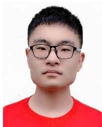

Jianyang Wu received the bachelor’s degree from Anhui Medical University in 2022. He is currently pursuing the M.S. degree with the School of Computer Science and Technology, Wuhan University of Technology. His research interests include cloud computing and artificial intelligence.

Yong Zhang received the M.S. degree from Tiangong University in 2020. He is currently pursuing the Ph.D. degree with the School of Computer Science and Technology, Wuhan University of Technology. His research interests include cloud computing and artificial intelligence.

Shaohua Wan (Senior Member, IEEE) received the Ph.D. degree from Deakin University, Australia, in 2004. He is currently with the Shenzhen Institute for Advanced Study, University of Electronic Science and Technology of China, Shenzhen. His current H-index is 67. He has published five monographs, edited two books, and more than 500 technical papers at different venues, such as the IEEE TRANSACTIONS ON DEPENDABLE AND SECURE COMPUTING, the IEEE TRANSACTIONS ON PARALLEL AND DISTRIBUTED SYSTEMS, the

IEEE TRANSACTIONS ON COMPUTERS, the IEEE TRANSACTIONS ON INFORMATION FORENSICS AND SECURITY, the IEEE TRANSACTIONS ON MOBILE COMPUTING, the IEEE TRANSACTIONS ON KNOWLEDGE AND DATA ENGINEERING, the IEEE TRANSACTIONS ON EMERGING TOPICS IN COMPUTING, the IEEE/ACM TRANSACTIONS ON NETWORKING, and INFOCOM. He has been promoting the research field of networking for big data since 2013, and his research outputs have been widely adopted by industrial systems, such as Amazon cloud security. His research interests include cybersecurity, network science, big data, and mathematical modeling. He is an Elected Member of Board of Governors of the IEEE VTS and ComSoc.