# Energy-Optimal Mobile Cloud Computing under Stochastic Wireless Channel

Weiwen Zhang, Yonggang Wen, Member, IEEE, Kyle Guan, Member, IEEE, Dan Kilper, Senior Member, IEEE, Haiyun Luo, Member, IEEE, and Dapeng Oliver Wu, Fellow, IEEE

Abstract—This paper provides a theoretical framework of energy-optimal mobile cloud computing under stochastic wireless channel. Our objective is to conserve energy for the mobile device, by optimally executing mobile applications in the mobile device (i.e., mobile execution) or offloading to the cloud (i.e., cloud execution). One can, in the former case sequentially reconfigure the CPU frequency; or in the latter case dynamically vary the data transmission rate to the cloud, in response to the stochastic channel condition. We formulate both scheduling problems as constrained optimization problems, and obtain closed-form solutions for optimal scheduling policies. Furthermore, for the energy-optimal execution strategy of applications with small output data (e.g., CloudAV), we derive a threshold policy, which states that the data consumption rate, defined as the ratio between the data size ( ) and the delay constraint ( ), is compared L Tto a threshold which depends on both the energy consumption model and the wireless channel model. Finally, numerical results suggest that a significant amount of energy can be saved for the mobile device by optimally offloading mobile applications to the cloud in some cases. Our theoretical framework and numerical investigations will shed lights on system implementation of mobile cloud computing under stochastic wireless channel.

Index Terms—Energy-optimal execution, mobile application, cloud computing, lagrangian multiplier method, stochastic wireless channel.

# I. INTRODUCTION

HE tension between resource-hungry applications and resource-poor mobile devices is considered as one of the driving forces for the evolution of mobile platforms. Due to the limited physical size, mobile devices are inherently resource-constrained [1], equipped with a limited supply of resources in computation, energy, bandwidth and storage. In particular, the energy supply from the limited battery capacity [2] has been one of the most challenging design issues for mobile devices. The limited battery life has been found by market research as the biggest complaint for smart phones [3].

Manuscript received November 20, 2012; revised February 19, 2013; accepted June 24, 2013. The associate editor coordinating the review of this paper and approving it for publication was G. Bianchi.

W. Zhang and Y. Wen are with the School of Computer Engineering, Nanyang Technological University, Nanyang Avenue, Singapore 639798 (email: {wzhang9, ygwen}@ntu.edu.sg).

K. Guan is with Bell Laboratories, Alcatel-Lucent, Holmdel, NJ 07733 (e-mail: kyle.guan@alcatel-lucent.com).

D. Kilper is with the Center for Integrated Access Networks, College of Optical Sciences, University of Arizona 1630 E. University Blvd. Tucson, AZ 85721 (e-mail: dkilper@optics.arizona.edu).

H. Luo is with the US Research Center, China Mobile, Milpitas, CA 95035 (e-mail: haiyunluo@chinamobile.com).

D. O. Wu is with the Department of Electrical & Computer Engineering, University of Florida, FL 32611-6130 (e-mail: wu@ece.ufl.edu).

Digital Object Identifier 10.1109/TWC.2013.072513.121842

Therefore, resource limitations in the mobile devices should be considered for the design of the mobile applications.

Emerging cloud-computing technology [4], owing to its elastic resource allocation from a shared pool, offers an opportunity to extend the capabilities of mobile devices for energyhungry applications. Various cloud-assisted mobile platforms have been proposed, such as Cloudlet [5], Clone Cloud [6] and Weblet [7]. In these proposed platforms, each mobile device is associated with a system-level clone called cloud clone in the cloud infrastructure. The cloud clone, which runs on a virtual machine (VM), can execute mobile applications on behalf of the mobile device - commonly referred as application offloading. This architecture requires both a mechanism to implement application offloading and a policy to decide when to offload applications. For the former, existing research [5], [6], [8], [7] has proposed various architectures and mechanisms for offloading applications to the cloud. For the latter, the research on optimal energy policies for application offloading to cloud execution is rather inadequate, in that a fixed data rate model for wireless transmission is normally assumed [2], [3].

We illustrate an architecture of the cloud-assisted mobile application platform in Figure 1. Each mobile device is replicated by a system-level clone that runs on a virtual machine (VM). The VM is located in a nearby cloud infrastructure and can migrate in response to the user’s location. Moreover, the cloud clone regularly synchronizes its state with the physical mobile device. The cloud clone not only provides computing and storage in its local VM environment, but also harnesses computing and storage resources from a remote cloud.

On this platform, a mobile application can be executed either on the mobile device (i.e., mobile execution) or on the cloud clone (i.e., cloud execution). The design objective is to develop an optimal application-execution policy, minimizing the energy consumed by the mobile device. When the application is executed in the mobile device, the computation energy can be minimized by optimally scheduling the CPU clock frequency of the mobile device via the Dynamic Voltage Scaling (DVS) [9]. When the application is executed in the cloud clone, the transmission energy can be minimized by optimally scheduling the data transmission rate in a stochastic wireless channel. For both scheduling problems, we formulate them as convex optimization problems, with a constraint that the application should be completed within a time deadline. We solve both optimization problems analytically and obtain closed-form solutions for the optimal scheduler and the minimum energy consumed by the mobile device, respectively. Our theoretical framework leads to optimal scheduling policies for energy-efficient application execution.

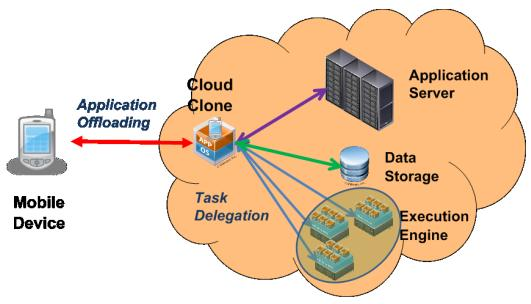

flowchart

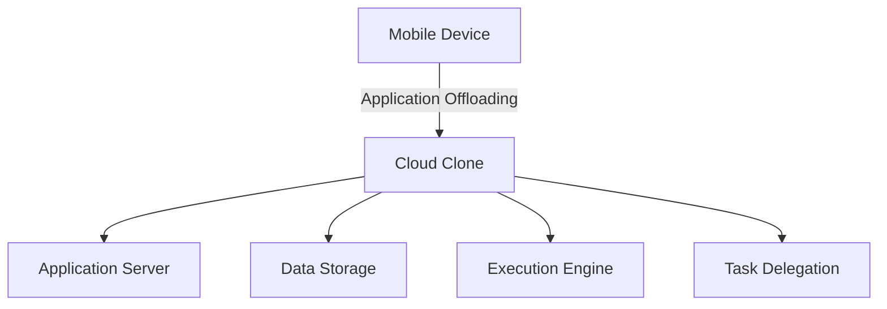

Fig. 1. A cloud-assisted mobile application platform: the mobile device is cloned by a system-level virtual machine, which extends the capabilities of the mobile devices via different functionalities, including application offloading, task delegation and data storage.

Compared to our previous work [10], this paper has several contributions. First, we provide asymptotical analysis of the optimal scheduling policy for both mobile execution and cloud execution. Second, we identify the optimal operational region under which the mobile execution or the cloud execution is more energy-efficient. Finally, we derive a threshold energyefficient execution policy for applications with small output data (e.g., CloudAV [11]).

The rest of this paper is organized as follows. In Section II, the review of related work is presented. In Section III, we present a model for energy consumption in the mobile execution and the cloud execution. In Section IV and V, we solve the optimization problems for the optimal CPU clock-frequency scheduling in the mobile execution and the optimal transmission data-rate scheduling in the cloud execution, respectively. Closed-form solutions are derived for both optimization problems. In Section VI, analytical results from previous two sections are applied to develop optimal execution strategies for mobile applications. Section VII summarizes this paper and provides future directions.

# II. RELATED WORK

Previous work in [12], [13], [14], [15], [16], [17], [18] has investigated the scheme of computation offloading to extend battery life of mobile devices. Rudenko et al., in [12], [13] show by experiments that significant power can be saved through remote processing for several realistic tasks (up to 50% of battery life). Othman et al. in [14] offer a decisionmaking algorithm that learns and adapts its decision based on previous CPU time measurements. Xian et al., in [16] find the optimal timeout for local execution and propose an adaptive approach for computation offloading to save energy on batterypowered systems. Rong et al., in [17] formulate a linear optimization problem to minimize the power consumption of the mobile device by remote processing. Huang et al., in [18] present a dynamic offloading algorithm based on Lyapunov optimization to save energy on the mobile device while meeting the application execution time.

Moreover, some literatures have studied the energy issues of cloud computing. [3] presents an energy model to analyze whether to offload applications to the cloud, mainly considering computation energy in the mobile device and the communication energy for offloading. [2] demonstrates that workload, data communication patterns and technologies used (i.e., WLAN and 3G) are the main factors that highly affect the energy consumption of mobile applications in cloud computing. But its analysis is roughly based on statistical measurements and investigations. Also, [2], [3] mostly consider a fixed computation scheduling in the mobile device and a fixed data rate model for the wireless channel. Realistic models are needed to understand the trade-off between computation and communication in the cloud-assisted mobile platform.

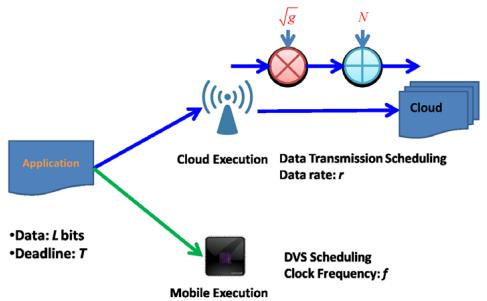

flowchart

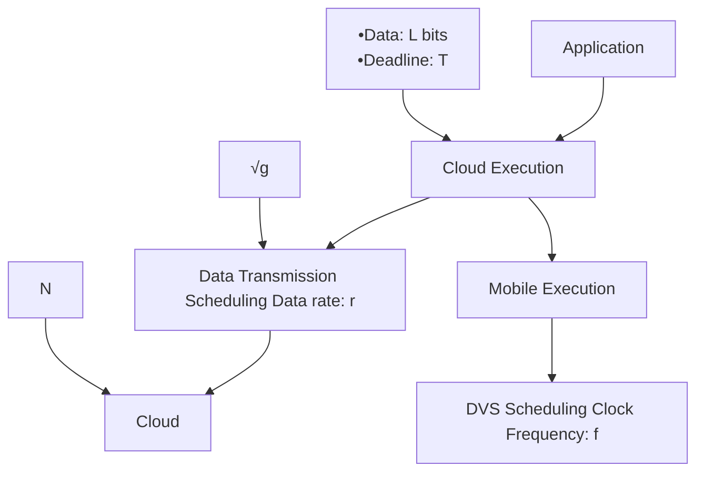

Fig. 2. Mobile application executed in two alternative modes: the mobile execution and the cloud execution.

Compared to these previous efforts, this paper has several differences. First, for the cloud execution, we employ the Gilbert-Elliott model and consider a stochastic wireless channel rather than the deterministic channel, coupled with a realistic computing model in the mobile execution. Second, we provide the theoretical framework of mobile execution and cloud execution in order to conserve energy consumption while meeting an execution deadline. Finally, we provide the closed-form solution and derive a threshold policy for the energy-optimal application execution.

# III. SYSTEM MODELING AND PROBLEM FORMULATION

In this section, we present a mathematical model for application execution on the cloud-assisted mobile application platform. First, we define a mobile application profile. Following that, we introduce an energy consumption model for application execution, including a computation energy model for the mobile execution and a transmission energy model for the cloud execution.

# A. Mobile Application Model

A model that completely depicts all the aspects of a mobile application is complex. Many details could have to be taken into consideration. However, such a high level of details could render the problem intractable mathematically, without offering meaningful insights for engineering practice. In this paper, we adopt a canonical model that captures the essentials of a typical mobile application. Specifically, a mobile application is abstracted into a profile with two parameters, including:

• Input data size : the number of data bits as the input to the application;   
• Application completion deadline  : the delay deadline Tbefore which the application should be completed.

Notice that both the input data size  and the application com-Lpletion deadline  have the impact on the energy consumption of mobile applications. Normally, with more data input and (or) shorter completion deadline, the energy consumption can be higher. As such, we use these two parameters to capture the features of the mobile applications, and denote the application profile as $A ( L , T )$ . More details can be included later when we have a good understanding of the optimal operational principle (cf. Section VI-B).

# B. Mobile Execution Energy Model

When the application is executed on the mobile device, the energy consumption is determined by the CPU workload. The workload is measured by the number of CPU cycles required by the application, denoted as , which depends on the Winput data size and the complexity of the algorithm in the application. Typically,  is modeled as a random variable, Wwhich we elaborate in Section IV.

As stated in [19], the CPU power consists of the dynamic power, the short circuit power and leakage power, in which the dynamic power dominates. As a result, we only consider the dynamic power for the mobile execution. In CMOS circuits [20], the energy per operation $\mathcal { E } _ { w }$ is proportional to $V ^ { 2 }$ , where w V is the supply voltage to the chip. Moreover, it has been Vobserved that, when operating at low voltage limits, the clock frequency of the chip, , is approximately linear proportional fto the voltage supply,  [20]. As a result, the energy per operation can be expressed as,

$$
\mathcal {E} _ {w} (f) = \kappa f ^ {2}, \tag {1}
$$

where  is the effective switched capacitance depending on κthe chip architecture. We set $\kappa ~ = ~ 1 0 ^ { - 1 1 }$ so that energy κconsumption is consistent with the measurements in [2]. The total computation energy for the mobile execution is $\textstyle \sum _ { w = 1 } ^ { W } \mathcal { E } _ { w } ( f _ { w } )$ .

w w fwFor the mobile execution, its total energy consumption can be minimized by optimally configuring the clock frequency of the chip via DVS [9]. Note that a CPU can reduce its energy consumption substantially by running the application slowly. However, the application has to meet a delay deadline of  , which suggests that the clock frequency cannot remain Tlow. As such, one would like to configure the clock frequency to minimize the total energy consumption, while meeting the application delay deadline. Under the optimal CPU frequency scheduling, the minimum amount of energy consumption for the mobile execution is given by,

$$
\mathcal {E} _ {m} ^ {*} = \min _ {\psi \in \Psi} \{\mathcal {E} _ {m} (L, T, \psi) \}, \tag {2}
$$

where $\psi ~ = ~ \{ f _ { 1 } , f _ { 2 } , . . . f _ { W } \}$ is any clock-frequency vector ψ f , f , ...fWthat meets the delay deadline, Ψ is the set of all feasible clock-frequency vectors, and $\mathcal { E } _ { m } ( L , T , \psi )$ is the total energy m L, T, ψconsumed by the mobile device. This optimization problem will be solved in Section IV.

# C. Cloud Execution Energy Model

In this research, we make some assumptions for the cloud execution. First, we assume the binary executable file for the application has been replicated on the cloud clone initially. As such, it does not incur additional energy cost. Second,

we assume a stochastic fading model for the wireless channel between the mobile device and the cloud clone. As illustrated in Figure 2, it is characterized by a channel gain of and ga noise power of . A specific model for the channel gain N(Gilbert-Elliott model) will be presented in Section V-A. Third, the receiving power is a constant [2]. As such, we do not consider the scheduling of the output results from the cloud, but the optimal scheduling of input data transmission in order to achieve the minimum energy consumption on the mobile device. In addition, we have not considered any security issue on the cloud-assisted platform, thus the extra energy caused by additional operations concerning security, e.g., encryption and trust checking, is not taken into account.

[21] indicates that since there is no closed-form expression between time delay and the power in the wireless networks, approximating models should be built for the practical system design. In this paper, we adopt an empirical transmission energy model as in [22], [23]. Specifically, for a wireless fading channel with a gain of $^ { g , }$ the energy consumed to gtransfer bits of data over the channel within a time slot sis governed by a convex monomial function, i.e.,

$$
\mathcal {E} _ {t} (s, g, n) = \lambda \frac {s ^ {n}}{g}, \tag {3}
$$

where  denotes the monomial order, and  denotes the n λenergy coefficient. This monomial function has been widely used. It is shown by [23], [24] that the energy-bit relation can be well approximated by the monomial function. The monomial function can be fairly close to the capacity-based power model by choosing an appropriate coefficient  and λorder . Such a monomial function can produce the analytical nsolution for the optimization problem of the cloud execution. In Eq. (3), it is normally assumed that $2 \leq n \leq 5 .$ , depending on the modulation scheme. We set $\lambda = 1 . 5$ nso that the energy λ .consumption is consistent with the measurements in [2].

When the application is executed by the cloud clone, the energy consumed by the mobile device depends on the amount of data to be transmitted from the mobile device to the cloud clone and the wireless channel model. For a mobile application $A ( L , T )$ ,  bits of data needs to be transmitted to the cloud A L, T Lclone within  . The total energy consumption on the mobile Tdevice for cloud execution is $\begin{array} { r } { \sum _ { t = 1 } ^ { T } \mathcal { E } _ { t } ( s _ { t } , g _ { t } , n ) } \end{array}$ , where $s _ { t }$ and t t st, gt, n stare the number of bits transmitted and channel state in time slot , respectively.

tFor the cloud execution, its total energy consumption can be minimized by optimally varying the data rate (the number of transmitted bits in a given time slot), in response to a stochastic channel. Since the energy cost per time slot is a convex function of bits transmitted, it is ideal to transmit as few bits as possible [25]. However, reducing the number of bits transmitted per time slot increases the total delay for the application. Therefore, there exists an optimal transmission data-rate schedule to minimize the total transmission energy, while satisfying the delay requirement. Under the optimal transmission scheduling, the minimum amount of transmission energy for the cloud execution is given by

$$
\mathcal {E} _ {c} ^ {*} = \min _ {\phi \in \Phi} \mathbb {E} \{\mathcal {E} _ {c} (L, T, \phi) \}, \tag {4}
$$

where $\boldsymbol { \phi } = \left\{ s _ { 1 } , s _ { 2 } , . . . s _ { T } \right\}$ denotes a data transmission schedule φ s , s , ...sTthat meets the delay deadline ( time slots), Φ is the set of all Tfeasible data scheduling vectors, and $\mathcal { E } _ { c } ( L , T , \phi )$ denotes the c L, T, φtransmission energy. It should be noted that the expectation of energy consumption is taken for different channel states. This optimization problem will be solved in Section V.

# D. Optimal Application Execution Policy

The decision for energy-optimal application execution, is to choose where to execute the application, with an objective to minimize the total energy consumed on the mobile device. Specifically, the optimal policy is determined by the following decision rule,

$$
\left\{ \begin{array}{l l} \text { Mobile   Execution } & \text { if } \quad \mathcal {E} _ {m} ^ {*} \leq \mathcal {E} _ {c} ^ {*} \\ \text { Cloud   Execution } & \text { if } \quad \mathcal {E} _ {m} ^ {*} > \mathcal {E} _ {c} ^ {*}. \end{array} \right. \tag {5}
$$

As shown in Eq. (1) and Eq. (3), $\mathcal { E } _ { m } ^ { * }$ is proportional to $\kappa$ and $\mathcal { E } _ { c } ^ { * }$ mis proportional to . Hence, the absolute values of $\kappa$ c λ κand  are not critical, but the ratio between these two constant λenergy coefficients, $\kappa / \lambda ,$ could affect the determination of the κ/λoptimal execution policy.

# IV. OPTIMAL COMPUTATION ENERGY UNDER MOBILE EXECUTION

In this section, we investigate the problem of minimizing the energy consumption for executing an application in the mobile device. Since the energy consumed by CPU is much larger than the energy consumed by memory and screen, we only consider the computation energy of executing the application on mobile device. As such, the problem is to optimally set the clock frequency of the chip for the minimal energy. First, we build a probabilistic framework for mobile execution. Then, we formulate the problem as how to schedule the clock frequency in each CPU cycle for the application. Finally, we derive the clock-frequency configuration for the minimum energy consumption on the mobile device.

# A. Probabilistic Application Execution in Mobile Device

Let  indicate the number of CPU cycles needed for an Wapplication. For a given input data size, , it can be derived from [2], [26] as

$$
W = L X, \tag {6}
$$

where  has been shown to be a random variable with an Xempirical distribution [26]. The estimation of this distribution, depending on the nature of the application, e.g., the complexity of the algorithm, has been treated in [27], [19], [28], and is thus beyond the scope of this paper. In this paper, we assume that the probability distribution function (PDF) of  is $P ( x )$ , X P xand its cumulative distribution function (CDF) is defined as

$$
F _ {X} (x) = \operatorname * {P r} [ X \leq x ], \tag {7}
$$

and its complementary cumulative distribution function (CCDF), denoted as $F _ { X } ^ { c } ( w )$ , is defined as

$$
F _ {X} ^ {c} (x) = 1 - F _ {X} (x). \tag {8}
$$

Therefore, the CDF of the workload  is given by $F _ { W } ( w ) =$ $F _ { X } ( w / L )$ W, and its CCDF is given by $F _ { W } ^ { c } ( w ) = F _ { X } ^ { c } ( w / L )$ .

As shown in [26], [27], [19], the number of CPU cycles per bit can be modeled by a Gamma distribution. The PDF of the Gamma distribution is given by

$$
p _ {X} (x) = \frac {1}{\beta \Gamma (\alpha)} (\frac {x}{\beta}) ^ {\alpha - 1} e ^ {- \frac {x}{\beta}}, \quad \text { for } \quad x > 0, \tag {9}
$$

depending on two parameters (the shape  and the scale $\beta )$ .

α βIn this paper, we adopt a probabilistic performance requirement. We assume that the jobs should satisfy the soft real-time requirement. This soft real-time requirements is reasonable for multimedia applications. Under this assumption, each application will meet its deadline with a probability of $\rho$ by allocating $W _ { \rho }$ CPU cycles. The parameter $\rho$ is ρ Wρ ρcalled the application completion probability (ACP). When the application execution fails to meet its deadline, it will continue to execute at the maximum clock frequency for completion. The additional computation energy is negligible when the application completion probability is very close to 1. As a result, the application completion probability is assumed to be very close to 1.

The probability that each job requires no more than the allocated $W _ { \rho }$ cycles is at least $\rho ,$ i.e.,

$$
F _ {W} (W _ {\rho}) = \operatorname * {P r} [ W \leq W _ {\rho} ] \geq \rho . \tag {10}
$$

Using Eq. (7), we can obtain the number of CPU cycles, for a given $\rho ,$ a s

$$
W _ {\rho} = F _ {W} ^ {- 1} (\rho) = L F _ {X} ^ {- 1} (\rho), \tag {11}
$$

which is the $\rho ^ { \mathrm { t h } }$ quantile for the distribution of .

# B. Energy-Efficient Clock-Frequency Configuration

We aim to minimize the expected energy consumption of the application execution, by optimally setting the clock frequency of the mobile device. Denote $f ( w )$ the clock-frequency, which f wis scheduled in the next CPU cycle after completing  CPU cycles; for this CPU cycle, its execution time is 1( ) , and $\scriptstyle { \frac { 1 } { f ( w ) } }$ the energy consumption is $\kappa F _ { W } ^ { c } ( w ) [ f ( w ) ] ^ { 2 }$ , where $\dot { F } _ { W } ^ { c } ( w )$ is κFW w f w FW wthe probability that the application has not completed after wCPU cycles. Therefore, the total energy consumption is the summation of the energy consumed during all of these CPU cycles, which is given by

$$
\mathcal {E} _ {m} = \kappa \sum_ {w = 1} ^ {W _ {\rho}} F _ {W} ^ {c} (w) [ f (w) ] ^ {2}. \tag {12}
$$

The optimization problem in Eq. (2) can be rewritten as,

$$
\min _ {\{f (w) \}} \quad \kappa \sum_ {w = 1} ^ {W _ {\rho}} F _ {W} ^ {c} (w) [ f (w) ] ^ {2}, \tag {13}
$$

$$
\text { s.t. } \quad \sum_ {w = 1} ^ {W _ {\rho}} \frac {1}{f (w)} \leq T, \tag {14}
$$

$$
f (w) > 0, \tag {15}
$$

where Eq. (14) corresponds to the delay constraint.

The optimization problem, denoted in Eq. (13) can be solved analytically. The results are summarized in Theorem 4.1.

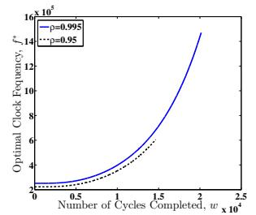

line

| Number of Cycles Completed, w x 10^4 | Optimal Clock Frequency, f* (p=0.995) | Optimal Clock Frequency, f* (p=0.95) |
| ------------------------------------ | -------------------------------------- | ------------------------------------- |
| 0                                    | 2.0                                    | 2.0                                   |
| 0.5                                  | 3.0                                    | 2.5                                   |
| 1.0                                  | 6.0                                    | 4.0                                   |
| 1.5                                  | 10.0                                   | 6.0                                   |
| 2.0                                  | 14.0                                   | 8.0                                   |
| 2.5                                  | 16.0                                   | 10.0                                  |

(a)   
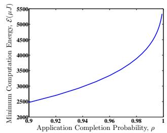

line

| Application Completion Probability, ρ | Minimum Computation Energy, ε(μJ) |
| ------------------------------------- | --------------------------------- |
| 0.9                                   | 2500                              |
| 0.92                                  | 2750                              |
| 0.94                                  | 3000                              |
| 0.96                                  | 3500                              |
| 0.98                                  | 4000                              |
| 1                                     | 5500                              |

Fig. 3. In (a), the optimal clock frequency, $f ^ { * } ( w )$ , is plot as a function of the f wnumber of CPU cycles  completed. In (b), the minimum computation energy, $\mathcal { E } _ { m } ^ { * } .$ w, is plotted as a function of the application completion probability $\rho .$ In m ρthis graph, the application workload is modeled as the Gamma distribution, with $\overset { \cdot } { \alpha } = 4 , \beta \overset { \cdot } { = } \mathrm { 2 0 0 }$ and $T = 5 0 m s$ .

Theorem 4.1: For the optimal CPU scheduling problem in Eq. (13), the optimal clock scheduling vector is given by

$$
f ^ {*} (w) = \frac {\theta}{T [ F _ {W} ^ {c} (w) ] ^ {1 / 3}}, \quad 1 \leq w \leq W _ {\rho}, \tag {16}
$$

where $\theta = { \textstyle \sum _ { w = 1 } ^ { W _ { \rho } } } [ F _ { W } ^ { c } ( w ) ] ^ { 1 / 3 }$ . The optimal energy is

$$
\mathcal {E} _ {m} ^ {*} = \frac {\kappa}{T ^ {2}} \{\sum_ {w = 1} ^ {W _ {\rho}} [ F _ {W} ^ {c} (w) ] ^ {1 / 3} \} ^ {3}. \tag {17}
$$

Proof: See Appendix A.

The analytical results in Eq. (16) and Eq. (17) reveal engineering insights on the optimal clock frequency configuration and the minimum computation energy for the mobile execution, as elaborated in the following propositions.

Proposition 4.1: The optimal clock frequency increases monotonically as the number of CPU cycles completed increases. That is, as  becomes larger, the corresponding clock frequency $f ( w )$ wis larger.

f wWe show that  is a constant in Appendix B. In addition, $F _ { W } ^ { c } ( w )$ will decrease as more CPU cycles have completed. FW wBy Eq. (16), $f ^ { * } ( w )$ is hence an increasing function of .

f w wIn Figure 3(a), we plot the optimal clock frequency as a function of the number of CPU cycles completed. It increases monotonically as the number of CPU cycles completed increases. Also, as it gets closer to the deadline, the scheduler will accelerate the CPU clock to meet the application deadline. In practice, if the chip has a maximum clock frequency, it simply runs at its maximum if the required clock frequency is beyond the limit. Moreover, if the ACP, $\rho ,$ becomes larger, the optimal clock frequency can be higher.

Proposition 4.2: For an application workload with an exponentially-tailed CCDF (i.e., $F ^ { c } ( w ) \sim \mu e ^ { - \nu w }$ as $w \to \infty$ for some constant $\mu > 0$ and $\nu > 0 )$ μe w, the minimum energy

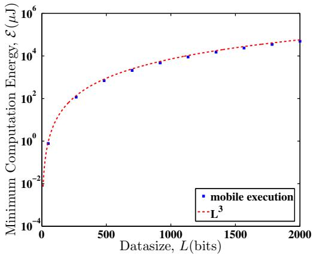

line

| Datasize, L (bits) | mobile execution | L^3     |
| ------------------ | ---------------- | ------- |
| 0                  | 10^-2            | 10^-2   |
| 500                | 10^2             | 10^2    |
| 1000               | 10^4             | 10^4    |
| 1500               | 10^4             | 10^4    |
| 2000               | 10^5             | 10^5    |

Fig. 4. The minimum computation energy, $\mathcal { E } _ { m } ^ { * }$ , is plotted as a function of mthe input data size . In this graph, the application workload is modeled as Lthe Gamma distribution, with $\stackrel { \cdot } { \alpha } = 4 , \beta = \bar { 2 } 0 0$ and $T = 5 0 m s$ .

consumption converges monotonically to a finite value, as the application completion probability increases to 1.

Proof: See Appendix B.

In Figure 3(b), we plot the minimum computation energy, $\mathcal { E } _ { m } ^ { * } ,$ as a function of the application completion probability, $\rho .$ m We set the input data size  as 800 bits (100 bytes), a ρ Lreasonable value for typical applications, and use this same input data size for the cloud execution in the remaining sections. Notice that the Gamma distribution is exponentially tailed. As a result, as the application completion probability of $\rho$ increases, the minimum computation energy increases ρmonotonically and converges to a finite value.

Proposition 4.3: For the optimal CPU scheduling in Eq. (17), the minimum computation energy is proportional to the negative quadratic of the delay deadline. That is, $\mathcal { E } _ { m } ^ { * } \sim T ^ { - 2 }$ .

m TProposition 4.4: For the optimal CPU scheduling problem in Eq. (17), the minimum computation energy is proportional to cube of the data size. That is, $\mathcal { E } _ { m } ^ { * } \sim L ^ { 3 }$ .

Proof: See Appendix C.

In Figure 4, we plot the minimum computation energy as a function of the input data size, and compare it with a scaling law of $L ^ { 3 }$ . It shows that $\mathcal { E } _ { m } ^ { * }$ scales at $L ^ { \bar { 3 } }$ .

L m LFurthermore, from Proposition 4.3 and 4.4, the optimal energy consumption of mobile execution can be expressed as

$$
\mathcal {E} _ {m} ^ {*} = \frac {M L ^ {3}}{T ^ {2}}, \tag {18}
$$

Twhere  is a constant, depending on parameters  and $\rho .$

# V. OPTIMAL TRANSMISSION ENERGY UNDER CLOUD EXECUTION

In this section, we consider the problem of data scheduling to minimize the transmission energy under cloud execution, with a deadline constraint. We choose to simplify the formulation by not considering the power of receiving data on mobile device, since it is constant and often smaller compared to the transmitting power [2]. We can ignore the time delay of receiving output data if the data is small1. In addition, we

1If the output data is large, we can approximate the delay deadline of the data transmission as the total deadline subtracted by the constant term of output receiving time.

assume the display and network interface of the mobile device can be turned off when it is idle during the cloud execution. Hence, we only consider the optimal scheduling of input data transmission for the cloud execution.

# A. Wireless Channel Model

As shown in Fig. 2, we consider the scheduling of  bits of Linput data with a deadline in  discrete time slots. The channel Tstate at time slot  is denoted as $g _ { t }$ , which is determined by a t gtdiscrete state space Markov model.

We adopt Gilbert-Elliott channel model as a stochastic model for the practical circumstances in the cloud execution. This model has been widely used by a number of researchers on wireless networks [23], [29]. In the Gilbert-Elliott (GE) channel model, there are two states: “good” and “bad” channel conditions, denoted as  and , respectively. The two states G Bcorrespond to a two-level quantization of the channel gain. If the measured channel gain is above some value, the channel is labeled as good. Otherwise, the channel is labeled as bad. Let the (average) channel gains of the good and bad states be and , respectively.

G gBIn this model, the state transition matrix is completely determined by the values of $p _ { G G }$ (for the probability that pGGthe next state is the good state, given that the current state is also the good state) and $p _ { B B }$ (for the probability that the pBBnext state is the bad state, given that the current state is also the bad state). Accordingly, we have $p _ { G B } = 1 - p _ { G G }$ and $p _ { B G } = 1 - p _ { B B }$ , where $p _ { G B }$ pGB pGGdenotes the probability in which pBG pBB pGBchannel will transit from the good state to the bad state in the next time slot and $p _ { B G }$ denotes the probability in which pBGchannel will transit from the bad state to the good state in the next time slot. The state sojourn time (duration of being in a state) is geometrically distributed. As such, the mean state sojourn time, measured in number of time slots in the good or bad state, is given by $\begin{array} { r } { T _ { G } = \frac { 1 } { 1 - p _ { G G } } } \end{array}$ 1− and $\begin{array} { r } { T _ { B } = \frac { 1 } { 1 - p _ { B B } } } \end{array}$

# B. Optimal Data Transmission Scheduling

We denote  as discrete time index in descending order t(from  to 1). In time slot , if the number of bits transmitted is $s _ { t }$ T t, the transmission energy cost is $\begin{array} { r } { \mathcal { E } _ { t } ( s _ { t } , g _ { t } ) ~ = ~ \lambda \frac { s _ { t } ^ { n } } { q _ { t } } } \end{array}$ . st t st, gt λ gtTherefore, the optimization problem in Eq. (4) for the optimal data-transmission schedule can be rewritten as2,

$$
\min _ {s _ {t}}: \quad \mathbb {E} \left[ \sum_ {t = 1} ^ {T} \mathcal {E} _ {t} (s _ {t}, g _ {t}) \right] \tag {19}
$$

$$
\text { s.t.: } \quad \sum_ {t = 1} ^ {T} s _ {t} = L,
$$

$$
s _ {t} \geq 0, \forall t.
$$

The minimum expected energy depends on the channel state at $t \ = \ T + \ 1 \ ( g _ { T + 1 } \ = \ G \ \mathrm { o r } g _ { T + 1 } \ = \ B )$ . For ease

2In practice, is an integer. This will lead to an integer programming stproblem, which is unnecessarily complex. We assume that  is continuous; stthis assumption makes the optimization tractable, which provides closed-form solution to the problem. The resulted energy is a lower bound to the actual optimization problem, and the practical solution can be obtained by rounding the continuous result.

of presentation, we denote the condition $g _ { T + 1 } \ = \ G$ and $g _ { T + 1 } \ = \ B$ as $( . ; G )$ and $( . ; B )$ gT G, respectively; we integrate gT B . G . Bthis condition into the notation of the optimal number of data bits transmitted in each time slot $s _ { t } ^ { * }$ and the minimum energy $\mathcal { E } _ { c } ^ { * }$ st. To obtain the minimum expected energy, we need to find cout the minimum energy under the condition $g _ { T + 1 } = G$ and $g _ { T + 1 } = B$ gT G, respectively. The derivation for the optimal data scheduling vector and the minimum expected energy of the cloud execution is provided in Theorem 5.1.

Theorem 5.1: Denote $l _ { t }$ as the number of unfinished bits ltat time slot . For the optimal data transmission scheduling tproblem in Eq. (19), the optimal data scheduling vector is

$$
s _ {t} ^ {*} (l _ {t}, g _ {t}; G) = \left\{ \begin{array}{l l} l _ {t} \left[ \frac {(g _ {t}) ^ {\frac {1}{n - 1}}}{(g _ {t}) ^ {\frac {1}{n - 1}} + (\frac {1}{\zeta_ {t - 1 ; G}}) ^ {\frac {1}{n - 1}}} \right], & t \geq 2, \\ l _ {1}, & t = 1, \end{array} \right. \tag {20}
$$

if $g _ { T + 1 } = G$ , where

$$
\zeta_ {t; G} = \left\{ \begin{array}{l l} p _ {G G} \left[ \left(\frac {1}{(g _ {G}) ^ {\frac {1}{n - 1}} + (\frac {1}{\zeta_ {t - 1 ; G}}) ^ {\frac {1}{n - 1}}}\right) ^ {n - 1} \right] & \\ + p _ {G B} \left[ \left(\frac {1}{(g _ {B}) ^ {\frac {1}{n - 1}} + (\frac {1}{\zeta_ {t - 1 ; G}}) ^ {\frac {1}{n - 1}}}\right) ^ {n - 1} \right], & t \geq 2, \\ p _ {G G} \left[ \frac {1}{g _ {G}} \right] + p _ {G B} \left[ \frac {1}{g _ {B}} \right], & t = 1; \end{array} \right. \tag {21}
$$

and

$$
s _ {t} ^ {*} (l _ {t}, g _ {t}; B) = \left\{ \begin{array}{l l} l _ {t} \left(\frac {(g _ {t}) ^ {\frac {1}{n - 1}}}{(g _ {t}) ^ {\frac {1}{n - 1}} + (\frac {1}{\zeta_ {t - 1 ; B}}) ^ {\frac {1}{n - 1}}}\right), & t \geq 2, \\ l _ {1}, & t = 1, \end{array} \right. \tag {22}
$$

if $g _ { T + 1 } = B _ { : }$ , where

$$
\zeta_ {t; B} = \left\{ \begin{array}{l l} p _ {B B} \left[ \left(\frac {1}{(g _ {B}) ^ {\frac {1}{n - 1}} + (\frac {1}{\zeta_ {t - 1 ; B}}) ^ {\frac {1}{n - 1}}}\right) ^ {n - 1} \right] & \\ + p _ {B G} \left[ \left(\frac {1}{(g _ {G}) ^ {\frac {1}{n - 1}} + (\frac {1}{\zeta_ {t - 1 ; B}}) ^ {\frac {1}{n - 1}}}\right) ^ {n - 1} \right], & t \geq 2, \\ p _ {B B} \left[ \frac {1}{g _ {B}} \right] + p _ {B G} \left[ \frac {1}{g _ {G}} \right], & t = 1. \end{array} \right. \tag {23}
$$

Correspondingly, the minimum transmission energy is

$$
\mathcal {E} _ {c} ^ {*} (L, T; G) = \lambda L ^ {n} \zeta_ {T; G}, \tag {24}
$$

and

$$
\mathcal {E} _ {c} ^ {*} (L, T; B) = \lambda L ^ {n} \zeta_ {T; B}, \tag {25}
$$

respectively. Therefore, the minimum expected transmission energy $\mathcal { E } _ { c } ^ { * }$ is

$$
\mathcal {E} _ {c} ^ {*} (L, T) = \frac {T _ {G}}{T _ {G} + T _ {B}} \mathcal {E} _ {c} ^ {*} (L, T; G) + \frac {T _ {B}}{T _ {G} + T _ {B}} \mathcal {E} _ {c} ^ {*} (L, T; B). \tag {26}
$$

Proof: See Appendix D.

We plot in Figure 5 the number of bits transmitted in each time slot, as a function of the time index. Notice that $t =$ t0 means the last time slot. Intuitively, for the good channel state $( g _ { t } = g _ { G } )$ , more bits should be transmitted; for the bad gt gchannel state $( g _ { t } = g _ { B } )$ , less bits are transmitted to save the energy. Further, the number of bits transmitted in each time slot follows the Proposition 5.1.

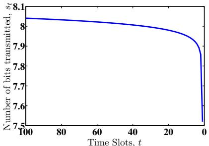

line

| Time Slots, t | Number of bits transmitted, st |
| ------------- | ------------------------------ |
| 100           | 8.1                            |
| 80            | 8.05                           |
| 60            | 8.0                            |
| 40            | 7.95                           |
| 20            | 7.9                            |
| 0             | 7.5                            |

(a) $g _ { t } = g _ { G } , \forall t$

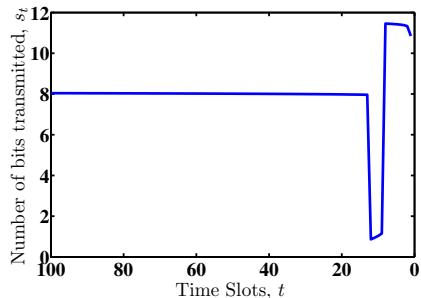

line

| Time Slots, t | Number of bits transmitted, st |
| ------------- | ------------------------------ |
| 100           | 8                              |
| 20            | 8                              |
| 25            | 1                              |
| 30            | 11                             |
| 35            | 12                             |

(b) $g _ { T + 1 } = g _ { G } , g _ { 1 } = g _ { G }$

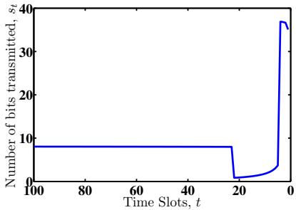

line

| Time Slots, t | Number of bits transmitted, st |
| ------------- | ------------------------------ |
| 100           | 8                              |
| 20            | 8                              |
| 25            | 1                              |
| 30            | 2                              |
| 35            | 3                              |
| 40            | 4                              |
| 45            | 5                              |
| 50            | 6                              |
| 55            | 7                              |
| 60            | 8                              |
| 65            | 9                              |
| 70            | 10                             |
| 75            | 11                             |
| 80            | 12                             |
| 85            | 13                             |
| 90            | 14                             |
| 95            | 15                             |
| 100           | 16                             |

(c) $g _ { T + 1 } = g _ { G } , g _ { 1 } = g _ { B }$

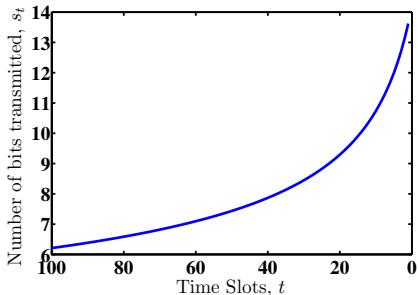

line

| Time Slots, t | Number of bits transmitted, st |
| ------------- | ------------------------------ |
| 100           | 6                              |
| 80            | 7                              |
| 60            | 8                              |
| 40            | 9                              |
| 20            | 10                             |
| 0             | 14                             |

(d) $g _ { t } = g _ { B } , \forall t$

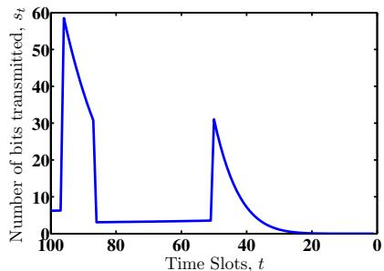

line

| Time Slots, t | Number of bits transmitted, s_t |
| ------------- | ------------------------------- |
| 100           | 60                              |
| 80            | 30                              |
| 60            | 30                              |
| 40            | 30                              |
| 20            | 0                               |
| 0             | 0                               |

(e) +1 =  1 =

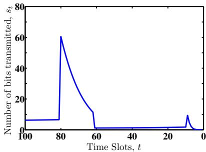

line

| Time Slots, t | Number of bits transmitted, st |
| ------------- | ------------------------------ |
| 100           | 5                              |
| 80            | 60                             |
| 60            | 0                              |
| 40            | 0                              |
| 20            | 0                              |
| 0             | 0                              |

(f) +1 =  1 =   
Fig. 5. Optimal bit transmission schedule is plot as a function of the time slot index. In this graph, $L = 8 0 0 b i t s ,$ = 2, $p _ { G G } = 0 . 9 9 5$ , $p _ { B B } = 0 . 9 6 .$ , $g _ { G } = 1$ and $g _ { B } = 0 . 1$ .

Proposition 5.1: For a period of time during which all the channel states are good, the number of bits transmitted in each time slot decreases. While for a period of time during which all the channel states are bad, the number of bits transmitted in each time slot increases.

Proposition 5.1 can be explained as follows. Figures 5(a) and 5(d) are the two extreme cases where the channel states are all good and bad respectively. On one hand, in Figure 5(a), the number of data transmitted is decreasing as time proceeds. Given a good channel status in the current time slot, the expected channel gain in next time slot is lower. As such, the scheduler should transmit more data in the current time slot. On the other hand, in Figure 5(d), the number of data transmitted is increasing as time proceeds. Given a bad channel status in the current time slot, the expected channel gain in next time slot is larger. As such, the scheduler should transmit less data in the current time slot. Also, Proposition 5.1 holds for other cases with good and bad channel states mixed together, as indicated in Figures 5(b), 5(c), 5(e) and 5(f). Moreover, we can derive three propositions for the optimal energy consumption.

Proposition 5.2: As the data size  increases, the minimum transmission energy increases monotonically and scales with a factor of $L ^ { n }$ , where  is the monomial order in Eq. (3). That is, $\mathcal { E } _ { c } ^ { * } \sim L ^ { n }$ .

c LProposition 5.3: As the application completion deadline Tincreases, the minimum transmission energy decreases monotonically and scales with a factor of $T ^ { - ( n - 1 ) }$ , where  is the monomial order in Eq. (3). That is, $\mathcal { E } _ { c } ^ { * } \sim T ^ { - ( n - 1 ) }$ .

Proof: See Appendix E.

Proposition 5.4: In Eq. (21) and (23), neither $\zeta _ { T ; G }$ nor $\zeta _ { T ; B }$ scales to infinity.

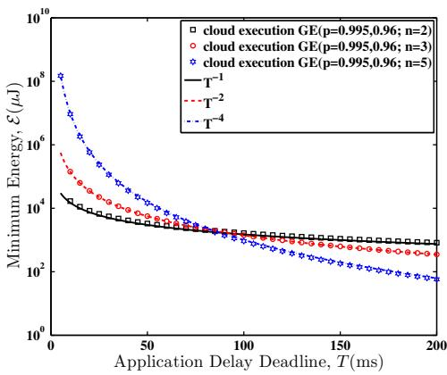

line

| Application Delay Deadline, T(ms) | cloud execution GE(p=0.995,0.96; n=2) | cloud execution GE(p=0.995,0.96; n=3) | cloud execution GE(p=0.995,0.96; n=5) |
| --------------------------------- | ------------------------------------- | ------------------------------------- | ------------------------------------- |
| 0                                 | ~10^4                                 | ~10^5                                 | ~10^8                                 |
| 50                                | ~10^3                                 | ~10^3                                 | ~10^4                                 |
| 100                               | ~10^2                                 | ~10^2                                 | ~10^2                                 |
| 150                               | ~10^2                                 | ~10^2                                 | ~10^2                                 |
| 200                               | ~10^2                                 | ~10^2                                 | ~10^2                                 |

Fig. 6. Expected transmission energy is plotted as a function of deadline $T$ for the GE channel model. In this graph, $L = 8 0 0 b i t s$ , $p _ { G G } = 0 . 9 9 5$ , T = 0 96, = 1 and $g _ { B } = 0 . 1$ .

# Proof: See Appendix E.

From Proposition 5.2 and 5.3, the optimal energy consumption of the cloud execution can be expressed as

$$
\mathcal {E} _ {c} ^ {*} = \frac {C (n) L ^ {n}}{T ^ {n - 1}}, \tag {27}
$$

where $C ( n )$ is a function of $n ,$ depending on the factor $\lambda ,$ the C n n λchannel states (good or bad) and the state transition matrix of GE model in the cloud execution.

In Figure 6, we plot the expected transmission energy under GE model as a function of the deadline  with different $n ,$ and compare them with a scaling factor of $T ^ { - ( n - 1 ) }$ n. Note that, Tthe scaling factor matches the numerical results well, which is consistent with Proposition 5.3. Moreover, as the application delay deadline  becomes smaller, the notation $T ^ { - ( n - 1 ) }$ will be larger, which results in more energy consumption.

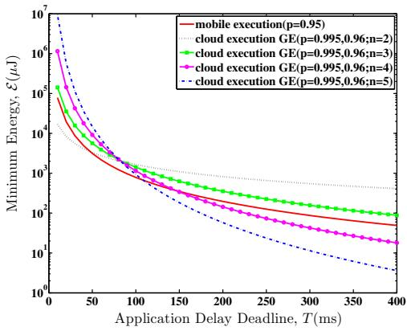

line

| Application Delay Deadline, T(ms) | mobile execution (p=0.95) | cloud execution GE (p=0.995,0.96;n=2) | cloud execution GE (p=0.995,0.96;n=3) | cloud execution GE (p=0.995,0.96;n=4) | cloud execution GE (p=0.995,0.96;n=5) |
| --------------------------------- | -------------------------- | ------------------------------------- | ------------------------------------- | ------------------------------------- | ------------------------------------- |
| 0                                 | 10^7                       | 10^7                                  | 10^7                                  | 10^7                                  | 10^7                                  |
| 50                                | ~10^4                     | ~10^4                                 | ~10^4                                 | ~10^4                                 | ~10^4                                 |
| 100                               | ~10^3                     | ~10^3                                 | ~10^3                                 | ~10^3                                 | ~10^3                                 |
| 150                               | ~10^2                     | ~10^2                                 | ~10^2                                 | ~10^2                                 | ~10^2                                 |
| 200                               | ~10^2                     | ~10^2                                 | ~10^2                                 | ~10^2                                 | ~10^2                                 |
| 250                               | ~10^2                     | ~10^2                                 | ~10^2                                 | ~10^2                                 | ~10^2                                 |
| 300                               | ~10^2                     | ~10^2                                 | ~10^2                                 | ~10^2                                 | ~10^2                                 |
| 350                               | ~10^2                     | ~10^2                                 | ~10^2                                 | ~10^2                                 | ~10^2                                 |
| 400                               | ~10^2                     | ~10^2                                 | ~10^2                                 | ~10^2                                 | ~10^2                                 |

Fig. 7. The minimum energy, $\varepsilon ^ { * }$ , is plotted as a function of the application delay deadline . The application workload is modeled as the Gamma Tdistribution, with $\alpha = 4 , { \overset { \cdot } { \beta } } = 2 0 0$ ,  = 800 . The channel is a GE model with $p _ { G G } = 0 . 9 9 5$ , $p _ { B B } = 0 . 9 6 ,$ $g _ { G } = 1$ itsand $g _ { B } = 0 . 1$ .

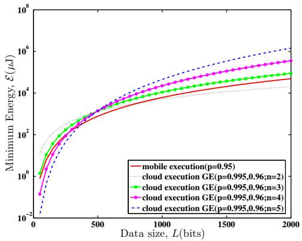

line

| Data size, L(bits) | mobile execution(p=0.95) | cloud execution GE(p=0.995,0.96;n=2) | cloud execution GE(p=0.995,0.96;n=3) | cloud execution GE(p=0.995,0.96;n=4) | cloud execution GE(p=0.995,0.96;n=5) |
| ------------------ | ------------------------ | ----------------------------------- | ----------------------------------- | ----------------------------------- | ----------------------------------- |
| 0                  | 1                        | 1                                   | 1                                   | 1                                   | 1                                   |
| 500                | 10                       | 10                                  | 10                                  | 10                                  | 10                                  |
| 1000               | 100                      | 100                                 | 100                                 | 100                                 | 100                                 |
| 1500               | 1000                     | 1000                                | 1000                                | 1000                                | 1000                                |
| 2000               | 10000                    | 10000                               | 10000                               | 10000                               | 10000                               |

Fig. 8. The minimum energy, $\varepsilon ^ { * }$ , is plotted as a function of the data size . The application workload is modeled as the Gamma distribution, with $\alpha = 4 ,$ $\beta = \mathrm { \bar { 2 0 0 } }$ , $T = 5 0 m s$ . The channel is a GE model with $p _ { G G } = 0 . 9 9 5$ , $p _ { B B } = 0 . 9 6 .$ , $g _ { G } = 1$ sand $g _ { B } = 0 . 1$ .

# VI. OPTIMAL APPLICATION EXECUTION POLICY

In this section, we develop a threshold $\mathrm { p o l i c y } ^ { 3 }$ for the optimal application execution, based on the analytical results obtained in Section IV and V. In particular, for a given application profile of $A ( L , T )$ , we compare the minimum A L, Tcomputation energy of mobile execution and the minimum transmission energy of cloud execution. The optimal application execution policy is to choose whichever consumes less energy on the mobile device, in order to extend the battery life.

# A. Comparison of Minimum Energy Consumption between Mobile Execution and Cloud Execution

As proved previously in Section IV and Section V, there are scaling laws that can be derived between the energy consumption and the application profile (i.e., data size and deadline delay): $\mathcal { E } _ { m } ^ { * } \sim L ^ { 3 }$ and $\mathcal { E } _ { m } ^ { * } \sim T ^ { - 2 }$ for the mobile execution, and ${ \mathcal { E } } _ { c } ^ { * } \sim L ^ { n }$ and $\mathcal { E } _ { c } ^ { * } \sim T ^ { - ( n - 1 ) }$ for the cloud c cexecution, respectively. Thus, when $n < 3 ,$ the cloud execution consumes less energy for large data, while when $n > 3 .$ it is n >also encouraged to offload the application to the cloud for relatively long delay deadline.

As an example, we use the same application parameters of the mobile execution and the cloud execution as those described in Section IV and V, to compare the energy consumptions. In Figure 7, we plot the minimum energy consumed by the mobile device for the mobile execution and the cloud execution, as a function of the application completion deadline of  . It can be observed that there are T2 cases for consideration: (1) When  is smaller than 3, nthe cloud execution is more energy-efficient when the delay deadline is below a threshold. This is because, when $n < 3 ,$ , nthe scaling factor for the cloud execution is slower than $T ^ { - 2 } ,$ Tthe scaling factor for the mobile execution. (2) When  is nlarger than 3, the cloud execution is more energy-efficient

3This policy is suitable for the applications with small output data. For applications with large output data, we can adjust the deadline of the transmission in the cloud execution, and find out the operating region for which execution is more energy optimal. Hence, our methodology still remains valid and this policy could also be regarded as an approximation for the execution decision of the applications with large output data.

when the delay deadline is beyond a threshold. This is because, the scaling factor for the cloud execution is faster than $T ^ { - 2 }$ , Tthe scaling factor for the mobile execution. Hence, when  is Lfixed, the monomial order of  can affect the optimal execution strategy.

In Figure 8, we plot the minimum energy consumed by the mobile device for the mobile execution and the cloud execution, as a function of the input data size of . It can be Lobserved that there are 2 cases for consideration: (1) When nis smaller than 3, the cloud execution is more energy-efficient when the data size is beyond a threshold. This is because, when $n \ < \ 3 .$ , the scaling factor for the cloud execution is n <slower than $L ^ { 3 }$ , the scaling factor for the mobile execution. L(2) When  is larger than 3, the cloud execution is more nenergy-efficient when the input data size is below a threshold. This is because, when $n > 3 .$ , the scaling factor for the cloud nexecution is faster than $L ^ { 3 } ,$ , the scaling factor for the mobile execution. Hence, when $T$ is fixed, the monomial order of Tcan affect the optimal execution strategy.

Moreover, by optimally deciding where to execute the application, a significant amount of energy can be saved on the mobile devices. For example, for an application profile of (800 400 ) in Figure 7, cloud execution consumes 13 times energy less than mobile execution for $n = 5$ .

# B. Optimal Operating Regions for Execution Policy

In this subsection, we derive the energy-optimal execution policy for the mobile application with small output data size.

First, for various application profiles $A ( L , T )$ with  rang-A L, T Ling from 0 to 1000 and  ranging from 0 to 250 , bits T mswe compute the energy consumption of mobile execution and cloud execution, and plot in Figure 9 the regions where the mobile execution or the cloud execution is more energy efficient under different . Specifically, for $\ n \ = \ 2 .$ , the n nboundary between the two optimal operational regions appears to be a line. In this case, if the point $( T , L )$ is above the T, Lline, the cloud execution is more energy-efficient; otherwise, the mobile execution is more energy-efficient. With the same parameters for both mobile execution and cloud execution, all cases of $n = 3$ should be executed in the mobile device. This can be derived from Figures 7 and 8, in which for $n = 3 ,$ , nthe curve of the cloud execution is always above the curve of the mobile execution, indicating that energy consumption of mobile execution is smaller. In the case of $n = 4 .$ , the boundary between the two optimal operating regions also appears to be a line. However, in this case, if the point $( T , L )$ is below the T, Lline, the cloud execution is more energy-efficient; otherwise, the mobile execution is more energy-efficient.

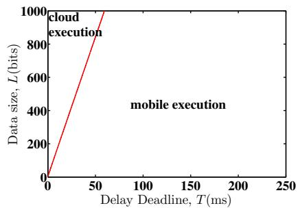

line

| Delay Deadline, T(ms) | Data size, L(bits) |
| --------------------- | ------------------ |
| 0                     | 0                  |
| 50                    | 800                |
| 100                   | 1000               |
| 150                   | 1000               |
| 200                   | 1000               |
| 250                   | 1000               |

(a) n=2

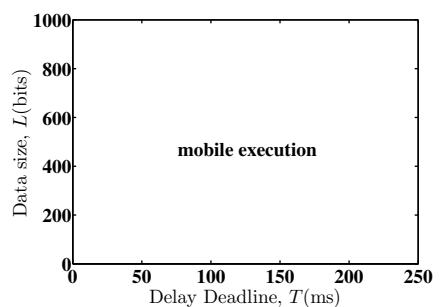

line

| Delay Deadline, T(ms) | Data size, L(bits) |
| --------------------- | ------------------ |
| 0                     | 0                  |
| 50                    | 500                |
| 100                   | 500                |
| 150                   | 500                |
| 200                   | 500                |
| 250                   | 500                |

(b) n=3

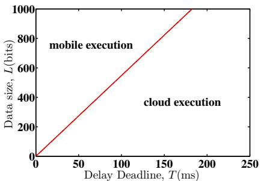

line

| Delay Deadline, T(ms) | Data size, L(bits) |
| --------------------- | ------------------ |
| 0                     | 0                  |
| 50                    | 250                |
| 100                   | 500                |
| 150                   | 750                |
| 200                   | 1000               |

(c) n=4   
Fig. 9. Operating Regions for Optimal Energy Decision.

Then, the same approach can be adopted for different application parameters (i.e., the scale parameter and the shape parameter in the Gamma distribution of the number of CPU cycles, and monomial order of transmission model) to obtain the optimal policy for application execution. Similarly, the optimal operational regions separated by a line for the mobile execution and the cloud execution can be found respectively.

Moreover, inspired by the observations in Figure 9, we can mathematically determine the execution policy. We define the effective data consumption rate as the ratio of data input size and delay deadline $( R _ { e } ~ = ~ L / T )$ , and a threshold $R _ { t h } ~ =$ $\left\lceil { \frac { M } { C ( n ) } } \right\rceil ^ { \frac { 1 } { n - 3 } }$ . Specifically, the effective data consumption rate C nrefers to the data processing rate for mobile execution, and the data transmission rate for cloud execution. Notice that $R _ { t h }$ depends on the monomial order ( ). Since  can take different n nvalues, we can have different decisions on the optimal energy execution, which is given by Theorem 6.1.

Theorem 6.1: The energy-optimal execution policy can be determined by comparing the effective data consumption rate $( R _ { e } = L / T )$ with a predefined threshold $\begin{array} { r } { ( R _ { t h } = \Big [ \frac { M } { C ( n ) } \Big ] ^ { \frac { 1 } { n - 3 } } ) } \end{array}$ R L/T R CThe energy-optimal execution for mobile device is:

$$
\begin{array}{l l} (1) n <   3 & \text { mobile   execution } \quad \text { if } \quad R _ {e} \leq R _ {t h} \\ & \text { cloud   execution } \quad \text { if } \quad R _ {e} > R _ {t h} \end{array} ; \tag {28}
$$

$$
\begin{array}{l l} (2) n > 3 & \text { mobile   execution } \quad \text { if } \quad R _ {e} \geq R _ {t h} \\ & \text { cloud   execution } \quad \text { if } \quad R _ {e} <   R _ {t h} \end{array} ; \tag {29}
$$

$$
\begin{array}{l l} (3) n = 3 & \text { mobile   execution } \quad \text { if } \quad M \leq C (n) \\ & \text { cloud   execution } \quad \text { if } \quad M > C (n) \end{array} . \tag {30}
$$

Theorem 6.1 can be explained geometrically. In Figure 9(a) and 9(c), the line separates the operational regions for the mobile execution and the cloud execution, respectively. The decision threshold, $R _ { t h }$ , is the slope of the line. It depends Rthon the coefficients in the energy consumption model, and the monomial order ( ) in the wireless transmission model.

Theorem 6.1 can be applied for some mobile applications that has small output data size (e.g., virus scanning, face recognition, chess games, etc). The application profile $A ( L , T )$ A L, Tcan be specified for different applications. Consider a cloudbased antivirus application called CloudAV. CloudAV accepts files as large input data from users, detects malicious or unwanted content with intensive computation, and returns results as small output data, without access of the special local resources on the mobile device (e.g., GPS or sensors). Considering the characteristics of this application, we can claim that the threshold policy is suitable for determining whether the malware detection is executed on the mobile device or on the cloud. The policy depends on the application profile (i.e., the file size  and the application completion deadline of  ), L Tthe wireless transmission model (i.e., the monomial order nin its energy consumption formula) and the ratio of energy coefficients (i.e., effective switched capacitance  on the chip κsystem of the device and energy coefficient  in the wireless channel model. In our examples, $\kappa / \lambda = 6 . 6 7 \times 1 0 ^ { - 1 2 } )$ . We κ/λ .can identify the energy-optimal malware detection policy by evaluating the value of the effective data consumption rate $( L / T )$ ). Moreover, energy consumed by the mobile device L/Tcan be saved significantly by deciding where to execute the malware detection.

# VII. SUMMARY AND FUTURE RESEARCH

In this paper we investigated the problem of how to conserve energy for the resource-constrained mobile device, by optimally executing mobile applications in either the mobile device or the cloud clone. We proposed a theoretical framework for energy-optimal mobile cloud computing under stochastic wireless channel. For the mobile execution, we minimize the computation energy by dynamically configuring the clock frequency of the chip. For the cloud execution, we minimize the transmission energy by optimally scheduling data transmission across the stochastic wireless channel (i.e., the Gilbert-Elliott model). Closed-form solutions were obtained for both scheduling problems to decide the optimal application-execution condition under which either the mobile execution or the cloud execution is more energy-efficient for the mobile device. We derived a threshold policy for mobile applications with small output data (e.g., CloudAV). The threshold depends on the wireless transmission model and the ratio of energy coefficients for the mobile execution and the cloud execution. Moreover, numerical results suggest that for some applications, a significant amount of energy can be saved by offloading mobile applications to the cloud.

This paper only focuses on the theoretical parts of application offloading. For future work, we will evaluate the performance by running real applications with intensive computation and show the applicability of our theoretical framework. In addition, we will consider the multi-task offloading in a more fine-grained choice for mobile application execution.

# APPENDIX A

# PROOF OF THEOREM 4.1

In this section, we will use the Lagrange multiplier method to solve the optimization problem in Eq. (13). The Lagrangian function is given by

$$
\begin{array}{l} L (f (w), \gamma) = \sum_ {w = 1} ^ {W _ {\rho}} F _ {W} ^ {c} (w) [ f (w) ] ^ {2} + \gamma (\sum_ {w = 1} ^ {W _ {\rho}} \frac {1}{f (w)} - T) \\ = \sum_ {w = 1} ^ {W _ {\rho}} \left\{F _ {W} ^ {c} (w) [ f (w) ] ^ {2} + \frac {\gamma}{f (w)} \right\} - \gamma T, \\ \end{array}
$$

where $\gamma$ is the Lagrange multiplier.

γThe optimal clock schedule policy must satisfy the following conditions,

$$
\frac {\partial L (f (w) , \gamma)}{\partial f (w)} = 2 F _ {W} ^ {c} (w) f (w) - \frac {\gamma}{[ f (w) ] ^ {2}} = 0, \tag {31}
$$

$$
\frac {\partial L (f (w) , \gamma)}{\partial \gamma} = \sum_ {w = 1} ^ {W _ {\rho}} \frac {1}{f (w)} - T = 0. \tag {32}
$$

Solving Eq. (31), we obtain that, for $1 \leq w \leq W _ { \rho } ,$ ,

$$
f ^ {*} (w) = \{\frac {\gamma}{2 F _ {W} ^ {c} (w)} \} ^ {1 / 3}. \tag {33}
$$

Plugging Eq. (33) into Eq. (32), we obtain

$$
\sum_ {w = 1} ^ {W _ {\rho}} \left[ F _ {W} ^ {c} (w) \right] ^ {1 / 3} = T (\frac {\gamma}{2}) ^ {1 / 3}. \tag {34}
$$

Therefore, the optimal clock schedule policy is given by

$$
f ^ {*} (w) = \frac {\theta}{T [ F _ {W} ^ {c} (w) ] ^ {1 / 3}}, \tag {35}
$$

where $\theta = { \textstyle \sum _ { w = 1 } ^ { W _ { \rho } } } [ F _ { W } ^ { c } ( w ) ] ^ { 1 / 3 }$ W. Substituting Eq. (35) into Eq. θ w FW w(12), we obtain the optimal computation energy as

$$
\mathcal {E} _ {m} ^ {*} = \frac {\kappa}{T ^ {2}} \{\sum_ {w = 1} ^ {W _ {\rho}} [ F _ {W} ^ {c} (w) ] ^ {1 / 3} \} ^ {3}. \tag {36}
$$

# APPENDIX B

# PROOF OF PROPOSITION 4.2

to show that, as converges to a fixed $W _ { \rho } \to \infty , \theta = $ $\sum _ { w = 1 } ^ { W _ { \rho } } [ F _ { W } ^ { c } ( w ) ] ^ { 1 / 3 }$

w FW wFor an exponentially-tailed distribution, we have $F _ { W } ^ { c } ( w ) \sim$ $\mu e ^ { - \nu w }$ as $w  \infty$ for some constant $\mu > 0$ F and $\nu > 0$ μe wFormally, for $\forall \epsilon > 0$ , there exits a $W .$ μ >, such that for $w > W$ , $| F _ { W } ^ { c } ( w ) - \mu e ^ { - \nu w } | < \epsilon$ W w > W. Using this fact, we can rewrite the FW w μe <energy factor  as for $w \ge W$ .

$$
\theta = \sum_ {w = 1} ^ {W} [ F _ {W} ^ {c} (w) ] ^ {1 / 3} + \sum_ {w = W + 1} ^ {W _ {\rho}} \mu^ {\frac {1}{3}} e ^ {- \frac {\nu}{3} w}. \tag {37}
$$

The first term is a constant. As $W _ { \rho } \to \infty$ , the second term

$$
\sum_ {w = W + 1} ^ {W _ {\rho}} \mu^ {\frac {1}{3}} e ^ {- \frac {\nu}{3} w} = \frac {\mu^ {\frac {1}{3}} e ^ {- \frac {\nu}{3} [ W + 1 ]} \left[ 1 - \left(e ^ {- \frac {\nu}{3}}\right) ^ {W _ {\rho} - W} \right]}{1 - e ^ {- \frac {\nu}{3}}} \tag {38}
$$

will converge to a constant. Therefore, the minimum energy consumption converges to a finite value.

# APPENDIX C

# PROOF OF PROPOSITION 4.4

In this section, we show the relationship of optimal energy $\mathcal { E } _ { m } ^ { * }$ and data size .

mIn Eq. (36), $\begin{array} { r } { F _ { W } ^ { c } ( w ) = F _ { X } ^ { c } ( \frac { w } { L } ) } \end{array}$ . Assuming $W _ { \rho } = L T _ { \rho }$ , we have

$$
\begin{array}{l} \sum_ {w = 1} ^ {W _ {\rho}} [ F _ {W} ^ {c} (w) ] ^ {1 / 3} = \sum_ {t = 0} ^ {T _ {\rho} - 1} (\sum_ {i = 1} ^ {L} [ F _ {W} ^ {c} (L t + i) ] ^ {1 / 3}) \\ = \sum_ {t = 0} ^ {T _ {\rho} - 1} (\sum_ {i = 1} ^ {L} [ F _ {X} ^ {c} (t + \frac {i}{L}) ] ^ {1 / 3}). \\ \end{array}
$$

According to the mean value theorem, there exists an $\begin{array} { r } { \eta \left( \frac { 1 } { L } \right) < } \end{array}$ $\eta < 1 )$ , such that

$$
\begin{array}{l} \sum_ {t = 0} ^ {T _ {\rho} - 1} (\sum_ {i = 1} ^ {L} [ F _ {X} ^ {c} (t + \frac {i}{L}) ] ^ {1 / 3}) = \sum_ {t = 0} ^ {T _ {\rho} - 1} (L [ F _ {X} ^ {c} (t + \eta) ] ^ {1 / 3}) \\ = L \sum_ {t = 0} ^ {T _ {\rho} - 1} ([ F _ {X} ^ {c} (t + \eta) ] ^ {1 / 3}). \\ \end{array}
$$

Hence,

$$
\sum_ {w = 1} ^ {W _ {\rho}} \left[ F _ {W} ^ {c} (w) \right] ^ {1 / 3} = L \sum_ {t = 0} ^ {T _ {\rho} - 1} \left(\left[ F _ {X} ^ {c} (t + \eta) \right] ^ {1 / 3}\right).
$$

For the Gamma distribution, the complementary cumulative distribution function(CCDF) is -α−1=0 $\begin{array} { r } { \sum _ { i = 0 } ^ { \alpha - 1 } \frac { { \bar { ( \beta x ) } } ^ { i } } { i ! } e ^ { - \beta x } } \end{array}$ i − .

i i eFor this exponentially-tailed distribution, we have $F _ { X } ^ { c } ( t +$ $\eta ) \sim \mu e ^ { - \nu ( t + \eta ) }$ as $t  \infty$ for some constant $\mu > 0$ tand $\nu > 0$ μe. Formally, for $\forall \epsilon > 0$ , there exits a $T _ { N }$ μ >, such that for $t > T _ { N }$ , we have $| F _ { X } ^ { c } ( t + \eta ) - \mu e ^ { - \nu ( t + \eta ) } | < \epsilon$ . Using this t > TNfact, we get

$$
\begin{array}{l} \sum_ {t = 0} ^ {T _ {\rho} - 1} ([ F _ {X} ^ {c} (t + \eta) ] ^ {1 / 3}) = \sum_ {t = 0} ^ {T _ {N}} ([ F _ {X} ^ {c} (t + \eta) ] ^ {1 / 3}) \tag {39} \\ + \sum_ {t = T _ {N + 1}} ^ {T _ {\rho} - 1} \mu^ {\frac {1}{3}} e ^ {- \frac {\nu}{3} (t + \eta)}. \\ \end{array}
$$

The first term is a constant. As $T _ { \rho } \to \infty ,$ , the second term

$$
\sum_ {t = T _ {N + 1}} ^ {T _ {\rho} - 1} \mu^ {\frac {1}{3}} e ^ {- \frac {\nu}{3} (t + \eta)} = \frac {\mu^ {\frac {1}{3}} e ^ {- \frac {\nu}{3} [ T _ {N} + 1 + \eta ]} \left[ 1 - \left(e ^ {- \frac {\nu}{3}}\right) ^ {T _ {\rho} - T _ {N} - 1} \right]}{1 - e ^ {- \frac {\nu}{3}}} \tag {40}
$$

will converge to a constant. Thus, $\begin{array} { r } { \sum _ { t = 0 } ^ { T _ { \rho } - 1 } ( [ F _ { X } ^ { c } ( t + \eta ) ] ^ { 1 / 3 } ) } \end{array}$ t FX t ηconverges to a constant and would not scale to ∞. Hence,

$$
\sum_ {w = 1} ^ {W _ {\rho}} \left[ F _ {W} ^ {c} (w) \right] ^ {1 / 3} \sim L. \tag {41}
$$

Combining the Eq.(36) and Eq.(41), we have $\mathcal { E } _ { m } ^ { * } \sim L ^ { 3 }$ .

# APPENDIX D PROOF OF THEOREM 5.1

In this section, we provide the proof of Theorem 5.1.

Using the dynamic programming (DP) approach, the optimization problem in Eq. (19) can be rewritten as

$$
J _ {t} (l _ {t}, g _ {t}) = \left\{ \begin{array}{l l} \min _ {0 \leq s _ {t} \leq l _ {t}} \left(\lambda \frac {s _ {t} ^ {n}}{g _ {t}} + \mathbb {E} (J _ {t - 1} (l _ {t} - s _ {t}, g _ {t - 1}))\right), & t \geq 2 \\ \lambda \frac {l _ {1} ^ {n}}{g _ {1}}, & t = 1. \end{array} \right.
$$

Here, $l _ { t }$ denotes the number of remaining (un-transmitted) bits ltat , with $l _ { t - 1 } = l _ { t } - s _ { t }$ .

t lt lt stWe use the induction approach. We first consider the case that at $t = T + 1$ , the channel is in the good state. At = 1, t Tall the remaining $l _ { 1 }$ tbits have to be transmitted to meet the ldeadline constraint. Given the channel state at  = 2 is in the good state, the expected minimum energy is given by

$$
\begin{array}{l} \bar {J} _ {1} (l _ {1}, g _ {1}; G) = \mathbb {E} \left[ \lambda \frac {l _ {1} ^ {n}}{g _ {1}} \right] \tag {42} \\ { = } { \lambda l _ { 1 } ^ { n } \left( p _ { G G } \left[ \frac { 1 } { g _ { G } } \right] + p _ { G B } \left[ \frac { 1 } { g _ { B } } \right] \right) . } \\ \end{array}
$$

Now suppose Eq. (21) is true for $t - 1$ , the DP problem stated in Eq. (42) becomes

$$
J _ {t} (l _ {t}, g _ {t}; G) = \min _ {0 \leq s _ {t} \leq l _ {t}} \left(\lambda \frac {s _ {t} ^ {n}}{g _ {t}} + \lambda (l _ {t} - s _ {t}) ^ {n} \zeta_ {t - 1; G}\right). \tag {43}
$$

The optimal $s _ { t } .$ , denoted as $s _ { t } ^ { * } ,$ , can be solved as:

$$
s _ {t} ^ {*} (l _ {t}, g _ {t}; G) = \frac {l _ {t} g _ {t} ^ {\frac {1}{n - 1}}}{g _ {t} ^ {\frac {1}{n - 1}} + \left(\frac {1}{\zeta_ {t - 1 ; G}}\right) ^ {\frac {1}{n - 1}}}. \tag {44}
$$

Substituting (44) to (43), we have:

$$
J _ {t} (l _ {t}, g _ {t}; G) = \lambda l _ {t} ^ {n} \left[ \left(\frac {1}{(g _ {t}) ^ {\frac {1}{n - 1}} + (\frac {1}{\zeta_ {t - 1 ; G}}) ^ {\frac {1}{n - 1}}}\right) ^ {n - 1} \right]. \tag {45}
$$

By taking expectation of $J _ { t } ( l _ { t } , g _ { t } )$ with respect to $g _ { t } .$ , we have:

$$
\zeta_ {t; G} = \mathbb {E} \left[ \left(\frac {1}{(g _ {t}) ^ {\frac {1}{n - 1}} + (\frac {1}{\zeta_ {t - 1 ; G}}) ^ {\frac {1}{n - 1}}}\right) ^ {n - 1} \right] \tag {46}
$$

$$
= p _ {G G} \left[ \left(\frac {1}{(g _ {G}) ^ {\frac {1}{n - 1}} + (\frac {1}{\zeta_ {t - 1 ; G}}) ^ {\frac {1}{n - 1}}}\right) ^ {n - 1} \right]
$$

$$
+ \quad p _ {G B} \left[ \left(\frac {1}{(g _ {B}) ^ {\frac {1}{n - 1}} + (\frac {1}{\zeta_ {t - 1 ; G}}) ^ {\frac {1}{n - 1}}}\right) ^ {n - 1} \right].
$$

Therefore, the result of $\zeta _ { t ; G }$ in Eq. (21) follows by induction ζtand we obtain Eq. (24) for $\mathcal { E } _ { c } ^ { * } ( L , T ; G )$ . The proof for $\zeta _ { t ; B }$ in Eq. (23) and $\mathcal { E } _ { c } ^ { * } ( L , T ; B )$ c L, T G ζt Bin Eq. (25) follow the exact same c L, T Brationale, thus is omitted here for brevity.

At steady state, the probability that a channel is in good or bad state is $\frac { T _ { G } } { T _ { G } + T _ { B } }$ TG+ and $\begin{array} { r } { \frac { T _ { B } } { T _ { G } + T _ { B } } } \end{array}$ , respectively, thus we have TG TB TG TB the minimum expected transmission energy $\mathcal { E } _ { c } ^ { * }$ in Eq. (26).

# APPENDIX E PROOF OF PROPOSITION 5.3

In this section, we present the relationship of optimal transmission energy and delay deadline. Since,

$$
\zeta_ {t; G} = \left\{ \begin{array}{l l} p _ {G G} \left[ \left(\frac {1}{(g _ {G}) ^ {\frac {1}{n - 1}} + (\frac {1}{\zeta_ {t - 1 ; G}}) ^ {\frac {1}{n - 1}}}\right) ^ {n - 1} \right] & \\ + p _ {G B} \left[ \left(\frac {1}{(g _ {B}) ^ {\frac {1}{n - 1}} + (\frac {1}{\zeta_ {t - 1 ; G}}) ^ {\frac {1}{n - 1}}}\right) ^ {n - 1} \right], & t \geq 2; \\ p _ {G G} \left[ \frac {1}{g _ {G}} \right] + p _ {G B} \left[ \frac {1}{g _ {B}} \right], & t = 1. \end{array} \right. \tag {47}
$$

and $g _ { G } \ > \ g _ { B }$ , we have $\zeta _ { t ; G } < \zeta _ { t ; g _ { B } }$ and $\zeta _ { t ; G } > \zeta _ { t ; g _ { G } }$ , in gGwhich

$$
\zeta_ {t; g _ {B}} = \left\{ \begin{array}{l l} p _ {G G} \left[ \left(\frac {1}{(g _ {B}) ^ {\frac {1}{n - 1}} + (\frac {1}{\zeta_ {t - 1 ; g _ {B}}}) ^ {\frac {1}{n - 1}}}\right) ^ {n - 1} \right] & \\ + p _ {G B} \left[ \left(\frac {1}{(g _ {B}) ^ {\frac {1}{n - 1}} + (\frac {1}{\zeta_ {t - 1 ; g _ {B}}}) ^ {\frac {1}{n - 1}}}\right) ^ {n - 1} \right], & t \geq 2; \\ p _ {G G} \left[ \frac {1}{g _ {B}} \right] + p _ {G B} \left[ \frac {1}{g _ {B}} \right], & t = 1. \end{array} \right. \tag {48}
$$

and

$$
\zeta_ {t; g _ {G}} = \left\{ \begin{array}{l l} p _ {G G} \left[ \left(\frac {1}{(g _ {G}) ^ {\frac {1}{n - 1}} + (\frac {1}{\zeta_ {t - 1 ; g _ {G}}}) ^ {\frac {1}{n - 1}}}\right) ^ {n - 1} \right] & \\ + p _ {G B} \left[ \left(\frac {1}{(g _ {G}) ^ {\frac {1}{n - 1}} + (\frac {1}{\zeta_ {t - 1 ; g _ {G}}}) ^ {\frac {1}{n - 1}}}\right) ^ {n - 1} \right], & t \geq 2; \\ p _ {G G} \left[ \frac {1}{g _ {G}} \right] + p _ {G B} \left[ \frac {1}{g _ {G}} \right], & t = 1. \end{array} \right. \tag {49}
$$

Also, since $P _ { G B } + P _ { G G } = 1$ , we can obtain

$$
\zeta_ {t; g _ {B}} = \left\{\left[ \begin{array}{l l} \left(\frac {1}{(g _ {B}) ^ {\frac {1}{n - 1}} + (\frac {1}{\zeta_ {t - 1 ; g _ {B}}}) ^ {\frac {1}{n - 1}}}\right) ^ {n - 1} \right], & t \geq 2; \\ \frac {1}{g _ {B}}, & t = 1. \end{array} \right. \tag {50}
$$

For $t = T ,$ , we have

$$
\left[ \frac {1}{\zeta_ {T ; g _ {B}}} \right] ^ {\frac {1}{n - 1}} = \left[ \frac {1}{\zeta_ {T - 1 ; g _ {B}}} \right] ^ {\frac {1}{n - 1}} + (g _ {B}) ^ {\frac {1}{n - 1}}. \tag {51}
$$

Hence,

$$
\begin{array}{l} \left[ \frac {1}{\zeta_ {T ; g _ {B}}} \right] ^ {\frac {1}{n - 1}} = \left[ \frac {1}{\zeta_ {1 ; g _ {B}}} \right] ^ {\frac {1}{n - 1}} + (T - 1) (g _ {B}) ^ {\frac {1}{n - 1}} \tag {52} \\ = (g _ {B}) ^ {- (n - 1)} T. \\ \end{array}
$$

That is, $\begin{array} { r } { \zeta _ { T ; g _ { B } } = \left[ \frac { 1 } { g _ { B } } \right] T ^ { - ( n - 1 ) } } \end{array}$ . Similarly, we have $\zeta _ { T ; g _ { G } } =$ $\begin{array} { r } { \left[ \frac { 1 } { g _ { G } } \right] T ^ { - ( n - 1 ) } } \end{array}$ gB. In that case, we have $\zeta _ { T ; G } ~ \sim ~ T ^ { - ( n - 1 ) }$ . gGSimilarly, we have $\zeta _ { T ; B } \sim T ^ { - ( n - 1 ) }$ .

Considering the equations of (24), (25) and (26), we have $\mathcal { E } _ { c } ^ { * } ( L , T ) \sim T ^ { - ( n - 1 ) }$ E ∗ ( ) ∼  −(n−1).

# ACKNOWLEDGMENT

The authors would like to thank Prof. Shiqiang Yang at Tsinghua University, Dr. Shivkumar Kalyanaraman at IBM Research - India, and Prof. Chang Wen Chen at State University of New York for their insightful discussions. W.W. Zhang and Y.G. Wen were supported by Start-Up Grant from NTU, MOE Tier-1 Grant (RG 31/11) from Singapore MOE and EIRP02 Grant from Singapore EMA. D. Kilper acknowledges support from the CIAN ERC (NSF Grant No.EEC-0812072). D.P. Wu acknowledges support from ECCS-1002214, CNS-1116970 and the Joint Research Fund for Overseas Chinese Young Scholars under grant No. 61228101.

# REFERENCES

[1] M. Satyanarayanan, “Fundamental challenges in mobile computing,” in Proc. 1996 ACM Symp. Principles of Distributed Computing, pp. 1–7.   
[2] A. P. Miettinen and J. K. Nurminen, “Energy efficiency of mobile clients in cloud computing,” in Proc. 2010 USENIX Conference on Hot Topics in Cloud Computing.   
[3] K. Kumar and Y. H. Lu, “Cloud computing for mobile users: can offloading computation save energy?” IEEE Computer, vol. 43, no. 4, pp. 51–56, 2010.   
[4] M. Armbrust, A. Fox, R. Griffith, A. Joseph, R. Katz, A. Konwinski, G. Lee, D. Patterson, A. Rabkin, I. Stoica, and M. Zaharia, “A view of cloud computing,” Commun. of the ACM, vol. 53, no. 4, pp. 50–58, 2010.   
[5] M. Satyanarayanan, R. C. P. Bahl, and N. Davies, “The case for VMbased cloudlets in mobile computing,” IEEE Pervasive Computing, vol. 8, no. 4, pp. 14–23, 2009.   
[6] B. G. Chun and P. Maniatis, “Augmented smartphone applications through clone cloud execution,” in Proc. 2009 Conference on Hot Topics in Operating Systems.   
[7] X. W. Zhang, A. Kunjithapatham, S. Jeong, and S. Gibbs, “Towards an elastic application model for augmenting the computing capabilities of mobile devices with cloud computing,” Mobile Networks and Applications, vol. 16, no. 3, pp. 270–284, 2011.   
[8] B. G. Chun, S. Ihm, P. Maniatis, M. Naik, and A. Patti, “Clonecloud: elastic execution between mobile device and cloud,” in Proc. 2011 European Conference on Computer Systems, pp. 301–314.   
[9] J. M. Rabaey, Digital Integrated Circuits. Prentice Hall, 1996.   
[10] Y. Wen, W. Zhang, and H. Luo, “Energy-optimal mobile application execution: taming resource-poor mobile devices with cloud clones,” in Proc. 2012 IEEE INFOCOM, pp. 2716–2720.   
[11] J. Oberheide, E. Cooke, and F. Jahanian, “CloudAV: N-version antivirus in the network cloud,” in Proc. 2008 Conference on Security Symposium, pp. 91–106.   
[12] A. Rudenko, G. P. P. Reiher, and G. Kuenning, “Saving portable computer battery power through remote process execution,” Mobile Computing and Commun. Review, vol. 2, pp. 19–26, 1998.   
[13] A. Rudenko, P. Reiher, G. Popek, and G. Kuenning, “The remote processing framework for portable computer power saving,” in Proc. 1999 ACM Symposium on Applied Computing, pp. 365–372.   
[14] M. Othman and S. Hailes, “Power conservation strategy for mobile computers using load sharing,” Mobile Computing and Commun. Review, vol. 2, pp. 44–51, 1998.   
[15] R. Balan, J. Flinn, M. Satyanarayanan, S. Sinnamohideen, and H. I. I. Yang, “The case for cyber foraging,” in Proc. 2002 ACM Special Interest Group on Operating Systems European Workshop, pp. 87–92.   
[16] C. Xian, Y. H. Lu, and Z. Y. Li, “Adaptive computation offloading for energy conservation on battery-powered systems,” in Proc. 2007 International Conference on Parallel and Distributed Systems, vol. 2, pp. 1–8.   
[17] P. Rong and M. Pedram, “Extending the lifetime of a network of batterypowered mobile devices by remote processing: a Markovian decisionbased approach,” in Proc. 2003 Annual Design Automation Conference, pp. 906–911.   
[18] D. Huang, P. Wang, and D. Niyato, “A dynamic offloading algorithm for mobile computing,” IEEE Trans. Wireless Commun., vol. 11, no. 6, pp. 1991–1995, 2012.   
[19] W. H. Yuan and K. Nahrstedt, “Energy-efficient CPU scheduling for multimedia applications,” ACM Trans. Computer Systems, vol. 24, no. 3, pp. 292–331, 2006.

[20] T. Burd and R. Broderson, “Processor design for portable systems,” J. VLSI Singapore Process, vol. 13, pp. 203–222, 1996.   
[21] Y. Chen, S. Q. Zhang, S. G. Xu, and G. Y. Li, “Fundamental trade-offs on green wireless networks,” IEEE Commun. Mag., vol. 49, no. 6, pp. 30–37, 2011.   
[22] J. Lee and N. Jindal, “Energy-efficient scheduling of delay constrained traffic over fading channels,” IEEE Trans. Wireless Commun., vol. 8, no. 4, pp. 1866–1875, 2009.   
[23] M. Zafer and E. Modiano, “Minimum energy transmission over a wireless fading channel with packet deadlines,” in Proc. 2007 IEEE Conference on Decision and Control, pp. 1148–1155.   
[24] M. J. Neely, E. Modiano, and C. E. Rohrs, “Dynamic power allocation and routing for time varying wireless networks,” in Proc. 2003 IEEE INFOCOM, pp. 745–755.   
[25] E. Uysal-Biyikoglu, B. Prabhakar, and A. E. Gamal, “Energy efficient packet transmission over a wireless link,” IEEE/ACM Trans. Netw., vol. 10, pp. 487–499, 2002.   
[26] J. R. Lorch and A. J. Smith, “Improving dynamic voltage scaling algorithms with pace,” in Proc. 2001 ACM SIGMETRICS, pp. 50–61.   
[27] W. H. Yuan and K. Nahrstedt, “Energy-efficient soft real-time CPU scheduling for mobile multimedia systems,” in Proc. 2003 ACM SOSP, pp. 149–163.   
[28] M. Yang, Y. Wen, J. Cai, and F. C. Heng, “Energy minimization via dynamic voltage scaling for real-time video encoding on mobile devices,” in Proc. 2012 IEEE International Conference on Communications, pp. 2026–2031.   
[29] L. Johnston and V. Krishnamurthy, “Opportunistic file transfer over a fading channel: a POMDP search theory formulation with optimal threshold policies,” IEEE Trans. Wireless Commun., vol. 5, no. 2, pp. 394–405, 2006.

natural_image

Portrait photo of a young man in a collared shirt (no text or symbols visible)

Weiwen Zhang received his Bachelor’s degree in software engineering and Master’s degree in computer science from South China University of Technology (SCUT) in 2008 and 2011, respectively. He is currently a PhD student in the School of Computer Engineering at Nanyang Technological University (NTU) in Singapore. His research interests include cloud computing and mobile computing.

natural_image

Portrait of a man wearing glasses and a suit (no text or symbols visible)

Yonggang Wen received his Ph.D. degree in electrical engineering and computer science from Massachusetts Institute of Technology (MIT) in 2008. He is currently an Assistant Professor with School of Computer Engineering at Nanyang Technological University, Singapore. Previously, he has worked in Cisco as a Senior Software Engineer and a System Architect for content networking products. He has also worked as Research Intern at Bell Laboratories, Sycamore Networks, and served as a Technical Advisor to the Chairman at Linear A Networks, Inc. His

research interests include cloud computing, mobile computing, multimedia network, cyber security and green ICT.

natural_image

Portrait of a man in a striped shirt (no text or symbols visible)

Kyle Guan received the PhD degree in electrical engineering and computer science from Massachusetts Institute of Technology, Cambridge, MA in 2006. Following his PhD, he worked as principle engineer at BAE Systems, Wayne, NJ. He is currently a communication and networking research scientist at Bell Laboratories Optical Transmission Systems and Networks Research Department at Alcatel-Lucent. His research interests include network optimization and optical transmission systems.

natural_image

Portrait of a man with shoulder-length hair wearing a suit jacket over a checkered shirt (no text or symbols visible)

Dan Kilper received the B.S. degree in electrical engineering and the B.S. degree in physics from Virginia Polytechnic Institute & State University, Blacksburg, VA in 1990, and the M.S. and Ph.D. degrees in physics from The University of Michigan, Ann Arbor, MI in 1992 and 1996. Following his PhD, he was a post-doctoral research scientist at the Montana State University Optical Technology Center in the Department of Physics. He became an assistant professor of physics at the University of North Carolina, Charlotte, NC in 1997. In 2000,

he joined the Advanced Photonics Research Department as a Member of Technical Staff at Bell Laboratories, Lucent Technologies in Holmdel, NJ. In 2013, he became a research professor at the College of Optical Sciences, University of Arizona, Tucson. He is also an adjunct professor at Columbia University, New York. Currently he is the administrative director of the Center for Integrated Access Networks (CIAN). Dr. Kilper was the founding chair of the Technical Committee in the GreenTouch Consortium and served as the Bell Labs liaison executive on the Operations Committee of the Center for Energy Efficient Telecommunications, a joint Bell Labs and University of Melbourne research center. He was an associate editor for the OSA/IEEE Journal of Optical Communications and Networking (formerly J. Optical Networks). He served on technical program committees for ICTON, INFOCOM GCN Workshop, IFIP Networking, IQEC, CLEO/Europe, COIN/ACOFT, and Optical Technology in the Carolinas Conference and was general chair of the OPTO-Southeast Conference. He has been an invited panelist, presenter, and workshop organizer at OFC/NFOEC. During 2003-2006 he was a member of the Bell Labs Advisory Council on Research. He received the Bell Laboratories President’s Gold Medal Award in 2004. Dr. Kilper has conducted research on optical performance monitoring and on transmission, architectures and control systems for transparent and energy-efficient optical networks. Dr. Kilper is a member of the Optical Society of America and a senior member of IEEE. He has served on the OSA Member and Educational Services Committee, Beller Award Committee, and chaired the OSA Leadership Award Committee.

natural_image

Portrait photo of a man in a checkered shirt (no text or symbols visible)

Haiyun Luo received his B.S. from University of Science and Technology of China in 1998, and his M.S. and Ph.D. from University of California at Los Angeles in 2000 and 2004 respectively. He was an assistant professor at the Department of Computer Science, University of Illinois at Urbana-Champaign from 2004 to 2007. He currently leads the wireless and mobile application group as the Deputy Director of Wireless Networks at China Mobile US Research Center. Dr. Luo has published more than 40 referred papers in international journals and conferences.

natural_image

Portrait of a smiling man in a white shirt and tie (no text or symbols visible)

Dapeng Oliver Wu received B.E. in Electrical Engineering from Huazhong University of Science and Technology, Wuhan, China, in 1990, M.E. in Electrical Engineering from Beijing University of Posts and Telecommunications, Beijing, China, in 1997, and Ph.D. in Electrical and Computer Engineering from Carnegie Mellon University, Pittsburgh, PA, in 2003. Since 2003, he has been on the faculty of Electrical and Computer Engineering Department at University of Florida, Gainesville, FL, where he is a professor; previously, he was an assistant professor from 2003 to 2008, and an associate professor from 2008 to 2011. His research interests are in the areas of networking, communications, signal processing, computer vision, and machine learning. He received University of Florida Research Foundation Professorship Award in 2009, AFOSR Young Investigator Program (YIP) Award in 2009, ONR Young Investigator Program (YIP) Award in 2008, NSF CAREER award in 2007, the IEEE Circuits and Systems for Video Technology (CSVT) Transactions Best Paper Award for Year 2001, and the Best Paper Awards in IEEE GLOBECOM 2011 and International Conference on Quality of Service in Heterogeneous Wired/Wireless Networks (QShine) 2006. Currently, he serves as an Associate Editor for IEEE TRANSACTIONS ON CIRCUITS AND SYSTEMS FOR VIDEO TECHNOLOGY, Journal of Visual Communication and Image Representation, and International Journal of Ad Hoc and Ubiquitous Computing. He was the founding Editor-in-Chief of Journal of Advances in Multimedia between 2006 and 2008, and an Associate Editor for IEEE Transactions on Wireless Communications and IEEE Transactions on Vehicular Technology between 2004 and 2007. He is also a guest-editor for IEEE JOURNAL ON SELECTED AREAS IN COMMUNICATIONS (JSAC), Special Issue on Cross-Layer Optimized Wireless Multimedia Communications. He has served as Technical Program Committee (TPC) Chair for IEEE INFOCOM 2012, and TPC chair for IEEE International Conference on Communications (ICC 2008), Signal Processing for Communications Symposium, and as a member of executive committee and/or technical program committee of over 80 conferences. He has served as Chair for the Award Committee, and Chair of Mobile and wireless multimedia Interest Group (MobIG), Technical Committee on Multimedia Communications, IEEE Communications Society. He is a member of Multimedia Signal Processing Technical Committee, IEEE Signal Processing Society. He is an IEEE Fellow.