# Energy Consumption Minimization in UAV-Assisted Mobile-Edge Computing Systems: Joint Resource Allocation and Trajectory Design

Jiequ Ji , Kun Zhu , Member, IEEE, Changyan Yi , Member, IEEE, and Dusit Niyato , Fellow, IEEE

Abstract—Unmanned aerial vehicles (UAVs) have been introduced into wireless communication systems to provide highquality services and enhanced coverage due to their high mobility. In this article, we study a UAV-assisted mobile-edge computing (MEC) system in which a moving UAV equipped with computing resources is employed to help user devices (UDs) compute their tasks. The computing tasks of each UD can be divided into two parts: one portion is processed locally and the remaining portion is offloaded to the UAV for computing. Offloading is enabled by uplink and downlink communications between UDs and the UAV. On this basis, two types of access modes are considered, namely, nonorthogonal and orthogonal multiple access. For both access modes, we formulate new optimization problems to minimize the weighted-sum energy consumption of the UAV and UDs by jointly optimizing the UAV trajectory and computation resource allocation, under the constraint on the number of computation bits. These problems are nonconvex optimization problems that are difficult to solve directly. Accordingly, we develop alternating iterative algorithms to solve them based on the block alternating descent method. Specifically, the UAV trajectory and computation resource allocation are alteratively optimized in each iteration. Extensive simulation results demonstrate the significant energy savings of our proposed joint design over the benchmarks.

Index Terms—Computation offloading, local computation, mobile-edge computing (MEC), resource allocation, trajectory optimization.

# I. INTRODUCTION

W ITH the development of the Internet of Things (IoT),more and more mobile applications emerge in our life, more and more mobile applications emerge in our life, such as face recognition, video processing, and online gaming [1]. However, all of these applications are computation intensive and latency sensitive, which normally need a high computation capability [2]. The limited battery energy and

Manuscript received October 29, 2020; accepted December 15, 2020. Date of publication December 23, 2020; date of current version May 7, 2021. This work was supported by the National Natural Science Foundation of China under Grant 61701230, Grant 62071230, and Grant 62002164. (Corresponding author: Kun Zhu.)

Jiequ Ji is with the College of Computer Science and Technology, Nanjing University of Aeronautics and Astronautics, Nanjing 210016, China (e-mail: jiequ@nuaa.edu.cn).

Kun Zhu and Changyan Yi are with the College of Computer Science and Technology, Nanjing University of Aeronautics and Astronautics, Nanjing 210016, China, and also with the Collaborative Innovation Center of Novel Software Technology and Industrialization, Nanjing 211106, China (e-mail: zhukun@nuaa.edu.cn; changyan.yi@nuaa.edu.cn).

Dusit Niyato is with the School of Computer Science and Engineering, Nanyang Technological University, Singapore 639798 (e-mail: dniyato@ntu.edu.sg).

Digital Object Identifier 10.1109/JIOT.2020.3046788

low computation capability make it difficult for user devices (UDs) to execute these applications with their own computing resources [3]. To tackle this issue, mobile-edge computing (MEC) has emerged as a promising solution, which can provide cloud computing services for UDs at the edge of wireless networks with low transmission delay and light access burden [4]–[6]. Different from the traditional cloud computing, MEC servers are deployed at the infrastructure-based edge of wireless networks in proximity to UDs. By offloading partial or total computation-intensive tasks to the MEC server, the quality of computation experience can be significantly improved.

However, traditional MEC techniques are not applicable to the situation that the network facilities are sparsely distributed or the number of UDs increases dramatically [7]. Fortunately, unmanned aerial vehicle (UAV)-enabled MEC has been proposed and envisioned as a promising technology to tackle these challenges [8]. Compared with traditional architectures, UAVs equipped with computing resources can bring many potential advantages to MEC systems [9]. First, UAVs usually provide Line-of-Sight (LoS) channel links with UDs, which can mitigate signal blockage and shadowing. Second, UAVs can leverage their mobility to dynamically adjust their trajectories to move closer to the UDs so as to provide better channel conditions. In addition, when a UAV flies over a UD, the energy consumed by the UD to offload its computation tasks to the UAV can be significantly reduced.

# A. Related Work

There have been a number of research works on MEC techniques [10]–[14]. Sardellitti et al. [10] investigated a multicell MEC system, where the computation and radio resources were jointly optimized to minimize the total energy consumption. In [11], an optimal resource allocation algorithm that maximizes the sum of computation efficiency was developed. You et al. [12] proposed a task offloading policy to reduce the energy consumption under the data processing delay constraints. Dinh et al. [13] investigated a multitasking MEC system in which multiple access points (APs) equipped with computing resources were employed to help local resource-limited UDs to reduce their task execution latency. To achieve a delay-energy tradeoff, the authors proposed a random arrival model in [14] for computation task offloading. However, conventional MEC techniques cannot cope with the situation that the number of UDs increases explosively or the communication facilities are sparsely distributed.

Due to the attractive advantages of UAVs in terms of their flexible movement and easy deployment, the integration of UAV-aided communication with MEC can further enhance the computational performance [15]–[22]. In [15], a UAV-enabled MEC system was first proposed, where the computing performance of UDs can be obviously improved with UAVs. Cheng et al. [16] proposed a novel scheme to guarantee the security of UAV-relayed wireless networks with caching by jointly the time scheduling and UAV trajectory. Jeong et al. [17] proposed a joint trajectory and bit allocation algorithm to minimize the energy consumption. Cheng et al. [18] studied a space-air-ground-integrated computing system, where UAVs and satellites were used to provide edge computing and cloud computing accesses, respectively. The energy efficiency in a MEC system was investigated in [19], with the objective of minimizing the computation energy and hovering energy of UAVs. In [20], a UAV-aided wireless-powered MEC system was investigated, where the sum energy consumption at the UAV was minimized by optimizing the CPU frequency and UAV trajectory. A computation rate maximization problem was proposed in [21], subject to the constraints of UAV mobility and energy harvesting causality. Hua et al. [22] studied resource allocation for time-division multiple access (TDMA) and orthogonal frequency-division multiple access (OFDMA)-based multiuser MEC systems. However, such access protocols may not be able to accommodate massive connectivity with high-spectrum utilization. We note that nonorthogonal multiple access (NOMA) is a promising technique for 5G networks, which allows multiple users to exploit successive interference cancelation to alleviate the co-channel interference [23]–[26]. For uplink and downlink transmission in MEC systems, NOMA and orthogonal multiple access (OMA) modes can be used due to their superior spectral efficiency.

It is worth noting that [19]–[21] assume that all computation tasks are offloaded to the UAV for computation, whereas this may be impractical as the number of computation input bits is tremendously large. In fact, one portion of data bits computed locally at each UD and the other portion of data bits offloaded to the UAV for computing can efficiently save the total energy consumption. Specifically, less number of computation bits to be offloaded to the UAV will reduce the communication energy consumption of UDs. Moreover, UDs may prefer to compute their tasks locally when the UD-to-UAV channels are poor.

In addition, the energy consumption of the UAV-MEC system is a major issue when tackling offloaded tasks and trajectory. However, most of the existing works have not resolved the energy consumption problem of UAV for computation offloading and flying. Although the total mobile energy consumption of the UAV was considered in [17], the weightedsum energy consumption of the UAV and UDs under the partial offloading mode is ignored.

# B. Our Contributions

Motivated by the aforementioned shortcoming of the existing work, in this article, we investigate a UAV-assisted MEC system in which a fixed-wing UAV equipped with computing resources is used to provide offloading opportunities for UDs with limited local computing resources. Each UD has sparable computing tasks to complete, which can be partitioned into two parts: one portion is computed locally and the other portion is offloaded to the UAV. In our design, task offloading is executed by uplink and downlink communications between UDs and the UAV. Meanwhile, two types of access modes are considered, namely, OMA or NOMA. For both access modes, we formulate new problems to jointly design computation resource allocation and UAV trajectory in order to minimize the weighted-sum energy consumption of the UAV and UDs under the computation-causality constraint and the UAV trajectory constraint. Note that the computation resource parameter consists of the CPU frequencies of the UAV and each UD as well as the offloading and downloading bits.

Some benefits can be achieved by our proposed joint design. On the one hand, by properly designing resource allocation, each UD can offload partial or all of its computation tasks to the UAV, which alleviates the computational burden on UDs and reduces the task execution latency. On the other hand, by designing flight trajectory, the UAV can get closer to its serving UD to obtain a better channel condition, which shortens the offloading distance and enhances the offloading efficiency.

However, the formulated problems for both orthogonal and nonorthogonal access modes are shown to be two nonconvex optimization problems. To facilitate solving them, we propose alternating iterative algorithms based on the block alternating descent method. Specifically, we divide the entire optimization variables into two blocks, namely, resource allocation and UAV trajectory. We then alternately optimize these variable blocks. Note that the resource allocation problem with fixed UAV trajectory is a convex optimization problem, which can be optimally solved by using the Lagrange duality method. However, the UAV trajectory optimization problem with fixed resource allocation is challenging to solve due to its nonconvexity. As such, we adopt the successive convex approximate method to solve it approximately. We further analyze the computational complexity of our proposed iterative algorithms.

The main novelty and contributions of this article are summarized as follows.

1) This is the first work to study the weighted-sum energy consumption problem in a UAV-assisted MEC system by joint task offloading and local computing design.   
2) For both OMA and NOMA modes, we aim at jointly designing computation resource allocation and UAV trajectory in order to minimize the weighted-sum energy consumption of the UAV and UDs.   
3) To efficiently solve the formulated problems, alternating iterative algorithms are proposed and their computational complexities are analyzed.   
4) Simulation results provide several key observations. First, a great performance improvement is achieved by

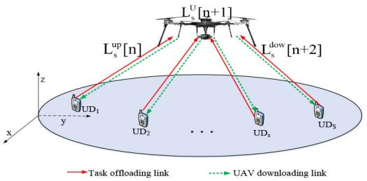

<details>
<summary>flowchart</summary>

```mermaid
graph TD
    A["Drone 1"] -->|L_s^up["n"]| B["UD1"]
    A -->|L_s^down["n+2"]| C["UD2"]
    A -->|L_s^down["n+1"]| D["..."]
    B --> E["UDs"]
    C --> F["UDs"]
    D --> G["UDs"]
    style A fill:#f9f,stroke:#333
    style B fill:#ccf,stroke:#333
    style C fill:#ccf,stroke:#333
    style D fill:#ccf,stroke:#333
    style E fill:#fff,stroke:#333
    style F fill:#fff,stroke:#333
    style G fill:#fff,stroke:#333
```
</details>

Fig. 1. Illustration of the UAV-assisted MEC system, where a UAV equipped with computation resources is used to help the UDs compute their tasks.

our proposed joint design compared with other benchmarks. Second, the weighted-sum energy consumption of our proposed joint design decreases with the increase in task completion time, revealing a time and energy consumption tradeoff. Finally, the sum energy consumption for the OMA mode is lower than that for the NOMA mode.

The remainder of this article is organized as follows. In Section II, we introduce the system model and propose two optimization problems. Sections III and IV present joint resource allocation and trajectory design algorithms for both orthogonal and nonorthogonal access modes, respectively. Simulation results are presented in Section V. The conclusion is drawn in Section VI.

# II. SYSTEM MODEL AND PROBLEM FORMULATION

# A. Network Model

As shown in Fig. 1, we consider a UAV-assisted MEC system consisting of S UDs denoted as $S = \{ 1 , \ldots , S \}$ and one UAV, all of which are equipped with a single antenna. It is assumed that each UD and the UAV have an onboard communication circuit and an onboard computing processor powered via their embedded batteries. Note that the computing processor of each UD is a microprocessor that only can perform simple tasks locally [17]. The UAV has a powerful processor that can act as an assistant to help local resourcelimited UDs compute their tasks. Assume that the computation tasks of each UD $s \in S$ are bitwise independent and can be divided into two parts: one portion is computed locally and the other portion is offloaded to the UAV [27]. To complete the offloading of a given task for UD s, we consider the following phases: 1) uplink transmission of task-input data from UD s to the UAV; 2) computation of offloading tasks at the UAV; and 3) dowlink transmission of task-output data from the UAV to UD s. Besides, the UAV is assumed to operate in a frequency-division duplex mode with equal bandwidth B for receiving and forwarding data. Note that all computation tasks need to be completely computed within a period of T in seconds.

# B. Coordinate System and Channel Model

Assume that the position of each UD is fixed on the ground with zero height within a task completion period T. Then, a 2-D cartesian coordinate system is utilized, where the horizontal coordinate of $\mathrm { U D } s \in { \mathcal { S } }$ is denoted by $\mathbf w _ { s } = [ x _ { s } , y _ { s } ] ^ { T }$ , which is known in advance at the UAV for designing its trajectory. During period T, the UAV is assumed to fly at a given height of H in m above the ground. The horizontal coordinate of the UAV at time instant t is given as $\mathbf { q } _ { u } = [ x _ { u } , y _ { u } ] ^ { T } , t \in [ 0 , T ]$ . For ease of illustration, we partition the finite period T into N time slots with equal duration $\delta _ { t } = ( T ) / ( N )$ , where $\delta _ { t }$ is chosen to be sufficiently small to ensure that the position of the UAV is considered to be static during each slot. Hence, the flight trajectory of the UAV in a period T is denoted by the sequence ${ \bf q } _ { u } [ n ] = [ x _ { u } [ n ] , y _ { u } [ n ] ]$ , $n \in \mathcal { N } = \{ 1 , \dots , N \}$ . Define $V _ { \mathrm { m a x } }$ as the maximum speed of the UAV. To proceed, the maximum distance that the UAV can move during each slot is given by $D _ { \operatorname* { m a x } } = V _ { \operatorname* { m a x } } \delta _ { t }$ . Due to its launching and landing locations are usually predetermined, the start and end positions of the UAV are denoted by ${ \bf q } _ { I } = [ x _ { I } , y _ { I } ]$ and $\mathbf { q } _ { F } = [ x _ { F } , y _ { F } ]$ , respectively. Accordingly, the mobility constraints of the UAV are given by

$$
\mathbf {q} _ {u} [ 1 ] = \mathbf {q} _ {I}
$$

$$
\mathbf {q} _ {u} [ N ] = \mathbf {q} _ {F}
$$

$$
\left\| \mathbf {q} _ {u} [ n + 1 ] - \mathbf {q} _ {u} [ n ] \right\| \leq D _ {\max} \quad \forall n. \tag {1}
$$

Unlike traditional communications, the UD-to-UAV and the UAV-to-UD channels are both dominated by the LoS link. Similar to [28] and [29], the Doppler shift due to the high mobility of the UAV can be assumed to be perfectly compensated at the UDs. Hence, the channel gain between UD s and the UAV in time slot n is described as the free-space wireless channel model, which is calculated as

$$
g _ {s, u} [ n ] = \beta d _ {s, u} ^ {- \alpha_ {u} / 2} [ n ] = \frac {\beta}{H ^ {2} + \| \mathbf {q} _ {u} [ n ] - \mathbf {w} _ {s} \| ^ {2}}, n \in \mathcal {N} (2)
$$

where $\alpha _ { u }$ denotes the path-loss exponent, which is set to be 2 according to [30] and [31]; $d _ { s , u } [ n ] = \sqrt { \| \mathbf { q } _ { u } [ n ] - \mathbf { w } _ { s } \| ^ { 2 } + H ^ { 2 } }$ is the distance between UD s and the UAV in time slot n; $\beta$ is the channel gain at the distance $d _ { \mathrm { r e f } } = 1 ~ \mathrm { m }$ , which depends on the carrier frequency and antenna gains.

# C. Computation Model and Execution Methods

The application of each UD $s \in S$ is characterized by the number $L _ { s }$ of input data bits, the ratio $O _ { s }$ of task-output data size to task-input data size, and the number $C _ { s }$ of CPU cycles required for computing 1 b of input data. It is worth noting that the task-input data of UD s is bitwise independent and can be randomly separated to realize parallel computation between task offloading and local execution. After all UDs offload their tasks in time slot $n ,$ the UAV computes these offloaded tasks and sends the generated results back to the corresponding UDs. For downlink and uplink communications, we consider either OMA or NOMA modes, as shown in Fig. 2. In the following, we will introduce the operation of each UD under the partial offloading manner in detail.

1) Local Computation: Since the computation unit and the communication circuit are separated [32], [33], each UD can perform task offloading and local computing simultaneously. To fully utilize the energy for local computing, each UD adopts a dynamic frequency scaling (DFS) technology [34], and hence, the energy consumed for performing local computation can be reduced by adjusting the CPU frequency. We define the CPU frequency of UD $s \in { \mathcal { S } }$ in the nth time slot as $f _ { s } [ n ]$ (in the unit of cycles per second). Then, the computation workload and energy computation of UD s for local computing at the nth time slot are, respectively, given by

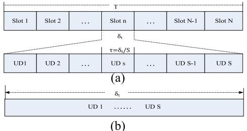

<details>
<summary>text_image</summary>

T
Slot 1 Slot 2 ... Slot n ... Slot N-1 Slot N
δt
τ=δt/S
UD1 UD 2 ... UD s ... UD S-1 UD S
(a)
δt
UD 1 ...... UD S
(b)
</details>

Fig. 2. Time slot structure for the finite task completion time T. (a) OMA mode. (b) NOMA mode.

$$
L _ {s} ^ {\mathrm{loc}} [ n ] = \frac {\delta_ {t} f _ {s} [ n ]}{C _ {s}} \forall s, n
$$

$$
E _ {s} ^ {\mathrm{loc}} [ n ] = \delta_ {t} \varphi_ {s} f _ {s} ^ {3} [ n ] \quad \forall s, n \tag {3}
$$

where $\varphi _ { s }$ denotes the effective capacitance coefficient of UD s, which depends on its processor chip structure [35], [36].

2) Computation Offloading: Let $L _ { s , u } ^ { \mathrm { o f f } } [ n ]$ be the number of bits that UD s transmits to the UAV at time slot n. It is worth noting that the energy consumption of each UD and the UAV for communication depends on whether OMA or NOMA is adopted. In OMA, each time slot is equally partitioned into S durations with $\delta _ { t } = \tau S ,$ , while all operations related to UD s are performed during the sth duration. For OMA, the energy consumption of UD s for computation offloading at time slot n is describe as

$$
E _ {O, s, u} ^ {\text { off }} [ n ] = \frac {\sigma^ {2} B \tau}{g _ {s , u} [ n ]} \left(2 ^ {\frac {L _ {s , u} ^ {\text { off }} [ n ]}{B \tau}} - 1\right) \tag {4}
$$

where $\sigma ^ { 2 }$ is the noise power. In NOMA, all UDs transmit and receive data simultaneously during each time slot. When UD s offloads $L _ { s , u } ^ { \mathrm { o f f } } [ n ]$ bits to the UAV at the nth time slot, the corresponding energy consumption is given by

$$
E _ {N, s, u} ^ {\text { off }} [ n ] = \frac {2 ^ {\frac {L _ {s , u} ^ {\text { off }} [ n ]}{B \delta_ {t}}} - 1}{g _ {s , u} [ n ]} \left(\sigma^ {2} B \delta_ {t} + \sum_ {j = 1, j \neq s} ^ {S} g _ {j, u} [ n ] E _ {N, j, u} ^ {\text { off }}\right). \tag {5}
$$

To enhance its energy efficiency for computation, the UAV also exploits the DFS technology. The CPU frequency of the UAV during time slot n for computing the offloaded data of UD s is defined as $f _ { u , s } [ n ]$ . Thus, the computation workload and energy consumption at the UAV in time slot n are expressed as

$$
L _ {u, s} ^ {\mathrm{com}} [ n ] = \frac {\delta_ {t} f _ {u , s} [ n ]}{C _ {s}} \forall s, n
$$

$$
E _ {u, s} ^ {\mathrm{com}} [ n ] = \delta_ {t} \psi_ {u} f _ {u, s} ^ {3} [ n ] \forall s, n \tag {6}
$$

where $\psi _ { u }$ is the effective capacitance coefficient of the UAV. After the UAV completes the task calculation, the generated results will be sent back to the corresponding UDs. Let $L _ { u , s } ^ { \mathrm { d o n } }$ be the number of bits that the UAV sends to UD s at time slot n. In OMA, the energy consumed by the UAV for transmitting $L _ { u , s } ^ { \mathrm { d o n } }$ bits to UD s at the nth time slot is given as

$$
E _ {O, u, s} ^ {\text { don }} [ n ] = \frac {\sigma^ {2} B \tau}{g _ {s , u} [ n ]} \left(2 ^ {\frac {L _ {u , s} ^ {\text { don }} [ n ]}{B \tau}} - 1\right). \tag {7}
$$

In NOMA, when the UAV transmits $L _ { u , s } ^ { \mathrm { d o n } }$ bits to UD s at time slot n, the corresponding energy consumption is given by

$$
E _ {N, u, s} ^ {\text { don }} [ n ] = \frac {2 ^ {\frac {L _ {u , s} ^ {\text { don }} [ n ]}{B \delta_ {t}}} - 1}{g _ {s , u} [ n ]} \left(\sigma^ {2} B \delta_ {t} + \sum_ {j = 1, j \neq s} ^ {S} g _ {j, u} [ n ] E _ {N, u, j} ^ {\text { don }}\right). \tag {8}
$$

Due to the high mobility of the UAV, its propulsion energy consumption in each time slot should be taken into account, which can be calculated as

$$
E _ {u} ^ {\text { fly }} [ n ] = \delta_ {t} \left(\kappa_ {1} \mathbf {v} ^ {3} [ n ] + \frac {\kappa_ {2}}{\mathbf {v} [ n ]}\right) \quad \forall n \tag {9}
$$

where $\mathbf { v } [ n ] \triangleq [ ( \| \mathbf { q } _ { u } [ n + 1 ] - \mathbf { q } _ { u } [ n ] \| ) / ( \delta _ { t } ) ]$ is the flight speed of the UAV at time slot $n ,$ which is constrained by the maximum speed $V _ { \mathrm { m a x } }$ , and $\kappa _ { 1 }$ and $\kappa _ { 2 }$ are constants that are related to the UAV weight, wing span efficiency, wing area, etc.

It should be noted that in any given time slot, the UAV can only process the tasks that have been received from UD $s \in S .$ . For simplification, the processing delay at the UAV for decoding and computing operation is assumed to be one time slot. Thus, the computation-causality constraint should satisfy

$$
\sum_ {i = 2} ^ {n} \frac {\tau f _ {u , s} [ i ]}{C _ {s}} \leq \sum_ {i = 1} ^ {n - 1} L _ {s, u} ^ {\text { off }} [ i ], n \in \mathcal {N} _ {2} = \{2, \dots , N - 1 \}. \tag {10}
$$

Similarly, in any given time slot, the UAV can only deliver the tasks that have been computed to the corresponding UDs. To this end, we have another computation-causality constraint

$$
\sum_ {i = 3} ^ {n} L _ {u, s} ^ {\text { don }} [ i ] \leq O _ {s} \sum_ {i = 2} ^ {n - 1} \frac {\tau f _ {u , s} [ i ]}{C _ {s}}, n \in \mathcal {N} _ {3} = \{3, \dots , N \}. \tag {11}
$$

We assume that all tasks need to be computed within T. This implies the requirements that: 1) UDs should not offload their computation tasks at the last two time slots; 2) the UAV cannot compute any task at the 1st and Nth time slots; and 3) the UAV is not able to deliver the task-output data to the UDs at the 1st and 2nd time slots. Thus, we have

$$
f _ {u, s} [ 1 ] = f _ {u, s} [ N ] = 0 \quad \forall s
$$

$$
L _ {s, u} ^ {\mathrm{don}} [ 1 ] = L _ {s, u} ^ {\mathrm{don}} [ 2 ] = 0 \forall s
$$

$$
L _ {s, u} ^ {\text { off }} [ N - 1 ] = L _ {s, u} ^ {\text { off }} [ N ] = 0 \quad \forall s. \tag {12}
$$

# D. Problem Formulation

Based on the above analysis, we formulate new optimization problems, which minimize the weighted-sum energy consumption of the UDs and UAV by jointly designing the computation resource allocation and UAV trajectory over a finite period.

1) For OMA Mode: When the OMA mode is used in uplink and downlink, the joint optimization problem is formulated as

$$
\text { P1: } \quad \underset {\mathbf {F}, \mathbf {L}, \mathbf {Q}} {\text { minimize }} \sum_ {n = 1} ^ {N} \left(\sum_ {s = 1} ^ {S} \omega_ {s} E _ {O, s} [ n ] + \omega_ {u} E _ {O, u} [ n ]\right) \tag {13a}
$$

$$
\text { s.t. } \quad \sum_ {i = 2} ^ {n} \frac {\tau f _ {u , s} [ i ]}{C _ {s}} \leq \sum_ {i = 1} ^ {n - 1} L _ {s, u} ^ {\text { off }} [ i ] \quad \forall s (1 3 b)
$$

$$
\sum_ {i = 3} ^ {n} L _ {u, s} ^ {\mathrm{don}} [ i ] \leq O _ {s} \sum_ {i = 2} ^ {n - 1} \frac {\tau f _ {u , s} [ i ]}{C _ {s}} \quad \forall s \tag {13c}
$$

$$
\sum_ {n = 2} ^ {N - 1} \frac {\tau f _ {u , s} [ n ]}{C _ {s}} = \sum_ {n = 1} ^ {N - 2} L _ {s, u} ^ {\text { off }} [ n ] \quad \forall s \tag {13d}
$$

$$
\sum_ {n = 3} ^ {N} L _ {u, s} ^ {\text { don }} [ n ] = O _ {s} \sum_ {n = 2} ^ {N - 1} \frac {\tau f _ {u , s} [ n ]}{C _ {s}} \quad \forall s \tag {13e}
$$

$$
\sum_ {n = 1} ^ {N} \frac {\delta_ {t} f _ {s} [ n ]}{C _ {s}} + \sum_ {n = 1} ^ {N - 2} L _ {s, u} ^ {\text { off }} [ n ] = L _ {s} \quad \forall s \tag {13f}
$$

$$
f _ {u, s} [ 1 ] = f _ {u, s} [ N ] = 0 \quad \forall s \tag {13g}
$$

$$
L _ {s, u} ^ {\text { don }} [ 1 ] = L _ {s, u} ^ {\text { don }} [ 2 ] = 0 \quad \forall s \tag {13h}
$$

$$
L _ {s, u} ^ {\text { off }} [ N - 1 ] = L _ {s, u} ^ {\text { off }} [ N ] = 0 \quad \forall s \tag {13i}
$$

$$
\| \mathbf {q} _ {u} [ n + 1 ] - \mathbf {q} _ {u} [ n ] \| \leq D _ {\max} \quad \forall n \tag {13j}
$$

$$
\mathbf {q} _ {u} [ 1 ] = \mathbf {q} _ {I}, \mathbf {q} _ {u} [ N ] = \mathbf {q} _ {F} \tag {13k}
$$

s 1 u,s O,u,s EO,s[n] = Elocs [n] + EoffO,s,u[n] are the energy consumptions where $E _ { O , s } [ n ] = E _ { s } ^ { \mathrm { l o c } } [ n ] + E _ { O , s , u } ^ { \mathrm { o f f } } [ n ]$ $\begin{array} { r } { E _ { O , u } [ n ] \ = \ \sum _ { s = 1 } ^ { S } ( E _ { u , s } ^ { \mathrm { c o m } } [ n ] + E _ { O , u , s } ^ { \mathrm { d o n } } [ n ] ) + E _ { u } ^ { \mathrm { f l y } } [ n ] } \end{array}$ dol and of the UAV and UD s at slot $n , \ w _ { s }$ and $w _ { u }$ are the weights of UD s and the UAV, $\begin{array} { l l l } { \mathbf { Q } } & { \triangleq } & { \{ \mathbf { q } _ { u } [ n ] \ }  & { \forall n \} } \end{array}$ is the trajectory of the UAV at slot n, $\mathrm { ~ \bf ~ F ~ } \triangleq \{ f _ { s } [ n ] , f _ { u , s } [ n ] \quad \forall s , n \}$ is the CPU frequencies of the UAV and UD s at slot n, and ${ \bf L } \triangleq \{ L _ { s , u } ^ { \mathrm { o f f } } [ n ] , \overset { \cdot } { L } _ { u , s } ^ { \mathrm { d o n } } [ n ] \forall s , n \}$ is the task allocation of UD s at constraints, (13d)–(13f) are the computation task allocation constraints, (13g)–(13i) ensure that each optimization variable is nonnegative, and (13j)–(13k) are the speed and trajectory constraints of the UAV.

2) For NOMA Mode: When uplink and downlink adopt the NOMA mode, the joint optimization problem is formulated as

$$
\text { P2: } \underset {\mathbf {F}, \mathbf {L}, \mathbf {Q}} {\text { minimize }} \sum_ {n = 1} ^ {N} \left(\sum_ {s = 1} ^ {S} \omega_ {s} E _ {N, s} [ n ] + \omega_ {u} E _ {N, u} [ n ]\right) \tag {14a}
$$

$$
\text { s.t. } \quad \sum_ {i = 2} ^ {n} \frac {\delta_ {t} f _ {u , s} [ i ]}{C _ {s}} \leq \sum_ {i = 1} ^ {n - 1} L _ {s, u} ^ {\text { off }} [ i ] \tag {14b}
$$

$$
\sum_ {i = 3} ^ {n} L _ {u, s} ^ {\text { don }} [ i ] \leq O _ {s} \sum_ {i = 2} ^ {n - 1} \frac {\delta_ {t} f _ {u , s} [ i ]}{C _ {s}} \tag {14c}
$$

$$
\sum_ {n = 2} ^ {N - 1} \frac {\delta_ {t} f _ {u , s} [ n ]}{C _ {s}} = \sum_ {n = 1} ^ {N - 2} L _ {s, u} ^ {\text { off }} [ n ] \quad \forall s \tag {14d}
$$

$$
\sum_ {n = 3} ^ {N} L _ {u, s} ^ {\text { don }} [ n ] = O _ {s} \sum_ {n = 2} ^ {N - 1} \frac {\delta_ {t} f _ {u , s} [ n ]}{C _ {s}} \tag {14e}
$$

$$
(1 3 \mathrm{f}) - (1 3 \mathrm{k}) \tag {14f}
$$

where

$$
E _ {N, u} [ n ] = \sum_ {s = 1} ^ {S} (E _ {u, s} ^ {\mathrm{com}} [ n ] + E _ {N, u, s} ^ {\mathrm{don}} [ n ]) + E _ {u} ^ {\mathrm{fly}} [ n ]
$$

$$
E _ {N, s} [ n ] = E _ {s} ^ {\mathrm{loc}} [ n ] + E _ {N, s, u} ^ {\mathrm{off}} [ n ]. \tag {15}
$$

Note that P1 and $P 2$ are nonconvex optimization problems due to their objective functions are not convex with regard to the trajectory of the UAV. In addition, the variables $L _ { s , u } ^ { \mathrm { o f f } }$ [n] and $L _ { u , s } ^ { \mathrm { d o n } } [ n ]$ are severely coupled with the trajectory of the UAV. Consequently, P1 and $P 2$ cannot be directly solved by the existing optimization methods, which will be further discussed below.

# III. ENERGY CONSUMPTION MINIMIZATION FOR OMA

In this section, we propose an alternating iterative algorithm for solving problem P1. Specifically, P1 is divided into two subproblems by adopting the block alternating descent method [37], namely, joint bit allocation and CPU frequency optimization under given trajectory and trajectory optimization under given bit allocation and CPU frequency, which can be solved alternately through an iterative manner till convergence. In the following, we will introduce these subproblems in detail.

# A. Bit Allocation and CPU Frequency Optimization

We jointly optimize the bit allocation L and CPU frequency F with given trajectory ${ \widehat { \mathbf { Q } } } ,$ for which the optimization problem can be described as

$$
\text { P1.1: } \underset {\mathbf {F}, \mathbf {L}} {\text { minimize }} \sum_ {n = 1} ^ {N} \left(\sum_ {s = 1} ^ {S} \omega_ {s} E _ {O, s} [ n ] + \omega_ {u} E _ {O, u} ^ {(1)} [ n ]\right) \tag {20a}
$$

$$
\text { s.t. } \quad (1 3 \mathrm{b}) - (1 3 \mathrm{i}) \tag {20b}
$$

where $\begin{array} { r } { E _ { O , \underline { { u } } } ^ { ( 1 ) } [ n ] = \sum _ { s = 1 } ^ { S } ( E _ { O , s } ^ { \mathrm { c o m } } [ n ] + E _ { O , u , s } ^ { \mathrm { d o n } } [ n ] ) } \end{array}$ ). For any given trajectory Q, the channel gain $g _ { s , u } [ n ]$ in (2) is known. As can be observed, subproblem P1.1 relates to L and F is a convex optimization problem. To proceed, a Lagrange method [38] is exploited to obtain an optimal solution to subproblem P1.1, which can be derived in Theorem 1.

Theorem 1: With given trajectory ${ \widehat { \mathbf { Q } } } .$ , the optimal bit allocation and CPU frequency related to UD $s \in { \mathcal { S } }$ are, respectively, expressed as (16)–(19), shown at the bottom of the next page, where

$$
\phi_ {u, s} ^ {\mathrm{don}} [ n ] = \log_ {2} \frac {B g _ {s , u} [ n ]}{\omega_ {u} \beta \ln 2}, n = 3, \dots , N \tag {21a}
$$

$$
\phi_ {s} [ n ] = \log_ {2} \frac {B g _ {s , u} [ n ]}{\omega_ {s} \beta \ln 2}, n = 1, \dots , N - 2. \tag {21b}
$$

Also, $[ x ] ^ { + } \triangleq$ max{x, 0}, while $\nu _ { s , n } ^ { * } , \mu _ { s , n } ^ { * } , \rho _ { s } ^ { * } , \varrho _ { s } ^ { * }$ , and ${ \lambda } _ { s } ^ { * }$ denote the optimal Lagrange multipliers corresponding to the constraints given by (13b)–(13f), respectively.

Proof: See Appendix A.

Remark 1: It can be observed from Theorem 1 that $L _ { s , u } ^ { \mathrm { o f f } } [ n ]$ 01 and $L _ { u , s } ^ { \mathrm { d o n } } [ n ]$ increase with increasing φs[n] and $\phi _ { u , s } ^ { \mathrm { d o n } } [ n ]$ . This means that more task-input data (or task-output data) need to be offloaded (or downloaded) with larger $\phi _ { s } [ n ]$ and $\phi _ { u , s } ^ { \mathrm { d o n } } [ n ]$ , which corresponds to the scenarios with better channel conditions and smaller weights for energy consumption.

Remark 2: Theorem 1 reveals the fact that as the time slot index n increases, $L _ { s , u } ^ { \mathrm { o f f } } [ n ]$ decreases while Ldonu,s [n] increases. $L _ { u , s } ^ { \mathrm { d o n } } [ n ]$ Lu,s This is because N−1i=n+1 $\textstyle \sum _ { i = n + 1 } ^ { N - 1 } \nu _ { s , i } ^ { * }$ ν ∗s,i and $\textstyle \sum _ { i = n } ^ { N } \mu _ { s , i } ^ { * }$ in (18) and (19) are monotonically decreasing with n, respectively. This means that as time goes by, the offloading bits in the uplink decrease, while the downloading bits in the downlink increase.

Note that it is essential to find the optimal values of the dual variables, i.e., $\rho ^ { * } = \{ \rho _ { s } ^ { * } \forall s \} , \mathtt { \lambda } ^ { * } = \{ \lambda _ { s } ^ { * } \forall s \} , \varrho ^ { * } = \{ \varrho _ { s } ^ { * } \forall s \}$ , $\boldsymbol { \mathsf { v } } ^ { * } = \{ \nu _ { s , n } ^ { * } \forall s , n \}$ , and $\pmb { \mu } ^ { * } = \{ \mu _ { s , n } ^ { * } \forall s , n \}$ s , since they have a crucial effect on determining the optimal CPU frequency and bit allocation. Thus, a subgradient method [38] is exploited to obtain the optimal dual variables in $\mathfrak { v } ^ { \ast }$ and $\mu ^ { * }$ associated with inequalities (13b) and (13c), which is derived in Lemma 1.

Lemma 1: By exploiting the subgradient method, the dual variables $\nu _ { s , n }$ and $\mu _ { s , n }$ at the (r + 1)th iteration are given by

$$
\nu_ {s, n} ^ {r + 1} = \left[ \nu_ {s, n} ^ {r} - \theta_ {\nu} ^ {r} \Delta \nu_ {s, n} ^ {r} \right] ^ {+} \quad \forall s \in \mathcal {S}, n \in \mathcal {N} \tag {22a}
$$

$$
\mu_ {s, n} ^ {r + 1} = [ \mu_ {s, n} ^ {r} - \theta_ {\mu} ^ {r} \Delta \mu_ {s, n} ^ {r} ] ^ {+} \forall s \in \mathcal {S}, n = 3, \dots , \mathcal {N} \tag {22b}
$$

where $\theta _ { \nu } ^ { r }$ and $\theta _ { \mu } ^ { r }$ are the iteration steps required to obtain the dual variables in ν and μ over rth iteration [39]. Also, $\Delta \nu _ { s , n } ^ { r }$ and $\Delta \mu _ { s , n } ^ { r }$ are the corresponding gradients that are given by

$$
\Delta \nu_ {s, n} ^ {r} = \sum_ {i = 1} ^ {n} L _ {s, u, r} ^ {\text {off} ^ {*}} [ i ] - \sum_ {i = 2} ^ {n} \frac {\tau f _ {u , s , r} ^ {*} [ i ]}{C _ {s}} \tag {23a}
$$

$$
\Delta \mu_ {s, n} ^ {r} = O _ {s} \sum_ {i = 2} ^ {n - 1} \frac {\tau f _ {u , s , r} ^ {*} [ i ]}{C _ {s}} - \sum_ {i = 3} ^ {n} L _ {u, s, r} ^ {\mathrm{don} ^ {*}} [ i ] \tag {23b}
$$

where $L _ { s , u , r } ^ { \mathrm { o f f } ^ { * } } [ n ] , f _ { u , s , r } ^ { * } [ n ] .$ , and $L _ { u , s , r } ^ { \mathrm { d o n } ^ { * } } [ n ]$ are the optimal solutions obtained by Theorem 1 with the dual variables obtained in the rth iteration, denoted as $\pmb { \mu } ^ { r } = \{ \mu _ { s , n } ^ { r } \forall s , n \} , \pmb { \varrho } ^ { r } = \{ \varrho _ { s } ^ { r }$ ∀s}, $\pmb { \nu } ^ { r } = \{ \nu _ { s , n } ^ { r } \forall s , n \} , \pmb { \rho } ^ { r } = \{ \rho _ { s } ^ { r } \forall s \}$ , and $\lambda ^ { r } = \{ \lambda _ { s } ^ { r } \forall s \}$ .

In addition, the bisection search method [40] in Lemma 2 can be utilized to derive the optimal dual variables in $\rho ^ { * } , \varrho ^ { * }$ and $\lambda ^ { * }$ associated with equations (13d)–(13f).

Lemma 2: According to $\pmb { \mu } ^ { r + 1 } \qquad \mathrm { a n d } \qquad \pmb { \nu } ^ { r + 1 }$ νr+1 given in (22a) and (22b), the corresponding be obtained with the bisection search $\pmb { \rho } ^ { r + 1 } , \pmb { \varrho } ^ { r + 1 }$ , r+1 $\lambda ^ { r + 1 }$ n, $\lambda _ { s } ^ { r + 1 } \in [ 0 , \{ \lambda _ { s } ^ { \mathrm { m a x } } \} _ { s \in \pmb { S } } ]$ where $\begin{array} { r l r } { \lambda _ { s } ^ { \mathrm { m a x } } } & { { } = } & { 3 C _ { s } \omega _ { s } \varphi _ { s } ( [ ( L _ { s } C _ { s } ) / ( T ) \bar { ] } ) ^ { 2 } } \end{array}$ Withand givencan $\lambda _ { s } ^ { r + 1 } ~ \in ~ \mathsf { \Gamma } [ 0 , \lambda _ { s } ^ { \operatorname* { m a x } } )$ g ρr+1 s $\rho _ { s } ^ { r + 1 }$ $\varrho _ { s } ^ { r + 1 }$ $\rho _ { s } ^ { r + 1 } \in [ \rho _ { s , \mathrm { l o w } } ^ { r + 1 } , \dot { \rho } _ { s , u p } ^ { r + 1 } ]$ other and $\varrho _ { s } ^ { r + 1 } \in [ \varrho _ { s , \mathrm { l o w } } ^ { r + 1 } , \varrho _ { s , \mathrm { u p } } ^ { r + 1 } ]$ rches within, which make the and own in , where $( 4 3 \mathrm { a } ) \ : = \ : ( 4 3 \mathrm { b } )$ $( 4 3 \mathrm { a } ) \ : = \ : ( 4 3 \mathrm { c } )$ $\bar { \rho } _ { s , \mathrm { l o w } } ^ { r + 1 } , \varrho _ { s , \mathrm { l o w } } ^ { r + 1 } , \rho _ { s , \mathrm { u p } } ^ { r + 1 }$ $\varrho _ { s , \mathrm { u p } } ^ { r + 1 }$ btained as inshould make The optimal  hold. $\lambda _ { s } ^ { r + 1 } , ~ \rho _ { s } ^ { r + 1 }$ 1 , ρr+1 s and $\varrho _ { s } ^ { r + 1 }$ $( 4 3 \mathrm { a } ) = ( 4 3 \mathrm { d } )$

Proof: See Appendix B.

Remark 3: Based on the discussion of[38], the subgradient can be guaranteed to converge to the optimal dual variables $\boldsymbol { \nu } ^ { * } , \boldsymbol { \mu } ^ { * } , \boldsymbol { \rho } ^ { * } , \boldsymbol { \varrho } ^ { * }$ , and $\lambda ^ { * }$ when the bisection search is terminated after a finite number of iterations.

# B. UAV Trajectory Optimization

We optimize the UAV trajectory Q under the optimized bit allocation L and CPU frequency F, for which the optimization problem can be formulated as

$$
\text { P1.2: } \underset {\mathbf {Q}} {\text { minimize }} \sum_ {n = 1} ^ {N} \left(\sum_ {s = 1} ^ {S} \omega_ {s} E _ {O, s, u} ^ {\text { off }} [ n ] + \omega_ {u} E _ {O, u} ^ {(2)} [ n ]\right) \tag {24a}
$$

$$
\text { s.t. } \quad \| \mathbf {q} _ {u} [ n + 1 ] - \mathbf {q} _ {u} [ n ] \| \leq D _ {\max} \quad \forall n \tag {24b}
$$

$$
\mathbf {q} _ {u} [ 1 ] = \mathbf {q} _ {I}, \mathbf {q} _ {u} [ N ] = \mathbf {q} _ {F} \tag {24c}
$$

where $\begin{array} { r } { E _ { O , u } ^ { ( 2 ) } [ n ] = \sum _ { s = 1 } ^ { S } E _ { O , u , s } ^ { \mathrm { d o n } } [ n ] + E _ { u } ^ { \mathrm { f l y } } [ n ] } \end{array}$ . Since $E _ { u } ^ { \mathrm { f l y } } [ n ]$ in subproblem P1.2 is still a nonconvex one. To efficiently solve this problem, we first introduce an auxiliary variable $\chi [ n ]$ into $E _ { u } ^ { \mathrm { { f l y } } } [ n ]$ , and rewrite $E _ { u } ^ { \mathrm { H y } } [ n ]$ as

$$
\widetilde {E} _ {u} ^ {\text { fly }} [ n ] = \delta_ {t} \left(\kappa_ {1} \mathbf {v} ^ {3} [ n ] + \frac {\kappa_ {2}}{\chi [ n ]}\right) \quad \forall n \tag {25}
$$

with additional constraints:

$$
\| \mathbf {v} [ n ] \| ^ {2} \geq \chi^ {2} [ n ], n \in \mathcal {N} \tag {26a}
$$

$$
\chi [ n ] \geq 0, n \in \mathcal {N}. \tag {26b}
$$

Notably, Eflyu [n] is jointly convex with χ [n] and v[n]. However, the additional constraint in (26a) is still nonconvex. As such, we adopt the successive convex approximation method to solve the nonconvexity of (26a). Due to the left-hand side expression in constraint (26a) is convex versus v[n], the following result can be obtained by defining the set ${ \bf V } = \{ { \bf v } ^ { j } [ n ] \forall n \}$ as the given local point in the jth iteration.

$$
f _ {s} ^ {*} [ n ] = \sqrt {\frac {[ \lambda_ {s} ^ {*} ] ^ {+}}{3 C _ {s} \varphi_ {s} \omega_ {s}}}, n \in \mathcal {N} \tag {16}
$$

$$
f _ {u, s} ^ {*} [ n ] = \left\{ \begin{array}{l l} \sqrt {\frac {\left[ \rho_ {s} ^ {*} - O _ {s} \varrho_ {s} ^ {*} + O _ {s} \sum_ {i = n + 1} ^ {N} \mu_ {s , i} ^ {*} - \sum_ {i = n} ^ {N - 1} v _ {s , i} ^ {*} \right] ^ {+}}{3 C _ {s} \psi_ {u} \omega_ {u}}}, & n = 2, \dots , N - 1 \\ 0, & n = 1 \text {or} N \end{array} \right. \tag {17}
$$

$$
L _ {u, s} ^ {\text {don} *} [ n ] = \left\{ \begin{array}{l l} \tau B \left[ \phi_ {u, s} ^ {\text {don}} [ n ] + \log_ {2} \left[ \varrho_ {s} ^ {*} - \sum_ {i = n} ^ {N} \mu_ {s, i} ^ {*} \right] ^ {+} \right] ^ {+}, & n = 3, \dots , N \\ 0, & n = 1 \text {or} 2 \end{array} \right. \tag {18}
$$

$$
L _ {s, u} ^ {\text {off} *} [ n ] = \left\{ \begin{array}{l l} \tau B \left[ \phi_ {s} [ n ] + \log_ {2} \left[ \sum_ {i = n + 1} ^ {N - 1} v _ {s, i} ^ {*} + \lambda_ {s} ^ {*} - \rho_ {s} ^ {*} \right] ^ {+} \right] ^ {+}, & n = 1, \dots , N - 2 \\ 0, & n = N - 1 \text {or} N \end{array} \right. \tag {19}
$$

Lemma 3: With a local point $\mathbf { v } ^ { j } [ n ]$ in the jth iteration, (26a) can be approximated to a convex one as

$$
f ^ {\text { low }} (\mathbf {v} ^ {j} [ n ]) \geq \chi^ {2} [ n ], n \in \mathcal {N} \tag {27}
$$

where

$$
f ^ {\text { low }} (\mathbf {v} ^ {j} [ n ]) = \| \mathbf {v} ^ {j} [ n ] \| ^ {2} + 2 \mathbf {v} ^ {j T} [ n ] (\mathbf {v} [ n ] - \mathbf {v} ^ {j} [ n ]). \tag {28}
$$

Proof: It is not difficult to see that $\| \mathbf { v } [ n ] \| ^ { 2 }$ in (26a) is a convex quadratic. Recall that the first-order Taylor expansion of a convex function is its lower bound. Thus, with any given local point $\mathbf { v } ^ { j } [ n ]$ in the jth iteration, we obtain

$$
\begin{array}{l} \| \mathbf {v} [ n ] \| ^ {2} \geq 2 \mathbf {v} ^ {j T} [ n ] (\mathbf {v} [ n ] - \mathbf {v} ^ {j} [ n ]) + \| \mathbf {v} ^ {j} [ n ] \| ^ {2} \\ \triangleq f ^ {\text { low }} (\mathbf {v} ^ {j} [ n ]). \tag {29} \\ \end{array}
$$

Notably, $f ^ { \mathrm { l o w } } ( { \mathbf { v } } ^ { j } [ n ] )$ is linear with v[n], verifying $\mathbf { v } ^ { 2 } [ n ]$ can be replaced by its lower bound $f ^ { \mathrm { l o w } } ( { \mathbf { v } } ^ { j } [ n ] )$ . Thus, the additional constraint (26a) is substituted as (27), which is convex.

After such a transformation, we find that the approximated problem of P1.2 is convex with respect to v[n] and χ[n]. Due to the horizonal positions of the UAV at different time slots are highly coupled, it is challenging to find a closed-form solution of Q. Hence, we solve the approximated problem of P1.2 by exploiting the convex optimization software CVX [41].

# C. Algorithm Design and Analysis

According to the above analysis of the alternating optimization for the UAV trajectory Q, CPU frequency F, and bit allocation L in each subproblem, an efficient iterative algorithm denoted by Algorithm 1 is proposed for solving problem P1. Since the objective value of P1 with the solutions obtained by solving subproblem P1.1 and P1.2 are nonincreasing after each iteration and has a finite upper bound, which thus guarantees the convergence of Algorithm 1.

Next, the computational complexity of Algorithm 1 mainly comes from optimizing Q, F, and L in subproblems P1.1 and P1.2, respectively. The computational complexity for solving P1.1 can be denoted by $\mathcal { O } ( \overset { - } { 1 } / \xi ^ { 2 } + S \log _ { 2 } ( \overset { - } { 1 } / \xi _ { \lambda } ) [ \log _ { 2 } ( 1 / \xi _ { \varrho } ) \overset { - } { + }$ $\log _ { 2 } ( 1 / \xi _ { \rho } ) ] )$ , where $\xi$ is the computational accuracy of the subgradient method, and $\xi _ { \lambda } , \xi _ { \varrho } ,$ and $\xi _ { \rho }$ are the computational accuracy of the bisection search method. For subproblem P1.2, we can obtain an approximate solution by leveraging the CVX software, and its computational complexity is polynomial.

# IV. ENERGY CONSUMPTION MINIMIZATION FOR NOMA

In this section, we solve problem P2 formulated for the NOMA mode. It can be seen that P2 is a nonconvex problem, but its structure is similar to P1, which facilitates us to solve it with an alternating iterative algorithm. Similar to P1, P2 is also partitioned into two subproblems, namely, joint bit allocation and CPU frequency optimization under given trajectory as well as trajectory optimization under given CPU frequency and bit allocation. Then, these subproblems are solved alternately via an iterative manner till convergence.

Algorithm 1 Iterative Algorithm for Solving P1   
1: Setting $V_{max}$ , $\beta$ , B, H, T, N, $q_{I}$ , $q_{F}$ , $\omega_{u}$ , $\omega_{s}$ , $\kappa_{1}$ , $\kappa_{2}$ , $\varphi_{s}$ , $\psi_{u}$ , $C_{s}$ , $\sigma^{2}$ , $L_{s}$ , $O_{s}$ , the iterative steps $\theta_{\nu}^{r}$ and $\theta_{\mu}^{r}$ , and the tolerant accuracies o and $o_{1}$ .
2: Initialize $\mathbf{q}_{u}^{(0)}[n]$ , $\mathbf{v}^{(0)}[n]$ and the iteration index j = 1.
3: repeat
4: Initialize $v_{1}$ , $\mu_{1}$ , and r = 1.
5: repeat
6: Obtain $\rho^{r}$ , $\varrho^{r}$ and $\lambda^{r}$ for given $v^{r}$ and $\mu^{r}$ .
7: Obtain $f_{s}^{*}[n]$ , $f_{u,s,r}^{*}[n]$ , $L_{s,u,r}^{off*}[n]$ and $L_{u,s,r}^{don*}[n]$ by Theorem 1 for given $\rho^{r}$ , $\varrho^{r}$ , $\lambda^{r}$ , $v^{r}$ and $\mu^{r}$ 8: Calculate the weighted sum energy consumption $E_{r}^{(1)}$ by substituting $F_{r,j}^{*}$ , $L_{r,j}^{*}$ , $q_{u}^{(0)}[n]$ into (13a).
9: $r = r + 1$ .
10: Update $v^{r}$ and $\mu^{r}$ by using the subgradient method.
11: until $|E_{r}^{(1)} - E_{r-1}^{(1)}| \leq o$ , then obtain $F^{j+1} = F_{r,j}^{*}$ and $L^{j+1} = L_{r,j}^{*}$ 12: repeat
13: Solve the approximated problem of P1.2 for given $F^{j+1}$ and $L^{j+1}$ by CVX, and obtain the optimal $Q^{j+1}$ .
14: until
15: Update $j = j + 1$ .
16: Calculate the weighted sum energy consumption by substituting $F^{i}$ , $L^{i}$ , $Q^{i}$ into the objective function of P1.
17: until $|E_{j} - E_{j-1}| \leq o_{1}$ , then obtain the minimum energy consumption $E_{j}$ with $F^{j}$ , $L^{j}$ and $Q^{j}$ .

# A. Bit Allocation and CPU Frequency Optimization

Let $\begin{array} { r } { E _ { Q , u } ^ { ( 3 ) } [ n ] = \sum _ { s = 1 } ^ { S } ( E _ { O , s } ^ { \mathrm { c o m } } [ n ] + E _ { O , u , s } ^ { \mathrm { d o n } } [ n ] ) } \end{array}$ . For a given trajectory Q, the bit allocation and CPU frequency optimization problem is given by

$$
\begin{array}{l} \text { P2.1: } \underset {\mathbf {F}, \mathbf {L}} {\text { minimize }} \sum_ {n = 1} ^ {N} \left(\sum_ {s = 1} ^ {S} \omega_ {s} E _ {O, s} [ n ] + \omega_ {u} E _ {O, u} ^ {(3)} [ n ]\right) (30a) \\ \text { s.t. } \quad (1 3 \mathrm{b}) - (1 3 \mathrm{i}). (30b) \\ \end{array}
$$

Note that subproblem P2.1 has a convex constraint set and a convex objective function, and thus it is a convex optimization problem. To proceed, we resort to using the Lagrange duality method to solve this subproblem, which can obtain an optimal solution to P2.1. By defining $\pmb { a } = \{ a _ { s , n } \forall s , n \} , \pmb { c } = \{ c _ { s } \forall s \}$ , $\pmb { b } = \{ b _ { s , n } \forall s , n \} , \pmb { d } = \{ d _ { s } \forall s \}$ , and $\boldsymbol { e } = \{ e _ { s } \quad \forall s \}$ as the dual variables corresponding to constraints (13b)–(13f), we obtain the following result.

Theorem 2: For given multipliers $a _ { s , n } ^ { * } , b _ { s , n } ^ { * } , c _ { s } ^ { * } , d _ { s } ^ { * }$ , and $e _ { s } ^ { * } ,$ the optimal bit allocation and CPU frequency are, respectively, expressed as (31)–(34), shown at the bottom of the next page.

Proof: The proof is similar to Theorem 1, and thus, it is omitted here due to space limitation.

Since the optimal Lagrange multipliers $a ^ { * } , b ^ { * } , c ^ { * } , d ^ { * }$ , and e∗ $e ^ { * }$ play vital roles in determining the optimal bit allocation L and CPU frequency F, it is necessary to obtain their optimal values. Here, a subgradient method is leveraged to derive the optimal multipliers in $\pmb { a } ^ { * }$ and $\pmb { b } ^ { * }$ associated with inequalities (13b) and (13c), as shown in Lemma 4.

Lemma 4: Based on the subgradient method, the Lagrange multipliers $\nu _ { s , n }$ and $\mu _ { s , n }$ at the (r + 1)th iteration are given as

$$
a _ {s, n} ^ {r + 1} = [ a _ {s, n} ^ {r} - \theta_ {a} ^ {r} \Delta a _ {s, n} ^ {r} ] ^ {+} \quad \forall s \in \mathcal {S}, n \in \mathcal {N} \tag {35a}
$$

$$
b _ {s, n} ^ {r + 1} = \left[ b _ {s, n} ^ {r} - \theta_ {b} ^ {r} \Delta b _ {s, n} ^ {r} \right] ^ {+} \quad \forall s \in \mathcal {S}, n = 3, \dots , \mathcal {N} (3 5 \mathrm{b})
$$

where $\theta _ { a } ^ { r }$ and $\theta _ { b } ^ { r }$ are the iteration steps required to obtain the Lagrange multipliers in a and b over the rth iteration; $\Delta a _ { s , n } ^ { r }$ and $\Delta b _ { s , n } ^ { r }$ denote the corresponding gradients, which are given by

$$
\Delta a _ {s, n} ^ {r} = \sum_ {i = 1} ^ {n} \widetilde {L} _ {s, u, r} ^ {\text {off}} [ i ] - \sum_ {i = 2} ^ {n} \frac {\delta_ {t} \widetilde {f} _ {u , s , r} [ i ]}{C _ {s}} \tag {36a}
$$

$$
\Delta b _ {s, n} ^ {r} = O _ {s} \sum_ {i = 2} ^ {n - 1} \frac {\delta_ {t} \widetilde {f} _ {u , s , r} [ i ]}{C _ {s}} - \sum_ {i = 3} ^ {n} \widetilde {L} _ {u, s, r} ^ {\text {don}} [ i ] \tag {36b}
$$

where $\widetilde { f } _ { u , s , r } [ n ] , \widetilde { L } _ { s , u , r } ^ { \mathrm { o f f } } [ n ] .$ , and $\widetilde L _ { u , s , r } ^ { \mathrm { d o n } } [ n ]$ are the optimal solutions achieved by Theorem 1 with the Lagrange multipliers obtained in rth iteration, denoted as $\pmb { a } ^ { r } = \{ a _ { s , n } ^ { r } \forall s , n \} , \pmb { c } ^ { r } = \{ c _ { s } ^ { r } \forall s \}$ , $\pmb { b } ^ { r } = \{ b _ { s . n } ^ { r } \forall s , n \} , \pmb { d } ^ { r } = \{ d _ { s } ^ { r } \forall s \}$ , and $e ^ { r } = \{ e _ { s } ^ { r } \forall s \}$ .

Meanwhile, the bisection search method in Lemma 2 can be exploited to derive the optimal dual variables in $c ^ { * } , d ^ { * }$ , and e∗ $e ^ { * }$ associated with equations (13d)–(13f).

Lemma 5: For given $\mathbf { \pmb { a } } ^ { r + 1 }$ and $\pmb { b } ^ { r + 1 }$ , the corresponding $c ^ { r + 1 }$ , $\pmb { d } ^ { r + 1 }$ , and $e ^ { r + 1 }$ can be obtained with the bisection search of $e _ { s } ^ { r + 1 } \in [ 0 , \{ e _ { s } ^ { \mathrm { m a x } } \} _ { s \in \mathcal { S } } )$ , where $e _ { s } ^ { \operatorname* { m a x } } = 3 C _ { s } \omega _ { s } \varphi _ { s } ( [ ( L _ { s } C _ { s } ) / ( T ) ] ) ^ { 2 }$ . With a give Sn er+1 s $e _ { s } ^ { r + 1 } \in [ 0 , e _ { s } ^ { \operatorname* { m a x } } )$ , the corresponding $d _ { s } ^ { r + 1 }$ and $c _ { s } ^ { r + 1 }$ by a, and searches within. $\bar { d } _ { s } ^ { r + 1 } \in [ d _ { s , \mathrm { l o w } } ^ { r + 1 } , d _ { s , u p } ^ { r + 1 } ]$ $c _ { s } ^ { r + 1 } \in [ c _ { s , \mathrm { l o w } } ^ { r + 1 } , c _ { s , \mathrm { u p } } ^ { r + 1 } ]$

Proof: The proof is similar to that in Lemma 2, and thus, it is omitted here due to space limitation

Remark 4: According to the discussion of [38], the subgradient can be guaranteed to converge at the optimal dual variables $a ^ { * } , b ^ { * } , c ^ { * } , d ^ { * }$ , and $e ^ { * }$ when the bisection search is terminated after a finite number of iterations.

# B. UAV Trajectory Optimization

Given the optimized bit allocation and CPU frequency, and let $\begin{array} { r } { E _ { O , u } ^ { ( 4 ) } [ n ] = \sum _ { s = 1 } ^ { s } E _ { O , u , s } ^ { \mathrm { d o n } } [ n ] + E _ { u } ^ { \mathrm { f l y } } [ n ] } \end{array}$ , the UAV trajectory of P2 can be optimized via solving subproblem P2.2

$$
\text { P2.2:   minimize } \sum_ {n = 1} ^ {N} \left(\sum_ {s = 1} ^ {S} \omega_ {s} E _ {O, s, u} ^ {\text { off }} [ n ] + \omega_ {u} E _ {O, u} ^ {(4)} [ n ]\right) \tag {37a}
$$

$$
\text { s.t. } \quad \| \mathbf {q} _ {u} [ n + 1 ] - \mathbf {q} _ {u} [ n ] \| \leq D _ {\max} \quad \forall n \tag {37b}
$$

$$
\mathbf {q} _ {u} [ 1 ] = \mathbf {q} _ {I}, \mathbf {q} _ {u} [ N ] = \mathbf {q} _ {F}. \tag {37c}
$$

Due to $E _ { u } ^ { \mathrm { f l y } } [ n ]$ in (9) is not a convex function of v[n], the objection function of P2.2 is nonconvex. To solve this issue, we first introduce an auxiliary variable v[n] into $E _ { u } ^ { \mathrm { H y } } [ n ]$ , and rewrite $E _ { u } ^ { \mathrm { H y } } [ n ]$ as

$$
\widetilde {E} _ {u} ^ {\text { fly }} [ n ] = \delta_ {t} \left(\kappa_ {1} \mathbf {v} ^ {3} [ n ] + \frac {\kappa_ {2}}{\widetilde {v} [ n ]}\right) \quad \forall n \tag {38}
$$

with additional constraints

$$
\| \mathbf {v} [ n ] \| ^ {2} \geq \widetilde {v} ^ {2} [ n ], n \in \mathcal {N} \tag {39a}
$$

$$
\widetilde {v} [ n ] \geq 0, n \in \mathcal {N}. \tag {39b}
$$

As can be observed, $\widetilde { E } _ { u } ^ { \mathrm { f l y } } [ n ]$ is jointly convex with v[n] and v[n]. However, the additional constraint in (39a) is not convex. Thus, we exploit the successive convex optimization method to solve the nonconvexity of (39a). The left-hand side expression in constraint (39a) is convex with v[n] and can be approximated as its lower bound via adopting its first-order Taylor expansion at a given local point $\mathbf { v } ^ { i } [ n ]$ over the ith iteration. Thus, the nonconvex constrain (39a) is converted to a convex one as

$$
\left\| \mathbf {v} ^ {i} [ n ] \right\| ^ {2} + \mathbf {v} ^ {i T} [ n ] (\mathbf {v} [ n ] - \mathbf {v} ^ {i} [ n ]) \geq \widetilde {v} [ n ]. \tag {40}
$$

After such a conversion, we see that the approximated problem of P1.2 with the additional constraint (39a) is jointly convex with respect to v[n] and $\widetilde { \nu } [ n ]$ . Since the horizonal positions of the UAV at different time slots are coupled, it is challenging to obtain a closed-form solution of Q. As such, we solve the approximated problem of P1.2 by CVX [41].

# C. Algorithm Design and Analysis

According to the aforementioned two subproblems, an alternating iterative algorithm is developed to solve the original

$$
\widetilde {f} _ {s} [ n ] = \sqrt {\frac {[ e _ {s} ^ {*} ] ^ {+}}{3 C _ {s} \varphi_ {s} \omega_ {s}}}, n \in \mathcal {N} \tag {31}
$$

$$
\widetilde {f} _ {u, s} [ n ] = \left\{ \begin{array}{l l} \sqrt {\frac {\left[ c _ {s} ^ {*} - O _ {s} d _ {s} ^ {*} + O _ {s} \sum_ {i = n + 1} ^ {N} b _ {s , i} ^ {*} - \sum_ {i = n} ^ {N - 1} a _ {s , i} ^ {*} \right] ^ {+}}{3 C _ {s} \psi_ {u} \omega_ {u}}}, & n = 2, \dots , N - 1 \\ 0, & n = 1 \text {or} N \end{array} \right. \tag {32}
$$

$$
\widetilde {L} _ {u, s} ^ {\text {don}} [ n ] = \left\{ \begin{array}{l l} \delta_ {t} B \left[ \log_ {2} \frac {B g _ {s , u} [ n ]}{\omega_ {u} \beta \ln 2} + \log_ {2} \left[ d _ {s} ^ {*} - \sum_ {i = n} ^ {N} b _ {s, i} ^ {*} \right] ^ {+} \right] ^ {+}, & n = 3, \dots , N \\ 0, & n = 1 \text {or} 2 \end{array} \right. \tag {33}
$$

$$
\widetilde {L} _ {s, u} ^ {\text {off}} [ n ] = \left\{ \begin{array}{l l} \delta_ {t} B \left[ \log_ {2} \frac {B g _ {s , u} [ n ]}{\omega_ {s} \beta \ln 2} + \log_ {2} \left[ \sum_ {i = n + 1} ^ {N - 1} a _ {s, i} ^ {*} + \lambda_ {s} ^ {*} - c _ {s} ^ {*} \right] ^ {+} \right] ^ {+}, & n = 1, \dots , N - 2 \\ 0, & n = N - 1 \text {or} N \end{array} \right. \tag {34}
$$

Algorithm 2 Iterative Algorithm for Solving P2   
1: Setting $V_{max}$ , $\beta$ , B, H, T, N, $q_{I}$ , $q_{F}$ , $\omega_{u}$ , $\omega_{s}$ , $\kappa_{1}$ , $\kappa_{2}$ , $\varphi_{s}$ , $\psi_{u}$ , $C_{s}$ , $\sigma^{2}$ , $L_{s}$ , $O_{s}$ , the iterative steps $\theta_{a}^{r}$ and $\theta_{b}^{r}$ , and the tolerant accuracies $\varepsilon$ and $\varepsilon_{1}$ .
2: Initialize $\mathbf{q}_{u}^{(0)}[n]$ , $\mathbf{v}^{(0)}[n]$ and the iteration index i = 1.
3: repeat
4: Initialize $a_{1}$ , $b_{1}$ , and r = 1.
5: repeat
6: Obtain $c^{r}$ , $d^{r}$ and $e^{r}$ for given $a^{r}$ and $b^{r}$ .
7: Obtain $\widetilde{f}_{s}[n]$ , $\widetilde{f}_{u,s,r}[n]$ , $\widetilde{L}_{s,u,r}^{off}[n]$ and $\widetilde{L}_{u,s,r}^{don}[n]$ by Theorem 1 for given $a^{r}$ , $b^{r}$ , $c^{r}$ , $d^{r}$ and $e^{r}$ .
8: Calculate the weighted sum energy consumption $E_{r}^{(1)}$ by substituting $\widetilde{F}_{r,i}$ , $\widetilde{L}_{r,i}$ , $\mathbf{q}_{u}^{(0)}[n]$ into (14a).
9: $r = r + 1$ .
10: Update $a^{r}$ and $b^{r}$ by using the subgradient method.
11: until $|E_{r}^{(1)} - E_{r-1}^{(1)}| \leq \varepsilon$ , then obtain the optimal $F^{i+1} = \widetilde{F}_{i,r}$ and $L^{i+1} = L_{i,r}$ .
12: repeat
13: Solve the approximated problem of P2.2 for given $F^{i+1}$ and $L^{i+1}$ by CVX, and obtain the optimal $Q^{i+1}$ .
14: until
15: Update $i = i + 1$ .
16: Calculate the weighted sum energy consumption by substituting $F^{i}$ , $L^{i}$ , $Q^{i}$ into the objective function of P2.
17: until $|E_{i} - E_{i-1}| \leq \varepsilon_{1}$ , then obtain the minimum energy consumption $E_{i}$ with $F^{i}$ , $L^{i}$ and $Q^{i}$ .

problem P2, as shown in Algorithm 2. Specifically, the entire optimization variables in problem P2 can be divided into two blocks, namely, computation resource scheduling L and F as well as UAV trajectory Q, which are alternately optimized by solving subproblems P2.1 and P2.2. Since the proposed iterative algorithm consists of the successive convex approximation technique and Lagrange duality method, we can finally obtain a locally optimal solution for P2 through Algorithm 2.

As shown in Sections IV-A and IV-B, the objection value of P2 with the solutions obtained via solving subproblems P2.1 and P2.2 is monotonically nonincreasing over each iteration of Algorithm 2. In addition, the optimal value of P2 is upper bounded through a finite of iterations, which thus guarantees the convergence of Algorithm 2.

The computational complexity of Algorithm 2 comes from optimizing the computation resource scheduling L and UAV trajectory Q in subproblems P2.1 and P2.2, respectively. Notably, P2.1 is a convex optimization problem and can be solved by the subgradient and bisection methods with computational complexity $\mathcal { O } ( 1 / \zeta ^ { 2 } + S \log _ { 2 } ( 1 / \zeta _ { \lambda } ) [ \log _ { 2 } ( 1 / \zeta _ { \varrho } ) +$ $\log _ { 2 } ( 1 / \zeta _ { \rho } ) ] )$ , where ζ denotes the computational accuracy of the subgradient method, and $\zeta _ { \lambda } , \ \zeta _ { \varrho } ,$ and $\zeta _ { \rho }$ are the computational accuracies of the bisection search method. For subproblem P2.2, we can obtain an approximate solution by applying the CVX software, and its complexity is polynomial.

# V. SIMULATION RESULTS AND DISCUSSION

In this section, simulation results are provided for examining the performance of the proposed joint optimization algorithms

TABLE I NUMERICAL CALCULATION PARAMETER SETTINGS 

<table><tr><td>Description</td><td>Symbol</td><td>Value</td></tr><tr><td>Flight altitude of the UAV</td><td> $H$ </td><td>10 m</td></tr><tr><td>Maximum flight velocity</td><td> $V_{\text{max}}$ </td><td>10 m/s</td></tr><tr><td>Communication bandwidth</td><td> $B$ </td><td>30 MHz</td></tr><tr><td>Noise power</td><td> $\sigma^{2}$ </td><td>-110 dBm</td></tr><tr><td>Reference channel power</td><td> $\beta$ </td><td>-30 dBm</td></tr><tr><td>Task completion time</td><td> $T$ </td><td>10 Second</td></tr><tr><td>Sample time interval</td><td> $\delta_{t}$ </td><td>0.2 s</td></tr><tr><td>The UAV propulsion energy consumption coefficients</td><td> $\kappa_{1}, \kappa_{2}$ </td><td>0.0661, 15.97</td></tr><tr><td>Effective switched capacitances of the UAV and UD  $s, s \in S$ </td><td> $\varphi_{s}, \psi_{u}$ </td><td> $10^{-28}, 10^{-28}$ </td></tr><tr><td>The weight of energy consumption for the UAV and UD  $s, s \in S$ </td><td> $\omega_{s}, \omega_{u}$ </td><td>1, 0.2</td></tr><tr><td>Number of CPU cycles per bit</td><td> $C_{s}$ </td><td>1000 cycles/bit</td></tr><tr><td>Task-input sizes of UD  $s, s \in S$ </td><td> $L_{s}$ </td><td>400 Mbits</td></tr><tr><td>Ratio of output-data to input-data</td><td> $O_{s}$ </td><td>0.8</td></tr><tr><td>The tolerant error</td><td> $o, o_{1}$ </td><td> $10^{-4}, 10^{-4}$ </td></tr></table>

for both OMA and NOMA modes. In the simulation, we will consider a UAV-assisted MEC system with S = 4 UDs, which are randomly scattered in a square area of $1 . 5 \times 1$ km2. The initial and final locations of the UAV are set as $q _ { I } = [ 0 , 0 ]$ and $q _ { F } = [ 1 0 , 0 ]$ , respectively. To show the effectiveness of our proposed joint design scheme, we consider the following three cases: 1) the computation bits of the taskinput data at UDs are $[ L _ { 1 } , L _ { 2 } , L _ { 3 } , L _ { 4 } ] \ = \ [ 7 , 3 , 5 , 3 ] \times 1 0 ^ { 2 }$ Mb; 2) $[ L _ { 1 } , L _ { 2 } , L _ { 3 } , L _ { 4 } ] \ = \ [ 7 , 5 , 7 , 3 ] \ \times \ 1 0 ^ { 2 }$ Mb; and 3) $[ L _ { 1 } , L _ { 2 } , L _ { 3 } , L _ { 4 } ] = [ 3 , 3 , 7 , 5 ] \ \times 1 0 ^ { 2 }$ Mb. For both OMA and NOMA modes, we first illustrate the UAV trajectory under different computation task requirements, and then analyze the convergence of our proposed algorithms. In addition, the impacts of the various parameters, such as the computation bits of the task-input data at UDs $L _ { s } , s \in { \mathcal { S } } ,$ the size ratio of task-output data to task-input data $O _ { s } .$ , the weight for energy consumption of UAV $\omega _ { u }$ , and the task completion time T, are investigated on the performance evaluation metrics. For comparison, we consider the following three schemes.

1) Scheme 1: All UDs just offload their tasks to the UAV for computing without local computing through themselves.   
2) Scheme 2: The UAV directly flies from the initial position to the final position with a fixed velocity.   
3) Scheme 3: Each UD adopts its own computation resource to complete its task-input data without offloading.

In Table I, we summarize the basic system parameters.

Figs. 3 and 4 demonstrate the UAV trajectory for OMA and NOMA modes under three different cases, namely, case 1: $[ L _ { 1 } , L _ { 2 } , L _ { 3 } , L _ { 4 } ] ~ = ~ [ 7 , 3 , 5 , 3 ] ~ \times ~ 1 0 ^ { 2 }$ , case 2: $[ L _ { 1 } , L _ { 2 } , L _ { 3 } , L _ { 4 } ] = [ 7 , 5 , 7 , 3 ] \times 1 0 ^ { 2 }$ , and case $3 \colon [ L _ { 1 } , L _ { 2 } , L _ { 3 } , L _ { 4 } ]$ $\mathbf { \Sigma } = \mathbf { \Sigma } [ 3 , 3 , 7 , 5 ] \times 1 0 ^ { 2 }$ . It is worth noting that the total computation input bits at UDs are same for the cases in

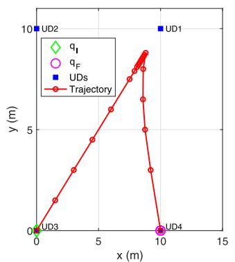

<details>
<summary>line</summary>

| Point | x (m) | y (m) |
|-------|-------|-------|
| q_I   | 0     | 0     |
| q_F   | 10    | 0     |
| UDs   | 10    | 10    |
| UD1   | 10    | 10    |
| UD2   | 0     | 10    |
| Trajectory | 0   | 0     |
| Trajectory | 5     | 6     |
| Trajectory | 10    | 9     |
| Trajectory | 10    | 0     |
</details>

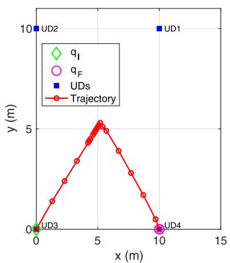

<details>
<summary>line</summary>

| Point | x (m) | y (m) |
|-------|-------|-------|
| U1    | 10    | 10    |
| U2    | 0     | 10    |
| U3    | 0     | 0     |
| U4    | 10    | 0     |
</details>

(b)

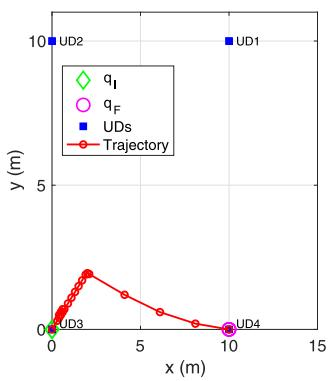

<details>
<summary>line</summary>

| Point | x (m) | y (m) |
|-------|-------|-------|
| q_I   | 0     | 0     |
| q_F   | 10    | 0     |
| UDs   | 10    | 10    |
| UD1   | 10    | 10    |
| UD2   | 0     | 10    |
| Trajectory | 0   | 0     |
| Trajectory | 2.5   | 2.5   |
| Trajectory | 5     | 1.5   |
| Trajectory | 7.5   | 0.5   |
| Trajectory | 10    | 0     |
</details>

(c）

Fig. 3. Optimized UAV trajectories for the OMA mode with different task allocation sizes. (a) $[ L _ { 1 } , L _ { 2 } , L _ { 3 } , L _ { 4 } ] = [ 7 , 3 , 5 , 3 ] \times 1 0 ^ { 2 } . ~ ( \mathbf { b } ) ~ [ L _ { 1 } , L _ { 2 } , L _ { 3 } , L _ { 4 } ] =$ $[ \widetilde { 7 } , 5 , 7 , 3 ] \stackrel { \cdot } { \times } 1 0 ^ { 2 } . ~ ( \mathrm { c } ) \ [ L _ { 1 } , L _ { 2 } , L _ { 3 } , L _ { 4 } ] = [ 3 , 3 , 7 , 5 ] \times 1 0 ^ { 2 }$ .   
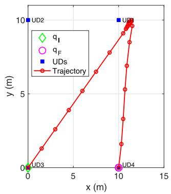

<details>
<summary>line</summary>

| Point | x (m) | y (m) |
|-------|-------|-------|
| U2    | 10    | 10    |
| U3    | 0     | 0     |
| U4    | 10    | 0     |
| UDs   | 10    | 10    |
</details>

(a)

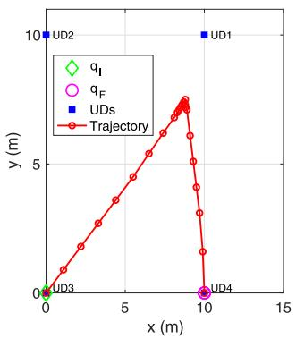

<details>
<summary>line</summary>

| Point | x (m) | y (m) |
|-------|-------|-------|
| U1    | 10    | 10    |
| U2    | 0     | 10    |
| U3    | 0     | 0     |
| U4    | 10    | 0     |
</details>

(b)

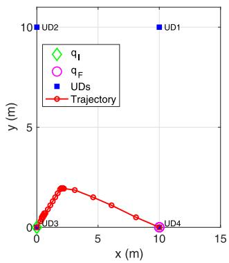

<details>
<summary>line</summary>

| Point | x (m) | y (m) |
|-------|-------|-------|
| UD1   | 10    | 10    |
| UD2   | 0     | 10    |
| UD3   | 0     | 0     |
| UD4   | 10    | 0     |
</details>

(c）  
Fig. 4. Optimized UAV trajectories for the NOMA mode with different task allocation sizes. (a) $[ L _ { 1 } , L _ { 2 } , L _ { 3 } , L _ { 4 } ] = [ 7 , 3 , 5 , 3 ] \times 1 0 ^ { 2 } . ~ ( \mathbf { b } ) ~ [ L _ { 1 } , L _ { 2 } , L _ { 3 } , L _ { 4 } ] =$ $[ \widetilde { 7 } , 5 , 7 , 3 ] \stackrel { \cdot } { \times } 1 0 ^ { 2 } . ~ ( \mathrm { c } ) [ L _ { 1 } , L _ { 2 } , L _ { 3 } , L _ { 4 } ] = [ 3 , 3 , 7 , 5 ] \times 1 0 ^ { 2 }$ .

Figs. 3(a) and (c) and 4(a) and (c), e.g., 1800 Mb, while the cases in Figs. 3(b) and 4(b) have larger total computation input bits, e.g., 2200 Mb. It is not difficult to see that the computation bits of the task-input data at each UD has a great impact on designing the UAV trajectory. As shown in Figs. 3 and 4, under both access modes, the UAV prefers moving closer the UDs with higher task requirement for calculating. The reason is that the UDs with large computation input bits are inclined to offload their task-input data to the UAV for computing, and thus the UAV needs to move closer these UDs so as to improve the UD-to-UAV channel condition. All these results suggest that the distribution of computation input bits at UDs plays a critical role on the trajectory design. Moreover, it is clear that when the UAV gets close to the UDs with large number of computation input bits, the offloading and downloading energy consumption are both reduced.

Fig. 5 exhibits the convergence behaviors of our proposed algorithms for both OMA and NOMA modes, where we also consider the following three cases with different computation requirements, namely, case $ I \colon \ [ L _ { 1 } , L _ { 2 } , L _ { 3 } , L _ { 4 } ] \ =$ $[ 7 , 3 , 5 , 3 ] \times 1 0 ^ { 2 } , c a s e \ 2 \colon [ L _ { 1 } , L _ { 2 } , L _ { 3 } , L _ { 4 } ] = [ 7 , 5 , 7 , 3 ] \times 1 0 ^ { 2 }$ , and case $3 \colon [ L _ { 1 } , L _ { 2 } , L _ { 3 } , L _ { 4 } ] \ : = \ : [ 3 , 3 , 7 , 5 ] \times 1 0 ^ { 2 }$ . It is clear that the weighted-sum energy consumptions for all the cases are nonincreasing after each iteration of Algorithms 1 and 2. It can be seen that for the two access modes with different computation requirements, Algorithms 1 and 2 converge in about four and five iterations, respectively. Such results suggest that our proposed algorithms (Algorithms 1 and 2) are quite efficient and have faster convergence speed. Moreover, for $[ L _ { 1 } , L _ { 2 } , L _ { 3 } , L _ { 4 } ] = [ 7 , 5 , 7 , 3 ] * 1 0 0 \mathrm { M b }$ , the proposed joint scheme requires a weighted-sum energy consumption of 710 J for orthogonal access and 730 J for nonorthogonal access, respectively. It is worth noting that the performance of NOMA is worse than that of OMA due to the more severe interference generated by the UAV for NOMA. Moreover, in the OMA mode, the UAV intends to fly more closely to each UD so that less power is consumed by UDs in uplink and downlink transmissions.

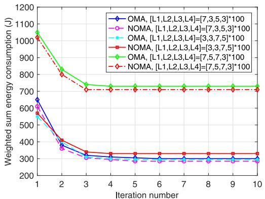

<details>
<summary>line</summary>

| Iteration number | OMA, [L1,L2,L3,L4]=[7,3,5,3]*100 | NOMA, [L1,L2,L3,L4]=[7,3,5,3]*100 | OMA, [L1,L2,L3,L4]=[3,3,7,5]*100 | NOMA, [L1,L2,L3,L4]=[3,3,7,5]*100 | OMA, [L1,L2,L3,L4]=[7,5,7,3]*100 | NOMA, [L1,L2,L3,L4]=[7,5,7,3]*100 |
| ---------------- | ---------------------------------- | ---------------------------------- | ---------------------------------- | ---------------------------------- | ---------------------------------- | ---------------------------------- |
| 1                | 650                                | 600                                | 580                                | 550                                | 1050                               | 1020                               |
| 2                | 380                                | 350                                | 360                                | 340                                | 850                                | 820                                |
| 3                | 320                                | 310                                | 320                                | 310                                | 750                                | 720                                |
| 4                | 310                                | 305                                | 310                                | 305                                | 720                                | 710                                |
| 5                | 305                                | 300                                | 305                                | 300                                | 710                                | 705                                |
| 6                | 300                                | 295                                | 300                                | 295                                | 705                                | 700                                |
| 7                | 295                                | 290                                | 295                                | 290                                | 700                                | 695                                |
| 8                | 290                                | 285                                | 290                                | 285                                | 695                                | 690                                |
| 9                | 285                                | 280                                | 285                                | 280                                | 690                                | 685                                |
| 10               | 280                                | 275                                | 280                                | 275                                | 685                                | 680                                |
</details>

Fig. 5. Convergence behavior of the proposed algorithms (Algorithms 1 and 2) under different task allocation sizes.

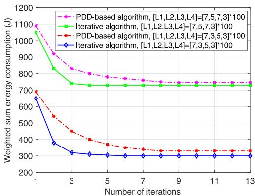

<details>
<summary>line</summary>

| Number of iterations | PDD-based algorithm, [L1,L2,L3,L4]=[7,5,7,3]*100 | Iterative algorithm, [L1,L2,L3,L4]=[7,5,7,3]*100 | PDD-based algorithm, [L1,L2,L3,L4]=[7,3,5,3]*100 | Iterative algorithm, [L1,L2,L3,L4]=[7,3,5,3]*100 |
| -------------------- | --------------------------------------------- | --------------------------------------------- | --------------------------------------------- | --------------------------------------------- |
| 1                    | 1100                                          | 1050                                          | 700                                           | 650                                           |
| 3                    | 900                                           | 850                                           | 550                                           | 400                                           |
| 5                    | 800                                           | 750                                           | 450                                           | 350                                           |
| 7                    | 750                                           | 750                                           | 350                                           | 300                                           |
| 9                    | 750                                           | 750                                           | 325                                           | 300                                           |
| 11                   | 750                                           | 750                                           | 325                                           | 300                                           |
| 13                   | 750                                           | 750                                           | 325                                           | 300                                           |
</details>

Fig. 6. Weighted-sum energy consumption simulated by the proposed iterative algorithm and the penalty dual decomposition (PDD) algorithm.

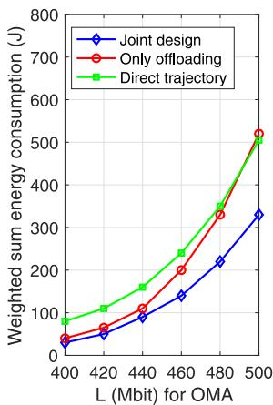

<details>
<summary>line</summary>

| L (Mbit) for OMA | Joint design | Only offloading | Direct trajectory |
| ---------------- | ------------ | --------------- | ----------------- |
| 400              | 30           | 40              | 80                |
| 420              | 60           | 70              | 110               |
| 440              | 90           | 110             | 160               |
| 460              | 140          | 200             | 240               |
| 480              | 220          | 330             | 350               |
| 500              | 330          | 520             | 510               |
</details>

(a)

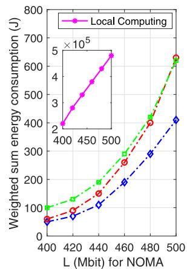

<details>
<summary>line</summary>

| L (Mbit) for NOMA | Local Computing (J) |
| ----------------- | ------------------- |
| 400               | 2 × 10⁵             |
| 420               | 3 × 10⁵             |
| 440               | 4 × 10⁵             |
| 460               | 5 × 10⁵             |
| 480               | 6 × 10⁵             |
| 500               | 7 × 10⁵             |
</details>

(b)   
Fig. 7. Weighted-sum energy consumption of the UAV and UDs versus the uniform task-input data size L for both (a) OMA and (b) NOMA.

In Fig. 6, we compare the weighted-sum energy consumption achieved by the proposed iterative algorithm with the PDD algorithm [42]. It can be seen from Fig. 6 that the proposed iterative algorithm converges at around five iterations while the PDD-based algorithm converges after eight iterations. Besides, the proposed algorithm achieves a better performance in minimizing the weighted-sum energy consumption than that of the PDD-based algorithm.

Figs. 7(a) and (b), respectively, demonstrates the relationship between the weighted-sum energy consumption and the uniform task size $L = L _ { s } , s \in \mathcal { S }$ under OMA and NOMA modes, where we also compare the proposed joint design scheme with the above several benchmark schemes. According to Fig. 7, we can make several important observations. First, as expected, the weighted-sum energy consumption increases largely for all the four schemes as L becomes large. The reason is that the UAV and UDs will consume more energy to complete the task-input data with large bits. Second, for varying L, the lowest energy consumption can be achieved by exploiting the proposed joint design scheme in comparison with other three benchmark schemes under both access modes. Moreover, the local computing scheme achieves a significant higher energy consumption than other schemes with computation offloading. It means that edge computing through offloading is essential for the computational performance improvement. Particularly, as shown in Fig. 7(b), the weightedsum energy consumption of our proposed joint design scheme is one thousandth of that of the local computing scheme, which demonstrates the enormous advantages achieved via employing the UAV as an assistant for calculating. Moreover, the weighted-sum energy consumption of the direct trajectory scheme is one quarter higher than that of our proposed joint design scheme. When L is small, e.g., L = 400 Mb, the curves of the only offloading scheme and the proposed joint design scheme are close to each other. However, as L increases, the performance gap between the only offloading scheme and the proposed joint design scheme is even larger than that between the direct trajectory scheme and the proposed joint design scheme. Such results suggest that our proposed joint resource allocation and trajectory design have prominent impacts on minimizing the weighted-sum energy consumption. Third, it is not difficult to see that the performance gaps between the proposed joint design scheme and other three benchmark schemes become larger with increasing L, which further demonstrates that our proposed joint design scheme is more effective in tackling the computationally intensive tasks.

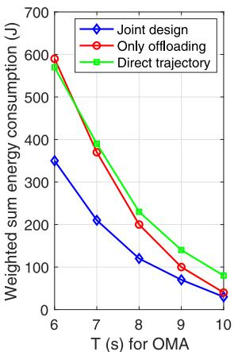

<details>
<summary>line</summary>

| T (s) for OMA | Joint design | Only offloading | Direct trajectory |
| ------------- | ------------ | --------------- | ----------------- |
| 6             | 350          | 600             | 600               |
| 7             | 210          | 380             | 400               |
| 8             | 120          | 210             | 230               |
| 9             | 70           | 100             | 140               |
| 10            | 30           | 40              | 80                |
</details>

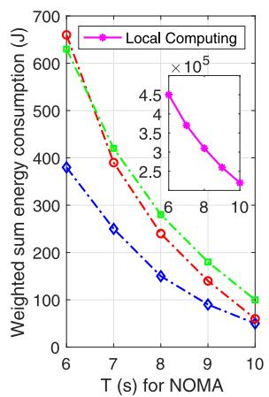

<details>
<summary>line</summary>

| T (s) for NOMA | Local Computing (J) | Other (J ×10⁵) |
| -------------- | ------------------- | -------------- |
| 6              | 680                 | 4.5            |
| 7              | 400                 | 3.5            |
| 8              | 250                 | 2.5            |
| 9              | 150                 | 2.0            |
| 10             | 100                 | 1.5            |
</details>

Fig. 8. Weighted-sum energy consumption of the UAV and UDs versus the task completion time T for both (a) OMA and (b) NOMA.

Fig. 8(a) and (b) demonstrates the weighted-sum energy consumption versus different values of task completion time T under both OMA and NOMA modes, respectively. According to Fig. 8(a) and (b), we find that the weighted-sum energy consumption decreases for the four schemes as T grows, which verifies that there exists a tradeoff between time consumption and energy consumption for executing the same task, while the energy consumption decreases as the consumed time increases. For both access modes, it is clear that the proposed joint design scheme is superior to the three benchmark schemes in terms of energy consumption, while the performance improvement will become more significant under the strict time constraint. Such results further confirm that the proposed joint design scheme is effective for tackling the delay-sensitive task-input data and can realize a better delay-energy tradeoff. In particular, as T becomes large, the UAV has more freedom to get closer to its serving UD to obtain a better channel condition and more tasks can be offloaded to the UAV, thereby reducing task execution latency. In addition, some similar observations can be obtained from Fig. 7(a) and (b).

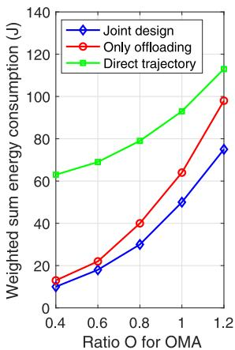

<details>
<summary>line</summary>

| Ratio O for OMA | Joint design | Only offloading | Direct trajectory |
| --------------- | ------------ | --------------- | ----------------- |
| 0.4             | 10           | 15              | 65                |
| 0.6             | 20           | 25              | 70                |
| 0.8             | 30           | 40              | 80                |
| 1.0             | 50           | 65              | 95                |
| 1.2             | 75           | 100             | 115               |
</details>

(a)

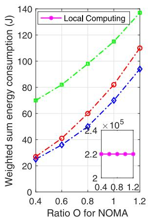

<details>
<summary>line</summary>

| Ratio O for NOMA | Local Computing (J) |
| ---------------- | ------------------- |
| 0.4              | 25                  |
| 0.6              | 40                  |
| 0.8              | 60                  |
| 1.0              | 80                  |
| 1.2              | 110                 |
</details>

Fig. 9. Weighted-sum energy consumption of the UAV and UDs versus the uniform ratio of output-data to input-data O for both (a) OMA and (b) NOMA.

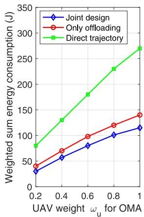

<details>
<summary>line</summary>

| UAV weight ωu for OMA | Joint design | Only offloading | Direct trajectory |
| --------------------- | ------------ | --------------- | ----------------- |
| 0.2                   | 30           | 40              | 80                |
| 0.4                   | 60           | 70              | 130               |
| 0.6                   | 80           | 100             | 180               |
| 0.8                   | 100          | 120             | 230               |
| 1.0                   | 120          | 140             | 270               |
</details>

(a)

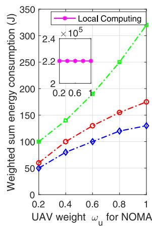

<details>
<summary>line</summary>

| UAV weight ωu for NOMA | Local Computing (J) | Red Dashed Line (J) | Blue Dash-Dot Line (J) |
| ---------------------- | ------------------- | ------------------- | ---------------------- |
| 0.2                    | 100                 | 60                  | 50                     |
| 0.4                    | 140                 | 100                 | 80                     |
| 0.6                    | 190                 | 130                 | 100                    |
| 0.8                    | 250                 | 160                 | 120                    |
| 1.0                    | 320                 | 180                 | 130                    |
</details>

(b)   
Fig. 10. Weighted-sum energy consumption of the UAV and UDs versus the weight for energy consumption of the UAV $\omega _ { u }$ for both (a) OMA and (b) NOMA.

Fig. 9(a) and (b) demonstrates the weighted-sum energy consumption versus the uniform ratio size of the task-output data to task-input data $O = O _ { s } , s \in { \mathcal { S } }$ under both OMA and NOMA modes, respectively. As shown in Fig. 9(a) and (b), the proposed joint design scheme achieves significantly lower energy consumption compared with three benchmark schemes under both access modes. For different values of O, the weighted-sum energy consumption of the local computing scheme remains unchanged, while the weighted-sum energy consumption increases for all the other schemes as O becomes large. This is because more task-output data will be downloaded to the UDs when with a large O. By comparing the curves of the proposed joint design scheme and the direct trajectory scheme, we find that the energy consumption gap between the two schemes decreases as O increases. However, the energy consumption gap between the proposed joint design scheme and the only offloading scheme increases with increasing O. The reason is that locally computing a portion of tasks at UDs and offloading the rest to the UAV can save the weighted-sum energy consumption when O is large.

Fig. 10(a) and (b) illustrates the weighted-sum energy consumption versus the weight for energy consumption of the UAV $\omega _ { u }$ under OMA and NOMA modes, respectively. It is clear that a better performance can be achieved by leveraging the proposed joint design scheme in comparison with all the benchmark schemes in both access modes. All the curves in Fig. 10(a) and (b) increase with $\omega _ { u }$ except for the local computing scheme, since a higher energy consumption of the UAV will be counted into the weighted-sum energy consumption when $\omega _ { u }$ gets larger. It is notable that energy consumption gap between the proposed joint design scheme and the direct trajectory scheme becomes larger with increasing $\omega _ { u }$ under both access modes. The reason is that the propulsion energy consumption of the UAV contributes a large portion of the weighted-sum energy consumption for the direct trajectory scheme without trajectory design, and hence, its weighted-sum energy consumption increases much faster with respect to $\omega _ { u }$ than the other schemes.

According to the above results, we observe that the weighted-sum energy consumption for the nonorthogonal multiple ac- cess mode is much higher than that for the OMA mode for all the schemes. Notably, such a performance gain for the OMA mode is attributed to the fact that its performance mainly depends on the mutual interference between UDs, which is affected through the computation resource allocation. In addition, when T is small, the OMA mode always achieves significantly lower weighted-sum energy consumption than that of the NOMA mode.

Fig. 11(a)–(c) demonstrates the energy consumption of the UDs (considering that $\omega _ { s } = 1 , s \in \mathcal { S } )$ , the weighted energy consumption and the energy consumption of the UAV versus $\omega _ { u } ,$ , respectively. According to Fig. 11(a) and (b), we observe that the weighted energy consumption of the UAV and UDs increases for all the schemes as $\omega _ { u }$ gets larger, except that for the local computing scheme. It can be seen from Fig. 11(c) that the energy consumption of the UAV decreases as the value of $\omega _ { u }$ increases. The reason is that our goal is to minimize the weighted-sum energy consumption, while the optimal objective value increases with $\omega _ { u } ,$ which is similar to the result in Fig. 10. From Fig. 11(c), we can also observe that the enormous advantages achieved at the UDs from the UAV, especially when $\omega _ { u }$ is smaller. For instance, for $\omega _ { u } = 0 . 2 .$ , the UAV consumes 123 J of energy to help the UDs reduce their energy consumption from $2 . 2 \times 1 0 ^ { 5 }$ J of the local computing scheme to 19 J of the proposed joint design scheme.

# VI. CONCLUSION

In this article, we investigated a UAV-assisted MEC system where a UAV equipped with computing resources is employed to help local resource-limited UDs compute their tasks. Moreover, we considered two types access modes for the uplink and downlink communications required for computation migration. For both access modes, the weighted-sum energy consumption was minimized by jointly optimizing the computation resource allocation and UAV trajectory. However, the formulated problems have been shown to be nonconvex optimization problems. For efficiently solving them, alternating iterative algorithms were proposed based on the block alternating descend method. Specifically, the resource allocation and UAV trajectory were alternately optimized in an iterative manner till our proposed algorithms converge. Simulation results verified the significant energy saving of our proposed joint design compared to three benchmark schemes. It can also be concluded that the number of the computation input bits at each UD greatly affect the flight trajectory of the UAV.

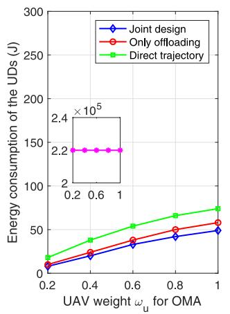

<details>
<summary>line</summary>

| UAV weight ωu for OMA | Joint design | Only offloading | Direct trajectory |
| --------------------- | ------------ | --------------- | ----------------- |
| 0.2                   | 10           | 10              | 20                |
| 0.4                   | 25           | 30              | 40                |
| 0.6                   | 40           | 45              | 60                |
| 0.8                   | 50           | 55              | 70                |
| 1.0                   | 55           | 60              | 80                |
</details>

(a)

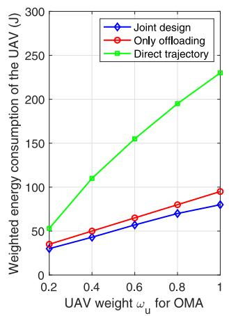

<details>
<summary>line</summary>

| UAV weight ωu for OMA | Joint design | Only offloading | Direct trajectory |
| --------------------- | ------------ | --------------- | ----------------- |
| 0.2                   | 30           | 40              | 50                |
| 0.4                   | 45           | 55              | 110               |
| 0.6                   | 60           | 70              | 155               |
| 0.8                   | 75           | 85              | 195               |
| 1.0                   | 85           | 95              | 230               |
</details>

(b)

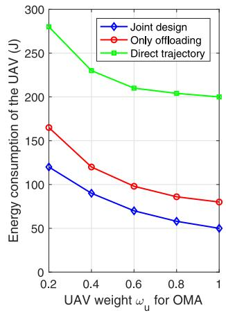

<details>
<summary>line</summary>

| UAV weight ωu for OMA | Joint design | Only offloading | Direct trajectory |
| --------------------- | ------------ | --------------- | ----------------- |
| 0.2                   | 120          | 165             | 280               |
| 0.4                   | 90           | 120             | 230               |
| 0.6                   | 70           | 100             | 210               |
| 0.8                   | 60           | 85              | 205               |
| 1.0                   | 50           | 80              | 200               |
</details>

(c）  
Fig. 11. Separate energy consumption versus the weight for energy consumption of the UAV $\omega _ { u } \mathrm { : }$ (a) Weighted energy consumption of UDs. (b) Weighted energy consumption of the UAV. (c) Energy consumption of the UAV.

# APPENDIX A PROOF OF THEOREM 1

Define $\pmb { \nu } = \{ \nu _ { s , n } \forall s , n \} , \pmb { \mu } = \{ \mu _ { s , n } \forall s , n \} , \pmb { \rho } = \{ \rho _ { s } \forall s \}$ , $\varrho ~ = ~ \{ \varrho _ { s } ~ \forall s \}$ , and $\lambda ~ = ~ \{ \lambda _ { s } ~ \forall s \}$ as the dual variables related to (13b)–(13f), respectively, where $\nu _ { s , n }$ and $\mu _ { s , n }$ are nonnegative. Mathematically, the Lagrange function of P1.1 is calculated as (41), shown at the bottom of the page, where $\begin{array} { r } { \widehat { \nu } _ { s , n } = \sum _ { i = n + 1 } ^ { N - 1 } \nu _ { s , i } , \widetilde { \nu } _ { s , n } = \sum _ { i = n } ^ { N - 1 } \nu _ { s , i } , \widetilde { \mu } _ { s , n } = \sum _ { i = n } ^ { N } \mu _ { s , i } } \end{array}$ , andn of $\begin{array} { r } { \widehat { \mu } _ { s , n } = \sum _ { i = n + 1 } ^ { N } \mu _ { s , i } . } \end{array}$

$$
\text { D1: } g ^ {1} (\nu , \mu , \rho , \varrho , \lambda) = \min _ {\mathbf {F}, \mathbf {L}} \mathcal {L} (\mathbf {L}, \mathbf {F}, \nu , \mu , \rho , \varrho , \lambda) (4 2 a)
$$

$$
\text { s.t. } (1 3 \mathrm{g}) - (1 3 \mathrm{i}). \tag {42b}
$$

Thus, the solutions of F and L with any given ν, μ, ρ, , and λ can be obtained by solving D1. Particularly, if the values of all dual variables are optimal, the corresponding solutions are optimal. It is not difficult to see that the dual problem D1 can be equivalently decomposed into S subproblems with respect to each UD to facilitate parallel operation. By leveraging the Karush–Kuhn–Tucker (KKT) conditions [38] and setting the first-order derivatives of $\mathcal { L } ( \mathbf { L } , \mathbf { F } , \mathbf { \nu } _ { \mathbf { \nu } } , \mu , \rho , \varrho , \lambda )$ with respect to $f _ { u , s } [ n ] , \ L _ { s , u } ^ { \mathrm { o f f } } [ n ] , \ L _ { u , s } ^ { \mathrm { d o n } } [ n ]$ , and fs[n] to 0, the corresponding optimal solutions can be easily obtained as in (16)–(19). Hence, Theorem 1 is proved.

# APPENDIX B PROOF OF LEMMAS 1 AND 2

Based on the multipliers $\pmb { \mu } ^ { r + 1 }$ and $\pmb { v } ^ { r + 1 }$ obtained in Lemma 1, we can obtain $\pmb { \rho } ^ { r + 1 } , \pmb { \varrho } ^ { r + 1 }$ , r+1 , and $\lambda ^ { r + 1 }$ accordingly. According to the constraints in (13d)–(13f) and the expressions

$$
\begin{array}{l} \mathcal {L} (\mathbf {L}, \mathbf {F}, \boldsymbol {\nu}, \boldsymbol {\mu}, \boldsymbol {\rho}, \boldsymbol {\varrho}, \boldsymbol {\lambda}) = \sum_ {n = 1} ^ {N} \left(\sum_ {s = 1} ^ {S} \omega_ {s} E _ {O, s} [ n ] + \omega_ {u} E _ {O, u} [ n ]\right) + \sum_ {s = 1} ^ {S} \\ \left\{\left(\sum_ {n = 2} ^ {N - 1} \widetilde {\nu} _ {s, n} \frac {\tau f _ {u , s} [ n ]}{C _ {s}} - \sum_ {n = 1} ^ {N - 2} \widehat {\nu} _ {s, n} L _ {s, u} ^ {\text { off }} [ i ]\right) \right. \\ + \left(\sum_ {n = 3} ^ {N} \widetilde {\mu} _ {s, n} L _ {u, s} ^ {\text { don }} [ n ] - O _ {s} \sum_ {n = 2} ^ {N - 1} \widehat {\mu} _ {s, n} \frac {\tau f _ {u , s} [ n ]}{C _ {s}}\right) + \rho_ {k} \left(\sum_ {n = 1} ^ {N - 2} L _ {s, u} ^ {\text { off }} [ n ] - \sum_ {n = 2} ^ {N - 1} \frac {\tau f _ {u , s} [ n ]}{C _ {s}}\right) \\ \left. + \varrho_ {s} \left(O _ {s} \sum_ {n = 2} ^ {N - 1} \frac {\tau f _ {u , s} [ n ]}{C _ {s}} - \sum_ {n = 3} ^ {N} L _ {u, s} ^ {\text { don }} [ n ]\right) + \lambda_ {s} \left(L _ {s} - \sum_ {n = 1} ^ {N} \frac {\delta_ {t} f _ {s} [ n ]}{C _ {s}} - \sum_ {n = 1} ^ {N - 2} L _ {s, u} ^ {\text { off }} [ n ]\right) \right\} \tag {41} \\ \end{array}
$$

in (16)–(19), the value of N−2n=1 Loff∗s,u,r+1[n] can be calculated $\begin{array} { r } { \sum _ { n = 1 } ^ { N - 2 } L _ { s , u , r + 1 } ^ { \mathrm { o f f } ^ { * } } [ n ] } \end{array}$ as

$$
\begin{array}{l} \sum_ {n = 1} ^ {N - 2} L _ {s, u, r + 1} ^ {\text { off } ^ {*}} [ n ] \\ = L _ {s} - \frac {T}{C _ {s}} \sqrt {\frac {\lambda_ {s} ^ {r + 1}}{3 C _ {s} \varphi_ {s} \omega_ {s}}} (43a) \\ = \tau \sum_ {n = 1} ^ {N - 2} B \left[ \phi_ {s} [ n ] + \log_ {2} \left[ \widehat {\nu} _ {s, n} ^ {r + 1} + \lambda_ {s} ^ {r + 1} - \rho_ {s} ^ {r + 1} \right] ^ {+} \right] ^ {+} (43b) \\ = \frac {\tau}{O _ {s}} \sum_ {n = 3} ^ {N} B \left[ \phi_ {u, s} ^ {\text {don}} [ n ] + \log_ {2} \left[ \varrho_ {s} ^ {r + 1} - \widetilde {\mu} _ {s, n} ^ {r + 1} \right] ^ {+} \right] ^ {+} (43c) \\ = \tau \sum_ {n = 1} ^ {N} \left\{B \left[ \log_ {2} \left[ \rho_ {s} ^ {r + 1} - O _ {s} \varrho_ {s} ^ {r + 1} + O _ {s} \widehat {\mu} _ {s, n} ^ {r + 1} - \widetilde {v} _ {s, n} ^ {r + 1} \right] ^ {+} \right] ^ {+} \right. \\ \left. + \phi_ {u, s} ^ {\text {don}} [ n ] + \frac {1}{C _ {s}} \sqrt \frac {[ \rho_ {s} ^ {r + 1} - O _ {s} \varrho_ {s} ^ {r + 1} + O _ {s} \widehat {\mu} _ {s , n} ^ {r + 1} - \widetilde {\nu} _ {s , n} ^ {r + 1} ] ^ {+}}{3 C _ {s} \varphi_ {s} \omega_ {s}} \right\} (43d) \\ \end{array}
$$

$\begin{array} { r c l c r c l } { \widehat \nu _ { s , n } } & { = } & { \sum _ { i = n + 1 } ^ { N - 1 } \nu _ { s , i } , } & { \widetilde \nu _ { s , n } } & { = } & { \sum _ { i = n } ^ { N - 1 } \nu _ { s , i } , } & { \widetilde \mu _ { s , n } } & { = } & { } \end{array}$ $\textstyle \sum _ { i = n } ^ { N } \mu _ { s , i } .$ $\begin{array} { r c l } { \widehat { \mu } _ { s , n } } & { = } & { \sum _ { i = n + 1 } ^ { N } \mu _ { s , i } . } \end{array}$ that (43a) is derived from (13f), (43b) is given by (19), (43c) comes from (13d) and (13e) with $\begin{array} { r } { \left( 1 \right) / ( O _ { s } ) \sum _ { n = 3 } ^ { N } { L _ { u , s , r + 1 } ^ { \mathrm { d o n } ^ { * } } [ n ] } } \end{array}$ , and (43d) is derived from (13d). N−2n=1 Loffs,u,r+1[n] = $\begin{array} { r l } { \breve { \sum _ { n = 1 } ^ { N - 2 } } L _ { s , u , r + 1 } ^ { \mathrm { o f f ^ { * } } } [ n ] } & { = } \end{array}$

Considering that $f _ { s } ^ { * } [ n ] \ge 0$ and $\begin{array} { r } { \sum _ { n = 1 } ^ { N - 2 } L _ { s , u , r + 1 } ^ { \mathrm { o f f } } [ n ] \in [ 0 , I _ { s } ] } \end{array}$ the range of $\lambda _ { s } ^ { r + 1 } ~ \in ~ [ 0 , \lambda _ { s } ^ { \operatorname* { m a x } } )$ for $s \in \mathcal S$ can be derived. From (43a)–(43c), we find that $\rho _ { s } ^ { r + 1 }$ is a nondecreasing function of $\lambda _ { s } ^ { r + 1 }$ , and $\varrho _ { s } ^ { r + 1 }$ is a nonincreasing function of $\lambda _ { s } ^ { r + 1 }$ , which further verifies that (43d) is a nondecreasing function of obtaine $\varrho _ { s } ^ { r + 1 }$ Thus,and a given in Lem $\lambda _ { s } ^ { r + 1 } \ \in \ [ 0 , \lambda _ { s } ^ { \operatorname* { m a x } } )$ and theondingly $\pmb { \mu } ^ { r + 1 }$ $\pmb { v } ^ { r + 1 }$ $\rho _ { s } ^ { r + 1 }$ and $\varrho _ { s } ^ { r + 1 }$ can be derived from (43a)–(43c) by leveraging method, where $\rho _ { s } ^ { r + 1 } \in [ \rho _ { s , \mathrm { l o w } } ^ { r + 1 } , \rho _ { s , u p } ^ { r + 1 } ]$ ∈ [ρr 1s,low, ρr+1 s,up ] andare, $\varrho _ { s } ^ { r + 1 } \in [ \varrho _ { s , \mathrm { l o w } } ^ { r + 1 } , \varrho _ { s , \mathrm { u p } } ^ { r + 1 } ]$ $\rho _ { s , \mathrm { l o w } } ^ { r + 1 } , \rho _ { s , \mathrm { u p } } ^ { r + 1 } , \varrho _ { s , \mathrm { l o w } } ^ { r + 1 }$ $\varrho _ { s , \mathrm { u p } } ^ { r + 1 }$ respectively, given by

$$
\varrho_ {s, \text {low}} ^ {r + 1} = \widetilde {\mu} _ {s, N} ^ {r + 1} \tag {44a}
$$

$$
\rho_ {s, \mathrm{up}} ^ {r + 1} = \widehat {\nu} _ {s, 1} ^ {r + 1} + \lambda_ {s} ^ {\max} \tag {44b}
$$

$$
\rho_ {s, \text { low }} ^ {r + 1} = \widehat {\nu} _ {s, N - 2} ^ {r + 1} - 2 ^ {\frac {L _ {s}}{\tau B} - \sum_ {n = 3} ^ {N} \phi_ {s} [ n ]} \tag {44c}
$$

$$
\varrho_ {s, \mathrm{up}} ^ {r + 1} = \widetilde {\mu} _ {s, 3} ^ {r + 1} + 2 ^ {\frac {O _ {s} L _ {s}}{\tau B} - \sum_ {n = 3} ^ {N} \phi_ {u, s} ^ {\mathrm{don}} [ n ]}. \tag {44d}
$$

The optimal $\lambda _ { s } ^ { r + 1 } , \rho _ { s } ^ { r + 1 }$ , and $\varrho _ { s } ^ { r + 1 }$ obtained at (r+1)th iteration should make $( 4 3 \mathrm { a } ) = ( 4 3 \mathrm { d } )$ hold, indicating the termination of the bisection search of $\lambda _ { s } ^ { r + 1 }$ for $s \in { \mathcal { S } }$ .

# REFERENCES

[1] P. Porambage, J. Okwuibe, M. Liyanage, and T. Taleb, “Survey on multi-access edge computing for Internet of Things realization,” IEEE Commun. Surveys Tuts., vol. 20, no. 4, pp. 2961–2991, 4rd Quart., 2018.   
[2] M. Chiang and T. Zhang, “Fog and IoT: An overview of research opportunities,” IEEE Internet Things J., vol. 3, no. 6, pp. 854–864, Dec. 2016.   
[3] R. Q. Hu and Y. Qian, “An energy efficient and spectrum efficient wireless heterogeneous network framework for 5G systems,” IEEE Commun. Mag., vol. 52, no. 5, pp. 94–101, May 2014.

[4] A. U. R. Khan, M. Othman, S. A. Madani, and S. U. Khan, “A survey of mobile cloud computing application models,” IEEE Commun. Surveys Tuts., vol. 16, no. 1, pp. 393–413, 1st Quart., 2014.   
[5] Y. Mao, C. You, J. Zhang, K. Huang, and K. B. Letaief, “A survey on mobile edge computing: The communication perspective,” IEEE Commun. Surveys Tuts., vol. 19, no. 4, pp. 2322–2358, 4th Quart., 2017.   
[6] P. Mach and Z. Becvar, “Mobile edge computing: A survey on architecture and computation offloading,” IEEE Commun. Surveys Tuts., vol. 19, no. 3, pp. 1628–1656, 3rd Quart., 2017.   
[7] J. Zhang et al., “Stochastic computation offloading and trajectory scheduling for UAV-assisted mobile edge computing,” IEEE Internet Things J., vol. 6, no. 2, pp. 3688–3699, Apr. 2019.   
[8] Z. Yu, Y. Gong, S. Gong, and Y. Guo, “Joint task offloading and resource allocation in UAV-enabled mobile edge computing,” IEEE Internet Things J., vol. 7, no. 4, pp. 3147–3159, Apr. 2020.   
[9] N. Zhang, S. Zhang, P. Yang, O. Alhussein, W. Zhuang, and X. S. Shen, “Software defined space-air-ground integrated vehicular networks: Challenges and solutions,” IEEE Commun. Mag., vol. 55, no. 7, pp. 101–109, Jul. 2017.   
[10] S. Sardellitti, G. Scutari, and S. Barbarossa, “Joint optimization of radio and computational resources for multicell mobile-edge computing,” IEEE Trans. Signal Inf. Process. Netw., vol. 1, no. 2, pp. 89–103, Jun. 2015.   
[11] H. Sun, F. Zhou, and R. Q. Hu, “Joint offloading and computation energy efficiency maximization in a mobile edge computing system,” IEEE Trans. Veh. Technol., vol. 68, no. 3, pp. 3052–3056, Mar. 2019.   
[12] C. You, K. Huang, and H. Chae, “Energy efficient mobile cloud computing powered by wireless energy transfer,” IEEE J. Sel. Areas Commun., vol. 34, no. 5, pp. 1757–1771, May 2016.   
[13] T. Q. Dinh, J. Tang, Q. D. La, and T. Q. S. Quek, “Offloading in mobile edge computing: Task allocation and computational frequency scaling,” IEEE Trans. Commun., vol. 65, no. 8, pp. 3571–3584, Aug. 2017.   
[14] Z. Jiang and S. Mao, “Energy delay trade-off in cloud offloading for mutli-core mobile devices,” in Proc. IEEE Global Commun. Conf. (GLOBECOM), San Diego, CA, USA, Dec. 2015, pp. 1–6.   
[15] N. H. Motlagh, M. Bagaa, and T. Taleb, “UAV-based IoT platform: A crowd surveillance use case,” IEEE Commun. Mag., vol. 55, no. 2, pp. 128–134, Feb. 2017.   
[16] F. Cheng, G. Gui, N. Zhao, Y. Chen, J. Tang, and H. Sari, “UAV-relayingassisted secure transmission with caching,” IEEE Trans. Commun., vol. 67, no. 5, pp. 3140–3153, May 2019.   
[17] S. Jeong, O. Simeone, and J. Kang, “Mobile edge computing via a UAVmounted cloudlet: Optimization of bit allocation and path planning,” IEEE Trans. Veh. Technol., vol. 67, no. 3, pp. 2049–2063, Mar. 2018.   
[18] N. Cheng et al., “Space/aerial-assisted computing offloading for IoT applications: A learning-based approach,” IEEE J. Sel. Areas Commun., vol. 37, no. 5, pp. 1117–1129, May 2019.   
[19] Z. Yang, C. Pan, K. Wang, and M. Shikh-Bahaei, “Energy efficient resource allocation in UAV-enabled mobile edge computing networks,” IEEE Trans. Wireless Commun., vol. 18, no. 9, pp. 4576–4589, Sep. 2019.   
[20] F. Zhou, Y. Wu, H. Sun, and Z. Chu, “UAV-enabled mobile edge computing: Offloading optimization and trajectory design,” in Proc. IEEE Int. Conf. Commun. (ICC), Kansas City, MO, USA, Nov. 2018, pp. 1–6.   
[21] F. Zhou, Y. Wu, R. Q. Hu, and Y. Qian, “Computation rate maximization in UAV-enabled wireless-powered mobile-edge computing systems,” IEEE J. Sel. Areas Commun., vol. 36, no. 9, pp. 1927–1941, Sep. 2018.   
[22] M. Hua, Y. Huang, Y. Wang, Q. Wu, H. Dai, and L. Yang, “Energy optimization for cellular-connected multi-UAV mobile edge computing systems with multi-access schemes,” J. Commun. Inf. Netw., vol. 3, no. 4, pp. 33–44, Dec. 2018.   
[23] Z. Ding et al., “Application of non-orthogonal multiple access in LTE and 5G networks,” IEEE Commun. Mag., vol. 55, no. 2, pp. 185–191, Feb. 2017.   
[24] G. Gui, H. Huang, Y. Song, and H. Sari, “Deep learning for an effective nonorthogonal multiple access scheme,” IEEE Trans. Veh. Technol., vol. 67, no. 9, pp. 8440–8450, Sep. 2018.   
[25] Y. Wu, L. P. Qian, H. Mao, X. Yang, H. Zhou, and X. Shen, “Optimal power allocation and scheduling for non-orthogonal multiple access relay-assisted networks,” IEEE Trans. Mobile Comput., vol. 17, no. 11, pp. 2591–2606, Nov. 2018.   
[26] N. Zhao et al., “Joint trajectory and precoding optimization for UAVassisted NOMA networks,” IEEE Trans. Commun., vol. 67, no. 5, pp. 3723–3735, May 2019.   
[27] M. Messous, S. Senouci, H. Sedjelmaci, and S. Cherkaoui, “A game theory based efficient computation offloading in an UAV network,” IEEE Trans. Veh. Technol., vol. 68, no. 5, pp. 4964–4974, May 2019.

[28] J. Ji, K. Zhu, D. Niyato, and R. Wang, “Joint cache placement, flight trajectory, and transmission power optimization for multi-UAV assisted wireless networks,” IEEE Trans. Wireless Commun., vol. 19, no. 8, pp. 5389–5403, Aug. 2020.   
[29] F. Cheng et al., “UAV trajectory optimization for data offloading at the edge of multiple cells,” IEEE Trans. Veh. Technol., vol. 67, no. 7, pp. 6732–6736, Jul. 2018.   
[30] Y. Zeng and R. Zhang, “Energy-efficient UAV communication with trajectory optimization,” IEEE Trans. Wireless Commun., vol. 16, no. 6, pp. 3747–3760, Jun. 2017.   
[31] Y. Zeng, R. Zhang, and T. J. Lim, “Throughput maximization for UAV-enabled mobile relaying systems,” IEEE Trans. Commun., vol. 64, no. 12, pp. 4983–4996, Dec. 2016.   
[32] C. Yi, J. Cai, and Z. Su, “A multi-user mobile computation offloading and transmission scheduling mechanism for delay-sensitive applications,” IEEE Trans. Mobile Comput., vol. 19, no. 1, pp. 29–43, Jan. 2020.   
[33] S. Z. Bi and Y. J. Zhang, “Computation rate maximization for wireless powered mobile-edge computing with binary computation offloading,” IEEE Trans. Wireless Commun., vol. 17, no. 6, pp. 4177–4190, Jun. 2018.   
[34] Y. Wang, M. Sheng, X. Wang, L. Wang, and J. Li, “Mobile-edge computing: Partial computation offloading using dynamic voltage scaling,” IEEE Trans. Commun., vol. 64, no. 10, pp. 4268–4282, Oct. 2016.   
[35] W. Yuan and K. Nahrstedt, “Energy-efficient CPU scheduling for multimedia applications,” IEEE Trans. Comput. Syst., vol. 24, no. 3, pp. 292–331, Aug. 2006.   
[36] W. Yuan and K. Nahrstedt, “Energy-efficient soft real-time CPU scheduling for mobile multimedia systems,” ACM SIGOPS Oper. Syst. Rev., vol. 37, no. 5, pp. 149–163, Dec. 2003.   
[37] M. Hong, M. Razaviyayn, Z.-Q. Luo, and J.-S. Pang, “A unified algorithmic framework for block-structured optimization involving big data: With applications in machine learning and signal processing,” IEEE Signal Process. Mag., vol. 33, no. 1, pp. 57–77, Jan. 2016.   
[38] S. Boyd and L. Vandenberghe, Convex Optimization. Cambridge, U.K.: Cambridge Univ. Press, 2004.   
[39] D. P. Bertsekas and J. Tsitsiklis. Parallel and Distributed Computation: Numerical Methods. Accessed: Mar. 24, 2003. [Online]. Available: http://hdl.handle.net/1721.1/3719   
[40] F. Zhou, N. C. Beaulieu, Z. Li, J. Si, and P. Qi, “Energy-efficient optimal power allocation for fading cognitive radio channels: Ergodic capacity, outage capacity, and minimum-rate capacity,” IEEE Trans. Wireless Commun., vol. 15, no. 4, pp. 2741–2755, Apr. 2016.   
[41] M. Grant, S. Boyd, and Y. Ye. CVX: MATLAB Software for Disciplined Convex Programming. Accessed: Mar. 24, 2016. [Online]. Available: http://cvxr.com/cvx   
[42] Q. Hu, Y. Cai, G. Yu, Z. Qin, M. Zhao, and G. Y. Li, “Joint offloading and trajectory design for UAV-enabled mobile edge computing systems,” IEEE Internet Things J., vol. 6, no. 2, pp. 1879–1892, Apr. 2019.

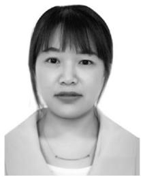

<details>
<summary>natural_image</summary>

Portrait photo of a woman with short hair and neutral expression (no text or symbols visible)
</details>

Jiequ Ji received the M.E. degree from the College of Computer Science and Technology, Anhui University of Science and Technology, Huainan, China, in 2017. She is currently pursuing the Ph.D. degree with the College of Computer Science and Technology, Nanjing University of Aeronautics and Astronautics, Nanjing, China.

From October 2018 to January 2020, she was a visiting student with the School of Computer Science and Engineering, Nanyang Technological University, Singapore. Her research interests include UAV-enabled wireless communications, wireless content caching, resource allocation in 5G and beyond, mobile-edge computing, and physical-layer security.


<details>
<summary>natural_image</summary>

Portrait of a smiling man in a polo shirt (no text or symbols visible)
</details>

Kun Zhu (Member, IEEE) received the Ph.D. degree from School of Computer Engineering, Nanyang Technological University, Singapore, in 2012.

He was a research fellow with the Wireless Communications Networks and Services Research Group in University of Manitoba, Canada, from 2012 to 2015. He is currently a Professor in the College of Computer Science and Technology, Nanjing University of Aeronautics and Astronautics, China, and also with the Collaborative Innovation Center of Novel Software Technology. He is also a

Jiangsu specially appointed professor. His research interests include resource allocation in 5G, wireless virtualization, and self-organizing networks. He has published more than fifty technical papers and has served as TPC for several conferences.

Prof. Zhu won several research awards including IEEE WCNC 2019 Best paper awards, ACM China rising star chapter award.


<details>
<summary>natural_image</summary>

Portrait of a man wearing glasses and a collared shirt (no text or symbols visible)
</details>

Changyan Yi (Member, IEEE) received the Ph.D. degree from the Department of Electrical and Computer Engineering, University of Manitoba, Winnipeg, MB, Canada, in 2018.

From September 2018 to August 2019, he worked as a Research Associate with the University of Manitoba. Since September 2019, he has been with the College of Computer Science and Technology, Nanjing University of Aeronautics and Astronautics, Nanjing, China, and the Collaborative Innovation Center of Novel Software Technology

and Industrialization, Nanjing, where he is currently a Professor. His research interests include mechanism design, game theory, queueing theory and their applications in various wireless networks, including edge/fog computing, IoT, and 5G and beyond.

Prof. Yi was awarded the Chinese Government Award for Outstanding Students Abroad in 2017, the University of Manitoba Graduate Fellowship for 2015–2018, and the IEEE ComSoc Student Travel Grant for IEEE Globecom 2016.


<details>
<summary>natural_image</summary>

Portrait of a man wearing glasses and a collared shirt (no text or symbols visible)
</details>

Dusit Niyato (Fellow, IEEE) received the Ph.D. degree in electrical and computer engineering from the University of Manitoba, Winnipeg, MB, Canada, in 2008.

He is currently a Professor with the School of Computer Science and Engineering, Nanyang Technological University, Singapore. He has published more than 400 technical articles in the area of wireless and mobile computing.

Prof. Niyato received the Best Young Researcher Award of the IEEE Communications Society Asia

Pacifica and the 2011 IEEE Communications Society Fred W. Ellersick Prize Paper Award. He is also serving as a Senior Editor for the IEEE WIRELESS COMMUNICATION LETTERS, an Area Editor for the IEEE TRANSACTIONS ON WIRELESS COMMUNICATIONS and the IEEE COMMUNICATIONS SURVEYS AND TUTORIALS, an Editor for the IEEE TRANSACTIONS ON COMMUNICATIONS, and an Associate Editor for the IEEE TRANSACTIONS ON MOBILE COMPUTING, the IEEE TRANSACTIONS ON VEHICULAR TECHNOLOGY, and the IEEE TRANSACTIONS ON COGNITIVE COMMUNICATIONS AND NETWORKING. He was a Distinguished Lecturer of the IEEE Communications Society from 2016 to 2017. He was named a Highly Cited Researcher in computer science.