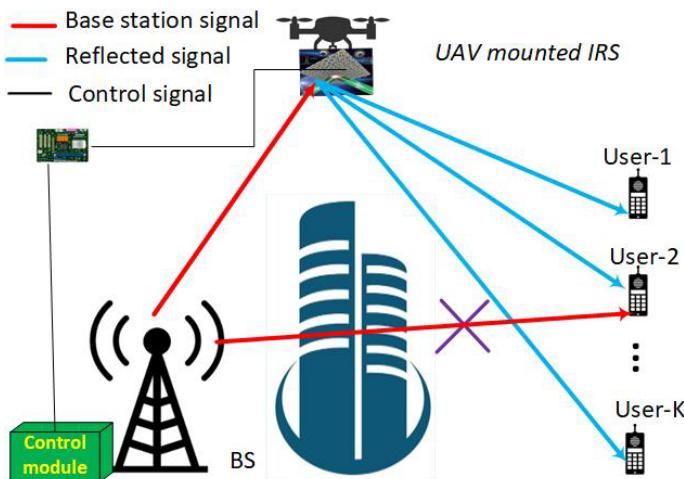
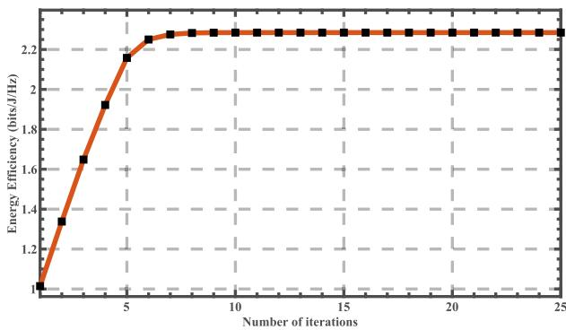
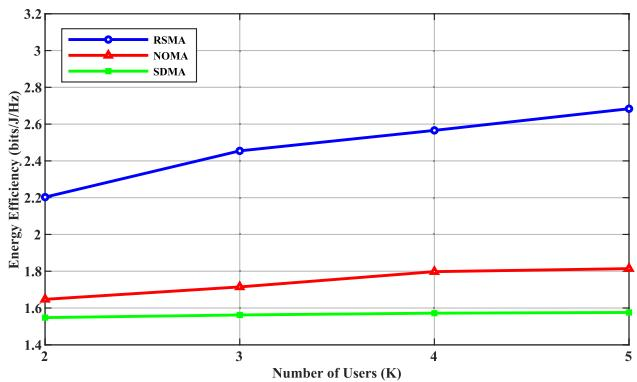
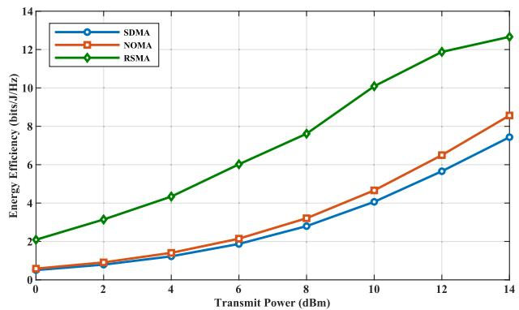
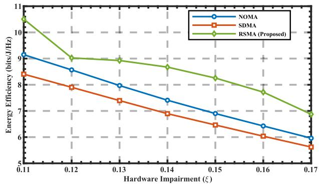
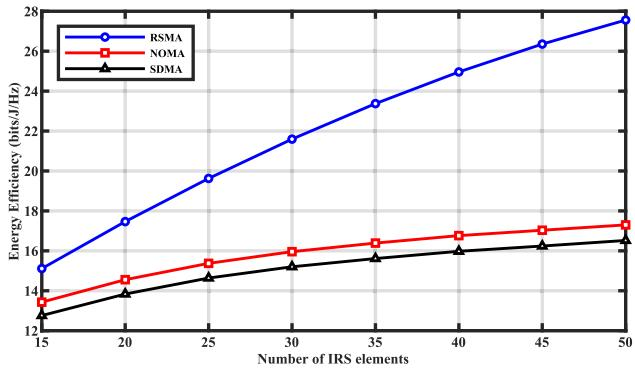
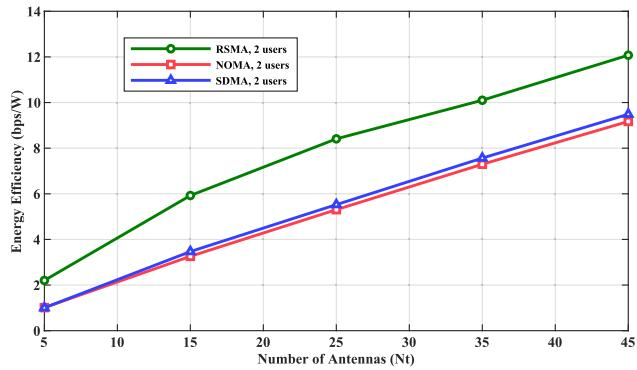

# Energy Eficiency Maximization for Aerial Intelligent Reflecting Surface-Assisted MISO Systems

Habtamu Demeke Mihertie , Member, IEEE, Zhengqiang Wang , Senior Member, IEEE, Mohamed Amine Ouamri , Member, IEEE, Elhadj Moustapha Diallo , and Xingwang Li , Senior Member, IEEE

Abstract—Energy eficiency (EE) is a critical requirement for next-generation wireless networks, motivating the use of rate-splitting multiple access (RSMA) and intelligent reflecting surfaces (IRSs) as low-power, interference-resilient technologies. This paper studies EE maximization in a UAV-mounted IRS-assisted multi-user MISO downlink under practical hardware impairments. A communication-centric EE metric is adopted, and the optimization of RSMA precoders, common-rate allocation, IRS phase shifts, and UAV placement is formulated as a non-convex problem. To solve it eficiently, we develop an alternating optimization framework based on successive convex approximation (SCA) and rank-one relaxation. Simulation results reveal that the proposed aerial IRS-assisted RSMA design achieves substantial EE gains over NOMA and SDMA baselines and remains robust to distortion, IRS size variations, and dynamic user conditions, highlighting its suitability for energy-constrained 6G deployments.

Index Terms—Intelligent reflecting surface, hardware impairments, rate splitting multiple access, energy eficiency, alternate optimization, sequential rank one constraint approximation.

## I. INTRODUCTION

ecosystems have placed energy eficiency (EE) at the center of next-generation wireless network design. Improving EE is essential not only for reducing operational costs but also for meeting global sustainability targets envisioned for 6G systems [1], [2], [3]. As wireless networks become denser and increasingly heterogeneous, energy-aware transmission strategies are required to limit power consumption while ensuring high service reliability.

Reconfigurable intelligent surfaces (RISs) have recently emerged as a cost-efective tool for energy-eficient wireless communication. By intelligently adjusting the electromagnetic response of nearly passive reflecting elements, RISs can reshape the propagation environment to enhance link quality without increasing active radio-frequency chain power [4], [5], [6]. This capability has positioned RIS technology as a promising green communication solution in future wireless systems, including ultra-dense networks and large intelligent surface–based deployments [7], [8].

To further extend coverage and improve channel conditions, recent research has considered integrating RIS technology with unmanned aerial vehicles (UAVs). UAV-mounted RISs benefit from high maneuverability and flexible placement in threedimensional space, enabling dynamic control of wireless links in challenging propagation environments [9], [10]. Such aerialassisted architectures are particularly attractive for scenarios with blocked line-of-sight paths or rapidly changing user distributions, where traditional fixed infrastructure may be insuficient.

Early attempts to raise the EE of dense multi-user systems concentrate either on cleaner power sources or on isolated physical-layer techniques. Surveys such as [2] catalogue renewable-energy harvesting, low-power circuitry, and green network planning, while [3] popularizes fractional and sequential programming as tractable tools for global EE optimization. Massive-MIMO further increases the bit-per-Joule ratio by exploiting spatial multiplexing and array gain [6], [11], yet its large number of radio-frequency (RF) chains amplifies capital cost, hardware power, and phase-noise sensitivity limitations, especially in 6G IoT scenarios populated by low-cost devices.

Rather than pushing ever more signal processing into the transceiver, a complementary line of work re-shapes the propagation environment with RISs. A static RIS can redirect or suppress multipath components, boosting coverage and EE without active transmission [4]. Mounting the RIS on a UAV adds three-dimensional (3D) mobility, restoring line-of-sight (LoS) links on demand and extending service to temporary or emergency zones [5], [12], [13]. Subsequent papers refine either the RIS phases or the UAV trajectory for sum-rate, outage minimization, or fairness objectives [14], [15], yet they continue to rely on traditional multiple-access (MA) schemes whose spectral-eficiency limits are well understood.

The MA layer itself has evolved from orthogonal allocation to non-orthogonal multiple access (NOMA), and more recently, to rate-splitting multiple access (RSMA). RSMA splits each message into common and private parts, enabling receivers to partially decode interference and partially treat it as noise. This unified strategy encompasses SDMA, NOMA, and orthogonal MA as special cases [16], [17]. RSMA has emerged as a powerful multiple-access technique capable of addressing inter-user interference through a flexible messagesplitting and decoding framework. RSMA ofers improved spectral and energy eficiency compared with conventional schemes such as NOMA and SDMA, especially in multiantenna deployments with imperfect channel state information [16], [18], [19]. Due to its robustness and adaptability, RSMA is being actively explored for diverse applications ranging from IoT networks to aerial and RIS-assisted communication systems [20], [21], [22]. Fixed-infrastructure studies confirm RSMA’s resilience to imperfect CSI, advantage under heterogeneous user distributions, and suitability for finiteblocklength or URLLC trafic [23], [24]. However, these works assume static topology and ideal RF hardware, leaving environmental reconfigurability and practical impairments largely unexplored.

Interest is increasing in merging RSMA with passive or aerial reflectors. Terrestrial RIS–RSMA prototypes improve sum rate, simultaneous information-and-power transfer, and covert communication [25], [26], [27]. Satellite or cell-free extensions add robustness to uneven link quality [20], [28], [29]. A smaller subset investigates RSMA for UAV relays [22], [30] or combines RSMA with STAR-RIS or reconfigurable dual surfaces [31], sometimes assisted by reinforcement learning for real-time control [32], [33]. Yet these studies typically optimize only part of the design space—often fixing the UAV position while tuning RIS phases, or optimizing beamforming without considering mobility—and focus predominantly on rate- or fairness-oriented objectives rather than a system-level EE metric.

Parallel research quantifies the efect of non-ideal transceiver components. Hardware impairments (HWIs) arising from amplifier non-linearity, finite-resolution DAC/ADC converters, I/Q imbalance, and oscillator phase noise introduce distortion noise that scales with transmit power [34], [35], [36], [37]. While several RSMA or RIS studies acknowledge this by inserting additive impairment terms into the received signal model, a fully integrated design that jointly accounts for UAV mobility, IRS phase configuration, interference management, and hardware distortion remains missing.

The state of the art can therefore be summarized as follows: (i) RSMA on fixed infrastructure, (ii) UAV–RIS relaying with conventional MA (NOMA/SDMA), and (iii) hardwareimpaired MIMO without environmental control each address fragments of the 6G EE challenge, yet no unified framework jointly optimizes UAV positioning, IRS phase shifts, RSMA resource allocation, and beamforming under realistic hardware impairments. The absence of such a holistic, hardware-aware EE optimization model represents a significant research gap.

This paper closes that gap by developing a unified and hardware-aware EE maximization framework for a practical UAV-RIS-assisted RSMA downlink. A multi-antenna base station communicates with multiple single-antenna ground users through a UAV-mounted RIS, with explicit models capturing phase noise and hardware nonlinearities. The proposed design introduces several key contributions. First, we formulate a communication-centric EE objective that incorporates UAV–RIS channel coupling, RSMA common and private rate allocation, and distortion-aware SINR expressions, yielding a more realistic and insightful EE metric than classical idealized formulations. Second, we jointly optimize UAV three-dimensional placement, IRS phase shifts, transmit beamforming vectors, and RSMA common-rate allocation under total power and unit-modulus constraints, capturing the full interaction between mobility, environmental reconfigurability, and interference management. Third, although the overall EE maximization problem is highly non-convex and does not admit global-optimal solutions in closed form, we develop a computationally eficient iterative algorithm that decomposes the design into structured subproblems and solves them using block-coordinate descent, sequential convex approximation, quadratic transformation, and semidefinite relaxation. This ensures low computational complexity while guaranteeing monotonic convergence to a stationary point. Finally, extensive simulations benchmark the proposed scheme against NOMA and SDMA baselines, demonstrating substantial EE gains and strong robustness to hardware impairments, and highlighting the complementary advantages of integrating RSMA, UAV-mounted RIS, and practical hardware models in future 6G IoT-driven networks.

The rest of the paper is organized as follows. Section II describes the detailed system and channel models and formulates the EE maximization problem. Section III presents the proposed optimization framework, followed by section IV on computational complexity analysis. Numerical results and detailed performance comparisons are discussed in Section V. Finally, Section VI concludes the paper and highlights promising directions for future research.

## II. SYSTEM MODEL AND PROBLEM FORMULATION

As illustrated in Fig. 1, we consider an aerial-IRS-assisted MU-MISO RSMA system, where a multi-antenna base station (BS) serves multiple single-antenna ground users via a UAV-mounted IRS.

## A. System Model

As illustrated in Fig. 1, we consider an aerial-IRS-assisted downlink communication system in which a multi-antenna base station (BS) serves several single-antenna ground users through an IRS mounted on a UAV. The horizontal coordinates of the BS and ground users are $\mathbf { L } _ { b s } = \left[ x _ { s } , y _ { s } \right] ^ { T }$ , and $\mathbf { L } _ { k } = \left[ x _ { k } , y _ { k } \right] ^ { T }$ , respectively. The three-dimensional position of UAV-IRS is expressed as $\mathbf { q } = [ x , y , z ] ^ { T }$ . The key mathematical notations used in the system model and problem formulation July 05,2026 at 12:02:00 UTC from IEEE Xplore. Restrictions apply.

TABLE I LIST OF NOTATIONS  
  
Fig. 1. Aerial-IRS-assisted downlink MU-MISO RSMA-enabled system.

<table><tr><td>Symbol</td><td>Definition</td></tr><tr><td> $\overline { { K } }$ </td><td>Number of ground users</td></tr><tr><td> $N _ { t }$ </td><td>Number of BS antennas</td></tr><tr><td> $M$ </td><td>Number of IRS elements</td></tr><tr><td> $P _ { c } , P _ { k }$ </td><td>Precoding vectors (common/private)</td></tr><tr><td> $r _ { k }$ </td><td>Common-rate portion allocated to user k</td></tr><tr><td> $h _ { \mathrm { b i } }$ </td><td>BS-IRS channel matrix</td></tr><tr><td> $h _ { i k }$ </td><td>IRS-user k channel vector</td></tr><tr><td> $\varphi$ </td><td>IRS phase-shift vector</td></tr><tr><td> $\xi$ </td><td>Hardware-impairment coefficient</td></tr><tr><td> $P _ { \mathrm { t r a n } }$ </td><td>BS transmit-power budget</td></tr><tr><td> $P _ { \mathrm { { t o t } } }$ </td><td>Total consumed power</td></tr><tr><td> $R _ { k } ^ { c } , R _ { k } ^ { p }$ </td><td>Common/private rates of user k</td></tr><tr><td> $R _ { k } ^ { \mathrm { t o t } }$ </td><td>Total rate of user k</td></tr><tr><td> $\mathrm { E E }$ </td><td>Energy efficiency  $\textstyle \sum _ { k } R _ { k } ^ { \mathrm { t o t } } / P _ { \mathrm { t o t } }$ </td></tr><tr><td> $\Psi$ </td><td>Lifted IRS matrix  $\varphi \varphi ^ { H }$ </td></tr><tr><td> $T r ( \cdot )$ </td><td>Trace operator</td></tr><tr><td> $\lambda _ { \operatorname* { m a x } } ( \cdot )$ </td><td>Largest eigenvalue</td></tr><tr><td> $\sigma ^ { 2 }$ </td><td>AWGN variance</td></tr></table>

are summarized in Table I. The IRS comprises M reflecting elements, and its phase-shift vector is denoted as:

$$
\boldsymbol { \varphi } = \left[ \beta _ { 1 } e ^ { j \theta _ { 1 } } , \beta _ { 2 } e ^ { j \theta _ { 2 } } , . . . , \beta _ { M } e ^ { j \theta _ { M } } \right] ^ { T } ,\tag{1}
$$

where $\theta _ { m } \in [ 0 , 2 \pi )$ represents the phase shift introduced by the θ , πm-th IRS element and $\beta _ { m }$ denotes the reflection magnitude, which is set to the ideal reflection value for the rest of the sequel. By adjusting these phase shifts, the IRS can intelligently reflect the BS’s signal toward the intended ground users, thereby enhancing overall system performance.

Let $\mathbf { h } _ { \mathrm { b I } } \in \mathbb { C } ^ { M \times N _ { t } }$ be the channel matrix from the BS to the IRS and $\mathbf { h } _ { \mathrm { I k } } \in \mathbb { C } ^ { M \times 1 }$ be the channel vector from the IRS to the k-th ground user. We adopt a Rician fading model for these links, as in practice, UAV-mounted IRS deployments often have strong line-of-sight (LoS) components. The generic channel gain $h _ { i , j }$ between nodes i and j is given by:

$$
\begin{array} { r } { h _ { i , j } = \ \sqrt { \Gamma _ { i , j } } \Big ( \sqrt { \frac { \kappa _ { i , j } } { \kappa _ { i , j } + 1 } } h _ { i , j } ^ { \mathrm { L o S } } + \ \sqrt { \frac { 1 } { \kappa _ { i , j } + 1 } } g _ { i , j } \Big ) , } \end{array}\tag{2}
$$

where $\mathit { K } _ { i , j }$ is the Rician factor, $g _ { i , j }$ is the small-scale fading component, and $\Gamma _ { i , j } = \Gamma _ { 0 } d _ { i , j } ^ { - \alpha _ { i , j } }$ captures the large-scale path loss, with $\Gamma _ { 0 }$ ,being the reference channel power at unit distance $d _ { 0 } = 1 , d _ { i , j }$ is the distance from node i to, j and $\alpha _ { i , j }$ is the path loss exponent. The LoS component $h _ { i , j } ^ { \mathrm { L o S } }$ is characterized ,by array response vectors, accounting for both transmit and receive steering at the IRS. Specifically, for the BS-IRS and IRS-user links, we have:

$$
h _ { b I } ^ { \mathrm { L o S } } = a _ { T B } ( \phi _ { T B } ) \otimes a _ { R } ( \phi _ { R } ) ,\tag{3}
$$

$$
h _ { I k } ^ { \mathrm { L o S } } = a _ { T I } ^ { H } ( \phi _ { T I } ) ,\tag{4}
$$

where the array response vectors are given by

$$
a ( \phi , N ) = \left[ 1 , e ^ { - j 2 \pi { \frac { d _ { I } } { \lambda } } \cos \phi } , . . . , e ^ { - j 2 \pi { \frac { d _ { I } } { \lambda } } ( N - 1 ) \cos \phi } \right] ,
$$

$$
a _ { R } ( \phi _ { R } ) = a ( \phi _ { R } , M ) ,\tag{5}
$$

$$
a _ { T I } ( \phi _ { T I } ) = a ( \phi _ { T I } , M ) ,\tag{6}
$$

$$
a _ { T B } ( \phi _ { T B } ) = a ( \phi _ { T B } , N _ { t } )\tag{7}
$$

(8)

Here, $d _ { I }$ the element spacing at the IRS  is the carrier wavelength, and $\phi _ { T B } , \phi _ { R } ,$ and $\phi _ { T I }$ denote the angle of departure at the BS, the angle of arrival at the IRS, and the angle of departure from the IRS to the user, respectively.

We employ a one-layer RSMA scheme that leverages three core operations: message splitting, superposition coding, and successive interference cancellation (SIC). Each user’s message is split into two parts: a common message intended for all users and a private message intended solely for a particular user. According to [38], the superimposed symbol S at the BS, comprising common and private messages, can be expressed as:

$$
S = S _ { C } P _ { C } + \sum _ { k = 1 } ^ { K } S _ { k , p } P _ { k } ,\tag{9}
$$

where $S _ { C }$ is the symbol for the common message with beamforming vector $P _ { C } ,$ and $S _ { k , p }$ is the symbol for the private message of the k-th user with $P _ { k }$ beamforming vector. The base station transmits the superposed symbol S by using the linear precoding to the IRS, where each element reflects the respective signal to all users with an overall phase shift vector. It is assumed that the IRS is equipped with a controller that can intelligently adjust the IRS’s phase shifts. Totally, we have K + 1 streams including the common symbol on top of K private symbols for each user, and We have the combined beamforming matrix as $\mathbf { P } = [ P _ { c } , P _ { 1 } , P _ { 2 } , \dots , P _ { K } ]$ , where each $P _ { k } \in \mathbb { C } ^ { N _ { t } \times 1 }$ represents the beamforming vector for stream $S _ { k , p } ,$ $k \in \{ 1 , 2 , \ldots , K \}$ . satisfying $\mathbb { E } \left\lceil \left| S _ { k , p } \right| ^ { 2 } \right\rceil = \mathbb { E } \left[ | S _ { C } | ^ { 2 } \right] = 1$

In simplified form, the $k ^ { t h }$ user receives the following signal:

$$
Y _ { k } = \mathbf { H } _ { \mathrm { c } } \left( S + \eta _ { k } \right) + n _ { k } ,\tag{10}
$$

where $\mathbf { H } _ { \mathrm { c } } \equiv \pmb { h } _ { i k } ^ { H } \varphi \pmb { h } _ { \mathrm { b i } }$ represents the cascaded IRS channel from the BS to the user $k , n _ { k } \sim \mathcal { C N } ( 0 , \sigma ^ { 2 } )$ is the additive white Gaussian noise at the user k, and k accounts for ηhardware-induced distortions (detailed below).

In this work, we assume perfect CSI for all cascaded BS–IRS–user channels, which is standard in IRS-assisted communication studies [13], [39]. Although the direct BS–user paths are blocked, the system does not rely on them; instead, it estimates only the efective cascaded links through the UAV-mounted IRS. CSI is obtained using a two-timescale training protocol widely used in IRS literature [40]. On a slow timescale, the IRS cycles through a compact codebook of broad DFT-like phase patterns while pilots are transmitted from the BS (downlink training) or from the users (uplink training under TDD reciprocity). By examining the received pilot strengths across these patterns, the BS infers dominant angles and large-scale gains of the BS–IRS and IRS–user links, which remain stable over many coherence intervals. On a fast timescale, within each coherence block, a brief pilot burst is transmitted using the same IRS patterns to refine the small-scale complex gains along these dominant directions, thereby producing the cascaded CSI required for precoder and IRS-phase optimization. This approach avoids any need for direct BS–user channel measurements. Under TDD, uplink pilots provide downlink CSIT through reciprocity, while under FDD, users feed back only a few complex coeficients per active IRS pattern, resulting in low overhead [41].

TABLE II  
COMPARISON BETWEEN EXISTING WORKS AND THIS PAPER
<table><tr><td rowspan=1 colspan=1>Category</td><td rowspan=1 colspan=1>Optimization Variables</td><td rowspan=1 colspan=1>Objective / Metric</td><td rowspan=1 colspan=1>Representative Works &amp; Limitations</td></tr><tr><td rowspan=1 colspan=1>RIS-assisted downlink (noUAV)</td><td rowspan=1 colspan=1>BS precoding, IRS phases</td><td rowspan=1 colspan=1>Rate / coverage / SE</td><td rowspan=1 colspan=1>[4]–[8]: IRS static deployment; no UAV mo-bility; no RSMA; EE rarely considered; HWIsignored.</td></tr><tr><td rowspan=1 colspan=1>UAV-RIS (NOMA/SDMAor conventional MA)</td><td rowspan=1 colspan=1>UAV trajectory, IRS phases, powerallocation</td><td rowspan=1 colspan=1>Sum rate / fairness / coverage</td><td rowspan=1 colspan=1>[9], [10]: Use NOMA/SDMA; no rate-splitting; EE objective missing; limited HWImodeling.</td></tr><tr><td rowspan=1 colspan=1>RSMA with fixed RIS orstatic topology</td><td rowspan=1 colspan=1>Precoding,  rate-splitting,  IRSphases</td><td rowspan=1 colspan=1>Sum rate / SE / fairness</td><td rowspan=1 colspan=1>[16], [18], [19], [25]–[27]: No UAV mobility;EE not jointly optimized; HWIs ignored; par-tial variable coupling.</td></tr><tr><td rowspan=1 colspan=1>HWI-aware MISO / precod-ing systems</td><td rowspan=1 colspan=1>Precoding, sometimes rate control</td><td rowspan=1 colspan=1>RobustSINR  ratecon-straints</td><td rowspan=1 colspan=1>[34]–[37]: No RIS or UAV; no RSMA; EEnot considered; cannot exploit environmentreconfigurability</td></tr><tr><td rowspan=1 colspan=1>This work</td><td rowspan=1 colspan=1>UAV 2D placement, IRS phaseshifts, BS precoding, RSMA com-mon/private rate allocation</td><td rowspan=1 colspan=1>Communication-centricEEunder distortion-aware SINR</td><td rowspan=1 colspan=1>First unified framework coupling UAV mobil-ity, IRS reconfiguration, RSMA rate-splitting,and hardware impairments under a single EEmaximization problem.</td></tr></table>

Additional IRS channel-estimation enhancements may further reduce overhead. Amplitude-aware IRS programming temporarily varies reflection amplitudes during pilot transmission to isolate IRS-induced components [42]. Compressivesensing-based estimation exploits the sparse angular structure of LoS-dominant cascaded channels to recover IRS links from a small number of randomized IRS patterns [42]. Learningbased channel charting can interpolate the cascaded channel across spatial positions using a limited number of labeled pilot samples, enabling robust tracking of UAV motion with minimal retraining [43]. These methods clarify that the assumed perfect CSI corresponds to well-established cascaded-channel estimation techniques, and they demonstrate that accurate CSI acquisition is feasible even when direct BS–user links are blocked.

In this work, we use a practical yet analytically tractable aggregate model for hardware impairments [44]. The idea is to summarize the deviation between the ideal and the actually radiated/received waveform with a small number of parameters that are directly tied to radio metrics such as error vector magnitude (EVM). We denote by $\xi _ { t } \ \ge \ 0$ and $\xi _ { r } \ \ge \ 0$ the transmitter–and receiver–side impairment levels, respectively. These capture the residual efect of phase noise, IQ imbalance, power–amplifier nonlinearities, finite–resolution quantization, and imperfect calibration/compensation.

Following the aggregated–impairment formulation, we combine the two sides into a single efective coeficient $\begin{array} { r l } { \xi } & { { } = } \end{array}$ $\sqrt { \xi _ { t } ^ { 2 } + \xi _ { r } ^ { 2 } }$ . This is not a crude averaging: the quadratic (root–sum–square) combination preserves the separate contributions of transmitter and receiver distortions, so asymmetric hardware quality $( \xi _ { t } \neq \xi _ { r } )$ is fully reflected. With this aggregation, the induced distortion enters the link budget in a simple additive form, which keeps the resulting SINR expressions and optimization constraints unchanged in structure, hence the proposed solution approach applies without modification even when $\xi _ { t }$ and $\xi _ { r }$ difer.

Concretely, we model the residual hardware–induced distortion as an additive circularly symmetric complex Gaussian term whose variance scales with the instantaneous signal power at the nonideal RF front end $\sim \mathcal { C N } \Big ( 0 , \xi ^ { 2 } \mathbb { E } \{ | X _ { \mathrm { i n } } | ^ { 2 } \} \Big )$ where $X _ { \mathrm { i n } }$ is the input to the impaired chain and $\xi$ is the aggregated coeficient above. This captures the widely observed EVM–proportional behavior while remaining simple enough to yield clean, convex–surrogate subproblems within our optimization framework.

For simplicity, assume all users have the same noise variance $\sigma _ { k } ^ { 2 } = \overset { \cdot } { \sigma ^ { 2 } }$ and the hardware impairment value as discussed above. Therefore, the received signal at the user k can be written explicitly as

$$
Y _ { k } = \left( { \pmb h } _ { i k } ^ { H } \varphi { \pmb h } _ { \mathrm { b i } } \right) \left( S _ { C } P _ { C } + \sum _ { k = 1 } ^ { K } S _ { k , p } { \pmb P } _ { k } \right) + \eta _ { k } + n _ { k } ,\tag{11}
$$

From (11), the rate at which the user k decodes the common message $S _ { C }$ is:

$$
R _ { k } ^ { c } = \log _ { 2 } \left( 1 + \frac { \left| h _ { I k } ^ { H } \varphi h _ { \mathrm { b I } } P _ { C } \right| ^ { 2 } } { \sum _ { i = 1 } ^ { K } \left| h _ { I k } ^ { H } \varphi h _ { \mathrm { b I } } P _ { i } \right| ^ { 2 } + \Delta _ { k } + \sigma ^ { 2 } } \right) .\tag{12}
$$

where $\Delta _ { k } = \xi ^ { 2 } \left| \pmb { h } _ { I k } ^ { H } \varphi \pmb { h } _ { \mathrm { b I } } \right| ^ { 2 } P _ { t r a n }$ denotes the hardware impair-ξ ϕment value at the user k acting as an unknown signal transmitted through the channel like other symbols with transmission power $\bar { P } _ { t r a n } ~ = ~ \mathrm { t r } \left( \mathbf { P } \mathbf { P } ^ { H } \right)$ . To ensure that all users can successfully decode common message $s _ { c } ,$ , the rate of transmission of the common symbol $S _ { C }$ should not exceed $\mathrm { m i n } _ { k \in \mathcal { K } } R c _ { k }$ . Having the minimum common message decoding rate $\mathrm { m i n } _ { k \in \mathcal { K } } R c _ { k }$ and the transmission rate of $k ^ { t h }$ user common messages as $r _ { k } ,$ , the constraint that guarantees that all users can decode the common message is given by

$$
\sum _ { k = 1 } ^ { K } r _ { k } \leq \operatorname* { m i n } _ { k \in \mathcal { K } } R _ { k } ^ { c } .\tag{13}
$$

After the common message $S _ { C }$ is decoded and removed from the received signal using SIC so that each user can decode its private message treating the other user’s private message as interference with decoding rate of

$$
R _ { k } ^ { p } = \log _ { 2 } \left( 1 + \frac { \left| h _ { i k } ^ { H } \varphi h _ { \mathrm { b i } } P _ { k } \right| ^ { 2 } } { \sum _ { i = 1 , i \ne k } ^ { K } \left| h _ { i k } ^ { H } \varphi h _ { \mathrm { b i } } P _ { i } \right| ^ { 2 } + \Delta _ { k } + \sigma ^ { 2 } } \right) .\tag{14}
$$

Therefore, the total rate of user k is given by:

$$
R _ { k } ^ { \mathrm { t o t } } \ = r _ { k } + R _ { k } ^ { p }\tag{15}
$$

Based on [45], the total power consumption of the system is given by the circuit power consumption and transmission power of the BS, which can be expressed as:

$$
P _ { t o t } = \mu \left( \mathrm { t r } \left( \mathbf { P } \mathbf { P } ^ { H } \right) \right) + \underbrace { P _ { B S } + M P _ { I R S } + P _ { U } } _ { \mathrm { c i r c u i t ~ p o w e r } }\tag{16}
$$

where $\mu = \eta ^ { - 1 }$ with $\eta$ being the power amplifier eficiency µof the BS, $P _ { B S } , P _ { U }$ , and $P _ { I R S }$ denote the hardware dissipated power at the BS, user, and IRS element, respectively.

## B. Problem Formulation

For the system model above, our objective is to optimize the phase shift of the IRS, the common rate allocation factor, and beamforming vector of the BS to maximize the EE of the system subjected to constraints including minimum required data rates for each user, a maximum transmit power limit, and unitmodulus constraints on the IRS phase shifts. Mathematically, the EE maximization problem can be formulated as follows.

$$
\operatorname* { m a x } _ { P , q , r , \varphi } \frac { { \displaystyle \sum _ { k = 1 } ^ { K } } R _ { k } ^ { \mathrm { t o t } } ( P , q , r , \varphi ) } { P _ { \mathrm { t o t } } }\tag{17}
$$

$$
{ \mathrm { S . t . } } \sum _ { k = 1 } ^ { K } r _ { k } \leq R _ { k } ^ { c } , \ \forall k \in { \mathcal { K } }\tag{18a}
$$

$$
r _ { k } + R _ { k } ^ { p } \ge R _ { k } ^ { t h } , ~ \forall k \in \mathcal { K }\tag{18b}
$$

$$
| \varphi _ { m } | = 1 , \ \forall m \in \mathcal { M }\tag{18c}
$$

$$
r _ { k } \ge 0 , \ \forall k \in \mathcal { K }\tag{18d}
$$

$$
t r ( { P ^ { H } P } ) \le P _ { m a x }\tag{18e}
$$

where $\varphi = \left[ e ^ { j \theta _ { 1 } } , \cdot \cdot \cdot , e ^ { j \theta _ { M } } \right] ^ { T } , r = [ r _ { 1 } , \cdot \cdot \cdot , r _ { K } ] ^ { T } , R _ { k } ^ { t h r }$ are the phase shift vector assuming maximum reflection, the common transmission rate allocation vector, and the minimum rate demand of user $k , \mathcal { M } = \{ 1 , \cdots , M \}$ , and $P _ { m a x }$ is the maximum transmit power of the BS. Constraint (18a) ensures that each user can decode the common message. The minimum rate constraint for all users is given in (18b). (18c) shows the unit modulus constraint, (18d) ensures the non negativity of the common rate allocation vector, and finally (18e) presents the maximum transmit power constraint.

It is important to clarify that UAV propulsion energy is not included in the EE metric of this work. This choice is consistent with the communication-centric EE definition widely adopted in UAV- and RIS-assisted wireless systems, where the objective focuses on the PHY-layer power consumption associated with transmission and baseband processing. UAV propulsion energy is several orders of magnitude larger than the communication power and depends primarily on aerodynamic and mechanical factors rather than the communication strategy. As such, propulsion energy introduces an approximately constant ofset that does not influence the optimal allocation of transmit power, IRS phase shifts, or RSMA ratesplitting, nor the relative performance comparison among MA schemes. Therefore, the proposed EE metric remains fully valid for system-level evaluation while enabling a more precise analysis of communication-domain tradeofs.

## III. PROPOSED SOLUTION

To solve the EE optimization problem (17), we propose an alternate optimization technique with low complexity where only one variable is solved at a time while fixing the others. In this work, we adopt a structured initialization strategy rather than a purely random one. Specifically, the BS beamforming vectors are initialized using maximum-ratio transmission (MRT) toward each user, the IRS phase-shift vector is initialized based on the dominant eigenmode of the cascaded BS–IRS–user channel, and the UAV position is initialized at a feasible hovering point that maximizes the average large-scale channel gain. These choices provide a physically meaningful starting point that avoids extremely low-SINR operating regions, thereby preventing the SCA steps from becoming numerically unstable. Compared with random initialization, which often leads to large initial distortion levels and weak efective channels, the structured initialization significantly accelerates convergence and improves the likelihood of reaching a high-quality stationary point.

## A. IRS Phase Optimization

Given the beamforming vector P and rate allocation r, the total power consumption of the system is constant with respect to (w.r.t.) the IRS phase shift, and (17) is equivalent to the sumrate maximization. With some extra slack variables for the rate and SINR expression to make it more tractable, the expression for the cascaded channel through the IRS is rewritten as $\pmb { h } _ { I k } ^ { H } \pmb { \varphi } \pmb { h } _ { \mathrm { b I } } = \pmb { h } \pmb { c } _ { k } ^ { H } \pmb { \varphi } .$ , where $\mathbf { \Sigma } _ { \pmb { h } \pmb { c } _ { k } } = \left( \operatorname { d i a g } \left( \pmb { h } _ { k I } ^ { H } \right) \pmb { h } _ { \mathrm { b I } } \right) ^ { H } \in \mathbb { C } ^ { N }$ and ϕ ϕformulate the problem as.

$$
\operatorname* { m a x } _ { \varphi , \zeta } \sum _ { k = 1 } ^ { K } \log _ { 2 } { ( 1 + \zeta _ { k } ) }\tag{19}
$$

$$
\mathrm { S . t . } \zeta _ { k } \leq \frac { \left| \pmb { h } \pmb { c } _ { k } ^ { H } \varphi \pmb { P } _ { k } \right| ^ { 2 } } { \nu _ { k } ^ { p } }\tag{20a}
$$

$$
2 ^ { \frac { r _ { s u m } ^ { c } } { B } } - 1 \leq \frac { \left| \pmb { h } \pmb { c } _ { k } ^ { H } \pmb { \varphi } P _ { c } \right| ^ { 2 } } { \nu _ { k } ^ { c } }\tag{20b}
$$

$$
| \varphi _ { m } | = 1 , \quad \forall m \in \mathcal { M }\tag{20c}
$$

where $r _ { s u m } ^ { c }$ is the sum of common rate which is constant for the given common rate allocation vector, $\boldsymbol { \zeta } = \left[ \zeta _ { 1 } , \cdots , \zeta _ { K } \right] ^ { T }$ , is the ζ ζ , , ζslack variables for the SINR expression of private messages $\nu _ { k } ^ { c }$ and $\nu _ { k } ^ { p }$ are slack variables for the interference expression defined as

$$
\nu _ { k } ^ { c } \geq \sum _ { i = 1 , } ^ { K } \left| \left( p _ { i } h c _ { k } ^ { H } \varphi \right) \right| ^ { 2 } + \Delta _ { k } + \sigma ^ { 2 }\tag{21}
$$

$$
\nu _ { k } ^ { p } \geq \sum _ { i = 1 , i \neq k } ^ { K } \left| \left( p _ { i } \pmb { h } \pmb { c } _ { k } ^ { H } \pmb { \varphi } \right) \right| ^ { 2 } + \Delta _ { k } + \sigma ^ { 2 }\tag{22}
$$

Using a new variable $\pmb { \Psi } = \varphi \varphi ^ { H } \in \mathbb { C } ^ { M \times M }$ , with $\Psi \succeq 0$ and rank $( \Psi ) = 1$ , and $H _ { i k } = P _ { i } h _ { c , k } \left( P _ { i } h _ { c , k } \right) ^ { H }$ , the quadratic term can be rewritten as $\operatorname { T r } ( \mathbf { H } _ { \mathbf { i k } } \Psi )$ . Using these, we can recast (19) as

$$
\operatorname* { m a x } _ { \Psi , \nu ^ { c } , \nu ^ { p } , \zeta } \sum _ { k = 1 } ^ { K } \log _ { 2 } { ( 1 + \zeta _ { k } ) }\tag{23}
$$

$$
\mathrm { S . t . } \zeta _ { k } \le \frac { T r ( \mathbf { H _ { k k } } \Psi ) } { \nu ^ { p } }
$$

$$
\mathrm { r a n k } ( \Psi ) = 1\tag{24a}
$$

(24b)

$$
| \Psi | _ { m , m } = 1 , \quad \forall m\tag{24c}
$$

$$
2 ^ { \frac { r _ { s u m } ^ { c } } { B } } - 1 \leq \frac { T r ( \mathbf { H } _ { \mathrm { c k } } \boldsymbol { \Psi } ) } { \nu ^ { c } }\tag{24d}
$$

$$
( 2 1 ) , \quad ( 2 2 )\tag{24e}
$$

For constraint (24a), we can adopt an approximation of the diference of convex functions (DC) as $\zeta _ { k } \nu ^ { p } =$ Tr( $\mathbf { H } _ { \mathbf { k } \mathbf { k } } \Psi )$ Using the identity $X Y = { \textstyle { \frac { 1 } { 4 } } } ( ( X + Y ) ^ { 2 } - ( X - Y ) ^ { 2 } )$ . Using the first-order Taylor approximation around $( \zeta _ { k } ^ { ( t - 1 ) } , \nu _ { k } ^ { ( t - 1 ) } )$ , (24a) is given by

$$
\begin{array} { r l } & { \frac { 1 } { 4 } \big [ ( \zeta _ { k } ^ { t - 1 } + \nu _ { k } ^ { t - 1 } ) ^ { 2 } - ( \zeta _ { k } ^ { t - 1 } - \nu _ { k } ^ { t - 1 } ) ^ { 2 } \big ] + \nu _ { k } ^ { t - 1 } ( \zeta _ { k } - \zeta _ { k } ^ { t - 1 } ) } \\ & { \quad + \zeta _ { k } ^ { t - 1 } ( \nu _ { k } - \nu _ { k } ^ { t - 1 } ) \le \mathrm { T r } ( \mathbf H _ { k k } \Psi ) } \end{array}\tag{25}
$$

where the left-hand side (LHS) part is the first-order Taylor series approximation with the superscript (t − 1) denoting the $( t - 1 )$ -th iteration. Instead of removing the non-convex rankone constraint, we exploit the sequential rank-one constraint relaxation (SROCR) method [46] to relax constraint (24b) as

$$
\varepsilon _ { \mathrm { m a x } } ( \Psi ) \geq \lambda ^ { [ t ] } \mathrm { T r } ( \Psi )\tag{26}
$$

$\varepsilon _ { \mathrm { m a x } } ( \Psi )$ represents the maximum eigenvalue of matrix $\Psi .$ The relaxation parameter $\lambda ^ { [ t ] }$ scales the ratio $\frac { \varepsilon _ { \mathrm { m a x } } ( \Psi ) } { \mathrm { T r } ( \Psi ) }$ and is gradually increased from 0 to 1 across iterations, leading to a convex reformulation as

$$
\operatorname* { m a x } _ { \Psi , \nu ^ { c } , \nu ^ { p } , \zeta } \sum _ { k = 1 } ^ { K } \log _ { 2 } { ( 1 + \zeta _ { k } ) }\tag{27}
$$

$$
\begin{array} { r l } { \mathrm { S . t . } } & { { } \left( ( u _ { \operatorname* { m a x } } ^ { ( t ) } ) ^ { H } \Psi u _ { \operatorname* { m a x } } ^ { ( t ) } \right) \geq \lambda ^ { ( t ) } \mathrm { T r } ( \Psi ) } \end{array}\tag{28a}
$$

$$
\nu ^ { c } \left( 2 ^ { \frac { R _ { m i n } ^ { c } } { B } } - 1 \right) \leq \mathrm { T r } ( \mathbf { H } _ { \mathbf { c k } } \Psi )\tag{28b}
$$

$$
\Psi \succeq 0
$$

$$
( 1 8 a ) , \quad ( 2 5 )\tag{28c}
$$

(28d)

Algorithm 1 The SROCR Algorithm   
1: Initialization: Thresholds $\epsilon _ { 1 , p } , \epsilon _ { 2 , p } ,$ iteration $i t r = 0 , \lambda ^ { 0 } =$   
0.   
2: Solve (27) and obtain $\Psi ^ { 0 }$ when $\lambda ^ { 0 } = 0 .$   
3: Step size $\begin{array} { r } { \delta _ { p } ^ { 0 } \in \left( 0 , 1 - \frac { \lambda _ { \operatorname* { m a x } } ( \Psi ^ { 0 } ) } { \mathrm { T r } ( \Psi ^ { 0 } ) } \right) } \end{array}$   
4: Repeat:   
5: For given $r ^ { i }$ and $\Psi ^ { i } ,$ solve (27).   
6: if feasible then   
7: Optimal solution $\Psi ^ { \mathrm { o p } } .$   
8: Set $\Psi ^ { ( i + 1 ) } = \Psi ^ { \mathrm { o p } }$ and $\delta _ { p } ^ { ( i + 1 ) } = \delta _ { p } ^ { 0 } .$   
9: else   
10: Set $\begin{array} { r } { \delta _ { p } ^ { ( i + 1 ) } = \frac { \delta _ { p } ^ { i } } { 2 } . } \end{array}$   
11: end if   
12: Set i=i+1   
13: Update $\begin{array} { r } { \dot { \lambda ^ { i } } = \operatorname* { m i n } \Big ( 1 , \frac { \lambda _ { \operatorname* { m a x } } ( \Psi ^ { i } ) } { \mathrm { T r } ( \Psi ^ { i } ) } + \delta _ { p } ^ { i } \Big ) . } \end{array}$   
14: Until $\vert o b j _ { \Psi ^ { i } } ^ { i } - o b j _ { \Psi ^ { i } } ^ { ( i - 1 ) } \vert \le \epsilon _ { 1 , p }$ and $\begin{array} { r } { | 1 - \lambda ^ { ( i - 1 ) } | \le \epsilon _ { 2 , p } . } \end{array}$

Problem (27) is convex that can be handled by standard solvers like [47]. The SROCR algorithm detailed in algorithm 1 is utilized to enforce the rank one constraint to be part of the optimization process in a more relaxed manner, instead of totally removing the rank one constraint.

## B. Transmit Beamforming and Common Rate Optimization

Given , and slack variables for the SINR of decoding both common and private messages and for the interference plus noise terms, problem (17) becomes:

$$
\underset { P , r , \gamma ^ { p } , \gamma ^ { c } , \zeta ^ { p } , \zeta ^ { c } } { \operatorname* { m a x } } \frac { \sum _ { k = 1 } ^ { K } ( r _ { k } + l o g _ { 2 } ( 1 + \zeta _ { k } ^ { p } ) } { \mu \left( \sum _ { k = 1 } ^ { K } t r ( { P _ { k } } ^ { H } { P _ { k } } ) + t r ( { P _ { c } } ^ { H } { P _ { c } } ) \right) + P _ { \mathrm { c i r } } }\tag{29}
$$

$$
\mathrm { S . t . } \zeta _ { k } ^ { p } \leq \frac { \left| P _ { k } { \pmb { h } } { \pmb { c } } _ { k } ^ { H } \pmb { \varphi } \right| ^ { 2 } } { \gamma _ { k } ^ { p } } , \forall k \in \mathcal { K }\tag{30a}
$$

$$
\zeta _ { k } ^ { c } \leq \frac { \left| P _ { k } \pmb { h } \pmb { c } _ { k } ^ { H } \pmb { \varphi } \right| ^ { 2 } } { \gamma _ { k } ^ { c } } , \ \forall k \in \mathcal { K }\tag{30b}
$$

$$
\sum _ { i = 1 } ^ { K } r _ { i } \le \log _ { 2 } \left( 1 + \zeta _ { k } ^ { \mathrm { \Delta } } \right) , \forall k \in { \mathcal { K } }\tag{30c}
$$

$$
\sum _ { k = 1 } ^ { K } P _ { k } + P _ { c } \le P _ { m a x }
$$

$$
r _ { k } \ge 0 , \quad \forall k \in \mathcal { K }\tag{30d}
$$

(30e)

where $\zeta ^ { p } = \left[ \zeta _ { 1 } ^ { p } , . . . , \zeta _ { K } ^ { p } \right] ^ { T } \in \mathbb { R } ^ { K }$ and $\zeta ^ { c } = \left[ \zeta _ { 1 } ^ { c } , . . . , \zeta _ { K } ^ { c } \right] ^ { T } \in \mathbb { R } ^ { K }$ ζ ζ , . . ., ζ ζ ζ , . . ., ζdenote the slack variables for the SINRs of the private and common messages, respectively, and slack variables $\gamma ^ { p } > 0$ and $\gamma ^ { c } ~ > ~ 0$ represent the interference plus noise term. The efective channel gain for the user $k$ is given by $h _ { k } = { \pmb h } { \pmb c } _ { k } ^ { H } \pmb \varphi .$ where $\pmb { h } \pmb { c } _ { k } \in \mathbb { C } ^ { N }$ is the cascaded channel vector and $\varphi \in \mathbb { C } ^ { N }$ is the IRS phase shift vector.

Introducing additional slack variables $t , y ,$ and $z$ for fractional terms, the original fractional programming problem can be transformed into the following equivalent epigraph form:

$$
\operatorname* { m a x } _ { P , r , \gamma ^ { p } , \gamma ^ { c } , \zeta ^ { p } , \zeta ^ { c } , t , y , z } t\tag{31}
$$

$$
\mathrm { S . t . } \zeta _ { k } ^ { p } \le \frac { \left| P _ { k } \pmb { h } _ { k } ^ { H } \right| ^ { 2 } } { \gamma _ { k } ^ { p } } \forall k \in \mathcal { K }\tag{32a}
$$

$$
\zeta _ { k } ^ { c } \leq \frac { \left| p _ { c } \pmb { h } _ { k } ^ { H } \right| ^ { 2 } } { \gamma _ { k } ^ { c } } \quad \forall k \in \mathcal { K }\tag{32b}
$$

$$
y ^ { 2 } \leq \sum _ { k = 1 } ^ { K } \left( r _ { k } + \log _ { 2 } \left( 1 + \zeta _ { k } ^ { p } \right) \right)\tag{32c}
$$

$$
z \geq \mu \left( \sum _ { k = 1 } ^ { K } \mathrm { t r } ( \pmb { P _ { k } } ^ { H } \pmb { P _ { k } } ) + \mathrm { t r } ( \pmb { P _ { c } } ^ { H } \pmb { P _ { c } } ) \right) + P _ { \mathrm { c i r } }\tag{32d}
$$

$$
t \leq y ^ { 2 } / z\tag{32e}
$$

$$
\gamma _ { k } ^ { p } \geq \sum _ { i = 1 , i \neq k } ^ { K } \left| { \pmb { h } } _ { k } ^ { H } { \pmb { p } } _ { i } \right| ^ { 2 } + \xi ^ { 2 } \left| { \pmb { h } } _ { k } ^ { H } \right| ^ { 2 }
$$

$$
\times \left( \sum _ { j = 1 } ^ { K } \mathrm { t r } ( \pmb { P _ { j } } ^ { H } \pmb { P _ { j } } ) + \mathrm { t r } ( \pmb { P _ { c } } ^ { H } \pmb { P _ { c } } ) \right) + \sigma ^ { 2 } , \quad \forall k \in \mathcal { K }\tag{32f}
$$

$$
\begin{array} { l } { { \displaystyle \gamma _ { k } ^ { c } \geq \sum _ { i = 1 } ^ { K } \left| h _ { k } ^ { H } p _ { i } \right| ^ { 2 } + \xi ^ { 2 } \left| h _ { k } ^ { H } \right| ^ { 2 } } } \\ { { \displaystyle ~ \times \left( \sum _ { j = 1 } ^ { K } \mathrm { t r } ( P _ { j } ^ { ~ H } P _ { j } ) + \mathrm { t r } ( P _ { c } ^ { ~ H } P _ { c } ) \right) + \sigma ^ { 2 } } , ~ { \forall k \in \mathcal { K } } } \end{array}\tag{32g}
$$

$$
( 1 8 a ) , ( 3 0 d ) - ( 3 0 e )\tag{32h}
$$

The non-convexity here is the quadratic over linear term that can be convexified by the first-order Taylor approximation as

$$
\frac { y ^ { 2 } } { z } \geq \frac { 2 y ^ { [ n ] } } { z ^ { [ n ] } } y - \left( \frac { y ^ { [ n ] } } { z ^ { [ n ] } } \right) ^ { 2 } z \triangleq f ^ { [ n ] } ( y , z , y ^ { [ n ] } , z ^ { [ n ] } )\tag{33}
$$

where $\left( \boldsymbol { y } ^ { [ n ] } , \boldsymbol { z } ^ { [ n ] } \right)$ denote the values of the optimization variables $( y , z )$ obtained at the $n ^ { \mathrm { t h } }$ iteration of the algorithm.

,The SINR ratio terms are approximated using their firstorder linear lower bounds (concave approximations) around the local points:

$$
\begin{array} { r l } & { \frac { \left| \mathbf { h } _ { k } ^ { H } \mathbf { \Psi } \right| _ { \mathbf { k } } ^ { 2 } } { \gamma _ { k } ^ { H } } \geq 2 \mathrm { R e } \left( \frac { \left( \mathbf { P } _ { k } ^ { [ n ] } \right) ^ { H } \mathbf { h } _ { k } \mathbf { h } _ { k } ^ { H } \mathbf { P } _ { k } } { \gamma _ { k } ^ { H } } \right) } \\ & { \quad - \left( \frac { \left| \mathbf { h } _ { k } ^ { H } \mathbf { P } _ { k } ^ { [ n ] } \right| } { \gamma _ { k } ^ { H } } \right) ^ { 2 } \beta _ { k } \frac { \Delta } { \mathbf { \Psi } _ { k } ^ { [ n ] } } \left( \mathbf { P } _ { k } , \mathbf { P } _ { k } ^ { [ n ] } , \gamma _ { k } ^ { [ n ] } , \gamma _ { k } ^ { [ n ] } \right) } \\ & { \frac { \left| \mathbf { h } _ { k } ^ { H } \mathbf { P } _ { k } ^ { [ n ] } \right| ^ { 2 } } { \gamma _ { k } ^ { H } } \geq 2 \mathrm { R e } \left( \frac { \left( \mathbf { P } _ { k } ^ { [ n ] } \right) ^ { H } \mathbf { h } _ { k } \mathbf { h } _ { k } ^ { H } \mathbf { P } _ { k } } { \gamma _ { k } ^ { [ n ] } } \right) } \\ & { \quad - \left( \frac { \left| \mathbf { h } _ { k } ^ { H } \mathbf { P } _ { k } ^ { [ n ] } \right| } { \gamma _ { k } ^ { H } } \right) ^ { 2 } \beta _ { k } \mathrm { d } } \\ & { \triangleq \mathbf { g } _ { k } ^ { [ \alpha _ { k } ] } \left( \mathbf { P } _ { k } , \mathbf { P } _ { k } ^ { [ n ] } , \gamma _ { k } ^ { [ n ] } \right) } \end{array}\tag{34}
$$

(35)

Using the above approximations, problem (11) can be recast at iteration n as

$$
\operatorname* { m a x } _ { r , P , y , z , t , \zeta ^ { c } , \zeta ^ { p } , \gamma _ { c } , \gamma } t\tag{36}
$$

$$
\mathrm { S . t . } f ^ { [ n ] } ( { \pmb y } , z , { \pmb y } ^ { [ n ] } , z ^ { [ n ] } ) \geq t\tag{37a}
$$

$$
\zeta _ { k } { } ^ { p } \leq \mathbf { g } _ { k } ^ { [ n ] } \left( \mathbf { P } _ { k } , \mathbf { P } _ { k } ^ { [ n ] } , \gamma _ { k } ^ { p } , \gamma _ { k } ^ { p [ n ] } \right) \ \forall k\tag{37b}
$$

$$
\zeta _ { k } ^ { \mathbf { \alpha } } \leq \mathbf { g } _ { c , k } ^ { [ n ] } \left( \mathbf { P } _ { c } , \mathbf { P } _ { c } ^ { [ n ] } , \gamma _ { \mathbf { \alpha } _ { k } } ^ { c } , \gamma _ { k } ^ { c [ n ] } \right) ~ \forall k\tag{37c}
$$

$$
( 1 8 a ) , ( 3 0 d ) - ( 3 0 e ) , ( 3 2 c ) - ( 3 2 d )\tag{37d}
$$

Since (36) is convex, it can be optimally solved using CVX solvers in each iteration.

## C. Optimizing q for given , {r}, and {P}

From $P _ { 0 } ,$ given all other parameters, we can reformulate the equivalent deployment sub-problem as

$$
\operatorname* { m a x } _ { \mathbf { q } } \log _ { 2 } \left( 1 + \frac { \vert \varphi h _ { k } \mathbf { P } _ { k } \vert ^ { 2 } } { \underset { i \neq k } { \sum _ { i \in K } \vert \varphi h _ { k } \mathbf { P } _ { i } \vert ^ { 2 } } + \xi ^ { 2 } \vert \varphi h _ { k } \vert ^ { 2 } \mathrm { t r } \left( P P ^ { H } \right) + \sigma ^ { 2 } } \right)\tag{38}
$$

$$
\begin{array} { r l } { \mathrm { S . t . } } & { \displaystyle \sum _ { k \in K } r _ { k , c } - \log _ { 2 } \bigg ( 1 + } \\ & { \displaystyle \frac { | \varphi h _ { k } \mathbf { P } _ { c } | ^ { 2 } } { \sum _ { i \in K } | \varphi h _ { k } \mathbf { P } _ { i } | ^ { 2 } + | \varphi h _ { k } \mathbf { P } _ { k } | ^ { 2 } \xi ^ { 2 } + \sigma ^ { 2 } } \bigg ) } \\ & { \le 0 , \quad \forall k \in { \mathcal K } } \end{array}\tag{39}
$$

By extracting the distance-independent components from the expression in equation (2) using the product rule for the cascaded channel as in [48], we obtain the simplified form:

$$
| \varphi h _ { k } \mathbf { P } _ { j } | ^ { 2 } = d _ { I k } ^ { - \gamma _ { 1 } } d _ { B I } ^ { - \gamma _ { 2 } } A _ { j , k } , \quad \forall k \in K , \forall j \in \mathcal { C } \cup \mathcal { K }\tag{40}
$$

where $A _ { j , k } = \Gamma _ { 0 } ^ { 2 } \left| \tilde { \mathbf { h } } _ { b I } \varphi \tilde { \mathbf { h } } _ { I k } \mathbf { P } _ { j } \right| ^ { 2 }$ for all $k \in \mathcal { K }$ and $j \in \mathcal { C } \cup \mathcal { K } ,$ where $\mathcal { C }$ represents the set for common message precoder. Where $\tilde { \mathbf { h } } _ { b I }$ and $\tilde { \mathbf { h } } _ { I k }$ are the channel gains independent of the large-scale path loss. Since the random scattered components cannot be accurately characterized before the deployment of the IRS, the location subproblem is solved based on the LoS components. We define $\lVert \mathbf { q } - \mathbf { q } ^ { l } \rVert \leq \Delta$ , where ${ \bf q } ^ { l }$ is a given feasible UAV deployment location and ∆ is relatively small such that the AoA/AoD of the BS-UAV and UAV-user links remain approximately unchanged in each iteration [49], [50]. Then, we can have the following expressions for distances as the product distance channel model for the IRS-assisted links.

$$
D _ { 1 } = \Vert \mathbf { q } - \mathbf { L } _ { b s } \Vert ^ { \gamma _ { 1 } }
$$

$$
D _ { 2 , k } = \Vert \mathbf { q } - \mathbf { L } _ { k } \Vert ^ { \gamma _ { 1 } } \quad \forall k \in \mathcal { K }\tag{41}
$$

(42)

$$
H _ { k } = D _ { 1 } D _ { 2 , k } , \quad \forall k \in \mathcal { K }\tag{43}
$$

Rearranging the terms in the logarithm to make it convex with respect to the variables, and after a few rearrangements, we can reformulate problem (38) as

$$
\operatorname* { m a x } _ { \substack { \mathfrak { q } , D _ { 1 } , \{ D _ { 2 , k } \} , \{ H _ { k } \} } } \log _ { 2 } \left( 1 + \frac { A _ { k , k } } { \sum _ { j = 1 , j \neq k } ^ { K } A _ { k , j } + H _ { k } \sigma ^ { 2 } } \right)\tag{44}
$$

$$
\mathrm { S . t . } \quad \sum _ { k = 1 } ^ { K } r _ { k } \leq \log _ { 2 } \left( 1 + { \frac { A _ { k , c } } { \sum _ { j = 1 } ^ { K } A _ { k , j } + H _ { k } \sigma ^ { 2 } } } \right) , \ \forall k\tag{45a}
$$

$$
D _ { 1 } \geq | { \bf q } - { \bf L } _ { b s } | ^ { \gamma _ { 1 } }\tag{45b}
$$

$$
D _ { 2 , k } \geq | \mathbf { q } - \mathbf { L } _ { k } | ^ { \gamma _ { 2 } } ~ \forall k \in \mathcal { K }\tag{45c}
$$

$$
H _ { k } \geq D _ { 1 } D _ { 2 , k } \forall k \in \mathcal { K }\tag{45d}
$$

$$
| \mathbf { q } - \mathbf { q } ^ { l } | \leq \Delta\tag{45e}
$$

Constraints (45b)–(45d) are derived from the corresponding expressions in (41), with the inequality direction adjusted to ensure equivalence. If any of these constraints are satisfied with strict inequality, the associated variables can be decreased until the constraint holds with equality. This adjustment leads to an increase in the value of the logarithmic term in both the objective function and constraint (45a), thereby preserving feasibility while improving the objective. Consequently, at the optimal solution, constraints (45b)–(45d) must be satisfied with equality. The non-convexity in Problem (44) stems from two key sources: the logarithmic objective function and the product terms in constraint (45d). To address these challenges, the first-order Taylor expansion is used to construct convex approximations around feasible points $H _ { k } ^ { ( n ) }$ . This approach yields a tractable surrogate problem suitable for iterative optimization methods. Therefore, the objective function

$$
f ( H _ { k } ) = \log _ { 2 } \left( 1 + { \frac { A _ { k , k } } { \sum _ { j = 1 } ^ { K } A _ { k , j } + H _ { k } \sigma ^ { 2 } } } \right)\tag{46}
$$

can be linearized by the first-order approximation at a point $H _ { k } ^ { ( n ) }$ to enhance computational eficiency.

$$
f ( H _ { k } ) \approx f ( H _ { k } ^ { ( n ) } ) + \left. \frac { \partial f } { \partial H _ { k } } \right| _ { H _ { k } ^ { ( n ) } } ( H _ { k } - H _ { k } ^ { ( n ) } )\tag{47}
$$

where the derivative is computed as

$$
\begin{array} { c } { { f ^ { \prime } ( H _ { k } ^ { ( n ) } ) = \displaystyle - \frac { 1 } { \ln ( 2 ) } \cdot \frac { A _ { k , k } \sigma ^ { 2 } } { \left( \sum _ { j \neq k } A _ { k , j } + H _ { k } ^ { ( n ) } \sigma ^ { 2 } \right) } } } \\ { { \times \displaystyle \frac { 1 } { \left( \sum _ { j \neq k } A _ { k , j } + H _ { k } ^ { ( n ) } \sigma ^ { 2 } + A _ { k , k } \right) } } } \\ { { g ^ { \prime } ( H _ { k } ^ { ( n ) } ) = \displaystyle - \frac { 1 } { \ln ( 2 ) } \cdot \frac { A _ { k , c } \sigma ^ { 2 } } { \left( \sum _ { j = 1 } ^ { K } A _ { k , j } + H _ { k } ^ { ( n ) } \sigma ^ { 2 } \right) } } } \\ { { \times \displaystyle \frac { 1 } { \left( \sum _ { j = 1 } ^ { K } A _ { k , j } + H _ { k } ^ { ( n ) } \sigma ^ { 2 } + A _ { k , c } \right) } } } \end{array}\tag{48}
$$

(49)

For the product terms in constraint (45d), we utilize the identity: $\begin{array} { r } { \mathrm { ~  ~ { ~ \hat { ~ } { ~ { ~ x ~ y ~ } ~ } ~ } ~ } = \mathrm { ~ \frac { \Gamma ( x + y ) ^ { 2 } } { 2 } ~ } - \mathrm { ~ \frac { \Gamma ( x - y ) ^ { 2 } } { 2 } ~ } } \end{array}$ where the first term $\frac { ( x + y ) ^ { 2 } } { 2 }$ remains convex and the second term $- { \frac { ( x - y ) ^ { 2 } } { 2 } }$ is concave and approximated via Taylor expansion. The resulting convex approximation at iteration n becomes:

$$
x y \geq { \frac { ( x + y ) ^ { 2 } } { 2 } } - { \frac { ( x ^ { ( n ) } - y ^ { ( n ) } ) ^ { 2 } } { 2 } }  \\ { - ( x ^ { ( n ) } - y ^ { ( n ) } ) \left[ ( x - x ^ { ( n ) } ) - ( y - y ^ { ( n ) } ) \right] }\tag{50}
$$

  
Fig. 2. Convergence of the proposed BCD–SCA algorithm, showing monotonic improvement of the EE objective and rapid stabilization within ten iterations.

This approach guarantees that the approximation is tight at the linearization point, the surrogate problem remains convex, the solution sequence converges to a stationary point. Using the above expressions from (46) to (50),the convex approximation of the optimization problem is:

$$
\operatorname* { m a x } _ { L , \{ H _ { k } \} } \ f ( H _ { k } ^ { ( n ) } ) + f ^ { \prime } ( H _ { k } ^ { ( n ) } ) ( H _ { k } - H _ { k } ^ { ( n ) } )\tag{51}
$$

$$
\mathrm { S . t . } \quad \sum _ { k = 1 } ^ { K } r _ { k } - \bigg [ g ( H _ { k } ^ { ( n ) } ) + g ^ { \prime } ( H _ { k } ^ { ( n ) } ) ( H _ { k } - H _ { k } ^ { ( n ) } ) \bigg ] \leq 0 , \ \forall k\tag{52a}
$$

$$
\begin{array} { c } { { \displaystyle H _ { k } \ge \frac { ( D _ { 1 } ^ { ( n ) } + D _ { 2 , k } ^ { ( n ) } ) ^ { 2 } } { 2 } - \frac { 1 } { 2 } D _ { 1 } ^ { ( n ) 2 } - \frac { 1 } { 2 } D _ { 2 , k } ^ { ( n ) 2 } } } \\ { { + D _ { 2 , k } ^ { ( n ) } ( D _ { 1 } - D _ { 1 } ^ { ( n ) } ) + D _ { 1 } ^ { ( n ) } ( D _ { 2 , k } - D _ { 2 , k } ^ { ( n ) } ) , ~ \forall k } } \end{array}\tag{52b}
$$

$$
D _ { 1 } \geq | { \bf q } - { \bf L } _ { b s } | ^ { \gamma _ { 1 } }\tag{52c}
$$

$$
D _ { 2 , k } \geq | \mathbf { q } - \mathbf { L } _ { k } | ^ { \gamma _ { 2 } } , \quad \forall k\tag{52d}
$$

$$
| \mathbf { q } - \mathbf { q } ^ { l } | \leq \Delta\tag{52e}
$$

It can be seen that (51) is convex and can be solved with a standard solver as in [47]. Algorithm 2 summarizes the whole alternative approach.

Although the proposed algorithm uses multiple convexification steps, each subproblem admits eficiently solvable structure. The beamforming and RSMA rate-update subproblems reduce to second-order cone or convex quadratic programs, the UAV placement update involves only a few scalar variables, and the IRS-phase optimization is handled through an sequential rank one constraint approximation (SROCA) whose dimensionality scales solely with the number of reflecting elements. These properties ensure that the algorithm remains significantly less complex than any global-search or mixed-integer alternative, and comparable in computational burden to state-of-the-art RIS/UAV optimization frameworks. Consequently, the method achieves a good balance between computational eficiency and solution quality, making it appropriate for real-time or large-scale 6G deployments.

## IV. CONVERGENCE AND COMPLEXITY ANALYSIS

In this section, we summarize the convergence behavior of the proposed SCA-based optimization framework and provide a complexity analysis for the main subproblems.

## A. Convergence

We employ SCA in each block of the proposed alternating optimization procedure. A key property of SCA is its monotonicity, each iteration of SCA constructs a convex surrogate that is a global underestimate of the original objective, thus ensuring non-decreasing objective values across iterations [51], [52].

Let $f ( \varphi , { \bf P } , { \bf L } , { \bf r } )$ denote our overall objective function, where $\varphi$ represents the IRS phase-shift vector (or matrix), P comprises the transmit beamforming and common rate allocation parameters for simplicity, and L indicates the UAV location. At iteration n, SCA guarantees:

$$
\begin{array} { r c l } { f \Big ( \varphi ^ { ( n ) } , \mathbf { P } ^ { ( n ) } , \mathbf { q } ^ { ( n ) } \Big ) } & { \le } & { f \Big ( \varphi ^ { ( n + 1 ) } , \mathbf { P } ^ { ( n ) } , \mathbf { q } ^ { ( n ) } \Big ) } \\ & & { \le } & { f \Big ( \varphi ^ { ( n + 1 ) } , \mathbf { P } ^ { ( n + 1 ) } , \mathbf { r } ^ { ( n + 1 ) } , \mathbf { q } ^ { ( n ) } \Big ) } \\ & & { \le } & { f \Big ( \varphi ^ { ( n + 1 ) } , \mathbf { P } ^ { ( n + 1 ) } , \mathbf { r } ^ { ( n + 1 ) } , \mathbf { q } ^ { ( n + 1 ) } \Big ) } \end{array}\tag{53}
$$

Hence, the sequence of objective values is non-decreasing. Since system constraints (e.g., maximum transmit power, finite data rates) imply an upper bound on f , convergence to at least a locally optimal solution is ensured.

## B. Complexity Analysis

Each outer iteration of the proposed alternating optimization framework involves solving three SCA-based subproblems:

1) IRS phase-shift optimization (SDP-based).

2) Precoder and common-rate allocation optimization (SOCP/QCQP-based).

3) UAV location optimization (distance and log constraints).

All subproblems are solved via interior-point methods (IPMs) with a target accuracy . Below, we summarize the complexity of each subproblem, referring to standard references on convex optimization [53], [54], [55]. Let’s denote K: number of users, M: number of IRS reflecting elements, $\mathbf { N _ { t } } \mathbf { . }$ number of BS antennas, $\mathbf { T } _ { \mathrm { S C A } } { \mathrm { : } }$ number of SCA iterations for each subproblem (per outer iteration).

1) IRS Phase-Shift Optimization: The IRS phase-shift subproblem can be formulated as a rank-constrained semidefinite program (SDP), handled by the Sequential Rank-One Constraint Relaxation (SROCR) method. Let $\Psi \in \mathbb { C } ^ { M \times M }$ be the SDP variable, and suppose there are n linear constraints. The worst-case complexity of solving an SDP of dimension $m \times m$ (with $m \approx M )$ and n constraints via an IPM is often approximated by:

$$
\mathcal { O } \biggl ( \operatorname* { m a x } \{ m , n \} ^ { 4 } m ^ { \frac { 1 } { 2 } } ~ \log \frac { 1 } { \epsilon } \biggr )\tag{54}
$$

Since $m \approx M$ typically dominatesn, a widely cited simplified bound is $\mathcal { O } \big ( M ^ { 4 . 5 } \log ( 1 / \epsilon ) \big )$ per SCA iteration [53], [54].

2) Precoder and Common-Rate Allocation Optimization: This subproblem is reformulated as a second-order cone program. Its dimension is roughly proportional to $K \cdot N _ { t } ,$ given K user-specific private beamformers plus a common beamformer. IPMs for an SOCP of dimension d and n constraints typically

Algorithm 2 Overall BCD-SCA Algorithm for EE Maximization

1: Input: System parameters $( K , N _ { t } , M , P _ { \operatorname* { m a x } } , \xi , \sigma ^ { 2 } )$ , pathloss model, circuit-power parameters.

2: Output: Beamforming matrix $\mathbf { P } ^ { \star }$ , common–rate allocation vector $\mathbf { r } ^ { \star }$ , IRS phase-shift vector $\varphi ^ { \star }$ , UAV position $\mathbf { q } ^ { \star }$ , and resulting EE value EE .

3: Initialization:

4: Initialize UAV position $\mathbf { q } ^ { ( 0 ) }$ (e.g., hovering above cell center).

5: Initialize IRS phase-shift vector ${ \pmb \varphi } ^ { ( 0 ) }$ (LoS-aligned phases).

6: Initialize BS precoding $\mathbf { P } ^ { ( 0 ) }$ via MRT/ZF based on initial cascaded CSI.

7: Initialize common-rate allocation $\mathbf { r } ^ { ( 0 ) }$ (uniform feasible split).

8: Set iteration index $i  0 ,$ stopping tolerance $\varepsilon \ > \ 0 ;$ maximum iterations $T _ { \mathrm { m a x } }$

9: Compute initial EE value $\mathrm { E E } ^ { ( 0 ) }$ using (17).

10: repeat

11: $i \gets i + 1$

12: Step 1: BS Precoding and Common-Rate Update

13: For given $\varphi ^ { ( i - 1 ) }$ and $\mathbf { q } ^ { ( i - 1 ) }$ , construct the convex SCA surrogate of problem (31).

14: Solve the resulting convex problem (36) to obtain

$$
\mathbf { P } ^ { ( i ) } , \mathbf { r } ^ { ( i ) } .
$$

15: Step 2: IRS Phase-Shift Update

16: For given $\mathbf { P } ^ { ( i ) } , \mathbf { r } ^ { ( i ) }$ , and $\mathbf { q } ^ { ( i - 1 ) }$ , form the SDR subproblem (27) in variable Ψ.

17: Apply the SROCR procedure (Algorithm 1) to enforce the rank-one structure, and recover

$\varphi ^ { ( i ) }$ from the dominant eigenvector of $\Psi ^ { ( i ) }$

18: Step 3: UAV Position Update

19: For given $\mathbf { P } ^ { ( i ) } , \mathbf { r } ^ { ( i ) }$ , and $\varphi ^ { ( i ) }$ , build the SCA surrogate of the deployment subproblem (44).

20: Solve its convex approximation (51) to obtain the updated location

$$
\mathbf { q } ^ { ( i ) } .
$$

21: Step 4: EE Evaluation and Stopping Check

22: Compute the current EE

$$
\mathrm { E E } ^ { ( i ) } = \frac { \sum _ { k = 1 } ^ { K } R _ { k } ^ { \mathrm { t o t } } \big ( \mathbf { P } ^ { ( i ) } , \mathbf { r } ^ { ( i ) } , \pmb { \varphi } ^ { ( i ) } , \mathbf { q } ^ { ( i ) } \big ) } { P _ { \mathrm { t o t } } \big ( \mathbf { P } ^ { ( i ) } \big ) } .
$$

23: $\mathrm { I f ~ } \left. \mathrm { E E } ^ { ( i ) } - \mathrm { E E } ^ { ( i - 1 ) } \right. \leq \varepsilon \mathrm { ~ o r ~ } i \geq T _ { \operatorname* { m a x } }$ , stop.

24: until convergence

25: Return ${ \bf P } ^ { \star } = { \bf P } ^ { ( i ) } , { \bf r } ^ { \star } = { \bf r } ^ { ( i ) } , \varphi ^ { \star } = \varphi ^ { ( i ) } , { \bf q } ^ { \star } = { \bf q } ^ { ( i ) } , \mathrm { E E } ^ { \star } =$ $\mathrm { E E } ^ { ( i ) }$

have complexity on the order of $\mathcal { O } ( \sqrt { n } d ^ { 3 } )$ . If $n \sim \mathcal { O } ( K )$ and $d \sim \mathcal { O } ( K N _ { t } )$ , one obtains

$$
\begin{array} { r } { \mathcal { O } \left( \sqrt { K } ( N _ { t } K ) ^ { 3 } \log \frac { 1 } { \epsilon } \right) \approx \mathcal { O } \bigl ( K ^ { 3 . 5 } N _ { t } ^ { 3 } \bigr ) } \end{array}\tag{55}
$$

Hence, across $T _ { \mathrm { S C A } }$ SCA iterations, the total cost is $\mathcal { O } ( T _ { \mathrm { S C A } } K ^ { 3 . 5 } N _ { t } ^ { 3 } )$ . In practice, warm-starting and exploiting structure can substantially reduce runtimes.

3) UAV Location Optimization: The UAV location subproblem involves distance-dependent pathloss components and log functions, which are nonconvex. After linearizing via SCA (using first-order Taylor expansions), we get a convex subproblem of dimension $\mathcal { O } ( K + 3 )$ . The constraints include a per-user log-based term, distance bounds, and product constraints. Solving this convex surrogate by IPMs with dimension $d \sim { \mathcal { O } } ( K )$ and $\mathcal O ( K )$ constraints generally gives a complexity of about $\mathcal { O } ( K ^ { 3 } )$ per SCA iteration. Factoring $T _ { \mathrm { S C A } }$ for repeated linearizations yields $\mathcal { O } ( T _ { \mathrm { S C A } } K ^ { 3 } )$ overall for the location step.

4) Overall Complexity: Since each alternating iteration solves the above three SCA subproblems, and each subproblem itself requires $\mathcal { O } ( T _ { \mathrm { S C A } } )$ internal iterations, the total worst-case complexity is governed by

$$
\begin{array} { r l } & { \mathcal { O } \Big ( T _ { \mathrm { B C D } } \Big [ T _ { \mathrm { S C A } } \left( M ^ { 4 . 5 } \log \frac { 1 } { \epsilon } \right) + T _ { \mathrm { S C A } } ( K ^ { 3 . 5 } N _ { t } ^ { 3 } ) } \\ & { ~ + T _ { \mathrm { S C A } } ( K ^ { 3 } ) \Big ] \Big ) } \end{array}\tag{56}
$$

where $T _ { \mathrm { B C D } }$ is the number of outer alternating iterations. For moderate values of $M , K , N _ { t }$ , the method remains tractable, and practical runtimes are often well below worst-case bounds due to structure exploitation, warm-starting, and partial parallelization. Where we have suppressed additive lower-order terms and used worst-case exponents. In practical systems with moderate $M , K , N _ { t } .$ , the runtime remains feasible. For larger networks, advanced decomposition approaches, firstorder algorithms, or specialized structures can be leveraged to reduce complexity.

Optimizing IRS phase shifts can be computationally intensive, especially for large M. Nonetheless, the main computation can be ofloaded to a central controller (BS or edge server). The UAV itself only needs to receive the final phase shift instructions, mitigating onboard computational burdens and channel estimation overhead for UAV-mounted IRS can be alleviated via compressed sensing, deep learning, or other low-overhead estimation methods. Furthermore, UAV path planning can seek quasi-static channel conditions over short timescales, reducing how frequently IRS reconfiguration is required. Hence, although the theoretical complexity scales polynomially with problem size, the proposed solution remains tractable for typical scenarios by employing eficient initialization and leveraging algorithmic optimizations.

To further clarify algorithmic tractability in our setting, we connect these general bounds to the specific structure of the proposed BCD–SCA framework. In our work, the IRSphase optimization is handled via an SDR combined with the SROCR procedure, where only a single rank-one constraint is gradually enforced. Although the underlying interior-point worst-case complexity scales as $O ( M ^ { 4 . 5 } )$ ), the SROCR mechanism exploits the near–rank-one structure of the optimal Ψ, warm-starts each iteration from the previous solution, and activates only a small subset of trace constraints. As a result, the efective scaling of the IRS block in our algorithm is much closer to $O ( M ^ { 3 } )$ rather than the pessimistic $\bar { O } ( M ^ { 4 . 5 } )$ , in line with practical RIS-oriented complexity reports [4], [39].

Similarly, the transmit-power allocation and RSMA rateupdate block in our design is cast as an SOCP/QCQP with dimension proportional to $K N _ { t }$ but solved within a few

SCA iterations. While the theoretical IPM bound grows as $O ( K ^ { 3 . 5 } )$ , the problem structure (few active SINR constraints, well-conditioned SCA updates, and initialization away from degenerate low-SINR regimes) yields an empirical scaling that is approximately quadratic in $K ,$ consistent with standard SOCP behavior [53] and RSMA precoder-scaling characterizations [56]. For the operating ranges considered in this paper $( M ~ = ~ 1 5  – 5 0 , ~ K ~ = ~ 2 – 5 )$ , these reduced exponents imply that the actual runtime of our SROCR-based IRS update and SOCP-based power/rate update remains significantly below the worst-case bounds, thereby supporting the practicality of the proposed UAV–IRS–RSMA optimization framework for near real-time implementations.

## V. SIMULATION RESULTS AND DISCUSSION

This section presents numerical evaluations to validate the efectiveness of the proposed UAV-mounted IRS-assisted RSMA framework under realistic system conditions. Unless otherwise stated, the simulation setup assumes K uniformly distributed users in a square coverage area, with the BS located at the origin and a UAV-mounted IRS deployed at a fixed height of 100 m, whose UPA is aligned parallel to the $x { - } z$ plane. The system operates over a 10 MHz bandwidth with additive white Gaussian noise power −104 dBm. Following the majority of IRS literature, each reflecting element is assumed to apply a lossless unit-modulus coeficient (i.e., reflection amplitude = 1), which isolates the role of phase optimization without introducing amplitude attenuation; the study of non-unit reflection eficiencies is left for future work. The performance evaluation isolates the impact of varying one parameter at a time, namely, the number of users, BS transmit power, hardware-impairment level, number of IRS elements, and BS antenna count, while keeping the remaining parameters fixed.

The adopted parameter ranges follow established practice for UAV-mounted IRS systems and reflect realistic physical constraints. The number of reflecting elements is limited to $\begin{array} { r } { M \ = \ 1 5 \mathrm { - } 5 0 . } \end{array}$ , consistent with recent UAV–IRS prototypes where payload weight, aerodynamic stability, and power limitations restrict deployable IRS panel sizes to a few tens of elements [4], [57], [58]. Similarly, only $K = 2 – 5$ users are served per time slot, in accordance with standard UAV-assisted access scheduling models where a small active user set is maintained for stable LoS link quality and manageable beamforming complexity [59], [60]. The BS transmit-power range of 0–14 dBm aligns with small-cell and IRS-assisted deployments [4], [61], where strong LoS propagation and passive beamforming reduce the need for high transmit power. Moreover, higher power levels often lead to distortion-limited SINR saturation under hardware impairments, a widely reported phenomenon [62]. These parameter choices therefore reflect practical UAV–IRS operational constraints rather than reduced settings and provide a representative basis for evaluating the energy eficiency of RSMA, NOMA, and SDMA under realistic conditions on a pilot basis.

Figure 2 validates the convergence of the proposed BCD algorithm for the joint optimization problem. The algorithm demonstrates fast convergence in about 10 iterations. The more general form of the objective function is given by $\begin{array} { r } { E E = \frac { - \sum _ { k = 1 } ^ { K } ( r _ { k } + R _ { k } ( \mathbf { P } , \varphi ) ) } { P _ { \mathrm { t o t a l } } ( \mathbf { P } ) } } \end{array}$ . The joint optimization simultaneously updates Pr under the constraint that guarantees the decodability of the common message by all users $\sum _ { k = 1 } ^ { K } \left( r _ { k } \right) ~ \le$ $\log _ { 2 } ( 1 + \mathrm { S I N R } _ { k } ( \mathbf { P } , \varphi ) )$ that leads to the monotonic convergence in which each update satisfies $E E ^ { ( t + 1 ) } \geq E E ^ { ( t ) }$ ∀t.

  
Fig. 3. Energy eficiency versus number of users $K \in \{ 2 , 3 , 4 , 5 \}$ for RSMA, , , ,NOMA, and SDMA, illustrating RSMA’s scalability advantage as multi-user interference increases.

The EE performance of RSMA, NOMA, and SDMA is evaluated for K = 2 to 5 users in Figure 3. RSMA consistently outperforms NOMA and SDMA across all user counts by showing steady improvement (+ 21.8% from $K = 2 \mathrm { \ t o \ } K = 5 )$ while NOMA exhibits diminishing returns (+ 10.1% improvement) and SDMA achieves minimal gains (+ 1.8%). The superior performance of RSMA is attributed to its efective interference management, as RSMA’s ratesplitting architecture mitigates multi-user interference more efectively than NOMA’s power-domain multiplexing or SDMA’s linear precoding by allocating many resources to the common symbol whenever required. We can see from the figure that at K = 2 users, RSMA achieves 33.7 % higher EE compared to NOMA (2.20 bps/J vs. 1.65 bps/J) and 42.3 % higher than SDMA.

The results demonstrate RSMA’s scalability advantage in multi-user systems.

EE analysis under the considered system with $\xi = 0 . 0 2$ M = 5 reveals trends across the range of transmit power from 0 dBm to 15 dBm. RSMA demonstrates higher EE compared to NOMA and SDMA in this configuration, particularly in the mid-to-high power regime (6 dBm and above), where its rate-splitting architecture enables eficient interference management. The relative performance gain peaks at approximately 3.2 times versus NOMA at 10 dBm. These results are specific to the studied scenario (M = 5 antennas, $\xi ~ = ~ 0 . 0 2$ hardware impairment). While RSMA’s flexibility allows adaptation to diverse interference conditions, its performance may converge to NOMA/SDMA-like behavior under diferent parameter configurations (e.g., alternate user geometries or channel conditions). The observed EE advantage suggests RSMA’s interference management is particularly efective in systems resembling our test scenario.

Figure 5 shows the EE comparison under hardware impairments in the range ( = 0 11 to 0.17) as per the 3GPP LTE

Fig. 4. Energy eficiency versus BS transmit power in the range 0–15 dBm for RSMA, NOMA, and SDMA with hardware-impairment factor $\xi = 0 . 0 2$ ξ .and M = 5 IRS elements, highlighting RSMA’s largest relative gain in the mid-to-high power regime.  
  
Fig. 5. Energy eficiency versus aggregate hardware-impairment coeficient $\xi \ \stackrel { - } { \in } \ [ 0 . 1 1 , 0 . \overset { . } { 1 } 7 ]$ for RSMA, NOMA, and SDMA, showing that RSMA degrades more gracefully and remains significantly more robust to distortion.

EVM requirements [44], where  represents the composite impairment factor accounting for transmitter non-idealities. The results indicate that RSMA consistently outperforms NOMA and SDMA across all impairment levels. While all schemes experience EE degradation as $\xi$ increases, RSMA demonstrates greater resilience, showing only a 18.2% reduction compared to 24.3% NOMA and 25.7% SDMA. At $\xi = 0 . 1 7$ , RSMA maintains a 1.7× advantage over NOMA (6.87bits/J/Hz vs 4.03bits/J/Hz) and a 2.0× advantage over SDMA (6.87bits/J/Hz vs 3.43bits/J/Hz). This superior performance results from the rate-splitting architecture, which better mitigates the impact of hardware imperfections through its interference management capabilities and allows for higher power allocation to the common symbol. The results suggest that RSMA is particularly suitable for practical systems where perfect hardware conditions cannot be guaranteed.

Regarding the efect of the IRS elements, consider a signal x from a single antenna from the BS communicating with a single-antenna user through an IRS with M elements. The received signal can be modeled as

$$
y = \underbrace { \left( \sum _ { m = 1 } ^ { M } h _ { \mathrm { b i } , m } \varphi _ { m } h _ { \mathrm { i u } , m } \right) } _ { \mathrm { C a s c a d e d ~ c h a n n e l } } x + n\tag{57}
$$

where $h _ { \mathrm { b i } , m } ~ = ~ \alpha _ { 1 } e ^ { - j \theta _ { \mathrm { b i } , m } } \colon \mathrm { B S - t o - I R S }$ channel for number of elements m, $h _ { \mathrm { i u } , m } = \alpha _ { 2 } e ^ { - j \theta _ { \mathrm { i u } , m } }$ : IRS-to-user channel for element m, $\varphi _ { m } = \beta e ^ { j \phi _ { m } }$ : IRS reflection coeficient (amplitude $\beta ,$ phase $\phi _ { m } ) ,$ ϕ β, x: Transmitted symbol with power P, $n \sim \mathcal { C N } ( 0 , \sigma ^ { 2 } )$ : φ , σAWGN. When the IRS phases are optimized to compensate for propagation delays:

  
Fig. 6. Energy eficiency versus number of IRS reflecting elements $M \in$ [15 50] for RSMA, NOMA, and SDMA, demonstrating that RSMA benefits ,the most from increased passive beamforming gain and achieves the largest EE improvement as M grows.

$$
{ \phi } _ { m } ^ { * } = \theta _ { \mathrm { b i } , m } + \theta _ { \mathrm { i u } , m }\tag{58}
$$

The combined channel gain becomes coherently additive, and by the Cauchy-Schwarz inequality, this represents the maximum possible gain:

$$
\begin{array} { r l r } {  { \Bigg | \sum _ { m = 1 } ^ { M } h _ { \mathrm { b i } , m } \varphi _ { m } h _ { \mathrm { i u } , m } \Bigg | ^ { 2 } \leq \sum _ { m = 1 } ^ { M } \vert h _ { \mathrm { b i } , m } \vert ^ { 2 } \vert \varphi _ { m } \vert ^ { 2 } \vert h _ { \mathrm { i u } , m } \vert ^ { 2 } } } \\ & { } & { \approx | \beta \sum _ { m = 1 } ^ { M } \alpha _ { 1 } \alpha _ { 2 } | ^ { 2 } = M ^ { 2 } \beta ^ { 2 } \alpha _ { 1 } ^ { 2 } \alpha _ { 2 } ^ { 2 } } \end{array}\tag{59}
$$

with equality achieved when $\phi _ { m } = \phi _ { m } ^ { * }$ . The $M ^ { 2 }$ power gain comes from beamforming gain (coherent combining at the user). The EE results in Fig. 6 demonstrate that increasing IRS elements from $M = 1 5$ to 50 enhances performance for all schemes, with RSMA showing the most significant improvement from 15.06 bps/J to 27.21 bps/J (81 % increase). While theoretical analysis predicts quadratic $( M ^ { 2 } )$ scaling under ideal conditions, the measured gains are more modest due to practical constraints. RSMA’s superior performance compared to NOMA (29 % increase) and SDMA (29 % increase) stems from its rate-splitting architecture, which better exploits IRS phase optimization through coherent signal combining. However, the sub-quadratic scaling observed (approximately linear in the tested range) reflects non-ideal factors including (i) reflection losses $( \beta < 1 )$ , (ii) channel estimation errors, and (iii) hardware impairments. The diminishing improvement rate beyond $M ~ = ~ 4 0$ elements (EE slope reduction 32 % for RSMA) suggests practical limits where additional elements provide reduced returns. These results confirm that while theoretical maxima are not achieved, increasing IRS elements remains efective for EE enhancement, particularly when combined with RSMA’s interference management. The widening performance gap between RSMA and conventional schemes with more elements (achieving 1 8 × higher EE than NOMA at $M = 5 0 )$ underscores the importance of joint IRS and multiple access design.

  
Fig. 7. Energy eficiency versus number of BS antennas $N _ { t } \in [ 5 , 4 5 ]$ in a two-user scenario $\mathbf { \Phi } ( K \mathbf { \Phi } = 2 ) .$ ,, where RSMA exploits the additional spatial degrees of freedom more efectively than NOMA and SDMA.

The results depicted in Figure 7 compare the EE performance measured in bps/J for RSMA, NOMA, and SDMA in a 2-user system as $N _ { t }$ increases from 5 to 45 antennas. RSMA achieves 12.08 bit/J/Hz at $N _ { t } = 4 5$ , showing 31.7% and 30.0% improvements over NOMA (9.17 bit/J/Hz) and SDMA (9.29 bit/J/Hz) respectively. This advantage originates from RSMA’s rate-splitting: $\begin{array} { r } { E E _ { \mathrm { R S M A } } = \frac { r _ { s u m } } { P _ { t o t } } + \sum _ { k = 1 } ^ { K } \frac { R _ { k } } { P _ { t o t } } } \end{array}$

Where $r _ { s u m }$ (common sum rate), the RSMA’s unique feature, and $R _ { k }$ (private rates) are in bps, while $P _ { t o t }$ (total power consumption) is in watts, enables more eficient interference management than NOMA’s SIC or SDMA’s spatial precoding, leveraging the extra degree of freedom in the design of the common message. SDMA exhibits a marginal 1.3% advantage over NOMA (9.29 vs 9.17 bit/J/Hz) at $N _ { t } = 4 5$ in under-loaded conditions since in the plot we considered the 2-user case, confirming its spatial multiplexing benefit when $K \leq N _ { t }$ is held.

These findings have significant implications for system design. RSMA emerges as the preferred choice for energyconstrained 5G+/6G deployments, particularly in interferencelimited regimes. SDMA maintains relevance for legacy systems with simple underloaded configurations, while NOMA may still ofer benefits for cell-edge users with large channel gain diferences.

We note that RSMA is a superset multiple-access framework that theoretically contains NOMA and SDMA as special cases. In particular, prior studies have shown that RSMA may reduce to NOMA when user channels are highly aligned with strong power disparities, and to SDMA when channels are nearly orthogonal and interference is easily mitigated through linear precoding. However, identifying the exact transition boundaries between these regimes requires a dedicated analysis across a wide range of channel geometries, trafic models, antenna configurations, and deployment conditions, far beyond the limited parameter sweeps considered in this work. Since our simulation environment focuses on a specific UAVmounted IRS-assisted scenario with practical impairments, the presented results should not be interpreted as universal performance boundaries. A systematic study of RSMA’s degeneration conditions in UAV–IRS systems, including its behavior under extreme channel alignments, and heterogeneous user distributions, constitutes an important direction for future work.

## VI. CONCLUSION

This paper investigated EE maximization in a UAV-mounted IRS-assisted multi-user MISO downlink RSMA system under hardware impairments. A joint optimization framework was proposed to simultaneously address RSMA beamforming, IRS phase shift control, common rate allocation, and UAV placement. By employing BCD alongside SCA and SROCA, the proposed algorithm achieves convergence eficiently within polynomial time complexity, which is suitable for practical large-scale deployments. Simulation results show the efectiveness of RSMA jointly optimized with UAV-mounted IRSs in enhancing EE and improving system robustness under hardware impairments.

While the proposed UAV–IRS–RSMA framework demonstrates strong energy-eficiency gains under practical hardware impairments, several system aspects remain beyond the present scope. First, the IRS is assumed to employ ideal unit-modulus reflection, whereas practical metasurfaces exhibit amplitude losses and finite phase resolution; incorporating low-resolution or lossy IRS models is a natural extension. Second, hybrid analog–digital beamforming architectures at the BS or IRS controller may further reduce hardware cost and processing overhead, motivating joint design strategies. Third, this work focuses on a communication-centric EE model without explicitly modeling UAV propulsion energy or battery dynamics. Extending the framework to system-level energy consumption, as well as to mobility-aware UAV trajectories, would yield deeper insights. Finally, learning-assisted or real-time optimization methods may further enhance scalability for large IRS surfaces or fast-changing environments. These directions ofer promising avenues for future research.

## REFERENCES

[1] Q. Wu, G. Y. Li, W. Chen, D. W. K. Ng, and R. Schober, “An overview of sustainable green 5G networks,” IEEE Wireless Commun., vol. 24, no. 4, pp. 72–80, Aug. 2017.

[2] S. Buzzi, I. Chih-Lin, T. E. Klein, H. V. Poor, C. Yang, and A. Zappone, “A survey of energy-eficient techniques for 5G networks and challenges ahead,” IEEE J. Sel. Areas Commun., vol. 34, no. 4, pp. 697–709, Apr. 2016.

[3] A. Zappone and E. Jorswieck, “Energy eficiency in wireless networks via fractional programming theory,” Found. Trends Commun. Inf. Theory, vol. 11, nos. 3–4, pp. 185–396, Jun. 2015.

[4] Q. Wu and R. Zhang, “Intelligent reflecting surface enhanced wireless network via joint active and passive beamforming,” IEEE Trans. Wireless Commun., vol. 18, no. 11, pp. 5394–5409, Nov. 2019.

[5] O. ¨ Ozdogan, E. Bj ¨ ornson, and E. G. Larsson, “Intelligent reflecting¨ surfaces: Physics, propagation, and pathloss modeling,” IEEE Wireless Commun. Lett., vol. 9, no. 5, pp. 581–585, May 2020.

[6] S. V. Hum and J. Perruisseau-Carrier, “Reconfigurable reflectarrays and array lenses for dynamic antenna beam control: A review,” IEEE Trans. Antennas Propag., vol. 62, no. 1, pp. 183–198, Jan. 2014.

[7] S. Hu, F. Rusek, and O. Edfors, “Beyond massive MIMO: The potential of data transmission with large intelligent surfaces,” IEEE Trans. Signal Process., vol. 66, no. 10, pp. 2746–2758, May 2018.

[8] S. Zhang et al., “Intelligent omni-surfaces: Ubiquitous wireless transmission by reflective-refractive metasurfaces,” IEEE Trans. Wireless Commun., vol. 21, no. 1, pp. 219–233, Jan. 2022.

[9] Q. Wu, S. Zhang, B. Zheng, C. You, and R. Zhang, “Intelligent reflecting surface-aided wireless communications: A tutorial,” IEEE Trans. Commun., vol. 69, no. 5, pp. 3313–3351, May 2021.

[10] S. Li, B. Duo, M. D. Renzo, M. Tao, and X. Yuan, “Robust secure UAV communications with the aid of reconfigurable intelligent surfaces,” IEEE Trans. Wireless Commun., vol. 20, no. 10, pp. 6402–6417, Oct. 2021.

[11] F. Rusek et al., “Scaling up MIMO: Opportunities and challenges with very large arrays,” IEEE Signal Process. Mag., vol. 30, no. 1, pp. 40–60, Jan. 2013.

[12] Q. Wu and R. Zhang, “Towards smart and reconfigurable environment: Intelligent reflecting surface aided wireless network,” IEEE Commun. Mag., vol. 58, no. 1, pp. 106–112, Jan. 2020.

[13] Q. Wu and R. Zhang, “Intelligent reflecting surface enhanced wireless network: Joint active and passive beamforming design,” in Proc. IEEE Global Commun. Conf. (GLOBECOM), Dec. 2018, pp. 1–6.

[14] M. A. Saeidi, M. J. Emadi, H. Masoumi, M. R. Mili, D. W. K. Ng, and I. Krikidis, “Weighted sum-rate maximization for multi-IRS-assisted full-duplex systems with hardware impairments,” IEEE Trans. Cognit. Commun. Netw., vol. 7, no. 2, pp. 466–481, Jun. 2021.

[15] M.-A. Badiu and J. P. Coon, “Communication through a large reflecting surface with phase errors,” IEEE Wireless Commun. Lett., vol. 9, no. 2, pp. 184–188, Feb. 2020.

[16] B. Clerckx, H. Joudeh, C. Hao, M. Dai, and B. Rassouli, “Rate splitting for MIMO wireless networks: A promising PHY-layer strategy for LTE evolution,” IEEE Commun. Mag., vol. 54, no. 5, pp. 98–105, May 2016.

[17] Z. Yang, J. Shi, Z. Li, M. Chen, W. Xu, and M. Shikh-Bahaei, “Energy eficient rate splitting multiple access (RSMA) with reconfigurable intelligent surface,” in Proc. IEEE Int. Conf. Commun. Workshops (ICC Workshops), Jun. 2020, pp. 1–6.

[18] G. Zhou, Y. Mao, and B. Clerckx, “Rate-splitting multiple access for multi-antenna downlink communication systems: Spectral and energy eficiency tradeof,” IEEE Trans. Wireless Commun., vol. 21, no. 7, pp. 4816–4828, Jul. 2022.

[19] B. Clerckx et al., “A primer on rate-splitting multiple access: Tutorial, myths, and frequently asked questions,” IEEE J. Sel. Areas Commun., vol. 41, no. 5, pp. 1265–1308, May 2023.

[20] Z. Lin, M. Lin, T. de Cola, J.-B. Wang, W.-P. Zhu, and J. Cheng, “Supporting IoT with rate-splitting multiple access in satellite and aerial-integrated networks,” IEEE Internet Things J., vol. 8, no. 14, pp. 11123–11134, Jul. 2021.

[21] H. Lei et al., “On secure mmWave RSMA systems,” IEEE Internet Things J., vol. 11, no. 10, pp. 18917–18929, May 2024.

[22] S. Faramarzi et al., “Meta reinforcement learning for resource allocation in aerial active-RIS-assisted networks with rate-splitting multiple access,” IEEE Internet Things J., vol. 11, no. 15, pp. 26366–26383, Aug. 2024.

[23] J. Zhu, H. Jin, Y. He, F. Fang, W. Huang, and Z. Zhang, “Joint optimization of user scheduling, rate allocation, and beamforming for RSMA finite blocklength transmission,” IEEE Internet Things J., vol. 11, no. 17, pp. 27904–27915, Sep. 2024.

[24] X. Li, Z. Du, Q. Cui, Y. Hou, J. Zhang, and X. Tao, “Movable-antenna enhanced RSMA short-packet transmission for URLLC services,” IEEE Internet Things J., vol. 12, no. 10, pp. 14771–14785, May 2025.

[25] C. Meng, K. Xiong, W. Chen, B. Gao, P. Fan, and K. B. Letaief, “Sumrate maximization in STAR-RIS-assisted RSMA networks: A PPO-based algorithm,” IEEE Internet Things J., vol. 11, no. 4, pp. 5667–5680, Feb. 2024.

[26] R. Zhang, K. Xiong, Y. Lu, P. Fan, D. W. K. Ng, and K. B. Letaief, “Energy eficiency maximization in RIS-assisted SWIPT networks with RSMA: A PPO-based approach,” IEEE J. Sel. Areas Commun., vol. 41, no. 5, pp. 1413–1430, May 2023.

[27] Y. Zhang, L. Yang, X. Li, K. Guo, and H. Liu, “Covert communications for STAR-RIS-assisted industrial networks with a full duplex receiver and RSMA,” IEEE Internet Things J., vol. 11, no. 12, pp. 22483–22493, Jun. 2024.

[28] Y. Zhang et al., “Improving integrated satellite-terrestrial cell-free massive MIMO systems by rate-splitting multiple access,” IEEE Internet Things J., vol. 12, no. 10, pp. 14269–14281, May 2025.

[29] Y. Zhang et al., “On the performance of cell-free IoT systems with RSMA and downlink training,” IEEE Internet Things J., vol. 11, no. 22, pp. 37403–37406, Nov. 2024.

[30] S. Song, F. Hu, Z. Ling, Z. Li, and C. Jin, “Max—Min fairness of CR-RSMA-based UAV relay-assisted emergency communication network with limited user energy,” IEEE Internet Things J., vol. 11, no. 13, pp. 23998–24012, Jul. 2024.

[31] J. Dong and F. Wang, “PIRS and ASTAR-IRS jointly aided wireless communications using RSMA: Deployment design and rate allocations,” IEEE Internet Things J., vol. 12, no. 5, pp. 5575–5588, Mar. 2025.

[32] N. B. Mohamed, M. Z. Hassan, and G. Kaddoum, “Spectral eficiency improvement in downlink fog radio access network with deepreinforcement-learning-enabled power control,” IEEE Internet Things J., vol. 10, no. 17, pp. 15044–15059, Sep. 2023.

[33] S. S. Sarma, R. Hazra, and P. Goswami, “Power optimization in a multicell D2D communication for smart city in an mm-wave cellular network: An mIoT perspective,” IEEE Internet Things J., vol. 10, no. 21, pp. 18686–18694, Nov. 2023.

[34] T. Schenk, RF Imperfections in High-Rate Wireless Systems: Impact and Digital Compensation. Cham, Switzerland: Springer, 2008.

[35] C. Studer, M. Wenk, and A. Burg, “MIMO transmission with residual transmit-RF impairments,” in Proc. Int. ITG Workshop Smart Antennas (WSA), Feb. 2010, pp. 189–196.

[36] M. Wenk, MIMO-OFDM Testbed: Challenges, Implementations, and Measurement Results(Series in Microelectronics). Hartung-Gorre, 2010.

[37] T. C. W. Schenk, E. R. Fledderus, and P. F. M. Smulders, “Performance analysis of zero-IF MIMO OFDM transceivers with IQ imbalance,” J. Commun., vol. 2, no. 7, pp. 9–19, Dec. 2007.

[38] Y. Mao, B. Clerckx, and V. O. K. Li, “Rate-splitting multiple access for downlink communication systems: Bridging, generalizing, and outperforming SDMA and NOMA,” EURASIP J. Wireless Commun. Netw., vol. 2018, no. 1, p. 133, Dec. 2018.

[39] Q. Wu and R. Zhang, “Joint active and passive beamforming optimization for intelligent reflecting surface assisted SWIPT under QoS constraints,” IEEE J. Sel. Areas Commun., vol. 38, no. 8, pp. 1735–1748, Aug. 2020.

[40] Q.-U.-A. Nadeem, H. Alwazani, A. Kammoun, A. Chaaban, M. Debbah, and M.-S. Alouini, “Intelligent reflecting surface-assisted multi-user MISO communication: Channel estimation and beamforming design,” IEEE Open J. Commun. Soc., vol. 1, pp. 661–680, 2020.

[41] B. Zheng, C. You, and R. Zhang, “Intelligent reflecting surface assisted multi-user OFDMA: Channel estimation and training design,” IEEE Trans. Wireless Commun., vol. 19, no. 12, pp. 8315–8329, Dec. 2020.

[42] X. Zhang, X. Shao, Y. Guo, Y. Lu, and L. Cheng, “Sparsitystructured tensor-aided channel estimation for RIS-assisted MIMO communications,” IEEE Commun. Lett., vol. 26, no. 10, pp. 2460–2464, Oct. 2022.

[43] M. Liu, X. Li, B. Ning, C. Huang, S. Sun, and C. Yuen, “Deep learningbased channel estimation for double-RIS aided massive MIMO system,” IEEE Wireless Commun. Lett., vol. 12, no. 1, pp. 70–74, Jan. 2023.

[44] E. Bjornson, M. Matthaiou, and M. Debbah, “A new look at dual-hop relaying: Performance limits with hardware impairments,” IEEE Trans. Commun., vol. 61, no. 11, pp. 4512–4525, Nov. 2013.

[45] Z. Tang, X. Zhu, H. Zhu, and H. Xu, “Energy-eficient optimization algorithm based on reconfigurable intelligent surface and rate splitting multiple access for 6G multicell communication system,” IEEE Internet Things J., vol. 11, no. 2, pp. 2097–2108, Jan. 2024.

[46] P. Cao, J. Thompson, and H. V. Poor, “A sequential constraint relaxation algorithm for rank-one constrained problems,” in Proc. 25th Eur. Signal Process. Conf. (EUSIPCO), Aug. 2017, pp. 1060–1064.

[47] M. Grant, S. Boyd, and Y. Ye. (2015). Cvx: MATLAB Software for Disciplined Convex Programming. [Online]. Available: http://cvxr.com/ cvx

[48] H. D. Mihertie and Z. Wang, “Resource allocation for UAV-RIS-assisted RSMA system with hardware impairments,” Comput. Netw., vol. 266, Jul. 2025, Art. no. 111336.

[49] L. Ge, H. Zhang, and J.-B. Wang, “Joint placement and beamforming design in multi-UAV-IRS assisted multiuser communication,” in Proc. IEEE Global Commun. Conf. (GLOBECOM), Dec. 2021, pp. 1–6.

[50] X. Mu, Y. Liu, L. Guo, J. Lin, and N. Al-Dhahir, “Exploiting intelligent reflecting surfaces in NOMA networks: Joint beamforming optimization,” IEEE Trans. Wireless Commun., vol. 19, no. 10, pp. 6884–6898, Oct. 2020.

[51] M. Razaviyayn, M. Hong, and Z.-Q. Luo, “A unified convergence analysis of block successive minimization methods for nonsmooth optimization,” 2012, arXiv:1209.2385.

[52] K. Shen and W. Yu, “Fractional programming for communication systems—Part I: Power control and beamforming,” IEEE Trans. Signal Process., vol. 66, no. 10, pp. 2616–2630, May 2018.

[53] S. Boyd and L. Vandenberghe, Convex Optimization. Cambridge, U.K.: Cambridge Univ. Press, 2004.

[54] Z.-Q. Luo, W.-K. Ma, A. M. So, Y. Ye, and S. Zhang, “Semidefinite relaxation of quadratic optimization problems,” IEEE Signal Process. Mag., vol. 27, no. 3, pp. 20–34, May 2010.

[55] J. Nocedal and S. J. Wright, Numerical Optimization, 2nd ed., Cham, Switzerland: Springer, 2006.

[56] Y. Mao, O. Dizdar, B. Clerckx, R. Schober, P. Popovski, and H. V. Poor, “Rate-splitting multiple access: Fundamentals, survey, and future research trends,” IEEE Commun. Surv. Tut., vol. 24, no. 4, pp. 2073–2126, 4th Quart., 2022.

[57] X. Mu, Y. Liu, L. Guo, J. Lin, and R. Schober, “Joint deployment and multiple access design for intelligent reflecting surface assisted networks,” IEEE Trans. Wireless Commun., vol. 20, no. 10, pp. 6648–6664, Oct. 2021.

[58] S. Li, B. Duo, X. Yuan, Y.-C. Liang, and M. Di Renzo, “Reconfigurable intelligent surface assisted UAV communication: Joint trajectory design and passive beamforming,” IEEE Wireless Commun. Lett., vol. 9, no. 5, pp. 716–720, May 2020.

[59] Y. Zeng, Q. Wu, and R. Zhang, “Accessing from the sky: A tutorial on UAV communications for 5G and beyond,” Proc. IEEE, vol. 107, no. 12, pp. 2327–2375, Dec. 2019.

[60] M. Mozafari, W. Saad, M. Bennis, and M. Debbah, “Mobile unmanned aerial vehicles (UAVs) for energy-eficient Internet of Things communications,” IEEE Trans. Wireless Commun., vol. 16, no. 11, pp. 7574–7589, Nov. 2017.

[61] C. Huang, A. S. Ashok, R. Zhang, and S. Cui, “Reconfigurable intelligent surfaces for energy eficiency in wireless communication,” IEEE Trans. Wireless Commun., vol. 18, no. 8, pp. 4157–4170, Aug. 2019.

[62] E. Bjornson, J. Hoydis, M. Kountouris, and M. Debbah, “Hardware¨ impairments in large-scale MISO systems: Energy eficiency, estimation, and capacity limits,” in Proc. 18th Int. Conf. Digit. Signal Process. (DSP), Jul. 2013, pp. 1–6.

Habtamu Demeke Mihertie (Member, IEEE) received the Bachelor of Science degree in electrical engineering from Bahir Dar University, Ethiopia, the Master of Engineering degree from Northwestern Polytechnical University, China, and the Ph.D. degree in information and communication engineering from Chongqing University of Posts and Telecommunications, China. Since 2013, he has been an Assistant Lecturer and later a Lecturer at Debre Markos University, Ethiopia, where he taught undergraduate courses at the Department of Electri-

cal and Computer Engineering. His research interests include next-generation wireless communication systems, with a focus on resource allocation and optimization for intelligent reflecting surfaces (IRS) aided unmanned aerial vehicle (UAV) networks. His work specifically investigates the integration of IRS with rate-splitting multiple access (RSMA) to enhance fairness, energy eficiency, and physical layer security. He also addresses practical challenges, including hardware impairments, finite block-length coding, and imperfect channel state information.

Zhengqiang Wang (Senior Member, IEEE) received the B.S. degree in applied mathematics from Southeast University, Nanjing, China, in 2005, the M.S. degree in applied mathematics from Xuzhou Normal University, Xuzhou, China, in 2008, and the Ph.D. degree from the Department of Electronic Engineering, Shanghai Jiao Tong University, China, in 2015. From 2018 to 2019, he was a Visiting Scholar at the Department of Electrical and Computer Engineering, National University of Singapore. He is currently an

Associate Professor and the Doctoral Supervisor with the School of Communications and Information Engineering, Chongqing University of Posts and Telecommunications, Chongqing, China. He has published one monograph and co-authored over 100 papers in journals and international conferences, as well as more than 50 granted patents. His current research interests include non-orthogonal multiple access (NOMA), UAV communication, integrated sensing and communications (ISAC), and physical layer security.

  
Mohamed Amine Ouamri (Member, IEEE) received the B.S., M.S., and Ph.D. degrees in wireless networks from the University of Beja´ ¨ıa, Algeria, in 2012, 2014, and 2017, respectively. From 2014 to 2015, he worked with OTA Telecom as an Engineer. He was a Post-Doctoral Fellow with The Politehnica University of Timisoara, Romania. He spent six months as a Visiting Scholar with the Universite´ de Bretagne Occidentale, France. He is currently an Associate Professor with the Department of Network and Telecommunication, Sorbonne Paris Nord Uni-

versity, and a member of the Information Processing and Transport Laboratory (L2TI). His research interests include resource allocation in wireless communication, UAV communication, D2D Communication, MIMO, beamforming, and SD-WAN. He served as a reviewer for several journals, such as IEEE TRANSACTIONS ON COMMUNICATIONS, IEEE SYSTEMS JOURNAL, IEEE ACCESS, Computer Communications, Wireless Personal Communications, Journal of Network and Computer Applications, and Transactions on Emerging Telecommunications Technologies.

Elhadj Moustapha Diallo received the B.Sc. degree in telecommunications from Nongo Conakry University, Guinea, in June 2016, and the M.Sc. and Ph.D. degrees in information and communication engineering from Chongqing University of Posts and Telecommunications, Chongqing, China, in 2021 and 2025, respectively. He is currently a Post-Doctoral Fellow with Beijing Milestone Science Technology Development Company Ltd., China. His research interests include UAV-enabled communication, UAV trajectory design, resource allocation,

data collection, wireless caching networks, secrecy rate optimization, satellite communications, AI-enabled wireless networks, quantum technology, and machine learning and applications. He was a recipient of the 2025 Outstanding Doctoral Student Award.

Xingwang Li (Senior Member, IEEE) received the M.Sc. degree from the University of Electronic Science and Technology of China in 2010 and the Ph.D. degree from Beijing University of Posts and Telecommunications in 2015.

From 2010 to 2012, he was with Comba Telecom Ltd., Guangzhou, China, as an Engineer. From 2017 to 2018, he was a Visiting Scholar at Queen’s University Belfast, Belfast, U.K. He is currently an Associate Professor with the School of Physics and Electronic Information Engineering, Henan Polytechnic University, Jiaozuo, China. His research interests include wireless communication, intelligent transport systems, artificial intelligence, and the Internet of Things. He has served as a TPC Member for many conferences, such as IEEE ICC, GLOBECOM, WCNC, VTC, and ICCC. He was a recipient of the Exemplary Reviewer of IEEE TRANSACTIONS ON COMMUNICATIONS, IEEE COMMUNICATIONS LETTERS, and Journal of Electronics and Information Technology. He is on the editorial board of IEEE TRANSACTIONS ON COMMUNICATIONS, IEEE TRANSACTIONS ON INTELLIGENT TRANSPORTATION SYSTEMS, IEEE TRANSACTIONS ON VEHICULAR TECHNOLOGY, IEEE COMMUNICATIONS LETTERS, IEEE WIRELESS COMMUNICATIONS LETTERS, Journal on Communications, Journal of Electronics and Information Technology, and Journal of Information and Intelligence. He has served as the Guest Editor for the Special Issue on Integrated Sensing and Communications (ISAC) for 6G Networks of Digital Communications and Networks, for the Special Issue on Intelligent Sensing and Navigation Technologies for 6G of IEEE JOURNAL OF SELECTED TOPICS IN APPLIED EARTH OBSERVATIONS AND REMOTE SENSING, for the Special Issue on Integrated Sensing and Communications (ISAC) for 6G IoE of IEEE INTERNET OF THINGS JOURNAL, for the Special Issue on Computational Intelligence and Advanced Learning for Next-Generation Industrial IoT of IEEE TRANSACTIONS ON NETWORK SCIENCE AND ENGINEERING, and for the Special Issue on AI driven Internet of Medical Things for Smart Healthcare Applications: Challenges, and Future Trends of IEEE JOURNAL OF BIOMEDICAL AND HEALTH INFORMATICS.