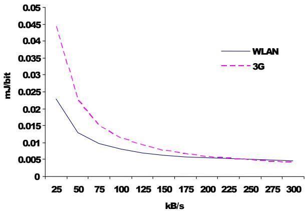
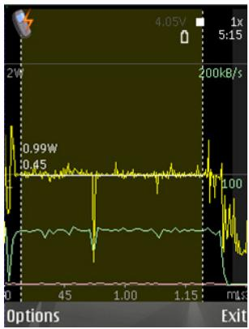
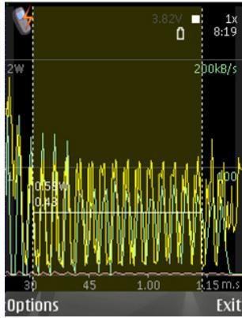
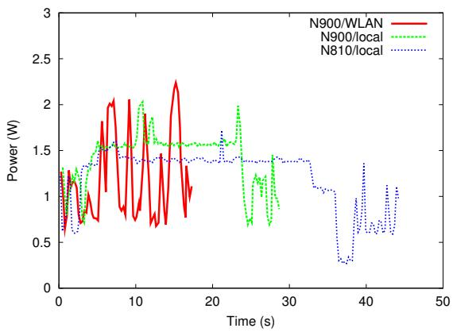
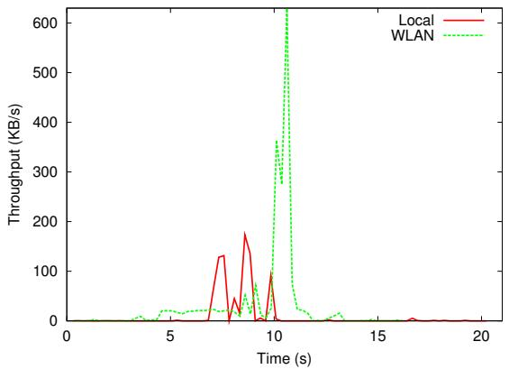
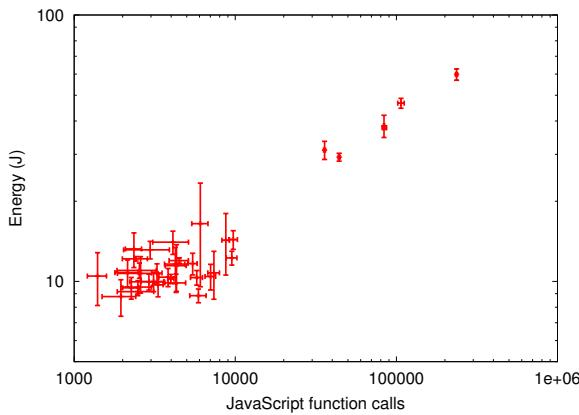

# Energy efficiency of mobile clients in cloud computing

Antti P. Miettinen

Nokia Research Center

antti.p.miettinen@nokia.com

Jukka K. Nurminen

Nokia Research Center

jukka.k.nurminen@nokia.com

# Abstract

Energy efficiency is a fundamental consideration for mobile devices. Cloud computing has the potential to save mobile client energy but the savings from offloading the computation need to exceed the energy cost of the additional communication.

In this paper we provide an analysis of the critical factors affecting the energy consumption of mobile clients in cloud computing. Further, we present our measurements about the central characteristics of contemporary mobile handheld devices that define the basic balance between local and remote computing. We also describe a concrete example, which demonstrates energy savings.

We show that the trade-offs are highly sensitive to the exact characteristics of the workload, data communication patterns and technologies used, and discuss the implications for the design and engineering of energy efficient mobile cloud computing solutions.

# 1 Introduction

This paper discusses the energy efficiency of mobile clients in cloud computing. We see cloud computing as a promising technology which can offer many benefits for mobile devices. In this paper we focus on computation offloading, which can be used to save energy for the battery powered devices.

We describe the present state of mobile device characteristics that are critical for cloud computing and highlight cases where cloud computing can be used to save energy. It turns out that the computational characteristics of many current mobile applications favor local processing. This can be a result of a natural selection process, which has favored light-weight applications that are able to run with the limited resources of a mobile device. Therefore computationally demanding mobile applications are rare even though the need for such applications may well exist. Nevertheless, cloud computing does allow running some existing applications with less energy. Thinking about the future, cloud computing can be an essential enabler for the development of new computationally intensive applications for mobile devices.

In our analysis, we discuss the computing to communication ratio, which is the critical factor for the decision between local processing and computation offloading. The trade-off point is strongly dependent on the energy efficiency of wireless communication and of local processing. Additionally, not only the amount of transferred data but also the traffic pattern is important; sending a sequence of small packets consumes more energy than sending the same data in a single burst. Managing the complexity of all issues involved makes the role of developers and content producers important. We provide preliminary results on mechanisms for estimating the energy cost of modern web oriented workloads.

The rest of the paper is organized as follows. In Section 2 we describe the background of mobile cloud computing and review the related research. Section 3 provides an overview of the basic setup of mobile cloud computing, highlighting the characteristics of contemporary mobile devices. In Section 4 we describe an example case for mobile cloud computing and in Section 5 we discuss the role of cloud computing for mobile devices in general and the implications for, e.g., software developers and content producers. We end our paper with our conclusions in Section 6.

# 2 Background

Cloud computing has received large interest recently. The primary motivations for the mainstream cloud computing are related to the elasticity of computing resources. Cloud computing offers virtually infinite resources that are available on demand and charged according to usage. This offers considerable economic advantages both for cloud providers and cloud users as described in [1].

For mobile devices the motivations of using cloud computing differ from the motivation of cloud computing with well-connected PC devices. A shared problem between mobile and mainstream cloud computing is the data transfer bottleneck. For mainstream cloud computing the most important concern is the time and the cost of transferring massive amounts of data to the cloud while for mobile cloud computing the key issue is the energy consumption of the communication. This is probably one of the reasons why there are few examples of true mobile cloud computing. Device backup would be a useful service for a small device that can easily get lost but it requires transferring large amounts of data. However, synchronization of contact and calendar data, where the amount of transferred data is more modest, is a service that is widely available.

Energy efficiency has always been critical for mobile devices and the importance seems to be increasing. Use cases are developing towards always on-line connectivity, high speed wireless communication, high definition multimedia, and rich user interaction. Development of battery technology has not been able to match the power requirements of the increasing resource demand. The amount of energy that can be stored in a battery is limited and is growing only 5% annually [8]. Bigger batteries resulting into larger devices are not an attractive option. Also thermal considerations limit the power budged of the small devices without active cooling to about three watts [5]. Energy efficiency improvements can also always be traded for other benefits like device size, cost and R&D efficiency. Indeed, large part of the hardware technology benefits have been traded for programmability in mobile phone designs [11].

Computation offloading has been the topic of a number of studies. However, only a subset of those studies focus on the effect offloading has on the energy consumption of the mobile device. In most cases the focus is on response time and other resource consumption. Large part of the research uses modelling and simulation, like [7], which is an early investigation of offloading work from mobile to a fixed host concluding that under certain conditions 20% energy savings would be possible.

Compiler technology has been studied in, e.g., [12], where a program is partitioned to client and server parts. The client parts are run on a mobile device and the server part is offloaded. The main metrics evaluated are execution speed and energy consumption. Even though the measurements show that significant energy savings are possible, the outcome is shown to be sensitive to program inputs.

Middleware based approach has been studied in, e.g., [3]. The described framework performs resource accounting and uses execution time, energy usage and application fidelity as criteria for deciding between local, remote and hybrid execution.

Virtual machine technology for mobile cloud computing is studied in [9]. The paper proposes a distributed cloud architecture utilizing single hop radio technology for reducing latency and jitter. However, the proposed architecture requires significant changes to infrastructure.

Our work complements existing research by providing a snapshot of the present state of mobile devices and widely used wireless technologies and their effect on mobile cloud computing. Instead of program partitioning we have focused on evaluating the basic feasibility of moving tasks to cloud. Furthermore, in our work we investigate both wireless local area network (WLAN) and cellular communication (3G), and conclude that, as expected, the thresholds for moving to the cloud vary significantly based on the used communication technology.

# 3 Energy trade-off analysis

In the context of cloud computing, the critical aspect for mobile clients is the trade-off between energy consumed by computation and the energy consumed by communication. We need to consider the energy cost of performing the computation locally $( E _ { l o c a l } )$ versus the cost of transferring the computation input and output data $( E _ { c l o u d } )$ . For offloading to be beneficial we require that

$$
E _ {c l o u d} <   E _ {l o c a l} \tag {1}
$$

If D is the amount of data to be transferred in bytes and C is the computational requirement for the workload in CPU cycles then

$$
E _ {c l o u d} = \frac {D}{D _ {e f f}} \tag {2}
$$

$$
E _ {l o c a l} = \frac {C}{C _ {e f f}} (3)
$$

where $D _ { e f f }$ and $C _ { e f f }$ are device specific data transfer and computing efficiencies. The $D _ { e f f }$ parameter is a measure for the amount of data that can be transferred with given energy (in bytes per joule) whereas the $C _ { e f f }$ parameter is a measure for the amount of computation that can be performed with given energy (in cycles per joule). With these we can derive the relationship between computing and communication for offloading to be beneficial

$$
\frac {C}{D} > \frac {C _ {\text { eff }}}{D _ {\text { eff }}} \tag {4}
$$

The computing energy efficiency $( C _ { e f f } )$ is affected by the device implementation. For example, a CPU designed for high peak performance requires much more power per megahertz than a core designed for lower performance. Techniques like dynamic voltage and frequency scaling (DVFS) alter the power and performance of the CPU at run-time.

<table><tr><td>Device/frequency</td><td>Power/W</td><td>Cycles/energy ( $C_{eff}$ )</td></tr><tr><td>N810/400 MHz</td><td>0.8</td><td>480 MC/J</td></tr><tr><td>N810/330 MHz</td><td>0.7</td><td>480 MC/J</td></tr><tr><td>N810/266 MHz</td><td>0.5</td><td>540 MC/J</td></tr><tr><td>N810/165 MHz</td><td>0.3</td><td>510 MC/J</td></tr><tr><td>N900/600 MHz</td><td>0.9</td><td>650 MC/J</td></tr><tr><td>N900/550 MHz</td><td>0.8</td><td>690 MC/J</td></tr><tr><td>N900/500 MHz</td><td>0.7</td><td>730 MC/J</td></tr><tr><td>N900/250 MHz</td><td>0.4</td><td>700 MC/J</td></tr></table>

Table 1: Energy characteristics of local computing for Nokia N810 and N900 (MC=megacycle).

Table 1 lists the computational energy characteristics of two mobile devices, the Nokia N810 and Nokia N900, measured with the gzip deflate compression program compressing ASCII data. In this paper we have used the Nokia Energy Profiler [2], which measures the power consumption of the complete device. The cycle values were calculated from program execution time and CPU clock speed. From the table we can see that DVFS does affect the energy efficiency of computing $( C _ { e f f } )$ but not radically. Device implementation has much bigger impact.

The power and bit-rate characteristics of wireless modems vary also significantly. The most significant factor for the energy consumption of a wireless modem is the activity time of the interface. The latencies associated with the activation and deactivation of the wireless interface vary by technology and are longer in cellular communication than in WLAN. Figure 1 illustrates the dependency of energy per transferred data on communication bit-rate. As can be seen, the higher the bit-rate, the more energy efficient the data transfer is. The figure also illustrates the fact that the energy efficiency of cellular communication tends to be more sensitive to the data transfer bit-rate than WLAN.

The energy efficiency of communication is also affected by the traffic pattern as illustrated in Figure 2, which shows data transfer power levels for WLAN communication with smooth and bursty traffic sources measured on Nokia N95. The same average bit-rate that requires 1W power with a smooth traffic source consumes only 0.6W with a bursty traffic source.

Table 2 lists the energy characteristics of wireless communication for the Nokia N810 and N900, measured with the netperf TCP streaming benchmark. The WLAN throughput of the N810 is affected significantly by the CPU operating point so the metrics are shown for all operating points separately. Even though the power level of the device is highest at the highest operating point, higher throughput causes it to be the most energy efficient state for WLAN transfer. The N900 networking throughput is not similarly affected by the CPU operating point.

line

| kB/s | WLAN   | 3G     |
|------|--------|--------|
| 25   | 0.023  | 0.045  |
| 50   | 0.013  | 0.028  |
| 75   | 0.010  | 0.018  |
| 100  | 0.008  | 0.014  |
| 125  | 0.007  | 0.011  |
| 150  | 0.006  | 0.009  |
| 175  | 0.0055 | 0.0075 |
| 200  | 0.005  | 0.0065 |
| 225  | 0.0045 | 0.006  |
| 250  | 0.004  | 0.0055 |
| 275  | 0.0035 | 0.005  |
| 300  | 0.003  | 0.0045 |

Figure 1: Energy per bit for N95 WLAN and 3G.

line

| Time (ms) | Voltage (W) |
| --------- | ----------- |
| 0.45      | 0.99        |

(a) Smooth traffic source.

line

| Time (ms) | Power (W) |
| --------- | --------- |
| 3.82      | 0.58      |
| 8:19      | 0.43      |

(b) Bursty traffic source.   
Figure 2: Traffic pattern effect for N95 WLAN.

<table><tr><td>Device</td><td>Power/W</td><td>Bytes/energy ( $D_{eff}$ )</td></tr><tr><td>N810/400 MHz</td><td>1.5</td><td>390 KB/J</td></tr><tr><td>N810/330 MHz</td><td>1.4</td><td>370 KB/J</td></tr><tr><td>N810/266 MHz</td><td>1.3</td><td>350 KB/J</td></tr><tr><td>N810/165 MHz</td><td>1.1</td><td>310 KB/J</td></tr><tr><td>N900/WLAN</td><td>1.1</td><td>860 KB/J</td></tr><tr><td>N900/3G/receive (near)</td><td>1.1</td><td>450 KB/J</td></tr><tr><td>N900/3G/transmit (near)</td><td>1.0</td><td>190 KB/J</td></tr><tr><td>N900/3G/receive (far)</td><td>1.4</td><td>350 KB/J</td></tr><tr><td>N900/3G/transmit (far)</td><td>3.2</td><td>60 KB/J</td></tr></table>

Table 2: Energy characteristics of wireless transfer for Nokia N810 and N900.

<table><tr><td>Workload</td><td>Cycles/byte</td></tr><tr><td>gzip ASCII compress</td><td>330</td></tr><tr><td>x264 VBR encode</td><td>1300</td></tr><tr><td>x264 CBR encode</td><td>1900</td></tr><tr><td>html2text wikipedia.org</td><td>2100</td></tr><tr><td>html2text en.wikipedia.org</td><td>5900</td></tr><tr><td>pdf2text N900 data sheet</td><td>960</td></tr><tr><td>pdf2text E72 data sheet</td><td>8900</td></tr></table>

Table 3: Computation to data ratios for various workloads.

For N900 the table shows the effect of different bearers and different location (near and far from base station) for the energy efficiency of the data transfer. One factor to consider while reading the table is the fact that the 3G measurements were performed in a reasonably crowded R&D network where the device was not able to achieve optimal throughput. However, the asymmetric design of the 3G HSDPA communication is clearly illustrated. The cost of transmitting is much higher than receiving. Also, the power consumption of the wireless modem is significantly affected by the network quality. Especially transmission far from the base station requires very high power degrading the energy efficiency of the communication significantly.

Combining the best case values of Tables 1 and 2 with Equation 4 we get the following rough rule of thumb: for computation offloading to be beneficial the workload needs to perform more than 1000 cycles of computation for each byte of data.

Table 3 lists some CPU cycle to data ratios measured on the Beagleboard single board computer, which employs an ARM Cortex-A8 CPU core running at 720 MHz. The deflate compression algorithm, gzip, is a data intensive workload whereas the x264 video encoder represents more computationally intensive workload. In our experience, most current mobile applications resemble more gzip than x264. This is not surprising as running computationally intensive applications on a mobile device has not been an attractive proposition.

The html2text and pdf2text programs represent applications, whose behavior is strongly affected by the data that they are processing. The wikipedia entry page (http://wikipedia.org/) is a simple web page containing just language selection options whereas the English main page (http://en.wikipedia. org/) is a more complex page containing, e.g., tables that require much more processing. The effect of processed data is especially significant for modern web oriented workloads where the content largely dictates the processing requirement.

<table><tr><td>Device/bearer</td><td>Average power/W</td><td>Total energy/J</td></tr><tr><td>N810/local</td><td>1.2</td><td>50</td></tr><tr><td>N810/WLAN</td><td>1.4</td><td>20</td></tr><tr><td>N900/local</td><td>1.4</td><td>40</td></tr><tr><td>N900/WLAN</td><td>1.2</td><td>20</td></tr><tr><td>N900/3G (near)</td><td>1.5</td><td>40</td></tr><tr><td>N900/3G (far)</td><td>2</td><td>55</td></tr></table>

Table 4: Power and energy of PDF viewing.

line

| Time (s) | N900/WLAN | N900/local | N810/local |
| -------- | --------- | ---------- | ---------- |
| 0        | 1.2       | 1.2        | 1.2        |
| 5        | 1.8       | 1.6        | 1.4        |
| 10       | 2.0       | 2.0        | 1.4        |
| 15       | 2.2       | 1.6        | 1.4        |
| 20       | 1.6       | 1.6        | 1.4        |
| 25       | 1.4       | 1.2        | 1.4        |
| 30       | 1.4       | 1.4        | 1.4        |
| 35       | 1.4       | 1.4        | 1.0        |
| 40       | 1.4       | 1.4        | 0.3        |
| 45       | 1.4       | 1.4        | 1.1        |
| 50       | 1.4       | 1.4        | 1.1        |

Figure 3: Example power curves for PDF viewing.

# 4 Example: mobile as a thin client

For testing the reasoning presented in Section 3, we have made experiments with PDF viewing and web browsing where the mobile terminal acts as a thin client utilizing the X11 window system [10]. The X11 network transparency feature allows running the application and its display in separate devices. This mechanism is available in the maemo platform (http://maemo.org/ intro/platform/) used by the Nokia N810 and N900 devices.

Table 4 shows the average power levels and total energies for viewing a demanding PDF document (Nokia E72 data sheet). For N810 there are two cases: local viewer and remote X11 client connected over WLAN. For N900 there are four cases: local viewer, remote viewer over WLAN, remote viewer over 3G packet data near base station and remote viewer over 3G packet data far from base station. Figure 3 shows as examples the measured power for local viewer cases and the N900 WLAN case.

As can be seen, the remote cases run with higher average power. However, the total energy for the remote WLAN case is the smallest because of shorter execution time. The 3G network cases consume more energy than WLAN because of communication latencies. Moreover,

line

| Time (s) | Local | WLAN |
| -------- | ----- | ---- |
| 0        | 0     | 0    |
| 5        | 0     | 0    |
| 10       | 100   | 350  |
| 15       | 0     | 0    |
| 20       | 0     | 0    |

Figure 4: Download rate for local and remote browser.

3G communication is sensitive to location as evidenced by the energy differences of the cases where the mobile device is near and far from the base station.

Another observation that can be made from the measurements is the improved processing performance of the N900 compared to the N810. The Nokia N900 is a more recent model than N810 and has significantly more powerful processing capabilities. Even though the N900 local processing takes a bit higher power, the shorter processing time makes the N900 more energy efficient for this workload. For the WLAN case both devices perform similarly regardless of the better WLAN throughput that N900 is able to achieve.

In the web browsing case, we compared local browser with remote X11 client browser. As an example, opening the English main page of wikipedia (http://en. wikipedia.org/) requires about 30 joules with the N900 local browser and about 25 joules with a remote browser over WLAN connection. The CNN International Edition page (http://edition.cnn.com/) takes roughly the same energy (60J) with local and remote browser. Even though web page processing requires significant computation, and is therefore a good candidate for offloading, the remote web browser causes also significant amounts of network traffic while rendering the page.

Figure 4 shows example curves of the download traffic for local and remote browser cases while viewing the English main page of wikipedia on N900. Even though the local browser downloads less data (about 200KB) than the remote case (about 500KB), the remote browser case achieves higher throughput for a large part of the data transfer. This highlights the fact that the amount of transferred data alone is not a sufficient metric for characterizing the energy consumption of communication. As discussed in Section 3, the communication pattern is also an important consideration.

For X11 applications, the usage pattern and application implementation details have also major impact on the energy consumption. Rendering requires significant computation and running it remotely can therefore save energy. However, for example scrolling requires minimal processing and can cause large amounts of data to be transferred which causes remote operation to be very energy inefficient in addition to degrading interactive performance.

# 5 Discussion

The setup for mobile cloud computing is substantially different from the traditional client-server computing arrangement. Energy is a fundamental factor for battery powered devices and an important criterion when considering moving computing to the cloud. The basic balance between local and remote computing is defined by the trade-off between communication energy and computing energy.

However, there are many factors to consider when thinking about mobile cloud computing scenarios. The computing to data ratio defining the break-even for moving to cloud is highly dependent on the exact energy efficiencies of wireless communication and local computing. The measurements in this paper provide a rough guideline for current mobile devices but technology development can shift the trade-off point significantly. Naturally device specific implementation decisions affect the balance but to a less radical extent. Also, the computation offloading needs careful design in order to avoid introducing long latencies into user visible operations. As shown in Figure 3, computation offloading can in some cases be used to improve performance in addition to saving energy.

For wireless communication, not only the amount of data but also the communication pattern has a large impact on the energy consumption. E.g., interactive workloads utilizing thin client technologies represent probably the most challenging target because of the fine granularity of the required communication. The best energy efficiency for communication would be achieved with bulk data transfers. Also if immediate response is not required the data transfers can be delayed and executed later when a bearer with better energy efficiency is available. Scheduling data transfers to happen in parallel can also be used to save energy [6].

Mobile cloud computing differs also from simple computation offloading in the sense that the cloud can offer services other than computing for mobile clients. Storage for backing up the mobile terminal data is one example. Another example could be a content sharing service, which by nature requires transferring locally produced data to the cloud. Also, for many use cases the data is already in the cloud (e.g., web content). In this kind of scenarios the cost of transferring workload input is essentially zero. However, signalling traffic for controlling the computation would still be needed.

scatter

| JavaScript function calls | Energy (J) |
| ------------------------- | ---------- |
| 1000                      | 10         |
| 2000                      | 15         |
| 3000                      | 20         |
| 4000                      | 25         |
| 5000                      | 30         |
| 6000                      | 35         |
| 7000                      | 40         |
| 8000                      | 45         |
| 9000                      | 50         |
| 10000                     | 55         |
| 20000                     | 60         |
| 30000                     | 65         |
| 40000                     | 70         |
| 50000                     | 75         |
| 60000                     | 80         |
| 70000                     | 85         |
| 80000                     | 90         |
| 90000                     | 95         |
| 100000                    | 100        |

Figure 5: Energy versus JavaScript function calls (in logarithmic scale on both axis to accommodate loads of different magnitude).

It is clear that there are a number of nontrivial factors to consider when making design decisions about cloud applications targeting mobile devices. Estimating the computational requirements of client side processing and the energy consumption of the required network traffic is therefore an important topic. Currently web technologies are a popular way of constructing distributed applications and web applications are increasingly targeting mobile clients. There is a need for energy consumption feedback during the natural development and debugging cycle [4] but current tools are severely lacking in this area.

Figure 5 illustrates how very simple metrics allow coarse grain estimation of the energy consumption of JavaScript execution. The graph shows the correlation between JavaScript function call counts extracted from web applications running in desktop Firefox browser and the corresponding energy consumption in Nokia N900. As can be seen, large workloads exhibit near linear behavior whereas the behavior at smaller granularity is very noisy. Even though this simple metric is clearly insufficient for fine grained web application profiling, large grain estimates would probably be useful for, e.g., web content production tools. As discussed in section 3, content has a large impact on the energy consumption of mobile clients.

# 6 Conclusions

In this paper we have analyzed the energy consumption of mobile clients in cloud computing. There are many factors that make cloud computing an attractive technology, but energy consumption is a fundamental criterion for battery powered devices and needs to be carefully considered for all mobile cloud computing scenarios. While energy can be a challenge for mobile cloud computing, it is also as an opportunity. Mobile cloud computing is therefore a fruitful area for further research.

While the most energy efficient setup for many current mobile applications is local computing, there clearly are workloads that can benefit from moving to the cloud. The vastly superior computing resources available in the cloud open also interesting possibilities for completely new applications. Identifying these new applications is one interesting topic for future research.

Even though high performance often implies higher power requirements our examples show that high performance can also contribute towards better energy efficiency. This is especially true for wireless communication where achieving high energy efficiency requires high throughput. It is also important to realize that the performance metrics of real world scenarios can be significantly different from theoretical maximums implied by device components. For example radio throughput can be limited by device interconnects, processing capabilities and memory subsystem performance.

We see tools and technologies for managing the complexity of the issues involved as important topics for future research. Developers and content producers would benefit especially from tools that integrate seamlessly to the normal development flow. This requires models and estimation mechanisms that are sufficiently light-weight but still able to guide design decisions towards better energy efficiency.

Context dependency of the energy efficiency trade-offs means that the decision making cannot be restricted to design time only. Energy aware middleware solutions should therefore be researched to evaluate the feasibility of automatic decision making between local and remote processing.

For interactive workloads, latencies associated with wireless communication are a critical factor. A related topic is thin client technology, where protocols have traditionally not been optimized specifically for energy efficiency. Implementing modern rich user interfaces for cloud applications with high energy efficiency is an especially challenging topic. Studies providing more detailed understanding about the effect of data amount, different devices and traffic patterns would also be highly valuable.

We see also server side technologies critical for mobile cloud computing. The energy consumption of a mobile device is affected by the complete end-to-end chain. For, e.g., web applications the server response times can have a significant effect on the energy consumption of mobile clients. Optimizing wireless communication patterns is critical for energy efficiency and requires considerations both on the client and the server side.

# Acknowledgments

For support and review work we thank Dr. Vesa Hirvisalo at Aalto University School of Science and Technology. For our research tools we are grateful to numerous people in Nokia product development units.

# References

[1] ARMBRUST, M., FOX, A., GRIFFITH, R., JOSEPH, A. D., KATZ, R., KONWINSKI, A., LEE, G., PATTERSON, D., RABKIN, A., STOICA, I., AND ZAHARIA, M. Above the Clouds: A Berkeley View of Cloud Computing. Tech. rep., February 2009. UC Berkeley Reliable Adaptive Distributed Systems Laboratory.   
[2] BOSCH, G., AND KUULUSA, M. Optimizing mobile software with built-in power profiling. In Mobile Phone Programming and Its Application to Wireless Networking. Springer, 2007, pp. 449–462.   
[3] FLINN, J., NARAYANAN, D., AND SATYA-NARAYANAN, M. Self-tuned remote execution for pervasive computing. In HOTOS ’01: Proceedings of the Eighth Workshop on Hot Topics in Operating Systems (Washington, DC, USA, 2001), IEEE Computer Society, p. 61.   
[4] MIETTINEN, A., AND HIRVISALO, V. Energyefficient parallel software for mobile hand-held devices. In First USENIX Workshop on Hot Topics in Parallelism (HotPar’09) (2009).   
[5] NEUVO, Y. Cellular phones as embedded systems. Digest of Technical Papers, IEEE Solid-State Circuits Conference (ISSCC) (2004), 32–37.   
[6] NURMINEN, J. K. Parallel connections and their effect on the battery consumption of a mobile phone. In Consumer Communications and Networking Conference (CCNC), 2010 7th IEEE (jan. 2010), pp. 1 –5.   
[7] OTHMAN, M., AND HAILES, S. Power conservation strategy for mobile computers using load sharing. SIGMOBILE Mob. Comput. Commun. Rev. 2, 1 (1998), 44–51.   
[8] ROBINSON, S. Cellphone Energy Gap: Desperately Seeking Solutions. Tech. rep., 2009. Strategy Analytics.   
[9] SATYANARAYANAN, M., BAHL, P., CACERES, R., AND DAVIES, N. The Case for VM-Based Cloudlets in Mobile Computing. Pervasive Computing, IEEE 8, 4 (2009), 14 –23.

[10] SCHEIFLER, R. W., AND GETTYS, J. X Window system: the complete reference to Xlib, X protocol, ICCCM, XLFD. Digital Press, Newton, MA, USA, 1990.   
[11] SILVEN, O., AND JYRKKA¨ , K. Observations on power-efficiency trends in mobile communication devices. EURASIP J. Embedded Syst. 2007, 1 (2007), 17–17.   
[12] WANG, C., AND LI, Z. A computation offloading scheme on handheld devices. J. Parallel Distrib. Comput. 64, 6 (2004), 740–746.