# Energy Efficient Resource Allocation for Wireless Powered UAV Wireless Communication System With Short Packet

Jin Xie , Zheng Chang , Senior Member, IEEE, Xijuan Guo , and Timo Hämäläinen , Senior Member, IEEE

Abstract—The unmanned aerial vehicle (UAV), which is prominent in its flexibility and low cost, is considered to be fully utilized in the future wireless communication system to provide flexible services and improve connectivities. In this paper, we investigate the resource allocation problem in a wireless powered UAV communication system. In this considered system, The UAV acts as hybrid access point (HAP), which can first perform wireless power transfer in the downlink and charge the Internet of Thing (IoT) user devices (UDs). The UDs can use the harvested energy to deliver the data to the UAV. In the uplink, we explicitly consider short packet communication (SPC) as the transmission feature, which adopts finite block-length codewords and suffers from rate degradation. With the objective to maximize system energy efficiency, we jointly optimize the position and transmit power of the UAV, and transmission time of each UD. To address the formulated non-convex problem, we develop efficient algorithms to find sub-optimal solutions. Extensive simulations are conducted to verify the effectiveness of the proposed scheme.

Index Terms—Energy efficiency, Internet of Things, UAV, short packet communication, URLLC.

## I. INTRODUCTION

## A. Background

NTERNET of Things (IoT) is a considered as a promising paradigm attempting to extend human-to-human communication to human-to-thing and thing-to-thing communication [1]. The extensive application scenarios of IoT include smart grid, smart home, smart transportation, and smart medical care, etc [2]. However, there are many challenges on realizing and deploying the IoT system [3], one of which is the energy supply problem of massive user devices (UDs) [4]. Most traditional IoT UDs use energy-constrained batteries as the main source. However, when deploying massive UDs over a large area, regular replacement of batteries for IoT devices may be very inconvenient and expensive.

Recently, energy harvesting (EH) technology has been proposed to effectively extend the battery life for IoT devices [5]. Among all kinds of EH technologies, utilizing the wireless power transfer (WPT) to provide energy for mobile devices has received significant interests [6]. Meanwhile, to provide ubiquitous connectivity and support the development of IoT, unmanned aerial vehicle (UAV) is considered as an important network entity in the future wireless communications system, and the research of UAV-assisted communication system has attracted more and more attentions from the industry and academia [7]. Compared with traditional terrestrial cellular infrastructure, UAVs can be flexibly deployed on demand to alleviate heavy data loads in hotspots and extend the network connectivity [8], [9]. Due to its flexible nature, UAV can also act as a hybrid access point (HAP) that not only performs as the transceiver for information delivery, but also can be used as the WPT source to transmit energy to the UDs [10]. The resulted wireless powered UAV network can effectively improve energy utilization and communication reliability for the IoT system.

Meanwhile, due to the stringent latency requirement and data feature, the transmissions among IoT devices are usually dominated by the short-packet communication (SPC). While there are some previous works using infinite block-length codeword to analyze the transmission performance among IoT devices, it is not accurate. In fact, as the IoT system usually consists of low power devices, the explicit consideration of packet length has a significant impact on the design of IoT network. Therefore, recent works show that the analysis of SPC can adopt finite block-length codewords for data delivery and uses a small number of symbols in one transmission frame. Specifically, the maximum achievable data rate of SPC is actually smaller than Shannon capacity, while the packet error rate is higher than long-packet communication. This is due to the fact that when the packet length is short, the wireless channel distortions and noise have a stronger impact on the transmitted signal. As such, the traditional analysis of communication system which assumes infinite-length packets and adopts Shannon capacity as the performance metric can not be directly applied to evaluate the wireless communications in IoT system. Therefore, it is of profound significance to study the effect of SPC and packet length in the context of design of IoT system [11].

## B. Related Work

The UAVs can be sent to fly over a large scale area for data collection and delivery, which is able to reduce the power consumption of the deployed sensors and thereby prolongs the lifetime of IoT. In [12], taking into account the energy consumption of UAV propulsion, the efficient communication of UAV can be realized through trajectory optimization. In [8], the authors investigate a energy trade-off between the UAV and its served ground terminal via trajectory design. The authors of [13] propose a cooperative UAV sense-andsend protocol and solve a joint subchannel allocation and UAV speed optimization problem. In [14], an optimization scheme is proposed to maximize the energy efficiency of a UAV-assisted mobile edge computing system, where the UAV trajectory design and resource allocation are jointly studied.

Recently, utilizing the WPT to boost the development of IoT are becoming more and more important for prolonging the battery life and developing a sustainable wireless communications system. WPT presents a new paradigm that harvests energy from environmental electromagnetic sources [15]. The authors of [16] provide a method for predicting the power transfer efficiency of WPT in a Multi-input Multi-output (MIMO) WPT system with arbitrary UD positions and attitudes of antenna arrays. In [17], a new type of wireless powered communication network (WPCN) system supported by UAV is studied. The UAV trajectory and resource allocation are jointly optimized to maximize throughput performance subject to the condition of speed constraint and users’ maximum energy consumption.

The researches on the SPC are mainly to deal with latency and reliability investigations in the context of data transmission considering lower power IoT devices [18], [19]. Unlike long-packet transmissions in traditional wireless networks, Shannon capacity performance metrics can no longer be applied to SPC [20], which means that thorough study on the performance of SPC is needed. An approximation expression of the maximum encoding rate under the AWGN channel and the probability of a finite packet error is derived in [21]. A collaborative relay protocol which reduces the error rate of SPC is presented in [22], and an approximation of the system error rate is provided in [23]. In [24], the authors consider a wireless powered IoT system, and jointly optimize the transmission time and packet error rate of each user to maximize the throughput and minimize the transmission time in the context of SPC. The application scenarios of dynamic spectrum acquisition and local licensing of SPC in smart grid are analyzed in [25]. Considering to maximize the system confidentiality capacity, the authors jointly optimize the number of bandwidth units and power allocation in [26]. Taking into account of SPC, the authors of [27] mainly study the resource allocation scheme to maximize the achievable effective energy efficiency (EE) for uplink Non-Orthogonal Multiple Access (NOMA)-based massive machine type communications. There are some works dedicating on the investigation of UAV SPC system. In [28], the authors introduce UAV relay to optimize UAV position and block-length while meeting the minimum delay requirements. The authors investigate the average error rate of SPC and the effective throughput in a ultra-reliable and low-latency UAV communications system [29].

## C. Main Contributions

In this work, we consider using UAV as HAP for both downlink WPT and uplink data transmission. For the data transmission, SPC is employed. With the objective to maximize the energy efficiency of system, we jointly optimize the UAV position, transmission time and transmit power. The major contributions of this article are as follows:

Considering the downlink WPT and uplink SPC, we first define the system’s energy efficiency (EE) which consists of system throughput and energy consumption. Based on the expression of system EE, the problem is formulated to optimize the location of UAV, transmit power of UAV and transmission times(block/packet length) so as to maximize the EE.

Nonetheless, due to the fact that the formulated problem is a fractional mixed integer programming problem with a non-convex structure, addressing such a problem and getting the optimal solution requires high computational complexity. Thus, we propose to transform it to convex optimization problems by decoupling several constraints and address them iteratively.

By using convex optimization scheme, we are able to solution of each subproblems and then we can develop an efficient iterative algorithm to find the solution of the original one. The proof of convergence and complexity analysis of the proposed algorithm is presented. Extensive simulations are conducted to demonstrate the effectiveness of the presented scheme.

## D. Organization

The reminder of this paper is organized as follows. The system model is depicted in Section II. In Section III, we present the problem formulation and analysis. The proposed solution is given in Section IV. In Section V, performance evaluation is conducted. Section VI summarizes this work.

## II. SYSTEM MODEL

We consider a scenario in which the UAV works as a HAP providing WPT in the downlink to the UDs and collecting data via upkink SPC from them in the wireless-powered IoT Network (WPIN), as shown in Fig. 1. The UAV has multiple transmitting antennas and we denote the K single-antenna UD as $\mathrm { U D } _ { 1 } , \mathrm { U D } _ { 2 } , \dotsc , \mathrm { U D } _ { K }$ . We denote $h _ { k }$ as the downlink channel coefficient between the UAV and $\mathrm { U D } _ { k }$

In Fig. 2, the transmission process is presented. The UAV performs the WPT in the first phrase, and then the UDs use the collected energy to send short packets to the UAV based on TDMA policy, which be viewed as the uplink wireless information transfer (WIT) phase. We denote $\tau _ { 0 } { = } n _ { 0 } T _ { c }$ as the downlink energy transmission time, and $\tau _ { k } = n _ { k } T _ { c }$ as the uplink transmission time for UD k.

We assume that the horizontal position of the UAV is ${ \bf q } =$ $[ x , y ] ^ { T }$ , and the height H of the UAV is fixed. The position of $\mathrm { U D } _ { k }$ is $\mathbf { u } _ { k } = [ x _ { k } , y _ { k } ] ^ { T }$ . The distance between the UAV and $\mathrm { U D } _ { k }$ is

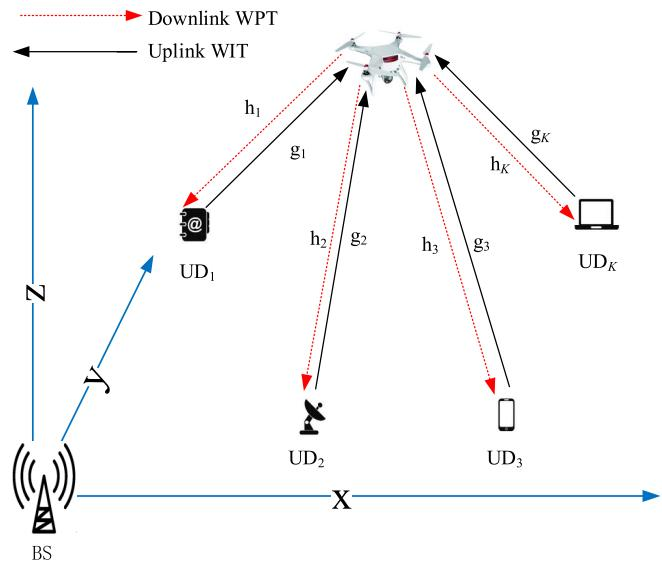  
Fig. 1. System model.

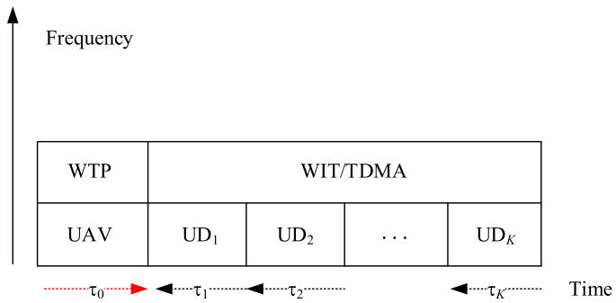  
Fig. 2. Transmission process.

$$
d _ { k } = \sqrt { \| \mathbf { q } - \mathbf { u } _ { k } \| ^ { 2 } + H ^ { 2 } } .\tag{1}
$$

1) Downlink WPT: The signal received at UD can be expressed as

$$
a _ { k } = \sqrt { \frac { p _ { k } } { d ^ { \alpha } } } h _ { k } s _ { 0 } + v _ { k } ,\tag{2}
$$

where $p _ { k }$ is the transmit power of the UAV to $\mathrm { U D } _ { k } .$ . Here we consider a Nakagami-m quasi-static channel model where the channel gain is constant in the transmission block, from varies from one block to another block. So $h _ { k } ^ { 2 } \sim \Gamma ( m , 1 / m )$ , and $v _ { k }$ is the noise. $X \sim \Gamma ( m , 1 / m )$ is a normalized gamma distributed random variable with shape factor m and probability density function (PDF) $\begin{array} { r } { f _ { X } ( x ) = \overset { \cdot \cdot } { \Gamma ( m ) } x ^ { m - 1 } e ^ { - m \overset { \cdot } { x } } . \Gamma ( m ) } \end{array}$ is the Gamma function. We denote $T _ { c }$ as the symbol period of both downlink and uplink signals. $0 < \eta < 1$ is the energy conversion efficiency, $n _ { 0 }$ is the packet length (the number of transmitted symbols), and κ is the combined influence of other factors such as the carrier frequency, height and gain of the antenna. Then we have the received energy of $\mathrm { U D } _ { k }$

$$
E _ { k } = \frac { \eta p _ { k } } { \kappa { d _ { k } } ^ { \alpha } } h _ { k } ^ { 2 } \tau _ { 0 } .\tag{3}
$$

2) Uplink WIT: The transmit power of the $\mathrm { U D } _ { k }$ in the uplink is

$$
p _ { \mathrm { U } k } = \frac { E _ { k } } { \tau _ { k } } = \frac { \eta n _ { 0 } p _ { k } } { \kappa n _ { k } d _ { k } ^ { \alpha } } h _ { k } ^ { 2 } ,\tag{4}
$$

where $n _ { k }$ is the uplink packet length (the number of transmitted symbols) and $\tau _ { k } = n _ { k } T _ { c } ( 1 \leq k \leq K )$ is the uplink signal transmission duration of $\mathrm { U D } _ { k }$

We denote $s _ { k }$ as the uplink signal from $\mathrm { U D } _ { k }$ to UAV. The received signal $b _ { k }$ at UAV from $\mathrm { U D } _ { k }$ can be expressed as

$$
b _ { k } = \sqrt { \frac { p _ { \mathrm { U } k } } { d _ { k } ^ { \alpha } } } \mathrm { g } _ { k } s _ { k } + \nu _ { k } ,\tag{5}
$$

where $g _ { k }$ is the uplink channel coefficient between the UAV and $g _ { k } ^ { 2 } \sim \Gamma ( m , 1 / m ) . ~ \nu _ { k }$ is the noise at the UAV with zero mean and power $\sigma ^ { 2 }$ . The instantaneous signal-to-noise ratio (SNR) of the uplink signal from $\mathrm { U D } _ { k }$ to the UAV is

$$
\gamma _ { k } = \frac { \eta n _ { 0 } p _ { k } } { \kappa n _ { k } d _ { k } ^ { 2 \alpha } \sigma ^ { 2 } } h _ { k } ^ { 2 } g _ { k } ^ { 2 } .\tag{6}
$$

In this work, we consider a SPC with finite block-length for uplink transmission. Then, for a given packet error rate $\varepsilon _ { k }$ and a given packet length ${ \mathrm { n } } _ { k }$ , the transmission rate in bits per channel use (BPCU) of the $\mathrm { U D } _ { k }$ can be approximately expressed as

$$
\mathcal { R } _ { \mathrm { k } } \approx \ln ( 1 + \gamma _ { k } ) - Q ^ { - 1 } ( \varepsilon _ { k } ) \sqrt { \frac { V _ { k } } { n _ { k } } } ,\tag{7}
$$

where $Q ^ { - 1 } ( x )$ is the inverse function of $\begin{array} { r l } { Q ( x ) } & { { } = } \end{array}$ $\begin{array} { r } { \int _ { x } ^ { \infty } \frac { 1 } { \sqrt { 2 \pi } } \mathrm { \stackrel { . } { e x p } } ( - \frac { t ^ { 2 } } { 2 } ) d t } \end{array}$ , and $V _ { k }$ is the channel dispersion, i.e.,

$$
V _ { k } = 1 - 1 / ( 1 + \gamma _ { k } ) ^ { 2 } .\tag{8}
$$

In the WIT phase, the throughput of $\mathrm { U D } _ { k }$ can be expressed as $T _ { k } = \mathcal { R } _ { k } ( 1 - \varepsilon _ { k } ) \tau _ { k }$ . The total throughput of the system is $\begin{array} { r } { \mathrm { T } (  { \mathbf { q } } ,  { \mathbf { n } } ,  { \mathbf { p } } ) = \sum _ { k = 1 } ^ { K } T _ { k } } \end{array}$ and the total energy consumption is

$$
E = \tau _ { 0 } \lVert \mathbf { p } \rVert ,\tag{9}
$$

where $\mathbf { p } ~ = ~ \left[ p _ { 1 } , p _ { 2 } , \ldots , p _ { K } \right] ^ { T }$ . We define the total EE in BPCU/Joule as

$$
\begin{array} { r l } & { \mathrm { E E } ( \mathbf { q } , \mathbf { n } , \mathbf { p } ) = \frac { \sum _ { k = 1 } ^ { K } T _ { k } } { E } = \frac { \sum _ { k = 1 } ^ { K } \left( 1 - \varepsilon _ { k } \right) \mathcal { R } _ { k } \tau _ { k } } { \tau _ { 0 } \left\| \mathbf { p } \right\| } } \\ & { = \frac { \sum _ { k = 1 } ^ { K } \left( 1 - \varepsilon _ { k } \right) \left( n _ { k } \ln \left( 1 + \gamma _ { k } \right) - Q ^ { - 1 } ( \varepsilon _ { k } ) \sqrt { n _ { k } V _ { k } } \right) } { n _ { 0 } \left\| \mathbf { p } \right\| } } \end{array}\tag{10}
$$

## III. PROBLEM FORMULATION AND ANALYSIS

In this section, we present the EE maximization problem by optimizing position and transmit power of the UAV and the transmission time of each UD. Then an efficient algorithm is proposed to solve the problem. The complexity and convergence of the algorithm are analyzed accordingly.

## A. Problem Formulation

Our main objective is to jointly optimize the position of the UAV, the transmission time of each UD, and the transmit power of the UAV so as to maximize the EE. Then, the problem can be formulated as follows,

$$
( \mathbf { P 1 } ) : \operatorname* { m a x } _ { \mathbf { q } , \mathbf { n } , \mathbf { p } } \ \mathrm { E E } ( \mathbf { q } , \mathbf { n } , \mathbf { p } )\tag{11a}
$$

$$
\mathrm { s . t . } x _ { \mathrm { m i n } , k } \leq x \leq x _ { \mathrm { m a x } , k } , 1 \leq k \leq K ,\tag{11b}
$$

$$
y _ { \operatorname* { m i n } , k } \leq y \leq y _ { \operatorname* { m a x } , k } , 1 \leq k \leq K ,\tag{11c}
$$

$$
\sum _ { k = 0 } ^ { K } n _ { k } \leq N ,\tag{11d}
$$

$$
n _ { k } \in \mathbb { N } , 0 \leq k \leq K ,\tag{11e}
$$

$$
\sum _ { k = 1 } ^ { K } p _ { k } \leq P _ { m } ,\tag{11f}
$$

$$
0 < p _ { k } , 1 \leq k \leq K .\tag{11g}
$$

The optimal position for UAV deployment is constrained by (11b) and (11c). N is the set of non-negative integers and (11d) is the total data frame length constraint. (11e) means that the number of symbols should be a non-negative integer. (11f) and $( 1 1 \mathrm { g } )$ are transmit power constraints of the UAV.

## B. Problem Analysis

As we can see, P1 is a mixed integer and fractional programming problem with a non-convex structure. Therefore, global optimal solution is hard to be obtained. In order to address this problem, we first analyze the properties of the constraints in the following lemma.

Lemma 1: The optimal $\mathbf { n } ^ { * }$ should satisfy constraint (11d) with equality, i.e., $\stackrel { \scriptscriptstyle \dot { \cdot } } { \sum } _ { k = 0 } ^ { K } n _ { k } ^ { * } = N$

Proof: Please refer to Appendix A.

we can relax some constraints. First, according to Lemma 1, (11d) can be converted to

$$
\sum _ { k = 0 } ^ { K } n _ { k } = N .\tag{12}
$$

Then, we relax the integer $n _ { k }$ in (11e) to be a variable as

$$
n _ { k } \ge 0 , 0 \le k \le K .\tag{13}
$$

Then, we can obtain

$$
\mathbf { ( P 2 ) } : { \underset { \mathbf { q } , \mathbf { n } , \mathbf { p } } { \operatorname* { m a x } } } ~ \operatorname { E E } ( \mathbf { q } , \mathbf { n } , \mathbf { p } ) = { \frac { \sum _ { k = 1 } ^ { K } T _ { k } } { E } }
$$

While (P2) is still a non-convex problem, we try to decouple (P2) into three sub-problems as follows,

$$
\begin{array} { r l } { ( { \bf P 2 } - { \mathrm { b } } ) : \underset { { \bf q } } { \operatorname* { m a x } } } & { \mathrm { E E } ( { \bf q } ) \quad \mathrm { s . t . } } \\ { ( { \bf P 2 } - { \mathrm { b } } ) : \underset { { \bf n } } { \operatorname* { m a x } } } & { \mathrm { E E } ( { \bf n } ) \quad \mathrm { s . t . } } \end{array}\tag{11b), (11c}
$$

(12), (13)

and

$$
( \mathbf { P 2 } - \mathrm { c } ) : \operatorname* { m a x } _ { \mathbf { p } } \quad \mathrm { E E } ( \mathbf { p } ) \quad \mathrm { s . t . } \quad ( 1 1 \mathrm { f } ) , ( 1 1 \mathrm { g } )
$$

where $( { \bf P } 2 \mathrm { ~ - ~ } { \bf a } )$ is an optimization problem of q for the given variables n and p, (P2 b) is an optimization problem of n for the given variables q and p, and $( { \bf P } 2 \mathrm { ~ - ~ } c )$ is an optimization problem of p for the given variables q and n. Then, we iteratively solve (P2 a), (P2 b) and (P2 c) as follows.

In the first iteration, we solve (P2 - a) and obtain the local optimal q as $\mathbf { q } ^ { ( 1 ) }$ by adopting the initial n,p. Then we solve the problem $( { \bf P } 2 - { \bf b } )$ to obtain the local optimal n as $\mathbf { n } ^ { ( 1 ) }$ by adopting $\mathbf { q } = \mathbf { q } ^ { ( 1 ) }$ and the initial p. Finally, we solve the problem $( { \bf P } 2 \mathrm { ~ - ~ } \mathrm { c } )$ to obtain the local optimal p as $\mathbf { p } ^ { ( 1 ) }$ by adopting $\mathbf { q } = \mathbf { q } ^ { ( 1 ) }$ and $\mathbf { n } = \mathbf { n } ^ { ( 1 ) }$

In the $i \mathrm { - t h } ( i > 1 )$ iteration, we solve $( { \bf P } 2 - { \bf a } )$ and update q as ${ \bf q } ^ { i }$ by adopting $\mathbf { n } = \mathbf { n } ^ { ( i - 1 ) }$ and $\mathbf { p } = \mathbf { p } ^ { ( i - 1 ) }$ . Then we solve the problem $( { \bf P } 2 - { \bf b } )$ and update $\mathbf { n } \operatorname { a s } \mathbf { n } ^ { ( i ) }$ by adopting $\mathbf { q } = \mathbf { q } ^ { i }$ and $\mathbf { p } = \mathbf { p } ^ { ( i - 1 ) }$ . Finally, we solve the problem $( { \bf P } 2 - { \bf c } )$ and update p as $\mathbf { p } ^ { ( i ) }$ by adopting $\mathbf { q } = \mathbf { q } ^ { i }$ and $\textbf { n } = \textbf { n } ^ { ( i ) }$ . The iterative algorithm terminates until EE $\textbf { ( q , n , p ) }$ convergence.

In the next part, we first present the algorithms to address $( \mathbf { P } 2 \cdot \mathbf { a } ) , ( \mathbf { P } 2 \textrm { - } \mathbf { b } )$ and $( { \bf P } 2 - { \bf c } )$ respectively. Then we provide the convergence proof and complexity analysis of the proposed algorithm. Finally, we propose an integer conversion to update the solution of the (P2) to meet the integer constraint (11e).

## IV. PROPOSED SOLUTION

## A. Solution of $( P 2 - a )$

Given fixed n and p, we can see that addressing $( { \bf P } 2 - { \bf a } )$ is equivalent to solving (P2  a), which is

$$
\begin{array} { l } { { \displaystyle ( { \bf P } { \mathrm { 2 } } - { \mathrm { a a } } ) : \operatorname* { m a x } _ { { \bf q } } \quad { \displaystyle \mathrm { T } ( { \bf q } , { \bf n } , { \bf p } ) = \sum _ { k = 1 } ^ { K } T _ { k } } } } \\ { { \displaystyle = \sum _ { k = 1 } ^ { K } \tau _ { k } ( 1 - \varepsilon _ { k } ) \left( \ln ( 1 + \gamma _ { k } ) - Q ^ { - 1 } ( \varepsilon _ { k } ) \sqrt { \frac { V _ { k } } { n _ { k } } } \right) } } \\ { { \displaystyle \mathrm { s . t . } \quad ( 1 1 { \mathrm b } ) , ~ ( 1 1 { \mathrm c } ) } } \end{array}
$$

In order to better present the position optimization for the UAV and for the notation of simplicity, we can denote the SNR as

$$
\gamma _ { k } = \frac { \Xi _ { k } } { \left( \left\| \mathbf { q } - \mathbf { u } _ { k } \right\| ^ { 2 } + H ^ { 2 } \right) ^ { \alpha } } ,\tag{14}
$$

where $\begin{array} { r } { \Xi _ { k } = \frac { \eta n _ { 0 } p _ { k } h _ { k } ^ { 2 } g _ { k } ^ { 2 } } { \kappa n _ { k } \sigma ^ { 2 } } } \end{array}$ . For given n and $\mathbf { p } , \mathrm { T } \left( \mathbf { q } , \mathbf { n } , \mathbf { p } \right)$ is not a concave function with respect to q. We convert it to a concave function with respect to q by Taylor expansion, and then the approximate convex problem is solved until the local optimal solution converges. Let q0 denote the initial value of ${ \bf q } ,$ and ${ \bf q } _ { j }$ represents the optimized q in the $j \mathrm { - t h } ( j \geq 1 )$ iteration. Then, in the j-th iteration, the Taylor expansion of the objective function at ${ \bf q } _ { j }$ can be expressed as

$$
\begin{array} { r l r } {  { \mathrm { T } ( \mathbf { q } , \mathbf { n } , \mathbf { p } ) } } \\ & { \ge \displaystyle \sum _ { k = 1 } ^ { K } \tau _ { k } ( 1 - \varepsilon _ { k } ) ( \frac { \ln ( 1 + \gamma _ { k , j - 1 } ) - \frac { Q ^ { - 1 } ( \varepsilon _ { k } ) } { \sqrt { n _ { k } } } \sqrt { V _ { k , j - 1 } } } { + A _ { k , j - 1 } ( \| \mathbf { q } - \mathbf { u } _ { k } \| ^ { 2 } - \| \mathbf { q } _ { j - 1 } - \mathbf { u } _ { k } \| ^ { 2 } ) } ) } \\ & { \overset { \Delta } { = } \underset { l b } { \overset { \mathrm { T } } { \sum } } ( \mathbf { q } , \mathbf { n } , \mathbf { p } ; \mathbf { q } _ { j - 1 } ) } & { ( 1 5 ) } \end{array}
$$

$$
\begin{array} { l } { \mathrm { w h e r e ~ } \gamma _ { k , j - 1 } = \Xi _ { k } / ( \| \mathbf q _ { j - 1 } - \mathbf u _ { k } \| ^ { 2 } + H ^ { 2 } ) ^ { \alpha } , V _ { k , j - 1 } = 1 - } \\ { \displaystyle 1 / ( 1 + \gamma _ { k , j - 1 } ) ^ { 2 } , \mathrm { a n d } } \\ { \displaystyle A _ { k , j - 1 } = \frac { \alpha \Xi _ { k } } { \sqrt { 1 - ( 1 + \gamma _ { k , j - 1 } ) ^ { 2 } } ( 1 + \gamma _ { k , j - 1 } ) ^ { 2 } \left( \| \mathbf q _ { j - 1 } - \mathbf u _ { k } \| ^ { 2 } + H ^ { 2 } \right) ^ { \alpha + 1 } } . } \end{array}\tag{16}
$$

Next, we optimize q to maximize the lower bound function $\mathrm { T } _ { l b } (  { \mathbf { q } } ,  { \mathbf { n } } ,  { \mathbf { p } } ;  { \mathbf { q } } _ { j - 1 } )$ of $\mathrm { T } ( \mathbf { q } , \ \mathbf { n } , \ \mathbf { p } )$ , forming the following optimization problem

$$
\begin{array} { r } { ( { \bf P } \mathrm { 2 } - \mathrm { a b } ) { \mathrm { : } } \underset { { \bf q } } { \mathrm { m a x } } \ \underset { l b } { \mathrm { T } } \big ( { \bf q } , { \bf n } , { \bf p } ; { \bf q } _ { j - 1 } \big ) \ } \\ { \mathrm { s . t . } \ \mathrm { ( 1 1 b ) , ~ ( 1 1 c ) } } \end{array}
$$

$\mathrm { T } _ { l b } (  { \mathbf { q } } ,  { \mathbf { n } } ,  { \mathbf { p } } ;  { \mathbf { q } } _ { j - 1 } )$ is a concave function about q. The constraints (11b) and (11c) are an affine set. $( { \bf P } 2 - { \sf a b } )$ is easily proved to be a convex problem. We can get its optimal solution according to the following theorem. Then we can easily obtain the optimal ${ \bf q } ^ { \dagger }$

Theorem $I \colon { \{ \textbf { q } ^ { \dag } } $ is the optimal solution for problem (P2-ab), where ${ \bf q } ^ { \dagger }$ is the root of (17).

Proof: According to the KKT condition, the optimal solution needs to satisfy

$$
\frac { \partial \mathrm { T } _ { l b } (  { \mathbf { q } } ,  { \mathbf { n } } ,  { \mathbf { p } } ;  { \mathbf { q } } _ { j - 1 } ) } { \partial  { \mathbf { q } } } = \sum _ { k = 1 } ^ { K } 2 \tau _ { k } (  { \varepsilon } _ { k } - 1 ) A _ { k , j - 1 } (  { \mathbf { q } } -  { \mathbf { u } } _ { k } )\tag{17}
$$

## B. Solution of $( P 2 - b )$

In this part, we provide a (locally) optimal solution of (P2 b). (P2 b) can be expressed as

$$
\begin{array} { r l } & { \mathbf { ( P 2 - b ) } : \mathbf { \Theta } _ { \mathbf { n } } ^ { \operatorname* { m a x } } \quad \mathrm { E E } ( \mathbf { q } , \mathbf { n } , \mathbf { p } ) = \frac { \sum _ { k = 1 } ^ { K } T _ { k } } { E } } \\ & { \quad = \frac { \sum _ { k = 1 } ^ { K } ( 1 - \varepsilon _ { k } ) \left( n _ { k } \ln ( 1 + \gamma _ { k } ) - Q ^ { - 1 } ( \varepsilon _ { k } ) \sqrt { n _ { k } V _ { k } } \right) } { n _ { 0 } \| \mathbf { p } \| } } \\ & { \quad = \frac { \sum _ { k = 1 } ^ { K } \left( 1 - \varepsilon _ { k } \right) \left( \mathbf { c } _ { k } ( \mathbf { n } ) - Q ^ { - 1 } ( \varepsilon _ { k } ) w _ { k } ( \mathbf { n } ) \right) } { n _ { 0 } \| \mathbf { p } \| } } \\ & { \quad \mathrm { s . t . } \quad \mathbf { ( 1 2 ) } , \mathbf { ( 1 3 ) } } \end{array}
$$

where $c _ { k } ( \mathbf { n } ) = n _ { k } \ln ( 1 + \gamma _ { k } ) , \ w _ { k } ( \mathbf { n } ) = { \sqrt { n _ { k } V _ { k } } } , \ V _ { k } = 1 -$ 1/(1 + γk )2, n = [n0, n1, . . . , nK ]T ,

$$
\gamma _ { k } = \Theta _ { k } \frac { n _ { 0 } } { n _ { k } } ,\tag{18}
$$

where $\Theta _ { k } = \frac { \eta p _ { k } h _ { k } ^ { 2 } g _ { k } ^ { 2 } } { \kappa \sigma ^ { 2 } d _ { k } ^ { 2 \alpha } }$ . We first analyze the concavity of $c _ { k } ( \mathbf { n } )$ and $\omega _ { k } ( { \mathbf { n } } )$ respectively in the following lemma.

Lemma 2: Both $c _ { k } ( \mathbf { n } )$ and $\omega _ { k } ( { \mathbf { n } } )$ are concave with respect to (w.r.t.) n.

Proof: Similar proof can be found in [24], [30], we omit it here.

The objective function has a fractional form and we first analyze the feature its molecular.

$$
\mathrm { m f } ( \mathbf { q } , \mathbf { n } , \mathbf { p } ) = \sum _ { k = 1 } ^ { K } ( 1 - \varepsilon _ { k } ) \Big ( c _ { k } ( \mathbf { n } ) - Q ^ { - 1 } ( \varepsilon _ { k } ) \omega _ { k } ( \mathbf { n } ) \Big ) .\tag{19}
$$

According to Lemma 2, we can conclude that $\begin{array} { r } { \sum _ { k = 1 } ^ { K } \big ( 1 - \overline { { \varepsilon } } _ { k } \big ) c _ { k } ( { \bf n } ) } \end{array}$ is a concave function w.r.t. n and $\begin{array} { r } { \sum _ { k = 1 } ^ { K } - ( 1 - \varepsilon _ { k } ) Q ^ { - 1 } ( \varepsilon _ { k } ) \omega _ { k } ( \mathbf { n } ) } \end{array}$ is a convex function w.r.t. n. Therefore, for given q, p, mf(q, n, p) is a non-concave function w.r.t. n, which leads to $( { \bf P } 2 - { \bf b } )$ being a non-convex problem. It is difficult to obtain a global optimal solution. We transform mf(q, n, p) into a concave function about n through the first-order Taylor expansion, and then solve the approximate convex problem.

First, we denote n0 as the initial value of n. $\begin{array} { r l } { \mathbf { n } _ { j } } & { { } = } \end{array}$ $[ n _ { j , 0 } , n _ { j , 1 } , . . . , n _ { j , K } ] ^ { T } ( j \geq 1 )$ represents the optimized n in the j-th iteration. In the j-th iteration, the first-order Taylor series expansion of $\omega _ { k } ( { \mathbf { n } } )$ around ${ \bf n } _ { j }$ can be expressed as

$$
\begin{array} { r l } & { \omega _ { k } ( { \mathbf n } ) = \omega _ { k } \left( { \mathbf n } _ { j - 1 } \right) + \nabla \bigg ( { \mathrm { w } \left( { \mathbf n } _ { j - 1 } \right) } \bigg ) \left( { \mathbf n } - { \mathbf n } _ { j - 1 } \right) } \\ & { \qquad + \begin{array} { r l } { \frac { 1 } { 2 } \big ( { \mathbf n } - { \mathbf n } _ { j - 1 } \big ) ^ { T } \nabla ^ { 2 } \left( \omega _ { k } \left( { \mathbf n } _ { f } \right) \right) \left( { \mathbf n } - { \mathbf n } _ { j - 1 } \right) } & \\ { \leq \omega _ { k } \left( { \mathbf n } _ { j - 1 } \right) + \nabla \big ( \omega _ { k } \left( { \mathbf n } _ { j - 1 } \right) \big ) \left( { \mathbf n } - { \mathbf n } _ { j - 1 } \right) } & \end{array} } \\ & { \quad \triangleq \omega _ { k } \left( { \mathbf n } ; { \mathbf n } _ { j - 1 } \right) , } \end{array}\tag{20}
$$

where ${ \bf n } _ { f }$ is a point between n and $\mathbf { n } _ { j - 1 } , \ \nabla ^ { 2 } ( \omega _ { k } ( \mathbf { n } _ { f } ) )$ is the Hessian matrix of $\omega _ { k } ( { \mathbf { n } } )$ at $\begin{array} { r l r } { \mathbf { n } } & { { } = } & { \mathbf { n } _ { f } } \end{array}$ and since $\omega _ { k } ( { \mathbf { n } } )$ is a concave function $\begin{array} { r l r } { \nabla ^ { 2 } ( \omega _ { k } ( { \mathbf { n } } _ { f } ) ) } & { { } \le } & { 0 . } \end{array}$ and $\nabla ( \omega _ { k } ( { \mathbf { n } } _ { i - 1 } ) )$ is the gradient $\begin{array} { r l } { \mathrm { o f } } & { { } \omega _ { k } ( { \mathbf { n } } ) } \end{array}$ at $\begin{array} { r l r } { \mathbf { n } } & { { } = } & { \mathbf { n } _ { j - 1 } . } \end{array}$ , i.e., $\begin{array} { r l r } { \nabla ( \omega _ { k } ( { \mathbf { n } } _ { i - 1 } ) ) } & { { } = } & { \frac { \partial \omega _ { k } ( { \mathbf { n } } ) } { \partial { \mathbf { n } } } | _ { { \mathbf { n } } = { \mathbf { n } } _ { j - 1 } } = } \end{array}$ $[ \nabla \omega _ { k , 0 } , \nabla \omega _ { k , 1 } , . , \nabla \omega _ { k , K } ] ^ { T }$ . Substituting (20) into (19) we can obtain the lower bound of mf(q, n, p) as

$$
\begin{array} { l } { { \displaystyle \mathrm { m f } \big ( { \bf q } , { \bf n } , { \bf p } \big ) \geq \sum _ { k = 1 } ^ { K } \big ( 1 - \varepsilon _ { k } \big ) c _ { k } ( { \bf n } ) } \ ~ } \\ { { \displaystyle ~ + \sum _ { k = 1 } ^ { K } Q ^ { - 1 } ( \varepsilon _ { k } ) \big ( \varepsilon _ { k } - 1 \big ) \omega _ { k } \big ( { \bf n } ; { \bf n } _ { j - 1 } \big ) } \ ~ } \\ { { \displaystyle \triangleq \operatorname* { m } _ { l b } \big ( { \bf q } , { \bf n } , { \bf p } ; { \bf n } _ { j - 1 } \big ) } \ ~ } \end{array}\tag{21}
$$

where $c _ { k } ( \mathbf { n } )$ is a concave function w.r.t. n and $\omega _ { k } ( { \mathbf { n } } ; { \mathbf { n } } _ { i - 1 } )$ is a linear function w.r.t. n. Thus, the lower bound m $\dot { \mathbf { \zeta } } _ { l b } ( \mathbf { q } , \mathbf { n } , \mathbf { p } ; \mathbf { n } _ { j - 1 } )$ is concave w.r.t. n. We can obtain the lower bound of $\mathrm { E E } ( \mathbf { q } , \mathbf { n } , \mathbf { p } )$ as

$$
\begin{array} { l } { \displaystyle \mathrm { E E } ( \mathbf { q } , \mathbf { n } , \mathbf { p } ) = \frac { \mathrm { m f } ( \mathbf { q } , \mathbf { n } , \mathbf { p } ) } { n _ { 0 } \left\| \mathbf { p } \right\| } \geq \frac { \mathrm { m f } _ { l b } \left( \mathbf { q } , \mathbf { n } , \mathbf { p } ; \mathbf { n } _ { j - 1 } \right) } { n _ { 0 } \left\| \mathbf { p } \right\| } } \\ { \displaystyle \stackrel { \Delta } { = } \mathrm { E E } \big ( \mathbf { q } , \mathbf { n } , \mathbf { p } ; \mathbf { n } _ { j - 1 } \big ) } \end{array}\tag{22}
$$

Next, we optimize n to maximize the lower bound $\mathrm { E E } _ { l b } \left( \mathbf { q } , \mathbf { n } , \mathbf { p } ; \mathbf { n } _ { j - 1 } \right)$ instead of directly maximizing $\mathrm { E E } ( { \bf q } , \mathrm { ~ \bf ~ n } , \mathrm { ~ \bf ~ p } )$ . The lower bound maximization problem can be formulated as

$$
\big ( \mathbf { P 2 } \mathrm { - } \mathrm { b a } \big ) : \operatorname* { m a x } _ { \mathbf { n } } \mathrm { E E } \big ( { \mathbf { q } } , { \mathbf { n } } , { \mathbf { p } } ; { \mathbf { n } } _ { j - 1 } \big ) \mathrm { s . t . }\tag{12), (13}
$$

(P2 ba) is a fractional optimization problem, which can be converted into a linear form. We denote $e _ { b } ^ { \dagger }$ as the global optimal solution of $( { \bf P } 2 \mathrm { ~ - ~ } { \sf b a } )$ and $\mathbf { n } ^ { \dagger }$ as the global optimal solution of $( { \bf P } 2 - { \bf b } { \bf a } )$

$$
\begin{array} { c } { e _ { b } ^ { \dagger } = \underset { { \bf n } ^ { \dagger } } { \mathrm { m a x } } \quad \underset { l b } { \mathrm { E E } } \left( { \bf q } , { \bf n } ^ { \dagger } , { \bf p } ; { \bf n } _ { j - 1 } \right) } \\ { = \frac { \mathrm { m f } _ { l b } \left( { \bf q } , { \bf n } ^ { \dagger } , { \bf p } ; { \bf n } _ { j - 1 } \right) } { { n _ { 0 } ^ { \dagger } } \| { \bf p } \| } } \end{array}\tag{23}
$$

Lemma 3: For mf $\left( \mathbf { q } , \mathbf { n } , \mathbf { p } ; \mathbf { n } _ { j - 1 } \right) \ge 0$ and $e _ { b } n _ { 0 } \| \mathbf { p } \| > 0 .$ , eb can reach its optimum value if and only if

$$
\begin{array} { r l } { \underset { \mathbf { n } } { \operatorname* { m a x } } } & { { } \operatorname* { m f } \left( \mathbf { q } , \mathbf { n } , \mathbf { p } ; \mathbf { n } _ { j - 1 } \right) - e _ { b } n _ { 0 } \| \mathbf { p } \| = 0 } \end{array}\tag{24}
$$

Proof: The proof is according to the [31, Th. 1], so we omit it here.

(P2 ba) can be equivalently transformed into

$$
\big ( \mathbf { P } \mathrm { 2 } - \mathrm { b b } \big ) : \operatorname* { m a x } _ { \mathbf { n } } \quad \Omega \big ( \mathbf { q } , \mathbf { n } , \mathbf { p } ; \mathbf { n } _ { j - 1 } \big ) \quad \mathrm { s . t . }\tag{12), (13}
$$

where

$$
\Omega ( { \bf q } , { \bf n } , { \bf p } ; { \bf n } _ { i - 1 } ) = \mathrm { m f } ( { \bf q } , { \bf n } , { \bf p } ; { \bf n } _ { i - 1 } ) - e _ { b } n _ { 0 } \| { \bf p } \|\tag{25}
$$

We can conclude that $\Omega ( \mathbf { q } , \mathbf { n } , \mathbf { p } ; \mathbf { n } _ { i - 1 } )$ is a concave function w.r.t. n and both (12) and (13) are affine sets w.r.t. n. Thus, $( \mathbf { P } 2 - \mathsf { b } \mathsf { b } )$ is a convex optimization problem. According to the following theorem, we can obtain the optimal solution.

Theorem 2: The optimal solution $\mathbf { n } ^ { \dagger }$ of $( { \bf P } 2 \mathrm { ~  ~ { ~ - ~ } ~ } { \sf b b } )$ is given by

$$
{ n _ { k } } ^ { \dagger } = \left\{ \begin{array} { l l } { \frac { N } { \sum _ { k = 1 } ^ { K } \frac { \Theta _ { k } } { \gamma _ { k } ^ { \dagger } } + 1 } , k = 0 } \\ { \frac { \Theta _ { k } n _ { 0 } ^ { \dagger } } { \gamma _ { k } ^ { \dagger } } , 1 \leq k \leq K } \end{array} \right.\tag{26}
$$

where $\begin{array} { r } { \gamma _ { k } ^ { \dagger } = \frac { - 1 } { \mathcal { W } ( - e ^ { - Q ^ { - 1 } ( \varepsilon _ { k } ) \nabla \omega _ { k , k } - \frac { \lambda _ { b } ^ { \dagger } } { 1 - \varepsilon _ { k } } - 1 } ) } - 1 , \mathcal { W } ( \cdot ) } \end{array}$

Lamber W-Function [32], and $\lambda _ { b } ^ { \dagger }$ is the root of the following equation (in terms of $\lambda _ { b } )$

$$
\begin{array} { l } { { \displaystyle \sum _ { k = 1 } ^ { K } \theta _ { k } ( \varepsilon _ { k } - 1 ) \mathcal { W } \biggl ( - e ^ { - Q ^ { - 1 } ( \varepsilon _ { k } ) \nabla \omega _ { k , k } - \frac { \lambda _ { b } } { 1 - \varepsilon _ { k } } - 1 } \biggr ) } } \\ { { \displaystyle \qquad + \sum _ { k = 1 } ^ { K } Q ^ { - 1 } ( \varepsilon _ { k } ) \nabla \omega _ { k , 0 } ( \varepsilon _ { k } - 1 ) - e _ { b } \| { \bf p } \| - \lambda _ { b } = 0 } } \end{array}\tag{27}
$$

Proof: Please refer to Appendix B.

## C. Solution $o f \left( P 2 \mathrm { ~ - ~ } c \right)$

In this part, we provide a (locally) optimal solution of $( \mathbf { P } 2 \mathrm { ~ - ~ } \mathbf { c } ) . ( \mathbf { P } 2 \mathrm { ~ - ~ } \mathbf { c } )$ can be expressed as

$$
\begin{array} { r l } & { ( { \bf P 2 - c } ) : \underset { { \bf p } } { \mathrm { m a x } } \quad \mathrm { E E } ( { \bf q } , { \bf n } , { \bf p } ) = \frac { \sum _ { k = 1 } ^ { K } T _ { k } } { E } } \\ & { \quad = \frac { \sum _ { k = 1 } ^ { K } ( 1 - \varepsilon _ { k } ) \left( n _ { k } \ln ( 1 + \gamma _ { k } ) - Q ^ { - 1 } ( \varepsilon _ { k } ) \sqrt { n _ { k } V _ { k } } \right) } { n _ { 0 } \| { \bf p } \| } } \\ & { \quad = \frac { \sum _ { k = 1 } ^ { K } \left( 1 - \varepsilon _ { k } \right) \left( n _ { k } r _ { k } ( { \bf p } ) - Q ^ { - 1 } ( \varepsilon _ { k } ) \sqrt { n _ { k } } t _ { k } ( { \bf p } ) \right) } { n _ { 0 } \| { \bf p } \| } } \\ & { \quad { \mathrm { s . t . } } \quad \left( 1 1 { \bf f } \right) , \ \left( 1 { \bf { l } } { \bf { g } } \right) } \end{array}
$$

where $r _ { k } ( \mathbf { p } ) \ = \ \ln ( 1 + \gamma _ { k } ) , \ t _ { k } ( \mathbf { p } ) \ = \ \sqrt { V _ { k } } , \ V _ { k } \ = \ 1 \ - $ 1/(1 + γk ) , p = [p1, p2, . . . , pK ]T , and

$$
\gamma _ { k } = \Upsilon _ { k } p _ { k } ,\tag{28}
$$

where $\begin{array} { r } { \Upsilon _ { k } = \frac { \eta n _ { 0 } h _ { k } ^ { 2 } g _ { k } ^ { 2 } } { \kappa n _ { k } \sigma ^ { 2 } d _ { k } ^ { 2 \alpha } } } \end{array}$ . We first analyze the concavities of $r _ { k } ( \mathbf { p } )$ and $t _ { k } ( \mathbf { p } )$ respectively in the following lemma.

Lemma 4: Both $r _ { k } ( \mathbf { p } )$ and $t _ { k } ( \mathbf { p } )$ are concave w.r.t. p.   
Proof: Please refer to Appendix C.

We will analyze the concavity of the objective function.

$$
\begin{array} { l } { { \displaystyle \operatorname* { m f } _ { k = 1 } ( \mathbf { q } , \mathbf { n } , \mathbf { p } ) } \ ~ } \\ { { \displaystyle = \sum _ { k = 1 } ^ { K } ( 1 - \varepsilon _ { k } ) \Big ( n _ { k } r _ { k } ( \mathbf { p } ) - Q ^ { - 1 } ( \varepsilon _ { k } ) \sqrt { n _ { k } } t _ { k } ( \mathbf { p } ) \Big ) } \ ~ } \end{array}\tag{29}
$$

According to Lemma 4, we can see that $\textstyle \sum _ { k = 1 } ^ { K } ( 1 - { \overline { { \varepsilon } } } _ { k } ) n _ { k } r _ { k } ( \mathbf { p } )$ is a concave function w.r.t. p and $\begin{array} { r } { { \bar { \sum _ { k = 1 } ^ { K } } } - ( 1 - \varepsilon _ { k } ) Q ^ { - 1 } ( \varepsilon _ { k } ) \sqrt { n _ { k } } t _ { k } ( \mathbf { p } ) } \end{array}$ is a convex function w.r.t. p. For given q and n, mf(q, n, p) is a non-concave function w.r.t. p, which leads to $( { \bf P } 2 - { \bf c } )$ being a non-convex problem. It is difficult to obtain a global optimal solution. We first transform mf(q, n, p) into a concave function through the first-order Taylor expansion, and then solve the approximate convex problem until the local optimal solution converges.

First, we denote p0 as the initial value of p. pj = $[ p _ { j , 1 } , p _ { j , 2 } , . . . , p _ { j , K } ] ^ { \bar { T } } ( j \geq 1 )$ represents the optimized p in the j-th iteration. In the j-th iteration, the first-order Taylor series expansion of $t _ { k } ( \mathbf { p } )$ around $\mathbf { p } _ { j }$ can be expressed as

$$
\begin{array} { r l } & { t _ { k } ( \mathbf { p } ) = t _ { k } \big ( \mathbf { p } _ { j - 1 } \big ) + \nabla \big ( t _ { k } \big ( \mathbf { p } _ { j - 1 } \big ) \big ) \big ( \mathbf { p } - \mathbf { p } _ { j - } \big ) } \\ & { \qquad + \mathrm { ~ } \frac { 1 } { 2 } \big ( \mathbf { p } - \mathbf { p } _ { j - 1 } \big ) ^ { T } \nabla ^ { 2 } \big ( t _ { k } \big ( \mathbf { p } _ { f } \big ) \big ) \big ( \mathbf { p } - \mathbf { p } _ { j - 1 } \big ) } \\ & { \qquad \leq t _ { k } \big ( \mathbf { p } _ { j - 1 } \big ) + \nabla \big ( t _ { k } \big ( \mathbf { p } _ { j - 1 } \big ) \big ) \big ( \mathbf { p } - \mathbf { p } _ { j - 1 } \big ) \overset { \Delta } { = } t _ { k } \big ( \mathbf { p } ; \mathbf { p } _ { j - 1 } \big ) } \end{array}\tag{30}
$$

where $\mathbf { p } _ { f }$ is a point between p and $\mathbf { p } _ { j - 1 } , \nabla ^ { 2 } ( t _ { k } ( \mathbf { p } _ { f } ) )$ is the Hessian matrix of $t _ { k } ( \mathbf { p } )$ at $\mathbf { p } = \mathbf { p } _ { f }$ and since $t _ { k } ( \mathbf { p } )$ is a concave function $\nabla ^ { 2 } ( t _ { k } ( { \mathbf { n } } _ { f } ) ) \leq 0$ , and $\dot { \nabla } ( t _ { k } ( { \mathbf { p } } _ { j - 1 } ) )$ is the gradient of $t _ { k } ( \mathbf { p } )$ at $\mathbf { p } ~ = ~ \mathbf { p } _ { j - 1 }$ , i.e., $\begin{array} { r } { \nabla ( t _ { k } ( { \bf p } _ { j - 1 } ) ) = \frac { \partial t _ { k } ( { \bf p } ) } { \partial { \bf p } } | _ { { \bf p } = { \bf p } _ { j - 1 } } = } \end{array}$ $[ \nabla t _ { k , 1 } , \nabla t _ { k , 2 } , . , \nabla t _ { k , K } ] ^ { T }$

Substituting (30) into (29), we can obtain the lower bound of $\mathrm { m f } ( { \bf q } , { \bf n } , { \bf p } )$ as

$$
\begin{array} { l } { { \displaystyle \operatorname* { m f } ( \mathbf { q } , \mathbf { n } , \mathbf { p } ) \geq \sum _ { k = 1 } ^ { K } ( 1 - \varepsilon _ { k } ) n _ { k } r _ { k } ( \mathbf { p } ) } \ ~ } \\ { { \displaystyle ~ + \sum _ { k = 1 } ^ { K } Q ^ { - 1 } ( \varepsilon _ { k } ) ( \varepsilon _ { k } - 1 ) \sqrt { n _ { k } } t _ { k } \big ( \mathbf { p } ; \mathbf { p } _ { j - 1 } \big ) } \ ~ } \\ { { \displaystyle \overset { \Delta } { = } \operatorname* { m } _ { l b } \big ( \mathbf { q } , \mathbf { n } , \mathbf { p } ; \mathbf { p } _ { j - 1 } \big ) } \ ~ } \end{array}\tag{1}
$$

where $\mathrm { c } _ { k } ( \mathbf { p } )$ is a concave function w.r.t. p and $t _ { k } ( \mathbf { p } ; \mathbf { p } _ { j - 1 } )$ is a linear function w.r.t. p. Thus, the lower bound m $\mathfrak { f } _ { l b } \left( \mathbf { q } , \mathbf { n } , \mathbf { p } ; \mathbf { p } _ { j - 1 } \right)$ is concave w.r.t. p. We can obtain the lower bound of $\mathrm { E E } ( \mathbf { q } , \mathbf { n } , \mathbf { p } )$ as

$$
\begin{array} { l } { \displaystyle \mathrm { E E } ( \mathbf { q } , \mathbf { n } , \mathbf { p } ) = \frac { \mathrm { m f } ( \mathbf { q } , \mathbf { n } , \mathbf { p } ) } { n _ { 0 } \left\| \mathbf { p } \right\| } \geq \frac { \mathrm { m f } _ { l b } ( \mathbf { q } , \mathbf { n } , \mathbf { p } ; \mathbf { p } _ { i - 1 } ) } { n _ { 0 } \left\| \mathbf { p } \right\| } } \\ { \displaystyle \frac { n u m } { d e n } \triangleq \mathrm { E E } ( \mathbf { q } , \mathbf { n } , \mathbf { p } ; \mathbf { p } _ { i - 1 } ) } \end{array}\tag{32}
$$

Next, we can optimize p to maximize the lower bound $\mathrm { E E } _ { l b } \left( \mathbf { q } , \mathbf { n } , \mathbf { p } ; \mathbf { p } _ { i - 1 } \right)$ instead of directly maximizing

EE(q, n, p). The lower bound maximization problem can be formulated as

$$
\big ( { \bf P } { \boldsymbol { 2 } } - \mathrm { c a } \big ) : \operatorname* { m a x } _ { \bf p } \quad \operatorname { E E } _ { l b } \big ( { \bf q } , { \bf n } , { \bf p } ; { \bf p } _ { j - 1 } \big ) \quad \mathrm { s . t . } \quad ( { \boldsymbol { 1 } } { \boldsymbol { 1 } } { \mathrm { f } } ) , ( { \boldsymbol { 1 } } { \mathrm { 1 g } } )
$$

(P2 ca) is a fractional optimization problem, which is converted into a linear form according to the nature of fractional programming. We denote $e _ { c } ^ { \dagger }$ as the global optimization value of (P2 ca) and $\mathbf { p } ^ { \dagger }$ as the global optimization solution of (P2 ca).

$$
\begin{array} { c } { e _ { c } ^ { \dagger } = \underset { \mathbf { p } ^ { \dagger } } { \mathrm { m a x } } \quad \underset { l b } { \mathrm { E E } } \left( \mathbf { q } , \mathbf { n } , \mathbf { p } ^ { \dagger } ; \mathbf { p } _ { i - 1 } \right) } \\ { = \frac { \mathrm { m f } _ { l b } \left( \mathbf { q } , \mathbf { n } , \mathbf { p } ^ { \dagger } ; \mathbf { p } _ { j - 1 } \right) } { n _ { 0 } \Vert \mathbf { p } \Vert } } \end{array}\tag{33}
$$

Lemma 5: For m $\mathbf { \dot { \tau } } ( \mathbf { q } , \mathbf { n } , \mathbf { p } ^ { \dagger } ; \mathbf { p } _ { i - 1 } )$ and $e _ { c } n _ { 0 } \| \mathbf { p } \| > 0 , e _ { c }$ can reach its optimal value if and only if

$$
\begin{array} { r l } { \underset { \mathbf { p } } { \operatorname* { m a x } } } & { { } \operatorname* { m f } ( \mathbf { q } , \mathbf { n } , \mathbf { p } ; \mathbf { p } _ { i - 1 } ) - e _ { c } n _ { k } \| \mathbf { p } \| = 0 } \end{array}\tag{34}
$$

Proof: The proof is according to the one of [31, Th. 1], so we omit it here. ■

(P2 ca) can be equivalently transformed into

$$
( \mathbf { P } 2 - \mathrm { c b } ) : \operatorname* { m a x } _ { \mathbf { p } } \quad \Omega ( \mathbf { q } , \mathbf { n } , \mathbf { p } ; \mathbf { p } _ { i - 1 } ) \quad \mathrm { s . t . } \quad ( 1 1 \mathrm { f } ) , ( 1 1 \mathrm { g } )
$$

where

$$
\Omega ( { \bf q } , { \bf n } , { \bf p } ; { \bf p } _ { i - 1 } ) = \mathrm { m f } ( { \bf q } , { \bf n } , { \bf p } ; { \bf p } _ { i - 1 } ) - e _ { c } n _ { 0 } \| { \bf p } \|\tag{35}
$$

We can conclude that $\Omega (  { \mathbf { q } } ,  { \mathbf { n } } ,  { \mathbf { p } } ;  { \mathbf { p } } _ { i - 1 } )$ is a concave function w.r.t. p and both constraint (11f) and constraint (11g) are affine sets w.r.t. p. Thus, (P2  cb) is a convex optimization problem. We adopt Lagrangian duality to solve (P2 cb).The Lagrangian function of (P2 cb) is

$$
\begin{array} { l } { { \displaystyle \mathrm { L } ( \mathbf { q } , \mathbf { n } , \mathbf { p } ; \mathbf { p } _ { i - 1 } ) = \sum _ { k = 1 } ^ { K } n _ { k } ( 1 - \varepsilon _ { k } ) r _ { k } ( \mathbf { p } ) } \ ~ } \\ { { \displaystyle ~ + ~ \sum _ { k = 1 } ^ { K } Q ^ { - 1 } ( \varepsilon _ { k } ) \sqrt { n _ { k } } ( \varepsilon _ { k } - 1 ) t _ { k } ( \mathbf { p } ; \mathbf { p } _ { i - 1 } ) } \ ~ } \\ { { \displaystyle ~ - ~ e _ { c } n _ { 0 } \| \mathbf { p } \| - \lambda _ { c } \left( \sum _ { k = 1 } ^ { K } p _ { k } - P _ { m } \right) ~ } \ ~ ( 3 6 ) } \end{array}
$$

where $\lambda _ { c }$ is the dual variable. According to the KKT condition, we can obtain

$$
\frac { \mathrm { L } ( \mathbf { q } , \mathbf { n } , \mathbf { p } ; \mathbf { n } _ { i - 1 } ) } { \partial p _ { k } } = ( 1 - \varepsilon _ { k } ) \bigg ( \frac { n _ { k } \Upsilon _ { k } } { 1 + \gamma _ { k } } - Q ^ { - 1 } ( \varepsilon _ { k } ) \sqrt { n _ { k } } \nabla t _ { k , k } \bigg )\tag{37}
$$

$$
\lambda _ { c } \left( \sum _ { k = 1 } ^ { K } p _ { k } - P _ { m } \right) = 0\tag{38}
$$

where $\lambda _ { c }$ is updated by the gradient method, as shown in (39)

$$
\lambda _ { c } ^ { j + 1 } = \left[ \lambda _ { c } ^ { j } + \Delta \lambda _ { c } \left( \sum _ { k = 1 } ^ { K } p _ { k } - P _ { m } \right) \right] ^ { + }\tag{39}
$$

where $\Delta \lambda _ { c }$ is sufficiently small to ensure the convergence step size, and j represents the number of iterations.

Algorithm 1 Resource Allocation for EE Maximization   
1: Initialize ${ \bf q } = { \bf q } ^ { ( 0 ) } , { \bf n } = { \bf n } ^ { ( 0 ) } , { \bf p } = { \bf p } ^ { ( 0 ) } , i = 1$   
2: repeat   
3: Set $\mathbf { q } = \mathbf { q } ^ { ( i - 1 ) } , \mathbf { n } = \mathbf { n } ^ { ( i - 1 ) } , \mathbf { p } = \mathbf { p } ^ { ( i - 1 ) } , j = 0 ,$   
4: repeat   
5: Given ${ \bf q } _ { j } ,$ calculate $\mathbf { q } _ { j + 1 }$ based on (17), and j = j + 1,   
6: until q converge,   
7: $\mathbf { q } ^ { ( i ) } = \mathbf { q } _ { j * } , j = 0 ,$   
8: repeat   
9: Given ${ \mathbf { n } } _ { j } ,$ calculate ${ \bf n } _ { j + 1 }$ based on (26), and   
$j = j + \dot { 1 } ,$   
10: Calculate $e _ { b }$ based on (24),   
11: until $e _ { b }$ and n converge,   
12: $\mathbf { n } ^ { ( i ) } = \mathbf { n } _ { j * } , j = 0 ,$   
13: repeat   
14: Given $\mathbf { p } _ { j } ,$ calculate $\mathbf { p } _ { j + 1 }$ based on (39) (40), and   
$j = j + { \dot { 1 } } ,$   
15: Calculate $e _ { b }$ based on (34),   
16: until $e _ { c }$ and p converge,   
17: $\mathbf { p } ^ { ( i ) } = \mathbf { p } _ { j * } , i = i + 1 ,$   
18: until $\left| \mathrm { E E } ( \mathbf { q } ^ { i } , \mathbf { n } ^ { i } , \mathbf { p } ^ { i } ) - \mathrm { E E } ( \mathbf { q } ^ { i - 1 } , \mathbf { n } ^ { i - 1 } , \mathbf { p } ^ { i - 1 } ) \right|$   
converges.

Substituting (38) into (37), we can obtain the optimal transmission power as

$$
p _ { k } ^ { \dagger } = \frac { ( 1 - \varepsilon _ { k } ) n _ { k } } { ( 1 - \varepsilon _ { k } ) Q ^ { - 1 } ( \varepsilon _ { k } ) \sqrt { n _ { k } } \nabla t _ { k , k } + e _ { \mathrm { c } } n _ { 0 } + \lambda _ { c } ^ { j } } - \frac { 1 } { \Upsilon _ { k } }\tag{40}
$$

It can be found that the optimal transmission power is related to packet error $\varepsilon _ { k } ,$ transmission time $n _ { k }$ , noise and the channel effect $\Upsilon _ { k } .$ . After getting the dual variable $\lambda _ { c } , p _ { k }$ should be updated and the procedure continue until convergence. The overall algorithm for resource allocation for EE maximization is shown in Algorithm 1.

## D. Convergence and Complexity Analysis

1) Proof of Convergence: In this part we analyze the convergence of the proposed algorithm. In the Algorithm 1, we can see that there are three inner loops from step 4 to step $^ { 6 , }$ from step 8 to step 11 and from step 13 to step 16, and an outer loop from step 2 to step 18. We first prove the convergence of the inner loop from step 4 to step 6. For consistency, according to (22) we make

$$
\begin{array} { c } { \displaystyle \mathrm { E E } ( \mathbf { q } , \mathbf { n } , \mathbf { p } ) = \frac { \mathrm { T } ( \mathbf { q } , \mathbf { n } , \mathbf { p } ) } { \tau _ { 0 } \left\| \mathbf { p } \right\| } \geq \frac { \mathrm { T } _ { l b } \left( \mathbf { q } , \mathbf { n } , \mathbf { p } ; \mathbf { q } _ { j - 1 } \right) } { \tau _ { 0 } \left\| \mathbf { p } \right\| } } \\ { \displaystyle \triangleq \mathrm { E E } ( \mathbf { q } , \mathbf { n } , \mathbf { p } ; \mathbf { q } _ { j - 1 } ) . } \end{array}\tag{41}
$$

We can recall that $\mathbf { q } _ { j + 1 }$ is the optimal solution of $( { \bf P } 2 - { \bf a } )$ in the (j + 1)-th iteration. Then, we have

$$
\begin{array} { c } { \displaystyle \frac { \mathrm { E E } } { l b } \Big ( \mathbf { q } _ { j + 1 } , \mathbf { n } ^ { i } , \mathbf { p } ^ { i } ; \mathbf { q } _ { j } \Big ) = \displaystyle \operatorname* { m a x } _ { \mathbf { q } } \quad \mathrm { E E } \Big ( \mathbf { q } , \mathbf { n } ^ { i } , \mathbf { p } ^ { i } ; \mathbf { q } _ { j } \Big ) } \\ { \geq \mathrm { E E } \Big ( \mathbf { q } _ { j } , \mathbf { n } ^ { i } , \mathbf { p } ^ { i } ; \mathbf { q } _ { j } \Big ) } \end{array}\tag{42}
$$

According to (41), we can obtain

$$
\begin{array} { r } { \underset { l b } { \mathrm { E E } } \big ( \mathbf { q } _ { j } , \mathbf { n } ^ { i } , \mathbf { p } ^ { i } ; \mathbf { q } _ { j } \big ) = \mathrm { E E } \big ( \mathbf { q } _ { j } , \mathbf { n } ^ { i } , \mathbf { p } ^ { i } \big ) \geq \underset { l b } { \mathrm { E E } } \big ( \mathbf { q } _ { j } , \mathbf { n } ^ { i } , \mathbf { p } ^ { i } ; \mathbf { q } _ { j - 1 } \big ) } \end{array}\tag{43}
$$

Then according to (42) and (43), we can obtain

$$
\operatorname { E E } \left( \mathbf { q } _ { j + 1 } , \mathbf { n } ^ { i } , \mathbf { p } ^ { i } ; \mathbf { q } _ { j } \right) \geq \operatorname { E E } _ { l b } \left( \mathbf { q } _ { j } , \mathbf { n } ^ { i } , \mathbf { p } ^ { i } ; \mathbf { q } _ { j - 1 } \right)\tag{44}
$$

The inequality (44) guarantees the convergence of the inner loop step 4 to step 6, and in the same way we can also obtain the inequality

$$
\operatorname { E E } \left( \mathbf { q } ^ { i } , \mathbf { n } _ { j + 1 } , \mathbf { p } ^ { i } ; \mathbf { n } _ { j } \right) \geq \operatorname { E E } _ { l b } \left( \mathbf { q } ^ { i } , \mathbf { n } _ { j } , \mathbf { p } ^ { i } ; \mathbf { n } _ { j - 1 } \right)\tag{45}
$$

$$
\operatorname { E E } _ { l b } \Big ( \mathbf { q } ^ { i } , \mathbf { n } ^ { i } , \mathbf { p } _ { j + 1 } ; \mathbf { p } _ { j } \Big ) \geq \operatorname { E E } _ { l b } \Big ( \mathbf { q } ^ { i } , \mathbf { n } ^ { i } , \mathbf { p } _ { j } ; \mathbf { p } _ { j - 1 } \Big )\tag{46}
$$

Equation (45) and (46) guarantee the inner loops from step 8 to step 11 and step 13 to step 16 to converge, respectively.

Next, we prove the convergence of the outer loop from step 2 to step 18. We have

$$
\begin{array} { r l } & { \mathbb { E } [ \left( \mathbf { q } ^ { + 1 } , \mathbf { n } _ { 1 } ^ { - + 1 } , \mathbf { p } ^ { + 1 } \right) ^ { 2 } \mathbf { i } ^ { - 1 } ] = \mathbb { E } \mathbb { E } \Big ( \mathbf { q } ^ { + 1 } , \mathbf { n } _ { 2 } , \mathbf { p } _ { 2 } \Big ) } \\ & { \leq \mathbb { E } \mathbb { E } \Big [ \big ( \mathbf { q } _ { 0 } , \mathbf { n } _ { 2 } , \mathbf { p } _ { 0 } , \mathbf { j } _ { 0 } ; \mathbf { i } , \mathbf { q } _ { 0 } \big ) - 1 \Big ) \geq \mathbb { E } \mathbb { E } \Big [ \mathbb { E } _ { 0 } \big ( \mathbf { q } _ { 1 } , \mathbf { n } _ { 3 } , \mathbf { p } _ { 0 } ; \mathbf { q } _ { 0 } \big ) } \\ & { \geq \mathbb { E } \mathbb { E } \Big ( \mathbf { q } _ { 0 } , \mathbf { n } _ { 2 } , \mathbf { p } _ { 0 } ; \mathbf { p } _ { 0 } \big ) \Big ] = \mathbb { E } \mathbb { E } \Big [ \big ( \mathbf { q } _ { 0 } , \mathbf { n } _ { 3 } , \mathbf { p } _ { 0 } ; \mathbf { p } _ { 1 } \Big ) } \\ & { = \mathbb { E } \mathbb { E } \Big [ \Big ( \mathbf { q } _ { 1 } , \mathbf { n } _ { 3 } , \mathbf { p } _ { 0 } ; \mathbf { q } _ { 0 } \Big ) \Big ] \geq \mathbb { E } \mathbb { E } \Big [ \Big ( \mathbf { q } _ { 1 } ^ { + 1 } , \mathbf { n } _ { 2 } , \mathbf { p } _ { 0 } \Big ) \Big ] } \\ &  \geq \mathbb { E } \mathbb { E } \Big [ \Big ( \mathbf { q } _ { 1 } ^ { + 1 } , \mathbf { n } _ { 1 } , \mathbf { p } _ { 0 } ; \mathbf { n } _ { 2 } \Big ) \Big ] \geq \mathbb { E } \mathbb { E } \Big [ \Big ( \mathbf { q } _ { 1 } ^ { + 1 } , \mathbf { n } _ { 2 } , \mathbf { p } _ { 0 } ; \mathbf { n } _ { 3 } -  \end{array}\tag{47}
$$

To this end, we can see that the proposed resource allocation algorithm has guaranteed convergence.

2) Complexity Analysis: The proposed algorithm includes an inner loop and an outer loop. The UAV position and block length optimization in the inner loop use Newton’s method to solve nonlinear equations. Let $\ell _ { q }$ and $\ell _ { n }$ denote the error gap between the initial value and the exact value of the optimized variable respectively. The computational complexity of solving the nonlinear equations are $\mathcal { O } ( \| \ell _ { q } \| )$ and $\mathcal { O } ( \| \ell _ { n } \| ) [ 3 3 ]$ , respectively, where  doenotes Euclidean norm. $I _ { i }$ and $I _ { o }$ denote the number of iterations of the inner and outer loops respectively, where $I _ { i }$ is composed of the number of UAV position optimization iterations $I _ { i } ^ { q }$ , the number of block length allocation iterations $I _ { i } ^ { n }$ and the number of power optimization iterations $I _ { i } ^ { p }$ , i.e., ${ \cal I } _ { i } \ = \ { \cal I } _ { i } ^ { q } + { \cal I } _ { i } ^ { n } + { \cal I } _ { i } ^ { p }$ . The total computational complexity is $\mathcal { O } ( { I _ { o } ^ { ' } } ( { I _ { i } ^ { q } } \| { i } _ { q } ^ { * } \| + { I _ { i } ^ { n } } \| l _ { n } \| + I _ { i } ^ { p } ) )$ ), which shows the proposed Algorithm 1 can reach the local optimum in polynomial time.

## E. Integer Conversion

We denote $( \mathbf { q } ^ { \dagger } , \mathbf { n } ^ { \dagger } , \mathbf { p } ^ { \dagger } )$ as the outcome of the proposed algorithm, where $\mathbf { n } ^ { \dagger }$ may violate the integer constraint of the original problem (P1). Therefore, $\mathbf { n } ^ { \dagger }$ needs to be converted to an optimal integer $\mathbf { n } ^ { * }$ and re-calculate $\mathbf { q } ^ { * }$ and $\mathbf { p } ^ { * }$ . In the following, we focus on the integer conversion.

TABLE I SIMULATION PARAMETERS
<table><tr><td rowspan=1 colspan=1>Parameter</td><td rowspan=1 colspan=1>Settings</td></tr><tr><td rowspan=1 colspan=1>Shape factor m</td><td rowspan=1 colspan=1>3</td></tr><tr><td rowspan=1 colspan=1>Transmission bandwidth</td><td rowspan=1 colspan=1>1MHz</td></tr><tr><td rowspan=1 colspan=1>Path loss exponent α</td><td rowspan=1 colspan=1>3</td></tr><tr><td rowspan=1 colspan=1>Energy conversion efficiency η</td><td rowspan=1 colspan=1> $\overline { { 0 . 5 } }$ </td></tr><tr><td rowspan=1 colspan=1>Combined influence of other factors κ</td><td rowspan=1 colspan=1> $\overline { { 1 0 ^ { 3 } } }$ </td></tr><tr><td rowspan=1 colspan=1>Noise power at the UAV $\overline { { \sigma ^ { 2 } } }$ </td><td rowspan=1 colspan=1>-110dBm/Hz</td></tr><tr><td rowspan=1 colspan=1>Decoding error probability $\varepsilon _ { k }$ </td><td rowspan=1 colspan=1> $\overline { { 1 0 ^ { - 5 } } }$ </td></tr><tr><td rowspan=1 colspan=1>Symbol period of both downlink and uplink signals $\overline { { T _ { c } } }$ </td><td rowspan=1 colspan=1> $\overline { { 3 \mu \mathrm { s } } }$ </td></tr><tr><td rowspan=1 colspan=1>UAV flight altitude H</td><td rowspan=1 colspan=1>10m</td></tr><tr><td rowspan=1 colspan=1>Maximum transmission power of the UAV $\overline { { P _ { \mathrm { m } } } }$ </td><td rowspan=1 colspan=1>30dBm</td></tr><tr><td rowspan=1 colspan=1>Transmit power of the UAV to $\overline { { \mathrm { U D } _ { k } { \mathrm { \Omega } } { p } _ { k } } }$ </td><td rowspan=1 colspan=1>5dBm</td></tr></table>

We propose a heuristic algorithm to convert $\mathbf { n } ^ { \dagger }$ to $\mathbf { n } ^ { * }$ $\mathbf { n } ^ { \dagger }$ is composed of an integer part $i _ { k }$ and a fractional part $f _ { k } , \mathrm { i . e . }$ $n _ { k } ^ { \dagger } = i _ { k } + f _ { k }$ , where $i _ { k }$ is rounded down to $n _ { k } ^ { \dagger }$ , i.e., $i _ { k } = \lfloor n _ { k } ^ { \dagger } \rfloor$ and $f _ { k }$ is the fractional part of $n _ { k } ^ { \dagger }$ . i.e., $f _ { k } \ = \ n _ { k } ^ { \dagger } - \lfloor n _ { k } ^ { \dagger } \rfloor$ A large fractional part means a better chance that optimal solution $\mathbf { n } ^ { * }$ is $i _ { k } + 1$ . We sort $f _ { k }$ in descending order and save its corresponding k, and then update $n _ { k } ^ { * }$ according to the saved k order. Therefore, the heuristic integer solution is

$$
n _ { k } ^ { * } = \left\{ \begin{array} { l } { i _ { k } + 1 , 0 \leq k < \sum _ { k = 0 } ^ { K } f _ { k } } \\ { i _ { k } , o t h e r w i s e } \end{array} \right.\tag{48}
$$

## V. PERFORMANCE EVALUATIONS

In this section, the performance of the proposed algorithm is evaluated through extensive simulations. The parameters used in simulations are given in Table I unless otherwise stated. Most of the transmission parameters are from previous works, e.g., [23], [24], [33], [34], [35], [36],and based on the 3GPP standard in [35]. We assume that $\kappa = 1 0 ^ { 3 } [ 3 6 ]$ , which is equivalent to 30 dB average signal power attenuation at a reference distance of 1 m. The UDs are located within a 30m 40m area. We choose this network size because the transmission of RF energy is generally several meters to tens of meters. Moreover, the UAV can collect information of UDs in a small range with reduced the energy consumption and improved information reliability. Thus, this system setting is able to show the features of the proposed scheme more clearly.

In Fig. 3, 20 UDs are randomly located. Fig. 3(a) shows system EE v.s. position of the UAV. As we can see, the position of the UAV has a great impact on the system EE, and the optimal design of UAV position is needed to optimize the system performance. The highest point in the figure should be the corresponding UAV position from EE optimization point of view. Fig. 3(b) describes the specific distribution of UDs and the optimal deployment position of UAV.

In Fig. 4, we evaluate the impact of the decoding error probability on EE, and compare the proposed scheme with the exhaustive method and equal block-length allocation method. We find that the proposed resource allocation algorithm can achieve similar performance as the exhaustive method, and can significantly improve the efficiency compared with the equalblock-length allocation scheme. In addition, we can also see that EE increases with decoding error probability, which is due to the large impact of the decoding error rate on the transmission rate. In addition, we can also find in Fig. 5 that The effective energy throughput EE increases with the increase of the block-length. This is because the ratio of the block-length in the WPT phase n0 to the block-length in the WIT phase $n _ { k }$ has a great impact on EE. A larger total blocklength N can make $n _ { 0 }$ and $n _ { k }$ get better so as the throughput. Thus, we can see that in order to ensure the performance of the communication system, the studies of reliability and EE are required.

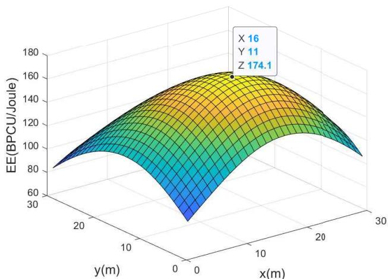  
(a) EE versus the position of UAV

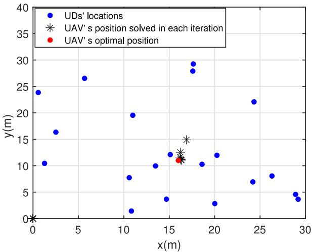  
(b) Optimal position of UAV

Fig. 3. Impact of the position of UAV $\varepsilon _ { \mathrm { k } } = 1 \times 1 0 ^ { - 5 } , n _ { k } = 1 0 0 , p _ { k } =$ 5 dBm, $H = 1 0 \mathrm { m }$  
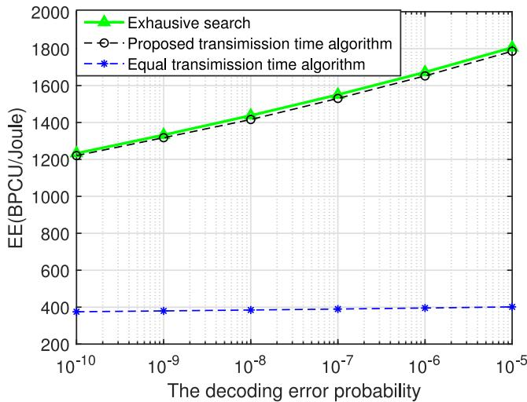  
Fig. 4. EE versus the decoding error probability: $K = 2 , N = 3 0 0 , p _ { k } =$ 9 dBm, $H = 1 0 m , 1 \leq k \leq K$

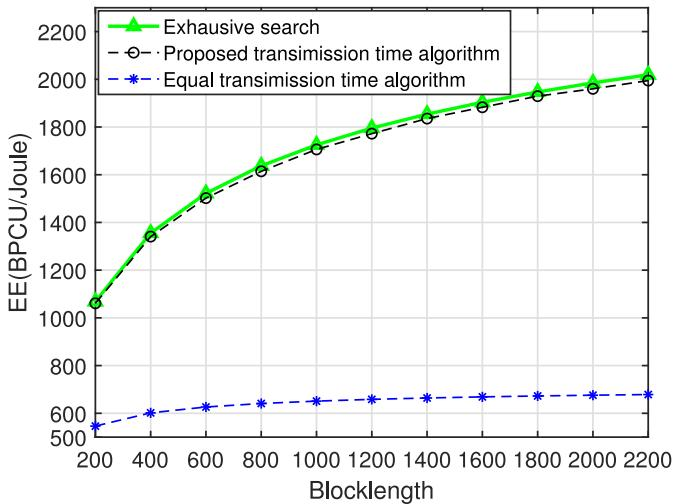  
Fig. 5. EE versus the block-length: $K \ = \ 3 , \varepsilon \ = \ 1 \times 1 0 ^ { - 5 } , p _ { k } \ =$ 5 dBm, $H = 1 0 \mathrm { m } , 1 \leq k \leq K$

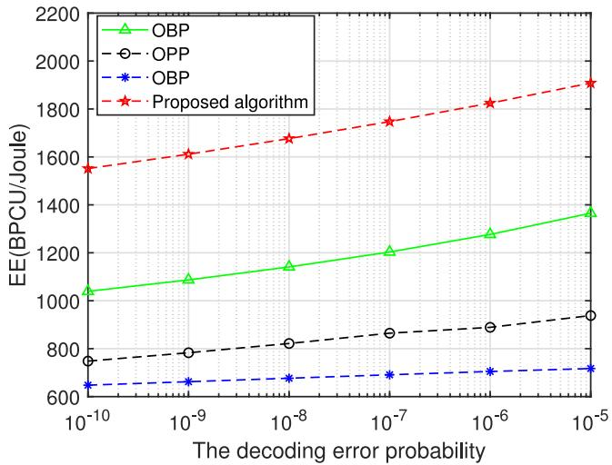  
Fig. 6. The impact of different optimization algorithms on EE: N = 400, H = 10m, K = 3, Pm = 30 dBm.

Fig. 6 compares the proposed scheme with other optimization methods. “OBP” scheme means we only optimize the block-length and position, while use a fixed transmission power. $\mathrm { \ " { O P P } }$ means we optimize the transmission power and position, while use a fixed block-length. “BP” means we optimize the transmission power and block-length. In this case, we assume that the 3 UDs are with fixed position and the flying height of the UAV is 10m. We can see that EE increases with the increase of the decoding error probability, which confirms our previous observations. Compared with the above three schemes, we can observe that the proposed algorithm has the best EE performance, which evidence the necessity of the joint optimization.

Fig. 7 shows the impact of different numbers of UDs on the convergence performance. From this figure, we can see that the EE increases rapidly first and converges in a fast speed, which verifies the proposed algorithm has good feasibility and convergence performance. At the same time, we can see that EE decreases with the increase of the number of UDs. This is due to the increase of the number of UDs requires a limited block-length to be allocated to more UDs in order to ensure the quality of communications. Thus, the block-length resources owned by a single UD become less, which results in a decrease of EE.

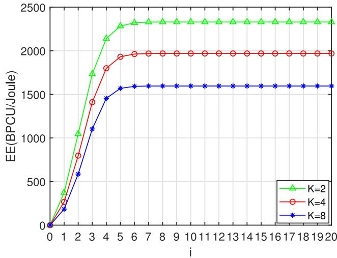  
Fig. 7. EE versus the number of iterations: $N = 8 0 0 , \varepsilon = 1 \times 1 0 ^ { - 5 } , p _ { k } =$ 5 dBm, $d _ { k } = 1 0 \mathrm { m }$

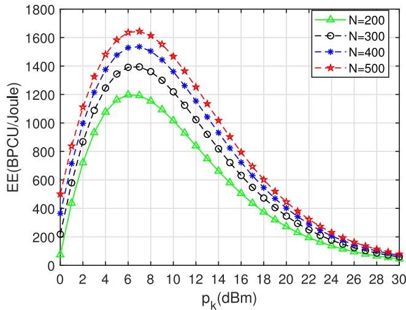  
Fig. 8. EE versus the number of iterations: $K = 5 , \varepsilon = 1 \times 1 0 ^ { - 5 } , d _ { k } =$ $1 \dot { 2 } \mathrm m , 1 \le k \le K$

The performance of achievable EE versus the transmit power of the UAV $p _ { k }$ is shown in Fig. 8. We can see that an optimal value is existed for the transmit power of the UAV. When $p _ { k } < 7 \mathrm { d B m }$ , EE increases with the increase of $p _ { k }$ However, when $p _ { k } > 7 \mathrm { d B m }$ , EE decreases with the increasing $p _ { k }$ . This is due to greater power will impose greater penalty on EE. Therefore, in order to obtain better EE performance, the transmit power should be optimized.

In Fig. 9, we observe the impact of different number of UDs on EE and compare the proposed algorithm with the Greedy algorithm and an equal resource allocation algorithm. The greedy algorithm is based on the proposed position and block-length allocation algorithm, while allocates as much transmission power as possible to the UD with the largest channel gain. The equal resource allocation algorithm is based on the proposed position optimization algorithm, and the block-length and power are equally allocated to UDs. We find that the proposed algorithm is better than the greedy algorithm, and the advantage is more obvious in the scenario with a larger number of UDs. Compared with the equal resource allocation algorithm, the proposed algorithm can improve the EE as well. Generally, EE decreases with the increase of the number of UDs. This may due to the fact that as the number of UDs increases, a larger amount of energy is consumed.

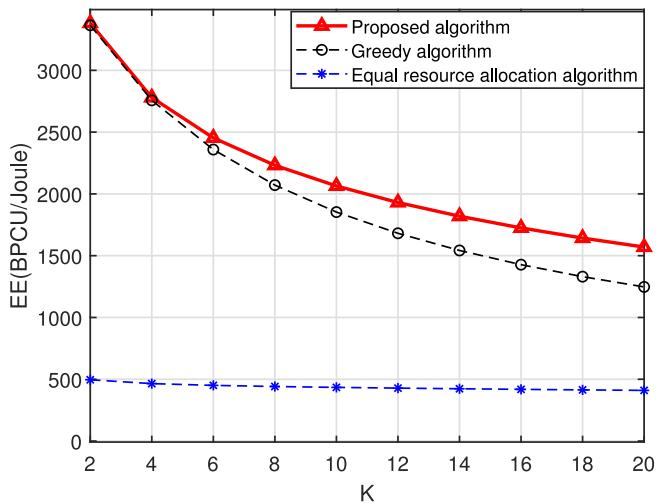  
Fig. 9. EE versus the number of UDs: $N = 1 0 0 0 , \varepsilon = 1 \times 1 0 ^ { - 5 } , d _ { k } =$ $1 2 \mathrm { m } , 1 \leq k \leq K , P _ { \mathrm { m } } = 5 0 \mathrm { d B m }$

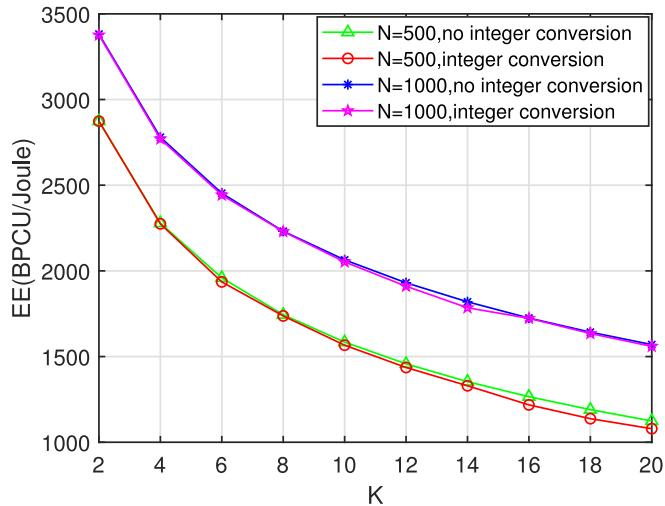  
Fig. 10. Integer conversion to EE performance versus the number of UDs: $N = 1 0 0 0 , d _ { k } ^ { \mathrm { ~ ~ } } = 1 2 \mathrm { m } , 1 \leq k \leq K$

In Fig. 10, we plot the impact of integer conversion on EE under the condition of different number of user devices and different block lengths. Simulation experiments show that integer conversion does cause a certain performance loss in EE, but the loss is small and within an acceptable range. The loss caused by integer conversion to EE has no obvious relationship with the number of user equipment and block length, and there is a certain chance.

## VI. CONCLUSION

In this paper, energy efficient resource allocation problem is investigated in a wireless powered UAV wireless communication system. In order to maximize EE of the considered system, we jointly optimize the position of the UAV, transmit power of the UAV and transmission time of each UD. To address the formulated non-convex problem, an efficient algorithms are presented to find sub-optimal solutions. We have also proved the convergence and analyze the complexity of the presented algorithm. The performance evaluations demonstrate the effectiveness of the proposed scheme. In the future, we will further explore the IoT communication system with multiple UAVs. The multi-UAV network requires certain level of coordination and the energy efficiency of the system should be further investigated as the system with more UAVs can increase the energy cost. In this context, joint optimization of UAVs’ trajectory and resource allocation is needed to improve the energy efficiency performance of the UAV-assisted IoT and realize the ultra-reliable and low-latency communications among massive IoT devices.

## APPENDIX A

In this Appendix, we prove the equality by the inverse method. Suppose the optimal solution of n is $\mathbf { n } ^ { * }$ , and $\textstyle \sum _ { k = 0 } ^ { K } n _ { k } ^ { * } < N$ . In order to facilitate the analysis of the block length resource optimization problem, we rewrite (10) as:

$$
\begin{array} { l } { { \displaystyle { \mathbb { E } } [ { \bf q } , { \bf p } , { \bf p } ) } \ ~ } \\ { { \displaystyle ~ = \frac { \sum _ { k = 1 } ^ { K } \left( 1 - \varepsilon _ { k } \right) n _ { k } \left( \ln ( 1 + \gamma _ { k } ) - Q ^ { - 1 } ( \varepsilon _ { k } ) \sqrt { \frac { V _ { k } } { n _ { k } } } \right) } { n _ { 0 } \| { \bf p } \| } } \ ~ } \\ { { \displaystyle ~ = \frac { 1 } { \| { \bf p } \| } } \ ~ } \\ { { \displaystyle ~ \times \sum _ { k = 1 } ^ { K } \frac { \left( 1 - \varepsilon _ { k } \right) \left( \ln ( 1 + \Theta _ { k } \psi _ { k } ) - Q ^ { - 1 } ( \varepsilon _ { k } ) \sqrt { \frac { 1 - \frac { 1 } { \left( 1 + \Theta _ { k } \psi _ { k } \right) ^ { 2 } } } { n _ { k } } } \right) } { \psi _ { k } } } } \end{array}\tag{49}
$$

where $\gamma _ { k }$ and $V _ { k }$ are given by (6) and (8) respectively, $\psi _ { k } =$ $\begin{array} { r } { \frac { n _ { 0 } } { n _ { k } } , \psi = [ \psi _ { 1 } , \psi _ { 2 } , \ldots , \psi _ { k } ] ^ { T } } \end{array}$ and $\begin{array} { r } { \Theta _ { k } = \frac { \eta p _ { k } h _ { k } ^ { 2 } g _ { k } ^ { 2 } } { \kappa \sigma ^ { 2 } d _ { k } ^ { 2 \alpha } } } \end{array}$ . According to (49), we can conclude that solving the optimal $\mathbf { n } ^ { * }$ for the block-length resource optimization problem is equivalent to solving the optimal $\psi _ { k } ^ { * }$ while maximizing $n _ { k } ^ { * }$ . According to the previous assumption $\mathbf { n } ^ { * }$ is known, then $\psi ^ { * }$ is known. We can derive

$$
\sum _ { k = 0 } ^ { K } { n _ { k } ^ { * } } = n _ { 0 } ^ { * } \left( 1 + \sum _ { k = 1 } ^ { K } \frac { 1 } { \psi _ { k } ^ { * } } \right)\tag{50}
$$

$$
n _ { 0 } ^ { * } = \frac { \sum _ { k = 0 } ^ { K } n _ { k } ^ { * } } { 1 + \sum _ { k = 1 } ^ { K } \frac { 1 } { \psi _ { k } ^ { * } } }\tag{51}
$$

$$
n _ { k } ^ { * } = \frac { \sum _ { k = 0 } ^ { K } n _ { k } ^ { * } } { \psi _ { k } ^ { * } \Big ( 1 + \sum _ { k = 1 } ^ { K } \frac { 1 } { \psi _ { k } ^ { * } } \Big ) } .\tag{52}
$$

According to (52), under the condition that $\psi ^ { * }$ remains unchanged, when $\textstyle \sum _ { k = 0 } ^ { K } n _ { k } ^ { * }$ is the largest, it is equal to $N ,$ and $n _ { k } ^ { * }$ is the largest. Based on this, it can be judged that our

assumption is wrong. $\scriptstyle \sum _ { k = 0 } ^ { K } n _ { k } { } ^ { * } = N$ is a necessary condition for finding the optimal $\mathbf { n } ^ { * }$ . The conclusion is also confirmed by subsequent experiments in Fig. 5.

## APPENDIX B

In this part, we adopt Lagrangian duality to solve (P2  ba). The Lagrangian function of (P2  ba) is

$$
\begin{array} { l } { { { \displaystyle \mathbb { L } ( { \bf q } , { \bf n } , { \bf p } ; { \bf n } _ { i - 1 } ) = \sum _ { k = 1 } ^ { K } ( 1 - \varepsilon _ { k } ) c _ { k } ( { \bf n } ) } } \ ~ } \\ { { + \sum _ { k = 1 } ^ { K } Q ^ { - 1 } ( \varepsilon _ { k } ) ( \varepsilon _ { k } - 1 ) \omega _ { k } ( { \bf n } ; { \bf n } _ { i - 1 } ) } \ ~ } \\ { { - \sum _ { k } e _ { b } n _ { 0 } \| { \bf p } \| - \lambda _ { b } \left( \sum _ { k = 0 } ^ { K } n _ { k } - N \right) ~ ( 5 ; \frac { \varepsilon _ { k } } { \varepsilon _ { k } - 1 } ) } \ ~ } \end{array}\tag{3}
$$

where $\lambda _ { b }$ is the dual variable. According to the KKT condition, we can obtain

$$
\begin{array} { r l r } {  { \frac { \mathrm { L } ( \mathbf { q } , \mathbf { n } , \mathbf { p } ; \mathbf { n } _ { i - 1 } ) } { \partial \mathbf { n } _ { k } } = ( 1 - \varepsilon _ { k } ) ( \ln ( 1 + \gamma _ { k } ) + ( \varepsilon _ { k } - 1 ) } } \\ & { } & { \times \ \bigg ( \frac { \gamma _ { k } } { 1 + \gamma _ { k } } + Q ^ { - 1 } ( \varepsilon _ { k } ) \nabla \omega _ { k , k } \bigg ) - \lambda _ { b } = 0 } \end{array}\tag{54}
$$

$$
\begin{array} { l } { \displaystyle \frac { { \mathrm {  ~ { \cal ~ L } } } ( { \bf q } , { \bf n } , { \bf p } ; { \bf n } _ { i - 1 } ) } { \partial { \bf n } _ { 0 } } = \sum _ { k = 1 } ^ { K } ( 1 - \varepsilon _ { k } ) \theta _ { k } \frac { 1 } { 1 + \gamma _ { k } } } \\ { \displaystyle \qquad + \sum _ { k = 1 } ^ { K } Q ^ { - 1 } ( \varepsilon _ { k } ) ( \varepsilon _ { k } - 1 ) \nabla \omega _ { k , 0 } - e _ { b } \| { \bf p } \| - \lambda _ { b } = 0 } \end{array}\tag{55}
$$

$$
\lambda _ { b } \left( \sum _ { k = 0 } ^ { K } n _ { k } - N \right) = 0\tag{56}
$$

where $\frac { \mathrm { L } ( \mathbf { q } , \mathbf { n } , \mathbf { p } ; \mathbf { n } _ { i - 1 } ) } { \partial \mathbf { n } _ { k } }$ is a monotonically increasing function. According to (56), it can be concluded that there is an unique $\lambda _ { b }$ for a given $\gamma _ { k }$ . we can derive the $\gamma _ { k }$ satisfying (54) as

$$
\gamma _ { k } = \frac { - 1 } { \mathscr { W } \left( - e ^ { - Q ^ { - 1 } ( \varepsilon _ { k } ) \nabla \omega _ { k , k } - \frac { \lambda _ { b } } { 1 - \varepsilon _ { k } } - 1 } \right) } - 1\tag{57}
$$

By substituting (57) into (55), we obtain (27). Then we can obtain the optimal $\lambda _ { b } , \mathrm { i } . \mathrm { e } . , \lambda _ { b } ^ { \dagger }$ by calculating the root of (27) in terms of $\lambda _ { b }$ . If there are multiple solutions of $\lambda _ { b }$ in (27), it will lead to multiple solutions to the convex problem, which is obviously contradictory. Substituting $\lambda _ { b } ^ { \dagger }$ into (54) we can obtain the optimal $\gamma _ { k } , \mathrm { i . e . , } \gamma _ { k } ^ { \dagger }$ . The optimal solution $\mathbf { n } ^ { \dagger }$ needs to satisfy the condition (12). Then we substitute $\gamma _ { k } ^ { \dagger }$ into (12) and (18) to find the optimal solution together as (26).

## APPENDIX C

We calculate the second-order partial derivative of $r _ { k } ( \mathbf { p } )$ w.r.t. p, and obtain its Hessian matrix as

$$
\mathbf { H } \mathbf { M _ { r } } \mathbf { \Phi } = \left[ \begin{array} { c c c c c } { \frac { - \Upsilon _ { 1 } ^ { 2 } } { \left( 1 + \gamma _ { 1 } \right) ^ { 2 } } } & { 0 } & { \cdots } & { 0 } \\ { 0 } & { \frac { - \Upsilon _ { 2 } ^ { 2 } } { \left( 1 + \gamma _ { 2 } \right) ^ { 2 } } } & { 0 } & { 0 } \\ { \vdots } & { \vdots } & { \ddots } & { \vdots } \\ { 0 } & { 0 } & { 0 } & { \frac { - \Upsilon _ { k } ^ { 2 } } { \left( 1 + \gamma _ { k } \right) ^ { 2 } } } \end{array} \right]
$$

It can be seen that all the eigenvalues of $\mathbf { H M } _ { \mathbf { r } k }$ are negative, and $\mathbf { H M } _ { \mathbf { r } k }$ is a negative definite matrix. It can be concluded that $r _ { k } ( \mathbf { p } )$ is concave function w.r.t. p.

Next, we prove that $t _ { k } ( \mathbf { p } )$ is a concave function w.r.t. p. Similarly, we calculate the second-order partial derivative of $V _ { k }$ w.r.t. $\mathbf { p } ,$ and obtain its Hessian matrix as

$$
\mathbf { H } \mathbf { M } _ { V k } = \left[ \begin{array} { c c c c c } { \frac { - 6 \Upsilon _ { 1 } ^ { 2 } } { \left( 1 + \gamma _ { 1 } \right) ^ { 4 } } } & { 0 } & { \cdots } & { 0 } \\ { 0 } & { \frac { - 6 \Upsilon _ { 2 } ^ { 2 } } { \left( 1 + \gamma _ { 2 } \right) ^ { 4 } } } & { 0 } & { 0 } \\ { \vdots } & { \vdots } & { \ddots } & { \vdots } \\ { 0 } & { 0 } & { 0 } & { \frac { - 6 \Upsilon _ { k } ^ { 2 } } { \left( 1 + \gamma _ { k } \right) ^ { 4 } } } \end{array} \right]
$$

It can be seen that all the eigenvalues of $\mathbf { H M } _ { V k }$ are negative, and $\mathbf { H M } _ { V k }$ is a negative definite matrix. It can be concluded that $V _ { k }$ is concave w.r.t. p. Meanwhile, $\sqrt { x }$ is a concave function w.r.t. x and is a non-decreasing function.According to the concave-preserving property of the composite function [37], we can conclude that $t _ { k } ( \mathbf { p } ) \ = \ \sqrt { V _ { k } }$ is a concave function of p.

## REFERENCES

[1] J. Gubbi, R. Buyya, S. Marusic, and M. Palaniswami, “Internet of Things (IoT): A vision, architectural elements, and future directions,” Future Gener. Comput. Syst., vol. 29, no. 7, pp. 1645–1660, Sep. 2013.

[2] L. Chettri and R. Bera, “A comprehensive survey on Internet of Things (IoT) toward 5G wireless systems,” IEEE Internet Things J., vol. 7, no. 1, pp. 16–32, Jan. 2020.

[3] M. Noura, M. Atiquzzaman, and M. Gaedke, “Interoperability in Internet of Things: Taxonomies and open challenges,” Mobile Netw. Appl., vol. 24, no. 3, pp. 796–809, Jun. 2019.

[4] S. Chen, H. Xu, D. Liu, B. Hu, and H. Wang, “A vision of IoT: Applications, challenges, and opportunities with China perspective,” IEEE Internet Things J., vol. 1, no. 4, pp. 349–359, Aug. 2014.

[5] M. Min, L. Xiao, Y. Chen, P. Cheng, D. Wu, and W. Zhuang, “Learning-based computation offloading for IoT devices with energy harvesting,” IEEE Trans. Veh. Technol., vol. 68, no. 2, pp. 1930–1941, Feb. 2019.

[6] Y. Xu et al., “Joint beamforming and power-splitting control in downlink cooperative SWIPT NOMA systems,” IEEE Trans. Signal Process., vol. 65, no. 18, pp. 4874–4886, Sep. 2017.

[7] Y. Zeng and R. Zhang, “Energy-efficient UAV communication with trajectory optimization,” IEEE Trans. Wireless Commun., vol. 16, no. 6, pp. 3747–3760, Jun. 2017.

[8] D. Yang, Q. Wu, Y. Zeng, and R. Zhang, “Energy tradeoff in ground-to-UAV communication via trajectory design,” IEEE Trans. Veh. Technol., vol. 67, no. 7, pp. 6721–6726, Jul. 2018.

[9] X. Li, J. Tan, A. Liu, P. Vijayakumar, N. Kumar, and M. Alazab, “A novel UAV-enabled data collection scheme for intelligent transportation system through UAV speed control,” IEEE Trans. Intell. Transp. Syst., vol. 22, no. 4, pp. 2100–2110, Apr. 2021.

[10] Y. Zeng, R. Zhang, and T. J. Lim, “Throughput maximization for UAV-enabled mobile relaying systems,” IEEE Trans. Commun., vol. 64, no. 12, pp. 4983–4996, Dec. 2016.

[11] H. Ji, S. Park, J. Yeo, Y. Kim, J. Lee, and B. Shim, “Ultrareliable and low-latency communications in 5G downlink: Physical layer aspects,” IEEE Wireless Commun., vol. 25, no. 3, pp. 124–130, Jun. 2018.

[12] X. Pang, N. Zhao, J. Tang, C. Wu, D. Niyato, and K.-K. Wong, “IRS-assisted secure UAV transmission via joint trajectory and beamforming design,” IEEE Trans. Commun., vol. 70, no. 2, pp. 1140–1152, Feb. 2022.

[13] S. Zhang, H. Zhang, B. Di, and L. Song, “Cellular UAV-to-X communications: Design and optimization for multi-UAV networks,” IEEE Trans. Wireless Commun., vol. 18, no. 2, pp. 1346–1359, Feb. 2019.

[14] M. Li, N. Cheng, J. Gao, Y. Wang, L. Zhao, and X. Shen, “Energyefficient UAV-assisted mobile edge computing: Resource allocation and trajectory optimization,” IEEE Trans. Veh. Technol., vol. 69, no. 3, pp. 3424–3438, Mar. 2020.

[15] T. D. P. Perera, D. N. K. Jayakody, S. K. Sharma, S. Chatzinotas, and J. Li, “Simultaneous wireless information and power transfer (SWIPT): Recent advances and future challenges,” IEEE Commun. Surveys Tuts., vol. 20, no. 1, pp. 264–302, 1st Quart., 2018.

[16] Z. Liu, C. Zhan, Y. Cui, C. Wu, and H. Hu, “Robust edge computing in UAV systems via scalable computing and cooperative computing,” IEEE Wireless Commun., vol. 28, no. 5, pp. 36–42, Oct. 2021.

[17] L. Xie, J. Xu, and R. Zhang, “Throughput maximization for UAVenabled wireless powered communication networks,” IEEE Internet Things J., vol. 6, no. 2, pp. 1690–1703, Apr. 2019.

[18] M. Bennis, M. Debbah, and H. V. Poor, “Ultrareliable and low-latency wireless communication: Tail, risk, and scale,” Proc. IEEE, vol. 106, no. 10, pp. 1834–1853, Oct. 2018.

[19] I. Parvez, A. Rahmati, I. Guvenc, A. I. Sarwat, and H. Dai, “A survey on low latency towards 5G: RAN, core network and caching solutions,” IEEE Commun. Surveys Tuts., vol. 20, no. 4, pp. 3098–3130, 4th Quart., 2018.

[20] C. She, C. Yang, and T. Q. S. Quek, “Radio resource management for ultra-reliable and low-latency communications,” IEEE Commun. Mag., vol. 55, no. 6, pp. 72–78, Jun. 2017.

[21] Y. Polyanskiy, H. V. Poor, and S. Verdu, “Channel coding rate in the finite blocklength regime,” IEEE Trans. Inf. Theory, vol. 56, no. 5, pp. 2307–2359, May 2010.

[22] L. Zhang and Y.-C. Liang, “Average throughput analysis and optimization in cooperative IoT networks with short packet communication,” IEEE Trans. Veh. Technol., vol. 67, no. 12, pp. 11549–11562, Dec. 2018.

[23] O. L. A. López, H. Alves, R. D. Souza, and E. M. G. Fernández, “Ultrareliable short-packet communications with wireless energy transfer,” IEEE Signal Process. Lett., vol. 24, no. 4, pp. 387–391, Apr. 2017.

[24] J. Chen, L. Zhang, Y.-C. Liang, X. Kang, and R. Zhang, “Resource allocation for wireless-powered IoT networks with short packet communication,” IEEE Trans. Wireless Commun., vol. 18, no. 2, pp. 1447–1461, Feb. 2019.

[25] I. Ramezanipour, P. Nouri, H. Alves, P. H. J. Nardelli, R. D. Souza, and A. Pouttu, “Finite blocklength communications in smart grids for dynamic spectrum access and locally licensed scenarios,” IEEE Sensors J., vol. 18, no. 13, pp. 5610–5621, Jul. 2018.

[26] H. Ren, C. Pan, Y. Deng, M. Elkashlan, and A. Nallanathan, “Resource allocation for secure URLLC in mission-critical IoT scenarios,” IEEE Trans. Commun., vol. 68, no. 9, pp. 5793–5807, Sep. 2020.

[27] S. Han et al., “Energy-efficient short packet communications for uplink NOMA-based massive MTC networks,” IEEE Trans. Veh. Technol., vol. 68, no. 12, pp. 12066–12078, Dec. 2019.

[28] C. Pan, H. Ren, Y. Deng, M. Elkashlan, and A. Nallanathan, “Joint blocklength and location optimization for URLLC-enabled UAV relay systems,” IEEE Commun. Lett., vol. 23, no. 3, pp. 498–501, Mar. 2019.

[29] K. Wang, C. Pan, H. Ren, W. Xu, L. Zhang, and A. Nallanathan, “Packet error probability and effective throughput for ultra-reliable and lowlatency UAV communications,” IEEE Trans. Commun., vol. 69, no. 1, pp. 73–84, Jan. 2021.

[30] H. Ju and R. Zhang, “Throughput maximization in wireless powered communication networks,” IEEE Trans. Wireless Commun., vol. 13, no. 1, pp. 418–428, Jan. 2014.

[31] W. Dinkelbach, “On nonlinear fractional programming,” Manag. Sci., vol. 13, no. 7, pp. 492–498, Mar. 1967.

[32] X. Kang, C. K. Ho, and S. Sun, “Full-duplex wireless-powered communication network with energy causality,” IEEE Trans. Wireless Commun., vol. 14, no. 10, pp. 5539–5551, Oct. 2015.

[33] C. T. Kelley, Solving Nonlinear Equations with Newton’s Method, vol. 1. Philadelphia, PA, USA: SIAM, 2003.

[34] X. Chen et al., “Information freshness-aware task offloading in airground integrated edge computing systems,” IEEE J. Sel. Areas Commun., vol. 40, no. 1, pp. 243–258, Jan. 2022.

[35] A. Damnjanovic et al., “A survey on 3GPP heterogeneous networks,” IEEE Wireless Commun., vol. 18, no. 3, pp. 10–21, Jun. 2011.

[36] A. Goldsmith, Wireless Communications. Cambridge, U.K.: Cambridge Univ. Press, 2005.

[37] S. Boyd and L. Vandenberghe, Convex Optimization. New York, NY, USA: Cambridge Univ. Press, 2004.

Jin Xie received the master of engineering degree in computer science and technology from the College of Information Science and Engineering, Yanshan University, Qinhuangdao, China, in 2022. His research interests include diverse areas, such as fundamental communication theory, unmanned aerial vehicle communications, Internet of Things, ultra-reliable and low latency communications, and optimization in resource-constrained networks.

  
Xijuan Guo received the Ph.D. degree from Yanshan University, Qinhuangdao, China, where she is currently a Professor with the College of Information Science and Engineering. Her research interests include high performance computing, cloud computing, image processing, and wireless communications.

Zheng Chang (Senior Member, IEEE) received the B.Eng. degree from Jilin University, Changchun, China, in 2007, the M.Sc. (Tech.) degree from the Helsinki University of Technology (currently Aalto University), Espoo, Finland, in 2009, and the Ph.D. degree from the University of Jyväskylä, Jyväskylä, Finland, in 2013. Since 2008, he has held various research positions with the Helsinki University of Technology, University of Jyväskylä, and Magister Solutions Ltd., Finland. He was a Visiting Researcher with Tsinghua University,

China, from June 2013 to August 2013, and with the University of Houston, Houston, TX, USA, from April 2015 to May 2015. He has published over 140 papers in journals and conferences. His research interests include IoT, cloud/edge computing, security and privacy, vehicular networks, and green communications. He has been awarded by the Ulla Tuominen Foundation, the Nokia Foundation, and the Riitta and Jorma J. Takanen Foundation for his research excellence. He has been awarded as the 2018 IEEE Communications Society Best Young Researcher for Europe, Middle East, and Africa Region. He received the Best Paper Awards from IEEE TCGCC and APCC in 2017. He serves as an Editor for IEEE WIRELESS COMMUNICATIONS LETTERS, Wireless Networks (Springer), and International Journal of Distributed Sensor Networks, and the Guest Editor for IEEE NETWORK, IEEE WIRELESS COMMUNICATIONS, IEEE Communications Magazine, IEEE INTERNET OF THINGS JOURNAL, IEEE TRANSACTIONS ON INDUSTRIAL INFORMATICS, Physical Communications, EURASIP Journal on Wireless Communications and Networking, and Wireless Communications and Mobile Computing. He was the Exemplary Reviewer of IEEE Wireless Communication Letters in 2018. He has participated in organizing workshop and special session in Globecom’ 19, WCNC’18-221, SPAWC’19, and ISWCS’18. He also serves as the Symposium Co-Chair of IEEE ICC’20, the Publicity Co-Chair of IEEE Infocom’22, the Workshop Co-Chair of ICCC’22, the TPC Co-Chair of IEEE iThing’22, and the TPC Member for many IEEE major conferences, such as INFOCOM, ICC, and Globecom.

Timo Hämäläinen (Senior Member, IEEE) received the Ph.D. degree in telecommunication from the University of Jyväskylä, Finland, in 2002. He joined the University of Jyväskylä, in 1997, where he is currently a Professor of Computer Networks. He has more than 25 years’ research and teaching experience of computer networks. He has led many external funded network management related projects. He has launched and leads master programs with the University of Jyväskylä (Software and Communication Engineering) and teaches network

management related courses. He has more than 200 internationally peer reviewed publications and he has supervised almost 40 Ph.D. theses. His research interests include network resource management, IoT, and networking security.