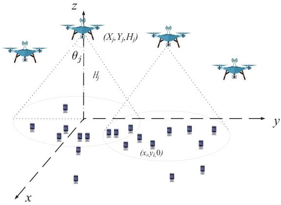
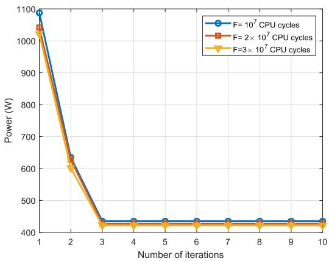
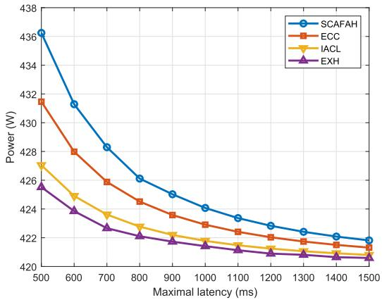
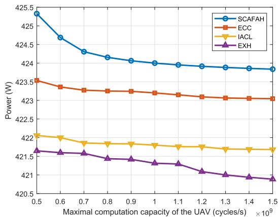
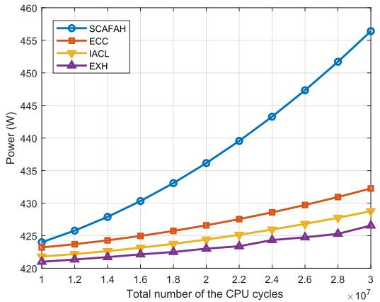
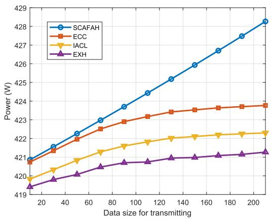
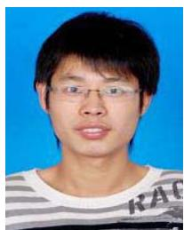

# Energy Efficient Resource Allocation in UAV-Enabled Mobile Edge Computing Networks

Zhaohui Yang Cunhua Pan , Kezhi Wang and Mohammad Shikh-Bahaei, Senior Member, IEEE

Abstract— In this paper, we consider the sum power minimization problem via jointly optimizing user association, power control, computation capacity allocation, and location planning in a mobile edge computing (MEC) network with multiple unmanned aerial vehicles (UAVs). To solve the nonconvex problem, we propose a low-complexity algorithm with solving three subproblems iteratively. For the user association subproblem, the compressive sensing-based algorithm is accordingly proposed. For the computation capacity allocation subproblem, the optimal solution is obtained in closed form. For the location planning subproblem, the optimal solution is effectively obtained via one-dimensional search method. To obtain a feasible solution for this iterative algorithm, a fuzzy c-means clustering-based algorithm is proposed. The numerical results show that the proposed algorithm achieves better performance than the conventional approaches.

Index Terms— Unmanned aerial vehicle-enabled communication, mobile edge computing, resource allocation, user association, location optimization.

# I. INTRODUCTION

W ITH high mobility and the explosive growth of datatraffic, unmanned aerial vehicles (UAVs) assisted wire- traffic,unmanned aerial vehicles (UAVs) assisted wireless communications have attracted considerable attention [1]. Compared to conventional wireless communications, UAVenabled wireless communications can provide higher wireless connectivity in areas without infrastructure coverage. Besides, high throughput can always be achieved in UAV-enabled wireless communications due to the higher probability of lineof-sight (LoS) communication links between user equipments (UEs) and UAVs [2]–[5]. Due to the above distinctions, UAVs can be utilized in many applications, such as relaying [6]–[8],

Manuscript received February 20, 2019; revised May 10, 2019; accepted June 28, 2019. Date of publication July 16, 2019; date of current version September 10, 2019. This work was supported in part by the Engineering and Physical Science Research Council (EPSRC) through the Scalable Full Duplex Dense Wireless Networks (SENSE) under Grant EP/P003486/1. The associate editor coordinating the review of this paper and approving it for publication was A. Banchs. (Corresponding authors: Cunhua Pan; Kezhi Wang.)

Z. Yang and M. Shikh-Bahaei are with the Centre for Telecommunications Research, Department of Informatics, King’s College London, London WC2B 4BG, U.K. (e-mail: yang.zhaohui@kcl.ac.uk; m.sbahaei@kcl.ac.uk).

C. Pan is with the School of Electronic Engineering and Computer Science, Queen Mary University of London, London E1 4NS, U.K. (e-mail: c.pan@qmul.ac.uk).

K. Wang is with the Department of Computer and Information Sciences, Northumbria University, Newcastle NE2 1XE, U.K. (e-mail: kezhi.wang@northumbria.ac.uk).

Color versions of one or more of the figures in this paper are available online at http://ieeexplore.ieee.org.

Digital Object Identifier 10.1109/TWC.2019.2927313

data collection [9]–[12], device-to-device communication networks [13], wireless power transfer networks [14] and caching networks [15].

To fully exploit the design degrees of freedom for UAVenabled communications, it is crucial to investigate the location and trajectory optimization. In [16], the altitude of the UAV was optimized to provide maximum radio coverage on the ground. To maximize the number of covered users using the minimum transmit power, an optimal location and altitude placement algorithm was investigated in [17] for UAV-base stations (BSs). With different quality-of-service (QoS) requirements of users, authors in [18] studied the three-dimension (3D) UAV-BS placement that maximizes the number of covered users. Considering the adjustable UAVs’ locations, the UAV number minimization was considered in [19]. In [20] and [21], the UAV’s trajectory was optimized by jointly considering both the communication throughput and the UAV’s energy consumption. Further optimizing user-UAV association, [22] investigated the sum power minimization problem of the UAV. Different from [16]–[22] with fixedbeamwidth antenna, the beamwidth of the directional antenna was optimized in [23] with fixed bandwidth allocation to improve the system throughput. Through jointly optimizing beamwidth and bandwidth, the sum power was further minimized in [24]. Deploying UAVs as users, [25] proposed a novel concept of 3D cellular networks and developed an optimal 3D cell association scheme [26].

Recently, mobile edge computing (MEC) has been proposed as a promising technology for future communications since it can improve the computation capacity of UEs with computation-hungry applications, such as, augmented reality (AR) [27]. With MEC, UEs can offload the tasks to the MEC servers that locate at the edge of the network. Since MEC servers can be deployed near to UEs, network with MEC can provide UEs with low latency and save energy for UEs [28]. There are two operation modes for MEC, i.e., partial and binary computation offloading. In partial computation offloading, the computation tasks can be divided into two parts, where one part is locally executed and the other part is offloaded to MEC servers [29]–[34]. In binary computation offloading, the computation tasks are either locally executed or offloaded to MEC servers [35], [36].

Due to the mobility of UAVs, the integration of UAVenabled communication with MEC can further improve the computation performance [37]–[41]. The UAV-enabled MEC architecture was first proposed in [37], which showed that the computation performance can be improved with UAVs. Jointly optimizing bit allocation and UAV’s trajectory, the authors in [39] and [40] minimized the total mobile energy consumption while satisfying QoS requirements of the offloaded mobile application. Considering wireless power transfer, the computation rate maximization problem was studied in [41] for a UAV-enabled MEC wireless powered system, subject to the energy harvesting causal constraint and the UAV’s speed constraint.

In this paper, we consider resource allocation in a UAVenabled MEC network with multiple UAVs. The objective of this paper is to minimize the sum power consumption of UEs and UAVs including both communication related power and mechanical power. Compared with references [39] and [40], where only the total power of all the UEs is minimized, this paper considers the total power minimization of both UEs and UAVs since the UAVs are also power constrained. Although the computation and communication power consumption of the UAV is considered in [41], the mechanical power of the UAV is ignored. Since the mechanical power of the UAV is significant compared to the computation and communication power, this paper considers both communication related power and mechanical power of each UAV. Morover, the works in [39]–[41] all considered only one UAV in the UAV-enabled MEC network even though there always exist multiple UAVs for practical applications.

The main contributions of this paper are summarized as follows:

1) We formulate the sum power minimization problem with latency and coverage constraints via jointly optimizing user association, power control, computation capacity allocation and location planning. To solve the nonconvex sum power minimization problem, an algorithm is proposed by solving three subproblems iteratively. We also provide the complexity analysis of the proposed algorithm.   
2) For user association problem with 0-norm, we apply the compressive sensing based algorithm, where the closedform solution is given in each iteration.   
3) For computation capacity allocation or location planning, we first decompose the original problem into multiple small optimization problems. Then, the optimal computation capacity allocation is derived in closed form, while the optimal location planning is obtained via one-dimensional search method.

The rest of the paper is organized as follows. In Section II, we introduce the system model and sum power minimization formulation. The proposed algorithm is addressed in Section III. Some numerical results are shown in Section IV, and conclusions are finally drawn in Section V.

The main notations used in the paper are summarized in Table I.

# II. SYSTEM MODEL

As shown in Fig. 1, we consider a UAV-aided network with  UEs and  rotary-wing UAVs, which are able to

TABLE I LIST OF MAIN NOTATIONS 

<table><tr><td>Notation</td><td>Description</td></tr><tr><td> $N$ </td><td>Number of UEs</td></tr><tr><td> $M$ </td><td>Number of UAVs</td></tr><tr><td> $\mathcal{N}$ </td><td>Set of UEs</td></tr><tr><td> $\mathcal{M}$ </td><td>Set of UAVs</td></tr><tr><td> $\mathcal{M}'$ </td><td>Possible place for the tasks to be executed</td></tr><tr><td> $a_{ij}$ </td><td>Offloading indicator of UE  $i$ </td></tr><tr><td> $U_i$ </td><td>Computation task of UE  $i$ </td></tr><tr><td> $F_i$ </td><td>Number of CPU cycles of task  $U_i$ </td></tr><tr><td> $D_i$ </td><td>Data size of task  $U_i$ </td></tr><tr><td> $T$ </td><td>Latency requirement for all tasks</td></tr><tr><td> $f_{ij}$ </td><td>Computation capacity of UAV  $j$  allocated to UE  $i$ </td></tr><tr><td> $T_{ij}^C$ </td><td>Execution time of UAV  $j$  to compute UE  $i$ &#x27;s task</td></tr><tr><td> $T_{ij}^{\text{Tr}}$ </td><td>Offloading time of UE  $i$  to UAV  $j$ </td></tr><tr><td> $r_{ij}$ </td><td>Offloading transmission rate of UE  $i$  to UAV  $j$ </td></tr><tr><td> $f_{i,\text{max}}^{\text{ue}}$ </td><td>Maximal computation capacity of UE  $i$ </td></tr><tr><td> $p_{ij}$ </td><td>Transmission power of UE  $i$  to UAV  $j$ </td></tr><tr><td> $p_i^E$ </td><td>Local execution power of UE  $i$ </td></tr><tr><td> $p_i^{\text{ue}}$ </td><td>Power consumption of UE  $i$ </td></tr><tr><td> $P_{i,\text{max}}^{\text{ue}}$ </td><td>Maximal power consumption of UE  $i$ </td></tr><tr><td> $p_j^{\text{uav}}$ </td><td>Power consumption of UAV  $j$ </td></tr><tr><td> $f_j$ </td><td>Total used computation capacity of UAV  $j$ </td></tr><tr><td> $f_{j,\text{max}}^{\text{ue}}$ </td><td>Maximal computation capacity of UAV  $j$ </td></tr><tr><td> $(x_i, y_i, 0)$ </td><td>Coordinate of UE  $i$ </td></tr><tr><td> $(X_j, Y_j, H_j)$ </td><td>Coordinate of UAV  $i$ </td></tr><tr><td> $R_{ij}$ </td><td>Horizontal distance between UE  $i$  and UAV  $j$ </td></tr><tr><td> $\theta_j$ </td><td>Half-power beamwidth of antenna for UAV  $j$ </td></tr><tr><td> $g_{ij}$ </td><td>Uplink channel gain between UE  $i$  and UAV  $j$ </td></tr><tr><td> $U_j$ </td><td>Maximal number of associated UEs for UAV  $j$ </td></tr></table>

text_image

z
(Xj,Yj,Hj)
θj
Hj
y
(xa,yi,0)
x

Fig. 1. A UAV-aided network.

hover. The sets of the UEs and UAVs are denoted by ${ \mathcal { N } } =$ $\{ 1 , 2 , . . . , N \}$ and $\mathcal { M } = \{ 1 , 2 , \dots , M \}$ =, respectively. Each UE 1, 2, ..., N = 1, 2, . . . , Mhas a computation task to be executed, which can be offloaded to the UAVs. Define a new set $\mathcal { M } ^ { \prime } \ = \ \{ 0 , 1 , \cdots , M \}$ to = 0, 1, , Mrepresent the possible place in which the tasks can be executed, where  means that UE conducts task itself without offloading. 0Then, define $a _ { i j }$ as the offloading indicator variable of UE satisfying

$$
a _ {i j} = \{0, 1 \}, \quad \forall i \in \mathcal {N}, j \in \mathcal {M} ^ {\prime}, \tag {1}
$$

where $a _ { i j } = 1 , ~ j \neq 0$ denotes that UE  decides to offload a = 1, j = 0the task to UAV , while $a _ { i j } = 0 , \ j \neq 0$ iindicates that UE j a = 0, j = 0decides not to offload the task to UAV , and $a _ { i j } = 1 , \ j = 0$ denotes UE conducts the task itself. One has

$$
\sum_ {j = 0} ^ {M} a _ {i j} = 1, \quad i \in \mathcal {N}, \tag {2}
$$

which reflects that each task can only be executed at one place.

Similar to [42], we assume that UE  has the computationally intensive task $U _ { i }$ ito be executed as follows

$$
U _ {i} = (F _ {i}, D _ {i}, T), \quad \forall i \in \mathcal {N}, \tag {3}
$$

where $F _ { i }$ describes the total number of the central processing Funit (CPU) cycles of $U _ { i }$ to be computed, $D _ { i }$ denotes the data U Dsize transmitting to the cloud if offloading action is decided and $T$ is the latency constraint or QoS requirement by this Ttask. In this paper, we consider that all tasks have the same latency requirement $T ,$ , without loss of generality. $D _ { i }$ and $F _ { i }$ T Dcan be obtained by using the approaches provided in [43].

Then, the execution time of the task can be calculated as

$$
T _ {i j} ^ {\mathrm{C}} = \frac {F _ {i}}{f _ {i j}}, \quad \forall i \in \mathcal {N}, j \in \mathcal {M} ^ {\prime}, \tag {4}
$$

where $f _ { i j }$ is the computation capacity of UAV  allocated to fUE and $j = 0$ jmeans the UE executes the task itself.

i j = 0If the data is offloaded to the UAV, the time required to offload the data is calculated as

$$
T _ {i j} ^ {\mathrm{Tr}} = \frac {D _ {i}}{r _ {i j}}, \forall i \in \mathcal {N}, j \in \mathcal {M}, \tag {5}
$$

where $r _ { i j }$ is the offloading transmission rate of UE  to UAV . rThen, we can have

$$
a _ {i j} \left(\frac {D _ {i}}{r _ {i j}} + \frac {F _ {i}}{f _ {i j}}\right) \leq T, \quad \forall i \in \mathcal {N}, j \in \mathcal {M}, \tag {6}
$$

which means that each task executed in the UAV must meet the latency requirement. Note that the downloading time from the UAV is low and negligible [44]. In (6), we define $\begin{array} { r } { a _ { i j } \left( \frac { D _ { i } } { r _ { i j } } + \frac { F _ { i } } { f _ { i j } } \right) = 0 } \end{array}$ Di rij for the case where $a _ { i j } = 0$ and $f _ { i j } = 0$ .

\+ = 0 a = 0If this task is executed in UE itself, one has

$$
a _ {i j} \frac {F _ {i}}{f _ {i j}} \leq T, \forall i \in \mathcal {N}, j = 0. \tag {7}
$$

The computation capacity for the UE  is constrained by

$$
f _ {i j} \leq f _ {i, \max} ^ {\mathrm{ue}}, \quad \forall i \in \mathcal {N}, j = 0. \tag {8}
$$

The power consumption at UE  is given by

$$
p _ {i} ^ {\mathrm{ue}} = \left\{ \begin{array}{l l} \sum_ {j = 1} ^ {M} a _ {i j} p _ {i j}, & \text { if   offloading }, \\ p _ {i} ^ {\mathrm{E}}, & \text { if   local   execution } \end{array} \right. \tag {9}
$$

where $p _ { i j }$ is the transmitting power of UE  to the UAV  and $p _ { i } ^ { \mathrm { E } }$ p i jis the execution power in UE  if UE conducts the task pitself, which is given by

$$
p _ {i} ^ {\mathrm{E}} = \kappa_ {i} f _ {i j} ^ {\nu_ {i}}, \quad i \in \mathcal {N}, j = 0, \tag {10}
$$

where $\kappa _ { i } \geq 0$ and $\nu _ { i } \geq 1$ are positive coefficients specified in κ 0 ν 1the CPU model [45]. The UE power is constrained by

$$
p _ {i} ^ {\mathrm{ue}} \leq P _ {i, \max} ^ {\mathrm{ue}}, \quad i \in \mathcal {N}. \tag {11}
$$

The computing power consumption for UAV  can be given as

$$
p _ {j} ^ {\mathrm{uav}} = s _ {j} f _ {j} ^ {w _ {j}}, \quad \forall j \in \mathcal {M}, \tag {12}
$$

where $s _ { j }$ and $w _ { j }$ are constants. In (12), $f _ { j }$ is the computation capacity provided by UAV  to the associated UEs, which can be given as

$$
f _ {j} = \sum_ {i = 1} ^ {N} a _ {i j} f _ {i j}, \quad \forall j \in \mathcal {M}. \tag {13}
$$

Due to limited computation capacity, the computation capacity for UAV  is constrained by

$$
f _ {j} \leq f _ {j, \max} ^ {\mathrm{uav}}, \quad \forall j \in \mathcal {M}. \tag {14}
$$

Assume that the coordinates of UE  are $( x _ { i } , y _ { i } , 0 )$ and the coordinates of UAV  are $( X _ { j } , Y _ { j } , H _ { j } )$ (x , y , 0). The horizontal j (X , Y , H )distance between UE  and UAV  is calculated as

$$
R _ {i j} = \sqrt {(X _ {j} - x _ {i}) ^ {2} + (Y _ {j} - y _ {i}) ^ {2}}, \quad \forall i \in \mathcal {N}, j \in \mathcal {M}. \tag {15}
$$

It is assumed that each UAV is equipped with a directional antenna of adjustable beamwidth. The azimuth and elevation half-power beamwidths of antenna are equal for UAV , which are both denoted by $2 \theta _ { j } \in ( 0 , \pi )$ j. For UAV , the antenna gain 2θ (0, π) jin the direction with azimuth angle  and elevation angle $\psi ^ { 1 }$ can be modeled as [46, Eq. (2-51)]

$$
G = \left\{ \begin{array}{l l} \frac {G _ {0}}{\theta_ {j} ^ {2}} & \text { if } 0 \leq \theta \leq \theta_ {j} \text { and } 0 \leq \psi \leq \theta_ {j} \\ g \approx 0 & \text { otherwise }, \end{array} \right. \tag {16}
$$

where $G _ { 0 } \approx 2 . 2 8 4 6 .$ , and $g$ means the channel gain outside G 2.2846 gthe beamwidth of the antenna. For simplicity, we set $g = 0$ . g = 0We consider the case that the UEs are located outdoors, and the channel between each UE and UAV is mainly a LoS path. The uplink channel gain between UE  and UAV  is

$$
g _ {i j} = \frac {g _ {0}}{H _ {j} ^ {2} + R _ {i j} ^ {2}}, \tag {17}
$$

where $g _ { 0 }$ is the channel power gain at the reference distance g1 m, i.e., it is assumed that the communication is neglected via the sidelobes.

If UE  wants to offload the task to UAV , it has to be in ithe coverage area of UAV , i.e.,

$$
R _ {i j} \leq H _ {j} \tan \theta_ {j}. \tag {18}
$$

According to (16) and (17), if UE decides to offload the itask to UAV , the data rate is given by

$$
r _ {i j} = B \log_ {2} \left(1 + \frac {\alpha p _ {i j}}{\theta_ {j} ^ {2} (H _ {j} ^ {2} + R _ {i j} ^ {2})}\right), \quad \forall i \in \mathcal {N}, j \in \mathcal {M}, \tag {19}
$$

where  is the system bandwidth, $\alpha ~ = ~ g _ { 0 } G _ { 0 } / \sigma ^ { 2 }$ and $\sigma ^ { 2 }$ B α = g G /σ σis the noise power. For UAVs with overlapped coverage area, UAVs are allocated with orthogonal frequency resources, which indicates that there is no interference among UAVs.

1The azimuth and elevation angles are defined with respect to three reference axises, two orthogonal axises on the ground plane with intersection $( X _ { j } , Y _ { j } , 0 )$ , i.e., x axis and y axis, and one vertical axis across points $( \boldsymbol { X _ { j } } , \boldsymbol { Y _ { j } } , 0 )$ and $( X _ { j } , Y _ { j } , H _ { j } ) .$ , i.e., z axis.

According to constraints (6) and (7), the latency constraints can be combined as

$$
\sum_ {j = 1} ^ {M} a _ {i j} \left(\frac {D _ {i}}{B \log_ {2} \left(1 + \frac {\alpha p _ {i j}}{\theta_ {j} ^ {2} (H _ {j} ^ {2} + R _ {i j} ^ {2})}\right)} + \frac {F _ {i}}{f _ {i j}}\right) + \frac {a _ {i 0} F _ {i}}{f _ {i 0}} \leq T. \tag {20}
$$

According to (2), each UE either conducts the task locally or uploads the task to one unique UAV. If UE conducts the task locally, i.e., $a _ { i 0 } = 1$ and $a _ { i j } = 0 , \forall j \in \mathcal { M }$ i, equation (20) becomes

$$
a _ {i 0} \frac {F _ {i}}{f _ {i 0}} \leq T, \tag {21}
$$

which is the same as equation (7). If UE  uploads the task to one unique UAV , i.e., $a _ { i j } = 1$ , $a _ { i 0 } = 0$ and $a _ { i l } = 0$ , $l \in \mathcal { M } \setminus \{ j \}$ j a = 1, equation (20) becomes

$$
a _ {i j} \left(\frac {D _ {i}}{B \log_ {2} \left(1 + \frac {\alpha p _ {i j}}{\theta_ {j} ^ {2} (H _ {j} ^ {2} + R _ {i j} ^ {2})}\right)} + \frac {F _ {i}}{f _ {i j}}\right) \leq T, \tag {22}
$$

which is the same as equation (6) since $r _ { i j }$ in defined in (19).

rIn practice, the number of UEs associated with one UAV is limited, i.e.,

$$
\sum_ {i = 1} ^ {N} a _ {i j} \leq U _ {j}, \quad \forall j \in \mathcal {M}, \tag {23}
$$

where $U _ { j }$ is the maximal allowed number of UEs associated with $\mathrm { U A V } ~ j$ .

jThen, we can formulate the sum power minimization problem as follows:

$$
\begin{array}{l} \min _ {\boldsymbol {A}, \boldsymbol {F}, \boldsymbol {P}, \boldsymbol {Z}} W _ {1} \sum_ {i = 1} ^ {N} \sum_ {j = 1} ^ {M} a _ {i j} p _ {i j} + W _ {1} \sum_ {i = 1} ^ {N} a _ {i 0} \kappa_ {i} f _ {i 0} ^ {\nu_ {i}} \\ + W _ {2} \sum_ {j = 1} ^ {M} \left(s _ {j} \left(\sum_ {i = 1} ^ {N} a _ {i j} f _ {i j}\right) ^ {w _ {j}} + Q _ {j} \left\| \sum_ {i = 1} ^ {N} a _ {i j} \right\| _ {0}\right) \tag {24a} \\ \end{array}
$$

$$
\text { s.t. } \quad \sum_ {j = 0} ^ {M} a _ {i j} = 1, \quad i \in \mathcal {N} \tag {24b}
$$

$$
\begin{array}{l} s _ {j} \left(\sum_ {i = 1} ^ {N} a _ {i j} f _ {i j}\right) ^ {w _ {j}} + Q _ {j} \left\| \sum_ {i = 1} ^ {N} a _ {i j} \right\| _ {0} \leq P _ {j, \max} ^ {\mathrm{uav}}, \\ \forall j \in \mathcal {M} \tag {24c} \\ \end{array}
$$

$$
\sum_ {j = 1} ^ {M} a _ {i j} \left(\frac {D _ {i}}{B \log_ {2} \left(1 + \frac {\alpha p _ {i j}}{\theta_ {j} ^ {2} (H _ {j} ^ {2} + R _ {i j} ^ {2})}\right)} + \frac {F _ {i}}{f _ {i j}}\right)
$$

$$
+ \frac {a _ {i 0} F _ {i}}{f _ {i 0}} \leq T, \quad \forall i \in \mathcal {N} \tag {24d}
$$

$$
R _ {i j} = \sqrt {\left(X _ {j} - x _ {i}\right) ^ {2} + \left(Y _ {j} - y _ {i}\right) ^ {2}}, \quad \forall j \in \mathcal {N}, j \in \mathcal {M} \tag {24e}
$$

$$
a _ {i j} R _ {i j} \leq H _ {j} \tan \theta_ {j}, \quad \forall i \in \mathcal {N}, j \in \mathcal {M} \tag {24f}
$$

$$
\sum_ {j = 1} ^ {M} a _ {i j} p _ {i j} + a _ {i 0} \kappa_ {i} f _ {i 0} ^ {\nu_ {i}} \leq P _ {i, \max} ^ {\mathrm{ue}}, \quad \forall i \in \mathcal {N} \tag {24g}
$$

$$
\sum_ {i = 1} ^ {N} a _ {i j} f _ {i j} \leq f _ {j, \max} ^ {\mathrm{uav}}, \quad \forall j \in \mathcal {M} \tag {24h}
$$

$$
\sum_ {i = 1} ^ {N} a _ {i j} \leq U _ {j}, \quad \forall j \in \mathcal {M} \tag {24i}
$$

$$
a _ {i j} = \{0, 1 \}, f _ {i 0} \leq f _ {i, \max} ^ {\mathrm{ue}} \quad \forall i \in \mathcal {N}, j \in \mathcal {M} ^ {\prime} \tag {24j}
$$

$$
f _ {i j} \geq 0, p _ {i j} \geq 0, H _ {j} ^ {\min} \leq H \leq H _ {j} ^ {\max},
$$

$$
\theta_ {j} ^ {\min} \leq \theta_ {j} \leq \theta_ {j} ^ {\max}, \quad \forall i \in \mathcal {N}, j \in \mathcal {M}, \tag {24k}
$$

where ${ \cal A } \ = \ \{ a _ { i j } \} _ { i \in \mathcal { N } , j \in \mathcal { M } ^ { \prime } } , \ { \cal F } \ = \ \{ f _ { i j } \} _ { i \in \mathcal { N } , j \in \mathcal { M } ^ { \prime } } , \ { \cal P } \ =$ $\{ p _ { i j } \} _ { i \in \mathcal { N } , j \in \mathcal { M } } , Z = \{ X _ { j } , Y _ { j } , H _ { j } , \theta _ { j } \} _ { j \in \mathcal { M } } , W _ { 1 }$ and $W _ { 2 }$ =are p Z = X , Y , H , θ W Wrespectively constant positive weights for UE power and UAV power, $Q _ { j }$ is the propulsion power for ensuring the UAV $j$ Qto remain aloft, the maximal ba $\| \cdot \| _ { 0 }$ is the ower o $\scriptstyle { \dot { \ell } } _ { 0 } - \mathrm { n o r m } , ^ { 2 }$ $P _ { j , \mathrm { m a x } } ^ { \mathrm { u a v } } > Q _ { j }$ jisthe $j . \ [ H _ { j } ^ { \operatorname* { m i n } } , H _ { j } ^ { \operatorname* { m a x } } ]$ feasible region of height $H _ { j }$ j [H , H ]determined by obstacle heights Hand authority regulations, and $[ \theta _ { j } ^ { \operatorname* { m i n } } , \theta _ { j } ^ { \operatorname* { m a x } } ]$ is the feasible region of half-beamwidth $\theta _ { j }$ [θ , θ ]determined by practical antenna θbeamwidth tuning technique. The term $\begin{array} { r } { \mathbf { \Sigma } _ { Q _ { j } } \left\| \sum _ { j = 1 } ^ { N } a _ { i j } \right\| _ { 0 } } \end{array}$ stands for the propulsion power of UAV  if it serves at least one UE.

Objective function (24a) is the sum power of UEs and UAVs including transmission power, execution power and propulsion power. Constraints (24b) represent that the UE either conducts the task locally or uploads the task to one unique UAV. The maximal power constraint for each UAV is shown in (24c). Since each UE executes the task itself or uploads the task to one and only one UAV according to (24b), the latency requirements for all UEs can be given in (24d). Constraints (24e) and (24f) state that the offloaded UEs should be in the coverage area of the associated UAVs. The maximal transmission power constraints for UEs are given in (24g). The maximal computation capacity and maximal associated number of UEs for UAVs are given in (24h) and (24i), respectively. There are two major differences with Problem (24) and wellknown MEC problems in the literature [12], [39]–[41]. The first difference is that this paper considers the UAV-enabled MEC with multiple UAVs, and the battery power limit for each UAV is also involved. The other difference is that Problem (24) optimizes the beamwidth and altitude of all UAVs.

# III. PROPOSED ALGORITHM

Due to the nonconvex objective function and discrete constraints, Problem (24) is a nonconvex problem. It is generally hard to effectively obtain a globally optimal solution for this nonconvex problem. In the following, a joint optimization algorithm is proposed to obtain a suboptimal solution with an iterative mechanism. Specifically, the user association subproblem is first solved due to the fact that the decision variables for user association are discrete. Based on the obtained user association, the optimal conditions for the transmission power of the UEs are obtained, which is helpful in simplifying the original problem. According to the optimal conditions for the transmission power of the UEs,

2-0-norm is usually used for vectors, and scalar can be viewed as a special case of vector with one dimension.

both computation capacity allocation subproblem and location planning subproblem can be decoupled into multiple smallsize problems, which fortunately have the closed-form optimal solutions. A clustering based algorithm is also provided to obtain a feasible solution of the iterative algorithm.

# A. User Association Optimization

Problem (24) is hard to be solved due to non-smooth $\ell _ { 0 } -$ -norm, which can be approximately solved via a sequence of weighted 1-norm minimizations in compressive sensing -according to [47]. Taking advantage of this technology, we approximate the 0-norm in the objective function (24a) as

$$
\left\| \sum_ {i = 1} ^ {N} a _ {i j} \right\| _ {0} \approx \delta_ {j} ^ {(n)} \sum_ {i = 1} ^ {N} a _ {i j} + \rho_ {j} ^ {(n)}, \tag {25}
$$

with $\delta _ { j } ^ { ( n ) }$ and $\rho _ { j } ^ { ( n ) }$ iteratively updated according to

$$
\delta_ {j} ^ {(n)} = \frac {1}{(\sum_ {i = 1} ^ {N} a _ {i j} ^ {(n)} + \tau) \ln (1 + \tau^ {- 1})}, \tag {26}
$$

and

$$
\rho_ {j} ^ {(n)} = \frac {\left(\sum_ {i = 1} ^ {N} a _ {i j} ^ {(n)} + \tau\right) \ln \left(1 + \tau^ {- 1} \sum_ {i = 1} ^ {N} a _ {i j} ^ {(n)}\right) - \sum_ {i = 1} ^ {N} a _ {i j} ^ {(n)}}{\left(\sum_ {i = 1} ^ {N} a _ {i j} ^ {(n)} + \tau\right) \ln \left(1 + \tau^ {- 1}\right)}, \tag {27}
$$

where $a _ { i j } ^ { ( n ) }$ ij is value of $a _ { i j }$ in the -th iteration, and $\tau$ is a a aconstant regularization factor.

For (24c), it can be equivalently transformed to

$$
s _ {j} \left(\sum_ {i = 1} ^ {N} a _ {i j} f _ {i j}\right) ^ {w _ {j}} \leq P _ {j, \max} ^ {\mathrm{uav}} - Q _ {j}, \quad \forall j \in \mathcal {M}, \tag {28}
$$

The reason is that, for each UAV , (28) is the same as (24c) jif there exists at least one  such that $a _ { i j } = 1$ and (28) always holds if $a _ { i j } = 0$ for all .

aDenoting $\begin{array} { r } { \mathcal { M } _ { i } = \left\{ j \in \mathcal { M } \left| \frac { H _ { j } \tan \theta _ { j } } { R _ { i j } } \geq 1 \right. \right\} } \end{array}$ Rij , we have $a _ { i j } = 0$ for all $j ~ \in ~ \mathcal { M } ~ \backslash ~ \backslash ~ \mathcal { M } _ { i }$ according to (24f). By using new notation $\mathcal { M } _ { i } ,$ constraints (24f) can be omitted. With approximations (25) and temporarily relaxing the integer constraints, Problem (24) with fixed $( F , P , Z )$ can be rewritten as

$$
\begin{array}{l} \min _ {\boldsymbol {A}, \boldsymbol {f}} W _ {1} \sum_ {i = 1} ^ {N} \sum_ {j \in \mathcal {M} _ {i}} a _ {i j} p _ {i j} + W _ {1} \sum_ {i = 1} ^ {N} a _ {i 0} \kappa_ {i} f _ {i 0} ^ {\nu_ {i}} \\ + W _ {2} \sum_ {j = 1} ^ {M} s _ {j} f _ {j} ^ {w _ {j}} \\ + W _ {2} \sum_ {j = 1} ^ {M} Q _ {j} \left(\delta_ {j} ^ {(n)} \sum_ {i = 1} ^ {N} a _ {i j} + \rho_ {j} ^ {(n)}\right) \tag {29a} \\ \end{array}
$$

s.t. $\sum _ { j \in \mathcal { M } _ { i } } a _ { i j } = 1 , i \in \mathcal { N } ,$ (29b) j∈Mi

$$
s _ {j} f _ {j} ^ {w _ {j}} \leq P _ {j, \max} ^ {\mathrm{uav}} - Q _ {j}, \quad \forall j \in \mathcal {M} \tag {29c}
$$

$$
\sum_ {j \in \mathcal {M} _ {i}} a _ {i j} C _ {i j} + a _ {i 0} E _ {i} \leq T, \quad \forall i \in \mathcal {N} \tag {29d}
$$

$$
\sum_ {j \in \mathcal {M} _ {i}} a _ {i j} p _ {i j} + a _ {i 0} \kappa_ {i} f _ {i 0} ^ {\nu_ {i}} \leq P _ {i, \max} ^ {\mathrm{ue}}, \quad \forall i \in \mathcal {N} \tag {29e}
$$

$$
\sum_ {i = 1} ^ {N} a _ {i j} \leq U _ {j}, \quad \forall j \in \mathcal {M} \tag {29f}
$$

$$
f _ {j} = \sum_ {i = 1} ^ {N} a _ {i j} f _ {i j}, \quad \forall j \in \mathcal {M} \tag {29g}
$$

$$
f _ {j} \leq f _ {j, \max} ^ {\mathrm{uav}}, \quad \forall j \in \mathcal {M} \tag {29h}
$$

$$
0 \leq a _ {i j} \leq 1, \quad \forall i \in \mathcal {N}, j \in \mathcal {M} ^ {\prime}, \tag {29i}
$$

where $\begin{array} { r } { \pmb { \mathscr { f } } ~ = ~ \{ f _ { j } \} _ { j \in \mathcal { M } } , ~ C _ { i j } ~ = ~ \frac { D _ { i } } { B \log _ { 2 } \left( 1 + \frac { \alpha p _ { i j } } { \theta _ { j } ^ { 2 } ( H _ { j } ^ { 2 } + R _ { i j } ^ { 2 } ) } \right) } + \frac { F _ { i } } { f _ { i j } } , } \end{array}$ Blog2 αpij 2j +R2ij ) fij

$\begin{array} { r } { E _ { i } = \frac { F _ { i } } { f _ { i 0 } } } \end{array}$ . In Problem (29), $\begin{array} { r } { f _ { j } = \sum _ { i = 1 } ^ { N } a _ { i j } f _ { i j } } \end{array}$ N stands for the E = computation capacity of $\mathrm { U A V } ~ j$ = a f. Note that  in Problem (29) j fis an auxiliary vector variable, which helps us design the Lagrangian dual decomposition method to get integer solutions. Obviously, Problem (29) is a convex problem with respect to $\left( \mathrm { w . r . t } \right) \left( A , f \right)$ , which can be effectively solved via A, fthe dual method [48].

To obtain the optimal solution of Problem (29), we have the following theorem.

Theorem 1: For Problem (29), the optimal user association  and auxiliary vector  can be respectively expressed as

$$
a _ {i j} ^ {*} = \left\{ \begin{array}{l l} 1, & \text { if   } j = \arg \min _ {j \in \mathcal {M} _ {i} \cup \{0 \}} h _ {i j} \\ 0, & \text { otherwise }, \end{array} \right. \tag {30}
$$

and

$$
f _ {j} ^ {*} = \left(\frac {\mu_ {j}}{W _ {2} w _ {j} s _ {j}}\right) ^ {\frac {1}{w _ {j} - 1}} \Bigg | _ {0} ^ {\bar {f} _ {j, \max} ^ {\mathrm{uav}}}, \tag {31}
$$

where

$$
h _ {i j} = \left\{ \begin{array}{l l} W _ {1} p _ {i j} + W _ {2} Q _ {j} \delta_ {j} ^ {(n)} + \beta_ {i} C _ {i j} & \\ + \gamma_ {i} p _ {i j} + \lambda_ {j} + \mu_ {j} f _ {i j}, & \forall i \in \mathcal {N}, j \in \mathcal {M} _ {i} \\ W _ {1} \kappa_ {i} f _ {i 0} ^ {\nu_ {i}} + \beta_ {i} E _ {i} + \gamma_ {i} \kappa_ {i} f _ {i 0} ^ {\nu_ {i}}, & \forall i \in \mathcal {N}, j = 0, \end{array} \right. \tag {32}
$$

$\{ \beta _ { i } \} _ { i \in \mathcal { N } } , \{ \gamma _ { i } \} _ { i \in \mathcal { N } } , \{ \lambda _ { j } \} _ { j \in \mathcal { M } } , \{ \mu _ { j } \} _ { j \in \mathcal { M } }$ are Lagrange multiβ , γ , λ , μpliers associated with constraints (29d)-(29g) respectively,

$$
\bar {f} _ {j, \max} ^ {\mathrm{uav}} = \min \left\{\left(\frac {P _ {j , \max} ^ {\mathrm{uav}} - Q _ {j}}{s _ {j}}\right) ^ {\frac {1}{w _ {j}}}, f _ {j, \max} ^ {\mathrm{uav}} \right\}, \tag {33}
$$

and $a | _ { b } ^ { c } = \operatorname* { m i n } \{ \operatorname* { m a x } \{ a , b \} , c \}$ . If there are multiple minimal a = mpoints in $\mathrm { { ; m i n } } _ { j \in { \mathcal { M } } _ { i } \cup \{ 0 \} } h _ { i j }$ , we will choose any one of them.

Proof: See Appendix A.

According to (30), each UE  selects UAV  with the smallest coefficient $h _ { i j }$ i. This is because $h _ { i j }$ jmeans the power h hconsumption if UE  uploads data to UAV  and $h _ { i 0 }$ stands i j hfor the power consumption of local computation according to (A.2).

The value of $\{ \beta _ { i } \} _ { i \in \mathcal { N } } , \ \{ \gamma _ { i } \} _ { i \in \mathcal { N } } , \ \{ \lambda _ { j } \} _ { j \in \mathcal { M } } , \ \{ \mu _ { j } \} _ { j \in \mathcal { M } }$ can β γ λ μbe determined by the sub-gradient method [49]. The updating

procedure can be given by

$$
\beta_ {i} = \left[ \beta_ {i} + \phi \left(\sum_ {j \in \mathcal {M} _ {i}} a _ {i j} C _ {i j} + a _ {i 0} E _ {i} - T\right) \right] ^ {+} \tag {34}
$$

$$
\gamma_ {i} = \left[ \gamma_ {i} + \phi \left(\sum_ {j \in \mathcal {M} _ {i}} a _ {i j} p _ {i j} + a _ {i 0} \kappa_ {i} f _ {i 0} ^ {\nu_ {i}} - P _ {i, \max} ^ {\mathrm{ue}}\right) \right] ^ {+} \tag {35}
$$

$$
\lambda_ {j} = \left[ \lambda_ {j} + \phi \left(\sum_ {i = 1} ^ {N} a _ {i j} - U _ {j}\right) \right] ^ {+} \tag {36}
$$

$$
\mu_ {j} = \mu_ {j} + \phi \left(\sum_ {i = 1} ^ {N} a _ {i j} f _ {i j} - f _ {j}\right), \tag {37}
$$

where $[ x ] ^ { + } ~ = ~ \operatorname* { m a x } \{ x , 0 \}$ , and $\phi ~ > ~ 0$ is a dynamically [x] = max x, 0 φ > 0chosen step-size sequence. We can adopt the typical selfadaptive scheme of [49] to choose the dynamic step-size sequence. By iteratively optimizing $a _ { i j } , f _ { j }$ in (30)-(31) and updating $\{ \beta _ { i } \} _ { i \in \mathcal { N } } , \{ \gamma _ { i } \} _ { i \in \mathcal { N } } , \{ \lambda _ { j } \} _ { j \in \mathcal { M } } , \{ \bar { \mu } _ { j } \} _ { j \in \mathcal { M } }$ according β , γ , λ , μto (34)-(37), the optimal solution of Problem (29) can be obtained via the dual gradient method with zero duality gap.

The compressive sensing based algorithm for solving Problem (24) with fixed $( F , P , Z )$ is given by Algorithm 1, (F , P , Z )which is equivalent to a majorization-minimization (MM) algorithm that can be proved to converge by using the same method in [47, Appendix A].

# Algorithm 1 Compressive Sensing Based Algorithm for User Association

# δ2: repeat

# β4: repeat

1: Initialize a feasible $\boldsymbol { A } ^ { ( 0 ) }$ of Problem (24) with fixed $( F , P , Z )$ Aand the iteration number $n = 0$ . Obtain the val-(F , Pues of $\cdot \delta _ { j } ^ { ( 0 ) }$ and  (0j $\rho _ { j } ^ { ( 0 ) }$ n = 0according to (26) and (27), respectively.   
3: Initialize Lagrange multipliers $\{ \beta _ { i } \} _ { i \in \mathcal { N } } , \{ \gamma _ { i } \} _ { i \in \mathcal { N } } , \{ \lambda _ { j } \} _ { j \in \mathcal { M } } , \{ \mu _ { j } \} _ { j \in \mathcal { M } } .$   
5: Obtain the optimal user association  and auxiliary vector  according to (30)-(31).   
6: fUpdate Lagrange multipliers $\{ \beta _ { i } \} _ { i \in \mathcal { N } } , \{ \gamma _ { i } \} _ { i \in \mathcal { N } } , \{ \lambda _ { j } \} _ { j \in \mathcal { M } } , \{ \mu _ { j } \} _ { j \in \mathcal { M } }$ based on $( 3 4 ) – ( 3 7 ) .$ .   
7: until the objective function (29a) converges   
8: Denote $( A ^ { ( n + 1 ) } , f ^ { ( n + 1 ) } )$ as the optimal solution of Prob-(Alem (29).   
9: Set $n = n + 1$ , and update the values of $\delta _ { j } ^ { ( n ) }$ ) and ρ (n)j $\rho _ { j } ^ { ( n ) }$ n = n + 1according to (26) and (27), respectively.   
10: until the objective function (24a) converges

# B. Optimal Power Control

To solve Problem (24) with given user association , Awe have the following lemma for the optimal power control.

Lemma 1: For the optimal solution to Problem (24) with given user association , constraints (24d) always hold with equality, i.e., the optimal power $p _ { i j } ^ { * }$ can be expressed by

$$
p _ {i j} ^ {*} = \frac {1}{\alpha} \left(2 ^ {\frac {D _ {i} f _ {i j}}{B (T f _ {i j} - F _ {i})}} - 1\right) \theta_ {j} ^ {2} (H _ {j} ^ {2} + (X _ {j} - x _ {i}) ^ {2} + (Y _ {j} - y _ {i}) ^ {2}), \tag {38}
$$

where $\mathcal { N } _ { j } ~ = ~ \{ i ~ \in ~ \mathcal { N } | a _ { i j } ~ = ~ 1 \}$ denotes the set of users = iassociated with UAV .

jProof: See Appendix B.

Based on Lemma 1, the optimal power $p _ { i j } ^ { * }$ is a function of pcomputation capacity  , and 3D location . In the following F Zoptimization problem, we substitute the optimal power $p _ { i j } ^ { * }$ pgiven in (38) into Problem (24). As a result, Problem (24) with given user association can be effectively solved by optimizing computation capacity and 3D UAV location.

# C. Optimal Computation Capacity Allocation

For Problem (24) with fixed user association  and 3D Alocation , the computation capacity allocation problem can Zbe formulated as

$$
\begin{array}{l} \min _ {\boldsymbol {F}} W _ {1} \sum_ {j = 1} ^ {M} \sum_ {i \in \mathcal {N} _ {j}} G _ {i j} \left(2 ^ {\frac {D _ {i} f _ {i j}}{B (T f _ {i j} - F _ {i})}} - 1\right) + W _ {1} \sum_ {i \in \mathcal {N} _ {0}} \kappa_ {i} f _ {i 0} ^ {\nu_ {i}} \\ + W _ {2} \sum_ {j = 1} ^ {M} s _ {j} \left(\sum_ {i \in \mathcal {N} _ {j}} f _ {i j}\right) ^ {w _ {j}} \tag {39a} \\ \end{array}
$$

$$
\text { s.t. } \quad \sum_ {i \in \mathcal {N} _ {j}} f _ {i j} \leq \bar {f} _ {j, \max} ^ {\mathrm{uav}}, \quad \forall j \in \mathcal {M} \tag {39b}
$$

$$
f _ {i 0, \min} \leq f _ {i 0} \leq f _ {i 0, \max}, \quad \forall i \in \mathcal {N} _ {0} \tag {39c}
$$

$$
f _ {i j} \geq f _ {i j, \min}, \quad \forall j \in \mathcal {M}, i \in \mathcal {N} _ {j}, \tag {39d}
$$

where $G _ { i j } \ = \ \frac { _ 1 } { \alpha } \theta _ { j } ^ { 2 } ( H _ { j } ^ { 2 } + ( X _ { j } - x _ { i } ) ^ { 2 } + ( Y _ { j } - y _ { i } ) ^ { 2 } ) , \ \mathcal { N } _ { 0 } \ =$ $\{ i \in \mathcal { N } | a _ { i 0 } = \overset { \cdot } { 1 } \}$ (H + (X x ) + (Y y ) ) =is the set of users that locally compute ithe min d in (33), , and $\begin{array} { r } { f _ { i 0 , \mathrm { { m i n } } } = \frac { F _ { i } } { T } , \ : \ : f _ { i 0 , \mathrm { { m a x } } } = } \end{array}$ $\left\{ { \left( \frac { P _ { i , \mathrm { m a x } } ^ { \mathrm { u e } } } { \kappa _ { i } } \right) } ^ { \frac { 1 } { \nu _ { i } } } , f _ { i , \mathrm { m a x } } ^ { \mathrm { u e } } \right\}$

$$
f _ {i j, \min} = \frac {F _ {i}}{T - \frac {D _ {i}}{B \log_ {2} \left(1 + \frac {P _ {i , \max} ^ {\mathrm{ue}}}{G _ {i j}}\right)}}. \tag {40}
$$

Problem (39) is a convex problem. To show this, we define function $g ( x ) = \mathtt { e } ^ { \frac { 1 } { x } } , x > 0$ , and we have

$$
g ^ {\prime \prime} (x) = \frac {1}{x ^ {4}} (2 x + 1) \mathrm{e} ^ {\frac {1}{x}} > 0, \quad \forall x > 0, \tag {41}
$$

which indicates that  is a convex function. Since $\begin{array} { r } { \frac { D _ { i } f _ { i j } } { B ( T f _ { i j } - F _ { i } ) } = \frac { D _ { i } } { B T } + \frac { \stackrel { \sim } { D _ { i } } F _ { i } ^ { ' } } { B T ( T f _ { i j } - F _ { i } ) } } \end{array}$ Di and both the second term and third term of objective function (39a) are convex, the objective function (39a) is convex. Due to the fact that the objective function (39a) is convex and all constraints are convex, Problem (39) is a convex problem.

Observing that the objective function (39a) monotonically increases with $f _ { i 0 }$ and constraints (39c) are box, the optimal $f _ { i 0 } ^ { * }$ fto Problem (39) is $f _ { i 0 } ^ { * } ~ = ~ f _ { i 0 , \mathrm { m i n } } , ~ \forall i ~ \in ~ \mathcal { N } _ { 0 }$ . To solve $\{ f _ { i j } \} _ { j \in \mathcal { M } , i } \in \mathcal { N } _ { j }$ f = f i, Problem (39) can be decoupled into f Msubproblems since both the objective function and constraints can be decoupled. For the UAV , the computation capacity jallocation problem can be formulated as

$$
\begin{array}{l} \min _ {\left\{f _ {i j} \right\} _ {i \in \mathcal {N} _ {j}}} W _ {1} \sum_ {i \in \mathcal {N} _ {j}} G _ {i j} \left(2 ^ {\frac {D _ {i} f _ {i j}}{B (T f _ {i j} - F _ {i})}} - 1\right) \\ + W _ {2} s _ {j} \left(\sum_ {i \in \mathcal {N} _ {j}} f _ {i j}\right) ^ {w _ {j}} (42a) \\ \text { s.t. } \quad \sum_ {i \in \mathcal {N} _ {j}} f _ {i j} \leq \bar {f} _ {j, \max} ^ {\text { uav }} (42b) \\ f _ {i j} \geq f _ {i j, \min}, \quad i \in \mathcal {N} _ {j}. (42c) \\ \end{array}
$$

Theorem 2: $\begin{array} { r l r } { \mathrm { I f } } & { { } } & { \sum _ { i \in N _ { j } } h _ { i j } ^ { - 1 } \bigl ( - W _ { 2 } \ s _ { j } w _ { j } ( f _ { j , \operatorname* { m a x } } ^ { \mathrm { u a v } } ) ^ { w _ { j } - 1 } \bigr ) } \end{array}$ $\begin{array} { r } { \left| _ { f _ { i j , \mathrm { m i n } } } > \bar { f } _ { j , \mathrm { m a x } } ^ { \mathrm { u a v } } \right. } \end{array}$ , the optimal computation capacity allocation > fof Problem (42) is

$$
f _ {i j} = h _ {i j} ^ {- 1} \left(- W _ {2} s _ {j} w _ {j} (\bar {f} _ {j, \max} ^ {\text { uav }}) ^ {w _ {j} - 1} - \tau_ {j}\right) | _ {f _ {i j, \min}}, \quad \forall i \in \mathcal {N} _ {j}, \tag {43}
$$

where $a | _ { b } = \operatorname* { m a x } \{ a , b \} , h _ { i j } ^ { - 1 } ( f _ { i j } )$ is the inverse function of $h _ { i j } ( f _ { i j } )$ a,

$$
h _ {i j} (f _ {i j}) = - \frac {(\ln 2) W _ {1} G _ {i j} D _ {i} F _ {i}}{B (T f _ {i j} - F _ {i}) ^ {2}} 2 ^ {\frac {D _ {i} f _ {i j}}{B (T f _ {i j} - F _ {i})}}, \tag {44}
$$

and $\tau _ { j }$ is the solution of

$$
\sum_ {i \in \mathcal {N} _ {j}} h _ {i j} ^ {- 1} \left(- W _ {2} s _ {j} w _ {j} \left(\bar {f} _ {j, \max} ^ {\mathrm{uav}}\right) ^ {w _ {j} - 1} - \tau_ {j}\right) | _ {f _ {i j, \min}} = \bar {f} _ {j, \max} ^ {\mathrm{uav}}. \tag {45}
$$

$\begin{array} { r } { \mathrm { I f } \sum _ { i \in \mathcal { N } _ { j } } h _ { i j } ^ { - 1 } \left( - W _ { 2 } s _ { j } w _ { j } ( f _ { j , \operatorname* { m a x } } ^ { \mathrm { u a v } } ) ^ { w _ { j } - 1 } \right) | _ { f _ { i j , \operatorname* { m i n } } } \leq \bar { f } _ { j , \operatorname* { m a x } } ^ { \mathrm { u a v } } , } \end{array}$ h W s w (f ) fthe optimal computation capacity allocation of Problem (42) is

$$
f _ {i j} = h _ {i j} ^ {- 1} \left(- W _ {2} s _ {j} w _ {j} \nu_ {j} ^ {w _ {j} - 1}\right) \Big | _ {f _ {i j, \min}}, \quad \forall i \in \mathcal {N} _ {j}, \tag {46}
$$

where $\nu _ { j }$ is the solution of

$$
\sum_ {i \in \mathcal {N} _ {j}} h _ {i j} ^ {- 1} \left(- W _ {2} s _ {j} w _ {j} \nu_ {j} ^ {w _ {j} - 1}\right) \bigg | _ {f _ {i j, \min}} - \nu_ {j} = 0. \tag {47}
$$

Proof: See Appendix C.

Note that the left term of equation (45) (or (47)) is a monotonically decreasing function of $\tau _ { j }$ (or $\nu _ { j } )$ according to τ νAppendix C, the unique solution to equation (45) (or (47)) can be effectively obtained via the bisection method.

# D. Optimal Location Planning

It remains to investigate the location planning with fixed association and computation capacity allocation. With optimized  , Problem (24) is equivalent to

$$
\min _ {\mathbf {Z}} \sum_ {j = 1} ^ {M} \sum_ {i \in \mathcal {N} _ {j}} L _ {i j} (H _ {j} ^ {2} + (X _ {j} - x _ {i}) ^ {2} + (Y _ {j} - y _ {i}) ^ {2}) \theta_ {j} ^ {2} \tag {48a}
$$

$$
\begin{array}{r l} \text { s.t. } & \sqrt {(X _ {j} - x _ {i}) ^ {2} + (Y _ {j} - y _ {i}) ^ {2}} \leq H _ {j} \tan \theta_ {j}, \\ & \quad \forall j \in \mathcal {M}, i \in \mathcal {N} _ {j} \end{array} \tag {48b}
$$

$$
H _ {j} ^ {\min} \leq H \leq H _ {j} ^ {\max}, \theta_ {j} ^ {\min} \leq \theta_ {j} \leq \theta_ {j} ^ {\max}, \forall j \in \mathcal {M}, \tag {48c}
$$

where $\begin{array} { r } { L _ { i j } = \frac { 1 } { \alpha } \left( 2 ^ { \frac { D _ { i } f _ { i j } } { B ( T f _ { i j } - F _ { i } ) } } - 1 \right) } \end{array}$ . Due to decoupled objective function and constraints, Problem (48) can be decoupled into  subproblems. For UAV , the location planing problem Mcan be formulated as

$$
\min _ {X _ {j}, Y _ {j}, H _ {j}, \theta_ {j}} \sum_ {i \in \mathcal {N} _ {j}} L _ {i j} (H _ {j} ^ {2} + (X _ {j} - x _ {i}) ^ {2} + (Y _ {j} - y _ {i}) ^ {2}) \theta_ {j} ^ {2} \tag {49a}
$$

$$
\text { s.t. } \quad \sqrt {(X _ {j} - x _ {i}) ^ {2} + (Y _ {j} - y _ {i}) ^ {2}} \leq H _ {j} \tan \theta_ {j},
$$

$$
\forall i \in \mathcal {N} _ {j} \tag {49b}
$$

$$
H _ {j} ^ {\min} \leq H \leq H _ {j} ^ {\max}, \theta_ {j} ^ {\min} \leq \theta_ {j} \leq \theta_ {j} ^ {\max}. \tag {49c}
$$

Before solving nonconvex Problem (49), we provide the following lemma.

Lemma 2: With fixed beamwidth $\theta _ { j }$ , Problem (49) is a convex problem.

Proof: See Appendix D.

Given any $\theta _ { j } ,$ the 3D location Problem (49) is convex θaccording to Lemma 2, which can be effectively solved via the popular interior point method [48]. To obtain the optimal value of $\theta _ { j } { \mathrm { : } }$ , the one-dimensional search method is applied. The θoptimal location planning algorithm is given in Algorithm 2, where  is the stepsize of the one-dimensional search method.

# Algorithm 2 Optimal Location Planning

1: for $\theta _ { j } = \theta _ { j } ^ { \operatorname* { m i n } } : \xi : \theta _ { j } ^ { \operatorname* { m a x } }$ do   
θ = θ : ξ : θ2: Obtain the optimal $( X _ { j } , Y _ { j } , H _ { j } )$ of Problem (49) with given $\theta _ { j }$ .   
3: end for   
4: Obtain the optimal $\theta _ { j }$ with the minimal objective value (49a).

# E. Iterative Algorithm and Analysis

The iterative procedure for solving Problem (24) is given in Algorithm 3. The idea is iteratively optimizing user association, computation capacity and location, while the transmission power of UEs is uniquely determined by the user association, computation capacity and location.

Theorem 3: The iterative Algorithm 3 always converges.

Proof: See Appendix E.

The complexity of Algorithm 3 in each iteration lies in solving Problem (24) with fixed , Problem (39) and Problem (48).

To solve user association Problem (24) with fixed $( F , P , Z )$ , (F , P , Z )the compressive sensing based Algorithm 1 is adopted. In Algorithm 1, the complexity of optimizing user association  and auxiliary vector  is $\mathcal { O } ( M N )$ according to A f (M N )(30)-(31), and the complexity of updating Lagrange multipliers $( \{ \beta _ { i } \} _ { i \in \mathcal { N } } , \{ \gamma _ { i } \} _ { i \in \mathcal { N } } , \{ \lambda _ { j } \} _ { j \in \mathcal { M } } , \{ \mu _ { j } \} _ { j \in \mathcal { M } } )$ is also $\mathcal { O } ( M N )$ ( β , γ , λ , μ ) (M N )according to (34)-(37). As a result, the total complexity of solving Problem (24) with fixed $( F , P , Z )$ is $\mathcal { O } ( L _ { 1 } L _ { 2 } M N )$ , where $L _ { 1 }$ (F , P , Z ) (L L M N )is the number of iterations for outer layer in LAlgorithm 1 and $L _ { 2 }$ is the number of iterations via the dual method of solving Problem (29).

For Problem (39), it can be decoupled into  subprob-Mlems. To solve each subproblem (42), the complexity is $\mathcal { O } ( N \log _ { 2 } ( 1 / \epsilon _ { 1 } ) ) \log _ { 2 } ( 1 / \epsilon _ { 2 } )$ , where $\mathcal { O } ( 1 / \epsilon _ { 1 } )$ is the complex-(N log (1/ )) log (1/ )ity of obtaining the inverse function $h _ { i j } ^ { - 1 } ( \cdot )$ , and $\mathcal { O } ( 1 / \epsilon _ { 2 } )$ h ( ) (1/ )is the complexity of solving (45) or (47) via the bisection method. Hence, the complexity of solving Problem (39) is $\mathcal { O } ( M N \log _ { 2 } ( 1 / \epsilon _ { 1 } ) \log _ { 2 } ( 1 / \epsilon _ { 2 } ) )$ .

Algorithm 3 Iterative Association, Computation and Location   
1: Set the initial solution $(\boldsymbol{A}^{(0)},\boldsymbol{F}^{(0)},\boldsymbol{P}^{(0)},\boldsymbol{Z}^{(0)})$ , the tolerance $\epsilon$ , the iteration number t = 0, and the maximal iteration number $T_{max}$ .
2: Compute value $V_{obj}^{(0)} = U(\boldsymbol{A}^{(0)}, \boldsymbol{F}^{(0)}, \boldsymbol{P}^{(0)}, \boldsymbol{Z}^{(0)})$ , where $U(\boldsymbol{A}, \boldsymbol{F}, \boldsymbol{P}, \boldsymbol{Z}) = W_1 \sum_{i=1}^N \sum_{j=1}^M a_{ij} p_{ij} + W_1 \sum_{i=1}^N a_{i0} \kappa_i f_{i0}^\nu_i$ $+ W_2 \sum_{j=1}^M \left(s_j \left(\sum_{i=1}^N a_{ij} f_{ij}\right)^{w_j} \right.$ $+ Q_j \left\|\sum_{i=1}^N a_{ij}\right\|_0$ .
3: repeat
4: Set $t = t + 1$ .
5: With fixed $(\boldsymbol{F}^{(t-1)}, \boldsymbol{P}^{(t-1)}, \boldsymbol{Z}^{(t-1)})$ , obtain the optimal $A^{(t)}$ of Problem (24).
6: With fixed $(\boldsymbol{A}^{(t)}, \boldsymbol{Z}^{(t-1)})$ , obtain the optimal $F^{(t)}$ of Problem (39).
7: With fixed $(\boldsymbol{A}^{(t)}, \boldsymbol{F}^{(t)})$ , obtain the optimal $Z^{(t)}$ of Problem (48).
8: With given $(\boldsymbol{A}^{(t)}, \boldsymbol{F}^{(t)}, \boldsymbol{Z}^{(t)})$ , obtain the optimal $P^{(t)}$ according to (38).
9: Compute objective value $V_{obj}^{(t)} = U(\boldsymbol{A}^{(t)}, \boldsymbol{F}^{(t)}, \boldsymbol{P}^{(t)}, \boldsymbol{Z}^{(t)})$ .
10: until $\left|V_{obj}^{(t)} - V_{obj}^{(t-1)}\right| / V_{obj}^{(t-1)} < \epsilon$ or $t > T_{max}$ .

(M N log (1/ ) log (1/ ))For Problem (48), it can also be decomposed into Msubproblems. To solve subproblem (49), the optimal location planning Algorithm 2 is applied. Since Problem (49) with fixed $\theta _ { j }$ is convex and the number of variables of this convex θproblem is three, the complexity of solving Problem (49) with fixed $\theta _ { j }$ is small and can be neglected. As a result, θthe complexity of Algorithm 2 is ${ \mathcal O } ( ( { \theta } _ { j } ^ { \mathrm { m a x } } - { \theta } _ { j } ^ { \mathrm { m i n } } ) / \xi )$ and the ((complexity of solving Problem (48) is $\mathrm { \bar { \mathcal { O } } } ( M ( \bar { \theta _ { j } ^ { \mathrm { m a x } } } - \theta _ { j } ^ { \mathrm { m i n } } ) / \xi )$ .

The total complexity of Algorithm 3 is $\mathcal { O } ( L _ { 0 } L _ { 1 } L _ { 2 } M N +$ $L _ { 0 } M ( \theta _ { j } ^ { \mathrm { m a x } } - \theta _ { j } ^ { \mathrm { m i n } } ) / \xi + L _ { 0 } M N \log _ { 2 } ( 1 / \epsilon _ { 1 } ) \log _ { 2 } ( 1 / \epsilon _ { 2 } ) )$ M N +, where $L _ { 0 }$ M (θ θ )/ξ+L M N log (1/ ) log (1/ )is the number of outer iterations of Algorithm 3.

# F. Fuzzy C-Means Clustering Based Algorithm for Initial Solution

Since the feasible set of Problem (24) is nonconvex due to constraints (24c)-(24h), there is no standard method to even obtain an initial feasible solution of Problem (24). In the following, a fuzzy c-means (FCM) clustering based algorithm is proposed to obtain a feasible solution of Problem (24). From Problem (24), it is observed that the latency constraints (24d) are vital to be satisfied.

To meet the latency constraints (24d), all the UEs are classified into two classes: the latency constraints can be satisfied or not when the UE conducts the task itself. If UE can conduct the task itself, i.e., $a _ { i 0 } = 1$ and $a _ { i j } = 0$ ifor all $j \in \mathcal { M }$ a = 1, latency constraints (24d) reduce to

$$
f _ {i 0} \geq \frac {F _ {i}}{T}, \quad \forall i \in \mathcal {N}, \tag {50}
$$

and maximal UE transmission power constraints (24g) become

$$
\kappa_ {i} f _ {i 0} ^ {\nu_ {i}} \leq P _ {i, \max} ^ {\mathrm{ue}}, \quad \forall i \in \mathcal {N}. \tag {51}
$$

Combining (50), (51) and (24j), we have

$$
\frac {F _ {i}}{T} \leq \min \left\{\left(\frac {P _ {i , \max} ^ {\mathrm{ue}}}{\kappa_ {i}}\right) ^ {\frac {1}{\nu_ {i}}}, f _ {i, \max} ^ {\mathrm{ue}} \right\} \tag {52}
$$

As a result, $\begin{array} { r } { \quad S _ { 0 } \triangleq \left\{ i \in \mathcal { N } \left| \frac { F _ { i } } { T } \le \operatorname* { m i n } \left\{ \left( \frac { P _ { i , \mathrm { m a x } } ^ { \mathrm { u e } } } { \kappa _ { i } } \right) ^ { \frac { 1 } { \nu _ { i } } } , f _ { i , \mathrm { m a x } } ^ { \mathrm { u e } } \right\} \right\} \right. } \end{array}$ the latency constraints.

We only need to meet the latency constraints of the set of UEs $\mathcal { S } _ { 1 } \doteq \mathcal { N } \backslash \mathcal { S } _ { 0 }$ with the help of UAVs. To effectively find =a feasible solution, it is recommended to use all  UAVs. MAccording to latency constraints (24d), low altitude $H _ { j }$ and beamwidth $\theta _ { j }$ Hare preferred to establish high channel gains θbetween UAVs and UEs. With this consideration, all UAVs are deployed with lowest altitude and beamwidth, i.e., $H _ { j } = H _ { j } ^ { \operatorname* { m i n } }$ and $\theta _ { j } = \theta _ { j } ^ { \operatorname* { m i n } }$ for all $j \in \mathcal { M }$ .

θ = θ jThen, it remains to design the 2D locations $\{ X _ { j } , Y _ { j } \} _ { j \in \mathcal { M } }$ X , Yof all UAVs. From the channel gain equation (17), it is found that short distance between UAVs and UEs results in high channel gain and low transmission latency. This motivates us to formulate the FCM clustering problem, which is proposed to solve the joint user association and 2D location planning problem:

$$
\min _ {\boldsymbol {A}, \boldsymbol {Z}} \sum_ {i \in \mathcal {S} _ {1}} \sum_ {j = 1} ^ {M} a _ {i j} ^ {m} ((X _ {j} - x _ {i}) ^ {2} + (Y _ {j} - y _ {i}) ^ {2} + (H _ {j} ^ {\min}) ^ {2}) \tag {53a}
$$

$$
\text { s.t. } \quad \sum_ {j = 1} ^ {M} a _ {i j} = 1, \forall i \in \mathcal {S} _ {1}. \tag {53b}
$$

$$
a _ {i j} \geq 0, \quad \forall i \in \mathcal {S} _ {1}, j \in \mathcal {M}, \tag {53c}
$$

where $\begin{array} { r } { \bar { \pmb { A } } = \{ a _ { i j } \} _ { i \in { \cal S } _ { 1 } , j \in { \mathcal { M } } } , \bar { \pmb { Z } } = \{ X _ { j } , Y _ { j } \} _ { j \in { \mathcal { M } } } } \end{array}$ , and $m > 1$ is A = a , Z = X , Y m > 1a weighting coefficient. Note that the objective function (53a) represents the sum squared distance between all UEs and associated UAVs, which can be regarded as sum transmission power of UEs according to (38) in Section III-B. The user association variable $a _ { i j }$ is temporally relaxed in Problem (53). aBased on [50], an iterative algorithm is proposed to solve Problem (53) via optimizing  with fixed $\bar { z }$ and updating A with given  . Specifically, given location $\bar { \pmb { Z } } ,$ the optimal Zassociation is

$$
a _ {i j} = \frac {\left(\left(X _ {j} - x _ {i}\right) ^ {2} + \left(Y _ {j} - y _ {i}\right) ^ {2} + \left(H _ {j} ^ {\min}\right) ^ {2}\right) ^ {- \frac {1}{m - 1}}}{\sum_ {l = 1} ^ {M} \left(\left(X _ {l} - x _ {i}\right) ^ {2} + \left(Y _ {l} - y _ {i}\right) ^ {2} + \left(H _ {l} ^ {\min}\right) ^ {2}\right) ^ {- \frac {1}{m - 1}}}, \tag {54}
$$

for all $i \in { \mathcal { S } } _ { 1 } , j \in { \mathcal { M } } ,$ , which can be obtained by solving i jthe KKT conditions of Problem (53) with fixed . With optimized , the location is updated by

$$
X _ {j} = \frac {\sum_ {i \in \mathcal {N} _ {1}} a _ {i j} ^ {m} x _ {i}}{\sum_ {i \in \mathcal {N} _ {1}} a _ {i j} ^ {m}}, Y _ {j} = \frac {\sum_ {i \in \mathcal {N} _ {1}} a _ {i j} ^ {m} y _ {i}}{\sum_ {i \in \mathcal {N} _ {1}} a _ {i j} ^ {m}}, \forall j \in \mathcal {M}. \tag {55}
$$

After obtaining the user association and UAV location by solving Problem (53), a feasible computation capacity allocation for Problem (42) is given by

$$
f _ {i j} = f _ {i j, \min}, \quad \forall i \in \mathcal {N} _ {j}. \tag {56}
$$

and the feasibility condition of Problem (42) is

$$
\sum_ {i \in \mathcal {N} _ {j}} f _ {i j, \min} \leq \bar {f} _ {i j, \max} ^ {\text { uav }}. \tag {57}
$$

Then, the power control can be accordingly determined by Lemma 1 in Section III-B. As a result, the FCM clustering based algorithm for finding an initial solution is given in Algorithm 4. In Algorithm 4, $n _ { j }$ and ${ \mathcal { N } } _ { j }$ respectively denote nthe number and set of UEs associated with UAV , and $\begin{array} { r } { S _ { j } ~ = ~ \sum _ { i \in \mathcal { N } _ { i } } f _ { i j , \operatorname* { m i n } } } \end{array}$ j, which is used to determine whether S = fthe computation capacity of UAV  is enough to serve an jadditional UE. In Steps 7-15, we associate the UE with the UAV using the maximal value of $a _ { i j }$ obtained from asolving Problem (53) if maximal UE number constraint and computation capacity constraint of this UAV can be satisfied.

Algorithm 4 FCM Clustering Based Algorithm   
1: Set the initial location $\bar{\mathbf{Z}}^{(0)}$ , iteration number $t = 1$ , $n_j = 0$ , $\mathcal{N}_j = \emptyset$ , $S_j = 0$ , $\forall j \in \mathcal{M}$ .

2: repeat
3: With fixed $\bar{\mathbf{Z}}^{(t-1)}$ , obtain the optimal $\bar{\mathbf{A}}^{(t)}$ according to (54).
4: With fixed $\bar{\mathbf{A}}^{(t)}$ , obtain the optimal $\bar{\mathbf{Z}}^{(t)}$ according to (55).
5: Set $t = t + 1$ .

6: until the objective function (53a) converges.
7: for $i \in S_1$ do
8: Resort set $\mathcal{M}$ in descending order according to the value of $a_{ij}^{(t)}$ , and denote the resorted set by $\bar{\mathcal{M}}$ .
9: for $j \in \bar{\mathcal{M}}$ do
10: Compute $f_{ij,\min}$ according to (40) and $\bar{f}_{j,\max}^{\text{uav}}$ according to (33).
11: if $n_j \leq N_j$ , $\sqrt{(X_j^{(t)} - x_i)^2 + (Y_j^{(t)} - y_i)^2} \leq H_j^{\min} \tan \theta_j^{\min}$ and $f_{ij,\min} + S_j \leq \bar{f}_{j,\max}^{\text{uav}}$ then
12: $a_{ij} = 1$ , $a_{il} = 0$ , $\forall l \in \mathcal{M} \setminus \{j\}$ , $n_j = n_j + 1$ , $\mathcal{N}_j = \mathcal{N}_j \cup \{i\}$ , $S_j = S_j + f_{ij,\min}$ .
13: Set the computation capacity as $f_{ij} = f_{ij,\min}$ .
14: Obtain the power $p_{ij}$ according to (38).
15: Jump to Step 7.
16: end if
17: end for
18: end for

line

| Number of iterations | F= 10^7 CPU cycles | F= 2×10^7 CPU cycles | F=3×10^7 CPU cycles |
| -------------------- | ------------------ | -------------------- | ------------------- |
| 1                    | 1100               | 1050                 | 1050                |
| 2                    | 650                | 620                  | 620                 |
| 3                    | 430                | 430                  | 430                 |
| 4                    | 430                | 430                  | 430                 |
| 5                    | 430                | 430                  | 430                 |
| 6                    | 430                | 430                  | 430                 |
| 7                    | 430                | 430                  | 430                 |
| 8                    | 430                | 430                  | 430                 |
| 9                    | 430                | 430                  | 430                 |
| 10                   | 430                | 430                  | 430                 |

Fig. 2. Convergence behavior of the proposed algorithm under different CPU cycles.

# IV. NUMERICAL RESULTS

In this section, numerical results are presented to evaluate the performance of the proposed Algorithm 3 and the benchmark schemes. We consider a UAV-enabled MEC network with $M = 1 0$ UAVs and $N = 1 0 0$ UEs. The bandwidth of M = 10the network is $B = 1 \mathrm { M H z } .$ N = 100. For each UAV, we set the altitude B = 1and beamwidth intervals as $H _ { i } ^ { \operatorname* { m i n } } = 1 0 ~ \mathrm { m } , ~ H _ { i } ^ { \operatorname* { m a x } } = 5 0 ~ \mathrm { m }$ , $\theta _ { i } ^ { \mathrm { m i n } } = \pi / 6$ , and $\theta _ { j } ^ { \mathrm { { m a x } } } ~ = ~ \pi / 3$ = 10 H = 50rad. The propulsion power θ = π/6 θ = π/3and maximal battery power for each UAV are respectively set as $Q _ { j } = 1 0 0$ W [20] and $P _ { j , \mathrm { m a x } } ^ { \mathrm { u a v } } = 1 1 0$ W. For each UE, Q = 100 P the maximal transmission power is $P _ { i , \mathrm { m a x } } ^ { \mathrm { u e } } = 1 7$ dBm, and the Pi,max maximal computation capacity is  uei,max $f _ { i , \mathrm { m a x } } ^ { \mathrm { u e } } = 1 0 ^ { 8 }$ cycles/s. We f = 10set the channel power gain at the reference distance  m as $g _ { 0 } = 1 . 4 2 \times 1 0 ^ { - 4 }$ , and the noise power $\sigma ^ { 2 } = - 1 6 9$ 1dBm/Hz. g = 1.42 10For MEC parameters, we set $\mu _ { 1 } = \cdot \cdot \cdot = \mu _ { N } = w _ { 1 } = \cdot \cdot \cdot =$ $w _ { M } = 3 , \kappa _ { 1 } = \cdot \cdot \cdot = \kappa _ { N } = s _ { 1 } = \cdot \cdot \cdot = s _ { M } = 1 0 ^ { - 2 8 } [ 4 1 ]$ . w = 3 κ = = κ = s = = s = 10We assume equal MEC parameters for all UEs (i.e., $D _ { i } = D ,$ $F _ { i } = F , \forall i \in \mathcal { N } )$ D = D, equal maximal number of associated UEs U = U j computation capacity for all UAVs (i.e., F = F ifor all UAVs (i.e., $U _ { j } = U , \forall j \in { \mathcal { M } } )$ , and equal maximal $f _ { j , \mathrm { m a x } } ^ { \mathrm { u a v } } ~ = ~ f _ { \mathrm { m a x } } ^ { \mathrm { u a v } } ,$ $\forall j \in { \mathcal { M } } )$ f = f. The constant positive coefficients for UE power jand UAV power are set as $W _ { 1 } ~ = ~ 1 0$ and $W _ { 2 } ~ = ~ 1$ . The W = 10regularization factor in (26) and (27) is set as $\tau = 1 0 ^ { - 1 0 }$ [47]. τ = 10Unless specified otherwise, the system parameters are set as Kbits, $F = 1 0 ^ { 7 }$ CPU cycles, $T = 1 0 0 0$ ms, $U = 3 0$ D = 1users, $m = 1 . 2$ F = 10in Problem (53), and $f _ { \mathrm { m a x } } ^ { \mathrm { u a v } } = 1 0 ^ { 9 }$ U =cycles/s.

m = 1.2 f = 10We compare the proposed iterative association, computation and location Algorithm 3 (labelled as ‘IACL’) with the exhaustive search method to obtain a near globally optimal solution of Problem (24) (labelled as ‘EXH’), which refers to IACL algorithm with 1000 initial starting points, the successive convex approximation (SCA)-based algorithm with fixed altitude and height (labelled as ‘SCAFAH’) in [39], and the equal computation capacity allocation (ECC) algorithm with optimized user association, power control and location.

Fig. 2 illustrates the convergence behaviours for the proposed algorithm under different CPU cycles. It can be seen that the proposed algorithm converges rapidly, and only three iterations are sufficient to converge, which shows the effectiveness of the proposed algorithm. The initial solution is high (more than 1000 W), which is due to the fact that the initial solution utilizes all UAVs and the sum propulsion power is high. After three iterations, the sum power is greatly reduced (nearly 420 W). This is because the proposed algorithm can efficiently reduce the number of used UAVs and the sum power is thus reduced.

line

| Maximal latency (ms) | SCAFAH | ECC   | IACL  | EXH   |
| -------------------- | ------ | ----- | ----- | ----- |
| 500                  | 436.0  | 432.0 | 427.0 | 426.0 |
| 600                  | 431.0  | 428.0 | 425.0 | 424.0 |
| 700                  | 428.0  | 426.0 | 424.0 | 423.0 |
| 800                  | 426.0  | 425.0 | 423.0 | 422.5 |
| 900                  | 425.0  | 424.0 | 422.5 | 422.0 |
| 1000                 | 424.0  | 423.5 | 422.0 | 421.5 |
| 1100                 | 423.5  | 423.0 | 421.5 | 421.0 |
| 1200                 | 423.0  | 422.5 | 421.0 | 420.5 |
| 1300                 | 422.5  | 422.0 | 420.5 | 420.0 |
| 1400                 | 422.0  | 421.5 | 420.0 | 419.5 |
| 1500                 | 421.5  | 421.0 | 419.5 | 419.0 |

Fig. 3. Sum power of the network versus the maximal latency T .

line

| Maximal computation capacity of the UAV (cycles/s) ×10⁹ | SCAFAH | ECC   | IACL  | EXH   |
| ------------------------------------------------------ | ------ | ----- | ----- | ----- |
| 0.5                                                    | 425.5  | 423.5 | 422.0 | 421.5 |
| 0.6                                                    | 424.8  | 423.3 | 421.9 | 421.4 |
| 0.7                                                    | 424.5  | 423.2 | 421.8 | 421.3 |
| 0.8                                                    | 424.3  | 423.1 | 421.8 | 421.2 |
| 0.9                                                    | 424.2  | 423.0 | 421.8 | 421.1 |
| 1.0                                                    | 424.1  | 423.0 | 421.8 | 421.0 |
| 1.1                                                    | 424.0  | 422.9 | 421.8 | 420.9 |
| 1.2                                                    | 423.9  | 422.9 | 421.8 | 420.8 |
| 1.3                                                    | 423.9  | 422.9 | 421.8 | 420.7 |
| 1.4                                                    | 423.9  | 422.9 | 421.8 | 420.6 |
| 1.5                                                    | 423.9  | 422.9 | 421.8 | 420.5 |

Fig. 4. Sum power of the network versus the maximal computation capacity of the UAVs f uavmax.

The sum power of the network versus the maximal latency is depicted in Fig. 3. From this figure, it is seen that the sum power decreases with the maximal latency. This is because large maximal latency allows the UEs and UAVs to transmit with low power. It is also found that the proposed IACL outperforms the conventional SCAFAH method, since the SCAFAH assumes fixed altitude and beamwidth, while IACL obtains the optimal altitude and beamwidth according to Algorithm 2 in Section III-D. The proposed IACL also yields better performance than the ECC algorithm with only equal computation capacity allocation, which shows the superiority of the optimization of computation capacity. Moreover, the EXH algorithm yields the best performance at the sacrifice of high computation complexity. The gap between the proposed IACL and EXH is small especially for long maximal latency, which indicates that the proposed IACL approaches the near globally optimal solution.

In Fig. 4, we illustrate the sum power of the network versus the maximal computation capacity of the UAVs. It is observed that the sum power slightly decreases with the increase of the maximal computation capacity of the UAVs. This is because the propulsion power of all the UAVs is the dominant part and the transmission power of the UE is slightly reduced even for high computation capacity of the UAVs according to latency constraints (24d). It is shown that the use of powerful UAVs with high maximal computation capacity cannot significantly decrease the power consumption of the network. It is also found that the proposed IACL algorithm always outperforms the SCAFAH algorithm, especially for low maximal computation capacity.

line

| Total number of the CPU cycles (x10^7) | SCAFAH | ECC  | IACL | EXH  |
| -------------------------------------- | ------ | ---- | ---- | ---- |
| 1                                      | 425    | 423  | 422  | 421  |
| 1.2                                    | 427    | 424  | 423  | 422  |
| 1.4                                    | 429    | 425  | 424  | 423  |
| 1.6                                    | 431    | 426  | 425  | 424  |
| 1.8                                    | 433    | 427  | 426  | 425  |
| 2                                      | 435    | 428  | 427  | 426  |
| 2.0                                    | 437    | 429  | 428  | 427  |
| 2.2                                    | 439    | 430  | 429  | 428  |
| 2.4                                    | 441    | 431  | 430  | 429  |
| 2.6                                    | 443    | 432  | 431  | 430  |
| 2.8                                    | 445    | 433  | 432  | 431  |
| 3                                      | 456    | 433  | 433  | 432  |

Fig. 5. Sum power of the network versus total number of the CPU cycles F .

line

| Data size for transmitting | SCAFAH | ECC   | IACL  | EXH   |
| -------------------------- | ------ | ----- | ----- | ----- |
| 20                         | 421.0  | 421.0 | 420.0 | 419.5 |
| 40                         | 422.0  | 421.5 | 420.5 | 419.8 |
| 60                         | 423.0  | 422.0 | 421.0 | 420.0 |
| 80                         | 423.5  | 422.5 | 421.5 | 420.5 |
| 100                        | 424.0  | 423.0 | 422.0 | 421.0 |
| 120                        | 424.5  | 423.5 | 422.5 | 421.5 |
| 140                        | 425.0  | 423.8 | 422.8 | 421.8 |
| 160                        | 426.0  | 423.9 | 423.0 | 422.0 |
| 180                        | 427.0  | 424.0 | 423.2 | 422.2 |
| 200                        | 428.0  | 424.0 | 423.3 | 422.3 |
| 220                        | 428.5  | 424.0 | 423.3 | 422.3 |

Fig. 6. Sum power of the network versus the data size D.

The sum power of the network versus total number of the CPU cycles for the tasks that UEs have to execute is presented in Fig. 5. From this figure, we find that the sum power increases with total number of the CPU cycles. This is because large number of the CPU cycles requires the UAVs and UEs to allocate high computation capacity to meet the latency constraints, which leads to high power consumption according to (24a). It is also found that the proposed IACL algorithm shows better performance than the SCAFAH algorithm, especially for large CPU cycles.

We show the sum power of the network versus the data size in Fig. 6. It is observed that the sum power of the network increases with the data size for all algorithms since more data needs to be computed and more transmission power of the UEs is used to satisfy the latency constraints. Besides, the grow speed of the sum power versus the data size of the proposed algorithms is slower than that of the SCAFAH algorithm. Since the proposed IACL algorithm can fully utilize the optimization of altitude and beamwidth, the increased power of UEs for high data rate by IACL is smaller than that by SCAFAH.

# V. CONCLUSION

In this paper, we have presented the sum power minimization problem for a UAV-enabled MEC network. To solve this nonconvex sum power minimization problem, we here proposed an algorithm through solving three subproblems iteratively. For user association subproblem with $\ell _ { 0 } .$ -norm, -we solved it via the compressive sensing based algorithm. For computation capacity allocation subproblem, we decoupled the original problem into multiple problems at small sizes. The decoupled problems can be proved to be convex ones, and the closed-form solutions were accordingly obtained. For the location planning subproblem, the one-dimensional search method was applied to obtain the optimal 3D location. Numerical results showed that the proposed algorithm achieves better performance than conventional algorithm in terms of sum power consumption, especially for low maximal latency, low maximal computation capacity, high CPU cycles for the tasks and high data rate. The optimization problem for UAVenabled MEC network, where UAVs are served as UEs, is left for our future work.

# APPENDIX A

# PROOF OF THEOREM 1

Denoting $\beta ~ = ~ \{ \beta _ { i } \} _ { i \in \mathcal { N } } ~ \geq ~ \mathbf { 0 } , \gamma ~ = ~ \{ \gamma _ { i } \} _ { i \in \mathcal { N } } ~ \geq ~ \mathbf { 0 } .$ $\pmb { \lambda } = \{ \lambda _ { j } \} _ { j \in \mathcal { M } } \geq \mathbf { 0 }$ βand $\pmb { \mu } = \{ \mu _ { j } \} _ { j \in \mathcal { M } }$ = γ 0,as the Lagrange mulλ = λ 0 μ = μtiplier vectors associated with constraints (29d)-(29g) respectively, we obtain the dual problem of Problem (29) as

$$
\max _ {\boldsymbol {\beta}, \boldsymbol {\gamma}, \boldsymbol {\lambda}, \boldsymbol {\mu}} D (\boldsymbol {\beta}, \boldsymbol {\gamma}, \boldsymbol {\lambda}, \boldsymbol {\mu}) = f _ {\boldsymbol {A}} (\boldsymbol {\beta}, \boldsymbol {\gamma}, \boldsymbol {\lambda}, \boldsymbol {\mu}) + g _ {\boldsymbol {f}} (\boldsymbol {\mu}), \tag {A.1}
$$

where

$$
\begin{array}{l} f _ {A} (\beta , \gamma , \lambda , \mu) \\ = \left\{ \begin{array}{l} \min _ {\boldsymbol {A}} W _ {1} \sum_ {i = 1} ^ {N} \sum_ {j \in \mathcal {M} _ {i}} a _ {i j} p _ {i j} \\ + W _ {1} \sum_ {i = 1} ^ {N} a _ {i 0} \kappa_ {i} f _ {i 0} ^ {\nu_ {i}} \\ + W _ {2} \sum_ {j = 1} ^ {M} Q _ {j} \left(\delta_ {j} ^ {(n)} \sum_ {i = 1} ^ {N} a _ {i j} + \rho_ {j} ^ {(n)}\right) \\ + \sum_ {i = 1} ^ {N} \beta_ {i} \left(\sum_ {j \in \mathcal {M} _ {i}} a _ {i j} C _ {i j} + a _ {i 0} E _ {i} - T\right) \\ + \sum_ {i = 1} ^ {N} \gamma_ {i} \left(\sum_ {j \in \mathcal {M} _ {i}} a _ {i j} p _ {i j} + a _ {i 0} \kappa_ {i} f _ {i 0} ^ {\nu_ {i}} \right. \\ - P _ {i, \max} ^ {\mathrm{ue}}) + \sum_ {j = 1} ^ {M} \lambda_ {j} \left(\sum_ {i = 1} ^ {N} a _ {i j} - U _ {j}\right) \\ + \sum_ {j = 1} ^ {M} \mu_ {j} \sum_ {i = 1} ^ {N} a _ {i j} f _ {i j} \\ \text {s.t.} \quad \sum_ {j \in \mathcal {M} _ {i}} a _ {i j} = 1, \quad i \in \mathcal {N} \\ 0 \leq a _ {i j} \leq 1, \quad \forall i \in \mathcal {N}, j \in \mathcal {M} ^ {\prime}, \end{array} \right. \tag {A.2} \\ \end{array}
$$

and

$$
g _ {\boldsymbol {f}} (\boldsymbol {\mu}) = \left\{ \begin{array}{l l} \min _ {\boldsymbol {f}} & W _ {2} \sum_ {j = 1} ^ {M} s _ {j} f _ {j} ^ {w _ {j}} - \sum_ {j = 1} ^ {M} \mu_ {j} f _ {j} \\ \text { s.t. } & s _ {j} f _ {j} ^ {w _ {j}} \leq P _ {j, \max} ^ {\mathrm{uav}} - Q _ {j}, \forall j \in \mathcal {M} \\ & 0 \leq f _ {j} \leq f _ {j, \max} ^ {\mathrm{uav}}, \forall j \in \mathcal {M}. \end{array} \right. \tag {A.3}
$$

To minimize the objective function in (A.2), which is a linear combination of $a _ { i j }$ , we should let the association acoefficient corresponding to the UAV with the smallest $h _ { i j }$ hbe 1 for any . Therefore, the solution is thus given as (30).

iTo solve convex Problem (A.3), we first define $\bar { f } _ { j , \mathrm { m a x } } ^ { \mathrm { u a v } }$ fin (33). Then, the feasible solution of Problem (A.3) can be simplified as

$$
0 \leq f _ {j} \leq \bar {f} _ {j, \max} ^ {\text { uav }}, \quad \forall j \in \mathcal {M}. \tag {A.4}
$$

For convex Problem (A.3), we set the first derivative of objective function to zero, i.e.,

$$
\frac {\partial \left(W _ {2} \sum_ {k = 1} ^ {M} s _ {k} f _ {k} ^ {w _ {k}} - \sum_ {k = 1} ^ {M} \mu_ {k} f _ {k}\right)}{\partial f _ {j}} = W _ {2} w _ {j} s _ {j} f _ {j} ^ {w _ {j} - 1} - \mu_ {j} = 0, \tag {A.5}
$$

which yields $\begin{array} { r } { f _ { j } ~ = ~ \left( \frac { \mu _ { j } } { W _ { 2 } w _ { j } s _ { j } } \right) ^ { \frac { 1 } { w _ { j } - 1 } } } \end{array}$ W2wj sj Considering constraints f =(A.4), we can obtain the optimal solution to Problem (A.3) as (31).

# APPENDIX B

# PROOF OF LEMMA 1

According to constraints (24d), we have

$$
p _ {i j} \geq \frac {1}{\alpha} \left(2 ^ {\frac {D _ {i} f _ {i j}}{B (T f _ {i j} - F _ {i})}} - 1\right) \theta_ {j} ^ {2} (H _ {j} ^ {2} + (X _ {j} - x _ {i}) ^ {2} + (Y _ {j} - y _ {i}) ^ {2}). \tag {B.1}
$$

Since the objective function (24a) increases with $p _ { i j }$ , the optimal $p _ { i j } ^ { * }$ can be given by (38) with any given $( \vec { F } , Z )$ . As a presult, the optimal $p _ { i j } ^ { * }$ (F , Z )to Problem (24) with given  is (38).

# APPENDIX C

# PROOF OF THEOREM 2

Denoting $\tau _ { j }$ as the Lagrange multiplier associated with τconstraint (42b), the Lagrangian function of Problem (42) is

$$
\begin{array}{l} \mathcal {L} = W _ {1} \sum_ {i \in \mathcal {N} _ {j}} G _ {i j} \left(2 ^ {\frac {D _ {i} f _ {i j}}{B (T f _ {i j} - F _ {i})}} - 1\right) \\ + W _ {2} s _ {j} \left(\sum_ {i \in \mathcal {N} _ {j}} f _ {i j}\right) ^ {w _ {j}} + \tau_ {j} \left(\sum_ {i \in \mathcal {N} _ {j}} f _ {i j} - \bar {f} _ {j, \max} ^ {\mathrm{uav}}\right). \tag {C.1} \\ \end{array}
$$

The Karush-Kuhn-Tucker (KKT) conditions of Problem (42) are:

$$
\frac {\partial \mathcal {L}}{\partial f _ {i j}} = h _ {i j} (f _ {i j}) + W _ {2} s _ {j} w _ {j} \left(\sum_ {l \in \mathcal {N} _ {j}} f _ {l j}\right) ^ {w _ {j} - 1} + \tau_ {j}, \quad i \in \mathcal {N} _ {j} \tag {C.2a}
$$

$$
\tau_ {j} \left(\sum_ {i \in \mathcal {N} _ {j}} f _ {i j} - \bar {f} _ {j, \max} ^ {\mathrm{uav}}\right) = 0 \tag {C.2b}
$$

$$
\sum_ {i \in \mathcal {N} _ {j}} f _ {i j} \leq \bar {f} _ {j, \max} ^ {\mathrm{uav}} \tag {C.2c}
$$

$$
\tau_ {j} \geq 0, f _ {i j} \geq f _ {i j, \min}, \quad i \in \mathcal {N} _ {j}, \tag {C.2d}
$$

where $h _ { i j } ( f _ { i j } )$ is defined in (44). To solve KKT condih (f )tions (C.2), we consider the following two cases of $\tau _ { j }$ .

1) If $\tau _ { j } > 0 .$ , we can obtain

$$
\sum_ {i \in \mathcal {N} _ {j}} f _ {i j} = \bar {f} _ {j, \max} ^ {\mathrm{uav}} \tag {C.3}
$$

according to (C.2b). From (41), function $h _ { i j } ( f _ { i j } )$ is a monotonically increasing function. As a result, substituting (C.3) into (C.2a) and setting $\begin{array} { r } { \frac { \partial \mathcal { L } } { \partial f _ { i j } } = 0 } \end{array}$ ∂L  yield ∂fij

$$
f _ {i j} = h _ {i j} ^ {- 1} \left(- W _ {2} s _ {j} w _ {j} (\bar {f} _ {j, \max} ^ {\mathrm{uav}}) ^ {w _ {j} - 1} - \tau_ {j}\right), \quad \forall i \in \mathcal {N} _ {j}. \tag {C.4}
$$

Considering constraints (C.2d), we further have (43). Combining (C.3) and (43), we have (45). Since function $h _ { i j } ( f _ { i j } )$ is a monotonically increasing function of $f _ { i j }$ h (f )from (41), its inverse function $h _ { i j } ^ { - 1 } ( f _ { i j } )$ fis also a monotonh (f )ically increasing function, which shows that the left term of function (45) is a monotonically decreasing function. Hence, a unique $\tau _ { j }$ can be obtained via the bisection method.

τHaving obtained the optimal $\tau _ { j }$ from (45), the optimal $f _ { i j }$ τcan be presented in (43). Note that the solution $\tau _ { j }$ fto (45) τshould be positive in this case. To ensure that equation (45) has one positive solution, we must have

$$
\sum_ {i \in \mathcal {N} _ {j}} h _ {i j} ^ {- 1} \left(- W _ {2} s _ {j} w _ {j} (\bar {f} _ {j, \max} ^ {\mathrm{uav}}) ^ {w _ {j} - 1}\right) | _ {f _ {i j, \min}} > \bar {f} _ {j, \max} ^ {\mathrm{uav}}, \tag {C.5}
$$

owing to the fact that $h _ { i j } ^ { - 1 } ( f _ { i j } )$ is a monotonically increasing function.

2) If $\tau _ { j } = 0$ , we denote

$$
\sum_ {i \in \mathcal {N} _ {j}} f _ {i j} = \nu_ {j}. \tag {C.6}
$$

Substituting (C.6) into (C.2a) and setting $\begin{array} { r l r } { \frac { \partial \mathcal { L } } { \partial f _ { i j } } } & { { } = } & { 0 } \end{array}$ ∂fij yield (46). According to (C.6) and (46), we have (47). Since the left term of equation (47) is a monotonically decreasing function w.r.t. $\nu _ { j }$ , the solution $\nu _ { j }$ to (47) can be uniquely ν νobtained via the bisection method. Based on (C.2c) and (C.6), we have $\nu _ { j } \leq \bar { f } _ { j , \operatorname* { m a x } } ^ { \mathrm { u a v } }$ , which shows that

$$
\sum_ {i \in \mathcal {N} _ {j}} h _ {i j} ^ {- 1} \left(- W _ {2} s _ {j} w _ {j} (\bar {f} _ {j, \max} ^ {\mathrm{uav}}) ^ {w _ {j} - 1}\right) | _ {f _ {i j, \min}} - \bar {f} _ {j, \max} ^ {\mathrm{uav}} \leq 0. \tag {C.7}
$$

# APPENDIX D PROOF OF LEMMA 2

Define function $\zeta ( X _ { j } , Y _ { j } ) = \sqrt { ( X _ { j } - x _ { i } ) ^ { 2 } + ( Y _ { j } - y _ { i } ) ^ { 2 } } ,$ and we have

$$
\begin{array}{l} \bigtriangledown^ {2} \zeta (X _ {j}, Y _ {j}) \\ = \left( \begin{array}{c c} \frac {\partial^ {2} \zeta (X _ {j} , Y _ {j})}{\partial X _ {j} ^ {2}} & \frac {\partial^ {2} \zeta (X _ {j} , Y _ {j})}{\partial X _ {j} \partial Y _ {j}} \\ \frac {\partial^ {2} \zeta (X _ {j} , Y _ {j})}{\partial X _ {j} \partial Y _ {j}} & \frac {\partial^ {2} \zeta (X _ {j} , Y _ {j})}{\partial Y _ {j} ^ {2}} \end{array} \right) \\ = \frac {1}{\left((X _ {j} - x _ {i}) ^ {2} + (Y _ {j} - y _ {i}) ^ {2}\right) ^ {\frac {3}{2}}} \\ \times \left( \begin{array}{c c} (X _ {j} - x _ {i}) ^ {2} & - (X _ {j} - x _ {i}) (Y _ {j} - y _ {i}) \\ - (X _ {j} - x _ {i}) (Y _ {j} - y _ {i}) & (Y _ {j} - y _ {i}) ^ {2} \end{array} \right) \\ = \frac {1}{\left((X _ {j} - x _ {i}) ^ {2} + (Y _ {j} - y _ {i}) ^ {2}\right) ^ {\frac {3}{2}}} \\ \times (X _ {j} - x _ {i}, - Y _ {j} + y _ {i}) ^ {T} (X _ {j} - x _ {i}, - Y _ {j} + y _ {i}) \\ \succeq \mathbf {0}, \\ \end{array}
$$

which means that function $\zeta ( X _ { j } , Y _ { j } )$ is convex and conζ(X , Y )straints (49b) are convex. Since the objective function and all constraints are convex, Problem (49) is a convex problem with fixed $\theta _ { j }$ .

# APPENDIX E PROOF OF THEOREM 3

The proof is established by showing that the sum power (24a) is nonincreasing when sequence ( ,  ,  , ) is updated. According to Algorithm 3, we have

$$
\begin{array}{l} V _ {\mathrm{obj}} ^ {(t - 1)} = U (\boldsymbol {A} ^ {(t - 1)}, \boldsymbol {F} ^ {(t - 1)}, \boldsymbol {P} ^ {(t - 1)}, \boldsymbol {Z} ^ {(t - 1)}) \\ \stackrel {\text {(a)}} {\geq} U (\boldsymbol {A} ^ {(t)}, \boldsymbol {F} ^ {(t - 1)}, \boldsymbol {P} ^ {(t - 1)}, \boldsymbol {Z} ^ {(t - 1)}) \\ \stackrel {\text {(b)}} {\geq} U (\boldsymbol {A} ^ {(t)}, \boldsymbol {F} ^ {(t)}, \boldsymbol {P} ^ {*} (\boldsymbol {F} ^ {(t)}, \boldsymbol {Z} ^ {(t - 1)}), \boldsymbol {Z} ^ {(t - 1)}) \\ \stackrel {(c)} {\geq} U (\boldsymbol {A} ^ {(t)}, \boldsymbol {F} ^ {(t)}, \boldsymbol {P} ^ {*} (\boldsymbol {F} ^ {(t)}, \boldsymbol {Z} ^ {(t)}), \boldsymbol {Z} ^ {(t)}) \\ = U (\boldsymbol {A} ^ {(t)}, \boldsymbol {F} ^ {(t)}, \boldsymbol {P} ^ {(t)}, \boldsymbol {Z} ^ {(t)}) = V _ {\mathrm{obj}} ^ {(t)}, \tag {E.1} \\ \end{array}
$$

where $P ^ { * } ( F , Z )$ denotes the optimal power function of com-P (F , Z )putation capacity and 3D location as stated in (38). Inequality (a) follows from that $\mathbf { \delta } _ { A } ( t )$ is one suboptimal user association Aof Problem (24) with fixed computation capacity $\pmb { F } ^ { ( t - 1 ) }$ , power $P ^ { ( t - 1 ) }$ and location $Z ^ { ( t - 1 ) }$ F. Inequality (b) is due to the fact Pthat ${ \pmb F } ^ { ( t ) }$ Zis the optimal computation capacity of Problem (24) Fwith fixed user association $\hat { A ^ { ( t ) } }$ and location $\dot { Z } ^ { ( t - 1 ) }$ . Inequality (c) follows from that $Z ^ { ( t ) }$ A Zis the optimal location of Prob-Zlem (24) with fixed user association $A ^ { ( t ) }$ and computation capacity ${ \pmb F } ^ { ( t ) }$ A. Thus, the sum power is nonincreasing after the Fupdate of user association, computation capacity, location and power control.

Furthermore, the sum power (24a) is always positive. Since the sum power (24a) is nonincreasing in each iteration according to (E.1) and the sum power (24a) is finitely lower-bounded by zero, Algorithm 3 must converge.

# REFERENCES

[1] Y. Zeng, R. Zhang, and T. J. Lim, “Wireless communications with unmanned aerial vehicles: Opportunities and challenges,” IEEE Commun. Mag., vol. 54, no. 5, pp. 36–42, May 2016.   
[2] R. Amorim, H. Nguyen, P. Mogensen, I. Z. Kovács, J. Wigard, and T. B. Sørensen, “Radio channel modeling for UAV communication over cellular networks,” IEEE Wireless Commun. Lett., vol. 6, no. 4, pp. 514–517, Aug. 2017.   
[3] A. Al-Hourani and K. Gomez, “Modeling cellular-to-UAV path-loss for suburban environments,” IEEE Wireless Commun. Lett., vol. 7, no. 1, pp. 82–85, Feb. 2018.   
[4] Q. Wu, Y. Zeng, and R. Zhang, “Joint trajectory and communication design for multi-UAV enabled wireless networks,” IEEE Trans. Wireless Commun., vol. 17, no. 3, pp. 2109–2121, Mar. 2018.   
[5] X. Wang et al., “Dynamic resource scheduling in mobile edge cloud with cloud radio access network,” IEEE Trans. Parallel Distrib. Syst., vol. 29, no. 11, pp. 2429–2445, Nov. 2018.   
[6] P. Zhan, K. Yu, and A. L. Swindlehurst, “Wireless relay communications with unmanned aerial vehicles: Performance and optimization,” IEEE Trans. Aerosp. Electron. Syst., vol. 47, no. 3, pp. 2068–2085, Jul. 2011.   
[7] L. Kong, L. Ye, F. Wu, M. Tao, G. Chen, and A. V. Vasilakos, “Autonomous relay for millimeter-wave wireless communications,” IEEE J. Sel. Areas Commun., vol. 35, no. 9, pp. 2127–2136, Sep. 2017.   
[8] R. Fan, J. Cui, S. Jin, K. Yang, and J. An, “Optimal node placement and resource allocation for UAV relaying network,” IEEE Commun. Lett., vol. 22, no. 4, pp. 808–811, Apr. 2018.

[9] C. Zhan, Y. Zeng, and R. Zhang, “Energy-efficient data collection in UAV enabled wireless sensor network,” IEEE Wireless Commun. Lett., vol. 7, no. 3, pp. 328–331, Jun. 2018.   
[10] J. Gong, T. H. Chang, C. Shen, and X. Chen, “Aviation time minimization of UAV for data collection from energy constrained sensor networks,” in Proc. IEEE Wireless Commun. Netw. Conf., Barcelona, Spain, Apr. 2018, pp. 1–6.   
[11] J. Gu, T. Su, Q. Wang, X. Du, and M. Guizani, “Multiple moving targets surveillance based on a cooperative network for multi-UAV,” IEEE Commun. Mag., vol. 56, no. 4, pp. 82–89, Apr. 2018.   
[12] J. Lyu, Y. Zeng, and R. Zhang, “UAV-aided offloading for cellular hotspot,” IEEE Trans. Wireless Commun., vol. 17, no. 6, pp. 3988–4001, Jun. 2018.   
[13] M. Mozaffari, W. Saad, M. Bennis, and M. Debbah, “Unmanned aerial vehicle with underlaid device-to-device communications: Performance and tradeoffs,” IEEE Trans. Wireless Commun., vol. 15, no. 6, pp. 3949–3963, Jun. 2016.   
[14] J. Xu, Y. Zeng, and R. Zhang, “UAV-enabled wireless power transfer: Trajectory design and energy optimization,” IEEE Trans. Wireless Commun., vol. 17, no. 8, pp. 5092–5106, Aug. 2018.   
[15] N. Zhao et al., “Caching UAV assisted secure transmission in hyperdense networks based on interference alignment,” IEEE Trans. Commun., vol. 66, no. 5, pp. 2281–2294, May 2018.   
[16] A. Al-Hourani, S. Kandeepan, and S. Lardner, “Optimal LAP altitude for maximum coverage,” IEEE Wireless Commun. Lett., vol. 3, no. 6, pp. 569–572, Dec. 2014.   
[17] M. Alzenad, A. El-Keyi, F. Lagum, and H. Yanikomeroglu, “3-D placement of an unmanned aerial vehicle base station (UAV-BS) for energyefficient maximal coverage,” IEEE Wireless Commun. Lett., vol. 6, no. 4, pp. 434–437, Aug. 2017.   
[18] M. Alzenad, A. El-Keyi, and H. Yanikomeroglu, “3-D placement of an unmanned aerial vehicle base station for maximum coverage of users with different QoS requirements,” IEEE Wireless Commun. Lett., vol. 7, no. 1, pp. 38–41, Feb. 2018.   
[19] J. Lyu, Y. Zeng, R. Zhang, and T. J. Lim, “Placement optimization of UAV-mounted mobile base stations,” IEEE Commun. Lett., vol. 21, no. 3, pp. 604–607, Mar. 2017.   
[20] Y. Zeng and R. Zhang, “Energy-efficient UAV communication with trajectory optimization,” IEEE Trans. Wireless Commun., vol. 16, no. 6, pp. 3747–3760, Jun. 2017.   
[21] O. Esrafilian and D. Gesbert, “3D city map reconstruction from UAVbased radio measurements,” in Proc. IEEE Global Commun. Conf., Singapore, Dec. 2017, pp. 1–6.   
[22] M. Chen, M. Mozaffari, W. Saad, C. Yin, M. Debbah, and C. S. Hong, “Caching in the sky: Proactive deployment of cache-enabled unmanned aerial vehicles for optimized quality-of-experience,” IEEE J. Sel. Areas Commun., vol. 35, no. 5, pp. 1046–1061, May 2017.   
[23] H. He, S. Zhang, Y. Zeng, and R. Zhang, “Joint altitude and beamwidth optimization for UAV-enabled multiuser communications,” IEEE Commun. Lett., vol. 22, no. 2, pp. 344–347, Feb. 2018.   
[24] Z. Yang et al., “Joint altitude, beamwidth, location, and bandwidth optimization for UAV-enabled communications,” IEEE Commun. Lett., vol. 22, no. 8, pp. 1716–1719, Aug. 2018.   
[25] M. Mozaffari, A. T. Z. Kasgari, W. Saad, M. Bennis, and M. Debbah, “Beyond 5G with UAVs: Foundations of a 3D wireless cellular network,” IEEE Trans. Wireless Commun., vol. 18, no. 1, pp. 357–372, Jan. 2019.   
[26] A. T. Z. Kasgari and W. Saad, “Stochastic optimization and control framework for 5G network slicing with effective isolation,” in Proc. 52nd Annu. Conf. Inf. Sci. Syst. (CISS), Princeton, NJ, USA, Mar. 2018, pp. 1–6.   
[27] Y. Mao, C. You, J. Zhang, K. Huang, and K. B. Letaief, “A survey on mobile edge computing: The communication perspective,” IEEE Commun. Surveys Tuts., vol. 19, no. 4, pp. 2322–2358, 4th Quart., 2017.   
[28] A. Al-Shuwaili and O. Simeone, “Energy-efficient resource allocation for mobile edge computing-based augmented reality applications,” IEEE Wireless Commun. Lett., vol. 6, no. 3, pp. 398–401, Jun. 2017.   
[29] H. Q. Le, H. Al-Shatri, and A. Klein, “Efficient resource allocation in mobile-edge computation offloading: Completion time minimization,” in Proc. IEEE Int. Symp. Inf. Theory, Aachen, Germany, Jun. 2017, pp. 2513–2517.   
[30] S. Mao, S. Leng, K. Yang, X. Huang, and Q. Zhao, “Fair energy-efficient scheduling in wireless powered full-duplex mobile-edge computing systems,” in Proc. IEEE Global Commun. Conf., Singapore, Dec. 2017, pp. 1–6.

[31] C. You, K. Huang, H. Chae, and B.-H. Kim, “Energy-efficient resource allocation for mobile-edge computation offloading,” IEEE Trans. Wireless Commun., vol. 16, no. 3, pp. 1397–1411, Mar. 2017.   
[32] C. Wang, C. Liang, F. R. Yu, Q. Chen, and L. Tang, “Computation offloading and resource allocation in wireless cellular networks with mobile edge computing,” IEEE Trans. Wireless Commun., vol. 16, no. 8, pp. 4924–4938, Aug. 2017.   
[33] J. Du, L. Zhao, J. Feng, and X. Chu, “Computation offloading and resource allocation in mixed fog/cloud computing systems with min-max fairness guarantee,” IEEE Trans. Commun., vol. 66, no. 4, pp. 1594–1608, Apr. 2018.   
[34] L. Liu, Z. Chang, X. Guo, S. Mao, and T. Ristaniemi, “Multiobjective optimization for computation offloading in fog computing,” IEEE Internet Things J., vol. 5, no. 1, pp. 283–294, Feb. 2018.   
[35] W. Zhang, Y. Wen, K. Guan, D. Kilper, H. Luo, and D. O. Wu, “Energy-optimal mobile cloud computing under stochastic wireless channel,” IEEE Trans. Wireless Commun., vol. 12, no. 9, pp. 4569–4581, Sep. 2013.   
[36] S. Bi and Y. Zhang, “Computation rate maximization for wireless powered mobile-edge computing with binary computation offloading,” IEEE Trans. Wireless Commun., vol. 17, no. 6, pp. 4177–4190, Jun. 2018.   
[37] N. H. Motlagh, M. Bagaa, and T. Taleb, “UAV-based IoT platform: A crowd surveillance use case,” IEEE Commun. Mag., vol. 55, no. 2, pp. 128–134, Feb. 2017.   
[38] S. Garg, A. Singh, S. Batra, N. Kumar, and L. T. Yang, “UAVempowered edge computing environment for cyber-threat detection in smart vehicles,” IEEE Netw., vol. 32, no. 3, pp. 42–51, May/Jun. 2018.   
[39] S. Jeong, O. Simeone, and J. Kang, “Mobile edge computing via a UAVmounted cloudlet: Optimization of bit allocation and path planning,” IEEE Trans. Veh. Technol., vol. 67, no. 3, pp. 2049–2063, Mar. 2018.   
[40] S. Jeong, O. Simeone, and J. Kang, “Mobile cloud computing with a UAV-mounted cloudlet: Optimal bit allocation for communication and computation,” IET Commun., vol. 11, no. 7, pp. 969–974, May 2017.   
[41] F. Zhou, Y. Wu, R. Q. Hu, and Y. Qian, “Computation rate maximization in UAV-enabled wireless-powered mobile-edge computing systems,” IEEE J. Sel. Areas Commun., vol. 36, no. 9, pp. 1927–1941, Sep. 2018.   
[42] K. Wang, K. Yang, and C. S. Magurawalage, “Joint energy minimization and resource allocation in C-RAN with mobile cloud,” IEEE Trans. Cloud Comput., vol. 6, no. 3, pp. 760–770, Jul./Sep. 2018.   
[43] L. Yang, J. Cao, S. Tang, T. Li, and A. Chan, “A framework for partitioning and execution of data stream applications in mobile cloud computing,” in Proc. IEEE 5th Int. Conf. Cloud Comput. (CLOUD), Jun. 2012, pp. 794–802.   
[44] C. You and K. Huang, “Multiuser resource allocation for mobileedge computation offloading,” in Proc. IEEE Global Commun. Conf., Washington, DC, USA, Dec. 2016, pp. 1–6.   
[45] J. Kwak, Y. Kim, J. Lee, and S. Chong, “DREAM: Dynamic resource and task allocation for energy minimization in mobile cloud systems,” IEEE J. Sel. Areas Commun., vol. 33, no. 12, pp. 2510–2523, Dec. 2015.   
[46] C. A. Balanis, Antenna Theory: Analysis and Design, 4th ed. New York, NY, USA: Wiley, 2016.   
[47] B. Dai and W. Yu, “Energy efficiency of downlink transmission strategies for cloud radio access networks,” IEEE J. Sel. Areas Commun., vol. 34, no. 4, pp. 1037–1050, Apr. 2016.   
[48] S. Boyd and L. Vandenberghe, Convex Optimization. Cambridge, U.K.: Cambridge Univ. Press, 2004.   
[49] D. P. Bertsekas, Convex Optimization Theory. Belmont, MA, USA: Athena Scientific, 2009.   
[50] J. C. Bezdek, R. Ehrlich, and W. Full, “FCM: The fuzzy c-means clustering algorithm,” Comput. Geosci., vol. 10, nos. 2–3, pp. 191–203, 1984.

natural_image

Portrait of a man wearing glasses and a suit (no text or symbols visible)

Zhaohui Yang received the B.S. degree in information science and engineering from Chien-Shiung Wu Honors College, Southeast University, Nanjing, China, in 2014, and the Ph.D. degree in communication and information system with National Mobile Communications Research Laboratory, Southeast University, Nanjing, in 2018.

He is currently a Post-Doctoral Research Associate with the Center for Telecommunications Research, Department of Informatics, King’s College London, U.K. His research interests include UAV, MEC,

machine learning, URLLC, energy harvesting, and NOMA. He was a TPC member of the IEEE ICC (2015–2019) and Globecom (2017–2019).

natural_image

Portrait of a young man wearing glasses and a striped shirt against a blue background (no text or symbols visible)

Cunhua Pan received the B.S. and Ph.D. degrees from the School of Information Science and Engineering, Southeast University, Nanjing, China, in 2010 and 2015, respectively.

From 2015 to 2016, he was a Research Associate at the University of Kent, U.K. He held a postdoctoral position at the Queen Mary University of London, U.K., from 2016 and 2019, where he is currently a Lecturer. His research interests mainly include ultra-dense C-RAN, machine learning, UAV, the Internet of Things, and mobile edge computing.

He serves as a TPC member for numerous conferences, such as the ICC and GLOBECOM, and the Student Travel Grant Chair for the ICC 2019. He also serves as an Editor for IEEE ACCESS.

natural_image

Portrait of a smiling man in a white shirt (no text or symbols visible)

Kezhi Wang received the B.E. and M.E. degrees from the School of Automation, Chongqing University, China, in 2008 and 2011, respectively, and the Ph.D. degree in engineering from the University of Warwick, U.K., in 2015. He was a Senior Research Officer at the University of Essex, U.K. He is currently a Lecturer with the Department of Computer and Information Sciences, Northumbria University, U.K. His research interests include wireless communication, mobile edge computing, and machine learning.

natural_image

Portrait of a man in a light blue shirt and tie against a plain background (no text or symbols visible)

Mohammad Shikh-Bahaei (S’96–M’00–SM’08) received the B.Sc. degree from the University of Tehran, Tehran, Iran, in 1992, the M.Sc. degree from the Sharif University of Technology, Tehran, in 1994, and the Ph.D. degree from King’s College London, U.K., in 2000. He has worked for two start-up companies, and for National Semiconductor Corporation Santa Clara, CA, USA (currently part of Texas Instruments Incorporated), on the design of thirdgeneration (3G) mobile handsets, for which he has been awarded three U.S. patents as inventor and co-inventor, respectively. In 2002, he joined King’s College London as Lecturer, and is currently a Reader with the Center for Telecommunications Research, Department of Informatics. Since then, he has authored or coauthored numerous journal and conference articles. He has been engaged in research in the area of wireless communications and signal processing for 20 years both in academic and industrial organizations. His research interests include the elds of resource allocation for multimedia applications over heterogeneous communication networks, and his recent research also encompasses applications in healthcare. He was the Founder and Chair of the Wireless Advanced (formerly SPWC) Annual International Conference from 2003 to 2012. He was a recipient of the overall King’s College London Excellence in Supervisory Award in 2014.