# Energy Efficient Task Offloading and Resource Allocation in Air-Ground Integrated MEC Systems: A Distributed Online Approach

Ying Chen , Senior Member, IEEE, Kaixin Li , Yuan Wu , Senior Member, IEEE, Jiwei Huang , Senior Member, IEEE, and Lian Zhao , Fellow, IEEE

Abstract—In many remote areas lacking ground communication infrastructure support, such as wilderness, desert, ocean, etc., an integrated edge computing network in the air with edge computing nodes is an effective solution. It can provide over-the-air computing services for ground devices (GDs) with limited computing resources and battery life. In this paper, we study task offloading and resource allocation in the aerial-based mobile edge computing (MEC) system supported by a high altitude platform (HAP) and unmanned aerial vehicles (UAVs), with the goal of minimizing the GD’s energy consumption. Considering that the task arrival of GDs and wireless communication quality are both stochastic and dynamic, we apply stochastic optimization techniques to transform this task offloading and resource allocation problem into two subproblems, i.e., 1) a subproblem for local computation resource allocation and 2) a subproblem for offloading resource allocation. For the first subproblem, we use convex optimization methods to address it. For the second subproblem, we use game theory to formulate the competition of offloading resources among GDs and propose the Distributed Game-theoretical Multi-server Selection (DGMS) algorithm and the Transmission Power Allocation (TPA) algorithm. Finally, we propose a Distributed Online Task Offloading and Resource Allocation (DOTORA) algorithm and give the theoretical performance analysis of the algorithm. We perform extensive experiments, including the comparison experiments with the UAV-Only and HAP-Only framework, and the comparison experiments with other algorithms under our HAP-UAV framework. The experimental results validate our proposed framework and the DOTORA algorithm.

Manuscript received 3 September 2023; revised 24 November 2023; accepted 11 December 2023. Date of publication 25 December 2023; date of current version 2 July 2024. This work was supported in part by the National Natural Science Foundation of China under Grant 61972414, in part by Beijing Natural Science Foundation under Grant L232050, in part by the Project of Cultivation for young top-motch Talents of Beijing Municipal Institutions under Grant BPHR202203225, in part by Young Elite Scientists Sponsorship Program by BAST under Grant BYESS2023031, in part by Guangdong Basic and Applied Basic Research Foundation under Grant 2022A1515011287, and in part by MYRG2020-00107-IOTSC. Recommended for acceptance by D. Niyato. (Corresponding authors: Yuan Wu; Jiwei Huang.)

Ying Chen and Kaixin Li are with Beijing Information Science and Technology University, Beijing 100101, China (e-mail: chenying@bistu.edu.cn; likaixin@bistu.edu.cn).

Yuan Wu is with the State Key Lab of Internet of Things for Smart City, University of Macau, Macao 999078, China, and also with the Department of Computer and Information Science, University of Macau, Macao 999078, China (e-mail: yuanwu@um.edu.mo).

Jiwei Huang is with the Beijing Key Laboratory of Petroleum Data Mining, China University of Petroleum, Beijing 102249, China (e-mail: huangjw@cup.edu.cn).

Lian Zhao is with Toronto Metropolitan University, Toronto, ON M5B 2K3, Canada (e-mail: l5zhao@torontomu.ca).

Digital Object Identifier 10.1109/TMC.2023.3346431

Index Terms—Air-ground integrated networks, game theory, mobile edge computing (MEC), resource allocation, task offloading.

# I. INTRODUCTION

W ITH the rapid development of wireless networks andmobile communication technologies, a variety of new mobile communication technologies,a variety of new network applications have emerged, such as autonomous driving, face recognition, and so on [1], [2]. These applications often have stringent requirements for latency and battery energy, while ground devices (GDs) have difficulty handling these tasks efficiently because of limited computing power and battery life [3], [4]. Therefore, mobile edge computing (MEC) has been proposed to address the above issues [5], [6]. MEC deploys more resourceful computing facilities at the edge of the network, which can effectively increase the communication and computing power of the network [7]. GDs can effectively reduce energy consumed by offloading computing tasks to edge servers for proximity processing via wireless access points [8].

Traditional MEC deployed on wireless cellular networks usually relies on existing infrastructure and communication facilities on the ground. However, in some remote areas, such as wilderness, deserts, and oceans, terrestrial infrastructure communication facilities may be lacking or damaged, making the MEC network unreachable. Besides, the ground-based MEC system can be severely damaged in the event of a natural disaster [9]. In these cases, it is hard to establish a communication system based on a terrestrial environment, and the cost of establishing a terrestrial environment communication system is also very expensive [10]. Unmanned aerial vehicles (UAVs) with good maneuverability and flexibility can be applied in these scenarios [11]. Therefore, the UAV-assisted MEC framework has become a research hotspot [12], [13]. It can help ground users handle many computing tasks by using edge servers equipped with computing resources, significantly improving the quality of user experience [14].

Although UAV-assisted MEC networks have many advantages, the limited computing resources and battery life of UAVs make it difficult to meet the demands of a large number of intensive computing tasks and may not consistently provide computing services to GDs. To solve this problem, high altitude platforms (HAPs) are integrated as a complement to make up for UAV limitations [15]. HAP operates at high altitudes for a long time and is not affected by ground weather. Besides, HAP can cover a large ground area and provide stable communication services, while UAVs are limited by their flight heights and generally can only operate in local areas. Therefore, it is important for UAVs and HAPs to cooperate to provide computing services for GDs [16]. Without relying on fixed infrastructure, HAP and UAV can be deployed quickly and flexibly according to actual needs and are adapted to different environments and scenarios. In addition, HAP and UAV can realize data transmission and processing through air links, forming a distributed edge computing network, and improving computing efficiency and load balancing. Therefore, the task offloading and resource allocation in the aerial-based MEC system of HAP and UAV cooperation has garnered increasing attention from academia and industry [17].

However, solving the above problems faces several challenges [18]. First, the generation and arrival of computing tasks of GDs are dynamic, and the communication quality of wireless channels is also constantly changing. At the same time, task arrival and channel quality are also subject to numerous external environments. Therefore, it is difficult to accurately obtain the statistical information in advance. Second, the computing and communication resources of HAPs and UAVs are still limited and the resource costs are high. Each GD has to compete for limited computing and communication resources to achieve a satisfactory experience. Therefore, it is a challenge to find the balanced task offloading and resource allocation strategy while minimizing the energy consumption of GDs.

In this paper, we study the distributed online task offloading and resource allocation in the aerial-based MEC system. Our goal is to minimize the GD’s total energy consumption while guaranteeing the performance and satisfying the constraints of offloading resource constraints. The control decisions include local computation resource allocation, server selection, and transmission power allocation. This problem is difficult to solve directly because of the coupling of these control decisions. To this end, we employ stochastic optimization techniques to decompose the problem into two subproblems: (1) a subproblem for local computation resource allocation, and (2) a subproblem for offloading resource allocation. We develop corresponding solutions for each subproblem and propose a Distributed Online Task Offloading and Resource Allocation (DOTORA) algorithm. Finally, we validate the performance of the DOTORA algorithm through theoretical analysis and a series of experiments. The key contributions of this paper are summarized as follows:

1) We investigate the problem of task offloading and resource allocation in the aerial-based MEC system, where HAP and UAVs are deployed with edge servers. Tasks for GDs can be either processed locally or offloaded to edge servers on UAVs or the HAP. Our goal is to minimize the GD’s energy consumption. Considering the significant features of the time-varying network, we simultaneously consider local computation resource allocation, server selection, and transmission power allocation decisions.   
2) Considering that the task generation and arrival of GDs are both dynamic and stochastic, and the network communication environment is time-varying, we use stochastic

optimization techniques to transform the above problem and decompose the problem into two subproblems. The first subproblem is local computation resource allocation, which is solved using a convex optimization method. The second subproblem is offloading resource allocation. We take advantage of game theory to reformulate the subproblem as the game-theoretical multi-server selection (GMS) game, propose the corresponding potential function, and prove theoretically that the GMS game is a potential game. Then, we propose a Distributed Game-theoretical Multiserver Selection (DGMS) algorithm and a Transmission Power Allocation (TPA) algorithm to solve the second subproblem.

3) We propose the DOTORA algorithm to effectively solve the above task offloading and resource allocation problems. The algorithm can be implemented in a distributed manner. In addition, we provide a rigorous theoretical analysis of the performance of the proposed algorithm.   
4) We conduct extensive experiments to evaluate the DOTORA algorithm. A series of parameter analysis experiments show that the DOTORA algorithm can achieve a flexible trade-off between energy consumption and performance. Then, we compare the HAP-UAV framework with the UAV-Only and HAP-Only frameworks, which shows the superiority of the integrated HAP-UAV frameworks. In addition, we compare the DOTORA algorithm with other task offloading and resource allocation methods, and the results indicate that our algorithm can significantly reduce the energy consumption of GDs while guaranteeing the performance.

The remainder of this paper is organized as follows. Section II establishes the system model and formulates the task offloading and resource allocation problem. Section III reformulates the problem using stochastic optimization techniques and proposes the DOTORA algorithm. Section IV provides the theoretical analysis of DOTORA’s performance. Section V gives the experimental evaluation. The related work is presented in Section VI. Finally, Section VII concludes this paper.

# II. SYSTEM MODEL AND PROBLEM FORMULATION

# A. Aerial-Based MEC Framework

Considering an aerial-based MEC framework shown in Fig. 1, which comprises an air computing layer containing HAP and UAV, and a ground layer containing various GDs. The ground layer consists of GDs with limited computing resources and battery capacity, and the set is designated as $\mathcal { N } = \{ 1 , 2 , . . . , n , . . . , N \}$ . The aerial layer is composed of a = 1 2HAP and UAVs that are equipped with edge servers, and the set of servers is designated as $S = \{ 0 , 1 , . . . , s , . . . , S \}$ . Therefore, = 0 1there are S  servers available to serve the GD. Among them, + 1s  means the server is connected with HAP, and other means = 0the servers are connected with UAVs. Typically, GDs produce a significant quantity of computation-intensive tasks, while their local computing resources are limited. In this framework, GDs can offload part of the tasks to HAP or UAVs for processing. Tasks arrive at the GD in a stochastic fashion during each time slot, measured by data bits, and the tasks are separable. In addition, GD can offload tasks directly to HAP for processing to reduce waiting latency when the UAV is inadequate to handle tasks from the GD. In this system, time is discretized into a slot model, as $\mathcal { T } = \{ 0 , 1 , . . . , t , . . . , T - 1 \}$ . Wherein, the duration = 0of each time slot is $\tau .$ 1. Each GD competes with other GDs for limited communication resources in order to obtain a desirable user experience. For the convenience of readers’ reference, the main symbols are listed in Table I.

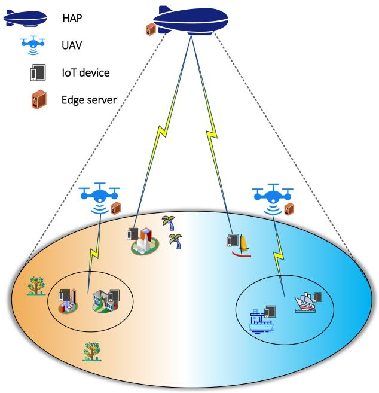

flowchart

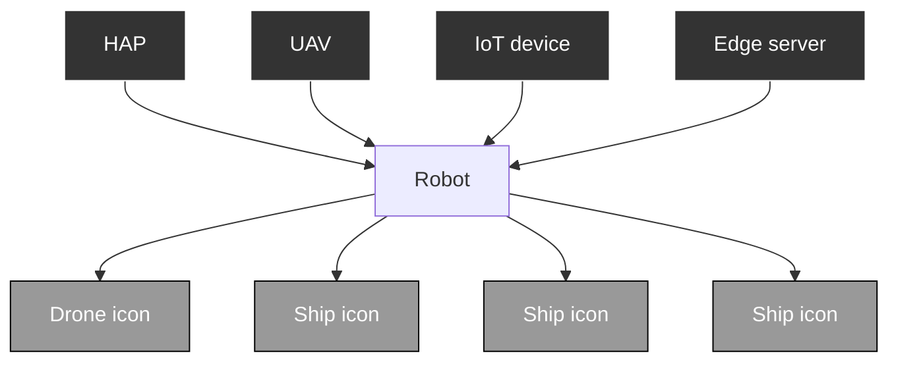

Fig. 1. Aerial-based MEC framework.

# B. Communication Model

The server selection decision for GD n is defined as ${ \boldsymbol { v } } _ { n } ^ { s } ( t )$ , where $\textstyle v _ { n } ^ { s } ( t ) = 1$ ( )indicates that GD n selects server s to handle ( ) = 1tasks in tth slot, or else $v _ { n } ^ { s } ( t ) = 0 . \ v ( t ) = \{ v _ { n } ( t ) | n \in \mathcal { N } \}$ ( ) = 0 = ( )indicate the server selection decision of all GDs in tth slot. In addition, the transmission power of GD n during communication with server is represented as $p _ { n } ( t )$ , and $0 \leq p _ { n } ( t ) \leq p _ { n } ^ { \mathrm { m a x } }$ .

( ) 0 ( )1) Ground-HAP Communication Model: In the Ground-HAP communication model, GDs communicate with the HAP, where the HAP hovers at a fixed height in the stratosphere. According to [19], the path loss when the GD n communicates with the HAP is calculated as

$$
\begin{array}{l} L _ {n} = 2 0 \log_ {1 0} \left(\frac {4 \pi f _ {c} \sqrt {d _ {n} ^ {2} + r _ {n} ^ {2}}}{c}\right) + \rho_ {n} ^ {L o S} \eta_ {n} ^ {L o S} \\ + (1 - \rho_ {n} ^ {L o S}) \eta_ {n} ^ {N L o S}, \tag {1} \\ \end{array}
$$

where $d _ { n }$ represents the vertical distance from the HAP to the ground, $r _ { n }$ indicates the horizontal distance from GD n to the HAP, $f _ { c }$ denotes the carrier frequency, and c denotes the speed of light. Furthermore, $\eta _ { n } ^ { L o S }$ and $\eta _ { n } ^ { \dot { N } L o S }$ denote line-of-sight (LoS) and non-LoS (NLoS) link loss when GD n communicates with the HAP, respectively. Besides, the LoS communication

TABLE I KEY NOTATIONS 

<table><tr><td>Notations</td><td>Definitions</td></tr><tr><td> $\mathcal{N}$ </td><td>the set of GDs</td></tr><tr><td> $\mathcal{S}$ </td><td>the set of edge server</td></tr><tr><td> $\tau$ </td><td>the length of time slot</td></tr><tr><td> $\eta_{n}^{LoS}$ </td><td>the line-of-sight link loss</td></tr><tr><td> $\eta_{n}^{NLoS}$ </td><td>the non-LoS link loss</td></tr><tr><td> $\rho_{n}^{LoS}$ </td><td>the LoS communication probability of GD n</td></tr><tr><td> $v_{n}^{s}(t)$ </td><td>the server selection decision of GD n</td></tr><tr><td> $\boldsymbol{v}(\boldsymbol{t})$ </td><td>the server selection decision of all GDs</td></tr><tr><td> $f_{n}^{l}(t)$ </td><td>the CPU cycle frequency of GD n</td></tr><tr><td> $\varrho_{n}$ </td><td>the CPU cycles needed by GD n to process each bit of data</td></tr><tr><td> $p_{n}(t)$ </td><td>the transmission power decision of GD n</td></tr><tr><td> $\boldsymbol{p}(\boldsymbol{t})$ </td><td>the transmission power decision of all GDs</td></tr><tr><td> $g_{n}^{s}(t)$ </td><td>the channel gain when GD n communicates with HAP or UAV</td></tr><tr><td> $\gamma_{n}^{s}(t)$ </td><td>the signal-to-noise ratio when GD n communicates with HAP or UAV</td></tr><tr><td> $R_{n}^{s}(t)$ </td><td>the data transmission rate of GD n communicates with HAP or UAV</td></tr><tr><td> $A_{n}(t)$ </td><td>the size of tasks that are newly arriving at GD n</td></tr><tr><td> $W_{n}^{l}(t)$ </td><td>the size of task processed locally by the GD n</td></tr><tr><td> $W_{n}^{o}(t)$ </td><td>the size of task offloaded by GD n</td></tr><tr><td> $G_{n}(t)$ </td><td>the queue backlog of the buffer queue of GD n</td></tr><tr><td> $E_{n}^{l}(t)$ </td><td>the energy consumed by local computation of GD n</td></tr><tr><td> $E_{n}^{o}(t)$ </td><td>the energy consumed by GD n offloading tasks</td></tr></table>

probability is calculated as

$$
\rho_ {n} ^ {L o S} = \frac {1}{1 + \varkappa_ {1} e x p \left\{- \varkappa_ {2} \left[ \tan^ {- 1} \left(\frac {d _ {n}}{r _ {n}}\right) - \varkappa_ {1} \right] \right\}}, \tag {2}
$$

where the value of κ1, κ2, ηLn $\varkappa _ { 1 } , \varkappa _ { 2 } , \eta _ { n } ^ { L o S }$ and $\eta _ { n } ^ { N L o S }$ is determined by the state of the environment.

Without loss of generality, the channel gain when GD n communicates with the HAP is

$$
g _ {n} ^ {s} (t) = 1 0 ^ {- \frac {L _ {n}}{1 0}}, s = 0. \tag {3}
$$

2) Ground-UAV Communication Model: In this model, the communication distance between GD n and UAV s is $l _ { n } ^ { s }$ . According to [20], the channel gain when GD n communicates with UAV s is denoted as

$$
g _ {n} ^ {s} (t) = 1 2 8 + 3 7. 6 \log_ {1 0} (l _ {n} ^ {s}), s = 1, \dots , S. \tag {4}
$$

In summary, the communication interference from other GDs when GD n offloads its task to server s is $\begin{array} { r } { \sum _ { m \neq n } v _ { m } ^ { s } ( t ) p _ { m } ( t ) g _ { m } ^ { s } ( t ) } \end{array}$ . Therefore, the signal-to-noise ratio ( ) ( ) ( )when GD n communicates with server s is calculated as

$$
\gamma_ {n} ^ {s} (t) = \frac {\upsilon_ {n} ^ {s} (t) p _ {n} (t) g _ {n} ^ {s} (t)}{\sum_ {m \neq n} \upsilon_ {m} ^ {s} (t) p _ {m} (t) g _ {m} ^ {s} (t) + \sigma^ {2}}, \tag {5}
$$

where $\begin{array} { r } { \sum _ { s = 0 } ^ { S } v _ { n } ^ { s } ( t ) \leq 1 , \forall n \in N } \end{array}$ and $\sigma ^ { 2 }$ stands for the noise

Therefore, the data transmission rate of GD n is denoted as

$$
R _ {n} ^ {s} (t) = B _ {s} \log_ {2} (1 + \gamma_ {n} ^ {s} (t)), \tag {6}
$$

where $B _ { s }$ is the bandwidth allocated by server s.

# C. Task and Queue Model

In our system model, a buffer queue is maintained by each GD to store the newly arrived tasks. The task processed by the GD n locally is $W _ { n } ^ { l } ( t )$ (in bits), indicated as

$$
W _ {n} ^ {l} (t) = \frac {f _ {n} ^ {l} (t) \tau}{\varrho_ {n}}, \tag {7}
$$

where $f _ { n } ^ { l } ( t )$ is the CPU frequency of GD n, which satisfies $0 \leq f _ { n } ^ { l } ( t ) \leq f _ { n } ^ { \operatorname* { m a x } }$ , and $\varrho _ { n }$ represents the CPU cycles needed 0 ( )by GD n to process each bit of data.

Each GD can only choose one server to offload tasks within each slot, and the choice may be different within different slots. Define the size of the computation offloaded to the server s is $W _ { n } ^ { o } ( t )$ (in bits), expressed by

$$
W _ {n} ^ {o} (t) = \sum_ {s = 0} ^ {S} R _ {n} ^ {s} (t) \tau . \tag {8}
$$

The size of tasks that are newly arriving at GD n in tth slot is symbolized by $A _ { n } ( t )$ (in bits), and $A _ { n } ( t ) \leq A _ { n } ^ { \operatorname* { m a x } } ( t )$ . ( ) ( ) ( )Simultaneously, define the queue backlog of the buffer queue of GD n to be $G _ { n } ( t )$ . After a time slot ends, the size of buffer ( )queue will change, and this change process is described as

$$
G _ {n} (t + 1) = [ G _ {n} (t) - W _ {n} ^ {l} (t) - W _ {n} ^ {o} (t) ] ^ {+} + A _ {n} (t), \tag {9}
$$

where $[ G _ { n } ( t ) - W _ { n } ^ { l } ( t ) - W _ { n } ^ { o } ( t ) ] ^ { + } = \operatorname* { m a x } \{ G _ { n } ( t ) - W _ { n } ^ { l } ( t ) -$ $W _ { n } ^ { o } ( t ) , 0 \} , W _ { n } ^ { l } ( t ) \leq G _ { n } ( t )$ ( ), and $W _ { n } ^ { o } ( t ) \leq G _ { n } ( t ) - W _ { n } ^ { l } ( t )$ ).

# D. Energy Consumption Model

In the aerial-based MEC system, we investigate the energy consumption of GDs. The energy consumption can be divided into two components, including the energy consumed for local computation and offloading. The energy consumed by local computation hinges on the integrated chip architecture of the GDs [7]. Then, the energy consumed by local computation of GD n is calculated as

$$
E _ {n} ^ {l} (t) = \kappa f _ {n} ^ {l} (t) ^ {3} \tau , \tag {10}
$$

where κ means the effective switched capacitance [21].

Similarly, the task offloading from GDs to servers consumes the corresponding energy, which is

$$
E _ {n} ^ {o} (t) = p _ {n} (t) \tau . \tag {11}
$$

Therefore, the total energy consumed by the GD n during slot t is

$$
E _ {n} (t) = E _ {n} ^ {l} (t) + E _ {n} ^ {o} (t). \tag {12}
$$

Hence, the total energy consumed by GDs within slot t is represented as

$$
E (t) = \sum_ {n = 1} ^ {N} E _ {n} (t). \tag {13}
$$

# E. Problem Formulation

The optimization objective is to minimize the overall energy consumed by local and offloading for GDs. The decision set is represented as $\mathcal { Q } ( t ) = \{ f ^ { l } ( t ) , v ( t ) , p ( t ) \}$ . According to the ( ) =description above, this problem is formulated as

$$
\mathcal {P} _ {1}: \quad \min _ {\mathcal {Q} (t)} \lim _ {T \rightarrow \infty} \frac {1}{T} \sum_ {t = 0} ^ {T - 1} \mathbb {E} \{E (t) \}, \tag {14}
$$

$\mathrm { s . t . } C 1 : 0 \leq f _ { n } ^ { l } ( t ) \leq f _ { n } ^ { \operatorname* { m a x } } , \forall n \in \mathcal N ,$

$$
C 2: v _ {n} ^ {s} (t) \in \{0, 1 \}, \forall n \in \mathcal {N}, s \in \mathcal {S},
$$

$$
C 3: \sum_ {s = 0} ^ {S} v _ {n} ^ {s} (t) \leq 1, \forall n \in \mathcal {N}, s \in \mathcal {S},
$$

$$
C 4: 0 \leq p _ {n} (t) \leq p _ {n} ^ {\max}, \forall n \in \mathcal {N},
$$

$$
C 5: W _ {n} ^ {l} (t) \leq G _ {n} (t), \forall n \in \mathcal {N},
$$

$$
C 6: W _ {n} ^ {o} (t) \leq G _ {n} (t) - W _ {n} ^ {l} (t), \forall n \in \mathcal {N},
$$

where C is local CPU cycle frequency constraint, C and 1 2C denote server selection decision constraint, and C is the 3 4power constraint. C and C are local computation constraint 5 6and offload computation constraint, respectively.

Problem $\mathcal { P } _ { 1 }$ is a stochastic optimization problem, and it is an NP-hard problem involving mixed integer and continuous variable. The statistical data, such as the arrival process of task and task size of GDs, and wireless channel quality, are difficult to predict. Because of the unpredictability of the future information of the system, we will next use stochastic optimization techniques to deal with the problem.

# III. DISTRIBUTED ONLINE TASK OFFLOADING AND RESOURCE ALLOCATION ALGORITHM DESIGN

This section innovates stochastic optimization techniques to transform $\mathcal { P } _ { 1 }$ into a deterministic optimization problem. Then, a distributed online algorithm is designed to minimize the energy consumed by GDs. The algorithm makes decisions without relying on future information.

# A. Problem Transformation

A queue backlog vector $\Omega ( t ) = \{ G _ { 1 } ( t ) , G _ { 2 } ( t ) , . . . , G _ { n } ( t ) \}$ descand $\begin{array} { r } { \Psi ( \Omega ( t ) ) = \frac { 1 } { 2 } \dot { \sum _ { n = 1 } ^ { N } { G _ { n } ( t ) ^ { 2 } } } } \end{array}$ d stability level of the system,.

Ψ(Ω( )) =It is clear that the function $\Psi ( \Omega ( t ) )$ is non-negative. Its larger Ψ(Ω( ))value indicates that the GD is backlogged with more tasks, which will lead to system unstability and affect the performance of the GD. To stabilize the queue level, the drift function is further

depicted as

$$
\Delta (\Omega (t)) = \mathbb {E} \{\Psi (\Omega (t + 1)) - \Psi (\Omega (t)) | \Omega (t) \}. \tag {15}
$$

By combining queue stability with energy consumption cost, the drift-plus-penalty function can be obtained as

$$
\Delta_ {V} (\Omega (t)) = \Delta (\Omega (t)) + V \mathbb {E} \{E (t) | \Omega (t) \}, \tag {16}
$$

where the penalty weight V is a trade-off parameter.

Theorem 1: Regardless of the queue backlog and feasible decisions change, the upper bound of (16) satisfies

$$
\begin{array}{l} \Delta (\Omega (t)) + V \mathbb {E} \{E (t) | \Omega (t) \} \leq O 1 + V \mathbb {E} \{E (t) | \Omega (t) \} \\ + \mathbb {E} \left\{\sum_ {n = 1} ^ {N} G _ {n} (t) [ A _ {n} (t) - W _ {n} ^ {l} (t) - W _ {n} ^ {o} (t) ] | \Omega (t) \right\}, \tag {17} \\ \end{array}
$$

where $\begin{array} { r } { O 1 = \sum _ { n = 1 } ^ { N } \lbrace \frac { 1 } { 2 } ( A _ { n } ^ { \operatorname* { m a x } } ( t ) ) ^ { 2 } + \frac { 1 } { 2 } [ \frac { f _ { n } ^ { \operatorname* { m a x } } \tau } { \varrho _ { n } } + R _ { n } ^ { \operatorname* { m a x } } ( t ) \tau ] ^ { 2 } \rbrace } \end{array}$ fmaxn τ Rmaxn t τ  2} 1 =is a constant.

Proof: Squaring both sides of (9) simultaneously can yield

$$
\begin{array}{l} G _ {n} (t + 1) ^ {2} \leq G _ {n} (t) ^ {2} + [ W _ {n} ^ {l} (t) + W _ {n} ^ {o} (t) ] ^ {2} + A _ {n} (t) ^ {2} \\ + 2 G _ {n} (t) [ A _ {n} (t) - W _ {n} ^ {l} (t) - W _ {n} ^ {o} (t) ]. \tag {18} \\ \end{array}
$$

Integrating inequalities (15), (16) and (18) can yield

$$
\begin{array}{l} \Delta (\Omega (t)) + V \mathbb {E} \{E (t) | \Omega (t) \} \leq O 1 \\ + V \mathbb {E} \left\{\sum_ {n = 1} ^ {N} \left[ E _ {n} ^ {l} (t) + E _ {n} ^ {o} (t) \right] | \Omega (t) \right\} \\ + \mathbb {E} \left\{\sum_ {n = 1} ^ {N} G _ {n} (t) [ A _ {n} (t) - W _ {n} ^ {l} (t) - W _ {n} ^ {o} (t) ] | \Omega (t) \right\}, \tag {19} \\ \end{array}
$$

where $\begin{array} { r } { O 1 = \sum _ { n = 1 } ^ { N } \lbrace \frac { 1 } { 2 } ( A _ { n } ^ { \operatorname* { m a x } } ( t ) ) ^ { 2 } + \frac { 1 } { 2 } [ \frac { f _ { n } ^ { \operatorname* { m a x } } \tau } { \varrho _ { n } } + R _ { n } ^ { \operatorname* { m a x } } ( t ) \tau ] ^ { 2 } \rbrace } \end{array}$ fmaxn τ Rmaxn t τ  2} 1 =is a constant.-

With the above transformation, the problem $\mathcal { P } _ { 1 }$ is transformed into the more tractable problem $\mathcal { P } _ { 2 }$ , which is denoted as follows

$$
\begin{array}{l} \mathcal {P} _ {2}: \quad \min _ {\mathcal {Q} (t)} \left\{V \sum_ {n = 1} ^ {N} [ \kappa f _ {n} ^ {l} (t) ^ {3} \tau + p _ {n} (t) \tau ] \right. \\ \left. - \sum_ {n = 1} ^ {N} G _ {n} (t) \left[ \frac {f _ {n} ^ {l} (t) \tau}{\varrho_ {n}} + \sum_ {s = 0} ^ {S} R _ {n} ^ {s} (t) \tau \right] \right\}, \tag {20} \\ \end{array}
$$

$$
\text { s.t. } \quad C 1: 0 \leq f _ {n} ^ {l} (t) \leq f _ {n} ^ {\max} (t), \forall n \in \mathcal {N},
$$

$$
C 2: v _ {n} ^ {s} (t) \in \{0, 1 \}, \forall n \in \mathcal {N}, s \in \mathcal {S},
$$

$$
C 3: \sum_ {s = 0} ^ {S} v _ {n} ^ {s} (t) \leq 1, \forall n \in \mathcal {N}, s \in \mathcal {S},
$$

$$
C 4: 0 \leq p _ {n} (t) \leq p _ {n} ^ {\max}, \forall n \in \mathcal {N},
$$

$$
C 5: W _ {n} ^ {l} (t) \leq G _ {n} (t), \forall n \in \mathcal {N},
$$

$$
C 6: W _ {n} ^ {o} (t) \leq G _ {n} (t) - W _ {n} ^ {l} (t), \forall n \in \mathcal {N}.
$$

# B. Distributed Online Task Offloading and Resource Allocation Algorithm

This section investigates how to tackle problem $\mathcal { P } _ { 2 }$ and propose the corresponding algorithm. First, we separate $\mathcal { P } _ { 2 }$ into two subproblems, which are local computation resource allocation subproblem $\mathcal { P } _ { 2 . 1 }$ and offloading resource allocation subproblem $\mathcal { P } _ { 2 . 2 }$ . Then, different methods are used to solve the problem according to the properties of the subproblems. Finally, the Distributed Online Task Offloading and Resource Allocation (DOTORA) algorithm is proposed.

1) Local Computation Resource Allocation: The local computation resource allocation subproblem is denoted as

$$
\mathcal {P} _ {2. 1}: \quad \min _ {\boldsymbol {f} ^ {l} (t)} \sum_ {n = 1} ^ {N} \left[ V \kappa f _ {n} ^ {l} (t) ^ {3} \tau - G _ {n} (t) \frac {f _ {n} ^ {l} (t) \tau}{\varrho_ {n}} \right], \tag {21}
$$

$$
\text { s.t. } \quad C 1: 0 \leq f _ {n} ^ {l} (t) \leq f _ {n} ^ {\max}, \forall n \in \mathcal {N},
$$

$$
C 2: W _ {n} ^ {l} (t) \leq G _ {n} (t), \forall n \in \mathcal {N}.
$$

This problem is decoupled for each GD. That is easy to see that $\mathcal { P } _ { 2 . 1 }$ is a convex optimization problem regarding $f ^ { l } ( t )$ , and its solution can be obtained at the poles or at the boundary. We can obtain its pole value by assigning its first-order derivative function to zero. Then, the solution can be obtained as follows

$$
f _ {n} ^ {l, *} (t) = \left\{ \begin{array}{l l} \sqrt {\frac {G _ {n} (t)}{3 V \kappa \varrho_ {n}}}, & 0 \leq \sqrt {\frac {G _ {n} (t)}{3 V \kappa \varrho_ {n}}} \leq f _ {n} ^ {\iota} (t) \\ f _ {n} ^ {\iota} (t), & \text { otherwise } \end{array} \right., \tag {22}
$$

where $\begin{array} { r } { f _ { n } ^ { \iota } ( t ) = \operatorname* { m i n } \{ \frac { G _ { n } ( t ) \varrho _ { n } } { \tau } , f _ { n } ^ { \operatorname* { m a x } } \} } \end{array}$ τ , fn .

( ) = minAfter obtaining the local CPU frequency of the GDs and bringing it into $( 7 )$ , the local computation $W _ { n } ^ { l } ( t )$ of each GD can be calculated.

2) Offloading Resource Allocation: The server selection decision and transmission power allocation decision for GDs can be obtained by solving $\mathcal { P } _ { 2 . 2 }$ .

$$
\mathcal {P} _ {2. 2}: \quad \min _ {\boldsymbol {v} (t), \boldsymbol {p} (t)} \sum_ {n = 1} ^ {N} \left[ V p _ {n} (t) \tau - G _ {n} (t) \sum_ {s = 0} ^ {S} R _ {n} ^ {s} (t) \tau \right], \tag {23}
$$

$$
\text { s.t. } \quad C 1: v _ {n} ^ {s} (t) \in \{0, 1 \}, \forall n \in \mathcal {N}, s \in \mathcal {S},
$$

$$
C 2: \sum_ {s = 0} ^ {S} v _ {n} ^ {s} (t) \leq 1, \forall n \in \mathcal {N}, s \in \mathcal {S},
$$

$$
C 3: 0 \leq p _ {n} (t) \leq p _ {n} ^ {\max}, \forall n \in \mathcal {N},
$$

$$
C 4: W _ {n} ^ {o} (t) \leq G _ {n} (t) - W _ {n} ^ {l} (t), \forall n \in \mathcal {N}.
$$

Solving problem $\mathcal { P } _ { 2 . 2 }$ is very difficult because the decisions $v ( t )$ and $p ( t )$ are coupled. Thus, we employ game theory to reformulate the problem as a game-theoretical multi-server selection game. Then, we use a game approach to obtain the server chosen by each GD. Here, we look for a server selection decision set that minimizes the total offloading cost. After all GDs have been allocated servers, the total offloading cost is minimized by continuously adjusting the transmission power of the GDs.

a) Game-theoretical Multi-server Selection: To solve the server selection problem of GDs, in this part, we model the server selection problem as a non-cooperative game model using game theory [22], [23], namely GMS game. At this stage, each GD n is assigned a default transmission power $p _ { n } ^ { d e f } ( t )$ . Specifically, when $t = 0 , p _ { n } ^ { d e f } ( t ) = 0 ;$ ; otherwise, $p _ { n } ^ { d e f } ( t ) = p _ { n } ( t - 1 )$ . For = 0 ( ) = 0 ( ) = (the GD n, the decisions of other GDs are denoted as ${ \pmb v } _ { - n } ( t )$ . Then the total cost of offloading is

$$
\mathcal {P} _ {2. 2. 1}: \quad \min _ {\boldsymbol {v} (t)} \sum_ {n = 1} ^ {N} [ C _ {n} (\boldsymbol {v} _ {n} (t), \boldsymbol {v} _ {- n} (t)) ], \tag {24}
$$

$\mathrm { s . t . } \quad C 1 : v _ { n } ^ { s } ( t ) \in \{ 0 , 1 \} , \forall n \in \mathcal { N } , s \in \mathcal { S } ,$

$$
C 2: \sum_ {s = 0} ^ {S} v _ {n} ^ {s} (t) \leq 1, \forall n \in \mathcal {N}, s \in \mathcal {S},
$$

$$
C 3: W _ {n} ^ {o} (t) \leq G _ {n} (t) - W _ {n} ^ {l} (t), \forall n \in \mathcal {N},
$$

where

$$
C _ {n} (\boldsymbol {v} _ {n} (t), \boldsymbol {v} _ {- n} (t))
$$

$$
= V p _ {n} ^ {d e f} (t) \tau - G _ {n} (t) \sum_ {s = 0} ^ {S} R _ {n} ^ {s} (t) \tau = V p _ {n} ^ {d e f} (t) \tau
$$

$$
- G _ {n} (t) \sum_ {s = 0} ^ {S} B _ {s} \log_ {2} \left(1 + \frac {v _ {n} ^ {s} (t) p _ {n} ^ {\text { def }} (t) g _ {n} ^ {s} (t)}{\sum_ {m \neq n} v _ {m} ^ {s} (t) p _ {m} ^ {\text { def }} (t) g _ {m} ^ {s} (t) + \sigma^ {2}}\right) \tau . \tag {25}
$$

Within each time slot, GD n will make an appropriate server selection decision. Then this server selection problem is modeled as a game $\begin{array} { r } { F = \langle N , \{ { v _ { n } } ( t ) \} _ { n \in \mathcal { N } } , \{ C _ { n } ( { v _ { n } } ( t ) , { v } _ { - n } ( t ) ) \} _ { n \in \mathcal { N } } \} \rangle } \end{array}$ , = ( ) ( ( ) ( ))where N denotes the number of GDs in the system, ${ \boldsymbol { v } } _ { n } ( t )$ is the server selection decision of GD n, and $C _ { n } ( v _ { n } ( t ) , v _ { - n } ( t ) )$ ( ( )denotes the offloading cost for GD n to make the decision ${ \pmb v } _ { - n } ( t )$ when the decisions of other GDs are given.

In the game , when multiple GDs select to offload tasks to the same HAP or UAV, there is noncooperative competition among these several GDs. To describe this noncooperative competition, we define the Nash Equilibrium (NE) solution.

Definition 1: A server selection decision $v ^ { * } ( t ) =$ $\{ \pmb { v } _ { 1 } ^ { * } ( t ) , \pmb { v } _ { 2 } ^ { * } ( t ) , . . . , \pmb { v } _ { n } ^ { * } ( t ) \}$ =in the GMS game is a NE when ( ) ( ) ( )no GD can further reduce its offloading cost by independently altering its decision, i.e.

$$
C _ {n} \left(\boldsymbol {v} _ {n} (t), \boldsymbol {v} _ {- n} ^ {*} (t)\right) > C _ {n} \left(\boldsymbol {v} _ {n} ^ {*} (t), \boldsymbol {v} _ {- n} ^ {*} (t)\right), \forall n \in \mathcal {N}. \tag {26}
$$

In the NE, each GD will no longer change its strategy to reduce offloading cost, i.e., all GDs find their own optimal decisions. Next, we will investigate whether there exists NE in the game . If there exists NE, then the decisions of all GDs will self-organize into NE in finite iterations based on the best-want principle.

In the following, we will introduce a potential game to demonstrate the presence of NE in . The potential game possesses finite improvement property, guaranteeing the existence of at least one NE within it. Therefore, we can prove the presence of NE in the GMS game by showing that the GMS game aligns with those typically associated with a potential game.

Definition $2 \colon { \boldsymbol { F } }$ is a potential game when there exists a function that satisfies

$$
C _ {n} (\pmb {v} _ {n} (t), \pmb {v} _ {- n} (t)) - C _ {n} (\pmb {v} _ {n} ^ {\prime} (t), \pmb {v} _ {- n} (t)) > 0
$$

$$
\Rightarrow \Phi_ {n} (\boldsymbol {v} _ {n} (t), \boldsymbol {v} _ {- n} (t)) - \Phi_ {n} (\boldsymbol {v} _ {n} ^ {\prime} (t), \boldsymbol {v} _ {- n} (t)) > 0. \tag {27}
$$

Theorem 2:  is a potential game with a corresponding potential function represented as

$$
\Phi (\boldsymbol {v} _ {n} (t), \boldsymbol {v} _ {- n} (t)) = \log_ {2} \left(\frac {\sum_ {m \neq n} v _ {m} ^ {s} (t) p _ {m} ^ {d e f} (t) g _ {m} ^ {s} (t) + \sigma^ {2}}{\sum_ {n \in \mathcal {N}} v _ {n} ^ {s} (t) p _ {n} ^ {d e f} (t) g _ {n} ^ {s} (t) + \sigma^ {2}}\right). \tag {28}
$$

Proof: Based on the above discussion, we can conclude that

$$
C _ {n} (\pmb {\nu} _ {n} (t), \pmb {\nu} _ {- n} (t)) = V p _ {n} ^ {d e f} (t) \tau
$$

$$
- G _ {n} (t) \sum_ {s = 0} ^ {S} B _ {s} \log_ {2} \left(1 + \frac {v _ {n} ^ {s} (t) p _ {n} ^ {\text { def }} (t) g _ {n} ^ {s} (t)}{\sum_ {m \neq n} v _ {m} ^ {s} (t) p _ {m} ^ {\text { def }} (t) g _ {m} ^ {s} (t) + \sigma^ {2}}\right) \tau . \tag {29}
$$

The difference between server selection decisions ${ \boldsymbol { v } } _ { n } ( t )$ and $\pmb { v } _ { n } ^ { \prime } ( t )$ is calculated as

$$
C _ {n} \left(\boldsymbol {v} _ {n} (t), \boldsymbol {v} _ {- n} (t)\right) - C _ {n} \left(\boldsymbol {v} _ {n} ^ {\prime} (t), \boldsymbol {v} _ {- n} (t)\right)
$$

$$
= - G _ {n} (t) \sum_ {s = 0} ^ {S} B _ {s} \log_ {2} \left(1 + \frac {v _ {n} ^ {s} (t) p _ {n} ^ {d e f} (t) g _ {n} ^ {s} (t)}{\sum_ {m \neq n} v _ {m} ^ {s} (t) p _ {m} ^ {d e f} (t) g _ {m} ^ {s} (t) + \sigma^ {2}}\right) \tau
$$

$$
+ G _ {n} (t) \sum_ {s = 0} ^ {S} B _ {s} \log_ {2} \left(1 + \frac {\upsilon_ {n} ^ {s ^ {\prime}} (t) p _ {n} ^ {d e f} (t) g _ {n} ^ {s ^ {\prime}} (t)}{\sum_ {i \neq n} \upsilon_ {i} ^ {s ^ {\prime}} (t) p _ {i} ^ {d e f} (t) g _ {i} ^ {s ^ {\prime}} (t) + \sigma^ {2}}\right) \tau
$$

$$
= G _ {n} (t) \sum_ {s = 0} ^ {S} B _ {s} \tau \Bigg [ \log_ {2} \left(1 + \frac {v _ {n} ^ {s ^ {\prime}} (t) p _ {n} ^ {d e f} (t) g _ {n} ^ {s ^ {\prime}} (t)}{\sum_ {i \neq n} v _ {i} ^ {s ^ {\prime}} (t) p _ {i} ^ {d e f} (t) g _ {i} ^ {s ^ {\prime}} (t) + \sigma^ {2}}\right)
$$

$$
- \log_ {2} \left(1 + \frac {v _ {n} ^ {s} (t) p _ {n} ^ {d e f} (t) g _ {n} ^ {s} (t)}{\sum_ {m \neq n} v _ {m} ^ {s} (t) p _ {m} ^ {d e f} (t) g _ {m} ^ {s} (t) + \sigma^ {2}}\right)
$$

$$
> 0. \tag {30}
$$

When the server selection decision of GD n changes from ${ \boldsymbol { v } } _ { n } ( t )$ to ${ \pmb v } _ { n } ^ { \prime } ( t )$ , the potential function changes as follows

$$
\Phi (\boldsymbol {v} _ {n} (t), \boldsymbol {v} _ {- n} (t)) - \Phi (\boldsymbol {v} _ {n} ^ {\prime} (t), \boldsymbol {v} _ {- n} (t))
$$

$$
= \log_ {2} \left(\frac {\sum_ {m \neq n} v _ {m} ^ {s} (t) p _ {m} ^ {d e f} (t) g _ {m} ^ {s} (t) + \sigma^ {2}}{\sum_ {n \in \mathcal {N}} v _ {n} ^ {s} (t) p _ {n} ^ {d e f} (t) g _ {n} ^ {s} (t) + \sigma^ {2}}\right)
$$

$$
- \log_ {2} \left(\frac {\sum_ {m \neq n} v _ {m} ^ {s ^ {\prime}} (t) p _ {m} ^ {d e f} (t) g _ {m} ^ {s ^ {\prime}} (t) + \sigma^ {2}}{\sum_ {n \in \mathcal {N}} v _ {n} ^ {s ^ {\prime}} (t) p _ {n} ^ {d e f} (t) g _ {n} ^ {s ^ {\prime}} (t) + \sigma^ {2}}\right)
$$

$$
> 0. \tag {31}
$$

Through the above derivation, we can see that the trend of cost function and potential function is consistent. Therefore, Theorem 2 is proven.

Algorithm 1: Distributed Game-Theoretical Multi-Server Selection (DGMS) Algorithm.   
Input: S, N, default transmission power $p(t)$ Output: server selection decision $v(t)$ 1: repeat
2: calculate the current total offloading cost $\sum_{n=1}^{N} C(\boldsymbol{v}_{n}(t), \boldsymbol{v}_{-n}(t))$ 3: for all $n \in N$ do
4:    for all $s \in S$ do
5:    calculate the total cost $\sum_{n=1}^{N} C(\boldsymbol{v}_{n}'(t), \boldsymbol{v}_{-n}(t))$ when user n selects server s
6:    end for
7:    find decision $v_{n}'(t)$ with the minimum total offloading cost
8:    if $\sum_{n=1}^{N} C(\boldsymbol{v}_{n}'(t), \boldsymbol{v}_{-n}(t)) < \sum_{n=1}^{N} C(\boldsymbol{v}_{n}(t), \boldsymbol{v}_{-n}(t))$ then
9:    temporarily update the decision for GD n to $v_{n}'(t)$ 10:    end if
11: end for
12: randomly selects one GD among all GDs whose decisions are to be updated to update its decision
13: until all GDs no longer update decisions

To solve the server selection problem for GDs, the DGMS algorithm is proposed, the details of which can be found in Algorithm 1.

b) Transmission Power Allocation: After the GD determines which UAV or HAP to offload the task, we can adjust the transmission power according to their respective needs to reduce the offloading cost. The transmission power allocation problem is modeled as

$$
\begin{array}{l} \mathcal {P} _ {2. 2. 2}: \min _ {\boldsymbol {p} (t)} \left\{V p _ {n} (t) \tau \right. \\ \left. - G _ {n} (t) B _ {s} \log_ {2} \left(1 + \frac {p _ {n} (t) g _ {n} ^ {s} (t)}{\sum_ {m \neq n} p _ {m} (t) g _ {m} ^ {s} (t) + \sigma^ {2}}\right) \tau \right\}, \tag {32} \\ \end{array}
$$

$$
\text { s.t. } \quad C 1: 0 \leq p _ {n} (t) \leq p _ {n} ^ {\max}, \forall n \in \mathcal {N},
$$

$$
C 2: W _ {n} ^ {o} (t) \leq G _ {n} (t) - W _ {n} ^ {l} (t), \forall n \in \mathcal {N}.
$$

To obtain the solution of the transmission power, first, we need to acquire the power expression for each GD. Then, the default transmission power is set for all GDs. Finally, the satisfactory transmission powers of all GDs are obtained by finite iterations.

Problem $\mathcal { P } _ { 2 . 2 . 2 }$ is not easy to solve. Thus, let $K _ { n } ( t ) =$ $\begin{array} { r } { G _ { n } ( t ) B _ { s } , r _ { n } ( t ) = \frac { g _ { n } ^ { s } ( t ) } { \sum _ { m \neq n } p _ { m } ( t ) g _ { m } ^ { s } ( t ) + \sigma ^ { 2 } } } \end{array}$ , we can get

$$
H (p _ {n} (t)) = - K _ {n} (t) \log_ {2} (1 + p _ {n} (t) r _ {n} (t)) \tau + V p _ {n} (t) \tau , \tag {33}
$$

$$
\mathrm{s.t.} C 1: 0 \leq p _ {n} (t) \leq p _ {n} ^ {\max}, \forall n \in \mathcal {N},
$$

$$
C 2: W _ {n} ^ {o} (t) \leq G _ {n} (t) - W _ {n} ^ {l} (t), \forall n \in \mathcal {N}.
$$

Algorithm 2: Transmission Power Allocation (TPA) Algorithm.   
Input: S, N, default transmission power $p(t)$ , server selection decision $v(t)$ found in Algorithm 1
Output: transmission power allocation decision $p'(t)$ 1: repeat
2: calculate the current cost $\sum_{n=1}^{N} H(p(t))$ 3: for all $n \in N$ do
4: calculate $K_n(t)$ and $r_n(t)$ 5: if $K_n(t) = 0$ then
6: set $p'_n(t) = 0$ 7: end if
8: if $K_n(t) > 0$ and $V \geq \frac{K_n(t)r_n(t)}{\ln 2}$ then
9: set $p'_n(t) = 0$ 10: else
11: set $p'_n(t) = \min\{p_n^{\max}, \frac{K_n(t)}{V \ln 2} - \frac{1}{r_n(t)}\}$ 12: end if
13: end for
14: calculate the new total offloading cost $\sum_{n=1}^{N} H(p'(t))$ after updating the transmission power of all GDs
15: until $\sum_{n=1}^{N} H(p'(t)) \leq \sum_{n=1}^{N} H(p(t))$ and $||p(t) - p(t - 1)|| < \epsilon$

For the convenience of description, we obtain $H ( p _ { n } ( t ) )$ through equivalent transformation. The solution of problem $\mathcal { P } _ { 2 . 2 . 2 }$ is the same as the solution corresponding to the minimum value of function $H ( p _ { n } ( t ) )$ . Therefore, we can obtain ( (the optimal solution of problem $\mathcal { P } _ { 2 . 2 . 2 }$ by solving the solution corresponding to the minimum value of function $H ( p _ { n } ( t ) )$ .

The first and second derivatives of $H ( p _ { n } ( t ) )$ ( ( ))are given by

$$
\frac {d H (p _ {n} (t))}{d p _ {n} (t)} = V \tau - \frac {K _ {n} (t) r _ {n} (t) \tau}{\ln 2 [ 1 + p _ {n} (t) r _ {n} (t) ]}, \tag {34}
$$

$$
\frac {d ^ {2} H (p _ {n} (t))}{d ^ {2} p _ {n} (t)} = \frac {K _ {n} (t) r _ {n} (t) ^ {2} \tau}{\ln 2 [ 1 + p _ {n} (t) r _ {n} (t) ] ^ {2}}. \tag {35}
$$

Two cases are considered, as described below.

When $K _ { n } ( t ) > 0$ , the second derivative of $H ( p _ { n } ( t ) )$ is greater than 0, $H ( p _ { n } ( t ) )$ 0 ( ( ))is a convex function. We can find that the ( ( ))zero point of the first derivative of $H ( p _ { n } ( t ) )$ is $\begin{array} { r } { p _ { n } ( t ) = \frac { K _ { n } ( t ) } { V \ln { 2 } } - } \end{array}$ $\frac { 1 } { r _ { n } ( t ) }$ Therefore, the solution as

$$
p _ {n} (t) = \left\{ \begin{array}{l l} 0, & V \geq \frac {K _ {n} (t) r _ {n} (t)}{\ln 2} \\ \min \left\{p _ {n} ^ {\max}, \frac {K _ {n} (t)}{V \ln 2} - \frac {1}{r _ {n} (t)} \right\}, & \text { otherwise } \end{array} . \right. \tag {36}
$$

When $K _ { n } ( t ) = 0$ , the first derivative of $H ( p _ { n } ( t ) )$ is greater ( ) = 0than 0, indicating that $H ( p _ { n } ( t ) )$ ( ( ))is a monotonically increasing function. Thus, $p _ { n } ( t ) = 0$ (.

( ) = 0To address the TPA problem of GDs, we propose the TPA algorithm. Algorithm 2 gives the details of TPA.

The relationship among the series of optimization subproblems is summarized in Fig. 2.

Next, we propose the DOTORA algorithm. In each time slot, the algorithm determines the CPU cycle frequency of the GD based on the amount of arriving tasks, and makes the server selection decision and transmission power allocation decision of the GD by calling the DGMS algorithm and the TPA algorithm respectively. This algorithm can minimize the drift plus penalty of each time slot, effectively solving problem $\mathcal { P } _ { 1 }$ .

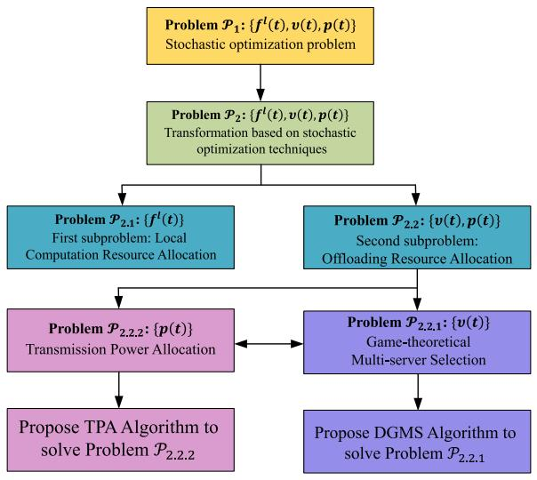

flowchart

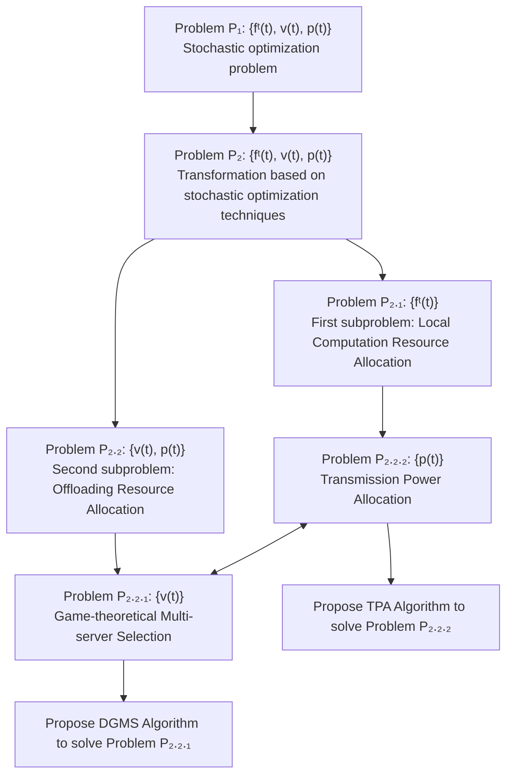

Fig. 2. Relationship among optimization problems.

Algorithm 3: Distributed Online Task Offloading and $\mathrm { R e ^ { - } }$ source Allocation (DOTORA) Algorithm.   
Input: S, N, κ
Output: $f_{n}^{l}(t)$ , $v_{n}^{s}(t)$ , $p_{n}(t)$ , $\forall n \in N$ , $s \in S$ 1: for all $t \in T$ do
2: obtain $A_{n}(t)$ 3: for all $n \in N$ do
4: calculate $f_{n}^{t}(t)$ by (22)
5: end for
6: determine $v(t)$ by Algorithm 1
7: determine $p(t)$ by Algorithm 2
8: update $G_{n}(t+1)$ , $\forall n \in N$ 9: end for

In each time slot, the DGMS algorithm takes the server selection decision set and transmission power allocation decision set obtained in the previous time slot as algorithm input. Then, based on the current system status, the DGMS algorithm calculates a new server selection decision set and takes it as output. The TPA algorithm takes the transmission power allocation decision set obtained in the previous time slot and the new server selection decision set obtained by the DGMS algorithm in the current time slot as algorithm inputs. Afterwards, based on the current system status, the TPA algorithm calculates a new transmission power allocation decision set and takes it as output. The DOTORA algorithm incorporates the DGMS and TPA algorithms as subalgorithms, and it utilizes the two algorithms to obtain the server selection decision set and transmission power allocation decision set.

Then, we give the complexity analysis of the proposed algorithm. The complexity of solving problem ${ \mathcal { P } } _ { 2 . }$ 1 is $\mathcal { O } ( N )$ . ( )For the Algorithm 1, in each round, we find the best server for each GD by looking at all possible options (lines 3–11 of Algorithm 1) to find the lowest cost server selection decision.

The complexity of the part is $\mathcal { O } ( N ^ { 2 } S ^ { 2 } )$ . In addition, in The-( )orem 2 in the revised paper, we prove that the GMS game is a potential game. Therefore, the game has finite improvement property (FIP), that is, the NE solution can be obtained through a finite number of iterations. Let the number of iterations be represented by $K _ { 1 }$ . The complexity of the Algorithm 1 can be expressed as $\mathcal { O } ( K _ { 1 } N ^ { 2 } S ^ { 2 } )$ . For the Algorithm 2, an iterative ( )method is used to solve the transmission power of each GD, and the maximum number of iterations is $K _ { 2 }$ . In addition, the complexity of solving the minimum cost for each iteration is $\mathcal { O } ( N S )$ . Then the complexity of Algorithm 2 can be expressed as $\mathcal { O } ( K _ { 2 } N S )$ . Thus, the complexity of the proposed DOTORA (algorithm is $\mathcal { O } ( N + K _ { 1 } N ^ { 2 } S ^ { 2 } + K _ { 2 } N S )$ .

( + + )We also give an analysis of communication overhead. In each time slot, GD makes local computing decisions, and the process involves no communication overhead. Then, when GD performs task offloading, it needs to obtain server selection decisions and transmission power allocation decisions. This process involves communication overhead:

(1) The server selection decision is obtained by calling the Algorithm 1. In the first step, in each iteration, GD sends its task status information to each server (including the amount of newly arrived tasks, queue backlog, server selection decision for this iteration, etc.). In the second step, the server sends the processed information to GD, and GD can obtain the status information and decisions of other GDs. In the third step, GD sends a request update decision message to the server. In the fourth step, when the server collects all the information containing the GD’s desired decision, the server selects a GD that can update its server selection decision (the winner in the Algorithm 1), and sends a message containing the updated decision to each GD. In the fifth step, in Theorem 2, we prove that the GMS game is a potential game. Therefore, the game has finite improvement property (FIP), that is, a NE solution can be obtained through a finite number of iterations. Let $R _ { 1 }$ represent the number of iterations, then the communication overhead of this part is $\mathcal { O } ( ( 3 N + N S ) R _ { 1 } ) = \mathcal { O } ( N S R _ { 1 } )$ .

((3 + ) ) = ( )(2) The transmission power allocation decision is obtained by calling the Algorithm 2. In the first step, GD sends information (including the amount of newly arrived tasks, queue backlog, power allocation decision for this iteration, etc.) to the server it selected. In the second step, the server sends the information of the GD it serves to other GDs. In the third step, GD makes decisions based on this information and sends updated decision information to the server. Assuming that $R _ { 2 }$ iterations are required to obtain the power allocation decision, the communication overhead of this part is $\mathcal { O } ( 3 N R _ { 2 } )$ .

(3Thus, the total communication overhead is $\mathcal { O } ( N S R _ { 1 } +$ $3 N R _ { 2 } )$ .

# IV. PERFORMANCE ANALYSIS OF DOTORA ALGORITHM

This section analyzes the performance of the DOTORA mathematically. First, the time-average queue backlog is denoted as

$$
\bar {G} = \lim _ {T \rightarrow \infty} \frac {1}{T} \sum_ {t = 0} ^ {T - 1} \sum_ {n = 1} ^ {N} G _ {n} (t). \tag {37}
$$

Lemma 1: Within any time slot, for a random arrival rate $\delta ,$ there is a corresponding offloading decision $\zeta ^ { * }$ such that

$$
\mathbb {E} \{E ^ {\zeta^ {*}} (t) \} = E ^ {*} (\delta),
$$

$$
\mathbb {E} \{A _ {n} ^ {\zeta^ {*}} (t) \} \leq \mathbb {E} \{W _ {n} ^ {l, \zeta^ {*}} (t) + W _ {n} ^ {o, \zeta^ {*}} (t) \}, \tag {38}
$$

where $E ^ { * } ( \delta )$ expresses minimum total energy consumption.

( )Proof: Caratheodory’s theorem can be adopted to demonstrate Lemma 1. We omit the details of the proof.

It is important to note that the task arrival rate’s upper bound implies that the total energy consumption of GDs is upper bounded, and its upper and lower bounds are defined as $\hat { E }$ and E, respectively. Then, we give Theorem 3.

Theorem 3: For arbitrary V and task arrival rate $\delta + \varepsilon .$ , the average energy consumption and average queue backlog satisfy

$$
E ^ {D O T O R A} \leq E ^ {*} + \frac {O 1 + O 2}{V}, \tag {39}
$$

$$
\bar {G} \leq \frac {O 1 + O 2 + V (\hat {E} - \check {E})}{\varepsilon}, \tag {40}
$$

where $\begin{array} { r } { O 1 = \sum _ { n = 1 } ^ { N } \{ \frac { 1 } { 2 } ( A _ { n } ^ { \mathrm { m a x } } ( t ) ) ^ { 2 } + \frac { 1 } { 2 } [ \frac { f _ { n } ^ { \mathrm { m a x } } \tau } { \rho _ { n } } + R _ { n } ^ { \mathrm { m a x } } ( t ) \tau ] ^ { 2 } \} } \end{array}$ n 1 = ( ( )) + [ + ( ) ]is a constant, O is the gap between the optimal reuslt and the 2result with our DOTORA algrithm in subprolbem $\mathcal { P } _ { 2 , 2 } , \mathrm { i . e . , } \mathcal { P } _ { 2 , }$ 2 is solved within an optimiality gap O .

2Proof: By utilizing Lemma 1, for offloading decision ζ and arrival rate $\delta + \varepsilon .$ , we get

$$
\mathbb {E} \{E ^ {\zeta} (t) \} = E ^ {*} (\delta + \varepsilon),
$$

$$
\mathbb {E} \{A _ {n} ^ {\zeta} (t) \} + \varepsilon \leq \mathbb {E} \{W _ {n} ^ {l, \zeta} (t) + W _ {n} ^ {o, \zeta} (t) \}. \tag {41}
$$

Because the optimization objective of DOTORA is to minimize (19)’s R.H.S, for offloading decision $\zeta ,$ it holds

$$
\Delta (\Omega (t)) + V \mathbb {E} \{E (t) \} \leq O 1 + O 2 + V \mathbb {E} \{E (t) \}
$$

$$
+ \mathbb {E} \left\{\sum_ {n = 1} ^ {N} G _ {n} (t) [ A _ {n} ^ {\zeta} (t) - W _ {n} ^ {l, \zeta} (t) - W _ {n} ^ {o, \zeta} (t) ] \right\}. \tag {42}
$$

Substituting (41) into (42), we obtain

$$
\mathbb {E} \{\Psi (\Omega (t + 1)) - \Psi (\Omega (t)) \} + V \mathbb {E} \{E (t) \}
$$

$$
\leq O 1 + O 2 + V E ^ {*} (\delta + \varepsilon) - \varepsilon \sum_ {n = 1} ^ {N} \mathbb {E} \{G _ {n} (t) \}. \tag {43}
$$

As $G _ { n } ( t )$ and ε are not negative, by adding (43) of all $t \in \mathcal T$ , there is

$$
V \sum_ {t = 0} ^ {T - 1} \mathbb {E} (E (t)) \leq (O 1 + O 2) T + V T E ^ {*} (\delta + \varepsilon). \tag {44}
$$

Divide (44) by V T . When $\varepsilon \to 0 , T \to \infty , ( 3 9 )$ is proven.

Using (43), it holds

$$
\varepsilon \sum_ {t = 0} ^ {T - 1} \sum_ {n = 1} ^ {N} \mathbb {E} \{G _ {n} (t) \}
$$

$$
\leq (O 1 + O 2) T + V T E ^ {*} (\delta + \varepsilon) - V \sum_ {t = 0} ^ {T - 1} \mathbb {E} (E (t)). \tag {45}
$$

TABLE II PARAMETER SETTINGS 

<table><tr><td>Parameters</td><td>Value</td></tr><tr><td>Effective switched capacitance</td><td> $10^{-27}$ </td></tr><tr><td>Background noise power</td><td> $10^{-13}$  W</td></tr><tr><td>Bandwidth of UAV</td><td>2 MHz</td></tr><tr><td>Bandwidth of HAP</td><td>10 MHz</td></tr><tr><td>CPU cycles needed to process 1 bit data</td><td>1000 cycles/bit</td></tr><tr><td>Carrier frequency</td><td>0.1 GHz</td></tr><tr><td>Height of HAP</td><td>20 Km</td></tr><tr><td>Height of UAV</td><td>200 m</td></tr><tr><td>Link loss  $\eta_n^{LoS}$  and  $\eta_n^{NLoS}$ </td><td>0.1, 21</td></tr><tr><td>Environment parameter  $\varkappa_1, \varkappa_2$ </td><td>4.88, 0.43</td></tr><tr><td>Convergence criteria  $\epsilon$ </td><td> $10^{-4}$ </td></tr></table>

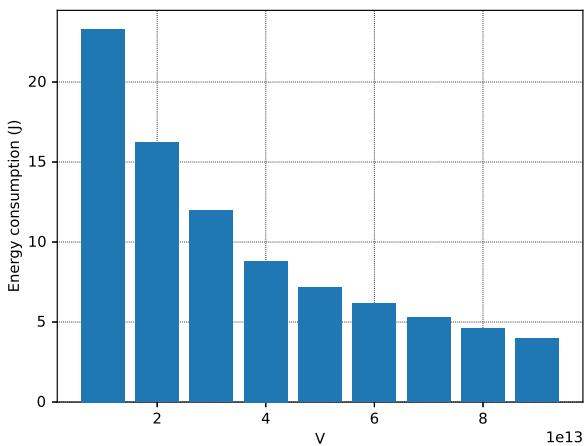

bar

| v | Energy consumption (J) |
|---|---|
| 0.5e13 | 23 |
| 2e13 | 16 |
| 3.5e13 | 12 |
| 4.5e13 | 9 |
| 5.5e13 | 7 |
| 6.5e13 | 6 |
| 7.5e13 | 5 |
| 8.5e13 | 4.5 |
| 9.5e13 | 4 |

Fig. 3. Energy consumption v.s. $\mathrm { v . }$

Since $E ( t )$ is not negative, we have

$$
\varepsilon \sum_ {t = 0} ^ {T - 1} \sum_ {n = 1} ^ {N} \mathbb {E} \{G _ {n} (t) \} \leq (O 1 + O 2) T + V T (\hat {E} - \check {E}). \tag {46}
$$

Divide (46) by $\varepsilon T .$ , when $T \to \infty$ , we get (40).

# V. EXPERIMENT EVALUATION

# A. Experiment Settings

This section conducts experiments to evaluate the performance of DOTORA. Considering one HAP, four UAVs, and multiple GDs deployed in a 1 km2 remote area. In this area, the GDs are randomly distributed. The UAVs are uniformly deployed in the area in a hovering manner. In addition, for each GD, the amount of arrival task is uniformly distributed within $[ 0 , 2 ] \times 1 0 ^ { 6 }$ bits, the maximum available CPU frequency [0 2] 10and maximum transmission power are 1 GHz and 0.2 W, respectively [24], [25]. Table II provides a summary of the main parameter settings.

# B. Parameter Analysis

1) Impact of Parameter V: Figs. 3 and 4 show the effect of the control parameter V on energy consumption and queue backlog.

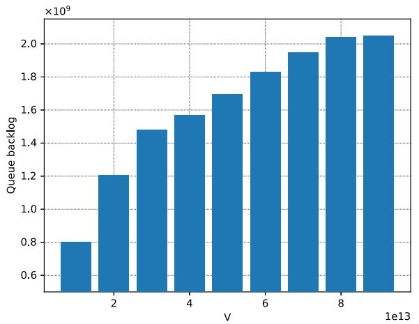

bar

| V (x1e13) | Queue backlog (x10^9) |
| :--- | :--- |
| 1 | 0.8 |
| 2 | 1.2 |
| 3 | 1.48 |
| 4 | 1.57 |
| 5 | 1.7 |
| 6 | 1.83 |
| 7 | 1.95 |
| 8 | 2.05 |
| 9 | 2.06 |

Fig. 4. Queue backlog v.s. V.

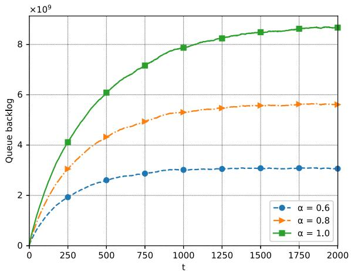

line

| t    | α = 0.6       | α = 0.8       | α = 1.0       |
| ---- | ------------- | ------------- | ------------- |
| 0    | 0             | 0             | 0             |
| 250  | 2.0e9         | 3.0e9         | 4.0e9         |
| 500  | 2.5e9         | 4.5e9         | 6.0e9         |
| 750  | 2.8e9         | 5.0e9         | 7.0e9         |
| 1000 | 3.0e9         | 5.2e9         | 8.0e9         |
| 1250 | 3.0e9         | 5.3e9         | 8.2e9         |
| 1500 | 3.0e9         | 5.4e9         | 8.4e9         |
| 1750 | 3.0e9         | 5.5e9         | 8.6e9         |
| 2000 | 3.0e9         | 5.5e9         | 8.7e9         |

Fig. 6. Queue backlog v.s. task arrival rate.

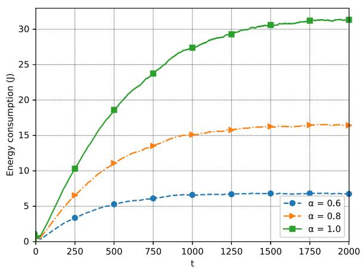

line

| t    | α = 0.6 | α = 0.8 | α = 1.0 |
| ---- | ------- | ------- | ------- |
| 0    | 0       | 0       | 0       |
| 250  | 3       | 6       | 10      |
| 500  | 5       | 11      | 18      |
| 750  | 6       | 13      | 24      |
| 1000 | 6       | 15      | 27      |
| 1250 | 6       | 15      | 29      |
| 1500 | 6       | 16      | 30      |
| 1750 | 6       | 16      | 31      |
| 2000 | 6       | 16      | 31      |

Fig. 5. Energy consumption v.s. task arrival rate.

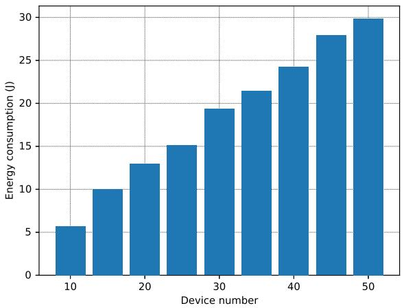

bar

| Device number | Energy consumption (I) |
| :--- | :--- |
| 10 | 5.6 |
| 15 | 10.0 |
| 20 | 13.0 |
| 25 | 15.0 |
| 30 | 19.4 |
| 35 | 21.4 |
| 40 | 24.3 |
| 45 | 28.0 |
| 50 | 29.8 |

Fig. 7. Energy consumption v.s. number of GDs.

Fig. 3 shows that the energy consumption becomes smaller as V increases. This is owing to that the larger the control parameter V is, the higher the priority on energy consumption, and the system is more inclined to optimize energy consumption, coinciding with (39). Fig. 4 presents the change in queue backlog when V changes. We can see that as V grows, the average queue backlog becomes larger. This is owing to the limited computation and transmission capabilities of GDs, and the trend coincides with (40). In conclusion, the DOTORA algorithm reduces energy consumption of GD and ensures queue stability, achieving a trade-off between the two.

2) Impact of Task Arrival Rate: Figs. 5 and 6 show the effect of task arrival rate on energy consumption and queue backlog. The task arrival rate in this experiment is set to $\alpha \cdot A _ { n } ( t )$ and $\alpha = 0 . 6 , 0 . 8 .$ ( ), and 1.0. Fig. 5 shows that the energy consumption increases as α increase. This is because the more new tasks that arrive, the more tasks will be processed, resulting in higher energy consumption. Fig. 6 shows that as α increase, the queue backlog also increases accordingly. Because the processing capacity of GDs remains the same, when more tasks arrive, some of them cannot be processed in time, thus leading to an increase in queue backlog. However, in the long run, both energy consumption and queue backlog tend to be stable, which validates the adpatlity of our DOTORA algorityhm.

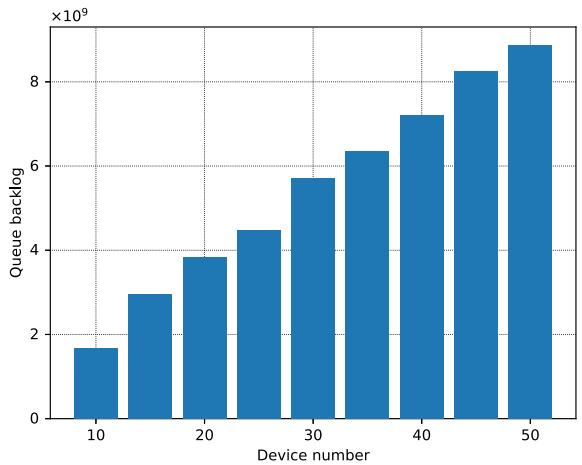

bar

| Device number | Queue backlog (×10⁹) |
| :--- | :--- |
| 10 | 1.7 |
| 15 | 2.9 |
| 20 | 3.8 |
| 25 | 4.5 |
| 30 | 5.7 |
| 35 | 6.4 |
| 40 | 7.2 |
| 45 | 8.2 |
| 50 | 8.9 |

Fig. 8. Queue backlog v.s. number of GDs.

3) Impact of Number of Device: Figs. 7 and 8 show the change of energy consumption and queue backlog with different numbers of GDs. In our experiments, the device number ranges from 10 to 50. Fig. 7 illustrates that the more GDs access the network, the more energy is consumed. This is because each GD consumes energy to process tasks, resulting in higher overall energy consumption as the number of GDs increases. Fig. 8 shows that the more GDs, the larger the queue backlog. This is owing to the fact that each GD has a queue backlog, which leads to an increase in the total queue backlog.

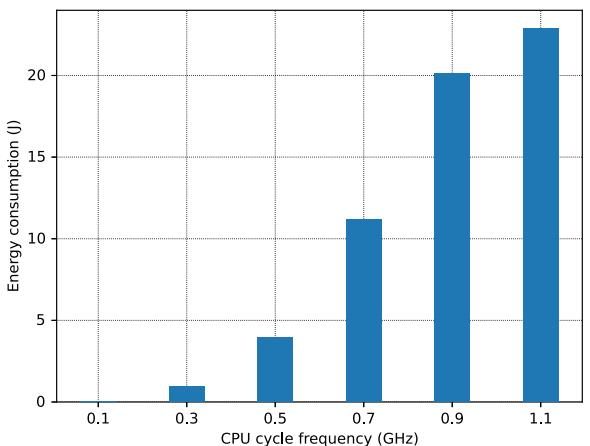

bar

| CPU cycle frequency (GHz) | Energy consumption (J) |
| :--- | :--- |
| 0.1 | 0.0 |
| 0.3 | 1.0 |
| 0.5 | 4.0 |
| 0.7 | 11.0 |
| 0.9 | 20.0 |
| 1.1 | 23.0 |

Fig. 9. Energy consumption v.s. CPU cycle frequency.

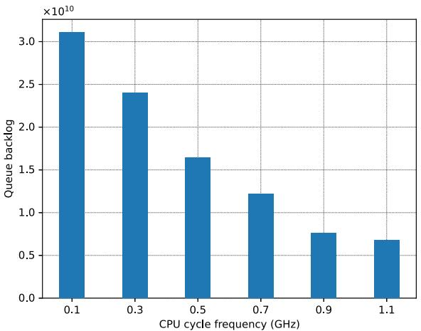

bar

| CPU cycle frequency (GHz) | Queue backlog (×10^10) |
| :--- | :--- |
| 0.1 | 3.1 |
| 0.3 | 2.4 |
| 0.5 | 1.65 |
| 0.7 | 1.25 |
| 0.9 | 0.78 |
| 1.1 | 0.68 |

Fig. 10. Queue backlog v.s. CPU cycle frequency.

4) Impact of the CPU Cycle Frequency of GDs: Figs. 9 and 10 show the impact of changes in GD’s CPU cycle frequency on energy consumption and queue backlog. In this experiment, the CPU cycle frequency of GD ranges from 0.1 GHz to 1.1 GHz. Fig. 9 shows that as the CPU cycle frequency of GD increases, the energy consumption also increases. This is obvious, because the greater the CPU cycle frequency of GD, the larger the task processing capability of GD. Furthermore, GD can handle more computing tasks, resulting in greater energy consumption. In addition, it can be seen from Fig. 10 that as the CPU cycle frequency of GD increases, the queue backlog gradually decreases. This is because GD has a larger CPU cycle frequency, which enables it to handle more tasks. Furthermore, there are fewer backlogged tasks, resulting in a smaller queue backlog. Taken together, both energy consumption and queue backlog have gradually stabilized, which verifies the effectiveness of our DOTORA algorithm.

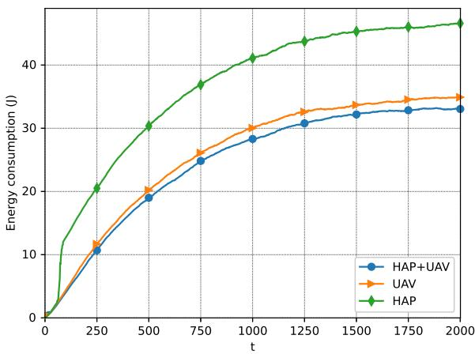

line

| t    | HAP+UAV | UAV  | HAP  |
| ---- | ------- | ---- | ---- |
| 0    | 0       | 0    | 0    |
| 250  | 11      | 12   | 20   |
| 500  | 19      | 20   | 30   |
| 750  | 25      | 26   | 37   |
| 1000 | 28      | 30   | 41   |
| 1250 | 30      | 32   | 43   |
| 1500 | 32      | 33   | 45   |
| 1750 | 33      | 34   | 46   |
| 2000 | 33      | 34   | 47   |

Fig. 11. Energy consumption v.s. different system frameworks.

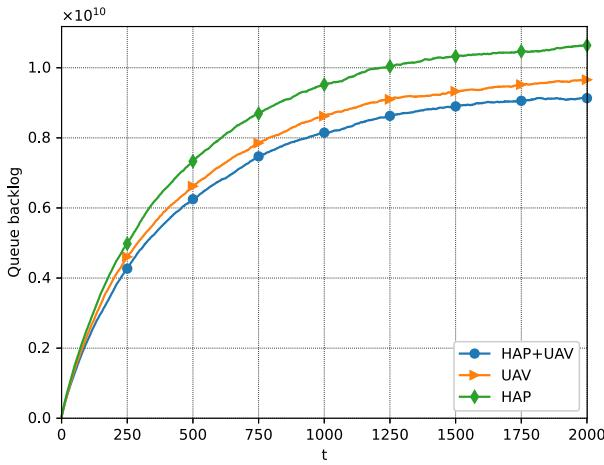

line

| t    | HAP+UAV       | UAV           | HAP           |
| ---- | ------------- | ------------- | ------------- |
| 0    | 0.0           | 0.0           | 0.0           |
| 250  | 0.43          | 0.47          | 0.50          |
| 500  | 0.63          | 0.67          | 0.74          |
| 750  | 0.75          | 0.79          | 0.87          |
| 1000 | 0.82          | 0.86          | 0.95          |
| 1250 | 0.86          | 0.90          | 1.00          |
| 1500 | 0.88          | 0.93          | 1.03          |
| 1750 | 0.90          | 0.95          | 1.05          |
| 2000 | 0.91          | 0.96          | 1.07          |

Fig. 12. Queue backlog v.s. different system frameworks.

# C. Comparative Experiments

In this subsection, we evaluate different system frameworks. We compare the proposed aerial-based MEC system with a MEC system served by HAP or UAV only to verify that the aerialbased MEC system can effectively save the energy of GDs.

Figs. 11 and 12 depict the energy consumption and queue backlog under different system frameworks, respectively. UAV-Only means that the task can solely be transferred for processing to the UAV. HAP-Only represents that the task can only be offloaded to the HAP to complete the computation. HAP-UAV indicates that the HAP can cooperate with UAVs to accomplish the processing of the task. As observed from the figures, our proposed HAP-UAV framework effectively reduces the energy consumption of GDs. Because HAP and UAV work together to provide services to GDs, competition among GDs for communication and computing resources is reduced. Therefore, the energy consumption and task backlog of GDs are reduced, gaining a significantly improved user experience for GDs.

Then, the efficiency and effectiveness of the DOTORA algorithm are further verified by comparing the DOTORA algorithm with the following algorithms.

\- Full Local Computing (FLC): The newly arrived tasks of each GD are processed by itself.

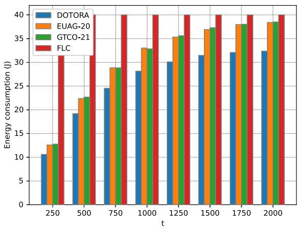

bar

| t    | DOTORA | EUAG-20 | GTCO-21 | FLC  |
| ---- | ------ | ------- | ------- | ---- |
| 250  | 10.5   | 12.5    | 12.8    | 31.5 |
| 500  | 19.0   | 22.5    | 22.8    | 31.5 |
| 750  | 24.5   | 29.0    | 29.0    | 40.0 |
| 1000 | 28.0   | 33.0    | 33.0    | 40.0 |
| 1250 | 30.0   | 35.5    | 35.5    | 40.0 |
| 1500 | 31.5   | 37.0    | 37.0    | 40.0 |
| 1750 | 32.0   | 38.0    | 38.0    | 40.0 |
| 2000 | 32.5   | 38.5    | 38.5    | 40.0 |

Fig. 13. Energy consumption v.s. different algorithms.

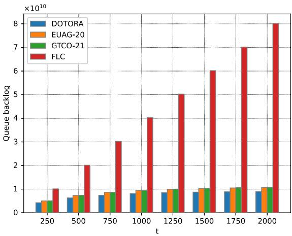

bar

| t    | DOTORA | EUAG-20 | GTCO-21 | FLC     |
| ---- | ------ | ------- | ------- | ------- |
| 250  | 0.4    | 0.5     | 0.6     | 1.0     |
| 500  | 0.6    | 0.7     | 0.8     | 2.0     |
| 750  | 0.7    | 0.8     | 0.9     | 3.0     |
| 1000 | 0.8    | 0.9     | 1.0     | 4.0     |
| 1250 | 0.9    | 1.0     | 1.1     | 5.0     |
| 1500 | 1.0    | 1.1     | 1.2     | 6.0     |
| 1750 | 1.1    | 1.2     | 1.3     | 7.0     |
| 2000 | 1.2    | 1.3     | 1.4     | 8.0     |

Fig. 14. Queue backlog v.s. different algorithms.

EUAG-20: This algorithm is extended from [26] to our model, and we randomly select one GD each time to update its server selection decision.   
GTCO-21: Within each time slot, GDs determine a server selection strategy to minimize the offloading cost in each iteration based on [27].

Figs. 13 and 14 show the energy consumption and queue backlog under the four algorithms. As observed in Fig. 13, the DOTORA algorithm has the lowest energy consumption, the FLC algorithm has the highest energy consumption, and the GTCO-21 algorithm and EUAG-20 algorithm are almost the same. For the FLC algorithm, as time passes, the available computing power of GDs is fully utilized, and the amount of tasks that can be processed reaches its limit, the energy consumption of the FLC algorithm no longer changes. At the same time, we can see from Fig. 13 that compared with the EUAG-20 algorithm, GTCO-21 algorithm and FLC algorithm, the DOTORA algorithm has reduced energy consumption by 15.73%, 15.95% and 19.09%, respectively.

From Fig. 14, it can be seen that in terms of queue backlog, the DOTORA algorithm is the smallest, the FLC algorithm is the largest, and the GTCO-21 algorithm and EUAG-20 algorithm are almost the same. For the FLC algorithm, when the amount of tasks that can be processed by GDs reaches its limit, newly arrived tasks will be cached in the queue for processing, causing the queue backlog to continue to increase. Because of the DOTORA algorithm’s ability to dynamically adjust offloading strategies based on the current system state, its energy consumption and queue backlog are smaller than those of the GTCO-21 algorithm and EUAG-20 algorithm. In conclusion, the DOTORA algorithm can reduce energy consumption with the minimum queue backlog. Meanwhile, according to Fig. 14, we can see that compared with the EUAG-20 algorithm, GTCO-21 algorithm and FLC algorithm, the DOTORA algorithm reduces the queue backlog by 15.99%, 17.64% and 88.84%, respectively.

# VI. RELATED WORK

UAV-assisted MEC networks have become one of the hot spots for research in recent years. There are many areas outside the coverage of MEC networks, such as wilderness, desert, etc. In these places, it is very difficult and expensive to establish a ground communication system. Meanwhile, the ground communication system may be damaged and unusable after sudden disasters. Therefore, the UAV-assisted MEC network becomes an alternative solution. Jeong et al. [28] investigated UAV-based cloud computing systems designed to enhance coverage or relay services via UAVs for users with limited or no infrastructure. Dai et al. [29] investigated data offloading from UAVs as relay nodes to address offloading rates and delays in offshore area communication. Seid et al. [30] considered the dynamics of channel strength and resource requests for UAVs, aiming to reduce system costs and ensure quality of service (QoS) requirements for GDs. These studies only focused on drone networks. However, the available energy and computing power of UAVs are limited, and they cannot provide long-term and sustainable services for GDs.

Compared with UAVs, HAPs have higher flying altitudes, and stronger payloads, and can better provide the required services for GDs in remote areas. Wang et al. [31] considered the situation where the size of computing tasks fluctuated over time in a HAP-supported network. The authors proposed an optimization problem and a joint learning solution based on a support vector machine, aiming to minimize the cost. Ke et al. [32] introduced an edge computing paradigm based on a high-altitude platform network, which used massive aerial multiple-input multipleoutput (MIMO) technology to achieve large-scale access and computing services, and solved the energy and time-consuming problem of large-scale connection. Ren et al. [33] proposed a HAP-based edge intelligent computing framework that used caching and reinforcement learning techniques to optimize computation offloading and resource allocation to reduce transmission delay.

Nevertheless, compared to UAVs, HAPs are more expensive to deploy. When there are too many GDs, it will cause network congestion, and the integration of UAVs can reduce the burden on the network. Therefore, the research on integrated aerial computing combined with HAP and UAV has also received widespread attention. Kang et al. [16] proposed a system based on UAVs and HAPs, which achieved efficient processing and

QoS guarantee of computing tasks by jointly optimizing resource allocation and task offloading. Jia et al. [17] proposed a hierarchical aerial MEC framework, which optimized the computation offloading decisions of GDs by using a matching game-based algorithm and an adjustment algorithm, achieving efficient utilization of aerial computing resources and maximization of data processing. Zhang et al. [34] proposed a scheme that used UAV jammers and multi-agent deep reinforcement learning methods, where HAP was used for data training, and improved the efficiency and convergence of the algorithm by using an attention mechanism. However, the above work considered UAVs as relays and did not take into account that when the available computing resources of the UAV reached the upper limit, it would not be able to serve the GDs. In our study, GDs can offload tasks directly to the HAP without going through the UAV.

# VII. CONCLUSION

In this paper, we study the problem of task offloading and resource allocation in an aerial-based MEC system. Our goal is to minimize the GD’s energy consumption while guaranteeing the performance and satisfying the constraints of offloading resource constraints. We utilize stochastic optimization techniques to transform our original problem into two subproblems, namely, local computation resource allocation and offloading resource allocation. We address local computation resource allocation using a convex optimization approach. Then, we use game theory to model the competition for offloading resources among GDs and design the DGMS and TPA algorithms. Finally, the distributed DOTORA algorithm is proposed, and the theoretical analysis proof is given. Extensive experiments verify that DOTORA can perform well in terms of ensuring performance and reducing device energy consumption.

# REFERENCES

[1] H. Jiang, X. Dai, Z. Xiao, and A. Iyengar, “Joint task offloading and resource allocation for energy-constrained mobile edge computing,” IEEE Trans. Mobile Comput., vol. 22, no. 7, pp. 4000–4015, Jul. 2023.   
[2] Y. Cheng, J. Lu, D. Niyato, B. Lyu, M. Xu, and S. Zhu, “Performance analysis and power allocation for covert mobile edge computing with RIS-aided NOMA,” IEEE Trans. Mobile Comput., to be published, doi: 10.1109/TMC.2023.3302413.   
[3] X. Cao, G. Zhu, J. Xu, and S. Cui, “Transmission power control for overthe-air federated averaging at network edge,” IEEE J. Sel. Areas Commun., vol. 40, no. 5, pp. 1571–1586, May 2022.   
[4] F. Liu, J. Huang, and X. Wang, “Joint task offloading and resource allocation for device-edge-cloud collaboration with subtask dependencies,” IEEE Trans. Cloud Comput., vol. 11, no. 3, pp. 3027–3039, Jul.-Sep. 2023.   
[5] S. Wang et al., “A cloud-guided feature extraction approach for image retrieval in mobile edge computing,” IEEE Trans. Mobile Comput., vol. 20, no. 2, pp. 292–305, Feb. 2021.   
[6] A. Asheralieva, D. Niyato, and Y. Miyanaga, “Efficient dynamic distributed resource slicing in 6G multi-access edge computing networks with online ADMM and message passing graph neural networks,” IEEE Trans. Mobile Comput., to be published, doi: 10.1109/TMC.2023.3262514.   
[7] F. Pervez, A. Sultana, C. Yang, and L. Zhao, “Energy and latency efficient joint communication and computation optimization in a multi-UAV assisted MEC network,” IEEE Trans. Wireless Commun., to be published, doi: 10.1109/TWC.2023.3291692.   
[8] Y. Sun, J. Xu, and S. Cui, “User association and resource allocation for MEC-enabled IoT networks,” IEEE Trans. Wireless Commun., vol. 21, no. 10, pp. 8051–8062, Oct. 2022.

[9] T. Zhang, Y. Xu, J. Loo, D. Yang, and L. Xiao, “Joint computation and communication design for UAV-assisted mobile edge computing in IoT,” IEEE Trans. Ind. Inform., vol. 16, no. 8, pp. 5505–5516, Aug. 2020.   
[10] Z. Yang, C. Pan, K. Wang, and M. Shikh-Bahaei, “Energy efficient resource allocation in UAV-enabled mobile edge computing networks,” IEEE Trans. Wireless Commun., vol. 18, no. 9, pp. 4576–4589, Sep. 2019.   
[11] M. Dai et al., “Latency minimization oriented hybrid offshore and aerialbased multi-access computation offloading for marine communication networks,” IEEE Trans. Commun., vol. 71, no. 11, pp. 6482–6498, Nov. 2023.   
[12] Z. Dai, C. H. Liu, R. Han, G. Wang, K. K. Leung, and J. Tang, “Delaysensitive energy-efficient UAV crowdsensing by deep reinforcement learning,” IEEE Trans. Mobile Comput., vol. 22, no. 4, pp. 2038–2052, Apr. 2023.   
[13] J. Ji, L. Cai, K. Zhu, and D. Niyato, “Decoupled association with rate splitting multiple access in UAV-assisted cellular networks using multiagent deep reinforcement learning,” IEEE Trans. Mobile Comput., to be published, doi: 10.1109/TMC.2023.3256404.   
[14] Z. Yang et al., “AI-Driven UAV-NOMA-MEC in next generation wireless networks,” IEEE Wireless Commun., vol. 28, no. 5, pp. 66–73, Oct. 2021.   
[15] Z. Jia, M. Sheng, J. Li, D. Zhou, and Z. Han, “Joint data collection and transmission in 6G aerial access networks,” in Proc. IEEE Glob. Commun. Conf., 2021, pp. 1–6.   
[16] H. Kang, X. Chang, J. Miši´c, V. B. Miši´c, J. Fan, and Y. Liu, “Cooperative UAV resource allocation and task offloading in hierarchical aerial computing systems: A MAPPO based approach,” IEEE Internet Things J., vol. 10, no. 12, pp. 10497–10509, Jun. 2023.   
[17] Z. Jia, Q. Wu, C. Dong, C. Yuen, and Z. Han, “Hierarchical aerial computing for Internet of Things via cooperation of HAPs and UAVs,” IEEE Internet Things J., vol. 10, no. 7, pp. 5676–5688, Apr. 2023.   
[18] Y. Gong, H. Yao, D. Wu, W. Yuan, T. Dong, and F. R. Yu, “Computation offloading for rechargeable users in space-air-ground networks,” IEEE Trans. Veh. Technol., vol. 72, no. 3, pp. 3805–3818, Mar. 2023.   
[19] H. Liao, Z. Zhou, X. Zhao, and Y. Wang, “Learning-based queue-aware task offloading and resource allocation for space–air–ground-integrated power IoT,” IEEE Internet Things J., vol. 8, no. 7, pp. 5250–5263, Apr. 2021.   
[20] P. Lai et al., “Online user and power allocation in dynamic NOMA-Based mobile edge computing,” IEEE Trans. Mobile Comput., vol. 22, no. 11, pp. 6676–6689, Nov. 2023.   
[21] Y. Chen et al., “Distributed task offloading and resource purchasing in NOMA-enabled mobile edge computing: Hierarchical game theoretical approaches,” ACM Trans. Embedded Comput. Syst., 2023, doi: 10.1145/3597023.   
[22] S. Fu, X. Feng, A. Sultana, and L. Zhao, “Joint power allocation and 3D deployment for UAV-BSs: A game theory based deep reinforcement learning approach,” IEEE Trans. Wireless Commun., to be published, doi: 10.1109/TWC.2023.3281812.   
[23] Y. Chen, J. Zhao, Y. Wu, J. Huang, and X. Shen, “QoE-aware decentralized task offloading and resource allocation for end-edge-cloud systems: A game-theoretical approach,” IEEE Trans. Mobile Comput., vol. 23, no. 1, pp. 769–784, Jan. 2024.   
[24] N. Waqar, S. A. Hassan, A. Mahmood, K. Dev, D.-T. Do, and M. Gidlund, “Computation offloading and resource allocation in MEC-Enabled integrated aerial-terrestrial vehicular networks: A reinforcement learning approach,” IEEE Trans. Intell. Transp. Syst., vol. 23, no. 11, pp. 21478–21491, Nov. 2022.   
[25] C. Ding, J.-B. Wang, H. Zhang, M. Lin, and G. Y. Li, “Joint optimization of transmission and computation resources for satellite and high altitude platform assisted edge computing,” IEEE Trans. Wireless Commun., vol. 21, no. 2, pp. 1362–1377, Feb. 2022.   
[26] Q. He et al., “A game-theoretical approach for user allocation in edge computing environment,” IEEE Trans. Parallel Distrib. Syst., vol. 31, no. 3, pp. 515–529, Mar. 2020.   
[27] Z. Luo and A. Huang, “Joint game theory and greedy optimization scheme of computation offloading for UAV-aided network,” in Proc. 31st Int. Telecommun. Netw. Appl. Conf., 2021, pp. 198–203.   
[28] S. Jeong, O. Simeone, and J. Kang, “Mobile edge computing via a UAV-Mounted cloudlet: Optimization of bit allocation and path planning,” IEEE Trans. Veh. Technol., vol. 67, no. 3, pp. 2049–2063, Mar. 2018.   
[29] Y. Dai, B. Lin, Y. Che, and L. Lyu, “UAV-assisted data offloading for smart container in offshore maritime communications,” China Commun., vol. 19, no. 1, pp. 153–165, 2022.

[30] A. M. Seid, G. O. Boateng, B. Mareri, G. Sun, and W. Jiang, “Multi-agent DRL for task offloading and resource allocation in Multi-UAV enabled IoT edge network,” IEEE Trans. Netw. Service Manag., vol. 18, no. 4, pp. 4531–4547, Dec. 2021.   
[31] S. Wang et al., “Federated learning for task and resource allocation in wireless high-altitude balloon networks,” IEEE Internet Things J., vol. 8, no. 24, pp. 17460–17475, Dec. 2021.   
[32] M. Ke et al., “An edge computing paradigm for massive IoT connectivity over high-altitude platform networks,” IEEE Wireless Commun., vol. 28, no. 5, pp. 102–109, Oct. 2021.   
[33] Q. Ren, O. Abbasi, G. K. Kurt, H. Yanikomeroglu, and J. Chen, “Caching and computation offloading in high altitude platform station (HAPS) assisted intelligent transportation systems,” IEEE Trans. Wireless Commun., vol. 21, no. 11, pp. 9010–9024, Nov. 2022.   
[34] Y. Zhang, Z. Mou, F. Gao, J. Jiang, R. Ding, and Z. Han, “UAV-enabled secure communications by multi-agent deep reinforcement learning,” IEEE Trans. Veh. Technol., vol. 69, no. 10, pp. 11599–11611, Oct. 2020.

natural_image

Portrait of a man wearing glasses and a light blue polo shirt (no text or symbols visible)

Yuan Wu (Senior Member, IEEE) received the PhD degree in electronic and computer engineering from the Hong Kong University of Science and Technology, in 2010. He is currently an associate professor with the State Key Laboratory of Internet of Things for Smart City, University of Macau, Macao, China, and also with the Department of Computer and Information Science, University of Macau. His research interests include resource management for wireless networks, green communications and computing, edge computing and edge intelligence, and

energy informatics. He received the Best Paper Award from the IEEE ICC’2016, IEEE TCGCC’2017, IWCMC’2021, and WCNC’2023. He serves/served as the Track/Symposium Co-Chair for IEEE VTC’2017-Fall, VTC’2021-Spring, VTC’2022-Spring, ICCC’2023, and GLOBECOM’2024. He is currently on the editorial board of IEEE Transactions on Vehicular Technology, IEEE Transactions on Network Science and Engineering, and IEEE Internet of Things Journal.

natural_image

Portrait photo of a woman with long dark hair wearing a blazer over a collared shirt, against a solid blue background (no text or symbols visible)

Ying Chen (Senior Member, IEEE) received the PhD degree in computer science and technology from Tsinghua University, Beijing, China, in 2017. She is currently working toward the PhD degree with the University of Waterloo, Waterloo, ON, Canada from 2016 to 2017. She is a professor with the Computer School, Beijing Information Science and Technology University, Beijing. Her current research interests include Internet of Things, mobile edge computing, wireless net works and communications, machine learning, etc. She is the recipient of the Best Paper

Award with IEEE SmartIoT 2019, the 2016 Google PhD Fellowship Award, and the 2014 Google Anita Borg Award, 2022 Outstanding Contribution Award in 18th EAI CollaborateCom, respectively. She serves/served the leading guest editor of Springer JCC, TPC member of IEEE HPCC, and PC member of IEEE Cloud, CollaborateCom, IEEE CPSCom, CSS, etc. She is also the Reviewer of several journals, such as the IEEE Wireless Communications Magazine, IEEE Transactions on Dependable and Secure Computing, IEEE Internet of Things Journal, IEEE Transactions on Computers, IEEE Transactions on Cloud Computing, and IEEE Transactions on Services Computing.

natural_image

Portrait photo of a young man against a solid blue background (no text or symbols visible)

Kaixin Li is currently working toward the MEng degree in computer science and technology, with the Beijing Information Science and Technology University, China. His current research interests include edge computing, stochastic optimization theory, and game theory.

natural_image

Portrait of a man wearing glasses and a suit against a blue background (no text or symbols visible)

Jiwei Huang (Senior Member, IEEE) received the BEng and PhD degrees in computer science and technology from Tsinghua University, Beijing, China, in 2009 and 2014, respectively. He was a visiting Scholar with the Georgia Institute of Technology, GA, USA. He is currently a professor and the vice dean of College of Information Science and Engineering/College of Artificial Intelligence, China University of Petroleum, Beijing, and the director of the Beijing Key Laboratory of Petroleum Data Mining. He has authored or coauthored one book and more than

60 articles in international journals and conference proceedings, including IEEE Transactions on Mobile Computing, IEEE Transactions on Services Computing, IEEE Transactions on Cloud Computing, IEEE Transactions on Vehicular Technology, IEEE Internet of Things Journal, ACM SIGMETRICS, IEEE ICWS, etc. His research interests include Internet of Things, edge computing, services computing, etc. He is currently on the Editorial Board of Chinese Journal of Electronics and Scientific Programming, and served as TPC members of IEEE ICWS, CollaborateCom, PRICAI, etc. He is a senior member of CCF.

natural_image

Portrait of a woman wearing glasses and a scarf, with mountainous background (no text or symbols visible)

Lian Zhao (Fellow, IEEE) received the PhD degree from the Department of Electrical and Computer Engineering (ELCE), University of Waterloo, Canada, in 2002. She joined the Department of Electrical and Computer Engineering at Toronto Metropolitan University (formerly Ryerson University), Canada, in 2003. Her research interests are in the areas of wireless communications, resource management, mobile edge computing, caching and communications, and IoV networks. She has been an IEEE Communication Society (ComSoc) and IEEE Vehicular Technology

(VTS) Distinguished Lecturer (DL); received the Best Land Transportation Paper Award from IEEE Vehicular Technology Society, in 2016, Top 15 Editor Award, in 2016 for IEEE Transaction on Vehicular Technology, Best Paper Award from the 2013 International Conference on Wireless Communications and Signal Processing (WCSP), and the Canada Foundation for Innovation (CFI) New Opportunity Research Award in 2005. She has been serving as an editor for IEEE Transactions on Wireless Communications, IEEE Internet of Things Journal, and IEEE Transactions on Vehicular Technology (2013–2021).