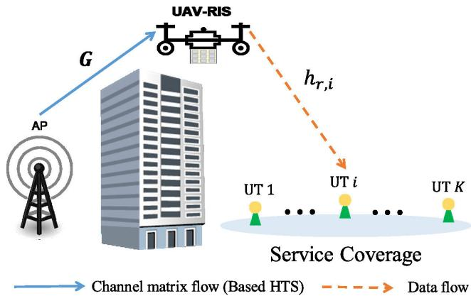
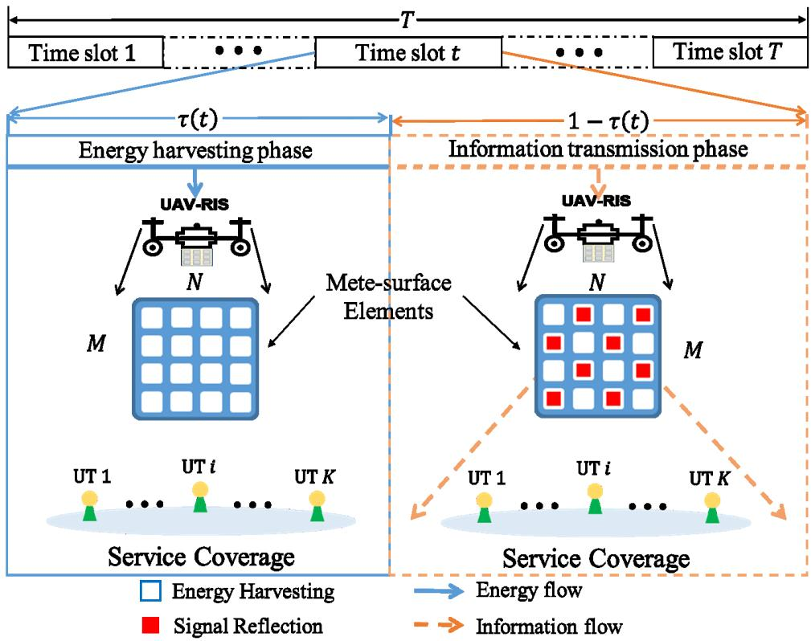
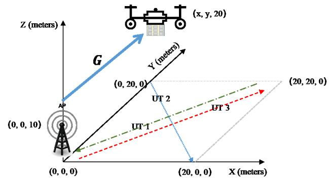
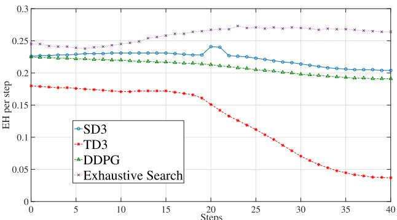
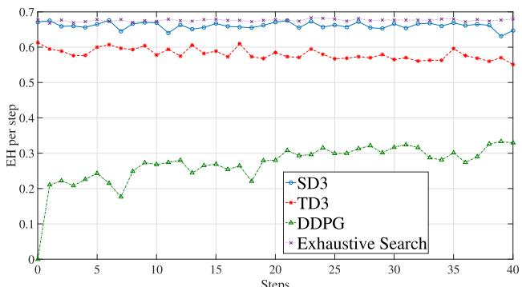
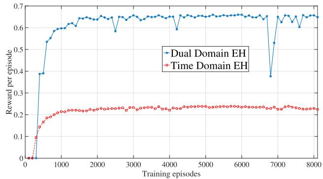
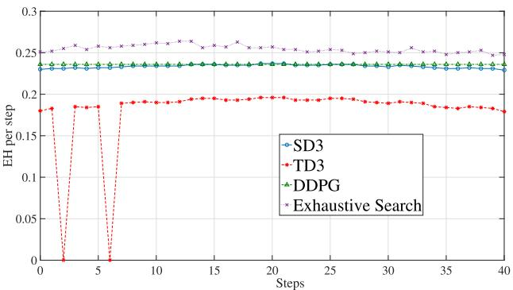
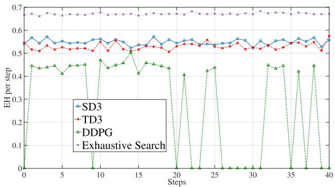
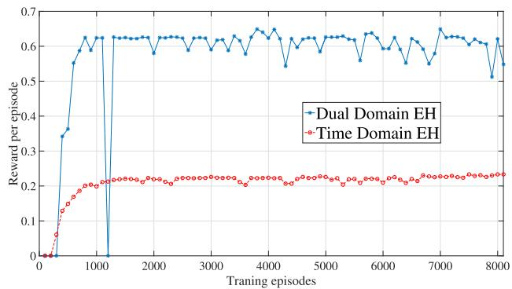
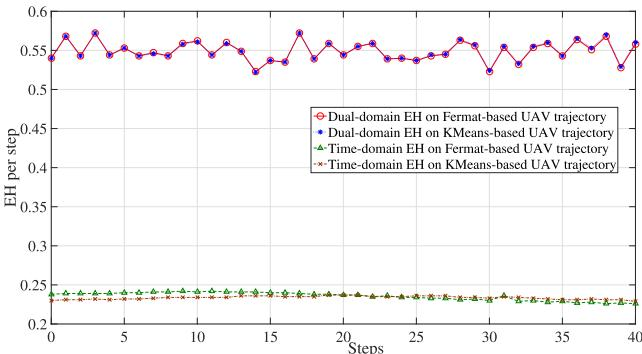

# Energy Harvesting Reconfigurable Intelligent Surface for UAV Based on Robust Deep Reinforcement Learning

Haoran Peng , Member, IEEE, and Li-Chun Wang , Fellow, IEEE

Abstract— Integrating unmanned aerial vehicles with RIS (UAV–RIS) can offer ubiquitous deployment services in communication-disabled areas, but is limited by the on-board energy of the UAVs. In this paper, a novel energy harvesting (EH) scheme on top of the UAV–RIS system, called EH-RIS scheme, is developed for the next generation high performance wireless system. The proposed EH-RIS scheme extends the simultaneous wireless information and power transfer (SWIPT) system by splitting the passive reflected arrays on the geometric space for transporting information and harvesting energy simultaneously. However, pedestrian mobility, and rapid channel changes post challenges to efficient resource allocation in wireless systems. Thus, a robust deep reinforcement learning (DRL)-based algorithm is developed to improve the proposed EH-RIS scheme for guaranteeing the quality of service (QoS) under dynamic wireless environments. The simulation results demonstrate the effectiveness and efficiency of the proposed robust DRL-based EH-RIS system, which not only outperform the existing stateof-the-art solutions but also approach to the performance of the exhaustive search method.

Index Terms— Unmanned aerial vehicle, reconfigurable intelligent surface, SWIPT, energy harvesting.

## I. INTRODUCTION

RECONFIGURABLE intelligent surfaces (RISs), an arti-ficial meta-surface of an electromagnetic material ficial meta-surface of an electromagnetic material with large passive reflected arrays, have recently received widespread attention as a promising solution for enhancing wireless communications [1]. The passive reflective antenna elements in the RIS system can be intelligently configured with amplitude, polarization, and phase shift in a programmable manner to create a desirable multipath effect, thereby enhancing the signal strength of the overall received signals or suppressing any interference [2], [3]. The utilization of RISs for sustainable and green wireless communications has been explored and demonstrated [4]. Nevertheless, despite the numerous recent advances in RIS technology, most systems are for static deployment (e.g., installed on buildings), limiting their effectiveness in dynamic scenarios.

Combining unmanned aerial vehicles (UAVs) with RISs can provide on-demand deployment services in dynamic situations [5]. Because of their controllability and flexibility, UAVs have numerous applications in the blind areas of fixed communication infrastructures, such as serving as temporary base stations (BSs), assisting internet of things (IoT) and vehicle-to-vehicle networks, and enhancing hotspot coverage [6]. However, the finite on-board battery capacity on UAVs limits the performance and endurance of UAV-assisted RIS communications.

Energy harvesting (EH) can ensure that UAV-assisted RIS communications last longer, whereas the simultaneous wireless information and power transfer (SWIPT) system collects energy from impinging radiofrequencies (RFs) and therefore mitigate the on-board energy issue of UAV–RIS systems [7]. One of the most efficient SWIPT modes, the harvest– transmit–store (HTS) model, divides each time block into two time slots for EH and information transmission [8]. However, the resource allocation for the HTS model in the UAV–RIS system involves the joint optimization of transmit power, reflective elements’ phase shifts, transmission time scheduling, and RIS scheduling under UAV trajectory design and communication quality requirements, which is difficult to efficiently reach a near-global optimum by splitting time domain only. Additionally, when there is a small number of user terminals (UTs) in the service coverage, using all the reflect-arrays for signal transmitting may result in a waste of resources. A space-splitting EH model, using partial reflection units to collect energy from received RF signals, while the other units reflect any signal, extends the dimension of resource allocation and improves the energy efficiency of RIS [9]. Therefore, the endurance of UAV–RIS systems has the potential to be further enhanced by jointly optimizing resource allocation in the time and space domains (dual domains) simultaneously. However, maximizing the harvested energy while guaranteeing the communication quality in both the dual domains results in a nonconvex problem.

Various studies have been conducted in relation to balancing the EH and communication qualities of UAV-aided RIS wireless communications [1], [9], [10], [11]. However, joint optimization problems are in general nonconvex and intractable [12]. Various approaches, including alternating optimization, decomposing the nonconvex problem into multiple subproblems, and penalty-based iteration approach have been proposed to obtain low-complexity and suboptimal solutions in practice [13], [14]. However, the previous solutions are problem-specific and are hard to extend to the general cases. Recently, deep reinforcement learning (DRL) has been used to resolve nonconvex optimization problems pertaining to wireless communications systems [15], including in terms of resolving the coupled objective optimization and performing instant decision making in communication networks [16]. This provided the motivation behind applying DRL for the EH and resource allocation pertaining to UAV-aided RIS communication networks. Nevertheless, the widely used DRL algorithms, namely, the deep deterministic policy gradient algorithm (DDPG) and the twin-delayed DDPG (TD3), suffer from overestimation and underestimation issues, respectively [17], [18], [19], which will reduce the performance of EH in complex wireless communication environments. To address this issue, we use a softmax operator and a clipped action space approximation to develop a robust DRL-based EH as in [19].

Existing SWIPT techniques for UAV–RIS systems aim to maximize energy efficiency by splitting time or space, while this study takes advantage of time splitting and space splitting EH models simultaneously. Motivated by the successful application of DRL [3], [7], [20], [21], [22], this technique is used to handle complicated control problems related to resource allocation. To the best of our knowledge, this is the first method to enhance the endurance of UAV-aided RIS communication systems through harvesting energy on dual domains while meeting the required communication quality of service (QoS) constraints. The contributions of the present work are as follows:

The energy-efficient optimization and endurance enhancement issue of UAV-assisted RIS communications systems is investigated and a novel scheme combining SWIPT and resource allocation is proposed. A resources allocation-based HTS (RAHTS) model and an access point (AP-)-RIS–UT channel model are adopted to formulate the proposed optimization problem while satisfying the required communication QoS constraints.

• To address the formulated convex optimization problem, a framework based on the robust DRL algorithm (SD3) is developed for the dynamic resource allocation of UAV–RIS systems on dual domains.

• The simulation results demonstrate the efficiency and effectiveness of the proposed dual-domain EH scheme for enhancing the endurance of UAV–RIS systems. The proposed robust DRL-based SWIPT can harvest 62.5% and 44.6% of the energy of the received signal in single-UT and multiple-UT cases, respectively, with an acceptable computational complexity.

The remainder of the paper is organized as follows. The related work is detailed in section II before the system model is described in section III and the formulation of the nonconvex optimization problem is described in section IV. Section V presented the design of the UAV trajectory in the dynamic scenario. Section VI then discusses the proposed robust DRL-based SWIPT method for UAV–RIS communications before the effectiveness of the proposed robust DRLbased SWIPT/RIS resource allocation system is verified in section VII. Finally, concluding remarks and recommendations for future work are provided in section VIII.

## II. RELATED WORK

As an emerging technique, RIS technology has received a great deal of attention since its potential to improve the performance of wireless communication networks [1], [23]. However, the optimization of RIS-assisted communication systems always involves multiple objectives, such as resource allocation, phase shifts, and energy efficiency. Joint optimization is nonconvex and cannot be resolved directly using standard convex optimization algorithms. From the existing works [3], [7], [20], [22], [24], DRL can efficiently resolve the nonconvex optimization problem for RIS-assisted communication systems.

## A. RIS-Assisted Signal Transmission

The RIS-assisted multiuser wireless communication system in [10] minimizes the total transmit power through optimizing the passive beamforming of the RIS and the transmit power of the BSs. Subsequently, it was demonstrated in [11] that an RIS system can overcome the non-line-of-sight (NLoS) radio propagation problem between the UAV and the ground terminals. Meanwhile, in [20], a UAV was integrated with RISs to enhance the propagation environment between the BS and the intended IoT devices (IoTDs). The UAV–RIS system described in [20] effectively overcame the blockage between the IoTDs and the BS, however, the battery-powered UAV presented the challenge of limited service time. In terms of the decode-and-forward-based RIS-assisted UAV communication system described in [25], the fixed RIS was able to significantly improve the coverage and average capacity of the UAV communication system, whereas the frame-based RIS-assisted transmission protocol outlined in [26] enhanced the coverage and communication quality of the UAV-user link. Furthermore, the resource management problem of the UAV–RIS system was studied in [27] to minimize the energy consumption of the system by joint optimization of UAV deployment, phase shift, and the UAV–RIS–user association. However, this study focuses on investigating the performance of the dual-domain EH model of UAV-RIS systems, whereas the UAV–RIS–user association problem will be studied in the future. In [12], an RIS system was deployed to enhance the received power and mitigate the mutual interference in the device-to-device communications, with an alternative optimization algorithm used to maximize the system’s total rate depending on the respective QoS, power, and practical discrete phase shift constraints. Furthermore, a holographic multiple input multiple output (MIMO) surface technique was explored to reach low-cost, low power consumption for massive MIMO, which is supported by RIS and intelligent resource allocation algorithms [28], [29].

TABLE I  
COMPARISON OF RELATED WORKS AND THIS WORK
<table><tr><td></td><td>Deployment</td><td>Multi UTs</td><td>Maximize Capacity</td><td>EH on time</td><td>EH on space</td><td>Long endurance</td></tr><tr><td>[7]</td><td>static</td><td>√</td><td></td><td>√</td><td></td><td>√</td></tr><tr><td>[9]</td><td>static</td><td>V</td><td></td><td></td><td>√</td><td></td></tr><tr><td>[13]</td><td>static</td><td>V</td><td>√</td><td>√</td><td></td><td></td></tr><tr><td>[10]–[12], [25], [26]</td><td>static</td><td>V</td><td>V</td><td></td><td></td><td></td></tr><tr><td>[20]</td><td>dynamic</td><td>√</td><td></td><td></td><td></td><td></td></tr><tr><td>[30], [31]</td><td>dynamic</td><td>V</td><td></td><td>√</td><td></td><td></td></tr><tr><td>[32], [33]</td><td>static</td><td>V</td><td>V</td><td>V</td><td></td><td></td></tr><tr><td>This work</td><td>dynamic</td><td>√</td><td>√</td><td>√</td><td>L</td><td>1</td></tr></table>

## B. RIS-Assisted Energy Harvesting

In [7], the RIS was equipped with an energy storage system for the EH, resulting in an improvement of the overall energy efficiency of the RIS-assisted cellular network through harvesting energy from the received RF signals. Focusing on the research on RIS-assisted EH, the authors in [13] recently demonstrated that the RIS-based SWIPT system can minimize the transmit power of the AP through designing passive phase shifts of all the RISs and optimizing the transmitter precoders of the AP. An iterative algorithm was proposed to maximize the secure energy efficiency of UAV–RIS systems by jointly optimizing reflective elements’ phase shift, transmit power, and UAV trajectory [30]. The distributed RISs architecture was investigated to maximize energy efficiency in the joint optimization of transmit power and RIS scheduling [31]. In [32], the RIS-aided multiuser multiple-input single-output SWIPT system was found to enhance the propagation of both the energy signal and the information signal. The successive convex approximation-based resource allocation algorithm in [33] minimizes the BS transmit power of the large RIS-assisted SWIPT systems, subject to the QoS requirement of both information decoding receivers and energy harvesting receivers. The author of [5] proposed a dual-domain EH scheme based on DDPG to enhance the endurance of UAV–RIS systems, whereas other EH schemes focused on the time-domain EH. However, the DDPG-based EH approach was only validated in the single-UT case and suffered from the underestimation problem in reinforcement learning, resulting in limited EH efficiency.

## C. Deep Reinforcement Learning for RIS Systems

The DRL-based framework outlined in [3] efficiently optimizes the RIS phase shifts and tackles the nonconvex unit modulus constraints, whereas the DRL-based secure beamforming algorithm described in [34] optimizes the passive and active beamforming at the RIS and BS, respectively. In [35], the DRL-based framework was found to efficiently improve the downlink throughput and reduce the intercell interference of dynamic ultradense small cells. Elsewhere, in [36], a DRL-based passive phase shifts optimization scheme was developed for the RIS-assisted nonorthogonal multiple access networks, whereas the DRL-based framework outlined in [37] predicts the RIS interaction matrices with minimal beam training overhead. A DRL-based algorithm was explored to maximize the sum rate of massive MIMO systems by jointly optimizing the active and passive beamforming of BS and RIS, respectively [38]. Finally, the DDPG-based power managing and passive phase shifts scheme described in [16] enhances the energy effectiveness of RIS-assisted UAV networks.

## D. Limitation of Related Works

Table I shows a comparison of the related works on RIS-assisted communication networks. As the table shows, all the above-related works mainly focused on maximizing the system’s total rate and minimizing energy consumption. Although the work in [10], [11], [25], [26], and [12] guaranteed the communication QoS requirement of UTs, the active energy efficiency solution for RIS-assisted communication systems has not yet been considered. The successful paradigms of the RIS-aided SWIPT framework outlined in [7], [13], [32], and [33] can harvest energy on the time-domain. Despite many benefits, the energy efficiency of RIS-assisted communication systems is limited by the resource utilization of meta-surface elements. In [20], various UAVs were integrated with RISs to flexibly deploy the latter in dynamic scenarios, whereas other approaches involve installing RISs on a static building. However, the energy consumption of the battery-powered UAV presents the challenge on the endurance of UAV-aided RIS communications.

  
Fig. 1. Considered application scenario.

## III. SYSTEM MODEL

As shown in Fig. 1, a UAV–RIS system was deployed to assist the signal transmission from the AP to the K singleantenna with the UTs denoted by ${ \cal K } = \{ 1 , 2 , \dots , K \}$ since the obstacles block the line-of-sight (LoS). The location of the antenna of each UT k at time slot t is indicated as $\mathcal { C } ^ { k } ( t ) =$ $\left( x ^ { k } ( t ) , y ^ { k } ( t ) , H ^ { k } ( t ) \right) . \ H ^ { k } ( t )$ is the altitude of the antenna of the UT k of the Cartesian coordinate system where the AP is located at the origin, $\left( x ^ { k } ( t ) , y ^ { k } ( t ) \right)$ is the horizontal position of the UT k. In this work, the AP with Z antennas transmits signals to UAV–RIS system consisting of $\mathcal { L } ( = M \times N )$ metasurfaces, with the assumption that the UTs can only receive signals reflected by the UAV–RIS system. The meta-surface element at the i-th row and the $j \cdot$ -th column is denoted by $\mathcal { R } _ { i , j }$ . The location of the meta-surface element $\mathcal { R } _ { i , j }$ at each time slot t is indicated as $\mathcal { C } _ { i , j } ^ { r } ( t ) = \big ( x _ { i , j } ^ { r } ( t ) , y _ { i , j } ^ { r } ( t ) , \tilde { H } _ { i , j } ^ { r } ( t ) \big )$ $H _ { i , j } ^ { r } ( t )$ and $\left( x _ { i , j } ^ { r } ( t ) , y _ { i , j } ^ { r } ( t ) \right)$  are the altitude and horizontal position of the meta-surface element $\mathcal { R } _ { i , j }$ , respectively. Furthermore, the position of meta-surface elements is associated with the trajectory of the UAV. Without a loss of generality, the meta-surface element array of the UAV–RIS is denoted as $\mathcal { R } ~ = ~ \{ \mathcal { R } _ { i , j } \} _ { i , j = 1 } ^ { M , N }$ . Additionally, the RIS can exchange channel state information with the AP via the attached smart controller. To enhance the UAV’s endurance while transmitting signals, the system model consists of three key components: an HTS-based model, a reflecting unit RAHTS model, and a AP–RIS–UT channel model.

## A. Harvest–Transmit–Store Model

An HTS-based model was proposed to enhance the UAV’s endurance via harvesting energy on the time-domain. The UAV–RIS system was equipped with a rechargeable battery that stores the harvested energy and converts it into electrical power [7]. It was assumed that linear transmit precoding is used at the AP for simplicity of implementation. For the EH and reflecting signals, the whole time period was divided into $T$ equal time slots, denoted as $\mathcal { T } = \{ 1 , 2 , \dots , t , \dots , T \}$ with each slot containing two phases: the EH phase and the information transmission phase. Similar to in [39] and [40], the normalized unit time slot in the sequel was considered. At the t-th time slot, the length of the EH phase is denoted by $\tau ( t )$ . Then, the length of the information transmission phase at the t-th time slot was $( 1 - \tau ( t ) )$ . During the EH phase, all reflecting units only harvest energy. Following the EH phase, the information transmission phase begins immediately, with all the meta-surfaces used to reflect signals during this phase. Following [13], the $\mathrm { A P } ^ { * } \mathrm { s }$ transmit signals can be presented as follows:

$$
\boldsymbol { X } = \sum _ { k \in \mathcal { K } } V _ { k } \boldsymbol { S } _ { k } ,\tag{1}
$$

where $V _ { k } \in \mathbb { C } ^ { D \times 1 }$ and $S _ { k }$ are the precoding vectors and the signals for the k-th UT, respectively, and $S _ { k }$ is a circularly symmetric complex Gaussian random variable with zero mean and unit variance, that is $\boldsymbol { S } _ { k } \sim \boldsymbol { C } \mathcal { N } ( 0 , 1 )$ [32]. Therefore, the total transmit power at the AP is given by

$$
\mathbb { E } ( \pmb { X } ^ { H } \pmb { X } ) = \sum _ { k \in \mathcal { K } } \| \pmb { V } _ { k } \| ^ { 2 } \leq p _ { m a x } ,\tag{2}
$$

where ∥ · ∥ represents the vector’s Euclidean norm and $p _ { m a x }$ is the upper limit of the $\mathbf { A P } \mathbf { \bar { s } }$ transmit power. $p _ { k } = \| \boldsymbol { V } _ { k } \| ^ { 2 }$ is the transmit power for UT k. Hence, the UAV–RIS harvested energy at the t-th time slot can be expressed as follows:

$$
E ( t ) = \tau ( t ) \sum _ { i = 1 } ^ { M } \sum _ { j = 1 } ^ { N } \eta \Vert \pmb { g } _ { i , j } ^ { H } \pmb { X } \Vert ^ { 2 } ,\tag{3}
$$

where ${ \bf g } _ { i , j } = \left[ g _ { i , j } ^ { 1 } , \cdot \cdot \cdot , g _ { i , j } ^ { z } , \cdot \cdot \cdot , g _ { i , j } ^ { Z } \right]$ is the channel vector between the $\bar { Z }$ antennas’ AP and the meta-surface element $\mathcal { R } _ { i \times j }$ and follows the path loss of the air-toground (ATG) propagation model [6], [11], [41]. Furthermore, small-scale channel fading in the channel matrix $\pmb { G } =$ $\left[ \pmb { g } _ { 1 , 1 } ^ { H } , \cdot \cdot \cdot , \pmb { g } _ { 1 , N } ^ { H } , \cdot \cdot \cdot , \pmb { g } _ { M , N } ^ { H } \right] \in \overline { { \mathbb { C } ^ { Z \times \mathcal { L } } } }$ is assumed to be the Rayleigh fading distribution. $\eta \in ( 0 , 1 )$ is the EH efficiency, and $p = \mathbb { E } ( { \mathbf { } } { \mathbf { } } { \mathbf { } } ^ { p } { \mathbf { } } ^ { \mathbf { } } X )$ is the transmission power of the AP. The path loss, $P L _ { i , j } .$ of the channel vector, $\mathbf { \delta } _ { \mathbf { \delta } _ { \mathbf { \lambda } } } \mathbf { \delta } _ { \mathbf { \lambda } _ { \mathbf { \lambda } } } \mathbf { \delta } _ { \mathbf { \lambda } _ { \mathbf { \lambda } } } \mathbf { \delta } _ { \mathbf { \lambda } _ { \lambda } } \mathbf { \delta } _ { \mathbf { \lambda } _ { \lambda } } \mathbf { \delta } _ { \mathbf { \lambda } _ { \lambda } } \mathbf { \delta } _ { \mathbf { \lambda } _ { \lambda } } \mathbf { \delta } _ { \mathbf { \lambda } _ { \lambda } } \mathbf { \delta } _ { \lambda _ { \lambda } }$ , from the AP to each reflective element, $\mathcal { R } _ { i , j }$ , can be expressed as [11], [41]:

$$
\begin{array} { r l } & { P L _ { i , j } = ( P _ { i , j } ( L o S ) + ( 1 - P _ { i , j } ( L o S ) ) \varphi ) } \\ & { \qquad \times \Big ( \sqrt { | x _ { i , j } ^ { r } ( t ) | ^ { 2 } + | y _ { i , j } ^ { r } ( t ) | ^ { 2 } + | H _ { i , j } ^ { r } ( t ) | ^ { 2 } } \Big ) ^ { - \alpha } , } \end{array}\tag{4}
$$

where α is the path loss exponent from $\mathcal { R } _ { i , j }$ to the $\mathsf { A P } , \varphi$ is the additional attenuation factor caused by the NLoS connection, and $P _ { i , j } ( L o S )$ is the LoS probability between the AP and meta-surface element $\mathcal { R } _ { i , j } .$ Following [8], the LoS probability $P _ { i , j } ( L o S )$ could be calculated according to Eq. (5):

$$
P _ { i , j } ( L o S ) = \frac { 1 } { 1 + A \times e x p \left( - B \left( \theta _ { i , j } - A \right) \right) } ,\tag{5}
$$

where A and $\boldsymbol { B }$ are constants depending on the environments [42]. The elevation angle between the AP and the meta-surface element $\mathcal { R } _ { i , j }$ is given by

$$
\theta _ { i , j } = \frac { 1 8 0 } { \pi } \mathrm { s i n } ^ { - 1 } \left( \frac { H _ { i , j } ^ { r } ( t ) } { \sqrt { | x _ { i , j } ^ { r } ( t ) | ^ { 2 } + | y _ { i , j } ^ { r } ( t ) | ^ { 2 } + | H _ { i , j } ^ { r } ( t ) | ^ { 2 } } } \right)\tag{6}
$$

  
Fig. 2. Resources allocation combined with an HTS model for the UAV-assisted RIS communication system.

## B. Resources Allocation Based Harvest–Transmit–Store Model

To further enhance the UAV’s endurance, a RAHTS model was designed for harvesting energy on the dual domains. As shown in Fig. 2, the UAV–RIS often operates in the communication outage area. Unlike with the HTS model, partial meta-surfaces in the UAV–RIS are used to reflect signals at the information transmission phase, whereas the remainder of the meta-surfaces in the system are for harvesting energy. At each time slot t, the UAV–RIS harvested energy can be redefined as follows:

$$
\begin{array} { l } { \displaystyle \hat { E } ( t ) = \tau ( t ) \sum _ { i = 1 } ^ { M } \sum _ { j = 1 } ^ { N } \eta \lVert g _ { i , j } ^ { H } X \rVert ^ { 2 } } \\ { \displaystyle \qquad + ( 1 - \tau ( t ) ) \sum _ { i = 1 } ^ { M } \sum _ { j = 1 } ^ { N } ( 1 - \sum _ { k \in \mathcal K } \omega _ { i , j } ^ { k } ) \eta \lVert g _ { i , j } ^ { H } X \rVert ^ { 2 } , } \\ { \displaystyle s . t . \omega _ { i , j } ^ { k } \in \{ 0 , 1 \} , \forall i \in [ 0 , M ] , j \in [ 0 , N ] , k \in K , } \\ { \displaystyle \qquad \sum _ { k \in \mathcal K } \omega _ { i , j } ^ { k } \leq 1 , \quad \forall k \in K . } \end{array}\tag{7}
$$

where $\omega _ { i , j } ^ { k } ~ = ~ 1$ denotes the fact that the element $\mathcal { R } _ { i , j }$ is adopted to reflect signals to the k-th UT and $\omega _ { i , j } ^ { k } ~ = ~ 0$ otherwise. Therefore, the energy harvesting efficiency of the UAV–RIS system in each time slot t can be defined as

$$
\mathcal E ( t ) = \frac { \hat { E } ( t ) } { \mathcal H ( t ) }\tag{8}
$$

where $\begin{array} { r } { \ \mathcal { H } ( t ) \ = \ \sum _ { i = 1 } ^ { M } \sum _ { j = 1 } ^ { N } \| g _ { i , j } ^ { H } X \| ^ { 2 } } \end{array}$ is the total received energy from the impinging RF signal in each time slot t.

## C. Access Point–RIS–User Terminal Channel Model

In this work, passive reflective beamforming at the UAV–RIS system is considered. At the information transmission phase in the time slot t, $\begin{array} { r c l } { h _ { r , k } } & { = } & { \lceil h _ { 1 , 1 } ( k ) , \cdot \cdot \cdot } \end{array}$ $h _ { 1 , N } ( k ) , \cdots , h _ { M , N } ( k ) ]$ and $\pmb { G } \in \mathbb { C } ^ { Z \times \mathcal { L } }$ represent the baseband equivalent channels from the UAV–RIS to the k-th UT and from the AP to the UAV–RIS, respectively. Moreover, the UAV–RIS passively reflects the received information signals via controlling reflecting phase shifts. Following [13], a diagonal matrix Φ was defined as the reflection coefficients matrix of the UAV–RIS as follows:

$$
\Phi = \mathrm { d i a g } \big ( \varrho _ { 1 } e ^ { j \theta _ { 1 } ^ { r } } , \cdot \cdot \cdot , \varrho _ { \mathcal { L } } e ^ { j \theta _ { \mathcal { L } } ^ { r } } \big ) \in \mathbb { C } ^ { \mathcal { L } \times \mathcal { L } } ,\tag{9}
$$

where $j = \sqrt { - 1 }$ is the imaginary unit, $\theta _ { l } ^ { r } \in ( 0 , 2 \pi )$ represents the phase shift of the l-th reflection unit, and $\varrho _ { l } ~ \in ~ [ 0 , 1 ]$ represents the amplitude reflection coefficient. Furthermore, ϱl is ideally set to unit since each meta-surface element’s antenna can be independently controlled to maximize signal reflection efficiency for simplicity [13]. Based on Eq. (1), the received RF signal at the k-th UT via the AP–RIS–UT channel can be expressed as follows:

$$
\mathcal { V } _ { k } = \hat { \pmb { h } } _ { r , k } ^ { H } \Phi ^ { H } \pmb { G } ^ { H } \pmb { X } + \nu _ { k } , k \in \mathcal { K } ,\tag{10}
$$

where $\nu _ { k } \sim \mathcal { C N } ( 0 , \sigma _ { k } ^ { 2 } )$ represents the additive white Gaussian noise at the k-th UT with noise power $\sigma _ { k } ^ { 2 } . \hat { h } _ { r , k }$ is the channel matrix from UAV–RIS to UT k with RIS scheduling and can

be expressed as

$$
\hat { \pmb { h } } _ { r , k } = \left[ \begin{array} { c c c } { \omega _ { 1 , 1 } ^ { k } h _ { 1 , 1 } ( k ) } & { \hdots } & { \omega _ { 1 , N } ^ { k } h _ { 1 , N } ( k ) } \\ { \vdots } & { \ddots } & { \vdots } \\ { \omega _ { M , 1 } ^ { k } h _ { M , 1 } ( k ) } & { \hdots } & { \omega _ { M , N } ^ { k } h _ { M , N } ( k ) } \end{array} \right] .\tag{11}
$$

The study considers path loss and small-scale fading for $\boldsymbol { h } _ { r , k }$ The path loss between the UAV–RIS and the UTs is given by $\kappa \left( \frac { d _ { i , j } ^ { k } ( t ) } { d ^ { \prime } } \right) ^ { - \bar { \alpha } }$ , where α¯ represents the path loss exponent for the RIS–UT links, $d _ { i , j } ^ { k } ( t ) ~ = ~ \lVert \mathcal { C } ^ { k } ( t ) - \mathcal { C } _ { i , j } ^ { r } ( t ) \rVert _ { 2 }$ is the distance between the reflective element $\mathcal { R } _ { i , j }$ and the UT $k ,$ and $\lVert \cdot \rVert _ { 2 }$ is the Euclidean norm. κ corresponds to the path loss exponent at the reference distance of $d ^ { \prime } = 1 m$ . The small-scale channel fading in channel $\boldsymbol { h } _ { r , k }$ is assumed to be the Rician fading distribution with the Rician factor $K _ { r i c i a n } = 1 0$ , it is represented as

$$
{ \bf h } _ { r , k } = \sqrt { \frac { K _ { r i c i a n } } { 1 + K _ { r i c i a n } } } { \bf h } _ { r , k } ^ { L o S } + \sqrt { \frac { 1 } { 1 + K _ { r i c i a n } } } { \bf h } _ { r , k } ^ { N L o S }\tag{12}
$$

where $h _ { r , k } ^ { L o S }$ and $h _ { r , k } ^ { N L o S }$ represent the deterministic LoS and the NLoS (Rayleigh fading) components, respectively. As in [32], it was assumed that each UT can perfectly cancel interference from other RIS–UT links before decoding a desirable signal $\scriptstyle { S _ { k } }$ . Hence, the received signal-to-noise ratio (SNR) at the k-th UT is given by

$$
\mathrm { S N R } _ { k } = \frac { | \hat { \boldsymbol { h } } _ { r , k } ^ { H } \boldsymbol { \Phi } ^ { H } \boldsymbol { G } ^ { H } V _ { k } | ^ { 2 } } { \sigma _ { k } ^ { 2 } } .\tag{13}
$$

According to Shannon’s capacity formula, the average throughput in k -th UT in bits/ second/Hz during time slot t is given by

$$
\Gamma _ { k } ( t ) \ = ( 1 - \tau ( t ) ) B \mathrm { l o g } _ { 2 } \left( 1 + { \cal S } { \cal N } { \cal R } _ { k } \right) , k \in { \cal K } , t \in { \cal T } ,\tag{14}
$$

where B is the bandwidth. The average throughput in each UT must be greater than or equal to a given $\Gamma _ { m i n }$ within the finite time horizon to maintain the service quality, i.e.,

$$
\Gamma _ { k } ( t ) \ \geq \Gamma _ { m i n } , \forall k \in \mathcal { K } , t \in \mathcal { T } .\tag{15}
$$

## IV. PROBLEM FORMULATION

This work aims to maximize the total energy harvesting efficiency of the UAV–RIS within a finite time horizon $T$ while satisfying the required minimal throughput constraints. Without loss of generality, the total transmits power at the AP must also satisfy a constraint. The optimization problem is formulated as the following:

$$
\begin{array} { r l r } { (  { \mathbb { P } } 1 ) : } & { \bar { \mathcal { E } } = \displaystyle \operatorname* { m a x } _ { \tau ( t ) , P , w , \Theta } \sum _ { t = 1 } ^ { T } \mathcal { E } ( t ) , } & \\ & { } & { \mathrm { ~ \quad } s . t . \ C 1 : \ \Gamma _ { k } ( t ) \ \geq \Gamma _ { m i n } , \quad \forall k \in K , t \in \mathcal { T } , } \\ & { } & { C 2 : \ 0 \leq \tau \left( t \right) \leq 1 , \quad \forall t \in \mathcal { T } , } \\ & { } & { C 3 : \ 0 \leq p = \displaystyle \sum _ { k \in \mathcal { K } } \| V _ { k } \| ^ { 2 } \leq p _ { m a x } , } \\ & { } & { C 4 : \ 0 \leq p _ { k } \leq p _ { m a x } ^ { \prime } , \quad \forall k \in K , } \\ & { } & { C 5 : \ \omega _ { i , j } ^ { k } \in \{ 0 , 1 \} , } \\ & { } & { \forall i \in [ 0 , M ] , j \in [ 0 , N ] , k \in K , } \end{array}
$$

$$
\begin{array} { r l } & { C 6 \ : \ \displaystyle \sum _ { k \in { \mathcal K } } \omega _ { i , j } ^ { k } \leq 1 , \quad \forall k \in { \mathcal K } , } \\ & { C 7 \ : \ \theta _ { l } ^ { r } \in [ 0 , 2 \pi ] , \quad \forall l \in [ 0 , { \mathcal L } ] , } \\ & { C 8 \ : \ | e ^ { j \theta _ { l } ^ { r } } | = 1 , \quad \forall l \in [ 0 , { \mathcal L } ] . } \end{array}\tag{16}
$$

where $P = [ p _ { 1 } , \cdots , p _ { K } ]$ is the transmit power vector for K $\mathrm { U T s } , p _ { m a x } ^ { \prime }$ is the upper limitation of the transmit power for each UT. $\mathbf { \bar { \boldsymbol { \Theta } } } = [ \theta _ { 1 } ^ { r } , \cdot \cdot \cdot , \theta _ { \mathcal { L } } ^ { r } ]$ is the phase shift vector for all reflective elements on the RIS. ω is the RIS scheduling matrix and can be expressed as

$$
\omega = \left[ \begin{array} { c c c c c } { \omega _ { 1 , 1 } ^ { 1 } } & { \cdots } & { \omega _ { 1 , N } ^ { 1 } } & { \cdots } & { \omega _ { M , N } ^ { 1 } } \\ { \vdots } & { \ddots } & { \vdots } & { \ddots } & { \vdots } \\ { \omega _ { 1 , 1 } ^ { k } } & { \cdots } & { \omega _ { 1 , N } ^ { k } } & { \cdots } & { \omega _ { M , N } ^ { k } } \end{array} \right] .\tag{17}
$$

C1 represents the required minimum throughput constraints on each UT to guarantee the QoS of wireless networks, and C2 is the time constraint. C3 and C4 are the maximum power control constraint of the AP and each UT k, respectively. C5 and C6 are the constraints for the binary variable $\omega _ { i , j } ^ { k }$ of the reflective units scheduling. C7 and C8 indicate that each reflective element l in RIS can only provide a phase shift $\theta _ { l } ^ { r } \in [ 0 , 2 \pi ]$ without amplifying the input signal.

The optimization problem in (P1) is nonconvex because of the nonconvex constraints and the coupling of multiple variables, meaning it is difficult to resolve (P1) effectively using standard convex optimization methods [10]. Thus, a DRLbased framework was developed to deal with this issue, as is described in the following section.

## V. UAV TRAJECTORY DESIGN

This study considers human mobility for the dynamic scenario. Therefore, the UAV–RIS must re-deploy to provide seamless services for mobile UTs. Following [43], the UAV–RIS is assumed to be fixed at a given altitude and to move horizontally of the Cartesian coordinate system. Furthermore, the deployment of UAV–RIS is expected to reduce the total path loss of this system, which is positively correlated with the total Euclidean distance between the UAV–RIS and all UTs. Therefore, this study discusses two state-of-the-art UAV trajectory designs, the density-aware deployment method and the Fermat point-based approach, to evaluate the proposed dual-domain EH model [43], [44].

## A. Density-Aware Deployment Method

For the density-aware deployment method, the UAV–RIS is deployed at the point that minimizes the squared Euclidean distances and satisfies the following:

$$
\operatorname* { m i n } _ { \hat { \mathcal { C } } ^ { r } ( t ) } \sum _ { k \in \mathcal { K } } \| \hat { \mathcal { C } } ^ { k } ( t ) - \hat { \mathcal { C } } ^ { r } ( t ) \| ^ { 2 } ,\tag{18}
$$

where $\hat { \mathcal { C } } ^ { r } ( t )$ and $\hat { \mathcal { C } } ^ { k } ( t )$ are horizontal positions of UAV–RIS and UT k, respectively. The value of $\hat { \mathcal { C } } ^ { r } ( t )$ can be obtained using the standard K-means algorithm and will not be elaborated on in this study [45].

## B. Fermat Point-Based Approach

Following [44], the trajectory of the UAV–RIS can be obtained by finding the horizontal Fermat point between all UTs in the Cartesian coordinate system. Unlike the K-means algorithm that minimizes the squared Euclidean distances, the Fermat point aims to minimize the sum of the Euclidean distances from the point to each vertex. Therefore, the deployment point obtained by the Fermat point-based approach can be expressed as

$$
\arg \operatorname* { m i n } _ { \hat { \mathcal { C } } ^ { r } ( t ) } \sum _ { k \in \mathcal { K } } \| \hat { \mathcal { C } } ^ { k } ( t ) - \hat { \mathcal { C } } ^ { r } ( t ) \| _ { 2 } .\tag{19}
$$

## VI. DEEP REINFORCEMENT LEARNING ALGORITHM-BASED FRAMEWORK

Recent research results motivated the use of the DRL-based resource allocation method to maximize the harvested energy while guaranteeing the required QoS of communications [7], [46]. However, conventional DRL algorithms often involve overestimation and underestimation issues, which reduce the performance in complex wireless communication environments [19]. Inspired by the success of the SD3 algorithm, a robust DRL-based approach that uses a softmax operator and a clipped action space was proposed to address this issue. First, the essential principle of the generalized DRL is briefly reviewed before the proposed architecture is outlined in detail.

## A. Generalized Deep Reinforcement Learning

The reinforcement learning derived from the Markov decision process (MDP) interaction between intelligent agents and the external environment [47]. The formulated MDP can be expressed as follows:

$$
\mathcal { G } : = \left. S , A , \mathcal { P } , \mathcal { R } , \gamma \right. ,\tag{20}
$$

where S and A represent finite sets of states and actions, respectively. $\mathcal { R } : S \times A \times S \to \mathbb { R }$ denotes the state reward function that specifies rewards for particular transitions between states. The state transition probability, $\mathcal { P } : S \times A \times S  [ 0 , 1 ]$ maps the probability distribution from the current environment state combined with the action’s interaction into the next environment state. The discounting factor, $\gamma \in [ 0 , 1 ]$ , determines the importance of future rewards concerning the current state. At each coherence time step t, the intelligent agent takes an action, $a _ { t } ~ = ~ \pi _ { * } ( s _ { t } )$ , based on the current environment state, $s _ { t } \in S$ , according to its policy, $\pi _ { * }$ . Following this, the agent receives an instantaneous reward $r _ { t } = \mathcal { R } ( s _ { t } , a _ { t } )$ and the evolved state $s _ { t + 1 } \in S$ . Typically, the reward function R and the transition function P comprise the model, $\pi _ { * } : S \to A$ of MDP for maximizing the long-term reward calculated by

$$
\operatorname* { m a x } _ { \pi _ { * } } J ( \pi _ { * } ) : = \mathbb { E } \left[ \sum _ { t = 0 } ^ { T } \gamma ^ { t } r _ { t } ( s _ { t } , \pi _ { * } ( s _ { t } ) ) \right] ,\tag{21}
$$

Similarly, the action-value (Q-)function can be defined as

$$
Q ^ { \pi _ { * } } ( s _ { t } , a _ { t } ) = \mathbb { E } \left[ \sum _ { t = 0 } ^ { T } \gamma ^ { t } r _ { t } \mid s _ { 0 } = s , a _ { 0 } = a , a _ { t } \sim \pi _ { * } ( \cdot \mid s _ { t } ) \right] .\tag{22}
$$

Prior research has demonstrated that exploring continuous action space in Q-learning can be time consuming [48], [49]. The DDPG uses a deterministic policy, $\pi ( s \mid \delta ^ { \pi } )$ in which its function approximators are parameterized by $\delta ^ { \pi } .$ to maximize the Q-function in continuous action space [17]. The critic net, $Q \left( s , a \mid \delta ^ { Q } \right)$ , parameterized by $\delta ^ { Q } ,$ , is learned using the Bellman equation to criticize the performance of the actor net. A copy of the actor and critic nets, $\pi ^ { \prime } \left( s \mid \delta ^ { \pi ^ { \prime } } \right)$ and $Q ^ { \prime } \left( s , a \mid \delta ^ { Q ^ { \prime } } \right)$ , are created as the target nets for fast convergence. At each step, the DDPG creates an exploration policy for learning in continuous action spaces by adding a noise sampled from the stochastic noise process ${ \mathcal { N } } .$

$$
\pi ^ { \prime } ( s ) = \pi \left( s \mid \delta ^ { \pi } \right) + \mathcal { N } ,\tag{23}
$$

while $\mathcal { N }$ can be chosen to suit the environment. Taken together, the actor net updates its policy using the following approximation:

$$
\begin{array} { l } { { \displaystyle \mathsf { V } _ { \delta ^ { \pi } } J } } \\ { { \displaystyle \approx \frac { 1 } { N _ { b } } \sum _ { i } \left[ \nabla _ { a } Q \left( s , a \mid \delta ^ { Q } \right) \mid _ { s _ { i } , a = \pi \left( s _ { i } \right) } \nabla _ { \delta ^ { \pi } } \pi \left( s \mid \delta ^ { \pi } \right) \mid _ { s _ { i } } \right] , } } \end{array}\tag{24}
$$

where $N _ { b }$ is the transitions’ quantity for random mini-batch sampled from the replay buffer D. The critic net updates its policy to minimize the loss according to the following:

$$
L \left( \delta ^ { Q } \right) = \frac { 1 } { N _ { b } } \sum _ { i = 1 } ^ { N _ { b } } \left( \mathcal { Y } _ { i } - Q \left( s _ { i } , a _ { i } \mid \delta ^ { Q } \right) \right) ^ { 2 } ,\tag{25}
$$

where $\mathcal { Y } _ { i }$ is expressed as

$$
\forall _ { i } = r ( s _ { i } , a _ { i } ) + \gamma Q ^ { \prime } \left( s _ { i + 1 } , \pi ^ { \prime } ( s _ { i + 1 } \mid \delta ^ { \pi ^ { \prime } } ) \mid \delta ^ { Q ^ { \prime } } \right) .\tag{26}
$$

Then, the DDPG updates the weights of the target nets as follows:

$$
\begin{array} { c } { { \delta ^ { Q ^ { \prime } }  \psi \delta ^ { Q } + ( 1 - \psi ) \delta ^ { Q ^ { \prime } } , } } \\ { { \delta ^ { \pi ^ { \prime } }  \psi \delta ^ { \pi } + ( 1 - \psi ) \delta ^ { \pi ^ { \prime } } , } } \end{array}\tag{27}
$$

where $\psi \ll 1$ is the learning rate for the soft updating actor and critic networks.

## B. The Robust Deep Reinforcement Learning-Based Scheme

One critical concern of DDPG is issue of overestimation [50]. Focusing on the overestimation problem, the authors in [18] recently demonstrated that the TD3 algorithm notably enhances both the convergence speed and the performance of DDPG by leveraging clipped double estimators, $Q _ { 1 }$ and $Q _ { 2 } ,$ for the critics. Similar to the double Q-learning formulation, the pair of critics $( Q _ { 1 } , Q _ { 2 } )$ is parameterized by $\left( \delta ^ { Q _ { 1 } } , \delta ^ { Q _ { 2 } } \right)$ [51]. Finally, the TD3 proposed involves taking the minimum estimation values between the two critics via the clipped double Q-learning method as follows:

$$
\mathcal { Y } _ { 1 } , \mathcal { Y } _ { 2 } = r + \gamma m i n _ { i = 1 , 2 } Q _ { i } \left( s ^ { \prime } , \pi ( s ^ { \prime } \mid \delta ^ { \pi ^ { - } } ) \mid \delta ^ { Q _ { i } - } \right) .\tag{28}
$$

where $\delta ^ { Q _ { 1 } - }$ and $\delta ^ { Q _ { 2 } - }$ are the parameters for the target critic nets. Consequently, any additional overestimation of the value targets can be reduced using the clipped double Q-learning approach. The proof of the TD3 approach was clearly described in [18] and will not be repeated herein. However, the TD3 still suffers from an underestimation bias that significantly degrades its performance [19].

To resolve this problem, the SD3 uses the softmax operator in the TD3 to reduce any overestimation and underestimation bias in continuous control. The softmax operator can be defined as follows:

$$
\begin{array} { l } { { \displaystyle s o f t m a x _ { \beta } \left( Q ( s , \cdot ) \right) } } \\ { { \displaystyle \quad \quad = \int _ { a \in A } \frac { e x p \left( \beta Q ( s , a ) \right) } { \int _ { a ^ { \prime } \in A } e x p \left( \beta Q ( s , a ^ { \prime } ) \right) d a ^ { \prime } } Q ( s , a ) d a , } } \end{array}\tag{29}
$$

where $\beta$ is the parameter of the softmax operator. By inducing the softmax operator to express the expected value of the $\mathrm { Q } \mathrm { - }$ function, SD3, an unbiased estimation is obtained as follows:

$$
\begin{array} { r l } & { \ s o f t m a x _ { \beta } \left( Q ( s , \cdot ) \right) } \\ & { \quad \quad = \mathbb { E } _ { a ^ { \prime } \sim p } [ \frac { e x p \left( \beta \hat { Q } ( s ^ { \prime } , a ^ { \prime } ) \right) \hat { Q } ( s ^ { \prime } , a ^ { \prime } ) } { p ( a ^ { \prime } ) } ] } \\ & { \quad \quad \quad / \mathbb { E } _ { a ^ { \prime } \sim p } [ \frac { e x p \left( \beta \hat { Q } ( s ^ { \prime } , a ^ { \prime } ) \right) } { p ( a ^ { \prime } ) } ] , } \end{array}\tag{30}
$$

where $p ( a ^ { \prime } )$ represents the probability that follows a Gaussian distribution. Furthermore, the $\hat { Q } _ { i } ( s ^ { \prime } , \cdot )$ takes the minimum estimation value between all critic nets and is given by

$$
\hat { Q } _ { i } ( s ^ { \prime } , a ^ { \prime } ) = \operatorname * { m i n } \Big ( Q _ { i } ( s ^ { \prime } , a ^ { \prime } \mid \delta ^ { Q _ { i } - } ) , Q _ { j } ( s ^ { \prime } , a ^ { \prime } \mid \delta ^ { Q _ { j } - } ) \Big ) ,\tag{31}
$$

where $Q _ { j }$ represents the indices of all critic nets expect critic net $Q _ { i }$ . The estimation value of target critic $Q _ { i }$ is defined by

$$
\mathcal { Y } _ { i } = r + \gamma T _ { S D 3 } ( s ^ { \prime } ) ,\tag{32}
$$

where $\tau _ { S D 3 } ( s ^ { \prime } )$ denotes the softmax operator for SD3 in continuous action space and is expressed as

$$
\begin{array} { r } { \mathcal { T } _ { S D 3 } ( s ^ { \prime } ) = s o f t m a x _ { \beta } \left( \hat { Q } _ { i } ( s ^ { \prime } , \cdot ) \right) . } \end{array}\tag{33}
$$

Additionally, the sampled actions are obtained by adding a noise $\mathcal { N }$ to the target action $\pi ( s ^ { \prime } , \mid \delta ^ { \pi - } )$ . Since each sampled noise is clipped to $[ - c , c ]$ , the sampled action can be expressed as follows:

$$
a ^ { \prime } = [ - c + \pi ( s ^ { \prime } , \mid \delta ^ { \pi - } ) , c + \pi ( s ^ { \prime } , \mid \delta ^ { \pi - } ) ] .\tag{34}
$$

One practical advantage of SD3 is that the limited range of the action space can guarantee that the taken action is approximate to the original one. Consequently, the SD3 can obtain accurate and robust estimation values of the softmax Q-function.

The implementation details for the SD3-based learning algorithm are provided in Algorithm 1. Here, the communication environment state was formulated as the input of the proposed algorithm, whereas a pair of actor networks $( \pi _ { 1 } ( s \mid \delta ^ { \pi _ { 1 } } ) , \pi _ { 2 } ( s \mid \delta ^ { \pi _ { 2 } } ) )$ and a pair of critic networks $( Q _ { 1 } ( s \mid \delta ^ { Q _ { 1 } } ) , Q _ { 2 } ( s \mid \delta ^ { Q _ { 2 } } ) )$ ) were initialized with the random parameter pairs $\left( { \delta } ^ { \pi _ { 1 } } , { \delta } ^ { \pi _ { 2 } } \right)$ and $\left( \delta ^ { Q _ { 1 } } , \delta ^ { Q _ { 2 } } \right)$ , respectively. Then, the target networks for all the actor and critic networks were initialized with the same parameters as their corresponding networks. An empty replay buffer D with the size of $N _ { \mathcal { D } }$ was initialized for the learning process. At each time step, the actor produces an action, $a _ { t } ,$ , according to the current policy pair of $( \pi _ { i } , \pi _ { 2 } )$ and the clipped exploration noise ${ \mathcal { N } } .$ The algorithm then obtains the instantaneous reward $r _ { t }$ after executing the corresponding action. The reward in terms of the harvested RF energy is described in Section VI-C. Following this, the tuple $( s , a _ { t } , r _ { t } , s ^ { \prime } , d )$ is stored into D where d is the done flag. $\mathbf { A }$ mini-batch of $N _ { B }$ transitions is then immediately sampled from the replay memory $\mathcal { D }$ to calculate the target Q-value $u _ { \mathcal { Y } }$ following softmax operation according to Eq. (30). Then, the critic net $Q _ { i }$ and the actor net $\pi _ { i }$ are updated according to the Bellman loss

$$
\frac { 1 } { N _ { b } } \sum _ { s } \left( \mathcal { Y } _ { i } - Q _ { i } \left( s , a \mid \delta ^ { Q _ { i } } \right) \right) ^ { 2 }\tag{35}
$$

and the policy gradient

$$
\frac { 1 } { N _ { b } } \sum _ { s } \Big [ \nabla _ { a } Q _ { i } \big ( s , a \bigm | \delta ^ { Q _ { i } } \big ) \bigm | _ { a = \pi ( s | \delta ^ { Q _ { i } } ) } \nabla _ { \delta ^ { \pi _ { i } } } \big ( \pi \big ( s \bigm | \delta ^ { \pi _ { i } } \big ) \big ) \Big ] ,\tag{36}
$$

respectively. Lastly, the target nets are soft updated as follows:

$$
\begin{array} { r c l } { { } } & { { } } & { { \delta ^ { Q _ { i } - }  \psi \delta ^ { Q _ { i } } + ( 1 - \psi ) \delta ^ { Q _ { i } - } , } } \\ { { } } & { { } } & { { \delta ^ { \pi _ { i } - }  \psi \delta ^ { \pi } + ( 1 - \psi ) \delta ^ { \pi _ { i } - } . } } \end{array}\tag{37}
$$

The outputs of the algorithm are the optimal action $a =$ $\{ \tau ( t ) , P , \omega , \Theta \}$ , and the total energy harvesting efficiency $\bar { \mathcal { E } }$ of the UAV–RIS system.

## C. Observation, Action and Reward Design

In this work, the DRL environment relies on the wireless network assumption, with the RIS interacting as an agent. The state and observation space, action space, and reward design are described below.

• State Space: At each time step t, the observation is constructed by the current environment state $s _ { t } .$ , which consists of the baseband equivalent channels from the AP to UAV–RIS G and from the UAV–RIS to the k-th UT, $\boldsymbol { h } _ { r , k } \in \mathbb { C } ^ { 1 \times \mathcal { L } }$ , for all $k \in \mathcal { K }$ , the distance between the each mete-surface element $\mathcal { R } _ { i , j }$ and the k-th UTs, $d _ { k } ^ { r u }$ , for all $k \in \mathcal { K }$ , the location of each meta-surface element, $\mathcal { C } _ { i , j } ^ { r } { \mathrm { : } }$ and the position of the antenna of each UT $\mathcal { C } ^ { k }$ . Hence, the observation of the proposed SD3- based learning algorithm can be expressed as follows:

$$
O ( s _ { t } ) = \left\{ { G , h _ { r , k } , d _ { i , j } ^ { k } , \mathcal { C } ^ { k } , \mathcal { C } _ { i , j } ^ { r } } \right\} .\tag{38}
$$

• Action Space: At the t-th time step, the action $a _ { t }$ of the proposed DRL-based framework for the time-domain EH scheme consists of three main components, the length of the EH phase $\tau ( t ) \in [ 0 , 1 ]$ , the transmit power level $p _ { k } ~ \in ~ [ 0 , p _ { m a x } ^ { \prime } ]$ for each UT $k ,$ and the phase shift $\theta _ { l } ^ { r } \in [ 0 , 2 \pi ]$ for each reflective element l. In addition to the action space of the time-domain EH scheme, the reflective element scheduling variable $\omega _ { i , j } ^ { k } \in \{ 0 , 1 \} , \forall i \in$ $[ 0 , M ] , j \in [ 0 , N ] , k \in \mathcal { K }$ is added to the action space for the dual-domain EH scheme. Furthermore, τ (t), pk, and $\theta _ { l } ^ { r }$ are defined in a continuously feasible region, whereas $\omega _ { i , j } ^ { k }$ is transformed into a discrete variable.

Algorithm 1 The Proposed SD3-Based Scheme   
1 Input: $G , h _ { r , k } , \forall k \in \mathcal { K } , d _ { i , j } ^ { k } , \forall k , i , j , \mathcal { C } ^ { k } ( t ) , \forall k \in \mathcal { K } , \mathcal { C } _ { i , j } ^ { r } ( t ) , \forall i , j$ , the size of experience replay $N _ { \mathcal { D } }$ , the size of   
mini-batches $N _ { b } ;$   
2 Initial: Actor $\pi _ { 1 } \left( s \mid \delta ^ { \pi _ { 1 } } \right)$ and critic $Q _ { 1 } \left( s , a \mid \delta ^ { Q _ { 1 } } \right)$ networks with random parameters $\delta ^ { \pi _ { 1 } }$ and $\delta ^ { Q _ { 1 } }$ , respectively;   
3 Initial: Actor $\pi _ { 2 } \left( s \mid \delta ^ { \pi _ { 2 } } \right)$ and critic $Q _ { 2 } \left( s , a \mid \delta ^ { Q _ { 2 } } \right)$ networks with random parameters $\delta ^ { \pi _ { 2 } }$ and $\delta ^ { Q _ { 2 } }$ , respectively;   
4 Initial: Target networks $\delta ^ { \pi _ { 1 } - } \longleftarrow \longleftarrow \delta ^ { \pi _ { 1 } } , \delta ^ { Q _ { 1 } - } \longleftarrow \delta ^ { Q _ { 1 } } , \delta ^ { \pi _ { 2 } - } \longleftarrow \longleftarrow \delta ^ { \pi _ { 2 } } , \delta ^ { Q _ { 2 } - } \longleftarrow \longleftarrow \delta ^ { Q _ { 2 } }$ ;   
5 Initial: Experience replay memory D with the capacity of $N _ { \mathcal { D } } ;$   
6 Output: Optimal action $a = \{ \tau ( t ) , P , \omega , \Theta \}$ , and the total energy harvesting efficiency $\bar { \mathcal { E } }$ of the UAV–RIS system.   
7 for episode $N _ { e } = 1$ to $N _ { e p o c h }$ do   
8 Receive the current $G ;$   
9 Initialize a stochastic noise process $\mathcal { N } ;$   
10 Collect $\boldsymbol { h } _ { \boldsymbol { r } , k } , \forall k \in \mathcal { K }$ for $N _ { e }$ -th episode;   
11 for $t = 1$ to $T$ do   
12 Select action $a _ { t }$ with exploration noise $\mathcal { N }$ based on policy $\pi _ { 1 }$ and $\pi _ { 2 } ;$   
13 Execute action $a _ { t }$ to observe its corresponding reward $r _ { t } ,$ , the next state $s ^ { \prime }$ and the done flag $d ;$   
14 Store the transition tuple $( s , a _ { t } , r _ { t } , s ^ { \prime } , d )$ into $\mathcal { D } ;$   
15 for $i = 1 , 2$ do   
16 Randomly sample a mini-batch of $N _ { b }$ transitions $\{ ( s , a , r , s ^ { \prime } , d ) \}$ from $\mathcal { D } ;$   
17 Sample $K$ noises $\epsilon \sim { \mathcal N } ( 0 , \bar { \sigma } ) ;$   
18 $\hat { a } ^ { \prime } \gets \pi _ { i } ( s ^ { \prime } \mid \delta ^ { \pi _ { i } - } ) + c l i p ( \epsilon , - c , c ) ;$   
19 $\hat { Q } ( s ^ { \prime } , \hat { a } ^ { \prime } ) \gets m i n _ { j = 1 , 2 } \left( Q _ { j } ( s ^ { \prime } , \hat { a } ^ { \prime } \mid \delta ^ { Q _ { j } - } ) \right)$   
20 $s o f t m a x _ { \beta } ( \hat { Q } ( s ^ { \prime } , \cdot ) ) \stackrel { \setminus } {  } \mathbb { E } _ { \hat { a } _ { t } ^ { \prime } \sim p } [ \frac { e x p ( \beta \hat { Q } ( s ^ { \prime } , \hat { a } ^ { \prime } ) ) \hat { Q } ( s ^ { \prime } , \hat { a } ^ { \prime } ) } { p ( \hat { a } ^ { \prime } ) } ] / \mathbb { E } _ { \hat { a } ^ { \prime } \sim p } [ \frac { e x p ( \beta \hat { Q } ( s ^ { \prime } , \hat { a } ^ { \prime } ) ) } { p ( \hat { a } ^ { \prime } ) } ] ;$   
21 $\mathcal { Y } _ { i } \gets r + \gamma ( 1 - d ) s o f t m a x _ { \beta } \left( \hat { Q } ( s ^ { \prime } , \cdot ) \right)$   
22 Update the critic $\delta ^ { Q _ { i } }$ using Bellman loss: $\begin{array} { r } { \frac { 1 } { N _ { b } } \sum _ { s } \left( \mathcal { Y } _ { i } - Q _ { i } \left( s , a \mid \delta ^ { Q _ { i } } \right) \right) ^ { 2 } ; } \end{array}$   
23 Update the actor $\delta ^ { \pi _ { i } }$ according to policy gradient: $\begin{array} { r } { \frac { 1 } { N _ { b } } \sum _ { s } \left[ \nabla _ { a } Q _ { i } \left( s , a \mid \delta ^ { Q _ { i } } \right) \mid _ { a = \pi \left( s \mid \delta ^ { Q _ { i } } \right) } \nabla _ { \delta ^ { \pi _ { i } } } \left( \pi ( s \mid \delta ^ { \pi _ { i } } ) \right) \right] } \end{array}$   
24 Soft update target nets: $\delta ^ { Q _ { i } - } \gets \psi \delta ^ { Q _ { i } } + ( 1 - \psi ) \delta ^ { Q _ { i } - } , \delta ^ { \pi _ { i } - } \gets \psi \delta ^ { \pi } + ( 1 - \psi ) \delta ^ { \pi _ { i } - } ;$   
25 end   
26 end   
27 end

• Reward Design: The positive reward represents the objective of the proposed framework, that is, to maximize the overall energy harvesting efficiency of the UAV–RIS system. At each time step t, the instantaneous reward has a positive correlation with the energy harvesting efficiency $\mathcal { E } ( t )$ , which is defined in Eq. (8). The proposed framework must also account for the users’ minimum capacity requirement defined in the constraints C1. Hence, reward $r _ { t }$ can be described as follows:

$$
\begin{array} { r } { r _ { t } = \mathcal { E } ( t ) \times \rho , } \end{array}\tag{39}
$$

where $\rho$ is the number of UTs that address the required $\Gamma _ { m i n }$ and is defined by

$$
\rho = \prod _ { k \in \mathcal { K } } \rho _ { k } ( t ) ,\tag{40}
$$

where $\rho _ { k } ( t )$ is give

$$
\begin{array} { r } { \rho _ { k } ( t ) = \left\{ \begin{array} { l l } { 0 , } & { \Gamma _ { k } ( t ) < \Gamma _ { m i n } , \forall k \in \mathcal { K } , t \in \mathcal { T } . } \\ { 1 , } & { \Gamma _ { k } ( t ) \geq \Gamma _ { m i n } , \forall k \in \mathcal { K } , t \in \mathcal { T } . } \end{array} \right. } \end{array}\tag{41}
$$

The cumulative reward is given by max $\begin{array} { r } { J = \sum _ { t } \gamma ^ { t } r _ { t } } \end{array}$

  
Fig. 3. Simulation scenario for the multiple-UT case.

## VII. SIMULATION RESULTS

In this section, the performance of the proposed SD3-based SWIPT associated with the dual-domain EH developed in this work is evaluated in terms of both single-UT and multiple-UT cases. The number of users was set to $K = 1$ and $K = 3$ for the single-UT and multiple-UT cases, respectively. Table II lists the partial parameters for the simulation. Here, the UTs are located in an area of $2 0 m \times 2 0 m$ , whereas the number of passive reflected elements in the system was set to 16. The

  
(a) EH percentage per step on the time-domain.

  
(b) EH percentage per step on the dual-domain.  
Fig. 4. EH percentage per testing step for the single-UT case. The EH percentage is the ratio of collected energy to the received energy of the impinging RF signal.

TABLE II  
PARTIAL VALUES OF THE SIMULATION PARAMETERS
<table><tr><td>Symbol</td><td>Description</td><td>Value</td></tr><tr><td>A</td><td>Environment constants of LoS</td><td>9.61</td></tr><tr><td>B</td><td>Environment constants of LoS</td><td>0.16</td></tr><tr><td>η</td><td>EH efficiency</td><td>0.7</td></tr><tr><td>K</td><td>Path-loss at the distance of 1m</td><td>-30dB</td></tr><tr><td> $\sigma _ { k } ^ { 2 }$ </td><td>Noise power of the k-th UT</td><td>-102dBm</td></tr><tr><td> $\varphi$ </td><td>Attenuation factor of NLoS</td><td>20dB</td></tr><tr><td> $P _ { m a x }$ </td><td>Maximal AP transmit power</td><td>500W</td></tr><tr><td>ā</td><td>Path-loss exponent for RIS-UT</td><td>2.5</td></tr><tr><td>α</td><td>Path-loss exponent for AP-RIS</td><td>3</td></tr><tr><td> $\mathcal { L }$ </td><td>The number of reflective elements</td><td>16</td></tr></table>

AP location and the movement trajectories of the UTs are shown in Fig. 3. The trajectory positions of the UAV–RIS in the training phase are obtained using the density-aware deployment method, while the proposed SD3-based model was evaluated by both the density-aware and Fermat point-based UAV trajectory schemes. Furthermore, the UTs’ trajectories in the evaluation are different from those in the training phase. Meanwhile, it was assumed that the required QoS constraint $\Gamma _ { m i n }$ was 70 megabits/second.

## A. Single-User-Terminal Case

Comparison of the performance among different learning algorithms in the single-UT case are shown in Fig. 4(a) and Fig. 4(b) in terms of the time-domain and the proposed dualdomain EH, respectively. In the dual-domain EH, the values for the DDPG-based SWIPT significantly fluctuated between zero and a half of the corresponding exhaustive search value per step. As Fig. 4(b) shows, the SD3-based SWIPT system were extremely close to the exhaustive search method, which produces the optimal resource allocation but is expensive. Moreover, the SD3-based SWIPT system outperformed the TD3-based system in terms of collecting energy in all the steps, while the TD3-based method can reach around 58% of the energy harvesting efficiency per step. However, the DDPG-based SWIPT system demonstrated a better performance than the TD3-based system in terms of the timedomain EH, as is shown in Fig. 4(a), which was because the TD3-based system suffers from underestimation problem.

  
Fig. 5. Cumulative rewards per training episode with increasing iterations for the single-UT case.

Based on the simulation results for the single-UT case, the proposed SD3-based approach can harvest, on average, 22.5% and 64.2% of the energy from the received RF signal in the time-domain and dual-domain EH, respectively. Meanwhile, the TD3-based method achieved values of 14.9% and 58.5% in terms of time-domain and dual-domain, respectively, whereas the DDPG harvested 21.5% and 30.4% of the energy in the corresponding schemes. The upper limit of EH obtained through searching all the probabilistic actions was 26.4% and 67.6% for the time-domain and the dual-domain schemes, respectively. Clearly, the proposed dual-domain EH outperformed the time-domain scheme in terms of different learning algorithms and the exhaustive search method. Furthermore, the SD3-based SWIPT system achieved the best performance among all the learning algorithms in the dual-domain EH scheme. However, the complexity of the exhaustive search algorithm due to the nondeterministic polynomial-time results in a lack of practicality in terms of real-world application. To summarize, the simulation results demonstrated the supremacy of the proposed SD3-based method in the single-UT case in terms of trade-off effectiveness and practicality.

Meanwhile, Fig. 5 illustrates the convergence behavior of the proposed SD3-based SWIPT system for the single-UT case. Here, the rewards had a positive correlation with the EH objective. As Fig. 5 shows, the cumulative rewards of the dual domain EH scheme increased significantly from 0 to around 0.52 per episode between 100 and 700 episodes, whereas from 1,000 to 2,000 episodes, the cumulative rewards per training episode gradually increased with the continuation of the training iterations. The learning processing converged from around approximately 2,000 episodes after certain fluctuations caused by the exploration, after which point, the rewards remained stable at around 0.65 and 0.23 for the dual-domain and time-domain EH schemes, respectively.

  
(a) EH percentage per step on the time-domain

  
(b) EH percentage per step on the dual-domains.  
Fig. 6. EH percentage per testing step for the multiple-UT case. The EH percentage is the ratio of collected energy to the received energy of the impinging RF signal.

## B. Multiple-User-Terminal Case

The percentages of the harvested energy to the received energy per step in the multiple-UT case are shown in Fig. 6(a) and Fig. 6(b) in terms of the time-domain and dual-domain schemes, respectively. Here, in each EH scheme, the time used with the exhaustive search-based method was consistently higher than that with the other learning-based algorithms, which was because the exhaustive search explores the optimal solution in a time consuming way. As Fig. 6(a) shows, the values for the proposed SD3-based SWIPT and the TD3 system were close to those of the exhaustive search. Moreover, the difference between the DDPG-based method and the exhaustive search method was wider than that between the other learning algorithms in majority of the steps. Meanwhile, as Fig. 6(b) shows, the line of the proposed SD3-based method was close to that of the exhaustive search, whereas the EH-related performance of the DDPG-based SWIPT system was extremely close to that of the SD3, despite several deviations in a few of the steps.

Based on the simulation results, 67.2% and 25.5% of the energy of the impinging RF signals was collected by the exhaustive search algorithm in the dual-domain and the timedomain schemes, respectively. In terms of the time-domain scheme, the percentage collected by the DDPG-based SWIPT scheme (23.6%) was slightly higher than that collected by the SD3 scheme (23.2%), whereas the TD3-based method achieved the lowest value with 18.7%. In the dual-domain scheme, the proposed SD3-based SWIPT harvested 55% of the received energy, surpassing the performance of the TD3- based approach (52.9%), whereas the DDPG-based SWIPT scheme had the worst performance with 29.6%. Clearly, the SD3-based SWIPT scheme outperformed the other learning algorithms in terms of the dual-domain scheme, whereas the DDPG scheme achieved similar performance in terms of the time-domain scheme. Moreover, much like with the single-UT case, the dual-domain EH scheme surpassed the time-domain scheme.

  
Fig. 7. Cumulative rewards per training episode with increasing iterations for the multiple-UT case.

The training behavior of the proposed SD3-based dualdomain SWIPT system in the multiple-UT case is shown in Fig. 7. Here, the cumulative rewards per episode underwent a sharp increase from zero to approximately 0.58 between around 100 and 600 episodes, after which the training rewards increased slightly to 0.62 over a period of 1,000 episodes. Thus, the cumulative rewards converge to around 0.63 and were expected to continue until the training phase ends.

Figure 8 shows the EH performance of the proposed SD3- based method in terms of the density-aware design and the Fermat point-based design for the UAV–RIS trajectory. The proposed SD3 model was trained using the density-aware UAV trajectory and tested with both the density-aware and Fermat point-based UAV trajectory. From Fig. 8, the EH performance of the K-Means algorithm-based UAV trajectory was extremely close to that of the Fermat point-based UAV trajectory in both the time-domain and dual-domain EH schemes. The simulation results demonstrated that the proposed SD3- based EH method is indeed robust with regard to the different UAV trajectory design schemes.

  
Fig. 8. SD3-based EH performance on different UAV trajectory design schemes for the multiple-UT case.

Overall, the dual-domain EH scheme outperformed the time-domain scheme in terms of all the learning and exhaustive search-based methods. The proposed SD3-based robust SWIPT system achieved the best performance among all state-of-the-art systems in terms of dual-domain EH since it achieved a good balance between effectiveness and time consumption.

## VIII. CONCLUSION AND FUTURE WORK

In this work, the limited battery power issue of UAV-assisted RIS communications, which limits its service capabilities, was investigated. In the process, a long-lasting scheme based on the SWIPT scheme was proposed for the UAV–RIS system by splitting the passive reflected arrays on the geometric space for transporting information and harvesting energy simultaneously. For rapid and robust learning, an SD3-based SWIPT was developed for the proposed dual-domain EH, with the effectiveness and efficiency of the proposed dual-domain EH scheme demonstrated using rigorous simulations. The simulation results showed the supremacy of our SD3-based SWIPT scheme in terms of trade-off efficiency and practicality. Furthermore, the proposed dual-domain EH was demonstrated to reach a near-global optimal for the joint optimization of transmit power, reflective elements’ phase shifts, transmission time scheduling, and RIS scheduling under dynamic communication environments, whereas the performance of the traditional time-domain EH was limited by the resource allocation dimension. Furthermore, it is recommended that in future work an association problem between UAV–RISs and users is investigated for the multiple UAV–RIS scenario.

## ACKNOWLEDGMENT

The authors are immensely grateful to Dr. Geoffrey Ye Li, the Chair Professor of wireless systems with the Department of EEE, Imperial College London, for valuable comments that greatly improved the article.

## REFERENCES

[1] M. A. E. Mossallamy, H. Zhang, L. Song, K. G. Seddik, Z. Han, and G. Y. Li, “Reconfigurable intelligent surfaces for wireless communications: Principles, challenges, and opportunities,” IEEE Trans. Cogn. Commun. Netw., vol. 6, no. 3, pp. 990–1002, Sep. 2020.

[2] E. Basar, M. Di Renzo, J. De Rosny, M. Debbah, M. Alouini, and R. Zhang, “Wireless communications through reconfigurable intelligent surfaces,” IEEE Access, vol. 7, pp. 116753–116773, 2019.

[3] K. Feng, Q. Wang, X. Li, and C. Wen, “Deep reinforcement learning based intelligent reflecting surface optimization for MISO communication systems,” IEEE Wireless Commun. Lett., vol. 9, no. 5, pp. 745–749, May 2020.

[4] A. Balakrishnan, S. De, and L.-C. Wang, “Traffic skewness-aware performance analysis of dual-powered green cellular networks,” in Proc. IEEE Global Commun. Conf. (GLOBECOM), Dec. 2020, pp. 1–6.

[5] H. Peng, L.-C. Wang, G. Ye Li, and A.-H. Tsai, “Long-lasting UAVaided RIS communications based on SWIPT,” in Proc. IEEE Wireless Commun. Netw. Conf. (WCNC), Apr. 2022, pp. 1844–1849.

[6] H. Peng, A.-H. Tsai, L.-C. Wang, and Z. Han, “LEOPARD: Parallel optimal deep echo state network prediction improves service coverage for UAV-assisted outdoor hotspots,” IEEE Trans. Cogn. Commun. Netw., vol. 8, no. 1, pp. 282–295, Mar. 2022.

[7] G. Lee, M. Jung, A. T. Z. Kasgari, W. Saad, and M. Bennis, “Deep reinforcement learning for energy-efficient networking with reconfigurable intelligent surfaces,” in Proc. IEEE Int. Conf. Commun. (ICC), Jun. 2020, pp. 1–6.

[8] M. Lei, X. Zhang, B. Yu, S. Fowler, and B. Yu, “Throughput maximization for UAV-assisted wireless powered D2D communication networks with a hybrid time division duplex/frequency division duplex scheme,” Wireless Netw., vol. 27, no. 3, pp. 2147–2157, Feb. 2021.

[9] K. Ntontin et al., “Wireless energy harvesting for autonomous reconfigurable intelligent surfaces,” IEEE Trans. Green Commun. Netw., early access, Aug. 24, 2022, doi: 10.1109/TGCN.2022.3201190.

[10] Z. Yang, W. Xu, C. Huang, J. Shi, and M. Shikh-Bahaei, “Beamforming design for multiuser transmission through reconfigurable intelligent surface,” IEEE Trans. Commun., vol. 69, no. 1, pp. 589–601, Jan. 2021.

[11] H. Mei, K. Yang, J. Shen, and Q. Liu, “Joint trajectory-task-cache optimization with phase-shift design of RIS-assisted UAV for MEC,” IEEE Wireless Commun. Lett., vol. 10, no. 7, pp. 1586–1590, Jul. 2021.

[12] Y. Chen et al., “Reconfigurable intelligent surface assisted device-todevice communications,” IEEE Trans. Wireless Commun., vol. 20, no. 5, pp. 2792–2804, May 2021.

[13] Q. Wu and R. Zhang, “Joint active and passive beamforming optimization for intelligent reflecting surface assisted SWIPT under QoS constraints,” IEEE J. Sel. Areas Commun., vol. 38, no. 8, pp. 1735–1748, Aug. 2020.

[14] J. Li and J. Liu, “Sum rate maximization via reconfigurable intelligent surface in UAV communication: Phase shift and trajectory optimization,” in Proc. IEEE/CIC Int. Conf. Commun. China (ICCC), Aug. 2020, pp. 124–129.

[15] Z. Xiong, Y. Zhang, D. Niyato, R. Deng, P. Wang, and L. Wang, “Deep reinforcement learning for mobile 5G and beyond: Fundamentals, applications, and challenges,” IEEE Veh. Technol. Mag., vol. 14, no. 2, pp. 44–52, Jun. 2019.

[16] K. K. Nguyen, S. Khosravirad, D. B. da Costa, L. D. Nguyen, and T. Q. Duong, “Reconfigurable intelligent surface-assisted multi-UAV networks: Efficient resource allocation with deep reinforcement learning,” May 2021, arXiv:2105.14142.

[17] T. P. Lillicrap et al., “Continuous control with deep reinforcement learning,” Sep. 2015, arXiv:1509.02971.

[18] S. Fujimoto, H. V. Hoof, and D. Meger, “Addressing function approximation error in actor-critic methods,” in Proc. 35th Int. Conf. Mach. Learn. (ICML), vol. 80, Jul. 2018, pp. 1587–1596.

[19] L. Pan, Q. Cai, and L. Huang, “Softmax deep double deterministic policy gradients,” in Proc. Adv. Neural Inf. Process. Syst. (NeurIPS), vol. 33, Dec. 2020, pp. 11767–11777.

[20] M. Samir, M. Elhattab, C. Assi, S. Sharafeddine, and A. Ghrayeb, “Optimizing age of information through aerial reconfigurable intelligent surfaces: A deep reinforcement learning approach,” IEEE Trans. Veh. Technol., vol. 70, no. 4, pp. 3978–3983, Apr. 2021.

[21] H. Ye, G. Y. Li, and B.-H. F. Juang, “Deep reinforcement learning based resource allocation for V2V communications,” IEEE Trans. Veh. Technol., vol. 68, no. 4, pp. 3163–3173, Apr. 2019.

[22] H. Ye and G. Y. Li, “Deep reinforcement learning based distributed resource allocation for V2V broadcasting,” in Proc. Int. Wireless Commun. Mobile Comput. Conf. (IWCMC), Aug. 2018, pp. 440–445.

[23] S. Zeng et al., “Reconfigurable intelligent surfaces in 6G: Reflective, transmissive, or both?” IEEE Commun. Lett., vol. 25, no. 6, pp. 2063–2067, Jun. 2021.

[24] H. Ye and G. Y. Li, “Deep reinforcement learning for resource allocation in V2V communications,” in Proc. IEEE Int. Conf. Commun. (ICC), May 2018, pp. 1–6.

[25] L. Yang, F. Meng, J. Zhang, M. O. Hasna, and M. D. Renzo, “On the performance of RIS-assisted dual-hop UAV communication systems,” IEEE Trans. Veh. Technol., vol. 69, no. 9, pp. 10385–10390, Sep. 2020.

[26] X. Cao et al., “Reconfigurable intelligent surface-assisted aerialterrestrial communications via multi-task learning,” IEEE J. Sel. Areas Commun., vol. 39, no. 10, pp. 3035–3050, Oct. 2021.

[27] Y. Cang et al., “Joint deployment and resource management for VLC-enabled RISs-assisted UAV networks,” IEEE Trans. Wireless Commun., vol. 22, no. 2, pp. 746–760, Feb. 2023, doi: 10.1109/TWC.2022.3165853.

[28] C. Huang et al., “Holographic MIMO surfaces for 6G wireless networks: Opportunities, challenges, and trends,” IEEE Wireless Commun., vol. 27, no. 5, pp. 118–125, Oct. 2020.

[29] L. Wei et al., “Multi-user holographic MIMO surfaces: Channel modeling and spectral efficiency analysis,” IEEE J. Sel. Topics Signal Process., vol. 16, no. 5, pp. 1112–1124, Aug. 2022.

[30] H. Long et al., “Reflections in the sky: Joint trajectory and passive beamforming design for secure UAV networks with reconfigurable intelligent surface,” Jun. 2020, arXiv:2005.10559.

[31] Z. Yang et al., “Energy-efficient wireless communications with distributed reconfigurable intelligent surfaces,” IEEE Trans. Wireless Commun., vol. 21, no. 1, pp. 665–679, Jan. 2022.

[32] Y. Tang, G. Ma, H. Xie, J. Xu, and X. Han, “Joint transmit and reflective beamforming design for IRS-assisted multiuser MISO SWIPT systems,” in Proc. IEEE Int. Conf. Commun. (ICC), Jun. 2020, pp. 1–6.

[33] D. Xu, X. Yu, V. Jamali, D. W. K. Ng, and R. Schober, “Resource allocation for large IRS-assisted SWIPT systems with non-linear energy harvesting model,” in Proc. IEEE Wireless Commun. Netw. Conf. (WCNC), Mar. 2021, pp. 1–7.

[34] H. Yang, Z. Xiong, J. Zhao, D. Niyato, L. Xiao, and Q. Wu, “Deep reinforcement learning-based intelligent reflecting surface for secure wireless communications,” IEEE Trans. Wireless Commun., vol. 20, no. 1, pp. 375–388, Jan. 2021.

[35] L. Xiao et al., “Reinforcement learning-based downlink interference control for ultra-dense small cells,” IEEE Trans. Wireless Commun., vol. 19, no. 1, pp. 423–434, Jan. 2020.

[36] Z. Yang, Y. Liu, Y. Chen, and J. T. Zhou, “Deep reinforcement learning for RIS-aided non-orthogonal multiple access downlink networks,” in Proc. IEEE Global Commun. Conf. (GLOBECOM), Dec. 2020, pp. 1–6.

[37] A. Taha, Y. Zhang, F. B. Mismar, and A. Alkhateeb, “Deep reinforcement learning for intelligent reflecting surfaces: Towards standalone operation,” in Proc. IEEE 21st Int. Workshop Signal Process. Adv. Wireless Commun. (SPAWC), May 2020, pp. 1–55.

[38] C. Huang, R. Mo, and Y. Yuen, “Reconfigurable intelligent surface assisted multiuser MISO systems exploiting deep reinforcement learning,” IEEE J. Sel. Areas Commun., vol. 38, no. 8, pp. 1839–1850, Aug. 2020.

[39] H. Ju and R. Zhang, “Throughput maximization in wireless powered communication networks,” IEEE Trans. Wireless Commun., vol. 13, no. 1, pp. 418–428, Jan. 2013.

[40] H. Wang, J. Wang, G. Ding, L. Wang, T. A. Tsiftsis, and P. K. Sharma, “Resource allocation for energy harvesting-powered D2D communication underlaying UAV-assisted networks,” IEEE Trans. Green Commun. Netw., vol. 2, no. 1, pp. 14–24, Mar. 2018.

[41] A. Al-Hourani, S. Kandeepan, and S. Lardner, “Optimal LAP altitude for maximum coverage,” IEEE Wireless Commun. Lett., vol. 3, no. 6, pp. 569–572, Dec. 2014.

[42] A. Al-Hourani, S. Kandeepan, and A. Jamalipour, “Modeling air-toground path loss for low altitude platforms in urban environments,” in Proc. IEEE Global Commun. Conf. (GLOBECOM), Dec. 2014, pp. 2898–2904.

[43] C.-C. Lai, C.-T. Chen, and L.-C. Wang, “On-demand density-aware UAV base station 3D placement for arbitrarily distributed users with guaranteed data rates,” IEEE Wireless Commun. Lett., vol. 8, no. 3, pp. 913–916, Jun. 2019.

[44] L. Lyu, Z. Chu, B. Lin, Y. Dai, and N. Cheng, “Fast trajectory planning for UAV-enabled maritime IoT systems: A fermat-point based approach,” IEEE Wireless Commun. Lett., vol. 11, no. 2, pp. 328–332, Feb. 2022.

[45] J. M. Dudik, A. Kurosu, J. L. Coyle, and E. Sejdic, “A comparative´ analysis of DBSCAN, K-means, and quadratic variation algorithms for automatic identification of swallows from swallowing accelerometry signals,” Comput. Biol. Med., vol. 59, no. 1, pp. 10–18, Apr. 2015.

[46] C. Qiu, Y. Hu, Y. Chen, and B. Zeng, “Deep deterministic policy gradient (DDPG)-based energy harvesting wireless communications,” IEEE Internet Things J., vol. 6, no. 5, pp. 8577–8588, Oct. 2019.

[47] R. Bellman, “A Markovian decision process,” J. Appl. Math. Mech., vol. 6, no. 5, pp. 679–684, May 1957.

[48] D. Silver, G. Lever, N. Heess, T. Degris, D. Wierstra, and M. Riedmiller, “Deterministic policy gradient algorithms,” in Proc. 31st Int. Conf. Mach. Learn. (ICML), Jun. 2014, vol. 32, no. 1, pp. 387–395.

[49] V. Mnih et al., “Asynchronous methods for deep reinforcement learning,” in Proc. Int. Conf. Mach. Learn. (ICML), Jun. 2016, vol. 48, no. 1, pp. 1928–1937.

[50] V. Mnih et al., “Human-level control through deep reinforcement learning,” Nature, vol. 518, no. 7540, pp. 529–533, Feb. 2015.

[51] H. Hasselt, “Double Q-learning,” in Proc. Adv. Neural Inf. Process. Syst. (NeurIPS), vol. 23, Dec. 2010, pp. 2613–2621.

Haoran Peng (Member, IEEE) received the B.Eng. degree in software engineering from the University of Electronic Science and Technology of China in 2015 and the Ph.D. degree in electrical and computer engineering from the National Yang Ming Chiao Tung University in 2022. From 2015 to 2018, he was a full-time software engineer. From June 2021 to August 2021, he was a Visiting Student Research Collaborator at the Global Cybersecurity Institute, Golisano College of Computing and Information Sciences, Rochester Institute of Technology. His

main research interests include optimization and machine learning for wireless communications. He served as a TPC member for the 2022 IEEE 96th Vehicular Technology Conference Fall (VTC2022-Fall). He was awarded the IEEE VTS Student Travel Grant in VTC2022-Fall. He served or is serving as a Reviewer for IEEE TRANSACTIONS ON WIRELESS COMMUNICATIONS, IEEE TRANSACTIONS ON COGNITIVE COMMUNICATIONS AND NETWORK-ING, IEEE WIRELESS COMMUNICATIONS, and the 2022 IEEE International Conference on Communications (ICC) Workshop.

Li-Chun Wang (Fellow, IEEE) received the Ph.D. degree from the Georgia Institute of Technology, Atlanta, in 1996.

From 1996 to 2000, he was a Senior Technical Staff Member at AT&T Laboratories. Since August 2000, he has been with the College of Electrical and Computer Engineering, National Yang Ming Chiao Tung University, Taiwan, where he is currently the Chair Professor and is jointly appointed by the College of Computer Science and the College of AI. He holds 26 U.S. patents, and has published

over 300 journal and conference papers, and co-edited the book, Key Technologies for 5G Wireless Systems (Cambridge University Press 2017). His recent research interests include cross-layer optimization for wireless systems, AI-enabled radio resource management for heterogeneous mobile networks, and big data analysis for the Industrial Internet of Things. He was elected as a fellow of IEEE in 2011 for his contributions to cellular architecture and radio resource management in wireless networks. He received the IEEE Jack Neubauer Best Paper Award in 1997, the two Distinguished Research Awards from the National Science and Technology Council in 2012 and 2017, the Y. Z. Hsu Scientific Paper Award in 2013, and the IEEE Communications Society Asia-Pacific Board Best Award in 2015. He was recognized as Top 2% Scientists Worldwide in a study from Stanford University.