# Energy Minimization for NOMA-Based Data Collection and Computation in UAV-Assisted Marine IoT

Qian Wang , Member, IEEE, Li Zou, Li Ping Qian , Senior Member, IEEE, Wei Jiang , Member, IEEE, Bin Lin , Senior Member, IEEE, and Yuan Wu , Senior Member, IEEE

Abstract—Uncrewed aerial vehicles (UAVs) have been emerging as promising tools for data collection and processing due to their mobility and line-of-sight conditions, especially in maritime operations. In this article, we deploy a UAV-assisted marine Internet of Things system, where a UAV equipped with a mobile edge computing server acts as an aerial base station for data collection and computation. The UAV first collects data from sensing devices (SDs) using the non-orthogonal multiple access (NOMA) technology. It then performs real-time processing on the collected data and feeds the computation results to the corresponding SDs to optimize their sensing behaviors. Our goal is to minimize the total energy consumption by jointly optimizing the transmit power of the SDs, the trajectory of the UAV, and the allocation of computational resources for data processing, under the constraints of the maximum system latency and the required collected data volume. Due to the non-convexity of the proposed problem, we first analyze the correlation among constraints to reformulate an equivalent one and then employ the twin delayed deep deterministic policy gradient algorithm to solve it. Numerical results demonstrate the efficiency of our proposed scheme in UAV trajectory optimization and energy efficiency maximization. Notably, our NOMA-based scheme reduces the total energy consumption by 20.21% and 32.34% compared to the frequency-division multiple access-based and time-division multiple access-based schemes, respectively.

Index Terms—Marine Internet of Things, non-orthogonal multiple access, UAV trajectory optimization, energy minimization.

Received 12 April 2025; revised 11 August 2025; accepted 30 August 2025. Date of publication 4 September 2025; date of current version 23 December 2025. This work was supported in part by the National Natural Science Foundation of China under Grant 62571491, Grant 62201507, Grant 62122069, Grant 62302450, and Grant 62371085; in part by the Zhejiang Provincial Natural Science Foundation of China under Grant LMS25F050004 and Grant LQ24F020037; and in part by Science and Technology Development Fund of Macau SAR under Grant 0021/2025/RIA1 and Grant 0158/2022/A. This work was presented at the IEEE Global Communications Conference (GLOBECOM), Cape Town, South Africa, December 2024 [Doi:10.1109/GLOBECOM52923.2024.10901408]. The editor coordinating the review of this article was K. Wang. (Corresponding author: Liping Qian.)

## I. INTRODUCTION

W ITH the rapid development of information and com- munication technologies, the Marine Internet of Things (M-IoT) has gradually become an important technology in the fields such as marine resource management, environmental monitoring, and maritime safety [1], [2], [3], [4]. By deploying sensing devices (SDs) extensively in the sea, the M-IoT can collect real-time data on marine water quality, weather, ocean currents, and other environmental factors, providing critical support for scientific research, marine resource protection, and environmental management. However, the M-IoT faces several challenges in practical deployment. For example, the marine SDs have limited computational resources, and they cannot be recharged or reused as the energy-consuming devices, which makes it very difficult to process the data locally [5], [6]. In addition, the data collected by the SDs is typically computation-intensive and latency-sensitive. When the data is offloaded to onshore base stations for processing, the longdistance transmission will result in the high latency issue, and thus cannot meet the real-time computing requirements of the SDs.

To address these challenges, deploying the uncrewed aerial vehicles (UAVs) associated with mobile edge computing (MEC) technology has become an effective solution [7], [8]. Thanks to the high mobility and wide coverage of the UAV, it can flexibly approach the marine SDs to significantly reduce the transmission distance, thus reducing the latency and energy consumption in transmission [9], [10], [11]. More importantly, with the MEC platform equipped on it, the UAV can utilize its onboard computational resources to instantly process the latency-sensitive data tasks, ensuring that the realtime computing is met [12], [13], [14]. As a result, many researchers have combined MEC with UAV communications for more flexible and efficient data processing. For example, Liu et al. [15] proposed a distributed computing architecture to provide caching and computation services by deploying edge UAVs, aiming to minimize the system latency and energy consumption. Xu et al. [16] investigated an aerialground cooperative MEC architecture, by combining multiple ground servers and a UAV server to solve the balance issue between computational efficiency and energy management. Mao et al. [17] investigated an energy-minimization scheme for secure task transfer and computation in a multi-antenna UAV-assisted MEC network. Deng et al. [18] considered an air-ground integrated UAV-MEC system, focusing on minimizing the service latency while meeting the energy and resource constraints. These studies fully reflected the advantages of integrating UAV and MEC technologies. However, few works have considered the UAV trajectory optimization or simply considered that the UAV only flew from the starting point to the target point and ignored the backhaul process [18]. Note that although combining UAV and MEC technologies can improve the system efficiency, the communication resource scarcity and severe signal interference remain significant challenges, especially for the marine applications.

TABLE I  
SUMMARY OF CLOSELY RELATED WORKS
<table><tr><td rowspan=1 colspan=1>MultipleAccess Method</td><td rowspan=1 colspan=3>Reference</td><td rowspan=1 colspan=1>Optimization Objective</td><td rowspan=1 colspan=1>UAV TrajectoryOptimization</td><td rowspan=1 colspan=1>ComputationalResource Allocation</td><td rowspan=1 colspan=1>Power Allocation</td></tr><tr><td rowspan=2 colspan=1>OFDMA</td><td rowspan=1 colspan=1></td><td rowspan=1 colspan=2>[18]</td><td rowspan=1 colspan=1>Minimize the total service latency</td><td rowspan=1 colspan=1>√</td><td rowspan=1 colspan=1>√</td><td rowspan=1 colspan=1>X</td></tr><tr><td rowspan=1 colspan=1></td><td rowspan=1 colspan=2>[19]</td><td rowspan=1 colspan=1>Maximize α-fairness-based throughput</td><td rowspan=1 colspan=1>√</td><td rowspan=1 colspan=1>X</td><td rowspan=1 colspan=1>X</td></tr><tr><td rowspan=2 colspan=1>FDMA</td><td rowspan=1 colspan=1></td><td rowspan=1 colspan=2>[20]</td><td rowspan=1 colspan=1>Maximize the quality of service</td><td rowspan=1 colspan=1>X</td><td rowspan=1 colspan=1>√</td><td rowspan=1 colspan=1>√</td></tr><tr><td rowspan=1 colspan=1></td><td rowspan=1 colspan=1>[21]</td><td rowspan=1 colspan=1></td><td rowspan=1 colspan=1>Minimize the total latency</td><td rowspan=1 colspan=1>√</td><td rowspan=1 colspan=1>X</td><td rowspan=1 colspan=1>X</td></tr><tr><td rowspan=2 colspan=1>TDMA</td><td rowspan=1 colspan=1></td><td rowspan=1 colspan=1>[22]</td><td rowspan=1 colspan=1></td><td rowspan=1 colspan=1>Minimize the energy consumption of the UAV</td><td rowspan=1 colspan=1>√</td><td rowspan=1 colspan=1>X</td><td rowspan=1 colspan=1>X</td></tr><tr><td rowspan=1 colspan=1></td><td rowspan=1 colspan=1>[23]</td><td rowspan=1 colspan=1></td><td rowspan=1 colspan=1>Maximize the energy efficiency</td><td rowspan=1 colspan=1>X</td><td rowspan=1 colspan=1>X</td><td rowspan=1 colspan=1>√</td></tr><tr><td rowspan=4 colspan=1>NOMA</td><td rowspan=1 colspan=1></td><td rowspan=1 colspan=1>[28]</td><td rowspan=1 colspan=1></td><td rowspan=1 colspan=1>Minimize the transmission power of SDs</td><td rowspan=1 colspan=1>X</td><td rowspan=1 colspan=1>X</td><td rowspan=1 colspan=1>√</td></tr><tr><td rowspan=1 colspan=1></td><td rowspan=1 colspan=1>[29</td><td rowspan=1 colspan=1></td><td rowspan=1 colspan=1>Maximize the energy efficiency</td><td rowspan=1 colspan=1>√</td><td rowspan=1 colspan=1>X</td><td rowspan=1 colspan=1>X</td></tr><tr><td rowspan=1 colspan=1>[</td><td rowspan=1 colspan=1>30]</td><td rowspan=1 colspan=1></td><td rowspan=1 colspan=1>Maximize the system sum rate</td><td rowspan=1 colspan=1>X</td><td rowspan=1 colspan=1>X</td><td rowspan=1 colspan=1>√</td></tr><tr><td rowspan=1 colspan=3>Our Work</td><td rowspan=1 colspan=1>Minimize the total energy consumption</td><td rowspan=1 colspan=1>√</td><td rowspan=1 colspan=1>√</td><td rowspan=1 colspan=1>√</td></tr></table>

To alleviate the above communication bottlenecks, traditional orthogonal multiple access techniques such as orthogonal frequency division multiple access (OFDMA), frequency division multiple access (FDMA), and time division multiple access (TDMA) are widely used for data transmission between the UAV and SDs [19], [20], [21], [22], [23]. These studies effectively improved the quality of service or energy efficiency or reduced the system latency, by considering the allocation of power or computational resources, or the trajectory optimization as summarized in Table I. However, with the rapidly increasing number of SDs and the sharp scarcity of spectrum resources, they are far from sufficient to meet the practical demands on massive device connectivity and efficient communication. To further address these challenges, the non-orthogonal multiple access (NOMA) technology has emerged as a solution to improve the spectrum utilization, by employing the superposition coding (SC) for spectrum sharing at the transmitter side and the successive interference cancellation (SIC) at the receiver side to cancel the interference [24], [25], [26]. By combining the UAV with the NOMA technology, it becomes possible to achieve ultraefficient data transmission for multiple devices, and further implement efficient resource allocation to enhance the system performance. For example, Wang et al. [27] explored the wireless power transfer and the distribution of transmission power among multiple user pairs in a UAV-enabled NOMA system. Zhai et al. [28] studied an air-ground cooperative wireless sensor network, proposing the dynamic UAV deployment with NOMA to reduce the transmit power of SDs. Fu et al. [29] investigated the energy-efficient data collection by UAV with NOMA for emergency communications, by optimizing the flight speed of the UAV and the serving time allocated to each user. Guo et al. [30] considered the joint optimization of the deployment of the UAV relay, the two-hop NOMA user grouping, and the transmit power control to maximize the system sum rate in a UAV-relaying NOMA network. It is worth noting that most of the existing studies only considered the discontinuous placement of the UAV in the NOMA network [30], [31], [32], [33]. However, in practical applications, e.g., disaster response and maritime operations, the continuous and backhaul flight of the UAV can ensure the data offloading and energy replenishment for the mission follow-up, which is of great significance and cannot be ignored.

Motivated by this, we consider the joint optimization issue of NOMA-based data collection and computation in UAVassisted M-IoT here. Specifically, the UAV first employs the NOMA technology to efficiently collect the data from multiple SDs. When the data collection from certain SDs is completed, the UAV equipped with an MEC server further prioritizes certain computational resources to process the data, and finally feeds the computational results back to the corresponding SDs to optimize their sensing behaviors. We aim to minimize the overall energy consumption in a UAV-assisted M-IoT system, which executes the required data collection and computation tasks within the limited latency. Note that the UAV trajectory optimization with backhaul flight is also considered, while completing the collection and computation tasks. The detailed contributions of this article are summarized as follows.

We propose a NOMA-based data collection and computation scheme in a UAV-assisted M-IoT system. Specifically, a UAV serves as an airborne base station, first efficiently collecting and processing data from multiple SDs at sea and then transmitting the computational results back to the SDs to support their real-time decision-making. In this scheme, we formulate a total energy minimization problem by jointly optimizing the transmit power of the SDs, the trajectory of the UAV, and the allocation of computational resources for data processing, while ensuring that the constraints of the maximum allowable latency and the required data collection volume are satisfied.

Considering the non-convexity of the optimization problem, we first analyze the correlations among the constraints to reformulate it into an equivalent form. We then model it as a Markov decision process (MDP) and solve it using the twin delayed deep deterministic policy gradient (TD3) algorithm. Compared to the traditional optimization methods, our proposed algorithm can well learn the optimal policies, including the UAV trajectory, and the power and computing resource allocation in dynamic environments, thereby optimizing the total M-IoT system performance.

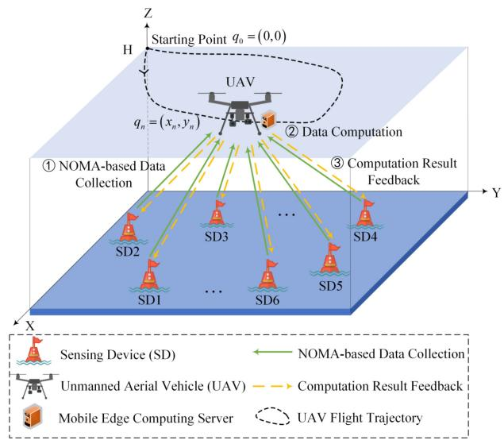  
Fig. 1. The UAV-assisted M-IoT system model with NOMA-based data collection and computation.

Numerical results demonstrate the efficiency of our proposed algorithm in resource optimization and energy minimization compared to that of the baseline algorithms. Under the same environmental settings, the proposed NOMA scheme further enhances the spectrum utilization and energy efficiency compared to the FDMA and TDMA schemes. Moreover, the trajectory optimization allows the UAV to dynamically adjust its flight path based on real-time conditions, ensuring optimal data collection and processing, which significantly reduces the system’s energy consumption.

The rest of this article is organized as follows. Section II provides a detailed introduction to the system model. Section III gives the problem formulation and the optimization algorithm design. Section IV validates the proposed scheme through numerical simulations. Finally, Section V summarizes this work.

## II. SYSTEM MODEL

As depicted in Fig. 1, we consider the NOMA-based data collection and computation in a UAV-assisted M-IoT system, consisting of a UAV and a set of SDs denoted as $\mathcal { M } \ : =$ $\{ 1 , 2 , \ldots , M \}$ . We assume that each SD m has a fixed position $w _ { m } ,$ whose coordinate is denoted as $w _ { m } = ( x _ { m } , y _ { m } )$ . Due to the limited processing capability and energy constraints of the SDs at sea, they are unable to perform computationally intensive data processing directly. Therefore, we deploy a UAV with an onboard MEC server, which flies at a fixed altitude H over the sea to collect and process the data from the SDs. For analytical convenience, the total duration T is discretized into N equal intervals, i.e., each time slot $n \in \mathcal N =$ $\{ 1 , \ldots , N \}$ has the length of $\begin{array} { r } { \tau = \frac { T } { N } } \end{array}$ . The plane coordinate of the UAV at the n-th time slot is denoted as $q _ { n } = ( x _ { n } , y _ { n } )$ with the starting point denoted as $q _ { 0 } = \{ x _ { 0 } , y _ { 0 } \}$ . Note that the multi-slot modeling is considered here to facilitate the management of the dynamic data collection and resource allocation over time. In each time slot, the UAV determines whether all the data from each SD has been collected. Once the data collection from certain SDs is complete, the UAV prioritizes the computational processing of the data in the next time slot, and feeds the computational results back to the corresponding SDs to adjust their monitoring strategies or sensing behaviors. After completing the collection and computation tasks from all the SDs, the UAV returns to the starting point to replenish its energy at the end. Notably, similar UAV-assisted data collection and processing systems have been deployed and validated in real-world scenarios. For example, [34] deployed a UAV-assisted wireless sensor network for marine environmental data collection, and [35] proposed a UAV-assisted environmental monitoring system in remote areas without public networks, further confirming the practical feasibility of the system model considered here.

TABLE II SUMMARY OF ABBREVIATIONS
<table><tr><td>Abbreviations</td><td>Full Forms</td></tr><tr><td>UAV</td><td>Unmanned aerial vehicle</td></tr><tr><td>SDs</td><td>Sensing devices</td></tr><tr><td>M-IoT</td><td>Marine Internet of Things</td></tr><tr><td>MEC</td><td>Mobile edge computing</td></tr><tr><td>OFDMA</td><td>Orthogonal frequency division multiple access</td></tr><tr><td>FDMA</td><td>Frequency division multiple access</td></tr><tr><td>TDMA</td><td>Time division multiple access</td></tr><tr><td>NOMA</td><td>Non-orthogonal multiple access</td></tr><tr><td>SC</td><td>Superposition coding</td></tr><tr><td>SIC</td><td>Successive interference cancellation</td></tr><tr><td>LoS</td><td>Line-of-sight</td></tr><tr><td>MDP</td><td>Markov decision process</td></tr><tr><td>DRL</td><td>Deep reinforcement learning</td></tr><tr><td>PSO</td><td>Particle swarm optimization</td></tr><tr><td>TD3</td><td>Twin delayed deep deterministic policy gradient</td></tr><tr><td>DDPG</td><td>Deep deterministic policy gradient</td></tr><tr><td>A2C</td><td>Advantage actor-critic</td></tr><tr><td>DQN</td><td>Deep Q-network</td></tr></table>

Next, we provide a detailed introduction to the data collection model, computation model, and propulsion energy model of the UAV. And for the ease of understanding, the list of abbreviations and symbol notations used throughout this article is summarized in Tables II and III, respectively.

## A. Data Collection Model

In our system, the UAV first flies over the sea and collects data from all the SDs using the NOMA technology. Compared to the terrestrial communication, the marine communication experiences less environmental interference. Therefore, the communication between SDs and the UAV can be regarded as line-of-sight (LoS) propagation, where the channel quality depends only on the distance [36]. Under this propagation model, the channel power gain between the UAV and the SD m during the n-th time slot can be expressed as

TABLE III SUMMARY OF SYMBOL NOTATIONS
<table><tr><td>Symbols</td><td>Descriptions</td></tr><tr><td> $h _ { m n }$ </td><td>The channel power gain between the UAV and SD m</td></tr><tr><td> $\beta _ { 0 }$ </td><td>The LoS propagation channel coefficient</td></tr><tr><td> $\sigma _ { i j }$ </td><td>The comparison of the channel gains between SDs</td></tr><tr><td> $R _ { m n }$ </td><td>The data rate between the UAV and SD m</td></tr><tr><td> $p _ { m n }$ </td><td>The transmission power of the SD m</td></tr><tr><td> $B$ </td><td>The channel bandwidth</td></tr><tr><td> $n _ { 0 }$ </td><td>The background noise power at the UAV</td></tr><tr><td> $N _ { m }$ </td><td>The time slots for SD m to complete data uploading</td></tr><tr><td> $D _ { m }$ </td><td>The amount of data to be transmitted by SD m</td></tr><tr><td> $E _ { c \mathrm { e } } ^ { \mathrm { t r a } }$   $^ { E } \bar { \mathrm { S } } , \bar { m }$ </td><td>The transmission energy consumption of SD m</td></tr><tr><td> $f _ { \mathrm { U } }$  ,mn</td><td>The computational resource allocated to SD m</td></tr><tr><td> $\beta _ { n }$ </td><td>The proportion of computational resources</td></tr><tr><td> $f _ { \mathrm { U } }$ </td><td>The total computational resources for the UAV</td></tr><tr><td> $C _ { \mathrm { { U } } }$ </td><td>The number of CPU cycles required by the 1-bit data</td></tr><tr><td> $l _ { \mathrm { U } }$   $t _ { - } ^ { \mathrm { c p t } }$ </td><td>The CPU energy consumption coefficient</td></tr><tr><td> $^ { t } \bar { \mathbf { U } } , m$ </td><td>The latency of the UAV computing the data of SD m</td></tr><tr><td> $E _ { \mathrm { { r } \mathrm { ~ r ~ } } } ^ { \mathrm { { c p t } } }$   $^ { E } \mathrm { U } , m$ </td><td>The energy consumption for computing the data of SD m</td></tr><tr><td> $v _ { n }$ </td><td>The flight velocity of the UAV in the n-th time slot</td></tr><tr><td> $E _ { \mathrm { { I } \mathrm { ~ I } } } ^ { \mathrm { { f l y } } }$ </td><td>The propulsion energy consumption of the UAV</td></tr><tr><td> $E _ { \mathrm { U S } } ^ { \mathrm { { f o t } } }$ </td><td>The total energy consumption of the system</td></tr><tr><td> $\zeta$ </td><td>The weight coefficient for balancing energy consumption</td></tr><tr><td> $v _ { \mathrm { m a x } }$   $p _ { m } ^ { \mathrm { m a x } }$ </td><td>The maximum flight velocity of the UAV</td></tr><tr><td></td><td>The maximum transmission power of the SD m</td></tr><tr><td> $\dot { E } _ { \mathrm { U } } ^ { \mathrm { m a x } }$ </td><td>The maximum energy threshold of the UAV</td></tr></table>

$$
h _ { m n } = \frac { \beta _ { 0 } } { \left\| q _ { n } - w _ { m } \right\| ^ { 2 } + H ^ { 2 } } , \forall m \in \mathcal { M } , n \in \mathcal { N }\tag{1}
$$

where $\beta _ { 0 }$ represents the LoS propagation channel coefficient at the reference distance $d _ { 0 } = 1 \mathrm { m }$ . In NOMA-aided transmission, we employ the SIC technology and utilize the descending order of channel gains for data decoding. To facilitate this process, we introduce $\sigma _ { i , j }$ to represent the comparison of the channel gains between SD i and SD j in the n-th time slot, which can be denoted as

$$
\sigma _ { i j } = \left\{ \begin{array} { l } { 1 , h _ { i n } \geq h _ { j n } } \\ { 0 , h _ { i n } < h _ { j n } } \end{array} , i , j \in \mathcal { M } . \right.\tag{2}
$$

It is evident from (2) that, for a given time slot n, the data from the SDs with higher channel gains are prioritized for decoding, while the data from the SDs with lower channel gains are considered as interference during the decoding process. Therefore, the data rate of SD m during the n-th time slot is calculated as

$$
\begin{array} { r } { R _ { m n } = B \log { \bigg ( 1 + \frac { P _ { m n } h _ { m n } } { \sum _ { i \ne m } ^ { M } P _ { i n } h _ { i n } \sigma _ { m i } + n _ { 0 } } \bigg ) } , } \\ { \forall m \in \mathcal { M } / ( M _ { 1 } \cup M _ { 2 } \cup \cdots \cup M _ { n - 1 } ) , n \in \mathcal { N } } \end{array}\tag{3}
$$

where B denotes the channel bandwidth, n denotes the background noise power at the UAV, and $p _ { m n }$ denotes the transmission power of the SD m in the n-th time slot. Here, $M _ { n - 1 }$ represents the set of SDs that have completed data uploading in the $( n \mathrm { ~ \ - ~ } 1 ) { \ - } { \ / }$ time slot. Through the union operation $( M _ { 1 } \cup M _ { 2 } \cup \dots \cup M _ { n - 1 } )$ , we obtain the collective SD set that completed uploads through the time slots 1 till $n \ - \ 1$ . In this way, we have the remaining set of SDs that need to upload data in the n-th time slot expressed as $\mathcal { M } / ( M _ { 1 } \cup M _ { 2 } \cup \dots \cup M _ { n - 1 } )$ . Additionally, we have $M _ { i } \cap$ $M _ { j } = \emptyset , \forall i , j \in \mathcal { N }$ to indicate that there are no duplicate SDs that completed uploads in any two different time slots. Finally, up to the N-th time slot, all the SDs should have completed data uploading, thus obtaining $M _ { 1 } \cup M _ { 2 } \cup \dots \cup M _ { N } = \mathcal { M }$

To ensure that each SD successfully uploads all its data, the amount of data transmitted by each SD must be greater than or equal to the required amount of data to be uploaded, which can be expressed as

$$
\sum _ { n = 1 } ^ { N _ { m } } { R _ { m n } \tau } \geq D _ { m } , \forall m \in \mathcal { M }\tag{4}
$$

where $D _ { m }$ denotes the amount of data to be transmitted by each SD and $N _ { m }$ represents the time slots required for SD m to complete its data uploading. Therefore, the total energy consumed by SD m during the entire transmission process is given by

$$
E _ { \mathrm { S } , m } ^ { \mathrm { t r a } } = \sum _ { n = 1 } ^ { N _ { m } } p _ { m n } \tau , \forall m \in \mathcal { M } .\tag{5}
$$

Note that all the above models are defined for the data collection process.

## B. Data Computation Model

When the data collection from certain SDs is completed, the UAV processes the data computation in the next time slot. Therefore, it is crucial to allocate the UAV’s computational resources appropriately to ensure efficient data processing. The total computational resource available to the UAV is denoted as $f _ { \mathrm { U } }$ . The computational resource allocated in the n-th time slot is denoted as $\beta _ { n } f _ { \mathrm { U } }$ , where $\beta _ { n } ~ \in ~ [ 0 , 1 ]$ indicates the proportion of computational resources allocated by the UAV. We thus have the constraint $\textstyle \sum _ { n = 2 } ^ { N } \beta _ { n } \leq 1$ , which guarantees that the sum of allocated computational resources across all the time slots does not exceed the total computing capacity. Consequently, the computational resources allocated to certain SDs, i.e., $m \in M _ { n - 1 }$ during the n-th time slot must satisfy the following condition

$$
\sum _ { \forall m \in M _ { n - 1 } } f _ { \mathrm { U } , m n } \leq \beta _ { n } f _ { \mathrm { U } } , \forall n \in \{ 2 , 3 , \ldots , N \}\tag{6}
$$

where $f _ { \mathrm { U } , m n }$ denotes the computational resource allocated to SD m that has completed data uploading in the (n − 1)-th time slot. Note that the allocated resources are not released or reallocated afterwards, but are continuously used for the computation tasks of the corresponding SD. Based on the appropriate allocation of computational resources, the latency of the UAV computing the data from SD m can be expressed as [37]

$$
t _ { \mathrm { U } , m } ^ { \mathrm { c p t } } = \frac { D _ { m } C _ { \mathrm { U } } } { f _ { \mathrm { U } , m n } } , \forall m \in \mathcal { M }\tag{7}
$$

where $C _ { \mathrm { U } }$ denotes the number of CPU cycles required by the 1-bit computation. And the energy consumption correspondingly can be expressed as [37]

$$
E _ { \mathrm { U } , m } ^ { \mathrm { c p t } } = l _ { \mathrm { U } } D _ { m } C _ { \mathrm { U } } f _ { \mathrm { U } , m n } ^ { 2 } , \forall m \in \mathcal { M }\tag{8}
$$

where $l _ { \mathrm { U } }$ denotes the CPU energy consumption coefficient associated with the UAV computation.

After completing the data computation for certain SDs, the UAV transmits the results back to the corresponding SDs to optimize their sensing behavior or adjust the monitoring strategy. Since the amount of feedback data is significantly smaller than the original data, the associated energy consumption and communication latency can be considered negligible [38].

## C. Propulsion Energy Model

Due to the maneuverability of the UAV, the variation in energy consumption during flight needs to be considered. Specifically, the flight velocity is closely related to the propulsion energy consumption, and the changes in velocity directly affect the power required for propulsion.

In this way, with the flight velocity of the UAV in the n-th time slot defined as

$$
v _ { n } = \frac { \| q _ { n } - q _ { n - 1 } \| } { \tau } , \forall n \in \mathcal { N }\tag{9}
$$

the propulsion energy consumption of the UAV can be thus expressed as [39]

$$
\begin{array} { l } { { \displaystyle { \cal E } _ { \mathrm { U } } ^ { \mathrm { f l y } } = \sum _ { n = 1 } ^ { N } \left( \tau \left( \rho _ { 1 } v _ { n } ^ { 3 } + \frac { \rho _ { 2 } } { v _ { n } } \right) \right) } } \\ { { \displaystyle ~ = \sum _ { n = 1 } ^ { N } \left( \tau \left( \rho _ { 1 } \left( \frac { \| q _ { n } - q _ { n - 1 } \| } { \tau } \right) ^ { 3 } + \frac { \rho _ { 2 } \tau } { \| q _ { n } - q _ { n - 1 } \| } \right) \right) } } \end{array}\tag{10}
$$

where $\rho _ { 1 }$ and $\rho _ { 2 }$ are the parameters associated with air density, rotor area, and fuselage drag ratio as discussed in [40]. Note that this propulsion energy model is crucial for optimizing the energy efficiency of the UAV during flight.

In brief, the total energy consumption mainly consists of three components, i.e., the transmission energy consumption $E _ { \mathrm { S } , m } ^ { \mathrm { t r a } }$ for SD m transmitting the data, the computation energy consumption $E _ { \mathrm { U } , m } ^ { \mathrm { c p t } }$ for the UAV processing the data from SD m, and the propulsion energy consumption $E _ { \mathrm { U } } ^ { \mathrm { f l y } }$ for the UAV flight. Therefore, the total energy consumption of the UAVassisted M-IoT system can be expressed as

$$
E _ { \mathrm { U S } } ^ { \mathrm { t o t } } = \sum _ { m = 1 } ^ { M } \left( E _ { \mathrm { S } , m } ^ { \mathrm { t r a } } + E _ { \mathrm { U } , m } ^ { \mathrm { c p t } } \right) + \zeta E _ { \mathrm { U } } ^ { \mathrm { f l y } }\tag{11}
$$

where the weight coefficient ζ aims to balance the propulsion energy consumption with the data transmission and computation energy consumption, as discussed in [41] and [42].

## III. PROBLEM FORMULATION AND ALGORITHM DESIGN

In this section, we consider the problem formulation and algorithm design for the NOMA-based data collection and computation issue in the UAV-assisted M-IoT system.

In the problem formulation, our goal is to minimize the total energy consumption of the UAV-assisted M-IoT system by jointly optimizing the trajectory of the UAV $q _ { n } .$ , the transmit power $p _ { m n }$ of SD $m ,$ the resource allocation ratio $\beta _ { n }$ , and the computational resource ${ f _ { \mathrm { U } , m n } }$ allocated for computing the

SD m’s data in the n-th time slot. Accordingly, the specific optimization problem (MTEC-US) can be formulated as

subjectto: constraints (4), (6)

$$
\operatorname* { m a x } _ { m \in \mathcal { M } } \Bigl ( N _ { m } \tau + t _ { \mathrm { U } , m } ^ { \mathrm { c p t } } \Bigr ) \leq T\tag{12}
$$

$$
0 \leq \frac { \| q _ { n } - q _ { n - 1 } \| } { \tau } \leq v _ { \operatorname* { m a x } }\tag{13}
$$

$$
\beta _ { n } \in [ 0 , 1 ] , \sum _ { n = 2 } ^ { N } \beta _ { n } \leq 1\tag{14}
$$

$$
0 \leq p _ { m n } \leq p _ { m } ^ { \mathrm { m a x } }\tag{15}
$$

$$
E _ { \mathrm { U } } ^ { \mathrm { f l y } } + \sum _ { m = 1 } ^ { M } E _ { \mathrm { U } , m } ^ { \mathrm { c p t } } \leq E _ { \mathrm { U } } ^ { \mathrm { m a x } }\tag{16}
$$

variables:

Constraint (12) indicates that the maximum latency of SDs cannot exceed the total duration T. Constraint (13) specifies that the flight velocity of the UAV in each time slot cannot exceed the maximum flight velocity $v _ { \mathrm { m a x } }$ . Constraint (14) implies that the sum of allocated computational resources across all the time slots must not exceed the available computing capacity. Constraint (15) ensures that the transmit power of SD m does not exceed its maximum value $p _ { m } ^ { \mathrm { m a x } }$ Constraint (16) ensures that the energy consumed by the UAV for flight and computation does not exceed the UAV’s maximum energy threshold $E _ { \mathrm { U } } ^ { \mathrm { m a x } }$ . In addition, to guarantee the effective flight area, the horizontal position $( x _ { n } , y _ { n } )$ of the UAV at the n-th time slot should be constrained within the boundary region, i.e., $x _ { n } \in [ 0 , x _ { \operatorname* { m a x } } ] , y _ { n } \in [ 0 , y _ { \operatorname* { m a x } } ]$ , which is explicitly defined in later simulation experiments.

Due to the non-convexity of the objective function and the coupling relationship between the UAV trajectory and the transmit power of the SDs to be optimized, the traditional convex optimization methods face significant challenges in directly solving this NP-hard problem.

To simplify this optimization problem, we first analyze the correlations among the constraints to reformulate it into an equivalent form. Specifically, the constraints (6) and (14) are combined and transformed into the following equivalent form

$$
\sum _ { n = 2 } ^ { N } \sum _ { \forall m \in M _ { n - 1 } } f _ { \mathrm { U } , m n } \leq f _ { \mathrm { U } } .\tag{17}
$$

Note that $\beta _ { n }$ has no impact on the objective function $E _ { \mathrm { U S } } ^ { \mathrm { t o t } }$ i.e., $E _ { \mathrm { U S } } ^ { \mathrm { t o t } }$ does not change with $\beta _ { n }$ . Therefore, when $f _ { \mathrm { U } , m n } \mathrm { \tilde { i } s }$ to be optimized, the optimal $\beta _ { n } ^ { * }$ can be any feasible value that satisfies the constraints (6) and (14).

Then, based on the above transformation, we can eliminate the optimization variable $\beta _ { n }$ and thus obtain the equivalent form of the optimization problem (MTEC-US-E) as

$$
\begin{array} { r l } { \mathrm { M T E C - U S - E : } } & { \quad \operatorname* { m i n } E _ { \mathrm { U S } } ^ { \mathrm { t o t } } } \\ { \mathrm { s u b j e c t ~ t o : } } & { \quad \mathrm { c o n s t r a i n t s } \left( 4 \right) , \left( 1 2 \right) , \left( 1 3 \right) , \left( 1 5 \right) , \left( 1 6 \right) , \left( 1 7 \right) } \\ { \mathrm { v a r i a b l e s : } } & { \quad q _ { n } , f _ { \mathrm { U } , m n } , p _ { m n } . } \end{array}
$$

Given that the optimization problem MTEC-US-E remains strictly non-convex, the traditional optimization methods can hardly deal with the complex dynamic decision-making problems. Therefore, we propose utilizing a deep reinforcement learning (DRL) approach to address this problem effectively. In the following subsections, we will further model the optimization problem as an MDP, and consider using the TD3 algorithm to solve it in dynamic environments.

## A. MDP

In the UAV-assisted M-IoT system, due to the mobility of the UAV, the updated transmission states of the SDs, and the continuous adjustment of computational resource allocation, the system exhibits significant time-varying characteristics. In such a dynamic environment, the MDP serves as an effective decision-making framework to capture the evolution of the system states and guide the UAV to make optimal decisions, by balancing immediate energy consumption and long-term system performance. Therefore, to solve this complex and dynamic optimization problem of MTEC-US-E, we consider modeling it as an MDP, represented by the tuple (S, A, R). In the following, we provide a detailed definition of the state space S, action space A, and reward function R for this optimization problem.

1) State space S: The system state includes the interaction between the UAV and SDs and the dynamic changes in the environment, which enables the agent to make optimal decisions at each time step. At the n-th time slot, the system state can be thus defined as

$$
s _ { n } = \{ x _ { n } , y _ { n } , L _ { 1 n } , \ldots , L _ { M n } , E _ { \mathrm { U } , n } , f _ { \mathrm { U } , n } , F _ { 1 n } , \ldots , F _ { M n } \}\tag{18}
$$

where $( x _ { n } , y _ { n } )$ represents the coordinates of the UAV, $L _ { m n }$ denotes the remaining data volume of SD m, $E _ { \mathrm { U } , n }$ represents the remaining energy of the UAV, ${ \mathrm { \Delta } f } _ { \mathrm { U } , n }$ denotes the remaining computational resource of the UAV, and $F _ { m n }$ represents the state of SD m. Specifically, $F _ { m n } ~ = ~ 0$ indicates that SD m is currently in the data collection phase, whereas $F _ { m n } ~ = ~ 1$ indicates that SD m has completed data uploading and will transition to the computation phase in the next time slot.

2) Action space A: The system action includes the set of decisions the UAV and SDs can make at each time step, which directly influences the environmental evolution and the system performance. At the n-th time slot, the system action can be expressed as

$$
a _ { n } = \left\{ v _ { n } , \theta _ { n } , p _ { 1 n } , \ldots , p _ { M n } , f _ { \mathrm { U } , 1 n } , \ldots , f _ { \mathrm { U } , M n } \right\}\tag{19}
$$

where $v _ { n } \in [ 0 , v _ { \mathrm { m a x } } ]$ and $\theta _ { n } \in [ 0 , 2 \pi ]$ denote the velocity and angle of the UAV, respectively, $p _ { m n } ~ \in ~ [ 0 , p _ { m } ^ { \operatorname* { m a x } } ]$ denotes the transmit power of SD m, and $\mathrm { ~  ~ { ~ f ~ U ~ } ~ } , m n \in$ $[ 0 , f _ { \mathrm { U } } ]$ denotes the computational resource allocated for computing the SD m’s data.

3) Reward function R: The reward function which is essential for evaluating the effectiveness of an agent’s actions in a specific state, can lead to the optimal strategy development. In the context of the UAV-assisted M-IoT system, the reward function should be designed to minimize the overall energy consumption while ensuring the efficient task completion given some system constraints. Specifically, to ensure the stable system operation, a penalty mechanism is integrated into the reward function, in case that the flight trajectory of the UAV exceeds predetermined boundaries or it fails to satisfy the specific constraints (4), (12), (16), and (17) in MTEC-US-E. Therefore, at the n-th time slot, we can set the reward function to be

$$
r _ { n } = - E _ { \mathrm { U S } , n } - r _ { \mathrm { b } , n } - r _ { \mathrm { p } , n }\tag{20}
$$

with

$$
\begin{array} { r } {  { r _ { \mathrm { b } , n } } = \left\{ \begin{array} { l l } { l _ { 1 } , \mathrm { I f ~ t h e ~ U A V ~ e x c e e d s ~ t h e ~ b o u n d a r i e s } } \\ { 0 , \mathrm { ~ o t h e r w i s e } } \end{array} \right. } \\ { r _ { \mathrm { p } , n } = \left\{ \begin{array} { l l } { l _ { 2 } , \mathrm { I f ~ t h e ~ c o n s t r a i n t s ~ a r e ~ n o t ~ s a t i s f i e d } } \\ { 0 , \mathrm { ~ o t h e r w i s e } } \end{array} \right. } \end{array}\tag{21}
$$

(22)

where $E _ { \mathrm { U S } , n }$ denotes the energy consumption of the UAV and SDs in the n-th time slot, and $l _ { 1 } > 0$ and $l _ { 2 } > 0$ denote the penalty factors.

## B. TD3 Algorithm for Solving MTEC-US-E

Optimizing the UAV trajectory, the transmit power of SDs, and the computational resource allocation in our system presents a complex, continuous decision-making challenge. By referring to the popular DRL algorithms to solve such problems, we adopt the TD3 algorithm here due to the following advantages. First, the TD3 employs two critic networks to update the target Q-value, effectively mitigating overestimation in multi-variable optimization. Second, the delayed update strategy reduces fluctuations caused by frequent policy adjustments, ensuring stable decision-making in the M-IoT system. Additionally, introducing noise into the target action enhances exploration capability, effectively balancing the energy consumption in flight, communication, and computation. These enhancements allow the TD3 to learn optimal strategies more reliably in dynamic environments, making it suitable to address our proposed energy consumption optimization problem.

Fig. 2 illustrates the optimization framework of the TD3 algorithm in the UAV-assisted M-IoT system, detailing the interaction process among the environment, the actor, the critic, and the replay buffer. Specifically, the agent first obtains the current state $s _ { n } = \{ x _ { n } , y _ { n } , L _ { m n } , E _ { \mathrm { U } , n } , f _ { \mathrm { U } , n } , F _ { m n } \}$ from the environment. The state $s _ { n }$ is then fed into the actor network, which generates a deterministic action $a _ { n }$ based on the policy function $\mu ( s _ { n } | \theta ^ { \mu } )$ , determining the trajectory adjustment (flight velocity $v _ { n }$ and angle $\theta _ { n } )$ , power control $p _ { m n } .$ , and resource optimization $f _ { \mathrm { U } , m n } .$ . To enhance the exploration of the policy space, the TD3 algorithm adds a Gaussian noise term $\epsilon _ { 1 } \in \mathcal { N } ( 0 , \sigma )$ to the output action $a _ { n } =$ $\mu ( s _ { n } | \theta ^ { \mu } ) + \epsilon _ { 1 }$ of the actor network during execution. The action is then applied to the environment, guiding the UAV to execute the data collection or computation tasks within the current time slot. The environment finally feeds back a reward $r _ { n }$ to measure the energy consumption and computational efficiency of the UAV and SDs in completing their tasks, and returns to the next state $s _ { n + 1 }$ . Meanwhile, the current interaction experience $( s _ { n } , a _ { n } , r _ { n } , s _ { n + 1 } )$ is stored in the replay buffer for subsequent batch sampling and network training.

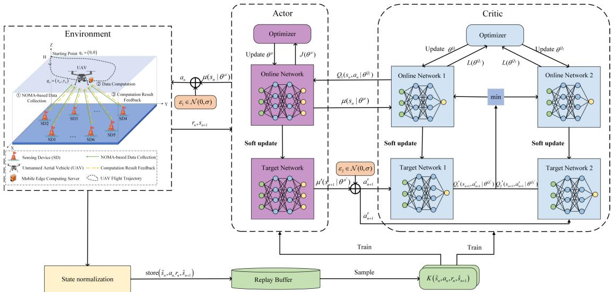  
Fig. 2. The framework of the TD3 algorithm with min-max state normalization.

More explicitly, we divide its optimization process into four stages: state preprocessing, policy generation, value evaluation, and target update, corresponding to the state normalization, actor network update, critic network update, and soft update mechanisms, respectively, which are

1) State Normalization: The M-IoT system state consists of the flight coordinates $( x _ { n } , y _ { n } )$ of the UAV, the remaining data volume $L _ { m n }$ and current state $F _ { m n }$ of the SD m, the remaining energy $E _ { \mathrm { U } , n }$ and computational resources ${ \mathrm { \Delta } f } _ { \mathrm { U } , n }$ of the UAV. These state variables exhibit significant differences in numerical scales, which may cause highvalued variables to dominate but critical low-valued information to be neglected in the network activations and gradient updates. This imbalance can negatively affect the resource allocation and trajectory adjustment of the UAV across different task phases, thereby deteriorating the overall energy efficiency and training convergence.

To address this imbalance in policy learning, we introduce the min-max normalization during the state input stage to map all state variables into the range of [0,1]. Specifically, the min-max normalization on the states $s _ { n }$ is defined as

$$
\hat { s } _ { n } = \frac { s _ { n } - s _ { \operatorname* { m i n } } } { s _ { \operatorname* { m a x } } - s _ { \operatorname* { m i n } } }\tag{23}
$$

where $s _ { \mathrm { m i n } }$ and smax represent the minimum and maximum values of each state, respectively, and $\hat { s } _ { n }$ is the normalized state. The normalized states $\begin{array} { r l } { \hat { s } _ { n } } & { { } = } \end{array}$ $\{ \hat { x } _ { n } , \hat { y } _ { n } , \hat { L } _ { m n } , \hat { E } _ { \mathrm { U } , n } , \hat { f } _ { \mathrm { U } , n } , \hat { F } _ { m n } \}$ are then used for subsequent Q-value estimation and policy learning, enhancing the learning stability of the TD3 algorithm in multivariate dynamic environments.

2) Critic Networks Update: The critic networks in the TD3 algorithm employ a double Q-value estimation mechanism to mitigate the problem of Q-function overestimation. Specifically, at each time step $n ,$ the online critic networks calculate two action-value functions, $Q _ { 1 } ( s _ { n } , a _ { n } | \theta ^ { Q _ { 1 } } )$ and $Q _ { 2 } \big ( s _ { n } , a _ { n } | \theta ^ { Q _ { 2 } } \big )$ , respectively. Meanwhile, the target actor network selects the next action and adds a Gaussian noise term $\epsilon _ { 2 } ~ \in ~ \mathcal { N } ( 0 , \sigma )$ to enhance the exploration of the policy, resulting in $\begin{array} { r c l } { { a _ { n + 1 } ^ { \prime } } } & { { = } } & { { \mu ( s _ { n + 1 } | \theta ^ { \mu ^ { \prime } } ) \ + \ \epsilon _ { 2 } } } \end{array}$ . Subsequently, the two target critic networks calculate the corresponding Q-values, denoted as $Q _ { 1 } ^ { \prime } ( s _ { n + 1 } , a _ { n + 1 } ^ { \prime } | \theta ^ { Q _ { 1 } ^ { \prime } } ) ^ { . }$ and $Q _ { 2 } ^ { \prime } ( s _ { n + 1 } , a _ { n + 1 } ^ { \prime } | \theta ^ { Q _ { 2 } ^ { \prime } } )$ , respectively. According to the Bellman equation, the target Q-value $y _ { n }$ is composed of the immediate reward $r _ { n }$ from the current action $a _ { n }$ and the estimated future return under the target policy $\mu ^ { \prime } ( s _ { n + 1 } | \theta ^ { \mu ^ { \prime } } )$ in the next state $s _ { n + 1 }$ . In the TD3 algorithm, two target critic networks are used to evaluate the Q-values of the next state–action pair $( s _ { n + 1 } , a _ { n + 1 } ^ { \prime } )$ and the minimum of the two is taken to compute the target Q-value, thus resulting in $y _ { n }$ expressed as

$$
y _ { n } = r _ { n } + \gamma \operatorname * { m i n } \Bigl ( Q _ { 1 } ^ { \prime } \Bigl ( s _ { n + 1 } , a _ { n + 1 } ^ { \prime } | \theta ^ { Q _ { 1 } ^ { \prime } } \Bigr ) , Q _ { 2 } ^ { \prime } \Bigl ( s _ { n + 1 } , a _ { n + 1 } ^ { \prime } | \theta ^ { Q _ { 2 } ^ { \prime } } \Bigr ) \Bigr )\tag{24}
$$

where $\gamma \in [ 0 , 1 ]$ represents the discount factor, $\theta ^ { Q _ { 1 } ^ { \prime } }$ and $\theta ^ { Q _ { 2 } ^ { \prime } }$ represent the parameters of target critic networks 1 and 2, respectively. This double Q-value estimation mechanism is particularly suitable for our optimization issue of joint data collection and computation, which involves high-dimensional, continuous state-action spaces and requires reliable value approximation under limited energy and resource constraints. Based on the computed target Q-value $y _ { n } .$ , the next step is to update the critic networks. Specifically, the loss for each critic network is calculated as the average mean squared error between the predicted and target Q-values, which is given as

$$
L \Bigl ( \theta ^ { Q _ { i } } \Bigr ) = \frac { 1 } { K } \sum _ { j = 1 } ^ { K } \Bigl ( y _ { j } - Q _ { i } \Bigl ( s _ { j } , a _ { j } | \theta ^ { Q _ { i } } \Bigr ) \Bigr ) ^ { 2 } , i \in \{ 1 , 2 \}\tag{25}
$$

Algorithm 1: TD3 Algorithm to Solve MTEC-US-E   
1 Input: The number of training steps $N _ { \mathrm { { s } } } ,$ the learning rates $\alpha \mu ;$   
$\alpha _ { Q _ { 1 } }$ and $\alpha _ { Q _ { 2 } }$ , the discount factor $\gamma ,$ and the soft update   
coefficient $\psi .$   
2 Initialization: Initialize the replay memory R, the batch size $K ,$   
the parameters of the online networks $\theta ^ { Q _ { 1 } ^ { - } } , \theta ^ { Q _ { 2 } }$ , and $\theta ^ { \mu } ,$ , and   
the parameters of the target networks $\theta ^ { Q _ { 1 } ^ { \prime } } , \theta ^ { Q _ { 2 } ^ { \prime } } .$ , and $\theta ^ { \mu ^ { \prime } }$   
3 for $\hat { t } = I$ to $E P I S O D E S$ do   
4 Initialize the state $s _ { 0 } .$   
5 for $n = I$ to $N _ { \mathrm { { s } } }$ do   
6 Normalize the state $s _ { n }$ through Algorithm 2.   
7 Select an action by adding Gaussian noise to the   
output of the actor network $a _ { n } = \mu ( s _ { n } | \theta ^ { \mu } ) + \epsilon _ { 1 }$   
8 Perform action $a n .$ obtain the reward $r _ { n } ,$ and observe   
the next state $s _ { n + 1 }$   
9 Normalize the next state $s _ { n + 1 }$ through Algorithm 2.   
10 if the UAV exceeds the boundaries then   
11 rn $ r _ { n } - r _ { \mathrm { b } , n } .$   
12 end   
13 if the constraints are not satisfied then   
14 $r n  r n - r _ { \mathrm { p } , n } .$   
15 end   
16 if the replay memory R is not full then   
17 Put the transition $( \hat { s } _ { n } , a _ { n } , r _ { n } , \hat { s } _ { n + 1 } )$ in R.   
18 end   
19 else   
20 Randomly select K transitions $( \hat { s } _ { n } , a _ { n } , r _ { n } , \hat { s } _ { n + 1 } )$   
from R.   
21 end   
22 Update the parameters $\theta ^ { Q _ { 1 } } , \theta ^ { Q _ { 2 } }$ and $\theta ^ { \mu }$ of the online   
networks by (26) and (28), respectively. Update the   
parameters $\overline { { { \theta } ^ { Q _ { 1 } ^ { \prime } } , \theta ^ { Q _ { 2 } ^ { \prime } } } }$ and $\theta ^ { \mu ^ { \prime } }$ of the target networks   
by (29) and (30), respectively.   
23 end   
24 end   
25 Output: The $\mathrm { U A V } \mathbf { \hat { s } }$ trajectory $q _ { n }$ and the total system energy   
consumption $E _ { \mathrm { U S } } ^ { \mathrm { t o t } } .$

where K denotes the batch size, and $\theta ^ { Q _ { i } } , i \in \{ 1 , 2 \}$ represent the parameters of the online critic network. The parameters $\theta ^ { Q _ { i } }$ are iteratively updated by calculating the gradient of the loss function $\bar { L } ( \theta ^ { Q _ { i } } )$ and applying gradient descent. The update step is given by

$$
\theta ^ { Q _ { i } } = \theta ^ { Q _ { i } } + \alpha _ { Q _ { i } } \nabla _ { \theta ^ { Q _ { i } } } L \Big ( \theta ^ { Q _ { i } } \Big ) , i \in \{ 1 , 2 \}\tag{26}
$$

where $\alpha _ { Q _ { i } } , \ i \in \{ 1 , 2 \}$ denote the learning rates of the online critic network.

3) Actor Network Update: In parallel, the TD3 uses a delayed update strategy, and the actor network is typically updated every two updates of the critic networks. This delayed update strategy helps prevent the learning instability caused by frequent updates to the actor network. Specifically, the loss function is expressed as

$$
J ( \theta ^ { \mu } ) = - \frac { 1 } { K } \sum _ { i = 1 } ^ { K } Q _ { 1 } \Big ( s _ { i } , a _ { i } | \theta ^ { Q _ { 1 } } \Big )\tag{27}
$$

where $\theta ^ { \mu }$ denotes the parameters of the online actor network. To minimize this loss and improve the actor performance, the actor network updates its parameters

Algorithm 2: State Normalization   
1 Input: The state space at the n-th time slot is given by (18).   
2 Initialization: Initialize the minimum state value $s _ { \mathrm { m i n } }$ and the   
maximum state value smax.   
3 $\begin{array} { r } { \hat { x } _ { n } = \frac { x _ { n } } { x _ { \mathrm { m a x } } - x _ { \mathrm { m i n } } } , \hat { y } _ { n } = \frac { y _ { n } } { y _ { \mathrm { m a x } } - y _ { \mathrm { m i n } } } , } \end{array}$   
4 $\begin{array} { r } { \hat { L } _ { m n } = \frac { L _ { m n } } { L _ { \mathrm { m a x } } - L _ { \mathrm { m i m } } } , \hat { E } _ { \mathrm { U } , n } = \frac { E _ { \mathrm { U } , n } } { E _ { \mathrm { U } , \mathrm { m a x } } - E _ { \mathrm { U } , \mathrm { m i n } } } , } \end{array}$   
5 $\begin{array} { r } { \hat { f } _ { \mathrm { U } , n } = \frac { f _ { \mathrm { U } , n } } { f _ { \mathrm { U , m a x } } - f _ { \mathrm { U , m i n } } } , \ : \hat { F } _ { m n } = \frac { F _ { m n } } { F _ { \mathrm { m a x } } - F _ { \mathrm { m i n } } } . } \end{array}$   
6 Output: $\dot { x } _ { n } , \hat { y } _ { n } , \hat { L } _ { m n } , \hat { E } _ { \mathrm { U } , n } , \hat { f } _ { \mathrm { U } , n } ,$ and $\hat { F } _ { m n } .$

based on the gradient of the loss ${ \cal J } ( \theta ^ { \mu } )$ . Therefore, the updated $\theta ^ { \mu }$ is given by

$$
\theta ^ { \mu } = \theta ^ { \mu } + \alpha _ { \mu } \nabla _ { \theta ^ { \mu } } J ( \theta ^ { \mu } )\tag{28}
$$

where $\alpha _ { \mu }$ denotes the learning rate of the online actor network.

4) Soft Update Mechanism: To further enhance training stability and prevent drastic updates, the TD3 employs a soft update mechanism for the target networks. This method reduces the potential sharp fluctuations during parameter updates, ensuring a smoother learning process for the agent. Specifically, for the target network, the parameters of ${ \theta ^ { Q } } _ { i } ^ { \prime }$ and θμ- can thus be updated as ${ \theta } ^ { { \bar { \mu } } ^ { \bar { \prime } } }$

$$
\theta ^ { Q _ { i } ^ { \prime } } = \psi \theta ^ { Q _ { i } } + \big ( 1 - \psi \big ) \theta ^ { Q _ { i } ^ { \prime } } , i \in \{ 1 , 2 \}\tag{29}
$$

and

$$
\theta ^ { \mu ^ { \prime } } = \psi \theta ^ { \mu } + \bigl ( 1 - \psi \bigr ) \theta ^ { \mu ^ { \prime } }\tag{30}
$$

respectively, where $\psi \in ( 0 , 1 )$ denotes the soft update coefficient.

The specific details of solving the optimization problem MTEC-US-E using the TD3 algorithm are illustrated in Algorithm 1 associated with Algorithm 2.

## C. Algorithm Complexity Analysis

To analyze the complexity of the optimization algorithm here, we consider the overall computational complexity from two aspects, i.e., the TD3 algorithm and the state normalization. The computational complexity of the TD3 algorithm mainly arises from the forward and backward propagation operations of the neural network training, and the matrix multiplications between adjacent layers during the actor and two critic network updates. Specifically, let the total number of training episodes be E, with each episode containing $N _ { \mathrm { s } }$ steps. The agent thus interacts with the environment a total of $E N _ { \mathrm { s } }$ times during the training process, resulting in a total of $E N _ { \mathrm { s } } K$ forward and backward propagation operations. In each propagation, the computational complexity of the actor and critic network updates is determined by $\mathcal { O } ( \sum _ { l = 0 } ^ { L _ { a } - 1 } H _ { l } ^ { a } H _ { l + 1 } ^ { a } +$ $\begin{array} { r l } { } & { { } \sum _ { l = 0 } ^ { L _ { c _ { 1 } } - 1 } H _ { l } ^ { c _ { 1 } } H _ { l + 1 } ^ { c _ { 1 } } + \sum _ { l = 0 } ^ { L _ { c _ { 2 } } - 1 } H _ { l } ^ { c _ { 2 } } H _ { l + 1 } ^ { c _ { 2 } } ) } \end{array}$ , where $L _ { a } , L _ { c _ { 1 } }$ , and $\boldsymbol { L _ { c _ { 2 } } }$ denote the total number of layers, and $H _ { l } ^ { a } , ~ H _ { l } ^ { c _ { 1 } }$ , and $H _ { l } ^ { c _ { 2 } }$ denote the number of neurons in the l-th layer for the actor and two critic networks, respectively [43]. Therefore, the

TABLE IV MAIN SIMULATION PARAMETERS

total computational complexity of the TD3 algorithm can be expressed as

$$
\begin{array} { r } { \mathcal { O } \left( E N _ { \mathrm { s } } K \left( \displaystyle \sum _ { l = 0 } ^ { L _ { a } - 1 } H _ { l } ^ { a } H _ { l + 1 } ^ { a } + \displaystyle \sum _ { l = 0 } ^ { L _ { c _ { 1 } } - 1 } H _ { l } ^ { c _ { 1 } } H _ { l + 1 } ^ { c _ { 1 } } \right. \right. } \\ { + \left. \left. \sum _ { l = 0 } ^ { L _ { c _ { 2 } } - 1 } H _ { l } ^ { c _ { 2 } } H _ { l + 1 } ^ { c _ { 2 } } \right) \right) . } \end{array}\tag{31}
$$

In contrast, the complexity of the state normalization is $\mathcal { O } ( E N _ { \mathrm { s } } ( 2 M + 4 ) )$ , where M represents the number of SDs, i.e., the number of state variables that require normalization. Given that $\mathcal { O } ( E N _ { \mathrm { s } } ( 2 M + 4 ) )$ is typically much smaller than (31) here, it can be reasonably neglected in the overall analysis. Consequently, the computational complexity of the entire algorithm framework is just given by (31) here.

## IV. NUMERICAL RESULTS

In this section, we conduct a detailed analysis of the numerical results to verify the effectiveness of the proposed algorithm. First, we introduce the simulation parameter settings and evaluate the convergence performance under different hyperparameters. Next, the UAV trajectory is fully explored while optimizing its data collection for energy efficiency. Finally, we analyze the performance of different algorithms and schemes in energy consumption, demonstrating the advantage of our method in energy efficiency optimization.

## A. Parameter Settings and Comparable Algorithms

We consider a NOMA-based data collection and computation scheme containing a UAV and five SDs. The SDs are assumed to be distributed across a $1 0 0 0 \times 1 0 0 0 ~ \mathrm { m ^ { 2 } }$ sea area, while the UAV begins its flight from the starting point $q _ { 0 } = ( 0 , 0 )$ and remains in this effective area, collecting and processing data at an altitude of $H = 1 0 0 \mathrm { m }$ . To ensure that the UAV can return to the starting point after completing the task, the energy threshold of the UAV is 500 KJ [44]. In the TD3 network, both actor and critic networks adopt a three-layer fully connected structure, with the number of neurons in the hidden layers set to be 400, 300, and 10, respectively. Note that all hidden layers use the rectified linear unit (ReLU) activation function. The output layer employs the tangent (Tanh) and the linear activation function, respectively, for the actor and critic networks. Additional simulation parameters are detailed in Table IV. The simulation environment is configured with Tensorflow 1.14.0 and Python 3.6, running on a system with an Intel i7-13700H CPU and an NVIDIA RTX 3050 GPU.

To evaluate the robustness of our algorithm, we compare it with the following benchmark algorithms. The first one is deep deterministic policy gradient (DDPG), which performs state normalization with the same state, action, and reward settings as the TD3 algorithm. The second one is advantage actor-critic (A2C), which enhances the stability of policy optimization through the introduction of an advantage function that effectively reduces the variance of policy gradients. The A2C algorithm also performs state normalization to maintain compatibility with the TD3 algorithm, while maintaining consistency in the action and reward settings. The third one is deep Q-network (DQN), which utilizes neural networks to estimate the Q-function, and allows it to handle a series of decision-making tasks involving discrete actions. Since DQN cannot directly address continuous action spaces, we discretize the action space to better align with its algorithmic framework. That is, during the n-th time slot, the flight velocity of the UAV is set to $v _ { n } = \{ 0 , v _ { \operatorname* { m a x } } / 1 0 , \dots , v _ { \operatorname* { m a x } } \}$ , the flight angle of the UAV is set to $\theta _ { n } = \{ 0 , \pi / 1 0 , \ldots , 2 \pi \}$ , the transmit power of SD m is $p _ { m n } = \{ 0 , 0 . 1 , . . . , p _ { m } ^ { \mathrm { m a x } } \}$ , and the computational resources allocated by the UAV to the SDs that have completed data uploads are set to $f _ { \mathrm { U } , m n } = \{ 0 , f _ { \mathrm { U } } / 1 0 , \dots , f _ { \mathrm { U } } \}$ . The DQN also utilizes state normalization, and its settings for state and reward are consistent with those of the TD3 algorithm. The last comparable one is the widely used particle swarm optimization (PSO) algorithm, which encodes the optimization variables as the position vector of each particle and uses the total energy consumption as the fitness function [45]. It searches for the optimal strategy with the minimum energy consumption by iteratively updating the particle positions.

<table><tr><td>Parameters</td><td>Values</td><td>Parameters</td><td>Values</td></tr><tr><td> $H$ </td><td>100m</td><td>xmax, Ymax</td><td>1000m</td></tr><tr><td> $T$ </td><td>150s</td><td> $M$ </td><td>5</td></tr><tr><td> $D _ { m }$ </td><td>[20, 24]Mb</td><td> $N$ </td><td>50</td></tr><tr><td> $v _ { \mathrm { m a x } }$ </td><td>20m/s</td><td> $f _ { \mathrm { U } }$ </td><td>10GHz</td></tr><tr><td> $l _ { \mathrm { U } }$ </td><td>10-28</td><td> $C _ { \mathrm { { U } } }$ </td><td>1000cycles/bit</td></tr><tr><td> $\rho _ { 1 }$ </td><td> $9 . 2 6 \times 1 0 ^ { - 4 }$ </td><td> $\rho _ { 2 }$ </td><td>2250</td></tr><tr><td> $\zeta$ </td><td>0.01</td><td> $B$ </td><td>1MHz</td></tr><tr><td> $E _ { \mathrm { [ ] } } ^ { \mathrm { { m a x } } }$ </td><td>500KJ</td><td> $p _ { m } ^ { \mathrm { m a x } }$ </td><td>1W</td></tr><tr><td> $n _ { 0 }$ </td><td>-120dB</td><td> $\beta _ { 0 }$ </td><td>-60dB</td></tr><tr><td> $\gamma$ </td><td>0.9</td><td> $\psi$ </td><td>0.01</td></tr><tr><td> $R$ </td><td>10000</td><td> $K$ </td><td>128</td></tr><tr><td> $\alpha _ { \mu }$ </td><td>0.0002</td><td> $\alpha _ { Q _ { 1 } } , \alpha _ { Q _ { 2 } }$ </td><td>0.0008</td></tr></table>

## B. Convergence Performance Under Different Hyperparameters and Algorithms

This subsection evaluates the impact of various hyperparameters on the overall performance of the TD3 algorithm and compares its convergence performance with benchmark algorithms.

First, Fig. 3(a) shows the effect of different learning rates $\{ \alpha _ { \mu } , \alpha _ { Q _ { 1 } } , \alpha _ { Q _ { 2 } } \}$ on the performance of the TD3 algorithm. When the learning rates $\{ \alpha _ { \mu } , \alpha _ { Q _ { 1 } } , \alpha _ { Q _ { 2 } } \}$ are set to {0.002, 0.008, 0.008}, large fluctuations appear in the early episodes. This instability arises from excessively high learning rates, which lead to overly large policy updates that can easily skip the optimal solution. In contrast, when the learning rates are {0.00002, 0.00008, 0.00008}, the algorithm converges more smoothly but with significantly slower convergence speed. This is due to the fact that small update steps lower the efficiency of policy optimization. Conversely, when the learning rates are {0.0002, 0.0008, 0.0008}, the convergence performance is the best, with stable and fast convergence at 500 episodes. Consequently, we ultimately set $\alpha _ { \mu } = 0 . 0 0 0 2$ and $\alpha _ { Q _ { 1 } } = \alpha _ { Q _ { 2 } } = 0 . 0 0 0 8$

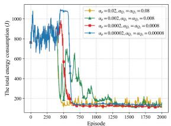  
(a)

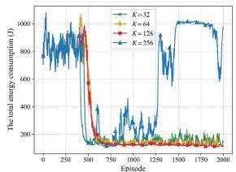

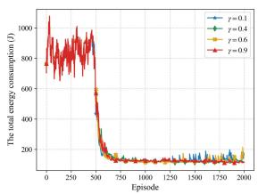  
(c)

(b)  
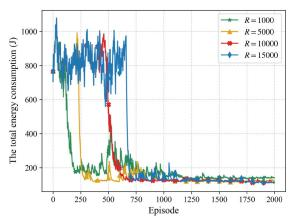  
(d)

Fig. 3. Performance comparison of the TD3 algorithm with different hyperparameters: (a) different learning rates, (b) different batch sizes, (c) different discount factors, (d) different replay memory capacities.  
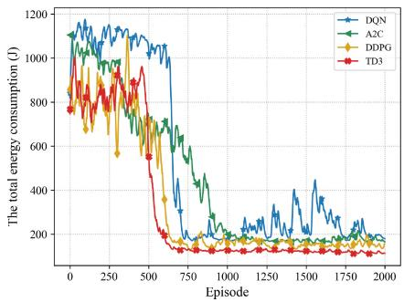  
Fig. 4. Comparison of convergence performance under different algorithms.

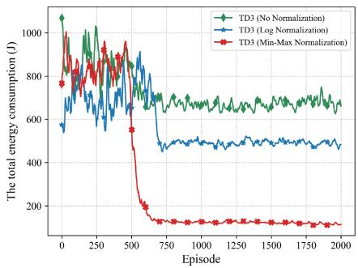  
Fig. 5. The impact of state normalization on the performance of the TD3 algorithm.

Similarly, Figs. 3(b), 3(c), and 3(d) illustrate the effect of different batch sizes, discount factors, and replay memory capacities on the performance of the TD3 algorithm, respectively. Specifically, smaller batch sizes facilitate faster convergence but may lead to later instability due to higher update variance, while larger batch sizes slow down the optimization speed and increase the risk of local optima. Additionally, a higher discount factor increases the focus on future rewards, thereby optimizing long-term returns. Meanwhile, an appropriate replay memory capacity can provide sufficient historical experience for policy updates, thus promoting faster convergence. Therefore, to balance the stability and convergence speed of our TD3 algorithm, we set $K = 1 2 8 , \gamma = 0 . 9$ , and $R = 1 0 0 0 0$

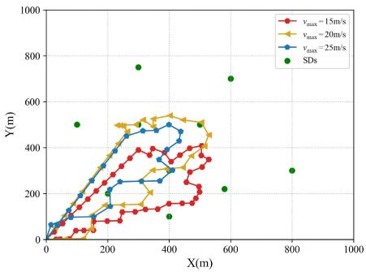  
Fig. 6. UAV trajectories under different maximum flight velocities.

Next, we compare the convergence performance of the TD3 algorithm with that of three benchmark algorithms, i.e., DDPG, A2C, and DQN. As shown in Fig. 4, the A2C algorithm exhibits the slowest convergence, stabilizing only after 1000 episodes. The DQN algorithm experiences significant fluctuations in the later stages. The DDPG algorithm converges at approximately 600 episodes, with some fluctuations after convergence. In contrast, the TD3 performs the best, converging at 500 episodes with minimal fluctuations and the least energy consumption. This phenomenon is in accordance with the characteristics of each algorithm in policy updating and handling continuous action spaces. Specifically, the A2C algorithm has lower update efficiency in high-dimensional continuous spaces, leading to slower convergence. The DQN algorithm struggles with fine control in continuous action tasks, resulting in higher fluctuations. While the DDPG performs well in continuous action spaces, its overestimation of the Q-value deteriorates the performance. In comparison, the TD3 reduces Q-value overestimation through dual Q network and delayed policy updating, resulting in the best convergence performance.

Fig. 5 illustrates the impact of state normalization on the performance of the TD3 algorithm. It can be observed that the TD3 algorithm without normalization or with logarithmic normalization tends to fall into local optima, resulting in higher system energy consumption. Specifically, the TD3 algorithm with min-max normalization achieves rapid convergence at 500 episodes, and its final energy consumption is only 20.27% and 27.35% of that of the other two methods, respectively. This phenomenon is mainly due to the unstable gradient updates in the TD3 without normalization, or the nonlinear transformation distorting the relative relationships among state features in logarithmic normalization.

## C. UAV Trajectory Optimization

This subsection analyzes the effect of different maximum flight velocities and average data volumes on the UAV trajectory optimization.

Specifically, Fig. 6 illustrates the optimized UAV trajectories under different maximum flight velocities. It can be observed that the distance traveled by the UAV in each time slot becomes significantly larger as $v _ { m a x }$ increases. This variation allows the UAV to cover a broader area in a shorter period and approach different SDs quickly, thus improving the efficiency of data collection. As expected, higher maximum flight velocities allow the UAV to be more flexible in adjusting its positions, while meeting the data transmission requirements and further optimizing the energy efficiency.

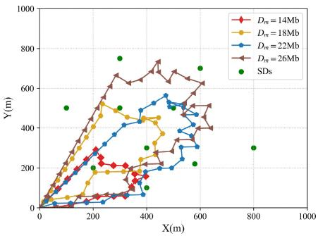  
Fig. 7. UAV trajectories under different average data volumes.

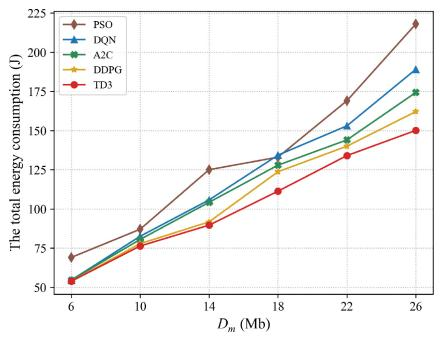  
Fig. 8. The total energy consumption under different average data volumes of SDs.

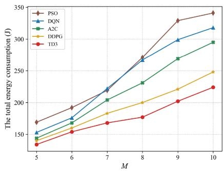  
Fig. 9. The total energy consumption under different numbers of SDs.

Fig. 7 illustrates the optimized UAV trajectories under different average data volumes of SDs. It can be observed that when the data volume is small, the moving path is relatively short and mainly focuses on the vicinity of the starting position. However, as the average $D _ { m }$ increases, we can see that the UAV expands the range of movement, and the flight trajectory is gradually nearer to the positions of SDs. This is because the UAV needs to cover a larger area to complete the data collection task when the average $D _ { m }$ increases, and meanwhile, being closer to the SDs helps to improve the efficiency of data transmission and reduce communication latency.

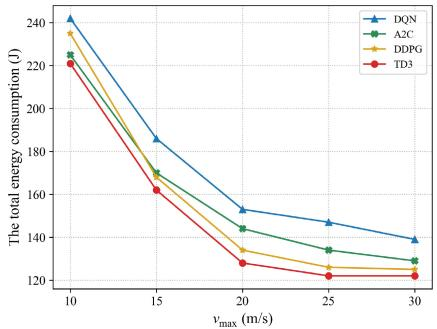  
Fig. 10. The total energy consumption under different maximum flight velocities.

## D. Analysis of Energy Consumption Performance

This subsection analyzes the effect of different average data volumes, SD numbers, maximum flight velocities, and computational resources on the energy consumption performance.

Fig. 8 shows the total energy consumption under different average data volumes of SDs, with the number of SDs set to $M = 5$ . We can see that as the average $D _ { m }$ increases from 6 Mb to 26 Mb, the total energy consumption of all algorithms gradually increases. This is because as the average $D _ { m }$ increases, the UAV needs to collect and process more data, which generates a corresponding energy consumption. Similarly, Fig. 9 shows the total energy consumption under different numbers of SDs, with the average $D _ { m }$ set to 22 Mb. The total energy consumption also increases with the increasing M, as expected. In both cases, the TD3 algorithm consistently has the minimum energy consumption, demonstrating its effectiveness in optimizing continuous control tasks. In contrast, the PSO algorithm has the maximum energy consumption, particularly for larger data volumes or more SDs, indicating its inefficiency in optimal strategy searching. Notably, the TD3 algorithm reduces the total energy consumption by 21.79% and 28.56% on average, respectively, compared to the PSO algorithm in Figs. 8 and 9, demonstrating the efficiency of the TD3-based joint optimization.

Fig. 10 shows the energy consumption performance under different maximum flight velocities. As $v _ { m a x }$ increases, energy consumption decreases across all algorithms. When vmax increases from 10 m/s to 20 m/s, the reduction in total energy consumption is more pronounced. This is because, at lower velocities, the UAV has limited mobility, making it difficult to quickly reach all SDs, resulting in longer flight times and higher energy consumption. As $v _ { m a x }$ increases, the UAV can cover SD locations more rapidly, reducing task completion time and significantly lowering energy consumption. However, the reduction in energy consumption slows down when vmax exceeds 20 m/s. At this point, the velocity of the UAV is sufficient for data collection, so further increases in velocity yield diminishing returns in terms of reducing energy consumption. As a result, the trend of decreasing total energy consumption is less pronounced at higher velocity ranges. Notably, the TD3 algorithm achieves the minimum energy consumption at all flight velocities, confirming its efficiency in optimizing energy usage.

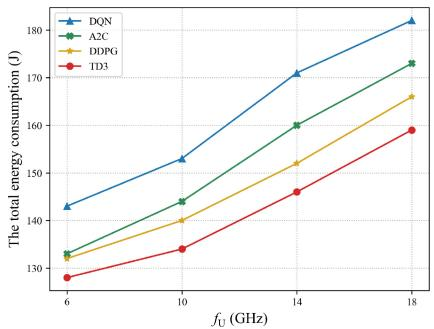

Fig. 11. The total energy consumption under different computational resources.  
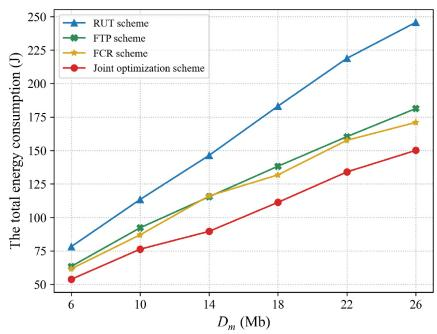  
Fig. 12. Comparison of different optimization schemes under different average data volumes of SDs.

Fig. 11 shows the total energy consumption under different computational resources. We can see that the total energy consumption gradually increases as $f _ { \mathrm { U } }$ increases from 6 GHz to 18 GHz. This is because higher computational resources, while enhancing computational capability, also significantly increase computational energy consumption, leading to an increase in total energy consumption. Notably, the TD3 algorithm consistently achieves the minimum total energy consumption across different computational resources, demonstrating its effectiveness in resource optimization.

In brief, it can be seen that the TD3 exhibits the minimum energy consumption under different system parameter settings. The main reason is that this energy minimization problem is a typical high-dimensional continuous control problem, which requires dynamic and fine resource allocation and flight trajectory planning during data uploading and computation phases. Compared to DDPG, the TD3 utilizes the dual Q-network and delayed policy update mechanism, which makes it more suitable and stable in dealing with the time inconsistency of data uploading among SDs and the constraints of computational resource sharing. In contrast, the A2C lacks the ability for fine control over multiple variables, and the discretization of the DQN reduces the decision-making accuracy, thus making them difficult to achieve optimal energy allocation.

## E. Performance Comparison With Different Schemes

This subsection aims to evaluate the performance of the proposed joint optimization scheme in system energy consumption by comparing it with several benchmark schemes. Specifically, we consider several comparable schemes, including the random UAV trajectory (RUT) scheme, the fixed transmission power (FTP) scheme, the fixed computational resource (FCR) scheme, and the FDMA and TDMA transmission schemes. Note that in the RUT scheme, the UAV adopts a random flight strategy throughout the mission, where its flight angle $\theta _ { n } \in [ 0 , 2 \pi ]$ and velocity $v _ { n } \in [ 0 , v _ { \mathrm { m a x } } ]$ are randomly selected in each time slot. In the FTP scheme, the transmission power of SD m is fixed at 1W. In the FCR scheme, the total computational resources of the UAV are evenly allocated to all SDs and remain unchanged throughout the process.

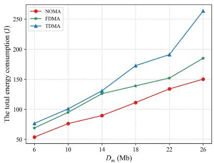  
Fig. 13. Comparison of different transmission schemes under different average data volumes of SDs.

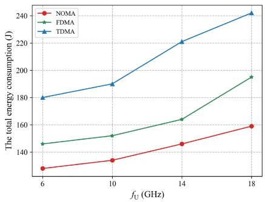  
Fig. 14. Comparison of different transmission schemes under different computational resources.

We first compare our joint optimization scheme with the RUT, FTP, and FCR schemes to illustrate explicitly how much each optimization component contributes to the energy savings. As Fig. 12 shows, the proposed joint optimization scheme consistently achieves the minimum total energy consumption as expected. In contrast, the FTP and FCR schemes exhibit similarly higher energy consumption due to their lack of dynamic adaptation in transmit power or computational resource. Moreover, the RUT scheme has the maximum energy consumption due to its failure to effectively plan the flight trajectory. Specifically, compared to the FTP, FCR, and RUT schemes, the proposed scheme reduces the total energy consumption by an average of 18.02%, 15.11%, and 36.6%, respectively.

Figs. 13 and 14 illustrate the energy consumption performance of three transmission schemes under different average data volumes and computational resources, respectively. In both scenarios, the NOMA transmission scheme consistently achieves the minimum energy consumption, demonstrating the most significant advantage in energy efficiency. Specifically, as $D _ { m }$ increases, the energy consumption of all schemes rises due to the growing demand for communication and computation. Similarly, as $f _ { \mathrm { U } }$ increases from 6GHz to 18GHz, the total energy consumption also increases, implying that higher computational capacity given requires more energy consumption in total. Notably, compared to the FDMA and TDMA schemes, the NOMA scheme reduces total energy consumption by 20.21% and 32.34% given the same data volume, and by 13.4% and 31.65% given the same total computational resource, respectively. These demonstrate that the NOMA scheme is more adaptable to high data-volume and computation-intensive M-IoT scenarios, significantly reducing the total energy consumption.

## V. CONCLUSION

This article investigates the energy optimization issue of NOMA-based data collection and computation in a UAV-assisted M-IoT system. We minimize the total energy consumption by jointly optimizing the flight trajectory of the UAV, the transmit power of the SDs, and the computational resources allocated to the SDs that have completed data uploads. Due to the non-convexity of the optimization problem, we first construct an equivalent form by analyzing the correlation among the constraints and then solve the problem using the TD3 algorithm. Numerical results validate the efficiency of our proposed algorithm in UAV trajectory optimization, resource allocation, and energy minimization. Especially, the NOMA scheme achieves a reduction of 20.21% and 32.34% in total energy consumption compared to the FDMA and TDMA schemes, respectively. Our proposed scheme can significantly improve the collection and processing efficiency of marine data, which is of practical interest for the M-IoT applications. In the future, we will consider to set up a practical demo to verify our proposed data collection and computation scheme, and deploy the UAV-related experiments in real-world scenarios.

## REFERENCES

[1] Q. Wang, L. Zou, W. Jiang, M. Wu, and L. Qian, “Latency-minimization trajectory optimization for UAV-enabled NOMA networks,” in Proc. IEEE Global Commun. Conf., Cape Town, South Africa, Dec. 2024, pp. 3328–3333.

[2] Y. Song et al., “Internet of Maritime Things platform for remote marine water quality monitoring,” IEEE Internet Things J., vol. 9, no. 16, pp. 14355–14365, Aug. 2022.

[3] Y. Yang, R. Elsinghorst, J. J. Martinez, H. Hou, J. Lu, and Z. D. Deng, “A real-time underwater acoustic telemetry receiver with edge computing for studying fish behavior and environmental sensing,” IEEE Internet Things J., vol. 9, no. 18, pp. 17821–17831, Sep. 2022.

[4] R. W. Liu et al., “Intelligent edge-enabled efficient multi-source data fusion for autonomous surface vehicles in maritime Internet of Things,” IEEE Trans. Green Commun. Netw., vol. 6, no. 3, pp. 1574–1587, Sep. 2022.

[5] F. S. Alqurashi, A. Trichili, N. Saeed, B. S. Ooi, and M.-S. Alouini, “Maritime communications: A survey on enabling technologies, opportunities, and challenges,” IEEE Internet Things J., vol. 10, no. 4, pp. 3525–3547, Feb. 2023.

[6] S. Rani, H. Babbar, P. Kaur, M. D. Alshehri, and S. H. Shah, “An optimized approach of dynamic target nodes in wireless sensor network using bio inspired algorithms for maritime rescue,” IEEE Trans. Intell. Transp. Syst., vol. 24, no. 2, pp. 2548–2555, Feb. 2023.

[7] V. Niazmand and Q. Ye, “Joint task offloading, DNN pruning, and computing resource allocation for fault detection with dynamic constraints in industrial IoT,” IEEE Trans. Cogn. Commun. Netw., early access, Jan. 14, 2025, doi: 10.1109/TCCN.2025.3529688.

[8] Q. Ye, W. Shi, K. Qu, H. He, W. Zhuang, and X. Shen, “Joint RAN slicing and computation offloading for autonomous vehicular networks: A learning-assisted hierarchical approach,” IEEE Open J. Veh. Technol., vol. 2, pp. 272–288, 2021.

[9] K. Meng et al., “UAV-enabled integrated sensing and communication: Opportunities and challenges,” IEEE Wireless Commun., vol. 31, no. 2, pp. 97–104, Apr. 2024.

[10] M. Dai, N. Huang, Y. Wu, J. Gao, and Z. Su, “Unmanned-aerial-vehicleassisted wireless networks: Advancements, challenges, and solutions,” IEEE Internet Things J., vol. 10, no. 5, pp. 4117–4147, Mar. 2023.

[11] S. Javaid et al., “Communication and control in collaborative UAVs: Recent advances and future trends,” IEEE Trans. Intell. Transp. Syst., vol. 24, no. 6, pp. 5719–5739, Jun. 2023.

[12] Y. Zeng and J. Tang, “MEC-assisted real-time data acquisition and processing for UAV with general missions,” IEEE Trans. Veh. Technol., vol. 72, no. 1, pp. 1058–1072, Jan. 2023.

[13] F. Pervez, A. Sultana, C. Yang, and L. Zhao, “Energy and latency efficient joint communication and computation optimization in a multi-UAV assisted MEC network,” IEEE Trans. Wireless Commun., vol. 23, no. 3, pp. 1728–1741, Mar. 2024.

[14] Z. Qin et al., “Task selection and scheduling in UAV-enabled MEC for reconnaissance with time-varying priorities,” IEEE Internet Things J., vol. 8, no. 24, pp. 17290–17307, Dec. 2021.

[15] B. Liu, C. Liu, and M. Peng, “Computation offloading and resource allocation in unmanned aerial vehicle networks,” IEEE Trans. Veh. Technol., vol. 72, no. 4, pp. 4981–4995, Apr. 2023.

[16] Y. Xu, T. Zhang, Y. Liu, D. Yang, L. Xiao, and M. Tao, “UAVassisted MEC networks with aerial and ground cooperation,” IEEE Trans. Wireless Commun., vol. 20, no. 12, pp. 7712–7727, Dec. 2021.

[17] W. Mao, K. Xiong, Y. Lu, P. Fan, and Z. Ding, “Energy consumption minimization in secure multi-antenna UAV-assisted MEC networks with channel uncertainty,” IEEE Trans. Wireless Commun., vol. 22, no. 11, pp. 7185–7200, Nov. 2023.

[18] C. Deng, X. Fang, and X. Wang, “UAV-enabled mobile-edge computing for AI applications: Joint model decision, resource allocation, and trajectory optimization,” IEEE Internet Things J., vol. 10, no. 7, pp. 5662–5675, Apr. 2023.

[19] X.-H. Lin et al., “Joint optimization of resource allocation and flight trajectory for UAV-IoT underwater detecting systems,” IEEE Trans. Veh. Technol., vol. 72, no. 12, pp. 16482–16498, Dec. 2023.

[20] W. Xu, W. Luo, Y. Sun, Z. Gao, B. Wu, and L. Lai, “MADRL-based edge computing: Joint energy-latency optimization for marine Internet of Things,” IEEE Internet Things J., vol. 12, no. 15, pp. 30228–30241, Aug. 2025.

[21] Y. Liu, J. Yan, and X. Zhao, “Deep reinforcement learning based latency minimization for mobile edge computing with virtualization in maritime UAV communication network,” IEEE Trans. Veh. Technol., vol. 71, no. 4, pp. 4225–4236, Apr. 2022.

[22] Y. Zhang, J. Lyu, and L. Fu, “Energy-efficient trajectory design for UAV-aided maritime data collection in wind,” IEEE Trans. Wireless Commun., vol. 21, no. 12, pp. 10871–10886, Dec. 2022.

[23] S. S. Hassan, D. H. Kim, Y. K. Tun, N. H. Tran, W. Saad, and C. S. Hong, “Seamless and energy-efficient maritime coverage in coordinated 6G space–air–sea non-terrestrial networks,” IEEE Internet Things J., vol. 10, no. 6, pp. 4749–4769, Mar. 2023.

[24] L. P. Qian, H. Zhang, Q. Wang, Y. Wu, and B. Lin, “Joint multi-domain resource allocation and trajectory optimization in UAV-assisted maritime IoT networks,” IEEE Internet Things J., vol. 10, no. 1, pp. 539–552, Jan. 2023.

[25] C. Dou, N. Huang, Y. Wu, L. Qian, and T. Q. Quek, “Sensingefficient NOMA-aided integrated sensing and communication: A joint sensing scheduling and beamforming optimization,” IEEE Trans. Veh. Technol., vol. 72, no. 10, pp. 13591–13603, Oct. 2023.

[26] Y. Liu, W. Yi, Z. Ding, X. Liu, O. A. Dobre, and N. Al-Dhahir, “Developing NOMA to next generation multiple access: Future vision and research opportunities,” IEEE Wireless Commun., vol. 29, no. 6, pp. 120–127, Dec. 2022.

[27] Z. Wang, T. Lv, J. Zeng, and W. Ni, “Placement and resource allocation of wireless-powered multiantenna UAV for energy-efficient multiuser NOMA,” IEEE Trans. Wireless Commun., vol. 21, no. 10, pp. 8757–8771, Oct. 2022.

[28] D. Zhai, C. Wang, R. Zhang, H. Cao, and F. R. Yu, “Energysaving deployment optimization and resource management for UAV-assisted wireless sensor networks with NOMA,” IEEE Trans. Veh. Technol., vol. 71, no. 6, pp. 6609–6623, Jun. 2022.

[29] S. Fu, X. Guo, F. Fang, Z. Ding, N. Zhang, and N. Wang, “Towards energy-efficient data collection by unmanned aerial vehicle base station with NOMA for emergency communications in IoT,” IEEE Trans. Veh. Technol., vol. 72, no. 1, pp. 1211–1223, Jan. 2023.

[30] X. Guo, B. Li, J. Wu, R. Zhang, and X. Cheng, “Joint uplink and downlink NOMA for UAV relaying network with multi-pair users,” IEEE Trans. Wireless Commun., vol. 23, no. 12, pp. 18549–18562, Dec. 2024.

[31] Y. Wang, M. Chen, C. Pan, K. Wang, and Y. Pan, “Joint optimization of UAV trajectory and sensor uploading powers for UAV-assisted data collection in wireless sensor networks,” IEEE Internet Things J., vol. 9, no. 13, pp. 11214–11226, Jul. 2022.

[32] X. Yuan, Y. Hu, J. Zhang, and A. Schmeink, “Joint user scheduling and UAV trajectory design on completion time minimization for UAVaided data collection,” IEEE Trans. Wireless Commun., vol. 22, no. 6, pp. 3884–3898, Jun. 2023.

[33] H. Wang, H. Zhang, X. Liu, K. Long, and A. Nallanathan, “Joint UAV placement optimization, resource allocation, and computation offloading for THz band: A DRL approach,” IEEE Trans. Wireless Commun., vol. 22, no. 7, pp. 4890–4900, Jul. 2023.

[34] C. A. Trasviña-Moreno, R. Blasco, Á. Marco, R. Casas, and A. Trasviña-Castro, “Unmanned aerial vehicle based wireless sensor network for marine-coastal environment monitoring,” Sensors, vol. 17, no. 3, p. 460, Feb. 2017.

[35] M. Zhang and X. Li, “Drone-enabled Internet-of-Things relay for environmental monitoring in remote areas without public networks,” IEEE Internet Things J., vol. 7, no. 8, pp. 7648–7662, Aug. 2020.

[36] Y. Liao, X. Chen, S. Xia, Q. Ai, and Q. Liu, “Energy minimization for UAV swarm-enabled wireless inland ship MEC network with time windows,” IEEE Trans. Green Commun. Netw., vol. 7, no. 2, pp. 594–608, Jun. 2023.

[37] N. Zhao, Z. Ye, Y. Pei, Y.-C. Liang, and D. Niyato, “Multi-agent deep reinforcement learning for task offloading in UAV-assisted mobile edge computing,” IEEE Trans. Wireless Commun., vol. 21, no. 9, pp. 6949–6960, Sep. 2022.

[38] Z. Yang, C. Pan, K. Wang, and M. Shikh-Bahaei, “Energy efficient resource allocation in UAV-enabled mobile edge computing networks,” IEEE Trans. Wireless Commun., vol. 18, no. 9, pp. 4576–4589, Sep. 2019.

[39] J. Ji, K. Zhu, C. Yi, and D. Niyato, “Energy consumption minimization in UAV-assisted mobile-edge computing systems: Joint resource allocation and trajectory design,” IEEE Internet Things J., vol. 8, no. 10, pp. 8570–8584, May 2021.

[40] Y. Zeng, J. Xu, and R. Zhang, “Energy minimization for wireless communication with rotary-wing UAV,” IEEE Trans. Wireless Commun., vol. 18, no. 4, pp. 2329–2345, Apr. 2019.

[41] T. Zhang, Y. Xu, J. Loo, D. Yang, and L. Xiao, “Joint computation and communication design for UAV-assisted mobile edge computing in IoT,” IEEE Trans Ind. Informat., vol. 16, no. 8, pp. 5505–5516, Aug. 2020.

[42] B. Xu, Z. Kuang, J. Gao, L. Zhao, and C. Wu, “Joint offloading decision and trajectory design for UAV-enabled edge computing with task dependency,” IEEE Trans. Wireless Commun., vol. 22, no. 8, pp. 5043–5055, Aug. 2023.

[43] B. Adhikari, A. S. Khwaja, M. Jaseemuddin, A. Anpalagan, and A. Nallanathan, “Energy efficient RIS-assisted UAV networks using twin delayed DDPG technique,” IEEE Trans. Wireless Commun., vol. 23, no. 12, pp. 18423–18439, Dec. 2024.

[44] S. Jeong, O. Simeone, and J. Kang, “Mobile edge computing via a UAV-mounted cloudlet: Optimization of bit allocation and path planning,” IEEE Trans. Veh. Technol., vol. 67, no. 3, pp. 2049–2063, Mar. 2018.

[45] H. Pan, Y. Liu, G. Sun, J. Fan, S. Liang, and C. Yuen, “Joint power and 3D trajectory optimization for UAV-enabled wireless powered communication networks with obstacles,” IEEE Trans. Commun., vol. 71, no. 4, pp. 2364–2380, Apr. 2023.

Qian Wang (Member, IEEE) received the B.Eng. degree in communication engineering from Harbin Engineering University in 2012, and the Ph.D. degree in electrical and computer engineering from the National University of Singapore in 2017, where she got the honor of President’s Graduate Fellowship. From 2017 to 2019, she worked as an Engineer with Huawei 2012 Laboratory, where she contributed to IEEE 802.11ad/ay standards. She is currently an Associate Professor with the Institute of Cyberspace Security, Zhejiang University of Technology, Hangzhou, Zhejiang, China. Her research interests mainly involve in communication and information theory, physical-layer technologies, signal processing, resource allocation and network optimization. She is also a senior member of China Communication Society.

Li Zou received the B.E. degree in electronic information engineering from the Economic and Technical College, Anhui Agricultural University, in 2023. She is currently pursuing the master’s degree with the Institute of Cyberspace Security, Zhejiang University of Technology, China. Her current research interest focuses on nonorthogonal multiple access, unmanned aerial vehicle communications, and mobile-edge computing.

Li Ping Qian (Senior Member, IEEE) received the Ph.D. degree in information engineering from the Chinese University of Hong Kong in 2010. She is currently a Full Professor with the Institute of Cyberspace Security, Zhejiang University of Technology, Hangzhou, China. Her research interests include wireless communication and networking, resource management in wireless networks, massive IoTs, mobile-edge computing, emerging multiple access techniques, and machine learning oriented towards wireless communications.

She was a co-recipient of the IEEE Marconi Prize Paper Award in Wireless Communications in 2011, and the Best Paper Awards from IEEE ICC 2016, IEEE Communication Society GCCTC 2017, the Digital Communications and Networking in 2021, and IEEE WCNC 2023. She is the Distinguished Lecturer of IEEE Vehicular Technology Society from 2024 to 2026, and currently on the Editorial Board of IEEE TRANSACTIONS ON COGNITIVE COMMUNICATIONS AND NETWORKING, IEEE INTERNET OF THINGS JOURNAL, and IEEE WIRELESS COMMUNICATIONS.

Wei Jiang (Member, IEEE) received the B.S. degree from the School of Communication and Information Engineering, Chongqing University of Posts and Telecommunications, in 2013, and the Ph.D. degree from the School of Communication and Information Engineering, University of Electronic Science and Technology of China, in 2019. She was a visiting Ph.D. student with Pennsylvania State University from 2017 to 2018, and a Postdoctoral Researcher with Shenzhen University from 2020 to 2022. She is currently an Associate Professor with the Institute of

Cyberspace Security, Zhejiang University of Technology. Her current research interests include next generation mobile communication systems, mobile-edge computing, and content caching. She has won the Best Paper Award of IEEE Transactions on Services Computing in 2023.

Bin Lin (Senior Member, IEEE) received the B.S. and M.S. degrees from Dalian Maritime University, Dalian, China, in 1999 and 2003, respectively, and the Ph.D. degree from the Broadband Communications Research Group, Department of Electrical and Computer Engineering, University of Waterloo, Waterloo, ON, Canada, in 2009. From 2015 to 2016, she was a Visiting Scholar with George Washington University, Washington, DC, USA. She is currently a Full Professor and the Dean of Communication Engineering with the College of

Information Science and Technology, Dalian Maritime University. Her current research interests include wireless communications, network dimensioning and optimization, resource allocation, artificial intelligence, maritime communication networks, and the Internet of Things. She is an Associate Editor of IEEE TRANSACTIONS ON VEHICULAR TECHNOLOGY and IEEE INTERNET OF THINGS JOURNAL.

Yuan Wu (Senior Member, IEEE) received the Ph.D. degree in electronic and computer engineering from the Hong Kong University of Science and Technology in 2010. He is currently a Full Professor with the State Key Laboratory of Internet of Things for Smart City, University of Macau, Macao, China, and also with the Department of Computer and Information Science, University of Macau. His research interests include resource management for wireless networks, green communications and computing, edge computing and edge intelligence, and energy informatics. He received the Best Paper Award from the IEEE ICC’2016, IEEE TCGCC’2017, IWCMC’2021, and IEEE WCNC’2023. He is currently on the editorial board of IEEE TRANSACTIONS ON VEHICULAR TECHNOLOGY, IEEE TRANSACTIONS ON NETWORK SCIENCE AND ENGINEERING, and IEEE INTERNET OF THINGS JOURNAL.