# Energy Minimization for Wireless Communication With Rotary-Wing UAV

Yong Zeng , Member, IEEE, Jie Xu , Member, IEEE, and Rui Zhang , Fellow, IEEE

Abstract— This paper studies unmanned aerial vehicle (UAV)- enabled wireless communication, where a rotary-wing UAV is dispatched to communicate with multiple ground nodes (GNs). We aim to minimize the total UAV energy consumption, including both propulsion energy and communication related energy, while satisfying the communication throughput requirement of each GN. To this end, we first derive a closed-form propulsion power consumption model for rotary-wing UAVs, and then formulate the energy minimization problem by jointly optimizing the UAV trajectory and communication time allocation among GNs, as well as the total mission completion time. The problem is difficult to be optimally solved, as it is non-convex and involves infinitely many variables over time. To tackle this problem, we first consider the simple fly-hover-communicate design, where the UAV successively visits a set of hovering locations and communicates with one corresponding GN while hovering at each location. For this design, we propose an efficient algorithm to optimize the hovering locations and durations, as well as the flying trajectory connecting these hovering locations, by leveraging the travelling salesman problem with neighborhood and convex optimization techniques. Next, we consider the general case, where the UAV also communicates while flying. We propose a new path discretization method to transform the original problem into a discretized equivalent with a finite number of optimization variables, for which we obtain a high-quality suboptimal solution by applying the successive convex approximation technique. The numerical results show that the proposed designs significantly outperform the benchmark schemes.

Index Terms— UAV communication, rotary-wing UAV, energy model, energy-efficient communication, trajectory optimization, path discretization.

Manuscript received March 20, 2018; revised July 24, 2018, November 20, 2018 and January 31, 2019; accepted February 20, 2019. Date of publication March 8, 2019; date of current version April 9, 2019. The work of Y. Zeng was supported by the Australia Research Council Discovery Early Career Researcher Award under Grant DE190101436. The work of J. Xu was supported in part by the National Natural Science Foundation of China under Project 61871137 and in part by the Open Research Fund of the National Mobile Communications Research Laboratory, Southeast University, under Project 2019D08. This paper was presented at the IEEE Global Communications Conference, Abu Ahabi, UAE, 9–13 December 2018 [1]. The associate editor coordinating the review of this paper and approving it for publication was S. Pollin. (Corresponding author: Jie Xu.)

Y. Zeng is with the School of Electrical and Information Engineering, The University of Sydney, Sydney, NSW 2006, Australia (e-mail: yong.zeng@sydney.edu.au).

J. Xu is with the School of Information Engineering, Guangdong University of Technology, Guangzhou 510006, China, and also with the National Mobile Communications Research Laboratory, Southeast University, Nanjing 211189, China (e-mail: jiexu@gdut.edu.cn).

R. Zhang is with the Department of Electrical and Computer Engineering, National University of Singapore, Singapore 117583 (e-mail: elezhang@nus.edu.sg).

Color versions of one or more of the figures in this paper are available online at http://ieeexplore.ieee.org.

Digital Object Identifier 10.1109/TWC.2019.2902559

# I. INTRODUCTION

WIRELESS communication using unmanned aerialplatforms is a promising technology to achieve wire- platforms is a promising technology to achieve wireless coverage in areas without or with insufficient terrestrial infrastructures. Early efforts have been primarily focusing on using high altitude platforms (HAPs), which are deployed in stratosphere at altitude around 20 km, aiming to provide ubiquitous coverage in rural or remote areas. Recently, wireless communication using low altitude platforms (LAPs), typically below a few kilometers above the ground, has received growing interest. LAPs can be implemented in various ways, such as helikite [2] and unmanned aerial vehicles (UAVs) [3]–[7]. In particular, compared to other airborne solutions such as HAPs and helikite, UAV-enabled wireless communication brings new advantages [3], such as on-demand and more swift deployment, superior link quality in the presence of shorter-distance line-of-sight (LoS) communication channel with ground nodes (GNs), and higher network flexibility with the fully controllable UAV movement in three dimensional (3D) airspace. Therefore, UAV-enabled wireless communication has many potential use cases, including public safety communication, temporary traffic offloading for cellular base stations (BSs), information dissemination and data collection for Internet of Things (IoTs), as well as emergency response and fast service recovery after natural disasters.

Prior researches on UAV-enabled wireless communications can be loosely classified into two categories. In the first category, UAVs are deployed as (quasi-)stationary aerial BSs. In this case, UAVs resemble the conventional static terrestrial BSs, but at a much higher altitude and thus possesses new channel characteristics [8]–[12]. In particular, it was shown that as the UAV altitude increases, the LoS probability between the UAV and GNs also increases [13]. By exploiting such unique channel characteristics, significant efforts have been devoted to studying the various aspects of UAV-enabled BSs, such as UAV placement optimization [13]–[18], performance analysis [19]–[21], spectrum sharing [22], and cell association [23]. In contrast, the other category considers the application scenarios where UAVs are employed as mobile BSs/relays/access points (APs) [24]–[29], whose trajectories can be designed to optimize the communication performance. For example, a UAV as a mobile relay or data collector can fly closer to its associated GNs for communication to improve the overall spectrum efficiency [24] and/or save the communication energy of GNs [27]. In [24], a new framework of joint power allocation and UAV trajectory optimization was proposed for the UAV-enabled mobile relaying system, which has been extended to various other setups such as UAV-enabled data collection [27], multi-UAV coordinated/cooperative communication [28], [30], and UAV-enabled wireless power transfer [31].

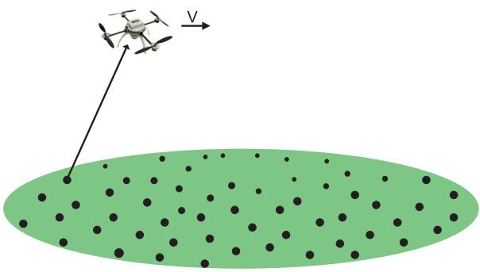

natural_image

Illustration of a drone with a vector V pointing to a green oval containing scattered black dots (no text or symbols)

Fig. 1. Wireless communication enabled by a rotary-wing UAV.

One critical issue of UAV-enabled wireless communication lies in the limited on-board energy of UAVs [3], which needs to be efficiently used to enhance the communication performance and prolong the UAV’s endurance. Compared to conventional terrestrial BSs, UAVs incur additional propulsion energy consumption to maintain airborne and support their movement. As a result, the energy-efficient wireless communication design with UAV is significantly different from that in conventional terrestrial communication systems. An initial attempt for designing energy-efficient UAV communication was made in [26], where the energy efficiency in bits/Joule of a fixed-wing UAV enabled communication system is maximized for a given flight duration. To that end, a generic energy model as a function of the UAV’s velocity and acceleration was derived for fixed-wing UAVs. Based on the energy model in [26], the authors in [32] further revealed an interesting trade-off between UAV’s energy consumption and that of the GNs it communicating with. However, the above results for fixed-wing UAVs cannot be applied for rotary-wing UAVs, due to their fundamentally different mechanical designs and hence drastically different propulsion energy models. Furthermore, the prior work [26] on energy-efficient fixed-wing UAV communications only considered the single-GN setup, while leaving the more general scenario with multiple GNs unaddressed. This thus motivates our current work to investigate energyefficient communication for rotary-wing UAVs in a multi-user setup.

In this paper, we study a wireless communication system enabled by a rotary-wing UAV [1], as shown in Fig. 1. Compared to fixed-wing UAVs, rotary-wing UAVs have several appealing advantages such as the ability to take off and land vertically, as well as for hovering, which render them more popular in the current UAV market. We consider the scenario where a rotary-wing UAV is dispatched as a flying AP to communicate with multiple GNs, each of which has a target number of information bits to be transmitted/received to/from the UAV. Such a setup corresponds to many practical applications, such as UAV-enabled data collection for periodic sensing, UAV-enabled caching where the UAV pre-fetches the data and then transmits to the designated caching nodes [33], etc. Our objective is to minimize the UAV’s energy consumption, including both propulsion energy and communication energy, while ensuring that the communication requirement for each GN is satisfied. The main contributions of this paper are summarized as follows.

First, we derive an analytical model for the propulsion power consumption of rotary-wing UAVs, based on the results in aircraft literature [34], [35]. As expected, the obtained model is significantly different from that for fixed-wing UAVs derived in our prior work [26]. For instance, for fixed-wing UAVs with flying speed V , the power consumption is a convex function of V consisting of two terms: one increasing cubically and the other decreasing inversely with V . Furthermore, the required power consumption for fixed-wing UAVs at $V ~ = ~ 0$ is infinity, which mathematically reflects the = 0well-known fact that fixed-wing UAVs must maintain a minimum forward speed to remain airborne. In contrast, as will be seen in Section II-B, the power consumption for rotary-wing UAVs is given by a more complicated function that is neither convex nor concave with respect to V . Furthermore, the power consumption is finite when $V = 0 ,$ reflecting the fact that the = 0rotary-wing UAV is able to hover. Such unique properties for power consumption model lead to different trajectory design techniques for rotary-wing UAVs compared to fixed-wing UAVs, as shown in this paper.

Based on the derived power consumption model, we formulate the energy minimization problem that jointly optimizes the UAV trajectory, the communication time allocation among the multiple GNs, as well as the total mission completion time. The problem is difficult to be optimally solved, as it is non-convex and constitutes infinite number of optimization variables that are coupled in continuous functions over time. To tackle this problem, we first consider the simple flyhover-communicate design to gain useful insights. Under this design, the UAV successively visits a set of optimized hovering locations, and communicates with each of the GNs only when hovering at the corresponding location. In this case, the problem reduces to finding the optimal hovering locations and hovering duration at each location, as well as the visiting order and flying speed among these locations. The problem is still NP hard, as it includes the classic NP hard travelling salesman problem (TSP) as a special case [36]. By leveraging the existing TSP-solving algorithm [37] and convex optimization techniques, an efficient high-quality approximate solution is obtained for our problem.

Next, we propose a general solution to the energy minimization problem where the UAV also communicates while flying. To this end, we first propose a novel discretization technique, called path discretization, to transform the original problem with infinitely many variables into a more tractable form with a finite number of variables. Different from the widely used time discretization approach for UAV trajectory design (see e.g. [24] and [26]), path discretization does not require the mission completion time to be pre-specified. This is particularly useful for problems where the mission completion time is also one of the optimization variables, as for the energy minimization problem studied in this paper. However, the path-discretized problem is still non-convex, and thus it is challenging to find its optimal solution. By utilizing the successive convex approximation (SCA) technique [24], an efficient iterative algorithm is proposed to simultaneously update the UAV trajectory and communication time allocation at each iteration, which is able to converge to a solution satisfying the Karush-Kuhn-Tucker (KKT) conditions.

# II. SYSTEM MODEL AND PROBLEM FORMULATION

# A. System Model

We consider a wireless communication system where a rotary-wing UAV is dispatched to communicate with K GNs, which are denoted by the set $\mathcal { K } = \{ 1 , \cdots , K \}$ . The horizontal location of the GN $k \in \mathcal K$ = 1is denoted as $\mathbf { w } _ { k } ~ \in ~ \mathbb { R } ^ { 2 \times 1 }$ . We assume that the UAV flies at a constant altitude H, whereas the UAV altitude optimization will be exploited in our future work. Let $T _ { t }$ denote the total time required for the UAV to complete the mission, which is one of the design variables. Denote by ${ \bf q } ( t ) \in \mathbb { R } ^ { 2 \times 1 }$ with $0 \leq t \leq T _ { t }$ the UAV trajectory ( ) 0projected onto the horizontal plane. Let $V _ { \mathrm { m a x } }$ denote the maxmaximum UAV speed. We then have the constraint $\| \dot { \mathbf { q } } ( t ) \| \leq$ $V _ { \mathrm { m a x } }$ . At any time instant $t \in [ 0 , T _ { t } ]$ ˙ ( ), the distance between the maxUAV and GN k is given by $\begin{array} { r } { \dot { d } _ { k } ( t ) \dot { = } \sqrt { H ^ { 2 } + \| \mathbf { q } ( t ) - \mathbf { w } _ { k } \| ^ { 2 } } } \end{array}$ , $k \in \mathcal { K }$ .

Let $h _ { k } ( t )$ denote the channel coefficient between the UAV ( )and GN k at time t. In general, $h _ { k } ( t )$ can be decomposed as

$$
h _ {k} (t) = \sqrt {\beta_ {k} (t)} \tilde {h} _ {k} (t), \tag {1}
$$

where $\beta _ { k } ( t )$ accounts for the large-scale fading effects such ( )as path loss and shadowing, and $\tilde { h } _ { k } ( t )$ is generally a complexvalued random variable with $\mathbb { E } [ | \tilde { h } _ { k } ( t ) | ^ { 2 } ] = 1$ accounting for [ ( ) ] = 1the small-scale fading. Furthermore, for UAV-ground links, the large-scale attenuation is usually modeled as a random variable depending on the occurrence probabilities of LoS and non-LoS (NLoS) links [8], [13]. Specifically, $\beta _ { k } ( t )$ can be written as [38]

$$
\beta_ {k} (t) = \left\{ \begin{array}{l l} \beta_ {0} d _ {k} ^ {- \tilde {\alpha}} (t), & \text { LoS   link } \\ \kappa \beta_ {0} d _ {k} ^ {- \tilde {\alpha}} (t), & \text { NLoS   link }, \end{array} \right. \tag {2}
$$

where $\beta _ { 0 }$ is the path loss at the reference distance, α is the path 0loss exponent, and $\kappa < 1$ ˜is the additional attenuation factor 1due to the NLoS condition. In general, the LoS probability depends on the propagation environment and the statistic modeling of the building density and height. One common approach is to model the LoS probability between the UAV and GN k at time $t ,$ denoted as $P _ { k , \mathrm { L o S } } ( t )$ , as a logistic function of the elevation angle as [13]

$$
P _ {k, \mathrm{LoS}} (t) = \frac {1}{1 + C \exp \left(- D [ \theta_ {k} (t) - C ]\right)}, \tag {3}
$$

where C and D are parameters that depend on the propagation environment, and $\begin{array} { r } { \bar { \theta _ { k } } ( t ) = \frac { 1 8 0 } { \pi } \sin ^ { - 1 } \Big ( \frac { H } { d _ { k } ( t ) } \Big ) } \end{array}$ is the elevation ( )angle in degree. Clearly, the LoS probability $P _ { k , \mathrm { L o S } } ( t )$ is dependent on the UAV trajectory q t .

As a result, the channel $h _ { k } ( t )$ ( )is a random variable with two ( )different levels of randomness, namely the random occurrence of LoS and NLoS links, as well as the random small-scale fading. The expected channel power gain by averaging over both randomness is

$$
\begin{array}{l} \mathbb {E} [ | h _ {k} (t) | ^ {2} ] = P _ {k, \mathrm{LoS}} (t) \beta_ {0} d _ {k} ^ {- \tilde {\alpha}} (t) + (1 - P _ {k, \mathrm{LoS}} (t)) \kappa \beta_ {0} d _ {k} ^ {- \tilde {\alpha}} (t) \\ = \hat {P} _ {k, \mathrm{LoS}} (t) \beta_ {0} d _ {k} ^ {- \tilde {\alpha}} (t), \tag {4} \\ \end{array}
$$

where $\begin{array} { r c l } { \hat { P } _ { k , \mathrm { L o S } } ( t ) } & { = } & { P _ { k , \mathrm { L o S } } ( t ) + ( 1 - P _ { k , \mathrm { L o S } } ( t ) ) \kappa } \end{array}$ can be ( ) = ( ) + (1 ( ))interpreted as a regularized LoS probability by taking into account the effect of NLoS occurrence with the additional attenuation factor κ.

Let P denote the transmit power when a GN is scheduled for communication. The achievable rate in bits per second (bps) between GN k and the UAV at time t is expressed as

$$
R _ {k} (t) = B \log_ {2} \left(1 + \frac {P | h _ {k} (t) | ^ {2}}{\sigma^ {2} \Gamma}\right), \tag {5}
$$

where B denotes the channel bandwidth in hertz (Hz), $\sigma ^ { 2 }$ is the noise power at the receiver, $\Gamma > 1$ accounts for the gap Γ 1from the channel capacity due to the practical modulation and coding scheme employed.

We assume that the time-division multiple access (TDMA) protocol is applied for the UAV to serve the K GNs, in order to fully exploit the time-varying channels with trajectory design. Let a binary variable $\lambda _ { k } ( t ) \in \{ 0 , 1 \}$ denote the user scheduling ( ) 0indicator at time instant t, with $\lambda _ { k } ( t ) = 1$ indicating that GN ( ) = 1k is scheduled for communication at instant t and $\lambda _ { k } ( t ) = 0$ ( ) = 0otherwise. As at most one GN can be scheduled at each time instant t, we have

$$
\sum_ {k = 1} ^ {K} \lambda_ {k} (t) \leq 1, \quad \forall t \in [ 0, T _ {t} ]. \tag {6}
$$

Therefore, the aggregated communication throughput for GN k is a function of $T _ { t } , \ \mathbf { q } ( t )$ , and $\lambda _ { k } ( t )$ , which can be expressed as

$$
\tilde {R} _ {k} \big (T _ {t}, \{\mathbf {q} (t) \}, \{\lambda_ {k} (t) \} \big) = \int_ {0} ^ {T _ {t}} \lambda_ {k} (t) R _ {k} (t) d t. \tag {7}
$$

Note that since the channel $h _ { k } ( t )$ is a random variable in general, $\tilde { R } _ { k }$ ( )is also a random variable. Furthermore, as the probability distribution of $\tilde { R } _ { k }$ is challenging to obtain, we are interested in the expected communication throughput, defined as $\hat { R } _ { k } \ \triangleq \ \mathbb { E } [ \tilde { R } _ { k } ]$ . Due to the concavity of the logarithmic function and by using the Jensen’s inequality, we have

$$
\hat {R} _ {k} = \int_ {0} ^ {T _ {t}} \lambda_ {k} (t) \mathbb {E} [ R _ {k} (t) ] d t \tag {8}
$$

$$
\leq \int_ {0} ^ {T _ {t}} \lambda_ {k} (t) B \log_ {2} \left(1 + \frac {P \mathbb {E} \left[ | h _ {k} (t) | ^ {2} \right]}{\sigma^ {2} \Gamma}\right) d t \tag {9}
$$

$$
= \int_ {0} ^ {T _ {t}} \lambda_ {k} (t) B \log_ {2} \left(1 + \frac {\tilde {\gamma} _ {0} \hat {P} _ {k , \text { LoS }} (t)}{\left(H ^ {2} + \| \mathbf {q} (t) - \mathbf {w} _ {k} \| ^ {2}\right) ^ {\alpha}}\right) d t, \tag {10}
$$

where $\tilde { \gamma } _ { 0 } ~ \triangleq ~ P \beta _ { 0 } / ( \sigma _ { 0 } \Gamma )$ and $\alpha \ { \stackrel { \triangle } { = } } \ { \tilde { \alpha } } / 2$ . It is observed that ˜0 0 ( 0Γ) ˜ 2the expression in (10) depends on the UAV trajectory $\mathbf { q } ( t )$ not ( )only via the UAV-GT distance, but also via the regularized LoS probability $\hat { P } _ { k , \mathrm { L o S } } ( t )$ . This makes (10) difficult to handle for the purpose of UAV trajectory optimization. To address this issue, one approach is to use a homogeneous approximation of the LoS probability, i.e., by letting $\hat { P } _ { k , \mathrm { L o S } } ( t ) \approx \bar { P } _ { k , \mathrm { L o S } }$ , ∀t. For example, $\bar { P } _ { k , \mathrm { L o S } }$ ( )could be set as the value corresponding to the most likely elevation angle, or the average value based on certain heuristic UAV trajectory, e.g., that obtained based on the TSP algorithm.

Based on the above discussions, we are interested in designing the UAV trajectory to ensure the following constraint

$$
\begin{array}{l} \bar {R} _ {k} \left(T _ {t}, \{\mathbf {q} (t) \}, \{\lambda_ {k} (t) \}\right) \\ \triangleq \int_ {0} ^ {T _ {t}} \lambda_ {k} (t) B \log_ {2} \\ \times \left(1 + \frac {\gamma_ {k}}{\left(H ^ {2} + \| \mathbf {q} (t) - \mathbf {w} _ {k} \| ^ {2}\right) ^ {\alpha}}\right) d t \geq \tilde {Q} _ {k}, \quad \forall k, \tag {11} \\ \end{array}
$$

where $\tilde { Q } _ { k }$ is a given expected targeting communication requirement and $\gamma _ { k } \triangleq \bar { P } _ { k , \mathrm { L o S } } \tilde { \gamma } _ { 0 }$ . Note that $\bar { R } _ { k }$ can be inter-˜0preted as an approximation of the expected user throughput $\hat { R } _ { k }$ . Numerical results (see Fig. 6) in Section V show rather satisfactory accuracy for such approximation, especially for suburban or rural environment with relatively large modeling parameter D. In fact, it can be verified that for the special case of free-space propagation environment with no channel randomness, as commonly assumed in prior works on trajectory optimization [24], [26], [28], $\hat { P } _ { k , \mathrm { L o S } } ( t ) ~ = ~ 1$ , ∀k, t, and ( )the above approximation becomes exact, i.e., $\bar { R } _ { k } = \hat { R } _ { k }$ . The =more accurate approximation for the expected throughput $\hat { R } _ { k }$ and the corresponding trajectory optimization are non-trivial, which are left as our future work.

Compared with the communication rate expression for the special free-space channel model as widely assumed in prior works [24], [26], [28], the constraint in (11) is more general that differs mainly in two aspects. Firstly, it deals with the more general path loss exponent $\tilde { \alpha } \geq 2 ,$ instead of the special case with $\tilde { \alpha } = 2$ ˜ 2. Secondly, it takes into account the ˜ = 2effect of LoS probability via the parameter $\gamma _ { k }$ , which can be obtained based on a coarse approximation with a homogeneous regularized LoS probability with certain initial trajectories. Fortunately, with such a more general rate constraint, the commonly used methods for trajectory optimization, such as the travelling salesman problem with neighborhood (TSPN) and SCA, can be similarly applied, as given in subsequent sections.

# B. Energy Consumption Model for Rotary-Wing UAV

The UAV energy consumption is in general composed of two main components, namely the communication related energy and the propulsion energy. The communication related energy includes that for communication circuitry, signal processing, signal radiation/reception, etc. In this paper, we assume that the communication related power is a constant, which is denoted as $P _ { c }$ in watt (W). On the other hand, the propulsion energy consumption is needed to keep the UAV aloft and support its movement, if necessary. In general, the propulsion energy depends on the UAV flying speed as well as its acceleration. In this paper, for the purpose of exposition and more tractable analysis, we ignore the additional/fewer energy consumption caused by UAV acceleration/deceleration, which is reasonable for scenarios when the UAV maneuvering duration only takes a small portion of the total operation time. The extension to more general power consumption models is non-trivial, which is left as our future work. As derived in Appendix, for a rotary-wing UAV with speed V , the propulsion power consumption can be modeled as

$$
\begin{array}{l} P (V) = \underbrace {P _ {0} \left(1 + \frac {3 V ^ {2}}{U _ {\text { tip }} ^ {2}}\right)} _ {\text { blade   profile }} + \underbrace {P _ {i} \left(\sqrt {1 + \frac {V ^ {4}}{4 v _ {0} ^ {4}}} - \frac {V ^ {2}}{2 v _ {0} ^ {2}}\right) ^ {1 / 2}} _ {\text { induced }} \\ + \underbrace {\frac {1}{2} d _ {0} \rho s A V ^ {3}} _ {\text { parasite }}, \tag {12} \\ \end{array}
$$

where $P _ { 0 }$ and $P _ { i }$ are two constants defined in (64) of Appen-0dix representing the blade profile power and induced power in hovering status, respectively, $U _ { \mathrm { t i p } }$ denotes the tip speed of the tiprotor blade, v is known as the mean rotor induced velocity in hover, $d _ { 0 }$ 0and s are the fuselage drag ratio and rotor solidity, 0respectively, and $\rho$ and A denote the air density and rotor disc area, respectively. The relevant parameters are explained in details in Table I and Appendix. It is observed from (12) that the propulsion power consumption of rotary-wing UAVs consists of three components: blade profile, induced, and parasite power. The blade profile power and parasite power, which increase quadratically and cubically with $V ,$ respectively, are needed to overcome the profile drag of the blades and the fuselage drag, respectively. On the other hand, the induced power is that required to overcome the induced drag of the blades, which decreases with V .

By substituting $V ~ = ~ 0$ into (12), we obtain the power = 0consumption for hovering status as $P _ { h } = P _ { 0 } + P _ { i } $ , which is a = 0 +finite value depending on the aircraft weight, air density, and rotor disc area, etc. (see (64) in Appendix). As V increases, it can be verified that $P ( V )$ in (12) firstly decreases and then ( )increases with V , i.e., hovering is in general not the most power-conserving status. It can be verified that the power function $P ( V )$ in (12) is neither convex nor concave with ( )respect to V . It is much more involved compared to the power model for fixed-wing UAV (cf. [26, eq. (7)] ), which is a convex function consisting of two simple terms: one increasing cubically and the other decreasing inversely with V .

When $V \gg v _ { 0 }$ , by applying the first-order Taylor approximation $( 1 + x ) ^ { 1 / 2 } \approx 1 + \textstyle { \frac { 1 } { 2 } } x$ for $| x | \ll 1$ , (12) can be (1 + ) 1 + 2approximated as a convex function, i.e.,

$$
P (V) \approx P _ {0} \left(1 + \frac {3 V ^ {2}}{U _ {\mathrm{tip}} ^ {2}}\right) + \frac {P _ {i} v _ {0}}{V} + \frac {1}{2} d _ {0} \rho s A V ^ {3}. \tag {13}
$$

A typical plot of $P ( V )$ versus UAV speed V is shown in Fig. 2, together with the three individual power components and the convex approximation given in (13).

Two particular UAV speeds that are of high practical interests are the maximum-endurance (ME) speed and the maximum-range (MR) speed, which are denoted as $V _ { \mathrm { m e } }$ and $V _ { \mathrm { m r } }$ , respectively.

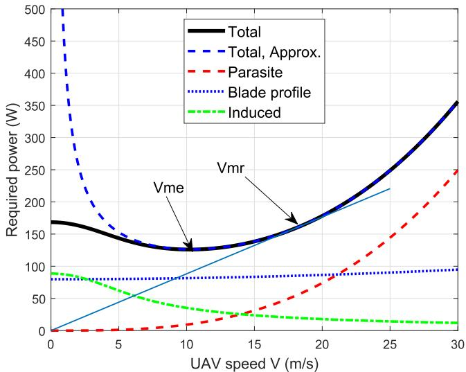

line

| UAV speed V (m/s) | Total | Total, Approx. | Parasite | Blade profile | Induced |
| ----------------- | ----- | -------------- | -------- | ------------- | ------- |
| 0                 | 170   | 500            | 0        | 80            | 90      |
| 5                 | 140   | 150            | 0        | 80            | 60      |
| 10                | 130   | 130            | 10       | 80            | 40      |
| 15                | 140   | 140            | 30       | 80            | 20      |
| 20                | 180   | 180            | 60       | 80            | 15      |
| 25                | 250   | 220            | 100      | 80            | 15      |
| 30                | 350   | 350            | 250      | 100           | 15      |

Fig. 2. Propulsion power consumption versus speed V for rotary-wing UAV.

1) ME Speed: The ME speed $V _ { \mathrm { m e } }$ is the optimal UAV speed methat maximizes the UAV endurance under any given onboard energy E. With E given, the UAV endurance with constant speed V is given by $\textstyle { \frac { E } { P ( V ) } }$ . Thus, $V _ { \mathrm { m e } }$ is the optimal UAV ( ) mespeed that minimizes the power consumption, i.e., $V _ { \mathrm { m e } } ~ =$ arg min $P ( V )$ . Though a closed-form expression for $V _ { \mathrm { m e } }$ =is minV ≥ 0difficult to obtain due to the complicated expression of $P ( V )$ in (12), it can be efficiently found numerically.   
2) MR Speed: On the other hand, the MR speed $V _ { \mathrm { m r } }$ is the mroptimal UAV speed that maximizes the total traveling distance with any given onboard energy E. For any given E, the range with constant traveling speed V can be expressed as $\begin{array} { r } { \frac { E V } { P ( V ) } } \end{array}$ . Define the function

$$
E _ {0} (V) \triangleq \frac {P (V)}{V} = P _ {0} \left(\frac {1}{V} + \frac {3 V}{U _ {\mathrm{tip}} ^ {2}}\right)
$$

$$
+ P _ {i} \left(\sqrt {V ^ {- 4} + \frac {1}{4 v _ {0} ^ {4}}} - \frac {1}{2 v _ {0} ^ {2}}\right) ^ {1 / 2} + \frac {1}{2} d _ {0} \rho s A V ^ {2}, \tag {14}
$$

which physically represents the UAV energy consumption per unit travelling distance in Joule/meter (J/m) with speed $V .$ Thus, $V _ { \mathrm { m r } }$ can be found as $V _ { \mathrm { m r } } = \arg \operatorname* { m i n } _ { V > 0 } E _ { 0 } ( V )$ , which can minV ≥ 0be efficiently found numerically. Alternatively, $V _ { \mathrm { m r } }$ can also be mrobtained graphically based on the power-speed curve $P ( V )$ , ( )by drawing the tangential line from the origin to the power curve that corresponds to the minimum slope (and hence power/speed ratio) [35], as illustrated in Fig. 2. In practice, we usually have $V _ { \mathrm { m e } } \le V _ { \mathrm { m r } } \le V _ { \mathrm { m a x } }$ .

me mr maxWith given UAV trajectory {q t }, the propulsion energy consumption can be expressed as

$$
E _ {1} (T _ {t}, \{\mathbf {q} (t) \}) = \int_ {0} ^ {T _ {t}} P (\| \mathbf {v} (t) \|) d t, \tag {15}
$$

where $\mathbf { v } ( t ) \triangleq { \dot { \mathbf { q } } } ( t )$ is the UAV velocity and $\| \mathbf { v } ( t ) \|$ is the UAV ( ) ˙ ( )speed at time instant t.

By combining both the communication related energy and the propulsion energy, the total UAV energy consumption is

$$
\begin{array}{l} E (T _ {t}, \{\mathbf {q} (t) \}, \{\lambda_ {k} (t) \}) = E _ {1} (T _ {t}, \{\mathbf {q} (t) \}) \\ + P _ {c} \int_ {0} ^ {T _ {t}} \left(\sum_ {k = 1} ^ {K} \lambda_ {k} (t)\right) d t. \tag {16} \\ \end{array}
$$

# C. Problem Formulation for UAV Energy Minimization

Based on the above discussions, the UAV energy minimization problem can be formulated as

$$
\text {(P1)} \colon \quad \min _ {T _ {t}, \{\mathbf {q} (t) \}, \{\lambda_ {k} (t) \}} E (T _ {t}, \{\mathbf {q} (t) \}, \{\lambda_ {k} (t) \})
$$

$$
\text { s.t. } \bar {R} _ {k} (T _ {t}, \{\mathbf {q} (t) \}, \{\lambda_ {k} (t) \}) \geq \tilde {Q} _ {k}, \quad \forall k, \tag {17}
$$

$$
\| \dot {\mathbf {q}} (t) \| \leq V _ {\max}, \quad \forall t \in [ 0, T _ {t} ], \tag {18}
$$

$$
\mathbf {q} (0) = \mathbf {q} _ {I}, \quad \mathbf {q} (T _ {t}) = \mathbf {q} _ {F}, \tag {19}
$$

$$
\lambda_ {k} (t) \in \{0, 1 \}, \quad \forall k \in \mathcal {K}, t \in [ 0, T _ {t} ], \tag {20}
$$

$$
\sum_ {k = 1} ^ {K} \lambda_ {k} (t) \leq 1, \quad \forall t \in [ 0, T _ {t} ], \tag {21}
$$

where $\mathbf q _ { I } , \mathbf q _ { F } \in \mathbb { R } ^ { 2 \times 1 }$ represent the UAV’s initial and final locations projected onto the horizontal plane, respectively. Note that depending on practical application scenarios, the constraints on the initial/final UAV locations in (19) may or may not be present.

Problem  requires optimizing the UAV trajectory $\{ \mathbf { q } ( t ) \}$ (P1)and communication scheduling $\{ \lambda _ { k } ( t ) \}$ , which are ( ) ( )both continuous functions with respect to time t. Therefore, essentially involves infinite number of optimization vari-(P1)ables. Furthermore,  includes a complicated cost function (P1)for the UAV energy consumption, as well as non-convex constraints in (17) and binary constraints in (20). Therefore, is difficult to be directly solved. In Section III, we first (P1)consider the simple fly-hover-communicate protocol to make the problem more tractable, by which  reduces to a (P1)problem with a finite number of optimization variables that only depends on the number of GNs $K$ , instead of the (a priori unknown) mission completion time $T _ { t }$ . Then in Section $^ \mathrm { I V , }$ we propose a general solution to  by utilizing the new (P1)path disretization technique to convert it into a discretized equivalent problem with a finite number of optimization variables, for which a high quality approximate solution can be found via the SCA technique.

# III. FLY-HOVER-COMMUNICATE PROTOCOL

Fly-hover-communicate is a very intuitive protocol that is also easy to implement in practice. In this protocol, the UAV successively visits K optimized hovering locations, each for one GN, and communicates with each GN only when it is hovering at the corresponding location. As a result, problem  reduces to finding the optimal hovering locations (P1)and hovering (communication) time allocations for the K GNs, as well as the optimal flying speed and path connecting these hovering locations. In the following, we first consider the special case with only one GN to draw useful insights, and then extend the study to the general case with multiple GNs.

# A. Optimal Fly-Hover-Communicate Scheme for One GN

For the special case with one single GN, the GN index k is omitted for brevity. Without loss of generality, we assume that the GN is located at the origin with ${ \bf w } = { \bf 0 } ;$ , and the UAV’s initial horizontal location is $\mathbf { q } _ { I } = [ \bar { D } , 0 ] ^ { T }$ =. To illustrate = [ 0]the fundamental trade-off between hovering energy and flying energy minimization, we assume that there is no constraint on the UAV’s final location in this subsection. It is not difficult to see that under such a basic setup, the UAV should only fly along the line segment connecting $\mathbf { q } _ { I }$ and the GN w.

One extreme case of the fly-hover-communicate protocol is that the UAV simply hovers at the initial location $\mathbf { q } _ { I }$ and communicates with the GN until the aggregated information bits reach the target value ${ \tilde { Q } } .$ However, when the initial horizontal distance $\bar { D }$ is large, such a strategy usually leads to a very low data rate and hence requires very long mission completion time $T _ { t } .$ This in turn leads to high UAV hovering and communication energy consumption. Alternatively, the UAV could fly closer to the GN and hover at a certain location with a shorter link distance to achieve a higher data rate. This strategy, though requiring additional energy for UAV traveling, reduces the time for data transmission (or hovering), and hence requires less energy for hovering and communication. Therefore, with the fly-hover-communicate protocol, in order to minimize the total UAV energy consumption, there must exist an optimal UAV hovering location that strikes an optimal balance between minimizing the traveling energy and hovering/communication energy.

Denote by $T _ { \mathrm { t r } }$ the UAV traveling time before reaching the trhovering location and by $V ( t )$ the instantaneous traveling ( )speed towards the GN. Thus, the total traveling distance is $\begin{array} { r } { \dot { D } _ { \mathrm { t r } } = \int _ { 0 } ^ { T _ { \mathrm { t r } } } V ( t ) d t } \end{array}$ , where we should have $0 \leq D _ { \mathrm { t r } } \leq \bar { D }$ . The tr = 0 ( ) 0 ttotal required energy consumption for traveling is

$$
E _ {\mathrm{tr}} (T _ {\mathrm{tr}}, \{V (t) \}) = \int_ {0} ^ {T _ {\mathrm{tr}}} P (V (t)) d t. \tag {22}
$$

Furthermore, the required communication time (or equivalently the UAV hovering time $T _ { \mathrm { h o v } } )$ so that the constraint (11) hois guaranteed can be obtained as

$$
T _ {\mathrm{hov}} = \frac {Q}{\log_ {2} \left(1 + \frac {\gamma}{\left(H ^ {2} + \left(\bar {D} - D _ {\mathrm{tr}}\right) ^ {2}\right) ^ {\alpha}}\right)}, \tag {23}
$$

where $Q \ \triangleq \ { \tilde { Q } } / { B }$ is the bandwidth-normalized throughput requirement in bits/Hz. Thus, the total required UAV hovering and communication energy consumption is

$$
E _ {\mathrm{hc}} (D _ {\mathrm{tr}}) = (P _ {h} + P _ {c}) T _ {\mathrm{hov}} = \frac {(P _ {h} + P _ {c}) Q}{\log_ {2} \left(1 + \frac {\gamma}{(H ^ {2} + (D - D _ {\mathrm{tr}}) ^ {2}) ^ {\alpha}}\right)}. \tag {24}
$$

Therefore, the total UAV energy consumption is

$$
E _ {\mathrm{tot}} (T _ {\mathrm{tr}}, \{V (t) \}, D _ {\mathrm{tr}}) = E _ {\mathrm{tr}} (T _ {\mathrm{tr}}, \{V (t) \}) + E _ {\mathrm{hc}} (D _ {\mathrm{tr}}). \tag {25}
$$

Thus, the energy minimization problem  reduces to

$$
\text {(P2)} \quad \min _ {T _ {\mathrm{tr}}, \{V (t) \}, D _ {\mathrm{tr}}} E _ {\mathrm{tot}} (T _ {\mathrm{tr}}, \{V (t) \}, D _ {\mathrm{tr}})
$$

$$
\text { s.t. } 0 \leq V (t) \leq V _ {\max}, \quad \forall t \in [ 0, T _ {\mathrm{tr}} ],
$$

$$
\int_ {0} ^ {T _ {\mathrm{tr}}} V (t) d t = D _ {\mathrm{tr}},
$$

$$
0 \leq D _ {\mathrm{tr}} \leq \bar {D}. \tag {26}
$$

It is not difficult to see that with the fly-hover-communicate protocol, the scheduling variable λ t in problem  can ( ) (be directly determined once the UAV traveling time $T _ { \mathrm { t r } }$ and hovering time $T _ { \mathrm { h o v } }$ are obtained.

hovLemma 1: The optimal solution to problem  satisfies $T _ { \mathrm { t r } } = D _ { \mathrm { t r } } / V _ { \mathrm { m r } }$ and $V ( t ) = V _ { \mathrm { m r } } , \forall t \in [ 0 , D _ { \mathrm { t r } } / V _ { \mathrm { m r } } ]$ ).

= tr mr ( ) = mr [0 tr mr]Proof: Lemma 1 can be shown by change of variables. The details are omitted for brevity.

Lemma 1 shows that with the fly-hover-communicate protocol, the UAV should travel with a constant speed, which is given by the MR speed, $V _ { \mathrm { m r } }$ . Let $E _ { 0 } ^ { \star } = E _ { 0 } ( V _ { \mathrm { m r } } )$ be the mr 0 = 0( mr)minimum UAV energy consumption per unit traveling distance obtained by substituting $V _ { \mathrm { m r } }$ into (14). Then problem mr (reduces to the following uni-variate optimization problem

$$
\min _ {0 \leq D _ {\mathrm{tr}} \leq \bar {D}} D _ {\mathrm{tr}} E _ {0} ^ {\star} + \frac {(P _ {h} + P _ {c}) Q}{\log_ {2} \left(1 + \frac {\gamma}{(H ^ {2} + (\bar {D} - D _ {\mathrm{tr}}) ^ {2}) ^ {\alpha}}\right)}. \tag {27}
$$

Note that the first term of (27) increases linearly with the traveling distance $D _ { \mathrm { t r } } .$ , while the second term decreases monotonically with $D _ { \mathrm { t r } }$ tr. Therefore, the optimal solution of $D _ { \mathrm { t r } }$ tr trto problem (27) should balance the energy consumption for traveling and hovering, which can be efficiently obtained via a one-dimensional search.

# B. Fly-Hover-Communicate for Multiple GNs

In this subsection, the fly-hover-communicate protocol is extended to the general case with multiple GNs. In this case,  reduces to finding the optimal set of K hovering (P1)locations, each for communicating with one GN, as well as the traveling path and speed among these hovering locations.

Let $\tilde { \mathbf { q } } _ { k } \in \mathbb { R } ^ { 2 \times 1 }$ denote the horizontal coordinate of the UAV ˜hovering location when it communicates with GN k. Then the total required communication time (or the hovering time at location $\tilde { \bf q } _ { k } )$ so that the constraint (11) is guaranteed is

$$
T _ {k} (\tilde {\mathbf {q}} _ {k}) = \frac {Q _ {k}}{\log_ {2} \left(1 + \frac {\gamma_ {k}}{(H ^ {2} + \| \tilde {\mathbf {q}} _ {k} - \mathbf {w} _ {k} \| ^ {2}) ^ {\alpha}}\right)}, \tag {28}
$$

where $Q _ { k } \triangleq { \tilde { Q } } _ { k } / B$ is the normalized throughput requirement in bits/Hz. Thus, the total required hovering and communication energy at the $K$ locations is a function of $\left\{ \tilde { \mathbf { q } } _ { k } \right\}$ , which can be expressed as

$$
\begin{array}{l} E _ {\mathrm{hc}} \left(\left\{\tilde {\mathbf {q}} _ {k} \right\}\right) = \left(P _ {h} + P _ {c}\right) \sum_ {k = 1} ^ {K} T _ {k} \left(\tilde {\mathbf {q}} _ {k}\right) \\ = \sum_ {k = 1} ^ {K} \frac {\left(P _ {h} + P _ {c}\right) Q _ {k}}{\log_ {2} \left(1 + \frac {\gamma_ {k}}{\left(H ^ {2} + \left\| \tilde {\mathbf {q}} _ {k} - \mathbf {w} _ {k} \right\| ^ {2}\right) ^ {\alpha}}\right)}. \tag {29} \\ \end{array}
$$

On the other hand, the total required traveling energy depends on the total traveling distance $D _ { \mathrm { t r } }$ to visit all the K hovering locations $\left\{ \tilde { \mathbf { q } } _ { k } \right\}$ tr, as well as the traveling speed $V ( t )$ ˜ ( )among them. Similar to Lemma 1, it can be shown that with the fly-hover-communicate protocol, the UAV should always travel with the MR speed $V _ { \mathrm { m r } }$ . Furthermore, for any given set of hovering locations $\left\{ \tilde { \mathbf { q } } _ { k } \right\}$ and initial/final locations $\mathbf { q } _ { I }$ and $\mathbf { q } _ { F }$ ˜, the total traveling distance $D _ { \mathrm { t r } }$ depends on the visiting order of all the $K$ trlocations, which can be represented by the permutation variables $\pi ( k ) \in \{ 1 , \cdot \cdot \cdot , K \}$ . Specifically, $\pi ( k )$ ( ) 1 ( )gives the index of the kth GN served by the UAV. Therefore, we have

$$
D _ {\mathrm{tr}} \left(\{\tilde {\mathbf {q}} _ {k} \}, \{\pi (k) \}\right) = \sum_ {k = 0} ^ {K} \| \tilde {\mathbf {q}} _ {\pi (k + 1)} - \tilde {\mathbf {q}} _ {\pi (k)} \|, \tag {30}
$$

where for convenience, we have defined $\tilde { \mathbf { q } } _ { \pi ( 0 ) } = \mathbf { q } _ { I }$ and $\tilde { \mathbf { q } } _ { \pi ( K + 1 ) } = \mathbf { q } _ { F }$ ˜ (0) =. Thus, the total required UAV traveling energy ˜ ( +1) =with the optimal traveling speed $V _ { \mathrm { m r } }$ can be written as

$$
E _ {\mathrm{tr}} \left(\{\tilde {\mathbf {q}} _ {k} \}, \{\pi (k) \}\right) = E _ {0} ^ {\star} D _ {\mathrm{tr}} \left(\{\tilde {\mathbf {q}} _ {k} \}, \{\pi (k) \}\right). \tag {31}
$$

The total UAV energy consumption is thus given by

$$
E _ {\text { tot }} \left(\{\tilde {\mathbf {q}} _ {k} \}, \{\pi (k) \}\right) = E _ {\mathrm{hc}} (\{\tilde {\mathbf {q}} _ {k} \}) + E _ {\mathrm{tr}} \left(\{\tilde {\mathbf {q}} _ {k} \}, \{\pi (k) \}\right). \tag {32}
$$

As a result, the energy minimization problem  with the fly-hover-communicate protocol reduces to

$$
\text {(P3)} \colon \quad \min _ {\{\tilde {\mathbf {q}} _ {k} \}, \{\pi (k) \}} E _ {\mathrm{tot}} \left(\{\tilde {\mathbf {q}} _ {k} \}, \{\pi (k) \}\right)
$$

$$
\text { s.t. } \left[ \pi (1), \dots , \pi (K) \right] \in \mathcal {P}, \tag {33}
$$

where P represents the set of all the K possible permutations !for the K GNs. Note that with the fly-hover-communicate protocol, the user scheduling parameter $\{ \lambda _ { k } ( t ) \}$ in (P1) can ( )be directly obtained based on the solution to .

(P3)Problem  is a non-convex optimization problem, whose (P3)optimal solution is difficult to obtain. In fact, even with fixed hovering locations $\left\{ \widetilde { \mathbf { q } } _ { k } \right\}$ , problem  reduces to the classic ˜ (P3)TSP [36] with pre-determined initial and final locations [29], which is known to be NP hard. Therefore, problem (P3)is also NP hard. Fortunately, by utilizing the techniques for solving TSP and applying convex optimization, an efficient approximate solution to  can be obtained.

(P3)To this end, we first introduce the slack variables $D _ { \mathrm { t r } }$ and $z _ { k } = \| \tilde { \mathbf { q } } _ { k } - \mathbf { w } _ { k } \| ^ { 2 }$ tr, by which problem  can be equivalently = ˜written as

$$
\min _ {D _ {\mathrm{tr}}, \{\tilde {\mathbf {q}} _ {k}, \pi (k), z _ {k} \}} E _ {0} ^ {\star} D _ {\mathrm{tr}} + \sum_ {k = 1} ^ {K} \frac {(P _ {h} + P _ {c}) Q _ {k}}{\log_ {2} \left(1 + \frac {\gamma_ {k}}{(H ^ {2} + z _ {k}) ^ {\alpha}}\right)} \tag {P3.1}
$$

$$
\text { s.t. } \left[ \pi (1), \dots , \pi (K) \right] \in \mathcal {P}, \tag {34}
$$

$$
\sum_ {k = 0} ^ {K} \left\| \tilde {\mathbf {q}} _ {\pi (k + 1)} - \tilde {\mathbf {q}} _ {\pi (k)} \right\| \leq D _ {\mathrm{tr}}, \tag {35}
$$

$$
\left\| \tilde {\mathbf {q}} _ {k} - \mathbf {w} _ {k} \right\| ^ {2} \leq z _ {k}, \quad \forall k. \tag {36}
$$

Note that at the optimal solution to . , all the constraints (P3 1)in (35) and (36) must be satisfied with strict equality, since otherwise, we may reduce $D _ { \mathrm { t r } }$ or $z _ { k }$ to further reduce the cost function of . .

(P3 1)Problem . can be interpreted as follows. For each GN $k ,$ (P3 1) constraint (36) specifies a disk region centered at the GN location $\mathbf { w } _ { k }$ with radius $\sqrt { z _ { k } }$ . The smaller $z _ { k }$ is, the shorter the communication link distance between the UAV and GN $k ,$ and hence the less hovering-and-communication energy required (the second term of the cost function in $( \mathrm { P 3 . 1 } ) )$ . However, due to constraint $( 3 5 ) ,$ , this would gener-(P3 1)ally require longer traveling distance $D _ { \mathrm { t r } }$ and hence more traveling energy. In fact, for any fixed $\left\{ z _ { k } \right\}$ such that the hovering-and-communication energy is fixed, problem . (P3 1)essentially reduces to minimizing the total traveling distance $D _ { \mathrm { t r } } .$ , while ensuring that each of the hovering location $\tilde { \mathbf { q } } _ { k }$ trhas a distance no greater than $\sqrt { z _ { k } }$ ˜from the GN k. This is essentially the classical TSPN, with pre-determined initial and final locations. TSPN is a generalization of the TSP and hence is NP hard as well, where both the visiting order $\{ \pi ( k ) \}$ and the locations $\left\{ \tilde { \mathbf { q } } _ { k } \right\}$ inside the disk region need ( ) ˜to be optimized. One effective method for solving TSPN is to firstly ignore the disk radius and solve the $\mathrm { T S P }$ problem over the K GN locations $\left\{ \mathbf { w } _ { k } \right\}$ to obtain the visiting order $[ \hat { \pi } ( 1 ) , \cdots , \hat { \pi } ( K ) ]$ [29]. Though NP hard, TSP can be approx-[ˆ(1) ˆ( )]imately solved with high-quality solutions by many existing algorithms [37]. As such, the TSPN then reduces to finding the optimal waypoints $\left\{ \tilde { \mathbf { q } } _ { k } \right\}$ with the obtained order $\left\{ \hat { \pi } _ { k } \right\}$ , which ˜ ˆis a convex optimization problem and hence can be optimally solved [29].

With the above idea, an efficient algorithm is proposed to solve problem . . Specifically, the visiting order $\{ \pi ( k ) \}$ is firstly set as $\{ \hat { \pi } ( k ) \}$ ( )obtained by solving the TSP over the GNs’ locations $\left\{ \mathbf { w } _ { k } \right\}$ . As such, problem . reduces to

$$
\min _ {D _ {\mathrm{tr}}, \{\tilde {\mathbf {q}} _ {k} \}, \{\eta_ {k} \}} E _ {0} ^ {\star} D _ {\mathrm{tr}} + \sum_ {k = 1} ^ {K} \frac {(P _ {h} + P _ {c}) Q _ {k}}{\eta_ {k}} \tag {P3.2}
$$

$$
\text { s.t. } \sum_ {k = 0} ^ {K} \| \tilde {\mathbf {q}} _ {\hat {\pi} (k + 1)} - \tilde {\mathbf {q}} _ {\hat {\pi} (k)} \| \leq D _ {\mathrm{tr}}, \tag {37}
$$

$$
\eta_ {k} \geq 0, \quad \forall k, \tag {38}
$$

$$
\eta_ {k} \leq \log_ {2} \left(1 + \frac {\gamma_ {k}}{(H ^ {2} + \| \tilde {\mathbf {q}} _ {k} - \mathbf {w} _ {k} \| ^ {2}) ^ {\alpha}}\right),
$$

$$
\forall k, \tag {39}
$$

where we have introduced the slack variables $\{ \eta _ { k } \}$ . It is noted that the cost function of . and constraints (37)–(38) are (P3 2)all convex. However, the newly introduced constraint (39) is non-convex. Fortunately, with similar derivation as in [24] and [26], for any given local point $\{ \tilde { \mathbf { q } } _ { k } ^ { ( l ) } \}$ (l)k } at the lth iteration, a global concave lower bound can be obtained for the RHS of (39) as

$$
\log_ {2} \left(1 + \frac {\gamma_ {k}}{(H ^ {2} + \| \tilde {\mathbf {q}} _ {k} - \mathbf {w} _ {k} \| ^ {2}) ^ {\alpha}}\right) \geq R _ {k} ^ {(l)} (\tilde {\mathbf {q}} _ {k}), \tag {40}
$$

where

$$
R _ {k} ^ {(l)} (\tilde {\mathbf {q}} _ {k}) = \log_ {2} \left(1 + \frac {\gamma_ {k}}{(H ^ {2} + \| \tilde {\mathbf {q}} _ {k} ^ {(l)} - \mathbf {w} _ {k} \| ^ {2}) ^ {\alpha}}\right)
$$

$$
- \beta_ {k} \left(\| \tilde {\mathbf {q}} _ {k} - \mathbf {w} _ {k} \| ^ {2} - \| \tilde {\mathbf {q}} _ {k} ^ {(l)} - \mathbf {w} _ {k} \| ^ {2}\right), \tag {41}
$$

Algorithm 1 SCA-Based Algorithm for Solving .   
1: Initialization: set the initial hovering locations $\{\tilde{\mathbf{q}}_k^{(0)}\}$ . Let $l = 0$ .
2: repeat
3: Solve the convex problem (P3.3) and denote the optimal solution as $D_{\mathrm{tr}}^*, \{\tilde{\mathbf{q}}_k^*\}, \{\eta_k^*\}$ .
4: Update the local point as $\tilde{\mathbf{q}}_k^{(l+1)} = \tilde{\mathbf{q}}_k^*, \forall k \in \mathcal{K}$ .
5: Update $l = l + 1$ .
6: until the fractional decrease of the objective value of (P3.2) is below a given threshold $\epsilon$ .

$$
\text { with } \beta_ {k} = \frac {(\log_ {2} e) \gamma_ {k} \alpha}{(H ^ {2} + \| \tilde {\mathbf {q}} _ {k} ^ {(l)} - \mathbf {w} _ {k} \| ^ {2}) [ (H ^ {2} + \| \tilde {\mathbf {q}} _ {k} ^ {(l)} - \mathbf {w} _ {k} \| ^ {2}) ^ {\alpha} + \gamma_ {k} ]}.
$$

By replacing the RHS of (39) with its lower bound, we have the following problem:

$$
\begin{array}{l} \min _ {D _ {\mathrm{tr}}, \{\tilde {\mathbf {q}} _ {k} \}, \{\eta_ {k} \}} E _ {0} ^ {\star} D _ {\mathrm{tr}} + \sum_ {k = 1} ^ {K} \frac {(P _ {h} + P _ {c}) Q _ {k}}{\eta_ {k}} (P3.3) \\ \text { s.t. } (3 7) - (3 8), \\ \eta_ {k} \leq R _ {k} ^ {(l)} (\tilde {\mathbf {q}} _ {k}), \quad \forall k. (42) \\ \end{array}
$$

It can be verified that problem . is convex, which can (P3 3)thus be efficiently solved by existing convex optimization toolbox such as CVX [39]. Furthermore, due to the global lower bound in (40), the optimal value of . provides (P3 3)an upper bound to that of . . By successively updating the local point $\{ \tilde { \mathbf { q } } _ { k } ^ { ( l ) } \}$ (P3 2), the SCA-based algorithm for solving ˜. is summarized in Algorithm 1.

P3 2)By following similar arguments as in [26] and [40], it can be shown that Algorithm 1 is guaranteed to converge to at least a solution to problem . that satisfies the KKT conditions.

# IV. GENERAL SOLUTION TO  WITH PATH (P1)DISCRETIZATION AND SCA

The fly-hover-communicate protocol in the preceding section gives an efficient solution to , where the number (P1)of optimization variables only depends on K, rather than the mission completion time $T _ { t } .$ However, this protocol is strictly sub-optimal since the UAV does not communicate while flying and it has only binary flying status. In this section, we propose a general solution to  without such assumption (P1)via jointly optimizing the UAV trajectory and communication time allocation.

# A. Path Discretization

Problem  essentially involves an infinite number of (P1)optimization variables coupled in continuous-time functions $\mathbf { q } ( t )$ and $\lambda _ { k } ( t )$ , as well as the unknown mission completion ( )time $T _ { t } .$ ( ) thus making it difficult to be directly solved. To obtain a more tractable form with a finite number of optimization variables,  can be reformulated by disretizing the variables $\{ \mathbf { q } ( t ) \}$ (Pand $\{ \lambda _ { k } ( t ) \}$ . To this end, prior works such as [24] ( ) ( )and [26] mostly adopted the method of time discretization, where the time horizon , Tt is discretized into a finite [0 ]number of time slots with sufficiently small slot length $\delta _ { t } .$ . However, this method requires that the UAV mission completion time $T _ { t }$ to be pre-specified, which is not the case for our considered energy minimization problem with $T _ { t }$ being an optimization variable as well. One method to address the above issue is by firstly assuming a certain operation time $T _ { t } .$ , based on which the time discretization method is applied to solve the corresponding optimization problem, and then exhaustively search for the optimal $T _ { t }$ . However, this would require to solve a prohibitively large number of optimization problems, each for a given assumed $T _ { t } .$ , thus making it impractical especially when the optimal $T _ { t }$ is moderately large. To address this issue, in the following, we propose an alternative discretization method, called path discretization, with which only one optimization problem needs to be solved.

We first clarify the terminologies of trajectory versus path. Generally, a path specifies the route that the UAV follows, i.e., all locations along the UAV trajectory, and it does not involve the time dimension. On the other hand, a trajectory includes its path together with the instantaneous travelling speed along the path, and thus it involves the time dimension. With path discretization, the UAV path (instead of time) is discretized into M  line segments, which are represented by $M + 2$ waypoints $\{ \mathbf { q } _ { m } \} _ { m = 0 } ^ { M + 1 }$ , with ${ \bf q } _ { 0 } = { \bf q } _ { I }$ and $\mathbf { q } _ { M + 1 } = \mathbf { q } _ { F }$ . + 2 =0 0We impose the following constraints:

$$
\left\| \mathbf {q} _ {m + 1} - \mathbf {q} _ {m} \right\| \leq \Delta_ {\max}, \quad \forall m, \tag {43}
$$

where $\Delta _ { \mathrm { m a x } }$ is an appropriately chosen value so that within Δmaxeach line segment, the UAV is assumed to fly with a constant velocity and the distance between the UAV and each GN is approximately unchanged. For instance, $\Delta _ { \mathrm { m a x } }$ could be chosen such that $\Delta _ { \operatorname* { m a x } } \ll H$ . Let $T _ { m }$ Δmaxdenote the duration Δmaxthat the UAV remains in the mth line segment. The UAV flying velocity along the mth line segment is thus given by $\begin{array} { r } { \bar { \bf v } _ { m } ~ = ~ \frac { \bar { \bf q } _ { m + 1 } - { \bf q } _ { m } } { T _ { m } } } \end{array}$ Tm , ∀m. Furthermore, the total mission completion time $T _ { t }$ is given by $\begin{array} { r } { T _ { t } = \sum _ { m = 0 } ^ { M } T _ { m } } \end{array}$ .

= =0As a result, with path discretization, the UAV trajectory $\{ \mathbf { q } ( t ) \}$ is represented by the $M + 2$ waypoints $\{ \mathbf { q } _ { m } \} _ { m = 0 } ^ { M + 1 }$ , ( )together with the duration $\{ T _ { m } \} _ { m = 0 } ^ { M }$ =0 representing the time =0that the UAV spends within each line segment. With the given $\Delta _ { \mathrm { m a x } } ,$ M is chosen to be sufficiently large so that $( M + 1 ) \Delta _ { \mathrm { m a x } } \geq \hat { D }$ , where $\hat { D }$ is an upper bound of the required ( +1)Δmaxtotal UAV flying distance. Note that the time discretization and path discretization approaches share some similarities conceptually, i.e., they both optimize a sequence of sampling points to approximate the continuous trajectory. However, time discretization fixes the time interval, while path discretization has the flexibility to determine the time intervals adaptively. The advantage of path discretization over time discretization is mainly twofold. Firstly, different from time discretization, path discretization does not require to specify the mission completion time $T _ { t }$ in advance, as it can be directly determined once $\{ T _ { m } \}$ are obtained. Secondly, path discretization is able to save the number of optimization variables when the UAV needs to hover or fly with low speed for a significant portion of the operation duration. For instance, consider the scenario that the UAV needs to hover at a particular location for 1000 seconds. If time discretization approach is used (say with time interval  second), then we need 1000 variables $\mathbf { q } [ 1 ] , \cdots \mathbf { q } [ 1 0 0 0 ]$ (all are equal) to represent this status, even [1] [1000]though the UAV remains stationary. In contrast, with path discretization, only three variables are sufficient, namely q and q (with $\mathbf { q } _ { 1 } = \mathbf { q } _ { 2 } )$ 1 representing the hovering location and $T _ { 1 }$ representing the total hovering duration.

1The distance between the UAV at the mth line segment and each GN k can be written as $\begin{array} { r l } { d _ { m k } } & { { } = } \end{array}$ $\sqrt { H ^ { 2 } + \| \mathbf { q } _ { m } - \mathbf { w } _ { k } \| ^ { 2 } } , \forall k , m$ =, and the corresponding rate +expression in (11) can be expressed as

$$
R _ {m k} = B \log_ {2} \left(1 + \frac {\gamma_ {k}}{(H ^ {2} + \| \mathbf {q} _ {m} - \mathbf {w} _ {k} \| ^ {2}) ^ {\alpha}}\right). \tag {44}
$$

Furthermore, for each line segment m along the UAV path, with TDMA among the K GNs, let $\tau _ { m k } ~ \geq ~ 0$ denote the 0allocated time for the UAV to communicate with GN k. Then constraint (6) can be written as $\begin{array} { r } { \sum _ { k = 1 } ^ { K } \tau _ { m k } \ \le \ T _ { m } } \end{array}$ , ∀m ∈ $\{ 0 , \cdots , M \}$ .

The aggregated communication throughput for GN k in (11) can be written as

$$
\begin{array}{l} \bar {R} _ {k} (\{\mathbf {q} _ {m} \}, \{\tau_ {m k} \}) \\ = B \sum_ {m = 0} ^ {M} \tau_ {m k} \log_ {2} \left(1 + \frac {\gamma_ {k}}{(H ^ {2} + \| \mathbf {q} _ {m} - \mathbf {w} _ {k} \| ^ {2}) ^ {\alpha}}\right). \tag {45} \\ \end{array}
$$

Furthermore, the UAV energy consumption in (16) can be written as (46) shown at the top of the next page, where $\Delta _ { m } \triangleq { \frac { \Delta } { m } }$ $\| \mathbf { q } _ { m + 1 } - \mathbf { q } _ { m } \|$ Δis the length of the mth line segment. Note that +1in (46), we have used the expression (12) and the fact that the UAV speed at the mth line segment is $\Vert \mathbf { v } _ { m } \Vert = \Delta _ { m } / T _ { m }$ .

= ΔAs a result, the energy minimization problem  can be expressed in the discrete form as

$$
\begin{array}{l} \text {(P4)} \colon \quad \min _ {\{\mathbf {q} _ {m} \}, \{T _ {m} \}, \{\tau_ {m k} \}} E (\{T _ {m} \}, \{\mathbf {q} _ {m} \}, \{\tau_ {m k} \}) \\ \mathrm{s.t.} \sum_ {m = 0} ^ {M} \tau_ {m k} \log_ {2} \\ \times \left(1 + \frac {\gamma_ {k}}{(H ^ {2} + \| \mathbf {q} _ {m} - \mathbf {w} _ {k} \| ^ {2}) ^ {\alpha}}\right) \geq Q _ {k}, \\ \forall k, \tag {47} \\ \end{array}
$$

$$
\left\| \mathbf {q} _ {m + 1} - \mathbf {q} _ {m} \right\| \leq \min \left\{\Delta_ {\max}, T _ {m} V _ {\max} \right\},
$$

$$
m = 1, \dots , M, \tag {48}
$$

$$
\mathbf {q} _ {0} = \mathbf {q} _ {I}, \quad \mathbf {q} _ {M + 1} = \mathbf {q} _ {F}, \tag {49}
$$

$$
\sum_ {k = 1} ^ {K} \tau_ {m k} \leq T _ {m}, \quad m = 0, \dots , M, \tag {50}
$$

$$
\tau_ {m k} \geq 0, \quad \forall k \in \mathcal {K}, m = 0, \dots , M, \tag {51}
$$

where (48) corresponds to the maximum UAV speed constraint as well as the maximum segment length constraint.

Notice that in problem , the constraints (48)–(51) (P4)are all convex. However, both the cost function $E ( \{ T _ { m } \}$ , $\{ \mathbf { q } _ { m } \} , \{ \tau _ { m k } \} )$ (in (46) and the throughput constraint (47) are )non-convex. Therefore, problem  is non-convex and it is (P4)difficult to find its globally optimal solution. In the following, we propose an efficient algorithm to find a high quality solution to  based on the SCA technique.

# B. Proposed Solution to P4

Firstly, we deal with the non-convex cost function of . (P4)A closer look at the expression in (46) reveals that the first, third, and fourth terms are all convex functions with the respect to $\{ \mathbf { q } _ { m } \} , \ \{ T _ { m } \}$ , and $\tau _ { m k }$ , which can be shown by using the fact that perspective operation preserves convexity [41]. However, the second term is non-convex. To tackle this issue, we introduce slack variables $\{ y _ { m } \ge 0 \}$ such that

$$
y _ {m} ^ {2} = \sqrt {T _ {m} ^ {4} + \frac {\Delta_ {m} ^ {4}}{4 v _ {0} ^ {4}}} - \frac {\Delta_ {m} ^ {2}}{2 v _ {0} ^ {2}}, \quad \forall m, \tag {52}
$$

which is equivalent to

$$
\frac {T _ {m} ^ {4}}{y _ {m} ^ {2}} = y _ {m} ^ {2} + \frac {\Delta_ {m} ^ {2}}{v _ {0} ^ {2}}, \forall m. \tag {53}
$$

Therefore, the second term of (46) can be replaced by the linear expression $P _ { i } \sum _ { m = 0 } ^ { M } y _ { m }$ , with the additional constraint (53).

On the other hand, to deal with the non-convex constraint (47), we introduce slack variables $\{ A _ { m k } \}$ such that

$$
A _ {m k} ^ {2} = \tau_ {m k} \log_ {2} \left(1 + \frac {\gamma_ {k}}{(H ^ {2} + \| \mathbf {q} _ {m} - \mathbf {w} _ {k} \| ^ {2}) ^ {\alpha}}\right). \tag {54}
$$

M As a result, the constraint (47) can be equivalently written as $\textstyle \sum _ { m = 0 } ^ { M } A _ { m k } ^ { 2 } \geq Q _ { k }$ , ∀k. With the above manipulations, (P4) =0can be written as

$$
\min_{\substack{\{\mathbf{q}_{m}\} ,\{T_{m}\} ,\{\tau_{mk}\} \\ \{y_{m}\} ,\{A_{mk}\}}}P_{0}\sum_{m = 0}^{M}\left(T_{m} + \frac{3\Delta_{m}^{2}}{U_{\text{tip}}^{2}T_{m}}\right) \tag{P4.1}
$$

$$
+ P _ {i} \sum_ {m = 0} ^ {M} y _ {m}
$$

$$
+ \frac {1}{2} d _ {0} \rho s A \sum_ {m = 0} ^ {M} \frac {\Delta_ {m} ^ {3}}{T _ {m} ^ {2}}
$$

$$
+ P _ {c} \sum_ {m = 0} ^ {M} \sum_ {k = 1} ^ {K} \tau_ {m k}
$$

$$
\text { s.t. } \sum_ {m = 0} ^ {M} A _ {m k} ^ {2} \geq Q _ {k}, \quad \forall k, \tag {55}
$$

$$
\frac {T _ {m} ^ {4}}{y _ {m} ^ {2}} \leq y _ {m} ^ {2} + \frac {\left\| \mathbf {q} _ {m + 1} - \mathbf {q} _ {m} \right\| ^ {2}}{v _ {0} ^ {2}}, \quad \forall m, \tag {56}
$$

$$
\frac {A _ {m k} ^ {2}}{\tau_ {m k}} \leq \log_ {2}
$$

$$
\times \left(1 + \frac {\gamma_ {k}}{(H ^ {2} + \| \mathbf {q} _ {m} - \mathbf {w} _ {k} \| ^ {2}) ^ {\alpha}}\right),
$$

$$
\forall m, k, \tag {57}
$$

$$
y _ {m} \geq 0, \quad \forall m, \tag {58}
$$

$$
(4 8) - (5 1).
$$

Note that in . , the constraints (56) and (57) are obtained (P4 1)from (53) and (54) by replacing the equality sign with inequality constraints. This does not affect the equivalence between problem  and . . To see this, suppose that (P4) (P4 1)at the optimal solution to . , if any of the constraint

$$
\begin{array}{l} E \left(\left\{T _ {m} \right\}, \left\{\mathbf {q} _ {m} \right\}, \left\{\tau_ {m k} \right\}\right) = \sum_ {m = 0} ^ {M} T _ {m} P \left(\frac {\Delta_ {m}}{T _ {m}}\right) + P _ {c} \sum_ {m = 0} ^ {M} \sum_ {k = 1} ^ {K} \tau_ {m k} \\ = P _ {0} \sum_ {m = 0} ^ {M} \left(T _ {m} + \frac {3 \Delta_ {m} ^ {2}}{U _ {\mathrm{tip}} ^ {2} T _ {m}}\right) + P _ {i} \sum_ {m = 0} ^ {M} \left(\sqrt {T _ {m} ^ {4} + \frac {\Delta_ {m} ^ {4}}{4 v _ {0} ^ {4}}} - \frac {\Delta_ {m} ^ {2}}{2 v _ {0} ^ {2}}\right) ^ {1 / 2} \\ + \frac {1}{2} d _ {0} \rho s A \sum_ {m = 0} ^ {M} \frac {\Delta_ {m} ^ {3}}{T _ {m} ^ {2}} + P _ {c} \sum_ {m = 0} ^ {M} \sum_ {k = 1} ^ {K} \tau_ {m k}, \tag {46} \\ \end{array}
$$

in (56) is satisfied with strict inequality, then we may reduce the corresponding value of the slack variable $y _ { m }$ to make the constraint (56) satisfied with strict equality, and at the same time reduce the cost function. Therefore, at the optimal solution to . , all constraints in (56) must be satisfied (P4 1)with equality. Similarly, there always exists an optimal solution to . that makes all constraints in (57) satisfied (P4 1)with equality as well. Thus, problem  and . are equivalent.

Problem . is still non-convex due to the non-convex (P4 1)constraints (55)–(57). However, all these three constraints can be effectively handled with the SCA technique by deriving the global lower bounds at a given local point. Specifically, for the constraint (55), it is noted that the left hand side (LHS) is a convex function with respect to $A _ { m k }$ . By using the fact that the first-order Taylor expansion is a global lower bound of a convex function, we have the following inequality

$$
A _ {m k} ^ {2} \geq A _ {m k} ^ {(l) 2} + 2 A _ {m k} ^ {(l)} (A _ {m k} - A _ {m k} ^ {(l)}), \tag {59}
$$

wher e A(l) $A _ { m k } ^ { ( l ) }$ is the value of $A _ { m k }$ at the lth iteration.

Similarly, for the non-convex constraint (56), the LHS is already a jointly convex function with respect to $y _ { m }$ and $T _ { m } ,$ and the RHS of the inequality constraint is also a convex function. By applying the first-order Taylor expansion of the RHS, the following global lower bound can be obtained (60) shown at the bottom of the next page,

where y( )m $y _ { m } ^ { ( l ) }$ and $\mathbf { q } _ { m } ^ { ( l ) }$ are the current value of the corresponding variables at the lth iteration.

Furthermore, for the non-convex constraint (57), the LHS is already a jointly convex function with respect to $A _ { m k }$ and $\tau _ { m k }$ . In addition, similar to (40), for any given local point $\{ \mathbf { q } _ { m } ^ { ( l ) } \}$ at the lth iteration, a global concave lower bound can be obtained for the RHS of (57) as

$$
\log_ {2} \left(1 + \frac {\gamma_ {k}}{(H ^ {2} + \| \mathbf {q} _ {m} - \mathbf {w} _ {k} \| ^ {2}) ^ {\alpha}}\right) \geq R _ {m k} ^ {(l)} (\mathbf {q} _ {m}), \tag {61}
$$

where

$$
\begin{array}{l} R _ {m k} ^ {(l)} (\mathbf {q} _ {m}) = \log_ {2} \left(1 + \frac {\gamma_ {k}}{(H ^ {2} + \| \mathbf {q} _ {m} ^ {(l)} - \mathbf {w} _ {k} \| ^ {2}) ^ {\alpha}}\right) \\ - \beta_ {m k} \left(\| \mathbf {q} _ {m} - \mathbf {w} _ {k} \| ^ {2} - \| \mathbf {q} _ {m} ^ {(l)} - \mathbf {w} _ {k} \| ^ {2}\right), \tag {62} \\ \end{array}
$$

$\begin{array} { r } { \mathrm { w i t h ~ } \beta _ { m k } = \frac { ( \log _ { 2 } e ) \gamma _ { k } \alpha } { ( H ^ { 2 } + \| \mathbf { q } _ { m } ^ { ( l ) } - \mathbf { w } _ { k } \| ^ { 2 } ) [ ( H ^ { 2 } + \| \mathbf { q } _ { m } ^ { ( l ) } - \mathbf { w } _ { k } \| ^ { 2 } ) ^ { \alpha } + \gamma _ { k } ] } . } \end{array}$ with βmk

By replacing the non-convex constraints (55)–(57) of . (P4 1)with their corresponding lower bounds at the lth iteration obtained above, we have the following optimization problem:

$$
\text{(P4.2)}:\quad \min_{\substack{\{\mathbf{q}_{m}\} ,\{T_{m}\} ,\{\tau_{mk}\} \\ \{y_{m}\} ,\{A_{mk}\}}}P_{0}\sum_{m = 0}^{M}\left(T_{m} + \frac{3\Delta_{m}^{2}}{U_{\mathrm{tip}}^{2}T_{m}}\right)
$$

$$
+ P _ {i} \sum_ {m = 0} ^ {M} y _ {m}
$$

$$
+ \frac {1}{2} d _ {0} \rho s A \sum_ {m = 0} ^ {M} \frac {\Delta_ {m} ^ {3}}{T _ {m} ^ {2}}
$$

$$
+ P _ {c} \sum_ {m = 0} ^ {M} \sum_ {k = 1} ^ {K} \tau_ {m k}
$$

$$
\text { s.t. } \sum_ {m = 0} ^ {M} \left(A _ {m k} ^ {(l) 2} + 2 A _ {m k} ^ {(l)} (A _ {m k} - A _ {m k} ^ {(l)})\right)
$$

$$
\geq Q _ {k}, \quad \forall k,
$$

$$
\frac {T _ {m} ^ {4}}{y _ {m} ^ {2}} \leq y _ {m} ^ {(l) 2} + 2 y _ {m} ^ {(l)} (y _ {m} - y _ {m} ^ {(l)})
$$

$$
- \frac {\| \mathbf {q} _ {m + 1} ^ {(l)} - \mathbf {q} _ {m} ^ {(l)} \| ^ {2}}{v _ {0} ^ {2}}
$$

$$
+ \frac {2}{v _ {0} ^ {2}} (\mathbf {q} _ {m + 1} ^ {(l)} - \mathbf {q} _ {m} ^ {(l)}) ^ {T} (\mathbf {q} _ {m + 1} - \mathbf {q} _ {m}),
$$

$$
\forall m,
$$

$$
\frac {A _ {m k} ^ {2}}{\tau_ {m k}} \leq R _ {m k} ^ {(l)} (\mathbf {q} _ {m}), \forall m, k,
$$

$$
y _ {m} \geq 0, \quad \forall m,
$$

$$
(4 8) - (5 1).
$$

It can be verified that problem . is a convex optimiza-(P4 2)tion problem, which can thus be efficiently solved by using standard convex optimization techniques or existing software toolbox such as CVX. Note that due to the global lower bounds in (59)–(61), if the constraints of problem . are satisfied, (P4 2)then those for the original problem . are guaranteed to (P4 1)be satisfied as well, but the reverse is not necessarily true. Thus, the feasible region of . is in general a subset of (P4 2)that for . , and the optimal value of . provides an upper bound to that of . . By successively updating the local point at each iteration via solving . , an efficient algorithm is obtained for the non-convex optimization problem . or its original problem . The algorithm is (P4 1)summarized as Algorithm 2.

By following similar arguments as in [26] and [40], it can be shown that Algorithm 2 is guaranteed to converge to at least a solution that satisfies the KKT conditions of problem . .

# Algorithm 2 SCA-Based Algorithm for

1: Initializatio in a feasible $\{ \mathbf { q } _ { m } ^ { ( 0 ) } \} , \{ T _ { m } ^ { ( 0 ) } \}$ (0)m } , and $\{ \tau _ { m k } ^ { ( 0 ) } \}$ $l = 0 .$   
(P4)2: repeat   
3: Calculate the current values $\{ y _ { m } ^ { ( l ) } \}$ and $\{ A _ { m k } ^ { ( l ) } \}$ based on (52) and (54), respectively.   
4: Solve the convex problem . , and denote the optimal solution as $\{ \mathbf { q } _ { m } ^ { * } \} , \{ T _ { m } ^ { * } \} , \{ \tau _ { m k } ^ { * } \}$ .   
5: Update the local point $\mathbf { q } _ { m } ^ { ( l + 1 ) } = \mathbf { q } _ { m } ^ { * } , T _ { m } ^ { ( l + 1 ) } = T _ { m } ^ { * }$ m, and $\tau _ { m k } ^ { ( l + 1 ) } = \tau _ { m k } ^ { * } .$   
6: Update $l = l + 1$   
= + 17: until the fractional decrease of the objective value of . is below a given threshold .

Remark 1: While Algorithm 2 is proposed to minimize the UAV energy consumption, it can be similarly applied for UAV communication with other design metrics, such as the mission completion time minimization problem as considered in the $\textstyle \sum _ { m = 0 } ^ { M } { \bar { T _ { m } } }$ ection, by replacing the cost function of (P4) with.

# V. NUMERICAL RESULTS

This section provides numerical results to validate the proposed designs. The UAV altitude is set as $H = 1 0 0 \mathrm { ~ m ~ }$ , =which complies with the FAA regulation that small unmanned aircrafts should not fly over 400 feet (122 m) [42]. The total communication bandwidth is $B = 1$ MHz. The transmit power is set as $P = 2 0$ = dBm, and the reference SNR is obtained as $\tilde { \gamma } _ { 0 } = 5 2 . 5 \mathrm { d B }$ . The communication-related power consumption ˜0 =at the UAV is fixed as $P _ { c } = 5 ~ \mathrm { W }$ [43], which includes all =other UAV power consumption except the propulsion power. Note that all results in Figs. 3–6 are based on the general probabilistic LoS channel model, whereas that in Fig. 7 is obtained for the special free-space channel model. Unless otherwise stated, the modeling parameters for the probabilistic LoS channel model in (3) are set as $C ~ = ~ 1 0 , ~ D ~ = ~ 0 . 6$ , $\begin{array} { r } { \kappa \ = \ 0 . 2 . } \end{array}$ , and $\tilde { \alpha } \ = \ 2 . 3$ . Furthermore, the homogeneous = 0 2 ˜ = 2 3regularized LoS probability $\bar { P } _ { k , \mathrm { L o S } }$ in (11) is set as the value corresponding to the elevation angle of ◦. For the UAV’s propulsion power consumption, the corresponding parameters are specified in Table I. The maximum flying speed is $V _ { \mathrm { m a x } } =$ 30 m/s. The UAV’s initial and final locations are set as ${ \bf q } _ { I } =$ $[ 0 , 0 ] ^ { T }$ and $\mathbf { q } _ { F } = [ 8 0 0 \mathrm { ~ m } , 8 0 0 \mathrm { ~ m } ] ^ { T }$ =, respectively. We consider [0 0]the setup with $K = 3 ~ \mathrm { { G N s } }$ ], with their locations shown in red squares in Fig. 4. We assume that all GNs have identical average throughput requirements, i.e., $\tilde { Q } _ { k } = \tilde { Q } , \forall k \in \mathcal { K }$ . For =Algorithm 1, the initial UAV hovering locations are set to be the GNs’ locations, i.e., $\tilde { \mathbf { q } } _ { k } ^ { ( 0 ) } = \mathbf { w } _ { k }$ .

˜ =First, we study the convergence of Algorithm 2 (Note that the convergence of Algorithm 1 can be shown similarly, for which the result is omitted due to the space limitation).

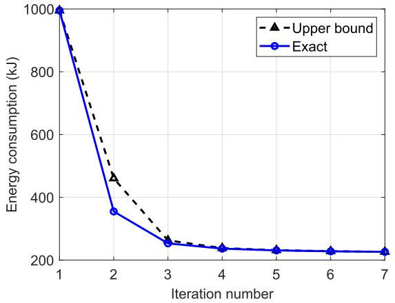

line

| Iteration number | Upper bound | Exact |
| ---------------- | ----------- | ----- |
| 1                | 1000        | 1000  |
| 2                | 450         | 350   |
| 3                | 250         | 250   |
| 4                | 230         | 230   |
| 5                | 220         | 220   |
| 6                | 210         | 210   |
| 7                | 200         | 200   |

Fig. 3. Convergence of Algorithm 2 for UAV energy minimization.

The UAV initial path $\{ \mathbf { q } _ { m } ^ { ( 0 ) } \}$ is set as that obtained by the optimized fly-hover-communicate protocol proposed in Section III, and the initial duration $\{ T _ { m } ^ { ( 0 ) } \}$ at each line segment letting and communication time allocation $T _ { m } ^ { ( 0 ) } = \bar { T } , \forall m .$ T¯, ∀m, and τ (0)mk $\tau _ { m k } ^ { ( 0 ) } = \bar { \bar { T } } / K , \forall m , k ,$ $\{ \bar { \tau } _ { m k } ^ { ( 0 ) } \}$ {τ (0)mk} is obtained by where $\bar { T }$ = =is the minimum value that makes  feasible. Fig. 3 shows (P4)the convergence of Algorithm 2 for throughput requirement $\tilde { Q } = 1 0 0 0 \mathrm { M b i t s } .$ . The curve “Upper bound” corresponds to the =obtained objective value of . , while “Exact” refers to the (P4 2)true UAV energy consumption value calculated based on (46). It is firstly observed that the two curves match quite well with each other, which demonstrates that the upper bound for UAV energy consumption via solving the convex optimization problem . is practically tight. Furthermore, Fig. 3 shows that the proposed algorithm converges in a few iterations, which demonstrates the effectiveness of SCA for the proposed joint trajectory and communication time allocation design.

For four different communication throughput requirement ${ \tilde { Q } } ,$ Fig. 4 shows the obtained UAV trajectories with three different designs: i) Optimized fly-hover-communicate protocol proposed in Section III; ii) The SCA-based energy minimization design in Algorithm 2; and iii) The SCA-based time minimization design by similarly applying Algorithm 2. For the SCA-based energy minimization trajectory, Fig. 4 also shows the corresponding time instant when the UAV reaches the nearest position from each GN, for the convenience of illustrating the corresponding UAV speed shown in Fig. 5. It is firstly observed from Fig. 4 that for the proposed fly-hovercommunicate protocol, the optimized hovering locations are in general different from the GN locations. This is expected due to the following trade-off: while hovering exactly above each GN achieves the minimal communication link distance and hence reduces the total communication time, it requires the UAV to travel longer distance and hence more energy consumption is needed for UAV flying. With the optimized fly-hover-communicate protocol, a balance between the above

$$
y _ {m} ^ {2} + \frac {\left\| \mathbf {q} _ {m + 1} - \mathbf {q} _ {m} \right\| ^ {2}}{v _ {0} ^ {2}} \geq y _ {m} ^ {(l) 2} + 2 y _ {m} ^ {(l)} (y _ {m} - y _ {m} ^ {(l)}) - \frac {\left\| \mathbf {q} _ {m + 1} ^ {(l)} - \mathbf {q} _ {m} ^ {(l)} \right\| ^ {2}}{v _ {0} ^ {2}} + \frac {2}{v _ {0} ^ {2}} (\mathbf {q} _ {m + 1} ^ {(l)} - \mathbf {q} _ {m} ^ {(l)}) ^ {T} (\mathbf {q} _ {m + 1} - \mathbf {q} _ {m}), \tag {60}
$$

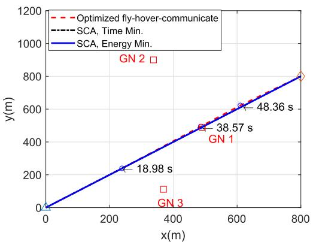

line

| x(m) | y(m) | Type                     |
|------|------|--------------------------|
| 400  | 18.98 | SCA, Time Min.          |
| 500  | 38.57 | SCA, Time Min.          |
| 600  | 48.36 | SCA, Time Min.          |
| 800  | 800  | SCA, Energy Min.        |

(a) $\tilde { Q } = 1 0 0 ~ \mathrm { K b i t s } .$

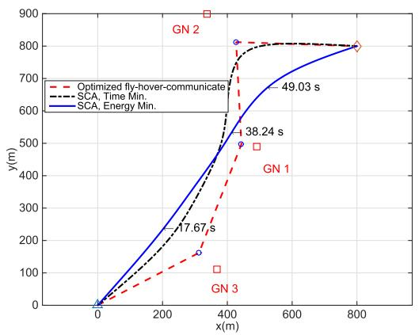

line

| x(m) | y(m) - Optimized fly-hover-communicate | y(m) - SCA, Time Min. | y(m) - SCA, Energy Min. |
|------|----------------------------------------|------------------------|--------------------------|
| 0    | 0                                      | 0                      | 0                        |
| 400  | 500                                    | 500                    | 500                      |
| 800  | 800                                    | 800                    | 800                      |

(b) Q = 10 Mbits.

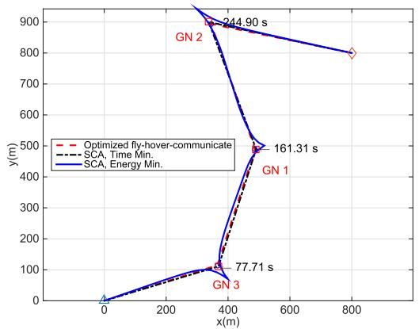  
(c) Q= 200 Mbits.

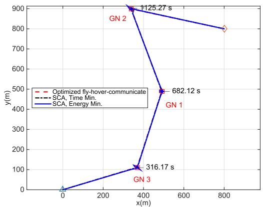  
(d) $\tilde { Q } = 1 0 0 0 ~ \mathrm { M b i t s } .$

Fig. 4. UAV trajectories with three different designs. Red squares denote GNs, and blue circles represent the optimized hovering locations in the fly-hovercommunicate protocol.   
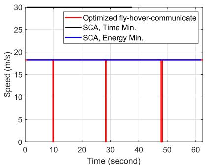

line

| Time (second) | Optimized fly-hover-communicate | SCA, Time Min. | SCA, Energy Min. |
| ------------- | ------------------------------- | -------------- | ---------------- |
| 0             | 18                              | 18             | 18               |
| 10            | 18                              | 18             | 18               |
| 30            | 18                              | 18             | 18               |
| 50            | 18                              | 18             | 18               |
| 60            | 18                              | 18             | 18               |

(a) Q= 100 Kbits.

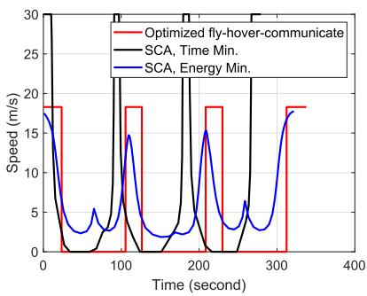

line

| Time (second) | Optimized fly-hover-communicate | SCA, Time Min. | SCA, Energy Min. |
| ------------- | ------------------------------- | -------------- | ---------------- |
| 0             | 18                              | 0              | 18               |
| 50            | 0                               | 0              | 0                |
| 100           | 18                              | 20             | 15               |
| 150           | 0                               | 0              | 0                |
| 200           | 18                              | 20             | 15               |
| 250           | 0                               | 0              | 0                |
| 300           | 18                              | 20             | 15               |
| 350           | 0                               | 0              | 0                |

(b) Q= 200 Mbits.

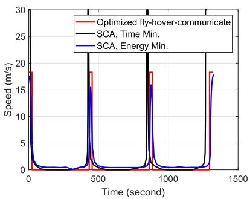

line

| Time (second) | Optimized fly-hover-communicate | SCA, Time Min. | SCA, Energy Min. |
| ------------- | ------------------------------- | -------------- | ---------------- |
| 0             | 18                              | 15             | 18               |
| 500           | 18                              | 15             | 18               |
| 1000          | 18                              | 15             | 18               |
| 1500          | 18                              | 15             | 18               |

（c） $\tilde { Q } = 1 0 0 0$ Mbits.   
Fig. 5. UAV speed versus time for different trajectories in Fig. 4.

two conflicting objectives is achieved via optimizing the hovering locations for communication. By comparing the four figures in Fig. 4, it is observed that the higher the throughput requirement is, the closer the optimized hovering locations will be from the GN locations, as expected.

It is observed from Fig. 4(a) that for $\tilde { Q } ~ = ~ 1 0 0$ Kbits, =the UAV simply flies in a straight line from the initial location to final location for all the three schemes considered. This is expected since with a low communication throughput requirement, the UAV does not have to deviate its flying trajectory deliberately towards the GNs. In contrast, when Q is extremely high as 1000 Mbits, the UAV will fly to the top of the GNs for communication, as shown in Fig. 4(d). For both extreme cases, although the UAV paths for the three schemes are similar, their flying speed are in general different, as show in Fig. 5(a) and Fig. 5(c). On the other hand, for moderate communication requirement such as Q  10 Mbits and $\tilde { Q } \ = \ 2 0 0 \ \mathrm { M b i t s }$ , the three schemes in general leads to different flying paths and speeds, as shown in Fig. 4(b), Fig. 4(c) and Fig. 5(b). For the SCA-based algorithm for energy minimization, it is observed from Fig. 4(c) and Fig. 5(b) that as the UAV approaches the GN, it tends to keep flying around it with a certain speed, instead of hovering directly above it. This may seem counter-intuitive at the first glance, since such a trajectory would result in longer link distance with the GNs, as compared to the flyhover-communicate trajectory. However, a closer look at the power-speed curve in Fig. 2 would reveal that such a trajectory is expected, due to the fact that hovering is not the most power-conserving status for rotary-wing UAVs. As a result, even when the UAV reaches the top of the GN, it tends to maintain a certain speed so as to achieve a balance between minimizing the instantaneous power consumption (in watts), and minimizing the mission completion time (or maximizing the instantaneous communication rate), which is achieved by the SCA solution. By combining Fig. 4 and Fig. 5, it is found that for the SCA-based trajectory for energy minimization, the UAV will reduce its flying speed when it is close to each GN, as expected. Fig. 4 and Fig. 5 also show that with the SCA-based algorithm for time minimization, the UAV tends to fly to the top of each GN with the maximum speed. This is expected since for time minimization without considering the UAV energy consumption, it is preferable for the UAV to fly to approach the GN as soon as possible to enjoy the best communication channel.

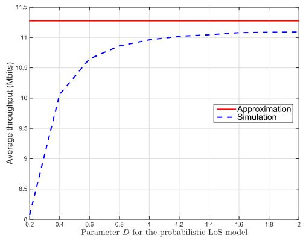

line

| Parameter D for the probabilistic LoS model | Approximation | Simulation |
| ------------------------------------------ | ------------- | ---------- |
| 0.2                                        | 11.3          | 8.0        |
| 0.4                                        | 11.3          | 10.0       |
| 0.6                                        | 11.3          | 10.7       |
| 0.8                                        | 11.3          | 10.9       |
| 1.0                                        | 11.3          | 11.0       |
| 1.2                                        | 11.3          | 11.05      |
| 1.4                                        | 11.3          | 11.08      |
| 1.6                                        | 11.3          | 11.1       |
| 1.8                                        | 11.3          | 11.1       |
| 2.0                                        | 11.3          | 11.1       |

Fig. 6. Average communication throughput based on approximation versus numerical simulations.

Next, in order to evaluate the accuracy of the approximation of the expected communication throughput developed in (9)–(11), the average throughput of all the GNs based on $\hat { R } _ { k }$ in (9) obtained via numerical simulations is compared with the tractable approximation based on (11). Fig. 6 shows the results for $\tilde { Q } = 1 0$ Mbits under different LoS modeling =parameters D. For the numerical simulation of the average throughput, the UAV trajectory is set as that obtained via the SCA energy minimization solution, based on which the exact time-varying LoS probability is obtained by using (3). For the small-scale fading $\tilde { h } _ { k } ( t )$ , Rician fading model with Rician ( )factor 15 dB is used for LoS condition, and Rayleigh fading is used for NLoS condition. The average throughput is taken over $1 0 ^ { 3 }$ random channel realizations at each UAV location. 10It is observed from Fig. 6 that the approximation used for trajectory optimization achieves a reasonable accuracy, especially for relatively large D values corresponding to less dense environment (e.g., suburban or rural). In fact, it is observed that the average communication throughput of 10 Mbits is achieved for $D \geq 0 . 4 .$ . For the denser environment with small 0 4D values, the proposed optimization technique based on rate approximation may still be used, with an appropriately chosen rate margin for Q.

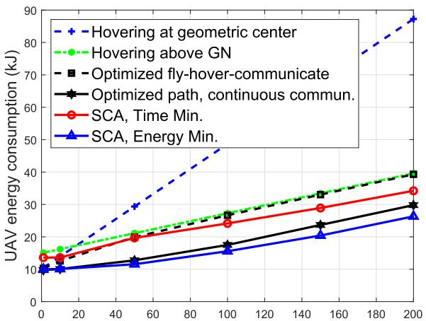

line

| X    | Hovering at geometric center | Hovering above GN | Optimized fly-hover-communicate | Optimized path, continuous commun. | SCA, Time Min. | SCA, Energy Min. |
| ---- | ----------------------------- | ----------------- | ------------------------------- | ---------------------------------- | -------------- | ---------------- |
| 0    | 15                            | 15                | 15                              | 10                                 | 15             | 10               |
| 50   | 30                            | 20                | 20                              | 12                                 | 20             | 12               |
| 100  | 45                            | 28                | 28                              | 18                                 | 25             | 16               |
| 150  | 75                            | 35                | 35                              | 25                                 | 30             | 22               |
| 200  | 90                            | 40                | 40                              | 30                                 | 35             | 28               |

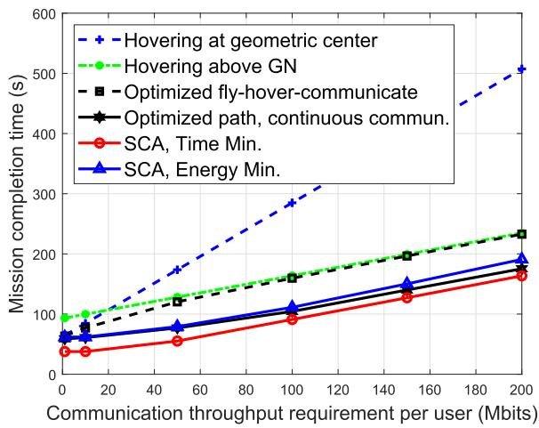

line

| Communication throughput requirement per user (Mbits) | Hovering at geometric center | Hovering above GN | Optimized fly-hover-communicate | Optimized path, continuous commun. | SCA, Time Min. | SCA, Energy Min. |
| ---------------------------------------------------- | ---------------------------- | ----------------- | ------------------------------- | ---------------------------------- | -------------- | ---------------- |
| 0                                                    | 100                          | 100               | 100                             | 100                                | 50             | 50               |
| 20                                                   | 150                          | 125               | 125                             | 125                                | 60             | 75               |
| 40                                                   | 200                          | 150               | 150                             | 150                                | 75             | 90               |
| 60                                                   | 250                          | 175               | 175                             | 175                                | 90             | 110              |
| 80                                                   | 300                          | 200               | 200                             | 200                                | 110            | 130              |
| 100                                                  | 350                          | 225               | 225                             | 225                                | 130            | 150              |
| 120                                                  | 400                          | 250               | 250                             | 250                                | 150            | 175              |
| 140                                                  | 450                          | 275               | 275                             | 275                                | 175            | 200              |
| 160                                                  | 500                          | 300               | 300                             | 300                                | 200            | 225              |
| 180                                                  | 550                          | 325               | 325                             | 325                                | 225            | 250              |
| 200                                                  | 600                          | 350               | 350                             | 350                                | 250            | 275              |

Fig. 7. Energy consumption and mission completion time versus throughput requirement.

Last, we compare the required UAV energy consumption and mission completion time versus the communication throughput requirement ${ \tilde { Q } } .$ . Besides the three designs mentioned above, we also consider three alternative benchmark schemes, namely “hovering at geometric center”, “hovering above GNs”, and “optimized path, continuous commun.”. Note that the former two benchmark schemes correspond to the special cases of the fly-hover-communicate protocol proposed in Section III, where the hovering locations are fixed to either the geometric center of the K GNs or each GN, instead of being optimized. On the other hand, the third scheme is an extension of the fly-hover-communicate protocol. For this scheme, exactly the same path is used as the fly-hover-communicate scheme, but continuous communication is enabled where the optimal UAV hovering time and communication time allocation are obtained with such a fixed path by solving a linear program, similarly as in [1]. It is firstly observed from Fig. 7 that in terms of both energy consumption and required mission completion time, “hovering at the geometric center” outperforms “hovering above GNs” for low throughput requirement, whereas the reverse is true as $\tilde { Q }$ increases. On the other hand, the optimized fly-hovercommunicate scheme always outperforms both benchmark schemes, which is expected since it adaptively optimizes the hovering locations according to the communication requirement. On the other hand, by enabling continuous communications and optimal hovering time and communication time allocation, the “optimized path, continuous commun.” scheme significantly outperforms the fly-hover-communicate scheme, as expected. Furthermore, with the proposed SCA algorithm, further energy saving can be achieved, thanks to its ability to better balance between instantaneous power minimization and communication rate maximization. Similar observations can be made for the time minimization design.

# VI. CONCLUSION

This paper studies the energy-efficient UAV communication with rotary-wing UAVs. The propulsion power consumption model of rotary-wing UAVs is derived, based on which an optimization problem is formulated to minimize the total UAV energy consumption, while satisfying the target communication throughput requirement for multiple GNs. We first propose an efficient solution based on the simple fly-hovercommunicate protocol, which leverages the TSPN and convex optimization techniques to find the optimized hovering locations and durations, as well as the visiting order and speed among these locations. Furthermore, we propose a general solution, with which the UAV also communicates while flying, by applying a new path discretization approach and the SCA technique. Numerical results show that the proposed designs outperform other benchmark schemes for rotary-ring UAV enabled wireless communication systems.

# APPENDIX POWER CONSUMPTION MODEL FOR ROTARY-WING UAVS

In this appendix, we derive the power consumption model for rotary-wing UAVs. Note that most of the notations and results follow from the textbook [34]. This appendix is NOT intended to introduce a new physical model for the power consumption of rotary-wing UAVs. Instead, it mainly aims to solicit the existing results in classic aircraft textbooks such as [34] and [35], to derive an analytical energy model that is suitable for research in UAV communications. Interested readers may refer to [34] and [35] for more detailed theoretical derivations based on actuator disc theory and blade element theory. The notations and terminologies used in this appendix are summarized in Table I.

For rotary-wing aircrafts in hovering status, the torque coefficient $q _ { c }$ is given by [34, eq. (2.45)], i.e., $\begin{array} { r } { q _ { c } = \frac { \delta } { 8 } + ( 1 + } \end{array}$ $k ) \sqrt { \frac { s } { 2 } } t _ { c } ^ { 3 / 2 }$ . By substituting $\begin{array} { r } { t _ { c } = \frac { T } { \rho s A \Omega ^ { 2 } R ^ { 2 } } } \end{array}$ 8TρsA 2R2 and noting that the ) 2 = Ωthrust T balances the aircraft weight in hovering status, i.e., $T = W .$ , we have

TABLE I MAIN NOTATIONS AND TERMINOLOGIES 

<table><tr><td>Notation</td><td>Physical meaning</td><td>Simulation value</td></tr><tr><td> $W$ </td><td>Aircraft weight in Newton</td><td>20</td></tr><tr><td> $\rho$ </td><td>Air density in kg/m3</td><td>1.225</td></tr><tr><td> $R$ </td><td>Rotor radius in meter (m)</td><td>0.4</td></tr><tr><td> $A$ </td><td>Rotor disc area in m2,  $A \triangleq \pi R^{2}$ </td><td>0.503</td></tr><tr><td> $\Omega$ </td><td>Blade angular velocity in radians/second</td><td>300</td></tr><tr><td> $U_{\text{tip}}$ </td><td>Tip speed of the rotor blade (m/s),  $U_{\text{tip}} \triangleq \Omega R$ </td><td>120</td></tr><tr><td> $b$ </td><td>Number of blades</td><td>4</td></tr><tr><td> $c$ </td><td>Blade or aerofoil chord length</td><td>0.0157</td></tr><tr><td> $s$ </td><td>Rotor solidity, defined as the ratio of the total blade area bcR to the disc area A, or  $s \triangleq \frac{bc}{\pi R}$ </td><td>0.05</td></tr><tr><td> $S_{FP}$ </td><td>Fuselage equivalent flat plate area in  $m^{2}$ </td><td>0.0151</td></tr><tr><td> $d_{0}$ </td><td>Fuselage drag ratio, defined as  $d_{0} \triangleq \frac{S_{FP}}{sA}$ </td><td>0.6</td></tr><tr><td> $k$ </td><td>Incremental correction factor to induced power</td><td>0.1</td></tr><tr><td> $T$ </td><td>Rotor thrust</td><td>-</td></tr><tr><td> $\tilde{\kappa}$ </td><td>Thrust-to-weight ratio,  $\tilde{\kappa} \triangleq \frac{T}{W}$ </td><td>-</td></tr><tr><td> $t_{c}$ </td><td>Thrust coefficient based on total blade area, defined as  $t_{c} \triangleq \frac{T}{\rho s A \Omega^{2} R^{2}}$ </td><td>-</td></tr><tr><td> $T_{D}$ </td><td>Thrust component along the disc axes.  $T_{D} \approx T$  in practice (Equation (1.39) of [34])</td><td>-</td></tr><tr><td> $t_{cD}$ </td><td>Thrust coefficient referred to disc axes,  $t_{cD} \triangleq \frac{T_{D}}{\rho s A \Omega^{2} R^{2}} \approx t_{c}$ </td><td>-</td></tr><tr><td> $v_{0}$ </td><td>Mean rotor induced velocity in hover, with  $v_{0} = \sqrt{\frac{W}{2\rho A}}$  (see Equation (2.12) of [34] and Equation (12.1) of [35])</td><td>4.03</td></tr><tr><td> $v_{i0}$ </td><td>Mean rotor induced velocity in forward flight</td><td>-</td></tr><tr><td> $\lambda_{i}$ </td><td>Mean induced velocity normalized by tip speed,  $\lambda_{i} \triangleq \frac{v_{i0}}{\Omega R}$ </td><td>-</td></tr><tr><td> $\delta$ </td><td>Profile drag coefficient.</td><td>0.012</td></tr><tr><td> $V$ </td><td>Aircraft forward speed in m/s</td><td>-</td></tr><tr><td> $\hat{V}$ </td><td>Forward speed normalized by tip speed,  $\hat{V} \triangleq \frac{V}{\Omega R}$ </td><td>-</td></tr><tr><td> $\alpha_{T}$ </td><td>Tilt angle of the rotor disc, which is small in practice</td><td>-</td></tr><tr><td> $\mu$ </td><td>Advance ratio,  $\mu \approx \hat{V} = \frac{V}{\Omega R}$ </td><td>-</td></tr><tr><td> $q_{c}$ </td><td>Torque coefficient, which, by definition, is directly related to the required power  $P$  as  $P = q_{c} \rho s A \Omega^{3} R^{3}$ . Note that in many text books, the required rotor power is usually given in terms of  $q_{c}$ .</td><td>-</td></tr></table>

$$
q _ {c} = \frac {\delta}{8} + (1 + k) \frac {W ^ {3 / 2}}{\sqrt {2} \rho^ {3 / 2} s A ^ {3 / 2} \Omega^ {3} R ^ {3}}. \tag {63}
$$

Therefore, by definition of the torque coefficient, the corresponding required power for hovering can be obtained based on the relationship $P = q _ { c } \rho s A \Omega ^ { 3 } ~ R ^ { 3 }$ , which can be expressed =as (see also [35, eq. (12.13)])

$$
P _ {h} = \underbrace {\frac {\delta}{8} \rho s A \Omega^ {3} R ^ {3}} _ {\triangleq P _ {0}} + \underbrace {(1 + k) \frac {W ^ {3 / 2}}{\sqrt {2 \rho A}}} _ {\triangleq P _ {i}}. \tag {64}
$$

The derivation of power required for forward flight of a rotary-wing aircraft is much more complicated than that of the fixed-wing counterpart [26]. Fortunately, under some mild assumptions, e.g., the drag coefficient of the blade section is constant, the torque coefficient $q _ { c }$ for an aircraft in forward level flight (zero climbing angle) with speed V is given by [34, eq. (4.20)] , i.e.,

$$
q _ {c} = \frac {\delta}{8} (1 + 3 \mu^ {2}) + (1 + k) \lambda_ {i} t _ {c D} + \frac {1}{2} \hat {V} ^ {3} d _ {0}, \tag {65}
$$

where we have ignored the power/torque of the tail rotor since it usually only contributes a small portion of the total power consumption. By substituting with $\mu \approx { \hat { V } } =$ $\frac { V } { \Omega R }$ and $\begin{array} { r c l } { t _ { c D } } & { = } & { \frac { T } { \rho s A \Omega ^ { 2 } \ R ^ { 2 } } , \ q _ { c } } \end{array}$ =TρsA 2 R2 , qc in (65) can be explicitly Ω = Ωwritten as a function of the forward speed V and rotor thrust $T$ as

$$
q _ {c} (V, T) = \frac {\delta}{8} \left(1 + \frac {3 V ^ {2}}{\Omega^ {2} R ^ {2}}\right) + \frac {(1 + k) T \lambda_ {i}}{\rho s A \Omega^ {2} R ^ {2}} + \frac {1}{2} d _ {0} \frac {V ^ {3}}{\Omega^ {3} R ^ {3}}. \tag {66}
$$

By the definition of the torque coefficient, the required power can be written as a function of V and T as

$$
\begin{array}{l} P (V, T) \triangleq q _ {c} (V, T) \rho s A \Omega^ {3} R ^ {3} \\ = P _ {0} \left(1 + \frac {3 V ^ {2}}{\Omega^ {2} R ^ {2}}\right) + (1 + k) T v _ {i 0} + \frac {1}{2} d _ {0} \rho s A V ^ {3}, \tag {67} \\ \end{array}
$$

where $v _ { i 0 } = \lambda _ { i } \Omega R$ is the mean induced velocity. Furthermore, 0 = Ωbased on [34, eq. (3.2)], for a rotary-wing aircraft with forward speed V and rotor thrust T , the mean induced velocity can be calculated as

$$
\begin{array}{l} v _ {i 0} = \left(\sqrt {\frac {T ^ {2}}{4 \rho^ {2} A ^ {2}} + \frac {V ^ {4}}{4}} - \frac {V ^ {2}}{2}\right) ^ {1 / 2} \\ = v _ {0} \left(\sqrt {\tilde {\kappa} ^ {2} + \frac {V ^ {4}}{4 v _ {0} ^ {4}}} - \frac {V ^ {2}}{2 v _ {0} ^ {2}}\right) ^ {1 / 2}, \tag {68} \\ \end{array}
$$

where v $\triangleq { \sqrt { W / ( 2 \rho A ) } }$ is the mean induced velocity in 0 (2 )hover and we have defined κ as the thrust-to-weight ratio, i.e., $\tilde { \kappa } \ { \stackrel { \Delta } { = } } \quad { \frac { T } { W } }$ ˜. It can be shown that for any given thrust $T$ ˜or κ, vi is a decreasing function of V . By substituting (68) ˜ 0into (67), the required power for forward flight can be more explicitly written as

$$
\begin{array}{l} P (V, \tilde {\kappa}) = \underbrace {P _ {0} \left(1 + \frac {3 V ^ {2}}{\Omega^ {2} R ^ {2}}\right)} _ {\text {   blade   profile   }} \\ + \underbrace {P _ {i} \tilde {\kappa} \left(\sqrt {\tilde {\kappa} ^ {2} + \frac {V ^ {4}}{4 v _ {0} ^ {4}}} - \frac {V ^ {2}}{2 v _ {0} ^ {2}}\right) ^ {1 / 2}} _ {\text { induced }} \\ + \underbrace {\frac {1}{2} d _ {0} \rho s A V ^ {3}} _ {\text { parasite }}, \tag {69} \\ \end{array}
$$

where $P _ { 0 }$ and $P _ { i }$ are two constants defined in (64).

0To obtain a more explicit expression of the required power in (69), we need to determine the rotor thrust $T$ or the thrustto-weight ratio κ. Fig. 8 shows simplified schematics of the ˜longitudinal forces acting on the aircraft in straight level flight (see also [35, Fig. 13.2]), which include the following forces: (i) $T \colon$ rotor thrust, normal to the disc plane and directed upward; (ii) D: drag of fuselage, which is in the opposite direction of the aircraft velocity; and (iii) W : the aircraft weight. Due to the balance of forces in vertical direction, we have $T \cos \alpha _ { T } = W$ , where $\alpha _ { T }$ is the tilt angle of the cos =rotor disc. Note that in practice, $\alpha _ { T }$ is usually very small,

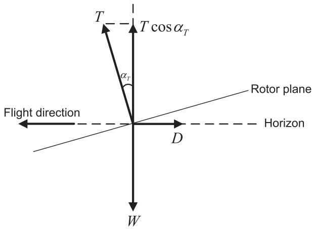

text_image

T
T cos α_T
α_T
Flight direction
D
Rotor plane
Horizon
W

Fig. 8. Schematics of the main forces acting on the aircraft in straight flight.

so we have $T \approx W$ or κ ≈  (see also [34, eq. (4.3)]). ˜ 1As a result, the expression in (69) reduces to (12) shown in Section II-B.

# REFERENCES

[1] Y. Zeng, J. Xu, and R. Zhang, “Rotary-wing UAV enabled wireless network: Trajectory design and resource allocation,” in Proc. IEEE Global Commun. Conf. (GLOBECOM), Dec. 2018, pp. 1–6.   
[2] S. Chandrasekharan et al., “Designing and implementing future aerial communication networks,” IEEE Commun. Mag., vol. 54, no. 5, pp. 26–34, May 2016.   
[3] Y. Zeng, R. Zhang, and T. J. Lim, “Wireless communications with unmanned aerial vehicles: Opportunities and challenges,” IEEE Commun. Mag., vol. 54, no. 5, pp. 36–42, May 2016.   
[4] B. Van Der Bergh, A. Chiumento, and S. Pollin, “LTE in the sky: Trading off propagation benefits with interference costs for aerial nodes,” IEEE Commun. Mag., vol. 54, no. 5, pp. 44–50, May 2016.   
[5] I. Bor-Yaliniz and H. Yanikomeroglu, “The new frontier in RAN heterogeneity: Multi-tier drone-cells,” IEEE Commun. Mag., vol. 54, no. 11, pp. 48–55, Nov. 2016.   
[6] Y. Zeng, J. Lyu, and R. Zhang, “Cellular-connected UAV: Potential, challenges, and promising technologies,” IEEE Wireless Commun., vol. 26, no. 1, pp. 120–127, Feb. 2019.   
[7] S. Sekander, H. Tabassum, and E. Hossain, “Multi-tier drone architecture for 5G/B5G cellular networks: Challenges, trends, and prospects,” IEEE Commun. Mag., vol. 56, no. 3, pp. 96–103, Mar. 2018.   
[8] A. Al-Hourani, S. Kandeepan, and A. Jamalipour, “Modeling air-toground path loss for low altitude platforms in urban environments,” in Proc. IEEE Global Commun. Conf. (GLOBECOM), Dec. 2014, pp. 2898–2904.   
[9] D. W. Matolak and R. Sun, “Unmanned aircraft systems: Air-ground channel characterization for future applications,” IEEE Veh. Technol. Mag., vol. 10, no. 2, pp. 79–85, Jun. 2015.   
[10] L. Zeng, X. Cheng, C.-X. Wang, and X. Yin, “A 3D geometry-based stochastic channel model for UAV-MIMO channels,” in Proc. IEEE Wireless Commun. Netw. Conf. (WCNC), Mar. 2017, pp. 1–5.   
[11] W. Khawaja, I. Guvenc, D. Matolak, U.-C. Fiebig, and N. Schneckenberger. (2018). “A survey of air-to-ground propagation channel modeling for unmanned aerial vehicles.” [Online]. Available: https://arxiv.org/abs/1801.01656   
[12] A. A. Khuwaja, Y. Chen, N. Zhao, M.-S. Alouini, and P. Dobbins, “A survey of channel modeling for UAV communications,” IEEE Commun. Surveys Tuts., vol. 20, no. 4, pp. 2804–2821, 4th Quart., 2018.   
[13] A. Al-Hourani, S. Kandeepan, and S. Lardner, “Optimal LAP altitude for maximum coverage,” IEEE Wireless Commun. Lett., vol. 3, no. 6, pp. 569–572, Dec. 2014.

[14] M. Mozaffari, W. Saad, M. Bennis, and M. Debbah, “Efficient deployment of multiple unmanned aerial vehicles for optimal wireless coverage,” IEEE Commun. Lett., vol. 20, no. 8, pp. 1647–1650, Aug. 2016.   
[15] J. Lyu, Y. Zeng, R. Zhang, and T. J. Lim, “Placement optimization of UAV-mounted mobile base stations,” IEEE Commun. Lett., vol. 21, no. 3, pp. 604–607, Mar. 2017.   
[16] J. Chen and D. Gesbert, “Optimal positioning of flying relays for wireless networks: A LOS map approach,” in Proc. IEEE Int. Conf. Commun. (ICC), May 2017, pp. 1–6.   
[17] M. Alzenad, A. El-keyi, F. Lagum, and H. Yanikomeroglu, “3-D placement of an unmanned aerial vehicle base station (UAV-BS) for energy-efficient maximal coverage,” IEEE Wireless Commun. Lett., vol. 6, no. 4, pp. 434–437, Aug. 2017.   
[18] H. He, S. Zhang, Y. Zeng, and R. Zhang, “Joint altitude and beamwidth optimization for UAV-enabled multiuser communications,” IEEE Commun. Lett., vol. 22, no. 2, pp. 344–347, Feb. 2018.   
[19] A. Al-Hourani, S. Chandrasekharan, G. Kaandorp, W. Glenn, A. Jamalipour, and S. Kandeepan, “Coverage and rate analysis of aerial base stations,” IEEE Trans. Aerosp. Electron. Syst., vol. 52, no. 6, pp. 3077–3081, Dec. 2016.   
[20] M. M. Azari, F. Rosas, K.-C. Chen, and S. Pollin, “Ultra reliable UAV communication using altitude and cooperation diversity,” IEEE Trans. Commun., vol. 66, no. 1, pp. 330–344, Jan. 2018.   
[21] V. V. Chetlur and H. S. Dhillon, “Downlink coverage analysis for a finite 3-D wireless network of unmanned aerial vehicles,” IEEE Trans. Commun., vol. 65, no. 10, pp. 4543–4558, Jul. 2017.   
[22] C. Zhang and W. Zhang, “Spectrum sharing for drone networks,” IEEE J. Sel. Areas Commun., vol. 35, no. 1, pp. 136–144, Jan. 2017.   
[23] M. Mozaffari, W. Saad, M. Bennis, and M. Debbah, “Optimal transport theory for cell association in UAV-enabled cellular networks,” IEEE Commun. Lett., vol. 21, no. 9, pp. 2053–2056, Sep. 2017.   
[24] Y. Zeng, R. Zhang, and T. J. Lim, “Throughput maximization for UAV-enabled mobile relaying systems,” IEEE Trans. Commun., vol. 64, no. 12, pp. 4983–4996, Dec. 2016.   
[25] J. Lyu, Y. Zeng, and R. Zhang, “Cyclical multiple access in UAV-aided communications: A throughput-delay tradeoff,” IEEE Wireless Commun. Lett., vol. 5, no. 6, pp. 600–603, Dec. 2016.   
[26] Y. Zeng and R. Zhang, “Energy-efficient UAV communication with trajectory optimization,” IEEE Trans. Wireless Commun., vol. 16, no. 6, pp. 3747–3760, Jun. 2017.   
[27] C. Zhan, Y. Zeng, and R. Zhang, “Energy-efficient data collection in UAV enabled wireless sensor network,” IEEE Wireless Commun. Lett., vol. 7, no. 3, pp. 328–331, Jun. 2018.   
[28] Q. Wu, Y. Zeng, and R. Zhang, “Joint trajectory and communication design for multi-UAV enabled wireless networks,” IEEE Trans. Wireless Commun., vol. 17, no. 3, pp. 2109–2121, Mar. 2018.   
[29] Y. Zeng, X. Xu, and R. Zhang, “Trajectory design for completion time minimization in UAV-enabled multicasting,” IEEE Trans. Wireless Commun., vol. 17, no. 4, pp. 2233–2246, Apr. 2018.   
[30] L. Liu, S. Zhang, and R. Zhang. (2018). “CoMP in the sky: UAV placement and movement optimization for multi-user communications.” [Online]. Available: https://arxiv.org/abs/1802.10371   
[31] J. Xu, Y. Zeng, and R. Zhang, “UAV-enabled wireless power transfer: Trajectory design and energy optimization,” IEEE Trans. Wireless Commun., vol. 17, no. 8, pp. 5092–5106, Aug. 2018.   
[32] D. Yang, Q. Wu, Y. Zeng, and R. Zhang, “Energy trade-off in ground-to-UAV communication via trajectory design,” IEEE Trans. Veh. Technol, vol. 67, no. 7, pp. 6721–6726, Jul. 2018.   
[33] X. Xu, Y. Zeng, Y. L. Guan, and R. Zhang, “Overcoming endurance issue: UAV-enabled communications with proactive caching,” IEEE J. Sel. Areas Commun., vol. 36, no. 6, pp. 1231–1244, Jun. 2018.   
[34] A. R. S. Bramwell, G. Done, and D. Balmford, Bramwell’s Helicopter Dynamics (Butterworth-Heinemann), 2nd ed. Washington, DC, USA: AIAA, 2001.   
[35] A. Filippone, Flight Performance of Fixed and Rotary Wing Aircraft (Butterworth-Heinemann). Washington, DC, USA: AIAA, 2006.   
[36] G. Laporte, “The traveling salesman problem: An overview of exact and approximate algorithms,” Eur. J. Oper. Res., vol. 59, no. 2, pp. 231–247, Jun. 1992.   
[37] (Feb. 2019). Travelling Salesman Problem: Solver-Based. Accessed: Jan. 11, 2018. [Online]. Available: https://www.mathworks.com/help/ optim/ug/travelling-salesman-problem.html

[38] M. Mozaffari, W. Saad, M. Bennis, and M. Debbah, “Unmanned aerial vehicle with underlaid device-to-device communications: Performance and tradeoffs,” IEEE Trans. Wireless Commun., vol. 15, no. 6, pp. 3949–3963, Jun. 2016.   
[39] M. Grant and S. Boyd, CVX: Matlab Software for Disciplined Convex Programming, Version 2.1. [Online]. Available: http://cvxr.com/cvx   
[40] A. Zappone, E. Björnson, L. Sanguinetti, and E. Jorswieck, “Globally optimal energy-efficient power control and receiver design in wireless networks,” IEEE Trans. Signal Process., vol. 65, no. 11, pp. 2844–2859, Jun. 2017.   
[41] S. Boyd and L. Vandenberghe, Convex Optimization. Cambridge, U.K.: Cambridge Univ. Press, 2004.   
[42] FAA. Summary of Small Unmanned Aircraft Rule. Accessed: Feb. 18, 2019. [Online]. Available: https://www.faa.gov/uas/media/ Part\_107\_Summary.pdf   
[43] O. Arnold, F. Richter, G. Fettweis, and O. Blume, “Power consumption modeling of different base station types in heterogeneous cellular networks,” in Proc. Future Netw. Mobile Summit, 2010, pp. 1–8.

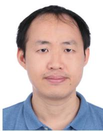

natural_image

Portrait photo of a man in a blue shirt (no text or symbols visible)

Yong Zeng (S’12–M’14) received the B.Eng. (Hons.) and Ph.D. degrees from Nanyang Technological University, Singapore, in 2009 and 2014, respectively. He is currently a Lecturer with the School of Electrical and Information Engineering, The University of Sydney, Australia. From 2013 to 2018, he was a Research Fellow and a Senior Research Fellow with the Department of Electrical and Computer Engineering, National University of Singapore. His research interests include UAV communications, wireless power transfer, mas-

sive MIMO, and millimeter wave communications. He was a recipient of the Australia Research Council (ARC) Discovery Early Career Researcher Award (DECRA), the 2018 IEEE Communications Society Asia-Pacific Outstanding Young Researcher Award, the 2015 and the 2017 IEEE WIRE-LESS COMMUNICATIONS LETTERS Exemplary Reviewer, the 2017 IEEE Communications Society Heinrich Hertz Prize Paper Award, the 2017 IEEE TRANSACTIONS ON WIRELESS COMMUNICATIONS Best Reviewer, and the Best Paper Award for the 10th International Conference on Information, Communications and Signal Processing. He is the Workshop Co-Chair for ICC 2018 and ICC2019 Workshop on UAV communications. He serves as an Associate Editor for the IEEE ACCESS, and as the Leading Guest Editor for the IEEE WIRELESS COMMUNICATIONS on Integrating UAVs into 5G and Beyond and China Communications on Network-Connected UAV Communications.

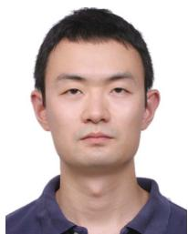

natural_image

Portrait photo of a man in a dark polo shirt (no text or symbols visible)

Jie Xu (S’12–M’13) received the B.E. and Ph.D. degrees from the University of Science and Technology of China in 2007 and 2012, respectively. From 2012 to 2014, he was a Research Fellow with the Department of Electrical and Computer Engineering, National University of Singapore. From 2015 to 2016, he was a Post-Doctoral Research Fellow with the Engineering Systems and Design Pillar, Singapore University of Technology and Design. He is currently a Professor with the School of Information Engineering, Guangdong University

of Technology, China. His research interests include energy efficiency and energy harvesting in wireless communications, wireless information and power transfer, wireless security, unmanned aerial vehicle communications, and mobile edge computing. He was a recipient of the IEEE Signal Processing Society Young Author Best Paper Award in 2017. He served as a Guest Editor for the IEEE WIRELESS COMMUNICATIONS. He is currently an Editor of the IEEE WIRELESS COMMUNICATIONS LETTERS, and an Associate Editor of the IEEE ACCESS and the Journal of Communications and Information Networks.

natural_image

Portrait of a man wearing glasses and a suit (no visible text or symbols)

Rui Zhang (S’00–M’07–SM’15–F’17) received the B.Eng. (Hons.) and M.Eng. degrees from the National University of Singapore, Singapore, and the Ph.D. degree from Stanford University, Stanford, CA, USA, all in electrical engineering.

From 2007 to 2010, he was a Research Scientist with the Institute for Infocomm Research, ASTAR, Singapore. Since 2010, he has been with the Department of Electrical and Computer Engineering, National University of Singapore, where he is currently the Dean’s Chair Associate Professor

with the Faculty of Engineering. He has authored over 300 papers. He has been listed as a Highly Cited Researcher (also known as the World’s Most Influential Scientific Minds) by Thomson Reuters (Clarivate Analytics) since 2015. His research interests include UAV/satellite communication, wireless information and power transfer, multiuser MIMO, smart and reconfigurable environment, and optimization methods.

He was an elected member of the IEEE Signal Processing Society SPCOM Technical Committee from 2012 to 2017 and the SAM Technical Committee from 2013 to 2015. He serves as a member of the Steering Committee of the IEEE WIRELESS COMMUNICATIONS LETTERS. He served as the Vice-Chair of the IEEE Communications Society Asia–Pacific Board Technical Affairs Committee from 2014 to 2015. He was a recipient of the 6th IEEE Communications Society Asia–Pacific Region Best Young Researcher Award in 2011 and the Young Researcher Award of National University of Singapore in 2015. He was a co-recipient of the IEEE Marconi Prize Paper Award in Wireless Communications in 2015, the IEEE Communications Society Asia–Pacific Region Best Paper Award in 2016, the IEEE Signal Processing Society Best Paper Award in 2016, the IEEE Communications Society Heinrich Hertz Prize Paper Award in 2017, the IEEE Signal Processing Society Donald G. Fink Overview Paper Award in 2017, and the IEEE Technical Committee on Green Communications Computing Best Journal Paper Award in 2017. His co-authored paper received the IEEE Signal Processing Society Young Author Best Paper Award in 2017. He served for over 30 international conferences as the TPC co-chair or an organizing committee member, and as the Guest Editor for three Special Issues of the IEEE JOURNAL OF SELECTED TOPICS IN SIGNAL PROCESSING and the IEEE JOURNAL ON SELECTED AREAS IN COMMUNICATIONS. He is a Distinguished Lecturer of the IEEE Signal Processing Society and the IEEE Communications Society. He served as an Editor of the IEEE TRANSACTIONS ON WIRELESS COMMUNICATIONS from 2012 to 2016, the IEEE JOURNAL ON SELECTED AREAS IN COMMUNICATIONS: Green Communications and Networking Series from 2015 to 2016, and the IEEE TRANSACTIONS ON SIG-NAL PROCESSING from 2013 to 2017. He is currently an Editor for the IEEE TRANSACTIONS ON COMMUNICATIONS and the IEEE TRANSACTIONS ON GREEN COMMUNICATIONS AND NETWORKING.