# Energy Minimization in UAV-Enabled Cargo Pickup Systems: A Radio Map-Aided Hierarchical Optimization Framework

Jiangling Cao , Shi Peng, Dingcheng Yang , Member, IEEE, Qinghua Wu, Member, IEEE, and Tiankui Zhang , Senior Member, IEEE

Abstract—This article studies the energy eficiency optimization of cargo uncrewed aerial vehicle (UAV) pickup systems, with constraints on on-board energy and load capacity. In the UAV-enabled cargo pickup system, minimizing the total energy consumption and ensuring the safe flight of the cargo UAV is a problem to be solved. However, due to building blockages, the channel between the UAV and ground base stations (GBSs) frequently switches between line-of-sight (LoS) and non-lineof-sight (NLoS), thereby afecting the UAV’s communication quality. This efect is further aggravated by environmental noise interference. Moreover, limited by the on-board energy, it is unrealistic for the UAV to pick up all the cargo in a single flight without charging or replacing the battery. To address the abovementioned challenges, we propose a UAV pickup system energy eficiency optimization (UPSEEO) framework. In this framework, the UAV’s trajectory between any two pickup points is optimized via the A<sup>∗</sup> algorithm to ensure the stability of the UAV communication link. Next, we employ the particle swarm optimization (PSO) algorithm to optimize both task allocation and flight speed to minimize the total energy consumption, subject to constraints on UAV on-board energy limits and payload capacity. Numerical results show that the proposed framework can ensure the UAV’s communication quality in any spatial topology, with an improvement in energy eficiency of approximately 5% to 50% compared to the comparison experiment.

Index Terms—Cargo UAV pickup systems, communication quality, energy eficiency optimization, task allocation, trajectory optimization.

## I. INTRODUCTION

N RECENT years, the breakthrough in material science and battery technology has promoted the rapid development of uncrewed aerial vehicle (UAV). UAV technology has been widely used in various industries [1]. Especially in the logistics and distribution industry, cargo UAVs have gradually become an important tool to solve the bottleneck of traditional distribution mode. With its characteristics of high flexibility, low cost, and environmental protection, cargo UAVs are changing the traditional transportation and delivery methods and promoting the innovation of modern logistics systems [2]. Some studies predict a significant increase in the application of UAVs in the logistics field, with an estimated average annual growth rate of 55%, from 544 million in 2022 to 18.311 billion in 2030 [3]. Moreover, many companies are also optimistic about the prospects for cargo UAVs. For instance, Amazon announced its ‘Prime Air’ program, launched in 2013, which aims to realize the vision of 30-minute package delivery [4].

Cargo UAVs have attracted widespread attention from academia and industry for the following reasons: 1) UAV technology breakthrough [5]. With the improvement of flight control, navigation and positioning, battery life, and other technologies, the load capacity, flight stability, and endurance of UAVs are also continuously improved. Reliable UAV technology is a prerequisite for large-scale landing of cargo UAVs. 2) Improve delivery eficiency [6]. Traditional delivery methods often rely on road trafic, manual operations, and cumbersome route planning, which is particularly dificult in high-density cities or complex geographical environments. Cargo UAVs are able to bypass these obstacles and travel directly to their destination via air paths, saving time and reducing the impact of trafic congestion. 3) Reduce environmental pollution [7]. The traditional mode of cargo pickup usually requires a large number of trucks, vans and other vehicles, which produce a lot of carbon emissions and pollutants during the transportation process. Compared with traditional cargo pickup methods, UAVs are usually powered by electricity, which can greatly reduce fuel consumption, promote the development of green logistics, and meet the requirements of environmental protection and sustainable development.

Despite the many advantages of deploying UAVs for cargo pickup, there are still some challenges that need to be addressed. Firstly, the UAV’s communication quality is difficult to guarantee [8]. The UAV communication is usually provided by the ground base station (GBS). In UAV-enabled cargo pickup systems, the stability of the communication link between UAV and GBSs is particularly important. However, the antennas of the existing GBSs are usually tilted down, which leads to the fact that the cellular signals generated by GBSs cannot cover the whole airspace. Unstable communication quality seriously afects the reliability and safety of cargo UAVs. Secondly, the on-board energy of UAVs is limited [9]. Due to the energy density of lithium batteries and the small size of their batteries, UAV endurance is constrained. More importantly, in the UAV-enabled cargo pickup system, the UAV needs to carry packages. The weight of these packages directly impacts energy consumption during flight. When carrying heavier packages, the motor needs to exert more power, which significantly increases energy consumption. Finally, the load capacity of the UAV is limited [10]. The UAV is afected by air resistance during flight, and the increase in load leads to the increase of air resistance and more power is needed to overcome this resistance. Furthermore, the design and materials of the UAV can also afect its payload capacity. To ensure the stability and flight safety of the UAV, the design of the fuselage and various components must take into account the balance between strength and weight. Using lightweight materials helps to reduce the overall weight of structures. However, these materials often have limited strength and may not be able to support excessive loads. As a result, the selection of materials and the design of the airframe structure set constraints on the maximum load capacity.

Fortunately, many eforts have been made to address the above challenges. To optimize the communication quality of cargo UAVs, the authors designed the trajectory of UAVs to enable packages to be delivered and maintain reliable communication links during a flight [11]. Similarly, the authors designed a UAV medical supplies delivery system in which the UAV needs to maintain stable communication during flight [12]. To improve the energy eficiency of cargo UAVs, the authors of [13] jointly optimized the trajectory and sensing task selection of the cargo UAV to minimize the UAV’s energy consumption. In [14], the authors presented an innovative logistics UAV scheduling framework using public buses, which utilizes public buses to expand the UAV’s delivery range and improve energy eficiency. In particular, References [15], [16], [17], [18], and [19] considered both the communication quality and energy eficiency of cargo UAVs. In [15], the authors proposed a new joint trajectory planning and unit association approach for the cargo UAV to ensure safe delivery while ensuring a reliable connection and avoiding frequent handof. The authors of [16] presented a new game-theoretic routing framework for joint parcel delivery and sensing of cellularconnected UAVs. This framework aims to minimize both the energy consumption of cargo UAVs and the probability of connectivity outages. In [17], the author proposed integrating cargo UAVs into the Intelligent Transportation System (ITS), aiming to minimize UAVs’ energy consumption and ensure the stability of their wireless communication links by optimizing the pickup and delivery sequence. In [18], the authors improved the UAV’s communication quality and minimized energy consumption by optimizing the trajectory and delivery sequence. In [19], the authors employed the Dijkstra algorithm to optimize the UAV’s trajectory to ensure the communication quality. On this basis, the authors used a hybrid genetic algorithm to obtain the pick-up and delivery sequence with the lowest energy consumption of the UAV. Furthermore, many works have considered the battery energy constraint and payload constraint of cargo UAVs [10], [20], [21], [22], [23], [24]. In [10], the authors considered the UAV’s maximum load and the stability of the communication link and minimized the task completion time by optimizing the trajectory and the pickup and delivery sequence of the UAV. In [20], the authors introduced a joint ground-andaerial delivery service optimization and planning framework, aiming to minimize the total delivery cost under limited UAV payload capacity constraints. The authors of [21] studied a multi-UAV logistics system, optimizing both the UAV’s trajectory and the sequence of pickup and delivery to minimize maximum energy consumption. In [22], the authors considered the battery energy constraint of the UAV. They presented a novel UAV charging scheduling and speed control framework that optimized flight speed and charging schedule to ensure the timely delivery of packages. The authors in [23] considered a UAV pickup system in which the UAV’s battery energy is limited. They optimized the UAV’s trajectory and pickup sequence to maximize the total value of package delivery and optimize the UAV’s communication quality. In [24], the author simultaneously considered both the load capacity of the UAV and the constraints imposed by battery energy. The study focus on a truck-UAV package delivery system to address these challenges. The authors proposed a combined scheduling strategy for the truck and UAV to efectively allocate delivery tasks, aiming to minimize cargo delivery time.

Despite the satisfactory results achieved by the aforementioned works in addressing cargo UAV challenges, some deficiencies remain in the current research. Specifically, no existing work had concurrently optimized the UAV’s energy eficiency and communication link stability while simultaneously accounting for payload capacity and on-board energy constraints. For instance, the study in [10], despite focusing on the UAV’s communication quality link stability, failed to optimize system energy eficiency and neglected to incorporate the UAV’s on-board energy constraint. Similarly, the works in [11] and [12] also neglected to consider the impact of UAV payload and on-board energy constraints on system performance. Additionally, although studies [13], [14], [15], [16], [17], [18], [19], and [22] focused on optimizing the energy eficiency of cargo UAVs, they collectively fell short by neglecting several key constraints. These works either omitted the UAV’s limited payload capacity, disregarded the on-board energy constraint, or failed to account for the need for stable communication. Lastly, the study in [23] simultaneously accounted for UAV payload capacity, on-board energy, and communication constraints. However, [23] does not provide a solution for UAV energy eficiency optimization, and the author does not recognize the impact of speed on UAV energy eficiency.

To address the shortcomings of the above works, we study the energy eficiency optimization problem of a UAV pickup system, in which a UAV with a limited payload needs to pick up parcels from several specific locations and return to the charging station before the battery energy is exhausted. To solve this problem, we propose a UAV pickup system energy eficiency optimization (UPSEEO) framework inspired by literature [23]. Specifically, we decompose the optimization problem into two subproblems to solve. Firstly, we employ the $\mathbf { A } ^ { * }$ algorithm to optimize the two-dimensional (2D) flight trajectory between any pickup points or between the pickup point and the charging station while saving the trajectory length into the distance matrix we create. Secondly, based on the distance information provided by the distance matrix, the location information of the pickup point, and the weight information of the parcels, we propose a particle swarm optimization (PSO) algorithm to optimize the UAV’s task allocation and flight speed. Finally, we verify the performance of the UPSEEO framework with diferent signal-to-noise ratio (SNR) thresholds or the number of pickup points to prove its robustness. The main contributions of this paper are summarized as follows

We investigate the energy eficiency optimization problem of a UAV pickup system, in which the payload, communication, and battery energy constraints of the UAV are simultaneously considered. To the best of our knowledge, this paper is the first to comprehensively consider the challenges of using the cargo UAV to minimize the total energy consumption of the system.

• To solve the optimization problem, we propose a UPSEEO framework. This framework decomposes the problem to be optimized into two subproblems to be solved. Firstly, we define an SNR threshold and stipulate that the SNR of the UAV should be greater than this value at any time to ensure stable communication quality. We use the A<sup>∗</sup> algorithm to optimize the trajectory of the UAV to achieve this purpose. Subsequently, we optimize the UAV task allocation and flight speed to minimize the total energy consumption of the system, subject to the limited payload capacity and on-board energy of the cargo UAV. Our team pioneers the recognition that flight speed is a critical, heretofore unaddressed variable that must be optimized to improve the energy eficiency of the UAVbased cargo pickup mechanism.

• Numerical results demonstrate the eficacy of the UPSEEO framework, confirming its ability to minimize the total energy consumption of the UAV while simultaneously ensuring the requisite communication quality. Furthermore, a comprehensive Monte Carlo simulation is performed to confirm that the framework’s performance is independent of specific PSO algorithm parameters, a key aspect of its generalizability. Lastly, we also analyse the influence of UAV flying altitude on energy eficiency.

The rest of this paper is organized as follows. Section II presents the system model of UAV-enabled cargo pickup. Section III describes the reconstruction method for the

SNR map. Section IV formulates the optimization problem. Section V introduces and utilizes the proposed UPSEEO framework to solve the formulated problem. The simulation results are presented in Section VI. Finally, we summarize the conclusions in Section VII.

## II. SYSTEM MODEL OF UAV-ENABLED CARGO PICKUP

As shown in Fig. 1, we consider a UAV-enabled cargo pickup system in which there are a certain number of users whose packages need to be picked up by a cargo UAV for delivery to the logistics center. Due to the limited on-board energy and load capacity of the cargo UAV, all cargo cannot be picked up by the UAV in the same batch. In other words, the UAV needs to make multiple trips to the logistics center to complete all the tasks, and the total number of UAV flights is denoted by K. We use ${ \mathcal { Q } } = \{ \mathbf { q } _ { 1 } ( t ) , \mathbf { q } _ { 2 } ( t ) , \ldots , \mathbf { q } _ { K } ( t ) \}$ to denote <sup>,</sup>the UAV’s flight trajectory, where ${ \bf q } _ { k } ( t ) = ( \bar { \bf q } _ { k } ( t ) , h _ { k } ( t ) ) , k \in $ ${ \mathcal { K } } = \{ 1 , 2 , . . . , K \}$ <sup>, ,</sup>denotes the UAV’s trajectory at the k-th flight. Specifically, $\bar { \mathbf q } _ { k } ( t ) = ( x _ { k } ( t ) , y _ { k } ( t ) )$ and h<sub>k</sub>(t) represent the horizontal and vertical coordinates of the UAV’s trajectory at the k-th flight, respectively. For analysis, we assume that the cargo UAV can only ascend and descend when it is directly above the packages or logistics center, and flies at a fixed altitude $H _ { \mathrm { m a x } }$ at other times. The UAV cargo picking system size is $R \times R ~ \mathrm { m } ^ { 2 }$ , then the UAV trajectory ${ \bf q } _ { k } ( t )$ satisfies the following conditions

$$
0 \leq x _ { k } \left( t \right) \leq R , \forall k \in \mathcal { K } , \forall t \in [ 0 , T _ { k } ] ,
$$

$$
0 \leq y _ { k } \left( t \right) \leq R , \forall k \in { \mathcal { K } } , \forall t \in [ 0 , T _ { k } ] ,\tag{1}
$$

(2)

$$
0 \leq h _ { k } \left( t \right) \leq H _ { \operatorname* { m a x } } , \forall k \in \mathcal { K } , \forall t \in [ 0 , T _ { k } ] ,\tag{3}
$$

where $T _ { k }$ represents the task completion time of the UAV at the k-th flight. Moreover, the set of UAV’s task completion times is represented by $\mathcal { T } = \{ T _ { 1 } , T _ { 2 } , \dots , T _ { K } \}$ . Note that for any flight, the time when the UAV takes of from the logistics center is set to 0. Furthermore, the set of UAV’s flight speed is represented by $\mathcal { V } = \{ \mathbf { v } _ { 1 } ( t ) , \mathbf { v } _ { 2 } ( t ) , \ldots , \mathbf { v } _ { K } ( t ) \}$ }, where $\mathbf { v } _ { k } ( t ) \in \mathcal { V } , \forall t \in [ 0 , T _ { k } ]$ denotes the UAV’s flight speed at time t at the k-th flight. The maximum flight speed of the UAV is denoted as $V _ { \mathrm { m a x } }$

Pickup points with set $\begin{array} { r c l } { \mathcal { M } } & { = } & { \{ 1 , 2 , \ldots , M \} } \end{array}$ are randomly distributed. Their locations are represented by $\begin{array} { r l } { \mathcal { P } } & { { } = } \end{array}$ $\{ P _ { 1 } , P _ { 2 } , \dots , P _ { M } \}$ , where $ { \mathcal { P } _ { m } } \in  { \mathcal { P } }$ represents the twodimensional position $( x _ { m } , y _ { m } )$ of the m-th pick-up point [25]. The location of logistics center is represented by $P _ { 0 } = ( x _ { 0 } , y _ { 0 } )$ Assuming that the weight of the packages picked up by the UAV from the m-th pick-up point is $w _ { m }$ Newtons (N), then $\mathcal { W } ~ = ~ \{ w _ { 1 } , w _ { 2 } , \ldots , w _ { M } \}$ represents the set of cargo weights corresponding to all pick-up points.

## A. Cargo Pickup Model

The cargo pickup sequence of the UAV is denoted by $\Pi = \left\{ \Pi _ { 1 } , \Pi _ { 2 } , \ldots , \Pi _ { K } \right\}$ , where $\Pi _ { k } = \left\{ \pi _ { k , 0 } , \pi _ { k , 1 } , \ldots , \pi _ { k , M _ { k } } \right\}$ repre-<sup>, ,</sup> <sup>.</sup> <sup>.</sup> <sup>.</sup> <sup>, π , ,</sup> <sup>π , ,</sup> <sup>.</sup> <sup>.</sup> <sup>.</sup> <sup>,</sup> <sup>π ,</sup>sents the UAV’s pickup sequence at the k-th flight. $\pi _ { i , j } \in \Pi$ represents the pickup point label corresponding to the j-th cargo picked up by the UAV on the i-th flight. Futhermore, $I _ { k , m } ( t )$ represents the cargo pick-up indicator variable. $I _ { k , m } ( t ) =$ $1 , t \in [ 0 , T _ { k } ]$ means that the UAV picks up the m-th package at time t on the k-th flight, and $I _ { k , m } ( t ) = 0$ otherwise. Then, the cargo pickup model satisfies the following constraints

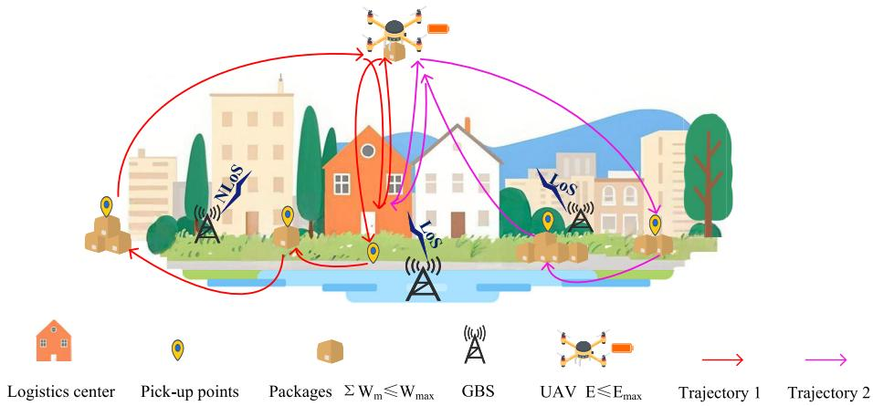  
Fig. 1. An illustration of the UAV-enabled cargo pickup system.

$$
\pi _ { k , 0 } = \pi _ { k , M _ { k } } = 0 , \forall k \in \mathcal { K } ,\tag{4}
$$

$$
\sum _ { k = 1 } ^ { K } M _ { k } = M + K ,\tag{5}
$$

$$
I _ { k , m } ( t ) \in \{ 0 , 1 \} , \forall k \in \mathcal { K } , \forall m \in \mathcal { M } , \forall t \in [ 0 , T _ { k } ] ,\tag{6}
$$

$$
\sum _ { k \in \mathcal { K } } \left\{ \int _ { 0 } ^ { T _ { k } } I _ { k , m } ( t ) d t \right\} = 1 , \forall m \in \mathcal { M } ,\tag{7}
$$

$$
\begin{array} { r } { W _ { k } ( t ) = W _ { \mathrm { U A V } } + \displaystyle \sum _ { m \in \mathcal { M } } \int _ { 0 } ^ { t } w _ { m } I _ { k , m } ( t ) d t \leq W _ { \operatorname* { m a x } } , } \\ { \forall k \in \mathcal { K } , \forall t \in [ 0 , T _ { k } ] , \qquad } \end{array}\tag{8}
$$

where $W _ { k } ( t )$ denotes the total weight of the UAV at time t on the k-th flight. $W _ { \mathrm { U A V } }$ and $W _ { \mathrm { m a x } }$ represent the weight of the cargo UAV itself and the maximum legal weight, respectively.

## B. Communication Model

The communication of the cargo UAV is supported by GBSs, and the channel gain between the UAV and GBSs is mainly dominated by large-scale fading and small-scale fading in the UAV-enabled cargo pickup system. On the one hand, large-scale fading is mainly afected by path loss, shadowing efect, antenna gain, and propagation angle. Among them, path loss is related to the distance between the UAV and GBSs. On the other hand, small-scale fading is mainly afected by the movement and propagation environment of the UAV. These factors together lead to the rapid change of the signal amplitude and phase received by the UAV, which in turn leads to the instability of the UAV’s communication quality. In other words, these factors determine the communication quality between the UAV and GBSs. According to reference [26], the channel gain model between the c-th GBS and the UAV position at time t as follows [10]

$$
h _ { c } ( \mathbf { q } _ { k } ( t ) ) = \bar { h } _ { c } ( \mathbf { q } _ { k } ( t ) ) \tilde { h } _ { c } ( \mathbf { q } _ { k } ( t ) ) , \forall k \in \mathcal { K } , \forall c \in \mathcal { C } , \forall t \in [ 0 , T _ { k } ] ,\tag{9}
$$

where $\mathcal { C } ~ = ~ \{ 1 , 2 , . . . , C \}$ denotes the set of GBSs, and C represents the total number of GBSs in the UAV flight area.

$\bar { h } _ { c } ( \mathbf { q } _ { k } ( t ) )$ denotes the large-scale channel gain, which is related to the channel type (i.e., LoS or NLoS) between the UAV and the c-th GBS, the c-th GBS antenna radiation power gain $G _ { c } ( \mathbf { q } )$ , the distance $d _ { c } ^ { k } ( t )$ between the UAV and the cth GBS at time t, the flight altitude $h _ { k } ( t )$ of the UAV at time t, and the carrier frequency $f _ { c } .$ . The calculation formula is as follows [27]

$$
\bar { h } _ { c } ^ { \mathrm { L o S } } ( \mathbf { q } _ { k } ( t ) ) = \frac { G _ { c } ( \mathbf { q } _ { k } ( t ) ) } { 2 } + \frac { 1 } { 2 } \operatorname* { m i n } \left\{ \bar { h } _ { c } ^ { \mathrm { F S P L } } , - 3 0 . 9 \right.\tag{10}
$$

$$
\begin{array} { r l r } {  { \bar { h } _ { c } ^ { \mathrm { N L o S } } ( \mathbf { q } _ { k } ( t ) ) = \frac { G _ { c } ( \mathbf { q } _ { k } ( t ) ) } { 2 } + \frac { 1 } { 2 } \operatorname* { m i n } \big \{ \bar { h } _ { c } ^ { \mathrm { L o S } } ( \mathbf { q } ) , - 3 2 . 4 } } \\ & { } & { - ( 4 3 . 2 - 7 . 6 \log _ { 1 0 } { h } _ { k } ( t ) \big ) \log _ { 1 0 } { d } _ { c } ^ { k } ( t ) } \\ & { } & { - 2 0 \log _ { 1 0 } { f } _ { c } \big \} , } \end{array}\tag{11}
$$

where $d _ { c } ^ { k } ( t ) = \lVert { \bf q } _ { k } ( t ) - g _ { c } \rVert$ , and g represents the location of the c-th GBS. Note that $\bar { h } _ { c } ^ { \mathrm { L o S } } ( \mathbf { q } _ { k } ( t ) )$ and $\bar { h } _ { c } ^ { \mathrm { N L o S } } ( \mathbf { q } _ { k } ( t ) )$ respectively represent the large-scale signal gains when the channel types are LoS and NLoS. In addition, $\tilde { h } _ { c } ( \mathbf { q } _ { k } ( t ) )$ represents the smallscale channel gain, with E $\left[ \tilde { h } _ { c } ^ { 2 } ( \mathbf { q } _ { k } ( t ) ) \right] = 1$

The communication between the UAV and GBSs employs orthogonal frequency division multiplexing (OFDM) technology, which can efectively resist the interference of non-associated GBSs. In this work, the SNR between the UAV and the associated GBS is used as an indicator to quantify the communication quality. Then, the instantaneous SNR at any time t is defined as follows [10]

$$
\begin{array} { r l r } {  { \gamma ( \mathbf { q } _ { k } ( t ) ) = P \times \frac { h _ { c } ^ { 2 } ( \mathbf { q } _ { k } ( t ) ) } { \sigma ^ { 2 } } } } \\ & { } & { = P \times \frac { \bar { h } _ { c } ^ { 2 } ( \mathbf { q } _ { k } ( t ) ) \tilde { h } _ { c } ^ { 2 } ( \mathbf { q } _ { k } ( t ) ) } { \sigma ^ { 2 } } , 0 \le t \le T _ { k } , \forall k \in \mathcal { K } , } \end{array}\tag{12}
$$

where P represents the transmitted power of GBSs, and $\sigma ^ { 2 }$ represents the noise power received by the UAV. In practical situations, the instantaneous SNR, (q<sub>k</sub>(t)), exhibits variability over the channel coherence time due to rapid fluctuations in the fading process $\tilde { h } _ { I ( \mathbf { q } _ { k } ( t ) ) } ^ { 2 } ( \mathbf { q } _ { k } ( t ) )$ ). In the ofline UAV trajectory optimization, the average quality of GBS-UAV communication is assessed by using the expected SNR as a performance metric.<sup>1</sup> The expected SNR can be expressed as [10]

$$
\begin{array} { r l } & { \bar { \boldsymbol { \gamma } } ( \mathbf { q } _ { k } ( t ) ) = \mathbb { E } [ { \boldsymbol { \gamma } } ( \mathbf { q } _ { k } ( t ) ) ] = \frac { \mathbb { E } \left[ P \times \bar { h } _ { c } ^ { 2 } ( \mathbf { q } _ { k } ( t ) ) \tilde { h } _ { c } ^ { 2 } ( \mathbf { q } _ { k } ( t ) ) \right] } { \sigma ^ { 2 } } } \\ & { \quad \quad \quad = P \times \frac { \bar { h } _ { c } ^ { 2 } ( \mathbf { q } _ { k } ( t ) ) } { \sigma ^ { 2 } } , 0 \leq t \leq T _ { k } , \forall k \in \mathcal { K } . } \end{array}\tag{13}
$$

The optimal communication schedule of the UAV at time t is defined using $I ( \mathbf { q } _ { k } ( t ) )$ . That is, the higher the signal strength between the UAV and the $I ( \mathbf { q } _ { k } ( t ) )$ -th GBS at time t, $I ( \mathbf { q } _ { k } ( t ) )$ is defined as follows [25]

$$
\begin{array} { r l } & { I ( \mathbf { q } _ { k } ( t ) ) = \underset { c \in \mathcal { C } } { \mathrm { a r g m a x ~ } } \mathbb { E } [ \gamma ( \mathbf { q } _ { k } ( t ) ) ] } \\ & { \quad \quad = \underset { c \in \mathcal { C } } { \mathrm { a r g m a x ~ } } \frac { P \times \bar { h } _ { c } ^ { 2 } ( \mathbf { q } _ { k } ( t ) ) } { \sigma ^ { 2 } } , \forall k \in \mathcal { K } , \forall t \in [ 0 , T _ { k } ] . } \end{array}\tag{14}
$$

Then, the expected SNR at any time t is

$$
\bar { \gamma } ( \mathbf { q } _ { k } ( t ) ) \triangleq \frac { P \times \bar { h } _ { I ( \mathbf { q } _ { k } ( t ) ) } ^ { 2 } ( \mathbf { q } _ { k } ( t ) ) } { \sigma ^ { 2 } } , 0 \leq t \leq T _ { k } , \forall k \in \mathcal { K } .\tag{15}
$$

To guarantee the communication quality of the UAV, we define an SNR threshold, denoted as $\gamma _ { t h } .$ . When the SNR obtained by the UAV at position ${ \bf q } _ { k } ( t )$ <sup>γ</sup> is greater than this threshold, it indicates that the communication link between the UAV and the GBS is stable during time t. That is,

$$
\bar { \gamma } ( \mathbf q _ { k } ( t ) ) \geq \gamma _ { t h } , \forall k \in \mathcal { K } , \forall t \in [ 0 , T _ { k } ] .\tag{16}
$$

## C. Energy Consumption Model

In the UAV cargo pickup system, the on-board energy of the UAV is used for two purposes, namely for maintaining the propulsion of the UAV and maintaining the communication of the UAV. These two are called the UAV’s flight energy consumption and the UAV’s communication energy consumption. However, according to reference [28], compared with the flight energy consumption of UAV, the communication energy consumption of the UAV is small enough to be ignored. Therefore, we consider that all the UAV’s on-board energy is used to maintain the propulsion of the UAV in this work. Correspondingly, the horizontal flight energy consumption of the UAV at the k-th flight is defined as [28]

$$
\begin{array} { r l r } {  { P _ { \mathrm { h o r } } ( V _ { k } ( t ) , W _ { k } ( t ) ) } } \\ & { } & { = \underbrace { P _ { 0 } ( 1 + \frac { 3 V _ { k } ( t ) ^ { 2 } } { U _ { \mathrm { t i p } } ^ { 2 } } ) } _ { \mathrm { b l a d e ~ p r o f l e } } + \underbrace { \frac { 1 } { 2 } d _ { 0 } \rho s A V _ { k } ( t ) ^ { 3 } } _ { \mathrm { p a r a s i t e } } } \end{array}
$$

<sup>1</sup>Our current model assumes a static channel gain for the purpose of ofline trajectory planning, which is a reasonable approximation for path optimization over a large area [27]. However, in practical UAV applications, the instantaneous SNR is subject to rapid, random fluctuations due to dynamic factors like atmospheric conditions, local scatterers, and the relative movement of the UAV and GBS. Furthermore, our model does not account for the handover delays that occur when a UAV switches its communication link from one GBS to another. These delays can temporarily disrupt connectivity, impacting real-time flight control and data transmission. While our UPSEEO framework is proposed to ensure a stable communication link based on a minimum SNR threshold, future work could incorporate a more dynamic channel model that includes stochastic SNR variations and explicitly accounts for handover delays. This would allow for an even more robust and realistic framework for UAV trajectory optimization in highly dynamic environments.

$$
+ \underbrace { P _ { i } \left( \sqrt { 1 + \frac { V _ { k } ( t ) ^ { 4 } } { 4 \nu _ { 0 } ^ { 4 } } } - \frac { V _ { k } ( t ) ^ { 2 } } { 2 \nu _ { 0 } ^ { 2 } } \right) ^ { 1 / 2 } } _ { \mathrm { i n d u c e d } } , \forall \dot { h } _ { k } ( t ) = 0 ,\tag{17}
$$

where $V _ { k } ( t ) , U _ { \mathrm { t i p } } , d _ { 0 } , \rho , s , A ,$ and v<sub>0</sub> represent the $\mathrm { U A V } ^ { \ , } \mathbf { s }$ flight speed at time t on the k-th flight, the tip speed of the rotor blade, the fuselage drag ratio, the air density, the rotor solidity, the rotor disc area, and the mean rotor induced velocity in hover, respectively.

Given the time-varying speed and weight of the UAV in the cargo UAV delivery scenario, parameters $P _ { i }$ and v<sub>0</sub> in (17) depend on the real-time weight $W _ { k } ( t )$ of the cargo UAV, calculated by [25]

$$
P _ { i } = ( 1 + k ) \frac { W _ { k } ( t ) ^ { 3 / 2 } } { \sqrt { 2 \rho A } } ,\tag{18}
$$

$$
\nu _ { 0 } = \ \sqrt { \frac { W _ { k } ( t ) } { 2 \rho A } } .\tag{19}
$$

In addition to the energy the UAV expends during horizontal flight, additional energy consumption occurs during its ascent. However, during vertical descent, the UAV operates in autorotation and remains unpowered, resulting in approximately negligible energy consumption. The propulsion power of the UAV during its ascent is calculated as [29]

$$
P _ { \mathrm { v e r } } \left( h _ { k } ( t ) \right) = \left\{ \begin{array} { l l } { W _ { k } ( t ) { \dot { h } } _ { k } ( t ) , \forall { \dot { h } } _ { k } ( t ) > 0 } \\ { 0 , \forall { \dot { h } } _ { k } ( t ) < 0 . } \end{array} \right.\tag{20}
$$

Then, the energy consumption $E _ { k } ( t )$ of the UAV at the k-th flight can be expressed as

$$
E _ { k } ( t ) = \underbrace { \int _ { 0 } ^ { t } P _ { \mathrm { h o r } } ( V _ { k } ( t ) , W _ { k } ( t ) ) d t } _ { E _ { h } ( t ) } + \underbrace { \int _ { 0 } ^ { t } P _ { \mathrm { v e r } } ( h _ { k } ( t ) ) d t } _ { E _ { \nu } ( t ) } ,\tag{21}
$$

where $E _ { h } ( t )$ and $E _ { \nu } ( t )$ indicate horizontal flight and vertical flight energy consumption, respectively. Consequently, the total energy consumption $E _ { \mathrm { t o t a l } }$ of the system can be expressed as

$$
\begin{array} { l } { \displaystyle E _ { \mathrm { t o t a l } } = \sum _ { k = 1 } ^ { K } E _ { k } ( T _ { k } ) } \\ { \displaystyle \qquad = \sum _ { k = 1 } ^ { K } \left( \int _ { 0 } ^ { T _ { k } } P _ { \mathrm { h o r } } ( V _ { k } ( t ) , W _ { k } ( t ) ) d t + \int _ { 0 } ^ { T _ { k } } P _ { \mathrm { v e r } } ( h _ { k } ( t ) ) d t \right) . } \end{array}\tag{22}
$$

Moreover, the energy consumption $E _ { k } ( t )$ is subject to the following constraints [30]

$$
E _ { k } ( t ) \leq E _ { \operatorname* { m a x } } , \forall t \in [ 0 , T _ { k } ] , \forall k \in \mathcal { K } .\tag{23}
$$

Note that the cargo UAV needs to return to the logistics centre to replace its battery before it runs out of energy. Otherwise, it risks crashing.

## III. SNR MAP CONSTRUCTION

The purpose of this section is to construct the SNR map for subsequent trajectory optimization of the cargo UAV. To start, we constructed the channel gain map by leveraging

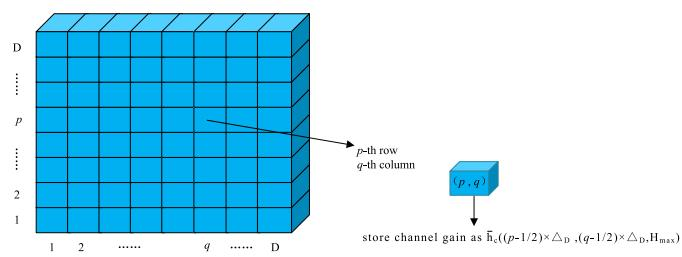  
Fig. 2. An illustration of the grid-based approach.

the communication model in Section II. Next, we propose a methodology for constructing SNR map.<sup>2</sup>

## A. Channel Gain Map

In this subsection, the channel gain map is obtained to construct the SNR map further. Since the UAV would have vertical movement only when picking up the packages directly above pick-up points, we only need to construct the 2D channel gain map at height $H _ { \mathrm { m a x } }$ . The channel gain map for the c-th GBS illustrates the large-scale gain distribution between the GBS and any UAV’s location, $\bar { h } _ { c } ^ { 2 } ( \mathbf { q } )$ represents the large-scale gain distribution between the UAV at position q and the c-th GBS. Due to the continuous nature of wireless propagation in a two-dimensional space, storing large-scale gains for every possible UAV position is not feasible. To address this limitation, a grid-based approach is employed, which divides a map of a continuous space into a certain number of grids, with each grid having a width of $\Delta _ { D }$ [10]. This grid-based approach can efectively store the channel gain information, thus the smaller the grid size, the lower the error in the stored channel gain information. By choosing an infinitely small $\Delta _ { D }$ to ensure the channel gain within each grid cell nearly constant, where $\Delta _ { D } = 1 0 . ^ { 3 }$ As shown in Fig. 2, the channel gain map for the c-th GBS can be represented as

$$
\left[ \bar { H } _ { D \times D } ^ { c } \right] _ { p , q } = \bar { h } _ { c } \left( \ P _ { D } \left[ p , q \right] \right) , \forall i , j \in \mathcal { D } ,\tag{24}
$$

<sup>2</sup>SNR map is a kind of channel knowledge map (CKM) [31], which can intuitively represent the SNR distribution in an area. According to the SNR map, the UAV can adjust its flight strategy to solve the communication challenges in low-altitude economic applications. At present, many works have studied CKM construction, including physical map-based method [32], stochastic channel model-based method [33], and binary Bayesian filtering method based on channel measurement data [34]. Therefore, it is theoretically feasible to obtain the SNR map in advance. Specifically, we employ a physical map-based method in this paper. This method has high accuracy and high reliability, but it needs to obtain the precise physical map of the UAV flight area in advance. The simultaneous navigation and radio mapping (SNARM) framework described in [35] can be applied to optimize the trajectory optimization problem in cargo UAV pickup systems, even without a preexisting physical map. However, this framework yields inferior performance compared to the proposed UPSEEO in this paper. The specific diferences are shown in Section VI.

<sup>3</sup>In references [10] and [27], the radio map was constructed with an accuracy parameter, $\Delta _ { D } ,$ set to 10 meter (m). This parameter defines the sampling resolution: a smaller value of $\Delta _ { D }$ increases the number of sampled points, thereby enhancing the radio map’s accuracy but significantly increasing the computational complexity of its construction. Conversely, a larger ∆<sub>D</sub> reduces computational burden but diminishes accuracy. Consequently, the radio map accuracy in this paper adopts the standard established by references [10] and [27] $( \Delta _ { D } = 1 0 )$ . We defer a comprehensive exploration of the tradeof between accuracy and computational complexity for the radio map to our future work.

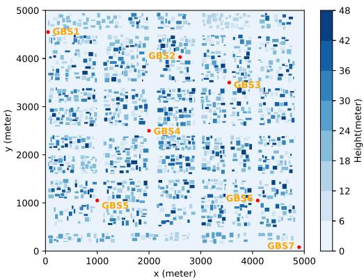  
Fig. 3. Distribution and height of buildings.

where $\begin{array} { r l r } { \mathbf { q } _ { D } \left[ p , q \right] } & { { } = } & { ( ( p - 1 / 2 ) \times \Delta _ { D } , ( q - 1 / 2 ) \times \Delta _ { D } , H _ { \operatorname* { m a x } } ) } \end{array}$ denotes the coordinates of the $( p , q )$ -th grid. Moreover, $\mathcal { D } =$ $\{ 1 , 2 , \ldots , D \}$ , and D is the number of grids per row or column. In particular, the number of grids in each row or column is equal in this work. Then, the number of grids D in the channel gain map, the grid size $\Delta _ { D } ,$ and the size R of the map must satisfy the following constraints

$$
D = \frac { R } { \Delta _ { D } } .\tag{25}
$$

In the sequel of this paper, we assume that the channel gain maps for the C GBSs, i.e., $\left\{ \bar { H } _ { D \times D } ^ { c } \right\} _ { c = 1 } ^ { C } ,$ are perfectly known. Fig. 3 illustrates the distribution of buildings and their heights in the UAV flight area.

## B. SNR Map

Given that the channel gain map $\left\{ \bar { H } _ { D \times D } ^ { c } \right\} _ { c = 1 } ^ { C }$ is known in advance, we can construct the SNR map of the UAV flight area. Based on these mappings, the ultimate aim is to estimate the expected SNR at any given UAV position. Since the channel gain map is obtained using a grid-based method, the SNR map within the UAV flight area is also constructed by $D \times D$ grids. Then, according to equation (14), the communication schedule of the UAV within the $( p , q ) \ – \mathrm { t h }$ grid can be expressed as

$$
\begin{array} { r l } & { I ( \mathbf { q } _ { D } \left[ p , q \right] ) = \underset { c \in \mathcal { C } } { \mathrm { a r g m a x ~ } } \mathbb { E } [ \gamma ( \mathbf { q } _ { D } \left[ p , q \right] ) ] } \\ & { \quad \quad \quad = \underset { c \in \mathcal { C } } { \mathrm { a r g m a x ~ } } \frac { P \times \bar { h } _ { c } ^ { 2 } ( \mathbf { q } _ { D } \left[ p , q \right] ) } { \sigma ^ { 2 } } . } \end{array}\tag{26}
$$

Consequently, the SNR $[ \overline { { \cal S } } ] _ { p , q }$ of the UAV at the $( p , q )$ -th grid is calculated as

$$
[ \overline { { S } } ] _ { p , q } = P \times \frac { \bar { h } _ { I ( \mathbf { q } _ { D } \left[ p , q \right] ) } ^ { 2 } \left( \mathbf { q } _ { D } \left[ p , q \right] \right) } { \sigma ^ { 2 } } , \forall p , q \in \mathcal { D } .\tag{27}
$$

Based on equation (27), the SNR of any grid in the UAV flight area can be calculated and saved, and the complete SNR map can be obtained, as shown in Fig. 4. Specifically, in the scenario considered in this paper, $H _ { \mathrm { m a x } } = 5 0$

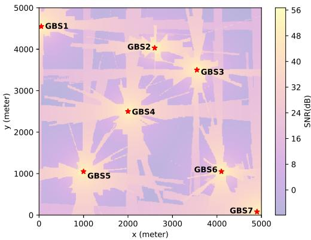  
Fig. 4. SNR map at $H _ { \mathrm { m a x } }$ m.

## IV. PROBLEM FORMULATION

We aim to minimize total system energy consumption while ensuring the UAV’s communication quality, subject to limited payload capacity and on-board battery energy. In the previous sections, we have obtained the corresponding SNR map, which can be utilized to optimize the UAV’s trajectory that satisfies the communication connectivity requirements. Therefore, the total energy consumption $E _ { \mathrm { t o t a l } }$ is minimized by optimizing the UAV’s trajectory Q, task allocation Π, and flight speed V. Based on this, the following optimization problem is formulated

$$
\mathrm { P 0 } : \operatorname* { m i n } _ { \mathcal { Q } , \Pi , \mathcal { V } } E _ { \mathrm { t o t a l } }\tag{28}
$$

$$
\left( \dot { \mathbf { q } } _ { k } ( t ) = \mathbf { v } _ { k } ( t ) , \forall t \in [ 0 , T _ { k } ] , \forall k \in \mathcal { K } \right.\tag{28a}
$$

$$
0 \leq \| \mathbf { v } _ { k } ( t ) \| \leq V _ { \operatorname* { m a x } } , \forall t \in [ 0 , T _ { k } ] , \forall k \in K\tag{28b}
$$

$$
{ \mathrm { s . t . ~ } } \left\{ \mathbf { q } _ { k } \left( 0 \right) = \mathbf { q } _ { k } \left( T _ { k } \right) = \left( x _ { 0 } , y _ { 0 } , 0 \right) \right.\tag{28c}
$$

$$
{ \left\lfloor \ ( 1 ) - \ ( 8 ) , \ ( 1 6 ) , \mathrm { a n d } \ ( 2 3 ) . \right. }\tag{28d}
$$

In problem P0, Constraints (28a) and (28b) represent the flight dynamics governing the operation of the cargo UAV. (28c) and (4) ensure that the UAV must be located at the warehouse at both the start and end of the task. (1), (2), and (3) indicate that the flight range of the UAV must be within the specified area. (5), (6), and (7) mean that the UAV picks up the parcels at each pick-up point and only picked up once during the whole mission. (8) represents the maximum load capacity constraint of the cargo UAV. (16) represents the communication quality constraint of the UAV, meaning that the SNR of the UAV during flight must not be lower than the specified threshold; otherwise, it is judged as losing the communication connection with all GBSs. Finally, (23) represents the energy constraint of the UAV, which stipulates that the UAV must return to the location of the logistics centre before the on-board energy is exhausted.

Obviously, the optimization problem P0 is a highly nonconvex mixed-integer nonlinear programming problem, and making it dificult to solve for the optimal UAV flight trajectory, task allocation, and flight speed. To address this challenge, decomposing problem P0 into several sub-problems is considered, and a novel framework for the UPSEEO is proposed.

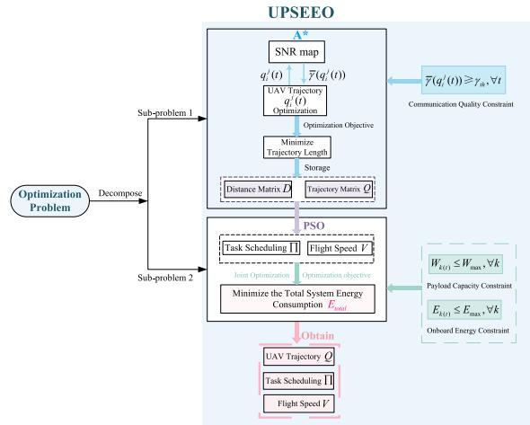  
Fig. 5. An illustration of the UPSEEO framework.

## V. PROPOSED FRAMEWORK

To solve problem P0, a framework named UPSEEO is proposed. The framework decomposes the optimization problem into two sub-problems for a solution, as shown in Fig. 5. First, a distance matrix is created, and the elements in the distance matrix represent the trajectory length optimized using the $\mathbf { A } ^ { * }$ algorithm instead of the Euclidean distance. Subsequently, the PSO algorithm is used to optimize the UAV’s task allocation and flight speed to reduce the total energy consumption of the system, subject to the limited payload capacity and battery power of the cargo UAV.

In this subsection, we use the $\mathbf { A } ^ { * }$ algorithm to optimize the UAV’s trajectory between any two pickup points or between any pickup point and the logistics center. The purpose of the optimized trajectory is to ensure the communication quality of the UAV while minimizing the energy consumption of the UAV between any two topological points (pickup point or the logistics center). Since we have stated in Section II that only the 2D UAV trajectory is optimized when the altitude is $H _ { \mathrm { m a x } } ,$ the UAV trajectory optimization problem from the i-th pickup point to the j-th pickup point can be formulated as

$$
\mathrm { P 1 } : \operatorname* { m i n } _ { \mathbf { q } _ { i } ^ { j } } \hat { E } _ { i } ^ { j }\tag{29}
$$

$$
( \dot { \mathbf { q } } _ { i } ^ { j } ( t ) = \mathbf { v } _ { i } ^ { j } ( t ) , \forall t \in [ 0 , T _ { i } ^ { j } ] , \forall i , j \in \mathcal { M }\tag{29a}
$$

$$
\begin{array} { r } { \Big | 0 \leq \| \mathbf { v } _ { i } ^ { j } ( t ) \| \leq V _ { \operatorname* { m a x } } , \forall t \in [ 0 , T _ { i } ^ { j } ] , \forall i , j \in \mathcal { M } } \end{array}
$$

$$
\mathbf { s . t . } \{ \bar { \mathbf { q } } _ { i } ^ { j } ( 0 ) = { { P } _ { i } }\tag{29b}
$$

(29c)

$$
\bar { \mathbf { q } } _ { i } ^ { j } \left( T _ { i } ^ { j } \right) = P _ { j }\tag{29d}
$$

$$
\begin{array} { r } { \left. \bar { \gamma } ( \mathbf { q } _ { i } ^ { j } ( t ) ) \geq \gamma _ { t h } , \forall t \in [ 0 , T _ { i } ^ { j } ] , \forall i , j \in \mathcal { M } , \right. } \end{array}\tag{29e}
$$

where $\mathbf { q } _ { i } ^ { j } , \ \hat { E } _ { i } ^ { j } , \ \mathbf { v } _ { i } ^ { j } ( t )$ , and $T _ { i } ^ { j }$ represent the flight trajectory, horizontal flight energy consumption, flight speed, and flight time of the UAV from the i-th pickup point to the j-th pickup point, respectively. According to equation (21), $\hat { E } _ { i } ^ { j }$ is calculated as follows

$$
\hat { E } _ { i } ^ { j } = \int _ { 0 } ^ { T _ { i } ^ { j } } P _ { \mathrm { h o r } } ( \Vert \mathbf { v } _ { i } ^ { j } ( t ) \Vert , W _ { i } ^ { j } ) d t ,\tag{30}
$$

where $\boldsymbol { W } _ { i } ^ { j }$ denotes the weight of the UAV during the journey from the i-th pickup point to the j-th pickup point. According to the reference [18], in the UAV cargo delivery system, the optimal flight speed of the UAV is related to the weight. When the weight is constant, the optimal flight speed of the UAV is also constant, i.e., $| | \mathbf { v } _ { i } ^ { j } ( t ) | |$ and $\boldsymbol { W } _ { i } ^ { j }$ are constants. Then, $\hat { E } _ { i } ^ { j }$ can be reformulated as

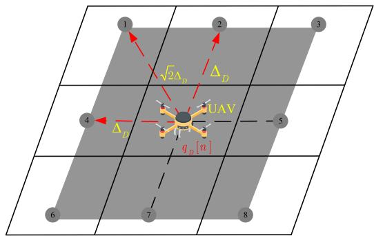  
Fig. 6. Illustration of available 2D grid point and index.

$$
\hat { E } _ { i } ^ { j } = P _ { \mathrm { h o r } } ( \Vert \mathbf { v } _ { i } ^ { j } ( t ) \Vert , W _ { i } ^ { j } ) \times T _ { i } ^ { j } .\tag{31}
$$

Hence, problem P1 can be reformulated as

$$
\mathsf { P } 2 : \operatorname* { m i n } _ { \ P _ { i } ^ { j } } T _ { i } ^ { j }\tag{32}
$$

$$
\mathrm { s . t . } ( 2 9 \mathrm { a } ) - ( 2 9 \mathrm { e } ) .\tag{32a}
$$

## A. A<sup>∗</sup>-Based Trajectory Optimization

Since constraint (29e) specifies the minimum SNR constraint for the UAV, not all grid points can be included in the set of feasible flight paths. Consequently, the SNR map is preprocessed, and grid points satisfying the communication requirements are filtered out. Based on the matrix $[ \overline { { \cal S } } ] _ { p , q } ,$ a new binary matrix $[ \overline { { F } } ] _ { p , q }$ is constructed, where each entry indicates whether the corresponding grid point is a feasible candidate for path planning or not. The construction of the matrix $[ \overline { { F } } ] _ { p , q }$ is given by the following equation

$$
[ \overline { { F } } ] _ { p , q } = \left\{ \begin{array} { l l } { 1 , \mathrm { ~ i f ~ } [ \overline { { S } } ] _ { p , q } \geq \gamma _ { t h } } \\ { 0 , \mathrm { ~ o t h e r w i s e ~ } , } \end{array} \right. \forall p , q \in \mathcal { D } .\tag{33}
$$

Moreover, the UAV has eight alternative flight directions at either grid, as shown in Fig. 6. To solve problem P2, it is transformed into an equivalent shortest path problem in graph theory. Then, problem P2 can be reformulated as [27]

$$
\mathrm { P 3 } : \operatorname* { m i n } _ { \substack { N _ { i } ^ { j } , \{ p _ { n } , q _ { n } \} _ { n = 1 } ^ { N _ { i } ^ { j } } } } \ \sum _ { n = 1 } ^ { N _ { i } ^ { j } - 1 } \| \mathbf { q } _ { D } [ n + 1 ] - \mathbf { q } _ { D } [ n ] \|\tag{34}
$$

$$
\left( { \bf q } _ { D } [ 1 ] = \left( P _ { i } , H _ { \mathrm { m a x } } \right) \right.\tag{34a}
$$

$$
\mathbf { q } _ { D } [ N _ { i } ^ { j } ] = ( P _ { j } , H _ { \operatorname* { m a x } } )\tag{34b}
$$

$$
\mathrm { s . t . } \left\{ \| { \bf q } _ { D } \left[ n + 1 \right] - { \bf q } _ { D } \left[ n \right] \| \leq \sqrt { 2 } \Delta _ { D } \right.\tag{34c}
$$

$$
\begin{array} { r } { \boxed { \left[ \overline { { F } } \right] _ { p _ { n } , q _ { n } } = 1 , \forall n \in \left\{ 1 , 2 , \ldots , N _ { i } ^ { j } \right\} , } } \end{array}\tag{34d}
$$

where $\mathbf { q } _ { \cal D } [ n ] \triangleq \mathbf { q } _ { \cal D } [ p _ { n } , q _ { n } ] ,$ , the n-th grid visited by the UAV. $p _ { n }$ and $q _ { n }$ <sup>,</sup>denote the index of the n-th grid in the X-axis and Y-axis directions, respectively. $N _ { i } ^ { j }$ represents the total number of nodes (i.e., grid) visited by the UAV during the journey from pickup point i to pickup point j.

Subsequently, the total evaluation function $f ( n ) ,$ , the cost function $g ( n )$ , and the heuristic function h(n) in the $\mathbf { A } ^ { * }$ algorithm are defined, where $f ( n ) = g ( n ) + h ( n )$ [36]. According to the objective function in problem P3, optimization aims to minimize the total trajectory length. Therefore, the $h ( n )$ is defined as the estimated shortest Euclidean distance from the current grid to the target grid, calculated as [36]

$$
h ( { n } ) = \ \sqrt { \left( x _ { n } - x _ { j } \right) ^ { 2 } + \left( y _ { n } - y _ { j } \right) ^ { 2 } } ,\tag{35}
$$

where $x _ { n } = ( p _ { n } - 1 / 2 ) \Delta _ { D }$ and $y _ { n } = ( q _ { n } - 1 / 2 ) \Delta _ { D }$ represent the horizontal and vertical coordinates of the n-th node visited by the UAV, respectively. Moreover, $x _ { j }$ and $y _ { j }$ represent the horizontal and vertical coordinates of pickup point $j .$ The function g(n) denotes the actual cost from the starting point to the n-th node visited by the UAV, and g(n) is updated as [36]

$$
g \left( n + 1 \right) = g \left( n \right) + \left\| \mathbf { q } _ { D } [ n + 1 ] - \mathbf { q } _ { D } [ n ] \right\| .\tag{36}
$$

Note that constraint (34a) specifies that the first grid visited by the UAV is the grid containing pickup point i. Therefore, the cost function g(n) for the first visited grid is 0, i.e., $\left. g ( n ) \right| _ { n = 1 } = 0$

Next, we create a distance matrix denoted by D. The specific definition of D is as follows

$$
\pmb { D } _ { ( M + 1 ) \times ( M + 1 ) } = \left( \begin{array} { c c c c } { d _ { 0 } ^ { 0 } } & { d _ { 0 } ^ { 1 } } & { \hdots } & { d _ { 0 } ^ { M } } \\ { d _ { 1 } ^ { 0 } } & { d _ { 1 } ^ { 1 } } & { \hdots } & { d _ { 1 } ^ { M } } \\ { \vdots } & { \vdots } & { \ddots } & { \vdots } \\ { d _ { M } ^ { 0 } } & { d _ { M } ^ { 1 } } & { \hdots } & { d _ { M } ^ { M } } \end{array} \right) ,\tag{37}
$$

where $d _ { i } ^ { j } \in D$ (with $i \neq j )$ denotes the distance between the i-th and j-th pickup points. Here, ${ \pmb D } \in \mathbb { R } ^ { ( M + 1 ) \times ( M + 1 ) }$ is the distance matrix for all M pickup points.

Finally, an open list H and a closed list V are created. The starting node is added to the open list, and the node whose SNR value does not meet the condition is moved to the closed list according to constraint (34d). The node with the smallest f (n) value is selected from the open list as the current node, and a check is performed to determine if it is the endpoint. After the UAV successfully travels from user j to user i, the trajectory length is recorded, and the corresponding $d _ { i , j }$ value in the distance matrix is also updated. Similarly, a trajectory matrix $\scriptstyle Q _ { ( M + 1 ) \times ( M + 1 ) }$ is created to store information about the optimized trajectories. The detailed trajectory optimization process is outlined in Algorithm 1.

$$
\begin{array} { l l } { { B . } } & { { P S O - B a s e d T a s k A l l o c a t i o n a n d F l i g h t S p e e d } } \\ { { } } & { { O p t i m i z a t i o n } } \end{array}
$$

Following the application of the $\mathbf { A } ^ { * }$ algorithm to optimize the UAV’s trajectory, the PSO algorithm is further employed to optimize the UAV’s task allocation and flight speed. This optimization is constrained by the limited payload capacity and battery power of the cargo UAV. The optimization problem is formulated as follows

$$
{ \mathsf { P 4 } } : \operatorname* { m i n } _ { \Pi , \mathcal { V } } E _ { \mathrm { t o t a l } }\tag{38}
$$

$$
{ \mathrm { s . t . } } ( 4 ) - ( 8 ) , { \mathrm { a n d } } ( 2 3 ) .\tag{38a}
$$

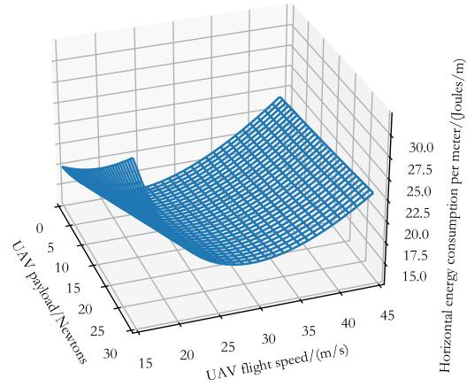

```latex
Algorithm 1 A<sup>∗</sup>-Based Trajectory Optimization of UAV
1: Input: Pickup point set $\overline { { \mathcal { M } = \{ 1 , 2 , \dots , M \} } }$ , SNR indicator
matrix $[ \overline { { F } } ] _ { p , q } ,$ <sup>, ,</sup> <sup>.</sup> <sup>.</sup> <sup>.</sup> <sup>,</sup> SNR threshold , and the total evaluation
<sup>,</sup>function f (n)
2: Output: Distance matrix $D _ { ( M + 1 ) \times ( M + 1 ) }$ and trajectory
matrix $\scriptstyle Q _ { ( M + 1 ) \times ( M + 1 ) }$
3: Initialize: Distance matrix $D _ { ( M + 1 ) \times ( M + 1 ) } .$ trajectory
matrix $\scriptstyle Q _ { ( M + 1 ) \times ( M + 1 ) } ,$ open list H, and closed list V
4: for $i = 0$ to M do
5: for $j = 0$ to M do
6: if $i \neq j$ then
7: Set the starting position to $P _ { i } ,$ set the target point
position to $P _ { j }$
8: repeat
9: If the neighboring point is not in H, the
neighboring point is added to H, and the
parent object of the neighboring point is set
to be the current point $n _ { \mathrm { c u r r e n t } }$
10: For each valid adjacency node, the values of
g(n), h(n), and $f ( n )$ are computed if it is not
in the closed list V
11: Choose a node $n _ { \mathrm { n e w } }$ from H that minimizes
the value of f (n) according to (35) and (36),
move it out of H, and added to the V
12: until Current node $n _ { \mathrm { c u r r e n t } } ~ = P _ { j }$ and $\mathcal { H } = \mathcal { O }$
13: Calculate the length $d _ { i } ^ { j }$ of the optimized trajec
tory, update the distance matrix of $D _ { ( M + 1 ) \times ( M + 1 ) }$
and trajectory matrix $\scriptstyle Q _ { ( M + 1 ) \times ( M + 1 ) }$
14: else $\{ i = j \}$
15: $d _ { i } ^ { j } = + \infty$
16: end if
17: end for
18: end for
```

Since Algorithm 1 optimizes the UAV’s trajectory and obtains the flight trajectory length $d _ { i } ^ { j }$ between any two pickup points, then the total energy consumption $E _ { \mathrm { t o t a l } }$ obtained by the UAV according to the task allocation policy Π can be expressed as

$$
\begin{array} { r l } { E _ { \mathrm { t o t a l } } } & { = \displaystyle \sum _ { k = 1 } ^ { K } E _ { k } \left( T _ { k } \right) } \\ & { = \displaystyle \sum _ { k = 1 } ^ { K } \sum _ { n = 0 } ^ { M _ { k } - 1 } E _ { \pi _ { k , n } } ^ { \pi _ { k , n + 1 } } , } \end{array}\tag{39}
$$

where $E _ { \pi _ { k , n } } ^ { \pi _ { k , n + 1 } }$ represents the energy consumed by the UAV <sup>π ,</sup>during the journey from the pickup point $\pi _ { k , n }$ to the pickup point $\pi _ { k , n + 1 }$ . According to equations (17), (20), and the distance matrix $D _ { ( M + 1 ) \times ( M + 1 ) }$ obtained by Algorithm 1, $E _ { \pi _ { k , n } } ^ { \pi _ { k , n + 1 } }$ can be calculated as

$$
\begin{array} { r l } { E _ { \pi _ { k , n } } ^ { \pi _ { k , n + 1 } } = } & { \underbrace { H _ { \operatorname* { m a x } } W _ { \pi _ { k , n } } ^ { \pi _ { k , n + 1 } } } _ { \tilde { E } _ { \pi _ { k , n } } ^ { \pi _ { k , n + 1 } } } } \\ & { \quad + \underbrace { P _ { \mathrm { h o r } } ( \left\| \mathbf { v } _ { \pi _ { k , n } } ^ { \pi _ { k , n + 1 } } ( t ) \right\| , W _ { \pi _ { k , n } } ^ { \pi _ { k , n + 1 } } ) d _ { \pi _ { k , n } } ^ { \pi _ { k , n + 1 } } } _ { \left\| \mathbf { v } _ { \pi _ { k , n } } ^ { \pi _ { k , n + 1 } } ( t ) \right\| } , } \end{array}\tag{40}
$$

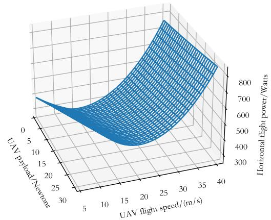  
Fig. 7. Illustration of the payload and flight dynamics of the UAV.

where $\widetilde { E } _ { \pi _ { k , n } } ^ { \pi _ { k , n + 1 } }$ and $\hat { E } _ { \pi _ { k , n } } ^ { \pi _ { k , n + 1 } }$ represent the vertical flight energy consumption and horizontal flight energy consumption of the UAV from pickup point i to pickup point $j ,$ respectively. According to equation (40), $\stackrel { \star } { E } { } _ { \pi _ { k , n } } ^ { \pi _ { k , n + 1 } }$ is only related to the payload weight $\bar { W } _ { \pi _ { k , n } } ^ { \pi _ { k , n + 1 } }$ and rising height $H _ { \mathrm { m a x } }$ of the UAV. The <sup>π ,</sup>UAV’s weight is fixed when it flies from the pickup point i to the pickup point j [18], and $H _ { \mathrm { m a x } }$ is also a constant. Therefore, $\widetilde { E } _ { \pi _ { k , n } } ^ { \pi _ { k , n + 1 } }$ is only related to the task allocation Π. Hence, the flight speed is optimized to reduce the horizontal flight energy consumption.

Subsequently, according to equation (40), it can be inferred that the UAV’s horizontal flight energy consumption depends on its weight, flight speed, and flight distance. Since Algorithm 1 optimizes the flight distance of the UAV between any two pickup points, $d _ { \pi _ { k , n } } ^ { \pi _ { k , n + 1 } }$ is a constant. Then, the energy consumption of the UAV from pickup point i to pickup point j depends on the weight of the UAV as well as its flight speed. To more clearly illustrate the influencing factors of the UAV’s power and energy consumption, Fig. 7 shows the relationship between UAV’s power and energy consumption and its flight speed and payload. Increasing the UAV’s flight speed $V _ { \pi _ { k , n } } ^ { \pi _ { k , n + 1 } }$ reduces its flight time $\frac { d _ { \pi _ { k , n } } ^ { \pi _ { k , n + 1 } - 1 } } { \left\| \mathbf { v } _ { \pi _ { k , n } } ^ { \pi _ { k , n + 1 } } ( t ) \right\| }$ , but also results in a significant increase in its flight power $P _ { \mathrm { h o r } } ( \| \mathbf { v } _ { \pi _ { k , n } } ^ { \pi _ { k , n + 1 } } ( t ) \| , W _ { \pi _ { k , n } } ^ { \pi _ { k , n + 1 } } )$ , as shown in Fig. 7(a). Therefore, there is a trade-of between the flight power and the flight time of the UAV. For the convenience of analysis, $\hat { E } _ { \mathrm { h o r } } ^ { \mathrm { u n i t } } ( \left\| \mathbf { v } _ { \pi _ { k , n } } ^ { \overline { { \pi } } _ { k , n + 1 } } ( t ) \right\| , W _ { \pi _ { k , n } } ^ { \pi _ { k , n + 1 } } )$ is defined as the horizontal flight energy consumption per meter, which is calculated as

$$
\hat { E } _ { \mathrm { h o r } } ^ { \mathrm { u n i t } } ( \left. \mathbf { v } _ { \pi _ { k , n } } ^ { \pi _ { k , n + 1 } } ( t ) \right. , W _ { \pi _ { k , n } } ^ { \pi _ { k , n + 1 } } ) = \frac { P _ { \mathrm { h o r } } ( \left. \mathbf { v } _ { \pi _ { k , n } } ^ { \pi _ { k , n + 1 } } ( t ) \right. , W _ { \pi _ { k , n } } ^ { \pi _ { k , n + 1 } } ) } { \left. \mathbf { v } _ { \pi _ { k , n } + 1 } ^ { \pi _ { k , n + 1 } } ( t ) \right. } .\tag{41}
$$

Then, the horizontal flight energy consumption can be reformulated as

$$
\begin{array} { r } { \hat { E } _ { \pi _ { k , n } } ^ { \pi _ { k , n + 1 } } = \hat { E } _ { \mathrm { h o r } } ^ { \mathrm { u n i t } } ( \Vert \mathbf { v } _ { \pi _ { k , n } } ^ { \pi _ { k , n + 1 } } ( t ) \Vert , W _ { \pi _ { k , n } } ^ { \pi _ { k , n + 1 } } ) \times d _ { \pi _ { k , n } } ^ { \pi _ { k , n + 1 } } . } \end{array}\tag{42}
$$

Fig. 7(b) illustrates the relationship between the flight speed, payload, and the horizontal flight energy consumption per meter. When the UAV’s weight $W _ { \mathrm { U A V } }$ is 50 N, the optimal horizontal flight power corresponds to a speed range of approximately 20 m/s to 25 m/s. In contrast, the speed corresponding to the minimum energy consumption per meter is in the range of 25 m/s to 30 m/s. Furthermore, Fig. 7 demonstrates that the optimal flight speed is closely dependent on the payload, with diferent payloads requiring a corresponding change in the optimal speed. When optimizing the horizontal flight energy consumption, $\hat { E } _ { \pi _ { k , n } } ^ { \pi _ { k , n + 1 } }$ is dependent only on the flight speed, $\| \mathbf { v } _ { \pi _ { k , n } } ^ { \pi _ { k , n + 1 } } ( t ) \|$ , because both the payload, $W _ { \pi _ { k , n } } ^ { \bar { \pi } _ { k , n + 1 } }$ , and the flight distance, $d _ { \pi _ { k , n } } ^ { \pi _ { k , n + 1 } }$ , are determined. Minimizing $\hat { E } _ { \pi _ { k , n } } ^ { \pi _ { k , n + 1 } }$ is achievable by optimizing $\Vert \mathbf { v } _ { \pi _ { k , n } } ^ { \pi _ { k , n + 1 } } ( t ) \Vert$ , and the UAV’s optimal flight speed $V _ { \pi _ { k , n } } ^ { \overline { { \pi } } _ { k , n + 1 } }$ between pickup points i and $j$ is defined as

$$
\begin{array} { r l } {  { V _ { \pi _ { k , n } } ^ { \pi _ { k , n + 1 } } = \arg \operatorname* { m i n } _ { \boldsymbol { 0 } \leq \| \mathbf { v } _ { \pi _ { k , n } } ^ { \pi _ { k , n + 1 } } ( t ) \| \leq V _ { \operatorname* { m a x } } } \hat { E } _ { \pi _ { k , n } } ^ { \pi _ { k , n + 1 } } } } \\ & { = \arg \operatorname* { m i n } _ { \boldsymbol { 0 } \leq \| \mathbf { v } _ { \pi _ { k , n } } ^ { \pi _ { k , n + 1 } } ( t ) \| \leq V _ { \operatorname* { m a x } } } \frac { P _ { \mathrm { h o r } } ( \| \mathbf { v } _ { \pi _ { k , n } } ^ { \pi _ { k , n + 1 } } ( t ) \| , W _ { \pi _ { k , n } } ^ { \pi _ { k , n + 1 } } ) } { \| \mathbf { v } _ { \pi _ { k , n } } ^ { \pi _ { k , n + 1 } } ( t ) \| } . } \end{array}\tag{43}
$$

Then, the optimization problem P4 can be reformulated as

$$
{ \mathrm { P } } 5 : \operatorname* { m i n } _ { \Pi } \ \sum _ { k = 1 } ^ { K } \sum _ { n = 0 } ^ { M _ { k } - 1 } E _ { \pi _ { k , n } } ^ { \pi _ { k , n + 1 } }\tag{44}
$$

$$
\mathrm { s . t . } \left\{ \begin{array} { l l } { \displaystyle W _ { \pi _ { k , n } } ^ { \pi _ { k , n + 1 } } = W _ { \mathrm { U A V } } + \sum _ { m = 1 } ^ { n } W _ { \pi _ { k , m } } \leq W _ { \operatorname* { m a x } } } \\ { ( 4 ) - \mathbf { \pi } ( 7 ) , \mathbf { \pi } ( 2 3 ) , \mathrm { a n d } ( 4 3 ) . } \end{array} \right.\tag{44a}
$$

(44b)

Problem P5 exhibits similarities to the traditional vehicle routing problem (VRP); however, it incorporates additional constraints on the UAV’s maximum payload capacity and onboard energy. To solve problem P5, a heuristic algorithm, PSO, is utilized [37]. Firstly, the fitness function $c _ { p } \left( x _ { i } ^ { p } ( t ) \right)$ used to evaluate the goodness of each solution is designed, which is defined as

$$
c _ { p } \left( x _ { i } ^ { p } ( t ) \right) = E _ { \mathrm { t o t a l } } \ | _ { \Pi = x _ { i } ^ { p } ( t ) } ,\tag{45}
$$

where $x _ { i } ^ { p } ( t )$ represents the position of particle i at time $t ,$ i.e., the task allocation scheme. $E _ { \mathrm { t o t a l } } \ \big | _ { \Pi = x _ { i } ^ { p } ( t ) }$ represents the total UAV energy consumption obtained according to the task allocation scheme $x _ { i } ^ { p } ( t )$ corresponding to particle i, which is the objective function of problem P5. Second, the velocity and position update formulas for the particles are defined as

$$
\nu _ { i } ^ { p } ( t + 1 ) = \ w \nu _ { i } ^ { p } ( t ) + c _ { 1 } r _ { 1 } \left( p b e s t _ { i } - x _ { i } ^ { p } ( t ) \right)
$$

Algorithm 2 PSO-Based Task Allocation and Flight Speed Optimization

1: Input: Distance matrix $D _ { ( M + 1 ) \times ( M + 1 ) }$ , trajectory matrix   
$\scriptstyle Q _ { ( M + 1 ) \times ( M + 1 ) } ,$ pickup point set $\mathcal { M } = \{ 1 , 2 , \dots , M \}$ , the set   
of user cargo weights $\mathcal { W } _ { : }$ <sup>, ,</sup> <sup>.</sup> <sup>.</sup> <sup>.</sup> <sup>,</sup> the maximum payload capacity   
$W _ { \mathrm { m a x } } ,$ the maximum on-board energy $E _ { \mathrm { m a x } } ,$ the maximum   
number of iterations $N _ { \mathrm { i t e r } } ,$ particle number $N _ { p } ,$ , particle set   
$\mathcal { X } = \left\{ \boldsymbol { x } _ { 1 } ^ { p } , \boldsymbol { x } _ { 2 } ^ { p } , \ldots , \boldsymbol { x } _ { N _ { p } } ^ { p } \right\}$ , inertia factor , learning factors   
$c _ { 1 } , \ : c _ { 2 } .$ , and the fitness function $c _ { p } .$   
2: Output: The task allocation Π and flight speed V   
3: Initialize velocity $V _ { i }$ and position $X _ { i }$ for i-th particle and   
ensure that it satisfies constraints (23) and (44a)   
4: Based on the position $x _ { i } ^ { p } ( t )$ of particle i, the optimal flight   
speed V is determined according to equation (43), and   
the total energy consumption is calculated according to   
equation (45). Set $p B e s t i = x _ { i } ^ { p } ( t )$ and gBest= min {pBesti}   
5: for i = 1 to $N _ { \mathrm { i t e r } }$ do   
6: for i = 1 to $N _ { p }$ do   
7: Update the velocity $\nu _ { i } ^ { p } ( t )$ and position $x _ { i } ^ { p } ( t )$ of par  
ticle i base on equations (44) and (45), and estimate   
the total cost $c _ { p } \left( x _ { i } ^ { p } ( t ) \right)$ of particle i   
8: if $c _ { p } \left( x _ { i } ^ { p } ( t ) \right) < c _ { p } ^ { \mathsf { ^ { * } } } \left( { \widehat { p } } { \widehat { b } } e s t i \right)$ then   
9: $p b e s t i = x _ { i } ^ { p } ( t )$   
10: end if   
11: if $c _ { p } \left( p b e s t i \right) < c _ { p } \left( g b e s t \right)$ then   
12: $g B e s t = p B e s t i$   
13: end if   
14: end for   
15: end for

$$
+ c _ { 2 } r _ { 2 } \left( g b e s t - x _ { i } ^ { p } ( t ) \right) ,
$$

$$
x _ { i } ^ { p } ( t + 1 ) = x _ { i } ^ { p } ( t ) + \nu _ { i } ^ { p } ( t + 1 ) ,\tag{46}
$$

(47)

where $\nu _ { i } ^ { p } ( t )$ and $x _ { i } ^ { p } ( t )$ denote the velocity and position of particle i at time $t ,$ respectively. w is the inertia weight, which controls the historical velocity efect of the particle. $c _ { 1 }$ and $c _ { 2 }$ are learning factors that control the dependence of particles on the best position $p b e s t _ { i }$ of particle i and the global best position gbest of all particles, respectively. Moreover, $r _ { 1 }$ and $r _ { 2 }$ are random numbers between 0 and 1, i.e., $r _ { 1 } , r _ { 2 } \in [ 0 , 1 ]$ Algorithm 2 outlines the process for determining the UAV’s task allocation and flight speed that minimizes total energy consumption using the PSO algorithm.

## VI. SIMULATION RESULT

## A. Simulation Settings

This section shows simulation results used to demonstrate the efectiveness of the proposed UPSEEO framework. The flight range of the UAV is a 5 km ×5 km area, i.e., $R \ =$ 5. The location of the warehouse is set to $P _ { 0 } = [ 2 2 0 0 , 2 5 0 0 ]$ The weight of the cargo UAV itself is $W _ { \mathrm { U A V } } ~ = ~ 5 0 ~ \mathrm { N } .$ , and the maximum flight speed is $V _ { \mathrm { m a x } } = 4 0 ~ \mathrm { m / s }$ . The transmitting power and carrier frequency of each GBS are set to $P = 0 . 1$ Watt and $f _ { c } = 2 ~ \mathrm { G H z }$ , respectively. The noise power spectral density is configured as -110 dBm. To verify that the proposed algorithm is independent of specific PSO parameters,

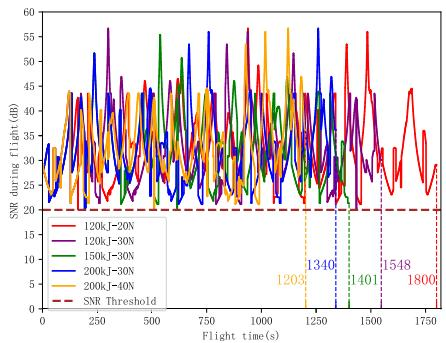

(a) Real-time SNR with varying payloads and on-board energy  
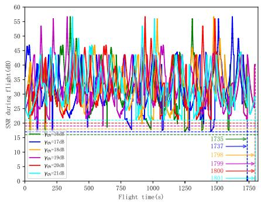  
(b) Real-time SNR for different communication quality thresholds  
Fig. 8. Real-time SNR of the UAV based on the UPSEEO Framework.

Monte Carlo simulation is employed [37]. The parameters are randomly sampled from the following ranges: the inertia factor w from [0 1 1 0], and the self-cognitive factor $c _ { 1 }$ and social cognitive factor $c _ { 2 }$ from [0 5 3 0], with $c _ { 1 } = c _ { 2 } ~ [ 3 8 ] . ^ { 4 }$ Other parameters are set as: maximum number of iterations $N _ { \mathrm { i t e r } } = 3 0 0$ and number of particles $N _ { p } = 1 0 0 .$

To demonstrate the superiority of our proposed framework, i.e., UPSEEO, the following benchmarks are considered<sup>5</sup>

TABLE I  
THE DIFFERENCES BETWEEN THE PROPOSED FRAMEWORK AND BENCHMARKS
<table><tr><td rowspan=2 colspan=1>OptimizationproblemMethod</td><td rowspan=1 colspan=2>Optimization objective</td><td rowspan=1 colspan=3>Optimized variables</td></tr><tr><td rowspan=1 colspan=1>Taskcompletiontime</td><td rowspan=1 colspan=1>Total energyconsumption</td><td rowspan=1 colspan=1>Flighttrajectory/Algorithm</td><td rowspan=1 colspan=1>Taskallocation</td><td rowspan=1 colspan=1>Flightspeed</td></tr><tr><td rowspan=1 colspan=1>Framework in [10]</td><td rowspan=1 colspan=1>√</td><td rowspan=1 colspan=1>×</td><td rowspan=1 colspan=1>√(Dijkstra)</td><td rowspan=1 colspan=1>√</td><td rowspan=1 colspan=1>×</td></tr><tr><td rowspan=1 colspan=1>Framework in [19]</td><td rowspan=1 colspan=1>×</td><td rowspan=1 colspan=1> $\bigtriangledown$ </td><td rowspan=1 colspan=1>√(Dijkstra)</td><td rowspan=1 colspan=1>√</td><td rowspan=1 colspan=1>×</td></tr><tr><td rowspan=1 colspan=1>Framework in [23]</td><td rowspan=1 colspan=1>×</td><td rowspan=1 colspan=1> $\overline { { \bigtriangledown } }$ </td><td rowspan=1 colspan=1>√(DRL)</td><td rowspan=1 colspan=1>√</td><td rowspan=1 colspan=1>×</td></tr><tr><td rowspan=1 colspan=1>Framework in [40]</td><td rowspan=1 colspan=1>×</td><td rowspan=1 colspan=1> $\surd$ </td><td rowspan=1 colspan=1>√(RRT)</td><td rowspan=1 colspan=1>√</td><td rowspan=1 colspan=1>×</td></tr><tr><td rowspan=1 colspan=1>UPSEEO(DRL)</td><td rowspan=1 colspan=1>×</td><td rowspan=1 colspan=1>√</td><td rowspan=1 colspan=1>√(DRL)</td><td rowspan=1 colspan=1>√</td><td rowspan=1 colspan=1>√</td></tr><tr><td rowspan=1 colspan=1>UPSEEO</td><td rowspan=1 colspan=1>×</td><td rowspan=1 colspan=1> $\surd$ </td><td rowspan=1 colspan=1> $\overline { { \sqrt { ( \mathbf { A } ^ { * } ) } } }$ </td><td rowspan=1 colspan=1> $\veebar$ </td><td rowspan=1 colspan=1>V</td></tr></table>

• Framework in [10]: Literature [10] proposed an optimization framework, which jointly optimized the flight sequence and flight trajectory of the cargo UAV to minimize the UAV flight time and ensure the UAV communication connectivity. Obviously, the UAV should operate at its maximum flight speed, $V _ { \mathrm { m a x } } ,$ to minimize flight time.

• Framework in [19]: Literature [19] proposed a optimization framework that minimizes the total energy consumption of the UAV while ensuring its the communication connectivity by jointly optimizing the flight sequence and trajectory of the cargo UAV. Diferent from the framework proposed in this paper, the one in [19] does not optimize the UAV’s flight speed. As the authors of [19] only stated that the UAV’s speed is constant but did not specify its numerical value, we set the UAV’s flight speed to 20 m/s for the purpose of establishing this benchmark.

• Framework in [23]: In [23], a connectivity-aware delivery (CAD) framework was developed for minimizing the UAV’s total communication outage time and maximizing the total package value, with a constraint on the maximum on-board energy. Specifically, [23] had employed DRL to optimize the trajectory of the UAV between any two users. The trajectory optimization algorithm presented in [23] was used as a benchmark in this paper.<sup>6</sup>

• Framework in [40]: Literature [40] employed the rapidlyexploring random trees (RRT) algorithm to optimize the flight trajectory of the cargo UAV. Therefore, the RRT algorithm proposed in literature [40] is added to the simulation results as a benchmark. Consistent with the methodology described in [40], the UAV’s speed was set to 30 m/s.

• UPSEEO(DRL): Similar to the UPSEEO framework, the proposed framework shares a similar structure and objective. However, a key diference is that its trajectory optimization algorithm employs DRL instead of the $\mathbf { A } ^ { * }$ algorithm. This framework can serve as an efective alternative solution in scenarios where the radio map is unknown in advance.<sup>7</sup> Moreover, while the DRL reward function in this benchmark framework is adopted from the Framework in [23], it distinguishes itself by additionally optimizing the UAV’s flight speed, which the Framework in [23] did not consider.

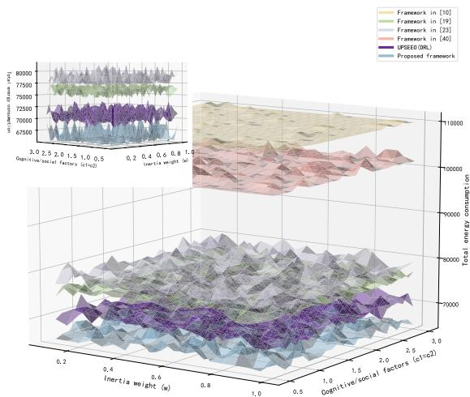  
Fig. 9. Monte Carlo experiment.

## B. Verification of Robustness

To prove that the proposed framework can guarantee the communication quality of the UAV, i.e., the $\mathrm { U A V } \mathbf { \hat { s } }$ realtime SNR does not exceed the specified threshold $\gamma _ { t h } ,$ Fig. 8 presents the real-time SNR values obtained by the UPSEEO framework under varying UAV parameters, including maximum payload $W _ { \mathrm { m a x } }$ and maximum on-board energy $E _ { \mathrm { m a x } } .$ as well as diferent SNR thresholds. Specifically, Fig. 8(a) demonstrates that when the communication quality threshold, $\gamma _ { t h } ,$ , is set to 20dB, the UAV’s real-time SNR consistently remains above this threshold, regardless of its maximum payload $W _ { \mathrm { m a x } }$ or maximum on-board energy $E _ { \mathrm { m a x } } .$ . This validates that the proposed UPSEEO framework enables the UAV to maintain stable communication quality across a range of performance capabilities. Furthermore, Fig. 8(b) extends this analysis by illustrating the real-time SNR for diferent communication quality thresholds. The simulation results confirm the proposed UPSEEO framework’s adherence to the communication quality requirements: the UAV’s real-time SNR consistently exceeds the established threshold. A proportional increase in the UAV’s total flight time is observed as the communication quality threshold becomes more stringent. This trade-of is attributable to the fact that higher SNR requirements expand the map regions with inadequate communication quality, necessitating a more circuitous UAV trajectory to maintain connectivity, and thus increasing the total flight duration.

The Monte Carlo experimental results, as shown in Fig. 9, validate that the UPSEEO framework exhibits parameterindependent performance. This suggests its strong robustness across diferent parameter configurations. Fig. 9 presents the performance of diferent frameworks based on Monte Carlo simulations, for which the parameter selection range and rules are detailed in Section VI-A. Specifically, in the Monte Carlo experiment, the value interval of induction factor, $\Delta _ { w } ,$ is set to 0.05, and the value interval of self-cognitive factor and social cognitive factor, $\Delta _ { c } ,$ is set to 0.1. Fig. 9 reveals that the performance of the UPSEEO framework and the benchmarks exhibits some fluctuation. However, it is evident that the UPSEEO framework consistently achieves the lowest total energy consumption, regardless of the hyperparameter values selected. Therefore, Fig. 9 validates that the UPSEEO framework maintains its optimality independent of its specific parameters, confirming its performance is robust and bounded.

## C. Trajectory Comparison and Performance Analysis

Fig. 10 shows the UAV’s trajectories based on the UPSEEO framework under diferent maximum payload $W _ { \mathrm { m a x } }$ and maximum on-board energy $E _ { \mathrm { m a x } }$ . The number of missions carried out by the cargo UAV gradually decreases with the increase of the payload capacity $W _ { \mathrm { m a x } }$ or the increase of the on-board energy $E _ { \mathrm { m a x } }$ . For instance, when the load capacity and onboard energy of the UAV are low, i.e., when $W _ { \mathrm { m a x } } = 2 0 ~ \mathrm { N }$ and $E _ { \mathrm { m a x } } = 1 2 0$ kJ in Fig. 10(a), the UAV needs to perform eight missions to fetch all the parcels. An increase in the UAV maximum payload capacity $W _ { \mathrm { m a x } }$ to 30 N results in a reduction in the number of missions required, decreasing from eight to six, as demonstrated in Fig. 10(b). Following this trend, an increase in the UAV on-board energy $E _ { \mathrm { m a x } }$ to 200 kJ reduces the number of missions required from six to five, as illustrated in Fig. 10(c). Subsequently, when the UAV maximum payload capacity $W _ { \mathrm { m a x } }$ is further increased to 40 N, the mission count decreases to four, as shown in Fig. 10(d). This phenomenon is attributed to the fact that a UAV with superior payload capacity or greater energy reserves can service more demand points or cover a larger distance within a single flight, thereby optimizing the routing structure and minimizing the total number of necessary missions.

To more efectively illustrate the performance diferences of each framework and, specifically, the improvements achieved by optimizing UAV’s flight speed, a detailed comparison of the flight time and energy consumption achieved under varying UAV fuselage performance parameters is presented in Figs. 11(a) and 11(b). Specifically, Fig. 11(a) demonstrates that the flight time obtained by the Framework in [10] consistently remains the lowest across all tested UAV payload capacities and on-board energy levels. This outcome aligns with the objective stated in Section VI-A, where the Framework in [10] is designed to minimize flight time as its primary optimization goal. However, analysis of Fig. 11(b) shows that the UPSEEO framework proposed in this paper yields the lowest total energy consumption. Conversely, the framework in [10] results in the highest energy consumption, followed sequentially by the framework in [40] and the suboptimal performance of the frameworks in [19] and [23]. Furthermore, Fig. 11(b) proves that the total energy consumption of the UAV obtained by the proposed framework is always the lowest regardless of the maximum payload or the on-board energy of the UAV. This demonstrates that minimizing the UAV’s flight time does not necessarily improve the energy eficiency of UAVenabled cargo pickup systems, and concurrently highlights the crucial role of optimizing the UAV’s flight speed to reduce the cargo UAV’s energy consumption. More importantly, the UPSEEO(DRL) framework consistently achieves performance only exceeded by the UPSEEO framework, irrespective of the maximum payload and the maximum on-board energy. This strong performance validates the UPSEEO(DRL) framework as a reasonable and superior alternative solution for scenarios where the radio map is unavailable.

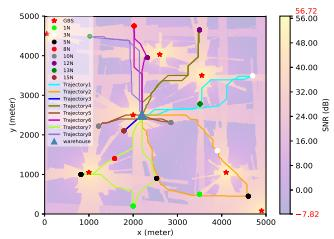  
(a) Wmax = 20 N, Emax = 120 kJ

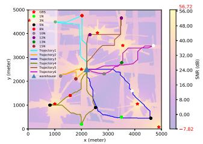  
(b) Wmax = 30 N, Emax = 120 kJ

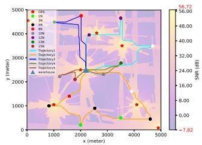  
(c) Wmax = 30 N, Emax = 200 kJ

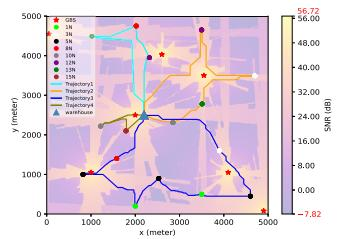  
(d) Wmax = 40 N, Emax = 200 kJ

Fig. 10. UAV trajectories obtained based on the proposed framework under diferent fuselage performances when $\gamma _ { t h } = 2 0 ~ \mathrm { d B } .$  
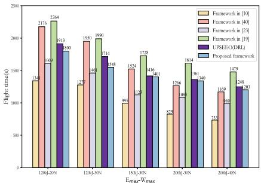  
(a) Flight time versus fuselage performances

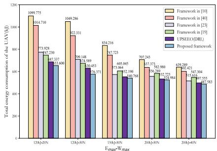  
(b) Energy Consumption vs. UAV performance

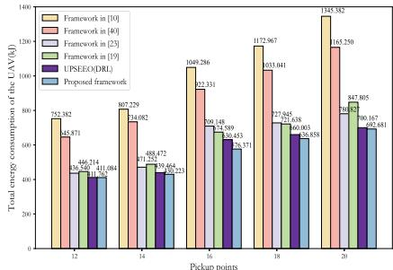  
(c) Energy consumption vs. user density

Fig. 11. Performance comparison.  
TABLE II  
ILLUSTRATION OF PERFORMANCE DIFFERENCES BETWEEN FRAMEWORKS
<table><tr><td rowspan=2 colspan=1></td><td rowspan=1 colspan=2>Differences between frameworks</td><td rowspan=1 colspan=3>Performance difference</td></tr><tr><td rowspan=1 colspan=1>Trajectoryoptimizationalgorithm</td><td rowspan=1 colspan=1>Whether to optimizeflight speed</td><td rowspan=1 colspan=1>Flightdistance</td><td rowspan=1 colspan=1>Flighttime</td><td rowspan=1 colspan=1>Energyconsumption</td></tr><tr><td rowspan=1 colspan=1>Framework in [10]</td><td rowspan=1 colspan=1>Dijkstra</td><td rowspan=1 colspan=1>No, and V = 40 m/s</td><td rowspan=1 colspan=1>1431.84 m</td><td rowspan=1 colspan=1>35.80 s</td><td rowspan=1 colspan=1>27.860 kJ</td></tr><tr><td rowspan=1 colspan=1>Framework in [19]</td><td rowspan=1 colspan=1>Dijkstra</td><td rowspan=1 colspan=1>No, and V = 20 m/s</td><td rowspan=1 colspan=1>1431.84 m</td><td rowspan=1 colspan=1>71.59 s</td><td rowspan=1 colspan=1>22.907 kJ</td></tr><tr><td rowspan=1 colspan=1>Framework in [23]</td><td rowspan=1 colspan=1>DRL</td><td rowspan=1 colspan=1>No, and V = 30 m/s</td><td rowspan=1 colspan=1>1460.00 m</td><td rowspan=1 colspan=1>48.67 s</td><td rowspan=1 colspan=1>21.965 kJ</td></tr><tr><td rowspan=1 colspan=1>Framework in [40]</td><td rowspan=1 colspan=1>RRT</td><td rowspan=1 colspan=1>No, and V = 30 m/s</td><td rowspan=1 colspan=1>1598.25 m</td><td rowspan=1 colspan=1>53.28 s</td><td rowspan=1 colspan=1>24.045 kJ</td></tr><tr><td rowspan=1 colspan=1>UPSEEO(DRL)</td><td rowspan=1 colspan=1>DRL</td><td rowspan=1 colspan=1>Yes</td><td rowspan=1 colspan=1>1460.00 m</td><td rowspan=1 colspan=1>50.19 s</td><td rowspan=1 colspan=1>21.157 kJ</td></tr><tr><td rowspan=1 colspan=1>UPSEEO</td><td rowspan=1 colspan=1>A*</td><td rowspan=1 colspan=1>Yes</td><td rowspan=1 colspan=1>1431.84 m</td><td rowspan=1 colspan=1>49.22 s</td><td rowspan=1 colspan=1>20.749 kJ</td></tr></table>

For a further theoretical explanation of Fig. 11(b), Table II details the flight performance achieved when the UAV delivers 10 N of packages from the warehouse to the pickup point located at [3510, 2780]. It is observed that both the Dijkstra and A<sup>∗</sup> algorithms successfully yield the minimum flight distance that satisfies the communication constraints, measuring 1431.84 m. The trajectory length obtained by the DRL framework under its optimization scheme is the second shortest, at 1460.00 m, while the longest trajectory is associated with the RRT algorithm (Framework in [40]). This path hierarchy is rooted in the algorithms’ theoretical properties: Dijkstra and A are complete and optimal heuristic search algorithms that guarantee the theoretically shortest path by systematically searching the map grid; the DRL algorithm optimizes the UAV’s flight trajectory through reward-mechanism-based training, typically finding an approximately optimal solution that is usually slightly longer than the theoretical minimum A<sup>∗</sup>; conversely, the RRT algorithm, being only a probabilistic complete algorithm, prioritizes rapid path finding over optimality, resulting in trajectories that are often tortuous and consequently longer in total length. Fig. 7 clearly demonstrates that energy eficiency in the UAV-assisted cargo pickup system is jointly determined by optimal flight speed and UAV flight distance. Comparing the proposed UPSEEO framework with the benchmarks reveals a clear performance hierarchy: Framework in [10] and Framework in [19] are inferior to UPSEEO because, although they optimize flight distance between pickup points, they fail to consider flight speed influence on energy consumption. Furthermore, Framework in [10] primary objective to minimize flight time results in energy performance worse than even Framework in [19]. Similarly, Framework in [23] and Framework in [40] exhibit poor overall results as their trajectory optimization algorithms are less efective than A<sup>∗</sup>, and they also neglect speed optimization; notably, Framework in [40] yields the longest flight trajectory, resulting in the worst performance among all frameworks. Conversely, the UPSEEO(DRL) framework, serving as an efective alternative when the radio map is unknown, outperforms Framework in [19] due to its inclusion of optimized speed, despite having a slightly longer trajectory. Its final performance ranks second only to the main UPSEEO framework, a diference attributable to the DRL algorithm trajectory length being slightly greater than the A<sup>∗</sup> algorithm theoretical minimum. Finally, to further verify the robustness of the proposed framework, Fig. 11(c) presents the total UAV energy consumption achieved under a varying number of pickup points. Fig. 11(c) demonstrates that the proposed framework consistently achieves the lowest total energy consumption compared to all benchmarks, regardless of the number of pickup points. Specifically, the energy consumption performance is improved by approximately 5.0% to 50.0%. Additionally, the figure reveals that the UAV’s total energy consumption increases proportionally with the rising number of pickup points. This phenomenon is expected: serving more users necessitates collecting a larger quantity and total weight of packages, which inevitably leads to a higher overall energy expenditure for the UAV.

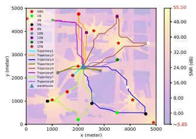  
(a) $H _ { \mathrm { m a x } } = 6 0 ~ \mathrm { m }$

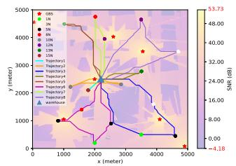  
(b) $H _ { \mathrm { m a x } } = 7 0 ~ \mathrm { m }$

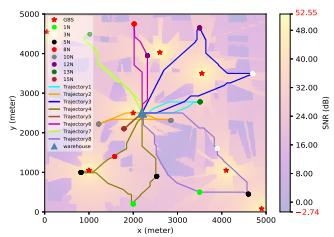  
(c) $H _ { \mathrm { m a x } } = 8 0 ~ \mathrm { m }$

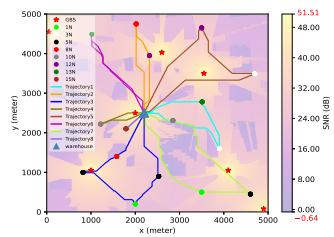  
(d) $H _ { \mathrm { m a x } } = 9 0 ~ \mathrm { m }$

Fig. 12. UAV trajectories obtained based on the UPSEEO algorithm under diferent flight altitudes when $\gamma _ { t h } = 2 0 ~ \mathrm { d B } .$  
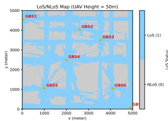  
(a) $H _ { \mathrm { m a x } } = 5 0$ m

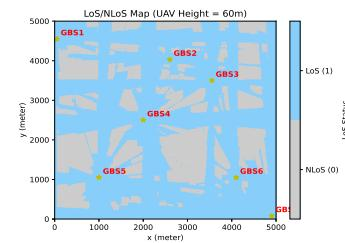  
(b) $H _ { \mathrm { m a x } } = 6 0 ~ \mathrm { m }$

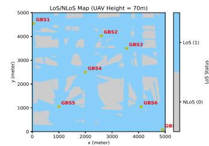  
(c) $H _ { \mathrm { m a x } } = 7 0 ~ \mathrm { r }$ n

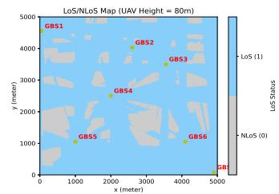  
(d) $H _ { \mathrm { m a x } } = 8 0 ~ \mathrm { m }$

Fig. 13. Link state map at diferent heights.  
TABLE III  
UAV PERFORMANCE OBTAINED BASED ON THE UPSEEO ALGORITHM AT DIFFERENT FLIGHT ALTITUDES
<table><tr><td>Hmax</td><td colspan="3">Performance Vertical flight performance</td><td colspan="2">Horizontal flight performance</td><td rowspan="2">Total energy consumption</td></tr><tr><td></td><td></td><td>Vertical flight</td><td>Proportion of vertical</td><td>Horizontal flight</td><td>Proportion of horizontal</td></tr><tr><td colspan="2"></td><td>energy consumption</td><td>flight energy consumption</td><td>energy consumption</td><td>flight energy consumption</td><td></td></tr><tr><td colspan="2">50 m</td><td>68.70 kJ</td><td>10.51%</td><td>584.90 kJ</td><td>89.49%</td><td>653.60 kJ</td></tr><tr><td colspan="2">60 m</td><td>82.44 kJ</td><td>12.77%</td><td>563.03 kJ</td><td>87.23%</td><td>645.47 kJ</td></tr><tr><td colspan="2">70 m</td><td>96.18 kJ</td><td>14.83%</td><td>552.41 kJ</td><td>85.17%</td><td>648.59 kJ</td></tr><tr><td colspan="2">80 m</td><td>109.92 kJ</td><td>16.71%</td><td>548.01 kJ</td><td>83.29%</td><td>657.93 kJ</td></tr><tr><td colspan="2">90 m</td><td>123.03 kJ</td><td>18.35%</td><td>547.37 kJ</td><td>81.65%</td><td>670.40 kJ</td></tr></table>

Fig. 12 illustrates a comparative analysis of UAV trajectories across various flight altitudes $H _ { \mathrm { m a x } }$ . These trajectories were generated with $W _ { \mathrm { m a x } } ~ = ~ 1 2 0$ kJ and $E _ { \mathrm { m a x } } ~ = ~ 2 0 ~ \mathrm { N } .$ . This analysis reveals significant diferences in task allocation, flight trajectories, and cargo pickup sequences, thereby highlighting the profound impact flight altitude has on the resulting mission solution. By comparing Fig. 10(a) and Fig. 12, it is evident that as the $\mathrm { U A V } ^ { \ , } \mathbf { s }$ flight altitude $H _ { \mathrm { m a x } }$ increases, the corresponding SNR map signal distribution tends to become more uniform, and the area with poor signal quality is significantly reduced. As the UAV flight altitude $H _ { \mathrm { m a x } }$ is further increased, the reduction in poor communication quality areas continues; notably, at $H _ { \mathrm { m a x } } = 9 0$ m, the proportion of the map showing poor communication quality is minimal. Consequently, lower UAV altitudes result in a higher proportion of poor signal quality areas on the radio map, which necessitates a more tortuous horizontal flight trajectory for the UAV. Fig. 10(a) and Fig. 12 collectively support this finding.

To rigorously investigate the efect of flight altitude on UAV energy consumption, Table III presents the energy consumption obtained by the UAV using the UPSEEO framework at various heights. These data show that vertical flight energy consumption, along with its proportion of the total energy budget, increases with UAV altitude. This is consistent with Equation (21), which defines a proportional relationship between vertical flight energy consumption and flight height. Conversely, horizontal flight energy consumption and its proportion of the total consumption decrease as altitude increases. This trend stems from the increased probability of establishing a LoS channel between the UAV and the GBS at higher altitudes. Below a certain threshold, UAV communication quality is heavily dependent on this LoS probability, given that communication quality in the LoS state is significantly better than in the NLoS state. Fig. 13 confirms this observation. Specifically, as the UAV altitude increases from 50 m to 80 m, the proportion of the LoS channel area grows, indicating improved communication quality during horizontal flight. Consequently, Fig. 12 shows that the UAV horizontal flight trajectory is more circuitous at lower altitudes because the lower communication quality necessitates detours to maintain connectivity. More importantly, Table III shows that the total energy consumption of the UAV first decreases and then increases with the increase of altitude, indicating a convex trend. Observation of the data reveals that when the UAV altitude is low, the reduction in horizontal flight energy consumption gained from increased altitude outweighs the simultaneous increase in vertical energy consumption. This initial decrease occurs because a low altitude increase significantly boosts the probability of establishing a LoS channel between the UAV and the GBS. However, once the altitude surpasses a certain value, the further increase in LoS channel probability becomes less significant, resulting in only a marginal reduction in horizontal flight energy consumption. At this point, the increase in vertical flight energy consumption due to the altitude change exceeds the small reduction in horizontal energy consumption, causing the total energy consumption to rise. As shown in Fig. 13 confirms this observation. It demonstrates that when the UAV height increases from 50 m to 60 m, the proportion of the area where the UAV and the GBS establish a LoS channel increases significantly. Consequently, the UAV horizontal flight energy consumption and total energy consumption are greatly reduced during this altitude change. As the UAV height is further increased to 70 m, the LoS channel proportion continues to grow, though the magnitude of this increase is less significant than that observed between 50 m and 60 m. This marginal growth leads to a reduced rate of horizontal flight energy consumption decrease. Finally, at a UAV height of 80 m, the LoS channel proportion exhibits no significant change, meaning horizontal flight energy consumption is only slightly reduced compared with 70 m; however, vertical flight energy consumption is greatly increased. These numerical results successfully demonstrate the trade-of between the total energy consumption of the UAV and the flight altitude.

## VII. CONCLUSION

This paper investigated the energy eficiency optimization problem for a UAV-enabled cargo pickup system. A UPSEEO framework, combining the A<sup>∗</sup> and PSO, was proposed to optimize UAV trajectory, flight speed, and task allocation. Numerical simulations demonstrated the efectiveness and robustness of our proposed framework, which guides UAV logistics by addressing the critical energy minimization problem. For future work, we will investigate collaboration mechanisms among multiple cargo UAVs in cargo pickup systems to address the challenges posed by more complex application scenarios. This problem can be converted into a heterogeneous vehicle routing problem, in which diferent types of cargo UAVs have diferent payload, flight speed, onboard energy, and other characteristics, which is a meaningful work. Furthermore, we recognized that the communication model used in this paper, while efectively demonstrating the core principles of our approach, had certain limitations. Specifically, our analysis of communication quality relied on the expected SNR, which simplified the complex, timevarying stochastic SNRs found in real-world scenarios. We also did not explicitly model handover delays between GBSs, which could afect the stability of the communication link. More importantly, while our simulation results highlighted the significance of height optimization for improving UAV energy eficiency, this work did not address the full 3D flight trajectory optimization. To address these limitations, future research will explore the integration of more dynamic channel models to account for real-time channel variations and handover management, as well as the 3D flight trajectory optimization of UAVs in urban environments. These future works will enable a more robust and practical framework for UAV logistics in the low-altitude economy, particularly for coordinated multi-UAV operations in complex and large-scale environments.

## REFERENCES

[1] S. Rajendran and J. Zack, “Insights on strategic air taxi network infrastructure locations using an iterative constrained clustering approach,” Transp. Res. E, Logistics Transp. Rev., vol. 128, pp. 470–505, Aug. 2019.

[2] M. Moshref-Javadi and M. Winkenbach, “Applications and research avenues for drone-based models in logistics: A classification and review,” Expert Syst. Appl., vol. 177, Sep. 2021, Art. no. 114854.

[3] B. Niu, J. Zhang, and F. Xie, “Drone logistics’ resilient development: Impacts of consumer choice, competition, and regulation,” Transp. Res. A, Policy Pract., vol. 185, Jul. 2024, Art. no. 104126.

[4] M. McFarland. (Jul. 2019). Amazon Makes Its First Drone Delivery in the U.K. [Online]. Available: https://money.cnn.com/2016/12/14/ technology/amazon-drone-delivery/index.htm

[5] Y. Zeng, Q. Wu, and R. Zhang, “Accessing from the sky: A tutorial on UAV communications for 5G and beyond,” Proc. IEEE, vol. 107, no. 12, pp. 2327–2375, Dec. 2019.

[6] X. Huang, “The small-drone revolution is coming—Scientists need to ensure it will be safe,” Nature, vol. 637, pp. 29–30, Dec. 2024.

[7] S. Meng, X. Guo, D. Li, and G. Liu, “The multi-visit drone routing problem for pickup and delivery services,” Transp. Res. E, Logistics Transp. Rev., vol. 169, Jan. 2023, Art. no. 102990.

[8] Y. Zeng, J. Lyu, and R. Zhang, “Cellular-connected UAV: Potential, challenges, and promising technologies,” IEEE Wireless Commun., vol. 26, no. 1, pp. 120–127, Feb. 2019.

[9] Y. Yu, J. Tang, J. Huang, X. Zhang, D. K. C. So, and K.-K. Wong, “Multi-objective optimization for UAV-assisted wireless powered IoT networks based on extended DDPG algorithm,” IEEE Trans. Commun., vol. 69, no. 9, pp. 6361–6374, Sep. 2021.

[10] Y. Chen, D. Yang, L. Xiao, F. Wu, and Y. Xu, “Optimal trajectory design for unmanned aerial vehicle cargo pickup and delivery system based on radio map,” IEEE Trans. Veh. Technol., vol. 73, no. 8, pp. 11706–11718, Aug. 2024.

[11] M. Patchou, B. Sliwa, and C. Wietfeld, “Flying robots for safe and eficient parcel delivery within the COVID-19 pandemic,” in Proc. IEEE Int. Syst. Conf. (SysCon), Vancouver, BC, Canada, Apr. 2021, pp. 1–7.

[12] Y. H. Lau et al., “Reliable long-range communication for medical cargo UAVs using low-cost, accessible technology,” in Proc. IEEE Int. Humanitarian Technol. Conf. (IHTC), Dec. 2021, pp. 1–8.

[13] B. Liu, W. Ni, R. P. Liu, Y. J. Guo, and H. Zhu, “Optimal routing of unmanned aerial vehicle for joint goods delivery and in-situ sensing,” IEEE Trans. Intell. Transp. Syst., vol. 24, no. 3, pp. 3594–3599, Mar. 2023.

[14] Y. Pan, Q. Chen, N. Zhang, Z. Li, T. Zhu, and Q. Han, “Extending delivery range and decelerating battery aging of logistics UAVs using public buses,” IEEE Trans. Mobile Comput., vol. 22, pp. 5280–5295, 2023.

[15] N. Cherif, W. Jaafar, H. Yanikomeroglu, and A. Yongacoglu, “RLbased cargo-UAV trajectory planning and cell association for minimum handofs, disconnectivity, and energy consumption,” IEEE Trans. Veh. Technol., vol. 73, no. 5, pp. 7304–7309, May 2024.

[16] B. Liu, W. Ni, R. P. Liu, Y. J. Guo, and H. Zhu, “Decentralized, privacypreserving routing of cellular-connected unmanned aerial vehicles for joint goods delivery and sensing,” IEEE Trans. Intell. Transp. Syst., vol. 24, no. 9, pp. 9627–9641, Sep. 2023.

[17] M. Patchou, B. Sliwa, and C. Wietfeld, “Unmanned aerial vehicles in logistics: Eficiency gains and communication performance of hybrid combinations of ground and aerial vehicles,” in Proc. IEEE Veh. Netw. Conf. (VNC), Mar. 2019, pp. 1–8.

[18] J. Cao, L. Xiao, D. Yang, and F. Wu, “Energy consumption and communication quality tradeof for logistics UAVs: A hybrid deep reinforcement learning approach,” in Proc. IEEE Wireless Commun. Netw. Conf. (WCNC), Mar. 2023, pp. 1–6.

[19] Z. Deng, F. Wu, Y. Xu, D. Yang, and L. Xiao, “Energy minimization for radio map-based UAV pickup and delivery logistics system,” IEEE Trans. Veh. Technol., vol. 73, no. 11, pp. 17893–17898, Nov. 2024.

[20] S. Sawadsitang, D. Niyato, P.-S. Tan, and P. Wang, “Joint ground and aerial package delivery services: A stochastic optimization approach,” IEEE Trans. Intell. Transp. Syst., vol. 20, no. 6, pp. 2241–2254, Jun. 2019.

[21] Z. Deng, F. Wu, Y. Xu, Y. Luo, D. Yang, and L. Xiao, “Multi-UAVs pickup and delivery problem: Minimizing maximum energy consumption,” in Proc. IEEE Global Commun. Conf., Dec. 2024, pp. 2027–2033.

[22] B. Liu, W. Ni, and H. Zhu, “Optimal charging scheduling and speed control for delay-bounded drone delivery,” IEEE Trans. Veh. Technol., vol. 73, no. 11, pp. 16481–16490, Nov. 2024.

[23] B. Duo, A. Kong, Q. Wu, X. Yuan, and Y. Li, “Joint path and pickup design for connectivity-aware UAV-enabled multi-package delivery,” IEEE Trans. Intell. Transp. Syst., vol. 25, no. 12, pp. 20017–20031, Dec. 2024.

[24] D. Wang, P. Hu, J. Du, P. Zhou, T. Deng, and M. Hu, “Routing and scheduling for hybrid truck-drone collaborative parcel delivery with independent and truck-carried drones,” IEEE Internet Things J., vol. 6, no. 6, pp. 10483–10495, Dec. 2019.

[25] J. Cao et al., “Trajectory optimization and pick-up and delivery sequence design for cellular-connected cargo AAVs,” IEEE Trans. Mobile Comput., vol. 24, no. 3, pp. 1402–1416, Mar. 2025.

[26] J. Chen and D. Gesbert, “Eficient local map search algorithms for the placement of flying relays,” IEEE Trans. Wireless Commun., vol. 19, no. 2, pp. 1305–1319, Feb. 2020.

[27] S. Zhang and R. Zhang, “Radio map-based 3D path planning for cellular-connected UAV,” IEEE Trans. Wireless Commun., vol. 20, no. 3, pp. 1975–1989, Mar. 2021.

[28] Y. Zeng, J. Xu, and R. Zhang, “Energy minimization for wireless communication with rotary-wing UAV,” IEEE Trans. Wireless Commun., vol. 18, no. 4, pp. 2329–2345, Apr. 2019.

[29] A. Meng, X. Gao, Y. Zhao, and Z. Yang, “Three-dimensional trajectory optimization for energy-constrained UAV-enabled IoT system in probabilistic LoS channel,” IEEE Internet Things J., vol. 9, no. 2, pp. 1109–1121, Jan. 2022.

[30] W. Wang, J. Cao, D. Yang, H. He, and Z. Xu, “Optimization of communication quality for energy-limited inspection AAV: A hybrid algorithm,” IEEE Open J. Commun. Soc., vol. 5, pp. 7900–7912, 2024.

[31] Y. Zeng et al., “A tutorial on environment-aware communications via channel knowledge map for 6G,” IEEE Commun. Surveys Tuts., vol. 26, no. 3, pp. 1478–1519, 3rd Quart., 2024.

[32] F. Linsalata et al., “LoS-map construction for proactive relay of opportunity selection in 6G V2X systems,” IEEE Trans. Veh. Technol., vol. 72, no. 3, pp. 3864–3878, Mar. 2023.

[33] C. Huang et al., “Machine learning-enabled LOS/NLOS identification for MIMO systems in dynamic environments,” IEEE Trans. Wireless Commun., vol. 19, no. 6, pp. 3643–3657, Jun. 2020.

[34] Y. Yang, X. Xu, Y. Zeng, H. Sun, and R. Qingyang Hu, “Channel knowledge map for cellular-connected UAV via binary Bayesian filtering,” IEEE Trans. Commun., vol. 73, no. 10, pp. 9222–9235, Oct. 2025.

[35] Y. Zeng, X. Xu, S. Jin, and R. Zhang, “Simultaneous navigation and radio mapping for cellular-connected UAV with deep reinforcement learning,” IEEE Trans. Wireless Commun., vol. 20, no. 7, pp. 4205–4220, Jul. 2021.

[36] Q. Gong, F. Wu, D. Yang, L. Xiao, and Z. Liu, “3D radio map reconstruction and trajectory optimization for cellular-connected UAVs,” J. Commun. Inf. Netw., vol. 8, no. 4, pp. 357–368, Dec. 2023.

[37] Y. Guang, L. Faxing, X. Junfei, W. Ling, and L. Yiyuan, “Research on encounter probability between a supercavitating vehicle and a target based on path planning,” IEEE Access, vol. 12, pp. 9497–9509, 2024.

[38] F. Vandenbergh and A. Engelbrecht, “A study of particle swarm optimization particle trajectories,” Inf. Sci., vol. 176, no. 8, pp. 937–971, Apr. 2006.

[39] M. Clerc and J. Kennedy, “The particle swarm–explosion, stability, and convergence in a multidimensional complex space,” IEEE Trans. Evol. Comput., vol. 6, no. 1, pp. 58–73, Feb. 2002.

[40] N. P. Borges, C. G. Ghedini, and C. H. C. Ribeiro, “Mitigating risk in UAV aid delivery missions: A safe path prioritization approach,” IEEE Access, vol. 12, pp. 168765–168778, 2024.

  
Jiangling Cao received the M.S. degree in communication engineering from Nanchang University. Nanchang, China, in 2024. His research interests include UAV communications, machine learning, and intelligent transportation systems.


Shi Peng received the B.S. degree in electronic science and technology from the School of Mechanical and Electrical Engineering, East China University of Technology, Nanchang, China, in 2022. She is currently pursuing the master’s degree with the Information Engineering School, Nanchang University. Her research interests include UAV communications, graph theory, and intelligent transportation systems.


Dingcheng Yang (Member, IEEE) received the B.S. degree in electronic engineering and the Ph.D. degree in space physics from Wuhan University, Wuhan, China, in 2006 and 2012, respectively. He is currently a Professor with the Information Engineering School, Nanchang University, Nanchang, China. He had published more than 50 papers, including journal articles, such as IEEE TRANSACTIONS ON VEHICULAR TECHNOLOGY, and conference papers, such as IEEE Globecom. His research interests include cooperation communications, the IoT/cyberphysical systems, UAV communications, and wireless resource management.


Qinghua Wu (Member, IEEE) received the B.Sc. and M.Sc. degrees from the Huazhong University of Science and Technology, China, in 2007 and 2009, respectively, and the Ph.D. degree in computer science from the University of Angers, France, in 2013. He is currently a Professor with the School of Management, Huazhong University of Science and Technology. His research interests include intelligence computing and metaheuristics for solving large-scale combinatorial optimization problems, such as vehicle routing problem, location routing problem, and traveling salesman problem.


Tiankui Zhang (Senior Member, IEEE) received the B.S. degree in communication engineering and the Ph.D. degree in information and communication engineering from Beijing University of Posts and Telecommunications (BUPT), China, in 2003 and 2008, respectively. He is currently a Professor with the School of Information and Communication Engineering, BUPT. He has published more than 100 papers, including journal articles on IEEE JOURNAL ON SELECTED AREAS IN COMMUNICATIONS and IEEE TRANSACTIONS ON COMMUNICATIONS and conference papers, such as IEEE GLOBECOM and IEEE ICC. His research interests include wireless communication networks, intelligent mobile edge computing and caching, signal processing for wireless communications, and content-centric wireless networks.