# Energy and Latency Efficient Joint Communication and Computation Optimization in a Multi-UAV-Assisted MEC Network

Farhan Pervez , Student Member, IEEE, Ajmery Sultana , Member, IEEE, Cungang Yang , and Lian Zhao , Senior Member, IEEE

Abstract— Unmanned aerial vehicle (UAV)-assisted mobile edge computing (MEC) system is a prominent strategy where a UAV equipped with an MEC server is deployed to serve terminal devices. This paper considers a multi-UAV assisted network in which multiple UAVs and a terrestrial base station (BS) are deployed to provide MEC services to mobile users. The objective is to minimize an energy and latency-based cost function by jointly optimizing task offloading and MEC server selection decision, transmission power, UAV trajectory, and CPU frequency allocation. An alternating iterative approach based on the block descent method is proposed to solve this problem. In the first layer, task offloading and server selection decision subproblem is solved using a game theoretic approach. The second layer handles offloading and downloading transmission power allocations by utilizing a simplistic geometric waterfilling (GWF) technique, and the UAV trajectory by successive convex approximation (SCA). Whereas, the third layer solves the computation resource subproblem by performing CPU frequency allocation using a gradient descent method. The proposed method uses a segment-by-segment approach, which divides the entire UAV flight trajectory into shorter timeframe segments to reduce the computation time. Simulation results are presented to show that the proposed approach outperforms various benchmark schemes.

Index Terms— Unmanned aerial vehicles (UAVs), mobile edge computing (MEC), task computation, task offloading, server selection decision, transmission power optimization, UAV trajectory control, CPU computation resource optimization.

# I. INTRODUCTION

VARIOUS modern applications, such as augmented real-ity, virtual reality, autonomous driving, and agriculture ity,virtual reality,autonomous driving,and agriculture monitoring, are revolutionizing our experience thanks to advancements in Internet of Things (IoT) technology [1]. The need for processing on IoT devices is increasing, yet the computational capacity of these devices is limited [2]. Mobile edge computing (MEC) is a promising technology

Manuscript received 15 December 2022; revised 9 May 2023; accepted 21 June 2023. Date of publication 11 July 2023; date of current version 12 March 2024. The associate editor coordinating the review of this article and approving it for publication was L.-C. Wang. (Corresponding author: Lian Zhao.)

Farhan Pervez, Cungang Yang, and Lian Zhao are with the Department of Electrical, Computer, and Biomedical Engineering, Toronto Metropolitan University, Toronto, ON M5B 2K3, Canada (e-mail: farhan.pervez@torontomu.ca; cungang@torontomu.ca; l5zhao@torontomu.ca).

Ajmery Sultana is with the School of Computer Science and Technology, Algoma University, Brampton, ON L6V 1A3, Canada (e-mail: ajmery.sultana@algomau.ca).

Color versions of one or more figures in this article are available at https://doi.org/10.1109/TWC.2023.3291692.

Digital Object Identifier 10.1109/TWC.2023.3291692

for overcoming computing limitations by offering cloud-like computing [3]. We can efficiently reduce the delay, save computation resources, and minimize the energy consumed at these devices by deploying computing resources in close vicinity to IoT devices, such as placing MEC servers at a wireless access point or at a base station and performing computation task offloading. Therefore, MEC has the potential to serve computation intensive and latency-critical tasks for user devices.

Unmanned aerial vehicle (UAV)-assisted MEC differs from ground server(s) in a number of ways. First, the UAV can alter its location based on the users’ real-time offloading strategies. Its path can be meticulously planned for specific goals such as energy conservation, latency reduction, and throughput increase. Furthermore, because of its high altitude, UAV-assisted MEC is able to avoid the geography effect, which helps to reinforce and increase cellular coverage. Due to the high likelihood of line-of-sight (LoS) communications with ground users, UAVs are less influenced by channel limitations. These characteristics enable UAVs to play a key part in MEC systems, as well as to compensate for the ground server’s shortcomings. As a result, using UAVs to aid computation in MEC systems opens up new deployment possibilities. However, the challenges in communication and computation design needs to be catered.

Driven by the computing advantages of incorporating MEC into aerial-terrestrial networks, as well as the IoT’s promising service offerings, such as enhanced mobile broadband, massive machine type communication, and ultra reliability and low latency communication [4], the proposed work formulates and solves a cost minimization problem, by jointly optimizing communication and computation related parameters for users connected to a MEC incorporated aerial-terrestrial environment. The system aims to minimize the weighted cost of time latency and energy consumption, subject to the given constraints. We present a novel solution to the defined problem by jointly optimizing task offloading and MEC server selection decision, power control, UAV trajectory, and CPU frequency allocation. The terms UAV and base station are frequently interchanged in the text with aerial station and terrestrial station, respectively.

# II. RELATED RESEARCH AND CONTRIBUTION

To cater to the insufficient user device computation capability issue, existing literature gives some insight into the benefits of utilizing MEC to deliver rich or delay-critical content to the mobile user. The authors in [5], to minimize the total energy consumption under the delay constraint, investigated the collaboration, and computing and communication resource allocation, in a MEC environment. In [6], to minimize the execution delay and energy consumption of a similar environment, the authors analyzed a joint problem of computation offloading, cache decision, power allocation, and CPU frequency allocation. The work in [7] considers the minimization of the energy consumption of the entire system subject to a delay constraint. It involves the joint optimization of collaboration decisions, subcarrier allocation, and computing resource allocation.

Moreover, due to its flexibility and mobility, UAVs have been widely applied now in wireless networks. There has been some work related to the benefits of deploying UAVs in terms of improving coverage, maximizing throughput and minimizing energy consumed in [8], [9], [10], and [11]. Besides, utilizing UAVs to provide computation service through MEC systems has recently gained interest, and it opens up a new area of research that requires to address communication and computation design challenges. In particular, the work in [12] proposes a UAV-MEC based scenario and minimizes the sum of the maximum delay by optimizing the offloading ratio, scheduling, and UAV trajectory. The authors of [13] investigated the minimization of computation energy consumption, but the UAV trajectory was not optimized. The majority of work, related to UAV-assisted MEC systems, mainly focus on either the optimization of communication parameters or computation parameters. However, the authors in [14] optimize the bits assignment, time slot scheduling, power control, and UAV trajectory design, to reduce the total energy utilization in a MEC-assisted network. Moreover, in [15], the system energy minimization problem is formulated by jointly optimizing the UAV’s beamforming vectors, CPU frequency, UAV’s trajectory, and transmission power subject to the constraints. In [16], the authors proposed separate optimization problems for different uplink and downlink access modes to minimize the weighted-sum energy consumption of the UAV and users by jointly optimizing the UAV trajectory and computing resource allocation, using the computation bits as a constraint. However, a lot of focus of the existing work, related to UAV-assisted MEC systems, while jointly considering communication and computation parameters, has been on handling task computation in a single UAV scenario. In a multi-UAV MEC-based system, for minimizing the weighted linear sum of energy consumed and the time latency for computation task, by jointly optimizing communication and computation parameters, has not been sufficiently discussed. The authors in [17] minimized the user energy consumption by jointly optimizing task offload decision and trajectory optimization in a multi-UAV MEC scenario. Besides, in [18], a power minimization problem is catered in a similar scenario. It involves the joint optimization of user association, power control, computation capacity, and UAVs fixed location planning. The work in [19] maximizes the number of offloaded tasks to UAV-MEC servers by jointly optimizing association decisions and computation resources. Whereas, the authors in [20] minimized the maximum task completion latency among all users, by formulating a joint caching, task offloading, association, MEC computation resource allocation, and UAVs fixed placement problem. Moreover, in [21], a multi-UAV scenario in order to minimize power consumption by user devices is analyzed by jointly optimizing communication design parameters only. Similarly, in [22] and [23], we worked on a multi-UAV scenario in order to optimize system throughput by jointly optimizing communication-based parameters. Different from the existing works, this study proposes an optimization framework to minimize the latency experienced and energy consumed to handle computation tasks in a multi-UAV multi-user scenario where MEC services are provided over time-varying wireless channels. The paper considers a joint communication and computation design problem and optimize parameters such as task offloading and server selection decision, power allocation, UAV trajectory, and CPU frequency allocation. Hence, the work takes into account different aspects in problem formulation, not addressed simultaneously in the literature. The difference between our work and the existing literature is summarized in Table I.

Major contributions of this paper are listed as follows:

• The paper investigates the problem of providing task computation services in a multi-access environment, with a single BS-MEC server and multiple UAV-MEC servers, which considers both communication and computation elements of the system, and formulate it as a constrained optimization problem with the goal of minimizing a weighted cost of energy consumption and time latency for the mobile users on the ground.   
• This work models a multi-user scenario where MEC services are provided over time-varying wireless channels. In order to minimize the weighted cost, a joint problem of task offloading and server selection decision, offloading and downloading power optimization, UAV trajectory control, and CPU frequency allocation is considered, and a mixed-integer nonlinear optimization problem is formulated.   
• The study proposes an efficient three-layer Alternative Cost Minimization (ACM) algorithm for solving the challenging non-convex problem. First, a solution is obtained for task offloading and MEC server selection subproblem utilizing a game theoretic technique. Next, the power allocation subproblem for offloading the task and downloading the computation results, and UAV trajectory control are solved using geometric water-filling (GWF) technique and successive convex approximation (SCA), respectively. Moreover, we perform CPU frequency allocation by means of a gradient descent method. Considering the solutions presented for subproblems, the paper proposes an iterative ACM algorithm, by using the alternating optimization technique, to minimize the weighted cost of energy consumption and time latency. We analyze the significant effectiveness of our algorithm compared to other benchmark schemes and present the convergence for it as well.

The rest of this paper is arranged in the following form. The system model and problem formulation for a MEC-assisted integrated aerial-terrestrial network in a multi-UAV multi-user context are introduced in Sections III and IV, respectively. In Section V, we use a layer-based technique to propose an alternating algorithm to solve the given problem. Section VI gives numerical findings to demonstrate the proposed design’s functionality. Finally, Section VII brings the paper to a conclusion.

TABLE I COMPARISON BETWEEN OUR WORK AND THE EXISTING LITERATURE 

<table><tr><td>Ref</td><td>Single UAV</td><td>Multi UAV</td><td>MEC</td><td>Offload Decision</td><td>UAV/Server Selection</td><td>Power Control</td><td>Trajectory Opt</td><td>CPU Freq Allocation</td></tr><tr><td>[5]</td><td></td><td></td><td>√</td><td>√</td><td></td><td></td><td></td><td>√</td></tr><tr><td>[6]</td><td></td><td></td><td>√</td><td>√</td><td></td><td>√</td><td></td><td>√</td></tr><tr><td>[7]</td><td></td><td></td><td>√</td><td>√</td><td></td><td>√</td><td></td><td>√</td></tr><tr><td>[8]</td><td>√</td><td></td><td></td><td></td><td></td><td>√</td><td>√</td><td></td></tr><tr><td>[9]</td><td>√</td><td></td><td></td><td></td><td></td><td>√</td><td>√</td><td></td></tr><tr><td>[10]</td><td>√</td><td></td><td></td><td></td><td></td><td>√</td><td>√</td><td></td></tr><tr><td>[11]</td><td>√</td><td></td><td></td><td></td><td></td><td>√</td><td>√</td><td></td></tr><tr><td>[12]</td><td>√</td><td></td><td>√</td><td>√</td><td></td><td></td><td>√</td><td></td></tr><tr><td>[13]</td><td>√</td><td></td><td>√</td><td>√</td><td></td><td>√</td><td></td><td></td></tr><tr><td>[14]</td><td>√</td><td></td><td>√</td><td>√</td><td></td><td>√</td><td>√</td><td>√</td></tr><tr><td>[15]</td><td>√</td><td></td><td>√</td><td>√</td><td></td><td>√</td><td></td><td>√</td></tr><tr><td>[16]</td><td>√</td><td></td><td>√</td><td>√</td><td></td><td>√</td><td>√</td><td>√</td></tr><tr><td>[17]</td><td></td><td>√</td><td>√</td><td>√</td><td></td><td></td><td>√</td><td></td></tr><tr><td>[18]</td><td></td><td>√</td><td>√</td><td></td><td>√</td><td>√</td><td></td><td>√</td></tr><tr><td>[19]</td><td></td><td>√</td><td>√</td><td></td><td>√</td><td></td><td></td><td>√</td></tr><tr><td>[20]</td><td></td><td>√</td><td>√</td><td>√</td><td>√</td><td></td><td></td><td>√</td></tr><tr><td>[21]</td><td></td><td>√</td><td></td><td></td><td>√</td><td>√</td><td>√</td><td></td></tr><tr><td>[22]</td><td></td><td>√</td><td></td><td></td><td></td><td>√</td><td>√</td><td></td></tr><tr><td>[23]</td><td></td><td>√</td><td></td><td></td><td>√</td><td>√</td><td>√</td><td></td></tr><tr><td>Our Work</td><td></td><td>√</td><td>√</td><td>√</td><td>√</td><td>√</td><td>√</td><td>√</td></tr></table>

# III. SYSTEM MODEL

As shown in the schematic model in Fig. 1, the work assumes a MEC-assisted UAV-enabled aerial-terrestrial network, in which numerous UAVs and a BS act as transmitters to provide network access to K number of users. Both the transmitters and the terminals used by mobile users have a single antenna. Let k represent the index of user terminals, $k \in \{ 1 , 2 , . . . , K \}$ , and m represent the index of transmitters, m $\in \{ 1 , 2 , . . . , M \}$ . Moreover, the UAV-aided network, in order to support ground users for computation intensive and latencycritical tasks, provides MEC services. Considering that all UAVs and the BS has one MEC server each, the paper expresses the total number of transmitters or MEC servers as M, including M − 1 UAV-MEC servers and one BS-MEC server. Furthermore, within a time horizon of Γ seconds, the UAVs can freely modify their horizontal plane trajectories whilst maintaining a constant altitude. The aerial stations are wirelessly connected to the network via free space optical (FSO) links with no backhaul failures. The optimization of the entire model in accordance with the objective function, on the other hand, can be done in the network cloud. To make the problem more tractable and scalable, the time horizon is divided into T time slots, $t \in \{ 1 , 2 , . . . , T \}$ , with each slot having a period of $\delta = \Gamma / T$ . As a result, $a _ { m } [ t ] .$ , ∀t, may be used to represent the horizontal coordinates of UAV m at time slot t. The paper contemplates a rotary-wing UAV in our design because of its great mobility and stationary features [24].

As highlighted in Fig. 1, to ensure the quality of the experience, each user generates an intensive and delay-sensitive computing task while conserving its available energy. The resource-constrained mobile user can either perform the task computation locally or fully offload it to one of the MEC servers over an orthogonal multiple access link. The computationally intensive task is characterized by two parameters, the number of CPU cycles required to compute one bit, and the size of the user’s data, $u _ { k }$ . Let $\nu _ { k }$ denote the number of CPU cycles required to compute one bit if the computation is done locally by user k. Whereas, $\omega _ { m }$ represents the number of CPU cycles required to compute one bit by MEC server m, when the data is offloaded for computation. In case the task is offloaded by the user to MEC server, the server computes it and sends the results back over the downlink channel.

# A. Communication Model

In this paper, the proposed work looks at the energy and latency minimization problem in the wireless interference model, which uses physical-layer channel access techniques to enable multiple users to share the spectrum resources efficiently and concurrently. Due to the high probability of LoS links in UAV communication [25], we assume that the channel gain follows a free-space path loss model. The Doppler effect caused by the user’s mobility is considered to be perfectly compensated at the UAV [26]. Moreover, for numerical analysis, we consider a small-scale Rayleigh fading channel between the mobile user and the BS. It is noted that if any other channel model is used, the efficiency of the proposed solution would still hold.

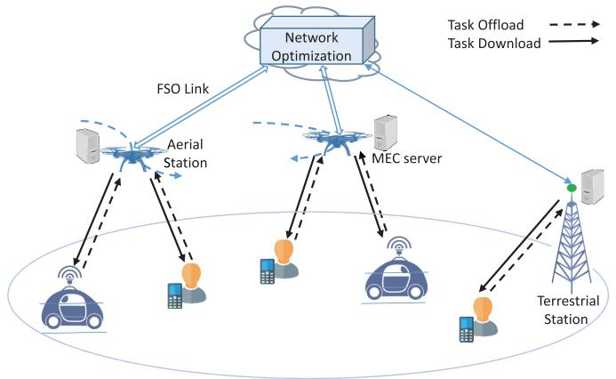

flowchart

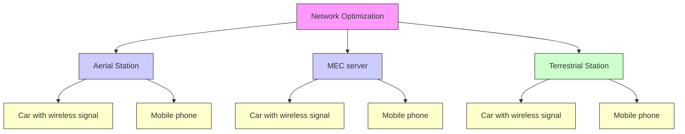

Fig. 1. Schematic diagram of the MEC-assisted multi-UAV aerial-terrestrial network.

We denote the uplink rate, for offloading the task between user k and the MEC server m by $R _ { k m } ^ { o }$ , which is determined by the physical-layer transmission characteristics and channel gain. Using the Shannon capacity formulation, the uplink rate, $R _ { k m } ^ { o }$ , at time t can be defined as,

$$
R _ {k m} ^ {o} [ t ] = B _ {k m} \cdot \log_ {2} \left(1 + \frac {p _ {k m} ^ {o} [ t ] h _ {k m} ^ {o} [ t ]}{B _ {k m} \sigma^ {2}}\right), \tag {1}
$$

where $B _ { k m }$ denotes the channel bandwidth between user $k$ and server m, $p _ { k m } ^ { o }$ gives the offloading transmit power, $h _ { k m } ^ { o }$ defines the uplink channel gain, and $\sigma ^ { \frac { \sigma } { 2 } }$ gives the background noise.

For downloading the computed task from the MEC server to user, the achievable downlink rate, $R _ { k m } ^ { d }$ , can be defined as,

$$
R _ {k m} ^ {d} [ t ] = B _ {k m} \cdot \log_ {2} \left(1 + \frac {p _ {k m} ^ {d} [ t ] h _ {k m} ^ {d} [ t ]}{B _ {k m} \sigma^ {2}}\right), \tag {2}
$$

where pdkm i $p _ { k m } ^ { d }$ s the downloading power, and $h _ { k m } ^ { d }$ is the downlink channel gain. The channel gain between UAV m and user k for time slot t can be given as:

$$
h _ {k m} [ t ] = \frac {\phi}{H _ {u} ^ {2} + \| a _ {m} [ t ] - \varpi_ {k} [ t ] \| ^ {2}}, \quad m = 1, \dots , M - 1, \tag {3}
$$

where $\phi$ represents the reference channel gain at distance 1m, $H _ { u }$ is the fixed vertical altitude of UAVs, and $a _ { m } [ t ]$ and $\varpi _ { k } [ t ]$ are horizontal coordinates of UAV m and user k, respectively. Whereas, the channel gain between BS b and user k for time slot t can be given as [27]:

$$
h _ {k b} [ t ] = \frac {\phi}{\left(H _ {b} ^ {2} + \| \varpi_ {b} - \varpi_ {k} [ t ] \| ^ {2}\right) ^ {\frac {\beta}{2}}} \vartheta_ {k}, \tag {4}
$$

where $H _ { b }$ is the fixed vertical height of BS, $\beta$ denotes pathloss exponent, $\vartheta _ { k }$ is an independent and identically distributed (i.i.d.) exponential random variable with unit mean accounting for the small-scale Rayleigh fading, and $\varpi _ { b }$ is the horizontal coordinates of the BS. For simplification, we denote all the transmitters, that includes the BS and the UAVs, as m.

# B. Computation Model

Since there are two possibilities for computing the user kth user’s task: 1) local computing; and 2) offloading to the MEC server, here we examine the computation paradigm for both.

1) Local Computing at the User: The computation task must be processed utilizing local computing resources in the case of local computing, and no actual data needs to be transferred via wireless connections. The CPU cycles required by the computation task defines the local computing time and energy usage. We refer to the kth user’s computation capabilities (i.e., CPU cycles per time interval) as $f _ { k } [ t ]$ and maximum computation capability of the local device as $L _ { k } ^ { m a x }$ . The local computing time required by user k to perform its task, when $\nu _ { k }$ CPU cycles are needed to compute one bit and the size of the data is $u _ { k } [ t ]$ , at time $t ,$ can be given as:

$$
\psi_ {k} [ t ] = \frac {u _ {k} [ t ] \cdot \nu_ {k}}{f _ {k} [ t ]}. \tag {5}
$$

Moreover, the corresponding energy consumption of local computing can be given as [28],

$$
E _ {k} [ t ] = \epsilon \cdot (f _ {k} [ t ]) ^ {3} \cdot \psi_ {k} [ t ], \tag {6}
$$

where ϵ is an energy consumption parameter that denotes effective switched capacitance depending on the CPU architecture. For simplicity, it is assumed that this capacitance is constant for all devices.

2) Offloading to the MEC Server: In the case of task offloading, user k will transfer its compute task to the chosen MEC server. The overall computation capability of the MEC server is denoted by $S _ { m } ^ { m a x }$ , and the computation ability assigned to user k by the server at interval t is denoted by $f _ { k m } [ t ]$ . The system utilizes a linear model to predict the computation time of a job that is offloaded by $k ,$ given $\begin{array} { r } { \psi _ { k } ^ { c } [ t ] = \frac { \mathbf { \dot { u } } _ { k } [ t ] \cdot \omega _ { m } } { f _ { k m } [ t ] } } \end{array}$ , where $\omega _ { m }$ CPU cycles are needed to process one bit at the server and the size of the computed data is $u _ { k } [ t ]$ ]. In addition to the computing time, there will be a time cost for delivering the task to the MEC server. The transmission time $\begin{array} { r } { \psi _ { k m } ^ { o } [ t ] = \frac { u _ { k } [ t ] } { R _ { k m } ^ { o } [ t ] } } \end{array}$ Rokm of user k for transferring task to the MEC server is determined by the uplink rate $R _ { k m } ^ { o } [ t ]$ and the data size $u _ { k } [ t ]$ . Furthermore, $\begin{array} { r } { \psi _ { k m } ^ { d } [ t ] = \frac { u _ { k } ^ { d } [ t ] } { R _ { k m } ^ { d } [ t ] } } \end{array}$ can be used to calculate kmthe time required to return the computed task to the user, where $u _ { k } ^ { d }$ is the consequent number of bits after computation. As a result, the time function can be given as:

$$
\psi_ {k m} [ t ] = \frac {u _ {k} [ t ]}{R _ {k m} ^ {o} [ t ]} + \frac {u _ {k} [ t ] \cdot \omega_ {m}}{f _ {k m} [ t ]} + \frac {u _ {k} ^ {d} [ t ]}{R _ {k m} ^ {d} [ t ]}. \tag {7}
$$

A UAV-based MEC server has restricted energy resources compared to a fixed MEC server. As a result, a task’s total energy consumption comprises not only the energy used to send the computation task from user k to the MEC server, but also the energy used to hover the UAV, compute the task, and download the computing results. According to [29], the energy consumption for hovering UAVs could be expressed as $P _ { m } ^ { h }$ · $\psi _ { k m } [ t ]$ , where $P _ { m } ^ { h }$ denotes the hovering power. The hovering power depends on UAV mass, radius of propeller, gravitational force, and density of air. Theoretically, these parameters do not change at a fixed altitude with stable environment conditions. Hence, the paper considers a constant value of hovering power. The energy consumption can be written as:

$$
\begin{array}{l} E _ {k m} [ t ] = \frac {p _ {k m} ^ {o} [ t ] \cdot u _ {k} [ t ]}{R _ {k m} ^ {o} [ t ]} + \epsilon \cdot (f _ {k m} [ t ]) ^ {2} \cdot u _ {k} [ t ] \cdot \omega_ {m} \\ + \frac {p _ {k m} ^ {d} [ t ] \cdot u _ {k} ^ {d} [ t ]}{R _ {k m} ^ {d} [ t ]} + P _ {m} ^ {h} \cdot \psi_ {k m} [ t ], (8) \\ \end{array}
$$

where total energy consumed is the sum of task offloading, task computing, result downloading and UAV hovering energies. Note that in the case where the MEC service is provided by the terrestrial base station, the hovering power would be zero.

# C. Energy and Latency Based Cost Model

In this paper, we model the cost incurred as a linear combination of energy consumption and corresponding time latency it takes to complete the computation task. For providing flexibility on network QoS requirements, the paper introduces weighting parameters for time delay and energy consumption denoted by $\sigma _ { k } ^ { \psi } \left( J / s \right)$ and $\sigma _ { k } ^ { E }$ (unitless), respectively. For instance, if the user k is running a latency-sensitive application, then the value of $\sigma _ { k } ^ { \psi }$ could be set higher than $\sigma _ { k } ^ { E }$ . On the contrary, if the user k is at a low-battery state, then the value of $\sigma _ { k } ^ { E }$ could be set higher than $\sigma _ { k } ^ { \psi }$ . Additionally, numerical evaluation is done in Section VI, where we examine the role that both weighting parameters play to estimate the overall cost of the system in regard to latency and energy. We examine the significance of our proposed framework independently for energy cost and delay cost as well.

For local computation, the cost is determined by using local computing time in (5), the consumed energy per CPU cycle in (6), and the weighting parameters, and expressed as:

$$
C _ {k} [ t ] = \sigma_ {k} ^ {\psi} \psi_ {k} [ t ] + \sigma_ {k} ^ {E} E _ {k} [ t ]. \tag {9}
$$

whereas, for the case of offloading the task to the MEC server, the cost is a scaled sum of (7) which includes time for uploading, computing, and results downloading, and (8) which includes the corresponding energy consumed, and can be given as:

$$
C _ {k m} [ t ] = \sigma_ {k} ^ {\psi} \psi_ {k m} [ t ] + \sigma_ {k} ^ {E} E _ {k m} [ t ]. \tag {10}
$$

For simplification in writing our optimization problem, and solving it, we introduce the cost matrix, X, with dimension $K \times ( M + 1 )$ , where columns 1 to M give the cost $C _ { k m }$ for performing computation for K users at M MEC servers. Whereas, (M + 1)th column gives cost $C _ { k }$ for local computation for K users.

# IV. PROBLEM FORMULATION

Over a given horizon time Γ, our goal is to minimize the total cost incurred in computing the tasks for all users, by jointly optimizing task offloading and MEC server selection decision, power allocation, UAV trajectory control, and CPU frequency allocation.

To define the cost of user k for the offloading and server selection decision profile, we define a decision matrix d, with dimension $K \times ( M + 1 )$ , where columns 1 to M indicate the decision for offloading, and (M + 1)th column gives the local computation decision. Each row of d only has one element as 1 and the rest of the elements are zero, confirming that a user computes its task at only one location. Whereas, any column can have more than one elements as 1, indicating that MEC servers can serve more than one user.

Similarly, we define matrix f for CPU frequency allocation, where columns 1 to M indicate the CPU frequency $f _ { k m }$ allocated by the MEC server, and (M + 1)th column gives the local resources allocated. Here, each row of f only has one positive element and the rest of the elements are zero. Whereas, any column can have more than one elements that are a positive real number. Moreover, the power allocation matrices, of dimensions $K \times M$ , for offloading the data and downloading the results, are defined as $\boldsymbol { \mathbf { p } } ^ { o }$ and $\mathbf { p } ^ { \breve { d } }$ , respectively. Besides, the UAV trajectory control matrix, a, is defined as a $( M \mathrm { ~ - ~ } 1 ) \times 2$ matrix that gives optimized horizontal coordinates of UAVs. Accordingly, the optimization problem can be formulated as follows:

$$
\min _ {\mathbf {d}, \mathbf {p} ^ {o}, \mathbf {p} ^ {d}, \mathbf {a}, \mathbf {f}} \sum_ {t = 1} ^ {T} \sum_ {k = 1} ^ {K} \sum_ {m = 1} ^ {M + 1} d _ {k m} [ t ] \cdot X _ {k m} [ t ], \tag {11a}
$$

$$
\text { s.t. } \sum_ {m = 1} ^ {M + 1} d _ {k m} [ t ] = 1, \quad \forall k, \tag {11b}
$$

$$
d _ {k m} [ t ] \in \{0, 1 \}, \quad \forall k, m = 1,.., M + 1 \tag {11c}
$$

$$
\sum_ {k} \sum_ {m} B _ {k m} \leq B _ {\text { total }}, \quad \forall t \tag {11d}
$$

$$
R _ {k m} ^ {o} [ t ] \geq u _ {k m} [ t ], \quad R _ {k m} ^ {d} [ t ] \geq u _ {k m} ^ {d} [ t ], \quad \forall k, m, t \tag {11e}
$$

$$
0 \leq p _ {k m} ^ {o} [ t ] \leq p _ {k} ^ {\max}, \quad \forall k, m, t \tag {11f}
$$

$$
\sum_ {k} p _ {k m} ^ {d} [ t ] \leq q _ {m} ^ {\max}, \quad \forall m, t \tag {11g}
$$

$$
p _ {k m} ^ {d} [ t ] \geq 0, \quad \forall k, m, t \tag {11h}
$$

$$
0 \leq f _ {k (M + 1)} [ t ] \leq L _ {k} ^ {\max}, \quad \forall k, t \tag {11i}
$$

$$
\sum_ {k} f _ {k m} [ t ] \leq S _ {m} ^ {\text { max }}, \quad \forall m, t \tag {11j}
$$

$$
f _ {k m} [ t ] \geq 0, \quad \forall k, m, t \tag {11k}
$$

$$
a _ {m} [ 1 ] = a _ {m} [ T ], \quad m = 1,.., M - 1, \tag {111}
$$

$$
\left\| a _ {m} [ t + 1 ] - a _ {m} [ t ] \right\| ^ {2} \leq V _ {m} ^ {\max} \delta ,
$$

$$
\forall t, m = 1,.., M - 1, \tag {11m}
$$

$$
\left\| a _ {m} [ t ] - a _ {i} [ t ] \right\| ^ {2} \geq \chi_ {\min} ^ {2},
$$

$$
\forall t, i, i \neq m, m = 1,.., M - 1, \tag {11n}
$$

where constraints (11b) and (11c) indicate that at any point in time, one user may only perform computation locally or at one of the MEC servers. Moreover, (11d) and (11e) express the total available transmission bandwidth and minimum required transmission rates, respectively. Constraints (11f), (11g) and (11h) give the minimum and maximum transmission power for offloading and downloading the computation task. Whereas, (11i), (11j) and (11k) defines the lower and upper limits for computation resources allocated for the task. Here $L ^ { m a x }$ is defined as maximum local computation vector, hetation resource of user $L _ { k } ^ { m a x }$ gives the maximum compu-e. Similarly, Smaxm gives the $k ' s$ maximum computation ability of MEC server m. Moreover, constraint (11l) states that at the end of the time horizon Γ, the UAV returns to its original location. Furthermore, UAV trajectories are influenced by the maximum speed (11m) and collision avoidance (11n). The $V _ { m } ^ { m a x }$ in (11m) specifies the maximum speed, whereas the $\chi _ { m i n }$ in (11n) gives the minimum distance between UAVs to prevent them colliding. The location of the UAV is assumed to be unchanged within each interval t by selecting a sufficiently small time slot, δ.

# V. PROPOSED SOLUTION

In this section, the paper proposes an efficient three-layer Alternative Cost Minimization (ACM) algorithm for solving the formulated non-convex problem. Firstly, a solution is proposed in the first layer for task offloading and MEC server selection. Secondly, the power allocation subproblem for offloading and downloading the task computation bits, and UAV trajectory control are solved. Besides, in the third layer, we perform CPU frequency allocation.

# A. First Layer Performing Task Offloading Decision and MEC Server Selection

Given power allocation, location of the BS and UAVs, and CPU frequency allocation, and taking into consideration that minimizing for every interval, t, leads to minimizing the total cost over time horizon Γ, in the first layer, we work on the offloading and MEC server selection decision. Hence, the target subproblem for layer one can be given as:

$$
\min _ {\mathbf {d}} \sum_ {k = 1} ^ {K} \sum_ {m = 1} ^ {M + 1} d _ {k m} \cdot X _ {k m}, \tag {12a}
$$

$$
\text { s.t. } \sum_ {m = 1} ^ {M + 1} d _ {k m} [ t ] = 1, \quad \forall k, \tag {12b}
$$

$$
d _ {k m} [ t ] \in \{0, 1 \}, \quad \forall k, m = 1,.., M + 1 \tag {12c}
$$

$$
\sum_ {k} \sum_ {m} B _ {k m} \leq B _ {\text { total }}, \tag {12d}
$$

$$
f _ {k (M + 1)} \geq 0, \quad \forall k \tag {12e}
$$

$$
f _ {k m} \geq 0, \quad \forall k, m. \tag {12f}
$$

Despite the fact that the users are autonomous of one another, distinct offloading decisions are linked. This implies that a user’s action has a direct influence on the choices of other users across the system. On the one hand, unloading computation work to remote servers can save user’s costs in terms of computation energy expenses. On the other hand, if a large number of users decide to offload their computation tasks at the same time, the competition between computation and mobile communication resources will be intense. As a result, the effectiveness of the offloaded computation tasks may suffer. Hence, it would be more efficient to carry out the tasks locally in this scenario. We first establish the concept of useful MEC computing centered on this tradeoff.

Given computation offloading and server selection decision profile d, the offloading decision of user k that selects the MEC computing option is beneficial if the MEC computing alternative does not entail a larger cost than the local computing option $( \mathrm { i . e . , } C _ { k m } \leq C _ { k } )$ . In the UAV-assisted MEC system, the notion of beneficial MEC computing indicates how much of the user’s load is shared by the MEC server. Also, it aids users in balancing the trade-off between latency and energy consumption.

To define the cost of user k in the offloading and server selection decision profile d, we introduce an indicator function $I ( \alpha _ { k } , m )$ for user k as:

$$
I (\alpha_ {k}, m) = \left\{ \begin{array}{l l} 1, & \text { if   } \alpha_ {k} = m \text {   or   } \alpha_ {k} = (M + 1) \\ 0, & \text { otherwise }, \end{array} \right. \tag {13}
$$

where $\alpha _ { k }$ is the selection variable for user $k ,$ and is an integer number $\{ 1 , 2 , . . . , M , M + 1 \}$ that remains the same within the time interval t. The selection variable if set to $M + 1$ means no offloading, therefore, computation would be done locally. Whereas, any other value from $\{ 1 , 2 , . . . , M \}$ indicates the selected MEC server for computation. Hence, Eqn. (13) denotes that when the input $\alpha _ { k }$ and m into function $I ( \alpha _ { k } , m )$ are the same, the output is 1, otherwise 0.

Utilizing the indicator function, for simplification, we express the total cost $Q _ { k }$ of user k as:

$$
Q _ {k} (\alpha_ {k}) = I (\alpha_ {k}, M + 1) C _ {k} + \sum_ {m} I (\alpha_ {k}, m) C _ {k m}. \tag {14}
$$

Therefore, the simplified reformulated subproblem can be given as:

$$
\min _ {\boldsymbol {\alpha}} \sum_ {k} Q _ {k} (\boldsymbol {\alpha}), \tag {15a}
$$

$$
\text { s.t. } \alpha_ {k} \in \{1, \dots , M, M + 1 \}, \quad \forall k \tag {15b}
$$

$$
\sum_ {k} \sum_ {m} B _ {k m} \leq B _ {\text { total }}, \tag {15c}
$$

$$
f _ {k (M + 1)} \geq 0, \quad \forall k \tag {15d}
$$

$$
f _ {k m} \geq 0, \quad \forall k, m. \tag {15e}
$$

In order to have a decentralized solution without gathering significant user parameters, the paper proposes a Game Theory-based offloading and server selection Decision (GTD) algorithm [30] that provides a low complexity solution to the subproblem (15a).

We consider that the users play a strategic game $\Omega = <$ < $K , \{ \alpha _ { k } \} _ { k \in K } , \{ Q _ { k } \} _ { k \in K } > ,$ , where K is the number of users in the system, $\alpha _ { k } = \{ 1 , \ldots , M , M + 1 \}$ is the strategy space, and $Q _ { k }$ is the total cost function to be minimized for user k. The possible values of $Q _ { k }$ are shown as follows:

$$
Q _ {k} (\alpha_ {k}, \alpha_ {- k}) = \left\{ \begin{array}{l l} C _ {k 1}, & \text { if   } \alpha_ {k} = 1 \\ \vdots \\ C _ {k M}, & \text { if   } \alpha_ {k} = M \\ C _ {k}, & \text { if   } \alpha_ {k} = M + 1. \end{array} \right. \tag {16}
$$

We refer to the game as the computation offloading game, where each user attempts to minimize its own cost (14), i.e., find the value for the selection variable given as:

$$
\alpha_ {k} ^ {*} \in \arg \min Q _ {k} (\alpha_ {k}, \alpha_ {- k}), \quad \alpha_ {k} \in \{1, \dots , M, M + 1 \}, \tag {17}
$$

where $\alpha _ { - k } ~ = ~ \{ \alpha _ { 1 } , . . . , \alpha _ { k - 1 } , \alpha _ { k + 1 } , . . . , \alpha _ { K } \}$ represents the arbitrary selection variable of all users except user k. We are interested in whether a Nash Equilibrium (NE) of the game Ω exists, i.e., no user can further decrease its cost by changing its selection variable.

The NE of the strategic game Ω is a selection variable profile $\alpha ^ { * }$ such that

$$
Q _ {k} (\alpha_ {k} ^ {*}, \alpha_ {- k} ^ {*}) \leq Q _ {k} (\alpha_ {k}, \alpha_ {- k} ^ {*}), \quad \forall \alpha_ {k}. \tag {18}
$$

We use a sophisticated tool, the potential game [31], to verify the existence of NE in the game Ω, and prove that the game is a potential game because it has at least one NE solution.

Definition 1: A game $\Omega = < K , \{ \alpha _ { k } \} _ { k \in K } , \{ Q _ { k } \} _ { k \in K } >$ is a potential game if a potential function Υ exists such that for all $k \in K$ and all $\alpha _ { k } , \alpha _ { k } ^ { \prime } \in \{ 1 , \ldots , M , M + 1 \} , Q _ { k } ( \alpha _ { k } , \alpha _ { - k } ) -$ $Q _ { k } ( \alpha _ { k } ^ { \prime } , \alpha _ { - k } ) = \Upsilon ( \alpha _ { k } , \alpha _ { - k } ) - \Upsilon ( \alpha _ { k } ^ { \prime } , \alpha _ { - k } ) .$

Hence, game Ω is a potential game if its cost function $\{ Q _ { k } \} _ { k \in K }$ can be expressed as a potential function $\Upsilon ( \alpha _ { k } , \alpha _ { - k } )$ . This can be given as,

$$
\Upsilon \left(\alpha_ {k}, \alpha_ {- k}\right) - \Upsilon \left(\alpha_ {k} ^ {\prime}, \alpha_ {- k} ^ {\prime}\right) = Q _ {k} \left(\alpha_ {k}, \alpha_ {- k}\right) - Q _ {k} \left(\alpha_ {k} ^ {\prime}, \alpha_ {- k} ^ {\prime}\right), \tag {19}
$$

where

$$
\Upsilon \left(\alpha_ {k}, \alpha_ {- k}\right) = \arg \min _ {\alpha_ {k} \in \{1,.., M + 1 \}} Q _ {k} \left(\alpha_ {k}, \alpha_ {- k}\right) = \Xi_ {k} \left(\alpha_ {- k}\right) \tag {20}
$$

and

$$
\Upsilon (\alpha_ {k} ^ {\prime}, \alpha_ {- k} ^ {\prime}) = \Xi_ {k} ^ {\prime} (\alpha_ {- k}). \tag {21}
$$

Therefore, $\Xi _ { k } ( \alpha _ { - k } )$ is the best possible reply for a player k, given the selection variable profile $\alpha _ { - k } .$ . It is also defined as a best response potential game [32], which is equal to

$$
\Xi_ {k} \left(\alpha_ {- k}\right) = \left\{ \begin{array}{l l} \arg \min _ {\alpha_ {k} \in \{1,.., M + 1 \}} C _ {k 1}, & \text {if} \alpha_ {k} = 1 \\ \vdots \\ \arg \min _ {\alpha_ {k} \in \{1,.., M + 1 \}} C _ {k M}, & \text {if} \alpha_ {k} = M \\ \arg \min _ {\alpha_ {k} \in \{1,.., M + 1 \}} C _ {k}, & \text {if} \alpha_ {k} = M + 1. \end{array} \right. \tag {22}
$$

Moreover, $\Omega = < K , \{ \alpha _ { k } \} _ { k \in K } , \{ Q _ { k } \} _ { k \in K } >$ is a potential game since function (22) satisfies the definition of a potential function. It provides an optimal solution that ensures best tradeoff between the local cost and the system total cost. This means that a NE solution exists, which is equal to $\Xi _ { k } ( \alpha _ { - k } )$ .

Accordingly, the offloading and server selection decision profile, d, with dimension $K \times ( M + 1 )$ , can be given using below elements:

$$
d _ {k m} ^ {*} = \left\{ \begin{array}{l l} 1, & \text { if } m = \alpha_ {k} \\ 0, & \text { if } m \neq \alpha_ {k}. \end{array} \right. \tag {23}
$$

Algorithm 1 describes the game theory-based offloading and server selection decision (GTD) algorithm in detail. In GTD, all users first get the existing network state and set their current best selection variable during each loop. The users then compete for the chance to alter their choices. If user $j$ is the winner of the update opportunity, the update step is completed. If $Q _ { j } ( \alpha _ { j } ^ { \prime } , \alpha _ { - j } ) < Q _ { j } ( \alpha _ { j } , \alpha _ { - j } )$ , we say that the selection variable $\alpha _ { j } ^ { \prime }$ is an update step for user j. Furthermore, if a selection $\alpha _ { j } ^ { * }$ solves (17), we claim it is the best reply to $\alpha _ { - j }$ . Evidently, in NE, all users respond to each other’s methods with their best responses. After a number of repetitions, the system achieves NE when all users play their best response, implying that no user needs to conduct the update step.

Algorithm 1 Game Theory-Based Offloading and Server Selection Decision (GTD) Algorithm   
Input $K, \alpha_k, f_{k(M+1)}, f_{km}, p_k, B_{total}, p_m, \sigma, \forall m, k \in K$ .

Output Offloading and server selection decision profile d, and the minimum total cost $X_{min}$ .

1: Initialize $\alpha_k = 0$ , $\forall k$ , and obtain the selection variable profile $\alpha^*$ ;
2: Compute the initial value of cost function $Q^*$ ;
3: repeat
4:    for $k \in K$ do
5:    Obtain the current network status and select the best selection variable profile $\alpha'$ ;
6:    Calculate the value of function $Q'$ ;
7:    if $Q' \leq Q^*$ then
8: $Q^* = Q', \alpha^* = \alpha'$ , and save the users into U;
9:    end if
10:    end for
11:    if $U \neq \emptyset$ , then
12:    Each user in U looks for an update opportunity;
13:    if user j wins the selection update opportunity then
14:    Update $\alpha_j$ in $\alpha^*$ ;
15:    Share the update message with other users;
16:    else;
17:    Keep $\alpha_j$ unchanged;
18:    end if;
19:    end if;
20: until an Equilibrium is achieved;
21: User k determines the decision $d_{km}$ by setting $d_{k\alpha_j} = 1$ .
22: Output d; $X_{min} = Q^*$ .

As discussed above, each user makes their own selection based on the current network status. The winner of the selection update opportunity, user $j ,$ then decides on the optimal response to other users’ selection profiles $\alpha _ { - k }$ . Each user’s best response is a local optimal selection, and the available choices for $\alpha _ { j }$ in Algorithm 1 are limited. However, the GTD algorithm provides the best possible solution to the problem of offloading and server selection (12a).

# B. Second Layer Performing Power Optimization and UAV Trajectory Control

Given the offloading and server selection decision, and CPU resource allocation, the second layer optimizes the UAV trajectory and the transmit power. It considers that minimizing for every interval t, individually, leads to minimizing the total cost over time horizon Γ, and resolves two subproblems; one for power allocation and another for UAV trajectory.

1) Transmit Power Optimization: Given offloading decision, location of the BS and UAVs, and CPU frequency allocation, in this part of the second layer, we work on the offloading and downloading transmit power optimization. The simplified subproblem can be given as:

$$
\min _ {\mathbf {p} ^ {o}, \mathbf {p} ^ {d}} \sum_ {k} \sum_ {m} d _ {k m} \cdot X _ {k m} (\mathbf {p} ^ {o}, \mathbf {p} ^ {d}), \tag {24a}
$$

$\mathrm { s . t . } ~ R _ { k m } ^ { o } \geq u _ { k m } , ~ R _ { k m } ^ { d } \geq u _ { k m } ^ { d } , ~ \forall k , m$ (24b)

$$
0 \leq p _ {k m} ^ {o} \leq p _ {k} ^ {\max}, \quad \forall k, m \tag {24c}
$$

$$
\sum_ {k} p _ {k m} ^ {d} \leq q _ {m} ^ {\max}, \quad \forall m \tag {24d}
$$

$$
p _ {k m} ^ {d} \geq 0, \quad \forall k, m \tag {24e}
$$

where the solution of (24a) is achieved by solving the problem into two blocks. In the first block we perform power allocation for offloading the content to MEC server, whereas, in the second block we perform power distribution for downloading the computed results back to the user. We use a sophisticated geometric water-filling (GWF) method described in [33] and [34] to solve the two blocks. It avoids the necessity for resolving a nonlinear model from the Karush-Kuhn-Tucker (KKT) conditions of the target problem for determining the power level. Furthermore, compared to the conventional techniques, the GWF method takes less processing, has a similar memory cost, and uses sorted parameters, while providing insights into the problems and the exact solutions to the target problems.

The first block that allocates power at the user terminal for offloading the content, provides optimum power allocation in order to efficiently utilize the user equipment, can be simplified as:

$$
\min _ {\mathbf {p} ^ {o}} \sum_ {k} \sum_ {m} d _ {k m} \cdot X _ {k m} (\mathbf {p} ^ {o}), \tag {25a}
$$

$\mathrm { s . t . } ~ R _ { k } ^ { o } \geq u _ { k } , ~ \forall k$ (25b)

$$
0 \leq p _ {k} ^ {o} \leq p _ {k} ^ {\max}, \quad \forall k \tag {25c}
$$

where a noise free version of $R _ { k } ^ { o } = \log _ { 2 } \left( 1 + p _ { k } ^ { o } h _ { k } ^ { o } \right)$ , for every interval t. Figs. 2(a)-(b) show an illustration of the applied GWF algorithm with four unit-width steps $( K = 4 )$ in a water tank. We selected K to indicate the number of steps in the following analysis because the number of steps in the GWF solution is the same as the number of users in our network. Let us use $z _ { k }$ to denote the “step depth” of the kth stair which is the height of the kth step to the bottom of the tank, and is given as:

$$
z _ {k} ^ {o} = \frac {1}{h _ {k} ^ {o}}, \quad \forall k. \tag {26}
$$

The step depth of the stairs indexed as $\{ 1 , . . . , K \}$ is monotonically rising since the channel gain sequence $h _ { k } ^ { o }$ is sorted as monotonically decreasing. When utilizing the conventional way, the water level, ξ, must first be determined, followed by the power allocated to each stair, i.e. the water volume above the stair. Instead of attempting to discover $\xi ,$ a real Algorithm 2 Power Allocation at User Terminal for Offloading Bits to MEC Server

1: Input: vector $\overline { { h _ { k } ^ { o } , ~ p _ { k } ^ { m a x } } }$ for $\overline { { k = 1 , 2 , . . . , K } }$ , the set $\overline { { E = } }$ $1 , 2 , . . . , K ,$ and $\upsilon = 2 ^ { u _ { k } }$ .   
2: Utilize $( 2 8 ) ‐ ( 3 0 )$ to compute $p _ { k } ^ { o } .$   
3: $\Lambda \Rightarrow \{ k \mid p _ { k } ^ { o } > p _ { k } ^ { m a x } , k \in E \}$ . If Λ is null output will be $\{ p _ { k } ^ { o } \} _ { k = 1 } ^ { K }$ k  else $p _ { k } ^ { o } = p _ { k } ^ { m a x }$ , for $k \in \Lambda .$ .   
4: Update E with $E \backslash \Lambda ,$ , update υ with $v / \left[ \Pi _ { x \in \Lambda } ( 1 + h _ { x } ^ { o } P _ { x } ) \right]$ ]. Then return to $2 \mathrm { : }$

non-negative number, the GWF approach seeks to determine the water level step, which is an integer value ranging from 1 to K. The highest step in water is signified by the number $k ^ { * }$ . The solution for power allocation can easily be written out using the $k ^ { * }$ result.

Let $R ( k _ { n } )$ give the achieved data rate using power below step $k _ { n }$ for $n = \{ 1 , . . . , | E | \}$ , where E is a subsequence of the sequence $\{ 1 , . . . , K \} , | E |$ is the cardinality of the set E, so, E can be given as $\{ k _ { 1 } , k _ { 2 } , . . . , k _ { | E | } \}$ . The value of $R ( k _ { n } )$ can be expressed as:

$$
R (k _ {n}) = \sum_ {y = 1} ^ {| E | - 1} \log_ {2} \left(1 + p _ {k _ {n}} ^ {o} h _ {k _ {n}} ^ {o}\right), 1 \leq n \leq | E |, \tag {27}
$$

where $p _ { k _ { n } } ^ { o } = 1 / h _ { k _ { y } } ^ { o } - 1 / h _ { k _ { r } } ^ { o }$ . Hence, from the above equation, the exponential rate can be written as $E R ( k _ { n } ) = 2 ^ { R ( k _ { n } ) } =$ $\left\lceil \Pi _ { y = 1 } ^ { \lfloor E \rceil - 1 } \left( \frac { h _ { k _ { n } } ^ { o } } { h _ { k _ { y } } ^ { o } } \right) \right\rceil$ h ok n

The cost function, $X _ { k m } ( \mathbf { p } ^ { o } )$ , in problem (25a) can be minimized by minimizing the offloading power. Therefore, the explicit power solution can be given by:

$$
p _ {k} ^ {o} = \left\{ \begin{array}{l l} \left[ p _ {n ^ {*}} ^ {o} + (z _ {n ^ {*}} ^ {o} - z _ {k} ^ {o}) \right], & 1 \leq k \leq n ^ {*} \\ 0, & n ^ {*} <   k \leq K, \end{array} \right. \tag {28}
$$

where

$$
n ^ {*} = \max \left\{n \mid E R (k _ {n}) <   2 ^ {u _ {k}}, 1 \leq n \leq | E | \right\} \tag {29}
$$

and the power level for this step is

$$
p _ {n ^ {*}} ^ {o} = z _ {n ^ {*}} ^ {o} \left[ \left(\frac {2 ^ {u _ {k}}}{E R (k _ {n} ^ {*})}\right) ^ {\frac {1}{n ^ {*}}} - 1 \right]. \tag {30}
$$

Algorithm 2 gives the GWF-based dynamic power distribution process for offloading the bits to MEC server. The state of this process is determined by the difference between the individual peak power sequence and the existing power distribution sequence. The process control is determined by (28)-(30) and is based on the above-mentioned state. As a result, for the very next time stage, a new state appears, and an optimal power allocation procedure with state feedback emerges. The framework goes through K loops to determine the optimal solution, as the finite set $E$ shrinks until the set Λ is exhausted.

The second block allocates power at each UAV/BS transmitter m for downloading back the computed content. We optimize the cost function by minimizing the downloading power for all users connected to m. The simplified subproblem for each m can be given as,

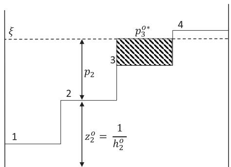

text_image

ξ
p₂
2
1
z₂° = 1/h₂°
3
p₃°*
4

(a)

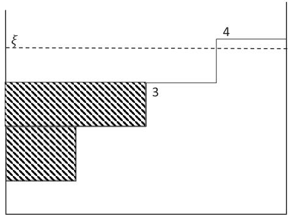

text_image

ξ
3
4

(b)   
Fig. 2. Illustration for the proposed GWF algorithm. (a) Illustration of water level step $k ^ { * } = 3 ,$ allocated power for the third step ${ p } _ { 3 } ^ { o * } .$ , and step/stair depth $z _ { k } ^ { o } = 1 / h _ { k } ^ { o }$ . (b) Illustration of exponential rate $E R ( k )$ (shadowed area, representing the total water/power up to, but excluding, step k) when $k { \stackrel { - } { = } } 3 .$ .

$$
\min _ {\mathbf {p} ^ {d}} \sum_ {k} \sum_ {m} d _ {k m} \cdot X _ {k m} (\mathbf {p} ^ {d}), \tag {31a}
$$

$\mathrm { s . t . } ~ R _ { k } ^ { d } \geq u _ { k } ^ { d } , ~ \forall k$ (31b)

$$
\sum_ {k} p _ {k} ^ {d} \leq q _ {m} ^ {\max}, \tag {31c}
$$

$$
p _ {k} ^ {d} \geq 0, \quad \forall k \tag {31d}
$$

Let $\{ Y _ { k } \} _ { k = 1 } ^ { W }$ 1 be a partition of the index set: $\{ 1 , . . . , K \}$ . For simplification, the elements of $Y _ { k }$ can be listed as monotonically increasing, i.e., $k _ { 1 } < k _ { 2 } < . . . < k _ { | Y _ { k } | }$ . To solve the problem (25a), this study takes into account our earlier work in [35], and use (31a)-(35) given below:

$$
p _ {k} ^ {d} = \left\{ \begin{array}{l l} p _ {n ^ {*}} ^ {d} + (z _ {n ^ {*}} ^ {d} - z _ {n} ^ {d}), & 1 \leq k \leq n ^ {*} \\ 0, & n ^ {*} <   k \leq K, \end{array} \right. \tag {32}
$$

where $n ^ { * }$ and the power level for this step, $p _ { n ^ { * } } ^ { d }$ , can be obtained by utilizing the expressions in (33) and (34), respectively,

$$
n ^ {*} = \max \left\{n \mid P _ {\pi} (n) > 0, 1 \leq n \leq K \right\} \tag {33}
$$

and the power level for this step is

$$
p _ {n ^ {*}} ^ {d} = \frac {1}{n ^ {*}} \cdot P _ {\pi} (n ^ {*}). \tag {34}
$$

The value of $P _ { \pi } ( n )$ , on the other hand, can be computed by deducting the volume of water under step n from the overall transmitter power $q _ { m } ^ { m a x }$ max , as follows:

$$
P _ {\pi} (n) = \left[ q _ {m} ^ {m a x} - \sum_ {k = 1} ^ {n - 1} \left(z _ {n} ^ {d} - z _ {k} ^ {d}\right) \right] ^ {+}, 1 \leq n \leq K. \tag {35}
$$

Algorithm 3 presents the proposed solution taking into account the exponential rate and using the given set of equations.

2) UAV Trajectory Control: Given offloading decision, offloading/downloading power allocation, and CPU frequency allocation, in this part of the second layer, we work on the UAV trajectory optimization. A segment-by-segment strategy is implemented that divides the entire UAV flight trajectory

# Algorithm 3 Power Allocation at Transmitter for Transmitting Computed Bits From MEC Server to the User

1: Input: vector $h _ { k } ^ { d } , \ q _ { m } ^ { m a x }$ for d $k = 1 , 2 , . . . , K .$ , the set $E =$ $1 , 2 , . . . , W ,$ and $\upsilon = 2 ^ { u _ { k } ^ { d } }$ .   
2: Let $r ~ = ~ 1$ and $\Lambda \ = \ \varnothing .$ . Utilize (28)-(30) to compute $\{ p _ { k } ^ { d } \} _ { k = 1 } ^ { K } .$   
$\Lambda _ { r }$ as. If ed by the set is null output $\begin{array} { r l } { k \vert \sum _ { k \in Y _ { k } } p _ { k } ^ { d } } & { { } > } \end{array}$ $q _ { m } ^ { m a x } , k \in E \}$ $\Lambda _ { r }$ $\{ p _ { k } ^ { d } \} _ { k = 1 } ^ { K }$ m else $p _ { k } ^ { d } = q _ { m } ^ { m i x } , K ^ { \prime }  | Y _ { k } | , Y _ { k }$ k k=1is renamed into the set $\{ k _ { 1 } , . . , k _ { K ^ { \prime } } \}$ , and then utilize $( 3 2 ) ‐ ( 3 5 )$ , for $k \in \Lambda _ { r }$ .   
4: Update $E$ with $E \setminus \bigcup _ { r = 1 }$ update υ with $\begin{array} { r } { { \upsilon } \bigcup \left[ \prod _ { k \in \Lambda _ { r } } \prod _ { x \in Y _ { k } } \left( 1 + h _ { x } ^ { d } p _ { x } ^ { d } \right) \right] } \end{array}$ . Then $r \gets r + 1$ $\begin{array} { r } { K \dot {  } K - \sum _ { k \in \Lambda _ { r } } | Y _ { k } | } \end{array}$ and return to 2:.

into smaller time segments in order to minimize the computation time. The simplified subproblem can be given as:

$$
\min _ {\mathbf {a}} \sum_ {m = 1} ^ {M - 1} \sum_ {k} d _ {k m} \cdot X _ {k m} (\mathbf {a}), \tag {36a}
$$

$\mathrm { s . t . } \ a _ { m } [ 1 ] = a _ { m } [ T ] , \quad m = 1 , . . , M - 1 ,$ (36b)

$$
\left\| a _ {m} [ t + 1 ] - a _ {m} [ t ] \right\| ^ {2} \leq V _ {m} ^ {\max} \delta , \quad m = 1,.., M - 1, \tag {36c}
$$

$$
\left\| a _ {m} [ t ] - a _ {i} [ t ] \right\| ^ {2} \geq \chi_ {\min} ^ {2}, \quad \forall t, i, i \neq m, m = 1,.., M - 1. \tag {36d}
$$

The non-convex constraint in (36d) means that (36a) is not concave nor quasi-concave. As a result, Lemma 1, as defined below, is utilized to transform the non-convexity, and an iteration-based SCA approach is used, in which the primary function is estimated by a more manageable function at a given local point in each iteration [36].

Lemma 1: A quadratic function is defined as follows:

$$
g (\gamma) = \gamma^ {2}. \tag {37}
$$

At iteration $\eta ,$ the following inequality can be given for a given local point $\gamma ^ { \eta } ;$ :

$$
\gamma^ {2} \geq 2 \gamma^ {\eta} \times (\gamma - \gamma^ {\eta}) + (\gamma^ {\eta}) ^ {2}. \tag {38}
$$

From (37), we can see that $g ( \gamma )$ is a convex function. The inequality holds in (38) because any convex function’s lower bound can be estimated by first-order Taylor approximation at a local point.

Algorithm 4 Successive Convex Approximation for UAV Trajectory Optimization   
1: Initialization: Input the given fixed variables, $a_m[1]$ for $m = 1,..,M - 1,\varpi_k,\forall k,t$ , and $H_u$ ;
2: repeat
3:    CVX begin
4:    Solve (40a) at time interval $t$ to obtain $X_{km}^{\eta}, a_m^{\eta}[t]$ .
5:    CVX end
6:    if $\| X_{km}^{\eta} - X_{km}^{\eta - 1} \leq \zeta \|$ then
7: $X_{km} = X_{km}^{\eta}, a_m[t] = a_m^{\eta}[t]$ .
8:    break;
9:    end if
10:    Update the iteration value $\eta = \eta + 1$ .
11: until $\eta \leq \eta^{max}$ ;
12: Output: Optimal trajectory $\mathbf{a}$ of the UAVs.

In the ηth iteration, we represent UAV trajectory as $A ^ { \eta } =$ $\{ a _ { m } ^ { \eta } [ t ] , \forall t , m = 1 , . , M - 1 \}$ . Because $\| a _ { m } [ t ] - a _ { i } [ t ] \| ^ { 2 }$ is a convex function with regard to $a _ { m } [ t ]$ , we have the following inequality based on Lemma 1 for constraint (36d):

$$
\begin{array}{l} \left\| a _ {m} [ t ] - a _ {i} [ t ] \right\| ^ {2} \\ \geq - \| a _ {m} ^ {\eta} [ t ] - a _ {i} ^ {\eta} [ t ] \| ^ {2} + 2 (a _ {m} ^ {\eta} [ t ] - a _ {i} ^ {\eta} [ t ]) ^ {\perp} \\ \times \left(a _ {m} [ t ] - a _ {i} [ t ]\right), \quad \forall t, i, i \neq m, m = 1,.., M - 1. \tag {39} \\ \end{array}
$$

where ⊥ gives the matrix transpose. Using the first-order Taylor expansion, with any given local point Aη and the lower bound in (39), the problem can be approximated as follows:

$$
\min _ {\mathbf {A}} \sum_ {m = 1} ^ {M - 1} \sum_ {k} d _ {k m} \cdot X _ {k m} ^ {\eta} (\mathbf {a}), \tag {40a}
$$

$\mathrm { s . t . } \ a _ { m } [ 1 ] = a _ { m } [ T ] , \quad m = 1 , . . , M - 1 ,$ (40b)

$$
\left\| a _ {m} [ t + 1 ] - a _ {m} [ t ] \right\| ^ {2} \leq V _ {m} ^ {\max} \delta , \quad m = 1,.., M - 1, \tag {40c}
$$

$$
\chi_ {m i n} ^ {2} \leq - \| a _ {m} ^ {\eta} [ t ] - a _ {i} ^ {\eta} [ t ] \| ^ {2} + 2 (a _ {m} ^ {\eta} [ t ] - a _ {i} ^ {\eta} [ t ]) ^ {\perp} \times (a _ {m} [ t ]
$$

$$
- a _ {i} [ t ]), \quad \forall t, i, i \neq m, m = 1,.., M - 1, \tag {40d}
$$

where (40c) is a convex quadratic constraint and (40b) and (40d) are both linear constraints. As a convex optimization problem, (40a) can be solved efficiently using conventional convex optimizers like CVX [37], as shown in Algorithm 4. Therefore, the optimal objective value obtained from (40a) serves as a generic upper bound for (36a).

# C. Third Layer Performing CPU Frequency Allocation

Given offloading decision, power allocation, and location of the BS and UAVs, and taking into consideration that minimizing for every interval t, individually, leads to minimizing the total cost over time horizon Γ, in the third layer, we work on the CPU frequency allocation for task computing. The simplified subproblem for this can be given as

$$
\min _ {\mathbf {f}} \sum_ {k} \sum_ {m} ^ {M + 1} d _ {k m} \cdot X _ {k m} (\mathbf {f}), \tag {41a}
$$

Algorithm 5 Gradient Descent (GD) Technique for CPU Frequency Allocation   
1: Input: $desc^{step}$ , $\varepsilon = 10^{-7}$ , max GD iterations: $J^{max} = 50$ ;
2: Output: f;
3: Set the initial point $x'$ and $\ell = 0$ ;
4: Set the function (41a) to $q(x)$ and constraint to $r(x)$ ;
5: Set $f^{current} = f^{\Delta} = q(x)$ , $x = x'$ ;
6: while $\ell \leq J^{max}$ and $f^{\Delta} > \varepsilon$ do
7: $\ell = \ell + 1$ ;
8: $x = x - desc^{step} \cdot \nabla q(x)$ ;
9: temp = q(x);
10: $f^{\Delta} = abs(f^{current} - temp)$ ;
11: $f^{current} = temp$ ;
12: end while;
13: Set $x^{*} = x$ , $f^{*} = q(x)$ .

$$
\text { s.t. } 0 \leq f _ {k (M + 1)} \leq L _ {k} ^ {\max}, \quad \forall k \tag {41b}
$$

$$
\sum_ {k} f _ {k m} \leq S _ {m} ^ {\max}, \quad \forall m \tag {41c}
$$

$$
f _ {k m} \geq 0, \quad \forall k, m. \tag {41d}
$$

It can be seen that the objective function (41a) is convex. Likewise, the constraints of problem (41a) are convex sets. Therefore, problem (41a) is a convex optimization problem, which can be solved by using standard convex algorithms or gradient descent (GD) [38] technique as shown in Algorithm 5.

# D. Alternative Cost Minimization Algorithm

Taking into account the presented solutions for the three layers, this paper proposes an iterative framework, namely Alternative Cost Minimization (ACM) algorithm, for solving problem (11a), by using the alternating optimization technique. The optimization variables, {d, $\mathbf { p } ^ { o } , \mathbf { p } ^ { d } , \mathbf { a } , \mathbf { f } \}$ , in the original problem are partitioned into three layers. In the first layer, offloading and server selection decision profile d is solved, by solving problem (15a). Whereas, the second layer optimizes transmit powers $\mathbf { p } ^ { o } , \mathbf { p } ^ { d }$ , and UAV trajectory a by solving problems (24a) and (36a), respectively. The third layer solves (41a) to optimize CPU frequency allocation f. In addition, each iteration’s solution is used as the input for the next iteration. The framework is given in Algorithm 6.

Here, the paper analyzes the complexity of our proposed algorithm. The time complexity of first layer solution, provided in Section V-A, is denoted by $\mathcal { O } ( | K | )$ , where K represents the number of mobile users. Similarly, the time complexity of solving the second layer, in Section V-B, can be given by $\mathcal { O } ( 2 | M | | K | + \eta ^ { m a x } | M - 1 | | K | )$ . In Section ${ \mathrm { V - C } } ,$ the third layer related to CPU frequency allocation is solved, the time complexity of which is given by $\mathcal { O } ( J ^ { m a x } | M + 1 | )$ . Hence, the total time complexity of Algorithm 6 per time interval can be denoted by $\mathcal { O } ( | K | + 2 | M | | K | + \eta ^ { m a x } | M - 1 | | K | + J ^ { m a x } | M +$ 1|). Moreover, a block-by-block solution of ACM algorithm, results in space complexity of $\mathcal { O } ( | K | + ( | M | + | K | ) + | M -$ $1 | + | M + 1 | )$ .

# Algorithm 6 Alternating Algorithm for Cost Minimization

1: Initialize the power allocations, UAVs’ locations, and CPU frequency allocations;   
2: while Minimization of the cost function is higher than a predefined tolerance do   
3: Layer 1: Optimize offloading and server selection decision with fixed UAV placement, offloading/downloading power allocation, and CPU frequency allocation following Algorithm 1;   
4: Layer 2: Optimize offloading/downloading power allocation and UAV trajectory with fixed offloading decision and CPU frequency allocation using Algorithm 2, Algorithm 3 and Algorithm 4;   
5: Layer 3: Optimize CPU frequency allocation with fixed offloading decision, offloading/downloading power allocation, and UAV trajectory via Algorithm 5;   
6: end while;   
7: Output the offloading decision profile, offloading and downloading power allocations, UAVs’ optimized location, and CPU frequency allocation as the optimal solution to (11a).

TABLE II SIMULATION ENVIRONMENT 

<table><tr><td>Channel bandwidth  $B_{total}$ </td><td>100 MHz</td></tr><tr><td>Noise power  $\sigma^{2}$ </td><td>-109 dBm</td></tr><tr><td>Max UAV speed  $V_{m}^{max}$ </td><td>30 m/s</td></tr><tr><td>Min inter-UAV distance  $\chi_{min}$ </td><td>1 m</td></tr><tr><td>Max transmit power of BS/UAV  $q_{m}^{max}$ </td><td>100 W</td></tr><tr><td>Max user transmit power  $p_{k}^{max}$ </td><td>200 mW</td></tr><tr><td>Max CPU frequency for MEC  $S_{m}^{max}$ </td><td>10 GHz</td></tr><tr><td>Max local CPU frequency  $L_{k}^{max}$ </td><td>1 GHz</td></tr><tr><td>Time horizon  $\Gamma$ </td><td>100 s</td></tr><tr><td>Slot duration  $\delta$ </td><td>1 s</td></tr><tr><td>Time intervals  $T$ </td><td>100</td></tr></table>

# VI. NUMERICAL RESULTS AND EVALUATION

The paper presents and evaluates simulation results in this section to establish the effectiveness of the proposed ACM algorithm. We consider a BS at location (0, 0) and two UAVs, starting at random places, providing wireless connectivity and MEC services for terrestrial users in a 2000 m × 2000 m area grid. Each mobile user has only one independent task. Furthermore, the work assumes a unit bandwidth, whereas the system and channel parameters needed to model the simulation environment are listed in Table II.

To demonstrate the efficacy and reliability of our proposed solution, we carry out the simulations to compare the ACM technique with the following four schemes:

• Local computation (LC): All tasks are executed locally.   
• MEC computation (MC): All tasks are offloaded to the nearest available MEC server.   
• Random computation (RC): Task can be performed on local device or MEC server randomly.   
• ACM-single (ACM-s): simple version of ACM, in which the iteration runs just one time.

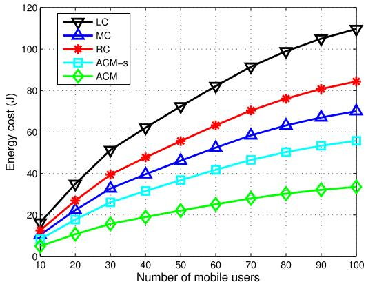

line

| Number of mobile users | LC   | MC   | RC   | ACM-s | ACM  |
| ---------------------- | ---- | ---- | ---- | ----- | ---- |
| 10                     | 15   | 12   | 14   | 8     | 4    |
| 20                     | 35   | 25   | 28   | 18    | 10   |
| 30                     | 50   | 35   | 40   | 28    | 16   |
| 40                     | 65   | 45   | 50   | 38    | 22   |
| 50                     | 75   | 55   | 60   | 48    | 26   |
| 60                     | 85   | 65   | 70   | 58    | 30   |
| 70                     | 95   | 75   | 80   | 68    | 34   |
| 80                     | 100  | 80   | 85   | 75    | 36   |
| 90                     | 105  | 85   | 90   | 80    | 38   |
| 100                    | 110  | 90   | 95   | 85    | 40   |

(a) Total cost in joules with $\sigma _ { k } ^ { E } = 1$ and $\sigma _ { k } ^ { \psi } \mathbf { = } 0 .$

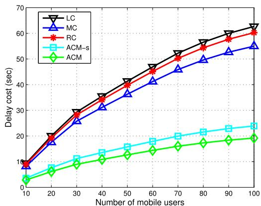

line

| Number of mobile users | LC   | MC   | RC   | ACM-s | ACM  |
| ---------------------- | ---- | ---- | ---- | ----- | ---- |
| 10                     | 8    | 8    | 8    | 4     | 3    |
| 20                     | 20   | 18   | 20   | 8     | 6    |
| 30                     | 30   | 26   | 28   | 12    | 9    |
| 40                     | 35   | 32   | 34   | 14    | 11   |
| 50                     | 40   | 37   | 39   | 16    | 13   |
| 60                     | 45   | 42   | 44   | 18    | 15   |
| 70                     | 50   | 47   | 49   | 20    | 17   |
| 80                     | 55   | 51   | 54   | 22    | 19   |
| 90                     | 60   | 55   | 59   | 24    | 21   |
| 100                    | 63   | 56   | 61   | 25    | 22   |

(b) Total cost in seconds with $\sigma _ { k } ^ { \psi } = 1$ and $\sigma _ { k } ^ { E } = 0 .$   
Fig. 3. System total cost for variable number of mobile users.

In Fig. 3, we analyze that how the two weighting parameters, σEk $\sigma _ { k } ^ { \bar { E } }$ and $\sigma _ { k } ^ { \psi }$ σψk contribute in determining the system total cost in terms of energy and latency. The findings show that compared to other benchmark methods, ACM-s and ACM can reach a lower total cost. Furthermore, we can see from the energy cost, in Fig. 3a, and the delay cost, in Fig. 3b, that delay reduction is more significant with our proposed ACM framework. This is because in the case of energy cost the cost matrix X also considers the hovering power of UAVs.

Additionally, Fig. 4a demonstrates the average system total cost for a variable number of mobile users. It is evident that compared to other policies, ACM-s, and ACM can achieve a lower average system total cost. The outcomes demonstrate the need for optimized computation offloading. For normalizing the values of energy consumption and time latency, from Fig. 4 onwards, the weights attributed to energy consumption σEk a $\sigma _ { k } ^ { E }$ nd time latency $\sigma _ { k } ^ { \check { \psi } }$ are set to 0.5 and 0.5 $J / s ,$ , respectively. Whereas, the system parameters remain the same as in Table I, unless otherwise mentioned. Additionally, in the cases of MC and RC, it can be seen that the advantages of computation offloading diminish as the number of user devices rises unless there is a plan in place to simultaneously optimize communication and compute resources. As a result of collaborative optimization, the outcomes for ACM-s and ACM are stable. The communication resources may become scarce and raise the average system total cost if the number of mobile users reaches a specific high level or the system is overloaded to a great extent. Besides, Fig. 4b shows the overall convergence performance of the proposed ACM algorithm. Three different scenarios are simulated, with 10, 50, and 100 users, respectively. The three layers are optimized during each iteration. After nine iterations, it can be observed that the average system total cost in joules converges. Following that, additional iterations have no further effect on cost reduction. This highlights the ability to concur with our proposed solution.

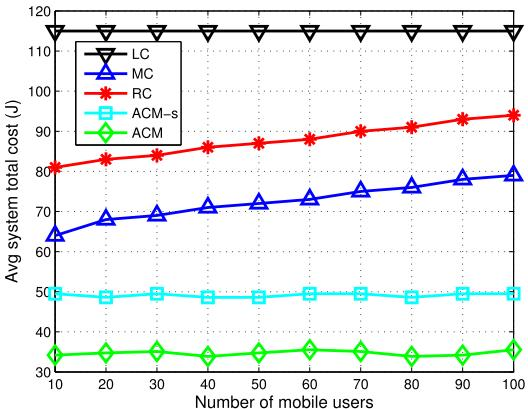

line

| Number of mobile users | LC   | MC   | RC   | ACM-s | ACM  |
| ---------------------- | ---- | ---- | ---- | ----- | ---- |
| 10                     | 115  | 65   | 80   | 50    | 35   |
| 20                     | 115  | 70   | 82   | 50    | 35   |
| 30                     | 115  | 72   | 84   | 50    | 35   |
| 40                     | 115  | 74   | 86   | 50    | 35   |
| 50                     | 115  | 76   | 88   | 50    | 35   |
| 60                     | 115  | 78   | 90   | 50    | 35   |
| 70                     | 115  | 80   | 92   | 50    | 35   |
| 80                     | 115  | 82   | 94   | 50    | 35   |
| 90                     | 115  | 84   | 96   | 50    | 35   |
| 100                    | 115  | 86   | 98   | 50    | 35   |

(a) Average system total cost.   
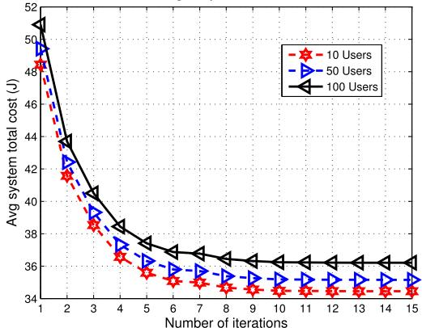

line

| Number of iterations | 10 Users | 50 Users | 100 Users |
| -------------------- | -------- | -------- | --------- |
| 1                    | 49.0     | 50.0     | 51.0      |
| 2                    | 42.0     | 43.0     | 44.0      |
| 3                    | 39.0     | 40.0     | 41.0      |
| 4                    | 37.0     | 38.0     | 39.0      |
| 5                    | 36.0     | 37.0     | 38.0      |
| 6                    | 35.5     | 36.5     | 37.5      |
| 7                    | 35.0     | 36.0     | 37.0      |
| 8                    | 34.5     | 35.5     | 36.5      |
| 9                    | 34.5     | 35.5     | 36.5      |
| 10                   | 34.5     | 35.5     | 36.5      |
| 11                   | 34.5     | 35.5     | 36.5      |
| 12                   | 34.5     | 35.5     | 36.5      |
| 13                   | 34.5     | 35.5     | 36.5      |
| 14                   | 34.5     | 35.5     | 36.5      |
| 15                   | 34.5     | 35.5     | 36.5      |

(b) Convergence of the proposed joint optimization   
Fig. 4. Average system total cost for variable number of mobile users and ACM convergence.

In the remaining analysis, the number of mobile users is set to 50. In Fig. 5a, we represent the total cost for the variable number of Gbits computed in the system. It is clear that, when compared to other benchmarks, ACM has the potential to achieve the lowest system total cost. Additionally, we observe that the overall system cost increases when more Gbits are needed to be computed. Subsequently, Fig. 5b gives the total cost for a variable number of UAVs providing MEC service. It shows that as the number of MEC servers increases the total cost reduces. This is due to the fact that when more UAVs provide edge computation, the tasks can be executed more quickly and with less energy utilization, i.e. at a lower cost. However, if the system is overrun with unnecessary UAVs that aren’t needed and don’t serve any mobile users, they will add to energy consumption only through hovering power. Moreover, we present the effect of the change of vertical height of UAV on the system total cost in Fig. 5c, showing that the 3D trajectory design of UAV including both altitude and horizontal position optimization can be further leveraged. Considering several different scenarios simulated, the comparison between different schemes is given in Fig. 5d that shows the cumulative distribution function (CDF) for system total cost. It can be established that our suggested joint optimization strategy outperforms the benchmark schemes by a significant margin, demonstrating the superiority of the proposed approach.

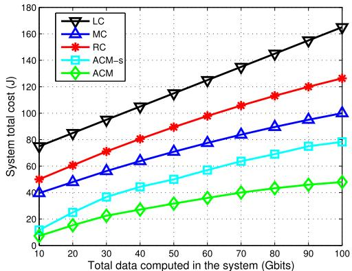

line

| Total data computed in the system (Gbits) | LC   | MC   | RC   | ACM-s | ACM  |
| ------------------------------------------ | ---- | ---- | ---- | ----- | ---- |
| 10                                         | 75   | 40   | 50   | 10    | 5    |
| 20                                         | 85   | 50   | 60   | 20    | 10   |
| 30                                         | 95   | 60   | 70   | 30    | 15   |
| 40                                         | 105  | 70   | 80   | 40    | 20   |
| 50                                         | 115  | 80   | 90   | 50    | 25   |
| 60                                         | 125  | 90   | 100  | 60    | 30   |
| 70                                         | 135  | 100  | 110  | 70    | 35   |
| 80                                         | 145  | 110  | 120  | 80    | 40   |
| 90                                         | 155  | 120  | 130  | 90    | 45   |
| 100                                        | 165  | 130  | 140  | 100   | 50   |

(a) Total cost for variable number of Gbits computed.

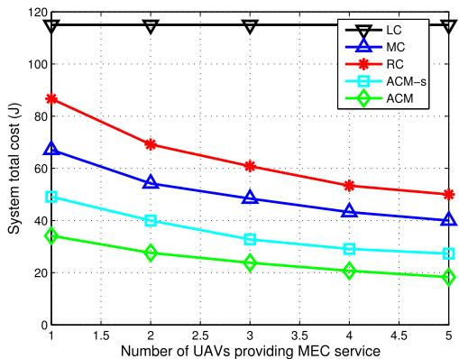

line

| Number of UAVs providing MEC service | LC   | MC   | RC   | ACM-s | ACM  |
| ------------------------------------ | ---- | ---- | ---- | ----- | ---- |
| 1                                    | 120  | 70   | 85   | 50    | 35   |
| 2                                    | 120  | 55   | 70   | 40    | 28   |
| 3                                    | 120  | 50   | 60   | 35    | 25   |
| 4                                    | 120  | 45   | 55   | 30    | 22   |
| 5                                    | 120  | 40   | 50   | 28    | 20   |

(b) Total cost for variable number of UAVs.

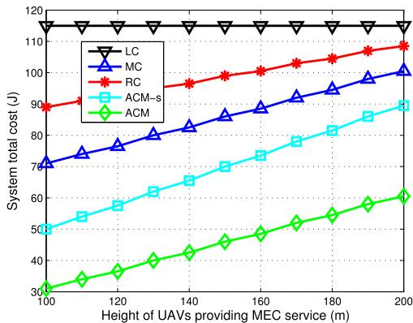

line

| Height of UAVs providing MEC service (m) | LC   | MC   | RC   | ACM-s | ACM  |
| ---------------------------------------- | ---- | ---- | ---- | ----- | ---- |
| 100                                      | 115  | 75   | 90   | 50    | 30   |
| 120                                      | 115  | 78   | 95   | 55    | 35   |
| 140                                      | 115  | 82   | 98   | 60    | 40   |
| 160                                      | 115  | 88   | 100  | 70    | 45   |
| 180                                      | 115  | 92   | 102  | 75    | 50   |
| 200                                      | 115  | 100  | 108  | 90    | 60   |

(c) Total cost for variable height of UAVs.

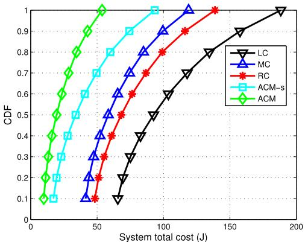

line

| System total cost (J) | LC    | MC    | RC    | ACM-s | ACM   |
| --------------------- | ----- | ----- | ----- | ----- | ----- |
| 0                     | 0.1   | 0.1   | 0.1   | 0.1   | 0.1   |
| 25                    | 0.2   | 0.3   | 0.2   | 0.4   | 0.6   |
| 50                    | 0.3   | 0.5   | 0.4   | 0.7   | 0.9   |
| 75                    | 0.4   | 0.7   | 0.6   | 0.9   | 1.0   |
| 100                   | 0.6   | 0.9   | 0.8   | 1.0   | 1.0   |
| 125                   | 0.8   | 1.0   | 0.9   | 1.0   | 1.0   |
| 150                   | 0.9   | 1.0   | 1.0   | 1.0   | 1.0   |
| 175                   | 1.0   | 1.0   | 1.0   | 1.0   | 1.0   |
| 200                   | 1.0   | 1.0   | 1.0   | 1.0   | 1.0   |

(d) CDF of system total cost for different scenarios.   
Fig. 5. System total cost against various network attributes.

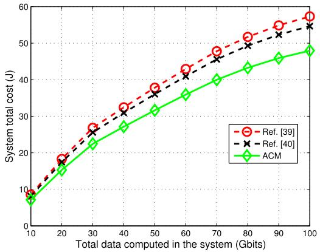

line

| Total data computed in the system (Gbits) | Ref. [39] | Ref. [40] | ACM |
| ----------------------------------------- | --------- | --------- | --- |
| 10                                        | 8         | 8         | 7   |
| 20                                        | 18        | 18        | 15  |
| 30                                        | 27        | 26        | 22  |
| 40                                        | 33        | 32        | 28  |
| 50                                        | 38        | 37        | 32  |
| 60                                        | 43        | 42        | 36  |
| 70                                        | 48        | 47        | 40  |
| 80                                        | 52        | 51        | 44  |
| 90                                        | 55        | 54        | 47  |
| 100                                       | 58        | 56        | 49  |

(a) Comparison for variable number of Gbits computed.

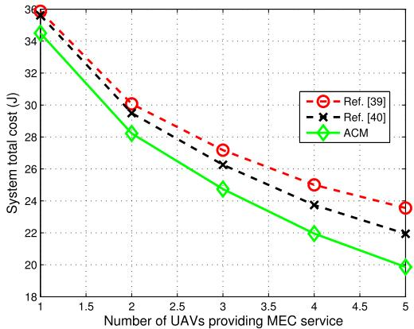

line

| Number of UAVs providing MEC service | Ref. [39] | Ref. [40] | ACM  |
| ------------------------------------ | --------- | --------- | ---- |
| 1                                    | 36        | 36        | 35   |
| 2                                    | 30        | 29        | 28   |
| 3                                    | 27        | 26        | 25   |
| 4                                    | 25        | 24        | 22   |
| 5                                    | 24        | 22        | 20   |

(b) Comparison for variable number of UAVs.   
Fig. 6. Comparison of total cost incurred between ACM and literature references.

In Fig. 6, we compare our proposed ACM algorithm with optimization techniques reported in [39] and [40]. The authors in [39] proposed a joint optimization algorithm based on Lagrange duality and SCA techniques. Whereas, an alternating algorithm for joint optimization through solving two subproblems iteratively with SCA techniques is proposed in [40]. To ensure the accuracy of the comparison, same network parameters are used. Fig. 6a presents the comparison of the total cost for the variable number of Gbits computed in the system. Whereas, the total cost for a variable number of UAVs providing MEC service is compared in Fig. 6d. It can be seen in both scenarios that the proposed ACM algorithm achieved cost reduction of approx 12% in comparison to [39], and approx 10% in comparison to [40]. This is due to the layer based approach the proposed study utilizes, to solve the subproblems, by using GTD, GWF, and gradient descent methods, iteratively. The comparison verifys the superiority of the proposed solution.

# VII. CONCLUSION

In this paper, an UAV-assisted aerial-terrestrial MEC system is investigated, in which the MEC servers could help to compute the task bits offloaded by the ground users. The objective was to minimize the weighted cost of energy consumption and time latency for all mobile users by jointly optimizing the communication and computation design parameters of the system. The joint problem of task offloading and MEC server selection decision, power allocation, UAV trajectory, and CPU frequency allocation was considered. The defined problem was decomposed into three layers that were solved using an Alternative Cost Minimization (ACM) algorithm. The numerical results validated the effectiveness of our proposed algorithm and showed the superiority of our work, as compared to the other benchmark schemes.

# REFERENCES

[1] Y. Liang, J. Tan, H. Jia, J. Zhang, and L. Zhao, “Realizing intelligent spectrum management for integrated satellite and terrestrial networks,” J. Commun. Inf. Netw., vol. 6, no. 1, pp. 32–43, Mar. 2021.   
[2] H. Abou-zeid, F. Pervez, A. Adinoyi, M. Aljlayl, and H. Yanikomeroglu, “Cellular V2X transmission for connected and autonomous vehicles standardization, applications, and enabling technologies,” IEEE Consum. Electron. Mag., vol. 8, no. 6, pp. 91–98, Nov. 2019.   
[3] M. Li, J. Gao, L. Zhao, and X. Shen, “Adaptive computing scheduling for edge-assisted autonomous driving,” IEEE Trans. Veh. Technol., vol. 70, no. 6, pp. 5318–5331, Jun. 2021.   
[4] F. Pervez, C. Yang, and L. Zhao, “Dynamic resource management to enhance video streaming experience in a C-V2X network,” in Proc. IEEE 92nd Veh. Technol. Conf., Victoria, BC, Canada, Nov. 2020, pp. 1–5.   
[5] L. Tan, Z. Kuang, L. Zhao, and A. Liu, “Energy-efficient joint task offloading and resource allocation in OFDMA-based collaborative edge computing,” IEEE Trans. Wireless Commun., vol. 21, no. 3, pp. 1960–1972, Mar. 2022.   
[6] Q. Chen, Z. Kuang, and L. Zhao, “Multiuser computation offloading and resource allocation for cloud–edge heterogeneous network,” IEEE Internet Things J., vol. 9, no. 5, pp. 3799–3811, Mar. 2022.   
[7] L. Tan, Z. Kuang, J. Gao, and L. Zhao, “Energy-efficient collaborative multi-access edge computing via deep reinforcement learning,” IEEE Trans. Ind. Informat., vol. 19, no. 6, pp. 7689–7699, Jun. 2023.   
[8] N. Zhao et al., “UAV-assisted emergency networks in disasters,” IEEE Wireless Commun., vol. 26, no. 1, pp. 45–51, Feb. 2019.   
[9] X. Pang, M. Sheng, N. Zhao, J. Tang, D. Niyato, and K. Wong, “When UAV meets IRS: Expanding air-ground networks via passive reflection,” IEEE Wireless Commun., vol. 28, no. 5, pp. 164–170, Oct. 2021.   
[10] H. Peng, L. Wang, G. Ye Li, and A. Tsai, “Long-lasting UAV-aided RIS communications based on SWIPT,” in Proc. IEEE Wireless Commun. Netw. Conf. (WCNC), Austin, TX, USA, Apr. 2022, pp. 1844–1849.   
[11] H. Peng, A. Tsai, L. Wang, and Z. Han, “LEOPARD: Parallel optimal deep echo state network prediction improves service coverage for UAVassisted outdoor hotspots,” IEEE Trans. Cognit. Commun. Netw., vol. 8, no. 1, pp. 282–295, Mar. 2022.   
[12] Q. Hu, Y. Cai, G. Yu, Z. Qin, M. Zhao, and G. Y. Li, “Joint offloading and trajectory design for UAV-enabled mobile edge computing systems,” IEEE Internet Things J., vol. 6, no. 2, pp. 1879–1892, Apr. 2019.   
[13] M. Hua, Y. Wang, Z. Zhang, C. Li, Y. Huang, and L. Yang, “Optimal resource partitioning and bit allocation for UAV-enabled mobile edge computing,” in Proc. IEEE 88th Veh. Technol. Conf., Aug. 2018, pp. 1–6.   
[14] T. Zhang, Y. Xu, J. Loo, D. Yang, and L. Xiao, “Joint computation and communication design for UAV-assisted mobile edge computing in IoT,” IEEE Trans. Ind. Informat., vol. 16, no. 8, pp. 5505–5516, Aug. 2020.   
[15] B. Liu, Y. Wan, F. Zhou, Q. Wu, and R. Q. Hu, “Resource allocation and trajectory design for MISO UAV-assisted MEC networks,” IEEE Trans. Veh. Technol., vol. 71, no. 5, pp. 4933–4948, May 2022.   
[16] J. Ji, K. Zhu, C. Yi, and D. Niyato, “Energy consumption minimization in UAV-assisted mobile-edge computing systems: Joint resource allocation and trajectory design,” IEEE Internet Things J., vol. 8, no. 10, pp. 8570–8584, May 2021.   
[17] L. Wang, K. Wang, C. Pan, W. Xu, N. Aslam, and L. Hanzo, “Multiagent deep reinforcement learning-based trajectory planning for multi-UAV assisted mobile edge computing,” IEEE Trans. Cognit. Commun. Netw., vol. 7, no. 1, pp. 73–84, Mar. 2021.

[18] Z. Yang, C. Pan, K. Wang, and M. Shikh-Bahaei, “Energy efficient resource allocation in UAV-enabled mobile edge computing networks,” IEEE Trans. Wireless Commun., vol. 18, no. 9, pp. 4576–4589, Sep. 2019.   
[19] H. Peng and X. Shen, “Multi-agent reinforcement learning based resource management in MEC- and UAV-assisted vehicular networks,” IEEE J. Sel. Areas Commun., vol. 39, no. 1, pp. 131–141, Jan. 2021.   
[20] G. Zheng, C. Xu, M. Wen, and X. Zhao, “Service caching based aerial cooperative computing and resource allocation in multi-UAV enabled MEC systems,” IEEE Trans. Veh. Technol., vol. 71, no. 10, pp. 10934–10947, Oct. 2022.   
[21] L. Wang, H. Zhang, S. Guo, and D. Yuan, “Deployment and association of multiple UAVs in UAV-assisted cellular networks with the knowledge of statistical user position,” IEEE Trans. Wireless Commun., vol. 21, no. 8, pp. 6553–6567, Aug. 2022.   
[22] F. Pervez, L. Zhao, and C. Yang, “Intelligent cognition in an integrated satellite-aerial-terrestrial network for connected vehicles,” in Proc. 30th Biennial Symp. Commun., Jun. 2021, pp. 1–15.   
[23] F. Pervez, L. Zhao, and C. Yang, “Joint user association, power optimization and trajectory control in an integrated satellite-aerialterrestrial network,” IEEE Trans. Wireless Commun., vol. 21, no. 5, pp. 3279–3290, May 2022.   
[24] Y. Zeng, J. Xu, and R. Zhang, “Rotary-wing UAV enabled wireless network: Trajectory design and resource allocation,” in Proc. IEEE GLOBECOM, Dec. 2018, pp. 1–6.   
[25] Y. Zeng and R. Zhang, “Energy-efficient UAV communication with trajectory optimization,” IEEE Trans. Wireless Commun., vol. 16, no. 6, pp. 3747–3760, Jun. 2017.   
[26] O. Abbasi, H. Yanikomeroglu, A. Ebrahimi, and N. M. Yamchi, “Trajectory design and power allocation for drone-assisted NR-V2X network with dynamic NOMA/OMA,” IEEE Trans. Wireless Commun., vol. 19, no. 11, pp. 7153–7168, Nov. 2020.   
[27] Y. Yu, X. Bu, K. Yang, H. Yang, X. Gao, and Z. Han, “UAV-aided low latency multi-access edge computing,” IEEE Trans. Veh. Technol., vol. 70, no. 5, pp. 4955–4967, May 2021.   
[28] Z. Yu, Y. Gong, S. Gong, and Y. Guo, “Joint task offloading and resource allocation in UAV-enabled mobile edge computing,” IEEE Internet Things J., vol. 7, no. 4, pp. 3147–3159, Apr. 2020.   
[29] J. Zhang et al., “Computation-efficient offloading and trajectory scheduling for multi-UAV assisted MEC,” IEEE Trans. Veh. Technol., vol. 69, no. 2, pp. 2114–2125, Feb. 2020.   
[30] M. Messous, S. Senouci, H. Sedjelmaci, and S. Cherkaoui, “A game theory based efficient computation offloading in an UAV network,” IEEE Trans. Veh. Technol., vol. 68, no. 5, pp. 4964–4974, May 2019.   
[31] Z. M. Fadlullah, C. Wei, Z. Shi, and N. Kato, “GT-QoSec: A gametheoretic joint optimization of QoS and security for differentiated services in next generation heterogeneous networks,” IEEE Trans. Wireless Commun., vol. 16, no. 2, pp. 1037–1050, Feb. 2017.   
[32] D. Monderer and L. S. Shapley, “Potential games,” Games Econ. Behav., vol. 14, no. 1, pp. 124–143, 1996.   
[33] P. He, L. Zhao, S. Zhou, and Z. Niu, “Water-filling: A geometric approach and its application to solve generalized radio resource allocation problems,” IEEE Trans. Wireless Commun., vol. 12, no. 7, pp. 3637–3647, Jul. 2013.   
[34] P. He, S. Zhang, L. Zhao, and X. Shen, “Energy-efficient power allocation with individual and sum power constraints,” IEEE Trans. Wireless Commun., vol. 17, no. 8, pp. 5353–5366, Aug. 2018.   
[35] P. He and L. Zhao, “Solving a class of sum power minimization problems by generalized water-filling,” IEEE Trans. Wireless Commun., vol. 14, no. 12, pp. 6792–6804, Dec. 2015.   
[36] M. S. Li, N. Cheng, J. Gao, Y. Wang, L. Zhao, and X. Shen, “Energy-efficient UAV-assisted MEC: Resource allocation and trajectory optimization,” IEEE Trans. Veh. Technol., vol. 69, no. 3, pp. 3424–3438, Mar. 2020.   
[37] S. Boyd and L. Vandenberghe, Convex Optimization. Cambridge, U.K.: Cambridge Univ. Press, 2004.   
[38] X. Zhou, Y. Gao, C. Li, and Z. Huang, “A multiple gradient descent design for multi-task learning on edge computing: Multi-objective machine learning approach,” IEEE Trans. Netw. Sci. Eng., vol. 9, no. 1, pp. 121–133, Jan. 2022.   
[39] Y. Xu, T. Zhang, Y. Liu, D. Yang, L. Xiao, and M. Tao, “UAVassisted MEC networks with aerial and ground cooperation,” IEEE Trans. Wireless Commun., vol. 20, no. 12, pp. 7712–7727, Dec. 2021.   
[40] C. Zhan, H. Hu, X. Sui, Z. Liu, and D. Niyato, “Completion time and energy optimization in the UAV-enabled mobile-edge computing system,” IEEE Internet Things J., vol. 7, no. 8, pp. 7808–7822, Aug. 2020.

natural_image

Portrait of a man with glasses and beard, wearing a jacket over a scarf (no visible text or symbols)

Farhan Pervez (Student Member, IEEE) received the M.Sc. degree in communications engineering from the Technical University of Munich, Germany. He is currently pursuing the Ph.D. degree with the Department of Electrical, Computer, and Biomedical Engineering, Toronto Metropolitan University (formerly Ryerson University), Canada. He has several years of research experience in both academia and the communications industry. His research interests include wireless communications, integrated terrestrial and non-terrestrial networks, resource

management, mobile edge computing, artificial intelligence, and optimization techniques. He is a member of the IEEE Communication and Vehicular Society. He is also currently volunteering as the Vice Chair of the IEEE Vehicular Technology Society (Toronto Section).

natural_image

Portrait of a woman wearing a red hijab (no visible text or symbols)

Ajmery Sultana (Member, IEEE) received the Ph.D. degree from the Department of Electrical and Computer Engineering, Toronto Metropolitan University (formerly Ryerson University), Toronto, ON, Canada, in 2018. She was a Post-Doctoral Fellow with the Department of Computer Science, Toronto Metropolitan University, from 2018 to 2019. She worked as a part-time Faculty Member with Toronto Metropolitan University, Ontario Tech University, and Algoma University, Canada, from 2019 to 2022. In August 2022, she joined as an Assistant Professor

with the School of Computer Science and Technology, Algoma University (Brampton Campus). She is a member of the IEEE Communication and Vehicular Society. She is also volunteering as the Vice Chair of the IEEE Vehicular Technology Society (Toronto Section). Her research interests include radio resource management in device-to-device (D2D) communication and the Internet of Things (IoT), artificial intelligent (AI) driven solutions for communication and networking systems, and blockchain-enabled energy trading in electric vehicle (EV) infrastructure.

natural_image

Portrait of a man wearing glasses and a blue shirt with yellow collar (no text or symbols visible)

Cungang Yang received the Ph.D. degree in computer science from the University of Regina, Canada, in 2003. He is currently an Associate Professor with the Department of Electrical, Computer, and Biomedical Engineering, Toronto Metropolitan University (formerly Ryerson University). His research interests include cloud security, artificial intelligence in vehicles, the Internet of Things (IoT) security, wireless mesh networks, and role-based access control (RBAC).

natural_image

Portrait of a woman with short brown hair and glasses, wearing a purple top (no visible text or symbols)

Lian Zhao (Senior Member, IEEE) received the Ph.D. degree from the Department of Electrical and Computer Engineering (ELCE), University of Waterloo, Canada, in 2002. She joined the Department of Electrical and Computer Engineering, Toronto Metroplitan University (formerly Ryerson University), Canada, in 2003. Her research interests include wireless communications, resource management, mobile edge computing, caching and communications, and the IoV networks. She has been an Elected Member of the Board of Governor (BoG) since

2023. She has been an IEEE Communication Society (ComSoc) and IEEE Vehicular Technology (VTS) Distinguished Lecturer (DL). She was a recipient of the Best Land Transportation Paper Award from the IEEE Vehicular Technology Society in 2016, the Top 15 Editor Award in 2016 for IEEE TRANSACTIONS ON VEHICULAR TECHNOLOGY, the Best Paper Award from the 2013 International Conference on Wireless Communications and Signal Processing (WCSP), and the Canada Foundation for Innovation (CFI) New Opportunity Research Award in 2005. She has been serving as an Editor for the IEEE TRANSACTIONS ON WIRELESS COMMUNICATIONS, IEEE INTERNET OF THINGS JOURNAL, and IEEE TRANSACTIONS ON VEHIC-ULAR TECHNOLOGY from 2013 to 2021. She has served as the Co-Chair for the Communication Theory Symposium for IEEE Globecom 2013 and the Wireless Communication Symposium for IEEE Globecom 2020 and IEEE ICC 2018, the Finance Co-Chair for 2021 ICASSP, and the Local Arrangement Co-Chair for IEEE VTC Fall 2017 and IEEE Infocom 2014. She has also served as a panel expert in various federal, provincial, and international evaluation committees. She is a Licensed Professional Engineer in the Province of Ontario and a Senior Member of the IEEE Communication Society and Vehicular Technology Society.