# Enhancing A2G Robustness in Energy-Constrained Multi-UAV Networks: MADRL for Trajectory Control and Resource Allocation

Jingyu Wang, Xuming Fang , Senior Member, IEEE, Xianbin Wang , Fellow, IEEE, Li Yan , Member, IEEE, Junjie Wu , and Baolin Yin , Graduate Student Member, IEEE

Abstract—In this paper, we investigate an air-to-ground (A2G) wireless network system where multiple uncrewed aerial vehicles (UAVs) provide downlink communication coverage for mobile ground users (GUs). This system accounts for UAVs progressively depleting their energy during coverage provision, ceasing operations when their energy reserves fall below a predefined threshold. We aim to maximize cumulative system throughput over the task period while satisfying the minimum fairness requirement through joint trajectory control and resource allocation (JTCRA) optimization. To meet the fairness requirement, enhancing system robustness is critical; energy-sufficient UAVs must autonomously assist GUs that lose connectivity when their serving UAVs terminate operations. Therefore, we propose a multi-agent deep reinforcement learning (MADRL) framework with a parameter-sharing architecture to solve this problem. As conventional parameter sharing is restricted to homogeneous agents with identical observation-action spaces, we design a dual-agent structure: a trajectory agent (Traj-agent) and a communication agent (Comm-agent) are deployed for each UAV. This separation organizes the heterogeneous tasks of trajectory control and resource allocation into distinct homogeneous agent groups, facilitating effective parameter sharing within each type. Based on this framework, we apply two alternative algorithms: an MAPPO-based JTCRA algorithm and a QMIX-based JTCRA algorithm. Simulation results demonstrate the superiority and effectiveness of our proposed JTCRA algorithms, which maintain service continuity for GUs through intelligent trajectory control, thereby minimizing the adverse impact of coverage gaps.

Index Terms—Multi-UAV network robustness, MADRL, trajectory control, resource allocation.

## I. INTRODUCTION

cation is becoming indispensable for next-generation wireless networks due to their compelling characteristics such as flexible deployment, high mobility, and the potential for establishing reliable line-of-sight (LoS) air-to-ground (A2G) links. UAVs can serve as aerial base stations (BSs) [1] or relays [2], particularly in complex environments where terrestrial communication infrastructure is inadequate or unavailable. Consequently, UAV-enabled wireless communications have found applications in diverse scenarios, including emergency communication support [3], remote data collection for the Internet-of-Things (IoT) [4], mobile edge computing (MEC) [5], and integrated sensing and communication (ISAC) [6].

However, a single UAV is often constrained by its size, weight, and limited energy reserves, which restricts its capability for handling complex tasks. Therefore, multi-UAV wireless systems, which offer enhanced resources and collaborative capabilities, have garnered significant research attention [7], [8], [9]. To exploit the potential of these systems, Wu et al. [7] optimized UAV trajectories, power allocation, and user association to maximize the minimum throughput among all users, solving the formulated nonconvex problem with block coordinate descent and successive convex approximation (SCA) techniques. In another study, Meng et al. [8] proposed a multi-UAV cooperative sensing and transmission scheme with overlapped task allocation to minimize mission completion time. They derived the necessary conditions of overlapped task sensing and solved the problem with the generic Polyblock algorithm. Similarly, Sun et al. [9] investigated a multi-UAV-assisted MEC system to maximize the total number of offloaded tasks, decomposing the objective into task offloading and computation resource allocation subproblems and solving them by Karush-Kuhn-Tucker (KKT) method and SCA, respectively.

However, these studies mainly focus on providing highquality service for users, with little consideration of the network’s robustness. In practice, failure of a UAV—often due to power depletion or harsh environmental conditions—can cause service disruptions and quality of service (QoS) degradation for its associated users. It is thus vital to leverage the remaining network resources to maintain service continuity when such failures occur. While some studies have explored self-healing mechanisms to restore network topology and connectivity after link failures [10], [11], [12], these efforts often overlook A2G communication metrics such as throughput and fairness. More recent work has begun to address these performance aspects [13], [14]. For instance, to counteract A2G link failures, Ge et al. [13] proposed a resilient multi-UAV network design aimed at balancing sum rate against user rate fluctuations. They applied Modern Portfolio Theory (MPT) to combine the average sum rate with user rate variance to create a utility function, which was then maximized using an alternating optimization method. Similarly, Wu et al. [14] considered a heterogeneous network of fixed-wing and rotary-wing UAVs. To maximize the maxmin flow rate for ground users (GUs), they optimized the UAVs’ trajectories and deployment to construct an appropriate network topology.

A key feature of existing approaches to robust multi-UAV networks is their strategy for service recovery. Whether by restarting planning algorithms or implementing self-healing mechanisms, these methods typically rely on re-optimizing network resources after failures occur. This re-optimization, however, often incurs non-negligible latency from iterative computations, thereby prolonging affected users’ service disruptions. In contrast, multi-agent deep reinforcement learning (MADRL) algorithms can be trained to account for such emergencies, enabling more responsive and efficient failure management without requiring iterative re-optimization.

As a model-free method, MADRL excels at making cooperative policies for complex sequential decision-making scenarios. Consequently, it has been widely adopted in multi-UAV wireless networks to address challenges like the joint optimization of trajectory control and resource allocation [15], [16], [17]. In [15], each UAV is equipped with an intelligent agent to control its trajectory and allocate power resources to users, with the goal of reducing total transmission latency. However, as the number of users increases in future communication systems, this approach suffers from a high-dimensional action space, leading to prohibitive computational costs and degraded performance. To mitigate this, an alternative hybrid approach decouples the problem, using MADRL for trajectory control while solving the resource allocation subproblem with traditional optimization methods [16], [17]. Although this structure avoids a large action space and provides flexibility in achieving resource allocation, it introduces a significant computational burden; since the optimization process must be performed at each of the numerous interaction steps required for DRL training, and often requires multiple iterations itself, the overall convergence time of the learning algorithm is severely increased.

In summary, existing research has not fully explored the potential of MADRL to enhance multi-UAV network robustness and circumvent the need for iterative re-optimization after UAV failures. Moreover, designing a computationally efficient MADRL framework for the complex joint trajectory control and resource allocation (JTCRA) problem remains a significant challenge. Motivated by these challenges, this paper proposes a more efficient learning framework to address the issues of system robustness and the JTCRA problem. The main contributions are as follows:

• We investigate a multi-UAV-assisted communication system, where each UAV provides communication coverage as an aerial BS for mobile GUs. we consider that individual UAVs have finite energy budget and cease operation below a certain threshold. Based on this system model, we formulate an optimization problem to maximize system throughput while guaranteeing service fairness among mobile GUs via Jain’s fairness index.

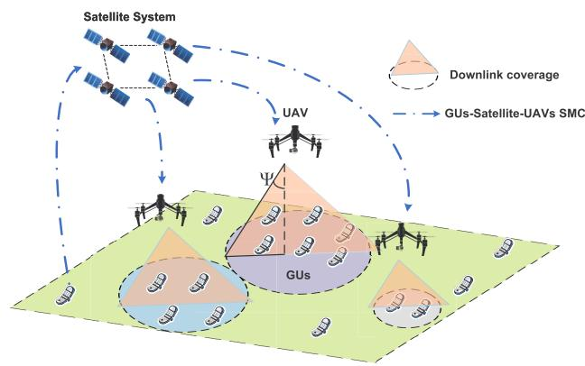  
Fig. 1. Multi-UAV-assisted A2G wireless system model.

We propose a novel MADRL-based JTCRA framework featuring a dual-agent (trajectory and communication) structure for each UAV. This design mitigates the highdimensional action space problem and avoids the costly iterative optimization required by hybrid methods. The structure also enables effective parameter sharing among homogeneous agents to improve learning efficiency. Under this framework, we apply two alternative algorithms: an MAPPO-based algorithm and a QMIX-based JTCRA algorithm.

Through extensive simulations, we demonstrate the superiority and effectiveness of the proposed algorithms compared to baselines. We validate the system’s robustness by showing the simulation trajectory results, where the trained agents can reassign coverage tasks to energysufficient UAVs after other UAVs fail, ensuring service continuity for GUs located in coverage gaps caused by inactive UAVs.

The rest of paper is organized as follows: Section II describes details of the system model. Section III presents the proposed framework. Section IV discusses the simulation results. Finally, the paper is concluded in Section V. The main notations and acronyms used in the paper are summarized in TABLE I.

## II. SYSTEM MODEL AND PROBLEM FORMULATION

The downlink system model is illustrated in Fig. 1. In this scenario, a group of mobile GUs are served by multiple UAVs. For clarity, the sets of UAVs and GUs are denoted as $\mathcal { M } = \{ 1 , \cdots , M \}$ and ${ \cal K } = \{ 1 , \cdots , K \}$ , respectively. Assume that each UAV operates within a shared frequency band and is capable of communicating with multiple GUs simultaneously using orthogonal frequency division multiple access (OFDMA). The UAVs are equipped with limited energy storage and will cease communication service once their energy levels fall below a predefined threshold, at which point they must return for recharging. Notably, in this study, we do not consider that the UAVs resume service after recharging.<sup>1</sup> The task is considered complete when all UAVs can no longer provide service due to low energy. In this system, when GUs have not received service from UAVs for L slots, they can relay basic information (e.g., location data and ID) via a satellite system to assist UAVs in locating and serving them. However, due to GUs transmit power and battery constraints, such communication must be infrequent and limited to short message communication<sup>2</sup> (SMC) [18]. For convenience, the task period is divided into the time slot set $\mathcal { T } = \{ 1 , \cdots , T \}$ each with a step size of δ. In the initial time slot, all UAVs acquire basic information of GUs through the satellite system and subsequently initiate service delivery.

TABLE I  
LIST OF MAIN ACRONYMS AND NOTATIONS
<table><tr><td rowspan=1 colspan=1>Acronym</td><td rowspan=1 colspan=1>Description</td></tr><tr><td rowspan=1 colspan=1>UAVs</td><td rowspan=1 colspan=1>Uncrewed aerial vehicles</td></tr><tr><td rowspan=1 colspan=1>A2G link</td><td rowspan=1 colspan=1>Air-to-ground link</td></tr><tr><td rowspan=1 colspan=1>LoS link</td><td rowspan=1 colspan=1>Line-of-sight link</td></tr><tr><td rowspan=1 colspan=1>BSs</td><td rowspan=1 colspan=1>Base stations</td></tr><tr><td rowspan=1 colspan=1>GUs</td><td rowspan=1 colspan=1>Ground users</td></tr><tr><td rowspan=1 colspan=1>AWGN</td><td rowspan=1 colspan=1>Additive white Gaussian noise</td></tr><tr><td rowspan=1 colspan=1>OFDMA</td><td rowspan=1 colspan=1>Orthogonal frequency division multiple access</td></tr><tr><td rowspan=1 colspan=1>QoS</td><td rowspan=1 colspan=1>Quality of service</td></tr><tr><td rowspan=1 colspan=1>SMC</td><td rowspan=1 colspan=1>Short message communication</td></tr><tr><td rowspan=1 colspan=1>JTCRA</td><td rowspan=1 colspan=1>Joint trajectory control and resource allocation</td></tr><tr><td rowspan=1 colspan=1>MADRL</td><td rowspan=1 colspan=1>Multi-agent deep reinforcement learning</td></tr><tr><td rowspan=1 colspan=1>MAPPO</td><td rowspan=1 colspan=1>Multi-agent proximal policy optimization</td></tr><tr><td rowspan=1 colspan=1>IPPO</td><td rowspan=1 colspan=1>Independent proximal policy optimization</td></tr><tr><td rowspan=1 colspan=1>QMIX</td><td rowspan=1 colspan=1>Q-value mixing</td></tr><tr><td rowspan=1 colspan=1>Dec-POMDP</td><td rowspan=1 colspan=1>Decentralized partially observable Markov deci-sion process</td></tr><tr><td rowspan=1 colspan=1>CTDE</td><td rowspan=1 colspan=1>Centralized training with decentralized execution</td></tr><tr><td rowspan=1 colspan=1>DTDE</td><td rowspan=1 colspan=1>Decentralized training with decentralized execu-tion</td></tr><tr><td rowspan=1 colspan=1>SGD</td><td rowspan=1 colspan=1>Stochastic gradient descent</td></tr><tr><td rowspan=1 colspan=1>Notation</td><td rowspan=1 colspan=1>Definition</td></tr><tr><td rowspan=1 colspan=1>M</td><td rowspan=1 colspan=1>Number of UAVs</td></tr><tr><td rowspan=1 colspan=1>K</td><td rowspan=1 colspan=1>Number of GUs</td></tr><tr><td rowspan=1 colspan=1>T</td><td rowspan=1 colspan=1>Number of slots</td></tr><tr><td rowspan=1 colspan=1>δ</td><td rowspan=1 colspan=1>Slot length</td></tr><tr><td rowspan=1 colspan=1>L</td><td rowspan=1 colspan=1>Maximum tolerance time of GUs</td></tr><tr><td rowspan=1 colspan=1> $\overline { { [ x _ { m } [ t ] , y _ { m } [ t ] , H _ { m } ] ^ { 1 } } }$ </td><td rowspan=1 colspan=1>Coordinates of UAV m in time slot t</td></tr><tr><td rowspan=1 colspan=1> $\overline { { v _ { m } [ t ] , \theta _ { m } [ t ] } }$ </td><td rowspan=1 colspan=1>Forward speed and angle of UAV m in slot t</td></tr><tr><td rowspan=1 colspan=1> $\overline { { [ x _ { k } [ t ] , y _ { k } [ t ] , 0 ] ^ { T } } }$ </td><td rowspan=1 colspan=1>Coordinates of GU k in time slot t</td></tr><tr><td rowspan=1 colspan=1> $\overline { { v _ { k } [ t ] , \theta _ { k } [ t ] } }$ </td><td rowspan=1 colspan=1>Forward speed and angle of GU k in slot t</td></tr><tr><td rowspan=1 colspan=1> $\overline { { P L _ { m , k } [ t ] } }$ </td><td rowspan=1 colspan=1>Pathloss between UAV m and GU k in slot t</td></tr><tr><td rowspan=1 colspan=1> $h _ { m , k } [ t ]$ </td><td rowspan=1 colspan=1>Channel gain between UAV m and GU k in slott</td></tr><tr><td rowspan=1 colspan=1> ${ \overline { { G _ { m } , P ^ { \mathrm { f l y } } [ V ] } } }$ </td><td rowspan=1 colspan=1>Antenna gain and propulsion power of UAV</td></tr><tr><td rowspan=1 colspan=1> $\overline { { \alpha _ { m , k } [ t ] } }$ </td><td rowspan=1 colspan=1>Association between UAV m and GU k in slot t</td></tr><tr><td rowspan=1 colspan=1> $\beta _ { m , k } [ t ]$ </td><td rowspan=1 colspan=1>Bandwidth of UAV m assigned to GU k in slott</td></tr><tr><td rowspan=1 colspan=1> $p _ { m , k } [ t ]$ </td><td rowspan=1 colspan=1>Transmit power of UAV m assigned to GU k inslot t</td></tr><tr><td rowspan=1 colspan=1> $R _ { k } [ t ]$ </td><td rowspan=1 colspan=1>Instantaneous achievable rate received at GU kin slot t</td></tr><tr><td rowspan=1 colspan=1> $f [ t ]$ </td><td rowspan=1 colspan=1>Jain&#x27;s fairness index calculated for previous tslots</td></tr></table>

## A. Mobility and Position Models

Without loss of generality, a three-dimensional (3D) Cartesian coordinate system is adopted in our model. The UAVs can adjust the forward direction $\theta _ { m } [ t ] \in ( - \pi , \pi ]$ and speed $v _ { m } [ t ] \in [ 0 , v _ { \operatorname* { m a x } } ]$ in each slot, and they fly at different fixed altitudes to avoid collisions. The coordinates of UAV m at time slot t are denoted as $\pmb q _ { m } [ t ] = [ x _ { m } [ t ] , y _ { m } [ t ] , H _ { m } ] ^ { T }$ , which are updated as follows:

$$
x _ { m } [ t + 1 ] = x _ { m } [ t ] + v _ { m } [ t ] \cos ( \theta _ { m } [ t ] ) \delta ,\tag{1}
$$

$$
y _ { m } [ t + 1 ] = y _ { m } [ t ] + v _ { m } [ t ] \sin ( \theta _ { m } [ t ] ) \delta .\tag{2}
$$

For GU $k ,$ the coordinates at time slot t are expressed as $\pmb { w } _ { k } [ t ] = [ x _ { k } [ t ] , y _ { k } [ t ] , 0 ] ^ { T }$ , and the horizontal coordinates are updated as follows:

$$
x _ { k } [ t + 1 ] = x _ { k } [ t ] + v _ { k } [ t ] \cos ( \theta _ { k } [ t ] ) \delta ,
$$

$$
y _ { k } [ t + 1 ] = y _ { k } [ t ] + v _ { k } [ t ] \sin ( \theta _ { k } [ t ] ) \delta .\tag{3}
$$

(4)

In this paper, we model the GUs’ mobility as Gauss-Markov motion model [19], which can be expressed as

$$
v _ { k } [ t + 1 ] = c _ { 1 } v _ { k } [ t ] + ( 1 - c _ { 1 } ) \overline { { v } } _ { k } + \sqrt { 1 - c _ { 1 } ^ { 2 } } \Phi _ { k } ^ { v } ,\tag{5}
$$

$$
\theta _ { k } [ t + 1 ] = c _ { 2 } \theta _ { k } [ t ] + ( 1 - c _ { 2 } ) \overline { { \theta } } _ { k } + \sqrt { 1 - c _ { 2 } ^ { 2 } } \Phi _ { k } ^ { \theta } ,\tag{6}
$$

where $v _ { k } [ t ]$ and $\theta _ { k } [ t ]$ denote the speed and forward angle of GU k. $c _ { 1 }$ and $c _ { 2 }$ are constants representing the memory level of the mobility model, with $c _ { 1 } , c _ { 2 } \in [ 0 , 1 ] . \ \Phi _ { k } ^ { v }$ and $\Phi _ { k } ^ { \dot { \theta } }$ are two independent Gaussian random variables, reflecting the randomness of GUs movement. $\bar { v } _ { k }$ and $\theta _ { k }$ denote the average speed and forward angle of GU k, respectively.

## B. Communication Model

In a UAV-assisted wireless communication system, the elevation angle $\varphi$ plays a critical role in the performance of A2G communication link. As demonstrated in [20], the probability of establishing a line-of-sight (LoS) connection increases significantly with the elevation angle ϕ. Specifically, we adopt an elevation angle-dependent probabilistic pathloss model to characterize the A2G channel [15], [21], [22], [23]:

$$
P L _ { m , k } [ t ] = \left\{ \begin{array} { l l } { C _ { 0 } d _ { m , k } ^ { - 2 } [ t ] , } & { \mathrm { L o S ~ l i n k } , } \\ { \kappa C _ { 0 } d _ { m , k } ^ { - 2 } [ t ] , } & { \mathrm { N L o S ~ l i n k } , } \end{array} \right.\tag{7}
$$

where $C _ { 0 }$ is the channel power gain at a reference distance of 1 meter, $d _ { m , k }$ denotes the Euclidean distance between the UAV m and GU k, and $\kappa < 1$ is the additional attenuation factor for the non-LoS (NLoS) condition. Furthermore, the probability of an LoS link between UAV m and GU k at time slot t is modeled as a logistic function of the elevation angle:

$$
P _ { m , k } ^ { \mathrm { L o S } } [ t ] = \frac { 1 } { 1 + C _ { 1 } \exp ( - C _ { 2 } ( \varphi _ { m , k } [ t ] - C _ { 1 } ) ) } ,\tag{8}
$$

where $C _ { 1 }$ and $C _ { 2 }$ are constants that depend on the propagation environment, and $\varphi _ { m , k } [ t ] = \arcsin ( H _ { m } / d _ { m , k } [ t ] )$ denotes the elevation angle in degrees. For simplicity, we assume that small-scale fading effects are compensated for at the receiver through appropriate signal processing techniques. Therefore, the expected channel power gain between UAV m and GU k at time slot t can be written as

$$
h _ { m , k } [ t ] = P _ { m , k } ^ { \mathrm { L o S } } [ t ] C _ { 0 } d _ { m , k } ^ { - 2 } [ t ] + ( 1 - P _ { m , k } ^ { \mathrm { L o S } } [ t ] ) \kappa C _ { 0 } d _ { m , k } ^ { - 2 } [ t ] .\tag{9}
$$

Additionally, we consider that the UAVs are equipped with directional antennas and adopt the extensively used two-lobe antenna model [24], [25], [26], [27], [28], [29]:

$$
G _ { m } [ d ] = \left\{ \frac { 2 . 2 8 5 } { \Psi ^ { 2 } } , \ : \ : d \leq H _ { m } \tan ( \Psi ) , \right.\tag{10}
$$

where g denotes the gain outside the main lobe of the directional antennas, which is usually suppressed well below -20 dB in contrast to the main lobe gain [30]. d is the horizontal distance between the GU’s location and the UAV’s projection on the ground, and Ψ is the half-beamwidth, which is set to $\pi / 6$ in this paper.

We define a binary variable $\alpha _ { m , k } [ t ]$ , which indicates whether GU k is served by UAV m in slot t. Notably, GUs can be served only when they are within the main lobe coverage of the UAV, i.e., $d \leq H _ { m } \tan ( \Psi )$ . This is justified by our assumption that the minimum communication quality required for establishing reliable A2G links can only be met within the high-gain main lobe coverage. Typically, each GU is served by at most one UAV, leading to the following constraints:

$$
\alpha _ { m , k } [ t ] \in \{ 0 , 1 \} , \quad \forall m , k , t ,\tag{11}
$$

$$
\sum _ { m } \alpha _ { m , k } [ t ] \leq 1 , \quad \forall k , t .\tag{12}
$$

Let B denote the available system bandwidth resource in Hertz (Hz), which is shared among UAVs. Since the analysis of small-scale fading is not considered here, for convenience, we consider that the bandwidth is allocated continuously. We denote the fraction of bandwidth and transmit power of UAV m assigned to GU k in slot t by $\beta _ { m , k } [ t ]$ and $p _ { m , k } [ t ]$ , respectively. Hence, the bandwidth and power allocation constraints for each UAV can be given by

$$
\sum _ { k } \alpha _ { m , k } [ t ] \beta _ { m , k } [ t ] \leq B , \quad \forall m , t ,\tag{13}
$$

$$
0 \le \beta _ { m , k } [ t ] \le B , \quad \forall m , k , t\tag{14}
$$

$$
\sum _ { k } \alpha _ { m , k } [ t ] p _ { m , k } [ t ] \leq P _ { m } , \quad \forall m , t ,\tag{15}
$$

$$
0 \leq p _ { m , k } [ t ] \leq P _ { m } , \quad \forall m , k , t ,\tag{16}
$$

where $P _ { m }$ denotes the peak transmission power of UAV m. Due to the shared spectrum resource, inter-UAV interference must be considered, as it is a pivotal factor influencing the QoS of the served GUs. To simplify the analysis and focus on the core content of this article, we establish an average inter-UAV interference model. Specifically, we approximate the interference from UAV m<sup>0</sup> by assuming its peak transmission power, $P _ { m ^ { \prime } }$ , is spread uniformly over the entire system bandwidth B. The average interference power spectral density at non-associated GU k from UAV m<sup>0</sup> is thus defined as

$$
I _ { m ^ { \prime } , k } ^ { \mathrm { P S D } } [ t ] = \frac { P _ { m ^ { \prime } } G _ { m ^ { \prime } } h _ { m ^ { \prime } , k } [ t ] } { B } .\tag{17}
$$

As such, the instantaneous achievable rate received at GU k in slot t is calculated as

$$
\begin{array} { l } { { \displaystyle R _ { k } [ t ] = \sum _ { m } \alpha _ { m , k } [ t ] \beta _ { m , k } [ t ] } } \\ { { \displaystyle \log \left( 1 + \frac { p _ { m , k } [ t ] G _ { m } h _ { m , k } [ t ] } { \beta _ { m , k } [ t ] N _ { 0 } + \beta _ { m , k } [ t ] \sum _ { m ^ { \prime } \neq m } I _ { m ^ { \prime } , k } ^ { \mathrm { P S D } } [ t ] } \right) , } } \end{array}\tag{18}
$$

where $N _ { 0 }$ is the power spectral density of the additive white Gaussian noise (AWGN) at the GUs. It should be noted that the GUs located in the overlapped main lobe coverage of the UAVs suffer more severe interference compared to those in side lobe coverage.

## C. Energy Consumption Model

In this study, the total energy consumption of the UAVs is categorized into two primary components: communication and flight. Following the UAV dynamic analysis presented in [21], the propulsion power $P ^ { \mathrm { { f l y } } } [ V ]$ is given by:

$$
\begin{array} { l } { { \displaystyle P ^ { \mathrm { f l y } } [ V ] = P _ { 0 } \left( 1 + \frac { 3 V ^ { 2 } } { U _ { t i p } ^ { 2 } } \right) } } \\ { { \displaystyle ~ + P _ { i } \left( \sqrt { 1 + \frac { V ^ { 4 } } { 4 v _ { 0 } ^ { 4 } } } - \frac { V ^ { 2 } } { 2 v _ { 0 } ^ { 2 } } \right) ^ { 1 / 2 } + \frac { 1 } { 2 } d _ { 0 } \rho s A V ^ { 3 } } , }  \end{array}\tag{19}
$$

where all parameters except V are constants about aerodynamics and UAV hardware, and V represents the UAV speed. Based on this model, the flight energy consumption of UAV m over time slot t can be expressed as $E _ { m } ^ { \mathrm { H y } } [ t ] \stackrel { \bullet } { = } P _ { m } ^ { \mathrm { H y } } [ v _ { m } [ t ] ] \delta .$ In addition, the communication energy consumption of UAV m over time slot t is determined by the transmit power allocated to each GU, which can be expressed as $E _ { m } ^ { \mathrm { c o m } } [ t ] =$ $\begin{array} { r } { \sum _ { k } p _ { m , k } [ t ] \delta } \end{array}$ . Consequently, the total energy consumption of UAV m over slot t is given by $E _ { m } [ t ] = \dot { E _ { m } ^ { \mathrm { c o m } } } [ t ] + E _ { m } ^ { \bar { \mathrm { f i y } } } [ t ]$

## D. Problem Formulation

Based on the preceding discussion, our objective is to maximize the cumulative throughput of the proposed system over the task period by jointly optimizing the following variables: the UAV speed set $v = \{ v _ { m } [ t ] | m \in \mathcal { M } , t \in \mathcal { T } \}$ , the UAV flight angle set $\pmb \theta = \{ \theta _ { m } [ t ] | m \in \mathcal { M } , t \in \mathcal { T } \}$ , the GU association set $A = \{ \alpha _ { m , k } [ t ] | m \in \mathcal { M } , k \in \mathcal { K } , t \in \mathcal { T } \}$ , the bandwidth allocation set $B = \{ \beta _ { m , k } [ t ] | m \in \mathcal { M } , k \in \mathcal { K } , t \in \mathcal { T } \}$ , the power allocation set $P = \{ p _ { m , k } [ t ] | m \in \mathcal { M } , k \in \mathcal { K } , t \in \mathcal { T } \}$ and the task period length T . However, solely maximizing the throughput may lead to the unfair service distribution among the GUs. To address this issue, we introduce Jain’s fairness index to ensure the fairness among the GUs, which is defined as follows:

$$
f [ t ] = \frac { \left( \sum _ { k = 1 } ^ { K } \sum _ { i = 1 } ^ { t } R _ { k } [ i ] \right) ^ { 2 } } { K \sum _ { k = 1 } ^ { K } \left( \sum _ { i = 1 } ^ { t } R _ { k } [ i ] \right) ^ { 2 } } ,\tag{20}
$$

where $f [ t ]$ reflects the level of throughput fairness among all GUs. It is noted that $f [ t ]$ approaches 1 if the cumulative

throughput from the initial slot to the t-th slot is equal for each GU (i.e., achieving absolutely throughput fairness). Thus, we have:

$$
\operatorname* { m a x } _ { v , \theta , P , B , A , T } \quad \sum _ { t } \sum _ { k } R _ { k } [ t ]
$$

$$
s . t ( 1 1 ) , ( 1 2 ) , ( 1 3 ) , ( 1 4 ) , ( 1 5 ) , ( 1 6 ) ,\tag{21a}
$$

$$
f [ T ] \geq \eta _ { \mathrm { t h } } ,\tag{21b}
$$

$$
\sum _ { t } E _ { m } [ t ] \leq E _ { m } ^ { \mathrm { m a x } } , \quad \forall m ,\tag{21c}
$$

$$
v _ { m } [ t ] \in [ 0 , v _ { \operatorname* { m a x } } ] , \theta _ { m } [ t ] \in ( - \pi , \pi ] , \quad \forall m , t ,\tag{21d}
$$

$$
\pmb q _ { m } [ t ] \in \mathcal { Q } , \quad \forall m , t ,\tag{21e}
$$

where (21b) represents the minimum fairness requirement for the GUs during the task period. (21c) is the UAV onboard energy budget constraint, where $E _ { m } [ t ]$ is the energy consumption of UAV m in time slot $t ,$ and $E _ { m } ^ { \mathrm { m a x } }$ is the UAV available energy for the flying mission. (21d) is the constraint on the flight speed and angle for all UAVs. The concerned area is represented by $\mathcal { Q }$ and (21e) restricts the UAVs remaining within Q. It is important to note that the “threshold stop” rule (i.e., UAVs ceasing service below a certain energy level) is not explicitly formulated as a constraint in (21). This is because (21) represents a high-level, static optimization objective, whereas the “threshold stop” rule is a dynamic, state-dependent condition. Therefore, this rule is instead rigorously modeled and enforced within the subsequent MADRL algorithm design.

## III. MADRL-BASED SOLUTION

The problem formulated in (21) involves long-term trajectory planning and resource allocation, making it challenging to solve with conventional optimization methods. Furthermore, the energy constraints of the system introduce a critical robustness issue: UAVs may become inactive during task execution, resulting in coverage gaps that can significantly degrade system throughput and create a highly uneven throughput distribution. Enhancing system robustness is therefore essential, requiring that remaining operational UAVs autonomously recognize these situations and assume responsibility for traffic forwarding in the resulting coverage gaps. To tackle such difficulty, we develop an MADRL-based JTCRA framework for this JTCRA problem. Moreover, we enhance the framework’s effectiveness through a parametersharing architecture. Prior studies have already demonstrated that such architecture could improve learning efficiency [31], [32]. It is worth noting that parameter sharing is conventionally restricted to homogeneous agents with identical observationaction spaces, so we extend our approaches to heterogeneous agents, specifically a trajectory control agent (Traj-agent) and a communication agent (Comm-agent) for each UAV, where parameter sharing is enforced within each agent type. This dual-agent structure naturally decouples the decisionmaking for flight and communication actions, effectively mitigating the challenge of high-dimensional action spaces inherent in traditional single-agent frameworks where a monolithic agent handles heterogeneous tasks. Furthermore, unlike hybrid methods—such as those combining RL with convex optimization—which often incur significant computational latency due to iterative optimization steps during training and execution, our proposed framework ensures rapid, real-time decision-making.

```latex
Algorithm 1 JTCRA Algorithm
1: if MAPPO-based implementation then
2: Initialize parameters $\{ \pi _ { \omega } , V _ { \varphi } \}$ of policy network and
value network for each agent type.
3: else if QMIX-based implementation then
4: Initialize parameters µ of mixing network, agent net
works and hypernetworks. Set $\pmb { \mu } ^ { - } = \pmb { \mu } .$
5: end if
6: Set replay buffer $D = \{ \}$
7: $t = 1 , s _ { 1 } =$ initial state. GUs are automatically associ
ated with nearby UAV when within communication range.
8: while step $\leq s t e p _ { \mathrm { m a x } }$ do
9: if MAPPO-based implementation then
10: Set buffer $D = \{ \}$
11: end if
12: for $i = 1$ to batch size do
13: Each agent recieves $\{ o _ { t } ^ { \mathrm { c o m m } , k } , o _ { t } ^ { \mathrm { f l i g h t } , m } \} _ { \cdot }$
14: if MAPPO-based implementation then
15: Select $a _ { t } ^ { \mathrm { c o m m } , k } \sim \bar { \pi } _ { \omega ^ { \mathrm { c o m m } } } , a _ { t } ^ { \mathrm { f i g h t } , m } \sim \pi _ { \omega ^ { \mathrm { f i g h t } } } .$
16: else if QMIX-based implementation then
17: Select $a _ { t } ^ { \mathrm { c o m m } , k } , a _ { t } ^ { \mathrm { f i g h t } , m } \sim \varepsilon \ – g r e e d y .$
18: end if
19: Each UAV allocates resources to associated GUs
based on $\{ a _ { t } ^ { \mathrm { c o m m } , k } \} _ { k \in \mathcal { K } _ { m } }$
20: Each UAV moves to the next position at $t + 1$ based
on $a _ { t } ^ { \mathrm { { f i g h t } , m } }$ , then associates with GUs accordingly.
21: Get $r _ { t } , \quad s _ { t + 1 } , \quad \pmb { o } _ { t + 1 }$ , and set $\begin{array} { r l r } { D } & { { } = } & { D } \end{array}$ ∪
$\left\{ \left[ s _ { t } , \pmb { o } _ { t } , \pmb { a } _ { t } , r _ { t } , s _ { t + 1 } \right] \right\} , t = t + 1 , s t e p = s t e p + 1 .$
22: if s = terminal then
23: $t = 1 , s _ { 1 } = i n i t i a l \ s t a t e .$
24: end if
25: if MAPPO-based implementation then
26: Update the policy and value networks using
Algorithm $2 .$
27: else if QMIX-based implementation then
28: Update the agent networks and hypernetworks
using Algorithm 3.
29: end if
30: end for
31: Update network parameters for both agent types in each
UAV.
32: end while
```

Following we summarize our MADRL-based JTCRA framework in Algorithm 1, which can be implemented using either an MAPPO or QMIX approach. The update process for MAPPO and QMIX are summarized in Algorithm 2 and Algorithm 3, respectively. To facilitate a better understanding of our proposed framework, we compare it against a separate (non-sharing) dual-agent deployment in TABLE II.

TABLE II  
COMPARISON OF DEPLOYMENT FRAMEWORK
<table><tr><td rowspan=1 colspan=1>Feature</td><td rowspan=1 colspan=1>Separate (Non-Sharing)</td><td rowspan=1 colspan=1>Parameter-Sharing</td></tr><tr><td rowspan=1 colspan=1>Total Traj-agents</td><td rowspan=1 colspan=1> $\overline { { M } }$ </td><td rowspan=1 colspan=1>M</td></tr><tr><td rowspan=1 colspan=1>Total Comm-agents</td><td rowspan=1 colspan=1> ${ \overline { { M \times K } } }$ </td><td rowspan=1 colspan=1>M</td></tr><tr><td rowspan=1 colspan=1>Parameter Status</td><td rowspan=1 colspan=1>Each agent has unique NN parameters.</td><td rowspan=1 colspan=1>All M Traj-agents share one set of parameters.• All M Comm-agents share one set of parameters.</td></tr><tr><td rowspan=1 colspan=1>Learning Effciency</td><td rowspan=1 colspan=1>Low (Trains $M + M \times K$ networks)</td><td rowspan=1 colspan=1>High (Trains only 2 networks, and allows the sharednetwork to learn from more diverse transitions fromdifferent agents)</td></tr></table>

Algorithm 2 Update Phase for MAPPO   
1: Compute advantage estimate $\hat { A }$ via GAE on D according   
to Eq. (38)   
2: for mini-batch $j = 1 , \dots , J$ do   
3: b ← random mini-batch from D with all agent data   
4: Compute gradient with respect to Eq. (39) and Eq. (40)   
for each agent type   
5: Apply gradient ascent on ω using Adam for each agent   
type   
6: Apply gradient descent on $\varphi$ using Adam for each   
agent type   
7: end for

Algorithm 3 Update Phase for QMIX   
1: b ← random mini-batch from D with all agent data   
2: Calculate $Q _ { \mathrm { t o t } }$ according to Eq. (41)   
3: Calculate target $Q _ { \mathrm { t o t } }$ using traget networks with parame  
ters $\pmb { \mu } ^ { - }$   
4: Compute gradient with respect to Eq. (42)   
5: Apply gradient descent on µ using Adam   
6: Update network parameters for both agent types in each   
UAV.   
7: if update-interval steps have passed then   
8: $\mu ^ { - } = \bar { \tau } \mu + ( 1 - \bar { \tau } ) \mu ^ { - }$   
9: end if

## A. Dec-POMDP Design

A decentralized partially observable Markov decision process (Dec-POMDP) is defined by $\langle S , \pmb { \mathcal { A } } , O , r , P , \mathcal { N } , \gamma \rangle$ . The state space is denoted as S, and the joint action space A is the product of action spaces of all N agents, expressed as $\pmb { A } =$ N Q $\mathcal { A } ^ { n } . ~ \mathcal { N } = \{ 1 , \cdots , N \}$ denotes the agents set and each n=1 agent n receives a local observation at global state $s _ { t } ,$ given by $o _ { t } ^ { n } = O ( s _ { t } ; n )$ . The reward function $r ( s _ { t } , \pmb { a } _ { t } )$ is determined by the current state $s _ { t }$ and the joint action ${ \pmb a } _ { t } = ( a _ { t } ^ { 1 } , \cdots , a _ { t } ^ { N } ) \in$ A of all N agents. $\textstyle P ( s _ { t + 1 } | s _ { t } , \mathbf { a } _ { t } )$ represents the probability of transitioning from $s _ { t }$ to $s _ { t + 1 }$ given the joint action $\mathbf { \delta } \mathbf { a } _ { t } .$ . The discount factor γ satisfies $\gamma \in ( 0 , 1 )$ . Each agent follows a policy $\pi ( \cdot ^ { n } | o _ { t } ^ { n } ; \omega _ { n } )$ parameterized by $\omega _ { n }$ , and select actions based on the local observation. The state-action value function $Q _ { \pi } ( s _ { t } =$ $s , \pmb { a } _ { t } = \pmb { a } )$ and the state value function $V _ { \pi } ( s _ { t } = s )$ are defined as:

$$
Q _ { \pi } ( s _ { t } = s , \pmb { a } _ { t } = \pmb { a } )
$$

$$
\underline { { \triangleq } } \mathbb { E } _ { s _ { t + 1 : \infty } \sim P , a _ { t + 1 : \infty } \sim \pi } \left[ \sum _ { i = t } ^ { \infty } \gamma ^ { i - t } r _ { i } | s _ { t } = s , \pmb { a } _ { t } = \pmb { a } \right] ,\tag{22}
$$

$$
V _ { \pi } ( s _ { t } = s ) \triangleq \mathbb { E } _ { a _ { t } \sim \pi } \left[ Q _ { \pi } ( s _ { t } = s , \pmb { a } _ { t } ) \right] ,\tag{23}
$$

where $\pi ( \cdot | o ; \omega ) = \prod _ { n = 1 } ^ { N } \pi ( \cdot ^ { n } | o _ { t } ^ { n } ; \omega _ { n } )$ denotes the joint policy. The advantage function is given by:

$$
A _ { \pi } ( s _ { t } = s , \pmb { a } _ { t } = \pmb { a } ) \triangleq Q _ { \pi } ( s _ { t } = s , \pmb { a } _ { t } = \pmb { a } ) - V _ { \pmb { \pi } } ( s _ { t } = s ) .\tag{24}
$$

In this paper, we consider a fully cooperative setting where all agents share the same reward function, i.e., $r _ { t } ^ { 1 } = \cdot \cdot \cdot = r _ { t } ^ { n } = \cdot \cdot \cdot = r _ { t } ^ { N } = r _ { t } ,$ aiming to maximize the expected discounted accumulated reward:

$$
J ( \omega ) = \mathbb { E } _ { \tau \sim \pi } \left( \sum _ { t } \gamma ^ { t } r _ { t } \right) ,\tag{25}
$$

where $\begin{array} { r c l } { \tau } & { = } & { \left( s _ { 0 } , { \pmb a } _ { 0 } , s _ { 1 } , { \pmb a } _ { 1 } , \cdot \cdot \cdot \right) } \end{array}$ represents the trajectory induced by the joint policy $\pi ( \cdot | o ; \omega )$ and the transition probability $\textstyle P ( s _ { t + 1 } | s _ { t } , \mathbf { a } _ { t } )$ . The detailed design of $s , \mathbf { \mathcal { A } } , O , r$ are given as follows.

• State: The global state consists of two components: UAV-related state and GU-related state. For UAVs, the state includes residual energy, global coordinates, along with the flight actions and communication actions from the previous time slot. Thus, at time slot t, the UAV state is defined as:

$$
s _ { t } ^ { \mathrm { f i g h t } } = \left\{ E _ { m } ^ { \mathrm { r e s } } [ t ] , \pmb { q } _ { m } [ t ] , \pmb { a } _ { t - 1 } ^ { \mathrm { f i g h t } } , \pmb { a } _ { t - 1 } ^ { \mathrm { c o m m } } \left| m \in \mathcal { M } \right. \right\} ,\tag{26}
$$

where $\pmb { a } _ { t - 1 } ^ { \mathrm { f l i g h t } }$ and ${ \pmb { a } } _ { t - 1 } ^ { \mathrm { c o m m } }$ denote the selected flight speeds and angles of all ${ \mathrm { U A V s } } ,$ as well as the resource allocation scheme for associated GUs in time slot t − 1, respectively. For GUs, the state includes the average communication throughput up to the current time slot, global coordinates, the waiting time since the previous UAV service, and the associated UAV ID. Accordingly, at time slot t, the GU state is defined as:

$$
s _ { t } ^ { \mathrm { c o m m } } = \left\{ \bar { R } _ { k } [ t ] , w _ { k } [ t ] , l _ { k } [ t ] , i d _ { m _ { k } [ t ] } ^ { \mathrm { U A V } } | k \in \mathcal { K } \right\} ,\tag{27}
$$

where $\bar { R } _ { k } [ t ] = \frac { 1 } { t } \sum _ { i = 0 } ^ { t } R _ { k } [ i ] \delta ,$ and $i d _ { m _ { k } [ t ] } ^ { \mathrm { U A V } }$ is a one-hot encoded vector that corresponds to the UAV index $m _ { k } [ t ]$ , identifying which UAV is serving the k-th GU during time slot t. Therefore, the global state can be expressed as $\mathbf { \bar { \rho } } _ { s _ { t } } = \{ s _ { t } ^ { \mathrm { f l i g h t } } , s _ { t } ^ { \mathrm { c o m m } } \}$

• Observation for Traj-agent: For UAV m, the observation comprises two components: UAV-related observation and GU-related observation. The UAV-related observation includes the relative distances between UAV m and other UAVs, their coordinates relative to UAV m, as well as UAV m-specific information such as its residual energy, its flight action taken in the previous time slot, and its unique UAV ID. For GUrelated observation, it includes the association coefficients of GUs with the m-th UAV, the relative distances between UAV m and ${ \mathrm { G U s } } ,$ their coordinates relative to UAV $m ,$ the average communication throughput up to the current time slot, and the waiting time since the previous UAV service. Thus, at time slot t, the observation of UAV m is defined as:

$$
\begin{array} { r l } & { o _ { t } ^ { \mathrm { f i g h t } , m } = \{ d _ { m , m ^ { \prime } } [ t ] , \pmb { q } _ { m , m ^ { \prime } } [ t ] , E _ { m } ^ { \mathrm { r e s } } [ t ] , a _ { t - 1 } ^ { \mathrm { f i g h t } , m } , } \\ & { i d _ { m } ^ { \mathrm { U A V } } , \alpha _ { m , k } [ t ] , d _ { m , k } [ t ] , \pmb { w } _ { m , k } [ t ] , } \\ & { \bar { R } _ { k } [ t ] , l _ { k } [ t ] | m ^ { \prime } \in \mathcal { M } \setminus \{ m \} , k \in \mathcal { K } \} . } \end{array}\tag{28}
$$

Notably, GU-related information is observable only if the GUs are within the communication coverage of UAV m, or if, after a consecutive unserved duration for L slots, they actively request service and transmit relevant data to UAVs via satellite links. Otherwise, these values are set to zero. When the energy of UAV m falls below the predefined threshold, it can no longer provide service, and all observation values except UAV ID are set to zero.

• Observation for Comm-agent: For GU k and its associated UAV $\textit { m } = \textit { m } _ { k } [ t ]$ , the observation similarly consists of two components: UAV-related observation and GU-related observation. The observation structure is identical to that of the Traj-agent except for two differences. First, in the UAV-related observation, the flight action is replaced by the communication action taken by UAV m in the previous time slot. Second, the GU-related observation includes the one-hot ID of GU k. Thus, at time slot t, the observation is defined as:

$$
\begin{array} { r l r } & { o _ { t } ^ { \mathrm { c o m m } , k } = \{ d _ { m , m ^ { \prime } } [ t ] , q _ { m , m ^ { \prime } } [ t ] , E _ { m } ^ { \mathrm { r e s } } [ t ] , a _ { t - 1 } ^ { \mathrm { c o m m } , m } , i d _ { m } ^ { \mathrm { U A V } } , } & \\ & { \alpha _ { m , k ^ { \prime } } [ t ] , d _ { m , k ^ { \prime } } [ t ] , w _ { m , k ^ { \prime } } [ t ] , \bar { R } _ { k ^ { \prime } } [ t ] , l _ { k ^ { \prime } } [ t ] , } & \\ & { i d _ { k } ^ { \mathrm { G U } } | m = m _ { k } [ t ] , m ^ { \prime } \in \mathcal { M } \setminus \{ m \} , k ^ { \prime } \in \mathcal { K } \} . } & \end{array}\tag{29}
$$

It should be noted that GU-related information is observable only if the GUs are within the communication coverage of UAV m. Moreover, all observation values except GU ID are set to zero if GU k is not associated with any UAV.

• Action for Traj-agent: For UAV m, the flight actions consist of flight speed and flight angle, which are discretized into multiple speed and angle values. The speed index set and angle index set are denoted as $\mathcal { N } _ { V } = \{ 1 , \cdots , N _ { V } \}$ and $\mathcal { N } _ { D } = \{ 1 , \cdots , N _ { D } \}$ , respectively. Hence, the action space comprises $N _ { V } \times N _ { D } + 2$ distinct actions, defined as follows:

$$
a _ { t } ^ { \mathrm { { f i g h t } } } = \{ { \mathrm { n o - o p } } , { \mathrm { s t o p } } , F ^ { i , j } | i \in \mathcal { N } _ { V } , j \in \mathcal { N } _ { D } \} ,\tag{30}
$$

where no-op is an action that can only be selected by UAVs whose energy falls below a predetermined threshold (such UAVs are referred to as “dead agents”). The stop action enables the UAV to hover in place. The action $F ^ { i , j }$ represents the selected i-th speed level and j-th direction.

• Action for Comm-agent: For simplicity, we assume that GUs are automatically associated with the UAV exhibiting the highest signal strength, provided the communication distance meets requirements. After association, the Commagent outputs the resource allocation scheme. For GU k and its associated UAV $m = m _ { k } [ t ]$ , the communication actions comprise power allocation and bandwidth allocation. The power allocation action space includes $N _ { p }$ discrete power levels plus a no-op action choice, given by:

$$
a _ { t } ^ { \mathrm { p o w e r } } = \{ \mathfrak { n o } \mathfrak { o p } , P ^ { i } | i \in \mathcal { N } _ { P } \} ,\tag{31}
$$

where no-op is an action that can only be selected by GUs that are not associated with any UAV, and $\mathcal { N } _ { P } = \{ 1 , \cdots , N _ { p } \}$ denotes the index set of power levels. Similarly, the action space of bandwidth allocation includes $N _ { B }$ discrete bandwidth levels plus a no-op action choice, given by:

$$
a _ { t } ^ { \mathrm { b a n d } } = \{ \mathfrak { n o } \mathfrak { o p } , B ^ { i } | i \in \mathcal { N } _ { B } \} ,\tag{32}
$$

where $\mathcal { N } _ { B } = \{ 1 , \cdots , N _ { B } \}$ denotes the index set of bandwidth allocation levels. Thus, the complete action space for the Comm-agent can be expressed as $a _ { t } ^ { \mathrm { c o m m } } ~ = ~ \{ \bar { a } _ { t } ^ { \mathrm { p o w e r } } , a _ { t } ^ { \mathrm { b a n d } } \}$ Based on these output actions, the actual resource allocation follows a proportional sharing mechanism, where each GU receives a fraction of the total resources available at its associated UAV. This fraction is determined by normalizing the GU’s action value against the sum of all action values from GUs associated with the same UAV, as expressed in the following equations:

$$
\begin{array} { l } { { \displaystyle p _ { m , k } [ t ] = P _ { m } \frac { \alpha _ { m , k } [ t ] a _ { t } ^ { \mathrm { p o w e r } , k } } { K } \mathrm { , } } } \\ { { \displaystyle \sum _ { i = 1 } \alpha _ { m , i } [ t ] a _ { t } ^ { \mathrm { p o w e r } , i } } } \\ { { \displaystyle \beta _ { m , k } [ t ] = B \frac { \alpha _ { m , k } [ t ] a _ { t } ^ { \mathrm { b a n d } , k } } { K } \mathrm { . } } } \end{array}\tag{33}
$$

(34)

• Reward: Given the objective of maximizing the cumulative system throughput over the task period while satisfying the fairness requirement, the reward function must capture both throughput and fairness performance. The reward is defined as:

$$
r _ { t } = \frac { 1 } { K } \sum _ { k = 1 } ^ { K } R _ { k } [ t ] \delta + \operatorname* { m i n } ( \chi [ t ] ( f [ t ] - \eta _ { \mathrm { t h } } ) , 0 ) ,\tag{35}
$$

where $\chi [ t ]$ is a time-varying weight that dynamically modulates the reward’s fairness component based on the remaining energy of all UAVs, given by:

$$
\chi [ t ] = 1 - \frac { \sum _ { m } E _ { m } ^ { \mathrm { r e s } } [ t ] } { \sum _ { m } E _ { m } ^ { \mathrm { m a x } } } ,\tag{36}
$$

where $E _ { m } ^ { \mathrm { r e s } } [ t ]$ denotes the residual energy of UAV m in time slot t. The weight $\chi [ t ]$ gradually increases as the UAVs’ remaining energy diminishes, implementing a nuanced reward mechanism that strategically balances throughput and fairness. In the early task phase, UAVs may not have sufficient time to serve each GU, so excessive emphasis on fairness may lead to suboptimal throughput performance. The smaller value of $\chi [ t ]$ is beneficial for exploring better policies. As the task progresses and UAVs’ energy depletes, the reward mechanism becomes increasingly sensitive to fairness considerations, enabling stronger penalization of agents failing to meet fairness requirement in later task phase.

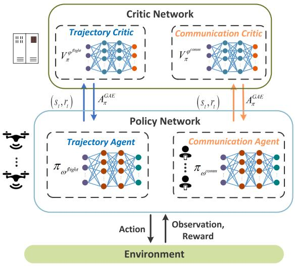  
(a) MAPPO-based JTCRA algorithm  
Fig. 2. Implementations of JTCRA approach based on the parameter-sharing architecture.

Based on the aforementioned Dec-POMDP design, the problem (21) can be transformed into an RL framework-based optimization problem, given by:

$$
\operatorname* { m a x } _ { \substack { ( v , \theta , P , B ) \sim \pi _ { \omega } } } \mathbb { E } _ { \pi _ { \omega } } \left[ \sum _ { t } \gamma ^ { t } r _ { t } \right]\tag{37}
$$

## B. MAPPO-Based JTCRA Algorithm With Parameter Sharing

In this subsection, we propose an MAPPO-based JTCRA algorithm to solve (37). We adopt a parameter-sharing architecture to enhance the algorithm’s performance. Due to the inherent heterogeneity in both observation and action spaces between trajectory control and resource allocation domains, we implement a dual-agent structure. For each UAV, we deploy a Traj-agent and a Comm-agent, with intra-type parameter sharing applied across agents. Specifically, we enforce $\omega _ { 1 } ^ { \mathrm { f i g h t } } \cdot \cdot \cdot = \omega _ { m } ^ { ' \mathrm { f i g h t } } \cdot \cdot \cdot = \omega _ { M } ^ { \mathrm { f i } \mathrm { \breve { g h t } } } = \omega ^ { \mathrm { \dot { \pi } f i g h t } }$ and $\omega _ { 1 , 1 } ^ { \mathrm { c o m m } } \cdot \cdot \cdot =$ $\omega _ { m , k } ^ { \mathrm { c o m m } } \cdot \cdot \cdot = \omega _ { M , K } ^ { \mathrm { c o m m } } = \omega ^ { \mathrm { c o m m } }$ . Additionally, each agent type shares its own critic network parameterized by $\varphi ^ { \mathrm { f l i g h t } }$ and $\varphi ^ { \mathrm { { c o m m } } }$ respectively, facilitating policy network training. For notational simplicity, we use $\omega$ and $\varphi$ without superscripts to refer to the policy and critic network parameters for any agent type. The algorithm structure is presented in Fig. 2a. At time slot $t ,$ for UAV $m$ and its associated GUs, the Traj-agent receives observation $o _ { t } ^ { \mathrm { \Pi  i g h t } , m }$ while the Comm-agent receives $\left\{ o _ { t } ^ { \mathrm { c o m m } , k } \right\} _ { k \in \mathcal { K } _ { n } }$ . Their respective policy networks then output the corresponding actions: $a _ { t } ^ { \mathrm { { f l i g h t } , } m }$ for trajectory control and $\left\{ a _ { t } ^ { \mathrm { c o m m } , k } \right\} _ { k \in \mathcal { K } , }$ for resource allocation, where $\kappa _ { m }$ represents the set of GUs served by the UAV $m .$

The MAPPO is an extension of PPO from single-agent to multi-agent scenarios following centralized training and decentralized execution (CTDE) framework. In the training phase, each agent first explores the environment through trial-and-error, sampling actions according to the probability distribution generated by its policy network. The agents collect the transitions $\left( { { s _ { t } } , { o _ { t } } , { a _ { t } } , { r _ { t } } , { s _ { t + 1 } } } \right)$ and store them in a buffer. When the buffer is filled, the agents exploit a mini-batch of transitions to train their shared policy and critic networks. Specifically, the critics compute advantage values adopting the generalized advantage estimator (GAE) [33], given by:

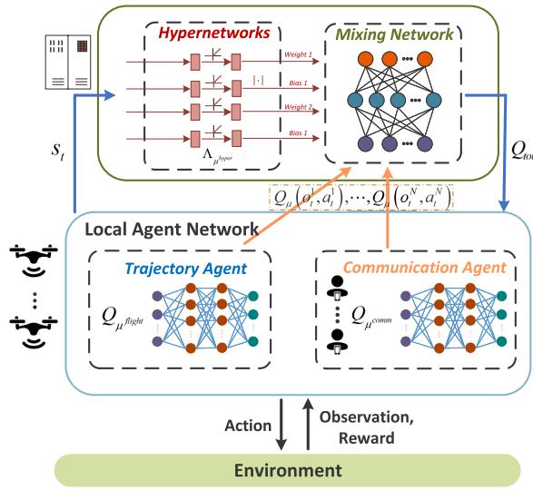  
(b) QMIX-based JTCRA algorithm

$$
A _ { t } ^ { \mathrm { G A E } } = \sum _ { l = 0 } ^ { \infty } ( \gamma \lambda ) ^ { l } \left[ r _ { t + l } + \gamma V _ { \pi } ( s _ { t + l + 1 } ) - V _ { \pi } ( s _ { t + l } ) \right] ,\tag{38}
$$

where $V _ { \pi }$ denotes an approximate value function estimated by the critic network, and $\lambda \in [ 0 , 1 ]$ which makes a compromise between bias and variance of the estimated advantage value. The critic network is updated by minimizing the loss function using gradient descent, as expressed in the following equation [34]:

$$
\begin{array} { l } { \displaystyle \mathrm { L o s s } ^ { V } ( \varphi ) = \frac { 1 } { N _ { b } } \sum _ { i = 0 } ^ { N _ { b } } \operatorname* { m a x } \left[ \left( V _ { \pi } ^ { \varphi } ( s ^ { i } ) - V _ { \mathrm { t a r g } } \left( s ^ { i } \right) \right) ^ { 2 } , \right. } \\ { \displaystyle \left. \left( \mathrm { c l i p } \left( V _ { \pi } ^ { \varphi } ( s ^ { i } ) , V _ { \pi } ^ { \varphi \mathrm { o u d } } ( s ^ { i } ) - \bar { \varepsilon } , V _ { \pi } ^ { \varphi \mathrm { o u d } } ( s ^ { i } ) + \bar { \varepsilon } \right) - V _ { \mathrm { t a r g } } \left( s ^ { i } \right) \right) ^ { 2 } \right] , } \end{array}\tag{39}
$$

where $N _ { b }$ represents the number of samples for each gradient descent step. $V _ { \mathrm { t a r g } } ( s ^ { i } )$ denotes the target state value for the i-th sample, expressed as $V _ { \mathrm { t a r g } } ( s ^ { i } ) ~ \stackrel { - } { = } ~ A _ { \mathrm { o l d } } ^ { \mathrm { G A E } , i } + V _ { \pi } ^ { \varphi _ { \mathrm { o l d } } } ( s ^ { i } )$ ϕ<sub>old</sub> represents the initial, unmodified parameters of the critic network at the beginning of each update round, prior to any gradient descent steps. The clip operation in (39) constrains the updated $V _ { \pi } ^ { \varphi }$ to remain within a bounded region around V <sup>ϕ</sup>old during updates. Based on the estimated advantage values $A _ { \mathrm { o l d } } ^ { \mathrm { \tilde { G } A E } , i }$ , each policy network is updated by maximizing the PPO objective function using gradient ascent, as expressed in the following equation:

$$
J ^ { \mathrm { P P O } } ( \omega ) = \frac { 1 } { N _ { b } } \sum _ { i = 0 } ^ { N _ { b } } \operatorname* { m i n } \Bigg [ \frac { \pi _ { \omega } ( a ^ { i } | o ^ { i } ) } { \pi _ { \omega _ { \mathrm { o l d } } } ( a ^ { i } | o ^ { i } ) } A _ { \mathrm { o l d } } ^ { \mathrm { G A E } , i } ,
$$

$$
\mathrm { c l i p } \left( \frac { \pi _ { \omega } \big ( a ^ { i } | \boldsymbol { o } ^ { i } \big ) } { \pi _ { \omega _ { \mathrm { o l d } } } \big ( a ^ { i } | \boldsymbol { o } ^ { i } \big ) } , 1 - \bar { \varepsilon } , 1 + \bar { \varepsilon } \right) A _ { \mathrm { o l d } } ^ { \mathrm { G A E } , i } \Bigg ] ,\tag{40}
$$

where $\omega _ { \mathrm { o l d } }$ represents the initial parameters of the policy network at the beginning of each update round. The clip operation in (40) constrains the updated policy $\pi _ { \omega }$ to remain within a bounded region around $\pi _ { \omega _ { \mathrm { o l d } } }$ during updates. A notable characteristic of MAPPO is its on-policy nature; despite the incorporation of importance sampling (IS) techniques, the collected state-action transitions can only be utilized for a single update round, during which multiple gradient descent iterations may occur. Once this update round is complete, agents must interact with the environment using their updated policies to gather new transitions for the next update round.

## C. QMIX-Based JTCRA Algorithm With Parameter Sharing

In this subsection, we propose another implementation of the JTCRA approach that integrates QMIX with parametersharing architecture to solve problem (37). This approach follows a CTDE framework and comprises three main components: individual agent networks, a mixing network, and hypernetworks. The algorithm maintains a global Q-function $Q _ { \mathrm { t o t } }$ to evaluate the global state-action pairs and guide each agent’s action selection by decomposing $Q _ { \mathrm { t o t } }$ into individual agent Q-values via a mixing network. Similarly, we implement a dual-agent structure for each UAV with parameter sharing enforced within each agent type. Specifically, trajectory agents share parameters according to $\mu _ { 1 } ^ { \mathrm { f l i g h t } } \cdot \cdot \cdot =$ $\bar { \mu } _ { m } ^ { \mathrm { f l i g h t } } \cdot \cdot \cdot = \mu _ { M } ^ { \mathrm { f l i g h t } } = \mu ^ { \mathrm { f l i g h t } }$ , while communication agents follow $\mu _ { 1 , 1 } ^ { \mathrm { c o m m } } \cdot \cdot \cdot = \mu _ { m , k } ^ { \mathrm { c o m m } } \cdot \cdot \cdot = \mu _ { M , K } ^ { \mathrm { c o m m } } = \mu ^ { \mathrm { c o m m } }$

During the training phase, agents interact with environment and collect transitions $\left( { { s _ { t } } , { o _ { t } } , { a _ { t } } , { r _ { t } } , { s _ { t + 1 } } } \right)$ by using an ε-greedy strategy. When the experience replay buffer is filled with transitions, agents randomly sample a batch of transitions to update the parameters of each agent network $( \mathrm { i . e . , } \mu ^ { \mathrm { c o m m } }$ and $\mu ^ { \mathrm { f l i g h t } } )$ and hypernetworks $( { \mathrm { i . e . , ~ } } \mu ^ { \mathrm { h y p e r } } )$ . For simplicity, we use µ without superscript to refer to the parameters corresponding to any type of agent network. For the i-th sample, each agent network outputs a corresponding Q-value. These values $\{ \bar { Q } _ { \mu } ( o _ { t } ^ { i , n } , a _ { t } ^ { i , n } ) \} _ { n \in \mathcal { N } }$ are then combined into $Q _ { \mathrm { t o t } }$ through a non-linear monotonic function that satisfies the individualglobal-max (IGM) property:

$$
\begin{array} { r l } & { Q _ { \mathrm { t o t } } ( s _ { t } ^ { i } , \boldsymbol { o } _ { t } ^ { i } , \boldsymbol { a } _ { t } ^ { i } ; \mu ) } \\ & { \ = \Lambda _ { \mu ^ { \mathrm { h y p e r } } } \left( s _ { t } ^ { i } , Q _ { \mu } ( \boldsymbol { o } _ { t } ^ { i , 1 } , \boldsymbol { a } _ { t } ^ { i , 1 } ) , \cdots , Q _ { \mu } ( \boldsymbol { o } _ { t } ^ { i , N } , \boldsymbol { a } _ { t } ^ { i , N } ) \right) , } \end{array}\tag{41}
$$

where $\pmb { \mu } ~ = ~ ( \mu ^ { \mathrm { H i g h t } } , \mu ^ { \mathrm { c o m m } } , \mu ^ { \mathrm { h y p e r } } )$ represents the parameters involved in QMIX. This non-linear monotonic function $\Lambda _ { \mu ^ { \mathrm { h y p e r } } }$ is constructed through a combination of hypernetworks and a mixing network. The hypernetworks take the global state $s _ { t } ^ { i }$ as input and generate the weights and biases that enable the mixing network to combine individual agent Q-values. The update process requires two types of target networks: those corresponding to each agent network and those associated with the hypernetworks. These target networks are essential for generating stable temporal difference (TD) target values. All networks are updated by minimizing the squared TD error:

$$
\operatorname { L o s s } ^ { Q } ( \mu ) = \frac { 1 } { N _ { b } } \sum _ { i = 0 } ^ { N _ { b } } \left[ \left( y _ { \mathrm { t o t } } ^ { i } - Q _ { \mathrm { t o t } } \left( s _ { t } ^ { i } , o _ { t } ^ { i } , a _ { t } ^ { i } ; \mu \right) \right) ^ { 2 } \right] ,\tag{42}
$$

where $\begin{array} { r } { y _ { \mathrm { t o t } } ^ { i } = r _ { t } ^ { i } + \gamma \operatorname* { m a x } _ { a } Q _ { \mathrm { t o t } } \left( s _ { t + 1 } ^ { i } , o _ { t + 1 } ^ { i } , a ; \mu ^ { - } \right) } \end{array}$ denotes the target value, and $\pmb { \mu } ^ { - } = ( \mu ^ { \mathrm { H i g h t - } } , \mu ^ { \mathrm { c o m m - } } , \mu ^ { \mathrm { h y p e r - } } )$ represents the parameters of target networks that are periodically updated using soft updates from $\pmb { \mu }$ according to $\mu ^ { - }  \bar { \tau } \mu + ( 1 -$ $\bar { \tau } ) \mu ^ { - }$ , where $\bar { \tau }$ is a small update rate. It is worth noting that QMIX is an off-policy algorithm, which enables itself reuse historical transitions stored in the experience replay buffer for multiple update iterations. This sample reuse continues until new transitions eventually replace older ones in the buffer. The structure of QMIX-based JTCRA algorithm is presented in Fig. 2b.

## D. Key Techniques in Algorithms Implementation

When implementing the proposed algorithms, we adopt several noteworthy techniques to enhance their performance. For the MAPPO-based JTCRA algorithm, we incorporate a death mask, while for the QMIX-based JTCRA algorithm, we implement double DQN. Additionally, both algorithms utilize action mask and GRU network. These enhancements are discussed below.

1) Death Mask: In our setting, certain UAVs may become inactive, $\mathrm { o r } \ ^ { 6 } \mathrm { d i e } ^ { 9 }$ , due to low energy while other UAVs remain active in the environment. However, in MAPPO, the critic struggles to model state values during these inactive periods because agent activity occurs in a small fraction of timesteps, which results in large value prediction errors. The death mask technique, which alleviates problems arising when agents become inactive during training, has been demonstrated to be effective in [35]. Specifically, we replace the value state for an inactive agent with a zero state vector, creating a single vector to capture the state of agent inactivity. This approach makes it easier for the critic to learn this inactivity vector and predict the average post-death reward instead of modeling various possible inactive states.

2) Double DQN: The DQN algorithm tends to overestimate state-action values due to its bootstrapping mechanism and max operation. To mitigate these overestimations, double DQN proposes decomposing the max operation in the target into separate action selection and evaluation [36]. This approach preserves the standard DQN update process, while replacing the target $y _ { t a r g }$ with:

$$
y _ { \mathrm { t a r g } } = r _ { t } + \gamma Q \left( s _ { t + 1 } , \underset { a } { \arg \operatorname* { m a x } } Q ( s _ { t + 1 } , \pmb { a } ; \pmb { \mu } ^ { - } ) ; \pmb { \mu } \right)\tag{43}
$$

where $\pmb { \mu } ^ { - }$ denotes the parameters of the target network. By applying the double DQN technique to the QMIX update, we effectively mitigate the underestimation problem, thereby enhancing the algorithm’s convergence and overall performance.

3) Action Mask: Effective management of invalid actions is critical when deploying DRL algorithms, particularly in our multi-agent UAV-GU scenario, as these actions can compromise system safety and impede agent learning. Three key cases must be addressed: GUs losing UAV connectivity, UAVs with insufficient energy for coverage, and UAVs exceeding authorized boundaries. For the first two cases, no-op alternative is necessary when valid actions cannot be generated, while for the third case, Traj-agents must prevent UAVs beyond authorized boundaries. We address these issues using an action mask technique that eliminates invalid actions from consideration. By applying a large negative value $( \mathrm { e . g . , ~ - 1 0 ^ { 8 } } )$ to unnormalized logits of invalid actions, we ensure these actions receive minimal Q-values in QMIX or negligible selection probability in MAPPO. This approach zeros the gradients of masked components during backpropagation, preventing updates from invalid actions—a mechanism known as “invalid action policy gradient” [37].

4) GRU Network: In multi-agent environments, agents typically make decisions with partial observability, accessing limited information regarding the global state, which can lead to suboptimal decision-making. GRU networks address this challenge through their recurrent architecture, which enables agents to maintain an internal memory of past observations. This process effectively transforms the POMDP into an approximation of a more tractable MDP from each agent’s viewpoint. Furthermore, multi-agent scenarios are frequently characterized by complex temporal dependencies. The selective memory mechanisms inherent in GRU networks excel at capturing these long-term dependencies, thereby facilitating more informed decision-making by the agents.

## E. Algorithm Complexity Analysis

The computational complexity of the proposed algorithms primarily stems from the training process, which consists of forward and backward propagation. For MAPPO-based JTCRA, the policy network incorporates an $L _ { P }$ fullyconnected (FC) layers and a single-layer GRU. Let $n _ { l } ^ { P }$ denotes the number of neurons in the l-th FC layer of the policy network, and the computational complexity of forward propagation of FC layers can be approximated as $\mathcal { O } \left( \sum _ { l = 1 } ^ { L _ { P } - 1 } N _ { b } n _ { l + 1 } ^ { P } n _ { l } ^ { P } \right)$ . For the GRU, the complexity can be approximated by $\mathcal { O } ( N _ { b } D _ { h } ^ { P } ( N _ { \mathrm { i n } } ^ { P } ~ + ~ D _ { h } ^ { P } ) )$ [38], where $N _ { i n } ^ { P }$ represents the input dimension of the GRU and $D _ { h } ^ { P }$ indicates the GRU hidden layer dimension. Therefore, the total forward propagation complexity can be expressed as $\mathcal { O } \left( \sum _ { l = 1 } ^ { L _ { P } - 1 } N _ { b } n _ { l + 1 } ^ { P } n _ { l } ^ { P } + N _ { b } D _ { h } ^ { P } ( N _ { \mathrm { i n } } ^ { P } + D _ { h } ^ { P } ) \right)$ . The backward propagation process typically requires a constant factor more computational resources than forward propagation, allowing us to express the total training complexity as proportional to the forward propagation complexity. Additionally, the complexity of GAE is $\mathcal { O } ( N ^ { 2 } F )$ , where $N$ denotes the number of agents and F represents the dimension of feature-value vectors [39]. Given that the critic network has a structure similar to policy network, the total algorithmic complexity can be calculated by $\mathcal { O } \left( \sum _ { l = 1 } ^ { L _ { P } - 1 } N _ { b } n _ { l + 1 } ^ { P } n _ { l } ^ { \bar { P } } + N _ { b } D _ { h } ^ { P } ( N _ { \mathrm { i n } } ^ { \bar { P } } + D _ { h } ^ { P } ) \right) + \mathcal { O } ( N ^ { 2 } F ) .$

The computational complexity of the QMIX-based JTCRA primarily stems from three components: the agent Q-network, the hypernetworks and the mixing network. The agent Q-network incorporates $L _ { Q }$ FC layers and a single-layer GRU. Let $n _ { l } ^ { Q } , ~ N _ { \mathrm { i n } } ^ { Q }$ , and $D _ { h } ^ { Q }$ denote the number of neurons in the l-th FC layer of the Q-network, the input dimension of the GRU, and the GRU hiddenlayer dimension, respectively. For the agent Q-network, the computational complexity can be approximated by $\mathcal { O } \left( \sum _ { l = 1 } ^ { L _ { Q } - 1 } N _ { b } n _ { l + 1 } ^ { Q } n _ { l } ^ { Q } + N _ { b } D _ { h } ^ { Q } ( N _ { \mathrm { i n } } ^ { Q } + D _ { h } ^ { Q } ) \right)$ The hypernetworks consists of multiple L -layer MLP networks. For each MLP network, let $\hat { n _ { l } ^ { H } }$ represent the number of neurons in the l-th FC layer, yielding a computational complexity of O $\left( N _ { H } \sum _ { l = 1 } ^ { L _ { H } - 1 } \dot { N _ { b } n _ { l + 1 } ^ { H } } n _ { l } ^ { H } \right)$ , where $N _ { H }$ denotes the number of the MLP networks in the hypernetworks. Furthermore, with $n _ { l } ^ { M }$ denoting the dimension of the l-th hidden layer in the mixing network, its computational complexity is $\mathcal { O } \left( \sum _ { l = 1 } ^ { N _ { H } / 2 - 1 } N _ { b } n _ { l + 1 } ^ { M } n _ { l } ^ { M } \right)$ . Therefore, the aggregate computational complexity of the QMIX-based JTCRA can be expressed as the sum of these three component complexities.

In a practical implementation, the computationally intensive training processes are performed by a central controller. The UAVs only need to perform forward propagation for real-time decision-making and periodically download the updated network parameters. Therefore, the training complexity analyzed above does not impact the real-time execution performance on the UAVs themselves.

## IV. SIMULATION RESULTS

In this section, we first present the simulation setting and relevant parameters employed in the simulation. Subsequently, we exhibit simulation results to validate the feasibility and effectiveness of our proposed algorithms.

## A. Simulation Setting

In the actual algorithm deployment, a central controller is situated within the communication core network, performing the centralized training by leveraging the collected global information. After training, the UAVs download the trained neural network weights to update their local policy networks. Each UAV can make decisions distributionally based solely on its local observations. In our scenario, we consider 3 UAVs flying at different fixed altitudes of 180 m, 200 m and 220 m, respectivel, with 18 GUs randomly distributed within a ground area of 400 m ×400 m. Furthermore, we set the maximum tolerance time for unserved GUs, $L = 1 0$ consecutive time slots, after which they use the satellite link to proactively upload their information. During task execution, UAV movement and communication operations constitute the primary sources of onboard energy consumption, continuing until energy levels fall below a threshold, at which point coverage to GUs ceases. The initial energy budgets of the three UAVs are set to $1 \times 1 0 ^ { 4 } , 2 \times 1 0 ^ { 4 }$ and $4 \times 1 0 ^ { 4 }$ Joule.

TABLE III SIMULATION PARAMETERS
<table><tr><td rowspan=1 colspan=1>Parameters for Communication System</td><td rowspan=1 colspan=1>Values</td></tr><tr><td rowspan=1 colspan=1>Slot length, δ</td><td rowspan=1 colspan=1>1 s</td></tr><tr><td rowspan=1 colspan=1>Channel coefficients, $\overline { { ( C _ { 0 } , C _ { 1 } , C _ { 2 } , \kappa ) } }$ </td><td rowspan=1 colspan=1>(−40 dB, 10, 0.6, 0.2)</td></tr><tr><td rowspan=1 colspan=1>Side lobe gain, g</td><td rowspan=1 colspan=1>-10.8 dBi</td></tr><tr><td rowspan=1 colspan=1>Noise power spectrum, $\overline { { N _ { 0 } } }$ </td><td rowspan=1 colspan=1>-174 dBm/Hz</td></tr><tr><td rowspan=1 colspan=1>Available system bandwidth, B</td><td rowspan=1 colspan=1>1 MHz</td></tr><tr><td rowspan=1 colspan=1>Maximum transmit power each UAV m, $\overline { { P _ { m } } }$ </td><td rowspan=1 colspan=1>20 dBm</td></tr><tr><td rowspan=1 colspan=1>Maximum tolerance time of GUs, L</td><td rowspan=1 colspan=1>10</td></tr><tr><td rowspan=1 colspan=1>Average speed of each GU k, vk</td><td rowspan=1 colspan=1> $\overline { { 1 . 3 ~ m / s } }$ </td></tr><tr><td rowspan=1 colspan=1>Average angle of each GU k, $\bar { \theta } _ { k }$ </td><td rowspan=1 colspan=1> $\pi / 4$ </td></tr><tr><td rowspan=1 colspan=1>Flight action dimension</td><td rowspan=1 colspan=1>1 × 26</td></tr><tr><td rowspan=1 colspan=1>Communication action dimension</td><td rowspan=1 colspan=1>2 × 9</td></tr><tr><td rowspan=1 colspan=1>Parameters for MADRL</td><td rowspan=1 colspan=1>Values</td></tr><tr><td rowspan=1 colspan=1>GRU hidden dimension</td><td rowspan=1 colspan=1>64</td></tr><tr><td rowspan=1 colspan=1>MLP dimension</td><td rowspan=1 colspan=1>64</td></tr><tr><td rowspan=1 colspan=1>Discount factor, γ</td><td rowspan=1 colspan=1>0.99</td></tr><tr><td rowspan=1 colspan=1>Learning rate</td><td rowspan=1 colspan=1> $5 \times 1 0 ^ { - 4 }$ </td></tr><tr><td rowspan=1 colspan=1>Total interaction steps</td><td rowspan=1 colspan=1>2 × 107</td></tr><tr><td rowspan=1 colspan=1>Transition sequence length</td><td rowspan=1 colspan=1>600</td></tr><tr><td rowspan=1 colspan=1>GAE λ</td><td rowspan=1 colspan=1>0.95</td></tr><tr><td rowspan=1 colspan=1>Clip ratio, τ</td><td rowspan=1 colspan=1>0.2</td></tr><tr><td rowspan=1 colspan=1>MAPPO training epoch</td><td rowspan=1 colspan=1>10</td></tr><tr><td rowspan=1 colspan=1>MAPPO buffer size</td><td rowspan=1 colspan=1>env num × seq len× agent num</td></tr><tr><td rowspan=1 colspan=1>MAPPO batch size</td><td rowspan=1 colspan=1>buffer size</td></tr><tr><td rowspan=1 colspan=1>Greedy coefficient, ε</td><td rowspan=1 colspan=1>1 → 0.05</td></tr><tr><td rowspan=1 colspan=1>QMIX buffer size</td><td rowspan=1 colspan=1>2000 transitionsequences</td></tr><tr><td rowspan=1 colspan=1>QMIX batch size</td><td rowspan=1 colspan=1>16 transitionsequences</td></tr><tr><td rowspan=1 colspan=1>Soft update coefficient, τ</td><td rowspan=1 colspan=1>0.005</td></tr></table>

In our investigation, the architecture of both the policy and critic networks in MAPPO, as well as the individual agent networks in QMIX, consists of a 2-layer MLP, followed by a single-layer GRU, and terminated with a single-layer MLP. For the Traj-agent, we discretize the action space with 8 optional flight angles defined by $\begin{array} { r } { \theta _ { m } = \frac { \pi } { 4 } i , i = 0 , 1 , \cdot \cdot \cdot , 7 . } \end{array}$ and 3 optional speed levels (5, 10, and 20 m/s). Therefore, the action space encompasses 26 distinct actions, including no-op and stop options. For the Comm-agent, we discretize both power and bandwidth into 8 levels each. This results in a 2-dimensional action space where each dimension comprises 9 distinct actions including a no-op option. During simulation, 16 different environments are simultaneously instantiated, and the transitions are collected in parallel from these environments. This parallelization approach accelerates the data collection process and increases the stochasticity of the sampled transitions, which enhances the algorithm’s generalization capability. The core simulation parameters are summarized in TABLE III. The aerodynamics-related parameters are set identical to those in [21].

## B. Simulation Results

First, we assess the convergence performance of the proposed JTCRA algorithms and compare them with their counterparts without parameter sharing (denoted as separate JTCRA algorithms), as illustrated in Fig. 3. The data points displayed on the performance curves represent average values over 10 episodes in a newly instantiated environment. Fig. 3a shows that all four algorithms achieve a high fairness coefficient. While the separate QMIX-JTCRA algorithm exhibits slightly lower performance, the other three algorithms successfully converge to values at or very close to the $\eta _ { \mathrm { { t h } } } ~ =$ 0.9 threshold. In contrast, the system throughput in Fig. 3b reveals a much clearer performance gap, where both proposed JTCRA algorithms achieve comparatively higher throughput than their non-sharing counterparts, which become trapped in local suboptima. This improvement can be attributed to a more centralized training approach enabled by parameter sharing, which allows the sharing network to experience more transitions from different agents, thereby enhancing overall performance. A more theoretical analysis of this effect is presented in [31], [32]. Besides, the proposed MAPPO-based JTCRA demonstrates more stable training curves and superior throughput compared to the proposed QMIX-based JTCRA algorithm. This is due to its use of clipped objective functions that benefit from the trust region principles, which mitigates drastic performance fluctuations. Therefore, we adopt the MAPPO-JTCRA algorithm and compare its performance with the following three baselines:

Independent PPO (IPPO): This baseline implements PPO within a decentralized training with decentralized execution (DTDE) framework. It adopts a dual-agent structure similar to the proposed method but operates without parameter sharing. Consequently, each agent trains its network solely based on local observations, without access to global state information.

• Federated SGD-based IPPO (IPPO-FedSGD) [40]: This method integrates federated learning with IPPO, maintaining a dual-agent structure without parameter sharing. It functions by aggregating local models immediately after each local agent performs a single step of gradient descent using its local dataset.

HAPPO using a hierarchical single-agent structure per UAV (HAPPO-HSA) [41]: We incorporate the state-of-the-art heterogeneous-agent proximal policy optimization (HAPPO) algorithm as a comparative benchmark. In this configuration, each UAV is controlled by a single agent that makes decisions over two hierarchical levels: the top-level policy observes the state to control flight, and the lower-level policy uses both the state and the chosen flight action to determine resource allocation. Given the non-sharing structure of HAPPO, the output layer of the lower-level policy must simultaneously account for all potential GUs. Consequently, compared to the dual-agent structure, the dimensionality of the lower-level policy expands significantly; although the toplevel flight action space remains fixed, the lower level requires K communication action dimensions, where each dimension consists of 64 resource allocation levels plus a no-op option.

Hovering: In this baseline, we predefine the hovering positions (100, 100), (−100, 100), (0, −100), and UAVs are dispatched to these positions, where they hover for communication coverage until the task period ends. The communication resource is equally allocated for associated GUs.

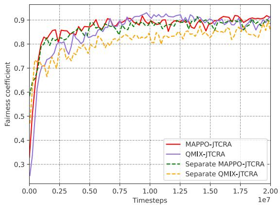  
(a) Fairness performance vs. timesteps

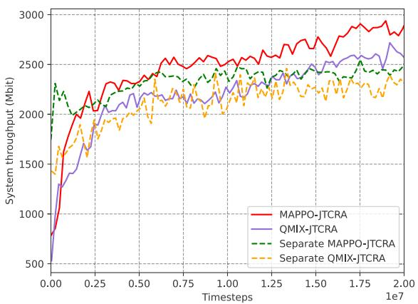  
(b) Throughput performance vs. timesteps

Fig. 3. The effect of parameter sharing technique on convergence performance of the proposed algorithms, $\eta _ { \mathrm { t h } } = 0 . 9 .$  
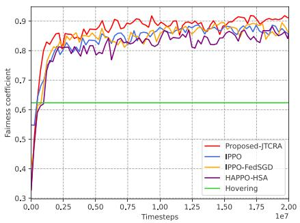  
(a) Fairness performance vs. timesteps

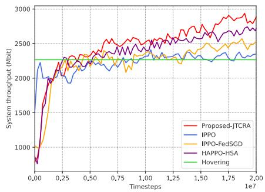  
(b) Throughput performance vs. timesteps

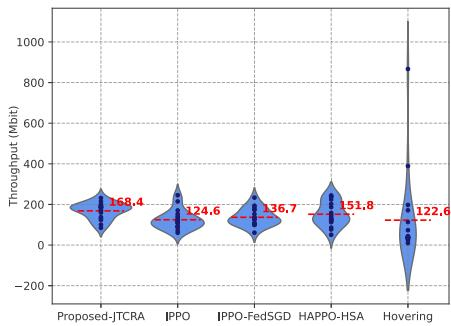  
(c) Cumulative throughput distribution of GUs  
Fig. 4. System performance achieved by different baselines, $\eta _ { \mathrm { t h } } = 0 . 9$

Fig. 4 presents the fairness and system throughput performance of the proposed JTCRA algorithm compared to various baselines. It is observed that only the proposed JTCRA algorithm satisfies the fairness threshold while achieving the highest system throughput across all evaluated methods. Although the state-of-the-art HAPPO-HSA algorithm achieves the second-highest system throughput with fairness comparable to the IPPO variants, it still underperforms relative to the proposed dual-agent structure. This performance gap is primarily attributed to the high-dimensional action space arising from the single-agent structure of HAPPO-HSA, which hinders efficient exploration and optimal policy learning. Furthermore, the IPPO-FedSGD method outperforms standard IPPO, demonstrating the benefits of implicit parameter sharing via federated learning. In particular, the model parameter aggregation in FedSGD is mathematically equivalent to gradient aggregation [40]; each local agent computes an average gradient based on its local data, and a central server aggregates these gradients to update the global model, which is then applied to each local agent. As the sum and differentiation operations are interchangeable, this gradient aggregation mechanism is equivalent to a centralized approach that collects transitions from each agent and trains a shared model, i.e., parameter sharing. This finding further validates the effectiveness of the parameter-sharing framework. Conversely, the hovering baseline yields the worst performance, as its static nature neglects network robustness requirements and lacks a dynamic resource allocation strategy. Fig. 4c illustrates the cumulative throughput distribution of the GUs using violin plots, where red dotted lines indicate mean values. The proposed algorithm demonstrates superior performance, achieving the highest mean throughput of 168.4 Mbit. Additionally, its compact distribution highlights consistent service quality across all GUs. In contrast, the hovering baseline shows significant variance in its performance distribution, indicating unreliable fairness. These results demonstrate that the proposed algorithm effectively maintains a robust multi-UAV A2G wireless network. As the task progresses, UAVs strategically cease communication service when their energy levels fall below the critical threshold, while remaining energy-sufficient UAVs dynamically assume responsibility for traffic forwarding for GUs in coverage gaps, thus ensuring continuous network coverage.

Fig. 5 shows the system throughput and fairness coefficients achieved by different baselines under varying fairness constraints. The proposed JTCRA algorithm achieves the highest throughput while successfully satisfying the fairness requirement across all tested levels. As shown in Fig. 5b, both HAPPO-HSA and the IPPO variants satisfy the fairness constraint when $\eta _ { \mathrm { t h } } ~ \in ~ \{ 0 , 0 . 6 , 0 . 7 , 0 . 8 \}$ ; however, they fail to meet the stricter requirement of $\eta _ { \mathrm { t h } } = 0 . 9$ . Although the HAPPO-HSA baseline achieves the second-best throughput, it underperforms relative to the proposed JTCRA algorithm across all tested fairness levels. This performance gap is primarily attributed to the inefficiencies associated with exploring the high-dimensional action space of the single-agent structure. Separately, IPPO-FedSGD achieves comparable or superior throughput to standard IPPO, benefiting from the implicit parameter sharing provided by the FedSGD mechanism. Beyond these baseline comparisons, the results highlight a fundamental trade-off between fairness and throughput: a stricter fairness constraint leads to reduced system throughput. This occurs because strict fairness compels UAVs to frequently move to serve different GUs and allocate more communication resources to GUs with lower channel gains and historical throughput. Notably, as $\eta _ { \mathrm { t h } }$ relaxes from 0.7 to 0, the system throughput shows only small increases, indicating diminishing marginal gains. In contrast, the hovering baseline, which does not consider the fairness constraint, consistently exhibits the poorest performance.

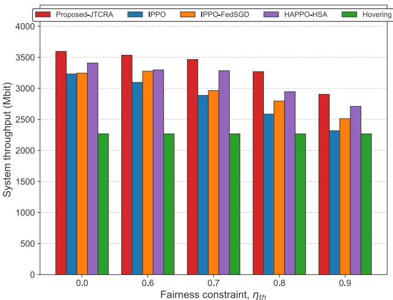  
(a) Throughput performance

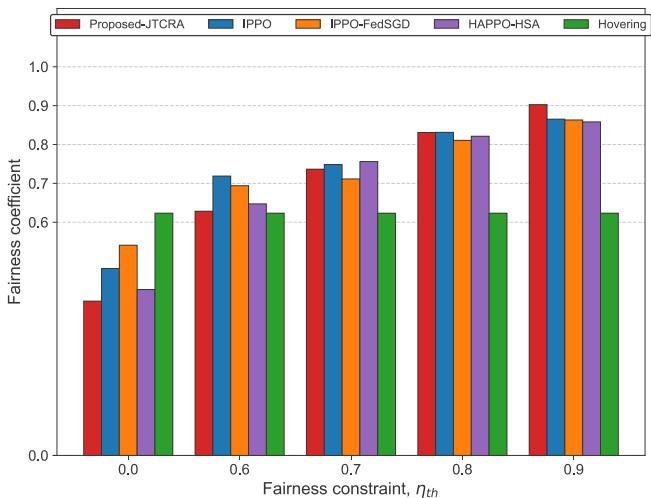  
(b) Fairness performance  
Fig. 5. System performance of different baselines vs. η<sub>th</sub>.

TABLE IV  
PERFORMANCE OF THE PROPOSED JTCRA ALGORITHM FOR DIFFERENT MAX TOLERANCE TIME, $\eta _ { \mathrm { t h } } = 0 . 9$
<table><tr><td>Max Tolerance Time (L)</td><td>Fairness Coefficient</td><td>System Throughput (Mbit)</td></tr><tr><td>10</td><td></td><td>2850.1018</td></tr><tr><td>20</td><td>0.9067 0.9071</td><td>2843.0529</td></tr><tr><td>30</td><td>0.9068</td><td>2864.3339</td></tr><tr><td>40</td><td>0.8984</td><td>2870.1716</td></tr><tr><td>80</td><td>0.8278</td><td>2927.2344</td></tr><tr><td>100</td><td>0.8005</td><td>2908.0019</td></tr><tr><td>inf</td><td>0.7045</td><td>2886.4446</td></tr></table>

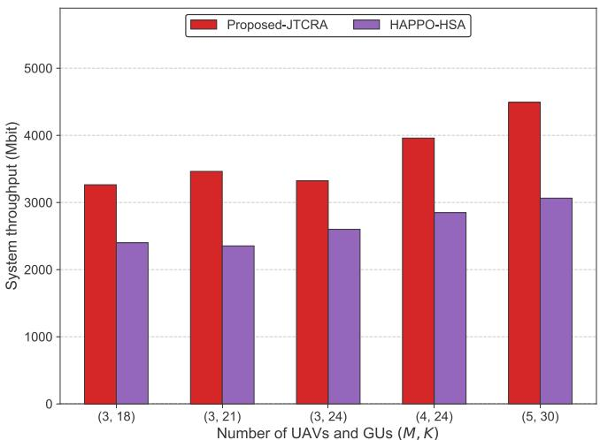  
(a) Throughput performance

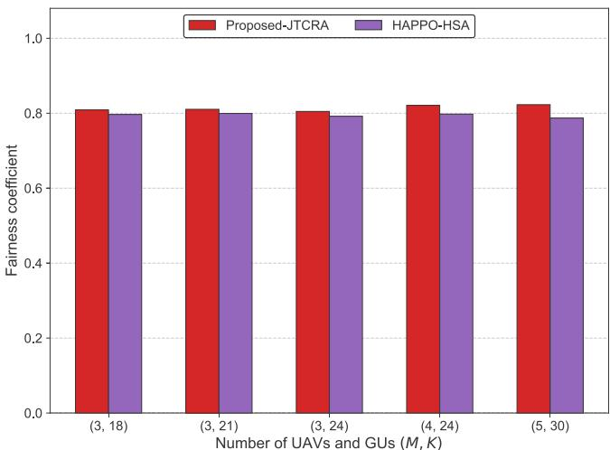  
(b) Fairness performance  
Fig. 6. Impact of network scale on system performance with $\eta _ { \mathrm { t h } } = 0 . 8 .$

TABLE IV shows the JTCRA algorithm’s performance for different GU maximum tolerance times L, and inf indicates that the SMC mechanism is disabled. The results show that the system performance, particularly the fairness coefficient, remains relatively stable for smaller values of L (e.g., 10–40). However, sufficiently large L values (e.g., 80, 100) adversely affect fairness. This degradation occurs because the extended tolerance period hinders UAVs from responding promptly to uneven throughput distribution among GUs. Notably, the calculation of Jain’s fairness index in equation (20) involves averaging each GU’s throughput over the entire task period. As such, If a GU only requests and receives service a few times due to high tolerance L, these limited services—even if highthroughput individually—have a small impact on its overall average throughput, making it unlikely to improve fairness. Similarly, when the SMC mechanism is disabled (the inf case), fairness deteriorates because UAVs can then only serve GUs within their direct coverage, neglecting others. Therefore, the satellite-enabled SMC mechanism plays a vital role in our system to satisfy the fairness constraint.

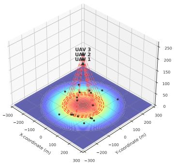  
(a)

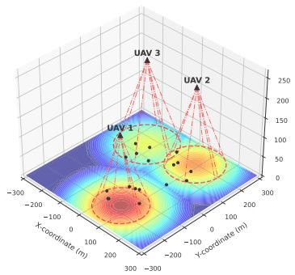  
(b)

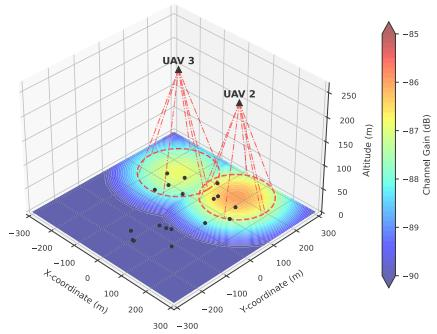  
(c)

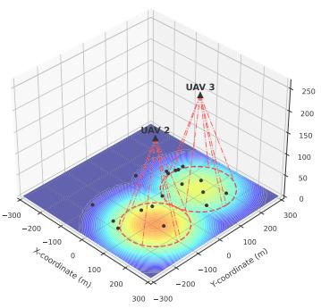  
(d)

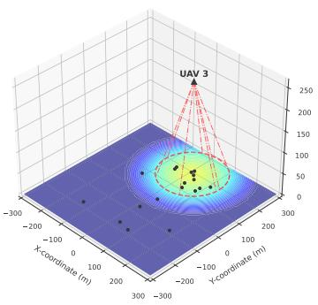  
(e)

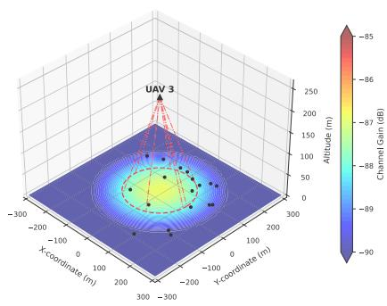  
(f)

Fig. 7. Adaptive UAVs coverage of mobile GUs during different task phases of the JTCRA algorithm, $\eta _ { \mathrm { t h } } = 0 . 9 .$ (a-b) Three active UAVs providing coverage; (c-d) Coverage reconfiguration with two remaining UAVs; (e-f) Final coverage phase with single UAV. Heat maps display channel gain (dB), black dots represent ground users.  
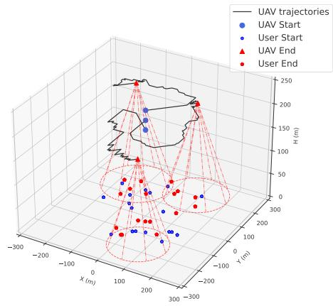  
(a)

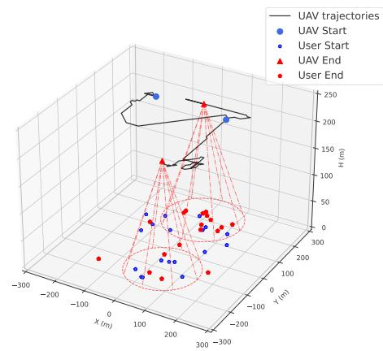  
(b)

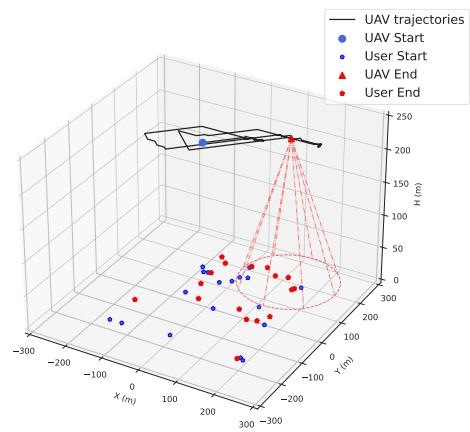  
(c)  
Fig. 8. Intelligent trajectory adjustments of UAVs during different task phases of the JTCRA algorithm, $\eta _ { \mathrm { t h } } = 0 . 9 .$ (a) Initial coordinated flight trajectories of the three-UAV fleet; (b) Remaining UAVs dynamically adjust their trajectories to compensate for the lost UAV; (c) Extensive maneuvering by the final UAV to maintain service continuity.

To validate the scalability of the proposed algorithm, we conduct simulations under varying numbers of UAVs and GUs with a fairness threshold of $\eta _ { \mathrm { t h } } ~ = ~ 0 . 8$ . To accommodate the increased node density, the simulation area is expanded to 600 m × 600 m, with UAV flight altitudes and energy budgets uniformly distributed in the ranges [180, 220] m and $[ 1 \times \mathsf { \bar { 1 0 } ^ { 4 } } , 4 \times 1 0 ^ { 4 } ]$ Joules, respectively. We design two simulation configurations to evaluate performance. First, we fix the number of UAVs at M = 3 and increase the number of GUs $( K = 1 8 , 2 1 , 2 4 )$ to represent increasing load ratios of 1 : 6, 1 : 7, and 1 : 8. Second, we scale the entire network while maintaining a fixed 1 : 6 ratio, testing configurations of (3, 18), (4, 24), and (5, 30). As illustrated in Fig. 6, the proposed JTCRA algorithm consistently achieves higher system throughput than the baseline while strictly satisfying the fairness requirement across all test cases. Notably, in the fixed-UAV scenarios $( M ~ = ~ 3 )$ , the total throughput remains relatively stable despite the increase in GUs, indicating that the system’s spectral and power resources are fully utilized; the addition of GUs merely redistributes the finite resources among more users without increasing the aggregate capacity. Conversely, as the network scales up (increasing both M and K), both algorithms exhibit an increase in throughput due to the availability of additional service resources. However, our proposed algorithm demonstrates a more pronounced performance gain, widening the throughput gap compared to HAPPO-HSA as the network scales. We attribute this gap to the exploding action dimensionality within HAPPO-HSA. Although HAPPO-HSA hierarchically separates flight and communication spaces, the lower-level policy responsible for resource allocation struggles with the high-dimensional action space required to serve an increasing number of GUs. In contrast, our proposed dualagent framework employs a parameter-sharing architecture where all associated GUs share the same Comm-agent policy within each UAV. Consequently, the action dimension for the Comm-agent remains constant regardless of the number of GUs, ensuring robust learning efficiency even in large-scale networks.

Fig. 7 and Fig. 8 visually validate the robustness of the proposed JTCRA algorithm by illustrating the dynamic and intelligent flight patterns adopted in response to UAV energy depletion. Initially, three UAVs automatically partition the area into distinct coverage zones and provide comprehensive service by patrolling these zones, as shown by the heat maps in Figs.7a-7b and the corresponding coordinated flight paths in Fig. 8a. When one UAV ceases operation due to insufficient energy, a service gap emerges, as depicted in Fig. 7c. In response, the system demonstrates its robustness by reconfiguring the trajectories of the two remaining UAVs, which adopt collaborative, sweeping paths to minimize the adverse impact of the coverage gap, as shown in Fig. 7d and Fig. 8b. In the final coverage phase, the single remaining UAV executes a wide, spiral-like flight path to serve all GUs and ensure fair service distribution, as shown in Figs 7e-7fand Fig. 8c. Overall, these results confirm that the proposed algorithm significantly enhances network robustness through intelligent, real-time adjustments of UAV coverage and flight paths in response to operational failures, thereby ensuring service continuity and fairness.

## V. CONCLUSION AND FUTURE DIRECTIONS

This paper investigated the robustness of a multi-UAVassisted A2G wireless system where UAVs face service disruptions due to finite energy constraints. To handle this problem, we proposed an MADRL-based framework utilizing parameter sharing. Our approach implements a dual-agent structure for each UAV, comprising a Traj-agent and a Comm-agent to manage trajectory control and resource allocation, respectively. Simulation results show that our proposed JTCRA algorithms deliver excellent mobile coverage performance in this wireless network. Future work will explore scenarios where UAVs recharge at ground stations and return to resume service, as well as investigate more advanced AIbased algorithms to further enhance system performance.

## REFERENCES

[1] X. Yan, X. Fang, C. Deng, and X. Wang, “Joint optimization of resource allocation and trajectory control for mobile group users in fixedwing UAV-enabled wireless network,” IEEE Trans. Wireless Commun., vol. 23, no. 2, pp. 1608–1621, Feb. 2024.

[2] S. Zeng, H. Zhang, B. Di, and L. Song, “Trajectory optimization and resource allocation for OFDMA UAV relay networks,” IEEE Trans. Wireless Commun., vol. 20, no. 10, pp. 6634–6647, Oct. 2021.

[3] M. Matracia, M. A. Kishk, and M.-S. Alouini, “UAV-aided post-disaster cellular networks: A novel stochastic geometry approach,” IEEE Trans. Veh. Technol., vol. 72, no. 7, pp. 9406–9418, Jul. 2023.

[4] H.-T. Ye, X. Kang, J. Joung, and Y.-C. Liang, “Optimization for full-duplex rotary-wing UAV-enabled wireless-powered IoT networks,” IEEE Trans. Wireless Commun., vol. 19, no. 7, pp. 5057–5072, Jul. 2020.

[5] M. Hui, J. Chen, L. Yang, L. Lv, H. Jiang, and N. Al-Dhahir, “UAVassisted mobile edge computing: Optimal design of UAV altitude and task offloading,” IEEE Trans. Wireless Commun., vol. 23, no. 10, pp. 13633–13647, Oct. 2024.

[6] C. Deng, X. Fang, and X. Wang, “Beamforming design and trajectory optimization for UAV-empowered adaptable integrated sensing and communication,” IEEE Trans. Wireless Commun., vol. 22, no. 11, pp. 8512–8526, Nov. 2023.

[7] Q. Wu, Y. Zeng, and R. Zhang, “Joint trajectory and communication design for multi-UAV enabled wireless networks,” IEEE Trans. Wireless Commun., vol. 17, no. 3, pp. 2109–2121, Mar. 2018.

[8] K. Meng, X. He, Q. Wu, and D. Li, “Multi-UAV collaborative sensing and communication: Joint task allocation and power optimization,” IEEE Trans. Wireless Commun., vol. 22, no. 6, pp. 4232–4246, Jun. 2023.

[9] G. Sun et al., “Multi-objective optimization for multi-UAV-assisted mobile edge computing,” IEEE Trans. Mobile Comput., vol. 23, no. 12, pp. 14803–14820, Dec. 2024.

[10] Z. Mou, F. Gao, J. Liu, and Q. Wu, “Resilient UAV swarm communications with graph convolutional neural network,” IEEE J. Sel. Areas Commun., vol. 40, no. 1, pp. 393–411, Jan. 2022.

[11] V. Sharma, R. Kumar, and P. S. Rana, “Self-healing neural model for stabilization against failures over networked UAVs,” IEEE Commun. Lett., vol. 19, no. 11, pp. 2013–2016, Nov. 2015.

[12] M. Chen, H. Wang, C.-Y. Chang, and X. Wei, “SIDR: A swarm intelligence-based damage-resilient mechanism for UAV swarm networks,” IEEE Access, vol. 8, pp. 77089–77105, 2020.

[13] L. Ge, X. Liang, H. Zhang, P. Dong, J. Liao, and J. Wang, “Joint resource allocation and trajectory design for resilient multi-UAV communication networks,” IEEE Wireless Commun. Lett., vol. 13, no. 4, pp. 994–998, Apr. 2024.

[14] K. Wu, K.-W. Chin, and S. Soh, “Topology construction for maxmin rate optimization in heterogeneous UAVs networks,” IEEE Internet Things J., vol. 12, no. 12, pp. 20203–20214, Jun. 2025. [Online]. Available: https://ieeexplore.ieee.org/abstract/document/10891559

[15] S. Guo and X. Zhao, “Multi-agent deep reinforcement learning based transmission latency minimization for delay-sensitive cognitive satellite-UAV networks,” IEEE Trans. Commun., vol. 71, no. 1, pp. 131–144, Jan. 2023.

[16] J. Chen, K. Zhai, Z. Wang, Y. Liu, J. Jia, and X. Wang, “CoMP and RISassisted multicast transmission in a multi-UAV communication system,” IEEE Trans. Commun., vol. 72, no. 6, pp. 3602–3617, Jun. 2024.

[17] J. Chen et al., “Hybrid reinforcement learning for joint beamforming in STAR-RIS assisted CoMP systems,” IEEE Trans. Wireless Commun., vol. 24, no. 9, pp. 7955–7969, Sep. 2025. [Online]. Available: https:// ieeexplore.ieee.org/abstract/document/10891559

[18] G. Li, S. Guo, J. Lv, K. Zhao, and Z. He, “Introduction to global short message communication service of BeiDou-3 navigation satellite system,” Adv. Space Res., vol. 67, no. 5, pp. 1701–1708, Mar. 2021.

[19] B. Liang and Z. J. Haas, “Predictive distance-based mobility management for PCS networks,” in Proc. IEEE INFOCOM, Mar. 1999, pp. 1377–1384.

[20] A. Al-Hourani, S. Kandeepan, and A. Jamalipour, “Modeling air-to-ground path loss for low altitude platforms in urban environments,” in Proc. IEEE Global Commun. Conf., Dec. 2014, pp. 2898–2904.

[21] Y. Zeng, J. Xu, and R. Zhang, “Energy minimization for wireless communication with rotary-wing UAV,” IEEE Trans. Wireless Commun., vol. 18, no. 4, pp. 2329–2345, Apr. 2019.

[22] A. Al-Hourani, S. Kandeepan, and S. Lardner, “Optimal LAP altitude for maximum coverage,” IEEE Wireless Commun. Lett., vol. 3, no. 6, pp. 569–572, Dec. 2014.

[23] Z. Yang, S. Bi, and Y.-J.-A. Zhang, “Online trajectory and resource optimization for stochastic UAV-enabled MEC systems,” IEEE Trans. Wireless Commun., vol. 21, no. 7, pp. 5629–5643, Jul. 2022.

[24] H. He, S. Zhang, Y. Zeng, and R. Zhang, “Joint altitude and beamwidth optimization for UAV-enabled multiuser communications,” IEEE Commun. Lett., vol. 22, no. 2, pp. 344–347, Feb. 2018.

[25] Z. Hu, F. Zeng, Z. Xiao, B. Fu, H. Jiang, and H. Chen, “Computation efficiency maximization and QoE-provisioning in UAV-enabled MEC communication systems,” IEEE Trans. Netw. Sci. Eng., vol. 8, no. 2, pp. 1630–1645, Apr. 2021.

[26] Z. Yang, C. Pan, K. Wang, and M. Shikh-Bahaei, “Energy efficient resource allocation in UAV-enabled mobile edge computing networks,” IEEE Trans. Wireless Commun., vol. 18, no. 9, pp. 4576–4589, Sep. 2019.

[27] G. Sun et al., “Joint task offloading and resource allocation in aerialterrestrial UAV networks with edge and fog computing for post-disaster rescue,” IEEE Trans. Mobile Comput., vol. 23, no. 9, pp. 8582–8600, Sep. 2024.

[28] Y. Zeng, Q. Wu, and R. Zhang, “Accessing from the sky: A tutorial on UAV communications for 5G and beyond,” Proc. IEEE, vol. 107, no. 12, pp. 2327–2375, Dec. 2019.

[29] J. Won, D.-Y. Kim, and J.-W. Lee, “Joint optimization of location, beam, and radio resource for an aerial base station with controllable directional antennas,” IEEE Internet Things J., vol. 11, no. 16, pp. 27571–27583, Aug. 2024.

[30] C. A. Balanis, Antenna Theory: Analysis and Design, 4th ed., Hoboken, NJ, USA: Wiley, 2016.

[31] F. Christianos, G. Papoudakis, M. A. Rahman, and S. V. Albrecht, “Scaling multi-agent reinforcement learning with selective parameter sharing,” in Proc. Int. Conf. Mach. Learn., 2021, pp. 1989–1998.

[32] J. K. Terry, N. Grammel, S. Son, B. Black, and A. Agrawal, “Revisiting parameter sharing in multi-agent deep reinforcement learning,” 2020, arXiv:2005.13625.

[33] J. Schulman, P. Moritz, S. Levine, M. Jordan, and P. Abbeel, “Highdimensional continuous control using generalized advantage estimation,” 2015, arXiv:1506.02438.

[34] L. Engstrom et al., “Implementation matters in deep RL: A case study on PPO and TRPO,” in Proc. Int. Conf. Learn. Represent., 2019, pp. 1–14.

[35] C. Yu et al., “The surprising effectiveness of PPO in cooperative, multiagent games,” in Proc. Adv. Neural Inf. Process. Syst. (NIPS), 2021, pp. 24611–24624.

[36] H. V. Hasselt, A. Guez, and D. Silver, “Deep reinforcement learning with double Q-learning,” in Proc. 30th Conf. Artif. Intell. (AAAI), Mar. 2016, pp. 2094–2100.

[37] S. Huang and S. Ontan˜on, “A closer look at invalid action masking´ in policy gradient algorithms,” in Proc. Int. FLAIRS Conf., vol. 35, May 2022, pp. 586–591.

[38] Y. Wang, M. Chen, Z. Yang, T. Luo, and W. Saad, “Deep learning for optimal deployment of UAVs with visible light communications,” IEEE Trans. Wireless Commun., vol. 19, no. 11, pp. 7049–7063, Nov. 2020.

[39] X. Ning, M. Zeng, M. Hua, and Z. Fei, “Multiple reconfigurable intelligent surfaces aided vehicular edge computing networks: A MAPPO-based approach,” IEEE Trans. Veh. Technol., vol. 73, no. 11, pp. 17496–17509, Nov. 2024.

[40] B. McMahan, E. Moore, D. Ramage, S. Hampson, and B. A. Y. Arcas, “Communication-efficient learning of deep networks from decentralized data,” in Proc. 20th Int. Conf. Artif. Intell. Statist., 2017, pp. 1273–1282.

[41] J. G. Kuba et al., “Trust region policy optimisation in multi-agent reinforcement learning,” in Proc. Int. Conf. Learn. Represent., 2022, pp. 1–27.


Jingyu Wang received the B.E. degree in communication engineering from Chongqing University of Posts and Telecommunications, Chongqing, China, in 2020. He is currently pursuing the Ph.D. degree with the Key Laboratory of Information Coding and Transmission, School of Information Science and Technology, Southwest Jiaotong University, Chengdu, China. His current research interests include deep reinforcement learning, AI for uncrewed aerial vehicle communications, and resource management for 5G/6G networks.


Xuming Fang (Senior Member, IEEE) received the B.E. degree in electrical engineering, the M.E. degree in computer engineering, and the Ph.D. degree in communication engineering from Southwest Jiaotong University, Chengdu, China, in 1984, 1989, and 1999, respectively. He was a Faculty Member with the Department of Electrical Engineering, Tongji University, Shanghai, China, in September 1984. Then, he joined the School of Information Science and Technology, Southwest Jiaotong University, where he has been a Professor since 2001 and the Chair of the Department of Communication Engineering since 2006. He held visiting positions with the Institute of Railway Technology, Technical University Berlin, Berlin, Germany, in 1998 and 1999, and with the Center for Advanced Telecommunication Systems and Services, The University of Texas at Dallas, Richardson, in 2000 and 2001. He has, to his credit, around 200 high-quality research papers in journals and conference publications. He has authored or co-authored five books or textbooks. His research interests include wireless broadband access control, radio resource management, multi-hop relay networks, and broadband wireless access for high-speed railway. He was the Chair of the IEEE Vehicular Technology Society of Chengdu Chapter. He has been an Editor for several journals, including IEEE TRANSACTIONS ON VEHICULAR TECHNOLOGY.


Xianbin Wang (Fellow, IEEE) received the Ph.D. degree in electrical and computer engineering from the National University of Singapore in 2001. He has been with Western University, Canada, since 2008, where he is currently a Distinguished University Professor and a Tier-1 Canada Research Chair in trusted communications and computing. Prior to joining Western University, he was with the Communications Research Centre Canada as a Research Scientist and later a Senior Research Scientist from 2002 to 2007. From 2001 to 2002, he was a System

Designer with STMicroelectronics. He has over 600 highly cited journals and conference papers, in addition to over 30 granted and pending patents and several standard contributions. His current research interests include 5G/6G technologies, the Internet of Things, machine learning, communications security, digital twin, and intelligent communications. He is a fellow of Canadian Academy of Engineering and the Engineering Institute of Canada. He is a member of the Senate, Senate Committee on Academic Policy, and Senate Committee on University Planning at Western. He also serves on NSERC Discovery Grant Review Panel for Computer Science.He has received many prestigious awards and recognitions, including the IEEE Canada R. A. Fessenden Award, Canada Research Chair, the Engineering Research Excellence Award at Western University, Canadian Federal Government Public Service Award, Ontario Early Researcher Award, and ten Best Paper Awards. He has been involved in many flagship conferences, including IEEE GLOBECOM, ICC, VTC, PIMRC, WCNC, CCECE, and ICNC, in different roles, such as the General Chair, the TPC Chair, the Symposium Chair, a Tutorial Instructor, the Track Chair, the Session Chair, and a Keynote Speaker. He was the Chair of the IEEE ComSoc Signal Processing and Computing for Communications (SPCC) Technical Committee. He is serving as the Central Area Chair for IEEE Canada. He serves/has served as the editor-in-chief, the associate editorin-chief, an area editor, and an editor/associate editor for over ten journals.


Junjie Wu received the M.E. degree in software engineering from Nanchang University, Nanchang, China, in 2021. He is currently pursuing the Ph.D. degree with the Key Laboratory of Information Coding and Transmission, School of Information Science and Technology, Southwest Jiaotong University, Chengdu, China. His research interests include deep reinforcement learning, AI for wireless communication resource management, Wi-Fi network technology, and federated learning for distributed wireless communication and Generative AI.

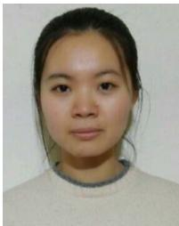

tecture, millimeter wave communications, and HSR wireless communications.

Li Yan (Member, IEEE) received the B.E. degree in communication engineering and the Ph.D. degree in communication and information systems from Southwest Jiaotong University, China, in 2012 and 2018, respectively. She was a Visiting Student with the Department of Electrical and Computer Engineering, University of Florida, USA, from September 2017 to September 2018. She is currently an Associate Professor with Southwest Jiaotong University. Her research interests include 5G communications, mobility managements, network archi-

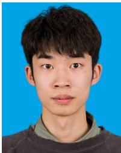

Baolin Yin (Graduate Student Member, IEEE) received the B.E. degree in communication engineering from the Southwest University of Science and Technology, Mianyang, China, in 2022, and the master’s degree from the Key Laboratory of Information Coding and Transmission, School of Information Science and Technology, Southwest Jiaotong University, Chengdu, China, in 2024, where he is currently pursuing the Ph.D. degree. His current research interests include uncrewed aerial vehicle communications, resource management for 5G/6G networks, and AI for integrated sensing, communication, and computation.